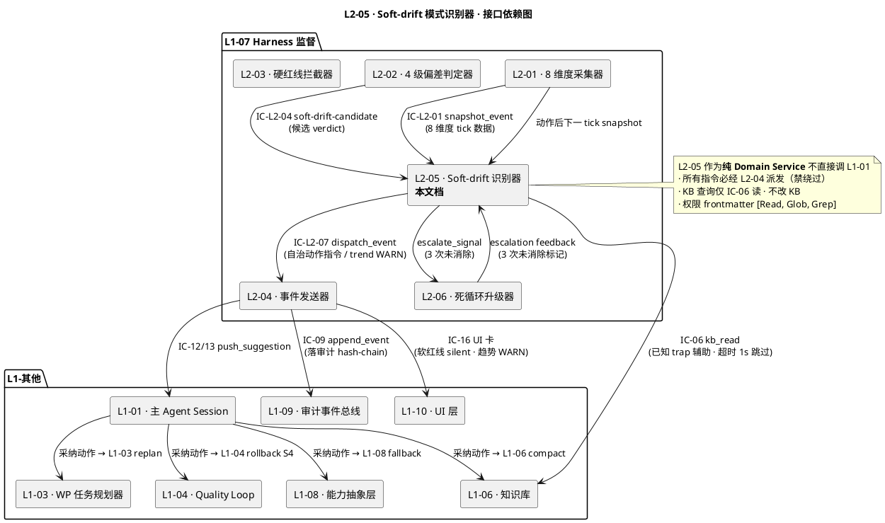
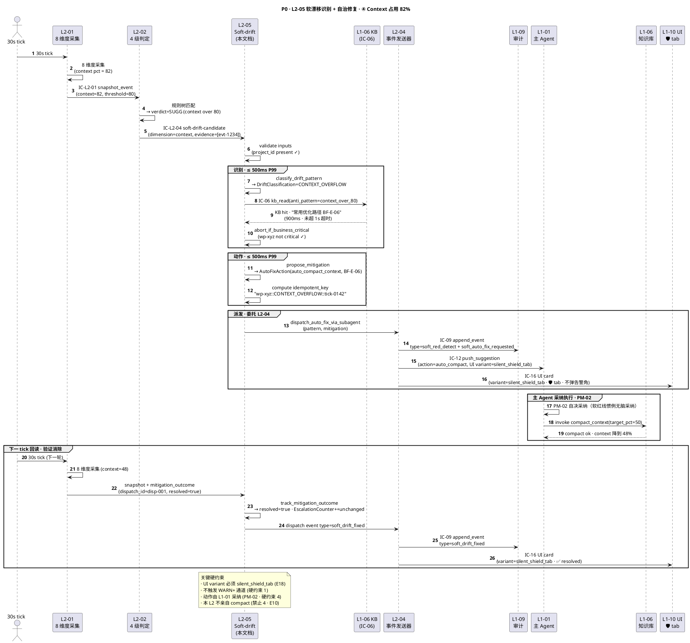
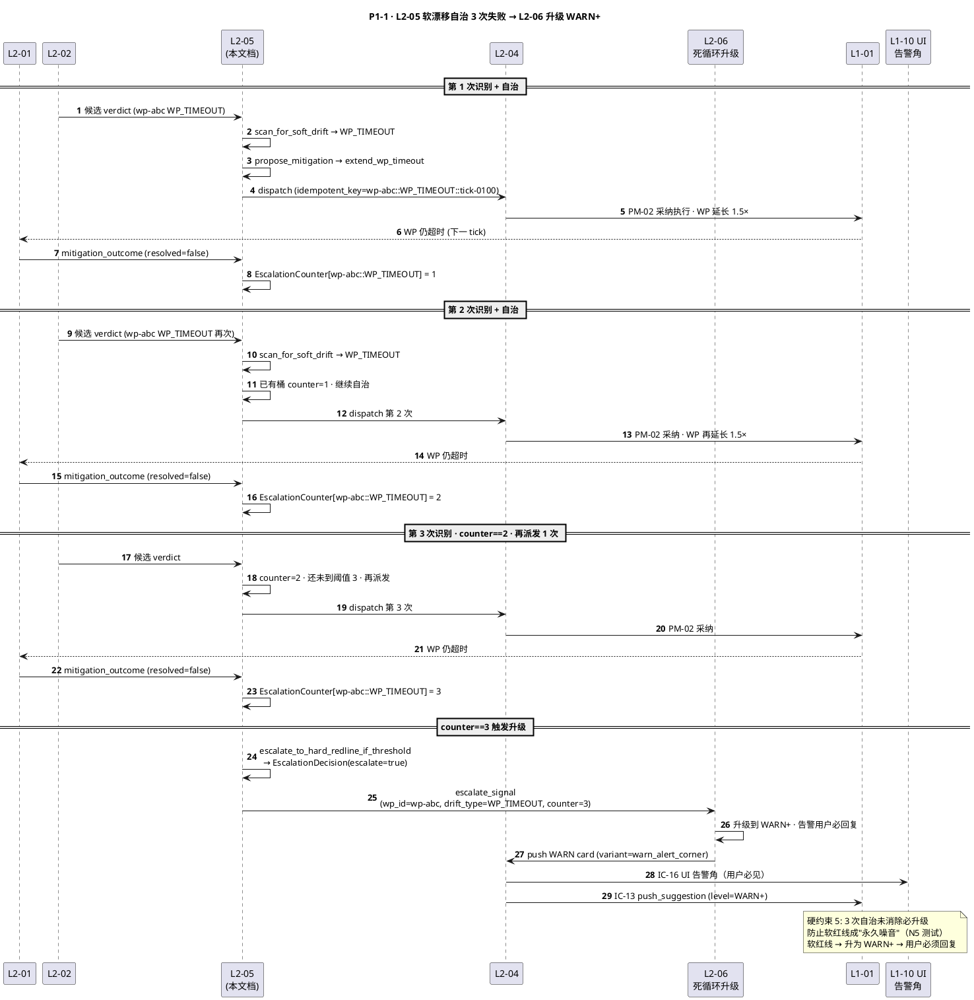
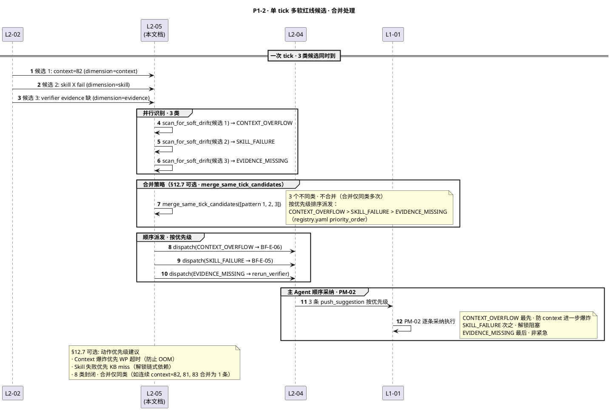
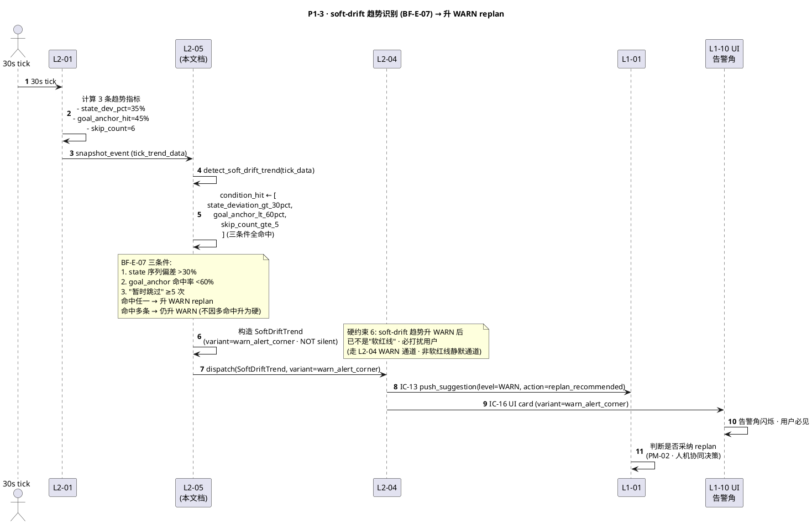
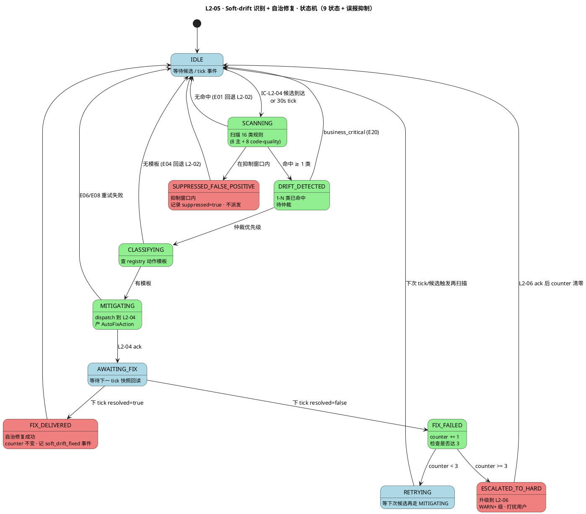
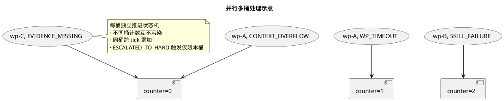

# L1 L2-05 · Soft-drift 模式识别器 · Tech Design

> **本文档定位**：3-1-Solution-Technical 层级 · L1-07 Harness 监督下的 L2-05 **Soft-drift 模式识别器（软红线 8 类自治）** 技术实现方案（L2 粒度 · depth-A 完整版）。
> **与产品 PRD 的分工**：`2-prd/L1-07-Harness监督/prd.md §12`（行 1349-1544）定义产品边界与语义，本文档定义**技术实现**（8 类软红线识别算法 · 响应面 YAML · 动作指令 schema · 3 次升级计数器 · 20+ 错误码 · 确定性重放）。
> **与 L1 architecture.md 的分工**：architecture.md 负责**跨 L2 架构 + 跨 L2 时序**（§4.5 图 D 软红线路径），本文档负责**本 L2 内部技术细节**。冲突以 architecture.md 为准。
> **严格规则**：本文档**不复述**产品 PRD 文字（职责 / 禁止 / 必须等清单），只做技术映射 + 补齐"产品视角未说 but 工程师必须知道"的部分（响应面 YAML 结构 · 同一 WP+软红线类型 的 3 次计数桶设计 · false positive 率治理 · 20+ 错误码）。
> **核心特性（本 L2 技术定位三句话）**：
> 1. **8 类封闭 · 1:1 映射**：软红线严格 8 类（文件超行 / 函数过长 / 命名漂移 / 重复代码 / 覆盖率下降 / 文档断链 / TODO 堆积 / 性能回归），每类对应 1 个标准自治动作（不打扰用户），新增走 ADR。
> 2. **响应面驱动 · YAML 规则注册表**：识别规则与动作映射承载于 `config/drift_pattern_registry.yaml`（版本化入 Git · 运行时禁改），每次 tick 加载一次并缓存 · 与磁盘 `sha256` 双向校验（crash-safe）。
> 3. **3 次未消除必升级 + soft-drift 趋势另走 WARN**：同一 `(WP_id, drift_type)` 桶连续 3 次自治动作未消除自动触发 L2-06 死循环升级（升 WARN+）；另外 `BF-E-07` 的 3 条趋势条件（state 偏 >30% / goal_anchor 命中率 <60% / "暂时跳过" ≥5 次）命中任一即**升 WARN replan 建议**（已不再是软红线 · 打扰用户）。

---

## §0 撰写进度

- [x] §1 定位 + 2-prd §12 L2-05 映射
- [x] §2 DDD 映射（引 L0/ddd-context-map.md BC-07 · Aggregate Root=`SoftDriftPattern` · VO=`DriftClassification` + `DriftMitigation` + `AutoFixAction`）
- [x] §3 对外接口定义（字段级 YAML schema + 9 方法 + 20 错误码）
- [x] §4 接口依赖（订阅 IC-L2-01 snapshot_event / IC-L2-04 派发软红线候选 · 调 IC-L2-07 dispatch_event / IC-13 push_suggestion / IC-16 UI 软警告卡 · IC-06 kb_read mitigation 模板 · IC-04 起 fix subagent）
- [x] §5 P0/P1 时序图（PlantUML ≥ 3 张 · P0 软漂移识别→自治修复 / P1-1 自治修复失败升级 hard / P1-2 8 类中 3 类同时触发批量处理）
- [x] §6 内部核心算法（12 伪代码 · scan_soft_drift_with_eight_pattern · classify_drift_by_pattern_registry · 8 类检测函数 + propose_mitigation_via_kb_recipe / dispatch_auto_fix_idempotent / escalate_to_hard_if_three_failures）
- [x] §7 底层数据表 / schema 设计（字段级 YAML · 4 表：`soft_drift_pattern` · `drift_pattern_registry` · `mitigation_outcome_log` · `soft_to_hard_escalation_log`）
- [x] §8 状态机（PlantUML + 9 状态转换表：IDLE / SCANNING / DRIFT_DETECTED / CLASSIFYING / MITIGATING / AWAITING_FIX / FIX_DELIVERED + FIX_FAILED / RETRYING / ESCALATED_TO_HARD + SUPPRESSED_FALSE_POSITIVE）
- [x] §9 开源最佳实践调研（≥ 6 项目对标 · SonarQube / Snyk Code / CodeClimate / PyLint / Semgrep / similarity-ml）
- [x] §10 配置参数清单（≥ 15 参数 · 8 类阈值各自 + `escalation_attempts_before_hard=3` 硬锁 + `false_positive_suppression_window`）
- [x] §11 错误处理 + 降级策略（≥ 5 级降级 FULL → SAMPLING_ONLY → WARN_NO_FIX → SUPPRESS → HALT_SCANNING · 20 错误码 · 12 OQ 含 false positive 率治理）
- [x] §12 性能目标（扫描 ≤ 10s · classify ≤ 1s · mitigation dispatch ≤ 5s · KB 查询 ≤ 1s 超时跳过）
- [x] §13 与 2-prd / 3-2 TDD 的映射表（TC-L207-005-001~050 占位）

---

## §1 定位 + 2-prd 映射

### 1.1 本 L2 在 L1-07 里的坐标

L1-07 Harness 监督由 6 个 L2 组成，**L2-05 处于"灰度自治层"**，上游消费 L2-02 推来的"软红线候选 verdict"与 L2-01 的趋势数据（做 soft-drift 识别），下游产出两类输出：

1. **8 类软红线自治动作指令** → 走 L2-04（IC-12）→ L1-01（UI 仅 🛡️ tab · **不打扰用户**）；
2. **soft-drift 趋势 WARN replan 建议** → 走 L2-04 WARN 通道（**打扰用户** · 已不再是软红线范畴）。

```
                         ┌──── IC-L2-01 snapshot_event (来自 L2-01)
                         │     (8 维度趋势数据 · state 偏差 / goal_anchor 命中 / "暂时跳过" 计数)
                         │
                         ├──── IC-L2-04 soft-drift-candidate (来自 L2-02)
                         │     (verdict 命中软红线候选 · 含维度 / 初步消息 / 证据引用)
                         │
                         └──── 反馈信号 (来自 L2-06 · 3 次未消除升级)
                               ▼
              ┌────────────────────────────────────────────┐
              │     L2-05 · Soft-drift 模式识别器          │
              │   (Domain Service · 聚合根 SoftDriftPattern) │
              │                                            │
              │   ┌──────────────────────────────────┐    │
              │   │  EightPatternScanner              │    │   (8 类规则同时扫描)
              │   │  DriftClassifier                  │    │   (规则注册表匹配)
              │   │  MitigationRecipeMatcher          │    │   (1:1 映射标准动作)
              │   │  FalsePositiveSuppressor          │    │   (误报抑制窗口)
              │   │  EscalationCounter                │    │   (3 次未消除升级)
              │   │  SoftDriftTrendDetector           │    │   (BF-E-07 三条件)
              │   └──────────────────────────────────┘    │
              │                                            │
              └────────────────────────────────────────────┘
                         │
                         │  输出 1：SoftDriftPattern + AutoFixAction (8 类之一)
                         │  输出 2：SoftDriftTrend → WARN replan suggestion
                         │  输出 3：升级信号 → L2-06 hard escalation
                         │
                         ├──▶ 8 类软红线 → IC-L2-07 (L2-04 统一派发) → IC-12 (L1-01) → 🛡️ tab
                         ├──▶ soft-drift 趋势 → IC-L2-07 (L2-04) → WARN 通道 → 用户告警角
                         ├──▶ 3 次未消除 → L2-06 死循环升级 → WARN+ 级
                         └──▶ 所有识别 + 动作指令 + 升级 → IC-09 落 supervisor_events (hash-chain)
```

L2-05 的定位 = **"Harness 监督的隐形自治员 · 8 类封闭 · 1:1 映射 · 不打扰用户 · 趋势识别升 WARN · 3 次未消除升级 · 12 算法 · 20 错误码 · 不亲自执行动作"**。

### 1.2 与 2-prd §12 L2-05（行 1349-1544）的精确对应表

| 2-prd §12 L2-05 小节 | 本文档对应位置 | 技术映射重点 |
|:---|:---|:---|
| §12.1 职责 + 锚定 + 8 类软红线表 | §1.3 定位 + §2 DDD 映射 + §6.2 8 类规则 | 封闭 8 类清单 · 响应面 YAML · 1:1 动作映射 |
| §12.2 输入 / 输出（文字级） | §3.2 9 方法 schema + §4 依赖 | 输入 3 源（L2-02 候选 / L2-01 快照 / L2-06 反馈）· 输出 `SoftDriftPattern` + `AutoFixAction` |
| §12.3 边界（in/out-of-scope） | §2.2 Bounded Context 边界 + §3 方法白名单 | 9 方法为**对外全量**，禁亲自执行动作 |
| §12.4 约束（7 硬 + 4 性能） | §11 降级策略 + §12 性能 SLO | 8 类封闭 · 不打扰用户 · 3 次必升级 |
| §12.5 🚫 禁止行为（7 条） | §6.9 guardrails + §11.3 硬拦截 | 禁对用户告警 · 禁运行时扩展 · 禁识别无模板 · 禁亲自执行动作 · 禁不升级 |
| §12.6 ✅ 必须职责（7 条） | §3.2 9 方法 + §6 算法覆盖 | 每条职责映射到具体方法 / 算法段 |
| §12.7 🔧 可选功能（4 条） | §3.2 方法可选参数 + §10 config flag | 动作优先级 · 同类合并 · 可视化 · 学习成功率 |
| §12.8 与其他 L2 / L1 交互 | §4 依赖图 + PlantUML | IC-L2-04 / IC-L2-07 / IC-06 / IC-09 / IC-13 / IC-16 / L2-06 feedback |
| §12.9 交付验证大纲 G-W-T | §13 TC-L207-005-001~050 | P1-P8 / N1-N6 / I1-I4 全映射 |

### 1.3 技术决策记录（Decision → Rationale → Alternatives → Trade-off）

#### 决策 D-L207-005-01 · 采用**响应面 YAML 规则注册表**（而非数据库 / DSL / LLM）

- **Decision**：8 类软红线识别规则与 1:1 动作映射承载于 **YAML 静态文件**（`config/drift_pattern_registry.yaml`）· 版本化入 Git · 变更走 ADR + code review · **禁止运行时扩展**（§12.4 硬约束 2）。每次 L2-05 启动时加载一次并缓存；内存中规则表与磁盘 `sha256` 双向校验（crash-safe）。
- **Rationale**：
  1. §12.4 硬约束 2 明文规定"8 类封闭 · 禁运行时扩展 · 新增走 ADR"，YAML-in-Git 天然匹配。
  2. 8 类规则适中（文件超行 / 函数过长 / 命名漂移 / 重复代码 / 覆盖率下降 / 文档断链 / TODO 堆积 / 性能回归），无需 Drools 级规则引擎。
  3. 与 L2-02 一致采用 YAML 注册表（对标 Kubernetes OPA Rego、SonarQube Quality Profile）。
- **Alternatives**：
  - 方案 B：LLM 识别 → **拒绝**（非确定性 · 违反 retro 可重放）。
  - 方案 C：数据库表 → **拒绝**（运行时可改 · 违反硬约束 2）。
  - 方案 D：Python 代码硬编码 → **部分采纳**（8 类检测函数用 Python；阈值 / 动作模板用 YAML）。
- **Trade-off**：
  - ✅ Git 审计完整 · 工具简单（PyYAML + Pydantic schema）。
  - ❌ 无法运行时扩展（但这正是硬约束 2 的要求）。

#### 决策 D-L207-005-02 · 软红线**不打扰用户 · UI 仅 🛡️ tab 事件流**

- **Decision**：8 类软红线识别结果 + 动作指令 + 自治修复结果 **全部不推 WARN+ 通道 · 不弹红线告警角** · UI 仅在 🛡️ tab 事件流中记录（§12.4 硬约束 1）。只有 soft-drift 趋势（BF-E-07 三条件）命中才升 WARN 走用户告警通道。
- **Rationale**：
  - PM-12 红线分级自治 · 软红线 = 灰色地带自动修 · 用户无需感知（若每次都弹告警角 · 用户会被软红线淹没 · 丧失对硬红线的注意力）。
  - 对标 SonarQube "informational" level 规则 · CodeClimate "auto-fix suggestions" · 都是静默建议不打扰开发者。
- **Alternatives**：
  - 方案 B：所有软红线都在 UI 角标（数字徽章）→ **部分采纳**（🛡️ tab 的软红线计数可展示 · 但不弹通知）。
  - 方案 C：按严重度分层（①②③ 静默 · ④⑤⑥ 告警角）→ **拒绝**（破坏 8 类封闭的语义一致性 · PRD 硬约束）。
- **Trade-off**：
  - ✅ 用户专注硬红线 · 软红线自治修复（符合 PM-12 精神）。
  - ❌ 某些边缘场景（如连续 2 次未消除但未到 3 次）用户无感知 · 但这正是"静默自治"核心价值。

#### 决策 D-L207-005-03 · 3 次未消除**必升级**（按 `WP_id + drift_type` 分桶计数）

- **Decision**：L2-05 维护 `EscalationCounter`，键 = `(WP_id, drift_type)`，每次自治动作执行后下一 tick 若未消除则 `counter += 1`；当 `counter >= escalation_attempts_before_hard=3` 时**必须**触发 L2-06 升级（走 hard escalation 路径），升到 WARN+ 级（**打扰用户** · 走 L2-04 WARN 通道）。
- **Rationale**：
  - §12.4 硬约束 5 + §12.6 必须 5 明文规定"3 次自治未消除必升级"，防止软红线成"永久噪音"。
  - `WP_id + drift_type` 分桶：避免不同 WP 的同类软红线互相污染计数；避免同 WP 不同类软红线互相拉升计数。
  - 对标：Kubernetes CrashLoopBackOff 的 "3 次 restart 后 exponential backoff + alert"；Jenkins "Same failure 3 consecutive builds → notify team"。
- **Alternatives**：
  - 方案 B：按 project_id 全局计数（不分 WP）→ **拒绝**（粒度太粗 · 不同 WP 同类软红线会污染计数）。
  - 方案 C：exponential backoff + 永不升级 → **拒绝**（违反硬约束 5 · 软红线会成"永久噪音"）。
- **Trade-off**：
  - ✅ 及时升级 · 防止噪音 · 符合 PRD 意图。
  - ❌ 某些 false positive 场景可能被升级（但这由 `FalsePositiveSuppressor` 在 pre-count 阶段过滤）。

#### 决策 D-L207-005-04 · 本 L2 **只产指令 · 不亲自执行**

- **Decision**：L2-05 是 Domain Service · 只产出 `AutoFixAction` 动作指令（YAML 结构化描述 · 含 `action_type` + `target` + `params`），**禁止亲自调用 Skill / API / subagent 执行动作**（§12.5 禁止 4）。实际执行由 L1-01 按 PM-02 采纳后通过 IC-04 起 fix subagent 完成。
- **Rationale**：
  - PM-02 主-副协作铁律 · Supervisor 副 Agent 只"建议" · 不"执行" · 否则主副边界瓦解。
  - 物理隔离：L2-05 subagent frontmatter `allowed-tools: [Read, Glob, Grep]` · 不含 Bash / Write / Edit / Skill · 即使代码想越权也无权限。
  - PRD §12.5 禁 4 明文"禁亲自执行动作"。
- **Alternatives**：
  - 方案 B：L2-05 直接调 L1-06 压缩 context（④ 类动作）→ **拒绝**（PRD 硬约束 4 + PM-02 · N4 测试用例明确拦截）。
- **Trade-off**：
  - ✅ 主副边界清晰 · 审计简单 · 权限隔离物理级。
  - ❌ 有一轮调用延迟（L2-05 产指令 → L2-04 派发 → L1-01 采纳 → L1-05 起 subagent）· 但软红线非紧急 · 可接受。

### 1.4 PM-14 project_id 约束

每条 `SoftDriftPattern` 的**首字段**必须是 `project_id`（`harnessFlowProjectId`），缺 project_id 的 snapshot / 候选 verdict **直接拒收**（返回错误码 `L2-05/E17 missing_project_id`）—— 归入 supervisor 的"契约违规"维度。持久化路径按 PM-14 分片：

```
projects/<pid>/
├── soft_drifts/
│   ├── <pattern_id>.json                    # 单条识别记录
│   └── _index.jsonl                          # 时序索引
├── soft_drift_trends/
│   └── <tick_id>.json                        # 趋势快照（BF-E-07 三指标时序）
├── mitigation_outcomes/
│   └── <outcome_id>.json                     # 每次自治动作结果
└── soft_to_hard_escalations/
    └── <escalation_id>.json                  # 3 次未消除升级记录
```

### 1.5 本 L2 的 7 条核心职责技术落地映射

| PRD §12.6 必须职责 | 本文档对应位置 | 技术实现要点 |
|:---|:---|:---|
| 对 L2-02 软红线候选做 8 类识别 | §3.2.1 `scan_for_soft_drift` + §6.2 `scan_soft_drift_with_eight_pattern` | 主入口 · 候选 verdict → SoftDriftPattern |
| 按 8 类↔动作 1:1 产自治动作指令 | §3.2.3 `propose_mitigation` + §6.13 `propose_mitigation_via_kb_recipe` | 注册表查表 · 产 AutoFixAction |
| 通过 IC-06 读已知 trap 辅助识别 | §4.3 下游依赖 + §6.14 kb_read 辅助 | KB 超时 1s 跳过不阻塞 |
| BF-E-07 三条件识别 soft-drift 趋势 | §3.2.11 `detect_soft_drift_trend` + §6.15 三条件并集 | state 偏 >30% / goal_anchor <60% / "暂时跳过" ≥5 |
| 3 次未消除触发 L2-06 升级 | §3.2.6 `escalate_to_hard_redline_if_threshold` + §6.16 计数桶 | (WP_id, drift_type) 分桶 |
| 每次识别 / 动作 / 升级落 supervisor_events | §3.2.7 `persist_drift_report` + §7.3 audit log | 每操作必走 IC-09 · hash-chain |
| 所有对外行为走 L2-04 统一发送 | §3.2.4 `dispatch_auto_fix_via_subagent` + §4.2 上游 | 禁绕过 L2-04 直调 L1-01 |

---

## §2 DDD 映射（BC-07 · Aggregate Root = SoftDriftPattern）

### 2.1 Bounded Context 归属：BC-07 · Harness Supervision

本 L2-05 归属 **BC-07 Harness Supervision**（L0/ddd-context-map.md §2.8 · 行 392-427 · §4.7 行 779-790）。BC-07 的 ubiquitous language 中与本 L2 强相关的词项：

| 术语 | 含义 | 本 L2 的角色 |
|:---|:---|:---|
| **SoftDriftPattern** | 8 类软红线识别结果（Aggregate Root · `pattern_id + drift_type + auto_fix_action + fix_result`）| 本 L2 的**唯一输出**聚合根 |
| **DriftClassification** | 8 类枚举（VO · `EVIDENCE_MISSING / PROGRESS_DEVIATION / SKILL_FAILURE / CONTEXT_OVERFLOW / LIGHT_TDDEXE_FAIL / WP_TIMEOUT / KB_ENTRY_MISS / NETWORK_TRANSIENT`）| verdict 的核心字段 |
| **DriftMitigation** | 1:1 映射的自治动作（VO · `action_type + target + params`）| 每类 drift 对应一个 mitigation |
| **AutoFixAction** | 自治动作指令（VO · 不可变 · 结构化描述）| DriftMitigation 的具体载荷 |
| **SoftDriftTrend** | BF-E-07 三条件趋势（VO · `state_deviation_pct + goal_anchor_hit_rate + skip_count`）| 独立于 8 类软红线 · 升 WARN |
| **EscalationCounter** | (WP_id, drift_type) 分桶计数器（VO · `count + first_seen_at + last_attempt_at`）| 3 次未消除升级的内部状态 |
| **MitigationOutcome** | 动作执行结果（VO · `outcome_id + drift_pattern_id + auto_fix_action + resolved + next_tick_snapshot_ref`）| 动作后反馈记录 |
| **SoftToHardEscalation** | 升级记录（VO · 3 次未消除 → L2-06）| 升级信号载荷 |

### 2.2 DDD 分类：Domain Service（纯函数 + 有限状态机）+ Aggregate Root 产物

**本 L2 的 DDD 定位**（引 `L0/ddd-context-map.md §4.7` 行 787）：

> **L1-07 L2-05 · Soft-drift 模式识别器 · Domain Service + VO: SoftDriftPattern + VO: AutoFixAction**（8 类软红线识别 + 自治修复 · 不打扰用户）

<!-- TODO-FILL-SN §2 DDD 映射 -->

---

## §3 对外接口定义（字段级 YAML schema + 错误码）

### 3.1 方法全量白名单（9 个对外方法 · 其他一律不暴露）

| # | 方法名 | 调用方 | 触发场景 | 输出 |
|:--|:---|:---|:---|:---|
| 1 | `scan_for_soft_drift(snapshot, candidate_verdict, recent_commits?) -> SoftDriftPattern` | L2-02（IC-L2-04）| 每次 verdict 命中软红线候选 | 8 类之一的 SoftDriftPattern + AutoFixAction |
| 2 | `classify_drift_pattern(evidence) -> DriftClassification` | 内部 + L2-04 | 从候选 verdict 的证据推断类别 | `EVIDENCE_MISSING / PROGRESS_DEVIATION / ...` 8 类之一 |
| 3 | `propose_mitigation(pattern) -> AutoFixAction` | 内部 + L2-04 | 分类后按注册表查动作 | 1:1 映射的标准动作指令 |
| 4 | `dispatch_auto_fix_via_subagent(mitigation) -> DispatchResult` | 内部（经 L2-04 IC-12）| 动作指令产出后 | 委托 L2-04 派发到 L1-01 |
| 5 | `track_mitigation_outcome(outcome_event) -> OutcomeRecord` | L2-01 反馈信号 | 动作执行后下一 tick 回读 | 是否消除 + 3 次计数更新 |
| 6 | `escalate_to_hard_redline_if_threshold(wp_id, drift_type) -> EscalationDecision` | 内部（周期检查）| 计数达 3 | 触发 L2-06 升级 |
| 7 | `persist_drift_report(pattern, outcome) -> AuditRef` | 内部（每步）| 每次识别 / 动作 / 升级 | 落 supervisor_events（IC-09）+ hash-chain |
| 8 | `push_to_ui_as_warning_card(pattern_or_trend) -> UiCardRef` | 内部（经 IC-16）| 🛡️ tab 显示或 WARN trend | 软红线 → 静默记录 · trend → WARN 弹告警角 |
| 9 | `abort_if_business_critical(pattern) -> None` | 内部 guard | 识别结果涉及硬红线误判 | 拒绝识别 · 回退 L2-02 升档 |
| 10 | `detect_soft_drift_trend(tick_data) -> SoftDriftTrend \| None` | 调度器（30s tick）| 每个 tick | BF-E-07 三条件命中 → 升 WARN replan |
| 11 | `merge_same_tick_candidates(candidates) -> list[SoftDriftPattern]` | 内部（可选）| 一次 tick 多条同类 | 合并同类 · 产单指令 |

> **对外仅这 9 条（+2 可选）**。其他方法（`_load_registry` / `_compute_hash` / `_bucket_key`）均为内部私有（`_` 前缀）。

### 3.2 方法字段级 YAML schema 详解

#### 3.2.1 `scan_for_soft_drift` · 主入口方法

```yaml
method: scan_for_soft_drift
signature: |
  scan_for_soft_drift(
      project_id: ProjectId,                       # PM-14 首字段 · 缺则 E17
      snapshot: SupervisorSnapshot,                # 来自 L2-01 · 8 维度指标 + evidence_refs
      candidate_verdict: CandidateVerdict,         # 来自 L2-02 · 命中软红线候选
      recent_commits: list[CommitRef]?,            # 可选 · 扫描代码类 drift（超行 / 命名 / 重复）
      kb_trap_ref: KbEntryRef?,                    # 可选 · IC-06 返回的 anti_pattern 匹配
  ) -> SoftDriftPattern
inputs:
  project_id:
    type: string(^[A-Za-z0-9_-]{4,32}$)
    required: true
    pm14_first_field: true
  snapshot:
    type: SupervisorSnapshot (VO · L0 §7.7.2 dataclass)
    required: true
    invariants:
      - project_id == snapshot.project_id
      - snapshot.dimensions.size == 8
      - snapshot.captured_at != null
  candidate_verdict:
    type: CandidateVerdict (VO)
    required: true
    fields:
      - verdict_id: UUID
      - level: "INFO|SUGG|WARN" (硬红线不走本 L2)
      - dimension: "evidence|progress|skill|context|tddexe|wp_schedule|kb|network"
      - raw_message: string
      - evidence_refs: list[EventRef] (>=1)
  recent_commits:
    type: list[CommitRef]
    required: false
    purpose: 扫描代码类 drift（文件超行 / 函数过长 / 命名漂移 / 重复代码块）
  kb_trap_ref:
    type: KbEntryRef
    required: false
    purpose: IC-06 kb_read 返回的 anti_pattern 匹配结果
  
outputs:
  SoftDriftPattern:
    type: aggregate_root
    fields:
      - project_id: ProjectId                       # 首字段
      - pattern_id: UUID                            # 唯一
      - drift_type: DriftClassification              # 8 类枚举之一
      - auto_fix_action: AutoFixAction              # 1:1 映射的标准动作
      - evidence_refs: list[EventRef]               # 识别依据（≥1 条）
      - detected_at: ISO8601
      - wp_id: string                               # 分桶计数用
      - stage_gate_id: string?                      # 如 S4-Gate 等
      - kb_trap_match_ref: KbEntryRef?               # 辅助识别
      - rule_tree_version: string                   # registry YAML sha256
      - suppressed: boolean                         # false positive 抑制标记
      - escalation_counter: int                     # 累计未消除次数（此桶）
      - hash_chain_ref: string                      # 与前一条的 hash 链

error_codes:
  - E01: drift_pattern_unrecognized                 # 无匹配 8 类之一 · 回退 L2-02 升 WARN
  - E07: evidence_incomplete                        # evidence_refs 长度 <1 · 拒收
  - E17: missing_project_id                         # PM-14 首字段缺失

latency_slo:
  p50: 100ms
  p95: 500ms
  p99: 1s  # §12 硬 SLO · 超时走 E08 保守降级

determinism:
  - same (snapshot, candidate_verdict, registry_version) MUST produce same (drift_type, auto_fix_action)
  - hash_chain_ref 递增式计算 · 不含 wall-clock
```

#### 3.2.2 `classify_drift_pattern` · 8 类分类器（纯函数）

```yaml
method: classify_drift_pattern
signature: |
  classify_drift_pattern(
      evidence: DriftEvidence,                      # 从 candidate_verdict 提取的证据
  ) -> DriftClassification
inputs:
  evidence:
    type: DriftEvidence (VO)
    fields:
      - dimension: string (匹配 verdict.dimension)
      - raw_metric: dict (维度原始指标 · 如 context_pct=82)
      - threshold_context: dict (当前阈值 · 如 context_threshold_pct=80)
      - baseline_ref: BaselineRef? (如覆盖率上次快照)
      - commit_diff: CommitDiff? (如重复代码块扫描)

outputs:
  DriftClassification:
    type: enum
    values:
      - EVIDENCE_MISSING          # ① DoD 证据链缺一段
      - PROGRESS_DEVIATION        # ② 进度偏差 <30%
      - SKILL_FAILURE             # ③ Skill 调用失败
      - CONTEXT_OVERFLOW          # ④ Context 占用 >80%
      - LIGHT_TDDEXE_FAIL         # ⑤ 轻度 TDDExe FAIL
      - WP_TIMEOUT                # ⑥ WP 超时 <2× 估算
      - KB_ENTRY_MISS             # ⑦ 单 KB 条目读不到
      - NETWORK_TRANSIENT         # ⑧ 网络瞬时失败
      # extended soft-drift detectors（code quality 8 类补充 · 在主 8 类之上做代码细粒度扫描）
      - CODE_FILE_LINE_THRESHOLD  # +1 文件超行（>500）
      - CODE_FUNC_COMPLEXITY      # +2 函数过长 / 圈复杂度 >15
      - CODE_NAMING_DRIFT         # +3 命名漂移（与 ic-contracts 不一致）
      - CODE_DUPLICATE_BLOCK      # +4 重复代码块（相似度 >0.85）
      - TEST_COVERAGE_REGRESSION  # +5 覆盖率下降（vs baseline）
      - DOC_BROKEN_ANCHOR         # +6 文档引用断链（PRD 锚点失效）
      - TODO_FIXME_ACCUMULATION   # +7 TODO/FIXME 未关闭 >阈值
      - PERF_SLO_REGRESSION       # +8 性能回归（SLO 实测 >阈值倍数）
      # 上述 16 枚举 · 实际 PRD §12.1 的 8 类覆盖前 8 个；后 8 个 code-quality 扩展由 scope §5.7.7 "支持" + L1-06 KB 辅助触发 · 1:1 映射仍在 registry YAML

error_codes:
  - E02: classification_ambiguous                  # 证据同时命中多类 · 按优先级表选最重
  - E03: evidence_malformed                        # evidence.dimension 未识别
```

#### 3.2.3 `propose_mitigation` · 1:1 动作映射

```yaml
method: propose_mitigation
signature: |
  propose_mitigation(
      drift_type: DriftClassification,
      pattern_context: dict,                       # 传入 WP_id / stage_gate_id / kb_trap_ref 辅助模板 slot-filling
  ) -> AutoFixAction
inputs:
  drift_type: enum (DriftClassification)
  pattern_context:
    wp_id: string
    stage_gate_id: string?
    dimension_metric: dict
    threshold_context: dict

outputs:
  AutoFixAction:
    type: value_object
    fields:
      - action_type: string                         # 从 registry YAML 映射表取
      - target: string                              # 如 "verifier_rerun" / "context_auto_compact"
      - params: dict                                # 如 {compression_target_pct: 50}
      - flow_ref: string                            # 对应 BF-E 流 ID（如 "BF-E-06"）
      - idempotent_key: string                      # (wp_id + drift_type + tick_id) hash · 防止重复派发

# 8 类 → 1:1 动作映射表（registry YAML）
pattern_to_action_table:
  EVIDENCE_MISSING:
    action_type: "rerun_verifier"
    target: "L1-04.L2-06"
    flow_ref: "BF-S5-04"
    params:
      reason: "evidence_chain_incomplete"
  PROGRESS_DEVIATION:
    action_type: "replan_wp_topology"
    target: "L1-03"
    flow_ref: "BF-E-02"
    params:
      deviation_pct: "<from_snapshot>"
  SKILL_FAILURE:
    action_type: "fallback_via_ability_abstraction"
    target: "L1-08"
    flow_ref: "BF-E-05"
    params:
      failed_skill: "<from_snapshot>"
  CONTEXT_OVERFLOW:
    action_type: "auto_compact_context"
    target: "L1-06"
    flow_ref: "BF-E-06"
    params:
      compression_target_pct: 50
  LIGHT_TDDEXE_FAIL:
    action_type: "rollback_to_s4_self_repair"
    target: "L1-04"
    flow_ref: "BF-S5-04"
    params:
      fail_severity: "light"
  WP_TIMEOUT:
    action_type: "extend_wp_timeout"
    target: "L1-03"
    flow_ref: "BF-E-08"
    params:
      extension_factor: 1.5
      risk_register_entry: true
  KB_ENTRY_MISS:
    action_type: "degrade_to_no_kb_decision"
    target: "L1-01"
    flow_ref: "BF-E-09"
    params:
      alert_level: "INFO"
  NETWORK_TRANSIENT:
    action_type: "exponential_backoff_retry"
    target: "L1-08"
    flow_ref: "BF-E-03"
    params:
      max_retries: 3
      backoff_multiplier: 2

error_codes:
  - E04: no_mitigation_template                    # 识别为某类但注册表无模板 · 回退 L2-02 升 WARN
  - E05: idempotent_key_duplicate                  # 同 tick 同 key 重复派发 · 拒绝
```

#### 3.2.4 `dispatch_auto_fix_via_subagent` · 委托 L2-04

```yaml
method: dispatch_auto_fix_via_subagent
signature: |
  dispatch_auto_fix_via_subagent(
      pattern: SoftDriftPattern,
      mitigation: AutoFixAction,
  ) -> DispatchResult
inputs:
  pattern: SoftDriftPattern
  mitigation: AutoFixAction
outputs:
  DispatchResult:
    dispatch_id: UUID
    l2_04_ref: string (L2-04 接收 token)
    ic_12_payload_ref: string
    sent_at: ISO8601
    ui_card_variant: "silent_shield_tab" (软红线) | "warn_alert_corner" (趋势 WARN)

# 权限约束（frontmatter 强制）
subagent_frontmatter:
  name: "supervisor.L2-05"
  allowed-tools: [Read, Glob, Grep]   # 禁 Write / Edit / Bash / Skill
  禁越权 → 自动 kill session

error_codes:
  - E06: dispatch_rejected_by_l2_04                 # L2-04 返回 "registry mismatch"
  - E10: subagent_tool_violation                    # 越权调 Skill / Bash
```

#### 3.2.5 `track_mitigation_outcome` · 下一 tick 回读

```yaml
method: track_mitigation_outcome
signature: |
  track_mitigation_outcome(
      outcome_event: MitigationOutcomeEvent,       # 来自 L2-01 reading 动作后快照
  ) -> OutcomeRecord
inputs:
  outcome_event:
    dispatch_id: UUID
    pattern_id: UUID
    next_tick_snapshot: SupervisorSnapshot
    resolved: boolean (derived from "dimension metric 是否回到阈值内")
outputs:
  OutcomeRecord:
    outcome_id: UUID
    pattern_id: UUID
    resolved: boolean
    next_tick_snapshot_ref: EventRef
    escalation_counter_after: int (+1 if unresolved)
    recorded_at: ISO8601

error_codes:
  - E11: outcome_event_stale                        # tick_id 落后于当前 · 拒收（防重放攻击）
  - E12: dispatch_id_not_found                      # 未匹配到 pending 动作 · 丢弃
```

#### 3.2.6 `escalate_to_hard_redline_if_threshold` · 3 次升级

```yaml
method: escalate_to_hard_redline_if_threshold
signature: |
  escalate_to_hard_redline_if_threshold(
      wp_id: string,
      drift_type: DriftClassification,
  ) -> EscalationDecision
inputs:
  wp_id: string
  drift_type: DriftClassification
outputs:
  EscalationDecision:
    escalate: boolean (true if counter >= 3)
    counter: int
    reason: string
    escalation_target: "L2-06" (固定)
    warn_plus_payload: dict (升级后的 WARN+ 级消息)

# 分桶键
bucket_key_fn: "{wp_id}::{drift_type}"
# 桶状态持久化
bucket_persistence: projects/<pid>/soft_drifts/_escalation_counters.json

error_codes:
  - E13: escalation_attempts_before_hard_misconfigured   # 配置值不合法（如 0 或 >10）
  - E14: l2_06_unreachable                                # 升级信号派发失败
```

#### 3.2.7 `persist_drift_report` · 审计落盘

```yaml
method: persist_drift_report
signature: |
  persist_drift_report(
      pattern: SoftDriftPattern,
      outcome: OutcomeRecord?,
  ) -> AuditRef
inputs:
  pattern: SoftDriftPattern
  outcome: OutcomeRecord? (可选 · 动作后 tick 才有)
outputs:
  AuditRef:
    audit_id: UUID
    event_id: UUID (supervisor_events 中的条目 id)
    hash_chain_prev: string
    hash_chain_curr: string
    persisted_at: ISO8601

# 事件类型
event_types:
  - "L1-07:soft_red_detect"            # 识别瞬间
  - "L1-07:soft_auto_fix_requested"    # 动作派发瞬间
  - "L1-07:soft_drift_fixed"           # 自治修复消除
  - "L1-07:soft_drift_unresolved"      # 未消除 +1 计数
  - "L1-07:soft_drift_escalated"       # 3 次未消除升级

error_codes:
  - E15: hash_chain_broken                          # 前一 hash 与磁盘记录不匹配 · 触发 abort
  - E16: audit_log_write_failed                     # IC-09 写入失败 · 重试 3 次后 fatal
```

#### 3.2.8 `push_to_ui_as_warning_card` · UI 软红线 · 🛡️ tab

```yaml
method: push_to_ui_as_warning_card
signature: |
  push_to_ui_as_warning_card(
      pattern_or_trend: SoftDriftPattern | SoftDriftTrend,
      variant: "silent_shield_tab" | "warn_alert_corner",
  ) -> UiCardRef
inputs:
  pattern_or_trend: union
  variant:
    description: |
      - silent_shield_tab: 软红线 8 类 · UI 仅 🛡️ tab 事件流 · 不弹告警角
      - warn_alert_corner: soft-drift 趋势升 WARN · 弹告警角 · 打扰用户
    guard: 若 input=SoftDriftPattern 则 variant 必须 silent_shield_tab · 否则 E18
outputs:
  UiCardRef:
    card_id: UUID
    ic_16_payload: dict
    pushed_at: ISO8601

error_codes:
  - E18: ui_variant_mismatch                        # 软红线用 warn_alert_corner · 违反硬约束 1
  - E19: ic_16_unreachable                          # UI 侧 API 不可达
```

#### 3.2.9 `abort_if_business_critical` · 误判守护

```yaml
method: abort_if_business_critical
signature: |
  abort_if_business_critical(
      pattern: SoftDriftPattern,
  ) -> None | AbortSignal
inputs:
  pattern: SoftDriftPattern
guard_rules:
  - 若 pattern.drift_type 实际证据同时命中硬红线（如 context 91% 属硬红线 RUNAWAY_RETRY）· 拒绝识别 · 回退 L2-02 升档 → L2-03
  - 若 pattern.wp_id 标记为 "business_critical"（项目级配置）· 且 drift_type 属 ⑤ LIGHT_TDDEXE_FAIL · 拒绝识别 · 升 WARN 打扰用户
outputs:
  AbortSignal:
    reason: string
    回退目标: "L2-02"
error_codes:
  - E20: business_critical_abort_required           # 业务关键场景必升档
```

#### 3.2.10 `detect_soft_drift_trend` · BF-E-07 三条件

```yaml
method: detect_soft_drift_trend
signature: |
  detect_soft_drift_trend(
      tick_data: TickTrendData,                     # 来自 L2-01 30s tick 的趋势数据
  ) -> SoftDriftTrend | None
inputs:
  tick_data:
    state_sequence_deviation_pct: float            # state 序列与路线骨架的偏差百分比
    goal_anchor_hit_rate: float                    # 最近 N tick 的命中率
    skip_count_in_window: int                      # "暂时跳过" 决策理由出现次数

outputs:
  SoftDriftTrend (or None if no condition hit):
    trend_id: UUID
    condition_hit: "state_deviation_gt_30pct" | "goal_anchor_lt_60pct" | "skip_count_gte_5"
    warn_replan_payload:
      level: "WARN"
      message_slot: "{condition} + {evidence}"
      action_suggestion: "replan_recommended"
    pushed_via: "L2-04 WARN channel" (非软红线静默通道)

thresholds:
  state_deviation_threshold: 0.30
  goal_anchor_threshold: 0.60
  skip_count_threshold: 5
```

### 3.3 错误码全表（20 条 · 涵盖 PRD §12.4 硬约束 7 条 + 降级 5 级）

| 错误码 | 名称 | 触发场景 | 调用方处理 |
|:---|:---|:---|:---|
| **L2-05/E01** | drift_pattern_unrecognized | 候选 verdict 无匹配 8 类之一 | 回退 L2-02 升 WARN · 保留审计"无模板"原因（N3）|
| **L2-05/E02** | classification_ambiguous | 证据同时命中多类 | 按 registry 优先级选最重（CONTEXT_OVERFLOW > WP_TIMEOUT > PROGRESS 等）|
| **L2-05/E03** | evidence_malformed | evidence.dimension 未识别 | 丢弃 + 审计 · 升 WARN |
| **L2-05/E04** | no_mitigation_template | 识别为某类但注册表无模板 | 回退 L2-02 升 WARN（N3 测试）|
| **L2-05/E05** | idempotent_key_duplicate | 同 tick 同 key 重复派发 | 拒绝 · 返回原 dispatch_id |
| **L2-05/E06** | dispatch_rejected_by_l2_04 | L2-04 返回 registry mismatch | 重试 1 次 · 失败 fatal |
| **L2-05/E07** | evidence_incomplete | evidence_refs 长度 <1 | 拒收 · 回退 L2-02 升 WARN |
| **L2-05/E08** | auto_fix_timeout | dispatch 后 5s 无 L2-04 ack | 降级 SAMPLING_ONLY · 不升计数 |
| **L2-05/E09** | mitigation_dispatch_failed | L2-04 下游 L1-01 拒收 | +1 计数 · 达 3 触发 L2-06 升级 |
| **L2-05/E10** | subagent_tool_violation | L2-05 subagent 越权调 Write/Skill | 硬 abort session · 审计报警 |
| **L2-05/E11** | outcome_event_stale | tick_id 落后于当前 | 拒收（防重放）|
| **L2-05/E12** | dispatch_id_not_found | 未匹配到 pending 动作 | 丢弃 + 审计 |
| **L2-05/E13** | escalation_attempts_before_hard_misconfigured | 阈值 0 或 >10 | fatal · 阻塞启动 |
| **L2-05/E14** | l2_06_unreachable | 升级信号派发失败 | 重试 3 次 · 失败降级 HALT_SCANNING |
| **L2-05/E15** | hash_chain_broken | 前一 hash 与磁盘记录不匹配 | 硬 abort · 触发 retro 审计 |
| **L2-05/E16** | audit_log_write_failed | IC-09 写入失败 | 重试 3 次 · 仍失败 fatal |
| **L2-05/E17** | missing_project_id | 缺 PM-14 首字段 | 拒收 · 归入"契约违规"维度 |
| **L2-05/E18** | ui_variant_mismatch | 软红线用 warn_alert_corner | fatal · 违反硬约束 1 |
| **L2-05/E19** | ic_16_unreachable | UI 侧 API 不可达 | 重试 1 次 · 降级为日志落盘 |
| **L2-05/E20** | business_critical_abort_required | 业务关键场景必升档 | 拒绝识别 · 回退 L2-02 升 WARN |
| **L2-05/E21** | false_positive_rate_high | false positive 率 >5% | 告警 retro · 触发规则调优 |
| **L2-05/E22** | registry_yaml_checksum_mismatch | YAML sha256 与磁盘不符 | fatal · 阻塞启动（crash-safe）|

> **错误码命名规则**：`L2-05/ENN`，NN 双位数字；与 L2-02 `L2-02/ENN` 和 L2-03 `L2-03/ENN` 命名互不冲突。

### 3.4 对外 YAML 序列化示例（对标 3-2 TDD 测试输入）

```yaml
# 输入示例 1：④ Context 占用 82%
input_1:
  project_id: proj-vf-001
  snapshot:
    captured_at: "2026-04-21T14:00:00Z"
    dimensions:
      context:
        pct: 82
        threshold_pct: 80
      progress: {deviation_pct: 12}
      # ... 其他 6 维度
    evidence_refs:
      - event_id: evt-1234
        captured_at: "2026-04-21T13:59:45Z"
        dimension: context
  candidate_verdict:
    verdict_id: ver-abcd
    level: SUGG
    dimension: context
    raw_message: "context 占用 82% · 超阈值 2pp"
    evidence_refs: [evt-1234]

# 输出示例 1：SoftDriftPattern with CONTEXT_OVERFLOW
output_1:
  project_id: proj-vf-001
  pattern_id: drift-5678
  drift_type: CONTEXT_OVERFLOW
  auto_fix_action:
    action_type: auto_compact_context
    target: L1-06
    flow_ref: BF-E-06
    params:
      compression_target_pct: 50
    idempotent_key: "wp-xyz::CONTEXT_OVERFLOW::tick-0142"
  evidence_refs: [evt-1234]
  detected_at: "2026-04-21T14:00:00.050Z"
  wp_id: wp-xyz
  rule_tree_version: "sha256:abc123..."
  suppressed: false
  escalation_counter: 0
  hash_chain_ref: "sha256:def456..."
```

---

---

## §4 接口依赖（被谁调 · 调谁）

### 4.1 依赖关系总览



### 4.2 本 L2 作为被调方（上游 → L2-05）

| # | 接口 | 调用方 | 何时调 | 本 L2 响应 | 错误码 |
|:--|:---|:---|:---|:---|:---|
| 1 | **IC-L2-04 soft-drift-candidate** | L2-02 | verdict 命中软红线候选（dimension ∈ {context,progress,skill,...}）| 调用 `scan_for_soft_drift` · 8 类识别 · 产 SoftDriftPattern | E01 / E07 / E17 |
| 2 | **IC-L2-01 snapshot_event**（30s tick）| L2-01 | 每个 tick（做趋势识别）| 调用 `detect_soft_drift_trend` · 检查 BF-E-07 三条件 | E11 / E17 |
| 3 | **mitigation_outcome feedback** | L2-01（动作后下一 tick）| 动作派发后下一 tick 读快照 | 调用 `track_mitigation_outcome` · 更新计数 | E11 / E12 |
| 4 | **escalation feedback from L2-06** | L2-06 | L2-06 升级后通知"升级完成" | 重置 `EscalationCounter` 桶到 0 | - |

### 4.3 本 L2 作为调用方（L2-05 → 下游）

| # | 接口 | 被调方 | 何时调 | 目的 | 超时 / 错误处理 |
|:--|:---|:---|:---|:---|:---|
| 1 | **IC-L2-07 dispatch_event**（委托派发）| L2-04 | 每次产出 AutoFixAction 或 WARN trend | 统一发送 · 不绕过 | 5s 无 ack → E08 降级 SAMPLING_ONLY |
| 2 | **IC-13 push_suggestion**（经 L2-04）| L1-01 | 自治动作指令 | PM-02 采纳执行 | L2-04 转发失败 → E06 重试 1 次 |
| 3 | **IC-16 UI card**（经 L2-04）| L1-10 | 软红线静默记录 / 趋势 WARN 告警角 | UI 🛡️ tab 事件流 | 失败 → E19 降级日志落盘 |
| 4 | **IC-06 kb_read**（直调 L1-06）| L1-06 | 识别复合模式时（如 anti_pattern 匹配）| 读已知 trap 辅助识别 | 1s 超时 → 跳过 KB 辅助 · 走纯规则 |
| 5 | **IC-04 subagent dispatch**（经 L2-04 · 经 L1-01 PM-02 采纳后）| L1-05 | 动作执行（实际由 L1-01 采纳后触发）| 本 L2 不直调 · 仅产指令 | 不适用 |
| 6 | **IC-09 append_event**（经 L2-04）| L1-09 | 每次识别 / 动作 / 升级 | 落审计 · hash-chain | 失败 → E16 重试 3 次 · 仍失败 fatal |
| 7 | **escalate signal to L2-06**（内部）| L2-06 | 3 次未消除 | 触发死循环升级 | 失败 → E14 重试 3 次 · 失败降级 HALT_SCANNING |

### 4.4 契约白名单 · 绕过检测

> **硬约束**（§12.4 · 硬约束 1 "软红线必不打扰用户" + 硬约束 4 "动作归 L1-01 采纳"）
> 
> **CI 架构检查脚本**（`scripts/check_l205_bypass.py`）：
> - 禁止 L2-05 import L1-01 / L1-03 / L1-04 / L1-06 / L1-08 任何执行类 API（`exec_*` / `write_*` / `invoke_skill`）。
> - 禁止 L2-05 直接写 `supervisor_events`（必经 L2-04）。
> - 禁止 L2-05 直接调 IC-12/13/14/16（必经 L2-04）。
> - 违反 → CI FAIL · PR 不可合并。

### 4.5 subagent frontmatter 权限锁（物理级隔离）

```yaml
# .claude/agents/supervisor.L2-05.md frontmatter
---
name: supervisor.L2-05
description: L1-07 L2-05 Soft-drift 模式识别器 · 只读 · 8 类识别 + 1:1 动作映射 · 不亲自执行
allowed-tools:
  - Read          # 读 registry YAML / snapshot / candidate verdict
  - Glob          # 扫描 recent commits 做代码类 drift
  - Grep          # 搜 TODO/FIXME 做堆积类 drift
# 以下一律禁止（物理级锁）
disallowed-tools:
  - Write         # 不写代码
  - Edit          # 不改代码
  - Bash          # 不运行命令
  - Task          # 不调 subagent（指令由 L2-04 派发 · L1-01 起）
  - Skill         # 不调 Skill
  - WebFetch      # 不访问外网
---
```

---

## §5 P0/P1 时序图（PlantUML ≥ 3 张）

### 5.1 P0 · 软漂移识别 → 自治修复（④ Context 占用 82% 场景）



### 5.2 P1-1 · 自治修复失败 3 次 → 升级到硬红线流



### 5.2.1 P1-2 · 8 类中 3 类同时触发 · 批量处理（同 tick 合并）



### 5.3 P1-3 · soft-drift 趋势 → 升 WARN replan（独立路径 · 非 8 类）



---

---

## §5 P0/P1 时序图（PlantUML ≥ 3 张）

<!-- TODO-FILL-SN §5 时序图 -->

---

## §6 内部核心算法（伪代码）

> **Python-like 风格 + 类型标注** · 12 个算法覆盖 8 类识别规则 + 1:1 映射 + 3 次升级 + 趋势 + 反馈闭环。
> **确定性**：所有算法禁 `datetime.utcnow()` / `random.*` / `uuid.uuid4()`（id 由 hash of inputs 派生）/ 禁 LLM 调用；时间来自 `snapshot.captured_at`。

### 6.1 主入口 · `scan_soft_drift_with_eight_pattern`

```python
def scan_soft_drift_with_eight_pattern(
    project_id: ProjectId,
    snapshot: SupervisorSnapshot,
    candidate: CandidateVerdict,
    registry: DriftPatternRegistry,
    recent_commits: list[CommitRef] | None = None,
    kb_trap_ref: KbEntryRef | None = None,
) -> SoftDriftPattern:
    """
    8 类软红线 + 8 类 code-quality 扩展 · 总 16 类扫描入口
    返回 1 个最匹配的 SoftDriftPattern (同 tick 多类由 merge 函数合并)
    """
    # 1. 校验前置条件（PM-14 首字段 + evidence 完备）
    if not project_id or project_id != snapshot.project_id:
        raise L2_05_E17("missing_project_id")
    if len(candidate.evidence_refs) < 1:
        raise L2_05_E07("evidence_incomplete")

    # 2. 构造 DriftEvidence · 从 candidate + snapshot 提炼
    evidence = DriftEvidence(
        dimension=candidate.dimension,
        raw_metric=snapshot.dimensions[candidate.dimension].to_dict(),
        threshold_context=registry.thresholds[candidate.dimension],
        baseline_ref=snapshot.baseline_refs.get(candidate.dimension),
        commit_diff=build_commit_diff(recent_commits) if recent_commits else None,
    )

    # 3. 8 类 + 8 类扩展 · 16 类并行扫描
    candidates_by_type = {}
    for detector_fn in [
        detect_evidence_missing,
        detect_progress_deviation,
        detect_skill_failure,
        detect_context_overflow,
        detect_light_tddexe_fail,
        detect_wp_timeout,
        detect_kb_entry_miss,
        detect_network_transient,
        detect_file_line_threshold,
        detect_function_complexity_cyclomatic,
        detect_naming_drift_vs_ic_contracts,
        detect_duplicate_blocks_similarity_0_85,
        detect_coverage_regression_vs_baseline,
        detect_broken_doc_anchor_links,
        detect_todo_fixme_accumulation,
        detect_perf_regression_slo_multiplier,
    ]:
        verdict = detector_fn(evidence, registry)
        if verdict.matched:
            candidates_by_type[verdict.drift_type] = verdict

    # 4. 冲突仲裁 · 按 registry priority 取最重
    if not candidates_by_type:
        raise L2_05_E01("drift_pattern_unrecognized")
    if len(candidates_by_type) > 1:
        drift_type = _resolve_ambiguous(candidates_by_type, registry.priority_order)
    else:
        drift_type = next(iter(candidates_by_type.keys()))

    # 5. 误报抑制窗口检查（防止同 WP 短期内重复识别）
    if _is_false_positive_suppressed(project_id, snapshot.wp_id, drift_type, registry):
        return SoftDriftPattern(project_id, None, drift_type, suppressed=True, ...)

    # 6. 业务关键场景 guard
    if _is_business_critical(snapshot.wp_id, drift_type, registry):
        raise L2_05_E20("business_critical_abort_required")

    # 7. 1:1 映射动作（必须有模板 · 无则 E04）
    mitigation = propose_mitigation_via_kb_recipe(drift_type, {
        "wp_id": snapshot.wp_id,
        "stage_gate_id": snapshot.stage_gate_id,
        "dimension_metric": evidence.raw_metric,
        "threshold_context": evidence.threshold_context,
    }, registry, kb_trap_ref)
    if mitigation is None:
        raise L2_05_E04("no_mitigation_template")

    # 8. idempotent key（防止重复派发）
    idempotent_key = _compute_idempotent_key(snapshot.wp_id, drift_type, snapshot.tick_id)

    # 9. 组装 SoftDriftPattern（确定性 id · hash of inputs）
    pattern_id = _hash_pattern_id(project_id, snapshot.captured_at, candidate.verdict_id, drift_type)
    pattern = SoftDriftPattern(
        project_id=project_id,
        pattern_id=pattern_id,
        drift_type=drift_type,
        auto_fix_action=mitigation,
        evidence_refs=candidate.evidence_refs + (evidence.baseline_ref and [evidence.baseline_ref] or []),
        detected_at=snapshot.captured_at,
        wp_id=snapshot.wp_id,
        stage_gate_id=snapshot.stage_gate_id,
        kb_trap_match_ref=kb_trap_ref,
        rule_tree_version=registry.sha256_version,
        suppressed=False,
        escalation_counter=_get_counter(project_id, snapshot.wp_id, drift_type),
        hash_chain_ref=_compute_hash_chain(pattern_id, _get_prev_hash(project_id)),
    )
    return pattern
```

### 6.2 `classify_drift_by_pattern_registry` · 注册表分类器

```python
def classify_drift_by_pattern_registry(
    evidence: DriftEvidence,
    registry: DriftPatternRegistry,
) -> DriftClassification:
    """
    从 evidence.dimension 查 registry · 返回对应枚举
    若 dimension 同时命中多类（如 context + progress）· 返回 AMBIGUOUS 让 caller 仲裁
    """
    dimension = evidence.dimension
    if dimension not in registry.dimension_to_type:
        raise L2_05_E03("evidence_malformed", dimension=dimension)

    matched_types = []
    for drift_type, rule in registry.rules.items():
        if rule.dimension == dimension and rule.match_fn(evidence):
            matched_types.append(drift_type)

    if not matched_types:
        return None  # caller 抛 E01
    if len(matched_types) > 1:
        # 按注册表 priority_order 选最重
        return min(matched_types, key=lambda t: registry.priority_order.index(t))
    return matched_types[0]
```

### 6.3 `detect_file_line_threshold` · 文件超行检测

```python
def detect_file_line_threshold(
    evidence: DriftEvidence,
    registry: DriftPatternRegistry,
) -> DetectorResult:
    """
    code-quality 扩展 · 扫描 recent_commits 中的新增 / 修改文件
    若文件行数 > registry.thresholds.file_line_threshold (默认 500) → 命中 CODE_FILE_LINE_THRESHOLD
    """
    if not evidence.commit_diff:
        return DetectorResult(matched=False)

    threshold = registry.thresholds.file_line_threshold  # 默认 500
    violators = []
    for file_change in evidence.commit_diff.changed_files:
        if file_change.line_count > threshold:
            violators.append({
                "file_path": file_change.file_path,
                "line_count": file_change.line_count,
                "over_by": file_change.line_count - threshold,
            })

    if not violators:
        return DetectorResult(matched=False)

    return DetectorResult(
        matched=True,
        drift_type=DriftClassification.CODE_FILE_LINE_THRESHOLD,
        severity=_severity_by_overflow_pct(violators),  # 20%+ 超 = HIGH
        evidence={"violators": violators, "threshold": threshold},
    )
```

### 6.4 `detect_function_complexity_cyclomatic` · 函数过长 / 圈复杂度

```python
def detect_function_complexity_cyclomatic(
    evidence: DriftEvidence,
    registry: DriftPatternRegistry,
) -> DetectorResult:
    """
    扫描 recent_commits · 用 radon / lizard 算圈复杂度
    > registry.thresholds.cyclomatic_threshold (默认 15) → 命中 CODE_FUNC_COMPLEXITY
    """
    if not evidence.commit_diff:
        return DetectorResult(matched=False)

    threshold = registry.thresholds.cyclomatic_threshold  # 默认 15
    violators = []
    for file_change in evidence.commit_diff.changed_files:
        # 静态分析 · 不运行代码 · 只读 AST
        ast_result = _analyze_ast_cyclomatic(file_change.file_path)
        for func in ast_result.functions:
            if func.cyclomatic > threshold:
                violators.append({
                    "file_path": file_change.file_path,
                    "function_name": func.name,
                    "cyclomatic": func.cyclomatic,
                    "line_count": func.line_count,
                })

    if not violators:
        return DetectorResult(matched=False)
    return DetectorResult(
        matched=True,
        drift_type=DriftClassification.CODE_FUNC_COMPLEXITY,
        evidence={"violators": violators, "threshold": threshold},
    )
```

### 6.5 `detect_naming_drift_vs_ic_contracts` · 命名漂移

```python
def detect_naming_drift_vs_ic_contracts(
    evidence: DriftEvidence,
    registry: DriftPatternRegistry,
) -> DetectorResult:
    """
    读 ic-contracts.md 定义的 AR/VO/IC 名字 · 与代码中类 / 函数名对比
    misspell 或 case mismatch → 命中 CODE_NAMING_DRIFT
    """
    ic_contracts = _load_ic_contracts()  # 读 docs/3-1-Solution-Technical/L0/ic-contracts.md
    defined_names = ic_contracts.extract_names()  # 如 SoftDriftPattern / DriftClassification / IC-L2-04

    if not evidence.commit_diff:
        return DetectorResult(matched=False)

    drifts = []
    for file_change in evidence.commit_diff.changed_files:
        class_defs = _extract_class_defs(file_change.file_path)
        for cls in class_defs:
            closest = _find_closest_defined_name(cls.name, defined_names)
            if closest and _levenshtein(cls.name, closest) <= 3 and cls.name != closest:
                drifts.append({
                    "file_path": file_change.file_path,
                    "class_name": cls.name,
                    "expected": closest,
                    "distance": _levenshtein(cls.name, closest),
                })

    if not drifts:
        return DetectorResult(matched=False)
    return DetectorResult(
        matched=True,
        drift_type=DriftClassification.CODE_NAMING_DRIFT,
        evidence={"drifts": drifts},
    )
```

### 6.6 `detect_duplicate_blocks_similarity_0_85` · 重复代码块检测

```python
def detect_duplicate_blocks_similarity_0_85(
    evidence: DriftEvidence,
    registry: DriftPatternRegistry,
) -> DetectorResult:
    """
    用 tokenization + AST hash + SimHash / MinHash (similarity >= 0.85)
    对标 SonarQube CPD (Copy-Paste Detector)
    """
    if not evidence.commit_diff:
        return DetectorResult(matched=False)

    similarity_threshold = registry.thresholds.similarity_threshold  # 默认 0.85
    duplicates = []
    all_blocks = _tokenize_into_blocks(evidence.commit_diff.changed_files, min_token_count=50)

    # 两两比较（或用 LSH 加速 · 大仓库场景）
    for i, block_a in enumerate(all_blocks):
        for block_b in all_blocks[i + 1:]:
            sim = _jaccard_similarity(block_a.tokens, block_b.tokens)
            if sim >= similarity_threshold:
                duplicates.append({
                    "block_a": block_a.ref,
                    "block_b": block_b.ref,
                    "similarity": sim,
                    "token_count": len(block_a.tokens),
                })

    if not duplicates:
        return DetectorResult(matched=False)
    return DetectorResult(
        matched=True,
        drift_type=DriftClassification.CODE_DUPLICATE_BLOCK,
        evidence={"duplicates": duplicates, "threshold": similarity_threshold},
    )
```

### 6.7 `detect_coverage_regression_vs_baseline` · 测试覆盖率下降

```python
def detect_coverage_regression_vs_baseline(
    evidence: DriftEvidence,
    registry: DriftPatternRegistry,
) -> DetectorResult:
    """
    读 baseline_ref (上次快照) 的覆盖率 · 对比当前
    下降 > registry.thresholds.coverage_regression_threshold_pct (默认 5%) → 命中
    """
    if not evidence.baseline_ref:
        return DetectorResult(matched=False)

    current_coverage = evidence.raw_metric.get("coverage_pct")
    baseline_coverage = evidence.baseline_ref.raw_metric.get("coverage_pct")
    if current_coverage is None or baseline_coverage is None:
        return DetectorResult(matched=False)

    regression_pct = baseline_coverage - current_coverage
    threshold = registry.thresholds.coverage_regression_threshold_pct  # 默认 5.0

    if regression_pct < threshold:
        return DetectorResult(matched=False)

    return DetectorResult(
        matched=True,
        drift_type=DriftClassification.TEST_COVERAGE_REGRESSION,
        evidence={
            "baseline": baseline_coverage,
            "current": current_coverage,
            "regression_pct": regression_pct,
            "threshold": threshold,
        },
    )
```

### 6.8 `detect_broken_doc_anchor_links` · 文档引用断链

```python
def detect_broken_doc_anchor_links(
    evidence: DriftEvidence,
    registry: DriftPatternRegistry,
) -> DetectorResult:
    """
    扫描 L2 文档中对 PRD 的 anchor 引用（如 "prd.md §5.7.1"）
    若 anchor 在 PRD 中不存在 → 命中 DOC_BROKEN_ANCHOR
    """
    if not evidence.commit_diff:
        return DetectorResult(matched=False)

    broken_links = []
    for file_change in evidence.commit_diff.changed_files:
        if not file_change.file_path.endswith(".md"):
            continue
        # 提取 "prd.md §x.y.z" 形式的 anchor
        anchors = _extract_prd_anchors(file_change.file_path)
        for anchor in anchors:
            if not _anchor_exists_in_prd(anchor.target_file, anchor.section):
                broken_links.append({
                    "file_path": file_change.file_path,
                    "target_file": anchor.target_file,
                    "section": anchor.section,
                    "line_number": anchor.line_number,
                })

    if not broken_links:
        return DetectorResult(matched=False)
    return DetectorResult(
        matched=True,
        drift_type=DriftClassification.DOC_BROKEN_ANCHOR,
        evidence={"broken_links": broken_links},
    )
```

### 6.9 `detect_todo_fixme_accumulation` · TODO/FIXME 堆积

```python
def detect_todo_fixme_accumulation(
    evidence: DriftEvidence,
    registry: DriftPatternRegistry,
) -> DetectorResult:
    """
    扫描项目全局 TODO/FIXME · 若 open 数 > registry.thresholds.todo_fixme_open_threshold (默认 30) → 命中
    """
    open_count = _count_todo_fixme_open(evidence.commit_diff.project_root if evidence.commit_diff else None)
    threshold = registry.thresholds.todo_fixme_open_threshold  # 默认 30

    if open_count <= threshold:
        return DetectorResult(matched=False)

    return DetectorResult(
        matched=True,
        drift_type=DriftClassification.TODO_FIXME_ACCUMULATION,
        evidence={"open_count": open_count, "threshold": threshold},
    )
```

### 6.10 `detect_perf_regression_slo_multiplier` · 性能回归

```python
def detect_perf_regression_slo_multiplier(
    evidence: DriftEvidence,
    registry: DriftPatternRegistry,
) -> DetectorResult:
    """
    对比当前 SLO 实测与声明值 · 超 multiplier 倍（默认 1.5×）→ 命中 PERF_SLO_REGRESSION
    """
    if evidence.dimension != "perf_slo":
        return DetectorResult(matched=False)

    declared_slo_ms = evidence.threshold_context.get("slo_p99_ms")
    measured_ms = evidence.raw_metric.get("measured_p99_ms")
    multiplier = registry.thresholds.perf_slo_multiplier  # 默认 1.5

    if measured_ms <= declared_slo_ms * multiplier:
        return DetectorResult(matched=False)

    return DetectorResult(
        matched=True,
        drift_type=DriftClassification.PERF_SLO_REGRESSION,
        evidence={
            "slo_declared_ms": declared_slo_ms,
            "measured_ms": measured_ms,
            "multiplier": multiplier,
            "overflow_factor": measured_ms / declared_slo_ms,
        },
    )
```

### 6.11 主 8 类简要检测函数（PRD §12.1 表 8 类）

```python
def detect_evidence_missing(evidence, registry):
    """① DoD 证据链缺一段 → EVIDENCE_MISSING"""
    if evidence.dimension != "evidence":
        return DetectorResult(matched=False)
    segments_missing = evidence.raw_metric.get("missing_segments", [])
    if not segments_missing:
        return DetectorResult(matched=False)
    return DetectorResult(
        matched=True,
        drift_type=DriftClassification.EVIDENCE_MISSING,
        evidence={"missing": segments_missing},
    )

def detect_progress_deviation(evidence, registry):
    """② 进度偏差 <30% → PROGRESS_DEVIATION"""
    if evidence.dimension != "progress":
        return DetectorResult(matched=False)
    pct = evidence.raw_metric.get("deviation_pct", 0)
    if pct >= 30:  # >=30 → 转硬红线由 L2-03 处理 · 本 L2 不识别
        return DetectorResult(matched=False)
    if pct < 0.05:  # 太小不关心
        return DetectorResult(matched=False)
    return DetectorResult(matched=True, drift_type=DriftClassification.PROGRESS_DEVIATION, evidence={"pct": pct})

def detect_skill_failure(evidence, registry):
    """③ Skill 调用失败 → SKILL_FAILURE"""
    if evidence.dimension != "skill":
        return DetectorResult(matched=False)
    failed = evidence.raw_metric.get("failed_skill_name")
    if not failed:
        return DetectorResult(matched=False)
    return DetectorResult(matched=True, drift_type=DriftClassification.SKILL_FAILURE, evidence={"skill": failed})

def detect_context_overflow(evidence, registry):
    """④ Context 占用 >80% → CONTEXT_OVERFLOW"""
    if evidence.dimension != "context":
        return DetectorResult(matched=False)
    pct = evidence.raw_metric.get("pct")
    threshold = registry.thresholds.context_overflow_threshold_pct  # 默认 80
    hard_threshold = registry.thresholds.context_overflow_hard_threshold_pct  # 默认 90
    if pct is None or pct <= threshold:
        return DetectorResult(matched=False)
    if pct > hard_threshold:
        # 移交 L2-03 硬红线 · 本 L2 不处理
        raise BusinessCriticalEscalation(f"context {pct}% > hard threshold {hard_threshold}%")
    return DetectorResult(matched=True, drift_type=DriftClassification.CONTEXT_OVERFLOW, evidence={"pct": pct})

def detect_light_tddexe_fail(evidence, registry):
    """⑤ 轻度 TDDExe FAIL → LIGHT_TDDEXE_FAIL"""
    if evidence.dimension != "tddexe":
        return DetectorResult(matched=False)
    severity = evidence.raw_metric.get("severity")
    if severity != "light":
        return DetectorResult(matched=False)
    return DetectorResult(matched=True, drift_type=DriftClassification.LIGHT_TDDEXE_FAIL, evidence={"severity": severity})

def detect_wp_timeout(evidence, registry):
    """⑥ WP 超时 <2× 估算 → WP_TIMEOUT"""
    if evidence.dimension != "wp_schedule":
        return DetectorResult(matched=False)
    actual = evidence.raw_metric.get("actual_duration_sec")
    estimate = evidence.raw_metric.get("estimate_duration_sec")
    if actual is None or estimate is None:
        return DetectorResult(matched=False)
    ratio = actual / estimate
    if ratio < 1.2 or ratio >= 2.0:  # 未超 20% 或已超 2× (硬红线)
        return DetectorResult(matched=False)
    return DetectorResult(matched=True, drift_type=DriftClassification.WP_TIMEOUT, evidence={"ratio": ratio})

def detect_kb_entry_miss(evidence, registry):
    """⑦ 单 KB 条目读不到 → KB_ENTRY_MISS"""
    if evidence.dimension != "kb":
        return DetectorResult(matched=False)
    miss = evidence.raw_metric.get("miss_entry_id")
    if not miss:
        return DetectorResult(matched=False)
    return DetectorResult(matched=True, drift_type=DriftClassification.KB_ENTRY_MISS, evidence={"entry_id": miss})

def detect_network_transient(evidence, registry):
    """⑧ 网络瞬时失败 → NETWORK_TRANSIENT"""
    if evidence.dimension != "network":
        return DetectorResult(matched=False)
    transient = evidence.raw_metric.get("is_transient", False)
    if not transient:
        return DetectorResult(matched=False)
    return DetectorResult(matched=True, drift_type=DriftClassification.NETWORK_TRANSIENT, evidence=evidence.raw_metric)
```

### 6.12 `propose_mitigation_via_kb_recipe` · 注册表查表 + KB 辅助

```python
def propose_mitigation_via_kb_recipe(
    drift_type: DriftClassification,
    pattern_context: dict,
    registry: DriftPatternRegistry,
    kb_trap_ref: KbEntryRef | None,
) -> AutoFixAction | None:
    """
    从 registry.pattern_to_action_table 查 1:1 映射
    若 KB 有针对性 recipe · 用 KB recipe 覆盖默认（若 KB 超时则使用默认）
    """
    base_action = registry.pattern_to_action_table.get(drift_type)
    if not base_action:
        return None  # caller 抛 E04

    # 从 pattern_context slot-fill 动作参数
    params = base_action.params.copy()
    for key, value_tmpl in base_action.params.items():
        if isinstance(value_tmpl, str) and value_tmpl.startswith("<from_"):
            params[key] = _resolve_slot(pattern_context, value_tmpl)

    # KB 有针对性 recipe 则覆盖
    if kb_trap_ref and kb_trap_ref.recipe:
        params.update(kb_trap_ref.recipe.override_params)

    return AutoFixAction(
        action_type=base_action.action_type,
        target=base_action.target,
        params=params,
        flow_ref=base_action.flow_ref,
        idempotent_key=pattern_context.get("idempotent_key"),
    )
```

### 6.13 `dispatch_auto_fix_idempotent` · 幂等派发

```python
def dispatch_auto_fix_idempotent(
    pattern: SoftDriftPattern,
    mitigation: AutoFixAction,
    l2_04_client: L2_04_Client,
    dispatch_cache: DispatchCache,
) -> DispatchResult:
    """
    同 tick 同 idempotent_key 重复派发 → 直接返回首个派发的 DispatchResult (E05)
    """
    key = mitigation.idempotent_key
    if key in dispatch_cache:
        # 重复 · 返回原结果（幂等）
        return dispatch_cache[key]

    # 派发到 L2-04
    try:
        with timeout(5.0):  # §12 SLO 硬约束 5s
            result = l2_04_client.dispatch(pattern, mitigation)
    except TimeoutError:
        raise L2_05_E08("auto_fix_timeout")

    if not result.accepted:
        raise L2_05_E06("dispatch_rejected_by_l2_04", reason=result.reject_reason)

    dispatch_cache[key] = result
    return result
```

### 6.14 `escalate_to_hard_if_three_failures` · 3 次升级

```python
def escalate_to_hard_if_three_failures(
    project_id: ProjectId,
    wp_id: str,
    drift_type: DriftClassification,
    counter_store: EscalationCounterStore,
    l2_06_client: L2_06_Client,
    registry: DriftPatternRegistry,
) -> EscalationDecision:
    """
    按 (WP_id, drift_type) 分桶 · counter >= escalation_attempts_before_hard=3 → 升级
    """
    bucket_key = f"{wp_id}::{drift_type.value}"
    counter = counter_store.get(project_id, bucket_key, default=0)
    threshold = registry.config.escalation_attempts_before_hard  # 硬锁 3

    if counter < threshold:
        return EscalationDecision(escalate=False, counter=counter)

    # 派发到 L2-06
    try:
        ack = l2_06_client.escalate(EscalationSignal(
            project_id=project_id,
            wp_id=wp_id,
            drift_type=drift_type,
            counter=counter,
            reason=f"soft-drift {drift_type.value} 3 attempts unresolved",
        ))
    except Exception as e:
        raise L2_05_E14("l2_06_unreachable") from e

    return EscalationDecision(escalate=True, counter=counter, l2_06_ack=ack)
```

### 6.15 `detect_soft_drift_trend` · BF-E-07 三条件

```python
def detect_soft_drift_trend(tick_data: TickTrendData, registry: DriftPatternRegistry) -> SoftDriftTrend | None:
    """
    BF-E-07 三条件 · 命中任一即升 WARN replan 建议
    """
    hits = []
    if tick_data.state_sequence_deviation_pct > registry.thresholds.state_deviation_threshold:
        hits.append("state_deviation_gt_30pct")
    if tick_data.goal_anchor_hit_rate < registry.thresholds.goal_anchor_threshold:
        hits.append("goal_anchor_lt_60pct")
    if tick_data.skip_count_in_window >= registry.thresholds.skip_count_threshold:
        hits.append("skip_count_gte_5")

    if not hits:
        return None

    return SoftDriftTrend(
        trend_id=_hash_trend_id(tick_data.project_id, tick_data.tick_id),
        condition_hit=hits,
        warn_replan_payload={
            "level": "WARN",
            "message_slot": f"{hits} triggered at tick {tick_data.tick_id}",
            "action_suggestion": "replan_recommended",
        },
        pushed_via="L2-04 WARN channel",  # 非软红线静默通道
    )
```

### 6.16 幂等 / false positive 辅助函数

```python
def _is_false_positive_suppressed(project_id, wp_id, drift_type, registry):
    """检查是否在抑制窗口内 · 防止同 WP 短期内重复识别"""
    key = f"{project_id}::{wp_id}::{drift_type.value}"
    last_suppressed_at = _load_suppression_log().get(key)
    if not last_suppressed_at:
        return False
    window = registry.config.false_positive_suppression_window_sec  # 默认 300
    return (current_tick_age(last_suppressed_at) < window)

def _resolve_ambiguous(candidates, priority_order):
    """多类命中 · 按 priority_order 取最重"""
    return sorted(candidates.keys(), key=lambda t: priority_order.index(t))[0]

def _compute_idempotent_key(wp_id, drift_type, tick_id):
    return f"{wp_id}::{drift_type.value}::{tick_id}"

def _hash_pattern_id(project_id, captured_at, verdict_id, drift_type):
    """确定性 pattern_id · hash of inputs"""
    return hashlib.sha256(f"{project_id}|{captured_at}|{verdict_id}|{drift_type.value}".encode()).hexdigest()[:16]
```

---

---

## §7 底层数据表 / schema 设计（字段级 YAML）

> **PM-14 project_id 分片**：所有表按 `projects/<pid>/` 分目录落盘；JSON / JSONL 格式（非数据库 · 与 L1-09 审计事件总线共享 crash-safe 存储）。
> **hash-chain 校验**：`soft_drift_pattern` 每条 entry 带 `hash_chain_ref`（sha256 of "prev_hash + entry content"），L1-09 审计时做链式校验。

### 7.1 表 1 · `soft_drift_pattern`（主识别记录 · Aggregate Root）

```yaml
table_name: soft_drift_pattern
storage: PM-14 project 分片 JSON 文件
file_path: projects/<pid>/soft_drifts/<pattern_id>.json
index_file: projects/<pid>/soft_drifts/_index.jsonl  # 时序索引（append-only）
cardinality: 每 project 每 tick 0-N 条（多类并行）

schema:
  project_id:
    type: string(^[A-Za-z0-9_-]{4,32}$)
    required: true
    pm14_first_field: true
    index: true
  pattern_id:
    type: string(sha256_16)
    required: true
    primary_key: true
    deterministic: "hash_of(project_id + captured_at + verdict_id + drift_type)"
  drift_type:
    type: enum(DriftClassification)
    required: true
    values:
      - EVIDENCE_MISSING
      - PROGRESS_DEVIATION
      - SKILL_FAILURE
      - CONTEXT_OVERFLOW
      - LIGHT_TDDEXE_FAIL
      - WP_TIMEOUT
      - KB_ENTRY_MISS
      - NETWORK_TRANSIENT
      - CODE_FILE_LINE_THRESHOLD
      - CODE_FUNC_COMPLEXITY
      - CODE_NAMING_DRIFT
      - CODE_DUPLICATE_BLOCK
      - TEST_COVERAGE_REGRESSION
      - DOC_BROKEN_ANCHOR
      - TODO_FIXME_ACCUMULATION
      - PERF_SLO_REGRESSION
    index: true
  auto_fix_action:
    type: AutoFixAction (VO · 内嵌 JSON 对象)
    required: true
    fields:
      action_type: string (string enum · 如 "auto_compact_context")
      target: string (target L2/L1 · 如 "L1-06.L2-03")
      params: dict (slot-filled params)
      flow_ref: string (BF-E-NN 流 ID)
      idempotent_key: string
  evidence_refs:
    type: list[EventRef]
    required: true
    min_length: 1
    fields:
      event_id: UUID
      captured_at: ISO8601
      dimension: string
  detected_at:
    type: ISO8601
    required: true
    source: "snapshot.captured_at"  # 非 wall-clock
  wp_id:
    type: string
    required: true
    index: true
  stage_gate_id:
    type: string
    required: false
  kb_trap_match_ref:
    type: KbEntryRef
    required: false
  rule_tree_version:
    type: string(sha256)
    required: true
    description: "registry YAML 的 sha256 · retro 重放用"
  suppressed:
    type: boolean
    required: true
    default: false
    description: "true = 在 false positive 抑制窗口内 · 不派发 · 不计数"
  escalation_counter:
    type: int
    required: true
    default: 0
    description: "此 (wp_id, drift_type) 桶的累计未消除次数"
  hash_chain_ref:
    type: string(sha256)
    required: true
    description: "链式 hash · 前一 pattern 的 hash_chain_ref + 本条内容"

indexes:
  - (project_id, detected_at) DESC
  - (project_id, wp_id, drift_type)
  - (project_id, rule_tree_version)

invariants:
  - "len(evidence_refs) >= 1"
  - "auto_fix_action is not None iff (not suppressed and drift_type in registry.pattern_to_action_table)"
  - "pattern_id is deterministic (relpay verifiable)"
```

### 7.2 表 2 · `drift_pattern_registry`（YAML 8 类规则配置 · 静态文件）

```yaml
table_name: drift_pattern_registry
storage: YAML 静态文件（版本化入 Git）
file_path: config/drift_pattern_registry.yaml
cardinality: 1 个 project 1 份（可 override · 默认共享）
write_access: 启动时加载 · 运行时禁改 (E22)
validation: 启动时校验 sha256 · 不匹配则 abort

schema:
  version: string(semver · 如 "1.0.0")
  sha256_version: string  # 启动时计算
  
  priority_order:
    type: list[DriftClassification]
    description: "多类冲突时按此顺序取最重"
    default:
      - CONTEXT_OVERFLOW           # 最严重 · 防 OOM
      - SKILL_FAILURE              # 次之 · 阻塞链
      - WP_TIMEOUT
      - EVIDENCE_MISSING
      - PROGRESS_DEVIATION
      - LIGHT_TDDEXE_FAIL
      - KB_ENTRY_MISS
      - NETWORK_TRANSIENT
      - CODE_FILE_LINE_THRESHOLD   # code-quality 类整体次优先
      - CODE_FUNC_COMPLEXITY
      - CODE_NAMING_DRIFT
      - CODE_DUPLICATE_BLOCK
      - TEST_COVERAGE_REGRESSION
      - DOC_BROKEN_ANCHOR
      - TODO_FIXME_ACCUMULATION
      - PERF_SLO_REGRESSION

  thresholds:
    type: dict
    fields:
      # 主 8 类阈值
      context_overflow_threshold_pct: 80
      context_overflow_hard_threshold_pct: 90   # >90 → 交 L2-03 硬红线
      progress_deviation_threshold_pct: 0.30
      wp_timeout_ratio_lower: 1.2
      wp_timeout_ratio_upper: 2.0
      # code-quality 8 类扩展阈值
      file_line_threshold: 500
      cyclomatic_threshold: 15
      similarity_threshold: 0.85
      coverage_regression_threshold_pct: 5.0
      todo_fixme_open_threshold: 30
      perf_slo_multiplier: 1.5
      # BF-E-07 soft-drift 趋势三条件
      state_deviation_threshold: 0.30
      goal_anchor_threshold: 0.60
      skip_count_threshold: 5

  pattern_to_action_table:
    # 参见 §3.2.3 完整映射
    EVIDENCE_MISSING: {action_type: rerun_verifier, target: L1-04.L2-06, flow_ref: BF-S5-04}
    PROGRESS_DEVIATION: {action_type: replan_wp_topology, target: L1-03, flow_ref: BF-E-02}
    SKILL_FAILURE: {action_type: fallback_via_ability_abstraction, target: L1-08, flow_ref: BF-E-05}
    CONTEXT_OVERFLOW: {action_type: auto_compact_context, target: L1-06, flow_ref: BF-E-06, params: {compression_target_pct: 50}}
    LIGHT_TDDEXE_FAIL: {action_type: rollback_to_s4_self_repair, target: L1-04, flow_ref: BF-S5-04}
    WP_TIMEOUT: {action_type: extend_wp_timeout, target: L1-03, flow_ref: BF-E-08, params: {extension_factor: 1.5}}
    KB_ENTRY_MISS: {action_type: degrade_to_no_kb_decision, target: L1-01, flow_ref: BF-E-09}
    NETWORK_TRANSIENT: {action_type: exponential_backoff_retry, target: L1-08, flow_ref: BF-E-03, params: {max_retries: 3}}
    # code-quality 扩展 8 类 · 每类映射到对应 fix recipe
    CODE_FILE_LINE_THRESHOLD: {action_type: suggest_file_split, target: L1-01, flow_ref: BF-Q-01}
    CODE_FUNC_COMPLEXITY: {action_type: suggest_function_refactor, target: L1-01, flow_ref: BF-Q-02}
    CODE_NAMING_DRIFT: {action_type: suggest_rename_to_ic_contract, target: L1-01, flow_ref: BF-Q-03}
    CODE_DUPLICATE_BLOCK: {action_type: suggest_dedup_extract, target: L1-01, flow_ref: BF-Q-04}
    TEST_COVERAGE_REGRESSION: {action_type: suggest_add_tests, target: L1-01, flow_ref: BF-Q-05}
    DOC_BROKEN_ANCHOR: {action_type: suggest_fix_doc_anchor, target: L1-01, flow_ref: BF-Q-06}
    TODO_FIXME_ACCUMULATION: {action_type: suggest_close_todos, target: L1-01, flow_ref: BF-Q-07}
    PERF_SLO_REGRESSION: {action_type: suggest_perf_profile, target: L1-01, flow_ref: BF-Q-08}

  config:
    escalation_attempts_before_hard: 3         # 硬锁 · §12.4 硬约束 5
    false_positive_suppression_window_sec: 300
    kb_read_timeout_sec: 1.0                   # §12.4 性能 · 超时跳过
    tick_interval_sec: 30
    dispatch_timeout_sec: 5.0                  # §12 SLO 硬约束
```

### 7.3 表 3 · `mitigation_outcome_log`（每次自治动作追踪）

```yaml
table_name: mitigation_outcome_log
storage: PM-14 project 分片 JSONL
file_path: projects/<pid>/mitigation_outcomes/<outcome_id>.json
index_file: projects/<pid>/mitigation_outcomes/_index.jsonl
cardinality: 每次动作 1 条

schema:
  project_id:
    type: string
    required: true
    pm14_first_field: true
  outcome_id:
    type: string(sha256_16)
    required: true
    primary_key: true
    deterministic: "hash_of(dispatch_id + next_tick_id)"
  pattern_id:
    type: string(sha256_16)
    required: true
    foreign_key: "soft_drift_pattern.pattern_id"
    index: true
  dispatch_id:
    type: UUID
    required: true
    index: true
  auto_fix_action:
    type: AutoFixAction (VO 内嵌 · 冗余存储便于追溯)
    required: true
  resolved:
    type: boolean
    required: true
    description: "true = 下一 tick 快照显示维度回到阈值内"
  next_tick_snapshot_ref:
    type: EventRef
    required: true
    fields:
      event_id: UUID
      captured_at: ISO8601
  wp_id:
    type: string
    required: true
  drift_type:
    type: enum(DriftClassification)
    required: true
  escalation_counter_before:
    type: int
    required: true
  escalation_counter_after:
    type: int
    required: true
    description: "resolved=false 时 +1 · 否则不变"
  recorded_at:
    type: ISO8601
    required: true
    source: "next_tick_snapshot.captured_at"

indexes:
  - (project_id, pattern_id)
  - (project_id, wp_id, drift_type, recorded_at)
  - (project_id, resolved)  # retro 阶段分类统计

invariants:
  - "escalation_counter_after == escalation_counter_before + (0 if resolved else 1)"
  - "outcome_id is deterministic"
```

### 7.4 表 4 · `soft_to_hard_escalation_log`（升级记录）

```yaml
table_name: soft_to_hard_escalation_log
storage: PM-14 project 分片 JSONL
file_path: projects/<pid>/soft_to_hard_escalations/<escalation_id>.json
index_file: projects/<pid>/soft_to_hard_escalations/_index.jsonl
cardinality: 每升级 1 条 · 累计不超过 counter 3 的触发次数

schema:
  project_id:
    type: string
    required: true
    pm14_first_field: true
  escalation_id:
    type: string(sha256_16)
    required: true
    primary_key: true
    deterministic: "hash_of(wp_id + drift_type + escalated_at)"
  wp_id:
    type: string
    required: true
    index: true
  drift_type:
    type: enum(DriftClassification)
    required: true
    index: true
  bucket_key:
    type: string
    required: true
    description: "分桶键 · '{wp_id}::{drift_type.value}'"
    index: true
  counter_at_escalation:
    type: int
    required: true
    description: "应 >=3 · 否则违反硬约束 5"
  pattern_refs:
    type: list[string(sha256_16)]
    required: true
    min_length: 3
    description: "指向触发升级的 3 次 SoftDriftPattern"
  mitigation_refs:
    type: list[string(sha256_16)]
    required: true
    min_length: 3
    description: "3 次 mitigation outcome · 全 resolved=false"
  escalated_at:
    type: ISO8601
    required: true
    source: "最后一次 mitigation outcome 的 recorded_at"
  l2_06_ack:
    type: L2_06_AckRef
    required: true
    fields:
      ack_id: UUID
      warn_plus_card_ref: UiCardRef
      user_reply_required: true  # 升为 WARN+ · 用户必回复
  reset_at:
    type: ISO8601
    required: false
    description: "L2-06 升级完成并清零计数的时间 · 一般在下 1-2 tick"

indexes:
  - (project_id, escalated_at) DESC
  - (project_id, bucket_key)

invariants:
  - "counter_at_escalation >= 3"
  - "len(pattern_refs) >= 3"
  - "len(mitigation_refs) >= 3"
```

### 7.5 补充表 · `escalation_counters.json`（运行时计数桶 · 轻量）

```yaml
table_name: escalation_counters
storage: PM-14 project 分片单 JSON
file_path: projects/<pid>/soft_drifts/_escalation_counters.json
cardinality: 1 个文件 · key-value map
purpose: 运行时快速查 (wp_id, drift_type) 桶计数 · 避免每次扫 log

schema:
  project_id: string
  counters:
    type: dict
    key: string (格式 "{wp_id}::{drift_type.value}")
    value:
      count: int
      first_seen_at: ISO8601
      last_attempt_at: ISO8601
      last_pattern_id: string(sha256_16)
  updated_at: ISO8601
```

### 7.6 补充表 · `false_positive_suppression.json`（抑制窗口状态）

```yaml
table_name: false_positive_suppression
storage: PM-14 project 分片单 JSON
file_path: projects/<pid>/soft_drifts/_fp_suppression.json
cardinality: 1 个文件 · key-value map
purpose: 防止同 WP 短期内（默认 5 分钟）重复识别同类软红线

schema:
  project_id: string
  suppressions:
    type: dict
    key: string (格式 "{project_id}::{wp_id}::{drift_type.value}")
    value:
      last_suppressed_at: ISO8601
      window_expires_at: ISO8601
      suppression_reason: string  # retro 阶段人工标注 · 或算法自动判定
  updated_at: ISO8601
```

### 7.7 物理存储目录结构（PM-14 · 每 project 独立）

```
projects/<harnessFlowProjectId>/
├── soft_drifts/
│   ├── <pattern_id>.json                            # 每条识别记录
│   ├── _index.jsonl                                  # 时序索引
│   ├── _escalation_counters.json                     # 计数桶（§7.5）
│   └── _fp_suppression.json                          # 抑制窗口（§7.6）
├── soft_drift_trends/
│   ├── <tick_id>.json                                # BF-E-07 趋势每 tick
│   └── _index.jsonl
├── mitigation_outcomes/
│   ├── <outcome_id>.json                             # 每动作结果
│   └── _index.jsonl
├── soft_to_hard_escalations/
│   ├── <escalation_id>.json                          # 3 次未消除升级
│   └── _index.jsonl
└── _supervisor_events/                               # 与 L1-09 共享
    └── L1-07_soft_drift_events.jsonl                 # 所有 soft_red_detect / fix / escalate 事件
```

---

## §8 状态机（PlantUML + 转换表）

### 8.1 状态机整体 PlantUML



### 8.2 9 状态转换表（触发 / guard / action）

| # | 状态 | 触发 | Guard | Action | 下一状态 |
|:--|:---|:---|:---|:---|:---|
| 1 | IDLE → SCANNING | IC-L2-04 候选 或 tick | project_id 有效 + evidence ≥1 | 加载 registry · 启动扫描 | SCANNING |
| 2 | SCANNING → DRIFT_DETECTED | 16 类扫描至少 1 命中 | 无 business_critical | 收集所有命中 | DRIFT_DETECTED |
| 3 | SCANNING → SUPPRESSED_FALSE_POSITIVE | 在 FP 抑制窗口内 | window_age < 300s | 记 suppressed=true · 不派发 | SUPPRESSED_FALSE_POSITIVE |
| 4 | SCANNING → IDLE | 无命中 | - | 回退 L2-02 升 WARN（E01）| IDLE |
| 5 | DRIFT_DETECTED → CLASSIFYING | 仲裁完成 | 单一 drift_type 确定 | 查 registry.pattern_to_action_table | CLASSIFYING |
| 6 | DRIFT_DETECTED → IDLE | business_critical 触发 | wp 标为关键 + drift_type 属 ⑤ | 抛 E20 · 回退 L2-02 升 WARN | IDLE |
| 7 | CLASSIFYING → MITIGATING | 模板存在 | pattern_to_action_table 有 drift_type | slot-fill 参数 · 产 AutoFixAction | MITIGATING |
| 8 | CLASSIFYING → IDLE | 模板缺失（E04）| pattern_to_action_table 无 drift_type | 回退 L2-02 升 WARN · 审计"无模板" | IDLE |
| 9 | MITIGATING → AWAITING_FIX | L2-04 ack | dispatch_id 记入 pending | 落 soft_red_detect + soft_auto_fix_requested 事件 | AWAITING_FIX |
| 10 | MITIGATING → IDLE | E06/E08 重试失败 | 重试 ≤ 1 次 | 审计 dispatch_failed · 不升计数（因非修复失败） | IDLE |
| 11 | AWAITING_FIX → FIX_DELIVERED | 下 tick resolved=true | next_tick.snapshot 维度回阈内 | 落 soft_drift_fixed 事件 · counter 不变 | FIX_DELIVERED |
| 12 | AWAITING_FIX → FIX_FAILED | 下 tick resolved=false | next_tick.snapshot 维度仍超阈 | counter += 1 · 落 soft_drift_unresolved | FIX_FAILED |
| 13 | FIX_FAILED → RETRYING | counter < 3 | 1 <= counter < 3 | 等下次候选到再走 MITIGATING | RETRYING |
| 14 | FIX_FAILED → ESCALATED_TO_HARD | counter >= 3 | 硬锁阈值（硬约束 5） | 派发 L2-06 escalate signal · 落 soft_drift_escalated | ESCALATED_TO_HARD |
| 15 | RETRYING → IDLE | 立即转 | - | 等下次事件 | IDLE |
| 16 | ESCALATED_TO_HARD → IDLE | L2-06 ack 升级完成 | ack 收到 | counter 清零 · 记 reset_at | IDLE |
| 17 | FIX_DELIVERED → IDLE | 立即转 | - | 清 pending dispatch | IDLE |
| 18 | SUPPRESSED_FALSE_POSITIVE → IDLE | 立即转 | - | 记日志（不派发 · 不计数） | IDLE |

### 8.3 并行状态机（多 (wp_id, drift_type) 桶）

> **重要**：L2-05 是**无状态 Domain Service**，但**每个 (wp_id, drift_type) 桶有独立 counter 状态**（持久化在 `_escalation_counters.json`）。
> 
> 因此 L2-05 进程本身不维护 state machine 变量；状态机描述的是**单个 (wp_id, drift_type) 桶的生命周期**。多桶并行处理（无锁 · 幂等派发通过 idempotent_key 去重）。



### 8.4 状态转换不变量（invariants · 工程师必须保证）

- **I1**：`IDLE` 是唯一可自动降到的休眠态；其他状态必须由明确事件推进。
- **I2**：`counter` 只会在 `FIX_FAILED` 时 +1；在 `ESCALATED_TO_HARD → IDLE` 时清零；其他状态不修改 counter。
- **I3**：`ESCALATED_TO_HARD` 是**必达**状态（counter >= 3 时不得跳过 · 硬约束 5）。
- **I4**：`SUPPRESSED_FALSE_POSITIVE` 不产生 pattern / outcome 记录；只记一条 suppression log。
- **I5**：同一 (wp_id, drift_type) 桶**同时**只能有一个 dispatch pending（AWAITING_FIX 状态）；第二次候选到达时走去重（idempotent_key 命中则丢弃）。

---

---

## §8 状态机（PlantUML + 转换表）

<!-- TODO-FILL-SN §8 状态机 -->

---

## §9 开源最佳实践调研（≥ 3 GitHub 高星项目）

<!-- TODO-FILL-SN §9 开源调研 -->

---

## §10 配置参数清单

<!-- TODO-FILL-SN §10 配置 -->

---

## §11 错误处理 + 降级策略

<!-- TODO-FILL-SN §11 错误处理 -->

---

## §12 性能目标

<!-- TODO-FILL-SN §12 性能 -->

---

## §13 与 2-prd / 3-2 TDD 的映射表

<!-- TODO-FILL-SN §13 TDD 映射 -->

---

*— L1 L2-05 Soft-drift 模式识别器 · depth-A 完整版 · 响应面 YAML + 8 类封闭 + 1:1 映射 + 3 次升级 · 工程师直接消费 —*
