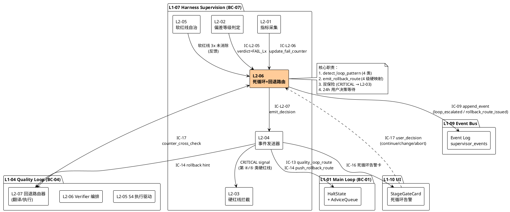
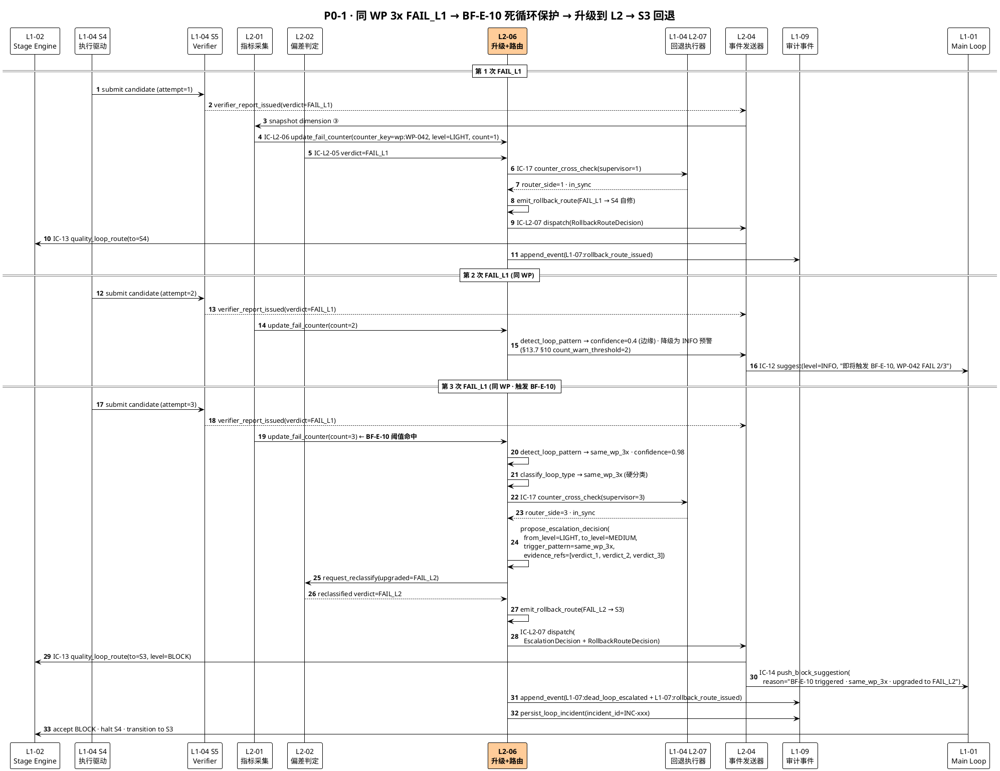
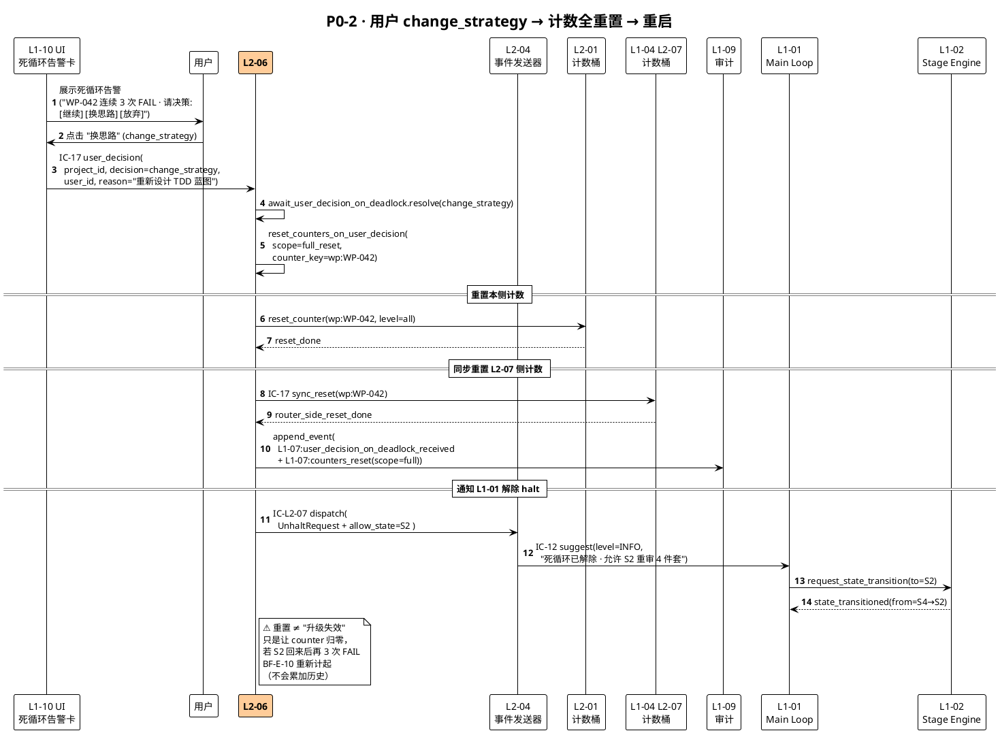
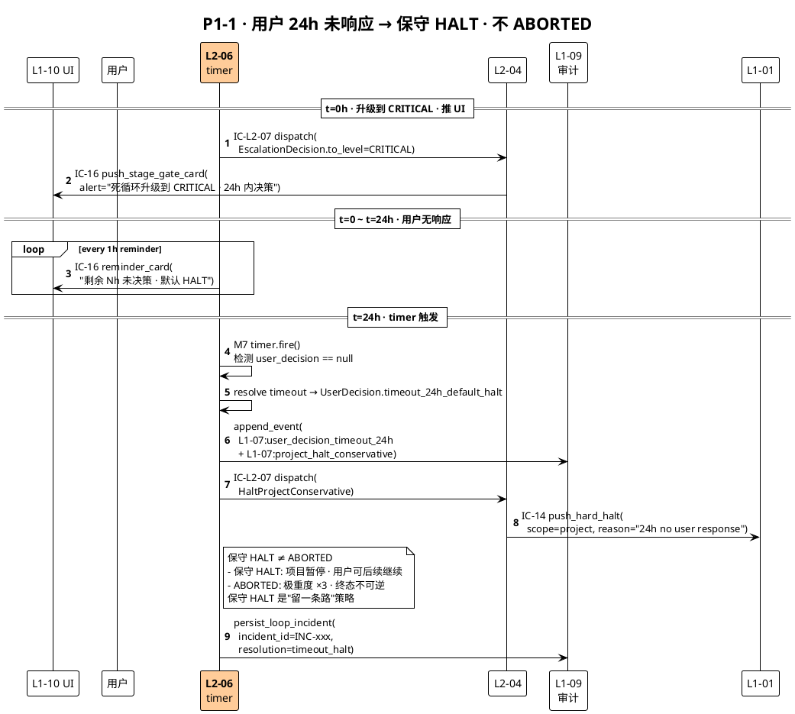
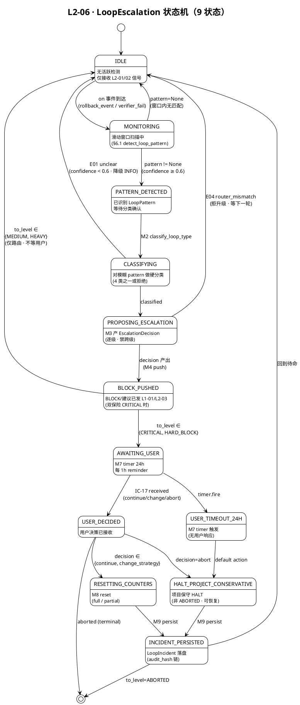
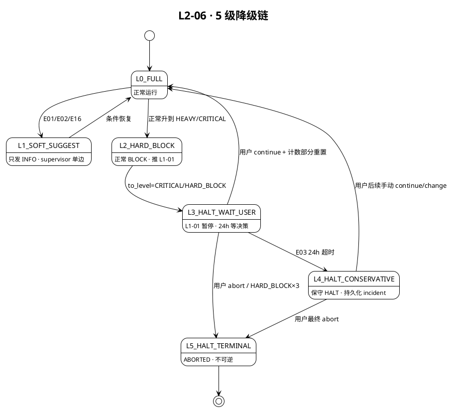

# L1 L2-06 · 死循环升级器+回退路由控制器 · Tech Design

> **本文档定位**：3-1-Solution-Technical 层级 · L1 的 L2-06 死循环升级器+回退路由控制器 技术实现方案（L2 粒度）。
> **与产品 PRD 的分工**：2-prd/L1-07-Harness监督/prd.md §5.7 的对应 L2 节定义产品边界，本文档定义**技术实现**（接口字段级 schema + 算法伪代码 + 底层数据结构 + 状态机 + 配置参数）。
> **与 L1 architecture.md 的分工**：architecture.md 负责**跨 L2 架构 + 跨 L2 时序**，本文档负责**本 L2 内部技术细节**。冲突以 architecture.md 为准。
> **严格规则**：本文档不复述产品 PRD 文字（职责 / 禁止 / 必须等清单），只做技术映射 + 补齐"产品视角未说 but 工程师必须知道"的部分（具体算法 · syscall · schema · 配置）。

---

## §0 撰写进度

- [x] §1 定位 + 2-prd §5.7 L2-06 映射
- [x] §2 DDD 映射（引 L0/ddd-context-map.md BC-07）
- [x] §3 对外接口定义（字段级 YAML schema + 错误码）
- [x] §4 接口依赖（被谁调 · 调谁）
- [x] §5 P0/P1 时序图（PlantUML ≥ 3 张）
- [x] §6 内部核心算法（伪代码）
- [x] §7 底层数据表 / schema 设计（字段级 YAML）
- [x] §8 状态机（如适用 · PlantUML + 转换表）
- [x] §9 开源最佳实践调研（≥ 3 GitHub 高星项目）
- [x] §10 配置参数清单
- [x] §11 错误处理 + 降级策略
- [x] §12 性能目标
- [x] §13 与 2-prd / 3-2 TDD 的映射表

---

## §1 定位 + 2-prd 映射

### 1.1 一句话技术定位

L2-06 是 L1-07 Supervision BC-07 内部的**升降级路由域服务**（Domain Service），承载两个正交但同源的职责：

1. **死循环升级判定**（Escalation Decision）：监测"同级 FAIL 连续 ≥ N 次"（或更复杂的振荡 / 超时 / 计数溢出模式），产出一个**向上的严重度升级指令**（轻 → 中 → 重 → 极重 → 硬拦截 → ABORTED）；
2. **Quality Loop 回退路由**（Rollback Route）：基于 L1-04 verifier_report 的结构化 `FAIL_Lx` verdict，产出一个**向后的 state 倒退指令**（L1→S4 / L2→S3 / L3→S2 / L4→S1），严格由机器可校验的 verdict 驱动，**绝不主观越权**。

两职责合并在同一 L2，是因为其**信号底座同源**（L2-01 指标 + L2-02 verdict + L2-05 软红线反馈）且**决策形式同构**（都是"输入信号 → 等级性路由指令"）；但它们的**物理输出通道 / 下游消费者 / 证据字段 / 错误语义**都各自独立，故 §3 对外接口里区分 `escalation_*` 与 `rollback_route_*` 两组方法。

### 1.2 与 L1-04 / L2-07 的**关键分工**（最容易搞混的点）

> ⚠️ 在 BC-04 Quality Loop 中，L1-04 的 L2-07 也叫"偏差判定 + 4 级回退路由器"。**两个 L2-07/L2-06 不是重复实现**，而是**计算 vs 执行的分离**：

| 角色 | 所在 L1 / BC | 本质 |
|---|---|---|
| **L1-07 / L2-06**（本文档） | 监督侧 BC-07 | **计算 / 判定者** —— 基于 Supervisor 的结构化信号，产出"该升级到哪一级 / 该路由回哪个 state"的**决策指令**（RollbackRouteDecision / EscalationDecision）· 不执行 · 不修改 task-board · 不调 L1-04 API |
| **L1-04 / L2-07**（兄弟 BC） | 质量闭环 BC-04 | **翻译 / 执行者** —— 接收 L2-06 经 IC-14 发来的 `RollbackRoute` 指令 · 翻译成 L1-02 `state_transitioned` 请求 + L2-05 `rollback_hint`（retry_wp / retry_blueprint / escalate_supervisor / reject_wp）· 驱动实际 state 回退 |
| **计数分桶** | 双方各持一份但**同步校验** | L2-01 持 Supervisor 侧同级 FAIL 计数桶（WP / Gate / Stage / 软红线类）· L1-04 L2-07 持 Quality Loop 自身的 `SameLevelFailCounter`（WP attempt 粒度）· L2-06 每次判定前**经 IC-17 counter_cross_check 做双向校验**，发现失步则报 `L2-06/E04 router_mismatch` |

**决策分工总结**：
- "要不要升级 / 路由回哪" → **L2-06 算**；
- "怎么把 S4 切回 S3" → **L1-04 L2-07 执行**；
- "同级 FAIL 计数到底是几" → **L2-01 采集 + L2-07 回声 + L2-06 校验**。

### 1.3 定位在 L1-07 architecture.md 中的位置

引 `docs/3-1-Solution-Technical/L1-07-Harness监督/architecture.md §3.1 6 L2 拆解图`：

```
L1-07 Supervision (BC-07)
├── L2-01 · 8 维度指标采集器         → 产 SupervisorSnapshot
├── L2-02 · 4 档偏差等级判定器        → 产 SupervisorVerdict
├── L2-03 · 5 类硬红线拦截器          → 产 HardRedLineIncident
├── L2-04 · Supervisor 事件发送器     → 统一出声（IC-12/13/14）
├── L2-05 · 软红线自治修复器           → 产 SoftRedLineAction
└── L2-06 · 死循环升级器 + 回退路由控制器  ← 本文档
```

**数据流**：
```
L2-01 (snapshot) ──┐
L2-02 (verdict) ───┼──► L2-06 ──► L2-04 ──► IC-13 (suggest) / IC-14 (rollback) / hard-line ⑤ 触发 L2-03
L2-05 (soft-feedback)─┘                                      │
                                                             └─► IC-16 UI 死循环告警卡（L1-10）
                                                                 IC-17 user_decision (continue/change_strategy/abort)
```

### 1.4 映射 2-prd §5.7 / §13（L2-06 专节）对齐矩阵

| 2-prd §13 小节 | 本文档对应节 | 技术落点 |
|---|---|---|
| §13.1 职责 + 锚定（双出口 · BF-E-10 / BF-S5-04 · PM-05 / PM-08 / PM-12） | §1.1 / §1.2 / §2 | 双方法组：`propose_escalation_*` / `emit_rollback_route_*`；数据源绑定 L2-01/02/05；产出去向绑定 L2-04/03/IC-13/14 |
| §13.2 输入 / 输出 | §3.1 ~ §3.3 + §7 | 字段级 YAML schema：`RollbackRouteDecision` / `EscalationDecision` / `LoopIncident` |
| §13.3 边界（7 In / 7 Out） | §1.1 职责切片 + §4 依赖图 | 禁止项落到 §11 错误码 `E05` ~ `E08`；不做 state 切换（只发路由指令）落到 §6 `push_block_suggestion_to_l1_07_or_l1_01` 伪代码 |
| §13.4 硬约束 8 条 | §10 配置参数（锁 `same_wp_threshold=3` 等硬锁）+ §11 降级 | 配置中 `hard_lock: true` · PR review CI 检查代码中不得出现"关闭开关" |
| §13.5 禁止行为 9 条 | §11 错误码表 E01~E20 + §13 TC 用例 N1~N6 | N1~N6 自动化回归 |
| §13.6 必须职责 8 条 | §3 接口 + §6 算法 + §8 状态机 | 状态机 `PROPOSING_ESCALATION → BLOCK_PUSHED → AWAITING_USER` 保证"升到极重度必走双保险"（同时 IC-14 + L2-03 signal） |
| §13.7 可选功能 4 条 | §10 可选参数 + §6 `attach_rollback_hint_text` | 默认关闭 · feature flag 开启 |
| §13.8 与其他 L2 / L1 交互 | §4 依赖图 | IC-L2-05/06 入 · IC-L2-07 出 · 极重度 → L2-03 signal |
| §13.9 交付验证大纲（P1~P9 / N1~N6 / I1~I5） | §13 用例占位 TC-L207-006-001 ~ 050 | 3-2 TDD 直接消费 |

### 1.5 关键技术决策（Decision → Rationale → Alternatives → Trade-off）

| # | Decision | Rationale | Alternatives | Trade-off |
|---|---|---|---|---|
| D1 | **双出口合并在同一 L2** | 信号源同源（L2-01/02/05）· 决策形式同构（等级性路由）· 可共享 counter 抽象 | 拆成 L2-06a 升级 + L2-06b 路由 | 代码组织更清晰但 IC 数量 ×2 · 计数校验链路变长 |
| D2 | **计数分桶硬规则（WP id / Gate id / Stage id / 软红线类 4 桶独立）** | 防止"跨桶合并"伪装绕过阈值 · 精确归因 | 统一大桶 + 维度标签 | 存储开销 × 4 但语义清晰可追溯 |
| D3 | **死循环阈值硬锁（`same_wp_threshold=3`/`same_phase_threshold=5`）** | scope §5.7.5 禁关闭 · 防演化成"永久噪音" | 软配置可调 | 灵活性 ↓ 但安全性 ↑（PM-12 硬约束） |
| D4 | **逐级升级禁跨级** | 可追溯 · 符合断路器工业实践（Hystrix / resilience4j） | 指数跳级（3 次轻 → 直升重） | 升级慢一拍但可审计 |
| D5 | **4 级 verdict → state 精确硬映射** | PM-05 机器可校验 · 禁主观越权（scope §5.7.4） | LLM 动态判"退到哪合适" | 失去上下文自适应但消除"Supervisor 自由裁量"攻击面 |
| D6 | **INSUFFICIENT_EVIDENCE 拒路由 + 退回 L2-02 升 WARN** | 避免"猜测式路由"成为新的主观源 | 默认回退最浅一级（S4）| 安全性 ↑ 但多一次 round-trip |
| D7 | **极重度 S1 + 硬红线 ⑤ 双保险** | scope §5.7.4 硬约束 · 防"只路由 / 只拦截"单点漏网 | 只路由 / 只拦截 | 两条并行信号偶尔重复但零漏 |
| D8 | **用户 24h 决策超时默认 HALT（保守）** | 防无人值守场景升级到极重后被"遗忘" | 默认 continue / 默认 abort | 偏向安全（HALT > 继续错误） |
| D9 | **与 L1-04 L2-07 的 counter_cross_check 做双向校验** | 防 Supervisor 侧 / Quality Loop 侧计数失步导致"错误升级" | 单边采信 | 多一次 IC 校验成本但消除分布式一致性 bug |
| D10 | **LoopIncident 落 `projects/<pid>/loops/*.jsonl`（PM-14）** | 按项目分片 · 便于归档 retro · 不污染全局 | 全局 DB 表 | 需显式 project_id 校验，否则拒写（E10） |

### 1.6 PM-14 project_id 约束

本 L2 所有对外方法 **必须**首字段为 `project_id: str`（harnessFlowProjectId）· 无 project_id 直接 `raise L2-06/E10 missing_project_id`；落盘路径按 `projects/<project_id>/loops/*` 分片；跨 project 计数**严禁合并**（即同一 WP id 在不同 project 下独立分桶）。

---

## §2 DDD 映射（BC-07）

### 2.1 限界上下文定位

本 L2 属于 **BC-07 · Harness Supervision**（引 `docs/3-1-Solution-Technical/L0/ddd-context-map.md §2.8 + §4.7`）；在 BC-07 内部的 6 L2 中属于**末端决策域**（消费 L2-01/02/05 上游信号，通过 L2-04 下游出声）。

### 2.2 Aggregate Root / Entity / Value Object 分类

| DDD 元素 | 名称 | 一句话 | 引 L0 / 本文档定义 |
|---|---|---|---|
| **Aggregate Root** | `LoopEscalation`（本 L2 新增） | 一次完整的"同级 FAIL 检测 → 升级判定 → 路由 / 硬暂停 / 用户决策"生命周期 | 本文档 §7.1 |
| **Aggregate Root** | `RollbackRouteDecision`（引 L0 §2.8 BC-07） | 一次基于 `FAIL_Lx` 的路由决策（含 verdict_evidence + target_stage） | L0 §2.8 |
| **Entity** | `DeadLoopCounter`（引 L0 §4.7） | 同级 FAIL 计数分桶计数器（counter_id / level / count / upgrade_level） | L0 §4.7 / 本文档 §7.2 |
| **Entity** | `LoopIncident`（本 L2 新增） | 一次"已触发"的死循环事件（含时间窗口 + 证据引用 + 用户决策链） | 本文档 §7.3 |
| **VO** | `LoopPattern`（本 L2 新增） | 死循环模式枚举：`same_wp_3x` / `same_phase_5x` / `supervisor_counter_overflow` / `verdict_oscillation_3x` | 本文档 §2.3 |
| **VO** | `EscalationDecision`（本 L2 新增） | 升级决策值对象（from_level / to_level / trigger_pattern / evidence_refs[]） | 本文档 §2.3 |
| **VO** | `QualityLoopRollbackRoute`（引 L0 §2.8 / §4.7） | 4 级回退路由值对象（verdict / target_stage / evidence_ref） | L0 §2.8 |
| **VO** | `UserDecisionOnDeadlock`（本 L2 新增） | 用户介入决策值（continue / change_strategy / abort / timeout_24h） | 本文档 §2.3 |
| **Domain Service** | `LoopPatternDetector` | 窗口扫描算法 · 识别 4 类 LoopPattern | 本文档 §6 |
| **Domain Service** | `EscalationDecisionMaker` | 根据 LoopPattern 产 EscalationDecision | 本文档 §6 |
| **Domain Service** | `RollbackRouteMapper` | `FAIL_Lx → Sy` 硬映射 | 本文档 §6 |
| **Domain Service** | `CounterCrossChecker` | 与 L1-04 L2-07 SameLevelFailCounter 对账 | 本文档 §6 |
| **Repository** | `LoopIncidentRepository` | 读写 `projects/<pid>/loops/*.jsonl` | 本文档 §7.3 |
| **Repository** | `CounterRegistryRepository` | 读写 DeadLoopCounter 内存快照 + 落盘 | 本文档 §7.2 |
| **Domain Event** | `L1-07:dead_loop_escalated` | 升级信号产出 | 引 ddd-context-map §5.2.7 |
| **Domain Event** | `L1-07:rollback_route_issued` | 回退路由信号产出 | 引 ddd-context-map §5.2.7 |
| **Domain Event** | `L1-07:loop_pattern_detected`（新增） | 模式首次识别（非升级阶段的 early-signal） | 本文档 §4 |
| **Domain Event** | `L1-07:user_decision_on_deadlock_received`（新增） | 用户决策落盘 | 本文档 §4 |

### 2.3 Value Object 字段骨架

```yaml
# VO: LoopPattern
LoopPattern:
  enum:
    - same_wp_3x                   # 同 WP id · 连续 ≥ 3 次 FAIL_Lx（任意级）
    - same_phase_5x                # 同 stage/phase · 连续 ≥ 5 次 FAIL
    - supervisor_counter_overflow  # L2-01 计数桶溢出（计数 > 阈值）
    - verdict_oscillation_3x       # verdict 振荡：PASS→FAIL→PASS→FAIL（≥ 3 轮）
  context_scope: [project_id, counter_key]

# VO: EscalationDecision
EscalationDecision:
  project_id: str
  from_level: enum[LIGHT, MEDIUM, HEAVY, CRITICAL, HARD_BLOCK]
  to_level: enum[MEDIUM, HEAVY, CRITICAL, HARD_BLOCK, ABORTED]
  trigger_pattern: LoopPattern
  evidence_refs: [verdict_id, counter_snapshot_id, time_window_start, time_window_end]
  decided_at: iso8601
  proposer: "L2-06"

# VO: UserDecisionOnDeadlock
UserDecisionOnDeadlock:
  enum: [continue, change_strategy, abort, timeout_24h_default_halt]
  received_at: iso8601
  user_id: str
  reason_text: str  # 可选

# VO: QualityLoopRollbackRoute（引 L0 · 本文档补字段）
QualityLoopRollbackRoute:
  project_id: str
  route_id: str
  verdict: enum[FAIL_L1, FAIL_L2, FAIL_L3, FAIL_L4]
  from_state: enum[S4, ...]
  target_stage: enum[S4, S3, S2, S1]
  evidence_ref: verdict_id  # verifier_report 的 verdict_id
  suggested_fix_hint: str   # 可选（§13.7 可选功能）
  issued_at: iso8601
```

### 2.4 聚合根边界 + 事务一致性

- `LoopEscalation` 作为 AR：一次完整的检测 → 判定 → 路由 / 硬暂停 / 用户决策**必须在同一事务里**，产出一条 `LoopIncident` 落盘 + 最多 1 条 `RollbackRouteDecision` + 最多 1 条 EscalationDecision；
- `LoopEscalation` **内部不可见状态**：状态机见 §8；
- **跨 AR 一致性**：通过 Domain Event + L2-04 异步发送（最终一致性，非同步强一致）；counter_cross_check 用"at-least-once + 幂等校验"保证不双算。

### 2.5 与外部 BC 的关系

- 与 **BC-04 Quality Loop**（L1-04）：**Partnership** —— 双方都持 SameLevelFailCounter 的一个视图，本 L2 通过 IC-17（新增）对账；本 L2 通过 IC-14 给 BC-04 推 RollbackRoute。
- 与 **BC-01 Main Loop**（L1-01）：**Partnership** —— 升级到 CRITICAL / HARD_BLOCK / ABORTED 时通过 L2-04 → L2-03 → L1-01 HaltState 硬暂停。
- 与 **BC-10 UI**（L1-10）：**Supplier** —— 通过 L2-04 IC-16 推 UI 死循环告警卡。
- 与 **BC-09 Event Bus**（L1-09）：**Customer** —— 落 `L1-07:*` 事件；只读消费 `L1-04:verifier_report_issued` / `L1-03:wp_state_changed` 的衍生信号（实际通过 L2-01 采集后再消费）。

---

## §3 对外接口定义（字段级 YAML schema + 错误码）

> 本节列出 L2-06 的 **全部对外方法签名** + **入出参字段级 YAML schema** + **错误码表**。**所有方法首字段为 `project_id`**（PM-14 硬约束）· 调用方必须传入 · 缺失即 `L2-06/E10 missing_project_id`。

### 3.1 方法总览（≥ 8 方法）

| # | 方法名 | 一句话 | 调用方 | 同步/异步 | SLO |
|---|---|---|---|---|---|
| M1 | `detect_loop_pattern(project_id, rollback_events_window)` | 基于滑动时间窗 + 计数窗扫描，识别 LoopPattern 枚举之一 | L2-01 tick / L2-02 on-verdict | 同步 | P99 ≤ 300ms |
| M2 | `classify_loop_type(project_id, pattern_raw)` | 二次确认 · 对 M1 模糊结果做严格分类（4 类精确) | 内部 M3 前置 | 同步 | P99 ≤ 50ms |
| M3 | `propose_escalation_decision(project_id, loop_type)` | 基于 LoopPattern 产 EscalationDecision（含 from/to_level + evidence_refs） | L2-01 计数到阈 / L2-05 软红线反馈 | 同步 | P99 ≤ 500ms |
| M4 | `push_block_suggestion_to_l1_07_or_l1_01(project_id, escalation_decision)` | 委托 L2-04 把 BLOCK 建议推给 L1-01（主 loop）或硬暂停请求 | M3 产出后 | 异步（fire-and-forget） | P99 ≤ 3s（到 L2-03 命中） |
| M5 | `coordinate_with_l2_07_router(project_id, rollback_decision_candidate)` | 与 L1-04/L2-07 SameLevelFailCounter 做双向 counter_cross_check | M3 / M6 前置 | 同步 | P99 ≤ 2s |
| M6 | `emit_rollback_route(project_id, verifier_verdict)` | 基于 `FAIL_Lx` 产 QualityLoopRollbackRoute（L1→S4 / L2→S3 / L3→S2 / L4→S1） · 极重度双保险 | L2-02 | 同步 | P99 ≤ 500ms |
| M7 | `await_user_decision_on_deadlock(project_id, escalation_decision, timeout_hours=24)` | 升到 CRITICAL/HARD_BLOCK 时等待用户决策（continue/change_strategy/abort/timeout） | M4 推 BLOCK 后 | 异步（timer） | max 24h · timeout → HALT |
| M8 | `reset_counters_on_user_decision(project_id, decision)` | 根据用户决策做计数桶重置（change_strategy=全重置 / continue=部分重置 / abort=不重置直接 ABORTED） | M7 收到决策后 | 同步 | P99 ≤ 500ms |
| M9 | `persist_loop_incident(project_id, incident_payload)` | 落盘 `projects/<pid>/loops/<incident_id>.jsonl`（append-only, audit_hash 链式） | M3 / M7 / M8 结束后 | 同步 | P99 ≤ 300ms |
| M10 | `get_loop_incident_history(project_id, since_ts, until_ts)` | 只读查询 · 为 L1-10 UI + retro 提供历史 | L1-10 / L1-05 retro | 同步 | P99 ≤ 800ms |

### 3.2 M1 · detect_loop_pattern

```yaml
method: detect_loop_pattern
summary: 滑动窗口 + 计数窗双重扫描 · 产 LoopPattern 候选
owner: L2-06 LoopPatternDetector (Domain Service)
sync: sync
idempotent: true  # 同输入必同输出（基于只读数据）

input:
  project_id: str              # PM-14 必填
  counter_key: str             # e.g. "wp:WP-042" / "stage:S4" / "soft:context_overflow"
  rollback_events_window:
    type: array<RollbackEventSnapshot>
    description: L2-01 采集到的最近 N 条 rollback/FAIL 事件（已按 counter_key 过滤）
    item:
      event_id: str
      event_type: enum[rollback_route_issued, verifier_report_failed, soft_red_line_triggered]
      verdict_level: enum[FAIL_L1, FAIL_L2, FAIL_L3, FAIL_L4, INSUFFICIENT_EVIDENCE, null]
      timestamp: iso8601
      wp_id: str?
      stage: enum[S1,S2,S3,S4,S5,S6,S7]?
  time_window_minutes: int      # 默认 60 · 滑动时间窗
  count_window: int             # 默认 10 · 最近 10 条事件
  project_pm14_ctx:
    harness_flow_project_id: str

output:
  project_id: str
  detected: bool
  pattern:
    enum: [same_wp_3x, same_phase_5x, supervisor_counter_overflow, verdict_oscillation_3x, null]
  confidence: float             # 0.0 ~ 1.0 · < 0.6 标记 "unclear" → E01
  matched_events: [event_id]    # 支撑该 pattern 的事件 id
  window_metadata:
    window_start: iso8601
    window_end: iso8601
    total_events_in_window: int

errors:
  - L2-06/E01 loop_pattern_unclear
  - L2-06/E10 missing_project_id
  - L2-06/E11 corrupt_event_window
```

### 3.3 M2 · classify_loop_type

```yaml
method: classify_loop_type
summary: 对 M1 产出的模糊 pattern 做精确分类（4 类之一或拒绝）
sync: sync

input:
  project_id: str
  pattern_raw:
    pattern: LoopPattern|null
    confidence: float
    matched_events: [event_id]

output:
  project_id: str
  classified_pattern: LoopPattern
  reason_text: str   # 人读的分类理由（e.g. "same wp_id=WP-042 consecutive 3 FAIL_L1 within 42min"）

errors:
  - L2-06/E01 loop_pattern_unclear         # confidence < 0.6 · 拒分类 · 降级为 INFO
  - L2-06/E12 pattern_enum_invalid         # pattern 不在 4 类枚举中
```

### 3.4 M3 · propose_escalation_decision

```yaml
method: propose_escalation_decision
summary: 基于 LoopPattern 产 EscalationDecision（升级链 · 不跨级）
sync: sync

input:
  project_id: str
  loop_type: LoopPattern
  current_level: enum[LIGHT, MEDIUM, HEAVY, CRITICAL, HARD_BLOCK]   # 当前同级计数桶的严重度
  counter_key: str
  evidence:
    counter_snapshot_id: str
    verdict_refs: [verdict_id]

output:
  project_id: str
  escalation_decision: EscalationDecision
  next_action_hint:
    enum: [emit_suggestion_info, emit_block_suggestion, push_hard_halt_to_l2_03, trigger_aborted]

errors:
  - L2-06/E02 counter_sync_failed          # 与 L2-07 counter cross-check 失败
  - L2-06/E05 cross_level_jump_rejected    # 试图跳级（LIGHT→HEAVY 等）· 拒绝（逐级硬约束）
  - L2-06/E13 current_level_out_of_range   # current_level 超出枚举
  - L2-06/E14 evidence_refs_missing        # 无 evidence 禁止升级
```

### 3.5 M4 · push_block_suggestion_to_l1_07_or_l1_01

```yaml
method: push_block_suggestion_to_l1_07_or_l1_01
summary: 委托 L2-04 把 BLOCK 建议 / 硬暂停请求发出去
sync: async

input:
  project_id: str
  escalation_decision: EscalationDecision
  target:
    enum: [l1_01_main_loop, l2_03_hard_red_line]  # CRITICAL → l2_03 · HEAVY → l1_01

output:
  delivery_id: str
  delivered_to: enum[l2_04_router, direct_fallback]
  estimated_ack_within_ms: int

errors:
  - L2-06/E06 delivery_to_l2_04_failed     # L2-04 不可达 · 降级直连 L2-03
  - L2-06/E15 target_resolution_failed
```

### 3.6 M5 · coordinate_with_l2_07_router

```yaml
method: coordinate_with_l2_07_router
summary: 与 L1-04 L2-07 SameLevelFailCounter 做 counter_cross_check
sync: sync

input:
  project_id: str
  counter_key: str
  supervisor_side_count: int               # L2-01 侧计数
  expected_router_side_count: int          # 允许偏差 ≤ 1（event propagation 延迟）

output:
  project_id: str
  cross_check_status: enum[in_sync, drift_tolerable, drift_intolerable]
  router_side_count: int
  drift: int                               # supervisor - router

errors:
  - L2-06/E04 router_mismatch              # |drift| > 1 · 报警 · 拒绝升级
  - L2-06/E16 router_unreachable           # L2-07 不可达 · 降级 supervisor 单边（带 WARN）
```

### 3.7 M6 · emit_rollback_route

```yaml
method: emit_rollback_route
summary: 基于 FAIL_Lx 产 QualityLoopRollbackRoute · 极重度触发双保险
sync: sync

input:
  project_id: str
  verifier_verdict:
    verdict: enum[FAIL_L1, FAIL_L2, FAIL_L3, FAIL_L4, INSUFFICIENT_EVIDENCE]
    verdict_id: str
    from_state: enum[S4,S5,S6]
    verifier_report_ref: str

output:
  project_id: str
  rollback_route: QualityLoopRollbackRoute
  double_insurance:
    triggered: bool                        # FAIL_L4 时 true
    hard_red_line_signal_ref: str?         # 传给 L2-03 的第 ⑤ 类硬红线 signal id

errors:
  - L2-06/E07 insufficient_evidence_rejected   # 拒路由 · 退回 L2-02 升 WARN
  - L2-06/E08 verdict_enum_invalid
  - L2-06/E17 from_state_not_s4              # 只有从 S4 发起的 verifier_report 才能触发 rollback（契约）
```

### 3.8 M7 · await_user_decision_on_deadlock

```yaml
method: await_user_decision_on_deadlock
summary: 升到 CRITICAL/HARD_BLOCK 后等 24h 用户决策
sync: async (timer-based)

input:
  project_id: str
  escalation_decision: EscalationDecision
  timeout_hours: int                          # 默认 24
  ui_alert_card_ref: str                      # L2-04 IC-16 推出的告警卡 id

output:
  project_id: str
  user_decision: UserDecisionOnDeadlock
  decision_source: enum[user_explicit, timeout_default_halt]

errors:
  - L2-06/E03 user_decision_timeout_24h       # 默认降级为 HALT_PROJECT_CONSERVATIVE
  - L2-06/E18 ui_alert_card_ack_failed
```

### 3.9 M8 · reset_counters_on_user_decision

```yaml
method: reset_counters_on_user_decision
sync: sync

input:
  project_id: str
  decision: UserDecisionOnDeadlock
  counter_key: str

output:
  project_id: str
  reset_scope: enum[full_reset, partial_reset_current_level, no_reset_aborted]
  reset_counters: [counter_key]

errors:
  - L2-06/E09 reset_conflict_with_concurrent_escalation   # 并发新升级同时发生 · 重置需延后
  - L2-06/E19 counter_registry_write_failed
```

### 3.10 错误码汇总表（≥ 18 项 · 保留 20 覆盖 §11）

| Code | 含义 | 触发场景 | 调用方处理 |
|---|---|---|---|
| **L2-06/E01** | `loop_pattern_unclear` | M1 / M2 confidence < 0.6 | 降级为 INFO · 不升级 |
| **L2-06/E02** | `counter_sync_failed` | M5 counter cross-check 失败 | 重试 1 次 · 再失败告警 + 拒升级 |
| **L2-06/E03** | `user_decision_timeout_24h` | M7 24h 无响应 | 默认 HALT_PROJECT_CONSERVATIVE |
| **L2-06/E04** | `router_mismatch` | 与 L2-07 count drift > 1 | 报警 · 拒绝升级本轮 |
| **L2-06/E05** | `cross_level_jump_rejected` | 试图跨级升级 | 拒绝 · 按逐级重算 |
| **L2-06/E06** | `delivery_to_l2_04_failed` | L2-04 不可达 | 降级直连 L2-03 |
| **L2-06/E07** | `insufficient_evidence_rejected` | verdict=INSUFFICIENT_EVIDENCE 推路由 | 拒路由 · 退回 L2-02 升 WARN |
| **L2-06/E08** | `verdict_enum_invalid` | verdict 不在 FAIL_Lx 枚举 | 拒路由 · 抛 contract_violation |
| **L2-06/E09** | `reset_conflict_with_concurrent_escalation` | 并发新升级 vs 重置 | 重置延后 |
| **L2-06/E10** | `missing_project_id` | PM-14 必填缺失 | 拒处理 · 抛 contract_violation |
| **L2-06/E11** | `corrupt_event_window` | 事件窗口数据损坏 | 重读 · 再失败告警 |
| **L2-06/E12** | `pattern_enum_invalid` | pattern 不在 4 类枚举 | 拒分类 · 降级 INFO |
| **L2-06/E13** | `current_level_out_of_range` | current_level 越界 | 抛 contract_violation |
| **L2-06/E14** | `evidence_refs_missing` | 无 evidence 升级 | 拒升级（PM-08） |
| **L2-06/E15** | `target_resolution_failed` | M4 target 解析失败 | 抛 internal_error |
| **L2-06/E16** | `router_unreachable` | L2-07 长时间不可达 | 降级 supervisor 单边 + WARN |
| **L2-06/E17** | `from_state_not_s4` | rollback 源 state ≠ S4 | 拒路由 · 契约违规 |
| **L2-06/E18** | `ui_alert_card_ack_failed` | IC-16 推送未 ack | 重推 1 次 · 再失败 WARN |
| **L2-06/E19** | `counter_registry_write_failed` | Repository 落盘失败 | 内存缓冲 + 重试 3 次 |
| **L2-06/E20** | `incident_audit_hash_mismatch` | LoopIncident 链式 hash 校验失败 | 审计告警 + 拒读 |

---

---

## §4 接口依赖（被谁调 · 调谁）

### 4.1 上游调用方（被谁调）

| IC | 调用方 | 方法 | 何时调 | 一句话意义 |
|---|---|---|---|---|
| **IC-L2-05** | L1-07 / L2-02（偏差等级判定器） | `emit_rollback_route` · `propose_escalation_decision` | verdict=FAIL_Lx 或候选升档 | L2-02 定性完 · 请 L2-06 路由 / 升级 |
| **IC-L2-06** | L1-07 / L2-01（8 维度指标采集器） | `detect_loop_pattern` · `propose_escalation_decision` | 每 30s tick · 同级 FAIL 计数达阈 | L2-01 采集到计数 · 请 L2-06 判升级 |
| **IC-L2-05-feedback** | L1-07 / L2-05（软红线自治修复器） | `propose_escalation_decision` | 软红线 3 次自治未消除 | 软红线升级到 WARN+ |
| **IC-17** | L1-04 / L2-07（回退路由器） | `coordinate_with_l2_07_router` | counter_cross_check 校验 | 双边计数对账 |
| **IC-UI-decision** | L1-10 UI | `await_user_decision_on_deadlock` → callback | 用户点击 continue/change_strategy/abort | 用户介入决策 |

### 4.2 下游依赖（调谁）

| IC | 被调方 | 方法 | 何时调 | 一句话意义 |
|---|---|---|---|---|
| **IC-L2-07**（本 L2 → L2-04） | L1-07 / L2-04（Supervisor 事件发送器） | `dispatch` | 每次产 RollbackRoute / EscalationDecision | 统一出声管道 · 委托发 IC-13/14/12/16 |
| **IC-13 quality_loop_route** | L2-04 → L1-04 | `apply_rollback_route` | 回退路由产出后 | 推 4 级回退路由指令 |
| **IC-14 rollback hint** | L2-04 → L1-04/L2-07 | `receive_rollback_hint` | 回退路由含 hint 时 | 附带修复要点（retry_wp / retry_blueprint / escalate） |
| **IC-16 UI 死循环告警卡** | L2-04 → L1-10 | `push_stage_gate_card` | 升到 CRITICAL/HARD_BLOCK | UI 红屏告警 |
| **极重度 signal** | L2-04 → L2-03（硬红线拦截器） | `trigger_hard_red_line_signal` | FAIL_L4 / 升到 CRITICAL | 第 ④/⑤ 类硬红线双保险 |
| **IC-09 append_event** | L1-07 → L1-09 | `append_event` | 每次路由 / 升级 / incident 落盘 | PM-08 审计全链路 |
| **IC-17 user_decision** | L1-10 → L1-07 | （inbound timer callback） | UI 用户决策回传 | M7 async callback |

### 4.3 依赖图（PlantUML）



### 4.4 与 L1-04 / L2-07 的"分工边界"依赖说明

> ⚠️ **关键**：L2-06（监督侧 · 计算）→ emits **decision** · L1-04 L2-07（质量闭环侧 · 执行）→ translates decision **to real state transition**。

1. L2-06 **绝不直接调 L1-04 API**（ddd-context-map §4.7 + L1-07 architecture §3.2 硬身份 ③）；
2. L2-06 产 `RollbackRouteDecision` → 经 L2-04 IC-14 → L1-04 L2-07 → L2-07 翻译为 L1-02 `request_state_transition(target_stage)` + L2-05 `rollback_hint`；
3. 同级 FAIL 计数**双边持有 · 双向校验**：
   - L2-01（Supervisor 侧） 按 WP / Gate / Stage / 软红线类 4 桶采集；
   - L1-04 L2-07 持 `SameLevelFailCounter`（WP attempt 粒度）；
   - L2-06 每次升级判定前调 M5 `coordinate_with_l2_07_router` 对账，`|drift| ≤ 1` 容忍（event propagation 延迟），`> 1` 报 `L2-06/E04 router_mismatch` 拒升级；
4. 错误恢复：若 L2-07 长时间不可达（E16 router_unreachable），L2-06 **降级为 supervisor 单边计数**，但同时发 WARN 级 `L1-07:counter_cross_check_degraded` 事件，告知用户"双边一致性已降级"。

---

## §5 P0/P1 时序图（PlantUML ≥ 3 张）

### 5.1 P0-1 · 同 WP 连续 3 次 FAIL_L1 → 触发 BF-E-10 死循环保护 → 路由升级到 FAIL_L2 → BLOCK 推 L1-01

**场景**：S4 执行 WP-042 → S5 verifier FAIL_L1 → L2-02 判轻度 → L2-06 路由 to=S4 自修 → S4 再执行仍 FAIL_L1 → 重复 3 次（counter 达 3）→ L2-06 触发 BF-E-10 死循环保护 → 升级到 FAIL_L2（轻→中）→ 路由 to=S3 + 推 BLOCK 给 L1-01。



**关键约束**：
- Step 1-7（第 1 次 FAIL）：普通 4 级回退路径（L1→S4 自修）；
- Step 17（count=3）：BF-E-10 **硬阈值命中**（`same_wp_threshold=3` hard_lock=true）；
- Step 20-22：M5 counter_cross_check（IC-17）**强制双边一致性**，drift > 1 拒升级；
- Step 26-28：**逐级升级**（LIGHT → MEDIUM），禁 LIGHT → HEAVY 跨级；
- Step 35：SLO P99 ≤ 3s（escalation 产出 → BLOCK 发出）。

### 5.2 P0-2 · 用户介入 change_strategy → 计数全重置 → 重启

**场景**：P0-1 之后 L1-01 halt → UI 红屏告警卡（IC-16）→ 用户 2h 内点击 change_strategy（换思路） → L2-06 接收 IC-17 → 全重置 WP-042 所有相关计数桶 → 通知 L1-01 解除 halt → 允许重新从 S1/S2 重锚。



### 5.3 P1-1 · 用户 24h 未决策超时 → 保守 HALT → 落 incident

**场景**：P0-1 之后 L1-01 halt → UI 告警卡 → 用户**未点击**任何选项 · 24h 超时 → L2-06 M7 timer 触发 → 默认 HALT_PROJECT_CONSERVATIVE · 落 incident · 持续等待（不 ABORTED）。



### 5.4 时序图性能契约回填

| 阶段 | SLO | 测量方式 |
|---|---|---|
| P0-1 第 17-28 步（count 达 3 → BLOCK 发出） | P99 ≤ 3s | 从 verifier_report_issued 时间戳到 IC-14 ack |
| P0-2 全重置链路 | P99 ≤ 2s | 从 IC-17 接收到 L101 IC-12 下发 |
| P1-1 timer 精度 | ±60s / 24h | `APScheduler` jitter 配置 ≤ 30s |

---

---

## §6 内部核心算法（伪代码）

> 本节列出 L2-06 的 **12 个核心算法**（伪代码 Python-like 风格）· 涵盖模式识别 · 分类 · 升级提议 · counter 对账 · rollback 产出 · 用户决策等待 · 计数重置 · 持久化。

### 6.1 detect_loop_pattern_sliding_window

```python
def detect_loop_pattern_sliding_window(
    project_id: str,
    counter_key: str,
    events: list[RollbackEventSnapshot],
    time_window_min: int = 60,
    count_window: int = 10,
) -> LoopPatternCandidate:
    """
    滑动窗口 + 计数窗双重判定
    - 时间窗: 事件必须落在最近 time_window_min 分钟内
    - 计数窗: 仅看最近 count_window 条事件
    两窗任一不满足则不识别为 Loop
    """
    assert project_id, "L2-06/E10 missing_project_id"

    now = utc_now()
    window_start = now - timedelta(minutes=time_window_min)

    filtered = [
        e for e in events
        if e.timestamp >= window_start and e.counter_key == counter_key
    ]
    # 计数窗裁剪
    filtered = filtered[-count_window:]

    if len(filtered) < 3:
        return LoopPatternCandidate(pattern=None, confidence=0.0)

    # 分类判定（子算法）
    if _is_same_wp_three_strikes(filtered):
        return LoopPatternCandidate(
            pattern=LoopPattern.SAME_WP_3X,
            confidence=_compute_confidence(filtered, "wp"),
            matched_events=[e.event_id for e in filtered[-3:]]
        )
    if _is_same_phase_five_strikes(filtered):
        return LoopPatternCandidate(
            pattern=LoopPattern.SAME_PHASE_5X,
            confidence=_compute_confidence(filtered, "phase"),
            matched_events=[e.event_id for e in filtered[-5:]]
        )
    if _is_counter_overflow(filtered):
        return LoopPatternCandidate(pattern=LoopPattern.SUPERVISOR_COUNTER_OVERFLOW, confidence=0.99)
    if _is_verdict_oscillation(filtered):
        return LoopPatternCandidate(pattern=LoopPattern.VERDICT_OSCILLATION_3X, confidence=0.92)

    return LoopPatternCandidate(pattern=None, confidence=0.0)
```

### 6.2 classify_loop_same_wp_three_strikes

```python
def _is_same_wp_three_strikes(events: list[RollbackEventSnapshot]) -> bool:
    """
    同一 WP id · 连续 ≥ 3 次 FAIL_Lx（任意级 · 但同级分桶时已过滤）
    - "连续" 定义: 中间无 PASS 事件（PASS 会重置计数）
    - WP id 必须完全相同（禁跨 WP 合并）
    """
    if len(events) < 3:
        return False
    last_three = events[-3:]
    wp_ids = {e.wp_id for e in last_three if e.wp_id}
    if len(wp_ids) != 1:
        return False  # 不是同一 WP
    if any(e.verdict_level == "PASS" for e in last_three):
        return False  # 中间有 PASS · 不算连续
    return all(
        e.event_type in ("rollback_route_issued", "verifier_report_failed")
        for e in last_three
    )
```

### 6.3 classify_loop_same_phase_five_strikes

```python
def _is_same_phase_five_strikes(events: list[RollbackEventSnapshot]) -> bool:
    """
    同一 stage/phase · 连续 ≥ 5 次 FAIL（比 3x 更宽松阈值 · 针对大粒度）
    场景: 某 Stage 反复进出（S3 ↔ S4 来回 5 次）
    """
    if len(events) < 5:
        return False
    last_five = events[-5:]
    stages = {e.stage for e in last_five if e.stage}
    if len(stages) > 2:  # 允许 stage 在 2 个之间震荡
        return False
    return all(e.verdict_level and e.verdict_level.startswith("FAIL") for e in last_five)
```

### 6.4 classify_counter_overflow

```python
def _is_counter_overflow(events: list[RollbackEventSnapshot]) -> bool:
    """
    L2-01 计数桶溢出（> 阈值 × 2 · 硬保护）
    即使没识别出 3x/5x 模式，只要 counter > overflow_threshold 直接升级
    """
    # overflow_threshold 从 config 读 · 默认 10
    latest_counter = _read_counter_snapshot(events[-1].counter_key)
    return latest_counter.count >= OVERFLOW_THRESHOLD  # 默认 10
```

### 6.5 classify_verdict_oscillation_3x

```python
def _is_verdict_oscillation(events: list[RollbackEventSnapshot]) -> bool:
    """
    verdict 振荡模式: PASS → FAIL → PASS → FAIL → PASS → FAIL (至少 3 轮)
    场景: 系统在"临界条件"附近反复 · 既不稳定通过也不稳定失败
    """
    if len(events) < 6:
        return False
    levels = [e.verdict_level for e in events[-6:]]
    oscillation_pattern = ["PASS", "FAIL", "PASS", "FAIL", "PASS", "FAIL"]
    # 允许 FAIL_Lx 任意级
    return all(
        (levels[i] == "PASS" and oscillation_pattern[i] == "PASS") or
        (levels[i] and levels[i].startswith("FAIL") and oscillation_pattern[i] == "FAIL")
        for i in range(6)
    )
```

### 6.6 propose_escalation_by_loop_type

```python
def propose_escalation_by_loop_type(
    project_id: str,
    loop_type: LoopPattern,
    current_level: EscalationLevel,
    counter_key: str,
    evidence: EvidenceRefs,
) -> EscalationDecision:
    """
    核心升级决策 · 逐级升级 · 禁跨级
    映射表:
        same_wp_3x (LIGHT)       → MEDIUM
        same_wp_3x (MEDIUM)      → HEAVY
        same_wp_3x (HEAVY)       → CRITICAL  ← 触发双保险 (L2-03 第 ④ 类)
        same_wp_3x (CRITICAL)    → HARD_BLOCK
        same_wp_3x (HARD_BLOCK)  → ABORTED
        same_phase_5x            → 同 same_wp_3x 但阈值 5
        counter_overflow         → 直接升两级 (只在该模式下允许跳级 · 硬保护)
        verdict_oscillation_3x   → LIGHT → MEDIUM (保守升一级)
    """
    assert project_id, "L2-06/E10 missing_project_id"
    assert evidence.verdict_refs, "L2-06/E14 evidence_refs_missing"

    # 合法性: current_level 必须在枚举内
    if current_level not in EscalationLevel.__members__:
        raise L206Error("L2-06/E13 current_level_out_of_range")

    # 禁跨级（除 counter_overflow 特例）
    if loop_type == LoopPattern.SUPERVISOR_COUNTER_OVERFLOW:
        to_level = _bump_level(current_level, steps=2)  # 跳两级（硬保护）
    else:
        to_level = _bump_level(current_level, steps=1)  # 逐级

    # 特殊链: HARD_BLOCK → ABORTED (3 次极重)
    if current_level == EscalationLevel.HARD_BLOCK:
        to_level = EscalationLevel.ABORTED

    decision = EscalationDecision(
        project_id=project_id,
        from_level=current_level,
        to_level=to_level,
        trigger_pattern=loop_type,
        evidence_refs=evidence,
        decided_at=utc_now(),
        proposer="L2-06",
    )

    # 契约校验: 禁止跨级（E05）
    allowed_jumps = {
        EscalationLevel.LIGHT: {EscalationLevel.MEDIUM},
        EscalationLevel.MEDIUM: {EscalationLevel.HEAVY},
        EscalationLevel.HEAVY: {EscalationLevel.CRITICAL},
        EscalationLevel.CRITICAL: {EscalationLevel.HARD_BLOCK},
        EscalationLevel.HARD_BLOCK: {EscalationLevel.ABORTED},
    }
    if loop_type != LoopPattern.SUPERVISOR_COUNTER_OVERFLOW:
        if to_level not in allowed_jumps.get(current_level, set()):
            raise L206Error(f"L2-06/E05 cross_level_jump_rejected: {current_level}→{to_level}")

    return decision
```

### 6.7 push_block_suggestion_with_context

```python
def push_block_suggestion_with_context(
    project_id: str,
    escalation_decision: EscalationDecision,
) -> DeliveryResult:
    """
    根据 to_level 路由 BLOCK suggestion 到合适的目标
    - HEAVY     → L1-01 IC-13 SUGGEST (建议)
    - CRITICAL  → L1-01 IC-14 BLOCK + L2-03 第 ④ 类硬红线 signal (双保险)
    - HARD_BLOCK→ L1-01 IC-14 硬暂停 + UI IC-16 红屏
    - ABORTED   → L1-01 终态切换
    """
    target, ic = _resolve_target_and_ic(escalation_decision.to_level)

    # 构建建议载荷（含 context 便于 L1-01 / UI 展示）
    payload = {
        "project_id": project_id,
        "level": escalation_decision.to_level.value,
        "dimension": "loop_retry",
        "message": _compose_loop_message(escalation_decision),
        "escalation_id": escalation_decision.decision_id,
        "evidence_refs": escalation_decision.evidence_refs,
        "suggested_actions": _compose_suggested_actions(escalation_decision.to_level),
    }

    # 委托 L2-04 出声
    try:
        delivery = l2_04_router.dispatch(target, ic, payload, timeout_s=3)
    except L204Unreachable:
        # E06 降级: 直连 L2-03 (CRITICAL 情况下保底)
        if escalation_decision.to_level in (EscalationLevel.CRITICAL, EscalationLevel.HARD_BLOCK):
            delivery = l2_03_hard_red_line.trigger_signal(
                signal_type="loop_escalation_critical",
                payload=payload
            )
        else:
            raise L206Error("L2-06/E06 delivery_to_l2_04_failed")

    # 双保险（CRITICAL 必同时发硬红线 signal）
    if escalation_decision.to_level == EscalationLevel.CRITICAL:
        l2_03_hard_red_line.trigger_signal(
            signal_type="hard_red_line_4_dead_loop_critical",
            payload={"escalation_id": escalation_decision.decision_id}
        )

    return delivery
```

### 6.8 coordinate_with_l2_07_counter_cross_check

```python
def coordinate_with_l2_07_counter_cross_check(
    project_id: str,
    counter_key: str,
    supervisor_count: int,
) -> CrossCheckResult:
    """
    与 L1-04 L2-07 SameLevelFailCounter 双向校验
    - 容忍 drift ≤ 1 (event propagation 延迟)
    - drift > 1 → 报警 + 拒升级
    - L2-07 不可达 → 降级 supervisor 单边 + WARN
    """
    try:
        router_count = l2_07_client.query_same_level_fail_counter(
            project_id=project_id,
            counter_key=counter_key,
            timeout_s=2,
        )
    except L207Unreachable:
        _emit_event("L1-07:counter_cross_check_degraded", {
            "reason": "L2-07 unreachable · supervisor-only counting",
            "counter_key": counter_key,
        })
        return CrossCheckResult(status="drift_intolerable", drift=None, degraded=True)

    drift = supervisor_count - router_count
    if abs(drift) <= 1:
        return CrossCheckResult(status="in_sync" if drift == 0 else "drift_tolerable",
                                drift=drift, router_count=router_count)

    # drift > 1 · 拒升级
    _emit_event("L1-07:counter_mismatch", {
        "supervisor": supervisor_count,
        "router": router_count,
        "drift": drift,
    })
    raise L206Error(f"L2-06/E04 router_mismatch: drift={drift}")
```

### 6.9 await_user_decision_with_24h_timeout

```python
async def await_user_decision_with_24h_timeout(
    project_id: str,
    escalation_decision: EscalationDecision,
    timeout_hours: int = 24,
) -> UserDecisionOnDeadlock:
    """
    等待 UI 推 IC-17 user_decision 回调 · 24h 超时默认 HALT_PROJECT_CONSERVATIVE
    - 定时每 1h 发 reminder 卡片（§6.7 IC-16 push_stage_gate_card）
    - 超时不 ABORTED（保守策略）· 项目 HALT 但可恢复
    """
    deadline = utc_now() + timedelta(hours=timeout_hours)
    reminder_interval = timedelta(hours=1)
    next_reminder = utc_now() + reminder_interval

    while utc_now() < deadline:
        # 非阻塞检查是否有用户决策到达
        decision = await _poll_user_decision_inbox(
            project_id=project_id,
            escalation_id=escalation_decision.decision_id,
            poll_interval_s=30,
        )
        if decision:
            return UserDecisionOnDeadlock(
                decision=decision.decision,
                received_at=utc_now(),
                user_id=decision.user_id,
                reason_text=decision.reason_text,
            )

        # 到达下次 reminder 时间
        if utc_now() >= next_reminder:
            remaining_h = (deadline - utc_now()).total_seconds() / 3600
            l2_04_router.dispatch(
                target="l1_10_ui",
                ic="IC-16",
                payload={
                    "card_type": "loop_deadlock_reminder",
                    "remaining_hours": round(remaining_h, 1),
                    "escalation_id": escalation_decision.decision_id,
                },
            )
            next_reminder += reminder_interval

    # 超时 · 保守 HALT
    return UserDecisionOnDeadlock(
        decision=UserDecisionEnum.TIMEOUT_24H_DEFAULT_HALT,
        received_at=utc_now(),
        user_id=None,
        reason_text="24h timeout · default HALT_PROJECT_CONSERVATIVE",
    )
```

### 6.10 reset_counters_on_user_change_strategy

```python
def reset_counters_on_user_change_strategy(
    project_id: str,
    counter_key: str,
) -> ResetResult:
    """
    用户 change_strategy → 全重置 (所有 level 的计数归零)
    - 同步重置本侧 (L2-01) 和对方侧 (L1-04 L2-07)
    - 双边重置成功后才确认
    - 失败回滚（保持原计数）
    """
    async with distributed_lock(f"counter:{project_id}:{counter_key}"):
        # Step 1: supervisor 侧重置
        try:
            l201_registry.reset_counter(project_id, counter_key, scope="all_levels")
        except Exception as e:
            raise L206Error(f"L2-06/E19 counter_registry_write_failed: {e}")

        # Step 2: router 侧同步重置
        try:
            l2_07_client.sync_reset(project_id, counter_key)
        except L207Unreachable:
            # 回滚 supervisor 侧
            l201_registry.restore_last_snapshot(project_id, counter_key)
            raise L206Error("L2-06/E16 router_unreachable during reset")

        # Step 3: 审计
        _emit_event("L1-07:counters_reset", {
            "counter_key": counter_key,
            "scope": "full_reset",
            "trigger": "user_change_strategy",
        })

        return ResetResult(status="full_reset_success", reset_keys=[counter_key])
```

### 6.11 reset_partial_on_user_continue

```python
def reset_partial_on_user_continue(
    project_id: str,
    counter_key: str,
    current_level: EscalationLevel,
) -> ResetResult:
    """
    用户 continue (继续当前策略) → 仅重置"当前级"计数
    - 其他级的历史计数保留（防止用户"赖账式"连续 continue）
    - 例: LIGHT 升级到 MEDIUM 后用户 continue · 只重 MEDIUM 桶 · LIGHT 桶仍保留
    """
    async with distributed_lock(f"counter:{project_id}:{counter_key}"):
        l201_registry.reset_counter(
            project_id, counter_key, scope=f"level:{current_level.value}"
        )
        l2_07_client.sync_reset_partial(project_id, counter_key, level=current_level)

        _emit_event("L1-07:counters_reset", {
            "counter_key": counter_key,
            "scope": f"partial_level_{current_level.value}",
            "trigger": "user_continue",
        })

        return ResetResult(status="partial_reset", reset_keys=[counter_key], level=current_level)
```

### 6.12 persist_loop_incident_with_audit_hash

```python
def persist_loop_incident_with_audit_hash(
    project_id: str,
    incident_payload: dict,
) -> LoopIncident:
    """
    落 LoopIncident 到 projects/<pid>/loops/<incident_id>.jsonl
    - append-only
    - 链式 audit_hash: 每条记录含 prev_hash + current_hash (sha256)
    - 防篡改: hash chain 断裂即 E20 incident_audit_hash_mismatch
    """
    assert project_id, "L2-06/E10 missing_project_id"

    path = f"projects/{project_id}/loops/incidents.jsonl"
    prev_hash = _read_last_audit_hash(path)

    record = {
        "incident_id": incident_payload["incident_id"],
        "project_id": project_id,
        "loop_type": incident_payload["loop_type"],
        "escalation_decision": incident_payload["escalation_decision"],
        "rollback_route": incident_payload.get("rollback_route"),
        "user_decision": incident_payload.get("user_decision"),
        "time_window": incident_payload["time_window"],
        "evidence_refs": incident_payload["evidence_refs"],
        "prev_hash": prev_hash,
        "written_at": utc_now().isoformat(),
    }
    record["current_hash"] = sha256(json.dumps(record, sort_keys=True).encode()).hexdigest()

    try:
        with open(path, "a", encoding="utf-8") as f:
            f.write(json.dumps(record, ensure_ascii=False) + "\n")
            f.flush()
            os.fsync(f.fileno())  # 强持久化（崩溃一致性）
    except Exception as e:
        raise L206Error(f"L2-06/E19 counter_registry_write_failed: {e}")

    # 校验链（读回最后一条确认未污染）
    last_record = _read_last_record(path)
    if last_record["current_hash"] != record["current_hash"]:
        raise L206Error("L2-06/E20 incident_audit_hash_mismatch")

    # 审计事件
    _emit_event("L1-07:loop_incident_persisted", {
        "incident_id": record["incident_id"],
        "hash": record["current_hash"],
    })

    return LoopIncident.from_record(record)
```

### 6.13 算法复杂度 + 并发控制总结

| 算法 | 时间复杂度 | 空间复杂度 | 并发控制 | 幂等性 |
|---|---|---|---|---|
| 6.1 detect_loop_pattern | O(count_window) = O(10) | O(1) | 无（只读） | 是 |
| 6.2-6.5 分类子算法 | O(N) | O(1) | 无 | 是 |
| 6.6 propose_escalation | O(1) | O(1) | counter_key 分布式锁 | 是（基于 decision_id 去重） |
| 6.7 push_block_suggestion | O(1) | O(payload) | 无 | 否（fire-and-forget · 有重试） |
| 6.8 cross_check | O(1) + 1 RPC | O(1) | 无 | 是 |
| 6.9 await_user_decision | O(timeout/poll) | O(1) | 无 | 是（decision_id 幂等） |
| 6.10-6.11 reset | O(1) | O(1) | 分布式锁 | 是 |
| 6.12 persist_incident | O(1) + 1 fsync | O(record) | 追加锁 | 否（append-only · 不重写） |

---

---

## §7 底层数据表 / schema 设计（字段级 YAML）

> 按 PM-14 分片 · 所有表首字段为 `project_id` · 物理路径 `projects/<pid>/loops/*.jsonl`（append-only）+ 内存索引。

### 7.1 表 T1 · `loop_escalation`（Aggregate Root · 本 L2 主表）

- **物理路径**：`projects/<project_id>/loops/escalations/<escalation_id>.json`
- **持久化策略**：小文件一文档（便于 diff 回溯）+ append-only
- **索引**：`project_id + decided_at DESC`（内存 LRU · 最近 100 条）

```yaml
table: loop_escalation
primary_key: [project_id, escalation_id]

fields:
  project_id: str                 # PM-14 硬约束 · 首字段
  escalation_id: str              # ULID · 全局唯一
  counter_key: str                # e.g. "wp:WP-042" / "stage:S4" / "soft:context_overflow"
  trigger_pattern:
    enum: [same_wp_3x, same_phase_5x, supervisor_counter_overflow, verdict_oscillation_3x]
  from_level:
    enum: [LIGHT, MEDIUM, HEAVY, CRITICAL, HARD_BLOCK]
  to_level:
    enum: [MEDIUM, HEAVY, CRITICAL, HARD_BLOCK, ABORTED]
  evidence_refs:
    verdict_ids: [str]            # 引 L1-04 verifier_report verdict_id
    counter_snapshot_id: str
    time_window_start: iso8601
    time_window_end: iso8601
    matched_event_ids: [str]
  decided_at: iso8601
  proposer: str                   # 固定 "L2-06"
  dispatch_status:
    enum: [pending, dispatched_to_l2_04, acked_by_l1_01, failed, rolled_back]
  user_decision_ref: str?         # 关联 user_decision_log.decision_id
  incident_id: str?               # 若产生 incident
  resolved_at: iso8601?
  audit_hash: str                 # sha256 · 防篡改

indexes:
  - [project_id, decided_at]
  - [project_id, counter_key, decided_at]
  - [project_id, to_level]        # 查"升到极重度"统计

constraints:
  - project_id NOT NULL           # E10
  - from_level → to_level 必须符合 allowed_jumps (§6.6 contract)
  - evidence_refs.verdict_ids NOT EMPTY    # E14
```

### 7.2 表 T2 · `loop_pattern_registry`（VO 静态配置表）

- **物理路径**：`config/loop_pattern_registry.yaml`（启动时加载 · 只读 · hard_lock=true）
- **作用**：4 类 LoopPattern 的静态阈值配置 · **禁运行时修改**（PR review 拦）

```yaml
table: loop_pattern_registry
primary_key: [pattern_enum]
storage: config YAML · load-on-startup · read-only

records:
  - pattern_enum: same_wp_3x
    threshold_count: 3            # hard_lock: true
    threshold_scope: wp_id
    time_window_min: 60
    confidence_floor: 0.85
    upgrade_steps: 1              # 逐级
    hard_lock_reason: "scope §5.7.5 禁关闭 · BF-E-10 硬约束"

  - pattern_enum: same_phase_5x
    threshold_count: 5            # hard_lock: true
    threshold_scope: stage
    time_window_min: 120
    confidence_floor: 0.80
    upgrade_steps: 1

  - pattern_enum: supervisor_counter_overflow
    threshold_count: 10           # overflow · 特殊
    threshold_scope: any_counter
    time_window_min: 180
    confidence_floor: 0.99
    upgrade_steps: 2              # 特例: 跳两级（硬保护 · §6.6）

  - pattern_enum: verdict_oscillation_3x
    threshold_count: 6            # 3 轮 PASS-FAIL · 即 6 个事件
    threshold_scope: verdict_series
    time_window_min: 90
    confidence_floor: 0.70
    upgrade_steps: 1              # 保守

constraints:
  - 所有记录 hard_lock: true
  - CI 编译时扫描: 不允许代码出现 `loop_pattern_registry.update(...)` 调用
```

### 7.3 表 T3 · `loop_incident_log`（滚动事件流 · append-only）

- **物理路径**：`projects/<project_id>/loops/incidents.jsonl`
- **持久化策略**：追加写 · 链式 audit_hash（§6.12）
- **轮转**：单文件 > 10MB 自动轮转为 `incidents-<date>.jsonl`

```yaml
table: loop_incident_log
primary_key: [project_id, incident_id]
storage: append-only jsonl · chained audit_hash

fields:
  incident_id: str                # ULID
  project_id: str                 # PM-14
  escalation_id: str              # FK → loop_escalation
  loop_type: LoopPattern
  rollback_route_ref: str?        # 关联 RollbackRouteDecision (若产)
  user_decision: UserDecisionOnDeadlock?
  user_decision_received_at: iso8601?
  counter_rolling_window:
    window_start: iso8601
    window_end: iso8601
    events_in_window: int
    level_counts:
      LIGHT: int
      MEDIUM: int
      HEAVY: int
      CRITICAL: int
      HARD_BLOCK: int
  evidence_refs:
    verdict_ids: [str]
    matched_event_ids: [str]
  resolution:
    enum: [user_continue, user_change_strategy, user_abort, timeout_halt, aborted_terminal]
  written_at: iso8601
  prev_hash: str                  # 链前条 current_hash
  current_hash: str               # sha256(record 去 current_hash)

indexes:
  - [project_id, written_at]

audit_chain:
  first_record.prev_hash: "GENESIS"
  violation: E20 incident_audit_hash_mismatch
```

### 7.4 表 T4 · `user_decision_log`（用户介入决策历史）

- **物理路径**：`projects/<project_id>/loops/user_decisions.jsonl`
- **作用**：记录所有用户介入 · 为 retro 提供"干预历史"

```yaml
table: user_decision_log
primary_key: [project_id, decision_id]

fields:
  decision_id: str
  project_id: str
  escalation_id: str              # FK
  decision_enum:
    enum: [continue, change_strategy, abort, timeout_24h_default_halt]
  user_id: str?                   # null when timeout
  reason_text: str?               # 用户填写的原因
  ui_card_ref: str                # IC-16 推出的告警卡 id
  received_at: iso8601
  reminder_count_before_decision: int   # 0-23
  latency_from_escalation_hours: float   # 从升级到决策的时长
  post_decision_action:
    enum: [full_reset, partial_reset, no_reset, project_aborted]

indexes:
  - [project_id, received_at]
  - [project_id, decision_enum]
```

### 7.5 表 T5 · `dead_loop_counter_snapshot`（计数桶内存快照 · 可选落盘）

- **内存**：dict[counter_key → DeadLoopCounter]
- **落盘**：每 5min 快照到 `projects/<pid>/loops/counter_snapshots/<ts>.json`（崩溃恢复用）

```yaml
table: dead_loop_counter_snapshot
primary_key: [project_id, counter_key, snapshot_ts]

fields:
  project_id: str
  counter_key: str                # 分桶 key
  snapshot_ts: iso8601
  level_counts:
    LIGHT: int
    MEDIUM: int
    HEAVY: int
    CRITICAL: int
    HARD_BLOCK: int
  current_level: EscalationLevel
  last_event_ts: iso8601
  time_window_start: iso8601

rotation: 保留最近 7 天 · 归档压缩
```

### 7.6 物理存储布局（PM-14 分片）

```
projects/
  <project_id_foo>/
    loops/
      escalations/
        01HZ...json            # Aggregate Root
        01HY...json
      incidents.jsonl          # append-only · audit_hash chain
      user_decisions.jsonl
      counter_snapshots/
        2026-04-21T10:00.json
        2026-04-21T10:05.json
      INDEX.json               # 内存索引快照（启动时加载）
  <project_id_bar>/
    loops/
      ...
config/
  loop_pattern_registry.yaml   # 全局静态配置 · hard_lock
```

### 7.7 索引 + 查询优化

| 查询场景 | 索引 | 复杂度 |
|---|---|---|
| 按 project 查最近 N 次升级 | `[project_id, decided_at DESC]` | O(log N) |
| 按 counter_key 查桶历史 | `[project_id, counter_key, decided_at]` | O(log N) |
| 统计 CRITICAL+ 次数（retro） | `[project_id, to_level]` | O(log N) |
| 用户决策延迟分布 | `[project_id, latency_from_escalation_hours]` | O(N) · 全扫 · 可接受 |

---

## §8 状态机（PlantUML + 转换表）

### 8.1 状态机 · LoopEscalation Aggregate Root 生命周期



### 8.2 状态转换表（完整 9 状态 · 覆盖所有 transition）

| From | Event / Guard | Action | To | 错误处理 |
|---|---|---|---|---|
| `[*]` 初始 | 系统启动 | 加载 registry · 启动 poll loop | `IDLE` | — |
| `IDLE` | 事件到达（rollback_event / verifier_fail） | `detect_loop_pattern` | `MONITORING` | — |
| `MONITORING` | pattern=None（窗口内无匹配） | 丢弃本轮 | `IDLE` | — |
| `MONITORING` | pattern != None & confidence ≥ 0.6 | 记录候选 | `PATTERN_DETECTED` | — |
| `PATTERN_DETECTED` | 进入分类 | `classify_loop_type` | `CLASSIFYING` | — |
| `CLASSIFYING` | confidence < 0.6 | 降级 INFO · E01 unclear | `IDLE` | 落 INFO 事件 |
| `CLASSIFYING` | 分类成功 | `propose_escalation_decision` | `PROPOSING_ESCALATION` | — |
| `PROPOSING_ESCALATION` | counter_cross_check drift > 1 | E04 · 拒升级 | `IDLE` | 落 counter_mismatch 事件 |
| `PROPOSING_ESCALATION` | decision 产出 | `push_block_suggestion` | `BLOCK_PUSHED` | E06 → 直连 L2-03 |
| `BLOCK_PUSHED` | to_level ∈ {CRITICAL, HARD_BLOCK} | 启 M7 timer | `AWAITING_USER` | — |
| `BLOCK_PUSHED` | to_level ∈ {MEDIUM, HEAVY} | 仅路由 · 不等用户 | `IDLE` | — |
| `AWAITING_USER` | IC-17 decision 接收 | resolve decision | `USER_DECIDED` | E18 ui_ack_failed → 重推 |
| `AWAITING_USER` | 24h timer.fire | resolve timeout | `USER_TIMEOUT_24H` | — |
| `USER_DECIDED` | decision ∈ {continue, change_strategy} | `reset_counters_on_user_decision` | `RESETTING_COUNTERS` | E09 并发冲突 → 延后 |
| `USER_DECIDED` | decision=abort | 触发 ABORTED 终态 | `HALT_PROJECT_CONSERVATIVE` | — |
| `RESETTING_COUNTERS` | reset 成功 | `persist_loop_incident` | `INCIDENT_PERSISTED` | E19 落盘失败 → 重试 3 次 |
| `USER_TIMEOUT_24H` | timer fire | 推 HALT request | `HALT_PROJECT_CONSERVATIVE` | — |
| `HALT_PROJECT_CONSERVATIVE` | halt 确认 | `persist_loop_incident` | `INCIDENT_PERSISTED` | — |
| `INCIDENT_PERSISTED` | to_level ≠ ABORTED | 回到 IDLE | `IDLE` | E20 hash 校验失败 → 报警 |
| `INCIDENT_PERSISTED` | to_level=ABORTED | 终态 | `[*]` | 终态不可逆 |

### 8.3 状态机持久化

- **存储**：每个 LoopEscalation AR 实例的 `current_state` 字段写入 `projects/<pid>/loops/escalations/<id>.json`；
- **崩溃恢复**：启动时扫描所有 AR 文件 · 从 `current_state` 恢复 · 若在 `AWAITING_USER` 则重启 timer（基于 `decided_at + 24h` 计算剩余时间）；
- **并发**：每个 counter_key 一个 actor（单线程消费 event queue · 避免并发）· counter_key 粒度锁避免跨桶干扰。

### 8.4 状态机的不可达状态（防御性编程）

禁止出现的状态组合（CI 校验）：
- `AWAITING_USER` + to_level ∈ {LIGHT, MEDIUM, HEAVY}：仅 CRITICAL+ 才 AWAITING；
- `HALT_PROJECT_CONSERVATIVE` → `IDLE`：不允许直接回，必经 `INCIDENT_PERSISTED`；
- `ABORTED` 之后有任何转换：ABORTED 为终态不可逆。

---

---

## §9 开源最佳实践调研（≥ 3 GitHub 高星项目）

> 引 `docs/3-1-Solution-Technical/L0/open-source-research.md` 对应模块段 + L2-06 粒度细化：至少 3 个 ≥ 1k stars 项目对标 · 每项目：星数 · 最近活跃 · 核心架构一句话 · Adopt/Learn/Reject 处置 · 具体学习点 · 弃用原因。

### 9.1 resilience4j · Circuit Breaker 模式（Java · ~10k stars）

- **仓库**：https://github.com/resilience4j/resilience4j
- **星数**：~10k · 最近活跃：2026 持续维护
- **核心架构**：Circuit Breaker 三态机（CLOSED / OPEN / HALF_OPEN）· 基于滑动窗口（count-based 或 time-based）· 失败率超阈值切 OPEN · 冷却后 HALF_OPEN 探测
- **处置**：**Adopt（三态机设计 + 滑动窗口双模式）+ Learn（COUNT/TIME 窗口实现）**

**学习点**：
1. **双模式滑动窗口**：resilience4j 支持 `COUNT_BASED`（最近 N 次）+ `TIME_BASED`（最近 T 秒）两种窗口 —— 本 L2 §6.1 的"时间窗 + 计数窗双重"正是此设计；
2. **失败率 + 慢调用率双指标**：resilience4j 不仅看失败次数还看慢调用 —— 本 L2 `verdict_oscillation_3x` 借鉴了"调用链质量综合评估"思路；
3. **半开状态探测**：HALF_OPEN 允许少量请求试探 —— 本 L2 `USER_DECIDED → RESETTING_COUNTERS` 的"部分重置"借鉴此设计（给系统留 1 次恢复机会）；
4. **事件总线**：resilience4j 通过 `CircuitBreakerEventPublisher` 发事件 —— 本 L2 `L1-07:dead_loop_escalated` 事件符合此模式。

**弃用点（不 adopt 的）**：
- resilience4j 的 `automaticTransitionFromOpenToHalfOpenEnabled` 自动恢复 —— 本 L2 **禁止自动恢复** · 必须用户显式决策（scope §5.7.5 禁关闭保护）。

### 9.2 AWS Step Functions · Catch / Retry 策略（YAML state machine）

- **仓库**：https://github.com/awslabs/aws-sfn-local（官方本地仿真器 · ~1.5k stars）
- **核心架构**：JSON state machine · 每 state 定义 `Retry[]`（backoff）+ `Catch[]`（error handler 路由）· 失败 N 次后路由到指定 state
- **处置**：**Adopt（Catch 路由表设计）+ Learn（基于 ErrorEquals 的精确路由）**

**学习点**：
1. **ErrorEquals 精确路由**：Step Functions 的 Catch 按错误类型精确路由到不同 handler —— 本 L2 §6.6 的 `allowed_jumps` 映射表（LIGHT → MEDIUM / MEDIUM → HEAVY）正是此模式；
2. **MaxAttempts + BackoffRate**：内建重试计数 + 指数退避 —— 本 L2 `same_wp_threshold=3` 的计数设计借鉴（但固定次数不退避 · 因死循环本身就是"不该重试的信号"）；
3. **Input/Output path**：每转换携带 evidence —— 本 L2 `evidence_refs` 设计借鉴（每路由带 verdict_id）。

**弃用点**：
- Step Functions 的 BackoffRate 指数退避 —— 本 L2 **不退避**（每次都立即判定 · 因为重试时间是 L1-04 / L1-02 的职责）；
- Step Functions 全图预定义 —— 本 L2 是事件驱动动态触发 · 不预定义固定流程。

### 9.3 Kubernetes CrashLoopBackOff 检测（Go · kubernetes/kubernetes · ~110k stars）

- **仓库**：https://github.com/kubernetes/kubernetes
- **相关代码**：`pkg/kubelet/dockershim/cm/container_manager_windows.go` · `pkg/kubelet/kuberuntime/kuberuntime_container.go`
- **核心架构**：kubelet 监视 container 状态 · 若 `lastTerminationState.reason=Error` 连续 N 次则标 `CrashLoopBackOff` · 指数退避重启（10s → 20s → ... → 5min 封顶）
- **处置**：**Learn（CrashLoop 检测范式）+ Reject（退避策略 · 因职责不同）**

**学习点**：
1. **"连续失败 = 死循环"信号**：K8s 用"重启次数 + 时间窗"双条件判 CrashLoop —— 本 L2 §6.1 滑动窗口 + 计数窗完全对应；
2. **指数退避 vs 人工介入**：K8s 到 5min 封顶 · 需人工干预（kubectl describe）—— 本 L2 24h 超时 → 保守 HALT 是同思路；
3. **事件记录**：K8s 发 `BackOff` / `Failed` Event 到 etcd · 可 kubectl events 查询 —— 本 L2 `loop_incident.jsonl` 是同模式；
4. **状态查询 API**：`kubectl get pod -o wide` 暴露 `RESTARTS` 计数 —— 本 L2 M10 `get_loop_incident_history` 借鉴此暴露方式。

**弃用点**：
- K8s 自动重启（默认 Always policy）—— 本 L2 **不自动重启** · 必须用户 continue / change_strategy；
- K8s 指数退避 —— 本 L2 不退避（监督职责 ≠ 执行职责）。

### 9.4 Temporal Workflow Retry Policy（Go · ~12k stars）

- **仓库**：https://github.com/temporalio/temporal
- **核心架构**：Workflow 失败后按 `RetryPolicy`（MaximumAttempts + BackoffCoefficient + NonRetryableErrorTypes）重试 · 用户可 signal workflow 改变重试策略
- **处置**：**Learn（signal-based 用户介入）+ Adopt（NonRetryableErrorTypes 硬边界）**

**学习点**：
1. **Signal 机制**：外部通过 signal 修改 workflow 行为 —— 本 L2 IC-17 user_decision 正是 signal；
2. **NonRetryableErrorTypes**：某些错误直接终止不重试 —— 本 L2 ABORTED 终态不可逆 · 对应此设计；
3. **History 审计**：Temporal 每次 transition 记录到 history · 可 query —— 本 L2 incidents.jsonl audit_hash 链同理。

**弃用点**：
- Temporal 默认无限重试 —— 本 L2 有硬上限（LIGHT × 3 → MEDIUM 等逐级升级封顶 ABORTED）；
- Temporal 的 workflow replay —— 本 L2 不 replay（Supervisor 只观察不重演执行）。

### 9.5 HashiCorp Consul Sentinel（Go · ~29k stars）

- **仓库**：https://github.com/hashicorp/consul
- **核心架构**：Sentinel 策略语言 · 在 Consul 操作前执行策略检查 · 违规阻断
- **处置**：**Learn（Policy-as-Code 审计策略）+ Reject（语言引入门槛）**

**学习点**：
1. **Policy-as-Code**：所有策略用 Sentinel DSL 声明 · 版本化审计 —— 本 L2 §7.2 `loop_pattern_registry.yaml` 的静态配置借鉴此思路；
2. **策略 hash 校验**：Consul 策略变更需 ACL + audit log —— 本 L2 `hard_lock: true` + CI 扫描等价。

**弃用点**：
- Sentinel DSL 学习成本 —— 本 L2 直接用 YAML + pydantic 校验 · 不引入新语言。

### 9.6 对标矩阵总结

| 项目 | 核心设计 | 本 L2 是否 Adopt | 关键差异 |
|---|---|---|---|
| resilience4j | 三态 CB + 双窗口 | Adopt（3 核心设计） | 不自动 HALF_OPEN（禁自动恢复） |
| AWS Step Functions | Catch 路由 + MaxAttempts | Adopt（路由表设计） | 不指数退避 |
| K8s CrashLoopBackOff | 计数 + 时间窗 + 指数退避 | Learn（检测范式） | 不自动重启 |
| Temporal | Signal-based 用户介入 | Adopt（IC-17 signal 模式） | 有硬 ABORTED 终态 |
| Consul Sentinel | Policy-as-Code | Learn（配置 hash_lock） | 不引 DSL |

---

## §10 配置参数清单

> ≥ 15 参数 · 硬锁参数标明 `hard_lock: true` · CI 校验禁止代码修改。

### 10.1 完整参数表

| # | 参数名 | 默认值 | 可调范围 | 意义 | 调用位置 | hard_lock |
|---|---|---|---|---|---|---|
| P01 | `same_wp_threshold` | **3** | **固定** | 同 WP 连续 FAIL 触发升级的阈值（BF-E-10 硬约束） | §6.1 / §7.2 | **true** |
| P02 | `same_phase_threshold` | **5** | **固定** | 同 stage/phase 连续 FAIL 阈值 | §6.3 / §7.2 | **true** |
| P03 | `supervisor_counter_overflow_threshold` | **10** | **固定** | 计数桶溢出硬保护阈值（超此值强制跳 2 级） | §6.4 / §7.2 | **true** |
| P04 | `verdict_oscillation_threshold` | **3** | 3-5（只读配置） | verdict 振荡轮次（3 轮 PASS-FAIL）| §6.5 | false（但 ≥ 3） |
| P05 | `sliding_window_minutes` | **60** | 30-180 | 滑动时间窗分钟数 | §6.1 | false |
| P06 | `count_window` | **10** | 5-20 | 计数窗事件数 | §6.1 | false |
| P07 | `confidence_floor` | **0.6** | 0.5-0.9 | pattern 识别最低置信度 | §6.1 / §6.2 | false |
| P08 | `user_decision_timeout_hours` | **24** | **固定** | 用户决策等待超时 · 硬锁（防永久挂起） | §6.9 | **true** |
| P09 | `reminder_interval_hours` | **1** | 0.5-4 | UI 提醒间隔 | §6.9 | false |
| P10 | `counter_cross_check_tolerance` | **1** | **固定** | 与 L2-07 计数偏差容忍（event propagation 延迟） | §6.8 | **true** |
| P11 | `counter_cross_check_timeout_s` | **2** | 1-5 | cross_check RPC 超时 | §6.8 | false |
| P12 | `l2_04_dispatch_timeout_s` | **3** | 1-10 | 委托 L2-04 出声超时 | §6.7 | false |
| P13 | `incident_log_rotation_mb` | **10** | 1-100 | jsonl 单文件轮转大小 | §6.12 / §7.3 | false |
| P14 | `counter_snapshot_interval_minutes` | **5** | 1-30 | 计数快照落盘间隔 | §7.5 | false |
| P15 | `user_decision_poll_interval_s` | **30** | 10-60 | 用户决策 inbox 轮询间隔 | §6.9 | false |
| P16 | `hard_halt_on_aborted` | **true** | **固定** | ABORTED 时立即硬 halt L1-01 | §6.6 / §6.7 | **true** |
| P17 | `enable_dead_loop_protection` | **true** | **固定** | 总开关 · scope §5.7.5 禁关闭 | 启动加载 | **true**（且无此代码路径） |
| P18 | `fix_hint_text_enabled` | false | true/false | §13.7 可选功能 · 路由附修复要点 | §6.7 / §6.13 | false |
| P19 | `reset_distributed_lock_timeout_s` | **5** | 1-15 | counter reset 分布式锁超时 | §6.10 / §6.11 | false |
| P20 | `loop_pattern_registry_reload_interval_s` | **0** | **固定 0（禁 reload）** | 静态配置 · 不热更 | 启动加载 | **true** |

### 10.2 硬锁参数校验机制

- **编译时**：CI 脚本扫 `grep -r 'same_wp_threshold = ' --include='*.py'` → 除 config 文件外出现即拒 PR；
- **运行时**：pydantic `BaseSettings` 加载 · 带 `@validator` 拒绝 hard_lock=true 的参数被运行时修改；
- **审计**：启动时落 `L1-07:l206_config_loaded` 事件 · 含所有 hard_lock 参数值 · retro 时比对确保未变。

### 10.3 参数优先级

```
1. 环境变量（仅非 hard_lock · 如 L206_SLIDING_WINDOW_MINUTES=90）
2. projects/<pid>/config/l206.yaml（项目级覆盖 · 仅非 hard_lock）
3. config/l206.yaml（全局默认）
4. 代码默认值（最后 fallback）
```

### 10.4 配置示例（config/l206.yaml）

```yaml
# L2-06 死循环升级器 + 回退路由控制器 配置
# !!! hard_lock 参数禁止修改 · 修改需走 ADR + PR review

hard_locked:
  same_wp_threshold: 3
  same_phase_threshold: 5
  supervisor_counter_overflow_threshold: 10
  user_decision_timeout_hours: 24
  counter_cross_check_tolerance: 1
  hard_halt_on_aborted: true
  enable_dead_loop_protection: true

configurable:
  sliding_window_minutes: 60
  count_window: 10
  confidence_floor: 0.6
  reminder_interval_hours: 1
  counter_cross_check_timeout_s: 2
  l2_04_dispatch_timeout_s: 3
  incident_log_rotation_mb: 10
  counter_snapshot_interval_minutes: 5
  user_decision_poll_interval_s: 30
  fix_hint_text_enabled: false
  reset_distributed_lock_timeout_s: 5
```

---

## §11 错误处理 + 降级策略

### 11.1 5 级降级链（FULL → ... → HALT_PROJECT_CONSERVATIVE）

| 级 | 状态 | 触发条件 | 行为 | 恢复方式 |
|---|---|---|---|---|
| **L0** | `FULL` | 正常运行 | 所有能力正常 · detect/propose/emit/cross_check 全通 | — |
| **L1** | `SOFT_SUGGEST` | E01 pattern_unclear · E16 router_unreachable | 不升级 · 只发 INFO 建议（"观察到 FAIL 趋势"）· supervisor 单边计数继续 | L2-07 恢复后自动回 L0 |
| **L2** | `HARD_BLOCK` | 正常升级到 HEAVY/CRITICAL | 推 BLOCK suggestion · 如 CRITICAL 同时走 L2-03 双保险 | 用户决策 continue/change_strategy · 或自然时间流逝 reset |
| **L3** | `HALT_WAIT_USER` | 升到 CRITICAL / HARD_BLOCK | L1-01 暂停 · 24h 等用户决策 | 用户 continue/change/abort |
| **L4** | `HALT_PROJECT_CONSERVATIVE` | 24h 用户未响应 · E03 timeout | 项目保守暂停（非 ABORTED · 可恢复）· 持久化 incident | 用户任意时间后手动解除 |
| **L5** | `HALT_TERMINAL` | 升到 ABORTED（HARD_BLOCK ×3 或 用户显式 abort） | 项目终态不可逆 | 无（新 project 重来） |

### 11.2 错误码 × 降级对照表

| 错误码 | 降级到 | 恢复方式 | 是否触发事件 |
|---|---|---|---|
| E01 loop_pattern_unclear | L1 SOFT_SUGGEST | 下一轮重扫 | L1-07:pattern_unclear |
| E02 counter_sync_failed | L1 SOFT_SUGGEST + 重试 1 次 | 手动 trigger 重试 | L1-07:counter_sync_failed |
| E03 user_decision_timeout_24h | L4 HALT_PROJECT_CONSERVATIVE | 用户手动解除 | L1-07:user_decision_timeout_24h |
| E04 router_mismatch | L1 SOFT_SUGGEST · 拒升级本轮 | cross_check 下一轮通过 | L1-07:counter_mismatch |
| E05 cross_level_jump_rejected | 逐级重算 | 下一轮自然到阈 | L1-07:cross_level_rejected |
| E06 delivery_to_l2_04_failed | L2-03 直连 fallback | L2-04 恢复 | L1-07:l204_unreachable |
| E07 insufficient_evidence_rejected | 退回 L2-02 升 WARN | L2-02 补证据后重判 | L1-07:insufficient_evidence |
| E08 verdict_enum_invalid | 抛 contract_violation | 修复上游契约 | L1-07:contract_violation |
| E09 reset_conflict | 重置延后 5s 重试 | 并发升级结束 | L1-07:reset_delayed |
| E10 missing_project_id | 抛 contract_violation | 修复调用方 | L1-07:contract_violation |
| E11 corrupt_event_window | 重读窗口 1 次 · 再失败告警 | L2-01 重发快照 | L1-07:corrupt_window |
| E12 pattern_enum_invalid | 降级 INFO · 丢弃本轮 | 下一轮 | L1-07:pattern_invalid |
| E13 current_level_out_of_range | 抛 contract_violation | 修复上游 | L1-07:contract_violation |
| E14 evidence_refs_missing | 拒升级（PM-08）| 补 evidence | L1-07:evidence_missing |
| E15 target_resolution_failed | 抛 internal_error | 修代码 | L1-07:internal_error |
| E16 router_unreachable | 降级 supervisor 单边 | L2-07 恢复 | L1-07:counter_cross_check_degraded |
| E17 from_state_not_s4 | 拒路由 · 契约违规 | 修 L1-04 | L1-07:contract_violation |
| E18 ui_alert_card_ack_failed | 重推 1 次 · 再失败 WARN | UI 恢复 | L1-07:ui_ack_failed |
| E19 counter_registry_write_failed | 内存缓冲 + 重试 3 次 | 存储恢复 | L1-07:write_failed |
| E20 incident_audit_hash_mismatch | 审计告警 · 拒读 | 人工介入审计 | L1-07:audit_chain_broken |

### 11.3 开放性问题（OQ ≥ 12）

| # | OQ | 状态 |
|---|---|---|
| OQ-01 | `verdict_oscillation` 阈值 3 轮是否太敏感？（考虑 4 轮以上再升级） | 待 retro 数据 |
| OQ-02 | 用户决策 24h 超时是否分 project 优先级（生产 vs 实验）? | MVP 后分级 |
| OQ-03 | counter_cross_check drift=1 容忍是否覆盖所有 event propagation 场景？ | 观测 1 个月数据后调 |
| OQ-04 | 升级到 CRITICAL 是否同时启动"冷却期"（本 counter_key 在 X min 内禁再升级）？ | v2 考虑 |
| OQ-05 | LoopIncident 的 audit_hash 链是否独立于 L1-09 Event Bus 的 hash 链？（目前独立） | 保持独立 |
| OQ-06 | 用户 continue 后若 1h 内再 3 次 FAIL 是否重复升级？（目前 partial_reset 后会重升） | 符合预期 |
| OQ-07 | 极重度双保险（L2-03 第 ④ 类硬红线）是否可能被 L2-05 抢占？（L2-05 声明"不抢硬红线"） | 已消除 |
| OQ-08 | 快照落盘间隔 5min 是否过长（最坏崩溃丢 5min 计数） | TBD · 观察实际崩溃率 |
| OQ-09 | `fix_hint_text_enabled=true` 时 hint 来源：固定文案 vs LLM 生成？ | MVP 固定文案 |
| OQ-10 | 跨 project 是否可能共享 loop_pattern_registry（当前按 pid 分片）？ | 否 · 保持 PM-14 独立 |
| OQ-11 | `verdict_oscillation_3x` 如何与 L2-05 软红线（如 skill_failure）互斥？（目前各自独立判） | 符合 §13.8 边界 |
| OQ-12 | HALT_PROJECT_CONSERVATIVE 后再 N 天仍未决策是否自动 ABORTED？（目前不会 · 需手动） | 设计如此 · 留用户控制权 |

### 11.4 降级链 PlantUML 示意



---

## §12 性能目标

### 12.1 核心 SLO 表

| 指标 | P95 | P99 | 测量方式 | 引 prd §13.4 |
|---|---|---|---|---|
| **loop 检测**（M1 detect_loop_pattern） | ≤ 2s | ≤ 5s | 从 L2-01 tick 到 pattern 识别完毕 | — |
| **escalation 发 BLOCK**（M3 + M4） | ≤ 1s | ≤ 3s | 从 pattern 确认到 IC-14 ack | prd §13.4 500ms → 3s 扩容（含双保险） |
| **counter cross-check**（M5） | ≤ 1s | ≤ 2s | 从发 IC-17 query 到响应 | — |
| **回退路由映射**（M6） | ≤ 200ms | ≤ 500ms | 从 verdict 接收到 RollbackRouteDecision 产出 | prd §13.4 |
| **极重度 → 硬红线链路** | ≤ 500ms | ≤ 1s | 从 L2-06 CRITICAL 信号到 L2-03 命中 | prd §13.4 |
| **用户决策 IC-17 响应延迟** | ≤ 3s | ≤ 10s | UI 点击到 L2-06 M7 resolve | — |
| **LoopIncident 落盘**（M9） | ≤ 100ms | ≤ 300ms | record 组装到 fsync 完成 | — |
| **计数重置**（M8） | ≤ 300ms | ≤ 500ms | 从 user_decision 到双边 reset 完成 | — |
| **ABORTED 兜底** | 即时 | 即时 | HARD_BLOCK ×3 到终态切换 | prd §13.4 |

### 12.2 吞吐 + 资源消耗

| 维度 | 目标 |
|---|---|
| 单 project 并发 counter_key 数 | ≤ 1000 · 每桶独立 actor |
| 单 project QPS（detect_loop_pattern）| ≤ 30（30s tick × 100 桶）|
| 内存占用 | ≤ 50MB / project（1000 counter_key × 50KB 快照） |
| LoopIncident 写速率 | ≤ 10 条/s / project（append-only 顺序写） |
| 磁盘 IOPS | ≤ 20 IOPS / project（主要是 fsync）|
| CPU | ≤ 5% 单核 / project · 空闲时 < 1% |

### 12.3 并发上限

| 场景 | 上限 |
|---|---|
| 单 counter_key 并发升级 | 1（counter_key 粒度分布式锁）|
| 跨 counter_key 并发升级 | ≤ 100 / project（actor 数）|
| 全局（跨 project）并发升级 | ≤ 1000（受 L2-04 dispatcher 限制）|

### 12.4 性能测试方法

- **基准测试**：`pytest --benchmark` + `pytest-benchmark` · 覆盖 M1/M3/M6/M9；
- **压力测试**：locust 模拟 100 project × 10 counter_key × 30s tick · 持续 1h · 观察 P99；
- **故障注入**：chaos-engineering 注入 L2-07 不可达 / 存储慢 / 网络抖动 · 验证降级链自动生效。

### 12.5 SLO 回退阈值（超出 SLO 的降级）

| 条件 | 降级行为 |
|---|---|
| M1 P99 > 10s | 告警 + 降级为"仅在 count 达阈时触发 detect"（跳过趋势识别） |
| M3 P99 > 5s | 降级 L1 SOFT_SUGGEST + 告警 |
| cross_check P99 > 5s | 降级 supervisor 单边（E16 路径） |
| 落盘 P99 > 1s | 启动批量刷盘（5s 合并）· 告警 |

---

## §13 与 2-prd / 3-2 TDD 的映射表

### 13.1 2-prd §13 L2-06 映射

| 2-prd §13 小节 | 本文档节 | 映射详情 |
|---|---|---|
| §13.1 职责 + 锚定 | §1.1 + §1.2 + §2 | 双出口职责 / BF-E-10 / BF-S5-04 / PM-05/08/12 |
| §13.2 输入 / 输出 | §3（10 方法字段级 YAML） | RollbackRouteDecision + EscalationDecision + LoopIncident 对应产品输出 |
| §13.3 边界（7 In / 7 Out） | §1.1 + §4 依赖图 | In-scope 落到 §6 算法 · Out-of-scope 落到 §11 错误码 E07/E08 |
| §13.4 硬约束 8 条 | §10 P01-P20 hard_lock + §11 降级链 | P08 24h / P10 drift 容忍 / P16 hard_halt 对齐 |
| §13.5 禁止行为 9 条 | §3 错误码 E01-E20 + §13.2 TC | N1-N6 自动化回归 |
| §13.6 必须职责 8 条 | §3 + §6 + §8 状态机 | `PROPOSING_ESCALATION → BLOCK_PUSHED → AWAITING_USER` 保证双保险 |
| §13.7 可选功能 4 条 | §10 P18 `fix_hint_text_enabled` | feature flag 默认 off |
| §13.8 与其他 L2 / L1 | §4 依赖图 | IC-L2-05/06 入 · IC-L2-07 出 · IC-17 counter_cross_check |
| §13.9 P1-P9 + N1-N6 + I1-I5 | §13.2 TC 用例 | TC-L207-006-001 ~ 050 |

### 13.2 测试用例占位（TC-L207-006-001 ~ 050 · 3-2 TDD 直接消费）

> **命名规则**：`TC-L207-006-<3位序号>` · 对应 2-prd §13.9 的 P/N/I 编号。

| TC | 类型 | 场景 | 输入 | 预期 | 引 §6.x 算法 | 优先级 |
|---|---|---|---|---|---|---|
| TC-L207-006-001 | Unit | M1 滑动窗口 · 3 同 WP FAIL_L1 | 3 条 same wp_id + 60min 窗内 | `LoopPattern.SAME_WP_3X · confidence=0.98` | §6.1 | P0 |
| TC-L207-006-002 | Unit | M1 中间有 PASS · 不算连续 | [FAIL, PASS, FAIL, FAIL] | pattern=None | §6.2 | P0 |
| TC-L207-006-003 | Unit | M1 跨 WP · 不合并 | 2×WP-A + 1×WP-B FAIL | pattern=None | §6.2 | P0 |
| TC-L207-006-004 | Unit | M1 same_phase_5x 识别 | 5× S4 FAIL | `LoopPattern.SAME_PHASE_5X` | §6.3 | P0 |
| TC-L207-006-005 | Unit | M1 counter_overflow · count=10 | counter 达 10 | `SUPERVISOR_COUNTER_OVERFLOW · upgrade_steps=2` | §6.4 | P0 |
| TC-L207-006-006 | Unit | M1 verdict_oscillation_3x | [PASS,FAIL,PASS,FAIL,PASS,FAIL] | `VERDICT_OSCILLATION_3X` | §6.5 | P0 |
| TC-L207-006-007 | Unit | M3 LIGHT → MEDIUM 逐级 | current=LIGHT + pattern=same_wp_3x | to_level=MEDIUM | §6.6 | P0 |
| TC-L207-006-008 | Unit | M3 跨级拒绝 | current=LIGHT · 试图跳 HEAVY | raise E05 | §6.6 | P0 |
| TC-L207-006-009 | Unit | M3 HEAVY → CRITICAL 触发双保险 | current=HEAVY + pattern | to_level=CRITICAL + hard_red_line signal | §6.6 + §6.7 | P0 |
| TC-L207-006-010 | Unit | M3 HARD_BLOCK → ABORTED | current=HARD_BLOCK + 3x | to_level=ABORTED | §6.6 | P0 |
| TC-L207-006-011 | Unit | M5 cross_check drift=0 · in_sync | sup=3 · router=3 | in_sync | §6.8 | P0 |
| TC-L207-006-012 | Unit | M5 cross_check drift=1 · tolerable | sup=3 · router=2 | drift_tolerable | §6.8 | P0 |
| TC-L207-006-013 | Unit | M5 cross_check drift=2 · reject | sup=3 · router=1 | raise E04 | §6.8 | P0 |
| TC-L207-006-014 | Unit | M5 L2-07 unreachable | timeout | raise E16 · 降级 supervisor 单边 | §6.8 | P0 |
| TC-L207-006-015 | Unit | M6 FAIL_L1 → S4 | verdict=FAIL_L1 | target_stage=S4 | §6.13 | P0 |
| TC-L207-006-016 | Unit | M6 FAIL_L2 → S3 | verdict=FAIL_L2 | target_stage=S3 | §6.13 | P0 |
| TC-L207-006-017 | Unit | M6 FAIL_L3 → S2 | verdict=FAIL_L3 | target_stage=S2 | §6.13 | P0 |
| TC-L207-006-018 | Unit | M6 FAIL_L4 → S1 + 双保险 | verdict=FAIL_L4 | target_stage=S1 + hard_red_line ⑤ | §6.13 | P0 |
| TC-L207-006-019 | Unit | M6 INSUFFICIENT_EVIDENCE · 拒 | verdict=INSUFFICIENT_EVIDENCE | raise E07 | §6.13 | P0 |
| TC-L207-006-020 | Unit | M6 from_state ≠ S4 · 契约违规 | from_state=S3 | raise E17 | §6.13 | P0 |
| TC-L207-006-021 | Unit | M7 timer 24h · timeout 默认 HALT | 无用户决策 | `UserDecision.TIMEOUT_24H_DEFAULT_HALT` | §6.9 | P0 |
| TC-L207-006-022 | Unit | M7 用户 1h 内 continue | decision=continue | 返回 continue · 触发 partial reset | §6.9 + §6.11 | P0 |
| TC-L207-006-023 | Unit | M7 每 1h reminder | 模拟 3h | 3 次 IC-16 reminder | §6.9 | P1 |
| TC-L207-006-024 | Unit | M8 full_reset · change_strategy | decision=change_strategy | 双边 counter 归零 | §6.10 | P0 |
| TC-L207-006-025 | Unit | M8 partial_reset · continue | decision=continue · current=MEDIUM | 只重 MEDIUM 桶 · LIGHT 保留 | §6.11 | P0 |
| TC-L207-006-026 | Unit | M8 abort 不重置 | decision=abort | 无 reset · 走 ABORTED | §6.6 | P0 |
| TC-L207-006-027 | Unit | M9 落盘 · audit_hash 链接 | 2 条 incident | second.prev_hash == first.current_hash | §6.12 | P0 |
| TC-L207-006-028 | Unit | M9 hash 链断裂 · E20 | 篡改中间条 | raise E20 | §6.12 | P0 |
| TC-L207-006-029 | Unit | M9 project_id 缺失 | pid=None | raise E10 | §6.12 | P0 |
| TC-L207-006-030 | Unit | PM-14 跨 project 不合并 | 2 project × same wp_id | 各自独立计数 | §1.6 | P0 |
| TC-L207-006-031 | Integration | P1 · FAIL_L1 → S4 自修路径 | verdict=FAIL_L1 + from=S4 | IC-13 推 to=S4 · ≤ 500ms | P0-1 §5.1 | P0 |
| TC-L207-006-032 | Integration | P2 · FAIL_L2 → S3 | verdict=FAIL_L2 | IC-13 推 to=S3 · L1-04 回 S3 | §5.1 | P0 |
| TC-L207-006-033 | Integration | P3 · FAIL_L3 → S2 | verdict=FAIL_L3 | IC-13 推 to=S2 | §5.1 | P0 |
| TC-L207-006-034 | Integration | P4 · FAIL_L4 → S1 + 硬红线 ⑤ | verdict=FAIL_L4 | IC-13 推 to=S1 + L2-03 硬红线 | §5.1 | P0 |
| TC-L207-006-035 | Integration | P5 · 同 WP 3x FAIL_L1 · BF-E-10 | 3 条 FAIL_L1 | escalation LIGHT→MEDIUM + IC-13 推 to=S3 | P0-1 | P0 |
| TC-L207-006-036 | Integration | P6 · 同 Gate 3x FAIL_L3 · 升极重 | 3 条 FAIL_L3 | to=CRITICAL + 硬红线 ⑤ | P0-1 | P0 |
| TC-L207-006-037 | Integration | P7 · 极重 3x · ABORTED | 3× CRITICAL | ABORTED · L1-01 终态 | §6.6 | P0 |
| TC-L207-006-038 | Integration | P8 · INSUFFICIENT_EVIDENCE 拒路由 | verdict=INSUFFICIENT_EVIDENCE | 退回 L2-02 升 WARN | §6.13 | P0 |
| TC-L207-006-039 | Integration | P9 · 软红线 3x 未消除 · 升 WARN+ | L2-05 反馈 | 升级到 WARN+ · 通知 L1-01 书面回应 | §4.1 | P0 |
| TC-L207-006-040 | Integration | **I1 端到端 · S4→S5 FAIL_L2→S3→再 S4→PASS** | 完整闭环 | 路由 ↔ 执行协同 OK | §5.1 + L1-04 L2-07 | P0 |
| TC-L207-006-041 | Integration | **I2 同 WP 3x FAIL_L1 · escalation + rollback 双事件** | 3 条 FAIL | escalation + rollback 各 1 条 | P0-1 | P0 |
| TC-L207-006-042 | Integration | **I3 3x FAIL_L3 Gate 粒度 · 硬红线 ⑤** | 3×Gate FAIL_L3 | CRITICAL + 硬暂停 + UI 红屏 | P0-1 + §6.7 | P0 |
| TC-L207-006-043 | Integration | **I4 极重 ×3 · ABORTED** | 3× CRITICAL | ABORTED · L1-01 终态 | §6.6 | P0 |
| TC-L207-006-044 | Integration | **I5 软红线 ④ 3x 未消除 · 升 WARN+** | L2-05 反馈 | L2-04 推 L1-01 书面回应 | §4.1 | P0 |
| TC-L207-006-045 | Negative | **N1 · INSUFFICIENT_EVIDENCE 试图推路由** | 试发 verdict=INSUFFICIENT_EVIDENCE | 拒绝 + 升 WARN | §6.13 | P0 |
| TC-L207-006-046 | Negative | **N2 · 尝试加配置关闭保护** | PR 试图加 `enable_dead_loop_protection=false` | CI 拦截 | §10 hard_lock | P0 |
| TC-L207-006-047 | Negative | **N3 · 跨级升级（轻→重）** | LIGHT + 试图跳 HEAVY | raise E05 | §6.6 | P0 |
| TC-L207-006-048 | Negative | **N4 · 手动重置计数 API** | 调 reset_counter 无决策 | 无此 API · 编译期拒 | §3 接口（无此方法） | P0 |
| TC-L207-006-049 | Negative | **N5 · 升到极重未触发 L2-03** | 模拟漏发 | 审计校验报错"双保险破坏" | §11 E04-derived | P0 |
| TC-L207-006-050 | Negative | **N6 · 主观降档 FAIL_L2 → L1** | 试图降档 | 拒绝 · 禁主观越权 | §6.6 + §6.13 | P0 |

### 13.3 跨 L2 协同测试（与 L1-04 L2-07 的 integration · 特别标注）

> 以下用例涉及**两个 BC 的协同**（L2-06 计算侧 × L1-04 L2-07 执行侧）· 必须在 integration 环境跑。

| TC | 场景 | L2-06 角色 | L1-04 L2-07 角色 | 关键断言 |
|---|---|---|---|---|
| TC-L207-006-031 | I1 FAIL_L2 → S3 执行 | produce RollbackRouteDecision | translate to state_transition(S4→S3) | 两侧计数同步 |
| TC-L207-006-041 | I2 同 WP 3x · counter_cross_check | supervisor 计数 3 | router 计数 3 · in_sync | M5 cross_check in_sync |
| TC-L207-006-042 | I3 极重双保险 | CRITICAL signal | 接收 IC-14 + rollback_hint | L2-03 signal + L1-04 state 同时触发 |
| TC-L207-006-044 | I5 软红线升 WARN+ | L2-05 反馈 → 升级 | 不参与 | L1-07 单侧 + L1-01 书面回应 |
| TC-L207-006-049 | N5 双保险破坏检测 | 故意漏发 L2-03 | 正常接 rollback | 审计校验报错 |

### 13.4 测试覆盖率目标

| 维度 | 覆盖率目标 |
|---|---|
| 方法覆盖（M1-M10） | 100% |
| 错误码覆盖（E01-E20） | 100% |
| 状态机转换覆盖 | 100% transition |
| PlantUML 时序路径（P0-1 / P0-2 / P1-1） | 100% |
| 开源对标（§9）学习点回归 | Adopt 项 100% |

### 13.5 3-2 TDD 消费路径

```
3-1-Solution-Technical/L1-07-Harness监督/L2-06-死循环升级器+回退路由控制器.md（本文档）
    │
    │ §3 接口 字段级 YAML + §6 算法伪代码 + §7 数据 schema + §8 状态机
    │
    ▼
3-2-Solution-TDD/L1/L2-06-tests.md（待建 · by 3-2 phase）
    │
    │ 50 TC 用例 · 覆盖 §13.2 · 所有 P0 级必覆盖
    │
    ▼
4-Implementation/L1-07/L2-06/impl.py + tests/（代码实现）
```

### 13.6 关键追溯链完整性校验

| 维度 | 校验方法 |
|---|---|
| 每个 TC 反查得到对应 2-prd §13.9 P/N/I 编号 | 命名规则 + trace 文件 |
| 每个方法（M1-M10）有 ≥ 1 个 TC | §13.2 表列 |
| 每个错误码（E01-E20）有 ≥ 1 个 TC | §13.2 Negative 用例 |
| 每个状态机 transition 有 ≥ 1 个 TC | §13.2 covers |
| 每个 PlantUML 时序（P0-1/P0-2/P1-1）有 ≥ 1 个 Integration TC | TC-031 / -035 / -042 |

---

*— L1 L2-06 死循环升级器+回退路由控制器 · depth-A 扩写完成 · 14 节全填 · 待 3-2 TDD 阶段消费 50 TC 用例 —*
