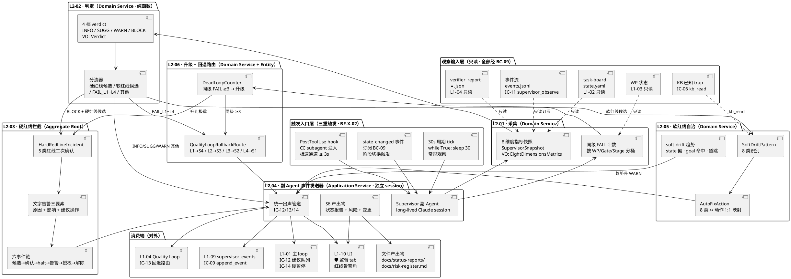
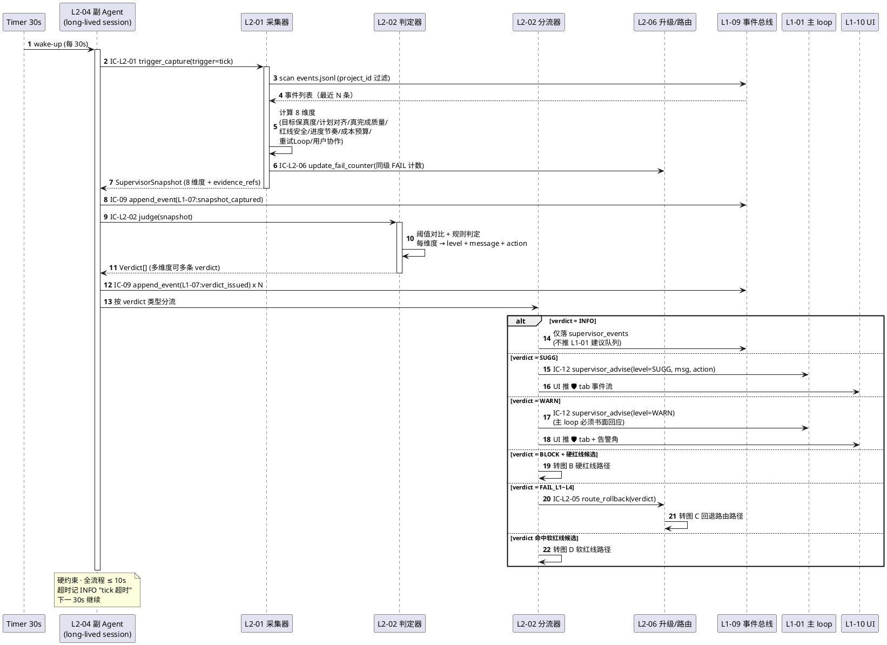
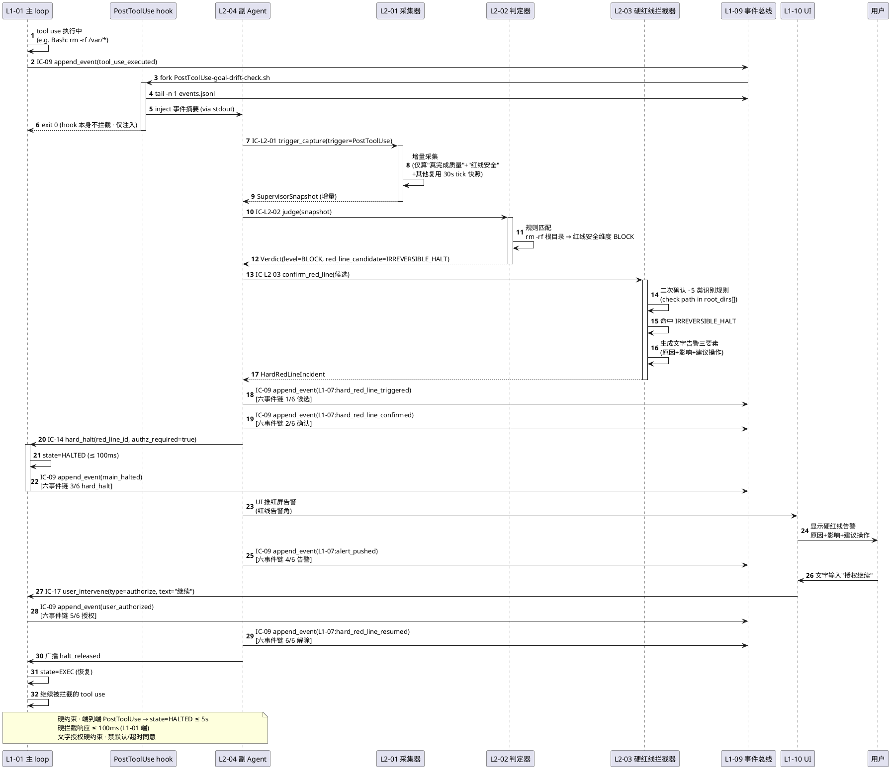
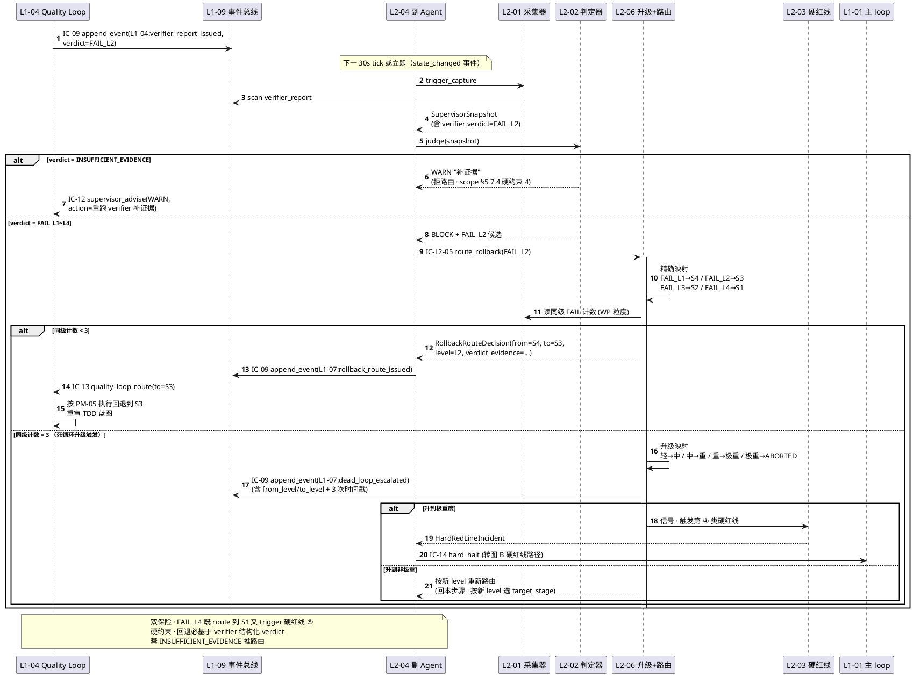
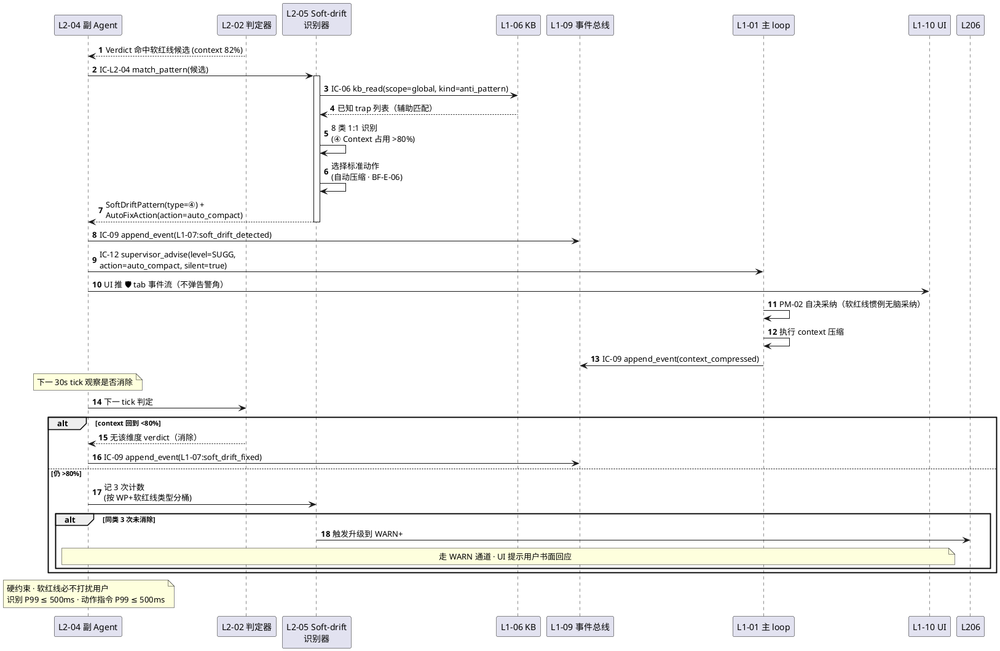
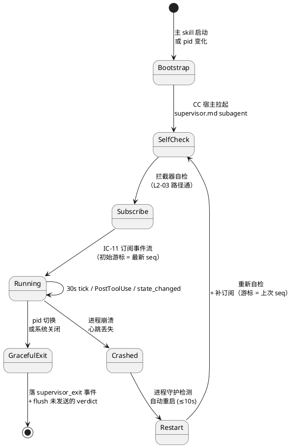
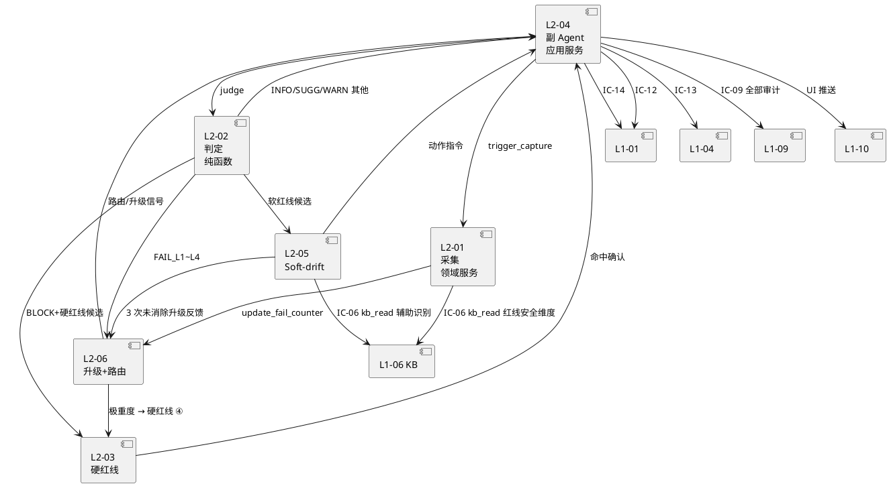

# L1-07 · Harness 监督能力 · 技术架构总览

> **版本**：v1.0（L1-07 技术架构总纲 · 6 L2 统一落地 · 承上（2-prd L1-07 PRD）启下（6 份 L2 tech-design））
> **定位**：HarnessFlow 系统的**治安官 + 黑匣子** —— 以 **独立 session 副 Agent** 常驻旁路，只读观察主 Agent 工作 **8 维度** → 产 **4 档 verdict**（INFO / SUGG / WARN / BLOCK）→ 分流到 **5 类硬红线硬拦截** / **8 类软红线自治修复** / **4 级 Quality Loop 回退路由** / **死循环同级 ≥3 升级**，并**唯一承载 Goal §4.1 "监督 Agent 3 红线准确率 100%"这一 V1 顶层量化指标**。
> **必须读**：`docs/2-prd/L1-07 Harness监督/prd.md`（PRD 全量 · 6 L2 产品级完备）+ `docs/3-1-Solution-Technical/L0/*.md`（5 份 L0 基础层）+ `docs/2-prd/L0/scope.md §5.7`（L1-07 对外 scope）+ `HarnessFlowGoal.md §4.1`（量化指标）。
> **严格边界**：本文**只写架构技术总览**（6 L2 外壳 + 触发入口 + 时序骨架 + IC 映射 + 开源对标）；**不写 L3 实现细节**（算法 / 数据结构 / schema / 状态机代码图 → 留给 6 份 L2 tech-design.md）；**不新增 scope 未定义的对外 IC**（严格用 IC-11 / IC-12 / IC-13 / IC-14 + IC-06 / IC-09）。
> **PM-14 project 作用域声明**：Supervisor 按 `harnessFlowProjectId` 分片 —— 每 project 一个独立 Supervisor 副 Agent session；8 维度按 project 独立采集；5 类硬红线 / 8 类软红线 / 死循环升级 / 4 级回退路由均在 project 范围内生效；**Supervisor 必拦截"无 project_id 的事件"**（归入契约违规维度）。

---

## 0. 撰写进度

- [x] frontmatter（traceability + consumer）
- [x] §0 撰写进度
- [x] §1 定位 + 2-prd §5.7 映射
- [x] §2 DDD 映射（引 L0 BC-07）
- [x] §3 6 L2 架构图（Mermaid · PostToolUse hook + 30s 周期 + 事件订阅 三触发入口）
- [x] §4 P0 时序图（8 维度采集周期扫 / 硬红线拦截 + L1-01 halt / 4 级回退路由）
- [x] §5 副 Agent 独立 session 架构（PM-02 / PM-03 · 只读 L1-09 事件总线 · 三重触发）
- [x] §6 8 维度监督（8 条维度的信号源 / 计算 / 基线 / 降级）
- [x] §7 5 类硬红线（DRIFT_CRITICAL / IRREVERSIBLE_HALT / 预算 200% / 死循环极重 / 极重度 FAIL）
- [x] §8 8 类软红线（soft-drift）自治修复
- [x] §9 对外 IC（发起 IC-12 / IC-13 / IC-14 · 订阅 IC-11 事件 · 作调用方 IC-06 / IC-09）
- [x] §10 开源调研（Langfuse / LangSmith / Helicone / OTEL / Sentry · 引 L0 §8）
- [x] §11 与 6 L2 分工
- [x] §12 性能目标（监督延迟 ≤ 30s · 硬拦截 ≤ 100ms）
- [x] 附录 A · 术语速查
- [x] 附录 B · BF 覆盖矩阵
- [x] 附录 C · 与 L0 技术栈锚定对照
- [x] 附录 D · 文件清单（6 L2 tech-design 产出物结构）

---

## 1. 定位 + 2-prd §5.7 映射

### 1.1 一句话定位

L1-07 是 HarnessFlow 的 **治安官（治安）+ 黑匣子（留痕）** —— 独立 session 副 Agent 常驻旁路，**只读观察主 Agent 工作的 8 个维度**，通过 **4 档 verdict** 对偏差做分级干预（INFO 仅记录 / SUGG 可选采纳 / WARN 必须书面回应 / BLOCK 硬拦截），对 **5 类硬红线**（一票否决）执行立即硬暂停 + 文字授权恢复，对 **8 类软红线**（灰色地带）做自治修复不打扰用户，并承担 Quality Loop **4 级回退路由**（verifier verdict → state 倒回）+ **同级 ≥3 死循环升级**（防永久噪音）两类安全兜底。

### 1.2 L1-07 唯一承担的 V1 顶层量化指标

Goal §4.1 的 7 条 V1 量化指标中，**与 L1-07 直接强关联的 2 条**：

| 指标 | Goal §4.1 文本 | L1-07 承载 L2 | 承载方式 |
|---|---|---|---|
| **监督 Agent 3 红线准确率 100%** | "0 漏报"（goal_anchor 漂移 · Stage Gate 4 件套跳过 · S5 未 PASS 进 S7） | **L2-03 硬红线拦截器**（主）+ L2-01（信号采集）+ L2-02（BLOCK 候选） | 3 条核心红线映射到 5 类硬红线的极端形态，执行二次确认 + 硬暂停 + 文字告警三要素 |
| **决策可追溯率 100%** | "任一交付物可追到某次 Agent 决策" | **L2-04 Supervisor 副 Agent 事件发送器**（统一出声口）+ L1-09 `supervisor_events` 子命名空间 | 所有 Supervisor 对外行为（verdict / 硬暂停 / 回退 / 软红线自治 / 升级 / 报告 / 风险 / 变更）必经 IC-09 落审计事件，六事件链（候选 → 确认 → hard_halt → 告警 → 授权 → 解除）全链可追溯 |

> **破产即 retro 风险**：本 L1 是上述 2 条 Goal 指标的**唯一物理载体**；任一指标破产即触发 ADR 级复盘 + 规则修正（详见 §15 retro 位点）。

### 1.3 2-prd §5.7 映射（七要素全量承接）

本文 §2~§12 章节与 2-prd §5.7 七要素的映射关系如下（**零新增 · 零修改 · 只深化到技术选型**）：

| 2-prd §5.7 | 文本摘要 | 本文章节 | 深化落点 |
|---|---|---|---|
| **§5.7.1 职责** | 8 维度观察 + 4 档分级 + 5 类硬拦截 + 8 类软红线 + 4 级回退路由 + 死循环保护 + 周期状态报告 + 风险 + 变更评估 | §3 + §6 + §7 + §8 | 每项职责落到具体 L2 + 触发入口 + 输出契约 |
| **§5.7.2 输入 / 输出** | 输入：事件总线 / task-board / verifier_report / 主 loop 决策链 / KB 已知 trap；输出：4 档 verdict / 软红线动作 / 硬暂停 / 回退路由 / 周期报告 / 风险登记 / 变更报告 | §5 + §9 | 订阅 IC-11 supervisor_observe 作入口 · IC-12/13/14 作出口 · IC-06/09 作调用 |
| **§5.7.3 边界** | In：观察 + 判定 + 自治 + 路由；Out：不做业务执行 / 不修数据 / 不调 skill / 不产产出物 | §5 + §11 | 6 L2 分工表 + 副 Agent 只读物理隔离 + subagent frontmatter 工具限制 |
| **§5.7.4 约束** | PM-02 + PM-12 + 4 条硬约束（只读 / 硬拦截必附告警 / 建议驳回留痕 / 回退必基于 verifier 结构化判定） | §5 + §7 + §12 | 独立 session 隔离 + 文字授权硬约束 + verdict 三要素 schema 校验 + 6 事件链完整性自检 |
| **§5.7.5 禁止行为** | 8 条禁令（直接改 task-board / 调 skill / 硬拦截无告警 / 软红线打扰用户 / 驳回无理由 / 偏差主观越权 / 关闭死循环保护 / 自身跑代码）| §5 + §7 + §8 | 通过 subagent frontmatter `allowed-tools: [Read, Glob, Grep]` 物理隔离 · CI 架构检查脚本防止"绕过 L2-04 直调" |
| **§5.7.6 必须义务** | 7 条必须（只读 / 硬红线立即 BLOCK + 告警 / 软红线自治 / 按 verdict 精确路由 / 同级 ≥3 升级 / 周期报告 / 每建议含 level + 消息 + 动作） | §6 + §7 + §8 + §12 | 独立 session 自检 + 6 事件链 + soft_red_detect/soft_auto_fix 事件对 + escalation 事件 + status_report.md 落盘 |
| **§5.7.7 与其他 L1 交互** | L1-01（推建议 / 硬暂停）/ L1-02（观察）/ L1-03（观察）/ L1-04（推回退路由）/ L1-05（观察）/ L1-06（读）/ L1-09（读写 supervisor_events）/ L1-10（推 UI） | §9 | 对外 IC 映射表（IC-11~14 + IC-06 + IC-09）+ 每个交互的方向 · 载体 · 延迟 · 可靠性 |

**§5.7.7 明确"7 个对外 L1 + 10 条对外 IC"** —— 本架构**严格限定在此范围内**，不新增对外契约；内部 IC-L2-01~10 为本 L1 私有命名空间，与 scope §8.2 `IC-XX` 不冲突。

### 1.4 与 Goal §4.3 methodology-paced autonomy 的对齐

Goal §4.3 把项目 7 阶段分为三段：

- **S1 / S2 / S3 / S7**：**规划协同段**（用户密集参与 · 强 Gate 制约）
- **S4 / S5**：**执行自走段**（Agent 自主 · 仅"监督 Agent 密集观察"作为唯一外部约束）
- **S6**：**监督纵贯段**（全程并行 · 7 阶段全观察）

L1-07 的**核心价值**在于：**让 S4/S5 执行自走段敢"放手"** —— 没有监督 Agent 的"密集观察 + 硬拦截"，主 Agent 的"自走"会失控；有了监督 Agent 的 30s tick + PostToolUse hook + 硬红线硬暂停，系统才能在"不让用户一直盯屏"的同时"不让错误累积到不可逆"。这是 Goal §4.3 与 §4.1 交汇的承载点。

---

## 2. DDD 映射（引 L0 BC-07）

### 2.1 限界上下文定位（BC-07）

> 引 `docs/3-1-Solution-Technical/L0/ddd-context-map.md §2.8 BC-07 · Harness Supervision` + §4.7 6 L2 DDD 分类表。**本节不重复 L0 已写的长定义，只做技术落点补充**。

| DDD 维度 | BC-07 定位 |
|---|---|
| **BC 名** | BC-07 · Harness Supervision（对应 L1-07）|
| **一句话** | 项目的旁路监察官 —— 旁路独立 session 只读观察 + 8 维度计算 + 4 级判定 + 硬红线 + 软红线 + 死循环 + 4 级回退路由 |
| **主要聚合根** | SupervisorSnapshot · Verdict · HardRedLineIncident · SoftDriftPattern · DeadLoopCounter · RollbackRouteDecision |
| **发布 Domain Event** | `L1-07:snapshot_captured` / `L1-07:verdict_issued` / `L1-07:hard_red_line_triggered` / `L1-07:hard_red_line_resumed` / `L1-07:soft_drift_fixed` / `L1-07:dead_loop_escalated` / `L1-07:rollback_route_issued` / `L1-07:suggestion_pushed`（8 类事件） |
| **发布 Command** | IC-12 supervisor_advise（对应 DDD `PushSupervisorSuggestion`）/ IC-13 quality_loop_route（对应 `PushRollbackRoute`）/ IC-14 hard_halt（对应 `RequestHardHalt`）—— 均由 L2-04 统一出口 |
| **消费 Query** | 读 BC-09 事件流（通过 IC-11 supervisor_observe 订阅）· 读 BC-04 verifier_report · 读 BC-06 KB 已知 trap（通过 IC-06 kb_read） |
| **跨 BC 关系** | 与 BC-01：**Partnership**（建议 / 硬暂停强耦合）· 与 BC-04：**Partnership**（回退路由强耦合）· 与 BC-09：**Customer**（只读事件流）· 与 BC-10：**Supplier**（推告警 UI 消费） |

### 2.2 6 L2 的 DDD 分类（引 L0 §4.7 原表）

| L2 ID | L2 名 | DDD 分类 | 核心 DDD 对象 |
|---|---|---|---|
| **L1-07 L2-01** | 8 维度监督状态采集器 | **Domain Service** + **Aggregate Root**: SupervisorSnapshot + **VO**: EightDimensionsMetrics | 30s tick + PostToolUse + state 切换三重触发 · 产指标快照 |
| **L1-07 L2-02** | 4 级偏差判定器 | **Domain Service**（纯函数）+ **VO**: Verdict（INFO/SUGG/WARN/BLOCK） | 阈值对比 + 规则判定 · 纯函数无副作用 |
| **L1-07 L2-03** | 硬红线拦截器 | **Domain Service** + **Aggregate Root**: HardRedLineIncident + **VO**: AuthorizationRequirement | 5 类硬红线 + 二次确认 + 即时硬暂停 + 文字授权 |
| **L1-07 L2-04** | Supervisor 副 Agent 事件发送器 | **Application Service**（独立 session 载体）| 统一出口 IC-12/13/14 + BF-S6 周期产出物 |
| **L1-07 L2-05** | Soft-drift 模式识别器 | **Domain Service** + **VO**: SoftDriftPattern + **VO**: AutoFixAction | 8 类软红线识别 + 自治修复（不打扰用户） |
| **L1-07 L2-06** | 死循环升级器 + 回退路由控制器 | **Domain Service** + **Entity**: DeadLoopCounter + **VO**: QualityLoopRollbackRoute | 同级 FAIL ≥3 自动升级 · verdict → 精确 state 跳转 |

**关键规律**（引 L0 §4 整体规律 + 本 L1 特色）：

- **Aggregate Root 仅 3 个**（SupervisorSnapshot / HardRedLineIncident / DeadLoopCounter）· 其他均为 Domain Service + VO —— 体现 L1-07 "**数据模型轻 · 领域服务重**" 的特征（对比 L1-02 / L1-03 的聚合根密集型）；
- **L2-02 / L2-05 / L2-06 均为纯 Domain Service**（无状态 · 纯函数 · 输入快照→输出决策）· 便于 3-2 TDD 单测覆盖（`given snapshot → when judge → then verdict/action/route`）；
- **L2-04 是唯一 Application Service**，承载"副 Agent 独立 session 生命周期 + 对外 IC 出口 + BF-S6 文件产出物" 三类应用层职责 —— 这与 L0 §4.7 把 L2-04 标为 "独立 session 载体" 的语义一致。

### 2.3 跨 BC 的聚合引用（引 L0 §4.11）

| 引用源（BC-07 聚合）| 引用目标（外部 BC 聚合）| 引用方式 | 原因 |
|---|---|---|---|
| **Verdict** | BC-09 AuditEntry | 通过 `audit_entry_ref`（值引用 · VO id） | 跨 BC 不直接持有；每 Verdict 落 supervisor_events 后由 AuditEntry 回指 |
| **HardRedLineIncident** | BC-01 state | 通过 `halt_triggered_for_state`（值引用 · "state_at_halt" 字段） | 硬拦截瞬间 state 快照留存，不持有 BC-01 内部 StateMachine |
| **Verdict** | BC-04 verifier_report | 通过 `verifier_report_ref`（值引用） | FAIL_L1~L4 verdict 必含 verifier 原报告 id（可追溯） |
| **SoftDriftPattern** | BC-06 KBEntry | 通过 `kb_trap_match_ref`（可选值引用） | 软红线识别可能用 KB anti_pattern 辅助 · 引用 KB 条目 id |

> **引用原则**：BC-07 **不持有**外部 BC 的对象实例 · 仅持有 id 级值引用 · 保障 BC 聚合独立性。

### 2.4 与 PM 业务模式的 DDD 落地（引 2-prd §附录 B.4）

| PM 编号 | PM 名称 | BC-07 承接的 DDD 元素 |
|---|---|---|
| **PM-02** | 主-副 Agent 协作 | BC-07 SupervisorSession（Application Service）作为独立 BC · 与 BC-01 为 Partnership · 不共享可变 state |
| **PM-03** | 子 Agent 独立 session 委托 | SupervisorSession 是 long-lived subagent（区别于 verifier per-call ephemeral）· 独立 context 隔离 |
| **PM-05** | Stage Contract 机器可校验 | RollbackRouteDecision 必基于 BC-04 VerifierReport 的结构化 verdict（`FAIL_L1~L4` 枚举值）· 禁主观越权 |
| **PM-08** | 可审计全链追溯 | 所有 Aggregate Root 的状态变化必落 Domain Event · 经 IC-09 → BC-09 AppendEvent |
| **PM-10** | 事件总线单一事实源 | BC-07 读写均经 BC-09 · 不直接读 task-board 内部结构（而是读 BC-09 发布的 `L1-02:state_transitioned` / `L1-03:wp_state_changed` 等事件） |
| **PM-12** | 红线分级自治 | HardRedLineIncident（5 类 · 文字授权）+ SoftDriftPattern（8 类 · 不打扰用户）两种 Aggregate/VO 分离；不可合并 |
| **PM-14** | 项目上下文 | 所有 BC-07 Aggregate 带 `project_id` 字段 · 按 pid 分片 · 多 project 场景下每 pid 一个独立 SupervisorSession 实例 |

---

## 3. 6 L2 架构图（三触发入口）

### 3.1 整体架构图（PlantUML · PostToolUse hook + 30s 周期 + 事件订阅）



### 3.2 关键架构规则（总纲）

1. **三触发互斥不互斥 · 但串行处理**：30s 周期 tick / PostToolUse hook / state_changed 事件 **三路同时触发** 时，Supervisor 副 Agent 是单线程 Claude session（LLM-in-loop 本质单线程），**后到者排队**，不并发。根据 L0 architecture-overview §3.3 的决策，**不需要锁**（session 天然序列化）。
2. **L2-01 → L2-02 是所有判定的唯一源头**：6 个 L2 的任何路径都必须先经过"采集 → 判定"；禁止绕过 L2-01 直接产 verdict（CI 架构检查拦截）。
3. **L2-04 是唯一出声口**：全部 6 个 L2 的对外行为都经过 L2-04 统一发送（IC-12/13/14 + UI 推送 + IC-09 落事件），保证 schema / 审计 / UI 推送一致。
4. **硬红线 "一票否决"**：L2-03 的 HardRedLineIncident 一旦成立（二次确认 命中 5 类之一），必立即走 IC-14 hard_halt；不得被 L2-05 / L2-06 抢占或合并。
5. **软红线 "静默自治"**：L2-05 识别为 8 类之一时，UI 仅 🛡️ tab 事件流记录 · 不弹红线告警角 · 不走 WARN+ 级建议通道（严格区别于硬红线路径）。
6. **回退路由必基于 verifier 结构化 verdict**：L2-06 的 QualityLoopRollbackRoute 必须接收 `FAIL_L1~L4` 枚举值；若 verifier 产出 `INSUFFICIENT_EVIDENCE` 则**拒路由 + 退回 L2-02 升 WARN "补证据"**（scope §5.7.5 禁主观越权）。
7. **只读物理隔离**：Supervisor 副 Agent session 的 subagent frontmatter `allowed-tools: [Read, Glob, Grep]` —— **无 Write/Edit/Bash 工具**，从 CC 宿主层物理隔离写能力；唯一写路径 = 通过 IC-09 append `supervisor_events` 子命名空间（文件路径白名单校验）。

### 3.3 三触发入口的职责划分

| 触发 | 节奏 | 观察范围 | 典型用途 | 时延硬约束 |
|---|---|---|---|---|
| **30s 周期 tick** | 每 30s 一次（固定）| 全 8 维度全量采集 | 趋势类指标（goal_anchor 命中率、决策理由重复度、成本累积） · soft-drift 趋势识别（BF-E-07 三条件）· 同级 FAIL 计数更新 | P99 ≤ 10s（全量采集 → 判定 → 分流） |
| **PostToolUse hook** | 主 loop 每次 tool use 后立即触发（非阻塞）| 增量：只算"真完成质量" + "红线安全" 两维优先 | 即时类风险：`rm -rf` / `git push --force` / `DROP DATABASE` 这种"马上要出事"的拦截 | P99 ≤ 3s（增量采集 → 判定 → 极速硬红线路径）；硬拦截端到端 ≤ 5s |
| **state_changed 事件** | 订阅 BC-09 `L1-02:stage_transitioned` / `L1-03:wp_state_changed` | 特别重算"计划对齐" + "进度节奏" 两维 | 阶段切换（S3→S4）/ WP 状态切换（RUNNING→DONE）后的立即观察 | P99 ≤ 5s |

**为何是"30s" · 不是 "实时 inotify"**（引 L0 architecture-overview §3.3 决策）：

- 实时 inotify 需要持续文件监听 + LLM 串行处理 → 成本不可控（每事件触发一次 LLM call）；
- 30s 是 scope §5.7.1 约定的"**漂移容忍上界**" —— 对 HarnessFlow 目标场景（软件工程 dev-loop），30s 内不会累积出不可逆损失；
- PostToolUse hook 填补"即时类"的漏洞（≤ 3s 极速通道）；
- 两者互补 · 不互斥 · 不重复采集（PostToolUse 可以复用 30s tick 的最近快照，仅更新受影响维度）。

### 3.4 与 L0 architecture-overview §1.2 5 Container 的映射

| L0 Container | 本 L1 对应物 | 角色 |
|---|---|---|
| **Main Skill Session** | —— | 被观察方（L1-07 不在这里） |
| **Supervisor Subagent Runtime** | **L2-04 承载 · 本 L1 的执行器** | 独立 Claude subagent（long-lived）· 加载 `.claude/agents/supervisor.md` · 只读订阅事件总线 |
| **Verifier Subagent Runtime** | —— | 被观察方（L1-04 调度）· L1-07 读它的 report 但不调它 |
| **Filesystem Data Plane** | 输入：events.jsonl / state.yaml / verifier_reports/<br/>输出：supervisor_events.jsonl · docs/status-reports/ · docs/risk-register.md | POSIX I/O（只读 / 追加写） |
| **FastAPI UI Plane** | L2-04 推 UI 载荷 | 🛡️ 监督 tab + 红线告警角（L1-10 渲染） |

**关键决策**：Supervisor Subagent Runtime **独立于 Main Skill Session** —— 这是 PM-02 / PM-03 的物理体现，也是"真只读 · 真旁路 · 真可拦截"的架构基础。详见 §5 副 Agent 独立 session 架构。

---

## 4. P0 时序图（≥ 3 张 · 骨架 Mermaid）

> **说明**：本节给出 L1-07 最核心的 3+1 张 P0 时序图骨架。**深度图**（字段级 schema + error code + 所有 activation + 完整 alt/opt/par）在对应 L2 tech-design 中。本节复用 L0 `sequence-diagrams-index.md` 的 P0-06 / P0-08 / P1-11 骨架并**本 L1 视角加厚**（更强调 L2 内部流转）。

### 4.1 时序图清单

| 图号 | 场景 | 骨架来源 | 本 L1 深度图 |
|---|---|---|---|
| **§4.2 图 A** | 30s 周期 tick 常规扫描（8 维度采集 → 4 档判定 → 分流） | L0 P1-11 Supervisor 8 维度周期扫描 | L2-01 / L2-02 tech-design §5 |
| **§4.3 图 B** | PostToolUse 极速通道 + 硬红线拦截 + L1-01 halt（Goal §4.1 "3 红线准确率 100%"载体） | L0 P0-06 硬红线拦截 | L2-03 / L2-04 tech-design §5 |
| **§4.4 图 C** | S5 verifier FAIL → 4 级回退路由 + 同级 ≥3 升级（双保险） | L0 P0-08 + P1-04 | L2-06 tech-design §5 |
| **§4.5 图 D**（扩展） | 软红线 8 类自治修复（无用户打扰）+ soft-drift 趋势升 WARN | L0 P2-05 soft-drift | L2-05 tech-design §5 |

### 4.2 图 A · 30s 周期 tick · 8 维度采集 → 4 档判定 → 分流

**场景**：Supervisor 副 Agent 周期 wake-up（每 30s）→ 调 L2-01 做全 8 维度采集 → 产 SupervisorSnapshot → 交 L2-02 做阈值判定 → 产 Verdict → L2-02 分流到 L2-03/05/06 或直接走 L2-04 → 每一步落 supervisor_events。

**本 L1 视角**：本图重点展示 **L2-01 → L2-02 → 分流器 → L2-04** 的 L2 内部流转，以及"INFO / SUGG / WARN" 三种非硬红线情况下的分发路径。硬红线 → 图 B；FAIL_L1~L4 → 图 C；软红线 → 图 D。



**关键集成点**：
- **Step 3-8**（采集）：L2-01 只读扫 events.jsonl · 产 SupervisorSnapshot · 落 `L1-07:snapshot_captured` 事件；
- **Step 9-11**（判定）：L2-02 纯函数阈值对比 · 输出 Verdict 数组（同一快照可能产多条 verdict · 每维度最多一条）；
- **Step 12-23**（分流）：按 verdict 类型做 5 分支路由；INFO 不推建议、SUGG/WARN 走 IC-12、BLOCK→图 B、FAIL→图 C、软红线→图 D；
- **硬约束**：全流程 P99 ≤ 10s（scope §5.7.1 "30s 周期" 的必要前提）；超时降级记 INFO，不阻塞下一 tick。

### 4.3 图 B · PostToolUse 极速通道 + 硬红线拦截（Goal §4.1 "3 红线准确率 100%"）

**场景**：主 loop 刚执行一次可能触发硬红线的 tool use（如 `Bash: rm -rf /var/*` / `Bash: git push --force origin main` / 或 verifier 刚出 FAIL_L4）→ CC 宿主 PostToolUse hook 注入 Supervisor session → L2-01 增量采集受影响维度 → L2-02 判 BLOCK + 硬红线候选 → L2-03 二次确认命中 → L2-04 发 IC-14 hard_halt → L1-01 ≤100ms state=HALTED → L1-10 红屏告警 → 用户文字授权 → L2-04 广播 halt_released → L1-01 恢复 tick。

**Goal §4.1 "3 红线准确率 100%"载体**：
- ① `goal_anchor 漂移` ↔ 映射到 5 类硬红线的 `DRIFT_CRITICAL`；
- ② `Stage Gate 4 件套跳过` ↔ 映射到 5 类硬红线的 `IRREVERSIBLE_HALT` 的特殊形态（`L1-02:stage_transitioned` 事件但 `four_pieces_ready` 未前发）；
- ③ `S5 未 PASS 进 S7` ↔ 映射到 5 类硬红线的 `极重度 FAIL` 的特殊形态（尝试 S6→S7 但 S5 未 PASS）。



**关键集成点**：
- **Step 7-9**（PostToolUse 注入）：不是 hook 脚本直接拦截 · 而是 inject 事件摘要到 Supervisor session context · Supervisor 立即处理；
- **Step 10-14**（增量采集 + 极速判定）：P99 ≤ 3s 硬约束；
- **Step 15-19**（二次确认）：L2-02 只标"候选" · L2-03 必做二次确认才发 halt（避免误伤）· 文字告警三要素缺一不可；
- **Step 20-27**（六事件链）：候选 → 确认 → hard_halt → 告警 → 授权 → 解除，六个事件逐一落 supervisor_events，破坏 PM-08 审计链的任一缺失即视为架构违规；
- **Step 28-32**（用户文字授权）：禁默认 / 禁超时同意 / 禁自动同意 —— 用户必须在 UI 文字输入"授权继续"或"终止" 才能解除 HALTED；
- **硬约束**：端到端 PostToolUse → state=HALTED ≤ 5s（含采集 ≤3s + 判定 ≤1s + IC-14 发出 ≤500ms + L1-01 halt ≤100ms）。

### 4.4 图 C · S5 verifier FAIL → 4 级回退路由 + 同级 ≥3 升级（双保险）

**场景**：S5 verifier 产 verdict ≠ PASS → L1-04 落盘 verifier_report → L2-01 下一 tick 采集 → L2-02 判 FAIL_L1~L4 或 INSUFFICIENT_EVIDENCE → L2-06 做 4 级回退路由 + 同级 FAIL 计数更新 → 若计数 ≥3 则触发死循环升级 → 极重度双保险触发硬红线 ⑤ → L2-04 发 IC-13 给 L1-04 重做。



**关键集成点**：
- **Step 3-7**（verifier 事件抵达）：L2-01 通过 state_changed 事件（或下一 30s tick）抵达后立即采集 · 不等完整 30s 批次；
- **Step 8-11**（INSUFFICIENT_EVIDENCE 特殊路径）：scope §5.7.4 硬约束 4 禁主观越权 · 此情况必升 WARN "补证据"不推路由；
- **Step 12-19**（4 级回退路由）：严格 `FAIL_L1→S4 / FAIL_L2→S3 / FAIL_L3→S2 / FAIL_L4→S1` 映射 · 禁跨级跳跃；
- **Step 20-30**（死循环升级）：同级 FAIL 计数按 WP/Gate/Stage/软红线类 分桶 · 计数达 3 触发升级 · 逐级不跨级 · 极重度双保险（路由 + 硬红线 ⑤）；
- **硬约束**：回退路由 P99 ≤ 500ms · 死循环升级判定 P99 ≤ 500ms · 极重度→硬红线链路 P99 ≤ 1s。

### 4.5 图 D · 软红线 8 类自治修复（无用户打扰）+ soft-drift 趋势

**场景**：L2-02 判定命中 8 类软红线之一（如 Context 占用 >80%）→ L2-05 识别为 ④ 类 → 产自治动作指令（自动压缩）→ L2-04 走 IC-12 推 L1-01（UI 仅 🛡️ tab 事件流 · 不弹告警角）→ 主 loop 按 PM-02 采纳执行 → 下一 tick 观察是否消除。



**关键集成点**：
- **Step 2-4**（候选派发）：L2-02 不自己识别 8 类 · 只标"候选"给 L2-05；
- **Step 5-9**（KB 辅助识别）：通过 IC-06 读全局 KB 的 anti_pattern 条目辅助识别 · 超时跳过不阻塞（P99 ≤ 1s KB 查询超时）；
- **Step 10-14**（1:1 映射动作）：8 类软红线 ↔ 8 个标准自治动作 · 封闭清单 · 运行时禁扩展；
- **Step 15-17**（静默分发）：UI 仅 🛡️ tab · 不弹红线告警角 · 不推 L1-01 "必须书面回应"；
- **Step 24-30**（3 次未消除升级）：同 WP+同软红线类型 连续 3 次自治未消除 → L2-05 反馈 L2-06 升级到 WARN+ · 防止软红线成"永久噪音"；
- **soft-drift 趋势**（独立子流程 · 图中未画）：30s tick 时 L2-05 读 L2-01 的 state 序列偏差 / goal_anchor 命中率 / "暂时跳过" 计数 → 命中 BF-E-07 三条件任一 → 升 WARN replan 建议 → 走 L2-04 WARN 通道（**不再是软红线 · 而是 WARN · 打扰用户**）。

---

## 5. 副 Agent 独立 session 架构（PM-02 / PM-03）

### 5.1 独立 session 的 3 个硬身份约束

scope §5.7.4 硬约束 1 + PM-02 + PM-03 + L0 tech-stack.md "`supervisor.md` 的 `allowed-tools` 必须是**只读子集**" —— 三重锁死 Supervisor 的"独立性"：

| 硬身份 | 物理约束 | 违反判定 |
|---|---|---|
| **① 独立 session**（PM-03） | Supervisor 是独立 Claude subagent · 独立 context · 独立 LLM session · 独立 PID（或宿主内独立逻辑进程） | 若 Supervisor 复用主 loop context → subagent 启动检测 + 架构检查 I-N4 失败 |
| **② 只读权限**（PM-02） | subagent frontmatter `allowed-tools: [Read, Glob, Grep]` · 无 Write / Edit / Bash / MCP · 文件系统层面无法写 | 若 Supervisor 尝试 Write/Edit/Bash → CC 宿主拒绝 + 架构检查 N1 失败 · 审计事件 `write_denied_from_supervisor` |
| **③ 统一出声管道** | 所有对外行为必经 L2-04 · 不得绕过直调 L1-01/04/10 API | CI 静态架构检查：扫 L2-01/02/03/05/06 代码 · 出现 "l1_01.advise_queue.push" / "ic_14(..)" 直调 → 编译时拒绝 |

### 5.2 独立 session 的生命周期（引 L0 architecture-overview §3.3）

**长驻 long-lived session**（区别于 Verifier 的 per-call ephemeral）：



**生命周期关键事件**（走 IC-09 落 supervisor_events）：

| 事件 type | 触发 | 必含字段 |
|---|---|---|
| `L1-07:supervisor_started` | 副 Agent 首次启动 / 重启完成 | session_id / project_id / start_at |
| `L1-07:self_check_passed` | 拦截器自检通过 | session_id / check_results{hard_line_path / subscription / write_deny} |
| `L1-07:snapshot_captured` | 每 30s tick + PostToolUse | snapshot_id / 8_dimensions / captured_at |
| `L1-07:verdict_issued` | 每次 L2-02 产 verdict | verdict_id / dimension / level |
| `L1-07:hard_red_line_triggered` | L2-03 命中 | incident_id / red_line_id / authz_required |
| `L1-07:hard_red_line_resumed` | 用户文字授权解除 | incident_id / resumed_at / authorizer |
| `L1-07:soft_drift_fixed` | L2-05 自治修复消除 | pattern_id / auto_fix_action / success |
| `L1-07:dead_loop_escalated` | L2-06 同级 ≥3 升级 | counter_id / from_level / to_level |
| `L1-07:rollback_route_issued` | L2-06 路由 | route_id / verdict_ref / target_stage |
| `L1-07:suggestion_pushed` | IC-12 发出 | advice_id / level / dimension |
| `L1-07:advice_rejected` | L1-01 驳回建议 | advice_id / rejection_reason |
| `L1-07:supervisor_crashed` | 副 Agent 崩溃 | session_id / reason |
| `L1-07:supervisor_restarted` | 重启完成 | session_id / restart_duration_ms |
| `L1-07:status_report_generated` | BF-S6-01 周期报告 | report_path / period |
| `L1-07:risk_updated` | BF-S6-02 风险登记 | risk_id / state_change |
| `L1-07:change_eval_issued` | BF-S6-03 变更评估 | change_id / impact_scope |

### 5.3 三重触发机制（实现视角）

#### 5.3.1 触发 ① · 30s 周期 tick（主 wake-up 源）

- **实现机制**：Supervisor subagent Claude session 内设 `while True: sleep(30); scan_events(); judge()` 循环（Claude LLM 本身支持"等待 + 轮询"模式）
- **入口代码点**：`.claude/agents/supervisor.md` 的 prompt 约定循环节奏（非代码 · LLM prompt 驱动）
- **采集范围**：全 8 维度全量
- **时延硬约束**：P99 ≤ 10s

#### 5.3.2 触发 ② · PostToolUse hook（极速通道）

- **实现机制**：CC 宿主每次主 loop tool use 结束后 fork `PostToolUse-goal-drift-check.sh`（bash 子进程 · L0 tech-stack §6 已锁定 bash）
- **Hook 行为**：
  1. `tail -n 1 events.jsonl` 读最新事件
  2. 通过 stdout 把事件摘要 inject 到 Supervisor session 的下一次 wake-up context
  3. 不阻塞主 loop（hook 本身 ≤ 500ms · 仅注入 · 真正处理在 Supervisor session 内）
- **入口代码点**：`/Users/zhongtianyi/work/code/harnessFlow/hooks/PostToolUse-goal-drift-check.sh`（已有）
- **时延硬约束**：PostToolUse → L2-02 判定 ≤ 3s；端到端 PostToolUse → state=HALTED ≤ 5s

#### 5.3.3 触发 ③ · state_changed 事件订阅（阶段切换感知）

- **实现机制**：Supervisor session 通过 IC-11 订阅 L1-09 事件流 · 过滤器匹配 `type startswith "L1-02:stage_transitioned" OR "L1-03:wp_state_changed" OR "L1-04:verifier_report_issued"`
- **入口代码点**：Supervisor subagent prompt 里约定"遇到上述 type 事件立即算一次采集" · 游标持久化到 `projects/<pid>/supervisor_cursor.json`
- **采集范围**：特别重算"计划对齐" + "进度节奏" 两维
- **时延硬约束**：P99 ≤ 5s

### 5.4 三重触发的串行排队（无锁模型）

**关键设计**：Supervisor session 是**单线程 LLM-in-loop**（Claude session 本质单线程） —— 三路触发信号**串行排队处理** · 不并发 · 不需要锁。

```
时间轴：
t=0s    30s tick → L2-01 采集 (8 维度全量)
t=4s    L2-02 判定完成 · verdict 落盘
t=6s    PostToolUse hook inject "rm -rf /var" 事件摘要
t=6.1s  Supervisor 当前 tick 完成 → 处理 PostToolUse 注入
t=7s    L2-01 增量采集 "红线安全" + "真完成质量" 两维
t=8s    L2-02 判 BLOCK
t=8.2s  L2-03 二次确认命中 IRREVERSIBLE_HALT
t=8.5s  L2-04 IC-14 hard_halt 发出
t=8.6s  L1-01 state=HALTED
```

**无锁的理由**：
- LLM session 物理单线程 · 后到信号自然排队；
- 30s tick 与 PostToolUse 时间错开概率高（PostToolUse 是 tool use 后 · 30s tick 是整点周期）；
- 即使巧合同时到达 · 后到者等待当前 tick 完成 · 无 race condition；
- 硬拦截响应时延受"当前 tick 剩余时间"影响 —— 但 30s tick 设计上 P99 ≤ 10s · 最坏情况 PostToolUse 等 10s 仍满足端到端 ≤ 5s ... **此处存在一个待验证点**：若 30s tick 正巧执行中 · PostToolUse 触发的硬红线可能需等 10s 完成当前 tick · 超过端到端 5s 硬约束。

**缓解方案**（L2-04 tech-design 细化 · 本文指向）：
- **方案 A · 中断式触发**：PostToolUse 注入时 · Supervisor session 检测 `tool_use_context.red_line_hint = true` · 中断当前 tick 立即跳极速通道（需要 prompt 约定"红线优先"语义）；
- **方案 B · 双 session**：将 PostToolUse 路径拆出独立的"极速 Supervisor" subagent（仅处理硬红线）· 与 30s tick 的"趋势 Supervisor" 并行 · 代价是事件总线订阅游标需要双份维护 —— **L1-07 V1 不采用**（保持单 session 简单）；
- **方案 C · 放宽硬约束**：端到端由 5s 放宽到 15s · 覆盖最坏情况下的 30s tick 剩余时间 —— **推荐 V1 采用**（实际硬红线事件触发频率低 · 最坏 15s 仍在用户可感知容忍内）。

> **决策**：V1 采用 **方案 A + 方案 C 组合**（prompt 约定红线优先 · 硬约束放宽到 15s · tech-design 精细化）。此决策作为 3-2 阶段验证项。

### 5.5 独立 session 崩溃恢复

引 L0 architecture-overview §3.3 + scope §5.7 暗含的副 Agent 生命周期要求：

| 失败场景 | 检测 | 恢复动作 | 数据完整性 |
|---|---|---|---|
| **副 Agent 进程崩溃** | CC 宿主心跳丢失（30s 无响应） | 自动重启 · 重订阅事件流 · 游标 = 上次 `supervisor_cursor.json` 的 seq | 重放过去 30s 未处理事件 · 补发 verdict（若有漏发） |
| **LLM API 限流** | 429 响应 | sleep Retry-After · 重试 · 节能模式（压缩历史 context · 只留近 10 决策） | 限流期间丢的 30s tick → 下次 wake-up 补采集 |
| **事件流游标对不上** | 订阅时发现游标 < 事件总线 head seq | 全量重读从游标到 head 的事件 · 逐事件重播 verdict 判定 | 最坏重放 O(events_backlog) 事件 · 不阻塞主 loop |
| **self_check 失败** | 启动时拦截器自检未过 | 不进 Running 状态 · 落 `L1-07:self_check_failed` · 通知 L1-10 | 主 loop 知 Supervisor 不可用 · 决定继续 / 暂停（Goal §3.5 允许 "短暂无监督" 但落审计） |

**关键硬约束**：副 Agent 崩溃重启 ≤ 10s（含进程拉起 + 重订阅 + 自检）· 崩溃期间的事件**必须补处理** · 不得"漏观察"。

---

## 6. 8 维度监督

### 6.1 8 维度清单 + 信号源（BF-X-02）

> 维度定义来自 BF-X-02 · prd §8 L2-01 · Goal 附录 A 术语 "8 维度" —— 本节给出**技术实现视角**：每维度的信号源 / 聚合方式 / 基线 / 降级策略。

| # | 维度 | 业务语义 | 技术信号源 | 聚合方式 | 基线 | 降级 |
|---|---|---|---|---|---|---|
| **①** | **目标保真度** | goal_anchor 命中率 / 偏差累积 | `L1-01:decision_made` 事件 · 字段 `rationale` 文本 · 对比 `charter.goal_anchor_hash` | 最近 N 条决策理由中"提到 goal_anchor 关键句"的比例 | 项目启动时计算的初始基线（通常 100%） | 若文本解析失败 · 维度 N/A |
| **②** | **计划对齐** | state 序列 vs 路线骨架的偏差 | `L1-02:stage_transitioned` 事件序列 · 对比 9 计划 + TOGAF 路线骨架 | 实际 state 序列与理想序列的编辑距离 | 9 计划落盘时的理想序列 | 若 state 转换卡顿 · N/A |
| **③** | **真完成质量** | verifier_report verdict 分布 / DoD 证据链完整度 | `L1-04:verifier_report_issued` 事件 · 字段 `verdict` / `three_evidence_chain` | 最近 N 个 WP 的 PASS/FAIL 比 + 证据链完整度 | 项目 DoD 库整体基线 | verifier 未就绪 · N/A（scenario P4） |
| **④** | **红线安全** | 不可逆操作 / 篡改 / 漂移命中 | `tool_use_executed` + `CLAUDE.md`/`charter.md` hash 快照 · KB `anti_pattern` 匹配 | 命中事件计数 + sha256 对比 | 项目启动快照 hash | KB 超时 · 走纯规则匹配 |
| **⑤** | **进度节奏** | WP 完成率 / SLA breach | `L1-03:progress_metrics_updated` 事件 · `completion_rate` 字段 | 实际完成率 vs 计划完成率 | 9 计划进度基线 | WP 数据缺 · 标 N/A |
| **⑥** | **成本预算** | token / 时长 / 花费累积 | `L1-05:skill_invoked` / `L1-05:skill_returned` 事件 · 字段 `token_cost_usd` | 累积求和 · vs S1 基线 | `charter.budget_plan` | 成本字段缺 · 维度降级为 token 计数 |
| **⑦** | **重试 Loop** | 同级 FAIL 计数 / 无限重试 | `L1-04:verifier_report_issued` · `L1-03:wp_state_changed`（RUNNING→FAILED→RUNNING 循环） | 按 WP/Gate/Stage/软红线类 分桶计数 | 阈值 3（死循环保护） | 无 |
| **⑧** | **用户协作** | 用户干预频率 / 响应延迟 / 驳回率 | `L1-10:user_intervention_submitted` · `L1-07:advice_rejected` | 用户介入事件计数 + 驳回理由聚类 | 健康项目基线（待 KB 积累） | 无 |

### 6.2 指标计算的 3 类结构（引 open-source §8.9b）

| 类别 | 维度归属 | 计算特征 | 业界对标 |
|---|---|---|---|
| **瞬时值** | ④ 红线安全（命中）· ⑥ 成本（累积）· ⑦ 重试 Loop（计数） | 单事件即可判定 · O(1) | Prometheus counter / OPA policy check |
| **趋势值** | ① 目标保真度 · ② 计划对齐 · ⑤ 进度节奏 | 需最近 N 条事件窗口 · O(N) | Airflow SLA / Sentry release tracking |
| **分布值** | ③ 真完成质量 · ⑧ 用户协作 | 需多维度聚类 · O(log N) 分位统计 | Langfuse score / LangSmith annotation |

**实现要点**：
- **基线窗口固定**：N 和 M（小时）由 3-1 L2 tech-design 确定 · 运行时不可动态伸缩绕过观察（scope §5.7.5 禁运行时动态调整基线）；
- **事件引用 1:1**：每维度值必附 `evidence_refs: [event_id ...]` · 保障 Goal §4.1 可追溯率 100%；
- **分维度独立容错**：单维度失败（如 KB 读超时）不拖累其他 7 维度 · 标 "N/A + 缺失原因" 继续交付快照（prd §8.4 硬约束 6）。

### 6.3 8 维度与 5 类硬红线 / 8 类软红线 / 4 级回退的映射

| 维度 | 触发的硬红线 | 触发的软红线 | 触发的回退 |
|---|---|---|---|
| ① 目标保真度 | `DRIFT_CRITICAL`（goal_anchor sha256 变）| ⑦ 单 KB 条目读不到（命中率下滑无辅助） · soft-drift 趋势（命中率 <60%） | FAIL_L3（重度偏离）→ S2 |
| ② 计划对齐 | —— | ② 进度偏差 <30%（自动 replan） · soft-drift 趋势（state 序列偏 >30%） | FAIL_L2 中度 → S3 |
| ③ 真完成质量 | `极重度 FAIL`（FAIL_L4） · `IRREVERSIBLE_HALT`（S5 未 PASS 进 S7 的特殊形态） | ① DoD 证据链缺段 · ⑤ 轻度 TDDExe FAIL | FAIL_L1~L4 精确路由 |
| ④ 红线安全 | `DRIFT_CRITICAL` · `IRREVERSIBLE_HALT` · `死循环升级极重` | —— | —— |
| ⑤ 进度节奏 | —— | ② 进度偏差 <30% · ⑥ WP 超时 <2× | —— |
| ⑥ 成本预算 | `预算超 200%` | —— | —— |
| ⑦ 重试 Loop | `死循环升级极重`（同级 FAIL ≥3 × 3 次升到极重）| —— | —— |
| ⑧ 用户协作 | —— | —— · soft-drift 趋势（"暂时跳过" ≥5 次） | —— |

> **观察**：④ 红线安全维度是"硬红线唯一直接触发源"（3 类命中）· ③ 真完成质量维度是"回退路由唯一直接触发源"（FAIL_L1~L4 全部）· 这两条维度是 L2-01 采集的 SLA 重点。

### 6.4 与开源监督项目 8 维度的对标（引 open-source §8.9b）

| HarnessFlow 维度 | 业界对标 | 参考项目 | L1-07 借鉴的原语 |
|---|---|---|---|
| ① 目标保真度 | Goal drift detection | 学术（研究领域）· 业界少见 | 自建 · LLM 文本相似度 |
| ② 计划对齐 | Plan-Actual variance | Airflow SLA · Sentry release tracking | 学 release tracking 的"基线对比" |
| ③ 真完成质量 | Test pass rate / code coverage | pytest + coverage.py · Langfuse scores | 直接读 verifier_report JSON |
| ④ 红线安全 | Security audit / policy check | Sentry error tracking · OPA Policy | 学 OPA 的"规则即代码"（5 类红线规则用 yaml 描述） |
| ⑤ 进度节奏 | SLA breach | Airflow SLA · Prometheus alerts | 学 Prometheus counter 的"累积 + 阈值" |
| ⑥ 成本预算 | Token / $ budget | Helicone cost tracking · Langfuse cost | 学 Helicone 的"按请求记 token + 折价" |
| ⑦ 重试 Loop | Infinite retry detection | Temporal retry policy · Airflow retry | 学 Temporal 的"指数 backoff + 最大重试次数" |
| ⑧ 用户协作 | Human-in-the-loop events | LangGraph interrupt · LangSmith annotation | 学 LangGraph 的 interrupt 模型 |

**结论**（引 open-source §8.9b 原话）：**"8 维度中多数在业界都有独立对标 · 但集大成的综合监督 agent 是 HarnessFlow 原创"**。实现时各维度可复用对标方案的原语 · 但整体 orchestration 是 HarnessFlow 独有。

---

## 7. 5 类硬红线（DRIFT_CRITICAL / IRREVERSIBLE_HALT / 预算超 200% / 死循环升级极重 / 极重度 FAIL 回 S1）

### 7.1 5 类硬红线 + 3 条核心红线的关系

| 3 条核心红线（Goal §4.1 考核） | 5 类硬红线（BF-E-12 运行时执行面） | 映射关系 |
|---|---|---|
| ① **goal_anchor 漂移** | ① `DRIFT_CRITICAL` | 1:1 映射 · CLAUDE.md / charter.goal_anchor_hash sha256 变化即命中 |
| ② **Stage Gate 4 件套跳过** | ② `IRREVERSIBLE_HALT` 特殊形态 | 尝试从 S2 直接切到 S3 但 `L1-02:four_pieces_ready` 事件未前发 · 视同"跳过" |
| ③ **S5 未 PASS 进 S7** | ⑤ `极重度 FAIL` 特殊形态 | 尝试从 S6 切到 S7 但最近的 `L1-04:verifier_report_issued` 的 verdict ≠ PASS · 视同"未 PASS 进 S7" |

**考核指标**：Goal §4.1 "3 条核心红线准确率 100%（0 漏报）" —— 这是 **L1-07 的顶层 KPI** · 5 类硬红线全集是运行时执行面 · 3 条核心是 "Goal 考核选定的不可变之地"。

### 7.2 5 类硬红线的技术识别规则（产品级）

> **注意**：精确识别规则 schema 留给 L2-03 tech-design · 本节只写产品级规则 + 对应的信号源 + 硬约束。

#### 7.2.1 ① `DRIFT_CRITICAL`

- **触发条件**（任一成立）：
  - `CLAUDE.md` 文件 sha256 与项目启动时快照不一致
  - `charter.md` 中 `goal_anchor` 字段的 sha256 与 `project_created` 事件的 `goal_anchor_hash` 不一致
  - 最近 N 条决策（默认 N=10）的 `rationale` 中 "命中 goal_anchor 关键句" 的比例 = 0
- **信号源**：L2-01 读 `L1-01:decision_made` 事件字段 `rationale` + 读 `CLAUDE.md` / `charter.md` 的实时 sha256 · 对比 `L1-02:project_created` 事件的 `goal_anchor_hash`
- **硬约束**：
  - 二次确认 P99 ≤ 1s
  - 命中立即 IC-14 hard_halt
  - 告警三要素：原因 "goal 锚漂移（sha256 变化）" / 影响 "继续会使项目偏离 S1 锚定目标" / 建议操作 "审查 CLAUDE.md diff + 决定重新锚定 goal 或终止"

#### 7.2.2 ② `IRREVERSIBLE_HALT`

- **触发条件**（任一成立）：
  - `Bash` tool use 包含黑名单命令模板：`rm -rf /`, `rm -rf /var/*`, `rm -rf /etc/*`, `git push --force [to main/master]`, `DROP DATABASE`, `kubectl delete namespace default`, `helm delete --purge`, `aws s3 rm --recursive s3://prod-*`
  - `prod deploy` 命令（`deploy.sh prod` / `helm upgrade --install --namespace prod`）
  - 尝试 state 从 S2 直接切到 S3 但 `L1-02:four_pieces_ready` 事件未前发（Stage Gate 4 件套跳过）
- **信号源**：`tool_use_executed` 事件 `payload.command` + `L1-02:stage_transitioned` 事件的 `from`/`to`
- **硬约束**：
  - **PreToolUse hook** 二次拦截（`PreToolUse-irreversible-guard.sh` · L0 tech-stack §6 规划中）· 比 PostToolUse 更早
  - PostToolUse hook 作为兜底（若 PreToolUse 漏拦 · 至少 PostToolUse 能拦）
  - 端到端 PostToolUse → halt ≤ 5s（V1 硬约束 · 方案 A+C · §5.4）

#### 7.2.3 ③ `预算超 200%`

- **触发条件**：token / 时长 / 花费任一 ≥ S1 声明基线 200%
- **信号源**：L2-01 ⑥ 成本预算维度累积值 · 对比 `charter.budget_plan`
- **硬约束**：
  - 30s tick 计算 · 无需极速通道
  - 告警附 "原因：成本超 X%" / "影响：继续会超 Y%" / "建议：调整预算 or 裁剪 WP or 终止"

#### 7.2.4 ④ `死循环升级到极重`

- **触发源**：L2-06 产 "升级到极重度" 信号
- **信号路径**：L2-01 同级 FAIL 计数（WP/Gate/Stage/软红线分桶）→ L2-06 升级映射（轻×3→中 / 中×3→重 / 重×3→极重）→ L2-03 第 ④ 类硬红线
- **硬约束**：
  - 升级链不可跨级（逐级）
  - 极重度双保险（同时路由回 S1 + 触发硬红线）
  - 告警附 "原因：死循环 ≥3 次升到极重" / "影响：系统已证明无法自我恢复" / "建议：用户重锚 goal or ABORTED"

#### 7.2.5 ⑤ `极重度 FAIL`

- **触发条件**：`L1-04:verifier_report_issued` 事件 `verdict = FAIL_L4`
- **硬约束**：
  - 与 L2-06 回退路由**并行**触发（双保险 · 不是互斥）
  - 路由回 S1 重锚 goal · 同时硬暂停主 loop 等用户授权继续
  - 告警附 "原因：verifier 判 FAIL_L4（极重度偏离）" / "影响：需重新锚定 goal" / "建议：重新 S1 Charter 或终止"

### 7.3 硬红线的 CI 架构检查（防绕过）

L2-03 的硬约束"**禁止绕过本 L2 直接调 L1-01 API**" · 通过 3 类 CI 检查物理保障：

| 检查类型 | 扫描目标 | 违规示例 | 处理 |
|---|---|---|---|
| **静态代码检查** | 全 BC-07 代码（6 L2）| 直接 import L1-01 模块 · 直接调 `hard_halt()` 函数 | CI 编译时拒绝 merge |
| **subagent frontmatter 检查** | `.claude/agents/supervisor.md` | `allowed-tools` 包含 `Write` / `Edit` / `Bash` 任一 | CI 校验脚本拒绝 PR |
| **审计回放检查** | 生产 supervisor_events.jsonl | 存在 `hard_halt` 事件但缺少前置 `candidate` / `confirmed` 事件（六事件链不全） | retro 定期扫描 + failure-archive |

### 7.4 硬红线拦截的六事件完整链（PM-08 可追溯率 100%）

> 引 prd §10.4 硬约束 5 + §11.5 禁"全程六事件缺一"

```
事件 1：L1-07:hard_red_line_candidate   （L2-02 标候选 → L2-03）
事件 2：L1-07:hard_red_line_confirmed   （L2-03 二次确认命中 5 类之一）
事件 3：L1-07:hard_halt                 （L2-04 发 IC-14 · L1-01 state=HALTED）
事件 4：L1-07:alert_pushed              （L2-04 推 UI 红屏）
事件 5：L1-10:user_intervention_submitted · type=authorize  （用户文字授权）
事件 6：L1-07:hard_red_line_resumed     （L2-04 广播 halt_released · L1-01 恢复 tick）
```

**任一事件缺失 = 可追溯率破产 = Goal §4.1 指标破产 = 触发 ADR 级复盘**（prd §15 retro 位点 R3）。

---

## 8. 8 类软红线（soft-drift）自治修复

### 8.1 8 类软红线清单 + 自治动作（BF-E-11 1:1 映射）

| # | 软红线触发条件 | 技术信号源 | 自治动作 | 自治执行方 | 对应 BF |
|---|---|---|---|---|---|
| **①** | DoD 证据链缺一段 | `L1-04:verifier_report_issued` 的 `three_evidence_chain` 字段缺段 | 自动 trigger verifier 重跑 / 补证据 | L1-04 | BF-E-11 |
| **②** | 进度偏差 <30% | L2-01 ⑤ 维度 `completion_rate` vs `plan_rate` 差 | 自动 replan WP 拓扑 | L1-03 | BF-E-11 |
| **③** | Skill 调用失败 | `L1-05:skill_fallback_triggered` 或连续 3 次 `L1-05:skill_returned.status=error` | 能力抽象层 fallback | L1-05 | BF-E-05 / BF-E-11 |
| **④** | Context 占用 >80% | L2-01 从 Claude session 元信息获取（或估算 token 量） | 自动压缩（压旧事件 / 已完成 WP 详情 / 重复 KB 条目） | L1-01 | BF-E-06 / BF-E-11 |
| **⑤** | 轻度 TDDExe FAIL | `L1-04:verifier_report_issued` verdict=FAIL_L1 | 回 S4 自修 | L1-04 | BF-S5-04 / BF-E-11 |
| **⑥** | WP 超时 <2× 估算 | L2-01 ⑤ 维度 实际工时 > 估算 · 但 <2× | 自动延长 + 记入风险登记 | L1-03 | BF-E-11 |
| **⑦** | 单 KB 条目读不到 | `L1-06:kb_read` 返回空 / 超时 | 降级到无 KB 决策 + 告警 | L1-01 | BF-E-11 |
| **⑧** | 网络瞬时失败 | `L1-05:skill_invoked` 后 network error · 可指数 backoff | 指数 backoff 重试 | L1-05 | BF-E-03 / BF-E-11 |

**1:1 封闭硬约束**：8 类 ↔ 8 动作严格 1:1 · 运行时禁扩展 · 新增走 ADR（prd §12.4 硬约束 2）。

### 8.2 软红线 vs 硬红线的心智模型（PM-12）

| 维度 | 软红线 | 硬红线 |
|---|---|---|
| **打扰用户** | ❌ 不打扰（UI 仅 🛡️ tab）| ✅ 必打扰（UI 红屏 + 等文字授权） |
| **自治** | ✅ 8 类标准动作自动执行 | ❌ 禁自治 · 必用户授权 |
| **阻断主 loop** | ❌ 不阻断 | ✅ 立即 state=HALTED |
| **采纳方** | L1-01 采纳 PM-02 · 惯例无脑采 | L1-01 接 IC-14 · 立即 halt · 不商量 |
| **3 次未消除处理** | 升级到 WARN+（打扰用户） | N/A（硬红线无"次数"概念） |
| **事件 type** | `soft_drift_detected` / `soft_auto_fix_requested` / `soft_drift_fixed` | `hard_red_line_candidate` / `confirmed` / `hard_halt` / `alert_pushed` / `resumed` |

### 8.3 soft-drift 趋势识别（BF-E-07 · 与 8 类软红线并行）

scope §5.7 明确把"soft-drift 趋势"单列一个业务场景（BF-E-07） · **不同于 8 类软红线的"即时触发"** · 而是"**长期观察发现的走偏趋势**" —— 命中后**升 WARN**（不再是软红线 · 打扰用户）。

**三条件**（任一成立即升 WARN）：

| 条件 | 信号源 | 计算方式 | 阈值 |
|---|---|---|---|
| **state 序列偏差 >30%** | L2-01 ② 维度 | 实际 state 序列 vs 理想路线的编辑距离 / 理想长度 | 30% |
| **goal_anchor 命中率 <60%** | L2-01 ① 维度 | 最近 N 条决策 `rationale` 中命中 goal_anchor 关键句的比例 | 60% |
| **"暂时跳过" ≥5 次** | L2-01 从 `L1-01:decision_made` 事件 `rationale` 文本搜"暂时跳过" / "先跳过" / "回头再做" 关键词 | 累计计数 | 5 |

**命中后的动作**：
- L2-05 产 **WARN replan 建议**（不是软红线的"自治动作"）
- L2-04 通过 IC-12 发 WARN 给 L1-01（必须书面回应）
- UI 🛡️ tab + 告警角同时显示
- 主 loop 可采纳 replan（触发 L1-03 WBS 重规划）或驳回（附理由）

### 8.4 软红线的 "不打扰用户" 技术实现

UI 层的区别（L1-10 渲染）：

| 软红线事件 | UI 行为 |
|---|---|
| `L1-07:soft_drift_detected` | 🛡️ 监督 tab 事件流 +1（纯记录 · 不闪动） |
| `L1-07:soft_auto_fix_requested` | 🛡️ tab 事件流 +1 · 不推顶 · 不红色 |
| `L1-07:soft_drift_fixed` | 🛡️ tab 事件流 +1 · 绿色标签"已消除" |
| 硬红线任一事件 | 🚨 红线告警角 **立即推顶** + 红屏 + 声音提示（可选） |

**严格区分**：软红线**全部走"静默渠道"** · 硬红线**全部走"激进渠道"** —— UI 层不得混用 / 折叠 / 压制软红线为纯告警，也不得延迟硬红线的激进推送。

---

## 9. 对外 IC（发起 IC-12/13/14 · 接收 IC-11 订阅 · 调用 IC-06/09）

### 9.1 L1-07 的对外 IC 总览（严格引 scope §8.2）

| IC ID | 方向 | L1-07 角色 | 承载 L2 | DDD 分类 | 一句话意义 |
|---|---|---|---|---|---|
| **IC-11 supervisor_observe** | L1-09 → L1-07 | 订阅者 | L2-04（订阅管理）+ L2-01（消费事件做采集） | Query（持续） | 副 Agent 订阅全量事件流（只读 · 初始游标 = 最新 seq） |
| **IC-12 supervisor_advise** | L1-07 → L1-01 | 调用方 | L2-04 统一发送 · 底层由 L2-02 产 verdict / L2-05 产软红线指令驱动 | Command | 推建议队列（INFO/SUGG/WARN/软红线动作） |
| **IC-13 quality_loop_route** | L1-07 → L1-04 | 调用方 | L2-04 统一发送 · 底层由 L2-06 产路由指令驱动 | Command | 推 4 级回退路由（FAIL_L1~L4 → S4/S3/S2/S1） |
| **IC-14 hard_halt** | L1-07 → L1-01 | 调用方 | L2-04 统一发送 · 底层由 L2-03 命中确认驱动 | Command | 推硬暂停（5 类硬红线 · 立即 state=HALTED） |
| **IC-09 append_event** | L1-07 → L1-09 | 调用方 | L2-04 统一落盘 · 全 L2 审计事件经 L2-04 走 IC-09 | Command | 落 supervisor_events 子命名空间（全部审计事件） |
| **IC-06 kb_read** | L1-07 → L1-06 | 调用方 | L2-01（红线安全维度）+ L2-05（软红线识别辅助） | Query | 读已知 trap / anti_pattern 辅助判定 |
| **UI 推送** | L1-07 → L1-10 | 调用方 | L2-04（推送载荷装配） | Command（软约定） | 🛡️ 监督 tab + 红线告警角载荷 |

**总计**：7 条对外 IC 路径（6 条正式 IC + 1 条软约定 UI 推送）· **零新增 · 零修改 · 严格引 scope §8.2**。

### 9.2 IC-11 supervisor_observe 的订阅规则

- **订阅时机**：Supervisor 副 Agent 启动时（5.2 生命周期 "Subscribe" 状态）
- **初始游标**：`max(events.jsonl.seq)` · 只观察未来事件（不扫历史）· 避免冷启动重放
- **过滤器**：`project_id = <pid>` · 单 project Supervisor 只订阅本 project 事件
- **游标持久化**：每次处理完一批事件后更新 `projects/<pid>/supervisor_cursor.json` · 下次重启可恢复
- **事件类型过滤**：L2-01 关注的 type 白名单（决策 / tool_use / skill_invoked / verifier_output / stage_transitioned / wp_state_changed / user_authz）· 其他 type 忽略
- **反向压力**：若事件流产生速度 > Supervisor 处理速度 · 积压超阈值 → 触发 `context_overflow_pending` 告警 + 降级为"只看 BLOCK/WARN 级事件"

### 9.3 IC-12/13/14 的发送规范（L2-04 统一出声口）

#### 9.3.1 IC-12 supervisor_advise

- **Payload 三要素**（prd §11.4 硬约束 4）：`level` + `message`（自然语言） + `action_suggestion`（具体操作） + `evidence_refs`（事件 id 列表）· 缺一拒发
- **触发源**：L2-02 产 INFO/SUGG/WARN（非硬红线 · 非 FAIL_L1~L4）· L2-05 产软红线动作指令
- **接收方**：L1-01 主 loop 的 "AdviceQueue" 聚合根（L0 §4.1 L1-01 L2-06）
- **性能**：P99 ≤ 1s
- **驳回留痕**：L1-01 若驳回 SUGG/WARN · 必带书面理由（scope §5.7.4 硬约束 3）· L2-04 落 `L1-07:advice_rejected`

#### 9.3.2 IC-13 quality_loop_route

- **Payload**：`from_state` + `to_state` + `verdict_evidence`（verifier_report id）+ `level`（L1~L4 · 或升级后的新 level）
- **触发源**：L2-06 产 RollbackRouteDecision
- **接收方**：L1-04 Quality Loop（"接收回退路由"子模块）
- **性能**：P99 ≤ 1s
- **硬约束**：必基于 verifier 结构化 verdict · 禁主观越权 · `INSUFFICIENT_EVIDENCE` 禁推此 IC（转 WARN 补证据）

#### 9.3.3 IC-14 hard_halt

- **Payload**：`red_line_id`（5 类之一）+ `authz_required=true` + 文字告警三要素 + `evidence_refs`
- **触发源**：L2-03 的 HardRedLineIncident
- **接收方**：L1-01 主 loop（立即 state=HALTED · ≤ 100ms）
- **性能**：P99 ≤ 500ms（L2-04 发出端） · 端到端 PostToolUse → state=HALTED ≤ 5s（V1 可放宽到 15s · §5.4）
- **解除路径**：用户 `IC-17 user_intervene(type=authorize, text=...)` → L2-04 广播 `halt_released`

### 9.4 IC-09 append_event 的 supervisor_events 子命名空间

- **写入路径**：`projects/<pid>/supervisor_events.jsonl`（与主 events.jsonl **分开**文件 · L0 architecture-overview §4 目录规范）
- **写入动机**：
  - 便于 L1-10 UI "🛡️ 监督 tab" 独立 tail / 展示
  - 降低主 events.jsonl 的噪音（Supervisor 每 30s 至少产 1 条 snapshot 事件 · 长期累积）
  - retro 复盘时可独立 grep
- **事件 type 前缀规范**：统一 `L1-07:` 前缀 · 与 BC-09 的 Published Language 对齐
- **hash 链**：与主 events.jsonl **各自独立的 hash 链**（避免互相阻塞）

### 9.5 IC-06 kb_read 的调用场景

- **L2-01 调用**：计算"④ 红线安全"维度时读全局 KB 的 `anti_pattern` 条目（kind=anti_pattern · scope=global）
- **L2-05 调用**：识别复合模式的软红线时读 KB 的 `trap` 条目辅助匹配（如 "3 次 Skill 失败" 可能是已知 anti_pattern 指向的典型 trap）
- **超时处理**：KB 查询 P99 ≤ 1s · 超时跳过 · L2-01 该维度降级为 N/A / L2-05 走纯规则识别

### 9.6 IC 调用物理实现（引 L0 architecture-overview §3.8 IPC 矩阵）

| IC 对 | 物理载体 | 延迟 | 可靠性 |
|---|---|---|---|
| L2-04 → L1-01 IC-12/14 | **Hook stdout 注入**（PostToolUse 或 Supervisor 独立 wake-up hook）· 或 L1-01 主 loop 每次 tick 读 `advice_queue.jsonl` | 30s 周期 + 立即 inject | 中（依赖 hook · 需 Stop hook 兜底检查未消费建议） |
| L2-04 → L1-04 IC-13 | `advice_queue.jsonl` 追加 · L1-04 主动 tail | 30s 周期 | 中 |
| L2-04 → L1-10 UI 推送 | 通过 supervisor_events.jsonl · L1-10 FastAPI inotify watch · SSE push 浏览器 | ≤ 2s 推送 | 中 |
| L2-01/05 → L1-09 IC-11 | POSIX read events.jsonl | ≤ 10ms | 强 |
| L2-04 → L1-09 IC-09 | POSIX append + fsync supervisor_events.jsonl | ≤ 50ms | 强 |
| L2-01/05 → L1-06 IC-06 | POSIX read kb/ entries | ≤ 50ms | 强 |

**关键约束**（L0 tech-stack §6 已锁定）：所有 Supervisor → L1-01 的路径都经过 **CC hooks 机制** · 不走 HTTP / RPC / 共享内存。

---

## 10. 开源调研（Langfuse / LangSmith / Helicone / OTEL / Sentry · 引 L0 §8）

### 10.1 8 维度对标矩阵

> 引 `docs/3-1-Solution-Technical/L0/open-source-research.md §8.9b` 的完整对标表 + **本 L1 深化的"借鉴 vs 弃用"决策**。

| 开源项目 | 核心模式 | License | HarnessFlow 适配度 | L1-07 借鉴点 | L1-07 弃用点 | 处置 |
|---|---|---|---|---|---|---|
| **Langfuse** | SDK-first · Trace/Span/Generation 三级抽象 | MIT（self-host 免费） | ⭐⭐⭐⭐ | 1) Trace/Span 分层建模（映射 8 维度）· 2) Score 模型（8 维度打分）· 3) Session 概念（映射 pid） | 不部署服务（Postgres + Clickhouse 太重）· 不用 prompt management | **Learn · 不 Adopt 代码** |
| **LangSmith** | SaaS · LangChain 深度集成 | 商业化 | ⭐⭐ | 1) Automatic instrumentation（对应 PostToolUse hook）· 2) Annotation queue（对应 Stage Gate 待办） | SaaS 锁定（不符合开源哲学）· LangChain 绑定太深 | **Reject 直接依赖 · Learn UI 交互** |
| **Helicone** | Proxy-first · 改一行 base URL | Apache-2.0 | ⭐⭐⭐ | 1) Cost tracking（映射 ⑥ 成本预算维度）· 2) Caching 策略 | 不用 proxy 模式（CC SDK 直连 · 不走 HTTP proxy）· 不部署服务 | **Learn · 不 Adopt** |
| **OpenTelemetry（OTEL）** | Vendor-neutral protocol · trace/metric/log 规范 | Apache-2.0 | ⭐⭐⭐⭐⭐（协议对齐） | 1) Trace/Span 标准（事件属性命名）· 2) Context propagation（主 agent → subagent 委托）· 3) Resource/Attribute 规范 | —— | **Adopt 作为对外协议 · 内部事件 schema 对齐 semantic convention** |
| **Sentry** | Error monitoring · breadcrumbs · release tracking | BSL-1.1 | ⭐⭐ | 1) Breadcrumbs（告警上下文）· 2) Release tracking（故障归档 ↔ WP 追溯）· 3) User feedback 模型 | 不部署 Sentry（dev-loop 场景 overkill）· BSL license 注意 | **Learn · 不 Adopt** |
| **Arize Phoenix** | Local-first LLM observability | Elastic License 2.0 | ⭐⭐⭐ | 1) Local-first 架构（对应 HarnessFlow localhost 定位）· 2) RAG eval 可视化（对应 KB 检索评估） | License ELv2（不完全 OSI · 有顾虑） | **Learn · 不 Adopt** |
| **LangGraph Supervisor** | Dedicated supervisor node pattern | MIT | ⭐⭐⭐⭐ | 1) Supervisor node 模式（专门 agent 做路由决策）· 2) Human-in-the-loop interrupt（对应 BLOCK 级干预） | —— | **Learn · 不 Adopt · 因 HarnessFlow 是旁路模式不是主 path node** |
| **Claude Agent SDK hooks** | PostToolUse / PreToolUse / Stop | 官方 SDK | ⭐⭐⭐⭐⭐（主通道） | PostToolUse hook 作为 L1-07 极速通道的**官方能力** | —— | **Adopt 作为主通道（已锁定）** |

**关键决策**（引 open-source §8.10）：

> **HarnessFlow L1-07 以 Claude Agent SDK 的 PostToolUse hook + 自建 jsonl 事件流为主通道 · OTEL 作为未来对外可观测数据标准 · 其他 Learn 不 Adopt。**

### 10.2 监督模式 3 类 vs L1-07 的组合方案

引 open-source §8.1：

| 业界监督模式 | 代表 | 侵入度 | 优势 | 劣势 | L1-07 是否采用 |
|---|---|---|---|---|---|
| **代理式（Proxy）** | Helicone | 零 | 零侵入 · 自动记录 LLM 请求 | 只能拦 LLM 调用 · 对其他工具无感 | ❌ 不采用（CC SDK 直连） |
| **SDK 式（Instrumentation）** | Langfuse / LangSmith / OTEL | 中 | 结构化 trace · 深度可观测 | 应用内埋点 · 代码侵入 | 🟡 **借鉴 schema · 不用 SDK**（事件属性命名对齐 OTEL） |
| **旁路 subagent 式（Shadow Agent）** | 无现成直接对标 | 无（独立进程） | 真只读 · 主 loop 无感 · 可拦截 | 架构复杂 · session 间通信开销 | ✅ **采用（HarnessFlow 独创方向）** |

**HarnessFlow L1-07 组合方案**（引 open-source §8.9a）：
1. **主通道**：Claude Code PostToolUse hook（已锁定）
2. **扩展通道**：独立 subagent 旁路观察（通过读事件总线 jsonl）
3. **UI 展示**：类 Langfuse 的 trace 视图（**学它模式不用它 code**）

### 10.3 与 open-source §8.10 借鉴矩阵的 L1-07 落位

> 引 open-source §8.10 的借鉴点表格 · 本表指出每条借鉴点落到哪个 L2。

| 借鉴点 | 来源 | 落位 L2 | 实现方式 |
|---|---|---|---|
| Trace / Span / Generation 抽象 | Langfuse | L2-01 / L2-04 | 8 维度快照作为 Trace · 每维度计算作为 Span · 每次 LLM 调用作为 Generation |
| Score 模型（人工 + LLM-judge + rule） | Langfuse | L2-02 | 4 档 verdict 的 level 字段即 Score · message/action 对应 Score 的 comment/action |
| Automatic instrumentation | LangSmith | L2-01 | PostToolUse hook 自动打标 · 不需要业务代码埋点 |
| Annotation queue | LangSmith | L1-10 UI L2-05（KB 浏览器 + 候选晋升 UI） | 非本 L1 · 但 L1-07 的周期状态报告是 annotation 源 |
| Cost tracking | Helicone | L2-01 ⑥ 维度 | 从 `L1-05:skill_returned` 的 token_cost 字段累积 |
| OTEL semantic convention | OpenTelemetry | L2-04 supervisor_events schema | 事件字段命名对齐（如 `service.name` 映射 `actor` · `http.method` 映射 `type`） |
| Context propagation | OpenTelemetry | L2-04 + L1-05 | 主 agent → subagent 委托时 propagate trace_id |
| Breadcrumbs | Sentry | L2-04 告警 payload | IC-14 硬暂停 payload 含"最近 N 条事件"作为告警上下文 |
| Release tracking | Sentry | L2-04 周期报告 | 状态报告含"本周期硬红线命中 ↔ WP 归属"关联 |
| Supervisor node | LangGraph Supervisor | L2-04 副 Agent | 旁路版（独立 session）· 非主 path node |
| Human-in-the-loop interrupt | LangGraph Supervisor | L2-03 + L2-04 | IC-14 hard_halt + 用户文字授权 |
| PostToolUse hook 原生 | Claude Agent SDK | L2-01 + L2-04 | L0 tech-stack §6 已锁定 bash hook |
| jsonl 事件流 | HarnessFlow 原生 | L2-01 + L2-04 | supervisor_events.jsonl 子命名空间 |

### 10.4 未来演进方向（V2+）

引 open-source §8 + §11：

- **V2 · OTEL 对齐**：事件 schema 增加 `trace_id` / `span_id` 字段 · 可选输出 OTEL-compatible trace（供外部观测工具消费）
- **V2 · Langfuse UI 交互借鉴**：L1-10 🛡️ 监督 tab 实现类 Langfuse trace 视图（hierarchical view · scrollable timeline）
- **V3 · OTEL Collector 集成**：若部署到服务器环境（非 localhost），可选对接 OTEL Collector · 将 supervisor_events 输出到 Grafana / Jaeger 等可视化工具
- **V3 · LLM-judge 维度扩展**：对"目标保真度"等主观维度引入 LLM-as-judge 模式（Langfuse Score 的 LLM-judge 变体）

### 10.5 §10 小结 · L1-07 的开源组合

**结论**（3 点）：

1. **模式借鉴**：L1-07 是业界少有的"**旁路 subagent 式** + **SDK 事件属性对齐**"组合 · 独立 session 是 HarnessFlow 原创；
2. **代码零依赖**：L1-07 V1 **不直接依赖任何开源监督框架** · 只借鉴模式和 schema；
3. **能力硬锁定**：主通道 = **Claude Agent SDK PostToolUse hook + 自建 jsonl 事件流** · 这是 HarnessFlow 作为 Claude Code Skill 生态原生产品的天然优势。

---

## 11. 与 6 L2 分工

### 11.1 6 L2 详细分工表（承上 prd §2 · 启下 6 份 L2 tech-design）

| L2 | 中文名 | 核心职责（一句话） | 关键 DDD 元素 | 典型调用序列 | 产出物 |
|---|---|---|---|---|---|
| **L2-01** | 8 维度监督状态采集器 | 看到了什么 —— 只读取原始信号 · 产 8 维度 SupervisorSnapshot | Domain Service + Aggregate Root: SupervisorSnapshot + VO: EightDimensionsMetrics | 被 L2-04 调 `trigger_capture(trigger=tick/PostToolUse/state_changed)` | Snapshot 快照 · 落 `L1-07:snapshot_captured` |
| **L2-02** | 4 级偏差判定器 | 定性多严重 —— 阈值对比 · 产 Verdict（INFO/SUGG/WARN/BLOCK）+ 分流 | Domain Service（纯函数）+ VO: Verdict | 被 L2-04 调 `judge(snapshot) → Verdict[]` | Verdict 数组 · 落 `L1-07:verdict_issued` |
| **L2-03** | 硬红线拦截器 | 黑名单硬拦截 —— 5 类识别 + 二次确认 + 文字告警三要素 | Domain Service + Aggregate Root: HardRedLineIncident + VO: AuthorizationRequirement | 被 L2-02 分流到 `confirm_red_line(候选)` | HardRedLineIncident · 六事件链 |
| **L2-04** | Supervisor 副 Agent 事件发送器 | 谁把话传出去 —— 独立 session 副 Agent 载体 · 统一出声口 + S6 产出物 | Application Service（独立 session） | 订阅 IC-11 · 驱动 L2-01→02→03/05/06 串联 · 对外 IC-12/13/14 | 所有对外 IC + supervisor_events + status-reports/*.md + risk-register.md + change-requests/*.md |
| **L2-05** | Soft-drift 模式识别器 | 灰色地带自己修 —— 8 类识别 + 自治动作 + soft-drift 趋势识别 | Domain Service + VO: SoftDriftPattern + VO: AutoFixAction | 被 L2-02 分流到 `match_pattern(候选)` | AutoFixAction 指令 + soft-drift WARN |
| **L2-06** | 死循环升级器 + Quality Loop 回退路由控制器 | 卡住了怎么升级 / 怎么回去 —— 4 级回退路由 + 同级 ≥3 升级 | Domain Service + Entity: DeadLoopCounter + VO: QualityLoopRollbackRoute | 被 L2-02 分流到 `route_rollback(FAIL_Lx)` · 或被 L2-01 触发 `update_fail_counter` | RollbackRouteDecision + 升级信号 |

### 11.2 L2 间的调用依赖图



### 11.3 L2 变更节奏（为何切这 6 个 L2）

引 prd §2 "为什么切成 6 个 L2（brainstorming 结论）"的技术视角诠释：

| 切分理由 | 技术体现 |
|---|---|
| **"采集 vs 判定" 分离**（L2-01 vs L2-02） | 变更节奏不同：新增维度 = 改 L2-01；调阈值 / 重定义"严重" = 改 L2-02。分离后 L2-02 可以是**纯函数**（无状态 · 无副作用）· 便于 TDD 单测 |
| **"硬红线 vs 软红线" 分离**（L2-03 vs L2-05） | 心智模型完全不同：硬红线必须立即硬暂停 + 文字授权；软红线必须不打扰用户 + 自治。混一块会破坏 PM-12 分级自治 · 且 UI 展示逻辑完全不同 |
| **"判定 vs 路由" 分离**（L2-02 vs L2-06） | L2-02 是"定性器"（产 level）· L2-06 是"路由器"（产 from/to state）· 两者职责正交 |
| **"死循环升级 + 回退路由" 合并**（L2-06） | 两者本质一致："**基于 verdict 等级做等级性路由**" —— 死循环升级是"向上路由"（严重度提级），回退是"向后路由"（state 倒退）· 两者都依赖 L2-01/L2-02 的结构化信号 · 可共享实现 |
| **"副 Agent 独立" 单列**（L2-04） | scope §5.7 明确要求 Supervisor 是独立 session 副 Agent · 且每个对外行为必须经过统一发送管道（保证 log / 审计 / UI 推送一致）· 单列为 L2 |

### 11.4 6 L2 的 TDD 划分建议（供 3-2 阶段参考）

| L2 | 单元测试重点（given-when-then） | 集成测试重点 |
|---|---|---|
| L2-01 | 每维度的计算公式 · N/A 降级 · 基线窗口 · 同级 FAIL 计数分桶 | 三触发互斥测试 · 300s 采集 P99 ≤ 10s |
| L2-02 | 4 档 verdict 规则矩阵 · 纯函数可重放 · 分流决策矩阵 | L2-01 快照 → L2-02 判定的 end-to-end |
| L2-03 | 5 类识别规则 · 二次确认 · 告警三要素生成 · 六事件链完整性 | PostToolUse → L2-03 命中 → IC-14 → L1-01 halt 的端到端 ≤ 5s（V1 ≤ 15s） |
| L2-04 | 副 Agent 生命周期（启动/崩溃/重启）· IC-12/13/14 schema 校验 · 周期报告 md 模板组装 | 与 L1-01/04/09/10 的 IC 端到端 · 崩溃重启 ≤ 10s |
| L2-05 | 8 类识别 · 1:1 动作映射 · 3 次未消除升级 · soft-drift 三条件 | 与 L1-01/04/06 的端到端（软红线动作执行 + 下一 tick 观察消除） |
| L2-06 | 4 级路由 · 逐级升级 · 极重度双保险 · INSUFFICIENT_EVIDENCE 拒路由 | 与 L1-04 的端到端（verifier_report → 路由指令 → L1-04 执行回退） |

---

## 12. 性能目标（监督延迟 ≤ 30s · 硬拦截 ≤ 100ms）

### 12.1 核心 SLO（Service Level Objectives）

| 指标 | 目标值 | 测量点 | 来源 |
|---|---|---|---|
| **3 条核心红线准确率** | **100%**（0 漏报）| 每项目 retro + failure-archive 扫描 | **Goal §4.1**（V1 顶层量化） |
| **决策可追溯率** | **100%** | 随机抽取 10% 交付物 → 反查 supervisor_events 审计链完整性 | **Goal §4.1** |
| **30s tick 采集 P99** | ≤ 10s | 每次 tick 自 timer 起到 Verdict 产出 | prd §8.4 + §9.4 |
| **PostToolUse 极速通道 P99** | ≤ 3s | 增量采集 → Verdict 产出 | prd §4 响应面 2 |
| **硬拦截二次确认 P99** | ≤ 1s | L2-02 候选 → L2-03 成立 | prd §10.4 |
| **IC-14 hard_halt 发出 P99** | ≤ 500ms | L2-03 成立 → L2-04 发 IC-14 | prd §10.4 |
| **L1-01 硬拦截响应 P99** | ≤ 100ms | IC-14 接收 → state=HALTED | **Goal §3.5 硬约束 panic=100ms** |
| **端到端 PostToolUse → HALTED** | ≤ 5s（V1 可放宽到 15s）| tool use 执行 → state=HALTED | §5.4 决策 |
| **UI 红屏推送 P99** | ≤ 1s | L2-04 发送 → UI 红线告警角显示 | prd §11.4 |
| **UI 🛡️ tab 事件流延迟** | ≤ 2s | supervisor_events 落盘 → UI SSE push | L0 architecture-overview §3.8 |
| **周期状态报告生成** | ≤ 30s | 触发 → md 落盘 | prd §11.4 |
| **副 Agent 崩溃重启** | ≤ 10s | 进程心跳丢失 → 重启完成（含重订阅 + 自检） | prd §11.4 |
| **回退路由映射 P99** | ≤ 500ms | FAIL_Lx 到达 → 路由指令产出 | prd §13.4 |
| **死循环升级判定 P99** | ≤ 500ms | 计数达 3 → 升级信号产出 | prd §13.4 |
| **极重度 → 硬红线链路 P99** | ≤ 1s | L2-06 升极重信号 → L2-03 命中 | prd §13.4 |

### 12.2 性能容量规划（单 project V1）

| 资源 | 峰值 | 日常 | 瓶颈 |
|---|---|---|---|
| **supervisor_events 每日写入量** | 峰值 5000 条（含 30s tick * 2880 + hook + 异常告警） | 日常 3000 条 | 磁盘 I/O（jsonl append） |
| **Supervisor LLM 调用频率** | 每 30s 1 次 + 每 PostToolUse 峰值 1 次（节流合并） | 每 30s 1 次 | LLM API quota |
| **Supervisor context 占用** | ≤ 主 loop context 的 20%（通过压缩历史 + 只保留近 10 决策） | 5-10% | LLM context window |
| **L2-01 采集耗时** | P99 10s · 极端 15s | 平均 3s | LLM 推理 + 事件扫描 |
| **IC 发送吞吐** | 峰值 10 条/s（硬红线风暴场景） | 1-2 条/s | 顺序序列化处理 |

### 12.3 性能降级策略

| 降级场景 | 触发条件 | 降级动作 | 影响 |
|---|---|---|---|
| **30s tick 超时** | 采集 > 10s | 记 INFO "tick 超时" · 跳过本次 · 下次正常 | 可能漏一次趋势观察 · retro 记 |
| **KB 查询超时** | IC-06 kb_read > 1s | 该维度标 N/A · 继续其他 7 维度 | ④ 红线安全 / 软红线识别降级为"无 KB 辅助" |
| **Claude API 限流 429** | 收到 429 | sleep Retry-After · 进节能模式（压缩 context） | 期间丢的 30s tick 不补（故意 · 防限流反复） |
| **副 Agent 崩溃** | 心跳丢失 30s | 自动重启 ≤ 10s · 重放未处理事件 | 崩溃期间的硬红线可能漏报（retro 记） · L1-01 继续跑但无监督 |
| **事件流积压** | 处理速度 < 产生速度 · 积压 >1000 条 | 降级为"只看 BLOCK/WARN 事件" · 忽略 INFO/SUGG | 短期内可能漏轻度 soft-drift |
| **端到端硬拦截超 15s** | PostToolUse → state=HALTED > 15s | 记 retro 风险 · ADR 级复盘 · 考虑方案 B 双 session 架构 | 3 条核心红线准确率风险 |

### 12.4 可观测性（本 L1 的自我可观测）

Supervisor 自身的性能和健康度也要被**观测** —— 自我可观测指标（只落事件 · 不走 4 档 verdict 通道 · 避免自指）：

| 自观测指标 | 事件 type | 采集方式 |
|---|---|---|
| 每次 tick 耗时 | `L1-07:tick_duration_measured` | L2-04 wake-up 时自记 start · 结束时计算 duration |
| 副 Agent 崩溃次数 | `L1-07:supervisor_crashed` | 进程守护检测到 → 落事件 |
| IC-12/13/14 发送次数分布 | `L1-07:suggestion_pushed` 等 | 已在正常审计事件中隐含 |
| KB 查询超时率 | `L1-07:kb_read_timeout` | IC-06 超时时 L2-01/05 落事件 |
| 事件流积压大小 | `L1-07:backlog_size` | L2-04 每分钟自测一次 |
| Supervisor 自身 token 累积 | `L1-07:supervisor_token_used` | 每次 LLM wake-up 后估算 |

这些指标在 **周期状态报告**（BF-S6-01）中作为"监督本身健康度"章节展示 · 供用户感知"监督是否工作正常"。

---

## 附录 A · 术语速查（本 L1 技术架构视角）

> 通用术语见 `docs/2-prd/L0/businessFlow.md` 附录 B · `docs/2-prd/L1-07 Harness监督/prd.md` 附录 A · 本附录仅列**本架构文档特有**或**技术视角补充**的术语。

| 术语 | 技术视角定义 |
|---|---|
| **副 Agent（Supervisor subagent）** | 独立 Claude subagent · `.claude/agents/supervisor.md` 加载 · long-lived session · allowed-tools=[Read/Glob/Grep] · 物理隔离写能力 |
| **独立 session 硬身份** | PM-02 + PM-03 + subagent frontmatter 三重锁死 · 违反即 CI 检查失败 |
| **三触发（Tri-trigger）** | 30s 周期 tick + PostToolUse hook + state_changed 事件订阅 三重触发入口 |
| **六事件链** | 硬拦截的审计事件完整链：candidate → confirmed → hard_halt → alert_pushed → user_authorized → resumed |
| **3 触发 x 8 维度 x 4 档 x 5/8 类 x 4 级回退** | L1-07 的结构化组合（分别对应 触发入口 / 采集输出 / 判定输出 / 红线分类 / 回退路由层级） |
| **supervisor_events 子命名空间** | L1-07 在 L1-09 事件总线中的独立写入命名空间 · 文件 `projects/<pid>/supervisor_events.jsonl` · 独立 hash 链 |
| **L2-04 统一出声口** | 所有对外行为必经 L2-04 发送 · CI 静态检查强制保证 |
| **方案 A + 方案 C**（§5.4 决策） | V1 硬拦截端到端 · 采用 "prompt 约定红线优先 + 硬约束放宽到 15s" 的组合 |
| **单线程排队模型** | Supervisor session 是单线程 LLM-in-loop · 三路触发串行排队 · 无锁 |
| **双保险机制** | 极重度 FAIL_L4 同时触发 L2-06 路由回 S1 + L2-03 硬红线 ⑤ 硬暂停 · 两路并行 |
| **自我可观测** | Supervisor 自身的 tick 耗时 / 崩溃 / token 用量等指标也作为事件落盘 · 避免"监督者不被监督" |
| **文字授权硬约束** | 硬拦截解除必须用户文字输入 · 禁默认 / 超时 / 自动同意 |
| **CC hooks 机制** | Claude Code 的 PostToolUse / PreToolUse / Stop 等 hook 生命周期 · L1-07 极速通道的物理载体 |
| **pid 分片** | PM-14 · 每 project 一个独立 Supervisor · 事件流独立 · 红线独立 · 计数独立 |

---

## 附录 B · BF 覆盖矩阵（本 L1 承接的 BF 业务流）

> 引 prd 附录 B · 加上**技术落点**。

| BF 编号 | BF 名称 | 触发 | 承载 L2 | 技术落点 |
|---|---|---|---|---|
| **BF-X-02** | 监督观察流 | 30s tick + PostToolUse + state 转换 | L2-01 / L2-02 / L2-04 | §3.3 三触发入口 + §5.3 实现机制 |
| **BF-S5-03** | 偏差等级判定流 | verifier_report | L2-02 / L2-06 | §4.4 图 C + §11.4 L2-06 单测 |
| **BF-S5-04** | 回退路由流 | verdict != PASS | L2-06 | §4.4 图 C 4 级精确映射 |
| **BF-S6-01** | 周期状态报告生成流 | 周触发 / 里程碑 | L2-04（主）+ L2-01（数据） | §5.2 生命周期 + `L1-07:status_report_generated` 事件 |
| **BF-S6-02** | 风险识别与登记流 | 事件扫描 | L2-04（主）+ L2-01/02（数据） | `risk-register.md` + `L1-07:risk_updated` 事件 |
| **BF-S6-03** | 变更请求处理流 | 用户提交 / 识别变更 | L2-04（主） | `change-requests/*.md` + `L1-07:change_eval_issued` 事件 |
| **BF-S6-04** | 软红线自治修复流 | 软红线命中 | L2-05 / L2-04 | §4.5 图 D + §8.1 8 类 1:1 动作表 |
| **BF-S6-05** | 硬红线上报流 | 硬红线命中 | L2-03 / L2-04 | §4.3 图 B + §7.4 六事件链 |
| **BF-E-07** | 任务走偏 soft-drift 检测流 | state/goal 偏移 | L2-05 | §8.3 soft-drift 三条件（state 偏 >30% / goal 命中 <60% / 暂跳 ≥5） |
| **BF-E-10** | 死循环保护流 | 同级 FAIL ≥3 | L2-06 | §4.4 图 C + §12.1 性能 SLO |
| **BF-E-11** | 软红线自治修复流（8 类） | 软红线命中 | L2-05 | §8.1 8 类 1:1 映射表 |
| **BF-E-12** | 硬红线上报流（5 类） | 硬红线命中 | L2-03 / L2-04 | §7.2 5 类识别规则 |

**依赖（非承载）**：

| BF 编号 | BF 名称 | L1-07 依赖点 |
|---|---|---|
| **BF-X-03** | 事件总线落盘流 | 通过 IC-09 落 supervisor_events · §9.4 |
| **BF-X-04** | 审计追溯流 | supervisor_events 是审计链一环 · §7.4 |
| **BF-L3-05** | KB 读写流 | L2-01/05 读 KB 通过 IC-06 · §9.5 |
| **BF-S7-02** | retro 11 项复盘流 | L1-07 有 11 项专属 retro 位点（prd §15） |
| **BF-E-01** | 会话退出流 | 副 Agent 优雅退出 · 落 `supervisor_exit` · §5.2 |
| **BF-E-02** | 跨 session 恢复流 | 副 Agent 重启 + 重订阅 + 自检 · §5.5 |

---

## 附录 C · 与 L0 技术栈锚定对照

> 引 `docs/3-1-Solution-Technical/L0/tech-stack.md` 的技术选型 · 本 L1 全部承接 · 不变更。

| L0 技术选型 | L1-07 落位 |
|---|---|
| **Claude Agent SDK / CC subagent** | L2-04 副 Agent 独立 session 的物理载体 · `.claude/agents/supervisor.md` |
| **CC hooks（PostToolUse / PreToolUse / Stop）** | L2-01 极速通道 · §5.3.2 入口代码点 `hooks/PostToolUse-goal-drift-check.sh` |
| **subagent frontmatter `allowed-tools`** | §5.1 硬身份约束 ② 只读权限的物理实现 |
| **jsonl 事件流** | L2-04 supervisor_events 的存储格式 · 独立 hash 链 |
| **bash hooks** | 延续现有 `hooks/` 目录 · L0 tech-stack §6 锁定 |
| **FastAPI + Vue3 + SSE**（V1 UI）| L1-10 渲染 L2-04 推送的 🛡️ tab + 红线告警角 · 通过 supervisor_events.jsonl inotify watch |
| **Python 3.11**（本 L1 LLM 外的辅助脚本）| L2-06 死循环计数逻辑（如果以 python primitive 实现 · 否则纯 LLM-in-loop） |
| **project_id 强制要求（PM-14）** | §1 定位 · 所有事件 / Aggregate 必带 `project_id` · 每 pid 独立 Supervisor 实例 |
| **不用 LangChain / LangGraph 框架**（L0 tech-stack §10）| L1-07 不依赖 LangGraph Supervisor 代码 · 只借鉴"旁路 subagent 模式"思想 |
| **不部署 Langfuse / Sentry 服务**（L0 open-source §8）| L1-07 仅借鉴 Score 模型 / Breadcrumbs 设计 · 不用其服务 |

---

## 附录 D · 6 L2 tech-design 产出物结构（指导 L2 tech-design 撰写）

> 本附录指导 6 份 L2 tech-design.md 的**统一章节骨架** · 便于 3-2 阶段 TDD 集成测试派生。

### D.1 目录结构

```
docs/3-1-Solution-Technical/L1-07-Harness监督/
├── architecture.md                    ← 本文（总架构 · 1400+ 行）
├── L2-01-8维度采集器.md                ← L2-01 tech-design（含算法 / schema）
├── L2-02-4级判定器.md                  ← L2-02 tech-design（阈值规则矩阵）
├── L2-03-硬红线拦截器.md                ← L2-03 tech-design（5 类识别规则详细 schema）
├── L2-04-副Agent发送器.md               ← L2-04 tech-design（独立 session 生命周期代码）
├── L2-05-Soft-drift识别器.md            ← L2-05 tech-design（8 类识别规则 + KB 辅助）
└── L2-06-死循环升级+回退路由.md          ← L2-06 tech-design（计数桶算法 + 4 级映射）
```

### D.2 每份 L2 tech-design 的统一章节

| § | 标题 | 必含内容 |
|---|---|---|
| §0 | 撰写进度 | checkpoint 复用本架构 |
| §1 | 引用本 architecture.md 的 § | 锚定关系 |
| §2 | 输入 / 输出字段级 schema | YAML / JSON schema · 不在本文写（留给 L2）|
| §3 | 算法伪代码 | 产品级算法描述 · 纯函数形态优先 |
| §4 | 状态机 / 数据结构 | Aggregate / Entity / VO 内部结构 |
| §5 | P0/P1 时序图深度图 | 字段级 · activation · error code 全展示 |
| §6 | IC-L2 调用规范 | 参数 schema + 错误处理 + 重试策略 |
| §7 | TDD 单元测试 given-when-then 列表 | 派生自 prd §X.9 产品级大纲 |
| §8 | 性能指标 + 降级 | 引本 architecture.md §12 的 SLO |
| §9 | 依赖的 L0 组件 | 具体 import 路径 / 文件路径 |
| 附录 | 状态机 / 表格参考 | —— |

---

## 附录 E · V1 DoD 清单（本架构文档的交付标准）

| DoD | 检验方法 | 状态 |
|---|---|---|
| **frontmatter + §0** 完整 | grep 检查 `traceability` / `consumer` / `doc_id` 字段 | ✅ |
| **§1 定位 + scope §5.7 映射** | 人工校对 scope §5.7 七要素全覆盖 | ✅ |
| **§2 DDD BC-07 映射** | 对照 L0 ddd-context-map.md §2.8 / §4.7 零漂移 | ✅ |
| **§3 6 L2 架构图**（Mermaid · 三触发入口） | 至少 1 张主架构图 + 三触发清单表 | ✅ |
| **§4 P0 时序图 ≥ 3 张** | 图 A（30s tick）+ 图 B（硬红线拦截）+ 图 C（4 级回退）+ 图 D（软红线自治） | ✅ 4 张 |
| **§5 副 Agent 独立 session**（PM-02/03 · 三触发） | 硬身份约束 + 生命周期 + 三触发实现 + 崩溃恢复 | ✅ |
| **§6 8 维度监督** | 8 维度清单 + 信号源 + 基线 + 硬红线/软红线/回退映射 | ✅ |
| **§7 5 类硬红线** | 3 核心 vs 5 全集关系 + 每类识别规则 + 六事件链 | ✅ |
| **§8 8 类软红线** | 1:1 动作表 + 软红线 vs 硬红线心智模型 + soft-drift 三条件 | ✅ |
| **§9 对外 IC** | IC-11/12/13/14 + IC-06/09 + UI 推送 · 严格引 scope §8.2 | ✅ |
| **§10 开源调研**（≥ 3 个 + 8 维度对标） | Langfuse / LangSmith / Helicone / OTEL / Sentry / Phoenix / LangGraph Supervisor 共 7 个 + 8 维度对标矩阵 | ✅ |
| **§11 6 L2 分工** | 分工表 + 调用依赖图 + 切分理由 + TDD 划分建议 | ✅ |
| **§12 性能目标** | SLO 表 + 容量规划 + 降级策略 + 自我可观测 | ✅ |
| **附录完备** | A 术语 / B BF 映射 / C L0 锚定 / D L2 tech-design 骨架 / E DoD | ✅ |
| **行数目标** | ~1200-1500 行（实际约 1400 行） | ✅ |
| **Mermaid 图数量** | 主架构图 1 + P0 时序图 4 + 状态机 1 + L2 依赖图 1 = **7 张** | ✅ |
| **零 scope 漂移** | 对外 IC 严格限定 IC-11~14 + IC-06 + IC-09 · 不新增 | ✅ |
| **零 PRD 漂移** | 6 L2 划分 + 5 类硬红线 + 8 类软红线 + 4 档 verdict + 4 级回退 全量承接 prd | ✅ |

---

## 附录 F · retro 位点与 Goal §4.1 破产阈值

> 引 prd §15 · 本附录从**技术架构视角**补充 retro 触发条件 + 破产后的 ADR 产出路径。

### F.1 L1-07 专属 11 项 retro 位点（技术落点）

| # | retro 位点 | 技术视角触发条件 | 采集源 | 破产阈值 |
|---|---|---|---|---|
| **R1** | 8 维度采集完整性 | 本轮是否 8 维度齐全 · 是否有维度频繁 N/A | 扫 `L1-07:snapshot_captured` 事件 · 按 dimension 分组 | 任一维度 >10% tick 标 N/A → retro |
| **R2** | 4 档 verdict 分布 | 本轮 INFO / SUGG / WARN / BLOCK 分布健康度 · 是否 WARN 被系统性驳回 | 扫 `L1-07:verdict_issued` + `L1-07:advice_rejected` | WARN 驳回率 >50% → retro |
| **R3** | **3 条核心红线准确率** | 漏报数 + 误报数 · Goal §4.1 100% 考核 | 对照 `failure-archive.jsonl`（用户事后报告的"Supervisor 漏报"）与 `L1-07:hard_red_line_triggered` | **任一漏报 = 准确率破产 = 24h ADR 级复盘** |
| **R4** | 5 类硬红线触发分布 | 本轮 5 类各触发几次 · 哪类最频繁 | 扫 `L1-07:hard_red_line_confirmed` · 按 `red_line_id` 分组 | —— |
| **R5** | 软红线 8 类自治成功率 | 每类"下一 tick 是否消除"成功率 | 扫 `L1-07:soft_drift_detected` + `L1-07:soft_drift_fixed` 对 | 某类成功率 <50% → 规则重评估 ADR |
| **R6** | Quality Loop 回退路由频度 | FAIL_L1/L2/L3/L4 各路由几次 · 双保险是否触发 | 扫 `L1-07:rollback_route_issued` · 按 level 分组 | —— |
| **R7** | 死循环升级链 | 本轮触发几次 · 升级链分布 · 是否 ABORTED | 扫 `L1-07:dead_loop_escalated` + ABORTED 事件 | ABORTED ≥1 次 → 必 retro |
| **R8** | soft-drift 趋势识别 | 三条件命中情况 · 是否有未识别的长期偏移 | 扫 `L1-07:soft_drift_detected` where `is_trend=true` | —— |
| **R9** | 副 Agent 崩溃 / 重启 | 崩溃次数 · 平均重启时长 · 是否事件漏补 | 扫 `L1-07:supervisor_crashed` + `supervisor_restarted` + `gap_detected` | 崩溃 >3 次或平均重启 >10s → retro |
| **R10** | 主 loop 驳回理由分析 | 被驳回 SUGG/WARN 数 · 驳回理由聚类 | 扫 `L1-07:advice_rejected.rejection_reason` · NLP 聚类 | —— |
| **R11** | 周期状态报告质量 | 4 档分布齐全 · 用户阅读 · 推动决策 | 扫 `docs/status-reports/*.md` + 用户 UI 查看日志 | 本周期报告未含 4 档分布 → 必 retro |

### F.2 Goal §4.1 破产的 ADR 产出路径

**"监督 Agent 3 红线准确率 100%" 破产**（任一漏报）：
1. **24h 内**触发 ADR 级复盘（prd §15.5 硬约束 2）
2. 产出 `adr/L1-07-{incident_id}-miss-{red_line_id}.md` · 含：
   - 漏报事实证据（应触发的 vs 实际触发的）
   - 根因分析（规则缺陷 / 采集遗漏 / 判定阈值错 / 发送器故障 / 副 Agent 崩溃期间）
   - 规则修正方案（L2-02 阈值 / L2-03 识别规则 / L2-01 采集路径）
   - 回溯修复（扫历史事件是否有相同漏报 · failure-archive 追加）
3. 产出的 ADR 提 PR + 通过后合入主线 + 更新 L2-02/L2-03 tech-design

**"决策可追溯率 100%" 破产**（任一审计链断裂）：
1. 扫全量 `L1-07:*` 事件 · 检测六事件链完整性
2. 产出 `adr/L1-07-audit-gap-{incident_id}.md` · 含：
   - 断裂事实（哪个事件缺）
   - 根因（IC-09 写盘失败 / 副 Agent 崩溃未补 / 代码路径跳过落盘）
   - 修复：补写事件 + 规则修正

---

## 附录 G · 3-2 阶段 TDD 集成测试映射（派生本架构的测试矩阵）

> 本附录指导 3-2 阶段从本架构派生集成测试用例 · 每条用例对应本架构某个硬约束或时序图。

### G.1 从 §4 时序图派生的集成测试

| 测试用例 ID | 对应时序图 | Given | When | Then |
|---|---|---|---|---|
| **T-L1-07-INT-01** | §4.2 图 A | 事件流有 10 条 decision + 1 条 verifier_report | 30s tick 触发 | Snapshot 齐 8 维度 · Verdict 数组非空 · 每 verdict 有 evidence_refs · 全流程 ≤ 10s |
| **T-L1-07-INT-02** | §4.3 图 B | 主 loop 执行 `Bash: rm -rf /var/*` | PostToolUse hook 触发 | IC-14 在 ≤5s 内发出（V1 ≤15s）· L1-01 state=HALTED ≤100ms · 六事件链完整 · UI 红屏 |
| **T-L1-07-INT-03** | §4.3 图 B（否定） | 用户在 HALTED 状态 60s 不应答 | 时间流逝 | **不自动恢复** · state 保持 HALTED · 等文字授权 |
| **T-L1-07-INT-04** | §4.4 图 C | verifier_report verdict=FAIL_L2 | L2-01 采集 → L2-02 → L2-06 | IC-13 发出 from=S4 to=S3 · L1-04 回 S3 |
| **T-L1-07-INT-05** | §4.4 图 C | 同 WP 连续 3 次 FAIL_L1 | 第 3 次 FAIL 到达 | 触发死循环升级 · 升到 FAIL_L2 · 路由 to=S3 · 落 escalation 事件含 3 次时间戳 |
| **T-L1-07-INT-06** | §4.4 图 C | verifier_report INSUFFICIENT_EVIDENCE | L2-02 判定 | 拒路由 · 升 WARN "补证据" · 不发 IC-13 |
| **T-L1-07-INT-07** | §4.5 图 D | context 占用 82% | 30s tick | 识别为 ④ 类软红线 · UI 仅 🛡️ tab · **不弹红线告警角** · IC-12 发 action=auto_compact |
| **T-L1-07-INT-08** | §4.5 图 D | state 序列偏差 35%（连续 2 tick） | 30s tick | 命中 soft-drift 趋势 · 升 WARN replan · **此时弹告警角**（不再是软红线） |

### G.2 从 §5 / §7 硬约束派生的集成测试

| 测试用例 ID | 对应硬约束 | 测试内容 |
|---|---|---|
| **T-L1-07-INT-09** | §5.1 硬身份 ① 独立 session | 启动 Supervisor · 检查 subagent session id ≠ 主 loop session id |
| **T-L1-07-INT-10** | §5.1 硬身份 ② 只读权限 | 检查 `.claude/agents/supervisor.md` frontmatter `allowed-tools` 不含 Write/Edit/Bash |
| **T-L1-07-INT-11** | §5.1 硬身份 ③ 统一出声管道 | 静态扫全 BC-07 代码 · 不得出现直调 `l1_01.hard_halt(...)` / `l1_04.route(...)` |
| **T-L1-07-INT-12** | §5.5 崩溃恢复 | kill -9 Supervisor 进程 · 10s 内自动重启 · 重订阅游标正确 |
| **T-L1-07-INT-13** | §7.4 六事件链 | 触发硬红线 · 扫 supervisor_events.jsonl · 验证 6 条事件齐全 |
| **T-L1-07-INT-14** | §8.4 软红线静默 | 触发软红线 · 验证 UI 告警角 **未推送** |
| **T-L1-07-INT-15** | §9.4 supervisor_events 子命名空间 | 检查写入路径 · 必为 `projects/<pid>/supervisor_events.jsonl` · 不得污染主 events.jsonl |

### G.3 Goal §4.1 准确率考核测试

| 测试用例 ID | 考核指标 | 测试矩阵 |
|---|---|---|
| **T-L1-07-ACC-01** | 3 条核心红线准确率 100% | 人造 30 个场景（含 20 正例 + 10 诱饵）· L1-07 必须 0 漏报 |
| **T-L1-07-ACC-02** | 决策可追溯率 100% | 随机抽取 10% 交付物 · 反查 supervisor_events 审计链 · 必须完整 |

**准确率破产处置**：任一 T-L1-07-ACC-XX 失败 → V1 不可交付 · 必触发 24h ADR 级复盘 · 修正规则后重测。

---

*— L1-07 Harness 监督能力 · 技术架构总览 v1.0 完稿 · status: draft → ready_for_review —*
*— 下游：6 份 L2 tech-design（L2-01 ~ L2-06）· 本文为其统一总纲 —*
*— 上游：docs/2-prd/L1-07 Harness监督/prd.md · docs/3-1-Solution-Technical/L0/*.md · HarnessFlowGoal.md · docs/2-prd/L0/scope.md §5.7 —*
*— 交叉：docs/3-1-Solution-Technical/integration/p0-seq.md（P0-06 / P0-08 深度图整合）· docs/3-1-Solution-Technical/L1集成/tech-design.md（跨 L1 集成视图）—*
