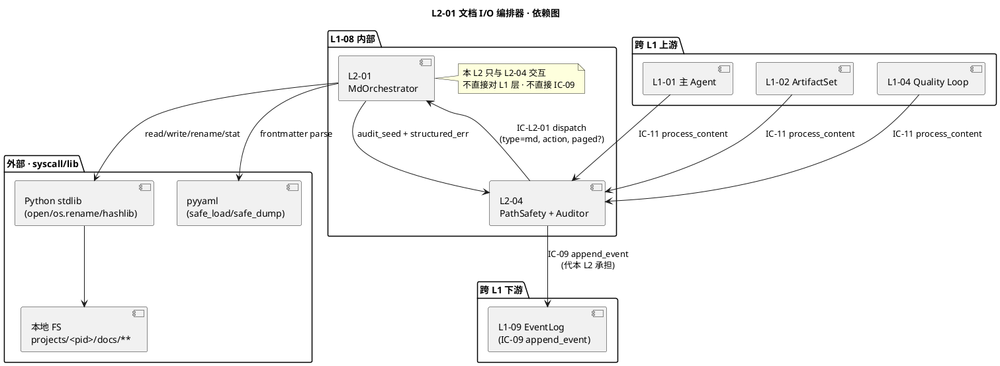
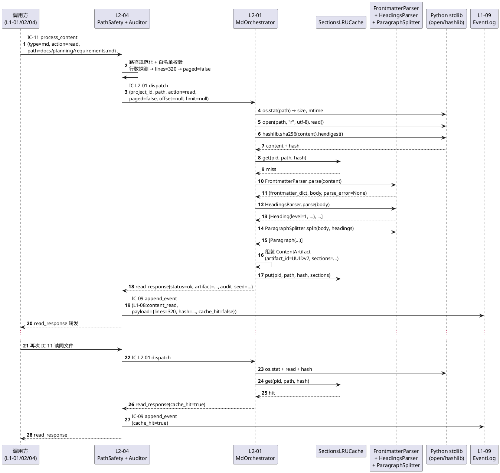
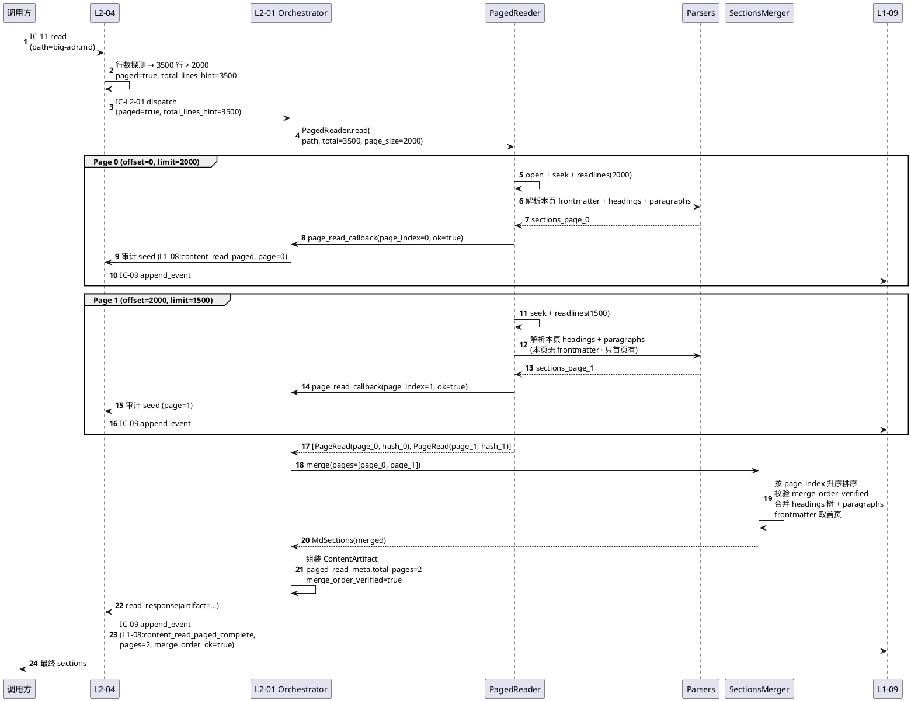
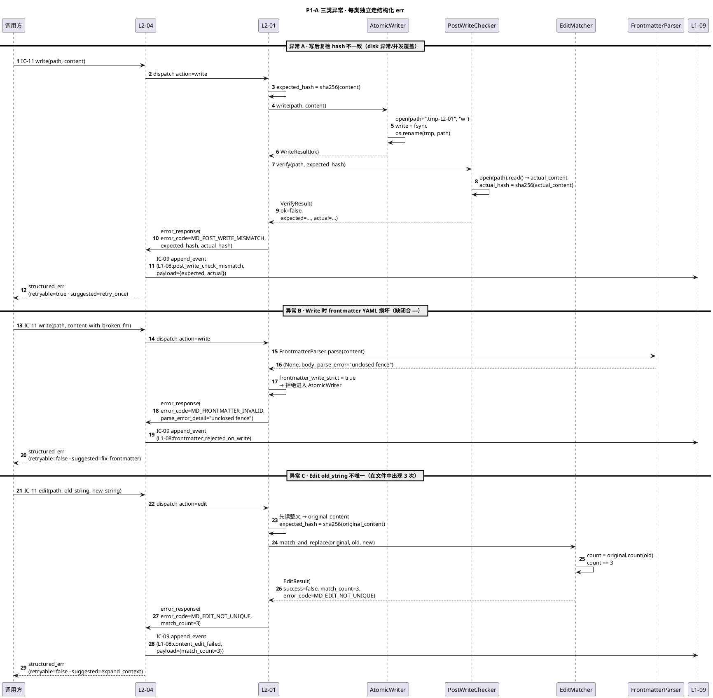
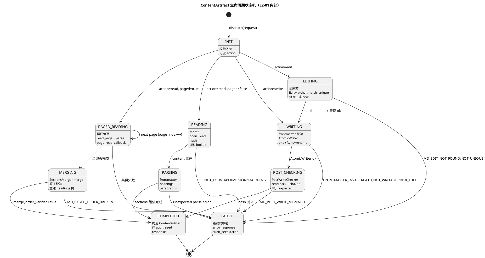
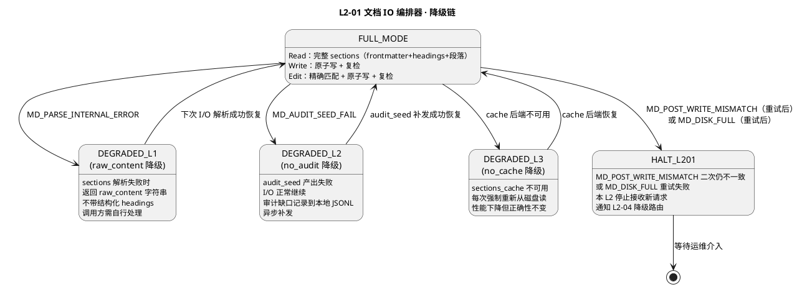
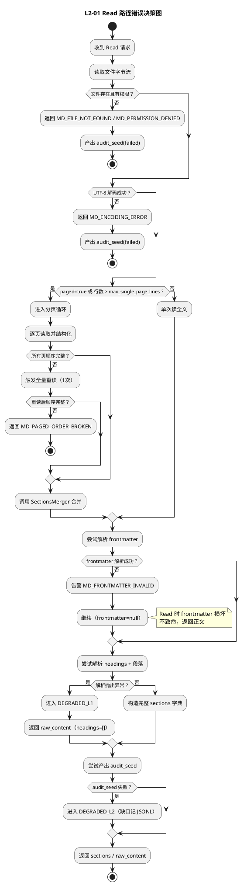
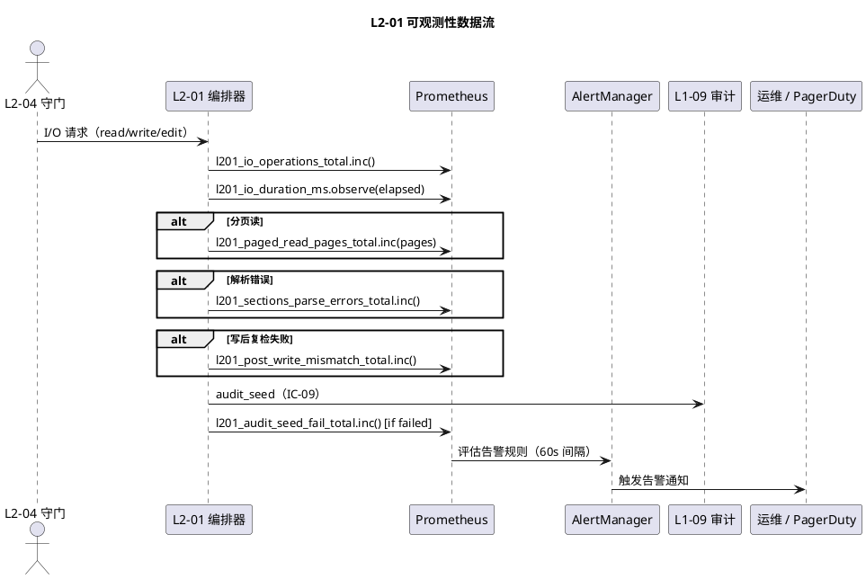

# L1-08 L2-01 · 文档 I/O 编排器 · Tech Design

> **本文档定位**：3-1-Solution-Technical 层级 · L1-08 的 L2-01 文档 I/O 编排器 技术实现方案（L2 粒度）。
> **与产品 PRD 的分工**：2-prd/L1-08-多模态内容处理/prd.md §5.8 L2-01 定义产品边界，本文档定义**技术实现**（接口字段级 schema + 算法伪代码 + 底层数据结构 + 状态机 + 配置参数）。
> **与 L1 architecture.md 的分工**：architecture.md 负责**跨 L2 架构 + 跨 L2 时序**，本文档负责**本 L2 内部技术细节**。冲突以 architecture.md 为准。
> **严格规则**：本文档不复述产品 PRD 文字（职责 / 禁止 / 必须等清单），只做技术映射 + 补齐"产品视角未说 but 工程师必须知道"的部分（具体算法 · syscall · schema · 配置）。

---

## §0 撰写进度

- [x] §1 定位 + 2-prd §5.8 L2-01 映射
- [x] §2 DDD 映射（引 L0/ddd-context-map.md BC-08）
- [x] §3 对外接口定义（字段级 YAML schema + 错误码）
- [x] §4 接口依赖（被谁调 · 调谁）
- [x] §5 P0/P1 时序图（PlantUML ≥ 2 张）
- [x] §6 内部核心算法（伪代码）
- [x] §7 底层数据表 / schema 设计（字段级 YAML）
- [x] §8 状态机（PlantUML + 转换表）
- [x] §9 开源最佳实践调研（≥ 3 GitHub 高星项目）
- [x] §10 配置参数清单
- [x] §11 错误处理 + 降级策略
- [x] §12 性能目标 + 可观测性
- [x] §13 与 2-prd / 3-2 TDD 的映射表 + ADR + 开放问题

---

## §1 定位 + 2-prd 映射

### 1.1 本 L2 在 L1-08 多模态内容处理里的坐标

L1-08 由 4 个 L2 组成（1 横切守门 + 3 模态处理），**L2-01 是 md 模态的唯一执行引擎**—— 不直接对外，只接收 L2-04 守门后路由来的 md 请求。

```
  [IC-11 process_content · 来自 L1-01/L1-02/L1-04]
               ↓
  [L2-04 路径安全与降级编排器（唯一入口）]
               ↓ (path whitelist pass · paged 决策完成)
               ↓ IC-L2-01 dispatch(type=md)
               ↓
   ┌─────────── MdOrchestrator ─────────── L2-01 ───────────┐
   │   (Application Service · 持有 ContentArtifact 聚合根)    │
   │                                                         │
   │   ├──▶ FrontmatterParser（YAML 解析 · 字段字典）         │
   │   ├──▶ HeadingsParser（# / ## / ### 层次树）            │
   │   ├──▶ ParagraphSplitter（按 heading 划分正文）         │
   │   ├──▶ PagedReader（> 2000 行分页循环 · 顺序保证）      │
   │   ├──▶ AtomicWriter（临时文件 + rename · 原子性）       │
   │   ├──▶ PostWriteChecker（Write 后 Read hash 复检）      │
   │   ├──▶ EditMatcher（old_string 精确唯一匹配）           │
   │   └──▶ DiffHunkBuilder（Edit 后产 diff · 供 UI）        │
   │                                                         │
   │   聚合根：ContentArtifact (md)                           │
   │   ├─ artifact_id (VO)                                   │
   │   ├─ project_id (VO · PM-14)                            │
   │   ├─ path / size_bytes / lines / hash (VO)              │
   │   └─ sections (Entity · frontmatter + headings + paras) │
   └─────────────────────────────────────────────────────────┘
               ↓
   返回 sections 字典 或 写入确认 → L2-04（统一封装）→ 调用方
               ↓
   审计出口（经 L2-04 ContentAuditor）→ IC-09 append_event
```

L2-01 的定位 = **"md 文档的结构化搬运工 · 读时产 sections 字典 · 写时保证原子 + 写后复检 · Edit 精确匹配 · 大文件分页顺序合并 · 全程审计不可绕过"**。

### 1.2 与 2-prd §5.8 L2-01 的对应表

| 2-prd §8.1-8.9 小节 | 本文档对应位置 | 技术映射重点 |
|:---|:---|:---|
| §8.1 职责（md 文档 Read/Write/Edit 封装 + 结构化） | §2.1 MdOrchestrator 应用服务 + §2.2 ContentArtifact 聚合根 | 应用服务 + 聚合根 · 单 project scope |
| §8.2 输入/输出（结构化 sections / 写入确认 / 结构化 err） | §3.1-§3.4 IC 字段级 schema | 4 IC 触点 · 每个字段级 |
| §8.3 边界（In-scope 8 项 + Out-of-scope 8 项） | §1.7 YAGNI + §2.3 Domain Services | 分派 Parser / Writer / PagedReader |
| §8.4 约束（PM-08 审计 + 5 硬约束） | §11 错误处理 · §12 可观测性 | 每硬约束 → 错误码 + 审计事件 |
| §8.5 禁止（7 项 · 启发匹配/未复检返回/语义评估） | §11 拒绝路径 + §6 EditMatcher 算法 | 硬拒绝 → 错误码 EDIT_NOT_UNIQUE 等 |
| §8.6 必须（7 项 · 分页 + 复检 + 结构化 + 精匹 + 审计） | §6 算法伪代码分节落地 | 每义务 → 一个算法 + 至少 1 错误码 |
| §8.7 可选（差分优化 / 锚点生成 / 分页并发 / 原子写） | §6.4 AtomicWriter + §6.10 DiffHunkBuilder | 可选均入 depth-B 实现 |
| §8.8 IC 交互（L2-04 来 · L2-04 去 · 不直调底层工具柜） | §4 依赖图 + §3.1-§3.4 | 本 L2 **不直接**发 IC-09 · 经 L2-04 |
| §8.9 交付验证 GWT（4 正向 + 4 负向 + 3 集成 + 4 P99） | §13 TDD 映射表 | 每 GWT → 至少 1 TDD 用例锚点 |

### 1.3 本 L2 在 architecture.md 里的坐标

引 `docs/3-1-Solution-Technical/L1-08-多模态内容处理/architecture.md §3.1 Component Diagram` + §2.2 聚合根表：

```
 [L2-04 PathSafety (唯一入口)]
          ↓ IC-L2-01 dispatch(type=md, paged?, action=read/write/edit)
          ↓
 ┌─────── L2-01 MdOrchestrator ────────┐
 │   (Application Service · 1 AR)        │
 │                                       │
 │   ┌────────── Parser 家族 ─────────┐ │
 │   │ FrontmatterParser (YAML)      │ │
 │   │ HeadingsParser                │ │
 │   │ ParagraphSplitter             │ │
 │   └───────────────────────────────┘ │
 │   ┌────────── Writer 家族 ────────┐ │
 │   │ AtomicWriter (tmp + rename)   │ │
 │   │ PostWriteChecker (hash)       │ │
 │   │ EditMatcher (exact unique)    │ │
 │   └───────────────────────────────┘ │
 │   ┌────────── Reader 家族 ────────┐ │
 │   │ PagedReader (> 2000 行循环)   │ │
 │   │ SectionsMerger (顺序合并)     │ │
 │   └───────────────────────────────┘ │
 │   ┌────────── Extras 家族 ────────┐ │
 │   │ DiffHunkBuilder (edit diff)   │ │
 │   │ AnchorGenerator (heading 锚) │ │
 │   └───────────────────────────────┘ │
 │                                       │
 │   聚合根：ContentArtifact             │
 │   内存 LRU 缓存：sections 结构化结果  │
 └───────────────────────────────────────┘
          ↓ sections / 写入确认 / 结构化 err
          ↓
 [L2-04 ContentAuditor] → IC-09 append_event
```

**本 L2 的关键特征**（对 L1-08 整体而言）：

1. **应用服务 + 一个聚合根**：`ContentArtifact` (md) 由本 L2 独占，构造于请求入口、销毁于响应出口（短寿命 · 单请求强一致）
2. **无跨请求状态**：除 LRU 缓存（可丢弃）外不持久化任何运行时状态
3. **不发 IC**：所有审计出口 + 错误结构化**经 L2-04 承担**（本 L2 不直接调 IC-09 / IC-L2-06）
4. **纯本地 I/O**：Python stdlib `open/read/write` + `os.rename/stat` + `hashlib` + `pyyaml`，无网络
5. **Edit 精确匹配**：`str.count(old_string) == 1`，不唯一即 err，不做 fuzzy
6. **写后必复检**：Write 后立即 Read 全文 + sha256 对齐
7. **分页顺序硬保证**：PagedReader 串行循环（默认）或并发回收后按 page_index 排序合并
8. **frontmatter 解析失败的容忍策略不对称**：Read 允许（仅告警），Write 拒绝（避免落坏产出物）

### 1.4 本 L2 的 PM-14 约束落点

**PM-14 约束**（引 `docs/3-1-Solution-Technical/projectModel/tech-design.md`）：所有 IC payload 顶层 `project_id` 必填；所有存储路径按 `projects/<pid>/...` 分片。

本 L2 在 PM-14 层面的具体落点：

| 约束项 | 落点 | 路径/字段 |
|:---|:---|:---|
| IC 顶层必填 project_id | IC-L2-01 入站 + IC-L2-05 出站 | `payload.project_id` |
| md 读写 scope 限定 | 由 L2-04 做路径规范化，本 L2 在 `project_root` 内操作 | `projects/<pid>/docs/**` |
| LRU 缓存 key 前缀 | sections 缓存 key 含 project_id | `cache_key = f"{pid}:{path}:{hash}"` |
| 审计事件必填 project_id | 审计 payload 根字段 | `event.project_id` |
| diff hunk 路径脱敏 | diff 输出以 project 相对路径呈现 | 绝对路径转 `projects/<pid>/...` 形式 |
| PagedReader 每页事件 | 每页审计独立 · 含 project_id + page_index | 逐页 append_event |

**本 L2 不持有任何跨 project 单例**——所有聚合（ContentArtifact）都在单 project 实例内创建和销毁。

### 1.5 关键技术决策（本 L2 特有 · Decision → Rationale → Alternatives → Trade-off）

| 决策 ID | 选择 | 备选 | 理由 | Trade-off |
|:---|:---|:---|:---|:---|
| **D1: Write 原子性实现** | tmp 文件 + `os.rename` | 直写 / fcntl 锁 / 数据库事务 | rename 是 POSIX 原子语义 · 崩溃安全 · 无中间状态 | tmp 文件占用 2× 磁盘（短暂） |
| **D2: 写后复检算法** | sha256(content_written) == sha256(content_read_back) | 仅比对 size / 比对 mtime / 无复检 | hash 是唯一可信的内容一致性证据 · size 可碰撞 | 多一次全文件读（≤ 2000 行 O(文件大小)） |
| **D3: Edit 精确匹配策略** | `str.count(old) == 1` 硬校验 | 模糊匹配 / 首次匹配优先 / 启发回溯 | 确定性 + 可审计 · 不留歧义空间 | 调用方需自行保证 old_string 唯一（代价转嫁） |
| **D4: PagedReader 并发模式** | 默认串行 · 可选并发（配置 `paged_concurrent`） | 全并发 / 全串行 | 串行保证顺序 + 简单；并发适合极大文件（≥ 10000 行） | 并发需回收排序，代码复杂度↑ |
| **D5: frontmatter Read 失败容忍** | 告警不拒绝（正文仍返回） | 失败即拒绝 / 完全忽略 | 用户修 frontmatter 损坏时仍需读正文调查 | sections.frontmatter = null 需调用方显式处理 |
| **D6: frontmatter Write 失败拒绝** | 强制拒绝（返回 FRONTMATTER_INVALID） | 无条件强写 / 告警后强写 | 防落盘坏产出物 · 下游模板引擎会崩 | 调用方需自行修 frontmatter 后重试 |
| **D7: sections 数据结构** | 嵌套 dict + heading 树 | 扁平行列表 / AST（markdown-it 风格） | 够用即可 · 不做语义 parsing · 减少依赖 | 不识别代码块类型 / 任务列表 / 表格（故意 · 由调用方识别） |
| **D8: LRU 缓存粒度** | 文件粒度（key = path + hash） | 行粒度 / session 粒度 / 不缓存 | session 内同文件二次读命中率高 · 简单 | 内存占用（每条 ≤ 2 MB · 上限 100 条） |
| **D9: 分页页大小** | 2000 行/页（对齐 scope §5.8.4 硬约束） | 1000 行 / 5000 行 / 按字节 | 与产品硬约束一致 · 避免双标准 | 与 L2-04 守门阈值耦合（但这是设计意图） |
| **D10: 依赖实现选型** | Python stdlib + pyyaml | markdown-it-py 全量 AST / Unstructured / Docling | scope §8.3 边界明确 "够用即可"，不要 AST | 失去 markdown-it 的 CommonMark 精确度（可接受：我们不渲染） |
| **D11: Edit 的 replace_all 模式** | 不支持 replace_all（只允许单次精确替换） | 支持 replace_all / 仅 warn | scope §5.8.5 "禁启发/模糊匹配"延伸 · 防批量误伤 | 调用方需多次 Edit（可接受） |
| **D12: diff hunk 格式** | Unified diff v2（git 兼容） | 自定义 JSON diff / `difflib.ndiff` 文本 | UI 可直接 render · 人类可读 | 解析略重（但仅 Edit 场景） |

### 1.6 本 L2 读者预期

读完本 L2 的工程师应掌握：
- MdOrchestrator 应用服务的 4 IC 触点字段级 schema + 14 个错误码
- 10+ 个算法的伪代码（含主入口 · 分页循环 · 原子写 · 写后复检 · Edit 精匹 · frontmatter 解析 · headings 解析 · sections 合并 · diff 生成 · 崩溃恢复）
- 3 张 VO 表 + 3 张数据表（ContentArtifact / MdSections / WriteConfirmation / PageReadLog）
- ContentArtifact 状态机（PlantUML 8 个主状态）
- 降级链 4 级（FULL → DEGRADED_NO_FRONTMATTER → FORCE_PAGED_FALLBACK → HARD_REJECT）
- SLO（单 md ≤ 2000 行读 + 结构化 P95 ≤ 1s · 2000-10000 行分页 P95 ≤ 10s · Write + 复检 P95 ≤ 500ms · Edit + 复检 P95 ≤ 500ms）

### 1.7 本 L2 不在的范围（YAGNI）

- **不在**：路径白名单校验（职责是 L2-04）
- **不在**：> 2000 行判定（L2-04 守门探测，本 L2 只接收 paged 标志并执行）
- **不在**：md → HTML/PDF/docx 转换
- **不在**：md 中图片加载 / OCR（职责是 L2-03）
- **不在**：diff 合并（两份 md 合并由调用方先拼）
- **不在**：模糊匹配 / 启发式 Edit
- **不在**：md 模板驱动生成（职责是 L1-02 L2-07 产出物模板引擎）
- **不在**：md 语义评估（"写得对不对"）
- **不在**：跨 session 断点续读（简化 · scope §8.9 I3 明示）
- **不在**：git commit（调用方职责）

### 1.8 本 L2 术语表（local）

| 术语 | 定义 | 关联 |
|:---|:---|:---|
| sections | frontmatter + headings 层次 + 按 heading 划分的正文 三层结构化 | §6.5 |
| Atomic Write | tmp 文件写 + `os.rename` 原子替换 | D1 + §6.3 |
| Post-Write Check | Write 成功后 Read 一次对齐 sha256 | D2 + §6.4 |
| Exact Unique Match | `str.count(old) == 1` | D3 + §6.7 |
| Paged Read Loop | 按 2000 行/页循环读取 · 最后按 page_index 合并 | D4 + §6.6 |
| Frontmatter Read-tolerant | Read 时 frontmatter 损坏仅告警 | D5 |
| Frontmatter Write-strict | Write 时 frontmatter 损坏强拒 | D6 |
| ContentArtifact | 本 L2 的聚合根 · 单请求强一致 | §2.2 |
| PostWriteChecker | 写后复检 Domain Service | §2.3 |
| DiffHunkBuilder | 可选 diff 产出组件 | §6.10 |

### 1.9 本 L2 的 DDD 定位一句话

> **L2-01 是 BC-08 多模态内容处理的应用服务层 · 持有 ContentArtifact (md) 聚合根 · 4 IC 触点（入 dispatch · 出 audit + err + content_written/read）· 零业务逻辑 · 全部下游经 L2-04 出口 · 3 硬规则（分页顺序 · 写后复检 · Edit 精匹）。**

---

## §2 DDD 映射（BC-08 多模态内容处理 · Application Service + 聚合根）

引 `docs/3-1-Solution-Technical/L0/ddd-context-map.md §2.9 BC-08 Multimodal Content Processing`。

本 L2 在 BC-08 里属于**应用服务层 + 唯一聚合根持有者**（md 模态）。

### 2.1 Application Service · MdOrchestrator

**职责**：接收 L2-04 路由来的 md 请求 · 调度 Parser/Writer/Reader 家族 · 产出 sections 或写入确认 · 错误结构化上抛

**本质**：Application Service · 编排 6 个 Domain Service + 1 个聚合根 · 无领域逻辑本身

**依赖注入**：
```yaml
dependencies:
  frontmatter_parser:         # Domain Service · YAML 解析
  headings_parser:            # Domain Service · # / ## / ### 解析
  paragraph_splitter:         # Domain Service · 按 heading 划分段落
  paged_reader:               # Domain Service · > 2000 行循环
  atomic_writer:              # Domain Service · tmp + rename
  post_write_checker:         # Domain Service · sha256 对齐
  edit_matcher:               # Domain Service · 精确唯一匹配
  diff_hunk_builder:          # Domain Service (optional) · unified diff
  sections_cache:             # LRU Cache · 单 session 有效
  path_safety_bridge:         # 通往 L2-04 的桥接（审计 + 错误封装）

config:
  max_single_page_lines: 2000       # 与 scope §5.8.4 硬约束一致
  max_total_lines_warn: 50000       # 告警阈值（实际仍读）
  lru_cache_max_entries: 100
  lru_cache_max_bytes: 209715200    # 200 MB
  paged_concurrent: false           # D4 默认串行
  paged_max_concurrency: 4
  post_write_hash_algo: sha256
  atomic_write_tmp_suffix: .tmp-L2-01
  edit_require_unique: true
  diff_hunk_enabled: true
```

**Methods**：
- `read(project_id, path, offset?, limit?, paged?)` — 入口：读 md · 产 sections
- `write(project_id, path, content)` — 入口：写 md · 含 frontmatter 校验 + 原子写 + 复检
- `edit(project_id, path, old_string, new_string)` — 入口：局部编辑 · 精确唯一匹配 + 原子写 + 复检
- `read_paged(project_id, path, total_lines)` — 内部：> 2000 行分页循环
- `parse_sections(raw_text)` — 内部：frontmatter + headings + paragraphs 三层解析
- `merge_sections(pages: list[MdSections])` — 内部：多页 sections 顺序合并
- `verify_post_write(path, expected_hash)` — 内部：写后复检
- `make_diff_hunk(old_content, new_content)` — 内部：产 unified diff

### 2.2 Aggregate Root · ContentArtifact (md)

**标识**：`artifact_id: UUIDv7`（本 L2 生成 · 单请求独占）
**不变性**：同一 artifact_id 在同一请求生命周期内 sections / path / hash 不可变（immutable snapshot）
**一致性边界**：单请求强一致 · 不跨请求存活（短寿命聚合）

**字段**（字段级 YAML）：
```yaml
artifact_id: string                 # UUIDv7
project_id: string                  # PM-14 项目上下文
type: string                        # 固定 "md"
path: string                        # 绝对路径（L2-04 规范化后）
path_relative: string               # 相对 project_root · 审计用
size_bytes: int                     # 字节数
lines: int                          # 物理行数
hash: string                        # sha256(content) · 小写十六进制
mtime_ns: int                       # 修改时间（纳秒）
encoding: string                    # 默认 utf-8
bom_stripped: bool                  # 是否去掉 UTF-8 BOM
sections:
  frontmatter:                      # 可能为 null（Read 容忍 · §6.5）
    raw_yaml: string                # 原始 YAML 文本
    parsed: map<string, any>        # 解析后字段字典
    parse_error: string | null      # 解析错误信息（null=成功）
    lines_range: [int, int]         # frontmatter 起止行号（0-indexed）
  headings:                         # 层次树
    - level: int                    # 1-6
      text: string                  # heading 文本（去首个 # 后）
      anchor: string                # heading 锚点（kebab-case）
      line: int                     # 所在行号
      children: [...]               # 嵌套 heading
  paragraphs:                       # 按 heading 划分的正文段落
    - heading_anchor: string        # 归属 heading
      start_line: int
      end_line: int
      text: string                  # 原始 md 正文（保留 md 语法）
paged_read_meta:                    # 仅分页读时填
  total_pages: int
  page_size_lines: int
  pages_completed: [int]            # 已完成 page_index 列表
  merge_order_verified: bool        # sections_merger 顺序校验通过
created_at: int                     # 纳秒时间戳
created_by: string                  # 固定 "L2-01"
```

**关键不变量**：
1. **I-01 单 project scope**：`project_id` 构造后不可变 · 跨 project 请求必须是独立 ContentArtifact
2. **I-02 hash 唯一确定内容**：两个 ContentArtifact 的 `hash` 相同 ⇔ sections 内容相同（sha256 唯一性）
3. **I-03 sections 三层完整**：即使 frontmatter 为 null（解析失败），headings + paragraphs 仍必完整
4. **I-04 paged_read_meta 顺序**：若 `paged_read_meta.merge_order_verified = false`，必须拒绝返回（内部重跑或报 err）
5. **I-05 post-write 约束**：Write/Edit 后新产生的 ContentArtifact 的 hash 必等于原始写入 hash（否则标失败）

### 2.3 Domain Services（本 L2 内部 · 非全局）

#### 2.3.1 FrontmatterParser

**职责**：识别 `^---\n...\n---\n` 首部 YAML 块 · 用 pyyaml 安全加载 · 字段字典化

**方法**：
```python
class FrontmatterParser:
    def parse(raw_text: str) -> FrontmatterResult:
        """
        返回 FrontmatterResult：
          - if no frontmatter (不以 --- 开头): (None, body=full_text, parse_error=None)
          - if valid frontmatter: (parsed_dict, body=rest, parse_error=None)
          - if malformed (--- 无闭合): (None, body=full_text, parse_error="unclosed fence")
          - if YAML syntax error: (None, body=rest_if_fence_closed, parse_error="yaml syntax")
        """
```

#### 2.3.2 HeadingsParser

**职责**：按行扫描 `^#{1,6}\s+` · 构造 headings 嵌套树 · 生成锚点

**方法**：
```python
class HeadingsParser:
    def parse(body_text: str, start_line_offset: int = 0) -> list[Heading]
    def slugify(text: str) -> str  # kebab-case · 去 md 语法
```

#### 2.3.3 ParagraphSplitter

**职责**：按 heading 行切分正文 · 归属段落到最近前驱 heading

**方法**：
```python
class ParagraphSplitter:
    def split(body_text: str, headings: list[Heading]) -> list[Paragraph]
```

#### 2.3.4 PagedReader

**职责**：按 2000 行/页循环 · 每页独立 Read · 产 sections per page · 交 SectionsMerger

**方法**：
```python
class PagedReader:
    def read(
        path: str,
        total_lines: int,
        page_size: int = 2000,
        concurrent: bool = False,
        max_concurrency: int = 4,
    ) -> list[PageRead]
    def read_page(path: str, page_index: int, offset: int, limit: int) -> PageRead
```

#### 2.3.5 AtomicWriter

**职责**：tmp 文件写 + `os.rename` 原子替换 · POSIX 语义保证

**方法**：
```python
class AtomicWriter:
    def write(path: str, content: str, encoding: str = "utf-8") -> WriteResult
    # 内部：open(path + ".tmp-L2-01", "w") · fsync · os.rename(tmp, path)
```

#### 2.3.6 PostWriteChecker

**职责**：Write 成功后立即 Read 整文 · sha256 对齐

**方法**：
```python
class PostWriteChecker:
    def verify(path: str, expected_sha256: str) -> VerifyResult
    # 返回 (ok: bool, actual_sha256: str, size_bytes: int)
```

#### 2.3.7 EditMatcher

**职责**：`str.count(old_string) == 1` 校验 · 单点替换

**方法**：
```python
class EditMatcher:
    def match_and_replace(
        original: str,
        old_string: str,
        new_string: str,
    ) -> EditResult
    # 返回 (success, new_content, match_count, error_code?)
    # match_count = 0 → EDIT_NOT_FOUND
    # match_count > 1 → EDIT_NOT_UNIQUE
    # match_count == 1 → 替换成功
```

#### 2.3.8 DiffHunkBuilder（可选）

**职责**：Edit 成功后产 unified diff · 供 UI 展示

**方法**：
```python
class DiffHunkBuilder:
    def build(old: str, new: str, path: str, context_lines: int = 3) -> str
    # 返回 unified diff 文本（git 兼容格式）
```

### 2.4 Repository（本 L2 的持久化接口）

**本 L2 对"持久化"的定义非常浅**：
- **ContentArtifact 不持久化**（短寿命 · 单请求销毁）
- **sections 内存 LRU 缓存**（可丢弃 · session 级）
- **md 文件本身**由用户文件系统拥有（git + local FS）
- **所有审计事件**经由 L2-04 ContentAuditor → IC-09（不由本 L2 直接落盘）

```python
class ContentArtifactRepository(abc.ABC):
    """仅内存 · 不落盘"""
    def put(artifact: ContentArtifact) -> None
    def get(artifact_id: UUID) -> ContentArtifact | None
    def evict(artifact_id: UUID) -> None


class SectionsLRUCache(abc.ABC):
    """单 session 内 · 按 path+hash 缓存"""
    def get(project_id: str, path: str, hash: str) -> MdSections | None
    def put(project_id: str, path: str, hash: str, sections: MdSections) -> None
    def invalidate(project_id: str, path: str) -> None
    def stats() -> CacheStats  # hit / miss / evict
```

### 2.5 Domain Events（经 L2-04 发布）

本 L2 **不直接**发 domain event · 所有事件经 L2-04 ContentAuditor 统一发布到 L1-09 事件总线。本 L2 只产 **Event Seed**（事件原料），L2-04 做事件封装 + hash-chain + append_event。

| Event Seed | 触发 | Payload（seed 级） |
|:---|:---|:---|
| **L1-08:content_read** | read 成功 | `{artifact_id, type=md, path, lines, hash, cache_hit, project_id}` |
| **L1-08:content_written** | write/edit 成功 + 复检 pass | `{artifact_id, path, size, hash, action, project_id}` |
| **L1-08:content_read_paged** | 分页读某页完成 | `{artifact_id, path, page_index, page_lines, project_id}` |
| **L1-08:content_read_paged_complete** | 分页读全部完成 + 合并成功 | `{artifact_id, path, total_pages, merge_order_ok, project_id}` |
| **L1-08:content_read_failed** | read 失败 | `{path, error_code, error_message, project_id}` |
| **L1-08:content_write_failed** | write 失败（路径不可写 / 复检 hash 不一致） | `{path, error_code, project_id}` |
| **L1-08:content_edit_failed** | edit 失败（old_string 不唯一/不存在） | `{path, error_code, match_count, project_id}` |
| **L1-08:frontmatter_malformed_on_read** | Read 时 frontmatter 损坏（告警） | `{path, parse_error, project_id}` |
| **L1-08:frontmatter_rejected_on_write** | Write 时 frontmatter 损坏（拒写） | `{path, parse_error, project_id}` |
| **L1-08:post_write_check_mismatch** | 复检 hash 不一致 | `{path, expected_hash, actual_hash, project_id}` |

### 2.6 与兄弟 L2 / 跨 BC 关系

| 对方 | 关系 | 方向 | 触发 |
|:---|:---|:---|:---|
| L2-04 路径安全与降级 | **Customer**（入）+ **Supplier**（出） | L2-04 → L2-01（dispatch）· L2-01 → L2-04（audit/err） | 每次 IC-11 md 请求 |
| L2-02 代码结构理解 | 无直接依赖 | N/A | 不交互 |
| L2-03 图片视觉理解 | 无直接依赖 | N/A | md 中图片引用保留为文本链接 |
| L1-02 ArtifactSet | **Supplier** | L2-01 → L1-02 | PMP/TOGAF 产出物落盘 |
| L1-04 TDDBlueprint | **Supplier** | L2-01 → L1-04 | TDD 蓝图 md / verifier_report 读写 |
| L1-06 KB | **不交互** | N/A | md 不入 KB（scope 明示） |
| L1-09 事件总线 | **间接** | L2-01 → L2-04 → L1-09 | 经 ContentAuditor |

---

## §3 对外接口定义（字段级 YAML schema + 错误码）

**本 L2 对外有 4 个 IC 触点**（入 dispatch · 出 3 类响应）。

### 3.1 IC-L2-01-in · dispatch_md_request（入站 · L2-04 → L2-01）

**方向**：L2-04 → L2-01
**协议**：函数调用（Python method · 非跨进程）
**幂等性**：read 幂等 · write/edit 由调用方保证（本 L2 不做 去重）

**Input Schema**：
```yaml
dispatch_md_request:
  request_id: string                 # UUIDv7 · L2-04 生成 · 全链追踪
  project_id: string                 # PM-14 项目上下文（必填）
  type: string                       # 固定 "md"
  action: string                     # enum: read | write | edit
  path: string                       # 绝对路径（L2-04 规范化后）
  path_relative: string              # 相对 project_root · 审计用
  # read 专有
  offset: int | null                 # 起始行（0-indexed · null=0）
  limit: int | null                  # 读取行数上限（null=到 EOF）
  paged: bool                        # L2-04 标记是否分页循环
  total_lines_hint: int | null       # L2-04 行数探测结果（分页用）
  # write 专有
  content: string | null             # 整份内容（write · utf-8）
  # edit 专有
  old_string: string | null          # 精确匹配串
  new_string: string | null          # 替换串
  # 通用
  trace_id: string                   # 贯通审计链 · 顶级 IC-11 生成
  ts_ns: int                         # 请求纳秒时间戳
  caller_l1: string                  # 上游 L1（L1-01/L1-02/L1-04/...）
```

**Output Schema**（联合类型 · 按 action 分）：
```yaml
# Case 1: read success
read_response:
  request_id: string
  status: "ok"
  artifact:
    artifact_id: string
    project_id: string
    path: string
    size_bytes: int
    lines: int
    hash: string
    sections:
      frontmatter: map | null
      headings: [...]
      paragraphs: [...]
    paged_read_meta:
      total_pages: int
      pages_completed: [int]
      merge_order_verified: bool
  audit_seed: map                    # 给 L2-04 封装 IC-09
  duration_ms: int

# Case 2: write/edit success
write_response:
  request_id: string
  status: "ok"
  action: "write" | "edit"
  path: string
  size_bytes: int
  hash: string
  post_write_check_passed: bool      # 必须 true（否则走 Case 3）
  diff_hunk: string | null           # Edit 产 diff（可选）
  audit_seed: map
  duration_ms: int

# Case 3: 错误响应（统一封装）
error_response:
  request_id: string
  status: "error"
  error_code: string                 # 见错误码表
  error_message: string              # 人类可读
  error_context: map                 # 字段级上下文
  suggested_action: string | null    # 可选建议
  audit_seed: map                    # 错误也审计
  duration_ms: int
```

### 3.2 IC-L2-01-out-audit · emit_audit_seed（出站 · L2-01 → L2-04）

**方向**：L2-01 → L2-04（作为 response 内嵌 `audit_seed`，也可 out-of-band 主动推送）
**用途**：每次 I/O 完成（成功或失败），本 L2 产 audit_seed · L2-04 包装成 IC-09 `append_event`

**Audit Seed Schema**：
```yaml
audit_seed:
  event_type: string                 # L1-08:content_read | content_written | ...
  event_version: "v1.0"
  project_id: string                 # PM-14
  artifact_id: string | null
  path: string
  path_relative: string
  action: string                     # read | write | edit | read_paged
  result: string                     # ok | failed | degraded
  payload:                           # 事件特定字段
    lines: int | null
    size_bytes: int | null
    hash: string | null
    page_index: int | null           # 分页读事件独有
    total_pages: int | null
    cache_hit: bool | null
    frontmatter_ok: bool | null
    post_write_check: bool | null
    error_code: string | null
    diff_preview: string | null      # Edit 时前 200 字符
  trace_id: string
  ts_ns: int
  emitted_by: "L2-01"
```

### 3.3 IC-L2-01-out-err · emit_structured_err（出站 · L2-01 → L2-04）

**方向**：L2-01 → L2-04（嵌于 error_response · L2-04 二次封装对外）
**用途**：结构化错误 · 让调用方能精确判定失败原因

**Err Schema**：
```yaml
structured_err:
  error_code: string                 # 见 §3.5 错误码表（14 码）
  error_class: string                # enum: input_error | fs_error | parse_error | integrity_error | config_error
  error_message: string              # 人类可读
  error_context:
    path: string
    offset: int | null
    limit: int | null
    match_count: int | null          # Edit 专用
    parse_error_detail: string | null  # frontmatter 专用
    expected_hash: string | null       # 复检专用
    actual_hash: string | null
  suggested_action: string | null
  retryable: bool                    # 是否调用方可重试
  ts_ns: int
```

### 3.4 IC-L2-01-internal-paged · page_read_callback（内部分页）

**方向**：PagedReader → MdOrchestrator（同进程回调）
**用途**：每完成一页 Read · 立即回调记录（为每页独立审计事件 + 崩溃时至少知道已读哪几页）

**Schema**：
```yaml
page_read_callback:
  request_id: string
  artifact_id: string
  page_index: int                    # 从 0 起
  page_offset: int                   # 行 offset
  page_lines: int                    # 本页实际行数
  page_hash: string                  # 本页 sha256（用于顺序校验）
  sections_partial: map              # 本页 sections（未合并）
  ok: bool
  error_code: string | null
  ts_ns: int
```

### 3.5 错误码表（14 码 · 对应 scope §5.8 禁止/必须清单）

| 错误码 | 类 | 含义 | 触发场景 | HTTP-like | 调用方处理 |
|:---|:---|:---|:---|:---|:---|
| **MD_READ_OK** | success | 读成功 | 整份 ≤ 2000 行读完 | 200 | 消费 sections |
| **MD_WRITE_OK** | success | 写成功 + 复检通过 | write/edit + post_write 一致 | 200 | 消费 confirmation |
| **MD_PATH_NOT_FOUND** | fs_error | 路径不存在 | `os.stat` FileNotFoundError | 404 | 检查路径 · 不重试 |
| **MD_PATH_NOT_READABLE** | fs_error | 读权限缺失 | PermissionError | 403 | 升 supervisor · 不重试 |
| **MD_PATH_NOT_WRITABLE** | fs_error | 写权限缺失 | open("w") PermissionError | 403 | 升 supervisor · 不重试 |
| **MD_DISK_FULL** | fs_error | 磁盘满 | OSError ENOSPC | 507 | 告警 · 清盘后重试 |
| **MD_ENCODING_ERROR** | input_error | 编码异常 | UnicodeDecodeError | 400 | 修 encoding hint 后重试 |
| **MD_FRONTMATTER_INVALID** | parse_error | frontmatter YAML 损坏 · Write 时拒绝 | Write 触发 · yaml.YAMLError 或无闭合 --- | 400 | 修 frontmatter 后重试 |
| **MD_FRONTMATTER_WARN** | parse_error | frontmatter 损坏 · Read 时仅告警 | Read 触发 · 仍返 sections.body | 200（带警告） | 消费 body + 修 frontmatter |
| **MD_EDIT_NOT_FOUND** | input_error | Edit old_string 不存在 | `str.count == 0` | 400 | 修 old_string · 不重试 |
| **MD_EDIT_NOT_UNIQUE** | input_error | Edit old_string 不唯一 | `str.count > 1` | 400 | 扩大 old_string 上下文 |
| **MD_POST_WRITE_MISMATCH** | integrity_error | 写后复检 hash 不一致 | 磁盘异常 / 并发覆盖 | 500 | 重试 · 重试失败升 supervisor |
| **MD_PAGED_ORDER_BROKEN** | integrity_error | 分页合并顺序校验失败 | PagedReader 回收乱序 | 500 | 本 L2 内部重跑 1 次 · 再失败升 supervisor |
| **MD_CONFIG_INVALID** | config_error | 本 L2 启动时 config 不合法 | max_single_page_lines ≤ 0 等 | 500 | 启动拒绝 · 修配置 |

**注意**：所有错误码经 L2-04 `emit_structured_err` 封装后暴露给调用方 · 本 L2 不直接向 L1 层发错误。

---

## §4 接口依赖（被谁调 · 调谁 · PlantUML 依赖图）

### 4.1 上游调用方（被谁调）

| 调用方 | L1 | 触发场景 | 频次（估） |
|:---|:---|:---|:---|
| **L2-04 PathSafety** | L1-08 | 所有 md 请求的唯一入口 | 单 session 数十 ~ 数百次 |
| （间接）L1-01 主 loop | L1-01 | 读 `docs/planning/*.md` | 高频 |
| （间接）L1-02 ArtifactSet | L1-02 | 写 PMP/TOGAF 产出物 | 中频（Gate 触发） |
| （间接）L1-04 Quality Loop | L1-04 | 读写 TDD 蓝图 + verifier_report | 中频（S5 触发） |

### 4.2 下游依赖（调谁）

| 被调方 | 方向 | 用途 | 是否 IC |
|:---|:---|:---|:---|
| L2-04 ContentAuditor | L2-01 → L2-04 | 每次 I/O 产 audit_seed · 经 L2-04 → IC-09 | 否（同 L1 内部） |
| L2-04 结构化 err 封装 | L2-01 → L2-04 | 错误统一经 L2-04 出口 | 否（同 L1 内部） |
| 本地文件系统（`open/os.*`） | L2-01 → FS | 读写 md 文件 | N/A（syscall） |
| pyyaml `yaml.safe_load` | L2-01 → lib | frontmatter 解析 | N/A（library） |
| hashlib `sha256` | L2-01 → lib | 内容哈希 | N/A |

### 4.3 依赖图（PlantUML）



---

## §5 P0/P1 时序图（PlantUML ≥ 2 张）

本节给出 **3 张时序图**：P0-A 正常 read ≤ 2000 行 · P0-B 分页 read > 2000 行 · P1-A 异常/降级（写后复检失败 + frontmatter 拒写 + Edit 不唯一）。

### 5.1 P0-A · 正常 md Read ≤ 2000 行（含 frontmatter 解析 + headings + 段落 · 命中 LRU）

**场景一句话**：调用方请求读 `projects/<pid>/docs/planning/requirements.md`（320 行）· L2-04 判 paged=false · 路由到 L2-01 · 首次 miss LRU → 解析 → 构造 ContentArtifact → 返回 → 第二次命中 LRU。

**端到端延迟预期**：首次 50-200 ms · LRU 命中后 < 5 ms。



**关键时序点**：
- **Step 4**：L2-04 的行数探测是决定 paged 的关键 · 本 L2 信任 L2-04 标记（§11 有兜底校验）
- **Step 7**：hash 计算放 LRU get 之前 · 因为 cache key 含 hash
- **Step 11-15**：三个 Parser 串行（frontmatter → headings → paragraphs），保证数据流正确
- **Step 18**：audit_seed 内嵌于 response · L2-04 解包后独立发 IC-09
- **Step 23-26**：第二次同文件读 · 仍需读 FS 算 hash（用于 cache key），但跳过解析

### 5.2 P0-B · 分页 md Read > 2000 行（3500 行 · 2 页 · 顺序合并）

**场景一句话**：调用方请求读 `docs/big-adr-collection.md`（3500 行）· L2-04 判 paged=true · L2-01 分 2 页（0-2000, 2000-3500）· 每页一条审计 · 合并后总 sections 返回。

**端到端延迟预期**：2-5 s（分页串行 · 每页 ≤ 1 s · 合并 < 200 ms）。



**关键时序点**：
- **Step 5-13 / Step 14-22**：两页串行（默认 concurrent=false）· 保证顺序简单
- **Step 10 / 18**：每页一条独立审计事件（scope §8.4 硬约束 5）
- **Step 24-26**：SectionsMerger 按 page_index 升序合并 · 若乱序或缺页 → MD_PAGED_ORDER_BROKEN
- **分页 frontmatter 取首页**：只 page_0 可能含 frontmatter · 其他页无
- **分页 headings 合并**：多页 headings 按行号全局排序后重建嵌套树

### 5.3 P1-A · 异常/降级（写后复检失败 + frontmatter 拒写 + Edit 不唯一）

**场景一句话**：3 类典型异常 · 每类走结构化 err 路径 · 审计"失败事件"不静默。

**端到端延迟预期**：失败 < 500 ms（仍计入复检成本）。



**关键时序点**：
- **异常 A**：AtomicWriter rename 成功 ≠ 内容落盘完整（罕见但存在 · e.g. fs 异常）· PostWriteChecker 是最后防线
- **异常 B**：Write-strict 策略使 frontmatter 失败前置拦截 · 不进入 AtomicWriter（避免落盘坏产出物）
- **异常 C**：Edit 必先读全文 + 算 hash（为原子性 · 后续 AtomicWriter 复用）· 计数阶段即拦截

---

## §6 内部核心算法（伪代码）

本节给出本 L2 的 **10+ 个算法**（Python-like 风格）· 重点在 syscall 顺序 / 数据结构操作 / 并发控制 / 错误分支。

### 6.1 主入口 · MdOrchestrator.dispatch

```python
class MdOrchestrator:
    def dispatch(self, req: DispatchMdRequest) -> DispatchResponse:
        """
        入口分派 · 按 action 路由到 read/write/edit
        """
        start_ns = monotonic_ns()
        try:
            self._validate_input(req)          # 必填字段 / action 白名单
            if req.action == "read":
                resp = self.read(req)
            elif req.action == "write":
                resp = self.write(req)
            elif req.action == "edit":
                resp = self.edit(req)
            else:
                raise ValueError(f"unknown action: {req.action}")
            resp.duration_ms = (monotonic_ns() - start_ns) // 1_000_000
            resp.audit_seed = self._build_audit_seed(req, resp)
            return resp
        except L2_01_Error as e:
            return self._build_error_response(req, e, start_ns)
        except Exception as e:
            # 未识别异常 · 归类 integrity_error
            return self._build_error_response(
                req,
                L2_01_Error("MD_CONFIG_INVALID", str(e)),
                start_ns,
            )
```

### 6.2 Read 主流程 · MdOrchestrator.read

```python
def read(self, req: DispatchMdRequest) -> ReadResponse:
    # 1. fs.stat 取 size/mtime · 捕获 NOT_FOUND / PERMISSION
    try:
        stat_info = os.stat(req.path)
    except FileNotFoundError:
        raise L2_01_Error("MD_PATH_NOT_FOUND", req.path)
    except PermissionError:
        raise L2_01_Error("MD_PATH_NOT_READABLE", req.path)

    # 2. 分派 paged vs non-paged
    if req.paged or (req.total_lines_hint or 0) > self.config.max_single_page_lines:
        return self._read_paged(req, stat_info)
    return self._read_single(req, stat_info)


def _read_single(self, req, stat_info) -> ReadResponse:
    # 3. 整份读 · utf-8 · 捕获编码错
    try:
        with open(req.path, "r", encoding="utf-8") as f:
            content = f.read()
    except UnicodeDecodeError as e:
        raise L2_01_Error("MD_ENCODING_ERROR", f"line={e.start}")

    # 4. 去 BOM · sha256
    bom_stripped = False
    if content.startswith(""):
        content = content[1:]
        bom_stripped = True
    hash_hex = hashlib.sha256(content.encode("utf-8")).hexdigest()

    # 5. LRU 命中直返
    cached = self.sections_cache.get(req.project_id, req.path, hash_hex)
    if cached is not None:
        return self._build_read_response_from_cache(req, cached, hash_hex, cache_hit=True)

    # 6. 解析 sections
    sections = self.parse_sections(content, read_mode=True)

    # 7. 构造 ContentArtifact
    artifact = ContentArtifact(
        artifact_id=uuidv7(),
        project_id=req.project_id,
        type="md",
        path=req.path,
        path_relative=to_project_rel(req.path, req.project_id),
        size_bytes=stat_info.st_size,
        lines=content.count("\n") + (0 if content.endswith("\n") else 1),
        hash=hash_hex,
        mtime_ns=stat_info.st_mtime_ns,
        encoding="utf-8",
        bom_stripped=bom_stripped,
        sections=sections,
        paged_read_meta=None,
        created_at=time.time_ns(),
        created_by="L2-01",
    )
    self.sections_cache.put(req.project_id, req.path, hash_hex, sections)
    return self._build_read_response(req, artifact, cache_hit=False)
```

### 6.3 分页读循环 · _read_paged

```python
def _read_paged(self, req, stat_info) -> ReadResponse:
    total_lines = req.total_lines_hint or self._count_lines(req.path)
    if total_lines <= self.config.max_single_page_lines:
        # L2-04 误标 · 本 L2 兜底退回 single
        # 审计 "守门失败 L2-01 兜底"
        self._emit_fallback_audit(req, total_lines)
        return self._read_single(req, stat_info)

    pages = []
    page_size = self.config.max_single_page_lines
    total_pages = math.ceil(total_lines / page_size)

    if self.config.paged_concurrent:
        # 并发模式：ThreadPoolExecutor 读各页 · 回收后按 page_index 排序
        with ThreadPoolExecutor(max_workers=self.config.paged_max_concurrency) as ex:
            futures = {
                ex.submit(self._read_page, req, i, i * page_size, page_size): i
                for i in range(total_pages)
            }
            for fut in as_completed(futures):
                pages.append(fut.result())
        pages.sort(key=lambda p: p.page_index)
    else:
        # 串行模式（默认）：保顺序简单
        for i in range(total_pages):
            page = self._read_page(req, i, i * page_size, page_size)
            pages.append(page)

    # 合并
    merged_sections, merge_ok = SectionsMerger.merge(pages)
    if not merge_ok:
        raise L2_01_Error("MD_PAGED_ORDER_BROKEN",
                          f"pages_completed={[p.page_index for p in pages]}")

    artifact = self._build_paged_artifact(req, pages, merged_sections, stat_info)
    return self._build_read_response(req, artifact, cache_hit=False)


def _read_page(self, req, page_index, offset, limit) -> PageRead:
    with open(req.path, "r", encoding="utf-8") as f:
        # 用 islice 避免全量读入
        lines_iter = itertools.islice(f, offset, offset + limit)
        page_text = "".join(lines_iter)
    page_hash = hashlib.sha256(page_text.encode("utf-8")).hexdigest()

    if page_index == 0:
        # 只 page 0 解析 frontmatter
        sections_partial = self.parse_sections(page_text, read_mode=True)
    else:
        # 其他页仅 headings + paragraphs · 无 frontmatter
        fm_result = FrontmatterResult(None, page_text, None)
        sections_partial = self._parse_body_only(page_text, offset_line=offset)

    # 回调记录
    callback = PageReadCallback(
        request_id=req.request_id,
        page_index=page_index,
        page_offset=offset,
        page_lines=page_text.count("\n"),
        page_hash=page_hash,
        sections_partial=sections_partial,
        ok=True,
    )
    self._on_page_read(callback)
    return PageRead(page_index, offset, page_text, page_hash, sections_partial)
```

### 6.4 原子写 + 复检 · write

```python
def write(self, req: DispatchMdRequest) -> WriteResponse:
    content = req.content
    if content is None:
        raise L2_01_Error("MD_CONFIG_INVALID", "content required for write")

    # 1. frontmatter write-strict 校验（D6）
    fm_result = self.frontmatter_parser.parse(content)
    if fm_result.parse_error is not None:
        raise L2_01_Error("MD_FRONTMATTER_INVALID",
                          fm_result.parse_error,
                          context={"path": req.path})

    # 2. 原子写
    expected_hash = hashlib.sha256(content.encode("utf-8")).hexdigest()
    try:
        self.atomic_writer.write(req.path, content)
    except PermissionError:
        raise L2_01_Error("MD_PATH_NOT_WRITABLE", req.path)
    except OSError as e:
        if e.errno == errno.ENOSPC:
            raise L2_01_Error("MD_DISK_FULL", str(e))
        raise

    # 3. 写后复检
    verify = self.post_write_checker.verify(req.path, expected_hash)
    if not verify.ok:
        raise L2_01_Error(
            "MD_POST_WRITE_MISMATCH",
            f"expected={expected_hash} actual={verify.actual_sha256}",
            context={"expected_hash": expected_hash,
                     "actual_hash": verify.actual_sha256},
        )

    # 4. 失效 LRU（path 内容变了）
    self.sections_cache.invalidate(req.project_id, req.path)

    return WriteResponse(
        status="ok",
        action="write",
        path=req.path,
        size_bytes=verify.size_bytes,
        hash=expected_hash,
        post_write_check_passed=True,
    )


# AtomicWriter 实现
class AtomicWriter:
    def write(self, path: str, content: str, encoding="utf-8") -> WriteResult:
        tmp_path = path + ".tmp-L2-01"
        # 写 tmp · fsync · rename 原子替换
        with open(tmp_path, "w", encoding=encoding) as f:
            f.write(content)
            f.flush()
            os.fsync(f.fileno())
        os.rename(tmp_path, path)    # POSIX 原子 rename
        # 同步父目录 · 防 dir entry 未落盘
        dir_fd = os.open(os.path.dirname(path) or ".", os.O_RDONLY)
        try:
            os.fsync(dir_fd)
        finally:
            os.close(dir_fd)
        return WriteResult(ok=True)
```

### 6.5 frontmatter 解析（Read-tolerant / Write-strict）

```python
class FrontmatterParser:
    FENCE = "---"

    def parse(self, raw: str) -> FrontmatterResult:
        if not raw.startswith(self.FENCE + "\n") and not raw.startswith(self.FENCE + "\r\n"):
            # 无 frontmatter
            return FrontmatterResult(parsed=None, body=raw, parse_error=None,
                                     lines_range=None)
        # 查闭合 fence
        lines = raw.split("\n")
        close_idx = None
        for i in range(1, len(lines)):
            if lines[i].strip() == self.FENCE:
                close_idx = i
                break
        if close_idx is None:
            return FrontmatterResult(parsed=None, body=raw, parse_error="unclosed fence",
                                     lines_range=None)
        yaml_text = "\n".join(lines[1:close_idx])
        try:
            parsed = yaml.safe_load(yaml_text) or {}
        except yaml.YAMLError as e:
            return FrontmatterResult(parsed=None, body="\n".join(lines[close_idx + 1:]),
                                     parse_error=f"yaml syntax: {e}",
                                     lines_range=(0, close_idx))
        body = "\n".join(lines[close_idx + 1:])
        return FrontmatterResult(parsed=parsed, body=body, parse_error=None,
                                 lines_range=(0, close_idx))


def parse_sections(self, content: str, read_mode: bool = True) -> MdSections:
    fm = self.frontmatter_parser.parse(content)
    if fm.parse_error and not read_mode:
        # Write 路径不应到这里（write 已提前校验）· 这是防御
        raise L2_01_Error("MD_FRONTMATTER_INVALID", fm.parse_error)
    if fm.parse_error and read_mode:
        # Read tolerant · 仅告警
        self._emit_frontmatter_warn(fm.parse_error)
    headings = self.headings_parser.parse(fm.body)
    paragraphs = self.paragraph_splitter.split(fm.body, headings)
    return MdSections(
        frontmatter=fm,
        headings=headings,
        paragraphs=paragraphs,
    )
```

### 6.6 headings 解析 + 锚点生成

```python
class HeadingsParser:
    HEADING_RE = re.compile(r"^(#{1,6})\s+(.+?)\s*$")

    def parse(self, body: str, start_line_offset: int = 0) -> list[Heading]:
        flat = []
        for line_no, line in enumerate(body.split("\n")):
            m = self.HEADING_RE.match(line)
            if m:
                level = len(m.group(1))
                text = m.group(2).strip()
                anchor = self.slugify(text)
                flat.append(Heading(
                    level=level, text=text, anchor=anchor,
                    line=start_line_offset + line_no, children=[],
                ))
        # 构造嵌套：栈式归并
        root: list[Heading] = []
        stack: list[Heading] = []
        for h in flat:
            while stack and stack[-1].level >= h.level:
                stack.pop()
            if stack:
                stack[-1].children.append(h)
            else:
                root.append(h)
            stack.append(h)
        return root

    @staticmethod
    def slugify(text: str) -> str:
        # 去 md 语法（**/`/link []()）· 转小写 · 空格变 -
        s = re.sub(r"[\*\`\[\]\(\)]", "", text).lower()
        s = re.sub(r"\s+", "-", s.strip())
        s = re.sub(r"[^\w\-一-鿿]", "", s)  # 保留中文
        return s or "heading"
```

### 6.7 Edit 精确唯一匹配 + 原子写

```python
def edit(self, req: DispatchMdRequest) -> WriteResponse:
    if not req.old_string or req.new_string is None:
        raise L2_01_Error("MD_CONFIG_INVALID", "old_string/new_string required")

    # 1. 读原文 · 必 single-shot（Edit 不分页 · 由调用方保证 ≤ 2000 行或拆分调用）
    try:
        with open(req.path, "r", encoding="utf-8") as f:
            original = f.read()
    except FileNotFoundError:
        raise L2_01_Error("MD_PATH_NOT_FOUND", req.path)
    except UnicodeDecodeError as e:
        raise L2_01_Error("MD_ENCODING_ERROR", str(e))

    # 2. 精确唯一匹配
    count = original.count(req.old_string)
    if count == 0:
        raise L2_01_Error("MD_EDIT_NOT_FOUND",
                          f"old_string not in {req.path}",
                          context={"match_count": 0})
    if count > 1:
        raise L2_01_Error("MD_EDIT_NOT_UNIQUE",
                          f"old_string appears {count} times",
                          context={"match_count": count,
                                   "suggested_action": "expand context"})

    # 3. 替换
    new_content = original.replace(req.old_string, req.new_string, 1)

    # 4. Write-strict frontmatter 校验（edit 结果仍需 fm 合法）
    fm_new = self.frontmatter_parser.parse(new_content)
    if fm_new.parse_error:
        raise L2_01_Error("MD_FRONTMATTER_INVALID", fm_new.parse_error)

    # 5. 原子写 + 复检（复用 write 逻辑）
    expected_hash = hashlib.sha256(new_content.encode("utf-8")).hexdigest()
    self.atomic_writer.write(req.path, new_content)
    verify = self.post_write_checker.verify(req.path, expected_hash)
    if not verify.ok:
        raise L2_01_Error("MD_POST_WRITE_MISMATCH",
                          context={"expected_hash": expected_hash,
                                   "actual_hash": verify.actual_sha256})

    # 6. 失效 LRU + 产 diff
    self.sections_cache.invalidate(req.project_id, req.path)
    diff_hunk = None
    if self.config.diff_hunk_enabled:
        diff_hunk = self.diff_hunk_builder.build(original, new_content, req.path)

    return WriteResponse(
        status="ok", action="edit", path=req.path,
        size_bytes=verify.size_bytes, hash=expected_hash,
        post_write_check_passed=True, diff_hunk=diff_hunk,
    )
```

### 6.8 SectionsMerger（分页顺序合并）

```python
class SectionsMerger:
    @staticmethod
    def merge(pages: list[PageRead]) -> tuple[MdSections, bool]:
        # 1. 顺序校验：page_index 必须 0..N-1 连续
        expected = list(range(len(pages)))
        actual = sorted(p.page_index for p in pages)
        if actual != expected:
            return (None, False)  # merge_ok = false

        # 2. 按 page_index 升序
        pages_sorted = sorted(pages, key=lambda p: p.page_index)

        # 3. frontmatter 取 page 0（唯一可能处）
        fm = pages_sorted[0].sections_partial.frontmatter

        # 4. headings 合并：按 line 全局排序 · 重建嵌套
        all_flat_headings = []
        for p in pages_sorted:
            all_flat_headings.extend(
                HeadingsParser._flatten(p.sections_partial.headings)
            )
        all_flat_headings.sort(key=lambda h: h.line)
        merged_headings = HeadingsParser._renest(all_flat_headings)

        # 5. paragraphs 合并：保持 page 内顺序 · 跨 page 按 start_line 排序
        all_paragraphs = []
        for p in pages_sorted:
            all_paragraphs.extend(p.sections_partial.paragraphs)
        all_paragraphs.sort(key=lambda para: para.start_line)

        return (MdSections(fm, merged_headings, all_paragraphs), True)
```

### 6.9 PostWriteChecker · 写后复检

```python
class PostWriteChecker:
    def verify(self, path: str, expected_sha256: str) -> VerifyResult:
        try:
            with open(path, "rb") as f:
                actual_bytes = f.read()
        except Exception as e:
            return VerifyResult(ok=False, actual_sha256=None,
                                size_bytes=0, err=str(e))
        actual_hash = hashlib.sha256(actual_bytes).hexdigest()
        return VerifyResult(
            ok=(actual_hash == expected_sha256),
            actual_sha256=actual_hash,
            size_bytes=len(actual_bytes),
            err=None,
        )
```

### 6.10 DiffHunkBuilder（unified diff v2）

```python
class DiffHunkBuilder:
    def build(self, old: str, new: str, path: str, context_lines: int = 3) -> str:
        old_lines = old.splitlines(keepends=True)
        new_lines = new.splitlines(keepends=True)
        rel_path = to_project_rel(path, project_id=current_project_id())
        diff_iter = difflib.unified_diff(
            old_lines, new_lines,
            fromfile=f"a/{rel_path}", tofile=f"b/{rel_path}",
            n=context_lines,
        )
        return "".join(diff_iter)
```

---

## §7 底层数据表 / schema 设计（字段级 YAML）

本节定义本 L2 的**持久化 schema**。注意：本 L2 **大部分数据短寿命**（请求级 · 不跨 session），仅 **LRU cache 和 paged-read 日志**略跨请求（session 内可复用）。

### 7.1 ContentArtifact 聚合根（内存 · 不落盘）

**物理位置**：内存 · 请求生命周期内存活 · 请求结束销毁（但 audit_seed 已经由 L2-04 落 IC-09）

**schema**（字段级 YAML · 再次完整版 · 与 §2.2 对齐 · 含本节补充）：

```yaml
# In-memory · 不落盘
ContentArtifact:
  artifact_id: string              # UUIDv7 · 本 L2 生成
  project_id: string               # PM-14 项目上下文
  type: string                     # 固定 "md"
  path: string                     # 绝对路径
  path_relative: string            # projects/<pid>/docs/... 相对形式
  size_bytes: int
  lines: int
  hash: string                     # sha256 · 小写 hex · 64 字符
  mtime_ns: int
  encoding: string                 # 默认 utf-8
  bom_stripped: bool

  sections:
    frontmatter:                   # null if no frontmatter or parse failed (read-tolerant)
      raw_yaml: string
      parsed: map<string, any>     # dict | null
      parse_error: string | null
      lines_range: [int, int] | null
    headings:
      - level: int                 # 1-6
        text: string
        anchor: string             # kebab-case slug
        line: int
        children: [...]            # 嵌套
    paragraphs:
      - heading_anchor: string
        start_line: int
        end_line: int
        text: string

  paged_read_meta:                 # null if non-paged
    total_pages: int
    page_size_lines: int
    pages_completed: [int]
    merge_order_verified: bool

  created_at: int                  # 纳秒
  created_by: "L2-01"

# 索引（内存 · 非数据库）
indexes:
  by_artifact_id: hash
  by_path: hash                    # 同 session 内 path 唯一
```

### 7.2 Sections LRU Cache（内存 · session 级）

**物理位置**：单进程内存 · session 开始时初始化 · session 结束时丢弃

**物理存储路径**（仅可选 · session 间持久化不是必须）：`projects/<pid>/cache/l2-01/sections-lru.json`（可选快照 · 崩溃恢复时重建优于 replay）

```yaml
SectionsLRUCache:
  max_entries: int                 # 默认 100
  max_bytes: int                   # 默认 200 MB
  eviction_policy: "LRU"           # 最久未使用淘汰

  entry:
    key: string                    # f"{project_id}:{path}:{hash}"
    project_id: string             # PM-14
    path: string
    hash: string                   # cache key 组分 · 判 content 变化
    sections: MdSections           # 见 §7.1 sections 子结构
    size_bytes: int                # 本 entry 占内存估算
    last_accessed_at: int          # 纳秒
    access_count: int

  metrics:
    hit_total: int
    miss_total: int
    evict_total: int
    current_entries: int
    current_bytes: int
```

**失效规则**：
- 同 path 的 write/edit 成功后 · `invalidate(project_id, path)`（移除所有该 path 的 entries · 不论 hash）
- 超过 max_entries 或 max_bytes · LRU 淘汰
- session 结束 · 全部清空

### 7.3 PageReadLog（WAL · 分页读进度 · 崩溃恢复可选）

**物理位置**：`projects/<pid>/cache/l2-01/paged/<artifact_id>.jsonl`（append-only · 每页一行 JSON）

**schema**：
```yaml
# 每行一个 JSON 对象 · append-only jsonl
PageReadLogEntry:
  project_id: string               # PM-14 项目上下文
  artifact_id: string
  path: string
  page_index: int
  page_offset: int
  page_lines: int
  page_hash: string
  ok: bool
  error_code: string | null
  written_at_ns: int

# 文件生命周期：
# - 分页读开始时 · 创建文件
# - 每页完成 · append 一行 + fsync
# - 全部完成或失败 · 30 s 后删除（不保留）
# - 崩溃后 · scope §8.9 I3 明示不做 page 级断点续读 · 但日志仍保留供审计回溯
```

**存储约束**：
- 单文件 ≤ 1 MB（每 entry ≤ 500 字节 · 单 md 最多 ~50 页 · 2000 × 50 = 10 万行）
- 打开时必 fsync · append 后必 fsync
- 文件名 = artifact_id · 不与 path 耦合（避免路径含特殊字符）

### 7.4 AuditSeed 存储（由 L2-04 承担 · 本 L2 仅产 seed）

**物理位置**：`projects/<pid>/audit/l1-08/events-*.jsonl`（由 L2-04 ContentAuditor 落盘 · 经 L1-09 IC-09）

**schema**（本 L2 产的 seed · L2-04 二次封装加 hash-chain）：
```yaml
AuditSeed:
  project_id: string               # PM-14 项目上下文（必填 根字段）
  event_type: string               # L1-08:content_read | content_written | ...
  event_version: "v1.0"
  artifact_id: string | null
  path: string
  path_relative: string
  action: string                   # read | write | edit | read_paged
  result: string                   # ok | failed | degraded
  payload:
    lines: int | null
    size_bytes: int | null
    hash: string | null
    page_index: int | null
    total_pages: int | null
    cache_hit: bool | null
    frontmatter_ok: bool | null
    post_write_check: bool | null
    error_code: string | null
    diff_preview: string | null    # Edit 时前 200 字符 · 脱敏
  trace_id: string                 # IC-11 顶级链路
  ts_ns: int
  emitted_by: "L2-01"
```

### 7.5 ConfigSnapshot（启动时只读）

**物理位置**：`harnessFlow/config/l1-08/l2-01.yaml`（L1-08 整体配置的一部分）

**schema**：
```yaml
L2_01_Config:
  project_id: string               # PM-14 项目上下文（如配置按项目分层）
  max_single_page_lines: int       # 默认 2000 · 不得 > 10000
  max_total_lines_warn: int        # 默认 50000
  lru_cache_max_entries: int       # 默认 100
  lru_cache_max_bytes: int         # 默认 200 MB
  paged_concurrent: bool           # 默认 false
  paged_max_concurrency: int       # 默认 4 · 仅 paged_concurrent=true 有效
  post_write_hash_algo: string     # 默认 sha256 · 白名单 sha256/blake2b
  atomic_write_tmp_suffix: string  # 默认 ".tmp-L2-01"
  edit_require_unique: bool        # 默认 true · 不可改为 false
  diff_hunk_enabled: bool          # 默认 true
  diff_hunk_context_lines: int     # 默认 3
  frontmatter_write_strict: bool   # 默认 true · 不可改为 false
  frontmatter_read_tolerant: bool  # 默认 true · 不可改为 false
```

**校验规则**（启动时执行）：
- `max_single_page_lines` ∈ [500, 10000]
- `lru_cache_max_entries` ≥ 0
- `paged_max_concurrency` ∈ [1, 16]
- `edit_require_unique` = true（硬锁 · 否则启动失败 MD_CONFIG_INVALID）
- `frontmatter_write_strict` = true（硬锁）

---

## §8 状态机（PlantUML + 转换表）

### 8.1 ContentArtifact 生命周期状态机

本 L2 的 ContentArtifact 有**8 个主状态**，覆盖 read/write/edit 三大路径的所有关键节点。



### 8.2 状态转换表（触发 / guard / action）

| from | to | 触发 | guard | action |
|:---|:---|:---|:---|:---|
| INIT | READING | action=read, paged=false | `req.paged == false and (req.total_lines_hint or 0) ≤ max_single_page_lines` | 进入 single-shot 读路径 |
| INIT | PAGED_READING | action=read, paged=true | `req.paged == true or total_lines_hint > max_single_page_lines` | 进入分页循环 |
| INIT | WRITING | action=write | `req.content is not None` | 进入写路径（先 frontmatter 校验） |
| INIT | EDITING | action=edit | `req.old_string and req.new_string is not None` | 进入编辑路径 |
| READING | PARSING | read 完成 | `content 成功读入且无编码错` | 解析 sections |
| READING | FAILED | FS 错误 | `FileNotFoundError/PermissionError/UnicodeDecodeError` | 构造 error_response |
| PARSING | COMPLETED | 解析成功 | `sections 三层齐全`（frontmatter 可为 null） | 构造 ContentArtifact + cache put |
| PAGED_READING | PAGED_READING | 下一页 | `page_index + 1 < total_pages` | _read_page(page_index+1) |
| PAGED_READING | MERGING | 全页完成 | `len(pages_completed) == total_pages` | 调用 SectionsMerger |
| PAGED_READING | FAILED | 某页读失败 | `page.ok == false`（重试 1 次后仍失败） | 标分页失败 |
| MERGING | COMPLETED | 合并成功 | `merge_order_verified == true` | 构造 ContentArtifact（带 paged_read_meta） |
| MERGING | FAILED | 顺序校验失败 | `merge_order_verified == false` | error_code=MD_PAGED_ORDER_BROKEN |
| EDITING | WRITING | 精匹成功 | `str.count(old) == 1 and new_content 合法` | 进入 Write 路径（复用） |
| EDITING | FAILED | 精匹失败 | `count == 0 → NOT_FOUND` / `count > 1 → NOT_UNIQUE` | error_response |
| WRITING | POST_CHECKING | 落盘成功 | `atomic_writer.ok == true` | PostWriteChecker.verify |
| WRITING | FAILED | frontmatter/FS 错 | `MD_FRONTMATTER_INVALID / PATH_NOT_WRITABLE / DISK_FULL` | error_response |
| POST_CHECKING | COMPLETED | hash 对齐 | `expected_hash == actual_hash` | 构造 write_response |
| POST_CHECKING | FAILED | hash 不一致 | `expected_hash != actual_hash` | error_code=MD_POST_WRITE_MISMATCH · retryable=true |
| COMPLETED | [*] | 出口 | — | 产 audit_seed · 清聚合根 |
| FAILED | [*] | 出口 | — | 产 audit_seed (failed) · 清聚合根 |

### 8.3 关键状态不变量

- **INIT 是唯一入口**：任何外部请求必经 INIT 的 `_validate_input`
- **COMPLETED 必带 audit_seed**：出口前必构造 seed · 由 L2-04 发 IC-09
- **FAILED 也必带 audit_seed**：错误也审计 · 禁止静默失败
- **WRITING 前置 frontmatter 校验**：frontmatter 损坏必在 WRITING 之前失败
- **POST_CHECKING 是 Write/Edit 唯一出口**：跳过 POST_CHECKING 不允许返回 ok
- **PAGED_READING 顺序硬保证**：必经 MERGING 的顺序校验才进 COMPLETED

---

## §9 开源技术调研

### 9.1 调研目标

本节聚焦"md 文件结构化解析 + 原子写入 + 分页读"三个工程子问题，在 GitHub 高星项目中寻找可借鉴/可采用的实现。

### 9.2 调研表

| 项目 | Stars | License | 核心能力 | 局限 | 采用决策 |
|:---|:---|:---|:---|:---|:---|
| **python-frontmatter** (`eyeseast/python-frontmatter`) | ~1.8k | MIT | YAML/TOML/JSON frontmatter 解析 + dump；支持多 loader；纯 Python | 不做 headings 层次解析；无分页读支持 | **Adopt**：作为 frontmatter 解析的底层库，复用其 `loads/dumps` 接口，避免自己写 YAML 边界检测 |
| **mistune** (`lepture/mistune`) | ~2.6k | BSD-3 | 高性能 Python md 解析器；AST 模式支持 token 级访问；可插件化 | AST 过重（带渲染语义）；headings 需二次 traverse | **Learn**：借鉴其 Block Lexer 的 heading token 结构；本 L2 不引 mistune 渲染器，仅参考 token 格式定义自己的 `HeadingNode` |
| **marko** (`frostming/marko`) | ~580 | MIT | CommonMark 合规；AST 可扩展；支持插件 | Stars 偏少；API 稳定性待观察 | **Learn**：参考其 `Document → Block → Inline` 层次对应本 L2 的三层 sections 结构 |
| **watchfiles** (`samuelcolvin/watchfiles`) | ~2.1k | MIT | 高效 inotify/kqueue 文件监控；Rust 内核；Python 绑定 | 监控用途，与写入原子性无直接关联 | **Skip**：本 L2 不需要文件监控；但若将来 L2-04 需实时感知 md 变更可引 |
| **atomicwrites** (`untitaker/atomicwrites`) | ~740 | MIT | `atomic_write()` context manager；先写 tmpfile 再 os.rename；跨平台兼容 | 项目已归档（2022 停更）；Python 3.8+ 标准库 `tempfile` + `os.replace` 可替代 | **Learn + 自实现**：借鉴其 `tmpfile → rename` 模式，用 Python 标准库 `tempfile.NamedTemporaryFile` + `os.replace` 自实现 `AtomicWriter`，不引 archived 库 |
| **pyparsing** (`pyparsing/pyparsing`) | ~2.1k | MIT | 通用 BNF 风格解析框架 | 对 md 解析过于通用；过重 | **Skip**：md 结构简单，正则 + line-by-line 足够 |

### 9.3 关键借鉴点汇总

**python-frontmatter → Adopt**

- `python_frontmatter.loads(text)` 返回 `Post` 对象（`.metadata` dict + `.content` str）
- 本 L2 的 `FrontmatterParser._parse()` 直接委托给它，捕获 `YAMLError` 转为 `MD_FRONTMATTER_INVALID`
- Write 时调用 `python_frontmatter.dumps(post)` 重建带 frontmatter 的完整文本

**mistune token 格式 → Learn**

- mistune `heading` token 携带 `level`（1-6）+ `children`（inline tokens）
- 本 L2 参考此格式定义 `HeadingNode(level: int, text: str, line_start: int, line_end: int)`
- `SectionsMerger` 在分页读合并时按 `line_start` 排序恢复层次

**atomicwrites 模式 → 自实现**

```python
# AtomicWriter 实现（基于标准库）
import tempfile, os, hashlib, pathlib

class AtomicWriter:
    def write(self, path: str, content: str) -> str:
        """返回写入内容的 sha256 hex"""
        dir_path = pathlib.Path(path).parent
        dir_path.mkdir(parents=True, exist_ok=True)
        encoded = content.encode("utf-8")
        content_hash = hashlib.sha256(encoded).hexdigest()
        with tempfile.NamedTemporaryFile(
            mode="wb", dir=dir_path, delete=False, suffix=".tmp"
        ) as tmp:
            tmp.write(encoded)
            tmp_path = tmp.name
        os.replace(tmp_path, path)   # 原子 rename
        return content_hash
```

### 9.4 不引入的库及理由

| 库 | 不引入理由 |
|:---|:---|
| `markdown` (Python-Markdown) | 面向 HTML 渲染，本 L2 只需结构化，不需渲染 |
| `pandoc` (外部进程) | 启动开销大；md → md 无意义 |
| `mistletoe` | 与 mistune 重叠；选 mistune 作参考已够 |
| `sqlite3` / ORM | 本 L2 不做关系型持久化；状态全走 md 文件 + audit JSONL |

---

## §10 配置参数

### 10.1 完整配置 YAML（字段级）

```yaml
# L2-01 文档 IO 编排器配置
# 位置：projects/<project_id>/config/l2-01-doc-io.yaml
# PM-14: 首字段为 project_id

project_id:
  type: string
  required: true
  description: "PM-14 项目上下文，路由审计事件和白名单路径的命名空间"

max_single_page_lines:
  type: integer
  default: 2000
  min: 500
  max: 5000
  description: >
    单次 Read 的最大行数阈值。超过此值且 L2-04 未标 paged=true 时，
    本 L2 自身二次校验触发强制分页（兜底保护）。
  constraint: "严禁调高到 10000 以上（防内存尖峰）"

page_size_lines:
  type: integer
  default: 2000
  min: 200
  max: 4000
  description: >
    分页读时每页的行数。必须 ≤ max_single_page_lines。
    调低可减少单页内存占用，但增加 I/O 次数。
  constraint: "page_size_lines ≤ max_single_page_lines"

read_encoding:
  type: string
  default: "utf-8"
  allowed: ["utf-8", "utf-8-sig"]
  description: >
    读文件时使用的编码。utf-8-sig 自动剥离 BOM，适合 Windows 生成的 md 文件。
  constraint: "禁止设置为 latin-1 等非 Unicode 编码"

write_encoding:
  type: string
  default: "utf-8"
  allowed: ["utf-8"]
  description: "写文件时强制 UTF-8，不允许其他编码"
  constraint: "硬锁为 utf-8，禁止改动"

atomic_write_enabled:
  type: boolean
  default: true
  description: >
    Write/Edit 是否使用 tmpfile → os.replace 原子写入模式。
    禁用仅用于紧急调试，生产必须保持 true。
  constraint: "生产环境禁止设为 false"

post_write_check_enabled:
  type: boolean
  default: true
  description: >
    Write/Edit 完成后是否立即 Read 一次对齐 hash（写后复检）。
    禁用会跳过复检直接返回成功——违反硬约束，禁止关闭。
  constraint: "硬约束：禁止设为 false"

frontmatter_parse_strict_on_write:
  type: boolean
  default: true
  description: >
    Write 时若 frontmatter 解析失败是否拒绝写入（true）还是告警继续（false）。
    true 对应硬约束"frontmatter 损坏不能 write"。
  constraint: "生产环境必须为 true"

edit_old_string_max_occurrences:
  type: integer
  default: 1
  min: 1
  max: 1
  description: >
    Edit 时 old_string 在文件中允许出现的最大次数。
    本 L2 要求精确唯一匹配，故硬锁为 1。
  constraint: "硬锁为 1，不可调整"

paged_read_max_pages:
  type: integer
  default: 100
  min: 2
  max: 500
  description: >
    分页读循环的最大页数（防无限循环）。
    100 页 × 2000 行 = 200000 行（约 10 MB md）已覆盖绝大多数场景。
  constraint: "超过此页数触发 MD_PAGED_TOO_LARGE 错误并截断"

audit_seed_enabled:
  type: boolean
  default: true
  description: "每次 I/O 完成是否产出 audit_seed 给 L2-04 触发 IC-09"
  constraint: "PM-08 要求：禁止设为 false"

sections_cache_ttl_s:
  type: integer
  default: 60
  min: 0
  max: 3600
  description: >
    Read 产出的 sections 在内存 LRU 缓存中的 TTL（秒）。
    0 = 禁用缓存（每次都重新读文件）。
    Write/Edit 完成后自动失效对应 path 的缓存条目。

path_whitelist_source:
  type: string
  default: "l2-04-runtime"
  allowed: ["l2-04-runtime", "static-config"]
  description: >
    路径白名单的来源。l2-04-runtime 表示实时向 L2-04 查询（推荐）；
    static-config 仅用于集成测试环境。
  constraint: "生产必须为 l2-04-runtime"
```

### 10.2 硬锁定参数一览

| 参数 | 硬锁值 | 来源约束 |
|:---|:---|:---|
| `write_encoding` | `"utf-8"` | 跨平台一致性 |
| `atomic_write_enabled` | `true` | 防写一半崩溃 |
| `post_write_check_enabled` | `true` | PRD 硬约束 §8.4 |
| `edit_old_string_max_occurrences` | `1` | PRD 精确匹配约束 |
| `audit_seed_enabled` | `true` | PM-08 可审计 |
| `frontmatter_parse_strict_on_write` | `true`（生产） | PRD 硬约束 §8.4 |

---

## §11 错误处理 + 降级链

### 11.1 错误码完整表

| 错误码 | 触发条件 | 严重级别 | 可重试 | 降级行为 |
|:---|:---|:---|:---|:---|
| `MD_FILE_NOT_FOUND` | 读路径文件不存在 | ERROR | 否 | 返回结构化 err；L2-04 封装给调用方 |
| `MD_PERMISSION_DENIED` | 无文件读写权限 | ERROR | 否 | 返回 err；告警运维检查路径权限 |
| `MD_ENCODING_ERROR` | 文件编码非 UTF-8 | ERROR | 否 | 返回 err；建议调用方转码后重试 |
| `MD_FRONTMATTER_INVALID` | frontmatter YAML 格式错 | WARN（Read）/ ERROR（Write） | 否（Write）/ 是（Read 继续） | Read：告警但继续返回正文；Write：拒绝写入 |
| `MD_EDIT_NOT_FOUND` | old_string 在文件中 0 次匹配 | ERROR | 否 | 返回 err；调用方需重新确认 old_string |
| `MD_EDIT_NOT_UNIQUE` | old_string 在文件中 ≥ 2 次匹配 | ERROR | 否 | 返回 err + 行号列表；调用方需扩展上下文 |
| `MD_PAGED_ORDER_BROKEN` | 分页读合并时 page 顺序缺失 | ERROR | 是（全量重读） | SectionsMerger 检测到 gap → 触发全量重读（最多 1 次重试） |
| `MD_PAGED_TOO_LARGE` | 页数超 `paged_read_max_pages` | ERROR | 否 | 截断已读页数并返回 `truncated=true`；告警 |
| `MD_POST_WRITE_MISMATCH` | 写后复检 hash 不一致 | CRITICAL | 是（立即重写） | 自动重写 1 次；若仍不一致则 HALT + 告警 |
| `MD_PATH_NOT_WRITABLE` | 目标路径在白名单外或目录不存在 | ERROR | 否 | 返回 err；L2-04 守门失效兜底 |
| `MD_DISK_FULL` | 写入时磁盘满 | CRITICAL | 是（等待后重试） | 等 30s 重试 1 次；仍失败则 HALT + 紧急告警 |
| `MD_PARSE_INTERNAL_ERROR` | sections 解析抛出未预期异常 | ERROR | 是（降级模式） | 降级：返回 raw content 而非 sections（降级 L1） |
| `MD_AUDIT_SEED_FAIL` | audit_seed 产出失败 | WARN | 是 | 继续返回 I/O 结果；异步重试 audit_seed；审计缺口告警 |

### 11.1.1 errorCode 四列标准表（供 IC-11 err_payload 直接序列化）

> 说明：以下为对 §11.1 的**强约束字段级视图**——字段 `errorCode` / `meaning` / `trigger` / `callerAction` 与 IC-11 err_payload schema 对齐，供上游（L1-01/L1-02/L1-04）直接消费。

| errorCode | meaning | trigger | callerAction |
|:---|:---|:---|:---|
| `MD_FILE_NOT_FOUND` | 目标 md 文件不存在 | fs.stat 返回 ENOENT（路径错或未创建） | 调用方校正 path 或先 Write 创建；不重试 |
| `MD_PERMISSION_DENIED` | 目标 path 无读或写权限 | fs.open 返回 EACCES / EPERM | 告警运维；调用方不自恢复；等待权限修复 |
| `MD_ENCODING_ERROR` | 文件内容非 UTF-8 编码 | `bytes.decode("utf-8")` 抛 UnicodeDecodeError | 调用方自行转码为 UTF-8 后重试 |
| `MD_FRONTMATTER_INVALID` | frontmatter YAML 语法错或缺 `---` 闭合 | `python_frontmatter.loads()` 抛 YAMLError | Read：可使用返回的正文（frontmatter=null）继续；Write：必须先修复 frontmatter 再提交 |
| `MD_EDIT_NOT_FOUND` | Edit 的 old_string 在文件中 0 次匹配 | `str.count(old_string) == 0` | 调用方重新读取文件后重算 old_string；不自动重试 |
| `MD_EDIT_NOT_UNIQUE` | Edit 的 old_string 在文件中 ≥ 2 次匹配 | `str.count(old_string) >= 2` | 调用方扩展 old_string 上下文（如附近行）使其唯一后重试 |
| `MD_PAGED_ORDER_BROKEN` | 分页读合并时 page 顺序缺失或乱序 | `SectionsMerger.merge_order_verified == false` | 本 L2 自动全量重读 1 次；若仍失败调用方不可重试（文件异常） |
| `MD_PAGED_TOO_LARGE` | 分页读累计页数超 `paged_read_max_pages` | `len(pages) > config.paged_read_max_pages`（默认 100） | 调用方接受 `truncated=true` 的部分 sections；或拆分 md 文件 |
| `MD_POST_WRITE_MISMATCH` | 写后复检 hash 与 expected 不一致 | `sha256(read_back) != expected_hash` | 本 L2 自动重写 1 次；二次仍失败时调用方收到 HALT 标记，不可重试 |
| `MD_PATH_NOT_WRITABLE` | 目标 path 不在 L2-04 白名单内或父目录不存在 | L2-04 路径白名单拒绝或 `pathlib.Path.parent` 不存在 | 调用方不重试；L2-04 守门失效兜底场景（审计事件 `path_whitelist_bypass` 已记录） |
| `MD_DISK_FULL` | 写入时磁盘空间不足 | `os.write` 返回 ENOSPC | 本 L2 等 30s 重试 1 次；二次仍失败调用方收到 HALT；需运维清理磁盘 |
| `MD_PARSE_INTERNAL_ERROR` | sections 解析抛出未预期异常 | `HeadingsParser` / `SectionsMerger` 抛非预期 Exception | 调用方使用 `DEGRADED_L1` 返回的 `raw_content` 字段（headings=[]）继续；不重试 |
| `MD_AUDIT_SEED_FAIL` | audit_seed 产出时序列化或队列失败 | `ContentAuditor.emit_seed()` 抛异常或发送超时 | I/O 结果照常返回；调用方不感知；缺口由本 L2 异步重试；审计缺口告警由运维处置 |

### 11.2 降级链（4 级）



### 11.3 错误码 → 降级行为映射表

| 错误码 | 触发级别 | 降级目标 | 恢复条件 |
|:---|:---|:---|:---|
| `MD_PARSE_INTERNAL_ERROR` | DEGRADED_L1 | 返回 raw_content；headings=[] | 下次 I/O 解析成功自动退出降级 |
| `MD_AUDIT_SEED_FAIL` | DEGRADED_L2 | I/O 照常；缺口 JSONL 记录 | audit_seed 补发成功 |
| `MD_PAGED_ORDER_BROKEN` | 全量重读（1 次） | 重新从 page 0 开始分页循环 | 重读成功则恢复 FULL |
| `MD_POST_WRITE_MISMATCH` | 自动重写（1 次）→ HALT | 二次不一致 → HALT_L201 | 运维检查磁盘后手动恢复 |
| `MD_DISK_FULL` | 等 30s 重试（1 次）→ HALT | 二次仍满 → HALT_L201 | 磁盘清理后手动恢复 |
| `MD_FILE_NOT_FOUND` | 无降级 | 直接返回 err | 调用方修正路径后重试 |
| `MD_ENCODING_ERROR` | 无降级 | 直接返回 err | 调用方转码后重试 |

### 11.4 降级决策 PlantUML（Read 路径详细）



---

## §12 可观测性 / SLO

### 12.1 Prometheus 指标定义表

| 指标名 | 类型 | Labels | 单位 | 说明 |
|:---|:---|:---|:---|:---|
| `l201_io_operations_total` | Counter | `action`（read/write/edit）, `status`（ok/error）, `project_id` | 次 | 所有 I/O 操作总数；按 action + status 分桶，可计算错误率 |
| `l201_io_duration_ms` | Histogram | `action`（read/write/edit）, `paged`（true/false） | ms | 单次 I/O 端到端延迟；桶：[50, 100, 200, 500, 1000, 2000, 5000, 10000] |
| `l201_paged_read_pages_total` | Counter | `project_id` | 页 | 分页读累计页数；用于评估大文件读负载 |
| `l201_sections_parse_errors_total` | Counter | `error_code`（MD_FRONTMATTER_INVALID / MD_PARSE_INTERNAL_ERROR）, `project_id` | 次 | sections 解析失败次数；告警阈值：5 min 内 > 5 次 |
| `l201_post_write_mismatch_total` | Counter | `project_id` | 次 | 写后复检 hash 不一致次数；任何非零值均需立即告警 |
| `l201_degraded_mode_active` | Gauge | `level`（L1/L2/L3/HALT）, `project_id` | 0/1 | 当前是否处于降级状态；1 = 活跃降级；0 = 正常 |
| `l201_cache_hit_total` | Counter | `project_id` | 次 | sections LRU 缓存命中次数 |
| `l201_cache_miss_total` | Counter | `project_id` | 次 | sections LRU 缓存未命中次数；命中率 = hit/(hit+miss) |
| `l201_audit_seed_fail_total` | Counter | `project_id` | 次 | audit_seed 产出失败次数；> 0 触发审计缺口告警 |

### 12.2 SLO 表（P50 / P95 / P99）

| 场景 | P50 | P95 | P99 | 测量方式 |
|:---|:---|:---|:---|:---|
| 单份 md 读（≤ 2000 行）· 含 sections 解析 | ≤ 150 ms | ≤ 500 ms | ≤ 800 ms | `l201_io_duration_ms{action="read",paged="false"}` |
| 分页读（2000–10000 行）· 全程含合并 | ≤ 2s | ≤ 6s | ≤ 9s | `l201_io_duration_ms{action="read",paged="true"}` |
| md Write + 写后复检 | ≤ 100 ms | ≤ 300 ms | ≤ 480 ms | `l201_io_duration_ms{action="write"}` |
| md Edit（精确匹配 + 写后复检） | ≤ 120 ms | ≤ 350 ms | ≤ 490 ms | `l201_io_duration_ms{action="edit"}` |
| 错误响应（MD_* 类错误返回） | ≤ 20 ms | ≤ 80 ms | ≤ 150 ms | `l201_io_duration_ms{status="error"}` |

### 12.3 AlertManager 规则

```yaml
# AlertManager 规则（l2-01-doc-io-alerts.yaml）

groups:
  - name: l2_01_doc_io
    interval: 60s
    rules:

      - alert: L201PostWriteMismatch
        expr: increase(l201_post_write_mismatch_total[5m]) > 0
        for: 0m
        labels:
          severity: critical
          component: l2-01
        annotations:
          summary: "L2-01 写后复检 hash 不一致（{{ $labels.project_id }}）"
          description: >
            过去 5 分钟内出现 {{ $value }} 次 MD_POST_WRITE_MISMATCH。
            磁盘可能存在异常，需立即检查写入路径。

      - alert: L201DegradedModeActive
        expr: l201_degraded_mode_active{level="HALT"} == 1
        for: 1m
        labels:
          severity: critical
          component: l2-01
        annotations:
          summary: "L2-01 进入 HALT 降级（{{ $labels.project_id }}）"
          description: >
            L2-01 已停止接受新 I/O 请求，请检查磁盘空间和写入权限。

      - alert: L201ParseErrorRate
        expr: increase(l201_sections_parse_errors_total[5m]) > 5
        for: 2m
        labels:
          severity: warning
          component: l2-01
        annotations:
          summary: "L2-01 sections 解析错误率偏高（{{ $labels.project_id }}）"
          description: >
            过去 5 分钟内解析失败 {{ $value }} 次，可能有批量损坏的 md 文件。

      - alert: L201IOLatencyP95High
        expr: >
          histogram_quantile(0.95,
            rate(l201_io_duration_ms_bucket{action="read",paged="false"}[5m])
          ) > 500
        for: 5m
        labels:
          severity: warning
          component: l2-01
        annotations:
          summary: "L2-01 单页 Read P95 延迟超标"
          description: >
            P95 读延迟已达 {{ $value }} ms（阈值 500 ms），检查磁盘 I/O 压力。

      - alert: L201AuditSeedFail
        expr: increase(l201_audit_seed_fail_total[10m]) > 3
        for: 0m
        labels:
          severity: warning
          component: l2-01
        annotations:
          summary: "L2-01 audit_seed 产出失败累计 > 3 次（{{ $labels.project_id }}）"
          description: >
            审计链可能存在缺口，请检查 L2-04 事件总线连通性。

      - alert: L201CacheHitRateLow
        expr: >
          rate(l201_cache_hit_total[10m]) /
          (rate(l201_cache_hit_total[10m]) + rate(l201_cache_miss_total[10m])) < 0.3
        for: 10m
        labels:
          severity: info
          component: l2-01
        annotations:
          summary: "L2-01 sections 缓存命中率低于 30%"
          description: >
            可考虑适当调高 sections_cache_ttl_s（当前默认 60s）。
```

### 12.4 关键可观测性链路



---

## §13 ADR / 开放问题

### 13.1 架构决策记录（ADR）

#### ADR-L201-01 · 使用 python-frontmatter 作为 frontmatter 解析底层

**背景**：
md 文件的 YAML frontmatter 边界检测（`---` 开闭合）看似简单，但存在多行字符串、嵌套字典、TOML/JSON frontmatter 等边缘场景。自实现容易引入解析 bug。

**决策**：
采用 `python-frontmatter`（MIT 许可，1.8k stars，活跃维护）作为 frontmatter 解析底层。本 L2 在其上包一层 `FrontmatterParser`，捕获 `YAMLError` 并映射到 `MD_FRONTMATTER_INVALID`。

**后果**：
- 正向：解析可靠性提升；边缘场景（TOML frontmatter）可后续按需启用
- 负向：引入外部依赖；需在 `requirements.txt` 锁定版本（`python-frontmatter==1.1.0`）
- 约束：若 `python-frontmatter` 停止维护，替换为标准库 `yaml.safe_load` 手工切分

---

#### ADR-L201-02 · AtomicWriter 使用 tmpfile → os.replace 模式（不引 archived 库）

**背景**：
Write 时若直接覆写目标文件，进程崩溃可导致文件半写损坏。`atomicwrites` 库提供了成熟的 `tmpfile → rename` 模式，但该库已于 2022 年归档停更。

**决策**：
不引 `atomicwrites`，使用 Python 标准库 `tempfile.NamedTemporaryFile` + `os.replace` 自实现 `AtomicWriter`（约 20 行代码）。`os.replace` 在 POSIX 系统上是原子 rename syscall；在 Windows 上 Python 3.3+ 已保证相同语义。

**后果**：
- 正向：零外部依赖；逻辑透明；可维护
- 负向：需要自行处理跨盘符（tmpfile 和目标需同一文件系统）——通过 `dir=目标文件目录` 解决
- 约束：tmpfile 必须与目标文件在同一挂载点；`AtomicWriter` 在初始化时检查目录可写性

---

#### ADR-L201-03 · 分页读不做 page 级断点续读

**背景**：
大 md 分页读若中途 session 中断（如 Claude Code 上下文切换），需要决定是否支持"从中断的 page 继续"（断点续读）。

**决策**：
不支持 page 级断点续读。中断后重新发起请求，从 page 0 重新分页循环。理由：(1) md 文件结构是连续的，跳过前几页会导致 sections 层次上下文丢失；(2) 断点状态的持久化本身比重新读更复杂；(3) 单份 md 最大 200000 行 × 每行 100 字节 ≈ 20 MB，重读代价可接受。

**后果**：
- 正向：实现简单；无需持久化分页游标
- 负向：超大文件（> 10 MB md）重试代价较高
- 约束：若将来出现 100MB+ md 文件，再评估断点续读的必要性（目前 PRD 无此场景）

---

#### ADR-L201-04 · Edit 拒绝模糊匹配，强制精确唯一

**背景**：
Edit 操作需要定位要替换的文本段。可选方案：(A) 行号定位；(B) 正则模糊匹配；(C) 精确字符串唯一匹配。

**决策**：
采用方案 C——精确字符串唯一匹配（`str.count(old_string) == 1`）。old_string 出现 0 次返回 `MD_EDIT_NOT_FOUND`，出现 ≥ 2 次返回 `MD_EDIT_NOT_UNIQUE`（附行号列表）。

**后果**：
- 正向：语义清晰；调用方须提供足够上下文使 old_string 唯一——这本身是一个良好实践，防止误替换
- 负向：调用方需要扩展 old_string 才能唯一定位，增加调用方构造成本
- 约束：调用方（如 L1-02 L2-07 模板引擎）负责保证 old_string 足够长且唯一；本 L2 不提供"自动扩展上下文"的辅助

---

#### ADR-L201-05 · sections 结构化深度：三层（frontmatter + headings + 段落文本）

**背景**：
md 解析的深度可选：(A) 纯原始文本；(B) frontmatter + 原始正文；(C) frontmatter + headings + 按 heading 划分的段落文本；(D) 完整 AST（含表格、代码块语义、任务列表等）。

**决策**：
采用方案 C——三层结构化：`{frontmatter: dict, headings: [HeadingNode], sections: [SectionBlock]}`。不做方案 D 的完整 AST。理由：上游消费方（L1-02 产出物模板引擎、L1-04 TDD 读取）只需定位到 heading 级别的段落，不需要深解析代码块或表格的内部语义。

**后果**：
- 正向：实现简单（< 200 行解析逻辑）；足够满足所有已知上游需求
- 负向：若将来上游需要识别"## 代码块中有哪些语言"，需升级 L2；但这属于语义理解范畴，升级时应在 L2 之上加 L1 层而非修改本 L2
- 约束：本 L2 对表格、任务列表、脚注等 md 语义元素一律当普通文本段落处理

---

### 13.2 开放问题

| OQ ID | 问题描述 | 影响范围 | 建议决策时间 |
|:---|:---|:---|:---|
| **OQ-L201-01** | sections LRU 缓存用进程内 `functools.lru_cache` 还是分布式 Redis？当前设计为进程内；多实例部署时 cache 不共享 | L2-01 · 分布式部署 | 扩展到多实例时再议 |
| **OQ-L201-02** | 分页读是否支持并发页（同一 md 的不同 page 并发 Read 后合并）？当前设计为串行，并发读可降低大文件延迟但增加合并复杂度 | 性能 · SLO | P95 超标后再议 |
| **OQ-L201-03** | `MD_PAGED_TOO_LARGE`（> 100 页 × 2000 行 = 200000 行 md）时是截断还是报错？当前设计为截断+告警；但截断可能导致上游 sections 不完整 | 上游消费方语义正确性 | 需与 L1-02 团队确认 |
| **OQ-L201-04** | Write 时是否应强制要求 frontmatter 携带 `doc_id`？当前设计只要求 frontmatter YAML 格式合法即可写入，不强制 schema | 产出物一致性 · PM-14 | 与 L1-02 模板引擎协商 |
| **OQ-L201-05** | 若 L2-04 守门宕机，本 L2 能否降级绕过白名单校验（紧急模式）？当前设计：不能，所有请求必须经 L2-04 路由 | 高可用 vs 安全 | 需与架构 owner 确认 |

### 13.3 TDD 锚点（测试用例 ID）

以下测试用例 ID 供 `docs/3-2-Solution-TDD/L1-08/L2-01-tests.md` 引用：

| TC ID | 场景描述 | 类型 | 映射节 |
|:---|:---|:---|:---|
| `TC-L108-L201-001` | 读 ≤ 2000 行 md · sections 三层结构化正确（frontmatter + headings + 段落） | unit | §6 FrontmatterParser + HeadingsParser |
| `TC-L108-L201-002` | 读 md · frontmatter 损坏（缺 `---` 闭合）· 返回 frontmatter=null + 正文继续 | unit | §6 FrontmatterParser 降级路径 |
| `TC-L108-L201-003` | 分页读 3200 行 md（page_size=2000）· 两页顺序正确 · sections 合并完整 | integration | §6 PagedReader + SectionsMerger |
| `TC-L108-L201-004` | 分页读中途 page 1 顺序校验失败 · 触发全量重读 · 重读后成功 | integration | §11 MD_PAGED_ORDER_BROKEN 降级 |
| `TC-L108-L201-005` | Write 新文件 · AtomicWriter tmpfile→rename · 写后复检 hash 一致 · 返回 ok | unit | §6 AtomicWriter + PostWriteChecker |
| `TC-L108-L201-006` | Write · frontmatter YAML 缺闭合 `---` · 拒绝写入 · 返回 MD_FRONTMATTER_INVALID | unit | §10 frontmatter_parse_strict_on_write |
| `TC-L108-L201-007` | Edit · old_string 精确匹配 1 次 · 替换 + 写后复检 · 返回 ok | unit | §6 EditStrategy |
| `TC-L108-L201-008` | Edit · old_string 出现 3 次 · 返回 MD_EDIT_NOT_UNIQUE + 行号列表 | unit | §11 错误处理 |
| `TC-L108-L201-009` | Edit · old_string 出现 0 次 · 返回 MD_EDIT_NOT_FOUND | unit | §11 错误处理 |
| `TC-L108-L201-010` | 写后复检 hash 不一致 · 自动重写 1 次 · 第二次仍不一致 · HALT · 告警 | integration | §11 MD_POST_WRITE_MISMATCH 降级链 |
| `TC-L108-L201-011` | 行数 > max_single_page_lines 但请求标 paged=false · 本 L2 二次校验强制分页 · audit 记"守门失败 L2-01 兜底" | integration | §10 max_single_page_lines + §11 |
| `TC-L108-L201-012` | sections LRU 缓存命中 · 不重新读磁盘 · l201_cache_hit_total.inc() | unit | §12 指标 |
| `TC-L108-L201-013` | Write 成功后 cache 对应 path 失效 · 下次 Read 重新读磁盘 | unit | §10 sections_cache_ttl_s |
| `TC-L108-L201-014` | audit_seed 产出失败 · 进入 DEGRADED_L2 · I/O 结果正常返回 · 缺口记 JSONL | integration | §11 MD_AUDIT_SEED_FAIL 降级 |
| `TC-L108-L201-015` | 读不存在路径 · MD_FILE_NOT_FOUND · audit_seed(failed) · 返回结构化 err | unit | §11 错误码表 |
| `TC-L108-L201-016` | 并发写同一 path · L2-04 加锁后只允许一个 Write 并发执行 · 第二个排队 | integration | §10 + §4（并发约束） |
| `TC-L108-L201-017` | sections 解析抛出未预期异常 · 进入 DEGRADED_L1 · 返回 raw_content · headings=[] | unit | §11 DEGRADED_L1 |
| `TC-L108-L201-018` | Prometheus 指标验证 · Write 后 l201_io_operations_total{action="write",status="ok"}.inc() 可观察 | unit | §12.1 |
| `TC-L108-L201-019` | 分页读超 paged_read_max_pages（100 页）· 返回 truncated=true + 已读 sections | integration | §10 + §11 MD_PAGED_TOO_LARGE |
| `TC-L108-L201-020` | e2e：L1-02 L2-07 调 L2-01 写 requirements.md → L1-09 审计 → L2-01 读回 sections 层次正确 | e2e | §3（接口）+ §12（SLO） |
