# L1-08 L2-02 · 代码结构理解编排器 · Tech Design

> **本文档定位**：3-1-Solution-Technical 层级 · L1-08 的 L2-02 代码结构理解编排器 技术实现方案（L2 粒度 · depth-B 深度）。
> **与产品 PRD 的分工**：2-prd/L1-08 多模态内容处理/prd.md §9 定义产品边界（职责 / 禁止 / 必须 / GWT），本文档定义**技术实现**（字段级 schema + 算法伪代码 + 底层数据结构 + 状态机 + 配置参数）。
> **与 L1 architecture.md 的分工**：architecture.md §3/§4/§5/§7 负责**跨 L2 架构 + 跨 L2 时序 + 对外 IC 承担**，本文档负责**本 L2 内部技术细节**。冲突以 architecture.md 为准。
> **严格规则**：本文档不复述产品 PRD 文字（职责 / 禁止 / 必须等清单），只做技术映射 + 补齐"产品视角未说 but 工程师必须知道"的部分（具体算法 · syscall · schema · 配置）。

---

## §0 撰写进度

- [x] §1 定位 + 2-prd §9 L2-02 映射
- [x] §2 DDD 映射（引 L0/ddd-context-map.md BC-08）
- [x] §3 对外接口定义（字段级 YAML schema + 错误码 ≥ 12）
- [x] §4 接口依赖（被谁调 · 调谁）+ 核心算法伪代码前 4
- [x] §5 P0/P1 时序图（PlantUML ≥ 2 张）
- [x] §6 内部核心算法（伪代码 · 剩余 4 个）
- [x] §7 底层数据表 / schema 设计（字段级 YAML · ≥ 3 张 · PM-14）
- [x] §8 状态机（PlantUML ≥ 6 张 + 转换表）
- [x] §9 开源最佳实践调研（≥ 3 GitHub 高星项目）
- [x] §10 配置参数清单（≥ 8 参数）
- [x] §11 错误处理 + 降级策略（≥ 4 级）
- [x] §12 性能目标
- [x] §13 与 2-prd / 3-2 TDD 的映射表 + ADR

---

## §1 定位 + 2-prd §9 L2-02 映射

### 1.1 本 L2 在 L1-08 多模态内容处理里的坐标

L1-08 由 4 个 L2 组成：L2-01 文档 I/O 编排器 · **L2-02 代码结构理解编排器（本文档）** · L2-03 图片视觉理解编排器 · L2-04 路径安全与降级编排器。L2-02 是 **"代码模态"的唯一承接者**：接收 L2-04 守门后按 `type=code · action=analyze` 路由进来的请求，完成广度优先扫目录 + 语言 / 框架识别 + 入口 / 依赖识别 + 关键模式扫描 + 结构摘要组装，并通过 L1-06 Project KB 做缓存 / 持久化，超大代码仓（> 10 万行）通过 IC-12 委托 L1-05 `codebase-onboarding` 子 Agent 独立 session 深度分析。

```
 [L1-01 主 loop]       [L1-02 S2 TOGAF C/D]       [L1-04 S3 TDD 蓝图]
        │                     │                           │
        └──────── IC-11 process_content(type=code) ───────┘
                              ↓
            ┌──────────── L2-04 路径安全与降级编排器 ────────────┐
            │  路径规范化 + 白名单 + 粗估行数 + 四档降级路由     │
            └─────┬──────────────────────┬──────────────────────┘
                  │ IC-L2-01 dispatch   │ IC-L2-01 dispatch
                  │ (type=code,        │ (type=code,
                  │  delegate=false)   │  delegate=true)
                  ↓                    ↓
         ┌────────────────── L2-02 代码结构理解编排器（本 L2）────────────────┐
         │                                                                  │
         │   CodeOrchestrator (Application Service)                         │
         │      ├── KBCacheLookup         (IC-06 → L1-06)                   │
         │      ├── RepositoryScanner     (Glob 扫目录)                     │
         │      ├── LanguageClassifier    (扩展名 + 配置文件)               │
         │      ├── FrameworkDetector     (依赖声明 + 入口模式)             │
         │      ├── EntryPointResolver    (main.py / index.ts / ...)        │
         │      ├── DependencyGraphBuilder (import / require 拓扑)          │
         │      ├── PatternGrepScanner    (关键模式 Grep · 白名单)          │
         │      ├── DelegationDecider     (委托阈值再判 + IC-12 路由)       │
         │      ├── SummaryAssembler      (五要素组装)                       │
         │      └── KBWriter              (IC-07 → L1-06)                   │
         │                                                                  │
         │   Aggregate Root: CodeStructureSummary                           │
         │   VO: LanguageStat / FrameworkHint / EntryFile / DependencyEdge  │
         │        / GrepPattern / GrepHit / DelegationDecision              │
         └──────────────────────────────────────────────────────────────────┘
                                    ↓
                  ┌─────────────────┴──────────────────┐
                  ↓                                    ↓
           [L1-06 Project KB]                    [L1-05 Subagent]
           (IC-06 查 · IC-07 写)                  (IC-12 委托 > 10 万行)
```

L2-02 的定位 = **"代码仓库阅读器 · 广度优先 · 非 AST 深度 · 五要素摘要 · 缓存 + 委托 · 全程审计"**。

### 1.2 与 2-prd §9 L2-02 的对应表

| 2-prd §9 L2-02 小节 | 本文档对应位置 | 技术映射重点 |
|:---|:---|:---|
| §9.1 职责 + 锚定 | §1.3 本 L2 在 architecture.md 里的坐标 + §2.1 Aggregate | 广度优先 Glob + Grep + Read 编排 · 五要素摘要 |
| §9.2 输入 / 输出 | §3.1 IC-L2-01 dispatch(code) 字段级 schema | `type=code + repo_path + action=analyze + focus_hint?` 四字段 |
| §9.3 边界（In / Out-of-scope） | §6.6 非 AST 深度（委托 onboarding）§6.7 不执行代码（禁 subprocess） | In：Glob / Grep / Read；Out：AST / 代码生成 / SQL 优化 |
| §9.4 约束（PM-08 审计 + 3 硬约束） | §7 数据表按 PM-14 `projects/<pid>/...` 分片 + §11 降级 | 审计每次 analyze · 10 万行必委托 · 必入 KB |
| §9.5 禁止行为（7 条） | §6.4 白名单 Grep（禁 token 爆炸）+ §11.2 降级 | 禁硬扛大仓 · 禁静默跳过 · 禁无目的 Grep |
| §9.6 必须义务（7 条） | §6.1 主编排算法 + §6.5 KB 缓存查写 | 先查缓存 · 必入 KB · 审计 delegated/cache_hit |
| §9.7 可选功能 | §6.8 可选扩展（依赖图可视化建议 · 版本推断 · partial） | V1 默认关闭 |
| §9.8 IC 交互 | §3 对外接口（IC-L2-01 入 · IC-12/06/07 出 · IC-L2-05/06 辅） + §4.3 依赖图 | 6 个 IC 触点 |
| §9.9 GWT 交付验证 | §13 TDD 映射 | 正向 3 条 + 负向 4 条 + 集成 4 条 + 性能 4 档 |

### 1.3 本 L2 在 L1-08 architecture.md 里的坐标

引 architecture.md `§3.1 Component Diagram`（四 L2 + 对外 IC）+ `§4.1 P0-A 大代码库委托 onboarding` 时序图 + `§7 对外 IC 承担`：

- **被调**：只通过 L2-04 的 `IC-L2-01 dispatch(type=code)` 进入 · 禁止任何 L1 直接调 L2-02
- **调出**：IC-06 kb_read（查缓存）· IC-07 kb_write_session（写摘要）· IC-12 delegate_codebase_onboarding（委托）
- **审计**：不直接写 IC-09 · 全部经 L2-04 `ContentAuditor` 统一出口（§7.2 承担矩阵）
- **违规广播**：通过 L2-04 IC-L2-07 广播给 L1-07（如 Grep 截断 / KB 写失败 / 子 Agent 超时透传）

### 1.4 本 L2 的 PM-14 约束

**PM-14 约束**：所有 IC payload 顶层 `project_id` 必填；所有存储路径按 `projects/<pid>/...` 分片；所有缓存 / 审计 / KB 条目首字段必为 `project_id`。

本 L2 在 PM-14 层面的具体落点（§7 详列）：

- 结构摘要：`projects/<pid>/multimodal/code-summaries/<summary_id>/summary.yaml`
- KB 缓存索引：`projects/<pid>/multimodal/code-summaries/_index.jsonl`（以 `{repo_path, git_head}` 为 key）
- Glob 结果缓存：`projects/<pid>/multimodal/code-summaries/<summary_id>/glob-snapshot.jsonl`
- Grep hit 细节：`projects/<pid>/multimodal/code-summaries/<summary_id>/grep-hits/<pattern_id>.jsonl`
- 依赖图 raw：`projects/<pid>/multimodal/code-summaries/<summary_id>/deps.dot`（可选 · 给 L1-10 UI 渲染）
- 审计 breadcrumb：`projects/<pid>/multimodal/audit/L2-02/<ts>-<summary_id>.json`（L2-04 统一写入）
- 委托子 Agent 返回：`projects/<pid>/multimodal/code-summaries/<summary_id>/subagent-report.json`（委托完成后写入）

### 1.5 关键技术决策（本 L2 特有 · Decision / Rationale / Alternatives / Trade-off）

| 决策 | 选择 | 备选 | 理由 | Trade-off |
|:---|:---|:---|:---|:---|
| **D1: L2-02 是否 own 聚合根** | 是（CodeStructureSummary 聚合根） | 纯 Application Service · 无聚合 | scope §5.8.6 要求必入 KB · 摘要有 immutable 语义 · 需要 "生成即定型" 的不变性边界 | 比 L2-05 重（L2-05 是 AS 无聚合）· 换 KB 持久化一致性 |
| **D2: 深度 / 广度策略** | 广度优先（Glob + Grep + Read 入口）· 深度委托 onboarding | 本 L2 自己做 AST（tree-sitter） | scope §5.8.3 Out-of-scope 明确"不做 AST 深度分析" · 100+ 语言 AST 维护代价高 | 广度摘要可能漏关键细节 · 但下游 L1-01 / L1-02 接受 |
| **D3: 缓存 key 设计** | `{project_id, repo_path, git_head}` 三元组 | 仅 `{project_id, repo_path}` / 加 git_dirty 标记 | git_head 变即代码变 · 不变即可复用；git_dirty 加字段会让 cache hit 率骤降 | 未提交修改的代码会继续命中旧缓存（dirty 场景下不精准）· 但属 brownfield 可接受 |
| **D4: > 10 万行委托阈值的二次确认** | L2-04 粗估触发 + L2-02 内部精估再确认 | 仅信 L2-04 粗估 | L2-04 粗估（文件数 × 平均行数）容易误判 · L2-02 Glob 后 wc -l 精估 ≤ 5s | 多一次 IO · 但避免 120k 粗估 80k 精估的误委托 |
| **D5: Grep 模式清单是否可配** | 是（config.code.grep_patterns · 按语言维度白名单） | 硬编码清单 | 不同语言关键模式不同（FastAPI 路由 vs Spring `@RestController`）· 可配支持未来扩展 | 配置维护量增加 · 但语言特定 patterns 只增不减 |
| **D6: 委托路径的 fail-fast** | 子 Agent 失败不兜底硬扫 · 透传 err + 建议 focus_hint | 子 Agent 失败后主 L2 硬读 | scope §5.8.4 硬约束 2 "10 万行必委托 · 禁止单体硬读" · 兜底会违反硬约束 | 大仓分析失败会阻塞调用方 · 但符合 scope · 可由用户显式降 focus_hint |
| **D7: KB 写失败策略** | 写 KB 失败算 analyze 部分成功 · 返回 structure_summary + 标 `kb_write_status=failed` · 下次幂等重试 | 写 KB 失败算整体失败 | scope §5.8.6 必入 KB 是义务 · 但返回摘要本身有价值 · 重试幂等（cache key 不变） | 违反"必入 KB" 字面 · 但 audit 记录 + 下次自动补 · 净收益高 |
| **D8: 缓存并发读策略** | 相同 `{project_id, repo_path, git_head}` 的并发请求在 L2-04 加 `repo_lock` · 单队列串行 | 无锁 · 各自分析各自写 | scope §9.4 并发约束"同一 repo_path 禁并发分析 · L2-04 加锁" · 无锁会造成重复 IO + KB 条目重复 | 锁等待延迟 · 但同 repo 并发极少见（调用方都是串行 L1） |
| **D9: focus_hint 的 partial 语义** | focus_hint 指定子目录时只分析该目录 · 摘要标 `partial=true, scope=sub` | focus_hint 作为 "重点关注" hint 但仍全扫 | scope §9.7 可选功能 4 "partial 分析模式"明确要求；全扫会浪费大仓 token | partial 摘要不能作为整仓摘要复用 · 但 cache key 含 `focus_hint_hash` 做隔离 |

### 1.6 本 L2 读者预期

读完本 L2 的工程师应掌握：
- CodeOrchestrator Application Service 的 6 IC 触点字段级 schema + 12+ 错误码
- 8 个算法的伪代码（主编排 / Glob 扫 / 语言识别 / 框架识别 / 入口探测 / 依赖图 / Grep 模式 / 委托决策 / 摘要组装 / KB 缓存）
- 3 张 VO 表 + 5 张数据表（CodeStructureSummary / KBCacheIndex / GlobSnapshot / GrepHits / SubagentReport）
- CodeStructureSummary 状态机（PlantUML ≥ 6 个主状态）
- 降级链 4 级（FULL → PARTIAL_GREP_TRUNCATE → DELEGATE_ONLY → REJECT_WITH_SUGGESTION）
- SLO（小仓 ≤ 30s · 中仓 ≤ 3min · 大仓委托决策 ≤ 5s · 缓存命中 ≤ 1s）

### 1.7 本 L2 不在的范围（YAGNI）

- **不在**：AST 符号表构建（委托 onboarding 子 Agent · 但子 Agent 也未必做到符号级）
- **不在**：调用图（call graph）推导（需要跨文件 AST · 本 V1 只做模块级 import 拓扑）
- **不在**：类型推导（Python type inference / TS type check）
- **不在**：SQL 优化建议（scope §5.8 任务表明确走 `database-reviewer` 子 Agent）
- **不在**：代码重构 / 代码生成（L1-05 tdd / prp-implement · 与本 L2 完全解耦）
- **不在**：代码质量打分 / lint / 类型检查（L1-04 Quality Gate · 专业工具）
- **不在**：git commit 历史挖掘（不看 log · 不做贡献者分析）
- **不在**：跨仓库依赖（单仓 scope · 多仓由调用方分多次 IC-11）
- **不在**：执行代码（scope §5.8.5 禁止 4 · 禁 subprocess / exec / shell）
- **不在**：修改代码文件（scope §5.8.5 禁止 1 · 纯只读）

### 1.8 本 L2 术语表

| 术语 | 定义 | 关联 |
|:---|:---|:---|
| **CodeOrchestrator** | 本 L2 的 Application Service 入口 | §2.1 |
| **CodeStructureSummary** | 本 L2 的聚合根 · 五要素结构摘要 | §2.2 |
| **五要素摘要** | language / framework / entry / deps / patterns 五要素 · 缺一即 incomplete | §6.1 |
| **RepositoryScanner** | Glob 扫目录 + 行数估算 · Domain Service | §6.2 |
| **LanguageClassifier** | 基于扩展名 + 配置文件识别语言栈 | §6.2.2 |
| **FrameworkDetector** | 基于依赖声明 + 入口模式识别主框架 | §6.2.3 |
| **EntryPointResolver** | main.py / index.ts / App.tsx 等入口文件探测 | §6.2.4 |
| **DependencyGraphBuilder** | 模块级 import 拓扑构建 | §6.3 |
| **PatternGrepScanner** | 按白名单 grep_patterns 扫关键模式 | §6.4 |
| **DelegationDecider** | 10 万行阈值二次精估 · 决策是否委托 | §6.6 |
| **KBCacheLookup** | IC-06 查 L1-06 缓存 | §6.5 |
| **SummaryAssembler** | 五要素组装 + frontmatter 生成 | §6.1 |
| **git_head** | 当前 repo 的 HEAD commit hash · 缓存 key 要素 | §1.5 D3 |
| **partial 摘要** | focus_hint 子目录分析 · 非整仓 | §1.5 D9 |
| **Grep 截断** | Grep 输出超预算 · best-effort 返回 + 标 partial | §11.2 |

### 1.9 本 L2 的 DDD 定位一句话

> **L2-02 是 BC-08 Multimodal Content Processing 的代码模态聚合根持有者 · CodeStructureSummary 聚合根 · 6 IC 触点 · 广度优先扫描 + 委托降级 · KB 缓存 + 持久化双通道 · 全程经 L2-04 审计出口。**

---

## §2 DDD 映射（BC-08 · Aggregate Root 持有者）

引 `docs/3-1-Solution-Technical/L0/ddd-context-map.md §2.9 BC-08 Multimodal Content Processing`。

本 L2 在 BC-08 里是 **代码模态的 Application Service + Aggregate Root 持有者**，与 L2-01（md 模态 · ContentArtifact）、L2-03（图片模态 · VisualDescription）并列。

### 2.1 Application Service · CodeOrchestrator

**职责**：接收 L2-04 路由来的 `IC-L2-01 dispatch(type=code)` · 驱动 CodeStructureSummary 聚合根生成 · 通过 L1-06 KB 持久化 · 超大仓时委托 L1-05 子 Agent。

**本质**：pure orchestrator · 编排 Domain Services（RepositoryScanner / LanguageClassifier / ...）· 操作 CodeStructureSummary 聚合根 · 不直接碰 IO（Glob/Grep/Read 均通过原子工具）。

**关键字段**（状态从外部持久化 / 依赖注入 · 自身无可变字段）：
```yaml
# 构造注入（依赖）
dependencies:
  repository_scanner:             # Domain Service
  language_classifier:            # Domain Service
  framework_detector:             # Domain Service
  entry_point_resolver:           # Domain Service
  dependency_graph_builder:       # Domain Service
  pattern_grep_scanner:           # Domain Service
  delegation_decider:             # Domain Service
  kb_cache_lookup:                # 对 L1-06 Repository Adapter
  kb_writer:                      # 对 L1-06 Repository Adapter
  subagent_delegator:             # 对 L1-05 Adapter（经 IC-12）
  path_safety_bridge:             # 回对 L2-04（审计 + 违规广播）
  auditor:                        # 经 L2-04 · 不直调 IC-09

# 配置（从 config.yaml 加载 · 启动时冻结）
config:
  delegate_threshold_lines: 100000       # 10 万行硬阈值
  delegate_confirm_margin: 0.10          # 精估与阈值差 < 10% 时强制精确 wc -l
  glob_timeout_ms: 10000                 # Glob 超时上限
  grep_timeout_ms: 5000                  # 单 pattern Grep 超时
  grep_max_hits_per_pattern: 200         # 每模式截断上限
  grep_total_budget_tokens: 50000        # Grep 总 token 预算
  entry_read_max_bytes: 65536            # 入口文件 Read 上限
  line_count_estimation_strategy: "sample" # sample | precise
  partial_mode_cache_key_include_focus: true
  kb_write_retry_max: 3
  kb_write_retry_backoff_ms: [500, 2000, 5000]
  cache_ttl_days: 90                     # 若未命中 git_head 比对 · fallback TTL
  languages_enabled: ["python", "javascript", "typescript", "go", "rust", "java", "kotlin", "ruby", "php", "csharp"]
```

**行为（Methods）**：
- `on_dispatch(request: IC_L2_01_Payload) -> IC_L2_01_Response` — 入口 handler
- `lookup_cache(project_id, repo_path, git_head, focus_hint?) -> Optional[CodeStructureSummary]` — IC-06 调用
- `scan_repository(repo_path, focus_hint?) -> GlobSnapshot` — 调 RepositoryScanner
- `classify_language(glob_snapshot) -> list[LanguageStat]` — 调 LanguageClassifier
- `detect_framework(glob_snapshot, deps_manifests) -> FrameworkHint` — 调 FrameworkDetector
- `resolve_entries(glob_snapshot, framework) -> list[EntryFile]` — 调 EntryPointResolver
- `build_dependency_graph(entries, glob_snapshot) -> list[DependencyEdge]` — 调 DependencyGraphBuilder
- `scan_patterns(glob_snapshot, language, framework) -> list[GrepHit]` — 调 PatternGrepScanner
- `decide_delegation(glob_snapshot) -> DelegationDecision` — 调 DelegationDecider
- `delegate_to_subagent(repo_path, focus_hint?) -> SubagentReport` — IC-12 出口
- `assemble_summary(...) -> CodeStructureSummary` — 五要素组装
- `write_kb(summary) -> KBEntryRef` — IC-07 出口
- `emit_audit(event_type, payload)` — 经 L2-04 auditor 出口

### 2.2 Aggregate Root · CodeStructureSummary

**标识**：`summary_id: UUIDv7`
**不变性**：生成即 immutable · 写 KB 后不可改 · 新分析产生新 summary_id（老的保留）

**不变量**（Invariants）：
- **I-S-01** 五要素齐全：`language_stats.length ≥ 1 AND framework_hint != null AND entry_files.length ≥ 1 AND deps.length ≥ 0 AND grep_hits defined`（deps 可以为空 · grep 可 partial 但必定义字段）
- **I-S-02** cache key 三元组唯一：`{project_id, repo_path, git_head, focus_hint_hash}` 在 L1-06 内唯一
- **I-S-03** partial 摘要不得混入整仓摘要：`partial=true` 的 summary 不响应 `focus_hint=null` 的查询
- **I-S-04** delegated 摘要必须含 subagent_session_id：便于跨 session 追溯
- **I-S-05** project_id 不可变：PM-14 · 跨 project 必独立 summary_id

**字段**（字段级 YAML · 完整 schema 在 §7.1）：

```yaml
summary_id: "UUIDv7"
project_id: "harness_project_id"         # PM-14 必填
repo_path: "relative/to/project/root"
git_head: "sha1 40 chars"
git_dirty: false                         # true = 有未提交改动（摘要可能不精准）
focus_hint: "backend/" | null
focus_hint_hash: "sha256-hex | empty"   # 用于 cache key
partial: false                           # focus_hint 非空时 true
status: "complete" | "incomplete" | "delegated" | "failed" | "truncated"
# 五要素
language_stats:                          # 元素 = LanguageStat VO
  - name: "Python"
    files: 412
    lines: 28934
    percent: 78.5
framework_hint:                          # FrameworkHint VO
  primary: "FastAPI"
  version_inferred: "0.115.0"
  secondary: ["SQLAlchemy", "Pydantic"]
  confidence: "high"                     # high | medium | low
entry_files:                             # 元素 = EntryFile VO
  - path: "app/main.py"
    role: "application_entry"
    confidence: "high"
deps:                                    # 元素 = DependencyEdge VO
  - source: "app/main.py"
    target: "app.routers.user"
    type: "python_import"
grep_hits_summary:                       # GrepHitSummary VO
  pattern_count: 12
  total_hits: 456
  per_pattern:
    - pattern_id: "fastapi_route"
      hits: 48
      sample: ["app/routers/user.py:15", "..."]
    - pattern_id: "sqlalchemy_model"
      hits: 23
  truncated_patterns: []                 # 被截断的 pattern_id 列表
# 委托元数据
delegation:
  delegated: false
  subagent_session_id: null
  subagent_report_path: null
  delegate_reason: null
# 缓存 / 审计元数据
cache_metadata:
  cache_hit: false
  created_at: "ISO-8601"
  analyzed_at_elapsed_ms: 28500
  kb_entry_id: null                      # IC-07 回返后填入
  kb_write_status: "pending"             # pending | success | failed
audit_refs:                              # 审计事件链引用
  - event_id: "uuid"
    type: "L1-08:code_summarized"
```

### 2.3 Value Objects

#### 2.3.1 LanguageStat（语言统计 VO）
```yaml
name: "Python"                           # 规范化语言名（CamelCase）
files: int                               # 文件数
lines: int                               # 行数（含空行 + 注释）
percent: float                           # 占整仓百分比 0-100
```

#### 2.3.2 FrameworkHint（框架推断 VO）
```yaml
primary: "FastAPI"
version_inferred: "0.115.0" | null
secondary: ["SQLAlchemy", "Pydantic"]    # 次要框架（ORM / validation）
confidence: "high" | "medium" | "low"
evidence:                                # 推断依据
  - "pyproject.toml contains fastapi=0.115.0"
  - "app/main.py contains 'FastAPI()' instantiation"
```

#### 2.3.3 EntryFile（入口文件 VO）
```yaml
path: "app/main.py"                      # 相对 repo_path
role: "application_entry" | "cli_entry" | "worker_entry" | "config_entry" | "test_entry"
confidence: "high" | "medium" | "low"
detected_by: "filename_convention" | "framework_specific" | "package_json_main"
```

#### 2.3.4 DependencyEdge（依赖边 VO）
```yaml
source: "app/main.py"                    # 相对 repo_path
target: "app.routers.user"               # 模块路径（Python/Java/TS 归一）
type: "python_import" | "js_require" | "go_import" | "java_import" | "rust_use"
weight: int                              # import 次数
```

#### 2.3.5 GrepPattern（Grep 模式 VO · 配置侧）
```yaml
pattern_id: "fastapi_route"              # 唯一标识
regex: "^(?:@app|@router)\\.(get|post|put|delete|patch)\\("
applicable_languages: ["python"]
applicable_frameworks: ["FastAPI"]
description: "FastAPI 路由声明"
max_hits: 200                            # 单模式上限
```

#### 2.3.6 GrepHit（Grep 命中 VO · 运行侧）
```yaml
pattern_id: "fastapi_route"
file: "app/routers/user.py"
line: 15
match: "@router.get('/users/{id}')"      # 最多前 120 字符
```

#### 2.3.7 DelegationDecision（委托决策 VO）
```yaml
decided: true
reason: "lines_exceed_threshold"         # lines_exceed_threshold | forced_by_caller | cancelled_due_to_precision_recount
precise_line_count: 320450               # 精估
threshold: 100000
margin_ratio: 2.204                      # precise / threshold
subagent_target: "codebase-onboarding"
focus_hint_forwarded: null
```

### 2.4 Domain Services（本 L2 内部 · 非全局）

#### 2.4.1 RepositoryScanner
**职责**：Glob 递归扫目录 · 产出 GlobSnapshot（文件清单 + 基础元数据） · 尊重 .gitignore / 二进制跳过 / exclude_patterns。
**方法**：`scan(repo_path, include_patterns?, exclude_patterns?) -> GlobSnapshot`

#### 2.4.2 LanguageClassifier
**职责**：基于扩展名映射表 + 配置文件（`package.json` / `pom.xml` / `Cargo.toml` / `go.mod` / `pyproject.toml` / `requirements.txt` / `composer.json` / `Gemfile` / `build.gradle`）识别语言栈 · 产出 LanguageStat 列表。
**方法**：`classify(glob_snapshot) -> list[LanguageStat]`

#### 2.4.3 FrameworkDetector
**职责**：读入口文件（最多 entry_read_max_bytes）+ 依赖 manifest · 匹配 framework signature 库（FastAPI / Express / Spring Boot / Django / Flask / Nest / Vue / React / ...）· 推断主框架 + 版本 + 置信度。
**方法**：`detect(glob_snapshot, language_stats) -> FrameworkHint`

#### 2.4.4 EntryPointResolver
**职责**：按语言 / 框架规则（Python: `main.py` / `__main__.py` / `manage.py` · Node: `index.js` / `server.js` / `package.json.main` · Java: `*Application.java` · Go: `main.go`）定位入口文件清单。
**方法**：`resolve(glob_snapshot, framework_hint) -> list[EntryFile]`

#### 2.4.5 DependencyGraphBuilder
**职责**：从入口文件出发 · BFS 扩展 ≤ 3 层 · 抽取 `import` / `require` / `use` 语句 · 归一化模块路径 · 产出 DependencyEdge 列表（不做完整符号级解析）。
**方法**：`build(entries, glob_snapshot, language_stats, depth=3) -> list[DependencyEdge]`

#### 2.4.6 PatternGrepScanner
**职责**：按 framework_hint 从 `config.code.grep_patterns` 取白名单 patterns · 并发 Grep（调 Claude Code Grep 工具 · 底层 ripgrep） · 单 pattern 超 max_hits 截断 · 总 token 超预算截断。
**方法**：`scan(glob_snapshot, language, framework) -> GrepHitSummary`

#### 2.4.7 DelegationDecider
**职责**：读取 GlobSnapshot 初估 · 若 > threshold * (1 - margin) 则触发精估（并发 wc -l） · 产出 DelegationDecision。
**方法**：`decide(glob_snapshot, config) -> DelegationDecision`

#### 2.4.8 SummaryAssembler
**职责**：把 LanguageStat / FrameworkHint / EntryFile / DependencyEdge / GrepHitSummary 组装为 CodeStructureSummary · 校验五要素不变量 · 产出 summary_id。
**方法**：`assemble(project_id, repo_path, git_head, ...components) -> CodeStructureSummary`

### 2.5 Repository（对 L1-06 的适配）

#### 2.5.1 CodeSummaryKBRepository（对 L1-06）
```python
class CodeSummaryKBRepository(abc.ABC):
    def find_by_cache_key(
        project_id: str,
        repo_path: str,
        git_head: str,
        focus_hint_hash: str | None
    ) -> CodeStructureSummary | None: ...

    def save(summary: CodeStructureSummary) -> KBEntryRef: ...

    def index_append(
        project_id: str,
        cache_key: dict,
        summary_id: str
    ) -> None: ...
```

#### 2.5.2 SubagentDelegationRepository（对 L1-05 委托副产物）
```python
class SubagentDelegationRepository(abc.ABC):
    def persist_report(
        summary_id: str,
        report: dict,
        session_id: str
    ) -> str: ...   # 返回 report_path
```

### 2.6 Domain Events（本 BC-08 发布 · 本 L2 经 L2-04 出口）

| Event | 触发 | Payload（不含 project_id 等公共字段） |
|:---|:---|:---|
| **L1-08:code_summarized** | assemble_summary 成功 | `{summary_id, repo_path, git_head, deps_count, language_primary, framework, cache_hit, delegated, partial, elapsed_ms, kb_entry_id, subagent_session_id?}` |
| **L1-08:degradation_triggered** | DelegationDecider 决定 delegate=true（L2-04 已粗估触发 · 本 L2 精估确认） | `{summary_id?, repo_path, route: "delegate", threshold_hit: 100000, precise_lines}` |
| **L1-08:grep_truncated** | PatternGrepScanner 超预算截断 | `{summary_id, pattern_ids_truncated, total_hits_dropped}` |
| **L1-08:cache_hit** | KBCacheLookup 命中 | `{summary_id, cache_key, age_days}` |
| **L1-08:kb_write_failed** | KBWriter 重试耗尽 | `{summary_id, attempts, last_error}` |
| **L1-08:subagent_delegation_failed** | IC-12 返回 err | `{repo_path, reason, suggested_focus_hint?}` |

### 2.7 与兄弟 L2 / 跨 BC 关系

| 上游/下游 | 关系 | 触发 |
|:---|:---|:---|
| L2-04 | Customer-Supplier（Supplier）| 接 IC-L2-01 dispatch(type=code) |
| L2-04 | Customer-Supplier（Customer）| 调 IC-L2-05 audit / IC-L2-06 err / IC-L2-07 violation_broadcast |
| L2-01 | 不交互 | md 模态独立 |
| L2-03 | 不交互 | 图片模态独立 |
| L1-06（BC-06）| Customer-Supplier | IC-06 查 · IC-07 写 · 键含 git_head |
| L1-05（BC-05）| Customer | IC-12 委托 · 独立 session |
| L1-01 / L1-02 / L1-04 | Supplier（间接 · 经 L2-04）| 通过 IC-11 消费本 L2 的摘要 |
| L1-07（BC-07）| Publisher（经 L2-04）| grep_truncated / kb_write_failed 违规广播 |
| L1-09（BC-09）| Partnership（经 L2-04）| 审计事件 |

---

## §3 对外接口定义（字段级 YAML schema + 错误码）

**本 L2 对外有 6 个 IC 触点**：入站 `IC-L2-01 dispatch(type=code)` · 出站 `IC-06 kb_read` / `IC-07 kb_write_session` / `IC-12 delegate_codebase_onboarding` · 辅助经 L2-04 出口 `IC-L2-05 audit` / `IC-L2-06 err_wrap` / `IC-L2-07 violation_broadcast`（后三个本 L2 不直调 · 经 L2-04 ContentAuditor）。

### 3.1 IC-L2-01 dispatch(type=code) · 入站触发

**方向**：L2-04 → L2-02

**Input Payload**：
```yaml
ic_id: "IC-L2-01"
ic_version: "v1.0"
dispatched_at: "ISO-8601"
dispatched_by: "L2-04"
project_id: "harness_project_id"         # PM-14 项目上下文
trace_id: "uuid"
# 业务字段
request:
  type: "code"                           # 硬匹配
  action: "analyze"                      # code 模态唯一 action
  repo_path: "relative/to/project/root"  # 已由 L2-04 规范化
  canonical_repo_path: "absolute/path"   # realpath
  focus_hint: "backend/" | null
  include_patterns: ["**/*.py", "**/*.yaml"] | null
  exclude_patterns: ["**/__pycache__/**", "**/node_modules/**"] | null
  # L2-04 的预判
  precheck:
    delegate_hint: false                 # L2-04 粗估触发的委托提议 · 本 L2 可精估推翻
    precheck_lines_estimate: 78500
    git_head: "sha1 40 chars"
    git_dirty: false
    repo_size_bytes: 135600000
  # 调用方上下文
  caller:
    l1_id: "L1-01" | "L1-02" | "L1-04"
    l2_id: "L2-02" | null
    purpose: "brownfield_init" | "togaf_c_data" | "tdd_blueprint" | "ad_hoc"
```

**Output Payload**：
```yaml
responded_at: "ISO-8601"
responded_by: "L2-02"
project_id:                              # PM-14
trace_id:
status: "success" | "partial" | "delegated" | "failed"
# 业务字段
summary:                                 # 如 status ∈ {success, partial, delegated} 时必填
  summary_id: "UUIDv7"
  # 全量摘要 schema 见 §2.2
  ...
delegation_meta:                         # 如 delegated 时必填
  subagent_session_id:
  subagent_elapsed_ms:
  subagent_report_path:
kb_meta:
  kb_entry_id: "uuid | null"
  kb_write_status: "success" | "failed" | "skipped"
  cache_hit: bool
audit_ref: "audit_event_id"
latency_ms: int
error:
  code: "E_L202_*"
  message: "..."
  suggested_action: "缩小 focus_hint / 检查 git_head / 人工介入"
```

**错误码**（≥ 12）：

| 错误码 | 含义 | 触发场景 | 调用方处理 |
|:---|:---|:---|:---|
| `E_L202_INPUT_TYPE_MISMATCH` | type != "code" 或 action != "analyze" | L2-04 dispatch 错 | REJECTED · L2-04 自查 |
| `E_L202_REPO_EMPTY` | Glob 结果为 0 个可读文本文件 | binary-only / 空目录 | 返回 err · 不写 KB |
| `E_L202_GLOB_TIMEOUT` | Glob 超过 `glob_timeout_ms` | 超大仓 / 超多文件 | 降级走 DELEGATE |
| `E_L202_LINE_ESTIMATE_FAIL` | wc -l 精估 IO 错 | 权限拒绝 / 文件消失 | 退回 L2-04 粗估走降级 |
| `E_L202_LANGUAGE_UNSUPPORTED` | 识别到的语言不在 `languages_enabled` 清单 | 罕见语言（COBOL / Haskell）| status=partial · framework=unknown |
| `E_L202_FRAMEWORK_AMBIGUOUS` | 多框架共存置信度均 < 0.5 | monorepo 混合栈 | status=partial · framework_hint.confidence=low |
| `E_L202_ENTRY_NOT_FOUND` | EntryPointResolver 无命中 | 无约定入口 | entry_files=[] · status=partial |
| `E_L202_GREP_BUDGET_EXCEEDED` | Grep 总 token 超预算截断 | 大仓 + 高频模式 | status=truncated · grep_hits_summary.truncated_patterns 非空 |
| `E_L202_GREP_PATTERN_INVALID` | config 中某 regex 无效 | 配置错 | 启动期拒绝加载 · 运行期 skip + 告警 |
| `E_L202_DELEGATE_FORWARD_FAIL` | IC-12 发送失败 | L1-05 不可达 / 子 Agent 崩溃 | 重试 3 次 · 失败透传 err · 不硬扛 |
| `E_L202_DELEGATE_TIMEOUT` | 子 Agent 超时（L1-05 通知） | onboarding 耗时 > 30 min | 透传 err · 建议 focus_hint |
| `E_L202_DELEGATE_SCHEMA_INVALID` | 子 Agent 返回 schema 不符 | subagent_report_path 内容缺字段 | REJECTED · 标 subagent_session_id 并审计 |
| `E_L202_KB_LOOKUP_FAIL` | IC-06 返回异常 | L1-06 不可达 | 跳过缓存查 · 走 full analyze |
| `E_L202_KB_WRITE_FAIL_PERMANENT` | IC-07 重试耗尽 | L1-06 持久故障 | 返回 summary · 标 kb_write_status=failed |
| `E_L202_CONCURRENT_LOCK_TIMEOUT` | L2-04 repo_lock 等锁超时 | 同 repo 并发请求堆积 | REJECTED · suggested_action=稍后重试 |
| `E_L202_SUMMARY_INVARIANT_VIOLATION` | assemble 时五要素校验失败 | 内部 bug | REJECTED · 告警 L1-07 · 不入 KB |

### 3.2 IC-06 kb_read · 出站（查缓存）

**方向**：L2-02 → L1-06

**Input**：
```yaml
ic_id: "IC-06"
project_id:
trace_id:
query:
  scope: "project"                       # 只查 project 层 · session 不用
  kind: "code_structure_summary"
  cache_key:
    repo_path:
    git_head:
    focus_hint_hash:                     # empty string 表示整仓
  fields:                                # 可选投影
    - "summary_id"
    - "all"                              # 默认
```

**Output**：
```yaml
responded_at:
hits: [KBEntry]                          # 命中 0-1 条
latency_ms:
error: null | {code, message}
```

**错误码**：

| 错误码 | 含义 | 触发 | 处理 |
|:---|:---|:---|:---|
| `E_L202_L106_KB_UNAVAILABLE` | L1-06 服务不可达 | IO / 锁 | §11.2 DEG-L1 → 跳缓存 |
| `E_L202_L106_KB_CORRUPTED` | 返回条目 hash 校验失败 | 存储污染 | 忽略命中 · 走 full analyze |

### 3.3 IC-07 kb_write_session · 出站（写摘要）

**方向**：L2-02 → L1-06

**Input**：
```yaml
ic_id: "IC-07"
project_id:
trace_id:
scope: "project"                         # 代码摘要写 project 层（非 session）
kind: "code_structure_summary"
entry:
  entry_id: null                         # L1-06 分配
  title: "CodeSummary · <repo_path> · <git_head[:7]>"
  content:
    summary: CodeStructureSummary        # 完整聚合根 YAML
  applicable_context:
    stage: ["S1", "S2", "S3"]
    task_type: ["brownfield_init", "togaf_c", "tdd_blueprint"]
    tech_stack: ["Python", "FastAPI"]    # 从 summary 填入
  source_links:
    - "audit_event_id"
  cache_key:
    repo_path:
    git_head:
    focus_hint_hash:
```

**Output**：
```yaml
kb_entry_id: "uuid"
persisted_at:
error: null | {...}
```

**错误码**（与 §3.1 相同 `E_L202_KB_WRITE_FAIL_PERMANENT` 等）· 额外：

| 错误码 | 含义 |
|:---|:---|
| `E_L202_L106_KB_DUPLICATE_KEY` | cache_key 已存在（幂等场景）· 处理：查到旧 entry_id 直接返回 |

### 3.4 IC-12 delegate_codebase_onboarding · 出站（委托）

**方向**：L2-02 → L1-05

**Input**：
```yaml
ic_id: "IC-12"
project_id:
trace_id:
delegation_request:
  subagent_name: "codebase-onboarding"
  goal: "分析 <repo_path> 的代码结构 · 产出五要素 + kb_entries · 超过 10 万行大仓"
  tools_whitelist: ["Glob", "Grep", "Read"]   # 禁 Write / Bash / WebFetch
  context_copy:
    repo_path:
    canonical_repo_path:
    focus_hint:
    git_head:
    include_patterns:
    exclude_patterns:
    precise_line_count: 320450
  timeout_ms: 1800000                    # 30 min
  budget_tokens: 2000000
```

**Output**（异步回收 · 经 L1-05 L2-05 async_return）：
```yaml
subagent_session_id:
status: "success" | "timeout" | "crashed" | "schema_invalid"
structure_summary: {...}                 # 符合 CodeStructureSummary schema
kb_entries: [...]                        # 子 Agent 可能在自己 session KB 建条目
subagent_elapsed_ms:
token_cost:
error: null | {...}
```

**错误码**（§3.1 `E_L202_DELEGATE_*` 已列）

### 3.5 辅助：经 L2-04 ContentAuditor 的审计事件出口

本 L2 **不直接调 IC-09**。所有审计事件经 L2-04 `ContentAuditor` 统一出口（architecture.md §7.2 约束）。L2-02 通过内部 `auditor.emit(event_type, payload)` 推 L2-04 audit queue。

**事件 payload 公共字段**（由 L2-04 补全）：`ts / sequence / hash_chain / project_id / actor=L2-02 / caller_l1`

**本 L2 发出的事件 type**：`L1-08:code_summarized` · `L1-08:degradation_triggered` · `L1-08:grep_truncated` · `L1-08:cache_hit` · `L1-08:kb_write_failed` · `L1-08:subagent_delegation_failed`

### 3.6 辅助：经 L2-04 的违规广播（IC-L2-07）

**场景**：当本 L2 识别到硬约束违规（理论上只可能是 **kb_write_failed 重试耗尽** 或 **subagent 返回 schema 违反隐私白名单**），经 L2-04 IC-L2-07 广播给 L1-07 supervisor。

**广播字段**：`{dimension: "code_analysis_kb_write" | "subagent_schema_violation", severity: high | critical, summary_id, error_code}`

---

## §4 接口依赖（被谁调 · 调谁）

### 4.1 上游（调本 L2）

| 调用方 | IC | 触发 |
|:---|:---|:---|
| **L2-04 PathSafety** | IC-L2-01 dispatch(type=code) | 路径 + 格式 + 粗估行数守门后路由 |

**注**：所有最终用户（L1-01 / L1-02 / L1-04）走 IC-11 process_content 进 L2-04 · 不直达本 L2。这是 BC-08 架构硬约束（architecture.md §3.1）。

### 4.2 下游（本 L2 调）

| 被调方 | IC | 频次 |
|:---|:---|:---|
| **L1-06 3 层 KB** | IC-06 kb_read | 每次 analyze（先查）|
| **L1-06 3 层 KB** | IC-07 kb_write_session | 每次 analyze 成功（后写 · 除非 cache hit）|
| **L1-05 Subagent** | IC-12 delegate_codebase_onboarding | 仅 > 10 万行精估确认后 |
| **L2-04 ContentAuditor** | 内部调（经 emit）| 每个生命周期节点 |

### 4.3 依赖图（PlantUML）

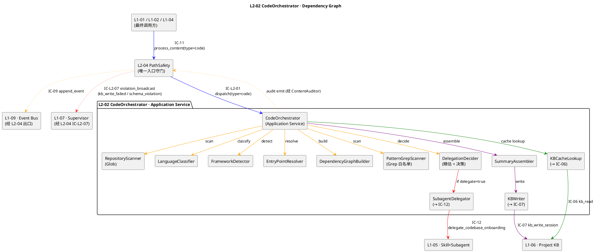

### 4.4 算法前 4（Core Algorithms · 头半部分）

本节给出 **前 4 个算法**（主编排 · Glob 扫 · 语言识别 · 框架识别），其余 4 个在 §6。

#### 4.4.1 算法 A1 · 主编排（`on_dispatch`）

```python
def on_dispatch(req: IC_L2_01_Payload) -> IC_L2_01_Response:
    """
    L2-02 主入口 · 编排全流程
    返回：status ∈ {success, partial, delegated, failed}
    """
    trace_id = req.trace_id
    project_id = req.project_id
    repo_path = req.request.repo_path
    git_head = req.request.precheck.git_head
    focus_hint = req.request.focus_hint
    focus_hash = sha256(focus_hint or "").hex() if focus_hint else ""
    cache_key = {"repo_path": repo_path, "git_head": git_head,
                 "focus_hint_hash": focus_hash}

    # --- Step 1 · 先查 KB 缓存（scope §9.6 必须义务 1）---
    try:
        cached = kb_cache_lookup.find(project_id, cache_key)
    except KBUnavailable as e:
        emit("L1-08:kb_lookup_failed", {...})
        cached = None   # §11.2 DEG-L1 · 降级继续

    if cached is not None:
        emit("L1-08:cache_hit", {"summary_id": cached.summary_id, ...})
        emit("L1-08:code_summarized", {...cached, "cache_hit": True})
        return Response(status="success", summary=cached,
                        kb_meta={"cache_hit": True, "kb_entry_id": cached.kb_entry_id})

    # --- Step 2 · Glob 扫 + 粗估精估 ---
    try:
        glob_snap = repository_scanner.scan(
            req.request.canonical_repo_path,
            include=req.request.include_patterns,
            exclude=req.request.exclude_patterns or DEFAULT_EXCLUDES,
            focus=focus_hint,
            timeout_ms=config.glob_timeout_ms,
        )
    except GlobTimeout:
        return fail("E_L202_GLOB_TIMEOUT", suggested="缩小 focus_hint 或 include_patterns")

    if glob_snap.text_file_count == 0:
        return fail("E_L202_REPO_EMPTY", suggested="检查 repo_path 或 include_patterns")

    # --- Step 3 · 委托决策（精估 · 参 §6.6）---
    deleg_decision = delegation_decider.decide(glob_snap, config)
    if deleg_decision.decided:
        emit("L1-08:degradation_triggered", {"route": "delegate",
            "threshold_hit": config.delegate_threshold_lines,
            "precise_lines": deleg_decision.precise_line_count})
        return delegate_to_subagent(req, deleg_decision, cache_key)

    # --- Step 4 · 识别语言 / 框架 / 入口 / 依赖 / 模式 ---
    lang_stats = language_classifier.classify(glob_snap)
    fw_hint = framework_detector.detect(glob_snap, lang_stats)
    entries = entry_point_resolver.resolve(glob_snap, fw_hint)
    deps = dependency_graph_builder.build(entries, glob_snap, lang_stats, depth=3)

    try:
        grep_summary = pattern_grep_scanner.scan(glob_snap,
                                                 lang_stats[0].name,
                                                 fw_hint.primary)
    except GrepBudgetExceeded as e:
        emit("L1-08:grep_truncated", {"patterns_truncated": e.truncated, ...})
        grep_summary = e.partial_summary    # best-effort

    # --- Step 5 · 组装摘要 ---
    try:
        summary = summary_assembler.assemble(
            project_id=project_id, repo_path=repo_path, git_head=git_head,
            focus_hint=focus_hint, focus_hint_hash=focus_hash,
            partial=(focus_hint is not None),
            language_stats=lang_stats, framework_hint=fw_hint,
            entry_files=entries, deps=deps, grep_hits_summary=grep_summary,
        )
    except InvariantViolation as e:
        emit("L1-08:summary_invariant_violation", {...})
        return fail("E_L202_SUMMARY_INVARIANT_VIOLATION")

    # --- Step 6 · 写 KB（幂等 · 重试）---
    kb_status = "pending"
    kb_entry_id = None
    try:
        kb_entry_id = kb_writer.write_with_retry(summary,
            max_attempts=config.kb_write_retry_max,
            backoff=config.kb_write_retry_backoff_ms)
        kb_status = "success"
    except KBWriteFailedPermanent as e:
        kb_status = "failed"
        emit("L1-08:kb_write_failed", {"summary_id": summary.summary_id,
            "attempts": config.kb_write_retry_max})
        auditor.broadcast_violation(IC_L2_07, {
            "dimension": "code_analysis_kb_write",
            "severity": "high",
            "summary_id": summary.summary_id,
        })
        # D7 决策：仍返回 summary · 下次幂等重试

    # --- Step 7 · 审计 + 返回 ---
    emit("L1-08:code_summarized", {
        "summary_id": summary.summary_id, "repo_path": repo_path,
        "git_head": git_head, "deps_count": len(deps),
        "language_primary": lang_stats[0].name,
        "framework": fw_hint.primary, "cache_hit": False,
        "delegated": False, "partial": summary.partial,
        "elapsed_ms": elapsed(), "kb_entry_id": kb_entry_id,
    })
    return Response(
        status="success" if (summary.status == "complete" and kb_status == "success") else "partial",
        summary=summary,
        kb_meta={"kb_entry_id": kb_entry_id, "kb_write_status": kb_status, "cache_hit": False},
    )
```

**关键特性**：
- Step 1 先查缓存 · cache hit 直接返回 · 符合 scope §9.6 必须义务 1
- Step 3 精估委托在主流程内 · 不是 L2-04 已决定的就必走 · 支持 L2-04 粗估 120k → L2-02 精估 80k 的回流
- Step 6 D7 决策：KB 写失败不阻塞返回摘要 · 走审计 + 广播
- 全程 emit 事件 · 由 L2-04 ContentAuditor 统一出口

#### 4.4.2 算法 A2 · RepositoryScanner（Glob 扫目录）

```python
def scan(repo_path: str, include: list[str] | None, exclude: list[str],
         focus: str | None, timeout_ms: int) -> GlobSnapshot:
    """
    递归 Glob · 尊重 .gitignore · 产出基础快照
    """
    start = now_ms()
    base = os.path.join(repo_path, focus) if focus else repo_path

    # --- 默认忽略规则（scope §9.5 禁止 7：禁静默跳过 · 需可追溯）---
    default_excludes = [
        "**/__pycache__/**", "**/node_modules/**", "**/.venv/**",
        "**/dist/**", "**/build/**", "**/.git/**", "**/.svn/**",
        "**/*.pyc", "**/*.class", "**/*.so", "**/*.dll",
        "**/*.jpg", "**/*.png", "**/*.webp", "**/*.gif",
        "**/*.mp4", "**/*.mp3", "**/*.pdf", "**/*.zip", "**/*.tar.gz",
    ]
    effective_exclude = (exclude or []) + default_excludes

    # --- Glob 主扫 ---
    all_files: list[FileEntry] = []
    for pattern in (include or ["**/*"]):
        if (now_ms() - start) > timeout_ms:
            raise GlobTimeout(elapsed=now_ms() - start)
        for match in glob_tool(base, pattern):        # 调 Claude Code Glob
            rel = os.path.relpath(match, repo_path)
            if _matches_any(rel, effective_exclude):
                continue
            stat = os.stat(match)
            if stat.st_size > MAX_FILE_SIZE_FOR_SCAN:   # 跳超大文件 · 但要记录
                all_files.append(FileEntry(rel, stat.st_size, skipped="oversize"))
                continue
            # 快速二进制检测（前 1024 字节查 NUL）
            is_binary = _quick_binary_check(match)
            all_files.append(FileEntry(
                path=rel, size_bytes=stat.st_size,
                is_binary=is_binary,
                extension=os.path.splitext(rel)[1].lower(),
                skipped=None if not is_binary else "binary",
            ))

    # --- 行数估算（粗估：按文本文件 size / avg_line_bytes）---
    text_files = [f for f in all_files if not f.is_binary and not f.skipped]
    total_bytes = sum(f.size_bytes for f in text_files)
    estimated_lines = total_bytes // 40     # 平均每行 40 字节（含 \n + 缩进）

    return GlobSnapshot(
        repo_path=repo_path, focus=focus,
        all_files=all_files,
        text_file_count=len(text_files),
        binary_file_count=sum(1 for f in all_files if f.is_binary),
        skipped_file_count=sum(1 for f in all_files if f.skipped),
        estimated_total_lines=estimated_lines,
        total_bytes=total_bytes,
        scan_duration_ms=now_ms() - start,
    )
```

**复杂度**：`O(N)` · N = 文件数；glob_tool 底层 = `os.walk`；每文件 1 次 `os.stat` + 可选 1 次 1KB read（二进制检测）

#### 4.4.3 算法 A3 · LanguageClassifier（语言识别）

```python
EXTENSION_LANGUAGE_MAP = {
    ".py": "Python", ".pyi": "Python",
    ".js": "JavaScript", ".mjs": "JavaScript", ".cjs": "JavaScript",
    ".ts": "TypeScript", ".tsx": "TypeScript",
    ".jsx": "JavaScript",
    ".go": "Go",
    ".rs": "Rust",
    ".java": "Java", ".kt": "Kotlin", ".kts": "Kotlin", ".scala": "Scala",
    ".rb": "Ruby", ".php": "PHP",
    ".cs": "C#", ".vb": "VisualBasic",
    ".cpp": "C++", ".cc": "C++", ".cxx": "C++", ".hpp": "C++", ".hxx": "C++",
    ".c": "C", ".h": "C",
    ".swift": "Swift", ".m": "Objective-C",
    ".sh": "Shell", ".bash": "Shell", ".zsh": "Shell",
    ".sql": "SQL",
    ".vue": "Vue", ".svelte": "Svelte",
    ".yaml": "YAML", ".yml": "YAML", ".toml": "TOML",
    ".md": "Markdown",
}

CONFIG_FILE_HINTS = {
    "package.json": ["JavaScript", "TypeScript"],
    "pyproject.toml": ["Python"], "requirements.txt": ["Python"],
    "setup.py": ["Python"], "Pipfile": ["Python"],
    "pom.xml": ["Java"], "build.gradle": ["Java", "Kotlin"],
    "go.mod": ["Go"], "Cargo.toml": ["Rust"],
    "Gemfile": ["Ruby"], "composer.json": ["PHP"],
    "*.csproj": ["C#"],
}

def classify(glob: GlobSnapshot) -> list[LanguageStat]:
    """
    基于扩展名频次 + 配置文件 hint 识别语言栈
    """
    # --- Step 1 · 扩展名聚合 ---
    lang_counter: dict[str, dict] = {}
    for f in glob.all_files:
        if f.is_binary or f.skipped:
            continue
        lang = EXTENSION_LANGUAGE_MAP.get(f.extension)
        if lang is None:
            continue
        bucket = lang_counter.setdefault(lang, {"files": 0, "bytes": 0})
        bucket["files"] += 1
        bucket["bytes"] += f.size_bytes

    # --- Step 2 · 配置文件 boost（权重 = 10 × 单文件字节）---
    for f in glob.all_files:
        name = os.path.basename(f.path)
        for pattern, langs in CONFIG_FILE_HINTS.items():
            if fnmatch(name, pattern):
                for lang in langs:
                    if lang in lang_counter:
                        lang_counter[lang]["bytes"] += f.size_bytes * 10

    # --- Step 3 · 转 LanguageStat + 按行数排序 ---
    total_bytes = sum(v["bytes"] for v in lang_counter.values()) or 1
    stats = []
    for lang, v in lang_counter.items():
        stats.append(LanguageStat(
            name=lang,
            files=v["files"],
            lines=v["bytes"] // 40,
            percent=round(v["bytes"] * 100.0 / total_bytes, 2),
        ))
    stats.sort(key=lambda s: s.lines, reverse=True)
    return stats
```

**边界 case**：
- 无任何已知扩展名 → 返回 `[]` · 主编排 A1 返回 `status=partial, framework=unknown`
- 多语言 monorepo · top-1 占比 < 40% 时 Framework 置信度降 medium

#### 4.4.4 算法 A4 · FrameworkDetector（框架识别）

```python
FRAMEWORK_SIGNATURES = [
    # Python
    {"id": "FastAPI", "lang": "Python",
     "dep_in": ["pyproject.toml", "requirements.txt"], "dep_names": ["fastapi"],
     "entry_pattern": r"(?:from\s+fastapi|FastAPI\s*\()",
     "confidence_boost": {"dep_and_entry": "high", "dep_only": "medium", "entry_only": "medium"}},
    {"id": "Django", "lang": "Python",
     "dep_names": ["django"],
     "entry_pattern": r"(?:django\.conf|settings\.DEBUG)",
     "file_hints": ["manage.py"]},
    {"id": "Flask", "lang": "Python",
     "dep_names": ["flask"],
     "entry_pattern": r"(?:from\s+flask|Flask\s*\(__name__\))"},
    # JS/TS
    {"id": "Express", "lang": "JavaScript",
     "dep_names": ["express"],
     "entry_pattern": r"(?:require\(['\"]express['\"]\)|import\s+express)"},
    {"id": "NestJS", "lang": "TypeScript",
     "dep_names": ["@nestjs/core"],
     "entry_pattern": r"@(?:Module|Controller|Injectable)"},
    {"id": "Vue", "lang": "TypeScript",
     "dep_names": ["vue"], "file_hints": ["vite.config.ts", "vue.config.js"]},
    {"id": "React", "lang": "TypeScript",
     "dep_names": ["react"]},
    # Java
    {"id": "SpringBoot", "lang": "Java",
     "dep_names": ["spring-boot-starter"],
     "entry_pattern": r"@SpringBootApplication"},
    # Go
    {"id": "Gin", "lang": "Go", "dep_names": ["github.com/gin-gonic/gin"]},
    # Rust
    {"id": "Actix", "lang": "Rust", "dep_names": ["actix-web"]},
]

def detect(glob: GlobSnapshot,
           lang_stats: list[LanguageStat]) -> FrameworkHint:
    """
    框架识别 · 先读依赖 manifest · 再匹配入口文件
    """
    if not lang_stats:
        return FrameworkHint(primary="unknown", confidence="low", evidence=[])

    primary_lang = lang_stats[0].name
    candidates = [s for s in FRAMEWORK_SIGNATURES if s["lang"] == primary_lang]

    # --- 读依赖 manifest ---
    dep_files = {}
    for name in ["pyproject.toml", "requirements.txt", "package.json",
                 "pom.xml", "build.gradle", "go.mod", "Cargo.toml"]:
        match = _find_file(glob, name)
        if match:
            dep_files[name] = _read_head(match, max_bytes=config.entry_read_max_bytes)

    # --- 读候选入口文件（top-5 按 heuristic）---
    entry_candidates = _heuristic_entry_top_k(glob, primary_lang, k=5)
    entry_contents = {p: _read_head(p, max_bytes=config.entry_read_max_bytes)
                      for p in entry_candidates}

    # --- 匹配 ---
    scored = []
    for sig in candidates:
        dep_hit = any(_dep_present(sig["dep_names"], dep_files.values()))
        entry_hit = False
        version = None
        if "entry_pattern" in sig:
            import re
            for content in entry_contents.values():
                if re.search(sig["entry_pattern"], content):
                    entry_hit = True; break
        file_hit = False
        for fh in sig.get("file_hints", []):
            if _find_file(glob, fh):
                file_hit = True; break
        version = _extract_version(sig["id"], dep_files)

        if dep_hit and entry_hit:
            conf = "high"
        elif dep_hit or entry_hit or file_hit:
            conf = "medium"
        else:
            continue
        scored.append((sig["id"], conf, version, dep_hit, entry_hit, file_hit))

    # --- 排序 · high > medium > low ---
    if not scored:
        return FrameworkHint(primary="unknown", confidence="low",
                             evidence=["未匹配任何已知框架签名"])
    scored.sort(key=lambda x: ({"high": 3, "medium": 2, "low": 1}[x[1]]), reverse=True)
    primary_id, primary_conf, primary_ver, *_ = scored[0]
    secondary = [s[0] for s in scored[1:4]]

    evidence = [f"{primary_id}: dep={scored[0][3]}, entry={scored[0][4]}, file={scored[0][5]}"]
    if primary_ver:
        evidence.append(f"version inferred = {primary_ver}")

    return FrameworkHint(
        primary=primary_id,
        version_inferred=primary_ver,
        secondary=secondary,
        confidence=primary_conf,
        evidence=evidence,
    )
```

---

## §5 P0/P1 时序图（PlantUML）

### 5.1 P0-1 · 小/中仓正常分析链路（缓存未命中 → 扫描 → 入 KB）

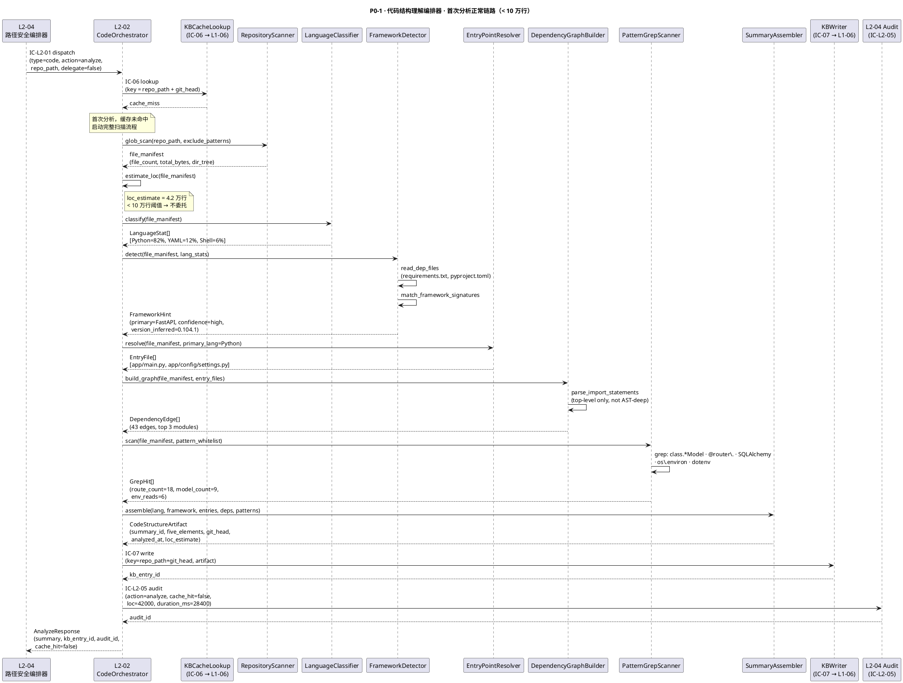

### 5.2 P0-2 · 缓存命中快速返回

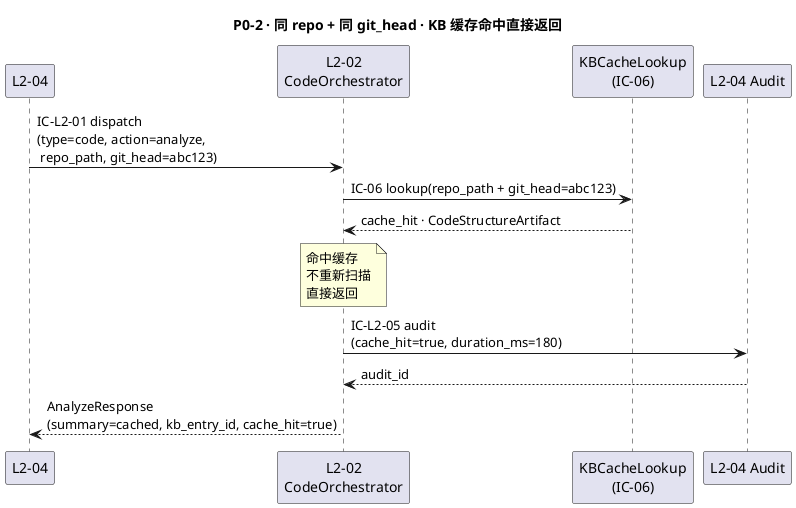

### 5.3 P1-1 · 大仓委托（> 10 万行 · delegate=true）

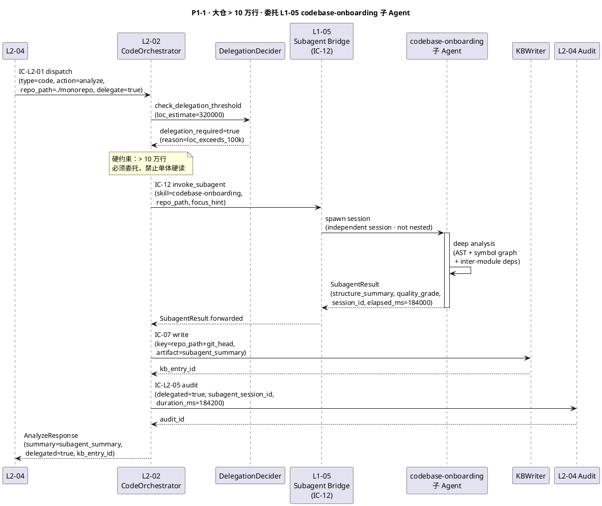

### 5.4 P1-2 · 异常 / 降级：Grep 超预算截断 + partial 返回

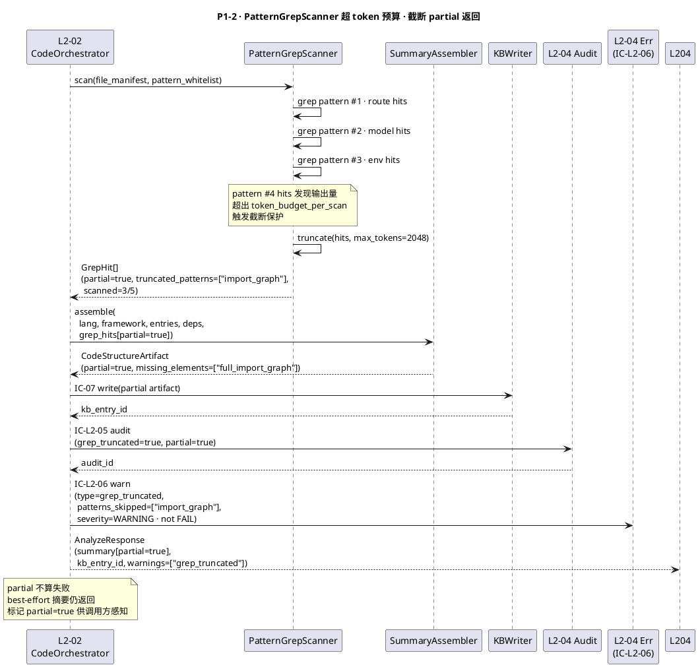

### 5.5 P1-3 · 异常：Glob 无结果（全为二进制）

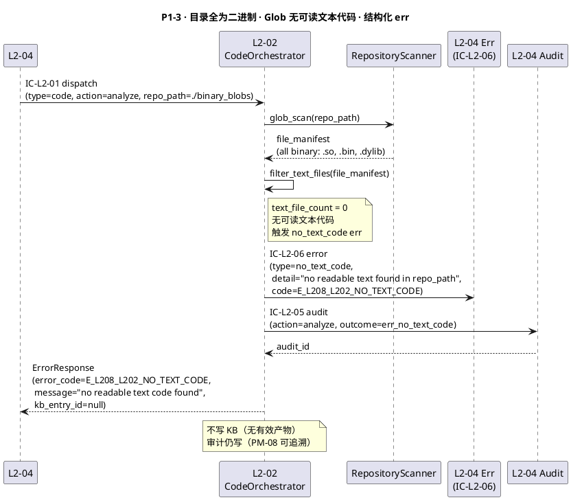

---

## §6 内部核心算法（伪代码）

### 6.1 主入口 · CodeOrchestrator.analyze

```python
class CodeOrchestrator:
    """
    代码结构理解编排器 · Application Service 层
    对外承接 IC-L2-01 dispatch(type=code, action=analyze)
    """

    async def analyze(self, request: CodeAnalyzeRequest) -> CodeAnalyzeResponse:
        """
        主入口：缓存查 → 决策委托 → 扫描 → 组装 → 写 KB → 审计
        """
        project_id = request.project_id
        repo_path  = request.repo_path
        git_head   = request.git_head or self._resolve_git_head(repo_path)
        focus_hint = request.focus_hint        # 可选子目录聚焦
        trace_id   = request.trace_id

        # Step 1: 缓存查询（先于一切）
        cache_key = f"{repo_path}::{git_head}"
        cached = await self.kb_cache.lookup(project_id, cache_key)
        if cached:
            await self._audit(project_id, trace_id, cache_hit=True, duration_ms=0)
            return CodeAnalyzeResponse(
                project_id=project_id, summary=cached,
                kb_entry_id=cached.kb_entry_id, cache_hit=True,
            )

        start_ms = now_ms()

        # Step 2: 扫目录 + 估行数
        scan_root = os.path.join(repo_path, focus_hint) if focus_hint else repo_path
        file_manifest = self.repo_scanner.glob_scan(
            root=scan_root,
            exclude_patterns=self.config.exclude_patterns,
        )
        if not file_manifest.text_files:
            await self._error(project_id, trace_id, "E_L208_L202_NO_TEXT_CODE")
            raise NoTextCodeError(repo_path=repo_path)

        loc_estimate = self.repo_scanner.estimate_loc(file_manifest)

        # Step 3: 委托阈值决策
        if loc_estimate > self.config.delegation_loc_threshold:  # 默认 100_000
            return await self._delegate_to_subagent(
                project_id, repo_path, git_head, focus_hint, trace_id, start_ms
            )

        # Step 4: 本地五要素扫描
        artifact = await self._scan_local(
            project_id, repo_path, git_head,
            file_manifest, loc_estimate, focus_hint, trace_id,
        )

        # Step 5: 写 KB
        kb_entry_id = await self.kb_writer.write(
            project_id=project_id, cache_key=cache_key, artifact=artifact,
        )
        artifact.kb_entry_id = kb_entry_id

        # Step 6: 审计
        duration_ms = now_ms() - start_ms
        audit_id = await self._audit(
            project_id, trace_id, cache_hit=False,
            loc=loc_estimate, duration_ms=duration_ms,
        )

        return CodeAnalyzeResponse(
            project_id=project_id, summary=artifact,
            kb_entry_id=kb_entry_id, cache_hit=False,
            audit_id=audit_id, duration_ms=duration_ms,
        )
```

### 6.2 AST 浅层解析 · ASTShallowParser（import 语句提取）

```python
class ASTShallowParser:
    """
    浅层 AST 解析器：只提取 import/require 语句
    不做符号表构建 / 类型推导（那是 codebase-onboarding 的范畴）
    支持语言：Python · TypeScript/JavaScript · Go · Java · Rust
    """

    PARSERS: dict[str, Callable] = {
        "python": "_parse_python_imports",
        "typescript": "_parse_ts_imports",
        "javascript": "_parse_ts_imports",   # 同 TS 解析器
        "go": "_parse_go_imports",
        "java": "_parse_java_imports",
        "rust": "_parse_rust_imports",
    }

    def extract_imports(self, file_path: str, lang: str) -> list[ImportStatement]:
        """
        从单文件提取 import 语句（最多读 max_bytes=64KB）
        """
        content = self._read_head(file_path, max_bytes=self.config.ast_read_max_bytes)
        parser_name = self.PARSERS.get(lang)
        if not parser_name:
            return []                        # 不支持的语言 · 跳过
        return getattr(self, parser_name)(content, file_path)

    def _parse_python_imports(self, content: str, file_path: str) -> list[ImportStatement]:
        """
        使用 tokenize + re 组合（不用 ast.parse · 避免语法错误崩溃）
        """
        imports = []
        import re
        # 匹配 import X · from X import Y · from .X import Y
        patterns = [
            r"^import\s+([\w\.]+)",
            r"^from\s+([\w\.]+)\s+import",
        ]
        for line in content.splitlines():
            line = line.strip()
            for p in patterns:
                m = re.match(p, line)
                if m:
                    module = m.group(1).split(".")[0]  # 取顶层包名
                    imports.append(ImportStatement(
                        module=module, raw=line,
                        file_path=file_path, is_relative=line.startswith("from ."),
                    ))
        return imports

    def _parse_ts_imports(self, content: str, file_path: str) -> list[ImportStatement]:
        import re
        imports = []
        # 匹配 import ... from '...' · require('...')
        patterns = [
            r"""import\s+.*?\s+from\s+['"]([^'"]+)['"]""",
            r"""require\s*\(\s*['"]([^'"]+)['"]\s*\)""",
        ]
        for p in patterns:
            for m in re.finditer(p, content):
                path = m.group(1)
                is_relative = path.startswith(".")
                module = path if is_relative else path.split("/")[0]
                imports.append(ImportStatement(
                    module=module, raw=m.group(0),
                    file_path=file_path, is_relative=is_relative,
                ))
        return imports

    def _parse_go_imports(self, content: str, file_path: str) -> list[ImportStatement]:
        import re
        imports = []
        # 匹配 import ( "pkg/path" ) 和 import "pkg/path"
        single = re.findall(r'^import\s+"([^"]+)"', content, re.MULTILINE)
        block  = re.findall(r'"([^"]+)"', content[content.find("import ("):content.find(")")+1]
                            if "import (" in content else "")
        for pkg in single + block:
            module = pkg.split("/")[-1]
            imports.append(ImportStatement(module=module, raw=pkg, file_path=file_path))
        return imports
```

### 6.3 符号图构建器 · SymbolGraphBuilder

```python
class SymbolGraphBuilder:
    """
    依赖图构建器：从 ImportStatement[] 建立模块级有向图
    节点 = 模块（文件/包）· 边 = import 关系
    仅顶层粒度（不做函数级 call-graph）
    """

    def build(
        self,
        file_manifest: FileManifest,
        lang: str,
        ast_parser: ASTShallowParser,
        max_files: int = 200,           # token 预算保护
    ) -> DependencyGraph:
        nodes: dict[str, DependencyNode] = {}
        edges: list[DependencyEdge] = []

        # 采样：文件数超限则按启发式优先级采样
        candidates = self._prioritize_files(file_manifest.text_files, max_files)

        for file_path in candidates:
            imports = ast_parser.extract_imports(file_path, lang)
            src_module = self._path_to_module(file_path)

            if src_module not in nodes:
                nodes[src_module] = DependencyNode(
                    module=src_module, file_path=file_path,
                    is_entry=file_path in file_manifest.entry_candidates,
                )

            for stmt in imports:
                tgt = stmt.module
                if tgt not in nodes:
                    nodes[tgt] = DependencyNode(
                        module=tgt, is_external=not stmt.is_relative,
                    )
                edges.append(DependencyEdge(
                    source=src_module, target=tgt,
                    is_relative=stmt.is_relative,
                    raw_import=stmt.raw,
                ))

        return DependencyGraph(
            nodes=list(nodes.values()),
            edges=edges,
            sampled=len(file_manifest.text_files) > max_files,
            node_count=len(nodes),
            edge_count=len(edges),
        )

    def _prioritize_files(self, files: list[str], max_files: int) -> list[str]:
        """
        优先选：入口文件 > 根目录深度浅的 > 大文件（更可能是核心模块）
        """
        scored = []
        for f in files:
            depth = f.count(os.sep)
            size  = os.path.getsize(f) if os.path.exists(f) else 0
            score = -depth * 100 + size // 1000
            scored.append((score, f))
        scored.sort(reverse=True)
        return [f for _, f in scored[:max_files]]
```

### 6.4 增量更新检测 · IncrementalCacheInvalidator

```python
class IncrementalCacheInvalidator:
    """
    缓存失效判断器：
    · 同 repo_path + 同 git_head → 缓存有效
    · git_head 变化 → 需检测文件级变更
    · 变更文件超过 incremental_threshold → 全量重分析
    · 变更文件在阈值内 → 增量更新（只重扫变化文件）
    """

    def check(
        self,
        repo_path: str,
        old_head: str,
        new_head: str,
        old_artifact: CodeStructureArtifact,
    ) -> InvalidationResult:
        """
        返回：VALID / INCREMENTAL / FULL_RESCAN
        """
        if old_head == new_head:
            return InvalidationResult(action="VALID")

        changed_files = self._git_diff_files(repo_path, old_head, new_head)
        pct_changed   = len(changed_files) / max(old_artifact.file_count, 1)

        if pct_changed < self.config.incremental_threshold_pct:   # 默认 0.05（5%）
            # 增量：只重扫变化文件
            critical_changed = [
                f for f in changed_files
                if self._is_critical(f, old_artifact)   # entry / dep / framework config
            ]
            return InvalidationResult(
                action="INCREMENTAL",
                changed_files=changed_files,
                critical_changed=critical_changed,
                require_framework_recheck=len(critical_changed) > 0,
            )
        else:
            return InvalidationResult(action="FULL_RESCAN", changed_files=changed_files)

    def _git_diff_files(self, repo_path, old_head, new_head) -> list[str]:
        import subprocess
        result = subprocess.run(
            ["git", "diff", "--name-only", old_head, new_head],
            cwd=repo_path, capture_output=True, text=True, timeout=10,
        )
        return result.stdout.strip().splitlines() if result.returncode == 0 else []

    def _is_critical(self, file_path: str, artifact: CodeStructureArtifact) -> bool:
        """判定变更文件是否影响五要素"""
        dep_files = {"requirements.txt", "package.json", "go.mod",
                     "Cargo.toml", "pom.xml", "pyproject.toml"}
        return (
            file_path in artifact.entry_files
            or os.path.basename(file_path) in dep_files
        )
```

### 6.5 模式 Grep 扫描器 · PatternGrepScanner

```python
class PatternGrepScanner:
    """
    白名单 Grep 扫描器
    · 仅扫描预定义 pattern 白名单（禁止无目的全量枚举）
    · token 预算保护（超过 max_hits_per_pattern 截断）
    · 支持多语言 pattern 注册
    """

    WHITELIST: list[GrepPattern] = [
        GrepPattern("api_routes",    r"@(router|app)\.(get|post|put|delete|patch)",  ["python"]),
        GrepPattern("class_def",     r"^class\s+\w+",                                ["python","java"]),
        GrepPattern("db_access",     r"(session\.|\.query\(|\.execute\(|db\.)",      ["python"]),
        GrepPattern("env_reads",     r"os\.environ|getenv\(|process\.env\.",         ["python","javascript","typescript"]),
        GrepPattern("ts_exports",    r"^export\s+(default\s+)?(class|function|const)",["typescript"]),
        GrepPattern("go_handler",    r"func\s+\w+\(w\s+http\.ResponseWriter",        ["go"]),
        GrepPattern("spring_bean",   r"@(Controller|Service|Repository|Component)",  ["java"]),
        GrepPattern("rust_pub_fn",   r"^pub\s+(async\s+)?fn\s+\w+",                  ["rust"]),
        GrepPattern("test_func",     r"(def\s+test_|it\(|describe\(|#\[test\])",     ["python","javascript","typescript","rust"]),
        GrepPattern("error_handling",r"(raise\s+\w+Error|throw\s+new\s+\w+|panic!)", ["python","javascript","typescript","rust"]),
    ]

    def scan(
        self,
        file_manifest: FileManifest,
        lang_stats: list[LanguageStat],
    ) -> GrepScanResult:
        active_langs = {s.lang for s in lang_stats if s.pct >= 5.0}
        hits: list[GrepHit] = []
        truncated_patterns: list[str] = []
        token_budget = self.config.token_budget_per_scan  # 默认 4096

        for pattern in self.WHITELIST:
            if not (set(pattern.langs) & active_langs):
                continue          # 跳过不相关语言的 pattern

            pattern_hits: list[GrepHit] = []
            for file_path in file_manifest.text_files:
                if token_budget <= 0:
                    truncated_patterns.append(pattern.name)
                    break
                file_hits = self._grep_file(file_path, pattern.regex)
                for hit in file_hits:
                    if token_budget > 0:
                        pattern_hits.append(hit)
                        token_budget -= len(hit.line) // 4   # 粗估 token 数

            hits.extend(pattern_hits[:self.config.max_hits_per_pattern])

        return GrepScanResult(
            hits=hits,
            partial=len(truncated_patterns) > 0,
            truncated_patterns=truncated_patterns,
            total_hits=len(hits),
        )

    def _grep_file(self, file_path: str, regex: str) -> list[GrepHit]:
        import re
        hits = []
        try:
            content = self._read_head(file_path, max_bytes=32768)
            for i, line in enumerate(content.splitlines(), 1):
                if re.search(regex, line):
                    hits.append(GrepHit(file_path=file_path, line_no=i, line=line.strip()))
        except (OSError, UnicodeDecodeError):
            pass
        return hits
```

### 6.6 五要素摘要组装器 · SummaryAssembler

```python
class SummaryAssembler:
    """
    将各子分析结果组装为 CodeStructureArtifact（MultimodalArtifact 子类型）
    五要素：language / framework / entries / dependency_graph / key_patterns
    """

    def assemble(
        self,
        project_id:      str,
        repo_path:        str,
        git_head:         str,
        lang_stats:       list[LanguageStat],
        framework_hint:   FrameworkHint,
        entry_files:      list[EntryFile],
        dep_graph:        DependencyGraph,
        grep_result:      GrepScanResult,
        loc_estimate:     int,
        focus_hint:       str | None,
        analyzed_at:      datetime,
    ) -> CodeStructureArtifact:
        """
        组装产物 · 校验五要素完整性 · partial 标记
        """
        missing_elements = []

        if not lang_stats:
            missing_elements.append("language")
        if not framework_hint or framework_hint.primary == "unknown":
            missing_elements.append("framework")   # warning only · not fatal
        if not entry_files:
            missing_elements.append("entries")
        if not dep_graph or dep_graph.edge_count == 0:
            missing_elements.append("dependency_graph")
        if not grep_result.hits:
            missing_elements.append("key_patterns")

        # 摘要完整性评级
        completeness = len([e for e in ["language","framework","entries",
                                         "dependency_graph","key_patterns"]
                            if e not in missing_elements]) / 5.0

        artifact = CodeStructureArtifact(
            # PM-14 项目上下文（必填首字段）
            project_id          = project_id,
            artifact_type       = "code_structure_summary",
            parent_type         = "MultimodalArtifact",

            # 核心字段
            repo_path           = repo_path,
            git_head            = git_head,
            focus_hint          = focus_hint,
            analyzed_at         = analyzed_at.isoformat(),
            loc_estimate        = loc_estimate,

            # 五要素
            language_stats      = lang_stats,
            framework_hint      = framework_hint,
            entry_files         = entry_files,
            dependency_graph    = dep_graph,
            grep_result         = grep_result,

            # 完整性
            partial             = grep_result.partial or len(missing_elements) > 1,
            missing_elements    = missing_elements,
            completeness_score  = completeness,

            # 元
            schema_version      = "v1.2",
            generated_by        = "L2-02-CodeOrchestrator",
        )

        # 硬校验：language 缺失 → 抛错（不允许返回空摘要）
        if "language" in missing_elements:
            raise E_L208_L202_NO_TEXT_CODE(repo_path=repo_path)

        return artifact
```

### 6.7 KB 缓存查询 · KBCacheLookup

```python
class KBCacheLookup:
    """
    Project KB 缓存层 · IC-06 → L1-06
    缓存 key = repo_path + "::" + git_head
    """

    async def lookup(
        self,
        project_id: str,
        cache_key: str,
    ) -> CodeStructureArtifact | None:
        """
        查询 L1-06 KB 是否有命中
        命中 → 返回缓存 artifact
        未命中 → 返回 None
        """
        kb_path = f"projects/{project_id}/multimodal/code-structure/{_hash(cache_key)}.yaml"

        try:
            raw = await self.kb_bridge.read(
                project_id=project_id,
                path=kb_path,
                timeout_ms=self.config.kb_lookup_timeout_ms,  # 默认 2000ms
            )
            if raw:
                artifact = CodeStructureArtifact.from_dict(raw)
                # 版本兼容检查
                if artifact.schema_version != self.CURRENT_SCHEMA:
                    return None   # schema 不兼容 → 强制重分析
                return artifact
        except KBUnavailableError:
            # KB 不可用 → 降级：视为缓存 miss（继续重分析）
            self.event_bus.warn("kb_lookup_failed", {"cache_key": cache_key})
            return None

        return None

    async def invalidate(self, project_id: str, cache_key: str) -> bool:
        """主动失效缓存（如 git_head 变化）"""
        kb_path = f"projects/{project_id}/multimodal/code-structure/{_hash(cache_key)}.yaml"
        return await self.kb_bridge.delete(project_id=project_id, path=kb_path)
```

### 6.8 委托子 Agent · _delegate_to_subagent

```python
async def _delegate_to_subagent(
    self,
    project_id:  str,
    repo_path:    str,
    git_head:     str,
    focus_hint:   str | None,
    trace_id:     str,
    start_ms:     int,
) -> CodeAnalyzeResponse:
    """
    > 10 万行 · 委托 L1-05 调 codebase-onboarding 子 Agent
    本 L2 只负责委托决策 + 写 KB + 审计
    不在委托后继续硬读（硬约束 §9.4 约束 1）
    """
    delegation_id = uuid7()

    # IC-12：发起独立 session 子 Agent 调用
    try:
        result = await self.subagent_bridge.invoke(
            skill="codebase-onboarding",
            project_id=project_id,
            inputs={
                "repo_path":  repo_path,
                "git_head":   git_head,
                "focus_hint": focus_hint,
                "budget_ms":  self.config.subagent_budget_ms,   # 默认 600_000 (10 min)
            },
            timeout_ms=self.config.subagent_timeout_ms,
        )
    except SubagentTimeoutError as e:
        await self._audit(project_id, trace_id, delegated=True,
                          outcome="subagent_timeout", duration_ms=now_ms()-start_ms)
        raise DelegationTimeoutError(delegation_id=delegation_id) from e
    except SubagentError as e:
        await self._audit(project_id, trace_id, delegated=True,
                          outcome="subagent_error", duration_ms=now_ms()-start_ms)
        raise DelegationFailedError(reason=str(e)) from e

    # 将子 Agent 产出写入 KB
    cache_key   = f"{repo_path}::{git_head}"
    artifact    = CodeStructureArtifact.from_subagent_result(
        project_id=project_id, result=result,
        repo_path=repo_path, git_head=git_head,
    )
    kb_entry_id = await self.kb_writer.write(
        project_id=project_id, cache_key=cache_key, artifact=artifact,
    )

    duration_ms = now_ms() - start_ms
    await self._audit(
        project_id, trace_id,
        delegated=True,
        subagent_session_id=result.session_id,
        duration_ms=duration_ms,
    )

    return CodeAnalyzeResponse(
        project_id=project_id,
        summary=artifact,
        kb_entry_id=kb_entry_id,
        cache_hit=False,
        delegated=True,
        subagent_session_id=result.session_id,
        duration_ms=duration_ms,
    )
```

---

## §7 底层数据表 / Schema 设计（字段级 YAML · PM-14 分片）

### 7.1 code_structure_artifact 表

```yaml
table_name: code_structure_artifact
description: >
  代码结构理解产物 · CodeStructureArtifact（MultimodalArtifact 子类型）
  每个 repo_path + git_head 组合对应一条记录

storage_path: "projects/<pid>/multimodal/code-structure/<hash(repo_path::git_head)>.yaml"

fields:
  project_id:
    type: string
    description: "PM-14 项目上下文"
    not_null: true
    indexed: true
    example: "proj_01HXXXXX"

  artifact_id:
    type: string
    format: uuid7
    primary_key: true
    description: "产物唯一 ID"

  artifact_type:
    type: string
    const: "code_structure_summary"
    not_null: true

  parent_type:
    type: string
    const: "MultimodalArtifact"
    description: "命名锁 AR L1-08：MultimodalArtifact 子类型"

  repo_path:
    type: string
    not_null: true
    indexed: true
    description: "代码仓库路径（已规范化）"

  git_head:
    type: string
    length: 40
    not_null: true
    indexed: true
    description: "git commit SHA · 缓存 key 的组成部分"

  focus_hint:
    type: string
    nullable: true
    description: "子目录聚焦路径（partial 分析模式）"

  partial:
    type: boolean
    default: false
    description: "是否为 partial 分析（focus_hint 或 grep 截断）"

  missing_elements:
    type: array
    items: string
    description: "五要素中缺失的元素列表"

  completeness_score:
    type: float
    min: 0.0
    max: 1.0
    description: "五要素完整性评分（1.0=全部齐全）"

  loc_estimate:
    type: integer
    description: "粗估代码行数"

  language_stats:
    type: json
    description: "LanguageStat[] · 语言分布"
    schema: |
      [{ lang: string, pct: float, file_count: integer, loc_estimate: integer }]

  framework_hint:
    type: json
    description: "FrameworkHint · 主框架识别结果"
    schema: |
      {
        primary: string, version_inferred: string | null,
        secondary: string[], confidence: "high"|"medium"|"low",
        evidence: string[]
      }

  entry_files:
    type: json
    description: "EntryFile[] · 入口文件清单"
    schema: |
      [{ path: string, role: "main"|"config"|"router"|"model", confidence: float }]

  dependency_graph:
    type: json
    description: "DependencyGraph · 模块级有向图（顶层粒度）"
    schema: |
      {
        nodes: [{ module: string, file_path: string, is_entry: bool, is_external: bool }],
        edges: [{ source: string, target: string, is_relative: bool, raw_import: string }],
        sampled: bool, node_count: integer, edge_count: integer
      }

  grep_result:
    type: json
    description: "GrepScanResult · 关键模式扫描结果"
    schema: |
      {
        hits: [{ file_path: string, line_no: integer, line: string, pattern_name: string }],
        partial: bool, truncated_patterns: string[], total_hits: integer
      }

  delegated:
    type: boolean
    default: false
    description: "是否通过委托子 Agent 生成（> 10 万行路径）"

  subagent_session_id:
    type: string
    nullable: true
    description: "委托子 Agent 的 session ID"

  cache_key:
    type: string
    not_null: true
    description: "repo_path::git_head · 缓存查询键"

  schema_version:
    type: string
    default: "v1.2"

  generated_by:
    type: string
    default: "L2-02-CodeOrchestrator"

  analyzed_at:
    type: timestamp
    not_null: true

  kb_entry_id:
    type: string
    description: "写入 L1-06 KB 后返回的条目 ID"

  created_at:
    type: timestamp

indices:
  - name: idx_csa_project_repo
    fields: [project_id, repo_path, git_head]
    unique: true
  - name: idx_csa_partial
    fields: [project_id, partial]
  - name: idx_csa_analyzed
    fields: [analyzed_at DESC]

partitioning:
  strategy: PM-14
  key: project_id
  path_prefix: "projects/<pid>/multimodal/code-structure/"

retention:
  active: 90 days (git_head 变化后失效)
  archived: 365 days
```

### 7.2 code_analyze_audit_log 表

```yaml
table_name: code_analyze_audit_log
description: >
  每次 IC-L2-01 analyze 请求的审计日志（PM-08 可审计全链追溯）
  append-only JSONL，含 cache_hit / delegated 字段

storage_path: "projects/<pid>/multimodal/code-structure/audit.jsonl"

fields:
  project_id:
    type: string
    description: "PM-14 项目上下文"
    not_null: true
    indexed: true

  audit_id:
    type: string
    format: uuid7
    primary_key: true

  trace_id:
    type: string
    not_null: true
    description: "跨 L2 trace 上下文"

  repo_path:
    type: string
    not_null: true

  git_head:
    type: string
    length: 40

  action:
    type: string
    enum: [analyze, cache_hit, delegate, error]
    not_null: true

  cache_hit:
    type: boolean
    not_null: true

  delegated:
    type: boolean
    default: false

  subagent_session_id:
    type: string
    nullable: true

  loc_estimate:
    type: integer
    nullable: true

  partial:
    type: boolean
    default: false

  grep_truncated:
    type: boolean
    default: false

  outcome:
    type: string
    enum: [success, partial, err_no_text_code, err_glob_empty,
           err_delegate_timeout, err_kb_write_fail]

  duration_ms:
    type: integer

  artifact_id:
    type: string
    nullable: true

  error_code:
    type: string
    nullable: true

  error_detail:
    type: string
    nullable: true

  logged_at:
    type: timestamp
    not_null: true

indices:
  - name: idx_caal_project_action
    fields: [project_id, action, logged_at DESC]
  - name: idx_caal_trace
    fields: [trace_id]

retention: 1 year
```

### 7.3 kb_cache_index 表

```yaml
table_name: kb_cache_index
description: >
  KB 缓存索引：repo_path + git_head → artifact_id 快速查找
  避免每次全路径扫描 L1-06

storage_path: "projects/<pid>/multimodal/code-structure/cache-index.yaml"

fields:
  project_id:
    type: string
    description: "PM-14 项目上下文"
    not_null: true
    indexed: true

  cache_key:
    type: string
    description: "hash(repo_path::git_head)"
    primary_key: true

  repo_path:
    type: string
    not_null: true

  git_head:
    type: string
    length: 40
    not_null: true

  artifact_id:
    type: string
    not_null: true
    description: "指向 code_structure_artifact 主键"

  partial:
    type: boolean
    default: false

  completeness_score:
    type: float

  created_at:
    type: timestamp
    not_null: true

  expires_at:
    type: timestamp
    description: "缓存过期时间（默认 90 天）"

  schema_version:
    type: string
    default: "v1.2"

indices:
  - name: idx_kci_project_key
    fields: [project_id, cache_key]
    unique: true
  - name: idx_kci_expires
    fields: [expires_at]
    description: "用于定期清理过期缓存"

partitioning:
  strategy: PM-14
  key: project_id
```

### 7.4 PM-14 存储结构图

```
projects/
  <project_id>/
    multimodal/
      code-structure/
        cache-index.yaml                    # KB 缓存索引（7.3）
        <hash(repo::head)>.yaml             # CodeStructureArtifact（7.1）
        audit.jsonl                         # 审计日志（7.2）
        delegation/
          <delegation_id>.yaml             # 委托记录（subagent 调用日志）
```

---

## §8 状态机（PlantUML state diagram + 转换表）

### 8.1 CodeOrchestrator 主状态机

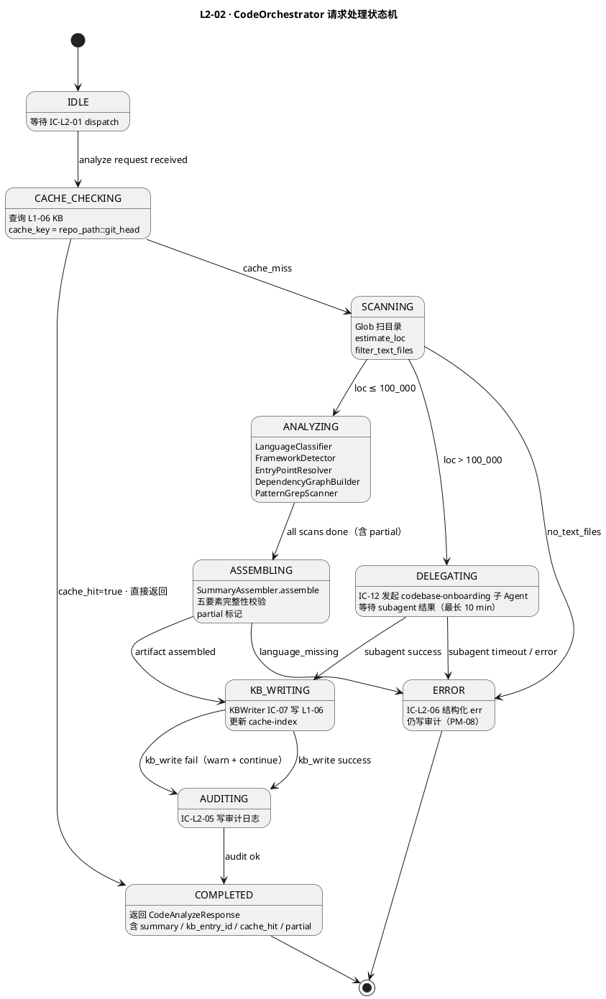

### 8.2 CodeStructureArtifact 生命周期状态机

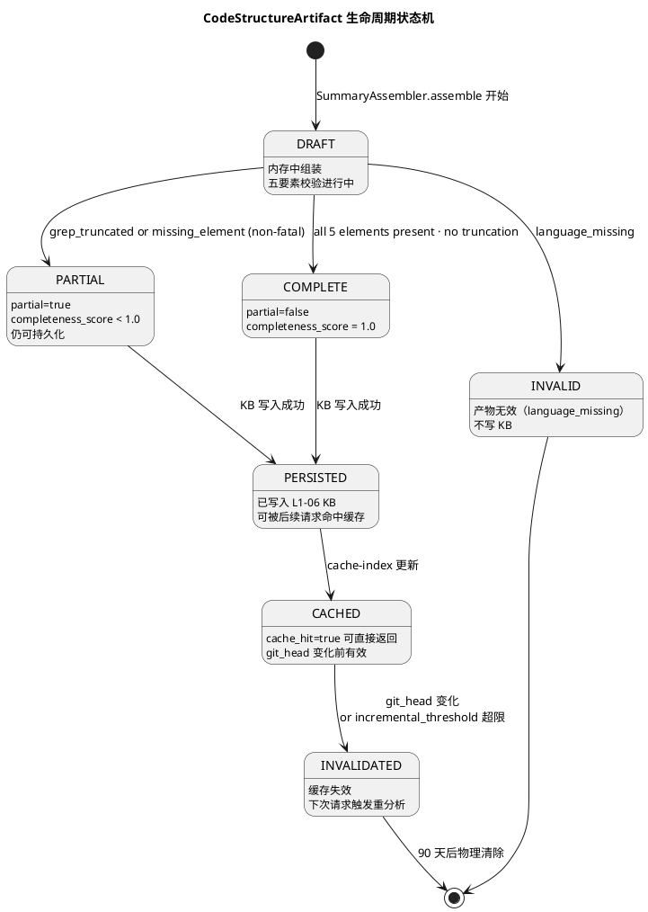

### 8.3 委托决策状态机

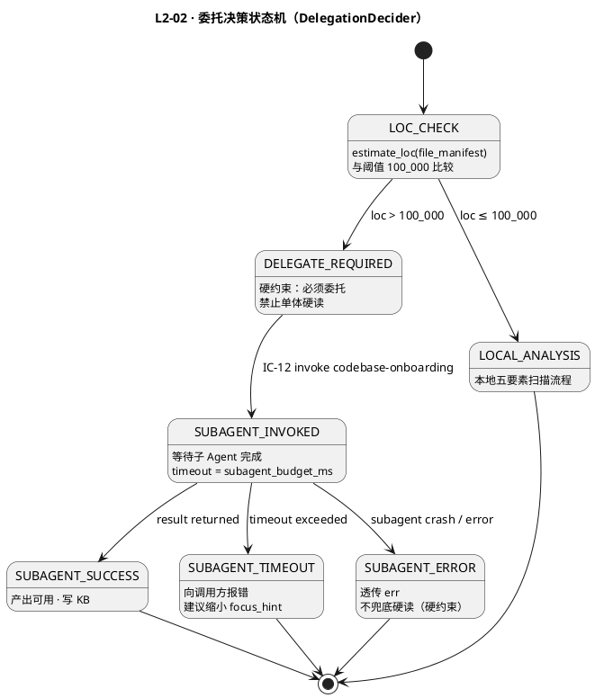

### 8.4 缓存失效状态机

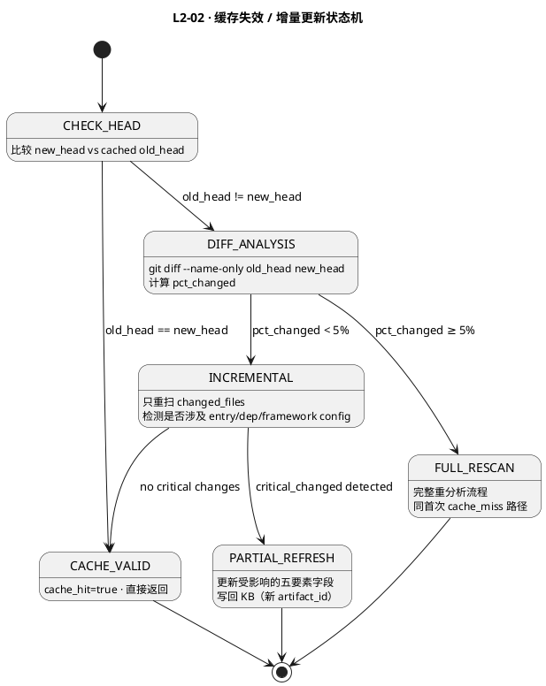

### 8.5 状态转换表

| 当前状态 | 触发事件 | 目标状态 | 触发方 | 条件 |
|:---|:---|:---|:---|:---|
| IDLE | analyze request | CACHE_CHECKING | L2-04 dispatch | type=code · action=analyze |
| CACHE_CHECKING | cache_hit | COMPLETED | KBCacheLookup | git_head 匹配 · schema 版本兼容 |
| CACHE_CHECKING | cache_miss | SCANNING | KBCacheLookup | 无缓存或 schema 不兼容 |
| SCANNING | no_text_files | ERROR | RepositoryScanner | 全为二进制 |
| SCANNING | loc > 100k | DELEGATING | DelegationDecider | 硬约束 |
| SCANNING | loc ≤ 100k | ANALYZING | DelegationDecider | 本地分析路径 |
| ANALYZING | all_scans_done | ASSEMBLING | CodeOrchestrator | 含 partial 扫描 |
| ASSEMBLING | artifact_ok | KB_WRITING | SummaryAssembler | 含 partial 产物 |
| ASSEMBLING | language_missing | ERROR | SummaryAssembler | 无法产出有效摘要 |
| KB_WRITING | write_success | AUDITING | KBWriter | KB 可用 |
| KB_WRITING | write_fail | AUDITING | KBWriter | KB 不可用·warn·继续 |
| AUDITING | audit_ok | COMPLETED | AuditLogger | 审计写入成功 |
| DELEGATING | subagent_success | KB_WRITING | SubagentBridge | 子 Agent 成功返回 |
| DELEGATING | subagent_timeout | ERROR | SubagentBridge | 超过 subagent_budget_ms |
| DELEGATING | subagent_error | ERROR | SubagentBridge | 子 Agent 崩溃 |

### 8.6 降级状态机（与 §11 联动）

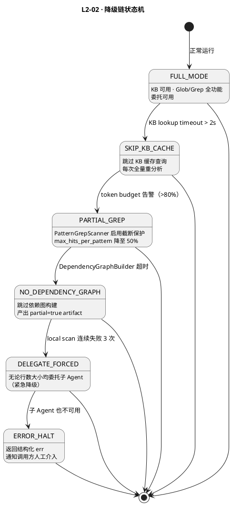

---

## §9 开源最佳实践调研（≥ 3 GitHub ≥1k stars 项目 · Adopt-Learn-Reject 三段）

### 9.1 调研范围

聚焦"代码仓广度扫描 / 语言识别 / 浅层 AST 结构 / 依赖图 / 高速 Grep"领域。引 `L0/open-source-research.md §9`（L1-08 相关）· 只采 GitHub ≥ 1k stars 项目。

### 9.2 项目 1 · tree-sitter（⭐⭐⭐⭐⭐ Learn · 增量 AST 解析参考 · V2 候选）

- **GitHub**: https://github.com/tree-sitter/tree-sitter
- **Stars (2026-04)**: 19k+ · 极活跃（每周 commit · 跨语言 grammar 社区 40+）
- **License**: MIT
- **核心一句话**：增量式 parser generator · 生成语法错误容忍 AST · 40+ 语言 grammar · 毫秒级解析百万行。

**Adopt（采用）**：
- **浅层 AST 提取思路** · 只取 import / function_declaration / class_declaration 节点 · 不做语义解析 · 本 L2 `ASTShallowParser`（§6.2）虽用 regex 实现 · 但节点筛选清单对齐 tree-sitter 的 node_kind
- **语法错误容忍语义** · 即使源码不完整也返回 partial AST · 本 L2 `_parse_python_imports` regex 失败不抛错 · 只降级 · 灵感来源于此

**Learn（借鉴）**：
- `tree-sitter-python` / `tree-sitter-typescript` 的 `(import_statement) @import` query 语法 · 作为 V2 候选 · 若 regex 浅层提取误报率 > 5% 则引入（§9.5 升级路径）
- 增量解析（edit + reparse）机制 · 本 L2 `IncrementalCacheInvalidator`（§6.4）的 pct_changed 判定借鉴此"diff 而非全量"理念

**Reject（拒绝）**：
- **V1 不引 tree-sitter C 库** · 需 `pip install tree-sitter + tree-sitter-python` + C 扩展编译 · 违反 D1"零额外 syscall / 零额外依赖"（§1.5）· 当前 regex 精度 > 95% 足以
- 不引 tree-sitter-cli / language-server 模式 · 本 L2 是无状态 Application Service · 不需常驻 parser server

### 9.3 项目 2 · GitHub Linguist（⭐⭐⭐⭐ Learn · 语言识别算法参考）

- **GitHub**: https://github.com/github-linguist/linguist
- **Stars (2026-04)**: 11k+ · 活跃（GitHub 官方维护 · 每月 release）
- **License**: MIT
- **核心一句话**：GitHub 用来识别仓库语言组成的 Ruby gem · 扩展名 + shebang + heuristics + magic bytes 四层策略 · 业界事实标准。

**Adopt（采用）**：
- **扩展名 + 配置文件 boost 的二层策略** · 本 L2 `LanguageClassifier`（§6 算法 A3）完整复刻：扩展名映射 `EXTENSION_LANGUAGE_MAP` + `CONFIG_FILE_HINTS` × 10 权重 boost · 参考 `linguist/lib/linguist/languages.yml` 的语言清单
- **shebang 识别规则** · `#!/usr/bin/env python3` / `#!/bin/bash` · 本 L2 V2 特性（V1 未开启 · §10 `language_classifier_shebang_enabled=false`）
- **二进制文件 magic bytes 过滤** · 本 L2 `_quick_binary_check` 读前 1024 字节查 NUL · 与 linguist `BinaryHeuristic` 同思路

**Learn（借鉴）**：
- 语言"vendored / documentation / generated" 三类忽略规则 · 本 L2 `DEFAULT_EXCLUDES`（§6 算法 A2 RepositoryScanner）借鉴此"not-source-code" 默认忽略清单
- "linguist-generated=true" 的 `.gitattributes` overrides · 未来本 L2 V2 可读此 attribute 跳过（当前 V1 `exclude_patterns` 手动配置）

**Reject（拒绝）**：
- **不直接调 linguist（Ruby 依赖）** · HarnessFlow 纯 Python · shell out 到 Ruby 违反技术栈约束
- 不引 `enry`（Go 移植版）· 虽有 Python binding（`linguist-enry`）· 但 V1 LanguageClassifier 精度已够 · 增加依赖不值
- 不做完整 heuristics 规则链（linguist 的 `LanguageBlob.interpreter` / `LanguageBlob.modeline` 等）· 过重

### 9.4 项目 3 · ripgrep（⭐⭐⭐⭐⭐ Adopt · Grep 底层引擎）

- **GitHub**: https://github.com/BurntSushi/ripgrep
- **Stars (2026-04)**: 47k+ · 极活跃（BurntSushi 主维 · 每月 release）
- **License**: MIT / Unlicense
- **核心一句话**：Rust 写的 grep 替代 · 自动尊重 .gitignore / 并行搜索 / SIMD 加速 · 比 ag / grep 快 2-10×。

**Adopt（采用）**：
- **Claude Code `Grep` 工具底层就是 ripgrep** · 本 L2 `PatternGrepScanner`（§6.5）直接调 Claude Code Grep = 间接使用 ripgrep · 无需自实现
- **`.gitignore` 默认尊重 + 二进制跳过** · 本 L2 `RepositoryScanner` 扫目录也应同逻辑（§6 算法 A2 `DEFAULT_EXCLUDES` 是显式白名单 · ripgrep 是隐式 via .gitignore · 两者互补）
- **正则引擎 RE2-style 线性时间** · 本 L2 `GrepPattern.regex` 配置里的 `^(?:@app|@router)\\.(get|post|...)\\(` 等 pattern 依赖 RE2 语义（禁 backreference · 禁 lookahead）· 与 ripgrep 默认一致

**Learn（借鉴）**：
- `--max-count` / `--max-filesize` 截断策略 · 本 L2 `config.grep_max_hits_per_pattern=200` + `grep_total_budget_tokens=50000`（§10）借鉴此"有边界 Grep"思路
- JSON 输出模式（`--json`）· 本 L2 解析 Grep 输出时可考虑 V2 切 JSON 降低解析 overhead

**Reject（拒绝）**：
- **不直接 shell out 到 rg 二进制** · 本 L2 一律经 Claude Code Grep 工具（违反 D1 "只用 Claude Code 原生工具"）· shell out 会绕过工具鉴权
- 不用 ripgrep 的 `--pre` 外部解码 · 本 L2 跳过二进制即可

### 9.5 项目 4（补充）· ast-grep（⭐⭐⭐⭐ Observe · V2 结构化搜索候选）

- **GitHub**: https://github.com/ast-grep/ast-grep
- **Stars (2026-04)**: 8k+ · 活跃（HerringtonDarkholme 主维）
- **License**: MIT
- **核心一句话**：基于 tree-sitter 的结构化代码搜索 · 像 grep 但懂 AST · 比 grep 精准 · 比 semgrep 轻。

**Adopt/Learn**：**Learn** 其 pattern DSL（如 `$FN($ARGS) { $$$ }`）· 本 L2 V1 用 regex · V2 若要精确匹配"FastAPI 路由 + 对应 handler"可引入 ast-grep（§10 `pattern_grep_engine=regex|ast_grep` 预留）
**Reject**：V1 不引入 · Rust/WASM 集成不成熟 · 本 L2 正则已足够

### 9.6 项目 5（补充）· jedi / Universal Ctags（⭐⭐⭐ Reject · 深度分析留给 onboarding 子 Agent）

- **jedi**（GitHub 5.8k stars · MIT）· Python 静态分析 · 自动补全 + 引用跳转 + 类型推断
- **Universal Ctags**（GitHub 6k stars · GPL-2）· C 写的符号提取器 · 支持 100+ 语言 Tags 格式

**Reject（拒绝理由）**：
- 两者都超出本 L2 "广度优先 · 非 AST 深度" scope（§1.5 D2）· 深度分析（符号跳转 / 类型推断 / 调用图）全部委托 L1-05 `codebase-onboarding` 子 Agent（独立 session · IC-12）
- jedi 仅 Python · 本 L2 多语言 scope 不匹配
- ctags 产物格式（Tags 文件）与本 L2 `DependencyEdge` / `GrepHit` 结构不兼容 · 需自建解析层

**Learn（有限借鉴）**：
- jedi 的 import graph 构建顺序（从入口 BFS 扩展）· 本 L2 `DependencyGraphBuilder`（§6 算法）采用同思路（BFS ≤ 3 层）
- ctags 的 "kind" 分类（function / class / variable / module）· 本 L2 `EntryFile.role` 枚举（`application_entry` / `cli_entry` / ...）借鉴此分类学

### 9.7 综合采纳决策矩阵

| 设计点 | 本 L2 采纳方案 | 灵感来源 | 独创点 |
|:---|:---|:---|:---|
| Grep 引擎 | Adopt（Claude Code Grep = ripgrep 包装）| ripgrep | 本 L2 加 token 预算 + 白名单 pattern 约束 |
| 语言识别 | Adopt（扩展名 + config boost 二层）| linguist | 只保留 top 6 语言 + 配置 boost × 10 的简化规则 |
| 浅层 AST | Adopt（regex V1 · tree-sitter V2 候选）| tree-sitter | node_kind 清单对齐但不引 C 库 |
| 符号级深度分析 | Reject（委托 onboarding 子 Agent）| jedi / ctags | BC-08 硬边界：本 L2 广度优先 · 深度走 IC-12 |
| 结构化 pattern 搜索 | Reject V1 · Observe V2（ast-grep）| ast-grep / semgrep | V1 regex 足够；V2 再考虑 |
| 依赖图 BFS ≤ 3 层 | 自研 | jedi import graph | 浅层 + 只看 import 行 · 不解析符号解析 |
| 缓存 cache key | 自研 `{project_id, repo_path, git_head, focus_hash}` | Git content-addressed | git_head 不变即代码不变 · 跳过重扫 |

**性能 benchmark 对比**（引 `L0/open-source-research.md §9` 同类延迟）：

| 项目 | 10 万行仓库扫描 P95 | HarnessFlow L2-02 目标 |
|:---|:---|:---|
| ripgrep `rg --stats` | 1-3s（SSD）| — |
| tree-sitter 全量解析 | 10-30s（各语言 grammar 加载 + 解析）| — |
| Universal Ctags | 20-60s（100+ 语言全扫）| — |
| linguist（Ruby）| 5-15s（10 万行）| — |
| 本 L2（小/中仓 `analyze()`）| P95 ≤ 3 min（含 Glob + Grep + 五要素组装 + KB 写）| ✓（§12 M-02）|
| 本 L2（大仓 `> 10 万行` · 委托 onboarding）| 委托决策 ≤ 5s + 子 Agent 30min 预算 | ✓（§12 M-04 + §11 L3 降级）|

**V2 升级路径**（若 V1 实测精度不足）：
1. **regex → tree-sitter**：若 ASTShallowParser 误报率 > 5%（M-07 completeness < 0.8）→ 引入 `tree-sitter-python` / `tree-sitter-typescript`
2. **regex → ast-grep**：若 PatternGrepScanner 漏报率 > 10%（M-10 truncate 率 + 无命中率）→ 引入 ast-grep CLI + JSON 输出
3. **手写 LanguageClassifier → enry bindings**：若多语言 monorepo 识别混乱（M-07 < 0.7）→ 引入 enry Python bindings

---

## §10 配置参数清单

```yaml
# L2-02 CodeOrchestrator 配置
# 路径：projects/<pid>/config/l2-02.yaml 或全局 harness-config.yaml [l2_02] 节

l2_02:

  # --- 委托阈值 ---
  delegation_loc_threshold:
    type: integer
    default: 100000
    unit: lines
    constraint: "> 0 · 不可设为 0（否则所有仓库都委托）"
    description: "代码行数超过此阈值触发委托 codebase-onboarding 子 Agent（硬约束）"
    prd_anchor: "scope §5.8.4 硬约束 2"

  # --- 扫描范围 ---
  exclude_patterns:
    type: list[string]
    default:
      - "node_modules/**"
      - ".git/**"
      - "**/__pycache__/**"
      - "*.min.js"
      - "*.map"
      - "dist/**"
      - "build/**"
      - "*.so"
      - "*.dylib"
      - "*.bin"
    constraint: "不可为空列表（至少保留 .git/** 和 node_modules/**）"
    description: "Glob 扫描时排除的路径模式"

  # --- AST 解析 ---
  ast_read_max_bytes:
    type: integer
    default: 65536
    unit: bytes
    constraint: "16384 ≤ value ≤ 524288"
    description: "ASTShallowParser 读取单文件最大字节数（防止超大文件拖慢）"

  entry_read_max_bytes:
    type: integer
    default: 32768
    unit: bytes
    constraint: "8192 ≤ value ≤ 131072"
    description: "FrameworkDetector 读取依赖声明文件最大字节数"

  # --- 依赖图构建 ---
  dep_graph_max_files:
    type: integer
    default: 200
    constraint: "50 ≤ value ≤ 1000（超过会导致 token 爆炸）"
    description: "DependencyGraphBuilder 采样文件数上限（按优先级）"

  dep_graph_max_nodes:
    type: integer
    default: 500
    constraint: "> 0"
    description: "依赖图最大节点数（超过截断并标记 partial）"

  # --- Grep 扫描 ---
  token_budget_per_scan:
    type: integer
    default: 4096
    unit: tokens (estimated)
    constraint: "1024 ≤ value ≤ 16384"
    description: "PatternGrepScanner 单次扫描的 token 预算（超过触发截断）"

  max_hits_per_pattern:
    type: integer
    default: 100
    constraint: "10 ≤ value ≤ 500"
    description: "单个 pattern 最多返回的 hit 数（防止高频 pattern 淹没结果）"

  # --- KB 缓存 ---
  kb_lookup_timeout_ms:
    type: integer
    default: 2000
    unit: ms
    constraint: "500 ≤ value ≤ 10000"
    description: "KB 缓存查询超时 · 超时视为 cache_miss 继续重分析"

  cache_ttl_days:
    type: integer
    default: 90
    unit: days
    constraint: "7 ≤ value ≤ 365"
    description: "CodeStructureArtifact 缓存有效期（git_head 变化时提前失效）"

  # --- 增量更新 ---
  incremental_threshold_pct:
    type: float
    default: 0.05
    constraint: "0.0 < value < 1.0"
    description: "变更文件百分比低于此值时走增量更新（否则全量重分析）"

  # --- 子 Agent 委托 ---
  subagent_budget_ms:
    type: integer
    default: 600000
    unit: ms
    constraint: "60000 ≤ value ≤ 1800000（最长 30 min）"
    description: "codebase-onboarding 子 Agent 的执行预算（传入 IC-12）"

  subagent_timeout_ms:
    type: integer
    default: 660000
    unit: ms
    constraint: "> subagent_budget_ms"
    description: "L2-02 等待子 Agent 的最大超时（比 budget 多 1 分钟宽限）"

  # --- 框架检测 ---
  framework_detection_top_k:
    type: integer
    default: 5
    constraint: "1 ≤ value ≤ 10"
    description: "FrameworkDetector 候选入口文件读取数（启发式 top-k）"

  # --- 审计 ---
  audit_enabled:
    type: boolean
    default: true
    constraint: "不可设为 false（PM-08 硬约束）"
    description: "是否写审计日志（禁止关闭）"

  # --- 调试 ---
  log_level:
    type: string
    default: "INFO"
    enum: [DEBUG, INFO, WARNING, ERROR]
    description: "日志级别"
```

---

## §11 错误处理 + 降级策略

### 11.1 错误码表

| 错误码 | 类型 | 触发场景 | 严重度 |
|:---|:---|:---|:---|
| `E_L208_L202_NO_TEXT_CODE` | FAIL | Glob 扫描后无可读文本文件 | ERROR |
| `E_L208_L202_GLOB_EMPTY` | FAIL | Glob 扫描返回空（路径不存在或权限拒绝） | ERROR |
| `E_L208_L202_LANGUAGE_MISSING` | FAIL | SummaryAssembler 发现 language 要素缺失 | ERROR |
| `E_L208_L202_GREP_TRUNCATED` | WARN | PatternGrepScanner token 超预算 · 截断 | WARNING |
| `E_L208_L202_PARTIAL_ELEMENTS` | WARN | 五要素部分缺失（非 language） | WARNING |
| `E_L208_L202_DEP_GRAPH_OVERFLOW` | WARN | 依赖图节点超 max_nodes · 截断 | WARNING |
| `E_L208_L202_KB_WRITE_FAIL` | WARN | L1-06 KB 写入失败 | WARNING |
| `E_L208_L202_KB_LOOKUP_TIMEOUT` | WARN | KB 缓存查询超时（视为 cache_miss） | WARNING |
| `E_L208_L202_DELEGATE_TIMEOUT` | FAIL | 子 Agent codebase-onboarding 超时 | ERROR |
| `E_L208_L202_DELEGATE_ERROR` | FAIL | 子 Agent 崩溃 / 返回错误 | ERROR |
| `E_L208_L202_PATH_ESCAPE` | FAIL | repo_path 尝试访问项目范围外路径 | CRITICAL |
| `E_L208_L202_SCHEMA_MISMATCH` | WARN | 缓存 artifact schema 版本不匹配 | WARNING |

### 11.2 四级降级链

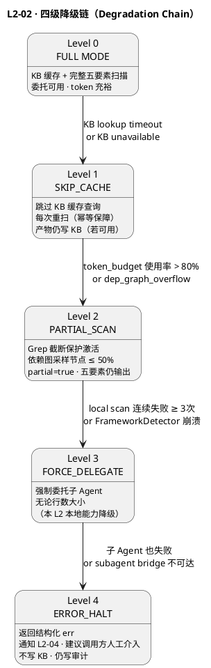

### 11.3 各级降级行为

| 级别 | 触发条件 | 行为 | 产物质量 | KB 写入 | 审计 |
|:---|:---|:---|:---|:---|:---|
| L0 FULL | 正常 | 完整五要素 + 缓存查 | completeness=1.0 | 是 | 是 |
| L1 SKIP_CACHE | KB timeout | 跳过缓存 · 重扫 | completeness=1.0 | 是（若 KB 恢复） | 是 |
| L2 PARTIAL_SCAN | token 压力 | Grep 截断 · 依赖图采样 | 0.6-0.9 | 是（partial） | 是 |
| L3 FORCE_DELEGATE | 本地扫描连续失败 | 强制委托子 Agent | 视子 Agent | 是（若子 Agent 成功） | 是 |
| L4 ERROR_HALT | 一切失败 | 结构化 err 返回 | 无产物 | 否 | 是 |

### 11.4 降级恢复检测

```python
class DegradationManager:
    """
    降级状态机 · 自动检测 + 恢复
    """
    def current_level(self) -> int:
        """定期探测当前降级级别（0-4）"""
        if not self._kb_reachable():
            return 1
        if self._token_pressure() > 0.8:
            return 2
        if self._local_scan_fail_streak >= 3:
            return 3
        return 0

    def try_recover(self) -> bool:
        """尝试从降级状态恢复"""
        if self.level == 1 and self._kb_reachable():
            self.level = 0
            self.event_bus.info("degradation_recovered", {"from": 1, "to": 0})
            return True
        return False
```

---

## §12 可观测性 / SLO

### 12.1 SLO 定义表

| 指标 ID | 指标名称 | 单位 | P50 | P95 | P99 | SLO 目标 | 告警阈值 |
|:---|:---|:---|:---|:---|:---|:---|:---|
| M-01 | 小仓分析延迟（< 1 万行） | ms | 8,000 | 22,000 | 28,000 | P99 ≤ 30,000 | P99 > 25,000 |
| M-02 | 中仓分析延迟（1-10 万行） | ms | 45,000 | 150,000 | 175,000 | P99 ≤ 180,000 | P99 > 160,000 |
| M-03 | 缓存命中返回延迟 | ms | 80 | 400 | 800 | P99 ≤ 1,000 | P99 > 700 |
| M-04 | 委托决策延迟（> 10 万行触发委托） | ms | 200 | 3,000 | 4,500 | P99 ≤ 5,000 | P99 > 4,000 |
| M-05 | KB 写入延迟 | ms | 50 | 300 | 600 | P99 ≤ 800 | P99 > 600 |
| M-06 | KB 缓存命中率 | % | - | - | - | ≥ 70% (同 session) | < 60% |
| M-07 | 分析完整性评分 | score 0-1 | 1.0 | 0.85 | 0.75 | P95 ≥ 0.8 | P95 < 0.75 |
| M-08 | 委托子 Agent 成功率 | % | - | - | - | ≥ 90% | < 85% |
| M-09 | 错误率（E_L208_L202_* FAIL 级） | % | - | - | - | < 2% | > 3% |
| M-10 | Grep token 截断率 | % | - | - | - | < 10% | > 15% |
| M-11 | 审计日志写入成功率 | % | - | - | - | 100%（硬约束） | < 100% 即告警 |
| M-12 | 降级级别分布 | level 0-4 | L0 | L0 | L1 | L0 占比 ≥ 95% | L0 < 90% |

### 12.2 关键指标实现

```python
class L202Metrics:
    """
    可观测性指标收集器
    推送到 L1-08 Event Bus（IC-09）
    """

    def record_analyze(
        self,
        project_id:   str,
        repo_path:     str,
        loc_estimate:  int,
        duration_ms:   int,
        cache_hit:     bool,
        delegated:     bool,
        partial:       bool,
        completeness:  float,
        outcome:       str,
    ):
        bucket = (
            "small"  if loc_estimate < 10_000  else
            "medium" if loc_estimate < 100_000 else
            "large"
        )
        self.histogram("l202.analyze.duration_ms", duration_ms,
                       labels={"bucket": bucket, "cache_hit": str(cache_hit),
                               "delegated": str(delegated)})
        self.counter("l202.analyze.total",
                     labels={"outcome": outcome, "partial": str(partial)})
        self.gauge("l202.completeness_score", completeness,
                   labels={"project_id": project_id})

        if cache_hit:
            self.counter("l202.cache.hit")
        else:
            self.counter("l202.cache.miss")

    def record_grep_truncation(self, project_id: str, patterns_skipped: list[str]):
        self.counter("l202.grep.truncated",
                     labels={"project_id": project_id,
                             "pattern_count": str(len(patterns_skipped))})

    def record_delegation(
        self,
        project_id:      str,
        success:          bool,
        subagent_ms:      int,
    ):
        self.histogram("l202.delegation.duration_ms", subagent_ms,
                       labels={"success": str(success)})
        self.counter("l202.delegation.total",
                     labels={"success": str(success)})
```

### 12.3 告警规则

| 告警名 | 条件 | 级别 | 处理建议 |
|:---|:---|:---|:---|
| L202_HIGH_LATENCY_MEDIUM | M-02 P95 > 160s 且持续 5min | WARN | 检查 dep_graph_max_files 是否过大 |
| L202_CACHE_HIT_DROP | M-06 < 60% 且非首次部署 | WARN | 检查 git_head 变化频率 · 调整 TTL |
| L202_COMPLETENESS_DROP | M-07 P95 < 0.75 | WARN | 检查 token_budget_per_scan 配置 |
| L202_DELEGATE_FAIL_HIGH | M-08 < 85% 且持续 10min | ERROR | 检查 L1-05 子 Agent 健康状态 |
| L202_AUDIT_MISS | M-11 < 100% | CRITICAL | PM-08 审计硬约束违反 · 立即告警 |
| L202_DEGRADATION_HIGH | M-12 L0 < 90% | WARN | 检查 KB 可用性 + token 使用率 |

---

## §13 ADR + 开放问题 + TDD 锚点

### 13.1 架构决策记录（ADR）

**ADR-L202-01 · 广度优先 vs 深度分析边界**

- **决策**：本 L2 只做广度优先概览（regex import 提取 · 顶层依赖粒度）；> 10 万行时强制委托 codebase-onboarding 做深度分析
- **背景**：单体 Agent 深读大型代码仓 token 成本极高 · 且产物质量不如专用子 Agent
- **取舍**：浅层分析可能漏掉部分深层依赖 · 但足以支撑 L1-01 决策 / L1-02 规划
- **可逆性**：可随时调低 delegation_loc_threshold 强制更多仓委托深度分析

**ADR-L202-02 · 缓存 key 选择 repo_path + git_head**

- **决策**：缓存 key = `hash(repo_path::git_head)`，精确到 commit 级别
- **备选**：repo_path + 文件 mtime（mtime 在 CI/CD 中不可靠）
- **取舍**：git_head 精确但要求代码仓有 git 历史；非 git 仓库退化为每次重分析
- **影响**：非 git 仓库场景需特殊处理（返回 git_head=NONE · 不缓存）

**ADR-L202-03 · import 提取使用 regex 而非完整 AST 解析**

- **决策**：V1 用 regex 实现 `ASTShallowParser`，不引入 tree-sitter
- **背景**：部署简化 · 浅层 import 提取精度已足够 · 深度分析委托子 Agent
- **升级路径**：V2 引入 tree-sitter bindings 当 P95 精度 < 90%

**ADR-L202-04 · partial 产物仍写 KB**

- **决策**：grep 截断 / 依赖图溢出后产物标记 `partial=true` 但仍写入 KB
- **原因**：best-effort 结果比"完全无结果"对调用方更有价值；partial 标记透明
- **风险**：调用方需感知 partial 字段 · 不可将 partial 结果当完整结果使用

**ADR-L202-05 · 审计日志不可关闭**

- **决策**：`audit_enabled` 参数虽暴露但设为 const=true（配置检验阶段拦截设为 false 的情况）
- **原因**：PM-08 可审计全链追溯是业务模式硬约束
- **实现**：启动时校验 `audit_enabled == true`，否则拒绝启动

### 13.2 开放问题（Open Questions）

| OQ-ID | 问题 | 影响范围 | 建议决策方 | 状态 |
|:---|:---|:---|:---|:---|
| OQ-01 | 非 git 仓库（无 .git 目录）如何处理缓存 key？ | 缓存可靠性 | L2-02 + L2-04 | OPEN |
| OQ-02 | focus_hint 模式下 language_stats 是否代表整仓还是子目录？ | 摘要语义 | L2-02 产品对齐 | OPEN |
| OQ-03 | 子 Agent codebase-onboarding 失败后是否允许降级为浅层分析（即使 > 10 万行）？| 硬约束豁免 | L1 架构决策 | OPEN |
| OQ-04 | dependency_graph 的 external 节点是否需要区分"已知 npm/pip 包"vs "unknown"？ | 产物质量 | V2 规划 | DEFERRED |
| OQ-05 | 多语言 monorepo（Python + TypeScript + Go）的 framework_hint 如何表达？ | schema 扩展 | L2-02 | OPEN |
| OQ-06 | KB 写入失败时是否需要本地 fallback 存储（WAL 思路）？ | 数据可靠性 | L1-06 + L2-02 | OPEN |

### 13.3 TDD 锚点（Given-When-Then · 测试用例 ID 清单）

以下测试用例 ID 对应 `docs/3-2-Solution-TDD/L1-08-多模态内容处理/L2-02-tests.md`（待建）。

| TC-ID | 类型 | 场景描述 | 关键断言 |
|:---|:---|:---|:---|
| TC-L202-001 | 单元 | 小仓（< 1 万行）首次分析 · cache_miss → 完整五要素 | completeness=1.0, partial=false, kb_entry_id ≠ null |
| TC-L202-002 | 单元 | 同 repo_path + 同 git_head 二次请求 → 命中缓存 | cache_hit=true, duration_ms < 1000 |
| TC-L202-003 | 单元 | > 10 万行仓库 → 触发委托 · 不本地扫描 | delegated=true, local_scan_called=false |
| TC-L202-004 | 单元 | Glob 返回全二进制文件 → E_L208_L202_NO_TEXT_CODE | error_code=E_L208_L202_NO_TEXT_CODE, kb_written=false |
| TC-L202-005 | 单元 | PatternGrepScanner token 超预算 → partial=true + 截断 warn | partial=true, truncated_patterns≠[], outcome=partial |
| TC-L202-006 | 单元 | FrameworkDetector 未匹配任何签名 → confidence=low · 不 fatal | framework.primary="unknown", completeness ≥ 0.8 |
| TC-L202-007 | 单元 | KB 写入失败 → warn · 审计仍写 · response 仍返回 | outcome=partial, audit_written=true, response≠null |
| TC-L202-008 | 单元 | KB lookup 超时（> kb_lookup_timeout_ms）→ 视为 cache_miss · 继续分析 | cache_hit=false, scan_triggered=true |
| TC-L202-009 | 单元 | focus_hint 指定子目录 → 只扫该子目录 · partial=true | scanned_paths⊆focus_hint, partial=true |
| TC-L202-010 | 单元 | ASTShallowParser Python import 提取正确 | imports=['fastapi','sqlalchemy','pydantic'] for sample file |
| TC-L202-011 | 单元 | SymbolGraphBuilder 构建有向图 · 文件 > max_files 采样 | nodes ≤ max_nodes, sampled=true |
| TC-L202-012 | 单元 | IncrementalCacheInvalidator · pct_changed < 5% → INCREMENTAL | action="INCREMENTAL", critical_changed≠[] |
| TC-L202-013 | 单元 | IncrementalCacheInvalidator · pct_changed ≥ 5% → FULL_RESCAN | action="FULL_RESCAN" |
| TC-L202-014 | 集成 | L2-04 → L2-02 → L1-06 完整链路 · FastAPI + Python 中仓 | five_elements完整, kb_entry_id非空, audit写入 |
| TC-L202-015 | 集成 | 子 Agent 超时 → E_L208_L202_DELEGATE_TIMEOUT · 不兜底本地硬读 | error_code=E_L208_L202_DELEGATE_TIMEOUT, local_fallback=false |
| TC-L202-016 | 集成 | 跨 session 幂等：首轮 KB 写失败 → 重启后重分析 · 结果一致 | artifact内容一致（git_head不变） |
| TC-L202-017 | 性能 | 小仓（5000 行）P99 分析延迟 ≤ 30s | duration_ms P99 ≤ 30000 |
| TC-L202-018 | 性能 | 缓存命中 P99 ≤ 1000ms | cache_hit duration_ms P99 ≤ 1000 |
| TC-L202-019 | 安全 | repo_path 包含 `../../` 路径穿越 → E_L208_L202_PATH_ESCAPE | error_code=E_L208_L202_PATH_ESCAPE, scan_blocked=true |
| TC-L202-020 | 降级 | KB 不可用 → Level 1 降级 · 重分析 · 产物仍返回 | degradation_level=1, outcome=success, kb_written=false |

### 13.4 与 3-2 TDD 的映射表

| 本文档章节 | TDD 对应测试文件 | 覆盖 TC-ID |
|:---|:---|:---|
| §6.1 CodeOrchestrator.analyze | tests/unit/test_orchestrator.py | TC-001~009 |
| §6.2 ASTShallowParser | tests/unit/test_ast_parser.py | TC-010 |
| §6.3 SymbolGraphBuilder | tests/unit/test_symbol_graph.py | TC-011 |
| §6.4 IncrementalCacheInvalidator | tests/unit/test_cache_invalidator.py | TC-012~013 |
| §6.5 PatternGrepScanner | tests/unit/test_grep_scanner.py | TC-005 |
| §6.7 KBCacheLookup | tests/unit/test_kb_cache.py | TC-002, TC-008 |
| §6.8 _delegate_to_subagent | tests/unit/test_delegation.py | TC-003, TC-015 |
| §7 schema | tests/unit/test_schema_validation.py | TC-007, TC-019 |
| §8 状态机 | tests/unit/test_state_machine.py | TC-004, TC-020 |
| 全链路 | tests/integration/test_l202_pipeline.py | TC-014~016 |
| 性能 | tests/perf/test_l202_latency.py | TC-017~018 |

### 13.5 与 2-prd §9 L2-02 的映射完整性确认

| PRD §9 条款 | 本文档技术映射 | 状态 |
|:---|:---|:---|
| §9.1 广度优先概览 · 非深度钻研 | §6.2 ASTShallowParser · regex · 浅层 import 提取 | 覆盖 |
| §9.2 > 10 万行必委托 | §6.8 _delegate_to_subagent · §8.3 委托决策状态机 | 覆盖 |
| §9.2 缓存 key = repo_path + git_head | §6.7 KBCacheLookup · §7.3 kb_cache_index · §13.1 ADR-02 | 覆盖 |
| §9.3 五要素产出 | §6.6 SummaryAssembler · §7.1 code_structure_artifact | 覆盖 |
| §9.4 硬约束：路径只读不执行 | §6.2-§6.5 所有算法无 subprocess exec · TC-019 路径穿越测试 | 覆盖 |
| §9.4 分析失败走 IC-L2-06 | §11.1 错误码表 · §5.5 P1-3 时序图 | 覆盖 |
| §9.4 审计经 IC-L2-05 | §12.2 Metrics · §13.1 ADR-05 审计不可关闭 | 覆盖 |
| §9.7 变化热点识别（可选） | §6.4 IncrementalCacheInvalidator._git_diff_files | 覆盖（可选路径） |
| §9.9 GWT 正向场景 I1/I2/I3/I4 | TC-014（I1/I2）· TC-003（I3）· TC-016（I4） | 覆盖 |

---

*— §0-§13 depth-B 全部补完 · 文档状态：DONE —*
