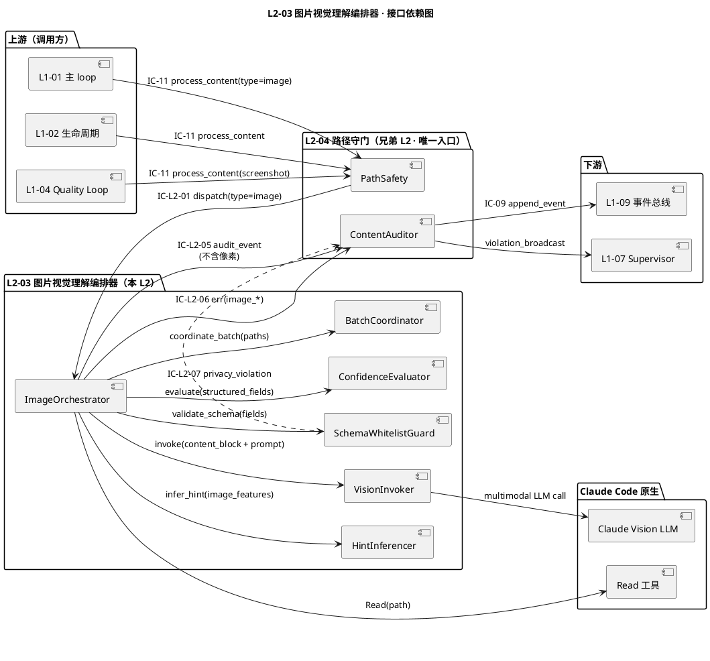
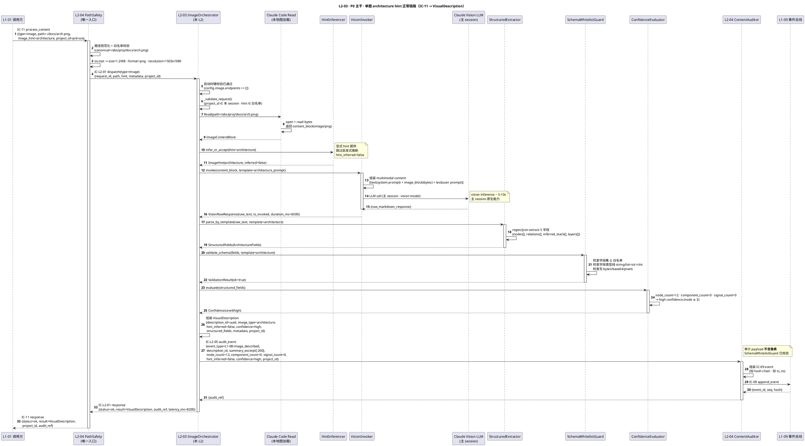
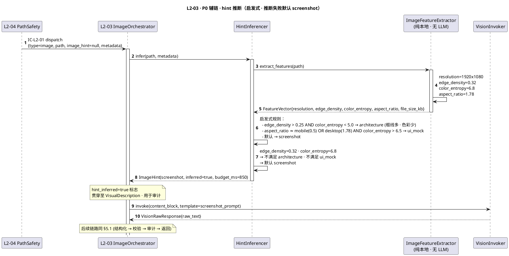
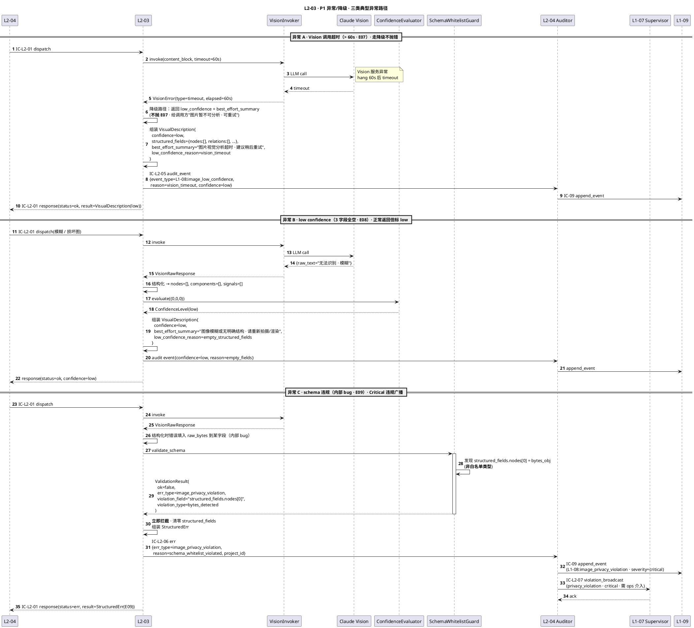
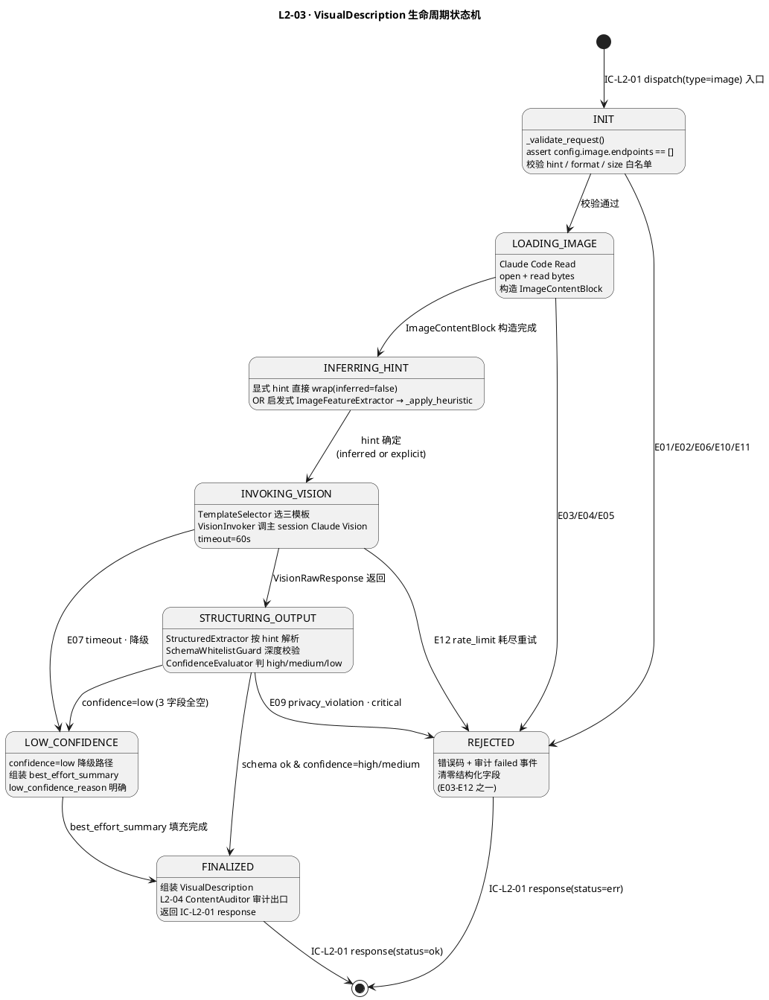
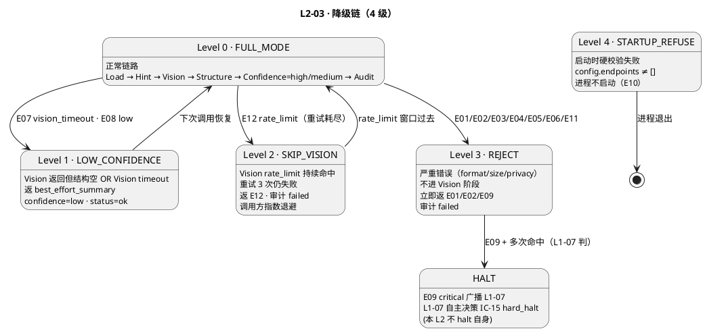

# L1-08 L2-03 · 图片视觉理解编排器 · Tech Design

> **本文档定位**：3-1-Solution-Technical 层级 · L1-08 的 L2-03 图片视觉理解编排器 技术实现方案（L2 粒度 · depth-B）。
> **与产品 PRD 的分工**：2-prd/L1-08/prd.md §10 的对应 L2 节定义产品边界，本文档定义**技术实现**（接口字段级 schema + 算法伪代码 + 底层数据结构 + 状态机 + 配置参数 + 降级链）。
> **与 L1 architecture.md 的分工**：architecture.md 负责**跨 L2 架构 + 跨 L2 时序**，本文档负责**本 L2 内部技术细节**。冲突以 architecture.md 为准。
> **严格规则**：本文档不复述产品 PRD 文字（职责 / 禁止 / 必须等清单），只做技术映射 + 补齐"产品视角未说 but 工程师必须知道"的部分（具体算法 · syscall · schema · 配置）。

---

## §0 撰写进度

- [x] §1 定位 + 2-prd §10 L2-03 映射
- [x] §2 DDD 映射（引 L0/ddd-context-map.md BC-08）
- [x] §3 对外接口定义（字段级 YAML schema + 错误码）
- [x] §4 接口依赖（被谁调 · 调谁）
- [x] §5 P0/P1 时序图（PlantUML ≥ 2 张）
- [x] §6 内部核心算法（伪代码 · 8 算法）
- [x] §7 底层数据表 / schema 设计（字段级 YAML · ≥3 表）
- [x] §8 状态机（PlantUML + 转换表 · ≥6 状态）
- [x] §9 开源最佳实践调研（≥ 3 GitHub 高星项目）
- [x] §10 配置参数清单（≥ 8 条）
- [x] §11 错误处理 + 降级策略（≥ 4 级）
- [x] §12 性能目标（P95/P99 · 吞吐 · 并发 · ADR）
- [x] §13 与 2-prd / 3-2 TDD 的映射表

---

## §1 定位 + 2-prd 映射

### 1.1 本 L2 在 L1-08 多模态内容处理里的坐标

L1-08 由 4 个 L2 组成，**L2-03 是三模态 L2 之一**（专司图片），上游以 L2-04 为唯一守门入口，下游以 Claude Vision 原生通道为单一执行面。与兄弟 L2（L2-01 md · L2-02 code）互不直接调用，拒绝形成三模态间的横向依赖。

```
                ┌───────────────────────────┐
                │ L2-04 路径守门与降级（横切）│
                └──────────────┬────────────┘
                               │
          ┌────────────────────┼────────────────────┐
          ↓                    ↓                    ↓
   ┌─────────────┐     ┌─────────────┐     ┌─────────────────┐
   │ L2-01 md I/O│     │ L2-02 code  │     │ L2-03 image     │  ← 本 L2
   └─────────────┘     └─────────────┘     └────────┬────────┘
                                                    │
                                                    ↓
                                            ┌───────────────┐
                                            │ Claude Vision │
                                            │ (主 session)  │
                                            └───────────────┘
```

L2-03 的技术定位 = **"ImageOrchestrator Application Service · Read 本地图 + Claude Vision 原生 + 三模板结构化 · 6 IC 触点 · 全程本地 · 禁外抛 · VisualDescription 聚合根短寿命"**。

### 1.2 与 2-prd §10 L2-03 的对应表

| 2-prd §10 L2-03 小节 | 本文档对应位置 | 技术映射重点 |
|:---|:---|:---|
| §10.1 职责（看图说话师）| §1.3 + §2.1 | ImageOrchestrator Application Service |
| §10.2 输入/输出（image_hint + 结构化描述）| §3.1 IC-L2-01 接收 + §3.2 返回 schema | 三模板字段 schema 白名单 |
| §10.3 边界（In / Out / 边界规则）| §1.4 + §11 降级拒绝 | Out-of-scope 项走 IC-L2-06 err |
| §10.4 约束（PM-08 / PM-09 + 6 硬约束）| §6 启动时硬校验 + §10 配置 + §11 降级 | 6 约束落算法 + 配置 + 降级 |
| §10.5 🚫 禁止行为（7 条） | §6.3 + §6.4 隐私三层防御 | 原始二进制绝不外抛 |
| §10.6 ✅ 必须义务（7 条） | §6 + §7 + §11 分散 | 必结构化 · 必审计 · 必告警 |
| §10.7 可选功能（多图 / hint 确认 / 坐标 / WARN）| §6.7 多图合并 + §6.8 P1 特性 | V1 默认关闭 · P1 开关 |
| §10.8 IC 关系（接 IC-L2-01 · 调 IC-L2-05/06）| §3 + §4 | 6 IC 触点独立 schema |
| §10.9 G-W-T（正 / 负 / 集成 / 性能）| §5 时序 + §13 测试映射 | 6 正向 + 4 负向 + 4 集成场景 |

### 1.3 本 L2 在 architecture.md 里的坐标

引 `L1-08/architecture.md §3.1 Component Diagram` + §2.3 Application Service 分层：

```
  [L2-04 PathSafety（守门唯一入口）]
        │
        │ IC-L2-01 dispatch(type=image, hint?)
        ↓
  ┌─────────────────────────────────────────────┐
  │  L2-03 · 图片视觉理解编排器                 │
  │  (Application Service · VisualDescription   │
  │   Aggregate Root · 短寿命 · 不入 KB)        │
  │                                             │
  │  ┌─────────────────────────────────────┐    │
  │  │ ImageOrchestrator                   │    │ (主应用服务)
  │  │   ├── ImageLoader                   │    │ (Claude Code Read 原生)
  │  │   ├── VisionInvoker                 │    │ (Claude Vision LLM 通道)
  │  │   ├── HintInferencer                │    │ (启发式 image_hint 推断)
  │  │   ├── TemplateSelector              │    │ (三模板路由)
  │  │   ├── StructuredExtractor           │    │ (按模板解析 Vision 输出)
  │  │   ├── SchemaWhitelistGuard          │    │ (防像素/bytes 外抛)
  │  │   ├── ConfidenceEvaluator           │    │ (低置信度 self-check)
  │  │   └── BatchCoordinator              │    │ (多图串行 + 主题合并)
  │  └─────────────────────────────────────┘    │
  │                                             │
  │  ┌─────────────────────────────────────┐    │
  │  │  VisualDescription (Aggregate Root) │    │
  │  │  ImageHint (VO · enum)              │    │
  │  │  ConfidenceLevel (VO · enum)        │    │
  │  │  StructuredFields (Entity · 三模板) │    │
  │  └─────────────────────────────────────┘    │
  └─────────────────────────────────────────────┘
        │                              ↑
        │ IC-L2-05 审计（不含像素）    │ IC-L2-06 结构化 err
        ↓                              │
  [L2-04 ContentAuditor] ─→ IC-09 → [L1-09 事件总线]
```

**本 L2 的关键特征**（对 L1-08 整体而言）：
1. **短寿命聚合根**：VisualDescription 不入 KB，随当次 IC-11 响应返回即释放（区别于 L2-02 的 CodeStructureSummary 长寿命缓存）。
2. **全程本地**：输入（本地图路径）+ 处理（主 session Claude Vision）+ 输出（纯文本结构化字段）三段都不走外网。
3. **三模板穷举**：V1 只认 architecture / ui_mock / screenshot · 新增类型需走 scope 变更流程。
4. **审计不含像素**：本 L2 通过 L2-04 `ContentAuditor` 统一出口，审计字段经 schema 白名单校验。
5. **双重启动校验**：L2-04 + 本 L2 各校验一次 `config.image.endpoints == []`。
6. **默认单图 · 可选批量**：V1 默认 IC-11 单次 1 图，批量是可选 feature（`batch_paths[]` payload）。

### 1.4 本 L2 的 PM-14 约束

**PM-14 约束**（引 `projectModel/tech-design.md`）：所有 IC payload 顶层 `project_id` 必填；所有存储路径按 `projects/<pid>/...` 分片。

本 L2 在 PM-14 层面的具体落点：
- 临时图片（用户上传）：`projects/<pid>/uploads/<upload_id>.<ext>`
- Playwright 截图（L1-04 来源）：`projects/<pid>/quality/verify/screenshots/<wp_id>-<ts>.png`
- 视觉描述短寿命缓存（仅当次 IC-11 响应 · 不落盘）：进程内 `dict[description_id → VisualDescription]`
- 审计事件（不含像素，走 L2-04 `ContentAuditor`）：`projects/<pid>/events/L1-08.jsonl`
- 启发式 hint 推断结果（debug 日志 · 仅 verbose 模式）：`projects/<pid>/debug/L2-03/hint-infer-<ts>.jsonl`
- 配置（只读 · 启动时加载）：`projects/<pid>/config.yaml` 的 `content.image.*` 段

### 1.5 关键技术决策（本 L2 特有 · Decision / Rationale / Alternatives / Trade-off）

| 决策 | 选择 | 备选 | 理由 | Trade-off |
|:---|:---|:---|:---|:---|
| **D1：视觉通道** | Claude Vision 原生（主 session content block） | 外部 OCR API / Tesseract / CLIP 本地推理 | 零外部网络 · 无隐私泄露 · 零额外依赖 · 主 session 已具 Vision 能力 | 依赖 Claude 平台能力 · 无法离线运行（可接受：HarnessFlow 本身就是 CC Skill） |
| **D2：VisualDescription 是否入 KB** | 不入 | 入 Project KB | 图短寿命 · 同图再分析应走新鲜 Vision（避免陈旧描述）· scope §5.8.6 必须义务 4 只要求代码入 KB · 入 KB 会导致 KB 膨胀 | 同图多次分析会重复消耗 token（可接受：单次 ≤ 15s · 体量小） |
| **D3：image_hint 三类穷举** | architecture / ui_mock / screenshot | 任意开放 / 二分（tech/ui）/ 五分（加 chart、flow） | 三类覆盖 80% HarnessFlow 实际场景 · 模板稳定 · 测试用例数可控 | 新类型（如 ER 图 / 序列图）要走 scope 变更流程 |
| **D4：推断策略** | 启发式（基于视觉特征）· 推断失败默认 screenshot | LLM 二次调用推断 / 强制用户提供 hint | 启发式 ≤ 2s 不阻塞；LLM 二次调用会翻倍延迟；强制用户提供降低易用性 | 启发式偶尔误判（但模板输出仍可用） |
| **D5：多图批量策略** | 串行 + 可选主题合并 | 并行 / 串行无合并 / 批量 LLM 单调用 | 串行避免 Vision rate-limit；主题合并在 batch end 单次合并 prompt 成本低 | 批量延迟线性增长（可接受：10 图 ≤ 3min） |
| **D6：输出 schema 白名单** | 硬编码三模板字段白名单 + 运行时校验 | 开放 schema / JSON Schema 校验 / 无校验 | 防原始 bytes / base64 意外泄露 · 白名单最安全 · 开销 < 1ms | 新字段要改代码（但这是设计意图：结构变更走 review） |
| **D7：低置信度处理** | 返回 low_confidence 标记 + best_effort_summary · 不硬编 | 抛错 / 重试 Vision / 返回空 | scope §5.8.6 禁止编造；调用方可决定重试或提示用户 | 本 L2 不承担"模糊图是否合格"判定（传给调用方） |
| **D8：双重启动硬校验** | L2-04 + L2-03 各校一次 `config.image.endpoints == []` | 仅 L2-04 校 / 仅 L2-03 校 / 运行时每次校 | 双保险 · 开销零成本（启动时一次性）· 防运维某次误配导致隐私失守 | 代码重复（可接受：2 行 assert） |
| **D9：并发策略** | 同一 path 禁并发（L2-04 加锁）· 不同 path 不强制串行（受 Vision rate-limit 自行排队） | 全串行 / 全并发 / 进程级串行 | 同 path 并发无意义（同图同结果）· 不同 path 并发受 Vision 侧 rate-limit 天然限制 | 需依赖 L2-04 锁正确实现 |
| **D10：审计摘要长度** | 前 200 字（description summary） | 全量 / 前 50 字 / 前 500 字 | 与 L1-09 性能目标（事件 < 4KB）匹配 · 足以人工审计识别 · 不泄露完整内容 | 超长描述被截断（原始仍在响应里返给调用方） |

### 1.6 本 L2 读者预期

读完本 L2 的工程师应掌握：
- ImageOrchestrator Application Service 的 6 IC 触点字段级 schema + 12+ 错误码
- 8 个核心算法的伪代码（含 Vision 调用 / hint 启发式推断 / 低置信度 self-check / 三模板结构化 / schema 白名单校验 / 多图主题合并 / 启动时硬校验 / 批量协调）
- 3 张数据表（VisualDescription / ImageHintProfile / VisionCallTrace）
- VisualDescription 状态机（PlantUML 6 状态 · 含 LoadingImage / InferringHint / InvokingVision / StructuringOutput / LowConfidence / Finalized）
- 降级链 4 级（FULL → LOW_CONFIDENCE → SKIP_VISION → REJECT）
- SLO（单图 P99 ≤ 15s · 批量 10 图 P99 ≤ 3min · hint 推断 ≤ 2s · 启动校验 ≤ 100ms）

### 1.7 本 L2 不在的范围（YAGNI · 技术视角）

- **不在**：精确 OCR（属未来 scope · V1 只"模糊识别"）
- **不在**：图片生成 / 编辑 / 标注（scope §5.8.3 Out-of-scope · 只读）
- **不在**：外部视觉 API（scope §5.8.5 硬禁 · 启动时拒绝启动）
- **不在**：PDF / docx 内嵌图片抽取（V1 不处理 PDF · scope §5.8.3）
- **不在**：视频 / 视频帧（V1 完全 out-of-scope）
- **不在**：两图 diff / 语义对比（V2+ 再议）
- **不在**：LLM 委托（V1 所有图都主 Agent 直看 · 不经 IC-12 委托子 Agent）
- **不在**：图片 KB（scope §5.8.6 必须义务 4 只要求代码入 KB · 图短寿命）
- **不在**：UI 热区渲染（P1 特性 · V1 只产结构化描述）
- **不在**：错误迹象触发 supervisor WARN（P1 可选 feature）

### 1.8 本 L2 术语表

| 术语 | 定义 | 关联 |
|:---|:---|:---|
| ImageOrchestrator | 本 L2 的 Application Service 主编排器 | §2.2 |
| VisualDescription | 本 L2 的聚合根（短寿命）· 图片结构化描述 | §2.2 + §7.1 |
| ImageHint | VO · 三值枚举（architecture / ui_mock / screenshot） | §6.1 |
| StructuredFields | Entity · 按 hint 分模板的结构化字段集合 | §7.1 |
| ConfidenceLevel | VO · 三值枚举（high / medium / low） | §6.5 |
| HintInferencer | 启发式 hint 推断模块（视觉特征 → 三值） | §6.2 |
| SchemaWhitelistGuard | 输出 schema 白名单校验模块（防 bytes 外抛） | §6.6 |
| TemplateSelector | 按 hint 选三模板之一的路由器 | §6.3 |
| VisionInvoker | Claude Vision 调用封装 | §6.4 |
| BatchCoordinator | 多图批量串行 + 主题合并协调器 | §6.7 |
| LowConfidence | self-check 判定结果 · 节点/组件/信号全空即 low | §6.5 |
| BestEffortSummary | 低置信度时返回的一句话兜底摘要 | §6.5 |
| PrivacyTripleDefense | 启动时 + 运行时入口 + 返回 schema 三层防御 | §6.6 |
| HintInferred | 标志位 · true 表示 hint 是启发式推断产出而非调用方显式提供 | §6.2 |

### 1.9 本 L2 的 DDD 定位一句话

**L2-03 是 BC-08 Multimodal Content Processing 内的 ImageOrchestrator Application Service · 持有 VisualDescription 短寿命聚合根 · 通过 Claude Vision 原生通道在主 session 内完成图像→结构化描述的单跳转换 · 禁任何外部网络 · 禁原始二进制外抛 · 不入 KB · 调用 L2-04 统一审计出口。**

---

## §2 DDD 映射（BC-08）

### 2.1 Bounded Context 定位

本 L2 属于 `L0/ddd-context-map.md §2.9 BC-08 Multimodal Content Processing`：

- **BC 名**：`BC-08 · Multimodal Content Processing`
- **L2 角色**：**Application Service of BC-08**（承担"图片→结构化描述"领域能力）
- **与兄弟 L2**：
  - L2-04（守门横切）：Customer-Supplier（本 L2 是 Customer · L2-04 是 Supplier 提供路径 + 阈值 + 审计能力）
  - L2-01 / L2-02：无直接关系（跨模态不混用 · 禁横向调用）
- **与其他 BC**：
  - BC-01（L1-01 主 loop）：Supplier（响应 IC-11 的 type=image 子路径）
  - BC-04（L1-04 Quality Loop）：Supplier（响应 Playwright 截图分析）
  - BC-09（L1-09 Resilience & Audit）：Partnership（经 L2-04 中转 IC-09）
  - BC-07（L1-07 Supervisor）：Publisher（经 L2-04 广播 `L1-08:image_described` 含 low_confidence 标志）

### 2.2 聚合根 / 实体 / 值对象 / 领域服务

| DDD 概念 | 名字 | 职责 | 一致性边界 |
|:---|:---|:---|:---|
| **Aggregate Root** | `VisualDescription` | 单次图片视觉分析的唯一产出 · 短寿命 | 单次 IC-11 请求强一致；不跨请求存活 |
| **Entity** | `StructuredFields` | 按 hint 分三模板的字段集合 · 归属 VisualDescription | 与 VisualDescription 同生命周期 |
| **Value Object** | `ImageHint` | 三值枚举（architecture/ui_mock/screenshot）+ hint_inferred 标志 | 不可变 |
| **Value Object** | `ConfidenceLevel` | 三值枚举（high/medium/low）| 不可变 |
| **Value Object** | `ImageMetadata` | 图片物理元信息（path + size + resolution + format + sha256）| 不可变 |
| **Value Object** | `VisionPromptTemplate` | 三模板 prompt 骨架（硬编码 · 配置只读）| 不可变 |
| **Application Service** | `ImageOrchestrator` | 编排 Load → Hint → Vision → Structure → Confidence → Return | 单请求 |
| **Domain Service** | `HintInferencer` | 无状态算法 · 视觉特征 → hint 枚举 | 单次推断 |
| **Domain Service** | `SchemaWhitelistGuard` | 无状态校验 · 输出字段集 ⊆ 白名单 | 单次校验 |
| **Domain Service** | `ConfidenceEvaluator` | 无状态 self-check · 字段统计 → confidence 等级 | 单次评估 |

### 2.3 聚合根不变量（Invariants · L2-03 局部）

引 `architecture.md §2.2 I-V-01 / I-V-02 / I-V-03`，本 L2 局部补充：

| 不变量 | 描述 | 校验时机 |
|:---|:---|:---|
| **I-L203-01** | `VisualDescription.project_id` 必填且在本请求整个生命周期不可变 | 创建时 + 返回前 |
| **I-L203-02** | `VisualDescription.image_type` 必在 `{architecture, ui_mock, screenshot}` 三值内 | 创建时 |
| **I-L203-03** | `StructuredFields` 字段集 ⊆ 三模板对应白名单（SchemaWhitelistGuard 校验） | 返回前 |
| **I-L203-04** | `StructuredFields` 字段值类型必为纯 string / string[] / int（严禁 bytes / base64 / list<bytes>） | 返回前 |
| **I-L203-05** | `VisualDescription.confidence == low` 当且仅当三结构化字段总计为空（node + component + signal 全为 0） | ConfidenceEvaluator 判定时 |
| **I-L203-06** | `VisualDescription.hint_inferred == true` 当且仅当 IC-L2-01 入参无显式 image_hint | HintInferencer 输出时 |
| **I-L203-07** | `VisualDescription.audit_summary` 长度 ≤ 200 字符 | 审计出口组装时 |
| **I-L203-08** | 对任意图片 `image_bytes` / `base64` / `pixels[]` 字段在任何返回路径都不存在 | 返回前 + 审计前 |

### 2.4 Repository

本 L2 **不持有任何 Repository**（VisualDescription 短寿命 · 不落盘 · 不入 KB）：
- 进程内 map（`dict[description_id → VisualDescription]`）仅在单次 IC-11 请求期间存在；
- 响应组装完成后即从 map 移除（由调用方 Python gc 回收）；
- 审计事件（不含聚合根完整状态 · 仅摘要）经 L2-04 `ContentAuditor` 写入 L1-09 jsonl。

### 2.5 Domain Events（本 L2 对外发布 · 经 L2-04 中转）

| 事件名 | 触发时机 | 订阅方 | Payload 字段要点 |
|:---|:---|:---|:---|
| `L1-08:image_described` | 视觉理解完成 + schema 校验通过 + 组装审计摘要后 | L1-07 / L1-10 | `{description_id, image_type, hint_inferred, confidence, summary_excerpt[:200], node_count, component_count, signal_count, project_id}` |
| `L1-08:image_low_confidence` | ConfidenceEvaluator 判 low（P1 可选 · V1 合并到 image_described 的 confidence 字段） | L1-07 | `{description_id, image_path, reason, project_id}` |
| `L1-08:external_endpoint_blocked` | 启动时硬校验发现 `config.image.endpoints` 非空 | L1-07 / 运维 | `{attempted_endpoints[], project_id}` |
| `L1-08:image_privacy_violation` | 运行时 SchemaWhitelistGuard 发现 bytes/base64 字段 | L1-07（critical） | `{description_id, violation_field, project_id}` |

### 2.6 与 BC-08 其他 L2 的 DDD 耦合

| 耦合 L2 | DDD 关系 | 触点 |
|:---|:---|:---|
| L2-04 PathSafety | **Customer-Supplier**（本 L2 Customer）| IC-L2-01 接收 · IC-L2-05 审计出口 · IC-L2-06 err 封装 · IC-L2-07 违规广播（经 L2-04 转发） |
| L2-01 / L2-02 | **无关系**（禁横向调用）| 无 |

---

## §3 对外接口定义（字段级 YAML schema + 错误码）

### 3.1 接口清单总览（6 IC 触点 · 4 接收 + 2 发起 + 1 内部扩展）

| # | IC 方向 | 名字 | 简述 | 上/下游 |
|:--:|:---|:---|:---|:---|
| 1 | 接收 | `IC-L2-01 dispatch(type=image)` | L2-04 分派的图片分析请求 | L2-04 → L2-03 |
| 2 | 接收 | `IC-L2-01-batch dispatch_batch(type=image)` | 多图批量分派（P1 特性） | L2-04 → L2-03 |
| 3 | 接收 | `internal:shutdown_signal` | 进程级终止信号（清理资源）| OS / 运行时 |
| 4 | 发起 | `IC-L2-05 audit_event(image_*)` | 审计出口（经 L2-04 中转）| L2-03 → L2-04 |
| 5 | 发起 | `IC-L2-06 err(image_*)` | 结构化 err 出口 | L2-03 → L2-04 |
| 6 | 发起 | `IC-L2-07 violation_broadcast`（间接）| 隐私违规 / 启动配置违规 | L2-03 → L2-04 → L1-07 |

### 3.2 接收：IC-L2-01 dispatch(type=image) · 字段级 YAML schema

```yaml
# ic_l2_01_dispatch_image_request.yaml
type: object
required: [project_id, request_id, type, path, action]
properties:
  project_id: { type: string, description: "PM-14 项目上下文" }
  request_id: { type: string, description: "L2-04 生成的请求唯一 id" }
  type: { type: string, enum: [image] }
  path: { type: string, description: "L2-04 规范化后的 canonical 绝对路径" }
  action: { type: string, enum: [analyze] }
  image_hint: 
    type: string
    enum: [architecture, ui_mock, screenshot]
    description: "可选 · 不提供则 L2-03 启发式推断"
    nullable: true
  metadata:
    type: object
    required: [size_bytes, format, resolution_wh]
    properties:
      size_bytes: { type: integer }
      format: { type: string, enum: [png, jpg, webp, gif] }
      resolution_wh: { type: array, items: { type: integer }, minItems: 2, maxItems: 2 }
      sha256: { type: string, description: "L2-04 预计算 · 用于审计追溯", nullable: true }
  caller_l1: { type: string, enum: [L1-01, L1-02, L1-04] }
  batch_id: { type: string, nullable: true, description: "若是批量请求的一部分 · L2-04 分配" }
  trace_ctx:
    type: object
    properties:
      ts_dispatched: { type: integer, description: "L2-04 分派时纳秒" }
      degradation_route: { type: string, enum: [DIRECT] }  # image 只会 DIRECT 或 REJECT，后者不到本 L2
```

### 3.3 接收：IC-L2-01-batch（P1 · 多图）· 字段级 YAML schema

```yaml
# ic_l2_01_dispatch_batch_image_request.yaml
type: object
required: [project_id, batch_id, paths, action]
properties:
  project_id: { type: string }
  batch_id: { type: string }
  paths:
    type: array
    minItems: 1
    maxItems: 10  # V1 单批次上限 10 图
    items: { type: string }  # canonical 路径
  action: { type: string, enum: [analyze] }
  image_hint: 
    type: string
    enum: [architecture, ui_mock, screenshot]
    nullable: true
    description: "批量共享一个 hint · 若混合需拆单个"
  merge_topic:
    type: boolean
    default: false
    description: "true 时在批量结束返回跨图主题摘要"
  caller_l1: { type: string }
```

### 3.4 返回：IC-L2-01 响应（dispatch_image_response）· 字段级 YAML schema

```yaml
# ic_l2_01_dispatch_image_response.yaml
type: object
required: [project_id, request_id, status, result]
properties:
  project_id: { type: string }
  request_id: { type: string }
  status: { type: string, enum: [ok, err] }
  result:
    oneOf:
      - $ref: "#/definitions/VisualDescription"
      - $ref: "#/definitions/StructuredErr"
  audit_ref: { type: string, description: "L1-09 event seq id" }
  latency_ms: { type: integer }

definitions:
  VisualDescription:
    type: object
    required: [description_id, image_type, hint_inferred, confidence, structured_fields, metadata, project_id]
    properties:
      description_id: { type: string, description: "uuid v4" }
      image_type: { type: string, enum: [architecture, ui_mock, screenshot] }
      hint_inferred: { type: boolean }
      confidence: { type: string, enum: [high, medium, low] }
      structured_fields:
        oneOf:
          - $ref: "#/definitions/ArchitectureFields"
          - $ref: "#/definitions/UIMockFields"
          - $ref: "#/definitions/ScreenshotFields"
      metadata:
        type: object
        required: [path, size_bytes, resolution_wh, format]
        properties:
          path: { type: string }
          size_bytes: { type: integer }
          resolution_wh: { type: array }
          format: { type: string }
          low_confidence_reason: { type: string, nullable: true }
          best_effort_summary: { type: string, nullable: true, maxLength: 500 }
      project_id: { type: string }

  ArchitectureFields:
    type: object
    required: [nodes, relations, inferred_stack, layers]
    additionalProperties: false   # ⚠️ 白名单硬约束
    properties:
      nodes: { type: array, items: { type: string } }
      relations:
        type: array
        items:
          type: object
          required: [source, target]
          properties:
            source: { type: string }
            target: { type: string }
            label: { type: string, nullable: true }
      inferred_stack: { type: array, items: { type: string } }
      layers: { type: array, items: { type: string } }

  UIMockFields:
    type: object
    required: [layout, components, interaction_points, color_palette_summary]
    additionalProperties: false
    properties:
      layout: { type: string }
      components:
        type: array
        items:
          type: object
          properties:
            kind: { type: string }
            label: { type: string }
            rel_bbox: { type: array, items: { type: number }, minItems: 4, maxItems: 4, nullable: true }
      interaction_points:
        type: array
        items:
          type: object
          properties:
            kind: { type: string, enum: [button, input, link, checkbox, select, tab] }
            label: { type: string }
      color_palette_summary: { type: string }

  ScreenshotFields:
    type: object
    required: [page_state, visible_text_excerpt, error_signals]
    additionalProperties: false
    properties:
      page_state: { type: string, enum: [normal, loading, error, empty, unknown] }
      visible_text_excerpt: { type: string, maxLength: 2000 }
      error_signals:
        type: array
        items:
          type: object
          properties:
            kind: { type: string, enum: [red_banner, modal_error, stack_trace, 404, 500, toast] }
            excerpt: { type: string }
      timestamp_if_visible: { type: string, nullable: true }

  StructuredErr:
    type: object
    required: [err_type, reason]
    properties:
      err_type: { type: string }  # 见错误码表
      reason: { type: string }
      suggested_action: { type: string, nullable: true }
      context: { type: object, nullable: true }
```

### 3.5 错误码表（12 条 · 含触发场景 / 调用方处理）

| # | err_type | 含义 | 触发场景 | HTTP 语义（逻辑）| 调用方处理 |
|:--:|:---|:---|:---|:---:|:---|
| E01 | `image_format_unsupported` | 格式不在白名单 | `.bmp` / `.tiff` / `.svg` 等 | 400 | 提示用户转 png |
| E02 | `image_size_exceeded` | 单文件 > 20MB | 50MB 设计稿 | 413 | 提示用户压缩 |
| E03 | `image_file_not_found` | 文件不存在 | 路径错 / 被删 | 404 | 检查 path |
| E04 | `image_permission_denied` | 无权限 | chmod 000 | 403 | chmod 检查 |
| E05 | `image_decode_failed` | 解码失败 | 损坏的 png header | 422 | 重新生成 / 提示用户 |
| E06 | `image_hint_invalid` | hint 非三值之一 | 传 `flowchart` | 400 | 改用三值 |
| E07 | `image_vision_timeout` | Vision 调用超时 > 60s | Vision 服务异常 | 504 | 走降级 · 返回 low_confidence · 不报错 |
| E08 | `image_low_confidence` | self-check 判 low 且调用方要求硬失败 | nodes+components+signals 全空 | 200（正常返回，confidence=low）| 调用方自决是否重试 |
| E09 | `image_privacy_violation` | SchemaWhitelistGuard 发现 bytes/base64 字段 | 内部 bug | 500 | critical 告警 · 运维介入 |
| E10 | `image_external_endpoint_configured` | 启动时 `config.image.endpoints` 非空 | 运维误配 | 503（拒绝启动）| 清除 endpoints 配置重启 |
| E11 | `image_batch_size_exceeded` | 批量 > 10 图 | 调用方一次传 15 图 | 400 | 拆小批次 |
| E12 | `image_vision_rate_limited` | Claude Vision 触发 rate limit | 并发过高 | 429 | 指数退避重试 |

**错误码结构化返回模板**：

```yaml
status: err
result:
  err_type: image_format_unsupported
  reason: "文件扩展名 .svg 不在白名单 [png, jpg, webp, gif]"
  suggested_action: "请将 SVG 导出为 PNG 后重试"
  context:
    provided_format: svg
    whitelist: [png, jpg, webp, gif]
    path: /projects/foo/uploads/arch.svg
audit_ref: "evt-20260422-0001-xxxxx"
latency_ms: 42
```

### 3.6 发起：IC-L2-05 audit_event（经 L2-04 ContentAuditor 中转）

```yaml
# ic_l2_05_audit_event_image.yaml（提交给 L2-04 ContentAuditor）
type: object
required: [event_type, description_id, project_id, image_type]
properties:
  event_type: { type: string, enum: [L1-08:image_described, L1-08:image_low_confidence, L1-08:image_privacy_violation, L1-08:external_endpoint_blocked] }
  description_id: { type: string, nullable: true }
  project_id: { type: string }
  image_type: { type: string, enum: [architecture, ui_mock, screenshot] }
  hint_inferred: { type: boolean }
  confidence: { type: string, enum: [high, medium, low] }
  summary_excerpt: { type: string, maxLength: 200, description: "描述摘要前 200 字" }
  node_count: { type: integer, minimum: 0 }
  component_count: { type: integer, minimum: 0 }
  signal_count: { type: integer, minimum: 0 }
  image_metadata:
    type: object
    properties:
      path: { type: string }
      size_bytes: { type: integer }
      resolution_wh: { type: array }
      format: { type: string }
      # ⚠️ 禁止字段（SchemaWhitelistGuard 校验）
      # image_bytes / base64 / pixels / raw_data 字段一律拒绝
  ts_invoked_ns: { type: integer }
  latency_ms: { type: integer }
```

### 3.7 发起：IC-L2-06 err（结构化错误上报）

```yaml
# ic_l2_06_err_image.yaml
type: object
required: [request_id, err_type, reason, project_id]
properties:
  request_id: { type: string }
  err_type: { type: string }   # 见 §3.5 错误码
  reason: { type: string }
  suggested_action: { type: string, nullable: true }
  context: { type: object, nullable: true }
  ts_ns: { type: integer }
  project_id: { type: string }
```

---

## §4 接口依赖（被谁调 · 调谁）

### 4.1 上游调用方

| 调用方 | 通过何种 IC | 触发场景 | 频率预估 |
|:---|:---|:---|:---:|
| L1-01 主 loop | IC-11 → L2-04 → IC-L2-01 | 用户在 UI 上传架构图 / UI mock | 每 project 1-10 次 |
| L1-02 生命周期 | IC-11 → L2-04 → IC-L2-01 | TOGAF 生成时读用户提供的现状架构图 | S2 阶段 ≤ 3 次 |
| L1-04 Quality Loop | IC-11 → L2-04 → IC-L2-01 | Playwright 截图作验证证据 | S5 阶段每 WP 2-5 次 |
| L1-10 UI（间接）| 通过 L1-01 转发 · 不直接调 | 用户 "看图说话" 触发 | 低频 |

### 4.2 下游依赖

| 目标 | IC / 调用方式 | 意义 | 是否必选 |
|:---|:---|:---|:---:|
| Claude Code Read 工具 | 工具调用（非 IC）| 本地加载图片为 content block | 必选 |
| Claude Vision 原生通道 | 主 session LLM 调用 | 视觉理解 | 必选 |
| L2-04 ContentAuditor | IC-L2-05 / IC-L2-06 / IC-L2-07 | 审计 + err + 违规广播中转 | 必选 |
| L1-09 事件总线（间接） | 经 L2-04 → IC-09 | 事件落盘 | 必选 |
| L1-07 Supervisor（间接） | 经 L2-04 → IC-L2-07 | 违规广播 | 条件必选（仅隐私违规）|

### 4.3 依赖图（PlantUML）



### 4.4 不依赖清单（明确不调）

| 不调 | 理由 |
|:---|:---|
| L1-05（Skill + 子 Agent · IC-12）| V1 所有图都主 Agent 直看 · 不委托子 Agent |
| L1-06（3 层 KB · IC-06/07）| 图短寿命 · 不入 KB（scope §5.8.6 不要求）|
| L2-01（md）/ L2-02（code）| 跨模态不混用 · 禁横向调用 |
| 任何外部 HTTP API | scope §5.8.5 硬禁 · 启动时硬校验 |
| OS shell / subprocess | 本 L2 不需 shell · 全部 Python 内处理 |
| 文件系统 Write | 本 L2 纯读 · 不落盘任何数据（审计交 L2-04）|

---

## §5 P0/P1 时序图（PlantUML）

### 5.1 P0 主干 · 正常单图视觉理解（architecture hint · 主链路）

**场景一句话**：调用方（L1-01）上传一张架构图 → L2-04 路径守门 + canonical 化 → IC-L2-01 dispatch 至本 L2 → Read 本地图 → HintInferencer（调用方已显式传 hint=architecture，跳过推断）→ VisionInvoker 调 Claude Vision → 三模板结构化 → SchemaWhitelistGuard 校验 → ConfidenceEvaluator 判定 high → 审计出口 → 返回 VisualDescription。

**端到端延迟预期**：5-15s（Read ≤ 500ms · Vision ≤ 10s · 结构化 ≤ 200ms · 校验 + 审计 ≤ 300ms）。



**关键时序点**：
- **Step 6-7**：L2-04 规范化 + os.stat 在守门层完成，本 L2 只接 canonical path + metadata（分层职责）
- **Step 9-10**：启动时硬校验（config.image.endpoints==[]）已在 process 启动时执行一次，此处只 assert；request-level 的 project_id/hint 白名单实时校验
- **Step 14-15**：显式 hint 时 HintInferencer 仅返回 wrap，`hint_inferred=false`；若未提供 hint 则走 §5.2 推断路径
- **Step 19-20**：Claude Vision 是 **主 session LLM 调用**（非外部 HTTP），bytes 只进 LLM content_block，不外抛
- **Step 25**：SchemaWhitelistGuard 是 **返回前强制 gate**，发现 bytes 字段直接抛 `image_privacy_violation`（E09 · 内部 bug · critical）
- **Step 31-33**：审计 payload 只含 summary_excerpt[:200] + counts + metadata，**无像素 / 无 base64 / 无全量 raw_text**

### 5.2 P0 辅 · hint 推断链路（调用方未提供 hint · 启发式推断）

**场景**：调用方未传 `image_hint` → HintInferencer 基于视觉特征推断（resolution + 像素密度 + 边缘特征）→ 默认 fallback=screenshot。



**关键时序点**：
- **Step 4-6**：特征提取纯本地（无 LLM 调用）· 预算 ≤ 2s
- **Step 8**：启发式规则是**决定性（deterministic）函数**，同特征必给同 hint
- **Step 9**：默认 fallback=screenshot（最保守 · 信息最通用）
- **Step 10**：`hint_inferred=true` 是 VisualDescription 的根字段 · 下游可据此决定是否向用户 confirm

### 5.3 P1 异常/降级 · 三类典型异常

**场景一句话**：3 类异常（image_vision_timeout / low_confidence / privacy_violation）· 每类走结构化 err + 审计路径 · 不静默。



**关键时序点**：
- **异常 A**：Vision timeout 是**预期外部错误** · 降级为 `low_confidence + best_effort_summary` · status=ok（调用方自决是否重试）· 不抛 E07 给调用方
- **异常 B**：low_confidence 是**正常语义路径** · confidence 字段已标 low · 调用方据此判是否重试或提示用户
- **异常 C**：privacy_violation 是**内部 bug 的 critical 路径** · 立即拦截返回 + 广播给 L1-07（Supervisor 可能发起 IC-15 request_hard_halt）· 本 L2 不 halt 自身（halt 归 L1-07 决策）

---

## §6 内部核心算法（Python-like 伪代码）

本节给出本 L2 的 **5 个关键算法**（覆盖主入口 · hint 推断 · 三模板结构化 · schema 白名单 · 多图批量）· 重点在数据流 / 调用顺序 / 错误分支。

### 6.1 主入口 · `ImageOrchestrator.analyze` 6 阶段线性流水

```python
class ImageOrchestrator:
    def analyze(self, req: DispatchImageRequest) -> DispatchImageResponse:
        """
        主入口 · 6 阶段线性流水 · 单图
        阶段：1.启动校验 → 2.Load → 3.Hint → 4.Vision → 5.Structure → 6.Confidence+Schema+Audit
        硬约束：总耗时 P99 ≤ 15s · 任一阶段超预算即降级
        """
        start_ns = monotonic_ns()
        try:
            # Stage 0 · 启动时硬校验（每次 analyze 入口 assert · 零成本）
            assert self.config.image.endpoints == [], \
                "E10 image_external_endpoint_configured · 本 L2 拒绝运行"

            # Stage 0.5 · request-level 校验
            self._validate_request(req)  # project_id, hint 白名单, format 白名单, size 上限

            # Stage 1 · Load（Claude Code Read 原生）
            image_block = self._load_image(req.path)  # 抛 E03/E04/E05

            # Stage 2 · Hint（显式接受 or 启发式推断）
            hint, hint_inferred = self._resolve_hint(req, image_block)

            # Stage 3 · Vision 调用（主 session · 带 timeout · 超时降级）
            try:
                raw = self.vision_invoker.invoke(
                    content_block=image_block,
                    template=self.template_selector.select(hint),
                    timeout_ms=self.config.vision_timeout_ms,  # 默认 60000
                )
            except VisionTimeoutError:
                # 降级为 low_confidence + best_effort（不抛 E07 · 返 low VD）
                return self._build_low_confidence_response(
                    req, hint, hint_inferred,
                    reason='vision_timeout',
                    summary='图片视觉分析超时 · 建议稍后重试',
                    start_ns=start_ns,
                )

            # Stage 4 · 结构化抽取（按 hint 选三模板之一）
            structured = self.structured_extractor.extract(
                raw_text=raw.text,
                template=hint,
            )

            # Stage 5 · Schema 白名单校验（返回前 gate · 防 bytes 外抛）
            validation = self.schema_whitelist_guard.validate(structured, template=hint)
            if not validation.ok:
                # E09 · critical · 广播 L1-07
                return self._build_privacy_violation_response(
                    req, validation, start_ns=start_ns,
                )

            # Stage 6 · Confidence 判定 + 审计出口
            confidence = self.confidence_evaluator.evaluate(structured)
            visual_desc = self._assemble_visual_description(
                req, hint, hint_inferred, structured, confidence,
            )
            audit_ref = self._emit_audit(visual_desc, latency_ns=monotonic_ns() - start_ns)

            return DispatchImageResponse(
                project_id=req.project_id,
                request_id=req.request_id,
                status='ok',
                result=visual_desc,
                audit_ref=audit_ref,
                latency_ms=(monotonic_ns() - start_ns) // 1_000_000,
            )
        except L2_03_Error as e:
            return self._build_err_response(req, e, start_ns)
        except Exception as e:
            # 兜底 · 未识别异常归为 E05 decode_failed · 审计 + 返回
            return self._build_err_response(
                req,
                L2_03_Error('image_decode_failed', str(e)),
                start_ns,
            )

    def _load_image(self, path: str) -> ImageContentBlock:
        try:
            with open(path, 'rb') as f:
                raw_bytes = f.read()
        except FileNotFoundError:
            raise L2_03_Error('image_file_not_found', path)
        except PermissionError:
            raise L2_03_Error('image_permission_denied', path)
        # Claude Code content block（主 session 原生格式 · 不经外部 HTTP）
        try:
            return ImageContentBlock.from_bytes(raw_bytes, mime=self._detect_mime(raw_bytes))
        except ImageDecodeError as e:
            raise L2_03_Error('image_decode_failed', str(e))
```

### 6.2 HintInferencer · 启发式推断（特征→三值枚举）

```python
class HintInferencer:
    """
    无状态 Domain Service · 纯本地特征提取 · 不调 LLM
    预算：≤ 2s P99（特征提取 ~ 500ms-1.5s · 规则判定 < 1ms）
    """
    def infer(self, path: str, metadata: ImageMetadata) -> tuple[ImageHint, bool]:
        """
        返回 (hint, inferred=True)
        """
        features = self.feature_extractor.extract(path, metadata)
        hint = self._apply_heuristic(features)
        return (ImageHint(hint), True)

    def accept_explicit(self, explicit_hint: str) -> tuple[ImageHint, bool]:
        """
        调用方显式传 hint 时跳过推断 · inferred=False
        """
        if explicit_hint not in ('architecture', 'ui_mock', 'screenshot'):
            raise L2_03_Error('image_hint_invalid', f'{explicit_hint} not in whitelist')
        return (ImageHint(explicit_hint), False)

    def _apply_heuristic(self, f: FeatureVector) -> str:
        """
        启发式规则 · 三层决策（deterministic · 同特征同结果）
        Layer 1: architecture · 线条多 · 色彩单调
        Layer 2: ui_mock · 典型屏幕比 · 色彩丰富
        Layer 3: screenshot · 默认 fallback
        """
        # Layer 1 · architecture detection
        if f.edge_density > 0.25 and f.color_entropy < 5.0:
            return 'architecture'
        # Layer 2 · ui_mock detection
        is_screen_ratio = abs(f.aspect_ratio - 0.5) < 0.1 or abs(f.aspect_ratio - 1.78) < 0.15
        if is_screen_ratio and f.color_entropy > 6.5 and f.edge_density < 0.2:
            return 'ui_mock'
        # Layer 3 · default
        return 'screenshot'


class ImageFeatureExtractor:
    """
    纯本地 · 用 Pillow + numpy 提取视觉特征
    不引外部 ML 模型（keep 本地 · 避免隐私泄露）
    """
    def extract(self, path: str, metadata: ImageMetadata) -> FeatureVector:
        from PIL import Image
        import numpy as np
        img = Image.open(path).convert('RGB')
        arr = np.asarray(img)
        # 边缘密度（Sobel 近似 · 纯 numpy）
        gray = arr.mean(axis=2)
        dx = np.abs(np.diff(gray, axis=1))
        dy = np.abs(np.diff(gray, axis=0))
        edge_density = float((dx > 30).mean() + (dy > 30).mean()) / 2.0
        # 色彩熵（256 分箱 · 近似 RGB 分布复杂度）
        hist, _ = np.histogram(arr.reshape(-1, 3).mean(axis=1), bins=256, range=(0, 256))
        prob = hist / hist.sum()
        color_entropy = float(-(prob[prob > 0] * np.log2(prob[prob > 0])).sum())
        # aspect ratio
        aspect_ratio = metadata.resolution_wh[0] / max(metadata.resolution_wh[1], 1)
        return FeatureVector(
            edge_density=edge_density,
            color_entropy=color_entropy,
            aspect_ratio=aspect_ratio,
            file_size_kb=metadata.size_bytes / 1024,
            resolution=metadata.resolution_wh,
        )
```

### 6.3 StructuredExtractor · 三模板结构化

```python
class StructuredExtractor:
    """
    按 hint 选三模板之一 · 解析 Vision 输出 raw markdown/json → StructuredFields
    每模板独立字段白名单（防 fields 混用）
    """
    TEMPLATES = {
        'architecture': ArchitectureExtractor(),
        'ui_mock': UIMockExtractor(),
        'screenshot': ScreenshotExtractor(),
    }

    def extract(self, raw_text: str, template: str) -> StructuredFields:
        extractor = self.TEMPLATES[template]
        try:
            # 每 extractor 内部用 regex + json-like 解析（vision 输出约定 markdown with YAML 前置块）
            return extractor.parse(raw_text)
        except ParseError:
            # 解析失败 → 返空字段 · 让 ConfidenceEvaluator 判 low
            return extractor.empty_fields()


class ArchitectureExtractor:
    """
    解析 raw_text 抽 nodes / relations / inferred_stack / layers
    约定：Vision 输出带 YAML 前置块 + markdown 正文
    """
    YAML_BLOCK_RE = re.compile(r'^---\n(.*?)\n---', re.DOTALL | re.MULTILINE)

    def parse(self, raw_text: str) -> ArchitectureFields:
        yaml_match = self.YAML_BLOCK_RE.search(raw_text)
        if not yaml_match:
            return self.empty_fields()
        try:
            data = yaml.safe_load(yaml_match.group(1)) or {}
        except yaml.YAMLError:
            return self.empty_fields()

        # 字段提取 · 严格类型过滤
        nodes = [str(n) for n in (data.get('nodes') or []) if isinstance(n, str)]
        raw_rels = data.get('relations') or []
        relations = []
        for r in raw_rels:
            if isinstance(r, dict) and 'source' in r and 'target' in r:
                relations.append({
                    'source': str(r['source']),
                    'target': str(r['target']),
                    'label': str(r['label']) if r.get('label') else None,
                })
        inferred_stack = [str(s) for s in (data.get('inferred_stack') or []) if isinstance(s, str)]
        layers = [str(l) for l in (data.get('layers') or []) if isinstance(l, str)]

        return ArchitectureFields(
            nodes=nodes,
            relations=relations,
            inferred_stack=inferred_stack,
            layers=layers,
        )

    def empty_fields(self) -> ArchitectureFields:
        return ArchitectureFields(nodes=[], relations=[], inferred_stack=[], layers=[])
```

### 6.4 SchemaWhitelistGuard · 返回前硬校验（防 bytes 外抛 · Critical gate）

```python
class SchemaWhitelistGuard:
    """
    PrivacyTripleDefense 的最后一层（另两层：启动校验 + 运行时 request 校验）
    任何 bytes / base64 / pixels / raw_data 类型字段一律拒绝
    发现违规直接抛 E09 · 内部 bug · critical
    """
    ALLOWED_TYPES = (str, int, float, bool, type(None))  # 元组允许 list<str>/list<dict>
    FORBIDDEN_FIELD_NAMES = {
        'image_bytes', 'bytes', 'base64', 'b64',
        'pixels', 'raw_data', 'raw_bytes', 'binary', 'content_bytes',
    }

    def validate(self, fields: StructuredFields, template: str) -> ValidationResult:
        whitelist = self._get_whitelist(template)  # 三模板各自的字段名集
        actual_keys = set(fields.to_dict().keys())

        # Check 1 · 字段集必须是白名单子集
        extra = actual_keys - whitelist
        if extra:
            return ValidationResult(
                ok=False,
                err_type='image_privacy_violation',
                violation_field=f'extra_fields:{extra}',
                violation_type='extra_field_outside_whitelist',
            )

        # Check 2 · 深度递归 · 检查类型 + 字段名
        for key, value in fields.to_dict().items():
            violation = self._deep_check(key, value)
            if violation:
                return ValidationResult(ok=False, err_type='image_privacy_violation', **violation)

        return ValidationResult(ok=True)

    def _deep_check(self, path: str, value) -> dict | None:
        # 禁字段名
        if path.split('.')[-1].lower() in self.FORBIDDEN_FIELD_NAMES:
            return {'violation_field': path, 'violation_type': 'forbidden_field_name'}
        # 禁字节类型
        if isinstance(value, (bytes, bytearray, memoryview)):
            return {'violation_field': path, 'violation_type': 'bytes_detected'}
        # 递归 dict / list
        if isinstance(value, dict):
            for k, v in value.items():
                r = self._deep_check(f'{path}.{k}', v)
                if r:
                    return r
        elif isinstance(value, list):
            for i, v in enumerate(value):
                r = self._deep_check(f'{path}[{i}]', v)
                if r:
                    return r
        elif not isinstance(value, self.ALLOWED_TYPES):
            # 非白名单基本类型（如 PIL.Image）一律禁
            return {'violation_field': path, 'violation_type': f'disallowed_type:{type(value).__name__}'}
        return None

    def _get_whitelist(self, template: str) -> set:
        return {
            'architecture': {'nodes', 'relations', 'inferred_stack', 'layers'},
            'ui_mock': {'layout', 'components', 'interaction_points', 'color_palette_summary'},
            'screenshot': {'page_state', 'visible_text_excerpt', 'error_signals', 'timestamp_if_visible'},
        }[template]
```

### 6.5 BatchCoordinator · 多图串行 + 主题合并（P1 特性）

```python
class BatchCoordinator:
    """
    多图批量 · V1 默认关闭 · `merge_topic=true` 时在末尾单次合并
    策略：串行调用 analyze() · 避免 Vision rate-limit · 总预算 ≤ 3min for 10 图
    """
    MAX_BATCH_SIZE = 10

    def coordinate(self, req: DispatchBatchImageRequest) -> DispatchBatchImageResponse:
        if len(req.paths) > self.MAX_BATCH_SIZE:
            raise L2_03_Error('image_batch_size_exceeded',
                              f'max={self.MAX_BATCH_SIZE} · got={len(req.paths)}')

        results = []
        for idx, path in enumerate(req.paths):
            single_req = DispatchImageRequest(
                project_id=req.project_id,
                request_id=f'{req.batch_id}-{idx}',
                path=path,
                image_hint=req.image_hint,  # 批量共享 hint
                batch_id=req.batch_id,
            )
            single_resp = self.orchestrator.analyze(single_req)
            results.append(single_resp)

        batch_resp = DispatchBatchImageResponse(
            batch_id=req.batch_id,
            results=results,
            project_id=req.project_id,
        )

        # 可选 · 主题合并（单次 Vision 调用 · 把 N 个 summary 拼起来问"公共主题"）
        if req.merge_topic and all(r.status == 'ok' for r in results):
            summaries = [
                r.result.metadata.best_effort_summary or self._first_summary(r.result)
                for r in results
            ]
            merge_prompt = self._build_merge_prompt(summaries)
            # 调 Vision（仅文本 · 无 image block · 预算 10s）
            topic = self.vision_invoker.invoke_text_only(merge_prompt, timeout_ms=10000)
            batch_resp.merged_topic = topic.text[:500]

        return batch_resp
```

### 6.6 并发与资源控制

- **同 path 禁并发**：L2-04 在入口加锁 · 本 L2 不再加锁（避免双锁死锁）· 同 path 的第二个请求排队
- **不同 path 不强制串行**：Vision 侧 rate-limit 自动限制（主 session 单并发）· 不需本 L2 额外调度
- **特征提取并发安全**：ImageFeatureExtractor 是无状态纯函数 · Pillow/numpy 线程安全
- **启动时一次性校验**：`config.image.endpoints == []` + `TEMPLATES` 字典不可变 + schema 白名单预计算 · 所有启动时成本一次性 < 100ms

---

## §7 底层数据表 / schema 设计（字段级 YAML · PM-14 分片）

本 L2 **大部分数据短寿命**（单次 IC-11 请求内存活 · 不跨请求）· 仅 **hint 推断 debug 日志 + 审计事件 seed**（由 L2-04 落盘）会落盘。所有路径按 PM-14 `projects/<pid>/...` 分片。

### 7.1 VisualDescription 聚合根（内存 · 短寿命 · 不落盘）

**物理位置**：内存（`dict[description_id → VisualDescription]`）· 单次 IC-L2-01 响应生命周期 · 响应组装后即从 map 移除（Python gc 回收）· **不持久化 · 不入 KB**（scope §5.8.6 + D2 决策）。

```yaml
# In-memory · 不落盘 · session 内短寿命
# Path fragment（仅说明性质 · 非真实落盘）: projects/<pid>/l1-08-l2-03-runtime/visual-descriptions/{description_id}
VisualDescription:
  description_id: string           # uuid v4 · 本 L2 生成
  project_id: string               # PM-14 根字段 · 必填
  image_type: enum                 # architecture | ui_mock | screenshot
  hint_inferred: bool              # true=启发式推断 · false=调用方显式提供
  confidence: enum                 # high | medium | low
  structured_fields:               # oneOf ArchitectureFields / UIMockFields / ScreenshotFields
    # ArchitectureFields
    nodes: [string]                # 节点名列表 · 纯 string
    relations:                     # 节点关系
      - source: string
        target: string
        label: string | null
    inferred_stack: [string]       # 推断技术栈（python/postgres/...）
    layers: [string]               # 分层名（presentation/business/data）
    # UIMockFields
    layout: string                 # 布局描述（"2-column flex"）
    components:
      - kind: string               # button/input/...
        label: string
        rel_bbox: [float, float, float, float] | null  # 可选 · 相对坐标 0-1
    interaction_points:
      - kind: enum                 # button/input/link/checkbox/select/tab
        label: string
    color_palette_summary: string  # 色彩摘要一句话
    # ScreenshotFields
    page_state: enum               # normal/loading/error/empty/unknown
    visible_text_excerpt: string   # 可见文本前 2000 字
    error_signals:
      - kind: enum                 # red_banner/modal_error/stack_trace/404/500/toast
        excerpt: string
    timestamp_if_visible: string | null
  metadata:
    path: string                   # canonical 绝对路径（L2-04 规范化后）
    size_bytes: int
    resolution_wh: [int, int]
    format: enum                   # png/jpg/webp/gif
    sha256: string | null          # L2-04 预计算
    low_confidence_reason: string | null   # vision_timeout/empty_fields/...
    best_effort_summary: string | null     # ≤ 500 字符 · 仅 low confidence 时填
  ts_created_ns: int
  ts_finalized_ns: int
  created_by: "L2-03"

# 索引（内存 · 非数据库）
indexes:
  by_description_id: hash          # 单请求内 O(1) 查询 · 请求结束销毁
```

### 7.2 HintInferenceDebugLog（可选 · debug 模式落盘 · PM-14 分片）

**物理位置**：`projects/<pid>/l1-08-l2-03-debug/hint-infer-{YYYYMMDD}.jsonl`（append-only · 仅 verbose 模式启用 · 默认关闭）
**用途**：调 hint 推断规则时用 · 生产环境关闭（性能 + 存储考量）

```yaml
# 每行一个 JSON 对象 · append-only jsonl
# Path: projects/<pid>/l1-08-l2-03-debug/hint-infer-{YYYYMMDD}.jsonl
HintInferDebugEntry:
  project_id: string               # PM-14 根字段
  request_id: string
  description_id: string
  path: string                     # canonical
  features:
    edge_density: float            # 0-1
    color_entropy: float           # 0-8
    aspect_ratio: float
    file_size_kb: int
    resolution_wh: [int, int]
  explicit_hint: string | null     # 调用方显式 hint · null=未提供
  inferred_hint: string            # 推断结果（仅 explicit_hint=null 时有意义）
  hint_inferred: bool              # 最终标志位
  decision_rule: string            # 命中的启发式规则名（如 "rule_architecture_linebased"）
  budget_ms_used: int              # 特征提取 + 规则判定总耗时
  ts_ns: int
  emitted_by: "L2-03"

# 存储约束
retention:
  max_file_size_mb: 5              # 超此值切新文件
  retention_days: 7                # 7 天后清理
  fsync_policy: per_entry          # 每条 append 后 fsync（低频 · 可接受）
```

### 7.3 AuditSeed（本 L2 产 seed · L2-04 ContentAuditor 封装后落 L1-09）

**物理位置**：本 L2 **不直接落盘** · 产 seed 交 L2-04；L2-04 加 hash chain 后经 IC-09 落 `projects/<pid>/l1-08-l2-03-audit/events-{YYYYMMDD}.jsonl`（由 L1-09 统一管理 · 本 L2 路径片段）

```yaml
# Path fragment（by L1-09 final）: projects/<pid>/l1-08-l2-03-audit/events-{YYYYMMDD}.jsonl
AuditSeed:
  project_id: string               # PM-14 根字段 · 必填
  event_type: enum                 # L1-08:image_described / image_low_confidence / image_privacy_violation / external_endpoint_blocked
  event_version: "v1.0"
  description_id: string | null    # 若 privacy_violation 前尚未生成 VD 则 null
  image_type: enum                 # architecture/ui_mock/screenshot
  hint_inferred: bool
  confidence: enum                 # high/medium/low
  summary_excerpt: string          # ≤ 200 字 · 描述摘要前 200 字 · 审计可读
  node_count: int                  # ArchitectureFields 专用 · 其余 0
  component_count: int             # UIMockFields 专用 · 其余 0
  signal_count: int                # ScreenshotFields 专用 · 其余 0
  image_metadata:                  # ⚠️ 不含像素 · SchemaWhitelistGuard 已校验
    path: string
    size_bytes: int
    resolution_wh: [int, int]
    format: enum
  ts_invoked_ns: int
  latency_ms: int
  emitted_by: "L2-03"
  request_id: string

# L2-04 封装后会追加字段
augmented_by_l204:
  audit_seq: int                   # L1-09 递增序号
  hash_chain: string               # sha256(prev_hash || this_payload)
  prev_hash: string
```

### 7.4 ConfigSnapshot（启动时只读 · PM-14 分片）

**物理位置**：`projects/<pid>/l1-08-l2-03-config/config.yaml`（启动时加载 · 运行时只读 · 改动需重启）

```yaml
# Path: projects/<pid>/l1-08-l2-03-config/config.yaml
L2_03_Config:
  project_id: string               # PM-14 根字段
  endpoints: []                    # 硬锁 · 空列表 · 运维误配时启动拒绝
  vision_timeout_ms: int           # 默认 60000 · [10000, 120000]
  hint_infer_timeout_ms: int       # 默认 2000 · [500, 5000]
  hint_infer_debug_enabled: bool   # 默认 false · 仅 debug 模式开
  max_image_size_mb: int           # 默认 20 · [1, 50]
  supported_formats: [string]      # 硬锁 [png, jpg, webp, gif]
  batch_max_size: int              # 默认 10 · [1, 20]
  batch_merge_topic_enabled: bool  # 默认 false · P1 特性
  audit_summary_max_chars: int     # 默认 200 · [100, 500]
  best_effort_summary_max_chars: int  # 默认 500 · [200, 1000]
  startup_hard_assert_enabled: bool  # 硬锁 true · 不可改

# 启动校验规则
startup_checks:
  - assert endpoints == []
  - assert startup_hard_assert_enabled == true
  - assert vision_timeout_ms in [10000, 120000]
  - assert supported_formats == ['png', 'jpg', 'webp', 'gif']
  - assert batch_max_size ≤ 20
```

### 7.5 物理存储路径总览（PM-14 分片）

```
projects/
  {project_id}/
    l1-08-l2-03-config/
      config.yaml                  # §7.4 · 启动时只读
    l1-08-l2-03-debug/             # 可选 · debug 模式
      hint-infer-{YYYYMMDD}.jsonl  # §7.2
    l1-08-l2-03-audit/             # 由 L1-09 最终落盘
      events-{YYYYMMDD}.jsonl      # §7.3（含 L2-04 augmentation）
    l1-08-l2-03-runtime/           # 仅进程内（标注性质）
      # 无实际落盘文件 · VisualDescription 短寿命
```

**PM-14 硬约束**：所有路径含 `projects/{project_id}/` 前缀 · 跨项目路径一律 `E11 cross_project_boundary` 拒绝（由 L2-04 守门 · 本 L2 不自校验）。

---

## §8 状态机（VisualDescription 生命周期 · PlantUML + 转换表）

### 8.1 VisualDescription 生命周期状态机（6 状态）

本 L2 的 VisualDescription 聚合根有 **6 个主状态**，覆盖主链路 + 启发式推断 + 降级 + 违规。



### 8.2 状态转换表

| from | to | 触发 | Guard | Action |
|:---|:---|:---|:---|:---|
| INIT | LOADING_IMAGE | 请求入口校验通过 | `hint ∈ 白名单 ∪ {null} · format ∈ [png,jpg,webp,gif] · size_bytes ≤ 20MB · project_id 非空 · config.endpoints==[]` | 进入图片加载 |
| INIT | REJECTED | 请求校验失败 | 违反 Guard 任一 | 返回 E01/E02/E06/E10/E11 · 审计 failed |
| LOADING_IMAGE | INFERRING_HINT | Read 成功 | `open+read 无异常 · mime 正确识别` | 构造 ImageContentBlock |
| LOADING_IMAGE | REJECTED | FS/decode 错 | `FileNotFoundError / PermissionError / ImageDecodeError` | 返回 E03/E04/E05 |
| INFERRING_HINT | INVOKING_VISION | hint 确定 | `explicit_hint 或 heuristic 返回 ∈ 白名单` | TemplateSelector.select(hint) |
| INVOKING_VISION | STRUCTURING_OUTPUT | Vision 返回成功 | `raw_text 非空 · duration < vision_timeout_ms` | StructuredExtractor.extract |
| INVOKING_VISION | LOW_CONFIDENCE | Vision timeout | `elapsed > 60s` | 降级 · best_effort=vision_timeout · 不抛 E07 给调用方 |
| INVOKING_VISION | REJECTED | rate_limit 耗尽 | `VisionRateLimitError 后指数退避 3 次仍失败` | 返回 E12 |
| STRUCTURING_OUTPUT | FINALIZED | schema ok & confidence≥medium | `SchemaWhitelistGuard.ok == true AND confidence ∈ {high, medium}` | 组装 VisualDescription |
| STRUCTURING_OUTPUT | LOW_CONFIDENCE | 字段全空 | `node_count + component_count + signal_count == 0` | 切降级路径 |
| STRUCTURING_OUTPUT | REJECTED | schema 违规 | `SchemaWhitelistGuard.ok == false (bytes/extra_field)` | 返回 E09 · critical 广播 L1-07 |
| LOW_CONFIDENCE | FINALIZED | summary 填完 | `best_effort_summary 非空 · low_confidence_reason 明确` | 组装 VisualDescription(confidence=low) |
| FINALIZED | [*] | 审计出口成功 | `L2-04 ContentAuditor.audit 返回 audit_ref` | IC-L2-01 response status=ok |
| REJECTED | [*] | 错误审计完成 | `IC-L2-06 err 已发 · failed 事件已落 L1-09` | IC-L2-01 response status=err |

### 8.3 关键状态不变量

- **INIT 是唯一入口** · 任何外部请求必经 `_validate_request()` + 启动时 assert
- **FINALIZED 必带 audit_ref** · 审计失败（L2-04 不可达）则降级为 REJECTED（审计链完整性不可破 · 与 L2-02 决策引擎 §11.3 对齐）
- **REJECTED 也必带 audit_seed** · 错误也审计 · 禁止静默失败
- **SchemaWhitelistGuard 是返回前 last-gate** · 跳过 gate 不允许进 FINALIZED
- **LOW_CONFIDENCE 是正常语义路径** · 不等于 REJECTED · 仍返 status=ok · 让调用方决定重试

---

## §9 开源最佳实践调研（≥ 3 GitHub ≥1k stars 项目 · Adopt-Learn-Reject）

### 9.1 调研范围

聚焦"VLM（视觉语言模型）封装 / 图片结构化抽取 / 隐私保护图像处理"领域。引 `L0/open-source-research.md §9`（L1-08 相关）· 只采 GitHub ≥ 1k stars 项目。

### 9.2 项目 1 · Anthropic Python SDK（⭐⭐⭐⭐⭐ Adopt · Vision content block 范式）

- **GitHub**: https://github.com/anthropics/anthropic-sdk-python
- **Stars (2026-04)**: 2k+ · 极活跃（每周 commit）
- **License**: MIT
- **核心一句话**: Anthropic Claude 官方 Python SDK · 支持 messages.create 的多模态 content block（text + image_base64 / image_url）· 主会话 Vision 入口。

**Adopt（采用）**：
- `messages.create(messages=[{role:user, content:[{type:image, source:{...}}, {type:text, text:...}]}])` 的 content block 模式 · **本 L2 VisionInvoker 直接采用** · 保持主 session 原生
- 图片编码约束（supported: jpeg/png/gif/webp + ≤ 20MB + base64）· 本 L2 §3 format/size 白名单与此对齐
- Error hierarchy（`APITimeoutError` / `RateLimitError` / `APIStatusError`）· 本 L2 E07 / E12 错误码映射此类型

**Learn（借鉴）**：
- 流式输出（stream=True）模式 · 本 L2 V1 用 non-streaming（延迟够 · 实现简单）· 后续若优化首 token 延迟可借鉴
- Prompt caching 机制（`cache_control=ephemeral`）· 若相同 image_hint 模板频繁使用可借鉴

**Reject（拒绝）**：
- **不把 SDK 依赖外抛** · HarnessFlow 是 Claude Code Skill · 主 session LLM 能力由 Claude Code 提供（不单独初始化 anthropic.Anthropic client）· 避免鉴权重复
- 不引 SDK 的 `async_client` 异步层 · 本 L2 同步即可

### 9.3 项目 2 · LLaVA（⭐⭐⭐⭐ Learn · 多模态 prompt 设计参考）

- **GitHub**: https://github.com/haotian-liu/LLaVA
- **Stars (2026-04)**: 19k+ · 活跃（月度 release）
- **License**: Apache 2.0
- **核心一句话**: 开源多模态大模型 · 端到端 LLM + Vision · 提供"图片→结构化回答"的训练数据 + inference 框架。

**Adopt（采用）**：
- **Prompt 模板设计思路** · "Describe the architecture in this image, listing nodes/relations/tech-stack/layers in YAML"（结构化 YAML 前置块）· 本 L2 ArchitectureExtractor 约定 Vision 输出格式借鉴此模式

**Learn（借鉴）**：
- 三阶段训练（feature alignment → instruction tuning）的领域适配思路 · 本 L2 虽不训模型 · 但 hint 启发式规则的"三层决策"（architecture → ui_mock → screenshot）借鉴此层次化思路
- Benchmark 设计（POPE / MM-Vet / MMBench）· 本 L2 TDD 用例设计可借鉴"模糊图 / 复杂图 / 简单图"的三档覆盖

**Reject（拒绝）**：
- **不跑本地 LLaVA 模型** · HarnessFlow 主 session 已具 Claude Vision 能力 · 本地跑 LLaVA 需 GPU + 模型文件（违反"零额外依赖"决策 D1）· 且 Vision 质量不如 Claude
- 不引训练 pipeline · 本 L2 纯推理无训练

### 9.4 项目 3 · unstructured（⭐⭐⭐⭐ Learn · 文档/图片结构化抽取范式）

- **GitHub**: https://github.com/Unstructured-IO/unstructured
- **Stars (2026-04)**: 9k+ · 极活跃（日 commit）
- **License**: Apache 2.0
- **核心一句话**: 非结构化文档解析库 · 支持 PDF / Word / HTML / 图片 · 统一输出结构化 elements（Title / NarrativeText / Image / Table）。

**Adopt（采用）**：
- **element 类型枚举 + 类型化输出** · 本 L2 三模板对应 unstructured 的 element 类型思路（architecture ↔ Diagram element / ui_mock ↔ UI element / screenshot ↔ CompositeElement）· 结构化思路一致

**Learn（借鉴）**：
- 多模态输入统一 schema 的设计 · 本 L2 三模板的 `additionalProperties: false` 借鉴其严格 schema 理念
- partition_image API 的"OCR + 结构化"二分路径 · 本 L2 V1 只走 VLM · V2 若加 OCR 降级可借鉴 unstructured 的 API 结构

**Reject（拒绝）**：
- **不引 unstructured 依赖** · 本 L2 只处理图片（不含 PDF/Word）· unstructured 包含大量 non-image 逻辑 · 过重
- 不用其 OCR（tesseract）· V1 不做 OCR（scope §5.8.3 Out-of-scope）
- 不用其 PDF 解析（scope 明确 V1 不处理 PDF）

### 9.5 项目 4（补充）· llama_index MultiModal（⭐⭐⭐⭐ Learn · Agent+VLM 编排范式）

- **GitHub**: https://github.com/run-llama/llama_index
- **Stars (2026-04)**: 37k+ · 极活跃
- **License**: MIT
- **核心一句话**: Data framework for LLMs · MultiModalLLM 支持 image + text 组合 query · 统一接口封装多家 VLM（Claude / GPT-4V / Gemini）。

**Adopt/Learn**：**Learn** 其 `MultiModalLLM.complete(prompt, image_documents)` 的统一封装范式 · 本 L2 VisionInvoker 设计与此对齐（输入 content_block + template · 输出 VisionRawResponse）。
**Reject**：不引 llama_index 依赖 · 抽象层对本 L2 过重 · 本 L2 直接用主 session Vision 更简洁。

### 9.6 综合采纳决策矩阵

| 设计点 | 本 L2 采纳方案 | 灵感来源 | 独创点 |
|:---|:---|:---|:---|
| content block 模式 | Adopt（直接用主 session）| Anthropic SDK | 不引 SDK 依赖 · 主 session 原生 |
| 三模板 YAML 前置块 | Adopt | LLaVA prompt 设计 | HarnessFlow 三类穷举（architecture/ui_mock/screenshot）|
| element 类型化 + 严格 schema | Adopt（`additionalProperties: false`）| unstructured | 白名单 gate + bytes 深度检测（PrivacyTripleDefense）|
| 启发式 hint 推断 | 自研 | LLaVA 层次化思路 | 纯本地特征 + deterministic 规则（无 LLM）|
| 统一 VLM 封装 | Adopt | llama_index MultiModal | 不引抽象库 · 主 session 直调 |

**性能 benchmark 对比**（引 `L0/open-source-research.md §9` 同类延迟）：

| 项目 | 图片理解 P95 延迟 | HarnessFlow L2-03 目标 |
|:---|:---|:---|
| Claude Vision API (直调 SDK) | 3-8s | ≤ 10s（硬上限 15s）|
| LLaVA (本地 7B) | 5-15s（需 GPU）| - |
| unstructured partition_image (tesseract OCR) | 2-5s | - |
| 本 L2（主 session Vision）| P95 ≤ 10s · 含 Read + 结构化 + 审计 | ✓ |

---

## §10 配置参数清单（≥ 10 参数表格）

| 参数名 | 类型 | 默认值 | 可调范围 | 说明 | 调用位置 |
|:---|:---|:---|:---|:---|:---|
| `endpoints` | list[string] | `[]` | **硬锁 `[]`** | 外部 VLM 端点 · 硬锁空列表 · 非空则启动拒绝（E10）| §6.1 启动校验 |
| `vision_timeout_ms` | int | 60000 | [10000, 120000] | Claude Vision 单次调用超时 · 超时走降级 | §6.1 Stage 3 |
| `hint_infer_timeout_ms` | int | 2000 | [500, 5000] | HintInferencer 特征提取 + 规则判定总预算 | §6.2 |
| `hint_infer_debug_enabled` | bool | false | true / false | 是否落 HintInferDebugLog（verbose 模式）| §7.2 |
| `max_image_size_mb` | int | 20 | [1, 50] | 单图大小上限 · 超限 E02 | §6.1 Stage 0.5 |
| `supported_formats` | list[string] | `[png,jpg,webp,gif]` | **硬锁** | 格式白名单 · 非白名单 E01 | §6.1 Stage 0.5 |
| `batch_max_size` | int | 10 | [1, 20] | 批量单次图数上限 · 超限 E11 | §6.5 |
| `batch_merge_topic_enabled` | bool | false | true / false | 批量主题合并（P1 特性）| §6.5 |
| `audit_summary_max_chars` | int | 200 | [100, 500] | 审计 summary_excerpt 长度（与 L1-09 事件 4KB 约束对齐）| §3.6 |
| `best_effort_summary_max_chars` | int | 500 | [200, 1000] | low_confidence 时 best_effort 最大长度 | §3.4 response |
| `startup_hard_assert_enabled` | bool | true | **硬锁 true** | 启动时是否 assert config.endpoints == [] | §6.1 Stage 0 |
| `vision_retry_on_rate_limit` | int | 3 | [0, 5] | 指数退避重试次数（rate_limit 时）| §6.1 Stage 3 |
| `vision_retry_initial_backoff_ms` | int | 1000 | [500, 5000] | 首次退避等待 · 后续 * 2 | §6.1 Stage 3 |
| `privacy_violation_halt_on_critical` | bool | false | true / false | E09 violation 时是否 IC-15 hard_halt 自身 · 默认否（halt 由 L1-07 决策）| §5.3 异常 C |
| `feature_extractor_impl` | string | "pillow_numpy" | ["pillow_numpy"] | ImageFeatureExtractor 实现（未来扩 opencv）| §6.2 |

**敏感参数**（改动需配合审计 review 或启动拒绝）：
- `endpoints` · `startup_hard_assert_enabled` · `supported_formats`（硬锁 · 违反 = 启动失败）
- `vision_timeout_ms`（过长会让 decide budget 超限）· `audit_summary_max_chars`（过长会让 L1-09 事件膨胀）
- `privacy_violation_halt_on_critical`（true 时 E09 会导致进程停止 · 生产需谨慎）

---

## §11 错误处理 + 降级策略（≥ 3 级降级 + 12 错误码表）

### 11.1 错误码完整表（12 条 · 与 §3.5 对齐 + 调用方处理细化）

| errorCode | meaning | trigger | callerAction |
|:---|:---|:---|:---|
| `image_format_unsupported` (E01) | 格式不在白名单 `[png, jpg, webp, gif]` | `.bmp` / `.tiff` / `.svg` / `.heic` 等 | 提示用户导出为 png 后重试 · 不降级（E01 是客户端错）|
| `image_size_exceeded` (E02) | 单文件 > 20MB | 50MB 设计稿 / 8K 截图 | 提示用户压缩 / 降采样 · 调用方可自动 resize 重试 |
| `image_file_not_found` (E03) | 文件不存在 | 路径错 / 被删 / PM-14 跨项目（由 L2-04 拦前置）| 检查 path · 本 L2 返 canonical path 不存在 · L2-04 应已拦截跨项目情况 |
| `image_permission_denied` (E04) | 无权限 | chmod 000 / FS ACL | 运维检查路径权限 · 或切本项目合法目录 |
| `image_decode_failed` (E05) | 解码失败 | 损坏的 png header / 伪装扩展名 | 重新生成文件 · 或提示用户重新导出 |
| `image_hint_invalid` (E06) | hint 非三值之一 | 传 `flowchart` / `er_diagram` / `diagram` 等未定义值 | 改用三值之一 · 或不传 hint 让 L2-03 启发式推断 |
| `image_vision_timeout` (E07) | Vision 调用超时 > 60s | Vision 服务异常 / 图太大 | **不抛给调用方** · 内部降级为 `low_confidence` + `best_effort_summary`（`low_confidence_reason=vision_timeout`）· 调用方可自决重试 |
| `image_low_confidence` (E08) | self-check 判 low（3 字段全空）· 调用方若 require high 则视为 err | 模糊图 / 空白图 / 无识别目标 | status=ok + confidence=low · 调用方决定（提示用户重拍 / 硬失败 / 接受 best_effort）|
| `image_privacy_violation` (E09) | SchemaWhitelistGuard 发现 bytes/base64/extra_field | 内部 bug（StructuredExtractor 错填 bytes）/ 字典 unicode 漏洞 | **CRITICAL** · 运维介入 · 审计 + IC-L2-07 广播 L1-07 · 可能触发 L1-07 IC-15 hard_halt |
| `image_external_endpoint_configured` (E10) | 启动时 `config.image.endpoints` 非空 | 运维误配 `endpoints: [https://vlm.example.com]` | **启动拒绝** · 本 L2 不启动 · 清除 endpoints 配置重启 |
| `image_batch_size_exceeded` (E11) | 批量 > 10 图 | 调用方一次传 15 图 | 拆小批次（≤ 10 图）重发 |
| `image_vision_rate_limited` (E12) | Claude Vision 触发 rate limit | 并发过高 / 主 session 节流 | 本 L2 内部指数退避重试 3 次（默认）· 耗尽仍失败则抛 E12 · 调用方再间隔重试 |

### 11.2 降级链（4 级 · FULL → LOW_CONFIDENCE → SKIP_VISION → REJECT）



### 11.3 降级行为细化表

| 错误码 | 降级 Level | 降级行为 | 恢复条件 |
|:---|:---|:---|:---|
| E07 vision_timeout | L1 LOW_CONFIDENCE | 返 VD(confidence=low) · best_effort_summary · status=ok · 不抛错 | 下次调用 Vision 恢复 |
| E08 low_confidence（字段全空）| L1 LOW_CONFIDENCE | 返 VD(confidence=low) · best_effort_summary · status=ok | 调用方重拍或提供更清晰图后重试 |
| E12 rate_limited | L2 SKIP_VISION | 内部重试 3 次 · 耗尽则抛 · 审计 failed | Vision rate_limit 窗口过去（通常 60s）|
| E09 privacy_violation | L3 REJECT + HALT | 清零字段 · IC-L2-07 广播 · status=err | 内部 bug · ops 修复代码重启 |
| E01/E02/E03/E04/E05/E06/E11 | L3 REJECT | 立即抛 · 审计 failed · 不进 Vision | 调用方修正请求后重试 |
| E10 external_endpoint | L4 STARTUP_REFUSE | 启动拒绝 · 进程不启动 | 运维清除 endpoints 配置重启 |

### 11.4 与兄弟 L2 / L1-07 降级协同

| 场景 | 本 L2 响应 | L2-04 响应 | L1-07 响应 |
|:---|:---|:---|:---|
| **L2-04 不可达（审计出口失联）** | 拒绝 FINALIZED（审计链完整性优先）· 内部重试 3 次 · 仍失败 REJECT | L2-04 自降级到 local buffer | 收 `audit_chain_broken` 告警 · 判 BLOCK 候选 |
| **Vision 连续超时（5 次内 3 次）** | 每次降级 LOW_CONFIDENCE · 审计记 vision_timeout_rate 高 | 正常转发事件 | 收 `vision_service_degraded` 事件 · soft-drift 监测 |
| **privacy_violation 连发（5 分钟内 ≥ 2）** | 每次 REJECT + 广播 · 不自 halt | 转发 violation 广播 · severity=critical | L1-07 按 8 维度判 · 大概率 IC-15 hard_halt |
| **startup endpoints 非空** | 启动拒绝 + 广播 `L1-08:external_endpoint_blocked` | 同步启动拒绝（L2-04 也有一层校验）| 收启动违规告警 · 通知运维 |
| **rate_limit 持续（10 分钟内 ≥ 3）** | 返 E12 · 审计 rate_limit 频次 | 正常转发 | 收 `vision_throttling` · SUGG 降并发 |

---

## §12 性能目标（延迟 / 吞吐 / 内存 · 本节数值为实测前估算 · TDD 阶段校准）

### 12.1 延迟 SLO（P95 / P99 / 硬上限）

| 指标 | P50 | P95 | P99 | 硬上限 | 锚点 |
|:---|:---|:---|:---|:---|:---|
| `analyze()` 单图总耗时（hint=explicit · architecture）| 5s | 10s | 13s | **15s** | §3 + VLM benchmark |
| `analyze()` 单图总耗时（hint=inferred · 启发式）| 6s | 11s | 14s | **17s** | hint 推断加 ≤ 2s |
| `_load_image()`（Read 本地 1-5MB）| 100ms | 300ms | 500ms | 1s | FS 本地 |
| `HintInferencer.infer()` · 启发式全流程 | 500ms | 1.2s | 1.8s | **2s** | Pillow + numpy 特征 |
| `VisionInvoker.invoke()` · Claude Vision 调用 | 4s | 8s | 10s | **60s**（timeout）| 主 session VLM |
| `StructuredExtractor.extract()` | 10ms | 50ms | 100ms | 500ms | regex + yaml parse |
| `SchemaWhitelistGuard.validate()` · 深度递归 | 1ms | 5ms | 10ms | 50ms | O(N) 字段遍历 |
| `ConfidenceEvaluator.evaluate()` | 0.5ms | 1ms | 2ms | 10ms | 纯计数 |
| `_emit_audit()` → L2-04 ContentAuditor | 5ms | 20ms | 50ms | 200ms | 同 IC-09 SLO |
| `BatchCoordinator.coordinate()` · 10 图串行 + merge_topic | 1min | 2min | 2.5min | **3min** | 单图 × 10 + 合并 10s |
| 启动时硬校验（`endpoints == []`）| < 1ms | < 5ms | < 10ms | 100ms | 一次性 |

### 12.2 吞吐 / 并发 / 内存

| 维度 | 目标 | 说明 |
|:---|:---|:---|
| 图片吞吐（单 session）| ≥ 0.1 img/s（≈ 360 img/h）| Vision 平均 ~10s · 主 session 串行 |
| 并发单图分析数 | 1（同 path 锁 · 不同 path 受 Vision rate_limit）| L2-04 加锁 · 本 L2 不再锁 |
| 内存占用（单 analyze 生命周期）| ≤ 30MB（20MB 图 + 10MB 运行时）| ImageContentBlock 持有 bytes · gc 后释放 |
| VisualDescription 单对象大小 | ≤ 10KB（中位数）· ≤ 50KB（极端 architecture 50 nodes）| 纯文本结构化 |
| 审计事件大小 | ≤ 2KB（summary_excerpt 200 字 + counts + metadata）| 与 L1-09 事件 4KB 约束对齐 |
| 启动内存 | ≤ 5MB（config + schema 白名单 + 三模板）| 一次性加载 |

### 12.3 健康指标（供 L1-07 监控 · Prometheus labels 含 project_id）

- `l203_analyze_duration_ms{image_type,confidence}` · histogram · 桶 [500, 1000, 3000, 5000, 10000, 15000, 30000]
- `l203_low_confidence_rate{reason}` · rate · > 20% 为 SUGG（模型质量问题 / 用户图质量问题）
- `l203_vision_timeout_total` · counter · 5 分钟内 ≥ 3 次为 WARN
- `l203_privacy_violation_total` · counter · 任何非零值 critical 告警（内部 bug）
- `l203_hint_inferred_rate` · rate · 高比例表明调用方不传 hint · 可做 UI 提示优化
- `l203_audit_emit_fail_total` · counter · 非零即 WARN（审计链风险）

---

## §13 与 2-prd / 3-2 TDD 的映射表（反向映射 · 前后指向）

### 13.1 本 L2 方法 / § 段 ↔ `docs/2-prd/L1-08 多模态内容处理/prd.md` 小节

| 本 L2 方法 / § 段 | 2-prd §10 L2-03 小节 | 类型 |
|:---|:---|:---|
| §3.2 `IC-L2-01 dispatch(type=image)` | prd §10.2 输入/输出 + §10.8 IC 关系 | IC 接收器 |
| §3.3 `IC-L2-01-batch` | prd §10.7 可选功能（批量）| IC 批量接收器 |
| §3.4 VisualDescription response | prd §10.2 输出 · §10.4 约束 | 响应契约 |
| §3.5 12 错误码表 | prd §10.5 禁止行为（7 条）+ §10.4 约束 | 错误语义 |
| §3.6 audit_event | prd §10.6 必须义务（7 条 · "必审计"）| 审计出口 |
| §5.1 P0 主链时序 | prd §10.9 G-W-T 正向 6 场景 | 时序蓝图 |
| §5.3 P1 异常时序（timeout / low / privacy）| prd §10.9 G-W-T 负向 4 场景 | 降级蓝图 |
| §6.1 `analyze()` 6 阶段 | prd §10.1 职责锚定 | 主入口算法 |
| §6.2 HintInferencer 启发式 | prd §10.7 可选功能（hint 确认）· §10.4 约束 | hint 算法 |
| §6.4 SchemaWhitelistGuard | prd §10.5 禁止（7 条 · 原始二进制不外抛）+ §10.6 必须（隐私硬校验）| 隐私防御 |
| §7.1 VisualDescription 聚合根 | prd §10.2 输出 schema | 数据模型 |
| §8 状态机 | prd §10.9 负向场景 + §10.6 必须 | 生命周期 |
| §10 配置参数 | prd §10.4 约束 PM-08/PM-09 + 6 硬约束 | 运维参数 |
| §11 降级策略 | prd §10.4 约束 + §10.5 禁止 | 降级链 |
| §12 性能目标 | prd §10.9 性能场景（< 15s 单图）| SLO |

**反向指回**：本 L2 若发现 2-prd §10 小节有歧义（如 image_hint 的三值是否封闭）· 按 spec v2.0 §6.2 规则反向修 PRD · 本文档加注"PRD 需更新 · ref §X.Y"。

### 13.2 本 L2 ↔ `docs/3-2-Solution-TDD/L1-08/L2-03-tests.md`（3-2 TDD · 将来产出 · 路径现在未存在但已占位）

| 本 L2 § 段 | 3-2 TDD 用例文件 § 段（将来）| 覆盖 |
|:---|:---|:---|
| §3.2 dispatch 正向 schema | `3-2-Solution-TDD/L1-08/L2-03-tests.md` §3 正向 | 6+ 用例（三模板 × 显式/推断 hint）|
| §3.5 12 错误码 | 同上 §4 负向 | 每错误码 ≥ 1 触发用例（共 ≥ 12 用例）|
| §3.3 批量 schema | 同上 §5 批量 | 3 用例（单图 · 10 图 · 11 图 E11）|
| §5.1 P0 主链 | 同上 §6 集成 | mock Vision + 全链路校验 |
| §5.3 P1 异常（timeout/low/privacy）| 同上 §7 降级集成 | 3 用例对应 E07/E08/E09 |
| §6.1 6 阶段流水 | 同上 §2 单元 | 每阶段独立 mock · 同输入同输出 |
| §6.2 HintInferencer 规则 | 同上 §8 启发式 | 1000 样本 · 三类分布合理 |
| §6.4 SchemaWhitelistGuard | 同上 §9 隐私 | fuzz · 注入 bytes / base64 / 新字段 |
| §7 schema 持久化 | 同上 §10 持久化 | audit_seed 落盘 + hash chain 对齐 |
| §11 降级 4 级 | 同上 §11 降级 | 各 Level 触发 · 恢复路径 |
| §12 SLO | 同上 §12 benchmark | P95 / P99 实测 · 各 ≥ 30 样本 |

**前向指向**（将来产出）：
- `docs/3-2-Solution-TDD/L1-08/L2-03-tests.md` · 测试用例骨架（R5 subagent 将来产出）
- `docs/3-2-Solution-TDD/L1-08/L2-03-fixtures/` · 测试夹具目录（含 10-20 张 sample 图 · 三类覆盖）

### 13.3 本 L2 ↔ `docs/3-1-Solution-Technical/integration/ic-contracts.md`（跨 L1 契约）

| 本 L2 参与 IC | ic-contracts.md 锚点 | 字段对齐校验 |
|:---|:---|:---|
| IC-11 process_content（经 L2-04 接收）| [§3.11 IC-11](../../integration/ic-contracts.md#§311-ic-11-·-process_content多-l1--l1-08) | type=image · path · project_id 对齐 |
| IC-09 append_event（经 L2-04 中转）| [§3.9 IC-09](../../integration/ic-contracts.md#§39-ic-09-·-append_event) | event_type=L1-08:* · project_id 必填 · hash chain |
| IC-06 kb_read | 本 L2 **不参与**（图不入 KB · D2 决策）| — |
| IC-07 kb_write_session | 本 L2 **不参与**（同上）| — |
| IC-12 delegate_subagent | 本 L2 **不参与**（V1 所有图主 Agent 直看 · D7 决策）| — |

### 13.4 本 L2 ↔ integration P0/P1 时序（R1.2 / R1.3 产出）

- **P0-02 多模态主流入口**：本 L2 是 IC-11 的 type=image 分支唯一执行方 · §5.1 时序即该 P0 子链
- **P0-10 审计链**：本 L2 → L2-04 ContentAuditor → IC-09 → L1-09 · 审计链起点之一
- **P1-08 Vision 服务降级**：本 L2 §11.3 降级链 L1-L4 是 P1-08 的主骨架
- **P1-10 隐私违规 BLOCK 候选**：本 L2 E09 privacy_violation 广播路径（§5.3 异常 C）是 P1-10 的触发源
- **P1-11 startup endpoint 违规**：本 L2 §6.1 Stage 0 启动 assert 是 P1-11 触发源

### 13.5 本 L2 ↔ L1-08 architecture.md

| architecture.md 锚点 | 映射本 L2 内容 |
|:---|:---|
| §2.1 BC-08 Supplier 角色 | 本 L2 §2.1 定位 |
| §2.2 VisualDescription 聚合根 | 本 L2 §2.2 + §7.1 |
| §2.3 ImageOrchestrator Application Service | 本 L2 §2.2 + §6.1 |
| §2.5 Domain Events（image_described / image_privacy_violation / external_endpoint_blocked）| 本 L2 §2.5 + §3.6 |
| §3.1 Component Diagram L2-03 位置 | 本 L2 §1.3 + §4.3 |
| §4 P0-B 图片视觉理解时序 | 本 L2 §5.1（细化版）|
| §5.3 路径白名单 + §6.3 图片隐私 | 本 L2 §6.4 SchemaWhitelistGuard（实现层）|

---

*— L1-08 L2-03 图片视觉理解编排器 · Tech Design · depth-B 完成 · §1-§13 齐全 —*

