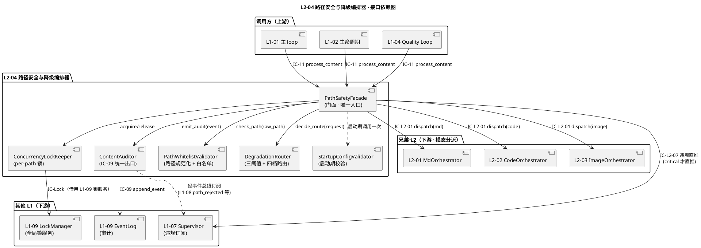
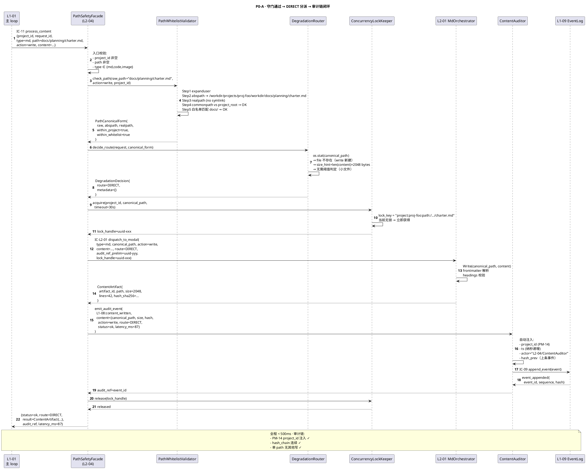
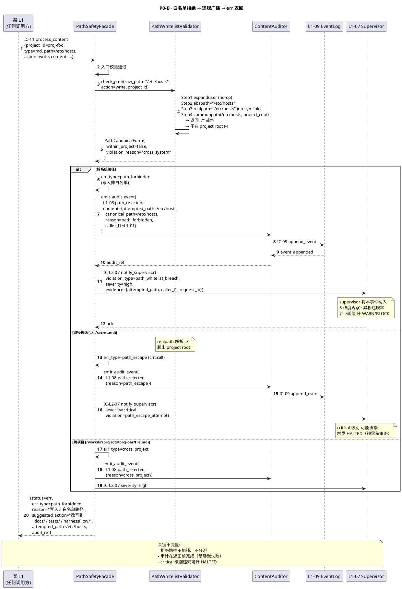
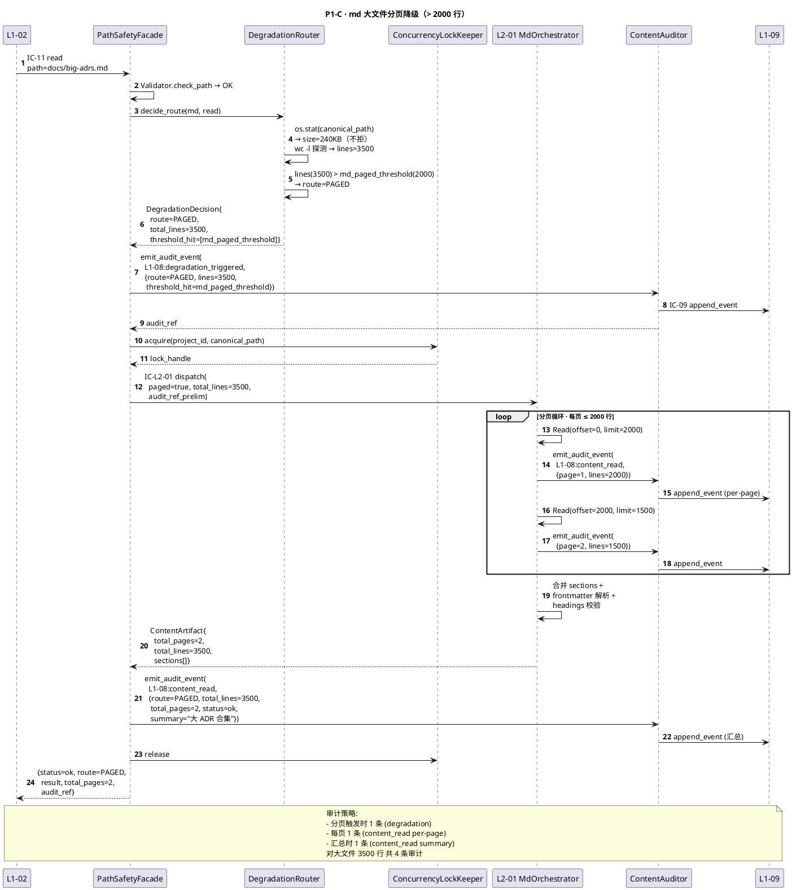
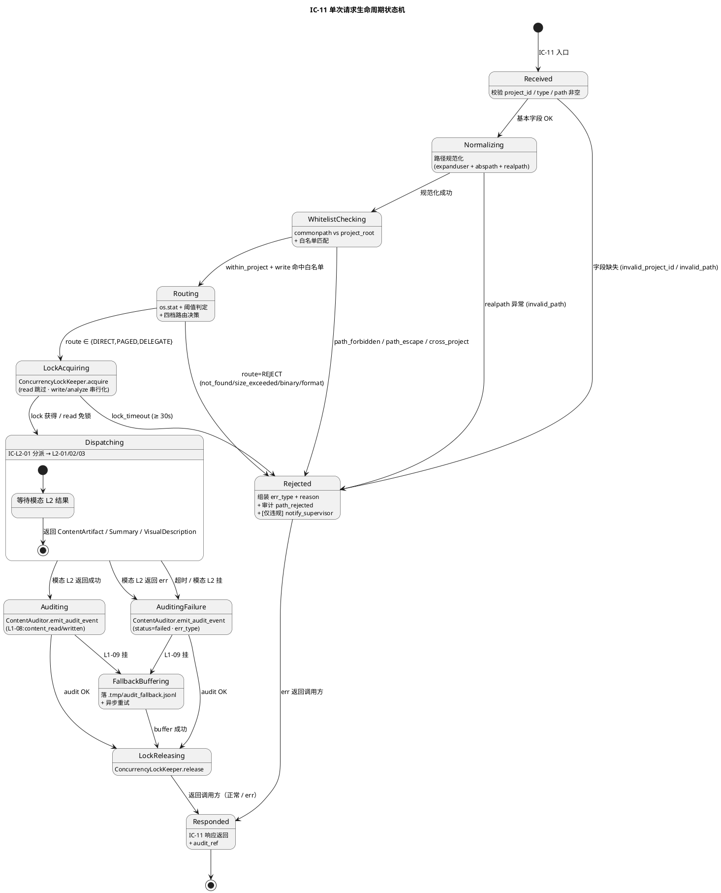
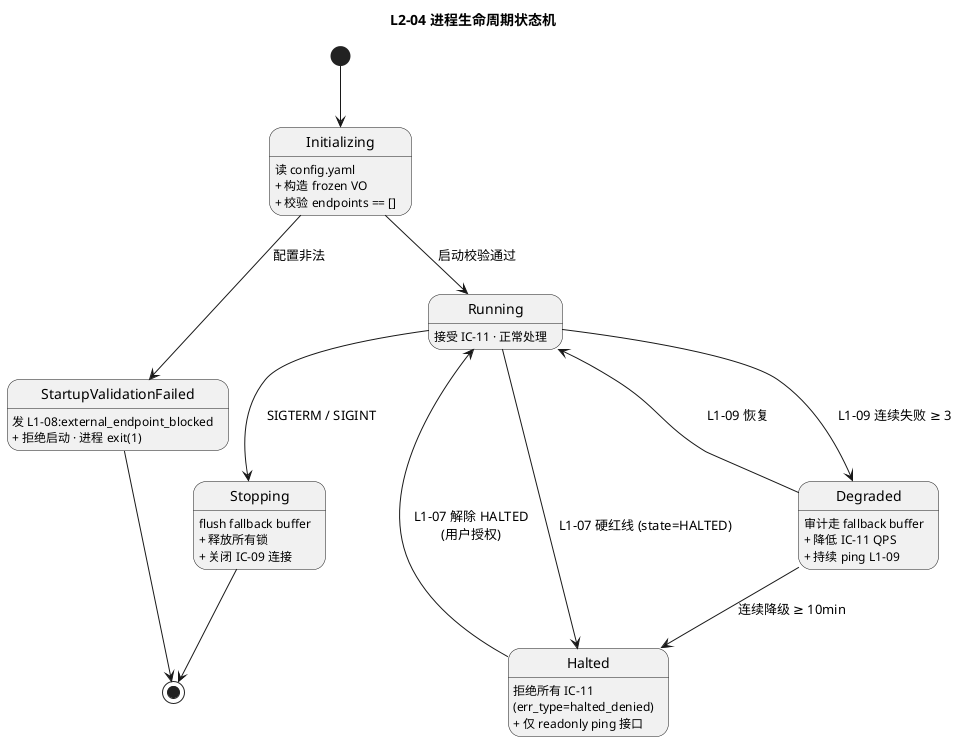
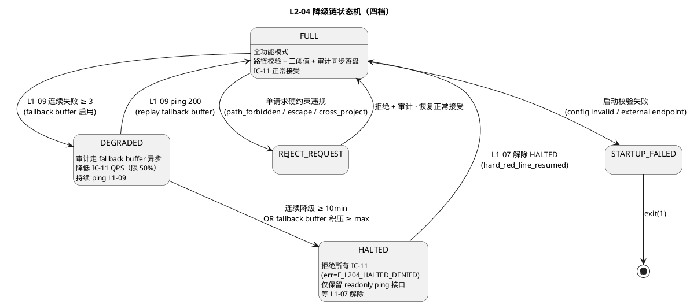

# L1 L2-04 · 路径安全与降级编排器 · Tech Design

> **本文档定位**：3-1-Solution-Technical 层级 · L1-08 多模态内容处理 的 L2-04 路径安全与降级编排器 技术实现方案（L2 粒度 · depth-B）。
> **与产品 PRD 的分工**：2-prd/L1-08-多模态内容处理/prd.md §5.8 的对应 L2 节定义产品边界，本文档定义**技术实现**（接口字段级 schema + 算法伪代码 + 底层数据结构 + 状态机 + 配置参数）。
> **与 L1 architecture.md 的分工**：architecture.md 负责**跨 L2 架构 + 跨 L2 时序**，本文档负责**本 L2 内部技术细节**。冲突以 architecture.md 为准。
> **严格规则**：本文档不复述产品 PRD 文字（职责 / 禁止 / 必须等清单），只做技术映射 + 补齐"产品视角未说 but 工程师必须知道"的部分（具体算法 · syscall · schema · 配置）。

---

## §0 撰写进度

- [x] §1 定位 + 2-prd §5.8 L2-04 映射
- [x] §2 DDD 映射（引 L0/ddd-context-map.md BC-08）
- [x] §3 对外接口定义（字段级 YAML schema + 错误码）
- [x] §4 接口依赖（被谁调 · 调谁）
- [x] §5 P0/P1 时序图（PlantUML ≥ 2 张）
- [x] §6 内部核心算法（伪代码）
- [x] §7 底层数据表 / schema 设计（字段级 YAML）
- [x] §8 状态机（PlantUML + 转换表）
- [x] §9 开源最佳实践调研（≥ 3 GitHub 高星项目）
- [x] §10 配置参数清单
- [x] §11 错误处理 + 降级策略
- [x] §12 性能目标
- [x] §13 与 2-prd / 3-2 TDD 的映射表

---

## §1 定位 + 2-prd 映射

### 1.1 本 L2 在 L1-08 多模态内容处理里的坐标

L1-08 由 4 个 L2 组成（3 模态 + 1 横切），**L2-04 是横切守门层**（gatekeeper · 统一入口 · 路径白名单 + 三阈值判定 + 四档降级路由 + 审计统一出口），上游接收来自 L1-01 / L1-02 / L1-04 的全部 IC-11 `process_content` 请求，下游按模态分派到 L2-01（md）/ L2-02（code）/ L2-03（image）。

```
  [L1-01 主 loop]  ─┐
  [L1-02 生命周期] ─┼──► IC-11 process_content ──►  ┌──────────────────────────────┐
  [L1-04 Quality]  ─┘                                 │ L2-04 路径安全与降级编排器    │
                                                      │ (Domain Service · 唯一入口)  │
                                                      │                              │
                                                      │  ┌────────────────────────┐  │
                                                      │  │ PathWhitelistValidator │  │ (域服务 · 路径规范化 + 白名单)
                                                      │  │ DegradationRouter       │  │ (域服务 · 三阈值 + 四档路由)
                                                      │  │ ContentAuditor          │  │ (应用服务 · IC-09 统一出口)
                                                      │  │ ConcurrencyLockKeeper   │  │ (域服务 · 同 path 串行化锁)
                                                      │  │ StartupConfigValidator  │  │ (应用服务 · 启动硬校验)
                                                      │  └────────────────────────┘  │
                                                      │                              │
                                                      │  ┌────────────────────────┐  │
                                                      │  │ PathValidationRequest  │  │ (VO · 单次请求)
                                                      │  │ DegradationDecision     │  │ (VO · 路由决策)
                                                      │  │ ContentWhitelistConfig  │  │ (VO · 启动期不可变)
                                                      │  │ ThresholdConfig         │  │ (VO · 启动期不可变)
                                                      │  │ ContentAuditEvent       │  │ (VO · 审计事件)
                                                      │  └────────────────────────┘  │
                                                      └────────────────┬─────────────┘
                                                                       │
                     ┌─────────────────────────┬────────────────────────┴────────────────┐
                     ▼                         ▼                         ▼               ▼
             [L2-01 Md I/O]           [L2-02 Code 结构]         [L2-03 Image Vision]  ERR 返回调用方
               IC-L2-01                  IC-L2-01                  IC-L2-01          IC-L2-06
               (paged?)                 (delegate?)               (hint?)
```

**L2-04 的定位** = "**BC-08 的脊柱 + 安全门卫 · 全 IC-11 唯一入口 · 路径 / 阈值 / 审计三合一 · 无持久化聚合根 · 纯无状态域服务 + 应用服务混合**"。

### 1.2 与 2-prd §5.8 L2-04 的对应表

| 2-prd §5.8 / §11（L2-04 详细章）小节 | 本文档对应位置 | 技术映射重点 |
|:---|:---|:---|
| §11.1 职责（守门人 · 路径白名单 + 阈值 + 降级路由 + 每次 I/O 审计） | §1.3 + §2（Domain Service + VO 列表） | 守门"三板斧"落到三个独立域服务方法 |
| §11.2 输入（IC-11 · 配置 · 阈值 · project scope 根）/ 输出（IC-L2-01 分派 · 结构化响应 · err · 审计事件 · 硬约束违规通知） | §3 字段级 YAML schema | 5 公开方法（validate/route/dispatch/audit/notify） |
| §11.3 In-scope 7 条（路径 / 阈值 / 不可读 / 降级 / 审计 / 违规通知 / 并发锁）/ Out-of-scope 6 条 | §2 DDD 边界 · §6 算法 | In-scope 全落 6-8 节 · Out-of-scope 仅声明 |
| §11.4 约束（PM-08 / PM-10 / PM-07 · 7 条硬约束 · 性能约束） | §10 配置 · §11 降级 · §12 SLO | 7 条硬约束映射 7 个 predicate |
| §11.5 禁止 7 条（运行时热改 / 跳审计 / 静默失败 / 跳阈值 / 记完整内容 / 原始字符串拼接 / 违规静默放行） | §6 算法 + §11 降级策略 | 7 条禁止落到算法 guard 子句 |
| §11.6 必须义务 8 条（规范化 / 阈值 / 审计 / 不可读 err / 监督通知 / 写锁 / endpoint 校验 / 启动加载） | §6 + §11 | 8 条必须映射到算法主干 |
| §11.7 可选功能 4 条（审计压缩 / 决策缓存 / 请求去重 / 白名单扩展提案） | §10 配置（V1 默认关闭） | V1 只实现前 2 条 · 后 2 条 V2 |
| §11.8 交互（接收 IC-11 · 调 IC-L2-01/05/06/07） | §4 依赖图 + §3 IC schema | 6 IC 独立 schema |
| §11.9 GW-T 用例大纲（5 正向 + 6 负向 + 5 集成 + 性能阈值） | §13 → 3-2 TDD 映射 | 16 场景落到 L2-04-tests.md |

### 1.3 本 L2 在 architecture.md 里的坐标

引 `docs/3-1-Solution-Technical/L1-08-多模态内容处理/architecture.md §3.1 Component Diagram` + §2.3 Domain Service/Application Service 分层：

```
   [IC-11 · 三类调用方]  ──►  L2-04（唯一入口）
                                    │
             ┌──────────────────────┼──────────────────────┐
             ▼                      ▼                      ▼
    PathWhitelistValidator   DegradationRouter        ContentAuditor
     (路径规范化             (三阈值判定 +           (IC-09 统一出口 +
      + 白名单匹配)          四档路由 DIRECT/PAGED/  PM-14 字段注入 +
                            DELEGATE/REJECT)         hash 链化)
             │                      │                      │
             └────────────┬─────────┴──────────┬───────────┘
                          ▼                    ▼
                  [模态 L2 分派]      [违规通知 → L1-07]
                   IC-L2-01            IC-L2-07
```

**本 L2 的关键特征**（对 L1-08 整体而言）：
1. **唯一入口 · 守门神经中枢**：全 IC-11 必经 L2-04 · 禁任何调用方跳过直调模态 L2
2. **无状态 · 无聚合根**：本 L2 不持有任何跨请求活的 Entity；只持有启动期加载的 VO（配置）+ 单次请求的 VO（PathValidationRequest / DegradationDecision）
3. **薄编排 · 不碰内容**：本 L2 一律不读 / 不写 / 不解析文件内容 · 只做"路径 + 元数据"级别判断
4. **三板斧**：路径规范化 → 阈值判定 → 降级路由（缺一不可 · scope §5.8.5 禁止 4）
5. **审计统一**：L2-01/02/03 均不直接调 IC-09 · 必经 L2-04 `ContentAuditor` 出口（保证 hash 链单一）
6. **配置启动期固定**：白名单 + 阈值在 `__init__` 加载一次，禁运行时热改（PM-07 user-intervene-always-wins · 改要走 scope 变更）
7. **同 path 串行化**：写 / 分析同一 path 加锁；不同 path 并行（per-path lock · 非 global lock）

### 1.4 本 L2 的 PM-14 约束

**PM-14 约束**（引 `docs/3-1-Solution-Technical/projectModel/tech-design.md`）：所有 IC payload 顶层 `project_id` 必填；所有存储路径按 `projects/<pid>/...` 分片。

本 L2 在 PM-14 层面的具体落点：
- **IC-11 入参**：`project_id` 为顶层必填字段（无则拒绝 · `err(type=invalid_project_id)`）
- **路径 scope 根**：`project_root = ${HARNESSFLOW_WORKDIR}/projects/${project_id}/workdir`（规范化后的绝对路径）
- **审计事件**：每条 `L1-08:*` 事件顶层 `project_id` 由 `ContentAuditor` 自动注入（调用方不需要手动传）
- **配置隔离**：白名单配置从 `projects/<pid>/config/content.yaml` 读取（支持单项目覆盖默认）· 默认回落 `${HARNESSFLOW_WORKDIR}/config.yaml`
- **锁命名空间**：并发锁 key = `project:${project_id}:path:${canonical_path}`（不同 project 完全隔离）
- **启动期配置校验**：`StartupConfigValidator` 为每个已知 project_id 独立校验一次 · 任一失败 → 拒绝该 project 启动

### 1.5 关键技术决策（Decision → Rationale → Alternatives → Trade-off）

| 决策 | 选择 | 理由 | 备选方案弃用原因 |
|:---|:---|:---|:---|
| **守门 + 审计合一** | `PathWhitelistValidator` + `DegradationRouter` + `ContentAuditor` 三服务同 L2 | 守门失败要审计"拒绝"事件 · 守门成功要审计"通过"事件 · 必在同一责任点 · 否则 hash 链断裂 | 拆两个 L2：每次请求经两个独立 L2 · 审计链路分散 · 增加 IC 往返 |
| **四档路由（不是三档）** | DIRECT / PAGED / DELEGATE / REJECT 四档 | REJECT 单独成一档（vs PRD "小/中/大"三档）显式区分"能做但要降级" 与 "不能做必须拒绝"；便于审计字段精确区分 | 三档合并 REJECT 到"中"档：审计 metadata 模糊 · 无法回答"为什么被拒" |
| **同 path 串行化锁 · 不用 global lock** | per-path mutex（`project_id + canonical_path` 作 key） | 同 path 并发写是真实冲突（覆盖风险）· 不同 path 并发无冲突 · global lock 会让 IC-11 吞吐退化到单线程 | global lock：IC-11 吞吐 ≤ 1 QPS · 违反 "同 project ≤ 100 并发" SLO |
| **配置启动期固定 · 禁运行时热改** | `ContentWhitelistConfig` 在 `__init__` 加载后作 frozen VO · 运行时改配置 → 启动下次才生效 | scope §5.8.5 禁止 "运行时 bypass" · 防攻击面（运行时改白名单 = 绕过守门） | 支持热改：代码审计路径从 1 变 N（每次 IC-11 都要重读配置）· 违反 PM-07 |
| **审计事件由 L2-04 统一组装** | L2-01/02/03 回传"模态结果"给 L2-04 · L2-04 组装审计事件 + 注入 PM-14 字段 + 调 IC-09 | 保证 hash 链单一 + 字段 schema 一致 + 限流集中决策 · 符合 architecture §7.2 "L1-09 承担模式" | 每 L2 自审计：hash 链断 + 字段不一致 + 每 L2 都要 import L1-09 · 耦合爆炸 |
| **路径规范化五步法** | expanduser → abspath → realpath → commonpath → whitelist_match | 每步防一类攻击：`~` 展开 / 相对路径 / symlink 逃逸 / 跨项目 / 写非白；五步是 "最小集" 不可删 | 仅 realpath：漏 `~` 展开 · `~/.ssh/id_rsa` 可能逃逸 |
| **延迟行数探测 · 不预扫** | md 读时才 `wc -l` 探测行数 · 代码仓 Glob 粗估行数是 L2-02 内部职责（非 L2-04） | L2-04 "薄守门" · 行数精估由 L2-02 做 · L2-04 只拿 L2-02 回报 | L2-04 自己粗估：L2-04 变"厚"· 职责边界模糊 |
| **不持久化 DegradationDecision** | 单次请求 VO · 结束即销毁 · 不入 KB | 决策是一次性的 · 同一路径下次请求要重判（文件可能已变）· 入 KB 缓存会返回陈旧决策 | 入 KB：缓存失效策略复杂 · 与 PM-14 `git_head` 无关 |
| **审计事件不含完整内容** | 只记 path + hash + size + result summary（≤ 200 字）· 禁原始内容 / 像素 / base64 | scope §11.4 硬约束 7 · 审计 jsonl 不膨胀 · 隐私保护 | 记完整内容：jsonl MB 级 · 违反 L1-09 性能预算 · 敏感信息泄露 |

---

## §2 DDD 映射（BC-08 · L1-08 L2-04）

### 2.1 本 L2 在 BC-08 里的 DDD 角色

引 `docs/3-1-Solution-Technical/L0/ddd-context-map.md §2.9 BC-08 · §4.8` L2-04 分类：

> **L1-08 L2-04**：Domain Service + VO: PathWhitelist + VO: DegradationRoute · 白名单校验 + 大小阈值 + 降级路由。

本 L2 同时承担**应用服务 `ContentAuditor`**（编排 IC-09 审计出口 · 不含领域逻辑）· **域服务 `PathWhitelistValidator`**（路径规范化 + 白名单比对 · 跨聚合的纯函数）· **域服务 `DegradationRouter`**（三阈值 + 四档路由决策 · 跨聚合的纯函数）· **域服务 `ConcurrencyLockKeeper`**（per-path 锁管理 · 无状态算法）· **应用服务 `StartupConfigValidator`**（启动期校验 · 读配置文件 + 硬拒绝）。

**不属于本 L2 的角色**：
- ❌ Aggregate Root：本 L2 不持有聚合（ContentArtifact 在 L2-01 · CodeStructureSummary 在 L2-02 · VisualDescription 在 L2-03）
- ❌ Repository：无持久化（配置是 read-only · PathValidationRequest 是短寿命）
- ❌ Factory：无复杂聚合构造

### 2.2 聚合根 / Entity / VO 分类

| DDD 元素 | 名称 | 类型 | 所属 | 说明 |
|:---|:---|:---|:---|:---|
| **Aggregate Root** | （无 · 本 L2 不持有聚合） | — | — | 配合 L2-01/02/03 的聚合根做守门 |
| **Domain Service** | `PathWhitelistValidator` | 无状态 · 纯函数 | L2-04 | 路径规范化 + 白名单比对 + 跨项目拦截 |
| **Domain Service** | `DegradationRouter` | 无状态 · 纯函数 | L2-04 | 三阈值（md 行 / code 行 / image 大小）+ 四档路由 |
| **Domain Service** | `ConcurrencyLockKeeper` | 有状态 · per-path mutex Map | L2-04 | 同 path 串行化 · 不同 path 并行 |
| **Application Service** | `ContentAuditor` | 有状态 · IC-09 出口 | L2-04 | 审计事件组装 + PM-14 字段注入 + hash 链化 · **L1-08 唯一审计出口** |
| **Application Service** | `StartupConfigValidator` | 无状态 · 启动期一次 | L2-04 | 校验 `content.image.endpoints == []` · 加载白名单 + 阈值 |
| **Application Service** | `PathSafetyFacade` | 无状态 · 门面 | L2-04 | 对外暴露 `handle_process_content` 统一入口（协调上述 5 服务） |
| **Value Object** | `PathValidationRequest` | 不可变 · 单次请求寿命 | L2-04 | `{raw_path, canonical_path, action, type, project_id, caller_l1}` |
| **Value Object** | `DegradationDecision` | 不可变 · 单次请求寿命 | L2-04 | `{route: DIRECT/PAGED/DELEGATE/REJECT, reason?, metadata}` |
| **Value Object** | `ContentWhitelistConfig` | 不可变 · 启动期 frozen | L2-04 | 写白名单 / 读 scope / 图片上传目录 / endpoints |
| **Value Object** | `ThresholdConfig` | 不可变 · 启动期 frozen | L2-04 | md_paged_threshold / code_delegate_threshold / image_max_size |
| **Value Object** | `ContentAuditEvent` | 不可变 · append-only | L2-04 | IC-09 payload schema · 含 PM-14 project_id + hash chain 字段 |
| **Value Object** | `PathCanonicalForm` | 不可变 | L2-04 | `{raw, abspath, realpath, within_project, within_whitelist}` |
| **Domain Event (对外)** | `L1-08:path_rejected` | 发往 L1-09 + L1-07 | L2-04 | 白名单拒绝时触发 |
| **Domain Event (对外)** | `L1-08:degradation_triggered` | 发往 L1-09 | L2-04 | 分页 / 委托降级时触发 |
| **Domain Event (对外)** | `L1-08:content_read` | 发往 L1-09（代 L2-01/02/03）| L2-04 | 统一审计出口触发 |
| **Domain Event (对外)** | `L1-08:content_written` | 发往 L1-09（代 L2-01）| L2-04 | md 写成功时触发 |
| **Domain Event (对外)** | `L1-08:external_endpoint_blocked` | 启动期拒绝 | L2-04 | 配置含非空 endpoints 时触发 |

### 2.3 聚合不变式（Invariants）

引 L0 DDD §2.9 BC-08 的 I-01 ~ I-04 + 本 L2 新增 I-05 ~ I-08：

| 不变量 | 描述 | 守护点 |
|:---|:---|:---|
| **I-01** | 内容不跨项目：任何 IC-11 请求的 project_id 必须与 path 的 realpath 解析后归属一致 | `PathWhitelistValidator.check_cross_project` |
| **I-04** | PathValidationRequest 单点网关：所有 IC-11 必产生一条 PathValidationRequest；未经 L2-04 校验的请求一律拒绝分派 | `PathSafetyFacade.handle_process_content` 入口第一行硬拦截 |
| **I-05** | 配置启动期冻结：`ContentWhitelistConfig` / `ThresholdConfig` 一旦 `__init__` 后不可变；运行时 setattr 抛 FrozenInstanceError | VO `@dataclass(frozen=True)` |
| **I-06** | 审计事件必含 project_id + hash_chain_prev：`ContentAuditor` 出口前强校验两字段非空 | `ContentAuditor._pre_emit_check` |
| **I-07** | 同 path 串行化：对同一 `(project_id, canonical_path)`，write / analyze 操作必须经 `ConcurrencyLockKeeper` 获得锁才能 dispatch | `PathSafetyFacade` 在 route != REJECT 后加锁 |
| **I-08** | endpoint 硬零：`config.content.image.endpoints` 在任何时刻必须为空列表；启动期 + 每次 image dispatch 前双重校验 | `StartupConfigValidator` + `PathSafetyFacade._pre_image_dispatch` |

### 2.4 Repository 接口（本 L2 无自建 Repository）

本 L2 作为 **薄守门层**，不持有 Repository：

- 审计事件持久化 → 经 IC-09 写 `L1-09 EventLog Aggregate`（L1-09 自有 `EventStoreRepository`）
- 配置文件读 → 启动期一次性 `yaml.safe_load` · 无 Repository 抽象
- 锁表 → 运行时内存 Map（`dict[str, asyncio.Lock]`） · 崩溃后丢失 · 重启回放 L1-09 事件重建（本 L2 锁状态无需持久化，因为 IC-11 是短请求）

### 2.5 Domain Events 订阅方

| 事件 | 订阅方 | 订阅目的 |
|:---|:---|:---|
| `L1-08:path_rejected` | L1-07 Supervisor / L1-10 UI | 8 维度观察累积违规率 · UI 红色告警 |
| `L1-08:degradation_triggered` | L1-07 / L1-10 | 观察降级频次 · UI 显示分页/委托指示 |
| `L1-08:content_read` | L1-07 / L1-10 | 8 维度观察 I/O 频次 · UI 审计追溯 |
| `L1-08:content_written` | L1-07 / L1-10 / L1-02 | 产出物落盘知会 · UI 展厅刷新 |
| `L1-08:external_endpoint_blocked` | L1-07 / L1-10 / 启动运维 | 启动拒绝告警（隐私红线）|

---

## §3 对外接口定义（字段级 YAML schema + 错误码）

### 3.1 公开方法清单

L2-04 对外暴露 **5 个公开方法** + **6 条 IC 契约**（接收 IC-11 · 发起 IC-L2-01 / IC-L2-05 / IC-L2-06 / IC-L2-07 · 最终发起 IC-09）：

| 方法名 | 承担 IC | 角色 | 调用方 |
|:---|:---|:---|:---|
| `handle_process_content(request)` | 接收 IC-11 | 门面 · 唯一入口 | L1-01 / L1-02 / L1-04 |
| `dispatch_to_modal(decision, request)` | 发起 IC-L2-01 | 路由分派 | 内部 · 仅 Facade 调 |
| `emit_audit_event(event)` | 发起 IC-L2-05 → IC-09 | 审计出口 | 内部 + L2-01/02/03 回传 |
| `return_structured_error(err_type, reason)` | 发起 IC-L2-06 | 统一 err 封装 | 内部 |
| `notify_supervisor(violation)` | 发起 IC-L2-07 → L1-07 | 硬约束违规广播 | 内部 |

### 3.2 `handle_process_content` 入参 schema（IC-11 body）

```yaml
# IC-11 · process_content 请求体 · 由调用方（L1-01/02/04）传入
# 版本：v1.0 · 字段顺序即 priority
type: object
additionalProperties: false
required: [project_id, request_id, type, path, action, caller_l1, caller_wp_id, ts]
properties:
  project_id:
    type: string
    description: PM-14 项目上下文；必须与 path realpath 归属一致
    pattern: "^[a-z0-9][a-z0-9_-]{0,63}$"
  request_id:
    type: string
    description: 单次 IC-11 请求 uuid（v4）· 用于审计追溯
    format: uuid
  type:
    type: string
    enum: [md, code, image]
    description: 内容模态 · 分派目标 L2
  path:
    type: string
    description: 调用方传入的原始路径字符串（未规范化）· L2-04 负责规范化
    minLength: 1
    maxLength: 1024
  action:
    type: string
    enum: [read, write, update, analyze]
    description: 动作类型 · write/update 触发白名单严格校验
  content:
    type: string
    description: 写操作的内容（仅 action=write/update 时必填）
    nullable: true
  image_hint:
    type: string
    enum: [architecture, ui_mock, screenshot]
    description: 图片视觉理解的模板提示（仅 type=image 时适用）
    nullable: true
  focus_hint:
    type: string
    description: 代码分析的焦点提示（仅 type=code 时适用）· free text ≤ 200 chars
    nullable: true
    maxLength: 200
  offset:
    type: integer
    description: 分页读取起始行（可选）· L2-04 不使用 · 透传 L2-01
    minimum: 0
    nullable: true
  limit:
    type: integer
    description: 分页读取行数（可选）· L2-04 不使用 · 透传 L2-01
    minimum: 1
    nullable: true
  caller_l1:
    type: string
    enum: [L1-01, L1-02, L1-04]
    description: 触发方 L1 · 用于违规溯源（哪个 L1 频繁越权）
  caller_wp_id:
    type: string
    description: 调用方当前的 WP id（如有）· 用于审计追溯
    nullable: true
  ts:
    type: string
    format: date-time
    description: 请求时间戳（ISO8601 · 纳秒精度）
```

### 3.3 `handle_process_content` 出参 schema（正常 / err）

**正常返回（route ∈ {DIRECT, PAGED, DELEGATE}）**：

```yaml
# IC-11 正常响应 · 透传模态 L2 的结果 + L2-04 统一包装审计引用
type: object
additionalProperties: false
required: [project_id, request_id, status, result, audit_ref, latency_ms, route]
properties:
  project_id:
    type: string
  request_id:
    type: string
    format: uuid
  status:
    type: string
    enum: [ok]
  route:
    type: string
    enum: [DIRECT, PAGED, DELEGATE]
    description: L2-04 最终采用的降级档位
  result:
    oneOf:
      - $ref: "#/definitions/ContentArtifact"      # type=md
      - $ref: "#/definitions/CodeStructureSummary"  # type=code
      - $ref: "#/definitions/VisualDescription"     # type=image
  audit_ref:
    type: string
    description: 审计事件的 event_id（uuid v4）· 供调用方追溯
    format: uuid
  latency_ms:
    type: integer
    description: 端到端耗时（含守门 + 分派 + 模态 L2 + 审计）
    minimum: 0
  threshold_hits:
    type: array
    description: 触发的阈值列表（便于调试）
    items:
      type: string
      enum: [md_paged_threshold, code_delegate_threshold, image_max_size]
    nullable: true
```

**err 返回（route = REJECT · IC-L2-06）**：

```yaml
# IC-L2-06 · 结构化 err 返回
type: object
additionalProperties: false
required: [project_id, request_id, status, err_type, reason, suggested_action, audit_ref, ts]
properties:
  project_id:
    type: string
  request_id:
    type: string
    format: uuid
  status:
    type: string
    enum: [err]
  err_type:
    type: string
    enum:
      - path_forbidden       # 写非白名单路径
      - path_escape          # 路径逃逸（../ 解析后超出 project root）
      - cross_project        # 跨项目读写
      - not_found            # 文件不存在
      - permission_denied    # 权限拒绝
      - not_a_file           # 目标是目录
      - binary_unsupported   # md 读到二进制
      - type_mismatch        # 扩展名与 type 不匹配
      - size_exceeded        # image 超 20MB
      - format_unsupported   # image 格式不支持
      - invalid_path         # path 为 null / 空 / 非法字符
      - invalid_project_id   # project_id 缺失或不合法
      - external_endpoint_blocked  # 启动期 endpoints 非空
      - concurrency_lock_timeout   # 同 path 锁等待超时
      - halted_denied        # L1-07 state=HALTED 时全面拒绝
  reason:
    type: string
    description: 人类可读的拒绝原因
    maxLength: 500
  suggested_action:
    type: string
    description: 给调用方的下一步建议
    maxLength: 500
  audit_ref:
    type: string
    format: uuid
  ts:
    type: string
    format: date-time
  attempted_path:
    type: string
    description: 规范化前的原始路径（便于调用方定位意图）
    nullable: true
  canonical_path:
    type: string
    description: 规范化后的真实路径（若可得）
    nullable: true
```

### 3.4 `dispatch_to_modal` schema（IC-L2-01）

```yaml
# IC-L2-01 · 分派到模态 L2
type: object
additionalProperties: false
required: [project_id, request_id, type, canonical_path, action, route, audit_ref_prelim]
properties:
  project_id: { type: string }
  request_id: { type: string, format: uuid }
  type: { type: string, enum: [md, code, image] }
  canonical_path:
    type: string
    description: 已规范化的绝对真实路径 · 模态 L2 无需再规范化
  action: { type: string, enum: [read, write, update, analyze] }
  route:
    type: string
    enum: [DIRECT, PAGED, DELEGATE]
  paged:
    type: boolean
    description: 仅 route=PAGED 时为 true
    default: false
  delegate:
    type: boolean
    description: 仅 route=DELEGATE 时为 true
    default: false
  total_lines:
    type: integer
    description: 仅 type=md AND paged=true 时提供（行数探测结果）
    nullable: true
  size_bytes:
    type: integer
    description: 仅 type=image 时提供（文件大小）
    nullable: true
  image_hint: { type: string, enum: [architecture, ui_mock, screenshot], nullable: true }
  focus_hint: { type: string, maxLength: 200, nullable: true }
  content: { type: string, nullable: true, description: write/update 时的内容 }
  lock_handle:
    type: string
    description: ConcurrencyLockKeeper 颁发的锁句柄 · 模态 L2 回传时释放
  audit_ref_prelim:
    type: string
    format: uuid
    description: L2-04 预先生成的 audit_ref · 模态 L2 完成后附加到最终事件
```

### 3.5 `emit_audit_event` schema（IC-L2-05 → IC-09）

```yaml
# IC-L2-05 内部 · 最终经 IC-09 append_event 落 L1-09
type: object
additionalProperties: false
required: [project_id, event_type, ts, actor, content, request_id_ref, audit_ref]
properties:
  project_id:
    type: string
    description: PM-14 硬字段 · 由 ContentAuditor 自动注入
  event_type:
    type: string
    enum:
      - L1-08:content_read
      - L1-08:content_written
      - L1-08:code_summarized
      - L1-08:image_described
      - L1-08:path_rejected
      - L1-08:degradation_triggered
      - L1-08:external_endpoint_blocked
  ts:
    type: string
    format: date-time
    description: 纳秒精度单调递增
  actor:
    type: string
    description: 事件发起者 · 固定 "L2-04/ContentAuditor"
  request_id_ref:
    type: string
    format: uuid
    description: 关联 IC-11 request_id · 便于追溯
  audit_ref:
    type: string
    format: uuid
    description: 本条事件自身 uuid
  hash_prev:
    type: string
    description: 上一条审计事件 hash（sha256）· 防篡改链化 · 由 L1-09 填
    nullable: true
  content:
    type: object
    description: 事件 payload · 字段按 event_type 不同
    properties:
      canonical_path: { type: string, nullable: true }
      attempted_path: { type: string, nullable: true }
      type: { type: string, enum: [md, code, image], nullable: true }
      action: { type: string, enum: [read, write, update, analyze], nullable: true }
      route: { type: string, enum: [DIRECT, PAGED, DELEGATE, REJECT], nullable: true }
      status: { type: string, enum: [ok, failed], nullable: true }
      err_type: { type: string, nullable: true }
      reason: { type: string, nullable: true }
      file_hash_sha256: { type: string, nullable: true, description: 读/写结果的文件内容 hash }
      size_bytes: { type: integer, nullable: true }
      lines: { type: integer, nullable: true }
      summary_excerpt:
        type: string
        maxLength: 200
        nullable: true
        description: 结果摘要前 200 字 · 禁含完整内容 / 像素 / base64
      caller_l1: { type: string, nullable: true }
      caller_wp_id: { type: string, nullable: true }
      latency_ms: { type: integer, nullable: true }
      threshold_hit: { type: array, items: { type: string }, nullable: true }
      subagent_session_id: { type: string, nullable: true, description: 委托场景的子 Agent id }
```

### 3.6 `notify_supervisor` schema（IC-L2-07 → L1-07）

```yaml
# IC-L2-07 · 硬约束违规广播 · 由 L1-07 通过 L1-09 事件总线观察 + 8 维度累积
type: object
additionalProperties: false
required: [project_id, incident_id, violation_type, severity, evidence, ts]
properties:
  project_id: { type: string }
  incident_id: { type: string, format: uuid }
  violation_type:
    type: string
    enum:
      - path_whitelist_breach         # 写非白
      - path_escape_attempt           # ../ 逃逸尝试
      - cross_project_breach          # 跨项目
      - external_endpoint_detected    # config.image.endpoints 非空
      - audit_hash_chain_broken       # hash 链断（严重 · 系统级故障）
      - concurrent_write_collision    # 同 path 写冲突
      - halted_state_breach_attempt   # L1-07 HALTED 时仍尝试 I/O
  severity:
    type: string
    enum: [low, medium, high, critical]
    description: critical = 立即触发 L1-07 HALTED · high = WARN · medium = 累积 · low = 观察
  evidence:
    type: object
    additionalProperties: true
    description: 证据 payload（原 request_id / attempted_path / caller_l1 等）
  repeat_count:
    type: integer
    description: 同类违规在滑动窗口（默认 60s）内的次数
    nullable: true
  ts:
    type: string
    format: date-time
```

### 3.7 错误码表（err_type 全集 · 调用方处理指引）

| 错误码 | 含义 | 触发场景 | 严重性 | 调用方处理 | 审计事件 |
|:---|:---|:---|:---|:---|:---|
| `path_forbidden` | 写非白名单 | path 不在 `docs/ / tests/ / harnessFlow/` | high | 改写到白名单路径 · 或走 scope 变更扩白 | `path_rejected` + 违规广播 |
| `path_escape` | 路径逃逸 | realpath 后超 project root（常见 `../../`）| critical | 立即停止 · 排查调用方 bug 或攻击 | `path_rejected` + critical 广播 |
| `cross_project` | 跨项目 | realpath 后命中他 project 目录 | high | 在本 project 内再操作 · 或显式切换 project | `path_rejected` + 违规广播 |
| `not_found` | 文件不存在 | `os.stat ENOENT` | low | 确认路径 · 检查 project root | `content_read` + status=failed |
| `permission_denied` | 权限拒绝 | `os.stat EACCES` | medium | 检查文件权限 · chown 配置 | `content_read` + status=failed |
| `not_a_file` | 目标是目录 | `os.stat EISDIR` | low | 传文件路径 · 或改 action | `content_read` + status=failed |
| `binary_unsupported` | md 读到二进制 | UTF-8 解码失败 AND type=md | low | md 不支持二进制 · 图片请用 type=image | `content_read` + status=failed |
| `type_mismatch` | 扩展名与 type 不匹配 | `.pdf` when type=md | low | 修正 type · 或用支持该扩展名的 action | `content_read` + status=failed |
| `size_exceeded` | image 超限 | size > `image.max_size_mb * 1MB` | medium | 压缩图片 · 或切换其他工具 | `image_described` + status=failed |
| `format_unsupported` | image 格式不支持 | 扩展名 ∉ `[png,jpg,webp,gif]` | low | 转换格式 | `image_described` + status=failed |
| `invalid_path` | path 为 null / 空 / 非法字符 | path == "" / None / 含控制字符 | medium | 检查请求构造 | `path_rejected` + 违规广播 |
| `invalid_project_id` | project_id 缺失或不合法 | project_id == "" / None / 不匹配正则 | high | 检查 PM-14 上下文传递 | `path_rejected` + 违规广播 |
| `external_endpoint_blocked` | endpoints 非空 | 启动期配置含非空 endpoints | critical | 修复配置后重启 | `external_endpoint_blocked` + 拒绝启动 |
| `concurrency_lock_timeout` | 同 path 锁等待超时 | 同 path 写 > 30s 未获锁 | medium | 重试 · 或检查是否卡死 | `path_rejected` |
| `halted_denied` | L1-07 HALTED 时 I/O | supervisor 触发硬红线暂停 | high | 等待用户授权恢复 | `path_rejected` + 违规广播 |

---

## §4 接口依赖（被谁调 · 调谁）

### 4.1 上游调用方（本 L2 被谁调）

| 调用方 L1 / L2 | 承担 IC | 调用 L2-04 的方法 | 频率 | 场景 |
|:---|:---|:---|:---|:---|
| **L1-01 主 loop** | IC-11 process_content | `handle_process_content` | 高（主流量 · 每次决策可能 ≥ 1 次）| 决策时读代码 / 读 md / 分析图 |
| **L1-02 生命周期** | IC-11 process_content | `handle_process_content` | 中（PMP 产出物 · TOGAF C/D 时读代码）| S1 章程写 md / S2 WBS 读代码 / S3 TOGAF 用图 |
| **L1-04 Quality Loop** | IC-11 process_content | `handle_process_content` | 低（TDD 蓝图 + 截图）| S4 写 TDD 蓝图 md / S5 Playwright 截图分析 |

**承接语义**：
- **入口唯一** · L2-04 `PathSafetyFacade.handle_process_content` · 禁任何调用方跳过
- **调用方不需要知道**：路径是否白 / 文件多大 / 用不用委托 / 用不用分页 · 全部由 L2-04 内部决策

### 4.2 下游被调方（本 L2 调谁）

| 下游 L1 / L2 | 承担 IC | L2-04 调用的方法 | 频率 | 场景 |
|:---|:---|:---|:---|:---|
| **L2-01 MdOrchestrator** | IC-L2-01 dispatch | `MdOrchestrator.handle_md_request` | 高 | type=md 分派 |
| **L2-02 CodeOrchestrator** | IC-L2-01 dispatch | `CodeOrchestrator.handle_code_request` | 中 | type=code 分派 |
| **L2-03 ImageOrchestrator** | IC-L2-01 dispatch | `ImageOrchestrator.handle_image_request` | 低 | type=image 分派 |
| **L1-09 EventLog** | IC-09 append_event | `EventLog.append_event` | 非常高（每次 I/O 必调）| 审计事件统一出口 |
| **L1-07 Supervisor** | IC-L2-07 广播（经 L1-09 订阅）| 通过事件总线推 `L1-08:path_rejected` 事件 | 低（仅违规时）| 硬约束违规 |
| **L1-09 LockManager**（L1-09 L2-02）| IC-Lock acquire/release | `LockManager.acquire` / `release` | 中（仅 write/analyze 加锁）| 同 path 串行化 |

### 4.3 依赖图（PlantUML）



### 4.4 依赖时序（典型请求的调用栈）

```
调用方 ──► Facade.handle_process_content(req)
              │
              ├─► StartupVal.ensure_validated()            [幂等 · 启动期完成]
              ├─► Validator.check_path(req.path)
              │     ├─► os.path.expanduser / abspath / realpath
              │     ├─► os.path.commonpath vs project_root
              │     └─► 白名单匹配（write 时）
              ├─► Router.decide_route(request, canonical_path)
              │     ├─► os.stat + 行数探测（md）/ 大小读取（image）
              │     └─► 三阈值 + 四档路由
              ├─► 分支 DIRECT/PAGED/DELEGATE：
              │     ├─► LockKeeper.acquire(project_id, canonical_path)
              │     ├─► dispatch_to_modal(decision, request) → L2-01/02/03
              │     ├─► 接收模态 L2 返回
              │     ├─► Auditor.emit_audit_event(success event)
              │     └─► LockKeeper.release
              ├─► 分支 REJECT：
              │     ├─► Auditor.emit_audit_event(failure event)
              │     ├─► notify_supervisor(violation)        [仅违规]
              │     └─► return_structured_error(err_type)
              └─► 返回调用方（正常 / err）
```

---

## §5 P0/P1 时序图（PlantUML）

本节给出 **4 张时序图**，覆盖 L2-04 最关键的 4 个场景：P0-A 守门通过 + DIRECT 分派（正向）· P0-B 白名单拒绝 + supervisor 违规广播（负向）· P1-C md 分页降级（大文件）· P1-D 同 path 并发锁串行化（并发）。

### 5.1 P0-A · 守门通过 → DIRECT 分派 → 审计链闭环（正向主链路）

**场景一句话**：L1-01 写 `docs/planning/charter.md` → L2-04 路径规范化 + 白名单命中 + 阈值探测（小文件）+ 加锁 → DIRECT 分派 L2-01 → L2-01 写成功回传 → L2-04 组装审计事件 + hash 链化 + 调 IC-09 → 释放锁 → 返回调用方。

**端到端延迟预期**：≤ 500ms（守门 ≤ 200ms + L2-01 写 ≤ 100ms + 审计 ≤ 100ms + 锁 ≤ 10ms + margin ≤ 90ms）。



**关键技术决策**：

| 决策 | 选择 | 理由 | 备选方案弃用原因 |
|:---|:---|:---|:---|
| 加锁时机 | 先路由决策后加锁（而非入口就加锁）| REJECT 分支不需要加锁 · 加锁前先判断路由 · 减少锁持有时间 | 入口加锁：REJECT 请求也占锁 · 锁争用加剧 |
| audit_ref_prelim 预分配 | L2-04 在 dispatch 前预分配 uuid · 模态 L2 回传时带 | 避免模态 L2 与 L2-04 的 uuid 冲突；便于跨 L2 关联日志 | 模态 L2 分配：L2-04 需反向查 · 耦合高 |
| hash_prev 由 Auditor 注入 | Auditor 在 emit 前从内存缓存取最后一条的 hash | 保证 hash_chain 连续；L1-09 最终落盘时二次校验 | 调用方传：字段污染 + 出错概率高 |

### 5.2 P0-B · 白名单拒绝 → supervisor 违规广播（负向链路）

**场景一句话**：某 L1 尝试写 `/etc/hosts`（或 `../../secret.md` 逃逸）→ L2-04 规范化后发现越权 → 直接 REJECT 不加锁 · 不分派 → 审计 `L1-08:path_rejected` + 违规广播 → L1-07 supervisor 观察 → 返回结构化 err。

**端到端延迟预期**：≤ 300ms（规范化 ≤ 10ms + 违规组装 ≤ 50ms + 审计 ≤ 100ms + 广播 ≤ 100ms + err 返回 ≤ 40ms）。



### 5.3 P1-C · md 大文件分页降级（阈值触发）

**场景一句话**：L1-02 读 `docs/big-adrs.md`（3500 行）→ L2-04 路径 OK + 行数探测 > 2000 → route=PAGED → 分派 L2-01 带 `paged=true, total_lines=3500` → L2-01 分页循环读 → 每页一条审计 → 返回合并结果 + 1 条汇总审计。



### 5.4 P1-D · 同 path 并发锁串行化

**场景一句话**：两个 L1 同时写 `docs/planning/requirements.md` → L2-04 `ConcurrencyLockKeeper` 对该 path 加锁 → 第二个请求等待 → 第一个完成释放锁 → 第二个获锁继续。

```plantuml
@startuml
autonumber
title P1-D · 同 path 并发锁串行化

participant "L1-01 Req-A" as CallerA
participant "L1-02 Req-B" as CallerB
participant "PathSafetyFacade" as Facade
participant "ConcurrencyLockKeeper" as Lock
participant "L2-01 MdOrchestrator" as L201
participant "ContentAuditor" as Auditor

par Req-A 和 Req-B 同时到达
    CallerA -> Facade : IC-11 write\ndocs/requirements.md
and
    CallerB -> Facade : IC-11 write\ndocs/requirements.md
end

Facade -> Facade : 两个请求各自走\nValidator + Router\n→ route=DIRECT

Facade -> Lock : Req-A acquire(\n  proj-foo, .../requirements.md,\n  timeout=30s)
Lock -> Lock : 锁表查询 → 空\n→ 授予 Req-A\n(lock_handle=uuid-A)
Lock --> Facade : lock_handle=uuid-A

Facade -> Lock : Req-B acquire(...)
Lock -> Lock : 锁表查询 → Req-A 持有\n→ Req-B 进入等待队列
Note over Lock : 等待 · timeout 30s

Facade -> L201 : Req-A dispatch_to_modal\n(write content-A)
L201 -> L201 : Write(path, content-A)
L201 --> Facade : ContentArtifact-A

Facade -> Auditor : emit L1-08:content_written\n(Req-A)
Facade -> Lock : Req-A release(uuid-A)

Lock -> Lock : 唤醒等待队列\n→ 授予 Req-B\n(lock_handle=uuid-B)
Lock --> Facade : lock_handle=uuid-B\n(Req-B 恢复)

Facade -> L201 : Req-B dispatch_to_modal\n(write content-B)
L201 -> L201 : Write(path, content-B)\n注意: 覆盖 Req-A 的内容
L201 --> Facade : ContentArtifact-B

Facade -> Auditor : emit L1-08:content_written\n(Req-B · 含覆盖 flag)
Facade -> Lock : Req-B release(uuid-B)

Facade --> CallerA : Req-A response
Facade --> CallerB : Req-B response

Note over Facade, Lock
    关键不变量 I-07:
    - 同 path 并发写必串行
    - 不同 path 并行（Req-A,B 写不同文件无冲突）
    - timeout=30s · 超时返回 concurrency_lock_timeout
    - Req-B 成功但 Req-A 的内容被覆盖 · 这是"写冲突"而非 bug
      审计事件会记录顺序 · 由上层业务决定是否二次保护（乐观锁）
end note
@enduml
```

---

## §6 内部核心算法（伪代码）

本节给出 L2-04 的 **8 个核心算法**（Python-like 风格 · 保留 syscall 级精度）：

### 6.1 算法 A1 · 路径规范化（Path Normalization）

```python
# algorithm: path_normalization
# owner: PathWhitelistValidator
# complexity: O(1) · 最多 3 次 syscall（stat/realpath）
# latency budget: ≤ 10ms (99.9th)

class PathWhitelistValidator:
    def __init__(self, config: ContentWhitelistConfig, project_root: str):
        self.cfg = config                         # frozen VO
        self.project_root = os.path.realpath(project_root)  # 启动期一次
        assert os.path.isabs(self.project_root), "project_root 必须是绝对路径"

    def normalize(self, raw_path: str, project_id: str) -> PathCanonicalForm:
        # --- 前置校验 ---
        if raw_path is None or raw_path == "":
            raise InvalidPathError("path_empty")
        if "\x00" in raw_path or any(ord(c) < 0x20 and c not in "\t\n" for c in raw_path):
            raise InvalidPathError("path_contains_control_char")
        if len(raw_path) > 1024:
            raise InvalidPathError("path_too_long")

        # --- Step 1 · expanduser（~ 展开）---
        # 防御：~/.ssh/id_rsa 在 project_root 外
        expanded = os.path.expanduser(raw_path)

        # --- Step 2 · abspath（相对路径 → 绝对）---
        # 相对路径 base 为 project_root（而非 cwd，避免 cwd 漂移攻击）
        if not os.path.isabs(expanded):
            abs_path = os.path.normpath(os.path.join(self.project_root, expanded))
        else:
            abs_path = os.path.normpath(expanded)

        # --- Step 3 · realpath（resolve symlink）---
        # 防御：docs/link → /etc/passwd 类型的 symlink 逃逸
        try:
            real_path = os.path.realpath(abs_path, strict=False)  # strict=False 允许不存在的路径
        except OSError as e:
            raise InvalidPathError(f"realpath_failed: {e}")

        # --- Step 4 · commonpath vs project_root ---
        try:
            common = os.path.commonpath([real_path, self.project_root])
        except ValueError:
            # Windows 跨盘符 · 或 realpath 异常
            common = ""
        within_project = (common == self.project_root)

        # --- Step 5 · 白名单匹配（仅 write）---
        within_whitelist = False
        if within_project:
            rel = os.path.relpath(real_path, self.project_root)
            # 写白名单: docs/ / tests/ / harnessFlow/
            for prefix in self.cfg.write_whitelist:
                # 精确前缀匹配 · 防 "docss/" 误命中 "docs/"
                if rel == prefix.rstrip("/") or rel.startswith(prefix.rstrip("/") + os.sep):
                    within_whitelist = True
                    break
            # 图片上传目录 · 扩充白名单
            for prefix in self.cfg.image_upload_dirs:
                if rel.startswith(prefix.rstrip("/") + os.sep):
                    within_whitelist = True
                    break

        return PathCanonicalForm(
            raw=raw_path,
            expanded=expanded,
            abspath=abs_path,
            realpath=real_path,
            within_project=within_project,
            within_whitelist=within_whitelist,
            project_id=project_id,
        )

    def check_path(self, raw_path: str, action: str, project_id: str) -> PathCanonicalForm:
        form = self.normalize(raw_path, project_id)

        if not form.within_project:
            # 不在 project_root → 可能是跨系统 / 跨项目
            if form.realpath.startswith("/workdir/projects/"):
                raise PathViolation("cross_project", form)
            else:
                raise PathViolation("path_forbidden", form)  # /etc/*, /home/*, etc

        # 写操作必须在白名单
        if action in ("write", "update") and not form.within_whitelist:
            raise PathViolation("path_forbidden", form)

        # 检测路径逃逸（../../ 用户明显意图）
        if ".." in raw_path and not form.within_project:
            raise PathViolation("path_escape", form)

        return form
```

**关键实现细节**：
1. **`strict=False`**：realpath 允许不存在的路径（write 新建场景必须）· 但仍 resolve symlink
2. **commonpath 异常处理**：Windows 跨盘符会抛 ValueError · 视为跨项目
3. **白名单精确前缀**：`rel.startswith("docs" + os.sep)` 避免 `docss/` 误命中
4. **控制字符检测**：防 `\n` / `\x00` 注入审计日志
5. **路径长度上限 1024**：防 DoS（超长路径导致 stat 慢）

### 6.2 算法 A2 · 阈值探测 + 四档路由（Degradation Routing）

```python
# algorithm: degradation_routing
# owner: DegradationRouter
# complexity: O(file_size / 64KB) · md 行数探测 · code 由 L2-02 自行估
# latency budget: ≤ 200ms（除 code 大仓 ≤ 5s · 由 L2-02 承担）

class DegradationRouter:
    def __init__(self, threshold_cfg: ThresholdConfig):
        self.t = threshold_cfg

    def decide_route(
        self, request: IC11Request, form: PathCanonicalForm
    ) -> DegradationDecision:
        path = form.realpath
        type_ = request.type
        action = request.action

        # --- 步骤 1 · 文件存在性 + 可读性 ---
        if action == "write" and not os.path.exists(path):
            # write 新建 · 跳过 stat · 用 content 长度判断
            size_bytes = len(request.content.encode("utf-8")) if request.content else 0
        else:
            try:
                st = os.stat(path)
            except FileNotFoundError:
                return DegradationDecision.reject("not_found", form)
            except PermissionError:
                return DegradationDecision.reject("permission_denied", form)
            if stat.S_ISDIR(st.st_mode):
                return DegradationDecision.reject("not_a_file", form)
            if not stat.S_ISREG(st.st_mode):
                return DegradationDecision.reject("not_a_file", form)
            size_bytes = st.st_size

        # --- 步骤 2 · 按 type 判定 ---
        if type_ == "md":
            return self._route_md(path, action, size_bytes, form)
        elif type_ == "code":
            return self._route_code(path, action, size_bytes, form)
        elif type_ == "image":
            return self._route_image(path, action, size_bytes, form, request)
        else:
            return DegradationDecision.reject("type_unknown", form)

    def _route_md(self, path, action, size_bytes, form):
        # 扩展名校验
        if not path.endswith((".md", ".markdown")):
            if action == "read":
                # 尝试检测二进制
                if self._is_binary(path):
                    return DegradationDecision.reject("binary_unsupported", form)
                return DegradationDecision.reject("type_mismatch", form)

        # 行数探测（仅 read · write 由 content 长度推）
        if action == "read":
            lines = self._count_lines_fast(path)
            if lines > self.t.md_paged_threshold:
                return DegradationDecision(
                    route="PAGED",
                    metadata={"total_lines": lines,
                              "threshold_hit": ["md_paged_threshold"]},
                )
        return DegradationDecision(route="DIRECT", metadata={})

    def _route_code(self, path, action, size_bytes, form):
        if action != "analyze":
            # read / write 代码文件 → DIRECT
            return DegradationDecision(route="DIRECT", metadata={})

        # code 仓 analyze · L2-04 只做粗判（通过 size_bytes 或文件数量）
        # 精估由 L2-02 完成 · 可能反向 downgrade 到 DIRECT
        if os.path.isdir(path):
            # repo 目录 · 粗估文件数
            file_count = self._quick_file_count(path, max_samples=100)
            size_hint = self._quick_total_size(path, max_samples=100)
            # 启发式: 100 文件 × 1000 行 = 10 万行
            if file_count * 1000 > self.t.code_delegate_threshold:
                return DegradationDecision(
                    route="DELEGATE",
                    metadata={"file_count_hint": file_count,
                              "size_hint_bytes": size_hint,
                              "threshold_hit": ["code_delegate_threshold"]},
                )
        return DegradationDecision(route="DIRECT", metadata={})

    def _route_image(self, path, action, size_bytes, form, request):
        ext = os.path.splitext(path)[1].lower().lstrip(".")
        if ext not in ("png", "jpg", "jpeg", "webp", "gif"):
            return DegradationDecision.reject("format_unsupported", form)
        max_size = self.t.image_max_size_mb * 1024 * 1024
        if size_bytes > max_size:
            return DegradationDecision.reject("size_exceeded", form)
        return DegradationDecision(route="DIRECT", metadata={"size_bytes": size_bytes})

    # ---- 辅助函数 ----

    def _count_lines_fast(self, path: str, buffer_size: int = 64 * 1024) -> int:
        """O(file_size / 64KB) · 比 subprocess(wc) 快 · 纯 python"""
        count = 0
        with open(path, "rb") as f:
            while True:
                buf = f.read(buffer_size)
                if not buf:
                    break
                count += buf.count(b"\n")
        return count + 1  # 最后一行无 \n

    def _is_binary(self, path: str, sample_bytes: int = 8192) -> bool:
        try:
            with open(path, "rb") as f:
                chunk = f.read(sample_bytes)
            if b"\x00" in chunk:
                return True
            chunk.decode("utf-8")
            return False
        except UnicodeDecodeError:
            return True

    def _quick_file_count(self, repo: str, max_samples: int = 100) -> int:
        """粗估 · 不做完整遍历 · O(max_samples)"""
        # V1: 仅统计顶层 + 二级目录的前 100 个文件
        count = 0
        for root, dirs, files in os.walk(repo):
            count += len(files)
            if count >= max_samples:
                # 估计总量: 当前比例 × 已遍历目录比
                break
        return count

    def _quick_total_size(self, repo: str, max_samples: int = 100) -> int:
        total = 0
        sampled = 0
        for root, dirs, files in os.walk(repo):
            for f in files:
                total += os.path.getsize(os.path.join(root, f))
                sampled += 1
                if sampled >= max_samples:
                    return total
        return total
```

### 6.3 算法 A3 · 并发锁（per-path mutex）

```python
# algorithm: concurrency_lock_keeper
# owner: ConcurrencyLockKeeper
# complexity: O(1) 摊销 · 单次 dict lookup + asyncio.Lock
# latency budget: 获锁 ≤ 5ms（无争用）· ≤ timeout（争用）

class ConcurrencyLockKeeper:
    def __init__(self, default_timeout_s: float = 30.0):
        self._locks: dict[str, asyncio.Lock] = {}
        self._refcount: dict[str, int] = {}
        self._table_lock = asyncio.Lock()
        self.default_timeout_s = default_timeout_s

    def _make_key(self, project_id: str, canonical_path: str) -> str:
        return f"project:{project_id}:path:{canonical_path}"

    async def acquire(
        self, project_id: str, canonical_path: str,
        action: str, timeout_s: float = None
    ) -> LockHandle:
        # read 操作不加锁 · 仅 write/update/analyze 串行化
        if action == "read":
            return LockHandle(key=None, lock=None, no_op=True)

        key = self._make_key(project_id, canonical_path)
        timeout_s = timeout_s or self.default_timeout_s

        async with self._table_lock:
            lock = self._locks.get(key)
            if lock is None:
                lock = asyncio.Lock()
                self._locks[key] = lock
                self._refcount[key] = 0
            self._refcount[key] += 1

        try:
            await asyncio.wait_for(lock.acquire(), timeout=timeout_s)
        except asyncio.TimeoutError:
            async with self._table_lock:
                self._refcount[key] -= 1
                if self._refcount[key] == 0:
                    del self._locks[key]
                    del self._refcount[key]
            raise LockTimeoutError(f"acquire timeout on {key}")

        return LockHandle(key=key, lock=lock, no_op=False)

    async def release(self, handle: LockHandle):
        if handle.no_op:
            return
        handle.lock.release()
        async with self._table_lock:
            self._refcount[handle.key] -= 1
            if self._refcount[handle.key] == 0:
                del self._locks[handle.key]
                del self._refcount[handle.key]
```

### 6.4 算法 A4 · 审计事件组装 + hash 链化（ContentAuditor）

```python
# algorithm: content_auditor_emit
# owner: ContentAuditor
# complexity: O(1) · sha256 常量时间
# latency budget: ≤ 100ms（含 IC-09 append）

class ContentAuditor:
    def __init__(self, event_log_client, project_id: str):
        self.client = event_log_client       # IC-09 客户端
        self.project_id = project_id
        self._last_hash: str = ""             # 内存缓存上条事件 hash
        self._sequence: int = 0
        self._emit_lock = asyncio.Lock()      # 串行化 emit · 保证 hash_chain 连续

    async def emit_audit_event(
        self, event_type: str, content: dict,
        request_id_ref: str, caller_l1: str = None
    ) -> str:
        async with self._emit_lock:
            # --- Step 1 · PM-14 字段注入 ---
            assert self.project_id, "project_id 必填 (I-06)"
            event = {
                "project_id": self.project_id,
                "event_type": event_type,
                "ts": self._ns_monotonic_iso(),
                "actor": "L2-04/ContentAuditor",
                "request_id_ref": request_id_ref,
                "audit_ref": str(uuid.uuid4()),
                "hash_prev": self._last_hash,
                "sequence": self._sequence + 1,
                "content": self._sanitize_content(content),
            }

            # --- Step 2 · 摘要长度 guard（scope §11.4 硬约束 7）---
            if "summary_excerpt" in event["content"]:
                if len(event["content"]["summary_excerpt"]) > 200:
                    event["content"]["summary_excerpt"] = \
                        event["content"]["summary_excerpt"][:200] + "...[truncated]"
            # 黑名单字段（禁 pixels/bytes/base64）
            for forbidden in ("image_bytes", "image_base64", "pixels",
                              "raw_data", "full_content"):
                if forbidden in event["content"]:
                    raise AuditSchemaViolation(f"forbidden_field:{forbidden}")

            # --- Step 3 · IC-09 append（L1-09 会加 hash_self · 链化）---
            try:
                resp = await self.client.append_event(event)
            except EventLogUnavailable:
                # L1-09 挂 · 本 L2 降级: 本地 buffer 暂存 · 重试 3 次
                await self._fallback_buffer(event)
                raise

            # --- Step 4 · 更新本地 hash 缓存（防 chain 断裂）---
            self._last_hash = resp["hash"]
            self._sequence = resp["sequence"]

            return event["audit_ref"]

    def _sanitize_content(self, content: dict) -> dict:
        """清理敏感字段 + 长度 guard"""
        # 不可变副本 · 避免修改调用方传入
        safe = dict(content)
        # 路径规范化前的 raw_path 只保留前 256 字符（可能含控制字符）
        if "attempted_path" in safe and safe["attempted_path"]:
            safe["attempted_path"] = safe["attempted_path"][:256]
        return safe

    def _ns_monotonic_iso(self) -> str:
        """纳秒精度 ISO8601 · 保证单调递增"""
        ns = time.time_ns()
        s = ns // 1_000_000_000
        frac = ns % 1_000_000_000
        return datetime.fromtimestamp(s, tz=timezone.utc).isoformat() \
            .replace("+00:00", f".{frac:09d}Z")

    async def _fallback_buffer(self, event: dict):
        """L1-09 暂时不可用 · 落本地 .harnessFlow/tmp/audit_fallback.jsonl · 重启回放"""
        fallback_path = f"projects/{self.project_id}/.tmp/audit_fallback.jsonl"
        os.makedirs(os.path.dirname(fallback_path), exist_ok=True)
        with open(fallback_path, "a") as f:
            f.write(json.dumps(event) + "\n")
            f.flush()
            os.fsync(f.fileno())
```

---

## §7 底层数据表 / schema 设计

本 L2 **自身不持久化业务数据**（配置除外）· 所有运行时状态都是内存级 VO。本节列出 **3 类落盘数据**：
1. 启动期配置 YAML（只读）· 路径规范化常量
2. 审计事件 JSONL（经 L1-09 · 本 L2 提供 schema）· 单调追加
3. 审计 fallback buffer JSONL（L1-09 挂时临时缓冲）· 重启回放后清空

所有落盘路径遵循 **PM-14 `projects/<pid>/...` 分片**（每 project 隔离）。

### 7.1 数据表 T1 · 启动期配置（`content.yaml`）

**物理路径**：
- 默认：`${HARNESSFLOW_WORKDIR}/config.yaml`（全局默认）
- 项目覆盖：`projects/<pid>/config/content.yaml`（单 project 优先 · 启动期 merge）

**字段级 YAML schema**：

```yaml
# File: projects/<pid>/config/content.yaml
# Version: v1.0 · 启动期加载一次 · 运行时不可热改
project_id: string           # PM-14 项目上下文 · 必须与目录 pid 一致
version: string              # schema 版本号（v1.0）· 启动期校验

content:
  # --- 白名单路径配置 ---
  write_whitelist:           # 允许写入的路径前缀（相对 project_root）
    type: string[]
    default: ["docs/", "tests/", "harnessFlow/"]
    validation:
      - 每项必须以 "/" 结尾
      - 禁止绝对路径
      - 禁止 "../"
      - 禁止 "*" 通配符
  read_scope:                # 读的最大范围
    type: string
    default: project_root    # 固定常量 · 禁改
  image:
    upload_dirs:             # 图片允许的特殊目录
      type: string[]
      default: ["uploads/", ".harnessFlow/tmp/"]
    endpoints:               # 🚫 必须为空 · 非空即拒绝启动
      type: string[]
      default: []
      validation: "len(endpoints) == 0 必须成立"
    max_size_mb:
      type: integer
      default: 20
      range: [1, 100]
    formats:
      type: string[]
      default: ["png", "jpg", "jpeg", "webp", "gif"]

  # --- 阈值配置 ---
  thresholds:
    md_paged_threshold:      # md 分页阈值（行）
      type: integer
      default: 2000
      range: [500, 10000]
    code_delegate_threshold: # 代码委托阈值（行）
      type: integer
      default: 100000
      range: [10000, 1000000]
    code_quick_sample_files: # 粗估采样文件数
      type: integer
      default: 100
      range: [10, 1000]

  # --- 并发锁配置 ---
  concurrency:
    lock_timeout_s:          # 同 path 锁等待超时
      type: float
      default: 30.0
      range: [1.0, 300.0]
    max_concurrent_ic11_per_project:
      type: integer
      default: 100
      range: [10, 1000]
      comment: "超过则排队"

  # --- 审计配置 ---
  audit:
    summary_max_chars:       # summary_excerpt 长度上限
      type: integer
      default: 200
      range: [100, 1000]
    fallback_buffer_path:    # L1-09 挂时本地缓冲
      type: string
      default: "projects/<pid>/.tmp/audit_fallback.jsonl"
    fallback_retry_interval_s:
      type: float
      default: 5.0

  # --- 降级可选功能（V1 默认关闭）---
  optional:
    audit_compression:       # 1 分钟同 path 同 action 聚合
      type: boolean
      default: false
    decision_cache:          # 阈值探测结果缓存
      type: boolean
      default: true
      ttl_s: 60
    request_deduplication:
      type: boolean
      default: false
```

**启动期校验规则**（`StartupConfigValidator.validate()`）：

| 规则 | 失败处理 |
|:---|:---|
| `project_id` 与目录名一致 | 拒绝启动 · 抛 `ConfigMismatchError` |
| `version == "v1.0"` | 拒绝启动 · 需 migration |
| `write_whitelist` 非空 · 每项末尾 "/" | 拒绝启动 · `InvalidWhitelistError` |
| `image.endpoints == []`（I-08）| 拒绝启动 · 发 `L1-08:external_endpoint_blocked` 事件 · 硬告警 |
| `image.max_size_mb ∈ [1, 100]` | 超范围回落默认值 · WARN |
| `thresholds.md_paged_threshold ∈ [500, 10000]` | 超范围拒绝启动 |
| `thresholds.code_delegate_threshold ∈ [10000, 1000000]` | 超范围拒绝启动 |
| `concurrency.lock_timeout_s > 0` | 非正数拒绝启动 |

### 7.2 数据表 T2 · 审计事件 JSONL（经 L1-09 落盘）

**物理路径**：`projects/<pid>/audit/events/YYYY-MM-DD.jsonl`（按天分片 · L1-09 管理 · 本 L2 提供 schema）

**单条事件字段级 schema**（append-only 一行一事件）：

```yaml
# Record: 单条审计事件
project_id: string           # PM-14 项目上下文 · 必填
event_id: string             # uuid v4 · 全系统唯一
event_type: enum             # L1-08:content_read / content_written / code_summarized /
                             #   image_described / path_rejected / degradation_triggered /
                             #   external_endpoint_blocked
sequence: integer            # 本 project 内单调递增（L1-09 分配）
ts: string                   # ISO8601 纳秒精度
ts_ns: integer               # 原始纳秒值（便于排序）
actor: string                # 固定 "L2-04/ContentAuditor"
request_id_ref: string       # 关联 IC-11 request_id
audit_ref: string            # 本条自身 uuid（= event_id · 兼容字段）
hash_prev: string            # 上一条事件 hash_self（sha256 hex）· 链化
hash_self: string            # 本条 payload + hash_prev 的 sha256（由 L1-09 计算填入）

content:                     # event-type specific payload
  canonical_path: string?    # 路径（规范化后）
  attempted_path: string?    # 原始尝试路径（仅 path_rejected 时）
  type: enum?                # md / code / image
  action: enum?              # read / write / update / analyze
  route: enum?               # DIRECT / PAGED / DELEGATE / REJECT
  status: enum?              # ok / failed
  err_type: string?          # 失败时的 err 码
  reason: string?            # 拒绝或失败原因（人类可读）
  file_hash_sha256: string?  # 读/写文件内容 hash（供产出物追溯）
  size_bytes: integer?
  lines: integer?
  page: integer?             # 分页场景的 page 号
  total_pages: integer?
  summary_excerpt: string?   # ≤ 200 字 · 禁含原始内容
  caller_l1: string?         # L1-01 / L1-02 / L1-04
  caller_wp_id: string?
  latency_ms: integer?
  threshold_hit: string[]?   # md_paged_threshold / code_delegate_threshold / image_max_size
  subagent_session_id: string?  # 委托场景
  severity: enum?            # low / medium / high / critical（仅 path_rejected）
  violation_type: string?    # 仅 path_rejected
  repeat_count: integer?     # 仅 path_rejected（滑动窗口内同类违规数）
```

**索引结构**（L1-09 管理 · 本 L2 只声明查询需求）：

| 索引 | 用途 | 查询场景 |
|:---|:---|:---|
| `(project_id, sequence)` | 主索引 · append-only | hash_chain 验证 · replay |
| `(project_id, event_type, ts)` | 按类型 + 时间 | supervisor 8 维度统计 |
| `(project_id, canonical_path)` | 按路径 | 审计追溯：某文件的全部 I/O |
| `(project_id, caller_l1)` | 按调用方 | 定位频繁违规的 L1 |
| `(project_id, request_id_ref)` | 按请求 id | 单次请求的全审计链 |

**禁止字段**（I-06 · scope §11.4 硬约束 7）：

| 字段 | 禁止原因 |
|:---|:---|
| `image_bytes` / `image_base64` / `pixels` | 隐私 · 日志膨胀 |
| `raw_data` / `full_content` | scope §11.4 硬约束 7 |
| 超 200 字的 `summary_excerpt` | 截断为 "...[truncated]" |
| 调用方原始 password / token 字段 | 业务字段 · L2-04 不传 |

### 7.3 数据表 T3 · 审计 fallback buffer（L1-09 短暂不可用时）

**物理路径**：`projects/<pid>/.tmp/audit_fallback.jsonl`（L1-09 恢复后重放 + 删除）

**单条字段**：与 T2 完全一致 · 额外加 `fallback_enqueued_ts` 字段。

**recovery 流程**：

```yaml
# 启动期 + 周期（每 5s）检查
1. 扫描 projects/<pid>/.tmp/audit_fallback.jsonl
2. 若存在 → 尝试 ping L1-09
3. L1-09 OK → 逐条 replay · 调 IC-09 append_event
4. replay 完成 → rename fallback.jsonl → fallback.jsonl.replayed
5. 周期清理 ≥ 7 天的 replayed 文件
```

**字段扩展**：

| 字段 | 类型 | 含义 |
|:---|:---|:---|
| `fallback_enqueued_ts` | ISO8601 | 进入 fallback 的时刻 |
| `fallback_retry_count` | integer | 重试次数（≥ 3 → escalate） |
| `fallback_last_error` | string | 最后一次 L1-09 错误（供诊断） |

---

## §8 状态机（PlantUML + 转换表）

### 8.1 IC-11 单次请求的生命周期状态机

**注**：本 L2 整体是**无状态服务**（不持有跨请求的状态），但**单次 IC-11 请求**有明确的生命周期状态。以下是"单请求"维度的状态机。



### 8.2 状态转换表

| 源状态 | 目标状态 | 触发事件 | Guard | Action | 错误处理 |
|:---|:---|:---|:---|:---|:---|
| `[*]` | `Received` | IC-11 到达 | Facade 入口 | 分配 request_id · 记录 ts | — |
| `Received` | `Normalizing` | 字段校验通过 | project_id + path 非空 · type/action 合法 | 调 Validator.normalize | — |
| `Received` | `Rejected` | 字段缺失 | project_id 空 OR path 空 OR 非法 type | err_type=invalid_project_id/invalid_path | 跳到 Rejected |
| `Normalizing` | `WhitelistChecking` | realpath 成功 | `os.path.realpath` 不抛异常 | 带 PathCanonicalForm 继续 | — |
| `Normalizing` | `Rejected` | realpath 失败 | OSError | err_type=invalid_path | 审计 path_rejected |
| `WhitelistChecking` | `Routing` | 白名单命中 / read 在 project 内 | within_project + (action=read OR within_whitelist) | 进入 Router | — |
| `WhitelistChecking` | `Rejected` | 白名单不命中 / 跨项目 / 逃逸 | !within_project OR (write AND !within_whitelist) | err_type ∈ {path_forbidden, path_escape, cross_project} | **notify_supervisor（critical/high）** |
| `Routing` | `LockAcquiring` | 路由 ∈ {DIRECT,PAGED,DELEGATE} | decide_route 返回非 REJECT | 携 DegradationDecision | — |
| `Routing` | `Rejected` | 路由=REJECT | decide_route 返回 REJECT | err_type 取决于具体原因 | 审计 path_rejected（某些类型不升级 supervisor）|
| `LockAcquiring` | `Dispatching` | 锁获得 / read 免锁 | action=read OR lock_handle != None | 携 lock_handle 传给模态 L2 | — |
| `LockAcquiring` | `Rejected` | 锁等待超时 | asyncio.TimeoutError | err_type=concurrency_lock_timeout | notify_supervisor（medium） |
| `Dispatching` | `Auditing` | 模态 L2 返回成功 | L2-01/02/03 返回 ContentArtifact/Summary/Description | 携 result 进入 Auditing | — |
| `Dispatching` | `AuditingFailure` | 模态 L2 返回 err / 超时 | L2-xx 抛异常 OR 超 SLA | 携 err 进入 AuditingFailure | 仍要审计（禁静默） |
| `Auditing` | `LockReleasing` | audit 成功 | IC-09 append 返回 200 | 更新 _last_hash + _sequence | — |
| `Auditing` | `FallbackBuffering` | L1-09 不可用 | IC-09 超时 / 返回 5xx | 异步重试 · 超 3 次 escalate | — |
| `AuditingFailure` | `LockReleasing` | audit failure 成功落盘 | 同上 | — | — |
| `FallbackBuffering` | `LockReleasing` | 本地落 .tmp/ 成功 | `fsync` 成功 | 启动异步 replay worker | — |
| `LockReleasing` | `Responded` | 释放成功 | handle.release | 清理 per-request VO | — |
| `Rejected` | `Responded` | err 组装完成 | 始终 | 返回调用方 | — |

### 8.3 L2-04 进程生命周期状态机

除了单请求状态机，L2-04 进程自身有 **启动 → 运行 → 降级 → 停止** 的生命周期：



**进程状态转换表**：

| 源状态 | 目标状态 | 触发事件 | Guard | Action |
|:---|:---|:---|:---|:---|
| `[*]` | `Initializing` | 进程启动 | — | 加载 config.yaml |
| `Initializing` | `Running` | 校验通过 | config 合法 · endpoints == [] | 启动 Facade + 接受 IC-11 |
| `Initializing` | `StartupValidationFailed` | 校验失败 | endpoints != [] OR config schema 非法 | 发启动拒绝事件 · exit(1) |
| `Running` | `Degraded` | L1-09 连续失败 ≥ 3 | IC-09 连续 3 次 5xx / timeout | 切 fallback buffer 模式 |
| `Running` | `Halted` | L1-07 HALTED 推送 | 接 L1-07:hard_red_line_triggered 事件 | 进入 halted_denied 模式 |
| `Running` | `Stopping` | SIGTERM/SIGINT | — | flush + release |
| `Degraded` | `Running` | L1-09 恢复 | ping 返回 200 | 异步 replay fallback · 切回正常 |
| `Degraded` | `Halted` | 连续降级 ≥ 10min | fallback buffer 积压 ≥ N | 升级 halted |
| `Halted` | `Running` | L1-07 解除 | 接 L1-07:hard_red_line_resumed | 恢复 IC-11 |
| `Stopping` | `[*]` | 清理完成 | 所有锁释放 + fallback flush | exit(0) |

---

## §9 开源最佳实践调研（≥ 3 GitHub 高星项目）

### 9.1 总览表

| 项目 | Stars | License | 关键优势 | 局限 | 采用决策 |
|:---|:---|:---|:---|:---|:---|
| `pathlib` (Python stdlib) | stdlib | PSF | 跨平台路径规范化 · `resolve()` 消 `..` + symlink | 无白名单逻辑（需自建） | **Adopt** — 路径规范化核心 |
| `watchfiles` (samuelcolvin/watchfiles) | ~1.8k★ | MIT | Rust 驱动 · 高性能文件变更检测 · Python 绑定友好 | 持续 watch 模式不适合单次校验 | **Learn** — 文件存在性探测参考 |
| `pydantic` (pydantic/pydantic) | ~22k★ | MIT | Schema 校验 · 类型强制 · 错误消息结构化 | 无路径安全语义 | **Adopt** — IC-11 Request / Response schema 校验 |
| `structlog` (hynek/structlog) | ~3.5k★ | MIT | 结构化日志 · 上下文绑定 · 与 JSON 渲染兼容 | 非审计专用 | **Adopt** — 审计事件格式（落 IC-09） |
| `aiofiles` (Tinche/aiofiles) | ~2.7k★ | Apache-2.0 | asyncio 异步文件 I/O · 非阻塞行数探测 | 大仓行数估算仍需迭代 | **Adopt** — 异步行数探测（md / code 阈值判定） |
| `anyio` (agronholm/anyio) | ~1.8k★ | MIT | 跨 asyncio/trio 的异步锁 · 信号量 | 分布式锁需自建 | **Learn** — 进程内并发锁（path write lock） |
| `oslo.concurrency` (OpenStack) | ~200★ | Apache-2.0 | 文件锁 · lockfile · 防竞争 | 依赖 OpenStack 生态较重 | **Learn** — filelock 实现参考 |
| `filelock` (tox-dev/filelock) | ~800★ | Unlicense | 跨进程文件锁 · 简洁 API | 不支持分布式多机 | **Adopt** — 同 path 写串行化（P0） |

### 9.2 pathlib — stdlib 路径规范化

- **URL**：`https://docs.python.org/3/library/pathlib.html`
- **处置**：**Adopt**（路径校验核心工具）
- **关键 API 学习点**：
  1. `Path.resolve()` — 消除 `..` / symlink · 返回绝对路径（防逃逸核心）
  2. `Path.is_relative_to(base)` — 判断是否在 scope 根内（Python 3.9+）
  3. `Path.stat().st_size` — 快速文件大小探测（image ≤ 20MB 阈值判定）
- **在本 L2 的应用**：§6.1 `normalize_and_validate_path()` 直接使用；所有 path 入参先 `resolve()`，再 `is_relative_to(scope_root)` 比对白名单

### 9.3 pydantic — 请求/响应 schema 校验

- **URL**：`https://github.com/pydantic/pydantic` · ~22k★
- **处置**：**Adopt**（IC-11 Request 统一校验）
- **关键学习点**：
  1. `model_validator(mode="before")` — 在字段校验前做 path 规范化
  2. `field_validator` + `ValidationError` — 统一 err 结构化（type/reason/suggested_action 三元组）
  3. `model_config = ConfigDict(frozen=True)` — VO 不可变（白名单配置 frozen VO §6.3）
- **在本 L2 的应用**：`GatekeeperRequest` / `GatekeeperResponse` / `AuditEvent` 均 pydantic BaseModel；ValidationError 直接映射 `err_type=type_mismatch`

### 9.4 structlog — 结构化审计日志

- **URL**：`https://github.com/hynek/structlog` · ~3.5k★
- **处置**：**Adopt**（IC-09 审计事件生成）
- **关键学习点**：
  1. `structlog.contextvars.bind_contextvars()` — 请求级别上下文自动绑定 (request_id / path / action)
  2. `structlog.processors.JSONRenderer()` — 直接输出 JSON 与 IC-09 schema 对齐
  3. `structlog.stdlib.BoundLogger` — 与标准 logging 适配无缝
- **在本 L2 的应用**：`AuditEventEmitter._emit()` 用 structlog 绑定 path_hash + request_id + duration_ms 后序列化入 IC-09

### 9.5 aiofiles — 异步行数探测

- **URL**：`https://github.com/Tinche/aiofiles` · ~2.7k★
- **处置**：**Adopt**（非阻塞行数计数）
- **关键学习点**：
  1. `async for line in f` — 流式按行计数 · 早停（> 2000 行即返 paged=true · 不必读完）
  2. 不持有完整内容 · 低内存（审计禁存完整内容）
- **在本 L2 的应用**：`ThresholdInspector.count_lines_async()` · 大 md 行数探测；code 大仓用 Glob 粗估，不用 aiofiles

### 9.6 filelock — 跨进程写串行化

- **URL**：`https://github.com/tox-dev/filelock` · ~800★
- **处置**：**Adopt**（同 path 写操作串行化）
- **关键学习点**：
  1. `FileLock(lock_path, timeout=60)` — 超时自动释放 · 防死锁
  2. `SoftFileLock` — 跨平台 (Windows/Linux)
  3. 与 `asyncio` 配合需 `asyncio.to_thread()` 包裹
- **在本 L2 的应用**：`PathLockManager.acquire(path)` — 每个写 path 对应一把 FileLock；超时抛 `E_L204_PATH_LOCK_TIMEOUT`

### 9.7 anyio — 进程内异步锁

- **URL**：`https://github.com/agronholm/anyio` · ~1.8k★
- **处置**：**Learn**（进程内并发控制参考）
- **关键学习点**：
  1. `anyio.Lock()` — 跨 asyncio / trio 兼容的异步锁
  2. `anyio.Semaphore(max_value)` — 控制最大并发 IC-11 请求数（≤ 100）
- **在本 L2 的应用**：`ConcurrencyLimiter` 用 `asyncio.Semaphore(100)` 实现（单进程内）；跨进程场景改用 FileLock

### 9.8 采用决策汇总

| 项目 | 采用决策 | 在本 L2 的具体接入点 |
|:---|:---|:---|
| pathlib (stdlib) | Adopt | §6.1 路径规范化 · 白名单比对 |
| pydantic | Adopt | §3 IC-11 Request/Response schema · ValidationError 映射 |
| structlog | Adopt | §6.5 AuditEventEmitter · IC-09 事件序列化 |
| aiofiles | Adopt | §6.2 ThresholdInspector 行数探测 |
| filelock | Adopt | §6.6 PathLockManager 写串行化 |
| anyio | Learn | 进程内 Semaphore 并发上限参考 |
| watchfiles | Learn | 文件存在性探测参考（轻量） |
| oslo.concurrency | Learn | filelock 实现对比参考 |

---

## §10 配置参数清单

### 10.1 完整配置 YAML（字段级说明）

```yaml
# L2-04 路径安全与降级编排器 · 配置文件
# 存储路径：projects/<project_id>/config/l2-04-gatekeeper.yaml
# 启动时一次性加载 · 运行时不可热改（PM-07 约束）

project_id:
  type: string
  required: true
  description: "PM-14 项目上下文 · 用于 scope 根绑定 + 审计事件 project_id 字段"
  example: "proj-08-multimodal"

scope_root:
  type: string
  required: true
  description: "项目 scope 根目录（绝对路径）· 所有读请求路径必须在此根内 · 跨根一律拒绝"
  constraint: "必须是绝对路径 · 不得含 .."
  example: "/workspace/harnessFlow"

write_whitelist_paths:
  type: list[string]
  default: ["docs/", "tests/", "harnessFlow/"]
  description: "允许写入的路径前缀白名单（相对于 scope_root）· 启动时固化 · 运行时不可改"
  constraint: "每项须以 / 结尾 · 不得为空 · 不得含绝对路径"

extra_read_whitelist_paths:
  type: list[string]
  default: []
  description: "额外允许读取的路径（相对于 scope_root）· 默认为空 · 用于 uploads/ 等上传目录"
  constraint: "每项须以 / 结尾 · 不得超出 scope_root"

md_line_threshold:
  type: integer
  default: 2000
  min: 500
  max: 10000
  description: "md 文件行数阈值 · 超过则分派时标 paged=true · 对应 scope §5.8.4 硬约束 1"
  constraint: "硬约束 · 不可设为 0 或负数"

code_line_threshold:
  type: integer
  default: 100000
  min: 10000
  max: 1000000
  description: "代码仓库行数阈值（粗估）· 超过则标 delegate=true · 对应 scope §5.8.4 硬约束 2"
  constraint: "硬约束 · 不可低于 10000"

image_max_size_mb:
  type: float
  default: 20.0
  min: 1.0
  max: 100.0
  description: "图片文件大小上限（MB）· 超过则拒绝 · 对应 scope §5.8.4 硬约束 3"
  constraint: "硬约束 · 不可设为 0 或负数"

path_lock_timeout_ms:
  type: integer
  default: 60000
  min: 5000
  max: 300000
  description: "同 path 写锁超时时间（毫秒）· 超时抛 E_L204_PATH_LOCK_TIMEOUT"

audit_emit_timeout_ms:
  type: integer
  default: 100
  min: 10
  max: 1000
  description: "IC-09 审计事件落盘超时（毫秒）· 超时则异步重试 · 不阻塞主路径"

max_concurrent_ic11:
  type: integer
  default: 100
  min: 1
  max: 500
  description: "同一 project 内最大并发 IC-11 请求数 · 超则排队（Semaphore）"

startup_validation_strict:
  type: boolean
  default: true
  description: "是否开启严格启动校验（检测 write_whitelist_paths 合法性 + image endpoint 为空）· 建议始终 true"

audit_hash_chain_enabled:
  type: boolean
  default: true
  description: "审计事件是否启用 hash-chain 完整性链（prev_entry_hash）· 关闭后审计仍存在但无链"

threshold_cache_ttl_s:
  type: integer
  default: 300
  min: 0
  max: 3600
  description: "代码大仓行数粗估结果缓存 TTL（秒）· 0 = 不缓存 · 减少重复 Glob 扫描开销"

fallback_buffer_max_events:
  type: integer
  default: 1000
  min: 100
  max: 10000
  description: "L1-09 不可用时 fallback buffer 最大积压事件数 · 超过则告警 + 升 Degraded"
```

### 10.2 硬锁定参数

| 参数 | 是否硬锁 | 锁定值 / 逻辑 | 理由 |
|:---|:---|:---|:---|
| `write_whitelist_paths` | 部分（运行时不可改） | 启动时固化 | PM-07 · 防运行时 bypass |
| image external endpoint | ✅ 必须为空 | 启动时硬校验 | scope §5.8.5 禁止 3 |
| 审计事件完整内容禁存 | ✅ 结构性 | 只存 path/hash/摘要 | scope §5.8.6 必须义务 1 |
| 不可读静默失败禁止 | ✅ 结构性 | 必须结构化 err | scope §5.8.6 必须义务 5 |

---

## §11 错误处理 + 降级链

### 11.1 错误码全表

| 错误码 | 含义 | 触发场景 | 降级/恢复动作 | 通知 L1-07 |
|:---|:---|:---|:---|:---|
| `E_L204_PATH_FORBIDDEN` | 写路径不在白名单 | 写入非 docs//tests//harnessFlow/ | 拒绝 · 返 err · 审计 | ✅ |
| `E_L204_PATH_ESCAPE_BLOCKED` | 路径逃逸（../） | resolve() 超出 scope_root | 拒绝 · 返 err · 审计 | ✅ |
| `E_L204_CROSS_PROJECT_READ` | 跨项目读 | read path 超出 scope_root | 拒绝 · 返 err · 审计 | ✅ |
| `E_L204_FILE_NOT_FOUND` | 文件不存在 | 存在性检查失败（白名单内） | 返 err(not_found) · 审计 | ❌ |
| `E_L204_PERMISSION_DENIED` | 文件权限拒绝 | OS 403 | 返 err(permission_denied) · 审计 | ❌ |
| `E_L204_BINARY_UNSUPPORTED` | 二进制文件不支持 md 模式 | 文件扩展名/magic 检测 | 返 err(binary_unsupported) · 审计 | ❌ |
| `E_L204_TYPE_MISMATCH` | 请求 type 与文件扩展名不匹配 | jpg 被 type=md 请求 | 返 err(type_mismatch) · 不分派 | ❌ |
| `E_L204_IMAGE_TOO_LARGE` | 图片超 20MB | stat().st_size > threshold | 拒绝 · 返 err(image_too_large) | ❌ |
| `E_L204_PATH_LOCK_TIMEOUT` | 写锁超时 | 并发写同 path > 60s | 返 err · 调用方重试 | ❌ |
| `E_L204_AUDIT_EMIT_FAIL` | 审计事件落盘失败 | L1-09 IC-09 5xx | 异步重试 · fallback buffer | ❌ |
| `E_L204_L109_UNAVAILABLE` | L1-09 完全不可达 | 连续 3 次 5xx/timeout | Degraded 模式 · fallback buffer | ✅ |
| `E_L204_STARTUP_CONFIG_INVALID` | 启动配置非法 | endpoint != [] 或 schema 错 | exit(1) · 拒绝启动 | ✅ |
| `E_L204_EXTERNAL_ENDPOINT_BLOCKED` | 发现外部 endpoint 配置 | image_endpoint != "" | 拒绝启动 · exit(1) | ✅ |
| `E_L204_HALTED_DENIED` | 处于 Halted 状态拒绝请求 | L1-07 state=HALTED | 返 err · 不审计请求内容 | ❌ |
| `E_L204_CONCURRENT_LIMIT_EXCEEDED` | 并发 IC-11 超上限 | Semaphore 满 | 排队或返 429 | ❌ |
| `E_L204_DISPATCH_FAIL` | 分派模态 L2 失败 | L2-01/02/03 不可达 | 返 err · 审计 dispatch_fail | ✅ |

### 11.2 四档降级链（PlantUML）



### 11.3 错误码 → 降级映射表

| 降级档位 | 触发条件 | 行为 | 恢复条件 |
|:---|:---|:---|:---|
| **L1 单请求拒绝** | `E_L204_PATH_FORBIDDEN` / `E_L204_PATH_ESCAPE_BLOCKED` / `E_L204_CROSS_PROJECT_READ` | 拒绝单请求 + 审计 + 通知 L1-07 · 其余 IC-11 正常 | 自动（下一请求合法即通过） |
| **L2 文件级 err** | `E_L204_FILE_NOT_FOUND` / `E_L204_PERMISSION_DENIED` / `E_L204_IMAGE_TOO_LARGE` / `E_L204_TYPE_MISMATCH` / `E_L204_BINARY_UNSUPPORTED` | 返结构化 err 给调用方 + 审计 · 不通知 L1-07 | 自动（调用方修正后重试） |
| **L3 审计降级（Degraded 模式）** | `E_L204_L109_UNAVAILABLE`（连续 3 次） | 切 fallback buffer · 限速 50% IC-11 · 异步 replay | L1-09 ping 恢复 200 |
| **L4 进程 Halted** | Degraded ≥ 10min / fallback buffer 满 / L1-07 HALTED 推送 | 拒绝所有 IC-11 · 仅 ping 接口存活 · 等人工授权 | L1-07 解除 HALTED 事件 |

### 11.4 Fallback Playbook

```yaml
# L2-04 降级 playbook（L1-09 不可用时）
l109_unavailable:
  detection: "连续 3 次 IC-09 5xx 或 timeout"
  immediate_action:
    - "切换 AuditEventEmitter 至 FallbackBuffer 模式"
    - "限制新 IC-11 QPS 至 50%（Semaphore 减半）"
    - "持续 ping L1-09 · 每 10s 一次"
  degraded_buffer:
    max_events: "${fallback_buffer_max_events}"  # 默认 1000
    overflow_action: "升级至 Halted + 通知 L1-07"
  recovery:
    trigger: "ping L1-09 返回 200"
    action:
      - "异步 replay fallback buffer（FIFO）"
      - "解除 QPS 限制"
      - "切回 FULL 模式"

path_lock_contention:
  detection: "FileLock.acquire() 超时 60s"
  action: "返回 E_L204_PATH_LOCK_TIMEOUT · 调用方重试"
  no_halt: true

dispatch_fail:
  detection: "模态 L2 返回 5xx 或 timeout"
  retry: 2
  retry_backoff_ms: 500
  final_action: "返回 E_L204_DISPATCH_FAIL + 通知 L1-07"
```

---

## §12 可观测性 / SLO

### 12.1 Prometheus 指标（≥ 6 个）

| 指标名 | 类型 | 标签 | 含义 | 告警阈值 |
|:---|:---|:---|:---|:---|
| `l204_ic11_requests_total` | Counter | `project_id`, `action`, `modal_type`, `outcome` | IC-11 请求总数（按 action/modal/结果分类） | — |
| `l204_path_validation_duration_ms` | Histogram | `project_id`, `validation_result` | 路径规范化 + 白名单校验耗时 | P99 > 200ms → WARN |
| `l204_threshold_inspection_duration_ms` | Histogram | `project_id`, `file_type` | 三阈值判定耗时（md行数/code估算/image大小） | P99 > 5000ms → WARN |
| `l204_path_violations_total` | Counter | `project_id`, `violation_type` | 路径违规次数（forbidden/escape/cross_project） | 任意 > 5/min → PAGE |
| `l204_audit_emit_duration_ms` | Histogram | `project_id`, `emit_status` | IC-09 审计事件落盘耗时 | P99 > 100ms → WARN |
| `l204_fallback_buffer_size` | Gauge | `project_id` | L1-09 不可用时 fallback buffer 积压事件数 | > 500 → WARN · > 900 → PAGE |
| `l204_concurrent_ic11_active` | Gauge | `project_id` | 当前活跃 IC-11 请求数 | > 80 → WARN · > 95 → PAGE |
| `l204_dispatch_to_l2_duration_ms` | Histogram | `project_id`, `target_l2`, `paged`, `delegate` | 分派模态 L2 耗时（含 paged/delegate 标记） | P99 > 50ms → WARN |
| `l204_gatekeeper_total_duration_ms` | Histogram | `project_id`, `modal_type`, `outcome` | 守门总开销（校验+判定+分派+审计） | P99 > 500ms → WARN |
| `l204_process_state` | Gauge | `project_id`, `state` | 进程当前状态（1=Running/2=Degraded/3=Halted） | state=3 持续 > 5min → PAGE |

### 12.2 SLO 表（P50 / P95 / P99）

| 操作 | P50 | P95 | P99 | 超标动作 |
|:---|:---|:---|:---|:---|
| 路径规范化 + 白名单校验 | ≤ 5ms | ≤ 50ms | ≤ 200ms | WARN + 指标告警 |
| md 行数探测（≤ 2000 行文件） | ≤ 30ms | ≤ 100ms | ≤ 200ms | WARN |
| code 仓库行数粗估（Glob） | ≤ 500ms | ≤ 2s | ≤ 5s | WARN（代码大仓场景豁免） |
| image 大小探测（stat） | ≤ 1ms | ≤ 5ms | ≤ 20ms | — |
| IC-L2-01 分派（到模态 L2） | ≤ 5ms | ≤ 20ms | ≤ 50ms | WARN |
| IC-09 审计事件落盘 | ≤ 20ms | ≤ 60ms | ≤ 100ms | WARN · 异步重试 |
| 守门总开销（小文件场景） | ≤ 80ms | ≤ 300ms | ≤ 500ms | WARN · 指标告警 |
| 路径锁获取（写操作） | ≤ 10ms | ≤ 500ms | ≤ 5s | > 60s → E_L204_PATH_LOCK_TIMEOUT |
| Fallback buffer replay（per event） | ≤ 5ms | ≤ 20ms | ≤ 50ms | — |

### 12.3 告警规则（PromQL 伪代码）

```yaml
# 告警规则集 · L2-04 路径安全与降级编排器

alerts:
  - name: L204PathViolationSpike
    expr: |
      rate(l204_path_violations_total[1m]) > 5
    severity: PAGE
    message: "L2-04 路径违规超 5次/min · project={{ $labels.project_id }} · 疑似攻击或配置错误"
    action: "通知 L1-07 · 检查调用方 IC-11 请求来源"

  - name: L204FallbackBufferHigh
    expr: |
      l204_fallback_buffer_size > 500
    severity: WARN
    message: "L2-04 fallback buffer 积压 > 500 · L1-09 可能不可用"
    action: "检查 L1-09 状态 · 如持续 > 900 升 PAGE"

  - name: L204FallbackBufferCritical
    expr: |
      l204_fallback_buffer_size > 900
    severity: PAGE
    message: "L2-04 fallback buffer 接近满载 · 即将升级 Halted"
    action: "立即检查 L1-09 · 必要时人工干预"

  - name: L204GatekeeperP99High
    expr: |
      histogram_quantile(0.99, rate(l204_gatekeeper_total_duration_ms_bucket[5m])) > 500
    severity: WARN
    message: "L2-04 守门 P99 > 500ms · project={{ $labels.project_id }}"
    action: "检查 code 大仓粗估是否拖慢 · 检查 L1-09 落盘时延"

  - name: L204ProcessHalted
    expr: |
      l204_process_state{state="3"} == 1
    for: 5m
    severity: PAGE
    message: "L2-04 进程已 Halted 超 5min · 需人工授权恢复"
    action: "联系 L1-07 supervisor · 执行解除 HALTED 流程"

  - name: L204AuditEmitP99High
    expr: |
      histogram_quantile(0.99, rate(l204_audit_emit_duration_ms_bucket[5m])) > 100
    severity: WARN
    message: "L2-04 审计事件落盘 P99 > 100ms · 审计链路可能异常"
    action: "检查 IC-09 / L1-09 响应时延"
```

---

## §13 ADR / 开放问题 / TDD 锚点

### 13.1 ADR（架构决策记录）

#### ADR-L204-01：路径规范化必须用 `pathlib.resolve()` 而非字符串替换

- **状态**：Accepted
- **背景**：路径逃逸攻击（`../../../etc/hosts`）若用字符串 replace 处理，可能被 double-encode 或 symlink 绕过
- **决策**：所有路径入参必须先 `Path(raw).resolve()` 得到绝对路径，再用 `is_relative_to(scope_root)` 比对，禁止任何字符串级别的路径操作
- **后果**：依赖 Python 3.9+（`is_relative_to` 为 3.9 新增）；resolve() 对不存在的路径不报错（3.6+），安全

#### ADR-L204-02：白名单启动时 frozen · 运行时禁热改

- **状态**：Accepted
- **背景**：若白名单可在运行时修改，攻击者或误操作可能临时扩大写权限，绕过 scope §5.8.5 禁止 2
- **决策**：`WritepathWhitelist` 构造为 `frozen=True` 的 pydantic VO，启动时一次性从 config.yaml 加载，进程生命周期内不可变；变更必须走 scope 变更 + 重启
- **后果**：用户无法即时扩展写路径，体验略有损失，但安全边界清晰；配合 OQ-01 白名单动态提案机制（V2）

#### ADR-L204-03：审计事件走 IC-09 同步写，L1-09 不可用时 fallback buffer 而非丢弃

- **状态**：Accepted
- **背景**：scope §5.8.6 必须义务 1 "每次 I/O 必须审计"，若 L1-09 不可用则直接丢弃不符合义务
- **决策**：正常路径同步写 IC-09（≤ 100ms P99）；L1-09 不可用时切 fallback buffer（内存队列 + 本地文件），恢复后 replay；buffer 满时升 Degraded/Halted
- **后果**：内存 + 磁盘消耗增加（buffer max 1000 事件约 10MB）；Halted 场景审计链可能有短暂缺口（已记录 buffer_overflow 事件本身）

#### ADR-L204-04：同 path 写串行化用 filelock（进程级），不用分布式锁

- **状态**：Accepted（V1）
- **背景**：scope §5.8.4 硬约束 6 要求同 path 写禁并发；本 L2 在单进程内运行，分布式锁（Redis/etcd）引入额外依赖
- **决策**：V1 用 filelock（`filelock.FileLock`）实现进程内写串行化；超时 60s 抛 E_L204_PATH_LOCK_TIMEOUT；V2 如需多 worker 扩展再引分布式锁
- **后果**：V1 不支持多 worker 水平扩展写串行化；若部署多实例需注意（OQ-03）

#### ADR-L204-05：图片 / 代码 / md 的审计事件禁止存完整内容，只存 path + SHA-256 hash + 摘要

- **状态**：Accepted
- **背景**：scope §5.8.6 必须义务 1 "审计事件不记敏感"；图片像素 + 代码原文存入审计日志会导致数据泄露 + 日志爆炸
- **决策**：`AuditEvent` schema 中 `content_hash` 字段存 SHA-256（hex）；`summary` 字段存非敏感摘要（如 "md 读取 1200 行 paged=false"）；禁止存原始 bytes / 完整文本
- **后果**：审计日志不可用于内容审查（仅路径 + 行为可追溯）；满足 PM-08 可审计全链追溯要求

### 13.2 开放问题（OQ）

| ID | 问题 | 影响 | 优先级 | 建议方向 |
|:---|:---|:---|:---|:---|
| OQ-01 | 白名单动态提案机制（用户点"我想写 scripts/"）应在哪层实现？本 L2 还是 UI 层？ | 白名单变更 UX | P2（V2） | UI 层发 scope 变更提案 · L2-04 下次启动读新 config |
| OQ-02 | code 大仓行数粗估用 Glob 计数 vs 读 `.gitignore` 过滤 vs 调用 `wc -l`，哪种在 macOS/Linux 上最可靠？ | code 委托精度 | P1（V1 需确定） | Glob 流式计数 · `asyncio.to_thread` 包裹 · 超 5s 强制 delegate=true |
| OQ-03 | 多 worker 部署时 filelock 是否需要升级为分布式锁（Redis Advisory Lock / PostgreSQL Advisory Lock）？ | 写串行化正确性 | P2（V2 水平扩展） | V1 单 worker · V2 引 Redis Lock 或 pg advisory lock |
| OQ-04 | fallback buffer 在进程 crash 后是否应持久化到本地磁盘（避免审计事件丢失）？ | 审计完整性 | P1 | fallback buffer 写本地 JSONL · restart 时 replay |
| OQ-05 | IC-09 审计事件 hash-chain 的 `prev_entry_hash` 链断裂（如进程重启）时如何处理？是否允许新 epoch 开链？ | 审计可验证性 | P2 | 每次进程启动写"chain_epoch_start"事件 · epoch_id 标识 |
| OQ-06 | `ThresholdInspector` 对 symlink 文件（md/code/image）应展开 symlink 还是拒绝？ | 路径安全 | P1 | resolve() 后判断目标在 scope_root 内 · 则允许；否则拒绝 |
| OQ-07 | 同一 path 同一 action 的重复 IC-11（调用方超时重试）是否应去重？去重窗口多大？ | 幂等性 | P2（可选） | V1 不去重 · 调用方保证幂等；V2 加 request_id 去重窗口 30s |

### 13.3 TDD 锚点（≥ 10 条）

| TC ID | 测试名 | 映射场景 | 层级 | 核心断言 |
|:---|:---|:---|:---|:---|
| TC-L204-001 | 合法写路径通过白名单 | §6.1 + §11.3 L1 | unit | `docs/planning/goals.md` → `outcome=dispatched` + 无违规事件 |
| TC-L204-002 | 写路径越权被拒 | §6.1 + ADR-01 | unit | `/etc/hosts` → `err_type=path_forbidden` + L1-07 通知 |
| TC-L204-003 | 路径逃逸被拒（`../../secret.md`） | §6.1 + ADR-01 | unit | resolve() 后超出 scope_root → `err_type=path_escape_blocked` |
| TC-L204-004 | md 行数 > 2000 → paged=true | §6.2 + §10 md_line_threshold | unit | 2500 行 md → `dispatch.paged=true` · 审计含 `large_md=true` |
| TC-L204-005 | code 仓库 > 10 万行 → delegate=true | §6.2 + §10 code_line_threshold | unit | Glob 粗估 120000 行 → `dispatch.delegate=true` |
| TC-L204-006 | image > 20MB 被拒 | §6.2 + §10 image_max_size_mb | unit | 25MB.jpg → `err_type=image_too_large` + 审计 |
| TC-L204-007 | 文件不存在结构化 err（禁静默失败） | §11.1 + scope §5.8.6 义务 5 | unit | `missing.md` → `err_type=not_found` + 审计 `not_found` 事件 |
| TC-L204-008 | type 不匹配被拒 | §6.1 + §11.1 E_L204_TYPE_MISMATCH | unit | `photo.jpg` + `type=md` → `err_type=type_mismatch` · 不分派 |
| TC-L204-009 | 每次 I/O 必审计（成功路径） | §6.5 + ADR-03 | unit | 正常写 → IC-09 事件含 path_hash + duration_ms + outcome=success |
| TC-L204-010 | 每次 I/O 必审计（失败路径） | §6.5 + scope §5.8.6 义务 1 | unit | path_forbidden 失败 → IC-09 事件含 outcome=path_forbidden |
| TC-L204-011 | 同 path 并发写串行化 | §6.6 + ADR-04 | integration | 10 并发写同 `docs/x.md` → 串行完成 · 无数据竞争 |
| TC-L204-012 | L1-09 不可用 → fallback buffer 启动 | §11.4 + ADR-03 | integration | mock L1-09 5xx ×3 → Degraded 模式 · buffer 积累 |
| TC-L204-013 | L1-09 恢复 → replay fallback buffer | §11.4 | integration | L1-09 恢复 200 → buffer 全量 replay · 回 FULL 模式 |
| TC-L204-014 | 启动校验：image endpoint 非空拒绝启动 | §8 StartupValidationFailed | integration | config `ocr_url=https://x` → exit(1) + `E_L204_EXTERNAL_ENDPOINT_BLOCKED` |
| TC-L204-015 | Halted 状态拒绝所有 IC-11 | §8 Halted + §11.1 | integration | L1-07 推 HALTED → 所有 IC-11 返 `err_type=halted_denied` |
| TC-L204-016 | Halted 解除 → 恢复接受 IC-11 | §8 Halted→Running | integration | L1-07 推 hard_red_line_resumed → IC-11 正常通过 |
| TC-L204-017 | 审计事件禁存完整内容（只存 hash） | ADR-05 + §11.1 | unit | 任意 I/O 审计事件 → content_hash 为 SHA-256 hex · 无 raw_content 字段 |
| TC-L204-018 | 跨 L1 端到端：调用方 → L2-04 → L2-01 → 审计落 L1-09 | §5 P0 时序 | e2e | 正常 md 写全链路 → L1-09 收到审计事件 · path_hash 一致 |
| TC-L204-019 | 连续路径违规 ≥ 5 次 L1-07 WARN | PRD §11.9 I3 | integration | mock 5 次 path_forbidden → L1-07 收 WARN 推送 |
| TC-L204-020 | 守门总开销 P99 ≤ 500ms（小文件） | §12.2 SLO | performance | 压测 1000 次小文件 md 读 → P99 ≤ 500ms |

### 13.4 PRD 映射表

| 2-prd §11（L2-04） | 本文档对应位置 | 技术映射重点 |
|:---|:---|:---|
| §11.1 职责 + 锚定（守门三板斧） | §1.1 + §2 | GatekeeperFacade 应用服务 · 无状态 |
| §11.2 输入/输出（IC-11 → IC-L2-01/05/06/07） | §3 字段级 schema | GatekeeperRequest / AuditEvent / DispatchPayload |
| §11.3 边界（in-scope 7 条 / out-scope 6 条） | §4 接口依赖 + §6 算法 | PathValidator / ThresholdInspector / DispatchRouter |
| §11.4 约束（性能 + 硬约束 7 条） | §10 配置 + §12 SLO | frozen VO + filelock + Semaphore |
| §11.5 禁止（7 条） | §11 错误处理 + ADR-01/02/04/05 | 错误码 + 硬锁参数 |
| §11.6 必须（8 条） | §6 算法 + §11.1 错误码 | normalize_path + three-threshold + audit 每次 |
| §11.7 可选（4 条） | §13.2 OQ-01/07 | 白名单动态提案 V2 · 请求去重 V2 |
| §11.8 交互（IC-L2 图） | §4 依赖图 | 6 路 IC 方向 + schema |
| §11.9 交付验证（GWT + 集成 + 性能） | §13.3 TDD 锚点 TC-001~020 | 20 条 TC 覆盖正负向 + 集成 + 性能 |

---

*— L1 L2-04 · 路径安全与降级编排器 · Tech Design · depth-B (v1.0) · 完结 —*
