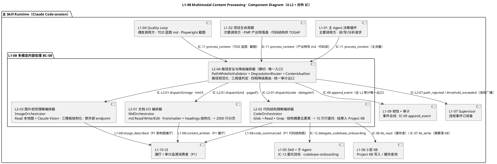
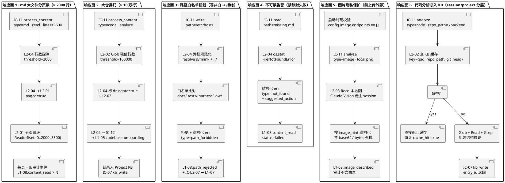
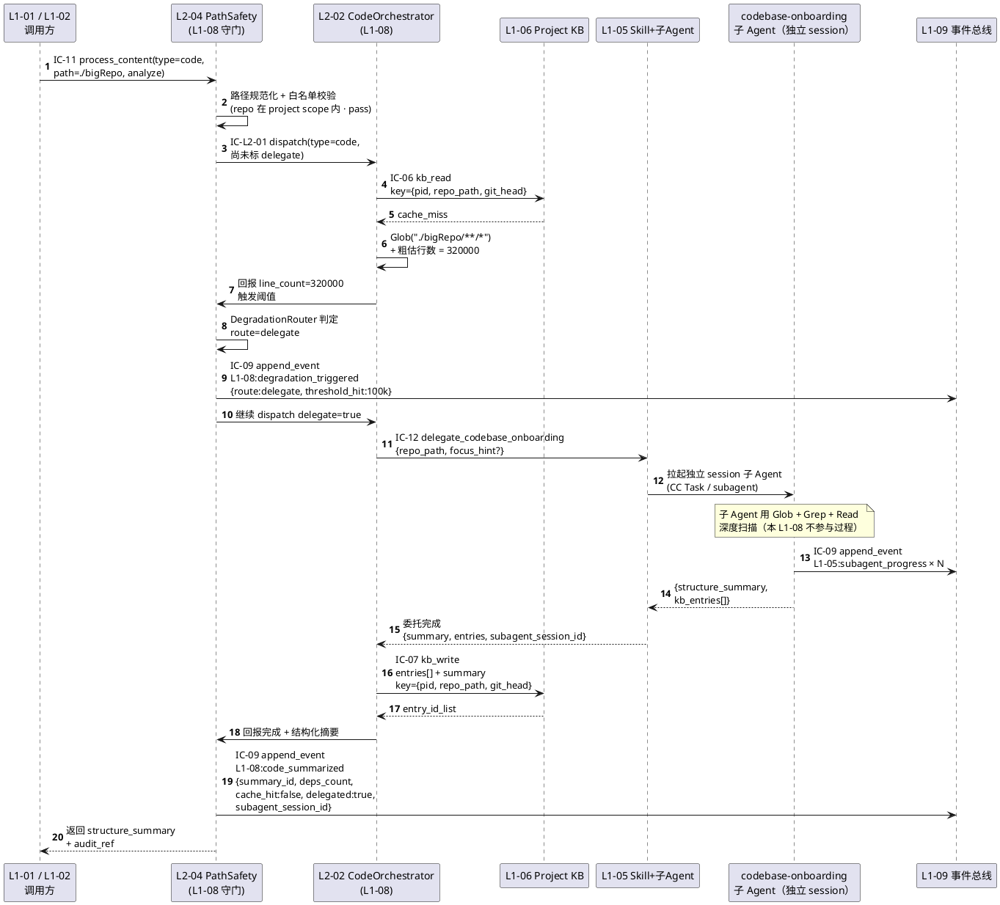
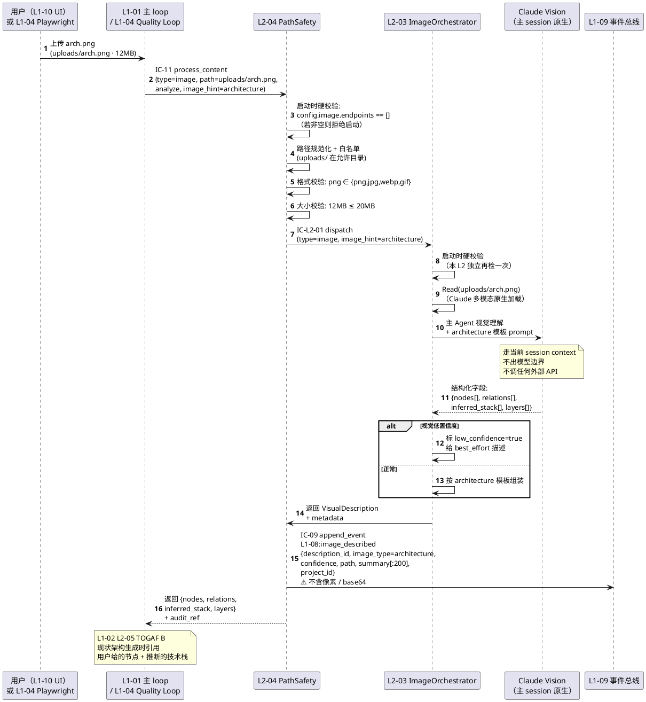
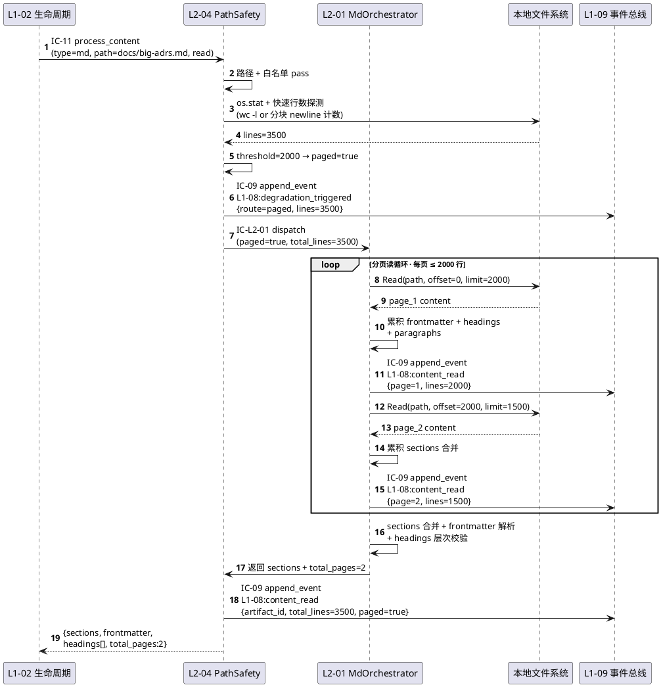
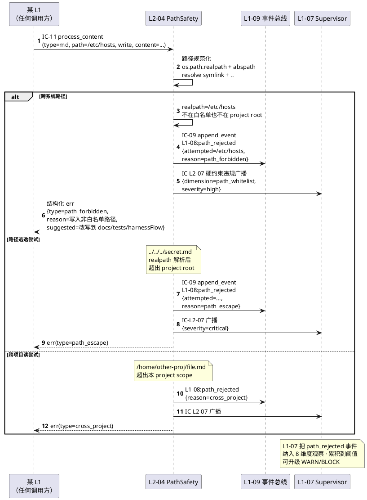
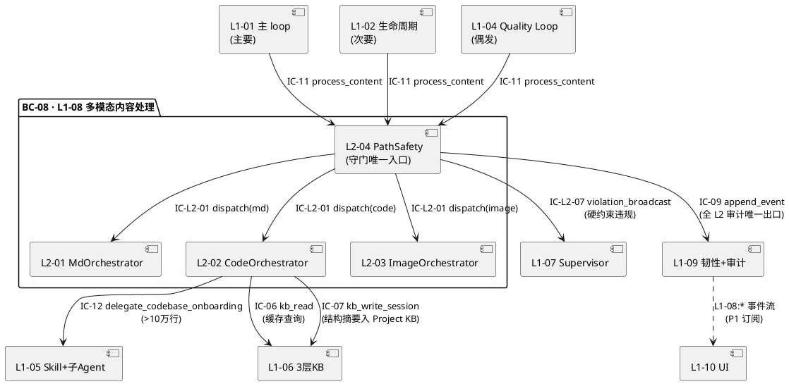

# L1-08 · 多模态内容处理 · 总架构（architecture.md）

> **本文档定位**：本文档是 3-1-Solution-Technical 层级中 **L1-08 多模态内容处理** 的 **总架构文档**，也是 **4 个 L2（文档 I/O 编排器 / 代码结构理解编排器 / 图片视觉理解编排器 / 路径安全与降级编排器）的公共骨架**。
>
> **与 2-prd/L1-08 的分工**：2-prd/prd.md 回答 **产品视角** 的 "这 4 个 L2 各自职责 / 边界 / 禁止 / 义务 / IC 一句话 + 方向"；本文档回答 **技术视角** 的 "在 Claude Code Skill + hooks + jsonl + 本地 FS + Claude Vision 这套物理底座上，4 个 L2 怎么串成一个可运行的 **多模态内容服务**"—— 落到 **守门路径**、**模态分派**、**时序图**、**白名单/降级实现**、**开源调研映射** 五件事。
>
> **与 4 个 L2 tech-design.md 的分工**：本文档是 **L1 粒度的汇总骨架**，给出 "4 L2 在同一张图上的位置 + 跨 L2 时序 + 对外 IC 承担"；每 L2 tech-design.md 是 **本 L2 的自治实现文档**（具体 Read/Glob/Grep 调度算法 / frontmatter 解析器 / 依赖图构建 / Claude Vision 调用参数 / 路径规范化实现），不得与本文档冲突。冲突以本文档为准。
>
> **严格规则**：
> 1. 任何与 2-prd/L1-08 产品 PRD 矛盾的技术细节，以 2-prd 为准；发现 2-prd 有 bug → 必须先反向改 2-prd，再更新本文档。
> 2. 任何 L2 tech-design 与本文档矛盾的 "跨 L2 控制流 / 时序 / IC 字段语义"，以本文档为准。
> 3. 任何技术决策必须给出 `Decision → Rationale → Alternatives → Trade-off` 四段式，不允许堆砌选择。
> 4. 本文档不复述 2-prd/prd.md 的产品文字（职责 / 禁止 / 必须清单等），只做技术映射 + 补齐 "产品视角未说 but 工程师必须知道" 的部分。
> 5. **本 L1 是最简 L1 之一**：无算法内核 / 无复杂状态机 / 无长生命周期聚合 —— 本质就是 "**4 个 L2 = 1 守门 + 3 模态**" 的薄编排层。本文档体量对齐该定位。

---

## 0. 撰写进度

- [x] §1 定位 + 2-prd §5.8 映射（对齐表 + scope/BF/projectModel 锚点）
- [x] §2 DDD 映射（BC-08 Multimodal Content · 引 L0/ddd-context-map.md §2.9）
- [x] §3 L1-08 内部 L2 架构图（Mermaid component · 4 L2 + 对外 IC）
- [x] §4 P0 核心时序图（Mermaid sequence · 大代码库委托 onboarding / 图片视觉理解 · ≥ 2 张 + 横切 md 分页 / 路径拒绝辅助图）
- [x] §5 白名单路径实现 + 四档降级机制（路径规范化 / 阈值判定 / 降级路由）
- [x] §6 Claude Vision 多模态理解实现（三模板 + 本地 Read + 隐私硬约束）
- [x] §7 对外 IC 承担（接收 IC-11 · 发起 IC-12 / IC-06 / IC-07 / IC-09）
- [x] §8 开源最佳实践调研（Unstructured / tree-sitter / ripgrep / Docling / markdown-it-py / Claude Vision · 引 L0 §9）
- [x] §9 与 4 个 L2 tech-design.md 的分工声明
- [x] §10 性能目标（守门开销 / 分页效率 / 视觉延迟 / 大仓估算 / 缓存命中）
- [x] 附录 A · 与 L0 系列文档的引用关系
- [x] 附录 B · 术语速查（L1-08 本地）
- [x] 附录 C · 4 L2 tech-design 撰写模板（下游消费）

---

## 1. 定位与 2-prd L1-08 映射

### 1.1 本文档的唯一命题

把 `docs/2-prd/L1-08 多模态内容处理/prd.md`（产品级 · v0.1 · 1365 行 · 4 L2 详细 + 7 IC-L2 + 6 横切响应面 + 对外 IC 映射）定义的 **产品骨架**，一比一翻译成 **可执行的技术骨架**——具体交付物是：

1. **1 张 L1-08 component diagram**（4 L2 + 对外 IC · Mermaid · §3.1）
2. **1 张 L1-08 横切响应面图**（6 响应面落到技术栈 · Mermaid · §3.2）
3. **4 张 P0 核心时序图**（§4）：
   - **P0-A**：大代码库委托 onboarding（> 10 万行 · 与 L0 sequence-index §3.6 P1-06 对应）
   - **P0-B**：图片视觉理解（用户上传架构图 · 全程本地）
   - **P0-C**（辅）：md 大文件分页读（> 2000 行）
   - **P0-D**（辅）：路径白名单拒绝（写 `/etc/*` 越权）
4. **1 套白名单路径 + 降级机制实现骨架**（§5）——路径规范化 → 阈值判定 → 降级路由四档（direct/paged/delegate/reject）
5. **1 份 Claude Vision 多模态理解实现骨架**（§6）—— Read 本地图 + 主 Agent 视觉 + 按 hint 结构化 + 隐私硬校验
6. **1 张对外 IC 承担矩阵**（§7）——本 L1 接收哪条 / 发起哪几条 / 承担 L2 是谁
7. **1 份开源调研综述**（§8）—— 6 个项目（Unstructured / tree-sitter / ripgrep / Docling / markdown-it-py / Claude Vision）的借鉴 / 弃用
8. **1 份 4 L2 分工声明**（§9）——本 architecture 负责什么 / 每 L2 负责什么
9. **1 张性能目标表**（§10）

### 1.2 与 2-prd/L1-08/prd.md 的映射（精确到小节）

| 2-prd/L1-08/prd.md 章节 | 本文档对应章节 | 翻译方式 |
|---|---|---|
| §1 L1-08 范围锚定（引 scope §5.8 · L1-08 定位"薄编排层"）| §1（本章）+ §7 对外 IC 承担 | 引用锚定，不复述；§7 表格映射产品 IC ↔ 技术 L2 |
| §2 L2 清单（4 个 · 三模态 + 一横切）| §3 L1-08 内部 L2 架构图 + §9 L2 分工 | 落成 component diagram + 分工表 |
| §3 L2 整体架构图 A（主干内容流 ASCII）| §3.1 Mermaid component diagram | ASCII → Mermaid；加 "对外 IC 进出口" |
| §4 L2 整体架构图 B（6 个横切响应面 ASCII）| §3.2 Mermaid 横切响应面图 + §5 白名单/降级章 | 6 响应面 → 1 张统一图 + §5 详细展开 |
| §5 L2 间业务流程（6 条 · 流 A-F）| §4 时序图 + §6 跨 L2 控制流附表 | 6 流里 P0 的 3 条画成时序图（流 E 大仓委托 / 流 F 图片视觉 / 流 C md 分页）+ 流 D 代码小仓归横切 |
| §6 IC-L2 契约清单（7 条 · 一句话 + 方向）| §7 对外 IC 承担 + §9 L2 分工 | IC-L2-01..07 全量映射到 L2 owner |
| §7 L2 定义模板（9 小节）| §9 L2 分工声明 + 附录 C 下游模板 | 给 4 L2 tech-design 的撰写模板 |
| §8-§11 L2-01..L2-04 详细（9 小节每 L2）| 不在本文档展开 | 落到各 L2 tech-design.md（本文档只画入口 + 出口） |
| §12 对外 scope §8 IC 映射（IC-11 接收 · IC-12/06/07/09 发起）| §7 对外 IC 承担（本文档镜像重绘）| 原矩阵图 + 新增 "接收/发起/路由" 三维 |
| §13 retro 位点（11 项）| 本文档不涉 | 归产品 PRD 自身；本文档只做技术实现 |
| 附录 A/B（术语 / BF 映射）| 附录 B（术语） | 本文档重引 L0 术语，避免双写 |

### 1.3 与 scope.md §5.8 的映射

| scope §5.8 锚点 | 本文档落实位置 |
|---|---|
| §5.8.1 职责（多模态内容理解 · 读写 md / 读代码结构 / 读图片） | §3.1 component diagram + §5/§6 实现骨架 |
| §5.8.2 输入/输出（三类请求 + 用户上传图片 → 结构化 sections / 模板 md / 结构摘要 / 图片结构化描述）| §6 跨 L2 控制流 + §7 对外 IC |
| §5.8.3 边界（In：md I/O / 分页 / 代码扫描 / 图片视觉 / > 10 万行委托；Out：代码生成 / AST 深度 / 图片生成 / PDF / OCR / 代码重构）| §5 降级机制 + §6 Vision + §9 L2 分工 |
| §5.8.4 约束（PM-08 审计 + 3 硬约束：2000 行分页 / 10 万行委托 / 路径白名单）| §5 白名单 + 降级 + §10 性能目标 |
| §5.8.5 🚫 禁止行为（6 条 · 禁改用户源代码 / 禁写非 docs 等 / 禁上传外部 / 禁执行代码 / 禁原始图片外抛 / 禁跨项目）| §5.3 路径白名单 + §6.3 隐私硬校验 |
| §5.8.6 ✅ 必须义务（6 条 · 每次读写落事件 / 大文件必分页 / 图片必结构化 / 代码必入 KB / 不可读必告警 / 大仓必委托）| §5 + §6 + §7 + §10 分散对齐 |
| §5.8.7 与其他 L1 交互（L1-01/02/04/05/06/09/10）| §7 对外 IC 承担 |
| §8.2 对外 IC 契约（IC-11 接收 · IC-12/06/07/09 发起）| §7 对外 IC 承担矩阵（全量） |

### 1.4 与 projectModel/tech-design.md 的关系（PM-14 硬约束）

2-prd 开篇 **PM-14 项目上下文声明** 硬性要求：**所有多模态素材（图片 / 代码结构摘要 / md 文档）按 `harnessFlowProjectId` 隔离缓存**——避免跨项目素材污染：
- project-foo 的图片识别结果不进入 project-bar 的 KB
- 代码结构摘要按 `project_id + repo_path + git_head` 作 cache key
- md 读写路径受 project 根目录限定

本文档的技术落实点：

| PM-14 要求 | 本 L1 落实 L2 | 本文档章节 |
|---|---|---|
| L2-04 路径规范化时以 `harnessFlowProjectId` 对应 project 根目录 为 scope 边界 | L2-04 | §5.1 路径规范化 + §5.3 白名单 |
| L2-02 KB 缓存 key 含 project_id（`{project_id, repo_path, git_head}`）| L2-02 | §5.4 代码仓委托决策 + §7 IC-06/07 |
| L2-03 图片视觉描述审计事件含 project_id（每次 Vision 调用都带）| L2-03 | §6.4 审计要素 |
| 全 4 L2 的审计事件（IC-09 append_event）必填 `project_id` 根字段 | L2-04 审计出口 | §7.2 IC-09 发起 |

**本 L1 不持有任何跨 project 的单例聚合**——所有聚合（ContentArtifact / CodeStructureSummary / VisualDescription / PathWhitelistValidator）都在单 project 实例内创建和销毁。

---

## 2. DDD 映射（BC-08 Multimodal Content Processing）

### 2.1 Bounded Context 定位

本 L1 对应的 Bounded Context 在 `L0/ddd-context-map.md §2.9 BC-08 Multimodal Content Processing`，已明确：

**BC 名**：`BC-08 · Multimodal Content Processing`
**一句话定位**：项目的"文档 + 代码 + 图片读写器"—— md/code/图片的多模态 IO + 路径安全 + 大文件降级。
**BC 角色**：**Supplier**（被 BC-01 / BC-02 / BC-04 消费其 process_content 能力 · 同时作为 Customer 去 BC-05 委托大仓 onboarding）。

**与其他 BC 的关系**（引自 L0/ddd-context-map.md §2.9 "跨 BC 关系"一节）：

| 对方 BC | 关系模式 | 本 L1 视角 |
|---|---|---|
| BC-01（Agent Decision Loop · L1-01）| **Supplier**（响应 IC-11 process_content） | L2-04 作为唯一入口接收 IC-11；把 md/code/image 结构化产物回给 BC-01 主 loop |
| BC-02（Project Lifecycle · L1-02）| **Supplier**（L2-01 写 PMP/TOGAF 产出物 md；L2-02 供代码结构摘要给 TOGAF C/D）| L2-01/L2-02 响应来自 L1-02 的 IC-11 |
| BC-04（Quality Loop · L1-04）| **Supplier**（L2-01 写 TDD 蓝图 md · 读 verifier_report · L2-03 消费 Playwright 截图）| L2-01 + L2-03 响应 IC-11 |
| BC-05（Skill + Subagent · L1-05）| **Customer**（通过 IC-12 委托 codebase-onboarding 子 Agent）| L2-02 发起 IC-12 对大代码仓降级 |
| BC-06（3 层 KB · L1-06）| **Supplier of data**（L2-02 写代码结构摘要到 Project KB · 读 KB 缓存）| L2-02 双向交互（IC-06/07）|
| BC-09（Resilience & Audit · L1-09）| **Partnership**（任何 I/O 必经 IC-09 append_event · 同步演进 schema）| L2-04 是 Partnership 的唯一审计出口 |
| BC-07（Supervision · L1-07）| **Publisher**（硬约束违规时广播事件 · 但不直接发 IC-15；由 L2-04 写硬约束违规事件让 supervisor 观察）| L2-04 广播违规事件，让 L1-07 按 8 维度自主判定 |

### 2.2 本 L1 内部的聚合根（Aggregate Roots）

引自 `L0/ddd-context-map.md §2.9` BC-08 的主要聚合根表（第 455-461 行），落到 4 L2 的映射：

| 聚合根 | 内部 entity + VO | 一致性边界 | 所在 L2 |
|---|---|---|---|
| **ContentArtifact**（md 类） | artifact_id(VO) / type=md(VO) / path(VO) / size_bytes(VO) / lines(VO) / hash(VO) / sections(entity[frontmatter + headings + paragraphs])  | 单次请求强一致；不跨请求存活 | **L2-01 文档 I/O 编排器** |
| **CodeStructureSummary** | summary_id(VO) / repo_path(VO) / git_head(VO) / language_list(VO[]) / framework(VO) / entry_files(VO[]) / deps_graph(entity) / patterns(VO[]) | 产出后 immutable，写 Project KB 后供复用 | **L2-02 代码结构理解编排器** |
| **VisualDescription** | description_id(VO) / image_path(VO) / image_type(VO: arch/ui_mock/screenshot) / structured_fields(entity) / confidence(VO) | 单次视觉请求强一致；不入 KB，短寿命 | **L2-03 图片视觉理解编排器** |
| **PathValidationRequest + DegradationDecision** | path(VO) / action(VO) / project_root(VO) / whitelist(VO[]) / thresholds(VO{md_lines, code_lines, img_size}) / route(VO: direct/paged/delegate/reject) | 单次请求强一致；不持久化 | **L2-04 路径安全与降级编排器** |

**关键不变量**（Invariants · 引自 BC-08 §2.9）：

1. **I-01 内容不跨项目**：每 ContentArtifact / CodeStructureSummary / VisualDescription 的 `project_id` 字段不可变；跨 project 的请求必须是独立实例。
2. **I-02 CodeStructureSummary 缓存 key 唯一**：`{project_id, repo_path, git_head}` 三元组唯一确定一条摘要；命中即跳过重分析。
3. **I-03 VisualDescription immutability**：description_id 生成后不可修改；图片本身不入 KB，描述仅随当次响应返回。
4. **I-04 PathValidationRequest 单点网关**：所有 IC-11 请求必产生一条 PathValidationRequest；未经 L2-04 校验的请求一律拒绝分派。

### 2.3 Domain Service / Application Service

引自 L0/ddd-context-map.md §2.9 BC-08 的 service 表：

| Service 名 | 类型 | 职责 | 所在 L2 |
|---|---|---|---|
| `MdOrchestrator` | **Application Service** | Read/Write/Edit 三类动作编排 + frontmatter/headings 解析 + 分页读循环 + 写后复检 | L2-01 |
| `CodeOrchestrator` | **Application Service** | Glob 扫目录 + Read 入口 + Grep 关键模式 + 结构摘要组装 + KB 缓存查写 | L2-02 |
| `ImageOrchestrator` | **Application Service** | Read 图片 + Claude Vision 调用 + 按 hint 模板结构化 + 隐私硬校验 | L2-03 |
| `PathWhitelistValidator` | **Domain Service** | 路径规范化 + 白名单比对 + 跨项目拦截 | L2-04 |
| `DegradationRouter` | **Domain Service** | 三阈值判定（md 行数 / code 行数 / image 大小） + 四档路由决策（direct/paged/delegate/reject） | L2-04 |
| `ContentAuditor` | **Application Service** | 每次 I/O 的审计事件组装（path + size + hash + 结果摘要）+ IC-09 出口统一 | L2-04 |

### 2.4 Repository Interface

本 L1 作为 **薄编排层**，**自身不持有任何持久化聚合**：

- **L2-01 md**：只是 Read/Write 工具的场景封装 · md 落盘后由 git / 用户文件系统拥有 · 本 L2 不持 Repository
- **L2-02 code**：代码结构摘要持久化到 **BC-06 Project KB**（通过 IC-06/07）· 本 L2 不自建 Repository，仅维护内存级 LRU 缓存
- **L2-03 image**：图片视觉描述不入 KB · 短寿命消耗 · 无持久化
- **L2-04 path safety**：白名单 + 阈值配置为启动时从 `harnessFlow/config.yaml` 读入的只读常量 · 无运行时状态

**所有持久化必经 `L1-09 Resilience & Audit BC`** 的 IC-09 append_event 接口（由 L2-04 `ContentAuditor` 统一承担）。

### 2.5 Domain Events（本 BC 对外发布）

引自 L0/ddd-context-map.md §2.9 BC-08 对外发布表（第 984-989 行）：

| 事件名 | 触发时机 | 订阅方 | Payload |
|---|---|---|---|
| `L1-08:content_read` | md / code / image 读完 | L1-07 supervisor / L1-10 UI | `{artifact_id, type, lines_or_size, project_id}` |
| `L1-08:content_written` | md 写完（含 write + edit）| L1-07 / L1-10 / L1-02（知会产出物落盘）| `{artifact_id, path, size, hash, project_id}` |
| `L1-08:code_summarized` | 代码结构摘要产出 | L1-07 / L1-10 / L1-02 / L1-01 | `{summary_id, repo_path, deps_count, cache_hit, delegated, project_id}` |
| `L1-08:image_described` | 图片视觉理解产出 | L1-07 / L1-10 | `{description_id, image_type, confidence, project_id}` |
| `L1-08:path_rejected` | 白名单拒绝（写非白 / 读跨项目 / 路径逃逸）| L1-07 supervisor（硬约束违规）/ L1-10 | `{attempted_path, reason: path_forbidden/path_escape/cross_project, project_id}` |
| `L1-08:degradation_triggered` | 大文件降级（分页 / 委托）| L1-07 / L1-10 | `{artifact_id, route: paged/delegate, threshold_hit, project_id}` |

**全部事件共享字段**：`project_id`（PM-14 硬约束）+ `ts`（纳秒级单调递增）+ `hash`（sha256 链式，防篡改 · 与 L1-09 事件总线对齐）。

**事件 naming convention**：所有 BC-08 发布的事件以 `L1-08:` 前缀，subtype 为动词过去时或被动态，与 L0/tech-stack.md §A.2 事件 type 前缀规范一致。

---

## 3. L1-08 内部 L2 架构图

### 3.1 Component Diagram（4 L2 + 对外 IC）

**本图回答**：L1-08 内部 4 个 L2 在 Claude Code session 里的 **部署位置 + 调用方向 + 对外 IC 入出口**。与 2-prd/prd.md §3 图 A（ASCII 主干内容流）一一对应。



**关键技术决策**（Decision → Rationale → Alternatives → Trade-off）：

| 决策 | 选择 | 理由 | 备选方案弃用原因 |
|---|---|---|---|
| **L2-04 唯一入口** | 全 IC-11 必经 L2-04 · 禁绕道直调模态 L2 | 路径校验 + 阈值判定 + 审计 三件事必须集中，否则每个模态 L2 都要独立实现 · 代码重复 + 不一致风险 | 模态 L2 自守门：每 L2 重复实现白名单 · 审计漏记 · 维护成本高 |
| **模态 L2 三分（md/code/image）** | 按内容模态切分，不按操作切分 | 三模态的工具链差异大：md 纯文本 Read/Write · code 需 Glob+Grep · image 需 Claude Vision；按操作切（read/write/analyze）会让三模态耦合 | 按操作切分：每个操作 L2 都要 switch-case 三模态，内聚低 |
| **L2-04 既守门也审计**（合并 Validator + Auditor） | 同一 L2 既做路径校验也做审计 | 守门失败要审计"拒绝"事件 · 守门成功要审计"通过"事件 · 必定同一责任点 | Validator + Auditor 分 L2：会让 "审计链路" 分散，每次请求要经两个独立 L2 |
| **不持久化 VisualDescription** | image 结构化描述随当次响应返回，不入 KB | 图片短寿命（Playwright 截图、用户一次上传）· 入 KB 会膨胀 · 同一图片的理解应每次新鲜跑（避免陈旧描述）| 图片入 KB：scope §5.8.6 必须义务 4 只要求代码入 KB；图片入 KB 造成 KB 膨胀 |
| **缓存 key 含 git_head** | CodeStructureSummary 的 Project KB 缓存 key = `{project_id, repo_path, git_head}` | git_head 变化意味着代码变了 · 必须重新分析；不含 git_head 会返回陈旧摘要 | 仅用 repo_path：代码变了还命中旧缓存，违反 I-02 不变量 |

### 3.2 横切响应面图（6 响应面落到技术栈）

**本图回答**：2-prd/prd.md §4 图 B 的 6 个横切响应面，各自落到哪些技术栈元素（文件 / 工具 / 阈值 / 审计事件）。



**横切响应面小结**：
- 响应面 1-2 是 "**大体量降级**" 路径（分页 / 委托）· 落到 §5 降级机制
- 响应面 3-5 是 "**安全守门**" 路径（路径 / 不可读 / 隐私）· 落到 §5 白名单 + §6 Vision 隐私
- 响应面 6 是 "**KB 持久化 + 缓存**" 路径（仅代码）· 落到 §5.4 代码仓委托决策

---

## 4. P0 核心时序图

本节给出 **4 张 P0 时序图**。前 2 张是任务要求的 **必须 ≥ 2 张主干图**（大代码库委托 onboarding / 图片视觉理解），后 2 张是辅助横切图（md 大文件分页 / 路径白名单拒绝），合起来覆盖 L1-08 最关键的 4 个场景。

### 4.1 P0-A · 大代码库委托 onboarding（> 10 万行 · 对应 L0 §3.6 P1-06）

**场景一句话**：brownfield 项目接入，代码 > 10 万行 → L2-04 守门 + L2-02 Glob 粗估触发 delegate=true → L2-02 经 IC-12 委托 L1-05 独立 session 子 Agent → 返回 structure_summary + kb_entries → L2-02 写 Project KB → 返回给调用方 → 全程审计。

**触发上下文**：L1-01 Brownfield 首轮决策 / L1-02 S1 章程起草时需要 "看懂现有代码"。

**端到端延迟预期**：5-15 分钟（委托子 Agent 本身 3-10 分钟 + 守门 ≤ 5s + KB 写 ≤ 2s）。



**关键技术决策**：

| 决策 | 选择 | 理由 | 备选方案弃用原因 |
|---|---|---|---|
| 粗估行数由 L2-02 自己做，L2-04 不做 | L2-04 只做 "文件大小 / 路径" 粗判 · 行数精细估算由 L2-02 | L2-04 应保持 "薄守门"，不碰内容；行数估算需 Glob 递归，是 L2-02 已有能力 | L2-04 粗估：Glob 两次（L2-04 一次 + L2-02 内部又一次）· 浪费 IO |
| 委托先行 · KB 写后行 | 先拿到子 Agent 结果再写 KB | 子 Agent 可能失败 · 提前写 KB 会留下半成品 | 预占位：需要二阶段提交，复杂 |
| 审计 delegated=true 字段 | 审计事件必须标明是否委托、子 Agent session id | 便于 Supervisor 观察 "委托频次"；便于跨 session 追溯 | 不记委托字段：审计无法回答 "这次分析用了多少子 Agent 成本" |
| cache key 含 git_head | Project KB 缓存 key 用 `{pid, repo_path, git_head}` | 代码变 = git_head 变 = 缓存失效；不含 git_head 会返回陈旧摘要 | 仅 repo_path：代码修改后命中旧缓存，摘要失效 |

### 4.2 P0-B · 图片视觉理解（全程本地 · 禁外部）

**场景一句话**：L1-01 接收到用户上传的架构图（或 L1-04 Playwright 截图）→ IC-11 → L2-04 校验（路径 + 格式 + 大小）+ 分派 L2-03 → L2-03 本地 Read 图 + Claude Vision 原生理解 + 按 image_hint 结构化模板产描述 → 审计（不含像素）→ 返回。

**触发上下文**：
- L1-01 首轮决策：用户在 UI 上传 `uploads/architecture-as-is.png`
- L1-04 S5 Quality Loop：Playwright 抓 screenshot 作验证证据

**端到端延迟预期**：10-20 秒（Claude Vision 调用 8-15s + 守门 ≤ 500ms + 审计 ≤ 100ms）。



**关键技术决策**：

| 决策 | 选择 | 理由 | 备选方案弃用原因 |
|---|---|---|---|
| Claude Vision 原生 · 禁任何外部视觉 API | 全部视觉走 Claude 多模态（主 session 内 content block）| scope §5.8.5 禁止 3 "禁图片上传外部"；Claude Vision 走 CC 平台代管的 LLM，不出 HarnessFlow 边界 | 外部 OCR API（Tesseract SaaS 等）：隐私泄露；额外 HTTPS 出站；违反 §2.2 "永不绑 0.0.0.0 + 不发起出站" |
| 三 hint 模板（arch/ui_mock/screenshot）穷举 | V1 只支持这三类 · 其他默认降级 screenshot | 三类覆盖 80% 场景（架构图 / UI mock / 错误截图）· 新增需走 scope 变更 | 任意 hint：模板爆炸 · 维护成本高 |
| 启动时硬校验 endpoint 配置 | L2-04 + L2-03 启动时各校验一次 config.image.endpoints | 防运维误配 · 二次校验冗余但代价几乎为零 · 双保险 | 仅一次：万一某次改配置失效，整条隐私硬约束失守 |
| 审计不记像素 | 审计事件只含 path + hint + 描述摘要（前 200 字）| scope §5.8.6 必须义务 1 要求审计；像素入审计会撑爆 jsonl · 且泄露隐私 | 记完整像素：审计日志 MB 级 · 超 L1-09 性能预算 |

### 4.3 P0-C（辅）· md 大文件分页读（> 2000 行）

**场景一句话**：L1-02 TOGAF 生成时读取一份大 ADR 合集 → L2-04 行数探测 > 2000 行 → 标 paged=true 分派 L2-01 → L2-01 按 2000 行一页循环 Read → 累积结构化 sections → 每页一条审计 → 返回合并结果。

**端到端延迟预期**：3-10 秒（每页 Read ≤ 1s + 结构化累积 ≤ 100ms × N 页）。



### 4.4 P0-D（辅）· 路径白名单拒绝（写非白 → 硬拒）

**场景一句话**：某 L1 试图写 `/etc/hosts`（或 `../../secret.md` 路径逃逸）→ L2-04 路径规范化 resolve 后发现越权 → 直接拒绝 + 结构化 err + 审计违规事件 + IC-L2-07 广播让 L1-07 supervisor 观察。

**端到端延迟预期**：≤ 200ms（路径规范化 ≤ 10ms + 审计 ≤ 100ms + 拒绝 err 组装 ≤ 50ms）。



---

## 5. 白名单路径实现 + 四档降级机制

本节是 **L2-04 的技术实现骨架**（作为 BC-08 的守门神经中枢）。

### 5.1 路径规范化（Path Normalization）

**核心责任**：把用户提交的原始 path 字符串转成 **可比对的绝对路径 canonical form**，防 path traversal / symlink 逃逸。

**技术实现骨架**：

1. **Step 1** · 原始 path 用 `os.path.expanduser` 展开 `~`（若有）
2. **Step 2** · `os.path.abspath(path)` 转绝对路径（相对路径相对 `project_root`）
3. **Step 3** · `os.path.realpath(path)` resolve symlink 到真实物理路径
4. **Step 4** · 把 realpath 与 `project_root` 做 `os.path.commonpath` 比对——若 commonpath ≠ project_root，则 **跨项目或跨系统**，直接拒绝
5. **Step 5** · 若在 project_root 内，继续进入白名单 / 阈值判定

**边界 case 处理**：

| case | 处理 |
|---|---|
| 路径含 `..` / `./` / 冗余 `/` | Step 2 `abspath` 会标准化 |
| 符号链接指向项目外（如 `docs/link → /etc/passwd`）| Step 3 `realpath` 解析真实路径后 Step 4 拦截 |
| 跨驱动器盘符（Windows `C:` vs `D:`）| Step 4 `commonpath` 会抛异常或返回空，视为跨项目 |
| 路径中含 Unicode / 特殊字符 | Python `os.path` 原生支持 · 无需额外处理 |
| 路径为 None / 空字符串 | L2-04 前置校验：返回 `err(type=invalid_path)` |
| Windows 长路径 (> 260 chars) | V1 不保证，记为 known limitation |

**性能预算**：路径规范化 ≤ 10ms（纯内存 + 一次 stat 调用）。

### 5.2 白名单配置模型

**配置源**：`$HARNESSFLOW_WORKDIR/config.yaml`（启动时一次性读入，**不可运行时热改** · scope §5.8.5 禁止 "运行时 bypass"）。

**字段**（文字描述 · 具体 YAML schema 迁到 L2-04 tech-design）：

| 字段 | 类型 | 默认 | 含义 |
|---|---|---|---|
| `content.write_whitelist` | `string[]` | `["docs/", "tests/", "harnessFlow/"]` | 允许写入的路径前缀（相对 project_root） |
| `content.read_scope` | `string` | `project_root` | 允许读的最大范围；project_root 内任何路径均可读 |
| `content.image.upload_dirs` | `string[]` | `["uploads/", ".harnessFlow/tmp/"]` | 图片允许的特殊目录（用户上传 / Playwright 截图） |
| `content.image.endpoints` | `string[]` | `[]` | **必须为空**；非空即拒绝启动（scope §5.8.5 禁止 3） |
| `content.md.paged_threshold` | `int` | `2000` | md 分页阈值（行）|
| `content.code.delegate_threshold` | `int` | `100000` | 代码委托阈值（行） |
| `content.image.max_size_mb` | `int` | `20` | 图片单文件大小上限 |
| `content.image.formats` | `string[]` | `["png","jpg","webp","gif"]` | 支持格式 |

**启动校验**：L2-04 `__init__` 时强校验 `content.image.endpoints == []`，否则抛启动异常 + 审计 `L1-08:external_endpoint_blocked`。

### 5.3 白名单比对（Whitelist Matching）

**算法骨架**：

1. **读操作**：path_normalized ∈ project_root → pass；否则 reject(cross_project)
2. **写操作**：path_normalized 必须满足 `any(path.startswith(project_root + "/" + w) for w in write_whitelist)` → pass；否则 reject(path_forbidden)
3. **图片 analyze 操作**：path_normalized 必须满足 读范围内 AND (project_root 内 OR path 在 `image.upload_dirs` 内) → pass

**审计字段**（写入 `L1-08:path_rejected` 事件）：

| 字段 | 含义 |
|---|---|
| `attempted_path` | 规范化前的用户原始字符串（方便追溯意图） |
| `canonical_path` | 规范化后的 realpath |
| `reason` | `path_forbidden` / `path_escape` / `cross_project` / `invalid_path` |
| `caller_l1` | 触发方 L1（便于定位哪个 L1 频繁违规） |
| `project_id` | PM-14 必填 |

### 5.4 四档降级路由（Degradation Router）

**决策树**（伪代码 · 落实到 L2-04 `DegradationRouter`）：

```
输入: PathValidationRequest(path, action, type, size?, lines?)
输出: DegradationDecision(route, metadata)

1. 若 path 校验失败 → route = REJECT, reason = <具体原因>
2. 若 action = read AND type = md AND lines > md.paged_threshold → route = PAGED
3. 若 action = analyze AND type = code AND lines_estimate > code.delegate_threshold → route = DELEGATE
4. 若 action = analyze AND type = image AND size_bytes > image.max_size_mb * 1024 * 1024 → route = REJECT(size_exceeded)
5. 若 action = analyze AND type = image AND format NOT IN image.formats → route = REJECT(format_unsupported)
6. 若 文件 stat 失败（不存在 / 权限拒绝 / 是目录而非文件）→ route = REJECT(not_found/permission_denied/not_a_file)
7. 若 type=md 但扩展名非 .md AND action=read → route = REJECT(type_mismatch)
8. 否则 → route = DIRECT
```

**四档路由的下游行为**：

| route | L2-04 行为 | 下游 L2 行为 |
|---|---|---|
| `DIRECT` | IC-L2-01 dispatch 不带 paged/delegate 标 | 模态 L2 正常 Read/Write |
| `PAGED` | IC-L2-01 带 `paged=true, total_lines=N` | L2-01 分页循环 |
| `DELEGATE` | IC-L2-01 带 `delegate=true` | L2-02 走 IC-12 委托 |
| `REJECT` | 不 dispatch · 直接 IC-L2-06 返回结构化 err | —— |

**L2-02 行数精估**（route=DELEGATE 判定依赖）：

- L2-04 做 "粗估"（文件数 × 平均行数 / stat 汇总）· ≤ 5s
- L2-02 接收后做 "精估"（Glob 所有代码文件 + 并发 `wc -l`）· 若精估 < 10 万行则走 DIRECT 路径（L2-04 的粗估阈值可能误判）· 若 ≥ 10 万行确认委托

**决策回流**：若 L2-02 精估与 L2-04 粗估不一致（如粗估 120k 但精估 80k），L2-02 反向更新 L2-04 的 DegradationDecision 走 DIRECT。此时审计事件同时记录粗估和精估值。

### 5.5 不可读告警（Non-Silent Failure）

**scope §5.8.6 必须义务 5** 硬要求：**不可读必告警 · 禁止静默失败**。

**技术实现**：L2-04 在路径规范化通过后调 `os.stat(canonical_path)` 精确区分失败原因：

| `errno` / 异常 | err type | 返回的 suggested_action |
|---|---|---|
| `FileNotFoundError` / `ENOENT` | `not_found` | "确认路径是否正确，或检查 project root 配置" |
| `PermissionError` / `EACCES` | `permission_denied` | "检查文件权限或 chown 配置" |
| `IsADirectoryError` / `EISDIR` | `not_a_file` | "目标是目录，请传文件路径或调整 action" |
| 文件存在但二进制（UTF-8 解码失败）且 type=md | `binary_unsupported` | "md 不支持二进制内容；图片请用 type=image" |
| 文件存在但扩展名不符（`.pdf` when type=md）| `type_mismatch` | "文件扩展名与请求 type 不匹配，请修正 type" |

**每种失败都必须**：
1. 返回结构化 err（而非抛 Python exception 给调用方）
2. 审计事件 `L1-08:content_read` + `status=failed` + err_type
3. 若连续 N 次同类失败 → IC-L2-07 广播 L1-07（防脚本错误持续消耗 token）

---

## 6. Claude Vision 多模态理解实现

本节是 **L2-03 的技术实现骨架**。核心原则：**全程本地 + 禁外部 + 必结构化**。

### 6.1 调用通道：Claude Vision 原生（LLM in-loop）

**来源**：Claude 3.5+ / Claude 4+ 原生支持图像输入（见 L0 open-source-research §9.2）· HarnessFlow 作为 Claude Code Skill，主 session 本身就在 Claude 宿主进程里，调用 Vision 等同于 "在 prompt 里塞一个 image content block"。

**技术细节**（L2-03 内部实现）：

1. `Read(image_path)` 加载图片为 Claude Code 工具可消费的 image content block
2. 主 Agent 在当前 session context 内用 "视觉 + 文本" 混合 prompt 理解图片
3. 视觉结果 **不走出 Claude Code 平台代管的 LLM 调用**（见 L0 architecture-overview §1.1 System Context）——图像数据不经任何 HarnessFlow 自己的网络连接

**关键不变量**（I-Vision）：

- **I-V-01** · L2-03 禁止任何形式的 `requests.post(external_url, files=image)`
- **I-V-02** · L2-03 禁止把 image content block 传给子 Agent（子 Agent 另起 session · 也是 Claude 代管但要走 IC-12 / IC-05 通道，本 V1 图不委托）
- **I-V-03** · L2-03 返回值 schema 中 `structured_fields` 必须是纯文本字段 · 不含 `image_bytes` / `image_base64` / `pixels[]`

### 6.2 三模板结构化（image_hint Dispatch）

**三类 hint 枚举**（V1 穷举）：

| hint | 模板字段（技术实现需产出这些字段）| 适用场景 |
|---|---|---|
| `architecture` | `nodes[]`（节点列表）、`relations[]`（节点间关系 · source/target/label）、`inferred_stack[]`（推断的技术栈 · 基于节点名称）、`layers[]`（层次分组） | 架构图 · C4 图 · 系统关系图 |
| `ui_mock` | `layout`（整体骨架 · 行列结构）、`components[]`（组件清单 · 按相对位置）、`interaction_points[]`（按钮 / 输入框 / 链接）、`color_palette_summary`（配色风格） | UI mock · 原型图 · 设计稿 |
| `screenshot` | `page_state`（当前页面状态 · 如 loading/error/normal）、`visible_text_excerpt`（可见文本摘录）、`error_signals[]`（红色告警 / 异常弹窗 / stacktrace）、`timestamp_if_visible` | 运行时截图 · Playwright 截图 · 错误页面 |

**Hint 启发式推断**（当调用方未提供）：

| 视觉特征 | 推断 hint |
|---|---|
| 有矩形框 + 箭头连接 · 节点标签 | `architecture` |
| 有按钮 / 输入框 / 表单元素 | `ui_mock` |
| 有浏览器 chrome / URL bar / 网页内容 | `screenshot` |
| 以上都不匹配 | 默认 `screenshot`（最保守） |

**推断失败不阻塞**：即使推断错（如把架构图判为 screenshot），也产出 screenshot 模板的结构化字段 · 不失败 · 在 metadata 标 `hint_inferred=true` 供 UI 提示用户。

**推断延迟预算**：≤ 2s（启发式用视觉特征快速判断 · 不重新做 full analysis）。

### 6.3 隐私硬约束技术落实（Privacy Hard-Enforcement）

**scope §5.8.5 禁止 3 "禁图片上传外部"** + **禁止 5 "禁原始二进制外抛"** 是隐私硬红线。

**三层防御**：

| 层 | 防御点 | 检查时机 |
|---|---|---|
| 1 · 启动时 | 扫 `config.image.endpoints` 非空 → 拒绝启动 | L2-04 + L2-03 `__init__` |
| 2 · 运行时入口 | 每次 IC-L2-01 dispatch 到 L2-03 前，L2-04 再校验 endpoints 仍为空 | 每次 IC-11 | 
| 3 · 运行时出口 | L2-03 返回值 `structured_fields` schema 白名单校验（只允许预定义的纯文本字段） | 每次 return |

**防御 3 的 schema 白名单示例**（落到 L2-03 tech-design）：
- `architecture`: `{nodes: string[], relations: object[], inferred_stack: string[], layers: string[]}`
- `ui_mock`: `{layout: string, components: object[], interaction_points: object[], color_palette_summary: string}`
- `screenshot`: `{page_state: string, visible_text_excerpt: string, error_signals: string[], timestamp_if_visible: string?}`
- **禁止字段**：`image_bytes` / `image_base64` / `pixels` / `raw_data` / 任何 `bytes` 类型

若校验未通过（如 schema 含 `image_base64` 字段），`L2-03` 抛内部异常 · 走 IC-L2-06 返回 `err(type=privacy_violation)` · 同时 IC-L2-07 广播给 L1-07 升级 WARN/BLOCK。

### 6.4 审计要素（不含像素）

**L1-08:image_described 事件 payload**（由 L2-04 `ContentAuditor` 组装）：

| 字段 | 含义 | 是否允许 |
|---|---|---|
| `description_id` | 唯一 id（uuid） | ✅ |
| `image_path` | 规范化后的本地路径 | ✅ |
| `image_type` / `hint` | `architecture` / `ui_mock` / `screenshot` | ✅ |
| `hint_inferred` | 是否是启发式推断（vs 调用方显式提供） | ✅ |
| `confidence` | 视觉理解置信度（high / medium / low） | ✅ |
| `summary_excerpt` | 描述摘要的前 200 字 | ✅ |
| `node_count` / `component_count` / `signal_count` | 结构化字段数量统计 | ✅ |
| `file_size_bytes` / `resolution_wh` | 图片元数据（供供统计 · 不是像素本身） | ✅ |
| `project_id` | PM-14 必填 | ✅ |
| 🚫 `image_bytes` / `base64` / `pixels[]` | 原始二进制 | ❌ 禁止 |
| 🚫 完整描述正文（超 200 字的部分） | 降低审计日志膨胀 | ❌ 禁止 |

### 6.5 低置信度处理（Low-Confidence Image）

**场景**：图片视觉模糊、手写潦草、抽象艺术等情况，Claude Vision 无法产出有意义的节点 / 组件。

**处理路径**：

1. L2-03 在 Vision 调用后做 self-check：若 `nodes.length == 0 AND components.length == 0 AND signals.length == 0` → 标 `confidence=low`
2. 返回 `{low_confidence: true, best_effort_summary: "我看到了 <一句话>"}` 而非硬编
3. 审计标 `confidence=low` · L1-07 supervisor 观察 "low_confidence 率" 维度（若 > 30% → WARN "视觉能力下降"）
4. 用户可在 L1-10 UI 看到 low_confidence 标签 · 自行决定是否重新上传更清晰的图

**禁止**：编造不存在的节点（scope §5.8.6 必须义务 3 明确要求"必须结构化 · 不得编造"）。

---

## 7. 对外 IC 承担矩阵

本 L1 **接收 1 条 IC**（IC-11）· **发起 4 条 IC**（IC-12 / IC-06 / IC-07 / IC-09）· 与 16 条其他 IC 不直接交互。

### 7.1 作为接收方（Supplier 侧）

| scope §8 IC | 本 L1 内部承接者 | 触发时机 | 主要来源 L1 |
|---|---|---|---|
| **IC-11** `process_content` | **L2-04 PathSafety**（唯一入口）→ 按 type 路由到 L2-01/02/03 | 调用方需要读 / 写 / 分析 md / code / image | L1-01（主要 · 决策时）/ L1-02（次要 · PMP 产出物）/ L1-04（偶发 · TDD 蓝图 + 截图） |

**承接语义**：
- **入口唯一** · L2-04 · 禁止任何调用方跳过 L2-04 直接调模态 L2
- **IC-11 schema 字段**（落 L2-04 tech-design）：`{type: md/code/image, path: string, action: read/write/update/analyze, content?: string, image_hint?: architecture/ui_mock/screenshot, focus_hint?: string, offset?: int, limit?: int, project_id: string}`
- **IC-11 返回值**：模态 L2 返回 + L2-04 统一包装审计引用：`{result: ContentArtifact|CodeStructureSummary|VisualDescription|Err, audit_ref: string, latency_ms: int}`

### 7.2 作为发起方（Customer 侧）

| scope §8 IC | 本 L1 内部承担者 | 触发时机 | 目标 L1 |
|---|---|---|---|
| **IC-12** `delegate_codebase_onboarding` | **L2-02 CodeOrchestrator** | 代码仓库 > 10 万行阈值命中（L2-04 标 delegate=true） | L1-05 Skill + 子 Agent |
| **IC-06** `kb_read` | **L2-02 CodeOrchestrator**（查缓存） | L2-02 分析前必查 `{pid, repo_path, git_head}` 缓存 | L1-06 3 层 KB |
| **IC-07** `kb_write_session` | **L2-02 CodeOrchestrator**（写 Project 层） | 代码结构摘要产出后持久化（分析成功 AND 新生成） | L1-06 3 层 KB |
| **IC-09** `append_event` | **L2-04 ContentAuditor**（统一审计出口） | 每次 I/O · 每次守门失败 · 每次降级决策 · 每次违规 | L1-09 韧性 + 审计 |

**IC-09 承担模式**：L1-08 所有 L2 的审计事件必须经 L2-04 `ContentAuditor` 统一出口（L2-01/02/03 **禁止** 直接调 IC-09），理由：

1. 审计字段 schema 一致（project_id / hash_chain / ts 等 PM-14 硬字段由 L2-04 统一添加）
2. 单一 hash_chain（若每 L2 自己追加会破坏链）
3. 限流 / 降级（若 L1-09 overload，L2-04 统一决策降级策略）

### 7.3 IC 承担总览图



### 7.4 不承担的 IC（明确清单）

scope §8 中 L1-08 **不承担**的 16 条 IC：

| scope §8 IC | 所属 L1 | 说明 |
|---|---|---|
| IC-01 `request_state_transition` | L1-01 / L1-02 | 本 L1 不做状态机转换 |
| IC-02 `tick` | L1-01 | 本 L1 无 tick loop |
| IC-03 `dispatch_wbs` | L1-03 | 本 L1 不做 WBS |
| IC-04 `invoke_skill` | L1-05 | 本 L1 只用 IC-12 专项委托 · 不用通用 skill 调用 |
| IC-05 `delegate_subagent`（通用） | L1-05 | 同上 · 只走 IC-12 |
| IC-08 `kb_promote` | L1-06 | 本 L1 只 write session/project · 不做晋升 |
| IC-10 `replay_from_event` | L1-09 | 本 L1 不参与事件回放 |
| IC-13 `push_suggestion` | L1-07 | 本 L1 不发监督建议 |
| IC-14 `push_rollback_route` | L1-07 | 本 L1 不发回退路由 |
| IC-15 `request_hard_halt` | L1-07 | 本 L1 不发硬 halt（仅通过 IC-L2-07 广播让 L1-07 自主判定） |
| IC-16 `push_stage_gate_card` | L1-02 | 本 L1 不做 Gate |
| IC-17 `user_intervene` | L1-10 → L1-01 | 本 L1 不直接接 UI |
| IC-18 `query_audit_trail` | L1-10 → L1-09 | 本 L1 不做审计查询 |
| IC-19 `request_wbs_decomposition` | L1-02 → L1-03 | 本 L1 不做 WBS |
| IC-20 `delegate_verifier` | L1-04 → L1-05 | 本 L1 不做 verifier |

---

## 8. 开源最佳实践调研（引 L0/open-source-research.md §9）

本节为 L1-08 的外部开源参考做技术级综述，详细分析见 `L0/open-source-research.md §9`（位于第 1393-1500 行）。**每项给出 Adopt / Learn / Reject 处置 + Rationale + 落实点**。

### 8.1 调研汇总表

| 项目 | License | 处置 | 落实 L2 / 技术点 | Rationale |
|---|---|---|---|---|
| **Claude Vision（LLM 原生）** | 闭源 · API 付费 | **Adopt** | L2-03 图片视觉理解主通道 | HarnessFlow 本身是 Claude Code Skill · 直接用 Claude 多模态 content block · 零额外依赖 · 隐私不出平台 |
| **Unstructured.io** | Apache-2.0 · 9.5k stars | **Learn**（不直接依赖）| L2-01 / L2-03 的 "Element IR" 思想 | 统一 Element 模型（Title / NarrativeText / Table / Image）作为多格式中间表示；但 Unstructured 依赖过重（tesseract / pdfminer），启动 10+s · HarnessFlow 场景只用到 md + code + image，不需要 PDF/Word/PPT |
| **markdown-it-py** | MIT · 4k stars | **Adopt**（按需） | L2-01 frontmatter + headings 结构化 | 纯 Python · 零原生依赖 · 增量解析 · 支持 CommonMark + GFM |
| **tree-sitter** (python binding) | MIT · 20k stars | **Adopt**（按需） | L2-02 代码 AST 分析（若未来 V2 要做语言无关查询） | 100+ 语言统一 AST 接口 · 增量解析 · 语言无关 query DSL；**V1 暂不引入**：scope §5.8.3 Out-of-scope 明确 "不做 AST 深度分析"，深度委托 codebase-onboarding；V1 只用 Glob + Grep 粗粒度扫描就够 |
| **ripgrep**（通过 Claude Code Grep 工具） | MIT · 50k stars | **Adopt** | L2-02 粗粒度模式扫描 | Claude Code 内置 Grep 底层就是 ripgrep · HarnessFlow 直接调 CC Grep 工具 · 零额外依赖 |
| **Docling**（IBM）| MIT · 25k stars（爆发增长） | **Reject**（V1）/ **Learn**（V2+） | —— | IBM 开源的 AI 驱动 PDF / 扫描件解析，对复杂文档格式强；但 HarnessFlow V1 不处理 PDF · scope §5.8.3 Out-of-scope · 未来扩展 PDF 时再考虑 |
| **python-docx** | MIT · 28k stars | **Reject** | —— | HarnessFlow V1 不处理 Word |
| **PyMuPDF** | AGPL-3.0 ⚠️ | **Reject** | —— | AGPL license 与 HarnessFlow 开源模式（MIT/Apache）不兼容 · 且 V1 不处理 PDF |
| **BeautifulSoup** | MIT | **Reject** | —— | HarnessFlow 不处理 HTML 解析 · md 已够用 |

### 8.2 L1-08 借鉴点一览（面向 L2 tech-design）

| 借鉴点 | 来源 | HarnessFlow 落实 L2 | 实现骨架 |
|---|---|---|---|
| 图像 message content block 模型 | Claude Vision | L2-03 | 直接用 Claude Code Read 工具加载图片，主 Agent 在 prompt 里用图像 + 文本混合理解 |
| Element IR（多格式统一中间表示） | Unstructured | L2-01 sections 模型 / L2-03 VisualDescription 模型 | frontmatter + headings + paragraphs 作为 md 的 IR；nodes + relations + layers 作为 image 的 IR · 三模板字段固定 · 调用方无需了解原始格式 |
| partition 函数 / dispatch 模式 | Unstructured | L2-04 `DegradationRouter` | 单入口 `dispatch_to_modality(type, ...)` 按 type 分派；模态 L2 内部对应 `partition_md / partition_code / partition_image` |
| Markdown AST | markdown-it-py | L2-01 | frontmatter 用 YAML 库 + 剩余 body 用 markdown-it-py 产 AST · 提取 heading 层次 + 段落 |
| 代码 AST 统一接口 | tree-sitter | L2-02（V2 增强 · V1 不用） | V1 只做 Glob + Grep + Read 粗粒度；V2 可选引入 tree-sitter python binding 做符号级 query |
| 粗粒度文本搜索 | ripgrep（via CC Grep 工具）| L2-02 | L2-02 内部调 CC Grep 工具找 "类定义 / 函数签名 / API 端点 / DB 访问" 等模式 · 零额外依赖 |

### 8.3 V1 依赖清单（不新增外部库）

| 依赖 | 来源 | 用途 |
|---|---|---|
| Claude Code Read 工具 | CC 内置 | md / image / 代码文件加载 |
| Claude Code Grep 工具 | CC 内置（ripgrep 底层）| 代码模式搜索 |
| Claude Code Glob 工具 | CC 内置 | 代码目录扫描 |
| Claude Code Write / Edit 工具 | CC 内置 | md 写 / 改 |
| Claude Vision（原生 multimodal）| CC 平台代管 | 图片理解 |
| Python stdlib `os.path` / `os.stat` | stdlib | 路径规范化 / 文件 stat |
| Python stdlib `hashlib` | stdlib | 内容 hash 计算（写后复检） |
| Python `PyYAML` | 通用依赖 | frontmatter 解析 |
| Python `markdown-it-py`（待确认 · V1.5+） | pip | md AST 解析（非必须 · V1 可先用简单 regex） |

**V1 原则**：**不引入新的外部 Python 库**（Claude Code 工具 + stdlib + PyYAML 就够）。`markdown-it-py` 作为 V1.5+ optional enhancement，V1 用简单 frontmatter regex + heading 识别即可。

### 8.4 为何不用 LangGraph / 多 Agent 编排框架

**L1-08 是薄编排层** · 不需要 LangGraph / AutoGen / CrewAI 这类多 Agent 编排框架：

- **没有多 Agent 协作**：L2-04 是单点守门 · L2-01/02/03 互不调用 · 是简单的单层 fan-out
- **没有复杂状态机**：每次 IC-11 是无状态请求 · 没有跨请求的 session state
- **没有长生命周期 workflow**：唯一长耗时操作是 IC-12 委托大仓 · 而这是委托到 L1-05 的子 Agent · 不是 L1-08 自身的 workflow

**结论**：本 L1 的 "编排" 就是 "一个 switch-case 选模态 L2"，不够复杂到需要 framework 加持 · 纯 Python 实现即可。

---

## 9. 与 4 L2 tech-design.md 的分工声明

本文档（architecture.md）与 4 份下游 tech-design.md 的 **边界严格划分**：

### 9.1 本 architecture.md 负责

| # | 范围 | 本文档章节 |
|---|---|---|
| 1 | L1 粒度的 component diagram（4 L2 在同一张图上 + 对外 IC 入出口） | §3.1 |
| 2 | L1 粒度的横切响应面图（6 响应面的统一视图） | §3.2 |
| 3 | P0 时序图（跨 L2 的时序骨架）· 大仓委托 / 图片视觉 / md 分页 / 路径拒绝 | §4 |
| 4 | 跨 L2 的白名单 + 降级机制（L2-04 是入口，L2-01/02/03 协同） | §5 |
| 5 | 跨 L2 的 Claude Vision 实现骨架（L2-03 + L2-04 隐私硬校验协同） | §6 |
| 6 | L1 对外 IC 承担矩阵（承接 IC-11 · 发起 IC-12/06/07/09 · 不承担 16 条）| §7 |
| 7 | L1 级开源调研综述（6 项 · Adopt/Learn/Reject）| §8 |
| 8 | L1 级性能目标 | §10 |
| 9 | L1 级 DDD 映射（BC-08 的 4 聚合根 · 6 domain event） | §2 |

### 9.2 L2-01 文档 I/O 编排器 tech-design.md 负责

（位于 `docs/3-1-Solution-Technical/L1-08-多模态内容处理/L2-01-文档IO编排器/tech-design.md` · 待建）

| # | 范围 | 预期章节 |
|---|---|---|
| 1 | `MdOrchestrator` 内部实现（Read/Write/Edit 三类 action 的具体算法） | §6 内部算法 |
| 2 | frontmatter 解析器（YAML + 容错 + schema 校验）| §6.1 |
| 3 | headings 层次结构化（CommonMark / GFM / 支持的扩展语法清单） | §6.2 |
| 4 | 段落按 heading 划分（边界规则 · 连续空行 · code fence 跳过）| §6.3 |
| 5 | 分页读循环（offset/limit 步进 · 页间状态 · 页合并算法） | §6.4 |
| 6 | 写后复检（先写临时文件 + rename + hash 比对 · 原子性）| §6.5 |
| 7 | Edit 精确匹配（old_string 唯一性校验 · 冲突处理） | §6.6 |
| 8 | `ContentArtifact`（md 类） 数据结构字段级定义 | §5 数据结构 |
| 9 | 单测骨架（frontmatter 损坏 / 写后复检偏差 / Edit 不唯一等） | §9 测试 |

### 9.3 L2-02 代码结构理解编排器 tech-design.md 负责

（位于 `docs/3-1-Solution-Technical/L1-08-多模态内容处理/L2-02-代码结构理解编排器/tech-design.md` · 待建）

| # | 范围 | 预期章节 |
|---|---|---|
| 1 | `CodeOrchestrator` 内部实现（Glob + Read + Grep 的串联编排） | §6 |
| 2 | 语言识别算法（基于扩展名 + 配置文件 · `{.py → Python, package.json → Node}` 映射表） | §6.1 |
| 3 | 框架识别算法（依赖声明 + 入口模式 grep · `@SpringBootApplication` / `FastAPI()` / `express()` 等） | §6.2 |
| 4 | 入口文件探测优先级（`main.py` > `index.ts` > `pom.xml` > ...） | §6.3 |
| 5 | Grep 关键模式清单（类 / 函数 / API 路由 / DB 访问 / env 读取）· 有限枚举 · 防 token 爆炸 | §6.4 |
| 6 | 依赖图构建（模块 import 分析 · 粗粒度 · 非 AST 级符号）| §6.5 |
| 7 | 行数粗估 vs 精估的实现差异 | §6.6 |
| 8 | KB 缓存读写（IC-06/07 的具体字段 · cache key 生成 · git_head 提取）| §7 IC 承接 |
| 9 | 委托决策细节（delegate=true 时的 IC-12 payload 组装）| §8 |
| 10 | `CodeStructureSummary` 数据结构字段级定义 | §5 |
| 11 | 单测骨架（小仓 / 中仓 / 大仓命中 vs 未命中缓存 / 委托失败透传）| §9 |

### 9.4 L2-03 图片视觉理解编排器 tech-design.md 负责

（位于 `docs/3-1-Solution-Technical/L1-08-多模态内容处理/L2-03-图片视觉理解编排器/tech-design.md` · 待建）

| # | 范围 | 预期章节 |
|---|---|---|
| 1 | `ImageOrchestrator` 内部实现（Read 图 + Vision 调用 + 模板结构化）| §6 |
| 2 | 三模板的具体 prompt 骨架（architecture / ui_mock / screenshot 各自的 system prompt + schema 引导）| §6.1 |
| 3 | 启发式 hint 推断算法（视觉特征 → hint 映射规则） | §6.2 |
| 4 | 低置信度检测逻辑（空字段 check · best_effort_summary 生成） | §6.3 |
| 5 | 隐私硬校验：启动时配置校验 + 运行时 schema 白名单校验 | §6.4 |
| 6 | 多图批量处理（串行 vs 主题合并）| §6.5 |
| 7 | `VisualDescription` 数据结构 + 三模板 schema 字段级定义 | §5 |
| 8 | 单测骨架（三模板正向 / 低置信度 / 格式不支持 / 大小超限 / 启动时 endpoint 非空拒绝启动） | §9 |

### 9.5 L2-04 路径安全与降级编排器 tech-design.md 负责

（位于 `docs/3-1-Solution-Technical/L1-08-多模态内容处理/L2-04-路径安全与降级编排器/tech-design.md` · 待建）

| # | 范围 | 预期章节 |
|---|---|---|
| 1 | `PathWhitelistValidator` 实现（路径规范化 + 白名单比对 + 跨项目拦截） | §6.1 |
| 2 | `DegradationRouter` 实现（四档决策树的伪代码级落地） | §6.2 |
| 3 | `ContentAuditor` 实现（审计事件组装 + IC-09 统一出口 + hash_chain 对齐）| §6.3 |
| 4 | 白名单配置加载（config.yaml schema + 启动时硬校验）| §6.4 |
| 5 | 并发锁实现（同 path 串行化 · 基于 tmp/ 文件锁 或内存 dict）| §6.5 |
| 6 | 硬约束违规广播（IC-L2-07 payload 组装 + L1-07 订阅接口） | §6.6 |
| 7 | 结构化 err 封装（所有模态 L2 的 err 经 L2-04 统一包装）| §6.7 |
| 8 | 路径规范化边界 case（symlink / `..` / Unicode / Windows 长路径） | §6.8 |
| 9 | `PathValidationRequest` + `DegradationDecision` 数据结构字段级定义 | §5 |
| 10 | 单测骨架（白名单正向 / 路径逃逸 / 跨项目 / 不可读告警 / 阈值判定 / 违规广播）| §9 |

### 9.6 冲突解决原则

- **本 L1 architecture 与 2-prd/prd.md 冲突** → 以 2-prd 为准（先改 2-prd 再改本文档）
- **本 L1 architecture 与下游 L2 tech-design 冲突** → 以本文档为准（下游 L2 改对齐）
- **本 L1 architecture 与 L0 overview 冲突** → 以 L0 为准（跨 L1 一致性优先）
- **未明确规定的实现细节** → 下游 L2 tech-design 自主决定 · 但必须走 `Decision → Rationale → Alternatives → Trade-off` 四段式决策

---

## 10. 性能目标（SLO）

本节给出 L1-08 的 **P99 延迟 + 吞吐 + 并发** 目标。每一项都必须被下游 L2 tech-design 的 §9 单测 / 集成测校验。

### 10.1 守门开销（L2-04 · 单点网关）

| 指标 | 目标 | 失败告警 | 度量方式 |
|---|---|---|---|
| 路径规范化 | ≤ 10 ms | > 50 ms 单次 · > 20 ms 连续 10 次 | Histogram |
| 白名单比对 | ≤ 5 ms | > 20 ms | Histogram |
| 文件 stat | ≤ 20 ms | > 100 ms（可能磁盘异常） | Histogram |
| 阈值判定（md 行数粗估 · wc -l） | ≤ 200 ms | > 1 s | Histogram |
| 阈值判定（code 行数粗估 · Glob 递归）| ≤ 5 s | > 10 s | Histogram |
| IC-L2-01 dispatch 到模态 L2 | ≤ 50 ms | > 200 ms | Histogram |
| 审计事件组装 + IC-09 落盘 | ≤ 100 ms | > 500 ms | Histogram |
| 守门总开销（小文件场景）| ≤ 500 ms P99 | > 2 s | End-to-end |

### 10.2 文档 I/O（L2-01）

| 指标 | 目标 | 失败告警 |
|---|---|---|
| md（≤ 2000 行）整份读 + 结构化 | ≤ 1 s P99 | > 3 s |
| md（2000-10000 行）分页读 + 累积 | ≤ 10 s P99 | > 30 s |
| md Write 落盘 + 写后复检 | ≤ 500 ms P99 | > 2 s |
| md Edit 替换 + 落盘 + 复检 | ≤ 500 ms P99 | > 2 s |
| frontmatter 解析 | ≤ 50 ms | > 200 ms |
| 并发：同一 path 写 | 禁并发（加锁串行）| 多个请求排队 ≤ 10 |
| 并发：不同 path 读 | ≤ 100 QPS（单 project）| 超则排队 |

### 10.3 代码结构理解（L2-02）

| 指标 | 目标 | 失败告警 |
|---|---|---|
| 小仓（< 1 万行）分析 + 入 KB | ≤ 30 s P99 | > 120 s |
| 中仓（1-10 万行）分析 + 入 KB | ≤ 3 min P99 | > 10 min |
| 大仓（> 10 万行）委托决策 + IC-12 发起 | ≤ 5 s P99 | > 15 s |
| 大仓子 Agent 返回（本 L1 不承诺，受 L1-05 约束）| - | 信息级告警 |
| KB 缓存命中返回 | ≤ 1 s P99 | > 3 s |
| 行数精估（Glob 递归 + 并发 wc -l） | ≤ 10 s 对 100k-level repo | > 30 s |
| Grep 模式扫描（单模式 · 中仓）| ≤ 5 s | > 15 s |
| 并发：同 repo_path 分析 | 禁并发（加锁）| - |

### 10.4 图片视觉理解（L2-03）

| 指标 | 目标 | 失败告警 |
|---|---|---|
| 单图视觉理解 + 结构化 | ≤ 15 s P99 | > 60 s（视觉模型异常）|
| 批量 10 图串行 | ≤ 3 min P99 | > 10 min |
| 启发式 hint 推断 | ≤ 2 s P99 | > 10 s |
| 格式 + 大小校验（L2-04 前置） | ≤ 100 ms | > 500 ms |
| low_confidence 检测 | ≤ 500 ms（基于结构化字段统计） | - |
| 并发：同一 path 禁并发 · 不同 path 可并行（受 Claude Vision rate limit）| - | - |

### 10.5 L1-08 整体 SLO 汇总

| 目标 | 值 | 理由 |
|---|---|---|
| 守门总开销（小文件 · P99）| ≤ 500 ms | 不应让内容请求阻塞调用方决策 |
| md 读（≤ 2000 行 · P99）| ≤ 1 s | 单 tick 内可完成 |
| md 分页读（10000 行 · P99）| ≤ 10 s | 调用方可接受 · 否则应 UI loading |
| 代码小仓分析（P99）| ≤ 30 s | 单次 tick 不可接受 · 应异步 |
| 代码大仓委托（本 L1 完成委托动作）| ≤ 5 s | 委托本身轻量 · 子 Agent 自己跑 |
| 图片视觉（单图 · P99）| ≤ 15 s | 受 Claude Vision LLM 延迟约束 |
| KB 缓存命中 | ≤ 1 s | 缓存语义应极速 |
| 审计事件落盘 | ≤ 100 ms（与 L1-09 性能目标一致）| 同步写 · 不阻塞主流程 |

**并发总上限**（单 project · V1）：

| 资源 | 上限 | 超则行为 |
|---|---|---|
| 同时 in-flight IC-11 | 100 | 排队 |
| 同一 path 并发写 | 1（串行化）| 排队 |
| 同一 repo_path 并发分析 | 1 | 排队 |
| 同一 image path 并发分析 | 1 | 排队 |
| 跨模态并行（md + code + image）| 任意（只要 path 不冲突）| 不限 |

### 10.6 性能降级策略（Graceful Degradation）

当性能指标超阈值时的降级动作：

| 场景 | 降级 |
|---|---|
| Claude Vision 超时（> 60s） | L2-03 返回 `{low_confidence: true, reason: vision_timeout}` · 不失败 · 审计记录 |
| Grep 输出超 token 预算 | L2-02 截断 + `partial=true` · 返回 best-effort 摘要 |
| 大仓 Glob 超时（> 30s）| L2-02 返回 err + suggested_action："请提供 focus_hint 缩小范围" |
| IC-09 审计落盘失败 | L2-04 重试 3 次 · 仍失败 → **硬暂停** IC-11 请求（scope §5.8.6 必须义务 1 · 审计不可省略） |
| 子 Agent 超时（> 15 min） | L2-02 透传 L1-05 的 err · 不兜底硬读 · 建议调用方缩小范围 |
| 连续 N 次不可读告警（同 path）| L2-04 IC-L2-07 广播 L1-07 · 可能是脚本误用 |

---

## 附录 A · 与 L0 系列文档的引用关系

本 L1 architecture.md 引用了 5 份 L0 文档，引用位置整理如下：

| L0 文档 | 本文档引用位置 | 引用内容 |
|---|---|---|
| `L0/architecture-overview.md` | §1 定位 / §2 DDD / §3 Component diagram | §1.2 部署形态 · §2 Container / Component 层次 · §7 跨 L1 component diagram · §11.1 白名单路径 |
| `L0/ddd-context-map.md` | §2 DDD 映射 | §2.9 BC-08 全文（一句话定位 + 核心职责 + Ubiquitous Language + 聚合根 + 跨 BC 关系 + Domain Events） |
| `L0/open-source-research.md` | §8 开源调研 | §9 多模态内容处理全节（6 项开源项目分析 · §9.8 小结借鉴点） |
| `L0/tech-stack.md` | §7 IC 承担 / §8 依赖清单 | §A.2 IC schema 表（IC-11 / IC-12 技术承载）· §A.3 L1-08 技术栈（Claude 原生 Read / Vision · 主 skill 内逻辑 · 不新建）· §A.5 ECC 社区集成 |
| `L0/sequence-diagrams-index.md` | §4.1 P0-A 时序 | §3.6 P1-06 大代码库 onboarding 委托（本文档 §4.1 是其深度版） |
| `projectModel/tech-design.md` | §1.4 PM-14 落实 | harnessFlowProjectId 作所有聚合根根字段 · 缓存 key 含 project_id |

---

## 附录 B · 术语速查（L1-08 本地）

本文档的 L1-08 本地术语（与 2-prd/prd.md 附录 A 对齐，不复述）：

| 术语 | 本文档含义 |
|---|---|
| **守门人 / Gatekeeper** | L2-04 `PathSafety` 的技术别名 · 所有 IC-11 请求的唯一入口 · 三板斧：路径校验 + 阈值判定 + 降级路由 |
| **四档降级路由** | `DegradationRouter` 的输出：`DIRECT` / `PAGED` / `DELEGATE` / `REJECT` · 本文档 §5.4 |
| **路径规范化 / canonicalization** | `os.path.expanduser + abspath + realpath` 三步 · 防 path traversal / symlink 逃逸 · 本文档 §5.1 |
| **缓存 key 三元组** | `{project_id, repo_path, git_head}` · L2-02 Project KB 缓存的唯一键 · 本文档 §3.1 |
| **隐私三层防御** | 启动时硬校验 + 运行时入口校验 + 返回 schema 白名单 · L2-03 Vision · 本文档 §6.3 |
| **image_hint 三模板** | `architecture` / `ui_mock` / `screenshot` · V1 穷举 · 本文档 §6.2 |
| **审计统一出口** | L2-04 `ContentAuditor` · L2-01/02/03 不直接调 IC-09 · 本文档 §7.2 |
| **ContentArtifact / CodeStructureSummary / VisualDescription** | BC-08 的三个聚合根 · 本文档 §2.2 |
| **PathValidationRequest + DegradationDecision** | L2-04 的请求/决策对 · 单请求强一致 · 不持久化 · 本文档 §2.2 |
| **IC-11 入口唯一性** | 所有 IC-11 必经 L2-04 · 禁止任何调用方跳过守门直调模态 L2 · 本文档 §3.1 关键决策 |
| **L1-08:* 事件前缀** | 本 BC 发布的 Domain Event 前缀 · content_read / content_written / code_summarized / image_described / path_rejected / degradation_triggered · 本文档 §2.5 |

---

## 附录 C · 4 L2 tech-design 撰写模板（下游消费）

本 L1 下游 4 份 L2 tech-design.md 应按以下模板撰写（与 L1-01 附录 C 对齐，产品级 L2 模板转技术级 L2 模板）：

```markdown
---
doc_id: tech-design-L1-08-L2-XX-vN.N
doc_type: l2-tech-design
layer: 3-1-Solution-Technical · L2 详细技术设计
parent_doc:
  - docs/2-prd/L1-08 多模态内容处理/prd.md  # §X.1-X.9 本 L2 产品定义
  - docs/3-1-Solution-Technical/L1-08-多模态内容处理/architecture.md  # 本 L1 总架构
  - docs/3-1-Solution-Technical/L0/architecture-overview.md
version: vN.N
status: draft
...
---

# L2-XX · <L2 名称> · 技术设计（tech-design.md）

## §1 定位 + 2-prd §X 映射
- 引 2-prd/prd.md §8/9/10/11 对应 L2 产品定义
- 引本 L1 architecture.md §3 component diagram 本 L2 位置
- 引本 L1 architecture.md §9 分工声明（本 L2 负责的 10 项）

## §2 DDD 映射
- 引 L0/ddd-context-map.md §4.8 BC-08 具体 L2 → DDD concept 映射
- 本 L2 持有的 Aggregate Root / Application Service / Domain Service / Repository

## §3 内部 Component / Module 分层
- 本 L2 内部的模块 / 类 / 函数层次（至少 1 张 Mermaid component 子图）

## §4 数据模型字段级定义
- Aggregate Root schema（Python dataclass 级字段）
- 所有 VO 的值域约束
- 所有 entity 的生命周期

## §5 IC-L2 承担的字段级 schema
- 对接收的 IC-L2-XX 的字段展开（对齐 2-prd/prd.md §6）
- 对发起的 IC-XX / IC-L2-XX 的 payload 字段展开

## §6 内部核心算法
（这是 L2 tech-design 的重头戏 · 与 L1 architecture 互补）
- 6.1 算法 A（路径规范化 / 分页循环 / Glob 编排 / Vision dispatch 等）
- 6.2 算法 B
- ...

## §7 内部状态机（若有）
- 本 L2 若有内部状态（如 L2-02 的 "命中缓存 vs 重新跑" 状态），在此展开

## §8 性能设计与约束
- 对齐本 L1 architecture.md §10 的 SLO 表
- 本 L2 内部的性能关键路径

## §9 单测 + 集成测骨架
- 正向 / 负向 / 集成 / 性能四类（对齐 2-prd/prd.md §X.9 Given-When-Then）

## §10 实现工作量估算（Story Point / 人天）
- 按 §6 算法粒度拆 · 给 L1-03 WBS 输入

## 附录 A · 依赖清单（外部库 + CC 工具 + 配置文件）
## 附录 B · 术语（本 L2 本地 · 与本 L1 architecture 附录 B 对齐）
```

---

*— L1-08 · 多模态内容处理 · architecture.md v1.0 · 4 L2（1 守门 + 3 模态）· 接收 IC-11 · 发起 IC-12/06/07/09 · Claude Vision 原生 + Glob/Grep/Read + 白名单 + 降级 · 待 review + 进入下游 4 L2 tech-design 撰写 —*
