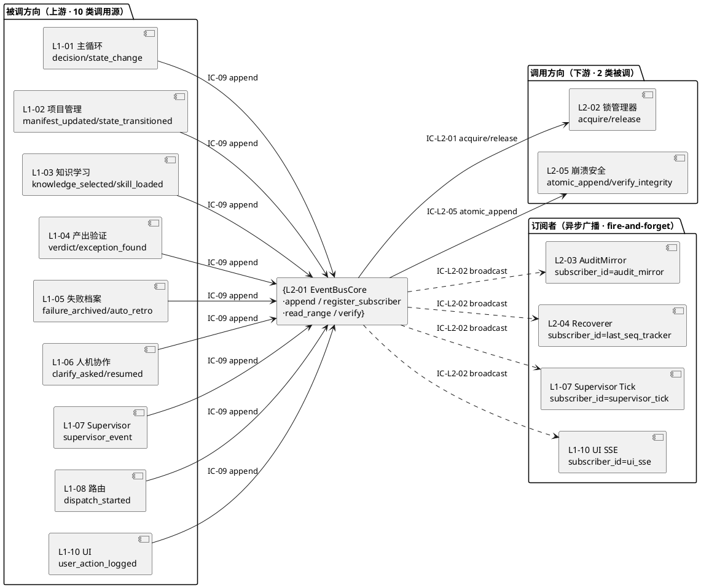
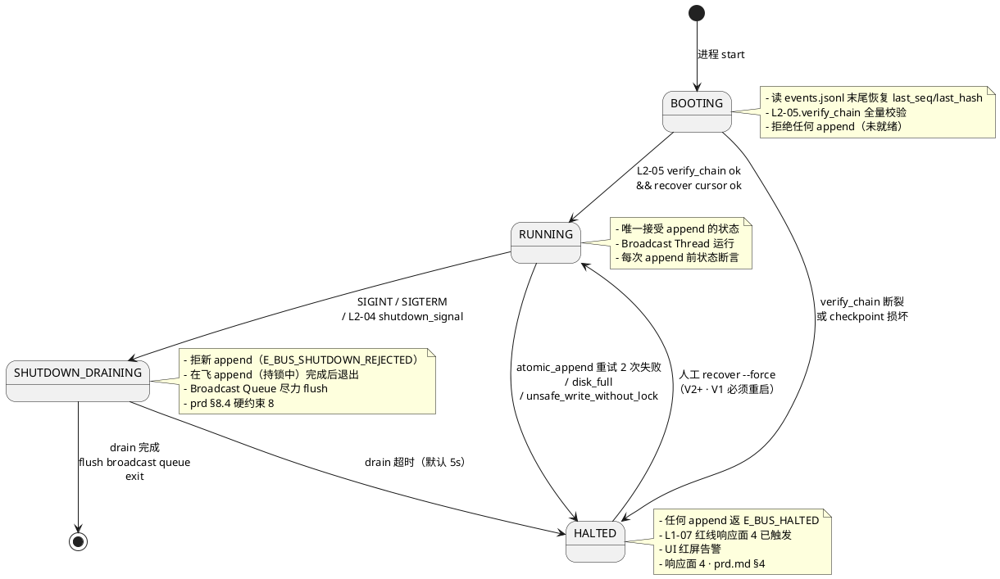

# L1-09 · L2-01 事件总线核心（jsonl 落盘 + 订阅） 技术设计

## §0 撰写进度 / Checklist

> 本文档对齐 `docs/3-1-Solution-Technical/L1-09-韧性+审计/architecture.md 附录 C` 的 L2 tech-design 9 小节模板，扩展为 13 小节（加入 DDD 映射、P0/P1 时序图、底层数据 schema、状态机、与 2-prd / 3-2 TDD 映射表）。

- [x] §1 定位 + 2-prd 映射（引 prd.md §8 L2-01）
- [x] §2 DDD 映射（BC-09 · EventStream Aggregate Root + HashChain VO + ProjectShard VO）
- [x] §3 对外接口定义（字段级 YAML schema + 错误码）
- [x] §4 接口依赖（被谁调 · 调谁）
- [x] §5 P0/P1 时序图（Mermaid · append 端到端 / 订阅分发 / replay 只读）
- [x] §6 内部核心算法（伪代码 · hash 链 / 订阅分发 / project 分片路由）
- [x] §7 底层数据表 / schema（EventRecord / jsonl 物理布局）
- [x] §8 状态机（bus_state · RUNNING / SHUTDOWN_DRAINING / HALTED）
- [x] §9 开源调研（引 L0 §10 · ≥ 3 项细化：jsonl + EventStoreDB + Kafka + litestream）
- [x] §10 配置参数（EVENT_BUS_FSYNC_MODE / HASH_ALGO / JSONL_MAX_SIZE_BYTES / SUBSCRIBE_BUFFER_SIZE / ...）
- [x] §11 错误处理 + 降级（写盘失败 halt / hash 断裂告警 / 订阅者失败 isolate）
- [x] §12 性能目标（append ≤ 50ms · 吞吐 ≥ 200 QPS · 订阅延迟 ≤ 100ms）
- [x] §13 与 2-prd / 3-2 TDD 映射表

---

## §1 定位 + 2-prd 映射

### 1.1 一句话定位

**L2-01 事件总线核心** 是 HarnessFlow 所有状态变更的**唯一写入口** 与 **唯一事实源**（Single Source of Truth）。它承载 2-prd `L1-09/prd.md §8.1`（第 557 行）所界定的职责 ——

> 接收全 L1 的 `append_event` 请求，在锁保护下分配序列号 + 计算 hash 链，通过崩溃安全层落盘到当日 jsonl，并异步广播给订阅者。

**它只做三件事**：
1. 接受 IC-09 `append_event`（全 L1 唯一调用入口）→ **串行化 + 原子落盘 + 广播**。
2. 为已落盘的事件流对外提供**只读 iterator**（IC-L2-04）给 L2-04 恢复器回放。
3. 对外提供**订阅注册**（IC-L2-02）给 L1-07 / L1-10 / L2-03 / L2-04 四类消费者。

### 1.2 2-prd 精确映射表（逐小节对齐 prd.md §8）

| 2-prd prd.md 小节 | 本 tech-design 对应章节 | 对应规则锁定点 |
|---|---|---|
| prd §8.1 职责 + 锚定（第 555-575 行） | 本节 §1.1 + §2.1 | 锚定 PM-10 单一事实源 / scope §5.9.1 职责 / scope §5.9.4 硬约束 1+5 / BF-X-03 / BF-X-08 |
| prd §8.2 输入 / 输出（第 578-591 行） | §3.1 + §3.2 + §3.3 | 三类输入（`append_event` 调用 / 订阅注册 / shutdown drain 信号）+ 四类输出（落盘 jsonl 行 / ack 回调 / 订阅广播 / 审计镜像 feed） |
| prd §8.3 边界 9 in-scope / 7 out-of-scope（第 595-623 行） | §2.3 + §4.2 + §11.1 | "只做写入 + 广播、不判内容对错 / 事件只追加 / 同一序号绝不两条事件" |
| prd §8.4 约束 8 条硬约束（第 627-650 行） | §6 + §7 + §11 + §12 | append-only / sequence 单调递增 / hash 链闭合 / 落盘失败硬 halt / 必经 L2-02 锁 / 必经 L2-05 原子写 / 广播不阻塞主写 / shutdown 拒新 |
| prd §8.5 🚫 禁止行为 8 项（第 654-663 行） | §11.2 | 禁原地改 / 禁绕过锁 / 禁绕过原子写 / 禁假装成功 / 禁打破序号语义的批量 / 禁跨项目共享 / 禁暴露改 API / 禁 shutdown 静默丢弃 |
| prd §8.6 ✅ 必须职责 8 项（第 667-676 行） | §3 + §6 + §7 + §8 | 分配单调递增序号 / 写 hash / 取锁 / 原子写 / 失败硬 halt / 订阅注册分发 / shutdown drain / 按 L1 前缀分配 type |
| prd §8.7 🔧 可选功能职责 5 项（第 680-686 行） | §10.3 配置开关 | 批量读 API / 订阅者健康度 / 事件类型统计 / jsonl 分片轮转 / 反向索引建立协助 |
| prd §8.8 IC 契约清单（第 690-706 行） | §4.1 + §4.2 | IC-L2-01 / IC-L2-05 调用方 · IC-09 / IC-L2-02 / IC-L2-04 / IC-L2-07 被调方 |
| prd §8.9 Given-When-Then 6 场景（第 710-764 行） | §13 · 3-2 TDD 映射表 | 本 L2 UT / IT / E2E 的直接来源 |

### 1.3 在 L1-09 architecture.md 中的位置

引自 `docs/3-1-Solution-Technical/L1-09-韧性+审计/architecture.md`：

- **§3.1 5 L2 component diagram**（第 340-444 行）：L2-01 位于 L1-09 的核心区，左侧连 L2-02 锁管理器（IC-L2-01 取/释锁），右侧连 L2-05 崩溃安全层（IC-L2-05 原子写），上方接 IC-09（来自全 L1），下方广播给 4 类订阅者（L1-07 / L1-10 / L2-03 / L2-04）。
- **§3.5 线程模型**（第 525-541 行）：L2-01 拥有 **Main Thread**（同步执行 append 主路径）+ **Broadcast Thread**（异步推送订阅者）两条线程；**不用 asyncio**（理由见该节）。
- **§4.1 图 S1**（第 553-614 行）：L2-01 的**最高频路径** IC-09 append_event 端到端时序，P95 ≤ 50 ms。本文档 §5 将其细化到 L2 内部方法粒度。
- **§5.1 双层存储架构总视图**（第 839-889 行）：L2-01 **只写主存层 jsonl**（events / audit / supervisor_events 三条 jsonl），**不写索引层**（SQLite WAL 由 L2-03 建镜像时可选写）。
- **§11.2 职责拆分表**（第 1592-1598 行）：L2-01 Repository = `EventStoreRepository`（append / read_range / replay_to_taskboard / verify_hash_chain 四方法，见 `ddd-context-map.md §7.2.9`）。

### 1.4 "唯一写入点 · 唯一事实源" 的物理含义

"唯一" 在技术上落实为 **5 条不可违反的规则**（架构 §3.2 + prd §8.4 直译）：

1. **唯一 API 入口**：外部 L1 改事件总线**只能**调 `EventBusCore.append(event)` 方法；不得直接读写 `events.jsonl`。
2. **唯一锁持有者**：L2-01 必然通过 `LockManager.acquire("<pid>:event_bus")` 获得写锁；裸调 `atomic_append` 的调用会被 L2-05 断言 `AssertionError: unsafe_write_without_lock`（见架构 §3.2 第 449 行）。
3. **唯一落盘通道**：L2-01 必然通过 `AtomicWriter.atomic_append` 落盘；L2-01 自身**不持有** `os.open` / `os.write` 等 syscall 包装，必须委托 L2-05。
4. **唯一序号生成器**：`sequence` 由 L2-01 在持锁期间 `read_last_seq + 1` 产出，**不接受调用方传入**（即便调用方传了也会被覆盖）。
5. **唯一广播源**：订阅者注册只在 L2-01，别的 L2 / L1 不得旁路推送事件。

### 1.5 本 L2 在 V1 / V2 / V3 的演进路线

引 `architecture.md §10.3 最终选型总览`（第 1536-1547 行）：

| 维度 | V1（本文档锁定） | V2+ 演进 | V3+ 预留 |
|---|---|---|---|
| 主存格式 | append-only jsonl（每 project 独立 `events.jsonl`） | 同 V1 | 同 V1 |
| 订阅器 | 同进程 `queue.Queue`（无界 · fire-and-forget） | 同 V1 | 同 V1（+ 背压观测） |
| 结构化索引 | 无（L2-03 内存 mirror 足够） | 引入 SQLite WAL `events.db` | 同 V2+ |
| hash 算法 | sha256 + JCS (RFC 8785) | 同 V1 | 同 V1 |
| 事件 schema | CloudEvents + OTEL 融合（见 §7.2） | 同 V1 | 同 V1 |
| 备份 / 复制 | 无 | 本地 mirror（rsync） | litestream（云备份） |
| 分片轮转 | 手动（>500 MB 触发） | 自动（按日期切分） | 自动（按大小 + 日期） |

**本文档的 DoD 边界**：本 L2 tech-design **仅锁定 V1**；V2+ / V3+ 演进在本文档中仅标识路径，不展开实现。

---

## §2 DDD 映射（BC-09 · EventStream Aggregate Root + HashChain VO + ProjectShard VO）

### 2.1 Bounded Context 定位（来自 L0）

本 L2 属于 `L0/ddd-context-map.md §2.10 BC-09 Resilience & Audit`（第 475-513 行）的**核心聚合根之一**。BC-09 自身是 **Published Language 发布者**（`append_event schema` 作为全系统共享 PL）+ **Partnership 伙伴**（与全 BC 强耦合、同步演进、任何决策必经 IC-09）。本 L2 是这个 PL 的**实现载体**。

引自 `ddd-context-map.md §4.9`（第 807-815 行）BC-09 L2 映射表第 1 行：

> **L1-09 L2-01** 事件总线核心 · **Aggregate Root**: `EventLog` + **Entity**: `EventEntry` + **VO**: `HashChain` + **Repository**: `EventStoreRepository` · 职责：append-only + 序列 + hash 链化 + 异步广播。

**本 tech-design 的命名扩展**：`ddd-context-map.md` 的 `EventLog` 在本文档内统一命名为 **`EventStream`**（强调流式 + 分片）；`EventLog` 保留为二级别名。增加 **`ProjectShard`** 作为 VO（刻画 PM-14 每 project 物理分片）。

### 2.2 本 L2 的聚合根 · 实体 · 值对象 · 一致性边界

| DDD 角色 | 名称 | 字段（核心）| 一致性边界 | 对应物理载体 |
|---|---|---|---|---|
| **Aggregate Root** | `EventStream` | `project_id` / `last_sequence` / `last_hash` / `events_path` / `bus_state` | 同 project 内 append-only · sequence 单调递增 · hash 链闭合 · 任何追加必 fsync | `projects/<pid>/events.jsonl`（一文件一聚合根实例） |
| **Entity** | `EventEntry` | `event_id` / `sequence` / `project_id` / `type` / `actor` / `timestamp` / `payload` / `prev_hash` / `hash` / `links` | 唯一性：`(project_id, sequence)` · 不可变 · append 后永不改 | jsonl 中的一行 |
| **Value Object** | `HashChain` | `algo: "sha256"` / `canonical: "JCS-RFC8785"` / `genesis_hash: "GENESIS"` / `prev_hash` / `current_hash` | 跨平台确定性 · 单向链 · 任一节断裂即可检测 | 每 EventEntry 的 `prev_hash` + `hash` 字段 |
| **Value Object** | `ProjectShard` | `project_id` / `shard_path: "projects/<pid>/"` / `events_file: "events.jsonl"` / `lock_resource: "<pid>:event_bus"` | PM-14 物理隔离 · 跨 project 绝不合并 · 跨 shard 绝不持有对方事件 | `projects/<pid>/` 子树 |
| **Value Object** | `Sequence` | `value: int` / `project_scope: <pid>` | 单 project 内单调递增 · 从 0 起 · 永不倒序 · 永不重复 | jsonl 行序 + 内存 `last_sequence` 游标 |
| **Value Object** | `Subscription` | `subscriber_id` / `filter: {type_prefix?, actor?, state?, project_id?}` / `callback_ref` / `registered_at` | 注册后幂等 · fire-and-forget · 不保证消费成功 | 内存 `subscribers_registry: dict[subscriber_id, Subscription]` |
| **Domain Event** | `L1-09:event_appended` | `event_id` / `sequence` / `hash` / `project_id` / `ts` | 每次 append 成功后**再 append** 一条元事件（`is_meta=True` 防递归） | jsonl 中一行 + Broadcast Queue 推送 |

### 2.3 聚合根 EventStream 的不变量（Invariants）

引 `architecture.md §2.2 I-01 ~ I-03`（第 252-256 行），落到本 L2 的代码断言：

| ID | 不变量 | 技术落实（本 L2 入口断言处）|
|---|---|---|
| I-01 | EventStream append-only · 已落盘行永不原地改 | `EventBusCore.append` 只调 `AtomicWriter.atomic_append`（走 `O_APPEND | O_WRONLY` · 禁 `O_TRUNC` / `O_RDWR`）· 若检测到文件开 `O_TRUNC` 立刻 CRITICAL |
| I-02 | Sequence 单调递增 · 无跳号、无重复 | 持锁期间 `read_last_seq + 1` 计算 · 下锁前写完 · 并发由 L2-02 `<pid>:event_bus` flock 保证 · L2-03 审计器周期重算 |
| I-03 | Hash 链闭合 · 任一节断裂必告警 | `hash = sha256(prev_hash + canonical_json(body_without_hash))` · prev_hash 来自 `last_hash` 游标 · GENESIS = 64 字节全 0 hex · 启动时 L2-05 `verify_integrity` 全链重算 |
| I-07（新增本 L2 特有） | 跨 project 绝不合并 | `EventBusCore.append(event)` 第一步断言 `event.project_id ∈ self._stream_by_pid.keys()` · 跨 project 的调用直接 raise `ProjectNotRegisteredError` |
| I-08（新增本 L2 特有） | 元事件不触发元事件 | `EventEntry.is_meta` 字段 + `if is_meta: skip_meta_generation` 双保险防无限递归 |
| I-09（新增本 L2 特有） | 广播 fire-and-forget · 不阻塞主路径 | Broadcast Queue 用 `queue.Queue(maxsize=0)`（无界 · 不背压主线程）· 订阅者回调在独立 Broadcast Thread 消费 |

### 2.4 Domain Service / Application Service（本 L2 拥有）

引 `architecture.md §2.3`（第 261-275 行）：

| Service 名 | 类型 | 职责 | 调用者 |
|---|---|---|---|
| `EventBusCore` | **Application Service**（本 L2 门面）| 接收 IC-09 → 分配 sequence + hash → 调 L2-02 取锁 → 调 L2-05 原子写 → 广播订阅者 | IC-09 Router（来自全 L1） |
| `BroadcastDispatcher` | **Domain Service**（本 L2 内部） | Broadcast Thread 消费 Queue · 按 Subscription.filter 过滤 · 调 callback_ref 推送 | `EventBusCore` enqueue |
| `SequenceAllocator` | **Domain Service**（本 L2 内部） | 持锁期间从 `last_sequence` 游标 +1 分配 · 崩溃后从 jsonl 尾部恢复游标 | `EventBusCore.append` 内部 |
| `HashChainCalculator` | **Domain Service**（本 L2 内部） | 取 `prev_hash` + `canonical_json(body)` → `sha256` | `EventBusCore.append` 内部 |
| `TypePrefixValidator` | **Domain Service**（本 L2 内部） | 校验 `event.type` 前缀必在白名单（`L1-01:*` / `L1-02:*` / ... / `L1-09:*`）| `EventBusCore.append` 第一关 |
| `ShardRouter` | **Domain Service**（本 L2 内部） | `project_id` → `EventStream` 实例（一 project 一实例）| `EventBusCore.append` 第二关 |

### 2.5 Repository Interface（引 ddd §7.2.9）

引 `ddd-context-map.md §7.2.9`（第 1449-1479 行），本 L2 拥有**唯一** Repository 接口 `EventStoreRepository`：

```python
# <领域层> · docs/3-1-Solution-Technical/L1-09-韧性+审计/ 同目录的领域接口
from abc import ABC, abstractmethod
from typing import Iterator

class EventStoreRepository(ABC):
    """核心事件存储 · 所有 BC 的 append_event 终极落地处。"""

    @abstractmethod
    def append(
        self,
        project_id: "HarnessFlowProjectId",
        event: "EventEntry",
    ) -> tuple[int, str]:
        """Append-only write to projects/<pid>/events.jsonl.
        Returns (sequence, hash). 原子写(tmp + rename + fsync 由 L2-05 保证)。"""

    @abstractmethod
    def read_range(
        self,
        project_id: "HarnessFlowProjectId",
        from_seq: int | None,
        to_seq: int | None,
    ) -> Iterator["EventEntry"]:
        """流式读取(防内存爆炸) · 按 sequence 升序返回。"""

    @abstractmethod
    def replay_to_taskboard(
        self,
        project_id: "HarnessFlowProjectId",
        to_seq: int | None = None,
    ) -> "TaskBoard":
        """从事件重建 task-board(本 L2 只提供 iter · 实际重建在 L2-04)。"""

    @abstractmethod
    def verify_hash_chain(
        self,
        project_id: "HarnessFlowProjectId",
    ) -> bool:
        """校验 hash 链完整性。L2-05 IntegrityChecker 的入口之一。"""
```

**实现层**：`infrastructure/jsonl_event_store.py` 的 `JsonlEventStore(EventStoreRepository)` 类；依赖 `L2-05.AtomicWriter` + `L2-02.LockManager`。

### 2.6 发布的 Domain Events（本 L2 自身产）

引 `architecture.md §2.5`（第 291-312 行）+ `ddd-context-map.md §5.2.9`（第 991-1001 行），本 L2 自身**产**的 Domain Events：

| 事件名 | 何时产 | 订阅方 | Payload 骨架 | 备注 |
|---|---|---|---|---|
| `L1-09:event_appended` | 每次 append 成功后**自我 append** 一条元事件 | 全 BC · L1-07 / L1-10 感知 "有新事件" | `{event_id, sequence, hash, project_id, ts}` | `is_meta=True` · 不再触发元事件 · 防递归 |
| `L1-09:bus_write_failed` | L2-05 落盘彻底失败 | L1-07（CRITICAL · 触发响应面 4 硬 halt） | `{caller, reason: disk_full/permission/io_error, retry_count}` | 本事件可能**本身**落盘失败 · 降级到 stdout + system.log |
| `L1-09:type_prefix_violation` | 调用方冒用其他 L1 前缀 | L1-07（WARN）| `{caller, claimed_prefix, actual_actor}` | 越界检测 · 拒绝 append + 记事件 |
| `L1-09:subscriber_slow` | 某订阅者消费延迟 > 2 × SLA | L1-07（SUGG 建议级）| `{subscriber_id, current_lag_ms, events_behind}` | 可选功能（由 `EVENT_BUS_ENABLE_SUBSCRIBER_HEALTH` 开关控制） |
| `L1-09:shutdown_drain_started` | L2-04 广播进入 shutdown · 本 L2 开始拒新写 | L1-10 UI / L2-03 | `{drain_started_at, pending_appends}` | 本 L2 从 RUNNING → SHUTDOWN_DRAINING 状态转移 |
| `L1-09:shutdown_drain_completed` | drain 结束 · 在飞 append 全部完成 | L2-04 | `{drained_count, flushed_files: [...]}` | 通知 L2-04 可以做最终 checkpoint |

### 2.7 Ubiquitous Language（本 L2 本地术语表）

对齐 `architecture.md §2.6`（第 316-335 行）+ `ddd §B.9`（第 2037-2050 行），并扩展本 L2 特有术语：

| 术语 | 英文 | 本 L2 精确含义 |
|---|---|---|
| EventStream | EventStream | 每 project 独立的事件流聚合根 · 对应一个 `projects/<pid>/events.jsonl` 文件 |
| EventEntry | EventEntry | 单条已落盘事件 · jsonl 中的一行 · 不可变 |
| HashChain | HashChain | sha256(prev_hash + canonical_json(body)) 构成的单向链 |
| ProjectShard | ProjectShard | PM-14 物理分片 · 一个 project 一个子树 · 绝不跨合并 |
| Sequence | Sequence | 单 project 内单调递增整数 · 从 0 起 |
| Subscription | Subscription | 订阅者注册信息 · 含 filter + callback_ref · fire-and-forget |
| Broadcast Queue | Broadcast Queue | 内存无界 `queue.Queue` · 连通 Main Thread 与 Broadcast Thread |
| fire-and-forget | fire-and-forget | 推送后不等订阅者 ack · 订阅者慢不影响主路径 |
| meta event | meta event | 本 L2 对 append 自身动作产的元事件 · `is_meta=True` 防递归 |
| type prefix | type prefix | `L1-XX:subtype` 形式 · L1 命名空间隔离 |
| drain | drain | shutdown 模式 · 拒绝新 append · 等待在飞 append 完成 |
| halt | halt | 写盘彻底失败后停止接受任何 append · 不自愈 |

---

## §3 对外接口定义（字段级 YAML schema + 错误码）

### 3.1 接口总览（5 条对外方法）

本 L2 的对外 API 仅 **5 条**（见 `architecture.md §3.3 IC-L2 表`），全部以 Python 方法形式暴露（同进程调用 · 非 REST）：

| API 方法 | 方向 | IC | 对应 prd §8.8 | 物理载体 | SLA |
|---|---|---|---|---|---|
| `EventBusCore.append(event)` | 被调 | **IC-09** | §8.8 被调方表第 1 行 | 同进程方法 | P95 ≤ 50 ms / P99 ≤ 200 ms / 硬上限 500 ms |
| `EventBusCore.register_subscriber(sub)` | 被调 | **IC-L2-02** | §8.8 被调方表第 2 行 | 同进程方法 | 注册 ≤ 10 ms · push 延迟 ≤ 500 ms |
| `EventBusCore.unregister_subscriber(sub_id)` | 被调 | **IC-L2-02** | §8.8 被调方表第 2 行（逆） | 同进程方法 | ≤ 10 ms · 幂等 |
| `EventBusCore.read_range(pid, from_seq, to_seq)` | 被调 | **IC-L2-04** | §8.8 被调方表第 3 行 | 同进程 iterator | 回放 1 万事件 ≤ 10 s |
| `EventBusCore.verify_hash_chain(pid)` | 被调 | **IC-L2-07 辅** | §8.8 被调方表第 4 行 | 同进程方法 | 1 万事件 ≤ 5 s |

### 3.2 `append(event)` — IC-09 唯一写入口（主路径）

**入参 schema（字段级 YAML · Pydantic 校验）**：

```yaml
append_event_request:
  type: object
  required: [project_id, type, actor, timestamp, payload]
  properties:
    # === 路由必填 ===
    project_id:
      type: string
      pattern: "^[a-z0-9_-]{1,40}$"                # PM-14 分片键 · 必须已注册到 _index.yaml
      example: "foo"
    # === 事件本体 ===
    type:
      type: string
      pattern: "^L1-(01|02|03|04|05|06|07|08|09|10):[a-z_]+$"   # L1 前缀白名单 · TypePrefixValidator 强校验
      example: "L1-01:decision_made"
    actor:
      type: string
      pattern: "^(main_loop|planner|executor|verifier|supervisor|ui|recoverer|audit_mirror|human:.+)$"
      example: "main_loop"
    timestamp:
      type: string
      format: date-time                            # ISO 8601 · 带时区（UTC）
      example: "2026-04-20T10:23:45.123Z"
    state:
      type: string
      enum: [NOT_EXIST, INIT, PLAN, EXEC, CLOSE, CLOSED, HALTED]
      description: "调用方当前 L1-01 state 快照 · 便于 replay"
    payload:
      type: object                                 # 业务字段 · schema-free · 每 L1 自定义
      description: "事件内容 · canonical_json hash 时按字典序序列化"
    links:
      type: array
      items:
        type: object
        properties:
          kind: { enum: [decision, artifact, event, file, wp] }
          ref:  { type: string }                  # decision_id / artifact_id / event_id / file_path / wp_id
      description: "跨 L1 关联引用 · L2-03 用来建反向索引"
    # === 元字段（调用方可选 · L2-01 可覆盖）===
    event_id:
      type: string
      pattern: "^evt_[0-9a-f]{26}$"               # ULID · 调用方可不传 · L2-01 自动生成
    is_meta:
      type: boolean
      default: false                              # I-08 防递归 · 元事件不触发元事件
    idempotency_key:
      type: string
      description: "可选 · 若相同 key 在 10 min 内重复提交 → 返 idempotent_replay"
```

**返回 schema（成功）**：

```yaml
append_event_response_ok:
  type: object
  required: [event_id, sequence, hash, persisted_at]
  properties:
    event_id:      { type: string, example: "evt_01HJX9K3M5NQ8BTPWVZYF0GR3K" }
    sequence:      { type: integer, minimum: 0, example: 12347 }
    hash:          { type: string, pattern: "^[0-9a-f]{64}$", example: "3f2c..." }
    prev_hash:     { type: string, pattern: "^[0-9a-f]{64}$|^GENESIS$" }
    persisted_at:  { type: string, format: date-time }
    jsonl_offset:  { type: integer, description: "落盘文件 byte offset · L2-03 索引用" }
    file_path:     { type: string, example: "projects/foo/events.jsonl" }
    broadcast_enqueued: { type: boolean, description: "广播是否已入队 · 不代表订阅者收到" }
```

**返回 schema（失败 · 错误码表）**：

| 错误码 | HTTP 级别语义 | 触发条件 | 调用方应对 | 是否 halt 系统 |
|---|---|---|---|---|
| `E_BUS_PROJECT_NOT_REGISTERED` | 404 | `project_id` 不在 `_index.yaml` | 调用方先调 L1-02 创建 project | 否 |
| `E_BUS_TYPE_PREFIX_VIOLATION` | 403 | `type` 前缀不属于调用方 L1 | 调用方改正 type 前缀 | 否（但 L2-01 会 append `type_prefix_violation` 事件）|
| `E_BUS_SCHEMA_INVALID` | 400 | Pydantic 校验失败（缺字段 / 类型错）| 调用方修 payload | 否 |
| `E_BUS_LOCK_TIMEOUT` | 408 | L2-02 acquire 超过 `LOCK_ACQUIRE_TIMEOUT_MS`（默认 3000ms） | 调用方指数退避重试 ≤ 3 次 | 否 |
| `E_BUS_DEADLOCK_DETECTED` | 409 | L2-02 环检测到死锁 | 调用方释手头锁后重试 | 否 |
| `E_BUS_WRITE_FAILED` | 500 | L2-05 atomic_append 重试 2 次仍失败 | **立即停止 tick** · UI 告警 | **是 · 硬 halt（响应面 4）** |
| `E_BUS_DISK_FULL` | 507 | L2-05 报 ENOSPC | 立即停止 tick · 清盘或扩容 | **是 · 硬 halt** |
| `E_BUS_HASH_CHAIN_BROKEN` | 500 | 启动时 verify_hash_chain 发现断裂 | 不接受任何 append | **是 · 拒启动** |
| `E_BUS_SHUTDOWN_REJECTED` | 503 | bus_state = SHUTDOWN_DRAINING 拒新写 | 调用方等 resume / 放弃 | 否 |
| `E_BUS_HALTED` | 503 | bus_state = HALTED（前次写失败后静止） | **禁止**自动重试 · 等人工 | 是（已 halt） |
| `E_BUS_IDEMPOTENT_REPLAY` | 200（非错）| `idempotency_key` 10 min 内重复 | 视作成功 · 返回原 event_id | 否 |
| `E_BUS_UNSAFE_WRITE_WITHOUT_LOCK` | 500 | 断言：调用 `atomic_append` 时未持锁 | 必是 bug · 立即停 · 告警 | **是 · AssertionError** |

**错误响应 schema**：

```yaml
append_event_response_err:
  type: object
  required: [error_code, message, retryable]
  properties:
    error_code:   { type: string, example: "E_BUS_LOCK_TIMEOUT" }
    message:      { type: string }
    retryable:    { type: boolean }
    retry_after_ms: { type: integer, nullable: true }
    caused_by:    { type: string, nullable: true, description: "底层异常 repr · 如 'OSError: [Errno 28] No space left'" }
    halt_system:  { type: boolean, description: "true = 响应面 4 硬 halt" }
    correlation_id: { type: string, description: "追踪 id · 可在 system.log grep 到完整栈" }
```

### 3.3 `register_subscriber(sub)` — IC-L2-02 订阅注册

**入参 schema**：

```yaml
register_subscriber_request:
  type: object
  required: [subscriber_id, callback_ref]
  properties:
    subscriber_id:
      type: string
      pattern: "^(audit_mirror|recoverer|supervisor|ui_sse|retro_auto|[a-z_]+)$"
      description: "订阅者唯一 id · 重复注册幂等（以最后一次 filter 为准）"
    filter:
      type: object
      description: "过滤规则 · 空则订阅全部"
      properties:
        type_prefix:
          type: array
          items: { type: string, pattern: "^L1-\\d{2}:" }
          example: ["L1-01:", "L1-07:"]
        actor:
          type: array
          items: { type: string }
        state:
          type: array
          items: { type: string, enum: [INIT, PLAN, EXEC, CLOSE, CLOSED, HALTED] }
        project_id:
          type: array
          items: { type: string }
          description: "限定 project · 多 project V2+ 用"
        exclude_meta:
          type: boolean
          default: false                          # 默认广播元事件 · L2-04 可选关掉
    callback_ref:
      type: object
      required: [kind]
      properties:
        kind: { enum: [python_callable, queue, sse_channel] }
        target:
          oneOf:
            - type: string                        # python_callable: "module.func"
            - type: object                        # queue: {queue_obj_ref, max_size}
            - type: object                        # sse_channel: {channel_id}
    delivery_mode:
      type: string
      enum: [fire_and_forget, at_least_once_memory]
      default: fire_and_forget                    # V1 只实现 fire_and_forget · at_least_once 留 V2+
    max_lag_ms:
      type: integer
      default: 2000
      description: "超过 → 触发 subscriber_slow 事件（可选功能）"
```

**返回 schema**：

```yaml
register_subscriber_response:
  type: object
  required: [registration_token, registered_at]
  properties:
    registration_token: { type: string, description: "注销时传回" }
    registered_at:      { type: string, format: date-time }
    initial_replay_offered: { type: boolean, description: "若订阅者带 replay_from_seq · 是否提供初始回放" }
```

**错误码**：
- `E_SUB_ALREADY_REGISTERED_WITH_DIFFERENT_FILTER` — 幂等升级覆盖（warn 不错）
- `E_SUB_INVALID_CALLBACK` — callback_ref 不可解析
- `E_SUB_SHUTDOWN_REJECTED` — bus_state = SHUTDOWN_DRAINING 时拒注册

### 3.4 `read_range(pid, from_seq, to_seq)` — IC-L2-04 只读 iterator

**入参 schema**：

```yaml
read_range_request:
  type: object
  required: [project_id]
  properties:
    project_id: { type: string }
    from_seq:
      type: integer
      minimum: 0
      default: 0
      description: "含 · 从该 sequence 开始（含自身）"
    to_seq:
      type: integer
      nullable: true
      description: "含 · 到该 sequence 结束（含自身）· null = 读到文件尾"
    include_meta:
      type: boolean
      default: true
    verify_hash_on_read:
      type: boolean
      default: false
      description: "边读边验 · 首次断裂立刻 raise HashChainBrokenError"
```

**返回**：Python `Iterator[EventEntry]`（流式 · 不 buffer 整个结果 · 防 OOM）

**错误码**：
- `E_READ_PROJECT_NOT_FOUND` — project 目录或 jsonl 不存在
- `E_READ_SEQ_OUT_OF_RANGE` — `from_seq > last_sequence`（返空 iter · 不错）
- `E_READ_HASH_BROKEN_AT_SEQ_N` — 若 verify_hash_on_read 命中断裂 · 附 N
- `E_READ_CORRUPT_LINE_AT_OFFSET_X` — jsonl 某行无法解析 · 附 offset

### 3.5 共享元字段 · correlation_id / trace_id

所有 5 条 API 共享以下 header 层元字段（放在 thread-local 或显式参数）：

```yaml
shared_request_metadata:
  correlation_id:  # 一次 tick 的全链路追踪 id · L1-01 创建
    type: string
    pattern: "^cor_[0-9a-f]{20}$"
  trace_id:        # OTEL trace · 透传 L0 architecture §4.7 采样决策
    type: string
    nullable: true
  caller_l1:       # 调用方 L1 编号 · 用于 TypePrefixValidator 交叉校验
    type: string
    pattern: "^L1-\\d{2}$"
```

### 3.6 API 稳定性等级声明

| API | 稳定性 | V2+ 兼容性承诺 |
|---|---|---|
| `append(event)` | **stable** · prd §8.2 PL | 字段**只加不删** · 旧字段不改语义 |
| `register_subscriber(sub)` | stable | 同上 |
| `read_range(pid, ...)` | stable | 返回格式追加字段 · 不删 |
| `verify_hash_chain(pid)` | stable | 算法不变（sha256 + JCS） |
| `unregister_subscriber(sub_id)` | stable | — |

---

## §4 接口依赖（被谁调 · 调谁）

### 4.1 依赖拓扑（L2-01 为中心）



### 4.2 "被谁调"详表（作为被调方 · IC-09 / IC-L2-02 / IC-L2-04）

| 调用者 | IC | 频次估算（1 小时 session）| 触发条件 | 本 L2 的 SLA 承诺 |
|---|---|---|---|---|
| **L1-01 主循环** | IC-09 | 高频 · 1000-5000 次 | 每 tick decision / state_change / context_compressed | ≤ 50 ms P95 |
| **L1-02 项目管理** | IC-09 | 中频 · 50-200 次 | manifest_updated / state_transitioned / project_created | ≤ 50 ms P95 |
| **L1-03 知识学习** | IC-09 | 低频 · 10-50 次 | knowledge_selected / skill_loaded | ≤ 50 ms P95 |
| **L1-04 产出验证** | IC-09 | 中频 · 100-500 次 | verdict_pass / verdict_fail / exception_found | ≤ 50 ms P95 |
| **L1-05 失败档案** | IC-09 | 低频 · 20-100 次 | failure_archived / auto_retro_completed | ≤ 50 ms P95 |
| **L1-06 人机协作** | IC-09 | 低频 · 10-30 次 | clarify_asked / user_answered / resumed | ≤ 50 ms P95 |
| **L1-07 Supervisor** | IC-09 | 中频 · 100-300 次 | supervisor_event（8 维度告警）| ≤ 50 ms P95 |
| **L1-08 路由** | IC-09 | 中频 · 100-500 次 | dispatch_started / subagent_completed | ≤ 50 ms P95 |
| **L1-10 UI** | IC-09 | 低频 · 10-100 次 | user_action_logged / ui_state_changed | ≤ 50 ms P95 |
| **L2-03 AuditMirror** | IC-L2-02 注册 | 1 次（启动）+ 1 次（shutdown）| boot 时注册 audit_mirror | ≤ 10 ms 注册 |
| **L2-04 Recoverer** | IC-L2-02 注册 | 1 次（启动）| boot 时注册 last_seq_tracker | ≤ 10 ms |
| **L2-04 Recoverer** | IC-L2-04 read_range | 1 次（启动）· 每 project | bootstrap 回放 | ≤ 10 s / 1 万事件 |
| **L1-07 Supervisor** | IC-L2-02 注册 | 1 次 | 30s tick 订阅 | ≤ 10 ms |
| **L1-10 UI SSE** | IC-L2-02 注册 | 每次浏览器连接 | SSE stream 启动 | ≤ 10 ms |

**并发特性**：所有 IC-09 调用进入本 L2 后 **被 L2-02 `<pid>:event_bus` 锁串行化** → 同一时刻仅 1 条 append 主路径在执行（单 project 内）；跨 project 并发（V2+）由不同锁独立放行。

### 4.3 "调谁"详表（作为调用方 · IC-L2-01 / IC-L2-05）

| 被调者 | IC | 何时调 | 入参骨架 | 失败处理策略 |
|---|---|---|---|---|
| **L2-02 LockManager** | IC-L2-01 acquire | 每次 `append` 主路径开头 | `resource=f"{pid}:event_bus"` / `holder="l2_01_main_thread"` / `timeout_ms=3000` | timeout → 返 E_BUS_LOCK_TIMEOUT 给调用方 · 不 halt |
| **L2-02 LockManager** | IC-L2-01 release | 每次 `append` 主路径结尾（finally）| `lock_token` | release 失败 → CRITICAL（锁泄漏）· 尝试超时自愈 |
| **L2-05 AtomicWriter** | IC-L2-05 atomic_append | 持锁期间 · hash 算完后 | `target_path` / `line` / `expected_prev_hash` | 重试 2 次仍失败 → E_BUS_WRITE_FAILED + 硬 halt |
| **L2-05 IntegrityChecker** | 启动期 verify_integrity | boot 第一步（L2-04 触发） | `path` / `expected_last_hash` | 断链 → E_BUS_HASH_CHAIN_BROKEN + 拒启动 |

**强制约束**：本 L2 **不得** 直接调用以下模块（否则破坏 §1.4 的 5 条唯一性规则）：
- ❌ 直接 `open(events.jsonl)` → 必须走 L2-05
- ❌ 直接 `fcntl.flock` → 必须走 L2-02
- ❌ 跨进程 `multiprocessing.Queue` → 单进程 `queue.Queue` 即可（§1.5 V1 锁定）
- ❌ 调用 L2-03 / L2-04 任何方法（本 L2 只通过 Broadcast Queue 间接通知订阅者）

### 4.4 订阅者广播的方向语义（非 RPC · 反向）

订阅者 broadcast **不是** L2-01 的 outbound RPC，而是订阅者主动**被**推送。技术上：

1. 订阅者调 `L2-01.register_subscriber(sub)` 注册自己
2. L2-01 在 `append` 主路径结束后 `broadcast_queue.put(event)`
3. L2-01 的 **Broadcast Thread**（§2.4 BroadcastDispatcher）从 queue 消费 · 按 filter 过滤 · 调 `sub.callback_ref`
4. 订阅者的 callback **在 Broadcast Thread 栈中执行** → **订阅者 callback 阻塞 = 阻塞所有订阅者**（fire-and-forget 的含义是主路径不等，但订阅者之间是串行）

**V1 妥协**：订阅者慢仅影响其他订阅者、**不影响主写路径**；订阅者之间的互相拖慢由 `max_lag_ms` 观测 + `subscriber_slow` 事件告警（可选功能 §10.3），V2+ 可升级为每订阅者独立 thread pool。

### 4.5 循环依赖 / 反向依赖检查

**禁止反向依赖**（保 BC-09 Partnership 对称性）：
- L2-01 绝不调用 L1-01 ~ L1-10 的任何方法（单向下游）
- L2-01 绝不调用 L2-03 / L2-04 的方法（同 L1 内**平级无调用** · 只通过广播触达）
- L2-02 / L2-05 绝不回调 L2-01（单向下游 · 避免环）

**允许的反向信号** = Broadcast Queue（数据流 · 非控制流）：
- L2-01 通过 `L1-09:bus_write_failed` 元事件**间接** 通知 L1-07 红线响应；但 L2-01 本身不调用 L1-07 任何方法。

### 4.6 启动期依赖顺序（boot sequence）

对应 `architecture.md §4.2 图 S2`，本 L2 初始化序列：

```
1. L2-05.IntegrityChecker.verify_chain(events.jsonl)  ← 先校验
2. L2-05.verify_checkpoint(latest_checkpoint.json)
3. L2-01.__init__(project_ids, last_hash_cursor_per_pid, last_seq_per_pid)
4. L2-02.LockManager.__init__()
5. L2-01.register_subscriber(audit_mirror)    ← L2-03 注册
6. L2-01.register_subscriber(last_seq_tracker) ← L2-04 注册
7. L2-01.set_state(RUNNING)                   ← 接受 IC-09
8. L1-07.register_subscriber(supervisor_tick)
9. L1-10.register_subscriber(ui_sse)          ← UI 连接时
10. L1-01 开始 tick                           ← 首条 append 可以进来
```

**失败情况**：若步骤 1/2 失败（hash 链断裂）→ `E_BUS_HASH_CHAIN_BROKEN` · 拒启动 · 进入 HALTED 态 · **不回退到 RUNNING**。

---

## §5 P0/P1 时序图（Mermaid · ≥ 2 张）

本节画 **3 张时序图** 覆盖本 L2 的 P0（append 主路径 · 最高频）+ P1（read_range · bootstrap replay）+ P1（register_subscriber · 订阅与回放）三类核心路径。§5.1 是 `architecture.md §4.1` 的 **L2 内部方法粒度细化**（architecture 止于 L2 边界）。

### 5.1 图 S1 · IC-09 append_event 端到端（P0 · P95 ≤ 50 ms）

**场景**：L1-01 主 loop 某 tick 产 `L1-01:decision_made` 事件 → 走完本 L2 内部所有方法栈 → ack + 广播。

```plantuml
@startuml
autonumber
    autonumber
participant "L1-01 Caller<br/>(main_loop)" as L101
participant "IC-09 Router<br/>(同进程入口)" as IC09
participant "TypePrefixValidator<br/>(L2-01 内)" as Valid
participant "ShardRouter<br/>(L2-01 内)" as Shard
participant "EventBusCore.append<br/>(main thread)" as Core
participant "SequenceAllocator<br/>(L2-01 内)" as Seq
participant "HashChainCalculator<br/>(L2-01 内)" as Hash
participant "L2-02 LockManager" as L202
participant "L2-05 AtomicWriter" as L205
participant "events.jsonl" as FS
participant "Broadcast Queue<br/>(queue.Queue · 无界)" as BQ
participant "BroadcastDispatcher<br/>(L2-01 broadcast thread)" as BDisp
participant "4 类订阅者" as Subs
L101 -> IC09 : append_event(event_body)
IC09 -> Core : EventBusCore.append(event)
group
note over Core,Shard : 阶段 1 · 入参校验（≤ 1 ms）
Core -> Valid : validate_type_prefix(event.type, caller_l1)
Valid- -> Core : ok | TypePrefixViolation
Core -> Shard : route(event.project_id)
Shard- -> Core : stream_foo (EventStream 实例)
end
group
note over Core,L202 : 阶段 2 · 取锁（无竞争 ≤ 5 ms）
Core -> L202 : acquire(resource="foo:event_bus",\nholder="l2_01_main",\ntimeout=3000ms)
L202 -> L202 : flock(fd, LOCK_EX) on\nprojects/foo/tmp/.events.lock
L202- -> Core : lock_token="lt_abc"
end
group
note over Core,Hash : 阶段 3 · 分配 seq + hash（≤ 2 ms）
Core -> Seq : next(stream_foo)
Seq- -> Core : sequence=12347
Core -> Hash : compute(prev_hash=stream_foo.last_hash,\nbody=event_without_hash)
Hash -> Hash : canonical_json(body) · RFC 8785\nsha256(prev_hash \|\| canonical)
Hash- -> Core : hash="3f2c...", prev_hash="8e1b..."
end
group
note over Core,FS : 阶段 4 · 原子落盘（≤ 30 ms · 含 fsync）
Core -> L205 : atomic_append(\npath="projects/foo/events.jsonl",\nline=json.dumps(event)+"\n",\nexpected_prev_hash="8e1b...")
L205 -> L205 : 断言 holder has flock on target
L205 -> FS : open(O_APPEND\|O_WRONLY)
L205 -> FS : write(line)
L205 -> FS : fsync(fd)
L205 -> FS : close(fd)
FS- -> L205 : offset=4823901
L205- -> Core : {offset, checksum}
end
group
note over Core,L202 : 阶段 5 · 释锁 + 更新游标（≤ 3 ms）
Core -> Core : stream_foo.last_sequence = 12347\nstream_foo.last_hash = "3f2c..."
Core -> L202 : release(lock_token="lt_abc")
L202- -> Core : ack
end
group
note over Core,Subs : 阶段 6 · 异步广播（不阻塞 ack · 异步 ≤ 500 ms）
par 主路径 ack（同步）
Core -> BQ : enqueue(event_with_hash)
Core- -> IC09 : {event_id, sequence=12347, hash="3f2c..."}
IC09- -> L101 : ack (P95 ≤ 50 ms 端到端)
else Broadcast Thread（异步）
BDisp -> BQ : dequeue
loop 按 filter 遍历订阅者
BDisp -> Subs : callback(event)
end
note over BDisp,Subs : 订阅者慢 → max_lag_ms 触发\nsubscriber_slow 元事件
end
end
group
note over Core,BQ : 阶段 7 · 自我元事件（is_meta=True · 防递归）
Core -> Core : 构造 L1-09:event_appended 元事件
Core -> Core : 重入 append(meta_event)\n（is_meta=True 跳 TypePrefixValidator）
note over Core : meta 事件的 append 不再生 meta（I-08）
end
@enduml
```

### 5.2 图 S2 · read_range 只读回放（P1 · 回放 1 万事件 ≤ 10 s）

**场景**：L2-04 bootstrap 期从 checkpoint 的 `last_seq=12000` 开始、读到文件尾、重建 task-board；边读边校 hash 链。

```plantuml
@startuml
autonumber
    autonumber
participant "L2-04<br/>BootstrapRecoverer" as L204
participant "EventBusCore.read_range" as Core
participant "ShardRouter" as Shard
participant "projects/foo/events.jsonl" as FS
participant "HashChainCalculator" as Hash
participant "L2-04 TaskBoard Builder" as TB
L204 -> Core : read_range(project_id="foo",\nfrom_seq=12001,\nverify_hash_on_read=true)
Core -> Shard : route("foo")
Shard- -> Core : stream_foo
note over Core : 打开只读 fd\nseek 到 from_seq 对应 offset\n（index 层命中 O(1) · 否则顺扫）
Core -> FS : open(path, O_RDONLY)
Core -> FS : seek_to_seq(12001)
loop 每行一事件 · 流式 yield
Core -> FS : readline()
FS- -> Core : line_bytes
Core -> Core : json.loads(line) → EventEntry
alt verify_hash_on_read=true
Core -> Hash : compute(prev_hash=cursor, body=entry_without_hash)
Hash- -> Core : computed_hash
alt computed != entry.hash
Core- ->x L204 : raise HashChainBrokenError(at_seq=N)
end
Core -> Core : cursor = entry.hash
end
Core- -> L204 : yield entry
L204 -> TB : apply_event(entry)\n（increment state · 更新 tasks）
end
Core -> FS : close(fd)
Core- -> L204 : iterator exhausted
note over L204,TB : 重建完成 · 调 L2-05 atomic_write\n落 projects/foo/task-boards/foo.json
@enduml
```

**关键技术决策（图 S2）**：

| 决策点 | 选择 | 理由 |
|---|---|---|
| 流式 yield vs list | **流式**（generator） | 10 万事件 × 2KB = 200 MB · list 会爆内存 |
| 持读锁 vs 不持锁 | **不持锁**（共享读）| jsonl append-only · 读不阻写 · 最多读到比当前新的行（无害）|
| seek 算法 V1 | 顺扫（O(N)） | V1 无索引 · 1 万事件 ≤ 1 s 扫完 OK |
| seek 算法 V2+ | SQLite `events_meta.jsonl_offset` 建索引 | V2+ 查询加速 · 见 architecture.md §5.3 |
| hash 校验时机 | 调用方可选 | replay 时开（严格）· UI tail 时关（性能）|

### 5.3 图 S3 · register_subscriber + 初始 replay（P1 · ≤ 10 ms 注册 + 回放按需）

**场景**：L2-03 AuditMirror 启动 · 注册订阅 · 附带 `replay_from_seq=0` 请求完整历史回放以重建镜像。

```plantuml
@startuml
autonumber
    autonumber
participant "L2-03 AuditMirror" as L203
participant "EventBusCore.register_subscriber" as Core
participant "SubscribersRegistry<br/>(dict in L2-01)" as Reg
participant "bulk_replay_helper<br/>(L2-01 内)" as Bulk
participant "read_range" as ReadRange
participant "Broadcast Queue" as BQ
L203 -> Core : register_subscriber(\nsubscriber_id="audit_mirror",\nfilter={},\ncallback_ref=<push_to_mirror>,\nreplay_from_seq=0)
Core -> Reg : insert({"audit_mirror": Subscription{...}})
Reg- -> Core : registration_token="reg_xyz"
alt replay_from_seq 非 null · 提供初始回放
Core- -> L203 : ack(token, initial_replay_offered=true)
note over L203,ReadRange : L2-03 串行消费 replay（不走 Broadcast Queue\n避免与实时广播抢序）
L203 -> Bulk : pull_initial_replay("audit_mirror", from=0)
Bulk -> ReadRange : read_range(pid, from_seq=0, to_seq=last_at_reg)
loop 流式 yield
ReadRange- -> Bulk : event
Bulk -> L203 : callback(event, mode=replay)
L203 -> L203 : update mirror inverse_index
end
Bulk- -> L203 : replay_completed(count=N)
L203 -> L203 : mark mirror as SERVING
else replay_from_seq = null · 只订阅实时
Core- -> L203 : ack(token, initial_replay_offered=false)
end
note over L203,BQ : 从此 · append 后新事件\n都由 BroadcastDispatcher 推给 L2-03
@enduml
```

**关键技术决策（图 S3）**：

| 决策点 | 选择 | 理由 |
|---|---|---|
| replay 与实时广播关系 | **replay 先完 · 再开实时** | 避免 replay 与新事件交错导致镜像乱序 |
| 原子切换 | `last_at_reg = stream.last_sequence` 快照 | replay 到该 seq 后 · Broadcast Queue 的队首必然 seq > last_at_reg |
| 订阅者状态机 | REGISTERING → REPLAYING → SERVING | L2-03 侧 · 查询期间状态不 SERVING 则返 mirror_rebuilding |
| 幂等注册 | 同 subscriber_id 重注册覆盖 filter | warn 不错 · 防 crash 后重启漏注册 |

### 5.4 三张图与 prd §8.9 Given-When-Then 映射

| 图 | prd §8.9 场景 | 覆盖字段 |
|---|---|---|
| S1 | 场景 1 正向单条 + 场景 2 三方并发 + 场景 3 落盘失败（失败走阶段 4 分支）| I-01 / I-02 / I-03 + 硬约束 4 |
| S2 | 场景 5 与 L1-07 联动（批量读）+ 场景 6 性能 baseline | I-03（verify）+ 吞吐 |
| S3 | 场景 4 订阅者慢（注册 + 回放）| fire-and-forget 语义 |

---

## §6 内部核心算法（伪代码）

### 6.1 主 append 算法（端到端 · 对齐 §5.1 图 S1）

```python
# 伪代码 · 贴近最终实现 · 仅省略异常栈细节
# 关键不变量 I-01 ~ I-08 全部编码落实

def append(event: EventEntry) -> AppendResult:
    """
    不变量断言（方法入口三道闸）：
    - I-01 append-only（不改已落盘行）· 由 AtomicWriter 保证
    - I-02 sequence 单调递增 · 本方法持锁期间 read_last + 1
    - I-03 hash 链闭合 · 本方法 compute_hash
    - I-07 跨 project 绝不合并 · 本方法 ShardRouter
    - I-08 元事件不递归 · 本方法 is_meta 短路
    """
    correlation_id = event.correlation_id or gen_correlation_id()
    event.event_id = event.event_id or gen_ulid()

    # ═══ 阶段 1 · 入参校验（在锁外做 · 快速失败）═══
    # I-07 跨项目拦截
    if event.project_id not in self._streams:
        raise ProjectNotRegisteredError(event.project_id)

    # I-08 只对非元事件校验 L1 前缀
    if not event.is_meta:
        TypePrefixValidator.validate(event.type, caller_l1=event.caller_l1)

    # schema 强校验（Pydantic）
    event = AppendEventRequest.parse_obj(event.dict()).to_entry()

    # 幂等键命中检查
    if event.idempotency_key:
        cached = self._idempotency_cache.get(event.idempotency_key)
        if cached:
            return AppendResult.idempotent_replay(cached)

    stream = self._streams[event.project_id]

    # ═══ 阶段 2 · 取锁（可能阻塞 ≤ 3s）═══
    # I-02 必持锁期间 read_last_seq 保证串行化
    lock_token = None
    try:
        lock_token = self._lock_manager.acquire(
            resource=f"{event.project_id}:event_bus",
            holder="l2_01_main",
            timeout_ms=LOCK_ACQUIRE_TIMEOUT_MS,  # 默认 3000
        )
    except LockTimeout:
        return AppendResult.error("E_BUS_LOCK_TIMEOUT", retryable=True)
    except DeadlockDetected:
        return AppendResult.error("E_BUS_DEADLOCK_DETECTED", retryable=True)

    try:
        # ═══ 阶段 3 · 状态检查（持锁后再查 · 避免竞态）═══
        if self._bus_state == BusState.SHUTDOWN_DRAINING:
            return AppendResult.error("E_BUS_SHUTDOWN_REJECTED", retryable=False)
        if self._bus_state == BusState.HALTED:
            return AppendResult.error("E_BUS_HALTED", retryable=False, halt_system=True)

        # ═══ 阶段 4 · 分配 sequence + hash（纯内存计算）═══
        # I-02 单调递增
        event.sequence = stream.last_sequence + 1
        # I-03 hash 链闭合
        event.prev_hash = stream.last_hash  # GENESIS 或前一 hash
        event.hash = HashChainCalculator.compute(
            prev_hash=event.prev_hash,
            body=event.dict(exclude={"hash"}),  # hash 字段不入 hash 输入
        )
        event.persisted_at = utc_now_iso()

        # ═══ 阶段 5 · 原子落盘（≤ 30 ms 含 fsync）═══
        line = canonical_json(event.dict()) + "\n"
        try:
            result = self._atomic_writer.atomic_append(
                target_path=stream.events_path,
                line=line,
                expected_prev_hash=event.prev_hash,
            )
        except DiskFullError:
            self._enter_halted_state(reason="disk_full")
            return AppendResult.error("E_BUS_DISK_FULL", retryable=False, halt_system=True)
        except WriteFailed as e:
            # AtomicWriter 已内部重试 2 次
            self._enter_halted_state(reason=f"write_failed: {e}")
            return AppendResult.error("E_BUS_WRITE_FAILED", retryable=False, halt_system=True)

        # ═══ 阶段 6 · 更新游标（in-memory · 锁内完成）═══
        stream.last_sequence = event.sequence
        stream.last_hash = event.hash
        if event.idempotency_key:
            self._idempotency_cache.set(
                event.idempotency_key, event, ttl_sec=IDEMPOTENCY_TTL_SEC
            )

    finally:
        # ═══ 阶段 7 · 释锁（finally 保证 · 锁泄漏 CRITICAL）═══
        if lock_token:
            try:
                self._lock_manager.release(lock_token)
            except LockReleaseError:
                logger.critical("lock_leak", token=lock_token)

    # ═══ 阶段 8 · 异步广播（锁外 · 不阻塞 ack）═══
    self._broadcast_queue.put_nowait(event)

    # ═══ 阶段 9 · 元事件自记（I-08 防递归）═══
    if not event.is_meta:
        meta = self._build_meta_event(event)
        # 重入 append 但 is_meta=True · 阶段 1 的前缀校验会跳过 · 阶段 9 不再生 meta
        self.append(meta)

    return AppendResult.ok(
        event_id=event.event_id,
        sequence=event.sequence,
        hash=event.hash,
        persisted_at=event.persisted_at,
        jsonl_offset=result.offset,
    )
```

### 6.2 HashChainCalculator · hash 链算法

```python
import hashlib
import json

GENESIS_HASH = "0" * 64  # 64 字节全 0 hex · sha256 输出长度

def canonical_json(obj: dict) -> bytes:
    """
    RFC 8785 JSON Canonicalization Scheme（JCS）简化版：
    - 字典按 key 字典序排列
    - 不允许浮点数 NaN / Infinity（JCS 禁）
    - 字符串按 UTF-8 编码
    - 无空白字符（separators=(',', ':')）
    - 整数无小数点
    保证跨 Python 版本 / 跨平台 bit-for-bit 一致
    """
    return json.dumps(
        obj,
        sort_keys=True,
        ensure_ascii=False,
        separators=(",", ":"),
        allow_nan=False,
    ).encode("utf-8")


class HashChainCalculator:
    @staticmethod
    def compute(prev_hash: str, body: dict) -> str:
        """
        hash = sha256(prev_hash.bytes || canonical_json(body))
        prev_hash = GENESIS_HASH if first event in stream
        """
        h = hashlib.sha256()
        h.update(prev_hash.encode("ascii"))     # 64 chars hex
        h.update(canonical_json(body))
        return h.hexdigest()                     # 64 chars hex

    @staticmethod
    def verify_chain(events: Iterator[EventEntry]) -> VerifyResult:
        """启动期 / 审计期调用 · 全链重算"""
        prev = GENESIS_HASH
        for idx, entry in enumerate(events):
            expected = HashChainCalculator.compute(
                prev_hash=prev,
                body=entry.dict(exclude={"hash"}),
            )
            if expected != entry.hash:
                return VerifyResult.broken_at(
                    sequence=entry.sequence,
                    expected=expected,
                    actual=entry.hash,
                )
            if entry.prev_hash != prev:
                return VerifyResult.broken_at(
                    sequence=entry.sequence,
                    reason="prev_hash_mismatch",
                )
            prev = entry.hash
        return VerifyResult.ok(last_hash=prev, count=idx + 1)
```

**算法关键点**：
1. **GENESIS = 64 个 "0"**（非空串）— 首事件的 prev_hash；若用空串会让首事件与中间事件的 hash 算法分支不同，复杂且易错。
2. **body 排除 hash 字段**后再算 hash — 否则 self-referential。
3. **canonical_json** 用 RFC 8785 保跨平台一致 — Python 的 `json.dumps(sort_keys=True)` 已覆盖 80%，剩下 NaN / Infinity 禁用 + UTF-8 强制。
4. **sha256** 而非 md5 / sha1 — 平衡碰撞安全 + 性能（sha256 在现代 CPU 约 500 MB/s · 远超 IC-09 的 200 QPS × 4KB = 800KB/s 实际吞吐）。

### 6.3 SequenceAllocator · 单调递增序号

```python
class SequenceAllocator:
    """持锁期间 read_last_seq + 1 · 非持锁不得调用。"""

    @staticmethod
    def next(stream: EventStream) -> int:
        """
        前置条件：调用方持有 {stream.project_id}:event_bus 的 flock
        """
        # in-memory 游标权威 · 启动时从 jsonl 尾部恢复
        seq = stream.last_sequence + 1
        return seq

    @staticmethod
    def recover_from_disk(events_path: str) -> tuple[int, str]:
        """
        启动期游标恢复：
        - 打开 events.jsonl
        - 读最后一行（tail -1 等效）
        - 解析 JSON · 返回 (sequence, hash)
        - 空文件 → (-1, GENESIS_HASH)
        """
        if not os.path.exists(events_path) or os.path.getsize(events_path) == 0:
            return (-1, GENESIS_HASH)
        last_line = read_last_non_empty_line(events_path)
        entry = json.loads(last_line)
        return (entry["sequence"], entry["hash"])
```

### 6.4 BroadcastDispatcher · 订阅分发（广播线程）

```python
import queue
import threading

class BroadcastDispatcher:
    def __init__(self, registry: SubscribersRegistry):
        self._registry = registry
        self._q = queue.Queue(maxsize=0)  # 无界 · 主线程不背压
        self._thread = threading.Thread(
            target=self._run,
            name="L2_01_Broadcast",
            daemon=True,
        )

    def start(self):
        self._thread.start()

    def enqueue(self, event: EventEntry):
        """主线程 O(1) 入队 · 绝不阻塞"""
        self._q.put_nowait(event)

    def _run(self):
        """Broadcast Thread 主循环"""
        while True:
            try:
                event = self._q.get(timeout=1.0)
            except queue.Empty:
                if self._shutdown_requested:
                    return
                continue

            # 快照一份订阅者列表 · 避免迭代时 registry 被修改
            for sub in self._registry.snapshot():
                if self._should_skip(event, sub):
                    continue
                try:
                    sub.callback_ref(event)
                except Exception as e:
                    # 订阅者 callback 异常 · 不影响其他订阅者
                    self._record_subscriber_error(sub.subscriber_id, e)

            self._q.task_done()

    @staticmethod
    def _should_skip(event: EventEntry, sub: Subscription) -> bool:
        """按 filter 过滤"""
        f = sub.filter
        if f.type_prefix and not any(event.type.startswith(p) for p in f.type_prefix):
            return True
        if f.actor and event.actor not in f.actor:
            return True
        if f.state and event.state not in f.state:
            return True
        if f.project_id and event.project_id not in f.project_id:
            return True
        if f.exclude_meta and event.is_meta:
            return True
        return False
```

### 6.5 ShardRouter · project 分片路由

```python
class ShardRouter:
    """
    职责：event.project_id → EventStream 实例
    V1：启动时 scan projects/ · 内存 dict
    V2+：ACTIVE project 动态注册（L1-02 create_project 回调）
    """

    def __init__(self, workdir: str):
        self._streams: dict[str, EventStream] = {}
        self._workdir = workdir

    def load_all(self, active_project_ids: list[str]):
        for pid in active_project_ids:
            stream = EventStream.load_or_init(
                project_id=pid,
                events_path=f"{self._workdir}/projects/{pid}/events.jsonl",
            )
            # 启动期从 jsonl 恢复游标
            last_seq, last_hash = SequenceAllocator.recover_from_disk(stream.events_path)
            stream.last_sequence = last_seq
            stream.last_hash = last_hash
            self._streams[pid] = stream

    def route(self, project_id: str) -> EventStream:
        if project_id not in self._streams:
            raise ProjectNotRegisteredError(project_id)
        return self._streams[project_id]

    def register_new_project(self, project_id: str):
        """L1-02 create_project 完成后回调 · 动态注册"""
        if project_id in self._streams:
            return  # 幂等
        self._streams[project_id] = EventStream.init_fresh(
            project_id=project_id,
            events_path=f"{self._workdir}/projects/{project_id}/events.jsonl",
        )
```

### 6.6 复杂度与瓶颈分析

| 算法 | 时间复杂度 | 空间复杂度 | V1 瓶颈 |
|---|---|---|---|
| `append` 主路径 | O(1)（不计 fsync）| O(1) | fsync IO（约 10-30 ms · 占 90% 耗时）|
| `HashChainCalculator.compute` | O(len(body))（线性 sha256）| O(1) | 单事件 < 4KB · < 1 ms |
| `verify_chain` 全扫 | O(N) N = 事件数 | O(1) 流式 | 1 万事件 ≤ 5 s（≥ 2000 ev/s）|
| `BroadcastDispatcher._run` | O(M × F) M=订阅者数 · F=filter 字段数 | O(event) | V1 M=4 · F=5 · 可忽略 |
| `ShardRouter.route` | O(1) dict lookup | O(P) P=project 数 | V1 P=1 · 可忽略 |
| `SequenceAllocator.recover_from_disk` | O(1) 读尾部 | O(line) | < 1 ms |

---

## §7 底层数据表 / schema（字段级 YAML · jsonl 格式 · 物理路径）

### 7.1 EventEntry 字段级 schema（jsonl 每行一条）

本节是 `prd.md §8.2 输入输出` 的**字段级落地**；融合 **CloudEvents v1.0** + **OpenTelemetry traceContext** + **本 L2 特定字段**。

```yaml
EventEntry:
  type: object
  required: [event_id, sequence, project_id, type, actor, timestamp, persisted_at, payload, prev_hash, hash]
  additionalProperties: false
  properties:
    # ═══ 区块 1 · 身份字段（不可变）═══
    event_id:
      type: string
      pattern: "^evt_[0-9A-HJKMNP-TV-Z]{26}$"    # ULID · Crockford base32
      description: "全局唯一 · ULID 提供单调时间有序"
      example: "evt_01HJX9K3M5NQ8BTPWVZYF0GR3K"
    sequence:
      type: integer
      minimum: 0
      description: "单 project 内单调递增 · 从 0 起 · I-02"
      example: 12347
    project_id:
      type: string
      pattern: "^[a-z0-9_-]{1,40}$"
      description: "PM-14 物理分片键 · 从 _index.yaml 注册表校验"
      example: "foo"

    # ═══ 区块 2 · 业务字段（调用方填）═══
    type:
      type: string
      pattern: "^L1-(01|02|03|04|05|06|07|08|09|10):[a-z_]+$"
      description: "L1 前缀白名单 · TypePrefixValidator 强校验"
      example: "L1-01:decision_made"
    actor:
      type: string
      description: "触发方身份 · main_loop / planner / supervisor / human:<uid> 等"
      example: "main_loop"
    state:
      type: string
      enum: [NOT_EXIST, INIT, PLAN, EXEC, CLOSE, CLOSED, HALTED]
      nullable: true
      description: "事件发生时 L1-01 主状态快照"
      example: "EXEC"
    payload:
      type: object
      description: "业务内容 · schema-free · canonical_json 序列化"
      additionalProperties: true

    # ═══ 区块 3 · 时间字段 ═══
    timestamp:
      type: string
      format: date-time
      description: "调用方产事件时的墙钟时间（ISO 8601 UTC）"
      example: "2026-04-20T10:23:45.123Z"
    persisted_at:
      type: string
      format: date-time
      description: "本 L2 落盘前写入 · 受锁串行化保证单调"

    # ═══ 区块 4 · hash 链字段 · I-03 ═══
    prev_hash:
      type: string
      pattern: "^[0-9a-f]{64}$|^0{64}$"
      description: "前一事件 hash · 首事件=GENESIS(64 个 0)"
    hash:
      type: string
      pattern: "^[0-9a-f]{64}$"
      description: "sha256(prev_hash || canonical_json(body_excluding_hash))"

    # ═══ 区块 5 · 关联字段（L2-03 建反向索引）═══
    links:
      type: array
      default: []
      items:
        type: object
        required: [kind, ref]
        properties:
          kind:
            enum: [decision, artifact, event, file, wp, failure, verdict]
          ref:
            type: string
          note:
            type: string
            nullable: true
      description: "跨 L1 引用 · L2-03 建 inverse_index"

    # ═══ 区块 6 · 元字段 ═══
    is_meta:
      type: boolean
      default: false
      description: "true = 本事件由 L2-01 自生的元事件 · 不再生下游 meta · I-08"
    correlation_id:
      type: string
      pattern: "^cor_[0-9a-f]{20}$"
      description: "一次 tick 全链路追踪 id · L1-01 创建 · OTEL carrier"
    trace_id:
      type: string
      nullable: true
      description: "OTEL W3C traceparent · 可选"
    caller_l1:
      type: string
      pattern: "^L1-\\d{2}$"
      description: "调用方 L1 编号 · 交叉校验 type 前缀"

    # ═══ 区块 7 · 幂等 ═══
    idempotency_key:
      type: string
      nullable: true
      description: "10 min 内重复键 → 返 idempotent_replay"
```

**字段归属总结**：

| 区块 | 字段来源 | 能否修改 |
|---|---|---|
| 1 身份 | event_id 调用方可传 / L2-01 兜底；sequence / project_id 调用方必传 | 落盘后永不可改 |
| 2 业务 | 调用方全部负责 | 落盘后永不可改 |
| 3 时间 | timestamp 调用方；persisted_at L2-01 填 | 落盘后永不可改 |
| 4 hash | L2-01 在持锁期计算并填入 | 永不可改（I-03）|
| 5 关联 | 调用方填 | 永不可改 |
| 6 元 | 调用方可传（is_meta / correlation_id）；caller_l1 L2-01 校验 | 永不可改 |
| 7 幂等 | 调用方可选 | 永不可改 |

### 7.2 CloudEvents + OTEL 融合对齐表

本 schema 同时满足：

| 本 L2 字段 | CloudEvents v1.0 映射 | OpenTelemetry 映射 | 备注 |
|---|---|---|---|
| `event_id` | `id` | `span_id`（子属性） | CloudEvents 要求 id 全局唯一 · ULID 满足 |
| `type` | `type` | — | CloudEvents 推荐 `<domain>.<subtype>` · 本 L2 用 `L1-XX:<subtype>` |
| `actor` | `source` | `service.name` | CloudEvents source URI · 简化为 actor 字符串 |
| `timestamp` | `time` | — | ISO 8601 |
| `payload` | `data` | — | JSON 对象 |
| `correlation_id` | 扩展属性 `correlationid` | `trace_id` 关联 | tick 级追踪 |
| `trace_id` | 扩展属性 `traceparent` | `trace_id` | W3C TraceContext |
| `project_id` | 扩展属性 `projectid` | `service.namespace` | 分片键 |

### 7.3 jsonl 物理布局

**一行一事件** · 每行严格一个 JSON 对象 + LF · 无 trailing comma · 无 BOM · UTF-8 编码。

**示例物理文件**（projects/foo/events.jsonl · 节选 3 行）：

```
{"event_id":"evt_01HJX9K3M5NQ8BTPWVZYF0GR3K","sequence":0,"project_id":"foo","type":"L1-02:project_created","actor":"l1_02_init","state":"INIT","payload":{"name":"foo","goal_anchor":"..."},"timestamp":"2026-04-20T09:00:00.000Z","persisted_at":"2026-04-20T09:00:00.015Z","prev_hash":"0000000000000000000000000000000000000000000000000000000000000000","hash":"9a3f...","links":[],"is_meta":false,"correlation_id":"cor_abc","caller_l1":"L1-02"}
{"event_id":"evt_01HJX9K3M5NQ8BTPWVZYF0GR3L","sequence":1,"project_id":"foo","type":"L1-09:event_appended","actor":"l2_01","state":null,"payload":{"for_event":"evt_01HJX9K3M5NQ8BTPWVZYF0GR3K","for_seq":0,"for_hash":"9a3f..."},"timestamp":"2026-04-20T09:00:00.016Z","persisted_at":"2026-04-20T09:00:00.017Z","prev_hash":"9a3f...","hash":"8e1b...","links":[],"is_meta":true,"correlation_id":"cor_abc","caller_l1":"L1-09"}
{"event_id":"evt_01HJX9K4ABCDEFGHIJKLMN","sequence":2,"project_id":"foo","type":"L1-01:decision_made","actor":"main_loop","state":"PLAN","payload":{"decision_id":"d_001","summary":"..."},"timestamp":"2026-04-20T09:00:01.000Z","persisted_at":"2026-04-20T09:00:01.025Z","prev_hash":"8e1b...","hash":"3f2c...","links":[{"kind":"decision","ref":"d_001"}],"is_meta":false,"correlation_id":"cor_def","caller_l1":"L1-01"}
```

### 7.4 物理路径清单（全 FS 视图）

对齐 `architecture.md §6.1` FS 树，本 L2 **直接**读写的文件清单：

| 路径 | 读写者 | 模式 | 锁 | fsync 策略 | V1 大小上限 |
|---|---|---|---|---|---|
| `projects/<pid>/events.jsonl` | **L2-01 写**（via L2-05）· 多读者 | `O_APPEND\|O_WRONLY` 写 · `O_RDONLY` 读 | `projects/<pid>/tmp/.events.lock`（flock 独占 · L2-02）| 每行必 fsync | V1 硬上限 500 MB · 触发分片轮转 |
| `projects/<pid>/supervisor_events.jsonl` | 同上（L1-07 专属） | 同上 | `projects/<pid>/tmp/.supervisor.lock` | 每行必 fsync | 500 MB |
| `projects/<pid>/tmp/.events.lock` | L2-02 flock 目标 | flock only | self | 无 | 0 bytes（只是 fd）|
| `projects/<pid>/events.jsonl.rotating.<N>` | V2+ 分片轮转产物 | 同 events.jsonl | 同 | 同 | 500 MB |

**明确不归本 L2 管**（归 L2-03 / L2-04）：
- `projects/<pid>/audit.jsonl` → L1-01 经 IC-09 到本 L2 · 但文件路径由 audit 子路由决定 · 本 L2 仍是落盘者
- `projects/<pid>/checkpoints/*.json` → L2-04 owner
- `projects/<pid>/task-boards/<pid>.json` → L2-04 owner
- `projects/_index.yaml` → L1-02 owner

### 7.5 EventStream in-memory 聚合根结构

```python
@dataclass
class EventStream:
    """Aggregate Root · 一 project 一实例 · 在 ShardRouter._streams 持有"""
    project_id: str
    events_path: str                       # "projects/foo/events.jsonl"
    last_sequence: int = -1                # 从 -1 起 · 首 append 后变 0
    last_hash: str = GENESIS_HASH          # 64 个 0
    bus_state: BusState = BusState.RUNNING # §8 状态机
    created_at: str = ""                   # ISO 8601
    # 可选观测字段（§10.3 feature flag 控制）
    append_count: int = 0
    last_append_at: str | None = None
    hash_chain_last_verified_at: str | None = None
    hash_chain_last_verified_ok: bool = True
```

### 7.6 文件编码与换行策略

| 规则 | 决策 | 理由 |
|---|---|---|
| 编码 | UTF-8（无 BOM） | 跨平台 · POSIX 默认 |
| 换行符 | LF（`\n`）· 不用 CRLF | POSIX 文本惯例 · jsonl 事实标准 |
| 文件结尾 | **必须**有 trailing LF（最后一行也以 `\n` 结束）| `tail -n 1` + `readline` 一致 |
| 浮点数 | **禁** NaN / Infinity | RFC 8785 JCS 禁 · 避免跨平台差异 |
| 字段顺序 | 落盘时按 key 字典序 | canonical_json 保 bit-for-bit 一致 |
| 空行 | **禁**（不允许中间空行）| 简化 readline 解析 |

### 7.7 与 L0 `ddd-context-map.md §6.9 Published Language` 对齐

引 `ddd-context-map.md §6.9` BC-09 PL schema，本 L2 是**发布者** · 需保持以下兼容承诺：

1. **字段只增不减**：V2+ 引入新字段必在现有字段**之外**追加；消费者（L2-03 / L2-04 / L1-07 等）须用 `additionalProperties: ignore` 容忍未知字段。
2. **enum 只加不删**：`state` / `links.kind` / `actor` 前缀的枚举值只追加新值；旧值不下线。
3. **sha256 + JCS 不更换**：hash 算法改变 = breaking change · 需 V3+ 大版本 + migration script。
4. **ULID 格式不更换**：event_id 格式改变 = breaking change。

---

## §8 状态机（bus_state）

本 L2 的 `EventStream.bus_state` 是 **4 状态机**，对齐 prd §8.4 硬约束 4 + 硬约束 8（shutdown drain 拒新写）+ 响应面 4（halt）。

### 8.1 状态定义

| 状态 | 语义 | 可接受 append | 可接受 register | 可接受 read | 进入条件 | 退出条件 |
|---|---|---|---|---|---|---|
| **BOOTING** | 启动期 · hash 校验中 | 否 | 否 | 否 | 进程 start | 校验通过 → RUNNING · 失败 → HALTED |
| **RUNNING** | 正常服务 | **是**（主路径） | 是 | 是 | BOOTING 校验通过 / 由 HALTED 人工恢复 | SIGINT → SHUTDOWN_DRAINING · 写失败 → HALTED |
| **SHUTDOWN_DRAINING** | shutdown 中 · 拒新 append · 等在飞完成 | 否（返 E_BUS_SHUTDOWN_REJECTED）| 否 | 是（L2-04 允许读）| L2-04 收 SIGINT / shutdown 信号 | 在飞 append 数 = 0 → SHUTDOWN_COMPLETED / 超时强 HALTED |
| **HALTED** | 停机态 · 不自愈 | 否（返 E_BUS_HALTED）| 否 | 是（可诊断读）| atomic_append 失败 / hash 断裂 / SIGTERM | 人工 `harnessFlow /recover --force` 命令（V2+）· V1 必须重启进程 |

### 8.2 状态转移图



### 8.3 状态转移事件（落盘为元事件）

| 转移 | 触发元事件 type | 广播订阅者 | 备注 |
|---|---|---|---|
| BOOTING → RUNNING | `L1-09:bus_started` | L2-04 / L1-07 / L1-10 | 首次 · 标记可接 IC-09 |
| RUNNING → SHUTDOWN_DRAINING | `L1-09:shutdown_drain_started` | L2-04 / L1-10 | 含 `pending_appends` count |
| SHUTDOWN_DRAINING → exit | `L1-09:shutdown_drain_completed` | L2-04 | 含 `drained_count` · L2-04 据此落最终 checkpoint |
| RUNNING → HALTED | `L1-09:bus_write_failed` + `L1-09:hard_halt_triggered` | 全订阅者 | 本事件可能**自身**落盘失败 → 降级 stdout + system.log（§11.3）|
| HALTED → RUNNING（V2+）| `L1-09:bus_recovered` | 全订阅者 | 需手动 + hash 链复核 |

### 8.4 并发约束

- **RUNNING → SHUTDOWN_DRAINING** 转移必须**获取全局锁** `_state_mutex`（threading.Lock）· 保证 `bus_state` 不被并发修改
- 状态检查必须在 **持有 event_bus flock** 之后进行（§6.1 阶段 3）· 避免 "检查时 RUNNING · 写时 HALTED" 竞态
- Broadcast Thread 读 `bus_state` 不加锁（Python GIL 对单字段 load 原子）· 只在停机时通过 `_shutdown_requested` 标志协调退出

### 8.5 drain 算法（SHUTDOWN_DRAINING 期）

```python
def shutdown_drain(self, timeout_sec: float = 5.0) -> DrainResult:
    with self._state_mutex:
        if self._bus_state != BusState.RUNNING:
            return DrainResult.not_running(self._bus_state)
        self._bus_state = BusState.SHUTDOWN_DRAINING

    # 广播 drain_started 元事件（作为最后一条业务事件）
    self._broadcast_queue.put_nowait(self._build_meta_drain_started())

    start = time.monotonic()
    while time.monotonic() - start < timeout_sec:
        if self._pending_appends == 0 and self._broadcast_queue.empty():
            break
        time.sleep(0.05)
    else:
        # 超时 → 强转 HALTED（丢 pending broadcast · 但 append 已落盘 OK）
        with self._state_mutex:
            self._bus_state = BusState.HALTED
        return DrainResult.timeout(drained=self._drain_count)

    with self._state_mutex:
        self._bus_state = BusState.HALTED  # 再退 exit
    return DrainResult.ok(drained=self._drain_count)
```

---

## §9 开源调研（引 L0 §10 · ≥ 3 项目细化）

### 9.1 调研边界声明

本节**不重复** L0 调研结论，只在 L2 粒度**细化** `L0/open-source-research.md §10` 的选项对比 + 明确 L2-01 的 Adopt / Learn / Reject 决策。L0 结论已锁定：**append-only jsonl 作主存 + SQLite WAL 可选作索引**（见 architecture.md §5.2）；本节针对 L2-01 特有的 4 个子问题细化：

1. **jsonl 格式** vs CSV / Protobuf / Avro（主存选型）
2. **EventStoreDB**（Learn 架构模式）
3. **Kafka / NATS JetStream**（Learn 订阅模式）
4. **litestream**（V3+ 备份预留）
5. **ULID vs UUID**（event_id 选型）
6. **RFC 8785 JCS vs 自定义 canonical**（hash 输入序列化）

### 9.2 jsonl 格式（V1 Adopt）

**选择**：**jsonl**（JSON Lines · 每行一条 JSON 对象 · 无外层数组 · UTF-8 + LF）

**对比表**：

| 格式 | 可读性 | 吞吐 | 模式演化 | 生态 | 本 L2 评级 |
|---|---|---|---|---|---|
| **jsonl** | 高（直接 grep/jq/tail）| 中（UTF-8 序列化有成本）| 灵活（schema-free）| 极广（每种语言）| **★ Adopt V1/V2** |
| CSV | 中（嵌套 payload 需 escape）| 高 | 差（无 nested）| 广 | Reject（payload nested） |
| Protobuf | 低（二进制）| 高 | 需 .proto 文件 | 广 | Reject（retro 诊断差）|
| Avro | 低 | 高 | schema registry | Hadoop 生态 | Reject（重）|
| MessagePack | 低 | 高 | 与 JSON 对等 | 中 | Learn（V3+ 压缩可选）|

**Adopt 理由**：
- prd §5.9.3 + architecture §5.2 已明示"不做数据库 / 不做二进制序列化"
- jsonl 对 retro 友好：`tail -f events.jsonl | jq '.type'` 即可实时观察
- 与 canonical_json 算法直接兼容（同一份 JSON 序列化既是落盘格式也是 hash 输入）

**与 CloudEvents 映射**：见 §7.2。CloudEvents 官方 `application/cloudevents+json; charset=UTF-8` 格式即 jsonl 对齐 · 无需转换。

### 9.3 EventStoreDB（Learn · 不 Adopt）

**项目**：EventStoreDB（[eventstore.com](https://eventstore.com)）· 专业 Event Sourcing 数据库

**学到的 3 点**：

1. **Stream = 按业务实体分组**：EventStoreDB 的 "stream" 概念直接启发本 L2 的 `EventStream` 聚合根（一 project = 一 stream）
2. **Optimistic Concurrency via ExpectedVersion**：append 时传 `expected_version` · 保证无跳号 — 本 L2 的 `expected_prev_hash` 参数直接对应此模式
3. **Projection = 从事件流实时算衍生状态**：L2-03 的 AuditMirror + L2-04 的 TaskBoard 都是 projection · 与 EventStoreDB 的 `Subscription API` 语义同构

**Reject 原因**：
- 独立 .NET 服务 · 违反 "Claude Code Skill 零外部依赖" 目标（Goal §6）
- BSL license · 商用有顾虑
- 运维复杂（集群 / 备份 / 监控）· 超 V1 scope

### 9.4 Kafka / NATS JetStream（Learn · 不 Adopt）

**项目**：Apache Kafka · NATS JetStream · 分布式消息队列

**学到的 2 点**：

1. **消费者组 offset**：Kafka 的 consumer group 每 consumer 独立维护 offset · 启发本 L2 `subscriber.replay_from_seq` 机制（§3.3）
2. **At-least-once 语义**：Kafka 通过 ack + offset commit 保证 at-least-once — 本 L2 V1 只做 fire-and-forget · V2+ 可升级 at-least-once in-memory（§3.3 `delivery_mode`）

**Reject 原因**：
- 本 L2 是**单进程**订阅（同 Python 进程内）· 不需要分布式消息队列
- Kafka / NATS 需独立 broker 进程 · 违反 portability
- V1 的 `queue.Queue` 已满足 100+ events/s 的吞吐需求

### 9.5 litestream（V3+ 预留 · 不 Adopt V1/V2）

**项目**：[litestream.io](https://litestream.io) · SQLite 增量备份到 S3 的守护进程

**学到的 1 点**：
- **WAL 增量复制**：litestream 追踪 SQLite WAL 文件的增量字节 · 定期上传到云存储。本 L2 V3+ 可借鉴此模式对 `events.jsonl` 做**增量备份**（每 100 events 或每 5 min 传输 tail 增量到云）

**Reject V1/V2 原因**：
- V1/V2 单机场景 · 不需要云备份
- 需 AWS SDK 依赖 · 违反 portability
- V3+ 可选（需用户显式配置 S3 endpoint）

### 9.6 ULID vs UUID（event_id 选型 · Adopt ULID）

**对比**：

| 维度 | ULID | UUIDv4 | UUIDv7 | 本 L2 决策 |
|---|---|---|---|---|
| 长度 | 26 字符 base32 | 36 字符 hex + hyphen | 36 字符 | ULID 更短 |
| 单调性 | 时间有序（前 48 bit = unix_ms）| 完全随机 | 时间有序 | 两者都有序 |
| 字典序排序 | 按生成时间排序 | 无序 | 按生成时间排序 | ULID / UUIDv7 胜 |
| 生成性能 | ≥ 500k ops/s | ≥ 500k ops/s | ≥ 500k ops/s | 打平 |
| 生态 | 独立 lib（python-ulid）| stdlib | stdlib uuid6（第三方）| ULID 需 dep |
| **本 L2 评级** | **★ Adopt** | Learn（V3+ 兼容）| Learn | ULID |

**Adopt ULID 理由**：
- 字典序 = 时间序 · `ls events.jsonl` 自然按时间展示（retro 诊断友好）
- 比 UUID 短 10 字符 · 单 event_id 占用 26 字节 vs 36 字节 · 10 万事件省 1 MB
- Crockford base32 不含 I/L/O/U · URL 友好 + 人眼识别友好

### 9.7 RFC 8785 JCS（Adopt）

**项目**：[RFC 8785 · JSON Canonicalization Scheme](https://www.rfc-editor.org/rfc/rfc8785)

**作用**：把任意 JSON 对象转为**bit-for-bit 确定性**的字节流 · 用于签名 / hash / 跨平台比较。

**关键规则**（本 L2 落实）：
1. 对象 key 按 unicode code point 升序排列
2. 数组保持原序
3. 字符串按 UTF-8 编码 + JSON 合法转义
4. 浮点数按 ECMAScript 7 `Number.prototype.toString` 规则
5. 禁止 NaN / Infinity / -0
6. 分隔符 `,` 和 `:` 无空白

**Adopt 理由**：
- 跨平台（Python / Go / Rust）bit-for-bit 一致 · 保 hash 跨语言可验证
- W3C / IETF 标准 · 生态成熟
- Python `json.dumps(sort_keys=True, separators=(',',':'), ensure_ascii=False, allow_nan=False)` 即 90% 合规 · 补浮点规则即全合规

### 9.8 总决策表（L2-01 特有调研选项）

| 领域 | V1 选项 | Adopt / Learn / Reject | 引用 |
|---|---|---|---|
| 主存格式 | append-only jsonl | **Adopt** | §9.2 |
| 索引 | 无（V2+ 引 SQLite WAL）| V1 不 Adopt · V2+ Adopt | architecture §5.3 |
| 订阅模式 | 同进程 `queue.Queue` + subscriber callback | **Adopt** | §9.4 |
| event_id 生成 | ULID | **Adopt** | §9.6 |
| hash 算法 | sha256 | **Adopt** | architecture §8 |
| canonical | RFC 8785 JCS | **Adopt** | §9.7 |
| 架构模式 | Event Sourcing + CQRS（L2-03 = Query Side）| **Adopt 模式**（不 Adopt 实现）| §9.3 |
| 备份 | 无（V3+ 预留 litestream 模式）| V1/V2 不 Adopt | §9.5 |

---

## §10 配置参数

### 10.1 参数汇总表（env vars + config.yaml · 按层次）

本 L2 的配置通过 3 层来源**按优先级合并**（后者覆盖前者）：
1. 代码内默认值（本表 "默认值" 列）
2. `$HARNESSFLOW_WORKDIR/config.yaml` 的 `event_bus:` 段
3. 环境变量（`EVENT_BUS_*` 前缀）

| 参数名 | env 变量 | 默认值 | 类型 | 范围 | 说明 |
|---|---|---|---|---|---|
| **fsync 策略** | `EVENT_BUS_FSYNC_MODE` | `per_event` | enum | `per_event` / `per_100ms` / `never` | V1 必须 `per_event`（prd §8.6 必须职责 4）· 其他选项 V2+ 可选 |
| **hash 算法** | `EVENT_BUS_HASH_ALGO` | `sha256` | enum | `sha256` / `blake3` / `sha3_256` | V1 锁 sha256 · V3+ 可升级（breaking change）|
| **单文件大小上限** | `EVENT_BUS_JSONL_MAX_SIZE_BYTES` | `524288000`（500 MB）| int | 10 MB - 5 GB | 超过 → WARN 元事件（V1 不自动切分）· V2+ 触发轮转 |
| **订阅 Queue 上限** | `EVENT_BUS_SUBSCRIBE_BUFFER_SIZE` | `0`（无界）| int | 0 / 1000-100000 | V1 无界（主路径不背压）· V2+ 可设限触发 subscriber_slow |
| **锁获取超时** | `EVENT_BUS_LOCK_ACQUIRE_TIMEOUT_MS` | `3000` | int | 100 - 30000 | 超时 → E_BUS_LOCK_TIMEOUT |
| **写盘重试次数** | `EVENT_BUS_WRITE_RETRY_COUNT` | `2` | int | 0 - 5 | 0 = 不重试 · 值超 5 违反"快速 halt"原则 |
| **写盘重试 backoff** | `EVENT_BUS_WRITE_RETRY_BACKOFF_MS` | `100,300` | str | 逗号列表 | 重试 2 次的延迟 · 100ms + 300ms |
| **幂等 TTL** | `EVENT_BUS_IDEMPOTENCY_TTL_SEC` | `600` | int | 0 - 3600 | 0 = 关闭幂等 · >0 = 内存缓存 N 秒 |
| **drain 超时** | `EVENT_BUS_DRAIN_TIMEOUT_SEC` | `5.0` | float | 0.5 - 60 | SHUTDOWN_DRAINING 超时 → HALTED |
| **verify 采样率** | `EVENT_BUS_VERIFY_SAMPLE_RATE` | `0.0` | float | 0.0 - 1.0 | 运行时 append 后抽样 hash 校验的概率（0 = 关）|
| **元事件开关** | `EVENT_BUS_META_EVENT_ENABLED` | `true` | bool | true / false | false = 不自生 `event_appended`（降低 50% 吞吐压力）|
| **订阅健康度观测** | `EVENT_BUS_ENABLE_SUBSCRIBER_HEALTH` | `false` | bool | — | 可选功能（prd §8.7 第 3 项）· 追踪订阅者 lag |
| **订阅 lag 阈值** | `EVENT_BUS_SUBSCRIBER_LAG_THRESHOLD_MS` | `2000` | int | 500 - 60000 | 超过触发 `subscriber_slow` 元事件 |
| **按大小轮转开关** | `EVENT_BUS_ENABLE_AUTO_ROTATE` | `false` | bool | — | V1 关 · V2+ 开（prd §8.7 第 4 项）|
| **按日期分片** | `EVENT_BUS_ENABLE_DAILY_SHARDING` | `false` | bool | — | V2+ 特性（events-2026-04-20.jsonl）· V1 单文件 |

### 10.2 config.yaml 完整示例

```yaml
# $HARNESSFLOW_WORKDIR/config.yaml
event_bus:
  # 正确性参数（V1 不要动）
  fsync_mode: per_event
  hash_algo: sha256
  write_retry_count: 2
  write_retry_backoff_ms: [100, 300]

  # 性能参数（可调）
  lock_acquire_timeout_ms: 3000
  idempotency_ttl_sec: 600
  drain_timeout_sec: 5.0
  jsonl_max_size_bytes: 524288000  # 500 MB

  # 观测参数（可选功能 · 默认关）
  verify_sample_rate: 0.0          # 0.01 = 1% 抽样运行时 hash 校验
  meta_event_enabled: true
  enable_subscriber_health: false
  subscriber_lag_threshold_ms: 2000

  # V2+ 功能开关（V1 全关）
  subscribe_buffer_size: 0         # 0 = 无界
  enable_auto_rotate: false
  enable_daily_sharding: false
```

### 10.3 Feature Flag 语义（prd §8.7 可选功能对应）

| prd §8.7 可选功能 | 对应 flag | 默认 | 启用效果 |
|---|---|---|---|
| 1. 事件批量读取 API | 无 flag · 始终可用（`read_range`） | 常驻 | — |
| 2. 订阅者健康度观测 | `enable_subscriber_health` | false | 每 30s 统计 subscriber lag · 超阈值自产 `subscriber_slow` 元事件 |
| 3. 事件类型统计报表 | `meta_event_enabled`（前提）| true | 由 L2-03 消费元事件 + L1-10 UI 聚合展示 |
| 4. jsonl 分片轮转 | `enable_auto_rotate`（V2+）| false | 超大小轮转 · V1 只告警不轮转 |
| 5. 反向索引建立协助 | 无 flag · 始终通过 L2-03 订阅实现 | 常驻 | — |

### 10.4 参数校验策略

所有参数在 L2-01 `__init__` 时通过 **Pydantic Settings** 校验：

```python
from pydantic import BaseSettings, Field, validator

class EventBusConfig(BaseSettings):
    fsync_mode: str = Field("per_event", regex="^(per_event|per_100ms|never)$")
    hash_algo: str = Field("sha256", regex="^(sha256|blake3|sha3_256)$")
    lock_acquire_timeout_ms: int = Field(3000, ge=100, le=30000)
    write_retry_count: int = Field(2, ge=0, le=5)
    drain_timeout_sec: float = Field(5.0, ge=0.5, le=60.0)
    jsonl_max_size_bytes: int = Field(524_288_000, ge=10_485_760, le=5_368_709_120)
    meta_event_enabled: bool = True

    @validator("fsync_mode")
    def v1_must_per_event(cls, v):
        if v != "per_event":
            raise ValueError("V1 fsync_mode 必须 per_event（prd §8.6 必须职责 4）")
        return v

    class Config:
        env_prefix = "EVENT_BUS_"
```

**非法配置策略**：启动期校验失败 → 拒启动（进入 HALTED）· 不降级到默认值（避免静默运行在错配下）。

### 10.5 配置变更的运行时生效规则

| 参数 | 运行时可变 | 重启生效 | 说明 |
|---|---|---|---|
| `fsync_mode` | 否 | 是 | 改动 = 破坏崩溃语义 · 必须重启 |
| `hash_algo` | 否 | 否（V3+ 大版本） | breaking change |
| `lock_acquire_timeout_ms` | **是** | — | 下次 append 生效（读配置） |
| `drain_timeout_sec` | **是** | — | SIGINT 时读取 |
| `verify_sample_rate` | **是** | — | 下次 append 生效 |
| `jsonl_max_size_bytes` | **是** | — | 下次 append 检查 |
| `meta_event_enabled` | **是**（慎用） | — | 关掉 = 失去全链追溯 · WARN 日志 |

---

## §11 错误处理 + 降级

### 11.1 错误分级总览

本 L2 错误分 **5 等级**，对齐 prd §8.5 🚫 禁止 + prd §8.6 ✅ 必须 + 响应面 4 硬 halt：

| 等级 | 示例错误码 | halt 系统？ | 是否重试 | UI 告警 | L1-07 响应面 |
|---|---|---|---|---|---|
| **CRITICAL** | E_BUS_WRITE_FAILED / E_BUS_DISK_FULL / E_BUS_HASH_CHAIN_BROKEN / E_BUS_UNSAFE_WRITE_WITHOUT_LOCK | **是** | 不 | 红屏 | **响应面 4 硬 halt** |
| **ERROR** | E_BUS_TYPE_PREFIX_VIOLATION / E_BUS_SCHEMA_INVALID / E_BUS_PROJECT_NOT_REGISTERED | 否 | 否（调用方错）| 黄横幅 | 记录 · 不 halt |
| **WARN** | E_BUS_LOCK_TIMEOUT / E_BUS_DEADLOCK_DETECTED | 否 | 是（指数退避）| 橙 toast | 记录 |
| **INFO** | E_BUS_IDEMPOTENT_REPLAY / E_BUS_SHUTDOWN_REJECTED | 否 | 视语境 | 无 | 无 |
| **FATAL（不到用户）** | 程序 bug（AssertionError）| **是** | 否 | 红屏 + stack | **响应面 4** |

### 11.2 逐错误码降级路径

#### 11.2.1 E_BUS_WRITE_FAILED（落盘失败 · CRITICAL · 硬 halt）

**触发**：L2-05 `atomic_append` 重试 2 次（100ms / 300ms backoff）仍失败。常见 root cause：
- 磁盘 IO 错误（硬件故障 / 掉电）
- 文件权限变更（被 chmod 400）
- 文件被 chattr +i（immutable）

**降级 5 步（prd §4 响应面 4）**：

```python
def _enter_halted_state(reason: str):
    # Step 1: 设 bus_state = HALTED（锁内单次原子转移）
    with self._state_mutex:
        if self._bus_state == BusState.HALTED:
            return  # 幂等
        prev_state = self._bus_state
        self._bus_state = BusState.HALTED

    # Step 2: 尝试 append 元事件（本事件可能自身落盘失败）
    try:
        self._append_meta_halt(reason, prev_state)
    except WriteFailed:
        # 降级到 stdout + system.log（文件系统级日志 · 非 jsonl）
        sys.stderr.write(f"[CRITICAL] L2-01 HALT reason={reason}\n")
        append_to_file("system.log", f"{utc_now()} L2-01 HALT reason={reason}\n")

    # Step 3: 直接调 callback 通知 L1-07（不走 Broadcast Queue · 因为 Queue 可能也不工作）
    try:
        self._supervisor_halt_callback(reason=reason)
    except Exception:
        pass  # supervisor 自身不可用 · 已尽力

    # Step 4: 停 Broadcast Thread
    self._broadcast_shutdown_requested = True

    # Step 5: 返回错误给调用方（本次 append 失败）· 不 raise（保 L1 tick 不 crash · 由 L1-07 统一接管）
```

**不自愈原则**（prd §4 响应面 4）：HALTED 态**不会**自动回到 RUNNING · 必须人工介入：
- V1：用户 `Ctrl+C` → `claude` 重启 → `/harnessFlow` 重新激活 → L2-04 bootstrap 走正常路径
- V2+：`harnessFlow /recover --force` 命令（需人工确认 · 重跑 hash 链全验）

#### 11.2.2 E_BUS_DISK_FULL（ENOSPC · CRITICAL · 硬 halt）

**特殊处理**：E_BUS_WRITE_FAILED 的特例 · ENOSPC 错误码独立识别 · UI 额外提示"清盘 / 扩容 / 归档 project"。

**归档提示**：若系统检测到有 archived project（status=ARCHIVED）· 提示用户 `harnessFlow /archive-prune --pid=<id>` 释放空间。

#### 11.2.3 E_BUS_HASH_CHAIN_BROKEN（启动期 · CRITICAL · 拒启动）

**触发**：L2-05 `verify_chain` 在 BOOTING 期检测到断裂。root cause：
- 手工编辑过 events.jsonl（违反 I-01 append-only）
- 磁盘 bit-rot（极少）
- 崩溃中断在 atomic_append 中间（但 L2-05 的 tmp + rename 机制应规避）

**降级 3 步**：

```
1. 进入 HALTED（拒任何 append）
2. L2-05 IntegrityChecker 尝试定位断裂位置（二分 or 顺扫）
3. 产告警：
   - system.log 记录 break_at_seq=N / expected_hash=... / actual_hash=...
   - L1-07 红屏："⚠ 事件链断裂 · project=<pid> · 断裂于 seq=N · 请手动诊断"
   - 提示用户：
     a) 若 seq=N 之后是手改 → 恢复到 checkpoint · 回滚到 seq=N-1
     b) 若 seq=N 是磁盘损坏 → 从备份恢复（V3+ 有 litestream 备份）
```

**绝不做的事**：
- ❌ 不自动"跳过断裂处"继续 · 会产生**两条 hash 链** · 灾难
- ❌ 不自动"重算 hash 修复" · 掩盖真实损坏
- ❌ 不"伪造 placeholder 事件填充" · 违反 append-only

#### 11.2.4 E_BUS_LOCK_TIMEOUT（WARN · 调用方重试）

**触发**：3 秒内 acquire `<pid>:event_bus` 锁失败。root cause：
- 锁持有者是主路径慢 append（fsync 大 payload · 网盘 IO 卡）
- 锁泄漏（上次 release 失败 · TTL 兜底前的窗口）

**降级**：
1. 返 `E_BUS_LOCK_TIMEOUT` + `retry_after_ms=<随机 100-500>` 给调用方
2. 调用方**可**指数退避重试 ≤ 3 次
3. 仍失败 → 调用方上报 L1-07 `IC-L2-01_lock_contention_high` 告警事件
4. L1-07 判断是否进入响应面 5（调度卡死）

**预防**：L2-02 有 TTL 兜底（默认 30 秒）· 锁泄漏最多持续 30s。

#### 11.2.5 E_BUS_TYPE_PREFIX_VIOLATION（ERROR · 调用方改 bug）

**触发**：调用方传 `type="L1-02:xxx"` 但 `caller_l1="L1-01"`。

**降级**：
1. 拒绝本次 append（不落盘）
2. **本 L2 自产** `L1-09:type_prefix_violation` 元事件（落盘记录）
3. 返 `E_BUS_TYPE_PREFIX_VIOLATION` 给调用方
4. L1-07 订阅此元事件 · 判为调用方 bug · 记 retro

**为何自产元事件**：便于后期 retro 追踪"哪个 L1 冒用了谁的前缀"+ Goal §4.1 决策可追溯率 100%。

#### 11.2.6 E_BUS_UNSAFE_WRITE_WITHOUT_LOCK（FATAL · bug · 硬 halt）

**触发**：L2-05 `atomic_append` 检测到调用线程**未持有** target 的 flock。

**语义**：这只能是 bug（本 L2 的 append 必取锁 · 绕过锁调 atomic_append = 实现错误）。

**降级**：
1. L2-05 raise `AssertionError: unsafe_write_without_lock`
2. 本 L2 捕获 → 进入 HALTED
3. system.log 记录完整 stack trace（Python traceback）
4. L1-07 红屏 "⚠ 严重 bug · 请报告开发团队"

**不重试**：bug 必须人工修复。

### 11.3 降级的"元事件自身失败"兜底

**问题**：`_enter_halted_state` 时试图 append 元事件 · 但 append 本身依赖 jsonl 落盘 · 若磁盘死了 · 元事件也落不下来。

**兜底 3 层**：

```
层 1：尝试 jsonl append（正常路径）
  ↓ 失败
层 2：尝试直写 system.log（非 jsonl · 纯文本 append · 不走 fsync 重试）
  ↓ 失败
层 3：stderr（最后机会 · 至少让用户看到告警）
```

**系统 log 格式**（L2-01 降级写入）：
```
2026-04-20T10:23:45Z [CRITICAL] [L2-01] event_id=<ulid> project=<pid> reason=<code> detail=<msg>
```

### 11.4 崩溃期的语义保证

**prd §8.4 硬约束 4**："落盘失败 = 硬 halt · 不降级静默"。

**技术保证**：
1. **不做 in-memory fallback**：不允许"写盘失败就先在内存留着 · 等恢复再刷"（会让 L1 误以为事件已入账）
2. **ack 必须如实报告**：E_BUS_WRITE_FAILED 的 ack 返回后 · 调用方**不得假设** append 成功
3. **L1-07 自动触发响应面 4**：不依赖用户看 UI · 自动停 tick

### 11.5 订阅者失败的隔离策略

**规则**：**一个订阅者抛异常** 不影响其他订阅者（§6.4 BroadcastDispatcher `_record_subscriber_error`）。

```python
for sub in snapshot:
    try:
        sub.callback_ref(event)
    except Exception as e:
        self._subscriber_errors[sub.subscriber_id] += 1
        if self._subscriber_errors[sub.subscriber_id] > SUBSCRIBER_ISOLATION_THRESHOLD:
            # 连续失败超阈值 → 隔离订阅者（仍保留注册 · 但不再推送）
            sub.isolated = True
            self._append_meta_subscriber_isolated(sub.subscriber_id, str(e))
```

**默认阈值** `SUBSCRIBER_ISOLATION_THRESHOLD = 5`：连续 5 次 callback 异常 → 隔离。

**隔离后恢复**：V1 需重启进程（订阅者自己修 bug + 重新 register）· V2+ 可加 `unregister + re-register` 自愈。

---

## §12 性能目标

### 12.1 SLO 总表

对齐 `architecture.md §12.1 端到端性能预算表` · 本表是本 L2 的细分：

| SLO ID | 指标 | P50 | P95 | P99 | 硬上限 | 测量方法 | prd 锚点 |
|---|---|---|---|---|---|---|---|
| **SLO-01** | `append_event` 端到端延迟（调用入口 → ack） | ≤ 15 ms | ≤ 50 ms | ≤ 200 ms | 500 ms（timeout）| L2-01 入口 + ack 出口时间戳差 · histogram | prd §8.4 第 647 行 |
| **SLO-02** | 取锁延迟（L2-02 acquire）| ≤ 2 ms | ≤ 5 ms（无竞争）/ ≤ 100 ms（高竞争）| ≤ 200 ms | 3000 ms（timeout）| 锁 acquire 前后 | architecture §12.1 |
| **SLO-03** | hash 计算延迟（canonical + sha256）| ≤ 0.5 ms | ≤ 1 ms | ≤ 3 ms | — | HashChainCalculator.compute 前后 | 本 tech-design §6.6 |
| **SLO-04** | 原子落盘延迟（L2-05 atomic_append 含 fsync）| ≤ 10 ms | ≤ 30 ms | ≤ 100 ms | — | atomic_append 前后 | architecture §12.1 |
| **SLO-05** | 广播入队延迟（`queue.Queue.put`） | ≤ 0.1 ms | ≤ 0.5 ms | ≤ 1 ms | — | enqueue 前后 | 本 tech-design §6.4 |
| **SLO-06** | 广播推送到订阅者延迟 | ≤ 100 ms | ≤ 500 ms | ≤ 1 s | — | enqueue → subscriber callback 入口 | prd §8.4 第 649 行 |
| **SLO-07** | 吞吐（append_event · 持续 1 min 压测）| ≥ 200 ev/s | — | — | — | 压测脚本：1000 event in X sec | prd §8.4 第 648 行（≥100） |
| **SLO-08** | 启动期 hash 链全验耗时（1 万事件 · V1 典型）| ≤ 3 s | ≤ 5 s | — | 30 s | verify_chain 前后 | architecture §12.1 |
| **SLO-09** | 启动期游标恢复（read last line + 解析） | ≤ 10 ms | ≤ 50 ms | — | — | recover_from_disk 前后 | 本 tech-design §6.3 |
| **SLO-10** | 订阅者注册延迟 | ≤ 5 ms | ≤ 10 ms | — | — | register_subscriber 前后 | architecture §3.3 IC-L2-02 |
| **SLO-11** | `read_range` 1 万事件流式读 | ≤ 5 s | ≤ 10 s | — | 30 s | 遍历 iterator 总耗时 | architecture §12.1 |
| **SLO-12** | shutdown drain 耗时 | ≤ 1 s（轻载）| ≤ 5 s | — | 5 s（硬）| SIGINT → exit | architecture §12.1 |

### 12.2 本 L2 内部预算分解（SLO-01 细化）

`append_event` 端到端 P95 ≤ 50 ms 拆解：

| 阶段 | 对应 §6.1 阶段 | P95 预算 | 占比 |
|---|---|---|---|
| 阶段 1 · 校验 | TypePrefixValidator + ShardRouter | ≤ 1 ms | 2% |
| 阶段 2 · 取锁 | LockManager.acquire（无竞争） | ≤ 5 ms | 10% |
| 阶段 3 · seq + hash | SequenceAllocator + HashChainCalculator | ≤ 2 ms | 4% |
| 阶段 4 · 原子落盘 | L2-05 atomic_append + fsync | ≤ 30 ms | 60% |
| 阶段 5 · 释锁 + 游标 | LockManager.release | ≤ 3 ms | 6% |
| 阶段 6 · 广播入队 | BroadcastDispatcher.enqueue | ≤ 1 ms | 2% |
| 阶段 7 · 元事件（自递归）| 本方法重入 | ≤ 5 ms | 10% |
| **其他** | 对象构造 / dict 序列化 / 日志 | ≤ 3 ms | 6% |
| **总计** | | **≤ 50 ms** | 100% |

**关键观察**：**fsync 占 60% 耗时**。如 SSD 直写 ~10ms · 若用网盘（NFS / SMB）→ 可能 50-200 ms · 违反 SLO-01 · 本 L2 文档 §10 `config.yaml` 中 `fsync_mode=per_event` 默认假设 SSD 本地盘（architecture §5.2）。

### 12.3 吞吐压测方法

**方法**：10 个线程并发调 `append_event` · 每线程 100 事件 · 共 1000 事件 · 总耗时 ≤ 5 s = 200 ev/s。

```python
# 压测脚本骨架 · pytest-benchmark
def test_throughput_1000_events(benchmark):
    bus = make_test_bus(project_id="perf_test")

    def workload():
        threads = []
        for i in range(10):
            t = threading.Thread(target=_one_thread, args=(bus, 100, i))
            threads.append(t)
            t.start()
        for t in threads:
            t.join()

    benchmark(workload)

def _one_thread(bus, count, tid):
    for i in range(count):
        bus.append(EventEntry(
            project_id="perf_test",
            type="L1-01:decision_made",
            actor="main_loop",
            payload={"tid": tid, "i": i},
            ...
        ))
```

**通过标准**：
- 总耗时 ≤ 5 s（≥ 200 ev/s）
- P95 ≤ 50 ms
- 无错误码
- sequence 连续（0..999）
- hash 链完整

### 12.4 性能回归报警

L1-07 Supervisor 订阅元事件 `L1-09:event_appended` · 计算 P95 延迟 · 若连续 5 分钟 P95 > 50 ms → 产 `L1-07:perf_regression_event_bus` 告警事件（WARN 级别 · 不 halt）· 记入 retro。

---

## §13 与 2-prd / 3-2 TDD 映射表

### 13.1 prd §8.9 Given-When-Then → 3-2 TDD 用例直译表

本表是 **prd.md §8 L2-01 全部规则** → **3-2 TDD 用例文件** 的直接驱动；TDD 文件（`docs/3-2-Solution-TDD/L1-09-韧性+审计/L2-01-*.md`）应**完全**覆盖本表。

| prd §8.9 场景 | TDD 文件 | 测试级别 | 用例代号 | 断言要点 | 本 tech-design 对应段 |
|---|---|---|---|---|---|
| 场景 1 正向 单条落盘 | `L2-01-UT-append-positive.md` | UT | UT-L201-001 | ack 返 sequence+hash · 文件新增一行 · hash == sha256(GENESIS + canonical(body)) | §3.2 / §5.1 / §6.2 |
| 场景 2 三方并发严格串行 | `L2-01-IT-concurrent-append.md` | IT | IT-L201-002 | 3 线程各 append 1 次 · 最终 sequence 连续 {0,1,2} 无重 · hash 链连续 · 无"同序号双事件" | §5.1 / §6.1 / §8.4 |
| 场景 3 落盘失败硬 halt | `L2-01-UT-write-failed-halt.md` | UT（mock）| UT-L201-003 | mock L2-05 抛 DiskFull · bus_state → HALTED · 第二次 append 返 E_BUS_HALTED · 广播 `hard_halt_triggered` | §8 / §11.2.1 / §11.2.2 |
| 场景 4 订阅者慢不拖累主 | `L2-01-IT-slow-subscriber.md` | IT | IT-L201-004 | 注册一 sub sleep 5s · 连发 10 事件 · 主路径 P95 ≤ 50 ms · 10 事件全落盘 · sub 积压无影响 | §4.4 / §6.4 / §11.5 |
| 场景 5 与 L1-07 联动 | `L2-01-IT-supervisor-subscribe.md` | IT | IT-L201-005 | Supervisor 订阅 filter={type_prefix:[L1-01:]} · 主 loop 产 100 事件 · Supervisor 30s tick 读一批 · 读不阻塞写 | §3.3 / §4.2 |
| 场景 6 性能 baseline | `L2-01-PT-throughput-1000.md` | PT（性能）| PT-L201-006 | 1000 事件连续写 · 总耗时 ≤ 10 s · P95 ≤ 200 ms · sequence 1000 连续 | §12.3 / §12.1 SLO-07 |

### 13.2 prd §8.3 边界 → TDD 覆盖表（9 in-scope + 7 out-of-scope）

| prd §8.3 规则 | TDD 用例代号 | 断言方向 |
|---|---|---|
| in-scope 1 接收 append_event 经 IC-09 | UT-L201-001 | 正向通路 |
| in-scope 2 取锁 + 分序号 | UT-L201-007 | mock LockManager · 断言 acquire 被调 · resource = `<pid>:event_bus` |
| in-scope 3 hash 链 | UT-L201-008 | 连续 3 事件 · 断言 e2.prev_hash == e1.hash |
| in-scope 4 调 L2-05 原子写 | UT-L201-009 | mock AtomicWriter · 断言 atomic_append 被调一次 · path 正确 |
| in-scope 5 成功 ack + 广播 | UT-L201-010 | mock subscriber · 断言 callback 收到事件 |
| in-scope 6 失败 halt | UT-L201-003 | 上述场景 3 |
| in-scope 7 订阅 register/unregister | UT-L201-011 | register → unregister → 再 append · sub 不再收到 |
| in-scope 8 filter 分发 | UT-L201-012 | 两 sub 不同 filter · 事件按 filter 路由 |
| in-scope 9 shutdown drain + reject | UT-L201-013 | shutdown → append 返 E_BUS_SHUTDOWN_REJECTED · drain 完成事件落盘 |
| **out-of-scope 1 不做锁** | （反向）| IT 断言 L2-01 不直接 flock · 必走 L2-02 |
| out-of-scope 2 不做原子写 | （反向）| 同上 · 不直接 open fsync |
| out-of-scope 3 不做 snapshot | （反向）| L2-01 代码不含 checkpoints/ 路径 |
| out-of-scope 4 不做审计查询 | （反向）| L2-01 无 IC-18 handler |
| out-of-scope 5 不校验 type 内容合法 | — | 只校验前缀 · 不校验 payload schema |

### 13.3 prd §8.4 硬约束 → TDD 断言表（8 条硬约束）

| prd §8.4 硬约束 | TDD 用例 | 断言方式 |
|---|---|---|
| 硬约束 1 只追加 | UT-L201-014 append-only | 尝试原地改文件 → 被 L2-05 拒绝（或本测试 mock L2-05 验证 open flags 不含 O_TRUNC）|
| 硬约束 2 sequence 单调递增 | IT-L201-002 | 并发 append 后 · sorted(seqs) == range(N) |
| 硬约束 3 hash 链闭合 | UT-L201-008 + UT-L201-015 verify_chain | verify_hash_chain 返 ok · 人工篡改一行后返 broken_at |
| 硬约束 4 落盘失败硬 halt | UT-L201-003 | 上述 |
| 硬约束 5 必经 L2-02 锁 | UT-L201-007 | mock 断言 |
| 硬约束 6 必经 L2-05 原子写 | UT-L201-009 | mock 断言 |
| 硬约束 7 广播不阻塞主写 | IT-L201-004 | 上述 |
| 硬约束 8 shutdown 拒新 | UT-L201-013 | 上述 |

### 13.4 prd §8.5 禁止 + §8.6 必须 → TDD 断言表

| prd 规则 | TDD 用例 | 断言方向 |
|---|---|---|
| 禁 1 原地修改 | UT-L201-014 | 反向覆盖 |
| 禁 2 绕过锁直写 | UT-L201-016 | mock 未持锁 + 直调 atomic_append → AssertionError · §11.2.6 |
| 禁 3 绕过 L2-05 | — | 静态分析 · L2-01 代码 import 列表不含 os.open 裸 syscall |
| 禁 4 假装成功 | UT-L201-003 | ack 必须如实 false |
| 禁 5 打破序号批量 | UT-L201-017 | 单次 append 单事件 · 不提供 bulk_append API |
| 禁 6 跨项目共享 | IT-L201-018 | project A 事件不进 project B 的 jsonl |
| 禁 7 暴露改 API | 静态 | API 方法清单 §3.1 只含 append + read · 无 update/delete |
| 禁 8 shutdown 静默丢 | UT-L201-013 | ack 必须返 E_BUS_SHUTDOWN_REJECTED · 非静默 200 |
| 必 1 唯一序号 | IT-L201-002 | 正向 |
| 必 2 hash 字段 | UT-L201-008 | 正向 |
| 必 3 取锁 | UT-L201-007 | 正向 |
| 必 4 原子写 | UT-L201-009 | 正向 |
| 必 5 失败 halt | UT-L201-003 | 正向 |
| 必 6 订阅分发 | UT-L201-011/012 | 正向 |
| 必 7 drain | UT-L201-013 | 正向 |
| 必 8 L1 前缀 | UT-L201-019 | L1-01 传 type="L1-02:xxx" → E_BUS_TYPE_PREFIX_VIOLATION + 元事件 |

### 13.5 本 tech-design 新增（prd 外）→ TDD 补充

| 本文档章节 | 新断言 | TDD 用例 |
|---|---|---|
| §2.3 I-07 跨 project 合并拒绝 | project_id 不在注册表 → E_BUS_PROJECT_NOT_REGISTERED | UT-L201-020 |
| §2.3 I-08 元事件不递归 | is_meta=True 的 append 不再生 meta | UT-L201-021 |
| §3.2 幂等键 | 同 idempotency_key 10 min 内 2 次 append → 第 2 次返 idempotent_replay | UT-L201-022 |
| §8 状态机 4 态 | BOOTING/RUNNING/DRAINING/HALTED 各态 append 行为 | UT-L201-023 state_machine |
| §10 config 校验 | 非法 fsync_mode 启动拒绝 | UT-L201-024 |
| §11.5 订阅者隔离 | sub 连续 5 次异常 → isolated · 不再推送 | IT-L201-025 |

### 13.6 DoD / 验收覆盖面

本 L2 tech-design 的 TDD 蓝图（3-2 目录下对应 `L2-01-*.md` 总汇）需覆盖：

- **UT（单元测试）**：≥ 18 条（上表 UT-L201-001 ~ 024）
- **IT（集成测试）**：≥ 5 条（IT-L201-002 / 004 / 005 / 018 / 025）
- **PT（性能测试）**：1 条（PT-L201-006）
- **覆盖率**：语句覆盖 ≥ 85% · 分支覆盖 ≥ 75%（prd §12 约束）
- **prd §8.9 场景**：6/6 全覆盖
- **prd §8.3/§8.4/§8.5/§8.6 规则**：100% 有对应用例（反向规则用"静态分析 + 反向断言"覆盖）

### 13.7 追溯矩阵视图

```
prd.md §8 (L2-01 需求)
    │
    ├─ §8.1 职责 ────────────→ tech-design §1 定位 / §2 DDD
    │
    ├─ §8.2 输入输出 ────────→ tech-design §3 接口 / §7 schema
    │
    ├─ §8.3 边界 ────────────→ tech-design §4 依赖 / §11 错误
    │                        └→ 3-2 TDD §13.2 覆盖
    │
    ├─ §8.4 硬约束 ──────────→ tech-design §6 算法 / §12 SLO
    │                        └→ 3-2 TDD §13.3 覆盖
    │
    ├─ §8.5 禁止 ────────────→ tech-design §11 错误处理
    │                        └→ 3-2 TDD §13.4 反向断言
    │
    ├─ §8.6 必须 ────────────→ tech-design §3 + §6 + §7
    │                        └→ 3-2 TDD §13.4 正向断言
    │
    ├─ §8.7 可选 ────────────→ tech-design §10.3 feature flag
    │
    ├─ §8.8 IC 契约 ─────────→ tech-design §3 API + §4 依赖
    │
    └─ §8.9 Given-When-Then ──→ 3-2 TDD §13.1 直译表
```

---

*— L1-09 L2-01 事件总线核心 技术设计 v1.0 · 产品级 PRD 的 L2 技术实现骨架 · 2026-04-20 —*
