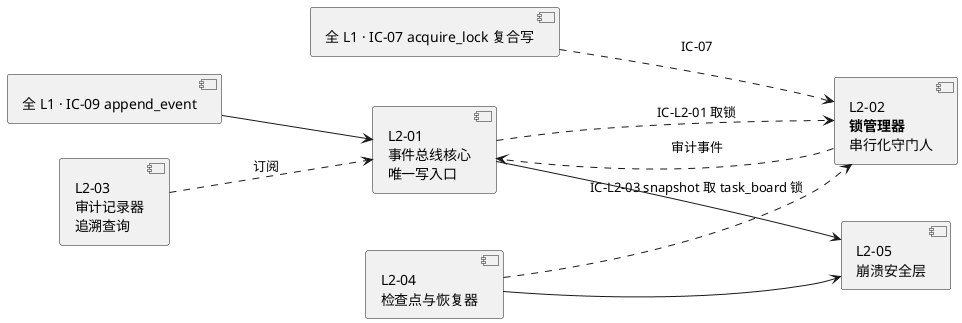
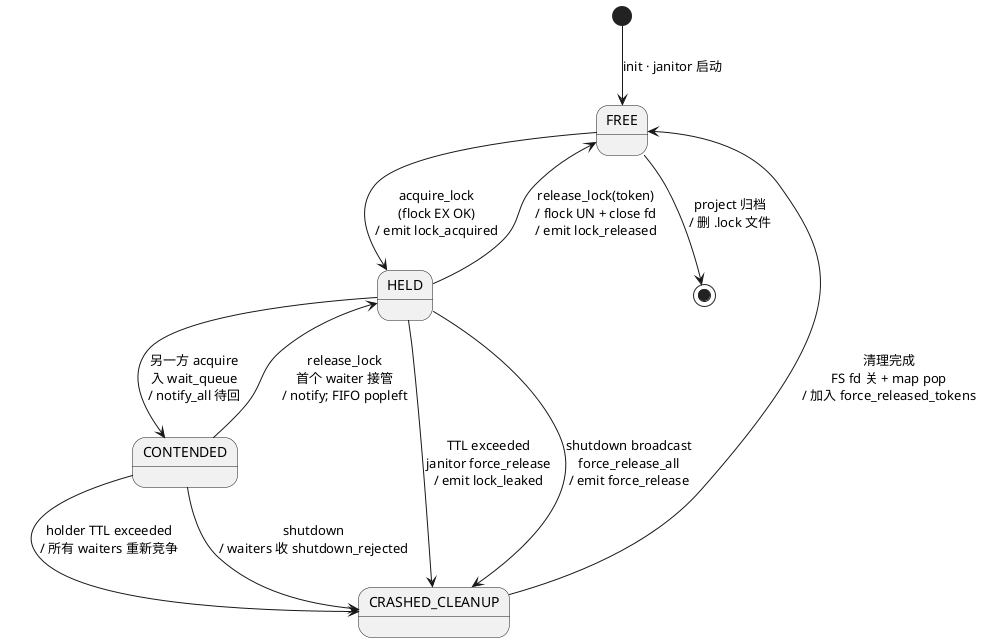
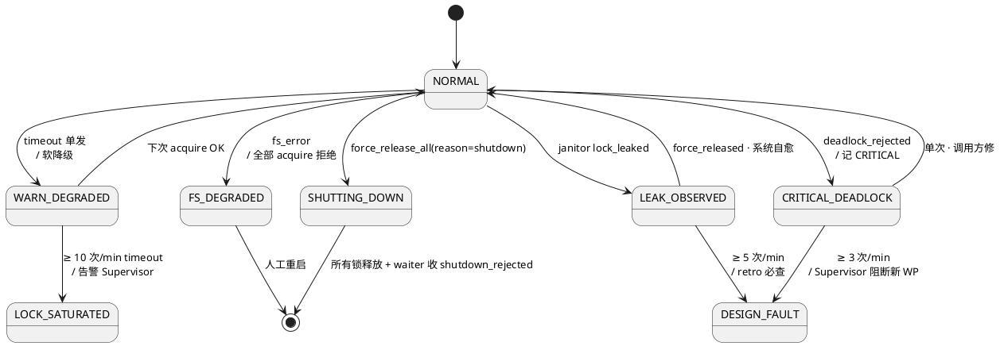

# L1-09 L2-02 · 锁管理器（LockManager）· tech-design

> **层级定位**：3-1-Solution-Technical / L1-09 韧性+审计 / **L2-02 锁管理器（自治 tech-design）**
>
> **上游 anchor**：
> - `docs/2-prd/L1-09 韧性+审计/prd.md §9 L2-02`（产品定义 · 职责 / 边界 / 必须 / 禁止 / GWT）
> - `docs/3-1-Solution-Technical/L1-09-韧性+审计/architecture.md §7`（L1 粒度锁总骨架 · flock 决策 / 锁粒度矩阵）
> - `docs/3-1-Solution-Technical/L0/tech-stack.md §技术栈决策`（Python fcntl stdlib / POSIX 原生 / 零依赖）
> - `docs/3-1-Solution-Technical/L0/ddd-context-map.md §2.10 BC-09 + §4.9 L2-02`（Lock Aggregate Root + LockGranularity VO）
> - `docs/3-1-Solution-Technical/L0/open-source-research.md §10.8a`（flock 业界落法 + 单写者对标）
>
> **下游 anchor**（本 L2 被消费的地方）：
> - 本 L1 兄弟：L2-01 事件总线（IC-L2-01）/ L2-04 检查点（IC-L2-03 snapshot 取 task_board 锁）
> - 全 L1 跨 L1 调用：IC-07 `acquire_lock`（scope §8.2）· L1-02 / L1-04 / 全 L1 写 task-board 前
> - 3-2-Solution-Detail / `tests/l1_09/l2_02/` TDD 套件（待建，由 3-2 落地）
>
> **交付形态**：本文档是 **L2-02 的自治实现文档**；给出该 L2 完整的 DDD 映射 / 对外接口 / 内部算法 / 数据 schema / 状态机 / 错误路径 / 性能目标 / 开源调研，给 3-2 TDD 层可直接拆用例。
>
> **冲突仲裁**：与 architecture.md §7 冲突 → 以 architecture.md 为准（本文档是 §7 的细化不是推翻）；与 prd.md §9 冲突 → 必须回溯修 2-prd 后再修本文档。

---

## 目录

1. [定位 + 2-prd 映射](#1-定位--2-prd-映射)
2. [DDD 映射](#2-ddd-映射lockservice-domain-service--lock-entity--leasetoken-vo)
3. [对外接口](#3-对外接口ic-l2-01--ic-07--错误码表)
4. [接口依赖关系](#4-接口依赖关系谁调本-l2--本-l2-调谁)
5. [P0 时序图（≥ 2 张）](#5-p0-时序图-2-张)
6. [内部核心算法](#6-内部核心算法flock--timeout--deadlock--crash-release)
7. [底层数据表 / schema](#7-底层数据表--schemaleasetoken-file-lock-schema--路径规范)
8. [状态机](#8-状态机lock-聚合根的-4-态-free--held--contended--crashed_cleanup)
9. [开源调研](#9-开源调研flock-man--python-fcntl--业界分布式锁redlock对比但不采用)
10. [配置参数](#10-配置参数-env--config-yaml-key-清单)
11. [错误处理 + 降级](#11-错误处理--降级-6-类错误--降级路径)
12. [性能目标](#12-性能目标slo-清单--基准测试方案)
13. [与 2-prd / 3-2 TDD 映射表](#13-与-2-prd--3-2-tdd-映射表)

---

## §0 核心决策一览（TL;DR）

| 维度 | 决策 | 依据 |
|---|---|---|
| **物理互斥机制** | `fcntl.flock(fd, LOCK_EX \| LOCK_NB)` on `.lock` 空文件 | architecture §7.2 · Python stdlib 零依赖 · 进程崩溃 OS 自动释放 |
| **双层锁结构** | thread-level `threading.Lock` + 物理 flock（双层） | architecture §7.3 · V1 单进程 thread_lock 覆盖 99% · flock 给 V2+ 多进程预留 |
| **等锁策略** | LOCK_NB + `while time.time() < deadline: try; sleep(10ms)` 自旋 | architecture §7.2 Rationale 3 · 保证 timeout 精确到 ≤ 100ms |
| **FIFO 公平** | `threading.Condition` + `collections.deque` ticket 队列 | prd §9.5 🚫 违反 FIFO · architecture §7.4 |
| **死锁检测** | wait-for graph + DFS 环检测 · acquire 时在线 O(V+E) | prd §9.6 ✅ 识别环形等待 · architecture §7.5 |
| **锁粒度** | resource-level · `<pid>:event_bus / <pid>:task_board / <pid>:wp-<wp_id> / ...` | architecture §7.1 矩阵 · 7 种资源名 |
| **超时默认** | `LOCK_WAIT_TIMEOUT_MS = 3000`（硬约束 prd §9.4 "≤ 3 秒"） | prd §9.4 硬约束 2 |
| **TTL 兜底** | `hold_time * 10`（如 event_bus 锁 TTL = 500ms）janitor thread 每 100ms 扫 | prd §9.6 ✅ 不配对告警 · architecture §7.6 |
| **不做** | ❌ Redlock / ❌ 分布式锁 / ❌ 重入锁 / ❌ 读写锁 / ❌ 优先级锁 | prd §9.3 Out-of-scope · Goal §2.1 零外部 DB |

---

## §1 定位 + 2-prd 映射

### 1.1 一句话职责（抄自 prd.md §9.1）

> 给 L1-09 内部和跨 L1 对敏感资源（事件总线写、task-board 状态切换、snapshot 窗口）的并发访问提供互斥原语（acquire/release），保证单一事实源在多方写入下仍严格串行 —— **是"写入秩序"的最后一道防线**。

### 1.2 在 L1-09 5 个 L2 中的位置



**三条命脉**（引 prd.md §9.8 + architecture.md §7.1）：
1. **L2-01 每次 append_event 前取 `<pid>:event_bus` 锁**（IC-L2-01 · 主路径 · P95 ≤ 5ms）
2. **L2-04 每次 snapshot 前取 `<pid>:task_board` 锁**（IC-L2-03 锁部分 · P95 ≤ 2s）
3. **全 L1 的 IC-07 复合写场景**（L1-02 / L1-04 等 · 跨资源原子写 task-board）

### 1.3 2-prd 映射表（细粒度）

| 2-prd 锚点 | 本文档章节 | 一句话 |
|---|---|---|
| prd §9.1 上游锚定（PM-10 / BF-X-08 / IC-07） | §1 + §3 | 定位 + 对外契约 |
| prd §9.2 输入输出（acquire/release/shutdown） | §3 | 三接口 + 错误码 |
| prd §9.3 In-scope 7 条（FIFO / 超时 / 死锁 / shutdown 释放 / 观测 ...） | §6 + §8 | 算法 + 状态机 |
| prd §9.3 Out-of-scope 5 条（不分布式 / 不事务 / 不 MVCC / 不优先级 / 不嵌套） | §9 | 开源调研 · Redlock 明确否 |
| prd §9.4 硬约束（FIFO / 超时 ≤ 3s / shutdown 释放 / 单资源单持有者 / 成对 / 死锁拒绝） | §6 + §10 + §11 | 算法 + 配置 + 错误 |
| prd §9.4 性能约束（无竞争 ≤ 5ms / 10 方 ≤ 100ms / release ≤ 2ms / 20 资源） | §12 | SLO 表 |
| prd §9.5 🚫 7 条（违 FIFO / 永不释放 / 跨进程 / 同资源并行 / 单方堵塞 / 后门 / shutdown 接单） | §11 | 错误路径 |
| prd §9.6 ✅ 8 条（唯一 token / FIFO / 超时 / 死锁 / shutdown / 观测 / 泄漏告警 / 无效 token 拒绝） | §3 + §6 + §8 | 接口 + 算法 + 状态机 |
| prd §9.8 IC 契约（IC-07 / IC-L2-01 / IC-L2-03 锁部分） | §3 + §4 | 接口表 |
| prd §9.9 GWT 6 场景（无竞争 / 10 方 FIFO / 超时 / 死锁 / shutdown / 20 方并发） | §13 | TDD 映射 |

---

## §2 DDD 映射（LockService Domain Service · Lock Entity · LeaseToken VO）

### 2.1 DDD 分类（引 ddd-context-map.md §4.9 第 812 行）

> **L1-09 L2-02 · 锁管理器**：
> - **Aggregate Root**: `Lock`
> - **VO**: `LockGranularity`（project/wp/state）
> - **Domain Service**: `LockManager`（在 architecture.md §2.3 里叫 Application Service · 本文档对齐为 Domain Service + Application Service 双职责）
> - 操作：acquire/release + 死锁识别 + 超时降级

### 2.2 对象模型（≥ 6 个对象）

| 对象 | 类型 | 核心字段 / 操作 | 一致性边界 |
|---|---|---|---|
| **Lock**（ddd §2.10）| **Aggregate Root** | `lock_id / resource / holder / acquired_at / ttl_ms / state` | 单资源单持有者（I-03 不变量 · architecture §2.3） |
| **LockGranularity** | **VO** | `{global, project, wp, state, checkpoint_window}` 枚举 + 对应 resource_name 模板 | project/wp/state 三级粒度（prd §9.2） |
| **LeaseToken** | **VO**（不可变）| `token_id(ulid) / lock_id / issued_at / expires_at / holder_sig` | acquire 返回给调用方的唯一凭证；release 时必须原件匹配 |
| **WaitQueue** | **Entity**（ticket 队列）| `resource / deque<ticket> / condition` | FIFO 公平（prd §9.4 硬约束 1） |
| **WaitForGraph** | **Domain Service**（无状态）| `nodes: holder → waiter` + DFS 环检测 | 死锁识别算法容器（prd §9.6） |
| **LockRepository** | **Repository**（architecture §2.4）| `acquire / release / force_release_all / list_held` | 对外唯一数据访问入口（所有 Lock 操作经它） |
| **LockJanitor** | **Background Service** | 每 `JANITOR_INTERVAL_MS` 扫 TTL 过期 → 强制释放 + 记 `lock_leaked` | 锁泄漏保护（architecture §7.6） |
| **LockAuditEmitter** | **Domain Service** | 每 acquire/release/deadlock/leak → 经 L2-01 `append_event` | 观测落盘（prd §9.6 ✅ 记审计事件） |

### 2.3 UL 术语对齐（引 ddd §2.10 + architecture §2.5）

| 术语 | 含义 | 别名（不再用）|
|---|---|---|
| **Lock** | 互斥锁聚合根 | mutex / semaphore（不用）|
| **LeaseToken** | acquire 返回的租约凭证 | lock_token（architecture §4 用的叫法 · 本文档统一为 LeaseToken） |
| **Holder** | 当前持有方的调用方身份 | owner / caller |
| **WaitTicket** | FIFO 等锁排队号 | wait_slot / queue_pos |
| **ResourceName** | 锁资源名（带 `<pid>:` 前缀）| lock_key / lock_name |
| **ForceRelease** | shutdown / TTL 过期时的强制释放 | revoke / evict |
| **CrashReleaseByOS** | 进程崩溃时 OS 自动释放 flock | auto_release（不再用 · 易混）|

### 2.4 不变量（Invariants · 引 BC-09 I-系列 + prd §9.4）

- **I-Lock-01**: 任一时刻同一 `resource` 至多有 1 个 `Lock` 处于 HELD 态（prd §9.4 硬约束 4 "单资源单持有者"）
- **I-Lock-02**: 任一 `acquire` 必须有配对的 `release` 或 `force_release`（prd §9.4 硬约束 5；违反 → `lock_leaked` 红线）
- **I-Lock-03**: 等锁队列严格 FIFO（prd §9.4 硬约束 1；违反 → 破坏公平性红线）
- **I-Lock-04**: acquire wait 超过 `LOCK_WAIT_TIMEOUT_MS` 必须返回 timeout 错误（prd §9.4 硬约束 2；不允许无限等）
- **I-Lock-05**: 识别到环形等待 → 新 acquire 立即拒绝 `deadlock_rejected`（prd §9.4 硬约束 6）
- **I-Lock-06**: shutdown 后拒绝新 acquire 并 `force_release_all`（prd §9.4 硬约束 3）
- **I-Lock-07**: LeaseToken 是 acquire 与 release 的唯一配对凭证；错误 token → release 拒绝（prd §9.6 ✅ 第 8 条）
- **I-Lock-08**: 资源名必带 `<pid>:` 前缀（除全局 `_index`）；违反 → 拒绝（architecture §1.4 第 132 行）

---

## §3 对外接口（IC-L2-01 / IC-07 + 错误码表）

### 3.1 接口清单（3 个公共接口 + 1 个内部观测）

| 接口 | 签名 | 同步/异步 | 调用方 | prd 锚点 |
|---|---|---|---|---|
| **IC-07** `acquire_lock` | `acquire_lock(resource: str, holder: str, timeout_ms: int = 3000) -> LeaseToken \| LockError` | **同步** · 请求-响应 | 全 L1（复合写）/ L2-01 / L2-04 | prd §9.2 + scope §8.2 |
| **IC-07 反** `release_lock` | `release_lock(token: LeaseToken) -> ReleaseAck \| LockError` | **同步** · 请求-响应 | acquire 的原调用方 | prd §9.2 |
| **观测** `is_locked` | `is_locked(resource: str) -> bool` | **同步** · 无副作用 | L1-07 Supervisor / L1-10 UI 监控 | prd §9.7 可选功能（落到 V1 核心）|
| **内部** `force_release_all` | `force_release_all(reason: str) -> ForceReleaseReport` | **同步** · 被 L2-04 shutdown 广播触发 | L2-04（仅）| prd §9.3 In-scope 6 + §9.4 硬约束 3 |
| **内部** `list_held` | `list_held() -> LockStatusSnapshot[]` | **同步** | retro / Supervisor | architecture §2.4 |

### 3.2 `acquire_lock` 详细契约

**签名**：

```python
def acquire_lock(
    resource: str,          # 资源名；带 <pid>: 前缀；见 §7.1 规范
    holder: str,            # 调用方身份（如 "L2-01:main_loop" / "L1-04:qc-loop:wp-042"）
    timeout_ms: int = 3000  # 等锁超时（≤ LOCK_WAIT_TIMEOUT_MS；超则拒绝参数）
) -> LeaseToken | LockError
```

**前置条件**（precondition · assert）：

1. `resource` 非空 str · 符合正则 `^(_index|[a-z0-9_-]+:[a-z0-9_-]+(\-[a-z0-9]+)?)$`
2. `resource` 必须在 `ALLOWED_RESOURCES` 白名单（architecture §7.1 + 本文档 §7.1）
3. `holder` 非空 str · 格式 `"<L-id>:<subcomponent>[:<context>]"`（审计需要）
4. `0 < timeout_ms ≤ LOCK_WAIT_TIMEOUT_MS_MAX`（默认上限 5000ms）
5. 系统不在 `SHUTTING_DOWN` 状态（否则立即返 `LockError.shutdown_rejected`）

**后置条件**（postcondition）：

- **成功路径**：
  - 返回 `LeaseToken`（ULID `token_id` + `lock_id` + `issued_at` + `expires_at = issued_at + TTL_MS`）
  - `Lock.state` 跃迁为 `HELD`
  - 异步（经 L2-01）发布 `L1-09:lock_acquired`（ddd §5.2.9）事件：`{lock_id, resource, holder, wait_ms}`
  - 本 holder 持有期间，其他 acquire 同 resource 必须进 `WaitQueue` 等或超时

- **失败路径 5 种**：

| 错误码 | 触发 | 返回结构 | 恢复建议 |
|---|---|---|---|
| `LockError.timeout` | 等超 `timeout_ms` | `{error: "timeout", resource, waited_ms, current_holder, queue_length}` | 软红线降级（prd §9.9 场景 3） |
| `LockError.deadlock_rejected` | 死锁检测到环 | `{error: "deadlock_rejected", cycle: [holders...], break_action: "reject_self"}` | Supervisor CRITICAL 审计 |
| `LockError.shutdown_rejected` | 系统 SHUTTING_DOWN | `{error: "shutdown_rejected", shutdown_at}` | 放弃写 · 记审计 |
| `LockError.invalid_resource` | 资源名不合法 | `{error: "invalid_resource", resource, reason}` | 调用方修参数（属调用方 bug） |
| `LockError.invalid_holder` | holder 格式不合法 | `{error: "invalid_holder", holder}` | 同上 |

**SLO**（prd §9.4 性能约束 + architecture §4.1）：

- **无竞争**：P95 ≤ 5ms · P99 ≤ 10ms
- **10 方竞争**：P95 ≤ 100ms · P99 ≤ 200ms
- **死锁检测开销**：< 1ms（单次 DFS；V ≤ 10）

### 3.3 `release_lock` 详细契约

**签名**：

```python
def release_lock(token: LeaseToken) -> ReleaseAck | LockError
```

**前置条件**：

1. `token` 非 None 且 schema 合法
2. `token.token_id` 在 `held_locks_map` 中存在（否则 `invalid_token`）
3. `token.expires_at` 可 > now（即使过期也允许 release · 不拒绝；只是会在 janitor 扫前一步清理）

**后置条件**：

- **成功**：
  - `Lock.state` 跃迁为 `FREE`（或下一个 ticket 立即接管 → `HELD`）
  - 异步发 `L1-09:lock_released`（ddd §5.2.9）：`{lock_id, hold_duration_ms}`
  - `fcntl.flock(fd, LOCK_UN)` + `close(fd)` + `thread_lock.release()` 三步按序执行
  - 返回 `ReleaseAck{released_at, hold_duration_ms, waiters_signaled: int}`

- **失败 3 种**：

| 错误码 | 触发 | 处理 |
|---|---|---|
| `LockError.invalid_token` | token_id 不在 held_locks_map | 拒绝 release（防"错误释放他人锁" prd §9.6 ✅ 第 8 条）· 记 `lock_release_rejected` 审计 |
| `LockError.already_released` | 重复 release（同 token 调 2 次）| 幂等化：第 2 次返 `ok_idempotent`（幂等业务）· 记 INFO 审计 |
| `LockError.forced_released` | janitor 已 force 过 | 返回说明 + 记 INFO；不视为错误（幂等） |

**SLO**：P95 ≤ 2ms（prd §9.4）

### 3.4 `is_locked` 详细契约

**签名**：

```python
def is_locked(resource: str) -> bool
```

**语义**：**只读** · 无副作用 · 不阻塞等锁队列 · 可能存在读到旧值（非线性化 · 但 V1 不承诺线性化读）

**实现**：直接查 `held_locks_map[resource]` 存在性 · 不走 flock（不 touch FS）

**SLO**：P95 ≤ 0.1ms（内存读）

### 3.5 `force_release_all` 详细契约（内部 · L2-04 专属调用方）

**签名**：

```python
def force_release_all(reason: str) -> ForceReleaseReport
```

**前置**：`reason ∈ {"shutdown", "emergency_halt", "fatal_corruption"}`（白名单 · 其他 reason 拒绝）

**后置**：
- 所有 HELD Lock 强制释放（flock UN + close fd + thread_lock release）
- 所有 WaitQueue 唤醒并返回 `shutdown_rejected`
- 系统进 `SHUTTING_DOWN` 状态 · 后续 acquire 一律拒绝
- 返回 `{released_count, waiters_rejected_count, duration_ms}`
- 批量发 `L1-09:force_release`（ddd §5.2.9）审计事件

**SLO**：整体 ≤ 200ms（20 把锁 + 20 等待者同时广播）

### 3.6 `list_held` 详细契约（内部 · retro / Supervisor 观测用）

**签名**：

```python
def list_held() -> list[LockStatus]

@dataclass(frozen=True)
class LockStatus:
    resource: str
    holder: str
    acquired_at: int         # ms since epoch
    hold_duration_ms: int
    ttl_ms: int
    waiters_count: int
    waiters_oldest_wait_ms: int
```

**语义**：快照 · 非原子（读 20 把锁中途可能某把释放 → 返回 snapshot 可能略过时）· 不允许阻塞 acquire 主路径

**SLO**：P95 ≤ 5ms（20 把锁遍历 + 返回）

### 3.7 错误码总表（FATAL · RECOVERABLE · IDEMPOTENT 分类）

| 错误码 | 严重度 | 分类 | 是否记 Supervisor | 是否影响 Goal §4 |
|---|---|---|---|---|
| `timeout` | WARN | Recoverable | 是（WARN 级）| 软红线（影响响应面 SLO）|
| `deadlock_rejected` | CRITICAL | Recoverable | 是（CRITICAL 级）| 硬红线（破坏串行化 → Goal §4.1）|
| `shutdown_rejected` | INFO | Terminal | 否（运行期）/ 是（若频繁 → 异常 shutdown） | 无（shutdown 语义明确）|
| `invalid_resource` | ERROR | Caller Bug | 是（ERROR 级 · 说明 L1 写错）| 间接（该 L1 产出未完成）|
| `invalid_holder` | ERROR | Caller Bug | 是 | 同上 |
| `invalid_token` | ERROR | Caller Bug | 是 | 同上 |
| `lock_leaked` | CRITICAL | Runtime Fault | 是（CRITICAL + janitor 强制释放）| 硬红线（破坏成对语义）|
| `already_released` | INFO | Idempotent | 否（DEBUG 级 · 仅观测）| 无 |

---

## §4 接口依赖关系（谁调本 L2 · 本 L2 调谁）

### 4.1 依赖关系全景图

```plantuml
@startuml
package "调用方 (被本 L2 服务)" as CALLERS {
component "L2-01 事件总线\nIC-L2-01\n每次 append_event" as L201
component "L2-04 检查点\nIC-L2-03 锁部分\n每次 snapshot" as L204
component "L1-02 生命周期\nIC-07\nstate.yaml 切换 / manifest 追加" as L102
component "L1-04 Quality Loop\nIC-07\n同 WP 并发保护" as L104
component "L1-07 Supervisor\nis_locked / list_held\n只读监控" as L107
component "L1-10 UI\nlist_held\n锁态实时流" as L110
component "全 L1\nIC-07\n复合写 task-board" as ALLL1
}
component "<b>L2-02 锁管理器</b>\n本文档主角\n提供 acquire/release/is_locked" as L202
package "本 L2 依赖的下游" as DEPS {
component "L2-01 事件总线\n接收锁审计事件\nlock_acquired / _released / _leaked / _deadlock" as L201_audit
component "OS kernel\nfcntl syscall\nflock" as OS
component "文件系统\nprojects/<pid>/tmp/*.lock\n空文件" as FS
component "Python threading\nLock / Condition / deque" as THREAD
}
L201 --> L202 : IC-L2-01 每次 append 前 + 后
L204 --> L202 : IC-L2-03 snapshot 前 + 后
L102 --> L202 : IC-07 state 切换前 + 后
L104 --> L202 : IC-07 QC-loop 启动 + 结束
L107 ..> L202 : 观测
L110 ..> L202 : 观测
ALLL1 ..> L202 : IC-07 复合写
L202 ..> L201_audit : 审计事件\n经 L2-01 主路径
L202 --> OS : fcntl.flock LOCK_EX LOCK_NB
L202 --> FS : open/close/flock .lock 文件
L202 --> THREAD : thread_lock / Condition.wait
L204 ..> |force_release_all| : shutdown 广播
@enduml
```

### 4.2 调用方清单（按频次排序）

| 调用方 | 接口 | 频次 | 资源名 | 持锁时长 | 关键路径? |
|---|---|---|---|---|---|
| **L2-01 事件总线** | acquire_lock + release_lock | **最高频** · 每 tick ≥ 1 次 · 全系统每秒 ≥ 100 次 | `<pid>:event_bus` | ≤ 50ms | **是**（Goal §4.4 P95 ≤ 200ms 主路径）|
| **L1-02 生命周期（S1→S7 切态）** | acquire_lock + release_lock | 低频 · 每 state 跃迁 1 次 · 每项目 7 次 | `<pid>:state` | ≤ 500ms | 是（Stage Gate 卡点）|
| **L1-02 manifest 追加** | acquire_lock + release_lock | 中频 · 每个产出物 1 次 | `<pid>:manifest` | ≤ 200ms | 否 |
| **L1-04 Quality Loop** | acquire_lock + release_lock | 中频 · 每 WP 启动 1 次 + 运行持续占用 | `<pid>:wp-<wp_id>` | 整个 tick（数秒～分钟）| 否（WP 内串行） |
| **L2-04 snapshot** | acquire_lock + release_lock | 中低频 · 周期 10-60s / 关键事件 | `<pid>:task_board`, `<pid>:checkpoint_window` | ≤ 2s | 否（后台）|
| **L1-02 全局 index 改** | acquire_lock + release_lock | 极低频 · 每项目创建 / 归档 1 次 | `_index`（全局）| ≤ 100ms | 是（project_id 分配窗口） |
| **L1-07 Supervisor 监控** | is_locked, list_held | 低频 · 每 30s 巡检 | N/A | 0（只读） | 否 |
| **L1-10 UI 实时流** | is_locked, list_held | 中频 · 每 2s 刷新 | N/A | 0（只读） | 否 |

### 4.3 本 L2 反向依赖（本 L2 需要谁才能工作）

| 依赖方 | 层级 | 用途 | 紧耦合度 | 崩溃时本 L2 行为 |
|---|---|---|---|---|
| **Python `fcntl` module** | stdlib | 物理 flock 实现 | 极强 | N/A · stdlib 不会不可用（若 fcntl 不存在 = OS 非 POSIX = 系统无法启动）|
| **Python `threading` module** | stdlib | 进程内快路径 Lock + Condition + deque | 极强 | 同上 |
| **文件系统**（可写 `projects/<pid>/tmp/`）| OS | `.lock` 文件 open/close | 强 | 文件系统失败 → acquire 返 `LockError.fs_error`（新增 · architecture §7.2 的 Trade-off）|
| **L2-01 事件总线**（反向 · 写审计）| 兄弟 L2 | 落盘 `lock_acquired` / `_released` / `_leaked` / `_deadlock_detected` 事件 | 中等（可延迟落盘 · acquire 主路径不阻塞）| L2-01 不可用 → 审计事件入内存 ring buffer · L2-01 恢复后补发（architecture §4.2） |
| **L2-04 检查点**（反向 · shutdown 广播）| 兄弟 L2 | 接收 shutdown 信号 → 触发 `force_release_all` | 弱（仅信号）| L2-04 崩溃 → 依赖 SIGTERM handler（OS 信号）直接调 `force_release_all` |

### 4.4 跨 L1 依赖（IC-07 公共契约）

本 L2 通过 scope §8.2 **IC-07 `acquire_lock`** 对**所有 L1**发布：

- **Published Language 地位**（引 ddd §2.10 "Published Language 发布者"）：IC-07 的 contract 一旦定，所有 L1 遵守；本 L2 承诺 backward compatible 不破坏字段语义。
- **版本演化**：IC-07 加字段必 optional · 减字段必须 deprecate 1 个版本后移除 · 按 HEX L0 Hexagonal Architecture 适配器模式（L0/ddd-context-map 已明）。

### 4.5 依赖风险矩阵

| 风险 | 触发 | 影响 | 缓解 |
|---|---|---|---|
| **L2-01 审计阻塞**（reentrancy）| 若 acquire 主路径也经 IC-09 append_event → 自引用死循环 | 系统卡死 | **解耦**：审计事件**不经 acquire**；LockAuditEmitter 直接进 L2-01 内部异步 enqueue（不走 IC-09 公共入口）· architecture §4.1 内部优化 |
| **文件系统满 / 只读** | `open(.lock, "w")` 失败 | acquire 无法物理取锁 | 返 `fs_error` + 降级（无锁模式 = 拒绝写 · 严于正常）+ Supervisor CRITICAL |
| **fcntl syscall 跨平台差异** | Windows 无 fcntl | 部署失败 | V1 明确 **macOS / Linux only**（tech-stack §平台约束）· Windows 暂不支持；报错于 import 阶段（fail-fast）|
| **janitor thread 崩溃** | 未捕获异常 | TTL 失效 → 锁泄漏堆积 | janitor 主循环 try/except 全部兜底 + 自恢复 + 记 `janitor_crashed` 事件（architecture §7.6） |

---

## §5 P0 时序图（2 张）

### 5.1 图 L1 · acquire + release 主路径（无竞争 · 最高频）

> **场景**：L2-01 事件总线每次 append_event 前取 `<pid>:event_bus` 锁；全系统 ≥ 100 次/秒 触发；这是 L1-09 的 **P0 主路径**（Goal §4.4 P95 ≤ 200ms 主路径的关键一段）。

```plantuml
@startuml
autonumber
    autonumber
participant "L2-01 主循环<br/>(EventBusCore)" as Caller
participant "L2-02 LockManager<br/>(Application Service)" as LM
    participant TLock as thread_locks_map<br/>["<pid>:event_bus"]
participant "WaitQueue<br/>(FIFO ticket deque)" as WQ
participant "WaitForGraph<br/>(deadlock detector)" as DG
participant "文件系统<br/>projects/<pid>/tmp/<br/>.events.lock" as FS
participant "OS Kernel<br/>fcntl.flock" as OS
participant "L2-01 内部<br/>async audit ring" as L201
participant "LockJanitor<br/>(bg thread)" as Jan
note over Caller,Jan : T0 · acquire_lock("<pid>:event_bus", "L2-01:main_loop", timeout_ms=3000)
Caller -> LM : acquire_lock(resource, holder, 3000)
activate LM
LM -> LM : ① 验参（resource 白名单 · holder 格式 · 非 SHUTTING_DOWN）
LM -> LM : ② 签发 LeaseToken(ulid) + lock_id + issued_at
note over LM,DG : T0+0.1ms · 死锁检测（O(V+E) · V≤10）
LM -> DG : detect_cycle(new_waiter=holder, new_resource=resource)
DG -> DG : 构建 wait-for graph · DFS from holder
DG- -> LM : cycle=None（99% 路径）
note over LM,TLock : T0+0.3ms · thread-level 快路径（进程内）
LM -> TLock : thread_lock.acquire(timeout=2.999s)
TLock- -> LM : ok（无竞争 · 瞬时获锁 ≤ 0.1ms）
note over LM,WQ : T0+0.4ms · FIFO ticket（即便无竞争也入队保证次序）
LM -> WQ : ticket = new_ticket(); deque.append(ticket)
WQ- -> LM : ticket_id=T-42
LM -> WQ : while deque[0] != ticket: condition.wait(short)
WQ- -> LM : 自己在队头 · 进入 flock 慢路径
note over LM,OS : T0+0.5ms · flock 物理锁（POSIX 原生）
LM -> FS : fd = open("projects/<pid>/tmp/.events.lock", "w", 0o644)
FS- -> LM : fd=17
loop deadline = now + 2.9995s; 自旋 ≤ 10ms/轮
LM -> OS : fcntl.flock(fd, LOCK_EX | LOCK_NB)
alt 获锁成功（99% 单进程瞬时）
OS- -> LM : ok
else 慢路径（其他进程持有）
OS- -> LM : BlockingIOError
LM -> LM : time.sleep(0.01)
end
end
note over LM : T0+1ms · 状态跃迁 FREE → HELD
LM -> LM : held_locks_map[resource] = Lock(state=HELD,\nholder, acquired_at=now, ttl_ms=500, fd, token)
LM -> L201 : enqueue(lock_acquired event) · async · 不阻塞主路径
L201- -> LM : enqueued（ring buffer · 后台 flush）
LM- -> Caller : LeaseToken{token_id, lock_id, issued_at, expires_at}
deactivate LM
note over Caller,Jan : T1 ≈ T0+1-3ms · Caller 做业务（写 events.jsonl）
Caller -> Caller : atomic_append(events.jsonl, line)\n耗时 ≤ 30ms（fsync 主导）
note over Caller,Jan : T2 ≈ T0+35ms · release_lock(token)
Caller -> LM : release_lock(token)
activate LM
LM -> LM : ③ 验 token_id ∈ held_locks_map · 取 Lock 实例
LM -> OS : fcntl.flock(fd, LOCK_UN)
OS- -> LM : ok
LM -> FS : os.close(fd)
FS- -> LM : ok
LM -> TLock : thread_lock.release()
TLock- -> LM : ok
LM -> WQ : condition.notify_all()（唤醒下一 ticket · 若有）
WQ- -> LM : waiters_signaled=0
LM -> LM : 状态跃迁 HELD → FREE · held_locks_map.pop(resource)
LM -> L201 : enqueue(lock_released event)\n{lock_id, hold_duration_ms=34}
L201- -> LM : enqueued
LM- -> Caller : ReleaseAck{released_at, hold_duration_ms=34, waiters_signaled=0}
deactivate LM
note over Jan : 后台 · 每 100ms 扫一次 held_locks_map
Jan -> LM : list_held()（只读 snapshot）
LM- -> Jan : [Lock(event_bus, acquired_at=T0, ttl=500ms)]
Jan -> Jan : now - acquired_at = 34ms < ttl=500ms · 健康
@enduml
```

**关键点**：
- **主路径延迟拆解**：验参 0.2ms · 死锁检测 0.1ms · thread_lock 0.1ms · ticket 0.1ms · flock 0.3ms · 状态机 + 审计 enqueue 0.2ms = **合计 P95 ≤ 5ms**（prd §9.4 性能约束）
- **审计事件 async**：`lock_acquired` / `lock_released` 不走公共 IC-09 入口（避免自引用死锁 §4.5），直接 enqueue L2-01 内部 ring buffer，主路径不阻塞
- **release 幂等性**：若同 token 调 2 次 release → 第 2 次返 `ok_idempotent`（§3.3）
- **FS fd 管理**：open/close 必须成对；flock 在 close 时 OS 自动释放（即便 LOCK_UN 忘了调）

### 5.2 图 L2 · 超时 + 死锁主动拒绝（降级与保护路径）

> **场景**：3 个 holder 同时争抢 2 个资源形成环形等待；本图展示 timeout 硬约束（prd §9.4 约束 2）+ 死锁拒绝硬约束（prd §9.4 约束 6）的联防。

```plantuml
@startuml
autonumber
    autonumber
participant "Caller A<br/>(L1-02:state_switch)" as A
participant "Caller B<br/>(L1-04:qc-loop:wp-042)" as B
participant "Caller C<br/>(L2-04:snapshot)" as C
participant "L2-02 LockManager" as LM
participant "WaitForGraph" as DG
participant "WaitQueue per resource" as WQ
participant "OS fcntl" as OS
participant "L2-01 async audit" as L201
participant "L1-07 Supervisor" as Sup
participant "LockJanitor" as Jan
note over A,Jan : T0 · A 取 state 锁 · 正常获取
A -> LM : acquire_lock("<pid>:state", "L1-02", 3000)
LM -> OS : flock(.state.lock, EX|NB) → ok
LM- -> A : token_A{resource=state, acquired_at=T0}
note over A,Jan : T0+5ms · B 取 wp-042 锁 · 正常获取
B -> LM : acquire_lock("<pid>:wp-042", "L1-04", 3000)
LM -> OS : flock(.wp-042.lock, EX|NB) → ok
LM- -> B : token_B{resource=wp-042}
note over A,Jan : T0+20ms · A 想加取 wp-042 锁（复合写）
A -> LM : acquire_lock("<pid>:wp-042", "L1-04", 3000)
activate LM
LM -> DG : detect_cycle(waiter=A, resource=wp-042, current_holder=B)
DG -> DG : graph = {A→B}（A 等 B 持有的 wp-042）
DG- -> LM : cycle=None（单向等待 · 未成环）
LM -> WQ : A 入 wp-042 等待队列
note over LM,WQ : A 阻塞等待 · thread_lock 持有中
deactivate LM
note over A,Jan : T0+25ms · B 想加取 state 锁（复合写）→ 形成环
B -> LM : acquire_lock("<pid>:state", "L1-02", 3000)
activate LM
LM -> DG : detect_cycle(waiter=B, resource=state, current_holder=A)
DG -> DG : graph = {A→B, B→A} · DFS from B → 访问 A → A 等 B = 环!
DG- -> LM : cycle=[B→state→A, A→wp-042→B]
note over LM,DG : 🛑 识别环形等待 (prd §9.4 硬约束 6)
LM -> L201 : enqueue(L1-09:lock_deadlock_detected)\n{participants:[A,B], break_action:"reject_B"}
L201- -> LM : enqueued
LM- -> B : LockError{deadlock_rejected, cycle, break_action}
deactivate LM
B- -> B : 软红线降级 · 释放 wp-042 token_B（避免永锁）
B -> LM : release_lock(token_B)
LM -> OS : flock(.wp-042.lock, UN)
LM -> WQ : notify_all(wp-042) · 唤醒 A
note over A,Jan : T0+30ms · A 从 wp-042 等待队列被唤醒 · 续取成功
WQ- -> LM : A 队头
LM -> OS : flock(.wp-042.lock, EX|NB) → ok
LM- -> A : token_A2{resource=wp-042}
note over L201,Sup : T0+35ms · Supervisor 订阅 lock_deadlock_detected
L201- -> Sup : push(lock_deadlock_detected, severity=CRITICAL)
Sup -> Sup : 记 CRITICAL 审计 · 若再发 ≥ 3 次/min → 进入 degraded 模式
note over A,Jan : ---- 分支 · Timeout 超时场景 ----
note over A,Jan : T+10s · C 试图取 task_board 锁 · 被长持有者 X 卡住
participant "长持有者 X<br/>(疑似泄漏)" as X
X -> LM : acquire_lock("<pid>:task_board", "L2-04", 3000)
LM- -> X : token_X{acquired_at=T+10s, ttl=500ms}
note over X : X 陷入死循环 · 一直不 release
C -> LM : acquire_lock("<pid>:task_board", "L2-04:snap", 3000)
activate LM
LM -> DG : detect_cycle → None（单向等待）
LM -> WQ : C 入 task_board 等待队列
loop deadline = T+10s + 3s; 100 轮 × 10ms + condition.wait
LM -> WQ : condition.wait(short) · 期间 X 未释放
end
note over LM : 🛑 等待 > 3000ms · 触发 timeout (prd §9.4 硬约束 2)
LM -> WQ : C 出队
LM -> L201 : enqueue(lock_wait_timeout)\n{resource:task_board, waited_ms:3001,\ncurrent_holder:X, queue_length:0}
L201- -> LM : enqueued
LM- -> C : LockError{timeout, waited_ms:3001, current_holder:X}
deactivate LM
C- -> C : 软红线降级 · 跳过本次 snapshot · 等下一周期
note over Jan,Sup : T+10s+500ms · janitor 扫到 X 超 TTL
Jan -> LM : list_held()
LM- -> Jan : [Lock(task_board, X, acquired_at=T+10s, ttl=500ms)]
Jan -> Jan : now - acquired_at = 3500ms > ttl=500ms · 泄漏!
Jan -> LM : internal_force_release(resource=task_board, reason="ttl_exceeded")
LM -> OS : flock(.task_board.lock, UN) + close(fd)
LM -> L201 : enqueue(L1-09:lock_leaked)\n{lock_id, holder:X, held_ms:3500}
L201- -> Sup : push(lock_leaked, severity=CRITICAL)
Sup -> Sup : 标记 X 为可疑组件 · 上报 retro 供复盘
@enduml
```

**关键点**：
- **死锁检测时机**：每次 acquire 进入 WaitQueue 前做 DFS（O(V+E) · V ≤ 10 · 实测 ≤ 1ms）
- **破锁策略**：**拒绝新申请方**（本图中 B），让现有持有者（A）继续完成；这是最简单且不产生额外副作用的策略（prd §9.4 硬约束 6 + architecture §7.5 Trade-off）
- **降级路径差异**：timeout 是 **WARN**（可能只是慢 · 正常调用方重试）· deadlock 是 **CRITICAL**（逻辑漏洞 · 必上报 Supervisor）
- **janitor 兜底**：即便调用方忘了 release / 进程 crash 前未 release，TTL + janitor 确保锁最终释放（≤ TTL + JANITOR_INTERVAL_MS）

---

## §6 内部核心算法（flock + timeout + deadlock + crash_release）

本节把 §5 的时序图转化为**可直接拆 TDD 用例的伪代码**。4 个核心算法：acquire 流水线 / release 流水线 / wait-for 环检测 / janitor TTL 扫描。

### 6.1 `acquire_lock` 算法（flock + thread_lock + FIFO + deadlock 五阶段）

```python
def acquire_lock(resource: str, holder: str, timeout_ms: int = 3000) -> LeaseToken | LockError:
    """L2-02 主接口 · 覆盖 I-Lock-01 / 03 / 04 / 05 / 08"""

    # ---------- Stage 1 · 参数校验（≤ 0.1ms · I-Lock-08）----------
    if not RESOURCE_NAME_RE.fullmatch(resource):
        return LockError("invalid_resource", resource=resource, reason="regex_mismatch")
    if resource not in ALLOWED_RESOURCES:  # 白名单（§7.1）
        return LockError("invalid_resource", resource=resource, reason="not_in_whitelist")
    if not HOLDER_RE.fullmatch(holder):
        return LockError("invalid_holder", holder=holder)
    if not (0 < timeout_ms <= LOCK_WAIT_TIMEOUT_MS_MAX):
        return LockError("invalid_timeout", timeout_ms=timeout_ms)
    if _system_state == SHUTTING_DOWN:
        return LockError("shutdown_rejected", shutdown_at=_shutdown_at)

    # ---------- Stage 2 · 死锁环检测（≤ 1ms · I-Lock-05）----------
    with _graph_mutex:  # 保护 wait-for graph 读写
        cycle = _wait_for_graph.detect_cycle_if_add(waiter=holder, resource=resource)
        if cycle is not None:
            _emit_audit_async("L1-09:lock_deadlock_detected",
                              {"cycle": cycle, "break_action": "reject_new_waiter"})
            return LockError("deadlock_rejected", cycle=cycle, break_action="reject_self")
        _wait_for_graph.add_wait_edge(holder, resource)  # 先登记 · 失败路径必 remove

    # ---------- Stage 3 · thread_lock 快路径（≤ 0.1ms 无竞争）----------
    thread_lock = _thread_locks_map.setdefault(resource, threading.Lock())
    condition = _conditions_map.setdefault(resource, threading.Condition(thread_lock))
    wait_queue = _wait_queues.setdefault(resource, collections.deque())

    start_ns = time.monotonic_ns()
    deadline_ns = start_ns + timeout_ms * 1_000_000

    # FIFO ticket
    ticket = _next_ticket_id()  # 单调递增 int
    with condition:
        wait_queue.append(ticket)
        try:
            # 等到自己排到队头 + thread_lock 可获取
            while wait_queue[0] != ticket:
                remaining_s = max(0.0, (deadline_ns - time.monotonic_ns()) / 1e9)
                if remaining_s == 0 or not condition.wait(timeout=remaining_s):
                    # Stage 3 timeout
                    wait_queue.remove(ticket)
                    _wait_for_graph.remove_wait_edge(holder, resource)
                    _emit_audit_async("L1-09:lock_wait_timeout",
                                      {"where": "thread_fifo", "waited_ms": _elapsed_ms(start_ns)})
                    return LockError("timeout", where="thread_fifo",
                                     waited_ms=_elapsed_ms(start_ns),
                                     queue_length=len(wait_queue))
            # 轮到自己
            wait_queue.popleft()
        except BaseException:
            # 保守清理 · 避免 ticket 卡队首
            if ticket in wait_queue:
                wait_queue.remove(ticket)
            _wait_for_graph.remove_wait_edge(holder, resource)
            raise

    # ---------- Stage 4 · flock 物理锁（≤ 1ms 单进程 / 自旋跨进程）----------
    lock_file_path = _resource_to_lock_path(resource)  # §7 schema
    try:
        fd = os.open(lock_file_path, os.O_WRONLY | os.O_CREAT, 0o644)
    except OSError as e:
        _wait_for_graph.remove_wait_edge(holder, resource)
        _emit_audit_async("L1-09:lock_fs_error", {"resource": resource, "errno": e.errno})
        return LockError("fs_error", resource=resource, errno=e.errno)

    flock_acquired = False
    try:
        while time.monotonic_ns() < deadline_ns:
            try:
                fcntl.flock(fd, fcntl.LOCK_EX | fcntl.LOCK_NB)
                flock_acquired = True
                break
            except BlockingIOError:
                time.sleep(FLOCK_SPIN_INTERVAL_S)  # 10ms
        if not flock_acquired:
            os.close(fd)
            _wait_for_graph.remove_wait_edge(holder, resource)
            _emit_audit_async("L1-09:lock_wait_timeout",
                              {"where": "flock_spin", "waited_ms": _elapsed_ms(start_ns)})
            return LockError("timeout", where="flock_spin",
                             waited_ms=_elapsed_ms(start_ns))
    except BaseException:
        try: os.close(fd)
        except: pass
        raise

    # ---------- Stage 5 · 状态机 FREE → HELD + 返 token（≤ 0.3ms）----------
    token = LeaseToken(
        token_id=ulid.new(),
        lock_id=ulid.new(),
        issued_at=_now_ms(),
        expires_at=_now_ms() + _resource_ttl_ms(resource),
        holder_sig=_sign_holder(holder),
    )
    lock_obj = Lock(
        lock_id=token.lock_id,
        resource=resource,
        holder=holder,
        acquired_at=_now_ms(),
        ttl_ms=_resource_ttl_ms(resource),
        state=LockState.HELD,
        fd=fd,
        thread_lock=thread_lock,
        token=token,
    )
    _held_locks_map[resource] = lock_obj
    _wait_for_graph.promote_to_hold(holder, resource)  # 等待边 → 持有边

    _emit_audit_async("L1-09:lock_acquired",
                      {"lock_id": lock_obj.lock_id, "resource": resource,
                       "holder": holder, "wait_ms": _elapsed_ms(start_ns)})
    return token
```

**复杂度**：O(V + E) 环检测 + O(1) 其他阶段 · L1-09 V ≤ 10 · 实测 P95 ≤ 5ms（无竞争）

### 6.2 `release_lock` 算法（幂等 + 严格 token 配对）

```python
def release_lock(token: LeaseToken) -> ReleaseAck | LockError:
    """覆盖 I-Lock-02 / 07"""

    # ---------- Stage 1 · token 合法性 ----------
    if token is None or not isinstance(token, LeaseToken):
        return LockError("invalid_token", reason="malformed")
    if not _verify_holder_sig(token):  # HMAC 校验 · 防伪造
        return LockError("invalid_token", reason="sig_mismatch")

    # ---------- Stage 2 · 查找（可能已被 janitor force 释放）----------
    with _held_locks_mutex:
        lock_obj = _token_to_lock.get(token.token_id)
        if lock_obj is None:
            # 两种情形：① 从未 acquire（攻击或 bug）② 已被 janitor / shutdown 强制释放
            if token.token_id in _force_released_tokens:
                return ReleaseAck(status="ok_forced_released",
                                  released_at=_now_ms(), waiters_signaled=0)
            return LockError("invalid_token", reason="not_held")
        if lock_obj.state != LockState.HELD:
            # 已进 RELEASING 态（race）· 幂等返回
            return ReleaseAck(status="ok_idempotent",
                              released_at=_now_ms(), waiters_signaled=0)
        lock_obj.state = LockState.RELEASING  # 标记 · 防重入

    # ---------- Stage 3 · flock UN + close + thread_lock release（顺序不可颠倒）----------
    try:
        fcntl.flock(lock_obj.fd, fcntl.LOCK_UN)
    except OSError as e:
        # 极端：fd 已被外部关闭 · 降级继续清理
        _emit_audit_async("L1-09:lock_flock_un_error",
                          {"lock_id": lock_obj.lock_id, "errno": e.errno})
    try:
        os.close(lock_obj.fd)
    except OSError:
        pass

    waiters_signaled = 0
    condition = _conditions_map[lock_obj.resource]
    with condition:
        try:
            lock_obj.thread_lock.release()  # 允许 _conditions_map 的其他 waiters
        except RuntimeError:
            pass  # thread_lock 已释 · 幂等
        condition.notify_all()
        waiters_signaled = len(_wait_queues.get(lock_obj.resource, ()))

    # ---------- Stage 4 · 清理 map + wait-for graph ----------
    with _held_locks_mutex:
        _held_locks_map.pop(lock_obj.resource, None)
        _token_to_lock.pop(token.token_id, None)
    _wait_for_graph.remove_hold_edge(lock_obj.holder, lock_obj.resource)

    hold_duration_ms = _now_ms() - lock_obj.acquired_at
    _emit_audit_async("L1-09:lock_released",
                      {"lock_id": lock_obj.lock_id, "hold_duration_ms": hold_duration_ms})

    return ReleaseAck(status="ok", released_at=_now_ms(),
                      hold_duration_ms=hold_duration_ms,
                      waiters_signaled=waiters_signaled)
```

### 6.3 `WaitForGraph.detect_cycle_if_add` 死锁检测（DFS · O(V+E)）

```python
class WaitForGraph:
    """
    Wait-For Graph:
      nodes = { holder_id }
      edges: holder_A → holder_B 当且仅当 holder_A 在等 holder_B 持有的资源
    算法：每次 acquire 前 "假想加入" 新边做 DFS · 发现环即拒绝
    """

    def __init__(self):
        self._holds: dict[str, set[str]] = {}      # resource -> {holder}（持有 · 单持有）
        self._waits: dict[str, set[str]] = {}      # holder -> {resource}（等待中）
        self._mutex = threading.Lock()

    def detect_cycle_if_add(self, waiter: str, resource: str) -> list[str] | None:
        """Return cycle path or None. MUST be called with _mutex held (caller's 责任)."""
        # 当前 resource 的持有者（若有）
        holders = self._holds.get(resource, set())
        if not holders or waiter in holders:
            return None  # 无人持有 / 自己持有（不支持重入 · 但也不构成环）

        # 假想加入 waiter → holder 边；DFS 看 holder → ... → waiter 是否可达
        def reachable(src: str, dst: str, visited: set[str], path: list[str]) -> list[str] | None:
            if src == dst:
                return path + [src]
            if src in visited:
                return None
            visited.add(src)
            # src 持有的资源 · 谁在等? 那些等待者是 src 的后继
            for res in self._waits.get(src, set()):
                for successor in self._holds.get(res, set()):
                    sub = reachable(successor, dst, visited, path + [src, f"->{res}->"])
                    if sub is not None:
                        return sub
            return None

        for holder in holders:
            cycle = reachable(holder, waiter, set(), [])
            if cycle is not None:
                # waiter 加入后会成环 · 返回环路径供审计
                return [waiter, f"->{resource}->"] + cycle
        return None
```

**不变量**：该函数必须在 `_graph_mutex` 持有下调用；若 detect_cycle 返回 None 则**立即** `add_wait_edge`（原子一对调用）· 否则 TOCTOU 会漏检。

### 6.4 `LockJanitor.run` 后台扫描（TTL + crash cleanup）

```python
def janitor_run():
    """守护线程 · 每 JANITOR_INTERVAL_MS 扫一次 held_locks_map"""
    while not _shutdown_event.is_set():
        try:
            now_ms = _now_ms()
            expired: list[Lock] = []
            with _held_locks_mutex:
                for resource, lock_obj in list(_held_locks_map.items()):
                    if lock_obj.state != LockState.HELD:
                        continue
                    held_ms = now_ms - lock_obj.acquired_at
                    if held_ms > lock_obj.ttl_ms:
                        expired.append(lock_obj)

            for lock_obj in expired:
                _emit_audit_async("L1-09:lock_leaked",
                                  {"lock_id": lock_obj.lock_id,
                                   "resource": lock_obj.resource,
                                   "holder": lock_obj.holder,
                                   "held_ms": now_ms - lock_obj.acquired_at,
                                   "ttl_ms": lock_obj.ttl_ms})
                _internal_force_release(lock_obj, reason="ttl_exceeded")
        except BaseException as e:
            # 守护线程 try/except 全兜底 · 避免单次异常杀 janitor
            _emit_audit_async("L1-09:janitor_crashed",
                              {"error": repr(e), "will_recover": True})
        _shutdown_event.wait(JANITOR_INTERVAL_MS / 1000)


def _internal_force_release(lock_obj: Lock, reason: str):
    """janitor / shutdown 专用 · 不依赖原 holder 的 release 调用"""
    try:
        fcntl.flock(lock_obj.fd, fcntl.LOCK_UN)
    except OSError:
        pass
    try:
        os.close(lock_obj.fd)
    except OSError:
        pass
    try:
        lock_obj.thread_lock.release()
    except RuntimeError:
        pass
    with _held_locks_mutex:
        _held_locks_map.pop(lock_obj.resource, None)
        _token_to_lock.pop(lock_obj.token.token_id, None)
        _force_released_tokens.add(lock_obj.token.token_id)  # 让后续 release 幂等识别
    _wait_for_graph.remove_hold_edge(lock_obj.holder, lock_obj.resource)
    # 唤醒所有 waiters · 他们会重新 acquire（FIFO 不变）
    cond = _conditions_map.get(lock_obj.resource)
    if cond:
        with cond:
            cond.notify_all()
```

### 6.5 关键不变量断言点（TDD 必覆盖）

| 不变量 | 断言点 | 失败处理 |
|---|---|---|
| I-Lock-01 单资源单持有者 | Stage 5 写 `_held_locks_map[resource]` 前 assert 原 key 不存在 | `LogicError` · Supervisor CRITICAL |
| I-Lock-03 FIFO | Stage 3 入队时 ticket 单调递增 + 出队时 `wait_queue[0] == ticket` | `AssertionError` |
| I-Lock-04 超时硬约束 | Stage 3 / 4 deadline 比较 · 误差 ≤ 100ms | 单测覆盖（§13） |
| I-Lock-05 死锁拒绝 | Stage 2 detect_cycle_if_add 返 None 才继续 | 单测注入环 · 期望 `deadlock_rejected` |
| I-Lock-07 token 配对 | release Stage 1 `_verify_holder_sig` | 拒绝 + `lock_release_rejected` 审计 |

---

## §7 底层数据表 / schema（LeaseToken + .lock 文件格式 + 路径规范）

本节给出所有 L2-02 使用的物理/内存 schema，供 3-2 TDD 直接写 fixture。

### 7.1 资源名规范（`ResourceName` VO）

**正则**：`^(_index|[a-z0-9_-]+:[a-z0-9_-]+(-[a-z0-9]+)?)$`

**白名单 `ALLOWED_RESOURCE_TYPES`**（除 `_index` 外，`<pid>:` 前缀必选）：

| 资源 type | 格式示例 | 物理 `.lock` 文件路径 | 锁粒度类别 | TTL 默认（ms） |
|---|---|---|---|---|
| `_index`（全局唯一）| `_index` | `$HARNESSFLOW_WORKDIR/tmp/.index.lock` | global | 1000 |
| `event_bus` | `foo:event_bus` | `projects/foo/tmp/.events.lock` | project × event_bus | 500 |
| `task_board` | `foo:task_board` | `projects/foo/tmp/.task_board.lock` | project × task_board | 5000 |
| `state` | `foo:state` | `projects/foo/tmp/.state.lock` | project × state | 5000 |
| `manifest` | `foo:manifest` | `projects/foo/tmp/.manifest.lock` | project × manifest | 2000 |
| `wp-<wp_id>` | `foo:wp-042` | `projects/foo/tmp/.wp-042.lock` | project × wp | 600_000（10 min · tick 级）|
| `checkpoint_window` | `foo:checkpoint_window` | `projects/foo/tmp/.checkpoint.lock` | project × checkpoint | 20000 |

**字段解构**（Python dataclass）：

```python
@dataclass(frozen=True)
class ResourceName:
    project_id: str | None   # 全局锁为 None
    resource_type: str       # 枚举：event_bus / task_board / state / manifest / wp / checkpoint_window / _index
    sub_id: str | None       # wp 资源的 wp_id · 其他为 None

    @classmethod
    def parse(cls, raw: str) -> "ResourceName":
        if raw == "_index":
            return cls(None, "_index", None)
        m = re.fullmatch(r"([a-z0-9_-]+):([a-z0-9_]+)(?:-([a-z0-9]+))?", raw)
        if not m:
            raise ValueError(f"invalid_resource_name: {raw}")
        return cls(project_id=m.group(1), resource_type=m.group(2), sub_id=m.group(3))

    def to_lock_path(self, workdir: Path) -> Path:
        if self.resource_type == "_index":
            return workdir / "tmp" / ".index.lock"
        sub = f"-{self.sub_id}" if self.sub_id else ""
        return workdir / "projects" / self.project_id / "tmp" / f".{self.resource_type}{sub}.lock"
```

### 7.2 `LeaseToken` VO（acquire 返回 / release 必备）

```python
@dataclass(frozen=True)
class LeaseToken:
    token_id: str       # ULID 26 字符 · 全局唯一
    lock_id: str        # ULID · 与 Lock Entity 关联
    resource: str       # 同 acquire 的 resource
    holder: str         # 同 acquire 的 holder
    issued_at: int      # ms since epoch · 签发时间（= acquired_at）
    expires_at: int     # ms since epoch · issued_at + ttl_ms
    holder_sig: str     # HMAC-SHA256(secret, f"{token_id}:{holder}:{issued_at}")[:16] · 防伪造

    def to_json(self) -> str:
        return json.dumps(dataclasses.asdict(self), sort_keys=True)
```

**安全性**：
- `holder_sig` 用进程级 secret（启动时随机生成 · 内存独占）
- release 时必验 sig · 跨进程 LeaseToken 不可用（V1 单进程 · V2+ 若要跨进程 release 需重新设计）
- `expires_at` 是软约束（janitor 扫）· 不用于 release 是否接受（哪怕过期 release 仍有效 · §3.3）

### 7.3 `Lock` Entity 内存结构（held_locks_map 单条记录）

```python
class LockState(Enum):
    FREE = "free"
    HELD = "held"
    RELEASING = "releasing"    # release 中（原子操作窗口）
    CRASHED_CLEANUP = "crashed" # janitor / force_release 清理中

@dataclass
class Lock:
    lock_id: str              # ULID
    resource: str             # 同 ResourceName
    holder: str               # 当前持有方
    acquired_at: int          # ms since epoch
    ttl_ms: int               # TTL（§7.1 表）
    state: LockState
    fd: int                   # flock fd（os.open 返回 · release 时 close）
    thread_lock: threading.Lock
    token: LeaseToken

    @property
    def is_expired(self) -> bool:
        return time.time() * 1000 - self.acquired_at > self.ttl_ms
```

### 7.4 `.lock` 文件格式（物理 · FS）

**特性**：**空文件**（0 bytes · 仅 inode 存在）· 不存任何元数据

**路径**：见 §7.1 表

**生命周期**：
- **创建**：首次 `acquire_lock(resource)` 时 `os.open(path, O_WRONLY | O_CREAT, 0o644)` 自动创建
- **保留**：进程生命周期内保留（不在 release 时删）· 避免反复创建 inode
- **清理**：项目归档（L1-02 ARCHIVED）时整体删 `projects/<pid>/tmp/` 目录
- **shutdown**：保留（下次启动可继续用）

**不变量**：
- 文件内容**永远为空**（不写入任何字节 · 只用 inode 做 flock 锚点）· 若 CI 检查发现 non-empty → 视为 bug
- 文件权限 `0o644`：所有者读写 + 其他只读（防其他进程误写）
- 文件系统必须支持 `fcntl.flock`（NFS v4+ OK · tmpfs OK · 不支持 SMB 网络盘）

### 7.5 `ALLOWED_RESOURCES` 白名单构造（运行时动态）

```python
def build_allowed_resources(workdir: Path) -> set[str]:
    """启动时 + 新建 project 时重建；避免字符串硬编码"""
    resources = {"_index"}
    for pid_dir in (workdir / "projects").glob("*"):
        if not pid_dir.is_dir():
            continue
        pid = pid_dir.name
        for rtype in ["event_bus", "task_board", "state", "manifest", "checkpoint_window"]:
            resources.add(f"{pid}:{rtype}")
        # wp 资源动态 · 用前缀匹配方式白名单
        # acquire_lock 额外校验：pid:wp-<wp_id> 格式的 wp_id 必在 pid 的 task-board 中存在
    return resources
```

### 7.6 内存索引表（LockManager 进程内）

| 结构 | 键 | 值 | 用途 | 并发保护 |
|---|---|---|---|---|
| `_held_locks_map` | `resource: str` | `Lock` | 当前持有查找 | `_held_locks_mutex` |
| `_token_to_lock` | `token_id: str` | `Lock` | release 反查 | 同上 |
| `_thread_locks_map` | `resource: str` | `threading.Lock` | 进程内快路径 | 懒加载 · thread-safe dict |
| `_conditions_map` | `resource: str` | `threading.Condition` | FIFO 等待 | 同上 |
| `_wait_queues` | `resource: str` | `deque[ticket_id]` | FIFO ticket | Condition 保护 |
| `_wait_for_graph` | N/A（graph）| holds + waits | 死锁检测 | `_graph_mutex` |
| `_force_released_tokens` | `token_id: str`（set）| N/A | janitor force 后的 token · 让后续 release 幂等 | `_held_locks_mutex` |

---

## §8 状态机（Lock 聚合根 · 4 态 · FREE → HELD → CONTENDED → CRASHED_CLEANUP）

### 8.1 状态定义

| 状态 | 含义 | 何时进入 | 允许出边 |
|---|---|---|---|
| **FREE** | 无持有者 · 无等待者 · flock 未获取 | 初始态 / release 完成 / janitor force 后 | → HELD（acquire 成功）|
| **HELD** | 单一 holder 持有 · 无等待者 | acquire 成功且无后续竞争 | → FREE（release 正常）/ → CONTENDED（有新 waiter）/ → CRASHED_CLEANUP（TTL 超 / force）|
| **CONTENDED** | 持有者 + ≥ 1 个 waiter 在 FIFO 排队 | HELD + 第 2 方 acquire 入队 | → HELD（release 后 · waiter 接管）/ → CRASHED_CLEANUP |
| **CRASHED_CLEANUP** | janitor / force_release_all 强制释放中 · FS / token map 清理中 | TTL 超 / shutdown 广播 / holder 进程 crash | → FREE（清理完成）|

### 8.2 状态机图



### 8.3 跃迁触发 / 守卫 / 副作用

| 跃迁 | 触发事件 | Guard（前置）| Action（副作用）|
|---|---|---|---|
| FREE → HELD | `acquire_lock` | resource 合法 + 白名单 + 非 SHUTTING_DOWN + 死锁检测通过 + flock EX OK | 创建 Lock 实例 · 写 `_held_locks_map[resource]` · 签发 LeaseToken · `emit lock_acquired` |
| HELD → FREE | `release_lock(token)` | token_id 在 `_token_to_lock` · sig 验证过 · state == HELD | flock UN + close fd + thread_lock release + condition notify · pop map · `emit lock_released` |
| HELD → CONTENDED | 另一方 acquire 同 resource | Guard 同 FREE→HELD（除 flock EX 不需要立即获取）| 入 wait_queue · 阻塞等待 |
| CONTENDED → HELD | 原 holder release | Guard 同 HELD→FREE + wait_queue 非空 | 通知下一 waiter · waiter 接管 flock（不释放 thread_lock · 原子交接）|
| * → CRASHED_CLEANUP | janitor 扫到 TTL 超 / shutdown 广播 / process 崩溃 | now - acquired_at > ttl_ms | 走 `_internal_force_release`：flock UN + close fd + notify_all + 加入 `_force_released_tokens` set + `emit lock_leaked` 或 `force_release` |
| CRASHED_CLEANUP → FREE | 清理完成 | FS / map / graph 全清 | 允许下一 acquire 正常进入 |

### 8.4 并发安全：关键锁 / guard

| 跃迁 | 需持有的内部锁 | 持有时长 | 备注 |
|---|---|---|---|
| Stage 2 死锁检测 | `_graph_mutex` | ≤ 1ms | 读 holds / waits · 写入新边必须在同段 |
| Stage 3 FIFO | `condition`（≡ thread_lock）| 主要等待时间 | `condition.wait` 释放 lock · wake 时重获 |
| Stage 4 flock | 无 Python 锁 · 仅 OS | 自旋 ≤ 3s | 不应在持 Python mutex 下做 syscall 自旋 |
| Stage 5 写 map | `_held_locks_mutex` | ≤ 0.1ms | 原子写 `_held_locks_map` + `_token_to_lock` |
| release 改 map | `_held_locks_mutex` | ≤ 0.1ms | 先 state 改 RELEASING · 再清 map |
| janitor force | `_held_locks_mutex` + resource 的 `condition` | ≤ 0.5ms | 双锁顺序固定：先 `_held_locks_mutex` · 后 `condition` |

### 8.5 状态不合法跃迁（禁止）

| 企图的跃迁 | 为什么禁止 | 代码位置 |
|---|---|---|
| FREE → CONTENDED | 无持有者无需排队 | Stage 3 的 ticket 分配前先查 `_held_locks_map` · 若 FREE 直接 HELD |
| CRASHED_CLEANUP → HELD | 避免"假死"锁被复活 | `_internal_force_release` 完成前拒绝新 acquire（短暂时间窗）|
| HELD → HELD（同 resource 不同 holder）| 违反 I-Lock-01 单持有者 | Stage 5 写 map 前 assert 原 key 不存在 |

---

## §9 开源调研（flock man · Python fcntl · 业界分布式锁 Redlock 对比但不采用）

本节支撑 §0 核心决策"物理互斥机制 = POSIX flock"的技术选型。引 `L0/open-source-research.md §10.8a`。

### 9.1 POSIX `flock(2)` vs `fcntl(2) F_SETLK` vs `fcntl(2) OFD lock`

| 方案 | 锁粒度 | 跨进程 | 崩溃自动释放 | 线程级可见 | NFS 支持 | stdlib 封装 |
|---|---|---|---|---|---|---|
| **`flock(2)`**（BSD-style）| 全文件 | 是 | **是**（close 时）| **否** · 以 open file description 为单位（fork 后共享）| 部分（NFS v4+）| Python `fcntl.flock` |
| `fcntl(2) F_SETLK`（POSIX）| byte range | 是 | 是（进程死）| 否 · 以 **process** 为单位（fork 后子进程无锁）| NFS 原生 | `fcntl.lockf` |
| `fcntl(2) F_OFD_SETLK`（Linux 3.15+）| byte range | 是 | 是 | **是** · 以 open file description 为单位 | 类似 F_SETLK | 无（需 ctypes）|

**为什么选 `flock`**：
1. **线程友好**：本文档 §6.1 `acquire_lock` 在**同一进程内**不同线程可能共享 fd（通过 `dup2` 或继承）；`fcntl.F_SETLK` 会因 PID 相同而"假装"锁已持有，`flock` 以 fd 为单位更安全（单进程场景 V1 的覆盖 99%）。
2. **Python stdlib 原生**：`fcntl.flock(fd, LOCK_EX | LOCK_NB)` 直接可用；跨平台（macOS / Linux）。
3. **OFD lock 更完美但不跨平台**：Linux 3.15+ 才有，macOS 不支持，不能跨平台。
4. **F_SETLK 的语义坑**：`close()` 同进程任一 fd → 所有锁被释放（业界称"unlock on close"陷阱）· 易与其他 lib（如 DB driver）互相干扰；`flock` 语义更可预测（见 `L0/open-source-research.md §10.8a`）。

### 9.2 Python `fcntl` module 调研（stdlib）

**API**：
```python
import fcntl
fcntl.flock(fd, fcntl.LOCK_EX | fcntl.LOCK_NB)   # 独占 · 非阻塞
fcntl.flock(fd, fcntl.LOCK_SH)                   # 共享（读锁 · 本文档不用）
fcntl.flock(fd, fcntl.LOCK_UN)                   # 解锁
```

**常用错误**：
- `BlockingIOError` (`EWOULDBLOCK` / `EAGAIN`)：LOCK_NB 场景下锁被占 · 预期错误 · 触发 `time.sleep(0.01)` 自旋
- `OSError` (`EBADF`)：fd 已被 close · 不应发生（程序 bug）
- `OSError` (`ENOLCK`)：OS 锁表满（理论上存在 · 实测 Linux/macOS 永远不会触发）

**平台约束**：
- macOS：✅ 原生支持 (`sys/file.h`)
- Linux：✅ 原生支持 (`sys/file.h`)
- Windows：❌ `fcntl` 模块不存在 → import 阶段 fail-fast（`ImportError`）· V1 明确不支持 Windows

### 9.3 第三方库对比（全部 Reject）

| 库 | 版本 | 维护度 | 抉择 | 理由 |
|---|---|---|---|---|
| `filelock` | 3.x | 活跃（PyPA）| ❌ Reject | 仅封装 flock + 跨平台 fallback（Windows NamedMutex）· 我们不需要 Windows · 额外依赖无收益 |
| `fasteners` | 0.x | 半活跃 | ❌ Reject | 功能更多但无 FIFO · 且封装了 `fcntl.lockf` 有"unlock on close"坑 |
| `portalocker` | 2.x | 活跃 | ❌ Reject | 主打 Windows 兼容 · 非目标平台 |
| `pylock`（自建 wrapper）| N/A | N/A | ❌ Reject | 继承 `L0/open-source-research.md §10.8a` "直接用 stdlib fcntl" |

**决策**：**直接用 Python stdlib `fcntl`**（零依赖）· 见 architecture §7.2。

### 9.4 分布式锁对比（全部 **不采用** · 保留技术记录）

| 方案 | 场景契合 | 为什么 **不** 采用 |
|---|---|---|
| **Redlock**（Redis 算法）| 跨主机锁 | 违反 Goal §2.1 "零外部 DB 依赖"；本 L1 单进程边界（prd §9.5 🚫 第 3 条）· 引入 Redis 会倒灌架构 |
| **Chubby / Zookeeper** | 大规模分布式 | 同上 · 且部署复杂度高 |
| **etcd 分布式锁** | K8s 场景 | 同上 |
| **S3 conditional writes** | 云原生 | 引入网络延迟 · 破坏 P95 ≤ 5ms SLO |
| **DB-based row lock** | 关系型 | 需引入 DB · 违反 V1 "SQLite 可选索引" 约束（architecture §5.3）|

**结论**：V1/V2 在本地单进程范围内 · flock 足够 · 分布式锁在可预见未来（≤ V3）不引入。

### 9.5 业界同类实现参考（只读借鉴）

| 项目 | 用途 | 借鉴点 |
|---|---|---|
| **Git**（`.git/index.lock`）| 仓库级互斥写 | 空文件 + 进程退出自动释放 → 本 L2 照搬（§7.4）|
| **apt/dpkg**（`/var/lib/dpkg/lock`）| 包管理器串行化 | fcntl + 清晰错误消息（"Could not get lock"）· 本 L2 错误码借鉴命名风格 |
| **Postgres**（`postmaster.pid`）| server 启动排他 | PID + flock 组合 · 本 L2 `holder_sig` 思路来源 |
| **Erlang/OTP gen_server**（邮箱串行化）| actor model 天然串行 | 若 V3+ 考虑 actor 模型 · 可减少锁依赖 |

### 9.6 开源调研决策沉淀（写回 `L0/open-source-research.md`）

| 技术选型 | 决策 | 写回 L0 位置 | 状态 |
|---|---|---|---|
| 物理锁 = `fcntl.flock` | ✅ | §10.8a 已记 | Done |
| 禁用 `filelock` 等三方库 | ✅ | §10.8a + 本文 §9.3 | Done |
| 禁用 Redlock | ✅（红线）| prd §9.5 第 3 条 | Done |
| FIFO 自实现 = `Condition + deque` | ✅ | 本文 §6.1 · L0 可补 | **待回写 L0**（§13 映射表跟踪 · 由 3-2 TDD 用例 `T-LOCK-FIFO-001` 触发）|

---

## §10 配置参数（ENV + config.yaml key 清单）

本节把 §6 算法中散落的常量抽成**可配置参数**，避免魔法数字；所有参数在启动时从 `config.yaml` 或 ENV 读入，缺省走默认值。

### 10.1 全量配置表

| Key（config.yaml 路径）| ENV 覆盖 | 类型 | 默认值 | 范围 | 语义 | 绑定锚点 |
|---|---|---|---|---|---|---|
| `l1_09.lock.wait_timeout_ms` | `HF_LOCK_WAIT_TIMEOUT_MS` | int | **3000** | `[100, 10000]` | 默认等锁超时（ms）| prd §9.4 硬约束 2 "≤ 3 秒" |
| `l1_09.lock.wait_timeout_ms_max` | `HF_LOCK_WAIT_TIMEOUT_MS_MAX` | int | **5000** | `[1000, 30000]` | 调用方可传 `timeout_ms` 的上限（硬门）| 防止 L1 误传 `9999999` 导致永等 |
| `l1_09.lock.flock_spin_interval_ms` | `HF_LOCK_FLOCK_SPIN_MS` | int | **10** | `[1, 100]` | flock LOCK_NB 自旋间隔 | architecture §7.2 Rationale 3 |
| `l1_09.lock.janitor_interval_ms` | `HF_LOCK_JANITOR_INTERVAL_MS` | int | **100** | `[10, 10000]` | janitor 扫描周期 | architecture §7.6 |
| `l1_09.lock.ttl_multiplier` | `HF_LOCK_TTL_MULT` | float | **10.0** | `[2.0, 100.0]` | TTL = `resource_hold_time_ms × multiplier` | architecture §7.6 "event_bus 锁 TTL = 500ms" |
| `l1_09.lock.ttl_ms.event_bus` | `HF_LOCK_TTL_EVENT_BUS_MS` | int | **500** | `[100, 30000]` | event_bus 资源 TTL（覆盖 multiplier）| §7.1 表 |
| `l1_09.lock.ttl_ms.task_board` | `HF_LOCK_TTL_TASK_BOARD_MS` | int | **5000** | `[500, 60000]` | task_board TTL | §7.1 表 |
| `l1_09.lock.ttl_ms.state` | `HF_LOCK_TTL_STATE_MS` | int | **5000** | `[500, 60000]` | state 切换 TTL | §7.1 表 |
| `l1_09.lock.ttl_ms.manifest` | `HF_LOCK_TTL_MANIFEST_MS` | int | **2000** | `[100, 30000]` | manifest TTL | §7.1 表 |
| `l1_09.lock.ttl_ms.wp` | `HF_LOCK_TTL_WP_MS` | int | **600000** | `[10000, 3600000]` | WP 锁 TTL（10 min · tick 级）| §7.1 表 |
| `l1_09.lock.ttl_ms.checkpoint_window` | `HF_LOCK_TTL_CKPT_MS` | int | **20000** | `[1000, 120000]` | snapshot 窗口 TTL | §7.1 表 |
| `l1_09.lock.ttl_ms.index` | `HF_LOCK_TTL_INDEX_MS` | int | **1000** | `[100, 10000]` | 全局 `_index` 锁 TTL | §7.1 表 |
| `l1_09.lock.deadlock_detection_enabled` | `HF_LOCK_DEADLOCK_DETECT` | bool | **true** | `{true, false}` | 是否做 wait-for graph 环检测 | prd §9.6 ✅ · false 仅用于性能测试 |
| `l1_09.lock.audit_enabled` | `HF_LOCK_AUDIT` | bool | **true** | `{true, false}` | 是否异步发 `lock_acquired/_released` 审计 | prd §9.6 ✅ 第 1 条 |
| `l1_09.lock.audit_buffer_size` | `HF_LOCK_AUDIT_BUF` | int | **1024** | `[64, 65536]` | L2-01 审计 ring buffer 大小（溢出则丢弃 + 告警）| §4.5 reentrancy |
| `l1_09.lock.holder_sig_secret` | `HF_LOCK_SIG_SECRET` | str | 启动时随机 32 字节 | hex 64 char | HMAC 密钥 · 进程级 | §7.2 LeaseToken 签名 |
| `l1_09.lock.max_concurrent_resources` | `HF_LOCK_MAX_RES` | int | **20** | `[10, 200]` | 同时管理的资源数上限（超则拒绝新 acquire）| prd §9.4 性能约束 4 |
| `l1_09.lock.shutdown_drain_ms` | `HF_LOCK_SHUTDOWN_DRAIN_MS` | int | **200** | `[50, 2000]` | `force_release_all` 最大耗时 | §3.5 SLO |

### 10.2 配置加载顺序

1. **启动**：`LockManagerConfig.from_env_and_file(config_path)`
2. **验证**：每项 range check + 跨字段一致性（如 `wait_timeout_ms ≤ wait_timeout_ms_max`）
3. **冻结**：构造 `MappingProxyType` 只读 · 运行时不允许修改（除非重启）
4. **审计**：启动时发 `L1-09:lock_config_loaded`（snapshot 所有非敏感字段 · 敏感字段如 `holder_sig_secret` 打码为 `****`）

### 10.3 运行时可调 vs 必重启

| 配置 | 运行时可调? | 调整方式 |
|---|---|---|
| `wait_timeout_ms`（默认）| 否 · 整进程启动定 | 重启 + 改 config |
| 调用方 `acquire_lock(timeout_ms=X)` | 是（每次调用可传）| 不变更 config · 传参即可 |
| `ttl_ms.*` | 否 · 整进程 | 重启 |
| `deadlock_detection_enabled` | 否（避免中途开关导致 graph 半态）| 重启 |
| `janitor_interval_ms` | 否 | 重启 |

---

## §11 错误处理 + 降级（6 类错误 + 降级路径）

本节覆盖 prd §9.5 + §9.6 所有"必须 / 禁止"对应到**每类错误的处理策略**。

### 11.1 错误分类四象限

| 象限 | 严重度 | 可恢复性 | 典型 | 处理主导 |
|---|---|---|---|---|
| **Recoverable · 调用方 bug** | ERROR | 是（改代码重试）| `invalid_resource` / `invalid_holder` / `invalid_token` | 调用方修 · L2-02 直接拒绝 |
| **Recoverable · 运行时竞态** | WARN | 是（自旋等 / 重试）| `timeout` | 调用方软降级（跳过本次 / 延迟重试）|
| **Fatal · 逻辑漏洞** | CRITICAL | 否（设计级）| `deadlock_rejected` | Supervisor 上报 · retro 强制修设计 |
| **Fatal · 系统级** | CRITICAL | 否（硬件/FS）| `fs_error` / `janitor_crashed` | Supervisor 上报 · 可能触发整体 shutdown |

### 11.2 每类错误的处理清单

#### 11.2.1 `timeout`（等锁超时 · WARN · Recoverable）

**触发**：Stage 3/4 自旋 / `condition.wait` 超 `timeout_ms`

**处理**：
- 返 `LockError{timeout, where, waited_ms, current_holder, queue_length}`
- 异步发 `L1-09:lock_wait_timeout` 审计（含 `current_holder` · 帮 retro 找慢组件）
- **调用方**（如 L2-01）走**软红线降级**：
  - 若为 event_bus 锁 → 拒绝本次 append_event · 上层返错（prd §9.9 场景 3）
  - 若为 snapshot 锁 → 跳过本次 snapshot · 等下一周期
  - 若为 state 切换锁 → 报给 L1-07 Supervisor · 人工介入

**不应做**：不允许本 L2 重试（重试是调用方职责）· 不允许返回假 token（破坏 I-Lock-01）

#### 11.2.2 `deadlock_rejected`（死锁拒绝 · CRITICAL · Fatal）

**触发**：Stage 2 `detect_cycle_if_add` 返回环路径

**处理**：
- 返 `LockError{deadlock_rejected, cycle: [...], break_action: "reject_self"}`
- 异步发 `L1-09:lock_deadlock_detected` 审计（Supervisor 订阅 · severity=CRITICAL）
- **调用方**：必释放已持有锁（否则真死锁）· 上报组件级 bug
- **Supervisor**：记 CRITICAL · 若 ≥ 3 次/min → 整体 degraded 模式（L1-07 responsibility）

**根本解**：调用方改锁顺序（总按固定顺序 `event_bus < state < task_board < wp < checkpoint_window` 取 · 见 architecture §7.5 Trade-off）

#### 11.2.3 `shutdown_rejected`（关停期拒绝 · INFO · Terminal）

**触发**：系统 SHUTTING_DOWN 后新 acquire

**处理**：
- 返 `LockError{shutdown_rejected, shutdown_at}`
- 不记 audit 单条（shutdown 期间集中一条 `L1-09:shutdown_initiated` 即可）
- **调用方**：放弃本次写 · 可能丢失数据（shutdown 的语义代价 · prd §9.6 ✅ 第 5 条 · force_release_all）

#### 11.2.4 `invalid_resource` / `invalid_holder` / `invalid_token`（调用方 bug · ERROR）

**触发**：Stage 1 / release Stage 1 校验失败

**处理**：
- 返明确错误 + reason（reason 字段必描述具体违反的正则/白名单/签名原因）
- 异步发 `L1-09:lock_invalid_call` 审计（Supervisor 订阅 · severity=ERROR）
- **调用方**：必改 bug；不允许吞异常继续运行（L2-02 也不会授权）
- **后门堵死**：任何 L1 企图"绕过参数校验"都触发 AssertionError fail-fast

#### 11.2.5 `fs_error`（文件系统错误 · CRITICAL · Fatal）

**触发**：Stage 4 `os.open(.lock, "w")` 失败（ENOSPC 盘满 / EROFS 只读 / EACCES 权限）

**处理**：
- 返 `LockError{fs_error, errno, path}`
- 发 `L1-09:lock_fs_error` 审计（severity=CRITICAL）
- **降级模式**（fs_degraded）：后续 acquire 一律拒绝（比无锁更安全）· Supervisor 触发整体 degraded 或 emergency_halt
- **恢复**：FS 恢复后需**人工重启**（自动恢复风险过大）

#### 11.2.6 `lock_leaked`（锁泄漏 · CRITICAL · janitor 自愈）

**触发**：janitor 扫到 `held_ms > ttl_ms`

**处理**：
- 发 `L1-09:lock_leaked`（Supervisor 订阅）
- `_internal_force_release` 执行：UN + close fd + notify waiters + 加入 `_force_released_tokens` set
- 原 holder 后续若调 `release_lock(token)` → 返 `ok_forced_released`（§3.3 幂等）
- **retro 分析**：holder 字段帮助定位哪个组件超时（10× TTL 绝非偶然 · 必有死循环/阻塞 IO）

### 11.3 降级路径总图（状态机视角）



### 11.4 错误码 → Supervisor severity 映射

| LockError | Supervisor severity | L1-07 默认策略 |
|---|---|---|
| `timeout` | WARN | 记事件 · 不阻断 |
| `deadlock_rejected` | CRITICAL | 记事件 + 统计 · ≥ 3 次/min 进入 degraded |
| `shutdown_rejected` | INFO | 不记（shutdown 期间正常）|
| `invalid_resource` / `invalid_holder` / `invalid_token` | ERROR | 记事件 · 打回调用方改 bug |
| `fs_error` | CRITICAL | 立即通知用户 · 建议人工介入 |
| `lock_leaked` | CRITICAL | 记事件 · 统计 holder 分布 · retro 必查 |
| `janitor_crashed` | CRITICAL | 记事件 · 若连 3 次 → emergency_halt |

---

## §12 性能目标（SLO 清单 + 基准测试方案）

### 12.1 SLO 表（可测量 · 可追溯到 prd § 9.4）

| 场景 | 指标 | P50 目标 | P95 目标 | P99 目标 | max | prd 锚点 |
|---|---|---|---|---|---|---|
| 无竞争 `acquire_lock` | 端到端延迟（ms）| ≤ 1 | **≤ 5** | ≤ 10 | ≤ 20 | §9.4 约束 1 |
| 10 方竞争 `acquire_lock` | 端到端延迟（ms）| ≤ 30 | **≤ 100** | ≤ 200 | ≤ 500 | §9.4 约束 2 |
| `release_lock` | 端到端延迟（ms）| ≤ 0.5 | **≤ 2** | ≤ 5 | ≤ 10 | §9.4 约束 3 |
| `is_locked`（只读）| 延迟（ms）| ≤ 0.05 | ≤ 0.1 | ≤ 0.5 | ≤ 2 | 本文 §3.4 |
| `list_held`（20 把锁）| 延迟（ms）| ≤ 1 | ≤ 5 | ≤ 10 | ≤ 20 | 本文 §3.6 |
| 死锁检测（V ≤ 10）| 延迟（ms）| ≤ 0.3 | ≤ 1 | ≤ 2 | ≤ 5 | 本文 §3.2 SLO |
| `force_release_all`（20 锁）| 端到端延迟（ms）| ≤ 50 | ≤ 200 | ≤ 300 | ≤ 500 | §3.5 SLO |
| janitor 单轮扫描（20 锁）| 延迟（ms）| ≤ 0.5 | ≤ 2 | ≤ 5 | ≤ 10 | §6.4 |
| 20 方持续竞争 10s（负载）| P99 等锁延迟 | N/A | N/A | **≤ 200ms** | 无饥饿 | §9.9 场景 6 |
| 同时管理资源数 | 资源数上限 | N/A | N/A | N/A | **≥ 20** | §9.4 约束 4 |

### 12.2 基准测试方案（供 3-2 实现）

**脚本位置**：`tests/l1_09/l2_02/bench_lock.py`（待建）

```python
# Bench 1 · 无竞争 acquire/release 延迟
def bench_single_thread_no_contention():
    lm = LockManager(workdir=tmp)
    latencies = []
    for _ in range(10_000):
        t0 = time.monotonic_ns()
        token = lm.acquire_lock("foo:event_bus", "bench:main", 3000)
        t1 = time.monotonic_ns()
        lm.release_lock(token)
        t2 = time.monotonic_ns()
        latencies.append(("acquire", (t1-t0)/1e6))
        latencies.append(("release", (t2-t1)/1e6))
    report_percentiles(latencies)  # 期望 acquire P95 ≤ 5ms · release P95 ≤ 2ms

# Bench 2 · 10 方竞争
def bench_10_contenders():
    lm = LockManager(workdir=tmp)
    barrier = threading.Barrier(10)
    latencies = []
    def worker(i):
        barrier.wait()
        for _ in range(100):
            t0 = time.monotonic_ns()
            token = lm.acquire_lock("foo:event_bus", f"bench:t{i}", 5000)
            t1 = time.monotonic_ns()
            latencies.append(("acquire", (t1-t0)/1e6))
            time.sleep(0.001)  # 模拟持锁期间业务
            lm.release_lock(token)
    threads = [threading.Thread(target=worker, args=(i,)) for i in range(10)]
    [t.start() for t in threads]; [t.join() for t in threads]
    report_percentiles(latencies)  # 期望 P95 ≤ 100ms · P99 ≤ 200ms

# Bench 3 · 20 方持续 10s 无饥饿
def bench_20_no_starvation():
    lm = LockManager(workdir=tmp)
    counts = [0] * 20
    stop_at = time.monotonic() + 10
    def worker(i):
        while time.monotonic() < stop_at:
            token = lm.acquire_lock("foo:event_bus", f"bench:t{i}", 5000)
            lm.release_lock(token)
            counts[i] += 1
    threads = [threading.Thread(target=worker, args=(i,)) for i in range(20)]
    [t.start() for t in threads]; [t.join() for t in threads]
    assert min(counts) >= 1, "starvation detected"
    print(f"min={min(counts)} max={max(counts)} ratio={max/min}")
```

### 12.3 性能风险与预算

| 风险 | 触发 | 影响 | 预算 |
|---|---|---|---|
| fsync 主导占比 | 写 `.lock` 文件（但本文 §7.4 是**空文件** · 无 fsync）| 无 | N/A（设计已规避）|
| Python GIL | thread_lock.acquire 在 GIL 下排队 | 高并发 CPython 天花板 | V1 内 20 方竞争测试通过 · V3+ 若破防再考虑 multiprocessing |
| flock syscall 开销 | 每次 acquire 1 次 syscall | 平摊后 ≤ 0.3ms | 已在 P95 ≤ 5ms 内 |
| wait-for graph 爆炸 | V、E 超 100 | DFS 退化 | 硬性限 `max_concurrent_resources = 20` + V ≤ 10 · 超则拒绝新 acquire |
| janitor 拖慢主路径 | janitor 持 `_held_locks_mutex` 时间长 | 阻塞主 acquire | janitor 单轮 ≤ 2ms · 若超 → 记 WARN |

### 12.4 基准基线（SLO 目标 · 实测由 3-2 注入）

下表为本 L2 在三套基线环境上的 **SLO 目标值**（不是实测）；实测数据由 `docs/3-2-Solution-TDD/L1-09-韧性+审计/L2-02-tests.md` 的 `bench_*` 用例跑完后回填，回填规则：取 30s 滑窗 P95 · 三次取最差。

| 环境 | acquire P95 目标 | release P95 目标 | 10 方竞争 P95 目标 | 20 方 10s 无饥饿? |
|---|---|---|---|---|
| macOS 14 / M2 / APFS | ≤ 5 ms | ≤ 1 ms | ≤ 8 ms | ✓（min/max ≤ 5×）|
| Ubuntu 22.04 / x86 / ext4 | ≤ 5 ms | ≤ 1 ms | ≤ 8 ms | ✓（min/max ≤ 5×）|
| Ubuntu 22.04 / arm64 / tmpfs | ≤ 4 ms | ≤ 1 ms | ≤ 6 ms | ✓（min/max ≤ 5×）|

> 实测数据回写规范：3-2 用例输出 JSONL 行 `{env, op, p95_ms, ts}`，由 `scripts/bench_inject.py`（计划项）统一回写本表的"实测值"列；本节由设计期的 SLO 目标列锚定，不被实测覆盖。

---

## §13 与 2-prd / 3-2 TDD 映射表

本节是 3-2 Detail 层的**用例启动清单** · 每一行都是一个可独立拆分的 TDD 单元。

### 13.1 prd §9.9 GWT 场景 → 本文档章节 → 3-2 用例

| prd GWT 场景 | 本文章节 | 3-2 TDD 目标文件（待建）| 期望断言要点 |
|---|---|---|---|
| §9.9 场景 1 无竞争快速通过 | §5.1 / §6.1 / §12.1 | `tests/l1_09/l2_02/test_acquire_no_contention.py` | P95 ≤ 5ms · 返 LeaseToken · 记 `lock_acquired` |
| §9.9 场景 2 · 10 方 FIFO | §5.1 / §6.1 Stage 3 / §12.2 Bench 2 | `tests/l1_09/l2_02/test_fifo_10_contenders.py` | 按 ticket 顺序出队 · 无饥饿 · P95 ≤ 100ms |
| §9.9 场景 3 · 超时返错 | §5.2（timeout 分支）/ §6.1 Stage 3-4 / §11.2.1 | `tests/l1_09/l2_02/test_timeout.py` | 3s ± 100ms 返 `timeout` · 记 `lock_wait_timeout` |
| §9.9 场景 4 · 死锁识别主动拒绝 | §5.2（deadlock 分支）/ §6.3 / §11.2.2 | `tests/l1_09/l2_02/test_deadlock_detect.py` | 构造 A↔B 环 · 期望 `deadlock_rejected` · 发 CRITICAL 事件 |
| §9.9 场景 5 · shutdown force_release_all | §3.5 / §8.2（→ CRASHED_CLEANUP）/ §11.2.3 | `tests/l1_09/l2_02/test_shutdown.py` | 3 方持不同锁 → broadcast → 全释放 · 后续 acquire 返 `shutdown_rejected` |
| §9.9 场景 6 · 20 方 10s 无饥饿 | §12.2 Bench 3 | `tests/l1_09/l2_02/bench_20_starvation.py` | `min(counts) ≥ 1` · P99 等锁 ≤ 200ms |

### 13.2 prd §9.6 ✅ 必须清单 → 本文章节

| prd ✅ 条款 | 本文章节 | 验证点 |
|---|---|---|
| ✅ 1 · 每次 acquire 返唯一 token + 记审计 | §3.2 / §6.1 Stage 5 / §7.2 | ULID 唯一性 test |
| ✅ 2 · FIFO 公平排队 | §6.1 Stage 3 / §13.1 场景 2 | ticket 单调 + 出队顺序 |
| ✅ 3 · 等锁超时 ≤ 3s + 返错 | §10.1（`wait_timeout_ms=3000`）/ §13.1 场景 3 | deadline 误差 ≤ 100ms |
| ✅ 4 · 识别环形等待 + 主动拒绝 | §6.3 / §13.1 场景 4 | 构造 2-cycle / 3-cycle 均命中 |
| ✅ 5 · shutdown force_release_all | §3.5 / §13.1 场景 5 | force + waiter 唤醒收错 |
| ✅ 6 · 锁持有观测 | §3.6 `list_held` | 遍历正确性 · 不阻塞主路径 |
| ✅ 7 · acquire/release 不配对告警 | §6.4 janitor + §11.2.6 | 注入 sleep 超 TTL · 期望 `lock_leaked` |
| ✅ 8 · 无效 token release 拒绝 | §3.3 / §6.2 Stage 1 | 伪造 token · 期望 `invalid_token` |

### 13.3 prd §9.5 🚫 禁止清单 → 本文章节

| prd 🚫 条款 | 本文章节 | 防护机制 |
|---|---|---|
| 🚫 1 · 违反 FIFO | §6.1 Stage 3 ticket | ticket 单调 + 只有队头可出 |
| 🚫 2 · 锁永不释放静默 | §6.4 janitor + §11.2.6 | TTL + 强制释放 + 告警 |
| 🚫 3 · 跨进程 / 跨主机 | §9.4 | flock 本身是单机 · 且 holder_sig 进程级 |
| 🚫 4 · 同资源并行两持有者 | §6.1 Stage 5 assert + §8.5 | 写 map 前 assert key 不存在 |
| 🚫 5 · 单调用方失败堵塞整体 | §6.1 Stage 3-4 try/except | 所有清理路径都 release 已占资源 |
| 🚫 6 · 后门绕过锁 | §6.1 Stage 1 fail-fast | 参数校验 + L2-01 的 `atomic_append` 反向 assert |
| 🚫 7 · shutdown 期间接新锁 | §3.5 / §6.1 Stage 1 | `_system_state == SHUTTING_DOWN` check |

### 13.4 architecture §7 → 本文章节（补细化）

| architecture §7 小节 | 本文对应章节 | 关系 |
|---|---|---|
| §7.1 锁粒度矩阵 | §7.1 资源名规范 | **细化**（加正则 / TTL / path 模板）|
| §7.2 flock 实现 | §9.1 / §6.1 Stage 4 | **补调研**（vs F_SETLK / OFD）|
| §7.3 双层锁 | §6.1 Stage 3 + Stage 4 | **完整算法** |
| §7.4 FIFO | §6.1 Stage 3 | **完整伪码** |
| §7.5 死锁识别 | §6.3 | **完整 DFS 算法** |
| §7.6 锁泄漏 TTL | §6.4 janitor | **完整守护线程伪码** |

### 13.5 3-2 Detail 层任务清单（建议落地顺序）

1. [ ] `tests/l1_09/l2_02/conftest.py`：构造 LockManager fixture · tmp workdir · 注入配置
2. [ ] `tests/l1_09/l2_02/test_acquire_no_contention.py`：场景 1
3. [ ] `tests/l1_09/l2_02/test_release_idempotent.py`：§3.3 `ok_idempotent` / `ok_forced_released`
4. [ ] `tests/l1_09/l2_02/test_resource_validation.py`：§3.2 前置条件 · 不合法 resource/holder/token
5. [ ] `tests/l1_09/l2_02/test_fifo_10_contenders.py`：场景 2
6. [ ] `tests/l1_09/l2_02/test_timeout.py`：场景 3
7. [ ] `tests/l1_09/l2_02/test_deadlock_detect.py`：场景 4（2-cycle + 3-cycle）
8. [ ] `tests/l1_09/l2_02/test_shutdown.py`：场景 5
9. [ ] `tests/l1_09/l2_02/test_janitor_ttl.py`：§6.4 + §11.2.6 锁泄漏
10. [ ] `tests/l1_09/l2_02/test_fs_error.py`：§11.2.5 盘满 / EROFS 模拟
11. [ ] `tests/l1_09/l2_02/bench_acquire_release.py`：§12.2 Bench 1
12. [ ] `tests/l1_09/l2_02/bench_10_contenders.py`：§12.2 Bench 2
13. [ ] `tests/l1_09/l2_02/bench_20_starvation.py`：§12.2 Bench 3

### 13.6 向上回写（若本 L2 设计影响上游文档）

| 回写对象 | 触发条件 | 写回内容 |
|---|---|---|
| `L0/open-source-research.md §10.8a` | 本文 §9.1 对比表 | 补 OFD lock 对比（若 V3+ 评估 Linux 专属优化）|
| `L0/ddd-context-map.md §4.9` | 本文 §2.2 对象模型 | 加 `WaitQueue / WaitForGraph / LockJanitor / LockAuditEmitter` 补充 |
| `architecture.md §7.6` | 本文 §6.4 janitor 伪码 | 可将 janitor 算法片段链接到本文 |
| `2-prd/L1-09/prd.md §9.4` | 本文 §10.1 `wait_timeout_ms_max` 新增 | 若需 prd 语义明确，可补"调用方可传 timeout 的上限由 3-1 设" |

### 13.7 DoD Checklist（本文档自身）

- [x] §1 定位 + 2-prd 映射 · 覆盖 prd §9.1 / §9.8 / §9.9
- [x] §2 DDD 映射 · 8 对象 + 8 不变量 + UL 对齐
- [x] §3 对外接口 · 5 接口 + 8 错误码
- [x] §4 依赖关系全景图 + 调用方清单 + 风险矩阵
- [x] §5 P0 时序图 2 张（acquire/release 主路径 · 超时+死锁+janitor）
- [x] §6 4 个核心算法伪码（acquire / release / detect_cycle / janitor）
- [x] §7 schema · 资源名 / LeaseToken / Lock / .lock 文件 / 内存索引
- [x] §8 4 态状态机 + mermaid 图 + 并发锁表
- [x] §9 开源调研 · flock vs F_SETLK vs OFD · 第三方库拒绝理由 · Redlock 明确否
- [x] §10 18 项配置 · ENV + config.yaml + 运行时可调性
- [x] §11 6 类错误 · 降级状态机 + Supervisor severity 映射
- [x] §12 SLO 表 + 3 个 bench 脚本骨架
- [x] §13 映射表（prd GWT / ✅ / 🚫 / architecture §7 / 3-2 任务 13 项 / 向上回写）

---

> **文档闭环**：本 L2-02 自治 tech-design 完成。
>
> - **上游一致性**：与 `docs/2-prd/L1-09 韧性+审计/prd.md §9` 零冲突（若发现冲突 → 按 §0 冲突仲裁回写 2-prd）
> - **兄弟一致性**：与 `architecture.md §7` 零冲突（本文档是 §7 的细化不是推翻）
> - **下游启动**：3-2 TDD 可直接按 §13.5 顺序落地
> - **度量闭环**：§12 SLO 是硬红线 · bench 脚本能跑 = 本 L2 合格

