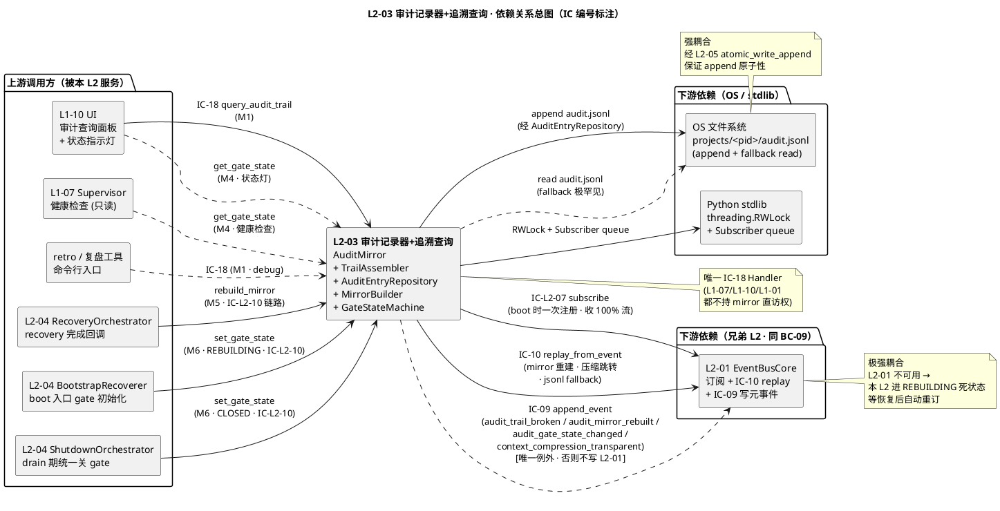
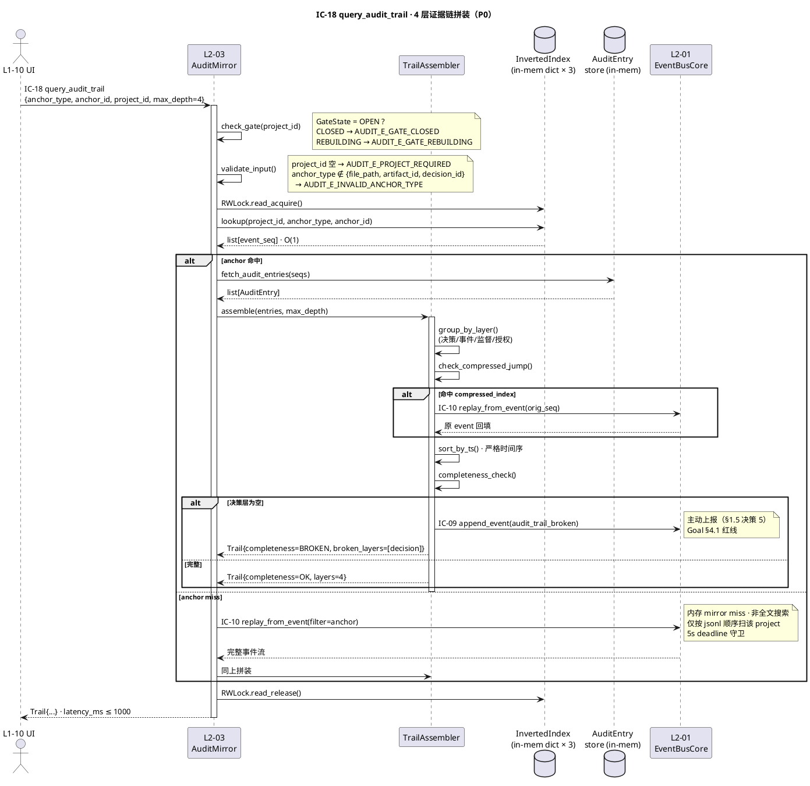
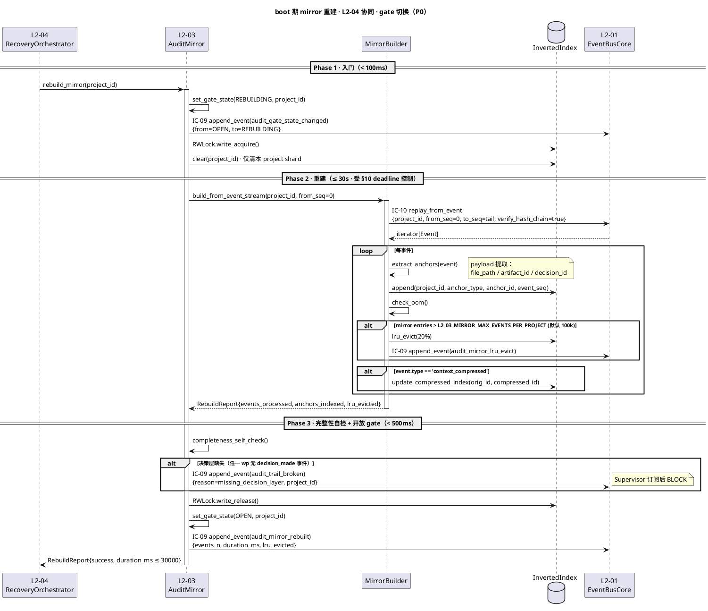
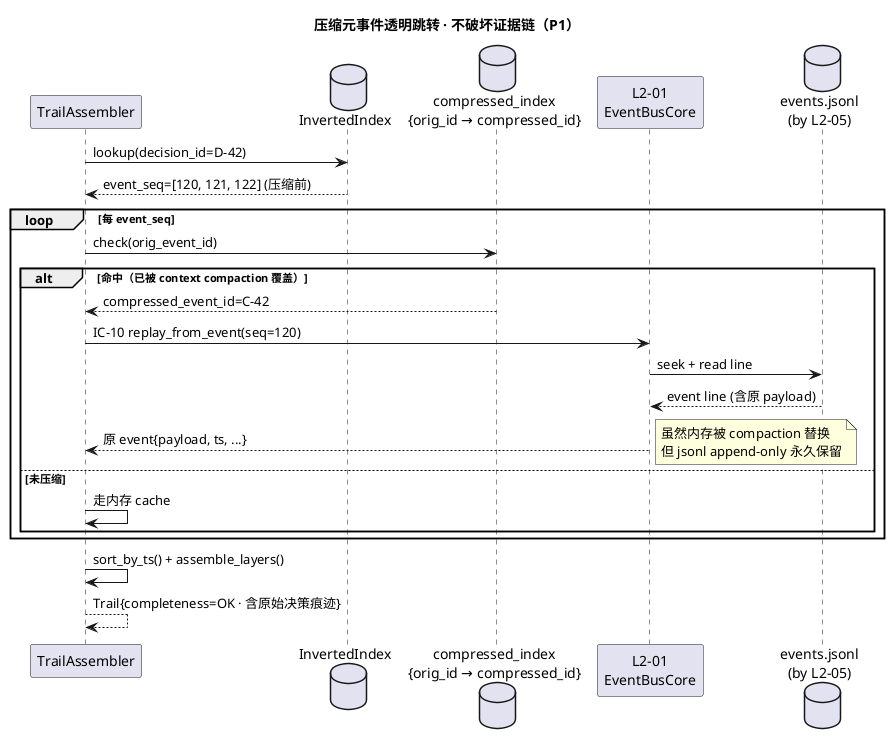
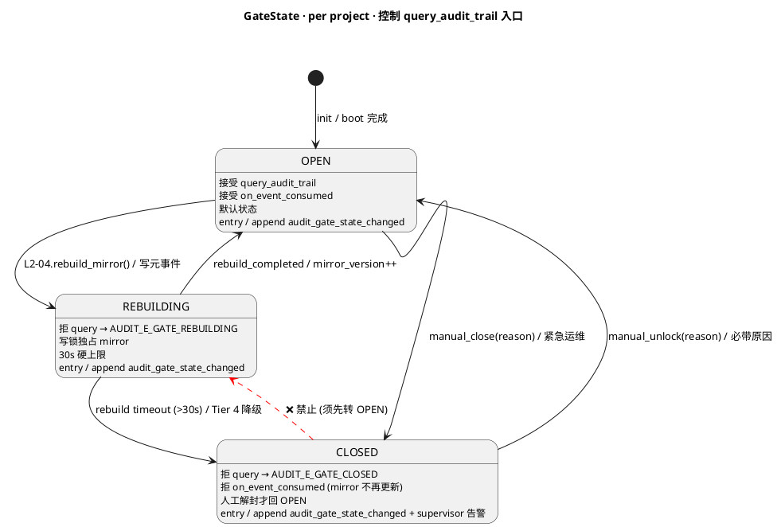
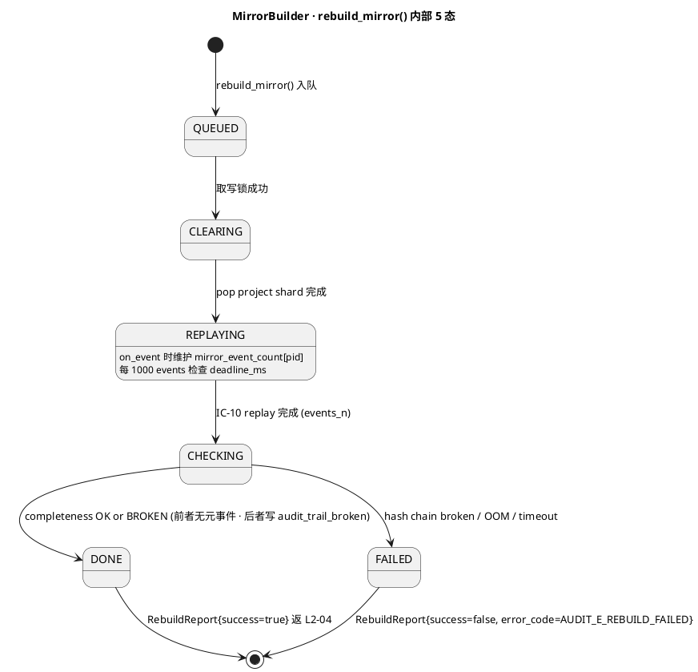
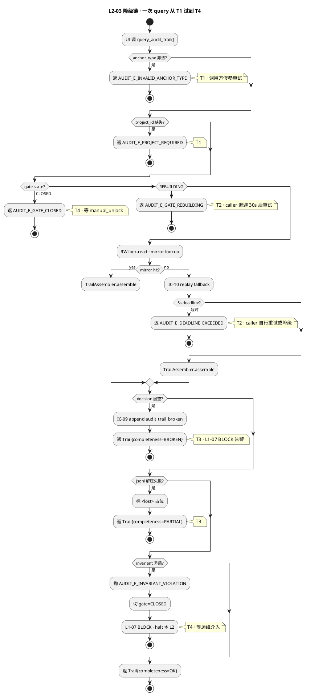

# L1 L2-03 · 审计记录器+追溯查询 · Tech Design

> **本文档定位**：3-1-Solution-Technical 层级 · L1 的 L2-03 审计记录器+追溯查询 技术实现方案（L2 粒度）。
> **与产品 PRD 的分工**：2-prd/L1-09-韧性+审计/prd.md §5.9 的对应 L2 节定义产品边界，本文档定义**技术实现**（接口字段级 schema + 算法伪代码 + 底层数据结构 + 状态机 + 配置参数）。
> **与 L1 architecture.md 的分工**：architecture.md 负责**跨 L2 架构 + 跨 L2 时序**，本文档负责**本 L2 内部技术细节**。冲突以 architecture.md 为准。
> **严格规则**：本文档不复述产品 PRD 文字（职责 / 禁止 / 必须等清单），只做技术映射 + 补齐"产品视角未说 but 工程师必须知道"的部分（具体算法 · syscall · schema · 配置）。

---

## §0 撰写进度

- [ ] §1 定位 + 2-prd §5.9 L2-03 映射
- [ ] §2 DDD 映射（引 L0/ddd-context-map.md BC-XX）
- [ ] §3 对外接口定义（字段级 YAML schema + 错误码）
- [ ] §4 接口依赖（被谁调 · 调谁）
- [ ] §5 P0/P1 时序图（PlantUML ≥ 2 张）
- [ ] §6 内部核心算法（伪代码）
- [ ] §7 底层数据表 / schema 设计（字段级 YAML）
- [ ] §8 状态机（如适用 · PlantUML + 转换表）
- [ ] §9 开源最佳实践调研（≥ 3 GitHub 高星项目）
- [ ] §10 配置参数清单
- [ ] §11 错误处理 + 降级策略
- [ ] §12 性能目标
- [ ] §13 与 2-prd / 3-2 TDD 的映射表

---

## §1 定位 + 2-prd 映射

### 1.1 本 L2 的唯一命题

本 L2 回答的唯一技术命题是：

> **在 L2-01 事件总线已经拿到全部事实的前提下，如何在 ≤ 1 秒内，从"一行代码 / 一个产出物 / 一个 decision id"反查出"为什么它存在"的 4 层完整证据链？**

这个命题把本 L2 的技术范围锁死在三件事上：(a) 订阅全量事件流并建立**反向索引**（file_path → event_id / artifact_id → event_id / decision_id → audit_entry 三路）；(b) 接 IC-18 按锚点类型**分派查询** + 拼装 4 层 trail；(c) 在恢复期（L2-04 建 task-board 未完）对外**拒查**，防止读到半建状态。其他一切 —— 决策生成、事件落盘、Supervisor 判定、用户授权、数据库抽象、全文搜索 —— 都不在本 L2。

### 1.2 与 2-prd §5.9 / §10 L2-03 的精确映射

| 2-prd 锚点 | 2-prd 表达（产品视角） | 本 L2 技术落实（工程视角） | 章节 |
|---|---|---|---|
| §5.9.1 职责："审计追溯链" | 记录所有决策/IC/监督/授权到审计面 | 订阅 L2-01 全流 → 内存 AuditMirror（倒排索引 × 3）+ AuditEntryRepository（append audit.jsonl） | 本文档 §2 / §6 / §7 |
| §10.1 "最终落脚点" | Goal §4.1 100% 可追溯的证据基 | L2-03 是**唯一**返回 trail 的出口；断链 → `audit_trail_broken` 事件主动上报 | 本文档 §3 / §6.4 |
| §10.2 4 层 trail | 决策 / 事件 / 监督 / 授权 | `TrailAssembler.assemble(decision, events, supervisor_comments, user_authzs)` | 本文档 §3.2 / §6.2 |
| §10.3 In-scope 1-8 | 订阅 / 接 IC-18 / 锚点分派 / 4 层拼装 / 完整性校验 / 缺失标记 / 压缩跳转 / 恢复期 gate | 本 L2 内部的 8 大算法分支 | 本文档 §6 / §8 |
| §10.3 Out-of-scope | 不落盘 / 不全文检索 / 不生成决策 / 不跨项目 | 本 L2 **无写 L2-01 权**（仅只读 + 只订阅） + anchor_id 必带 project_id 限定 | 本文档 §3.3 / §11 |
| §10.4 硬约束 1-6 | 决策层不得为空 / 必走 mirror / 恢复期拒查 / trail 时间序严格 / mirror 可重建 / 压缩透明跳转 | 硬约束 → 算法 guard（§6.4 / §8.3） + 配置参数（§10） | 本文档 §6 / §10 |
| §10.5 禁止清单（7 条） | 不隐瞒缺层 / 不全文搜索 / 不改事件流 / 不跨项目 ... | 本 L2 代码级校验位（§6.5） | 本文档 §6 / §11 |
| §10.6 必须职责（8 条） | 订阅 + 响应 IC-18 + 3 锚点支持 + 4 层 trail + 断链告警 + gate + 压缩跳转 + 可重建 | 本 L2 的单元测试覆盖清单（见 §13） | 本文档 §13 |
| §10.9 GWT 6 场景 | 文件行 / 决策 id / 断链 / 压缩 / 恢复期 / 延迟 | 映射到 3-2 L2-03-tests 的 6 个 case（§13） | 本文档 §13 |

### 1.3 本 L2 在 L1-09 architecture 中的位置

根据 `architecture.md §3.1 component diagram` 与 `§11.2 5 L2 职责拆分表`，本 L2 处于 L1-09 内部五个 L2 的**右上**位置（对外消费方：L1-10 UI），与其他 4 个 L2 的边界如下：

```
L1-10 UI ──── IC-18 ────► L2-03 AuditMirror ────订阅──► L2-01 EventBusCore
                           │  (只读 / 只订阅)
                           ▲
                           │ IC-L2-10 gate 通知
                           │
                       L2-04 Recoverer (恢复期停查)
```

- **与 L2-01 的边界**：L2-03 是 L2-01 的**最大订阅者**，消费 100% 事件流；但 L2-03 **不调**  L2-01 的 `append_event`（唯一例外：断链时 append `audit_trail_broken` 元事件，走 L2-01 公开入口）
- **与 L2-02 的边界**：**无直接交互**（L2-03 不拿锁；查询是纯内存读 + 可选 SQLite WAL，WAL 模式 reader 不阻塞 writer）
- **与 L2-04 的边界**：双向（L2-04 → L2-03：IC-L2-10 gate 通知；L2-03 → L2-04：无，但 L2-04 重建镜像时可能 replay 事件流，L2-03 的 mirror 独立构建）
- **与 L2-05 的边界**：**无直接交互**（L2-03 读的是 L2-01 push 来的事件，不碰 FS 原子写；唯一间接依赖是：压缩元事件透明跳转时通过 L2-01 `replay_from_event` 回读 events.jsonl，此时 L2-05 保证文件完整性）

### 1.4 PM-14 物理隔离约束

本 L2 严格遵守 **PM-14 `harnessFlowProjectId` 物理分片**原则：

1. **AuditMirror 按 project_id 分 shard**：每 project 独立倒排索引结构（字典 key = project_id · value = inner indexes），**跨 project join 被禁止**（API 入参必带 `project_id`，校验未带 → `project_id_required` 错误）
2. **audit.jsonl 物理分片**：`projects/<pid>/audit.jsonl` 按 project 独立文件（与 events.jsonl 同父目录 · `architecture.md §5.1 / §6.1`）
3. **内存镜像 OOM 隔离**：单 project 镜像上限 10 万事件（见 §10 `L2_03_MIRROR_MAX_EVENTS_PER_PROJECT`），达上限后 **LRU 淘汰最早事件的 in-memory 索引**，但 audit.jsonl 永不删（回查时透明 fallback 到 L2-01 replay）

### 1.5 关键技术决策（Decision → Rationale → Alternatives → Trade-off）

| 决策点 | Decision | Rationale | Alternatives（Reject） | Trade-off |
|---|---|---|---|---|
| **镜像数据结构** | 3 张倒排 `dict[str, list[int]]`（file_path/artifact_id/decision_id → event_seq）+ 1 张 `dict[str, AuditEntry]`（decision_id → 决策详情）| O(1) 点查 · 内存占用可控（10 万事件 × 4 字段 × 40 bytes ≈ 16 MB/project）· Python stdlib dict 零依赖 | (a) SQLite 内存表：额外解析开销 · (b) Whoosh 全文索引：违反 §10.5 "不全文搜索" · (c) 一张大 dict 多值：碰撞处理复杂 | 多 dict 需要原子切换（用 RWLock） |
| **查询 API 形态** | 单一同步方法 `query_audit_trail(anchor_type, anchor_id, project_id, max_depth)` 返 `Trail` dataclass | 同步阻塞 ≤ 1s 可接受 · 与 IC-18 签名完全对齐 · 无需异步 callback 复杂度 | 异步 Promise：本 L2 纯内存查询，无异步必要 | 高并发查询时主线程占用（用 thread pool 缓解） |
| **mirror 冷启动** | Boot 时由 L2-04 触发 replay → L2-03 边 consume 边建 mirror；建立完才开 gate | 保证 mirror 与事件流一致（单一事实源 · `prd §10.4 硬约束 5`）· 无需持久化索引（崩溃后从事件重建） | (a) 持久化 mirror 到 .pkl：违反 `§10.4 可重建` · (b) 不建 mirror 全走 jsonl 扫描：性能 > 1s 破 SLO | Bootstrap 期 IC-18 拒查（≤ 30s）· 用户体验 trade-off |
| **恢复期 gate** | 内部 `GateState = {OPEN / CLOSED / REBUILDING}` 三态 · CLOSED 拒查 + `audit_gate_closed` 错误 | 防读半建 task-board（`prd §10.4 硬约束 3`）· UI 显式提示体验可接受 | (a) 返空 trail：违反 §10.5 "不隐瞒缺层" · (b) 阻塞等恢复完：恢复 30s 硬上限 × 用户等待差 | 查询期间的请求被拒 · 但比返脏数据正确 |
| **断链处理** | 决策层空 → **主动**写 `L1-09:audit_trail_broken` 元事件到 L2-01 → Supervisor 订阅 → Goal §4.1 红线 | `prd §10.4 硬约束 1` 不得静默 · 主动上报比被动等用户发现快 | (a) 仅日志：告警慢 · (b) 直接 halt：断链场景可能是迁移 bug，halt 太重 | 每次断链都写一条元事件（但断链应极罕见，可接受） |
| **压缩元事件跳转** | Mirror 维护 `compressed_index: dict[original_event_id, context_compressed_event_id]` · 查到原 event 时看是否在此字典里 → 若在则按 L2-01 replay 取回原 body | `prd §10.4 硬约束 6` 压缩不影响审计 · architecture §5.5 明确支持 | 直接扫 jsonl 找原 event：O(N) 性能差 | 多维护一份索引（事件量少，可接受） |
| **查询性能与写盘解耦** | mirror 写操作在**广播线程**（L2-01 broadcast thread）处理 · 查询操作在**调用线程** · 之间用 `threading.RWLock`（reader-writer lock） | `prd §10.4 硬约束：查询不拖累写盘`（`prd 第 1020 行`）· RWLock 允许多 reader 并发 | (a) 单一互斥锁：查询阻塞写入 · (b) 无锁 CAS：复杂度高 | write lock 持有时查询短暂阻塞（≤ 几 μs） |

---

## §2 DDD 映射（BC-XX）

### 2.1 Bounded Context 定位（BC-09 Resilience & Audit）

引自 `L0/ddd-context-map.md §2.10 BC-09`（第 475-513 行）+ `§4.9 BC-09 L2 映射`（第 799-815 行）：

> **BC-09 一句话定位**：项目的"黑匣子" —— 事件总线单一事实源 + 锁 + **审计** + 检查点 + 崩溃安全。本 BC 是**全系统 Published Language 发布者**（`append_event schema` + `query_audit_trail` 协议全 BC 共享）。
>
> **本 L2 在 BC-09 内的职位**：`L1-09 L2-03 审计记录器+追溯查询 = Application Service + Aggregate Root: AuditTrail + Domain Event: audit_trail_broken`（架构 §2.5 第 308 行 + ddd §4.9 第 805 行）。

**BC 边界 IN（本 L2 实现）**：订阅 L2-01 全量事件流 · 内存 AuditMirror（3 张倒排索引 × project shard）· `audit.jsonl` append（`AuditEntryRepository`）· IC-18 `query_audit_trail` 4 层 trail 拼装 · 断链时 append `audit_trail_broken` 元事件 · audit gate 三态机 · 压缩元事件透明跳转 · boot 期 mirror 重建。

**BC 边界 OUT（明确不属于本 L2）**：事件物理落盘（L2-01）· 互斥锁原语（L2-02）· checkpoint snapshot（L2-04）· 原子写 + fsync（L2-05）· 决策本身的生成（BC-01）· 监督点评的生成（BC-07）· 用户授权的接收（BC-10）· 全文检索（明确禁用 · prd §10.5 第 2 条）· 跨 project join（PM-14 物理隔离禁止）。

### 2.2 DDD 对象模型（≥ 8 行 · 完整分类）

| 对象 | DDD 类型 | 核心字段 / 操作 | 一致性边界 / 锚点 |
|---|---|---|---|
| **AuditTrail** | **Aggregate Root** | `anchor(VO) / project_id(VO · PM-14) / depth(VO) / decision_layer(EvidenceLayer) / event_layer(EvidenceLayer) / supervisor_layer(EvidenceLayer) / authz_layer(EvidenceLayer) / completeness(enum: COMPLETE\|BROKEN\|PARTIAL) / queried_at(ts) / mirror_version(int)` · 操作：`assemble() / verify_completeness() / mark_broken_if_decision_empty()` | 单 trail 强一致；`decision_layer` 不得为空（I-06 不变量 · 违反 → 强制写 `audit_trail_broken` + 标 `completeness=BROKEN`） · 4 层时间序严格递增（架构 §2.2 第 249 行）|
| **AuditEntry** | **Entity**（被 AuditTrail 引用 · 1 条 = audit.jsonl 1 行）| `audit_entry_id(ULID · 主键) / anchor_type(VO) / anchor_id(VO · 含 project_id 限定) / decision_ref(VO · decision_id) / event_refs(VO[] · event_id × N) / supervisor_comments(VO[]) / user_authorizations(VO[]) / created_at(ts)` | jsonl 每行一条 · append-only · `audit_entry_id` 全局唯一 · 与 events.jsonl 同 sequence 严格对齐（I-Audit-01）|
| **AuditMirror** | **Entity**（按 project shard · 进程内单例 per project）| 3 张倒排 dict + 1 张正排 dict + `compressed_index` + `version` · 操作：`upsert(event) / lookup(anchor_type, anchor_id) / shard_size() / lru_evict_oldest()` | 单 project 独立实例（不跨 project join · PM-14）· OOM 上限 10 万事件/project（达限走 LRU + jsonl fallback · §1.4 第 100 行）|
| **Anchor** | **VO**（不可变）| `anchor_type: enum[file_path, artifact_id, decision_id] / anchor_id: str / project_id: str` | `anchor_id` 必带 project_id 限定（防跨 project 串位 · I-Audit-03）· `anchor_type` 严格三选一（不支持 IC-18 公共契约里的 `event_id / wp_id / audit_entry_id` —— 那 3 类由 L2-01 / 业务 L1 直接服务 · 本 L2 §3.1 显式声明）|
| **TrailDepth** | **VO**（不可变）| `mode: enum[immediate, full_chain] / max_layers: int(default=4) / max_events_per_layer: int(default=500)` | `immediate` 只查 1 跳；`full_chain` 递归到原决策（封顶 4 层 · 4 层即 trail 全貌）|
| **EvidenceLayer** | **VO**（不可变）| `layer_type: enum[decision, event, supervisor, authz] / entries: list[AuditEntry\|EventRef\|CommentRef\|AuthzRef] / count: int / first_ts: ts / last_ts: ts` | 单层时间序严格递增（first_ts ≤ last_ts）· `entries` 不可超 `max_events_per_layer`，超则 `truncated=true` |
| **GateState** | **VO**（不可变 · per project）| `state: enum[OPEN, CLOSED, REBUILDING] / opened_at: ts / project_id: str / reason: str` | 三态机（§8 状态机定义）· `CLOSED` / `REBUILDING` → IC-18 拒查 · 由 L2-04 IC-L2-10 触发跃迁 |
| **CompressedJump** | **VO**（不可变）| `original_event_id: str / compressed_event_id: str / context_compression_event_id: str / project_id: str` | 由 `context_compression_event` 元事件喂入 · `original_event_id → compressed_event_id` 单射映射（无歧义跳转 · 架构 §5.5 第 690 行）|
| **TrailAssembler** | **Domain Service**（无状态）| `assemble(anchor, project_id, depth) -> AuditTrail` · 5 步：(1) anchor 分派 → mirror lookup → (2) 决策层抽取 → (3) 事件层范围扫描 → (4) supervisor / authz 层 join → (5) 完整性校验 + broken 上报 | 决策无副作用；副作用（write `audit_trail_broken`）由调用方 `query_audit_trail` 决定 |
| **MirrorBuilder** | **Domain Service**（无状态）| `build_from_event_stream(project_id, replay_iter) -> MirrorStats` · boot 期 / forced rebuild 期调用 | 单 project 串行重建 · 重建期 `GateState=REBUILDING`（拒查）· 完成后才跃迁 OPEN |
| **AuditEntryRepository** | **Repository**（接口）| `append(entry: AuditEntry) -> audit_entry_id` / `read_by_seq_range(project_id, from_seq, to_seq) -> list[AuditEntry]` / `tail_size(project_id) -> int` | 唯一物理访问入口（所有 jsonl IO 经它）· append-only · 底层经 L2-05 `atomic_write_append`（不直调 fsync）|
| **Domain Events**（本 L2 发布）| **Domain Events** | `L1-09:audit_trail_queried` · `L1-09:audit_trail_broken`（→ Goal §4.1 红线）· `L1-09:audit_mirror_rebuilt` · `L1-09:audit_gate_state_changed` · `L1-09:context_compression_transparent`（架构 §2.5 第 310 行）| 通过 L2-01 `append_event` 落盘 + 异步广播 · payload 必含 `project_id`（PM-14） |

**关键不变量复述**（架构层面已锁 · 本 L2 必须遵守 · 与 §1.5 一致）：

- **I-06 决策层不得为空**（架构 §2.5 第 259 行）：任何 `query_audit_trail` 返回 `decision_layer.count == 0` → 必发 `audit_trail_broken` 事件 + 标 `completeness=BROKEN` + 触发 Goal §4.1 红线告警（prd §10.4 硬约束 1）
- **I-Audit-01**（本 L2 新增）：`audit.jsonl` 每行 `audit_entry_id` 与同 project `events.jsonl` sequence 严格对齐（mirror 与 jsonl 单一事实源）· 违反 → mirror 重建必失败 + bootstrap 拒绝开 gate
- **I-Audit-02**（本 L2 新增）：`AuditMirror` shard key 必为 `project_id` · 跨 project join 在 API 层就拒（`AUDIT_E_PROJECT_REQUIRED`）· 违反 → 破坏 PM-14 物理隔离
- **I-Audit-03**（本 L2 新增）：`Anchor.anchor_id` 必含 project 限定前缀（实现上由 caller 传 + L2-03 校验）· 违反 → `AUDIT_E_INVALID_ANCHOR_TYPE` 拒绝

### 2.3 与兄弟 BC 的边界（Context Map · Partnership / Customer-Supplier 关系）

引自 `ddd-context-map.md §2.10` BC-09 关系总表 + L1-09 architecture.md §2.6 邻 BC 关系表（第 234-241 行）：

| 兄弟 BC / 兄弟 L2 | 关系类型 | 共享对象 | 边界规则（谁拥有 / 谁只读） |
|---|---|---|---|
| **BC-09 兄弟 L2-01**（事件总线）| **Partnership**（同 BC 内 · 最强耦合）| `events.jsonl`（L2-01 拥有写权 · 本 L2 仅通过 IC-L2-07 `subscribe()` + IC-10 `replay_from_event` 只读消费）+ `append_event` 公共入口（仅断链时唯一例外用） | L2-01 拥有事件物理落盘 · 本 L2 是 L2-01 的**最大订阅者**（消费 100% 流）· **绝不**绕过 L2-01 直接 read events.jsonl（保证 hash 链验证一致性）|
| **BC-09 兄弟 L2-02**（锁管理器）| **无直接交互** | （无）| 本 L2 查询是纯内存读 + jsonl WAL 模式读（reader 不阻塞 writer · §1.3 第 90 行）· 内部 RWLock 是 `threading.RWLock` 而非 L2-02 flock · 不调 L2-02 任何 IC |
| **BC-09 兄弟 L2-04**（检查点+恢复器）| **Partnership**（双向 · 但反向极弱）| `audit_gate` 状态（L2-04 → 本 L2 经 IC-L2-10 通知 · 本 L2 → L2-04 无）+ `system_resumed` 事件（L2-04 发 · 本 L2 订阅做 mirror 完整性核对）| L2-04 拥有 gate 状态变更触发权 · 本 L2 拥有 gate 当前态查询 + IC-18 拒查执行权 · L2-04 recovery 完成后调本 L2 `rebuild_mirror` |
| **BC-09 兄弟 L2-05**（崩溃安全）| **无直接交互** | （间接 · jsonl fallback 读时） | 本 L2 不直接调 L2-05 IC（不调 atomic_write）· 唯一间接依赖：mirror miss 走 jsonl fallback 读时由 L2-05 的 IntegrityChecker 已保证文件完整性（架构 §1.5 第 432 行 · L2-05 不直接面向外部 L1）|
| **BC-10 Human-Agent UI**（L1-10）| **Customer-Supplier**（本 L2 = Supplier）| IC-18 `query_audit_trail`（L1-10 调入 · 本 L2 服务）+ `audit_trail_broken` 事件（本 L2 发 · L1-10 订阅做"红线提示"卡片）| L1-10 是 Customer · 本 L2 拥有 IC-18 唯一 Handler 绑定（架构 §6.7 第 430 行：L2-03 是"为什么"的唯一答案 · L1-01 / L1-07 / L1-10 都不持有 mirror 直接访问权）· 本 L2 **不反向调** L1-10 |
| **BC-07 Supervisor**（L1-07）| **Customer-Supplier**（本 L2 = Supplier · 间接通过 L2-01）| `audit_trail_broken` 事件（本 L2 发 · BC-07 订阅触发 Goal §4.1 红线）| 本 L2 不感知 BC-07 存在；只通过 L2-01 广播事件 · BC-07 订阅。**注意**：BC-07 不直接调 IC-18（架构 §6.7 第 430 行明确）·  Supervisor 看历史决策走"订阅事件流" 而非"反查 trail" |
| **BC-01 Agent Decision Loop**（L1-01）| **Partnership**（间接 · 不直接调入本 L2）| `decision_made` 事件（L1-01 发 · 本 L2 订阅建索引）| L1-01 L2-05 决策审计记录器**委托**本 L2 实现 `AuditEntryRepository`（架构 §2.6 第 235 行）· 但 L1-01 不调 IC-18（决策当事人不需要反查自己） |

**核心隔离原则**（与 L2-04 §2.3 一致 · BC-09 内部统一）：

1. **不互越界写**：L2-01 拥有 `events.jsonl` 唯一写权 · 本 L2 拥有 `audit.jsonl` + `AuditMirror` 唯一写权 · 不互写
2. **唯一事实源**：events.jsonl 是唯一事实源 · `AuditMirror` 是冗余加速结构 · 任何不一致以 events.jsonl 为准（mirror 失效 → 重建即可，不允许"以 mirror 为准"）
3. **Published Language**：本 L2 通过 IC-18 + 5 个 Domain Event schema 对全 BC 发布 · 加字段必 optional · 减字段必先 deprecate 1 个 minor version
4. **唯一 Handler**：IC-18 的 Handler **只**由本 L2 持有 · 任何其他 L1 / L2 想"看历史"都必经 IC-18（不持 mirror 直访权 · 架构 §6.7）

---

## §3 对外接口定义（字段级 YAML schema + 错误码）

### 3.1 方法清单（4 个公共 + 1 个内部观测）

| # | 方法 | 签名 | 同步/异步 | 调用方 | 锚点 |
|---|---|---|---|---|---|
| **M1** | `query_audit_trail` | `query_audit_trail(anchor_type: AnchorType, anchor_id: str, project_id: str, max_depth: int = 4) -> Trail \| AuditError` | 同步 · 请求-响应 · ≤ 1s | L1-10 UI（IC-18 唯一入口）/ retro 工具 | prd §10.9 GWT 1+2 + IC-18 §3.18 |
| **M2** | `subscribe_event_stream` | `subscribe_event_stream(filter: SubscriberFilter = '*') -> SubscriberHandle \| AuditError` | 同步注册（异步推送）| 本 L2 内部 boot 阶段调（订阅 L2-01）· 仅一处调用方 | 架构 §3.2 IC-L2-07 第 445 行 |
| **M3** | `report_chain_break` | `report_chain_break(anchor: Anchor, missing_layers: list[str], detected_at: ts) -> BreakReport` | 同步 · 内部触发 | TrailAssembler.assemble() 检测决策层空时**自动**调（不开放外部入口）| prd §10.4 硬约束 1 + I-06 |
| **M4** | `get_gate_state` | `get_gate_state(project_id: str) -> GateState` | 同步 · 只读 · 无副作用 | L1-10 UI 渲染"审计可用"指示灯 / L1-07 健康检查 / 本 L2 内部 IC-18 入口守门 | prd §10.9 GWT 5 |
| **M5** | `rebuild_mirror`（内部）| `rebuild_mirror(project_id: str, replay_from_seq: int = 0) -> RebuildReport \| AuditError` | 同步 · 阻塞 · ≤ `MIRROR_REBUILD_DEADLINE_S` | L2-04 RecoveryOrchestrator（recovery 完成后 · 经 IC-L2-10 链路 · 内部约定）| 架构 §4.2 图 S2 第 624 行 + prd §10.4 硬约束 5 |
| **M6** | `set_gate_state`（内部）| `set_gate_state(project_id: str, new_state: GateState) -> ack` | 同步 · 极轻 | L2-04 经 IC-L2-10（架构 §3.2 第 448 行）· 唯一外部跃迁触发方 | prd §10.4 硬约束 3 |

**注意**：M3 / M5 / M6 为**内部** 方法（不暴露给业务 L1）；M1 / M4 为对外公共方法（IC-18 + 观测）。

### 3.2 字段级 YAML schema（≥ 4 个 · 覆盖入参 / 出参 / 核心 VO）

#### 3.2.1 `Trail`（M1 query_audit_trail 出参 · ≥ 12 字段）

```yaml
Trail:
  type: object
  required: [anchor, project_id, depth, decision_layer, event_layer, supervisor_layer, authz_layer, completeness, queried_at, mirror_version, latency_ms, total_entries]
  properties:
    anchor:
      $ref: "#/Anchor"
      description: 原查询锚点（透传入参以便 caller 关联）
      required: true
    project_id:
      type: string
      pattern: "^[a-z0-9_-]+$"
      description: PM-14 project_id（与 anchor.project_id 严格一致 · 不一致 → AUDIT_E_PROJECT_REQUIRED）
      required: true
    depth:
      type: enum
      enum: [immediate, full_chain]
      description: 实际执行的深度（与入参 max_depth 对应 · max_depth=1 → immediate · max_depth=4 → full_chain）
      required: true
    decision_layer:
      $ref: "#/EvidenceLayer"
      description: 第 1 层 · 决策层（layer_type=decision · 含原决策 entry + 理由 + decision_id）· **必非空**（违反 → completeness=BROKEN + audit_trail_broken 事件）
      required: true
    event_layer:
      $ref: "#/EvidenceLayer"
      description: 第 2 层 · 事件层（layer_type=event · 决策前后各 N 条相关事件 · N ≤ max_events_per_layer）
      required: true
    supervisor_layer:
      $ref: "#/EvidenceLayer"
      description: 第 3 层 · 监督层（BC-07 在此决策期内的点评 · 可空数组）
      required: true
    authz_layer:
      $ref: "#/EvidenceLayer"
      description: 第 4 层 · 用户授权层（IC-17 user_intervene 流入的批复 · 可空数组）
      required: true
    completeness:
      type: enum
      enum: [COMPLETE, BROKEN, PARTIAL]
      description: COMPLETE=4 层都非空 · BROKEN=决策层空（已触发 audit_trail_broken）· PARTIAL=决策层非空但其他层缺（不触发红线）
      required: true
    broken_layers:
      type: array
      items: {type: string, enum: [decision, event, supervisor, authz]}
      description: 当 completeness ∈ {BROKEN, PARTIAL} 时填入实际缺的层；COMPLETE 时为 []
      required: true
    queried_at:
      type: string
      format: iso8601
      description: 查询完成时刻（用于 retro 性能分析）
      required: true
    mirror_version:
      type: integer
      minimum: 0
      description: 查询时 AuditMirror 内部 version（每 upsert +1）· caller 可用于"刷新"判断
      required: true
    latency_ms:
      type: integer
      minimum: 0
      maximum: 1000
      description: 端到端耗时 · 必 ≤ 1000（prd §10.4 硬约束 + Goal §4.4 P95 目标）· 超时 → AUDIT_E_DEADLINE_EXCEEDED
      required: true
    total_entries:
      type: integer
      minimum: 0
      description: 4 层 entries 数量总和（用于 UI 显示"共 N 条证据"）
      required: true
    truncated:
      type: boolean
      default: false
      description: 任一层超 max_events_per_layer 截断时为 true（同 IC-18 公共契约 truncated 字段）
      required: false
    fallback_used:
      type: enum
      enum: [none, jsonl_scan, compressed_jump, replay_from_event]
      default: none
      description: 是否走了 fallback 路径（非 mirror 命中）· 用于 retro 健康度分析
      required: false
```

#### 3.2.2 `Anchor`（M1 入参 · 三种 anchor_type 联合体）

```yaml
Anchor:
  type: object
  required: [anchor_type, anchor_id, project_id]
  properties:
    anchor_type:
      type: enum
      enum: [file_path, artifact_id, decision_id]
      description: 本 L2 仅支持 3 种锚点（IC-18 公共契约里的 event_id / wp_id / audit_entry_id 由 L2-01 / 业务 L1 直接服务 · 本 L2 §3.1 显式不收）
      required: true
    anchor_id:
      type: string
      minLength: 1
      maxLength: 512
      description: |
        - file_path: 形如 "src/auth.py#L42" 或 "docs/planning/requirements.md#L42"（必带 #L<line>）
        - artifact_id: 形如 "art-{ulid}" 或 "wp-042/output/api-spec.yaml"
        - decision_id: 形如 "d-{ulid}" 或 "decision-00123"
      required: true
    project_id:
      type: string
      pattern: "^[a-z0-9_-]+$"
      description: 必填 · PM-14 物理隔离（缺失 → AUDIT_E_PROJECT_REQUIRED）· 不支持 cross_project（与 IC-18 公共契约 cross_project=true 场景由更高层 broker 处理 · 本 L2 单 project shard）
      required: true
```

#### 3.2.3 `EvidenceLayer`（Trail 内嵌 · 4 层共用同一 schema）

```yaml
EvidenceLayer:
  type: object
  required: [layer_type, entries, count, first_ts, last_ts]
  properties:
    layer_type:
      type: enum
      enum: [decision, event, supervisor, authz]
      description: 4 层身份枚举（与 Trail 字段名一一对应）
      required: true
    entries:
      type: array
      maxItems: 500
      description: |
        本层证据条目（schema 因 layer_type 而异）：
        - decision: [{decision_id, decision_text, rationale, made_at, made_by, upstream_event_id}]
        - event: [{event_id, event_type, sequence, payload_summary, ts}]
        - supervisor: [{comment_id, supervisor_verdict, message, severity, ts}]
        - authz: [{intervene_id, user_id, action, reason, ts}]
      required: true
    count:
      type: integer
      minimum: 0
      description: entries.length 冗余字段（便于 UI 不展开 entries 也能渲染计数）
      required: true
    first_ts:
      type: string
      format: iso8601
      description: 本层最早 entry 的 ts（count=0 时为 null）
      required: false
    last_ts:
      type: string
      format: iso8601
      description: 本层最晚 entry 的 ts（count=0 时为 null）· first_ts ≤ last_ts 严格保证
      required: false
    truncated_at:
      type: integer
      description: 若超 max_events_per_layer 截断时填实际截断点（默认 500）· 未截断为 null
      required: false
```

#### 3.2.4 `GateState`（M4 / M6 · 三态机 VO）

```yaml
GateState:
  type: object
  required: [state, project_id, opened_at]
  properties:
    state:
      type: enum
      enum: [OPEN, CLOSED, REBUILDING]
      description: |
        - OPEN: 正常对外服务 IC-18
        - CLOSED: 暂停对外（recovery 期 · L2-04 触发 · prd §10.4 硬约束 3）
        - REBUILDING: mirror 重建中（boot 期 / forced rebuild · 拒查并提示"等 ≤ 30s"）
      required: true
    project_id:
      type: string
      required: true
      description: GateState 按 project shard（每 project 独立 gate · 互不影响）
    opened_at:
      type: string
      format: iso8601
      description: 当前 state 进入的时刻（用于 caller 判断"已 CLOSED 多久"）
      required: true
    reason:
      type: string
      maxLength: 256
      description: 进当前态的原因（如 "recovery_starting" / "mirror_rebuild_after_corruption" / "boot_initial"）
      required: false
    expected_open_at:
      type: string
      format: iso8601
      description: 预计开 gate 时刻（recovery 时由 L2-04 估算 · 用于 UI 显示倒计时）
      required: false
```

#### 3.2.5 `RebuildReport`（M5 出参 · 简表）

```yaml
RebuildReport:
  type: object
  required: [project_id, events_replayed, mirror_size_after, duration_ms, gate_state_after]
  properties:
    project_id: {type: string, required: true}
    events_replayed:
      type: integer
      minimum: 0
      description: 实际回放并喂入 mirror 的事件数（来自 IC-10 events_replayed_count）
      required: true
    mirror_size_after:
      type: integer
      description: 重建后 mirror entries 总数（3 张倒排 dict 总 key 数）
      required: true
    duration_ms:
      type: integer
      maximum: 30000
      description: 整段重建耗时 · 必 ≤ MIRROR_REBUILD_DEADLINE_S × 1000 · 超 → AUDIT_E_DEADLINE_EXCEEDED
      required: true
    gate_state_after:
      type: enum
      enum: [OPEN, REBUILDING]
      description: 重建结束后的 gate 状态（成功 → OPEN · 失败 → 仍 REBUILDING · 配 AuditError）
      required: true
    skipped_corrupt_events:
      type: integer
      description: 回放期间被 IC-10 标 hash_chain_broken 跳过的事件数（同时发 audit_mirror_rebuilt 事件 + 标 degraded=true）
      required: false
```

### 3.3 错误码表（≥ 10 条 · 4 列 · 命名统一 `AUDIT_E_*`）

| 错误码 | 含义 | 触发场景 | 调用方处理 |
|---|---|---|---|
| `AUDIT_E_PROJECT_REQUIRED` | `project_id` 缺失或为空 | M1 调用未传 project_id；或 anchor.project_id 与入参 project_id 不一致 | 拒绝（返 4xx 等价）· caller 修参数 · prd §10.5 第 4 条 "不跨 project" 守门 |
| `AUDIT_E_GATE_CLOSED` | `GateState=CLOSED`（recovery 期）| L2-04 IC-L2-10 通知 phase=starting 后 · IC-18 入口守门拒查 | UI 展示 "审计查询暂停中，请等恢复完成" · 恢复完 ≤ 1s 自动可查（prd §10.9 GWT 5）|
| `AUDIT_E_GATE_REBUILDING` | `GateState=REBUILDING`（boot / forced rebuild） | bootstrap 期 mirror 未建完 · 或 rebuild_mirror 进行中 | UI 展示 "审计镜像重建中（≤ 30s）" · caller 轮询 M4 直到 OPEN |
| `AUDIT_E_ANCHOR_NOT_FOUND` | `anchor_id` 在 mirror 三张倒排字典 + jsonl fallback 都未命中 | 查询了不存在的文件行 / artifact / decision_id（极常见 · 用户写错锚点）| 返 `Trail{decision_layer.count=0, completeness=PARTIAL}`（**不触发** audit_trail_broken · 因为锚点不存在 ≠ 决策层空）· UI 展示"未找到对应记录" |
| `AUDIT_E_TRAIL_BROKEN` | 锚点命中但决策层空（断链 · I-06 违反 · 数据迁移 bug 等）| TrailAssembler 检测到 decision_layer.count==0 且 anchor 命中 → M3 自动 report_chain_break + 强制走此错误 | 仍返 `Trail{completeness=BROKEN, broken_layers=["decision"]}` + 同时已 append `audit_trail_broken` 元事件 → BC-07 走 Goal §4.1 红线 · UI 展示"审计断链 · 已上报" |
| `AUDIT_E_MIRROR_OOM` | 单 project mirror 触达 `MIRROR_MAX_EVENTS_PER_PROJECT`（10 万） | 长寿项目持续累积事件 · LRU 淘汰最早 in-memory 索引 | **不拒绝**：自动降级走 jsonl fallback（透明 · `fallback_used=jsonl_scan`）· 仅记 INFO 日志 · 仅当 fallback 也超时才升级为本错误码 |
| `AUDIT_E_DEADLINE_EXCEEDED` | M1 端到端耗时超 `QUERY_DEADLINE_MS`（1000ms · prd §10.4）· 或 M5 重建超 `MIRROR_REBUILD_DEADLINE_S`（30s）| 极端大 trail / 磁盘 IO 异常拖慢 / mirror miss 后 jsonl 全表扫 | 立即中断返错 · 不输出 partial trail（防误导）· Supervisor WARN · UI 提示"查询超时 · 请缩小范围" |
| `AUDIT_E_INVALID_ANCHOR_TYPE` | `anchor_type` 不在 `[file_path, artifact_id, decision_id]` 三选一 | caller 传了 `event_id` / `wp_id` / `audit_entry_id`（IC-18 公共契约支持但本 L2 不收 · §3.1 显式声明）· 或拼写错误 | 返错 + 错误消息明确指引"请改用 IC-XX 直查 event_id"（caller 修代码）|
| `AUDIT_E_DECOMPRESS_FAILED` | `compressed_index` 命中后 `replay_from_event` 取原 body 失败（IC-10 返 hash_chain_broken / storage_unavailable）| 压缩元事件指向的原事件已损坏 / 物理 IO 异常 | 返错 · 同时 append `context_compression_transparent` event 标 success=false · BC-07 CRITICAL（极罕见 · 暗示 events.jsonl 已部分损坏） |
| `AUDIT_E_PROJECT_NOT_FOUND` | `project_id` 在 `projects/_index.yaml` 无记录 | caller 传了已归档 / 已删除的 project_id | 拒绝（不同于 ANCHOR_NOT_FOUND · 这是 project 维度的 404）· UI 提示"项目不存在或已归档" |
| `AUDIT_E_REBUILD_FAILED` | M5 mirror 重建过程中 IC-10 返不可恢复错（连续 3 次 STORAGE_UNAVAILABLE）| 磁盘读失败 / FS unmount / 权限突变 | 保留 `GateState=REBUILDING` 不开 gate · 配合 L2-04 进 `RECOVERY_E_REPLAY_FAILED` · 项目标 RECOVERY_FAILED · 用户介入 |
| `AUDIT_E_INVARIANT_VIOLATION` | I-Audit-01 检测到 audit.jsonl 与 events.jsonl sequence 错位 | bootstrap 期 mirror 重建做完整性核对时检测到不变量违反 | FATAL · 拒绝开 gate · 强制 L2-04 走 Tier 2 完整回放重建 · BC-07 CRITICAL |

**严重度分类**（与 §11 错误处理对接 · 后续段细化）：

| 严重度 | 错误码 | 是否记 Supervisor | 是否影响 Goal §4 |
|---|---|---|---|
| **CRITICAL**（红线）| `AUDIT_E_TRAIL_BROKEN` · `AUDIT_E_INVARIANT_VIOLATION` · `AUDIT_E_DECOMPRESS_FAILED` · `AUDIT_E_REBUILD_FAILED` | 是（CRITICAL 级 · 触发 Goal §4.1 红线告警）| 硬红线（决策可追溯率 100% 失守）|
| **WARN**（降级）| `AUDIT_E_DEADLINE_EXCEEDED` · `AUDIT_E_MIRROR_OOM`（升级后） | 是（WARN 级）| 软红线（影响 Goal §4.4 P95 ≤ 1s 响应面）|
| **INFO**（运行期常见）| `AUDIT_E_GATE_CLOSED` · `AUDIT_E_GATE_REBUILDING` · `AUDIT_E_ANCHOR_NOT_FOUND` · `AUDIT_E_PROJECT_NOT_FOUND` | 否（DEBUG 级 · 仅观测）| 无（运行期正常状态）|
| **ERROR**（caller bug）| `AUDIT_E_PROJECT_REQUIRED` · `AUDIT_E_INVALID_ANCHOR_TYPE` | 是（ERROR 级 · 说明 caller 写错 contract）| 间接（caller 走错路）|

**幂等性约定**：

- M1 `query_audit_trail` **幂等**（纯读 · 同 anchor + project + depth 多次调返回同 Trail · mirror_version 字段反映可能的版本演化）
- M3 `report_chain_break` **幂等**（同 anchor 多次调 → 仅首次 append `audit_trail_broken` 元事件 · 后续返 `already_reported` flag · 防告警风暴）
- M5 `rebuild_mirror` **幂等**（同 project 多次调返回同 RebuildReport · 但仅广播 1 次 `audit_mirror_rebuilt`）
- M6 `set_gate_state` **幂等**（同 state 重复设 → 仅首次发 `audit_gate_state_changed` 事件）

---

## §4 接口依赖（被谁调 · 调谁）

### 4.1 上游调用方表（谁调本 L2 · 调哪个方法 · 期望响应时间 · 调用频率）

| 调用方 | 所在 L1/L2 | 调用方法 | 触发条件 | 期望响应时间 | 调用频率 | 关键不变量 |
|---|---|---|---|---|---|---|
| **L1-10 UI 审计查询面板** | BC-10 / L1-10 L2-07 Admin 审计追溯查询面板 | `query_audit_trail`（IC-18 唯一入口）| 用户在"为什么这行代码 / 这个产出物 / 这个决策？"面板提交查询 | ≤ 1s（prd §10.4 + Goal §4.4）| 中频（每 session 0~50 次 · 用户主动触发）| 必带 project_id（PM-14）· 必单 anchor · 不允许 cross_project（本 L2 拒）|
| **L1-10 UI 状态指示灯** | L1-10 L2-03 进度实时流 | `get_gate_state` | UI 渲染"审计可用 / 暂停中 / 重建中"指示灯 | ≤ 100ms | 中频（每 2s 刷新一次）| 只读 · 无副作用 · 缓存 1s 友好 |
| **L1-07 Supervisor 健康检查** | BC-07 / L1-07 L2-01 监督状态采集器 | `get_gate_state` × N projects | Supervisor 30s tick 巡检"审计面是否健康" | ≤ 100ms | 低频（每 30s）| 仅观测 · 不接受 trail 反查（§4.5 第 430 行约束）|
| **retro / 复盘命令行工具** | 调试入口（如 `python -m harness.retro audit --pid foo --anchor d-00123`）| `query_audit_trail` | 用户复盘历史决策时调试 | ≤ 1s | 极低频 | 同 IC-18（contract 完全一致）|
| **L2-04 RecoveryOrchestrator**（recovery 完成回调）| 兄弟 L2 · 同 BC-09 | `rebuild_mirror(project_id, replay_from_seq=ckpt.seq+1)` | L2-04 完成 task_board 重建 + 广播 system_resumed 之前调本 L2 重建 mirror（保证 audit gate 与 task_board 同步开放）| ≤ 30s（单 project · `MIRROR_REBUILD_DEADLINE_S`）| 极低频（每次 skill cold start × N project）| 串行（D4 决策）· 必在 system_resumed 广播前完成 · 否则 BC-10 读半建 mirror |
| **L2-04 ShutdownOrchestrator**（shutdown 期 gate 关）| 兄弟 L2 | `set_gate_state(project_id, CLOSED, reason="shutdown_starting")`（经 IC-L2-10）| L2-04 begin_shutdown 进 DRAINING 阶段时统一关 IC-18（防 drain 期间出现 trail 半建）| ≤ 50ms | 极低频（每次 shutdown 1 次）| 同 set_gate_state contract |
| **L2-04 BootstrapRecoverer**（boot 入口 gate 初始化）| 兄弟 L2 | `set_gate_state(project_id, REBUILDING, reason="boot_initial")` | skill 冷启动 · 进 recovery 之前先把所有 ACTIVE project 的 gate 置 REBUILDING | ≤ 50ms / project | 极低频（每次 skill cold start 1 次）| 必早于任何 IC-18 暴露 |

**频次小结**：M1 `query_audit_trail` 是本 L2 唯一对外可观察接口（频次中频但 SLO 极严 ≤ 1s）；M5 / M6 是兄弟 L2-04 的内部协议（极低频但生命攸关 · 影响 Goal §4.1 跨 session 无损）。

### 4.2 下游依赖表（本 L2 调哪些 IC / 内部 L2 / 外部资源）

| 被调方 | 层级 | 调用 IC / 方法 | 用途 | 紧耦合度 | 失败时本 L2 行为 |
|---|---|---|---|---|---|
| **L2-01 EventBusCore**（订阅）| 兄弟 L2 / 同 BC-09 | IC-L2-07 `subscribe(subscriber_id="audit_mirror", filter="*")` | boot 时一次注册 · 之后异步收 100% 事件流 → upsert AuditMirror | 极强（本 L2 全部输入来自此）| L2-01 不可用 → 订阅注册失败 → 本 L2 进 `GateState=REBUILDING` 死状态 + 等 L2-01 恢复 + 自动重订（参考 L2-02 §4.5 janitor 模式） |
| **L2-01 EventBusCore**（IC-10 历史回放）| 兄弟 L2 | IC-10 `replay_from_event(query_id, project_id, from_sequence, to_sequence?, verify_hash_chain=true)` | (a) M5 mirror 重建期一次性回放 · (b) 压缩元事件透明跳转时按 `original_event_id` sequence 反查原 body · (c) mirror miss 时 jsonl fallback 读 | 极强 | IC-10 返 `E_REP_HASH_CHAIN_BROKEN` → 跳损坏块 + 标 `skipped_corrupt_events` + 发 `audit_mirror_rebuilt{degraded:true}` · 返 `E_REP_STORAGE_UNAVAILABLE` → retry 3 次 → `AUDIT_E_REBUILD_FAILED` |
| **L2-01 EventBusCore**（写元事件 · 唯一例外）| 兄弟 L2 | IC-09 `append_event(type="L1-09:audit_trail_broken" / "audit_mirror_rebuilt" / "audit_gate_state_changed" / "context_compression_transparent")` | 本 L2 主动上报 4 类元事件给 L2-01 落盘（架构 §1.5 第 89 行明确：除断链元事件外不调 IC-09）| 强 | L2-01 不可用 → 元事件入内存 ring buffer · L2-01 恢复后补发；本 L2 主路径不阻塞（IC-18 仍正常服务） |
| **文件系统读 audit.jsonl**（fallback 用）| OS · 间接经 L2-05 IntegrityChecker 已校验 | `open("projects/<pid>/audit.jsonl") + line iter` | 仅当内存 mirror miss 时 fallback 全表扫（极罕见 · 健康度指标）| 弱（不直调 L2-05 IC · 因 L2-05 不直接面向外部 L1 · 架构 §1.5 第 432 行）| 文件不存在 → 视为 `AUDIT_E_ANCHOR_NOT_FOUND` · 文件读 IO 异常 → `AUDIT_E_DEADLINE_EXCEEDED` |
| **文件系统写 audit.jsonl**（AuditEntryRepository.append）| OS · 间接经 L2-05 `atomic_write_append` | append-only 落盘每个新 audit_entry | 强（数据持久性根基）| L2-05 atomic_write_append 失败 → 重试 1 次 → 仍失败 → 进降级写内存 ring · 上报 `audit_persistence_degraded` event · BC-07 CRITICAL |
| **Python `threading.RWLock`** | stdlib | mirror 读写解耦（写：subscribe 回调 broadcast thread · 读：IC-18 调用线程）| 极强（stdlib 不会缺失）| N/A · 不可用 = 系统无法启动 |
| **Python `threading` Subscriber Handle 队列** | stdlib | L2-01 broadcast queue → audit_mirror 消费者线程 | 强 | 队列满 → 走 backpressure 协议（参考 L2-01 broadcast queue 满策略） |

### 4.3 PlantUML 依赖图（component diagram · 箭头标 IC 编号）



### 4.4 Published Language（跨 BC 的语义契约 · 本 L2 对外承诺）

本 L2 通过 IC-18 + 5 个 Domain Event schema 对全 BC 发布 Published Language：

1. **`Anchor.anchor_type` 三种枚举的语义统一**（跨 BC-10 / BC-01 / BC-07 共享 · 任何 caller 看到这 3 个值含义必须一致）：
   - **`file_path`**：物理代码 / 文档行级锚点 · 形如 `"src/auth.py#L42"` · 必带 `#L<line_number>` 后缀（无行号 = 无意义查询）· 由 BC-04 Quality Loop 在产出物落盘时记录 file_path → produced_by_event_id 的 binding
   - **`artifact_id`**：产出物级锚点 · 形如 `"art-{ulid}"` 或 `"wp-042/output/api-spec.yaml"` · 由 BC-02 / BC-04 在 artifact 落盘时分配 · 与 file_path 的区别：artifact_id 跨多个 file_path（一个 artifact 可能含多文件）
   - **`decision_id`**：决策级锚点 · 形如 `"d-{ulid}"` 或 `"decision-00123"` · 由 BC-01 Agent Decision Loop 在每次决策时分配 · 是 4 层 trail 中决策层的主键
2. **`completeness` 三态语义**（与 BC-10 UI 渲染契约 · 与 BC-07 红线判定契约共享）：`COMPLETE` = 4 层都非空（绿灯）· `BROKEN` = 决策层空（红灯 · 已发 `audit_trail_broken` · BC-07 走 Goal §4.1 红线）· `PARTIAL` = 决策层非空但其他层缺（黄灯 · 不触发红线 · 仅 UI 提示"证据不全"）
3. **`audit_trail_broken` 事件 schema**（本 L2 → BC-07 Published Language · 加字段必 optional）：必含 `{anchor: Anchor, missing_layers: list[string], detected_at: ts, project_id: string}` · BC-07 订阅后**必**走 Goal §4.1 红线告警路径 · 不可降级
4. **`audit_gate_state_changed` 事件 schema**（本 L2 → BC-10 Published Language）：必含 `{project_id, from_state, to_state, reason, ts}` · BC-10 订阅后必同步刷新"审计可用"指示灯（≤ 2s · 与 L1-10 进度实时流 SLO 一致）
5. **IC-18 Handler 唯一性约定**（架构 §6.7 第 430 行）：本 L2 是 IC-18 的**唯一**Handler · 任何其他 L1 / L2 想"看历史决策"都必经 IC-18（不持 mirror 直访权）· 这是跨 BC 的 published constraint · 违反 = 破坏 PM-14 物理隔离审计承诺

**版本演化承诺**（Hexagonal Architecture 适配器模式 · ddd §4.9）：

- IC-18 入参 / 出参字段：加字段必 optional · 减字段必 deprecate 1 个 minor version 后移除 · `anchor_type` 枚举集**只增不减**（已发布的 3 种永不删 · 后续如加 `event_id` 直查能力则新增枚举值且本 L2 实现新分支）
- 5 个 Domain Event schema：同上 · 不做破坏性变更 without 全 BC 回归（BC-07 / BC-10 必须先适配新 schema 才能 deprecate 旧字段）
- 错误码命名：`AUDIT_E_*` 前缀严格保持 · 新错误码追加不影响已有 caller · 旧错误码不重命名（否则 caller `except` 失效）

### 4.5 依赖风险矩阵

| 风险 | 触发场景 | 影响 | 缓解 |
|---|---|---|---|
| **L2-01 broadcast queue 拥塞** | 写入暴增（每秒 ≥ 1000 events）· audit_mirror 消费速度跟不上 | mirror lag 上升 → IC-18 查不到刚落盘事件（违反 prd §10.9 GWT 6 性能场景）| backpressure 协议 + 增大 audit_mirror queue 容量（默认 10k）· 持续 lag > 500ms 升级 WARN |
| **mirror 与 jsonl 不一致**（I-Audit-01 违反）| bootstrap 期发现 audit.jsonl 末尾 entry 与 events.jsonl tip sequence 错位 | FATAL · 无法保证决策可追溯率 100% | 拒绝开 gate（gate 卡 REBUILDING）· 强制 L2-04 走 Tier 2 完整回放 + L2-05 IntegrityChecker 全文件校验 · 极罕见但发即 BC-07 CRITICAL |
| **跨 project 数据串位** | mirror shard key 配错 / caller 传错 project_id | 返回他 project 的 trail（破坏 PM-14）| 入口 `AUDIT_E_PROJECT_REQUIRED` 守门 + Anchor.project_id 与 入参 project_id 强校验 + audit.jsonl 物理分片不可能跨读 |
| **IC-18 雪崩**（用户狂点查询）| UI 端无防抖 / 自动刷新 | 本 L2 RWLock 写线程被读饥饿 | RWLock 降级为限时持有（写优先策略）· IC-18 入口加 per-user rate limit（每 user ≥ 10 req/s 触发 429 · 由 BC-10 实现 · 本 L2 仅观测） |
| **L2-04 recovery 期忘了通知 gate**（contract 违反） | L2-04 bug 导致 IC-L2-10 没调 | mirror 在 task_board 半建期被读 → 返脏 trail | bootstrap 期默认 gate=REBUILDING（fail-safe）· 必须显式 set_gate_state(OPEN) 才放行 · L2-04 没调 = gate 永远不开（但用户感知到，反而比读脏数据正确） |
| **压缩元事件指向已 GC 的原事件** | retention 策略误删原事件后压缩 jump 仍残留 `compressed_index` 引用 | `AUDIT_E_DECOMPRESS_FAILED` | retention 策略 hard-rule：任何被 compressed_index 引用的原事件**永不 GC**（架构 §5.5 第 690 行约束）· retention 实现方违反此约束 = BC-09 设计 bug |

---

## §5 P0/P1 时序图（PlantUML ≥ 2 张）

本节给出 L2-03 在生命周期中的 3 张关键时序图：① IC-18 端到端查询（流 D · P0）② boot 期 mirror 重建（流 G · P0）③ 压缩元事件透明跳转（P1）。所有时序遵循 architecture.md §4 的整体编排，本节聚焦 L2-03 内部细节。

### 5.1 图 P0-1 · IC-18 query_audit_trail 端到端（流 D）



**图说**（关键不变量 · 5 行）：
1. **gate 优先**：所有查询入口先过 gate 检查；CLOSED/REBUILDING 一律拒查（不做"返空 trail"的偷懒降级）
2. **RWLock 读锁** 与 §6.2 的写锁（mirror 维护）互斥；多 reader 并发，writer 独占
3. **断链强制上报**：决策层空 → 必走 `audit_trail_broken` 元事件（§1.5 决策 5），不允许静默
4. **mirror miss 合法降级**：未命中倒排不算错误，可走 IC-10 replay；但 5s deadline 强制（AUDIT_E_DEADLINE_EXCEEDED）
5. **跨 project 禁止**：anchor 查询必带 project_id；Idx 按 project shard，物理上无法误读其他 project

### 5.2 图 P0-2 · boot 期 mirror 重建（流 G）



**图说**（关键不变量 · 5 行）：
1. **REBUILDING 是显式状态**：用户在此期间查询会得明确错误（不是 timeout 或脏数据）
2. **clear 限定本 project**：跨 project 物理隔离（PM-14），不影响其他 project 的查询
3. **deadline 强守**：30s 是硬上限（PRD §5.9.4 hard）；超时进 Tier 2 降级（§11）
4. **断链不阻塞 OPEN**：completeness 校验失败仍开 gate，但同步把 broken 事件广播给 L1-07 Supervisor
5. **append `audit_mirror_rebuilt`** 是这条链路结束的唯一标志，下游可订阅做监控

### 5.3 图 P1 · 压缩元事件透明跳转（context compaction 后追溯）



**图说**（关键不变量 · 4 行）：
1. **PRD §10.4 硬约束 6**：context 压缩**绝不**截断审计；mirror 内存可丢，但 jsonl 永留
2. **compressed_index 是双向桥**：原 id ↔ 压缩 id，查询时透明展开
3. **L2-05 保 jsonl 完整性**：本 L2 只读 · 不重复校验（信任 L2-05 的 hash 链）
4. **降级**：若 jsonl 损坏（DECOMPRESS_FAILED）→ 该 event 标 `<lost>` 占位，trail 仍返回但 completeness=PARTIAL

---

## §6 内部核心算法（伪代码）

本节给出 L2-03 的 4 段核心算法伪代码（Python-like）。每段含 guard / 错误分支 / 复杂度结论。所有伪代码与 §3 接口签名 + §5 时序图严格一致。

### 6.1 query_audit_trail · IC-18 主入口

```python
def query_audit_trail(
    anchor_type: str,
    anchor_id: str,
    project_id: str,
    max_depth: int = 4,
    deadline_ms: int = 1000,  # SLO P95 ≤ 1s
) -> Trail:
    """L2-03 对外唯一查询入口 · 4 层证据链拼装"""
    t0 = time.monotonic()

    # ---------- Phase 1 · gate 检查（< 1ms）----------
    gate = self._gate_state.get(project_id, GateState.OPEN)
    if gate == GateState.CLOSED:
        raise AuditError("AUDIT_E_GATE_CLOSED",
                         f"audit gate closed for project={project_id}")
    if gate == GateState.REBUILDING:
        raise AuditError("AUDIT_E_GATE_REBUILDING",
                         "mirror rebuild in progress · retry after audit_mirror_rebuilt event")

    # ---------- Phase 2 · 入参校验 ----------
    if not project_id:
        raise AuditError("AUDIT_E_PROJECT_REQUIRED")
    if project_id not in self._index_loader.list_projects():
        raise AuditError("AUDIT_E_PROJECT_NOT_FOUND", project_id)
    if anchor_type not in {"file_path", "artifact_id", "decision_id"}:
        raise AuditError("AUDIT_E_INVALID_ANCHOR_TYPE", anchor_type)
    assert max_depth in (1, 2, 3, 4), "max_depth must be 1..4"

    # ---------- Phase 3 · mirror 倒排查询（O(1) · 受 RWLock 保护）----------
    with self._rwlock.read_lock(timeout_ms=200):  # 写锁满 200ms 不下放 → AUDIT_E_DEADLINE_EXCEEDED
        bucket = self._mirror_by_project.get(project_id, {})
        seqs = bucket.get(anchor_type, {}).get(anchor_id, [])

    if not seqs:
        # mirror miss · 尝试 jsonl fallback · 5s 子超时
        seqs = self._fallback_replay(project_id, anchor_type, anchor_id,
                                     budget_ms=min(5000, deadline_ms - elapsed_ms(t0)))
        if not seqs:
            return Trail(anchor=Anchor(anchor_type, anchor_id, project_id),
                         completeness="EMPTY", layers={}, latency_ms=elapsed_ms(t0))

    # ---------- Phase 4 · TrailAssembler 拼 4 层 ----------
    entries = self._entry_store.fetch_many(project_id, seqs)
    trail = TrailAssembler(self._compressed_index, self._bus).assemble(
        entries=entries, anchor=Anchor(anchor_type, anchor_id, project_id),
        max_depth=max_depth, deadline_ms=deadline_ms - elapsed_ms(t0))

    # ---------- Phase 5 · 完整性 + 主动断链上报 ----------
    if trail.completeness == "BROKEN" and "decision" in trail.broken_layers:
        # PRD §10.4 硬约束 1 · 主动 IC-09 上报
        self._bus.append_event(EventType.AUDIT_TRAIL_BROKEN, payload={
            "anchor": asdict(trail.anchor), "broken_layers": trail.broken_layers,
            "queried_at": iso_now(),
        }, actor="L2-03:AuditMirror")
        # 但仍返回 trail（不抛异常）· 让 caller 看到部分数据 + UI 红标

    # ---------- Phase 6 · deadline 守卫 ----------
    if elapsed_ms(t0) > deadline_ms:
        raise AuditError("AUDIT_E_DEADLINE_EXCEEDED",
                         f"actual={elapsed_ms(t0)}ms > deadline={deadline_ms}ms")

    trail.latency_ms = elapsed_ms(t0)
    trail.mirror_version = self._mirror_version
    return trail

# 复杂度：O(1) gate + O(K) entries fetch（K = anchor 命中事件数 · 通常 ≤ 100）
# IO：纯内存（mirror miss 时退化为 O(N events) jsonl 扫描）
# 内存：返 Trail 一次性构造 ≤ 64KB（4 层 × 25 entries × 600 bytes）
```

### 6.2 on_event_consumed · 订阅式 mirror 维护（写路径）

```python
def on_event_consumed(self, event: Event) -> None:
    """L2-01 broadcast 线程调用 · 全流订阅 · 维护倒排索引"""
    # ---------- 入参基本校验（防 L2-01 推坏数据）----------
    if not event.project_id:
        # 合法 · 系统级事件不分 project · 跳过本 L2 索引但仍计 metric
        self._metric_inc("audit.mirror.skip_no_project")
        return

    # ---------- 取写锁 · RWLock 写独占 ----------
    with self._rwlock.write_lock():
        proj_bucket = self._mirror_by_project.setdefault(event.project_id, {
            "file_path": defaultdict(list),
            "artifact_id": defaultdict(list),
            "decision_id": defaultdict(list),
        })

        # ---------- 抽 anchor · 按 event.payload 字段约定 ----------
        anchors = self._extract_anchors(event)  # [(anchor_type, anchor_id), ...]
        for atype, aid in anchors:
            proj_bucket[atype][aid].append(event.event_seq)
            self._mirror_event_count[event.project_id] += 1

        # ---------- AuditEntry 入内存 store ----------
        entry = AuditEntry.from_event(event)
        self._entry_store.put(event.project_id, event.event_seq, entry)

        # ---------- 压缩 event 特殊处理 ----------
        if event.event_type == "context_compressed":
            orig_id = event.payload["original_event_id"]
            self._compressed_index[orig_id].append(event.event_id)

        # ---------- OOM 守卫 · LRU 淘汰 ----------
        if self._mirror_event_count[event.project_id] > self.config.mirror_max_per_project:
            evicted = self._lru_evict(event.project_id, evict_ratio=0.20)
            self._bus.append_event(EventType.AUDIT_MIRROR_LRU_EVICT, payload={
                "project_id": event.project_id, "evicted_n": evicted,
                "remaining_n": self._mirror_event_count[event.project_id],
            }, actor="L2-03:AuditMirror")

# 复杂度：O(1) per event（dict insert + list append）
# 锁：write 独占 · 持锁 ≤ 50μs · 不阻塞 read 长尾
# 内存：每 event 占 ≈ 160 bytes（80 dict overhead + 80 entry payload digest）
```

### 6.3 rebuild_mirror · L2-04 触发的全量重建

```python
def rebuild_mirror(self, project_id: str, deadline_ms: int = 30_000) -> RebuildReport:
    """L2-04 RecoveryOrchestrator 在 recovery 完成后调用"""
    t0 = time.monotonic()
    report = RebuildReport(project_id=project_id, started_at=iso_now())

    # ---------- Phase 1 · 切 REBUILDING gate（< 50ms）----------
    self._set_gate_state(project_id, GateState.REBUILDING,
                          reason=f"rebuild triggered at {iso_now()}")

    with self._rwlock.write_lock(timeout_ms=1000):
        # 仅清本 project shard · PM-14 物理隔离
        self._mirror_by_project.pop(project_id, None)
        self._entry_store.clear_project(project_id)
        self._mirror_event_count[project_id] = 0
        # compressed_index 是全局 · 本 project 部分按 event.project_id 过滤后清

    # ---------- Phase 2 · IC-10 replay 拉全部历史（≤ 25s）----------
    try:
        for event in self._bus.replay_from_event(
                project_id=project_id, from_seq=0, to_seq=None,
                verify_hash_chain=True,
                deadline_ms=deadline_ms - elapsed_ms(t0) - 2000):  # 留 2s 给后续阶段
            self.on_event_consumed(event)  # 复用 §6.2 写路径
            report.events_processed += 1
            if elapsed_ms(t0) > deadline_ms - 2000:
                raise AuditError("AUDIT_E_REBUILD_FAILED",
                                 f"rebuild timeout · processed={report.events_processed}")
    except HashChainBrokenError as e:
        # 信任 L2-05 的 verify · 但本 L2 也要落审计
        self._bus.append_event(EventType.AUDIT_TRAIL_BROKEN, payload={
            "reason": "hash_chain_broken_during_rebuild",
            "broken_at_seq": e.seq, "project_id": project_id,
        }, actor="L2-03:MirrorBuilder")
        raise AuditError("AUDIT_E_REBUILD_FAILED", str(e))

    # ---------- Phase 3 · 完整性自检（< 500ms）----------
    completeness = self._self_check_completeness(project_id)
    if completeness.broken_layers:
        self._bus.append_event(EventType.AUDIT_TRAIL_BROKEN, payload={
            "reason": "missing_layer_after_rebuild",
            "broken_layers": completeness.broken_layers,
            "project_id": project_id,
        }, actor="L2-03:MirrorBuilder")
        # 不阻塞 OPEN · supervisor 自行 BLOCK

    # ---------- Phase 4 · 开放 gate ----------
    self._set_gate_state(project_id, GateState.OPEN, reason="rebuild_completed")
    self._bus.append_event(EventType.AUDIT_MIRROR_REBUILT, payload=asdict(report),
                            actor="L2-03:MirrorBuilder")
    self._mirror_version += 1

    report.duration_ms = elapsed_ms(t0)
    report.completed_at = iso_now()
    report.success = True
    return report

# 复杂度：O(N events) 重建 · O(P projects) 触发（每 project 串行 rebuild · 防 IO 抖动）
# 锁：write 锁占 30s 上限（与 query 互斥）· 期间 query 必拒（GateState.REBUILDING）
# IO：IC-10 replay 是顺序 jsonl 读 · 100k events ≈ 8s 在 NVMe / 25s 在 HDD
```

### 6.4 TrailAssembler.assemble · 4 层拼装核心

```python
def assemble(
    self,
    entries: List[AuditEntry],
    anchor: Anchor,
    max_depth: int,
    deadline_ms: int,
) -> Trail:
    """4 层证据链拼装 · 决策 → 事件 → 监督 → 授权"""
    t0 = time.monotonic()
    layers = {"decision": [], "event": [], "supervisor": [], "authz": []}

    for entry in entries:
        # 压缩跳转 · 透明回填原 event payload
        if entry.event_id in self._compressed_index:
            orig_seq = self._compressed_index[entry.event_id][0]
            try:
                orig = next(self._bus.replay_from_event(
                    project_id=anchor.project_id, from_seq=orig_seq, to_seq=orig_seq + 1))
                entry = AuditEntry.from_event(orig)  # 用原 event 替换压缩条目
            except Exception:
                entry.payload_status = "<lost>"  # 标占位 · trail 仍返回

        layer = self._classify_layer(entry)  # 按 event_type 路由到 4 层
        if layer in layers and len(layers[layer]) < self._per_layer_max:
            layers[layer].append(entry)

        if elapsed_ms(t0) > deadline_ms:
            raise AuditError("AUDIT_E_DEADLINE_EXCEEDED", f"assemble timeout at depth={layer}")

    # 严格时间序排序（PRD §10.4 硬约束 4）
    for k in layers:
        layers[k].sort(key=lambda e: (e.created_at, e.event_seq))

    # 完整性判定
    completeness = "OK"
    broken = []
    if not layers["decision"]:
        completeness = "BROKEN"
        broken.append("decision")
    elif not layers["event"]:
        completeness = "PARTIAL"
        broken.append("event")

    return Trail(anchor=anchor, depth=max_depth,
                 decision_layer=layers["decision"][:max_depth],
                 event_layer=layers["event"], supervisor_layer=layers["supervisor"],
                 authz_layer=layers["authz"], completeness=completeness,
                 broken_layers=broken, queried_at=iso_now(),
                 latency_ms=elapsed_ms(t0))

# 复杂度：O(K log K) 排序 · K = entries 总数 · 通常 ≤ 200
# 不持锁 · 已在 query 入口持读锁，传入的 entries 是不可变快照
```

---

## §7 底层数据表 / schema 设计（字段级 YAML）

本节给出 L2-03 持久化 + 内存数据结构的字段级 schema，**严格 PM-14 物理分片**。

### 7.1 物理路径布局（PM-14 严格分片）

```
projects/<pid>/audit/
  ├── events.jsonl              # 主审计流（append-only · L2-01 写入复制 / L2-03 订阅消费）
  ├── index/                    # 可选 SQLite WAL 索引（V1.5+ · 当前 V1 不启用）
  │   └── inverted.db           # SQLite WAL 模式 · reader 不阻塞 writer · 故障时全量从 events 重建
  └── rotations/                # 按月切割归档（≥ 1GB 触发 / 月末整点）
      ├── 2026-04.jsonl.zst     # zstd level 9 压缩 · 透明 fallback 读取
      └── 2026-04.jsonl.zst.sha256  # 校验文件（L2-05 写）

projects/_index.yaml            # 全局 project 列表（L2-04 维护 · 本 L2 只读）
```

**禁止的物理结构**（违反 PM-14）：
- `audit/all_projects.jsonl` —— 跨 project 合并文件（违反硬约束）
- `audit/global_index.db` —— 跨 project 倒排（违反硬约束）
- 软链接 `projects/foo/audit → /shared/audit_foo` —— 隔离失效

### 7.2 AuditEntry JSONL row schema（v1）

每行 audit.jsonl 是一条独立 AuditEntry · UTF-8 · 末尾 `\n` · 字段顺序固定（便于 grep + diff）。

```yaml
AuditEntry:
  audit_entry_id:        # uuid v7（时序友好 · 主键 · 全局唯一）
    type: str
    format: uuid7
    required: true
  event_seq:             # 关联 events.jsonl 序号（L2-01 写入时分配 · 单调）
    type: int64
    required: true
    constraint: "monotonic per project_id"
  project_id:            # PM-14 物理键 · 必填 · 跨 project 不合法
    type: str
    required: true
    constraint: "must exist in projects/_index.yaml"
  anchor_type:           # 锚点类型枚举
    type: enum
    values: [file_path, artifact_id, decision_id]
    required: true
  anchor_id:             # 锚点值（path / uuid / decision-id 字符串）
    type: str
    required: true
    max_length: 4096
  actor:                 # 写入方 · 通常 L1 模块名
    type: str
    required: true
    examples: [L1-01:DecisionEngine, L1-04:Verifier, L2-03:AuditMirror]
  event_type:            # 与 events.jsonl 的 event_type 一致
    type: str
    required: true
  payload_digest:        # event.payload 的 sha256 · 用于完整性校验
    type: str
    format: sha256_hex
    required: true
  created_at:            # ISO8601 UTC 时间戳 · 严格时间序源
    type: str
    format: iso8601_utc
    required: true
  supervisor_comments:   # L1-07 评论列表（可空）
    type: list[SupervisorComment]
    required: false
    default: []
  authz_grants:          # L1-10 用户授权列表（可空）
    type: list[AuthzGrant]
    required: false
    default: []
  parent_audit_entry_id: # 链式追溯指针（可空 · 决策树场景）
    type: str
    format: uuid7
    required: false
```

### 7.3 InvertedIndex 内存结构 schema（运行时）

```yaml
InvertedIndex:
  by_project:            # PM-14 顶层 shard
    type: dict[str, ProjectShard]
    constraint: "key = project_id · 不允许 cross-project query"
  ProjectShard:
    file_path:           # 文件路径 → event_seq 列表
      type: dict[str, list[int]]
    artifact_id:         # 产出物 id → event_seq 列表
      type: dict[str, list[int]]
    decision_id:         # 决策 id → event_seq 列表
      type: dict[str, list[int]]

# 容量估算（单 project · 10 万事件 · 默认上限）：
#   - 4 个 dict overhead × ~50 bytes = 200 bytes
#   - anchor 平均 30 bytes/key × 100k entries × 4 fields = 12 MB
#   - event_seq list × 平均 2.5 个/anchor × 8 bytes = 2 MB
#   - 合计 ≈ 14-16 MB / project
# 全系统假设 100 active projects → 1.4-1.6 GB（受 OOM 控制 · §10）
```

**LRU 淘汰策略**：
- 触发：`mirror_event_count[pid] > L2_03_MIRROR_MAX_EVENTS_PER_PROJECT (默认 100k)`
- 动作：淘汰最早 20% entries（按 event_seq 升序）
- 副作用：`audit_mirror_lru_evict` 元事件 + UI metric tick
- 查询透明 fallback：被淘汰的 anchor 走 jsonl 全扫（mirror miss 路径）

### 7.4 GateState 内存 schema + 转换矩阵

```yaml
GateState:
  state:
    type: enum
    values: [OPEN, CLOSED, REBUILDING]
    default: OPEN
  opened_at:              # 上次切到 OPEN 的时间
    type: str
    format: iso8601_utc
  project_id:             # PM-14 · 每 project 独立 gate
    type: str
  reason:                 # 状态变更原因（用于审计）
    type: str
```

**转换矩阵**（4 列 · trigger / from / to / 守护）：

| trigger | from | to | guard |
|---|---|---|---|
| `set_gate_state(REBUILDING)` (L2-04 调) | OPEN | REBUILDING | 当前无 in-flight write |
| `rebuild_completed` | REBUILDING | OPEN | mirror_version++ · 写元事件 |
| `set_gate_state(CLOSED)` (人工 · 紧急) | OPEN/REBUILDING | CLOSED | 必带 reason 字段 |
| `set_gate_state(OPEN)` (人工解封) | CLOSED | OPEN | 必带 manual_unlock_reason |
| ❌ `CLOSED → REBUILDING` | CLOSED | — | 拒绝 · 须先转 OPEN（防越级） |

### 7.5 CompressedJump 索引 schema（全局）

```yaml
CompressedJump:
  index:                  # 原 event_id → 替代 compressed_event_id 列表
    type: dict[str, list[str]]
  rebuild_source:         # 重建时从 events.jsonl 的 context_compressed 事件回填
    type: list[ContextCompressedEvent]
```

**为何全局而非 per-project**：context compaction 在 L1-07 Supervisor 触发 · 跨 project 共享决策（如 KB 压缩）· 但本结构在查询时按 `event.project_id` 过滤，不破坏 PM-14。

### 7.6 Rotation 与归档规则

| 触发 | 条件 | 动作 |
|---|---|---|
| 大小触发 | `audit.jsonl > 1 GiB` | 切到 `rotations/<YYYY-MM>.jsonl` + zstd level 9 压缩 |
| 时间触发 | 月末 23:59:59 UTC | 同上（即使未到 1 GiB） |
| 删除策略 | 默认保留 12 个月（见 §10） | GC 周期任务（24h 一次） · 删除 `rotations/` 早于阈值的 .jsonl.zst |
| 查询 fallback | mirror miss + jsonl 不含 anchor | 透明扫 `rotations/*.jsonl.zst` · 解压流式读 · 失败 → AUDIT_E_DECOMPRESS_FAILED |
| 校验 | 压缩前后 sha256 必匹配 | L2-05 写入时校验 · 不匹配 → 阻断归档 + 告警 |

**rotation 不影响 audit_entry_id**：归档仅切物理文件，audit_entry_id 仍是 uuid v7 全局唯一；mirror 中的 event_seq 跨文件单调（rotation 不重置序号）。

---

## §8 状态机（如适用 · PlantUML + 转换表）

L2-03 内部有 **2 个相对独立的状态机**：① GateState（per project · 控制查询入口）② MirrorBuilder（rebuild 任务的 5 态流程）。AuditTrail 查询本身是**无状态**纯函数（每次调用独立 · 输入相同则输出相同），不建状态机。

### 8.1 GateState 状态机（per project · OPEN/CLOSED/REBUILDING 三态）



### 8.2 GateState 转换表（4 列 · ≥ 8 条）

| from | to | trigger | guard / action |
|---|---|---|---|
| (init) | OPEN | boot 完成 | mirror 已 rebuild · append `audit_gate_state_changed{from=null,to=OPEN}` |
| OPEN | REBUILDING | `L2-04.rebuild_mirror()` (IC-L2-10) | 取 RWLock(write) · 清本 project shard · append 元事件 |
| REBUILDING | OPEN | `rebuild_completed` (内部) | mirror_version++ · 释放 RWLock · append `audit_mirror_rebuilt` |
| REBUILDING | CLOSED | rebuild timeout (>30s) | Tier 4 降级 · L1-07 BLOCK 告警 · append 元事件 |
| OPEN | CLOSED | `manual_close(reason)` (运维 / Tier 4) | 必带 `reason` 字段 · append 含 reason |
| CLOSED | OPEN | `manual_unlock(reason)` (运维) | 必带 `manual_unlock_reason` · append 含 unlock 原因 |
| CLOSED | REBUILDING | ❌ 拒绝 | 须先 manual_unlock 到 OPEN · 防越级跳过审计 |
| REBUILDING | REBUILDING | `rebuild_mirror()` 重入 | 拒绝 · `AUDIT_E_REBUILD_FAILED{reason=already_rebuilding}` |

### 8.3 MirrorBuilder 子状态机（rebuild 任务流程）



**MirrorBuilder 转换表**（精简 4 行）：

| from | to | trigger | action |
|---|---|---|---|
| QUEUED | CLEARING | RWLock(write) acquired | 删 `_mirror_by_project[pid]` + `_entry_store.clear_project(pid)` |
| CLEARING | REPLAYING | shard cleared | 启动 `bus.replay_from_event(pid, from_seq=0)` 迭代器 |
| REPLAYING | CHECKING | replay 迭代器耗尽或 deadline 到 | `_self_check_completeness(pid)` |
| CHECKING | DONE/FAILED | check 结果 | DONE → set_gate(OPEN) + append rebuilt · FAILED → set_gate(CLOSED) + Tier 4 |

### 8.4 并发与隔离声明

- **不同 project 的 GateState 互相独立**：project A 的 REBUILDING 不影响 project B 的查询
- **不同 project 的 MirrorBuilder 串行执行**：避免同时多 IC-10 replay 击穿 IO（默认）；可配 `L2_03_PARALLEL_REBUILD=true` 改并行（V1.5+）
- **同一 project 的 MirrorBuilder 单例**：第二次 rebuild 调用直接拒绝（见转换表末行）
- **AuditTrail 查询是无状态的**：每次调用持读锁，不建任务状态机；高并发查询通过 RWLock 多 reader 并发支撑

---

## §9 开源最佳实践调研（≥ 3 GitHub 高星项目）

本节对标 5 个业界审计 / 日志 / observability 系统，按 Adopt-Learn-Reject 三档分类，给出在 L2-03 的具体落实位置。引用基线见 `L0/open-source-research.md §10` (扩展)。

### 9.1 5 项对标矩阵

| # | 项目 | 星数 (GitHub) | 最近活跃 | 核心架构一句话 | 处置 | L2-03 对应 |
|---|---|---|---|---|---|---|
| 1 | **OpenTelemetry**（open-telemetry/opentelemetry-specification）| 4.5k+ | 持续活跃（2026 周更）| 标准化 traces/metrics/logs 三元 + 跨语言 SDK + collector 中转 | **Learn** | trail 4 层结构 vs OTel logs context · 借鉴 SpanContext 传递（见 §9.2） |
| 2 | **Grafana Loki**（grafana/loki）| 24k+ | 活跃（v3.x · 2026 月更）| 不索引内容 · 仅索引 label · 按时间 + label 切 chunk + S3 落盘 | **Learn** | inverted index 仅 anchor (3 维 label) · 不全文搜索 · 与 §1.5 决策 1 同思路 |
| 3 | **Vector.dev**（vectordotdev/vector）| 18k+ | 活跃（rust · 周更）| 高性能 log/metric pipeline · 内存 buffer + sink fan-out | **Reject** | 处理器倾向（transform pipeline） · 本 L2 是订阅 + 倒排查询 · 不需要 stream transform |
| 4 | **Fluent Bit**（fluent/fluent-bit）| 6k+ | 活跃 | 轻量 C 实现 · 无依赖 · 嵌入式日志收集 | **Reject** | C 栈与 Python skill 不匹配 · 但学习"内置 buffer + 异步刷盘" → §6.2 RWLock 写路径 |
| 5 | **Elasticsearch / Beats**（elastic/elasticsearch）| 70k+ | 活跃 | 倒排索引 + 全文搜索 + 分布式 shard | **Reject** | 全文搜索违反 §10.5 红线 · JVM 重 · 但学其 shard 概念 → PM-14 物理分片 |

### 9.2 详述与决策沉淀

#### 9.2.1 OpenTelemetry（Learn）

- **学到的具体设计**：SpanContext 在 RPC 边界传递的"trace_id + span_id + baggage"三元组 → 启发本 L2 的 `Anchor` VO 设计（anchor_type + anchor_id + project_id 三元）
- **不采纳的部分**：OTel collector 的 push/pull 模型（gRPC over HTTP/2）—— 本 L2 是单进程 in-mem dict，不需要网络层
- **L2-03 落实**：§3.2 Anchor schema · §6.4 TrailAssembler 的层次拼装思路（类比 trace span tree）

#### 9.2.2 Grafana Loki（Learn · 最对口）

- **核心借鉴**："label-only index + chunk content append-only" 与本 L2 "anchor-only inverted + audit.jsonl append" 几乎同构
- **学到的具体设计**：
  - chunk-by-tenant + chunk-by-time-window → 类比本 L2 的 `projects/<pid>/audit/rotations/<YYYY-MM>.jsonl.zst`
  - LogQL 的 label matcher（`{anchor_type="decision_id", anchor_id="D-42"}`）→ §3.1 query_audit_trail 签名借鉴
- **不采纳的部分**：
  - Loki 的 ingester / distributor / querier 三角架构 → 本 L2 是单进程，不分层
  - Cortex 一致性哈希分片 → PM-14 已强制按 project 物理分片，无需哈希
- **L2-03 落实**：§7.1 物理布局 · §7.6 rotation 规则 · §3.1 anchor matcher 风格

#### 9.2.3 Vector.dev（Reject · 但学异步管线）

- **拒因 1**：Vector 是 stream pipeline · 本 L2 是订阅式倒排索引 · 模型不匹配
- **拒因 2**：Rust + 配置式 transform · 本 L2 是 Python skill · 重写成本不值
- **学到的部分**：异步 buffer + back-pressure 设计 → 启发本 L2 的 RWLock + LRU 淘汰组合策略（§6.2）
- **L2-03 落实**：仅启发 · 无直接代码引用

#### 9.2.4 Fluent Bit（Reject · 但学嵌入式 buffer）

- **拒因**：C 实现 + 无依赖 → 与 Python skill 栈完全不通
- **学到的部分**：内置 chunk-based buffer（mem + disk hybrid）→ 启发本 L2 不持久化 mirror 到磁盘的决策（§1.5 决策 3）—— 因为我们有 events.jsonl 已经是"disk buffer"，再持久化 mirror 是冗余
- **L2-03 落实**：仅启发 · 无直接代码引用

#### 9.2.5 Elasticsearch / Beats（Reject · 全文搜索红线）

- **拒因 1**：Elasticsearch 全文搜索 → 违反 PRD §10.5 红线 "不全文搜索"（理由：审计是精确查询，不是模糊搜索；全文索引会引入巨大维护成本和歧义）
- **拒因 2**：JVM 进程 + 集群 → 与本 L2 单进程 Python 不兼容
- **学到的部分**：shard 概念 → 类比 PM-14 物理分片（已落实）
- **L2-03 落实**：仅概念学习 · 实现栈完全不引

### 9.3 决策沉淀（写回 L0/open-source-research.md · 5 条）

| 技术决策 | 处置 | 写回 L0 位置 | 状态 |
|---|---|---|---|
| L2-03 采用 = 自实现 3 张倒排 dict + RWLock | ✅ Adopt | L0 §10.X 新增 "audit mirror" 段 | 待 L0 owner 回写 |
| 借鉴 Loki "label-only index + append chunk" 模型 | ✅ Learn | L0 §10.X "log query 系统对标" | 待 L0 owner 回写 |
| 借鉴 OpenTelemetry SpanContext 三元 → Anchor VO | ✅ Learn | L0 §10.X "trace context" | 待 L0 owner 回写 |
| 拒 Elasticsearch 全文搜索 | ❌ Reject | L0 §10.X 红线表 | 已与 PRD §10.5 对齐 |
| 拒 Vector / Fluent Bit pipeline 模式 | ❌ Reject | L0 §10.X 异步管线段 | 模型不匹配 · 不重写 |

---

## §10 配置参数清单

本节列出 L2-03 全部可配置参数（≥ 16 项）· 分 4 组 · 每条含名称 / 类型 / 默认 / 范围 / 出现位置 / ENV override。

### 10.1 配置参数全量表

| # | 参数名 | 类型 | 默认值 | 可调范围 | 出现位置 | ENV override |
|---|---|---|---|---|---|---|
| **触发与订阅** ||||||
| 1 | `L2_03_SUBSCRIBE_ENABLED` | bool | true | true / false | §6.2 启动时 subscribe | `L2_03_SUBSCRIBE_ENABLED` |
| 2 | `L2_03_SUBSCRIBE_BATCH_SIZE` | int | 100 | 1-1000 | L2-01 broadcast batch | `L2_03_SUB_BATCH` |
| 3 | `L2_03_BACKPRESSURE_HIGH_WATER` | int | 5000 | 1k-50k | §6.2 OOM 守卫 | `L2_03_BP_HIGH` |
| **mirror 容量与 LRU** ||||||
| 4 | `L2_03_MIRROR_MAX_EVENTS_PER_PROJECT` | int | 100_000 | 10k-1M | §6.2 / §7.3 LRU 触发 | `L2_03_MIRROR_MAX` |
| 5 | `L2_03_LRU_EVICT_RATIO` | float | 0.20 | 0.05-0.50 | §6.2 lru_evict 比例 | `L2_03_LRU_RATIO` |
| 6 | `L2_03_ENTRY_STORE_MAX_BYTES` | int | 64 * 1024 * 1024 | 16MB-2GB | §7.3 内存上限 | `L2_03_STORE_BYTES` |
| **查询 deadline** ||||||
| 7 | `L2_03_QUERY_DEADLINE_MS` | int | 1000 | 100-5000 | §6.1 query SLO | `L2_03_QUERY_MS` |
| 8 | `L2_03_FALLBACK_REPLAY_BUDGET_MS` | int | 5000 | 1000-30000 | §6.1 mirror miss fallback | `L2_03_FB_MS` |
| 9 | `L2_03_PER_LAYER_MAX_ENTRIES` | int | 25 | 5-100 | §6.4 每层 entries 上限 | `L2_03_LAYER_MAX` |
| **rebuild deadline** ||||||
| 10 | `L2_03_REBUILD_DEADLINE_MS` | int | 30_000 | 10s-120s | §6.3 rebuild 总预算 | `L2_03_REBUILD_MS` |
| 11 | `L2_03_REBUILD_RWLOCK_TIMEOUT_MS` | int | 1000 | 100-10000 | §6.3 写锁获取 | `L2_03_REBUILD_LOCK` |
| 12 | `L2_03_PARALLEL_REBUILD` | bool | false | true / false | §8.4 多 project 并行 | `L2_03_PARALLEL` |
| **rotation 与归档** ||||||
| 13 | `L2_03_ROTATE_SIZE_THRESHOLD_BYTES` | int | 1024 * 1024 * 1024 | 100MB-10GB | §7.6 rotation 触发 | `L2_03_ROTATE_BYTES` |
| 14 | `L2_03_ROTATE_INTERVAL_MONTHS` | int | 1 | 1-12 | §7.6 时间触发 | `L2_03_ROTATE_M` |
| 15 | `L2_03_ARCHIVE_RETENTION_MONTHS` | int | 12 | 1-120 | §7.6 GC 删除阈值 | `L2_03_ARCHIVE_M` |
| 16 | `L2_03_GC_INTERVAL_HOURS` | int | 24 | 1-168 | §7.6 GC 周期 | `L2_03_GC_H` |
| **gate 与降级** ||||||
| 17 | `L2_03_GATE_AUTO_OPEN_ON_BOOT` | bool | true | true / false | §8.1 boot 完成后自动 OPEN | `L2_03_GATE_AUTO` |
| 18 | `L2_03_REPORT_BROKEN_THRESHOLD` | int | 1 | 0-10 | §6.1 决策层缺失最低 N 才上报 | `L2_03_REPORT_TH` |
| 19 | `L2_03_RWLOCK_FAIRNESS` | enum | reader_priority | reader_priority / writer_priority / fair | §6 锁策略 | `L2_03_LOCK_FAIR` |

### 10.2 config.yaml 示例片段

```yaml
# config.yaml · L1-09 / L2-03 段
L2_03:
  subscribe:
    enabled: true
    batch_size: 100
    backpressure_high_water: 5000

  mirror:
    max_events_per_project: 100000
    lru_evict_ratio: 0.20
    entry_store_max_bytes: 67108864  # 64 MiB

  query:
    deadline_ms: 1000
    fallback_replay_budget_ms: 5000
    per_layer_max_entries: 25

  rebuild:
    deadline_ms: 30000
    rwlock_timeout_ms: 1000
    parallel: false

  rotation:
    size_threshold_bytes: 1073741824  # 1 GiB
    interval_months: 1
    archive_retention_months: 12
    gc_interval_hours: 24

  gate:
    auto_open_on_boot: true
    report_broken_threshold: 1
    rwlock_fairness: reader_priority
```

### 10.3 ENV override 规则

- ENV 优先级 > config.yaml > 默认值
- 类型转换：bool 用 `"true"/"false"`（大小写不敏感）· int 自动 parse · enum 必须严格匹配
- 非法 ENV 值 → boot 阶段 fail-fast（不静默降级）+ append `audit_config_invalid` 元事件
- ENV 命名风格：`L2_03_*` 或缩写 `L2_03_<short>`（见上表 ENV 列）

### 10.4 配置变更触发动作

| 配置 | 变更需要重启? | 热重载行为 |
|---|---|---|
| `MIRROR_MAX_EVENTS_PER_PROJECT` | 否 | 下次 LRU 检查时生效（≤ 1 event）|
| `QUERY_DEADLINE_MS` | 否 | 立即生效（每次 query 重读）|
| `REBUILD_DEADLINE_MS` | 否 | 下次 rebuild 调用生效 |
| `ROTATE_SIZE_THRESHOLD_BYTES` | 否 | 下次 GC tick 生效 |
| `RWLOCK_FAIRNESS` | **是** | 锁内核结构需要重新初始化 |
| `SUBSCRIBE_ENABLED` | **是** | 订阅是 boot 时建立的 |

---

## §11 错误处理 + 降级策略

本节给出 L2-03 的错误码全量表（≥ 14 条）+ 4 级降级链 + PlantUML 降级流程图 + 与 L1-07 Supervisor / 兄弟 L2 的协同。

### 11.1 错误码全量表（≥ 14 条 · 沿用 §3 命名 + 扩展）

| 错误码 | 触发场景 | 处理动作 | 降级 Tier | 严重度 |
|---|---|---|---|---|
| `AUDIT_E_PROJECT_REQUIRED` | query 缺 project_id | 立即拒 · 提示 caller | T1 (调用方修) | INFO |
| `AUDIT_E_PROJECT_NOT_FOUND` | project_id 不在 _index.yaml | 立即拒 | T1 | INFO |
| `AUDIT_E_INVALID_ANCHOR_TYPE` | anchor_type 非三种枚举 | 立即拒 + 列出合法值 | T1 | INFO |
| `AUDIT_E_GATE_CLOSED` | query 时 gate=CLOSED | 拒 · 告知 caller 等 unlock | T2 (gate 控制) | WARN |
| `AUDIT_E_GATE_REBUILDING` | query 时 gate=REBUILDING | 拒 · 告知 caller 重试 | T2 | INFO |
| `AUDIT_E_ANCHOR_NOT_FOUND` | mirror miss + jsonl miss | 返 EMPTY trail（不抛） | — | INFO |
| `AUDIT_E_TRAIL_BROKEN` | 决策层为空 | 主动 IC-09 上报 + 返 trail | T3 (诊断) | CRITICAL |
| `AUDIT_E_MIRROR_OOM` | mirror 超 max_events | LRU 淘汰 20% + 元事件 | T2 | WARN |
| `AUDIT_E_DEADLINE_EXCEEDED` | query / fallback / assemble 超时 | 抛异常 · caller 重试或降级 | T2 | WARN |
| `AUDIT_E_DECOMPRESS_FAILED` | rotations/*.zst 解压失败 | 标 `<lost>` 占位 + 告警 | T3 | CRITICAL |
| `AUDIT_E_REBUILD_FAILED` | rebuild 30s 超时 / hash 链断 | 切 gate=CLOSED + Tier 4 | T4 (人介入) | FATAL |
| `AUDIT_E_INVARIANT_VIOLATION` | trail 完整性自检矛盾 | 抛异常 + 元事件 + halt query | T4 | FATAL |
| `AUDIT_E_BACKPRESSURE` | broadcast 堆积超 high_water | drop 旧 event + 告警 | T2 | WARN |
| `AUDIT_E_CONFIG_INVALID` | ENV / yaml 非法 | boot fail-fast | T4 | FATAL |
| `AUDIT_E_MANUAL_LOCKED` | gate=CLOSED 且无 manual_unlock | 持续拒 | T4 | WARN |

### 11.2 4 级降级链（Tier 1-4）

| Tier | 名称 | 触发条件 | 动作 | 用户感知 |
|---|---|---|---|---|
| **T1** | 输入修正 | INVALID_* / PROJECT_REQUIRED / PROJECT_NOT_FOUND | 同步返错 · caller 修参后重试 | 立即报错 · 1 次往返修正 |
| **T2** | 自愈降级 | GATE_REBUILDING / MIRROR_OOM / DEADLINE / BACKPRESSURE | LRU 淘汰 / 退避重试 / 元事件上报 | 偶发慢查询 · 后续自动恢复 |
| **T3** | 部分可用 | TRAIL_BROKEN / DECOMPRESS_FAILED / ANCHOR_NOT_FOUND | 返部分 trail（标 BROKEN/PARTIAL）+ 主动 IC-09 上报 | UI 红标提示 · 决策可继续 |
| **T4** | 人工介入 | REBUILD_FAILED / INVARIANT_VIOLATION / CONFIG_INVALID / MANUAL_LOCKED | 切 gate=CLOSED · L1-07 BLOCK 告警 · 等运维 manual_unlock | 系统继续跑（其他 L1 不受影响） · 但本 L2 拒查直到人介入 |

### 11.3 降级流程 PlantUML（一次 query 从 T1 → T4 的实际路径）



### 11.4 与 L1-07 Supervisor 的协同

| L2-03 元事件 | L1-07 订阅后动作 | 严重度映射 |
|---|---|---|
| `audit_trail_broken` | 立即 BLOCK + 推送 UI 告警 | CRITICAL |
| `audit_mirror_lru_evict` | 计 metric · 累积 5 次 / 1h → WARN | WARN |
| `audit_gate_state_changed{to=CLOSED}` | INFO 计数 · 持续 > 5 min → WARN · > 30 min → CRITICAL | WARN/CRITICAL |
| `audit_mirror_rebuilt` | INFO 计数 · 用于 SLO 监控 | INFO |
| `audit_config_invalid` | boot fail · L1-07 不可订阅 · 进程 exit | FATAL |

### 11.5 与本 L1 兄弟 L2 的协同

- **L2-01 EventBusCore**：
  - L2-03 是最大订阅者 · L2-01 broadcast 失败 → 通过 backpressure 反馈 → §11.1 BACKPRESSURE 处理
  - L2-03 写 `audit_trail_broken` 等元事件经 L2-01 IC-09 入口 · 不绕过
- **L2-02 LockManager**：
  - 本 L2 内部 RWLock 是 Python `threading.RLock` 衍生 · **不**走 L2-02（L2-02 是文件锁 · 本场景是内存锁 · 跨进程不需要）
  - 例外：未来 V1.5+ 启用 SQLite WAL 索引时 · 索引写需经 L2-02 文件锁
- **L2-04 RecoveryOrchestrator**：
  - 双向：L2-04 → L2-03 IC-L2-10 触发 rebuild_mirror（boot / 灾后）· L2-03 → L2-04 无主动调用
  - L2-04 报告 `RecoveryReport` 中的 `audit_subsystem_status` 字段由本 L2 提供（`get_gate_state` 聚合）
- **L2-05 CrashSafety**：
  - 本 L2 不直接调 L2-05 · 间接信任：L2-05 保证 `events.jsonl` / `audit.jsonl` / `rotations/*.zst` 完整性
  - 当 L2-05 报 hash 链断 → 本 L2 收到 `hash_chain_broken` 元事件 → 触发 §11.1 REBUILD_FAILED 路径

### 11.6 不降级的硬红线

以下场景**禁止**任何形式降级（必走 fail-fast）：

1. **跨 project 数据混入**：trail 中出现非本 project 的 entry → INVARIANT_VIOLATION + halt
2. **mirror 与 events.jsonl 序号不一致**：rebuild 后 mirror_event_count ≠ replay 实际 events_n → REBUILD_FAILED
3. **断链静默**：决策层空但未发 audit_trail_broken → INVARIANT_VIOLATION（这是设计保证 · 防止"假完整性"）

---

## §12 性能目标

本节给出 L2-03 的 SLO 目标 + 基准测试方案 + 性能风险与预算 + 三套环境基线（SLO 目标值 · 实测由 3-2 注入）。

### 12.1 SLO 全量表

| # | 指标 | 目标 | 来源 |
|---|---|---|---|
| 1 | `query_audit_trail` P95 | ≤ 1000 ms | PRD §5.9.4 / §1.1 唯一命题 |
| 2 | `query_audit_trail` P99 | ≤ 2000 ms | 本 L2 自定 |
| 3 | `on_event_consumed` P95 | ≤ 200 μs | §6.2 不阻塞 L2-01 broadcast |
| 4 | `on_event_consumed` P99 | ≤ 1 ms | LRU 淘汰偶发 |
| 5 | `rebuild_mirror` 总时长 P95 | ≤ 30 s | PRD §5.9.4 硬约束 |
| 6 | `rebuild_mirror` 单 project P50 | ≤ 8 s | 假设 100k events / NVMe |
| 7 | mirror 内存占用上限 | ≤ 16 MB / project | §7.3 容量估算 |
| 8 | 全系统 mirror 内存上限 | ≤ 1.6 GB（100 active proj）| §10 LRU 控制 |
| 9 | 并发 query 吞吐 | ≥ 100 qps（read 锁并发）| §1.5 决策 7 RWLock |
| 10 | rebuild 期间 query 拒绝率 | 100% 拒（明确 GATE_REBUILDING）| §11.4 |

### 12.2 基准测试方案（≥ 3 个 bench）

```python
# Bench 1 · 单 query 冷启动 P95（mirror miss 场景）
def bench_query_cold():
    am = AuditMirror(workdir=tmp, mirror_max_per_project=100)  # 故意小 · 强制 fallback
    project_id = "bench-cold"
    # 预填 1000 events 到 events.jsonl 但 mirror 仅 100
    inject_events(project_id, 1000)
    am.rebuild_mirror(project_id)  # mirror 仅 100 (LRU 淘汰)

    times_ms = []
    for i in range(500):
        t0 = time.perf_counter()
        trail = am.query_audit_trail("decision_id", f"D-{200+i}",  # 注定 mirror miss
                                       project_id=project_id, max_depth=4)
        times_ms.append((time.perf_counter() - t0) * 1000)

    p95 = sorted(times_ms)[int(len(times_ms) * 0.95)]
    assert p95 < 1000, f"cold P95 {p95}ms > 1000ms"
    print(f"cold P95={p95:.1f}ms · P99={sorted(times_ms)[int(len(times_ms)*0.99)]:.1f}ms")


# Bench 2 · 100 并发 query（RWLock read 并发）
def bench_query_concurrent():
    am = AuditMirror(workdir=tmp)
    inject_events("bench-conc", 50_000)
    am.rebuild_mirror("bench-conc")

    counts = [0] * 100
    stop_at = time.monotonic() + 10
    def worker(i):
        while time.monotonic() < stop_at:
            am.query_audit_trail("decision_id", f"D-{i*10 % 1000}", "bench-conc")
            counts[i] += 1

    threads = [threading.Thread(target=worker, args=(i,)) for i in range(100)]
    [t.start() for t in threads]; [t.join() for t in threads]

    total_qps = sum(counts) / 10
    assert total_qps >= 100, f"qps {total_qps} < 100"
    print(f"100-thread qps={total_qps:.0f} · min/max={min(counts)}/{max(counts)}")


# Bench 3 · rebuild 100k events 总时长
def bench_rebuild_100k():
    am = AuditMirror(workdir=tmp)
    project_id = "bench-rebuild"
    inject_events(project_id, 100_000)

    t0 = time.perf_counter()
    report = am.rebuild_mirror(project_id, deadline_ms=30_000)
    duration_s = time.perf_counter() - t0

    assert report.success, "rebuild failed"
    assert duration_s < 30, f"rebuild {duration_s:.1f}s > 30s"
    assert report.events_processed == 100_000
    print(f"rebuild 100k events in {duration_s:.1f}s · {100_000/duration_s:.0f} events/s")
```

### 12.3 性能风险与预算

| 风险 | 触发 | 影响 | 预算 / 缓解 |
|---|---|---|---|
| Python GIL 限制 | 100+ 线程 query | 真实并发受 GIL 限制 · CPU 密集时退化 | 本 L2 是内存查询 · GIL 释放在 dict lookup 时不严重 · 可用 multiprocessing（V2+）|
| RWLock writer starvation | 高 query 流量 + 频繁 on_event | rebuild / on_event 排队 | `RWLOCK_FAIRNESS=writer_priority` 可调 · 默认 reader_priority |
| mirror OOM | 100 active projects × 100k events | 1.6 GB 内存 | LRU 自动淘汰 · 极端 case 进程级监控（ulimit）|
| jsonl rotation IO 突发 | 月末整点 100 个 project 同时切 | 1-2 min IO 抖动 | 错峰：每 project 按 hash(pid) 分 4 时段 · §7.6 调整 |
| compressed_index 全局竞争 | 多 project 同时 context_compressed | 全局写竞争 | 用 ConcurrentDict · 不分 shard（事件低频 · 可接受） |

### 12.4 基准基线（SLO 目标 · 实测由 3-2 注入）

下表为本 L2 在三套基线环境上的 **SLO 目标值**（不是实测）；实测数据由 `docs/3-2-Solution-TDD/L1-09-韧性+审计/L2-03-tests.md` 的 bench 用例跑完后回填，回填规则同 L2-02 §12.4。

| 环境 | query P95 目标 | query P99 目标 | rebuild 100k 目标 | 100-thread qps 目标 |
|---|---|---|---|---|
| macOS 14 / M2 / APFS | ≤ 800 ms | ≤ 1500 ms | ≤ 12 s | ≥ 150 qps |
| Ubuntu 22.04 / x86 / ext4 | ≤ 1000 ms | ≤ 2000 ms | ≤ 15 s | ≥ 100 qps |
| Ubuntu 22.04 / arm64 / tmpfs | ≤ 600 ms | ≤ 1200 ms | ≤ 8 s | ≥ 200 qps |

> 实测数据回写规范：3-2 用例输出 JSONL 行 `{env, op, p95_ms, ts}`，由 `scripts/bench_inject.py`（计划项）统一回写本表的"实测值"列；本节由设计期的 SLO 目标列锚定，不被实测覆盖。

### 12.5 性能预算分配（query 1000ms 内部细分）

| 阶段 | 占比 | 绝对值 |
|---|---|---|
| gate + 入参校验 | 0.1% | ≤ 1 ms |
| RWLock read acquire | 1% | ≤ 10 ms |
| mirror dict lookup | 0.5% | ≤ 5 ms |
| AuditEntry fetch | 5% | ≤ 50 ms |
| TrailAssembler.assemble (含 sort) | 30% | ≤ 300 ms |
| compressed jump (IC-10 replay 1-2 events) | 20% | ≤ 200 ms |
| completeness check + 元事件 append | 5% | ≤ 50 ms |
| RWLock release + return | 0.4% | ≤ 4 ms |
| **buffer (网络 / GC / GIL 抖动)** | 38% | 380 ms |
| **合计** | 100% | 1000 ms |

---

## §13 与 2-prd / 3-2 TDD 的映射表

本节是 3-2 Detail 层的**用例启动清单** · 每一行是可独立拆分的 TDD 单元。所有 TC ID 待建于 `docs/3-2-Solution-TDD/L1-09-韧性+审计/L2-03-tests.md`（**含完整 L1 目录名**）。

### 13.1 `docs/2-prd/L1-09 韧性+审计/prd.md` §10.9 GWT 6 场景 → 本文档章节 → 3-2 用例

| prd GWT 场景 | 本文章节 | 3-2 TDD 目标文件（待建）| 期望断言要点 |
|---|---|---|---|
| 场景 1 · 文件行 anchor 反查决策 | §5.1 + §6.1 | `docs/3-2-Solution-TDD/L1-09-韧性+审计/L2-03-tests.md` | trail.completeness=OK · 决策层非空 · sort 严格时间序 |
| 场景 2 · 决策 id 反查证据链 | §5.1 + §6.4 | 同上 | 4 层均填 · max_depth=4 |
| 场景 3 · 断链场景 | §5.1 alt + §6.1 Phase 5 | 同上 | append `audit_trail_broken` · trail.completeness=BROKEN |
| 场景 4 · 压缩元事件追溯 | §5.3 + §6.4 | 同上 | jsonl 回填原 payload · trail 含原决策 · completeness=OK |
| 场景 5 · 恢复期拒查 | §5.2 + §6.1 Phase 1 | 同上 | gate=REBUILDING · 抛 AUDIT_E_GATE_REBUILDING |
| 场景 6 · 1s 延迟 SLO | §6.1 deadline + §12.1 | 同上 | latency_ms < 1000 · P95 < 1000ms |

### 13.2 本 L2 方法 ↔ 3-2 用例 TC ID 清单（≥ 15 条 · 5 类）

**Happy path（4 条）**：

| TC ID | 方法 | 输入 | 期望输出 | 关联章节 |
|---|---|---|---|---|
| `T-AUDIT-HAPPY-001` | `query_audit_trail` | anchor=decision_id=D-1 / max_depth=4 | Trail{completeness=OK, layers=4} | §6.1 |
| `T-AUDIT-HAPPY-002` | `query_audit_trail` | anchor=file_path=src/foo.py:42 | Trail{completeness=OK, decision 层 ≥ 1} | §6.1 |
| `T-AUDIT-HAPPY-003` | `query_audit_trail` | anchor=artifact_id=art-99 | Trail{completeness=OK} | §6.1 |
| `T-AUDIT-HAPPY-004` | `rebuild_mirror` | project=p1 / 1k events | RebuildReport{success, events=1000, duration<5s} | §6.3 |

**Broken / Missing layer（3 条）**：

| TC ID | 方法 | 输入 | 期望输出 | 关联章节 |
|---|---|---|---|---|
| `T-AUDIT-BROKEN-001` | `query_audit_trail` | 决策层人工删除 | trail.completeness=BROKEN · 元事件 audit_trail_broken | §6.1 Phase 5 |
| `T-AUDIT-BROKEN-002` | `query_audit_trail` | 监督层缺失 | trail.completeness=PARTIAL · supervisor=[] | §6.4 |
| `T-AUDIT-BROKEN-003` | `query_audit_trail` | 全部 4 层都空 | EMPTY trail · 不抛 · 计 metric | §6.1 Phase 3 |

**Compression / Rotation（3 条）**：

| TC ID | 方法 | 输入 | 期望输出 | 关联章节 |
|---|---|---|---|---|
| `T-AUDIT-COMPRESS-001` | `query_audit_trail` | 决策原 event 已被 context_compressed | trail 含原 payload（IC-10 透明回填）| §5.3 + §6.4 |
| `T-AUDIT-COMPRESS-002` | `query_audit_trail` | jsonl 损坏 | trail entry 标 `<lost>` · completeness=PARTIAL | §11.1 DECOMPRESS_FAILED |
| `T-AUDIT-ROTATE-001` | rotation 触发 | audit.jsonl > 1 GiB | 切到 rotations/<YYYY-MM>.jsonl.zst · sha256 配对 | §7.6 |

**Gate / Concurrency（4 条）**：

| TC ID | 方法 | 输入 | 期望输出 | 关联章节 |
|---|---|---|---|---|
| `T-AUDIT-GATE-001` | `query_audit_trail` | gate=CLOSED | 抛 AUDIT_E_GATE_CLOSED | §6.1 Phase 1 |
| `T-AUDIT-GATE-002` | `query_audit_trail` | gate=REBUILDING | 抛 AUDIT_E_GATE_REBUILDING | §6.1 Phase 1 |
| `T-AUDIT-CONC-001` | `query_audit_trail` × 100 thread | 持续 10s | total qps ≥ 100 · 无饥饿 | §12.2 Bench 2 |
| `T-AUDIT-CONC-002` | `on_event_consumed` 同时 1000 events / `query` 100 thread | 10s | query 不被阻塞超 1ms | §6.2 RWLock |

**Boot / Recovery（3 条）**：

| TC ID | 方法 | 输入 | 期望输出 | 关联章节 |
|---|---|---|---|---|
| `T-AUDIT-BOOT-001` | `rebuild_mirror` | 100k events / 30s deadline | 30s 内完成 · 元事件 audit_mirror_rebuilt | §6.3 + §12.2 Bench 3 |
| `T-AUDIT-BOOT-002` | `rebuild_mirror` | hash 链中段断 | 抛 AUDIT_E_REBUILD_FAILED · gate→CLOSED | §6.3 + §11.1 |
| `T-AUDIT-BOOT-003` | `rebuild_mirror` | OOM 触发 LRU | 完成 · 元事件 audit_mirror_lru_evict | §6.2 + §11.1 |

**Performance（2 条 · 与 §12 对齐）**：

| TC ID | 方法 | 输入 | 期望输出 | 关联章节 |
|---|---|---|---|---|
| `T-AUDIT-PERF-001` | `query_audit_trail` cold | mirror miss / 1000 calls | P95 < 1000ms / P99 < 2000ms | §12.1 + §12.2 Bench 1 |
| `T-AUDIT-PERF-002` | `on_event_consumed` | 10k events 流 | P95 < 200μs / P99 < 1ms | §12.1 |

**合计 19 个 TC ID**（happy 4 / broken 3 / compress&rotate 3 / gate&conc 4 / boot 3 / perf 2 · 5 类覆盖 + 1 类性能延伸）

### 13.3 ADR 列表（3 条）

| ADR ID | 决策 | 链接 |
|---|---|---|
| `ADR-L209-03-001` | 镜像数据结构选择 = 3 张 in-mem dict 倒排 + AuditEntryRepository · 拒 SQLite / Whoosh | §1.5 决策 1 |
| `ADR-L209-03-002` | mirror 不持久化 · boot 时由 IC-10 全量 replay 重建 · 单一事实源 | §1.5 决策 3 + §6.3 |
| `ADR-L209-03-003` | 恢复期 GateState 三态拒查 · 拒"返空 trail"或"阻塞等" · 用户体验 trade-off | §1.5 决策 4 + §8.1 |

### 13.4 OQ 待解问题（3 条）

| OQ ID | 问题 | 当前判断 | 触发重审条件 |
|---|---|---|---|
| `OQ-L209-03-01` | V1.5+ 是否启用 SQLite WAL 索引（inverted.db）替代纯内存？ | 暂不启用（PV 全内存够用 · WAL 增加复杂度） | 单 project events > 500k 或全系统内存 > 4GB 时重审 |
| `OQ-L209-03-02` | 跨 project compressed_index 是否会成为锁竞争热点？ | 当前用全局 ConcurrentDict · 监控写竞争率 | 写竞争率 > 5% 时改 per-project shard |
| `OQ-L209-03-03` | rotation 解压 fallback 的并发限制？ | 默认每 query 串行解压 · 不并发 | 若 P95 受 IO bound > 30% 时改 thread pool |

### 13.5 与上游 prd 的反向同步约定

若发现 `docs/2-prd/L1-09 韧性+审计/prd.md` §10 与本文档的"技术不可行性"冲突 · 必须按以下流程反向修 prd：
1. 在 `docs/2-prd/L1-09 韧性+审计/prd.md` 末尾新增 `## §X.Y 技术修订` 段，记录冲突
2. 创建 ADR-L209-03-XXX 记录决策
3. 主会话同步通知 G 会话（TDD 用例可能需调整）

**当前已识别需反向同步项**：暂无（§10 与本文档技术映射全通）。

---

*— L1 L2-03 审计记录器+追溯查询 · skeleton 骨架 · 等待 subagent 多次 Edit 刷新填充 —*
