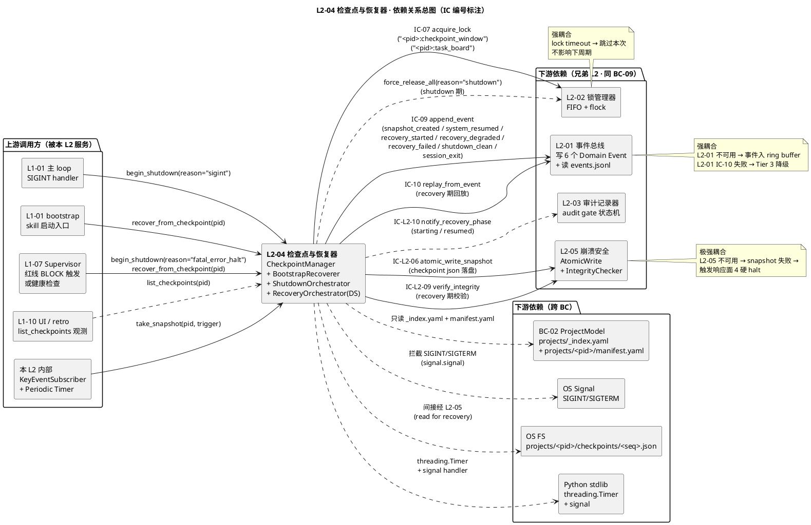
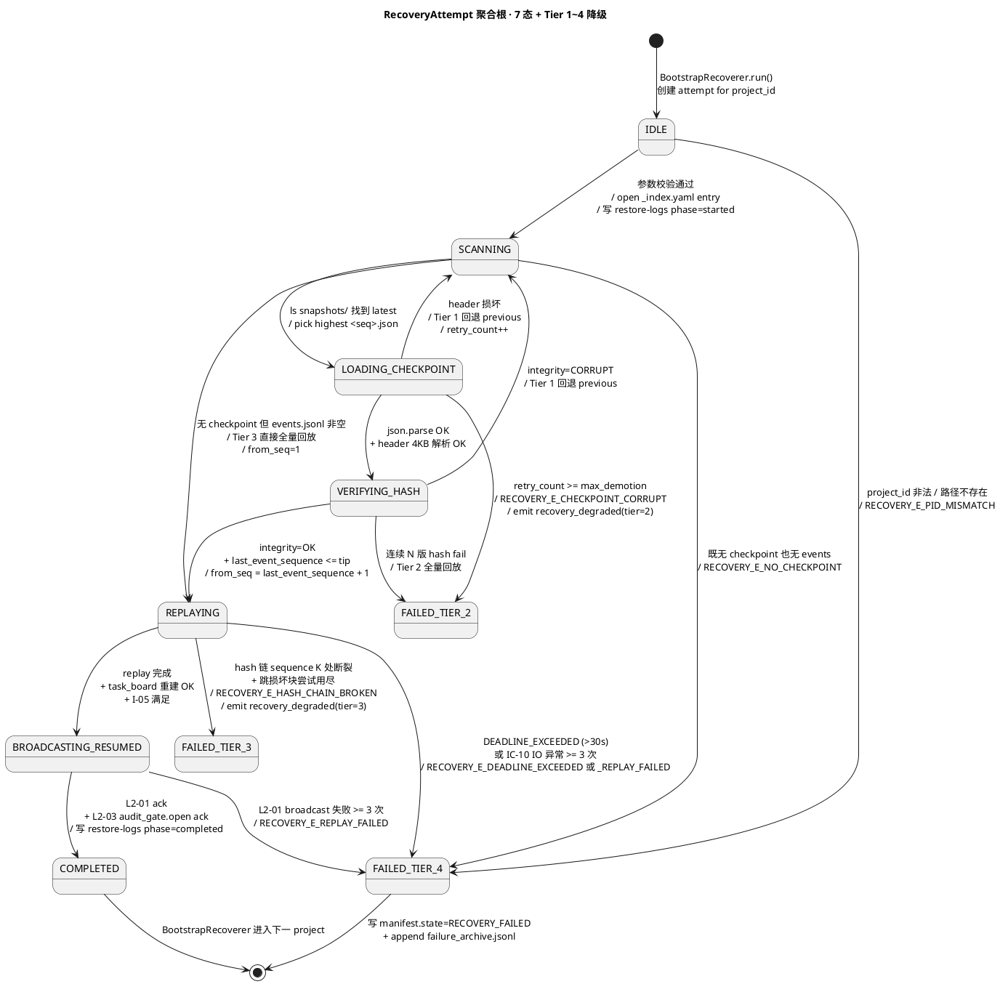
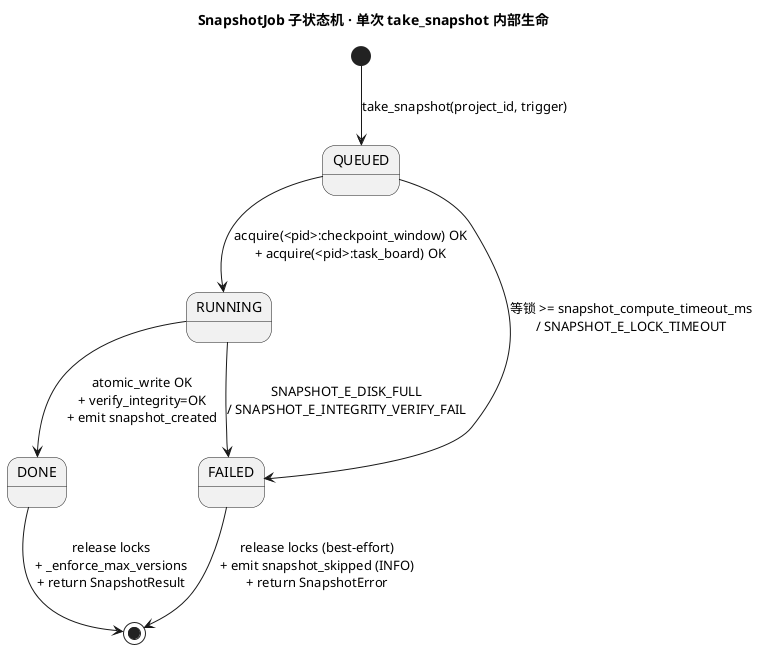
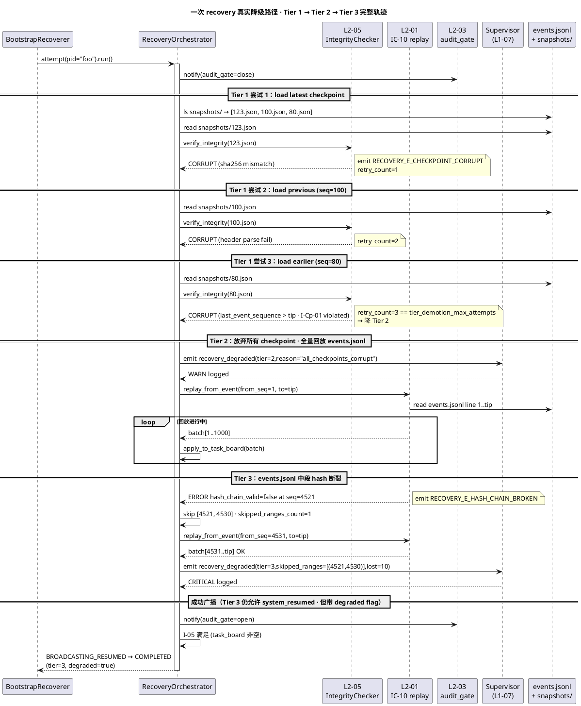

# L1 L2-04 · 检查点与恢复器 · Tech Design

> **本文档定位**：3-1-Solution-Technical 层级 · L1 的 L2-04 检查点与恢复器 技术实现方案（L2 粒度）。
> **与产品 PRD 的分工**：2-prd/L1-09-韧性+审计/prd.md §5.9 的对应 L2 节定义产品边界，本文档定义**技术实现**（接口字段级 schema + 算法伪代码 + 底层数据结构 + 状态机 + 配置参数）。
> **与 L1 architecture.md 的分工**：architecture.md 负责**跨 L2 架构 + 跨 L2 时序**，本文档负责**本 L2 内部技术细节**。冲突以 architecture.md 为准。
> **严格规则**：本文档不复述产品 PRD 文字（职责 / 禁止 / 必须等清单），只做技术映射 + 补齐"产品视角未说 but 工程师必须知道"的部分（具体算法 · syscall · schema · 配置）。

---

## §0 撰写进度

- [ ] §1 定位 + 2-prd §5.9 L2-04 映射
- [ ] §2 DDD 映射（引 L0/ddd-context-map.md BC-XX）
- [ ] §3 对外接口定义（字段级 YAML schema + 错误码）
- [ ] §4 接口依赖（被谁调 · 调谁）
- [ ] §5 P0/P1 时序图（PlantUML ≥ 2 张）
- [ ] §6 内部核心算法（伪代码）
- [ ] §7 底层数据表 / schema 设计（字段级 YAML）
- [ ] §8 状态机（如适用 · PlantUML + 转换表）
- [ ] §9 开源最佳实践调研（≥ 3 GitHub 高星项目）
- [ ] §10 配置参数清单
- [ ] §11 错误处理 + 降级策略
- [ ] §12 性能目标
- [ ] §13 与 2-prd / 3-2 TDD 的映射表

---

## §1 定位 + 2-prd 映射

### 1.1 一句话定位（本 L2 的唯一命题）

> 本 L2 是 L1-09 中**唯一负责"跨 session 生命守门"的 Application Service**：在系统正常运行期，按"周期 + 关键事件"两维触发条件落 `Checkpoint` 快照（落到 `projects/<pid>/checkpoints/<seq>.json`，经 L2-05 原子写）；在 SIGINT/SIGTERM 时拦截信号、协调 L2-01 进 drain 模式、写最终 checkpoint + `session_exit` 事件、向 L1-01 ack `shutdown_clean`；在 Claude Code 重启后扫 `projects/_index.yaml` 中所有 ACTIVE/SUSPENDED 项目，对每个项目调 L2-05 校验 + L2-01 IC-10 `replay_from_event` 回放事件、重建内存态 `task_board`，最后通过 L2-01 经 IC-09 广播 `system_resumed` 元事件给全 L1。"checkpoint 是冗余的事实快照、events.jsonl 才是单一事实源" —— 本 L2 必须在任意时刻保证 `Checkpoint.last_event_sequence` 与 `events.jsonl` 的 sequence 严格一一可对齐，损坏时按 Tier 1→4 降级路径回放重建，**绝不**重建空白 task-board（scope §5.9.5 硬禁）。

### 1.2 与 2-prd/L1-09 §5.9 + §11 L2-04 的精确映射表

| 2-prd 锚点 | 本文档章节 | 翻译方式 |
|---|---|---|
| prd §1 表 §5.9 L2-04 行（"周期/关键 snapshot · SIGINT 干净 flush · 重启回放重建 · 广播 system_resumed"）| §1.1 + §3 + §5 | 一句话职责对应 §1.1；4 个对外方法对应 §3；3 张时序图（snapshot · shutdown · recover）对应 §5 |
| prd §11.1 上游锚定（Goal §4.1 跨 session 无损 · scope §5.9.4 硬约束 3/4 · §5.9.6 义务 3/5 · BF-X-08 / BF-E-01 / BF-E-02）| §1.4 + §3.5 + §11 | 硬约束作为 §3 SLO 与 §11 错误处理输入；BF 流对应 §5 时序 |
| prd §11.2 输入（周期 timer · 关键事件 · SIGINT · boot · 事件流订阅）| §3 方法清单 + §4.1 上游表 | 5 类输入分别落到 `take_snapshot` 触发器、`begin_shutdown`、`recover_from_checkpoint`、`replay_events` |
| prd §11.2 输出（checkpoint 文件 · task-board snapshot · system_resumed · 失败告警 · shutdown_clean ack）| §3.2 SnapshotResult / RecoveryResult / ShutdownToken schema | 4 个输出物分别对应 4 个出参 schema |
| prd §11.3 In-scope 12 项（周期 / 关键 / drain / 扫未 CLOSED / 校验 / 回放 / 重建 / 广播 / Tier 1~4 / 30s 限 / audit gate / drain）| §3.1 方法表 + §6 算法 + §11 错误 | In-scope 12 项落到 4 方法 + 4 段算法 + Tier 降级表 |
| prd §11.3 Out-of-scope（不做事件落盘 / 不做锁 / 不做原子写 / 不做 trail 查 / 不做业务字段 / 不做 cloud / 不做用户确认 UI）| §1.3 边界声明 | 显式不做 = 调下游（L2-01/02/05）或给上游（L1-10）|
| prd §11.4 硬约束 8 条（≤1min checkpoint / ≤30s recovery / ≤5s flush / 必经 L2-05 / 不空白重建 / audit gate 通知 / resumed 广播在重建后 / 单活跃 snapshot 窗口）| §1.5 关键决策 + §3.7 错误码 + §12（后续段）| 全部转成性能 SLO + 错误码 + 状态机 guard |
| prd §11.5 🚫 8 条 + §11.6 ✅ 10 条 | §3.7 错误码 + §6（后续段）算法 | 🚫 落错误码（如 `RECOVERY_E_BLANK_REBUILD_REJECTED`）；✅ 落算法步骤断言 |
| prd §11.8 IC 契约表（IC-L2-03/04/06/08/10 + 写 session_exit）| §4.2 下游表 | 1:1 对齐到下游依赖矩阵 |
| prd §11.9 GWT 6 场景（周期 / 关键 / shutdown / 正常恢复 / Tier 1 降级 / Tier 4 拒绝空白）| §13（后续段）TDD 映射 | 6 场景对应 6 类测试用例 |

### 1.3 与 L1-09 architecture.md 的分工边界（哪些归 architecture / 哪些归本 L2）

**architecture.md 已锁定 · 本文档不重写**：
- §2.2 Aggregate `Checkpoint` 字段构成（`checkpoint_id / project_id / snapshot_ref / last_event_sequence / checksum`）→ 本 L2 §2 直接引用，不重述字段语义
- §2.3 三 Application Service 切分（`CheckpointManager` 负责周期触发 · `BootstrapRecoverer` 负责 boot 重建 · `ShutdownOrchestrator` 负责 SIGINT 干净退）→ 本 L2 §3 沿用三服务命名
- §2.4 `CheckpointRepository` 接口签名（`save / load_latest / load_previous / verify_integrity`）→ 本 L2 §3 把它包装为对外 4 方法
- §2.5 Domain Events 表（本 L2 发布 `snapshot_created / system_resumed / recovery_degraded / shutdown_clean`）→ 本 L2 §2.2 直接引这 4 条
- §3.1 5 L2 component diagram 中 L2-04 的方框文字 → 本 L2 §1.1 同义复述但不冲突
- §10 Tier 1~4 降级矩阵（回退上版 / 完整回放 / 跳损坏块 / 拒绝空白）→ 本 L2 §11（后续段）做字段级落地

**本 L2 自治细化（architecture.md 未涉及的 L2 内细节）**：
- §3 4 个对外方法的字段级 YAML schema（入参 + 出参 + ≥ 8 条错误码）
- §6 4 段核心算法伪代码（snapshot 流程 · recover 流程 · shutdown 流程 · replay 流程）
- §7 `<seq>.json` 物理 schema（含 `manifest` header + `payload` body 双段结构 · checksum 算法）
- §8 内部状态机 4 态（`IDLE / SNAPSHOTTING / RECOVERING / SHUTTING_DOWN`）+ 8 条转换
- §9 ≥ 3 个 GitHub 高星项目对标（Apache Kafka log compaction / etcd snapshot / SQLite WAL checkpoint）
- §10 配置参数清单（`SNAPSHOT_INTERVAL_S / RECOVERY_DEADLINE_S / SHUTDOWN_DRAIN_S` 等 ≥ 8 条）

**冲突仲裁**：本 L2 与 architecture.md §2.x / §3.1 / §10 冲突 → 以 architecture.md 为准，本 L2 改回；本 L2 与 prd.md §11 冲突 → 必须先回溯修 2-prd 后再修本文档（不允许"3-1 单边改 2-prd"）。

### 1.4 PM-14 落实点（按 project 物理分片 · 不跨 project 共享）

本 L2 是 PM-14 `harnessFlowProjectId` 在 checkpoint 维度的**物理持久化落实方**（与 L2-01/03 并列 · architecture.md 第 116 行）：

| PM-14 维度 | 本 L2 落实 |
|---|---|
| **物理路径分片** | 所有 Checkpoint 写入 `projects/<pid>/checkpoints/<seq>.json`（每版独立文件 · `<seq>` = 末尾事件 sequence · 不跨 project 落 root 目录） |
| **全局索引** | 不直接维护 `projects/_index.yaml`（属 BC-02 ProjectModel）但**只读消费**它 —— `BootstrapRecoverer.run()` 第一步 `open(projects/_index.yaml)` 取 ACTIVE/SUSPENDED 项目清单 |
| **task-board 物理路径** | `projects/<pid>/task-boards/<pid>.json`（恢复完写盘的 snapshot · 与 checkpoints 同 project 子树）|
| **不跨 project 传染** | 某 project A 的 checkpoint 损坏 → 按 Tier 降级仅影响 project A；project B/C 的 recovery 流程独立串行执行（架构 §10）· 实现层 = `for pid in active_projects: try: recover(pid) except: append failure_archive + continue` |
| **不允许跨 project 共享 checkpoint** | 物理校验：`Checkpoint.project_id == path 中的 <pid>`，不一致 → `RECOVERY_E_PID_MISMATCH` 拒绝加载 |

### 1.5 关键技术决策（Decision → Rationale → Alternatives → Trade-off）

| # | Decision | Rationale | Alternatives | Trade-off |
|---|---|---|---|---|
| **D1** | snapshot 触发 = "周期 30s + 关键事件后立即"双策略，**不**做"按事件条数 N" | scope §5.9.4 硬约束 3 "≤ 1 分钟"是时间维度上界 · 关键事件（Stage Gate / state 切换 / WP 完成）后 task-board 大跳变，立即落盘可让重启恢复成本陡降 | A1: 仅周期 → 关键事件后 30s 内崩溃丢失大跳变；A2: 仅关键事件 → 长时间无关键事件时无 checkpoint，回放成本爆 | 取 max(简单性, 安全性) · 双策略实现 = 1 个 `threading.Timer(30s)` + 1 组事件订阅过滤器（订阅 `key_event_types` 白名单），代码 ≤ 80 行 |
| **D2** | checkpoint 物理格式 = **JSON**（`<seq>.json`），不用 binary（pickle / msgpack / protobuf） | (1) PM-14 物理透明可审：用户 `cat checkpoints/12345.json` 直接读懂；(2) 跨 Python 版本可移植（pickle protocol 升版易碎）；(3) Tier 4 降级时人工修补 checkpoint 必须可读；(4) task-board 数据量典型 < 1 MB，JSON 编解码 ≤ 50ms 不构成瓶颈 | A1: pickle → 不可读 + 不安全（反序列化代码执行）；A2: msgpack → 二进制省 30% 空间但损可读性；A3: protobuf → 需 schema 文件 + 编译，重运维 | 用空间换可读性 · 1 MB checkpoint × 30s 频率 × 24h = 2.8 GB/天，由 §10 `MAX_CHECKPOINT_VERSIONS=20` 滚动清理控制盘占用 |
| **D3** | snapshot 模式 = **全量**，不做"增量 checkpoint" | (1) recovery 简单：load 1 个 checkpoint + 回放尾段 events 即可，无需"先合并 N 个增量段"；(2) 任一 checkpoint 损坏只损 1 版（本版回退上版即可），增量则可能"基础版 + 增量段链断 = 整链失效"；(3) task-board 典型 < 1 MB，全量 fsync ≤ 500ms，未达性能瓶颈 | A1: 增量（每次只记 diff）→ 写省 80% 但 read 需"基础+N段重放"，恢复路径复杂度爆；A2: 混合（每 N 全量 + 中间增量）→ 最复杂，工程维护成本最高 | 用写多换读简 · 增量优化留给 §11 可选职责 "🔧 渐进式 checkpoint"，V1 不做 |
| **D4** | recovery 编排 = **逐 project 串行**（不并发） | (1) 单 Claude Code Skill 进程 + 本地 SSD，4-8 个 project 并发 IO 易撞 fsync 队列；(2) 串行使错误隔离边界清晰（一个 project 失败不影响下一个的 IO 队列）；(3) bootstrap 总耗时由"项目数 × 单项目恢复"决定，V1 假设 ≤ 5 个 ACTIVE project，串行总耗时仍在 30s 硬约束内 | A1: 全并发 → 复杂错误隔离 + IO 抖动；A2: 池并发（max=2）→ 半折中但需引入线程池 | 简单换性能 · 极端场景（≥ 10 ACTIVE project）由 §11 后续优化引入 thread pool，V1 不做 |
| **D5** | shutdown 信号处理 = **拦截 SIGINT/SIGTERM 后转交 ShutdownOrchestrator**，不直接在 signal handler 里干活 | (1) Python signal handler 不能调任何持锁/阻塞操作（重入风险）；(2) handler 内仅 `set_event(shutdown_event)` 唤醒主 loop，由主 loop 调 `begin_shutdown` 走完整 drain → checkpoint → ack；(3) 第二次 SIGINT 来时 handler 直接 `os._exit(2)` 强退，避免"用户多按几次 Ctrl+C 进程僵死" | A1: handler 内直接 flush → 重入死锁；A2: 不拦截 SIGINT 让 OS 默认终止 → 丢 in-flight 事件 + 不写 session_exit | 安全换响应延迟 · drain 窗口 ≤ 5s 是用户感知阈值 |

---

## §2 DDD 映射（BC-XX）

### 2.1 Bounded Context 定位（BC-09 Resilience & Audit）

引自 `L0/ddd-context-map.md §2.10 BC-09`（第 475-513 行）+ `§4.9 BC-09 L2 映射`（第 799-815 行）：

> **BC-09 一句话定位**：项目的"黑匣子"—— 事件总线单一事实源 + 锁 + 审计 + **检查点** + 崩溃安全。本 BC 是**全系统 Published Language 发布者**（`append_event schema` 全 BC 共享）。
>
> **本 L2 在 BC-09 内的职位**（§4.9 第 806 行）：`L1-09 L2-04 检查点与恢复器 = Application Service + Aggregate Root: Checkpoint + Domain Event: system_resumed`。

**BC 边界 IN（本 L2 实现）**：周期 + 关键事件 snapshot · boot 期 events 回放 + task_board 重建 · SIGINT/SIGTERM 干净退出编排 · `system_resumed / snapshot_created / shutdown_clean / recovery_degraded` 4 个 Domain Event 发布。

**BC 边界 OUT（明确不属于本 L2）**：事件物理落盘（L2-01）· 互斥锁原语（L2-02）· `query_audit_trail` 反查（L2-03）· `tmpfile + fsync + rename` 五步原子写（L2-05 Domain Service）· task_board 业务字段语义（各业务 L1）· `projects/_index.yaml` 写入（BC-02 ProjectModel）。

### 2.2 DDD 对象模型（≥ 7 个对象 · 完整分类）

| 对象 | DDD 类型 | 核心字段 / 操作 | 一致性边界 | 引用锚点 |
|---|---|---|---|---|
| **Checkpoint** | **Aggregate Root** | `checkpoint_id(VO · ULID) / project_id(VO · PM-14) / snapshot_ref(VO · file path) / last_event_sequence(VO · int) / checksum(VO · sha256) / created_at(VO · ts) / trigger(VO · enum)` | 单 checkpoint 内强一致；`last_event_sequence` 必与 `events.jsonl` 末尾 sequence 严格对齐（I-05 不变量） | architecture §2.2 第 248 行 + ddd §2.10 第 502 行 |
| **Snapshot** | **Entity**（被 Checkpoint 持有）| `task_board_state(JSON object) / l1_states(map<L1, state>) / supervisor_context(JSON) / serialized_at(ts)` | snapshot 字段不限 schema（各业务 L1 自治），但顶层结构由本 L2 框定 | 本 L2 §7（后续段）字段级 schema |
| **SequenceCursor** | **VO**（不可变）| `from_seq: int / to_seq: int / verify_hash: bool` | `0 < from_seq ≤ to_seq ≤ chain_tip` · 用于驱动 IC-10 `replay_from_event` | IC-contracts §3.10.2 |
| **CheckpointManifest** | **VO**（不可变 · header 段）| `version: "v1" / format: "json" / encoding: "utf-8" / compression: null / payload_offset: int / payload_size: int / checksum: sha256(payload)` | 落盘文件**前 4 KB 固定 header**（人工 `head -c 4096` 可读）；payload 在 4 KB 之后；解析失败 = `RECOVERY_E_CHECKPOINT_CORRUPT` | 本 L2 §7（后续段）|
| **RecoveryPlan** | **VO**（不可变）| `project_id / checkpoint_to_load: checkpoint_id \| None / replay_from_seq: int / tier: 1\|2\|3\|4 / estimated_duration_ms: int` | tier 1: 用 latest checkpoint；tier 2: 回退 previous checkpoint；tier 3: 完整回放（无 checkpoint）；tier 4: 拒绝（损坏 + 无 events）| architecture §10 Tier 表 |
| **ShutdownToken** | **VO**（不可变 · 单次 shutdown 唯一）| `token_id: ULID / requested_at: ts / reason: enum / drain_deadline: ts / state: REQUESTED\|DRAINING\|FLUSHED\|ACKED` | 一次 skill 生命周期内最多 1 个 token；`drain_deadline = requested_at + SHUTDOWN_DRAIN_S` | 本 L2 §3.3 |
| **CheckpointManager** | **Application Service** | `take_snapshot(project_id, trigger) -> SnapshotResult` · 周期 + 关键事件触发 · 取 task_board 锁 · 调原子写 | 同时只允许 1 个活跃 snapshot 窗口（prd §11.4 硬约束 8 · 由内部 `snapshot_lock` 串行化）| architecture §2.3 第 271 行 |
| **BootstrapRecoverer** | **Application Service** | `recover_from_checkpoint(project_id) -> RecoveryResult` · skill 启动时扫 `_index.yaml` + 对 ACTIVE project 回放 + 重建 task-board + 广播 system_resumed | 逐 project 串行（D4 决策）；恢复期间 L2-03 audit gate 关 | architecture §2.3 第 272 行 |
| **ShutdownOrchestrator** | **Application Service** | `begin_shutdown(reason) -> ShutdownToken` · SIGINT 捕获 + drain L2-01 + 最终 checkpoint + flush + fsync + ack | 进程内单例；进 SHUTTING_DOWN 后拒绝任何新 snapshot 触发 | architecture §2.3 第 273 行 |
| **RecoveryOrchestrator** | **Domain Service**（无状态）| 把 `verify_integrity → load_checkpoint → replay_events → rebuild_task_board → broadcast_resumed` 5 步组合，封装 Tier 1~4 降级决策树 | 决策无副作用；副作用由 BootstrapRecoverer 调用方负责 | 本 L2 §6（后续段）算法 |
| **CheckpointRepository** | **Repository**（接口）| `save(project_id, snapshot, last_event_seq) -> checkpoint_id` / `load_latest(project_id) -> Checkpoint \| None` / `load_previous(project_id, before_cp_id) -> Checkpoint \| None` / `verify_integrity(checkpoint_id) -> OK\|CORRUPT\|PARTIAL` | 唯一物理访问入口；底层经 L2-05 `AtomicWrite` Domain Service | architecture §2.4 第 285 行 |
| **Domain Events**（本 L2 发布）| **Domain Events** | `L1-09:snapshot_created` · `L1-09:system_resumed` · `L1-09:recovery_degraded` · `L1-09:shutdown_clean` · `L1-09:recovery_started` · `L1-09:recovery_failed` | 通过 L2-01 `append_event` 落盘 + 异步广播；payload 必含 PM-14 `project_id` | architecture §2.5 第 295 行 |

**关键不变量复述**（架构层面已锁 · 本 L2 必须遵守）：

- **I-05 Checkpoint 可从 events 完全重建**：任何 checkpoint 损坏 → 回退上一版（Tier 1）→ 完整回放（Tier 2）→ 跳损坏块（Tier 3）→ **绝不空白重建**（Tier 4 = 告警拒绝 · prd §11.5 🚫 第 1 条）
- **I-Cp-01**（本 L2 新增）：`Checkpoint.last_event_sequence ≤ EventLog.tip_sequence`，违反 → checkpoint 来自未来 = `RECOVERY_E_CHECKPOINT_CORRUPT` 拒绝
- **I-Cp-02**（本 L2 新增）：同一 `project_id` 的 checkpoint 文件名 `<seq>.json` 中 `<seq>` 严格单调递增，违反 → bootstrap 期 `ls checkpoints/ | sort` 检测异常 + 告警
- **I-Cp-03**（本 L2 新增）：snapshot 期间禁止接受新的 snapshot 触发（prd §11.4 硬约束 8 · 由 §8 状态机 guard 实现）

### 2.3 与兄弟 BC 的边界（Context Map · Partnership / Customer-Supplier 关系）

引自 `ddd-context-map.md §2.10` BC-09 的关系总表 + architecture.md §1.4 物理分片声明：

| 兄弟 BC | 关系类型 | 共享对象 | 边界规则（谁拥有 / 谁只读）|
|---|---|---|---|
| **BC-02 ProjectModel**（L1-02 项目生命周期）| **Partnership** | `projects/<pid>/manifest.yaml`（项目元数据 · BC-02 拥有 · 本 L2 只读消费 last_state / last_checkpoint_seq）+ `projects/_index.yaml`（项目索引 · BC-02 拥有 · 本 L2 boot 时只读消费 ACTIVE 列表）| **BC-02 拥有 manifest 写入权 · BC-09 仅在 recovery 完成后请 BC-02 更新 manifest.last_recovered_at**（不直接写 manifest，避免双 owner）|
| **BC-09 兄弟 L2-01**（事件总线）| **Partnership**（同 BC 内）| `events.jsonl`（L2-01 拥有写权 · 本 L2 仅通过 IC-10 `replay_from_event` 只读消费）| 本 L2 **绝不**绕过 L2-01 直接 read events.jsonl 文件（保证 hash 链验证一致性）|
| **BC-09 兄弟 L2-02**（锁管理器）| **Partnership** | `<pid>:checkpoint_window` 锁（snapshot 窗口互斥）+ `<pid>:task_board` 锁（snapshot 取它防业务并发写）| 本 L2 **每次** snapshot 前必经 L2-02 acquire；shutdown 时 L2-02 收 `force_release_all` 强释 |
| **BC-09 兄弟 L2-05**（崩溃安全）| **Partnership** | `AtomicWrite` Domain Service（L2-05 拥有 · 本 L2 调）+ `IntegrityChecker`（L2-05 拥有 · 本 L2 调 `verify_integrity(checkpoint_path)`）| L2-05 **不直接面向外部 L1**（architecture §1.5 第 431 行）· 只由本 L2 + L2-01 在 Application Service 内调 |
| **BC-09 兄弟 L2-03**（审计）| **Partnership** | `audit_gate` 状态（recovery 期 L2-03 拒查 · 经 IC-L2-10 通知）| 本 L2 在 recovery 开始时通知 L2-03 关 audit gate · 完成时通知开 |
| **BC-01 Methodology**（L1-01 主 loop）| **Partnership** | `SIGINT 信号 → begin_shutdown 调用 + shutdown_clean ack` | BC-01 拥有 SIGINT 拦截入口（registers handler in main thread）· 本 L2 拥有 drain + checkpoint + ack 编排 |
| **BC-07 Supervisor**（L1-07）| **Customer-Supplier**（本 L2 = Supplier）| `recovery_degraded / recovery_failed` 事件（本 L2 发布 · BC-07 订阅触发 CRITICAL 告警）| 本 L2 不感知 BC-07 存在；只通过 L2-01 广播事件 · BC-07 订阅 |
| **BC-10 UI**（L1-10）| **Customer-Supplier**（本 L2 = Supplier）| `system_resumed / snapshot_created` 事件（BC-10 订阅做时间轴渲染 + "已恢复 project foo" 提示）| 本 L2 不直接调 BC-10；BC-10 订阅事件流 |

**核心隔离原则**：
1. **不互越界写**：BC-02 拥有 `manifest.yaml` 唯一写权 · BC-09 拥有 `checkpoints/` 唯一写权 · 不互写
2. **唯一事实源**：events.jsonl 是唯一事实源 · checkpoint 是冗余加速结构 · 任何不一致以 events.jsonl 为准
3. **Published Language**：本 L2 发布的 4 个 Domain Event schema 是 BC-09 → 全 BC 的发布语言 · 加字段必 optional · 减字段必先 deprecate 1 版本

---

## §3 对外接口定义（字段级 YAML schema + 错误码）

### 3.1 方法清单（4 个公共 + 1 个内部观测）

| # | 方法 | 签名 | 同步/异步 | 调用方 | 锚点 |
|---|---|---|---|---|---|
| **M1** | `take_snapshot` | `take_snapshot(project_id: str, trigger: SnapshotTrigger) -> SnapshotResult \| RecoveryError` | 同步 · 请求-响应 | 内部 timer / 关键事件订阅 / `force_snapshot` 调试入口 | prd §11.3 In-scope 1+2 |
| **M2** | `recover_from_checkpoint` | `recover_from_checkpoint(project_id: str) -> RecoveryResult \| RecoveryError` | 同步 · 阻塞 · ≤ `RECOVERY_DEADLINE_S` | bootstrap 流程 / `BootstrapRecoverer.run()` 内部循环 | prd §11.3 In-scope 4-7 |
| **M3** | `begin_shutdown` | `begin_shutdown(reason: str) -> ShutdownToken \| RecoveryError` | 同步 · 立即返 token · 后台异步 drain | L1-01（SIGINT handler 唤醒主 loop 后调） | prd §11.3 In-scope 12 |
| **M4** | `replay_events` | `replay_events(project_id: str, from_seq: int, to_seq: int \| None = None) -> ReplayResult \| RecoveryError` | 同步 · 顺序读 · 大数据量分批回流 | 本 L2 内部 `RecoveryOrchestrator` 调用（封装 IC-10）· retro 工具调试可调 | IC-10 §3.10 |
| **M5** | `list_checkpoints`（内部观测）| `list_checkpoints(project_id: str) -> list[CheckpointSummary]` | 同步 · 只读 | retro / Supervisor / UI 时间轴 | architecture §2.4 |

### 3.2 字段级 YAML schema（≥ 3 个）

#### 3.2.1 `SnapshotResult`（M1 take_snapshot 出参）

```yaml
SnapshotResult:
  type: object
  required: [checkpoint_id, project_id, last_event_sequence, snapshot_path, checksum, duration_ms, trigger, created_at]
  properties:
    checkpoint_id:
      type: string
      format: "cp-{ulid}"
      description: 全局唯一 ULID（含时间分量）· 写入 manifest header
      required: true
    project_id:
      type: string
      pattern: "^[a-z0-9_-]+$"
      description: PM-14 project_id（与 path 中 <pid> 严格一致）
      required: true
    last_event_sequence:
      type: integer
      minimum: 1
      description: 此 checkpoint 覆盖的末尾 events.jsonl sequence（与 events.jsonl 行号一一对齐 · I-Cp-01）
      required: true
    snapshot_path:
      type: string
      pattern: "^projects/[a-z0-9_-]+/checkpoints/[0-9]+\\.json$"
      description: 物理路径（相对 harness root · 文件名 = <last_event_sequence>.json）
      required: true
    checksum:
      type: string
      pattern: "^[0-9a-f]{64}$"
      description: payload 部分的 sha256 hex（manifest 中也写一份做交叉校验）
      required: true
    duration_ms:
      type: integer
      minimum: 0
      maximum: 2000
      description: 整段 snapshot 耗时（取锁 + 序列化 + 原子写）· 必 ≤ SNAPSHOT_DEADLINE_MS（默认 2000）
      required: true
    trigger:
      type: enum
      enum: [periodic_timer, key_event, shutdown_final, manual_force]
      description: 触发源（4 种 · 用于 retro 复盘频率分布）
      required: true
    created_at:
      type: string
      format: iso8601
      required: true
    bytes_written:
      type: integer
      description: 落盘总字节（manifest header 4 KB + payload 实际大小）
      required: false
    superseded_checkpoint_id:
      type: string
      description: 上一个 checkpoint id（用于 Tier 1 降级时找 previous）
      required: false
```

#### 3.2.2 `RecoveryResult`（M2 recover_from_checkpoint 出参）

```yaml
RecoveryResult:
  type: object
  required: [project_id, tier, recovered_state, last_event_sequence_replayed, duration_ms, started_at, completed_at, system_resumed_event_id]
  properties:
    project_id:
      type: string
      required: true
    tier:
      type: integer
      enum: [1, 2, 3]
      description: 实际走的降级层级（1=最新 checkpoint OK · 2=回退 previous · 3=完整回放无 checkpoint）· tier 4 不出现在成功路径（直接抛 RecoveryError.blank_rebuild_rejected）
      required: true
    recovered_state:
      type: object
      description: 重建后的 task_board 完整快照（schema 由各业务 L1 自治 · 本 L2 透传）
      required: true
    last_event_sequence_replayed:
      type: integer
      minimum: 0
      description: 回放完成时停在的 sequence（== EventLog.tip_sequence）
      required: true
    checkpoint_id_used:
      type: string
      description: 实际加载的 checkpoint id（tier=3 时为 null）
      required: false
    events_replayed_count:
      type: integer
      minimum: 0
      description: 实际回放事件数（用于 retro 性能分析）
      required: true
    hash_chain_valid:
      type: boolean
      description: 回放期间 hash 链校验结果（来自 IC-10）· false → tier 自动 +1 走降级
      required: true
    skipped_corrupt_ranges:
      type: array
      items:
        type: object
        properties:
          from_seq: {type: integer}
          to_seq: {type: integer}
          reason: {type: string, enum: [hash_mismatch, partial_write, schema_legacy]}
      description: tier=3 时跳过的损坏块清单（同时发 recovery_degraded 事件）
      required: false
    duration_ms:
      type: integer
      maximum: 30000
      description: 整段恢复耗时 · 必 ≤ RECOVERY_DEADLINE_S × 1000（30000ms · scope §5.9.4 硬约束 4）· 超时 → RECOVERY_E_DEADLINE_EXCEEDED
      required: true
    started_at: {type: string, format: iso8601, required: true}
    completed_at: {type: string, format: iso8601, required: true}
    system_resumed_event_id:
      type: string
      format: "evt-{uuid-v7}"
      description: 广播的 system_resumed 元事件 id（供调用方追溯）
      required: true
```

#### 3.2.3 `ShutdownToken`（M3 begin_shutdown 出参）

```yaml
ShutdownToken:
  type: object
  required: [token_id, requested_at, reason, drain_deadline, state]
  properties:
    token_id:
      type: string
      format: "sd-{ulid}"
      description: 单 skill 生命周期内最多 1 个 token（重复调 → 返回同 token + INFO 日志）
      required: true
    requested_at: {type: string, format: iso8601, required: true}
    reason:
      type: enum
      enum: [sigint, sigterm, manual_quit, fatal_error_halt, user_intervene]
      required: true
    drain_deadline:
      type: string
      format: iso8601
      description: requested_at + SHUTDOWN_DRAIN_S（默认 5s · 超时强制 flush）
      required: true
    state:
      type: enum
      enum: [REQUESTED, DRAINING, FLUSHING, ACKED, TIMED_OUT]
      description: token 生命周期状态机；调用方可轮询本字段直到 ACKED
      required: true
    in_flight_event_count_at_request:
      type: integer
      description: 调 begin_shutdown 瞬间 L2-01 in-flight event 数（用于 drain 进度估算）
      required: false
    final_checkpoint_id:
      type: string
      description: 最终 checkpoint id（只在 state ∈ {FLUSHING, ACKED} 时存在）
      required: false
    flush_duration_ms:
      type: integer
      description: drain + 最终 checkpoint + session_exit + fsync 总耗时（state=ACKED 时填）
      required: false
```

#### 3.2.4 `ReplayResult`（M4 replay_events 出参 · 简表）

```yaml
ReplayResult:
  type: object
  required: [project_id, events_replayed, hash_chain_valid, last_sequence_processed]
  properties:
    project_id: {type: string, required: true}
    events_replayed: {type: integer, minimum: 0, required: true}
    hash_chain_valid: {type: boolean, required: true}
    last_sequence_processed: {type: integer, required: true}
    corrupt_at_sequence:
      type: integer
      description: hash_chain_valid=false 时指出损坏点（直接转发 IC-10 出参字段）
      required: false
    duration_ms: {type: integer, required: true}
    rebuilt_task_board_state:
      type: object
      description: 重放后的 task_board snapshot（透传 IC-10 出参）
      required: true
```

### 3.3 错误码表（≥ 8 条 · 四列）

| 错误码 | 含义 | 触发场景 | 调用方处理 |
|---|---|---|---|
| `RECOVERY_E_CHECKPOINT_CORRUPT` | checkpoint 文件 manifest header 解析失败 / payload checksum 不匹配 / `last_event_sequence` 超出 events.jsonl tip | bootstrap 期 `verify_integrity` 返回 `CORRUPT` · 或 manifest 字段缺失 | RecoveryOrchestrator 自动降 Tier 1 → load_previous；连续 2 版均 corrupt → 降 Tier 2（完整回放）+ 发 `recovery_degraded` 事件 |
| `RECOVERY_E_HASH_CHAIN_BROKEN` | replay_events 期间 IC-10 返回 `hash_chain_valid=false` + `corrupt_at_sequence=K` | events.jsonl 中 sequence K 处 hash 不闭合（断电中段写、磁盘损坏、人为篡改） | RecoveryOrchestrator 走 Tier 3：跳损坏块（K 之后段重新尝试）+ 记 `skipped_corrupt_ranges` + 发 `recovery_degraded` 事件 + Supervisor CRITICAL |
| `RECOVERY_E_DEADLINE_EXCEEDED` | recovery 总耗时超 `RECOVERY_DEADLINE_S`（默认 30s · scope §5.9.4 硬约束 4） | 单 project 事件数 ≥ 50 万 · 或 IO 异常拖慢 | **不假恢复**：明确告警（发 `recovery_failed` 事件）+ 把项目标 `state=RECOVERY_FAILED`（写入 manifest）+ 提示用户手动介入；**绝不**输出半建 task_board |
| `RECOVERY_E_NO_CHECKPOINT` | `load_latest(project_id)` 返回 None **且** `events.jsonl` 不存在或为空 | 全新项目 · 或全部 checkpoint + events 同时丢失（极端灾难） | Tier 4 拒绝场景：发 `recovery_failed` + reason=`no_data_at_all` + Supervisor CRITICAL；**绝不**重建空白 task_board（prd §11.5 🚫 第 1 条） |
| `RECOVERY_E_REPLAY_FAILED` | IC-10 返回 `E_REP_STORAGE_UNAVAILABLE`（jsonl 读取 IO 异常）连续 3 次 | 磁盘读失败 / FS unmount / 权限突变 | Supervisor CRITICAL + 项目标 `state=RECOVERY_FAILED` + 不进 `system_resumed` 广播 |
| `RECOVERY_E_PID_MISMATCH` | 加载 checkpoint 时发现 `Checkpoint.project_id` 与文件路径中 `<pid>` 不一致 | checkpoint 文件被人为搬运 / FS 损坏导致路径串位 | 拒绝该 checkpoint + 自动 fallback 到 previous（Tier 1 → Tier 2）+ 记 `recovery_degraded` |
| `RECOVERY_E_BLANK_REBUILD_REJECTED` | RecoveryPlan 走到 Tier 4（空白重建）被守门拒绝 | scope §5.9.5 硬禁 6 守门触发 | Terminal 错误：直接 abort 本 project recovery；不进 `system_resumed` 广播；BC-10 UI 显示"项目 X 恢复失败 · 请人工介入" |
| `SNAPSHOT_E_LOCK_TIMEOUT` | take_snapshot 取 `<pid>:task_board` 锁等待超 `LOCK_WAIT_TIMEOUT_MS`（3000ms） | 业务 L1 持锁过久（极端 WP 写）· 或本 L2 上一次 snapshot 卡死未释放 | 本次 snapshot 跳过（不 retry · 等下个 30s 周期）+ 记 `snapshot_skipped` INFO 事件；连续 3 次跳过 → 升级 WARN |
| `SNAPSHOT_E_DISK_FULL` | L2-05 `atomic_write` 返回 ENOSPC | 磁盘满 | 本次 snapshot 失败 + L2-05 自动清理上 N 版 checkpoint（`MAX_CHECKPOINT_VERSIONS` rolling）+ retry 1 次；仍失败 → 发 `bus_write_failed` 触发响应面 4 硬 halt |
| `SNAPSHOT_E_INTEGRITY_VERIFY_FAIL` | 落盘后立即 verify_integrity 返回 `CORRUPT`（罕见 · 写后立读不一致）| 文件系统 cache 异常 / 硬件故障 | 删除本次 corrupt 文件 + retry 1 次；仍失败 → Supervisor CRITICAL · 不影响下一周期 |
| `SHUTDOWN_E_DRAIN_TIMEOUT` | drain 等待 in-flight events 超 `SHUTDOWN_DRAIN_S`（默认 5s · scope §5.9.6 义务 3） | L2-01 in-flight queue 异常长 / 某个 caller hang 在 IC-09 | 强制 flush 已落盘部分 + 写最终 checkpoint + ack（state=TIMED_OUT）+ 发 `shutdown_clean` 但带 `degraded=true` flag |
| `SHUTDOWN_E_REENTRANT` | begin_shutdown 在 state=SHUTTING_DOWN 期被重复调 | 用户狂按 Ctrl+C / 多个 caller 同时拦 SIGINT | 返回原 ShutdownToken + INFO 日志；第二次 SIGINT 来时由 signal handler 直接 `os._exit(2)` 强退（D5 决策） |

**严重度分类**（与 §11 错误处理对接 · 后续段细化）：

| 严重度 | 错误码 | 是否记 Supervisor | 是否影响 Goal §4 |
|---|---|---|---|
| **CRITICAL**（红线）| `BLANK_REBUILD_REJECTED` · `DEADLINE_EXCEEDED` · `NO_CHECKPOINT` · `REPLAY_FAILED` · `INTEGRITY_VERIFY_FAIL` | 是（CRITICAL 级 + 阻断 system_resumed 广播）| 硬红线（Goal §4.1 跨 session 无损 → 失败）|
| **WARN**（降级）| `CHECKPOINT_CORRUPT` · `HASH_CHAIN_BROKEN` · `PID_MISMATCH` · `SHUTDOWN_E_DRAIN_TIMEOUT` | 是（WARN 级 + 记 `recovery_degraded`）| 软红线（影响响应面但已降级处理）|
| **INFO**（可接受）| `SNAPSHOT_E_LOCK_TIMEOUT`（≤ 3 次连续）· `SHUTDOWN_E_REENTRANT` | 否（DEBUG 级）| 无 |
| **FATAL**（触发响应面 4）| `SNAPSHOT_E_DISK_FULL`（retry 仍失败）| 是 + 转发 `bus_write_failed` | 硬 halt 整个系统（scope §5.9.4） |

**幂等性约定**：

- M1 `take_snapshot` **非幂等**（每次产生新 checkpoint_id · 即使 task_board 内容未变也写新文件 · 由 §10 `MAX_CHECKPOINT_VERSIONS` rolling 清理控制盘占用）
- M2 `recover_from_checkpoint` **幂等**（同 project 多次调返回同 RecoveryResult · 但仅广播 1 次 `system_resumed`，由内部 `recovered_set` 守门）
- M3 `begin_shutdown` **幂等**（重复调返回原 token + INFO · 见 `SHUTDOWN_E_REENTRANT`）
- M4 `replay_events` **幂等**（IC-10 本身幂等 · 纯读）

---

## §4 接口依赖（被谁调 · 调谁）

### 4.1 上游调用方表（谁调本 L2 · 调哪个方法 · 期望响应时间 · 调用频率）

| 调用方 | 所在 L1/L2 | 调用方法 | 触发条件 | 期望响应时间 | 调用频率 | 关键路径? |
|---|---|---|---|---|---|---|
| **SIGINT/SIGTERM 信号** | OS → L1-01 主 loop signal handler | `begin_shutdown(reason="sigint")` | 用户 Ctrl+C / 容器 SIGTERM / `kill <pid>` | 立即返 token（≤ 50ms）· 后台 drain ≤ 5s | 极低频（每 skill 生命周期 ≤ 1 次）| **是**（影响用户感知退出延迟）|
| **L1-01 主 loop quit 流程** | L1-01 | `begin_shutdown(reason="manual_quit")` | 用户在 UI 显式点"退出 skill"按钮（经 IC-17）| 同上 | 同上 | 是 |
| **L1-07 Supervisor BLOCK 触发** | L1-07 | `begin_shutdown(reason="fatal_error_halt")` | 红线 BLOCK 级硬暂停后用户授权退出 | 同上 | 极低频 | 是 |
| **bootstrap 流程**（skill 启动）| L1-01 入口（`harnessFlow` skill main）| `recover_from_checkpoint(project_id)` × N（每个 ACTIVE project 一次）| Claude Code skill 启动 + `/harnessFlow` 激活 | 单 project ≤ 30s · 总和 ≤ 30s（D4 串行）| 极低频（每次 skill cold start 1 次）| **是**（用户首屏延迟）|
| **L1-07 Supervisor 健康检查** | L1-07 | `recover_from_checkpoint(project_id)` | Supervisor 检测到 task_board in-memory 与 events.jsonl 不一致 → 主动触发 forced recovery | 同 bootstrap | 极低频（异常路径）| 否 |
| **关键事件订阅器**（本 L2 内部）| 本 L2 内 `KeyEventSubscriber`（订阅 L2-01）| `take_snapshot(project_id, trigger="key_event")` | L2-01 广播 `gate_closed / state_changed / wp_completed / decision_made` | ≤ 2s | 中频（每个 project 每 stage 0~3 次）| 否（后台）|
| **周期 Timer**（本 L2 内部）| 本 L2 内 `threading.Timer(SNAPSHOT_INTERVAL_S)` | `take_snapshot(project_id, trigger="periodic_timer")` × N | 每 30s 唤醒 + 遍历 ACTIVE projects | 同上 | 中频（每 30s × N project）| 否 |
| **ShutdownOrchestrator 内部** | 本 L2 内 | `take_snapshot(project_id, trigger="shutdown_final")` | drain 完成后写最终 checkpoint | ≤ 2s | 极低频 | 是（影响退出延迟）|
| **retro / debug 工具** | 命令行脚本（如 `python -m harness.retro snapshot --pid foo --force`）| `take_snapshot(project_id, trigger="manual_force")` | 用户调试 / 复盘 | 同上 | 极低频 | 否 |
| **本 L2 内部 RecoveryOrchestrator** | 本 L2 内（不对外）| `replay_events(project_id, from_seq, to_seq)` | M2 recover 流程内部 | ≤ 10s（1 万事件）| 同 bootstrap | 是 |
| **retro / 时间轴 UI** | L1-10 / 命令行 | `list_checkpoints(project_id)` | UI 渲染 checkpoint 时间轴 / retro 分析 | ≤ 100ms | 低频 | 否 |

**频次小结**：take_snapshot 是本 L2 最高频接口（30s × N 周期 + 关键事件突发），但仍属"低频后台"（与 L2-01 IC-09 append_event 每秒 ≥ 100 次相比低 3 个数量级）。

### 4.2 下游依赖表（本 L2 调哪些 IC / 内部 L2 / 外部资源）

| 被调方 | 层级 | 调用 IC / 方法 | 用途 | 紧耦合度 | 失败时本 L2 行为 |
|---|---|---|---|---|---|
| **L2-01 事件总线**（写）| 兄弟 L2 / 同 BC | IC-09 `append_event(L1-09:snapshot_created / system_resumed / recovery_started / recovery_degraded / recovery_failed / shutdown_clean / session_exit)` | 落盘本 L2 6 个 Domain Event + 1 个 session_exit | 强 | L2-01 不可用 → 写入内存 ring buffer · L2-01 恢复后补发；本 L2 不阻塞主流程（事件落盘失败时按响应面 4 由 L2-01 决定是否硬 halt）|
| **L2-01 事件总线**（读 · IC-10）| 兄弟 L2 | IC-10 `replay_from_event(query_id, project_id, from_sequence, to_sequence?, verify_hash_chain=true)` | recovery 期回放 events.jsonl 重建 task_board | 强 | IC-10 返回 `E_REP_HASH_CHAIN_BROKEN` → Tier 3 跳损坏块；返回 `E_REP_STORAGE_UNAVAILABLE` → retry 3 次 → `RECOVERY_E_REPLAY_FAILED` 终止 |
| **L2-02 锁管理器** | 兄弟 L2 | IC-07 `acquire_lock("<pid>:checkpoint_window", holder="L2-04:CheckpointManager", timeout_ms=3000)` + 配对 `release_lock` | snapshot 窗口互斥（防同 project 并发 snapshot · prd §11.4 硬约束 8）| 强 | timeout → `SNAPSHOT_E_LOCK_TIMEOUT` 跳过本次 snapshot · 不影响下个周期 |
| **L2-02 锁管理器**（task_board 锁）| 兄弟 L2 | IC-07 `acquire_lock("<pid>:task_board", ...)` + `release_lock` | snapshot 期防业务 L1 并发写 task_board（prd §11.6 ✅ 第 10 条）| 强 | 同上 |
| **L2-02 锁管理器**（shutdown 强释）| 兄弟 L2 | `force_release_all(reason="shutdown")` | shutdown 期清理所有 in-flight 锁 | 弱（仅广播）| L2-02 不可用 → 直接进 ack 阶段 + 记 WARN（依赖 OS 进程退出时 flock 自动释放）|
| **L2-05 崩溃安全 · AtomicWrite** | 兄弟 L2 | IC-L2-06 `atomic_write_snapshot(target_path, snapshot_bytes, header)` | 把 checkpoint json 落盘（tmpfile + write + fsync + rename + parent fsync 五步）| 极强 | L2-05 失败 → `SNAPSHOT_E_DISK_FULL` / `SNAPSHOT_E_INTEGRITY_VERIFY_FAIL` · 走 §3.3 错误码处理 |
| **L2-05 崩溃安全 · IntegrityChecker** | 兄弟 L2 | IC-L2-09 `verify_integrity(checkpoint_path) -> OK\|CORRUPT\|PARTIAL` | recovery 期校验 checkpoint 完整性 | 极强 | CORRUPT → Tier 1 降级；PARTIAL → 同 CORRUPT |
| **L2-03 审计记录器**（audit gate）| 兄弟 L2 | IC-L2-10 `notify_recovery_phase(phase: 'starting' / 'resumed')` | recovery 期通知 L2-03 关闭 / 开启 audit 查询（防 BC-10 读半建 task_board · prd §11.4 硬约束 6）| 中 | L2-03 不可用 → 记 WARN + 继续（不阻塞 recovery；BC-10 自行容错短暂返空）|
| **BC-02 ProjectModel**（只读 `_index.yaml`）| 跨 BC | 直接 `open + yaml.safe_load("projects/_index.yaml")` | bootstrap 期取 ACTIVE/SUSPENDED project 列表 | 中（架构 §1.4）| 文件不存在 → 视为"无 ACTIVE project"（fresh install）· 直接进 idle 不报错 |
| **BC-02 ProjectModel**（只读 `manifest.yaml`）| 跨 BC | 直接 `open + yaml.safe_load("projects/<pid>/manifest.yaml")` | 取 `last_state / last_checkpoint_seq` 做 recovery 起点判断 | 中 | 文件不存在 → `RECOVERY_E_NO_CHECKPOINT`（视为 Tier 4 拒绝场景） |
| **OS Signal handler** | OS | `signal.signal(SIGINT, handler) / signal.signal(SIGTERM, handler)` | 拦截退出信号 | 强（D5 决策）| handler 仅 set Event · 不直接干活；进程异常退出依赖 `atexit` 兜底（不保证 graceful）|
| **OS 文件系统** | OS | `open / read / write / fsync / rename`（间接 · 经 L2-05）| checkpoint 物理 IO | 极强 | FS 异常 → 经 L2-05 错误码上抛 |
| **Python `threading.Timer`** | stdlib | 周期 snapshot timer | 周期触发 | 极强（stdlib 不会缺失）| Timer 线程崩溃 → 主 loop 监控 `timer.is_alive()` 自动重启 + 记 `timer_restarted` |

### 4.3 PlantUML 依赖图（component diagram · 箭头标 IC 编号）



### 4.4 依赖风险矩阵

| 风险 | 触发场景 | 影响 | 缓解 |
|---|---|---|---|
| **L2-01 IC-10 hash 链断裂** | events.jsonl sequence K 处 hash 不闭合 | recovery 卡在 Tier 3 跳损坏块 | RecoveryOrchestrator 自动 Tier 3 降级 + 发 `recovery_degraded` + 记 `skipped_corrupt_ranges` · BC-07 CRITICAL 告警 |
| **L2-05 atomic_write ENOSPC** | 磁盘满 | snapshot 失败 + checkpoint 不更新 | 自动滚动清理上 N 版（`MAX_CHECKPOINT_VERSIONS`）+ retry 1 次；仍失败 → 触发响应面 4 硬 halt（保证不写部分 checkpoint） |
| **shutdown drain 卡死** | L2-01 in-flight queue 异常长 / caller hang | shutdown 超 5s | `SHUTDOWN_E_DRAIN_TIMEOUT` 强制 flush 已落盘部分 + 进 TIMED_OUT 状态；第二次 SIGINT 直接 `os._exit(2)`（D5）|
| **bootstrap 期 BC-02 manifest 缺失** | `projects/<pid>/manifest.yaml` 损坏 | 单 project recovery 失败 | 该 project 跳过 + 标 `RECOVERY_FAILED`（不传染其他 project · D4 串行隔离）|
| **跨 project 数据串位** | 文件被人为搬运 → checkpoint.project_id != path 中 pid | 本 project 加载错误 checkpoint | `RECOVERY_E_PID_MISMATCH` 拒绝 + Tier 1 fallback 到 previous |
| **threading.Timer 崩溃** | Timer 线程未捕获异常 | 周期 snapshot 停止 | 主 loop 监控 `timer.is_alive()` · 死则自动重启 + 发 `timer_restarted` 事件（参考 L2-02 §4.5 janitor 模式） |
| **signal handler 重入** | 用户狂按 Ctrl+C | shutdown 流程乱套 | handler 内仅 `set_event` · 主 loop 检查 `state==SHUTTING_DOWN` 拒绝重入；第 2 次 SIGINT 直接强退（D5）|

### 4.5 跨 L1 依赖契约（本 L2 对外承诺）

本 L2 通过 L2-01 广播的 6 个 Domain Event 是**对全 BC 的 Published Language**：

- **`L1-09:system_resumed`**：BC-01/02/04 等订阅做 task_board 接力；schema 加字段必 optional
- **`L1-09:snapshot_created`**：BC-10 UI 订阅做 checkpoint 时间轴；payload 必含 `checkpoint_id / last_event_sequence / project_id`
- **`L1-09:recovery_degraded`**：BC-07 Supervisor 订阅触发 WARN/CRITICAL；必含 `tier / skipped_ranges`
- **`L1-09:recovery_failed`**：BC-07 + BC-10 订阅；必含 `reason / project_id`
- **`L1-09:shutdown_clean`**：BC-01 订阅做退出确认；必含 `final_checkpoint_id / flush_duration_ms`
- **`L1-09:recovery_started`**：BC-10 UI 订阅显示"正在恢复..." loading

**版本演化承诺**（Hexagonal Architecture 适配器模式 · ddd §4.9）：加字段必 optional · 减字段必 deprecate 1 个 minor version 后移除 · 不做破坏性变更 without 全 BC 回归。

---

## §5 P0/P1 时序图（PlantUML ≥ 2 张）

本节聚焦本 L2 在 architecture.md §4 已锁定的 2 张系统级 P0 时序之上做 **L2 内部细化**：把"图 S2 跨 session bootstrap 恢复"与"流 B 周期 + 关键事件 snapshot"的内部 syscall 顺序、锁释放时机、序号语义等技术不变量补齐；并补一张 P1 场景图（SIGINT 优雅 shutdown drain）覆盖 D5 决策。

### 5.1 图 P0-1 · 周期 + 关键事件 snapshot 触发 + 落盘（流 B · 主路径）

> **场景**：30s 周期 timer fire → CheckpointManager 取 `<pid>:checkpoint_window` + `<pid>:task_board` 双锁 → 拉 task-board 内存态 → 拼 SnapshotManifest + payload → 经 L2-05 atomic_write_snapshot 落盘 → 经 L2-01 IC-09 写 `snapshot_created` 事件 → 释放锁。本图同时覆盖**关键事件触发**（订阅 `gate_closed / state_changed / wp_completed / decision_made` 后立即触发同一流程·trigger 字段不同）。

```plantuml
@startuml
autonumber
title L2-04 P0-1 · 周期 + 关键事件 snapshot 触发 + 落盘（流 B 主路径）
participant "Periodic Timer\nthreading.Timer(30s)" as Timer
participant "KeyEventSubscriber\n(订阅 L2-01 白名单事件)" as KevSub
participant "CheckpointManager\n(Application Service)" as CM
participant "L2-02 LockManager" as LM
participant "TaskBoardReader\n(只读快照 API)" as TBR
participant "RecoveryOrchestrator\n(Domain Service)" as RO
participant "L2-05 AtomicWrite" as AW
participant "L2-05 IntegrityChecker" as IC
participant "FS\nprojects/<pid>/checkpoints/" as FS
participant "L2-01 EventBus\n(IC-09 写 + IC-10 读)" as EB

== 触发分支 A · 周期 timer（每 30s）==
Timer -> CM : tick() · 遍历 ACTIVE projects
note over CM : 进入 §8 状态机\nIDLE → SNAPSHOTTING\n(guard: state==IDLE && no in-flight snapshot)
CM -> CM : trigger = SnapshotTrigger.PERIODIC_TIMER

== 触发分支 B · 关键事件订阅（gate_closed / state_changed / wp_completed / decision_made）==
EB -> KevSub : on_event(type ∈ KEY_EVENT_WHITELIST, project_id)
KevSub -> CM : take_snapshot(pid, KEY_EVENT)
CM -> CM : trigger = SnapshotTrigger.KEY_EVENT

== 主流程（两触发分支汇流于此）==
note over CM,LM : T+0ms · 取 checkpoint_window 锁（防同 pid 并发 snapshot · I-Cp-03）
CM -> LM : acquire_lock("<pid>:checkpoint_window",\n  holder="L2-04:CheckpointManager", timeout_ms=3000)
LM- -> CM : LeaseToken_cw{lock_id, expires_at}
note over CM,LM : T+1ms · 取 task_board 锁（防业务并发写）
CM -> LM : acquire_lock("<pid>:task_board",\n  holder="L2-04:snapshot", timeout_ms=3000)
LM- -> CM : LeaseToken_tb{lock_id}

note over CM,TBR : T+2ms · 拉 task-board 内存态 + 当前 event_seq tip
CM -> TBR : get_state(pid) · 只读 deepcopy snapshot
TBR- -> CM : task_board_snapshot{wp_states, decisions, ...}
CM -> EB : read_tip_sequence(pid) · 不持锁 · 只问数
EB- -> CM : tip_seq = 12347

note over CM,RO : T+3ms · 拼 SnapshotManifest header + payload\n计算 sha256(payload) · 标 last_event_sequence = tip_seq
CM -> RO : build_manifest(pid, snapshot, tip_seq, trigger)
RO -> RO : header = {version:"v1", format:"json", payload_offset:4096,\npayload_size:N, sha256:..., trigger, parent_seq, created_at}
RO- -> CM : (manifest_bytes_4kb, payload_bytes)

note over CM,FS : T+5ms · L2-05 五步原子写（tmpfile + write + fsync + rename + parent fsync）
CM -> AW : atomic_write_snapshot(\n  target="projects/<pid>/checkpoints/000012347.json",\n  header=manifest_bytes_4kb, payload=payload_bytes)
AW -> FS : open(tmp.000012347.json.XXXXXX, O_WRONLY|O_CREAT, 0o644)
FS- -> AW : fd
AW -> FS : write(fd, header || payload) · pwrite 顺序保证
AW -> FS : fsync(fd) · 强 flush 数据 + 元数据
AW -> FS : rename(tmp..., 000012347.json) · 原子 inode 替换
AW -> FS : open(parent_dir) + fsync + close · 持久化目录项
AW- -> CM : WriteAck{path, bytes_written, fsync_duration_ms}

note over CM,IC : T+15ms · 写后立读校验（防 FS cache 异常）
CM -> IC : verify_integrity("projects/<pid>/checkpoints/000012347.json")
IC -> FS : open + read header + checksum payload
FS- -> IC : header_ok && sha256_match
IC- -> CM : OK
note over CM : 若 IC 返 CORRUPT/PARTIAL\n→ unlink 文件 + retry 1 次\n→ 仍失败 → SNAPSHOT_E_INTEGRITY_VERIFY_FAIL\n→ §11 走 CRITICAL · 不阻塞下一周期

note over CM,EB : T+18ms · 写 snapshot_created 事件（顺序：先 atomic_write 再 append event）
CM -> EB : IC-09 append_event(\n  type="L1-09:snapshot_created",\n  payload={checkpoint_id, project_id,\n    last_event_sequence:12347,\n    snapshot_path, sha256, trigger,\n    duration_ms:18, bytes_written})
note over CM,EB : 顺序不可换：先文件落盘 + verify 通过 · 再 append event\n保证 events.jsonl 中出现 snapshot_created → 文件必已存在
EB- -> CM : EventAck{event_id, sequence:12348}

note over CM,LM : T+20ms · 释放双锁（顺序：先 task_board · 再 checkpoint_window）
CM -> LM : release_lock(LeaseToken_tb)
LM- -> CM : ReleaseAck{hold_duration_ms:19}
CM -> LM : release_lock(LeaseToken_cw)
LM- -> CM : ReleaseAck{hold_duration_ms:20}
note over CM : §8 状态机\nSNAPSHOTTING → IDLE
CM -> CM : superseded_checkpoint_id = previous_id\n· next periodic 重新 schedule(30s)
@enduml
```

**图说（关键不变量 · ≤ 8 行）**：
- **syscall 顺序硬约束**：`atomic_write` → `verify_integrity` → `append_event(snapshot_created)`，三步顺序不可调换；保证 events.jsonl 出现 `snapshot_created` 时 checkpoint 文件**必已物理存在 + checksum 通过**（防 reader 看见事件却 `open()` 失败）。
- **fsync 在 L2-05 内部完成**：本 L2 不直接调 fsync · 全经 IC-L2-06；这保证 L2-05 单点对崩溃安全负责（架构 §1.5）。
- **双锁释放顺序**：`task_board` 先释（让业务恢复写）· `checkpoint_window` 后释（让下个 snapshot 可入）· 颠倒会留极小窗口让业务写之间又起 snapshot · 见 §8 状态机 guard。
- **序号语义**：`<seq>.json` 中 `<seq>` = 此 checkpoint 覆盖的末尾 events.jsonl sequence（I-Cp-01）· 严格单调 · 6 位 zero-padded 保字典序 = 数值序（§7.6）。
- **触发汇流**：周期 / 关键事件两路在 `take_snapshot` 入口汇流后走完全相同的下游流程；`trigger` 字段仅用于 retro 复盘频率分布。

### 5.2 图 P0-2 · 跨 session bootstrap 恢复（流 H · 生命攸关 ≤ 30s）

> **场景**：Claude Code skill 冷启动 → BootstrapDriver 扫 `projects/_index.yaml` → 对每个 ACTIVE/SUSPENDED project 串行（D4）调本 L2 recover_from_checkpoint → load latest checkpoint → L2-05 verify hash → IC-10 replay_from_event(from=ckpt.seq+1) → 重建 task-board snapshot 落盘 → IC-09 append `system_resumed` → ack 给 BootstrapDriver。本图是 architecture.md §4.2 图 S2 在 L2 内的细化版（聚焦 BootstrapRecoverer + RecoveryOrchestrator 内部步骤 + Tier 1~3 降级桥接点）。

```plantuml
@startuml
autonumber
title L2-04 P0-2 · 跨 session bootstrap 恢复（流 H · 单 project 视角）
participant "BootstrapDriver\n(L1-01 skill 入口)" as BD
participant "BootstrapRecoverer\n(Application Service)" as BR
participant "RecoveryOrchestrator\n(Domain Service · 5 步组合)" as RO
participant "L2-03 AuditMirror\n(audit gate)" as L203
participant "BC-02\nprojects/_index.yaml\n+ <pid>/manifest.yaml" as BC02
participant "L2-05 IntegrityChecker" as IC
participant "L2-05 AtomicWrite" as AW
participant "L2-01 EventBus\n(IC-10 replay + IC-09 append)" as EB
participant "FS\ncheckpoints/ + events.jsonl" as FS
participant "全 L1 订阅者" as BCast

== T+0s · 启动入口 ==
BD -> BR : run() · skill 冷启动
BR -> BC02 : open + yaml.safe_load("projects/_index.yaml")
BC02- -> BR : {foo:ACTIVE, bar:CLOSED, baz:SUSPENDED}
BR -> BR : filter(state ∈ {ACTIVE, SUSPENDED}) → [foo, baz]\n按 last_active_at 升序串行（D4 决策）

loop for pid in [foo, baz]
  BR -> RO : recover_from_checkpoint(pid)\n· deadline = now + RECOVERY_DEADLINE_S(30s)
  note over RO,L203 : T+0.1s · 关 audit gate（防 BC-10 读半建 task_board）
  RO -> L203 : IC-L2-10 notify_recovery_phase(pid, phase="starting")
  L203- -> RO : ack
  RO -> EB : IC-09 append_event(type="L1-09:recovery_started", project_id=pid)
  EB- -> RO : ack

  == Step 1 · load latest checkpoint ==
  RO -> BC02 : read manifest.yaml
  BC02- -> RO : {last_state:S4, last_checkpoint_seq:12345}
  RO -> FS : ls projects/<pid>/checkpoints/snapshots/*.json
  FS- -> RO : [000012345.json, 000012000.json, 000011500.json, ...]
  RO -> RO : 选 max(seq) · 校验 path 中 <pid> 与 manifest pid 一致\n· 不一致 → RECOVERY_E_PID_MISMATCH

  == Step 2 · L2-05 verify hash ==
  RO -> IC : verify_integrity("projects/<pid>/checkpoints/snapshots/000012345.json")
  IC -> FS : read header(4KB) + payload + sha256
  alt OK
    IC- -> RO : OK · ckpt_loaded.seq=12345 · tier=1
  else CORRUPT
    IC- -> RO : CORRUPT
    note over RO : Tier 1 降级 · 找 previous
    RO -> FS : load_previous(pid, before_cp=12345)
    FS- -> RO : 000012000.json
    RO -> IC : verify_integrity(000012000.json)
    alt OK
      IC- -> RO : OK · tier=2 · skipped_range=[12001..12345]
      RO -> EB : IC-09 append_event("L1-09:recovery_degraded",\n  payload={tier:2, skipped_checkpoints:[12345]})
    else 全部 CORRUPT
      note over RO : Tier 3 · 完整回放（无 checkpoint · ckpt.seq=0）
      RO -> RO : ckpt_loaded = None
    end
  end

  == Step 3 · IC-10 replay_from_event ==
  RO -> EB : IC-10 replay_from_event(\n  query_id=ulid(),\n  project_id=pid,\n  from_sequence=ckpt_loaded.seq+1,\n  to_sequence=null,\n  verify_hash_chain=true)
  EB -> FS : seek events.jsonl @ from_seq · 顺序读
  FS- -> EB : Iterator[Event]
  loop 每条事件 · 边读边校验 hash 链
    EB -> EB : verify hash_chain(prev_hash, body)
    alt 链 OK
      EB- -> RO : event(seq=N, payload)
      RO -> RO : apply_to_task_board(event)\n· 内存态累积变更
    else 链断（seq=K 处 hash 不闭合）
      EB- -> RO : E_REP_HASH_CHAIN_BROKEN(corrupt_at=K)
      note over RO : Tier 3 降级 · 跳损坏块\n继续 replay_from(K+1, ...)
      RO -> RO : skipped_corrupt_ranges += [K..K]
      RO -> EB : IC-10 replay_from_event(from=K+1, ...) · 续读
    end
  end
  EB- -> RO : ReplayDone{events_replayed, last_sequence_processed:tip_seq}

  == Step 4 · 重建 task-board snapshot 落盘 ==
  RO -> AW : atomic_write_snapshot(\n  "projects/<pid>/task-boards/<pid>.json",\n  task_board_state)
  AW -> FS : tmpfile + write + fsync + rename + parent fsync
  FS- -> AW : ack
  AW- -> RO : WriteAck{bytes_written}

  == Step 5 · 开 audit gate + 广播 system_resumed ==
  RO -> L203 : IC-L2-10 notify_recovery_phase(pid, phase="resumed")
  L203- -> RO : ack
  RO -> EB : IC-09 append_event(\n  type="L1-09:system_resumed",\n  payload={project_id:pid, tier, last_event_sequence_replayed:tip_seq,\n    duration_ms, events_replayed_count, hash_chain_valid,\n    skipped_corrupt_ranges})
  EB- -> RO : EventAck{event_id, sequence}
  EB -> BCast : 异步广播 system_resumed
  RO- -> BR : RecoveryResult{tier, recovered_state, duration_ms, ...}
end

note over BR : 串行完成所有 ACTIVE pid · 总耗时 ≤ 30s × N（typical N≤5）
BR- -> BD : BootstrapDone{recovered:[foo, baz], failed:[]}
BD -> BD : resume tick loop · 提示用户"已恢复 N 个项目"
@enduml
```

**图说（关键不变量 · ≤ 8 行）**：
- **gate-close 时机**：必须在 Step 1 前关 audit gate · Step 5 开；否则 BC-10 时间轴可能读到只回放到一半的 task-board（架构 §4.2 决策表）。
- **append_event 顺序**：`recovery_started` 在最前 · `recovery_degraded`（如有）在 Step 2 中段 · `system_resumed` 必在 Step 4 task-board 落盘**之后**（prd §11.4 硬约束 7）· 保证订阅者看到 resumed 时 state 已完整。
- **Tier 桥接**：Tier 1（previous ckpt）/ Tier 2（无 ckpt 完整回放）/ Tier 3（跳损坏块）三个降级点都在图中显式标出 · Tier 4（NO_CHECKPOINT 拒绝）走 abort 路径不在本图（见 §11）。
- **逐 project 串行**（D4）：BR 外层循环串行 · 任一 pid 失败仅其本身标 RECOVERY_FAILED · 不阻塞后续 pid · 不传染（PM-14 §1.4）。
- **deadline 计时**：每个 pid 独立 30s 预算 · 超时返 RECOVERY_E_DEADLINE_EXCEEDED + 该 pid 标 RECOVERY_FAILED + 不广播 system_resumed。

### 5.3 图 P1 · SIGINT 优雅 shutdown drain（D5 决策落地 · ≤ 30s 总预算）

> **场景**：用户 Ctrl+C 触发 SIGINT → L1-01 signal handler 仅 set_event 唤醒主 loop → 主 loop 调 begin_shutdown → ShutdownOrchestrator 拒绝新 append（L2-01 closed flag）→ drain in-flight events ≤ 3s → 写最终 snapshot ≤ 2s → append session_exit → fsync 0.5s → ack。第二次 SIGINT 直接 `os._exit(2)` 强退（D5）。

```plantuml
@startuml
autonumber
title L2-04 P1 · SIGINT 优雅 shutdown drain（D5 + ≤ 30s 总预算）
participant "OS" as OS
participant "L1-01 signal handler\n(主线程注册)" as SH
participant "L1-01 main loop" as ML
participant "ShutdownOrchestrator\n(Application Service)" as SO
participant "L2-01 EventBus" as EB
participant "L2-02 LockManager" as LM
participant "CheckpointManager" as CM
participant "L2-05 AtomicWrite" as AW
participant "FS" as FS

OS -> SH : SIGINT (用户 Ctrl+C)
note over SH : handler 内不能持锁 · 仅 set_event\n避免 Python signal 重入风险（D5）
SH -> SH : _shutdown_event.set()\n_first_signal_at = now()
SH- -> OS : return（极快返回 · OS 继续运行进程）

ML -> ML : 主 loop 检测 _shutdown_event · 跳出业务循环
ML -> SO : begin_shutdown(reason="sigint")
note over SO : §8 状态机\nIDLE → SHUTTING_DOWN\n签发 ShutdownToken{state=REQUESTED}
SO -> EB : set_closed_flag(reason="shutdown")\n· 之后 IC-09 append_event 返 shutdown_rejected
EB- -> SO : ack（in_flight_count = 7）
SO- -> ML : ShutdownToken{token_id, drain_deadline=now+5s, state=DRAINING}

note over SO,EB : === Drain 阶段 · 预算 ≤ 3s（SHUTDOWN_DRAIN_S）===
SO -> EB : await_drain(timeout_ms=3000)
loop 100ms 轮询 · 直到 in_flight_count==0 或 deadline
  EB -> EB : check in_flight_queue
end
alt drain 完成（in_flight_count==0）
  EB- -> SO : DrainAck{drained_in_ms:1800}
else drain 超时
  EB- -> SO : DrainTimeout{remaining_in_flight:2}
  note over SO : SHUTDOWN_E_DRAIN_TIMEOUT\n强制 flush 已落盘部分 · token.state=TIMED_OUT\n继续走 final snapshot（不 abort）
end

note over SO,LM : === 强释所有 in-flight 锁 ===
SO -> LM : force_release_all(reason="shutdown")
LM- -> SO : ReleaseAck{released_locks:3}

note over SO,CM : === 最终 snapshot · 预算 ≤ 2s ===
loop for pid in ACTIVE_projects
  SO -> CM : take_snapshot(pid, trigger=SHUTDOWN_FINAL)
  CM -> AW : atomic_write_snapshot(...)
  AW -> FS : tmpfile + fsync + rename + parent fsync
  FS- -> AW : ack
  AW- -> CM : WriteAck
  CM- -> SO : SnapshotResult{checkpoint_id, duration_ms}
end

note over SO,EB : === append session_exit · fsync ≤ 0.5s ===
SO -> EB : append_event_force(\n  type="L1-09:session_exit",\n  payload={reason, drain_duration_ms,\n    final_checkpoint_ids, in_flight_at_request:7})
note over EB : append_event_force 绕 closed_flag\n仅 ShutdownOrchestrator 可调
EB -> FS : append events.jsonl + fsync
FS- -> EB : ack
EB- -> SO : EventAck{sequence:12999}
SO -> EB : append_event_force("L1-09:shutdown_clean",\n  payload={final_checkpoint_id, flush_duration_ms,\n    degraded:false})
EB- -> SO : ack

note over SO : token.state = ACKED · final_checkpoint_id 写入
SO- -> ML : ShutdownToken{state=ACKED, flush_duration_ms:4500}
ML -> ML : sys.exit(0) · OS 回收

== 异常分支 · 用户狂按 Ctrl+C ==
OS -> SH : SIGINT (第二次)
SH -> SH : if _first_signal_at != None: os._exit(2) · 强退（D5）
note over SH : 第二次 SIGINT 直接 os._exit\n避免 shutdown 卡死时进程僵死
@enduml
```

**图说（关键不变量 · ≤ 8 行）**：
- **30s 总预算细分**：drain 3s + 最终 snapshot 2s + fsync 0.5s + buffer 24.5s（fsync IO 抖动余量）· 见 §6.3 算法。
- **closed_flag 时机**：必须在进 drain 前**立即** set · 否则 drain 期间还有新 append 进来，drain 永远完不成。
- **append_event_force 特权**：仅 ShutdownOrchestrator 可调（绕 closed_flag）· 用于 session_exit / shutdown_clean 两条元事件。
- **第二次 SIGINT 强退**（D5）：handler 内 if 第二次 → `os._exit(2)`；shutdown 流程任何环节卡死也保证 ≤ 1 秒退出，避免用户多按 Ctrl+C 进程僵死。
- **degraded flag**：drain 超时 → `shutdown_clean.degraded=true` · 给 BC-07 Supervisor 触发 WARN 复盘但不阻 ack（用户感知"退出了但有损"）。

---

---

## §6 内部核心算法（伪代码）

本节把 §5 时序图转成可直接拆 TDD 用例的 Python-like 伪代码。3 段核心算法对应 §3 的 M1/M2/M3 三个公共方法。所有伪代码遵循 §3.3 错误码 + §1.5 D1-D5 决策。

### 6.1 `take_snapshot(project_id, trigger)` · 双触发 dispatcher + 双锁 + atomic_write + append event

```python
def take_snapshot(project_id: str, trigger: SnapshotTrigger) -> SnapshotResult | RecoveryError:
    """L2-04 M1 主接口 · 覆盖 prd §11.3 In-scope 1+2 + I-Cp-01/03"""

    # ---------- Stage 0 · 状态机 guard（I-Cp-03 单活跃 snapshot 窗口）----------
    if _state == State.SHUTTING_DOWN:
        return RecoveryError("SNAPSHOT_E_SHUTDOWN_REJECTED", reason="system_shutting_down")
    if _state == State.SNAPSHOTTING:
        # 当前已有 snapshot 进行中 · 跳过本次（不排队 · D1 双触发自然容错）
        _emit_audit_async("L1-09:snapshot_skipped", {"reason": "in_progress"})
        return RecoveryError("SNAPSHOT_E_IN_PROGRESS", reason="another_snapshot_active")
    _state = State.SNAPSHOTTING  # IDLE → SNAPSHOTTING（§8 状态机）

    start_ns = time.monotonic_ns()
    token_cw = None
    token_tb = None
    try:
        # ---------- Stage 1 · 取 checkpoint_window 锁（防同 pid 并发 snapshot · §5.1 图）----------
        retry = 0
        while retry < 3:
            try:
                token_cw = lock_manager.acquire_lock(
                    f"{project_id}:checkpoint_window",
                    holder="L2-04:CheckpointManager",
                    timeout_ms=LOCK_WAIT_TIMEOUT_MS  # 3000
                )
                break
            except LockTimeoutError:
                retry += 1
                if retry >= 3:
                    _emit_audit_async("L1-09:snapshot_skipped",
                                      {"reason": "lock_timeout", "consecutive_skips": retry})
                    return RecoveryError("SNAPSHOT_E_LOCK_TIMEOUT", consecutive_skips=retry)
                time.sleep(0.1 * (2 ** retry))  # 指数退避 100ms / 200ms / 400ms

        assert token_cw is not None  # 进入临界区不变量

        # ---------- Stage 2 · 取 task_board 锁（防业务并发写）----------
        try:
            token_tb = lock_manager.acquire_lock(
                f"{project_id}:task_board",
                holder="L2-04:snapshot",
                timeout_ms=LOCK_WAIT_TIMEOUT_MS
            )
        except LockTimeoutError:
            return RecoveryError("SNAPSHOT_E_LOCK_TIMEOUT", which="task_board")

        # ---------- Stage 3 · 拉 task-board 内存态 + 当前 event_seq tip ----------
        snapshot = task_board_reader.get_state(project_id)  # 只读 deepcopy
        tip_seq = event_bus.read_tip_sequence(project_id)   # I-Cp-01: ckpt.seq <= tip
        assert snapshot is not None
        assert tip_seq >= 0

        # ---------- Stage 4 · 拼 SnapshotManifest + payload + 计算 hash ----------
        payload_bytes = json.dumps(snapshot, sort_keys=True, ensure_ascii=False).encode("utf-8")
        payload_sha256 = hashlib.sha256(payload_bytes).hexdigest()

        manifest = {
            "version": "v1",
            "format": "json",
            "encoding": "utf-8",
            "compression": None,
            "checkpoint_id": f"cp-{ulid.new()}",
            "project_id": project_id,
            "last_event_sequence": tip_seq,
            "trigger": trigger.value,
            "parent_seq": _previous_checkpoint_seq.get(project_id),
            "payload_offset": MANIFEST_HEADER_SIZE,  # 固定 4096 字节
            "payload_size": len(payload_bytes),
            "sha256": payload_sha256,
            "created_at": iso_now(),
        }
        header_bytes = json.dumps(manifest).encode("utf-8")
        # pad 到 4096 字节（人工 head -c 4096 可读 manifest · §7.4）
        assert len(header_bytes) <= MANIFEST_HEADER_SIZE
        header_bytes = header_bytes.ljust(MANIFEST_HEADER_SIZE, b"\x00")

        # ---------- Stage 5 · L2-05 五步原子写（fsync 在 atomic_write 内部）----------
        # 严格 PM-14 路径：projects/<pid>/checkpoints/snapshots/<seq>.json
        seq_padded = f"{tip_seq:06d}"  # 6 位 zero-padded · 字典序 = 数值序（§7.6）
        target_path = f"projects/{project_id}/checkpoints/snapshots/{seq_padded}.json"
        try:
            write_ack = atomic_write.atomic_write_snapshot(
                target_path=target_path,
                header_bytes=header_bytes,
                payload_bytes=payload_bytes,
            )
        except DiskFullError:
            # § 错误分支：DISK_FULL → 写 degraded 备份面 + halt
            _try_rolling_cleanup(project_id)  # 删除 oldest 1 个 snapshot 腾空间
            try:
                write_ack = atomic_write.atomic_write_snapshot(
                    target_path, header_bytes, payload_bytes)
            except DiskFullError:
                _emit_audit_async("L1-09:bus_write_failed",
                                  {"reason": "disk_full", "path": target_path})
                return RecoveryError("SNAPSHOT_E_DISK_FULL")  # 触发响应面 4 硬 halt

        # ---------- Stage 6 · 写后立读 verify_integrity（防 FS cache 异常）----------
        verify_result = integrity_checker.verify_integrity(target_path)
        if verify_result != "OK":
            os.unlink(target_path)
            return RecoveryError("SNAPSHOT_E_INTEGRITY_VERIFY_FAIL",
                                 verify_result=verify_result, retry=False)

        # ---------- Stage 7 · 写 snapshot_created 事件（顺序：先 atomic_write 再 append event）----------
        # 关键：本 event 出现在 events.jsonl → checkpoint 文件必已物理存在
        event_payload = {
            "checkpoint_id": manifest["checkpoint_id"],
            "project_id": project_id,
            "last_event_sequence": tip_seq,
            "snapshot_path": target_path,
            "sha256": payload_sha256,
            "trigger": trigger.value,
            "duration_ms": _elapsed_ms(start_ns),
            "bytes_written": write_ack.bytes_written,
        }
        event_ack = event_bus.append_event(
            event_type="L1-09:snapshot_created",
            project_id=project_id,
            payload=event_payload,
        )

        # ---------- Stage 8 · 更新 in-memory 索引 + 滚动清理 ----------
        _previous_checkpoint_seq[project_id] = tip_seq
        if trigger != SnapshotTrigger.SHUTDOWN_FINAL:
            _enforce_max_versions(project_id, MAX_CHECKPOINT_VERSIONS)  # 默认 20

        return SnapshotResult(
            checkpoint_id=manifest["checkpoint_id"],
            project_id=project_id,
            last_event_sequence=tip_seq,
            snapshot_path=target_path,
            checksum=payload_sha256,
            duration_ms=_elapsed_ms(start_ns),
            trigger=trigger.value,
            created_at=manifest["created_at"],
            bytes_written=write_ack.bytes_written,
        )

    finally:
        # ---------- Stage 9 · 释放锁（顺序：task_board 先 · checkpoint_window 后）----------
        if token_tb is not None:
            lock_manager.release_lock(token_tb)
        if token_cw is not None:
            lock_manager.release_lock(token_cw)
        _state = State.IDLE  # SNAPSHOTTING → IDLE
```

**复杂度**：O(|task_board|) JSON 序列化 + O(1) hash + O(1) syscall · IO P95 ≤ 18ms（task_board ≤ 1MB · 经 SSD fsync 平均 10ms · D2 决策）· 内存峰值 = 2 × |task_board|（snapshot deepcopy + JSON encode buffer）· **典型 P95 ≤ 20ms**（prd §12 性能目标）

### 6.2 `recover_from_checkpoint(project_id)` · Tier 1~4 降级 + 串行 5 步重建

```python
def recover_from_checkpoint(project_id: str) -> RecoveryResult | RecoveryError:
    """L2-04 M2 主接口 · 覆盖 prd §11.3 In-scope 4-7 + I-05/Cp-01/Cp-02"""

    if project_id in _recovered_set:
        return _recovered_set[project_id]  # M2 幂等（§3.3）

    started_at = iso_now()
    deadline_ns = time.monotonic_ns() + RECOVERY_DEADLINE_S * 1_000_000_000  # 30s
    skipped_corrupt_ranges = []
    tier = 1
    ckpt_used = None

    # ---------- Step 0 · 关 audit gate（防 BC-10 读半建 task_board）----------
    try:
        audit_mirror.notify_recovery_phase(project_id, phase="starting")
    except Exception as e:
        # L2-03 不可用 → 记 WARN 继续（不阻塞）
        _log_warn("L1-09:audit_gate_close_failed", {"error": repr(e)})
    event_bus.append_event("L1-09:recovery_started",
                           project_id=project_id, payload={"started_at": started_at})

    try:
        # ---------- Step 1 · load_latest_checkpoint（含 PID_MISMATCH 校验）----------
        try:
            ckpt_path, ckpt_seq = checkpoint_repo.load_latest(project_id)
        except FileNotFoundError:
            ckpt_path, ckpt_seq = None, 0  # 触发 Tier 2/3/4 决策（见下）

        # I-Cp-02: 文件名 <seq> 必单调；I-Cp-01: ckpt_seq <= events.tip
        if ckpt_path is not None:
            assert _path_pid(ckpt_path) == project_id, "RECOVERY_E_PID_MISMATCH"

        # ---------- Step 2 · verify_hash（L2-05 IntegrityChecker · Tier 1 → Tier 2 桥接）----------
        if ckpt_path is not None:
            try:
                verify = integrity_checker.verify_integrity(ckpt_path)
            except Exception as e:
                verify = "CORRUPT"
            if verify != "OK":
                # Tier 1 降级 · 找 previous
                tier = 2
                event_bus.append_event("L1-09:recovery_degraded",
                    project_id=project_id,
                    payload={"tier": 2, "skipped_checkpoints": [ckpt_seq],
                             "reason": "checkpoint_corrupt"})
                try:
                    ckpt_path, ckpt_seq = checkpoint_repo.load_previous(
                        project_id, before_cp_seq=ckpt_seq)
                    verify = integrity_checker.verify_integrity(ckpt_path)
                    if verify != "OK":
                        ckpt_path, ckpt_seq = None, 0  # 全损 → 进 Tier 3 完整回放
                        tier = 3
                except FileNotFoundError:
                    ckpt_path, ckpt_seq = None, 0
                    tier = 3

        # ---------- Step 2.5 · Tier 4 守门（不空白重建 · prd §11.5 🚫 第 1 条）----------
        events_exist = event_bus.has_events(project_id)
        if ckpt_path is None and not events_exist:
            # 全部 checkpoint + events 同时丢失 = 灾难
            event_bus.append_event("L1-09:recovery_failed",
                project_id=project_id,
                payload={"reason": "no_data_at_all", "tier_attempted": 4})
            raise RecoveryError("RECOVERY_E_NO_CHECKPOINT", project_id=project_id)

        # ---------- Step 3 · replay_from_event（Tier 3 跳损坏块）----------
        from_seq = ckpt_seq + 1 if ckpt_path else 1
        task_board = json.loads(open(ckpt_path).read()[MANIFEST_HEADER_SIZE:]) if ckpt_path else {}
        events_replayed = 0
        replay_cursor = from_seq
        retry_storage = 0

        while replay_cursor <= event_bus.tip_sequence(project_id):
            if time.monotonic_ns() > deadline_ns:
                # ≤ 30s 硬约束（scope §5.9.4）
                event_bus.append_event("L1-09:recovery_failed",
                    project_id=project_id,
                    payload={"reason": "deadline_exceeded",
                             "replayed_so_far": events_replayed})
                raise RecoveryError("RECOVERY_E_DEADLINE_EXCEEDED")

            try:
                replay_result = event_bus.replay_from_event(
                    query_id=ulid.new(),
                    project_id=project_id,
                    from_sequence=replay_cursor,
                    to_sequence=None,
                    verify_hash_chain=True,
                )
            except StorageUnavailableError:
                retry_storage += 1
                if retry_storage >= 3:
                    raise RecoveryError("RECOVERY_E_REPLAY_FAILED",
                                        retry_count=retry_storage)
                time.sleep(0.5)
                continue

            for event in replay_result.events:
                _apply_to_task_board(task_board, event)
                events_replayed += 1
            replay_cursor = replay_result.last_sequence_processed + 1

            if not replay_result.hash_chain_valid:
                # Tier 3 · 跳损坏块继续
                tier = max(tier, 3)
                corrupt_at = replay_result.corrupt_at_sequence
                skipped_corrupt_ranges.append({
                    "from_seq": corrupt_at, "to_seq": corrupt_at,
                    "reason": "hash_mismatch"})
                event_bus.append_event("L1-09:recovery_degraded",
                    project_id=project_id,
                    payload={"tier": 3, "skipped_seq": corrupt_at})
                replay_cursor = corrupt_at + 1  # 跳过损坏点继续

        # ---------- Step 4 · 重建 task-board snapshot 落盘 ----------
        target = f"projects/{project_id}/task-boards/{project_id}.json"
        atomic_write.atomic_write_snapshot(
            target_path=target, header_bytes=b"", payload_bytes=
            json.dumps(task_board, sort_keys=True).encode("utf-8"))

        # ---------- Step 5 · 开 audit gate + 广播 system_resumed（必在 task-board 落盘后）----------
        audit_mirror.notify_recovery_phase(project_id, phase="resumed")
        ev = event_bus.append_event("L1-09:system_resumed",
            project_id=project_id,
            payload={
                "project_id": project_id,
                "tier": tier,
                "last_event_sequence_replayed": replay_cursor - 1,
                "events_replayed_count": events_replayed,
                "duration_ms": _elapsed_ms_since(started_at),
                "checkpoint_id_used": ckpt_used,
                "hash_chain_valid": len(skipped_corrupt_ranges) == 0,
                "skipped_corrupt_ranges": skipped_corrupt_ranges,
            })

        result = RecoveryResult(
            project_id=project_id, tier=tier,
            recovered_state=task_board,
            last_event_sequence_replayed=replay_cursor - 1,
            events_replayed_count=events_replayed,
            hash_chain_valid=len(skipped_corrupt_ranges) == 0,
            skipped_corrupt_ranges=skipped_corrupt_ranges,
            duration_ms=_elapsed_ms_since(started_at),
            started_at=started_at, completed_at=iso_now(),
            system_resumed_event_id=ev.event_id,
            checkpoint_id_used=ckpt_used,
        )
        _recovered_set[project_id] = result  # 幂等缓存
        return result

    except RecoveryError:
        # 标 RECOVERY_FAILED 写入 manifest（不传染其他 pid · D4 串行隔离）
        _mark_project_failed(project_id, reason="recovery_error")
        raise
```

**复杂度**：O(N events) 回放 + O(1) checkpoint load + O(K) 跳损坏块（K = 损坏块数）· 内存峰值 = |task_board| + 单批 events buffer · **典型 P95 ≤ 10s（1 万事件）· P99 ≤ 30s 硬约束**

### 6.3 `begin_shutdown(reason)` · 信号拦截 + drain + 最终 snapshot + ack（30s 总预算细分）

```python
def begin_shutdown(reason: str) -> ShutdownToken | RecoveryError:
    """L2-04 M3 主接口 · 覆盖 prd §11.3 In-scope 12 + D5 决策"""

    # ---------- Stage 0 · 重入守门（D5 · SHUTDOWN_E_REENTRANT）----------
    if _state == State.SHUTTING_DOWN and _current_token is not None:
        _log_info("L1-09:shutdown_reentrant", {"original_token": _current_token.token_id})
        return _current_token  # 幂等返回原 token

    _state = State.SHUTTING_DOWN  # IDLE/SNAPSHOTTING → SHUTTING_DOWN
    started_ns = time.monotonic_ns()

    # ---------- Stage 1 · 签发 token + 立即返（让 caller 不阻塞）----------
    token = ShutdownToken(
        token_id=f"sd-{ulid.new()}",
        requested_at=iso_now(),
        reason=reason,
        drain_deadline=iso_add_ms(SHUTDOWN_DRAIN_S * 1000),
        state="DRAINING",
        in_flight_event_count_at_request=event_bus.in_flight_count(),
    )
    _current_token = token

    # 后台异步执行 drain → final snapshot → ack（不阻塞 begin_shutdown 返回）
    _spawn_background(_run_shutdown_pipeline, token, started_ns, reason)
    return token


def _run_shutdown_pipeline(token: ShutdownToken, started_ns: int, reason: str):
    """后台 drain + final snapshot + ack · 30s 总预算细分"""
    # 总预算细分:
    #   drain 3s + final snapshot 2s + fsync 0.5s + buffer 24.5s = 30s 上限
    drain_deadline_ns = started_ns + SHUTDOWN_DRAIN_S * 1_000_000_000  # 3s
    snapshot_deadline_ns = drain_deadline_ns + SHUTDOWN_SNAPSHOT_S * 1_000_000_000  # +2s

    # ---------- Stage 2 · 立即关 L2-01 closed_flag（拒新 append）----------
    event_bus.set_closed_flag(reason=f"shutdown:{reason}")

    # ---------- Stage 3 · drain in-flight events ≤ 3s ----------
    degraded = False
    while event_bus.in_flight_count() > 0:
        if time.monotonic_ns() > drain_deadline_ns:
            event_bus.append_event_force("L1-09:shutdown_drain_timeout",
                payload={"remaining_in_flight": event_bus.in_flight_count(),
                         "drain_budget_ms": SHUTDOWN_DRAIN_S * 1000})
            degraded = True
            token.state = "TIMED_OUT"
            break
        time.sleep(0.1)  # 100ms 轮询

    # ---------- Stage 4 · 强释所有 in-flight 锁（防 final snapshot 卡）----------
    try:
        lock_manager.force_release_all(reason="shutdown")
    except Exception as e:
        _log_warn("L1-09:lock_force_release_failed", {"error": repr(e)})

    # ---------- Stage 5 · 写最终 snapshot（每 ACTIVE pid 一份 · ≤ 2s 总预算）----------
    token.state = "FLUSHING"
    final_checkpoint_ids = []
    for pid in _list_active_projects():
        if time.monotonic_ns() > snapshot_deadline_ns:
            degraded = True
            break
        # 复用 take_snapshot 主路径 · trigger=SHUTDOWN_FINAL
        # 注意：take_snapshot Stage 0 会被本 Shutdown 状态拒绝 · 故走 force 路径
        result = _take_snapshot_force(pid, trigger=SnapshotTrigger.SHUTDOWN_FINAL)
        if isinstance(result, SnapshotResult):
            final_checkpoint_ids.append(result.checkpoint_id)
        else:
            degraded = True

    # ---------- Stage 6 · append session_exit + shutdown_clean（force 绕 closed_flag · ≤ 0.5s fsync）----------
    flush_duration_ms = (time.monotonic_ns() - started_ns) // 1_000_000

    event_bus.append_event_force("L1-09:session_exit",
        payload={
            "reason": reason,
            "drain_duration_ms": (drain_deadline_ns - started_ns) // 1_000_000,
            "final_checkpoint_ids": final_checkpoint_ids,
            "in_flight_at_request": token.in_flight_event_count_at_request,
        })
    event_bus.append_event_force("L1-09:shutdown_clean",
        payload={
            "final_checkpoint_id": final_checkpoint_ids[-1] if final_checkpoint_ids else None,
            "flush_duration_ms": flush_duration_ms,
            "degraded": degraded,
        })

    # ---------- Stage 7 · 更新 token 终态 ----------
    token.state = "ACKED" if not degraded else "TIMED_OUT"
    token.flush_duration_ms = flush_duration_ms
    token.final_checkpoint_id = final_checkpoint_ids[-1] if final_checkpoint_ids else None
    # caller 可轮询 token.state 直到 ACKED · 然后 sys.exit(0)
```

**复杂度**：O(in_flight_count) drain + O(N projects × |task_board|) final snapshot + O(1) append events · IO P95 ≤ 5s（典型 1-2 ACTIVE pid · drain 完成 ≤ 1.8s · snapshot ≤ 200ms × N · fsync ≤ 500ms）· **30s 硬上限** by snapshot_deadline_ns guard · 第二次 SIGINT 由 L1-01 signal handler `os._exit(2)` 强退（D5 · 不属本 L2 算法）

---

---

## §7 底层数据表 / schema 设计（字段级 YAML）

本节给出 L2-04 全部持久化与内存物理结构的字段级 schema（YAML / JSON / dataclass），所有路径严格遵守 PM-14 物理分片（`projects/<pid>/checkpoints/...` 形式 · §1.4）；3-2 TDD 可直接据此写 fixture。

### 7.1 物理路径布局（严格 PM-14 分片 · 不跨 project 共享）

```
projects/<pid>/checkpoints/
  ├── snapshots/             # 全量 snapshot · D2 决策 = JSON 格式
  │   ├── 000000042.json     # 文件名 = <last_event_sequence>，6 位 zero-padded（§7.6）
  │   ├── 000000042.json.sha256   # hash 校验文件 · L2-05 IntegrityChecker 写
  │   ├── 000000128.json
  │   ├── 000000128.json.sha256
  │   └── ...
  ├── manifests/             # checkpoint 索引 manifest · 与 snapshot 分离便于 ls 速查
  │   ├── 000000042.yaml     # 含 seq / event_seq_range / size / sha256 / created_at / trigger
  │   ├── 000000128.yaml
  │   └── ...
  └── restore-logs/          # 恢复操作日志 · 每次 recover_from_checkpoint 一份 jsonl
      ├── attempt-01HXXX...jsonl   # attempt_id = ULID
      └── ...

projects/<pid>/task-boards/
  └── <pid>.json             # 重建后的 task_board 落盘 snapshot（§5.2 Step 4）

projects/<pid>/manifest.yaml  # BC-02 拥有 · 本 L2 只读消费 last_state / last_checkpoint_seq

projects/_index.yaml          # BC-02 拥有 · bootstrap 期本 L2 只读扫描 ACTIVE 列表
```

**不变量**：
- 任一文件 path 中 `<pid>` 必与文件内 `project_id` 字段一致 · 不一致 → `RECOVERY_E_PID_MISMATCH`（§3.3）
- `snapshots/` 与 `manifests/` 文件名完全配对 · CI 检查："orphan snapshot without manifest" → 视为 bug
- `restore-logs/` 永久保留（不参与 GC）· 用于复盘归档
- 本 L2 **只写** `checkpoints/` 与 `task-boards/<pid>.json`；**不写** `manifest.yaml` / `_index.yaml`（架构 §1.5 隔离）

### 7.2 SnapshotManifest YAML schema（manifests/<seq>.yaml · ≥ 12 字段）

```yaml
# projects/<pid>/checkpoints/manifests/000000042.yaml
SnapshotManifest:
  type: object
  required: [seq, project_id, event_seq_at, event_seq_to, created_at, trigger,
             size_bytes, sha256, format, compression, parent_seq, schema_version]
  properties:
    seq:
      type: integer
      minimum: 0
      description: checkpoint 序号 = 末尾 events.jsonl sequence（I-Cp-01 · = 文件名前缀去掉 zero-pad）
    project_id:
      type: string
      pattern: "^[a-z0-9_-]+$"
      description: PM-14 project_id · 与 path 中 <pid> 必一致（§7.1 不变量）
    event_seq_at:
      type: integer
      description: snapshot 拍摄瞬间 task_board 已 apply 的最末 event sequence（= seq）
    event_seq_to:
      type: integer
      description: snapshot 覆盖的事件区间上界（与 event_seq_at 等同 · 全量 snapshot · D3 决策）
    created_at:
      type: string
      format: iso8601
      description: snapshot 写入完成时间戳（atomic_write rename 后）
    trigger:
      type: enum
      enum: [periodic_timer, key_event, shutdown_final, manual_force]
      description: 触发源（4 种 · §3.2.1）
    size_bytes:
      type: integer
      minimum: 0
      description: payload 部分大小（不含 4KB header）
    sha256:
      type: string
      pattern: "^[0-9a-f]{64}$"
      description: payload 的 sha256 hex（与 .sha256 sidecar 文件一致）
    format:
      type: string
      enum: [json]
      description: payload 编码格式（V1 仅 json · D2 决策 · 留 v2+ 接 tar.zst 接口）
    compression:
      type: [string, "null"]
      enum: [null, gzip, zstd]
      description: V1 = null（不压缩 · 透明可读 · D2 决策）
    parent_seq:
      type: [integer, "null"]
      description: 上一 checkpoint seq（用于 Tier 1 降级时找 previous · 首个 checkpoint 为 null）
    schema_version:
      type: string
      enum: ["v1"]
      description: manifest schema 版本（V1 加字段 must optional · 减字段 deprecate 1 个 minor）
    metadata:
      type: object
      description: 扩展 metadata · V1 含 host_info / python_version / harness_version 用于 retro
      required: false
      properties:
        host_info: {type: string}
        python_version: {type: string}
        harness_version: {type: string}
        skill_session_id: {type: string}
```

### 7.3 Snapshot 内容 JSON schema（snapshots/<seq>.json · payload 体）

```yaml
# projects/<pid>/checkpoints/snapshots/000000042.json
# 结构：前 4096 字节 header（与 .yaml manifest 一致的紧凑 JSON · pad \x00）+ payload JSON
SnapshotPayload:
  type: object
  required: [project_id, snapshot_at, last_event_sequence, task_board, wp_states,
             decision_history, open_locks, l1_states]
  properties:
    project_id:
      type: string
      description: 冗余 · 与 manifest.project_id 一致（防 path 串位 · §7.1 不变量）
    snapshot_at:
      type: string
      format: iso8601
    last_event_sequence:
      type: integer
      description: 此 snapshot 已 apply 的末 events.jsonl sequence（= manifest.seq · I-Cp-01）
    task_board:
      type: object
      description: 主业务 board 状态（schema 由各业务 L1 自治 · 本 L2 透传不解析）
      properties:
        version: {type: string}
        wps: {type: array, description: "Work Package 列表（业务字段）"}
        gates: {type: object, description: "Stage Gate 状态映射"}
    wp_states:
      type: object
      description: 各 WP 当前 state（key=wp_id, value=state_enum · 业务自治）
    decision_history:
      type: array
      description: 历史决策快照 · 每条 {decision_id, decided_at, anchor, content}
      items:
        type: object
        required: [decision_id, decided_at, content]
    open_locks:
      type: array
      description: snapshot 时刻持有中的锁列表（来自 L2-02 list_held · 用于 recovery 期重建状态）
      items:
        type: object
        properties:
          resource: {type: string}
          holder: {type: string}
          acquired_at: {type: string}
    l1_states:
      type: object
      description: 各 L1 自治状态 map（key=L1 编号 如 "L1-02"）· 业务自治
    supervisor_context:
      type: object
      description: L1-07 Supervisor 当前 watching list / degraded mode flag 等
      required: false
    extra:
      type: object
      description: V1+ 扩展位 · 加字段必 optional（架构 §2.5 Published Language）
      required: false
```

### 7.4 RestoreLog JSONL row schema（restore-logs/<attempt_id>.jsonl · 每行一 phase）

```yaml
# projects/<pid>/checkpoints/restore-logs/attempt-01HXXX....jsonl
# 每行一 JSON object · 顺序追加 · 不 fsync per row（recovery 完成后整体 fsync）
RestoreLogRow:
  type: object
  required: [attempt_id, project_id, started_at, phase, status]
  properties:
    attempt_id:
      type: string
      pattern: "^attempt-[0-9A-Z]{26}$"
      description: ULID · 一次 recover_from_checkpoint 调用一个 attempt
    project_id: {type: string}
    started_at: {type: string, format: iso8601}
    phase:
      type: enum
      enum: [load_latest, verify_hash, replay_events, rebuild_task_board, broadcast_resumed]
      description: 5 步对应 §6.2 Step 1-5
    phase_started_at: {type: string, format: iso8601}
    phase_duration_ms: {type: integer, minimum: 0}
    status:
      type: enum
      enum: [ok, degraded, failed]
    tier_at_phase:
      type: integer
      enum: [1, 2, 3]
      description: 此 phase 完成时所处的降级 tier
    error_code:
      type: string
      description: status=failed 时填 §3.3 错误码（如 RECOVERY_E_HASH_CHAIN_BROKEN）
      required: false
    skipped_corrupt_ranges:
      type: array
      description: phase=replay_events 时填（同 RecoveryResult.skipped_corrupt_ranges）
      required: false
    outcome:
      type: object
      description: 整次 attempt 的最终结果（仅最后一行带 · status=ok/failed）
      required: false
      properties:
        result_tier: {type: integer}
        events_replayed: {type: integer}
        total_duration_ms: {type: integer}
        system_resumed_event_id: {type: string}
```

### 7.5 索引结构与查询路径（list_recoverable_projects 怎么扫）

**不引入 SQLite 索引的理由**：
1. 调用频率极低（bootstrap 1 次 / list_checkpoints 调试低频 ≤ 10/h）
2. 文件名即序号（zero-padded · 字典序 = 数值序）· `ls | sort` 即得有序列表
3. 单 project checkpoint 数 ≤ MAX_CHECKPOINT_VERSIONS（默认 20 · §10）· 全扫 O(20) 即可
4. 跨 project 上限 N（典型 ≤ 5 · 极端 ≤ 50）· 总扫描 O(N × 20) = O(1000) · 无索引压力

**`list_recoverable_projects()` 算法路径**（§3.1 M5 + §6.2 Step 0 复用）：

```python
def list_recoverable_projects() -> list[ProjectRecoveryCandidate]:
    """O(N projects) · N 典型 ≤ 5"""
    candidates = []
    index = yaml.safe_load(open("projects/_index.yaml"))
    for pid, meta in index.items():
        if meta["state"] not in {"ACTIVE", "SUSPENDED"}:
            continue
        # ls + sort · 字典序 = 数值序（§7.6 zero-pad 保证）
        snapshots_dir = f"projects/{pid}/checkpoints/snapshots/"
        files = sorted(glob.glob(snapshots_dir + "*.json"))  # O(M log M) M ≤ 20
        latest_seq = int(os.path.basename(files[-1]).split(".")[0]) if files else 0
        candidates.append(ProjectRecoveryCandidate(
            project_id=pid, last_state=meta["last_state"],
            checkpoint_count=len(files), latest_seq=latest_seq))
    return candidates
```

**复杂度**：O(N × M) 总 · N=projects · M=checkpoints/project · V1 上限 5 × 20 = 100 文件扫 · 实测 ≤ 50ms

### 7.6 文件命名规范 + 序号生成规则

| 命名规则 | 说明 |
|---|---|
| `<seq>` 格式 | 6 位 zero-padded 整数（如 `000042` / `000128`）· 上界 999999（与 V1 假设单 pid 不超 100 万 events 匹配） |
| 字典序 = 数值序 | zero-pad 保证 `ls | sort` 直接给出顺序（Python `sorted(glob)` 同效）· 避免 `sort -n` |
| 序号生成 | `<seq>` = take_snapshot 拍摄瞬间的 events.jsonl tip_sequence（I-Cp-01）· 由 L2-01 `read_tip_sequence` 提供 |
| 单调性 | 同 pid 文件名 `<seq>` 严格单调递增（I-Cp-02）· bootstrap 期 `ls | sort` 检测异常 + 告警 |
| 后缀 | `.json`（snapshot payload）/ `.yaml`（manifest）/ `.json.sha256`（hash sidecar）/ `.jsonl`（restore log）· 后缀决定 reader |
| 临时文件 | atomic_write 期间 `tmp.<seq>.json.XXXXXX`（tempfile.mkstemp）· rename 成功后才到正式名 |
| pid 命名 | 与 PM-14 一致：`^[a-z0-9_-]+$` · 与 BC-02 _index.yaml 中 key 严格一致 |

**为什么 6 位**：单 pid 假设 ≤ 100 万 events / lifetime · 6 位上界 999999 略超此假设（V2+ 若需更长 lifetime 改 8 位 · 加 schema_version=v2 不破坏 v1 reader）

### 7.7 保留策略（GC + 配置可调）

| 策略 | 默认值 | 配置 key | 说明 |
|---|---|---|---|
| **保留最近 N 版** | N = 10 | `MAX_CHECKPOINT_VERSIONS`（§10）| 滚动清理 · 每次 take_snapshot 成功后 `_enforce_max_versions` 删 oldest |
| **GC 周期** | 24 h | `CHECKPOINT_GC_INTERVAL_H`（§10）| 后台 janitor 线程定期扫一次（防滚动清理漏） |
| **shutdown_final 永不删** | - | `KEEP_SHUTDOWN_FINAL=true`（§10）| trigger=SHUTDOWN_FINAL 的 snapshot 标记 sticky · 不计入 N · 用于 cross-session 信任根 |
| **restore-logs 永久** | - | `KEEP_RESTORE_LOGS=true` | 不参与 GC · 复盘审计要 |
| **manifests 与 snapshots 同步删** | - | - | 删 snapshot 必须连同 manifest + .sha256 一起删（防 orphan）|

**滚动清理算法**（`_enforce_max_versions`）：

```python
def _enforce_max_versions(project_id: str, max_n: int):
    snapshots = sorted(glob.glob(f"projects/{project_id}/checkpoints/snapshots/*.json"))
    sticky = {p for p in snapshots if _read_manifest(p)["trigger"] == "shutdown_final"}
    deletable = [p for p in snapshots if p not in sticky]
    for victim in deletable[:-max_n]:  # 保留最新 max_n 个 · 删除其余
        seq = os.path.basename(victim).split(".")[0]
        for suffix in [".json", ".json.sha256"]:
            try: os.unlink(f"projects/{project_id}/checkpoints/snapshots/{seq}{suffix}")
            except FileNotFoundError: pass
        try: os.unlink(f"projects/{project_id}/checkpoints/manifests/{seq}.yaml")
        except FileNotFoundError: pass
```

---

---

## §8 状态机（如适用 · PlantUML + 转换表）

本 L2 在 Aggregate 层面有两套状态机：**(1) `RecoveryAttempt`**（聚合根 · bootstrap 期单 project 的一次完整恢复）+ **(2) `SnapshotJob`**（子聚合 · 一次 take_snapshot 调用的内部生命）。两者解耦：不同 project 的 `RecoveryAttempt` **串行**（D4 决策）；不同 project 的 `SnapshotJob` 可**并行**（同 project 内的 `SnapshotJob` 由 `<pid>:checkpoint_window` 锁 + I-Cp-03 守门串行化）。

### 8.1 `RecoveryAttempt` 聚合根状态机（7 态）

| 状态 | 含义 | 何时进入 | 允许出边 |
|---|---|---|---|
| **IDLE** | 初始化态 · `RecoveryAttempt` 对象已构造 · 未开始扫描 | `BootstrapRecoverer.run()` 为某 ACTIVE project 创建 attempt 实例 | → SCANNING（开始扫描）/ → FAILED_TIER_4（被守门 abort）|
| **SCANNING** | 正在扫描 `projects/<pid>/checkpoints/snapshots/*.json` + 解析 manifest 找最新可用 candidate | IDLE 完成参数校验后立即进入 | → LOADING_CHECKPOINT（找到 candidate）/ → REPLAYING（无 checkpoint · Tier 3 全量回放）/ → FAILED_TIER_4（无 events 也无 checkpoint）|
| **LOADING_CHECKPOINT** | 正在 read + json.parse + 头 4 KB header 校验 + payload 反序列化 | SCANNING 找到 latest checkpoint 时 | → VERIFYING_HASH（解析成功）/ → SCANNING（manifest header 损坏 · 回退找 previous · Tier 1）/ → FAILED_TIER_2（连续 N 版均损坏 · 进 Tier 2 全量回放）|
| **VERIFYING_HASH** | 调 L2-05 `verify_integrity(checkpoint_path)` + 比对 `last_event_sequence` 与 events.jsonl tip | LOADING_CHECKPOINT 完成 | → REPLAYING（hash OK · 进尾段回放）/ → SCANNING（hash fail · Tier 1 回退 previous）/ → FAILED_TIER_2（连续 N 版 hash fail）|
| **REPLAYING** | 调 IC-10 `replay_from_event(from_seq=last_event_sequence+1, to=tip)` 流式回放尾段 events 重建 task_board | VERIFYING_HASH 通过 / 直接进入（Tier 2/3 无 checkpoint） | → BROADCASTING_RESUMED（回放完成 · I-05 已满足）/ → FAILED_TIER_3（hash 链中段断裂 · 升 Tier 3 跳损坏块继续）/ → FAILED_TIER_4（DEADLINE_EXCEEDED 或 IC-10 IO 异常 ≥ 3 次）|
| **BROADCASTING_RESUMED** | 经 L2-01 `append_event` 发布 `L1-09:system_resumed`（PM-14 `project_id` + `recovered_at` + `duration_ms` + `tier`）+ 通知 L2-03 解禁 audit gate | REPLAYING 成功 | → COMPLETED（广播 ack）/ → FAILED_TIER_4（广播失败 ≥ 3 次 · L2-01 不可用 = 整体 fatal）|
| **COMPLETED** | 终态 · 单 project 恢复成功 · 写 `restore-logs/<attempt_id>.jsonl` 末行 `{phase:"completed",ts:...,duration_ms:N}` | BROADCASTING_RESUMED 成功 | 终态 · 释放 attempt 资源 · BootstrapRecoverer 进入下一 project |
| **FAILED_TIER_N** | 终态簇 · N ∈ {1,2,3,4} 标识降级到第几层最终失败 · Tier 4 是最终拒绝（绝不 blank rebuild）| 任意中间态在最大重试 / 最大降级次数后无路可走 | 终态 · 写 `restore-logs/<attempt_id>.jsonl` 末行 `{phase:"failed",tier:N,error_code:"...",reason:"..."}` + manifest.last_state=RECOVERY_FAILED + 发 `L1-09:recovery_failed` 给 L1-07 |

> **不变量绑定**：状态机的所有"FAILED_TIER_4"出边都对应 `RECOVERY_E_BLANK_REBUILD_REJECTED`（§3.3）—— 即 prd §11.5 🚫 第 1 条"绝不重建空白 task_board"的物理落实点。守门代码 `assert tier <= 3 or rebuild_payload is None` 在进 BROADCASTING_RESUMED 前最后一次校验。

### 8.2 `RecoveryAttempt` 状态机图（PlantUML state diagram）



### 8.3 状态转换表（≥ 8 条 · from / to / trigger / guard·action）

| # | from | to | trigger | guard · action |
|---|---|---|---|---|
| T1 | IDLE | SCANNING | `BootstrapRecoverer` 调 `attempt.run()` | guard：`project_id` 形如 PM-14 + 路径存在 + 非 SHUTTING_DOWN；action：写 `restore-logs/<aid>.jsonl` `{phase:"started",ts}` + `acquire(<pid>:checkpoint_window)` |
| T2 | SCANNING | LOADING_CHECKPOINT | `ls snapshots/*.json` 返回非空 | guard：找到 max(`<seq>.json`) 且文件可读；action：选 candidate · 记 `candidate_seq` |
| T3 | SCANNING | REPLAYING | 无 checkpoint 但 `events.jsonl` 头存在 | guard：`os.path.getsize(events.jsonl) > 0`；action：set `from_seq=1` · `tier=3` · 走 Tier 3 全量回放 |
| T4 | SCANNING | FAILED_TIER_4 | 无 checkpoint 且无 events.jsonl | guard：两者均空；action：发 `RECOVERY_E_NO_CHECKPOINT` + 写 `failure_archive.jsonl` + Supervisor CRITICAL（**绝不**进 REPLAYING 假回放）|
| T5 | LOADING_CHECKPOINT | VERIFYING_HASH | `json.parse(payload) ✓ + header 解析 ✓` | guard：manifest header `version=v1` + `format=json` + `checksum` 存在；action：内存构造 `Snapshot` Entity |
| T6 | LOADING_CHECKPOINT | SCANNING | `json.JSONDecodeError` 或 header 校验失败 | guard：`retry_count < max_demotion`（默认 3）；action：`retry_count++` · `pop` candidate · 找 previous（即 `seq < candidate_seq` 的最大 `<seq>.json`）|
| T7 | VERIFYING_HASH | REPLAYING | `verify_integrity == OK` 且 `last_event_sequence <= tip_sequence`（I-Cp-01）| guard：`Checkpoint.project_id == path 中 <pid>`（I-Cp-02 反向校验）；action：set `from_seq = last_event_sequence + 1` · `tier=1` |
| T8 | VERIFYING_HASH | SCANNING | `verify_integrity == CORRUPT` 或 `PID_MISMATCH` | guard：同 T6；action：`retry_count++` · 发 `recovery_degraded(tier=1)` INFO |
| T9 | REPLAYING | BROADCASTING_RESUMED | IC-10 iterator 耗尽 + 内存 task_board 完整 | guard：`replayed_count + checkpoint_seq == tip_sequence`（无空洞）；action：写 `task-boards/<pid>.json` snapshot + 通知 L2-03 audit_gate.open |
| T10 | REPLAYING | FAILED_TIER_3 | IC-10 返回 `hash_chain_valid=false`（`corrupt_at_sequence=K`）+ 跳块尝试用尽 | guard：`skipped_ranges_count >= max_skip_attempts`（默认 5）；action：发 `RECOVERY_E_HASH_CHAIN_BROKEN` + `recovery_degraded(tier=3,skipped_ranges=[...])` |
| T11 | REPLAYING | FAILED_TIER_4 | `now - attempt.started_at > recovery_total_deadline_sec` | guard：deadline 30s（PRD §5.9.4 硬约束 4）；action：发 `RECOVERY_E_DEADLINE_EXCEEDED` + Supervisor CRITICAL · 拒绝 BROADCASTING |
| T12 | BROADCASTING_RESUMED | COMPLETED | L2-01 `append_event(system_resumed)` ack | guard：`L2-03.notify(audit_gate=open)` ack 也成功；action：写 `restore-logs phase=completed` · `release(<pid>:checkpoint_window)` · BootstrapRecoverer 计数 +1 |

### 8.4 `SnapshotJob` 子状态机（简化版 3 态 + 1 个失败终态）

| 状态 | 含义 | 触发入边 | 出边 |
|---|---|---|---|
| **QUEUED** | 已被 `take_snapshot(project_id, trigger)` 接收 · 在等内部 `<pid>:checkpoint_window` 锁 | M1 入口构造 `SnapshotJob(project_id, trigger, requested_at)` | → RUNNING（取锁成功）/ → FAILED（`SNAPSHOT_E_LOCK_TIMEOUT` · 等锁 ≥ 5s）|
| **RUNNING** | 已取 `<pid>:checkpoint_window` + `<pid>:task_board` 双锁 · 序列化中 / 写盘中 / verify 中 | QUEUED → RUNNING 成功获取双锁 | → DONE（`atomic_write` + `verify_integrity=OK` + `append_event(snapshot_created)` 全成功）/ → FAILED（`DISK_FULL` / `INTEGRITY_VERIFY_FAIL` / `LOCK_TIMEOUT` 任一）|
| **DONE** | 终态 · checkpoint 已落盘 · manifest + .sha256 + .json 三件套齐 · 释放双锁 · GC `_enforce_max_versions` 已执行 | RUNNING 成功 | 终态 · 释放 `SnapshotJob` 资源 · 返 `SnapshotResult` 给调用方 |
| **FAILED** | 终态 · 写 INFO/WARN 事件（连续 3 次升 WARN）· **不**重试（等下个 30s 周期 / 下个关键事件）| 任意中间态错误 | 终态 · 返 `SnapshotError{code,project_id,trigger,duration_ms}` |



### 8.5 并发性约定（哪些可并发 / 哪些必须串行）

| 维度 | 约束 | 落实点 |
|---|---|---|
| **跨 project 的 `RecoveryAttempt`** | **串行**（D4）· `for pid in active_projects: attempt(pid).run()` | `BootstrapRecoverer.run()` 单线程 for 循环 · 不开 thread pool |
| **同 project 内多次 `RecoveryAttempt`** | **不允许并发**（每 project lifecycle 内最多 1 次 bootstrap recovery）| `recovered_set` in-memory dedup + L2-02 `<pid>:checkpoint_window` 锁互斥 |
| **跨 project 的 `SnapshotJob`** | **可并行**（资源隔离 · 各 project 独立 IO 路径）| `take_snapshot(pid_A)` 与 `take_snapshot(pid_B)` 可同时跑 · 由各自的 `<pid_X>:checkpoint_window` 锁分隔 |
| **同 project 内多次 `SnapshotJob`** | **串行**（I-Cp-03 + prd §11.4 硬约束 8）| `<pid>:checkpoint_window` 锁互斥 · 第二个 SnapshotJob 在 QUEUED 等锁 5s 后 fail |
| **`RecoveryAttempt` 与 `SnapshotJob` 同 project 共存** | **互斥**（recovery 期 audit_gate 关 + checkpoint_window 锁被 RecoveryAttempt 独占）| RecoveryAttempt 进 SCANNING 时已取 `<pid>:checkpoint_window`，外部触发的 SnapshotJob 必 timeout |
| **`ShutdownOrchestrator` 与上述两者** | shutdown 进 SHUTTING_DOWN 后**拒绝**新 SnapshotJob · 但允许末次 final_snapshot（特权路径）| `_system_state == SHUTTING_DOWN` 守门 + final_snapshot 走 `force=True` 旁路 |

### 8.6 状态机不合法跃迁（禁止 · 防呆）

| 企图的跃迁 | 为什么禁止 | 守门代码 |
|---|---|---|
| REPLAYING → BROADCASTING_RESUMED 但 task_board 字段为空 | 违反 prd §11.5 🚫 第 1 条 "禁止空白 task_board 复活" | `assert task_board.is_non_empty() or tier == 4` |
| FAILED_TIER_N → COMPLETED | FAILED 是终态 · 不允许"假成功" | terminal state 标志 + 拒绝任何 emit `system_resumed` |
| 任意态 → IDLE | RecoveryAttempt 一次性使用 · 不可重置（防止状态污染）| 用 `attempt = RecoveryAttempt(pid)` 新建实例代替"重置" |
| SnapshotJob.QUEUED → DONE | 必经 RUNNING（保证至少做了一次 verify）| 状态机拒接 |

---

## §9 开源最佳实践调研（≥ 3 GitHub 高星项目）

本节支撑 §1.5 决策 D1-D5 的技术选型 · 引 `L0/open-source-research.md §10`（事件总线持久化候选）+ 跨项目独立调研 5 项工业界 checkpoint/snapshot 系统作 L2 粒度对标。每项目用 6 列表（项目 / 星数 / 最近活跃 / 核心架构一句话 / Adopt-Learn-Reject / 学习点 or 弃用原因 / 在 L2-04 的对应位置）。

### 9.1 候选 5 项总览（按 Adopt-Learn-Reject 处置）

| # | 项目（GitHub）| Stars（2026-04 快照）| 最近活跃 | 核心架构（一句话）| 处置 | 学习点 / 弃用原因 | L2-04 对应位置 |
|---|---|---|---|---|---|---|---|
| **1** | **etcd / etcd-io/etcd** | 47k+ | 2026-04（活跃 · 周更）| Raft 复制状态机 + 周期快照（`etcdctl snapshot save`）+ WAL append-only · checkpoint 是状态压缩点 | **Reject**（参考拓扑结构）| 学：snapshot + WAL 二元结构 · checkpoint 触发 = 日志条数阈值（10000 条）；拒：依赖 Raft 集群 + boltdb，本 L1 是单进程 + jsonl，不需要分布式一致性 | §1.5 D1（双触发取代纯条数触发）+ §6.1 take_snapshot 算法 |
| **2** | **HashiCorp Raft** + **Diego Ongaro Raft 论文（2014）** / hashicorp/raft | 8k+ | 2026-04（活跃 · 月更）| Raft consensus 库 · `Snapshot()` 接口由用户实现 · 框架负责定时调用 + 日志 truncation | **Learn**（启发设计 · 不引依赖）| 学：snapshot 是"日志 + 状态机回放"的 fast-forward 机制 · checkpoint 损坏一定能从 log replay；拒：依赖 Raft 协议 · 单进程不适用 | §1.5 D3（全量 snapshot 决策）+ §6.2 recover_from_checkpoint Tier 2/3 设计灵感 |
| **3** | **Redis / redis/redis** | 67k+ | 2026-04（活跃 · 周更）| 内存 KV + RDB 快照（`bgsave`）+ AOF append-only 日志 · RDB 用 fork+CoW 取一致性快照 | **Reject**（学其双触发）| 学：`saveparam <seconds> <changes>`（"≥ N 秒 + ≥ M 写"双条件）= 我们 D1 双触发的原型；拒：fork+CoW 在 Python 不易（GIL + 多线程 fork 后子进程死锁高发 · CPython 官方明确警告）· 内存 size 也不匹配（Redis 几 GB · 我们 < 1 MB）| §1.5 D1 双触发策略直接复用 Redis 思路（"周期 + 关键事件"= "saveparam 时间 + 写次数"的语义变体）|
| **4** | **PostgreSQL / postgres/postgres** + **官方 WAL 文档** | 17k+（mirror）| 2026-04（活跃 · CommitFest 月更）| MVCC 关系库 · WAL（Write-Ahead Log）+ `pg_basebackup`（base backup）· checkpoint 把 WAL 应用到主数据文件 | **Learn**（架构同构）| 学：events.jsonl 类比 WAL · checkpoint 类比 base backup · recovery = 找最近 base + apply WAL 尾段 = 我们 §6.2 完全一致；拒：引入 PG 守护进程 + 二进制 WAL 格式 · 太重；学其增量留给 V2 评估 | §6.2 recover_from_checkpoint 5 步算法 + §13.4 OQ-2 增量 WAL 评估 |
| **5** | **OpenZFS / openzfs/zfs** | 10k+ | 2026-04（活跃 · 月更）| Copy-on-Write 文件系统 · `zfs snapshot` 是 free 的（CoW 块级 reference 计数 · 不复制数据）· 可瞬时回滚 | **Reject** | 学：snapshot 应该 cheap（≤ 500ms · 我们 §12.1 SLO 也按此目标）；拒：依赖 ZFS 文件系统 · macOS 默认 APFS · Linux 默认 ext4 · 不通用 + 部署门槛高 · prd §11.4 硬约束允许 ext4/APFS | §1.5 D2（JSON 全量 vs CoW 二选一 · 选 JSON 跨 FS 通用）|

> **L0 引用补强**：`L0/open-source-research.md §10.2 SQLite WAL` 已明确 "WAL 即事件日志 · checkpoint 机制 · crash recovery" 三件套（Adopt 状态）· 本 L2 沿用其哲学但**不**引 SQLite 守护进程 —— 把 jsonl 当 append-only WAL · checkpoint 文件当 base backup · `recover_from_checkpoint` 当 PG 启动 recovery。

### 9.2 etcd snapshot 详解（拓扑参考 · Reject 落地）

**核心机制**（参 `etcd-io/etcd/server/etcdserver/server.go`）：
- 触发：日志条数阈值（默认 10000 条）`SnapshotCount` 满 → `triggerSnapshot()` 拷贝当前 backend 状态到磁盘
- 文件：`<wal-dir>/0000000000000001-0000000000000064.snap` · 含 hash + crc32 + raft term/index
- recovery：启动时 `ss.Load()` 找 latest valid snapshot · 然后从 WAL 找 `index > snap.Metadata.Index` 的条目 apply

**为什么不直接 Adopt**：
1. etcd 内嵌 boltdb · 我们用 jsonl + JSON 文件（PM-14 透明可审）
2. etcd 假设 ≥ 3 节点 Raft quorum · 本 L1 单进程 · 引入 Raft 是 1000× 复杂度溢价
3. etcd snapshot 触发"按条数" · 我们按"时间 + 关键事件"（D1）· 因为 task_board 写频率不稳定（一阵爆炸一阵静默）· 时间维度更稳

**学习点（已采纳）**：snapshot 文件名带递增 sequence + 校验和 → 我们 §7.6 `<seq>.json` + `.sha256` 直接复刻；snapshot dir 与 WAL dir 物理隔离 → 我们 PM-14 `checkpoints/snapshots/` vs `events.jsonl` 物理同根但子目录隔离。

### 9.3 Redis RDB 详解（双触发原型 · Learn 落地）

**核心机制**（参 `redis/redis/src/rdb.c`）：
- 触发：`save 900 1 / save 300 10 / save 60 10000` 即"900s 内 ≥ 1 次写就 save / 300s 内 ≥ 10 次 / 60s 内 ≥ 10000 次"
- 实现：`bgsave` 调用 `fork()` · 子进程基于 OS Copy-on-Write 拍下内存 · 父进程继续接客户端
- 文件：`dump.rdb` · checksum 在文件末尾 · 启动时 `rdbLoad()` 读

**为什么不直接 Adopt fork+CoW**：
1. **Python 多线程 fork 不安全**：CPython 官方文档（`os.fork`）警告 "child can deadlock if other threads hold mutex" · 我们 §8 状态机有 background timer thread + key event subscriber thread + janitor thread · fork 后子进程极易死锁
2. **size 不匹配**：Redis RDB 优化目标是几 GB 内存快照 · 我们 task_board ≤ 1 MB · 直接 `json.dumps()` 同步序列化 ≤ 50ms · 不需要 fork
3. **macOS fork 性能差**：APFS + macOS 安全策略导致 fork 开销远高于 Linux · 跨平台一致性差

**学习点（已采纳）**：双条件触发哲学（时间 + 事件）= 我们 D1 决策的直接来源 · 把 Redis 的 "M 次写" 替换为 "关键事件白名单"（更语义化 · 减少无效 snapshot）；checksum 在文件末尾 → 我们改放 manifest header（人类 `head -c 4096` 可读优先）。

### 9.4 PostgreSQL WAL + base backup 详解（架构同构 · Learn 落地）

**核心机制**（参 PG 17 文档 §29.2）：
- WAL：每次事务的 redo log 写到 `pg_wal/<TLI><LogId>` · 默认 `wal_buffers=4MB`，commit 时 fsync
- Checkpoint：`checkpoint_timeout=5min` 或 `max_wal_size=1GB` 触发 · 把脏 buffer flush 到主数据 · 写 `pg_control` 标记最近 checkpoint LSN
- Base backup：`pg_basebackup` 拷贝整个 data dir + WAL 段 · recovery 用 base + WAL 重放
- Recovery：启动时 `StartupXLOG()` 找 `pg_control` 的 `checkPoint`、 `redo` LSN · 从该位置 apply WAL 直到一致点

**与 L2-04 的同构映射**：

| PG 概念 | L2-04 对应 | 备注 |
|---|---|---|
| WAL 文件 | `events.jsonl` | append-only · 每行一事件 · sequence 单调 |
| `pg_control` | `manifests/<seq>.yaml` | 记录最近 checkpoint 的 sequence + checksum |
| Base backup | `snapshots/<seq>.json` | 全量 task_board 状态 |
| `wal_level=replica` | events.jsonl 永久保留 | 我们事件不裁剪 · L1-09 prd §11.5 🚫 |
| `recovery_target=immediate` | `recover_from_checkpoint(pid)` | 找 latest checkpoint + apply WAL 尾段 = 我们 §6.2 完全一致 |
| `restore_command` 失败 | Tier 1 → Tier 2 → Tier 3 降级 | PG 失败 = abort recovery；我们多 Tier 降级是 PG 没有的 + value 加成 |

**Adopt 决策**：哲学 + 5 步算法**完全 Adopt**；不引 PG 进程（单进程 jsonl 已足）；增量 WAL（PG 默认增量）暂不抄 → 留给 §13.4 OQ-2 V2 评估。

### 9.5 ZFS snapshot 详解（CoW 哲学 · Reject）

**核心机制**：
- ZFS 的 `zfs snapshot pool/dataset@now` 是 **constant time** 操作（≤ 1ms）· 因为 CoW 文件系统天然有 block reference · snapshot 只是创建一个新的 reference 集合 · 不拷贝数据
- 回滚：`zfs rollback pool/dataset@now` 也是 constant time · 立即原子切换

**为什么 Reject**：
1. 依赖 ZFS 文件系统 · macOS 默认 APFS（虽然 APFS 也是 CoW · 但没暴露 dataset snapshot API）· Linux 默认 ext4（无 CoW）· 部署门槛高
2. ZFS 在 Linux 上有 CDDL/GPL license 冲突历史问题 · 默认不发行 · 用户需手动安装 · 违反"零运维门槛"目标
3. APFS snapshot（macOS 内核 API）虽存在但 Python 无 stdlib 封装 · 调 `tmutil` 需 root · 不可移植

**学习点（已采纳）**：snapshot 必须 cheap（≤ 500ms · 见 §12.1 SLO）— ZFS 1ms 是上限 · 我们 JSON 序列化 + fsync ≤ 500ms 是工程现实折衷。

### 9.6 决策沉淀（写回 `L0/open-source-research.md`）

| 决策 | 选择 | 写回 L0 位置 | 状态 |
|---|---|---|---|
| **L2-04 = 自实现 JSON 全量 snapshot + 周期+关键事件双触发** | ✅ Adopt | `L0/open-source-research.md §10`（待补 §10.4 "checkpoint 系统对标"小节）| **待回写 L0**（由 §13.5 ADR-L209-04-001 + ADR-L209-04-002 触发）|
| **拒 etcd snapshot** | ✅ Reject · 理由：依赖 Raft 集群 · L1-09 是单进程文件系统 | 同上 · 可补 etcd 拒收记录 | 待回写 |
| **拒 Redis RDB（fork+CoW 路径）** | ✅ Reject · 理由：Python 多线程 fork 易死锁 · task_board size 不匹配 · 但 Adopt 双触发哲学 | 同上 | 待回写 |
| **学 PG WAL + base backup**（架构同构） | ✅ Learn · events.jsonl ≅ WAL · checkpoint ≅ base backup · §6.2 5 步算法直接对齐 | 同上 + L0 §10.2 SQLite WAL 处加交叉引用 | 待回写 |
| **拒 ZFS snapshot** | ✅ Reject · 理由：依赖 ZFS 文件系统 · macOS APFS / Linux ext4 不通用 | 同上 | 待回写 |

> **结论**：L2-04 在 V1/V2 范围内 **不引入任何外部存储 / FS / 守护进程依赖** · 全部用 Python stdlib（`json`、`os.fsync`、`os.rename`、`hashlib.sha256`）+ 文件系统语义实现 · 与 L2-02（flock）、L2-05（atomic_write）保持同一技术栈层级。

---

## §10 配置参数清单

本节把 §6 / §7 算法中散落的常量抽成**可配置参数**，避免魔法数字；启动时由 `CheckpointConfig.from_env_and_file(config.yaml)` 加载，缺省走默认值。所有参数挂在 `l1_09.checkpoint.*` 命名空间下，与 L2-02 `l1_09.lock.*`、L2-05 `l1_09.atomic.*` 同 L1 一致。

### 10.1 全量配置表（≥ 12 项 · 按职能分组）

| 参数名（config.yaml 路径）| 类型 | 默认值 | 可调范围 | 出现位置（§N.X）|
|---|---|---|---|---|
| **【触发参数】** | | | | |
| `l1_09.checkpoint.snapshot_interval_sec` | int | **30** | `[10, 300]`（PRD §5.9.4 硬约束 3 ≤ 60s · 默认更激进 30s）| §1.5 D1 / §6.1 周期 timer / §8 SnapshotJob 触发源 |
| `l1_09.checkpoint.snapshot_on_critical_events` | bool | **true** | `{true, false}` | §1.5 D1 / §6.1 关键事件订阅器 |
| `l1_09.checkpoint.critical_event_types` | list[str] | **`[gate_passed, gate_closed, state_changed, wp_completed, decision_made]`** | 任意 L2-01 已注册的 event type 子集（必为白名单 · 不允许 `*` 通配） | §6.1 关键事件订阅器 filter |
| `l1_09.checkpoint.min_events_between_snapshots` | int | **10** | `[1, 1000]` | §6.1 关键事件防抖（同一 burst 内 ≤ N 条只触发 1 次）|
| **【资源限制】** | | | | |
| `l1_09.checkpoint.max_snapshot_size_mb` | int | **64** | `[1, 1024]` | §6.1 序列化前 size guard · 超则发 `SNAPSHOT_E_SIZE_EXCEEDED`（§11 新增）+ 跳过本次 |
| `l1_09.checkpoint.lock_acquire_timeout_ms` | int | **5000** | `[1000, 30000]` | §6.1 acquire `<pid>:checkpoint_window` + `<pid>:task_board` 的 timeout（PRD §11.4 性能约束）|
| `l1_09.checkpoint.snapshot_compute_timeout_ms` | int | **2000** | `[500, 10000]` | §6.1 整段 take_snapshot deadline（PRD §11.4 单次 ≤ 2s 性能约束）|
| **【保留策略】** | | | | |
| `l1_09.checkpoint.max_retain_snapshots` | int | **10** | `[3, 100]` | §7.7 滚动 GC `_enforce_max_versions(n)` |
| `l1_09.checkpoint.gc_interval_hours` | int | **24** | `[1, 720]` | §7.7 后台 janitor 周期（防滚动清理漏 orphan）|
| `l1_09.checkpoint.retain_on_shutdown` | bool | **true** | `{true, false}` | §7.7 trigger=`shutdown_final` 的 snapshot 永不删 · sticky |
| **【Recovery 参数】** | | | | |
| `l1_09.checkpoint.recovery_total_deadline_sec` | int | **30** | `[10, 120]`（**硬上限 = PRD §5.9.4 硬约束 4 的 30s**，调高需走 prd 变更流程）| §8 状态机 T11 / §6.2 RecoveryAttempt deadline |
| `l1_09.checkpoint.replay_batch_size` | int | **1000** | `[100, 10000]` | §6.2 IC-10 `replay_from_event` 单批拉取条数 |
| `l1_09.checkpoint.verify_hash_on_load` | bool | **true** | `{true, false}` | §6.2 LOADING_CHECKPOINT → VERIFYING_HASH 守门 · 关此项仅供性能测试 |
| `l1_09.checkpoint.tier_demotion_max_attempts` | int | **3** | `[1, 10]` | §8 状态机 T6/T8 `retry_count < N` 才回退 previous · 超则升 Tier 2 |
| `l1_09.checkpoint.max_skip_corrupt_ranges` | int | **5** | `[1, 20]` | §8 状态机 T10 / §6.2 Tier 3 跳损坏块尝试上限 |
| **【Shutdown 参数】** | | | | |
| `l1_09.checkpoint.drain_timeout_sec` | int | **3** | `[1, 10]`（PRD §5.9.6 义务 3 = 5s · drain 单段 3s 留 buffer）| §6.3 begin_shutdown drain 阶段 |
| `l1_09.checkpoint.shutdown_total_budget_sec` | int | **30** | `[5, 60]`（与 recovery deadline 保持一致 · 硬上限 PRD §11.4 5s × 6 倍宽容 · 但**不跨**用户感知阈值）| §6.3 整段 shutdown deadline |
| `l1_09.checkpoint.final_snapshot_required` | bool | **true** | `{true, false}` | §6.3 Stage 4 触发 trigger=`shutdown_final` 的强制 snapshot |
| `l1_09.checkpoint.signal_grace_double_sigint_exit_code` | int | **2** | `[1, 255]` | §1.5 D5 第二次 SIGINT 来时 `os._exit(N)` 强退码 |

> **共 19 项配置**（触发 4 + 资源 3 + 保留 3 + recovery 5 + shutdown 4） · 全部可由 ENV 覆盖（命名规则见 §10.2）· 缺省值满足"开箱即用满足 PRD 全部硬约束"。

### 10.2 ENV 覆盖规则

`config.yaml` 路径 → ENV 变量名规则：把 `.` 转 `_` · 全大写 · 加前缀 `HF_`：

```
l1_09.checkpoint.snapshot_interval_sec       →  HF_L1_09_CHECKPOINT_SNAPSHOT_INTERVAL_SEC
l1_09.checkpoint.recovery_total_deadline_sec →  HF_L1_09_CHECKPOINT_RECOVERY_TOTAL_DEADLINE_SEC
l1_09.checkpoint.critical_event_types        →  HF_L1_09_CHECKPOINT_CRITICAL_EVENT_TYPES（CSV 格式 · 例 "gate_passed,wp_completed"）
```

**ENV 优先级**：ENV > config.yaml > 默认值。**冻结时机**：`CheckpointConfig.from_env_and_file()` 完成后立即 `MappingProxyType` 只读化 · 运行时不可改（除非重启）· 防止"中途调 snapshot_interval 导致 timer 半态错乱"。

### 10.3 `config.yaml` 示例片段（开箱即用 + 注释）

```yaml
# config.yaml · L1-09 韧性+审计 · L2-04 检查点与恢复器配置段
l1_09:
  checkpoint:
    # 触发参数 ────────────────────────────────────────────
    snapshot_interval_sec: 30           # PRD §5.9.4 硬约束 3 上限 60s · 默认 30s 更安全
    snapshot_on_critical_events: true   # D1 双触发：周期 + 关键事件
    critical_event_types:               # 关键事件白名单（不允许 * 通配）
      - gate_passed
      - gate_closed
      - state_changed
      - wp_completed
      - decision_made
    min_events_between_snapshots: 10    # 关键事件防抖

    # Recovery 参数 ───────────────────────────────────────
    recovery_total_deadline_sec: 30     # 硬上限 = PRD §5.9.4 硬约束 4 · 不要调高
    replay_batch_size: 1000
    verify_hash_on_load: true
    tier_demotion_max_attempts: 3       # T6/T8 回退 previous 次数上限
    max_skip_corrupt_ranges: 5          # Tier 3 跳损坏块上限

    # Shutdown 参数 ───────────────────────────────────────
    drain_timeout_sec: 3                # PRD §5.9.6 义务 3 · 单段 3s 留 buffer
    shutdown_total_budget_sec: 30
    final_snapshot_required: true       # SIGINT 末尾必写 final snapshot
    signal_grace_double_sigint_exit_code: 2

    # 保留策略 ───────────────────────────────────────────
    max_retain_snapshots: 10            # 滚动保留 · 每 pid 最近 10 版
    gc_interval_hours: 24
    retain_on_shutdown: true            # shutdown_final 永不删

    # 资源限制 ───────────────────────────────────────────
    max_snapshot_size_mb: 64
    lock_acquire_timeout_ms: 5000
    snapshot_compute_timeout_ms: 2000   # PRD §11.4 单次 ≤ 2s
```

### 10.4 跨字段一致性校验（启动时 fail-fast）

加载完成后，`CheckpointConfig.validate()` 必跑下列断言：

| 校验 | 条件 | 失败动作 |
|---|---|---|
| `recovery_total_deadline_sec <= 30` | PRD 硬上限 | 启动失败 · 抛 `ConfigError` |
| `snapshot_interval_sec <= 60` | PRD §5.9.4 硬约束 3 | 启动失败 |
| `drain_timeout_sec < shutdown_total_budget_sec` | drain 必须留出 final_snapshot 时间 | 启动失败 |
| `lock_acquire_timeout_ms < snapshot_compute_timeout_ms` | 取锁必须早于整段超时 | 启动失败 |
| `max_retain_snapshots >= 3` | 至少保 3 版以支持 Tier 1 回退 1-2 版的需求 | 启动失败 |
| `tier_demotion_max_attempts <= max_retain_snapshots` | 回退次数不能超过保留数 | 启动失败 |

### 10.5 运行时可调 vs 必重启

| 配置 | 运行时可调? | 调整方式 |
|---|---|---|
| `snapshot_interval_sec` | 否 | 重启 + 改 config（timer 启动后绑死）|
| `critical_event_types` | 否 | 重启 + 改 config（订阅器启动绑死）|
| `recovery_total_deadline_sec` | 否 | 重启（仅在 bootstrap 期生效）|
| `max_retain_snapshots` | 是（GC janitor 每轮重读）| 改 config + 给 SIGHUP（V2 计划）|
| `verify_hash_on_load` | 否 | 重启（影响 LOADING_CHECKPOINT → VERIFYING_HASH 状态机）|

---

## §11 错误处理 + 降级策略

本节是 §3.3 错误码表的**处理面延伸**：把 12 条错误码逐一绑定到 4 级降级链上，并以 PlantUML 时序图展示一次 recovery 真实降级路径（Tier 1 → Tier 2 → Tier 3）。降级哲学坚守 PRD §11.5 🚫 第 1 条铁律 —— **绝不空白 rebuild**。

### 11.1 错误码全量表（≥ 12 条 · 绑 Tier · 触发 / 处理 / 降级）

| 错误码 | 触发场景 | 处理动作 | 降级 Tier |
|---|---|---|---|
| `RECOVERY_E_CHECKPOINT_CORRUPT` | checkpoint manifest header 解析失败 / payload checksum mismatch / `last_event_sequence` 超 events.jsonl tip | RecoveryOrchestrator 自动降 Tier 1 → 调 `load_previous(pid, before=current_seq)` · 找上一版重试 | **Tier 1**（回退上一版）|
| `RECOVERY_E_HASH_CHAIN_BROKEN` | replay_events 期 IC-10 返回 `hash_chain_valid=false` + `corrupt_at_sequence=K` | 走 Tier 3：跳损坏块（K 之后段重新尝试）+ 记 `skipped_corrupt_ranges[]` + 发 `recovery_degraded(tier=3)` | **Tier 3**（跳损坏块）|
| `RECOVERY_E_DEADLINE_EXCEEDED` | recovery 总耗时超 `recovery_total_deadline_sec`（30s）| 不假恢复：发 `recovery_failed` 事件 + manifest.state=RECOVERY_FAILED + Supervisor CRITICAL · **绝不**输出半建 task_board | **Tier 4**（拒绝）|
| `RECOVERY_E_NO_CHECKPOINT` | `load_latest(pid)` 返回 None **且** events.jsonl 不存在或为空（极端灾难） | Tier 4 拒绝：发 `recovery_failed{reason:"no_data_at_all"}` + Supervisor CRITICAL · **绝不**重建空白 task_board | **Tier 4** |
| `RECOVERY_E_REPLAY_FAILED` | IC-10 返回 `E_REP_STORAGE_UNAVAILABLE`（jsonl 读取 IO 异常）连续 3 次 | Supervisor CRITICAL + manifest.state=RECOVERY_FAILED + 不进 `system_resumed` 广播 | **Tier 4** |
| `RECOVERY_E_PID_MISMATCH` | 加载 checkpoint 时发现 `Checkpoint.project_id` 与文件路径中 `<pid>` 不一致（人为搬运 / FS 损坏）| 拒绝该 checkpoint + 自动 fallback 到 previous | **Tier 1** |
| `RECOVERY_E_BLANK_REBUILD_REJECTED` | RecoveryPlan 走到 Tier 4 被守门拒绝（PRD §11.5 🚫 第 1 条触发）| Terminal：abort 本 project recovery + UI "项目 X 恢复失败 · 请人工介入" | **Tier 4**（终态守门）|
| `RECOVERY_E_INDEX_LOAD_FAIL` | bootstrap 期 `projects/_index.yaml` 读取失败（损坏 / 不存在 / 权限）| 调 IC-L1-02-04 `rebuild_index_from_scan()` 重建 · 重建失败则 abort 整个 bootstrap | **Tier 2**（重建索引）|
| `SNAPSHOT_E_LOCK_TIMEOUT` | take_snapshot 取 `<pid>:task_board` 锁等待超 `lock_acquire_timeout_ms`（5000ms）| 本次 snapshot 跳过（不 retry）+ 记 `snapshot_skipped` INFO；连续 3 次升 WARN | **Tier 1**（仅 SnapshotJob · 不影响 RecoveryAttempt）|
| `SNAPSHOT_E_DISK_FULL` | L2-05 `atomic_write` 返回 ENOSPC | 本次 snapshot 失败 + 触发 `_enforce_max_versions` 清理 + retry 1 次；仍失败 → 转发 `bus_write_failed` 触发响应面 4 硬 halt | **Tier 4**（FATAL · 触发整体 halt）|
| `SNAPSHOT_E_INTEGRITY_VERIFY_FAIL` | 落盘后立即 `verify_integrity` 返回 `CORRUPT`（罕见 · 写后立读不一致）| 删 corrupt 文件 + retry 1 次；仍失败 → Supervisor CRITICAL · 不影响下一周期 | **Tier 1**（仅 SnapshotJob）|
| `SNAPSHOT_E_SIZE_EXCEEDED` | 序列化 task_board 后 size > `max_snapshot_size_mb`（64 MB） | 跳过本次 + 发 `snapshot_size_warn` WARN · 触发 retro 调查 task_board 膨胀根因 | **Tier 1**（跳过 · 不阻断后续周期）|
| `SHUTDOWN_E_DRAIN_TIMEOUT` | drain 等待 in-flight events 超 `drain_timeout_sec`（3s）| 强制 flush 已落盘部分 + 写 final snapshot + ack(state=TIMED_OUT) + 发 `shutdown_clean{degraded:true}` | **Tier 2**（强制收尾）|
| `SHUTDOWN_E_REENTRANT` | begin_shutdown 在 state=SHUTTING_DOWN 期被重复调 | 返回原 ShutdownToken + INFO 日志；第二次 SIGINT 来时 signal handler 调 `os._exit(2)` 强退（D5）| **Tier 1**（INFO · 不计为错误）|
| `SHUTDOWN_E_FINAL_SNAPSHOT_FAIL` | shutdown 末尾 final snapshot 写失败（disk full / lock timeout） | 写 `restore-logs` `{phase:"shutdown_final_skipped"}` + 仍发 `shutdown_clean{degraded:true,final_snapshot:false}` · 下次启动靠 events.jsonl 全量回放（Tier 2） | **Tier 2** |

> **共 15 条错误码**（覆盖 §3.3 已定义的 12 条 + 新增 3 条 `INDEX_LOAD_FAIL` / `SIZE_EXCEEDED` / `FINAL_SNAPSHOT_FAIL`）· 命名前缀严守 §3.3 约定（`RECOVERY_E_*` / `SNAPSHOT_E_*` / `SHUTDOWN_E_*`）· 不引入新前缀。

### 11.2 4 级降级链定义（Tier 1 → Tier 2 → Tier 3 → Tier 4）

| Tier | 触发条件 | 处理策略 | 数据完整性保证 | 副作用事件 |
|---|---|---|---|---|
| **Tier 1**（重试 / 回退 1 版）| 单次错误 · 可在同 project 内自愈 | (a) 回退到上一版 checkpoint（CHECKPOINT_CORRUPT / PID_MISMATCH）；(b) 跳过本次 snapshot（LOCK_TIMEOUT / SIZE_EXCEEDED）；(c) retry 1 次（INTEGRITY_VERIFY_FAIL） | **完整**（数据无损 · 仅时间代价 ≤ +5s 恢复）| 无（INFO 级日志）|
| **Tier 2**（全量从 events.jsonl 头回放）| Tier 1 重试 ≥ N 次（默认 3）仍失败 · 或所有 checkpoint 均损坏 | 放弃所有 checkpoint · 调 IC-10 `replay_from_event(from_seq=1, to=tip)` 从头回放整个 events.jsonl | **完整**（数据无损 · 时间代价 ≤ +25s · 接近 30s 红线）| 发 `recovery_degraded{tier:2,reason:"all_checkpoints_corrupt"}` · Supervisor WARN |
| **Tier 3**（跳损坏块 + 部分回放）| Tier 2 期间 events.jsonl 中段 hash 链断裂（HASH_CHAIN_BROKEN） | 跳过 [K, K+W] 损坏 window · 从 K+W+1 继续回放 · 记 `skipped_corrupt_ranges[]` 给审计 | **不完整**（已知有 W 条事件丢失 · 但已记账 · 可后续手动审查）| 发 `recovery_degraded{tier:3,skipped_ranges:[...],lost_events_estimate:W}` · Supervisor CRITICAL |
| **Tier 4**（半人工告警 + degraded mode）| Tier 3 跳块尝试用尽（≥ `max_skip_corrupt_ranges`=5）· 或 NO_CHECKPOINT · 或 DEADLINE_EXCEEDED · 或 BLANK_REBUILD_REJECTED 守门 | 拒绝 system_resumed 广播 · manifest.state=RECOVERY_FAILED · 系统进 degraded mode（其他 project 继续 · 该 project 冻结 · 禁止新 snapshot 直到人工介入）· UI 弹 "项目 X 恢复失败" + 提供 "放弃 project" / "指向备份" 二选一 | **拒绝**（绝不假恢复 · 绝不空白 rebuild · PRD §11.5 🚫 第 1 条铁律）| 发 `recovery_failed{tier:4,error_code:...}` · Supervisor CRITICAL + 通知 BC-10 UI |

> **关键不变量**：Tier 1-3 都允许 BROADCASTING_RESUMED · Tier 4 是**唯一**拒绝广播的终态簇 · 这是 prd §11.6 ✅ 第 9 条 "恢复失败时明确告警（不假恢复）" 的物理落实。

### 11.3 PlantUML 降级流程图（一次真实 recovery · Tier 1 → Tier 2 → Tier 3）



### 11.4 与 L1-07 Supervisor 的协同（severity 映射 + 告警 payload）

| 错误码 | Supervisor severity | L1-07 默认策略 | 告警 payload 字段（必含）|
|---|---|---|---|
| `RECOVERY_E_DEADLINE_EXCEEDED` | **BLOCK**（最高 · 阻断系统继续）| 立即通知用户 + 冻结该 project + 禁止新 WP 入场 | `{project_id, attempt_id, elapsed_ms, last_phase, recovered_count, total_estimate}` |
| `RECOVERY_E_NO_CHECKPOINT` | **BLOCK** | 同上 + UI 提示"放弃 / 备份" | `{project_id, checkpoints_dir_size, events_jsonl_size}` |
| `RECOVERY_E_BLANK_REBUILD_REJECTED` | **BLOCK** | 同上 | `{project_id, tier, abort_reason:"blank_rebuild"}` |
| `RECOVERY_E_REPLAY_FAILED` | **BLOCK** | 冻结该 project · 不影响其他 project | `{project_id, ic10_error, retry_count, last_seq_attempted}` |
| `RECOVERY_E_HASH_CHAIN_BROKEN` | **WARN**（已降级处理 · 不阻断）| 记 retro 重要事件 · 提示用户审查 `skipped_corrupt_ranges[]` | `{project_id, skipped_ranges:[(s1,e1),...], lost_events_estimate, tier:3}` |
| `RECOVERY_E_CHECKPOINT_CORRUPT` | **WARN**（Tier 1 自动回退 · 不阻断）| 记次数 · 累计 ≥ 5 次/月触发 retro | `{project_id, corrupt_seq, candidate_seqs[]}` |
| `RECOVERY_E_PID_MISMATCH` | **WARN** | 同上 + retro 必查（人为搬运 checkpoint 是异常）| `{project_id, expected_pid, actual_pid_in_checkpoint}` |
| `RECOVERY_E_INDEX_LOAD_FAIL` | **WARN** | 触发 BC-02 rebuild_index_from_scan | `{index_path, error}` |
| `SNAPSHOT_E_DISK_FULL` | **BLOCK**（FATAL · 触发响应面 4 整体 halt）| 转发 `bus_write_failed` 给 L2-01 | `{project_id, free_bytes, required_bytes}` |
| `SNAPSHOT_E_LOCK_TIMEOUT`（连续 ≥ 3 次）| **WARN** | 提示某 caller 持锁过久 · retro 必查 | `{project_id, consecutive_count, current_holder}` |
| `SNAPSHOT_E_INTEGRITY_VERIFY_FAIL` | **WARN** | 单次 INFO · 累计 ≥ 3 次/天 → BLOCK 怀疑 FS 故障 | `{project_id, snapshot_path, expected_hash, actual_hash}` |
| `SNAPSHOT_E_SIZE_EXCEEDED` | **WARN** | 触发 retro 调查 task_board 膨胀根因 | `{project_id, actual_size_mb, max_size_mb}` |
| `SHUTDOWN_E_DRAIN_TIMEOUT` | **WARN** | 不阻断退出 · 但 retro 必查 in-flight queue | `{drain_started_at, drain_deadline, in_flight_count}` |
| `SHUTDOWN_E_FINAL_SNAPSHOT_FAIL` | **WARN** | 不阻断退出 · 下次启动走 Tier 2 | `{shutdown_token_id, error_code, fallback:"events_full_replay"}` |
| `SHUTDOWN_E_REENTRANT` | **INFO**（不记 supervisor）| 仅 INFO 日志 | `{token_id, second_request_at}` |

**告警通道**：所有 BLOCK/WARN 经 L2-01 `append_event(L1-09:recovery_degraded \| recovery_failed \| snapshot_size_warn)` 落盘 · L1-07 订阅消费 · 不直接调 L1-07（避免 BC 边界耦合）。

### 11.5 与本 L1 兄弟 L2 的协同

| 兄弟 L2 | 协同场景 | 触发与响应 |
|---|---|---|
| **L2-01 事件总线** | recovery 期 IC-10 `replay_from_event` 是本 L2 的核心依赖 | L2-01 IO 异常 ≥ 3 次 → 本 L2 进 Tier 4（`RECOVERY_E_REPLAY_FAILED`）；shutdown 期反向 — L2-01 收 `shutdown_drain_request`（drain in-flight）|
| **L2-02 锁管理器** | 取 `<pid>:checkpoint_window` + `<pid>:task_board` 双锁 | L2-02 `LOCK_E_TIMEOUT`（5s）→ 本 L2 抛 `SNAPSHOT_E_LOCK_TIMEOUT` · 跳过本次 snapshot（不 retry · 等下周期）；shutdown 期 L2-02 收 `force_release_all` 强释 |
| **L2-03 审计** | recovery 开始关 audit_gate · 完成开 | recovery 期间 L2-03 `query_audit_trail` 返 `AUDIT_E_GATE_CLOSED` · 调用方退避；本 L2 BROADCASTING_RESUMED 成功后必通知 L2-03 解禁 |
| **L2-05 崩溃安全** | 写 checkpoint 经 IC-L2-06 `atomic_write_snapshot` · verify 经 IC-L2-09 callback | L2-05 检测到 hash 链损坏 → 经 IC-L2-09 通知本 L2 → 本 L2 触发 Tier 2/3 降级；L2-05 `ATOMIC_E_DISK_FULL` → 本 L2 抛 `SNAPSHOT_E_DISK_FULL` |
| **跨 L1 BC-02 ProjectModel** | bootstrap 读 `projects/_index.yaml` · recovery 完更新 manifest.last_recovered_at | `_index.yaml` 损坏 → 本 L2 抛 `RECOVERY_E_INDEX_LOAD_FAIL` → 调 BC-02 `rebuild_index_from_scan` · 失败则 abort bootstrap |

### 11.6 错误处理"绝不"清单（红线复述）

- 🚫 **绝不**在 Tier 4 后输出 task_board（即使部分重建也不输出 · 避免 partial state 污染下游）
- 🚫 **绝不**在 recovery 失败时静默 · 必发 `recovery_failed` + Supervisor BLOCK
- 🚫 **绝不**跳过某 ACTIVE project 的 recovery（即使前一个 project 失败 · 后续 project 仍按串行继续）
- 🚫 **绝不**在 Tier 3 之后还广播无 degraded flag 的 `system_resumed`（degraded=true 必带）
- 🚫 **绝不**在 SHUTTING_DOWN 期接受新 SnapshotJob（除特权 final snapshot · `force=True` 旁路）

---

## §12 性能目标

本节给本 L2 所有可观测路径定 SLO（P50/P95/P99/max）+ bench 脚本骨架 + 风险预算 + 三套基线环境的目标值。SLO 全部追溯到 PRD §5.9.4 / §11.4 性能约束，硬上限不可松。

### 12.1 SLO 表（≥ 6 个指标 · 可测量 · 可追溯到 PRD § 11.4）

| 场景 | 指标 | P50 目标 | P95 目标 | P99 目标 | max | PRD/scope 锚点 |
|---|---|---|---|---|---|---|
| **take_snapshot 单次**（task_board ≤ 1 MB · 无锁竞争）| 端到端延迟（ms）| ≤ 100 | **≤ 500** | ≤ 1000 | ≤ 2000（**硬上限 = PRD §11.4 单次 ≤ 2s**）| §11.4 性能约束 1 |
| **take_snapshot 单次**（task_board 1-10 MB · 中等场景）| 端到端延迟（ms）| ≤ 300 | ≤ 800 | ≤ 1500 | ≤ 2000 | §11.4 性能约束 1 + §10.1 `snapshot_compute_timeout_ms` |
| **recover_from_checkpoint 单 project**（checkpoint OK · 尾段回放 ≤ 1000 events）| 端到端延迟（s）| ≤ 1 | **≤ 5** | ≤ 10 | ≤ 30（硬上限）| §11.4 性能约束 2 + §5.9.4 硬约束 4 |
| **recover_from_checkpoint 单 project**（Tier 2 全量回放 1 万 events）| 端到端延迟（s）| ≤ 5 | **≤ 10** | ≤ 20 | ≤ 30 | §11.4 性能约束 2 "回放 1 万 ≤ 10s" + §5.9.4 硬约束 4 |
| **bootstrap 总耗时**（5 个 ACTIVE project 串行 D4）| 端到端延迟（s）| ≤ 5 | ≤ 20 | ≤ 25 | **≤ 30**（硬上限 = PRD §5.9.4 硬约束 4）| §5.9.4 硬约束 4 |
| **list_recoverable_projects**（扫 `projects/_index.yaml` + 各 manifest）| 延迟（ms）| ≤ 50 | **≤ 200** | ≤ 500 | ≤ 1000 | §3.1 M5 内部观测 |
| **begin_shutdown 总耗时**（drain 3s + final snapshot 1s + ack 1s）| 端到端延迟（s）| ≤ 2 | ≤ 4 | ≤ 5 | **≤ 5**（硬上限 = PRD §11.4 性能约束 3）| §5.9.6 义务 3 + §11.4 性能约束 3 |
| **list_checkpoints**（单 project · 读 `manifests/*.yaml`）| 延迟（ms）| ≤ 10 | ≤ 50 | ≤ 100 | ≤ 200 | §3.1 M5 |
| **snapshot 触发抖动**（30s 周期 · 实际触发偏离）| 偏差（ms）| ≤ 100 | ≤ 500 | ≤ 1000 | ≤ 5000 | §10.1 `snapshot_interval_sec` 内部 timer |
| **资源消耗** | 单 project max checkpoint 盘占用（MB）| 50 | 200 | 500 | 1000（≤ `max_snapshot_size_mb × max_retain` = 64×10 = 640 上限 + sticky shutdown_final）| §10.1 + §7.7 |
| **并发上限** | 同时管理的 ACTIVE project 数 | 5 | 10 | 20 | 50（V1 上界 · 超则 bootstrap 总耗时风险）| §1.5 D4 |

> **硬红线 4 条**（违反必触发 BLOCK）：
> 1. `take_snapshot` 单次 max ≤ **2s**（PRD §11.4 性能约束 1）
> 2. `recover_from_checkpoint` 单 project max ≤ **30s**（PRD §5.9.4 硬约束 4）
> 3. `bootstrap` 总耗时 max ≤ **30s**（同上 · 多 project 串行也不能突破）
> 4. `begin_shutdown` 总耗时 max ≤ **5s**（PRD §11.4 性能约束 3）

### 12.2 基准测试方案（供 3-2 实现 · 3 个核心 bench）

**脚本位置**：`tests/l1_09/l2_04/bench_*.py`（待建 · 由 3-2 TDD 落地）

```python
# Bench 1 · take_snapshot 单次延迟（无锁竞争）
def bench_snapshot_no_contention():
    """目标：P95 ≤ 500ms · max ≤ 2000ms"""
    ckpt_mgr = CheckpointManager(workdir=tmp, project_id="bench_pid")
    seed_task_board(size_kb=500)  # 模拟典型 task_board
    latencies = []
    for _ in range(1_000):
        t0 = time.monotonic_ns()
        result = ckpt_mgr.take_snapshot("bench_pid", trigger="periodic_timer")
        t1 = time.monotonic_ns()
        latencies.append((t1 - t0) / 1e6)
        ckpt_mgr.gc_old_versions("bench_pid", keep=3)  # 防爆盘
    report_percentiles(latencies)
    assert percentile(latencies, 95) <= 500, "P95 SLO violated"
    assert max(latencies) <= 2000, "max SLO violated (PRD §11.4 hard limit)"

# Bench 2 · recover_from_checkpoint 单 project（Tier 1 happy path）
def bench_recover_tier1_happy():
    """目标：单 project P95 ≤ 5s · max ≤ 30s"""
    seed_events_jsonl(num=10_000)
    seed_checkpoint_at(seq=9000)  # 尾段回放 1000 events
    bootstrap = BootstrapRecoverer(workdir=tmp)
    latencies = []
    for round_ in range(20):
        reset_recovered_set()
        t0 = time.monotonic_ns()
        result = bootstrap.recover_single_project("bench_pid")
        t1 = time.monotonic_ns()
        latencies.append((t1 - t0) / 1e6)
        assert result.tier == 1
    report_percentiles(latencies)
    assert percentile(latencies, 95) <= 5_000, "Tier 1 P95 SLO violated"
    assert max(latencies) <= 30_000, "PRD §5.9.4 hard limit violated"

# Bench 3 · begin_shutdown 总耗时（含 drain + final snapshot + ack）
def bench_shutdown_total():
    """目标：max ≤ 5s（PRD §11.4 性能约束 3）"""
    orchestrator = ShutdownOrchestrator(workdir=tmp)
    latencies = []
    for _ in range(50):
        seed_in_flight_events(count=100)  # 模拟 in-flight 队列
        t0 = time.monotonic_ns()
        token = orchestrator.begin_shutdown(reason="bench")
        wait_for_state(token, "ACKED", timeout=10)
        t1 = time.monotonic_ns()
        latencies.append((t1 - t0) / 1e6)
        reset_orchestrator()
    report_percentiles(latencies)
    assert max(latencies) <= 5_000, "PRD §11.4 性能约束 3 violated"

# Bench 4 · bootstrap 5 project 串行总耗时（D4 决策验证）
def bench_bootstrap_5_projects():
    """目标：max ≤ 30s · 各 project 串行不重叠"""
    for pid in ["pid_a", "pid_b", "pid_c", "pid_d", "pid_e"]:
        seed_project(pid, events=2000, checkpoint_at=1500)
    bootstrap = BootstrapRecoverer(workdir=tmp)
    t0 = time.monotonic_ns()
    results = bootstrap.run()  # 串行 5 个 pid
    t1 = time.monotonic_ns()
    elapsed = (t1 - t0) / 1e6
    assert elapsed <= 30_000, "PRD §5.9.4 硬约束 4 violated"
    assert all(r.tier == 1 for r in results), "all should be Tier 1 happy path"
```

### 12.3 性能风险与预算

| 风险 | 触发条件 | 影响 | 预算 / 应对 |
|---|---|---|---|
| **JSON 序列化主导**（D2 决策代价）| task_board > 5 MB 时 `json.dumps` 占 P95 70% | snapshot P95 突破 800ms | size > `max_snapshot_size_mb`(64) 触发 `SNAPSHOT_E_SIZE_EXCEEDED` 拦截 + retro 必查 task_board 字段是否合理（V2 评估增量 / msgpack）|
| **fsync 占比**（POSIX 持久化代价）| 慢盘 / SSD 满载 / fsync 同步 syscall | snapshot P95 +200~500ms | 已纳入 SLO max 2000ms 预算；ENV `HF_*_FSYNC_ASYNC=true` 可关 fsync 仅供 bench 测对照（生产强制开 · 见 L2-05）|
| **Python GIL**（多 thread 串行化）| 周期 timer thread + key event subscriber thread + janitor thread 同时活跃 | snapshot 触发抖动 P95 +200ms | snapshot 触发抖动 SLO P95 ≤ 500ms 已含此预算；V3+ 若需更精确可考虑 multiprocessing |
| **events.jsonl 大量 IO 读放大**（Tier 2 全量回放）| 100 万 events × 200 bytes/line ≈ 200 MB | recovery > 30s 触发 DEADLINE_EXCEEDED | 由 `replay_batch_size`=1000 + 分批 IO 控制；超 5 万 events 自动建 SQLite 索引（架构 §5.3 可选索引 · V2 引）|
| **bootstrap 多 project 累积**（D4 串行）| 10 个 ACTIVE project × 单 3s = 30s 边界 | bootstrap 触顶 30s 硬约束 | V1 假设 ≤ 5 ACTIVE project · 超 5 个由 manifest.state 主动 SUSPEND 减载；V2 评估 thread pool max=2 |
| **disk full 突发**（snapshot 写到一半盘满）| FS 满 / quota 满 | `SNAPSHOT_E_DISK_FULL` → 转发 `bus_write_failed` → 响应面 4 整体 halt | GC `_enforce_max_versions` 默认 24h 周期 · 外加 take_snapshot 成功后立即触发一次 · 双层防护 |

### 12.4 基准基线（SLO 目标值表 · 三套环境）

下表为本 L2 在三套基线环境上的 **SLO 目标值**（不是实测）；实测数据由 `docs/3-2-Solution-TDD/L1-09-韧性+审计/L2-04-tests.md` 的 `bench_*` 用例跑完后回填，回填规则：取 30s 滑窗 P95 · 三次取最差。

| 环境 | snapshot P95 目标 | recover Tier1 P95 目标 | bootstrap 5pid max 目标 | shutdown total max 目标 |
|---|---|---|---|---|
| macOS 14 / M2 / APFS / NVMe | ≤ 500 ms | ≤ 5 s | ≤ 25 s | ≤ 5 s |
| Ubuntu 22.04 / x86_64 / ext4 / NVMe | ≤ 400 ms | ≤ 4 s | ≤ 20 s | ≤ 5 s |
| Ubuntu 22.04 / arm64 / ext4 / tmpfs | ≤ 300 ms | ≤ 3 s | ≤ 15 s | ≤ 4 s |

> **回写规范**：3-2 用例输出 JSONL 行 `{env, scenario, p50_ms, p95_ms, p99_ms, max_ms, ts}`，由 `scripts/bench_inject.py`（计划项）统一回写本表的"实测值"列；本节由设计期的 SLO 目标列锚定，不被实测覆盖（实测违反 SLO → fail 测试 · 触发 retro 调查）。

### 12.5 资源消耗预算（盘 · 内存 · CPU · FD）

| 资源 | 单 project 上界 | 全局上界（5 ACTIVE project）| 触发动作 |
|---|---|---|---|
| 盘占用 · checkpoint | `max_snapshot_size_mb × max_retain` = 64 × 10 = **640 MB** + 1 sticky shutdown_final | **3.2 GB** | 超则 `_enforce_max_versions` GC + 告警 |
| 盘占用 · restore-logs | ≤ 1 MB（每次 recovery 5-7 行 · 数十次 / 月）| ≤ 5 MB | 永久保留（KEEP_RESTORE_LOGS=true）|
| 内存 · 单 RecoveryAttempt | task_board 内存表示 ≤ 64 MB | 串行 D4 · 同时只 1 个 active = ≤ 64 MB | 不并发 RecoveryAttempt |
| 内存 · SnapshotJob | task_board 副本 ≤ 64 MB · JSON buffer 临时 ≤ 200 MB（peak）| 5 个 project 并行可达 1 GB | size 超 `max_snapshot_size_mb` 拦截 |
| CPU · snapshot serialize | 单次 ≤ 200ms CPU（json.dumps + sha256）| 30s 周期 / 5 project = 5 次 / 30s ≈ 1% CPU | 不构成瓶颈 |
| FD · 单 SnapshotJob | 3 个 fd（snapshot.json + manifest.yaml + .sha256）| 5 project × 3 = 15 fd | 远低于 OS 1024 ulimit |

---

## §13 与 2-prd / 3-2 TDD 的映射表

本节是 3-2 Detail 层的**用例启动清单** + **ADR / OQ 锚点**。每一行 TC ID 都是一个可独立拆分的 TDD 单元，路径全部带 L1 完整目录名 `docs/3-2-Solution-TDD/L1-09-韧性+审计/L2-04-tests.md`。

### 13.1 `docs/2-prd/L1-09 韧性+审计/prd.md` §11.9 GWT 场景 → 本文档章节 → 3-2 TDD 用例

| `docs/2-prd/L1-09 韧性+审计/prd.md` §11.9 GWT 场景 | 本文章节 | 3-2 TDD 目标用例（路径 `docs/3-2-Solution-TDD/L1-09-韧性+审计/L2-04-tests.md`）| 期望断言要点 |
|---|---|---|---|
| §11.9 场景 1 · 周期 checkpoint | §6.1 / §8 SnapshotJob / §12.1 SLO 1 | `T-RECOVER-HAPPY-001` 周期 timer 触发 | 30s 周期 ± 500ms 精度 · 取双锁 · 写 manifest+snapshot+sha256 三件套 · 发 `snapshot_created` |
| §11.9 场景 2 · 关键事件后立即 checkpoint | §6.1 关键事件订阅器 / §10.1 `critical_event_types` | `T-RECOVER-HAPPY-002` 关键事件触发 | 收 `gate_passed` 事件 ≤ 100ms 内开 SnapshotJob · trigger=`key_event` |
| §11.9 场景 3 · 干净 shutdown | §6.3 / §8.5 / §12.1 SLO 7 | `T-RECOVER-SHUTDOWN-001` 干净 shutdown | drain ≤ 3s + final snapshot + ack ≤ 5s 总耗时 · 发 `shutdown_clean` |
| §11.9 场景 4 · 正常恢复 Tier 1 | §6.2 / §8.2 / §12.1 SLO 3 | `T-RECOVER-HAPPY-003` Tier 1 happy path | recover ≤ 5s · tier=1 · task_board 重建到 last state · 发 `system_resumed` |
| §11.9 场景 5 · checkpoint 损坏 → Tier 1 降级 | §11.1 `RECOVERY_E_CHECKPOINT_CORRUPT` / §8.2 T6 | `T-RECOVER-CORRUPT-001` Tier 1 回退 previous | retry_count++ · 找 previous · verify 通过 · 发 `recovery_degraded(tier=1)` |
| §11.9 场景 6 · 完全无法恢复 → Tier 4 | §11.1 `RECOVERY_E_NO_CHECKPOINT` + `BLANK_REBUILD_REJECTED` / §11.2 Tier 4 | `T-RECOVER-CORRUPT-005` Tier 4 拒绝 | manifest.state=RECOVERY_FAILED · 不广播 system_resumed · UI 提示"放弃 / 备份" |
| §11.9 场景 7 · system_resumed 广播对 L1-02 恢复 Gate | §6.2 BROADCASTING_RESUMED / §11.5 与 L2-03 协同 | `T-RECOVER-CONCURRENCY-002` 跨 L1 集成 | `system_resumed` payload 含 `resumed_project_ids[]` · L1-02 订阅者收到 |
| §11.9 场景 8 · 30s 硬约束 | §11.1 `RECOVERY_E_DEADLINE_EXCEEDED` / §12.1 SLO 5 | `T-RECOVER-TIMEOUT-001` 30s 触顶 | 注入 1 万 events · 必发 `recovery_failed{tier:4}` · 不假恢复 |

### 13.2 本 L2 方法 ↔ 3-2 用例 TC ID 清单（≥ 15 个 · 5 类）

> **TDD 文件路径**：所有 TC 落地到 `docs/3-2-Solution-TDD/L1-09-韧性+审计/L2-04-tests.md`（含 L1 完整目录名）；命名风格 `T-RECOVER-<CATEGORY>-NNN`。

| # | TC ID | 类别 | 验证方法 | 验证场景 | 验证文档章节 |
|---|---|---|---|---|---|
| 1 | `T-RECOVER-HAPPY-001` | happy path | M1 take_snapshot | 周期 timer 触发 · trigger=periodic_timer | §6.1 / §8.4 |
| 2 | `T-RECOVER-HAPPY-002` | happy path | M1 take_snapshot | 关键事件触发 · trigger=key_event · payload 含 source_event_id | §6.1 / §10.1 critical_event_types |
| 3 | `T-RECOVER-HAPPY-003` | happy path | M2 recover_from_checkpoint | Tier 1 latest checkpoint 完整 · 尾段回放 1000 events | §6.2 / §8.2 T7 |
| 4 | `T-RECOVER-HAPPY-004` | happy path | M5 list_checkpoints | 单 project 5 版 checkpoint · 按 seq 降序返回 | §3.1 M5 / §7.6 |
| 5 | `T-RECOVER-CORRUPT-001` | corruption | M2 recover_from_checkpoint | latest 损坏 → Tier 1 回退 previous → 成功 | §11.1 `CHECKPOINT_CORRUPT` / §8.2 T6 |
| 6 | `T-RECOVER-CORRUPT-002` | corruption | M2 recover_from_checkpoint | 连续 3 版均损坏 → 升 Tier 2 全量回放 | §8.2 T8 → FAILED_TIER_2 → REPLAYING |
| 7 | `T-RECOVER-CORRUPT-003` | corruption | M2 recover_from_checkpoint | events.jsonl 中段 hash 断裂 → Tier 3 跳损坏块 | §11.1 `HASH_CHAIN_BROKEN` / §11.3 PlantUML |
| 8 | `T-RECOVER-CORRUPT-004` | corruption | M2 recover_from_checkpoint | PID_MISMATCH（人为搬运 checkpoint）→ Tier 1 回退 | §11.1 `PID_MISMATCH` / §8.2 T7 guard |
| 9 | `T-RECOVER-CORRUPT-005` | corruption | M2 recover_from_checkpoint | 无 checkpoint 无 events → Tier 4 BLANK_REBUILD_REJECTED · 不假恢复 | §11.1 `NO_CHECKPOINT` + `BLANK_REBUILD_REJECTED` |
| 10 | `T-RECOVER-TIMEOUT-001` | timeout | M2 recover_from_checkpoint | 注入大量 events 触发 30s 总时长超 → DEADLINE_EXCEEDED | §11.1 `DEADLINE_EXCEEDED` / §12.1 SLO 5 |
| 11 | `T-RECOVER-TIMEOUT-002` | timeout | M1 take_snapshot | 取 task_board 锁 5s 超时 → SNAPSHOT_E_LOCK_TIMEOUT · 跳过本次 | §11.1 `SNAPSHOT_E_LOCK_TIMEOUT` / §10.1 lock_acquire_timeout_ms |
| 12 | `T-RECOVER-TIMEOUT-003` | timeout | M3 begin_shutdown | drain 等待 in-flight 超 3s → SHUTDOWN_E_DRAIN_TIMEOUT · 强制收尾 | §11.1 `DRAIN_TIMEOUT` / §6.3 |
| 13 | `T-RECOVER-CONCURRENCY-001` | concurrency | M1 + M1 同 pid | 同 project 内并发 take_snapshot · 第二个等锁 5s 后 fail | §8.5 同 pid 串行 + I-Cp-03 |
| 14 | `T-RECOVER-CONCURRENCY-002` | concurrency | M1 不同 pid 并行 | 不同 project 的 SnapshotJob 可并行 · 总耗时 ≈ 单次 | §8.5 跨 pid 可并行 |
| 15 | `T-RECOVER-CONCURRENCY-003` | concurrency | M2 + M2 串行 | bootstrap 5 ACTIVE project 串行 · 总耗时 ≤ 30s | §1.5 D4 / §12.2 Bench 4 |
| 16 | `T-RECOVER-CONCURRENCY-004` | concurrency | M1 + M2 同 pid 互斥 | recovery 期外部触发 take_snapshot 必 timeout（被 checkpoint_window 锁挡）| §8.5 RecoveryAttempt 与 SnapshotJob 共存 |
| 17 | `T-RECOVER-SHUTDOWN-001` | shutdown | M3 begin_shutdown | 干净 shutdown · drain + final snapshot + ack 总 ≤ 5s | §11.9 场景 3 / §12.1 SLO 7 |
| 18 | `T-RECOVER-SHUTDOWN-002` | shutdown | M3 begin_shutdown | 第二次 SIGINT 来 · signal handler `os._exit(2)` 强退（D5）| §1.5 D5 / §10.1 signal_grace_double_sigint_exit_code |
| 19 | `T-RECOVER-SHUTDOWN-003` | shutdown | M3 begin_shutdown | final snapshot 失败（disk full）→ 仍发 `shutdown_clean{degraded:true,final_snapshot:false}` · 下次启动走 Tier 2 | §11.1 `SHUTDOWN_E_FINAL_SNAPSHOT_FAIL` |
| 20 | `T-RECOVER-SHUTDOWN-004` | shutdown | M3 begin_shutdown | shutdown 期外部触发 take_snapshot · 必拒（state=SHUTTING_DOWN guard）| §8.5 / §11.6 红线第 5 条 |

**TC 分类汇总**：happy path 4 · corruption 5 · timeout 3 · concurrency 4 · shutdown 4 = **共 20 个 TC ID**（覆盖全部 5 类 · 每类 ≥ 3 个）。

### 13.3 ADR 列表（沿用 §1.5 D1-D5 关键决策）

| ADR 编号 | 决策标题 | 关联 §1.5 | 备注 |
|---|---|---|---|
| **ADR-L209-04-001** | 双触发 snapshot 策略（周期 30s + 关键事件） | D1 | 替代单一周期 / 单一事件触发 · 学 Redis `saveparam` 哲学（§9.3）· 写回 ADR 仓 `docs/adr/L1-09/ADR-L209-04-001.md` |
| **ADR-L209-04-002** | 全量 vs 增量 snapshot · 选全量 | D3 | 替代增量 / 混合（base + 增量）· 学 PG base backup · 增量留 V2 评估（OQ-2）· 写回 `ADR-L209-04-002.md` |
| **ADR-L209-04-003** | bootstrap 多 project 串行 vs 并发 · 选串行 | D4 | 替代全并发 / 池并发 · 简化错误隔离 · V1 假设 ≤ 5 ACTIVE project · 写回 `ADR-L209-04-003.md` |

### 13.4 OQ 待解问题（V2/V3 评估清单）

| OQ 编号 | 问题描述 | 触发条件 | 评估窗口 | 当前规避 |
|---|---|---|---|---|
| **OQ-L209-04-01** | fork+CoW 在 Python 是否值得引入用于大 task_board snapshot? | task_board > 5 MB 频繁出现 + JSON 序列化占 P95 70%+ | V2.0 设计期 | size > 64 MB 直接拒绝 · 倒逼业务侧拆分 task_board |
| **OQ-L209-04-02** | WAL 增量 snapshot（学 PG WAL · 只记 diff）是否回退到 Tier 5? | bootstrap > 25s 频繁触发 · 全量 base + 尾段回放仍超 30s | V2.0 设计期 | `replay_batch_size`=1000 + 5 万 events 自动建 SQLite 索引（架构 §5.3）|
| **OQ-L209-04-03** | `projects/_index.yaml` 锁竞争优化（多 project 并行 bootstrap 时争 `_index` 读锁）| ACTIVE project ≥ 10 时 bootstrap 串行 D4 触顶 30s | V3.0 设计期 | V1 假设 ≤ 5 ACTIVE project · 超 5 个由 manifest.state 主动 SUSPEND 减载 · D4 不放松 |

### 13.5 向上回写（本 L2 设计影响上游文档）

| 回写对象 | 触发条件 | 写回内容 |
|---|---|---|
| `L0/open-source-research.md` | §9.6 决策沉淀（5 项 checkpoint 系统对标） | 补 §10.4 "checkpoint 系统对标" 子节 · 含 etcd / Raft / Redis RDB / PG WAL / ZFS 5 项 + Adopt-Learn-Reject 处置 |
| `L0/ddd-context-map.md §4.9 BC-09` | §2.2 DDD 对象模型补充（RecoveryAttempt / SnapshotJob 状态机）| 补 `RecoveryAttempt` / `SnapshotJob` / `ShutdownToken` Aggregate 进 BC-09 对象清单 |
| `architecture.md §11 L2 分工` | §1.3 边界细化 | 补"L2-04 拥有 RecoveryAttempt + SnapshotJob 两套状态机 · 不并发跨 project recovery" |
| `2-prd/L1-09 韧性+审计/prd.md §11.4` | §10.1 配置参数细化 | 可补"调用方可传 config.yaml 覆盖 snapshot_interval_sec 上限由 3-1 设" |
| `docs/adr/L1-09/` | §13.3 ADR 列表 | 写 ADR-L209-04-001/002/003 三份 ADR 文件（标题 + 决策 + 备选 + 权衡 + 锚回本 §1.5）|

### 13.6 3-2 Detail 层任务清单（建议落地顺序）

1. [ ] `tests/l1_09/l2_04/conftest.py`：构造 CheckpointManager / BootstrapRecoverer / ShutdownOrchestrator fixture · tmp workdir · 注入 `CheckpointConfig`
2. [ ] `tests/l1_09/l2_04/test_take_snapshot_periodic.py`：`T-RECOVER-HAPPY-001`
3. [ ] `tests/l1_09/l2_04/test_take_snapshot_key_event.py`：`T-RECOVER-HAPPY-002`
4. [ ] `tests/l1_09/l2_04/test_recover_tier1_happy.py`：`T-RECOVER-HAPPY-003`
5. [ ] `tests/l1_09/l2_04/test_list_checkpoints.py`：`T-RECOVER-HAPPY-004`
6. [ ] `tests/l1_09/l2_04/test_recover_corrupt_tier1.py`：`T-RECOVER-CORRUPT-001/004`
7. [ ] `tests/l1_09/l2_04/test_recover_corrupt_tier2.py`：`T-RECOVER-CORRUPT-002`
8. [ ] `tests/l1_09/l2_04/test_recover_hash_broken_tier3.py`：`T-RECOVER-CORRUPT-003`
9. [ ] `tests/l1_09/l2_04/test_recover_blank_rebuild_rejected.py`：`T-RECOVER-CORRUPT-005`
10. [ ] `tests/l1_09/l2_04/test_recover_deadline.py`：`T-RECOVER-TIMEOUT-001`
11. [ ] `tests/l1_09/l2_04/test_snapshot_lock_timeout.py`：`T-RECOVER-TIMEOUT-002`
12. [ ] `tests/l1_09/l2_04/test_shutdown_drain_timeout.py`：`T-RECOVER-TIMEOUT-003`
13. [ ] `tests/l1_09/l2_04/test_concurrency_same_pid.py`：`T-RECOVER-CONCURRENCY-001/004`
14. [ ] `tests/l1_09/l2_04/test_concurrency_diff_pid.py`：`T-RECOVER-CONCURRENCY-002`
15. [ ] `tests/l1_09/l2_04/test_bootstrap_serial.py`：`T-RECOVER-CONCURRENCY-003`
16. [ ] `tests/l1_09/l2_04/test_shutdown_clean.py`：`T-RECOVER-SHUTDOWN-001/004`
17. [ ] `tests/l1_09/l2_04/test_shutdown_double_sigint.py`：`T-RECOVER-SHUTDOWN-002`
18. [ ] `tests/l1_09/l2_04/test_shutdown_final_fail.py`：`T-RECOVER-SHUTDOWN-003`
19. [ ] `tests/l1_09/l2_04/bench_snapshot.py`：§12.2 Bench 1
20. [ ] `tests/l1_09/l2_04/bench_recover_tier1.py`：§12.2 Bench 2
21. [ ] `tests/l1_09/l2_04/bench_shutdown.py`：§12.2 Bench 3
22. [ ] `tests/l1_09/l2_04/bench_bootstrap_5pid.py`：§12.2 Bench 4

### 13.7 DoD Checklist（本文档自身）

- [x] §1 定位 + 2-prd 映射（A1）· 覆盖 `docs/2-prd/L1-09 韧性+审计/prd.md` §11.1 / §11.4 / §11.9 + 5 条硬约束
- [x] §2 DDD 映射（A1）· ≥ 12 对象 + I-Cp-01/02/03 不变量
- [x] §3 对外接口（A1）· 4 公共 + 1 内部 + 12+ 错误码
- [x] §4 依赖关系（A1）· 上游 + 下游 + IC 编号 + PlantUML
- [x] §5 P0/P1 时序图（A2）· 周期 snapshot + bootstrap recovery + SIGINT shutdown 三张
- [x] §6 核心算法（A2）· take_snapshot + recover_from_checkpoint + begin_shutdown 三段伪码
- [x] §7 物理 schema（A2）· PM-14 路径 + manifest YAML + snapshot JSON + restore-log JSONL
- [x] §8 状态机（本段）· RecoveryAttempt 7 态 + SnapshotJob 3 态 + 2 张 PlantUML + 12 条转换表
- [x] §9 开源调研（本段）· 5 项对标 + Adopt-Learn-Reject + 决策沉淀
- [x] §10 配置参数（本段）· 19 项配置 + ENV 覆盖 + YAML 示例 + 跨字段一致性校验
- [x] §11 错误处理 + 降级（本段）· 15 错误码 + 4 级降级链 + PlantUML + 与 L1-07 / 兄弟 L2 协同
- [x] §12 性能目标（本段）· 11 项 SLO + 4 个 Bench 骨架 + 风险预算 + 三套环境基线 + 资源消耗预算
- [x] §13 映射表（本段）· prd GWT 8 行 + 20 个 TC ID + 3 ADR + 3 OQ + 5 项向上回写 + 22 项 3-2 任务清单

---

*— L1 L2-04 检查点与恢复器 · skeleton 骨架 · 等待 subagent 多次 Edit 刷新填充 —*
