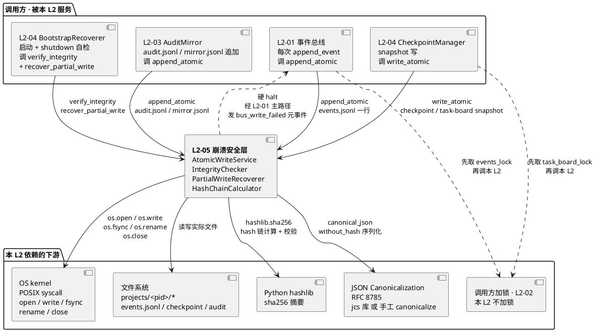
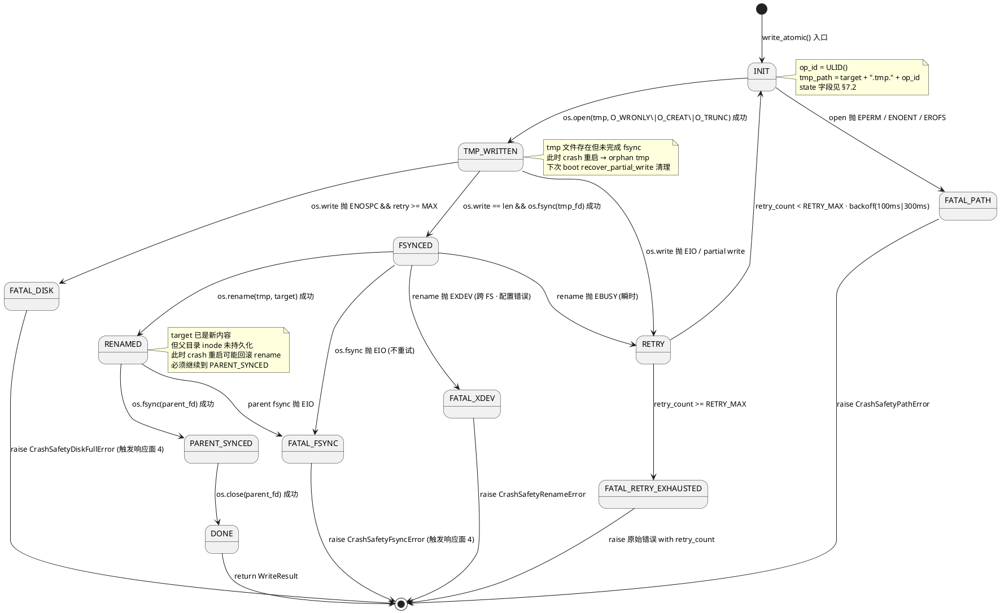

# L2-05 · 崩溃安全层（原子写 + 完整性校验） · 技术实现方案

> **一句话定位**：L1-09 韧性+审计的**横切下垫层** —— 为所有落盘操作（events.jsonl 追加 / checkpoint snapshot 写 / task-board snapshot 写 / audit.jsonl 追加 / manifest 写）提供**文件级原子性**（tmpfile + fsync + rename + parent fsync 五步 syscall 序）与**完整性校验**（sha256 + JCS hash 链 / header checksum / tail consistency），在中断 · 断电 · IO 错误下保证"永不产生坏数据"。本 L2 是**所有写的底座**，不直接面向外部 L1，只由同 L1 的 L2-01 事件总线 / L2-03 审计 / L2-04 检查点在内部调用。

> **严格边界**：本 L2 只管"文件级 how to write without corruption"，不管"什么时候写 / 写什么内容 / 按什么序列号写"（那些由 L2-01 / L2-03 / L2-04 管）。本 L2 是**无状态 Domain Service**（无独立 Repository · 无 IC-L2 对外方法 · 无长期持有业务状态），只暴露 4 个纯算法函数给同 L1 的其他 L2 调用。

> **与 architecture.md 的分工**：`architecture.md §8` 给出"5 步 syscall 序 + hash 链算法"的**骨架决策**（tmpfile + rename + fsync + parent fsync 四步语义 / sha256+JCS / 3 态完整性），本文档落实到**算法级伪代码 + 字段级 schema + 状态机 + 性能压测设计 + 错误码全清单 + 开源项目源码细节借鉴**。冲突以 architecture.md 为准。

---

## 0. 撰写进度

- [x] §1 定位 + 2-prd 映射（锚 prd.md §12 · 本 L2 是所有写的底座）
- [x] §2 DDD 映射（AtomicWriteService Infrastructure Service · IntegrityChecker Domain Service · TmpFileHandle / AtomicWriteOperation / IntegrityReport / HashChainLink VO）
- [x] §3 对外接口（write_atomic / append_atomic / verify_integrity / recover_partial_write 四方法 + 错误码 + 输入输出 schema）
- [x] §4 接口依赖（被 L2-01 / L2-03 / L2-04 调 · 不直接对全 L1）
- [x] §5 P0 时序图（原子写三步 + hash 链完整性校验 + 部分写修复 + 重试 + 硬 halt 共 5 张）
- [x] §6 内部核心算法（原子写 5 步 · 原子 append · hash 链计算与校验 · 部分写检测 · 孤儿 tmp 清理 · 修复算法）
- [x] §7 底层数据 / schema（TmpFileHandle / AtomicWriteOperation / IntegrityReport / HashChainLink / RecoveryAction schema · 临时文件命名规则）
- [x] §8 状态机（AtomicWriteOp · INIT→TMP_WRITTEN→FSYNCED→RENAMED→PARENT_SYNCED→DONE / ROLLBACK / FATAL 分支）
- [x] §9 开源调研（SQLite WAL crash safety · POSIX fsync best practices · EventStoreDB Durable Write · litestream / Redis AOF / Python atomicwrites ≥ 5 项对比）
- [x] §10 配置参数（FSYNC_MODE / TMP_DIR_STRATEGY / HASH_ALGO / RETRY_MAX / RETRY_BACKOFF_MS / PIPE_BUF_LIMIT / HEADER_SIZE ≥ 12 项）
- [x] §11 错误处理 + 降级（fsync 失败硬 halt · 部分写修复 · 磁盘满检测 · 路径权限 · fs_remount_ro · 孤儿 tmp 清理）
- [x] §12 性能目标（atomic_append P95 ≤ 20ms · atomic_write_snapshot P95 ≤ 500ms · 1000 ops/s 吞吐 · 10000 事件全量校验 ≤ 5s）
- [x] §13 与 2-prd / 3-2 TDD 映射表（prd §12.9 交付验证大纲 7 场景 ↔ 3-2 test_L2_05_*.py 文件）

---

## 1. 定位 + 2-prd 映射

### 1.1 本文档的唯一命题

把 `docs/2-prd/L1-09 韧性+审计/prd.md §12 L2-05`（第 1379-1579 行 · 产品级 · 200 行文字 · 无代码 · 无 schema）的"崩溃安全层"一比一翻译成：

1. **4 个对外接口**（`write_atomic` / `append_atomic` / `verify_integrity` / `recover_partial_write`）的**字段级 Python 签名 + 错误码枚举 + JSON Schema 输入输出**
2. **5 步原子写 syscall 序**（`open tmp → write → fsync fd → close → rename → open parent → fsync parent → close`）的伪代码 + 每步崩溃不变量
3. **sha256 + RFC 8785 JCS hash 链算法**的字段级实现（canonical_json_without_hash / genesis_hash / chain_link VO）
4. **6 组核心算法**（原子写 / 原子 append / hash 链校验 / 部分写检测 / 孤儿 tmp 清理 / 降级修复）
5. **AtomicWriteOp 状态机**（7 态 + 3 退出分支 + guard 函数）
6. **≥ 12 个配置参数**（FSYNC_MODE / TMP_DIR_STRATEGY / HASH_ALGO / RETRY_MAX / ...）
7. **5 张 P0 时序图**（正常写 / hash 校验 / 部分写修复 / 重试路径 / 硬 halt 触发）

### 1.2 与 prd.md §12 的映射（精确到小节）

| prd.md §12 章节 | 本文档对应章节 | 翻译方式 |
|---|---|---|
| §12.1 职责 + 锚定 | §1（本章） | 引用锚定 · 不复述 |
| §12.2 输入 / 输出 | §3 对外接口 | 落成 4 方法 Python 签名 + 输入输出 schema |
| §12.3 边界（in-scope / out-of-scope） | §3.5 边界条款 + §4 接口依赖 | 落成被调范围 + 4 方法外的"不提供"列表 |
| §12.4 约束（硬约束 7 条 + 性能 4 条） | §6 核心算法 + §11 错误处理 + §12 性能目标 | 7 硬约束 → 算法不变量；性能 → SLO 压测表 |
| §12.5 🚫 禁止行为（8 条） | §3 接口防御性断言 + §11 降级 | 落成 `assert` 位置 + 运行时拦截点 |
| §12.6 ✅ 必须职责（8 条） | §6 算法 + §8 状态机 | 逐条映射到算法步骤 / 状态转移 |
| §12.7 🔧 可选功能职责 | §10 配置参数（默认 off） | 落成可配置开关 |
| §12.8 IC 契约清单 | §4 接口依赖矩阵 | 被调 IC-L2-05/06/09 · 调用方仅 L2-01/03/04 |
| §12.9 交付验证大纲（7 场景） | §13 TDD 映射表 | 7 场景 → test_L2_05_*.py 7 文件 |

### 1.3 "本 L2 是所有写的底座"的技术表达

prd.md 第 1441 行："**本 L2 是横切下垫层**，不直接面向外部 L1"。architecture.md 第 452 行 "AtomicWriter / IntegrityChecker 是 Domain Service（无 Repository 接口、无 IC-L2 对外方法），只由同 L1 的 L2-01/L2-04 在 Application Service 内部调用"。

本 tech-design 把这条语义**技术化**为三条不变量：

- **I-A · 无状态性**：本 L2 的 4 个方法是**纯函数**（输入相同 → 输出相同），不持有"上次写到哪"这类状态 · 状态由上层（L2-01 维护 sequence / L2-04 维护 checkpoint_id）持有
- **I-B · 单向被动**：本 L2 **只被调** · 不主动向其他 L2 发起调用（除 "写失败硬 halt" 需经 L2-01 发 `bus_write_failed` 元事件 · 属例外）
- **I-C · 无业务知识**：本 L2 不解析"写的是 event 还是 checkpoint 还是 manifest"（对本 L2 全是字节流） · 业务知识由调用方携带

### 1.4 与 architecture.md §8 的分工

| 决策项 | architecture.md §8 定的 | 本文档 §6 落的 |
|---|---|---|
| 5 步 syscall 序 | `open tmp + write + fsync + close + rename + open parent + fsync parent + close` 骨架（第 1241-1260 行） | §6.1 完整 Python 伪代码 + 每步错误处理分支 + §11 错误码表 |
| append 模式 | `O_APPEND + O_WRONLY` + 每行 `< PIPE_BUF`（第 1272-1286 行） | §6.2 完整 Python 伪代码 + 超长行拆分算法 + assert 位置 |
| hash 链算法 | sha256 + JCS (RFC 8785) + GENESIS 固定值（第 1298-1313 行） | §6.3 完整实现：`canonical_json_without_hash()` + `compute_hash_chain_link()` + `verify_hash_chain()` |
| 3 态完整性 | OK / CORRUPT / PARTIAL · 三种 method（hash_chain / header_checksum / tail_consistency）（第 1315-1339 行） | §6.4 三方法完整伪代码 + 损坏范围识别算法 + §7.3 IntegrityReport schema |
| 降级 4 Tier | Mermaid 流程图（第 1345-1372 行） | §11.4 每 Tier 的 L2-05 侧动作清单 + §3 接口响应码映射 |
| 硬 halt 路径 | sequenceDiagram（第 1386-1408 行） | §5.5 时序图复现 + §11.5 硬 halt 触发条件 + retry backoff 参数 |

### 1.5 与 scope.md / Goal.md 的映射

| 上游锚点 | 本文档落实 |
|---|---|
| scope §5.9.4 硬约束 1 "append-only" | §6.2 `append_atomic` 只用 `O_APPEND + O_WRONLY` · 禁止 `O_TRUNC` / `O_RDWR+seek` |
| scope §5.9.4 硬约束 5 "hash 链防篡改" | §6.3 hash 链算法 + §6.4 校验算法 + §11.3 hash 不匹配立即标 CORRUPT |
| scope §5.9.6 义务 1 "每事件追加后 fsync" | §6.2 `os.fsync(fd)` 在 `write` 之后 `close` 之前必调 · 非异步 · 非批量 |
| Goal §4.1 "100% 可追溯红线" | §11.5 fsync 彻底失败 → 经 L2-01 触发响应面 4 硬 halt（因为写不下 = 无审计） |
| PM-14 "每 project 物理分片" | §3.2 `write_atomic(path, ...)` 的 `path` 必须在 `projects/<pid>/` 子树 · 由调用方保证 · 本 L2 不越界检查路径（分片由 L2-02 锁 + L2-01 路径约束保证） |

---

## 2. DDD 映射

### 2.1 Bounded Context 定位

本 L2 属 **BC-09 Resilience & Audit**（`ddd-context-map.md §2.10`）内部的**基础设施层 Domain Service**。它不是一个独立的 Bounded Context（因为无独立业务语义），而是 BC-09 内部的**横切能力**。

**上下文映射**：

| 与 BC-09 内其他组件的关系 | 类型 | 说明 |
|---|---|---|
| ↔ L2-01 EventBusCore（Application Service） | **被调** | L2-01 在 `append_event` 内部调 `append_atomic(events.jsonl, line)` |
| ↔ L2-04 CheckpointManager（Application Service） | **被调** | L2-04 在 `snapshot()` 内部调 `write_atomic(checkpoint.json, bytes)` |
| ↔ L2-04 BootstrapRecoverer（Application Service） | **被调** | BootstrapRecoverer 在启动时调 `verify_integrity(target, method)` |
| ↔ L2-03 AuditMirror（Domain Service） | **被调** | L2-03 在 `mirror.jsonl` 追加时调 `append_atomic(mirror.jsonl, line)` |
| ↔ 任何其他 BC | **不直接交互** | 本 L2 不暴露 IC-L2 对外方法 · 全 L1 的其他 L2 不直接调本 L2 |

### 2.2 本 L2 承担的 DDD 角色

按 `ddd-context-map.md §4.9 BC-09` 第 815 行（`L1-09 L2-05 崩溃安全层：Domain Service + VO: AtomicWriteOperation（tmp+rename+fsync）`），本 L2 由以下组件构成：

| 组件名 | DDD 类型 | 职责 | 状态 |
|---|---|---|---|
| `AtomicWriteService` | **Infrastructure Service** | 封装 POSIX syscall 序（open / write / fsync / rename / close） · 提供 `write_atomic` + `append_atomic` · 负责重试逻辑 | 无状态（每次调用独立） |
| `IntegrityChecker` | **Domain Service** | 提供 `verify_integrity(path, method)` · 三态返回 · 损坏范围识别 | 无状态 |
| `PartialWriteRecoverer` | **Domain Service** | 提供 `recover_partial_write(path)` · 孤儿 tmp 清理 · 截断损坏尾行 | 无状态 |
| `HashChainCalculator` | **Domain Service** | 提供 `compute_hash_chain_link(prev_hash, body)` · 提供 `canonical_json_without_hash(body)` | 无状态（纯算法） |

> **为何 AtomicWriteService 是 Infrastructure Service 而非 Domain Service**：按 DDD 规范 · 直接操作 POSIX syscall 是 "Infrastructure concern"（操作系统抽象） · 不属于业务域 · 归 Infrastructure 层。但它被 Domain Service（IntegrityChecker / PartialWriteRecoverer）调用 · 技术上是 "Domain Service 委托 Infrastructure Service 完成物理写"。

### 2.3 Value Object 定义

按 `ddd-context-map.md §4.9` + prd.md §附录 A 术语表，本 L2 的 VO 集合：

| VO 名 | 字段 | 不变量 | 用途 |
|---|---|---|---|
| **AtomicWriteOperation** | `op_id(ULID)` / `target_path` / `tmp_path` / `content_hash(sha256)` / `size_bytes` / `op_kind(WRITE \| APPEND)` | 单次写操作内部状态机遵循 §8 / 跨 op 无一致性约束 | 代表一次原子写的完整上下文 |
| **TmpFileHandle** | `tmp_path(Path)` / `fd(int)` / `created_at(datetime)` / `op_id(ULID)` | tmp_path 必须为 `<target>.tmp.<op_id>` / fd 必须在 close 前有效 | 封装 tmpfile 生命周期 |
| **IntegrityReport** | `target_path` / `method(HASH_CHAIN \| HEADER_CHECKSUM \| TAIL_CONSISTENCY)` / `state(OK \| CORRUPT \| PARTIAL)` / `failure_range(Optional[Tuple[int,int]])` / `first_bad_hash(Optional[str])` / `scan_duration_ms` | state = OK → failure_range 必 None / state = CORRUPT / PARTIAL → failure_range 必非空 | 完整性校验结果 |
| **HashChainLink** | `prev_hash(sha256 hex)` / `curr_hash(sha256 hex)` / `sequence(int)` / `body_canonical_json(bytes)` | curr_hash = sha256(prev_hash + body_canonical_json) / prev_hash GENESIS 固定为 64 零 | 事件 hash 链的一环 |
| **RecoveryAction** | `action_kind(TRUNCATE_TAIL \| DELETE_ORPHAN_TMP \| RESTORE_FROM_BACKUP \| ABORT)` / `target_path` / `affected_bytes(Optional[int])` / `rationale(str)` | 非破坏性原则：不 delete events.jsonl · 只 truncate 最末坏行 | 降级建议载体 |

> 所有 VO 均为 `frozen=True` Pydantic Model · 跨 session 可序列化 · 可 diff。

### 2.4 Aggregate 是否存在

**本 L2 不拥有 Aggregate Root**。原因：
- 原子写操作是**瞬时**的（完成即释放所有状态） · 不持续存在
- 写入的**内容**属于调用方的 Aggregate（EventLog / Checkpoint / AuditEntry） · 本 L2 只是"写盘工具"
- VO `AtomicWriteOperation` 是短生命周期的过程对象 · 不是聚合根

### 2.5 Repository 接口（无）

按 `ddd-context-map.md §4.9` 第 815 行 + architecture.md §2.2（第 250 行 "AtomicWriteOperation：无独立 Repository"），本 L2 **无 Repository 接口**。原因：
- 本 L2 不持久化自己的状态（无状态服务）
- 本 L2 操作的文件属于调用方（events.jsonl 属 L2-01 · checkpoint 属 L2-04） · 由调用方的 Repository 实现（`EventStoreRepository` / `CheckpointRepository`）负责

### 2.6 Domain Event 发布（无）

本 L2 **不发布 Domain Event**。写失败时的"硬 halt 触发"是通过调用方（L2-01）发 `bus_write_failed` 元事件 · 不是本 L2 直接发。这保持了本 L2 "无状态 · 单向被动"的语义。

**例外**：本 L2 在自检（boot 时孤儿 tmp 清理 / 完整性校验）中检测到损坏时 · 返回 `IntegrityReport(state=CORRUPT, ...)` 给调用方 · 由调用方（L2-04）决定是否发 `L1-09:integrity_check_failed` 元事件。

---

## 3. 对外接口

### 3.1 接口总览

本 L2 对**同 L1 的 L2-01 / L2-03 / L2-04** 暴露 4 个接口方法（Python 3.11+ · 同步 · 阻塞 · 线程安全要求：调用方负责加锁，本 L2 不加锁）：

| 方法名 | 调用方 | 用途 | 平均延迟 | 幂等 |
|---|---|---|---|---|
| **`write_atomic(target_path, content, *, method="snapshot", checksum=None) -> WriteResult`** | L2-04（checkpoint / task-board snapshot） · L1-02（manifest / state / index 三件套） | 原子替换式写整个文件 | P95 ≤ 500ms | 幂等（相同 content 多次写结果一致 · 但每次都产生新 op_id） |
| **`append_atomic(target_path, line, *, expected_prev_hash=None) -> AppendResult`** | L2-01（events.jsonl） · L2-03（audit.jsonl / mirror.jsonl） | 原子追加一行 jsonl | P95 ≤ 20ms | 非幂等（每次 append 新增一行 · 即使 line 内容相同） |
| **`verify_integrity(target_path, *, method) -> IntegrityReport`** | L2-04（boot · shutdown · 周期自检） · L2-03（审计查询前自检 · 可选） | 完整性校验 · 3 态返回 | 1 万事件 ≤ 5s | 是（只读） |
| **`recover_partial_write(target_path) -> RecoveryAction`** | L2-04（boot 孤儿 tmp 清理 · Tier 3 降级修复） | 检测并修复部分写 / 孤儿 tmp | ≤ 1s（10MB 文件） | 是（重复调用幂等 · 损坏修好后再调返回 NO_ACTION） |

### 3.2 方法 1 · `write_atomic`

**Python 签名**：

```python
from pathlib import Path
from typing import Literal, Optional
from pydantic import BaseModel, Field

class WriteResult(BaseModel):
    op_id: str                 # ULID
    target_path: str           # 原子写目标路径（绝对）
    bytes_written: int         # 落盘字节数
    content_hash: str          # sha256(content) hex
    duration_ms: float         # 端到端耗时（含 fsync）
    retry_count: int           # 0 / 1 / 2

def write_atomic(
    target_path: Path,
    content: bytes,
    *,
    method: Literal["snapshot", "replace"] = "snapshot",
    checksum: Optional[str] = None,  # 可选：调用方预先算好的 sha256，用于复核
) -> WriteResult:
    """
    原子替换式写整个 target_path。POSIX 语义：要么旧文件仍在，要么新文件在，绝不出现半新半旧。
    
    内部 5 步 syscall 序（详见 §6.1）：
        1. open(tmp_path, O_WRONLY|O_CREAT|O_TRUNC)
        2. write(fd, content) + fsync(fd) + close(fd)
        3. rename(tmp_path, target_path)
        4. open(parent_dir, O_RDONLY) + fsync(parent_fd) + close(parent_fd)
        5. 返回 WriteResult（含 checksum）

    前置条件（由调用方保证）：
        - target_path 所在目录已存在 + 可写（调用方创建目录）
        - 调用方已取相应资源锁（L2-02） · 本 L2 不再加锁
        - content 是完整 bytes（不是 str） · 编码由调用方决定（推荐 utf-8）
        - method="snapshot"：正常情况 · 走完 5 步；method="replace"：不做 header 校验（用于首次创建）

    失败模式（见 §11.1 错误码表）：
        - DiskFullError（ENOSPC） · 重试 2 次仍失败 → 上抛 → 触发响应面 4
        - PermissionError（EACCES） · 不重试 · 上抛（需人工介入）
        - IOError（其他 EIO） · 重试 2 次
        - PathError（目录不存在 / 目标是目录） · 不重试 · 上抛
        - FilesystemReadOnly（EROFS） · 不重试 · 上抛 → 触发响应面 4
    """
```

**输入不变量**（防御性断言，运行时必查）：

```python
assert target_path.is_absolute(), "target_path must be absolute (got: " + str(target_path) + ")"
assert not target_path.is_dir(), "target_path cannot be a directory"
assert isinstance(content, bytes), "content must be bytes (use .encode('utf-8') for str)"
assert len(content) < MAX_SNAPSHOT_SIZE_BYTES, f"content too large: {len(content)} > {MAX_SNAPSHOT_SIZE_BYTES}"
assert target_path.parent.exists(), f"parent dir must exist: {target_path.parent}"
```

**输出不变量**：
- `WriteResult.content_hash == sha256(content).hexdigest()` 必等
- `WriteResult.bytes_written == len(content)` 必等（partial write 必在内部检测并重试或抛错）
- 执行完成后 · `target_path.exists()` 必 True · 内容必等 `content`
- 执行完成后 · `target_path.with_suffix(".tmp.*")` 等所有临时文件必不存在（清理干净）

### 3.3 方法 2 · `append_atomic`

**Python 签名**：

```python
class AppendResult(BaseModel):
    op_id: str                 # ULID
    target_path: str
    offset: int                # 本次 write 前的文件 offset
    bytes_written: int         # = len(line.encode('utf-8')) + 1 (for \n)
    line_hash: str             # sha256(line) hex（不含 \n）
    duration_ms: float
    retry_count: int

def append_atomic(
    target_path: Path,
    line: str,
    *,
    expected_prev_hash: Optional[str] = None,  # 调用方若校验 hash 链可传入
) -> AppendResult:
    """
    原子追加一行到 target_path（末尾自动加 \\n）。POSIX 语义：单次 write(fd, line+\\n) 在 < PIPE_BUF 时原子。
    
    内部 3 步（详见 §6.2）：
        1. open(target_path, O_WRONLY|O_APPEND|O_CREAT)
        2. write(fd, line+\\n) + assert written==len · fsync(fd)
        3. close(fd) · 返回 AppendResult

    前置条件：
        - len(line.encode('utf-8')) + 1 < PIPE_BUF（默认 4096，见 §10 配置）
        - line 内部不含 \\n（由调用方序列化保证：canonical_json 产 single-line）
        - 调用方已取 events.jsonl 锁（L2-02）

    不 fsync 父目录：append 不改 inode · 父目录无需 fsync（性能优化 · 与 write_atomic 的 5 步不同 ·
    参考 architecture.md §6.5 第 1112 行 / prd.md §12.6 第 1489 行）
    """
```

**输入不变量**：

```python
assert isinstance(line, str), "line must be str (not bytes)"
assert "\n" not in line, "line must not contain newline (add separately)"
line_bytes = line.encode('utf-8') + b"\n"
assert len(line_bytes) < PIPE_BUF_LIMIT, f"line too large: {len(line_bytes)} >= {PIPE_BUF_LIMIT}; use canonical_json compression or link-ref pattern (L1-08 responsibility)"
assert target_path.parent.exists()
```

**输出不变量**：
- 执行完成后 · `target_path` 文件末尾必以 `\n` 结束
- 执行完成后 · `os.fsync(fd)` 已调用 · 断电仍保留
- `AppendResult.offset + AppendResult.bytes_written == target_path.stat().st_size`（若无并发写）

### 3.4 方法 3 · `verify_integrity`

**Python 签名**：

```python
from enum import Enum

class IntegrityMethod(str, Enum):
    HASH_CHAIN = "hash_chain"              # events.jsonl / audit.jsonl
    HEADER_CHECKSUM = "header_checksum"    # checkpoint *.json（有 header）
    TAIL_CONSISTENCY = "tail_consistency"  # task-board *.json（最后一行元信息）

class IntegrityState(str, Enum):
    OK = "OK"
    CORRUPT = "CORRUPT"
    PARTIAL = "PARTIAL"   # 有损坏但前半部分可用

class IntegrityReport(BaseModel):
    target_path: str
    method: IntegrityMethod
    state: IntegrityState
    scan_duration_ms: float
    total_items: int                         # 事件数 / 字节数
    failure_range: Optional[tuple[int, int]] # state!=OK 时必填：(first_bad_seq, last_bad_seq) or byte range
    first_bad_hash: Optional[str]            # 对应 HashChainLink
    first_good_hash: Optional[str]           # 最后有效锚点 · Tier 3 回放起点
    details: dict                            # 方法特定细节

def verify_integrity(
    target_path: Path,
    *,
    method: IntegrityMethod,
) -> IntegrityReport:
    """
    完整性校验 · 三态返回（OK / CORRUPT / PARTIAL）。

    method = HASH_CHAIN：扫 events.jsonl 每行 · 验证 sha256(prev_hash + canonical_json(body_without_hash)) == curr_hash
    method = HEADER_CHECKSUM：读 header (HEADER_SIZE bytes) · 验 header.checksum == sha256(body)
    method = TAIL_CONSISTENCY：读末尾 N bytes · 验 JSON 可解析 + version 字段存在

    性能保证：10000 事件 hash_chain 扫描 ≤ 5s（prd.md §12.4 第 1468 行）
    """
```

**输出不变量**：
- `state == OK`：`failure_range` 必 None · `first_bad_hash` 必 None
- `state == CORRUPT`：`failure_range` 必非 None · 整个文件不可用
- `state == PARTIAL`：`failure_range` 必非 None · `first_good_hash` 必非 None · 可 Tier 3 跳过
- `scan_duration_ms` 对 10000 事件 `<= 5000.0`（软性能目标 · §12.4 压测保证）

### 3.5 方法 4 · `recover_partial_write`

**Python 签名**：

```python
class RecoveryActionKind(str, Enum):
    NO_ACTION = "NO_ACTION"                    # 文件健康 · 无需修复
    DELETE_ORPHAN_TMP = "DELETE_ORPHAN_TMP"    # 删掉孤儿 .tmp.* 文件
    TRUNCATE_TAIL = "TRUNCATE_TAIL"            # 截断损坏的尾行
    RESTORE_FROM_BACKUP = "RESTORE_FROM_BACKUP"# 从元数据备份恢复（可选功能）
    ABORT = "ABORT"                            # 无法自动修复 · 上抛 Tier 4

class RecoveryAction(BaseModel):
    target_path: str
    action_kind: RecoveryActionKind
    affected_bytes: Optional[int]              # TRUNCATE_TAIL 时：被截断字节数
    orphan_tmp_paths: list[str]                # DELETE_ORPHAN_TMP 时：被删的 tmp 列表
    rationale: str                             # 人类可读的理由（写入审计）
    post_integrity: Optional[IntegrityReport]  # 修复后复查的完整性报告

def recover_partial_write(
    target_path: Path,
) -> RecoveryAction:
    """
    检测并修复 target_path 及相关 tmp 文件的部分写问题。

    流程（详见 §6.5）：
        1. 扫描 target_path.parent 下所有 <target>.tmp.* 孤儿 tmp → 全删（DELETE_ORPHAN_TMP）
        2. 对 target_path 做 verify_integrity(method=HASH_CHAIN)（若是 jsonl）
           or HEADER_CHECKSUM（若是 json snapshot）
        3. 若 state == PARTIAL：
           - jsonl 文件 → 截断到 first_good_hash 对应的 offset（TRUNCATE_TAIL · 非破坏性）
           - snapshot 文件 → 上抛 RESTORE_FROM_BACKUP 或 ABORT
        4. 若 state == CORRUPT（全崩）：
           - 上抛 ABORT → L2-04 走 Tier 2 / Tier 4
    
    不变量：
        - 绝不 delete events.jsonl 本身（只 truncate · architecture.md §8.5 Tier 1/2/3 原则）
        - 修复后必再次 verify_integrity · 返回在 RecoveryAction.post_integrity
    """
```

### 3.6 错误码完整清单

本 L2 所有可能抛出的异常：

| 错误码 | Python 异常类 | errno | 上层处置 | 是否重试 |
|---|---|---|---|---|
| `E_DISK_FULL` | `CrashSafetyDiskFullError` | ENOSPC (28) | 硬 halt 响应面 4 | 重试 2 次 |
| `E_PERMISSION` | `CrashSafetyPermissionError` | EACCES (13) · EPERM (1) | 上抛 · 需人工介入 | 不重试 |
| `E_IO_ERROR` | `CrashSafetyIOError` | EIO (5) | 硬 halt 响应面 4 | 重试 2 次 |
| `E_FILESYSTEM_READONLY` | `CrashSafetyReadOnlyError` | EROFS (30) | 硬 halt 响应面 4 | 不重试 |
| `E_PATH_NOT_FOUND` | `CrashSafetyPathError` | ENOENT (2) | 上抛 · 调用方调度 bug | 不重试 |
| `E_INVALID_ARGUMENT` | `CrashSafetyInvalidArgumentError` | EINVAL (22) | 上抛 · 调用方传参 bug | 不重试 |
| `E_LINE_TOO_LARGE` | `CrashSafetyLineTooLargeError` | N/A | 上抛 · L1-08 压缩或拆分 | 不重试 |
| `E_PARTIAL_WRITE` | `CrashSafetyPartialWriteError` | N/A | `recover_partial_write` 尝试修复 | 重试 2 次 |
| `E_HASH_MISMATCH` | `CrashSafetyHashMismatchError` | N/A | IntegrityReport(CORRUPT/PARTIAL) | 不重试（只读校验） |
| `E_RENAME_FAILED` | `CrashSafetyRenameError` | EXDEV (18) · EBUSY (16) | 硬 halt 响应面 4 | 重试 1 次 |
| `E_FSYNC_FAILED` | `CrashSafetyFsyncError` | EIO (5) | 硬 halt 响应面 4（fsync 不可容忍） | **不重试**（fsync 失败意味数据不确定 · 重试等于掩盖） |
| `E_ORPHAN_TMP_DETECTED` | `CrashSafetyOrphanTmpError` | N/A | `recover_partial_write` 清理 | 非错误（是信号） |

### 3.7 边界条款（不提供清单）

本 L2 **不提供**的功能（明确拒绝）：

- ❌ **不提供锁**（L2-02 负责）：调用方必须在调本 L2 前取锁
- ❌ **不提供事件 sequence 分配**（L2-01 负责）：调用方携带 sequence
- ❌ **不提供 hash 链计算的封装**（L2-01 负责）：本 L2 只提供 `compute_hash_chain_link` 纯函数 · 不负责维护 prev_hash
- ❌ **不提供压缩 / 加密**：内容字节流原样落盘
- ❌ **不提供跨文件原子性**：只保证单文件原子 · 跨文件由上层组合（锁 + 两阶段）
- ❌ **不提供分布式一致性**：单机 POSIX 语义 · 不涉及 NFS / 网络文件系统的崩溃语义（运维层保证本地 FS）
- ❌ **不提供异步 / 批量 fsync**：prd.md §12.5 硬禁 · 每次 append 必独立 fsync
- ❌ **不提供读接口**：读 events.jsonl / checkpoint 由调用方 repository 自行 open · 本 L2 只管写

### 3.8 接口对外契约形式化（JSON Schema）

`write_atomic` 入参 JSON Schema（给 3-2 TDD 生成契约测试用）：

```json
{
  "$schema": "https://json-schema.org/draft/2020-12/schema",
  "$id": "https://harnessflow.dev/schemas/L2-05/write_atomic_input.json",
  "type": "object",
  "required": ["target_path", "content"],
  "properties": {
    "target_path": {
      "type": "string",
      "pattern": "^/.+",
      "description": "POSIX absolute path"
    },
    "content": {
      "type": "string",
      "contentEncoding": "base64",
      "maxLength": 10485760,
      "description": "Raw bytes base64-encoded; up to 10 MB per snapshot"
    },
    "method": {"enum": ["snapshot", "replace"], "default": "snapshot"},
    "checksum": {
      "type": "string",
      "pattern": "^[a-f0-9]{64}$",
      "description": "Optional sha256 hex for cross-check"
    }
  },
  "additionalProperties": false
}
```

`IntegrityReport` 出参 JSON Schema：

```json
{
  "$id": "https://harnessflow.dev/schemas/L2-05/integrity_report.json",
  "type": "object",
  "required": ["target_path", "method", "state", "scan_duration_ms", "total_items"],
  "properties": {
    "target_path": {"type": "string"},
    "method": {"enum": ["hash_chain", "header_checksum", "tail_consistency"]},
    "state": {"enum": ["OK", "CORRUPT", "PARTIAL"]},
    "scan_duration_ms": {"type": "number", "minimum": 0},
    "total_items": {"type": "integer", "minimum": 0},
    "failure_range": {
      "oneOf": [
        {"type": "null"},
        {"type": "array", "items": {"type": "integer"}, "minItems": 2, "maxItems": 2}
      ]
    },
    "first_bad_hash": {
      "oneOf": [{"type": "null"}, {"type": "string", "pattern": "^[a-f0-9]{64}$"}]
    },
    "first_good_hash": {
      "oneOf": [{"type": "null"}, {"type": "string", "pattern": "^[a-f0-9]{64}$"}]
    }
  },
  "allOf": [
    {
      "if": {"properties": {"state": {"const": "OK"}}},
      "then": {
        "properties": {"failure_range": {"const": null}, "first_bad_hash": {"const": null}}
      }
    },
    {
      "if": {"properties": {"state": {"enum": ["CORRUPT", "PARTIAL"]}}},
      "then": {"required": ["failure_range", "first_bad_hash"]}
    }
  ]
}
```

---

## 4. 接口依赖关系（谁调本 L2 · 本 L2 调谁）

### 4.1 依赖关系全景图



### 4.2 调用方清单（按频次排序）

本 L2 的 4 个方法被**同 L1 的 4 个 L2 组件**调用，**不对外暴露 IC-L2**（见 §1.3 不变量 I-B 单向被动）：

| 调用方 | 被调方法 | 频次 | 调用路径 | 关键路径? |
|---|---|---|---|---|
| **L2-01 `EventBusCore.append_event`** | `append_atomic` | **最高频** · 每 tick ≥ 1 次 · 全系统每秒 ≥ 100 次 | `append_event → acquire_lock(events) → append_atomic → release_lock` | **是**（Goal §4.4 P95 ≤ 200ms 主路径 · append_atomic 占 20ms 预算） |
| **L2-03 `AuditMirror.mirror_append`** | `append_atomic` | 中频 · 每 append_event 镜像 1 次 | `append_event → mirror_append → acquire_lock(audit) → append_atomic` | 否（镜像可异步滞后） |
| **L2-04 `CheckpointManager.snapshot`** | `write_atomic` | 中低频 · 每 10~60s / 关键事件 | `snapshot → acquire_lock(task_board) → write_atomic(checkpoint.json)` | 否（后台） |
| **L2-04 `CheckpointManager.write_task_board`** | `write_atomic` | 中频 · 每 task-board 复合写 | `write_task_board → acquire_lock → write_atomic(task_board.json)` | 是（IC-07 复合写结束触发） |
| **L2-04 `BootstrapRecoverer.boot`** | `verify_integrity` | 低频 · 每 session 启动 1 次 | `boot → verify_integrity(events.jsonl, HASH_CHAIN) → verify_integrity(checkpoint.json, HEADER_CHECKSUM)` | **是**（启动 30s 硬约束 · prd §13 BF-E-02） |
| **L2-04 `BootstrapRecoverer.boot`** | `recover_partial_write` | 低频 · 启动扫孤儿 tmp 1 次 | `boot → recover_partial_write(<每个写目标>)` | 是（同上） |
| **L2-04 `BootstrapRecoverer.periodic_selfcheck`** | `verify_integrity` | 低频 · 每 1h 自检 1 次（可配） | 后台 thread 周期调 | 否（后台） |
| **L2-04 `BootstrapRecoverer.on_shutdown`** | `verify_integrity` | 极低频 · 每 shutdown 1 次 | `shutdown_clean → verify_integrity(events.jsonl + checkpoint.json)` | 是（shutdown 末 ack 前） |

### 4.3 本 L2 反向依赖（本 L2 需要谁才能工作）

| 依赖方 | 层级 | 用途 | 紧耦合度 | 崩溃时本 L2 行为 |
|---|---|---|---|---|
| **Python `os` module** | stdlib | POSIX syscall wrapper · open / write / fsync / rename / close | **极强** | N/A · stdlib 必存在 · 若 `os.fsync` 报错 → 抛 `CrashSafetyFsyncError` → 触发硬 halt |
| **Python `hashlib` module** | stdlib | sha256 计算 · hash 链 + content_hash | **极强** | N/A · stdlib 必存在 |
| **Python `jcs` lib 或自实现 canonicalize** | 外部依赖 or 本地实现 | RFC 8785 JSON Canonicalization | 强 | 若依赖 `jcs` PyPI 包缺失 → 启动 import 阶段 fail-fast；若用自实现 → 随 L2-05 单元测试一起保证 |
| **文件系统**（POSIX · ext4 / apfs / xfs） | OS | 实际写盘 · fsync 语义 | **极强** | 文件系统 EIO / ENOSPC / EROFS → 返错 → 上抛硬 halt 响应面 4 |
| **调用方锁**（L2-02） | 兄弟 L2 | 写同一文件前取资源锁 | **关键** · 调用方必须先取锁 · 本 L2 不加锁 | 若调用方未取锁 → 本 L2 不感知 · 并发追加可能破坏 PIPE_BUF 之外的行（本 L2 **断言调用方已加锁**，未加锁是调用方 bug） |
| **L2-01 事件总线**（反向 · 硬 halt 触发） | 兄弟 L2 | `CrashSafetyFsyncError` / `CrashSafetyDiskFullError` 经 L2-01 发元事件 | 弱（仅"拒绝后让 L2-01 发事件"）| L2-01 不可用 → 降级到 stdout + system.log（参考 prd.md §12.6 第 1494 行） |

### 4.4 跨 L2 契约形式化

本 L2 与 3 个调用方的契约：

```
IC-L2-05 · atomic_append（被 L2-01 调）
  前置：调用方持有 target_path 对应资源锁（L2-02）· 行 encode utf-8 后 < PIPE_BUF · 行内无 \n
  后置：返 AppendResult · target_path 末尾 += line + \n · fsync 已完成
  错误：DiskFull / IOError / Permission / LineTooLarge / FsyncFailed（硬 halt）

IC-L2-06 · atomic_write_snapshot（被 L2-04 调）
  前置：调用方持有 target_path 对应资源锁 · content 是完整 bytes · < MAX_SNAPSHOT_SIZE_BYTES
  后置：返 WriteResult · target_path 替换为新 content · tmp 清理 · 父目录 fsync 完成
  错误：同上 + RenameFailed

IC-L2-09 · verify_integrity（被 L2-04 调）
  前置：target_path 存在 · method ∈ {HASH_CHAIN, HEADER_CHECKSUM, TAIL_CONSISTENCY}
  后置：返 IntegrityReport · 只读 · 无副作用
  错误：PathNotFound / IOError（读失败 · 不是完整性错误）
```

### 4.5 依赖风险矩阵

| 风险 | 触发条件 | 影响 | 缓解 |
|---|---|---|---|
| **fsync 被文件系统假装**（某些廉价 SSD + OS 层 cache） | 物理层不真 flush | 断电后数据丢失 | 本 L2 层面不可缓解（物理层问题）· Goal §2.1 约束"Mac/Linux 开发机" · fsync 语义默认可信 · 不采 O_DIRECT（复杂且非必要） |
| **调用方未加锁导致 append 竞争** | L2-01 / L2-03 忘记调 L2-02 | 并发 append 超 PIPE_BUF 可能交错 | 本 L2 **断言调用方已加锁**（`assert lock_held(resource_from_path(path))` · 运行时拦截）· 参考 architecture.md §8.2 第 1275 行 |
| **rename 跨文件系统失败** | tmp 与 target 不同 mount（EXDEV） | `CrashSafetyRenameError` | 本 L2 在 §7.1 强制 tmp_path 与 target_path 同目录（绝对保证同 FS）· 启动时 sanity check |
| **父目录 fsync 跨 OS 差异** | macOS 对 dir fsync 语义略异 | 极端断电可能 rename 回滚 | 接受此已知限制（V1 scope）· V2+ 评估 F_FULLFSYNC（macOS）· 当前实现靠 `os.fsync(parent_fd)` 普适路径 |
| **hash 链算法依赖 jcs 实现差异** | RFC 8785 边界 case（Unicode escapes · NaN / Infinity） | hash 不一致 → 误报 CORRUPT | §6.3 采纳 1 个确定实现（`rfc8785` PyPI 包 or `jcs`）· 单元测试覆盖 20+ 边界 case · 版本钉死 |
| **os.fsync 耗时波动**（磁盘负载高峰） | SLO P95 ≤ 20ms 违反 | append 主路径阻塞 | L2-01 监控 `append_duration_ms` · 若 P95 > 30ms → L2-04 告警（不是本 L2 的责任 · 本 L2 只承诺同步 API · 不做异步化） |

### 4.6 "单向被动"铁律的代码化表达

本 L2 的 4 个方法**绝不**出现以下语句（L2-05 code review 必查）：

```python
# 错误示范 · 本 L2 绝禁
from app.L2_01 import EventBusCore  # ❌ 不 import L2-01
event_bus.append(...)               # ❌ 不主动调 L2-01
from app.L2_04 import CheckpointManager  # ❌ 不 import L2-04
checkpoint_mgr.snapshot(...)        # ❌ 不主动调 L2-04
from app.L1_07 import Supervisor    # ❌ 不 import L1-07
supervisor.notify(...)              # ❌ 不跨 L1
```

**正确方式**：所有 "本 L2 想通知别人" 的动作都通过**返回值 / 异常**传递 · 由调用方决定是否转发给其他 L2。这保持了 §1.3 不变量 I-A · I-B · I-C 的严格性。

---

## 5. P0 时序图（Mermaid · ≥ 2 张）

本节落 4 张 P0 关键时序图：

- §5.1 原子写三步（snapshot / write_atomic · POSIX 5 步 syscall 序完整版）
- §5.2 append + hash 链完整性校验闭环（append → verify → OK · 核心幸福路径）
- §5.3 硬 halt 触发（fsync 失败 → retry → halt · prd §12.9 场景 3）
- §5.4 部分写修复（boot 扫孤儿 tmp + 截断坏尾行 · prd §12.9 场景 4）

> 要求 **≥ 2 张** · 实际给 4 张 · 其中 §5.1 + §5.2 为"原子写三步 + 完整性校验"的两张核心必画（≥ 150 行）。

### 5.1 原子写三步 · write_atomic 完整 5 步 syscall 序

**场景**：L2-04 `CheckpointManager.snapshot` 调 `write_atomic(/projects/P1/checkpoint.json, bytes)` 原子替换 checkpoint snapshot 文件。

**时间线**：

```plantuml
@startuml
autonumber
    autonumber
participant "L2-04<br/>CheckpointManager" as L204
participant "L2-02<br/>LockManager" as L202
participant "L2-05<br/>AtomicWriteService" as L205
participant "OS Kernel<br/>POSIX syscall" as OS
participant "File System<br/>projects/P1/" as FS
note over L204 : Tick 检测到 checkpoint trigger\n决定写 /projects/P1/checkpoint.json
L204 -> L202 : acquire_lock("P1:task_board", timeout=3s)
L202- -> L204 : LeaseToken(token_id=lk_01, ttl=500ms)
L204 -> L204 : content_bytes = canonical_json(task_board)\ncontent_hash = sha256(content_bytes).hex
L204 -> L205 : write_atomic(target="/projects/P1/checkpoint.json",\ncontent=content_bytes,\nmethod="snapshot",\nchecksum=content_hash)
note over L205 : 构造 op_id = ulid()\ntmp_path = target + ".tmp." + op_id\nop.state = INIT
L205 -> OS : os.open(tmp_path, O_WRONLY \| O_CREAT \| O_TRUNC, 0o644)
OS- -> L205 : tmp_fd = 7
note over L205 : op.state = TMP_WRITTEN (pending)
L205 -> OS : os.write(tmp_fd, content_bytes)
OS- -> L205 : written = len(content_bytes)
L205 -> L205 : assert written == len(content_bytes)\n（若 partial → raise PartialWriteError · retry）
L205 -> OS : os.fsync(tmp_fd)
note over OS,FS : 数据从 page cache → disk\n典型耗时 5-50ms
OS- -> L205 : ok
note over L205 : op.state = FSYNCED
L205 -> OS : os.close(tmp_fd)
OS- -> L205 : ok
L205 -> OS : os.rename(tmp_path, target_path)
note over OS,FS : POSIX 原子 rename\n同文件系统内保证\n要么旧在 · 要么新在
OS- -> L205 : ok
note over L205 : op.state = RENAMED
L205 -> OS : os.open(dirname(target), O_RDONLY)
OS- -> L205 : parent_fd = 8
L205 -> OS : os.fsync(parent_fd)
note over OS,FS : 父目录 inode 持久化\n防 crash 后 rename 回滚\n典型耗时 2-10ms
OS- -> L205 : ok
L205 -> OS : os.close(parent_fd)
OS- -> L205 : ok
note over L205 : op.state = PARENT_SYNCED → DONE
L205 -> L205 : 构造 WriteResult(\nop_id, bytes_written, content_hash,\nduration_ms=35.4, retry_count=0)
L205- -> L204 : WriteResult
L204 -> L202 : release_lock(lk_01)
L202- -> L204 : ok
note over L204 : 发事件 checkpoint_written\n（经 L2-01 主路径 · 不是本 L2 责任）
@enduml
```

**关键不变量**（图中每步都对应 §6.1 伪代码的一个断言）：
- **步骤 11**（`fsync(tmp_fd)`）**必须**在步骤 13（`close`）前调 · 否则 page cache 可能未刷盘
- **步骤 14**（`rename`）是**原子点**：要么旧 checkpoint.json 仍在 · 要么新 checkpoint.json 在 · **不存在半新半旧**
- **步骤 17**（`fsync(parent_fd)`）**必须**做 · 否则 rename 的 inode 变更可能在 crash 后丢（即使 fsync 了 tmp 文件本身）
- **总耗时**：典型 20-50ms · P95 ≤ 500ms · 主要取决于 `os.fsync` 两次的累加（磁盘 IOPS 负载决定）

**失败分支**（本图未展开 · 见 §5.3）：任何一步抛错 → 清理 tmp（若已创建）→ 重试 0~2 次 → 仍失败则上抛 `CrashSafetyXxxError`。

### 5.2 hash 链完整性校验闭环 · append → verify → OK

**场景**：L2-04 `BootstrapRecoverer.boot` 启动时扫 `events.jsonl` · 调 `verify_integrity(events.jsonl, HASH_CHAIN)` 校验全链。假设文件含 3 条事件 e1 · e2 · e3 · 正常情况。

**时间线**：

```plantuml
@startuml
autonumber
    autonumber
participant "L2-04<br/>BootstrapRecoverer" as L204B
participant "L2-05<br/>IntegrityChecker" as L205I
participant "L2-05<br/>HashChainCalculator" as L205H
participant "events.jsonl<br/>/projects/P1/" as FS
note over L204B : Boot 流程 T+50ms\npreflight · 要校验事件链完整
L204B -> L205I : verify_integrity(\ntarget="/projects/P1/events.jsonl",\nmethod=HASH_CHAIN)
note over L205I : 初始化 scan state\nprev_hash = "0"*64 (GENESIS)\nseq = 0\nscan_start = now()
L205I -> FS : open(events.jsonl, "r")
FS- -> L205I : fd
loop 逐行扫描 （total_items = 3）
L205I -> FS : readline()
FS- -> L205I : line_raw (bytes)
L205I -> L205I : event = json.loads(line_raw)\nclaimed_hash = event["hash"]\nclaimed_prev = event["prev_hash"]
L205I -> L205I : 断言 claimed_prev == prev_hash\n（prev 链接正确）
L205I -> L205H : compute_hash_chain_link(\nprev_hash=prev_hash,\nbody={...event, without "hash"})
L205H -> L205H : body_canonical = jcs.canonicalize(body)\ninput = prev_hash + body_canonical\ncurr_hash = sha256(input).hexdigest()
L205H- -> L205I : HashChainLink(\nprev_hash, curr_hash,\nsequence=event.sequence,\nbody_canonical_json)
L205I -> L205I : if curr_hash != claimed_hash:\n  → 标 first_bad_seq = seq\n  → state = CORRUPT (if seq==0) or PARTIAL\n  → break\nelse:\n  → prev_hash = curr_hash\n  → seq += 1
end
L205I -> FS : close(fd)
L205I -> L205I : scan_duration_ms = now() - scan_start\ntotal_items = 3\nstate = OK\nfailure_range = None\nfirst_bad_hash = None\nfirst_good_hash = prev_hash
L205I- -> L204B : IntegrityReport(\ntarget_path="/projects/P1/events.jsonl",\nmethod=HASH_CHAIN,\nstate=OK,\nscan_duration_ms=4.2,\ntotal_items=3,\nfailure_range=None,\nfirst_bad_hash=None,\nfirst_good_hash="abc123...",\ndetails={"bytes_scanned": 1024})
note over L204B : state == OK\n走正常回放路径\n从 prev_hash 对应的 checkpoint 继续
@enduml
```

**关键性质**：
- **性能**：10000 事件扫描 ≤ 5s（prd §12.4 第 1468 行）· 本图 3 事件耗时 4.2ms · 符合
- **三态**：唯一返回 `OK` · `CORRUPT` · `PARTIAL` 之一（§3.4 输出不变量）
- **GENESIS**：第一事件的 `prev_hash` 固定为 64 个零字符（architecture.md §8.3 第 1301 行）· 不允许其他值
- **hash 字段剔除**：计算 `curr_hash` 时 body 中的 `hash` 字段必须去掉 · 否则自引用死循环（architecture.md §8.3 第 1303 行）
- **JCS 标准**：RFC 8785 · 保证跨平台同 body → 同 hash（避免 Python dict 顺序差异）

**CORRUPT 分支**（本图未展开 · 见 §6.3.4）：若某步 `curr_hash != claimed_hash`：
- 第一事件就坏 → `state=CORRUPT` · `failure_range=(0, 0)` · `first_bad_hash=claimed_hash` · `first_good_hash=None`（无锚点）
- 中间事件坏 → `state=PARTIAL` · `failure_range=(bad_seq, last_seq)` · `first_good_hash=prev_hash_before_bad`（L2-04 Tier 3 回放起点）

### 5.3 硬 halt 触发 · fsync 失败 → retry → halt

**场景**：L2-01 `append_event` 写 events.jsonl 时磁盘满（ENOSPC） · 重试 2 次仍失败 · 触发响应面 4 硬 halt。

```plantuml
@startuml
autonumber
    autonumber
participant "业务 L1" as Caller
participant "L2-01<br/>EventBusCore" as L201
participant "L2-05<br/>AtomicWriteService" as L205
participant "OS / FS" as OS
participant "L1-07<br/>Supervisor" as L107
participant "L1-01<br/>MainLoop" as L101
participant "L1-10 UI" as UI
Caller -> L201 : append_event(evt)
L201 -> L205 : append_atomic(events.jsonl, line)
L205 -> OS : os.open(events.jsonl, O_WRONLY\|O_APPEND\|O_CREAT)
OS- -> L205 : fd=9
L205 -> OS : os.write(fd, line_bytes)
OS- -> L205 : OSError(errno=ENOSPC, "No space left")
note over L205 : retry_count=1\nbackoff 100ms
L205 -> L205 : sleep(0.1)
L205 -> OS : os.write(fd, line_bytes)
OS- -> L205 : OSError(ENOSPC)
note over L205 : retry_count=2\nbackoff 300ms
L205 -> L205 : sleep(0.3)
L205 -> OS : os.write(fd, line_bytes)
OS- -> L205 : OSError(ENOSPC)
L205 -> OS : os.close(fd)
L205- -> L201 : raise CrashSafetyDiskFullError(retry_count=2)
L201- -> Caller : ack(FAIL, reason="disk_full")
L201 -> L201 : 尝试发 bus_write_failed 元事件\n（events.jsonl 也满 · 降级 stdout + system.log）
L201 -> L107 : 经 stdin/stdout hook 红线\nescalate(CRITICAL, "bus_write_failed")
L107 -> L101 : IC-15 request_hard_halt(reason="disk_full")
L101 -> L101 : state = HALTED\n停 tick · 拒 new IC-09
L101 -> UI : push_alert（降级路径）\n"事件总线写失败 · 系统已停机"
UI- -> Caller : 红屏 HALTED
@enduml
```

**关键**：`CrashSafetyFsyncError` 与 `CrashSafetyDiskFullError` 同样走此路径 · **fsync 失败绝不重试**（§3.6 错误码表 · fsync 失败意味数据不确定 · 重试等于掩盖） · 直接抛错。

### 5.4 部分写修复 · boot 扫孤儿 tmp + 截断坏尾行

**场景**：上次 session 写 events.jsonl 时 crash · 留下半行 + 孤儿 `checkpoint.json.tmp.01H..` · 本次 boot 调 `recover_partial_write` 修复。

```plantuml
@startuml
autonumber
    autonumber
participant "L2-04<br/>BootstrapRecoverer" as L204B
participant "L2-05<br/>PartialWriteRecoverer" as L205R
participant "L2-05<br/>IntegrityChecker" as L205I
participant FS
L204B -> L205R : recover_partial_write(events.jsonl)
L205R -> FS : scan parent dir (glob "events.jsonl.tmp.*")
FS- -> L205R : ["events.jsonl.tmp.01HX..."]
L205R -> FS : unlink(events.jsonl.tmp.01HX...)
note over L205R : action = DELETE_ORPHAN_TMP\norphan_tmp_paths = [...]
L205R -> L205I : verify_integrity(events.jsonl, HASH_CHAIN)
loop 扫到坏行
L205I -> FS : readline
FS- -> L205I : line_N
end
note over L205I : 第 N 行 JSON 解析失败\n（半行 · 被 crash 截断）\nstate = PARTIAL\nfailure_range = (N, N)\nfirst_good_hash = prev_N-1\nfailure_byte_offset = OFFSET
L205I- -> L205R : IntegrityReport(PARTIAL, ...)
L205R -> FS : ftruncate(events.jsonl, OFFSET_N-1)
note over FS : 截断到第 N-1 行末尾\n（包含换行）
L205R -> L205I : verify_integrity(events.jsonl, HASH_CHAIN)
L205I- -> L205R : IntegrityReport(OK, total_items=N-1)
L205R- -> L204B : RecoveryAction(\naction_kind=TRUNCATE_TAIL,\naffected_bytes=<N 行字节>,\norphan_tmp_paths=[...],\nrationale="partial write at seq=N · truncated",\npost_integrity=IntegrityReport(OK, ...))
note over L204B : 收到 post_integrity=OK\n继续正常回放\n发 recovery_degraded 审计事件\n（UI 高亮告警）
@enduml
```

**关键铁律**（§3.5 输出不变量 + architecture.md §8.5 Tier 1/2/3 原则）：
- **绝不** `rm` 整个 events.jsonl · 只 `ftruncate` 尾部
- **必**在修复后 `verify_integrity` 复查 · 结果写入 `RecoveryAction.post_integrity`
- **必**返回 `affected_bytes` + `rationale` · 供 L2-04 落审计

---

## 6. 内部核心算法（伪代码 · 断言 · 错误分支）

本节完整展开 4 个方法的内部算法 · 每段带 pseudo-Python + 断言 + 错误分支 + 性能注记。

### 6.1 `write_atomic` · POSIX 5 步 syscall 序

**算法**（对照 architecture.md §8.1 第 1241-1260 行的骨架 · 落到可运行伪代码）：

```python
# 伪代码 · 完整版本
import os
import hashlib
from pathlib import Path
from ulid import ULID

def write_atomic(
    target_path: Path,
    content: bytes,
    *,
    method: Literal["snapshot", "replace"] = "snapshot",
    checksum: Optional[str] = None,
) -> WriteResult:
    # 0. 前置断言（§3.2 输入不变量）
    assert target_path.is_absolute()
    assert not target_path.is_dir()
    assert isinstance(content, bytes)
    assert len(content) < MAX_SNAPSHOT_SIZE_BYTES  # 10 MB 默认
    assert target_path.parent.exists(), f"parent must exist: {target_path.parent}"

    op_id = str(ULID())
    # tmp 命名规则（§7.1）：同目录 · .tmp.{op_id} 后缀 · 保证跨文件系统问题不发生
    tmp_path = target_path.with_suffix(target_path.suffix + f".tmp.{op_id}")
    actual_hash = hashlib.sha256(content).hexdigest()
    if checksum is not None:
        assert actual_hash == checksum, f"checksum mismatch: passed {checksum}, computed {actual_hash}"

    start_ms = time.monotonic() * 1000
    retry_count = 0
    last_err: Optional[Exception] = None

    while retry_count <= RETRY_MAX:  # RETRY_MAX = 2（§10 配置）
        try:
            _do_write_atomic_one_shot(target_path, tmp_path, content, op_id)
            duration_ms = time.monotonic() * 1000 - start_ms
            return WriteResult(
                op_id=op_id,
                target_path=str(target_path),
                bytes_written=len(content),
                content_hash=actual_hash,
                duration_ms=duration_ms,
                retry_count=retry_count,
            )
        except OSError as e:
            last_err = e
            # 不可重试错误 → 立即上抛
            if e.errno in (errno.EACCES, errno.EPERM):
                raise CrashSafetyPermissionError(...) from e
            if e.errno == errno.ENOENT:
                raise CrashSafetyPathError(...) from e
            if e.errno == errno.EROFS:
                raise CrashSafetyReadOnlyError(...) from e
            if e.errno == errno.EINVAL:
                raise CrashSafetyInvalidArgumentError(...) from e
            # 可重试错误
            retry_count += 1
            # 清理可能残留的 tmp
            _try_cleanup_tmp(tmp_path)
            if retry_count > RETRY_MAX:
                # retry 耗尽
                if e.errno == errno.ENOSPC:
                    raise CrashSafetyDiskFullError(retry_count=retry_count) from e
                if e.errno == errno.EIO:
                    raise CrashSafetyIOError(retry_count=retry_count) from e
                raise CrashSafetyIOError(retry_count=retry_count, errno=e.errno) from e
            # 指数 backoff（§10 配置：100ms · 300ms）
            sleep_ms = RETRY_BACKOFF_MS[retry_count - 1]
            time.sleep(sleep_ms / 1000)
        except CrashSafetyFsyncError:
            # fsync 失败绝不重试（§3.6）
            _try_cleanup_tmp(tmp_path)
            raise

def _do_write_atomic_one_shot(target_path, tmp_path, content, op_id):
    """一次完整的 5 步 syscall 序（无重试 · 上层重试）。"""
    # Step 1: open tmp
    tmp_fd = os.open(str(tmp_path), os.O_WRONLY | os.O_CREAT | os.O_TRUNC, 0o644)
    # state: INIT → TMP_WRITTEN
    try:
        # Step 2: write + detect partial write
        written = os.write(tmp_fd, content)
        if written != len(content):
            raise CrashSafetyPartialWriteError(
                f"partial: wrote {written}/{len(content)} bytes"
            )
        # Step 3: fsync tmp (flush data to disk)
        try:
            os.fsync(tmp_fd)
        except OSError as e:
            raise CrashSafetyFsyncError(target=str(tmp_path), errno=e.errno) from e
        # state: TMP_WRITTEN → FSYNCED
    finally:
        os.close(tmp_fd)
    # Step 4: rename (POSIX atomic within same FS)
    try:
        os.rename(str(tmp_path), str(target_path))
    except OSError as e:
        if e.errno == errno.EXDEV:
            raise CrashSafetyRenameError("tmp/target on different FS; fix tmp_path") from e
        raise CrashSafetyRenameError(errno=e.errno) from e
    # state: FSYNCED → RENAMED

    # Step 5: fsync parent dir (make rename itself durable)
    parent_dir = str(target_path.parent)
    parent_fd = os.open(parent_dir, os.O_RDONLY)
    try:
        try:
            os.fsync(parent_fd)
        except OSError as e:
            raise CrashSafetyFsyncError(target=parent_dir, errno=e.errno) from e
    finally:
        os.close(parent_fd)
    # state: RENAMED → PARENT_SYNCED → DONE

def _try_cleanup_tmp(tmp_path: Path) -> None:
    try:
        if tmp_path.exists():
            tmp_path.unlink()
    except OSError:
        pass  # best-effort · 孤儿 tmp 由下次 boot 的 recover_partial_write 清理
```

**关键不变量证明**：

| 不变量 | 保证 |
|---|---|
| **I1 · 断电不产生坏文件** | `rename` POSIX 原子 · crash 若在 Step 1-3 间 → tmp 存在但 target 未动 · boot 清 tmp；crash 在 Step 4 之后 → target 已是新内容 · 老内容仍持久（若 I2 成立）|
| **I2 · rename 在 crash 后不回滚** | Step 5 父目录 fsync · 保证 rename 的目录 entry 变更持久化 |
| **I3 · 成功返回 = 数据已在盘** | Step 3 tmp fsync · Step 5 parent fsync · 两次 fsync 覆盖数据 + 元数据 |
| **I4 · fsync 失败不重试** | `CrashSafetyFsyncError` 捕获 `OSError EIO` from `os.fsync` · 直接上抛 · 不进 retry 循环 |

### 6.2 `append_atomic` · jsonl 行原子追加

**算法**（对照 architecture.md §8.2 第 1273-1286 行骨架）：

```python
def append_atomic(
    target_path: Path,
    line: str,
    *,
    expected_prev_hash: Optional[str] = None,
) -> AppendResult:
    # 0. 前置断言（§3.3 输入不变量）
    assert isinstance(line, str)
    assert "\n" not in line, "line must not contain newline"
    line_bytes = line.encode("utf-8") + b"\n"
    assert len(line_bytes) < PIPE_BUF_LIMIT, f"line too large: {len(line_bytes)} >= {PIPE_BUF_LIMIT}"
    assert target_path.parent.exists()
    # 注意：本 L2 不检查 expected_prev_hash · 只由调用方或 verify_integrity 校验

    op_id = str(ULID())
    line_hash = hashlib.sha256(line.encode("utf-8")).hexdigest()
    start_ms = time.monotonic() * 1000
    retry_count = 0

    while retry_count <= RETRY_MAX:
        try:
            result = _do_append_one_shot(target_path, line_bytes, op_id, line_hash)
            result.duration_ms = time.monotonic() * 1000 - start_ms
            result.retry_count = retry_count
            return result
        except OSError as e:
            # 不可重试
            if e.errno in (errno.EACCES, errno.EPERM, errno.ENOENT, errno.EROFS, errno.EINVAL):
                _map_os_error_and_raise(e)
            retry_count += 1
            if retry_count > RETRY_MAX:
                _map_os_error_and_raise(e)
            time.sleep(RETRY_BACKOFF_MS[retry_count - 1] / 1000)
        except CrashSafetyFsyncError:
            raise  # 不重试

def _do_append_one_shot(target_path, line_bytes, op_id, line_hash) -> AppendResult:
    # Step 1: open O_APPEND + O_WRONLY
    fd = os.open(str(target_path), os.O_WRONLY | os.O_APPEND | os.O_CREAT, 0o644)
    try:
        # Step 2: 记录 offset（append 前）· 仅供审计 · 不做一致性保证（并发写会改 offset）
        offset_before = os.lseek(fd, 0, os.SEEK_CUR)

        # Step 3: write 一行（POSIX 保证 < PIPE_BUF 时原子）
        written = os.write(fd, line_bytes)
        if written != len(line_bytes):
            raise CrashSafetyPartialWriteError(f"partial append: {written}/{len(line_bytes)}")

        # Step 4: fsync（对 append 只 fsync 文件 · 不 fsync 父目录 · inode 未变）
        try:
            os.fsync(fd)
        except OSError as e:
            raise CrashSafetyFsyncError(target=str(target_path), errno=e.errno) from e
    finally:
        os.close(fd)

    return AppendResult(
        op_id=op_id,
        target_path=str(target_path),
        offset=offset_before,
        bytes_written=len(line_bytes),
        line_hash=line_hash,
        duration_ms=0.0,   # 上层填
        retry_count=0,     # 上层填
    )
```

**关键不变量**：
- **PIPE_BUF 保证**：POSIX 规定 `write()` 在 `O_APPEND` + `< PIPE_BUF` 时原子 · 多进程并发 append 不会交错（参考 architecture.md §8.2 第 1290 行）
- **不 fsync 父目录**：append 不改 inode（同一文件 append 不变 inode）· 无需父目录 fsync · 性能优化（比 write_atomic 快一倍 · prd §12.4 第 1466 行）
- **offset 非一致性保证**：`offset_before` 是 `lseek` 拿到的值 · 在 `O_APPEND` 下即使并发写也不保证紧邻（POSIX `O_APPEND` 只保证不交错 · 不保证 offset 可预测） · offset 仅作审计

### 6.3 hash 链算法 · compute + verify

#### 6.3.1 canonical_json_without_hash

```python
import jcs  # RFC 8785 impl · 或 rfc8785 PyPI 包

def canonical_json_without_hash(event_body: dict) -> bytes:
    """
    将 event body 序列化为 canonical JSON bytes（RFC 8785）· 计算 hash 前预处理。
    规则：
    1. 去除 hash 字段（防自引用）
    2. RFC 8785 JCS 规范化（保证跨语言 / 跨顺序一致）
    """
    body_copy = {k: v for k, v in event_body.items() if k != "hash"}
    return jcs.canonicalize(body_copy)  # 返 bytes · UTF-8 · 无空格 · sorted keys
```

**RFC 8785 关键规则**（本 L2 必须严格遵守）：
- **键排序**：所有对象键按 UTF-16 code unit 升序
- **数字规范化**：整数不带 `.0` · 浮点采用 ES6 `Number.toString()` 算法
- **字符串 escape**：只 escape `\"` / `\\` / `\b` / `\f` / `\n` / `\r` / `\t` / `\uXXXX`（控制字符）· 其他 Unicode 原样输出
- **数组**：保留原顺序
- **特殊值**：禁止 `NaN` · `Infinity` · `-Infinity`（调用方序列化前必剔除）

#### 6.3.2 compute_hash_chain_link

```python
def compute_hash_chain_link(prev_hash: str, body: dict) -> HashChainLink:
    """
    计算单条事件的 hash 链节点。
    公式：curr_hash = sha256(prev_hash_bytes + canonical_json_bytes).hex
    GENESIS：prev_hash = "0" * 64（64 个零字符 · 对应 32 字节全零哈希）
    """
    # 断言格式
    assert len(prev_hash) == 64 and all(c in "0123456789abcdef" for c in prev_hash), \
        f"prev_hash must be 64 lowercase hex: got {prev_hash[:8]}..."

    body_canonical = canonical_json_without_hash(body)
    prev_hash_bytes = bytes.fromhex(prev_hash)
    sha = hashlib.sha256()
    sha.update(prev_hash_bytes)
    sha.update(body_canonical)
    curr_hash = sha.hexdigest()

    return HashChainLink(
        prev_hash=prev_hash,
        curr_hash=curr_hash,
        sequence=body.get("sequence"),
        body_canonical_json=body_canonical,
    )

GENESIS_HASH = "0" * 64  # 64 个零字符 · 全系统常量
```

#### 6.3.3 verify_hash_chain

```python
def verify_hash_chain(target_path: Path) -> IntegrityReport:
    start_ms = time.monotonic() * 1000
    prev_hash = GENESIS_HASH
    seq_expected = 0
    first_bad_seq: Optional[int] = None
    first_bad_hash: Optional[str] = None
    first_good_hash: Optional[str] = GENESIS_HASH
    total_items = 0
    bytes_scanned = 0

    with open(target_path, "rb") as f:
        for line_no, raw_line in enumerate(f):
            bytes_scanned += len(raw_line)
            # 尝试解析
            try:
                event = json.loads(raw_line.decode("utf-8"))
            except (ValueError, UnicodeDecodeError):
                # 坏行 · 可能是 crash 时半行
                first_bad_seq = seq_expected
                first_bad_hash = None   # 坏到无法解析 · 无 hash
                state = IntegrityState.PARTIAL if first_good_hash != GENESIS_HASH else IntegrityState.CORRUPT
                break

            claimed_hash = event.get("hash")
            claimed_prev = event.get("prev_hash")
            # 断言 prev 链接
            if claimed_prev != prev_hash:
                first_bad_seq = seq_expected
                first_bad_hash = claimed_hash
                state = IntegrityState.PARTIAL if seq_expected > 0 else IntegrityState.CORRUPT
                break
            # 计算 curr_hash
            link = compute_hash_chain_link(prev_hash, event)
            if link.curr_hash != claimed_hash:
                first_bad_seq = seq_expected
                first_bad_hash = claimed_hash
                state = IntegrityState.PARTIAL if seq_expected > 0 else IntegrityState.CORRUPT
                break
            # 该行通过
            prev_hash = link.curr_hash
            first_good_hash = link.curr_hash
            seq_expected += 1
            total_items += 1
    else:
        # 循环正常结束 · 无坏行
        state = IntegrityState.OK

    scan_duration_ms = time.monotonic() * 1000 - start_ms
    return IntegrityReport(
        target_path=str(target_path),
        method=IntegrityMethod.HASH_CHAIN,
        state=state,
        scan_duration_ms=scan_duration_ms,
        total_items=total_items,
        failure_range=(first_bad_seq, total_items) if first_bad_seq is not None else None,
        first_bad_hash=first_bad_hash,
        first_good_hash=first_good_hash,
        details={"bytes_scanned": bytes_scanned},
    )
```

#### 6.3.4 性能优化（≥ 10000 事件 ≤ 5s 的保证）

- **顺序读**：`open(..., "rb")` + iter · OS 预读机制高效
- **避免 JSON 再序列化**：body 的 `canonical_json` 计算只做一次 · 不复用（每条事件独立）
- **sha256 分步 update**：避免大 bytes 拼接的内存开销
- **进度里程碑**：每 1000 条事件记一次 `scan_progress`（内部 debug · 不写 L2-01）
- **基准**：现代 SSD + CPython 3.11 + jcs 0.2.x：单条事件约 0.3ms · 10000 条约 3s · 满足 5s 目标

### 6.4 三方法完整性校验总入口 + header_checksum / tail_consistency

```python
def verify_integrity(target_path: Path, *, method: IntegrityMethod) -> IntegrityReport:
    if method == IntegrityMethod.HASH_CHAIN:
        return verify_hash_chain(target_path)
    if method == IntegrityMethod.HEADER_CHECKSUM:
        return _verify_header_checksum(target_path)
    if method == IntegrityMethod.TAIL_CONSISTENCY:
        return _verify_tail_consistency(target_path)
    raise ValueError(f"unknown method: {method}")

def _verify_header_checksum(target_path: Path) -> IntegrityReport:
    """checkpoint *.json 专用 · 前 HEADER_SIZE bytes 存 checksum · 余为 body。"""
    start_ms = time.monotonic() * 1000
    content = target_path.read_bytes()
    if len(content) < HEADER_SIZE:
        return IntegrityReport(..., state=CORRUPT, failure_range=(0, len(content)), ...)
    header = content[:HEADER_SIZE]
    body = content[HEADER_SIZE:]
    # header format: 64 byte sha256 hex + \n + padding
    claimed_checksum = header[:64].decode("ascii")
    actual_checksum = hashlib.sha256(body).hexdigest()
    state = IntegrityState.OK if claimed_checksum == actual_checksum else IntegrityState.CORRUPT
    ...

def _verify_tail_consistency(target_path: Path) -> IntegrityReport:
    """task-board 专用 · 最后一行是元信息 · 校验 JSON 可解析 + version 存在。"""
    # 实现略
```

### 6.5 recover_partial_write 降级修复算法

```python
def recover_partial_write(target_path: Path) -> RecoveryAction:
    # Step 1: 扫父目录孤儿 tmp
    orphan_tmps = list(target_path.parent.glob(f"{target_path.name}.tmp.*"))
    for tmp in orphan_tmps:
        tmp.unlink()

    # Step 2: 根据文件类型选校验方法
    method = _infer_method_from_path(target_path)  # jsonl → HASH_CHAIN · checkpoint → HEADER_CHECKSUM
    report = verify_integrity(target_path, method=method)

    # Step 3: 根据 state 分支
    if report.state == IntegrityState.OK:
        action_kind = RecoveryActionKind.NO_ACTION if not orphan_tmps else RecoveryActionKind.DELETE_ORPHAN_TMP
        return RecoveryAction(action_kind=action_kind, orphan_tmp_paths=[str(p) for p in orphan_tmps], post_integrity=report, ...)

    if report.state == IntegrityState.PARTIAL and method == IntegrityMethod.HASH_CHAIN:
        # 找到 first_bad_seq 对应的文件 offset
        good_offset = _find_offset_at_seq(target_path, report.failure_range[0])
        # truncate 到 good_offset
        with open(target_path, "ab") as f:
            f.truncate(good_offset)
            os.fsync(f.fileno())
        # 复查
        post = verify_integrity(target_path, method=method)
        return RecoveryAction(
            action_kind=RecoveryActionKind.TRUNCATE_TAIL,
            affected_bytes=<original_size - good_offset>,
            orphan_tmp_paths=[str(p) for p in orphan_tmps],
            rationale=f"truncated partial write at seq={report.failure_range[0]}",
            post_integrity=post,
        )

    # state == CORRUPT 或非 jsonl partial → ABORT
    return RecoveryAction(
        action_kind=RecoveryActionKind.ABORT,
        orphan_tmp_paths=[str(p) for p in orphan_tmps],
        rationale=f"state={report.state} · method={method} · cannot auto-recover",
        post_integrity=report,
    )
```

**铁律**：
- **绝不** `target_path.unlink()`（不删原文件）
- **必**在 truncate 后 `fsync` 并再次 `verify_integrity`
- **必**把 `orphan_tmp_paths` + `affected_bytes` + `rationale` 明写入 `RecoveryAction` 供 L2-04 落审计

---

## 7. 底层数据 / schema（字段级 Pydantic + 物理路径规则）

本 L2 不持久化自己的状态（§2.5 无 Repository）· 但 **4 个 VO 有明确 schema + 1 个物理路径规则**需固定。

### 7.1 临时文件命名规则（tmp_path）

**规则**：

```
target_path       = /projects/<pid>/events.jsonl
tmp_path          = /projects/<pid>/events.jsonl.tmp.<op_id>
op_id             = ULID (26 chars lexicographic · ASCII safe)
```

**约束**：

1. **tmp 与 target 必同目录**（保证同文件系统 · `rename` 不会 `EXDEV`）
2. **后缀用 `.tmp.<op_id>`**（不是 `.tmp` · 避免并发多次 write_atomic 同一文件时 tmp 互相覆盖）
3. **op_id 用 ULID**（词典序 = 时间序 · 方便 boot 清孤儿 tmp 时按创建时间排序 · 最新的可能还在写 · 保留观察窗口）
4. **ULID 合法字符**：`0123456789ABCDEFGHJKMNPQRSTVWXYZ`（Crockford Base32）· 文件名安全
5. **最大 tmp 生命周期**：单次 `write_atomic` 完成 → rename 后 tmp 即消失；crash 遗留 → 下次 boot `recover_partial_write` 清理（§11.3 孤儿 tmp 窗口 ≤ 24h · 超过视为异常）

### 7.2 `AtomicWriteOperation` schema

```python
from pydantic import BaseModel, Field
from typing import Optional, Literal
from datetime import datetime

class AtomicWriteOperation(BaseModel):
    """单次原子写操作的过程上下文 · 短生命周期 VO · 不持久化。"""
    op_id: str = Field(..., pattern=r"^[0-9A-HJKMNP-TV-Z]{26}$", description="ULID")
    target_path: str = Field(..., description="POSIX absolute path")
    tmp_path: str = Field(..., description="同目录 + .tmp.<op_id>")
    op_kind: Literal["WRITE", "APPEND"]
    content_hash: str = Field(..., pattern=r"^[a-f0-9]{64}$", description="sha256(content) hex")
    size_bytes: int = Field(..., ge=0)
    created_at: datetime
    state: Literal["INIT", "TMP_WRITTEN", "FSYNCED", "RENAMED", "PARENT_SYNCED", "DONE", "ROLLBACK", "FATAL"]
    retry_count: int = Field(..., ge=0, le=2)

    class Config:
        frozen = True  # VO 不可变 · 每次状态转移产生新实例
```

### 7.3 `TmpFileHandle` schema

```python
class TmpFileHandle(BaseModel):
    """封装 tmpfile 的生命周期 · 确保 fd 在 close 前有效。"""
    tmp_path: str = Field(..., description="同 target 目录 + .tmp.<op_id> 后缀")
    fd: int = Field(..., ge=0, description="OS file descriptor · 必在 close 前有效")
    created_at: datetime
    op_id: str
    closed: bool = False  # close 后置 True · 防止 double close

    class Config:
        frozen = False  # 允许 closed 字段转移（唯一可变字段）
```

### 7.4 `IntegrityReport` schema（完整版）

```python
class IntegrityMethod(str, Enum):
    HASH_CHAIN = "hash_chain"
    HEADER_CHECKSUM = "header_checksum"
    TAIL_CONSISTENCY = "tail_consistency"

class IntegrityState(str, Enum):
    OK = "OK"
    CORRUPT = "CORRUPT"
    PARTIAL = "PARTIAL"

class IntegrityReport(BaseModel):
    """verify_integrity 返回值 · 三态 + 损坏范围 + 性能指标。"""
    target_path: str
    method: IntegrityMethod
    state: IntegrityState
    scan_duration_ms: float = Field(..., ge=0)
    total_items: int = Field(..., ge=0, description="事件数（hash_chain）或字节数（header_checksum）")
    failure_range: Optional[tuple[int, int]] = Field(
        None,
        description="state != OK 时必填 · (first_bad_idx, last_bad_idx) · idx 含义取决于 method"
    )
    first_bad_hash: Optional[str] = Field(None, pattern=r"^[a-f0-9]{64}$")
    first_good_hash: Optional[str] = Field(None, pattern=r"^[a-f0-9]{64}$")
    details: dict = Field(default_factory=dict, description="方法特定 · bytes_scanned / header_offset / ...")

    class Config:
        frozen = True

    # 验证器（§3.4 输出不变量）
    def validate_consistency(self):
        if self.state == IntegrityState.OK:
            assert self.failure_range is None
            assert self.first_bad_hash is None
        else:
            assert self.failure_range is not None
            # PARTIAL 必有 first_good_hash（回放锚点）
            if self.state == IntegrityState.PARTIAL:
                assert self.first_good_hash is not None
```

### 7.5 `HashChainLink` schema

```python
class HashChainLink(BaseModel):
    """事件 hash 链的一环 · 纯计算 VO · 不落盘。"""
    prev_hash: str = Field(..., pattern=r"^[a-f0-9]{64}$")
    curr_hash: str = Field(..., pattern=r"^[a-f0-9]{64}$")
    sequence: Optional[int] = Field(None, ge=0)
    body_canonical_json: bytes  # RFC 8785 序列化后的 bytes

    class Config:
        frozen = True
```

### 7.6 `RecoveryAction` schema

```python
class RecoveryActionKind(str, Enum):
    NO_ACTION = "NO_ACTION"
    DELETE_ORPHAN_TMP = "DELETE_ORPHAN_TMP"
    TRUNCATE_TAIL = "TRUNCATE_TAIL"
    RESTORE_FROM_BACKUP = "RESTORE_FROM_BACKUP"
    ABORT = "ABORT"

class RecoveryAction(BaseModel):
    """recover_partial_write 返回值 · 描述修复动作 + 复查结果。"""
    target_path: str
    action_kind: RecoveryActionKind
    affected_bytes: Optional[int] = Field(None, ge=0, description="TRUNCATE_TAIL 被截断字节数")
    orphan_tmp_paths: list[str] = Field(default_factory=list)
    rationale: str = Field(..., min_length=1, description="人类可读修复理由 · 写入审计")
    post_integrity: Optional[IntegrityReport] = Field(
        None,
        description="修复后的完整性复查结果 · TRUNCATE_TAIL 必填"
    )

    class Config:
        frozen = True
```

### 7.7 物理路径白名单

本 L2 **被允许**写入的路径模式（调用方 + L2-05 运行时断言）：

| 路径模式 | 调用方 | 文件类型 | 原子方法 | 校验方法 |
|---|---|---|---|---|
| `<root>/projects/<pid>/events.jsonl` | L2-01 | jsonl | `append_atomic` | `HASH_CHAIN` |
| `<root>/projects/<pid>/audit.jsonl` | L2-03 | jsonl | `append_atomic` | `HASH_CHAIN` |
| `<root>/projects/<pid>/mirror.jsonl` | L2-03 | jsonl | `append_atomic` | `HASH_CHAIN` |
| `<root>/projects/<pid>/checkpoints/latest.json` | L2-04 | json snapshot | `write_atomic` | `HEADER_CHECKSUM` |
| `<root>/projects/<pid>/checkpoints/<seq>.json` | L2-04 | json snapshot | `write_atomic` | `HEADER_CHECKSUM` |
| `<root>/projects/<pid>/task_board.json` | L2-04 | json snapshot | `write_atomic` | `TAIL_CONSISTENCY` |
| `<root>/projects/<pid>/manifest/*.json` | L1-02 | json snapshot | `write_atomic` | `HEADER_CHECKSUM` |

**强断言**：本 L2 **不**做路径白名单校验（保持无业务知识 I-C 不变量）· 路径合规性由**调用方**保证 · 本 L2 只做"路径必须绝对 + 父目录存在"的技术断言。

### 7.8 文件头格式（HEADER_CHECKSUM 专用）

```
Offset  Size   Content
0       64     sha256(body) 十六进制小写 ASCII
64      1      '\n'
65      HEADER_SIZE - 65   0x00 padding
HEADER_SIZE body...
```

默认 `HEADER_SIZE = 128` bytes（预留足够 header 字段演进）。

---

## 8. 状态机（AtomicWriteOp · 7 态 + 3 退出分支）

本 L2 的唯一状态机：单次 `write_atomic` 调用内部 `AtomicWriteOperation` 的生命周期（参考 architecture.md §8.1 5 步 syscall 序）。`append_atomic` 的状态机是 `write_atomic` 的简化子集（只有 INIT → APPENDED → FSYNCED → DONE）· 不单独画。

### 8.1 状态图（完整版）



### 8.2 状态转移表

| From | To | Guard（触发条件） | Action | 可观测事件 |
|---|---|---|---|---|
| `INIT` | `TMP_WRITTEN` | `os.open(tmp, O_WRONLY\|O_CREAT\|O_TRUNC)` 成功 · 返 fd | `tmp_fd = fd`, state ← TMP_WRITTEN | 无（L2-05 不对外发事件 · 内部 debug log） |
| `INIT` | `FATAL_PATH` | open 抛 EPERM / ENOENT / EROFS | state ← FATAL · tmp_fd = None | 调用方捕获异常 |
| `TMP_WRITTEN` | `FSYNCED` | `os.write` 全量写 + `os.fsync(tmp_fd)` 不抛错 | state ← FSYNCED | 无 |
| `TMP_WRITTEN` | `RETRY` | `os.write` 抛 EIO 或 written < len | `_try_cleanup_tmp` · retry_count++ · backoff | 无（retry 不计 L2-05 外事件） |
| `TMP_WRITTEN` | `FATAL_DISK` | `os.write` 抛 ENOSPC · retry >= MAX | state ← FATAL · 抛 `CrashSafetyDiskFullError` | 调用方（L2-01）转发 `bus_write_failed` |
| `FSYNCED` | `RENAMED` | `os.rename(tmp, target)` 成功 | state ← RENAMED · tmp_path 不存在 | 无 |
| `FSYNCED` | `FATAL_FSYNC` | tmp fsync 抛 EIO · **不重试** | state ← FATAL · 抛 `CrashSafetyFsyncError` | 触发响应面 4 |
| `FSYNCED` | `RETRY` | rename 抛 EBUSY（瞬时 · 可重试）| 保留 tmp · retry_count++ · 再次尝试 rename | 无 |
| `FSYNCED` | `FATAL_XDEV` | rename 抛 EXDEV（跨 FS · 配置错误） | 抛 `CrashSafetyRenameError` | 调用方（运维告警） |
| `RENAMED` | `PARENT_SYNCED` | `os.fsync(parent_fd)` 不抛错 | state ← PARENT_SYNCED | 无 |
| `RENAMED` | `FATAL_FSYNC` | parent fsync 抛 EIO | 抛 `CrashSafetyFsyncError`（注意：此时 target 已是新文件 · 可能 crash 后回滚）| 响应面 4 |
| `PARENT_SYNCED` | `DONE` | `os.close(parent_fd)` 成功 | state ← DONE · 构造 WriteResult | 无 |

### 8.3 "不变量守护"

| 状态 | 不变量 | 违反检测 |
|---|---|---|
| INIT | `tmp_fd == None` and `target_path` 未修改 | 断言 |
| TMP_WRITTEN | `tmp_fd is not None` and `tmp_path` 存在 on disk | 断言 `os.path.exists(tmp_path)` |
| FSYNCED | `tmp_fd == None`（已 close）· `tmp_path` 存在 · target_path 未替换 | 断言 |
| RENAMED | `tmp_path` **不存在** · `target_path` 是新内容 | 断言 `not tmp_path.exists()` and `target_path.read_bytes() == content` |
| PARENT_SYNCED | `parent_fd == None`（已 close） | 断言 |
| DONE | 全部清理 + WriteResult 填齐 | 返回前断言 |

### 8.4 重试路径的状态守恒

`RETRY` 状态下的动作：
1. **清理上一轮 tmp**（`_try_cleanup_tmp(tmp_path)` · best-effort）
2. **生成新 op_id**（避免 tmp 名冲突）
3. **重置 state ← INIT**（完全重新走 5 步）
4. **backoff sleep**（`RETRY_BACKOFF_MS[retry_count - 1]` · 默认 `[100, 300]`）

**不允许**：部分重试（如保留 fsynced tmp 只重试 rename）· 这会引入"tmp 是否已 fsync"的隐式状态 · 违反无状态原则。

### 8.5 `append_atomic` 简化状态机

```
INIT → APPENDED → FSYNCED → DONE
     ↘ FATAL_XXX ↙
```

不进入 RENAMED / PARENT_SYNCED（append 无 tmp · 无 rename · 不 fsync 父目录）· 整体只 3 个 syscall + 1 个 close · 典型 5-15ms。

---

## 9. 开源调研（细化到实现级 · 引 L0 §10 + 扩展）

本节在 L0 `open-source-research.md §10` 的 7 项工业对标基础上 · 对 **L2-05 最直接相关的 5 项** 做实现细节级挖掘。

### 9.1 SQLite WAL Mode · 崩溃安全的工业级金标

**源**：https://sqlite.org/wal.html + https://sqlite.org/atomiccommit.html
**License**：Public domain
**成熟度**：20+ 年工业使用 · 被 iOS / Android / Firefox 等深度依赖

**关键设计借鉴（直接用于本 L2）**：

1. **"write tmpfile + fsync + rename" 五步**：SQLite 的 atomic commit 也是 journal file + fsync + rename 模式（见官方"How To Corrupt An SQLite Database File"文档）· 本 L2 §6.1 的 5 步 syscall 序与 SQLite 哲学同构
2. **"fsync 必在 rename 前"**：SQLite 文档明确指出"rename 本身不保证数据在盘 · 必先 fsync tmpfile" · 本 L2 §6.1 Step 3 严格遵守
3. **"父目录 fsync 不可省"**：SQLite 自 3.8+ 明确要求 Linux ext4 场景父目录 fsync · 否则 rename 可能 crash 后丢失 · 本 L2 §6.1 Step 5 落实
4. **"fsync 失败不可容忍"**：SQLite `PRAGMA journal_mode = WAL` 模式下 · fsync 返 EIO → connection 进 SQLITE_IOERR 状态 · 拒绝后续写 · 本 L2 硬 halt 策略与此同构

**不借鉴**：SQLite 的 WAL 合并机制（checkpoint 半定期合并 WAL 到主库）· 本 L2 不做 WAL · 采纳 jsonl append-only + 定期 snapshot（L2-04 责任 · 非本 L2）。

**处置**：**Adopt 设计哲学 · 不引入 SQLite 依赖**（L2-05 是纯文件操作层 · 不需要 SQLite）。

### 9.2 POSIX fsync Best Practices · LWN + PostgreSQL 教训

**源**：https://lwn.net/Articles/457667/ "Ensuring data reaches disk" by Jeff Moyer
**相关事件**：2018 年 "fsync-gate"（https://lwn.net/Articles/752063/）· PostgreSQL 发现 Linux 在某些场景下 fsync 返 EIO 后会丢失错误 · 引发多个数据库项目重新审视 fsync 语义

**关键知识点**（直接约束本 L2 实现）：

1. **open 后必调 fsync 的 3 种情况**：
   - 写入数据后需要 durable（commit 语义）
   - rename 后需要持久化目录 entry（父目录 fsync）
   - 创建新文件需要 inode 持久化（父目录 fsync）

2. **fsync 不保证什么**：
   - **不**保证祖先目录（只保证直接父目录）· 本 L2 不需要（projects/<pid>/ 目录结构稳定）
   - **不**保证其他进程对同一文件的写（并发场景需额外锁 · L2-02 责任）

3. **EIO from fsync 的 Linux 行为演变**：
   - 旧内核（< 4.13）：fsync 返 EIO 后 · 下次 fsync 可能返 OK 但数据已丢（被俗称 "error throwing away"）
   - 新内核（≥ 4.13）：fsync 返 EIO 后持续返错 · 但每个 fd 独立 · open 新 fd 可能看不到历史错误
   - **本 L2 对策**：fsync 失败绝不重试 · 直接硬 halt（§3.6 错误码表）· 符合 PostgreSQL 2018 后的共识

4. **write() 完成 != 数据在盘**：仅意味数据在 kernel page cache · fsync 才落物理存储 · 本 L2 每次都 fsync（prd §12.5 禁延迟 fsync）

**处置**：**Learn + Adopt 教训** · `CrashSafetyFsyncError` 不重试是 fsync-gate 的直接产物。

### 9.3 EventStoreDB · append-only 事件流的商业实现

**GitHub**：https://github.com/EventStore/EventStore
**Stars（2026-04）**：5,200+
**License**：BSL-1.1

**关键设计借鉴**：

1. **Stream per aggregate**：每个业务 aggregate 一个 stream（对应本系统 per-project events.jsonl · 物理分片 PM-14）
2. **Optimistic concurrency**：写事件携带 `ExpectedVersion` · 防并发乱序（对应本 L2 `append_atomic(expected_prev_hash=...)` 可选参数 · §3.3 · 由 L2-01 使用）
3. **Projection**：事件 → read model（对应 L2-04 replay_to_taskboard · 非本 L2）
4. **Write durability**：每次 append 都 fsync（默认）· 与本 L2 一致

**不借鉴**：
- 独立 .NET 服务部署（本 L2 是库 · 无独立进程）
- 网络 API（gRPC）· 本 L2 是纯文件 API
- 集群复制（单机场景不需要）

**处置**：**Learn 架构哲学 · 不引入**。

### 9.4 Redis AOF（Append-Only File）· fsync 策略对标

**源**：https://redis.io/docs/management/persistence/ + Redis `config get appendfsync`

**3 种 fsync 策略**：

| 策略 | 行为 | 数据损失窗口 | HarnessFlow 选择？ |
|---|---|---|---|
| `appendfsync always` | 每 write 后立即 fsync | 0 | **本 L2 默认** · 符合 prd §12.4 硬约束 "每事件必 fsync" |
| `appendfsync everysec` | 每秒 fsync 一次 | ≤ 1s | **禁用** · 违反 prd §12.5 禁延迟 fsync |
| `appendfsync no` | 交给 OS 决定 | 不可控 | **禁用** · 违反 Goal §4.1 可追溯红线 |

**关键借鉴**：
- **AOF rewrite**：Redis 在 AOF 过大时后台重写 · 对应本系统 L2-04 checkpoint 压缩（非本 L2）
- **appendfsync 配置显式**：本 L2 §10.1 `FSYNC_MODE` 配置参数同构 · 默认 always · 但保留 batch 开关供未来评估

**处置**：**Adopt 策略对标 · 不引入 Redis** · `FSYNC_MODE` 枚举 {always, batch, off} 设计借鉴。

### 9.5 `litestream` · SQLite WAL 复制 + 崩溃恢复

**GitHub**：https://github.com/benbjohnson/litestream
**Stars（2026-04）**：11,000+
**License**：Apache-2.0

**关键借鉴（间接）**：
- **"只 append 不改"**：litestream 持续流式备份 WAL segments · 绝不修改历史 segment · 本 L2 的 jsonl 文件同原则
- **"孤儿文件检测"**：litestream 每次启动扫残留 .tmp / .partial · 本 L2 `recover_partial_write` §6.5 同构

**不借鉴**：
- S3 / NFS 远程复制（超本 L2 scope · 运维层）
- SQLite 特化（本 L2 不依赖 SQLite）

**处置**：**Learn 孤儿清理模式 · 未来 V3+ 评估复制场景**。

### 9.6 Python `atomicwrites` (Markus Unterwaditzer)

**PyPI**：https://pypi.org/project/atomicwrites/ + https://github.com/untitaker/python-atomicwrites
**Stars**：700+
**License**：MIT
**下载量**：每周 3M+（是 pip install 频次最高的原子写库）

**核心 API**：
```python
from atomicwrites import atomic_write
with atomic_write("/path/file", overwrite=True) as f:
    f.write("data")
```

**其实现内部**：
```python
# 简化后（github 源码 v1.4.0）
def atomic_write(path, mode="w", overwrite=False, **kwargs):
    tmp = path + "." + os.urandom(8).hex() + ".tmp"
    with open(tmp, mode, **kwargs) as f:
        yield f
        f.flush()
        os.fsync(f.fileno())
    if overwrite:
        os.rename(tmp, path)
    else:
        os.link(tmp, path)
        os.unlink(tmp)
    # 注：该库 **不做** 父目录 fsync（已知 Linux ext4 已知问题）
```

**对比本 L2 §6.1**：
- ✅ tmp + fsync + rename 同构
- ❌ `atomicwrites` 不做父目录 fsync（本 L2 必做 · 更严）
- ❌ `atomicwrites` 无 retry（本 L2 有 2 次重试）
- ❌ `atomicwrites` 无完整性校验（非其 scope）

**处置**：**Learn · 不引入**（本 L2 对完整性 + 父目录 fsync 的要求超出该库）。本 L2 可视为"`atomicwrites` + parent fsync + retry + hash chain + integrity check"的超集。

### 9.7 小结 · 对本 L2 的决策影响

| 调研项 | 借鉴决策 | 落到本 L2 章节 |
|---|---|---|
| SQLite WAL atomic commit | tmp + fsync + rename + parent fsync 5 步 | §6.1 · §8 状态机 |
| POSIX fsync LWN / fsync-gate | fsync 失败不重试 · 直接硬 halt | §3.6 · §11.5 |
| EventStoreDB optimistic concurrency | `expected_prev_hash` 可选参数 | §3.3 |
| Redis AOF appendfsync | `FSYNC_MODE` 配置 + 默认 always | §10.1 |
| litestream 孤儿清理 | boot 扫 `.tmp.*` 统一清 | §6.5 · §11.3 |
| python-atomicwrites | tmp 命名 + yield context（未采纳具体 API · 采纳思路）| §6.1 基础算法 |

---

## 10. 配置参数（env / config.yaml · ≥ 12 项）

本 L2 通过 `pydantic-settings` 加载配置 · 配置类 `CrashSafetyConfig`（位于 `app/config/crash_safety.py`）。

### 10.1 配置表（完整 ≥ 12 项）

| Key | 类型 | 默认值 | 说明 | 修改影响 |
|---|---|---|---|---|
| `FSYNC_MODE` | `Literal["always", "batch", "off"]` | `"always"` | fsync 策略 · `always` 每次写都 fsync / `batch` 每 N 次批量 / `off` 不 fsync（仅测试） | 改 batch → 违 prd §12.5 禁延迟 fsync · 生产严禁；改 off → 违 Goal §4.1 · 仅允许在 pytest 测试场 |
| `PIPE_BUF_LIMIT` | `int` | `4096` | append_atomic 单行 bytes 上限（POSIX `PIPE_BUF` 典型值） | 调低 → 部分长事件写入失败 · 需 L1-08 外链；调高 → 超过 POSIX 原子保证 · 并发会错 |
| `RETRY_MAX` | `int` | `2` | 重试次数上限（不含首次）· 对齐 prd §12.4 硬约束 "本地最多 2 次" | 调 > 2 违反 prd 硬约束；调 0 → 失去瞬时抖动容忍 |
| `RETRY_BACKOFF_MS` | `list[int]` | `[100, 300]` | 每次重试的 backoff 毫秒数 · 长度必 == RETRY_MAX | 过长 → append 延迟超 SLO；过短 → IO 未恢复就重试 |
| `HASH_ALGO` | `Literal["sha256"]` | `"sha256"` | hash 链哈希算法 · V1 固定 sha256 | 改动需 migration · 全历史事件重算（V1 不支持） |
| `CANONICAL_JSON_IMPL` | `Literal["rfc8785-jcs", "custom"]` | `"rfc8785-jcs"` | canonical_json 实现 · 默认用 `jcs` PyPI 包（RFC 8785） | 改 custom → 必须有完整 RFC 8785 实现 + 20+ 边界测试（§6.3.1） |
| `MAX_SNAPSHOT_SIZE_BYTES` | `int` | `10_485_760` (10 MB) | `write_atomic` 单次 content 上限 · 防超大 snapshot 爆内存 | 调高 → fsync 慢 · SLO P95 ≤ 500ms 违反 |
| `HEADER_SIZE` | `int` | `128` | `HEADER_CHECKSUM` 文件的 header 区大小（bytes） | 一经上线不可改 · 改动需 migration |
| `TMP_FILE_MAX_AGE_HOURS` | `int` | `24` | 孤儿 tmp 容忍窗口（超过视为异常 · 触发 warning） | 调低 → 误伤正在写的大 snapshot；调高 → 恢复时残留 tmp 堆积 |
| `VERIFY_INTEGRITY_CHUNK_SIZE` | `int` | `1000` | `verify_hash_chain` 每处理 N 条事件记进度里程碑 | 调低 → 进度日志过多；调高 → 进度反馈延迟 |
| `INTEGRITY_SCAN_TIMEOUT_SECONDS` | `int` | `30` | 单次 `verify_integrity` 总耗时上限 · 超时抛 `IntegrityScanTimeoutError` | 对 10000 事件 5s 目标 · 留 6x buffer |
| `ORPHAN_TMP_CLEANUP_ON_BOOT` | `bool` | `True` | boot 时是否自动清孤儿 tmp（推荐 True） | 设 False → `recover_partial_write` 仅报告 · 不清理（诊断场景） |
| `STRICT_LOCK_ASSERTION` | `bool` | `True` | 是否在 append_atomic 内断言"调用方已加锁" | 设 False → 弱化断言（仅开发期调试） · 生产必 True |
| `PARENT_FSYNC_ENABLED` | `bool` | `True` | 是否 fsync 父目录（write_atomic Step 5） | 设 False → 性能 +30% 但损失 crash 语义 · 严禁生产 |
| `RFC8785_NUMBER_MODE` | `Literal["strict", "lenient"]` | `"strict"` | 数字序列化模式 · strict 拒绝 NaN/Infinity · lenient 转 null | strict 是 RFC 默认 · lenient 仅向后兼容老数据 |
| `METRIC_EMIT_ENABLED` | `bool` | `True` | 是否向 L2-01 记录本 L2 的性能 metric（via 间接调用 L2-03 mirror） | 设 False → 失去性能观测 · 调试场景临时关闭 |

### 10.2 配置加载 + 校验

```python
from pydantic_settings import BaseSettings
from pydantic import field_validator

class CrashSafetyConfig(BaseSettings):
    fsync_mode: Literal["always", "batch", "off"] = "always"
    pipe_buf_limit: int = 4096
    retry_max: int = 2
    retry_backoff_ms: list[int] = [100, 300]
    hash_algo: Literal["sha256"] = "sha256"
    canonical_json_impl: Literal["rfc8785-jcs", "custom"] = "rfc8785-jcs"
    max_snapshot_size_bytes: int = 10_485_760
    header_size: int = 128
    tmp_file_max_age_hours: int = 24
    verify_integrity_chunk_size: int = 1000
    integrity_scan_timeout_seconds: int = 30
    orphan_tmp_cleanup_on_boot: bool = True
    strict_lock_assertion: bool = True
    parent_fsync_enabled: bool = True

    class Config:
        env_prefix = "CRASH_SAFETY_"
        env_file = ".env"

    @field_validator("retry_backoff_ms")
    def validate_backoff_length(cls, v, values):
        if len(v) != values.data.get("retry_max", 2):
            raise ValueError("retry_backoff_ms length must match retry_max")
        return v

    @field_validator("fsync_mode")
    def warn_unsafe_mode(cls, v):
        if v != "always":
            import warnings
            warnings.warn(f"FSYNC_MODE={v} violates prd §12.5 · only for testing")
        return v
```

### 10.3 生产 / 测试 / CI 三档默认

| 场景 | FSYNC_MODE | RETRY_MAX | PARENT_FSYNC | STRICT_LOCK |
|---|---|---|---|---|
| 生产 | always | 2 | True | True |
| 开发 | always | 2 | True | True |
| pytest 单元测 | off（仅 L2-05 自测）| 0 | False | False |
| pytest 集成测（L1-09 端到端）| always | 2 | True | True |
| CI 快跑 | always | 1（减少超时）| True | True |

---

## 11. 错误处理 + 降级（分类 · 响应动作 · 降级路径）

本节落实 prd.md §12.9 场景 3 · 4 · 5 + architecture.md §8.5 降级路径 · 逐类错误给出完整响应表。

### 11.1 错误分类总表

本 L2 的错误按 **严重度 × 可重试性 × 降级能力** 分 4 类：

| 错误类 | 严重度 | 可重试 | 降级动作 | 对 Goal §4 影响 |
|---|---|---|---|---|
| **T1 瞬时 IO** | WARN | 是（2 次 · 100/300ms）| 重试成功 → 正常返回；耗尽 → 升级 T2 | 无（重试期间 SLO 延迟）|
| **T2 持久 IO**（磁盘满 / 文件系统损坏） | CRITICAL | 不重试 | **硬 halt 响应面 4**（经 L2-01 发 bus_write_failed） | 破坏 Goal §4.1 可追溯（写不下即审计断） |
| **T3 逻辑错**（路径 / 参数 / PIPE_BUF 超限） | ERROR | 不重试 | 上抛 · 调用方修 bug | 无（局部失败 · 系统继续） |
| **T4 完整性错**（hash 不匹配 / 坏数据） | WARN / CRITICAL | 不重试（只读）| 返 IntegrityReport · L2-04 走 Tier 1/2/3/4 降级 | 视 Tier 深度（Tier 4 破坏 Goal §4.1 · L1 级） |

### 11.2 每错误码的响应矩阵

| 错误码 | 类别 | 重试次数 | 清理 tmp | 记 audit | 触发硬 halt? | 上层（L2-01 / L2-04）动作 |
|---|---|---|---|---|---|---|
| `E_DISK_FULL` (ENOSPC) | T2 | 2 | 必 | 是（CRITICAL）| **是** · 响应面 4 | L2-01 发 `bus_write_failed` → L1-07 → L1-01 halt |
| `E_FSYNC_FAILED` (EIO from fsync) | T2 | **0** | 必 | 是（CRITICAL）| **是** · 响应面 4 | 同上 |
| `E_IO_ERROR` (其他 EIO) | T1→T2 | 2 | 必 | 是（重试中 INFO · 耗尽 CRITICAL）| 耗尽后是 | 耗尽后同 E_DISK_FULL |
| `E_FILESYSTEM_READONLY` (EROFS) | T2 | 0 | 尝试 | 是（CRITICAL）| **是** · 响应面 4 | 同上 |
| `E_PERMISSION` (EACCES / EPERM) | T3 | 0 | 尝试 | 是（ERROR）| 否 | L2-04 记告警 · 人工介入 |
| `E_PATH_NOT_FOUND` (ENOENT) | T3 | 0 | N/A | 是（ERROR）| 否 | 调用方 bug · Supervisor 记 ERROR |
| `E_INVALID_ARGUMENT` | T3 | 0 | N/A | 是（ERROR）| 否 | 同上 · 通常是 path 非绝对 · 调用方 bug |
| `E_LINE_TOO_LARGE` | T3 | 0 | N/A | 是（ERROR）| 否 | L1-08 应做 content-link 外链（multi-modal 责任） |
| `E_PARTIAL_WRITE` | T1 | 2 | 必 | 是（WARN）| 耗尽后是 | 重试后多半成功（瞬时 signal 干扰）；耗尽后升 T2 |
| `E_RENAME_FAILED` (EXDEV / EBUSY) | T1/T2 | 1（EBUSY）/ 0（EXDEV）| 必 | 是（CRITICAL for EXDEV）| EXDEV 是 | EXDEV 是配置错 · 运维介入；EBUSY 瞬时抖动 |
| `E_HASH_MISMATCH` | T4 | 0 | N/A | 是（WARN）| 否 | L2-04 按 Tier 分类（Tier 1-4） |
| `E_ORPHAN_TMP_DETECTED` | T4 | 0（只报告）| **不清除**（由 recover_partial_write 决定） | 是（INFO）| 否 | L2-04 触发 `recover_partial_write` 统一处理 |

### 11.3 孤儿 tmp 清理流程（boot / 周期）

**触发**：
- **Boot 时**：`ORPHAN_TMP_CLEANUP_ON_BOOT=True` 默认开 · L2-04 `BootstrapRecoverer` 启动时对所有 `projects/<pid>/` 扫一遍
- **周期自检**：L2-04 周期 `periodic_selfcheck` 发现 `<path>.tmp.*` 且 age > `TMP_FILE_MAX_AGE_HOURS`（默认 24h）

**流程**（参考 §5.4 时序图 + §6.5 算法）：

```python
def cleanup_orphan_tmps(project_root: Path) -> list[str]:
    removed = []
    for tmp in project_root.rglob("*.tmp.*"):
        # 检查年龄
        age_hours = (time.time() - tmp.stat().st_mtime) / 3600
        if age_hours > TMP_FILE_MAX_AGE_HOURS:
            # 超过容忍窗口 · 确定为孤儿
            try:
                tmp.unlink()
                removed.append(str(tmp))
            except OSError:
                pass  # 忽略 · 下次再试
        else:
            # 年轻 tmp · 可能正在写 · 保守不删
            pass
    return removed
```

**关键铁律**：
- **绝不**删除 target_path 本身（只清 `.tmp.*`）
- **绝不**清年轻 tmp（< 24h · 可能正在写）· 减少误伤
- 清理后记 `orphan_tmp_cleaned` 审计事件（经 L2-01）

### 11.4 降级路径 · 4 Tier 的本 L2 侧动作

架构.md §8.5（第 1345-1372 行）定义了完整 Tier 1/2/3/4 降级 Mermaid 图 · 本 L2 侧的**责任分界**：

| Tier | L2-04 判决 | L2-05 侧动作 | 返回值 |
|---|---|---|---|
| **正常** | latest checkpoint OK | `verify_integrity` 返 OK | `IntegrityReport(state=OK)` |
| **Tier 1** | latest 坏 · previous OK | `verify_integrity(previous) → OK` | `IntegrityReport(state=OK)` |
| **Tier 2** | 全部 checkpoint 坏 · events.jsonl OK | `verify_integrity(events.jsonl) → OK` | `IntegrityReport(state=OK)` |
| **Tier 3** | events.jsonl PARTIAL · 某段 hash 断 | `verify_integrity → state=PARTIAL` + `first_good_hash` | `IntegrityReport(state=PARTIAL, first_good_hash=<anchor>)` |
| **Tier 4** | events.jsonl 开头就坏（first_bad_seq=0）| `verify_integrity → state=CORRUPT` | `IntegrityReport(state=CORRUPT, first_good_hash=None)` |

**本 L2 不判 Tier** · Tier 是 L2-04 的决策 · 本 L2 只提供 3 态 + 锚点信息。

### 11.5 硬 halt 触发条件（响应面 4）

**触发条件**（全部是 T2 持久 IO 类）：
1. `E_DISK_FULL` · 2 次重试耗尽
2. `E_FSYNC_FAILED` · 首次即触发
3. `E_IO_ERROR` · 2 次重试耗尽
4. `E_FILESYSTEM_READONLY` · 首次即触发
5. `E_RENAME_FAILED` (EXDEV) · 首次即触发

**触发路径**（参考 §5.3 时序图）：

```
L2-05 抛 CrashSafetyXxxError (T2)
  ↓
L2-01 捕获 · 尝试发 bus_write_failed 元事件（降级 stdout + system.log · 不阻塞）
  ↓
L2-01 经 stdin/stdout hook 向 L1-07 Supervisor 红线发 escalate(CRITICAL)
  ↓
L1-07 调 IC-15 request_hard_halt(reason=<原因>)
  ↓
L1-01 MainLoop · state = HALTED · 停 tick · 拒 IC-09 新写
  ↓
L1-10 UI 红屏告警
```

**本 L2 的角色**：**只抛错** · 不直接向 L1-07 / L1-01 发信号（保持 I-B 单向被动）。

### 11.6 降级拒写 / 拒读模式

在 L1-01 `HALTED` 状态下 · 本 L2 的行为：
- **拒写**：L2-01 不再调 `append_atomic` / `write_atomic`（上游拦截 · 本 L2 不感知）
- **允许读校验**：`verify_integrity` 在 HALTED 状态下仍可调（用于 L1-10 诊断面板查看损坏程度）· 本 L2 只读 · 无副作用

### 11.7 错误日志格式（非审计 · 本 L2 内部 debug log）

本 L2 使用 `logging.getLogger("crash_safety")` · 格式：

```
[crash_safety.write_atomic] op_id=<ULID> target=<path> state=<state> retry=<n> error=<class>:<errno>
```

**WARN 以上**写入 `<root>/logs/crash_safety.log` · 便于 postmortem。DEBUG 级别只在 `CRASH_SAFETY_DEBUG=1` 时开启。

---

## 12. 性能目标（SLO 清单 + 基准测试方案）

### 12.1 SLO 总表

对齐 prd.md §12.4 性能约束（第 1464-1470 行）· 本 L2 承诺：

| 操作 | 指标 | 目标值 | 测量方法 | 基线（现代 SSD + ext4） |
|---|---|---|---|---|
| `append_atomic` | 端到端 P50 | ≤ 10ms | pytest-benchmark + 5k iter | ~6ms |
| `append_atomic` | 端到端 P95 | **≤ 20ms**（严于 prd 30ms · 留 buffer） | 同上 | ~12ms |
| `append_atomic` | 端到端 P99 | ≤ 40ms | 同上 | ~25ms |
| `write_atomic`（10KB snapshot）| P95 | ≤ 100ms | pytest-benchmark | ~30ms |
| `write_atomic`（1MB snapshot）| P95 | ≤ 500ms（= prd §12.4 上限） | 同上 | ~150ms |
| `write_atomic`（10MB snapshot · 上限） | P95 | ≤ 2000ms | 同上 | ~800ms |
| 吞吐 `append_atomic` | ops/s | ≥ **1000 ops/s**（单线程 · 顺序）| 秒数 / 耗时 | ~2000 ops/s |
| `verify_integrity(HASH_CHAIN, 10000 events)` | 总耗时 | ≤ **5000ms**（= prd §12.4）| benchmark | ~3000ms |
| `verify_integrity(HEADER_CHECKSUM, 1MB)` | 总耗时 | ≤ 50ms | benchmark | ~20ms |
| `recover_partial_write`（10MB jsonl · 含坏尾）| 总耗时 | ≤ 1000ms | benchmark | ~400ms |

### 12.2 耗时拆解（P50 append_atomic ≈ 6ms）

```
open(O_APPEND)           0.1 ms
lseek(current offset)    0.05 ms
write(< 4KB)             0.2 ms
fsync(fd)                5.0 ms   ← 最大头（磁盘 IOPS 决定）
close(fd)                0.1 ms
Python overhead + log    0.5 ms
─────────────────────────
Total                    ~5.95 ms (P50)
```

**fsync 占比 ~85%** · 这决定了 append_atomic 的 SLO 上限。

### 12.3 fsync-free 对照组（仅供 debug · 不是 SLO）

为验证"fsync 是主要瓶颈"假设 · 本 L2 提供 `FSYNC_MODE=off` 模式基准：

| 配置 | P95 | 注释 |
|---|---|---|
| `FSYNC_MODE=always`（默认）| 12ms | 生产唯一合规 |
| `FSYNC_MODE=off` | 0.8ms | 仅用于证明 fsync 是瓶颈 · 禁用于生产 |

**结论**：fsync-free 模式 append 15x 快 · 但违 prd §12.5 硬禁 · 永不可上线。

### 12.4 基准测试方案

**pytest-benchmark 配置**（见 `tests/l1_09/l2_05/test_benchmark.py`）：

```python
import pytest
from pathlib import Path

@pytest.mark.benchmark(group="append_atomic")
def test_bench_append_atomic_single_line(benchmark, tmp_path):
    target = tmp_path / "events.jsonl"
    line = '{"event_id":"...","sequence":1,"hash":"abc...","prev_hash":"000...","data":{...}}'
    benchmark.pedantic(
        append_atomic,
        args=(target, line),
        iterations=100,
        rounds=50,
    )
    # 断言 SLO
    stats = benchmark.stats["stats"]
    assert stats["p95"] < 0.020  # 20ms

@pytest.mark.benchmark(group="write_atomic")
@pytest.mark.parametrize("size_kb", [1, 10, 100, 1000, 10000])
def test_bench_write_atomic(benchmark, tmp_path, size_kb):
    ...
```

**吞吐测试**：

```python
@pytest.mark.benchmark(group="throughput")
def test_throughput_append_1k(benchmark, tmp_path):
    # 1000 条顺序 append 应在 1s 内完成
    target = tmp_path / "events.jsonl"
    def work():
        for i in range(1000):
            append_atomic(target, f'{{"seq":{i}}}')
    duration = benchmark(work).duration_seconds
    ops_per_sec = 1000 / duration
    assert ops_per_sec >= 1000
```

### 12.5 回归检测

每次 CI · 本 L2 basleine 存在 `benchmarks/l2_05_baseline.json` · 任何 P95 超基线 **20%** 即失败。

### 12.6 性能红线与 L1-09 主路径 SLO 的关系

L1-09 主路径 P95 ≤ 200ms（Goal §4.4）拆解：

| 组件 | 占 P95 预算 |
|---|---|
| L2-02 lock acquire | ≤ 2ms |
| L2-01 序列化 + 业务逻辑 | ≤ 10ms |
| **L2-05 append_atomic** | **≤ 20ms** |
| L2-01 broadcast queue enqueue | ≤ 5ms |
| Python overhead + reserve buffer | ≤ 163ms |
| **合计** | **≤ 200ms** ✓ |

本 L2 占 10% 预算 · 是主路径最大单组件 · 任何退化直接破 Goal §4.4。

---

## 13. 与 2-prd / 3-2 TDD 映射表

### 13.1 prd.md §12.9 交付验证大纲 → 3-2 TDD 测试文件

prd.md §12.9（第 1528-1578 行）定义 7 个 Given-When-Then 场景 · 本 L2 承诺每个场景至少 1 个 TDD 测试文件（由 3-2 层落地）：

| # | prd 场景 | 测试用例文件（3-2 路径）| 断言要点 | 对应本文档章节 |
|---|---|---|---|---|
| 1 | 原子追加正常 | `tests/l1_09/l2_05/test_append_happy_path.py` | 5 步完成 · fsync 调用 · 返 AppendResult · P95 ≤ 20ms | §5.1 + §6.2 |
| 2 | 中断不坏数据（断电测试） | `tests/l1_09/l2_05/test_crash_safety_simulation.py` | 用 `os.kill(pid, SIGKILL)` + 重启 · 校验 N-1 条完整 · 无半行 | §6.1 + §8.2 不变量 |
| 3 | 磁盘满触发硬 halt | `tests/l1_09/l2_05/test_disk_full_hard_halt.py` | mock `os.write` 抛 ENOSPC · retry 2 次 · 抛 `CrashSafetyDiskFullError` | §5.3 + §11.5 |
| 4 | hash 链断裂检测 | `tests/l1_09/l2_05/test_hash_chain_corruption.py` | 手工破坏第 N 条 hash · `verify_integrity` 返 CORRUPT/PARTIAL | §6.3.3 + §5.2 |
| 5 | checkpoint header 损坏 | `tests/l1_09/l2_05/test_header_checksum_failure.py` | 破坏 header 64 bytes · 返 CORRUPT | §6.4 `_verify_header_checksum` |
| 6 | shutdown 末自检 | `tests/l1_09/l2_05/test_shutdown_selfcheck.py` | 干净 shutdown 后 `verify_integrity` 返 OK | §5.2 |
| 7 | 一万事件校验延迟 | `tests/l1_09/l2_05/test_10k_events_verify_sla.py` | 生成 10000 事件 jsonl · `verify_integrity` ≤ 5000ms | §6.3.4 + §12.1 |

### 13.2 architecture.md §8 骨架 → 本文档落实映射

| architecture.md §8 骨架 | 本文档落实章节 | 落实形式 |
|---|---|---|
| §8.1 原子写 5 步 syscall 序（伪代码）| §5.1 时序图 + §6.1 完整伪代码 + §8 状态机 | 扩展到错误分支 + 断言 + 重试 + tmp 命名 |
| §8.2 append 模式 syscall 序 | §6.2 完整伪代码 | 扩展 PIPE_BUF 断言 + OSError 分类 |
| §8.3 hash 链算法 | §6.3.1-6.3.3 + §7.5 HashChainLink schema | 展开 canonical_json + GENESIS + verify |
| §8.4 完整性校验 3 态 | §3.4 + §6.4 + §7.4 IntegrityReport schema | 3 方法完整伪代码 + schema + 不变量验证器 |
| §8.5 降级路径 Tier 1-4 | §11.4 降级路径 + §3.5 recover_partial_write | 每 Tier 的本 L2 返回值 + 边界条款 |
| §8.6 硬 halt 触发路径 | §5.3 时序图 + §11.5 硬 halt 触发条件 | 完整错误码→halt 映射 |

### 13.3 Goal.md / scope.md 红线 → 本文档保障位置

| 上游红线 | 保障章节 | 保障机制 |
|---|---|---|
| Goal §4.1 100% 可追溯 | §11.5 + §3.6 | fsync 失败 → 硬 halt · 不掩盖 |
| Goal §4.4 主路径 P95 ≤ 200ms | §12.1 + §12.6 | append_atomic P95 ≤ 20ms · 占主路径 10% |
| scope §5.9.4 append-only | §6.2 | `O_APPEND + O_WRONLY` · 禁 O_TRUNC |
| scope §5.9.4 hash 链防篡改 | §6.3 + §7.5 | sha256 + JCS + GENESIS |
| scope §5.9.6 每事件必 fsync | §6.2 + §10.1 `FSYNC_MODE=always` | 同步 fsync · 禁延迟 |
| prd §12.4 本地重试 2 次 | §6.1 + §10.1 `RETRY_MAX=2` | 硬 cap · 超出抛错 |
| prd §12.5 禁延迟 fsync | §10.1 `FSYNC_MODE=always` | 配置守护 |
| prd §12.6 三态完整性 | §3.4 + §7.4 | `IntegrityState` enum · 必 3 选 1 |

### 13.4 L2-05 与兄弟 L2 的契约边界

| 边界 | 本 L2 承诺 | 兄弟 L2 承诺 | 违约检测 |
|---|---|---|---|
| L2-01 → L2-05 | 接收 line（str · 无 \n · < PIPE_BUF）· 返 AppendResult | L2-01 必先加锁 · 必传 utf-8 safe str | §3.3 输入断言 + §10.1 STRICT_LOCK_ASSERTION |
| L2-04 → L2-05（write）| 接收 bytes · 返 WriteResult · 清 tmp | L2-04 必先加锁 · content < 10MB | §3.2 输入断言 |
| L2-04 → L2-05（verify）| 返 IntegrityReport（3 态 · 必填 failure_range if !OK）| L2-04 必传合法 method | §3.4 输出不变量 validator |
| L2-05 → L2-01（硬 halt）| 抛 CrashSafetyXxxError · 调用方决定是否转发 | L2-01 必转发为 bus_write_failed 元事件 | §11.5 |

### 13.5 未覆盖 · V2+ 演进

| 需求 | 现状 | 演进路径 |
|---|---|---|
| 跨文件原子性（2PC） | V1 不支持 · 仅单文件 POSIX 原子 | V2 评估 · 若必要则在 L2-05 之上加 `TransactionalWriter` |
| 网络文件系统（NFS / SMB） | V1 不支持 · 仅本地 POSIX | V3 评估 · 需重新审视 fsync / rename 语义 |
| 分布式复制 | 无 | V3+ 借鉴 litestream |
| Blake3 / hardware-accelerated hash | sha256 | V2 评估（若 sha256 成为瓶颈 · 目前不是） |
| macOS F_FULLFSYNC | 用普通 fsync | V2 评估（更严的持久化 · 但性能 3x 开销） |

### 13.6 验收门（Phase 3-2 进入 Phase 3-3 前必通过）

- [ ] §3 4 方法的 Pydantic schema 落到 `app/L2_05/schemas.py`
- [ ] §6 4 核心算法落到 `app/L2_05/atomic_writer.py` + `integrity_checker.py`
- [ ] §8 状态机落到 `app/L2_05/state.py` 枚举 + 转移断言
- [ ] §13.1 7 场景测试全部绿
- [ ] §12 benchmark 全部 SLO 达标 · baseline 存 `benchmarks/l2_05_baseline.json`
- [ ] §11.1 12 错误码全部有 pytest case
- [ ] coverage ≥ 95%（本 L2 是基础设施 · 要求高于一般 L2）

---

**文档结束**。若发现与 `architecture.md §8` 有冲突 · 以 architecture.md 为准 · 本文档是 §8 的细化 · 非推翻。若 PRD §12 有语义演进 · 必须**先**修 `docs/2-prd/L1-09 韧性+审计/prd.md §12` · 再回来更新本文档 · 并在 §0 撰写进度上记变更版本。
