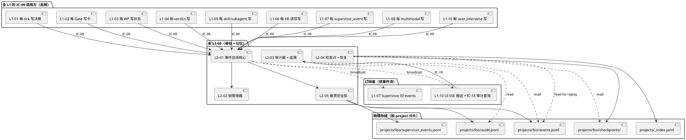
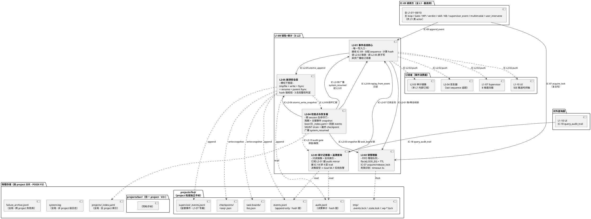
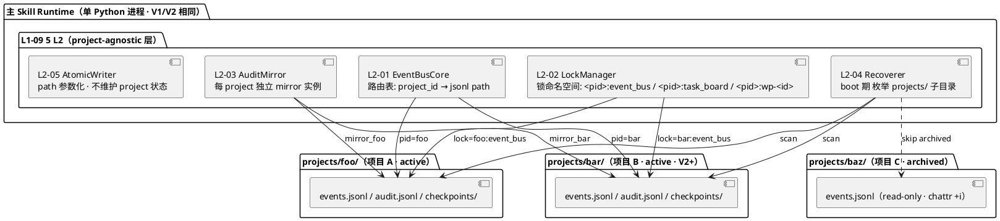
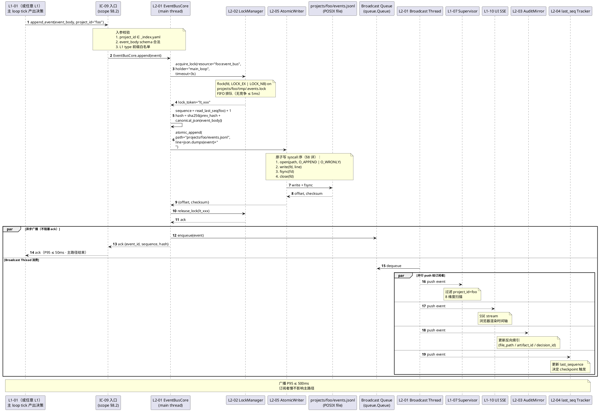
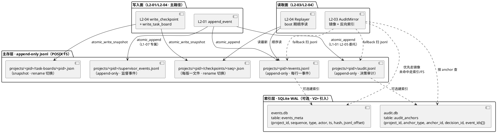
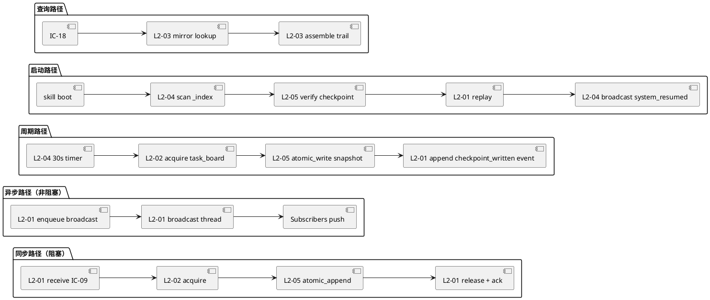

# L1-09 · 韧性 + 审计 · 总架构（architecture.md）

> **本文档定位**：本文档是 3-1-Solution-Technical 层级中 **L1-09 韧性 + 审计能力** 的**总架构文档**，也是**这 5 个 L2（事件总线核心 / 锁管理器 / 审计记录器 + 追溯查询 / 检查点与恢复器 / 崩溃安全层）的公共骨架**。
>
> **L1-09 的系统级定位**：HarnessFlow 的**脊柱 + 记忆** —— 所有 L1 状态变更的**唯一落盘口** + 跨 session 无损恢复的**根** + Goal §4.1 "决策可追溯率 100%" 的**证据基**。本 L1 是系统里**唯一可以让 IC-09 append_event 失败就 halt 整个系统**的 L1；也是 PM-14 `harnessFlowProjectId` **物理持久化**的**落实方** —— `projects/<pid>/events.jsonl / audit.jsonl / checkpoints/` 三件套全部按 project 物理分片。
>
> **与 2-prd/L1-09 的分工**：2-prd 层的 `prd.md`（1718 行）回答**产品视角**的 "5 L2 的职责 / 边界 / 约束 / 禁止 / 义务 / IC 契约骨架 / BF 映射"；本文档回答**技术视角**的 "在 Claude Code Skill + POSIX FS + jsonl + SQLite WAL（可选索引）+ flock 这套物理底座上，5 L2 怎么串成一条既满足 `P95 append ≤ 50ms / bootstrap ≤ 5s / 恢复 ≤ 30s / shutdown ≤ 5s` 四个硬约束，又能扛住 断电 / 磁盘满 / hash 链断裂 / checkpoint 损坏 / 死锁 五种灾情的技术链路" —— 落到 **物理分片模型**、**控制流 / 数据流**、**3 张 P0 时序图**、**开源调研对标**、**与各 L2 tech-design 的分工边界** 五件事上。
>
> **与 5 个 L2 tech-design.md 的分工**：本文档是 **L1 粒度的汇总骨架**，给出 "5 L2 在同一张图上的位置 + 跨 L2 时序 + 对外 IC 承担 + 物理存储布局"；每 L2 tech-design.md 是**本 L2 的自治实现文档**（具体 hash 算法 / fsync 顺序 / flock 语义 / snapshot 触发阈值 / 内部状态机 / 单元测试骨架），不得与本文档冲突。冲突以本文档为准。
>
> **严格规则**：
> 1. 任何与 2-prd/L1-09 产品 PRD 矛盾的技术细节，以 2-prd 为准；发现 2-prd 有 bug → 必须先反向改 2-prd，再更新本文档。
> 2. 任何 L2 tech-design 与本文档矛盾的"跨 L2 控制流 / 时序 / 存储布局 / IC 字段语义"，以本文档为准。
> 3. 任何与 `L0/architecture-overview.md §4 FS 布局` 或 `projectModel/tech-design.md §7 目录结构` 矛盾的文件路径 / 命名 / 分片策略，以 L0 + projectModel 为准（本 L1 是它们的**落实方**而非**定义方**）。
> 4. 任何技术决策必须给出 `Decision → Rationale → Alternatives → Trade-off` 四段式；不允许堆砌选择。
> 5. 本文档不复述 2-prd/prd.md 的产品文字（职责 / 禁止 / 必须清单等），只做技术映射 + 补齐"产品视角未说 but 工程师必须知道"的部分（原子写 syscall 序 / flock 语义 / hash 链算法选型 / 分片锁粒度 / bootstrap 状态机）。

---

## 0. 撰写进度

- [x] §1 定位 + 2-prd §5.9 映射 + PM-14 物理隔离声明
- [x] §2 DDD 映射（BC-09 Resilience & Audit · 引 L0/ddd-context-map.md §2.10）
- [x] §3 L1-09 内部 5 L2 架构图（Mermaid component · 事件总线 + 按 project 物理分片）
- [x] §4 核心 P0 时序图（Mermaid sequence · 3 张：IC-09 append_event 端到端 / 跨 session bootstrap 恢复 / 审计追溯查询）
- [x] §5 SQLite WAL + jsonl append-only 存储方案（引 L0 §10）
- [x] §6 按 project 物理分片（projects/<pid>/events.jsonl / audit.jsonl / checkpoints/）
- [x] §7 锁管理（flock + 等锁超时）
- [x] §8 崩溃安全（tmpfile + rename + fsync + hash 链）
- [x] §9 对外 IC（接收 IC-09 · 发起无 · 对 L1-10 提供 IC-18）
- [x] §10 开源调研（SQLite WAL / jsonl / EventStore / litestream · 引 L0 §10 + ≥ 3 项对比）
- [x] §11 与 5 L2 分工
- [x] §12 性能目标（写盘 ≤ 50ms · bootstrap ≤ 5s · 写盘失败 halt 整个系统）
- [x] 附录 A · 与 L0 系列文档的引用关系
- [x] 附录 B · 术语速查（L1-09 本地）
- [x] 附录 C · 5 L2 tech-design 撰写模板（下游消费）

---

## 1. 定位 + 2-prd §5.9 映射 + PM-14 物理隔离声明

### 1.1 本文档的唯一命题

把 `docs/2-prd/L1-09 韧性+审计/prd.md`（产品级 · v1.0 · 1718 行 · 5 L2 × 9 小节 + 10 IC-L2 + 9 条 L2 间业务流 + 14 个对外 IC 映射 + retro 位点）定义的**产品骨架**，一比一翻译成**可执行的技术骨架** —— 具体交付物是：

1. **1 张 L1-09 component diagram**（5 L2 + 10 IC-L2 + 按 project 物理分片 · Mermaid · §3）
2. **3 张 P0 核心时序图**（IC-09 append_event 端到端 · bootstrap 跨 session 恢复 · IC-18 审计追溯查询 · Mermaid · §4）
3. **1 套 SQLite WAL（可选结构化索引）+ jsonl append-only（主存）双层存储方案**（§5 · 引 `L0/open-source-research.md §10`）
4. **1 张按 project 物理分片的 FS 布局详单**（`projects/<pid>/` 子树 · §6 · 引 `L0/architecture-overview.md §4.1` + `projectModel/tech-design.md §7`）
5. **1 张锁管理矩阵**（flock + 等锁超时 + 死锁识别 · §7）
6. **1 份崩溃安全实现手册**（tmpfile + rename + fsync syscall 序 + hash 链算法选型 · §8）
7. **1 张对外 IC 承担矩阵**（接收 IC-07/09/10/12/18 · 5 L2 × IC 承担分配 · §9）
8. **1 份开源调研综述**（≥ 3 项事件总线选型对比 · §10 · 引 `L0/open-source-research.md §10`）
9. **1 份 L2 分工声明**（本 architecture 负责什么 · 每 L2 负责什么 · §11）
10. **1 张性能目标表**（`append ≤ 50ms P95 / bootstrap ≤ 5s / 恢复 ≤ 30s / shutdown ≤ 5s` · §12）

### 1.2 与 2-prd/L1-09/prd.md 的映射（精确到小节）

| 2-prd/L1-09/prd.md 章节 | 本文档对应章节 | 翻译方式 |
|---|---|---|
| §1 L1-09 范围锚定（引 scope §5.9 · 7 行映射表） | §1（本章）+ §9 对外 IC | 引用锚定，不复述；§9 表格映射产品 IC ↔ 技术 L2 |
| §2 L2 清单（5 个 L2 + 一句话职责 + 核心问题） | §3 component diagram + §11 L2 分工 | 落成 Mermaid + 分工表 |
| §3 L2 整体架构图 A（主干持久化面 ASCII）| §3 L1-09 内部 5 L2 架构图（Mermaid · 事件总线 + 物理分片）| ASCII → Mermaid；加"按 project 物理分片"维度 |
| §4 L2 整体架构图 B（6 个响应面 ASCII）| §4 核心时序图 3 张 + §8 崩溃安全 + §12 性能目标 | 6 响应面里的 P0 画时序图（响应面 1 shutdown / 响应面 2 恢复 / 响应面 3 审计查询）；响应面 4 硬 halt 归入 §8 + §12；响应面 5 并发 归入 §7；响应面 6 压缩 归入 §5 |
| §5 L2 间业务流程（9 条 流 A-I）| §4 时序图（流 A/D/E）+ §6 文件布局（流 B）+ §7 锁（流 F）+ §8 崩溃安全（流 C/G/H）+ §5 存储（流 I）| 9 条流完整分配到技术章节 |
| §6 IC-L2 契约清单（10 条 · 一句话 + 方向）| §11 L2 分工 + §9 对外 IC 承担 | 10 条 IC-L2 在 §11 表格具名；方向在 §3 架构图箭头上 |
| §7 L2 定义模板（9 小节）| §11 L2 分工声明 + 附录 C 下游模板 | 给 L2 tech-design 的撰写模板 |
| §8-§12 L2-01 .. L2-05 详细（每 L2 9 小节）| 不在本文档展开 | 落到各 L2 tech-design.md（本文档只画入口 + 出口 + 跨 L2 协同） |
| §13 对外 scope §8 IC 映射（5 被调 + 3 发起）| §9 对外 IC 承担（全量 8 条 + 未承担 15 条） | 镜像重绘；"未承担"列表保留防越界 |
| §14 retro 位点（11 项）| 本文档不涉 | 归产品 PRD 自身；本文档只做技术实现 |
| 附录 A 术语 + 附录 B BF 映射 | 附录 B 术语速查 + §1.3 PM-14 声明 | 直接沿用 + 加技术字段语义 |

### 1.3 PM-14 物理隔离声明（本 L1 的核心责任）

`docs/2-prd/L1-09 韧性+审计/prd.md` 开篇（第 32 行）定调：

> **本 L1 是 `harnessFlowProjectId` 的物理持久化落实方** —— 所有事件总线 / 审计记录 / 检查点 / 锁**必须按 project 物理分片存储**（`projects/<project_id>/events.jsonl / audit.jsonl / checkpoints/` 独立子目录）。

本文档的落实点（精确到 L2）：

| PM-14 硬要求 | 本 L1 落实 L2 | 本文档章节 | 物理路径 |
|---|---|---|---|
| 事件总线按 project 分片 | L2-01 | §6.1 | `projects/<pid>/events.jsonl`（每 project 一份 jsonl · 永不跨 project 合并） |
| 锁粒度含 project 键 | L2-02 | §7.2 | `projects/<pid>/tmp/.events.lock / .state.lock / .wp-*.lock`（project 子目录内） |
| 审计按 project 检索 | L2-03 | §6.2 + §9.3 | `projects/<pid>/audit.jsonl` · IC-18 查询必带 project_id / 跨 project join **禁止** |
| 跨 session 恢复读 `projects/_index.yaml` 决定激活哪个 project | L2-04 | §4.2 + §6.3 | bootstrap 先读全局 `_index.yaml` → 逐 project 扫 `checkpoints/` → 按 project 回放 `events.jsonl` |
| 崩溃安全的原子写粒度是 project 根目录 | L2-05 | §6.4 + §8 | `atomic_append` 的 `flock` + `fsync` 作用于 `projects/<pid>/*.jsonl` 单文件，**不跨 project** |

**PM-14 在本 L1 的强约束**（违反即硬 halt · 不降级）：

1. **事件写入前**：L2-01 校验 `event.project_id` 非空 + `project_id ∈ _index.yaml`；缺 → `project_scope_violation` 事件 + L1-07 BLOCK 告警。
2. **跨 project 外链检测**：L2-03 审计器周期扫 `events.jsonl`，发现 `event.links` 指向其他 project 路径 → `cross_project_reference_violation` 审计违规。
3. **锁资源名含 project_id**：任何 `acquire_lock(resource=...)` 的 `resource` 必以 `<pid>:` 前缀（除全局 `_index` 锁）；否则 L2-02 拒绝。
4. **恢复失败绝不跨 project 降级**：某 project checkpoint 损坏 → 按 Tier 1-4 降级；**绝不**用其他 project 的数据"凑"本 project 状态。

### 1.4 与 projectModel/tech-design.md 的关系

`docs/3-1-Solution-Technical/projectModel/tech-design.md` 是 `harnessFlowProjectId` 聚合的**技术实现 spec**（字段级 YAML schema + 目录结构 + 主状态机）。本 L1 与它的关系：

| projectModel 定义 | L1-09 落实 L2 | 关系 |
|---|---|---|
| `ProjectRepository.save(aggregate)` interface（§2.4 第 154 行） | L2-05（AtomicWrite） + L2-01（append manifest_updated event） | projectModel 定义 "what"；L1-09 L2-05 定义 "how 原子写 manifest.yaml"；L1-09 L2-01 定义 "how 把 manifest 变更事件化"。 |
| `ProjectIndexService.rebuild_index_from_scan()` interface（§2.4 第 173 行） | L2-04（bootstrap 模式复用） | projectModel 定义 "什么时候重建"；L1-09 L2-04 定义 "how 扫 `projects/<pid>/manifest.yaml` 枚举 active project"。 |
| `ProjectManifest` 双形态 VO（§7.2 schema） | L2-01 + L2-05 | L2-01 负责 append `manifest_updated` 事件；L2-05 负责 `atomic_write_snapshot` 把 manifest.yaml 落盘（tmpfile + rename + fsync）。 |
| `projects/<pid>/` 目录常量（§7.1 目录结构） | 全 5 L2 | 所有 L2 的存储路径以此为根；本文档 §6 复述一致。 |

**分工原则**：`projectModel/tech-design.md` 定义**"谁拥有 manifest.yaml + _index.yaml + state.yaml 这三件套"**（L1-02 BC-02 拥有）；**本 L1-09** 定义**"这三件套怎么原子落盘 + 怎么从事件总线重建 + 怎么在崩溃时不坏"**。

### 1.5 本 L1 在全系统的位置（一图说清）



**关键语义**：

- **写面**：9 个 L1 共 21 种 actor 都经 IC-09 进本 L1 → L2-01 串行化 → L2-02 取锁 → L2-05 原子落盘 → 按 project 分片 jsonl 追加
- **读面**：L1-07 / L1-10 订阅事件广播 + 定期 tail jsonl；L1-10 审计查询走 IC-18 → L2-03 镜像
- **单一入口 + 单一事实源**：PRD §5.9.4 硬约束 1-2 "事件只追加 + 必经本 L1"；本文档 §9.1 给出物理拦截点
- **按 project 物理分片**：所有业务数据（events / audit / checkpoints / supervisor_events）都在 `projects/<pid>/` 子树；全局级只有 `_index.yaml`（project 索引）+ `failure_archive.jsonl`（跨 project 失败库）+ `system.log`（非 project 级系统日志）

---

## 2. DDD 映射（BC-09 Resilience & Audit）

### 2.1 Bounded Context 定位

本 L1 对应的 Bounded Context 在 `L0/ddd-context-map.md §2.10 BC-09 Resilience & Audit`（第 475-513 行），已明确：

**BC 名**：`BC-09 · Resilience & Audit`
**一句话定位**：项目的"**黑匣子**" —— 事件总线单一事实源 + 锁 + 审计 + 检查点 + 崩溃安全。
**BC 角色**：**Published Language 发布者**（`append_event schema` 作为全系统共享的 PL）+ **Partnership 伙伴**（与全部其他 BC 强耦合、同步演进、任何决策必经 IC-09）。

**与其他 BC 的关系**（引自 L0/ddd-context-map.md §2.10 "跨 BC 关系"一节）：

| 对方 BC | 关系模式 | 本 L1 视角 |
|---|---|---|
| **所有 BC**（BC-01/02/03/04/05/06/07/08/10） | **Partnership / OHS-PL** | 发布 `append_event schema` 作为全系统 Published Language；任何 BC 的 Command 成功后发布 Domain Event 都要经本 BC 的 IC-09；L2-01 是 Partnership 的实现接口 |
| **BC-01 Agent Decision Loop**（L1-01） | **Partnership**（极强耦合）| 每次 tick 决策 → IC-09 → L2-01；L1-01 L2-05 决策审计记录器 **委托** 本 L1 L2-03 实现 AuditEntryRepository |
| **BC-02 Project Lifecycle**（L1-02） | **Partnership** | manifest / state / index 三件套**原子写** 由本 L1 L2-05 提供 `AtomicWrite` 服务；L1-02 BC 的 `ProjectRepository.save` 委托 L1-09 实现（见 `projectModel/tech-design.md §2.4 第 154-168 行`） |
| **BC-07 Supervision**（L1-07） | **Partnership** | L1-07 订阅本 L1 L2-01 的事件广播（via IC-L2-02）；L1-07 本身也写 `supervisor_events.jsonl` 经 IC-09 |
| **BC-10 Human-Agent UI**（L1-10） | **Customer-Supplier** | L1-10 是本 L1 的 Customer：消费事件流 + IC-18 审计查询；本 L1 提供 SSE 源（事件广播）+ 查询服务 |

### 2.2 本 L1 内部的聚合根（Aggregate Roots）

引自 `L0/ddd-context-map.md §2.10` BC-09 主要聚合根表（第 498-503 行）+ `L0/ddd-context-map.md §4.9` BC-09 L2 映射（第 807-815 行），落到 5 L2 的映射：

| 聚合根 | 内部 Entity + VO | 一致性边界 | 所在 L2 | Repository |
|---|---|---|---|---|
| **EventLog** | project_id(VO) / sequence(VO) / events(Entity[]) / hash_chain(VO) | project_id + sequence 单调递增；append-only；hash 闭合；任何追加必 fsync | **L2-01 事件总线核心** | `EventStoreRepository`（§2.4） |
| **Lock** | lock_id(VO) / resource(VO) / holder(VO) / acquired_at(VO) / ttl(VO) | project / wp / state 三级粒度；FIFO；TTL 强制 | **L2-02 锁管理器** | `LockRepository`（§2.4） |
| **Checkpoint** | checkpoint_id(VO) / project_id(VO) / snapshot_ref(VO) / last_event_sequence(VO) / checksum(VO) | 周期 + 关键事件后生成；与 events.jsonl 的 sequence 一一映射；每 checkpoint 覆盖前一 checkpoint 后的全事件范围 | **L2-04 检查点与恢复器** | `CheckpointRepository`（§2.4） |
| **AuditEntry** | audit_id(VO) / anchor_type(VO · file_path/artifact_id/decision_id) / anchor_id(VO) / decision_ref(VO) / event_refs(VO[]) / supervisor_comments(VO[]) / user_authorizations(VO[]) | 四层 trail（决策 / 事件 / 监督 / 授权）；决策层不可为空；时间序严格正确 | **L2-03 审计记录器 + 追溯查询** | `AuditEntryRepository`（§2.4） |
| **AtomicWriteOperation** | operation_id(VO) / target_path(VO) / tmp_path(VO) / fsync_target(VO) / hash(VO) | 单次写操作内强一致；跨 operation 无一致性约束（跨文件原子性由上层组合锁实现） | **L2-05 崩溃安全层** | 无独立 Repository（作为 Domain Service 由 L2-01/L2-04 调用） |

**关键不变量**（Invariants · 引自 BC-09 §2.10 + `scope §5.9.4` 硬约束）：

1. **I-01 EventLog append-only**：`events.jsonl` 已落盘行**永不**被原地修改；任何修改尝试被 L2-05 `atomic_append` 拒绝（只开 `O_APPEND | O_WRONLY`，不开 `O_TRUNC` / `O_RDWR`）。
2. **I-02 Sequence 单调递增**：同 project 的 `event.sequence` 严格 +1，无跳号、无重复；跨 process 由 L2-02 `event_bus` 锁保证。
3. **I-03 Hash 链闭合**：`event.hash = sha256(prev_event.hash + canonical_json(event_body_without_hash))`；L2-03 审计器周期重算整链对比。
4. **I-04 Lock acquire/release 配对**：任一 acquire 未配对的 release → 超 TTL 强制释放 + 记 `lock_leaked` 审计事件。
5. **I-05 Checkpoint 可从 events 完全重建**：任何 checkpoint 损坏 → 回退上一版 → 仍损坏 → 从 `events.jsonl` 开头完整回放（Tier 1 → Tier 2 → Tier 3 → Tier 4 降级）。
6. **I-06 AuditEntry 决策层不得为空**：任何 `query_audit_trail` 返回 `decision` 层为空 → 必发 `audit_trail_broken` 事件 + Goal §4.1 红线破产告警。

### 2.3 Domain Service / Application Service

引自 L0/ddd-context-map.md §4.9（第 807-815 行）BC-09 的 service 表：

| Service 名 | 类型 | 职责 | 所在 L2 |
|---|---|---|---|
| `EventBusCore` | **Application Service**（核心）| 接收 IC-09 → 分配 sequence + hash → 调锁 + 调原子写 → 广播订阅者 | L2-01 |
| `LockManager` | **Application Service** | FIFO 等锁队列 + flock 物理锁 + TTL + 死锁识别 | L2-02 |
| `AuditMirror` | **Domain Service** | 订阅 L2-01 事件流 → 建立反向索引（by file_path / artifact_id / decision_id） | L2-03 |
| `AuditTrailAssembler` | **Domain Service** | 接 IC-18 → 按 anchor 查镜像 → 拼装 4 层 trail → 完整性校验 | L2-03 |
| `CheckpointManager` | **Application Service** | 周期 + 关键事件触发 snapshot · 取 task_board 锁 · 调原子写 | L2-04 |
| `BootstrapRecoverer` | **Application Service** | skill 启动时扫 `_index.yaml` + 对 ACTIVE project 回放 events + 重建 task-board + 广播 `system_resumed` | L2-04 |
| `ShutdownOrchestrator` | **Application Service** | SIGINT 捕获 + drain + 最终 checkpoint + flush + fsync + ack | L2-04 |
| `AtomicWriter` | **Domain Service** | tmpfile + write + fsync + rename + parent fsync 五步原子写 | L2-05 |
| `IntegrityChecker` | **Domain Service** | 完整性校验 3 态（OK / CORRUPT / PARTIAL）+ 损坏范围识别 | L2-05 |

### 2.4 Repository Interface

本 L1 是全系统**唯一的 Repository 实现提供方**（Partnership 关系）。5 L2 对应 4 个 Repository（L2-05 作为 Domain Service 下垫层，不直接暴露 Repository）。引自 `L0/ddd-context-map.md §7.2.9`（第 1451-1497 行）：

**EventStoreRepository**（L2-01）：`append(project_id, event) -> (sequence, hash)` / `read_from(project_id, from_seq, to_seq) -> Event[]` / `subscribe(filter) -> Iterator[Event]` / `get_last_sequence(project_id) -> int`

**LockRepository**（L2-02）：`acquire(resource, holder, ttl, timeout) -> lock_token` / `release(lock_token) -> ack` / `force_release_all(reason) -> released_count` / `list_held() -> LockStatus[]`

**CheckpointRepository**（L2-04）：`save(project_id, snapshot, last_event_seq) -> checkpoint_id` / `load_latest(project_id) -> Checkpoint | None` / `load_previous(project_id, before_cp_id) -> Checkpoint | None` / `verify_integrity(checkpoint_id) -> OK | CORRUPT | PARTIAL`

**AuditEntryRepository**（L2-03）：`query_by_anchor(anchor_type, anchor_id) -> AuditTrail` / `build_mirror_from_events(project_id) -> MirrorStats` / `report_audit_broken(anchor, missing_layer) -> void`

所有 Repository 的**物理实现**经 L2-05 的 `AtomicWrite / IntegrityCheck` Domain Service；**物理存储介质**全部为 POSIX 文件系统（见 §5）。

### 2.5 Domain Events（本 BC 对外发布）

引自 `L0/ddd-context-map.md §5.2.9`（第 991-1001 行）BC-09 发布事件表：

| 事件名 | 触发时机 | 订阅方 | Payload |
|---|---|---|---|
| `L1-09:event_appended` | L2-01 落盘成功 · **元事件**（通过 append 自身）| 全 BC（广播）| `{event_id, sequence, hash, project_id, ts}` |
| `L1-09:snapshot_created` | L2-04 checkpoint 写成 | BC-10 UI / retro | `{checkpoint_id, last_event_sequence, project_id}` |
| `L1-09:system_resumed` | L2-04 bootstrap 恢复完 | 全 BC | `{resumed_project_ids[], recovered_at, duration_ms}` |
| `L1-09:lock_acquired` | L2-02 授锁 | retro 观测 | `{lock_id, resource, holder}` |
| `L1-09:lock_released` | L2-02 释放锁 | retro 观测 | `{lock_id, hold_duration_ms}` |
| `L1-09:lock_deadlock_detected` | L2-02 环形等待识别 | BC-07 Supervisor | `{participants[], break_action}` |
| `L1-09:lock_timeout` | acquire 等锁超 3s | BC-07 | `{resource, waited_ms, caller}` |
| `L1-09:lock_leaked` | acquire 未配对 release + 超 TTL | BC-07（红线）| `{lock_id, holder, hold_ms}` |
| `L1-09:integrity_check_failed` | L2-05 hash 链断 / checkpoint header 损坏 | BC-07（CRITICAL）| `{target, failure_range, tier}` |
| `L1-09:recovery_degraded` | L2-04 Tier 2/3 降级 | BC-07 + BC-10 | `{tier, skipped_ranges[], lost_events_estimate}` |
| `L1-09:bus_write_failed` | L2-01 落盘彻底失败 | BC-07（触发 hard_halt 响应面 4）| `{caller, reason: disk_full/permission/io_error, retry_count}` |
| `L1-09:audit_trail_broken` | L2-03 查询发现决策层空 | BC-07（Goal §4.1 红线）| `{anchor, missing_layers[]}` |
| `L1-09:shutdown_clean` | L2-04 干净退出 ack | BC-01 | `{exit_state, final_checkpoint_id, flush_duration_ms}` |
| `L1-09:context_compression_transparent` | L2-03 压缩索引透明跳转成功 | retro（观测健康度）| `{compressed_event_id, original_event_id}` |

**全部事件共享字段**：`project_id`（PM-14 硬约束）+ `sequence`（单调递增）+ `hash`（sha256 链式）+ `ts`（ISO 8601）。

**元事件说明**：`L1-09:event_appended` 是 L2-01 对**自身 append 动作**的元事件记录 —— 每次 append 成功后，L2-01 会**再次** append 一条元事件，用于 L1-07 / L1-10 感知 "有新事件"。为防无限递归，元事件本身**不再触发**元事件（L2-01 内部 `is_meta_event` flag 标记跳过）。

### 2.6 Ubiquitous Language（本 BC 术语）

引自 `L0/ddd-context-map.md §2.10 + B.9`（第 483-494 行 + 2037-2050 行）：

| 术语 | 含义 | 与 2-prd 对应 |
|---|---|---|
| **EventLog** | 事件日志 Aggregate（append-only jsonl）| 2-prd "事件总线" |
| **EventEntry** | 单条事件 Entity（ts + type + actor + content + sequence + hash）| 2-prd "事件" |
| **HashChain** | 事件 hash 链 VO（防篡改）| 2-prd "hash 链" |
| **Lock** | 互斥锁 Aggregate（project / wp / state 三级粒度）| 2-prd "锁" |
| **LockGranularity** | 锁粒度 VO（"全局" / "project" / "wp"）| 2-prd "资源名" |
| **Checkpoint** | 快照 Aggregate（task-board state 冻结版）| 2-prd "检查点" |
| **AuditEntry** | 审计项 Aggregate（anchor + decision_ref + event_refs + supervisor_comments + user_authorizations）| 2-prd "audit trail" |
| **AuditAnchor** | 审计锚点 VO（file_path / artifact_id / decision_id 三种）| 2-prd "锚点" |
| **AtomicWriteOperation** | 原子写 VO（tmpfile + write + fsync + rename + parent fsync）| 2-prd "原子写" |
| **Replay** | 事件回放动作（从 events.jsonl 重建 task-board）| 2-prd "回放" |
| **Tier 1~4 降级** | 恢复失败 4 级降级路径（回退上版 / 完整回放 / 跳损坏块 / 拒绝空白重建）| 2-prd "Tier 1~4" |
| **硬 halt** | 事件总线写失败触发全系统停机（响应面 4）| 2-prd "硬 halt" |
| **drain** | shutdown 模式下等在飞请求完成 | 2-prd "drain" |

---

## 3. L1-09 内部 5 L2 架构图（事件总线 + 按 project 物理分片）

### 3.1 5 L2 component diagram（含 10 IC-L2 契约 + 对外 IC 进出口）

本节是 `2-prd/L1-09/prd.md §3 图 A 主干持久化面`（ASCII · 第 85-147 行）的 Mermaid 技术视图，加上**按 project 物理分片**维度与**对外 IC 进出口**：



### 3.2 关键规则（从 prd §3 直译到技术语义）

- **L2-01 是唯一写入点**（prd.md 第 150 行）：全 L1 改事件总线只通过它；L2-01 **只接受已取锁（L2-02）+ 已校验（L2-05）** 上下文的调用 → 技术上体现为 `EventBusCore.append(event)` 方法内部**必然**先调 `LockManager.acquire(event_bus)` + 最后调 `AtomicWriter.atomic_append(path, line)`，中间不允许有"裸写"路径。
- **L2-02 是"串行化"的唯一手段**（prd.md 第 151 行）：不走 L2-02 直接并发写 = 破坏单一事实源 → 技术上体现为 `atomic_append` 方法**主动断言** "调用线程已持有目标文件对应的 flock"（若未持有 → `AssertionError: unsafe_write_without_lock`）。
- **L2-04 是"复活"的唯一路径**（prd.md 第 152 行）：重启一律走它恢复 task-board → 技术上体现为 `harnessFlow skill` 入口 `bootstrap()` 第一步固定调 `L2_04.BootstrapRecoverer.run()`；任何绕过本路径直接读 task-board 的尝试 → `IntegrityChecker` 拒绝 + CRITICAL 告警。
- **L2-03 是"为什么"的唯一答案**（prd.md 第 153 行）：任何"这行代码为什么在？"的问题终点 → 技术上体现为 IC-18 的 Handler 绑定在 L2-03；L1-01 / L1-07 / L1-10 等**都不持有** audit mirror 的直接访问权（必经 IC-18）。
- **L2-05 是横切下垫层**（prd.md 第 154 行）：L2-01 / L2-04 所有写都经过它，它**不直接面向外部 L1** → 技术上体现为 `AtomicWriter` / `IntegrityChecker` 是 **Domain Service**（无 Repository 接口、无 IC-L2 对外方法），只由同 L1 的 L2-01/L2-04 在 Application Service 内部调用。

### 3.3 10 IC-L2 契约技术映射（补充 prd.md §6）

prd.md §6（第 518-531 行）给出 10 条 IC-L2 的"一句话 + 方向"；本节**补充技术字段**（schema 骨架 + 物理载体 + 延迟预算）：

| IC-L2 | 源 | 目标 | 物理载体 | 入参 schema 骨架 | 出参 schema 骨架 | 延迟预算 |
|---|---|---|---|---|---|---|
| **IC-L2-01** | L2-01 | L2-02 | 同进程 Python 方法调用 | `{resource: str, holder: str, timeout_ms: int}` | `{lock_token: str}` or `{error: timeout/deadlock}` | acquire P95 ≤ 5ms (无竞争) / ≤ 100ms (高竞争) |
| **IC-L2-02** | L2-03/04/07/10 订阅者 | L2-01 | 同进程回调队列（订阅注册时传 callback）| `{subscriber_id: str, filter: {type_prefix?, actor?, state?}}` | 注册 token or `{error: shutdown_rejected}` | 注册 P95 ≤ 10ms / push 延迟 ≤ 500ms |
| **IC-L2-03** | L2-04 | L2-02 + L2-05 | 复合（先 flock 后 atomic_write）| `{project_id: str, snapshot_data: bytes, target_path: str}` | `{checkpoint_id: str, bytes_written: int, checksum: str}` | P95 ≤ 2s（含取锁 + 原子写 + fsync） |
| **IC-L2-04** | L2-04 | L2-01 | 同进程只读 iterator | `{project_id: str, from_seq: int, to_seq?: int}` | `Iterator[Event]` | 回放 1 万事件 ≤ 10s |
| **IC-L2-05** | L2-01 | L2-05 | 同进程方法调用（但内部走 syscall 序）| `{target_path: str, line: str, expected_prev_hash: str}` | `{offset: int, checksum: str}` or `{error: io_error/disk_full}` | P95 ≤ 30ms（含 fsync） |
| **IC-L2-06** | L2-04 | L2-05 | 同进程方法调用 | `{target_path: str, snapshot_bytes: bytes, header: dict}` | `{bytes_written: int, checksum: str}` or error | P95 ≤ 500ms |
| **IC-L2-07** | L2-03 | L2-01 | 同 IC-L2-02（特化版）| `{subscriber_id: 'audit_mirror', filter: '*'}` | 事件流 iterator | 镜像建立延迟 ≤ 500ms |
| **IC-L2-08** | L2-04 | 全 L1 | 经 L2-01 的元事件广播 | `{resumed_project_ids: [str], recovered_at: ts, duration_ms: int}` | 无返回（广播）| 恢复结束到广播 ≤ 100ms |
| **IC-L2-09** | L2-05 | L2-04 | 同进程事件通知（callback）| `{target: path, failure_range: (seq_from, seq_to), tier_suggest: 1/2/3}` | 无返回 | 即时 |
| **IC-L2-10** | L2-04 | L2-03 | 同进程状态通知 | `{phase: 'starting' / 'resumed'}` | ack | 即时 |

**物理载体补充说明**：所有 IC-L2 都是**同进程内方法调用**（因为 L1-09 5 L2 共处于 "主 Skill Runtime" 的 Python 进程，见 `L0/architecture-overview.md §3.2`）；"同进程"不等于"同线程"，L2-01 的异步广播由单独的 broadcast thread 执行（见 §3.5）。

### 3.4 按 project 物理分片视图（5 L2 × project 维度）

本节展示 **同一物理进程 内** 5 L2 如何处理**多个 project 的数据分片**（V2+ 场景 · V1 固定单 project）：



**物理分片的 3 个技术保证**：

1. **路由唯一性**：L2-01 的 `append(event)` 根据 `event.project_id` 路由到**唯一**的 `projects/<pid>/events.jsonl`；**绝不跨** project 合并或 join。
2. **锁命名空间隔离**：L2-02 的资源名**强制** `<project_id>:<resource_type>` 格式（除全局 `_index` 锁）→ project A 的 `event_bus` 锁与 project B 的 `event_bus` 锁是完全独立的两把 flock，**互不阻塞**。
3. **恢复边界**：L2-04 bootstrap 时**逐 project** 独立恢复（顺序串行避免并发 IO 竞争）；某 project 恢复失败**绝不**传染其他 project。

### 3.5 进程内线程模型（补充 prd.md 未言明的并发结构）

**L1-09 5 L2 在主 Skill Runtime 进程内的线程分配**（技术决策 · prd.md 未涉及）：

| 线程名 | 职责 | 所在 L2 | 通信方式 |
|---|---|---|---|
| **Main Thread**（主 skill LLM loop） | 接受 IC-09 调用 · 同步执行 L2-01 `append_event` 主路径 | L2-01 入口 | 直接方法调用 |
| **Broadcast Thread** | 异步向订阅者推送事件（不阻塞主写路径）| L2-01 内部 | 生产者-消费者队列（`queue.Queue` · 无界 · 背压由订阅者自理）|
| **Checkpoint Thread** | 周期 30s + 关键事件 snapshot 触发 | L2-04 | `threading.Timer` + 订阅关键事件 |
| **Mirror Build Thread** | L2-03 订阅事件流建镜像 | L2-03 | 从 Broadcast Queue 消费（subscriber_id=audit_mirror） |
| **Bootstrap Thread**（仅启动期存在）| skill 启动时回放事件 + 重建 task-board | L2-04 | 启动完后 joined 销毁 |

**为何不用 asyncio**：
- **Decision**：`threading.Thread` + `queue.Queue` 线程模型，**不用** `asyncio`。
- **Rationale**：① 主 skill LLM-in-loop 本质同步（Claude Code 的 Skill 调用语义是阻塞 tool use），asyncio 带来 event loop 入侵 ② 文件 IO（`open/write/fsync/rename`）在 POSIX 是同步 syscall，asyncio 需额外 `run_in_executor` 包裹，收益为负 ③ 订阅者广播需跨线程边界，asyncio queue 跨 loop 支持弱。
- **Alternatives**：asyncio / greenlet / multiprocessing。
- **Trade-off**：threading 的 GIL 对 CPU 密集任务有锁争用，但 L1-09 的瓶颈是 fsync IO（秒级阻塞可接受），GIL 不是瓶颈。

---

## 4. 核心 P0 时序图（3 张）

本章画 3 张 P0 时序图，覆盖 L1-09 的**最高频路径** + **生命攸关路径** + **Goal §4.1 红线路径**：

- **§4.1 图 S1**：IC-09 append_event 端到端（对应 prd.md 流 A · 最高频 · 100+ 次/tick）
- **§4.2 图 S2**：跨 session bootstrap 恢复（对应 prd.md 流 D + 响应面 2 · 生命攸关 · 每次 skill 启动 1 次）
- **§4.3 图 S3**：审计追溯查询 IC-18（对应 prd.md 流 E + 响应面 3 · Goal §4.1 证据路径）

### 4.1 图 S1 · IC-09 append_event 端到端（最高频路径 · P95 ≤ 50ms）

**场景**：L1-01 某 tick 产出一条 `decision_made` 事件，走完"调 IC-09 → 取锁 → 分序号 → 算 hash → 原子写 → 释锁 → 广播 → ack"全链路。



**关键技术决策（图 S1）**：

| 决策点 | 选择 | 理由 |
|---|---|---|
| 主路径 vs 广播异步化 | 主路径**同步**落盘 + 广播**异步**队列 | 主路径必须强一致性（ack 前已 fsync）；广播容忍订阅者慢 |
| sequence 来源 | 从 `read_last_seq(project_id)` 读（持锁期间）| 锁保证读-写原子性；无需外部序列生成器 |
| hash 算法 | `sha256(prev_hash + canonical_json(body))` | sha256 平衡碰撞安全 + 性能；canonical_json (RFC 8785) 保证跨平台确定性 |
| 广播失败处理 | fire-and-forget（L2-01 不重试）| 订阅者自理；L2-01 不背压主写路径（prd.md 硬约束 7）|
| IC-09 ack 是否等广播 | **否**（ack 在 enqueue 后即返回）| 保证主路径 P95 ≤ 50ms；广播延迟由 IC-L2-02 SLA 管 |

### 4.2 图 S2 · 跨 session bootstrap 恢复（生命攸关 · 恢复 ≤ 30s）

**场景**：用户 `Ctrl+C` 退出 skill 后，隔 1 小时重启 `claude` + `/harnessFlow` 激活；系统要扫所有未 CLOSED project + 读最新 checkpoint + 回放事件 + 重建 task-board + 广播 `system_resumed`，让用户看到"已恢复 project foo, state=S4, 继续？"。

```plantuml
@startuml
autonumber
    autonumber
participant "Claude Code 宿主<br/>skill 加载" as CCHost
participant "L1-01 主 loop<br/>（重启后）" as L101
participant "L2-04 BootstrapRecoverer" as L2_04
participant "L2-05 IntegrityChecker" as L2_05
participant "L2-01 EventBusCore<br/>（只读模式）" as L2_01
participant "L2-03 AuditMirror" as L2_03
participant "projects/_index.yaml" as FS_Idx
participant "projects/foo/<br/>manifest.yaml" as FS_Mani
participant "projects/foo/<br/>checkpoints/&lt;seq&gt;.json" as FS_Ckpt
participant "projects/foo/<br/>events.jsonl" as FS_Event
participant "projects/foo/<br/>task-boards/foo.json" as FS_TB
participant "订阅者（全 L1）" as BCast
CCHost -> L101 : skill activated
L101 -> L2_04 : bootstrap()
note over L2_04 : T+0s · 进入 boot 模式\n禁止接新 IC-09 写
L2_04 -> FS_Idx : read
FS_Idx- -> L2_04 : {foo: ACTIVE, bar: CLOSED, baz: FAILED_TERMINAL}
L2_04 -> L2_04 : filter(status=ACTIVE)\n→ [foo]
note over L2_04 : T+0.5s
L2_04 -> L2_03 : IC-L2-10 gate_close(phase="starting")
L2_03- -> L2_04 : ack（后续 IC-18 查询返 audit_gate_closed）
L2_04 -> FS_Mani : read
FS_Mani- -> L2_04 : manifest（含 state=S4, last_checkpoint_seq=12345）
L2_04 -> FS_Ckpt : load_latest(foo)
FS_Ckpt- -> L2_04 : checkpoint_12345.json
L2_04 -> L2_05 : verify_integrity(checkpoint)
L2_05 -> L2_05 : 1. header 校验\n2. checksum 对比\n3. last_event_sequence 与 events.jsonl 尾部一致性
alt checkpoint OK
L2_05- -> L2_04 : OK
else checkpoint CORRUPT
L2_05- -> L2_04 : CORRUPT
note over L2_04 : Tier 1 降级 · 读 previous checkpoint
L2_04 -> FS_Ckpt : load_previous(foo, 12345)
alt previous OK
FS_Ckpt- -> L2_04 : checkpoint_12000.json
else 全部 checkpoint 损坏
note over L2_04 : Tier 2 降级 · 从 events 开头完整回放
L2_04 -> L2_05 : verify_integrity(events.jsonl · 全链)
alt hash 链 OK
L2_05- -> L2_04 : OK
else 某处断裂
note over L2_04 : Tier 3 降级 · 跳损坏块\n+ 记 recovery_degraded
L2_05- -> L2_04 : PARTIAL, skipped=[seq_1000..1020]
else 全链崩溃
note over L2_04 : Tier 4 · 拒绝空白重建\nCRITICAL 告警用户
L2_05- -> L2_04 : FATAL_CORRUPT
L2_04- -> L101 : abort_boot(reason="unable_to_recover")
L101- -> CCHost : 红屏告警"无法恢复 project foo"
end
end
end
note over L2_04 : T+2s
L2_04 -> L2_01 : replay_from(project_id=foo, from_seq=12346)
L2_01 -> FS_Event : read seq 12346..tail
FS_Event- -> L2_01 : Iterator[Event]
L2_01- -> L2_04 : Iterator[Event]
loop 对每条事件
L2_04 -> L2_04 : apply_to_task_board(event)
end
note over L2_04 : T+10s（典型）\n回放 1 万事件 ≤ 10s
L2_04 -> L2_05 : atomic_write_snapshot(\ntask-boards/foo.json)
L2_05 -> FS_TB : tmpfile + rename + fsync
FS_TB- -> L2_05 : ack
L2_05- -> L2_04 : ack
L2_04 -> L2_03 : IC-L2-10 gate_open(phase="resumed")
L2_03- -> L2_04 : ack（audit mirror 从新事件开始维护）
L2_04 -> L2_01 : append_event(\ntype="L1-09:system_resumed",\ncontent={resumed_project_ids:[foo], duration_ms:10500})
note over L2_01 : 此时本 L1 解禁\n接受正常 IC-09 写
L2_01 -> BCast : 广播 system_resumed
BCast- -> L101 : 接收
BCast- -> L2_03 : 接收（刷新镜像 lastest event）
note over L2_04 : T+10.5s\n总计 ≤ 30s 硬约束
L101 -> L101 : resume tick loop\nstate=S4, 等用户确认
L101- -> CCHost : UI 推 "已恢复 project foo, state=S4, 继续？"
@enduml
```

**关键技术决策（图 S2）**：

| 决策点 | 选择 | 理由 |
|---|---|---|
| 多 project 恢复顺序 | **串行** 逐 project | 避免并发 IO 竞争 + 避免跨 project 干扰失败诊断 |
| audit gate 时机 | boot 开始即 close · 恢复末 open | 防半建 mirror 被 IC-18 查询读到脏数据 |
| system_resumed 发布时机 | task-board 重建**完成后**才 append | prd.md 硬约束 7 · 保证订阅者看到 resumed 时 state 已完整 |
| 回放期间 IC-09 新写入如何处理 | **拒绝** · 返 `shutdown_rejected`（与 shutdown 复用）| 保证回放期间单一事实源一致性 · 调用方可重试 |
| Tier 4 触发后系统是否自愈 | **绝不**（prd.md 硬约束 禁止空白重建）| 让用户手动决策：放弃项目 / 指向备份 · 避免伪造状态 |

### 4.3 图 S3 · IC-18 审计追溯查询（Goal §4.1 证据路径）

**场景**：用户在 UI 点击"为什么 `src/auth.py:42` 这行代码存在？" → L1-10 发 IC-18 → L2-03 反查 4 层 trail → 返回给 UI 渲染审计面板。

```plantuml
@startuml
autonumber
    autonumber
participant "用户<br/>（浏览器 Vue3）" as User
participant "L1-10 UI<br/>审计面板" as L110
participant "L2-03 AuditMirror<br/>+ TrailAssembler" as L2_03
participant "内存镜像<br/>（反向索引）" as Mirror
participant "projects/foo/<br/>audit.jsonl" as FS_Audit
participant "projects/foo/<br/>events.jsonl" as FS_Event
participant "L2-01 EventBusCore" as L2_01
participant "订阅者（L1-07 等）" as BCast
User -> L110 : click "为什么 src/auth.py:42?"
L110 -> L2_03 : IC-18 query_audit_trail(\nanchor_type="file_line",\nanchor_id="src/auth.py#L42",\nproject_id="foo")
L2_03 -> L2_03 : check_gate_status()
alt gate 关闭（恢复期）
L2_03- -> L110 : {error: "audit_gate_closed"}
L110- -> User : "审计查询暂停中，请等恢复完成"
else gate 开放
L2_03 -> L2_03 : dispatch by anchor_type\n→ file_line 分支
L2_03 -> Mirror : lookup by file_path="src/auth.py"
Mirror- -> L2_03 : [write_event_ids...]
note over Mirror : 反向索引 key=file_path
L2_03 -> Mirror : filter by line=42（git blame 辅助 · 或 commit hash）
Mirror- -> L2_03 : write_event_id="evt_0987"
L2_03 -> Mirror : lookup event_id="evt_0987"
Mirror- -> L2_03 : event(linked wp_id="wp_03", decision_id="d_00123")
L2_03 -> Mirror : lookup audit by decision_id="d_00123"
Mirror- -> L2_03 : audit_entry(rationale, principle, evidence_links)
alt 决策层为空（断链）
L2_03 -> L2_01 : append_event(\ntype="L1-09:audit_trail_broken",\nanchor="src/auth.py#L42",\nmissing_layers=["decision"])
L2_01 -> BCast : 广播 audit_trail_broken
BCast- -> L110 : L1-07 收到 → Goal §4.1 红线 + BLOCK 告警
L2_03- -> L110 : {trail: partial, missing: [decision], warning: "goal §4.1 red line"}
else 决策层非空
L2_03 -> Mirror : lookup events by sequence range\n[d_00123.seq - 5, d_00123.seq + 5]
Mirror- -> L2_03 : [event_N-5, ..., event_N+5]
L2_03 -> Mirror : lookup supervisor_events\noverlapping d_00123 time range
Mirror- -> L2_03 : [sup_event_X, sup_event_Y] or []
L2_03 -> Mirror : lookup user_intervene events\noverlapping d_00123
Mirror- -> L2_03 : [user_authz_Z] or []
opt 命中 context_compressed 引用
L2_03 -> FS_Event : read 原事件\nby original_event_id
FS_Event- -> L2_03 : 完整 event（压缩前）
L2_03 -> L2_01 : append_event(\ntype="L1-09:context_compression_transparent")
note over L2_03 : 保证压缩不影响审计
end
L2_03 -> L2_03 : assemble_trail(\ndecision=d_00123,\nevents=[...],\nsupervisor=[...],\nuser_authz=[...])
L2_03- -> L110 : {trail: 4-layer, complete=true}
end
L110 -> User : 渲染审计面板\n（决策 → 事件 → 监督 → 授权 四层时间轴）
end
note over User,L110 : P95 ≤ 1s（用户可接受实时）
@enduml
```

**关键技术决策（图 S3）**：

| 决策点 | 选择 | 理由 |
|---|---|---|
| mirror 读 vs FS 直读 | **优先走 mirror**，未命中才读 FS（冷启动期或压缩跳转）| prd.md 硬约束 2 · 保证 L2-03 查询性能不拖累 L2-01 写入 |
| 断链告警 vs 静默返空 | **主动 append `audit_trail_broken` 事件 + 告警** | prd.md 硬约束 1 · Goal §4.1 "决策可追溯率 100%" 的守护 |
| 压缩元事件如何处理 | **透明跳转**（mirror 维护 compressed → original 索引 · 按需读回 FS）| prd.md 硬约束 6 · 压缩不影响审计 |
| 跨 project join | **禁止** · anchor_id 必带 project_id 限定 | PM-14 硬约束 + prd.md §10.5 禁止清单 |
| 缺失层如何呈现 | **明标"本层无数据"** · 不静默跳过 | prd.md §10.5 禁止"对用户隐瞒 trail 缺失" |

---

## 5. SQLite WAL（可选索引）+ jsonl append-only（主存）存储方案

> 本节是 `L0/open-source-research.md §10` 的**落地版**：把调研结论 "append-only jsonl 作主存 + SQLite WAL 可选作结构化索引" 落到 L1-09 5 L2 的具体使用方式。

### 5.1 双层存储架构总视图



### 5.2 主存选型：append-only jsonl（V1 + V2 固定）

**Decision**：事件总线 / 审计 / 监督事件 / 检查点 / task-board 五类数据全部以 **append-only jsonl**（事件流类）或 **snapshot JSON**（checkpoint / task-board）落 POSIX FS；不引入任何数据库服务作主存。

**Rationale**：
1. **Goal §6 "Claude Code Skill 开源形态"**：引入 DB 服务（Postgres / MySQL）会增加用户门槛，违反 portability 目标（`L0/architecture-overview.md §1.1 解读 3`）
2. **prd.md §5.9.3 明示**："不做数据库层抽象"（§12.3 L2-05 边界规则）
3. **append-only 与事件总线语义完美契合**：`open(path, 'a')` 是 POSIX 原生能力，单行写 < 4KB 下 `write()` + flock 组合即可保证原子性（`L0/open-source-research.md §10.3`）
4. **git-friendly + grep-friendly**：jsonl 文件可直接 grep / jq / tail -f 查问题，retro 和诊断成本低（`L0/open-source-research.md §10.3 第 1547 行`）
5. **按 project 分片天然支持**：每 project 独立 jsonl 文件，PM-14 物理隔离一行代码解决（`L0/open-source-research.md §10.3 第 1545 行`）

**Alternatives（全部 Reject · 见 L0 §10.4-10.6）**：
- EventStoreDB：独立 .NET 服务 · BSL license · 运维复杂 → Learn 语义不 Adopt
- Kafka / Redis Streams / NATS：分布式消息队列 · 单机场景过度设计 → Reject
- LevelDB / LMDB：嵌入式 KV · jsonl 的可读性更高 · 无必要 → Learn 架构不 Adopt

**Trade-off**：
- **付出**：jsonl 读查询性能低于结构化 DB（全扫描 O(N)）→ V2+ 规模上去后引入 SQLite WAL 作索引（见 §5.3）
- **获得**：零外部依赖 · 崩溃语义简单 · 调试友好 · 开源门槛低

### 5.3 索引选型：SQLite WAL（V2+ 可选 · V1 不引入）

**Decision**：V1 不引入任何索引（jsonl 扫描 + 内存 mirror 已够 · 单 project < 10 万事件）；**V2+ 引入 SQLite WAL** 作为事件 meta + audit anchor 的结构化索引，**不**作主存。

**V2+ 引入条件**（达到任一即触发）：
- 单 project events.jsonl > 50 MB
- IC-18 查询 P95 > 1s
- L2-03 mirror 冷启动（boot 期重建）> 30s

**Rationale**：
1. **SQLite WAL 与 append-only jsonl 哲学同构**（`L0/open-source-research.md §10.2 第 1524 行`）：WAL 本身就是 append-only 事件序列
2. **stdlib 可得**（Python `sqlite3` 模块）· 零依赖 · Public Domain license
3. **WAL 模式原生支持读写分离**：writer 写 WAL 不阻塞 reader（L2-03 查询不会拖累 L2-01 写入）
4. **Crash recovery 成熟**（`L0/open-source-research.md §10.2 第 1526 行`）· 首连接自动 rollback
5. **索引只存 meta**（project_id / sequence / type / hash / jsonl_offset），body 仍在 jsonl → 保证 **"单一事实源在 jsonl"**，SQLite 损坏时可从 jsonl 完全重建索引

**Alternatives（Reject）**：
- DuckDB：分析型 · 写性能弱 → 不适合实时索引
- LMDB：高性能但 API 复杂 · 无 SQL → Reject
- Postgres：需独立服务 → 违反 portability

**Trade-off**：
- **付出**：V2+ 多维护一份索引 · 主存与索引需周期 sync（以 events.jsonl 为准）
- **获得**：IC-18 查询从 O(N) 降到 O(log N) · mirror 冷启动从全扫 jsonl 降到按 id 查 SQL

### 5.4 索引重建策略（V2+ SQLite 损坏时）

因为 SQLite 索引 **可从 events.jsonl 完全重建**（I-05 不变量），索引损坏不是致命问题：

```
index_rebuild_algorithm:
    1. L2-05 detect index.db corrupted（header hash mismatch）
    2. L2-05 delete index.db（保留 events.jsonl）
    3. L2-03 enter mirror_rebuilding 状态（暂停 IC-18 查询 · 返 mirror_rebuilding 错误）
    4. iterator = L2-01.read_from(project_id, from_seq=0)
    5. for each event in iterator:
         insert row into events_meta
         insert anchor rows into audit_anchors（若事件关联 decision）
    6. L2-03 切回 serving 状态
```

**耗时估算**：单 project 5 万事件 · 平均每事件 200 bytes · 总读 10MB · 插入 SQLite ≤ 5s（`L0/open-source-research.md §7.11 第 1124 行` ChromaDB 对比数据）。

### 5.5 响应面 6（上下文压缩）对存储的影响

对应 prd.md §4 响应面 6 + 流 I（第 496-514 行）：L1-01 识别 context > 80% 时触发压缩。技术实现：

```
context_compression_algorithm:
    1. L1-01 识别 context > 80%（token 数）
    2. L1-01 选定压缩范围：past_event_ids = [e_001, e_002, ..., e_050]
    3. L1-01 构造 context_compressed 元事件:
         { type: "L1-01:context_compressed",
           compressed_event_ids: [e_001..e_050],
           summary: "...",
           project_id: "foo" }
    4. L1-01 调 IC-09 append_event(元事件)
    5. L2-01 正常落盘 → 分配新 sequence N+1
    6. L2-03 收到广播 → 在 mirror 建立压缩索引:
         compressed_index[e_001] = e_{N+1}  # 指向元事件
         compressed_index[e_050] = e_{N+1}
    7. L1-01 从 in-context 移除 e_001..e_050 细节
       （只保留摘要 + 元事件 id）
    8. 若后续 IC-18 查询命中 e_001..e_050:
         L2-03 透明跳转 · 从 events.jsonl 读回完整 body
```

**关键保证**（prd.md 第 513 行）：**压缩是"遗忘 in-context 细节"，不是"删盘"**。`events.jsonl` 永不删事件。

---

## 6. 按 project 物理分片（`projects/<pid>/` 子树）

> 本节是 `L0/architecture-overview.md §4 FS 布局`（第 533-644 行）的**L1-09 视角落实**，加上 `projectModel/tech-design.md §7 目录结构` 的字段对齐。

### 6.1 全景 FS 树（L1-09 责任范围）

```
$HARNESSFLOW_WORKDIR/                    ← 默认 $HOME/.harnessFlow/
│
├── projects/
│   │
│   ├── _index.yaml                      ← 【L2-04 bootstrap 读入口】
│   │                                       全 project 索引（id + status + last_active + state）
│   │                                       写：L1-02（PM-14 owner）
│   │                                       读：L1-09 L2-04 boot / L1-10 UI
│   │                                       锁：$HARNESSFLOW_WORKDIR/tmp/.index.lock（全局）
│   │
│   ├── foo/                             ← 单 project 独立子树（PM-14 分片点）
│   │   │
│   │   ├── manifest.yaml                ← 【L2-05 atomic_write · L1-02 owner】
│   │   │                                   项目元数据（id / goal_anchor_hash / state）
│   │   │                                   更新：append 新版本（previous_version_hash）
│   │   │
│   │   ├── state.yaml                   ← 【L2-05 atomic_write · L1-02 owner】
│   │   │                                   主状态（NOT_EXIST→INIT→PLAN→EXEC→CLOSE→CLOSED）
│   │   │                                   锁：projects/foo/tmp/.state.lock
│   │   │
│   │   ├── events.jsonl                 ← 【★ L2-01 核心 · 本 L1 唯一写入口】
│   │   │                                   每行一事件 · append-only · hash 链
│   │   │                                   写：L2-01 via L2-05 atomic_append
│   │   │                                   读：L1-07 scan / L1-10 tail / L2-03 mirror / L2-04 replay
│   │   │                                   锁：projects/foo/tmp/.events.lock
│   │   │                                   fsync：每次 append 必 fsync（prd.md §5.9.6 义务 1）
│   │   │
│   │   ├── audit.jsonl                  ← 【L2-03 读主源 · L1-01 L2-05 委托写】
│   │   │                                   决策审计 · 每行一 decision_id + rationale
│   │   │                                   与 events.jsonl 分开因为查询模式不同（by decision_id）
│   │   │                                   hash 链独立（不与 events.jsonl 交叉）
│   │   │
│   │   ├── supervisor_events.jsonl      ← 【L1-07 专属 · L2-01 写】
│   │   │                                   监督事件（dimension / level / evidence）
│   │   │                                   与主 events.jsonl 分开便于 UI 独立展示告警角
│   │   │
│   │   ├── checkpoints/                 ← 【L2-04 owner · L2-05 atomic_write】
│   │   │   ├── 12000.json               ← 每 snapshot 一文件 · rename 切换
│   │   │   ├── 12100.json               ← 保留 3 版（旧版 GC）
│   │   │   └── 12345.json               ← latest
│   │   │
│   │   ├── task-boards/                 ← 【L2-04 owner · 快照缓存】
│   │   │   └── foo.json                 ← 当前 state 快照（可从 events 完全重建）
│   │   │                                   锁：projects/foo/tmp/.task_board.lock
│   │   │
│   │   └── tmp/                         ← 【L2-02 锁目录 · 运行时不追 git】
│   │       ├── .events.lock
│   │       ├── .state.lock
│   │       ├── .task_board.lock
│   │       ├── .manifest.lock
│   │       └── .wp-<wp_id>.lock
│   │
│   └── bar/                             ← 另一 project（V2+）
│       └── ...（同构）
│
├── tmp/
│   └── .index.lock                      ← 全局 _index.yaml 写锁
│
└── system.log                           ← 非 project 级日志（bootstrap / UI 进程）
                                            **非**本 L1 管辖（归 deployment 层）
```

### 6.2 4 类核心文件的读写矩阵

| 文件 | 格式 | 写入方 | 读取方 | 并发模式 | 最终一致来源 |
|---|---|---|---|---|---|
| `events.jsonl` | jsonl | **单写者**：L2-01（via L2-05）| 多读者：L1-07 / L1-10 / L2-03 / L2-04 | flock + 单写者原则 | **本身即单一事实源** |
| `audit.jsonl` | jsonl | 单写者：L1-01 L2-05 决策审计记录器（via L2-01 经 IC-09 再路由到本 jsonl）| 多读者：L2-03 / L1-10 | flock | 可从 events.jsonl 重建 |
| `checkpoints/<seq>.json` | JSON | 单写者：L2-04（via L2-05 atomic_write）| L2-04 自读（boot 恢复）| flock（写期间）| 可从 events.jsonl 重建 |
| `task-boards/<pid>.json` | JSON | 单写者：L2-04（via L2-05 atomic_write）| L1-10 UI 读 / Supervisor 读 | flock（写期间）| 可从 events.jsonl + checkpoint 重建 |

**单写者原则**（引自 `L0/open-source-research.md §10.8a 第 1684 行`）：每个 jsonl 文件只有一个进程可以写 · 避免并发写锁 · 读者多来不限。**技术强制**：L2-01 作为 events.jsonl 的唯一 Python 方法入口；L2-04 作为 checkpoints/ 的唯一写者。

### 6.3 bootstrap 时的 FS 扫描算法

对应 §4.2 图 S2 阶段 1-3，技术实现：

```
bootstrap_fs_scan:
    # 步骤 1：读全局 _index.yaml
    index = read_yaml("projects/_index.yaml")
    active_pids = [pid for pid, meta in index.items() if meta.status == "ACTIVE"]

    # 步骤 2：对每个 active pid 串行恢复
    for pid in active_pids:
        # 2.1 校验目录存在性
        assert exists(f"projects/{pid}/")
        assert exists(f"projects/{pid}/manifest.yaml")
        assert exists(f"projects/{pid}/events.jsonl") or events_jsonl_empty_ok(pid)

        # 2.2 读 manifest 获取 last_checkpoint_seq
        manifest = read_yaml(f"projects/{pid}/manifest.yaml")
        last_cp_seq = manifest.last_checkpoint_seq

        # 2.3 扫 checkpoints/ 找最新
        cp_files = sorted(list_dir(f"projects/{pid}/checkpoints/"), reverse=True)
        latest_cp = cp_files[0] if cp_files else None

        # 2.4 校验 + 回放
        recover_project(pid, latest_cp, events_path=f"projects/{pid}/events.jsonl")

    # 步骤 3：广播 system_resumed
    emit_system_resumed(active_pids)
```

**容错**：
- `_index.yaml` 损坏 → 走 `projectModel/tech-design.md §2.4 rebuild_index_from_scan`（全扫 `projects/*/manifest.yaml` 重建）
- 单 project 目录不完整（如 manifest 存在但 events 不存在）→ 标 `INCOMPLETE_PROJECT` + 上报用户 · **不自动修复**

### 6.4 原子写的目标文件类型与 syscall 序

见 §8 详细实现 · 本节只列类型对照：

| 文件类型 | 写入模式 | syscall 序 |
|---|---|---|
| `*.jsonl`（append）| O_APPEND + O_WRONLY | open → write line → fsync → close |
| `*.json`（snapshot）| tmpfile + rename | open tmp → write full → fsync tmp → rename → fsync parent dir → close |
| `*.yaml`（manifest / state）| tmpfile + rename | 同 snapshot |

### 6.5 写 vs 读的 fsync 策略

| 场景 | fsync 对象 | 频率 | 代价 | 理由 |
|---|---|---|---|---|
| events.jsonl 每次 append | 文件本身（不 fsync 父目录）| 每次 write | ≤ 30ms P95 | prd.md §5.9.6 义务 1 "每事件必 fsync"；父目录**不**需要（因为只 append 不创建新 inode）|
| checkpoint 写 | 文件 + 父目录（checkpoints/）| 每次 snapshot | ≤ 500ms | 新文件 rename 进父目录 · 父目录 inode 变化必须 fsync |
| task-board 写 | 文件 + 父目录（task-boards/）| 关键事件触发 | ≤ 500ms | 同 checkpoint |
| manifest.yaml 写 | 文件 + 父目录（projects/<pid>/）| 低频 | ≤ 200ms | 同 checkpoint |

---

## 7. 锁管理（flock + 等锁超时 + 死锁识别）

> 本节落实 prd.md §9 L2-02 锁管理器 + §4 响应面 5 并发冲突 + L0/architecture-overview.md §4.3 锁粒度表（第 657-668 行）。

### 7.1 锁粒度矩阵

引自 `L0/architecture-overview.md §4.3` + 加 `<project_id>:` 前缀（PM-14 要求）：

| 锁资源名 | 物理文件 | 持有时间 | 场景 | 锁拥有方 L2 |
|---|---|---|---|---|
| `_index`（全局）| `$HARNESSFLOW_WORKDIR/tmp/.index.lock` | ≤ 100 ms | _index.yaml 更新（新增 project / 归档）| L1-02（跨 L1 · 本 L1 提供 acquire API）|
| `<pid>:event_bus` | `projects/<pid>/tmp/.events.lock` | ≤ 50 ms | events.jsonl 追加（IC-09 主路径）| L2-01 |
| `<pid>:task_board` | `projects/<pid>/tmp/.task_board.lock` | ≤ 500 ms | task-boards/<pid>.json 写 / snapshot 触发 | L2-04 |
| `<pid>:state` | `projects/<pid>/tmp/.state.lock` | ≤ 500 ms | state.yaml 切换（Gate 通过）| L1-02（跨 L1）|
| `<pid>:wp-<wp_id>` | `projects/<pid>/tmp/.wp-<wp_id>.lock` | tick 持有期间 | 同 WP 不允许 2 个 Quality Loop | L1-04（跨 L1）|
| `<pid>:manifest` | `projects/<pid>/tmp/.manifest.lock` | ≤ 200 ms | manifest.yaml 版本追加 | L1-02（跨 L1）|
| `<pid>:checkpoint_window` | `projects/<pid>/tmp/.checkpoint.lock` | ≤ 2s | snapshot 期间防其他 snapshot 并发 | L2-04 |

**跨 L1 共享**：L1-02 / L1-04 通过 `scope §8.2 IC-07 acquire_lock` 向本 L1 L2-02 申请锁；本 L1 是锁服务的 **Published Language 提供方**。

### 7.2 锁实现：POSIX flock

**Decision**：`fcntl.flock(fd, LOCK_EX | LOCK_NB)` 实现独占写锁；以单独 `.lock` 空文件为锁目标（不锁数据文件本身）。

**Rationale**：
1. **POSIX 原生**：`fcntl` 是 Python stdlib 的 `fcntl` module · 无额外依赖 · macOS / Linux 通吃
2. **进程退出自动释放**（`L0/architecture-overview.md §4.3` 第 668 行）：进程崩溃时 OS 自动释放 flock · 不会留僵尸锁
3. **LOCK_NB 非阻塞 + 超时控制**：配合 `while time.time() < deadline: try_flock; sleep(10ms)` 实现 timeout
4. **独立 .lock 文件**：避免数据文件被锁死（读者仍能 open 数据文件 · 只是读不到最新写）

**Alternatives（Reject）**：
- `threading.Lock`：仅线程内 · 跨线程方可 · 但 L1-09 在同一 Python 进程内 · 可作为 fast-path 补充（见 §7.3）
- `filelock` 第三方库：封装 flock · 额外依赖 · 无显著收益
- `redis SETNX`：需 redis 服务 · 违反 portability

**Trade-off**：
- **付出**：flock 是 advisory lock（合作者违反即失效）→ 系统内部约束（只有 L2-02 有权操作这些 .lock · 其他 L2 / 外部 L1 禁止直接 flock）
- **获得**：崩溃自愈 + 零依赖 + 跨进程可扩展（V3+ 多 process 场景）

### 7.3 双层锁（thread-level + flock）

**Decision**：同一 Python 进程内竞争先走 `threading.Lock`（快路径）· 跨进程或未命中快路径时走 flock（慢路径）。

```
acquire_lock_algorithm:
    1. thread_lock = thread_locks_map[resource]  # 进程内 Lock 实例
    2. if not thread_lock.acquire(timeout=timeout_ms/1000):
         return {error: "timeout", where: "thread_level"}
    3. fd = open(f".lock file path", "w")
    4. deadline = time.time() + timeout_ms/1000
    5. while time.time() < deadline:
         try: fcntl.flock(fd, LOCK_EX | LOCK_NB); break
         except: sleep(0.01)  # 10ms
       else:
         thread_lock.release()
         return {error: "timeout", where: "flock_level"}
    6. return {lock_token: (thread_lock, fd, resource)}

release_lock_algorithm:
    fcntl.flock(fd, LOCK_UN)
    close(fd)
    thread_lock.release()
```

**Rationale**：V1 单进程场景下 thread_lock 覆盖 99% 场景 · 零 syscall 开销；flock 作为 V2+ 多进程扩展预留。

### 7.4 FIFO 公平排队

prd.md §9.5 🚫 "禁止违反 FIFO"（prd.md 第 856 行）：

**Decision**：在 `thread_lock` 层用 `threading.Condition` + wait queue 实现 FIFO；flock 层由 POSIX 语义隐式 FIFO（Linux 默认 wake-one-in-order；macOS 文档未明示 · 依赖 kernel 实现）。

**实现骨架**：
```
FIFO_wait_queue = collections.deque()
with Condition(thread_lock):
    ticket = new_ticket_id()
    FIFO_wait_queue.append(ticket)
    while FIFO_wait_queue[0] != ticket:
        Condition.wait(timeout=...)
    # 轮到自己
    FIFO_wait_queue.popleft()
```

### 7.5 死锁识别（环形等待检测）

prd.md §9.6 ✅ "必须识别环形等待"（prd.md 第 871 行）：

**Decision**：维护有向图 `holding_graph: who_holds_what + who_waits_for_what` · acquire 时做 DFS 环检测 · 发现环 → 拒绝当前 acquire（`deadlock_rejected`）。

**算法骨架**（Python 伪码）：
```
def detect_deadlock(new_waiter, new_resource):
    # 构建 wait-for graph
    graph = build_wait_for_graph()  # {waiter: [resource_holder_pid, ...]}
    graph[new_waiter] = [current_holder(new_resource)]
    # DFS 环检测
    return has_cycle_from(graph, new_waiter)
```

**时间复杂度**：O(V + E) · V = 等待者数 · E = 等锁边数 · L1-09 内部 ≤ 10 节点 · 单次检测 ≤ 1ms。

**Trade-off**：死锁识别是保护性措施 · 99% 场景不触发；触发即记 `lock_deadlock_detected` 事件 + Supervisor CRITICAL · 破锁策略 = 拒绝新申请（让当前持有者正常完成）。

### 7.6 锁泄漏监测（TTL + 强制释放）

prd.md §9.6 ✅ "必须对不配对的调用告警"（prd.md 第 874 行）：

**Decision**：每把锁带 TTL（默认 `hold_time * 10`，即 event_bus 锁 TTL = 500ms）· 超 TTL 未 release → 自动强制释放 + 记 `lock_leaked` 事件 + Supervisor 上报。

**实现**：后台 `janitor thread` 每 100ms 扫 `held_locks_map`，超 TTL 的锁强制释放。

---

## 8. 崩溃安全（tmpfile + rename + fsync + hash 链）

> 本节落实 prd.md §12 L2-05 崩溃安全层 + L0/architecture-overview.md §4.4 持久化写入路径 + §9.2 事件 hash 链。

### 8.1 原子写 5 步 syscall 序（snapshot 类文件）

对应 prd.md §12.6 ✅ "必须每次写走完整语义"（prd.md 第 1488 行）：

```python
def atomic_write_snapshot(target_path, content_bytes):
    tmp_path = target_path + ".tmp"
    # 1. 写临时文件
    fd = os.open(tmp_path, os.O_WRONLY | os.O_CREAT | os.O_TRUNC, 0o644)
    try:
        os.write(fd, content_bytes)
        os.fsync(fd)  # 2. fsync 临时文件 · 确保数据在盘
    finally:
        os.close(fd)
    # 3. rename 原子替换
    os.rename(tmp_path, target_path)
    # 4. fsync 父目录 · 确保 rename 本身持久化
    parent_fd = os.open(os.path.dirname(target_path), os.O_RDONLY)
    try:
        os.fsync(parent_fd)
    finally:
        os.close(parent_fd)
    # 5. 校验 checksum（可选 · 写后读）
    return checksum(content_bytes)
```

**关键不变量**：
- `rename()` 在 POSIX 是**原子操作**（同文件系统内）：要么旧文件仍在 · 要么新文件在 · 不会出现"半新半旧"
- 父目录 fsync 必须 · 否则 crash 后 rename 可能回滚
- tmp 后缀用 `.tmp` 固定 · 恢复时扫描可自动清理孤儿 .tmp（`os.unlink` any *.tmp on boot）

### 8.2 append 模式 syscall 序（jsonl 类文件）

对应 prd.md §12.6 ✅ "必须 jsonl 行原子性"（prd.md 第 1489 行）：

```python
def atomic_append(target_path, line):
    # 前提：调用线程已持有 events.lock（断言）
    assert lock_held(resource_from_path(target_path))
    # 1. open（O_APPEND 模式 · POSIX 保证 append 原子性 < PIPE_BUF）
    fd = os.open(target_path, os.O_WRONLY | os.O_APPEND | os.O_CREAT, 0o644)
    try:
        # 2. write 一行（line 末尾必含 \n · 且 len(line) < 512 bytes）
        written = os.write(fd, line.encode('utf-8'))
        assert written == len(line.encode('utf-8')), "partial_write_detected"
        # 3. fsync 文件
        os.fsync(fd)
    finally:
        os.close(fd)
    return offset
```

**关键不变量**：
- **PIPE_BUF 限制**：POSIX 保证 `write()` < PIPE_BUF（通常 4096 bytes）时是原子的 · L1-09 事件行 < 4KB（prd.md §8.4 性能约束隐含）
- **超长行拆分**：若单事件 > 4KB（多模态内容 · L1-08 路径）→ 先做 canonical JSON 压缩 · 仍超限 → 拆为多事件 + link 引用（L1-08 责任）
- **不 fsync 父目录**：append 不改 inode · 不需要父目录 fsync（性能优化 · 与 snapshot 的 5 步不同）

### 8.3 hash 链算法

对应 prd.md §8.4 硬约束 3 "hash 链闭合"（prd.md 第 638 行）+ `L0/architecture-overview.md §9.2`（第 1260-1270 行）：

**Decision**：`event.hash = sha256(prev_event.hash + canonical_json(event_body_without_hash))`

**细节**：
- `prev_event.hash`：上一事件的 hash · GENESIS 事件用固定值 `"GENESIS"`（64 字节全 0 的十六进制）
- `canonical_json`：采用 **RFC 8785 JCS**（JSON Canonicalization Scheme）· 保证跨平台同 body → 同 hash
- `event_body_without_hash`：从 event dict 移除 `hash` 字段后序列化 · 因为 hash 本身不能参与自 hash 计算

**Rationale**：
1. **sha256**：平衡碰撞安全（2^256 碰撞空间）+ 性能（单事件 < 10ms on CPython）
2. **JCS（RFC 8785）**：标准化 JSON 序列化 · 避免 key 顺序 / 空格差异导致 hash 不一致
3. **与 git 的 commit hash 同构**：便于借用 git 工具链（git diff / git log）辅助调试

**Alternatives（Reject）**：
- MD5 / SHA-1：碰撞风险 · 不符合现代安全要求
- Blake3：快但无 stdlib · 增加依赖
- 自定义 canonical 方案：易错 · RFC 8785 是事实标准

### 8.4 完整性校验 3 态

prd.md §12.6 ✅ "必须返回明确三态"（prd.md 第 1494 行）：

```
verify_integrity(target, method) -> Union[OK, CORRUPT, PARTIAL]:
    method ∈ {"hash_chain" (events.jsonl), "header_checksum" (checkpoint), "tail_consistency" (task-board)}

    # hash_chain 方法
    if method == "hash_chain":
        prev_hash = "GENESIS"
        for event in read_lines(target):
            expected = sha256(prev_hash + canonical_json(event_body_without_hash))
            if expected != event.hash:
                return (CORRUPT if first_failure else PARTIAL), failure_range=(seq, ...)
            prev_hash = event.hash
        return OK

    # header_checksum 方法
    if method == "header_checksum":
        content = read_all(target)
        header = content[:HEADER_SIZE]
        body = content[HEADER_SIZE:]
        return OK if header.checksum == sha256(body) else CORRUPT
```

### 8.5 降级路径（Tier 1/2/3/4）

对应 prd.md §4 响应面 2 + 流 H（第 467-493 行）：

```plantuml
@startuml
component "L2-04 boot · 读 latest checkpoint" as Start
agent ""L2-05 verify_integrity"" as Verify1
Start --> Verify1
Verify1 --> Normal["正常回放 : OK
Verify1 --> Tier1["Tier : CORRUPT
agent "verify previous" as Verify2
Tier1 --> Verify2
Verify2 --> Normal : OK
Verify2 --> Tier2["Tier : CORRUPT
agent "verify events.jsonl hash_chain" as Verify3
Tier2 --> Verify3
Verify3 --> Normal : OK
Verify3 --> Tier3["Tier : PARTIAL· 某段 hash 断
Verify3 --> Tier4["Tier : FATAL_CORRUPT
component ""广播 system_resumed"" as End
Normal --> End
Tier3 --> End
component ""abort boot · 系统进 FAILED 状态"" as Abort
Tier4 --> Abort
@enduml
```

**Tier 4 的技术铁律**（prd.md §11.5 🚫 "禁止重建空白 task-board"）：
- 不自动修复
- 不伪造"初始"状态
- 必须给用户 2 个选择：① 放弃项目（归档 · 未来可以读原始 jsonl 做考古） ② 指向备份（若有）
- 整个系统进 FAILED 状态 · 不接 IC-09 新写

### 8.6 硬 halt 触发路径（响应面 4）

对应 prd.md §4 响应面 4 + 流 G + §8.5 🚫 "禁止假装成功"：

```plantuml
@startuml
autonumber
participant Caller
participant L2_01
participant L2_05
participant L2_02
participant "L1-07 Supervisor<br/>（常规红线路径）" as L1_07
participant L1_01
participant UI
Caller -> L2_01 : append_event
L2_01 -> L2_02 : acquire_lock（成功）
L2_01 -> L2_05 : atomic_append
L2_05 -> L2_05 : write + fsync · 失败（ENOSPC / EIO）
L2_05 -> L2_05 : retry 2 次（100ms / 300ms backoff）· 仍失败
L2_05- -> L2_01 : raise critical(disk_error)
L2_01- -> Caller : ack(FAIL, reason=disk_error)
L2_01 -> L2_02 : release_lock
L2_01 -> L2_01 : 尝试写 bus_write_failed 到降级备份面（内存 + 额外目录）\n（尽力而为 · 允许失败）
L2_01 -> L1_07 : 经常规红线路径\n（stdin/stdout hook）
L1_07- -> L1_01 : IC-15 request_hard_halt
L1_01 -> L1_01 : state = HALTED · 停 tick
L1_01 -> UI : push_alert（经 events.jsonl · 若 events.jsonl 也坏则直接 stdout）
UI- -> Caller : 红屏"事件总线写失败 · 系统已停机"
@enduml
```

**为何是硬 halt 而非降级**（prd.md 第 237 行 "响应面 4 理由"）：事件总线是单一事实源 · 写不下 = 任何后续操作都不可审计 · 继续就是盲跑 · 破坏 Goal §4.1 100% 可追溯。

---

## 9. 对外 IC（接收 · 发起 · 对 L1-10 提供）

> 本节是 prd.md §13 L1-09 对外 scope §8 IC 映射的**技术落实版**。每条 IC 给出：**被调方 L2** + **入参 schema 骨架** + **失败模式** + **幂等性**。

### 9.1 作为接收方的 5 条 IC（prd.md §13.1）

| scope §8 IC | 入参 | 出参 | 承担 L2 | 失败模式 | 幂等 |
|---|---|---|---|---|---|
| **IC-07 `acquire_lock`** | `{resource: str (必带 pid 前缀), holder: str, timeout_ms: int}` | `{lock_token: str}` or `{error: timeout/deadlock/shutdown}` | **L2-02** | 超时返 timeout（非降级 · 调用方自决）· 死锁拒绝（记 audit） | 否（每次 acquire 独立分配 token） |
| **IC-09 `append_event`** | `{event_body: dict, project_id: str}` | `{event_id: str, sequence: int, hash: str}` or `{error: disk_full/...}` | **L2-01**（入口）+ L2-02（锁）+ L2-05（原子写）联防 | 写盘失败 → 硬 halt 整个系统（响应面 4） | 否（每次 append 产生新 sequence） |
| **IC-10 `replay_from_event`** | `{project_id: str, from_seq: int, to_seq?: int}` | `Iterator[Event]` | **L2-04**（Recoverer 自闭环使用 · 外部不可调）| 事件损坏 → 返 PARTIAL + 损坏范围 | 是（只读） |
| **IC-12 `resilience` 异常降级总入口** | `{type: session_exit/network_error/context_explosion/..., detail: dict}` | `{action_taken: str, fallback: dict}` | **L2-04**（主协调）+ L2-01/L2-05 | 按异常类型分派 · 见 §9.4 | 视类型（session_exit 幂等 · context_explosion 非幂等） |
| **IC-18 `query_audit_trail`** | `{anchor_type: "file_path"/"artifact_id"/"decision_id", anchor_id: str, project_id: str}` | `{trail: {decision, events, supervisor_comments, user_authorizations}, complete: bool}` or `{error: audit_gate_closed}` | **L2-03** | 决策层空 → 上报 `audit_trail_broken` + 返 partial trail | 是（只读） |

### 9.2 作为发起方的 3 条非正式 IC（prd.md §13.2）

| 事件名 | 入参 | 目标 L1 | 触发场景 | 物理载体 |
|---|---|---|---|---|
| **`system_resumed` 广播** | `{resumed_project_ids: [str], duration_ms: int}` | 全 L1 | 跨 session 恢复完成 | 通过 L2-01 的 append_event 发元事件 |
| **`hard_halt` 触发** | `{red_line_id: "bus_write_failed", reason: str}` | L1-01（经 L1-07）| L2-05 落盘彻底失败 | 通过 L1-07 常规红线 stdout/stdin 路径 |
| **降级建议广播** | `{tier: 2/3, skipped_ranges: [...]}` | L1-10 UI + L1-07 | 恢复 Tier 2/3 降级时 | 通过 L2-01 append_event · `L1-09:recovery_degraded` |

### 9.3 IC-18 query_audit_trail 的技术实现细节

对应 §4.3 图 S3 的落地补充：

**Request schema（JSON Schema Draft 2020-12）骨架**：
```
{
  "$schema": "...",
  "type": "object",
  "required": ["anchor_type", "anchor_id", "project_id"],
  "properties": {
    "anchor_type": {"enum": ["file_path", "file_line", "artifact_id", "decision_id"]},
    "anchor_id": {"type": "string"},
    "project_id": {"type": "string"},
    "max_depth": {"type": "integer", "default": 10}
  }
}
```

**Response schema 骨架**：
```
{
  "trail": {
    "decision": {
      "decision_id": "d_00123",
      "ts": "2026-04-20T...",
      "rationale": "...",
      "principle_answers": {"五纪律各项回答": "..."},
      "evidence_links": [{"path": "src/auth.py#L42", "role": "produced"}]
    } | null,
    "events": [ /* 前后各 N 条事件 */ ],
    "supervisor_comments": [ /* INFO/SUGG/WARN/BLOCK */ ] | [],
    "user_authorizations": [ /* user_intervene 事件 */ ] | []
  },
  "complete": true | false,
  "missing_layers": ["decision"],  // 若有缺层
  "warning": "goal_4_1_red_line" | null
}
```

**错误码**：
- `audit_gate_closed`（恢复期）
- `project_not_found`
- `anchor_not_found_in_mirror`（锚点未被任何事件关联）
- `audit_trail_broken`（决策层空 · Goal §4.1 红线）

### 9.4 IC-12 resilience 异常降级分发表

| 异常类型 | 入参 detail | 处理 L2 | 动作 |
|---|---|---|---|
| `session_exit` | `{reason: SIGINT/SIGTERM/user_quit}` | L2-04 + L2-01 + L2-05 | 进 shutdown · drain · 最终 checkpoint · fsync · ack |
| `network_error` | `{caller_L1: str, attempt_count: int}` | L2-04（观测）| 只记事件 · 不做降级（网络由调用方自理）|
| `api_rate_limit` | `{caller_L1: str, retry_after_s: int}` | L2-04（观测）| 只记事件 · 不做降级 |
| `context_explosion` | `{caller: L1-01, current_tokens: int}` | L2-03（提供历史事件列表）| 返 "可降级归档候选" 列表供 L1-01 压缩决策 |
| `wp_failure` | `{wp_id: str, failure_type: str}` | L2-04（观测）| 只记事件 · wp 回退由 L1-04 处理 |
| `subagent_timeout` | `{subagent_id: str}` | L2-04（观测）| 只记事件 |

### 9.5 对外 IC 在 5 L2 的承担矩阵

| IC | L2-01 | L2-02 | L2-03 | L2-04 | L2-05 |
|---|---|---|---|---|---|
| IC-07 acquire_lock | - | ★ 入口 | - | - | - |
| IC-09 append_event | ★ 入口 | 支持（取锁）| - | - | 支持（原子写）|
| IC-10 replay_from_event | 支持（只读 iter）| - | - | ★ 入口（self-loop）| - |
| IC-12 resilience | 支持 | - | 支持（压缩候选）| ★ 入口（协调者）| 支持（完整性）|
| IC-18 query_audit_trail | - | - | ★ 入口 | 支持（gate 通知）| - |

（★ = 入口 L2 · 其他 = 被协同 L2）

### 9.6 未承担的 IC（prd.md §13.4 防越界）

本 L1 **明确不承担** scope §8 的 15 条 IC：IC-01（state 切换由 L1-01 发起经 L1-02） / IC-02（get_next_wp 是 L1-03）/ IC-03（enter_quality_loop 是 L1-04）/ IC-04（invoke_skill 是 L1-05）/ IC-05（delegate_subagent 是 L1-05）/ IC-06（kb_read 是 L1-06）/ IC-08（kb_promote 是 L1-06）/ IC-11（process_content 是 L1-08）/ IC-13（push_suggestion 是 L1-07）/ IC-14（push_rollback_route 是 L1-07）/ IC-15（request_hard_halt 是 L1-07）/ IC-16（push_stage_gate_card 是 L1-02）/ IC-17（user_intervene 是 L1-10）/ IC-19（request_wbs_decomposition 是 L1-02）/ IC-20（delegate_verifier 是 L1-04）。

**越界检测**：L2-01 在 `append_event` 校验 `event.type` 前缀必须是本 L1 注册的白名单（`L1-09:*`）或调用方声明的 L1（`L1-01:*` / `L1-07:*` 等）· 若调用方冒用其他 L1 前缀 → 拒绝 + `type_prefix_violation` 事件。

---

## 10. 开源最佳实践调研（引 L0 §10 + ≥ 3 项事件总线选型对比）

> 本节对标 `L0/open-source-research.md §10 事件总线 / 韧性层`（第 1503-1733 行），在**事件总线核心**这一最敏感选型上做 ≥ 3 项对比，给出 L1-09 的最终锁定选型与决策逻辑。详细调研数据见 L0 原文，本节只做 L1-09 视角的选型锁定。

### 10.1 事件总线选型 3 项核心对比（Decision · Rationale · Alternatives · Trade-off）

| 选型 | License · 来源 | 核心架构 | 依赖成本 | 对 L1-09 的处置 | 引用 L0 |
|---|---|---|---|---|---|
| **① Append-only jsonl + POSIX rename** | N/A · POSIX 原生 | `open(path, 'a')` + 每条事件一行 JSON · `rename()` 原子替换做 snapshot | **零依赖** | **Adopt 主存**（V1 即引入）| §10.3 |
| **② SQLite WAL** | Public Domain · stdlib | WAL append-only · 自动 crash recovery · fsync 优化 | **零额外依赖**（Python stdlib）| **V2+ Adopt 索引**（主存仍 jsonl · SQLite 只存 meta）| §10.2 |
| **③ EventStoreDB** | BSL-1.1 · 5.2k★ | 专业 event store · stream / projection / optimistic concurrency | **高**（独立 .NET 服务 · 运维复杂）| **Reject 依赖 · Learn 语义**（stream per aggregate / projection / optimistic concurrency 三概念借鉴到 5 L2）| §10.4 |

### 10.2 辅助对比（Reject 类 + Learn 类 + V3+ 预留）

| 选型 | Stars / License | 核心架构 | 弃用点 / 借鉴点 | 处置 |
|---|---|---|---|---|
| Kafka / Redis Streams / NATS | 27k / 内建 / 15k | 分布式消息流 | 太重 · 频率低（< 1000/h / session）· 违反 Skill 开源形态 | **Reject** · Learn consumer group 语义 |
| LevelDB / LMDB | 37k / 2k | 嵌入式 KV · LSM tree / mmap | KV 模型不匹配（L1-09 需顺序扫）· 二进制不可 grep | **Reject** · Learn LSM compaction 思想 |
| litestream | 11k · Apache-2.0 | SQLite WAL → S3 复制 | 当前 scope 无云备份需求 | **V3+ 参考** |
| CloudEvents spec（CNCF）| 事实标准 | 事件 schema 规范 | 字段命名（`id/source/type/time/data`）对齐 | **Learn · 借 schema** |
| OpenTelemetry semantic convention | 事实标准 | span attribute 命名 | event `data` 字段命名对齐 | **Learn · 借 schema** |

### 10.3 最终选型总览（V1/V2/V3 路线）

| 层 | V1 技术选型 | V2+ 演进 | V3+ 预留 | 引 L0 |
|---|---|---|---|---|
| **主存（events / audit / supervisor_events）** | append-only jsonl + POSIX FS | 同 V1 | 同 V1 | §10.3 |
| **主存（checkpoint / task-board）** | JSON snapshot + tmpfile rename | 同 V1 | 同 V1 | §10.8 |
| **结构化索引（事件 meta + anchor）** | 无（内存 mirror 足）| SQLite WAL | 同 V2+ | §10.2 |
| **锁机制** | POSIX flock + threading.Lock 双层 | 同 V1 | 同 V1 | §10.8a |
| **hash 算法** | sha256 + JCS (RFC 8785) | 同 V1 | 同 V1 | L0 §9.2 |
| **事件 schema 规范** | CloudEvents + OTEL 融合 | 同 V1 | 同 V1 | §10.8b |
| **事件溯源语义借鉴** | EventStore 概念（stream / projection / optimistic）| 同 V1 | 同 V1 | §10.4 |
| **备份 / 复制** | 无 | 本地 mirror（可选）| litestream（云备份）| §10.7 |

### 10.4 调研结论：为何是 "jsonl + SQLite" 而非其他组合

**核心结论**（引 `L0/open-source-research.md §14 第 2133 行`）：

> L1-09 韧性 + 审计 = **SQLite WAL（Adopt 为索引）+ append-only jsonl（Adopt 为主存）+ POSIX rename（Adopt 原子切换）**；EventStore 语义参考。

**决策逻辑 6 链**：

1. **PM-14 每 project 物理分片** → jsonl 天然满足（每 project 一独立文件）· DB 需按 project_id 分 schema 复杂
2. **Goal §6 开源 Skill 形态** → jsonl 是 POSIX 原生（无依赖）· SQLite 是 stdlib（Python 自带）· DB / 消息队列违反 portability
3. **prd.md §5.9.4 硬约束 1 append-only** → jsonl 的 `O_APPEND` 模式天然匹配 · DB 需额外实现 append-only 约束
4. **prd.md §5.9.6 义务 1 每事件必 fsync** → jsonl 的 `fsync(fd)` 简单直观 · DB 的 fsync 被抽象在 commit 里（黑盒）
5. **Goal §4.1 100% 可追溯** → jsonl 可直接 grep / jq · 调试透明 · DB 需导出才能看
6. **跨 session 恢复 ≤ 30s 硬约束** → jsonl 顺序扫快（10 MB ≤ 5s）· SQLite 索引加速（V2+）· EventStore 级别 overkill

---

## 11. 与 5 L2 分工（本 architecture 负责什么 · 每 L2 tech-design 负责什么）

### 11.1 分工原则

**本 architecture 负责**（L1 粒度 · 骨架）：

1. **L1 内部 5 L2 的拓扑 + 对外 IC 进出口**：见 §3 component diagram
2. **跨 L2 时序（P0 场景）**：§4 三张时序图
3. **存储双层架构（主存 + 索引）**：§5
4. **按 project 物理分片的 FS 布局**：§6
5. **锁管理的 L1 级矩阵**：§7 锁资源名 + 承担 L2
6. **崩溃安全的 5 步 syscall 序 + hash 链算法**：§8
7. **对外 IC 承担分配**：§9（哪条 IC 由哪个 L2 实现）
8. **开源选型锁定**：§10
9. **性能预算的 L1 级分配**：§12

**每 L2 tech-design 负责**（L2 粒度 · 自治）：

1. **L2 内部聚合根的 schema 字段级定义**（event.schema.json / lock.schema / checkpoint.schema 等）
2. **L2 内部算法细节**（hash 链校验算法的具体 Python 实现 · flock retry backoff 参数 · snapshot 触发的具体阈值）
3. **L2 内部单元测试骨架**（pytest 用例模板）
4. **L2 内部配置参数清单**（env vars / config.yaml 字段）
5. **L2 §9 开源调研（L2 粒度细化）**：对本 L1 architecture §10 做深化（如 L2-05 可细化 hash 算法对比 · L2-02 可细化 flock vs fcntl.lockf 对比）

### 11.2 5 L2 职责拆分表

| L2 | 核心职责（一句话）| Repository | 主要 IC | 主要调用方 | 主要被调方 |
|---|---|---|---|---|---|
| **L2-01 事件总线核心** | 接收 IC-09 · 分配 sequence + hash · 串行落盘 · 异步广播 | EventStoreRepository | IC-09（接）· IC-L2-02（提供订阅）· IC-L2-04（提供 replay）| 全 L1 | L2-02 / L2-05 |
| **L2-02 锁管理器** | FIFO 独占锁 · TTL · 死锁识别 · shutdown 强释 | LockRepository | IC-07（接）· IC-L2-01（接）· IC-L2-03（接锁部分）| L2-01 / L2-04 / 跨 L1 | 无下游 |
| **L2-03 审计记录器 + 追溯查询** | 订阅事件流建反向索引 · 接 IC-18 拼 4 层 trail | AuditEntryRepository | IC-18（接）· IC-L2-07（发订阅）· IC-L2-10（接 gate 通知）| L1-10 | L2-01（订阅 + 压缩事件回查）|
| **L2-04 检查点与恢复器** | 周期 snapshot · SIGINT flush · boot 回放 · system_resumed 广播 | CheckpointRepository | IC-10（自调）· IC-12（接）· IC-L2-03/04/06/08/10（跨多个）| 自触发 + L1-01（shutdown）| L2-01 / L2-02 / L2-03 / L2-05 |
| **L2-05 崩溃安全层** | 文件原子写（tmpfile + rename + fsync）· hash 链校验 · 3 态完整性 | 无独立 Repo（Domain Service）| IC-L2-05（接）· IC-L2-06（接）· IC-L2-09（发损坏汇报）| L2-01 / L2-04 | OS syscall |

### 11.3 L2 间的协同模式



### 11.4 给 L2 tech-design 的撰写模板（下游消费）

每个 L2 tech-design.md 应遵循如下章节（对齐 prd.md §7 模板 · 加 L3 技术章节）：

1. §1 定位 + 映射（引本 architecture §11.2 表 + prd §X.1-9）
2. §2 DDD 映射（引本 architecture §2 + 聚合根字段级 schema）
3. §3 架构图（L2 内部 aggregate / entity / VO · Mermaid）
4. §4 核心时序图（L2 内部 P0 场景）
5. §5 核心算法（hash 链具体实现 / flock syscall 包装 / FIFO 队列数据结构）
6. §6 配置参数（具体阈值 · fsync 频率 · timeout 数值）
7. §7 单元测试骨架（pytest 用例）
8. §8 错误处理（本 L2 级的错误码 + 降级路径）
9. §9 开源调研（引本 architecture §10 + L2 粒度细化）

---

## 12. 性能目标（写盘 ≤ 50ms · bootstrap ≤ 5s · 写盘失败 halt）

### 12.1 端到端性能预算表

本节是 prd.md §8.4 / §9.4 / §10.4 / §11.4 / §12.4 性能约束的**L1 级汇总**。

| 场景 | 指标 | P95 目标 | P99 目标 | 硬上限 | 所在 L2 | 参考 prd 锚点 |
|---|---|---|---|---|---|---|
| IC-09 append_event 端到端 | 从调用入口到 ack | ≤ 50 ms | ≤ 200 ms | 500 ms → timeout | L2-01 | §8.4 第 647 行 |
| 高频吞吐 | events/s | ≥ 100 | - | - | L2-01 | §8.4 第 648 行 |
| 订阅者广播延迟 | 事件落盘到订阅者收到 | ≤ 500 ms | - | - | L2-01 broadcast thread | §8.4 第 649 行 |
| Lock acquire（无竞争）| acquire 延迟 | ≤ 5 ms | - | - | L2-02 | §9.4 第 847 行 |
| Lock acquire（高竞争 10 方）| acquire 延迟 | ≤ 100 ms | - | - | L2-02 | §9.4 第 848 行 |
| Lock release | release 延迟 | ≤ 2 ms | - | - | L2-02 | §9.4 第 849 行 |
| 审计查询 IC-18 | 锚点 → 完整 trail | ≤ 1 s | - | 3 s | L2-03 | §10.4 第 1042 行 |
| 审计镜像建立 | 事件落盘到可查 | ≤ 500 ms | - | - | L2-03 | §10.4 第 1043 行 |
| 单次 checkpoint 落盘 | task-board 写入耗时 | ≤ 2 s | - | - | L2-04 | §11.4 第 1247 行 |
| 回放 1 万事件 | replay 总耗时 | ≤ 10 s | - | - | L2-04 | §11.4 第 1248 行 |
| 跨 session 恢复总耗时 | boot 结束到 system_resumed | ≤ 30 s | - | → 告警 | L2-04 | §11.4 硬约束 2 |
| Shutdown flush 耗时 | SIGINT 到 exit | ≤ 5 s | - | → 强制落地 | L2-04 | §11.4 硬约束 3 |
| 原子写 atomic_append | 含 fsync | ≤ 30 ms | - | - | L2-05 | §12.4 第 1466 行 |
| 原子写 snapshot | 含 5 步 syscall | ≤ 500 ms | - | - | L2-05 | §12.4 第 1467 行 |
| 完整性校验 1 万事件 | hash 链全扫 | ≤ 5 s | - | - | L2-05 | §12.4 第 1468 行 |
| **Bootstrap 端到端（V1 典型负载）** | **skill 启动到接受 IC-09 写** | **≤ 5 s** | **≤ 30 s（硬上限）** | **→ 告警** | **L2-04 + L2-01 + L2-05** | **本 architecture 新定** |

**Bootstrap ≤ 5s 的推算**（V1 典型负载）：
- 读 `_index.yaml`：≤ 50 ms
- 单 project manifest 读：≤ 100 ms
- 单 project checkpoint 读 + 校验：≤ 500 ms
- 回放 ~ 1000 事件（单 project 典型）：≤ 1 s
- task-board 重建 + 原子写：≤ 500 ms
- 广播 system_resumed：≤ 100 ms
- **合计**：≤ 2.5 s（V1 单 project）· 留 2.5 s buffer · 总 ≤ 5 s

**Bootstrap 30s 硬上限**：prd.md §11.4 硬约束 2；超时 → `recovery_timeout` 事件 + 用户告警 + **不做假恢复**（不假装成功）。

### 12.2 硬约束：写盘失败 halt 整个系统

对应 prd.md §8.4 硬约束 4 + §4 响应面 4（第 220-238 行）：

**铁律**：
1. L2-05 `atomic_append` 失败 → 重试 2 次（100ms / 300ms backoff）
2. 仍失败 → 抛 critical 上行到 L2-01
3. L2-01 ack(FAIL, reason=...)
4. L2-01 经 L1-07 常规红线路径广播 `hard_halt`
5. L1-01 state = HALTED · 停所有 tick
6. L1-10 UI 红屏告警
7. **不自动恢复** · 等用户手动诊断

**为何不降级**：
- 事件总线是单一事实源 · 写不下 = 任何后续操作不可审计
- 继续 = 盲跑 + 破坏 Goal §4.1 100% 可追溯
- 任何"内存缓冲 + 稍后重试"的降级都会让其他 L1 误以为事件已入账 → 事实源崩塌

### 12.3 性能测试 / benchmark 策略

TDD 3-2 阶段需验证的 3 类 benchmark：

| Benchmark 类型 | 验证内容 | 方法 |
|---|---|---|
| **Append 吞吐 baseline** | P95 ≤ 50ms · ≥ 100 events/s | 压测脚本连续发 1000 条 append_event · 统计分布 |
| **Bootstrap 恢复耗时** | ≤ 30s 硬约束 · ≤ 5s 典型 | 模拟 1 万事件 + 新鲜 checkpoint → 测 boot 耗时 |
| **真断电测试** | 崩溃后无半行 jsonl · hash 链闭合 | 压测期间 `kill -9` 主进程 · 重启后 verify_integrity 校验 |

### 12.4 容量规划（V1 / V2 / V3）

| 维度 | V1 | V2+ | V3+ |
|---|---|---|---|
| 单 project events.jsonl 大小 | ≤ 5 MB | ≤ 50 MB（引 SQLite 索引）| ≤ 500 MB（引 litestream 备份）|
| 单 project 事件数 | ≤ 10 K | ≤ 100 K | ≤ 1 M |
| 并发 project 数 | 1 | 3-5 | ≥ 10 |
| 并发 subagent 数 | 2 | 5 | 10 |
| 订阅者数 | 4（L1-07 / L1-10 / L2-03 / L2-04）| 同 V1 | 同 V1 |
| 典型 IC-09 频率 | 10/s | 30/s | 100/s |

---

## 附录 A · 与 L0 系列文档的引用关系

本文档引用的 L0 / 其他 L1 锚点汇总（便于维护时定位）：

| 本文档章节 | 引用 | 具体位置 |
|---|---|---|
| §1.2 映射表 | prd.md | `2-prd/L1-09 韧性+审计/prd.md` §1-§14 |
| §1.3 PM-14 | projectModel PRD | `2-prd/L0/projectModel.md §8` |
| §1.4 与 projectModel 关系 | projectModel tech-design | `3-1-Solution-Technical/projectModel/tech-design.md §2.4 / §7.1` |
| §2 DDD 映射 | ddd-context-map | `3-1-Solution-Technical/L0/ddd-context-map.md §2.10` + `§4.9` + `§5.2.9` + `§7.2.9` + `B.9` |
| §3 架构图 | architecture-overview | `3-1-Solution-Technical/L0/architecture-overview.md §7 component diagram` |
| §5 存储选型 | open-source-research | `3-1-Solution-Technical/L0/open-source-research.md §10.2 / §10.3 / §10.8 / §10.8a` |
| §6 FS 布局 | architecture-overview + projectModel | `L0/architecture-overview.md §4.1-§4.4` + `projectModel/tech-design.md §7.1` |
| §7 锁粒度 | architecture-overview | `L0/architecture-overview.md §4.3` |
| §8.3 hash 链 | architecture-overview | `L0/architecture-overview.md §9.2` |
| §10 开源调研 | open-source-research | `L0/open-source-research.md §10 完整章` |
| §12 性能 | prd.md | `2-prd/L1-09/prd.md §8.4 / §9.4 / §10.4 / §11.4 / §12.4` |

---

## 附录 B · 术语速查（L1-09 本地 · 技术视角）

| 术语 | 英文 | 技术含义 |
|---|---|---|
| append-only | append-only | 文件只能追加不能改写 · 技术上用 `O_APPEND | O_WRONLY` 打开 + 禁止 `O_TRUNC` |
| hash 链 | hash chain | `event.hash = sha256(prev_hash + canonical_json(body))` · 任一节断裂即可检测 |
| JCS | JSON Canonicalization Scheme (RFC 8785) | JSON 规范化序列化 · 保证同 body 同 hash |
| flock | POSIX flock | `fcntl.flock(fd, LOCK_EX \| LOCK_NB)` · advisory 合作锁 · 进程退出自动释放 |
| atomic write | atomic write | tmpfile + fsync + rename + parent fsync 5 步 syscall 序 |
| fsync | fsync | `os.fsync(fd)` · 强制内核把 page cache 刷到磁盘 · 返回后数据持久 |
| canonical JSON | canonical JSON | 按 RFC 8785 序列化 · 字段排序 + 固定分隔符 + 无空格 |
| PIPE_BUF | PIPE_BUF | POSIX 保证 `write()` < PIPE_BUF（通常 4096 bytes）时原子 · 超过可能 partial write |
| WAL | Write-Ahead Logging | 先写日志再更新主库 · SQLite 模式 · L1-09 索引层采用 |
| FIFO | First-In-First-Out | 锁等待队列按到达顺序授予 · 防饥饿 |
| TTL | Time-To-Live | 锁的存活时间上限 · 超时强制释放 |
| Tier 1~4 降级 | degraded recovery | 恢复失败 4 级路径：回退上版 → 完整回放 → 跳损坏块 → 拒绝空白重建 |
| drain | drain | shutdown 模式下等待在飞请求完成 |
| system_resumed | system_resumed | boot 恢复完后广播给全 L1 的元事件 |
| audit trail | audit trail | 4 层链：决策 → 事件 → 监督点评 → 用户授权 |
| anchor | anchor | 审计查询入口（file_path / artifact_id / decision_id 三种）|
| audit gate | audit gate | 恢复期间暂停 IC-18 查询的屏障 |
| hard halt | hard halt | 事件总线写失败时触发整个系统停机的红线路径 |

---

## 附录 C · 5 L2 tech-design 撰写模板（下游消费者用）

每个 L2 tech-design.md 应包含如下章节（与 2-prd/prd.md §7 九小节模板对齐 · 加 L3 技术章节）：

```
---
doc_id: tech-design-L1-09-L2-{XX}-v1.0
doc_type: l2-tech-design
parent_doc:
  - docs/2-prd/L1-09 韧性+审计/prd.md §{8-12 对应节}
  - docs/3-1-Solution-Technical/L1-09-韧性+审计/architecture.md  ← 本文档
---

# L2-{XX} 技术设计

## §1 定位 + 映射（本 L2 在 architecture §11.2 / prd §X 的位置）
## §2 DDD 聚合根字段级 schema（aggregate / entity / VO）
## §3 L2 内部架构图（Mermaid component · aggregate 粒度）
## §4 核心时序图（L2 内部 P0 场景）
## §5 核心算法（具体 Python 实现 / syscall 包装 / 数据结构）
## §6 配置参数（env vars · config.yaml 字段 · 默认值 · 可调范围）
## §7 单元测试骨架（pytest 用例 · 覆盖率 ≥ 80%）
## §8 错误处理（错误码 · 降级路径 · 与本 L1 其他 L2 的降级协同）
## §9 开源调研（引 architecture §10 + L2 粒度细化）
```

**特别注意**（prd.md §7 警示）：严禁 L2 tech-design 的 §X.10（L3 实现设计并入 §5 核心算法 · 不开独立章节）。

---

*— L1-09 韧性+审计 技术架构 v1.0 · 产品级 PRD 的技术实现骨架 · 2026-04-20 —*
