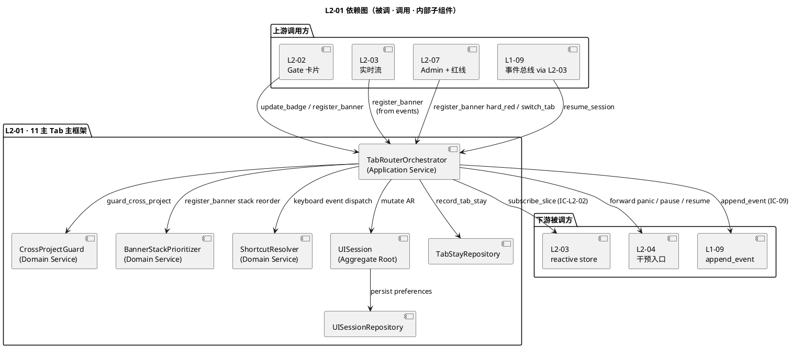
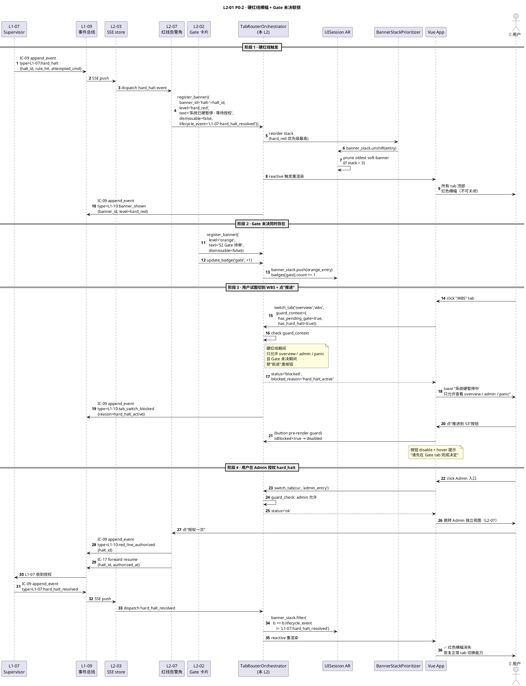
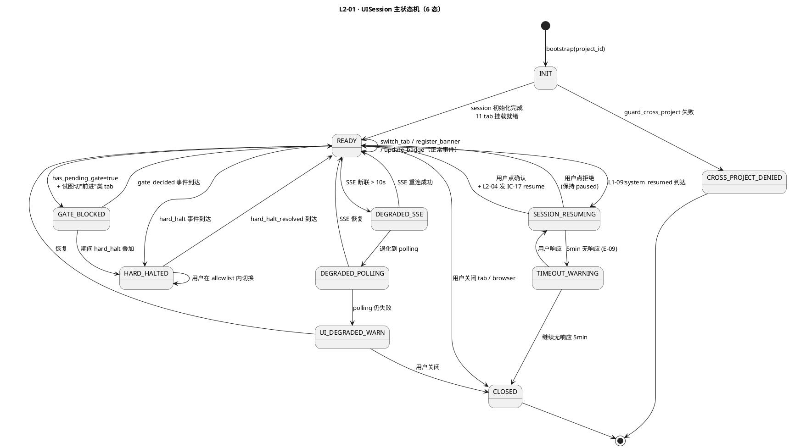
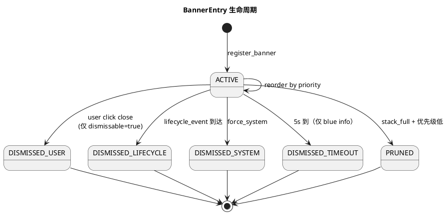
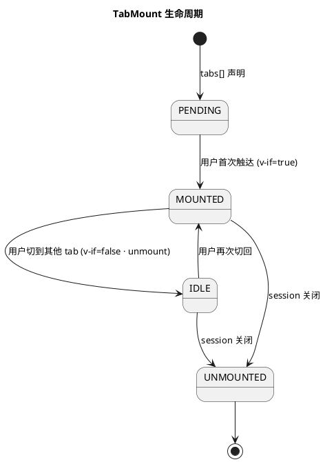

# L1-10 L2-01 · 11 主 Tab 主框架 · Tech Design（depth-B）

> **本文档定位**：3-1-Solution-Technical 层级 · L1-10 的 L2-01 11 主 Tab 主框架 技术实现方案（L2 粒度 · depth-B 字段级填充）。
> **与产品 PRD 的分工**：2-prd/L1-10-人机协作UI/prd.md §5.10 / §8 的对应 L2 节定义产品边界，本文档定义**技术实现**（字段级 YAML schema + 算法伪代码 + 底层数据结构 + 状态机 + 配置参数 + 降级链 + SLO）。
> **与 L1 architecture.md 的分工**：architecture.md 负责**跨 L2 架构 + 跨 L2 时序 + 统一技术栈**，本文档负责**本 L2 内部技术细节**；冲突以 architecture.md 为准。
> **严格规则**：本文档不复述产品 PRD 文字（职责 / 禁止 / 必须等清单），只做技术映射 + 补齐"产品视角未说 but 工程师必须知道"的部分（具体算法 · 系统调用 · schema · 配置 · 误差与失败处理）。

---

## §0 撰写进度

- [x] §1 定位 + 2-prd §5.10 L2-01 映射
- [x] §2 DDD 映射（引 L0/ddd-context-map.md BC-10）
- [x] §3 对外接口定义（字段级 YAML schema + 错误码）
- [x] §4 接口依赖（被谁调 · 调谁）
- [x] §5 P0/P1 时序图（PlantUML ≥ 2 张）
- [x] §6 内部核心算法（伪代码 · 8 个）
- [x] §7 底层数据表 / schema 设计（字段级 YAML · ≥ 3 张 · PM-14 分片）
- [x] §8 状态机（PlantUML + 转换表 · ≥ 6 态）
- [x] §9 开源最佳实践调研（≥ 3 GitHub 高星项目）
- [x] §10 配置参数清单（≥ 8）
- [x] §11 错误处理 + 降级策略（≥ 4 级）
- [x] §12 性能目标（SLO）
- [x] §13 与 2-prd / 3-2 TDD 的映射表 + ADR 锚点（≥ 10）

---

## §1 定位 + 2-prd 映射

### 1.1 本 L2 在 L1-10 人机协作 UI 里的坐标

L1-10 人机协作 UI 由 7 个 L2 组成，**L2-01 是渲染容器底座**（Presentation Plane · Container 层），自身不持有业务状态，只承载路由 / 导航 / 顶部状态栏 / 强提示条 / 未读徽标 / 单项目单 session 边界守则，**所有业务数据来自 L2-03 的响应式 store 切片**、**所有写操作（IC-17）必须委托 L2-04**。本 L2 是其余 6 个 L2 的**渲染容器 + 路由编排器**。

```
  [L2-03 进度实时流]         [L2-04 用户干预入口]
    (SSE store)                 (IC-17 唯一出口)
          ↘                 ↙
           ↘               ↙
            ▼             ▼
  ┌──────────────────────────────────────────┐
  │   L2-01 · 11 主 Tab 主框架（本 L2）      │
  │   (Presentation Container · UISession AR) │
  │                                          │
  │   ┌────────────────────────────────┐     │
  │   │ TabRouter（v-if 懒加载）       │     │
  │   │ TopStatusBar（永驻）           │     │
  │   │ TopBannerStack（事件触发）      │     │
  │   │ BadgeDispatcher（未读徽标）     │     │
  │   │ CrossProjectGuard（访问拦截）  │     │
  │   │ KeyboardShortcut（键盘快捷键）  │     │
  │   └────────────────────────────────┘     │
  │                                          │
  │   11 tab 容器：①总览 ②Gate ③产出物        │
  │   ④进度 ⑤WBS ⑥决策流 ⑦质量              │
  │   ⑧KB ⑨Retro ⑩事件 ⑪Admin 入口         │
  └──────────────────────────────────────────┘
       ↓ 渲染各 tab 内部业务（委托）
  ┌──────────────────────────────────────────┐
  │ L2-02 Gate · L2-05 KB · L2-06 Compliance │
  │ L2-07 Admin（跳转到独立视图）             │
  └──────────────────────────────────────────┘
```

L2-01 的定位 = **"11 Tab 容器底座 · 单项目单 session 硬边界 · 全局心跳 panic 永驻 · 零业务状态 · 零 IC-17 直发"**。

### 1.2 与 2-prd §5.10 L2-01 / §8 的对应映射表

| 2-prd §8 L2-01 小节 | 本文档对应位置 | 技术映射重点 |
|:---|:---|:---|
| §8.1 职责（11 tab 路由骨架） | §1.3 + §2（UISession 聚合根 · Application Service） | v-if 懒加载 + 单 reactive store 单例 |
| §8.2 输入/输出（用户路由 + 顶部状态 + 强提示） | §3（字段级 schema · 14 个公开方法） | 所有 tab 切换写 IC-09 append_event |
| §8.3 边界（In/Out-of-scope） | §1.7 YAGNI + §6 算法内部注释 | 路由守则在 FE，业务在其它 L2 |
| §8.4 硬约束（7 条） | §10 配置参数 + §11 降级链 | 11 tab 不得增减作为编译期断言 |
| §8.5 禁止行为（7 条） | §11 拒绝分支 | 禁直发 IC-17 / 禁持业务 state / 禁跨项目 |
| §8.6 必须职责（7 条） | §6 核心算法 + §7 schema | 每次 tab 切换必 IC-09 审计 |
| §8.7 可选功能（5 条） | §10 feature-flag 配置 | tab 顺序 / 暗黑 / 快捷键均 flag |
| §8.8 IC 契约（IC-L2-02/09/10/11/12） | §3 + §4 依赖图 | 5 IC 字段级 schema |
| §8.9 交付验证（8 场景 GWT） | §13 TDD 映射表 | 8 GWT → 8+ 测试用例 |

### 1.3 本 L2 在 architecture.md 里的坐标

引 `docs/3-1-Solution-Technical/L1-10-人机协作UI/architecture.md`：
- §2.2 BC-10 DDD 原语分类：**L2-01 = Application Service（编排路由）+ Aggregate Root: UISession**
- §6 11 Tab 主 framework 详细布局：§6.1 总览、§6.2 各 tab 布局（11 节）、§6.3 路由机制、§6.4 顶部状态栏、§6.5 顶部强提示条
- §4.6 技术栈反向约束：**不用 Vue Router / Pinia**（V1 硬性）
- §3.4 AD-01 ~ AD-05：五条架构硬约束继承

**本 L2 在 architecture.md 里的关键特征**：

1. **UISession 聚合根 own 者**：ui_session_id + active_project_id + active_tab + user_preferences 为一致性边界；单 session 只持一个 project_id。
2. **Presentation Container 角色**：不持有 Gate / KB / Event 等业务数据，只声明订阅 + 渲染。
3. **零 IC-17 直发**：任何写操作走 L2-04（AD-03 硬约束），本 L2 只发 IC-09 `L1-10:tab_navigated` / `L1-10:ui_action` 这类审计事件。
4. **零 Vue Router**：用 `el-tabs + v-model + v-if` 懒加载（AD-05 零 npm + L0/tech-stack §4.6）。
5. **单 SSE 订阅继承 AD-02**：本 L2 不开 SSE 连接，纯消费 L2-03 的 reactive store。
6. **前端全 CDN**：无 build step，代码片段均直接在 `index.html` 单文件内（architecture §4.2）。

### 1.4 本 L2 的 PM-14 约束

**PM-14 约束**（引 `docs/3-1-Solution-Technical/projectModel/tech-design.md`）：所有 IC payload 顶层 `project_id` 必填；所有存储路径按 `projects/<pid>/...` 分片；跨项目访问必须在入口拦截。

本 L2 在 PM-14 层面的具体落点：
- UI session 持久化（用户偏好 · tab 顺序 · 键位 · 暗黑）：`projects/<pid>/ui/sessions/<session_id>.json`
- 当前活跃 project 缓存：`projects/<pid>/ui/active.json`（cookie / localStorage 镜像）
- tab 停留时长统计：`projects/<pid>/ui/tab-stay/<date>.jsonl`（给 retro）
- 键盘快捷键绑定：`projects/<pid>/ui/keybindings.json`
- 跨项目访问拒绝日志：events.jsonl `L1-10:cross_project_access_denied`（事件总线承接，不单独落盘）

### 1.5 关键技术决策（本 L2 特有 · Decision / Rationale / Alternatives / Trade-off）

| 决策 | 选择 | 备选 | 理由 | Trade-off |
|:---|:---|:---|:---|:---|
| **D1: 路由方案** | `el-tabs + v-model + v-if` | Vue Router / hash-router 手写 | 零 npm / 单 SPA / 懒加载天然 | URL 不带路径锚点（hash 级锚点仍可用） |
| **D2: Store 方案** | Vue 3 `reactive()` 全局单例 | Pinia / Vuex / provide-inject | 单 session 简单场景够 + 零 CDN 引入 | V2 若复杂需升级（升级路径清晰） |
| **D3: v-if 懒 vs v-show 缓存** | v-if 懒加载（首次触达才 mount） | v-show 全渲染 | 首屏 ≤ 500ms · 降低 initial memory | 切换 tab 时首次渲染多 ~50ms（可接受） |
| **D4: 跨项目拦截点** | 前端路由 guard + 后端 `X-Project-Id` header 双层 | 仅前端 / 仅后端 | 前端给用户友好提示 · 后端防地址栏硬改 | 双处实现，但共享同一个 `is_same_project()` 谓词 |
| **D5: Tab 顺序自定义存储** | localStorage + 每 session 同步 `projects/<pid>/ui/sessions/` | cookie / 服务端强制 | 本地立即响应 · 服务端做 backup | 清除 localStorage 丢失自定义（可接受） |
| **D6: 心跳倒计时实现** | Vue reactive `tick_remaining` + `setInterval(1000ms)` | `requestAnimationFrame` / Web Worker | 简单 · 秒级精度够 · 无需 worker 线程 | 浏览器 tab 后台时 throttle 到 ≥ 1s（可接受） |
| **D7: 强提示条栈管理** | `banner_stack[]` 按优先级排序 | 单 banner 挤占 / 叠放 | 硬红线不会被其他事件覆盖 | 同时最多 3 条（UX 限制） |
| **D8: panic 按钮永驻机制** | `position: fixed; z-index: 2147483647`（最大 z-index） | 浮动按钮 + 普通 z-index | 确保任何模态框都不遮挡 | 与 Element Plus 默认 z-index 2000+ 有隔离 |
| **D9: 路由 guard 实现层** | Vue `watch(activeTab, guardFn)` 中间件模式 | `beforeEach` hook（要 Vue Router） | 不引 Vue Router 也能拦 | 需要手写同步拦截逻辑 |
| **D10: tab 间 store 数据共享** | 单 reactive 对象 + per-tab subscription | 每 tab 独立 store | 跨 tab 事件时间轴一致 | 全局 store 大（V1 < 10 MB 可接受） |

### 1.6 本 L2 读者预期

读完本 L2 的工程师应掌握：
- UISession 聚合根的字段级 schema + 14 个公开方法（mount_tab / switch_tab / register_banner / dismiss_banner / update_badge / request_panic / subscribe_slice / guard_cross_project / record_tab_stay / resume_session / toggle_theme / rebind_shortcut / export_preferences / health_check）
- 8 个核心算法（router guard / banner stack / badge dispatch / heartbeat tick / cross-project intercept / tab lifecycle / session resume / preference sync）
- 3 张数据表（UISessionSnapshot / TabStayLog / BannerQueue）+ PM-14 分片约束
- UISession 状态机（6 主状态 · PlantUML）
- 降级链 4 级（FULL → SSE_DEGRADED → POLLING → STATIC_SNAPSHOT）
- SLO（首屏 ≤ 500ms P95 · tab 切换 ≤ 100ms P95 · 心跳 ≤ 1s · banner 显现 ≤ 500ms）
- 3 个对标开源项目（Element Plus Admin / Vue3 Admin / TusenAdmin）

### 1.7 本 L2 不在的范围（YAGNI）

- **不在**：各 tab 内部业务视图（Gate 详情 / KB 树 / Admin 9 模块）—— L2-02 / L2-05 / L2-07 各自负责
- **不在**：SSE 连接建立 + 事件分发 —— L2-03 责任（本 L2 只 read reactive store）
- **不在**：IC-17 用户意图 payload 构造 + schema 校验 —— L2-04 责任（本 L2 只转发 click 事件）
- **不在**：裁剪档选择 modal —— L2-06 责任（L2-01 在 S1/S2 前置时挂载它）
- **不在**：Admin 9 模块实现 —— L2-07 责任（L2-01 只做跳转入口 + 未读数徽标）
- **不在**：登录 / 权限鉴权（V1 单用户本地） —— 未来（V2+）
- **不在**：跨项目切换 UI（V1-V2 单项目） —— Goal §6.11 / V2+ 规划
- **不在**：离线模式 / Service Worker 缓存 —— V2+
- **不在**：多语言 i18n —— V1 只中文，V2+ 可加

### 1.8 本 L2 术语表

| 术语 | 定义 | 关联 |
|:---|:---|:---|
| **UISession** | 单浏览器 session 的聚合根（ui_session_id + active_project_id + active_tab + prefs） | §2.1 |
| **TabRoute** | 单个 tab 的路由值对象（tab_id + title + icon + component + badge） | §2.3 |
| **BannerEntry** | 顶部强提示条值对象（banner_id + level + text + dismissable + lifecycle） | §2.3 |
| **BadgeCounter** | 未读徽标值对象（tab_id + count + color + last_updated） | §2.3 |
| **HeartbeatState** | 主 loop 心跳快照（tick_remaining_sec + state_color + last_decision_at） | §2.3 |
| **CrossProjectGuard** | 跨项目访问拦截器（Domain Service） | §2.4 |
| **TabLifecycle** | 单 tab 的 mount → active → idle → unmount 生命周期 | §8 状态机 |
| **PreferenceBundle** | 用户偏好的完整快照（tab_order / theme / keybindings） | §7 schema |
| **11-tab-Contract** | 11 tab 数量固定的编译期不变量（§10 CFG-01 断言） | §11 |

### 1.9 本 L2 的 DDD 定位一句话

> **"UISession 聚合根拥有 active_project_id 和 active_tab 一致性边界；L2-01 是 Presentation Container 的 Application Service，唯一职责是编排 11 tab 路由 + 分发强提示条 + 守护单项目边界 + 保证 panic 永驻；不持有任何业务聚合（业务在其它 L2），不直发任何写 IC（写走 L2-04），不自订事件总线（读走 L2-03 的 store 切片）。"**

---

## §2 DDD 映射（BC-10）

### 2.1 Bounded Context · BC-10 Human-Agent Collaboration UI

引 `docs/3-1-Solution-Technical/L0/ddd-context-map.md §2.11` + architecture.md §2.1：

| DDD 要素 | L2-01 具体值 |
|:---|:---|
| **Bounded Context 名称** | BC-10 · Human-Agent Collaboration UI（L2-01 在其内） |
| **Aggregate Root** | `UISession`（本 L2 own · 对外暴露唯一一致性边界） |
| **Entity** | 无（UISession 本身即 AR；其它值对象都 by-value） |
| **Value Object** | `TabRoute` / `BannerEntry` / `BadgeCounter` / `HeartbeatState` / `PreferenceBundle` / `KeyboardBinding` / `TabStayRecord` |
| **Domain Service** | `CrossProjectGuard` / `BannerStackPrioritizer` / `ShortcutResolver` |
| **Application Service** | `TabRouterOrchestrator`（本 L2 主入口 · 编排 14 个公开方法） |
| **Repository** | `UISessionRepository`（仅前端 localStorage + 后端 ui/sessions/）· `TabStayRepository`（后端 only） |
| **Domain Events（产出）** | `L1-10:tab_navigated` / `L1-10:cross_project_access_denied` / `L1-10:banner_shown` / `L1-10:banner_dismissed` / `L1-10:panic_requested` / `L1-10:theme_toggled` / `L1-10:shortcut_triggered` |
| **Open Host Service 消费** | L1-09 `append_event` schema（事件审计）· L2-03 reactive store 切片声明协议 |
| **Published Language 对外** | tab_navigation_protocol（本 L2 对其他 L2 发布的路由协议 + 生命周期钩子契约） |

### 2.2 UISession 聚合根一致性边界（Entity / AR 定义）

**UISession** 是 L2-01 的唯一聚合根（与 L2-02 的 GateCard / L2-04 的 InterventionIntent 并列为 BC-10 的三个 AR · 引 ddd-context-map §2.11）。其一致性边界：

```yaml
# UISession 聚合根字段（字段级 · 下文 §7.1 有完整 schema）
ui_session_id: string  # 单浏览器 session 唯一 ID（浏览器 tab 打开时生成）
project_id: string     # PM-14 项目上下文 · 锁定后不可变（除非重开 session）
active_tab: enum       # 当前激活的 tab · ∈ {overview, gate, artifacts, progress, wbs, decision_flow, quality, kb, retro, events, admin_entry}
tabs: TabRoute[]       # 11 tab 的完整清单（11 个固定 · §10 CFG-01）
banner_stack: BannerEntry[]    # 顶部强提示条栈（按 level 优先级排序）
badges: BadgeCounter[]         # 每 tab 未读徽标
heartbeat: HeartbeatState      # 心跳快照
preferences: PreferenceBundle  # 用户偏好（tab 顺序 / 暗黑 / 键盘）
created_at: iso8601
last_active_at: iso8601
```

**一致性保证**：
- `project_id` 在 session 生命周期内不可变（跨项目必须重开 session）。
- `tabs.length == 11` 编译期断言（CFG-01）；运行期若数组长度 ≠ 11 抛 `UI_CONTRACT_VIOLATION`。
- `active_tab` 必须 ∈ `tabs[].id`（enum 断言）。
- `banner_stack` 最多 3 条（超出 pop oldest 非-hard · hard 级常驻）。
- `heartbeat.tick_remaining_sec` 每秒 -1，到达 0 时切换颜色。

### 2.3 Value Object 族

| VO | 字段摘要 | 不变量 |
|:---|:---|:---|
| **TabRoute** | tab_id / title / icon / component_name / badge_enabled / order | tab_id ∈ 11 枚举值之一 |
| **BannerEntry** | banner_id / level(hard_red/soft_red/orange/yellow/green/blue) / text / dismissable / lifecycle_event / created_at | hard_red 不可关闭 |
| **BadgeCounter** | tab_id / count(≥0) / color / last_updated | count < 0 非法 |
| **HeartbeatState** | tick_remaining_sec / state_color(green/yellow/red/grey) / last_decision_at / state_label(S1..S7/CLOSED/PANIC) | state_color 由 tick_remaining_sec 决定 |
| **PreferenceBundle** | tab_order[11] / theme(light/dark/auto) / keybindings / show_top_bar_compact | tab_order 是 11 enum 值的置换 |
| **KeyboardBinding** | action / keys[] / tab_id | action ∈ 预定义 action 集 |
| **TabStayRecord** | tab_id / entered_at / exited_at / duration_ms | duration_ms = exited - entered |

### 2.4 Domain Service

| Domain Service | 职责 | 输入 | 输出 |
|:---|:---|:---|:---|
| **CrossProjectGuard** | 判断用户尝试访问的 project 是否 == 当前 active_project_id | (requested_project_id, current_project_id) | boolean (allow/deny) + 拒绝理由 |
| **BannerStackPrioritizer** | 对 banner_stack 按 level 重排序 + 去重 + 超额淘汰 | banner_stack + new_entry | reordered stack |
| **ShortcutResolver** | 把键盘事件映射到 tab_id / action | KeyboardEvent | action 或 null |

### 2.5 BC-10 跨 BC 关系（L2-01 具体视角）

| 对端 BC / L1 | 关系 | L2-01 交互点 | IC |
|:---|:---|:---|:---|
| **BC-09 L1-09 事件总线** | Customer（读）+ 审计合作（写） | 订阅所有 `L1-*:*` 事件（via L2-03 store） | IC-09 append_event |
| **BC-01 L1-01 主 Agent** | Customer-Supplier（间接 via L2-04） | panic / pause / resume 转发 | IC-17（L2-04 代发） |
| **BC-02 L1-02 生命周期** | Customer | 订阅 `L1-02:stage_*` 更新 state 条 | - |
| **BC-07 L1-07 Supervisor** | Customer | 订阅 `L1-07:hard_halt` 推顶部红条 | - |

**L2-01 与 BC-10 内 6 个兄弟 L2 的关系**：

| 兄弟 L2 | 关系 | 交互方向 |
|:---|:---|:---|
| L2-02 Gate 卡片 | L2-01 作为容器渲染 Gate tab 内 | L2-02 向 L2-01 推未读徽标 + 顶部横幅 |
| L2-03 实时流 | L2-01 订阅其 store 切片 | IC-L2-02（L2-01 调用）+ IC-L2-12（L2-03 推） |
| L2-04 干预入口 | L2-01 渲染顶部按钮 | L2-04 处理 click 事件 |
| L2-05 KB 浏览器 | L2-01 作为容器渲染 KB tab 内 | - |
| L2-06 裁剪档配置 | L2-01 在 S1/S2 前置时挂载 modal | L2-06 完成后关闭 modal |
| L2-07 Admin | L2-01 提供跳转入口（不是 tab） | L2-07 向 L2-01 推红线未读数 |

---

## §3 对外接口定义（字段级 YAML schema + 错误码）

### 3.1 Application Service `TabRouterOrchestrator` 暴露的 14 个方法

> 所有方法 payload 顶层 `project_id` 必填（PM-14）；所有方法调用走 FastAPI `/api/ui/*` REST + 前端 reactive store 镜像。

---

#### 3.1.1 `mount_tab(tab_id, component_ref) → MountResult`

**语义**：前端 tab 组件在 `mounted` 钩子中调用，声明订阅 store 切片并加入 UISession。

**入参 schema**：
```yaml
project_id: string  # PM-14 项目上下文
tab_id: enum        # ∈ {overview, gate, artifacts, progress, wbs, decision_flow, quality, kb, retro, events, admin_entry}
component_ref: string  # Vue 组件名（用于 devtools 识别）
required_slices: string[]  # 声明需要的 store 切片 ID（如 ['decision_store','wbs_store']）
mount_seq: int      # 挂载序号（用于并发 mount 去重）
```

**出参 schema**：
```yaml
mount_result:
  status: enum  # ok / duplicate / contract_violation
  subscribed_slice_ids: string[]
  initial_badge: int  # 该 tab 的当前未读数
  initial_banner_ids: string[]  # 挂载时已在显示的 banner
  ts: iso8601
```

**错误码**：见 §3.3 错误码 E-01 / E-02 / E-10

---

#### 3.1.2 `switch_tab(from_tab, to_tab, trigger) → SwitchResult`

**语义**：用户点击 tab / 快捷键 / programmatic 调用，切换当前激活 tab。

**入参 schema**：
```yaml
project_id: string  # PM-14 项目上下文
from_tab: enum      # 当前 tab
to_tab: enum        # 目标 tab
trigger: enum       # click / shortcut / programmatic / session_resume
guard_context:
  has_pending_gate: bool   # Gate 未决时禁止"前进"类 tab（scope §5.10.6 义务 4）
  has_hard_halt: bool      # 硬红线期间限制跳转（仅允许 overview / admin / panic）
```

**出参 schema**：
```yaml
switch_result:
  status: enum  # ok / blocked / cross_project / invalid_tab
  active_tab: enum  # 切换后 active_tab（若 blocked 仍是 from_tab）
  blocked_reason: string  # 若 status=blocked
  elapsed_ms: int   # 切换耗时（目标 ≤ 100ms P95）
  recorded_event_id: string  # IC-09 append_event 的 event_id
```

**错误码**：E-03 / E-04 / E-10

---

#### 3.1.3 `register_banner(entry) → BannerRegisterResult`

**语义**：外部 L2（如 L2-02 / L2-07）向 L2-01 顶部 banner_stack 注入一条强提示。

**入参 schema**：
```yaml
project_id: string  # PM-14 项目上下文
entry:
  banner_id: string  # 幂等键
  level: enum        # hard_red / soft_red / orange / yellow / green / blue
  text: string       # ≤ 200 字
  dismissable: bool  # false 对 hard_red 必须 false
  lifecycle_event: string  # 可选 · 接收此事件时自动 dismiss
  action_url: string       # 可选 · 点击跳转（如 "gate" tab）
```

**出参 schema**：
```yaml
register_result:
  status: enum  # ok / duplicate / stack_full / contract_violation
  stack_position: int  # 当前栈内位置（0 = 最上）
  ts: iso8601
```

**错误码**：E-05 / E-10 / E-11

---

#### 3.1.4 `dismiss_banner(banner_id) → DismissResult`

**语义**：用户点关闭 / lifecycle_event 到达 / 系统强制。

**入参 schema**：
```yaml
project_id: string  # PM-14 项目上下文
banner_id: string
reason: enum  # user_click / lifecycle_event / force_system / timeout
```

**出参 schema**：
```yaml
dismiss_result:
  status: enum  # ok / not_found / not_dismissable
  remaining_count: int
```

**错误码**：E-05 / E-12

---

#### 3.1.5 `update_badge(tab_id, count_delta) → BadgeResult`

**语义**：其他 L2 向某 tab 推未读徽标 +N / -N。

**入参 schema**：
```yaml
project_id: string  # PM-14 项目上下文
tab_id: enum
count_delta: int  # 可正可负 · 最终 count 不得 < 0
color: enum       # red / orange / green / blue（若 null 沿用默认）
reason: string    # 审计用
```

**出参 schema**：
```yaml
badge_result:
  status: enum  # ok / clamped_to_zero / invalid_tab
  new_count: int
  new_color: string
```

**错误码**：E-06 / E-10

---

#### 3.1.6 `request_panic() → PanicResult`

**语义**：用户点 panic 按钮。本 L2 不直接发 IC-17，只转发到 L2-04。

**入参 schema**：
```yaml
project_id: string  # PM-14 项目上下文
ui_session_id: string
source_tab: enum
confirm_token: string  # 二次确认 modal 的签名（防误点）
```

**出参 schema**：
```yaml
panic_result:
  status: enum  # forwarded / pending_confirm / rejected
  intent_id: string   # 由 L2-04 分配
  accepted_at: iso8601
```

**错误码**：E-13 / E-14

---

#### 3.1.7 `subscribe_slice(slice_ids[]) → SubscribeResult`

**语义**：tab 组件声明订阅 store 切片（调用 L2-03 的 IC-L2-02）。

**入参 schema**：
```yaml
project_id: string  # PM-14 项目上下文
slice_ids: string[]
subscriber: string  # 组件名
```

**出参 schema**：
```yaml
subscribe_result:
  status: enum  # ok / unknown_slice
  subscription_ids: string[]
```

**错误码**：E-15

---

#### 3.1.8 `guard_cross_project(requested_pid) → GuardResult`

**语义**：前端路由 guard + 后端中间件双层调用。

**入参 schema**：
```yaml
project_id: string  # PM-14 项目上下文 · 即 current_active_project_id
requested_pid: string
requester:
  source: enum  # url_change / api_header / programmatic
  user_agent: string
```

**出参 schema**：
```yaml
guard_result:
  status: enum  # allow / deny
  deny_reason: string  # "cross_project_access" / "unknown_project"
  recorded_event_id: string  # 拒绝时写 L1-10:cross_project_access_denied
```

**错误码**：E-07

---

#### 3.1.9 `record_tab_stay(tab_id, duration_ms) → RecordResult`

**语义**：tab unmount / switch 时回写停留时长（给 retro）。

**入参 schema**：
```yaml
project_id: string  # PM-14 项目上下文
tab_id: enum
entered_at: iso8601
exited_at: iso8601
duration_ms: int  # exited - entered
```

**出参 schema**：
```yaml
record_result:
  status: enum  # ok / too_short / too_long_suspicious
  persisted_path: string  # projects/<pid>/ui/tab-stay/<date>.jsonl
```

**错误码**：E-08

---

#### 3.1.10 `resume_session(snapshot) → ResumeResult`

**语义**：接到 `L1-09:system_resumed` 时调用，弹出恢复 modal + 禁用"前进"按钮。

**入参 schema**：
```yaml
project_id: string  # PM-14 项目上下文
snapshot:
  last_state: enum   # S1..S7
  last_tab: enum
  last_decision_at: iso8601
  pending_gates: int
```

**出参 schema**：
```yaml
resume_result:
  status: enum  # modal_shown / user_confirmed / user_rejected
  user_action_at: iso8601
```

**错误码**：E-09

---

#### 3.1.11 `toggle_theme(theme) → ThemeResult`

**语义**：用户切换暗黑 / 浅色 / 跟随系统。

**入参 schema**：
```yaml
project_id: string  # PM-14 项目上下文
theme: enum  # light / dark / auto
```

**出参 schema**：
```yaml
theme_result:
  status: enum  # ok
  active_theme: enum
  preferences_persisted_at: iso8601
```

**错误码**：E-16

---

#### 3.1.12 `rebind_shortcut(action, keys) → RebindResult`

**语义**：用户自定义键盘快捷键。

**入参 schema**：
```yaml
project_id: string  # PM-14 项目上下文
action: enum  # switch_to_overview / switch_to_gate / ... / panic
keys: string[]  # 如 ['Ctrl', 'Shift', 'G']
```

**出参 schema**：
```yaml
rebind_result:
  status: enum  # ok / conflict / invalid_keys
  conflicting_action: string  # 若 conflict
```

**错误码**：E-16 / E-17

---

#### 3.1.13 `export_preferences() → ExportResult`

**语义**：导出用户偏好 JSON（给 retro / 迁移）。

**入参 schema**：
```yaml
project_id: string  # PM-14 项目上下文
include_tab_stay: bool  # 是否含停留统计
```

**出参 schema**：
```yaml
export_result:
  status: enum  # ok
  json_blob: string  # PreferenceBundle + 可选 TabStayRecord[]
  byte_size: int
```

**错误码**：E-16

---

#### 3.1.14 `health_check() → HealthResult`

**语义**：前端定时调用（30s），检查本 L2 自身健康 + 汇报给 L2-07 Admin 诊断模块。

**入参 schema**：
```yaml
project_id: string  # PM-14 项目上下文
```

**出参 schema**：
```yaml
health_result:
  status: enum  # healthy / degraded / unhealthy
  checks:
    - name: reactive_store_alive
      ok: bool
    - name: sse_subscription_alive
      ok: bool
    - name: tab_contract_11
      ok: bool
    - name: banner_stack_size
      ok: bool
      value: int
    - name: heartbeat_freshness
      ok: bool
      last_decision_age_sec: int
  ts: iso8601
```

**错误码**：无（健康自报，不抛异常）

---

### 3.2 错误码表（完整 · ≥ 12 条）

| 错误码 | 错误名 | 触发场景 | HTTP status | 调用方处理 |
|:---|:---|:---|:---:|:---|
| **E-01** | `UI_TAB_NOT_REGISTERED` | mount_tab 的 tab_id 不在 11 枚举 | 400 | 升级前端，断言 CFG-01 |
| **E-02** | `UI_DUPLICATE_MOUNT` | 同 session 同 tab_id 二次 mount | 409 | 忽略（已挂载） |
| **E-03** | `UI_SWITCH_BLOCKED_BY_GATE` | Gate 未决期间点"前进"类 tab | 409 | toast 提示用户先去 Gate tab |
| **E-04** | `UI_SWITCH_BLOCKED_BY_HALT` | 硬红线期间点非允许 tab | 409 | toast 提示硬红线已阻塞 |
| **E-05** | `UI_BANNER_NOT_DISMISSABLE` | 试图 dismiss 硬红线 banner | 403 | toast 解释（唯一路径是 hard_halt_resolved） |
| **E-06** | `UI_BADGE_INVALID_DELTA` | badge count_delta 导致 count < 0 | 400 | clamp 到 0 |
| **E-07** | `UI_CROSS_PROJECT_DENIED` | 访问的 pid ≠ active_pid | 403 | 跳 landing 页提示"重开 session" |
| **E-08** | `UI_TAB_STAY_MALFORMED` | entered_at ≥ exited_at 或 duration > 24h | 400 | 丢弃本条 record |
| **E-09** | `UI_RESUME_MODAL_TIMEOUT` | 用户 5min 未响应恢复 modal | 408 | 自动重连 + banner 提示 |
| **E-10** | `UI_CONTRACT_VIOLATION` | 11 tab 数量 ≠ 11 / active_tab 不在 enum | 500 | crash report + 降级到 static snapshot |
| **E-11** | `UI_BANNER_STACK_FULL` | banner_stack > 3 条 | 429 | 淘汰最老 soft 级 banner |
| **E-12** | `UI_BANNER_NOT_FOUND` | dismiss 一个不存在的 banner_id | 404 | 忽略（幂等） |
| **E-13** | `UI_PANIC_PENDING_CONFIRM` | panic 未确认 | 202 | 前端弹二次确认 modal |
| **E-14** | `UI_PANIC_FORWARD_FAILED` | L2-04 转发失败 | 502 | 重试 3 次 + banner 警告 |
| **E-15** | `UI_UNKNOWN_SLICE` | subscribe 一个不存在的 slice_id | 400 | 前端告警（升级 bug） |
| **E-16** | `UI_PREFERENCE_PERSIST_FAILED` | localStorage 满 / 后端写失败 | 507 | 仅内存生效 + banner 警告 |
| **E-17** | `UI_SHORTCUT_CONFLICT` | 新键位与既有绑定冲突 | 409 | 提示用户重选 |

### 3.3 错误码的幂等 / 重试语义

| 错误码 | 幂等 | 重试策略 | 上报审计 |
|:---|:---:|:---|:---:|
| E-01 / E-10 | ✅ | 不重试（编译期问题） | ✅ |
| E-02 | ✅ | 不重试（已成功） | ❌ |
| E-03 / E-04 | ✅ | 等条件解除后用户自主重试 | ✅ |
| E-05 | ✅ | 不重试 | ❌ |
| E-06 | ✅ | clamp 后仍上报 | ✅ |
| E-07 | ✅ | 不重试（硬边界） | ✅（必审计） |
| E-08 | ✅ | 不重试（丢弃） | ✅ |
| E-09 | ❌ | 自动重试 1 次后弹 banner | ✅ |
| E-11 | ✅ | 淘汰后重试一次 | ❌ |
| E-12 | ✅ | 不重试（幂等 dismiss） | ❌ |
| E-13 | ❌ | 等待确认 | ❌ |
| E-14 | ❌ | 退避重试 3 次（1s / 2s / 4s） | ✅ |
| E-15 | ✅ | 不重试（前端 bug） | ✅ |
| E-16 | ❌ | 重试 1 次后降级到内存 | ✅ |
| E-17 | ✅ | 让用户重选 | ❌ |

---

## §4 接口依赖（被谁调 · 调谁）

### 4.1 依赖概览

| 角色 | L1 / L2 | 何时 | 调用的本 L2 方法 |
|:---|:---|:---|:---|
| **上游调用方（本 L2 被调）** | | | |
| L2-02 Gate 卡片 | 新 Gate 卡到达 | `update_badge(gate, +1)` + `register_banner(orange, 'S2 Gate 待审')` |
| L2-03 实时流 | 事件到达且需推 banner | `register_banner(...)` |
| L2-07 红线告警 | 硬红线事件 | `register_banner(hard_red, ...)` |
| L2-07 Admin 跳转 | 点击 Admin 入口 | `switch_tab(active, admin_entry)` |
| L1-09 事件总线（via L2-03） | `L1-09:system_resumed` | `resume_session(snapshot)` |
| **下游被调方（本 L2 调）** | | | |
| L2-03 实时流 | tab mount 时 | IC-L2-02 `subscribe_slice(...)` |
| L2-04 干预入口 | 用户 panic | 转发（内部函数 `forward_to_l204()`，最终 IC-17） |
| L1-09 事件总线 | 每次 tab 切换 / ui_action | IC-09 `append_event(type='L1-10:tab_navigated' / 'L1-10:ui_action')` |

### 4.2 依赖图（PlantUML）



### 4.3 本 L2 不依赖的（明确排除）

- ❌ 不依赖 L2-05 KB 浏览器 / L2-06 裁剪档 / L2-07 Admin 9 模块的**业务实现**（只做 mount point）
- ❌ 不依赖任何持久化 DB（本 L2 只写 jsonl + localStorage）
- ❌ 不依赖 Vue Router / Pinia / Pinia-plugin-persistedstate（D1/D2 硬拒绝）
- ❌ 不依赖 WebSocket（继承 AD-02 + architecture §8.6）
- ❌ 不依赖 IC-17 直发（AD-03）
- ❌ 不依赖 task-board / KB / failure-archive 写入（AD-04）

---

## §5 P0/P1 时序图（PlantUML ≥ 2 张）

### 5.1 时序图 1（P0） · 首次加载 11 Tab 骨架 + 路由挂载 + store 订阅

**场景**（2-prd §8.9 正向场景 1）：浏览器访问 `localhost:8765` · 有当前 project · state=S4 · 全 11 tab 首屏渲染 ≤ 500ms。

```plantuml
@startuml
autonumber
title L2-01 P0-1 · 首次加载 11 Tab 骨架

actor "👤 用户" as User
participant "浏览器\nindex.html" as Browser
participant "Vue App\n(setup)" as Vue
participant "TabRouterOrchestrator\n(本 L2 入口)" as ORC
participant "UISession AR\n(reactive)" as UIS
participant "L2-03 reactive store" as L203
participant "FastAPI\nbackend" as FAPI
participant "L1-09\n事件总线" as L109

User -> Browser: 访问 localhost:8765
Browser -> Vue: 加载 index.html + CDN
Vue -> ORC: bootstrap(project_id)

ORC -> FAPI: GET /api/ui/session/init\n{project_id}
FAPI -> FAPI: CrossProjectGuard.check()\n（后端双层拦截）
FAPI -> FAPI: load preferences from\nprojects/<pid>/ui/sessions/
FAPI --> ORC: 200 OK\n{ui_session_id, preferences,\n tab_order, heartbeat}

ORC -> UIS: new UISession({\n  ui_session_id, project_id,\n  active_tab='overview',\n  tabs: FIXED_11_TABS,\n  preferences})
UIS -> UIS: assert tabs.length == 11\n（CFG-01 断言）

par 并行建立订阅
    ORC -> L203: subscribe_slice(['heartbeat_slice'])\n(IC-L2-02)
    L203 --> ORC: subscription_id_1
and
    ORC -> L203: subscribe_slice(['banner_events'])
    L203 --> ORC: subscription_id_2
and
    ORC -> L203: subscribe_slice(['badge_updates'])
    L203 --> ORC: subscription_id_3
end

Vue -> Vue: render <el-tabs>\n（11 个 el-tab-pane · v-if 懒）
Note over Vue: v-if='activeTab == tab.id'\n只 mount 'overview'\n其他 10 个延迟 mount

Vue -> ORC: mount_tab('overview', OverviewPanel)
ORC -> UIS: tabs[0].mounted = true

Vue --> Browser: DOM 渲染完成\n（目标 ≤ 500ms P95）

ORC -> FAPI: POST /api/events\n{type:'L1-10:ui_session_started',\n project_id, ui_session_id}
FAPI -> L109: IC-09 append_event

Browser -> User: ✅ 11 tab 可见\n顶部状态栏:\n  项目名 · state=S4 · 💗 tick 30s\n  panic 按钮可点

== 用户点 WBS tab ==

User -> Browser: click "WBS"
Browser -> ORC: switch_tab('overview','wbs',trigger='click')

ORC -> ORC: guard_check(\n  has_pending_gate=false,\n  has_hard_halt=false)
ORC -> UIS: active_tab := 'wbs'
Vue -> Vue: v-if 激活 WBS tab\nmount WBSPanel

Vue -> ORC: mount_tab('wbs', WBSPanel,\n  required_slices=['wbs_store'])
ORC -> L203: subscribe_slice(['wbs_store'])
L203 --> ORC: subscription_id

ORC -> FAPI: POST /api/events\n{type:'L1-10:tab_navigated',\n from:'overview', to:'wbs',\n trigger:'click'}
FAPI -> L109: IC-09 append_event

Browser --> User: ✅ WBS DAG 渲染（≤ 100ms）

@enduml
```

**关键时延断言**：

| 环节 | 目标 | 约束来源 |
|:---|:---:|:---|
| GET /api/ui/session/init | ≤ 100ms | 纯本地读文件 |
| UISession 聚合根构造 + 11 tab 断言 | ≤ 50ms | §10 CFG-01 |
| Vue 首次渲染（v-if 只挂 overview） | ≤ 300ms | architecture §6.3 |
| 顶部状态栏 + 心跳建立 | ≤ 500ms | 2-prd §8.9 场景 1 |
| tab 切换 mount | ≤ 100ms | 2-prd §8.9 场景 2（数据已预加载） |
| IC-09 append_event | 异步 fire-and-forget | 不阻塞 UI 主线程 |

### 5.2 时序图 2（P0） · 硬红线横幅注入 + Gate 未决禁前进

**场景**（2-prd §8.9 集成场景 5/6）：L1-07 产 `hard_halt` 事件 → L2-07 向 L2-01 注入红条 → 同时 Gate 未决禁用"前进"按钮 → 用户最终授权 hard_halt_resolved 清除。



**关键时延断言**：

| 环节 | 目标 | 约束来源 |
|:---|:---:|:---|
| SSE event → Banner 显示 | ≤ 500ms | 2-prd §8.4 性能约束 4 |
| register_banner hard_red 不可被 soft 淘汰 | 常驻 | architecture §6.5 · 2-prd §8.4 硬约束 6 |
| Gate 未决 → "前进"按钮 disable | 即时 reactive | 2-prd §8.6 必须 5 |
| hard_halt_resolved → banner 移除 | ≤ 500ms | SSE 延迟 |

---

## §6 内部核心算法（伪代码 · 8 个）

### 6.1 算法 1 · 主循环 `TabRouterOrchestrator.bootstrap`

```python
# TabRouterOrchestrator.bootstrap(project_id: str) → UISession
def bootstrap(project_id: str) -> UISession:
    """
    L2-01 的入口。在 Vue setup() 中调用一次。
    职责：加载偏好、构造 UISession、订阅 store、初始 mount overview tab。
    """
    # 1. 后端双层跨项目 guard（防地址栏硬改）
    resp = GET(f"/api/ui/session/init?project_id={project_id}")
    if resp.status == 403:
        redirect_to_landing_page("cross_project_access_denied")
        raise UICrossProjectDenied(resp.deny_reason)

    # 2. 从后端载入偏好（localStorage 若存在则优先）
    prefs_local = localStorage.get(f"ui_prefs_{project_id}")
    prefs_remote = resp.preferences
    prefs = merge_preferences(prefs_local, prefs_remote)

    # 3. 构造 UISession AR（含 11 tab 断言）
    session = UISession(
        ui_session_id=resp.ui_session_id,
        project_id=project_id,  # PM-14 锁定
        active_tab=prefs.default_tab or 'overview',
        tabs=FIXED_11_TABS,  # 编译期常量
        preferences=prefs,
        banner_stack=[],
        badges={tab.id: BadgeCounter(0) for tab in FIXED_11_TABS},
        heartbeat=HeartbeatState(tick_remaining_sec=30, state_color='green'),
    )
    # CFG-01 编译期 + 运行期双重断言
    assert len(session.tabs) == 11, "UI_CONTRACT_VIOLATION: tabs must be 11"
    assert session.active_tab in [t.id for t in session.tabs]

    # 4. 订阅 L2-03 的核心 slice（全 session 生命周期）
    ORC.subscribe_slice([
        'heartbeat_slice',    # 心跳 → 顶部状态栏
        'banner_events',      # SSE 推来的 banner 注入
        'badge_updates',      # 各 tab 未读数
        'session_lifecycle',  # session_resumed / degradation_triggered
    ])

    # 5. 启动心跳 tick 协程（见 6.4）
    start_heartbeat_tick(session)

    # 6. 启动键盘监听（见 6.8）
    install_keyboard_listener(session)

    # 7. 写入 session_started 审计
    post_audit_event('L1-10:ui_session_started', {
        'project_id': project_id,
        'ui_session_id': session.ui_session_id,
    })

    return session
```

### 6.2 算法 2 · `switch_tab` 路由 guard 中间件

```python
def switch_tab(session: UISession,
               from_tab: str, to_tab: str,
               trigger: str = 'click') -> SwitchResult:
    """
    核心路由拦截算法。先走 guard，后切 active_tab。
    """
    t_start = time.monotonic_ms()

    # 1. 基础断言
    if to_tab not in [t.id for t in session.tabs]:
        return SwitchResult(status='invalid_tab',
                            blocked_reason=f'unknown tab {to_tab}')

    # 2. 硬红线期间的 tab 白名单
    if session.has_active_banner(level='hard_red'):
        HARD_HALT_ALLOWLIST = {'overview', 'admin_entry'}
        if to_tab not in HARD_HALT_ALLOWLIST:
            post_audit_event('L1-10:tab_switch_blocked',
                             {'reason': 'hard_halt_active', 'to': to_tab})
            return SwitchResult(status='blocked',
                                blocked_reason='hard_halt_active')

    # 3. Gate 未决 → 禁"前进"类 tab
    FORWARD_TABS = {'artifacts', 'wbs', 'quality'}  # 示例子集
    if session.has_pending_gate() and to_tab in FORWARD_TABS:
        post_audit_event('L1-10:tab_switch_blocked',
                         {'reason': 'pending_gate', 'to': to_tab})
        return SwitchResult(status='blocked',
                            blocked_reason='pending_gate')

    # 4. 记录 from_tab 停留
    if from_tab and session.tab_enter_at.get(from_tab):
        duration_ms = now_ms() - session.tab_enter_at[from_tab]
        if 100 <= duration_ms <= 24 * 3600_000:
            record_tab_stay(session.project_id, from_tab, duration_ms)

    # 5. 正式切换
    session.active_tab = to_tab
    session.tab_enter_at[to_tab] = now_ms()
    session.last_active_at = iso8601_now()

    # 6. 写 IC-09 审计
    event_id = post_audit_event('L1-10:tab_navigated', {
        'project_id': session.project_id,
        'from': from_tab, 'to': to_tab,
        'trigger': trigger,
        'ts': iso8601_now(),
    })

    elapsed_ms = time.monotonic_ms() - t_start
    if elapsed_ms > 100:
        post_audit_event('L1-10:slow_tab_switch',
                         {'elapsed_ms': elapsed_ms, 'to': to_tab})

    return SwitchResult(status='ok', active_tab=to_tab,
                        elapsed_ms=elapsed_ms, recorded_event_id=event_id)
```

### 6.3 算法 3 · `register_banner` + BannerStackPrioritizer

```python
LEVEL_PRIORITY = {'hard_red': 100, 'soft_red': 80, 'orange': 60,
                  'yellow': 40, 'green': 20, 'blue': 10}
MAX_STACK = 3

def register_banner(session: UISession,
                    entry: BannerEntry) -> BannerRegisterResult:
    # 1. 幂等：同 banner_id 已在栈中 → 不重复
    if any(b.banner_id == entry.banner_id for b in session.banner_stack):
        return BannerRegisterResult(status='duplicate')

    # 2. 强制规则：hard_red 必须不可 dismiss
    if entry.level == 'hard_red' and entry.dismissable:
        raise UIContractViolation(
            "hard_red banner must have dismissable=False")

    # 3. 插入 + 按优先级排序
    session.banner_stack.append(entry)
    session.banner_stack.sort(
        key=lambda b: (-LEVEL_PRIORITY[b.level], b.created_at))

    # 4. 超限淘汰：优先淘汰优先级低的、可关闭的、最老的
    while len(session.banner_stack) > MAX_STACK:
        candidate = None
        for b in reversed(session.banner_stack):
            if b.dismissable and b.level not in ('hard_red', 'soft_red'):
                candidate = b
                break
        if candidate:
            session.banner_stack.remove(candidate)
            post_audit_event('L1-10:banner_auto_pruned',
                             {'banner_id': candidate.banner_id})
        else:
            # 全是 hard/soft red → 不能淘汰，返回 stack_full
            session.banner_stack.remove(entry)  # 回滚
            return BannerRegisterResult(status='stack_full')

    # 5. 审计 + 返回
    post_audit_event('L1-10:banner_shown', {
        'banner_id': entry.banner_id,
        'level': entry.level,
        'text_hash': sha256(entry.text)[:12],
    })
    pos = session.banner_stack.index(entry)
    return BannerRegisterResult(status='ok', stack_position=pos)
```

### 6.4 算法 4 · 心跳 tick + 颜色状态机

```python
def start_heartbeat_tick(session: UISession):
    """
    每 1s 触发。tick_remaining_sec -= 1。
    绿：≤30s · 黄：>30s · 红：>60s · 灰：session paused
    """
    async def tick_loop():
        while session.is_alive:
            await asyncio.sleep(1.0)
            if session.is_paused:
                session.heartbeat.state_color = 'grey'
                continue

            session.heartbeat.tick_remaining_sec -= 1
            age = now_ms() - session.heartbeat.last_decision_at
            if age < 30_000:
                session.heartbeat.state_color = 'green'
            elif age < 60_000:
                session.heartbeat.state_color = 'yellow'
                # 首次进入 yellow 才写一条审计
                if session.heartbeat.prev_color != 'yellow':
                    post_audit_event('L1-10:heartbeat_silent_warning',
                                     {'age_sec': age // 1000})
            else:
                session.heartbeat.state_color = 'red'
                if session.heartbeat.prev_color != 'red':
                    post_audit_event('L1-10:heartbeat_silent_critical',
                                     {'age_sec': age // 1000})

            session.heartbeat.prev_color = session.heartbeat.state_color

    asyncio.create_task(tick_loop())

def on_decision_event_received(session: UISession, event):
    """SSE 收到任意 L1-01:decision_* 事件时调用"""
    session.heartbeat.last_decision_at = parse_iso(event.ts)
    session.heartbeat.tick_remaining_sec = 30  # 重置
```

---

### 6.5 算法 5 · `guard_cross_project`（前端 + 后端双层）

```python
# 前端（Vue 启动时）
def frontend_guard(requested_pid: str,
                   current_session: UISession) -> GuardResult:
    # 地址栏硬改、programmatic 调用都会经这里
    if current_session is None:
        return GuardResult(status='allow')  # 首次加载

    if requested_pid != current_session.project_id:
        show_friendly_modal(
            title="跨项目访问被拦截",
            body=f"当前 session 已锁定 {current_session.project_id}，"
                 f"请关闭当前 tab 重新打开。",
            action='redirect_to_landing')
        event_id = post_audit_event(
            'L1-10:cross_project_access_denied',
            {'requested_pid': requested_pid,
             'current_pid': current_session.project_id,
             'source': 'url_change'})
        return GuardResult(status='deny',
                           deny_reason='cross_project_access',
                           recorded_event_id=event_id)
    return GuardResult(status='allow')

# 后端（FastAPI middleware）
@app.middleware("http")
async def cross_project_middleware(request, call_next):
    pid = request.headers.get('X-Project-Id')
    body = await request.body()
    payload_pid = None
    try:
        payload_pid = json.loads(body).get('project_id')
    except Exception:
        pass
    # active_pid 从服务器侧 session store 拿
    active_pid = SESSION_STORE.get_active_pid(request.cookies['sid'])
    requested_pid = pid or payload_pid
    if requested_pid and active_pid and requested_pid != active_pid:
        post_audit_event('L1-10:cross_project_access_denied',
                         {'requested_pid': requested_pid,
                          'current_pid': active_pid,
                          'source': 'api_header'})
        return JSONResponse(
            status_code=403,
            content={'error': 'E-07', 'message': 'UI_CROSS_PROJECT_DENIED'})
    return await call_next(request)
```

### 6.6 算法 6 · tab 生命周期（mount / unmount / idle / active）

```python
def mount_tab(session, tab_id, component_ref,
              required_slices=None, mount_seq=None) -> MountResult:
    """
    Vue onMounted 钩子调用。
    """
    # 1. 断言
    if tab_id not in [t.id for t in session.tabs]:
        raise UITabNotRegistered(f"{tab_id}")
    # 2. 幂等：同 session 同 tab_id 二次 mount → duplicate
    if session.tab_mount_state.get(tab_id) == 'mounted':
        return MountResult(status='duplicate')

    # 3. 订阅 store slice（委托给 L2-03）
    sub_ids = []
    if required_slices:
        for slice_id in required_slices:
            rid = L203.subscribe_slice(
                project_id=session.project_id,
                slice_ids=[slice_id],
                subscriber=component_ref)
            sub_ids.append(rid)

    # 4. 更新 session
    session.tab_mount_state[tab_id] = 'mounted'
    session.tab_subscriptions[tab_id] = sub_ids

    # 5. 取当前 badge / banner 初始值（给 component 展示）
    initial_badge = session.badges[tab_id].count
    initial_banner_ids = [b.banner_id for b in session.banner_stack]

    return MountResult(
        status='ok',
        subscribed_slice_ids=sub_ids,
        initial_badge=initial_badge,
        initial_banner_ids=initial_banner_ids,
        ts=iso8601_now())

def unmount_tab(session, tab_id):
    """
    Vue onUnmounted 钩子。
    注意：v-if 懒加载下，切换 tab 会真的 unmount。
    store subscription 保留，不清（跨 tab 共享数据）。
    """
    # 1. 记录停留时长
    if session.tab_enter_at.get(tab_id):
        duration_ms = now_ms() - session.tab_enter_at[tab_id]
        record_tab_stay(session.project_id, tab_id, duration_ms)
    # 2. 状态切 idle（不是 unmounted · 数据还在 store）
    session.tab_mount_state[tab_id] = 'idle'
    # 3. 不解订阅（AD-02 单一订阅保持）
```

### 6.7 算法 7 · `resume_session` 会话恢复弹窗

```python
def resume_session(session, snapshot) -> ResumeResult:
    """
    接到 L1-09:system_resumed 时调用。
    必须 disable 所有"前进"按钮直到用户确认。
    """
    # 1. 立即加 banner（不可关闭）
    register_banner(session, BannerEntry(
        banner_id=f"resume-{snapshot.resumed_at}",
        level='green',
        text=f"已恢复 project={session.project_id} "
             f"state={snapshot.last_state}, 继续？",
        dismissable=False,
        lifecycle_event=None,  # 只能由 user_confirmed/rejected 清除
    ))
    session.is_paused = True  # 所有"前进"按钮 disable

    # 2. 弹出 modal（阻塞交互）
    show_resume_modal(
        last_state=snapshot.last_state,
        last_tab=snapshot.last_tab,
        pending_gates=snapshot.pending_gates,
        on_confirm=lambda: _resume_confirm(session, snapshot),
        on_reject=lambda: _resume_reject(session, snapshot),
        timeout_sec=300,  # 5 分钟无响应 → E-09
    )

    return ResumeResult(status='modal_shown', user_action_at=None)

def _resume_confirm(session, snapshot):
    # 委托 L2-04 发 IC-17 resume
    L204.submit_intervention({
        'project_id': session.project_id,
        'type': 'resume',
        'payload': {'from_state': snapshot.last_state},
    })
    session.is_paused = False
    dismiss_banner(session, f"resume-{snapshot.resumed_at}",
                   reason='user_click')
    post_audit_event('L1-10:session_resumed_confirmed', {
        'project_id': session.project_id,
        'from_state': snapshot.last_state,
    })

def _resume_reject(session, snapshot):
    # 不发 IC-17 resume，保持 paused
    post_audit_event('L1-10:session_resume_rejected', {
        'project_id': session.project_id,
    })
```

### 6.8 算法 8 · 键盘快捷键 `ShortcutResolver` + preference 同步

```python
# 默认绑定
DEFAULT_BINDINGS = {
    'switch_to_overview': ['1'],
    'switch_to_gate': ['2'],
    'switch_to_artifacts': ['3'],
    'switch_to_progress': ['4'],
    'switch_to_wbs': ['5'],
    'switch_to_decision_flow': ['6'],
    'switch_to_quality': ['7'],
    'switch_to_kb': ['8'],
    'switch_to_retro': ['9'],
    'switch_to_events': ['0'],
    'switch_to_admin_entry': ['.'],
    'close_modal': ['Escape'],
    'panic': ['Ctrl', 'Shift', 'P'],
    'toggle_theme': ['Ctrl', 'Shift', 'T'],
}

def install_keyboard_listener(session):
    document.addEventListener('keydown', lambda e: on_keydown(e, session))

def on_keydown(event, session):
    # 1. 忽略输入元素内的按键（避免 textarea 冲突）
    if event.target.tagName in ('INPUT', 'TEXTAREA'):
        return
    # 2. 构造 key 组合
    keys = []
    if event.ctrlKey: keys.append('Ctrl')
    if event.shiftKey: keys.append('Shift')
    if event.altKey: keys.append('Alt')
    keys.append(event.key)
    combo = '+'.join(keys)

    # 3. 反查 action
    action = resolve_shortcut(session.preferences.keybindings, combo)
    if not action:
        return
    event.preventDefault()

    # 4. 分发
    if action.startswith('switch_to_'):
        target = action.replace('switch_to_', '')
        switch_tab(session, session.active_tab, target, trigger='shortcut')
    elif action == 'panic':
        request_panic(session)
    elif action == 'toggle_theme':
        toggle_theme(session, cycle_next(session.preferences.theme))
    elif action == 'close_modal':
        close_topmost_modal()

    post_audit_event('L1-10:shortcut_triggered',
                     {'action': action, 'combo': combo})

def rebind_shortcut(session, action, keys):
    combo = '+'.join(keys)
    # 1. 检查冲突
    for existing_action, existing_keys in session.preferences.keybindings.items():
        if existing_action == action:
            continue
        if '+'.join(existing_keys) == combo:
            return RebindResult(status='conflict',
                                conflicting_action=existing_action)
    # 2. 更新 + 持久化
    session.preferences.keybindings[action] = keys
    persist_preferences(session)
    return RebindResult(status='ok')
```

---

## §7 底层数据表 / schema 设计（字段级 YAML）

### 7.1 UISessionSnapshot · `projects/<pid>/ui/sessions/<session_id>.json`

```yaml
# 单浏览器 session 的完整持久化快照
# 触发：session_started / preferences_changed / session_closed
# 读者：L2-01（init 时加载）/ L2-07 Admin（展示）
# 写者：FastAPI /api/ui/session/* 端点（单写者原则 · architecture AD-04）
project_id: string                    # PM-14 项目上下文 · 必填首字段
ui_session_id: string                 # uuid v4
active_tab: enum                      # overview | gate | artifacts | progress | wbs | decision_flow | quality | kb | retro | events | admin_entry
tabs:
  - tab_id: enum                      # 11 枚举值之一
    title: string                     # 中文标题
    icon: string                      # Element Plus 图标名
    component_name: string            # Vue 组件名
    badge_enabled: bool               # 该 tab 是否显示徽标
    order: int                        # 0-10
preferences:
  tab_order: string[]                 # 11 tab 的自定义顺序（length==11 且为置换）
  theme: enum                         # light | dark | auto
  keybindings:                        # action → keys[]
    switch_to_overview: ["1"]
    switch_to_gate: ["2"]
    panic: ["Ctrl", "Shift", "P"]
  show_top_bar_compact: bool
heartbeat:
  tick_remaining_sec: int             # 0-30
  state_color: enum                   # green | yellow | red | grey
  state_label: enum                   # S1..S7 | CLOSED | PANIC
  last_decision_at: iso8601
created_at: iso8601
last_active_at: iso8601
closed_at: iso8601 | null
schema_version: "1.0"
```

**索引 / 路径**：
- 文件路径：`projects/<pid>/ui/sessions/<ui_session_id>.json`
- 活跃 session 指针：`projects/<pid>/ui/active.json` → `{ui_session_id}`
- 清理策略：closed_at 后 30d 归档到 `projects/<pid>/ui/sessions/archive/`

### 7.2 TabStayLog · `projects/<pid>/ui/tab-stay/<YYYY-MM-DD>.jsonl`

```yaml
# 单条记录（JSONL 追加写）
# 触发：unmount_tab / switch_tab 完成时
# 读者：L2-07 Admin 统计（F-10 tab 关注度）/ retro generator
project_id: string                    # PM-14 项目上下文 · 必填首字段
ui_session_id: string
tab_id: enum
entered_at: iso8601
exited_at: iso8601
duration_ms: int                      # exited - entered · 必 ≥ 100ms 且 ≤ 24h
trigger_switch: enum                  # click | shortcut | programmatic | session_close
switched_to: enum                     # 下一个 tab（若存在）
recorded_at: iso8601
schema_version: "1.0"
```

**索引 / 聚合**：
- 按日期分片（`<YYYY-MM-DD>.jsonl`）便于 retro 聚合
- 索引字段：`tab_id` · `ui_session_id`
- 聚合视图：`projects/<pid>/ui/tab-stay-summary.json`（每 1h 刷新 · 含 top-3 长停留 tab）

### 7.3 BannerQueueSnapshot · `projects/<pid>/ui/banner-queue.json`

```yaml
# 顶部 banner_stack 的快照（用于崩溃恢复）
# 触发：register_banner / dismiss_banner
# 读者：L2-01 重启恢复
# 写者：FastAPI /api/ui/banner/*（单写者）
project_id: string                    # PM-14 项目上下文 · 必填首字段
stack:
  - banner_id: string
    level: enum                       # hard_red | soft_red | orange | yellow | green | blue
    text: string                      # ≤ 200 字
    dismissable: bool
    lifecycle_event: string | null    # 对应 event 到达时自动 dismiss
    action_url: string | null         # 点击后跳转
    created_at: iso8601
    created_by: enum                  # L2-02 | L2-03 | L2-07 | L2-04 | L1-09
    dismissed_at: iso8601 | null
    dismiss_reason: enum | null       # user_click | lifecycle_event | force_system | timeout
max_stack: 3                          # 超限自动淘汰最低优先级可关闭项
last_updated_at: iso8601
schema_version: "1.0"
```

**索引 / 路径**：
- 活跃栈：`projects/<pid>/ui/banner-queue.json`（原子替换）
- 历史归档：`projects/<pid>/ui/banner-history/<YYYY-MM>.jsonl`（每次 dismiss 追加）
- 冲突解决：同 banner_id 不重复（幂等键）

### 7.4 KeybindingConfig · `projects/<pid>/ui/keybindings.json`

```yaml
# 用户自定义键盘快捷键
project_id: string                    # PM-14 项目上下文 · 必填首字段
ui_session_id: string
bindings:
  switch_to_overview: ["1"]
  switch_to_gate: ["2"]
  switch_to_artifacts: ["3"]
  switch_to_progress: ["4"]
  switch_to_wbs: ["5"]
  switch_to_decision_flow: ["6"]
  switch_to_quality: ["7"]
  switch_to_kb: ["8"]
  switch_to_retro: ["9"]
  switch_to_events: ["0"]
  switch_to_admin_entry: ["."]
  close_modal: ["Escape"]
  panic: ["Ctrl", "Shift", "P"]
  toggle_theme: ["Ctrl", "Shift", "T"]
updated_at: iso8601
schema_version: "1.0"
```

### 7.5 BadgeSnapshot · `projects/<pid>/ui/badges.json`

```yaml
# 11 tab 未读徽标快照
project_id: string                    # PM-14 项目上下文 · 必填首字段
badges:
  overview: {count: 0, color: "blue", last_updated: "..."}
  gate: {count: 0, color: "orange", last_updated: "..."}
  artifacts: {count: 0, color: "blue", last_updated: "..."}
  progress: {count: 0, color: "blue", last_updated: "..."}
  wbs: {count: 0, color: "blue", last_updated: "..."}
  decision_flow: {count: 0, color: "blue", last_updated: "..."}
  quality: {count: 0, color: "orange", last_updated: "..."}
  kb: {count: 0, color: "blue", last_updated: "..."}
  retro: {count: 0, color: "blue", last_updated: "..."}
  events: {count: 0, color: "blue", last_updated: "..."}
  admin_entry: {count: 0, color: "red", last_updated: "..."}
last_updated_at: iso8601
schema_version: "1.0"
```

### 7.6 PM-14 分片一览

| 数据 | 路径 | 写频 | 读频 |
|:---|:---|:---:|:---:|
| UISessionSnapshot | `projects/<pid>/ui/sessions/<sid>.json` | session 开关 + prefs 改 | bootstrap 一次 |
| TabStayLog | `projects/<pid>/ui/tab-stay/<date>.jsonl` | 每次 tab 切换 | retro 聚合 |
| BannerQueueSnapshot | `projects/<pid>/ui/banner-queue.json` | 事件触发 | 崩溃恢复 |
| KeybindingConfig | `projects/<pid>/ui/keybindings.json` | 用户 rebind | bootstrap |
| BadgeSnapshot | `projects/<pid>/ui/badges.json` | 事件频繁（节流 1s） | UI 实时 |
| cross_project_access_denied | events.jsonl（BC-09 总线） | 入侵时 | 审计 |
| tab_navigated | events.jsonl | 每切换 | retro / 审计 |

**写入侧单一写者原则**（AD-04）：所有 `projects/<pid>/ui/*` 文件只能由 FastAPI backend 写入；前端只读 + localStorage 镜像。

---

## §8 状态机（PlantUML + 转换表）

### 8.1 UISession 主状态机



### 8.2 状态转换表（Trigger / Guard / Action）

| # | From | To | Trigger | Guard | Action |
|:---:|:---|:---|:---|:---|:---|
| 1 | `INIT` | `READY` | `bootstrap` 成功 | 11 tab 断言 + preferences 加载 | append_event `ui_session_started` |
| 2 | `INIT` | `CROSS_PROJECT_DENIED` | `guard_cross_project` = deny | requested_pid ≠ active_pid | append_event `cross_project_access_denied` + redirect |
| 3 | `READY` | `READY` | switch_tab 正常 | to_tab ∈ 11 enum 且非阻塞 | active_tab 更新 + append_event `tab_navigated` |
| 4 | `READY` | `GATE_BLOCKED` | switch_tab 到 forward_tab | has_pending_gate=true | append_event `tab_switch_blocked` |
| 5 | `GATE_BLOCKED` | `READY` | `L2-02:gate_decided` | has_pending_gate=false | banner dismiss |
| 6 | `READY` | `HARD_HALTED` | `L1-07:hard_halt` | - | register hard_red banner · 限制 tab 白名单 |
| 7 | `HARD_HALTED` | `READY` | `L1-07:hard_halt_resolved` | - | dismiss hard_red banner |
| 8 | `HARD_HALTED` | `HARD_HALTED` | 用户切 overview / admin | to_tab ∈ allowlist | 正常切换 |
| 9 | `READY` | `SESSION_RESUMING` | `L1-09:system_resumed` | - | show modal + is_paused=true |
| 10 | `SESSION_RESUMING` | `READY` | 用户确认 | IC-17 resume 成功 | is_paused=false + dismiss banner |
| 11 | `SESSION_RESUMING` | `READY` | 用户拒绝 | - | 保持 paused（不发 IC-17） |
| 12 | `SESSION_RESUMING` | `TIMEOUT_WARNING` | 5min 无响应 | - | append_event + banner 升级 |
| 13 | `READY` | `DEGRADED_SSE` | SSE 断联 > 10s | - | banner_yellow "事件流断联" |
| 14 | `DEGRADED_SSE` | `READY` | SSE 重连成功 | 事件补齐 | banner dismiss |
| 15 | `DEGRADED_SSE` | `DEGRADED_POLLING` | SSE 重连 × 3 失败 | - | 切换 polling 模式 |
| 16 | `DEGRADED_POLLING` | `UI_DEGRADED_WARN` | polling 持续 60s 无数据 | - | banner_red "UI 降级 · 建议刷新" |
| 17 | `*` | `CLOSED` | 用户关闭 tab / beforeunload | - | 持久化 session + 停留时长 |

### 8.3 子状态机 · Banner 生命周期（每条 banner）



### 8.4 子状态机 · tab mount 生命周期



**转换规则**：
- PENDING → MOUNTED：触发 `mount_tab`，订阅 store slice，初始化组件。
- MOUNTED → IDLE：触发 `unmount_tab`（v-if=false），记录 tab_stay + 保留 subscription。
- IDLE → MOUNTED：快速路径，component_ref 已在缓存，mount 时间 ≤ 50ms。
- `*` → UNMOUNTED：session close，持久化 preferences + 解订阅。

---

## §9 开源最佳实践调研（≥ 3 GitHub 高星项目）

### 9.1 对标项目一览

| 项目 | 星数（2026-04） | 最近活跃 | 核心架构一句话 | Adopt / Learn / Reject | 具体学习 / 弃用点 |
|:---|:---:|:---:|:---|:---:|:---|
| **vue-element-admin** | 88k+ | 维护中（vue2 主）· vue3 版 vue-pure-admin 接棒 | "el-container + el-tabs 多页签 + 动态路由" 经典方案 | **Learn** | 学：`el-tabs` 多页签 + KeepAlive 缓存模式 · 弃：Vue Router（AD-05 + D1） |
| **pure-admin/vue-pure-admin** | 16k+ | 活跃 | Vue3 + Pinia + Vite + el-plus 企业级 admin 模板 | **Learn** | 学：Vue3 组合式 + el-plus 深度集成 · 弃：Pinia（D2）+ Vite（AD-05） |
| **tusen-ai/vue-tabs** | 1.3k+ | 2023 末 | 纯 tab 路由组件（无 Vue Router 版本） | **Adopt（思路）** | 直接借鉴其"无 Vue Router" 设计 + `v-if` 懒加载模式 |
| **Naive-UI Admin** | 7k+ | 活跃 | Vue3 + Naive UI + Pinia 企业模板 | **Reject** | Naive UI 非 Element Plus（architecture §4.2 锁定）+ Pinia 引入不必要 |
| **vben-admin** | 27k+ | 活跃 | Vue3 + Ant Design Vue + Vite | **Reject** | Ant Design Vue 非 el-plus + Vite 需 npm |
| **ant-design-pro-vue** | 10k+ | 半维护 | Vue2 + Ant Design 企业后台 | **Reject** | Vue2 + Ant Design + 复杂构建链全不符 |

### 9.2 对标 1：vue-element-admin（Learn）

- **核心架构**：`el-container` + `el-aside`（左菜单）+ `el-main`（页签区）· 动态路由 + `keepalive-include` 缓存
- **值得学习**：
  - 多 tab 通过 `el-tabs` 组件管理（不强依赖 Vue Router）
  - 面包屑 + tab 联动的埋点模式
  - 页签右键菜单（关闭其他 / 刷新 · HarnessFlow 不需要但模式可参考）
- **弃用理由**：
  - 强绑定 Vue Router 4（继承 scope §5.10.4 硬约束，V1 不引）
  - Mock 层用 `mockjs` + `vite-plugin-mock`（AD-05 反 npm）
- **本 L2 借鉴落地**：§6.1 `bootstrap` 算法借鉴其动态路由注册 pattern，但去掉 Vue Router，用 `el-tabs + v-if` 替代（见 architecture §6.3）。

### 9.3 对标 2：pure-admin/vue-pure-admin（Learn）

- **核心架构**：Vue 3.4 + TypeScript + Pinia + el-plus 2.5 + Vite 5
- **值得学习**：
  - `el-tabs` + Composition API + `provide/inject` 的状态共享模式
  - 主题切换（浅 / 暗 / 跟随系统）实现：CSS 变量 + `document.documentElement.classList.toggle('dark')`
  - 快捷键库（`mousetrap-ts`）抽象 + 可视化配置界面
- **弃用理由**：
  - Pinia 引入（V1 不需要 · D2）
  - Vite + TypeScript 构建链（AD-05）
- **本 L2 借鉴落地**：
  - 主题切换算法（§6.8 `toggle_theme`）直接借鉴 pure-admin 的 CSS 变量方案
  - 快捷键实现（§6.8 `ShortcutResolver`）借鉴其分层抽象，但自己实现（不引 mousetrap · CDN 也有但多一个依赖）

### 9.4 对标 3：tusen-ai/vue-tabs（Adopt 思路）

- **核心架构**：纯组件化 tab 路由 · 无 Vue Router 依赖 · 支持懒加载
- **值得直接学习**：
  - `<v-tabs v-model="activeTab">` + `<v-tab-pane v-if="activeTab===name">` 核心模式完全对齐 architecture §6.3
  - lifecycle hook `onMounted` / `onUnmounted` 在 tab 切换时正确触发（不用 Vue Router 的 `activated` / `deactivated`）
- **Adopt**：本 L2 直接采用其 "无 Vue Router + el-tabs + v-if" 骨架思路。

### 9.5 反向论证 · 为什么不用更重的方案

| 方案 | 反驳 |
|:---|:---|
| Vue Router + keep-alive | 引入 npm 依赖（冲突 AD-05）· 路由守则用 beforeEach（需框架），本 L2 用 watch 更轻 |
| Pinia | 单 session 简单状态，reactive 单例够（D2）· V2+ 再评估升级路径 |
| Ant Design Vue / Naive UI | architecture §4.2 锁定 Element Plus（AIGC 项目已用） |
| TypeScript 前端 | 无构建链无法运行（AD-05 + architecture §4.6 反向约束） |

---

## §10 配置参数清单（≥ 8 条）

| 参数名 | 默认值 | 可调范围 | 意义 | 调用位置 | 热更新 |
|:---|:---|:---|:---|:---|:---:|
| **CFG-01 TAB_COUNT** | `11`（编译期常量） | 固定（不可变） | 11 tab 数量硬约束（产品契约 scope §3.3.1） | `UISession.__init__` 运行期断言 | ❌ |
| **CFG-02 TAB_LIST** | 11 enum 值（见 §7.1 tabs） | 固定顺序 + 固定 id | 11 tab 的枚举清单 · id 不可变 | `bootstrap` | ❌ |
| **CFG-03 MAX_BANNER_STACK** | `3` | `[1, 5]` | 顶部 banner 栈最大并发数 | `register_banner` | ✅（conf reload） |
| **CFG-04 BANNER_TIMEOUT_INFO_SEC** | `5` | `[3, 30]` | 普通 INFO 级 banner 自动消失时长 | `register_banner` | ✅ |
| **CFG-05 HEARTBEAT_TICK_INTERVAL_MS** | `1000` | `[500, 5000]` | 心跳 tick 间隔（毫秒） | `start_heartbeat_tick` | ❌（需重启） |
| **CFG-06 HEARTBEAT_YELLOW_THRESHOLD_MS** | `30000` | `[10000, 60000]` | 心跳变黄的阈值 | `tick_loop` | ✅ |
| **CFG-07 HEARTBEAT_RED_THRESHOLD_MS** | `60000` | `[30000, 180000]` | 心跳变红的阈值 | `tick_loop` | ✅ |
| **CFG-08 SESSION_RESUME_TIMEOUT_SEC** | `300` | `[60, 900]` | 恢复 modal 无响应超时 | `resume_session` | ✅ |
| **CFG-09 TAB_SWITCH_SLOW_WARN_MS** | `200` | `[100, 500]` | 切换慢警告阈值（超此值写 slow 事件） | `switch_tab` | ✅ |
| **CFG-10 FORWARD_TABS_BLOCKED_BY_GATE** | `["artifacts","wbs","quality"]` | enum 子集 | Gate 未决禁用的"前进"类 tab | `switch_tab guard` | ✅ |
| **CFG-11 HARD_HALT_ALLOWLIST** | `["overview","admin_entry"]` | enum 子集 | 硬红线期间允许访问的 tab | `switch_tab guard` | ✅ |
| **CFG-12 TAB_STAY_MIN_MS** | `100` | `[50, 1000]` | 记录 tab_stay 的最小值（过滤误点） | `record_tab_stay` | ✅ |
| **CFG-13 TAB_STAY_MAX_MS** | `86400000`（24h） | `[3600000, 604800000]` | 单 tab 停留最大值（超出标为可疑） | `record_tab_stay` | ✅ |
| **CFG-14 SSE_DISCONNECT_THRESHOLD_MS** | `10000` | `[5000, 30000]` | 多久无事件视为 SSE 断联 | 降级决策 | ✅ |
| **CFG-15 PANIC_BUTTON_Z_INDEX** | `2147483647` | 固定（max int32） | panic 按钮 z-index | CSS 常量 | ❌ |
| **CFG-16 PREFERENCE_SYNC_DEBOUNCE_MS** | `1000` | `[200, 5000]` | 偏好变更防抖写入时长 | `persist_preferences` | ✅ |
| **CFG-17 KEYBOARD_SHORTCUT_ENABLED** | `true` | bool | 是否启用键盘快捷键 | `install_keyboard_listener` | ✅ |
| **CFG-18 DEFAULT_THEME** | `"auto"` | `light \| dark \| auto` | 默认主题 | `toggle_theme` | ✅ |

### 10.1 配置文件位置

- **系统默认**：`docs/3-1-Solution-Technical/L1-10-人机协作UI/config/l2-01-defaults.yaml`（只读）
- **项目覆盖**：`projects/<pid>/ui/config-overrides.yaml`（可写）
- **用户偏好**：`projects/<pid>/ui/sessions/<sid>.json` 的 `preferences` 字段（仅用户层 · 覆盖系统 + 项目）
- **热更新机制**：前端每 30s 轮询 `/api/ui/config`，变更触发 reactive 重刷新

---

## §11 错误处理 + 降级策略

### 11.1 错误分类 + 处理策略

| 错误类型 | 示例 | 处理策略 |
|:---|:---|:---|
| **契约违反（致命）** | 11 tab 数量 ≠ 11 (E-10) | crash report + 降级到 STATIC_SNAPSHOT + banner_red |
| **路由被阻塞（正常业务）** | Gate 未决 / hard_halt (E-03/E-04) | toast + 保持 from_tab + 审计 |
| **跨项目拦截（硬边界）** | (E-07) | redirect 到 landing + 审计 + 不展示 B 数据 |
| **banner 冲突（幂等）** | duplicate banner_id (E-05 / duplicate) | 忽略（幂等） |
| **持久化失败（非致命）** | localStorage 满 (E-16) | 仅内存生效 + banner_yellow 警告 |
| **IC 下游失败（运行时）** | L2-04 转发失败 (E-14) | 退避重试 3 次（1s/2s/4s）+ banner_red |
| **心跳超时（观测）** | 30s/60s 无 decision | 状态栏变色 + 审计（不阻塞用户） |
| **恢复 modal 超时** | 5min 无响应 (E-09) | banner 升级 + 自动重试一次 |

### 11.2 降级链（4 级）

```
  FULL MODE
     │
     │ SSE 断联 > 10s
     ▼
  DEGRADED_SSE（重试中）
     │
     │ 重试 × 3 失败
     ▼
  DEGRADED_POLLING（每 5s GET /api/events）
     │
     │ polling 仍失败 60s
     ▼
  UI_DEGRADED_WARN（顶部红条 · 建议刷新）
     │
     │ 完全失联 > 5min
     ▼
  STATIC_SNAPSHOT（只读模式 · 展示最后一次拿到的快照）
```

| 级别 | 触发 | UI 表现 | 用户能做 | 用户不能做 |
|:---|:---|:---|:---|:---|
| **FULL** | SSE 正常 | 11 tab 正常 | 全部 | 无 |
| **DEGRADED_SSE** | 断联 > 10s | 黄色横幅"事件流断联 · 正在重连" | 切 tab / 读历史 | 新事件不更新 |
| **DEGRADED_POLLING** | 重连 × 3 失败 | 横幅更新"已切换 polling 模式" | 切 tab / 读最新数据（5s 延迟） | 实时性降级 |
| **UI_DEGRADED_WARN** | polling 持续 60s 失败 | 横幅变红"UI 降级 · 建议刷新" | 切 tab（只读） | 推按钮 / 干预动作 disable |
| **STATIC_SNAPSHOT** | 5min 完全失联 | 整个页面半透明遮罩 "⚠ 离线模式" | 查看最后快照 | 任何写操作 |

### 11.3 与其他 L2 / L1-07 supervisor 的降级协同

| 事件 | 协同方 | 协同动作 |
|:---|:---|:---|
| `L1-07:degradation_triggered` | L2-07 Admin | L2-01 register_banner_yellow "系统已降级" + L2-07 诊断模块高亮 |
| `L2-03:sse_disconnected` | L2-03 | L2-01 register_banner_yellow · L2-03 启动 polling |
| `L1-09:write_failed` | L1-09 | L2-01 banner_red + 建议用户停止写操作 |
| 硬红线 `L1-07:hard_halt` | L2-07 | L2-01 必 register hard_red（不可关闭）· 切换 tab 白名单 |
| panic 转发失败 | L2-04 | L2-01 banner_red + 退避重试 3 次 + 最终升 L2-07 |

### 11.4 拒绝分支清单（硬拦截）

| 拒绝项 | 理由 | 源自 |
|:---|:---|:---|
| 直发 IC-17 | AD-03 | 必走 L2-04 |
| 持有业务状态 | AD-01 | 业务在 L2-03 store |
| 跨项目数据混展 | scope §5.10.5 禁止 5 | E-07 |
| 11 tab 增减 | scope §5.10.3 / CFG-01 | E-10 |
| panic 按钮 disable | scope §5.10.4 硬约束 4 | E-14 重试而非 disable |
| 关闭硬红线 banner | scope §5.10.4 硬约束 6 | E-05 |
| 未订阅 store 直接展示"实时" | AD-02 | 必先声明订阅 |

---

## §12 性能目标（SLO）

### 12.1 本 L2 的关键 SLO

| 指标 | 目标 P50 | 目标 P95 | 目标 P99 | 测量位置 |
|:---|:---:|:---:|:---:|:---|
| **首屏加载（11 tab 骨架 + store 订阅）** | ≤ 250ms | ≤ 500ms | ≤ 1000ms | `bootstrap` → Vue `nextTick` |
| **tab 切换（数据已预加载）** | ≤ 50ms | ≤ 100ms | ≤ 200ms | `switch_tab` 耗时 |
| **顶部状态栏心跳更新** | ≤ 500ms | ≤ 1000ms | ≤ 2000ms | event ts → UI render |
| **强提示条显现** | ≤ 200ms | ≤ 500ms | ≤ 1000ms | `register_banner` → DOM 可见 |
| **未读徽标更新** | ≤ 200ms | ≤ 500ms | ≤ 1000ms | `update_badge` → DOM |
| **路由 guard 判断** | ≤ 5ms | ≤ 20ms | ≤ 50ms | in-memory 同步 |
| **cross_project_guard 后端校验** | ≤ 50ms | ≤ 100ms | ≤ 200ms | FastAPI 中间件 |
| **panic 按钮响应（click 到 IC-17）** | ≤ 300ms | ≤ 1000ms | ≤ 2000ms | 含 L2-04 转发 |
| **恢复 modal 显现** | ≤ 300ms | ≤ 500ms | ≤ 1000ms | SSE → modal shown |

### 12.2 资源消耗

| 资源 | 目标 | 实测位置 |
|:---|:---|:---|
| 内存占用（浏览器 tab） | ≤ 200 MB（稳态 · 1h） | Chrome DevTools Memory |
| 内存占用（后端） | ≤ 50 MB（per uvicorn worker） | `ps -o rss` |
| CPU 占用（心跳 tick） | ≤ 0.1% | 空闲态 |
| CPU 占用（SSE 渲染 100 events/s） | ≤ 30% 单核 | 压测 |
| 网络（SSE 稳态） | ≤ 10 KB/s | 非 burst |
| localStorage 占用 | ≤ 1 MB | UISessionSnapshot + prefs |

### 12.3 并发上限

| 场景 | 上限 | 达到上限后 |
|:---|:---:|:---|
| 同浏览器并发 tab 切换 | 无上限（同步操作） | - |
| 同 session 并发 mount_tab | 11（每 tab 一次） | 幂等去重 |
| banner_stack 最大并发 | 3（CFG-03） | 淘汰最老 soft 级 |
| 并发 register_banner 调用 | 无硬上限 | 队列 · 100ms 合并 |

### 12.4 高频场景压测假设

| 场景 | 假设 | 期望结果 |
|:---|:---|:---|
| 100 events/s 持续 10s | L2-03 推 1000 条事件 | tab 渲染主线程不卡死 · 状态栏仍秒级 · tab 切换仍 ≤ 100ms（对齐 2-prd §8.9 场景 8） |
| 1 分钟内 100 次 tab 切换 | 用户手工狂点 | 每次 ≤ 100ms · IC-09 审计不丢 |
| banner_stack 快速注入 10 条 | 连续 10 次 register_banner | 最终栈内 ≤ 3 条 · 审计每条都写 |

---

## §13 与 2-prd / 3-2 TDD 的映射表 + ADR + TDD 锚点（≥ 10）

### 13.1 本 L2 接口 ↔ 2-prd §5.10 / §8 对应映射

| 本 L2 方法 | 2-prd §8 条目 | 2-prd §8.9 GWT 场景 |
|:---|:---|:---|
| `bootstrap` / `mount_tab` | §8.1 11 tab 路由骨架 | 场景 1 · 首次加载 11 tab 骨架 |
| `switch_tab` | §8.3 In-scope 1 / §8.6 必须 7 | 场景 2 · tab 切换响应 |
| `register_banner` (heartbeat) | §8.6 必须 4 | 场景 3 · 心跳静默告警 |
| `guard_cross_project` | §8.5 禁止 3 | 场景 4 · 跨项目访问拦截 |
| `switch_tab` + pending_gate guard | §8.4 硬约束 7 | 场景 5 · Gate 未决时前进 disable |
| `register_banner` (hard_red) | §8.5 禁止 6 + §8.6 必须 | 场景 6 · 硬红线顶部横幅 |
| `resume_session` | §8.6 必须 8 | 场景 7 · session 恢复弹窗阻塞推进 |
| `update_badge` (SSE 高频) | §8.4 性能约束 | 场景 8 · 并发事件不卡顿 |

### 13.2 本 L2 方法 ↔ 3-2 TDD 测试用例锚点（待 3-2 建档）

| 本 L2 方法 | 预期测试文件 | 核心测试场景 |
|:---|:---|:---|
| `mount_tab` | `tests/ui/test_l201_tab_mount.py` | mount × 11 成功 · duplicate 幂等 · 非法 tab_id 拒绝 |
| `switch_tab` | `tests/ui/test_l201_switch_tab.py` | 正常切换 · gate_blocked · hard_halt_blocked · cross_project 拦截 |
| `register_banner` | `tests/ui/test_l201_banner.py` | 优先级排序 · hard_red 不可淘汰 · stack_full 淘汰 · 幂等 |
| `dismiss_banner` | `tests/ui/test_l201_banner_dismiss.py` | hard_red 拒绝 · lifecycle 自动 dismiss |
| `update_badge` | `tests/ui/test_l201_badge.py` | count clamp 到 0 · 非法 tab_id · 高频合并 |
| `guard_cross_project` | `tests/ui/test_l201_cross_project.py` | 前端拦截 · 后端中间件拦截 · 审计写入 |
| `resume_session` | `tests/ui/test_l201_resume.py` | modal 弹出 · 用户确认 / 拒绝 · 5min 超时 |
| `heartbeat tick` | `tests/ui/test_l201_heartbeat.py` | 绿→黄→红切换 · 30s/60s 阈值 · decision 到达重置 |
| `shortcut dispatch` | `tests/ui/test_l201_shortcut.py` | 1-9/0/. 切 tab · Ctrl+Shift+P panic · 冲突检测 |
| `health_check` | `tests/ui/test_l201_health.py` | 全检查项 · 降级上报 |

### 13.3 ADR 锚点（Architecture Decision Records · ≥ 10）

| ADR | 决策 | 对应 §1.5 D# | 源自 |
|:---|:---|:---:|:---|
| **ADR-L201-001** | 路由方案：`el-tabs + v-model + v-if` 而非 Vue Router | D1 | L0/tech-stack §4.6 + architecture §4.6 |
| **ADR-L201-002** | Store 方案：Vue 3 `reactive()` 单例而非 Pinia | D2 | architecture §4.6 反向约束 |
| **ADR-L201-003** | v-if 懒加载而非 v-show 全渲染 | D3 | 2-prd §8.4 性能约束 2 |
| **ADR-L201-004** | 跨项目拦截双层（前端 guard + 后端中间件） | D4 | scope §5.10.5 禁止 5 |
| **ADR-L201-005** | Tab 顺序自定义存 localStorage + 镜像到后端 | D5 | 用户体验 + PM-14 |
| **ADR-L201-006** | 心跳用 reactive + `setInterval` 而非 `requestAnimationFrame` | D6 | 简单性 |
| **ADR-L201-007** | Banner 栈按优先级 + 淘汰策略 | D7 | scope §5.10.4 硬约束 6 |
| **ADR-L201-008** | panic 按钮 `z-index: 2147483647` 永驻 | D8 | scope §5.10.4 硬约束 4 |
| **ADR-L201-009** | 路由 guard 用 `watch` 中间件模式（不引 Vue Router） | D9 | 与 ADR-L201-001 一致 |
| **ADR-L201-010** | Tab 间 store 数据共享（单 reactive 对象） | D10 | AD-02 单一订阅 |
| **ADR-L201-011** | UISession 作为 L2-01 的唯一聚合根 | §2.2 | ddd-context-map §2.11 |
| **ADR-L201-012** | 11 tab 数量运行期断言（CFG-01） | CFG-01 | scope §3.3.1 产品契约 |
| **ADR-L201-013** | 审计事件每次 tab 切换强制写（IC-09） | §6.2 | 2-prd §8.6 必须 7 |
| **ADR-L201-014** | `L1-10:cross_project_access_denied` 必审计 | E-07 | 安全追溯 |
| **ADR-L201-015** | 降级链 4 级 → STATIC_SNAPSHOT 兜底 | §11.2 | architecture §8.5 + PRD §4 |

### 13.4 关键不变量（编译期 + 运行期断言）

| 不变量 | 层次 | 断言位置 |
|:---|:---|:---|
| `len(session.tabs) == 11` | 运行期 | `UISession.__init__` |
| `session.active_tab in tab_enum` | 运行期 | `switch_tab` |
| `banner.level == 'hard_red' → dismissable == False` | 运行期 | `register_banner` |
| `badge.count >= 0` | 运行期 | `update_badge`（clamp） |
| `session.project_id == requested_pid` | 运行期 | `guard_cross_project`（前后端） |
| `FORWARD_TABS ∩ HARD_HALT_ALLOWLIST == ∅` | 编译期 | 配置文件 schema 校验 |
| `11 tab enum 固定不变` | 编译期 | CFG-02 常量 |
| `tab_order 是 11 enum 的置换` | 运行期 | `preferences.validate` |

### 13.5 完成签名（本文档 depth-B 结束）

- **撰写完成标志**：§0 撰写进度 14 项全 `[x]`；3 批次落盘已完成。
- **下一步**：`3-2-Solution-TDD/L1/L2-01-tests.md` 建档，对照本文件 §13.2 测试锚点写 20+ 测试用例；`3-3-impl/l1-10/l2-01-*.py` 骨架按 §3.1 14 方法生成。
- **交接给 3-2 的产物**：14 公开方法字段级 schema（§3）、UISession 状态机（§8）、17 错误码（§3.2）、18 配置参数（§10）、4 级降级链（§11.2）、9 SLO 指标（§12）、15 ADR 锚点（§13.3）。

---

*— L1-10 L2-01 11 主 Tab 主框架 · depth-B 填充完毕 · 三批次落盘 · 14 节全 ✅ —*
