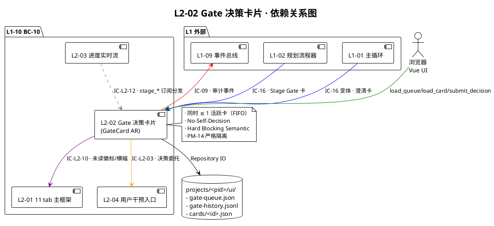
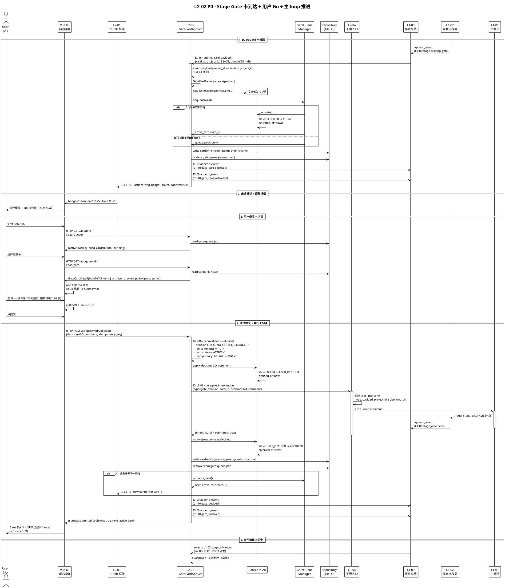
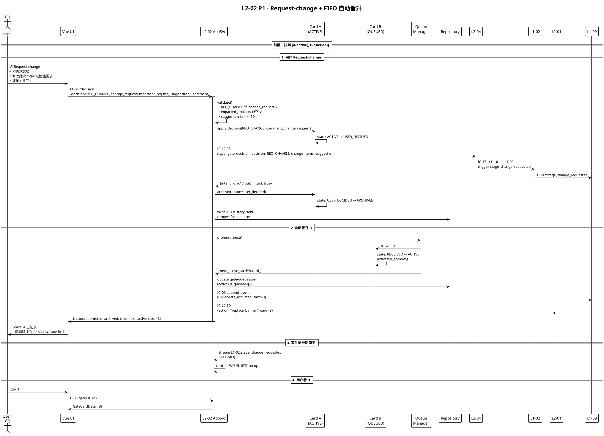
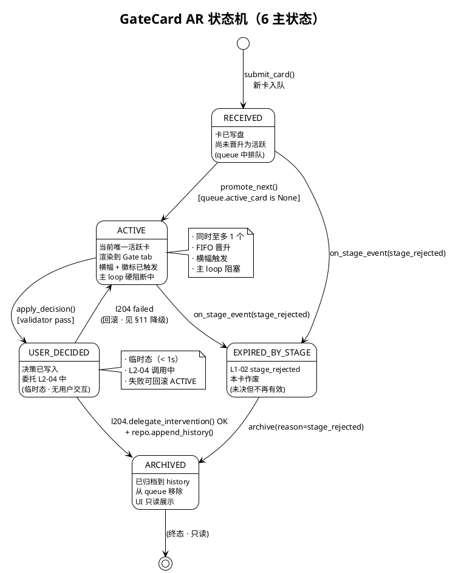

# L1 L2-02 · Gate 决策卡片 · Tech Design

> **本文档定位**：3-1-Solution-Technical 层级 · L1 的 L2-02 Gate 决策卡片 技术实现方案（L2 粒度）。
> **与产品 PRD 的分工**：2-prd/L1-10-人机协作UI/prd.md §5.10 的对应 L2 节定义产品边界，本文档定义**技术实现**（接口字段级 schema + 算法伪代码 + 底层数据结构 + 状态机 + 配置参数）。
> **与 L1 architecture.md 的分工**：architecture.md 负责**跨 L2 架构 + 跨 L2 时序**，本文档负责**本 L2 内部技术细节**。冲突以 architecture.md 为准。
> **严格规则**：本文档不复述产品 PRD 文字（职责 / 禁止 / 必须等清单），只做技术映射 + 补齐"产品视角未说 but 工程师必须知道"的部分（具体算法 · syscall · schema · 配置）。

---

## §0 撰写进度

- [x] §1 定位 + 2-prd §5.10 L2-02 映射
- [x] §2 DDD 映射（引 L0/ddd-context-map.md BC-10）
- [x] §3 对外接口定义（字段级 YAML schema + 错误码）
- [x] §4 接口依赖（被谁调 · 调谁）
- [x] §5 P0/P1 时序图（PlantUML ≥ 2 张）
- [x] §6 内部核心算法（伪代码）
- [x] §7 底层数据表 / schema 设计（字段级 YAML）
- [x] §8 状态机（PlantUML + 转换表）
- [x] §9 开源最佳实践调研（≥ 3 GitHub 高星项目）
- [x] §10 配置参数清单
- [x] §11 错误处理 + 降级策略
- [x] §12 性能目标
- [x] §13 与 2-prd / 3-2 TDD 的映射表

---

## §1 定位 + 2-prd 映射

### 1.1 本 L2 在 L1-10 人机协作 UI 里的坐标

L1-10 由 7 个 L2 组成，**L2-02 Gate 决策卡片**是**用户决策性介入的统一集散地**——所有 4 次 Stage Gate（S1-04 / S2-09 / S3-05 / S7-05）+ 通用澄清卡片（BF-L3-09）均在本 L2 落地渲染 + 收集用户决定。它是 L1-10 里**硬阻断语义**的唯一承载者（其它 L2 都是非阻断性视图或异步交互）。

```
  IC-16 推送 ─────────────────────────────┐
                                          ↓
  (from L1-02 / L1-01)        ┌─────────────────────────┐
                              │  L2-02 Gate 决策卡片    │
                              │  GateCard 聚合根        │
                              │  · 接卡 + FIFO 队列     │
                              │  · artifacts_bundle 预览 │
                              │  · Decision 收集        │
                              │  · 评论 ≥ 10 字校验     │
                              └──────────┬──────────────┘
                                         │
                                         ↓  IC-L2-03（Decision 委托）
                                ┌─────────────────────┐
                                │  L2-04 用户干预入口 │
                                │  封装 user_intervene │
                                └──────────┬──────────┘
                                           ↓
                                    IC-17 → L1-01 → L1-02
```

L2-02 定位 = **"4 次 Stage Gate + BF-L3-09 澄清卡的渲染面 · 同时至多 1 个活跃 Gate · 硬阻断主 loop · No-Self-Decision"**。

### 1.2 与 2-prd §5.10 L2-02 的对应表

| 2-prd §5.10 L2-02 小节（含 BF 映射） | 本文档对应位置 | 技术映射重点 |
|:---|:---|:---|
| §9.1 L2-02 职责（4 Gate + 澄清卡片接收 / 决策） | §1.3 + §2（GateCard 聚合根 · UserDecision VO） | AR + VO · 聚合边界由 gate_id 划分 |
| §9.2 输入 / 输出（IC-16 + 事件流 → Gate 视图 + IC-17 封装） | §3.1 + §3.2（submit_card + submit_decision 接口） | 字段级 schema · 错误码 ≥ 12 |
| §9.3 边界（in-scope 8 条 · out-of-scope 5 条） | §3 + §11 · §12 | 只渲染 + 收集 · 不替决 |
| §9.4 约束（PM-01 methodology + PM-07 模板驱动 · 性能 2s / 3s / 1s） | §12 SLO 表 | 4 个 SLO 目标 |
| §9.5 禁止（8 条）+ §9.6 必须（8 条）| §11 降级策略 · §6 算法硬拦截 | 算法级枚举硬拦截 |
| §9.7 可选功能（5 条）| §13 ADR 记录 | 全部作为 YAGNI-future 处理 |
| §9.8 IC 清单（IC-L2-03 + IC-L2-10 + IC-16 + 订阅事件流 5 条） | §4.1 + §4.2 | 上下游完整依赖图 |
| §9.9 交付验证 Given-When-Then（7 场景） | §13 TDD 映射表 | 每场景 ≥ 1 test case |

### 1.3 本 L2 在 architecture.md 里的坐标

引 `docs/3-1-Solution-Technical/L1-10-人机协作UI/architecture.md §3.3 组件分解图（BC-10 · 7 L2 + 路由层）`：

```
  [L1-02 S4/S7 Gate 就绪]     [L1-01 clarification_requested]
         │                              │
         └──────────── IC-16 ───────────┘
                           ↓
                 ┌──────────────────────────┐
                 │   L2-02  GateCard        │
                 │  (Aggregate Root)        │
                 │                          │
                 │   ┌────────────────────┐ │
                 │   │ GateQueueManager   │ │  (FIFO 排队 · 同时 1 活跃)
                 │   │ ArtifactsRenderer  │ │  (bundle 预览渲染)
                 │   │ DecisionValidator  │ │  (10 字 · Go/No-Go/Req-change)
                 │   │ ClarifyAdapter     │ │  (radio/multi/text/free-text)
                 │   │ HistoryArchiver    │ │  (归档到 gate-history.jsonl)
                 │   └────────────────────┘ │
                 │                          │
                 │   ┌────────────────────┐ │
                 │   │  UserDecision VO   │ │  (Go/No-Go/Request-change)
                 │   │  ArtifactRef VO    │ │  (产出物引用)
                 │   │  ClarifyAnswer VO  │ │  (澄清作答)
                 │   │  ChangeRequest VO  │ │  (Request-change checklist)
                 │   └────────────────────┘ │
                 └─────────┬────────────────┘
                           ↓
           ┌───────────────┼────────────────┐
           ↓               ↓                ↓
    [L2-01 路由/徽标] [L2-04 干预入口] [L2-03 事件流]
    IC-L2-10          IC-L2-03         IC-L2-12（订阅）
```

**本 L2 的关键特征**（对 L1-10 整体而言）：
1. **聚合根型 L2**：GateCard 是完整的 Aggregate Root（聚合边界 = 单张卡片的生命周期），不同于 L2-03（只有 VO）/ L2-07（Application Service）
2. **Hard Blocking Semantic**：本 L2 是 L1-10 里唯一持有"必阻断主 loop"语义的 L2——未决卡片必让 L2-01 冻结"前进"按钮
3. **同时 ≤ 1 活跃**：GateQueueManager 强制 FIFO + 单活跃，多张卡并行会让用户决策误入歧途
4. **No-Self-Decision**：本 L2 只渲染 + 收集 · 绝不替用户决定 · 无"自动通过 / 超时通过"机制（对齐 L2-05 的 No-Self-Verdict 精神）
5. **委托式出口**：Decision 提交不走 IC-17 直达 · 必经 L2-04（BC-10 内部唯一 IC-17 出口），保证审计一致
6. **双形态统一**：Stage Gate 卡 + 澄清卡 **共用渲染容器** · 只在卡头 badge / 表单结构上区分

### 1.4 本 L2 的 PM-14 约束

**PM-14 约束**（引 `docs/3-1-Solution-Technical/projectModel/tech-design.md §3 多项目隔离模型`）：所有 IC payload 顶层 `project_id` 必填；所有存储路径按 `projects/<pid>/...` 分片。

本 L2 在 PM-14 层面的具体落点：
- 活跃 Gate 队列：`projects/<pid>/ui/gate-queue.json`
- Gate 历史归档：`projects/<pid>/ui/gate-history.jsonl`
- 单张卡快照：`projects/<pid>/ui/cards/<card_id>.json`
- artifacts_bundle 临时缓存：`projects/<pid>/ui/cards/<card_id>/artifacts/` （符号链接，不复制实体）
- 决策事件落盘（经 L1-09）：`projects/<pid>/events.jsonl` · type = `L1-10:gate_decided`
- 跨项目防泄漏守则：每次接 IC-16 / 发 IC-L2-03 必先 assert `payload.project_id == current_session.project_id`，不一致直接 400 + 落 `L1-10:cross_project_access_denied` 审计事件

### 1.5 关键技术决策（本 L2 特有 · Decision / Rationale / Alternatives / Trade-off）

| 决策 | 选择 | 备选 | 理由 | Trade-off |
|:---|:---|:---|:---|:---|
| **D1: 聚合根是 GateCard 还是 Dialog？** | GateCard（单卡生命周期） | Dialog（单个弹窗会话） / GateSession（整项目 session） | 聚合边界=卡片生命周期最清晰 · Dialog 过细 · Session 过粗且与 UISession 冲突 | 牺牲一次决策 = 一次聚合的简洁感，换 CQRS 读/写模型对齐 |
| **D2: FIFO 还是优先级队列？** | 严格 FIFO（入队时间序） | 优先级（Stage 越后越高） / 用户拖拽排序 | Stage Gate 天然时序（S1→S2→...→S7），不会跨阶段并发多卡 · 用户拖拽会破坏审计一致 | 理论上 S7 与 BF-L3-09 可能并发，但概率极低（可容忍延迟） |
| **D3: 同时至多 N 个活跃卡？** | N=1（硬锁） | N=3（tab 内可切换） / 无上限 | 并发决策易出错（用户易混淆 A 卡与 B 卡）· 硬锁强制用户串行聚焦 | 极端场景下用户要等前卡完才见新卡（但 queue 里可见待决计数） |
| **D4: artifacts 预览是实渲染还是懒加载？** | 首屏懒加载 + 渐进展开（按需加载 md） | 一次性全渲染 / 全 iframe | 15 份 md + 架构图总体可达 5-10MB，全渲染会触发 3s+ 加载 · 懒加载可做到 2s 到展示 | 懒加载首屏只看到文件名列表（但对决策足够） |
| **D5: 评论校验是前端还是后端？** | 前端即时校验 + 后端二次校验（双保险） | 仅前端 / 仅后端 | 前端给即时反馈（UX）· 后端兜底防绕过（审计完整） | 逻辑冗余（可接受） |
| **D6: Decision 是否允许撤回？** | 不可撤回（一旦提交永久归档） | 5 分钟撤回窗口 / 无限撤回 | 审计一致性 · 撤回破坏"user_intervene 不可变"语义 · 改主意走新 change_request | UX 上用户可能误点（靠提交前的二次确认 modal 防护） |
| **D7: Gate 超时是否自动 No-Go？** | 永不超时（硬禁）| 24h 自动 No-Go / 7d 自动升 supervisor | 对齐 scope §5.10.5 禁止 2 · 对齐 No-Self-Decision 原则 | 用户可能长期不响应（由 L1-02 自身通过事件总线感知等待态，不由 L2-02 超时） |
| **D8: Request-change 是否单独聚合根？** | 复用 GateCard AR + ChangeRequest VO | 独立 ChangeRequestCard 聚合根 / 融合到 UserDecision VO | Request-change 逻辑上仍属同一卡的生命周期 · 独立 AR 过度建模 | ChangeRequest VO 字段较多（checklist + suggestion + impacted_scope），但仍是值对象 |
| **D9: 澄清卡是否独立 L2？** | 复用 L2-02 渲染容器（同一 AR）| 独立 L2-08 clarification-card | 渲染结构 90% 相似 · 单独 L2 增加 IC 联动复杂度 · 卡头 badge 足以区分 | GateCard AR 需支持 `card_type = {stage_gate, clarification}` 双分支 |
| **D10: 横幅 + 徽标是否属 L2-02？** | 仅触发信号（IC-L2-10 给 L2-01）| 本 L2 自己渲染顶部横幅 | 职责分离：L2-01 负责 chrome（tab + 顶栏 + 徽标），L2-02 只管内容 | 跨 L2 耦合多一条 IC-L2-10，但清晰 |

### 1.6 本 L2 读者预期

读完本 L2 的工程师应掌握：
- GateCard Aggregate Root 的 8 个领域方法 + 5 个 VO 字段级 schema + 错误码 ≥ 12
- 8 个核心算法（入队 / 置顶 / 评论校验 / 决策提交 / 澄清作答 / 归档 / 断联重放 / 跨项目隔离校验）
- 3 张数据表 schema（gate-queue.json / gate-history.jsonl / cards/<card_id>.json）
- GateCard 状态机（6 主状态 · PlantUML 图）
- 降级链 4 级（FULL → READ-ONLY → QUEUE-ONLY → CROSS-PROJECT-LOCK）
- SLO（到达展示 ≤ 2s · 决策 ack ≤ 1s · bundle 首屏 ≤ 3s · 单卡页面 ≥ 500 条平滑）

### 1.7 本 L2 不在的范围（YAGNI）

- **不在**：产出物内容编辑（只读预览 · 编辑走主 loop 回修）
- **不在**：Gate 阻塞判定逻辑（L1-02 L1-01 自身的状态机）
- **不在**：IC-17 发送（L2-04 独占）
- **不在**：产出物自动审查（代码 diff / 质量评分 → 未来）
- **不在**：Gate 决定模板 / 历史过滤搜索 / 导出为 md（§9.7 可选全 YAGNI）
- **不在**：跨项目 Gate 聚合视图（PM-14 隔离禁）

### 1.8 本 L2 术语表（接 2-prd §9 不重复定义）

| 术语 | 定义 | 关联 |
|:---|:---|:---|
| GateCard | 单张 Gate 卡片 · 本 L2 的 Aggregate Root | §2.1 |
| UserDecision | Go / No-Go / Request-change 三选一 VO | §2.2 |
| artifacts_bundle | IC-16 payload 里的产出物清单（ArtifactRef 数组） | §2.2 |
| ChangeRequest | Request-change 时的 checklist + 修改建议 VO | §2.2 |
| ClarifyAnswer | 澄清卡的用户作答 VO（4 种 option_type） | §2.2 |
| CardQueue | FIFO 队列 · 同时 1 活跃 | §2.3 |
| CardHistory | 已决卡片归档区 | §2.3 |
| HardBlockingSemantic | Gate 未决 → 主 loop 阻塞语义 | §1.3 |
| No-Self-Decision | 绝不替用户决定（scope §5.10.5 禁止 2） | §1.3 |

### 1.9 本 L2 的 DDD 定位一句话

**"BC-10 · Aggregate Root = GateCard · Domain Service = GateDecisionValidator · Application Service = GateCardApplicationService · Hard Blocking Semantic holder · No-Self-Decision · 单活跃 FIFO · 双形态统一"**

---

## §2 DDD 映射（BC-10）

### 2.1 Bounded Context 定位

引 `docs/3-1-Solution-Technical/L0/ddd-context-map.md §2.11 BC-10 · Human-Agent Collaboration UI`：

- **Bounded Context 名称**：BC-10 Human-Agent Collaboration UI（全 L1-10 共享）
- **本 L2 在 BC-10 里的角色**：承载 `GateCard` 聚合根 · 对外 PL 契约（IC-17 user_intervene 的 `type=gate_decision / clarify` 变体）的**生产源头**
- **与 BC-02 L1-02 规划流程器**关系：**Customer-Supplier** —— BC-02 供应 `stage_gate_card protocol`（IC-16 payload）· 本 L2 消费后再**反向** supply `gate_decision` 回 BC-02（经 BC-01）
- **与 BC-01 Agent Decision Loop** 关系：**Customer-Supplier** —— 本 L2 间接（通过 L2-04）推 `user_intervene` 命令给 BC-01

### 2.2 DDD 原语分类

| DDD 要素 | 本 L2 具体 | 说明 |
|:---|:---|:---|
| **Aggregate Root** | `GateCard` | 单张卡的全生命周期聚合边界 · 聚合 ID = `card_id` |
| **Entity** | 无独立 Entity（卡内变更集中在 AR 上） | 决策、评论、澄清作答均作为 VO 存 AR 属性 |
| **Value Object (VO)** | `UserDecision`（Go/No-Go/Request-change 枚举 + comment）· `ArtifactRef`（产出物引用）· `ChangeRequest`（Req-change 的 checklist + suggestion）· `ClarifyAnswer`（澄清作答）· `CardBadge`（stage_gate / clarification 标识） | 全部不可变 · 仅作为 AR 的字段 |
| **Domain Service** | `GateDecisionValidator`（评论 ≥ 10 字 · Go/No-Go/Req-change 合法性 · Req-change 必带 checklist 非空） | 无状态 · 纯函数 |
| **Application Service** | `GateCardApplicationService` | 对外暴露 4 个领域方法（`submit_card / load_queue / submit_decision / archive_card`） |
| **Repository** | `GateCardRepository`（读 / 写 `gate-queue.json` + `gate-history.jsonl`） | JSON / JSONL 文件存储 · 无 ORM · 原子写（tmp + rename） |
| **Domain Events** | `gate_card_received` / `gate_card_activated` / `gate_decided` / `gate_archived` / `clarification_answered` | 全部经 IC-09 落 L1-09 审计事件流 |
| **Factory** | `GateCardFactory`（IC-16 payload → GateCard AR 构造） | 封装卡类型判定（stage_gate vs clarification） |

### 2.3 聚合边界决策

GateCard AR 的聚合边界设计（**决定哪些数据"必须同事务修改"**）：

**聚合内**：
- `card_id / project_id / stage_from / stage_to / card_type` （不可变 · 创建时固化）
- `artifacts_bundle: List[ArtifactRef]`（不可变 · 引 L1-03 产出物路径）
- `required_decisions: List[DecisionField]`（不可变 · IC-16 带来）
- `state: enum {RECEIVED, ACTIVE, USER_DECIDED, ARCHIVED, EXPIRED_BY_STAGE}`（可变 · 见 §8 状态机）
- `user_decision: UserDecision | None`（可变 · 用户提交时一次性写入）
- `user_comment: str | None`（同上）
- `change_request: ChangeRequest | None`（Req-change 时填）
- `clarify_answer: ClarifyAnswer | None`（澄清卡时填）
- `received_at / activated_at / decided_at / archived_at`（时间戳序列）

**聚合外**：
- 其他 Gate 卡（通过 `card_id` 值引用）
- L1-03 的产出物文件内容（通过 `ArtifactRef.path` 值引用 · 不 own）
- L1-02 Stage 生命周期（通过事件流订阅读，不 own）

**一致性边界**：单张卡的所有状态变更必须在同一事务（写 `cards/<card_id>.json` + 更新 `gate-queue.json`）· 跨卡操作（如 A 卡归档后 B 卡晋升）通过事件驱动串联。

### 2.4 事件产出（Domain Events · 落 L1-09）

| 事件 type | 触发点 | payload 关键字段 |
|:---|:---|:---|
| `L1-10:gate_card_received` | IC-16 到达（卡初始化后）| `card_id, project_id, card_type, stage_from, stage_to, received_at` |
| `L1-10:gate_card_activated` | FIFO 队列首位晋升为活跃 | `card_id, queue_position_before, activated_at` |
| `L1-10:gate_decided` | 用户提交决策（Go/No-Go/Req-change） | `card_id, decision, comment, user_ts, change_items（Req-change 时）` |
| `L1-10:clarification_answered` | 澄清卡作答 | `card_id, question_id, answer, option_type` |
| `L1-10:gate_archived` | 卡进入 ARCHIVED 态 | `card_id, archive_reason` (user_decided / stage_rejected / stage_advanced) |
| `L1-10:cross_project_access_denied` | 跨项目访问守则命中 | `expected_pid, actual_pid, card_id` |

---

## §3 对外接口定义（字段级 YAML schema + 错误码）

### 3.1 对外领域方法清单

本 L2 对外暴露的方法分为 3 组：
- **A 组：被 IC-16 调用**（Gate 卡 / 澄清卡接收）
- **B 组：被 UI 调用**（Vue 组件读队列 / 提交决策 / 查历史）
- **C 组：被事件流触发**（Stage 生命周期同步）

完整方法表：

| 组 | 方法名 | 调用方 | 幂等 | 一句话 |
|:---|:---|:---|:---|:---|
| A | `submit_card(payload)` | L1-02 / L1-01（经 IC-16 镜像）| Yes（by card_id）| 新卡入队 |
| B | `load_queue(project_id)` | L2-01 / Vue UI | Yes | 拉活跃 + 排队 + 未读计数 |
| B | `load_history(project_id, filter)` | L2-01 / Vue UI | Yes | 拉归档区 |
| B | `load_card(card_id)` | Vue UI | Yes | 拉单卡详情 + bundle 预览 meta |
| B | `submit_decision(card_id, decision, comment, change_request?)` | Vue UI | Yes（by card_id · 首次生效）| 提交决策 |
| B | `submit_clarify_answer(card_id, answer, option_type)` | Vue UI | Yes（同上）| 提交澄清作答 |
| C | `on_stage_event(event)` | L2-03 订阅分发 | - | 订阅 L1-02 stage_* 事件同步卡生命周期 |
| C | `on_clarification_event(event)` | L2-03 订阅分发 | - | 订阅 L1-01 clarification_requested |

### 3.2 方法字段级 YAML schema

#### 3.2.1 `submit_card(payload)` — 新卡入队

**入参 schema**（复用 IC-16 payload 结构）：

```yaml
submit_card_request:
  project_id: string            # PM-14 项目上下文 · 必填 · 不匹配当前 session → 400 + 跨项目拦截
  card_id: string               # 卡片唯一 ID（L1-02 生成 · 形如 gate_<pid>_<stage>_<uuid8>）· 必填 · 幂等键
  card_type: enum               # stage_gate | clarification
  stage_from: string | null     # S1/S2/S3/S7，澄清卡为 null
  stage_to: string | null       # 目标 Stage，澄清卡为 null
  artifacts_bundle:             # 产出物清单 · stage_gate 必填非空 · clarification 允许空
    - artifact_id: string       # 产出物 ID（由 L1-03 管理）
      path: string              # projects/<pid>/... 相对路径
      mime: string              # text/markdown | application/json | image/svg+xml | ...
      title: string             # 显示名
      size_bytes: int           # 文件大小 · 用于渲染策略决策（> 1MB 走懒加载）
      stage_link: string | null # 关联的 L1-02 stage artifact anchor
  required_decisions:           # 必填决策项清单 · stage_gate 至少 [go_no_go] · clarification 可自定义
    - field_name: string
      label: string             # UI 显示
      widget: enum              # radio | textarea | checkbox-list | free-text
      options: list | null      # radio/checkbox-list 必填
      min_chars: int | null     # textarea 最小字符数（评论默认 10）
      required: bool
  clarification_meta:           # clarification 专用
    question_id: string | null
    question_text: string | null
    option_type: enum | null    # text | radio | multi-select | free-text
    options: list | null
    context_refs: list[string] | null
  priority: enum                # normal | urgent（仅影响 UI badge 颜色，不影响 FIFO）
  submitted_at: string          # RFC3339
  requester_actor: string       # "L1-02" | "L1-01" · 审计用
```

**出参 schema**：

```yaml
submit_card_response:
  status: enum                  # accepted | duplicate_ignored | rejected
  card_id: string
  queue_position: int           # 入队后位置（0 = 活跃 · ≥1 = 排队）
  current_active_card: string | null  # 当前活跃卡 ID（如有）
  received_at: string           # 服务端写入时间 RFC3339
  next_badge_count: int         # 未读徽标数（队列内未决卡总数）
```

#### 3.2.2 `load_queue(project_id)` — 读队列

**入参**：

```yaml
load_queue_request:
  project_id: string            # PM-14 项目上下文 · 必填
  include_clarifications: bool  # 默认 true · 是否一并返回澄清卡
```

**出参**：

```yaml
load_queue_response:
  project_id: string
  active_card: GateCardSummary | null
  queued_cards: list[GateCardSummary]
  total_pending: int
  last_updated_at: string

GateCardSummary:
  card_id: string
  card_type: enum
  stage_from: string | null
  stage_to: string | null
  state: enum                   # RECEIVED | ACTIVE | USER_DECIDED | ARCHIVED | EXPIRED_BY_STAGE
  received_at: string
  activated_at: string | null
  artifacts_count: int
  required_decisions_count: int
```

#### 3.2.3 `load_card(card_id)` — 读单卡详情

**入参**：

```yaml
load_card_request:
  project_id: string            # PM-14 项目上下文 · 必填
  card_id: string
```

**出参**：

```yaml
load_card_response:
  card: GateCardDetail

GateCardDetail:
  card_id: string
  project_id: string
  card_type: enum
  stage_from: string | null
  stage_to: string | null
  state: enum
  artifacts_bundle: list[ArtifactRef]
  artifacts_preview_policy: enum   # eager | progressive | manual（依 size_bytes 总和决定）
  required_decisions: list[DecisionField]
  clarification_meta: object | null
  user_decision: UserDecision | null
  user_comment: string | null
  change_request: ChangeRequest | null
  clarify_answer: ClarifyAnswer | null
  received_at: string
  activated_at: string | null
  decided_at: string | null
  archived_at: string | null
```

#### 3.2.4 `submit_decision(card_id, ...)` — 提交决策

**入参**：

```yaml
submit_decision_request:
  project_id: string            # PM-14 项目上下文 · 必填
  card_id: string
  decision: enum                # GO | NO_GO | REQUEST_CHANGE
  comment: string               # 必填 · 长度 ≥ 10（UTF-8 字符数，非 bytes）
  change_request:               # REQUEST_CHANGE 时必填
    impacted_artifacts: list[string]  # artifact_id list · 至少 1 个
    suggestion: string          # 修改建议 free-text · 长度 ≥ 10
    impacted_scope: enum        # wp | stage | project（影响面）
  idempotency_key: string       # 客户端生成 · 服务端去重窗口 60s
  user_ts: string               # RFC3339 · 客户端时间（仅记录，审计用）
```

**出参**：

```yaml
submit_decision_response:
  status: enum                  # submitted | already_decided | rejected
  card_id: string
  accepted_at: string           # 服务端接受时间
  l204_delegation:              # 委托给 L2-04 的结果
    intent_id: string           # L2-04 返回的 InterventionIntent ID
    ic17_submitted: bool        # IC-17 是否已推出
  archived: bool
  next_active_card: string | null   # 自动晋升的下一张卡 ID
```

#### 3.2.5 `submit_clarify_answer(card_id, ...)` — 澄清作答

**入参**：

```yaml
submit_clarify_answer_request:
  project_id: string            # PM-14 项目上下文 · 必填
  card_id: string
  answer:                       # 依 option_type 变形
    type: enum                  # text | radio | multi-select | free-text
    value: any                  # text/free-text = string · radio = string · multi-select = list[string]
  comment: string | null        # 可选 · 澄清卡评论非强制
  idempotency_key: string
```

**出参**：同 `submit_decision_response`（统一语义）

#### 3.2.6 `load_history(project_id, filter)` — 读归档

**入参**：

```yaml
load_history_request:
  project_id: string            # PM-14 项目上下文 · 必填
  filter:
    card_type: list[enum] | null   # 空则不过滤
    stage: list[string] | null
    decision: list[enum] | null
    from_ts: string | null
    to_ts: string | null
  pagination:
    offset: int
    limit: int                   # ≤ 100
```

**出参**：

```yaml
load_history_response:
  items: list[GateCardSummary]
  total: int
  offset: int
  limit: int
```

### 3.3 错误码表

| 错误码 | 含义 | 触发场景 | 调用方处理 |
|:---|:---|:---|:---|
| `L2-02-E001` | `CARD_DUPLICATE` | submit_card 同 card_id 已存在 | 返回 `duplicate_ignored` · 客户端忽略即可 |
| `L2-02-E002` | `CARD_NOT_FOUND` | load_card / submit_decision 指定 card_id 不存在 | 客户端刷新队列 |
| `L2-02-E003` | `PROJECT_MISMATCH` | PM-14 守则：payload.project_id 与 session.project_id 不一致 | 拒绝 + 落审计事件 · 可能是跨项目攻击或 session 漂移 |
| `L2-02-E004` | `COMMENT_TOO_SHORT` | 评论字符数 < 10 | UI 标红 · 阻止提交 |
| `L2-02-E005` | `INVALID_DECISION` | decision 不在枚举内 | 客户端 bug · 客户端应自检 |
| `L2-02-E006` | `CHANGE_REQUEST_MISSING` | decision=REQUEST_CHANGE 但 change_request 字段为空 | 客户端补齐 checklist/suggestion |
| `L2-02-E007` | `IMPACTED_ARTIFACTS_EMPTY` | Req-change 的 impacted_artifacts 为空 list | 客户端至少勾 1 项 |
| `L2-02-E008` | `ARTIFACT_BUNDLE_EMPTY` | stage_gate 卡的 artifacts_bundle 为空 | 上游 L1-02 bug · 直接 reject submit_card |
| `L2-02-E009` | `ALREADY_DECIDED` | 同 card_id 第二次提交决策 | 客户端刷新视图 · 该卡已归档 |
| `L2-02-E010` | `CARD_NOT_ACTIVE` | 提交决策时卡不在 ACTIVE 态（队列中或已归档） | 客户端等待晋升或刷新 |
| `L2-02-E011` | `CLARIFICATION_ANSWER_SHAPE_MISMATCH` | answer.type 与卡的 option_type 不一致 | 客户端 bug |
| `L2-02-E012` | `L204_DELEGATION_FAILED` | 委托 L2-04 失败（如 L2-04 不可达 / 内部错误） | 重试或降级（见 §11） |
| `L2-02-E013` | `IDEMPOTENCY_CONFLICT` | 同 idempotency_key 在 60s 内已处理但 payload 不一致 | 客户端检查请求构造 |
| `L2-02-E014` | `REPOSITORY_WRITE_FAILED` | gate-queue.json / cards/<id>.json 写失败 | 内部错误 · 触发降级（READ-ONLY） |
| `L2-02-E015` | `QUEUE_CORRUPT` | gate-queue.json 解析失败 | 内部错误 · 触发 crash-recovery（从 cards/ 重建队列） |

---

## §4 接口依赖（被谁调 · 调谁）

### 4.1 上游调用方

| IC | 调用方 | 调本 L2 的方法 | 何时调 | 频次 | 一句话 |
|:---|:---|:---|:---|:---|:---|
| **IC-16**（scope §8.2） | L1-02 经事件总线镜像 | `submit_card` | S1-04 / S2-09 / S3-05 / S7-05 Gate 就绪 | 每项目 4 次 | Stage Gate 卡推送 |
| **IC-16 变体** | L1-01 经事件总线镜像 | `submit_card` | 决策遇 unclear | 低频 | 澄清卡推送 |
| **HTTP GET** `/api/gate` | Vue UI（L2-01 mount）| `load_queue` | tab 切到 Gate tab / 初始化 | 高频 | 读队列 |
| **HTTP GET** `/api/gate/{id}` | Vue UI | `load_card` | 用户点开活跃卡 | 每卡 1-3 次 | 读卡详情 |
| **HTTP POST** `/api/gate/{id}/decision` | Vue UI | `submit_decision` | 用户点提交 | 每卡 1 次 | 提交决策 |
| **HTTP POST** `/api/gate/{id}/clarify` | Vue UI | `submit_clarify_answer` | 用户作答澄清 | 每卡 1 次 | 提交澄清 |
| **HTTP GET** `/api/gate/history` | Vue UI | `load_history` | 用户查历史 | 低频 | 读归档 |
| **SSE 事件分发** | L2-03 订阅器 | `on_stage_event` / `on_clarification_event` | Stage 生命周期变化 | 中频 | 同步卡状态 |

### 4.2 下游依赖

| IC | 被调方 | 何时调 | 频次 | 一句话 |
|:---|:---|:---|:---|:---|
| **IC-L2-03** | L2-04 用户干预入口 | submit_decision / submit_clarify_answer 成功后 | 每决策 1 次 | 封装 user_intervene 走 IC-17 |
| **IC-L2-10** | L2-01 11 tab 主框架 | submit_card 成功后 / active_card 切换 | 每卡 1-2 次 | 触发未读徽标 + 顶部横幅 |
| **IC-09**（经 L1-09）| L1-09 事件总线 | 每关键动作（received / activated / decided / archived） | 每卡 3-5 次 | 落审计事件 |
| **File IO** `projects/<pid>/ui/*` | 本地文件系统 | 所有写操作 | 高频 | Repository 持久化 |
| **订阅 IC-L2-12** | L2-03 事件分发 | 启动时 subscribe | 1 次 | 订阅 stage_* + clarification_requested |

### 4.3 依赖图（PlantUML）



### 4.4 禁止的依赖（架构硬约束）

- ❌ **禁止** L2-02 直接调 IC-17（必经 L2-04）
- ❌ **禁止** L2-02 直接读 L1-02 内部状态（必经事件流）
- ❌ **禁止** L2-02 直接访问 L1-09 事件总线（必经 IC-09 标准 API）
- ❌ **禁止** L2-02 调用 L1-07 Supervisor（Gate 超时**永不**升级，仅登 stage_* 事件流被动同步）
- ❌ **禁止** L2-02 读写其他 project_id 目录（PM-14 跨项目硬隔离）

---

## §5 P0/P1 时序图（PlantUML ≥ 2 张）

### 5.1 P0 场景 · Stage Gate 卡到达 → 用户 Go → 主 loop 推进

该时序展示 2-prd §9.9 正向场景 1 的完整技术链路，聚焦本 L2 内部流程（含 FIFO 入队 / activated 触发 / 决策委托 / 归档）。



**关键时序点**：
- **PM-14 守则**：入口处 assert project_id 一致，不一致直接 400（走 §11 降级链 CROSS-PROJECT-LOCK）
- **原子写**：cards/<id>.json + gate-queue.json 必须**同事务**成功，否则回滚（伪事务：write tmp → fsync → rename）
- **双向事件流**：L2-02 发 `gate_decided` **主动**落审计，同时**被动**订阅 `stage_advanced` 做幂等校验
- **IC-L2-03 同步调用**：L2-04 必须在本请求响应前返回（失败走 §11 降级 QUEUE-ONLY）

### 5.2 P1 场景 · Request-change + 队列中有下一张卡自动晋升

该时序展示 2-prd §9.9 正向场景 2（Req-change） + 集成场景 5（FIFO 晋升）的组合技术链路。



**关键时序点**：
- **Req-change validator** 必须校验 `change_request.impacted_artifacts` 非空（L2-02-E007），否则客户端无法闭环
- **晋升原子性**：A.archive() + B.activate() + queue update 必须**同事务**，避免"A 已归档但 B 未激活"的空窗期
- **被动同步幂等**：L2-03 分发的 stage_change_requested 到达时卡已归档，走 no-op 路径（参见 §6.8）
- **Banner 替换**：IC-L2-10 支持 `action=replace_banner`，L2-01 负责 DOM 层的平滑过渡

---

## §6 内部核心算法（伪代码）

### 6.1 算法 1 · 入队 + 自动激活（`submit_card` 主流程）

```python
def submit_card(payload: SubmitCardRequest) -> SubmitCardResponse:
    # PM-14 守则
    if payload.project_id != current_session.project_id:
        emit_event("L1-10:cross_project_access_denied", {...})
        raise HTTPError(400, code="L2-02-E003")

    # 幂等检查
    existing = repo.load_card(payload.card_id)
    if existing is not None:
        return SubmitCardResponse(status="duplicate_ignored", ...)

    # Stage Gate 的 bundle 非空硬约束
    if payload.card_type == "stage_gate" and len(payload.artifacts_bundle) == 0:
        raise HTTPError(400, code="L2-02-E008")

    # 构造 AR
    card = GateCardFactory.create(payload)   # state=RECEIVED
    repo.write_card(card)                    # atomic tmp+rename

    # 入队
    with queue_lock:  # 进程级 advisory lock 防止并发 submit 撕裂队列
        queue = repo.load_queue()
        if queue.active_card is None:
            card.activate()                  # state → ACTIVE
            queue.active_card = card.card_id
            queue.queued_cards = []
            position = 0
        else:
            queue.queued_cards.append(card.card_id)
            position = len(queue.queued_cards)
        repo.write_queue(queue)              # atomic

    repo.write_card(card)  # 持久化 ACTIVE 态（若激活）

    # 事件
    emit_event("L1-10:gate_card_received", {...})
    if position == 0:
        emit_event("L1-10:gate_card_activated", {...})

    # 通知 L2-01
    ic_l2_10.notify(action="ring_badge", count=queue.total_pending(),
                    banner=(position == 0))

    return SubmitCardResponse(status="accepted", queue_position=position,
                              current_active_card=queue.active_card,
                              next_badge_count=queue.total_pending())
```

**关键点**：
1. **queue_lock**：使用 `fcntl.flock(LOCK_EX)` 或 `filelock` 库对 `gate-queue.json` 加进程级互斥锁，防止并发 submit_card 造成队列状态撕裂
2. **原子写**：`atomic tmp+rename` = 写 `gate-queue.json.tmp` → `fsync` → `os.rename(tmp, final)`，POSIX rename 保证原子
3. **事件幂等**：同 card_id 重复 submit 走 `duplicate_ignored` 路径，不重发事件

### 6.2 算法 2 · 决策提交校验链（`submit_decision` 核心）

```python
def submit_decision(card_id, req: SubmitDecisionRequest) -> SubmitDecisionResponse:
    # PM-14
    assert_project_match(req.project_id)

    # 幂等（基于 idempotency_key + card_id + 60s 窗口）
    cached = idempotency_cache.get((card_id, req.idempotency_key))
    if cached is not None:
        if cached.payload_hash == hash(req):
            return cached.response            # 原路返回
        else:
            raise HTTPError(409, code="L2-02-E013")

    # 载卡
    card = repo.load_card(card_id)
    if card is None:
        raise HTTPError(404, code="L2-02-E002")
    if card.state != "ACTIVE":
        raise HTTPError(409, code="L2-02-E010" if card.state == "RECEIVED" else "L2-02-E009")

    # Domain Service 校验
    validator = GateDecisionValidator()
    err = validator.validate(req)
    if err:
        raise HTTPError(400, code=err.code)    # E004/E005/E006/E007 之一

    # Apply + 持久化
    card.apply_decision(req.decision, req.comment, req.change_request)
    repo.write_card(card)

    # 委托 L2-04
    try:
        l204_result = l204.delegate_intervention(
            type="gate_decision",
            card_id=card.card_id,
            decision=req.decision,
            comment=req.comment,
            change_request=req.change_request,
            project_id=req.project_id,
        )
    except Exception as e:
        # 见 §11 降级链
        card.state = "ACTIVE"                  # 回滚状态
        repo.write_card(card)
        raise HTTPError(502, code="L2-02-E012")

    # 归档 + 晋升
    card.archive(reason="user_decided")
    repo.append_history(card)
    with queue_lock:
        queue = repo.load_queue()
        queue.remove_active(card.card_id)
        next_card_id = queue.promote_next()
        repo.write_queue(queue)
    if next_card_id:
        ic_l2_10.notify(action="replace_banner", card_id=next_card_id)
    else:
        ic_l2_10.notify(action="clear_banner")

    # 事件
    emit_event("L1-10:gate_decided", {card_id, decision, comment, user_ts})
    emit_event("L1-10:gate_archived", {card_id, reason: "user_decided"})

    response = SubmitDecisionResponse(status="submitted",
                                       card_id=card_id,
                                       accepted_at=now(),
                                       l204_delegation={"intent_id": l204_result.intent_id,
                                                        "ic17_submitted": True},
                                       archived=True,
                                       next_active_card=next_card_id)
    idempotency_cache.set((card_id, req.idempotency_key), response, ttl=60)
    return response
```

### 6.3 算法 3 · GateDecisionValidator（Domain Service）

```python
class GateDecisionValidator:
    MIN_COMMENT_CHARS = 10       # 来自配置 · §10

    def validate(self, req) -> ValidationError | None:
        # 1. decision 枚举
        if req.decision not in {"GO", "NO_GO", "REQUEST_CHANGE"}:
            return ValidationError("L2-02-E005")

        # 2. comment 长度（UTF-8 字符数）
        if len(req.comment) < self.MIN_COMMENT_CHARS:
            return ValidationError("L2-02-E004")

        # 3. REQUEST_CHANGE 专项
        if req.decision == "REQUEST_CHANGE":
            if req.change_request is None:
                return ValidationError("L2-02-E006")
            if not req.change_request.impacted_artifacts:
                return ValidationError("L2-02-E007")
            if len(req.change_request.suggestion) < self.MIN_COMMENT_CHARS:
                return ValidationError("L2-02-E006")   # 建议也 ≥ 10 字

        return None
```

### 6.4 算法 4 · FIFO 队列晋升器

```python
class GateQueueManager:
    def __init__(self, repo):
        self.repo = repo

    def promote_next(self) -> str | None:
        queue = self.repo.load_queue()
        assert queue.active_card is None       # 前置：当前无活跃
        if not queue.queued_cards:
            return None
        next_id = queue.queued_cards[0]        # FIFO 头
        queue.queued_cards = queue.queued_cards[1:]
        queue.active_card = next_id

        # 激活下一张卡
        next_card = self.repo.load_card(next_id)
        next_card.activate()
        self.repo.write_card(next_card)
        self.repo.write_queue(queue)

        emit_event("L1-10:gate_card_activated", {
            "card_id": next_id,
            "queue_position_before": 0,
            "activated_at": next_card.activated_at,
        })
        return next_id

    def remove_active(self, card_id):
        queue = self.repo.load_queue()
        assert queue.active_card == card_id
        queue.active_card = None
        self.repo.write_queue(queue)
```

### 6.5 算法 5 · artifacts_bundle 渲染策略决策

```python
def decide_preview_policy(bundle: list[ArtifactRef]) -> str:
    total_bytes = sum(a.size_bytes for a in bundle)
    item_count = len(bundle)

    # 配置：见 §10
    EAGER_LIMIT_BYTES = 500_000           # 500 KB
    EAGER_LIMIT_ITEMS = 3
    PROGRESSIVE_LIMIT_BYTES = 10_000_000  # 10 MB

    if total_bytes <= EAGER_LIMIT_BYTES and item_count <= EAGER_LIMIT_ITEMS:
        return "eager"            # 一次全渲染（极小 bundle）
    elif total_bytes <= PROGRESSIVE_LIMIT_BYTES:
        return "progressive"      # 首屏列表 + 懒加载 md 内容
    else:
        return "manual"           # 过大 · 仅展示文件树 · 用户点开才渲染
```

**决策原则**：
- `eager` 适合：BF-L3-09 澄清卡（bundle 常为空或极小）
- `progressive` 适合：S2 Gate（≈ 15 md · 5MB）
- `manual` 适合：S3 Gate（含代码仓库 diff · 可能 > 10MB）

### 6.6 算法 6 · 澄清作答提交（`submit_clarify_answer`）

```python
def submit_clarify_answer(card_id, req):
    assert_project_match(req.project_id)
    card = repo.load_card(card_id)
    if card.card_type != "clarification":
        raise HTTPError(400, code="L2-02-E011")

    # answer shape 校验
    expected_type = card.clarification_meta.option_type
    if req.answer.type != expected_type:
        raise HTTPError(400, code="L2-02-E011")

    if expected_type == "radio" and req.answer.value not in card.clarification_meta.options:
        raise HTTPError(400, code="L2-02-E011")
    if expected_type == "multi-select":
        if not all(v in card.clarification_meta.options for v in req.answer.value):
            raise HTTPError(400, code="L2-02-E011")

    # comment 对澄清卡不强制（Product Decision § 9.6 ✅ 仅 gate decision 要求 ≥ 10 字）
    card.apply_clarify_answer(ClarifyAnswer(req.answer.value, req.answer.type, req.comment))

    l204_result = l204.delegate_intervention(
        type="clarify",
        card_id=card_id,
        answer=req.answer.value,
        option_type=req.answer.type,
        project_id=req.project_id,
    )

    card.archive(reason="user_decided")
    repo.append_history(card)
    with queue_lock:
        queue = repo.load_queue()
        queue.remove_active(card_id)
        next_id = queue.promote_next()
        repo.write_queue(queue)

    emit_event("L1-10:clarification_answered", {
        "card_id": card_id,
        "question_id": card.clarification_meta.question_id,
        "answer": req.answer.value,
        "option_type": req.answer.type,
    })
    emit_event("L1-10:gate_archived", {...})

    return {"status": "submitted", "archived": True, "next_active_card": next_id, ...}
```

### 6.7 算法 7 · 跨项目访问守则（PM-14 硬拦截）

```python
def assert_project_match(incoming_pid: str):
    """所有 HTTP / IC 入口第一步调用"""
    current = session_store.get_current_project_id()
    if incoming_pid != current:
        emit_event("L1-10:cross_project_access_denied", {
            "expected_pid": current,
            "actual_pid": incoming_pid,
            "source": "L2-02",
            "ts": now_rfc3339(),
        })
        raise HTTPError(400, code="L2-02-E003")

    # 额外：路径 traversal 防护
    if ".." in incoming_pid or "/" in incoming_pid:
        raise HTTPError(400, code="L2-02-E003")
```

### 6.8 算法 8 · 事件流反向同步 + 崩溃恢复

**订阅分发处理**（由 L2-03 推给本 L2）：

```python
def on_stage_event(evt):
    """订阅 L1-02:stage_* 事件，同步卡状态"""
    if evt.type == "L1-02:stage_advanced":
        card_id = resolve_card_from_stage(evt.stage_from, evt.stage_to)
        card = repo.load_card(card_id)
        if card is None or card.state == "ARCHIVED":
            return   # 幂等 no-op（已归档）
        # 理论上不会走到此分支（应在 submit_decision 主动归档）
        # 但若 L2-04 成功 IC-17 后 L2-02 进程崩溃，此处做 reconcile
        card.archive(reason="stage_advanced_observed")
        repo.append_history(card)
        emit_event("L1-10:gate_archived", {"card_id": card_id, "reason": "reconcile"})

    elif evt.type == "L1-02:stage_rejected":
        card_id = resolve_card_from_stage(evt.stage_from, evt.stage_to)
        card = repo.load_card(card_id)
        if card and card.state != "ARCHIVED":
            card.state = "EXPIRED_BY_STAGE"
            card.archive(reason="stage_rejected")
            repo.append_history(card)

    elif evt.type == "L1-02:stage_change_requested":
        # 类似处理 · reconcile 只读不改写 user_decision
        ...

def on_clarification_event(evt):
    if evt.type == "L1-01:clarification_requested":
        # 新澄清卡（走 submit_card 变体入口）
        submit_card_from_clarification(evt.payload)


def crash_recovery_on_startup():
    """L2-02 进程启动时调用 · 重建队列一致性"""
    # 从 cards/*.json 扫描重建 queue
    all_cards = repo.scan_all_cards()
    queue = GateQueue(active_card=None, queued_cards=[])
    for card in all_cards:
        if card.state == "ACTIVE":
            if queue.active_card is None:
                queue.active_card = card.card_id
            else:
                # 多个 ACTIVE → 取 activated_at 最早者保持 active · 其它降级为 queued
                current = repo.load_card(queue.active_card)
                if card.activated_at < current.activated_at:
                    queue.queued_cards.insert(0, queue.active_card)
                    queue.active_card = card.card_id
                else:
                    queue.queued_cards.append(card.card_id)
        elif card.state == "RECEIVED":
            queue.queued_cards.append(card.card_id)
    # FIFO 按 received_at 排
    queue.queued_cards.sort(key=lambda cid: repo.load_card(cid).received_at)
    repo.write_queue(queue)
    emit_event("L1-10:gate_queue_rebuilt", {"total": len(all_cards)})
```

---

## §7 底层数据表 / schema 设计（字段级 YAML）

### 7.1 存储物理路径（按 PM-14 分片）

所有数据位于：`projects/<project_id>/ui/`，下含 3 个主要文件 + 1 个子目录：

```
projects/<pid>/
  └── ui/
      ├── gate-queue.json       # 单文件 · 当前队列状态（读多写少）
      ├── gate-history.jsonl    # append-only · 历史归档流
      └── cards/
          ├── <card_id_A>.json  # 单卡完整快照（含 AR 全部字段）
          ├── <card_id_B>.json
          └── ...
```

**选型理由**：
- 单项目 Gate 总量 = 4（S1/S2/S3/S7） + 少量澄清卡（< 10） → 一生命周期 < 20 条，JSON 文件完全够用
- 无需数据库（对齐 L0/tech-stack.md §3 "JSON 文件优先"）
- 历史归档用 JSONL 便于 `tail -f` / `jq` 分析（对齐 L1-09 events.jsonl 风格）

### 7.2 Schema 1 · `gate-queue.json`

```yaml
# projects/<pid>/ui/gate-queue.json
gate_queue:
  project_id: string            # PM-14 项目上下文 · 必填
  active_card: string | null    # 当前活跃卡 card_id（至多 1 个）
  queued_cards: list[string]    # FIFO 排队卡 card_id 有序数组（head = 下一张）
  total_pending: int            # = (1 if active_card else 0) + len(queued_cards)
  last_updated_at: string       # RFC3339 · 每次队列变更更新
  schema_version: int           # 当前 = 1 · 未来 migration 用
```

**写入规范**：
- 原子写（tmp + fsync + rename）
- 文件级 `fcntl.flock(LOCK_EX)` 防并发撕裂
- 大小 < 1 KB（几乎常驻 page cache，读零延迟）

### 7.3 Schema 2 · `cards/<card_id>.json`

```yaml
# projects/<pid>/ui/cards/<card_id>.json
gate_card:
  project_id: string            # PM-14 项目上下文 · 必填 · 首字段
  card_id: string               # 聚合 ID · 形如 "gate_<pid>_S2_a7b3c9d1" 或 "clr_<uuid8>"
  card_type: enum               # stage_gate | clarification
  state: enum                   # RECEIVED | ACTIVE | USER_DECIDED | ARCHIVED | EXPIRED_BY_STAGE
  stage_from: string | null     # S1/S2/S3/S7 或 null（澄清卡）
  stage_to: string | null
  priority: enum                # normal | urgent
  artifacts_bundle:             # list · stage_gate 非空
    - artifact_id: string
      path: string              # 相对 projects/<pid>/ 根
      mime: string
      title: string
      size_bytes: int
      stage_link: string | null
      rendered_by_policy: enum  # 本地缓存渲染策略 · eager/progressive/manual
  required_decisions: list[DecisionField]
  clarification_meta:           # 仅 clarification · stage_gate 为 null
    question_id: string | null
    question_text: string | null
    option_type: enum | null
    options: list[string] | null
    context_refs: list[string] | null
  user_decision:                # 决策提交后填充 · 未提交为 null
    type: enum                  # GO | NO_GO | REQUEST_CHANGE
    comment: string
    submitted_at: string
  change_request:               # 仅 REQUEST_CHANGE 填 · 其它为 null
    impacted_artifacts: list[string]
    suggestion: string
    impacted_scope: enum        # wp | stage | project
  clarify_answer:               # 仅 clarification 填 · 其它为 null
    value: any                  # string 或 list[string]
    option_type: enum
    comment: string | null
  timestamps:
    received_at: string         # RFC3339
    activated_at: string | null
    decided_at: string | null
    archived_at: string | null
    last_modified_at: string
  audit:
    requester_actor: string     # "L1-02" | "L1-01"
    submit_ic: string           # "IC-16" · 可能扩展
    reconcile_source: string | null   # 若经崩溃恢复
  schema_version: int           # 当前 = 1
```

**索引结构**：无显式索引（项目卡总量 < 20）· 全盘扫描 `cards/*.json` < 50ms（SSD）

### 7.4 Schema 3 · `gate-history.jsonl`（归档流）

```yaml
# projects/<pid>/ui/gate-history.jsonl（每行一条 JSON）
history_entry:
  project_id: string            # PM-14 项目上下文 · 必填 · 首字段
  card_id: string
  card_type: enum
  stage_from: string | null
  stage_to: string | null
  decision: enum | null         # stage_gate 卡的 Go/No-Go/Req-change
  clarify_value: any | null     # clarification 的作答
  archive_reason: enum          # user_decided | stage_rejected | stage_advanced_observed | crash_reconciled
  decided_at: string | null
  archived_at: string           # RFC3339
  user_comment: string | null
  change_impact_scope: enum | null
  intent_id: string | null      # L2-04 封装的 InterventionIntent ID
  ic17_submitted: bool | null
  schema_version: int
```

**append-only 约束**：
- 只 `open('a')` 追加 · 禁止 seek 修改
- 每行 `\n` 结束 · 单行 < 8KB（若评论过长走 cards/<id>.json 存全文，此处只存 hash/摘要）
- 轮转策略：单文件 > 100MB 时 `mv gate-history.jsonl gate-history.<YYYYMMDD>.jsonl`（但单项目极不可能触发）

### 7.5 存储一致性模型

| 操作 | 写顺序（必须严格） | 失败时回滚 |
|:---|:---|:---|
| `submit_card` | 1. write cards/<id>.json · 2. update queue · 3. emit events | 任一失败 · 删 cards/<id>.json + 恢复 queue 备份 |
| `submit_decision` | 1. write cards/<id>.json (USER_DECIDED) · 2. 委 L2-04 · 3. update cards/<id>.json (ARCHIVED) · 4. append history.jsonl · 5. update queue · 6. emit events | L2-04 失败回滚 state=ACTIVE · 其它失败走 crash_recovery |
| `crash_recovery` | 扫 cards/ 重建 queue → 对比 history.jsonl 补齐遗漏 | 无回滚（最终一致性） |

### 7.6 备份与迁移

- **备份**：每次 submit_decision 成功后，`gate-queue.json` → `gate-queue.json.bak`（单个 slot）
- **迁移**：schema_version 变化时，启动时走 `GateCardMigrator.migrate_v1_to_v2()`（目前 = 1 · 无迁移）
- **清理**：项目归档时（L2-07 Admin）按 project_id 清理 `projects/<pid>/ui/`，禁跨项目共享

---

## §8 状态机（PlantUML + 转换表）

### 8.1 GateCard 状态机图



### 8.2 状态转换表

| 源状态 | 目标状态 | 触发事件 | Guard | Action | 错误处理 |
|:---|:---|:---|:---|:---|:---|
| (init) | RECEIVED | `submit_card` 进入 | card_id 不重复 · bundle 非空（stage_gate） | 写 cards/<id>.json · 入 queue.queued_cards | 重复 → `duplicate_ignored` |
| RECEIVED | ACTIVE | `promote_next()` | queue.active_card is None · 本卡在 queued_cards[0] | set activated_at · 移除 queued_cards[0] · 设 queue.active_card | 无 |
| RECEIVED | EXPIRED_BY_STAGE | `on_stage_event(stage_rejected)` | event 匹配本卡 stage 对 | 直接跳 ARCHIVED · archive_reason=stage_rejected | 无 |
| ACTIVE | USER_DECIDED | `submit_decision/submit_clarify_answer` | validator.validate() 通过 · idempotency 通过 | 写 user_decision / clarify_answer · 写 cards/<id>.json | validator 失败 → 保持 ACTIVE · 返 400 错误码 |
| ACTIVE | EXPIRED_BY_STAGE | `on_stage_event(stage_rejected)` | 同上 | archive(reason=stage_rejected) | 无 |
| USER_DECIDED | ARCHIVED | L2-04 delegate 成功 + append_history 成功 | l204_result.ic17_submitted == True | 写 history.jsonl · 移除 queue.active_card · promote_next | history 写失败 → 走 crash_recovery |
| USER_DECIDED | ACTIVE | L2-04 delegate 失败 | - | 回滚 user_decision / clarify_answer 字段 · 写 cards/<id>.json | 返 502 · 客户端重试 |
| EXPIRED_BY_STAGE | ARCHIVED | `archive(reason=stage_rejected)` | - | 写 history.jsonl · 从 queue 移除 | 幂等 |
| 任意 | (无变化) | `submit_decision` 且 state != ACTIVE | - | 抛 E009/E010 | - |

### 8.3 不变量（Invariants）

贯穿状态机的不变量，必须在每次状态转换后成立：

1. **INV-1 单活跃**：`queue.active_card is None OR exists unique card where state=ACTIVE and card_id = queue.active_card`
2. **INV-2 归档对齐**：`state == ARCHIVED ⟹ card_id in history.jsonl AND card_id ∉ queue`
3. **INV-3 决策完整性**：`state == USER_DECIDED OR ARCHIVED ⟹ user_decision or clarify_answer is not null`
4. **INV-4 Req-change 完整性**：`user_decision.type == REQUEST_CHANGE ⟹ change_request is not null`
5. **INV-5 时间戳单调**：`received_at ≤ activated_at ≤ decided_at ≤ archived_at`（缺失字段跳过）
6. **INV-6 PM-14**：`∀ card · card.project_id == path(projects/<pid>).pid`

**不变量检查时机**：
- 每次 `repo.write_card()` 前由 `GateCardInvariantGuard.check(card)` 断言
- 每次 `promote_next()` 后校验 INV-1
- 启动 crash_recovery 后全盘扫描校验 INV-1 ~ INV-6

### 8.4 "EXPIRED_BY_STAGE" 态的必要性

注：本 L2 引入 EXPIRED_BY_STAGE 作为中间态而非直接归档，原因：
- **区分归档原因**：user_decided（用户主动）vs stage_rejected（上游取消）· UI 展示不同 badge 色
- **审计可溯**：history.jsonl 的 `archive_reason` 字段可用于后续分析"多少 Gate 因 stage_rejected 未决"
- **回滚可能**：若 stage_rejected 事件由 L1-02 误发（极端场景），中间态方便人工介入恢复（手动改 state 回 ACTIVE · 这是 admin debug 通道，不对用户暴露）

---

## §9 开源最佳实践调研（≥ 3 GitHub 高星项目）

本节引 `docs/3-1-Solution-Technical/L0/open-source-research.md` §11（Dev UI / 可观测面板）+ §13（表单组件生态），并补齐本 L2 特有的"Gate 决策式卡片组件 + 审批队列"垂直调研。

### 9.1 调研 1 · `langfuse/langfuse`（LLM 追踪 + Prompt Playground）

| 维度 | 内容 |
|:---|:---|
| **GitHub 星数** | 10.8k+ · 活跃 weekly commits |
| **最近活跃** | 2026-04 持续更新 |
| **核心架构一句话** | 基于 Next.js + Trpc 的 LLM observability 平台 · 内置"Annotation Queue"审批队列（human-in-the-loop 模式）|
| **相似点** | Annotation Queue 的"单项目一活跃 + FIFO 排队 + 决策后归档"模式几乎复刻本 L2 需求 |
| **学习点** | - `annotation_queue_items` 表的 state 字段设计（PENDING / IN_PROGRESS / COMPLETED / EXPIRED）<br>- 决策不可撤回 + append-only log 的审计落点<br>- SSE 驱动的队列更新（无需 WebSocket） |
| **Adopt / Learn / Reject** | **Learn**（架构理念移植，代码不直接复用：Langfuse 是 SaaS 架构 · 本项目是本地 CLI Skill） |
| **差异点** | Langfuse 支持多人协作审批（分配 reviewer）· 本 L2 单用户无需此能力（对齐 L0 tech-stack"单用户本地运行"原则） |

### 9.2 调研 2 · `argoproj/argo-cd`（GitOps 审批流 UI）

| 维度 | 内容 |
|:---|:---|
| **GitHub 星数** | 18k+ · 非常活跃 |
| **最近活跃** | 2026-04 核心维护 |
| **核心架构一句话** | Kubernetes GitOps 控制器 · UI 内含"Sync 审批面板"（带 diff 预览 + Go/Abort 决策） |
| **相似点** | Sync 审批 = 本 L2 Gate 决策：都是"展示 diff/产出物 → 用户 Go/No-Go → 触发下游流水线" |
| **学习点** | - `Application` CRD 的 `syncPolicy.automated: { prune: true, selfHeal: false }` 明确区分"自动 vs 人工"边界<br>- Diff 预览的 lazy tree 渲染（对标本 L2 progressive policy）<br>- "Sync Operation" 状态机（与本 L2 6 态呼应：Pending / Running / Succeeded / Failed / Terminating） |
| **Adopt / Learn / Reject** | **Learn**（状态机设计借鉴） |
| **差异点** | Argo CD 基于 K8s CRD + controller loop · 本 L2 基于文件系统 + 事件总线（架构不可直接迁移） |

### 9.3 调研 3 · `temporalio/ui`（Workflow 审批 UI）

| 维度 | 内容 |
|:---|:---|
| **GitHub 星数** | 1.5k+ · UI 专属 repo · 活跃 |
| **最近活跃** | 2026-04 持续迭代 |
| **核心架构一句话** | Temporal workflow 引擎的官方 UI · 内含"Signal" 机制（向运行中 workflow 发送用户决策） |
| **相似点** | Signal 语义 ≈ 本 L2 的 IC-17 · 用户在 UI 上的决策会被投递到后台 workflow，workflow 根据 signal 类型分支 |
| **学习点** | - Signal 的**幂等键**设计（client-generated UUID）· 对标本 L2 `idempotency_key`<br>- UI 侧的"Approve / Reject" 按钮集成进 Svelte 组件（但本 L2 用 Vue + Element Plus）<br>- Workflow history + event 关联的 UI 展示（对标本 L2 gate-history.jsonl 的回显） |
| **Adopt / Learn / Reject** | **Learn**（幂等键设计 adopt · UI 框架不迁移） |
| **差异点** | Temporal 是分布式多 worker 架构 · 本 L2 单进程文件系统（但 idempotency 设计完全可迁） |

### 9.4 补充调研 · `element-plus/element-plus`（UI 表单库）

| 维度 | 内容 |
|:---|:---|
| **GitHub 星数** | 25k+ |
| **本 L2 复用** | `el-card / el-drawer / el-form / el-radio-group / el-checkbox-group / el-timeline` |
| **学习点** | `rules` 校验 API（可表达 min/required/custom validator），前端 comment ≥ 10 字即用此 API 实现 |
| **Adopt / Learn / Reject** | **Adopt**（L0/tech-stack §4 已锁定 Element Plus CDN 方案） |

### 9.5 §9 小结

| 借鉴点 | 来源 | 落本 L2 位置 |
|:---|:---|:---|
| Annotation Queue 状态机 | langfuse | §8 状态机 |
| Sync 审批 + diff 预览 | argo-cd | §6.5 artifacts 策略 |
| Signal idempotency | temporal/ui | §6.2 idempotency_cache |
| 前端校验 rules | element-plus | §3 schema + §6.3 validator |
| SSE 队列刷新 | langfuse | §4.2 订阅 L2-03 |

**不借鉴的（reject）**：
- ❌ Argo CD 的 K8s CRD 建模（架构不匹配）
- ❌ Langfuse 的多 reviewer 分配（单用户场景不需要）
- ❌ Temporal 的 Go SDK 嵌入（本 L2 Python 栈）

---

## §10 配置参数清单

所有配置位于 `app/config/l1_10_l2_02.yaml`（继承 L0/tech-stack §5 "单一 YAML 配置源"）。启动时由 `pydantic-settings` 载入为 `L202Config` 对象。

| 参数名 | 默认值 | 可调范围 | 意义 | 调用位置 |
|:---|:---|:---|:---|:---|
| `min_comment_chars` | `10` | `[5, 50]` | 决策评论最小字符数（UTF-8 字符） | §6.3 GateDecisionValidator |
| `min_suggestion_chars` | `10` | `[5, 100]` | Req-change 修改建议最小字符数 | §6.3 validator 第 3 项 |
| `max_active_cards` | `1` | 硬锁为 1（不可调）| 同时活跃卡上限 · 超 1 违反 §1.3 不变量 | §6.1 submit_card · §6.4 queue |
| `artifacts_eager_limit_bytes` | `500_000` | `[100_000, 2_000_000]` | eager 渲染策略的 bytes 上限 | §6.5 decide_preview_policy |
| `artifacts_eager_limit_items` | `3` | `[1, 10]` | eager 渲染策略的文件数上限 | §6.5 |
| `artifacts_progressive_limit_bytes` | `10_000_000` | `[5_000_000, 50_000_000]` | progressive 策略 bytes 上限 · 超则 manual | §6.5 |
| `idempotency_window_seconds` | `60` | `[10, 300]` | idempotency_key 去重窗口 | §6.2 submit_decision |
| `idempotency_cache_max_entries` | `200` | `[50, 2000]` | in-memory 缓存条目上限（LRU） | §6.2 idempotency_cache |
| `queue_lock_timeout_seconds` | `5` | `[1, 30]` | 获取 queue_lock 的超时 · 超时触发降级 QUEUE-ONLY | §6.1 · §6.2 · §6.4 |
| `l204_call_timeout_seconds` | `3` | `[1, 10]` | 调用 L2-04 delegate_intervention 的超时 | §6.2 |
| `l204_retry_count` | `1` | `[0, 3]` | L2-04 调用失败的重试次数 | §6.2（见 §11 降级链）|
| `event_emit_retry_count` | `2` | `[0, 5]` | IC-09 事件 emit 失败重试次数 | 全算法 emit_event |
| `history_rotate_threshold_bytes` | `104_857_600` | `[10MB, 1GB]` | gate-history.jsonl 轮转阈值（100 MB） | §7.4 |
| `preview_lazy_load_chunk_size` | `500` | `[100, 2000]` | 懒加载每次载入 md 行数 | §6.5 progressive |
| `cross_project_lock_retry_seconds` | `0` | 硬锁为 0（立即拒绝）| PM-14 守则失败不重试 | §6.7 |
| `crash_recovery_on_startup` | `true` | `{true, false}` | 启动时是否跑全盘重建 | §6.8 crash_recovery |
| `sse_reconnect_backoff_seconds` | `[1, 2, 4, 8, 16]` | - | SSE 断线重连退避序列（L2-03 借用） | §11 降级 |
| `ui_banner_ring_throttle_ms` | `200` | `[100, 1000]` | 横幅/徽标更新节流 | §4 IC-L2-10 |
| `badge_count_mode` | `"pending_total"` | `{pending_total, queued_only}` | 未读徽标计算模式 | §6.1 |
| `gate_card_max_bundle_items` | `50` | `[10, 200]` | 单卡 bundle 项数硬上限 · 防滥用 | §6.1 submit_card |
| `schema_version_current` | `1` | 代码锁定 | 当前 schema version · 迁移时修改 | §7.6 |

**配置覆盖策略**：
- 开发环境：`app/config/l1_10_l2_02.dev.yaml`（可放宽 min_comment_chars=5）
- 生产环境：`app/config/l1_10_l2_02.yaml`（锁死 min=10）
- 测试环境：可 monkeypatch `L202Config`（但 `max_active_cards` 仍不可调）

---

## §11 错误处理 + 降级策略

### 11.1 降级链 4 级

本 L2 降级链设计原则：**永不自动替用户决定** · 降级只影响"能否接新卡 / 能否写入 / 能否实时更新"，不影响"决策的最终正确性"。

| 级别 | 名称 | 触发条件 | 行为 | 恢复路径 |
|:---|:---|:---|:---|:---|
| **L0** | FULL | 健康 | 所有功能正常 · SLO 达标 | - |
| **L1** | READ-ONLY | Repository write 失败 ≥ 3 连续 · 或磁盘空间 < 100MB | 拒绝 submit_card / submit_decision · UI 展示只读队列 · 已决卡可查 · 新 IC-16 到达返 503 | 磁盘恢复后自动 restore |
| **L2** | QUEUE-ONLY | L2-04 不可达（连续 3 次超时）| submit_decision 暂存到 `pending-delegation.jsonl` · UI 展示"已记录待投递" · 用户可继续操作其他卡 | L2-04 恢复后由 后台 flusher 按 FIFO 补投 |
| **L3** | CROSS-PROJECT-LOCK | PM-14 守则命中（incoming_pid != session.pid） | **单次请求**硬拒 + 落审计 · 不影响其他请求 | 无需恢复（单次隔离） |

**降级感知**：
- UI 上方悬浮 health indicator（绿/黄/红）
- 进入 L1/L2 时 L2-01 顶部横幅显示 "Gate 服务降级：{reason}"
- 每次降级触发 emit_event `L1-10:gate_degraded`，L2-07 Admin 诊断模块订阅展示

### 11.2 错误处理矩阵

| 错误类型 | 检测点 | 处理 | 用户可见 |
|:---|:---|:---|:---|
| PM-14 跨项目 | 入口 assert_project_match | 400 + 落审计 | "请求被拒绝：项目不匹配"（英文：Cross-project access denied） |
| 评论过短 | GateDecisionValidator | 前端即时 + 后端 400 | 即时红字 "评论最少 10 字" |
| decision 非法 | 同上 | 400 | "非法决策类型"（客户端 bug · 需修客户端） |
| change_request 缺失 | 同上 | 400 | "请选 Request-change 修改项" |
| 卡不存在 | submit_decision 首次 load_card | 404 | "Gate 卡已过期或被撤回" |
| 卡非 ACTIVE | 同上 | 409 | "此卡不再是活跃卡，请刷新" |
| idempotency 冲突 | idempotency_cache | 409 | "请求重复提交（key 冲突）" |
| L2-04 超时 | delegate_intervention 调用 | 回滚 + 502 · 触发 QUEUE-ONLY | "服务繁忙，请稍后重试" |
| Repository 写失败 | write_card / write_queue | 500 · 触发 READ-ONLY | "存储服务异常" |
| Queue 解析失败 | load_queue | 500 · 触发 crash_recovery | "重建队列中，请稍候" |
| 事件 emit 失败 | emit_event | 重试 `event_emit_retry_count` 次 · 仍失败落 local DLQ | 无（静默 · 后台补投） |
| 订阅事件处理失败 | on_stage_event | log + 跳过 · 下次心跳重新同步 | 无 |

### 11.3 与 L1-07 Supervisor 的降级协同

本 L2 **不主动**调 L1-07（Gate 永不自动升级），但：
- 降级级别 ≥ L2（QUEUE-ONLY） **持续 > 5 分钟** · 本 L2 emit `L1-10:gate_degraded_escalation` · L1-07 **可选**订阅（由 L1-07 侧决定是否推 user notification）
- 本 L2 绝不接受 L1-07 的"自动 authorize" 信号（对齐 scope §5.10.5 禁止 2）

### 11.4 与 L1-09 事件总线的降级协同

若 L1-09 不可达：
- `append_event` 失败 → 本 L2 先写本地 `projects/<pid>/ui/event-dlq.jsonl`
- L1-09 恢复后由 `L109HealthWatcher` 后台线程补投（至多 500 条 · 超量丢弃最老的并打 warning）
- 主路径（submit_decision）**不因事件 emit 失败而失败**（用户决策必须落，审计可延迟）

---

## §12 性能目标（SLO）

### 12.1 P95/P99 延迟目标

| 指标 | P50 | P95 | P99 | 方法 | 对应 PRD |
|:---|:---|:---|:---|:---|:---|
| **卡到达 → UI 展示**（从 IC-16 入口到 banner 出现） | 500ms | 1500ms | **2000ms**（硬 SLO） | load_queue 全链路 | §9.4 "≤ 2s" |
| **artifacts bundle 首屏渲染**（progressive 策略） | 1500ms | 2500ms | **3000ms**（硬 SLO） | decide_preview_policy + 懒加载首批 | §9.4 "≤ 3s" |
| **决策提交 ack**（用户点提交 → 收到响应） | 300ms | 700ms | **1000ms**（硬 SLO） | submit_decision 全链路 | §9.4 "≤ 1s" |
| **单卡内 md 渲染** | 200ms | 400ms | **500ms** | 单份 md lazy load | §9.4 "≤ 500ms/md" |
| **load_queue API** | 50ms | 150ms | 300ms | JSON 文件读 + serialize | 内部 |
| **load_card API** | 80ms | 200ms | 400ms | 同上 + bundle meta | 内部 |
| **submit_card API**（含 L1-02 → L2-02 路径） | 200ms | 500ms | 1200ms | 含 queue lock + repo write + emit | 内部 |
| **crash_recovery**（启动时全盘重建） | 50ms | 200ms | 500ms | 扫 cards/ 数量 < 20 · SSD | 启动 |

### 12.2 吞吐目标

| 指标 | 目标 |
|:---|:---|
| **并发 submit_card**（同项目）| ≥ 5/s（queue_lock 串行化，不追高）|
| **并发 load_queue / load_card** | ≥ 50/s（纯读，无锁）|
| **并发 submit_decision** | ≥ 1/s（单活跃卡语义强制串行）|
| **Gate 历史列表** | 支持 ≥ 500 条平滑滚动（§9.4 PRD 硬约束） |

### 12.3 资源消耗目标

| 资源 | 目标 |
|:---|:---|
| **内存驻留** | < 50MB（idempotency_cache + 活跃队列元数据） |
| **磁盘 I/O**（单项目生命周期） | 写 < 100MB（4 Gate × 15 bundle × 1MB） |
| **CPU**（submit_decision 峰值） | < 10% 单核（主要耗时在 L2-04 同步调用） |
| **SSE 订阅连接** | 1 个（与 L2-03 共用）· 无独占连接 |

### 12.4 监测与埋点

- 每方法入口记 `method_start_ts`，出口记 `method_end_ts`
- P95 超标 → emit `L1-10:gate_slo_breach`（含 method_name / observed_p95 / target）
- L2-07 Admin 诊断模块订阅此事件展示 SLO 面板
- `load_queue` 在热点读场景下可加 in-memory read-cache（TTL 500ms · 防止用户快速刷新打满磁盘）

### 12.5 容量规划

| 维度 | 容量 |
|:---|:---|
| 单项目卡总量 | ≤ 20（4 Stage + ≤ 16 澄清） |
| 单卡 bundle 文件数 | ≤ 50（`gate_card_max_bundle_items` 硬上限） |
| 单卡 bundle 总大小 | ≤ 10MB（progressive 切换阈值） |
| 活跃项目数（单进程） | ≤ 100（PM-14 每项目 < 200KB 元数据 · 单进程易承载） |
| 全量历史条目 | ≤ 10000/项目（100MB 轮转阈值 · 实际远不会触发） |

---

## §13 与 2-prd / 3-2 TDD 的映射表

### 13.1 本 L2 接口 ↔ 2-prd §9 小节映射

| 本 L2 方法 / 能力 | 2-prd §9 对应小节 | 备注 |
|:---|:---|:---|
| `submit_card` | §9.2 输入 "IC-16 Gate 卡片推送" + "澄清卡片变体" | 统一入口 |
| `load_queue` | §9.2 输出 "Gate tab 渲染视图 · 活跃 Gate 置顶" | UI 路径 |
| `load_card` | §9.3 in-scope 2 "产出物 bundle 预览" | 懒加载策略 |
| `submit_decision` | §9.2 输出 "用户决定封装" + §9.3 in-scope 3/4 | 评论 ≥ 10 + Req-change checklist |
| `submit_clarify_answer` | §9.3 in-scope 5 "通用澄清卡片渲染" | 4 种 option_type |
| `load_history` | §9.3 in-scope 7 "Gate 历史归档" | 可搜 |
| `on_stage_event` | §9.2 输入 "事件流" + §9.8 订阅表 | 5 种 stage event |
| FIFO 队列 | §9.3 in-scope 1 "队列管理 · 同时至多 1 活跃" | §6.4 |
| 未读徽标 + 横幅 | §9.3 in-scope 6 + §9.8 IC-L2-10 | 委托 L2-01 |
| artifacts 预览策略 | §9.4 性能约束 "bundle 预览 ≤ 3s" | §6.5 |
| No-Self-Decision | §9.5 禁止 1 · §9.6 必须 1 | §1.3 原则 · §11 降级链保证 |
| PM-14 守则 | §9.4 约束 + 架构 §1.4 | §6.7 · §11 L3 降级 |

### 13.2 本 L2 方法 ↔ 3-2 TDD 测试用例映射

引 `docs/3-2-Solution-TDD/L1/L2-02-tests.md`（待建），本文档承诺下列测试用例需求：

| TDD 测试 ID | 用例名称 | 覆盖本 L2 方法 | 优先级 | 对应 2-prd §9.9 Given-When-Then |
|:---|:---|:---|:---|:---|
| `T-L202-001` | Gate 卡到达 + Go 决策 + 主 loop 推进 | submit_card + submit_decision + 委托 L2-04 | P0 | §9.9 正向场景 1 |
| `T-L202-002` | Request-change 带 checklist + 修改建议 | submit_decision(REQUEST_CHANGE) | P0 | §9.9 正向场景 2 |
| `T-L202-003` | 评论不足 10 字拒绝提交 | GateDecisionValidator | P0 | §9.9 负向场景 3 |
| `T-L202-004` | 禁止自动超时通过 | 长时间不操作断言卡仍 ACTIVE | P0 | §9.9 负向场景 4 |
| `T-L202-005` | FIFO 排队 + 自动晋升 | submit_card(并发) + promote_next | P0 | §9.9 集成场景 5 |
| `T-L202-006` | 澄清卡复用通道 | submit_clarify_answer(radio/multi/text/free-text) | P0 | §9.9 集成场景 6 |
| `T-L202-007` | 产出物 bundle 渲染性能 | decide_preview_policy(progressive) | P1 | §9.9 性能场景 7 |
| `T-L202-008` | PM-14 跨项目拦截 | assert_project_match | P0 | §1.4 + §11 L3 |
| `T-L202-009` | idempotency 重放保护 | idempotency_cache(60s) | P1 | §6.2 |
| `T-L202-010` | 决策不可撤回 | submit_decision 第 2 次返 ALREADY_DECIDED | P0 | §9.3 边界规则 + §2.3 |
| `T-L202-011` | L2-04 不可达触发 QUEUE-ONLY | mock L2-04 超时 | P1 | §11 降级链 L2 |
| `T-L202-012` | crash_recovery 重建队列 | 启动时扫 cards/ + 校验 INV-1~6 | P1 | §6.8 + §8.3 |
| `T-L202-013` | stage_rejected 事件同步 | on_stage_event(stage_rejected) → EXPIRED_BY_STAGE | P1 | §8 状态机 |
| `T-L202-014` | SLO · 卡到达 → 展示 ≤ 2s | e2e latency 断言 | P0 | §12.1 |
| `T-L202-015` | 决策 ack ≤ 1s | submit_decision latency 断言 | P0 | §12.1 |

### 13.3 ADR（Architecture Decision Records）

| ADR-ID | 决策 | 状态 | 日期 | 关联 |
|:---|:---|:---|:---|:---|
| **ADR-L202-01** | GateCard 为 Aggregate Root（而非 Entity 或 Service） | Accepted | 2026-04-21 | §2.2 · D1 |
| **ADR-L202-02** | FIFO 严格排队，不采用优先级 | Accepted | 2026-04-21 | §1.5 D2 |
| **ADR-L202-03** | 同时至多 1 个活跃卡（硬锁） | Accepted | 2026-04-21 | §1.5 D3 · §10 max_active_cards |
| **ADR-L202-04** | artifacts 预览采用 eager/progressive/manual 三策略 | Accepted | 2026-04-21 | §6.5 · D4 |
| **ADR-L202-05** | 决策评论最小 10 字（前后端双保险） | Accepted | 2026-04-21 | §1.5 D5 · §6.3 |
| **ADR-L202-06** | Decision 不可撤回 | Accepted | 2026-04-21 | §1.5 D6 |
| **ADR-L202-07** | 永不自动超时通过 Gate | Accepted | 2026-04-21 | §1.5 D7 · §11 降级 |
| **ADR-L202-08** | Request-change 复用 GateCard AR + ChangeRequest VO | Accepted | 2026-04-21 | §1.5 D8 |
| **ADR-L202-09** | 澄清卡复用 L2-02 渲染容器（不单独 L2） | Accepted | 2026-04-21 | §1.5 D9 |
| **ADR-L202-10** | 横幅/徽标委托 L2-01（本 L2 仅触发信号） | Accepted | 2026-04-21 | §1.5 D10 |
| **ADR-L202-11** | JSON 文件 + JSONL 追加存储（无 DB） | Accepted | 2026-04-21 | §7.1 |
| **ADR-L202-12** | PM-14 跨项目硬隔离 · 入口 assert_project_match | Accepted | 2026-04-21 | §1.4 · §6.7 |
| **ADR-L202-13** | Decision 委托 L2-04（不直连 IC-17） | Accepted | 2026-04-21 | §4.4 |
| **ADR-L202-14** | idempotency_key + 60s 窗口缓存 | Accepted | 2026-04-21 | §6.2 · §10 |

### 13.4 可追溯锚点

| 上游文档 | 锚点 | 本文位置 |
|:---|:---|:---|
| `docs/2-prd/L0/scope.md §5.10` | 产品边界定义 | §1.2 |
| `docs/2-prd/L1-10 人机协作UI/prd.md §5.10 L2-02 / §9` | L2-02 详细定义 | §1.2 · §13.1 |
| `docs/3-1-Solution-Technical/L0/ddd-context-map.md §2.11 BC-10` | BC-10 映射 | §2 |
| `docs/3-1-Solution-Technical/L0/ddd-context-map.md §4.10 BC-10 L2-02 行` | AR/VO 定义 | §2.2 |
| `docs/3-1-Solution-Technical/L1-10-人机协作UI/architecture.md §3.3` | 组件分解图 | §1.3 |
| `docs/3-1-Solution-Technical/L1-10-人机协作UI/architecture.md §10` | IC 清单 | §4 |
| `docs/3-1-Solution-Technical/projectModel/tech-design.md §3` | PM-14 项目模型 | §1.4 · §6.7 |
| `docs/3-1-Solution-Technical/L0/tech-stack.md §4` | Element Plus CDN 栈 | §9.4 |
| `docs/3-1-Solution-Technical/L0/open-source-research.md §11/§13` | 开源调研基础 | §9 |

### 13.5 下游消费者（consumer）

- `docs/3-2-Solution-TDD/L1/L2-02-tests.md`（待建 · 15 个测试用例）
- `docs/3-2-Solution-TDD/L1/L2-04-tests.md`（部分引用 · IC-L2-03 契约）
- `docs/3-2-Solution-TDD/L1/L2-01-tests.md`（部分引用 · IC-L2-10 契约）

---

*— L1 L2-02 Gate 决策卡片 · depth-B 技术设计完整版 · v1.0 · 2026-04-21 —*
