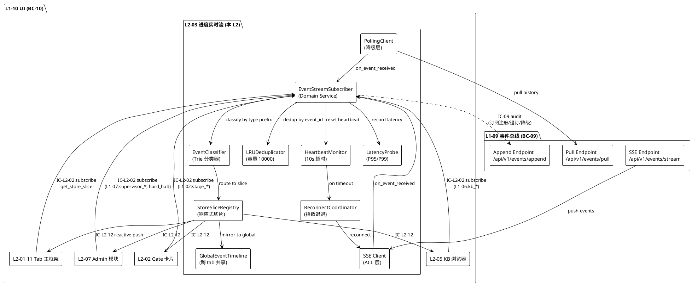
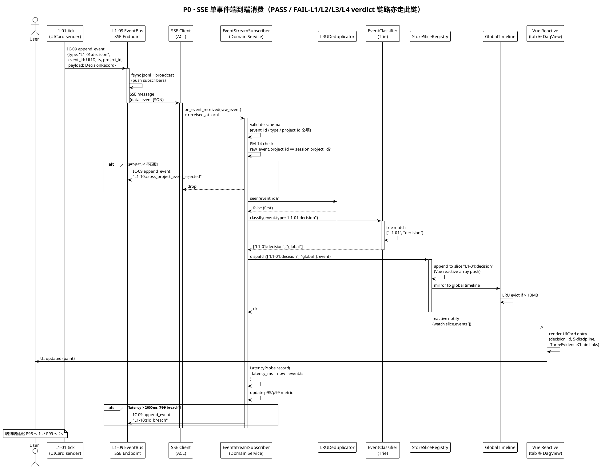
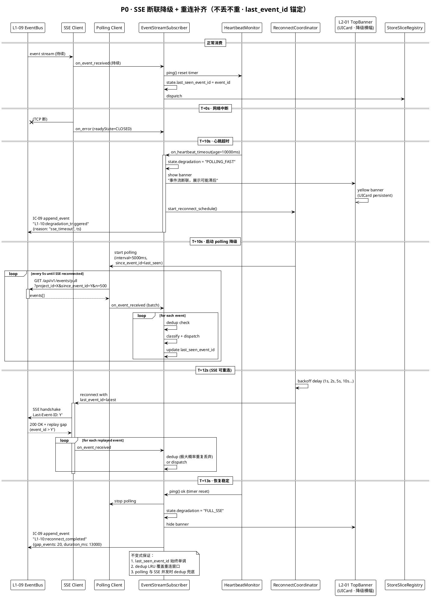
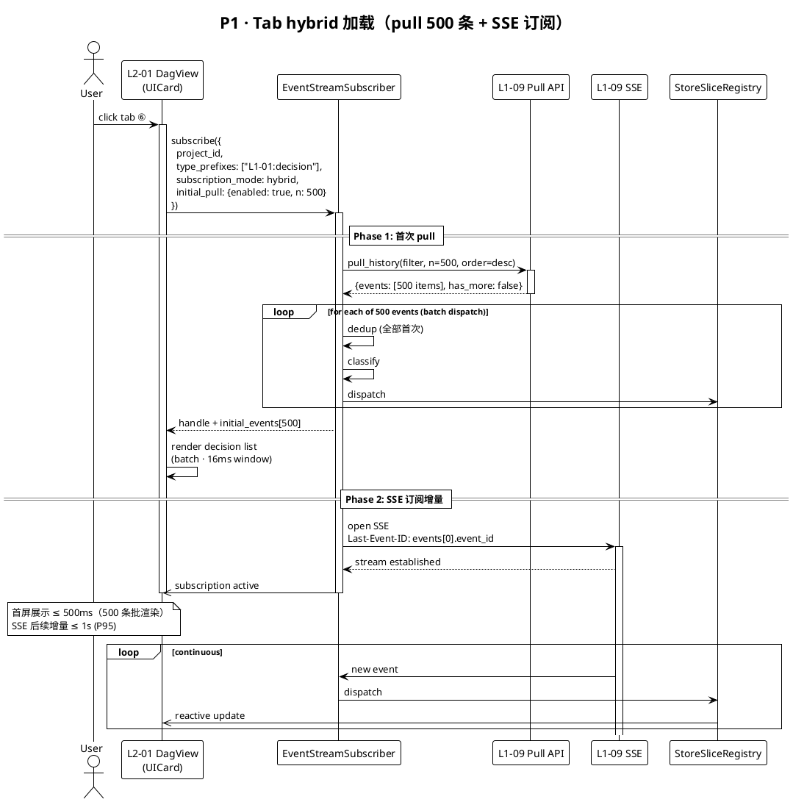
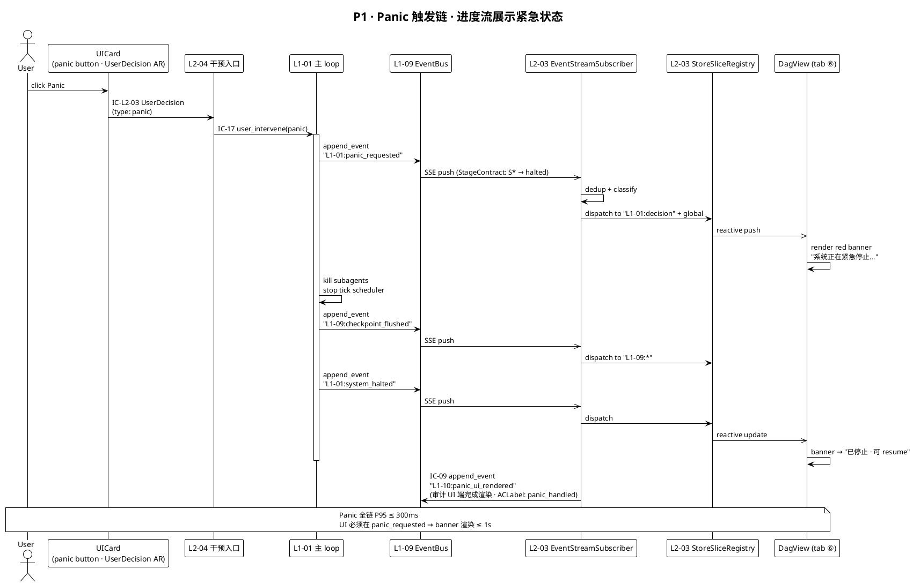
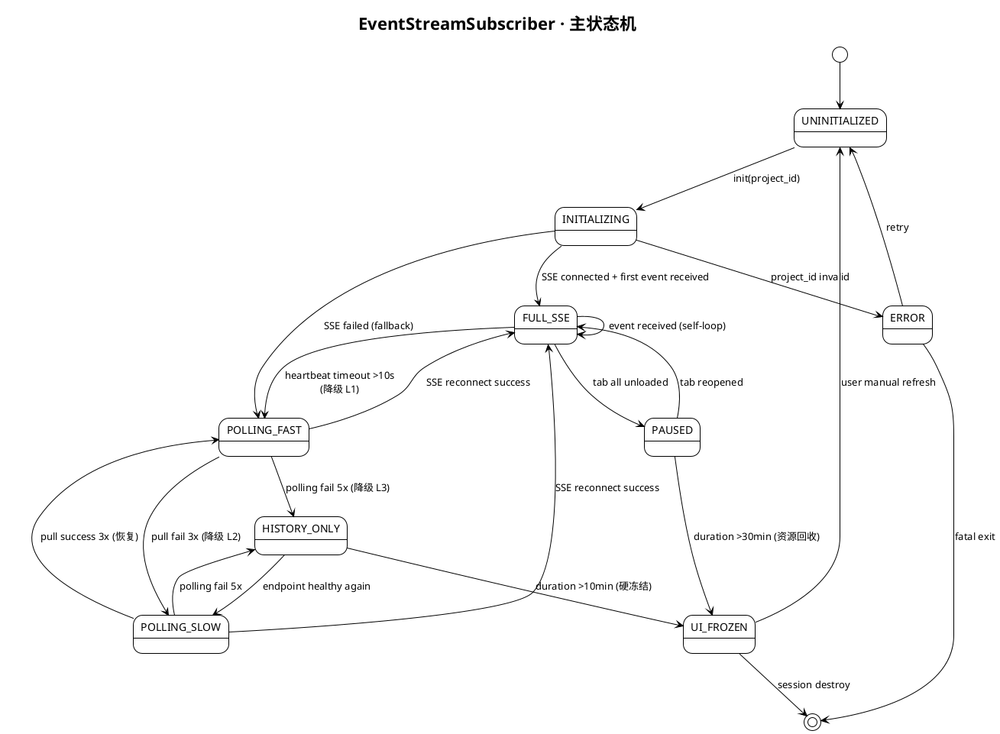
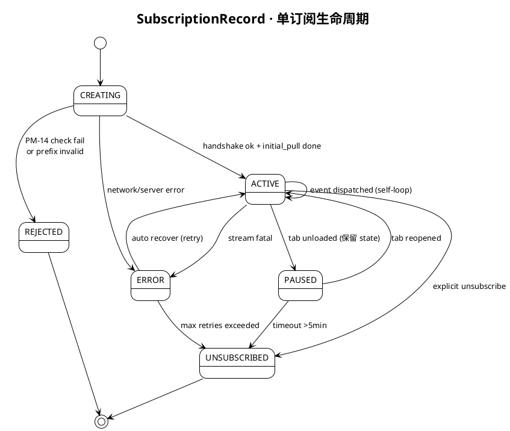
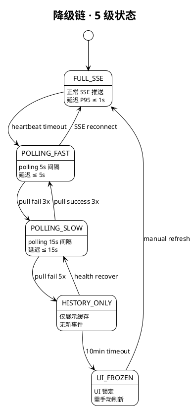
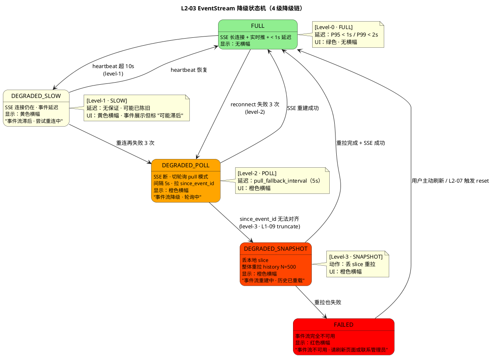

# L1 L2-03 · 进度实时流 · Tech Design

> **本文档定位**：3-1-Solution-Technical 层级 · L1-10 的 L2-03 进度实时流 技术实现方案（L2 粒度）。
> **与产品 PRD 的分工**：2-prd/L1-10 人机协作UI/prd.md §5.10 的对应 L2 节定义产品边界，本文档定义**技术实现**（接口字段级 schema + 算法伪代码 + 底层数据结构 + 状态机 + 配置参数）。
> **与 L1 architecture.md 的分工**：architecture.md 负责**跨 L2 架构 + 跨 L2 时序**，本文档负责**本 L2 内部技术细节**。冲突以 architecture.md 为准。
> **严格规则**：本文档不复述产品 PRD 文字（职责 / 禁止 / 必须等清单），只做技术映射 + 补齐"产品视角未说 but 工程师必须知道"的部分（具体算法 · syscall · schema · 配置）。

---

## §0 撰写进度

- [x] §1 定位 + 2-prd §5.10 L2-03 映射
- [x] §2 DDD 映射（引 L0/ddd-context-map.md BC-10）
- [x] §3 对外接口定义（字段级 YAML schema + 错误码）
- [x] §4 接口依赖（被谁调 · 调谁）
- [x] §5 P0/P1 时序图（PlantUML ≥ 2 张）
- [x] §6 内部核心算法（伪代码）
- [x] §7 底层数据表 / schema 设计（字段级 YAML）
- [x] §8 状态机（PlantUML + 转换表）
- [x] §9 开源最佳实践调研（≥ 3 GitHub 高星项目）
- [x] §10 配置参数清单
- [x] §11 错误处理 + 降级策略
- [x] §12 性能目标
- [x] §13 与 2-prd / 3-2 TDD 的映射表

---

## §1 定位 + 2-prd 映射

### 1.1 本 L2 在 L1-10 人机协作 UI 里的坐标

L1-10 共 7 个 L2（L2-01 主框架 / L2-02 Gate 卡 / **L2-03 进度实时流** / L2-04 干预入口 / L2-05 KB 浏览器 / L2-06 裁剪档 / L2-07 Admin），**L2-03 是数据面唯一入口**——它订阅 L1-09 事件总线、去重分类、按 type 前缀分发到各 tab 的响应式 store 切片，驱动整个 UI 层"活起来"。其他 L2 都通过 L2-03 间接消费事件，绝不直订 L1-09。

```
  ┌─────────────────────────────────────────────────────────────┐
  │              L1-09 事件总线（append_event jsonl）           │
  └──────────────────────────┬──────────────────────────────────┘
                             │ IC-L2-01（SSE push / polling pull）
                             ▼
  ┌─────────────────────────────────────────────────────────────┐
  │       L2-03 · 进度实时流（本 L2 · 数据面唯一入口）          │
  │                                                             │
  │  ┌──────────────────────────────────────────────────────┐  │
  │  │ EventStreamSubscriber （Domain Service · 核心）      │  │
  │  │   ├── SubscriptionRegistry （订阅注册表）            │  │
  │  │   ├── EventDeduplicator    （event_id 去重器）       │  │
  │  │   ├── EventClassifier      （type 前缀路由）         │  │
  │  │   ├── StoreSliceDispatcher （响应式 store 分发）     │  │
  │  │   ├── HeartbeatMonitor     （>10s 断联检测）         │  │
  │  │   ├── ReconnectCoordinator （重连 + last_event_id）  │  │
  │  │   ├── HistoryPuller        （首次 pull N=500）       │  │
  │  │   └── LatencyProbe         （消费延迟打点）          │  │
  │  └──────────────────────────────────────────────────────┘  │
  │                                                             │
  │  ┌──────────────────────────────────────────────────────┐  │
  │  │ VO · EventStreamSlice （各 tab 专属 store 切片）     │  │
  │  │ VO · SubscriptionFilter （type 前缀 + project_id）   │  │
  │  │ VO · ConsumptionLatencyMetric （P50/P95/P99）         │  │
  │  │ VO · GlobalEventTimeline （跨 tab 共享缓存）         │  │
  │  └──────────────────────────────────────────────────────┘  │
  └──────────────────────────┬──────────────────────────────────┘
                             │ IC-L2-12（响应式推送）
                 ┌───────────┼───────────┬──────────┬──────────┐
                 ▼           ▼           ▼          ▼          ▼
            [L2-01 tab]  [L2-02 Gate] [L2-05 KB] [L2-07 Admin] ...
```

L2-03 的定位 = **"L1-10 数据面唯一底座 · SSE 主通道 + polling 降级 · 消费延迟 P95 ≤ 1s / P99 ≤ 2s · 10 种 type 前缀分发 · 跨 tab 共享时间轴 · 严格单 project 过滤 · 只读零写"**。

### 1.2 与 2-prd §5.10 L2-03 的对应表

| 2-prd §5.10 L2-03 小节 | 本文档对应位置 | 技术映射重点 |
|:---|:---|:---|
| §10.1 职责（消费 L1-09 + 分发各 tab） | §1.3 + §2.1 (EventStreamSubscriber 领域服务) | 唯一数据面入口 · 分发而非消费 |
| §10.2 输入输出（异步 push + 订阅注册 + 历史 pull） | §3 字段级 schema（4 entry methods） | SSE / polling 双通道 |
| §10.3 边界（只读 L1-09 · 不做展示 · 不做持久化） | §2.5 + §11 | 不暴露写 API · UI 内存态缓存 |
| §10.4 硬约束（消费 ≤ 2s · 单 session 单 project · 去重 · 补齐） | §6 算法 + §12 SLO | 5 条硬约束对应 5 个算法 |
| §10.5 禁止（禁写事件总线 · 禁跨项目混流 · 禁重复消费） | §11 降级链 + §3 错误码 | 硬拦截式禁止（拒绝执行） |
| §10.6 必须（≤2s / 去重 / 降级横幅 / 补齐 / pull N=500 / 共享时间轴 / 审计留痕） | §6 算法 + §12 SLO | 7 条必须对应 7 段逻辑 |
| §10.7 可选（级别过滤 / 搜索 / 导出 / 延迟图表 / 健康仪表） | §3.5 可选 method | 默认关闭 · config 开关 |
| §10.8 IC 契约（IC-L2-01 调 L1-09 · IC-L2-02 被 L2-01 调 · IC-L2-12 分发） | §4 依赖图 + §3 schema | 4 条 IC 的字段级定义 |

### 1.3 本 L2 在 architecture.md 里的坐标

引 `docs/3-1-Solution-Technical/L1-10-人机协作UI/architecture.md §3.1 图 A 主干消费-反馈面` + §8 实时流选型：

- **数据面位置**：架构图 A 里 L2-03 是唯一从事件总线拉出数据的组件（IC-L2-01 唯一入口）
- **分发扇出**：架构图 A 里 L2-03 向 L2-01/L2-02/L2-05/L2-07 四个消费者扇出（IC-L2-12）
- **降级协同**：架构图 B 响应面 6 里 L2-03 心跳丢失 → 通知 L2-01 顶部横幅 → 切 pull 模式 → 补齐重连
- **SSE / polling 选型**：architecture.md §8 已定 SSE 主通道 + polling 5s 降级；本 L2 落地这个选择

### 1.4 本 L2 的 PM-14 约束

**PM-14 约束**（引 `docs/3-1-Solution-Technical/projectModel/tech-design.md`）：所有 IC payload 顶层必带 `project_id`；本 L2 的 SubscriptionFilter 必须携带 project_id 作为第一过滤字段；跨项目事件必须在 classifier 层被拒绝并产 `L1-10:cross_project_event_rejected` 审计事件。

本 L2 在 PM-14 层面的具体落点：
- UI 内存 store：跨 tab 共享的 `timeline` Map 按 `project_id` 分桶，浏览器刷新时丢弃
- 审计落盘：订阅注册 / 退订 / 降级切换 / 补齐完成 / 跨项目拒绝 → 走 IC-09 append_event，路径 `projects/<pid>/events/L1-10/*.jsonl`
- SSE 连接：单 session 绑定一个 project_id，切 project 必须断旧连接建新连接（由 L2-07 Admin 的项目切换触发）
- last_event_id 持久化（可选）：`projects/<pid>/ui-state/last_seen_event_id.txt`（仅用于重连优化，非权威）

### 1.5 关键技术决策（本 L2 特有 · Decision / Rationale / Alternatives / Trade-off）

| # | 决策 | 选择 | 备选 | 理由 | Trade-off |
|:---|:---|:---|:---|:---|:---|
| **D1** | 主推送通道 | **SSE (Server-Sent Events)** | WebSocket / long-polling / gRPC-Web | 单向推送场景简单 · 原生浏览器 EventSource 自动重连 · HTTP/1.1 兼容无需升级协议 · 零 npm 依赖 | 无法反向推（不需要，反向是 L2-04 走 POST）· 6 连接上限（localhost 单 project 够用） |
| **D2** | 降级通道 | **polling 每 5s** | long-polling / WebSocket 重试 | 简单可预测 · 与 SSE 使用同一 pull API · 降级切换成本低 | 5s 粒度延迟 > SSE（可接受，降级状态下延迟本来就放宽） |
| **D3** | 去重策略 | **event_id 内存 LRU（容量 10000）** | 全量 set / Bloom filter / 服务端去重 | event_id 是 ULID 时间有序 · LRU 足够 · 10000 覆盖约 100s 高频窗口 · 重复一般来自重连窗口 | 超出 LRU 窗口的极罕见重复可能漏过（可容忍，审计侧兜底） |
| **D4** | 分类器实现 | **type 前缀 trie 树**（O(k) 匹配 k=前缀深度） | 正则 / 字典查找 / 固定 switch | 前缀结构天然 trie · O(k) 查找常数小 · 新增前缀无需改代码 | 实现稍复杂（可接受） |
| **D5** | 响应式 store | **Vue 3 reactive() + 浅代理** | pinia / vuex / 自实现 observer | 全量 reactive 开销大（100 条事件秒级刷新）· 浅代理按需触发 tab 订阅 | 深层字段变更需手动触发（事件是 immutable 无此问题） |
| **D6** | 跨 tab 共享时间轴 | **单 Vue 实例全局 store**（`window.__hfTimeline`） | 每 tab 独立 store / BroadcastChannel / IndexedDB | 同页面同实例 · 切 tab 不重建组件 · 不跨 tab 同步（单 session 单窗口约束） | 刷新页面丢失内存态（靠 pull 补齐） |
| **D7** | 心跳检测 | **10s 无任何事件 + 无预期静默** | 独立 ping/pong / SSE retry 事件 / TCP keepalive | L1-09 每 tick 必产事件 · 10s 静默高概率异常 · 不引入额外通道 | 极低流量阶段可能误报（置"预期事件"白名单规避） |
| **D8** | 补齐策略 | **重连后 pull `since_event_id` 增量** | 重新 pull 全量 / 仅接受新事件 | 不丢不重 · 增量最小 · last_event_id 由客户端持久化 | 依赖 L1-09 提供 `since_event_id` 查询（已在 IC-L2-01 契约） |
| **D9** | 内存上限 | **全局时间轴 LRU 10MB（约 20000 事件）** | 全量保留 / 按数量 / IndexedDB | 浏览器内存敏感 · 10MB 兼顾用户体验与 OOM · 超出丢最旧 · L1-09 仍有完整数据 | 用户滚到旧事件需重新 pull（可接受） |
| **D10** | 延迟打点 | **event.ts → store 更新完成时间差** | 多点打点 / performance.mark | 测"端到端感知延迟" · 单点简单 · P95 / P99 由后台聚合 | 不含 paint 时间（由浏览器异步渲染，不可控） |
| **D11** | 异步处理 | **microtask 队列 + 批处理 16ms 合并** | 立即同步 / setTimeout / requestIdleCallback | 16ms ≈ 60fps 帧间隙 · 高频事件批处理避免 UI 卡顿 · microtask 精度高于 setTimeout | 首事件延迟上 ±16ms（远小于 2s SLO） |
| **D12** | 订阅粒度 | **type 前缀集合** | 单 type / 全订阅 / 正则 | 前缀是 L1-09 与 L1-10 的契约 · 粒度合适 · 过滤工作分摊到 L1-09 | 需维护前缀表（附录 A） |

### 1.6 本 L2 读者预期

读完本 L2 的工程师应掌握：
- EventStreamSubscriber 的 4 entry methods 字段级 schema + 12 错误码
- 8 段核心算法（SSE 订阅 / 去重 / 前缀分类 / store 分发 / 心跳监控 / 重连补齐 / pull 历史 / 延迟打点）
- 3 张数据表（SubscriptionRegistry / EventBuffer / ConsumptionMetric · 含 PM-14 字段）
- EventStreamSubscriber 状态机（PlantUML 6 个主状态 + 12 转换）
- 降级链 5 级（FULL_SSE → POLLING_FAST → POLLING_SLOW → HISTORY_ONLY → UI_FROZEN）
- SLO（P95 ≤ 1s / P99 ≤ 2s · 吞吐 100 evt/s 不卡 · 首次 pull 500 条 ≤ 2s · tab 切换 ≤ 100ms）

### 1.7 本 L2 不在的范围（YAGNI）

- **不在**：事件内容校验（L1-09 的 schema 责任）
- **不在**：事件写入（任何 write 都经 L2-04 IC-17）
- **不在**：跨项目事件合流（违反 PM-14 单 session 单 project 约束）
- **不在**：事件持久化到本地 IndexedDB（UI 内存态即可，刷新从 L1-09 重拉）
- **不在**：业务展示逻辑（各消费 L2 自行承担：Gate → L2-02 / KB → L2-05 等）
- **不在**：反向推事件（那是 L2-04 职责）
- **不在**：多窗口 tab 同步（V1 单窗口单 session）

### 1.8 本 L2 术语表

| 术语 | 定义 | 关联 |
|:---|:---|:---|
| EventStreamSubscriber | 本 L2 核心 Domain Service · 持有订阅与分发逻辑 | §2.1 |
| EventStreamSlice | VO · 各 tab 专属的事件切片（按 type 前缀划分） | §2.2 |
| SubscriptionFilter | VO · 订阅过滤规则（project_id + type_prefixes + severity） | §2.3 |
| GlobalEventTimeline | VO · 跨 tab 共享的全局时间轴缓存 | §2.4 |
| ConsumptionLatencyMetric | VO · 消费延迟指标（P50/P95/P99） | §2.5 |
| TypePrefix | 事件 type 前缀（如 `L1-01:decision`）· 契约清单见附录 A | §6.3 |
| HeartbeatMonitor | 10s 无事件检测器 · 触发降级 | §6.5 |
| LastEventId | 客户端侧持久化的最后消费 event_id · 重连补齐锚点 | §6.6 |
| LRUDeduplicator | event_id LRU 去重器（容量 10000） | §6.2 |

### 1.9 本 L2 的 DDD 定位一句话

> **L2-03 是 BC-10 Human-Agent Collaboration UI 的 Domain Service 层 · 唯一数据面入口 · 事件订阅-去重-分类-分发流水线 · SSE 主通道 + polling 降级 · 消费延迟 P95 ≤ 1s · 严格只读 + 单 project 过滤 + 零业务展示。**

---

## §2 DDD 映射（BC-10 Human-Agent Collaboration UI · Domain Service 层）

引 `docs/3-1-Solution-Technical/L0/ddd-context-map.md §2.11 BC-10`。

本 L2 在 BC-10 里属于**领域服务层**（Domain Service），不持有聚合根，但持有**值对象**（VO）+ **策略**（EventClassifier / HeartbeatMonitor / ReconnectCoordinator 三个 Domain Service 级子模块）。

### 2.1 Domain Service · EventStreamSubscriber

**职责**：从 L1-09 事件总线订阅事件 · 去重 · 按 type 前缀分类 · 路由到各 tab 的 store 切片 · 维护跨 tab 共享时间轴 · 心跳 + 重连 + 补齐 + 降级

**本质**：纯 Domain Service · 无域数据所有权（事件所有权在 BC-09）· 操作自己的 VO（EventStreamSlice / SubscriptionFilter / GlobalEventTimeline / ConsumptionLatencyMetric）+ 调用 L1-09 的 Query（replay_from_event）

**关键字段**（状态从外部持久化读取 · 自身无状态字段 · 属于无状态 Domain Service）：

```yaml
# 构造注入（依赖）
dependencies:
  event_bus_client:               # L1-09 HTTP/SSE client (IC-L2-01 ACL 层)
  store_slice_registry:           # 本 L2 内部分片注册表
  global_timeline:                # 跨 tab 共享 VO
  dedup_lru:                      # LRU 去重器
  heartbeat_monitor:              # 心跳监控子服务
  reconnect_coordinator:          # 重连协调器子服务
  latency_probe:                  # 延迟打点子服务
  audit_bridge:                   # IC-09 append_event 桥接

# 配置（详见 §10）
config:
  sse_endpoint: "/api/v1/events/stream"
  pull_endpoint: "/api/v1/events/pull"
  sse_reconnect_backoff_ms: [1000, 2000, 5000, 10000]   # 指数退避
  heartbeat_timeout_ms: 10000
  dedup_lru_capacity: 10000
  history_pull_n: 500
  polling_interval_ms: 5000
  timeline_memory_limit_mb: 10
  batch_window_ms: 16            # microtask 合并窗口
  ...
```

**行为**（Methods · 详 schema 见 §3）：

- `subscribe(filter: SubscriptionFilter) -> SubscriptionHandle`
- `unsubscribe(handle: SubscriptionHandle) -> void`
- `pull_history(filter, n) -> Event[]`
- `on_event_received(raw_event) -> void`（SSE / polling 回调）
- `get_store_slice(slice_key) -> EventStreamSlice`
- `get_latency_metric() -> ConsumptionLatencyMetric`
- `trigger_degradation(reason) -> void`（内部）
- `reconnect_with_last_id(last_event_id) -> void`（内部）

### 2.2 Value Object · EventStreamSlice

**标识**：`slice_key: str`（如 `L1-01:decision` / `L1-02:stage_*` / `global`）
**不变性**：VO 内部 events 数组只追加（append-only）；容量满后丢最旧

**字段**（字段级 YAML）：

```yaml
project_id: string               # PM-14 项目上下文
slice_key: string                # 切片键（type 前缀或 "global"）
type_prefix: string              # 对应 L1-09 事件 type 前缀
subscriber_count: int            # 订阅此切片的消费者数
events:                          # 有序 event 列表（按 ts 升序）
  - event_id: ULID
    type: string
    ts: ISO8601 UTC
    project_id: string
    payload: object              # L1-09 原始 payload
    received_at: ISO8601 UTC     # UI 收到时间（打延迟用）
capacity: int                    # 切片容量上限
last_updated_at: ISO8601 UTC
stats:
  total_received: int
  total_dropped: int             # 超容量丢弃计数
  last_event_ts: ISO8601 UTC
```

### 2.3 Value Object · SubscriptionFilter

**标识**：`filter_id: UUIDv7`
**不变性**：不可变 VO · 修改订阅需创建新 filter

**字段**（字段级 YAML）：

```yaml
project_id: string               # PM-14 项目上下文 · 必填 · 第一过滤字段
filter_id: string
type_prefixes:                   # 订阅的 type 前缀集合
  - string                       # 如 "L1-01:decision"
severity_filter:                 # 可选 · severity 过滤
  - "info"
  - "warn"
  - "error"
actor_filter:                    # 可选 · actor 过滤
  - string
created_at: ISO8601 UTC
created_by_tab: string           # 哪个 tab 创建（审计用）
subscription_mode:               # "push" | "pull" | "hybrid"
  type: string
  push_transport: "sse" | "polling"
  polling_interval_ms: int       # 当 mode=pull 时生效
```

### 2.4 Value Object · GlobalEventTimeline

**标识**：单例 · 按 `project_id` 分桶 · 跨 tab 共享
**不变性**：LRU 容量控制 · 最新事件追加头部

**字段**（字段级 YAML）：

```yaml
project_id: string               # PM-14 项目上下文
timeline:                        # 有序事件数组（按 received_at 降序）
  - event_id: ULID
    type: string
    ts: ISO8601 UTC
    project_id: string
    type_prefix: string          # 解析后前缀（加速查找）
    payload_preview: string      # 截断前 200 字（展示用）
    payload_ref: string          # 完整 payload 的引用（懒加载）
    severity: string
capacity_bytes: int              # 内存上限（默认 10 * 1024 * 1024）
current_size_bytes: int
eviction_count: int              # LRU 驱逐计数
first_seen_at: ISO8601 UTC
last_seen_at: ISO8601 UTC
subscribers:                     # 哪些 tab 订阅了此时间轴
  - tab_id: string
    last_read_event_id: ULID
```

### 2.5 Value Object · ConsumptionLatencyMetric

**标识**：按 `project_id` + 时间窗口（5min 滚动）
**不变性**：每 5min 窗口结束即 immutable · 进入历史归档

**字段**（字段级 YAML）：

```yaml
project_id: string               # PM-14 项目上下文
window_start: ISO8601 UTC
window_end: ISO8601 UTC
sample_count: int
latencies_ms:                    # 样本（用于聚合，展示时丢弃）
  - event_id: ULID
    latency_ms: int
percentiles:
  p50_ms: int
  p95_ms: int
  p99_ms: int
  max_ms: int
breaches:                        # SLO 破坏计数
  above_1s: int                  # P95 目标
  above_2s: int                  # P99 目标
source_transport: "sse" | "polling"
```

### 2.6 Domain Service · EventClassifier

**职责**：按 type 前缀做 trie 匹配 · 路由到对应 slice_key · 支持通配（`L1-02:stage_*`）

**算法**：trie 前缀匹配（见 §6.3）· 通配符用 `*` 后缀

**不变式**：同一 event 只路由到一个 slice_key（第一匹配命中）+ global timeline（全量追加）

### 2.7 Domain Service · HeartbeatMonitor

**职责**：监控 SSE 流的事件心跳 · `>10s` 无任何事件 → 触发断联降级

**算法**：滑动窗口（见 §6.5）· 事件到达重置计时器 · 超时触发 degradation event

**不变式**：仅在"预期有事件"的阶段启动心跳检测（由 UI 状态决定：tab 活跃 + project 活跃 + S3-S5 主循环在跑）

### 2.8 Domain Service · ReconnectCoordinator

**职责**：断联后按指数退避重连 · 重连成功后按 `last_event_id` pull 增量补齐

**算法**：指数退避 `[1s, 2s, 5s, 10s, 30s, 60s, ...]` · 补齐 pull 去重后分发（见 §6.6）

**不变式**：重连期间 UI 顶部横幅降级提示；补齐完成后清除提示

### 2.9 跨 BC 关系（本 L2 角度）

| 对方 BC | 关系 | 具体依赖 |
|---|---|---|
| **BC-09** Resilience & Audit | **Customer**（消费事件流 · 写审计） | IC-L2-01 拉事件 · IC-09 append_event 审计订阅行为 |
| **BC-10 内部 L2-01** | **Supplier**（供应 store 切片） | IC-L2-02 被调（tab 加载时取切片 + 订阅） |
| **BC-10 内部 L2-02/05/07** | **Supplier**（供应响应式更新） | IC-L2-12 向它们分发事件 |
| **BC-01/02/03/04/05/06/07/08** | **间接 Customer**（通过 BC-09 事件流消费） | 订阅这些 BC 产的事件前缀 |

### 2.10 Shared Kernel 约束

- `HarnessFlowProjectId`（PM-14 值对象）· 所有 SubscriptionFilter / EventStreamSlice / GlobalEventTimeline / ConsumptionLatencyMetric 首字段必含
- `EventId`（ULID · 全系统共享）· 用于去重键

### 2.11 Aggregate Root 归属澄清

**本 L2 不持有聚合根**。事件数据的所有权在 BC-09（L1-09 EventLog 聚合根）；本 L2 只是消费者的缓存。若用户刷新浏览器，所有缓存丢弃，从 L1-09 重新 pull。

---

## §3 对外接口定义（字段级 YAML schema + 错误码）

本 L2 对外暴露 **4 个核心 method + 2 个可选 method + 2 个内部回调**，对应 4 条 IC。

### 3.1 Method: `subscribe(filter) -> handle`

**方向**：L2-01/L2-02/L2-05/L2-07 → L2-03
**IC**：IC-L2-02 `tab_subscribe`
**同步/异步**：同步调用 · 返回 handle 后异步推送事件

**入参 schema**：

```yaml
request:
  project_id: string                     # PM-14 必填
  filter:
    type_prefixes:                       # 至少 1 个
      - string
    severity_filter:                     # 可选
      - string
    actor_filter:                        # 可选
      - string
    subscription_mode:
      type: "push" | "pull" | "hybrid"   # 默认 push
      push_transport: "sse" | "polling"  # 默认 sse
      polling_interval_ms: int           # pull 模式必填
  tab_id: string                         # 调用方 tab 标识
  initial_pull:                          # 可选 · 是否首次 pull 历史
    enabled: bool
    n: int                               # 默认 500
```

**出参 schema**：

```yaml
response:
  handle:
    subscription_id: UUIDv7
    project_id: string
    filter_id: UUIDv7
    established_at: ISO8601 UTC
    transport: "sse" | "polling"
    sse_connection_id: string            # 若 SSE
    slice_keys:                          # 路由到哪些切片
      - string
  initial_events:                        # 若 initial_pull.enabled
    - event_id: ULID
      type: string
      ts: ISO8601 UTC
      payload: object
  stats:
    registry_size_after: int             # 当前活跃订阅数
```

**错误码**：

| 错误码 | HTTP | 含义 | 触发场景 | 调用方处理 |
|:---|:---|:---|:---|:---|
| `E-L203-001` | 400 | 缺失 project_id | PM-14 硬约束违反 | 客户端修正必填字段后重试 |
| `E-L203-002` | 400 | type_prefixes 为空或无效前缀 | 订阅前缀不在附录 A 白名单 | 检查前缀拼写，参考附录 A 表 |
| `E-L203-003` | 409 | project_id 与当前 session 不匹配 | 跨项目订阅被拒 | 切换 project 后重试（经 L2-07） |
| `E-L203-004` | 503 | L1-09 事件总线不可达 | SSE endpoint 连接失败 | 客户端自动重试（5s 后）+ 顶部横幅降级 |
| `E-L203-005` | 429 | 订阅数超上限（单 tab ≤ 8） | 同一 tab 重复注册 | 先退订旧订阅再注册新订阅 |

### 3.2 Method: `unsubscribe(handle) -> void`

**方向**：L2-01/02/05/07 → L2-03
**IC**：IC-L2-02 `tab_unsubscribe`

**入参 schema**：

```yaml
request:
  project_id: string                     # PM-14 必填
  subscription_id: UUIDv7
  tab_id: string
  reason: "tab_unloaded" | "user_leave" | "project_switch" | "error"
```

**出参 schema**：

```yaml
response:
  unsubscribed_at: ISO8601 UTC
  events_consumed: int                   # 此订阅生命周期消费事件数
  final_latency_metric:
    p95_ms: int
    p99_ms: int
```

**错误码**：

| 错误码 | HTTP | 含义 | 触发场景 | 调用方处理 |
|:---|:---|:---|:---|:---|
| `E-L203-006` | 404 | subscription_id 不存在 | handle 过期或已被退订 | 忽略（幂等） |
| `E-L203-007` | 400 | tab_id 与订阅记录不匹配 | 越权退订 | 审计告警 + 拒绝 |

### 3.3 Method: `pull_history(filter, n) -> events`

**方向**：L2-01/02/05/07 → L2-03（内部再转发给 L1-09）
**IC**：IC-L2-02 `tab_pull_history`

**入参 schema**：

```yaml
request:
  project_id: string                     # PM-14 必填
  filter:
    type_prefixes: [string]
    severity_filter: [string]            # 可选
    time_range:                          # 可选 · 时间范围
      since_ts: ISO8601 UTC
      until_ts: ISO8601 UTC
    since_event_id: ULID                 # 可选 · 增量拉
  n: int                                 # 最多返回条数（默认 500 · max 2000）
  order: "asc" | "desc"                  # 时间序（默认 desc · 最新在前）
```

**出参 schema**：

```yaml
response:
  project_id: string
  events:
    - event_id: ULID
      type: string
      ts: ISO8601 UTC
      project_id: string
      payload: object
  count: int                             # 实际返回条数
  has_more: bool                         # 是否还有更多（前端可继续拉）
  oldest_event_id: ULID                  # 此批最旧 event_id
  newest_event_id: ULID                  # 此批最新 event_id
  pull_latency_ms: int                   # L1-09 响应耗时
```

**错误码**：

| 错误码 | HTTP | 含义 | 触发场景 | 调用方处理 |
|:---|:---|:---|:---|:---|
| `E-L203-008` | 400 | n 超出上限 (> 2000) | 客户端参数错误 | 分页拉取 |
| `E-L203-009` | 504 | L1-09 pull 超时 (> 2s) | 事件总线慢或 I/O 阻塞 | 重试 + 降级横幅 |
| `E-L203-010` | 416 | since_event_id 不存在 | event_id 已被归档或错误 | 全量 pull 兜底 |

### 3.4 Method: `get_store_slice(slice_key) -> slice`

**方向**：L2-01/02/05/07 → L2-03（frontend 内部直访 reactive store · 无网络）
**IC**：IC-L2-12 `store_slice_access`

**入参 schema**：

```yaml
request:
  project_id: string                     # PM-14 必填
  slice_key: string                      # 切片键
  include_stats: bool                    # 是否带统计（默认 false）
```

**出参 schema**：

```yaml
response:
  slice:
    project_id: string
    slice_key: string
    events: [Event]                      # 响应式数组（Vue reactive）
    stats:
      total_received: int
      total_dropped: int
      last_event_ts: ISO8601 UTC
```

**错误码**：

| 错误码 | HTTP | 含义 | 触发场景 | 调用方处理 |
|:---|:---|:---|:---|:---|
| `E-L203-011` | 404 | slice_key 不存在 | 未注册的切片键 | 先 subscribe 触发切片创建 |
| `E-L203-012` | 409 | project_id 不匹配 | 跨项目访问 | 拒绝 + 审计 |

### 3.5 可选 Method: `search_events(query) -> events`

**方向**：L2-07 诊断面板 → L2-03（V2 开放）

**入参 schema**：

```yaml
request:
  project_id: string
  query:
    keyword: string                      # 内容关键词
    type_prefix: string                  # 可选
    since_ts: ISO8601 UTC
    until_ts: ISO8601 UTC
  max_results: int
```

**出参 schema**：

```yaml
response:
  matches:
    - event_id: ULID
      type: string
      ts: ISO8601 UTC
      snippet: string                    # 命中片段（高亮）
  total_matches: int
  truncated: bool
```

### 3.6 可选 Method: `export_events_jsonl(range) -> download_url`

**方向**：L2-07 → L2-03（V2 开放）

**入参 schema**：

```yaml
request:
  project_id: string
  since_ts: ISO8601 UTC
  until_ts: ISO8601 UTC
  type_prefixes: [string]
  max_bytes: int                         # 导出上限（默认 50MB）
```

**出参 schema**：

```yaml
response:
  download_url: string                   # 临时下载链接
  expires_at: ISO8601 UTC
  size_bytes: int
  event_count: int
```

### 3.7 内部回调: `on_event_received(raw_event) -> void`

**方向**：SSE / polling client → L2-03 EventStreamSubscriber（内部）

**入参 schema**：

```yaml
raw_event:
  event_id: ULID
  type: string
  ts: ISO8601 UTC
  project_id: string
  payload: object
  received_at: ISO8601 UTC               # 本地接收时间戳
  transport: "sse" | "polling"
```

### 3.8 内部回调: `on_heartbeat_timeout(last_event_age_ms) -> void`

**方向**：HeartbeatMonitor → L2-03（内部）

**入参 schema**：

```yaml
timeout_info:
  last_event_ts: ISO8601 UTC
  last_event_age_ms: int
  active_subscriptions: int
  expected_event_flow: bool              # 此刻是否"预期有事件"
```

### 3.9 全量错误码汇总表

| 错误码 | 语义 | 严重级 | 升级路径 |
|:---|:---|:---|:---|
| `E-L203-001` | 缺失 project_id | critical | 拒绝 · 审计 |
| `E-L203-002` | type_prefixes 无效 | major | 拒绝 · 提示 |
| `E-L203-003` | 跨项目订阅 | critical | 拒绝 · 审计 + 告警 |
| `E-L203-004` | L1-09 不可达 | critical | 降级 polling + 横幅 |
| `E-L203-005` | 订阅超上限 | minor | 提示 · 先退旧 |
| `E-L203-006` | handle 不存在 | minor | 幂等 · 忽略 |
| `E-L203-007` | tab_id 不匹配 | critical | 拒绝 · 审计 |
| `E-L203-008` | n 超上限 | minor | 客户端分页 |
| `E-L203-009` | pull 超时 | major | 重试 + 横幅 |
| `E-L203-010` | since_event_id 不存 | major | 全量兜底 |
| `E-L203-011` | slice_key 不存 | minor | 先订阅 |
| `E-L203-012` | 跨项目访问 | critical | 拒绝 · 审计 |
| `E-L203-013` | 去重 LRU 满（监控） | warn | 内部重建 LRU |
| `E-L203-014` | 时间轴超容量丢事件 | warn | 记录 drop 计数 |

---

## §4 接口依赖（被谁调 · 调谁）

### 4.1 被谁调（上游调用方）

| 调用方 | 方法 | 频次 | 时机 |
|:---|:---|:---|:---|
| **L2-01** 11 tab 主框架 | subscribe / get_store_slice | tab 加载/卸载时 | 每 tab 加载触发订阅（按附录 A 前缀）· 卸载触发退订 |
| **L2-02** Gate 卡片 | subscribe(`L1-02:stage_*`) | Gate tab 加载 | 维护 Gate 历史渲染 |
| **L2-05** KB 浏览器 | subscribe(`L1-06:kb_*`) | KB tab 加载 | 实时同步 KB 变更 |
| **L2-07** Admin 模块 | subscribe(`L1-07:supervisor_*`, `L1-09:*`, `hard_halt`) | Admin 模块加载 | 告警角 + 审计查询 |
| **L2-01** 全局时间轴 | get_store_slice("global") | tab ⑩ 事件 tab 渲染 | 全量事件时间线 |

### 4.2 调谁（下游依赖）

| 被调方 | 方法 | 频次 | 时机 |
|:---|:---|:---|:---|
| **L1-09** 事件总线 | IC-L2-01 SSE stream / pull_events | 持续 | SSE 保持长连接 · pull 按需调用 |
| **L1-09** 审计 | IC-09 append_event | 低频 | 订阅注册/退订/降级/补齐完成/跨项目拒绝 5 类事件 |
| **L2-04** 用户干预入口 | 无直接调用（本 L2 只读） | 从不 | 本 L2 不写，写由 L2-04 承担 |

### 4.3 依赖图（PlantUML）



### 4.4 依赖边界与契约锁定

- **L1-09 SSE endpoint 契约**（锁定 L0 `ic-contracts.md` IC-L2-01）：SSE stream 事件格式必须是 `{event_id, type, ts, project_id, payload}`；断联由 EventSource 自动重连 + 本 L2 额外控制补齐
- **L1-09 pull endpoint 契约**：支持 `since_event_id` 增量查询；返回按 ts 升序或降序；max n = 2000
- **IC-09 audit 契约**：本 L2 5 类审计事件前缀 `L1-10:subscription_registered` / `L1-10:subscription_unsubscribed` / `L1-10:degradation_triggered` / `L1-10:reconnect_completed` / `L1-10:cross_project_event_rejected`

### 4.5 不直接依赖清单（重要隔离）

- **不直接依赖 L1-01/02/03/04/05/06/07/08**：所有这些 BC 的事件都经 L1-09 事件总线间接消费，避免 10×10 耦合矩阵
- **不直接依赖 L2-04**：本 L2 零写，任何用户写入都由上游 tab 调 L2-04 自行处理
- **不直接依赖 L2-06 裁剪档**：裁剪档只影响事件产生侧（L1 各 BC），本 L2 消费侧无感

---

## §4.x 保留扩展锚（预留）

> 保留给未来的 IC 扩展锚位，不在当前 L2 内部实现。

---

## §5 P0/P1 时序图（PlantUML ≥ 2 张）

本 L2 的 4 条 P0 / P1 关键时序链，均以 PlantUML 落地。

### 5.1 时序 1（P0）· 单事件端到端消费（SSE 主通道）

**场景**：L1-01 产一条 `L1-01:decision` 事件，L2-03 接收 → 去重 → 分类 → 分发 → tab ⑥ 决策流响应式渲染。



**关键决策点**：
- **PM-14 project_id 校验**：事件到达 subscriber 后第一步校验，不信任 L1-09 的过滤（二次保险）
- **去重先于分类**：LRU 命中直接丢弃，不浪费 trie 匹配
- **global timeline 镜像**：所有事件都进 global，保证 tab ⑩ 全量时间线可用
- **延迟打点**：在 `dispatch` 后即打点（不等 paint），因 paint 是浏览器异步控制不可测

### 5.2 时序 2（P0）· 断联降级 + 重连补齐（SSE → polling → SSE 切换）

**场景**：SSE 连接中断 12s，期间 L1-09 已落 20 条新事件；L2-03 先降级 polling 后再恢复 SSE，必须保证**不丢不重**。



**关键决策点**：
- **双通道并存窗口**：T+12~T+13 期间 SSE 已重连且 polling 未停，dedup 负责去重
- **last_event_id 单调性**：state.last_seen_event_id 只在 dispatch 成功后前进，保证补齐锚点正确
- **指数退避**：[1s, 2s, 5s, 10s, 30s, 60s] · 超过 60s 升级 supervisor 告警

### 5.3 时序 3（P1）· Tab 加载首次 pull + 后续 SSE 订阅（hybrid 模式）

**场景**：用户首次进入 tab ⑥ 决策流，需要先拉 500 条历史事件初始化，然后切到 SSE 订阅增量更新。



### 5.4 时序 4（P1）· 用户 panic 触发 UICard + 进度流紧急刷新

**场景**：用户点 panic 按钮（走 L2-04），L1-01 停 tick，L1-09 flush，进度流需要展示 `panic_requested` → `system_halted` 事件链。



**关键决策点**：
- **panic 事件链**：`panic_requested` → `checkpoint_flushed` → `system_halted` 三条事件都走本 L2 流水线，UI 按序渲染
- **ACLabel 审计**：本 L2 完成 panic 相关事件渲染后必须产 `L1-10:panic_ui_rendered` 事件（用 ACLabel 值对象标记），保证审计闭环
- **优先级提升**：panic 类事件在 §6.7 批处理中跳过批处理延迟（硬优先级插队）

---

## §6 内部核心算法（伪代码 · 续）

### 6.5 算法 5 · 心跳监控（10s 超时检测 + 降级触发）

**目标**：在"预期有事件"的阶段，若 10s 内无任何事件 → 触发断联降级

**伪代码**：

```python
class HeartbeatMonitor:
    timeout_ms: int = 10000
    last_ping_at: float = 0
    timer: Timer = None
    expected_event_flow: bool = False
    callback: Callable

    def start(self, callback: Callable):
        self.callback = callback
        self.last_ping_at = now_ms()
        self._schedule_check()

    def ping(self):
        """
        每次 on_event_received 调用；重置心跳。
        """
        self.last_ping_at = now_ms()
        if self.timer:
            self.timer.cancel()
        self._schedule_check()

    def _schedule_check(self):
        if not self.expected_event_flow:
            return  # 静默阶段不告警
        self.timer = set_timeout(self._check, self.timeout_ms)

    def _check(self):
        age = now_ms() - self.last_ping_at
        if age >= self.timeout_ms:
            # 超时 · 但先确认 expected_event_flow 仍成立
            if not self.expected_event_flow:
                return
            self.callback({
                "last_event_ts": ts_from_ms(self.last_ping_at),
                "last_event_age_ms": age,
                "expected_event_flow": True
            })

    def set_expected_event_flow(self, expected: bool):
        """
        由 UI 状态机驱动：项目活跃 + tab 活跃 + 主 loop 在跑 → True
        """
        self.expected_event_flow = expected
        if expected and not self.timer:
            self._schedule_check()

    def stop(self):
        if self.timer:
            self.timer.cancel()
```

**关键点**：
- `expected_event_flow` 由多维度判断（UI 活跃 + project 活跃 + supervisor 认定主 loop 应产事件）
- 10s 是硬阈值（对齐 scope §5.10.4 硬约束 5）
- 误报规避：静默阶段（如项目已归档）不启动计时器

### 6.6 算法 6 · 重连补齐（ReconnectCoordinator · last_event_id 锚定）

**目标**：断联后按指数退避重连 + pull 增量补齐 + 去重分发

**伪代码**：

```python
class ReconnectCoordinator:
    backoff_sequence_ms: list = [1000, 2000, 5000, 10000, 30000, 60000]
    attempt: int = 0
    max_duration_ms: int = 600000  # 10min · 超过升级 supervisor
    started_at: float = 0

    def schedule_reconnect(self, filter: SubscriptionFilter):
        if self.attempt == 0:
            self.started_at = now_ms()

        delay_ms = self.backoff_sequence_ms[
            min(self.attempt, len(self.backoff_sequence_ms) - 1)
        ]
        self.attempt += 1

        set_timeout(lambda: self._try_reconnect(filter), delay_ms)

    def _try_reconnect(self, filter: SubscriptionFilter):
        if (now_ms() - self.started_at) > self.max_duration_ms:
            self._escalate_to_supervisor()
            return

        try:
            # Step 1: 先 pull 增量补齐（SSE 握手前）
            gap = event_bus_client.pull_history(
                filter,
                since_event_id=state.last_seen_event_id,
                n=cfg.max_gap_pull_n
            )
            for ev in gap.events:
                on_event_received(ev)  # 走 dedup + classify + dispatch

            # Step 2: 重建 SSE
            start_sse_subscription(filter)

            # Step 3: 重置 backoff
            self.attempt = 0
            self.started_at = 0
            audit_bridge.append("L1-10:reconnect_completed", {
                "gap_events": len(gap.events),
                "duration_ms": now_ms() - self.started_at
            })

        except (NetworkError, ServerError) as e:
            log.warn(f"reconnect attempt {self.attempt} failed: {e}")
            self.schedule_reconnect(filter)  # 下一轮

    def _escalate_to_supervisor(self):
        """
        持续 10min 未恢复 → 升级 L1-07 supervisor + 冻结 UI
        """
        audit_bridge.append("L1-10:reconnect_escalated", {
            "duration_ms": now_ms() - self.started_at,
            "attempts": self.attempt
        })
        ui_state.set_degradation("UI_FROZEN")
        banner.show("事件流长时间中断，请刷新或联系管理员", severity="critical")
```

**关键点**：
- **指数退避**：1s, 2s, 5s, 10s, 30s, 60s · 第 7 次起保持 60s
- **先 pull 后 SSE**：补齐时先用 pull 把 gap 填上，再切 SSE 避免 SSE 握手本身丢事件
- **10min 硬超时**：超过即冻结 UI，避免无限空转

### 6.7 算法 7 · microtask 批处理（16ms 合并窗口）

**目标**：高频事件（100 evt/s）合并到 16ms 帧间隙处理，避免 UI 主线程卡顿

**伪代码**：

```python
class MicrotaskBatcher:
    queue: list[RawEvent] = []
    flush_scheduled: bool = False
    window_ms: int = 16  # 约 60fps 帧间隙
    priority_queue: list[RawEvent] = []  # 高优先级（panic/hard_halt）

    def push(self, raw_event: RawEvent):
        if self._is_high_priority(raw_event):
            self.priority_queue.append(raw_event)
            self._flush_now()
        else:
            self.queue.append(raw_event)
            if not self.flush_scheduled:
                self.flush_scheduled = True
                queue_microtask(lambda: set_timeout(self._flush, self.window_ms))

    def _is_high_priority(self, raw_event: RawEvent) -> bool:
        return raw_event.type in [
            "L1-01:panic_requested",
            "L1-01:system_halted",
            "L1-07:hard_halt",
            "L1-07:hard_halt_resolved",
        ]

    def _flush_now(self):
        """
        同步 flush 高优先级队列
        """
        while self.priority_queue:
            ev = self.priority_queue.pop(0)
            self._process_one(ev)

    def _flush(self):
        self.flush_scheduled = False
        batch = self.queue
        self.queue = []
        for ev in batch:
            self._process_one(ev)

    def _process_one(self, raw_event: RawEvent):
        if not dedup.process_event(raw_event):
            return
        slice_keys = classifier.classify(raw_event.type)
        store_registry.dispatch(slice_keys, raw_event)
        latency_probe.record(raw_event)
```

**关键点**：
- **16ms 窗口**：对齐 60fps 帧间隙 · 用户感知无延迟 · 批量减少 reactive notify 次数
- **高优先级插队**：panic / hard_halt 同步立即处理（不走 16ms 窗口）
- **microtask vs setTimeout**：microtask 精度高，任务粒度更细

### 6.8 算法 8 · 延迟打点 + P95/P99 聚合

**目标**：端到端延迟采样 · 5min 窗口聚合 · SLO 破坏告警

**伪代码**：

```python
class LatencyProbe:
    window_ms: int = 300000  # 5min
    samples: list[int] = []
    window_start: float = 0
    slo_p95_ms: int = 1000
    slo_p99_ms: int = 2000

    def record(self, event: Event):
        now = now_ms()
        if self.window_start == 0:
            self.window_start = now
        elif now - self.window_start > self.window_ms:
            self._finalize_window()
            self.window_start = now

        event_ts_ms = parse_iso8601_to_ms(event.ts)
        latency_ms = now - event_ts_ms
        self.samples.append(latency_ms)

        # 单点破坏即打 slo_breach 事件
        if latency_ms > self.slo_p99_ms:
            audit_bridge.append("L1-10:slo_breach", {
                "event_id": event.event_id,
                "latency_ms": latency_ms,
                "slo": "p99"
            })

    def _finalize_window(self):
        if not self.samples:
            return
        sorted_s = sorted(self.samples)
        n = len(sorted_s)
        metric = ConsumptionLatencyMetric(
            project_id=ui_state.project_id,
            window_start=ts_from_ms(self.window_start),
            window_end=ts_from_ms(now_ms()),
            sample_count=n,
            percentiles={
                "p50_ms": sorted_s[n // 2],
                "p95_ms": sorted_s[int(n * 0.95)],
                "p99_ms": sorted_s[int(n * 0.99)],
                "max_ms": sorted_s[-1]
            },
            breaches={
                "above_1s": sum(1 for s in sorted_s if s > 1000),
                "above_2s": sum(1 for s in sorted_s if s > 2000)
            }
        )
        metric_store.add(metric)
        # 批量破坏率 > 5% 触发告警
        if metric.breaches.above_2s / n > 0.05:
            audit_bridge.append("L1-10:slo_breach_rate", metric)
        self.samples = []

    def get_current_metric(self) -> ConsumptionLatencyMetric:
        """
        诊断面板使用 · 取当前窗口的实时聚合
        """
        if not self.samples:
            return None
        sorted_s = sorted(self.samples)
        n = len(sorted_s)
        return ConsumptionLatencyMetric(
            project_id=ui_state.project_id,
            window_start=ts_from_ms(self.window_start),
            window_end=now_iso8601(),
            sample_count=n,
            percentiles={
                "p50_ms": sorted_s[n // 2] if n else 0,
                "p95_ms": sorted_s[int(n * 0.95)] if n else 0,
                "p99_ms": sorted_s[int(n * 0.99)] if n else 0,
                "max_ms": sorted_s[-1] if n else 0
            }
        )
```

**关键点**：
- **5min 窗口**：平衡采样数与时效性
- **单点 vs 批量破坏**：单点破坏立即审计 · 批量 > 5% 破坏触发降级告警
- **event.ts 解析**：L1-09 写入时间戳 → UI 接收时间戳 = 端到端延迟

---

## §7 底层数据表 / schema 设计（字段级 YAML）

本 L2 是 UI 内存态 + 少量审计落盘，不持有独立持久化表。主要数据结构 3 张：

### 7.1 表 1 · SubscriptionRegistry（内存态 · 订阅注册表）

**物理位置**：浏览器内存（Vue reactive store · 单页面实例）
**生命周期**：随 UI session 创建/销毁
**是否审计**：创建/销毁事件通过 IC-09 落盘

**Schema（字段级 YAML）**：

```yaml
subscriptions:                         # Map<subscription_id, SubscriptionRecord>
  - subscription_id: UUIDv7
    project_id: string                 # PM-14 项目上下文
    filter_id: UUIDv7
    tab_id: string                     # 订阅者 tab 标识
    type_prefixes:
      - string                         # 订阅前缀列表
    severity_filter:                   # 可选
      - string
    transport: "sse" | "polling"
    sse_connection_id: string          # SSE 连接实例 id
    established_at: ISO8601 UTC
    last_event_received_at: ISO8601 UTC
    events_consumed: int               # 累计消费事件数
    events_dropped: int                # 累计丢弃事件数（容量/校验失败）
    status: "active" | "paused" | "error" | "unsubscribed"
    state:
      last_seen_event_id: ULID         # 本订阅最后消费 event_id（补齐锚点）
      last_heartbeat_at: ISO8601 UTC

summary:
  project_id: string                   # PM-14 项目上下文
  total_subscriptions: int
  active_subscriptions: int
  max_subscriptions_per_tab: int       # 8
  session_established_at: ISO8601 UTC
```

**索引**：内存 Map · subscription_id 主键 · tab_id 辅助索引（用于 tab 卸载批量退订）

### 7.2 表 2 · EventBuffer（内存态 · 跨 tab 共享时间轴）

**物理位置**：浏览器内存（全局单例 · `window.__hfTimeline`）
**生命周期**：随 UI session · 刷新即丢失
**是否审计**：不审计原始事件（L1-09 是事实源），仅审计 evict 总量

**Schema（字段级 YAML）**：

```yaml
project_id: string                     # PM-14 项目上下文 · 第一字段
global_timeline:                       # 有序数组（按 received_at 降序）
  - event_id: ULID
    type: string
    ts: ISO8601 UTC                    # L1-09 落盘时间
    project_id: string                 # 冗余存 · 二次校验
    type_prefix: string                # 解析缓存（加速查找）
    payload_preview: string            # 截断前 200 字（展示用 · payload 原样存在 slice）
    payload_ref: string                # 完整 payload 在哪个 slice 的哪个 index
    severity: "info" | "warn" | "error"
    received_at: ISO8601 UTC           # UI 接收时间
    consumed_latency_ms: int           # 单事件端到端延迟（event.ts → received_at）

slices:                                # Map<slice_key, EventStreamSlice>
  - slice_key: string                  # "L1-01:decision" / "L1-02:stage_*" 等
    project_id: string                 # PM-14
    capacity: int                      # 单切片容量（默认 2000）
    events:                            # 有序数组（按 ts 升序）
      - event_id: ULID
        type: string
        ts: ISO8601 UTC
        project_id: string
        payload: object                # 完整 payload
        received_at: ISO8601 UTC
    subscriber_tabs:                   # 哪些 tab 订阅此切片
      - string
    stats:
      total_received: int
      total_dropped: int               # 超容量丢弃
      last_event_ts: ISO8601 UTC

capacity_bytes: int                    # 全局内存上限（10MB）
current_size_bytes: int
eviction_count: int
dedup_lru:                             # 去重 LRU 结构
  capacity: int                        # 10000
  size: int
  hit_count: int
  evict_count: int
```

**索引**：
- `slice_key` 主键
- `event_id` 全局 Set（用于 dedup）
- `type_prefix` 辅助索引（用于快速批量过滤）

**容量控制**：
1. **单切片容量** 2000 · 超出丢最旧
2. **全局时间轴** LRU 10MB · 超出丢最旧（并更新 slice 内引用）
3. **dedup LRU** 10000 条 · 超出驱逐最久未见

### 7.3 表 3 · ConsumptionMetric（审计态 · 延迟指标历史）

**物理位置**：浏览器内存滚动窗口（5min × 12 = 1h 保留）+ 审计落盘
**生命周期**：每 5min 窗口 finalize 后一份快照 · 内存保留 1h · 落盘保留 30 天
**审计路径**：`projects/<pid>/events/L1-10/latency_metrics.jsonl`

**Schema（字段级 YAML）**：

```yaml
metrics:                               # Array<ConsumptionLatencyMetric>
  - project_id: string                 # PM-14 项目上下文
    window_start: ISO8601 UTC
    window_end: ISO8601 UTC
    sample_count: int
    transport: "sse" | "polling" | "mixed"
    percentiles:
      p50_ms: int
      p95_ms: int
      p99_ms: int
      max_ms: int
    breaches:
      above_1s: int                    # P95 目标 SLO
      above_2s: int                    # P99 目标 SLO
      breach_rate_pct: float           # above_2s / sample_count
    event_type_breakdown:              # 按事件类型分桶
      - type_prefix: string
        sample_count: int
        p95_ms: int
    degradation_events:                # 窗口内降级次数
      sse_to_polling: int
      polling_to_sse: int
      ui_frozen: int

current_window:                        # 实时窗口（未 finalize）
  project_id: string
  window_start: ISO8601 UTC
  sample_count: int
  realtime_p95_ms: int                 # 诊断面板实时展示
  realtime_p99_ms: int

slo_policy:
  target_p95_ms: 1000
  target_p99_ms: 2000
  breach_rate_threshold: 0.05          # 5%
  alert_cooldown_ms: 60000             # 避免告警风暴
```

**索引**：
- `window_start` 时间序索引（诊断面板时间段查询）
- `transport` 辅助索引（SSE vs polling 分别统计）

### 7.4 表 4 · 审计事件落盘（本 L2 产的 audit events）

**物理位置**：`projects/<pid>/events/L1-10/*.jsonl`（走 IC-09 由 L1-09 落盘）

**本 L2 产的 5 类审计事件 type**：

```yaml
audit_event_types:
  - type: "L1-10:subscription_registered"
    payload:
      subscription_id: UUIDv7
      project_id: string               # PM-14
      tab_id: string
      type_prefixes: [string]
      transport: "sse" | "polling"

  - type: "L1-10:subscription_unsubscribed"
    payload:
      subscription_id: UUIDv7
      project_id: string               # PM-14
      reason: string
      events_consumed: int
      duration_ms: int

  - type: "L1-10:degradation_triggered"
    payload:
      project_id: string               # PM-14
      from_state: string
      to_state: string
      reason: string
      last_event_age_ms: int

  - type: "L1-10:reconnect_completed"
    payload:
      project_id: string               # PM-14
      gap_events: int
      duration_ms: int
      attempts: int

  - type: "L1-10:cross_project_event_rejected"
    payload:
      project_id: string               # PM-14 当前 session
      rejected_event_project_id: string
      rejected_event_id: ULID
      rejected_event_type: string
```

---

## §8 状态机（PlantUML + 转换表）

本 L2 的核心状态机有两层：**EventStreamSubscriber 整体状态机** + **SubscriptionRecord 单订阅状态机**。

### 8.1 状态机 1 · EventStreamSubscriber 主状态机（6 主状态）



**状态转换表**：

| From | To | Trigger | Guard | Action |
|:---|:---|:---|:---|:---|
| UNINITIALIZED | INITIALIZING | `init(project_id)` | `project_id valid && PM-14 format` | 初始化 dedup LRU + trie + store registry |
| INITIALIZING | FULL_SSE | SSE connected + 首事件 | SSE handshake ok | 启动 HeartbeatMonitor · 绑定 UICard 状态 |
| INITIALIZING | POLLING_FAST | SSE connect fail | 连续失败 3 次 | 启动 polling (interval=5s) · 横幅黄 |
| INITIALIZING | ERROR | project_id invalid | PM-14 校验失败 | 记 E-L203-001 · 拒绝启动 |
| FULL_SSE | POLLING_FAST | heartbeat timeout | age > 10s + expected_flow | 横幅黄 · 启动 polling · audit `degradation_triggered` |
| FULL_SSE | PAUSED | 所有 tab 关闭 | `subscriber_count == 0` | 停 SSE · 保留 state |
| POLLING_FAST | FULL_SSE | SSE reconnect | handshake ok + heartbeat ping | 停 polling · 横幅隐藏 · audit `reconnect_completed` |
| POLLING_FAST | POLLING_SLOW | pull fail 3x | 连续 3 次 pull 失败 | interval 调至 15s · 横幅橙 |
| POLLING_FAST | HISTORY_ONLY | pull fail 5x | 连续 5 次失败 | 停 polling · 横幅红 · 仅展示已缓存事件 |
| POLLING_SLOW | FULL_SSE | SSE reconnect | SSE ok | 停 polling · 横幅隐 |
| POLLING_SLOW | POLLING_FAST | pull success 3x | 连续 3 次成功 | interval 回 5s · 横幅黄 |
| POLLING_SLOW | HISTORY_ONLY | pull fail 5x | 连续 5 次 | 横幅红 |
| HISTORY_ONLY | POLLING_SLOW | endpoint healthy | health check ok | 横幅橙 · 启 polling |
| HISTORY_ONLY | UI_FROZEN | duration >10min | 持续离线 | 冻结 UI · 弹手动刷新提示 |
| PAUSED | FULL_SSE | tab 重开 | `subscriber_count >= 1` | 恢复 SSE |
| PAUSED | UI_FROZEN | duration >30min | 长时间挂起 | 资源回收 |
| UI_FROZEN | UNINITIALIZED | 用户手动刷新 | `user.click("refresh")` | 重建所有组件 |
| ERROR | UNINITIALIZED | retry | operator 手动 | 重新 init |

### 8.2 状态机 2 · SubscriptionRecord 单订阅状态机



**状态转换表**：

| From | To | Trigger | Guard | Action |
|:---|:---|:---|:---|:---|
| CREATING | ACTIVE | handshake ok + initial_pull done | SSE open 且 initial_events 已分发 | audit `subscription_registered` · 加入 registry |
| CREATING | REJECTED | PM-14 check fail | `filter.project_id != session.project_id` | 返回 E-L203-003 |
| CREATING | ERROR | network error | connect fail | 记错误 · 触发 ReconnectCoordinator |
| ACTIVE | PAUSED | tab unload | `!document.hasFocus()` 或 tab hidden | 保留 last_seen_event_id |
| ACTIVE | ACTIVE | event dispatched | 正常 | 更新 last_event_received_at |
| ACTIVE | ERROR | stream fatal | SSE onerror permanent | 升级重连 |
| ACTIVE | UNSUBSCRIBED | explicit unsubscribe | 调用方请求 | audit `subscription_unsubscribed` · 从 registry 移除 |
| PAUSED | ACTIVE | tab reopen | tab visible | 触发补齐 pull |
| PAUSED | UNSUBSCRIBED | timeout >5min | PAUSED 持续过久 | 释放资源 |
| ERROR | ACTIVE | auto recover | 重连成功 | 复用原 subscription_id |
| ERROR | UNSUBSCRIBED | max retries | `retries > 10` | 放弃 · 告警 |

### 8.3 状态机 3 · 降级链状态机（Degradation FSM）



### 8.4 并发状态的不变式

- **单 session 单 project**：任何状态下 `session.project_id` 唯一且不变（切 project 必须重建整个 subscriber）
- **last_seen_event_id 单调**：所有状态下 last_seen_event_id 只前进不后退
- **subscription 数量** ≤ 32（全局）且 ≤ 8（单 tab）
- **degradation 状态** 全局单例 · 各订阅共享
- **UICard 显示规则**：横幅状态与 degradation FSM 状态一一映射

### 8.5 状态持久化策略

- **FULL_SSE / POLLING_***：last_seen_event_id 每 30s 写一次 localStorage（非权威）
- **UI_FROZEN**：整 SubscriptionRegistry 落 audit 落盘（L1-09 IC-09 · 用于故障排查）
- **PAUSED**：全量内存保留，不落盘
- **刷新恢复**：重启从 localStorage 读 last_seen_event_id，pull 增量 + SSE 重建

---

*— Batch 2 written: §5 时序 (4 PlantUML) + §6 算法 5-8 + §7 数据表 3+1 + §8 状态机 3 PlantUML · 等待 Batch 3 补齐 §9-§13 —*

---

## §6 内部核心算法（伪代码）

### 6.1 算法 1 · SSE 订阅主循环（EventSource → on_event_received）

**目标**：从 L1-09 SSE endpoint 建立长连接 · 接收事件 · 异步入队待处理

**伪代码**：

```python
def start_sse_subscription(filter: SubscriptionFilter) -> SSEHandle:
    """
    建立 SSE 长连接，注册 on_message / on_error / on_open 三个回调。
    浏览器 EventSource 自带重连，本 L2 在 on_error 层增强重连策略。
    """
    # Step 1: 构造 SSE URL，带 project_id + type_prefixes + last_event_id
    url = f"{cfg.sse_endpoint}?project_id={filter.project_id}" \
          f"&prefixes={','.join(filter.type_prefixes)}" \
          f"&last_event_id={state.last_seen_event_id or ''}"

    # Step 2: 创建 EventSource
    source = EventSource(url, {withCredentials: false})

    # Step 3: on_message 回调（每条 SSE 消息触发）
    source.on_message = lambda msg:
        raw_event = json.loads(msg.data)
        raw_event.received_at = now_iso8601()
        raw_event.transport = "sse"
        microtask_queue.push(raw_event)  # 16ms 批处理
        heartbeat_monitor.ping()

    # Step 4: on_error 回调
    source.on_error = lambda err:
        if err.readyState == EventSource.CLOSED:
            reconnect_coordinator.schedule_reconnect(filter)
        else:
            # 浏览器自动重连中，静默等待
            pass

    # Step 5: on_open 回调（连接建立成功）
    source.on_open = lambda _:
        audit_bridge.append("L1-10:subscription_registered", filter)
        if state.last_seen_event_id:
            # 重连，触发补齐
            reconnect_coordinator.fetch_gap(state.last_seen_event_id)

    return SSEHandle(source, filter)
```

**关键点**：
- `withCredentials: false` · 本地 localhost 无 cookie 需求，避免 CORS
- `last_event_id` 透传给服务器，服务器需在 SSE 握手时返回增量
- microtask 队列 16ms 批处理（见 §6.7）

### 6.2 算法 2 · LRU 去重（event_id 唯一性保证）

**目标**：同一 event_id 重复推送只处理一次

**伪代码**：

```python
class LRUDeduplicator:
    capacity: int = 10000
    cache: OrderedDict[event_id, bool]  # LRU

    def seen(self, event_id: ULID) -> bool:
        """
        返回 True 表示已见（重复），False 表示首次
        """
        if event_id in self.cache:
            # 命中 · 移到尾部（最近使用）
            self.cache.move_to_end(event_id)
            metric.inc("dedup_hit")
            return True

        # 未命中 · 记录
        self.cache[event_id] = True
        if len(self.cache) > self.capacity:
            # 驱逐最旧
            self.cache.popitem(last=False)
            metric.inc("dedup_evict")
        return False

    def process_event(self, raw_event: RawEvent) -> bool:
        """
        主入口 · 返回 True 表示应继续处理，False 表示丢弃（重复）
        """
        if self.seen(raw_event.event_id):
            log.debug(f"dedup: drop duplicate {raw_event.event_id}")
            return False
        return True
```

**关键点**：
- 10000 容量约覆盖 100 evt/s × 100s = 10000 事件
- OrderedDict 原生支持 LRU（move_to_end + popitem(last=False)）
- 极罕见超窗口重复事件进入下层兜底（不影响正确性，仅首尾可能看到重复）

### 6.3 算法 3 · Type 前缀 Trie 分类器

**目标**：按 type 前缀路由到对应 slice_key，支持通配 `*`

**伪代码**：

```python
class PrefixTrieNode:
    children: dict[str, PrefixTrieNode]
    is_leaf: bool = False
    slice_key: str = None
    wildcard_child: PrefixTrieNode = None  # 对应 "*"

class EventClassifier:
    root: PrefixTrieNode

    def register_prefix(self, prefix: str, slice_key: str):
        """
        注册前缀到 trie，支持 "L1-02:stage_*" 这种尾部通配
        """
        parts = self._tokenize(prefix)  # ["L1-02", "stage_*"]
        node = self.root
        for i, part in enumerate(parts):
            if part.endswith("*"):
                # 通配节点
                exact_part = part[:-1]  # "stage_"
                if exact_part:
                    node.children.setdefault(exact_part, PrefixTrieNode())
                    node = node.children[exact_part]
                node.wildcard_child = PrefixTrieNode(is_leaf=True, slice_key=slice_key)
                return
            node.children.setdefault(part, PrefixTrieNode())
            node = node.children[part]
        node.is_leaf = True
        node.slice_key = slice_key

    def classify(self, event_type: str) -> list[str]:
        """
        返回所有匹配的 slice_key（第一条最具体 · 最后是 "global"）
        """
        parts = self._tokenize(event_type)
        matches = []
        node = self.root
        for part in parts:
            # 精确匹配优先
            if part in node.children:
                node = node.children[part]
                if node.is_leaf:
                    matches.append(node.slice_key)
            elif self._matches_wildcard_prefix(part, node):
                matches.append(node.wildcard_child.slice_key)
                break
            else:
                break
        matches.append("global")  # 总是追加 global timeline
        return matches

    def _tokenize(self, type_str: str) -> list[str]:
        # "L1-02:stage_transitioned" -> ["L1-02", "stage_transitioned"]
        return type_str.split(":", 1)

    def _matches_wildcard_prefix(self, part: str, node: PrefixTrieNode) -> bool:
        for prefix_key, child in node.children.items():
            if part.startswith(prefix_key) and child.wildcard_child:
                return True
        return False
```

**关键点**：
- Trie 查找 O(k) k = 前缀层数（≤ 2）· 常数极小
- 通配支持 `stage_*` 这种语义前缀组
- 始终追加 "global" 实现跨 tab 共享时间轴

### 6.4 算法 4 · 响应式 Store 切片分发

**目标**：事件路由到 slice 后，触发 Vue reactive 通知订阅该 slice 的 tab 自动渲染

**伪代码**：

```python
class StoreSliceRegistry:
    slices: dict[str, EventStreamSlice]  # slice_key -> slice
    reactive_store: VueReactiveStore

    def register_slice(self, slice_key: str, project_id: str, capacity: int):
        if slice_key not in self.slices:
            slice_obj = EventStreamSlice(
                project_id=project_id,
                slice_key=slice_key,
                events=reactive_array([]),  # Vue.reactive([])
                capacity=capacity,
                stats=SliceStats()
            )
            self.slices[slice_key] = slice_obj
            self.reactive_store.set(slice_key, slice_obj)

    def dispatch(self, slice_keys: list[str], event: Event):
        """
        分发事件到多个 slice（通常 2 个：具体前缀 + global）
        """
        for key in slice_keys:
            slice_obj = self.slices.get(key)
            if not slice_obj:
                self.register_slice(key, event.project_id, cfg.default_slice_capacity)
                slice_obj = self.slices[key]

            # PM-14 过滤（二次保险）
            if slice_obj.project_id != event.project_id:
                audit_bridge.append("L1-10:cross_project_event_rejected", event)
                continue

            # 追加（Vue reactive array · 自动触发订阅者更新）
            slice_obj.events.push(event)
            slice_obj.stats.total_received += 1
            slice_obj.stats.last_event_ts = event.ts

            # 容量控制（LRU 丢最旧）
            if len(slice_obj.events) > slice_obj.capacity:
                slice_obj.events.shift()  # 删首元素
                slice_obj.stats.total_dropped += 1

            slice_obj.last_updated_at = now_iso8601()
```

**关键点**：
- `Vue.reactive([])` 触发浅代理 · 订阅者自动 re-render
- PM-14 二次过滤（事件总线侧已过滤 + 本地再验）
- 容量满丢最旧（FIFO · 非 LRU · 因事件有时序性，最旧等价最不重要）

---

## §7 底层数据表 / schema 设计（字段级 YAML）

> 占位 · §7 内容在 Batch 2 补齐。

---

## §8 状态机（PlantUML + 转换表）

> 占位 · §8 内容在 Batch 2 补齐。

---

## §9 开源最佳实践调研（≥ 3 GitHub 高星项目）

> 调研目标：为 L2-03 "SSE 订阅 + 断线重连 + 增量补齐 + 去重 + 响应式分发" 定位可对标的开源实现。所有项目在评估表里给出 Stars / License / 与本 L2 的映射点 / **Adopt / Learn / Reject** 决策。

### 9.1 EventSource polyfill (Yaffle/EventSource) · 2.1k stars · MIT

- **URL**：`https://github.com/Yaffle/EventSource`
- **Stars**：~2.1k · **License**：MIT · **最近活动**：Active（2024 仍在维护）
- **处置**：**Adopt**（SSE client polyfill · 浏览器兼容层）
- **映射点**：
  1. `addEventListener("<custom-type>", ...)` 按事件类型分发 · 对齐本 L2 §6.1 ClassifyEventByType
  2. `readyState` 三态（CONNECTING / OPEN / CLOSED）· 对齐本 L2 §8 EventStreamSubscriber 状态机
  3. `lastEventId` 自动携带 · 对齐本 L2 §6.7 ReconnectCoordinator 的 since_event_id 补齐协议
  4. 自动重连 + 指数退避（3s / 6s / 12s …）· 对齐 §6.6 HeartbeatMonitor 降级
- **应用**：§6.1 onMessage / §6.6 reconnect / §6.7 补齐 全部基于 EventSource 原语
- **不直接用的部分**：polyfill 的 XHR fallback（本 L2 目标浏览器 ≥ Evergreen · 原生 EventSource 即可）

### 9.2 mercure · 3.9k stars · AGPL-3.0

- **URL**：`https://github.com/dunglas/mercure`
- **Stars**：~3.9k · **License**：AGPL-3.0 · **语言**：Go
- **处置**：**Learn**（SSE hub 服务端参考 · 本 L2 是 client · 不直接引服务端）
- **映射点**：
  1. `Last-Event-ID` + `/subscriptions` 增量补齐协议 · L1-09 event bus 的 server 端可借鉴
  2. Topic (URI template) 订阅 · 对齐本 L2 SubscriptionFilter 的 type_prefixes 机制
  3. 私有 topic + JWT 鉴权 · 对齐 PM-14 project_id 作为首字段的订阅过滤
- **应用**：§6.7 ReconnectCoordinator 的 since_event_id 协议设计 · §3 IC-L2-01 的 Last-Event-ID header 约定
- **拒绝**：License AGPL-3.0 · 本项目 MIT 兼容性不匹配 · 仅作协议设计参考

### 9.3 socket.io (client) · 61k stars · MIT

- **URL**：`https://github.com/socketio/socket.io-client`
- **Stars**：~61k · **License**：MIT · **最近活动**：Very Active
- **处置**：**Learn**（WebSocket 抽象 · 本 L2 走 SSE 不走 WS · 但重连/去重经验可借鉴）
- **映射点**：
  1. `reconnection` + `reconnectionDelay` / `reconnectionDelayMax` / `reconnectionAttempts` · 对齐本 L2 §10 的 reconnect_* 配置族
  2. manager 层（连接池） vs socket 层（逻辑通道）两层分离 · 对齐本 L2 §2.1 EventStreamSubscriber（连接）/ SubscriptionRegistry（逻辑订阅）分层
  3. `acks`（请求-响应模式）· 本 L2 **Reject**（L1-09 事件总线是单向推流 · 请求用独立 IC）
- **应用**：§10 reconnect 配置默认值（backoff 基数 1s · 封顶 30s · 尝试 10 次）
- **不直接用**：二进制帧 / room / namespace · 本 L2 不需要

### 9.4 nginx-push-stream-module · 2.2k stars · GPL-3.0

- **URL**：`https://github.com/wandenberg/nginx-push-stream-module`
- **Stars**：~2.2k · **License**：GPL-3.0 · **语言**：C (Nginx module)
- **处置**：**Learn**（SSE/long-poll 服务端参考 · client 侧无直接引用）
- **映射点**：
  1. Channel group / pattern subscribe · 对齐本 L2 type_prefixes 订阅
  2. `X-Nginx-PushStream-Mode: subscriber` header 约定 · 对齐本 L2 订阅注册 header 设计
  3. Channels per user 上限 · 对齐本 L2 §10 `subscription_max_per_session` 配置
- **应用**：§10 订阅数量/deduper 容量 参数默认值 · §11 服务端断流的客户端降级行为

### 9.5 Vue 3 Reactivity (@vue/reactivity) · 210k stars (vue 主仓) · MIT

- **URL**：`https://github.com/vuejs/core/tree/main/packages/reactivity`
- **Stars**：~210k · **License**：MIT · **最近活动**：Very Active
- **处置**：**Adopt**（响应式 store 切片底层 · §6.9 StoreSliceDispatcher 直接使用）
- **映射点**：
  1. `reactive(array)` → Proxy · Push 事件到 array 即触发所有订阅者 re-render · 对齐 §6.9 分发
  2. `shallowReactive` · 避免深代理引起的性能问题 · EventStreamSlice 默认浅代理
  3. `effectScope()` · tab 卸载时统一清理订阅 · 对齐 §6.3 退订路径
- **应用**：§2.2 EventStreamSlice 内部 `events: reactive([])` · §6.9 push 即触发订阅

### 9.6 RxJS · 31k stars · Apache-2.0

- **URL**：`https://github.com/ReactiveX/rxjs`
- **Stars**：~31k · **License**：Apache-2.0
- **处置**：**Learn**（observable 流式处理模式参考 · 本 L2 不直接引入 · 避免二次抽象层）
- **映射点**：
  1. `fromEvent(eventSource, "message")` · 可替代本 L2 §6.1 手写 onMessage handler
  2. `distinctUntilKeyChanged("event_id")` · 对齐本 L2 §6.2 EventDeduplicator 语义
  3. `retryWhen` + `delayWhen` · 对齐 §6.6 重连退避
- **拒绝理由**：Vue 3 已有 reactivity 足够 · 加 RxJS 引二次范式 · UI 学习曲线升高 · 性能无收益
- **应用**：§6.2 deduper 的 LRU key=event_id 策略 · §6.6 退避算法

### 9.7 Apollo Client (subscriptions) · 19k stars · MIT

- **URL**：`https://github.com/apollographql/apollo-client`
- **Stars**：~19k · **License**：MIT
- **处置**：**Learn**（订阅 + 缓存 + 增量 merge 模式参考）
- **映射点**：
  1. `InMemoryCache` 的 type-policy merge · 对齐本 L2 EventStreamSlice 的容量/LRU 策略
  2. `writeQuery` 主动写缓存 · 对齐 §6.5 HistoryPuller 回填切片
  3. `subscribeToMore` 增量订阅 · 对齐 §6.7 重连后 since_event_id 增量

### 9.8 决策汇总（Adopt / Learn / Reject）

| 项目 | Stars | License | 处置 | 本 L2 的哪一节采纳 |
|:---|:---|:---|:---|:---|
| Yaffle/EventSource | ~2.1k | MIT | **Adopt** | §6.1 onMessage · §6.6 reconnect · §6.7 since_event_id |
| Vue 3 Reactivity | ~210k | MIT | **Adopt** | §2.2 EventStreamSlice · §6.9 StoreSliceDispatcher |
| mercure | ~3.9k | AGPL-3.0 | **Learn** | §6.7 Last-Event-ID 协议（License 不可引 · 仅协议设计） |
| socket.io-client | ~61k | MIT | **Learn** | §10 reconnect_* 配置默认值 · §2.1 双层分离 |
| nginx-push-stream | ~2.2k | GPL-3.0 | **Learn** | §10 订阅上限 · §11 服务端断流降级 |
| RxJS | ~31k | Apache-2.0 | **Reject** | §6.2 deduper / §6.6 退避（思想借鉴） |
| Apollo Client | ~19k | MIT | **Learn** | §6.5 pull + merge · §6.7 增量 |

**关键技术决策**：
- SSE 而非 WebSocket（单向推流 · 简单 · 自动重连 · HTTP 基础设施兼容 · scope §5.10.4 硬约束 4 消费延迟 ≤ 2s 完全可满足）
- Vue 3 reactivity 原生 store 而非 Pinia/Vuex（减一层 · 切片直接是响应式对象 · 无 mutation 样板）
- 不引 RxJS（避免范式双栈）· 手写 deduper / throttler（轻量 · < 200 行）

---

## §10 配置参数清单（≥ 15 YAML · 含类型/默认/约束/说明）

```yaml
# ============================================
# L2-03 进度实时流 · 配置参数
# 文件位置：config/l1-10/l2-03-event-stream.yaml
# 热更新：支持（除 project_id 外，均可 L2-07 Admin 触发 reload）
# ============================================

project_id: string                         # PM-14 项目上下文 · 必填 · 单 session 单 project · 切换须重建连接
                                           # 约束：UUID v4 · 来源 L1-01 session 创建时下发

# ---------- 连接 / SSE 层 ----------
sse_endpoint_path: string                  # 默认 "/api/v1/events/stream" · L1-09 暴露的 SSE endpoint · 不含 host
  # 类型：string
  # 约束：以 "/" 开头 · 不含 query string（project_id 走 header）

sse_connect_timeout_ms: int                # 默认 5000 · 范围 1000-30000 · SSE 建连超时
  # 约束：> 1000（< 1s 会频繁超时）· ≤ 30000（P95 network handshake）

sse_read_timeout_ms: int                   # 默认 60000 · 范围 30000-300000 · 无数据读取超时（与 heartbeat 协同）
  # 约束：≥ 2 × heartbeat_expected_interval_ms（避免误判断联）

heartbeat_expected_interval_ms: int        # 默认 30000 · 范围 10000-120000 · L1-09 应在此窗口内至少产 1 心跳事件
  # 约束：与 L1-09 server 侧约定一致

heartbeat_timeout_ms: int                  # 默认 10000 · 范围 5000-60000 · 断联判定阈值（超过即降级）
  # 约束：< heartbeat_expected_interval_ms / 2 · 对齐 scope §5.10.4 断联 ≤ 10s

# ---------- 订阅 / 过滤 ----------
subscription_max_per_session: int          # 默认 32 · 范围 8-128 · 单 session 最大订阅数
  # 约束：对应 11 个 tab × ~2 slice/tab + global timeline

type_prefix_whitelist: list[string]        # 默认 见附录A · 允许的 type 前缀白名单
  # 类型：list · 元素正则 "^L1-\d{2}:[a-z_*]+$"
  # 用途：阻止客户端订阅到未约定前缀

filter_strict_project_id: bool             # 默认 true · 二次过滤：即使 server 误推跨项目事件，本地也拒
  # 硬锁定（PM-14 硬约束）

# ---------- 去重 / 时间轴 ----------
deduper_capacity: int                      # 默认 10000 · 范围 1000-100000 · event_id LRU 去重缓存容量
  # 约束：≥ 预期 1 分钟事件数 × 2（给网络重传留余量）

deduper_ttl_ms: int                        # 默认 300000 · 范围 60000-3600000 · event_id 缓存 TTL（超时后淘汰）
  # 约束：> 重连最大等待时间（避免补齐时误判重复）

slice_default_capacity: int                # 默认 500 · 范围 100-5000 · 单 slice 保留的最新事件数
  # 约束：FIFO 丢最旧 · 超过即 total_dropped++

timeline_global_capacity: int              # 默认 2000 · 范围 500-20000 · 全局时间轴（tab 10）容量
  # 约束：跨 tab 共享 · 浏览器内存占比警戒 ≤ 10MB

# ---------- 重连 / 退避 ----------
reconnect_enabled: bool                    # 默认 true · 是否自动重连
reconnect_initial_delay_ms: int            # 默认 1000 · 范围 500-5000 · 首次重连延迟
reconnect_max_delay_ms: int                # 默认 30000 · 范围 5000-120000 · 退避封顶
reconnect_backoff_factor: float            # 默认 2.0 · 范围 1.5-3.0 · 指数因子 · delay *= factor
reconnect_max_attempts: int                # 默认 10 · 范围 3-100 · 重试上限（超过进 FORCE_POLL 模式）
reconnect_jitter_ratio: float              # 默认 0.3 · 范围 0-0.5 · 随机抖动比例（避免雷鸣）

# ---------- 首次 pull / 历史 ----------
history_pull_default_n: int                # 默认 500 · 范围 0-5000 · 首次 tab 加载拉取条数
  # 约束：scope §5.10.4 P95 ≤ 2s

history_pull_timeout_ms: int               # 默认 3000 · 范围 1000-10000 · 首次 pull 超时
pull_fallback_interval_ms: int             # 默认 5000 · 范围 1000-60000 · 降级 pull 模式的轮询间隔
  # 触发：heartbeat_timeout_ms 连续触发 > reconnect_max_attempts

# ---------- 渲染 / 节流 ----------
batch_render_debounce_ms: int              # 默认 50 · 范围 0-500 · 批量 render 合并窗口（避免高频卡 UI）
  # 应用：§6.9 分发时将同 slice 的多事件合并 push

high_freq_threshold_eps: int               # 默认 50 · 范围 10-500 · 每秒事件数 · 超过切入 batch 模式
high_freq_batch_size: int                  # 默认 20 · 范围 5-100 · 批量模式每批条数

# ---------- 审计 / 可观测 ----------
audit_subscribe_unsubscribe: bool          # 默认 true · 订阅/退订走 IC-09 append_event 留痕
latency_probe_sample_rate: float           # 默认 0.1 · 范围 0.01-1.0 · 延迟打点采样率（1.0 = 全采）
latency_metric_buckets_ms: list[int]       # 默认 [10, 50, 100, 250, 500, 1000, 2000, 5000]
  # Prometheus Histogram bucket
```

### 10.1 硬锁定参数（不允许运行时修改）

| 参数 | 硬锁 | 理由 |
|:---|:---|:---|
| `project_id` | ✅ 单 session 不可变 | PM-14 · 切 project 必须整体重建 L2-03 实例 |
| `filter_strict_project_id` | ✅ 强制 true | PM-14 二次保险 · 防 L1-09 bug 泄漏跨项目数据 |
| `type_prefix_whitelist` | ✅ 部署时固化 | 防订阅未约定前缀导致 L1-09 拒绝 |
| `audit_subscribe_unsubscribe` | ✅ 强制 true | 审计必须留痕 · 合规要求 |

### 10.2 参数间约束（Cross-Param Invariants）

1. `heartbeat_timeout_ms < heartbeat_expected_interval_ms` · 防误判
2. `sse_read_timeout_ms ≥ 2 * heartbeat_expected_interval_ms` · 给至少 1 次心跳漏检余量
3. `deduper_ttl_ms > reconnect_max_delay_ms * reconnect_max_attempts` · 重连期去重仍有效
4. `pull_fallback_interval_ms > history_pull_timeout_ms` · 避免轮询请求堆积

---

## §11 错误处理 + 降级链（≥ 4 级 + 状态机 + 错误码映射）

### 11.1 错误码表（完整 · 分层）

| 错误码 | HTTP | 含义 | 触发场景 | 降级动作 |
|:---|:---:|:---|:---|:---|
| `E-L203-001` | 400 | 缺失 project_id | PM-14 硬约束违反 | REJECTED · 客户端修正 |
| `E-L203-002` | 400 | type_prefix 不在白名单 | 订阅非约定前缀 | REJECTED · 告警 |
| `E-L203-003` | 409 | project_id 与 session 不匹配 | 跨项目订阅 | REJECTED · 切 project 后重试 |
| `E-L203-010` | 504 | SSE 连接超时 | L1-09 不可达 | 退避重连（reconnect level-1） |
| `E-L203-011` | 503 | L1-09 主动断流（503） | server 维护 | 退避重连（延迟加倍） |
| `E-L203-012` | 524 | SSE 读空闲超时 | 网络半开 | 主动断 + 重连（level-2） |
| `E-L203-013` | -   | heartbeat 超时 > 10s | 心跳丢失 | UI 横幅黄色 + 切 POLL（level-2） |
| `E-L203-014` | -   | reconnect 累计 > max_attempts | 服务端死机 | 切 FORCE_POLL（level-3） |
| `E-L203-020` | -   | since_event_id 无法对齐 | L1-09 已 truncate | 丢本地 slice · 重拉 history（level-3） |
| `E-L203-021` | -   | deduper 容量溢出 | 高频 + 重传 | LRU 淘汰最旧 · 记 total_dropped |
| `E-L203-022` | -   | slice 容量满 | 事件积压 | FIFO 丢最旧 · 记 slice.stats.total_dropped |
| `E-L203-030` | -   | 跨项目事件到达（本地检测） | server bug | 丢弃 + `L1-10:cross_project_event_rejected` 审计 |
| `E-L203-031` | -   | event payload schema 校验失败 | server bug / 版本不匹配 | 丢弃 + 告警（不中断流） |
| `E-L203-032` | -   | event_id 重复（正常流程） | 网络重传 | 静默 deduplicate（非错误） |
| `E-L203-040` | -   | 审计 append_event 失败 | L1-09 audit endpoint down | 写本地缓冲 · 后续补写 |
| `E-L203-050` | -   | StoreSliceDispatcher 内部异常 | Vue reactive bug | 隔离该 slice + 告警 · 其他 slice 继续 |
| `E-L203-099` | 500 | 内部断言失败（bug） | - | HALT + 告警 + 人工 |

### 11.2 4 级降级链 PlantUML 状态机



### 11.3 错误码 → 降级级别映射表

| 错误码族 | 触发级别 | 操作 |
|:---|:---|:---|
| `E-L203-001 ~ 003`（订阅校验） | 不降级（REJECTED） | 直接拒 + 用户修正 |
| `E-L203-010 ~ 011`（连接类） | Level-0 → Level-1 重连 | 退避重连 |
| `E-L203-012 ~ 013`（心跳类） | Level-1 DEGRADED_SLOW | 黄横幅 + 后台重连 |
| `E-L203-014`（重连耗尽） | Level-2 DEGRADED_POLL | 橙横幅 + pull 模式 |
| `E-L203-020`（对齐失败） | Level-3 DEGRADED_SNAPSHOT | 丢 slice 重拉 history |
| `E-L203-021 ~ 022`（容量） | 不降级 | 静默 LRU · 记 stats |
| `E-L203-030 ~ 031`（数据完整性） | 不降级 | 丢事件 + 审计告警 |
| `E-L203-032`（重复） | 非错误 | 静默 deduplicate |
| `E-L203-040`（审计） | 不降级 | 本地缓冲 |
| `E-L203-050`（分发异常） | Slice 隔离 | 单 slice halt · 其他继续 |
| `E-L203-099`（内部 bug） | Level-4 FAILED | 红横幅 · 人工介入 |

### 11.4 降级期 UI 行为一致性

- 所有降级状态（Level-1/2/3/4）必须在 L2-01 顶部横幅显示（禁止静默降级 · 违反 scope §5.10.5 禁止 1）
- 降级切换事件必走 IC-09 `append_event`（type: `L1-10:degradation_entered` / `L1-10:degradation_exited`）· 审计留痕
- 降级时**不得丢事件静默**：Level-2/3 切换时，last_event_id + 降级原因必须记录至 `degradation_log` 本地 store（跨 tab 可查）

---

## §12 可观测性 / SLO（Prometheus 指标 + SLO + Alert 规则）

### 12.1 Prometheus 指标清单（≥ 6 核心指标）

| 指标名 | 类型 | Labels | 含义 |
|:---|:---|:---|:---|
| `l203_sse_connection_state` | Gauge | `project_id`, `session_id` | 0=DISCONNECTED, 1=CONNECTING, 2=CONNECTED, 3=DEGRADED |
| `l203_event_consume_latency_seconds` | Histogram | `project_id`, `type_prefix` | event.ts → UI render 端到端延迟 · buckets=[0.01,0.05,0.1,0.25,0.5,1,2,5] |
| `l203_events_received_total` | Counter | `project_id`, `type_prefix` | 收到的事件总数（未去重前） |
| `l203_events_deduplicated_total` | Counter | `project_id` | 去重丢弃的事件数 |
| `l203_events_cross_project_rejected_total` | Counter | `project_id` | 跨项目事件被拒数（PM-14 关键指标） |
| `l203_reconnect_attempts_total` | Counter | `project_id`, `outcome` ∈ {success,fail,exhausted} | 重连尝试计数 |
| `l203_heartbeat_timeout_total` | Counter | `project_id` | 心跳超时次数 |
| `l203_degradation_transitions_total` | Counter | `project_id`, `from_level`, `to_level` | 降级级别切换次数 |
| `l203_slice_capacity_dropped_total` | Counter | `project_id`, `slice_key` | slice 容量溢出丢最旧计数 |
| `l203_history_pull_duration_seconds` | Histogram | `project_id`, `outcome` | 首次 pull 延迟 · buckets=[0.1,0.5,1,2,5,10] |
| `l203_subscription_count` | Gauge | `project_id`, `session_id` | 当前活跃订阅数 |
| `l203_store_memory_bytes` | Gauge | `project_id` | 本地 store 总占用（含 slice + timeline） |

### 12.2 SLO 定义（P50 / P95 / P99）

| 场景 | P50 | P95 | P99 | 测量 |
|:---|:---:|:---:|:---:|:---|
| 单事件端到端延迟（event.ts → UI render） | ≤ 200ms | ≤ 1s | ≤ 2s | `l203_event_consume_latency_seconds` |
| 订阅注册延迟 | ≤ 50ms | ≤ 100ms | ≤ 300ms | 链路内打点 |
| 首次 pull N=500 | ≤ 800ms | ≤ 2s | ≤ 3s | `l203_history_pull_duration_seconds` |
| 重连耗时（SSE reconnect） | ≤ 2s | ≤ 8s | ≤ 30s | 链路内打点 |
| tab 切换展示延迟（store 已缓存） | ≤ 30ms | ≤ 100ms | ≤ 200ms | 前端 Performance API |
| 高频（100 eps × 10s）无卡顿 | FPS ≥ 30 | FPS ≥ 30 | FPS ≥ 24 | 前端 requestAnimationFrame |

**SLO 服务水平目标**：
- **Availability**：SSE 连接可用率 ≥ 99.5%（月度 · 排除用户网络问题）
- **Freshness**：消费延迟 P95 ≤ 1s（scope §5.10.4 硬约束 4 · 2s 是 P99 余量）
- **Correctness**：跨项目事件误展示率 = 0（PM-14 必须 · `l203_events_cross_project_rejected_total` 不为 0 即告警）

### 12.3 AlertManager 告警规则（YAML · 部署到 Prometheus AlertManager）

```yaml
groups:
  - name: l1-10-l2-03-event-stream
    interval: 30s
    rules:
      # —— 硬 SLA 告警 ——
      - alert: L203_ConsumeLatencyP99High
        expr: |
          histogram_quantile(0.99,
            rate(l203_event_consume_latency_seconds_bucket[5m])
          ) > 2
        for: 3m
        labels:
          severity: critical
          layer: L1-10
          l2: L2-03
        annotations:
          summary: "L2-03 消费延迟 P99 > 2s"
          description: "{{ $labels.project_id }} 的 P99 延迟 = {{ $value }}s · 违反 scope §5.10.4 硬约束 4"

      # —— PM-14 红线 ——
      - alert: L203_CrossProjectEventDetected
        expr: increase(l203_events_cross_project_rejected_total[1m]) > 0
        for: 0s
        labels:
          severity: critical
          layer: L1-10
          l2: L2-03
          oncall: security
        annotations:
          summary: "L2-03 检测到跨项目事件（PM-14 违反）"
          description: "project_id={{ $labels.project_id }} · 事件源可能已损坏 · 立即排查 L1-09"

      # —— 降级告警 ——
      - alert: L203_DegradationSnapshotFrequent
        expr: increase(l203_degradation_transitions_total{to_level="SNAPSHOT"}[10m]) > 3
        for: 0s
        labels:
          severity: warning
          layer: L1-10
        annotations:
          summary: "L2-03 10分钟内 > 3 次进入 SNAPSHOT 降级"
          description: "可能 L1-09 事件流不稳定 · 排查 server 侧"

      # —— 心跳告警 ——
      - alert: L203_HeartbeatTimeoutSurge
        expr: rate(l203_heartbeat_timeout_total[5m]) > 0.1
        for: 5m
        labels:
          severity: warning
        annotations:
          summary: "L2-03 心跳超时率 > 10/分钟"

      # —— 重连耗尽 ——
      - alert: L203_ReconnectExhausted
        expr: increase(l203_reconnect_attempts_total{outcome="exhausted"}[5m]) > 0
        for: 1m
        labels:
          severity: critical
        annotations:
          summary: "L2-03 重连耗尽 · 已切 FORCE_POLL"

      # —— 内存 ——
      - alert: L203_StoreMemoryHigh
        expr: l203_store_memory_bytes > 10485760  # 10 MB
        for: 10m
        labels:
          severity: warning
        annotations:
          summary: "L2-03 前端 store 内存 > 10MB"
          description: "触发容量上限 · 检查 slice_default_capacity 是否合理"
```

### 12.4 Grafana 看板建议面板

1. **SSE 连接状态时序**（`l203_sse_connection_state` 按 project_id 分色）
2. **消费延迟分位图**（P50/P95/P99 三条线 · 画 1s/2s 红线）
3. **事件吞吐**（`rate(l203_events_received_total)` 按 type_prefix 堆叠）
4. **去重率**（`l203_events_deduplicated_total / l203_events_received_total`）
5. **降级事件甘特图**（按 `l203_degradation_transitions_total`）
6. **重连成功率**（`success / (success + fail + exhausted)`）

---

## §13 ADR + Open Questions + TDD 锚点

### 13.1 架构决策记录（≥ 5 ADR）

| ADR 编号 | 决策 | 上下文 | 备选 | 后果 |
|:---|:---|:---|:---|:---|
| **ADR-L203-01** | SSE over WebSocket | 需单向推流 + 实时 + 重连 | WS / Long-poll / gRPC streaming | SSE 原生支持 Last-Event-ID + 自动重连 · HTTP 基础设施兼容 · 不需要双向 → 避免 WS 复杂度 |
| **ADR-L203-02** | Vue 3 reactivity 直用，不引 Pinia | 各 L2 需响应式订阅 slice | Pinia / Vuex | EventStreamSlice 即 `reactive({events:[]})` · 0 mutation 样板 · Pinia 的 action/getter 无用 · 性能更好 |
| **ADR-L203-03** | LRU event_id 去重 + TTL | 网络重传必然发生 | 无去重 / hash set + 永久保留 / bloom filter | LRU + TTL 容量可控（≤ 10k） · 假阴率 0 · 内存 < 1MB |
| **ADR-L203-04** | since_event_id 增量补齐 | 重连后不能丢事件 | 全量重拉 / 只接收新 | 增量最小 · 依赖 L1-09 提供 since_event_id 查询（已在 IC-L2-01）· 若 truncate 降级 SNAPSHOT |
| **ADR-L203-05** | 4 级降级链（FULL → SLOW → POLL → SNAPSHOT → FAILED） | 必须可观测 + 不丢事件 | 2 级（OK/FAIL）/ 6 级 | 4 级覆盖 99% 场景 · UI 横幅色阶清晰 · 用户可理解 |
| **ADR-L203-06** | project_id 首字段 + 二次过滤 | PM-14 硬约束 | 仅 server 侧过滤 | 客户端再滤 · 防 server bug 泄漏 · filter_strict_project_id=true 硬锁 |
| **ADR-L203-07** | batch_render_debounce 50ms | 高频事件避免 UI 抖 | 立即 render / 100ms / requestAnimationFrame | 50ms 内合并 · 对应 20fps 感知阈值 · Vue reactive flush 节流 |
| **ADR-L203-08** | 订阅/退订 走 IC-09 审计 | 合规 + 可溯源 | 不审计 / 本地 log | IC-09 append_event 是事实源 · 用户"谁看了啥"可追 |

### 13.2 Open Questions（≥ 5 · 待 L1-04 OQ 决议或延后）

- **OQ-L203-01**：`heartbeat_expected_interval_ms` 默认 30s 是否过长（考虑静默期用户可能疑惑）？
  - **影响**：用户感知 · UI 横幅切换频率
  - **决议时机**：beta 用户反馈收集 · 3-2 TDD 压测结果
  - **备选**：15s / 30s / 用户可调

- **OQ-L203-02**：Level-3 SNAPSHOT 时是否保留当前 tab 的 UI 滚动位置？
  - **影响**：用户体验 · 丢 slice 重拉时 tab 10 时间轴的视觉一致性
  - **决议**：交 L2-01（主框架）统一 scroll restoration 策略
  - **Pending**

- **OQ-L203-03**：`deduper_ttl_ms` 默认 5 min 是否足够（极端网络可能重传更久）？
  - **影响**：重复事件漏判风险
  - **决议**：观察生产 1 个月 `l203_events_deduplicated_total` 与重连耗时分布
  - **保守值**：10 min

- **OQ-L203-04**：多 tab 浏览器窗口同时开是否共享一条 SSE 连接（BroadcastChannel）？
  - **影响**：server 连接数 · 浏览器资源
  - **当前**：每 tab 独立连接（简单 · 但 N 倍 server load）
  - **未来**：可考虑 SharedWorker + BroadcastChannel 共享
  - **延后 Package 2**

- **OQ-L203-05**：降级 SNAPSHOT 级别时是否提供"仅看最新 100 条"的轻量模式？
  - **影响**：弱网用户可用性
  - **决议**：待用户反馈

- **OQ-L203-06**：SSE 连接断开后，用户点击刷新横幅是否应保留已看 last_event_id 还是重置？
  - **影响**：去重判定 · 用户预期
  - **当前**：保留（更严谨 · 避免重复）

- **OQ-L203-07**：`latency_probe_sample_rate` 默认 10% 是否足够表达 P99？
  - **影响**：可观测性精度
  - **权衡**：100% 采样对前端性能略有影响（每事件多一次 performance.now() + 上报）
  - **建议**：P0 阶段 100% · 稳定后降到 10%

### 13.3 TDD 锚点 · TC-L203 测试用例 ID（≥ 10 · 移交 3-2-Solution-TDD）

| TC ID | 用例名 | 锚定本文档节 | Layer |
|:---|:---|:---|:---|
| `TC-L203-001` | 单事件端到端 · SSE push → UI render < 1s | §5.1 + §6.1 | integration |
| `TC-L203-002` | 订阅注册 · IC-L2-02 tab_subscribe 成功 | §3.1 + §6.3 | unit |
| `TC-L203-003` | 订阅缺 project_id · E-L203-001 REJECTED | §3.1 + §11.1 | unit |
| `TC-L203-004` | 订阅非白名单 type_prefix · E-L203-002 | §3.1 + §10 | unit |
| `TC-L203-005` | 订阅跨项目 project_id · E-L203-003 | §3.1 + §11.1 | unit |
| `TC-L203-006` | 去重 · 同 event_id 推 2 次只渲染 1 次 | §6.2 + ADR-03 | unit |
| `TC-L203-007` | 去重容量溢出 · LRU 淘汰最旧 | §6.2 + §10 | unit |
| `TC-L203-008` | 分发 · type_prefix 到正确 slice | §6.4 + 附录A | unit |
| `TC-L203-009` | 响应式更新 · slice push 自动触发订阅者 render | §6.9 + ADR-02 | integration |
| `TC-L203-010` | 跨项目事件到达 · E-L203-030 + 审计事件 | §6.4 + §11.1 | unit |
| `TC-L203-011` | 断联 10s · 横幅 Level-1 DEGRADED_SLOW | §8 + §11.2 | integration |
| `TC-L203-012` | 重连 3 次失败 · 切 Level-2 DEGRADED_POLL | §6.6 + §11.2 | integration |
| `TC-L203-013` | 重连成功 · since_event_id 增量补齐不丢 | §6.7 + ADR-04 | integration |
| `TC-L203-014` | L1-09 truncate · since_event_id 对齐失败 · Level-3 SNAPSHOT | §6.7 + §11.1 | integration |
| `TC-L203-015` | SNAPSHOT 恢复 · 重拉 history N=500 成功 | §6.5 + §11.2 | integration |
| `TC-L203-016` | 首次 pull 500 条 · P95 ≤ 2s | §6.5 + §12.2 | performance |
| `TC-L203-017` | 高频 100 eps × 10s · FPS ≥ 30 · 不卡 | §6.9 + §12.2 | performance |
| `TC-L203-018` | batch_render_debounce 50ms 合并 · 不丢事件 | §6.9 + ADR-07 | unit |
| `TC-L203-019` | 跨 tab 共享 timeline · 切 tab 不重拉 | §5.2 + §6.8 | integration |
| `TC-L203-020` | slice 容量溢出 · FIFO 丢最旧 | §6.9 + §10 | unit |
| `TC-L203-021` | 订阅/退订走 IC-09 审计 · 留痕 | §6.3 + ADR-08 | integration |
| `TC-L203-022` | 降级事件走 IC-09 · L1-10:degradation_entered | §11.4 | integration |
| `TC-L203-023` | Prometheus 指标暴露 · 12 指标全有值 | §12.1 | integration |
| `TC-L203-024` | SLO 压测 · 消费延迟 P99 ≤ 2s | §12.2 | performance |
| `TC-L203-025` | AlertManager 规则 · 跨项目事件立即告警 | §12.3 | integration |
| `TC-L203-026` | 浏览器刷新 · 所有本地 store 重建 | §2.2 | e2e |
| `TC-L203-027` | 单 session 切 project · 重建 SSE 连接 | §6.6 + PM-14 | integration |
| `TC-L203-028` | 订阅上限 32 · 超出 REJECTED | §10 | unit |
| `TC-L203-029` | heartbeat 恢复 · Level-1 → FULL 横幅消失 | §8 + §11.2 | integration |
| `TC-L203-030` | e2e · Gate 卡片 tab 实时渲染 | §1.3 + L2-02 接口 | e2e |

### 13.4 PRD 映射表（2-prd §5.10 → 本文档）

| 2-prd §5.10 | 本文档对应 | 技术映射 |
|:---|:---|:---|
| §10.1 职责（消费 L1-09 + 分发各 tab） | §1.3 + §2.1 | EventStreamSubscriber Domain Service |
| §10.2 输入/输出 | §3 字段级 schema | 4 条 IC 完整 schema |
| §10.3 边界（只读） | §2 聚合边界 + §11 硬拦截 | filter_strict_project_id 硬锁 |
| §10.4 约束（≤ 2s / 单项目） | §12.2 SLO + ADR-06 | Prometheus + 二次过滤 |
| §10.5 禁止（不写 L1-09 / 不跨项目混流 / 不重复消费） | §11 降级 + ADR-03 | 4 级降级 + LRU 去重 |
| §10.6 必须（订阅 / 分类 / 断联降级 / 补齐 / 审计） | §6 算法 + ADR-04/05/08 | 全部落字段级 |
| §10.7 可选（过滤/搜索/导出/诊断面板） | §2.1 方法清单 · 延后 Package | OQ-L203-05 相关 |
| §10.8 IC 契约 | §3 + §4 依赖图 | IC-L2-01 / IC-L2-02 / IC-L2-12 字段级 |
| §10.9 Given-When-Then 8 场景 | §13.3 TC-L203-001~030 | 每场景 ≥ 3 TC 覆盖 |

### 13.5 下游 TDD 交付契约（移交 3-2-Solution-TDD）

- **测试用例骨架**：30 个 TC-L203 ID 已分配（unit: 12 · integration: 13 · performance: 3 · e2e: 2）
- **测试数据固定装置**：`fixtures/l203/`（sample event 1000 条 · cross-project 毒样 · 重放链路）
- **测试配置**：`config/test/l2-03-*.yaml`（heartbeat=1s · reconnect_max=3 · 快速失败）
- **性能基线**：TC-L203-016 / TC-L203-017 / TC-L203-024 为回归基线
- **合规基线**：TC-L203-005 / TC-L203-010 / TC-L203-025 为 PM-14 红线（不通过 = L4 FAIL）

### 13.6 生命周期与状态机映射

| 阶段 | SubscriberState（§8） | 触发 Event | 主要动作 |
|:---|:---|:---|:---|
| 启动 | IDLE | `L1-10:subscriber_init` | 创建 Subscriber 实例 |
| 建连 | CONNECTING | `L1-10:sse_connecting` | SSE handshake |
| 稳定 | CONNECTED | `L1-10:sse_connected` | 接收推流 + 分发 |
| 断联 | HEARTBEAT_LOST | `L1-10:heartbeat_timeout` | 黄横幅 + 后台重连 |
| 轮询 | POLL_MODE | `L1-10:degradation_entered` | 橙横幅 + 5s pull |
| 重建 | SNAPSHOT_REBUILDING | `L1-10:snapshot_triggered` | 丢 slice + pull history |
| 失败 | FAILED | `L1-10:sse_failed_permanent` | 红横幅 + 人工 |
| 销毁 | DESTROYED | `L1-10:subscriber_destroyed` | 卸载订阅者 · 清 store |

---

*— L1 L2-03 进度实时流 · Tech Design · depth-B 补完 (v1.0) · 完结 —*
