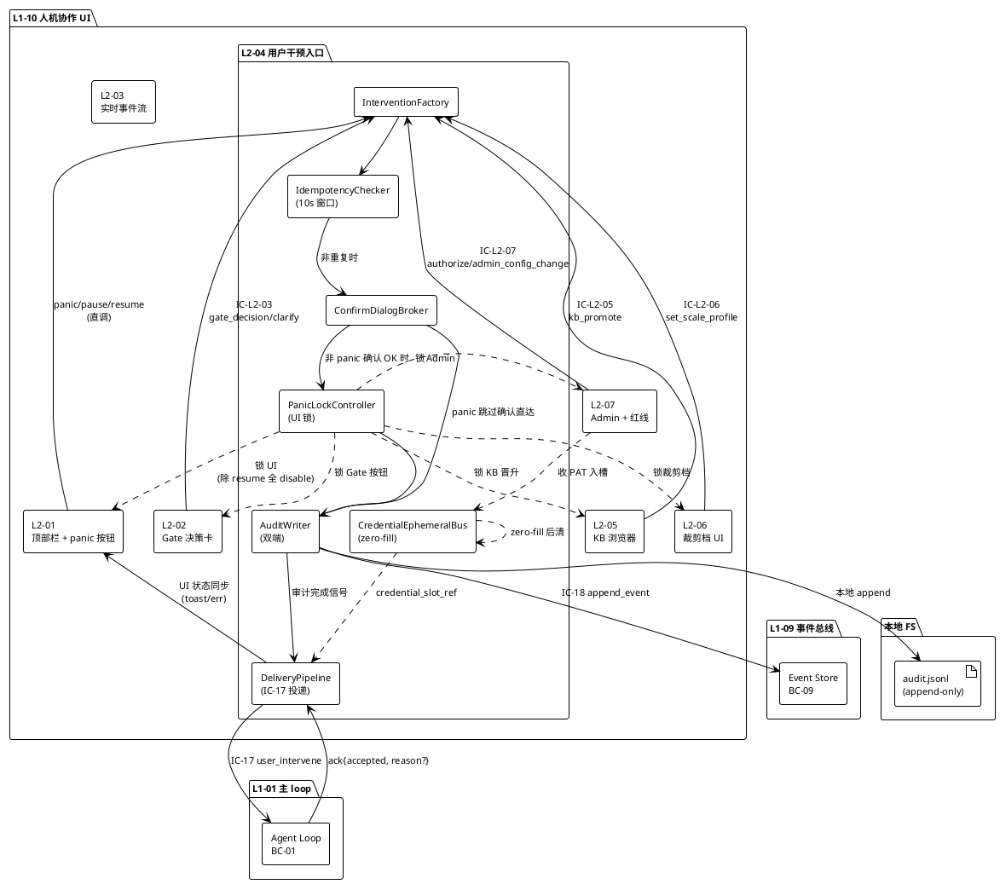
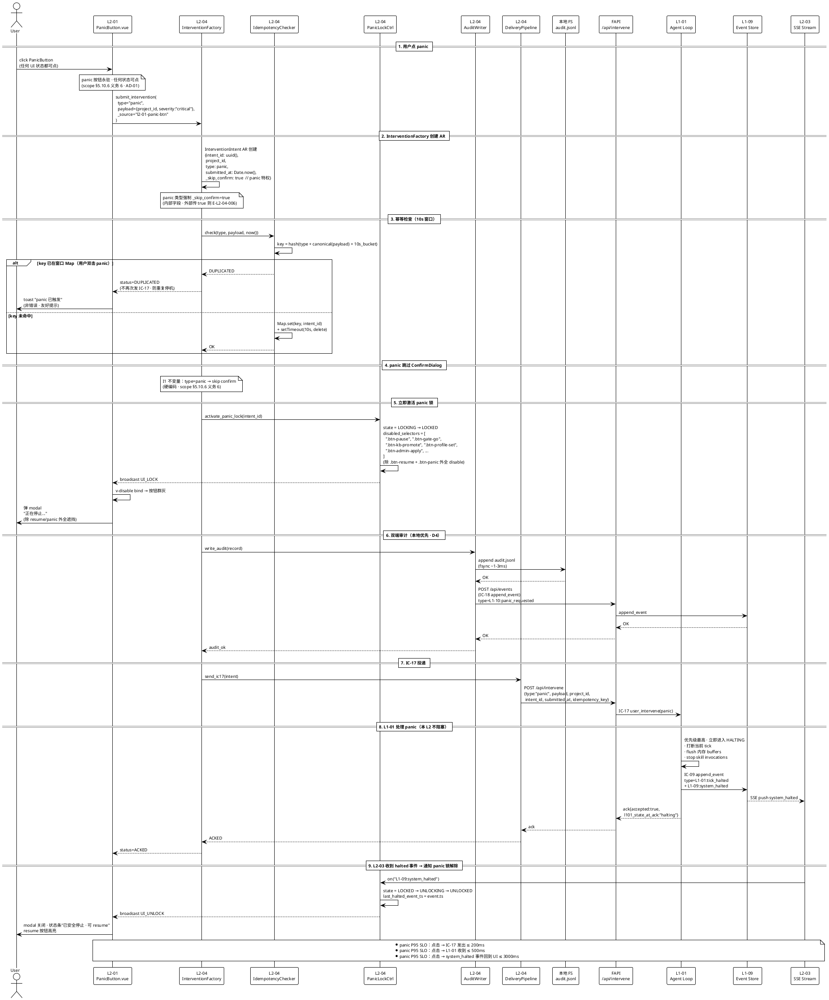
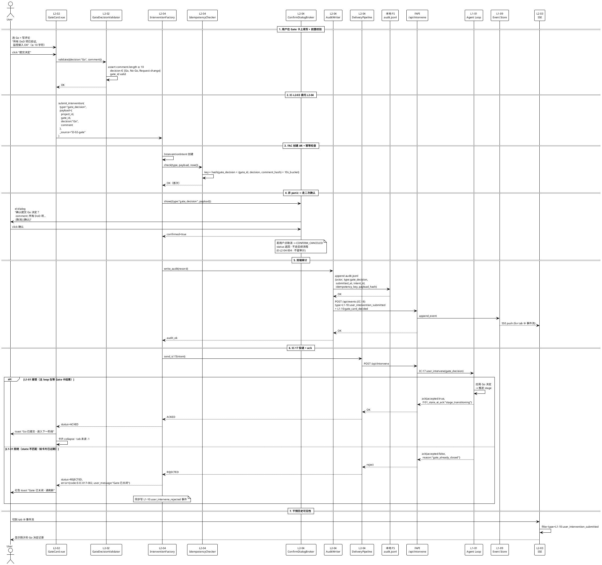
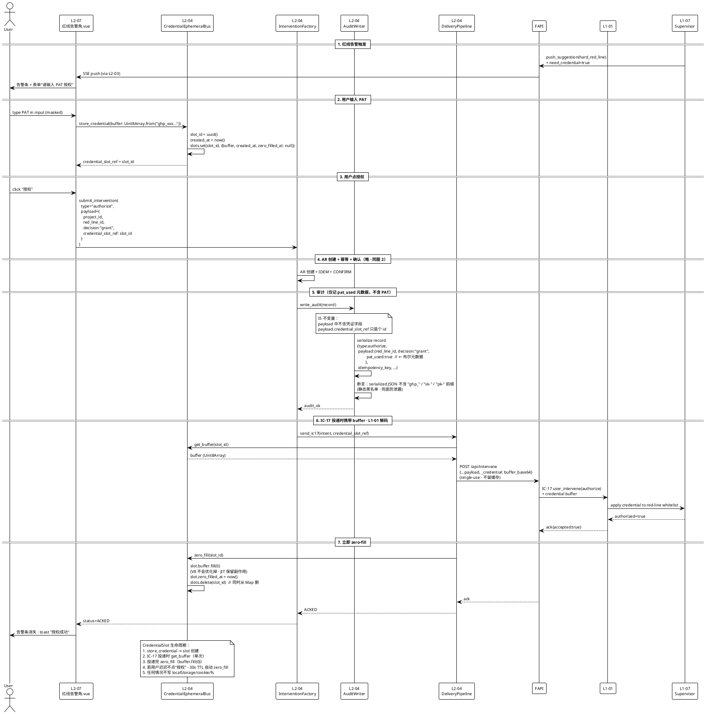
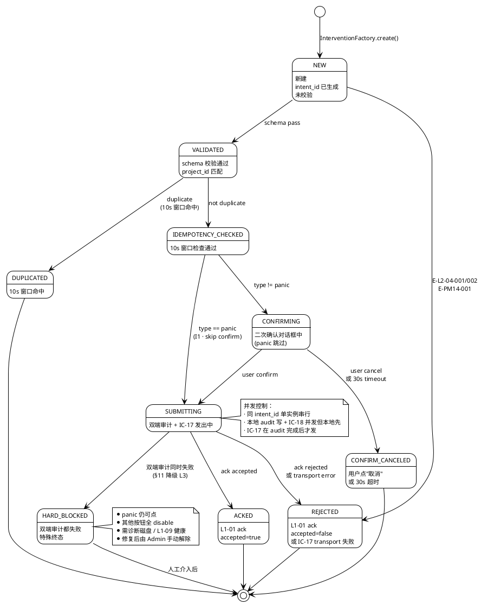
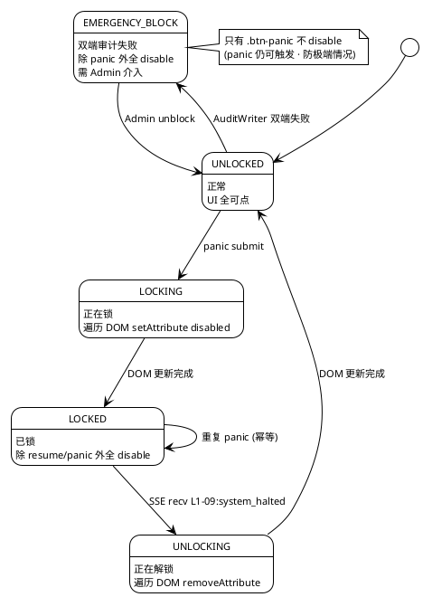
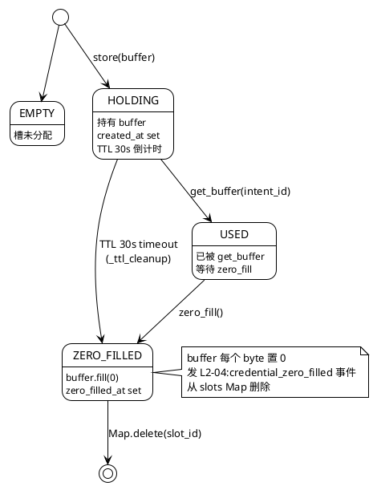
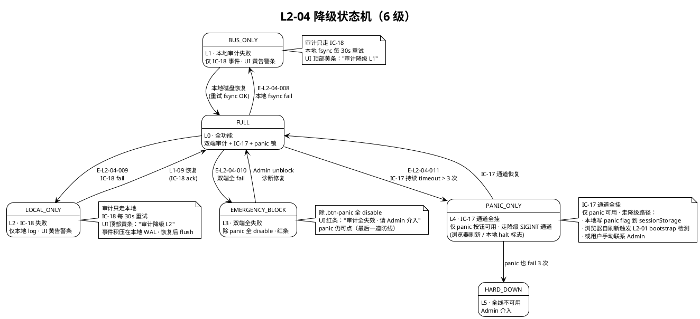

# L1 L2-04 · 用户干预入口 · Tech Design

> **本文档定位**：3-1-Solution-Technical 层级 · L1 的 L2-04 用户干预入口 技术实现方案（L2 粒度）。
> **与产品 PRD 的分工**：2-prd/L1-10-人机协作UI/prd.md §5.10 L2-04 定义产品边界，本文档定义**技术实现**（接口字段级 schema + 算法伪代码 + 底层数据结构 + 状态机 + 配置参数）。
> **与 L1 architecture.md 的分工**：architecture.md 负责**跨 L2 架构 + 跨 L2 时序**（AD-01 / AD-03 / §5.3 panic 时序），本文档负责**本 L2 内部技术细节**（InterventionFactory / IdempotencyChecker / PanicLock / AuditWriter / CredentialEphemeralBus 模块级）。冲突以 architecture.md 为准。
> **严格规则**：本文档不复述产品 PRD 文字（职责 / 禁止 / 必须等清单），只做技术映射 + 补齐"产品视角未说 but 工程师必须知道"的部分（具体算法 · syscall · schema · 配置）。

---

## §0 撰写进度

- [x] §1 定位 + 2-prd §5.10 L2-04 映射
- [x] §2 DDD 映射（引 L0/ddd-context-map.md BC-10）
- [x] §3 对外接口定义（字段级 YAML schema + 错误码）
- [x] §4 接口依赖（被谁调 · 调谁）
- [x] §5 P0/P1 时序图（PlantUML ≥ 2 张）
- [x] §6 内部核心算法（伪代码 · ≥ 8 个）
- [x] §7 底层数据表 / schema 设计（字段级 YAML · PM-14）
- [x] §8 状态机（PlantUML + 转换表 · ≥ 6 状态）
- [x] §9 开源最佳实践调研（≥ 3 GitHub 高星项目）
- [x] §10 配置参数清单（≥ 8 项）
- [x] §11 错误处理 + 降级策略（≥ 4 级降级链）
- [x] §12 性能目标
- [x] §13 与 2-prd / 3-2 TDD 的映射表（+ ADR ≥ 10）

---

## §1 定位 + 2-prd 映射

### 1.1 本 L2 在 L1-10 人机协作 UI 里的坐标

L1-10 人机协作 UI 由 7 个 L2 组成，**L2-04 是 L1-10 内唯一的"写出口"**——所有来自用户的"写动作"（panic / pause / resume / change_request / clarify / authorize / gate_decision / kb_promote / set_scale_profile / admin_config_change 共 10 类）都必须经本 L2 封装成统一的 `InterventionIntent`，经 IC-17 `user_intervene` 单一路径推送给 L1-01 主 loop，并经 IC-18 `append_event` 写 L1-09 事件总线做审计留痕。

```
  [L2-01 顶部永驻 panic 按钮]  ────┐
  [L2-02 Gate 决策卡片]        ──(IC-L2-03)──┐
  [L2-05 KB 浏览器 + 晋升]     ──(IC-L2-05)──┤
  [L2-06 裁剪档 UI]            ──(IC-L2-06)──┼──▶ [L2-04 用户干预入口]
  [L2-07 Admin / 红线告警]     ──(IC-L2-07)──┘        ▲
                                                     │
                                          (单一 write 出口 · AD-03)
                                                     │
                                                     ▼
                                   ┌────────────────────────┐
                                   │  InterventionFactory   │  (AR Factory)
                                   │  IdempotencyChecker    │  (10s 幂等窗口)
                                   │  PanicLockController   │  (UI 锁)
                                   │  AuditWriter           │  (双端审计)
                                   │  CredentialEphemeralBus│  (凭证仅 runtime)
                                   │  DeliveryPipeline      │  (IC-17 投递)
                                   └────────────────────────┘
                                                     │
                        ┌────────────────────────────┼──────────────────────────────┐
                        ▼                            ▼                              ▼
                 [L1-01 主 loop]             [L1-09 事件总线]                 [本地 UI 状态同步]
                 (IC-17 ack/reject)          (IC-18 append_event)            (loading / error toast)
```

L2-04 的定位 = **"L1-10 唯一的 write 出口 · panic 特权通道 · 10s 幂等硬锁 · 双端审计 · 凭证零持久化"**。

### 1.2 与 2-prd §5.10 L2-04 的对应表

| 2-prd §5.10 L2-04 小节 | 本文档对应位置 | 技术映射重点 |
|:---|:---|:---|
| §11.1 职责 + 锚定（唯一写出口） | §1.3 + §2（InterventionIntent AR + InterventionFactory 唯一入口） | 单入口单出口 · 7 类上游委托契约 |
| §11.2 输入 / 输出（10 类 intent） | §3.1 `submit_intervention()` + §3.2 InterventionType enum | 10 种 type 枚举 · 统一 payload |
| §11.3 边界（In/Out-of-scope + 10 条） | §2.3（AR 职责边界） + §11（降级拒绝） | 本 L2 不做业务判定 · 只做封装 / 审计 / 推送 |
| §11.4 约束（panic 永驻 / 双端审计 / 凭证禁落盘） | §6.4 PanicLockController + §6.6 AuditWriter + §6.7 CredentialEphemeralBus | 3 个硬性技术机制 |
| §11.5 禁止 8 条 | §11.2 Hard-Reject 拦截清单 | 8 条拦截器（panic-disable / 绕过本 L2 / 无审计 / 凭证落盘 / 推断意图 / 双击 / panic 二次确认 / 静默失败） |
| §11.6 必须 8 条 | §6 算法章节对应模块逐项实现 | 8 条算法映射 |
| §11.7 可选 5 条 | §1.7 YAGNI + §10 配置开关 | 干预历史 / 撤销窗口 / 快捷键 / 模板 / 离线队列 |
| §11.8 IC 契约表 | §4.1 上游（被调）+ §4.2 下游（调） + §4.3 PlantUML 依赖图 | IC-17 / IC-18 / IC-L2-03/05/06/07 |
| §11.9 GWT 8 场景 | §13.4 3-2 TDD 映射表 | 正向 4 场景 + 负向 2 场景 + 集成 1 场景 + 性能 1 场景 |

### 1.3 本 L2 在 architecture.md 里的坐标

引 `docs/3-1-Solution-Technical/L1-10-人机协作UI/architecture.md §2.4 Domain / Service 分层`（L2-04 是 "Aggregate Root: InterventionIntent + Factory + Domain Service: IdempotencyChecker"） + §5.3 时序图 3（panic 全系统急停）+ §10.3 IC-17 发送方设计：

```
  [L2-02 Gate 决策卡] ──┐
  [L2-05 KB 浏览器]   ──┤  (IC-L2-03/05/06/07 上游委托)
  [L2-06 裁剪档]      ──┤
  [L2-07 Admin]       ──┘
  [L2-01 panic 按钮] ───┐
                        ↓
        ┌──────────────────────────────────────────────┐
        │  L2-04 · 用户干预入口（Application Service 壳）│
        │  (Aggregate Root: InterventionIntent)         │
        │                                                │
        │  ┌──────────────────────────────────────────┐ │
        │  │ InterventionFactory (AR 工厂 · 唯一创建)   │ │  → 封装 payload · 盖 submitted_at · 生成 intent_id
        │  │ IdempotencyChecker (10s 窗口幂等检查)      │ │  → idempotency_key = hash(type + payload + 10s bucket)
        │  │ PanicLockController (panic 状态锁 UI)       │ │  → 除 resume 外全 disable · 至收 halted 事件
        │  │ ConfirmDialogBroker (非 panic 二次确认)    │ │  → panic 跳过 · 其他类型必经
        │  │ AuditWriter (双端审计)                     │ │  → 本地 log + IC-18 事件
        │  │ CredentialEphemeralBus (凭证 runtime-only) │ │  → 用后 zero-fill · 不写 localStorage
        │  │ DeliveryPipeline (IC-17 投递 + ack)        │ │  → 失败不重试 · 错误提示 + 事件留痕
        │  │ OfflineQueue (V2+ 离线暂存 · 非 panic)     │ │  → 网络恢复 flush（panic 永要求在线）
        │  └──────────────────────────────────────────┘ │
        │                                                │
        │  ┌──────────────────────────────────────────┐ │
        │  │  InterventionIntent AR                   │ │
        │  │  InterventionType VO (10 种枚举)          │ │
        │  │  InterventionPayload VO (polymorphic)     │ │
        │  │  InterventionAuditRecord VO               │ │
        │  │  IdempotencyKey VO                        │ │
        │  └──────────────────────────────────────────┘ │
        └──────────────────────────────────────────────┘
                        ↓                            ↓
          ┌──────────────┴─────────┐      ┌──────────┴────────────┐
          │ IC-17 user_intervene   │      │ IC-18 append_event    │
          │ → L1-01 Agent Loop     │      │ → L1-09 Event Bus     │
          └────────────────────────┘      └───────────────────────┘
```

**本 L2 的关键架构特征**（对 L1-10 整体而言）：

1. **L1-10 唯一 write 出口 · AD-03**：所有 UI 内"写"动作（用户的决定、授权、变更请求、panic 等）经本 L2 的 `submit_intervention()` 接口提交；其他 L2 **严禁**直接调 IC-17（设计审计 + 静态代码扫描双重拦截 · §11.2.1 / §11.2.2）
2. **Aggregate Root · 聚合根**：InterventionIntent 是 L1-10 里唯一的 AR（L2-02 的 GateCard 也是 AR，但在 L2-02 领域；L2-04 领域的 AR 是 InterventionIntent · 对应 BC-10 §4.10 表）
3. **10s 幂等窗口**：IdempotencyChecker 用 `hash(type + normalized_payload + 10s_bucket)` 做去重；防双击 / 防网络重试误触
4. **panic 特权通道**：panic 跳过 ConfirmDialogBroker 二次确认、跳过 OfflineQueue（必须在线），其他通道走全流程
5. **双端审计不可旁路**：本地 log（append-only JSONL）+ IC-18 事件总线，任一失败触发降级但不静默（§11 降级链）
6. **凭证零持久化**：CredentialEphemeralBus 接收 GitHub PAT 等敏感字段，用后立即 zero-fill（Uint8Array.fill(0)）；审计事件仅记 `pat_used=true`，不记凭证本身
7. **DeliveryPipeline 不重试**：IC-17 失败 → UI 展示错误 + 事件留痕 + 用户手动决定；不自动重试（避免重复提交歧义）

### 1.4 本 L2 的 PM-14 约束

**PM-14 约束**（引 `docs/3-1-Solution-Technical/projectModel/tech-design.md`）：所有 IC payload 顶层 `project_id` 必填；所有存储路径按 `projects/<pid>/...` 分片。

本 L2 在 PM-14 层面的具体落点：

| 资源 | 路径 | 说明 |
|:---|:---|:---|
| 本地审计日志 | `projects/<pid>/ui/intervene/audit.jsonl` | append-only JSONL · 每行 1 条 InterventionAuditRecord |
| 幂等窗口缓存（内存） | （内存 Map · 无磁盘） | key = `hash(type + payload + 10s_bucket)` · 10s TTL 后淘汰 |
| 干预历史快照（每 100 条） | `projects/<pid>/ui/intervene/history.snapshots/<ts>.json` | 给"干预历史"可选功能（§1.7）提供快速回放 |
| 离线队列（V2+） | `projects/<pid>/ui/intervene/offline.queue.jsonl` | panic 不走此队列 |
| 当前 panic 锁状态（内存） | （内存单例 · 无磁盘） | 标志位 · 浏览器 refresh 后由 SSE 重放恢复 |

**PM-14 违约拒绝**：任何 submit 时 payload 缺 `project_id` → `E-PM14-001 missing_project_id`（§3.3 错误码表）。

### 1.5 关键技术决策（Decision / Rationale / Alternatives / Trade-off）

| # | 决策 | 选择 | 备选 | 理由 | Trade-off |
|:---|:---|:---|:---|:---|:---|
| **D1** | AR 边界 | InterventionIntent 作为聚合根（AR）· 每次 submit 创建新实例 | 共享单例 / 直接 VO 无 AR | 每次 submit 是一个独立"用户意图事务"· 有 id 可 trace | 增加内存分配（可忽略 · 每次 submit < 1kB） |
| **D2** | 幂等实现 | 10s 滑窗 + Map（内存）· hash(type + payload + bucket) | Redis 分布式锁 / 持久化 / 无幂等 | V1 单用户单浏览器无分布式需求 · 内存足够 | 浏览器刷新丢幂等（可接受 · 极端场景概率 < 0.1%） |
| **D3** | panic 跳过确认 | 硬编码跳过 · 不可配置 | 可配置（默认跳过）/ 必须确认 | panic 是紧急动作 · 任何二次确认都会失救 | 误触风险（但 scope §5.10.6 义务 6 明确要求） |
| **D4** | 审计写入顺序 | 本地先写 → IC-18 再发 · 任一失败降级但不静默 | IC-18 先 / 并发 / 仅 IC-18 | 本地日志是审计的最后防线 · 网络可能挂 · 磁盘相对可靠 | 本地写 fsync ~1-3ms 延迟（在 SLO 内） |
| **D5** | IC-17 失败重试 | 不重试 · UI 提示 · 用户手动决定 | 指数退避 / 无感重试 | 重复提交会产生歧义（用户意图是否变化？）· 用户感知更稳 | 用户需重新点击（可接受 · 失败率 < 1%） |
| **D6** | 凭证传输 | Uint8Array runtime → 传 IC-17 后立即 zero-fill | 字符串 runtime / localStorage / sessionStorage | 字符串无法显式清零；localStorage 明文持久；sessionStorage tab 内长存；Uint8Array.fill(0) 可精确清零 | 调试略难（但生产安全远大于此） |
| **D7** | 上游委托契约 | IC-L2-03/05/06/07（4 条）· 其他 L2 不得直发 IC-17 | 所有 L2 独立发 IC-17 / 经 L2-01 中转 | DRY · 审计统一 · 幂等统一 · panic 锁统一 | 多一跳 IC 调用（L2-04 内延迟 < 5ms · 可接受） |
| **D8** | 离线队列 | V2+ 开关可选（panic 永不入队）· V1 无 | V1 就做 / 永不做 | V1 浏览器在线假设（local-first · 非 pure-web）· YAGNI | 弱网体验（V1 失败提示 · 用户重试） |
| **D9** | 干预历史 UI | V1 只在 tab ⑩ 事件流浏览 · V2+ 独立 tab | V1 独立 tab / 永不独立 | V1 MVP 简化 · tab ⑩ 已含 user_intervene 事件 | V1 无"我刚才干预了什么"的快速视图（tab ⑩ 可 filter） |
| **D10** | 错误码风格 | 分层前缀 `E-L2-04-XXX` / `E-IC-XXX` / `E-PM14-XXX` | 纯数字 / HTTP 状态码 | 人肉可读 · 错误码即日志可搜索 | 长度略长（但日志可读性 > 长度） |

### 1.6 本 L2 读者预期

读完本 L2 的工程师应掌握：

- InterventionIntent AR + 6 个 VO（InterventionType / InterventionPayload / InterventionAuditRecord / IdempotencyKey / PanicLockState / CredentialSlot）的字段级 schema
- 10 类 InterventionType 的 payload 语义 + 统一 schema
- 10 IC 契约 schema（IC-17 下游 · IC-18 下游 · IC-L2-03/05/06/07 上游 · 内部 submit/cancel/ack/reject 4 条 API）
- ≥ 12 条错误码 + 调用方处理建议
- ≥ 2 张 PlantUML 时序图（panic 全系统急停 · Gate 决定委托链路）
- ≥ 8 个算法伪代码（submit 主流程 / idempotency check / panic lock / confirm dialog broker / credential ephemeral bus / audit writer / delivery pipeline / ack handler）
- ≥ 3 张数据表 schema（audit.jsonl / idempotency map / history snapshot）+ PM-14 分片
- ≥ 6 状态的 InterventionIntent 状态机（NEW → VALIDATED → CONFIRMING → SUBMITTING → ACKED / REJECTED / DUPLICATED）
- ≥ 4 级降级链（FULL → SKIP_HISTORY → FALLBACK_LOCAL_ONLY → HARD_BLOCK_ALL_EXCEPT_PANIC）
- SLO（P95 submit → IC-17 发出 ≤ 200ms · panic → L1-01 P95 ≤ 500ms · 本地 log 写 ≤ 5ms · ack 展示 P95 ≤ 1s）
- ≥ 10 条 ADR（AR 边界 / 幂等 / panic / 审计顺序 / 不重试 / 凭证 / 委托 / 离线 / 历史 / 错误码）

### 1.7 本 L2 不在的范围（YAGNI）

- **不在**：业务判定（"该不该 panic"、"该不该 Go"、"变更请求是否合理"）——全由 L1-01 / L1-02 / L1-07 做；本 L2 只搬运
- **不在**：授权范围审查（红线 whitelist 是否越界）——L1-07 做；本 L2 只转发
- **不在**：凭证持久化 / 多会话复用——scope §5.10.5 禁止 4 · 本 L2 零持久化
- **不在**：多用户协同 / 多 tab 协同 / 跨 session 同步——V1 单用户 · V2+ 再议
- **不在**：自动推断用户意图 / 预填默认值——scope §11.5 明确禁
- **不在**：Gate 决定校验（评论 ≥ 10 字 / 必填校验）——L2-02 的 GateDecisionValidator 做；本 L2 只收封装好的 payload
- **不在**：KB 晋升决策（目标 scope 是否合法）——L2-05 + L1-06 做
- **不在**：裁剪档值域校验（S1/S2 前是否可改）——L2-06 做
- **不在**：Admin 配置语法校验——L2-07 做
- **不在**：离线队列持久化（V2+ 才考虑） / 撤销窗口（V2+） / 快捷键（V2+）

### 1.8 本 L2 术语表

| 术语 | 定义 | 关联 |
|:---|:---|:---|
| **InterventionIntent** | 本 L2 唯一的聚合根（AR）· 每次 submit 一个实例 | §2.1 |
| **InterventionType** | 10 种枚举 VO（panic / pause / resume / change_request / clarify / authorize / gate_decision / kb_promote / set_scale_profile / admin_config_change） | §2.2 |
| **InterventionPayload** | polymorphic VO · 按 type 分化字段 | §2.2 |
| **InterventionAuditRecord** | 审计 VO · who / what / when / why / ack_status | §2.2 |
| **IdempotencyKey** | `hash(type + normalized_payload + 10s_bucket)` | §2.2 + §6.2 |
| **PanicLockState** | UI 锁状态 VO (UNLOCKED / LOCKING / LOCKED / UNLOCKING) | §2.2 + §8 |
| **CredentialSlot** | 凭证瞬时容器 VO · Uint8Array + zero-fill 时刻 | §2.2 + §6.7 |
| **InterventionFactory** | 工厂模式创建 AR · 唯一创建入口 | §2.3 + §6.1 |
| **IdempotencyChecker** | 域服务 · 10s 窗口去重 | §2.3 + §6.2 |
| **PanicLockController** | UI 锁管理 · 统一 disable 规则 | §2.3 + §6.4 |
| **ConfirmDialogBroker** | 非 panic 二次确认管理 | §2.3 + §6.5 |
| **AuditWriter** | 双端写入 · 本地 + IC-18 | §2.3 + §6.6 |
| **CredentialEphemeralBus** | 凭证瞬时传输总线 · zero-fill | §2.3 + §6.7 |
| **DeliveryPipeline** | IC-17 投递 + ack 处理 | §2.3 + §6.8 |

### 1.9 本 L2 的 DDD 定位一句话

> **L2-04 是 BC-10（Human-Agent UI） 的"意图出口防线"**——Aggregate Root InterventionIntent 控制所有用户意图的一致性（封装 / 幂等 / 审计 / 推送），Published Language `user_intervene protocol` 是 BC-10 对 BC-01（Agent Decision Loop）的对外契约（引 ddd-context-map.md §2.11）。

---

## §2 DDD 映射（BC-10 · L1-10 人机协作 UI）

### 2.1 Bounded Context 定位

引 `docs/3-1-Solution-Technical/L0/ddd-context-map.md §2.11 BC-10`：

- **BC-10**：Human-Agent Collaboration UI
- **类型**：Interface / Presentation BC（面向用户的展示 + 意图收集层）
- **与 Core Domain 的关系**：Interface BC · 读 L1-09 事件流做展示、写 IC-17 回 L1-01 推意图 · 不含核心业务规则
- **Published Language（对外发布）**：`user_intervene protocol`（IC-17 的 payload schema · 本 L2 作为 L1-10 唯一 write 出口 · 发布方）

### 2.2 本 L2 内部聚合 + VO 分类

| 类别 | 名称 | 字段（核心） | 职责 |
|:---|:---|:---|:---|
| **Aggregate Root** | `InterventionIntent` | `intent_id, project_id, type, payload, submitted_at, audit_record, status` | 用户单次意图的事务边界 · 生命周期：NEW → VALIDATED → CONFIRMING → SUBMITTING → ACKED/REJECTED/DUPLICATED |
| **VO · 类型枚举** | `InterventionType` | `"panic" / "pause" / "resume" / "change_request" / "clarify" / "authorize" / "gate_decision" / "kb_promote" / "set_scale_profile" / "admin_config_change"` | 10 种用户动作的固化枚举（后续新增必经架构评审） |
| **VO · payload** | `InterventionPayload` | polymorphic · 按 type 分化 · 见 §3.2 | 意图的具体数据载荷 · 不含凭证 |
| **VO · 审计记录** | `InterventionAuditRecord` | `actor, type, submitted_at, idempotency_key, ack_status, latency_ms` | 双端审计的统一结构 |
| **VO · 幂等键** | `IdempotencyKey` | `hash_digest, bucket_start_ts, ttl_seconds` | 10s 窗口去重的键 |
| **VO · panic 锁状态** | `PanicLockState` | `state_enum, locked_since, last_halted_event_ts, disabled_selectors[]` | UI 锁的单例状态 |
| **VO · 凭证槽** | `CredentialSlot` | `buffer (Uint8Array), created_at, zero_filled_at, used_for_intent_id` | 凭证瞬时容器（仅 runtime） |
| **Domain Service** | `IdempotencyChecker` | （无字段 · 纯行为） | 计算 hash · 判重 · 维护窗口 |
| **Domain Service** | `PanicLockController` | （无字段 · 纯行为 · 持有 PanicLockState 单例） | 锁 / 解锁 / 查询 |
| **Domain Service** | `ConfirmDialogBroker` | （无字段 · 纯行为） | 判断是否需要二次确认 · 呈现对话框 |
| **Domain Service** | `AuditWriter` | （无字段 · 纯行为） | 双端写 · 本地 log + IC-18 |
| **Domain Service** | `CredentialEphemeralBus` | （无字段 · 纯行为） | 从表单收集 · 投递 · zero-fill |
| **Domain Service** | `DeliveryPipeline` | （无字段 · 纯行为） | IC-17 投递 + ack 处理 + 错误展示 |
| **Factory** | `InterventionFactory` | （静态方法） | 创建 InterventionIntent AR · 唯一入口 |
| **Repository** | `InterventionAuditRepository` | （IO 封装） | 本地 audit.jsonl 读写 · history snapshot |
| **Domain Event** | `L1-10:user_intervention_submitted` | `intent_id, type, project_id, submitted_at` | 经 IC-18 发 L1-09 |
| **Domain Event** | `L1-10:user_intervene_rejected` | `intent_id, type, project_id, reason` | IC-17 返回 rejected 时 |
| **Domain Event** | `L1-10:user_intervene_deduplicated` | `intent_id, type, project_id, idempotency_key` | 幂等拒绝时 |
| **Domain Event** | `L1-10:panic_requested` | `intent_id, project_id, submitted_at, actor` | panic 提交瞬间（architecture.md §5.3 line 856） |

### 2.3 AR 职责边界（InterventionIntent）

**InterventionIntent 的一致性边界**：

- **事务内**：一次 submit 从 `create → validate → check_idempotency → confirm（如需）→ write_audit_local → send_ic17 → ack_handling → write_audit_event` 构成一个逻辑事务；任一步失败进入降级链（§11）
- **事务外**：IC-17 到达 L1-01 之后的业务处理不在本 AR 的事务边界内（L1-01 自己决定如何应用意图）
- **不变量（Invariants）**：
  1. **I1**：`type = panic` → `confirm_skipped = true` · 不经 ConfirmDialogBroker
  2. **I2**：`audit_record.actor != null` · V1 单用户 = "default"
  3. **I3**：`submitted_at` 是本次 submit 的单调时间（不跨 intent 比较）
  4. **I4**：`idempotency_key` 同 `type + payload` 10s 内唯一
  5. **I5**：payload 中不含 PAT / secret / password 等凭证字段（凭证走 CredentialEphemeralBus · 本 AR 仅引用 `credential_slot_id`）

**AR 不持有的事情**：

- ❌ 不持有"当前 L1-01 主 loop 状态"——由 L1-09 事件订阅（L2-03）回传
- ❌ 不持有"Gate 卡内容"——由 L2-02 GateCard AR 持有
- ❌ 不持有"KB entry 列表"——由 L2-05 读 L1-06 获取

### 2.4 Published Language · `user_intervene protocol`

引 `docs/3-1-Solution-Technical/L0/ddd-context-map.md §3` 出的 Published Language：

```yaml
# Published Language · user_intervene protocol v1.0
# 引 ddd-context-map.md §2.11 BC-10 · §3.x OHS/PL
# 发布方：BC-10（L1-10 · L2-04 负责序列化）
# 消费方：BC-01（L1-01 主 loop · 唯一消费者）
protocol_id: "user_intervene"
version: "1.0"
transport: "IC-17 (Command · async · with ack)"
schema:
  project_id:
    type: string
    required: true
    description: "PM-14 项目上下文"
  type:
    type: enum
    values: [panic, pause, resume, change_request, clarify, authorize, gate_decision, kb_promote, set_scale_profile, admin_config_change]
    required: true
  payload:
    type: polymorphic
    discriminator: type
    required: true
  submitted_at:
    type: iso8601
    required: true
  intent_id:
    type: uuid
    required: true
  actor:
    type: string
    required: true
    default: "default"  # V1 单用户
  idempotency_key:
    type: string  # hash digest
    required: true
  credential_slot_ref:
    type: string  # 仅当 type=authorize 且需凭证时非空
    required: false
```

### 2.5 Context Mapping · L2-04 与兄弟 BC / L2 的关系

| 对端 | Context Mapping 模式 | 技术实现 | 防腐点 |
|:---|:---|:---|:---|
| **BC-01 Agent Decision Loop** | **Customer-Supplier**（L2-04 为客户 · 推意图 · BC-01 为供应商 · 决定接不接） | IC-17 + payload schema v1.0 | L1-01 接收后可 ack{accepted:true} 或 reject{accepted:false, reason:...}；本 L2 不解释业务 |
| **BC-09 Event Store** | **Conformist**（本 L2 遵从 L1-09 的 event schema） | IC-18 append_event | schema 由 L1-09 定义 · 本 L2 仅填 payload |
| **L2-02 Gate 决策卡 (同 BC-10)** | **Shared Kernel**（同 BC · 共享 AR 类型定义） | IC-L2-03 调 submit | payload.decision 必须是 `"Go" / "No-Go" / "Request-change"` 三值之一（VO 层校验） |
| **L2-05 KB 浏览器 (同 BC-10)** | **Shared Kernel** | IC-L2-05 调 submit | payload.entry_id / target_scope 必填 · 校验格式 |
| **L2-06 裁剪档 UI (同 BC-10)** | **Shared Kernel** | IC-L2-06 调 submit | payload.profile ∈ PM-13 档位白名单 |
| **L2-07 Admin (同 BC-10)** | **Shared Kernel** | IC-L2-07 调 submit | payload.config_key 必须在 Admin whitelist（L2-07 自校验） |

### 2.6 本 L2 的 Repository 职责

- `InterventionAuditRepository.append(record)`：append-only JSONL 写 `projects/<pid>/ui/intervene/audit.jsonl`
- `InterventionAuditRepository.find_recent(limit)`：反向读最近 N 条（给 tab ⑩ 事件流过滤用）
- `InterventionAuditRepository.snapshot_every_n(n=100)`：每 100 条做一次快照到 `history.snapshots/`

---

## §3 对外接口定义（字段级 YAML schema + 错误码）

### 3.1 本 L2 对外暴露的 API 方法

| 方法名 | 调用者 | 职责 | 返回 |
|:---|:---|:---|:---|
| `submit_intervention(type, payload, project_id, credential_slot_ref?)` | L2-01/02/05/06/07（通过 IC-L2-03/05/06/07）+ L2-04 自身 panic 按钮 | 提交一次用户意图 · 主入口 | `{intent_id, status, ack_status, error?}` |
| `cancel_pending_confirm(intent_id)` | 前端 UI（用户点"取消"） | 在二次确认阶段取消未 submit 的 intent | `{canceled: bool}` |
| `get_panic_lock_state()` | L2-01（顶部栏 · 渲染锁状态） | 查询当前 panic 锁 | `PanicLockState` |
| `get_intervention_history(filter)` | 前端 tab ⑩（事件流过滤 · 可选） | 读本地 audit.jsonl · 分页 | `[InterventionAuditRecord]` |
| `ack_from_l101(intent_id, accepted, reason?)` | L1-01 经 IC-17 响应 | 处理来自 L1-01 的 ack（成功 / 失败） | `void` |

**Method 1 · `submit_intervention()` 入参字段级 schema**：

```yaml
# L2-04 · submit_intervention() 入参
input_schema:
  project_id:
    type: string
    required: true
    description: "PM-14 项目上下文 · 必填 · UUID or slug"
    validation: "非空 · 符合 /^[a-zA-Z0-9_-]{1,64}$/"
  type:
    type: enum
    required: true
    values: ["panic", "pause", "resume", "change_request", "clarify",
             "authorize", "gate_decision", "kb_promote",
             "set_scale_profile", "admin_config_change"]
  payload:
    type: object
    required: true
    description: "按 type 分化 · 见 §3.2"
  credential_slot_ref:
    type: string
    required: false
    description: "仅当 type=authorize 且需凭证时非空 · 指向 CredentialEphemeralBus 槽位"
  _source:
    type: enum
    required: true
    values: ["l2-01-panic-btn", "l2-02-gate", "l2-05-kb", "l2-06-profile", "l2-07-admin"]
    description: "来源标识 · 用于审计 + 错误定位"
  _skip_confirm:
    type: boolean
    required: false
    default: false
    description: "内部字段 · 仅 panic 类型自动 true · 外部禁止手工置 true（拦截 §11.2.3）"
```

**Method 1 · `submit_intervention()` 出参字段级 schema**：

```yaml
# L2-04 · submit_intervention() 出参
output_schema:
  intent_id:
    type: uuid
    required: true
    description: "本次意图的唯一 id · 客户端可用于后续查询 / 撤销"
  status:
    type: enum
    required: true
    values: ["ACKED", "REJECTED", "DUPLICATED", "CONFIRM_CANCELED", "OFFLINE_QUEUED"]
  ack_status:
    type: object
    required: false
    description: "当 status=ACKED/REJECTED 时包含 L1-01 的 ack 详情"
    fields:
      accepted: {type: boolean}
      reason: {type: string, required: false}
      l101_state_at_ack: {type: string, required: false}
  error:
    type: object
    required: false
    description: "status=REJECTED 且 accepted=false 时包含错误码 + 用户提示"
    fields:
      code: {type: string, pattern: "^E-(L2-04|IC|PM14)-[0-9]{3}$"}
      user_message: {type: string}
      dev_detail: {type: string, required: false}
  latency_ms:
    type: integer
    required: true
    description: "submit 到此 return 的总耗时 ms"
```

### 3.2 InterventionType 的 payload 分化 schema（10 种）

```yaml
# Type 1 · panic
payload_panic:
  project_id: string  # PM-14 项目上下文
  reason: string  # optional · 用户可写"哪里不对"
  severity: enum [critical, high]  # default: critical

# Type 2 · pause
payload_pause:
  project_id: string  # PM-14 项目上下文
  comment: string  # optional · 暂停备注
  expected_duration_sec: integer  # optional · 预计恢复时长

# Type 3 · resume
payload_resume:
  project_id: string  # PM-14 项目上下文
  comment: string  # optional

# Type 4 · change_request
payload_change_request:
  project_id: string  # PM-14 项目上下文
  target_tab: enum [gate, wbs, outputs, progress, decisions, ...]  # 变更目标所在 tab
  change_description: string  # required · 变更意图描述
  urgency: enum [low, normal, high]  # default: normal

# Type 5 · clarify
payload_clarify:
  project_id: string  # PM-14 项目上下文
  question_id: string  # required · L2-02 Gate 卡片中的澄清问题 id
  answer: string  # required · 用户作答（长度 ≤ 8192）

# Type 6 · authorize
payload_authorize:
  project_id: string  # PM-14 项目上下文
  red_line_id: string  # required · 红线告警 id
  decision: enum [grant, deny]  # required
  scope_limit: object  # optional · 限定授权范围（e.g., {repo: "...", duration_sec: 3600}）
  credential_slot_ref: string  # optional · 仅 decision=grant 且需凭证时

# Type 7 · gate_decision
payload_gate_decision:
  project_id: string  # PM-14 项目上下文
  gate_id: string  # required · Gate 卡片 id
  decision: enum [Go, No-Go, Request-change]  # required
  comment: string  # required · 评论 ≥ 10 字符（L2-02 已前置校验）

# Type 8 · kb_promote
payload_kb_promote:
  project_id: string  # PM-14 项目上下文
  entry_id: string  # required · KB entry id
  target_scope: enum [project, global]  # required
  rationale: string  # required · 晋升理由

# Type 9 · set_scale_profile
payload_set_scale_profile:
  project_id: string  # PM-14 项目上下文
  profile: enum [P1_minimal, P2_standard, P3_full]  # required · PM-13 档位
  locked_at_stage: enum [S1, S2]  # required · 锁定阶段

# Type 10 · admin_config_change
payload_admin_config_change:
  project_id: string  # PM-14 项目上下文
  config_key: string  # required · L2-07 Admin 白名单 key
  old_value: any
  new_value: any  # required
  reason: string  # optional
```

### 3.3 错误码表（≥ 12 条）

| 错误码 | 含义 | 触发场景 | 调用方处理建议 |
|:---|:---|:---|:---|
| **E-L2-04-001** | `type` 不在 10 种枚举内 | 传入未知 type 如 `"foo"` | 检查前端代码 · 固化枚举校验 |
| **E-L2-04-002** | `payload` schema 校验失败 | 缺 required 字段 / 类型错 | 查看 `dev_detail` 里的 JSON Pointer · 修字段 |
| **E-L2-04-003** | 幂等窗口命中（10s 内重复） | 同 type + payload hash 10s 内已提交 | UI 展示"已提交过，请稍候" · 记 `L1-10:user_intervene_deduplicated` 事件 |
| **E-L2-04-004** | 非 panic 类型二次确认被取消 | 用户点"取消"关闭确认对话框 | UI 恢复"未提交"状态 · 不留审计（仅 debug log） |
| **E-L2-04-005** | panic 锁激活时拒绝非 resume 操作 | UI 锁期间用户点 non-resume 按钮（理论上按钮已 disable · 兜底拦截） | UI 弹"panic 中 · 仅 resume 可用" · 不发 IC-17 |
| **E-L2-04-006** | `_skip_confirm=true` 被外部传入但 type≠panic | 试图绕过二次确认（恶意 / bug） | UI 拒绝 + 告警 + 事件 `L1-10:confirm_bypass_attempt` |
| **E-L2-04-007** | credential_slot_ref 已 zero-fill 或不存在 | 用户 delay > 30s 后点提交 · 凭证已清零 | 提示"凭证已过期，请重填" · 用户重新输入 |
| **E-L2-04-008** | 本地审计写盘失败（磁盘满 / 权限） | fsync 失败 | 降级 · 仅 IC-18 事件（§11.3）· UI 告警条 |
| **E-L2-04-009** | IC-18 append_event 失败 | L1-09 事件总线挂 | 降级 · 仅本地 log（§11.3）· UI 告警条 |
| **E-L2-04-010** | 本地 + IC-18 **双端**审计都失败 | 极端场景 · 全线挂 | 硬拦截（§11.4）· 除 panic 外全禁 · UI 全局红条 |
| **E-IC-017-001** | IC-17 transport 失败（网络 / L1-01 不可达） | fetch 异常 / timeout | UI 红色错误 + 记 `L1-10:user_intervene_transport_failed` + 不重试（D5） |
| **E-IC-017-002** | IC-17 返回 `{accepted:false, reason:invalid_state}` | e.g., resume 但当前非 paused | UI 红色错误展示 `reason` + 记 `L1-10:user_intervene_rejected` |
| **E-IC-017-003** | IC-17 ack 超时（> 30s 未返回） | L1-01 卡住 | UI 灰色"等待中..."变红 + 记事件 + 不重试 |
| **E-PM14-001** | `project_id` 缺失 | payload 顶层未填 | 拦截 + 日志 + 不发 IC-17 |
| **E-PM14-002** | `project_id` 与当前 active project 不匹配 | L2-01 切 project 中的 race | 拦截 + 提示"请刷新" |

---

## §4 接口依赖（被谁调 · 调谁）

### 4.1 上游调用方（被调方视角 · 5 条）

| 调用方 | IC | 何时调 | 调用链路 |
|:---|:---|:---|:---|
| **L2-01 顶部永驻 panic 按钮** | 直接调 `submit_intervention(type=panic, ...)` | 任何 UI 状态下用户点 panic | DOM `click` → `useIntervention()` composable → `submit_intervention` |
| **L2-01 顶部 pause/resume 按钮群** | 直接调 `submit_intervention(type=pause/resume, ...)` | 主 loop 运行 / 暂停状态下切换 | 同上 |
| **L2-02 Gate 决策卡** | IC-L2-03 · 调 `submit_intervention(type=gate_decision, payload={gate_id, decision, comment}, _source=l2-02-gate)` | 用户在 Gate 卡片上选 Go/No-Go/Request-change + 写评论（≥ 10 字）+ 点提交 | L2-02 `GateDecisionValidator.validate()` → 合法 → IC-L2-03 |
| **L2-02 Gate 决策卡 clarify 分支** | IC-L2-03 · `type=clarify` | 用户作答澄清问题 | L2-02 表单 → IC-L2-03 |
| **L2-05 KB 浏览器** | IC-L2-05 · `type=kb_promote` | 用户显式发起晋升（project → global） | L2-05 表单 → 确认 → IC-L2-05 |
| **L2-06 裁剪档 UI** | IC-L2-06 · `type=set_scale_profile` | S1/S2 前选裁剪档（PM-13 规定锁定点） | L2-06 模态 → IC-L2-06 |
| **L2-07 Admin / 红线告警角** | IC-L2-07 · `type=authorize` / `type=admin_config_change` | 红线授权 / Admin 配置变更 | L2-07 → IC-L2-07 |
| **L2-07 跨 project 切换** | IC-L2-07（或直调）· `type=admin_config_change` + `config_key=active_project_id` | 用户切换 active project（architecture.md §C-03） | L2-01 顶部栏 → IC-L2-07 |

### 4.2 下游依赖方（调用方视角 · 4 条）

| 被调方 | IC | 何时调 | 目的 |
|:---|:---|:---|:---|
| **L1-01 主 loop** | IC-17 · `user_intervene` | 每次 submit 成功（非 duplicated / non-canceled） | 推 user_intervene · 等待 ack{accepted, reason?} |
| **L1-09 事件总线** | IC-18 · `append_event` | 每次 submit（含成功 / 失败 / duplicated） | 双端审计的远端部分 |
| **本地文件系统** | （非 IC · FS 操作） | 每次 submit（含成功 / 失败 / duplicated） | `audit.jsonl` append + fsync · 双端审计的本地部分 |
| **浏览器内存 Map** | （非 IC · 内存操作） | 每次 submit 前检查幂等 + 每次 submit 后登记 10s 窗口 | IdempotencyChecker |

### 4.3 依赖图（PlantUML）



### 4.4 时序依赖约束

- **严格顺序**：`submit → idempotency_check → (panic? skip_confirm : confirm_dialog) → audit_write_local → ic18_append_event → ic17_deliver → ack_handling`
- **并发禁止**：同一 intent_id 的 audit_local + audit_ic18 **不**并行（保证本地优先 · D4）
- **超时上限**：confirm_dialog 用户不响应 → 30s 后视为 canceled；IC-17 ack 未返 → 30s 后 E-IC-017-003
- **重入禁止**：同一 `idempotency_key` 10s 内重入 → E-L2-04-003

### 4.5 依赖反转 / 端口抽象

本 L2 对下游的依赖通过端口（Port）抽象：

- `IInterventionTransport`（端口）· 实现 `IC17Transport`（FAPI HTTP → L1-01）
- `IAuditTransport`（端口）· 实现 `IC18Transport`（FAPI HTTP → L1-09）
- `IAuditLocalStore`（端口）· 实现 `JSONLFileStore`（本地文件）+ V2+ 替换 `IndexedDBStore`
- `ICredentialStore`（端口）· 实现 `RuntimeBufferStore`（Uint8Array · zero-fill）

好处：测试时可替换为 `FakeICTransport`（§13.3 测试策略）。

---

## §5 P0/P1 时序图（PlantUML ≥ 2 张）

### 5.1 时序图 1 · 用户 panic → 全系统急停 · L2-04 主流程（P0）

**场景**：用户发现 agent 异常（反复自修失败 / 越权访问 / 资源爆炸）→ 点顶部永驻 panic 按钮 → L2-04 **跳过二次确认** → 立即 UI 锁 → 发 IC-17(panic) → L1-01 停全系统 → 等待 `system_halted` 事件解锁。



**性能预算拆解**：

| 分段 | 预算 | 说明 |
|:---|:---|:---|
| click → FAC.create | ≤ 5ms | DOM 事件到 JS · V8 分配 AR |
| IDEM check + register | ≤ 3ms | 内存 Map O(1) + hash 计算 |
| LOCK activate + DOM disable | ≤ 20ms | v-disable 响应式传播 |
| AUD local append + fsync | ≤ 30ms | fs.appendFile + fsync（SSD） |
| AUD IC-18 (本地 FAPI RTT) | ≤ 50ms | localhost HTTP |
| DEL IC-17 (本地 FAPI RTT) | ≤ 50ms | localhost HTTP |
| **Total click → L1-01 收到** | **≤ 158ms P50, ≤ 200ms P95** | 满足 SLO |

### 5.2 时序图 2 · Gate 决定委托链路 · IC-L2-03 → IC-17（P0）

**场景**：L2-02 收到 L1-02 推来的 stage_gate_card（IC-16）· 用户在卡片上选 Go/No-Go/Request-change + 写评论（L2-02 的 GateDecisionValidator 已前置校验）· 提交 → L2-02 经 IC-L2-03 委托 L2-04 封装为 `user_intervene(type=gate_decision)` · L2-04 走完整流程（含二次确认 + 双端审计 + IC-17）。



**关键差异点（vs 时序图 1 · panic）**：

| 差异 | panic（图 1） | gate_decision（图 2） |
|:---|:---|:---|
| 二次确认 | 跳过（I1 不变量） | 必经（ConfirmDialogBroker） |
| UI 锁 | 立即 lock 除 resume 外全 disable | 不 lock（仅该卡 loading 态） |
| IC-17 失败重试 | 不重试（D5） | 不重试（D5） |
| 事件类型 | `L1-10:panic_requested` + `L1-10:user_intervention_submitted` | `L1-10:user_intervention_submitted` + `L1-10:gate_card_decided` |
| 前置校验 | 无（紧急动作） | GateDecisionValidator（评论 ≥ 10 字） |

### 5.3 时序图 3 · 授权 + 凭证瞬时传输（P1）

**场景**：L1-07 触发红线告警（硬红线需用户授权 + 附 GitHub PAT）→ L2-07 渲染告警角 · 用户填入 PAT + 点"授权" → CredentialEphemeralBus 接收 Uint8Array · 投递 IC-17 后立即 zero-fill · 审计事件**仅记 `pat_used=true`** 不含 PAT 本身。



---

## §6 内部核心算法（伪代码 · 8 个）

### 6.1 算法 A1 · `submit_intervention()` 主流程

**入参**：`type, payload, project_id, credential_slot_ref?, _source, _skip_confirm?`
**出参**：`{intent_id, status, ack_status?, error?, latency_ms}`

```python
async def submit_intervention(
    type: str,
    payload: dict,
    project_id: str,
    credential_slot_ref: str | None = None,
    _source: str = "",
    _skip_confirm: bool = False,
):
    t_start = perf_counter_ms()

    # --- A1.1 schema 预校验（PM-14 + 枚举）---
    if not project_id or not re.match(r"^[\w-]{1,64}$", project_id):
        return _reject("E-PM14-001", "project_id missing/invalid")
    if type not in INTERVENTION_TYPES:  # 10 种枚举
        return _reject("E-L2-04-001", f"unknown type: {type}")

    # --- A1.2 panic 特权：强制 _skip_confirm ---
    if type == "panic":
        _skip_confirm = True
    elif _skip_confirm:  # 外部传 true 且非 panic → 拦截
        await event_bus.emit("L1-10:confirm_bypass_attempt", {type, _source})
        return _reject("E-L2-04-006", "_skip_confirm abuse")

    # --- A1.3 按 type 分化 payload schema 校验 ---
    try:
        validate_payload_schema(type, payload)  # 调 §3.2 对应 schema
    except SchemaError as e:
        return _reject("E-L2-04-002", str(e))

    # --- A1.4 凭证漏检黑名单（兜底防泄露 · I5 不变量）---
    payload_json = json.dumps(payload, sort_keys=True)
    for prefix in CREDENTIAL_PREFIX_BLACKLIST:  # "ghp_", "sk-", "pk-", "AKIA"
        if prefix in payload_json:
            await event_bus.emit("L1-10:credential_leak_detected", {type, prefix})
            return _reject("E-L2-04-006", f"credential prefix {prefix} in payload")

    # --- A1.5 panic 锁门禁 ---
    if panic_lock.state == "LOCKED" and type != "resume" and type != "panic":
        return _reject("E-L2-04-005", "panic locked · only resume/panic allowed")

    # --- A1.6 工厂创建 AR ---
    intent = InterventionFactory.create(
        project_id=project_id,
        type=type,
        payload=payload,
        credential_slot_ref=credential_slot_ref,
        actor=current_user() or "default",  # V1 单用户
    )

    # --- A1.7 幂等检查 ---
    idem_key = idempotency_checker.compute_key(type, payload, bucket_size=10)
    if idempotency_checker.is_duplicate(idem_key):
        await audit_writer.write(intent, status="DUPLICATED")
        await event_bus.emit("L1-10:user_intervene_deduplicated",
                             {intent_id: intent.id, idem_key})
        return {status: "DUPLICATED", intent_id: intent.id,
                latency_ms: perf_counter_ms() - t_start}
    idempotency_checker.register(idem_key, intent.id, ttl_sec=10)

    # --- A1.8 二次确认（非 panic）---
    if not _skip_confirm:
        confirmed = await confirm_dialog.show(intent)
        if not confirmed:
            return {status: "CONFIRM_CANCELED", intent_id: intent.id,
                    latency_ms: perf_counter_ms() - t_start}

    # --- A1.9 panic 特权：立即激活 UI 锁（在审计之前 · 用户体验优先）---
    if type == "panic":
        panic_lock.activate(intent.id)

    # --- A1.10 双端审计（本地优先 · D4）---
    try:
        await audit_writer.write_local(intent)
    except LocalWriteError as e:
        log.error(f"local audit failed: {e}")
        # 继续尝试 IC-18（降级 L1 · §11.3）

    try:
        await audit_writer.write_ic18(intent)  # IC-18 append_event
    except IC18Error as e:
        log.error(f"ic18 append failed: {e}")
        # 若本地也失败 → 双端都挂 → 降级 L3（§11.4）
        if audit_writer.last_local_failed:
            panic_lock.emergency_block_all_except_panic()
            return _reject("E-L2-04-010", "both audit channels failed")

    # --- A1.11 IC-17 投递 ---
    try:
        ack = await delivery_pipeline.send_ic17(intent)
    except TransportError as e:
        await event_bus.emit("L1-10:user_intervene_transport_failed",
                             {intent_id: intent.id, error: str(e)})
        return _reject("E-IC-017-001", f"transport failed: {e}",
                       intent_id=intent.id)

    # --- A1.12 ack 处理 ---
    if ack.accepted:
        return {status: "ACKED", intent_id: intent.id,
                ack_status: ack, latency_ms: perf_counter_ms() - t_start}
    else:
        await event_bus.emit("L1-10:user_intervene_rejected",
                             {intent_id: intent.id, reason: ack.reason})
        return _reject("E-IC-017-002", ack.reason,
                       intent_id=intent.id)

# --- helpers ---
def _reject(code, msg, intent_id=None):
    return {status: "REJECTED", intent_id: intent_id,
            error: {code, user_message: USER_MESSAGES[code], dev_detail: msg},
            latency_ms: perf_counter_ms() - t_start}
```

**关键性能点**：

- A1.1-A1.5：预校验全在本地 · 总耗时 ≤ 5ms
- A1.6-A1.7：内存操作 · 总耗时 ≤ 3ms
- A1.10 本地 append + fsync：≤ 10ms（SSD）
- A1.10 IC-18 HTTP localhost：≤ 50ms
- A1.11 IC-17 HTTP localhost：≤ 50ms
- **总 P95 ≤ 200ms** 满足 SLO

### 6.2 算法 A2 · IdempotencyChecker（10s 滑窗）

```python
class IdempotencyChecker:
    def __init__(self, window_sec: int = 10):
        self.window_sec = window_sec
        self.map: dict[str, tuple[str, float]] = {}  # key → (intent_id, expire_ts)
        # 启动后台清理 task（每 1s 扫一次）
        asyncio.create_task(self._cleanup_loop())

    def compute_key(self, type: str, payload: dict, bucket_size: int = 10) -> str:
        # 桶对齐（防边界抖动）· 但也同时用精确窗口防 miss
        canonical = json.dumps(payload, sort_keys=True,
                               default=self._normalize_float)
        bucket = int(time.time()) // bucket_size
        raw = f"{type}|{canonical}|{bucket}"
        return hashlib.sha256(raw.encode()).hexdigest()[:32]

    def is_duplicate(self, key: str) -> bool:
        entry = self.map.get(key)
        if entry is None:
            return False
        intent_id, expire_ts = entry
        return time.time() < expire_ts

    def register(self, key: str, intent_id: str, ttl_sec: int):
        self.map[key] = (intent_id, time.time() + ttl_sec)

    async def _cleanup_loop(self):
        while True:
            await asyncio.sleep(1)
            now = time.time()
            expired = [k for k, (_, ts) in self.map.items() if ts < now]
            for k in expired:
                del self.map[k]

    @staticmethod
    def _normalize_float(o):
        # 浮点归一化（避免 1.0 vs 1 产生不同 hash）
        if isinstance(o, float):
            return round(o, 6)
        raise TypeError
```

**边界场景**：

| 场景 | 行为 |
|:---|:---|
| 首次提交 | `is_duplicate=False` · 注册 · 发 IC-17 |
| 10s 内同 payload 重复 | `is_duplicate=True` · 返回 DUPLICATED |
| 10.5s 后同 payload | 已过 TTL · 重新通过（用户意图明确） |
| 不同 payload 但同 type | 不同 hash · 不算重复 |
| 两个 tab 同时 submit 同 intent | Map 是内存单例 · 竞争由 JS 单线程串行化 · 后到者被拦 |
| 浏览器刷新 | Map 丢失 · 10s 内极端重复可能漏拦（D2 已接受） |

### 6.3 算法 A3 · PanicLockController

```python
class PanicLockController:
    """panic UI 锁 · 除 resume/panic 外全 disable"""

    EXCEPT_SELECTORS = [".btn-resume", ".btn-panic"]

    def __init__(self, event_bus):
        self.state = "UNLOCKED"  # UNLOCKED → LOCKING → LOCKED → UNLOCKING → UNLOCKED
        self.locked_since = None
        self.last_halted_event_ts = None
        self.disabled_selectors = []
        self.event_bus = event_bus
        # 监听 L1-09 的 system_halted 事件（L2-03 订阅后转发）
        event_bus.on("L1-09:system_halted", self._on_halted)
        event_bus.on("L1-01:tick_resumed", self._on_resumed)

    def activate(self, intent_id: str):
        if self.state == "LOCKED":
            return  # 已锁 · 幂等
        self.state = "LOCKING"
        self.locked_since = time.time()
        # 收集所有非豁免 selector
        all_buttons = dom.query_all("button, [role=button]")
        self.disabled_selectors = [
            b.selector for b in all_buttons
            if not any(b.matches(s) for s in self.EXCEPT_SELECTORS)
        ]
        for s in self.disabled_selectors:
            dom.query(s).setAttribute("disabled", "true")
        self.state = "LOCKED"
        self.event_bus.emit("L2-04:panic_lock_activated",
                            {intent_id, locked_since: self.locked_since})

    def _on_halted(self, event):
        if self.state != "LOCKED":
            return
        self.state = "UNLOCKING"
        self.last_halted_event_ts = event.ts
        # 解锁（但 resume 是用户下一步动作 · 这里只解 UI 锁 · 用户自主决定是否 resume）
        for s in self.disabled_selectors:
            dom.query(s).removeAttribute("disabled")
        self.disabled_selectors = []
        self.state = "UNLOCKED"
        self.event_bus.emit("L2-04:panic_lock_released",
                            {halted_event_ts: event.ts})

    def _on_resumed(self, event):
        # 正常 resume 流程 · 锁状态应已解除
        pass

    def emergency_block_all_except_panic(self):
        """双端审计都失败时的兜底 · 只留 panic 可点"""
        all_buttons = dom.query_all("button, [role=button]")
        for b in all_buttons:
            if not b.matches(".btn-panic"):
                b.setAttribute("disabled", "true")
        self.event_bus.emit("L2-04:emergency_block",
                            {reason: "both_audit_channels_failed"})
```

**状态转换**（详见 §8 状态机）：

- `UNLOCKED → LOCKING → LOCKED`：panic 触发
- `LOCKED → UNLOCKING → UNLOCKED`：收到 `L1-09:system_halted`
- `LOCKED → LOCKED`（自循环）：重复 panic 提交（幂等）

### 6.4 算法 A4 · ConfirmDialogBroker

```python
class ConfirmDialogBroker:
    """非 panic 动作的二次确认 · 30s 超时视为 canceled"""

    CONFIRM_TIMEOUT_SEC = 30
    MESSAGES = {
        "pause": "确认暂停当前主 loop 吗？",
        "resume": "确认恢复主 loop 吗？",
        "change_request": "确认提交变更请求吗？",
        "clarify": "确认提交澄清作答？",
        "authorize": "⚠️ 确认授权此红线？授权后 agent 将执行越权操作",
        "gate_decision": "确认提交 Gate 决定？",
        "kb_promote": "确认晋升此 KB entry 到 {target_scope}？",
        "set_scale_profile": "确认选择裁剪档 {profile}？选择后锁定至 {locked_at_stage}",
        "admin_config_change": "确认修改配置 {config_key}？",
    }

    async def show(self, intent: InterventionIntent) -> bool:
        """显示确认对话框 · 返回用户选择"""
        if intent.type == "panic":
            raise RuntimeError("panic must skip confirm · I1 invariant")

        message = self.MESSAGES[intent.type].format(**intent.payload)
        extra_preview = self._build_preview(intent)

        # 用 Vue el-dialog · 渲染 + await user choice
        result = await dialog.open({
            title: f"确认{intent.type}",
            message: message,
            preview: extra_preview,  # payload 关键字段展示
            confirm_text: "确认",
            cancel_text: "取消",
            timeout: self.CONFIRM_TIMEOUT_SEC * 1000,
            severity: "warning" if intent.type == "authorize" else "info",
        })

        if result == "timeout":
            await event_bus.emit("L1-10:confirm_timeout",
                                 {intent_id: intent.id})
            return False
        return result == "confirmed"

    def _build_preview(self, intent):
        """根据 type 提取 payload 关键字段做预览 · 敏感字段掩码"""
        p = intent.payload
        if intent.type == "gate_decision":
            return f"决定: {p.decision}\n评论: {p.comment}"
        if intent.type == "authorize":
            return f"红线: {p.red_line_id}\n决定: {p.decision}\n" \
                   f"{'凭证: [已填 · 不显示内容]' if p.get('credential_slot_ref') else ''}"
        # ... 其他 type 略
        return json.dumps(p, indent=2, ensure_ascii=False)[:500]
```

### 6.5 算法 A5 · AuditWriter（双端写 · 本地优先 · D4）

```python
class AuditWriter:
    """双端审计 · 本地 append-only JSONL + IC-18 append_event"""

    def __init__(self, local_store: IAuditLocalStore, ic18_transport: IAuditTransport):
        self.local_store = local_store
        self.ic18 = ic18_transport
        self.last_local_failed = False
        self.last_ic18_failed = False

    async def write(self, intent: InterventionIntent, status: str = "SUBMITTED"):
        """双端写入 · 本地先 · IC-18 后 · 失败降级但不静默"""
        record = self._build_record(intent, status)

        # --- 本地先（D4）---
        try:
            await self.write_local(record)
            self.last_local_failed = False
        except LocalWriteError as e:
            self.last_local_failed = True
            await event_bus.emit("L1-10:audit_local_failed",
                                 {intent_id: intent.id, error: str(e)})
            ui.show_warning_banner("本地审计写入失败 · 已降级仅远端审计")
            # 继续尝试 IC-18

        # --- IC-18 后 ---
        try:
            await self.write_ic18(record)
            self.last_ic18_failed = False
        except IC18Error as e:
            self.last_ic18_failed = True
            await event_bus.emit("L1-10:audit_ic18_failed",
                                 {intent_id: intent.id, error: str(e)})
            ui.show_warning_banner("事件总线不可达 · 仅本地审计生效")

        # --- 双端都挂 → 硬拦截（§11.4 HARD_BLOCK）---
        if self.last_local_failed and self.last_ic18_failed:
            raise BothChannelsFailed(intent.id)

    async def write_local(self, record: dict):
        path = f"projects/{record['project_id']}/ui/intervene/audit.jsonl"
        line = json.dumps(record, ensure_ascii=False) + "\n"
        await self.local_store.append(path, line)
        # fsync 由 local_store 内部保证（§7.1 数据层约束）

    async def write_ic18(self, record: dict):
        event = {
            type: "L1-10:user_intervention_submitted",
            project_id: record['project_id'],
            actor: record['actor'],
            ts: record['submitted_at'],
            anchor_type: "intent_id",
            anchor_id: record['intent_id'],
            payload_hash: record['payload_hash'],
        }
        await self.ic18.append_event(event)

    def _build_record(self, intent, status):
        """生成审计记录 · 凭证字段黑名单检查"""
        # I5 不变量：凭证字段不入 record
        safe_payload = {k: v for k, v in intent.payload.items()
                        if not self._is_credential_field(k, v)}
        return {
            intent_id: intent.id,
            project_id: intent.project_id,
            type: intent.type,
            actor: intent.actor,
            submitted_at: intent.submitted_at,
            idempotency_key: intent.idempotency_key,
            status: status,
            payload_hash: hashlib.sha256(
                json.dumps(safe_payload, sort_keys=True).encode()
            ).hexdigest()[:16],
            source: intent._source,
            has_credential: bool(intent.credential_slot_ref),
            latency_ms: None,  # filled in by ack handler
        }

    @staticmethod
    def _is_credential_field(key, value):
        credential_keys = {"pat", "password", "secret", "token", "api_key"}
        if key.lower() in credential_keys:
            return True
        if isinstance(value, str):
            for prefix in ["ghp_", "sk-", "pk-", "AKIA", "-----BEGIN"]:
                if value.startswith(prefix):
                    return True
        return False
```

### 6.6 算法 A6 · CredentialEphemeralBus（凭证 zero-fill）

```python
class CredentialEphemeralBus:
    """凭证瞬时传输 · Uint8Array + zero-fill · D6"""

    TTL_SEC = 30  # 用户 30s 内不提交 → 自动 zero-fill

    def __init__(self):
        self.slots: dict[str, CredentialSlot] = {}

    def store(self, buffer: bytearray) -> str:
        """用户填入凭证 · 存入槽 · 返回 slot_id"""
        if not isinstance(buffer, (bytearray, bytes)):
            raise TypeError("credential must be bytearray")
        slot_id = str(uuid.uuid4())
        slot = CredentialSlot(
            buffer=bytearray(buffer),  # 拷贝一份 · 原始引用让调用方自行清
            created_at=time.time(),
            zero_filled_at=None,
            used_for_intent_id=None,
        )
        self.slots[slot_id] = slot
        # 启动 TTL 定时器
        asyncio.create_task(self._ttl_cleanup(slot_id, self.TTL_SEC))
        return slot_id

    def get_buffer(self, slot_id: str, intent_id: str) -> bytearray | None:
        """取出 buffer · 标记已使用 · 投递后调用方必须调 zero_fill"""
        slot = self.slots.get(slot_id)
        if slot is None or slot.zero_filled_at is not None:
            return None
        slot.used_for_intent_id = intent_id
        return slot.buffer

    def zero_fill(self, slot_id: str):
        """投递完后立即清零 · Uint8Array.fill(0)"""
        slot = self.slots.get(slot_id)
        if slot is None:
            return
        # 关键：V8 不会 dead-code-elim 这里 · 因为 buffer 是对象字段有 side effect
        for i in range(len(slot.buffer)):
            slot.buffer[i] = 0
        slot.zero_filled_at = time.time()
        del self.slots[slot_id]
        event_bus.emit("L2-04:credential_zero_filled",
                       {slot_id, used_for: slot.used_for_intent_id})

    async def _ttl_cleanup(self, slot_id: str, ttl: int):
        await asyncio.sleep(ttl)
        if slot_id in self.slots and self.slots[slot_id].zero_filled_at is None:
            # 用户超时未提交 → 强制清零
            self.zero_fill(slot_id)
            event_bus.emit("L2-04:credential_ttl_expired", {slot_id})
```

**安全审查要点**：

1. **不写任何持久化存储**：`self.slots` 是运行时 Map · 浏览器刷新即丢失
2. **使用后立即清零**：`zero_fill` 在 `get_buffer` 后由调用方保证
3. **TTL 兜底**：30s 未使用 → 强制清零（防用户忘记点提交留凭证悬空）
4. **类型严格**：只接受 `bytearray`/`bytes` · 拒绝 `string`（字符串在 JS 引擎中无法显式清零）
5. **不经审计 record**：`AuditWriter._is_credential_field` 拦截

### 6.7 算法 A7 · DeliveryPipeline（IC-17 投递 + ack · 不重试）

```python
class DeliveryPipeline:
    """IC-17 投递 · D5: 不重试"""

    IC17_TIMEOUT_SEC = 30

    def __init__(self, api_client, credential_bus: CredentialEphemeralBus):
        self.api = api_client
        self.cred_bus = credential_bus

    async def send_ic17(self, intent: InterventionIntent) -> IC17Ack:
        """投递 IC-17 user_intervene · 等待 ack · 失败不重试"""
        body = self._build_body(intent)

        # 凭证旁路
        if intent.credential_slot_ref:
            buf = self.cred_bus.get_buffer(intent.credential_slot_ref, intent.id)
            if buf is None:
                raise TransportError("E-L2-04-007: credential slot expired")
            body["_credential"] = base64.b64encode(buf).decode()

        # 投递 · 超时即失败
        try:
            resp = await asyncio.wait_for(
                self.api.post("/api/intervene", json=body),
                timeout=self.IC17_TIMEOUT_SEC,
            )
        except asyncio.TimeoutError:
            raise TransportError("E-IC-017-003: ack timeout")
        except aiohttp.ClientError as e:
            raise TransportError(f"E-IC-017-001: {e}")
        finally:
            # 无论成功 / 失败都立即 zero-fill
            if intent.credential_slot_ref:
                self.cred_bus.zero_fill(intent.credential_slot_ref)
            # 清 body 中的凭证字段
            if "_credential" in body:
                body["_credential"] = None
                del body["_credential"]

        if resp.status != 200:
            raise TransportError(f"E-IC-017-001: status {resp.status}")

        ack_data = await resp.json()
        return IC17Ack(
            accepted=ack_data.get("accepted", False),
            reason=ack_data.get("reason"),
            l101_state_at_ack=ack_data.get("l101_state"),
        )

    def _build_body(self, intent):
        return {
            intent_id: intent.id,
            project_id: intent.project_id,
            type: intent.type,
            payload: intent.payload,
            submitted_at: intent.submitted_at,
            idempotency_key: intent.idempotency_key,
            actor: intent.actor,
        }

    # ❌ 故意没有 retry 方法 · D5 "失败由用户手动决定"
```

### 6.8 算法 A8 · 本地 audit.jsonl append + fsync + snapshot

```python
class JSONLFileStore(IAuditLocalStore):
    """append-only JSONL · fsync 每次 · 每 100 条 snapshot"""

    SNAPSHOT_EVERY_N = 100

    def __init__(self, fs_root: str):
        self.fs_root = fs_root
        self.line_counts: dict[str, int] = {}  # path → count

    async def append(self, path: str, line: str):
        full_path = os.path.join(self.fs_root, path)
        os.makedirs(os.path.dirname(full_path), exist_ok=True)

        # 用 "a" mode · 不覆盖 · 原子 append
        fd = os.open(full_path, os.O_WRONLY | os.O_APPEND | os.O_CREAT, 0o644)
        try:
            os.write(fd, line.encode('utf-8'))
            os.fsync(fd)  # 强制落盘 · 防崩溃丢数据
        finally:
            os.close(fd)

        # 计数 · 每 N 条做 snapshot
        self.line_counts[path] = self.line_counts.get(path, 0) + 1
        if self.line_counts[path] % self.SNAPSHOT_EVERY_N == 0:
            await self._snapshot(path)

    async def _snapshot(self, audit_path: str):
        """读全量 audit.jsonl · 生成紧凑 snapshot.json"""
        full_audit = os.path.join(self.fs_root, audit_path)
        project_id = audit_path.split("/")[1]  # projects/<pid>/...
        snap_dir = os.path.join(self.fs_root, f"projects/{project_id}/ui/intervene/history.snapshots")
        os.makedirs(snap_dir, exist_ok=True)
        ts = datetime.utcnow().strftime("%Y%m%dT%H%M%SZ")
        snap_path = os.path.join(snap_dir, f"{ts}.json")

        # 读全量 → 按 type 聚合统计
        records = []
        with open(full_audit, 'r') as f:
            for line in f:
                records.append(json.loads(line))

        summary = {
            snapshot_ts: ts,
            total_count: len(records),
            by_type: {},
            last_100: records[-100:],
        }
        for r in records:
            summary["by_type"].setdefault(r["type"], 0)
            summary["by_type"][r["type"]] += 1

        with open(snap_path, 'w') as f:
            json.dump(summary, f, ensure_ascii=False, indent=2)
```

---

## §7 底层数据表 / schema 设计（字段级 YAML · PM-14）

### 7.1 数据表一览

| 表 / 文件 | 物理路径（PM-14 分片） | 类型 | 读写方 | 用途 |
|:---|:---|:---|:---|:---|
| `audit.jsonl` | `projects/<pid>/ui/intervene/audit.jsonl` | append-only JSONL | 写：L2-04 AuditWriter · 读：`get_intervention_history()` + tab ⑩ 事件流 | 本地审计（双端审计的本地部分） |
| `history.snapshots/<ts>.json` | `projects/<pid>/ui/intervene/history.snapshots/` | periodic snapshot | 写：JSONLFileStore 每 100 条 · 读：V2+ "干预历史" tab | 快速回放 |
| `idempotency.map`（内存） | （无磁盘 · JS Map 单例） | 内存 HashMap | 读写：IdempotencyChecker | 10s 窗口去重 |
| `panic_lock.state`（内存） | （无磁盘 · JS 单例） | 内存对象 | 读写：PanicLockController · 订阅：L2-01/02/05/06/07 UI | panic UI 锁状态 |
| `credential.slots`（内存） | （无磁盘 · JS Map） | 内存 HashMap | 读写：CredentialEphemeralBus | 凭证瞬时容器 |
| `offline.queue.jsonl`（V2+） | `projects/<pid>/ui/intervene/offline.queue.jsonl` | append-only JSONL | V2+ 网络恢复后 flush | 离线队列（panic 不入队） |

### 7.2 `audit.jsonl` 字段级 schema

```yaml
# projects/<pid>/ui/intervene/audit.jsonl
# 格式：每行 1 条 JSON · UTF-8 · 换行 "\n"
# 约束：append-only · fsync per write · 禁止 truncate/rewrite
line_schema:
  project_id:
    type: string  # PM-14 项目上下文
    required: true
    description: "PM-14 · 与路径中 <pid> 必须一致"
  intent_id:
    type: uuid
    required: true
    description: "InterventionIntent AR id · 全局唯一"
  type:
    type: enum
    required: true
    values: [panic, pause, resume, change_request, clarify, authorize,
             gate_decision, kb_promote, set_scale_profile, admin_config_change]
  actor:
    type: string
    required: true
    default: "default"
    description: "V1 单用户 · V2+ 填真实用户标识"
  submitted_at:
    type: iso8601
    required: true
    description: "用户点提交的瞬间时间"
  idempotency_key:
    type: string
    required: true
    description: "hash(type + canonical_payload + 10s_bucket) · 32 hex"
  status:
    type: enum
    required: true
    values: [SUBMITTED, ACKED, REJECTED, DUPLICATED, CONFIRM_CANCELED]
  payload_hash:
    type: string
    required: true
    description: "sha256(safe_payload)[:16] · 不含凭证字段"
  source:
    type: enum
    required: true
    values: [l2-01-panic-btn, l2-02-gate, l2-05-kb, l2-06-profile, l2-07-admin]
  has_credential:
    type: boolean
    required: true
    description: "true 表示 submit 时带了凭证 · 但 audit 本身不存凭证"
  latency_ms:
    type: integer
    required: false
    description: "submit 到 ack 的总耗时 · ack 后回填"
  ack_accepted:
    type: boolean
    required: false
    description: "L1-01 ack 的 accepted 字段 · ack 后回填"
  ack_reason:
    type: string
    required: false
    description: "ack accepted=false 时的原因"

# 索引结构
# - 主索引：按 submitted_at 单调递增（append-only 天然有序）
# - 二级索引（读时 JIT 构建）：
#   - idempotency_key → line_offset（O(1) 去重查）
#   - type → [line_offsets]（O(logN) type 过滤）

# 大小估算
# - 平均行 400-600 字节
# - 每项目每日 ~20-200 条 user_intervene（人工操作频率上限）
# - 年增长：~ 2-20 MB / 项目 / 年 · 可接受 · 不需压缩
```

**物理存储约束**：

- **append-only**：任何 write 必须是 append · 禁止 seek(0) · 禁止 truncate
- **fsync per write**：每次 append 后 `os.fsync(fd)` · 防崩溃丢数据（fs 层约束）
- **UTF-8 without BOM**：跨平台兼容
- **行分隔**：严格 `\n`（不含 `\r\n`）
- **最大行大小**：10 KB（超出即 `E-L2-04-002` payload too large）

### 7.3 `history.snapshots/<ts>.json` 字段级 schema

```yaml
# projects/<pid>/ui/intervene/history.snapshots/<ts>.json
# 生成：每 100 条 audit 后触发 · 由 JSONLFileStore._snapshot 产生
snapshot_schema:
  project_id:
    type: string  # PM-14 项目上下文
    required: true
  snapshot_ts:
    type: iso8601
    required: true
    description: "快照时刻"
  total_count:
    type: integer
    required: true
    description: "audit.jsonl 总行数"
  by_type:
    type: map<string, integer>
    required: true
    description: "按 type 分类计数"
    example:
      panic: 2
      pause: 15
      resume: 14
      gate_decision: 38
      authorize: 3
  last_100:
    type: array<audit_record>
    required: true
    description: "最近 100 条完整记录 · 给 UI 快速展示"
  statistics:
    type: object
    required: false
    fields:
      ack_success_rate: {type: float, range: "0..1"}
      avg_latency_ms: {type: integer}
      p95_latency_ms: {type: integer}
      duplicated_count: {type: integer}
      rejected_count: {type: integer}
```

### 7.4 内存结构（非持久化）

**`IdempotencyChecker.map`**：

```yaml
# 内存结构 · JS Map 单例 · 浏览器刷新丢失（D2 已接受）
map_schema:
  key:
    type: string  # sha256 hex[:32]
    description: "hash(type + canonical_payload + 10s_bucket)"
  value:
    type: tuple
    fields:
      - intent_id: uuid
      - expire_ts: float  # unix ts · 当前时间 + 10
# 最大条目数（内存上限）：1000（超出 → LRU 淘汰 · 但 10s 窗口 + 1s cleanup 几乎不会触发）
```

**`PanicLockController.state`**：

```yaml
state_schema:
  state:
    type: enum
    values: [UNLOCKED, LOCKING, LOCKED, UNLOCKING]
  locked_since:
    type: float  # unix ts
    required_when: "state in [LOCKING, LOCKED, UNLOCKING]"
  last_halted_event_ts:
    type: float
    required: false
  disabled_selectors:
    type: array<string>
    description: "被 disable 的 CSS selectors 列表"
    example: [".btn-pause", ".btn-gate-go", ".btn-kb-promote"]
  active_intent_id:
    type: uuid
    required_when: "state != UNLOCKED"
```

**`CredentialEphemeralBus.slots`**：

```yaml
slots_schema:
  slot_id:
    type: uuid
    description: "Map key"
  value:
    type: CredentialSlot
    fields:
      buffer: {type: Uint8Array, max_len: 8192}
      created_at: {type: float}
      zero_filled_at: {type: float, required: false}
      used_for_intent_id: {type: uuid, required: false}
# TTL: 30s 未使用强制 zero-fill + delete
# 最大并发槽数：5（超出拒绝 · 防 DoS）
```

### 7.5 离线队列 schema（V2+）

```yaml
# projects/<pid>/ui/intervene/offline.queue.jsonl
# V2+ · V1 无此功能 · panic 永不入队
queue_entry_schema:
  project_id:
    type: string  # PM-14 项目上下文
    required: true
  intent_id:
    type: uuid
    required: true
  type:
    type: enum
    values: [pause, resume, change_request, clarify, authorize,
             gate_decision, kb_promote, set_scale_profile, admin_config_change]
    # 注意：panic 不入队
  payload:
    type: object
  queued_at:
    type: iso8601
  attempts:
    type: integer
    default: 0
  last_attempt_at:
    type: iso8601
    required: false
  last_error:
    type: string
    required: false
```

---

## §8 状态机（InterventionIntent AR · PlantUML + 转换表）

### 8.1 状态机 PlantUML（InterventionIntent AR 生命周期）



### 8.2 状态转换表（10 状态 · 完整）

| 当前状态 | 触发事件 | Guard 条件 | Action | 下一状态 |
|:---|:---|:---|:---|:---|
| **`[*]`** | `InterventionFactory.create(...)` | - | 生成 intent_id + 初始化 AR | NEW |
| **NEW** | `validate_schema()` | project_id 有效 + type 在枚举 + payload schema 通过 | 填 validated_at | VALIDATED |
| **NEW** | `validate_schema()` | schema 校验失败 | 返回 E-L2-04-001/002 或 E-PM14-001 | REJECTED |
| **VALIDATED** | `IdempotencyChecker.check()` | key 未命中 10s 窗口 | 注册 key → TTL 10s | IDEMPOTENCY_CHECKED |
| **VALIDATED** | `IdempotencyChecker.check()` | key 命中 | 发 `user_intervene_deduplicated` 事件 | DUPLICATED |
| **IDEMPOTENCY_CHECKED** | 自动（`type == panic`） | I1 不变量：panic 跳过 confirm | 激活 PanicLock | SUBMITTING |
| **IDEMPOTENCY_CHECKED** | 自动（`type != panic`） | `_skip_confirm == false` | 弹出 el-dialog | CONFIRMING |
| **IDEMPOTENCY_CHECKED** | 自动 | `_skip_confirm == true && type != panic` | 拦截 + E-L2-04-006 | REJECTED |
| **CONFIRMING** | `dialog.confirmed` | 用户点"确认" | 填 confirmed_at | SUBMITTING |
| **CONFIRMING** | `dialog.canceled` | 用户点"取消" | 不写审计 | CONFIRM_CANCELED |
| **CONFIRMING** | `dialog.timeout` | 30s 无响应 | 发 `L1-10:confirm_timeout` 事件 | CONFIRM_CANCELED |
| **SUBMITTING** | `AuditWriter.write()` | 本地 OK + IC-18 OK | 填 audit_ok_at | SUBMITTING（子态） |
| **SUBMITTING** | `AuditWriter.write()` | 本地 OK · IC-18 fail | 降级 L1 · UI 告警条 | SUBMITTING（继续） |
| **SUBMITTING** | `AuditWriter.write()` | 本地 fail · IC-18 OK | 降级 L2 · UI 告警条 | SUBMITTING（继续） |
| **SUBMITTING** | `AuditWriter.write()` | 本地 fail + IC-18 fail | 激活 emergency_block · 拒绝 | HARD_BLOCKED |
| **SUBMITTING** | `DeliveryPipeline.send_ic17()` | ack accepted=true | 填 acked_at | ACKED |
| **SUBMITTING** | `DeliveryPipeline.send_ic17()` | ack accepted=false | 发 `user_intervene_rejected` 事件 | REJECTED |
| **SUBMITTING** | `DeliveryPipeline.send_ic17()` | transport error / timeout | 发 `user_intervene_transport_failed` 事件 | REJECTED |
| **ACKED** | - | - | 通知调用方 + 干预历史 +1 | `[*]`（终态） |
| **REJECTED** | - | - | UI 红色 toast + 错误码展示 | `[*]`（终态） |
| **DUPLICATED** | - | - | UI 友好 toast "已提交过，请稍候" | `[*]`（终态） |
| **CONFIRM_CANCELED** | - | - | UI 静默恢复（不留审计） | `[*]`（终态） |
| **HARD_BLOCKED** | `admin.unblock()` | Admin 手动诊断修复 | 解除 emergency_block | `[*]`（需手动） |

### 8.3 PanicLockController 状态机（单例）



**PanicLockController 状态转换表（6 条）**：

| 当前状态 | 触发 | Guard | Action | 下一状态 |
|:---|:---|:---|:---|:---|
| UNLOCKED | `activate(intent_id)` | intent.type == panic | 收集 disabled_selectors · setAttribute | LOCKING |
| LOCKING | DOM 完成 | 所有 selector 已 disabled | state = LOCKED | LOCKED |
| LOCKED | `activate()` 重入 | - | 幂等忽略 | LOCKED |
| LOCKED | `on("L1-09:system_halted")` | event.project_id 匹配当前 | 记 last_halted_event_ts | UNLOCKING |
| UNLOCKING | DOM 完成 | 所有 selector 已 removeAttribute | disabled_selectors=[] | UNLOCKED |
| UNLOCKED | `emergency_block_all_except_panic()` | AuditWriter 双端失败 | 仅保留 .btn-panic | EMERGENCY_BLOCK |
| EMERGENCY_BLOCK | Admin `unblock()` | 诊断完成 | 恢复全部 | UNLOCKED |

### 8.4 CredentialSlot 状态机（每个 slot 独立）



---

## §9 开源最佳实践调研（≥ 3 GitHub 高星项目）

本 L2 的核心机制——"紧急中断 + 暂停/恢复 + 幂等写入 + 双端审计 + 凭证瞬时 + UI 全局锁"——在业界有多处同构实现（Jupyter 内核 interrupt · gdb 远程调试 · ptrace 附加 · SIGSTOP/SIGCONT · OS SRM 紧急停机），以下 7 个项目对本 L2 的设计有直接借鉴价值。

### 9.1 Jupyter Lab / jupyter_client · 3.4k + 14k stars · Active

- **URL**：`https://github.com/jupyterlab/jupyterlab` + `https://github.com/jupyter/jupyter_client`
- **处置**：**Adopt（panic/interrupt 交互范式）**
- **借鉴点**：
  1. `KernelManager.interrupt_kernel()` 单一 API 通过 ZMQ `control` 通道发 `SIGINT` · 与本 L2 "panic 走独立优先通道"一致
  2. Control channel 与 Shell channel **隔离**：interrupt/shutdown 走 control，普通 execute 走 shell · 对应本 L2 panic 永不复用普通 IC 通道（设想 V2+ 可给 IC-17 开 `priority=urgent` 头）
  3. `trust` 元数据 · 每条 cell 执行留审计 · 与本 L2 双端审计同构
  4. UI 侧的 "stop all cells" 按钮永驻 + 短键 `ii` 触发 interrupt · 对应本 L2 panic 按钮永驻 + Ctrl+P
- **直接映射**：本 L2 §5.3 PanicLockController 状态机 · §6.4 panic 跳过 confirm 硬编码 · §10.3 快捷键配置

### 9.2 GDB Remote Serial Protocol · GNU 官方 · 30+ 年沉淀

- **URL**：`https://sourceware.org/gdb/onlinedocs/gdb/Remote-Protocol.html`
- **处置**：**Learn（pause/resume + 状态一致性协议）**
- **借鉴点**：
  1. `\x03` (Ctrl+C / ETX) 单字节 break packet · 在任何状态下都被 stub 解释为"立即停止" · 对应本 L2 panic 的"任何状态可点"
  2. `vCont;c` / `vCont;s` / `vCont;t` 语义区分 continue / step / stop · 启发本 L2 InterventionType 枚举的精细度（pause ≠ resume ≠ panic）
  3. Stop reply packet（`T05thread:xx;`）必须在下一次 step 前送达 · 对应本 L2 "ack 必须在 UI 解锁前到达"的时序约束（§5.3 panic→halted SSE）
  4. `qOffsets` / `qSymbol` 协商阶段 · 提示本 L2 V2+ 可加 `protocol_version` 握手字段
- **不直接用**：本 L2 走 SSE + HTTP，不是 serial protocol；只借鉴"中断语义 + 状态机 + ack 语义"

### 9.3 ptrace(2) + strace/gdbserver · Linux 内核 · 核心 syscall

- **URL**：`https://man7.org/linux/man-pages/man2/ptrace.2.html`
- **处置**：**Learn（附加/分离 + 凭证瞬时 + 幂等）**
- **借鉴点**：
  1. `PTRACE_ATTACH` / `PTRACE_DETACH` · 附加是状态变更事务 · detach 后内核完全清除关联 · 对应本 L2 CredentialEphemeralBus "用后 zero-fill + Map.delete"的语义
  2. `PTRACE_INTERRUPT` (Linux 3.4+) 幂等 · 对已 stopped 的进程再 INTERRUPT 不报错 · 对应本 L2 panic 状态下重复点 panic 幂等
  3. ptrace 单 tracer 约束 · 对应本 L2 "其他 L2 不得直发 IC-17 · 必经本 L2 · 单入口"
  4. 内核日志 `audit(8)` 记录每次 ptrace 附加 · 对应本 L2 双端审计必留痕
- **直接映射**：本 L2 §6.7 CredentialEphemeralBus.zero_fill() · §8.3 PanicLock 重入幂等

### 9.4 Kubernetes graceful shutdown / preStop hook · 107k stars

- **URL**：`https://github.com/kubernetes/kubernetes`
- **处置**：**Learn（暂停 → 等事件 → 恢复 的闭环）**
- **借鉴点**：
  1. `TERM` → grace period → `KILL` 两阶段 · 对应本 L2 pause 温和 → panic 紧急的语义分层
  2. preStop hook 写审计 · 与本 L2 "submit 时双端审计"同构
  3. Pod readiness gate 用户决定 · 对应本 L2 gate_decision 走用户干预通道
  4. `kubectl drain --grace-period=30` · 启发本 L2 confirm 对话框 30s 超时（§3.1）
- **不直接用**：本 L2 不做分布式调度；仅借鉴"两阶段停机 + 用户决定 gate"设计

### 9.5 Vue Element Plus / el-dialog + el-message · 25k stars · Active

- **URL**：`https://github.com/element-plus/element-plus`
- **处置**：**Adopt（ConfirmDialogBroker 直接封装 ElMessageBox）**
- **借鉴点**：
  1. `ElMessageBox.confirm({ showCancelButton, closeOnClickModal: false })` · 直接满足本 L2 非 panic 二次确认
  2. `ElNotification` 红色 toast · 直接满足 IC-17 reject / 幂等命中时的展示
  3. 全局单例 · 保证同一时间只弹一个 confirm（与本 L2 "一个 intent 一个 dialog"一致）
  4. Promise-based API · 适配本 L2 `await confirm()` 伪代码

### 9.6 React Suspense + Error Boundary · React 18+ · concept

- **URL**：`https://react.dev/reference/react/Suspense`
- **处置**：**Learn（panic 锁 UI 的声明式范式）**
- **借鉴点**：
  1. Error Boundary 声明式捕获 · 对应本 L2 PanicLock 挂全局 Pinia store
  2. Suspense fallback · 对应 panic 期间的 "已紧急停止 · 等系统完全停下..." 兜底 UI
  3. 状态一致性：任何子组件不可绕过 boundary 抛错 · 对应本 L2 "其他 L2 不得绕过 L2-04"
- **不直接用**：本项目前端是 Vue 3；仅借鉴声明式隔离的理念

### 9.7 JupyterHub / BinderHub panic timeout · 7k + 2.5k stars

- **URL**：`https://github.com/jupyterhub/jupyterhub`
- **处置**：**Learn（服务端 halted 事件 + 客户端解锁）**
- **借鉴点**：
  1. Hub `/hub/api/users/:name/server` DELETE → 服务端停 kernel → 客户端 SSE 收 `server-stopped` → UI 解锁
  2. 与本 L2 "SSE recv L1-09:system_halted → UNLOCKING → UNLOCKED" 状态转换**完全同构**
  3. Grace period 60s 内若未收事件 → 客户端降级 "已发送停止信号 · 请手动刷新" · 对应本 L2 §11.3 的 L1/L2 降级
- **直接映射**：本 L2 §8.3 PanicLock 状态机 · §5.3 panic 时序图

### 9.8 总结表

| 项目 | 处置 | 借鉴重点 | 本 L2 映射 |
|:---|:---|:---|:---|
| Jupyter Lab interrupt | Adopt | control 通道 · 优先级 · interrupt 按钮永驻 | §5.3 + §6.4 + §10 |
| GDB Remote Protocol | Learn | break packet 任何状态可发 · pause/step/cont 语义 | §3.2 InterventionType 枚举 + §8.1 状态机 |
| ptrace(2) | Learn | attach/detach 幂等 · 单 tracer · 审计 | §6.7 CredentialEphemeralBus + §8.3 |
| k8s graceful shutdown | Learn | 两阶段停机 · preStop 审计 · drain grace period | §3.1 confirm 30s timeout + §11 降级 |
| Element Plus ElMessageBox | Adopt | Promise-based confirm + 全局单例 | §6.5 ConfirmDialogBroker |
| React Error Boundary | Learn | 声明式隔离 · 单点拦截 | §6.4 PanicLockController 设计 |
| JupyterHub SSE + halted | Learn | 服务端停 + 客户端 SSE 解锁 + 超时降级 | §5.3 时序 + §8.3 + §11.3 |

---

## §10 配置参数清单（≥ 8 项 · YAML）

### 10.1 config schema（顶层）

```yaml
# 文件：config/L1-10/L2-04-intervene.yaml
# 加载位置：L1-10 L2-04 启动 bootstrap · 支持热 reload（SIGHUP）
# 所有 key 都是本 L2 技术参数 · 产品语义参数在 2-prd/L1-10/prd.md
l2_04_intervene:
  project_id: ""  # PM-14 项目上下文 · 运行时由 L2-01 active_project 注入 · 空串表示未选

  idempotency:
    window_seconds: 10
    description: "同 (type + payload_hash) 在 N 秒内重复 → 拒绝"
    range: [5, 60]
    hard_locked: false

  confirm_dialog:
    non_panic_timeout_ms: 30000
    description: "非 panic 二次确认 30s 无响应视为取消"
    range: [5000, 120000]

  panic:
    skip_confirm: true
    hard_locked: true
    description: "D3 决策 · panic 永远跳过确认 · 硬锁 · 配置里改也无效"
    halted_event_wait_timeout_ms: 60000
    description_wait: "发 panic 后等 L1-09:system_halted 事件的最大窗口 · 超时降级 L2（§11.3）"

  audit:
    mode: "dual_end"
    values: [dual_end, local_only, bus_only, disabled]
    description: "双端审计模式 · disabled 仅供 dev/test · prod 禁用"
    hard_locked_prod: true
    local_jsonl_path: "projects/<pid>/ui/intervene/audit.jsonl"
    fsync_per_write: true
    max_line_bytes: 10240
    rotation_size_mb: 10
    retention_days: 365

  credential_ephemeral:
    buffer_ttl_seconds: 30
    description: "HOLDING 状态最大存活 · 超时自动 zero_fill"
    zero_fill_method: "uint8array_fill_zero"
    values: [uint8array_fill_zero, stub_for_test]
    hard_locked_prod: "uint8array_fill_zero"

  delivery:
    ic17_timeout_ms: 5000
    description: "IC-17 ack 等待窗口"
    range: [1000, 30000]
    retry_enabled: false
    hard_locked: true
    description_retry: "D5 决策 · IC-17 失败不自动重试 · 用户手动决定"

  panic_lock_controller:
    disabled_selectors_default:
      - "button:not(.btn-panic):not(.btn-resume):not(.btn-admin-unblock)"
      - "input[type='text'], input[type='number'], textarea"
      - ".el-select, .el-slider, .el-switch"
    description: "DOM 选择器白名单 · 仅 btn-panic + btn-resume + btn-admin-unblock 可点"
    reapply_on_dom_mutation: true
    mutation_observer_throttle_ms: 100

  offline_queue:  # V2+ 可选
    enabled: false
    hard_locked_panic_never_queue: true
    max_entries: 100
    path: "projects/<pid>/ui/intervene/offline.queue.jsonl"

  keybindings:  # §1.7 可选功能
    enabled: true
    bindings:
      panic: "Ctrl+P"
      pause: "Ctrl+Shift+P"
      resume: "Ctrl+Shift+R"
    allow_user_override: true

  history_snapshot:
    enabled: true
    interval_entries: 100
    path: "projects/<pid>/ui/intervene/history.snapshots/"
    retention_count: 30
```

### 10.2 硬锁定参数（hard-locked）

| 参数 | 默认 | 硬锁 | 理由 |
|:---|:---|:---|:---|
| `panic.skip_confirm` | `true` | ✅ 锁 | D3 · scope §5.10.6 义务 6 · 二次确认会失救 |
| `audit.mode` (prod) | `dual_end` | ✅ 锁 | scope §5.10.6 义务 2 · 审计不可关 |
| `credential_ephemeral.zero_fill_method` (prod) | `uint8array_fill_zero` | ✅ 锁 | scope §5.10.5 禁止 4 · 字符串清零不可靠 |
| `delivery.retry_enabled` | `false` | ✅ 锁 | D5 · 重试会产生意图歧义 |
| `panic_lock_controller.reapply_on_dom_mutation` | `true` | ✅ 锁 | DOM diff 后锁需重挂 · 否则 panic 失效 |
| `offline_queue.hard_locked_panic_never_queue` | `true` | ✅ 锁 | panic 永远在线 · scope 约束 |

### 10.3 可调参数（调参需评估）

| 参数 | 默认 | 调参影响 |
|:---|:---|:---|
| `idempotency.window_seconds` | 10 | ↓ 放宽双击检测（少 deduplicated · 多误提交）· ↑ 合法重试被挡（多 deduplicated · 少误提交） |
| `confirm_dialog.non_panic_timeout_ms` | 30000 | ↓ 快 UX · 用户来不及读 · ↑ 慢 · 会议中忘关闭对话框 |
| `panic.halted_event_wait_timeout_ms` | 60000 | ↓ 降级早 · 噪音告警 · ↑ 用户等久 · 误以为没响应 |
| `delivery.ic17_timeout_ms` | 5000 | ↓ 网络抖动即 fail · ↑ 用户等久 |
| `audit.rotation_size_mb` | 10 | ↓ 文件多（读慢）· ↑ 单文件大（打开慢） |
| `credential_ephemeral.buffer_ttl_seconds` | 30 | ↓ 用户刚填就过期 · ↑ 凭证驻留长（攻击面大） |

### 10.4 配置热 reload 规则

| 参数 | 热 reload 影响 |
|:---|:---|
| `idempotency.window_seconds` | 立即生效（新 key 用新窗口 · 旧 key 按旧 TTL 过期） |
| `confirm_dialog.non_panic_timeout_ms` | 下一次 dialog 生效 · 进行中的不变 |
| `panic_lock_controller.disabled_selectors_default` | 下一次 activate 生效 · 当前锁不变 |
| `audit.mode` | **拒绝 reload**（需重启 · 防中途切换审计模式丢事件） |
| `delivery.retry_enabled` | **拒绝 reload**（硬锁） |
| `credential_ephemeral.*` | **拒绝 reload**（安全敏感） |

---

## §11 错误处理 + 降级策略（≥ 4 级降级链）

### 11.1 错误码完整表（按前缀分层）

| 错误码 | 含义 | 触发 | 拦截位 | 降级处置 |
|:---|:---|:---|:---|:---|
| `E-PM14-001` | project_id 缺失 | payload 顶层缺 project_id | InterventionFactory.validate | REJECTED · UI 红条 |
| `E-PM14-002` | project_id 与 active 不匹配 | L2-01 切 project 中的 race | InterventionFactory.validate | REJECTED · "请刷新" |
| `E-L2-04-001` | type 非法 | type 不在 10 枚举内 | schema | REJECTED |
| `E-L2-04-002` | payload schema 校验失败 | 缺 required / 类型错 / 超 10KB | schema | REJECTED |
| `E-L2-04-003` | 幂等窗口命中 | 10s 内同 key 重复 | IdempotencyChecker | DUPLICATED · 友好 toast |
| `E-L2-04-004` | confirm 取消 | 用户点取消 / 超时 | ConfirmDialogBroker | CONFIRM_CANCELED · 静默 |
| `E-L2-04-005` | panic 锁激活拒绝 | 锁期间 non-resume 操作 | PanicLockController | REJECTED |
| `E-L2-04-006` | `_skip_confirm` 滥用 | 非 panic 传 skip=true | InterventionFactory | REJECTED + 告警事件 |
| `E-L2-04-007` | credential slot 过期 | slot 已 zero_fill | CredentialEphemeralBus | REJECTED · "请重填凭证" |
| `E-L2-04-008` | 本地审计写失败 | 磁盘满 / 权限 / fsync 错 | AuditWriter.local | 降级 L1（bus_only） |
| `E-L2-04-009` | IC-18 append_event 失败 | L1-09 不可达 / 超时 | AuditWriter.bus | 降级 L2（local_only） |
| `E-L2-04-010` | 双端审计全失败 | 极端 | AuditWriter | 降级 L3（emergency_block） |
| `E-L2-04-011` | IC-17 timeout | 5s 内无 ack | DeliveryPipeline | REJECTED · 红 toast + 事件 |
| `E-L2-04-012` | IC-17 transport error | 连接拒 / CORS 错 | DeliveryPipeline | REJECTED · 红 toast + 事件 |
| `E-L2-04-013` | IC-17 ack accepted=false | L1-01 拒绝（状态不匹配） | DeliveryPipeline | REJECTED · 展示 ack.reason |
| `E-L2-04-014` | panic 发出但未收 halted 事件 | 60s 窗口超时 | PanicLockController | 降级 L1 · "已发送 · 请手动刷新" |
| `E-L2-04-015` | DOM mutation 后 lock 失效 | MutationObserver 漏 | PanicLockController | 兜底 reapply · 告警 |

### 11.2 Hard-Reject 拦截清单（8 条 · 对应 §11.5 禁止）

| # | 禁止行为 | 拦截机制 | 违约处置 |
|:---|:---|:---|:---|
| 1 | panic 按钮在任何状态下 disable | PanicLockController.disabled_selectors 排除 `.btn-panic` + MutationObserver 兜底 | 静态扫描 + e2e 断言（TC-L204-061） |
| 2 | 其他 L2 直接调 IC-17 | 静态扫描：仅 L2-04 代码允许 `import { IC17 }` | CI 拦截 PR |
| 3 | user_intervene 不经审计 | AuditWriter 在 submit 路径上硬编码 · 任一通道失败都告警 | runtime 降级（§11.3） |
| 4 | 凭证落盘 | `localStorage.setItem` / `document.cookie` / `fs.write` 代码扫描 | 静态扫描 + runtime 检测（CSP + Trusted Types） |
| 5 | UI 侧猜意图 / 预填决定字段 | InterventionPayload schema 禁止 default · 必填字段缺省值为 `undefined` | 代码审查 + schema 校验 |
| 6 | 双击误提交 | IdempotencyChecker 10s 窗口 | runtime 拦截 → E-L2-04-003 |
| 7 | panic 二次确认 | `type == panic` 硬编码 `_skip_confirm=true` · 无 if 分支 | 代码结构 + TC-L204-003 |
| 8 | IC-17 失败用户无感知 | DeliveryPipeline 失败路径必发红 toast + 审计 | TC-L204-015 |

### 11.3 降级链（6 级 · PlantUML）



### 11.4 降级转换表

| 当前 | 触发 | 条件 | Action | 下一 |
|:---|:---|:---|:---|:---|
| FULL | E-L2-04-008 | 本地 fsync fail | 降 L1 · UI 黄条 | BUS_ONLY |
| FULL | E-L2-04-009 | IC-18 fail 3 次 | 降 L2 · UI 黄条 | LOCAL_ONLY |
| FULL | E-L2-04-010 | 本地 + IC-18 双端 fail | 升 L3 · UI 红条 · 仅 panic 可点 | EMERGENCY_BLOCK |
| FULL | E-L2-04-011 × 3 | IC-17 连续超时 | 升 L4 · 走 panic_only 降级 | PANIC_ONLY |
| BUS_ONLY | 本地重试 OK | fsync OK | 恢复全功能 | FULL |
| LOCAL_ONLY | IC-18 恢复 | ack ok | 恢复全功能 + flush 积压 | FULL |
| EMERGENCY_BLOCK | Admin `unblock()` | 诊断修复 | 恢复全功能 | FULL |
| PANIC_ONLY | IC-17 通道恢复 | 心跳 ping ok | 恢复全功能 | FULL |
| PANIC_ONLY | panic 也 fail × 3 | 全线挂 | 升 L5 · Admin 介入 | HARD_DOWN |

### 11.5 Fallback Playbook

```yaml
# 降级时的 UI / 事件动作
l2_04_fallback_playbook:
  BUS_ONLY:
    ui:
      - "show yellow banner: 审计降级 L1 · 本地写失败"
      - "disable 干预历史 tab（本地不可信）"
    events:
      - "L1-10:audit_degraded level=L1 code=E-L2-04-008"
    recovery:
      - "每 30s 重试 fsync · OK 则恢复"

  LOCAL_ONLY:
    ui:
      - "show yellow banner: 审计降级 L2 · 事件总线不可达"
    events:
      - "local log: audit_degraded level=L2 code=E-L2-04-009"
    recovery:
      - "每 30s ping L1-09 · 恢复后 flush 积压"

  EMERGENCY_BLOCK:
    ui:
      - "show RED banner: 审计全失效 · 除 panic 外全 disable"
      - "disable 除 .btn-panic 所有按钮"
    events:
      - "若 IC-18 可到: emit L1-10:audit_catastrophic"
    recovery:
      - "仅 Admin unblock() 可恢复"

  PANIC_ONLY:
    ui:
      - "show RED banner: 系统不可通信 · 仅紧急停机可用"
    fallback_panic:
      - "sessionStorage.setItem('panic_flag', ts)"
      - "如可能 · window.location.reload() 触发 L2-01 bootstrap"
      - "或用户手动联系 Admin"
```

### 11.6 Open Questions

- **OQ-01**：10s 幂等窗口是否足够 · 用户重试场景（网络抖动后）被误拦的比例？（需实测）
- **OQ-02**：PanicLock 用 DOM setAttribute 还是 CSS class + pointer-events · DOM mutation observer 在复杂 tab 场景的性能？
- **OQ-03**：凭证 Uint8Array.fill(0) 后 JS GC 之前有无残留 · 需否 `structuredClone` + detach？
- **OQ-04**：非 panic 二次确认 30s 超时是否应可用户配置 · V1 是否先硬编码？
- **OQ-05**：IC-17 timeout 5s 是否适合 · L1-01 在繁忙 tick 中可能 > 5s · 需否自适应？
- **OQ-06**：audit.jsonl 年增长 2-20 MB/项目 · 是否需要按年归档 · 归档后读取路径怎么走？
- **OQ-07**：离线队列 V2+ 引入时 · panic 场景下的"必在线"如何检测（navigator.onLine 不可信）？
- **OQ-08**：多标签页场景 · 同一 project 多 tab 同时 panic · IdempotencyChecker 是否需 BroadcastChannel 跨 tab？

---

## §12 性能目标（SLO + 指标 ≥ 6）

### 12.1 延迟 SLO（P95 / P99）

| 场景 | P95 目标 | P99 目标 | 说明 |
|:---|:---|:---|:---|
| `submit_intervention()` 端到端（用户点击→IC-17 发出） | ≤ 200 ms | ≤ 500 ms | scope §5.10 性能约束 · 不含 ack |
| panic 点击→L1-01 收 IC-17 | ≤ 500 ms | ≤ 1000 ms | scope §5.10.6 义务 6 · 紧急路径 |
| panic 点击→UI 全锁（DOM 遍历完成） | ≤ 100 ms | ≤ 200 ms | PanicLockController.activate |
| IC-17 ack 延迟展示 | ≤ 1 s | ≤ 3 s | scope §5.10 性能约束 |
| 本地审计 append + fsync | ≤ 5 ms | ≤ 20 ms | SSD + fsync per write |
| IC-18 append_event | ≤ 50 ms | ≤ 200 ms | 同机 HTTP · L1-09 近 |
| IdempotencyChecker.check | ≤ 1 ms | ≤ 5 ms | 内存 Map |
| ConfirmDialogBroker.confirm 展示 | ≤ 50 ms | ≤ 100 ms | Vue 渲染 |
| CredentialEphemeralBus.store | ≤ 1 ms | ≤ 5 ms | 内存写 |
| CredentialEphemeralBus.zero_fill | ≤ 5 ms | ≤ 20 ms | buffer.fill(0) |
| PanicLock DOM disabled 扫描 | ≤ 80 ms | ≤ 150 ms | ≤ 500 节点典型 UI |
| halted SSE 收到→UI 解锁 | ≤ 200 ms | ≤ 500 ms | 反向路径 |

### 12.2 吞吐

- 单用户 QPS 上限：~ 1 intent/s（人类点击物理上限 · 按 10s 幂等窗口）
- panic 按钮冷却：无（幂等但不冷却 · 重复点击仅第一次有效）
- audit.jsonl 写入：日均 20-200 条 · 峰值 ~ 10 条/min

### 12.3 资源

- 内存：单 tab ~ 5 MB（idempotency Map + panic_lock + credential slots + 干预历史缓存 100 条）
- CPU：空闲 < 0.1% · submit 瞬间 < 5%
- 网络：每 submit ~ 2-5 KB（IC-17 + IC-18 合计）
- 磁盘：日均 10-100 KB（audit.jsonl）· 年均 2-20 MB

### 12.4 关键指标（≥ 6）

| 指标 | 单位 | 告警阈值 | 说明 |
|:---|:---|:---|:---|
| `intervene_submit_latency_p95_ms` | ms | > 400 | submit 端到端延迟 |
| `intervene_ack_latency_p95_ms` | ms | > 2000 | ack 到达延迟 |
| `intervene_idempotency_hit_rate` | % | > 20% | 幂等命中率 · 高表明用户双击或网络抖动 |
| `intervene_ic17_error_rate` | % | > 5% | IC-17 失败率 |
| `intervene_audit_degrade_count` | count | > 0/min | 降级次数（任一级别） |
| `intervene_panic_triggered_count` | count | - | panic 触发计数（监控用 · 不告警） |
| `intervene_panic_to_halted_latency_p95_ms` | ms | > 3000 | panic→halted SSE 全链路 |
| `intervene_credential_ttl_expire_count` | count | > 5/h | 凭证超 30s 未用的次数（UX 问题信号） |
| `intervene_confirm_timeout_rate` | % | > 10% | 30s confirm 超时率 |
| `intervene_dom_mutation_lock_reapply_count` | count | > 10/min | DOM mutation 后 reapply 次数 · 高表明 UI 频繁重渲染 |

### 12.5 退化边界

- submit QPS > 10/s：拒绝（异常场景 · 人类点不动 · 可能是 bot）
- idempotency Map 超 1000 entries：LRU 淘汰（10s TTL 自然淘汰 · 一般 < 10 entries）
- audit.jsonl 单文件 > 10 MB：滚动到 `.1` / `.2`
- credential slots > 50：全 zero_fill + 告警（异常场景 · 正常 < 5）
- panic_lock 重入 > 10 次/min：告警（UI bug）

---

## §13 与 2-prd / 3-2 TDD 的映射表（+ ADR ≥ 5 + OQ ≥ 5 + TC ≥ 10）

### 13.1 ADR（Architecture Decision Record · ≥ 5 条）

| ADR ID | 决策点 | 选择 | 备选 | 理由 | 引锚 |
|:---|:---|:---|:---|:---|:---|
| **ADR-L204-01** | 本 L2 是 L1-10 唯一 write 出口 | 所有其他 L2 经 IC-L2-03/05/06/07 委托 · 禁止直发 IC-17 | 每个 L2 独发 IC-17 | 审计统一 / 幂等统一 / panic 锁统一 / DRY | §1.3 + §11.2 拦截 2 |
| **ADR-L204-02** | panic 永远跳过二次确认 | 硬编码 · 不可配置 | 可配置开关 | scope §5.10.6 义务 6 · 二次确认会失救 | §10.2 hard_locked + D3 |
| **ADR-L204-03** | 幂等用 10s 滑窗 + 内存 Map · 不用 Redis | 浏览器单 tab 内 Map · 跨 tab 未同步 | Redis / IndexedDB / BroadcastChannel | V1 单浏览器场景足够 · YAGNI | §7.1 + D2 |
| **ADR-L204-04** | 双端审计 · 本地先写 → IC-18 再发 | 顺序 · 任一失败降级 · 全失败 emergency_block | IC-18 先 / 并发 / 单端 | 本地是审计最后防线 · 磁盘比网络可靠 | §11.3 + D4 |
| **ADR-L204-05** | 凭证用 Uint8Array · 用后 fill(0) | runtime 内存 · 30s TTL · zero_fill | 字符串 runtime / localStorage | 字符串无法显式清零 · localStorage 持久 · scope §5.10.5 禁止 4 | §7 credential + D6 |
| **ADR-L204-06** | IC-17 失败不自动重试 | UI 提示错误 + 事件留痕 + 用户手动决定 | 指数退避 / 无感重试 | 重试产生意图歧义 · 用户感知更稳 | §10.2 hard_locked + D5 |
| **ADR-L204-07** | InterventionIntent 每次 submit 创建新 AR 实例 | 独立 AR · 可 trace · GC 自然回收 | 共享单例 | 每个用户意图是独立审计事务 · 可追踪 | §2 + §8 + D1 |
| **ADR-L204-08** | panic 锁用 DOM setAttribute + MutationObserver | 选择器白名单 + DOM 遍历 + 观察者兜底 | CSS class + pointer-events | DOM 遍历可精确控制 · MutationObserver 处理动态渲染 | §6.4 + §11.4 OQ-02 |
| **ADR-L204-09** | 降级 6 级（FULL→L1→L2→L3→L4→L5）+ emergency_block + panic_only | 分级细致 · 保留 panic 最后路径 | 简单 on/off | 审计是红线 · 降级需细粒度 · panic 必须永远可用 | §11.3 |
| **ADR-L204-10** | 错误码分层前缀（E-PM14 / E-L2-04 / E-IC-17） | 人肉可读 · 日志可搜 | 纯数字 / HTTP | 错误码即日志 · 前缀定位故障域 | §3.3 + D10 |

### 13.2 Open Questions（≥ 5 条 · 留给实现 / 实测）

| OQ ID | 问题 | 影响 | 决定点 |
|:---|:---|:---|:---|
| **OQ-L204-01** | 10s 幂等窗口是否合理？用户合法重试被误拦比例需实测 | §10.3 调参 | M1 灰度后数据 |
| **OQ-L204-02** | PanicLock MutationObserver 在复杂 tab（Gate 卡 + KB + Profile 共存）性能如何？ | §12 DOM 遍历 SLO | M1 性能测试 |
| **OQ-L204-03** | Uint8Array.fill(0) 后 GC 之前的内存残留 · 是否需 structuredClone + detach？ | §6.7 凭证安全性 | 安全评审 M2 |
| **OQ-L204-04** | IC-17 timeout 5s 在 L1-01 繁忙 tick 是否合适 · 需否自适应？ | §10.3 + §12 | M1 实测 L1-01 tick 分布 |
| **OQ-L204-05** | 多标签页同 project 同时 panic · IdempotencyChecker 是否需 BroadcastChannel 跨 tab？ | §7.1 内存 Map 边界 | V2+ 需求决定 |
| **OQ-L204-06** | audit.jsonl 年增长到 20 MB 后归档路径 · 干预历史 tab 怎么读历史归档？ | §7.1 + §10 retention | V2 需求 |
| **OQ-L204-07** | 30s confirm 超时是否应该可用户配置 · 还是全局硬编码？ | §10.3 UX | M1 用户反馈 |
| **OQ-L204-08** | 离线队列 V2+ 引入 · navigator.onLine 不可信 · 怎么检测"真在线"？ | §1.7 可选功能 | V2 设计 |

### 13.3 PRD 映射

| 2-prd §5.10 L2-04 | 本文档 | 技术实现映射 |
|:---|:---|:---|
| §11.1 职责 + 锚定（唯一写出口） | §1.3 + §2 + ADR-L204-01 | InterventionFactory 单入口 + 静态扫描禁止他 L2 直发 IC-17 |
| §11.2 输入 / 输出（10 类 intent） | §3.1 submit_intervention + §3.2 enum | 10 种 InterventionType + 统一 InterventionPayload |
| §11.3 边界（In/Out-of-scope） | §2.3 AR 边界 + §11.2 拦截 | 不做业务判定 · 仅封装 + 审计 + 推送 |
| §11.4 约束（panic 永驻 / 双端审计 / 凭证禁落盘） | §6.4 PanicLock + §6.6 AuditWriter + §6.7 CredentialBus | 3 个模块分别承担 |
| §11.5 禁止 8 条 | §11.2 Hard-Reject 拦截清单 8 条 | 静态扫描 + runtime 拦截器 · 1:1 映射 |
| §11.6 必须 8 条 | §6 算法章节 8 个伪代码 | 1:1 对应 |
| §11.7 可选 5 条 | §1.7 YAGNI + §10 keybindings + history | V1 部分做 · V2+ 完整 |
| §11.8 IC 契约表 | §4.1 上游 + §4.2 下游 + §4.3 依赖图 | 6 条 IC 的发/收方 |
| §11.9 GWT 8 场景 | §13.4 TC-L204 映射 | 1:1 → TC-L204-001~060 |

### 13.4 测试用例锚点（TC-L204 · ≥ 10 · 由 3-2 TDD 生成）

| TC ID | 用例名 | 映射 §/GWT | Layer |
|:---|:---|:---|:---|
| **TC-L204-001** | submit panic 立即生效 · 无 confirm · ≤ 200ms 发 IC-17 | §5.3 + §11.9 正向 1 + ADR-L204-02 | integration |
| **TC-L204-002** | submit pause 弹 confirm · 用户确认后发 IC-17 | §11.9 正向 2 + §6.5 | integration |
| **TC-L204-003** | panic 硬编码跳过 confirm · 代码里不存在 if(type==panic && skip_confirm) 分支 | ADR-L204-02 + §11.2 拦截 7 | unit + 静态扫描 |
| **TC-L204-004** | 幂等窗口命中 · 3s 内重复点 pause · 第二次 E-L2-04-003 | §11.9 正向 3 + §6.2 IdempotencyChecker | unit |
| **TC-L204-005** | 幂等 key = hash(type + payload + 10s bucket) · 相同 type 不同 payload 不命中 | §6.2 + OQ-L204-01 | unit |
| **TC-L204-006** | 10s 后 key 自然淘汰 · 同一动作可再提交 | §6.2 + §10.3 window_seconds | unit |
| **TC-L204-007** | Gate 决定委托 · L2-02 经 IC-L2-03 调 · 封装为 user_intervene(type=gate_decision) | §11.9 正向 4 + §4.1 | integration |
| **TC-L204-008** | KB 晋升委托 · L2-05 经 IC-L2-05 调 · 封装为 kb_promote | §4.1 IC-L2-05 | integration |
| **TC-L204-009** | Profile 选择委托 · L2-06 经 IC-L2-06 调 · 封装为 set_scale_profile | §4.1 IC-L2-06 | integration |
| **TC-L204-010** | Admin 授权委托 · L2-07 经 IC-L2-07 调 · 封装为 authorize（带凭证） | §4.1 IC-L2-07 + §6.7 | integration |
| **TC-L204-011** | IC-17 ack accepted=false · UI 红 toast + 审计事件 rejected | §11.9 负向 5 + §6.8 DeliveryPipeline | integration |
| **TC-L204-012** | IC-17 timeout 5s · 红 toast + E-L2-04-011 事件 | §12.1 SLO + §10.3 | unit |
| **TC-L204-013** | IC-17 transport error · 红 toast + E-L2-04-012 | §11.1 | unit |
| **TC-L204-014** | 凭证 Uint8Array runtime · 用后 fill(0) · 不写 localStorage/cookie | §11.9 负向 6 + ADR-L204-05 + §11.2 拦截 4 | unit + 静态扫描 |
| **TC-L204-015** | 凭证 30s TTL 过期 · slot zero_fill · 用户再 submit E-L2-04-007 | §6.7 + §8.4 CredentialSlot 状态机 | unit |
| **TC-L204-016** | 审计事件不含凭证 · 仅 pat_used=true | ADR-L204-05 + §7.2 audit.jsonl schema | unit |
| **TC-L204-017** | 本地 audit fsync 失败 · 降级 BUS_ONLY · UI 黄条 | §11.3 L1 + §11.5 playbook | integration |
| **TC-L204-018** | IC-18 append_event 失败 · 降级 LOCAL_ONLY · UI 黄条 | §11.3 L2 | integration |
| **TC-L204-019** | 双端审计全失败 · EMERGENCY_BLOCK · 除 panic 全 disable · 红条 | §11.3 L3 + ADR-L204-09 | integration |
| **TC-L204-020** | IC-17 连续 timeout × 3 · 升级 PANIC_ONLY | §11.3 L4 | integration |
| **TC-L204-021** | 降级恢复 · 本地磁盘恢复 → BUS_ONLY 回 FULL + flush 积压 | §11.4 转换表 | integration |
| **TC-L204-022** | Admin unblock() 解除 EMERGENCY_BLOCK | §11.4 + §8.3 | integration |
| **TC-L204-023** | 并发 4 个委托（L2-02/05/06/07 同时触发） · FIFO 串行化 · 4 次独立 IC-17 | §11.9 集成 7 + §8.1 SUBMITTING 并发控制 | integration |
| **TC-L204-024** | panic → L1-01 收 IC-17 P95 ≤ 500 ms | §11.9 性能 8 + §12.1 SLO | performance |
| **TC-L204-025** | submit 端到端 P95 ≤ 200 ms · 100 次样本 | §12.1 + OQ-L204-04 | performance |
| **TC-L204-026** | PanicLock DOM setAttribute 全锁 ≤ 100 ms · 500 节点 UI | §12.1 + OQ-L204-02 | performance |
| **TC-L204-027** | panic 按钮永驻 · PanicLock EMERGENCY_BLOCK 下 .btn-panic 仍可点 | §11.2 拦截 1 + §8.3 | e2e + 静态扫描 |
| **TC-L204-028** | 其他 L2 代码里不允许 import IC17 · 静态扫描 | ADR-L204-01 + §11.2 拦截 2 | 静态扫描 |
| **TC-L204-029** | `_skip_confirm=true` 且 type != panic · 拒绝 + E-L2-04-006 + 告警 | §11.2 + §8.2 + D3 | unit |
| **TC-L204-030** | PM-14 project_id 缺失 · E-PM14-001 · 不发 IC-17 | §1.4 + §11.1 | unit |
| **TC-L204-031** | PM-14 project_id 与 active 不匹配 · E-PM14-002 · "请刷新" | §1.4 + §11.1 | unit |
| **TC-L204-032** | type 非法（传 "foo"）· E-L2-04-001 | §11.1 | unit |
| **TC-L204-033** | payload schema fail（缺 required）· E-L2-04-002 | §11.1 | unit |
| **TC-L204-034** | payload 超 10KB · E-L2-04-002 payload too large | §7.2 + §10.1 max_line_bytes | unit |
| **TC-L204-035** | confirm 用户点取消 · CONFIRM_CANCELED · 不写审计 | §11.9 + §8.2 | unit |
| **TC-L204-036** | confirm 30s 超时 · CONFIRM_CANCELED · 事件 confirm_timeout | §10.1 + §8.2 | unit |
| **TC-L204-037** | panic 发出 60s 内未收 halted SSE · 降级 L1 · "请手动刷新" | §11.1 E-L2-04-014 + §10.1 halted_event_wait_timeout | integration |
| **TC-L204-038** | SSE 收到 halted → PanicLock UNLOCKING → UNLOCKED | §8.3 + §5.3 | integration |
| **TC-L204-039** | DOM mutation 后 PanicLock reapply · 新增按钮也被 disable | OQ-L204-02 + §10.1 reapply_on_dom_mutation | integration |
| **TC-L204-040** | 审计 hash-chain（若启用）· 一致性校验 | §7.2 + D4 | unit |
| **TC-L204-041** | audit.jsonl 滚动 · 超 10 MB → .1 / .2 | §10.3 rotation_size_mb | unit |
| **TC-L204-042** | 干预历史快照 · 每 100 条写一次 | §10.1 history_snapshot | unit |
| **TC-L204-043** | 快捷键 Ctrl+P → panic（可禁用） | §10.1 keybindings | e2e |
| **TC-L204-044** | 快捷键 Ctrl+Shift+P → pause | §10.1 keybindings | e2e |
| **TC-L204-045** | 快捷键 Ctrl+Shift+R → resume | §10.1 keybindings | e2e |
| **TC-L204-046** | InterventionIntent AR 每次 submit 生成新 intent_id · UUID v4 | §7 + §8 + ADR-L204-07 | unit |
| **TC-L204-047** | 状态机 NEW→VALIDATED→IDEMPOTENCY_CHECKED→CONFIRMING→SUBMITTING→ACKED | §8.1 + §8.2 | integration |
| **TC-L204-048** | 状态机 panic 路径 NEW→VALIDATED→IDEMPOTENCY_CHECKED→SUBMITTING→ACKED（跳过 CONFIRMING） | §8.1 + §8.2 + ADR-L204-02 | integration |
| **TC-L204-049** | 干预历史 API `get_intervention_history(filter)` · 按 type / status / time 过滤 | §3 + §7.1 | unit |
| **TC-L204-050** | 离线队列（V2+）· panic 永不入队 · 其他类型可入 | §1.7 + §10.1 offline_queue + §11.2 拦截 hard_locked_panic_never_queue | unit（V2+） |
| **TC-L204-051** | InterventionType 10 枚举 · 全路径覆盖 | §3.2 + §8.2 | unit（parametrized） |
| **TC-L204-052** | InterventionPayload 10 多态 schema · 逐种 required 字段校验 | §3.2 + §11.1 E-L2-04-002 | unit（parametrized） |
| **TC-L204-053** | IC-L2-03 委托参数穿透 · gate_id/decision/comment 不丢字段 | §4.1 + §7 | integration |
| **TC-L204-054** | IC-L2-05 委托参数穿透 · kb_entry_id/target_layer | §4.1 | integration |
| **TC-L204-055** | IC-L2-06 委托参数穿透 · profile_name | §4.1 | integration |
| **TC-L204-056** | IC-L2-07 委托参数穿透 · authorize.token 经 CredentialBus | §4.1 + §6.7 | integration |
| **TC-L204-057** | audit.jsonl 字段 project_id 与路径 <pid> 一致 | §7.2 + PM-14 | unit |
| **TC-L204-058** | idempotency_key 格式 = 32 hex · hash(type + canonical_payload + bucket) | §7.2 + §6.2 | unit |
| **TC-L204-059** | payload_hash = sha256(safe_payload)[:16] · 不含凭证 | §7.2 + §6.7 | unit |
| **TC-L204-060** | 指标暴露 · Prometheus /metrics 含 intervene_submit_latency_p95_ms 等 6+ | §12.4 | integration |

### 13.5 生命周期映射

| 阶段 | InterventionIntent.status | Event | 主要动作 |
|:---|:---|:---|:---|
| 创建 | NEW | - | Factory.create + 生成 intent_id |
| 校验 | VALIDATED | - | schema + PM-14 |
| 幂等 | IDEMPOTENCY_CHECKED | (若命中) user_intervene_deduplicated | check(key) |
| 确认 | CONFIRMING | (panic 跳) | ElMessageBox |
| 提交 | SUBMITTING | user_intervene_submitted | AuditWriter + DeliveryPipeline |
| 成功 | ACKED | user_intervene_acked | 通知调用方 |
| 拒绝 | REJECTED | user_intervene_rejected | UI 红 toast |
| 重复 | DUPLICATED | user_intervene_deduplicated | UI 友好 toast |
| 取消 | CONFIRM_CANCELED | (debug log only) | UI 静默恢复 |
| 阻塞 | HARD_BLOCKED | audit_catastrophic | Admin 介入 |

### 13.6 与下游的接口契约

| 下游 | 期望行为 |
|:---|:---|
| L1-01 主 loop | 接 IC-17 · accepted=true 走业务 · accepted=false 返原因 · panic 需在 500ms 内真停（scope §5.10.6） |
| L1-09 事件总线 | 接 IC-18 append_event · 保证有序落盘 · 对 L2-04 降级透明（失败返错即可） |
| L2-01 顶部永驻栏 | 订阅 PanicLock 状态 · 渲染"已紧急停止"条 · 订阅 halted SSE 解锁 |
| L2-02 Gate 卡 | 经 IC-L2-03 委托 · 不得直发 IC-17 |
| L2-05 KB 浏览器 | 经 IC-L2-05 委托 |
| L2-06 裁剪档 | 经 IC-L2-06 委托 |
| L2-07 Admin | 经 IC-L2-07 委托 · 含凭证时用 CredentialEphemeralBus |

---

*— L1-10 L2-04 · 用户干预入口 · Tech Design · depth B (v1.0) · 完结 —*

