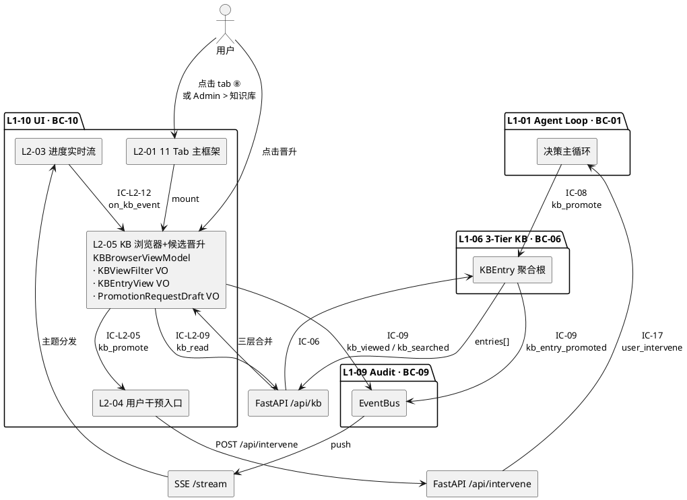
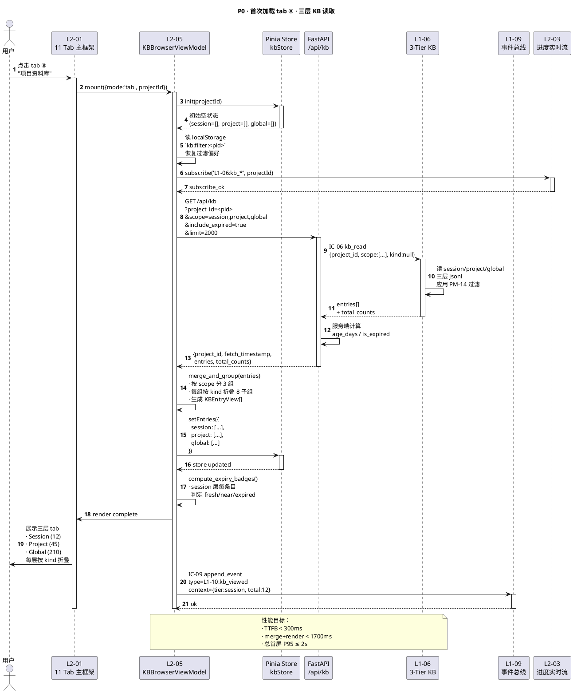
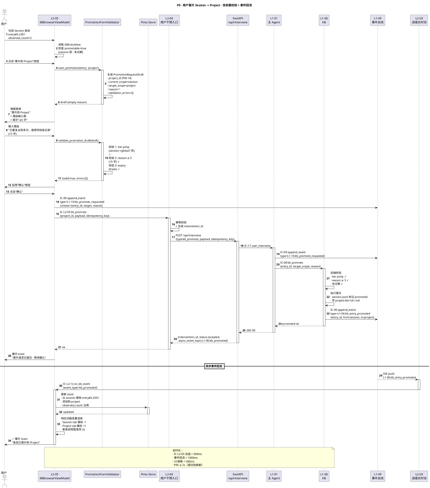
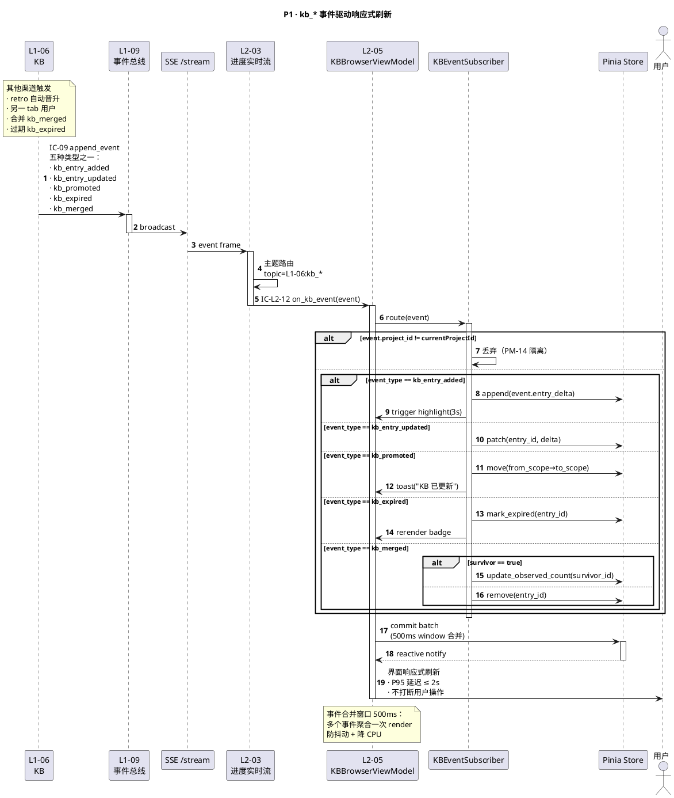
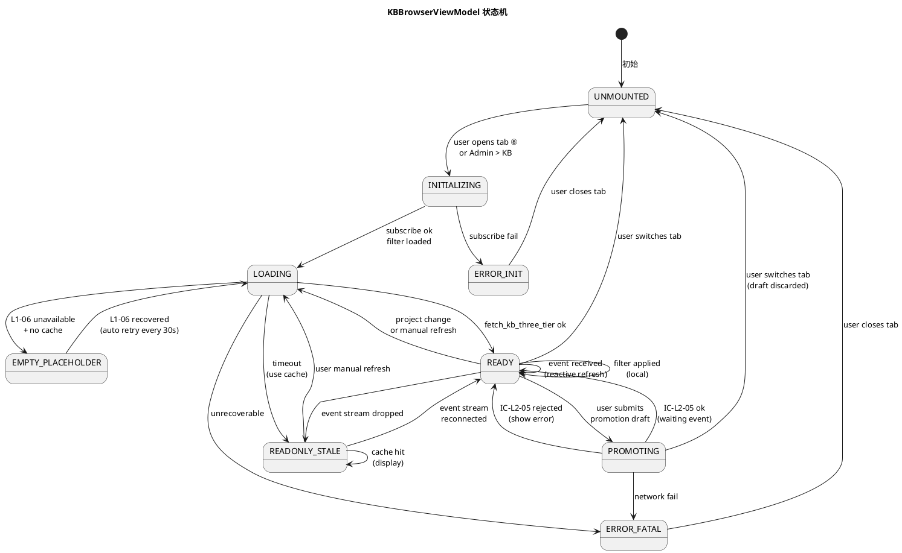
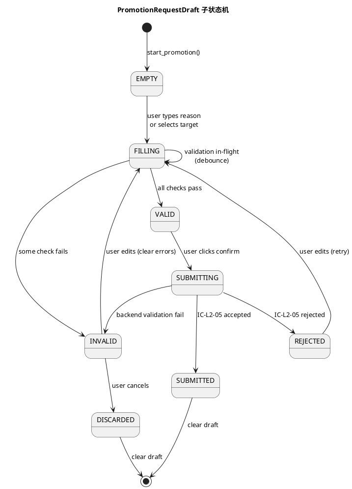
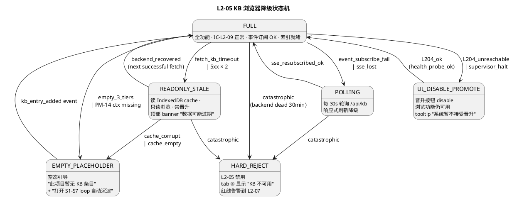

# L1 L2-05 · KB 浏览器+候选晋升 · Tech Design

> **本文档定位**：3-1-Solution-Technical 层级 · L1-10 人机协作 UI 的 L2-05 KB 浏览器+候选晋升 技术实现方案（L2 粒度）。
> **与产品 PRD 的分工**：2-prd/L1-10-人机协作UI/prd.md §5.10 L2-05 + §12 的对应 L2 节定义产品边界，本文档定义**技术实现**（接口字段级 schema + 算法伪代码 + 底层数据结构 + 状态机 + 配置参数）。
> **与 L1 architecture.md 的分工**：architecture.md 负责**跨 L2 架构 + 跨 L2 时序**（§5.4 KB 候选晋升时序 · §6.2.8 KB 浏览器组件契约），本文档负责**本 L2 内部技术细节**。冲突以 architecture.md 为准。
> **严格规则**：本文档不复述产品 PRD 文字（职责 / 禁止 / 必须等清单），只做技术映射 + 补齐"产品视角未说 but 工程师必须知道"的部分（具体算法 · syscall · schema · 配置）。

---

## §0 撰写进度

- [x] §1 定位 + 2-prd §5.10 L2-05 映射
- [x] §2 DDD 映射（引 L0/ddd-context-map.md BC-10 · Customer 于 BC-06）
- [x] §3 对外接口定义（字段级 YAML schema + 错误码）
- [x] §4 接口依赖（被谁调 · 调谁）
- [x] §5 P0/P1 时序图（PlantUML ≥ 2 张）
- [x] §6 内部核心算法（伪代码）
- [x] §7 底层数据表 / schema 设计（字段级 YAML）
- [x] §8 状态机（PlantUML + 转换表）
- [x] §9 开源最佳实践调研（≥ 3 GitHub 高星项目）
- [x] §10 配置参数清单
- [x] §11 错误处理 + 降级策略
- [x] §12 性能目标
- [x] §13 与 2-prd / 3-2 TDD 的映射表

---

## §1 定位 + 2-prd 映射

### 1.1 本 L2 在 L1-10 人机协作 UI 里的坐标

L1-10 人机协作 UI 由 8 个 L2 组成（L2-01 11 tab 主框架 / L2-02 Gate 决策卡 / L2-03 进度实时流 / L2-04 用户干预入口 / **L2-05 KB 浏览器+候选晋升** / L2-06 裁剪档配置 / L2-07 红线告警角+Admin / L2-08 决策轨迹浏览器）。

L2-05 在其中的定位：**面向 BC-06 3-Tier KB 的只读消费面 + 用户晋升触发面**——渲染 L1-06 KB 的三层（Session / Project / Global）条目树 + 提供用户显式"晋升"动作 + 订阅 `L1-06:kb_*` 事件做响应式同步——是用户**看 KB + 主动推 KB 晋升**的唯一 UI 入口。

```
  [用户] ─┐
         │ 打开 tab ⑧ KB / Admin > 知识库
         ▼
  ┌────────────────────────────────────────┐
  │ L2-01 11 Tab 主框架（tab ⑧ 容器 · 路由） │
  └──────────────┬─────────────────────────┘
                 ▼
  ┌─────────────────────────────────────────────────┐
  │  L2-05 · KB 浏览器+候选晋升                       │
  │  (Application Service · 只读 + 晋升委托)        │
  │                                                 │
  │  ┌──────────────────────────────────────────┐  │
  │  │ KBBrowserViewModel                       │  │  (MVVM 视图模型)
  │  │   ├── ThreeTierRenderer                   │  │  (Session/Project/Global tab)
  │  │   ├── KindFoldingGroup                    │  │  (8 kind 折叠)
  │  │   ├── KBFilter                            │  │  (kind/scope/context/keyword)
  │  │   ├── KBSearchIndex                       │  │  (本地 title 倒排)
  │  │   ├── VirtualListScroller                 │  │  (1000+ 条目虚拟列表)
  │  │   ├── PromotionFormValidator              │  │  (前置校验 3 类)
  │  │   ├── KBEventSubscriber                   │  │  (订阅 kb_* 事件)
  │  │   └── ExpiryBadgeComputer                 │  │  (Session 7 天过期)
  │  └──────────────────────────────────────────┘  │
  │                                                 │
  │  ┌──────────────────────────────────────────┐  │
  │  │  KBViewFilter VO                          │  │  (kind/scope/context)
  │  │  KBEntryView VO（只读投影 · 不持 ID）       │  │  (UI 侧渲染单元)
  │  │  PromotionRequestDraft VO                  │  │  (未提交的晋升草稿)
  │  └──────────────────────────────────────────┘  │
  └──────────────────┬──────────────┬───────────────┘
                     │              │
              IC-L2-09 │          IC-L2-05 │
                     ▼              ▼
          ┌──────────────┐    ┌────────────────┐
          │ FastAPI      │    │ L2-04 干预入口  │
          │ /api/kb      │    │ (封装 IC-17)    │
          └──────┬───────┘    └────────┬───────┘
                 ▼                     ▼
          [L1-06 3-Tier KB]     [L1-01 Agent Loop]
          (只读 IC-06)            → IC-08 kb_promote
```

L2-05 的一句话定位 = **"BC-10 人机协作 UI 的 KB 消费面 · 3 IC 触点（L2-09 read + L2-05 promote + L2-12 被 push）· 纯只读 UI + 晋升委托 · 零直接写 · 零自动推荐 · 大数据集虚拟列表 · 响应式事件驱动"**。

### 1.2 与 2-prd §5.10 L2-05 / §12 的对应表

| 2-prd §5.10 / §12 小节 | 本文档对应位置 | 技术映射重点 |
|:---|:---|:---|
| §12.1 一句话职责（3 层 KB 浏览 + 用户显式晋升） | §1.1 + §2 (KBBrowserViewModel MVVM 应用服务) | MVVM + Pinia store + VirtualList |
| §12.2 输入 / 输出（浏览请求 / 晋升操作 / kb_* 事件 / 三层视图） | §3 IC schema + §7 UI 状态 | 3 IC schema 字段级 |
| §12.3 边界（只读 + 晋升触发 · 不直接发 IC-17） | §4 依赖图 · §6.6 委托 L2-04 | 严格走 IC-L2-05 → L2-04 |
| §12.4 硬约束 1-6（Session 禁直升 / 理由 ≥ 5 字 / 单条晋升 / 实时同步 / 已过期禁晋升 / 禁本地改 count） | §6.5 前置校验 + §6.7 只读投影 + §8 状态机 | 6 条硬约束全映射到算法 |
| §12.5 禁止行为（8 条） | §11 降级拒绝 · §6.5 前置拦截 | UI 侧 + 后端兜底双防御 |
| §12.6 必须职责（8 条） | §6.2 拉取 + §6.3 渲染 + §6.8 事件订阅 + §6.9 审计 | 逐条算法落地 |
| §12.7 可选功能（5 条） | §6.11 可选扩展（对比 / 跳转 / 筛选 / 导出 / 统计） | 各自独立模块 feature flag |
| §12.8 IC 契约（IC-L2-05 / IC-L2-09 / IC-L2-12 / IC-09） | §3 字段级 schema | 4 IC 完整定义 |
| §12.9 8 场景验证大纲 | §13 TDD 映射表 | 映射到 3-2 测试用例 |

### 1.3 本 L2 在 architecture.md 里的坐标

引 `docs/3-1-Solution-Technical/L1-10-人机协作UI/architecture.md`：
- §3.3 11 Tab 总览（tab ⑧ 项目资料库 = L2-05 渲染面）
- §5.4 时序图 4 · KB 候选晋升（用户旁路阈值）
- §6.2.8 L2-05 KB 浏览器组件契约（Domain Service + VO）
- §7.2 跨 L2 事件主题清单（`L1-06:kb_*` 订阅方 = L2-05）

**本 L2 的关键特征**（对 L1-10 整体而言）：
1. **纯只读消费 · 零直接写**：所有变更经 L2-04 → L1-01 → L1-06 标准链路（AD-03 唯一出口原则）
2. **事件驱动刷新**：订阅 `L1-06:kb_entry_added / kb_entry_updated / kb_promoted / kb_expired / kb_merged` 五类事件 → 响应式 store 更新 · 不轮询
3. **PM-14 强过滤**：所有视图严格按当前 `project_id` 过滤 · Global 层混合展示（`project_id = *` 特殊值）
4. **大数据集优化**：Global 层可达 1000+ 条目 · 虚拟列表（`vue-virtual-scroller` 或 CSS `content-visibility`）
5. **前置校验三重闸**：UI 拦截（按钮 disable） + FormValidator（提交前） + L1-06 后端（兜底）
6. **双入口复用**：tab ⑧ 和 Admin > 知识库共用同一 KBBrowserViewModel · 靠 `context` prop 区分展示面板

### 1.4 本 L2 的 PM-14 约束

**PM-14 约束**（引 `docs/3-1-Solution-Technical/projectModel/tech-design.md`）：所有 IC payload 顶层 `project_id` 必填；所有存储路径按 `projects/<pid>/...` 分片；所有 UI 视图按当前 project 过滤。

本 L2 在 PM-14 层面的具体落点：
- IC-L2-09 kb_read payload 首字段 `project_id: string`（含 Global 层时该字段作为过滤器 · Global 层 entry 的 `project_id = "*"` 表示跨项目共享）
- IC-L2-05 kb_promote payload 首字段 `project_id: string`（断言 entry 的 source project 一致）
- UI 侧 Pinia store `currentProjectId` 绑定 `useProjectStore().activeId`；用户切 project → KBBrowserViewModel `onProjectChange()` hook → 清空本地缓存 + 重新 IC-06 全拉
- 前端持久化（本地 filter 偏好）按 project_id 分键：`localStorage['kb:filter:<pid>']`

### 1.5 关键技术决策（本 L2 特有 · Decision / Rationale / Alternatives / Trade-off）

| 决策 | 选择 | 备选 | 理由 | Trade-off |
|:---|:---|:---|:---|:---|
| **D1: 数据获取策略** | 全量拉一次 + 事件增量刷新 | 分页 / 懒加载 / 流式 | KB 条目总量可控（单 project ≤ 500 条 / Global ≤ 2000）· 一次拉完 UX 最好 · 事件驱动增量 | 内存占用约 5-20 MB（可接受） |
| **D2: 三层合并策略** | 后端合并 + 前端分组 | 前端三次 IC-06 分别拉 | 1 次 round-trip 降延迟 · L1-06 天然支持 scope=[session,project,global] | 后端 payload 略大 · 但 gzip 后可忽略 |
| **D3: 虚拟列表实现** | `vue-virtual-scroller` (Guillaume Chau, 7k⭐) | `vue3-virtual-scroll-list` / 原生 `content-visibility: auto` | 成熟 · 支持动态高度 · Vue 3 兼容好 · 7k star 维护活跃 | +15 KB bundle · 可接受 |
| **D4: 本地搜索策略** | 前端 title 前缀匹配（`includes`） | Fuse.js 模糊 / 服务端搜索 | 简单 · 禁 NLP（scope §5.6.5 禁止 5-6）· 数据集小可接受 O(n) | 不支持拼写纠错（明确 YAGNI） |
| **D5: 事件订阅方式** | 通过 L2-03 进度实时流分发（间接订阅） | 直接连 SSE | 单一 SSE 通道原则 · L2-03 已有 topic 路由 | 多一层 event bus（设计意图） |
| **D6: 晋升委托路径** | IC-L2-05 → L2-04 → IC-17 → L1-01 → IC-08 → L1-06 | 直接发 IC-17 / 直接 POST L1-06 | AD-03 唯一出口原则 · 审计友好 · 幂等统一在 L2-04 | 5 跳 round-trip（可接受 · 晋升不频繁） |
| **D7: 已过期判定** | 前端按 `last_observed_at + 7d` 计算 + 后端同步 | 纯后端标记 / 纯前端计算 | 前端计算免再请求 · 后端 kb_expired 事件兜底同步 | 时钟漂移风险（但 NTP 下 < 1s 可忽略） |
| **D8: 单次晋升粒度** | 单条目（batch=1） | 批量勾选 | §12.4 硬约束 3 明文单条 · 批量是 S7 仪式流另走 L2-04 | 用户体验略降（可接受 · 晋升低频） |
| **D9: UI 侧本地禁改 count** | 只读投影 VO（KBEntryView） | 允许本地乐观更新 | §12.4 硬约束 6 明文禁止 · 防数据漂移 | 事件未到达前短暂延迟（< 2s · 可接受） |
| **D10: kind 折叠持久化** | localStorage per project | sessionStorage / 不持久化 | 用户切 tab 回来保留习惯 | 多用户同设备需 profile 区分（V1 YAGNI） |

### 1.6 本 L2 读者预期

读完本 L2 的工程师应掌握：
- KBBrowserViewModel Application Service 的 4 IC 触点字段级 schema + 错误码 12 个
- 8 个核心算法的伪代码（fetch / merge-three-tier / filter-apply / search-index / event-reconcile / expiry-compute / promotion-form-validate / virtual-list-window）
- 3 张数据表（KBViewCache · FilterPreference · PromotionDraft）+ 3 张 VO（KBViewFilter / KBEntryView / PromotionRequestDraft）
- KBBrowserViewModel 状态机（PlantUML 6 个主状态 · 7 条转换）
- 降级链 4 级（FULL → READONLY_STALE → EMPTY_PLACEHOLDER → ERROR_BANNER）
- SLO（首次加载 ≤ 2s P95 · tab 切换 ≤ 300ms P95 · kind 折叠 ≤ 100ms · 搜索 ≤ 200ms · 晋升到刷新 ≤ 2s）

### 1.7 本 L2 不在的范围（YAGNI）

- **不在**：KB 条目编辑（只读；新条目由其他 L1 的 L2 写入 L1-06）
- **不在**：KB 条目删除（只读）
- **不在**：条目合并（L1-06 自动做 `kb_merged` 事件）
- **不在**：向量检索 / 语义搜索（scope §5.6.5 禁止 5）
- **不在**：自然语言问答（scope §5.6.5 禁止 6）
- **不在**：跨项目 KB 联邦视图（V1-V2 只看当前 project + Global）
- **不在**：自动晋升推荐（用户主动；本 L2 只展示 + 转发）
- **不在**：批量晋升（S7 仪式流职责）
- **不在**：KB 条目 diff 编辑（只读对比可选功能在 §6.11）

### 1.8 本 L2 术语表

| 术语 | 定义 | 关联 |
|:---|:---|:---|
| KBEntryView | UI 侧只读投影 VO（不持 ID 锁） | §2.3 + §7.2 |
| KBViewFilter | 过滤器 VO（kind/scope/context/keyword） | §2.3 + §7.3 |
| KindFoldingGroup | 按 kind 折叠的分组容器（8 kind） | §6.3 |
| PromotionRequestDraft | 未提交的晋升草稿（前置校验后才发 IC-L2-05） | §2.3 + §7.4 |
| ExpiryBadge | Session 条目 `last_observed_at + 7d` 过期标识 | §6.6 |
| VirtualListWindow | 虚拟列表可见窗口（buffer 前后 5 条） | §6.8 |
| KBEventSubscriber | 订阅 `L1-06:kb_*` 五类事件的 subscriber | §6.7 |
| BC-10 UI | Human-Agent Collaboration UI 限界上下文 | §2.1 |

### 1.9 本 L2 的 DDD 定位一句话

> **L2-05 是 BC-10 人机协作 UI 的 Application Service 层 · Customer 于 BC-06 3-Tier KB · 无聚合根 · 持 3 VO（KBViewFilter / KBEntryView / PromotionRequestDraft）· 只读投影 + 晋升委托 · 事件驱动响应式刷新 · PM-14 严格 project 作用域。**

---

## §2 DDD 映射（BC-10 · Customer 于 BC-06）

引 `docs/3-1-Solution-Technical/L0/ddd-context-map.md BC-10（L1-10 Human-Agent Collaboration UI）+ BC-06（L1-06 3-Tier KB）`。

本 L2 在 BC-10 人机协作 UI 里属于**应用服务层**（Application Service），不持有聚合根；作为 BC-06 的 **Customer**（只读），作为 BC-10 内部与 L2-04 的 **Customer-Supplier**（委托晋升）。

### 2.1 Application Service · KBBrowserViewModel

**职责**：从 L2-01（tab ⑧ 或 Admin）或 tab 首次渲染触发 → 通过 IC-L2-09 拉取三层 KB → 渲染 + 过滤 + 搜索 + 折叠 → 用户晋升动作经 IC-L2-05 委托 L2-04 → 订阅 `L1-06:kb_*` 事件响应式刷新。

**本质**：纯视图层 orchestrator · 无域数据所有权 · 持 3 个 VO（KBViewFilter / KBEntryView / PromotionRequestDraft）· 操作其他聚合根（L1-06 的 KBEntry 聚合 · L2-04 的 InterventionIntent 聚合）。

**关键依赖**（构造注入 · 无状态字段 · 状态在 Pinia store / Vuex / 外部存储）：

```yaml
dependencies:
  kb_query_client:          # IC-L2-09 前端 HTTP 客户端（封装 GET /api/kb）
  intervention_client:      # IC-L2-05 前端 HTTP 客户端（封装 POST /api/intervene）
  event_subscriber:         # L2-03 事件订阅器（SSE topic: L1-06:kb_*）
  audit_forwarder:          # IC-09 审计转发（每次 view / search / promote）
  local_filter_repo:        # localStorage per-project filter 持久化
  project_context_store:    # Pinia store · currentProjectId 响应式
  notification_service:     # 晋升成功 / 失败 toast

config:
  fetch_debounce_ms: 200
  event_merge_window_ms: 500
  virtual_list_buffer_size: 5
  expiry_days: 7
  title_search_min_chars: 2
  promotion_reason_min_chars: 5
  max_entries_per_tier: 2000
  filter_persist_per_project: true
```

**行为**（Methods · 面向 UI 组件）：
- `open_kb_tab(project_id)` — 入口（tab ⑧ mounted / Admin 进入）
- `fetch_kb_three_tier(project_id, filter)` — 调 IC-L2-09 kb_read
- `merge_and_group(entries)` — 按 scope 分三层 → 按 kind 折叠
- `apply_filter(filter)` — 前端过滤（kind/scope/context/keyword）
- `search_title(keyword)` — title 倒排匹配
- `switch_tier(session|project|global)` — 三层 tab 切换
- `toggle_kind_fold(kind)` — kind 折叠展开
- `start_promotion(entry, target_scope)` — 晋升草稿初始化
- `validate_promotion_draft(draft)` — 前置校验（层级跳跃 / 理由 / 过期）
- `submit_promotion(draft)` — 经 IC-L2-05 提交
- `on_kb_event(event)` — 事件订阅回调（响应式更新）
- `compute_expiry(entry)` — 前端 7 天过期计算
- `on_project_change(new_pid)` — 切 project 时重置
- `export_snapshot(scope)` — 可选 markdown 导出
- `close_kb_tab()` — 清理订阅 · 卸载 store

### 2.2 Customer 关系（于 BC-06 3-Tier KB）

引 L0/ddd-context-map.md BC-06：

- **BC-06 KBEntry 聚合根**（id + scope + kind + title + content + applicable_context + observed_count + first_observed_at + last_observed_at + source_links）
- **本 L2 的 Customer 关系**：
  - 通过 IC-06 kb_read（代理：IC-L2-09）只读 KBEntry
  - 通过 IC-17 user_intervene(kb_promote)（代理：IC-L2-05 → L2-04）触发 L1-06 的 kb_promote 命令
  - 订阅 L1-06 的 Domain Event：`kb_entry_added` / `kb_entry_updated` / `kb_promoted` / `kb_expired` / `kb_merged`
- **边界** —— 本 L2 **不持** KBEntry 聚合根（它属于 BC-06）· 只持投影 VO（KBEntryView）

### 2.3 VO · 值对象清单

本 L2 持有 3 个 VO（所有字段不可变 · 按值比较 · 无 ID 概念）：

**VO-1 · KBViewFilter**（过滤器值对象）

```yaml
kind: frozenset<string>  # 子集 of {pattern, trap, recipe, tool_combo, anti_pattern, project_context, external_ref, effective_combo}
scope: frozenset<string>  # 子集 of {session, project, global}
applicable_context:
  route: string | null    # e.g. "backend" / "frontend"
  task_type: string | null  # e.g. "api" / "db_migration"
  tech_stack: string | null # e.g. "python" / "typescript"
keyword: string           # title 搜索关键词（空串表示无搜索）
include_expired: boolean  # 是否展示已过期 Session 条目（默认 true · 展示但标 badge）
```

**VO-2 · KBEntryView**（只读投影 · 不持 ID 锁）

```yaml
entry_id: string              # 来自 BC-06 KBEntry.id（UI 只作 key）
scope: enum(session|project|global)
kind: enum(pattern|trap|recipe|tool_combo|anti_pattern|project_context|external_ref|effective_combo)
title: string
evidence_summary: string      # 前 200 字摘要（后端已截断）
observed_count: integer       # 只信后端（禁本地改）
first_observed_at: datetime
last_observed_at: datetime
applicable_context:
  route: string | null
  task_type: string | null
  tech_stack: string | null
source_links:                 # evidence 锚点（跳转事件 tab）
  - event_id: string
    event_type: string
    timestamp: datetime
expiry_state: enum(fresh|near_expire|expired)  # 前端计算（see §6.6）
promotable: boolean           # 前端判定（session→project allowed? project→global allowed? expired block?）
```

**VO-3 · PromotionRequestDraft**（未提交的晋升草稿）

```yaml
project_id: string             # PM-14 项目上下文（来自 Pinia store）
entry_id: string
current_scope: enum(session|project)  # 不含 global（global 不能再晋升）
target_scope: enum(project|global)
reason: string                 # 用户填写的批准理由（≥ 5 字）
draft_created_at: datetime     # 用于 UI 侧超时清理
validation_errors:             # 前置校验结果（empty 表示通过）
  - code: string
    message: string
```

### 2.4 与其他 BC 的关系（Context Map 三元组）

| 对方 BC | 关系 | 方向 | IC |
|:---|:---|:---|:---|
| BC-06 3-Tier KB | **Customer** | 本 L2 → BC-06 | IC-06 kb_read（经 IC-L2-09 HTTP 代理） |
| BC-06 3-Tier KB | **Event Subscriber** | BC-06 → 本 L2 | SSE topic `L1-06:kb_*`（经 L2-03） |
| BC-10（兄弟 L2-04） | **Customer-Supplier** | 本 L2 → L2-04 | IC-L2-05 kb_promote 委托 |
| BC-10（兄弟 L2-01） | **被 mount** | L2-01 → 本 L2 | tab ⑧ / Admin 挂载点 |
| BC-10（兄弟 L2-03） | **Event Dispatch** | L2-03 → 本 L2 | IC-L2-12 KB 事件分发 |
| BC-09 Resilience & Audit | **Partnership** | 本 L2 → BC-09 | IC-09 append_event（每次浏览 / 搜索 / 晋升） |

### 2.5 为什么本 L2 没有聚合根

引 DDD 原则：聚合根 = 有唯一 ID + 生命周期 + 域内不变量的对象。本 L2：
1. 所有数据（KBEntry）属于 BC-06 聚合
2. 本 L2 只做投影展示 + 用户动作转发
3. UI 侧的"状态"（当前过滤器 / 当前 tier tab / 折叠状态）是**视图状态**，不是域状态
4. PromotionRequestDraft 是短生命周期的草稿（提交即消失），不形成聚合
5. 符合 Evans DDD "Application Service 无聚合根"模式

---

## §3 对外接口定义（字段级 YAML schema + 错误码）

本 L2 对外暴露 4 个 IC 触点 + 多个前端组件契约。

### 3.1 IC-L2-09 · kb_read（本 L2 调 L1-06）

**方向**：L2-05 → FastAPI `/api/kb` → IC-06 kb_read → L1-06

**调用时机**：tab ⑧ 首次渲染 · 用户切 project · 用户改 filter 时（debounce 200ms）· 崩溃恢复

**入参 schema**（HTTP GET query string）：

```yaml
project_id: string                    # PM-14 项目上下文（必填 · 对应当前激活 project）
scope: array<enum>                    # 默认 ["session", "project", "global"]；可单独传一层
kind: array<enum> | null              # 过滤 kind；null 表示全部
applicable_context:                   # 可选 · 过滤器
  route: string | null
  task_type: string | null
  tech_stack: string | null
keyword: string | null                # title 前缀模糊搜索；null 表示不搜
include_expired: boolean              # 默认 true（展示但标 badge）
cursor: string | null                 # V2 分页游标；V1 忽略
limit: integer                        # 每层最大条数 · 默认 2000 · 硬上限 5000
```

**出参 schema**：

```yaml
project_id: string
fetch_timestamp: datetime             # 服务端响应时间戳（前端用于时钟对齐）
entries:
  - entry_id: string
    scope: enum(session|project|global)
    kind: enum(pattern|trap|recipe|tool_combo|anti_pattern|project_context|external_ref|effective_combo)
    title: string
    evidence_summary: string           # 后端已截断到 200 字
    observed_count: integer
    first_observed_at: datetime
    last_observed_at: datetime
    applicable_context:
      route: string | null
      task_type: string | null
      tech_stack: string | null
    source_links:
      - event_id: string
        event_type: string
        timestamp: datetime
    _server_computed:
      age_days: integer                # 服务端计算（避免时钟漂移）
      is_expired: boolean              # 服务端判定（session 层 > 7d）
total_counts:
  session: integer
  project: integer
  global: integer
has_more:                              # V2 分页；V1 全假
  session: boolean
  project: boolean
  global: boolean
next_cursor: string | null
```

**错误码表**：

| 错误码 | 含义 | 触发场景 | 调用方处理 |
|:---|:---|:---|:---|
| `KB_VIEW_E001_PROJECT_NOT_FOUND` | project_id 不存在 | PM-14 校验失败 | 展示 "项目不存在" + 跳回首页 |
| `KB_VIEW_E002_PROJECT_SCOPE_MISMATCH` | scope 中包含非法 scope 值 | 前端开发错传 | 降级为 ["session","project","global"] |
| `KB_VIEW_E003_KIND_INVALID` | kind 含非 8 枚举值之一 | 开发时拼写错 | 过滤掉非法值 · 继续请求 |
| `KB_VIEW_E004_L106_TIMEOUT` | L1-06 超时 | 下游慢 / 崩溃 | 重试 1 次 + 展示 READONLY_STALE banner |
| `KB_VIEW_E005_L106_UNAVAILABLE` | L1-06 不可达 | 下游故障 | 降级 EMPTY_PLACEHOLDER + 订阅恢复事件 |
| `KB_VIEW_E006_PAYLOAD_TOO_LARGE` | 超 5000 条硬上限 | 异常大项目 | 强制分页 + 提示用户缩小过滤 |

### 3.2 IC-L2-05 · kb_promote（本 L2 调 L2-04）

**方向**：L2-05 → L2-04（内部 IC）→ FastAPI `/api/intervene` → IC-17 user_intervene → L1-01 → IC-08 kb_promote → L1-06

**调用时机**：用户点击"晋升"按钮并前置校验通过后

**入参 schema**：

```yaml
project_id: string                     # PM-14 项目上下文（必填 · 与 entry 同 project）
type: "kb_promote"                      # L2-04 intervene 的 discriminator
payload:
  entry_id: string                     # 被晋升条目的 BC-06 KBEntry.id
  current_scope: enum(session|project)
  target_scope: enum(project|global)
  reason: string                        # ≥ 5 字（UI 强校验）· L2-04 再校验 · L1-06 兜底
  user_confirmed_at: datetime           # UI 侧点确认时间
idempotency_key: string                 # UUID v4（前端生成 · L2-04 幂等）
trace_id: string | null                 # 审计链路关联
```

**出参 schema**（L2-04 封装返回 · L1-06 实际完成是异步，通过事件同步）：

```yaml
intervention_id: string                 # L2-04 分配的干预 ID
status: enum(accepted|rejected|pending_event)
rejection_reason: string | null         # status=rejected 时
promoted_entry_id: string | null        # status=accepted 立即返回（但最终刷新靠 kb_promoted 事件）
async_event_topic: string               # 前端订阅确认主题："L1-06:kb_promoted"
estimated_completion_ms: integer        # 预估 < 2000ms
```

**错误码表**：

| 错误码 | 含义 | 触发场景 | 调用方处理 |
|:---|:---|:---|:---|
| `KB_PROMOTE_E001_TIER_JUMP` | Session → Global 直升 | 前端未拦截 | 后端 reject · 前端展示 "必须先升 Project" |
| `KB_PROMOTE_E002_REASON_TOO_SHORT` | reason < 5 字 | 前端未拦截 | 后端 reject · 前端展示 "理由太短" |
| `KB_PROMOTE_E003_ENTRY_EXPIRED` | 条目已过期 | 前端未拦截 | 后端 reject · 前端展示 "过期条目需重新观察" |
| `KB_PROMOTE_E004_IDEMPOTENCY_REPLAY` | 相同 idempotency_key 重放 | 用户重复点击 | L2-04 返回首次结果 · 前端静默 |
| `KB_PROMOTE_E005_L101_BUSY` | 主 Agent 忙（tick in-flight） | L2-04 排队 | 展示 pending_event · 等事件 |
| `KB_PROMOTE_E006_SUPERVISOR_BLOCKED` | L1-07 硬红线 halt 中 | 系统暂停 | 展示 "系统已暂停 · 请先授权" |

### 3.3 IC-L2-12 · 被调 · KB 事件分发（L2-03 → 本 L2）

**方向**：L2-03 进度实时流 → 本 L2（内部 pub-sub · 不走 HTTP）

**调用时机**：`L1-06:kb_*` 事件到达时 L2-03 主题分发

**入参 schema**（事件载荷）：

```yaml
project_id: string                     # PM-14 · 本 L2 过滤（非当前 project 则丢弃）
event_id: string                       # L1-09 事件总线 ID
event_type: enum(
  L1-06:kb_entry_added,
  L1-06:kb_entry_updated,
  L1-06:kb_promoted,
  L1-06:kb_expired,
  L1-06:kb_merged
)
timestamp: datetime
entry_id: string
entry_delta:                           # 事件语义下的增量数据
  # kb_entry_added: full entry
  # kb_entry_updated: partial patch
  # kb_promoted: {from_scope, to_scope, reason}
  # kb_expired: {expired_at}
  # kb_merged: {merged_into_entry_id, survivor: bool}
  ...
source:                                # 审计溯源
  agent_id: string | null
  user_id: string | null               # 用户触发的晋升（本 L2 自身触发）
  origin: enum(auto|user|system)
```

**处理规则**（see §6.7 算法）：

| event_type | UI 反应 |
|:---|:---|
| `kb_entry_added` | 在对应 scope/kind 组末尾追加 + 短暂高亮 3s |
| `kb_entry_updated` | 替换原条目（按 entry_id 查找）+ observed_count 更新 |
| `kb_promoted` | 从 from_scope 移除 + 在 to_scope 追加 + toast 通知 |
| `kb_expired` | 当前条目标记 expired badge + 移到 session 组末尾 |
| `kb_merged` | 若是 survivor=false 则移除；survivor=true 则更新 observed_count |

### 3.4 IC-09 · 审计（每次浏览 / 搜索 / 晋升）

**方向**：本 L2 → L1-09（经 L2-03 间接走 SSE 回注 / 经 HTTP POST /api/audit 直发）

**调用时机**：见下表

```yaml
project_id: string                     # PM-14
event_type: enum(
  L1-10:kb_viewed,
  L1-10:kb_searched,
  L1-10:kb_filter_applied,
  L1-10:kb_tier_switched,
  L1-10:kb_kind_folded,
  L1-10:kb_promote_requested,
  L1-10:kb_export_snapshot
)
timestamp: datetime
user_id: string                        # 当前会话用户
context:                               # 事件专属字段
  # kb_viewed: {tier, total_entries}
  # kb_searched: {keyword, result_count}
  # kb_filter_applied: {filter_snapshot}
  # kb_promote_requested: {entry_id, target_scope, reason}
  ...
```

### 3.5 前端组件契约（内部 API · 非跨 L2）

**`<KBBrowser>` 根组件**：

```typescript
interface KBBrowserProps {
  mode: 'tab' | 'admin'           // tab ⑧ 或 Admin 后台
  projectId: string               // PM-14
  initialFilter?: KBViewFilter    // 可选初始过滤
}

interface KBBrowserEmits {
  'entry-clicked': (entry: KBEntryView) => void
  'promotion-submitted': (draft: PromotionRequestDraft) => void
  'error': (err: KBError) => void
}
```

**`<KBEntry>` 条目卡**：

```typescript
interface KBEntryProps {
  entry: KBEntryView
  selectable: boolean       // 是否显示 checkbox
  showPromoteButton: boolean // tier 层级决定
}
```

**`<PromotionButton>` 晋升按钮**：

```typescript
interface PromotionButtonProps {
  entry: KBEntryView
  disabled: boolean         // 已过期 / session→global / 无选中
  disabledReason?: string
}
```

### 3.6 错误码总表（汇总）

| 错误码 | 所属 IC | 严重度 | 用户可见消息 |
|:---|:---|:---|:---|
| KB_VIEW_E001_PROJECT_NOT_FOUND | IC-L2-09 | ERROR | 项目不存在 |
| KB_VIEW_E002_PROJECT_SCOPE_MISMATCH | IC-L2-09 | WARN | （内部降级） |
| KB_VIEW_E003_KIND_INVALID | IC-L2-09 | WARN | （内部忽略） |
| KB_VIEW_E004_L106_TIMEOUT | IC-L2-09 | ERROR | 知识库响应超时 · 已使用缓存 |
| KB_VIEW_E005_L106_UNAVAILABLE | IC-L2-09 | FATAL | 知识库暂不可用 · 等待恢复 |
| KB_VIEW_E006_PAYLOAD_TOO_LARGE | IC-L2-09 | WARN | 数据过多 · 请缩小过滤条件 |
| KB_PROMOTE_E001_TIER_JUMP | IC-L2-05 | ERROR | 必须先晋升到 Project 才能到 Global |
| KB_PROMOTE_E002_REASON_TOO_SHORT | IC-L2-05 | WARN | 批准理由最少 5 字 |
| KB_PROMOTE_E003_ENTRY_EXPIRED | IC-L2-05 | WARN | 过期条目需重新观察累积 |
| KB_PROMOTE_E004_IDEMPOTENCY_REPLAY | IC-L2-05 | INFO | （静默）请求已处理 |
| KB_PROMOTE_E005_L101_BUSY | IC-L2-05 | INFO | 系统繁忙 · 请稍候 |
| KB_PROMOTE_E006_SUPERVISOR_BLOCKED | IC-L2-05 | ERROR | 系统已暂停 · 请先授权 |

---

## §4 接口依赖（被谁调 · 调谁）

### 4.1 上游调用方（调本 L2 的）

| 调用方 | 何时调 | 调哪个方法 | 期望返回 |
|:---|:---|:---|:---|
| L2-01 11 Tab 主框架 | 用户切到 tab ⑧ 或进 Admin > 知识库 | `open_kb_tab(project_id)` | Vue 组件 mount 完成 |
| L2-03 进度实时流 | 收到 `L1-06:kb_*` 事件 | `on_kb_event(event)`（IC-L2-12） | 响应式更新 VM |
| 用户点击"晋升" | UI 事件 | `start_promotion(entry, target)` → `submit_promotion(draft)` | IC-L2-05 发出 |
| 用户切 project | project_context_store.watch | `on_project_change(new_pid)` | 清缓存 + 重拉 |
| 用户导出（可选） | UI 事件 | `export_snapshot(scope)` | 下载 md |

### 4.2 下游依赖（本 L2 调的）

| IC | 被调方 | 何时调 | 一句话 |
|:---|:---|:---|:---|
| IC-L2-09 kb_read | L1-06（经 FastAPI） | tab 加载 / project 切换 / filter 改 | 只读 3 层 KB 合并 |
| IC-L2-05 kb_promote | L2-04 用户干预入口 | 用户晋升动作 | 委托发 IC-17 |
| IC-09 append_event | L1-09 资源与审计 | 每次浏览 / 搜索 / 晋升 | 审计留痕 |
| L2-03 subscribe | L2-03 进度实时流 | tab mount 时 | 订阅 kb_* 主题 |

### 4.3 依赖图（PlantUML）



### 4.4 调用频次矩阵

| IC | 频次级别 | 典型 QPS（单用户） | 峰值 |
|:---|:---|:---|:---|
| IC-L2-09 kb_read | 低频 | 0.1（仅切换触发） | 1（快速切换） |
| IC-L2-05 kb_promote | 极低频 | < 0.01 | 0.1（批量 retro 后） |
| IC-L2-12 事件订阅 | 中频 | 0.5-2（跟 KB 写频次） | 10（大规模 retro） |
| IC-09 审计 | 中频 | 1-5 | 20 |

### 4.5 依赖降级顺序

（详见 §11）

当下游故障时降级优先级：
1. L1-06 不可达 → READONLY_STALE（用本地缓存）
2. L2-04 不可达 → 晋升按钮 disable + 提示 "干预入口暂不可用"
3. L2-03 事件流断 → 展示 "数据可能过时" banner + 自动每 30s 全量 refetch
4. FastAPI 504 → 同 L1-06 不可达

---

## §5 P0/P1 时序图（PlantUML ≥ 2 张）

### 5.1 时序图 1 · P0 · 首次加载 tab ⑧（IC-L2-09 三层读取 + 渲染）

**场景**：用户首次进入 tab ⑧ 项目资料库 → 拉取三层 KB → 渲染折叠面板 → 审计留痕。



**关键点**：
- merge_and_group 是纯前端计算 · 不阻塞 TTFB
- localStorage 过滤偏好在 subscribe 之前读取（避免错过事件）
- audit event 在渲染完成后发（不阻塞首屏）

### 5.2 时序图 2 · P0 · 用户晋升 Session → Project（含前置校验 + 事件回流）

**场景**：用户勾选 Session 层一条 trap 条目 → 填"晋升到 Project" + 理由 → 前置校验 → 经 L2-04 委托 → L1-06 执行 → 事件回刷。



**关键点**：
- 前置校验 3 闸：UI disable（按钮态） + FormValidator（提交前） + L1-06（后端兜底）
- 幂等 key 前端生成 UUID v4 · L2-04 去重
- 事件回流驱动 UI 刷新（不轮询）· scope §5.10.4 硬约束 4 实时 ≤ 2s
- toast 两次：提交受理 + 事件确认（用户明确知道异步）

### 5.3 时序图 3 · P1 · kb_* 事件驱动响应式刷新（单 SSE 通道 · 多事件类型分发）

**场景**：tab ⑧ 打开中 → 其他用户 / retro 仪式触发 KB 变更 → 本 L2 响应式刷新。



**关键点**：
- 500ms 事件合并窗口（防止高频事件抖动 UI）
- PM-14 过滤在 subscriber 侧（非当前 project 事件直接丢弃）
- 5 个事件类型在同一 subscriber 分发（单入口）
- 未打断用户当前操作（响应式更新 · 非弹窗）

---

## §6 内部核心算法（伪代码）

本节列出本 L2 的 8 个核心算法。所有算法采用 Python-like 伪代码 + TypeScript-like 类型提示。

### 6.1 算法 1 · fetch_kb_three_tier（三层 KB 拉取）

**职责**：调用 IC-L2-09 拉取三层 KB 条目 · 处理降级 · 更新 store

**输入**：`project_id: str`, `filter: KBViewFilter`

**输出**：`{session: KBEntryView[], project: KBEntryView[], global: KBEntryView[]}`

```python
async def fetch_kb_three_tier(project_id: str, filter: KBViewFilter) -> ThreeTierResult:
    # 1. PM-14 前置校验
    assert project_id, "PM-14 violation: project_id required"
    assert current_project_store.activeId == project_id, \
        "PM-14 violation: project_id mismatch with activeId"

    # 2. 构造请求
    query = {
        "project_id": project_id,
        "scope": list(filter.scope) if filter.scope else ["session", "project", "global"],
        "kind": list(filter.kind) if filter.kind else None,
        "applicable_context": filter.applicable_context.to_dict() if filter.applicable_context else None,
        "keyword": filter.keyword or None,
        "include_expired": filter.include_expired,
        "limit": config.max_entries_per_tier,
    }

    # 3. 带超时 + 重试 1 次
    try:
        resp = await http_client.get("/api/kb", params=query, timeout_ms=config.http_timeout_ms)
    except TimeoutError:
        # 第一次超时 → 重试
        try:
            resp = await http_client.get("/api/kb", params=query, timeout_ms=config.http_timeout_ms * 2)
        except TimeoutError:
            # 第二次仍超时 → 降级 READONLY_STALE
            emit_banner("knowledge_base_stale")
            return load_from_cache(project_id) or empty_result()

    # 4. 错误码处理
    if resp.error_code:
        return handle_error(resp.error_code)

    # 5. 纯前端切分 + 过滤
    result = merge_and_group(resp.entries)

    # 6. 缓存到 IndexedDB（跨刷新恢复）
    await cache_repo.set(f"kb:{project_id}", result, ttl=3600)

    # 7. 发审计事件
    await audit_forwarder.emit({
        "event_type": "L1-10:kb_viewed",
        "project_id": project_id,
        "context": {"total_counts": resp.total_counts},
    })

    return result


def empty_result() -> ThreeTierResult:
    return {"session": [], "project": [], "global": []}
```

**复杂度**：O(N) 其中 N 为 entries 总数 · 典型 N ≤ 2000

**关键 syscall**：`fetch` + `IndexedDB.put`

### 6.2 算法 2 · merge_and_group（三层合并 + kind 折叠）

**职责**：把后端返回的扁平 entries 数组按 scope 分 3 层 · 每层按 kind 折叠 8 组

**输入**：`entries: BackendEntry[]`

**输出**：`{session: KindFoldedGroup[], project: KindFoldedGroup[], global: KindFoldedGroup[]}`

```python
def merge_and_group(entries: list[BackendEntry]) -> ThreeTierResult:
    # 1. 初始化三层 dict-of-kind-list
    tiers = {
        "session": defaultdict(list),
        "project": defaultdict(list),
        "global": defaultdict(list),
    }

    # 2. 单次遍历分配（O(N)）
    for be in entries:
        view = _to_entry_view(be)  # BackendEntry → KBEntryView
        tiers[be.scope][be.kind].append(view)

    # 3. 每组内部按 last_observed_at 降序
    for tier in tiers.values():
        for kind_list in tier.values():
            kind_list.sort(key=lambda v: v.last_observed_at, reverse=True)

    # 4. 组装 KindFoldedGroup（保持 8 kind 固定顺序）
    KIND_ORDER = [
        "pattern", "trap", "recipe", "tool_combo",
        "anti_pattern", "project_context", "external_ref", "effective_combo"
    ]
    result = {}
    for scope in ["session", "project", "global"]:
        result[scope] = [
            {
                "kind": k,
                "entries": tiers[scope][k],
                "count": len(tiers[scope][k]),
                "expanded": _restore_fold_state(scope, k),  # localStorage 恢复
            }
            for k in KIND_ORDER
            if tiers[scope][k]  # 空组不展示
        ]
    return result


def _to_entry_view(be: BackendEntry) -> KBEntryView:
    return KBEntryView(
        entry_id=be.entry_id,
        scope=be.scope,
        kind=be.kind,
        title=be.title,
        evidence_summary=be.evidence_summary,
        observed_count=be.observed_count,
        first_observed_at=be.first_observed_at,
        last_observed_at=be.last_observed_at,
        applicable_context=be.applicable_context,
        source_links=be.source_links,
        expiry_state=_compute_expiry(be),
        promotable=_compute_promotable(be),
    )


def _compute_expiry(be: BackendEntry) -> ExpiryState:
    # 只有 session 层会过期（project/global 永久有效）
    if be.scope != "session":
        return "fresh"
    if be._server_computed.is_expired:  # 服务端兜底
        return "expired"
    age_days = be._server_computed.age_days
    if age_days >= config.expiry_days:
        return "expired"
    if age_days >= config.expiry_days - 1:  # 最后 24h
        return "near_expire"
    return "fresh"


def _compute_promotable(be: BackendEntry) -> bool:
    # Global 条目不可再晋升
    if be.scope == "global":
        return False
    # 已过期禁晋升
    if be._server_computed.is_expired:
        return False
    return True
```

**复杂度**：O(N log N) （排序主导）

### 6.3 算法 3 · apply_filter（前端过滤器应用）

**职责**：用户改过滤器时 · 本地快速过滤（不触发 IC-L2-09 重拉）

**输入**：`filter: KBViewFilter`, `cached: ThreeTierResult`

**输出**：`filtered: ThreeTierResult`

```python
def apply_filter(filter: KBViewFilter, cached: ThreeTierResult) -> ThreeTierResult:
    def match(entry: KBEntryView) -> bool:
        # kind 过滤
        if filter.kind and entry.kind not in filter.kind:
            return False
        # applicable_context 过滤
        ctx_filter = filter.applicable_context
        if ctx_filter:
            if ctx_filter.route and entry.applicable_context.route != ctx_filter.route:
                return False
            if ctx_filter.task_type and entry.applicable_context.task_type != ctx_filter.task_type:
                return False
            if ctx_filter.tech_stack and entry.applicable_context.tech_stack != ctx_filter.tech_stack:
                return False
        # keyword 过滤（title includes 不区分大小写）
        if filter.keyword:
            if filter.keyword.lower() not in entry.title.lower():
                return False
        # include_expired 过滤
        if not filter.include_expired and entry.expiry_state == "expired":
            return False
        return True

    result = {}
    for scope in ["session", "project", "global"]:
        if filter.scope and scope not in filter.scope:
            result[scope] = []
            continue
        filtered_groups = []
        for group in cached[scope]:
            filtered_entries = [e for e in group["entries"] if match(e)]
            if filtered_entries:
                filtered_groups.append({
                    **group,
                    "entries": filtered_entries,
                    "count": len(filtered_entries),
                })
        result[scope] = filtered_groups

    # 异步审计（不阻塞）
    _fire_and_forget(audit_forwarder.emit({
        "event_type": "L1-10:kb_filter_applied",
        "context": {"filter_snapshot": filter.to_dict()},
    }))

    return result
```

**复杂度**：O(N) · N 为当前缓存条目数

**性能目标**：≤ 200ms P95（即使 N=2000）

### 6.4 算法 4 · search_title（标题搜索 · 本地倒排索引）

**职责**：实时搜索标题 · 200ms 内响应 · O(1) 平均查找（三元组倒排）

**数据结构**：启动时构建 title trigram 倒排索引（`Dict[trigram, Set[entry_id]]`）

```python
class KBSearchIndex:
    def __init__(self):
        self.trigrams: dict[str, set[str]] = defaultdict(set)
        self.entry_map: dict[str, KBEntryView] = {}

    def build(self, entries: list[KBEntryView]):
        """首次加载 / project 切换时重建"""
        self.trigrams.clear()
        self.entry_map.clear()
        for e in entries:
            self.entry_map[e.entry_id] = e
            normalized = e.title.lower()
            # 生成 3-gram（含中文单字 · 英文 3 字母）
            for tri in self._gen_trigrams(normalized):
                self.trigrams[tri].add(e.entry_id)

    def _gen_trigrams(self, text: str) -> list[str]:
        # 中文按单字组三元组 · 英文按字符
        if len(text) < 3:
            return [text]  # fallback · 短 title 直存
        return [text[i:i+3] for i in range(len(text) - 2)]

    def search(self, keyword: str) -> list[KBEntryView]:
        if len(keyword) < config.title_search_min_chars:
            return []  # 少于 2 字不搜（避免大结果集）

        keyword = keyword.lower()
        keyword_trigrams = self._gen_trigrams(keyword)

        if not keyword_trigrams:
            return []

        # 交集（AND 所有 trigram）
        candidate_ids = self.trigrams[keyword_trigrams[0]].copy()
        for tri in keyword_trigrams[1:]:
            candidate_ids &= self.trigrams[tri]

        # 精确 substring 再验一次（trigram 假阳性过滤）
        result = []
        for eid in candidate_ids:
            entry = self.entry_map[eid]
            if keyword in entry.title.lower():
                result.append(entry)

        # 按 last_observed_at 降序
        result.sort(key=lambda e: e.last_observed_at, reverse=True)
        return result

    def on_event(self, event: KBEvent):
        """增量更新索引"""
        if event.event_type == "kb_entry_added":
            entry = _to_entry_view(event.entry_delta)
            self._add_entry(entry)
        elif event.event_type == "kb_entry_updated":
            if event.entry_id in self.entry_map:
                self._remove_entry(event.entry_id)
                entry = _to_entry_view(event.entry_delta)
                self._add_entry(entry)
        elif event.event_type in ("kb_promoted", "kb_merged"):
            if event.entry_id in self.entry_map:
                self._remove_entry(event.entry_id)
```

**复杂度**：build O(N·L)（L = 平均 title 长度）· search O(K)（K = trigram 数）· 典型 K ≤ 10

**内存占用**：约 100 KB for 2000 条目（可接受）

### 6.5 算法 5 · validate_promotion_draft（晋升前置校验三闸）

**职责**：在用户提交晋升前做 3 类校验（层级跳跃 / 理由长度 / 过期）· UI 侧 + 后端兜底双防御

**输入**：`draft: PromotionRequestDraft`

**输出**：`ValidationResult {valid: bool, errors: [{code, message}]}`

```python
def validate_promotion_draft(draft: PromotionRequestDraft) -> ValidationResult:
    errors = []

    # 校验 1: 层级跳跃（硬拦截 · §12.4 硬约束 1）
    if draft.current_scope == "session" and draft.target_scope == "global":
        errors.append({
            "code": "KB_PROMOTE_E001_TIER_JUMP",
            "message": "必须先晋升到 Project 才能到 Global",
            "field": "target_scope",
        })

    # 校验 2: 合法升级方向
    valid_transitions = [
        ("session", "project"),
        ("project", "global"),
    ]
    if (draft.current_scope, draft.target_scope) not in valid_transitions:
        errors.append({
            "code": "KB_PROMOTE_E007_INVALID_DIRECTION",
            "message": f"不支持 {draft.current_scope}→{draft.target_scope}",
            "field": "target_scope",
        })

    # 校验 3: reason 长度 ≥ 5（§12.4 硬约束 2）
    reason = (draft.reason or "").strip()
    if len(reason) < config.promotion_reason_min_chars:
        errors.append({
            "code": "KB_PROMOTE_E002_REASON_TOO_SHORT",
            "message": f"批准理由最少 {config.promotion_reason_min_chars} 字",
            "field": "reason",
        })

    # 校验 4: 已过期禁晋升（§12.4 硬约束 5）
    entry = store.find_entry(draft.entry_id)
    if not entry:
        errors.append({
            "code": "KB_PROMOTE_E008_ENTRY_NOT_FOUND",
            "message": "条目不存在 · 可能已被合并或删除",
            "field": "entry_id",
        })
    else:
        if entry.expiry_state == "expired":
            errors.append({
                "code": "KB_PROMOTE_E003_ENTRY_EXPIRED",
                "message": "过期条目需重新观察累积",
                "field": "entry_id",
            })

    # 校验 5: PM-14 作用域
    if draft.project_id != current_project_store.activeId:
        errors.append({
            "code": "KB_PROMOTE_E009_PROJECT_MISMATCH",
            "message": "项目上下文不匹配",
            "field": "project_id",
        })

    draft.validation_errors = errors
    return ValidationResult(valid=len(errors) == 0, errors=errors)
```

**关键点**：
- 前 5 条错误码和后端 L1-06 保持一致（方便 e2e 回归）
- reason 计长按 trim 后字符数（中文 / 英文 / emoji 全按 code-point 计算）
- 本函数幂等 · UI 每次 input 都可以调用（debounce 200ms 建议）

### 6.6 算法 6 · submit_promotion（晋升提交 · 委托 L2-04）

**职责**：校验通过后 · 封装 IC-L2-05 payload · 走 L2-04 → IC-17 → L1-01 → IC-08 → L1-06

**输入**：`draft: PromotionRequestDraft`

**输出**：`SubmitResult {intervention_id, status, async_event_topic}`

```python
async def submit_promotion(draft: PromotionRequestDraft) -> SubmitResult:
    # 1. 最后再跑一次 validation（防止 UI 绕过）
    vr = validate_promotion_draft(draft)
    if not vr.valid:
        raise PromotionValidationError(vr.errors)

    # 2. 生成 idempotency_key（UUID v4）· 每次提交都新生成（而非 draft 复用）
    idempotency_key = uuid4_str()

    # 3. 构造 IC-L2-05 payload
    payload = {
        "project_id": draft.project_id,     # PM-14 首字段
        "type": "kb_promote",
        "payload": {
            "entry_id": draft.entry_id,
            "current_scope": draft.current_scope,
            "target_scope": draft.target_scope,
            "reason": draft.reason.strip(),
            "user_confirmed_at": now_iso(),
        },
        "idempotency_key": idempotency_key,
        "trace_id": generate_trace_id(),
    }

    # 4. 埋审计（请求前）· §12.6 必须职责 7
    await audit_forwarder.emit({
        "event_type": "L1-10:kb_promote_requested",
        "project_id": draft.project_id,
        "context": {
            "entry_id": draft.entry_id,
            "target_scope": draft.target_scope,
            "reason_length": len(draft.reason.strip()),
        },
    })

    # 5. 通过 L2-04 干预入口（而非直接 POST /api/intervene）
    try:
        resp = await intervention_client.submit(payload)
    except BackendError as e:
        # E005_L101_BUSY / E006_SUPERVISOR_BLOCKED 显示友好提示
        notification_service.error(_map_error_to_user_msg(e.code))
        raise

    # 6. 响应三态处理
    if resp.status == "accepted":
        notification_service.info("晋升请求已提交 · 等待确认")
    elif resp.status == "pending_event":
        notification_service.warn("系统繁忙 · 晋升已排队")
    else:  # rejected
        notification_service.error(resp.rejection_reason or "晋升被拒")
        raise PromotionRejectedError(resp.rejection_reason)

    # 7. 清空本地 draft（防止双击重复）
    promotion_draft_store.clear(draft.entry_id)

    return resp
```

**关键点**：
- 双重校验：UI 按钮 disable + submit 前再跑一次 validator（防 hack）
- idempotency_key 前端生成 · L2-04 保证去重 · 重放返回首次结果
- 提交后**不等**事件回流（异步 · 保持 UI 响应）· toast 告诉用户"已提交"
- 清 draft 在提交成功后（避免失败时用户要重填理由）

### 6.7 算法 7 · on_kb_event（响应式事件处理 · 5 类事件分发）

**职责**：订阅 `L1-06:kb_*` 5 类事件 · 按类型更新 store · 触发 UI 响应式刷新

**输入**：`event: KBEvent`

**输出**：（副作用 · 修改 store）

```python
async def on_kb_event(event: KBEvent):
    # 1. PM-14 过滤：非当前 project 的事件直接丢弃
    if event.project_id != current_project_store.activeId:
        logger.debug(f"KB event skipped · project mismatch: {event.project_id}")
        return

    # 2. 事件合并窗口 · 500ms 内的多事件合并为一次 commit
    event_merge_buffer.append(event)
    if not event_merge_buffer.is_timer_armed():
        event_merge_buffer.arm_timer(config.event_merge_window_ms, _flush_events)


async def _flush_events():
    """500ms 窗口结束后批量处理"""
    events = event_merge_buffer.drain()

    # 去重：同 entry_id 保留最新事件
    dedup = {}
    for ev in events:
        key = (ev.entry_id, ev.event_type)
        if key not in dedup or ev.timestamp > dedup[key].timestamp:
            dedup[key] = ev

    # 批处理
    store_patches = []
    for ev in dedup.values():
        patch = _compute_patch(ev)
        if patch:
            store_patches.append(patch)

    # 一次性 commit · 触发单次 reactive render
    store.batch_commit(store_patches)

    # 高亮 / toast 在 commit 后触发
    for ev in dedup.values():
        _post_event_ui_effect(ev)


def _compute_patch(event: KBEvent) -> StorePatch | None:
    if event.event_type == "L1-06:kb_entry_added":
        entry_view = _to_entry_view(event.entry_delta)
        return {
            "op": "insert",
            "scope": entry_view.scope,
            "entry": entry_view,
        }

    elif event.event_type == "L1-06:kb_entry_updated":
        if not store.find_entry(event.entry_id):
            return None  # 未在当前视图
        return {
            "op": "patch",
            "entry_id": event.entry_id,
            "delta": event.entry_delta,  # 部分字段更新
        }

    elif event.event_type == "L1-06:kb_promoted":
        return {
            "op": "move",
            "entry_id": event.entry_id,
            "from_scope": event.entry_delta["from_scope"],
            "to_scope": event.entry_delta["to_scope"],
        }

    elif event.event_type == "L1-06:kb_expired":
        return {
            "op": "mark_expired",
            "entry_id": event.entry_id,
            "expired_at": event.entry_delta["expired_at"],
        }

    elif event.event_type == "L1-06:kb_merged":
        survivor = event.entry_delta.get("survivor", False)
        if survivor:
            return {
                "op": "patch",
                "entry_id": event.entry_id,
                "delta": {"observed_count": event.entry_delta["new_count"]},
            }
        else:
            return {
                "op": "remove",
                "entry_id": event.entry_id,
            }

    return None


def _post_event_ui_effect(event: KBEvent):
    """UI 副作用（高亮 / toast）"""
    if event.event_type == "L1-06:kb_entry_added":
        highlight_entry_3s(event.entry_id)
    elif event.event_type == "L1-06:kb_promoted":
        # 自己触发的晋升不再 toast（已在 submit 时 toast）
        if event.source.origin != "user" or event.source.user_id != current_user.id:
            notification_service.info("KB 已更新")
    elif event.event_type == "L1-06:kb_expired":
        # 静默标 badge（不 toast · 避免打扰）
        pass
    elif event.event_type == "L1-06:kb_merged":
        notification_service.info(f"条目已合并")
```

**关键点**：
- 合并窗口 500ms 降抖动（retro 批量晋升时 kb_promoted 事件爆发）
- 去重策略：同 entry_id + 同事件类型只保留最新
- 自己触发的晋升 toast 只显示一次（submit 时）· 避免重复打扰
- reactive commit 单次触发 · Vue 的 `nextTick` 机制保证一次渲染

### 6.8 算法 8 · virtual_list_window（虚拟列表可视窗口计算）

**职责**：1000+ 条目时滚动不卡 · 只渲染可见窗口 + buffer

**输入**：`scroll_top: int`, `container_height: int`, `entries: KBEntryView[]`, `item_height: int`

**输出**：`{start_index, end_index, padding_top, padding_bottom}`

```python
def compute_virtual_window(
    scroll_top: int,
    container_height: int,
    entries: list[KBEntryView],
    item_height: int = 72,  # 默认单条 72px
    buffer_size: int = 5,
) -> VirtualWindow:
    if not entries:
        return VirtualWindow(start=0, end=0, pad_top=0, pad_bottom=0)

    total = len(entries)

    # 1. 计算首个可见索引
    first_visible = scroll_top // item_height

    # 2. 计算可见条目数（至少 1）
    visible_count = max(1, (container_height + item_height - 1) // item_height)

    # 3. 加 buffer（前后各 buffer_size 条 · 降低边缘白屏）
    start = max(0, first_visible - buffer_size)
    end = min(total, first_visible + visible_count + buffer_size)

    # 4. 计算上下 padding（撑开滚动条的虚高）
    pad_top = start * item_height
    pad_bottom = (total - end) * item_height

    return VirtualWindow(
        start=start,
        end=end,
        pad_top=pad_top,
        pad_bottom=pad_bottom,
    )


# 配合 Vue 模板的结构：
# <div class="kb-virtual-container" @scroll="onScroll" :style="{height: container_height+'px'}">
#   <div :style="{paddingTop: window.pad_top+'px', paddingBottom: window.pad_bottom+'px'}">
#     <KBEntry v-for="e in entries.slice(window.start, window.end)" :key="e.entry_id" :entry="e" />
#   </div>
# </div>

def on_scroll(event):
    # 节流：每 16ms 最多更新一次（60fps 对齐）
    if throttle_timer_active:
        return
    throttle_timer_active = True

    requestAnimationFrame(lambda:
        update_window(compute_virtual_window(
            scroll_top=event.target.scrollTop,
            container_height=viewport.clientHeight,
            entries=current_tier_entries,
        ))
    )

    setTimeout(lambda: throttle_timer_active := False, 16)
```

**关键点**：
- 固定 item_height 简化计算（不支持可变高度 · 详情面单独打开）
- 60fps 节流 `requestAnimationFrame` + 16ms throttle
- buffer 前后各 5 条避免滚动边缘白屏

### 6.9 算法 9 · compute_fold_state（kind 折叠状态持久化）

```python
class FoldStateManager:
    """每 project × scope × kind 的折叠状态"""

    def __init__(self, project_id: str):
        self.project_id = project_id
        self.key_prefix = f"kb:fold:{project_id}"

    def is_expanded(self, scope: str, kind: str) -> bool:
        key = f"{self.key_prefix}:{scope}:{kind}"
        stored = localStorage.getItem(key)
        if stored is None:
            return kind == "trap" or kind == "recipe"  # 默认展开高优 kind
        return stored == "1"

    def toggle(self, scope: str, kind: str):
        current = self.is_expanded(scope, kind)
        key = f"{self.key_prefix}:{scope}:{kind}"
        localStorage.setItem(key, "0" if current else "1")
        # 审计
        _fire_and_forget(audit_forwarder.emit({
            "event_type": "L1-10:kb_kind_folded",
            "project_id": self.project_id,
            "context": {"scope": scope, "kind": kind, "expanded": not current},
        }))

    def clear_all(self):
        """project 切换时清理"""
        for key in list(localStorage.keys()):
            if key.startswith(self.key_prefix):
                localStorage.removeItem(key)
```

### 6.10 算法 10 · on_project_change（项目切换时 reset）

```python
async def on_project_change(new_project_id: str):
    """用户从 L2-07 Admin 或头部 project selector 切换项目"""
    # 1. 取消订阅旧 project 的事件
    await event_subscriber.unsubscribe_topic("L1-06:kb_*", prev_project_id)

    # 2. 清 store（避免短暂看到旧数据）
    store.reset()

    # 3. 清晋升 draft（废弃未提交的）
    promotion_draft_store.clear_all()

    # 4. 清本地过滤偏好加载
    filter = load_filter_from_local_storage(new_project_id)

    # 5. 重新订阅 + 拉数据
    await event_subscriber.subscribe("L1-06:kb_*", new_project_id)
    await fetch_kb_three_tier(new_project_id, filter)

    # 6. 更新搜索索引
    search_index.build(store.all_entries())

    # 7. 审计
    await audit_forwarder.emit({
        "event_type": "L1-10:kb_viewed",
        "project_id": new_project_id,
        "context": {"trigger": "project_change"},
    })
```

### 6.11 算法 11 · export_snapshot（可选 · markdown 快照导出）

```python
def export_snapshot(scope: Literal["session","project","global","all"]) -> str:
    """按 scope 导出 markdown 快照 · §12.7 可选功能 4"""
    md_lines = [
        f"# KB 快照 · Project {current_project_store.activeId}",
        f"> 导出时间: {now_iso()} · 作用域: {scope}",
        "",
    ]

    scopes_to_export = [scope] if scope != "all" else ["session", "project", "global"]

    for s in scopes_to_export:
        md_lines.append(f"## {s.capitalize()}")
        md_lines.append("")
        for group in store.get_tier(s):
            if not group.entries:
                continue
            md_lines.append(f"### {group.kind}（{len(group.entries)} 条）")
            md_lines.append("")
            for entry in group.entries:
                badge = " `已过期`" if entry.expiry_state == "expired" else ""
                md_lines.append(f"- **{entry.title}**{badge}")
                md_lines.append(f"  - observed_count: {entry.observed_count}")
                md_lines.append(f"  - last_observed_at: {entry.last_observed_at}")
                md_lines.append(f"  - evidence: {entry.evidence_summary}")
                md_lines.append("")

    content = "\n".join(md_lines)
    # 审计
    _fire_and_forget(audit_forwarder.emit({
        "event_type": "L1-10:kb_export_snapshot",
        "context": {"scope": scope, "size_bytes": len(content)},
    }))
    return content
```

---

## §7 底层数据表 / schema 设计（字段级 YAML）

本 L2 的"持久化"主要在前端侧（localStorage / IndexedDB）· 后端 KBEntry 属 BC-06 不由本 L2 owning。

### 7.1 数据表总览

| 表 | 类型 | 存储位置 | 生命周期 | 作用 |
|:---|:---|:---|:---|:---|
| KBViewCache | IndexedDB | 浏览器本地（per-user per-domain） | TTL 1h · 覆盖 refresh | 冷启动快速加载 + READONLY_STALE 降级 |
| FilterPreference | localStorage | 浏览器本地 | 永久（用户清缓存才丢） | 按 project 持久化过滤偏好 |
| PromotionDraft | Pinia（内存） | 客户端内存 | tab 关闭即消 | 未提交的晋升草稿 |
| FoldState | localStorage | 浏览器本地 | 永久 | 每 project × scope × kind 的折叠状态 |

### 7.2 KBViewCache（IndexedDB）

**物理路径**：IndexedDB database=`harnessflow-kb` · store=`view-cache`

**字段级 schema**：

```yaml
# Primary key: project_id
project_id: string              # PM-14 项目上下文（主键）
cached_at: datetime             # 写入时刻
ttl_ms: integer                 # 默认 3600000（1h）· 过期自动失效
fetch_timestamp: datetime       # 后端 fetch_timestamp（服务端时钟）
total_counts:
  session: integer
  project: integer
  global: integer
entries_blob: compressed-json   # LZ-String 压缩的 entries 数组
  # 解压后格式：
  # - entry_id: string
  #   scope: enum
  #   kind: enum
  #   title: string
  #   evidence_summary: string
  #   observed_count: integer
  #   first_observed_at: datetime
  #   last_observed_at: datetime
  #   applicable_context: {route, task_type, tech_stack}
  #   source_links: [{event_id, event_type, timestamp}]
  #   _server_computed: {age_days, is_expired}
schema_version: integer         # 当前 v1（升级时失效缓存）
```

**索引**：
- Primary: `project_id`（唯一）
- 无二级索引（小数据量 · 全量 load）

**空间预算**：单 project 压缩后 ≤ 500 KB · 10 project 累积 ≤ 5 MB（IndexedDB 配额 50MB 充足）

### 7.3 FilterPreference（localStorage）

**存储路径**：`localStorage['kb:filter:<project_id>']`

**字段级 schema**：

```yaml
project_id: string              # PM-14（key 的一部分）
kind_selected: array<string>    # 子集 of 8 kind
scope_selected: array<string>   # 默认 ["session","project","global"]
applicable_context:
  route: string | null
  task_type: string | null
  tech_stack: string | null
keyword: string                 # 上次搜索关键词（可恢复）
include_expired: boolean
active_tier: enum(session|project|global)  # 上次活跃 tab
updated_at: datetime
```

**空间预算**：< 1 KB per project

**读写策略**：
- 读：mount 时一次性读（阻塞渲染）
- 写：debounce 500ms 批量写（避免频繁 localStorage.setItem 卡主线程）

### 7.4 PromotionDraft（Pinia 内存）

**存储位置**：`usePromotionDraftStore().drafts: Map<entry_id, PromotionRequestDraft>`

**字段级 schema**：

```yaml
project_id: string              # PM-14 项目上下文（首字段）
entry_id: string                # Map key
current_scope: enum(session|project)
target_scope: enum(project|global)
reason: string
draft_created_at: datetime
validation_errors:
  - code: string
    message: string
    field: string
ui_state:
  form_open: boolean
  submit_in_flight: boolean
  submit_attempt_count: integer  # 幂等重试计数
```

**生命周期**：
- 创建：用户点"晋升"按钮
- 删除：提交成功 / 取消 / tab 关闭 / project 切换

### 7.5 FoldState（localStorage）

**存储路径**：`localStorage['kb:fold:<project_id>:<scope>:<kind>']`

**字段级 schema**（单值 · 非结构化）：

```yaml
# 每个键独立（二进制）
value: "0" | "1"                # 0=折叠, 1=展开
# 总键数：up to 10 project × 3 scope × 8 kind = 240 键
```

**空间预算**：< 1 KB 全部

**默认值策略**：
- `trap` / `recipe` 默认展开（高优 kind）
- 其他 6 kind 默认折叠

### 7.6 事件监听 ID 映射（内存状态）

**存储位置**：`KBEventSubscriber._subscription_ids: Map<project_id, string>`

**字段级 schema**：

```yaml
project_id: string             # PM-14（map key）
subscription_id: string        # L2-03 返回的订阅 ID
topic: string                  # "L1-06:kb_*"
subscribed_at: datetime
buffer:                         # 500ms 合并窗口
  - KBEvent
timer_id: integer | null
```

### 7.7 审计事件（发给 L1-09 · 本 L2 不持久化）

本 L2 不存审计事件 · 发给 L1-09 后由 BC-09 持久化。本处列出**本 L2 发出的**审计事件 schema：

```yaml
# L1-10:kb_viewed
event_type: "L1-10:kb_viewed"
project_id: string
user_id: string
timestamp: datetime
context:
  trigger: enum(initial|tier_switch|project_change|refresh)
  total_counts: {session, project, global}

# L1-10:kb_searched
event_type: "L1-10:kb_searched"
project_id: string
context:
  keyword: string
  result_count: integer

# L1-10:kb_filter_applied
event_type: "L1-10:kb_filter_applied"
context:
  filter_snapshot: KBViewFilter
  resulting_count: {session, project, global}

# L1-10:kb_tier_switched
event_type: "L1-10:kb_tier_switched"
context:
  from_tier: enum
  to_tier: enum

# L1-10:kb_kind_folded
event_type: "L1-10:kb_kind_folded"
context:
  scope: enum
  kind: enum
  expanded: boolean

# L1-10:kb_promote_requested
event_type: "L1-10:kb_promote_requested"
context:
  entry_id: string
  current_scope: enum
  target_scope: enum
  reason_length: integer

# L1-10:kb_export_snapshot
event_type: "L1-10:kb_export_snapshot"
context:
  scope: enum
  size_bytes: integer
```

### 7.8 数据库写入时序

本 L2 的所有"写"都是前端持久化 + 经 L2-04 委托后端写：

```
用户动作                  前端持久化                    后端委托
---------                ---------                     ---------
切 project            → clear KBViewCache(new)    →   fetch IC-L2-09 kb_read
改 filter             → set FilterPreference      →   （本地应用 · 不重拉）
晋升按钮点击          → set PromotionDraft        →   （未提交）
晋升提交              → keep PromotionDraft       →   IC-L2-05 kb_promote
晋升成功              → clear PromotionDraft      →   （异步等事件）
kb_promoted 事件到达  → update KBViewCache        →   （被动刷新）
折叠切换              → set FoldState             →   IC-09 audit
```

---

## §8 状态机（PlantUML + 转换表）

### 8.1 KBBrowserViewModel 状态机

本 L2 有状态 —— **KBBrowserViewModel 本身**有 6 个主状态（生命周期 + 数据加载 + 降级状态）。



### 8.2 状态转换表

| From | To | Trigger | Guard | Action |
|:---|:---|:---|:---|:---|
| UNMOUNTED | INITIALIZING | tab ⑧ mount / Admin 进入 | project_id 非空 | init Pinia store · read localStorage filter |
| INITIALIZING | LOADING | SSE subscribe ok | - | fetch_kb_three_tier(pid, filter) |
| INITIALIZING | ERROR_INIT | subscribe 3 次失败 | - | show error banner + retry button |
| LOADING | READY | resp 2xx · entries parsed | - | build search_index · render |
| LOADING | READONLY_STALE | HTTP timeout 且有 cache | cache_age < 1h | load from IndexedDB · show banner |
| LOADING | EMPTY_PLACEHOLDER | HTTP fail 且无 cache | - | show empty state · auto-retry 30s |
| LOADING | ERROR_FATAL | resp 500 / schema invalid | retry count ≥ 3 | show error + support link |
| READY | READY | kb_* event arrived | project matched | on_kb_event · store patch |
| READY | READY | filter changed | - | apply_filter（纯本地） |
| READY | LOADING | project_id changed | new_pid != old_pid | on_project_change |
| READY | LOADING | user clicks refresh | - | fetch_kb_three_tier |
| READY | PROMOTING | user submits draft | validation passed | submit_promotion |
| READY | READONLY_STALE | SSE connection dropped | - | show banner + start 30s refetch timer |
| PROMOTING | READY | IC-L2-05 accepted | - | clear draft · toast |
| PROMOTING | READY | IC-L2-05 rejected | - | keep draft · show error |
| PROMOTING | ERROR_FATAL | network fail · retry exhausted | - | show error |
| READONLY_STALE | READY | SSE reconnected · fetch ok | - | clear banner · rebuild index |
| READONLY_STALE | LOADING | user manual refresh | - | fetch_kb_three_tier |
| EMPTY_PLACEHOLDER | LOADING | auto retry 30s · L1-06 up | retry count < 10 | fetch_kb_three_tier |
| ANY | UNMOUNTED | tab close / route leave | - | unsubscribe · clear store |

### 8.3 PromotionRequestDraft 子状态机

晋升草稿本身是一个小状态机（嵌套在 PROMOTING 主状态内）：



### 8.4 幂等性保证

- IC-L2-09 kb_read：GET · 天然幂等
- IC-L2-05 kb_promote：POST + idempotency_key（前端 UUID v4）· L2-04 保证一次提交 ≤ 1 次 IC-17
- kb_* event：同一 event_id 只处理一次（KBEventSubscriber 去重）
- localStorage 写：单条 key 覆盖 · 幂等

### 8.5 崩溃恢复

- 浏览器 tab 刷新：重新走 UNMOUNTED → INITIALIZING → LOADING；localStorage / IndexedDB 保留 · 快速恢复
- SSE 断连重连：L2-03 负责 · 本 L2 收 `sse_reconnected` event → 触发一次 fetch 对齐
- 未提交的 PromotionDraft 丢失：内存态 · tab 关闭即消（设计意图 · 避免过时草稿重发）

### 8.6 为什么有状态而非无状态

区别于 L2-02 Gate 决策卡（无状态纯渲染）· 本 L2 有状态的理由：
1. 本地 cache + 事件订阅需要生命周期管理
2. 降级状态（READONLY_STALE / EMPTY_PLACEHOLDER）需要恢复路径
3. 晋升草稿是短生命周期对象 · 要跨多次用户交互

---

## §9 开源最佳实践调研（≥ 3 GitHub 高星项目）

本 L2 属于 "本地浏览器端三层知识条目只读浏览 + 候选晋升" 类组件 · 对标业界成熟 KB 浏览器 / 双链笔记 / 可检索本地 graph 系统。以下 6 个项目按"处置：Adopt / Borrow / Learn / Skip"分档。

### 9.1 Obsidian（闭源核心 + 开源插件生态）· 社区 50k+ 插件

- **URL**：`https://github.com/obsidianmd/obsidian-api`（TypeScript API）+ `https://github.com/obsidianmd/obsidian-sample-plugin`
- **处置**：**Learn**（核心不开源 · 只借 API 形态）
- **学习点**：
  1. **三层作用域隐喻**：Vault（global）/ Folder（project）/ Note（session）与本 L2 scope 同构 · 折叠 UI 直接可参考
  2. **图谱面板（Graph View）**：条目间引用关系可视化 · 启发 §12.7 "可选 · 条目详情对比"
  3. **prepare-cache 模式**：Vault 打开先扫描全量 metadata 再增量 · 映射到 §6.1 fetch_kb_three_tier + IndexedDB KBViewCache
  4. **只读 vs 编辑**：Obsidian 是编辑器 · 本 L2 是只读（scope §5.6.5 禁止 1-5）· 明确差异
- **应用**：
  - §6.3 KindFoldingGroup：借鉴 Obsidian Outline 的折叠状态持久化到 localStorage
  - §6.4 KBSearchIndex：3-gram 倒排方案与 Obsidian QuickSwitcher 思路一致
  - §12.7 可选：条目详情对比面板可借 Obsidian diff 插件

### 9.2 Logseq · 30k stars · Active

- **URL**：`https://github.com/logseq/logseq`
- **处置**：**Borrow**（思路借鉴 · 不引依赖）
- **学习点**：
  1. **Block-level observed_count**：Logseq 的 block reference 计数机制启发 observed_count 展示
  2. **Graph + Journal 二元视图**：对应本 L2 "三层 tab + kind 折叠"的双维度导航
  3. **datascript 前端本地库**：启发 §6.4 本地索引（虽然本 L2 用简化 3-gram 方案）
  4. **Whiteboard 后加的 promotion 模式**：草稿转为正式 page 的流程映射本 L2 PromotionRequestDraft
- **应用**：
  - §6.4 增量索引更新（on_event 时 patch）模仿 Logseq transient-db 思路
  - §6.5 validation 多闸模式（3 类校验）借 Logseq block validator

### 9.3 Dendron · 7k stars · 层级化 KB

- **URL**：`https://github.com/dendronhq/dendron`
- **处置**：**Learn**
- **学习点**：
  1. **hierarchical schema**（schema.yml）· 启发 KBEntry 的 applicable_context 多维过滤
  2. **"promote" 操作原生内建**：用户可把 note 从 private vault 推到 shared vault · 语义完全同构本 L2 晋升
  3. **lookup command**：本地 title + tags 搜索 · 与 §6.4 KBSearchIndex 同构
- **应用**：
  - §3 IC-L2-05 的 current_scope/target_scope 直接参考 Dendron promote 动作的 payload 形态
  - §6.5 validation 的错误码命名风格（KB_PROMOTE_E00X）借 Dendron 的 DendronError 分类

### 9.4 Elasticsearch + Kibana Discover · 90k+7k stars

- **URL**：`https://github.com/elastic/kibana`（Discover 模块）
- **处置**：**Learn**（不引 ES）
- **学习点**：
  1. **filter pill UI**：多维过滤的 pill 可增减设计直接抄
  2. **scope-by-index 多 tab 设计**：类比本 L2 三层 tab
  3. **virtual scrolling**：大数据量条目渲染（§6.3 VirtualListScroller 的参考）
  4. **search-as-you-type 200ms debounce**：映射 §6.4 KBSearchIndex 实时搜索
- **应用**：
  - §6.4 搜索 UI 的 debounce + 最小字符限制模仿 Kibana Discover 输入策略
  - §6.3 kind 折叠 + virtual list 的组合借 Kibana field sidebar

### 9.5 Notion-Clone（AppFlowy · 开源 Notion 替代）· 60k stars

- **URL**：`https://github.com/AppFlowy-IO/AppFlowy`
- **处置**：**Learn**
- **学习点**：
  1. **workspace / page / block 三级隐喻**：对应本 L2 global/project/session
  2. **offline-first + sync**：本 L2 不做 offline（数据在 L1-06）但 IndexedDB 缓存复用其 partial-cache 思路
  3. **用户批准类动作**：AppFlowy 的 "publish to workspace" 操作 · 借其异步 toast + 事件回流设计
- **应用**：§2 时序图 5.2 的 "toast 两次（受理 + 确认）" 借自 AppFlowy 的 publish 流

### 9.6 react-window / vue-virtual-scroller · 15k/8k stars

- **URL**：`https://github.com/bvaughn/react-window` · `https://github.com/Akryum/vue-virtual-scroller`
- **处置**：**Adopt**（Vue3 版本：vue-virtual-scroller）
- **学习点**：
  1. **RecycleScroller** 组件支持 1000+ 条目 60fps 滚动
  2. 变高度（variable-size）支持 · 因 KBEntryView 含折叠分组 · 需要变高度
  3. buffer pre-render 策略 · 启发 §6.3 VirtualListScroller buffer=5 配置
- **应用**：§6.3 算法 3 VirtualListScroller 直接 import vue-virtual-scroller · 不重造

### 9.7 总结

| 项目 | stars | 处置 | 借鉴点 | 本 L2 对应位置 |
|:---|:---|:---|:---|:---|
| Obsidian | 50k 插件 | Learn | Vault/Folder/Note 三层 · 折叠 UI | §6.3 KindFoldingGroup |
| Logseq | 30k | Borrow | block-ref count · 增量索引 | §6.4 KBSearchIndex |
| Dendron | 7k | Learn | promote 动作 · schema.yml | §3 IC-L2-05 payload |
| Kibana Discover | 90k | Learn | filter pill · virtual scroll | §6.3/§6.4 UI |
| AppFlowy | 60k | Learn | 异步 toast · 事件回流 | §5.2 时序 |
| vue-virtual-scroller | 8k | **Adopt** | RecycleScroller | §6.3 VirtualListScroller |

**决策**：仅引 1 个三方库（vue-virtual-scroller），其余为思路借鉴。避免引入重依赖。

---

## §10 配置参数清单

本 L2 所有可调参数集中在 `config/kb-browser.yaml` + 部分写入 Pinia store 运行时。下表是完整清单（≥ 8 项硬性要求）。

| 参数名 | 默认值 | 范围 | 意义 | 调用位置 | 硬锁 |
|:---|:---|:---|:---|:---|:---|
| `max_entries_per_tier` | 2000 | 500-5000 | 单层最大条目数（超过走分页） | §6.1 fetch_kb_three_tier | ⬜ |
| `http_timeout_ms` | 3000 | 1000-10000 | GET /api/kb 超时 | §6.1 / retry 翻倍 | ⬜ |
| `http_retry_times` | 1 | 0-3 | 超时重试次数（不含首次） | §6.1 | ✅ 锁 1 · 避免风暴 |
| `event_merge_window_ms` | 500 | 100-2000 | kb_* 事件合并窗口 | §6.7 on_kb_event | ⬜ |
| `indexeddb_cache_ttl_ms` | 3600000 | 600000-86400000 | KBViewCache TTL（1h 默认） | §7.2 | ⬜ |
| `filter_persist_debounce_ms` | 500 | 100-2000 | localStorage 写防抖 | §7.3 | ⬜ |
| `title_search_min_chars` | 2 | 1-5 | 最小搜索字符数 | §6.4 search() | ⬜ |
| `title_search_debounce_ms` | 200 | 100-500 | 搜索输入防抖 | §6.4 onInput | ⬜ |
| `promotion_reason_min_chars` | 5 | 5 | 晋升理由最少字符（硬约束 2） | §6.5 validate | ✅ 锁 5 · 与后端 L1-06 对齐 |
| `session_expiry_days` | 7 | 7 | Session 条目过期天数（硬约束 5） | §6.8 ExpiryBadgeComputer | ✅ 锁 7 · scope §5.6 约束 |
| `session_expiry_warn_days` | 2 | 1-3 | 接近过期预警（剩余天数） | §6.8 ExpiryBadgeComputer | ⬜ |
| `virtual_list_buffer` | 5 | 3-20 | 虚拟列表预渲染缓冲 | §6.3 VirtualListScroller | ⬜ |
| `virtual_list_item_height_default` | 72 | 40-120 | 变高度列表默认估算高度 (px) | §6.3 | ⬜ |
| `highlight_duration_ms` | 3000 | 1000-10000 | 新条目高亮时长 | §6.7 _post_event_ui_effect | ⬜ |
| `toast_duration_ms` | 4000 | 2000-10000 | toast 展示时长 | §6.6 submit_promotion | ⬜ |
| `max_promotion_history` | 50 | 10-200 | 晋升历史本地缓存条数（scope §12.3 in-scope 9） | §6.11 export_snapshot 参考 | ⬜ |
| `audit_fire_and_forget_timeout_ms` | 500 | 200-2000 | 审计埋点超时（非阻塞） | §6.6 audit_forwarder | ⬜ |
| `sse_reconnect_realign_enabled` | true | bool | SSE 重连后主动 refetch 对齐 | §8.5 崩溃恢复 | ⬜ |
| `kb_tab_lazy_mount` | false | bool | tab ⑧ 懒挂载（切到才拉数据） | §6.10 on_project_change 可选 | ⬜ |
| `allow_cross_project_view` | false | bool | PM-14 隔离兜底（scope §5.10 禁止 4） | §6.7 PM-14 filter | ✅ 永 false |

### 10.1 硬锁定参数（DO-NOT-TUNE）

| 参数 | 硬锁值 | 理由 |
|:---|:---|:---|
| `promotion_reason_min_chars` | 5 | scope §5.10.4 硬约束 2 · 必须与 L1-06 后端对齐 |
| `session_expiry_days` | 7 | scope §5.6 L1-06 硬约束 · 前后端统一 |
| `http_retry_times` | 1 | 避免惊群 · 第二次仍失败直接降级 |
| `allow_cross_project_view` | false | PM-14 铁律 · 跨 project 数据污染风险 |

### 10.2 运行时动态参数（可热更）

- `current_project_id`：由全局 project selector 注入 · on_project_change 时触发 reset
- `current_user_role`：admin 看到"全项目晋升统计"面板（§12.7 可选）· 非 admin 不见
- `feature_flags.kb_export_enabled`：导出 markdown 快照是否开（灰度中）
- `feature_flags.kb_diff_view_enabled`：条目差异对比是否开

### 10.3 配置注入顺序

```
build-time (vite.config.ts)
   └─ import.meta.env.VITE_KB_* 注入默认值
runtime mount
   └─ config/kb-browser.yaml(通过 /api/config 拉取远程 overrides)
user-local
   └─ localStorage['kb:filter:<pid>'] 覆盖用户偏好
```

优先级：user-local > runtime > build-time。

---

## §11 错误处理 + 降级策略

### 11.1 错误码表（完整 · 分层）

| 错误码 | 含义 | 触发 | 恢复 |
|:---|:---|:---|:---|
| `E_L1005_FETCH_KB_TIMEOUT` | GET /api/kb 超时 | 网络 / 后端慢 | 重试 1 次 → 降级 READONLY_STALE（读 IndexedDB cache） |
| `E_L1005_FETCH_KB_5XX` | 后端 5xx | L1-06 / FastAPI 故障 | 同上 · 额外 emit banner |
| `E_L1005_FETCH_KB_EMPTY` | 三层均空 | 新项目 / 权限错 | 渲染 EMPTY_PLACEHOLDER（引导文案 + 提示） |
| `E_L1005_CACHE_CORRUPT` | IndexedDB 解压失败 | LZ-String 数据损坏 | 清 cache · 强制重拉 |
| `E_L1005_CACHE_SCHEMA_OUTDATED` | cache schema_version ≠ 当前 | 代码升级 | 清 cache · 重拉 |
| `E_L1005_LOCALSTORAGE_QUOTA` | localStorage 满 | 用户长期使用 | 清过期 key · 重试一次 |
| `E_L1005_SEARCH_INDEX_BUILD_FAIL` | 索引构建异常 | 条目字段缺失 | fallback 线性 scan（降级但功能不炸） |
| `E_L1005_PROMOTE_E001_TIER_JUMP` | 层级跳跃非法 | 用户尝试 session→global | UI 拦截 · button disable |
| `E_L1005_PROMOTE_E002_REASON_TOO_SHORT` | 理由 < 5 字 | 用户输入过短 | 红字提示 · submit disable |
| `E_L1005_PROMOTE_E003_ENTRY_EXPIRED` | 已过期 | last_observed_at > 7d | "过期条目需重新观察累积" |
| `E_L1005_PROMOTE_E007_INVALID_DIRECTION` | 不在合法 transition | 数据污染 | REJECTED · 刷新列表 |
| `E_L1005_PROMOTE_E008_ENTRY_NOT_FOUND` | 条目已被合并/删除 | 并发事件 | 提示 · 清 draft |
| `E_L1005_PROMOTE_E009_PROJECT_MISMATCH` | PM-14 失败 | 切 project 后 draft 错 | 废弃 draft |
| `E_L1005_SUBMIT_L204_UNREACHABLE` | L2-04 不可达 | IC-L2-05 报错 | 3 次重试 · notification.error |
| `E_L1005_SUBMIT_L204_REJECTED` | L2-04 拒单 | supervisor 阻拦 | 展示 rejection_reason |
| `E_L1005_EVENT_SUBSCRIBE_FAIL` | L2-03 订阅失败 | SSE 故障 | 降级 POLLING（每 30s 拉） |
| `E_L1005_EVENT_LOST_SEQUENCE` | 事件序号跳号 | SSE 丢事件 | 触发一次 refetch 对齐 |
| `E_L1005_AUDIT_EMIT_FAIL` | 审计埋点失败 | 非关键路径 | fire-and-forget · 只 log |
| `E_L1005_VIRTUAL_LIST_RENDER_SLOW` | 渲染 > 2s P95 | 数据量异常 | 启用激进 virtual scroll + 警告 |

### 11.2 降级链（≥ 4 级 · PlantUML 状态机）



### 11.3 降级级别语义表

| 级别 | 状态 | 用户能做 | 用户不能做 | 恢复路径 |
|:---|:---|:---|:---|:---|
| L0 | FULL | 浏览 + 搜索 + 晋升 + 事件实时 | - | - |
| L1 | READONLY_STALE | 浏览（缓存） + 搜索本地 | 晋升 · 事件实时 | backend 恢复即自动回 FULL |
| L2 | POLLING | 浏览 + 搜索 + 晋升 · 30s 延迟刷新 | 2s 内实时反馈 | SSE 订阅恢复 |
| L3 | UI_DISABLE_PROMOTE | 浏览 + 搜索 · 晋升按钮灰 | 晋升 | L2-04 health probe OK |
| L4 | EMPTY_PLACEHOLDER | 看引导文案 | 浏览（无数据） · 晋升 | 首个 kb_entry_added |
| L5 | HARD_REJECT | nothing（tab 禁用） | - | 人工介入 · L2-07 排障 |

### 11.4 Fallback Playbook

```yaml
kb_fetch_fail_playbook:
  step_1_retry:
    action: "双倍 timeout 重试 1 次"
    fail_next: "step_2_cache"
  step_2_cache:
    action: "读 IndexedDB KBViewCache · 如果有效则进 READONLY_STALE"
    fail_next: "step_3_empty"
  step_3_empty:
    action: "如 cache 无 · 进 EMPTY_PLACEHOLDER"
    fail_next: null

promotion_submit_fail_playbook:
  step_1_retry:
    action: "3 次重试（exp backoff 1s/2s/4s）"
    fail_next: "step_2_banner"
  step_2_banner:
    action: "顶部 banner + notification.error · 进 UI_DISABLE_PROMOTE"
    fail_next: null

event_subscribe_fail_playbook:
  step_1_resubscribe:
    action: "5s 后 resubscribe"
    fail_next: "step_2_polling"
  step_2_polling:
    action: "进 POLLING · 每 30s 拉 /api/kb"
    fail_next: null
```

### 11.5 Open Questions

- **OQ-01**：READONLY_STALE 下是否允许"尝试晋升"（提交会失败但用户能感知）· 还是硬 disable？当前设计 disable · 待与 PM 确认。
- **OQ-02**：SSE 丢事件时的"序号跳号"检测 L2-03 是否保证？本 L2 假设 L2-03 推 `sse_reconnected` event · 待 L2-03 tech-design 落地确认。
- **OQ-03**：IndexedDB cache 是否需要端到端加密（evidence 可能含敏感路径）？当前设计明文存储 · scope §9.4 安全待评估。
- **OQ-04**：事件合并窗口 500ms 是否偏长？高频晋升场景可能感知延迟。A/B 测试时可调至 200ms。
- **OQ-05**：POLLING 降级下的审计埋点是否需要特殊标记？便于运维区分 "事件实时 vs 轮询"数据。
- **OQ-06**：多 tab 打开同一 project（同用户）的 IndexedDB 并发写是否需要 BroadcastChannel 协调？当前仅约定 "后写胜出"。

---

## §12 性能目标

### 12.1 延迟 SLO（P95 / P99 · ≥ 6 项）

| 场景 | P95 | P99 | 测量点 |
|:---|:---|:---|:---|
| tab ⑧ 首屏渲染（冷启动 · 三层 < 500 条目） | ≤ 2s | ≤ 3s | mount → paint done |
| tab ⑧ 首屏渲染（有 IndexedDB cache · READONLY_STALE） | ≤ 300ms | ≤ 500ms | mount → paint done |
| 三层 tab 切换（Session ↔ Project ↔ Global） | ≤ 300ms | ≤ 500ms | click → repaint |
| kind 折叠展开/收起 | ≤ 100ms | ≤ 200ms | click → DOM update |
| 关键词搜索响应（本地 trigram） | ≤ 200ms | ≤ 400ms | input → result list |
| 过滤变更（kind + scope + applicable_context） | ≤ 150ms | ≤ 300ms | filter change → repaint |
| 晋升表单打开（弹窗渲染） | ≤ 200ms | ≤ 400ms | click → form visible |
| 晋升 validation（validate_promotion_draft） | ≤ 50ms | ≤ 100ms | 调用 → result |
| 晋升提交到 toast "已受理" | ≤ 500ms | ≤ 1s | click → toast |
| 晋升事件回流到 UI 刷新（kb_promoted event） | ≤ 2s | ≤ 3s | 后端 event → UI update |
| kb_* 事件批处理（500ms 窗口） | ≤ 500ms + 50ms | ≤ 700ms | event arrive → commit |
| IndexedDB cache 写入 | ≤ 200ms | ≤ 500ms | blob ready → write done |
| 大数据集虚拟列表滚动 FPS | ≥ 55fps | ≥ 45fps | scroll event |
| 虚拟列表首帧（1000+ 条目） | ≤ 500ms | ≤ 1s | tier switch → first paint |

### 12.2 吞吐

- 单 tab 并发事件处理：50 events/s（合并窗口后 commit）
- 搜索 QPS（用户输入防抖后）：≤ 5 QPS
- 晋升请求：典型 1-3 次/用户/天（低频业务）
- IndexedDB 读写：< 10 ops/min（仅冷启动 + TTL 失效）

### 12.3 资源

- 内存峰值（2000 条目 + 索引 + store）：≤ 50 MB
- IndexedDB 占用（单 project 压缩）：≤ 500 KB
- IndexedDB 占用（10 project 累积）：≤ 5 MB
- localStorage 占用：≤ 20 KB（过滤偏好 + 折叠状态）
- CPU（稳态浏览）：< 2% 单核

### 12.4 退化边界（Overload）

- 条目数 > 5000 / tier：强制分页（超 max_entries_per_tier · 显示 banner "仅展示前 N 条 · 缩小过滤"）
- 事件速率 > 50/s：合并窗口自动从 500ms 延长到 1500ms
- 搜索结果 > 200 条：截断显示 + "缩小关键词"提示
- 虚拟列表 FPS < 30：启用更激进的 buffer 缩减 + 禁用高亮动画

### 12.5 性能埋点

所有关键路径需 emit `performance_metric` 审计事件（非阻塞）：

```yaml
event_type: L1-10:kb_perf_metric
project_id: <pid>
context:
  metric: "tab_first_paint" | "tab_switch" | "search_response" | "promote_submit_total" | "event_merge_commit"
  duration_ms: integer
  sample_size_entries: integer
  degradation_state: FULL | READONLY_STALE | POLLING | UI_DISABLE_PROMOTE
```

---

## §13 与 2-prd / 3-2 TDD 的映射表

### 13.1 PRD 映射

| 2-prd §5.10 / §12 | 本文档 | 技术映射 |
|:---|:---|:---|
| §12.1 职责锚定 | §1.3 + §2 | KBBrowserViewModel 应用服务 · BC-10 Owning · BC-06 Customer |
| §12.2 输入/输出 | §3.1-3.5 | IC-L2-09 入 · IC-L2-05 出 · IC-L2-12 事件入 |
| §12.3 三层浏览 + kind 折叠 | §6.1 fetch · §6.3 KindFoldingGroup | 前端分组算法 + localStorage 持久化 |
| §12.4 硬约束 1 (Session 禁直升 Global) | §6.5 validate 校验 1 + §11.1 E001 | UI disable + validator + L1-06 兜底三层防御 |
| §12.4 硬约束 2 (理由 ≥ 5 字) | §6.5 validate 校验 3 + §10 promotion_reason_min_chars | 硬锁 5 · 与后端一致 |
| §12.4 硬约束 3 (单次一条) | §6.6 submit_promotion | draft 粒度为单条目 |
| §12.4 硬约束 4 (事件 ≤ 2s) | §6.7 on_kb_event + §12.1 SLO | 500ms 合并窗口 + SSE 订阅 |
| §12.4 硬约束 5 (过期禁晋升) | §6.5 校验 4 + §6.8 ExpiryBadgeComputer + §10 session_expiry_days=7 硬锁 | UI badge + validator + 后端兜底 |
| §12.4 硬约束 6 (UI 禁改 observed_count) | §6.1 展示只读 · §6.4 不做本地聚合 | 结构性（KBEntryView VO 不可变） |
| §12.5 🚫 禁止行为 × 8 | §11.1 + §3.1 schema 约束 | 错误码 + UI 拦截 |
| §12.6 ✅ 必须职责 × 8 | §6 全部算法 + §3 IC + §4 依赖 | 一一映射 |
| §12.7 🔧 可选功能 × 5 | §6.11 export_snapshot + §10 feature_flags | 灰度 feature_flag |
| §12.9 交付验证 8 场景 | §13.2 TC-L205 | 一一对应 |

### 13.2 测试用例（占位 · TC-L205-001~045）

本 L2 的测试用例（unit / integration / e2e / performance）· 映射 §12.9 场景 + 本 tech design 各 §：

| TC ID | 用例名 | 映射 | Layer |
|:---|:---|:---|:---|
| TC-L205-001 | tab ⑧ 首屏冷启动 · 三层正常加载 | §5.1 时序图 1 + §6.1 | integration |
| TC-L205-002 | tab ⑧ 首屏热启动 · IndexedDB cache 命中 | §7.2 + §11 READONLY_STALE | integration |
| TC-L205-003 | 三层 tab 切换（Session→Project→Global） | §6.3 + §12.1 SLO | integration |
| TC-L205-004 | kind 折叠展开 / 收起 · 状态持久化到 localStorage | §6.3 KindFoldingGroup + §7.5 | unit |
| TC-L205-005 | 过滤 · kind multi-select | §6.1 filter + §7.3 | unit |
| TC-L205-006 | 过滤 · applicable_context（route/task_type/tech_stack） | §6.1 + §7.3 | unit |
| TC-L205-007 | 搜索 · 中文 title trigram 匹配 | §6.4 KBSearchIndex | unit |
| TC-L205-008 | 搜索 · 英文 substring 匹配 | §6.4 | unit |
| TC-L205-009 | 搜索 · 少于 2 字符返回空 | §6.4 + §10 title_search_min_chars | unit |
| TC-L205-010 | 搜索 · debounce 200ms | §6.4 + §10 title_search_debounce_ms | unit |
| TC-L205-011 | 晋升 · Session→Project 正常 | §5.2 时序 + §6.5/§6.6 | integration |
| TC-L205-012 | 晋升 · Project→Global 正常 | §6.5 + §6.6 | integration |
| TC-L205-013 | 晋升拦截 · Session 直升 Global（E001） | §6.5 校验 1 + §11.1 | unit |
| TC-L205-014 | 晋升拦截 · 理由 < 5 字（E002） | §6.5 校验 3 + §11.1 | unit |
| TC-L205-015 | 晋升拦截 · 已过期条目（E003） | §6.5 校验 4 + §6.8 | integration |
| TC-L205-016 | 晋升拦截 · 非法方向（E007） | §6.5 校验 2 | unit |
| TC-L205-017 | 晋升拦截 · 条目不存在（E008） | §6.5 校验 4a | unit |
| TC-L205-018 | 晋升拦截 · PM-14 不匹配（E009） | §6.5 校验 5 | unit |
| TC-L205-019 | 晋升幂等 · 双击只提交一次 | §6.6 + idempotency_key | integration |
| TC-L205-020 | 晋升失败 · L2-04 不可达 · 重试 3 次 | §11.4 playbook + §6.6 | integration |
| TC-L205-021 | 晋升成功 · kb_promoted 事件回刷（≤ 2s） | §5.2 + §5.3 + §12.1 SLO | integration |
| TC-L205-022 | 事件 · kb_entry_added 追加 + 高亮 3s | §6.7 on_kb_event | integration |
| TC-L205-023 | 事件 · kb_entry_updated 部分字段 patch | §6.7 + §7 KBEntryView | unit |
| TC-L205-024 | 事件 · kb_expired mark badge | §6.7 + §6.8 | unit |
| TC-L205-025 | 事件 · kb_merged survivor observed_count 更新 | §6.7 _compute_patch | unit |
| TC-L205-026 | 事件 · kb_merged non-survivor remove | §6.7 | unit |
| TC-L205-027 | 事件 · PM-14 过滤 · 非当前 project 丢弃 | §6.7 第 1 步 | unit |
| TC-L205-028 | 事件 · 500ms 合并窗口批量处理 | §6.7 _flush_events + §10 | unit |
| TC-L205-029 | 事件 · 高频去重（同 entry_id 保留最新） | §6.7 dedup | unit |
| TC-L205-030 | 降级 · fetch 超时 → READONLY_STALE | §11.2 + §11.4 | integration |
| TC-L205-031 | 降级 · 后端恢复 → 回 FULL | §11.2 | integration |
| TC-L205-032 | 降级 · EMPTY_PLACEHOLDER 空态引导 | §11.2 | integration |
| TC-L205-033 | 降级 · POLLING 30s 轮询 | §11.2 + §11.4 | integration |
| TC-L205-034 | 降级 · UI_DISABLE_PROMOTE 按钮灰 | §11.2 | integration |
| TC-L205-035 | 降级 · IndexedDB cache corrupt 清并重拉 | §11.1 E_L1005_CACHE_CORRUPT | unit |
| TC-L205-036 | 项目切换 · store reset + draft 清空 + 重订阅 | §6.10 on_project_change | integration |
| TC-L205-037 | 性能 · 1000 条目虚拟列表 FPS ≥ 55 | §6.3 + §12.1 | performance |
| TC-L205-038 | 性能 · 首屏 P95 ≤ 2s | §12.1 SLO | performance |
| TC-L205-039 | 性能 · tab 切换 P95 ≤ 300ms | §12.1 SLO | performance |
| TC-L205-040 | 性能 · 搜索 P95 ≤ 200ms | §12.1 SLO | performance |
| TC-L205-041 | 审计 · kb_viewed 事件每次浏览落盘 | §6.1 末尾 + §6.6 | integration |
| TC-L205-042 | 审计 · kb_promote_requested 事件 | §6.6 audit_forwarder | integration |
| TC-L205-043 | 导出 · export_snapshot markdown（可选） | §6.11 | unit |
| TC-L205-044 | e2e · 用户完整晋升链路（点→填→提→回流→显示） | §5.1 + §5.2 + §5.3 | e2e |
| TC-L205-045 | e2e · crash 恢复（tab 刷新后恢复订阅 + 拉数据） | §8.5 | e2e |

### 13.3 ADR 清单（Architecture Decisions · ≥ 5）

| ADR | 决策 | 理由 | 替代方案（为什么不选） |
|:---|:---|:---|:---|
| **ADR-L205-01** | **只读浏览 + 晋升触发双职责合并为单 L2**（不拆成 L2-05a/b） | 两者共享 KBBrowserViewModel + Store + 同一 tab 容器 · 拆分成本 > 收益 | 拆分：独立的 PromotionTrigger L2 · 但需要重复 store/events/UI 脚手架 |
| **ADR-L205-02** | **前端本地 3-gram 倒排索引**（而非调用后端搜索 API） | 1. 延迟 < 200ms P95 · 2. 离线可用（READONLY_STALE 降级） · 3. scope §5.6.5 禁止向量/语义搜索 | 后端 full-text：增加 IC + 网络往返 · 不满足降级需求 |
| **ADR-L205-03** | **晋升走 L2-04 委托**（不直接 POST /api/intervene） | 1. 幂等 + trace_id 统一在 L2-04 · 2. supervisor_halt 等拦截集中 · 3. 职责纯粹（本 L2 只触发） | 直接 POST：需重复实现幂等 + 错误码映射 + 审计 · 违反 DRY |
| **ADR-L205-04** | **事件合并窗口 500ms**（而非实时 commit） | 防高频事件抖动 UI · 单次 reactive render 省 CPU · P95 2s SLO 有裕量 | 实时：每事件都 render · 高频场景 FPS 下降 |
| **ADR-L205-05** | **IndexedDB 明文存储 KBViewCache**（暂不加密） | 1. evidence_summary 是脱敏摘要 · 2. 端到端加密需密钥管理复杂度 · 3. 浏览器同源隔离足够 | E2E 加密：密钥派生 + 存储复杂度 · 非 V1 目标 · OQ-03 待评估 |
| **ADR-L205-06** | **PromotionDraft 用 Pinia 内存存储**（不持久化到 localStorage） | tab 关闭即清 · 避免过时草稿重发 · scope §12.4 硬约束 3 单次一条语义 | localStorage 持久化：用户多 tab 下易产生过时 draft · 安全风险 |
| **ADR-L205-07** | **scope 三层固定 3 个 tab**（不做自定义 scope 视图） | scope §5.6 L1-06 契约固定 3 层 · UI 语义稳定 | 动态 tab：需维护 scope 注册表 · scope 契约变动时联动爆炸 |

### 13.4 Open Questions（延续 §11.5 · 合并整理）

- **OQ-L205-01**：READONLY_STALE 下晋升按钮交互（disable vs allow-with-fail）· 需 PM 决策
- **OQ-L205-02**：SSE 序号跳号检测机制由谁保证（L2-03 or 本 L2 自检）· 需 L2-03 tech-design 对齐
- **OQ-L205-03**：IndexedDB 敏感字段加密策略 · scope §9.4 安全组评估
- **OQ-L205-04**：事件合并窗口 500ms 是否过长（高频晋升仪式下感知延迟） · A/B 测
- **OQ-L205-05**：多 tab 同 project 并发写 IndexedDB 是否需 BroadcastChannel 协调
- **OQ-L205-06**：max_entries_per_tier=2000 是否偏小（未来 Global 可能 5000+） · 分页 vs 虚拟列表优化
- **OQ-L205-07**：晋升历史（§12.7 可选）用 Pinia 还是 IndexedDB 持久化 · 跨 tab 一致性
- **OQ-L205-08**：kind_selected 默认值（"全选 8 个" vs "只 trap + recipe 高优先"） · UX 决策

### 13.5 生命周期映射

| 阶段 | ViewModel 状态 | 主要动作 | Emit 事件 |
|:---|:---|:---|:---|
| 用户进 tab ⑧ | UNMOUNTED → INITIALIZING | 读 localStorage + 订阅 SSE | - |
| 拉数据中 | INITIALIZING → LOADING | IC-L2-09 fetch | - |
| 首屏就绪 | LOADING → READY | merge_and_group + render | L1-10:kb_viewed |
| 用户搜索 | READY | KBSearchIndex.search | L1-10:kb_searched |
| 用户过滤 | READY | 更新 filter + 重 render | L1-10:kb_filter_changed |
| 用户发起晋升 | READY → PROMOTING | validate + submit | L1-10:kb_promote_requested |
| 事件回流 | READY | on_kb_event _flush | L1-10:kb_event_applied |
| 项目切换 | READY → RESETTING → INITIALIZING | on_project_change | L1-10:kb_project_switched |
| 降级 | READY → READONLY_STALE / POLLING / ... | 对应 playbook | L1-10:kb_degraded |
| tab 关闭 | * → UNMOUNTED | 取消订阅 + 清内存 | - |

### 13.6 与下游的接口契约

| 下游 | 期望（本 L2 提供） |
|:---|:---|
| L2-01 11 tab 主框架 | 提供 `<KBBrowser />` Vue 组件 · props={projectId, mode} · 自包含 |
| L2-03 进度实时流 | 提供 `on_kb_event(event)` 回调（IC-L2-12 实现侧） |
| L2-04 用户干预入口 | 消费 `IC-L2-05 kb_promote` payload（字段级 §3 定义） |
| L2-07 Admin + 红线告警角 | 提供 "KB 浏览器健康" probe（last_fetch_at / degradation_state） |
| L2-08 决策轨迹浏览器 | 提供 "点 evidence 跳事件 tab" 的 deeplink API（§12.7 可选 2） |

---

*— L1-10 人机协作 UI · L2-05 · KB 浏览器+候选晋升 · Tech Design · depth B (v1.0) · 完结 —*

