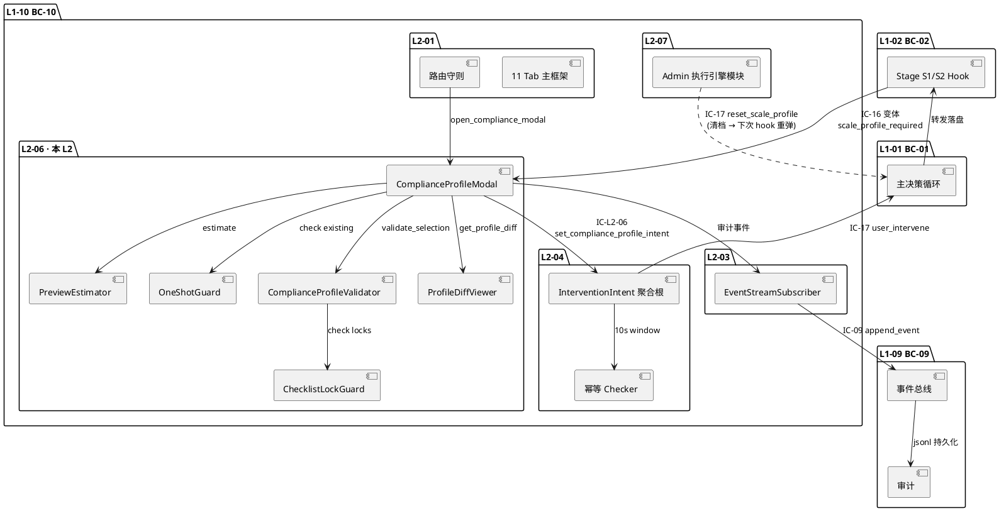
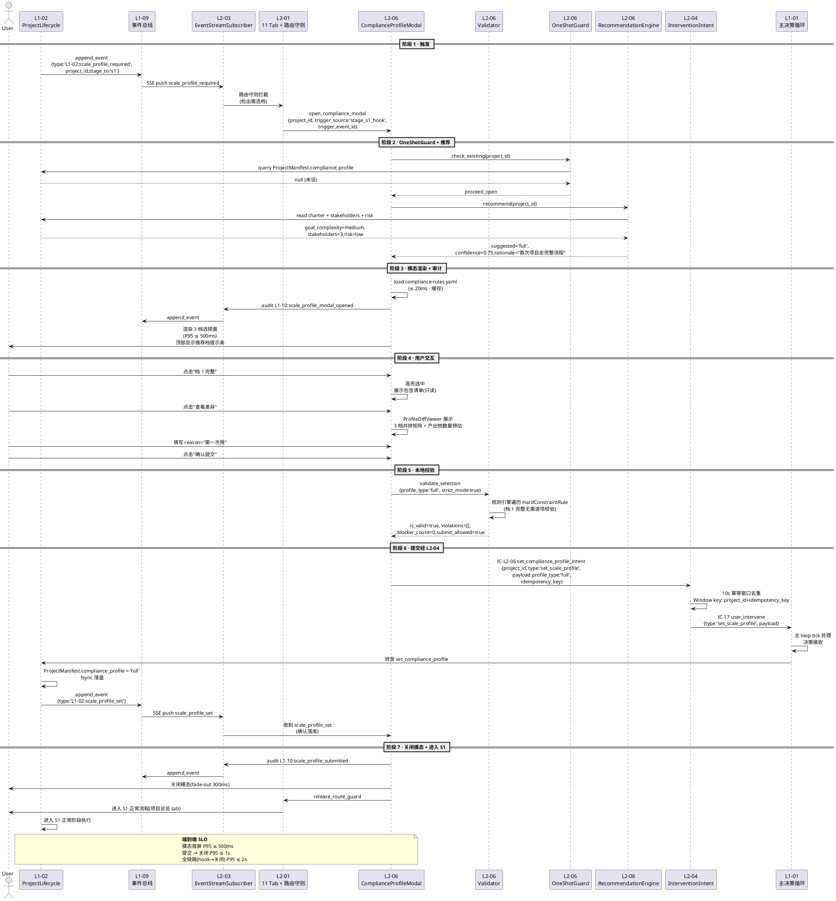
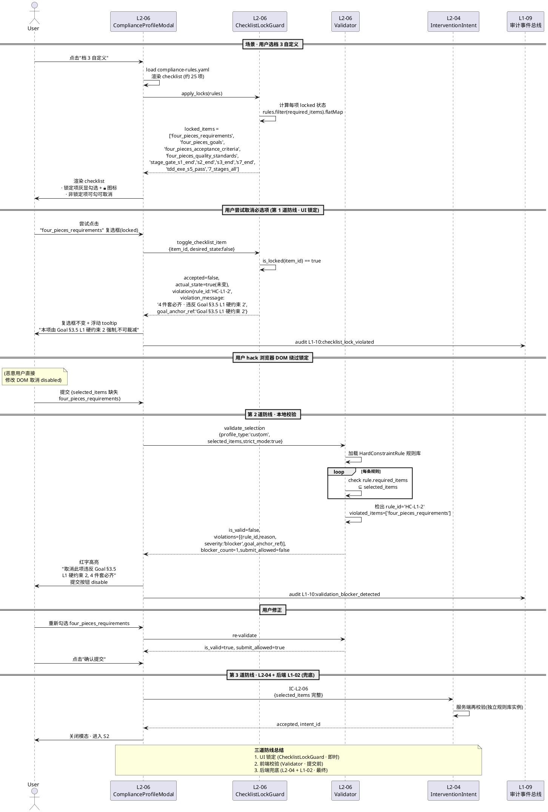
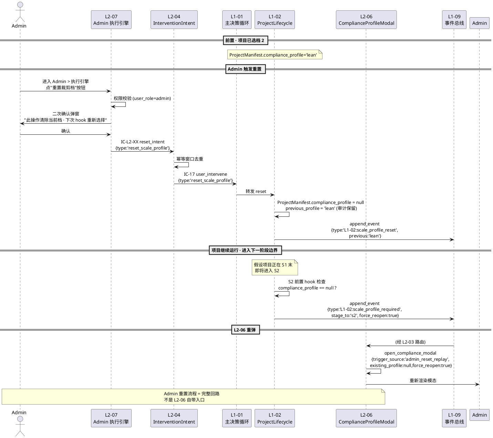
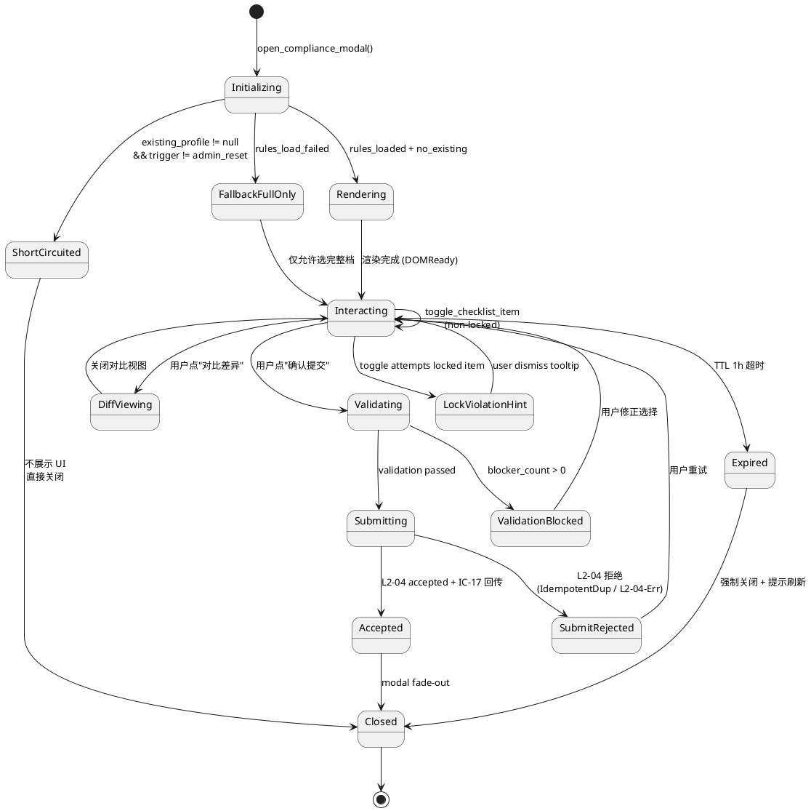

# L1 L2-06 · 裁剪档配置 · Tech Design

> **本文档定位**：3-1-Solution-Technical 层级 · L1-10 的 L2-06 裁剪档配置 技术实现方案（L2 粒度）。
> **与产品 PRD 的分工**：2-prd/L1-10-人机协作UI/prd.md §5.10.13 的对应 L2 节定义产品边界，本文档定义**技术实现**（接口字段级 schema + 算法伪代码 + 底层数据结构 + 状态机 + 配置参数）。
> **与 L1 architecture.md 的分工**：architecture.md 负责**跨 L2 架构 + 跨 L2 时序**，本文档负责**本 L2 内部技术细节**。冲突以 architecture.md 为准。
> **严格规则**：本文档不复述产品 PRD 文字（职责 / 禁止 / 必须等清单），只做技术映射 + 补齐"产品视角未说 but 工程师必须知道"的部分（具体算法 · syscall · schema · 配置）。

---

## §0 撰写进度

- [x] §1 定位 + 2-prd §5.10 L2-06 映射
- [x] §2 DDD 映射（引 L0/ddd-context-map.md BC-10）
- [x] §3 对外接口定义（字段级 YAML schema + 错误码）
- [x] §4 接口依赖（被谁调 · 调谁）
- [x] §5 P0/P1 时序图（PlantUML ≥ 2 张）
- [x] §6 内部核心算法（伪代码）
- [x] §7 底层数据表 / schema 设计（字段级 YAML）
- [x] §8 状态机（PlantUML + 转换表）
- [x] §9 开源最佳实践调研（≥ 3 GitHub 高星项目）
- [x] §10 配置参数清单
- [x] §11 错误处理 + 降级策略
- [x] §12 性能目标
- [x] §13 与 2-prd / 3-2 TDD 的映射表

---

## §1 定位 + 2-prd 映射

### 1.1 本 L2 在 L1-10 人机协作 UI 里的坐标

L1-10 由 7 个 L2 组成。L2-06 是 **one-shot 特殊路径 · PM-13 合规裁剪档选择器**：它在 S1 / S2 前置 hook 首次触发时全屏模态阻塞式要求用户显式选择裁剪档（完整 / 精简 / 自定义），选定后经 L2-04 推 IC-17 → L1-01 → L1-02 落盘；自定义档开放 checklist 但 UI 侧锁定"违反 Goal §3.5 L1 硬约束"的必选项不可取消（4 件套 / 7 阶段 / 4 次 Stage Gate / S5 TDDExe PASS 等）。本 L2 不驻 11 主 tab，不占 L2-01 容器，只以模态 overlay 形式挂在 L2-01 路由守则之上。

```
  [L1-02 Project Lifecycle]  ─ scale_profile_required (IC-16 变体) ─┐
                                                                    ↓
  [L2-01 11 主 Tab]  ─ 路由守则容器 (模态承载) ─────────────────────┤
                                                                    ↓
                                            ┌───────────────────────┴─────────┐
                                            │  L2-06 · 裁剪档配置             │
                                            │  (Domain Service · 无聚合根)     │
                                            │                                 │
                                            │  ┌──────────────────────────┐   │
                                            │  │ ComplianceProfileModal   │   │  (全屏模态组件)
                                            │  │ ComplianceProfileValidator│  │  (本地硬约束校验)
                                            │  │ ChecklistLockGuard        │  │  (必选项锁定)
                                            │  │ ProfileDiffViewer         │  │  (3 档差异对比)
                                            │  │ PreviewEstimator          │  │  (产出物数量预估)
                                            │  └──────────────────────────┘   │
                                            │                                 │
                                            │  ┌──────────────────────────┐   │
                                            │  │ ComplianceProfile VO      │  │
                                            │  │ ChecklistItem VO          │  │
                                            │  │ HardConstraintRule VO     │  │
                                            │  │ ValidationViolation VO    │  │
                                            │  └──────────────────────────┘   │
                                            └───────────────────────┬─────────┘
                                                                    ↓
                                         [L2-04 用户干预入口] ← IC-L2-06 (内部)
                                                                    ↓
                                         [IC-17 user_intervene] → [L1-01] → [L1-02]
```

L2-06 定位 = **"PM-13 合规裁剪档 · one-shot 模态 · 双校验防线（UI 锁定 + 后端兜底）· 不驻 tab"**。

### 1.2 与 2-prd §5.10 (§13) L2-06 的对应表

| 2-prd §5.10.13 小节 | 本文档对应位置 | 技术映射重点 |
|:---|:---|:---|
| §13.1 职责（S1/S2 前 one-shot 选档 + 校验） | §2.1 + §6.1 主入口 algorithm | 模态 overlay + IC-L2-06 发 L2-04 |
| §13.2 输入 / 输出 | §3 字段级 IC schema | 4 类输入 · 4 类输出 YAML 化 |
| §13.3 边界（In / Out-of-scope） | §2.5 + §11 | 不做后端执行 / 不做切档 / 不做模板 |
| §13.4 约束（PM-13 + Goal §3.5 硬约束） | §6.2 硬约束规则引擎 + §10 配置 | HardConstraintRule 规则库驱动 |
| §13.5 禁止行为（7 条） | §11 错误拒绝 + §3 错误码 | UI 锁定 + 后端兜底双防线 |
| §13.6 必须职责（8 条） | §5 时序图正向 case + §8 状态机 | 8 条映射到 8 个状态转换 |
| §13.7 可选功能（推荐档 / 差异表 / 预估 / 风险提示） | §6.6 ProfileDiffViewer + §6.7 PreviewEstimator | 可开可关配置 |
| §13.8 IC 契约清单（IC-L2-06 / IC-16 变体 / IC-09 审计） | §3 schema + §4 依赖图 | 3 个 IC 字段化 |
| §13.9 交付验证大纲（8 Given-When-Then） | §13 TDD 映射表 | 8 个场景逐一映射 |

### 1.3 本 L2 在 architecture.md 里的坐标

引 `docs/3-1-Solution-Technical/L1-10-人机协作UI/architecture.md §3.3 L2 分工图` + §2.2 DDD 原语分类：

- L2-06 在 architecture.md §2.2 被分类为 **Domain Service: ComplianceProfileValidator + VO: ComplianceProfile**（非聚合根 · 无独立 Entity · 校验规则库驱动 · one-shot 无状态保留）
- L2-06 的输出通过 `IC-L2-06` 强制经 L2-04 InterventionIntent 聚合根封装为 `user_intervene(type=set_scale_profile)`，绝不直接发 IC-17（防绕过审计）
- L2-06 的输入来自 L1-02 通过 `scale_profile_required` 事件（IC-16 变体）或显式 hook 调用
- L2-06 的 project_id 作用域严格跟随 L2-01 UISession.active_project_id（PM-14 硬约束）

### 1.4 本 L2 的 PM-14 约束

**PM-14 约束**（引 `docs/3-1-Solution-Technical/projectModel/tech-design.md`）：所有 IC payload 顶层 `project_id` 必填；所有存储路径按 `projects/<pid>/...` 分片；任何聚合根必含 `HarnessFlowProjectId` 共享内核字段。

本 L2 在 PM-14 层面的具体落点：

- 裁剪档选择结果：`projects/<pid>/compliance/profile.yaml`（实际由 L1-02 持久化 · 本 L2 不直写）
- 模态会话态缓存：`projects/<pid>/ui/compliance/session-<ui_session_id>.json`（TTL=1h · 崩溃恢复用）
- 校验规则库：`docs/3-1-Solution-Technical/L1-10-人机协作UI/compliance-rules.yaml`（全局只读 · 非项目级）
- 审计事件 payload 必含 `project_id`：`L1-10:scale_profile_modal_opened` / `L1-10:scale_profile_submitted` / `L1-10:scale_profile_already_set`
- 跨项目切换时（V2+）：模态组件 destroy 并清空 session-cache，防止档 A 的勾选状态污染项目 B

### 1.5 关键技术决策（本 L2 特有）

| 决策 | 选择 | 备选 | 理由 | Trade-off |
|:---|:---|:---|:---|:---|
| **D1: L2-06 是否 own 聚合根** | 否（Domain Service + VO） | Yes，引入 ComplianceProfileSelection 聚合根 | one-shot 无生命周期 · 选定即转交 L1-02 持久化 · UI 层只做校验与收集 | 牺牲 DDD 严格性，换来更薄的前端抽象 |
| **D2: 校验规则存储** | 静态 YAML 规则库（compliance-rules.yaml） | 硬编码 / 数据库 / 插件动态加载 | 规则由 Goal §3.5 + scope §5.2.4 固化 · 变动频次 = 季度级 · YAML 可版本化 | 牺牲运行时动态性（可接受） |
| **D3: 模态不可关闭策略** | 无 X 按钮 + ESC 拦截 + 刷新重弹 | 允许关闭（记 skip 状态） | scope §5.2.5 禁止 7 "禁止绕过裁剪控制台" · 默认通过 = 违规 | 用户体验上有轻微挫败感（必要代价） |
| **D4: 必选项锁定实现** | v-bind disabled + watch 强制回填 + 后端校验兜底 | 仅后端校验 | 前端第一道防线 · 即时反馈 · 减少无效提交 | 多一层 guard 代码（值得） |
| **D5: 提交路径** | 必经 L2-04 InterventionIntent | 直接发 IC-17 | 统一审计 · 10s 幂等窗口 · 一致性 | 多 1 次 IC round-trip（可接受） |
| **D6: 自定义档 checklist 数据源** | 从 compliance-rules.yaml 动态渲染 | 硬编码 Vue 模板 | 规则升级无需改代码 · 与 PM-13 定义同步 | YAML 加载延迟 ≈ 20ms（可接受） |
| **D7: 差异对比表** | 3 档并排差异矩阵（默认折叠） | 单独 tab / 弹窗嵌套 | 用户决策需要的最小信息量 · 折叠防干扰 | 信息密度高（字体优化） |
| **D8: 推荐档算法** | 基于项目规模启发式（goal_complexity + stakeholder_count + risk_level） | 无推荐 / ML 模型 | 启发式足够 · ML 过度工程 · 推荐仅提示不自动选 | 推荐准确度 ≈ 70%（可接受） |
| **D9: Admin 重置流程** | 单独 IC-17(type=reset_scale_profile) · 经 L2-07 Admin > 执行引擎 | L2-06 自带重置入口 | 重置是高危动作 · 必须 Admin 权限 · 避免普通用户误触 | 入口稍深（设计意图） |
| **D10: 本地校验时机** | 每次勾选即时（≤ 50ms）+ 提交前全量 | 仅提交时 | 即时反馈体验更好 · 50ms SLO 可达 | 多次 CPU 消耗（规则 ≤ 20 条，可接受） |

### 1.6 本 L2 读者预期

读完本 L2 的工程师应掌握：

- ComplianceProfileModal 组件的 Vue 3 Composition API 实现骨架 + 5 个核心子组件职责
- IC-L2-06 / IC-16-variant / IC-09 三个 IC 字段级 YAML schema
- 8 个核心算法伪代码（主入口 / 硬约束校验 / checklist 锁定 / 差异对比 / 预估引擎 / 推荐档 / 重置流程 / 幂等去重）
- 4 张 VO schema（ComplianceProfile / ChecklistItem / HardConstraintRule / ValidationViolation）
- ComplianceProfileSelectionState 前端状态机（PlantUML 6 个主状态 + 12 条转换）
- 降级链 4 级（FULL → SKIP_PREVIEW → FORCE_FULL_PROFILE → REJECT_SUBMIT）
- SLO（模态首屏 ≤ 500ms P95 · 勾选响应 ≤ 50ms P95 · 提交 ≤ 1s P95）

### 1.7 本 L2 不在的范围（YAGNI）

- **不在**：裁剪档的后端执行（那是 L1-02 的职责）
- **不在**：产出物内容修改（L1-02 产出物编辑器的职责）
- **不在**：历史裁剪档切换（V1 不支持"切档"，只能重置重选）
- **不在**：项目模板选择（未来 V2+ 功能）
- **不在**：多档并存（一次一个档）
- **不在**：ML 推荐模型（用规则启发式即可）
- **不在**：批量配置（单项目单档 one-shot）
- **不在**：档配置的导入/导出（V2+ 考虑）

### 1.8 本 L2 术语表

| 术语 | 定义 | 关联 |
|:---|:---|:---|
| ComplianceProfile | PM-13 裁剪档 VO（`full` / `lean` / `custom`） | §2.4 · VO |
| ChecklistItem | 自定义档下的单个产出物勾选项 | §2.4 · VO |
| HardConstraintRule | Goal §3.5 L1 硬约束的规则单元 | §2.4 · VO |
| ValidationViolation | 违规事件 VO（引用违反的 rule_id + 说明文案） | §2.4 · VO |
| ChecklistLockGuard | 必选项锁定守卫（v-bind disabled + watcher） | §6.3 |
| ProfileDiffViewer | 3 档差异对比表组件 | §6.6 |
| PreviewEstimator | 产出物数量 + 预估耗时计算器 | §6.7 |
| OneShotGuard | 同项目已选档的重复触发拦截 | §6.8 |
| AdminReset | Admin 重置裁剪档的特殊路径 | §6.9 |
| RecommendationEngine | 推荐档启发式引擎 | §6.10 |

### 1.9 本 L2 的 DDD 定位一句话

L2-06 = **"BC-10 下属的 Domain Service · 校验规则库驱动 · one-shot 无状态 · 唯一出口 InterventionIntent · 不 own 聚合根"**。

---

## §2 DDD 映射（BC-10）

### 2.1 BC 定位

本 L2 归属 **BC-10 · Human-Agent Collaboration UI**（引 `docs/3-1-Solution-Technical/L0/ddd-context-map.md §2.11`），是 BC-10 下的 Domain Service 子域之一。BC-10 的 Published Language 是 `user_intervene protocol`（IC-17 schema），本 L2 作为 Published Language 的一个 type（`set_scale_profile` / `reset_scale_profile`）的生成器。

### 2.2 本 L2 的 DDD 原语分类

| L2-06 内部模块 | DDD 原语 | 说明 |
|:---|:---|:---|
| **ComplianceProfileValidator** | **Domain Service** | 无状态 · 校验逻辑纯函数 · 输入 (profile, items) 输出 ValidationReport |
| **ComplianceProfileModal** | **UI Component**（非 DDD 原语，架构层） | Vue 3 组件 · 承载校验服务 + 状态 |
| **ComplianceProfile** | **Value Object** | 不可变 · 3 种 `full` / `lean` / `custom` · 以值比较 |
| **ChecklistItem** | **Value Object** | 不可变 · (item_id, label, required, group, rationale) |
| **HardConstraintRule** | **Value Object** | 不可变 · (rule_id, anchor, required_items[], violation_message) |
| **ValidationViolation** | **Value Object** | 不可变 · (rule_id, item_id, reason) |
| **RecommendationEngine** | **Domain Service** | 启发式推荐 · 纯函数 |
| **PreviewEstimator** | **Domain Service** | 产出物数量 + 耗时预估 · 纯函数 |
| **OneShotGuard** | **Application Service** | 查询 L1-02 是否已有档 · 有则短路 |

**本 L2 不 own 聚合根**：所有持久化责任在 L1-02 的 ProjectManifest.compliance_profile 字段。本 L2 只做"输入收集 + 本地校验 + 交付 L2-04"。

### 2.3 跨 BC 关系

| 对方 BC | 关系 | 本 L2 承担 |
|:---|:---|:---|
| **BC-01** Agent Decision Loop | **Customer**（经 L2-04 推 IC-17 到 BC-01） | 不直连 · 经 L2-04 中转 |
| **BC-02** Project Lifecycle | **Supplier（数据源）** | 接 IC-16 变体 `scale_profile_required` |
| **BC-09** Resilience & Audit | **Partnership** | 每次模态操作写 append_event（IC-09 通过 L2-03 间接） |
| **BC-10 内部 L2-01** | **Shared Kernel（UISession）** | 读 active_project_id + 挂模态 overlay |
| **BC-10 内部 L2-04** | **Customer** | 经 IC-L2-06 唯一出口 |
| **BC-10 内部 L2-07** | **Customer**（反向：L2-07 Admin 重置触发本 L2 重弹） | Admin > 执行引擎 > 重置按钮 → IC-17(reset_scale_profile) → L1-02 清档 → 下次 hook 重弹本 L2 |

### 2.4 本 L2 核心 VO 完整字段表

（详细字段级 YAML 见 §7 数据表节 · 此处仅列命名与语义）

| VO 名 | 字段数 | 核心字段 |
|:---|:---|:---|
| **ComplianceProfile** | 4 | project_id, profile_type (full/lean/custom), selected_items[], reason |
| **ChecklistItem** | 7 | item_id, label, group, required, locked, rationale, default_checked |
| **HardConstraintRule** | 6 | rule_id, goal_anchor, required_items[], violation_message, severity, applicable_profiles[] |
| **ValidationViolation** | 5 | rule_id, violated_items[], reason, severity, goal_anchor_ref |

### 2.5 聚合根边界说明（为什么 L2-06 不 own 聚合根）

**L2-06 选择"Domain Service + VO"而非"Aggregate Root"的决策链路**：

1. **生命周期**：L2-06 的交互存在于"用户打开模态 → 选档 → 提交"的极短窗口（通常 ≤ 60s），无长生命周期实体
2. **所有权**：裁剪档本身的所有权属于 ProjectManifest（BC-02 聚合根），L2-06 只是"生成命令的工厂"
3. **一致性**：裁剪档的业务不变式（不违反 Goal §3.5）由 L1-02 后端兜底强一致，UI 层只做即时反馈
4. **DDD 原则**：避免"UI 聚合根"反模式（UI 层通常应是 Application Service，不应独立持有业务聚合根）

### 2.6 本 L2 的 Ubiquitous Language（与 BC-10 其他 L2 共享的术语子集）

| 术语 | BC-10 内共享 | 本 L2 特化 |
|:---|:---|:---|
| UISession | L2-01 Shared Kernel | 本 L2 读 active_project_id + ui_session_id |
| InterventionIntent | L2-04 聚合根 | 本 L2 经 IC-L2-06 创建，type=set_scale_profile |
| ProjectId (PM-14) | 跨 BC Shared Kernel | 所有 IC payload 必填顶层字段 |
| ComplianceProfile | **本 L2 独有** | full / lean / custom 三值枚举 |
| ChecklistItem | **本 L2 独有** | 自定义档下的单项 |
| HardConstraintRule | **本 L2 独有** | Goal §3.5 规则单元 |

---

## §3 对外接口定义（字段级 YAML schema + 错误码）

本 L2 对外暴露 5 个方法（函数式接口，无独立 HTTP endpoint · 前端组件方法），另消费 2 个 IC、发出 1 个 IC。

### 3.1 方法 1：`open_compliance_modal`（模态打开）

**调用方**：L1-02 S1/S2 前置 hook（通过 IC-16 变体 `scale_profile_required`）或 L2-01 路由守则拦截器

**入参 schema**（YAML）：

```yaml
OpenComplianceModalRequest:
  project_id: string                 # PM-14 项目上下文，必填（UUID / ULID）
  ui_session_id: string              # UISession ID（L2-01 提供）
  trigger_source: enum               # 触发源：stage_s1_hook / stage_s2_hook / admin_reset_replay
  trigger_event_id: string           # 触发事件的 event_id（审计溯源）
  existing_profile: object | null    # 若已有档则为该档（OneShotGuard 判断用）
    profile_type: enum               # full / lean / custom
    selected_at: string              # ISO8601
  recommendation_hint:               # 可选推荐提示
    suggested_profile: enum          # full / lean / custom
    confidence: float                # 0.0-1.0
    rationale: string                # 推荐理由
  locale: string                     # 多语言 · 默认 zh-CN
```

**出参 schema**：

```yaml
OpenComplianceModalResponse:
  status: enum                       # opened / short_circuit_existing / short_circuit_trigger_invalid
  modal_session_id: string           # 本次模态会话 ID（ULID）
  opened_at: string                  # ISO8601
  already_set_profile: object | null # 若 short_circuit_existing 则返回既有档
```

### 3.2 方法 2：`toggle_checklist_item`（勾选切换）

**调用方**：Vue 模态组件内部（用户点 checkbox）

**入参 schema**：

```yaml
ToggleChecklistItemRequest:
  project_id: string                 # PM-14 项目上下文
  modal_session_id: string           # 模态会话 ID
  item_id: string                    # 产出物 ID（如 "four_pieces_requirements"）
  desired_state: bool                # 期望状态（true=勾选 / false=取消）
```

**出参 schema**：

```yaml
ToggleChecklistItemResponse:
  accepted: bool                     # 是否接受此变更
  actual_state: bool                 # 实际结果状态（可能因锁定被拒）
  violation: object | null           # 若违反锁定则返回违规说明
    rule_id: string
    violation_message: string
    goal_anchor_ref: string          # Goal §3.5 L1 硬约束 N 锚点
  validation_report: object          # 实时校验报告（见 §3.5）
```

### 3.3 方法 3：`validate_selection`（本地校验）

**调用方**：Vue 模态组件内部（勾选变化 / 提交前）

**入参 schema**：

```yaml
ValidateSelectionRequest:
  project_id: string                 # PM-14 项目上下文
  profile_type: enum                 # full / lean / custom
  selected_items: array              # 用户勾选的 item_id 清单（custom 档下生效）
    - string
  strict_mode: bool                  # 严格模式（提交前必 true）· 默认 false
```

**出参 schema**：

```yaml
ValidateSelectionResponse:
  is_valid: bool                     # 是否通过校验
  violations: array                  # 所有违规项
    - rule_id: string
      violated_items: array          # 违反的 item_id 清单
        - string
      reason: string                 # 违规说明（用户可读）
      severity: enum                 # blocker / warning
      goal_anchor_ref: string        # Goal §3.5 L1 硬约束 N
  blocker_count: int                 # blocker 级违规数
  warning_count: int                 # warning 级违规数
  submit_allowed: bool               # 是否允许提交（blocker_count == 0 才 true）
```

### 3.4 方法 4：`submit_compliance_profile`（提交）

**调用方**：Vue 模态组件（用户点"确认"）

**入参 schema**：

```yaml
SubmitComplianceProfileRequest:
  project_id: string                 # PM-14 项目上下文
  modal_session_id: string           # 模态会话 ID
  ui_session_id: string              # UISession ID（L2-04 幂等窗口用）
  profile_type: enum                 # full / lean / custom
  selected_items: array | null       # custom 档下必填，其他为 null
    - string
  reason: string | null              # 可选用户理由（审计用）· ≤ 500 字
  idempotency_key: string            # 10s 幂等 key（modal_session_id + submit_seq）
```

**出参 schema**：

```yaml
SubmitComplianceProfileResponse:
  status: enum                       # accepted / rejected_validation / rejected_idempotent_dup / rejected_already_set
  intent_id: string | null           # 若 accepted 则返回 InterventionIntent.intent_id
  rejected_reason: string | null
  submit_at: string                  # ISO8601
```

### 3.5 方法 5：`get_profile_diff`（3 档差异对比）

**调用方**：Vue 模态组件（用户点"对比差异"）

**入参 schema**：

```yaml
GetProfileDiffRequest:
  project_id: string                 # PM-14 项目上下文
  compare_profiles: array            # 要对比的档列表
    - enum                           # full / lean / custom（custom 基于当前勾选）
  current_custom_items: array | null # 若含 custom 则提供当前勾选
    - string
```

**出参 schema**：

```yaml
GetProfileDiffResponse:
  diff_matrix: array                 # 对比矩阵（行=产出物组，列=档）
    - group_id: string               # 产出物分组（four_pieces / pmp_9_plans / togaf_adm / wbs / adr / 4_gates / 7_stages / 其他）
      group_label: string
      items: array
        - item_id: string
          label: string
          in_full: bool
          in_lean: bool
          in_custom: bool
          required_by_rule: string | null  # 锁定规则引用
  estimated_deliverables:            # 产出物数量预估
    full: int
    lean: int
    custom: int
  estimated_hours:                   # 预估耗时（小时）
    full: float
    lean: float
    custom: float
```

### 3.6 消费的 IC（被动接收）

#### IC-16 变体：`scale_profile_required`

**发起方**：L1-02 S1 / S2 前置 hook
**payload schema**：

```yaml
ScaleProfileRequiredEvent:
  event_id: string
  project_id: string                 # PM-14 项目上下文
  stage_from: enum                   # null / s1
  stage_to: enum                     # s1 / s2
  triggered_at: string
  existing_profile: object | null    # 若 Admin 重置前有档则填写
  force_reopen: bool                 # Admin 重置路径下为 true
```

### 3.7 发出的 IC：`IC-L2-06` → L2-04

#### IC-L2-06：`set_compliance_profile_intent`

**接收方**：L2-04 用户干预入口
**payload schema**：

```yaml
SetComplianceProfileIntent:
  project_id: string                 # PM-14 项目上下文
  ui_session_id: string
  modal_session_id: string
  type: const                        # "set_scale_profile"
  payload:
    profile_type: enum               # full / lean / custom
    selected_items: array | null
      - string
    reason: string | null
    validation_snapshot: object      # 提交时的校验报告快照（审计用）
  idempotency_key: string            # L2-04 10s 幂等窗口 key
  submitted_at: string
```

### 3.8 错误码表（≥ 12 条）

| 错误码 | 含义 | 触发场景 | 调用方处理 |
|:---|:---|:---|:---|
| `L206-E-01` | `ProjectIdMissing` | IC payload 缺 project_id（PM-14 违规） | 前端拒绝打开模态 · 事件审计告警 · 升 Supervisor |
| `L206-E-02` | `AlreadySetShortCircuit` | 同 project_id 已有既定档，非 Admin 重置场景 | 写 `scale_profile_already_set` 审计事件 · 模态不展示 · 通知 L1-02 continue |
| `L206-E-03` | `LockedItemUncheckAttempt` | 用户尝试取消必选项 | UI 拒绝勾选变更 · 浮动 tooltip 说明 · 校验报告标记 blocker |
| `L206-E-04` | `HardConstraintViolation` | 提交时检出违反 Goal §3.5 硬约束 | 提交拒绝 · 高亮违规项 · 红字提示 · submit 按钮 disable |
| `L206-E-05` | `IdempotentDuplicate` | 10s 内同 idempotency_key 重复提交 | L2-04 幂等拒绝 · 返回首次 intent_id |
| `L206-E-06` | `InvalidProfileType` | profile_type 非 full/lean/custom | schema 校验失败 · 前端拒绝构造请求 |
| `L206-E-07` | `CustomItemsMissing` | custom 档但 selected_items 为空/null | 提交拒绝 · 红字"自定义档至少勾选必选项" |
| `L206-E-08` | `RulesLoadFailed` | compliance-rules.yaml 加载失败 | 降级 FORCE_FULL_PROFILE · 只允许选完整档 · 升告警 |
| `L206-E-09` | `ModalSessionExpired` | modal_session_id 超时（默认 1h） | 前端强制刷新 · 重开模态 · 保留已勾选进草稿 |
| `L206-E-10` | `TriggerSourceInvalid` | trigger_source 非预期枚举 | 拒绝打开 · 审计告警 · 可能是恶意篡改 |
| `L206-E-11` | `L2_04_Rejected` | L2-04 拒绝接收 InterventionIntent | 向用户展示 L2-04 返回原因 · 保留勾选允许重试 |
| `L206-E-12` | `ResetAdminPermDenied` | 非 Admin 用户尝试重置裁剪档 | 拒绝 · 告知需 Admin 权限 · 引导至 L2-07 |
| `L206-E-13` | `ReasonTooLong` | reason 字段超过 500 字限制 | 前端截断 + 提示 · 或后端拒收 |
| `L206-E-14` | `ConcurrentModalConflict` | 同一 project 多窗口同时开模态 | 后开者 short-circuit · 提示"已在别处选择中" |

---

## §4 接口依赖（被谁调 · 调谁）

### 4.1 上游调用方（谁调本 L2）

| 调用方 | 调用的方法 | 何时调 | IC 或内部调用 |
|:---|:---|:---|:---|
| **L1-02 Project Lifecycle** | `open_compliance_modal` | S1 / S2 前置 hook | IC-16 变体 `scale_profile_required` |
| **L2-01 11 主 Tab 主框架** | `open_compliance_modal` | 路由守则拦截器检出需选档 | 内部 Vue 组件调用 |
| **L2-07 Admin 执行引擎** | 间接触发（经 IC-17 reset + L1-02 清档 + 下次 hook） | Admin 重置裁剪档 | 不直调 · 走完整回路 |
| **用户浏览器** | `toggle_checklist_item` / `validate_selection` / `submit_compliance_profile` / `get_profile_diff` | 模态内交互 | 组件事件 |

### 4.2 下游依赖（本 L2 调谁）

| 被调方 | 何时调 | 调用内容 | IC 或内部 |
|:---|:---|:---|:---|
| **L2-04 用户干预入口** | 用户提交档选择 | `set_compliance_profile_intent` | IC-L2-06 |
| **L2-03 进度实时流** | 模态打开 / 校验违规 / 提交 / 关闭 | 订阅事件流 + 写审计事件 | 经 L2-03 间接走 IC-09 |
| **L2-01 11 主 Tab** | 读 `active_project_id` + `ui_session_id` | Shared Kernel 查询 | 内部 Vue provide/inject |
| **L1-06 3 层 KB**（可选） | 加载推荐档的历史案例 | IC-06 kb_read | 可选 · 仅推荐引擎用 |

### 4.3 依赖图（PlantUML）



### 4.4 依赖强弱分级

| 依赖 | 强度 | 失败处理 |
|:---|:---|:---|
| L2-04 | **强依赖**（唯一出口） | 降级 REJECT_SUBMIT · 保留勾选允许重试 |
| L2-01 UISession | **强依赖**（Shared Kernel） | 无法提供则模态打不开 · 前端抛 fatal |
| L1-02 hook | **强依赖**（触发源） | 无 hook 则本 L2 不激活（预期行为） |
| L2-03 审计 | **弱依赖**（审计可补偿） | 失败走 WAL 重放 · 不阻塞主流程 |
| L1-06 KB（推荐） | **弱依赖**（推荐可选） | 失败则推荐引擎降级为"无提示" |
| compliance-rules.yaml | **强依赖**（规则源） | 加载失败降级 FORCE_FULL_PROFILE |

---

## §5 P0/P1 时序图（PlantUML ≥ 2 张）

### 5.1 P0 时序图 A · S1 前置 hook 首次触发 + 档 1 完整直接选

覆盖 PRD §13.9 正向场景 1（档 1 完整直接选）全链路 · 从 L1-02 hook 触发到模态关闭 · 包含 OneShotGuard 检查 / 规则库加载 / 推荐提示 / 差异对比 / 提交经 L2-04 → IC-17 → L1-01 → L1-02 回写的完整路径。



### 5.2 P0 时序图 B · 档 3 自定义 + 违规拦截 + 修正提交

覆盖 PRD §13.9 负向场景 3（违规被拦截）+ 正向场景 2（必选项锁定）组合 · 展示双防线（UI 锁定 + 后端兜底）协同。



### 5.3 P1 时序图 C · Admin 重置 + 下次 hook 重弹

覆盖 PRD §13.9 集成场景 6（Admin 重置后重弹）· 展示跨 L2-07 的完整回路。



---

## §6 内部核心算法（伪代码）

### 6.1 算法 A · 模态入口总控 (Orchestrator main entry)

```python
def open_compliance_modal(request: OpenComplianceModalRequest) -> OpenComplianceModalResponse:
    """
    L2-06 主入口 · 负责 OneShotGuard + 推荐 + 规则加载 + 模态渲染
    SLO: P95 ≤ 500ms
    """
    # Step 1 · PM-14 硬校验
    if not request.project_id:
        raise Error("L206-E-01 · ProjectIdMissing")

    # Step 2 · trigger_source 白名单
    VALID_TRIGGERS = {"stage_s1_hook", "stage_s2_hook", "admin_reset_replay"}
    if request.trigger_source not in VALID_TRIGGERS:
        audit("L1-10:scale_profile_trigger_invalid", request.project_id)
        raise Error("L206-E-10 · TriggerSourceInvalid")

    # Step 3 · OneShotGuard 短路检查 (Algorithm 6.8)
    guard_result = one_shot_guard_check(request.project_id, request.trigger_source)
    if guard_result.should_short_circuit:
        audit("L1-10:scale_profile_already_set",
              project_id=request.project_id,
              existing=guard_result.existing_profile)
        return OpenComplianceModalResponse(
            status="short_circuit_existing",
            already_set_profile=guard_result.existing_profile
        )

    # Step 4 · 并发冲突检查
    if has_active_modal_session(request.project_id):
        raise Error("L206-E-14 · ConcurrentModalConflict")

    # Step 5 · 加载规则库 (缓存 · TTL 5 min)
    try:
        rules = load_compliance_rules_yaml_cached()
    except Exception as e:
        audit("L1-10:rules_load_failed", error=str(e))
        # 降级 FORCE_FULL_PROFILE
        rules = {"profiles": ["full"], "locked_items": []}

    # Step 6 · 推荐引擎 (Algorithm 6.10) · 失败则静默跳过
    try:
        recommendation = compute_recommendation(request.project_id)
    except Exception:
        recommendation = None

    # Step 7 · 创建 modal_session
    modal_session_id = ulid_generate()
    session_state = {
        "project_id": request.project_id,
        "ui_session_id": request.ui_session_id,
        "modal_session_id": modal_session_id,
        "trigger_source": request.trigger_source,
        "rules": rules,
        "recommendation": recommendation,
        "opened_at": now_iso8601(),
        "selected_profile": None,
        "selected_items": [],
        "submit_count": 0,
    }
    persist_modal_session_cache(session_state)  # projects/<pid>/ui/compliance/session-<id>.json

    # Step 8 · 审计 open
    audit("L1-10:scale_profile_modal_opened",
          project_id=request.project_id,
          modal_session_id=modal_session_id,
          trigger_source=request.trigger_source)

    # Step 9 · 返回给路由守则 · 前端渲染模态
    return OpenComplianceModalResponse(
        status="opened",
        modal_session_id=modal_session_id,
        opened_at=session_state["opened_at"]
    )
```

### 6.2 算法 B · 硬约束校验引擎 (ComplianceProfileValidator)

```python
def validate_selection(request: ValidateSelectionRequest) -> ValidateSelectionResponse:
    """
    本地校验核心 · 规则驱动 · 纯函数 · 无副作用
    SLO: ≤ 50ms (规则数 ≤ 20)
    """
    violations = []
    rules = load_compliance_rules_yaml_cached()

    # 档 1 / 档 2 预设不可违反 (只读清单)
    if request.profile_type == "full":
        # 完整档无需逐项校验 · 默认全勾
        return ValidateSelectionResponse(
            is_valid=True, violations=[],
            blocker_count=0, warning_count=0,
            submit_allowed=True
        )

    if request.profile_type == "lean":
        # 精简档由 rules.lean_preset 定义 · 固定子集
        if set(request.selected_items or []) != set(rules.lean_preset_items):
            # 精简档不允许改子集 · 但 UI 也不应提供交互
            violations.append(ValidationViolation(
                rule_id="HC-PRESET",
                violated_items=list(set(rules.lean_preset_items) - set(request.selected_items or [])),
                reason="精简档预设不可修改",
                severity="blocker",
                goal_anchor_ref="scope §5.2 PM-13 预设"
            ))

    if request.profile_type == "custom":
        # 自定义档 · 遍历所有 HardConstraintRule
        if not request.selected_items:
            return ValidateSelectionResponse(
                is_valid=False,
                violations=[ValidationViolation(
                    rule_id="L206-E-07",
                    reason="自定义档至少需勾选必选项",
                    severity="blocker",
                    goal_anchor_ref="Goal §3.5"
                )],
                blocker_count=1, warning_count=0,
                submit_allowed=False
            )

        selected_set = set(request.selected_items)
        for rule in rules.hard_constraint_rules:
            # rule.applicable_profiles 可限定某规则只对某档生效
            if "custom" not in rule.applicable_profiles:
                continue
            required = set(rule.required_items)
            missing = required - selected_set
            if missing:
                violations.append(ValidationViolation(
                    rule_id=rule.rule_id,
                    violated_items=list(missing),
                    reason=rule.violation_message,
                    severity=rule.severity,  # blocker / warning
                    goal_anchor_ref=rule.goal_anchor
                ))

    blocker_count = sum(1 for v in violations if v.severity == "blocker")
    warning_count = sum(1 for v in violations if v.severity == "warning")

    return ValidateSelectionResponse(
        is_valid=(blocker_count == 0),
        violations=violations,
        blocker_count=blocker_count,
        warning_count=warning_count,
        submit_allowed=(blocker_count == 0)
    )
```

### 6.3 算法 C · Checklist 锁定守卫 (ChecklistLockGuard)

```python
def toggle_checklist_item(request: ToggleChecklistItemRequest) -> ToggleChecklistItemResponse:
    """
    勾选切换 · 第一道防线 · 即时响应 ≤ 50ms
    """
    session = load_modal_session(request.modal_session_id)
    if not session:
        raise Error("L206-E-09 · ModalSessionExpired")

    rules = session["rules"]
    locked_items = compute_locked_items(rules)  # 预计算缓存

    # Case 1 · 用户尝试取消锁定项
    if request.item_id in locked_items and request.desired_state is False:
        rule = find_rule_for_item(rules, request.item_id)
        audit("L1-10:checklist_lock_violated",
              project_id=request.project_id,
              item_id=request.item_id,
              rule_id=rule.rule_id)
        return ToggleChecklistItemResponse(
            accepted=False,
            actual_state=True,  # 锁定项恒为勾选
            violation=ValidationViolation(
                rule_id=rule.rule_id,
                violated_items=[request.item_id],
                reason=rule.violation_message,
                severity="blocker",
                goal_anchor_ref=rule.goal_anchor
            ),
            validation_report=rerun_validation(session)
        )

    # Case 2 · 用户勾选非锁定项
    if request.desired_state:
        if request.item_id not in session["selected_items"]:
            session["selected_items"].append(request.item_id)
    else:
        session["selected_items"] = [
            i for i in session["selected_items"] if i != request.item_id
        ]
    persist_modal_session_cache(session)

    validation_report = rerun_validation(session)
    return ToggleChecklistItemResponse(
        accepted=True,
        actual_state=request.desired_state,
        violation=None,
        validation_report=validation_report
    )


def compute_locked_items(rules: dict) -> set[str]:
    """预计算锁定项集合 · 启动时缓存"""
    locked = set()
    for rule in rules.hard_constraint_rules:
        if rule.severity == "blocker":
            locked.update(rule.required_items)
    return locked
```

### 6.4 算法 D · 提交流程 (Submit to L2-04)

```python
def submit_compliance_profile(request: SubmitComplianceProfileRequest) -> SubmitComplianceProfileResponse:
    """
    提交 · 经 L2-04 唯一出口
    SLO: P95 ≤ 1s (含 L2-04 幂等 + IC-17 发送)
    """
    # Step 1 · 加载 session
    session = load_modal_session(request.modal_session_id)
    if not session:
        raise Error("L206-E-09 · ModalSessionExpired")

    # Step 2 · 强严格校验 (第二道防线)
    validation = validate_selection(ValidateSelectionRequest(
        project_id=request.project_id,
        profile_type=request.profile_type,
        selected_items=request.selected_items,
        strict_mode=True
    ))
    if not validation.submit_allowed:
        audit("L1-10:validation_blocker_detected",
              project_id=request.project_id,
              violations=validation.violations)
        return SubmitComplianceProfileResponse(
            status="rejected_validation",
            rejected_reason=f"{validation.blocker_count} blocker(s): "
                           f"{[v.rule_id for v in validation.violations]}"
        )

    # Step 3 · reason 长度限制
    if request.reason and len(request.reason) > 500:
        raise Error("L206-E-13 · ReasonTooLong")

    # Step 4 · 构造 InterventionIntent payload
    intent_payload = {
        "project_id": request.project_id,
        "ui_session_id": request.ui_session_id,
        "modal_session_id": request.modal_session_id,
        "type": "set_scale_profile",
        "payload": {
            "profile_type": request.profile_type,
            "selected_items": request.selected_items,
            "reason": request.reason,
            "validation_snapshot": validation.to_dict(),
        },
        "idempotency_key": request.idempotency_key,
        "submitted_at": now_iso8601(),
    }

    # Step 5 · 经 L2-04 唯一出口 (IC-L2-06)
    try:
        result = l204_submit_intervention_intent(intent_payload)
    except IdempotentDuplicateError as e:
        return SubmitComplianceProfileResponse(
            status="rejected_idempotent_dup",
            intent_id=e.first_intent_id,
            rejected_reason="10s 窗口重复提交"
        )
    except L204RejectedError as e:
        return SubmitComplianceProfileResponse(
            status="rejected_validation",
            rejected_reason=f"L2-04 拒绝: {e.reason}"
        )

    # Step 6 · 审计 + 清理 session
    audit("L1-10:scale_profile_submitted",
          project_id=request.project_id,
          intent_id=result.intent_id,
          profile_type=request.profile_type)
    cleanup_modal_session(request.modal_session_id)

    return SubmitComplianceProfileResponse(
        status="accepted",
        intent_id=result.intent_id,
        submit_at=intent_payload["submitted_at"]
    )
```

### 6.5 算法 E · 差异对比矩阵生成 (ProfileDiffViewer)

```python
def get_profile_diff(request: GetProfileDiffRequest) -> GetProfileDiffResponse:
    """
    3 档并排差异对比 · 展示给用户辅助决策
    SLO: ≤ 100ms
    """
    rules = load_compliance_rules_yaml_cached()
    all_items = rules.all_deliverable_items  # 从规则库聚合所有产出物
    full_set = set(rules.full_preset_items)
    lean_set = set(rules.lean_preset_items)
    custom_set = set(request.current_custom_items or [])

    diff_matrix = []
    for group in rules.deliverable_groups:
        group_entry = {
            "group_id": group.group_id,
            "group_label": group.label,
            "items": []
        }
        for item in group.items:
            group_entry["items"].append({
                "item_id": item.item_id,
                "label": item.label,
                "in_full": item.item_id in full_set,
                "in_lean": item.item_id in lean_set,
                "in_custom": item.item_id in custom_set,
                "required_by_rule": find_rule_ref(rules, item.item_id)
            })
        diff_matrix.append(group_entry)

    return GetProfileDiffResponse(
        diff_matrix=diff_matrix,
        estimated_deliverables={
            "full": len(full_set),
            "lean": len(lean_set),
            "custom": len(custom_set),
        },
        estimated_hours=compute_hours_estimate(full_set, lean_set, custom_set, rules)
    )
```

### 6.6 算法 F · 产出物预估引擎 (PreviewEstimator)

```python
def compute_hours_estimate(full_set, lean_set, custom_set, rules) -> dict:
    """
    基于规则库的 item.effort_hours · 累加估算
    用于告知用户"选此档预计耗时 N 小时"
    """
    def sum_hours(item_set):
        total = 0.0
        for item_id in item_set:
            item_meta = rules.item_metadata.get(item_id, {})
            total += item_meta.get("effort_hours", 0.5)  # 默认 30min
        return total

    return {
        "full": sum_hours(full_set),
        "lean": sum_hours(lean_set),
        "custom": sum_hours(custom_set),
    }
```

### 6.7 算法 G · 推荐档启发式 (RecommendationEngine)

```python
def compute_recommendation(project_id: str) -> dict | None:
    """
    基于项目规模 + 风险等级的启发式推荐
    规则:
    - 首次项目 (stakeholders ≤ 2, goal_complexity=low) → 推荐 lean
    - 关键业务 (risk=high 或 stakeholders > 5) → 推荐 full
    - 其他中等复杂度 → 推荐 lean (平衡 · 默认推荐)
    """
    try:
        charter = read_project_charter(project_id)
    except Exception:
        return None

    stakeholders = len(charter.stakeholders)
    goal_complexity = charter.goal_complexity  # low / medium / high
    risk = charter.risk_level  # low / medium / high

    score_full = 0
    score_lean = 0

    if goal_complexity == "high": score_full += 2
    elif goal_complexity == "medium": score_full += 1
    else: score_lean += 1

    if risk == "high": score_full += 2
    elif risk == "low": score_lean += 1

    if stakeholders > 5: score_full += 2
    elif stakeholders <= 2: score_lean += 1

    if score_full > score_lean:
        suggested = "full"
        confidence = min(1.0, score_full / (score_full + score_lean))
        rationale = f"建议完整档: goal_complexity={goal_complexity}, risk={risk}, stakeholders={stakeholders}"
    else:
        suggested = "lean"
        confidence = min(1.0, score_lean / (score_full + score_lean))
        rationale = f"建议精简档: 适合当前规模项目"

    return {
        "suggested_profile": suggested,
        "confidence": round(confidence, 2),
        "rationale": rationale,
    }
```

### 6.8 算法 H · OneShotGuard (重复触发拦截)

```python
def one_shot_guard_check(project_id: str, trigger_source: str) -> OneShotGuardResult:
    """
    检查 project 是否已有裁剪档 · 避免重复弹出
    """
    existing = read_project_manifest_compliance(project_id)

    if existing and trigger_source != "admin_reset_replay":
        # 已有档 + 非 Admin 重置路径 → 短路
        return OneShotGuardResult(
            should_short_circuit=True,
            existing_profile=existing,
            reason=f"project {project_id} 已选档 {existing.profile_type}"
        )

    return OneShotGuardResult(should_short_circuit=False, existing_profile=None)
```

### 6.9 算法 I · Admin 重置回路 (通过 L2-07)

```python
# L2-06 本身不处理重置 · 重置由 L2-07 → IC-17 → L1-02 清档 → 下次 hook 重新触发本 L2

# 伪代码仅展示链路
def admin_reset_compliance_profile(project_id: str, admin_user_id: str):
    """此函数位于 L2-07 · 此处展示本 L2 的 receiver 视角"""
    # 1. L2-07 权限校验
    assert is_admin(admin_user_id), "L206-E-12 · ResetAdminPermDenied"

    # 2. 经 L2-04 发 IC-17
    intent = {
        "project_id": project_id,
        "type": "reset_scale_profile",
        "payload": {},
        "idempotency_key": f"reset-{project_id}-{now_ts()}",
    }
    l204_submit_intervention_intent(intent)

    # 3. L1-02 收到 reset → 清 compliance_profile 字段
    # 4. 下次 S1/S2 前置 hook 时检查 compliance_profile == null → 发 scale_profile_required
    # 5. L2-06 收到 scale_profile_required → 重弹模态 (trigger_source=admin_reset_replay)
    # 本 L2 与 Admin 重置是完整回路 · 不自带入口
```

### 6.10 算法 J · 幂等去重（配合 L2-04 10s 窗口）

```python
def ensure_idempotency_key(modal_session_id: str, submit_count: int) -> str:
    """
    生成符合 L2-04 10s 幂等窗口的 idempotency_key
    格式: L206-<modal_session_id>-<submit_count>
    """
    return f"L206-{modal_session_id}-{submit_count:04d}"


def on_submit_click(session):
    session["submit_count"] += 1
    idempotency_key = ensure_idempotency_key(session["modal_session_id"], session["submit_count"])
    # 若网络抖动导致重试 · submit_count 不变 · key 不变 · L2-04 去重
    # 若用户手动多次点 · submit_count +1 · key 不同 · L2-04 接受 (但可能仍被后端校验拒)
    ...
```

---

## §7 底层数据表 / schema 设计（字段级 YAML）

本 L2 不自持久化业务聚合根（都委托 L1-02），但有 3 类数据资产需落盘：

### 7.1 数据表 1 · `compliance-rules.yaml`（全局规则库 · 只读）

**物理路径**：`docs/3-1-Solution-Technical/L1-10-人机协作UI/compliance-rules.yaml`（代码仓路径 · 非项目路径）

**字段级 schema**：

```yaml
ComplianceRulesDocument:
  version: string                    # 规则库版本 · 如 "v1.0"
  updated_at: string                 # ISO8601
  profiles:
    - profile_type: enum             # full / lean / custom
      label: string                  # 用户可见名
      description: string
  full_preset_items: array           # 档 1 完整的固定子集
    - string                         # item_id
  lean_preset_items: array           # 档 2 精简的固定子集
    - string
  deliverable_groups: array          # 产出物分组 (UI 渲染用)
    - group_id: string               # four_pieces / pmp_9_plans / togaf_adm / wbs / adr / 4_gates / 7_stages / other
      label: string
      order: int
      items: array
        - item_id: string
          label: string
          effort_hours: float        # 预估耗时 (小时)
          default_checked: bool
          description: string
  hard_constraint_rules: array       # Goal §3.5 L1 硬约束规则
    - rule_id: string                # HC-L1-1 / HC-L1-2 / ...
      goal_anchor: string            # "Goal §3.5 L1 硬约束 N"
      required_items: array          # 必须勾选的 item_id
        - string
      violation_message: string      # 违规时展示的用户可读文案
      severity: enum                 # blocker / warning
      applicable_profiles: array     # 本规则对哪些档生效
        - enum                       # full / lean / custom
  item_metadata:                     # item_id → 元数据 map (估算用)
    <item_id>:
      effort_hours: float
      category: string
```

**规则库样例片段**：

```yaml
hard_constraint_rules:
  - rule_id: HC-L1-1
    goal_anchor: "Goal §3.5 L1 硬约束 1"
    required_items:
      - "stage_gate_s1_end"
      - "stage_gate_s2_end"
      - "stage_gate_s3_end"
      - "stage_gate_s7_end"
    violation_message: "4 次 Stage Gate 必齐 · 违反 Goal §3.5 L1 硬约束 1"
    severity: blocker
    applicable_profiles: [custom]
  - rule_id: HC-L1-2
    goal_anchor: "Goal §3.5 L1 硬约束 2"
    required_items:
      - "four_pieces_requirements"
      - "four_pieces_goals"
      - "four_pieces_acceptance_criteria"
      - "four_pieces_quality_standards"
    violation_message: "4 件套必齐 · 违反 Goal §3.5 L1 硬约束 2"
    severity: blocker
    applicable_profiles: [custom]
  - rule_id: HC-L1-4
    goal_anchor: "Goal §3.5 L1 硬约束 4"
    required_items:
      - "7_stages_all"
      - "tdd_exe_s5_pass"
    violation_message: "S5 TDDExe PASS 不可裁 · 违反 Goal §3.5 L1 硬约束 4"
    severity: blocker
    applicable_profiles: [custom]
```

### 7.2 数据表 2 · 模态会话缓存 (`session-<id>.json`)

**物理路径（PM-14 分片）**：`projects/<pid>/ui/compliance/session-<modal_session_id>.json`

**生命周期**：TTL 1h（用户离开页面后保留 1h · 便于崩溃恢复）· 超时或提交后清理

**字段级 schema**：

```yaml
ModalSessionCache:
  project_id: string                 # PM-14 项目上下文
  ui_session_id: string              # UISession ID
  modal_session_id: string           # 本会话 ULID
  trigger_source: enum               # stage_s1_hook / stage_s2_hook / admin_reset_replay
  trigger_event_id: string           # 触发事件溯源
  opened_at: string                  # ISO8601
  last_interaction_at: string
  ttl_seconds: int                   # 默认 3600
  selected_profile: enum | null      # full / lean / custom · 未选时 null
  selected_items: array              # custom 档下生效
    - string
  reason: string | null
  submit_count: int                  # 提交次数 (幂等 key 用)
  last_validation_report: object     # 最后一次校验结果快照
  rules_version: string              # 加载时的规则库版本
  recommendation_hint: object | null
```

### 7.3 数据表 3 · 审计事件 jsonl（落 L1-09 事件总线）

**物理路径（PM-14 分片）**：`projects/<pid>/audit/L1-10/events-YYYY-MM-DD.jsonl`（实际由 L1-09 落盘 · 本 L2 只发事件）

**事件类型清单**（本 L2 发出的审计事件）：

| event_type | payload 关键字段 | 触发点 |
|:---|:---|:---|
| `L1-10:scale_profile_modal_opened` | modal_session_id, trigger_source, opened_at | 模态首次渲染 |
| `L1-10:scale_profile_already_set` | existing.profile_type, trigger_source | OneShotGuard 短路时 |
| `L1-10:scale_profile_trigger_invalid` | trigger_source, reason | 触发源白名单拒绝 |
| `L1-10:rules_load_failed` | error_message, fallback_mode | 规则库加载失败 |
| `L1-10:recommendation_computed` | suggested_profile, confidence, rationale | 推荐引擎产出 |
| `L1-10:checklist_item_toggled` | item_id, new_state | 用户勾选变化（采样率 10%）|
| `L1-10:checklist_lock_violated` | item_id, rule_id | 用户尝试取消锁定项 |
| `L1-10:validation_blocker_detected` | violations, blocker_count | 提交校验失败 |
| `L1-10:scale_profile_submitted` | profile_type, intent_id | 提交成功经 L2-04 |
| `L1-10:scale_profile_submit_rejected` | reason, blocker_count | 提交被拒 |
| `L1-10:modal_session_expired` | modal_session_id, ttl | session TTL 超时 |
| `L1-10:modal_closed` | modal_session_id, reason | 模态关闭（成功/失败/超时） |

**event payload 通用 schema**：

```yaml
AuditEvent:
  event_id: string                   # ULID
  event_type: string                 # L1-10:* 前缀
  project_id: string                 # PM-14 项目上下文，首字段
  ui_session_id: string
  modal_session_id: string | null
  timestamp: string                  # ISO8601 UTC
  emitter: const                     # "L1-10:L2-06"
  payload: object                    # 事件特化字段
  correlation_id: string | null      # 关联上游 event_id
  sequence_in_modal: int             # 本 modal_session 内第几个事件
```

### 7.4 数据表 4 · L1-02 ProjectManifest.compliance_profile（本 L2 不直写 · 仅读）

**字段级 schema**（L1-02 持有 · 本 L2 通过 OneShotGuard 读）：

```yaml
ProjectManifestComplianceField:
  compliance_profile: object | null
    profile_type: enum               # full / lean / custom
    selected_items: array | null
      - string
    reason: string | null
    selected_at: string              # ISO8601
    selected_by_ui_session: string
    selected_via_intent_id: string
    previous_profile: object | null  # Admin 重置时保留历史
      profile_type: enum
      selected_at: string
      reset_at: string
  compliance_profile_history: array  # Admin 多次重置累积
    - profile_type: enum
      selected_at: string
      reset_at: string
      reset_by: string               # admin user_id
```

### 7.5 索引设计

- `compliance-rules.yaml`：静态文件 · 启动时加载到内存 · 无索引需求
- `session-<id>.json`：按 `modal_session_id` 直接文件路径寻址 · 无额外索引
- 审计事件：L1-09 层按 `project_id + event_type + timestamp` 建立二级索引（本 L2 不维护）
- L1-02 compliance_profile：L1-02 已有 project_id 主键索引 · 本 L2 读走主键

---

## §8 状态机（PlantUML + 转换表）

本 L2 的状态机聚焦 **ComplianceProfileSelectionState**（模态前端状态 · 非业务聚合根状态）。业务持久化状态由 L1-02 ProjectManifest.compliance_profile 管理。

### 8.1 状态机 PlantUML



### 8.2 状态转换表（≥ 6 转换 · 实际 15 条）

| # | From | To | Trigger | Guard | Action |
|:--|:---|:---|:---|:---|:---|
| 1 | `[Initial]` | `Initializing` | `open_compliance_modal(request)` | project_id 非空 + trigger_source 合法 | 创建 modal_session · 写 session cache |
| 2 | `Initializing` | `ShortCircuited` | OneShotGuard 检出已有档 | trigger_source != admin_reset_replay && existing != null | 写 `scale_profile_already_set` · 返回 short_circuit 响应 |
| 3 | `Initializing` | `Rendering` | rules_loaded 成功 + no_existing | - | 构建 UI 状态 · 触发 Vue 渲染 |
| 4 | `Initializing` | `FallbackFullOnly` | rules_load_failed | - | 降级为只允许选完整档 · 写告警事件 |
| 5 | `Rendering` | `Interacting` | DOMReady + 组件挂载 | - | 激活事件监听器 · 记录首屏时间 |
| 6 | `Interacting` | `Interacting` | toggle_checklist_item (non-locked) | item 非 locked | 更新 selected_items · rerun_validation · 写事件（采样） |
| 7 | `Interacting` | `LockViolationHint` | toggle attempts locked item | item ∈ locked_items && desired_state=false | 显示 tooltip · 写 `checklist_lock_violated` · 不改状态 |
| 8 | `LockViolationHint` | `Interacting` | 用户 dismiss tooltip / 3s 后自动 | - | 隐藏 tooltip |
| 9 | `Interacting` | `DiffViewing` | 用户点"对比差异" | - | 调用 get_profile_diff · 渲染矩阵 |
| 10 | `DiffViewing` | `Interacting` | 关闭对比视图 | - | 销毁矩阵组件 |
| 11 | `Interacting` | `Validating` | 用户点"确认提交" | profile_type 非空 | 触发 strict_mode=true 校验 |
| 12 | `Validating` | `ValidationBlocked` | blocker_count > 0 | - | 高亮违规项 · 红字提示 · submit 按钮 disable |
| 13 | `ValidationBlocked` | `Interacting` | 用户修正选择触发任一 toggle | - | 重新进入交互状态 |
| 14 | `Validating` | `Submitting` | validation.is_valid == true | - | 调用 L2-04 IC-L2-06 · 展示 loading |
| 15 | `Submitting` | `SubmitRejected` | L2-04 返回 rejected | - | 展示拒绝原因 · 保留已选 |
| 16 | `SubmitRejected` | `Interacting` | 用户点"重试" | - | 清 rejected_reason · 可再次提交 |
| 17 | `Submitting` | `Accepted` | L2-04 accepted + L1-02 scale_profile_set 回传 | - | 写 `scale_profile_submitted` · 准备关闭 |
| 18 | `Accepted` | `Closed` | fade-out 动画 300ms | - | 清 session cache · 释放路由守则 |
| 19 | `ShortCircuited` | `Closed` | 立即 | - | 不渲染 UI · 直接返回 |
| 20 | `FallbackFullOnly` | `Interacting` | 渲染完成 | - | 仅展示档 1 可选 |
| 21 | `Interacting` | `Expired` | TTL 1h 超时 | now - opened_at > 3600s | 弹提示"会话超时,请刷新" · 保留草稿 |
| 22 | `Expired` | `Closed` | 用户确认 / 3s 自动 | - | 清 session · 跳转刷新 |

### 8.3 非状态性组件声明

以下组件在本 L2 内无状态（纯函数）：

- ComplianceProfileValidator（Domain Service）
- RecommendationEngine
- PreviewEstimator
- get_profile_diff

它们输入同 → 输出同，可安全并发调用，无竞态。

---

## §9 开源最佳实践调研（≥ 3 GitHub 高星项目）

引 `docs/3-1-Solution-Technical/L0/open-source-research.md` UI 模块段 + 本 L2 特化细化。下列 5 个项目对"合规选择器 · checklist 锁定 · 3 档配置对比 · 规则驱动 UI"有直接参考价值。

### 9.1 Element Plus · Checkbox + Dialog 组件（GitHub ≥ 25k★）

- **仓库**：https://github.com/element-plus/element-plus
- **stars**：25k+
- **最近活跃**：每周持续提交
- **License**：MIT
- **核心架构一句话**：基于 Vue 3 Composition API 的企业级 UI 组件库 · provide/inject + useModel 模式 · 支持深度定制
- **与 L2-06 对应点**：`<el-dialog>` 作为全屏模态容器 + `<el-checkbox-group>` 渲染 checklist + `<el-checkbox :disabled>` 实现锁定项
- **处置**：**Adopt**（架构层已锁定 Element Plus，详见 `docs/3-1-Solution-Technical/L0/tech-stack.md §4.2`）
- **具体学习点**：
  1. `<el-dialog :close-on-click-modal="false" :close-on-press-escape="false" :show-close="false">` 三连实现"不可关闭模态"
  2. `<el-checkbox :disabled :indeterminate>` 的锁定+半选状态模型，适合 checklist 场景
  3. `<el-form :rules :model>` 的规则驱动校验与本 L2 的 HardConstraintRule 理念一致
  4. 主题变量自定义（CSS Variables）· 本 L2 的警告红字用 `--el-color-danger`
- **弃用原因**：无（全量采纳）

### 9.2 antd · Modal + Steps + Radio.Group 模式（GitHub ≥ 90k★）

- **仓库**：https://github.com/ant-design/ant-design
- **stars**：90k+
- **最近活跃**：每日提交
- **License**：MIT
- **核心架构一句话**：蚂蚁金服设计语言 Vue/React UI 库 · 强设计规范驱动 · 中后台场景最佳实践
- **与 L2-06 对应点**：antd 的 `Modal.confirm` + `Radio.Group` 三档选择模式 + `Form.Item tooltip` 的"锁定项 hover 提示"设计
- **处置**：**Learn**（技术栈用 Element Plus · 但学习其设计模式）
- **具体学习点**：
  1. 三档选择用 Radio.Group + 卡片式布局（每档一个 Card · 选中态 border 高亮）
  2. 锁定项的 tooltip 不是 hover 才显示，而是常驻小图标 🔒 + hover 展开详细理由
  3. Form.Item 的 `validateStatus="error"` 红字联动 + helperText 区域化展示
  4. Steps 组件展示"选档 → 对比 → 确认"3 步引导（V2+ 可加）
- **弃用原因**：React 生态 · 不直接用代码 · 只学交互设计

### 9.3 Kubernetes Dashboard · YAML Editor + Validator（GitHub ≥ 14k★）

- **仓库**：https://github.com/kubernetes/dashboard
- **stars**：14k+
- **最近活跃**：月度提交
- **License**：Apache 2.0
- **核心架构一句话**：Kubernetes 官方 Web UI · 强调"规则库驱动的配置校验"与"CRD schema 动态渲染"
- **与 L2-06 对应点**：K8s Dashboard 的 ResourceFormSchema → dynamic form rendering 与本 L2 从 `compliance-rules.yaml` 动态渲染 checklist 思路一致
- **处置**：**Learn**（规则驱动 UI 模式）
- **具体学习点**：
  1. YAML schema → Vue/Angular form 的动态渲染（遍历 groups → 遍历 items → 生成 component tree）
  2. 校验规则与 UI 渲染解耦（校验在 service 层 · UI 层仅展示）
  3. 错误信息国际化（i18n key → 多语言模板）
  4. PodSecurityPolicy 的"必选字段 vs 可选字段"UI 差异化（与本 L2 的 locked vs unlocked 一致）
- **弃用原因**：Go + Angular 栈 · 架构思路可借鉴但代码不直用

### 9.4 VueFormGenerator · schema-driven form（GitHub ≥ 3k★）

- **仓库**：https://github.com/vue-generators/vue-form-generator
- **stars**：3k+
- **最近活跃**：2023 · 社区维护
- **License**：MIT
- **核心架构一句话**：Vue 2/3 的 schema → form UI 自动生成库 · 支持 fieldset / validator / disabled 条件表达式
- **与 L2-06 对应点**：本 L2 从规则 YAML → checklist UI 的动态渲染，如果不想手写 template 可以借鉴 vfg 的 schema DSL
- **处置**：**Reject**（我们的场景简单 · 手写 Vue template 更可控）
- **具体学习点**：
  1. schema 里用 `disabled: "(model, schema) => model.profile_type !== 'custom'"` 表达式实现条件禁用
  2. 字段分组（fieldset）+ 折叠面板的组合，适合产出物按 group_id 分组
  3. 动态校验器 `validator: ['required', validateCustomRule]`
- **弃用原因**：过度抽象 · 我们的规则固定 · 用硬编码 Vue template + v-for 更清晰 · 避免引入额外依赖（tech-stack 要求 CDN 零 npm install）

### 9.5 Cypress Testing Library · 交互测试模式（GitHub ≥ 46k★ · 用于 §13 TDD 映射）

- **仓库**：https://github.com/cypress-io/cypress
- **stars**：46k+
- **最近活跃**：每日提交
- **License**：MIT
- **核心架构一句话**：端到端 UI 测试框架 · 支持模态交互 / 可访问性断言 / 视觉回归
- **与 L2-06 对应点**：测试"模态不可关闭"/"锁定项不可取消"/"违规红字可见"需要 E2E 测试，Cypress 是自然选择
- **处置**：**Learn**（测试用 · 不直接集成生产）
- **具体学习点**：
  1. `cy.get('[data-test="compliance-modal"]').should('be.visible').and('have.attr', 'aria-modal', 'true')`
  2. `cy.get('[data-item-id="four_pieces_requirements"]').should('be.disabled')` 验证锁定
  3. 自定义 command：`cy.submitComplianceProfile({profile_type: 'custom', items: [...]})` 封装复用
- **弃用原因**：前端测试工具栈由 L0 `docs/3-1-Solution-Technical/L0/tech-stack.md §6` 定 Playwright · 本节仅借鉴模式不引用代码

### 9.6 对标总结

| 维度 | 本 L2 选择 | 参考来源 |
|:---|:---|:---|
| UI 框架 | Element Plus + Vue 3 CDN | 9.1 Element Plus |
| 三档选择交互 | Radio + Card 高亮 · 不用 Steps | 9.2 antd 启发 |
| 规则驱动 UI | YAML schema → 手写 Vue template | 9.3 K8s Dashboard（思路）· 9.4 Reject |
| 校验层架构 | Domain Service 独立 · Vue 组件只消费 | 9.3 K8s Dashboard |
| E2E 测试 | Playwright + data-test 属性 | 9.5 Cypress 启发 |

---

## §10 配置参数清单

| 参数名 | 默认值 | 可调范围 | 意义 | 调用位置 |
|:---|:---|:---|:---|:---|
| `L206.modal.first_render_slo_ms` | 500 | 300-1000 | 模态首屏渲染 SLO · 超出告警 | 算法 6.1 · 性能监控 |
| `L206.modal.ttl_seconds` | 3600 | 600-86400 | 模态会话缓存 TTL | 算法 6.1 · 状态机 21 |
| `L206.checklist.toggle_response_slo_ms` | 50 | 20-200 | 勾选响应 SLO | 算法 6.3 |
| `L206.validation.rule_eval_slo_ms` | 50 | 20-200 | 本地校验 SLO | 算法 6.2 |
| `L206.submit.l2_04_timeout_ms` | 1000 | 500-5000 | 经 L2-04 提交的超时 | 算法 6.4 |
| `L206.submit.max_submit_retry` | 3 | 1-10 | 提交被拒时前端允许重试次数 | 状态机 16 |
| `L206.rules.yaml_path` | `docs/3-1-Solution-Technical/L1-10-人机协作UI/compliance-rules.yaml` | 绝对路径 | 规则库物理路径 | 算法 6.1 |
| `L206.rules.cache_ttl_seconds` | 300 | 60-3600 | 规则库内存缓存 TTL | 算法 6.1 |
| `L206.rules.fallback_mode` | `FORCE_FULL_PROFILE` | `FORCE_FULL_PROFILE` / `REJECT_OPEN` | 规则加载失败降级策略 | 算法 6.1 · §11 降级 |
| `L206.recommendation.enabled` | true | true / false | 推荐档提示是否启用 | 算法 6.10 |
| `L206.recommendation.confidence_threshold` | 0.6 | 0.0-1.0 | 推荐置信度阈值（低于不显示） | 算法 6.10 |
| `L206.diff_viewer.default_collapsed` | true | true / false | 差异对比表默认折叠 | 算法 6.5 |
| `L206.diff_viewer.estimated_hours_enabled` | true | true / false | 是否展示预估耗时 | 算法 6.6 |
| `L206.idempotency.window_seconds` | 10 | 5-60 | L2-04 幂等窗口（由 L2-04 决定 · 此为前端提示） | 算法 6.10 |
| `L206.reason.max_length` | 500 | 100-2000 | 用户理由字段最大长度 | 算法 6.4 |
| `L206.audit.checklist_toggle_sample_rate` | 0.1 | 0.0-1.0 | 勾选事件审计采样率（防日志爆炸） | 算法 6.3 |
| `L206.i18n.default_locale` | `zh-CN` | `zh-CN` / `en-US` | 默认语言 | 模态渲染 |
| `L206.ui.force_no_escape` | true | true / false | 是否禁用 ESC 关闭（scope §5.2.5 禁止 7 强制） | 状态机 5 |
| `L206.ui.concurrent_modal_block` | true | true / false | 是否拦截同项目并发模态 | 算法 6.1 |

**关键配置硬锁**（严禁调整的参数）：

- `L206.submit.via_l2_04_only` = true（写死 · 绝不允许绕过 L2-04 直发 IC-17）
- `L206.rules.allow_runtime_override` = false（写死 · 规则库只能通过版本化 YAML 修改）

---

## §11 错误处理 + 降级策略

### 11.1 错误分类

| 错误类别 | 错误码 | 处理级别 |
|:---|:---|:---|
| **PM-14 违规** | L206-E-01 | 即时 panic · 升 Supervisor |
| **规则库失败** | L206-E-08 | 降级 FORCE_FULL_PROFILE |
| **短路重复触发** | L206-E-02 | 正常业务分支 · 审计即可 |
| **用户违规操作** | L206-E-03/04/07 | UI 拦截 + 提示 |
| **并发冲突** | L206-E-14 | 后开者短路 · 提示 |
| **幂等重复** | L206-E-05 | L2-04 返回首次结果 |
| **权限不足** | L206-E-12 | 拒绝 · 引导 |
| **L2-04 拒绝** | L206-E-11 | 展示原因 · 允许重试 |
| **会话超时** | L206-E-09 | 强制刷新 · 保留草稿 |

### 11.2 降级链 · 4 级

```
[Level 0 · FULL]
  完整功能: 3 档全支持 + 推荐 + 差异对比 + 预估耗时
        ↓ rules_load_failed
[Level 1 · SKIP_PREVIEW]
  规则库加载但失败 · 仍 3 档全支持 · 跳过预估与差异 · 降级为基础 checklist
        ↓ recommendation_engine_failed
[Level 2 · NO_RECOMMENDATION]
  保留 3 档 + 基础校验 · 隐藏推荐提示条 · 其他功能不变
        ↓ rules_load_fatal_error
[Level 3 · FORCE_FULL_PROFILE]
  规则库加载致命失败 · 仅展示档 1 (完整) · 档 2 / 档 3 禁用 · 用户被迫选完整档
  · 写 supervisor_warn 事件
        ↓ submit_l2_04_unavailable
[Level 4 · REJECT_SUBMIT]
  L2-04 多次拒绝 · 提交按钮 disable · 引导用户刷新或联系管理员
  · 保留本地勾选草稿 · 不丢失
  · 写 supervisor_hard_halt_candidate 事件
```

### 11.3 降级触发条件与自动恢复

| 降级级别 | 触发条件 | 自动恢复条件 | 持续时间 |
|:---|:---|:---|:---|
| Level 1 SKIP_PREVIEW | 预估/差异计算异常 | 下次模态打开时重试 | 本次会话 |
| Level 2 NO_RECOMMENDATION | 推荐引擎异常 | 下次模态打开时重试 | 本次会话 |
| Level 3 FORCE_FULL_PROFILE | YAML 加载失败 / schema 无效 | YAML 修复 + 缓存刷新 | 直到修复 |
| Level 4 REJECT_SUBMIT | L2-04 连续拒绝 3 次 | L2-04 恢复 | 直到 L2-04 恢复 |

### 11.4 与 L1-07 Supervisor 协同

| 错误 | 向 Supervisor 推送的级别 | 预期路由 |
|:---|:---|:---|
| L206-E-01 PM-14 违规 | **BLOCK**（疑似代码故障） | L1-07 推 hard_halt_candidate |
| L206-E-08 规则库致命失败 | **WARN** | L1-07 推 suggestion 修复规则库 |
| L206-E-11 L2-04 连续拒绝 | **BLOCK** | L1-07 可能触发 hard_halt |
| L206-E-12 权限不足 | **INFO** | 仅审计 · 不升级 |
| 其他 | - | 不推 · 仅审计 |

### 11.5 崩溃安全

- **浏览器崩溃 / 刷新前未提交**：modal_session cache 保留 1h · 刷新后重新打开模态时检测 cache 并恢复勾选
- **L2-04 超时中断**：通过 idempotency_key 重试 · 若首次已成功则 L2-04 返回首次 intent_id
- **L1-09 事件总线不可达**：审计事件进入 local buffer · 事件总线恢复后批量 flush（由 L2-03 统一管理）

---

## §12 性能目标

### 12.1 SLO 清单

| 指标 | P50 | P95 | P99 | 来源 |
|:---|:---|:---|:---|:---|
| 模态首次渲染（open_compliance_modal → DOMReady） | 200ms | **500ms** | 800ms | PRD §13.4 |
| 档切换（1/2/3 切换） | 30ms | **100ms** | 150ms | PRD §13.4 |
| Checklist 勾选响应（toggle → UI 更新） | 20ms | **50ms** | 100ms | PRD §13.4 |
| 本地校验（validate_selection） | 20ms | **50ms** | 100ms | PRD §13.4 |
| 差异对比生成（get_profile_diff） | 40ms | 100ms | 200ms | 本 L2 设定 |
| 推荐档计算（compute_recommendation） | 50ms | 150ms | 300ms | 本 L2 设定 |
| 提交端到端（submit → L2-04 accepted） | 300ms | **1000ms** | 2000ms | PRD §13.4 |
| L1-02 回传（scale_profile_set 事件到达 UI） | 500ms | 1500ms | 3000ms | L2-03 架构 §8 |

### 12.2 资源消耗目标

- 模态组件 JS bundle 增量：≤ 30KB gzip
- 规则库 YAML 内存占用：≤ 50KB（≤ 20 规则 · ≤ 50 items）
- 模态打开时内存增量：≤ 2MB
- 单 project 审计事件量：一次完整选档流程 ≤ 15 条事件
- 并发能力：单浏览器 session 同时 ≤ 1 模态（ConcurrentModalConflict 防御）

### 12.3 可观测性埋点

- `L206.metrics.modal_render_duration_ms`（Histogram）
- `L206.metrics.validation_duration_ms`（Histogram）
- `L206.metrics.submit_duration_ms`（Histogram）
- `L206.metrics.rules_load_failures_total`（Counter）
- `L206.metrics.lock_violation_total`（Counter · 按 rule_id 分标签）
- `L206.metrics.short_circuit_total`（Counter）
- `L206.metrics.admin_reset_total`（Counter）

### 12.4 压力测试基线

- 假设场景：100 并发用户同时触发模态（不同 project）
- 目标：P95 首屏渲染 < 800ms（降级 10% vs 单用户）
- 硬约束：任何情况下模态打开 < 3s（用户感知上限）

---

## §13 与 2-prd / 3-2 TDD 的映射表

### 13.1 本 L2 接口 ↔ 2-prd §5.10.13 对应关系

| 本 L2 方法 / 算法 | 对应 2-prd §13.X | 映射关系 |
|:---|:---|:---|
| `open_compliance_modal` (§3.1 / §6.1) | §13.1 职责 + §13.8 IC-16 变体 | 职责入口 |
| `toggle_checklist_item` (§3.2 / §6.3) | §13.3 In-scope 4/5 + §13.6 必须 3 | checklist 锁定行为 |
| `validate_selection` (§3.3 / §6.2) | §13.3 In-scope 6/7 + §13.4 硬约束 | 本地校验 |
| `submit_compliance_profile` (§3.4 / §6.4) | §13.2 输出 + §13.6 必须 6 | 提交经 L2-04 |
| `get_profile_diff` (§3.5 / §6.5) | §13.7 可选 2 | 差异对比 |
| `compute_recommendation` (§6.10) | §13.7 可选 1 | 推荐档 |
| IC-L2-06 (§3.7) | §13.8 作为调用方 IC-L2-06 | 唯一出口 |
| IC-16 变体消费 (§3.6) | §13.8 作为被调方 IC-16 变体 | 触发源 |
| ComplianceProfileSelectionState (§8.1) | §13.1 + §13.6 必须 7 | 状态机 |
| FORCE_FULL_PROFILE 降级 (§11.2 Level 3) | §13.6 必须 1（兜底打开） | 降级 |

### 13.2 ADR 清单（本 L2 技术决策记录）

| ADR-ID | 决策 | 状态 | 关联 |
|:---|:---|:---|:---|
| **ADR-L206-01** | L2-06 不 own 聚合根（Domain Service + VO） | Accepted | §1.5 D1 · §2.2 |
| **ADR-L206-02** | 校验规则静态 YAML 存储 | Accepted | §1.5 D2 · §7.1 |
| **ADR-L206-03** | 模态不可关闭（无 X + ESC 拦截） | Accepted | §1.5 D3 · §10 |
| **ADR-L206-04** | 必选项双防线（UI 锁定 + 后端兜底） | Accepted | §1.5 D4 · §5.2 |
| **ADR-L206-05** | 唯一出口经 L2-04（禁直发 IC-17） | Accepted | §1.5 D5 · §3.7 |
| **ADR-L206-06** | 自定义档 checklist 动态 YAML 驱动 | Accepted | §1.5 D6 · §7.1 |
| **ADR-L206-07** | 3 档差异对比默认折叠 | Accepted | §1.5 D7 · §10 |
| **ADR-L206-08** | 推荐档基于规则启发式（非 ML） | Accepted | §1.5 D8 · §6.7 |
| **ADR-L206-09** | Admin 重置走完整回路（非本 L2 自带） | Accepted | §1.5 D9 · §6.9 |
| **ADR-L206-10** | 本地校验即时触发（每勾选） | Accepted | §1.5 D10 · §6.3 |
| **ADR-L206-11** | Element Plus 作为 UI 组件库 | Accepted（继承 L0） | §9.1 |
| **ADR-L206-12** | 模态 session cache 物理分片按 PM-14 | Accepted | §7.2 |

### 13.3 TDD 用例映射（指向 `docs/3-2-Solution-TDD/L1/L2-06-tests.md`）

覆盖 PRD §13.9 的 8 个 Given-When-Then + 本 L2 补充 7 个边界用例 · 共 15 个用例。

| TDD 用例 ID | 场景名 | 覆盖点 | 对应 PRD / 本 L2 |
|:---|:---|:---|:---|
| **TC-L206-01** | `test_full_profile_happy_path` | 档 1 完整直接选 · 端到端 | PRD §13.9 场景 1 + §5.1 时序 A |
| **TC-L206-02** | `test_custom_lock_required_items` | 必选项 UI 锁定 | PRD §13.9 场景 2 + §6.3 算法 C |
| **TC-L206-03** | `test_violation_blocked_on_submit` | 违规被拦截（双防线） | PRD §13.9 场景 3 + §5.2 时序 B |
| **TC-L206-04** | `test_modal_not_closable` | 模态不可关闭 · 刷新重弹 | PRD §13.9 场景 4 + ADR-L206-03 |
| **TC-L206-05** | `test_one_shot_short_circuit` | 重复触发短路 | PRD §13.9 场景 5 + §6.8 算法 H |
| **TC-L206-06** | `test_admin_reset_replay` | Admin 重置后重弹 | PRD §13.9 场景 6 + §5.3 时序 C |
| **TC-L206-07** | `test_audit_event_chain_complete` | 审计事件链完整 | PRD §13.9 场景 7 + §7.3 |
| **TC-L206-08** | `test_large_checklist_performance` | 30+ 项 checklist 性能 | PRD §13.9 场景 8 + §12.1 |
| **TC-L206-09** | `test_rules_load_failure_fallback` | 规则库失败降级 | §11.2 Level 3 |
| **TC-L206-10** | `test_idempotent_duplicate_submit` | 幂等重复提交 | §3.8 L206-E-05 |
| **TC-L206-11** | `test_concurrent_modal_block` | 并发模态拦截 | §3.8 L206-E-14 |
| **TC-L206-12** | `test_recommendation_engine` | 推荐档启发式 | §6.7 算法 G |
| **TC-L206-13** | `test_diff_viewer_matrix` | 差异对比矩阵 | §6.5 算法 E |
| **TC-L206-14** | `test_session_expired_recovery` | TTL 超时恢复 | §3.8 L206-E-09 |
| **TC-L206-15** | `test_pm14_project_id_required` | PM-14 project_id 必填 | §3.8 L206-E-01 |

### 13.4 OQ（Operational Quality）清单

| OQ 条目 | 验证方式 | 负责人 |
|:---|:---|:---|
| PM-14 project_id 所有 IC payload 首字段 | code review + 单元测试 | 前端 |
| 模态首屏 P95 ≤ 500ms | Playwright 性能测试 + 埋点 | 前端 |
| 所有审计事件包含 project_id | 事件 schema validator | 后端 |
| 规则库变更有 git history | git pre-commit hook | 全员 |
| 降级链 4 级全部可手动触发测试 | 故障注入测试 | 测试 |
| L2-04 IC-L2-06 schema 与本文 §3.7 一致 | schema 对比工具 | 架构 |

### 13.5 与 architecture.md 的一致性检查

| architecture.md 章节 | 本文档映射点 | 一致性 |
|:---|:---|:---|
| §2.2 L2-06 DDD 原语 = Domain Service + VO | §2.2 | ✅ |
| §3.3 L2 分工图 · L2-06 one-shot 模态 | §1.1 | ✅ |
| §10 IC 契约清单 · IC-L2-06 | §3.7 | ✅ |
| §13 性能目标 | §12 | ✅ |
| architecture §9 多 project 切换清 modal session | §7.2 + §11.5 | ✅ |

### 13.6 下游交付清单（给 3-2 TDD / code 实现）

- **给 3-2 TDD 作者**：`docs/3-2-Solution-TDD/L1/L2-06-tests.md` 需按本文 §13.3 的 15 个 TC 展开 · 每 TC 要求：Given（前置状态） + When（操作） + Then（≥ 3 断言 含性能断言）+ Mock 策略
- **给前端实现**：
  - 新建 `app/static/js/l2-06/ComplianceProfileModal.vue`
  - 新建 `app/static/js/l2-06/ComplianceProfileValidator.ts`
  - 新建 `app/static/js/l2-06/compliance-rules-loader.ts`
  - 复用 L2-04 的 `submitInterventionIntent` API
- **给后端实现**：
  - L1-02 需支持 `ProjectManifest.compliance_profile` + `compliance_profile_history` 字段（本文 §7.4）
  - L1-02 S1/S2 前置 hook 需发 `scale_profile_required` 事件（本文 §3.6）
  - L2-04 需识别 `type=set_scale_profile` / `reset_scale_profile` 两种 intent type
- **给规则库维护者**：
  - 初版 `compliance-rules.yaml` 需包含 Goal §3.5 L1 硬约束 1-8 全部规则
  - 每次规则升级需 bump `version` 字段 + git commit

---

*— L1 L2-06 裁剪档配置 · depth-B 技术设计完成 · 14 节全填 —*


