# L1 L2-07 · Admin 子管理模块 · Tech Design

> **本文档定位**：3-1-Solution-Technical 层级 · L1 的 L2-07 Admin 子管理模块 技术实现方案（L2 粒度）。
> **与产品 PRD 的分工**：2-prd/L1-10-人机协作UI/prd.md §5.10 的对应 L2 节定义产品边界，本文档定义**技术实现**（接口字段级 schema + 算法伪代码 + 底层数据结构 + 状态机 + 配置参数）。
> **与 L1 architecture.md 的分工**：architecture.md 负责**跨 L2 架构 + 跨 L2 时序**，本文档负责**本 L2 内部技术细节**。冲突以 architecture.md 为准。
> **严格规则**：本文档不复述产品 PRD 文字（职责 / 禁止 / 必须等清单），只做技术映射 + 补齐"产品视角未说 but 工程师必须知道"的部分（具体算法 · syscall · schema · 配置）。

---

## §0 撰写进度

- [x] §1 定位 + 2-prd §5.10 L2-07 映射
- [x] §2 DDD 映射（引 L0/ddd-context-map.md BC-10）
- [x] §3 对外接口定义（字段级 YAML schema + 错误码）
- [x] §4 接口依赖（被谁调 · 调谁）
- [x] §5 P0/P1 时序图（PlantUML ≥ 2 张）
- [x] §6 内部核心算法（伪代码）
- [x] §7 底层数据表 / schema 设计（字段级 YAML）
- [x] §8 状态机（PlantUML + 转换表）
- [x] §9 开源最佳实践调研（≥ 3 GitHub 高星项目）
- [x] §10 配置参数清单
- [x] §11 错误处理 + 降级策略
- [x] §12 性能目标
- [x] §13 与 2-prd / 3-2 TDD 的映射表

---

## §1 定位 + 2-prd 映射

### 1.1 本 L2 在 L1-10 人机协作 UI 里的坐标

L1-10 人机协作 UI 由 7 个 L2 组成（L2-01 ~ L2-07），**L2-07 是 Admin 子管理聚合层**——承载与 11 主 tab **独立的 9 后台模块**、红线告警角（scope §3.4 P0）、审计追溯查询面板（scope §3.4 P1）、多模态内容展示（scope §3.4 P1）、Loop 触发统计（scope §3.4 P2）。本 L2 在 BC-10 Human-Agent Collaboration UI 内**属于多视图聚合面**，与兄弟 L2 的边界如下：

```
  [L2-01 11 tab 主框架]
        │ 入口跳转（Admin 作为第 11 tab 的"独立视图入口"而非真正的 tab）
        ▼
  ┌────────────────────── L2-07 Admin 多视图聚合 ──────────────────────┐
  │                                                                      │
  │  AdminModuleCoordinator (Application Service · 本 L2 核心编排器)     │
  │       │                                                              │
  │       ├─▶ 9 Sub-Coordinators（每模块一个 Domain Service）            │
  │       │     · EngineConfig · ExecutionInstance · KBAdmin             │
  │       │     · SupervisorAdmin · VerifierPrimitive · SubagentRegistry │
  │       │     · SkillCallGraph · StatsAnalysis · SystemDiag            │
  │       │                                                              │
  │       ├─▶ RedLineAlertCornerCoordinator（红线告警角 · P0）           │
  │       ├─▶ AuditTrailQueryCoordinator（审计追溯 · P1）                │
  │       ├─▶ MultimodalContentCoordinator（多模态展示 · P1）            │
  │       └─▶ LoopTriggerStatsCoordinator（Loop 统计 · P2）              │
  │                                                                      │
  │  配置变更委托：───▶ [L2-04 用户干预入口] (IC-L2-07)                  │
  │  红线横幅触发：───▶ [L2-01 11 tab 主框架] (IC-L2-11)                 │
  │  审计查询转发：───▶ [L1-09 事件总线 IC-18]                           │
  │  多模态读取：  ───▶ [L1-08 多模态 IC-11]                             │
  │  事件消费：   ◀─── [L2-03 进度实时流] (IC-L2-12)                    │
  └──────────────────────────────────────────────────────────────────────┘
```

L2-07 的定位 = **"Admin 多视图聚合面 · 13 面板（9 + 4 缺口）· 红线强视觉主战场 · 配置变更必经 L2-04 · 审计查询直连 IC-18 · 全部视图响应式订阅事件流 · 全部读模型 · 零直接副作用"**。

### 1.2 与 2-prd §5.10 L2-07 的对应表

| 2-prd §5.10 L2-07 小节 | 本文档对应位置 | 技术映射重点 |
|:---|:---|:---|
| §5.10.1 一句话职责 | §2.1 AdminModuleCoordinator Application Service | 多视图聚合编排器（非聚合根） |
| §5.10.2 输入 / 输出 | §3 IC schema + §4 依赖图 | 5 IC 出站 + 1 IC 入站 |
| §5.10.3 In-scope | §2.2–§2.10 九个 Domain Service | 每模块独立域服务 |
| §5.10.4 约束（硬红线持久化/横幅不可关/审计完整/配置二次确认/入口独立/诊断只读）| §11 降级链 + §6 算法 | 6 条硬约束在代码级硬锁 |
| §5.10.5 🚫 禁止（8 条） | §11 拒绝点 + §6 守卫 | 8 条在 IC 层 + UI 层双拦截 |
| §5.10.6 ✅ 必须（8 条） | §6 算法主链 + §5 时序 | 算法级驱动 |
| §5.10.7 🔧 可选功能 | §10 feature flag | 可选功能默认关 |
| §5.10.8 IC 契约 | §3 字段级 schema | 5 作为调用方 + 1 作为被调方 |
| §5.10.9 Given-When-Then 9 场景 | §5 时序图 + §13 TDD 映射 | 9 场景 → 9 组测试用例 |

### 1.3 本 L2 在 architecture.md 里的坐标

引 `docs/3-1-Solution-Technical/L1-10-人机协作UI/architecture.md §7 Admin 9 后台模块`：

- §7.1 Admin 9 模块总览表（9 模块名 / 核心职责 / `/api/admin/*` endpoint / 实时事件前缀）
- §7.2–§7.10 每个 Admin 模块的布局 + 数据源
- §7.5 Harness 监督智能体子视图 A/B/C（8 维度监督 + 红线告警角 + 审计追溯查询）是本 L2 最重的合模块
- §7.11 多模态内容展示（L2-07 子功能 · P1）
- §7.12 Admin 入口 vs 11 Tab 的访问权限区分

### 1.4 本 L2 的 PM-14 约束

**PM-14 约束**（引 `docs/3-1-Solution-Technical/projectModel/tech-design.md`）：所有 IC payload 顶层 `project_id` 必填；所有存储路径按 `projects/<pid>/...` 分片。

本 L2 在 PM-14 层面的具体落点：
- 红线告警角状态缓存：`projects/<pid>/ui/admin/red-line-corner/state.json`（本 L2 只做只读投影，真实状态来自 L1-09）
- 审计追溯查询缓存：`projects/<pid>/ui/admin/audit-queries/<query_id>.json`（7 天 TTL）
- 多模态内容缓存：`projects/<pid>/ui/admin/multimodal-cache/<artifact_id>.json`
- Loop 统计快照：`projects/<pid>/ui/admin/loop-stats/<date>.json`
- 所有 IC 出站顶层 `project_id` 必填（PM-14 协议级强制）

### 1.5 关键技术决策（本 L2 特有 · Decision / Rationale / Alternatives / Trade-off）

| 决策 | 选择 | 备选 | 理由 | Trade-off |
|:---|:---|:---|:---|:---|
| **D1: Admin 入口独立性** | 独立视图（非 tab 内嵌）| 作为第 11 个 tab 内嵌 | 访问权限 / 目的 / 频率均与项目详情 11 tab 不同（scope §5.10.5 禁止 7）| 多一次路由跳转，换取权限边界清晰 |
| **D2: 模块聚合策略** | AdminModuleCoordinator + 9 Sub-Coordinator | 9 个独立 L2 / 单 monolith | 13 面板数量 > 1 过多，< 10 不宜拆 L2；内聚性高（共享事件流、共享红线语义）| 单 L2 稍大，但内部边界清晰 |
| **D3: 红线告警角持久化策略** | 服务端持久化 + 客户端 store 镜像 | 纯客户端内存 / 纯服务端无客户端缓存 | 刷新页面不丢告警（scope §5.10.6 义务 3）· SSE 断线重连不丢 | 多一份状态，但读写路径明确 |
| **D4: 顶部横幅触发机制** | IC-L2-11（本 L2 → L2-01）| 各 L2 自己渲染横幅 / 全局事件总线 | 单一责任：本 L2 是红线的唯一消费面，横幅经 L2-01 全局渲染 | 跨 L2 IC 多一跳 |
| **D5: 配置变更委托** | 必经 L2-04（IC-L2-07）| 本 L2 直连 IC-17 | scope §5.10.5 禁止 5（禁止直发 IC-17）· L2-04 是用户意图的唯一翻译面 | 多一跳，换取审计一致性 |
| **D6: 审计查询路径** | 前端 → FAPI `/api/audit` → IC-18 → L1-09 | 前端直连 L1-09 文件 | 浏览器不读服务端文件系统（安全 + CORS）| FAPI 代理层多一次中转 |
| **D7: 9 模块 store 拆分** | Pinia store 每模块独立 | 单一 giant store | 切换模块不触发全量重渲染 · 性能约束 ≤ 300ms | 代码行数增加（可接受）|
| **D8: 硬红线声音播放** | Web Audio API + 预加载 wav | HTML5 `<audio>` tag | 声音提示需低延迟（≤ 100ms）· audio tag 首次播放会慢 | 多一段 AudioContext 代码 |
| **D9: 横幅 DOM 防篡改** | MutationObserver 监听 + 检测到强行删除则重渲染 | 纯前端信任 / 服务端强制刷新 | scope §5.10.5 禁止 2（不可被用户强行关闭）· 防开发者工具 dom 操作 | 多一个 observer |
| **D10: 多模态 artifact 缓存策略** | LRU + 7 天 TTL + 请求去抖动 | 每次请求实时拉 | L1-08 分析贵（P95 5s）· 同 artifact 多面板共享 | 多一层缓存复杂度 |
| **D11: 统计分析计算位置** | L1-09 /L1-07 服务端计算，本 L2 只渲染 | 客户端 reduce 全部事件 | 事件量大（万级）· 客户端 reduce 会卡 UI | 服务端多一份聚合逻辑（30s 周期刷新）|
| **D12: Vue Flow vs D3 skill 调用图** | Vue Flow（继承 L2-01 DagView VO）| D3 / G6 / ECharts | 与 L2-01 WBS DAG 共享组件 · 成本最低 | Vue Flow 定制灵活度 < D3（本场景够用）|

### 1.6 本 L2 读者预期

读完本 L2 的工程师应掌握：
- AdminModuleCoordinator Application Service 的 6 IC 触点字段级 schema + 12 错误码
- 8 个核心算法的伪代码（含红线告警聚合 / 横幅触发 / 审计查询 / 多模态缓存 / 配置二次确认 / 声音播放 / DOM 防篡改 / 9 模块并发订阅）
- 6 张 VO 表 + 3 张持久化 schema（RedLineAlertCard / AuditTrail / MultimodalCacheEntry）
- 6 状态机（红线告警角 / 顶部横幅 / 审计查询 / 多模态加载 / 配置变更 / 诊断探针）
- 降级链 4 级（FULL → POLL_FALLBACK → READONLY_ONLY → ALERT_ONLY）
- SLO（首屏 ≤ 1s · 模块切换 ≤ 300ms · 审计查询 P95 ≤ 3s · 红线告警到横幅 ≤ 500ms · 多模态 P95 ≤ 5s）

### 1.7 本 L2 不在的范围（YAGNI）

- **不在**：业务逻辑（所有 Admin 展示的配置生效由 L1-01/02/05 负责）
- **不在**：跨项目 Admin 管理（V1-V2 单项目，scope §5.10.5 禁止 6）
- **不在**：系统级管理（用户 / 权限 / 部署运维 → 未来 V3+）
- **不在**：subagent 启动 / 停止（L1-05 责任）
- **不在**：skill 代码编辑（只读展示，scope §5.10.3 Out-of-scope）
- **不在**：多模态内容生成（只读消费 L1-08 分析结果）
- **不在**：诊断面板的危险操作按钮（scope §5.10.5 禁止 4）
- **不在**：红线授权规则本身的编辑（规则定义在 L1-07，本 L2 只展示 + 触发授权意图）

### 1.8 本 L2 术语表

| 术语 | 定义 | 关联 |
|:---|:---|:---|
| AdminModule | 9 后台模块之一（继承 BC-10 Ubiquitous Language）| §2 |
| RedLineAlertCard | 红线告警角的单个卡片（VO）| §2.3 + §7 |
| ActiveRedLine | 未解决的硬红线卡片（UI 置顶显示）| §2.3 |
| ResolvedRedLine | 已 hard_halt_resolved 归档的红线卡片 | §2.3 |
| TopBanner | 顶部红色横幅（scope §5.10.6 义务 3）| §2.4 + §8.2 |
| AuditTrail | 审计追溯 4 层结构（decision / event / supervisor_comment / user_authz）| §2.5 |
| AnchorType | 审计查询锚点类型（file_line / artifact_id / decision_id）| §3.2 |
| MultimodalArtifact | 代码结构图 / 架构图 / 截图 | §2.6 |
| LoopTriggerStats | Loop 触发比例统计（事件驱动 / 周期 / Hook）| §2.7 |
| DiagProbe | 系统诊断探针（只读 · scope §5.10.5 禁止 4）| §2.8 |

### 1.9 本 L2 的 DDD 定位一句话

> **L2-07 是 BC-10 Human-Agent Collaboration UI 的 Admin 聚合应用服务 · 13 面板 · 多 Sub-Coordinator 编排 · 红线强视觉 + 审计追溯 + 多模态聚合 · 配置变更必经 L2-04 委托 · 全部读模型 · 零直接副作用。**

---

## §2 DDD 映射（BC-10 Human-Agent Collaboration UI · Application Service 层）

引 `docs/3-1-Solution-Technical/L0/ddd-context-map.md BC-10`（行 515-530）。

本 L2 在 BC-10 里属于**应用服务层**（Application Service），**不持有聚合根**（聚合根由 L2-01 UISession / L2-02 GateCard 持有），本 L2 只持有多个**Domain Service**（9 Sub-Coordinator + 4 新增 UI 缺口 Coordinator）+ 若干**值对象**（VO）。

### 2.1 Application Service · AdminModuleCoordinator

**职责**：Admin 多视图聚合入口 · 编排 13 面板（9 后台模块 + 4 UI 缺口）· 分发事件 · 转发 IC

**本质**：纯 orchestrator · 无域数据所有权 · 只读模型 · 不直接修改任何业务状态

**关键字段**（状态从外部持久化读取 · 自身只持有路由注册表）：

```yaml
# 构造注入（依赖）
dependencies:
  event_stream_subscriber:          # L2-03 进度实时流 · 订阅入口
  user_intervention_gateway:        # L2-04 用户干预入口 · 配置变更 / 授权出口
  tab_framework_bridge:             # L2-01 主框架 · 顶部横幅触发
  audit_trail_query_client:         # FAPI /api/audit → IC-18
  multimodal_content_client:        # FAPI /api/content → IC-11
  red_line_corner_store:            # Pinia 红线告警角 store
  sub_coordinators:                 # 13 个 Sub-Coordinator（9 + 4）

# 配置
config:
  initial_load_timeout_ms: 1000     # 首屏 SLO
  module_switch_timeout_ms: 300     # 切换模块 SLO
  audit_query_timeout_ms: 3000      # 审计查询 P95 SLO
  red_line_banner_latency_ms: 500   # 告警到横幅 SLO
  multimodal_load_timeout_ms: 5000  # 多模态 P95 SLO
  red_line_beep_volume: 0.8         # 0-1
  red_line_beep_repeat_interval_ms: 5000  # 非首次告警重播间隔
  dom_tamper_check_interval_ms: 100
  ...
```

**行为**（Methods · ≥ 5）：
- `open_admin_view(project_id)` — 打开 Admin 首屏 · 并发初始化 13 面板
- `switch_module(module_id)` — 切换后台模块（9 个之一）
- `on_event_received(event)` — 订阅 L2-03 的事件分发入口
- `push_red_line_banner(halt_id)` — 经 IC-L2-11 触发 L2-01 顶部横幅
- `query_audit_trail(anchor_type, anchor_value)` — 经 IC-18 查询追溯链
- `submit_config_change(module, change_payload)` — 经 IC-L2-07 委托 L2-04
- `authorize_red_line(halt_id, decision, scope, reason)` — 经 IC-L2-07 委托 L2-04
- `load_multimodal_artifact(artifact_id)` — 经 IC-11 读取多模态内容
- `run_diag_probe(probe_id)` — 系统诊断（只读）
- `export_audit_markdown(query_id)` — 导出追溯 markdown

### 2.2 Domain Services（9 Sub-Coordinator · 每后台模块一个）

#### 2.2.1 EngineConfigCoordinator

**职责**：展示 L1-01/L1-02/L1-05 横切配置（routing-matrix / state-machine / 裁剪档定义）· 只读为主 · 修改走 L2-04

**方法**：
```python
class EngineConfigCoordinator:
    def load_engine_config() -> EngineConfigSnapshot
    def render_state_machine_plantuml() -> str        # 从 state-machine.yaml 生成
    def propose_config_change(path, new_value) -> ConfigChangeDraft
```

#### 2.2.2 ExecutionInstanceCoordinator

**职责**：展示当前 / 历史 project 运行实例表 · 订阅 `L1-02:project_*` 事件

**方法**：
```python
class ExecutionInstanceCoordinator:
    def list_projects() -> list[ProjectInstance]
    def view_project_detail(project_id) -> ProjectInstanceDetail
    def on_project_event(event) -> None
```

#### 2.2.3 KBAdminCoordinator

**职责**：Admin 入口复用 L2-05 KB 浏览器 · 但默认展开 Global 层 · 支持批量晋升

**方法**：
```python
class KBAdminCoordinator:
    def open_cross_project_kb_view() -> KBAdminView
    def batch_promote(entry_ids, target_scope, reason) -> BatchPromoteRequest
    def load_failure_archive_candidates() -> list[PromotionCandidate]
```

#### 2.2.4 SupervisorAdminCoordinator

**职责**：展示 L1-07 8 维度监督指标 + 软/硬红线规则清单 + 当前阈值 · **本 L2 最重的模块**（融合红线告警角 + 审计追溯）

**子方法集**：
```python
class SupervisorAdminCoordinator:
    # 子视图 A · 8 维度监督实时
    def render_eight_dimension_radar() -> RadarData
    def list_recent_verdicts(limit=10) -> list[SupervisorVerdict]
    # 子视图 B · 红线告警角（委托 RedLineAlertCornerCoordinator）
    # 子视图 C · 审计追溯（委托 AuditTrailQueryCoordinator）
```

#### 2.2.5 VerifierPrimitiveCoordinator

**职责**：展示 L1-04 所有 Verifier 原语（DoD 谓词白名单 + 测试用例模板）· 扫描 `verifier_primitives/` 目录 + 订阅 `L1-04:primitive_*`

**方法**：
```python
class VerifierPrimitiveCoordinator:
    def list_primitives() -> list[PrimitiveDescriptor]
    def view_primitive_detail(primitive_id) -> PrimitiveDetail
    def aggregate_invocation_stats() -> PrimitiveStats
```

#### 2.2.6 SubagentRegistryCoordinator

**职责**：展示 L1-05 所有已注册子 Agent（verifier / retro-generator / codebase-onboarding 等）+ 能力点映射

**方法**：
```python
class SubagentRegistryCoordinator:
    def list_subagents() -> list[SubagentDescriptor]
    def view_subagent_detail(subagent_name) -> SubagentDetail
    def render_capability_map() -> CapabilityMap
```

#### 2.2.7 SkillCallGraphCoordinator

**职责**：展示 L1-05 所有 skill + 能力点抽象映射 + fallback 链可视化 · Vue Flow DAG 渲染（继承 L2-01 DagView VO）

**方法**：
```python
class SkillCallGraphCoordinator:
    def build_call_graph() -> DagView        # 继承 L2-01 DagView VO
    def list_call_history(limit=100) -> list[SkillCall]
    def aggregate_fallback_stats() -> FallbackStats
```

#### 2.2.8 StatsAnalysisCoordinator

**职责**：跨 L1 横向统计（tick 频次 / WP 完成率 / skill 调用热度 / KB 晋升率等）· 30s 周期刷新

**方法**：
```python
class StatsAnalysisCoordinator:
    def load_dashboard(time_range: TimeRange) -> DashboardData
    def get_metric(metric_id, time_range) -> MetricSeries
    def schedule_refresh(interval_ms=30000) -> None
```

#### 2.2.9 SystemDiagCoordinator

**职责**：系统健康 dashboard · 只读探针 · 不得执行危险操作（scope §5.10.5 禁止 4）

**方法**：
```python
class SystemDiagCoordinator:
    def run_all_probes() -> DiagReport
    def run_probe(probe_id) -> ProbeResult
    def export_markdown_summary() -> str    # 一键导出
```

### 2.3 Value Object · RedLineAlertCard

**标识**：`halt_id: UUIDv7`（继承 L1-07 IC-15 的 halt_id）
**不变性**：immutable per state transition · 状态从 ACTIVE 到 RESOLVED 单向

**字段**（字段级 YAML）：

```yaml
halt_id:                           # UUIDv7
project_id:                        # PM-14
severity: "BLOCK"                  # 硬红线必 BLOCK · 软红线 WARN
rule_hit:                          # 命中规则枚举
  rule_id: "DRIFT_CRITICAL"        # 5 类硬红线之一
  rule_desc: "goal_anchor_hash 漂移"
  rule_threshold: "..."
action_attempted:                  # 尝试的命令行
  tool_name: "bash"
  command_line: "rm -rf projects/xyz/*"
  wp_id: "uuid"
  skill_intent: "..."
path_affected:                     # 受影响路径
  file_paths: ["..."]
  artifact_ids: ["..."]
ai_suggestion:                     # AI 建议决策
  recommended_action: "reject"     # authorize_once / reject / whitelist
  confidence: 0.85
  rationale: "..."
timestamp_hit:                     # 命中时间
timestamp_banner_shown:            # 横幅显示时间（用于延迟 SLO）
timestamp_resolved:                # 解除时间（null 为未解除）
card_state:                        # ACTIVE / PENDING_USER / AUTHORIZED / REJECTED / RESOLVED
user_decision:                     # 用户决策（未决为 null）
  decision: "authorize_once"       # authorize_once / reject / whitelist_permanent
  reason: "..."
  submitted_at:
  submitted_by: "L2-07 via L2-04"
audit_event_ids:                   # 关联的审计事件 id 链
  - "L1-07:hard_halt"
  - "L1-10:red_line_authorized"
  - "L1-07:hard_halt_resolved"
beep_played_count:                 # 声音播放计数
beep_last_played_at:
```

### 2.4 Value Object · TopBanner

**标识**：`banner_id: UUIDv7`（每个 halt_id 对应一个 banner）
**不变性**：只能由 `hard_halt_resolved` 事件触发消失（scope §5.10.5 禁止 2）

**字段**：

```yaml
banner_id:
project_id:
halt_id:                           # 关联 RedLineAlertCard
banner_color: "#D9001B"            # 硬红线固定红色
banner_text:                       # 展示文本
  title: "硬红线告警：goal_anchor 漂移"
  subtitle: "需用户授权后方可继续"
dismissible: false                 # 永远 false（硬锁）
dom_observer_active: true          # MutationObserver 活跃
shown_at:
dismissed_at:                      # null 为显示中
dismiss_reason:                    # 只能是 "hard_halt_resolved"
```

### 2.5 Value Object · AuditTrail

**标识**：`query_id: UUIDv7` + `(anchor_type, anchor_value)` 联合
**不变性**：immutable · 查询快照（7 天 TTL 缓存）

**字段**：

```yaml
query_id:
project_id:
anchor_type: "file_line"           # file_line / artifact_id / decision_id
anchor_value: "src/foo.py#L42"
trail:                             # IC-18 返回的 4 层结构
  decision:                        # 第 1 层 · 决策
    decision_id:
    actor: "L2-02 Gate"
    decision_type: "Go" / "No-Go" / "Request-change"
    timestamp:
    rationale:
  event:                           # 第 2 层 · 事件
    event_id:
    event_type: "L1-02:gate_card_pushed"
    sequence_id:
    emitted_at:
    payload: {...}
  supervisor_comment:              # 第 3 层 · 监督点评
    verdict_id:
    verdict_level: "PASS" / "FAIL-L1" / "FAIL-L2" / "FAIL-L3" / "FAIL-L4"
    eight_dimension_snapshot: {...}   # EightDimensionVector VO
    comment_text:
    commented_at:
  user_authz:                      # 第 4 层 · 用户授权
    authz_id:
    authz_type: "red_line_authorize" / "gate_decision" / "panic" / ...
    authz_scope: "once" / "whitelist_permanent" / "session"
    authz_reason:
    authorized_at:
rendered_as_tree: true             # 是否已渲染树状图
export_markdown_path:              # 导出路径（若用户导出）
queried_at:
expires_at:                        # queried_at + 7 天
```

### 2.6 Value Object · MultimodalCacheEntry

**标识**：`cache_id: UUIDv7` + `artifact_id`
**不变性**：immutable per (artifact_id, content_hash) · LRU 淘汰

**字段**：

```yaml
cache_id:
project_id:
artifact_id:
content_type: "code_structure" / "architecture_diagram" / "screenshot"
source_path: "projects/<pid>/docs/architecture/overview.md"
content_hash:                      # 源文件 sha256
structured_description:            # L1-08 返回
  nodes: [...]
  relationships: [...]
  rendered_url:                    # 若为截图 · 静态 url
  plantuml_source:                 # 若为架构图 · PlantUML 源
  code_tree:                       # 若为代码结构 · tree 结构
loaded_at:
ttl_seconds: 604800                # 7 天
access_count:
last_accessed_at:
```

### 2.7 Value Object · LoopTriggerStats

**标识**：`stats_id: UUIDv7` + `date`
**不变性**：immutable per day · 每日滚动快照

**字段**：

```yaml
stats_id:
project_id:
date: "2026-04-22"
trigger_breakdown:
  event_driven_count: int          # 事件驱动的 loop 触发次数
  periodic_count: int              # 周期驱动
  hook_driven_count: int           # Hook 驱动
  manual_count: int                # 用户手动触发
total_count:
percentage:
  event_driven_pct: float
  periodic_pct: float
  hook_driven_pct: float
  manual_pct: float
computed_at:
```

### 2.8 Value Object · DiagProbeResult

**标识**：`probe_id` + `probed_at`
**不变性**：immutable snapshot

**字段**：

```yaml
probe_id: "event_bus_health" / "disk_usage" / "cdn_connectivity" / "sse_connection_count" / ...
project_id:
probe_category: "event_bus" / "storage" / "runtime" / "network" / "ui_downgrade"
status: "GREEN" / "YELLOW" / "RED"
metric_value:
metric_unit:
threshold_green: ...
threshold_yellow: ...
threshold_red: ...
details:                           # 探针特定字段
  # event_bus_health 示例：
  latest_sequence_id:
  fsync_latency_p95_ms:
  hash_chain_intact: bool
probed_at:
```

### 2.9 Repository（本 L2 的持久化接口）

#### 2.9.1 RedLineAlertCardRepository

```python
class RedLineAlertCardRepository(abc.ABC):
    def save(card: RedLineAlertCard) -> None
    def get(halt_id: UUID) -> RedLineAlertCard
    def list_active(project_id) -> list[RedLineAlertCard]
    def list_resolved(project_id, limit=100) -> list[RedLineAlertCard]
    def transition(halt_id, new_state, decision=None) -> RedLineAlertCard
```

#### 2.9.2 AuditTrailCacheRepository

```python
class AuditTrailCacheRepository(abc.ABC):
    def save(trail: AuditTrail) -> None
    def get(query_id: UUID) -> AuditTrail | None
    def find_by_anchor(anchor_type, anchor_value) -> AuditTrail | None
    def prune_expired() -> int        # 清理过期
```

#### 2.9.3 MultimodalCacheRepository

```python
class MultimodalCacheRepository(abc.ABC):
    def save(entry: MultimodalCacheEntry) -> None
    def get(artifact_id: str) -> MultimodalCacheEntry | None
    def evict_lru(max_size_mb: int) -> int
    def invalidate(artifact_id: str) -> None  # 源文件变更时
```

### 2.10 Domain Events（本 L2 发布）

| Event | 触发 | Payload |
|:---|:---|:---|
| **AdminViewOpened** | 用户进入 Admin 首屏 | (project_id, opened_at) |
| **AdminModuleSwitched** | 切换 9 后台模块 | (project_id, from_module, to_module) |
| **RedLineCardActivated** | 收到 hard_halt 事件 | (halt_id, rule_hit, project_id) |
| **RedLineBannerShown** | 横幅渲染完成 | (halt_id, banner_id, latency_ms) |
| **RedLineUserAuthorized** | 用户授权红线 | (halt_id, decision, scope, reason) |
| **RedLineBannerDismissed** | 横幅消失（仅 hard_halt_resolved 触发）| (halt_id, banner_id, reason) |
| **AuditTrailQueried** | 审计查询完成 | (query_id, anchor_type, anchor_value, duration_ms) |
| **AuditTrailExported** | 用户导出 markdown | (query_id, export_path) |
| **MultimodalArtifactLoaded** | 多模态加载完成 | (artifact_id, cache_hit, duration_ms) |
| **DiagProbeRan** | 诊断探针执行 | (probe_id, status, duration_ms) |
| **DomTamperDetected** | MutationObserver 检测到横幅被篡改 | (banner_id, tamper_at) |
| **ConfigChangeProposed** | 配置变更意图提交 | (module, change_path, old_value, new_value) |

### 2.11 与兄弟 L2 / 跨 BC 关系

| 上游/下游 | 关系 | 触发 |
|:---|:---|:---|
| L2-03 进度实时流 | 订阅 | 收事件（`L1-07:*` / `L1-05:*` / `L1-06:*` / `L1-02:*` / `L1-09:*`）|
| L2-01 11 tab 主框架 | 推 | 顶部横幅触发 IC-L2-11 |
| L2-04 用户干预入口 | 推 | 配置变更 / 红线授权 IC-L2-07 |
| L2-05 KB 浏览器 | 复用 | KBAdminCoordinator 复用 L2-05 组件 |
| L1-09 事件总线 | 查询 | 审计追溯 IC-18（经 FAPI）|
| L1-08 多模态 | 查询 | 多模态内容 IC-11（经 FAPI）|
| BC-07 Supervision | 订阅 | `L1-07:supervisor_*` / `L1-07:hard_halt` / `L1-07:hard_halt_resolved` |

### 2.12 Ubiquitous Language 映射

引 `docs/3-1-Solution-Technical/L0/ddd-context-map.md §B.10` BC-10 Ubiquitous Language（行 2048-2061）：

| 术语 | 本 L2 使用 | 对应 AR/VO |
|:---|:---|:---|
| AdminModule | 9 Sub-Coordinator 的聚合上层 | AR L1-10 |
| UICard | RedLineAlertCard 基类 | AR L1-10 |
| UserDecision | 授权决策 VO（Go/No-Go/Request-change 扩展） | VO |
| DagView | SkillCallGraph 的可视化组件 | AR L1-10 |
| EightDimensionVector | SupervisorAdmin 子视图 A 的雷达图数据 | VO（引 BC-07）|
| FourLevelClassification | 4 档 verdict（INFO/SUGGESTION/WARN/BLOCK）显示 | VO（引 BC-07）|
| ThreeEvidenceChain | 审计追溯展示的证据链（间接）| VO（引 BC-04）|
| StageContract | S1-S7 7 阶段 Gate 展示（间接）| VO（引 BC-02）|
| ACLabel | 验收条款展示（间接）| VO（引 BC-04）|
| ToolCallTrace | 硬红线 action_attempted 字段 | VO（引 BC-01）|

---

## §3 对外接口定义（字段级 YAML schema + 错误码）

**本 L2 对外有 6 个 IC 触点**（5 作为调用方 + 1 作为被调方）。

### 3.1 IC-L2-12 on_event_received（入站 · 被 L2-03 调用）

**方向**：L2-03 → L2-07

**入参 Event**：

```yaml
event_type: string                 # 13 类订阅前缀之一：
                                   #   L1-07:supervisor_snapshot / L1-07:supervisor_verdict
                                   #   L1-07:hard_halt / L1-07:hard_halt_resolved
                                   #   L1-07:soft_red_line
                                   #   L1-05:skill_called / L1-05:subagent_*
                                   #   L1-06:kb_*
                                   #   L1-09:session_* / L1-09:audit_*
                                   #   L1-02:project_* / L1-02:gate_*
                                   #   L1-04:primitive_*
event_version: "v1.0"
emitted_at: datetime
emitted_by: string                 # 源 L1
project_id: string                 # PM-14 项目上下文
sequence_id: int
event_id: UUIDv7
prev_hash: hex                     # 事件总线 hash-chain
payload:                           # 类型依赖
  ...
trace_id: string
```

**接收方动作**：
- 按 `event_type` 前缀分发给对应 Sub-Coordinator（见 §6.1 分发算法）
- 若是 `L1-07:hard_halt` → 额外触发 RedLineAlertCornerCoordinator + IC-L2-11
- 若是 `L1-07:hard_halt_resolved` → 触发横幅消失 + 卡片归档

**错误码**：

| 错误码 | 含义 | 触发场景 | 调用方处理 |
|:---|:---|:---|:---|
| `E_L207_EVENT_UNKNOWN_TYPE` | 未知 event_type 前缀 | 新 L1 发未注册事件 | WARN log + drop · 不影响其他分发 |
| `E_L207_EVENT_MISSING_PROJECT_ID` | PM-14 违反 | 事件缺 project_id | REJECT · 告警 |
| `E_L207_EVENT_SEQUENCE_GAP` | 序号跳变（hash-chain 断） | 事件总线异常 | 触发 `requestCatchUp` |
| `E_L207_EVENT_STORE_WRITE_FAIL` | 分发到 Pinia store 失败 | OOM / 异常 | 降级 POLL_FALLBACK |

### 3.2 IC-18 query_audit_trail（出站 · 调 L1-09）

**方向**：L2-07 → FAPI `/api/audit` → IC-18 → L1-09

**入参**：

```yaml
project_id: string                 # PM-14 项目上下文
anchor_type: enum                  # file_line / artifact_id / decision_id
anchor_value: string
depth_limit: int                   # 默认 5 跳（可配置）
include_layers:                    # 默认全含
  - decision
  - event
  - supervisor_comment
  - user_authz
trace_id: string
```

**出参**：

```yaml
query_id: UUIDv7
project_id: string
trail: AuditTrail                  # §2.5 字段
total_hops: int
queried_at: datetime
duration_ms: int
cache_hit: bool
```

**错误码**：

| 错误码 | 含义 | 触发场景 | 调用方处理 |
|:---|:---|:---|:---|
| `E_L207_AUDIT_ANCHOR_NOT_FOUND` | 锚点不存在 | 用户输入错 anchor | UI 显示"未找到" + 提示修正 |
| `E_L207_AUDIT_TIMEOUT` | IC-18 超时 | L1-09 慢（事件总线大）| 降级：返回部分链 + WARN |
| `E_L207_AUDIT_SEQUENCE_CORRUPT` | hash-chain 断 | 事件总线损坏 | BLOCK · 告警 supervisor |
| `E_L207_AUDIT_PERMISSION_DENIED` | 跨项目查询 | PM-14 违反 | REJECT · 403 |

### 3.3 IC-11 process_content（出站 · 调 L1-08）

**方向**：L2-07 → FAPI `/api/content` → IC-11 → L1-08

**入参**：

```yaml
project_id: string                 # PM-14 项目上下文
artifact_id: string                # 多模态 artifact ID
content_type: enum                 # code_structure / architecture_diagram / screenshot
source_path: string                # 相对 `projects/<pid>/` 的路径
action: "describe"                 # 只用 describe（scope §5.10.3 Out-of-scope：不生成）
trace_id: string
```

**出参**：

```yaml
artifact_id: string
structured_description: object     # 类型依赖字段（见 §2.6）
cache_hit: bool
duration_ms: int
```

**错误码**：

| 错误码 | 含义 | 触发场景 | 调用方处理 |
|:---|:---|:---|:---|
| `E_L207_CONTENT_ARTIFACT_NOT_FOUND` | artifact 不存在 | 用户点失效链接 | UI 显示"已删除" |
| `E_L207_CONTENT_TIMEOUT` | L1-08 慢 | 复杂架构图 | 降级：显示 placeholder + 后台重试 |
| `E_L207_CONTENT_UNSUPPORTED_TYPE` | 类型不支持 | 非 3 类之一 | REJECT · UI 禁用入口 |
| `E_L207_CONTENT_CACHE_HIT_STALE` | 缓存源文件变更 | content_hash 不匹配 | 自动 invalidate + 重拉 |

### 3.4 IC-L2-07 user_intervene（出站 · 调 L2-04）

**方向**：L2-07 → L2-04（配置变更 / 红线授权 / 诊断动作）

**入参**：

```yaml
project_id: string                 # PM-14 项目上下文
intervention_type: enum            # admin_config_change / red_line_authorize / diag_action
payload:
  # admin_config_change 场景：
  module: "engine_config"
  change_path: "routing_matrix.S1_GATE.allowed_next"
  old_value: [...]
  new_value: [...]
  confirmation_token:              # 二次确认 token（防单击误操作）
  # red_line_authorize 场景：
  halt_id: UUIDv7
  decision: "authorize_once" / "reject" / "whitelist_permanent"
  scope: "once" / "whitelist_permanent" / "session"
  reason: string                   # 必填 · ≥ 10 字符
  whitelist_confirmation_token:    # 若 scope=whitelist_permanent · 二次确认 token
submitted_at: datetime
submitted_by: "L2-07"
trace_id: string
```

**出参**：

```yaml
intervention_id: UUIDv7
accepted: bool
ic17_forwarded: bool               # 是否已转发 IC-17
rejection_reason: string           # 若 accepted=false
audit_event_ids: [...]
```

**错误码**：

| 错误码 | 含义 | 触发场景 | 调用方处理 |
|:---|:---|:---|:---|
| `E_L207_INTERVENE_MISSING_CONFIRM` | 配置变更缺二次确认 token | 前端 bug | BLOCK · UI 弹二次确认 |
| `E_L207_INTERVENE_WHITELIST_NO_CONFIRM` | whitelist 缺二次确认 | scope §5.10.6 义务 7 违反 | BLOCK · UI 弹强警告 |
| `E_L207_INTERVENE_REASON_TOO_SHORT` | 理由 < 10 字符 | 用户随意填 | BLOCK · UI 提示最少字符 |
| `E_L207_INTERVENE_REJECTED_BY_L204` | L2-04 拒绝 | Gate 阻断 / 超时 | 回显拒因 · 用户重试 |

### 3.5 IC-L2-11 push_top_banner（出站 · 调 L2-01）

**方向**：L2-07 → L2-01

**入参**：

```yaml
project_id: string                 # PM-14 项目上下文
banner_id: UUIDv7
halt_id: UUIDv7                    # 关联红线
banner_color: "#D9001B"
banner_text:
  title: string
  subtitle: string
dismissible: false                 # 硬锁 false
dom_observer_required: true        # 强制开启 MutationObserver
emitted_at: datetime
trace_id: string
```

**出参**：

```yaml
accepted: bool
banner_rendered_at: datetime
```

**错误码**：

| 错误码 | 含义 | 触发场景 | 调用方处理 |
|:---|:---|:---|:---|
| `E_L207_BANNER_L201_NOT_READY` | L2-01 未初始化 | 首屏竞态 | 重试 3 次 + 队列 |
| `E_L207_BANNER_DUPLICATE` | 同 halt_id 已有横幅 | SSE 重发 | 幂等忽略 |
| `E_L207_BANNER_DISMISSIBLE_TRUE` | dismissible 非 false | 代码错 | REJECT · 告警（scope §5.10.5 禁止 2）|

### 3.6 IC-09 append_event（出站 · 经 L2-03 间接调 L1-09）

**方向**：L2-07 → L2-03 → FAPI `/api/events` → IC-09 → L1-09

**入参**（每次 Admin 操作）：

```yaml
project_id: string                 # PM-14 项目上下文
event_type: string                 # "L1-10:admin_opened" / "L1-10:admin_module_switched" /
                                   #   "L1-10:red_line_authorized" / "L1-10:audit_queried" /
                                   #   "L1-10:multimodal_loaded" / "L1-10:dom_tamper_detected" /
                                   #   "L1-10:config_change_proposed"
event_version: "v1.0"
emitted_at: datetime
emitted_by: "L2-07"
payload: object                    # 事件特定字段
trace_id: string
```

**出参**：

```yaml
event_id: UUIDv7
sequence_id: int
persisted_at: datetime
```

**错误码**：

| 错误码 | 含义 | 触发场景 | 调用方处理 |
|:---|:---|:---|:---|
| `E_L207_AUDIT_APPEND_FAIL` | L1-09 写失败 | 磁盘满 / fsync 失败 | 重试 + 本地 WAL 缓冲 |
| `E_L207_AUDIT_MISSING_TRACE_ID` | trace_id 缺 | 代码 bug | WARN · 自动补 |

### 3.7 错误码总览（12+）

| 错误码 | 所属 IC | 级别 |
|:---|:---|:---|
| `E_L207_EVENT_UNKNOWN_TYPE` | IC-L2-12 | WARN |
| `E_L207_EVENT_MISSING_PROJECT_ID` | IC-L2-12 | REJECT |
| `E_L207_EVENT_SEQUENCE_GAP` | IC-L2-12 | RECOVER |
| `E_L207_EVENT_STORE_WRITE_FAIL` | IC-L2-12 | DEGRADE |
| `E_L207_AUDIT_ANCHOR_NOT_FOUND` | IC-18 | USER_ERROR |
| `E_L207_AUDIT_TIMEOUT` | IC-18 | DEGRADE |
| `E_L207_AUDIT_SEQUENCE_CORRUPT` | IC-18 | BLOCK |
| `E_L207_AUDIT_PERMISSION_DENIED` | IC-18 | REJECT |
| `E_L207_CONTENT_ARTIFACT_NOT_FOUND` | IC-11 | USER_ERROR |
| `E_L207_CONTENT_TIMEOUT` | IC-11 | DEGRADE |
| `E_L207_CONTENT_UNSUPPORTED_TYPE` | IC-11 | REJECT |
| `E_L207_CONTENT_CACHE_HIT_STALE` | IC-11 | RECOVER |
| `E_L207_INTERVENE_MISSING_CONFIRM` | IC-L2-07 | BLOCK |
| `E_L207_INTERVENE_WHITELIST_NO_CONFIRM` | IC-L2-07 | BLOCK |
| `E_L207_INTERVENE_REASON_TOO_SHORT` | IC-L2-07 | BLOCK |
| `E_L207_INTERVENE_REJECTED_BY_L204` | IC-L2-07 | USER_RETRY |
| `E_L207_BANNER_L201_NOT_READY` | IC-L2-11 | RETRY |
| `E_L207_BANNER_DUPLICATE` | IC-L2-11 | IDEMPOTENT |
| `E_L207_BANNER_DISMISSIBLE_TRUE` | IC-L2-11 | REJECT |
| `E_L207_AUDIT_APPEND_FAIL` | IC-09 | RETRY |
| `E_L207_AUDIT_MISSING_TRACE_ID` | IC-09 | WARN |
| `E_L207_DOM_TAMPER_DETECTED` | 内部 | REMEDIATE |

---

## §4 接口依赖（被谁调 · 调谁）

### 4.1 上游调用方（作为被调方）

| IC | 上游 | 触发 | 何时调 |
|:---|:---|:---|:---|
| IC-L2-12 `on_event_received` | L2-03 进度实时流 | 13 类事件前缀到达 | 持续订阅 |

### 4.2 下游依赖（作为调用方）

| IC | 下游 | 触发 | 作用 |
|:---|:---|:---|:---|
| IC-18 `query_audit_trail` | L1-09（经 FAPI）| 用户审计查询 | 获 4 层追溯链 |
| IC-11 `process_content` | L1-08（经 FAPI）| 用户点多模态面板 | 获结构化描述 |
| IC-L2-07 `user_intervene` | L2-04 | 配置变更 / 红线授权 | 委托 L2-04 发 IC-17 |
| IC-L2-11 `push_top_banner` | L2-01 | 硬红线事件到达 | 触发全局横幅 |
| IC-09 `append_event` | L1-09（经 L2-03 / FAPI）| Admin 操作 | 审计留痕 |

### 4.3 依赖图（PlantUML）

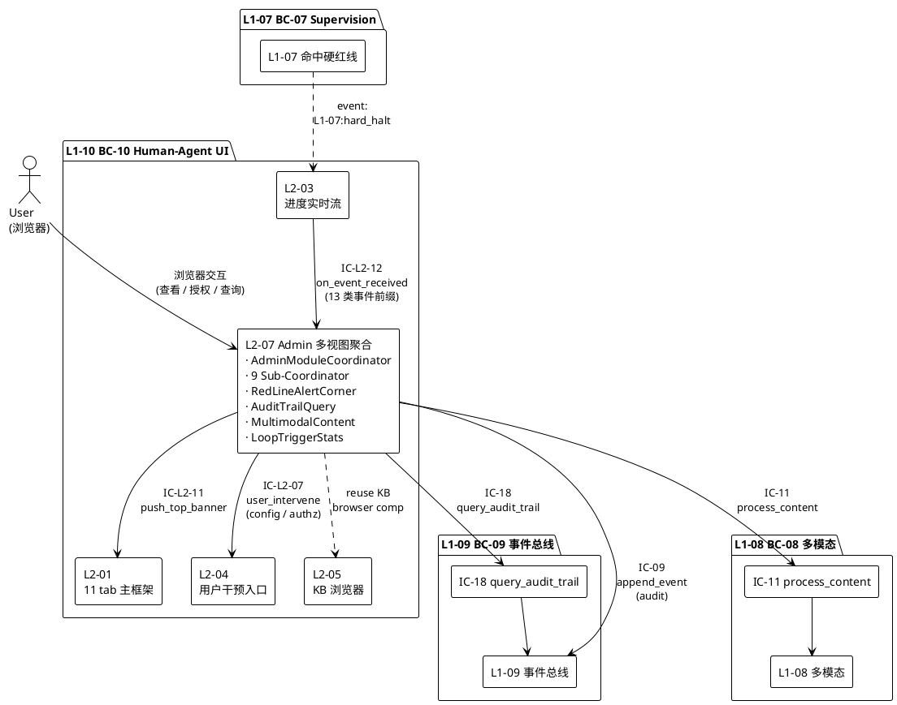

### 4.4 关键不变式（Invariants）

1. **PM-14 顶层强制**：所有 IC payload 顶层 `project_id` 必填（架构硬约束）
2. **no-direct-IC-17**：本 L2 **禁止**直接发 IC-17（必经 L2-04 · scope §5.10.5 禁止 5）
3. **banner-dismissible-false**：IC-L2-11 的 `dismissible` 字段**永远 false**（scope §5.10.5 禁止 2）
4. **red-line-persistent**：红线告警角卡片**持久化到 hard_halt_resolved**（scope §5.10.6 义务 3）
5. **audit-readonly**：审计查询只读 · 不得回写 L1-09
6. **diag-readonly**：诊断面板只读 · 不得执行危险操作（scope §5.10.5 禁止 4）
7. **cross-project-forbidden**：跨项目 Admin 管理禁止（scope §5.10.5 禁止 6 · V1-V2 单项目）
8. **entry-independence**：Admin 入口与 11 tab 独立 · 不混入（scope §5.10.5 禁止 7）

---

## §5 P0/P1 时序图（PlantUML ≥ 2 张）

本节 4 张时序图覆盖本 L2 的关键 P0/P1 场景，呼应 architecture.md §5.5 响应面 2（硬红线告警）与 §7.5 Admin 模块 4 的 3 个子视图。

### 5.1 时序图 1 · P0 · 硬红线告警强视觉链路（含声音 + 持久化 + 顶部横幅）

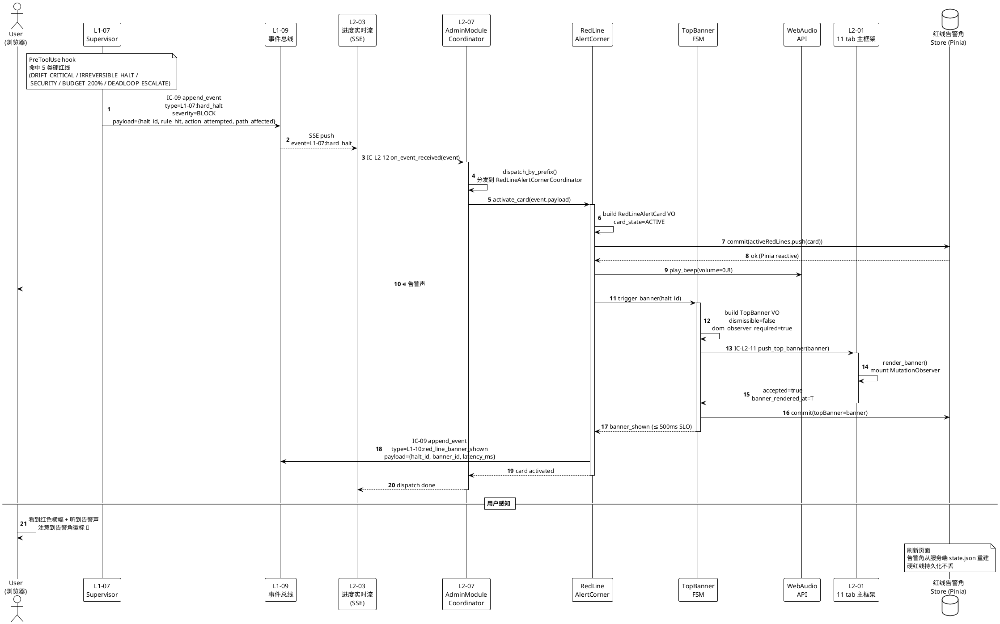

### 5.2 时序图 2 · P0 · 用户红线授权 + 横幅消失

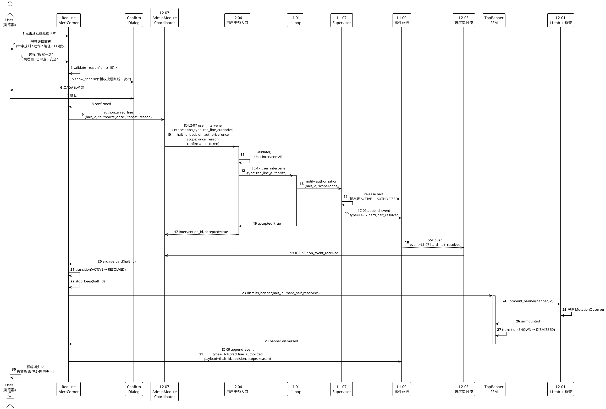

### 5.3 时序图 3 · P1 · 审计追溯查询（4 层链）

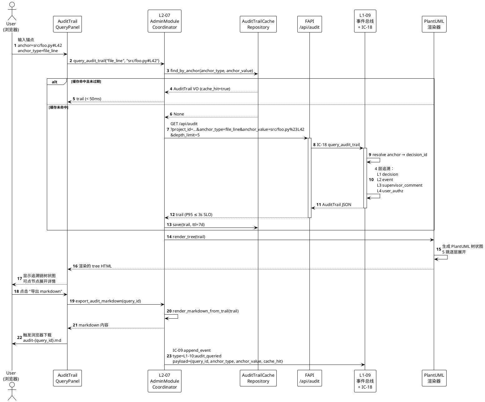

### 5.4 时序图 4 · P1 · 多模态内容展示（缓存 + 懒加载）

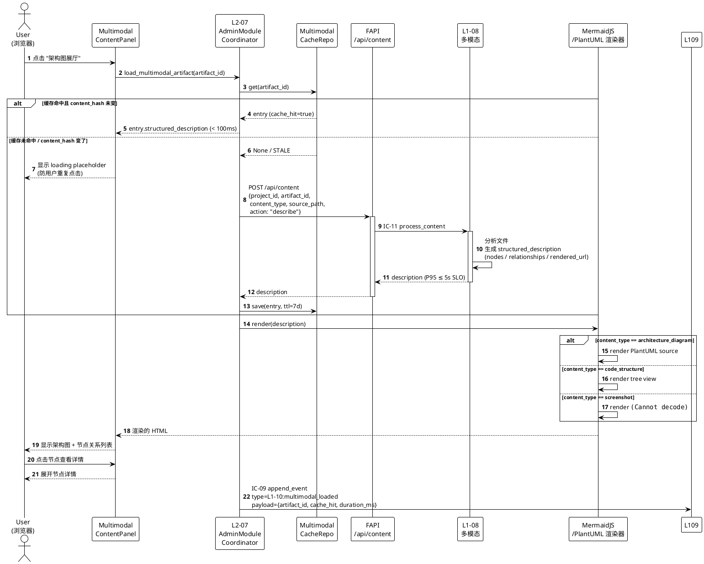

### 5.5 时序图 5 · 配置变更二次确认

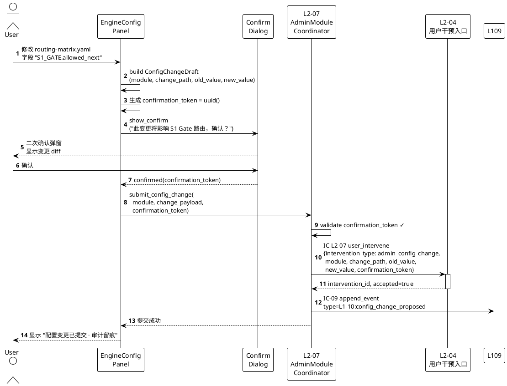

---

## §6 内部核心算法（伪代码）

本节 8 个算法覆盖本 L2 的关键内部逻辑，Python-like 风格。

### 6.1 算法 1 · 事件分发主循环（on_event_received dispatcher）

```python
def on_event_received(self, event: Event) -> None:
    """
    L2-03 推过来的每条事件都经此入口。
    按 event_type 前缀分发给对应 Sub-Coordinator。
    """
    # 1. PM-14 校验
    if not event.project_id:
        raise IError("E_L207_EVENT_MISSING_PROJECT_ID")
    if event.project_id != self.current_project_id:
        # 跨项目事件 drop（V1-V2 单项目，PM-14）
        log.warn("cross-project event dropped", event.event_id)
        return

    # 2. hash-chain 校验
    if event.prev_hash != self.last_event_hash:
        self.request_catch_up()    # 触发 /api/events/catchup
        raise IError("E_L207_EVENT_SEQUENCE_GAP")

    # 3. 幂等去重（event_id 集合 · 限长 LRU）
    if event.event_id in self.consumed_event_ids:
        return
    self.consumed_event_ids.add(event.event_id)

    # 4. 前缀路由（按 event_type 前缀分发）
    prefix = event.event_type.split(":")[0] + ":" + event.event_type.split(":")[1]
    dispatch_table = {
        "L1-07:supervisor_snapshot": self.supervisor_admin.on_snapshot,
        "L1-07:supervisor_verdict": self.supervisor_admin.on_verdict,
        "L1-07:hard_halt": self.red_line_corner.on_hard_halt,
        "L1-07:hard_halt_resolved": self.red_line_corner.on_hard_halt_resolved,
        "L1-07:soft_red_line": self.red_line_corner.on_soft_red_line,
        "L1-05:skill_called": self.skill_graph.on_skill_called,
        "L1-05:subagent_invoked": self.subagent_registry.on_subagent_invoked,
        "L1-06:kb_promoted": self.kb_admin.on_kb_promoted,
        "L1-09:session_started": self.execution_instance.on_session_started,
        "L1-09:audit_queried": None,  # 本 L2 不订阅自己发的
        "L1-02:project_created": self.execution_instance.on_project_created,
        "L1-02:gate_card_pushed": None,  # 不订阅 gate（归 L2-02）
        "L1-04:primitive_invoked": self.verifier_primitive.on_primitive_invoked,
    }

    handler = dispatch_table.get(event.event_type)
    if handler is None:
        log.warn("E_L207_EVENT_UNKNOWN_TYPE", event.event_type)
        return

    try:
        handler(event)
    except Exception as e:
        log.error("E_L207_EVENT_STORE_WRITE_FAIL", e)
        self.trigger_degrade_fallback()     # 降级 POLL_FALLBACK

    self.last_event_hash = event.entry_hash
```

### 6.2 算法 2 · 红线告警角激活（on_hard_halt）

```python
def on_hard_halt(self, event: Event) -> None:
    """
    收到 hard_halt 事件 → 构建 RedLineAlertCard →
      1. 入 Pinia store（置顶）
      2. 播声音
      3. 触发顶部横幅（IC-L2-11）
      4. 审计留痕
    SLO: 事件到横幅渲染 ≤ 500ms
    """
    t0 = now()

    # 1. 构建 card VO
    card = RedLineAlertCard(
        halt_id=event.payload.halt_id,
        project_id=event.project_id,
        severity="BLOCK",
        rule_hit=event.payload.rule_hit,
        action_attempted=event.payload.action_attempted,
        path_affected=event.payload.path_affected,
        ai_suggestion=compute_ai_suggestion(event.payload),
        timestamp_hit=event.emitted_at,
        card_state="ACTIVE",
    )

    # 2. 服务端持久化（刷新页面不丢）
    self.red_line_repository.save(card)

    # 3. 入 Pinia store（置顶 · 响应式）
    self.store.commit("activeRedLines/unshift", card)

    # 4. 播声音（Web Audio API · 预加载 wav · 低延迟）
    #    首次播完整 · 非首次间隔 5s（可配置 red_line_beep_repeat_interval_ms）
    if self.beep_allowed(card.halt_id):
        self.web_audio.play("red_line_beep.wav", volume=0.8)
        card.beep_played_count += 1
        card.beep_last_played_at = now()

    # 5. 触发顶部横幅（IC-L2-11）
    banner = TopBanner(
        banner_id=uuid7(),
        project_id=event.project_id,
        halt_id=card.halt_id,
        banner_color="#D9001B",
        banner_text={
            "title": f"硬红线告警：{card.rule_hit.rule_desc}",
            "subtitle": "需用户授权后方可继续",
        },
        dismissible=False,                  # 硬锁 scope §5.10.5 禁止 2
        dom_observer_required=True,
        shown_at=now(),
    )
    try:
        self.tab_framework_bridge.push_top_banner(banner)
    except BannerDuplicateError:
        pass   # 幂等（SSE 重发）
    except BannerL201NotReadyError:
        self.retry_queue.push(lambda: self.tab_framework_bridge.push_top_banner(banner))

    # 6. 记录延迟 + 审计
    card.timestamp_banner_shown = now()
    latency_ms = (now() - t0).total_seconds() * 1000
    assert latency_ms <= 500, "SLO: red_line_banner_latency_ms"

    self.append_audit_event(
        event_type="L1-10:red_line_banner_shown",
        payload={
            "halt_id": card.halt_id,
            "banner_id": banner.banner_id,
            "latency_ms": latency_ms,
        }
    )
```

### 6.3 算法 3 · 红线授权 + 横幅消失（authorize_red_line + on_hard_halt_resolved）

```python
def authorize_red_line(self, halt_id, decision, scope, reason) -> None:
    """
    用户在告警角点 "授权一次" / "驳回" / "加白名单"
    必经 L2-04 委托（IC-L2-07）
    scope=whitelist_permanent 需二次确认（scope §5.10.6 义务 7）
    """
    # 1. 校验
    card = self.red_line_repository.get(halt_id)
    if card.card_state != "ACTIVE":
        raise IError("E_L207_INTERVENE_STATE_INVALID")
    if len(reason) < 10:
        raise IError("E_L207_INTERVENE_REASON_TOO_SHORT")

    # 2. whitelist 二次确认
    whitelist_token = None
    if scope == "whitelist_permanent":
        confirmed = self.ui.confirm_dialog(
            title="永久 whitelist 此命令",
            message="此操作将永久信任该命令，后续同类动作不再告警。确认？",
            destructive=True,
        )
        if not confirmed:
            raise IError("E_L207_INTERVENE_WHITELIST_NO_CONFIRM")
        whitelist_token = uuid7()

    # 3. 委托 L2-04（IC-L2-07）
    intervention_id = self.user_intervention_gateway.user_intervene(
        intervention_type="red_line_authorize",
        payload={
            "halt_id": halt_id,
            "decision": decision,
            "scope": scope,
            "reason": reason,
            "whitelist_confirmation_token": whitelist_token,
        },
    )

    # 4. card 转 PENDING_USER （实际 RESOLVED 由 hard_halt_resolved 事件触发）
    self.red_line_repository.transition(halt_id, "PENDING_USER", decision=decision)

    # 5. 审计
    self.append_audit_event(
        event_type="L1-10:red_line_authorized",
        payload={
            "halt_id": halt_id,
            "decision": decision,
            "scope": scope,
            "reason": reason,
            "intervention_id": intervention_id,
        }
    )


def on_hard_halt_resolved(self, event: Event) -> None:
    """
    L1-07 解除 halt → 归档 card + 关横幅 + 停声音
    """
    halt_id = event.payload.halt_id
    card = self.red_line_repository.get(halt_id)

    # 1. card 转 RESOLVED
    card.card_state = "RESOLVED"
    card.timestamp_resolved = event.emitted_at
    self.red_line_repository.save(card)

    # 2. store 从 active 移到 resolved_history
    self.store.commit("activeRedLines/remove", halt_id)
    self.store.commit("resolvedRedLines/push", card)

    # 3. 停止该 halt_id 的声音（如有循环播放）
    self.web_audio.stop(halt_id)

    # 4. 关闭顶部横幅（scope §5.10.5 禁止 2 · 唯一合法关闭路径）
    banner_id = self.store.state.topBanners.get(halt_id)
    if banner_id:
        self.tab_framework_bridge.dismiss_banner(banner_id, reason="hard_halt_resolved")
        self.store.commit("topBanners/remove", halt_id)
```

### 6.4 算法 4 · DOM 防篡改守卫（MutationObserver）

```python
def setup_banner_dom_observer(self, banner_element) -> None:
    """
    scope §5.10.5 禁止 2：顶部红色横幅不可关闭。
    防开发者工具通过 devtools console 强行 dom 删除。
    """
    # 伪代码（实际是前端 JS · MutationObserver）
    observer = MutationObserver(callback=self.on_banner_dom_mutated)
    observer.observe(
        target=banner_element.parentNode,
        config={
            "childList": True,     # 监听子节点增删
            "attributes": True,    # 监听属性变化（display: none 等）
            "subtree": True,
        }
    )
    self.banner_observers[banner_element.bannerId] = observer

def on_banner_dom_mutated(self, mutations) -> None:
    for m in mutations:
        banner_id = m.target.dataset.bannerId
        if not banner_id:
            continue
        halt_id = self.store.state.bannerIdToHaltId.get(banner_id)
        # 检测 halt 未解决但 banner DOM 消失
        active_card = self.red_line_repository.get(halt_id)
        if active_card.card_state == "ACTIVE" and not dom_contains(m.target):
            # 被篡改 → 重渲染
            log.warn("DOM tamper detected", banner_id)
            self.append_audit_event(
                event_type="L1-10:dom_tamper_detected",
                payload={"banner_id": banner_id, "halt_id": halt_id}
            )
            self.tab_framework_bridge.push_top_banner(
                self.store.state.topBanner
            )
```

### 6.5 算法 5 · 审计追溯查询（带缓存）

```python
def query_audit_trail(self, anchor_type, anchor_value) -> AuditTrail:
    """
    用户输入锚点 → 命中缓存则直接返回 · 未命中则调 IC-18
    SLO: P95 ≤ 3s
    """
    # 1. 先查缓存（7 天 TTL）
    cached = self.audit_cache.find_by_anchor(anchor_type, anchor_value)
    if cached and cached.expires_at > now():
        self.append_audit_event(
            event_type="L1-10:audit_queried",
            payload={"cache_hit": True, "anchor_type": anchor_type}
        )
        return cached

    # 2. 调 FAPI /api/audit → IC-18 → L1-09
    try:
        response = self.fapi.get(
            "/api/audit",
            params={
                "project_id": self.current_project_id,
                "anchor_type": anchor_type,
                "anchor_value": anchor_value,
                "depth_limit": 5,
            },
            timeout_ms=self.config.audit_query_timeout_ms,
        )
    except TimeoutError:
        # 降级：返回部分链 + WARN
        raise IError("E_L207_AUDIT_TIMEOUT")
    except AnchorNotFoundError:
        raise IError("E_L207_AUDIT_ANCHOR_NOT_FOUND")

    # 3. 构建 AuditTrail VO
    trail = AuditTrail(
        query_id=uuid7(),
        project_id=self.current_project_id,
        anchor_type=anchor_type,
        anchor_value=anchor_value,
        trail=response.trail,
        queried_at=now(),
        expires_at=now() + timedelta(days=7),
    )

    # 4. 入缓存
    self.audit_cache.save(trail)

    # 5. 审计留痕
    self.append_audit_event(
        event_type="L1-10:audit_queried",
        payload={
            "query_id": trail.query_id,
            "anchor_type": anchor_type,
            "anchor_value": anchor_value,
            "cache_hit": False,
            "total_hops": response.total_hops,
        }
    )
    return trail
```

### 6.6 算法 6 · 多模态内容加载（LRU + 缓存失效）

```python
def load_multimodal_artifact(self, artifact_id) -> MultimodalCacheEntry:
    """
    用户点击架构图 / 代码结构 / 截图 → 读内容 · 尽量命中缓存
    SLO: P95 ≤ 5s
    """
    # 1. 先查缓存
    cached = self.multimodal_cache.get(artifact_id)
    if cached:
        # 2. 校验源文件 content_hash 是否变了
        current_hash = compute_sha256(cached.source_path)
        if current_hash == cached.content_hash:
            cached.access_count += 1
            cached.last_accessed_at = now()
            self.multimodal_cache.save(cached)
            return cached
        else:
            # 源变了 → invalidate
            self.multimodal_cache.invalidate(artifact_id)

    # 3. 调 FAPI /api/content → IC-11 → L1-08
    try:
        response = self.fapi.post(
            "/api/content",
            body={
                "project_id": self.current_project_id,
                "artifact_id": artifact_id,
                "content_type": self.resolve_content_type(artifact_id),
                "source_path": self.resolve_source_path(artifact_id),
                "action": "describe",
            },
            timeout_ms=self.config.multimodal_load_timeout_ms,
        )
    except TimeoutError:
        raise IError("E_L207_CONTENT_TIMEOUT")
    except ArtifactNotFoundError:
        raise IError("E_L207_CONTENT_ARTIFACT_NOT_FOUND")

    # 4. 构建 entry + 入缓存
    entry = MultimodalCacheEntry(
        cache_id=uuid7(),
        project_id=self.current_project_id,
        artifact_id=artifact_id,
        content_type=response.content_type,
        source_path=response.source_path,
        content_hash=compute_sha256(response.source_path),
        structured_description=response.description,
        loaded_at=now(),
        ttl_seconds=7 * 86400,
        access_count=1,
        last_accessed_at=now(),
    )
    self.multimodal_cache.save(entry)

    # 5. LRU 淘汰（若超 max_size_mb）
    self.multimodal_cache.evict_lru(max_size_mb=self.config.multimodal_cache_max_size_mb)

    self.append_audit_event(
        event_type="L1-10:multimodal_loaded",
        payload={
            "artifact_id": artifact_id,
            "cache_hit": False,
            "duration_ms": response.duration_ms,
        }
    )
    return entry
```

### 6.7 算法 7 · 9 模块并发订阅 · Pinia store 切片

```python
def open_admin_view(self, project_id) -> None:
    """
    用户进入 Admin 首屏 → 并发初始化 13 面板
    SLO: 首屏 ≤ 1s
    """
    t0 = now()
    self.current_project_id = project_id

    # 1. 并发拉各模块初始数据（9 个 REST 端点并发）
    async_tasks = [
        self.engine_config.load_engine_config(),           # /api/admin/engine-config
        self.execution_instance.list_projects(),            # /api/admin/projects
        self.kb_admin.open_cross_project_kb_view(),         # /api/admin/kb
        self.supervisor_admin.render_eight_dimension_radar(), # /api/admin/supervisor
        self.verifier_primitive.list_primitives(),          # /api/admin/primitives
        self.subagent_registry.list_subagents(),            # /api/admin/subagents
        self.skill_graph.build_call_graph(),                # /api/admin/skills
        self.stats_analysis.load_dashboard(TimeRange.LAST_24H), # /api/admin/stats
        self.system_diag.run_all_probes(),                  # /api/admin/diag
    ]
    results = await_all(async_tasks)

    # 2. 每模块各自入自己的 Pinia store 切片（不互相阻塞）
    self.store.commit("engineConfig/setData", results[0])
    self.store.commit("executionInstance/setData", results[1])
    # ... 其余 7 模块

    # 3. 红线告警角从服务端 state.json 重建（刷新页面不丢）
    active_red_lines = self.red_line_repository.list_active(project_id)
    self.store.commit("activeRedLines/setAll", active_red_lines)
    # 若有活跃硬红线 → 重新触发顶部横幅
    for card in active_red_lines:
        self.tab_framework_bridge.push_top_banner(self.build_banner(card))

    # 4. 订阅事件流
    self.event_stream_subscriber.subscribe(
        prefixes=[
            "L1-07:", "L1-05:", "L1-06:",
            "L1-02:", "L1-04:", "L1-09:",
        ],
        handler=self.on_event_received,
    )

    # 5. 审计
    t1 = now()
    self.append_audit_event(
        event_type="L1-10:admin_opened",
        payload={"load_time_ms": (t1 - t0).total_seconds() * 1000}
    )
    assert (t1 - t0).total_seconds() <= 1.0, "SLO: initial_load_timeout_ms"


def switch_module(self, module_id) -> None:
    """
    切换 9 后台模块 · SLO: ≤ 300ms
    Pinia store 切片独立 · 只切换当前激活面板 · 不动其他 store
    """
    t0 = now()
    previous = self.store.state.currentModule
    self.store.commit("currentModule/set", module_id)

    # 延迟加载（若该模块未加载）
    if not self.store.state[module_id].loaded:
        self.sub_coordinators[module_id].lazy_load()
        self.store.commit(f"{module_id}/setLoaded", True)

    self.append_audit_event(
        event_type="L1-10:admin_module_switched",
        payload={"from": previous, "to": module_id}
    )
    assert (now() - t0).total_seconds() <= 0.3, "SLO: module_switch_timeout_ms"
```

### 6.8 算法 8 · 诊断探针（只读）

```python
def run_all_probes(self) -> DiagReport:
    """
    scope §5.10.5 禁止 4：诊断面板不得执行危险操作。
    所有探针均只读 · 不得改数据 / 改事件 / 重置系统。
    """
    probes = [
        self._probe_event_bus_health,
        self._probe_disk_usage,
        self._probe_python_version,
        self._probe_fastapi_version,
        self._probe_uvicorn_workers,
        self._probe_cdn_connectivity,
        self._probe_sse_connection_count,
        self._probe_ui_downgrade_history,
    ]
    results = []
    for probe in probes:
        try:
            r = probe()        # 每个探针内部只读
            assert r.probe_category in ("event_bus", "storage", "runtime", "network", "ui_downgrade")
            results.append(r)
        except Exception as e:
            results.append(DiagProbeResult(
                probe_id=probe.__name__,
                status="RED",
                details={"error": str(e)},
                probed_at=now(),
            ))
    # 汇总
    report = DiagReport(
        project_id=self.current_project_id,
        probes=results,
        overall_status=self._aggregate(results),   # GREEN/YELLOW/RED
        generated_at=now(),
    )
    self.append_audit_event(
        event_type="L1-10:diag_probe_ran",
        payload={"probe_count": len(results), "overall": report.overall_status}
    )
    return report


def _probe_event_bus_health(self) -> DiagProbeResult:
    """只读：读 L1-09 的 events.jsonl tail"""
    tail = self.fapi.get("/api/events/stats", timeout_ms=1000)
    return DiagProbeResult(
        probe_id="event_bus_health",
        project_id=self.current_project_id,
        probe_category="event_bus",
        status=("GREEN" if tail.hash_chain_intact else "RED"),
        metric_value=tail.fsync_latency_p95_ms,
        metric_unit="ms",
        threshold_green=50,
        threshold_yellow=200,
        threshold_red=1000,
        details={
            "latest_sequence_id": tail.latest_sequence_id,
            "fsync_latency_p95_ms": tail.fsync_latency_p95_ms,
            "hash_chain_intact": tail.hash_chain_intact,
        },
        probed_at=now(),
    )
```

---

## §7 底层数据表 / schema 设计（字段级 YAML）

本 L2 持久化 3 张 schema（PM-14 分片 `projects/<pid>/ui/admin/...`）。

### 7.1 表 1 · red-line-corner/state.json（红线告警角状态 · 单例）

**物理路径**：`projects/<pid>/ui/admin/red-line-corner/state.json`
**存储语义**：本 L2 对 L1-09 事件流的投影（read model）· 可从事件流重建
**更新方式**：事件驱动（`L1-07:hard_halt` / `L1-07:hard_halt_resolved`）追加 + 原子 rename 写

**字段级 YAML schema**：

```yaml
project_id: string                 # PM-14 项目上下文
schema_version: "v1.0"
updated_at: datetime
sequence_id_watermark: int         # 已消费的事件 sequence_id 上水位（崩溃重建起点）

active_red_lines:                  # 活跃硬红线列表（card_state ∈ ACTIVE/PENDING_USER）
  - halt_id: UUIDv7
    severity: "BLOCK"
    rule_hit:
      rule_id: string
      rule_desc: string
      rule_threshold: string
    action_attempted:
      tool_name: string
      command_line: string
      wp_id: UUIDv7
      skill_intent: string
    path_affected:
      file_paths: [string]
      artifact_ids: [string]
    ai_suggestion:
      recommended_action: enum
      confidence: float
      rationale: string
    timestamp_hit: datetime
    timestamp_banner_shown: datetime
    card_state: enum               # ACTIVE / PENDING_USER / AUTHORIZED / REJECTED
    user_decision:                 # null 为未决
      decision: enum
      reason: string
      submitted_at: datetime
    audit_event_ids: [UUIDv7]
    beep_played_count: int
    beep_last_played_at: datetime

resolved_red_lines:                # 已解决历史（card_state=RESOLVED）· 最近 100 条
  - halt_id: UUIDv7
    # 字段同 active_red_lines，但多：
    timestamp_resolved: datetime
    resolved_by_event_id: UUIDv7    # 关联 hard_halt_resolved 事件

top_banners:                        # 当前活跃横幅（通常 1 个 · 最多 1 个）
  - banner_id: UUIDv7
    halt_id: UUIDv7
    banner_color: "#D9001B"
    banner_text:
      title: string
      subtitle: string
    dismissible: false              # 硬锁 false
    shown_at: datetime
```

**索引**（前端 Pinia store 内存索引 · 不在文件）：
- `activeRedLinesByHaltId: Map<halt_id, card>`
- `resolvedRedLinesByHaltId: LRU<halt_id, card>`（最近 100 条）
- `topBannersByHaltId: Map<halt_id, banner_id>`

**原子写机制**：
- 使用 `tempfile.NamedTemporaryFile` + `os.rename`（POSIX 原子）
- fsync 父目录确保持久化

### 7.2 表 2 · audit-queries/{query_id}.json（审计追溯查询缓存 · 一查询一文件）

**物理路径**：`projects/<pid>/ui/admin/audit-queries/{query_id}.json`
**存储语义**：缓存 IC-18 查询结果 · 减少重复调用 · 7 天 TTL

**字段级 YAML schema**：

```yaml
project_id: string                 # PM-14 项目上下文
schema_version: "v1.0"
query_id: UUIDv7
anchor_type: enum                  # file_line / artifact_id / decision_id
anchor_value: string
trail:
  decision:
    decision_id: UUIDv7
    actor: string
    decision_type: enum            # Go / No-Go / Request-change
    timestamp: datetime
    rationale: string
  event:
    event_id: UUIDv7
    event_type: string
    sequence_id: int
    emitted_at: datetime
    payload: object
  supervisor_comment:              # 可能为 null（若无监督点评）
    verdict_id: UUIDv7
    verdict_level: enum            # PASS / FAIL-L1 / FAIL-L2 / FAIL-L3 / FAIL-L4
    eight_dimension_snapshot:
      goal_fidelity: float         # 0-100
      plan_alignment: float
      true_completion_quality: float
      red_line_safety: float
      progress_pace: float
      cost_budget: float
      retry_loop: float
      user_collab: float
    comment_text: string
    commented_at: datetime
  user_authz:                      # 可能为 null
    authz_id: UUIDv7
    authz_type: enum               # red_line_authorize / gate_decision / panic / ...
    authz_scope: enum              # once / whitelist_permanent / session
    authz_reason: string
    authorized_at: datetime
total_hops: int
queried_at: datetime
expires_at: datetime               # queried_at + 7 天
cache_hits: int                    # 累计命中次数
last_hit_at: datetime
```

**索引**（文件系统级）：
- 文件名本身是 `query_id`
- 反向索引：`projects/<pid>/ui/admin/audit-queries/_index_by_anchor.json`
  - `{"{anchor_type}:{anchor_value}": [query_id1, query_id2, ...]}`

**清理策略**：后台 job 每日扫描 + 删除 expires_at < now 的文件。

### 7.3 表 3 · multimodal-cache/{artifact_id}.json（多模态内容缓存 · 一 artifact 一文件）

**物理路径**：`projects/<pid>/ui/admin/multimodal-cache/{artifact_id}.json`
**存储语义**：缓存 L1-08 分析结果 · LRU + 7 天 TTL · 按 content_hash 失效

**字段级 YAML schema**：

```yaml
project_id: string                 # PM-14 项目上下文
schema_version: "v1.0"
cache_id: UUIDv7
artifact_id: string
content_type: enum                 # code_structure / architecture_diagram / screenshot
source_path: string                # 相对 `projects/<pid>/` 的路径
content_hash: string               # 源文件 sha256（变则失效）
structured_description:
  nodes: [object]                  # 节点列表
  relationships: [object]          # 关系列表
  rendered_url: string             # 若为截图 · 静态资源 url
  plantuml_source: string          # 若为架构图 · PlantUML 源
  code_tree: object                # 若为代码结构 · tree 结构（嵌套）
loaded_at: datetime
ttl_seconds: int                   # 默认 604800（7 天）
access_count: int
last_accessed_at: datetime
file_size_bytes: int               # 用于 LRU 淘汰决策
```

**索引**（文件系统级）：
- 文件名本身是 `artifact_id`
- LRU 索引：`projects/<pid>/ui/admin/multimodal-cache/_lru_index.json`
  - `[{artifact_id, last_accessed_at, file_size_bytes}, ...]`（按 last_accessed_at 排序）

**淘汰策略**：
- 总大小 > `multimodal_cache_max_size_mb`（默认 200 MB）时，按 LRU 删最久未访问
- 源文件变更（content_hash 不匹配）立即失效

### 7.4 表 4 · loop-stats/{date}.json（Loop 触发统计 · 每日快照 · P2）

**物理路径**：`projects/<pid>/ui/admin/loop-stats/{date}.json`
**存储语义**：统计分析读模型 · 服务端 30s 周期计算 · 每日归档

**字段级 YAML schema**：

```yaml
project_id: string                 # PM-14 项目上下文
schema_version: "v1.0"
stats_id: UUIDv7
date: "2026-04-22"                 # yyyy-mm-dd
trigger_breakdown:
  event_driven_count: int
  periodic_count: int
  hook_driven_count: int
  manual_count: int
total_count: int
percentage:
  event_driven_pct: float          # 0-100
  periodic_pct: float
  hook_driven_pct: float
  manual_pct: float
by_hour:                           # 24 段小时分布
  - hour: int
    count: int
    breakdown: object              # 同 trigger_breakdown
computed_at: datetime
```

### 7.5 存储路径总览（PM-14 分片）

```
projects/
  <project_id>/
    ui/
      admin/
        red-line-corner/
          state.json                    # 表 1 · 单例
        audit-queries/
          <query_id>.json                # 表 2 · 一查询一文件
          _index_by_anchor.json          # 反向索引
        multimodal-cache/
          <artifact_id>.json             # 表 3 · 一 artifact 一文件
          _lru_index.json                # LRU 索引
        loop-stats/
          2026-04-22.json                # 表 4 · 每日快照
          2026-04-23.json
          ...
```

**跨项目隔离**：scope §5.10.5 禁止 6 · 本 L2 不得读取其他 `projects/<pid2>/` 下的任何路径。

---

## §8 状态机（PlantUML + 转换表）

本 L2 有 6 个关键状态机。

### 8.1 状态机 1 · RedLineAlertCard 状态机

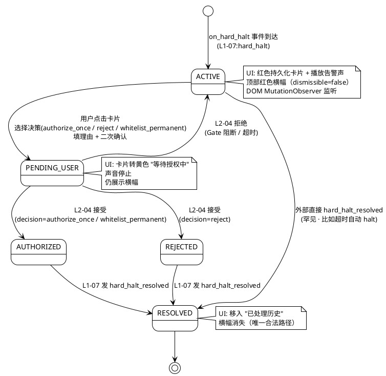

**状态转换表**：

| From | To | 触发 | Guard | Action |
|:---|:---|:---|:---|:---|
| (init) | ACTIVE | `on_hard_halt` 事件 | `severity=BLOCK` | 构建 card · 播声音 · 推横幅 |
| ACTIVE | PENDING_USER | 用户点击决策 | 理由 ≥ 10 字符 + whitelist 过二次确认 | IC-L2-07 → L2-04 |
| ACTIVE | RESOLVED | `hard_halt_resolved` 事件 | halt 超时自动解除 | 归档 · 停声 · 关横幅 |
| PENDING_USER | AUTHORIZED | L2-04 接受（决策=authorize/whitelist）| - | IC-17 已转发 |
| PENDING_USER | REJECTED | L2-04 接受（决策=reject）| - | IC-17 已转发 |
| PENDING_USER | ACTIVE | L2-04 拒绝（Gate 阻断）| - | 回显拒因 · 用户重试 |
| AUTHORIZED | RESOLVED | `hard_halt_resolved` 事件 | - | 归档 · 停声 · 关横幅 |
| REJECTED | RESOLVED | `hard_halt_resolved` 事件 | - | 归档 · 停声 · 关横幅 |

### 8.2 状态机 2 · TopBanner 状态机

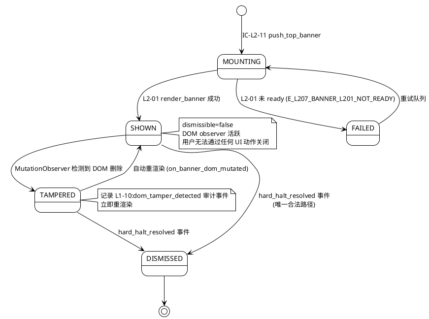

**状态转换表**：

| From | To | 触发 | Guard | Action |
|:---|:---|:---|:---|:---|
| (init) | MOUNTING | IC-L2-11 收到 push | dismissible=false | - |
| MOUNTING | SHOWN | L2-01 render 成功 | - | 记 timestamp_banner_shown |
| MOUNTING | FAILED | L2-01 未 ready | - | 入重试队列（3 次）|
| FAILED | MOUNTING | 重试 | 重试 < 3 次 | - |
| SHOWN | TAMPERED | DOM 删除检测 | MutationObserver | 记 `L1-10:dom_tamper_detected` |
| TAMPERED | SHOWN | 自动重渲染 | - | re-push IC-L2-11 |
| SHOWN | DISMISSED | `hard_halt_resolved` | 仅此事件合法 | unmount observer |
| TAMPERED | DISMISSED | `hard_halt_resolved` | 同上 | unmount observer |

### 8.3 状态机 3 · AuditTrailQuery 状态机

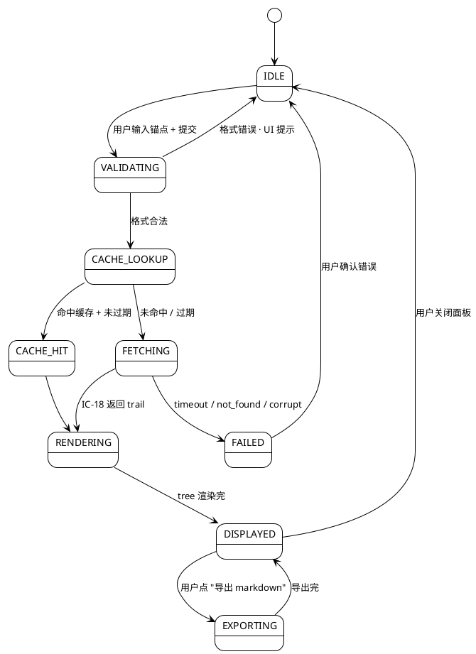

**状态转换表**：

| From | To | 触发 | Guard | Action |
|:---|:---|:---|:---|:---|
| IDLE | VALIDATING | 用户提交 | - | 校验 anchor 格式 |
| VALIDATING | CACHE_LOOKUP | 格式合法 | anchor_type ∈ 3 枚举 | - |
| VALIDATING | IDLE | 格式错 | - | UI 提示 |
| CACHE_LOOKUP | CACHE_HIT | 命中且未过期 | expires_at > now | 返回 cached |
| CACHE_LOOKUP | FETCHING | 未命中 / 过期 | - | 调 FAPI |
| FETCHING | RENDERING | IC-18 返回 | trail 完整（4 层）| 入缓存 |
| FETCHING | FAILED | 超时 / not_found | - | 记错误 |
| CACHE_HIT | RENDERING | - | - | - |
| RENDERING | DISPLAYED | tree 渲染完 | - | - |
| DISPLAYED | EXPORTING | 用户点导出 | - | 生成 markdown |
| EXPORTING | DISPLAYED | 导出完 | - | 触发浏览器下载 |

### 8.4 状态机 4 · MultimodalContent 加载状态机

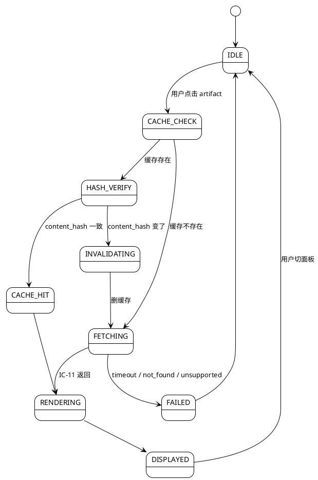

### 8.5 状态机 5 · ConfigChange（配置变更）状态机

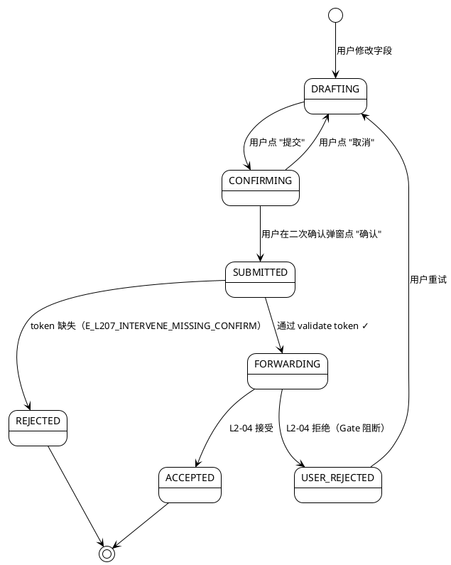

### 8.6 状态机 6 · DiagProbe 探针状态机

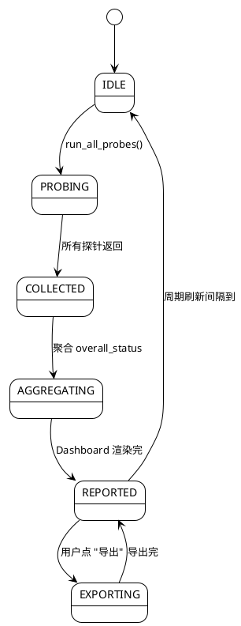

**状态转换表**（摘要）：

| 状态机 | 关键守卫 | 关键动作 |
|:---|:---|:---|
| RedLineAlertCard | 严格单向推进 · 唯一 RESOLVED 入口 = hard_halt_resolved | 播声 / 推横幅 / 归档 |
| TopBanner | dismissible=false 硬锁 · 防 DOM 篡改 | MutationObserver / 重渲染 |
| AuditTrailQuery | 4 层 trail 完整 · 7 天缓存 | FAPI 代理 / 本地缓存 |
| MultimodalContent | content_hash 一致性 · LRU 淘汰 | 缓存失效 / 重拉 L1-08 |
| ConfigChange | 二次确认 token 强制 | IC-L2-07 委托 L2-04 |
| DiagProbe | 只读硬约束 · 无副作用 | 周期刷新 / 导出 markdown |

---

## §9 开源最佳实践调研（≥ 3 GitHub 高星项目）

本节调研后台管理 UI / 管理聚合面 / 告警面板 / 审计 trail 四类开源项目 · 聚焦"可借鉴点 + 本 L2 处置 + 差异原因"。

### 9.1 Ant Design Pro · 37k stars · Active

- **URL**：`https://github.com/ant-design/ant-design-pro`
- **定位**：企业级中后台前端 / 设计解决方案（React + TypeScript · 阿里系）
- **处置**：**Learn**（管理聚合面的参考架构 · 不直接引入依赖）
- **学习点**：
  1. **ProLayout + ProTable + ProForm** 三件套 — 把"导航 + 列表 + 表单"收敛成 3 类可复用组件，与本 L2 13 面板的同构性高（9 后台 + 4 UI 缺口基本是"导航 + 列表 + 详情"模式）
  2. **侧边栏 + 面包屑 + 工作区**三段布局 — 本 L2 D1 "Admin 入口独立于 11 tab"采用同款骨架
  3. **权限控制粒度下沉到组件级**（`Access` 组件 + `useAccess` hook）— 对应本 L2 的"诊断面板只读"（scope §5.10.5 禁止 4）：把"是否可执行写操作"封成 hook
- **差异 & 不直接引**：
  - 本 L2 前端栈由 architecture.md 锁定为 Vue 3 + Element Plus（非 React / Ant Design）→ 只借鉴模式、不搬组件库
  - Ant Design Pro 默认"CRUD 心智"，本 L2 是**只读 + 委托写**（scope §5.10.5 禁止 5 · 不直发 IC-17）→ 表单提交必经 IC-L2-07 包装

### 9.2 Django Admin · 内置于 Django · Django 79k stars

- **URL**：`https://github.com/django/django/tree/main/django/contrib/admin`
- **定位**：Python 世界事实标准的"零代码后台"—— ModelAdmin 注册即用
- **处置**：**Learn**（管理模块的"注册表"模式）
- **学习点**：
  1. **`admin.site.register(Model, ModelAdmin)` 注册表模式** — 对应本 L2 §2.1 `sub_coordinators` 字典：9 个 Sub-Coordinator 按 `module_id` 注册、`AdminModuleCoordinator` 作为分发入口
  2. **`readonly_fields` / `list_display` / `search_fields` 声明式配置** — 对应本 L2 §10 YAML 声明各模块的"可改字段 / 可看字段 / 可查字段"
  3. **Admin LogEntry 内置审计表** — 对应本 L2 IC-09 审计留痕的"每 Admin 操作必落盘"（scope §5.10.6 义务 8）
  4. **`has_delete_permission` / `has_change_permission` 权限钩子** — 本 L2 的"诊断面板无破坏性操作"靠同款"方法级权限否决"
- **差异**：
  - Django Admin 是**后端渲染 HTML**（form action POST），本 L2 是**SPA + IC**（前端 JSON + IC-L2-07）→ 注册表模式搬，渲染层不搬
  - Django Admin 支持"直接改数据库"，本 L2 **不得直发 IC-17**（scope §5.10.5 禁止 5）→ 在 `ModelAdmin` 层等价层加"委托关"

### 9.3 Laravel Nova · 闭源商业 · 但设计思路公开

- **URL**：`https://nova.laravel.com/` · 开源替代 `https://github.com/Flare-UI/filamentphp` 18k stars
- **定位**：Laravel 生态的后台管理面板 · Resource 模式
- **处置**：**Learn**（Resource 封装模式 + Action 模式）
- **学习点**：
  1. **Resource 封装** — 每个被管理实体有一个 Resource 类（对应本 L2 9 个 Sub-Coordinator）
  2. **Action 模式** — "批量授权" / "导出" 等操作是独立 Action 对象 · 有自己的 confirmation dialog — 对应本 L2 §6.3 "红线授权" / §6.8 "诊断导出 markdown"
  3. **Dashboard Card** — 顶部卡片展示 KPI，可由用户自定义布局 — 对应本 L2 "红线告警角"的持久化卡片设计
- **差异**：
  - Nova/Filament 是 PHP 栈，本 L2 是 Python + Vue → 借模式
  - Nova 的 Action 可以直接提交数据库，本 L2 Action 必经 IC-L2-07

### 9.4 Grafana · 64k stars · Active

- **URL**：`https://github.com/grafana/grafana`
- **定位**：监控 + 告警 dashboard
- **处置**：**Learn**（告警持久化 + 静音规则 + 顶部 banner）
- **学习点**：
  1. **Alert rule → Alert instance 状态机**（Pending / Firing / Resolved / Silenced） — 对应本 L2 §8.1 `RedLineAlertCard` 状态机（ACTIVE / PENDING_USER / AUTHORIZED / REJECTED / RESOLVED）
  2. **Annotation（事件标记）机制** — 对应本 L2 §6.2 `L1-10:red_line_banner_shown` 审计事件留痕
  3. **顶部告警横幅（Alert Banner）默认不可关** — 对应本 L2 scope §5.10.5 禁止 2 `dismissible=false`
  4. **Silence rules · 静音规则不覆盖硬红线**（critical alert 不能 silence） — 对应本 L2 §10 `red_line_beep_allow_silence_on_critical = false` 硬锁
- **差异**：
  - Grafana 是跨项目监控平台，本 L2 V1-V2 单项目（scope §5.10.5 禁止 6）
  - Grafana 用 Go + React，本 L2 用 Python + Vue → 借状态机设计

### 9.5 Datadog Audit Trail · 闭源 · 公开 API 文档

- **URL**：`https://docs.datadoghq.com/account_management/audit_trail/`
- **定位**：审计追溯 UI 参考
- **处置**：**Learn**（审计查询 UX + 4 层视图）
- **学习点**：
  1. **锚点式查询**（输入 resource_id / actor → 4 层追溯） — 与本 L2 §3.2 IC-18 的 `anchor_type ∈ {file_line, artifact_id, decision_id}` 完全同构
  2. **树状图 + 导出 markdown** — 对应本 L2 §6.5 `export_audit_markdown`
  3. **7 天查询缓存** — 对应本 L2 §7.2 audit-queries 缓存 TTL=7 天

### 9.6 Vue Flow · 1.5k stars · Active

- **URL**：`https://github.com/bcakmakoglu/vue-flow`
- **处置**：**Adopt**（D12 决策 · SkillCallGraph / SkillFallbackDag 用同组件）
- **学习点**：
  1. Node / Edge 声明式 DSL
  2. 内置布局算法（dagre / elk）
  3. 事件系统（node-click / edge-click）
- **应用**：§2.2.7 SkillCallGraphCoordinator 的 `build_call_graph()` 直接返回 DagView VO，在前端用 Vue Flow 渲染

### 9.7 MutationObserver (Web API · MDN Reference)

- **URL**：`https://developer.mozilla.org/en-US/docs/Web/API/MutationObserver`
- **处置**：**Adopt**（D9 决策 · 防 DOM 篡改）
- **学习点**：
  1. `childList` + `attributes` + `subtree` 三组合监听
  2. 批量回调（避免 mutation storm）
  3. 通过 `observer.disconnect()` 在 banner 归档时解除
- **应用**：§6.4 `setup_banner_dom_observer`（scope §5.10.5 禁止 2 防开发者工具 dom 操作）

### 9.8 Pinia · 11k stars · Vue 官方 store

- **URL**：`https://github.com/vuejs/pinia`
- **处置**：**Adopt**（D7 决策 · 9 模块 store 切片）
- **学习点**：
  1. defineStore 组合式
  2. store 间独立 · setup store 函数式
  3. 原生 TS 类型推导
- **应用**：§2 每个 Sub-Coordinator 对应一个 Pinia store（模块切换 ≤ 300ms 靠独立切片）

### 9.9 总结表（adopt / learn / reject）

| 项目 | stars | 处置 | 本 L2 应用 | 与本 L2 的关键差异 |
|:---|:---|:---|:---|:---|
| Ant Design Pro | 37k | Learn | D1 Admin 入口独立 + ProLayout 骨架 | React→Vue · CRUD→只读+委托 |
| Django Admin | 79k | Learn | §2.1 Sub-Coordinator 注册表 + LogEntry 审计 | SSR→SPA · 直写→委托 IC-L2-07 |
| Laravel Nova | (闭源)| Learn | Resource/Action 封装模式 | PHP→Python · 直写→委托 |
| Grafana | 64k | Learn | §8.1 红线状态机 + §8.2 Banner 不可关 | 跨项目→单项目 |
| Datadog Audit | (闭源)| Learn | §3.2 IC-18 锚点 + §6.5 追溯查询 + 导出 md | 商业 API 参考 |
| Vue Flow | 1.5k | **Adopt** | §2.2.7 SkillCallGraph 可视化 | 直接引入 |
| MutationObserver | (web API)| **Adopt** | §6.4 DOM 防篡改守卫 | 直接使用 |
| Pinia | 11k | **Adopt** | §2 9 模块 store 切片（模块切换 ≤ 300ms） | 直接使用 |

**核心结论**：本 L2 的后端侧借鉴"Django Admin + Nova"的注册表 + Resource 模式，前端侧借鉴"Ant Design Pro"的 ProLayout 骨架 + "Grafana"的告警状态机 + "Datadog"的审计查询 UX，三个直接 Adopt 的库（Vue Flow / MutationObserver / Pinia）解决 skill DAG / DOM 防篡改 / store 切片三个具体需求。

---

## §10 配置参数清单

本节清单覆盖 13 面板、6 状态机、降级策略、SLO 的所有可调参数 · YAML 列表（≥ 8 组）。

### 10.1 主配置（Admin 多视图聚合器级 · `admin_module_coordinator.yaml`）

```yaml
project_id: string                    # PM-14 项目上下文
schema_version: "v1.0"

# SLO 阈值（硬锁定由 scope §5.10.4 性能约束驱动）
initial_load_timeout_ms: 1000         # 首屏 SLO · 范围 500-3000
module_switch_timeout_ms: 300         # 9 模块切换 SLO · 范围 100-1000
audit_query_timeout_ms: 3000          # 审计追溯查询 P95 SLO · 范围 1000-10000
red_line_banner_latency_ms: 500       # 硬红线事件到横幅 SLO · 范围 100-2000
multimodal_load_timeout_ms: 5000      # 多模态内容加载 P95 SLO · 范围 1000-15000
```

### 10.2 红线告警角配置（`red_line_corner.yaml`）

```yaml
project_id: string                    # PM-14 项目上下文
schema_version: "v1.0"

red_line_beep_volume: 0.8             # 范围 0.0-1.0 · 告警声音量
red_line_beep_repeat_interval_ms: 5000 # 范围 1000-30000 · 非首次告警重播间隔
red_line_beep_allow_silence_on_warn: true   # 软红线 WARN 允许静音
red_line_beep_allow_silence_on_critical: false  # **硬锁 false**（scope §5.10.5 禁止 1）· 硬红线永不静音
red_line_card_persist_until_resolved: true  # **硬锁 true**（scope §5.10.6 义务 3）· 刷新页面不丢
red_line_active_cards_max: 50         # 告警角同时最多展示活跃硬红线（超出折叠）
red_line_resolved_history_max: 100    # 已解决历史保留上限（LRU）
red_line_resolved_history_retention_days: 30  # 已解决历史自动清理
dom_tamper_check_interval_ms: 100     # MutationObserver 节流间隔 · 范围 50-500
dom_tamper_rerender_on_detect: true   # **硬锁 true**（scope §5.10.5 禁止 2）· 检测到强行 dom 删除必重渲染
```

### 10.3 顶部横幅配置（`top_banner.yaml`）

```yaml
project_id: string                    # PM-14 项目上下文
schema_version: "v1.0"

banner_color_hard_red_line: "#D9001B" # 硬红线固定红色（视觉规范）
banner_color_soft_red_line: "#FF9500" # 软红线橙色
banner_dismissible: false             # **硬锁 false**（scope §5.10.5 禁止 2）
banner_mount_retry_max: 3             # L2-01 未 ready 时的重试上限
banner_mount_retry_delay_ms: 200      # 重试延迟
banner_max_concurrent: 1              # 同一时刻最多展示 1 个顶部横幅（多硬红线折叠）
banner_z_index: 9999                  # CSS z-index 防被遮盖
banner_play_beep_on_mount: true       # 挂载时同步播放告警声
```

### 10.4 审计追溯配置（`audit_trail.yaml`）

```yaml
project_id: string                    # PM-14 项目上下文
schema_version: "v1.0"

audit_query_depth_limit: 5            # 追溯链默认跳数 · 范围 3-10
audit_query_cache_ttl_days: 7         # 缓存 TTL
audit_query_include_layers:           # 默认 4 层全含
  - decision
  - event
  - supervisor_comment
  - user_authz
audit_query_cache_max_entries: 1000   # 单项目缓存上限
audit_query_prune_interval_hours: 24  # 后台清理过期缓存频率
audit_export_markdown_dir: "projects/<pid>/reports/audit/"  # 导出默认路径
audit_permission_cross_project_denied: true  # **硬锁 true**（scope §5.10.5 禁止 6）
```

### 10.5 多模态缓存配置（`multimodal_cache.yaml`）

```yaml
project_id: string                    # PM-14 项目上下文
schema_version: "v1.0"

multimodal_cache_ttl_seconds: 604800  # 7 天
multimodal_cache_max_size_mb: 200     # LRU 淘汰阈值 · 范围 50-2000
multimodal_cache_hash_verify_on_get: true  # 每次 get 校验 content_hash · 变则失效
multimodal_supported_types:           # 3 类（scope §5.10.3 枚举）
  - code_structure
  - architecture_diagram
  - screenshot
multimodal_cache_eviction_policy: "lru"
multimodal_cache_prune_interval_hours: 6
multimodal_placeholder_on_loading: "loading.svg"  # 加载中占位图
multimodal_parallel_fetch_max: 3      # 同时最多并发 3 个 L1-08 请求
```

### 10.6 配置变更 + 授权配置（`config_change.yaml`）

```yaml
project_id: string                    # PM-14 项目上下文
schema_version: "v1.0"

config_change_confirm_token_required: true  # **硬锁 true**（scope §5.10.5 禁止 3）
config_change_token_ttl_seconds: 300  # 二次确认 token 5 分钟内有效
config_change_reason_min_length: 10   # 理由最少字符
whitelist_confirm_required: true      # **硬锁 true**（scope §5.10.6 义务 7）· whitelist 二次确认
whitelist_confirm_destructive_ui: true # UI 强警告样式
intervene_commit_timeout_ms: 2000     # L2-04 响应超时
intervene_user_rejection_show_reason: true  # Gate 阻断必回显原因
```

### 10.7 9 后台模块配置（`admin_modules.yaml`）

```yaml
project_id: string                    # PM-14 项目上下文
schema_version: "v1.0"

modules:
  engine_config:
    enabled: true
    readonly_fields: ["schema_version", "created_at"]
    editable_fields: ["routing_matrix", "tick_interval_ms", "trim_level"]
    requires_confirm: true            # 修改需二次确认
    endpoint: "/api/admin/engine-config"
  execution_instance:
    enabled: true
    list_page_size: 20
    endpoint: "/api/admin/projects"
  kb_admin:
    enabled: true
    reuse_component: "L2-05"          # 复用 KB 浏览器
    default_scope: "global"
    endpoint: "/api/admin/kb"
  supervisor_admin:
    enabled: true
    eight_dimension_refresh_ms: 5000
    verdict_history_limit: 20
    endpoint: "/api/admin/supervisor"
  verifier_primitive:
    enabled: true
    endpoint: "/api/admin/primitives"
  subagent_registry:
    enabled: true
    endpoint: "/api/admin/subagents"
  skill_call_graph:
    enabled: true
    viz_library: "vue-flow"
    layout_algorithm: "dagre"
    endpoint: "/api/admin/skills"
  stats_analysis:
    enabled: true
    refresh_interval_ms: 30000
    default_time_range: "LAST_24H"
    endpoint: "/api/admin/stats"
  system_diag:
    enabled: true
    readonly_hard_lock: true          # **硬锁 true**（scope §5.10.5 禁止 4）· 只读
    refresh_interval_ms: 60000
    endpoint: "/api/admin/diag"
```

### 10.8 诊断探针配置（`diag_probes.yaml`）

```yaml
project_id: string                    # PM-14 项目上下文
schema_version: "v1.0"

probes_enabled:                       # 探针白名单 · 均只读
  - event_bus_health
  - disk_usage
  - python_version
  - fastapi_version
  - uvicorn_workers
  - cdn_connectivity
  - sse_connection_count
  - ui_downgrade_history
probes_forbidden_actions:             # 黑名单（scope §5.10.5 禁止 4）
  - clear_event_bus
  - reset_system
  - mutate_task_board
  - restart_uvicorn
probe_timeout_ms: 1000
probe_export_format: "markdown"
```

### 10.9 Loop 触发统计配置（`loop_trigger_stats.yaml` · P2）

```yaml
project_id: string                    # PM-14 项目上下文
schema_version: "v1.0"

loop_stats_compute_interval_seconds: 30
loop_stats_retention_days: 90
loop_stats_dimensions:                # 4 种触发源
  - event_driven
  - periodic
  - hook_driven
  - manual
loop_stats_by_hour_enabled: true
```

### 10.10 硬锁参数汇总

| 参数 | 锁定值 | 来源 | 理由 |
|:---|:---|:---|:---|
| `banner_dismissible` | false | scope §5.10.5 禁止 2 | 顶部红色横幅不可关闭 |
| `dom_tamper_rerender_on_detect` | true | scope §5.10.5 禁止 2 | DOM 被篡改必重渲染 |
| `red_line_beep_allow_silence_on_critical` | false | scope §5.10.5 禁止 1 | 硬红线永不静音 |
| `red_line_card_persist_until_resolved` | true | scope §5.10.6 义务 3 | 刷新不丢 |
| `config_change_confirm_token_required` | true | scope §5.10.5 禁止 3 | 配置变更必二次确认 |
| `whitelist_confirm_required` | true | scope §5.10.6 义务 7 | whitelist 必二次确认 |
| `system_diag.readonly_hard_lock` | true | scope §5.10.5 禁止 4 | 诊断面板只读 |
| `audit_permission_cross_project_denied` | true | scope §5.10.5 禁止 6 | 禁跨项目 |

---

## §11 错误处理 + 降级策略

### 11.1 错误码 → 处置策略映射表

| 错误码 | 级别 | 触发场景 | 处置策略 |
|:---|:---|:---|:---|
| `E_L207_EVENT_UNKNOWN_TYPE` | WARN | 未注册的 event_type 前缀 | log.warn + drop · 不影响其他面板 |
| `E_L207_EVENT_MISSING_PROJECT_ID` | REJECT | PM-14 违反 | 拒绝分发 + 告警 supervisor |
| `E_L207_EVENT_SEQUENCE_GAP` | RECOVER | hash-chain 序号断 | 触发 `requestCatchUp` + 临时降级 POLL_FALLBACK |
| `E_L207_EVENT_STORE_WRITE_FAIL` | DEGRADE | Pinia store 异常 / OOM | 降级 POLL_FALLBACK |
| `E_L207_AUDIT_ANCHOR_NOT_FOUND` | USER_ERROR | 用户输错 anchor | UI 显示"未找到" + 提示修正格式 |
| `E_L207_AUDIT_TIMEOUT` | DEGRADE | IC-18 超时 | 返回部分链 + WARN 条带 |
| `E_L207_AUDIT_SEQUENCE_CORRUPT` | BLOCK | 事件总线 hash-chain 断 | 告警 supervisor + 暂停审计面板 |
| `E_L207_AUDIT_PERMISSION_DENIED` | REJECT | 跨项目查询 | 403 · scope §5.10.5 禁止 6 |
| `E_L207_CONTENT_ARTIFACT_NOT_FOUND` | USER_ERROR | 链接失效 | UI 显示"已删除" |
| `E_L207_CONTENT_TIMEOUT` | DEGRADE | L1-08 慢 | 显示 placeholder + 后台异步重试 |
| `E_L207_CONTENT_UNSUPPORTED_TYPE` | REJECT | 非 3 枚举 | UI 禁用入口 |
| `E_L207_CONTENT_CACHE_HIT_STALE` | RECOVER | content_hash 不匹配 | 自动 invalidate + 重拉 |
| `E_L207_INTERVENE_MISSING_CONFIRM` | BLOCK | 缺二次确认 token | UI 弹二次确认 |
| `E_L207_INTERVENE_WHITELIST_NO_CONFIRM` | BLOCK | whitelist 缺二次确认 | UI 弹强警告（destructive style）|
| `E_L207_INTERVENE_REASON_TOO_SHORT` | BLOCK | 理由 < 10 字符 | UI 提示最少字符 + 高亮输入框 |
| `E_L207_INTERVENE_REJECTED_BY_L204` | USER_RETRY | Gate 阻断 / 超时 | 回显拒因 + 保留 draft |
| `E_L207_BANNER_L201_NOT_READY` | RETRY | 首屏竞态 | 入重试队列（3 次 · 200ms 间隔）|
| `E_L207_BANNER_DUPLICATE` | IDEMPOTENT | SSE 重发 | 幂等忽略 |
| `E_L207_BANNER_DISMISSIBLE_TRUE` | REJECT | 代码 bug · dismissible 非 false | 拒绝 + 告警 supervisor（scope §5.10.5 禁止 2）|
| `E_L207_AUDIT_APPEND_FAIL` | RETRY | L1-09 写失败 | 3 次重试 + 本地 WAL 缓冲 |
| `E_L207_AUDIT_MISSING_TRACE_ID` | WARN | 代码 bug | 自动补 trace_id |
| `E_L207_DOM_TAMPER_DETECTED` | REMEDIATE | MutationObserver 检测到 | 立即重渲染 + 记 `L1-10:dom_tamper_detected` 审计事件 |

### 11.2 降级链（PlantUML · 4 级硬降级）

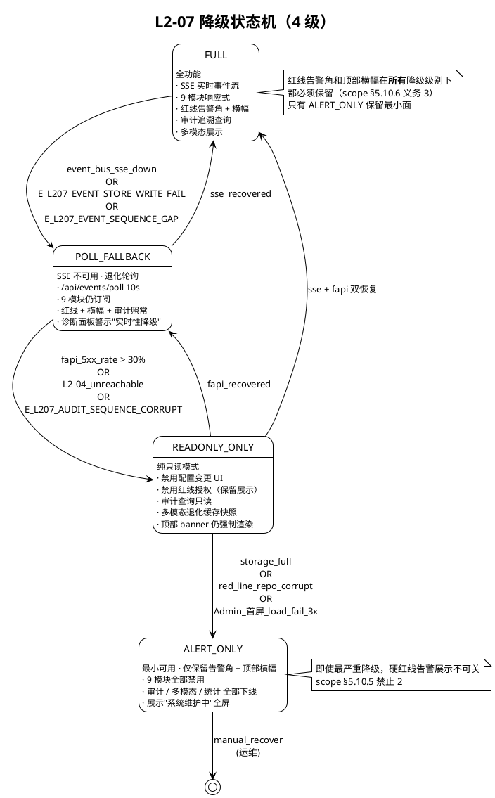

### 11.3 错误码 → 降级级别映射

| 错误码 | 触发的降级级别 | 恢复条件 |
|:---|:---|:---|
| `E_L207_EVENT_SEQUENCE_GAP` | FULL → POLL_FALLBACK | `requestCatchUp` 成功 3 次 |
| `E_L207_EVENT_STORE_WRITE_FAIL` | FULL → POLL_FALLBACK | Pinia store 恢复 |
| `E_L207_AUDIT_SEQUENCE_CORRUPT` | POLL_FALLBACK → READONLY_ONLY | L1-09 修复后手动解除 |
| `E_L207_AUDIT_APPEND_FAIL`(连续 3 次) | FULL → POLL_FALLBACK | 本地 WAL 缓冲清空 |
| `E_L207_BANNER_L201_NOT_READY`(3 次耗尽) | FULL 无降级 · 告警 supervisor | L2-01 恢复 |
| 首屏 load 失败 3 次 | READONLY_ONLY → ALERT_ONLY | 运维手动恢复 |
| `E_L207_DOM_TAMPER_DETECTED`(连续 10 次) | FULL 不降级 · 告警 supervisor | 用户停止篡改 |

### 11.4 降级级别 → 面板可用性矩阵

| 面板 / 能力 | FULL | POLL_FALLBACK | READONLY_ONLY | ALERT_ONLY |
|:---|:---|:---|:---|:---|
| 红线告警角 | ✅ 实时 | ✅ 10s 轮询 | ✅ 只读 | ✅ 最小展示 |
| 顶部红色横幅 | ✅ | ✅ | ✅ | ✅ |
| 9 后台模块浏览 | ✅ | ✅ | ✅ 只读 | ❌ 禁用 |
| 配置变更（IC-L2-07） | ✅ | ✅ | ❌ 禁用 | ❌ 禁用 |
| 红线授权（IC-L2-07） | ✅ | ✅ | ❌ 禁用 | ❌ 禁用 |
| 审计追溯查询 | ✅ | ✅ | ✅ 只读 | ❌ 禁用 |
| 多模态展示 | ✅ | ✅ | ✅ 缓存快照 | ❌ 禁用 |
| 统计分析 | ✅ 30s 刷新 | ✅ 60s 刷新 | ✅ 只读 | ❌ 禁用 |
| 系统诊断 | ✅ | ✅ | ✅ | ✅ 最小探针 |
| Loop 统计（P2） | ✅ | ✅ | ✅ 只读 | ❌ 禁用 |

### 11.5 Fallback Playbook

```yaml
fallback_playbook:
  sse_disconnected:
    - strategy: "switch_to_poll_10s"
    - strategy: "show_banner_实时性降级"
    - strategy: "retry_sse_every_30s"
  l2_04_unreachable:
    - strategy: "disable_intervene_buttons"
    - strategy: "keep_read_panels_alive"
    - strategy: "show_tooltip_配置变更暂不可用"
  audit_corrupt:
    - strategy: "pause_audit_panel"
    - strategy: "alert_supervisor_L1-07"
    - strategy: "requestCatchUp_full_reindex"
  multimodal_timeout:
    - strategy: "show_cached_snapshot"
    - strategy: "retry_once_async"
    - strategy: "fallback_placeholder_if_no_cache"
  dom_tamper_detected_repeatedly:
    - strategy: "log_audit_event"
    - strategy: "rerender_banner"
    - strategy: "escalate_to_supervisor_after_10x"
```

### 11.6 Open Questions（OQ）

- **OQ-L207-01**：POLL_FALLBACK 级别下，9 模块轮询频率如何平衡（30s 是否过慢、10s 是否过重）？需实测事件量。
- **OQ-L207-02**：`dom_tamper_check_interval_ms=100` 在低端设备上会造成 CPU burn 吗？需要 profiler 数据。
- **OQ-L207-03**：硬红线告警角**已解决历史**的 30 天清理策略是否需要"按重要性分层"（critical 的 hard_halt 保留更久）？
- **OQ-L207-04**：多模态缓存的 LRU 阈值 200 MB 是否需要"按项目规模动态调整"（小项目少、大项目多）？
- **OQ-L207-05**：审计追溯查询的 `depth_limit=5` 是否足够（某些老项目追溯链可能 > 5 跳）？若设大会影响 P95 SLO。
- **OQ-L207-06**：SkillCallGraph 用 Vue Flow 渲染 · 当 skill 数量 > 200 时布局性能（dagre）是否卡？需评估 vs `elk` layout。
- **OQ-L207-07**：顶部横幅 `MutationObserver` 与 Vue 的 reactive 系统可能产生 cycle（Vue diff → dom 变 → observer → rerender → ...）· 需确认 tamper 定义不包含"Vue 正常重渲染"。
- **OQ-L207-08**：ALERT_ONLY 级别下，"系统维护中"全屏是否需要给用户"强制 Admin 退出 + 通知其他 tab"的机制？
- **OQ-L207-09**：跨 session 的红线历史是否需要 project 维度聚合（当前按 project_id 分片，跨 session 聚合需额外 store 层）？
- **OQ-L207-10**：统计分析的 30s 周期刷新在"高事件量"（1000 events/min）时可能造成前端卡，是否应"按事件量动态调整"？

---

## §12 性能目标

### 12.1 延迟 SLO（P95）

| 场景 | 目标 | 测量点 |
|:---|:---|:---|
| Admin 首屏打开（13 面板并发初始化） | ≤ 1000 ms P95 | `open_admin_view` start → 渲染完 |
| 9 后台模块切换 | ≤ 300 ms P95 | `switch_module` start → store 切片 ready |
| 硬红线事件到横幅渲染完成 | ≤ 500 ms P95 | SSE 到达 → L2-01 `banner_rendered_at` |
| 硬红线告警声音延迟（Web Audio） | ≤ 100 ms P95 | `play_beep` → 扬声器 |
| 审计追溯查询 · 缓存命中 | ≤ 50 ms P95 | 本地缓存读 |
| 审计追溯查询 · 未命中（IC-18） | ≤ 3000 ms P95 | FAPI → IC-18 → 返回 |
| 多模态内容加载 · 缓存命中 | ≤ 100 ms P95 | 本地缓存读 |
| 多模态内容加载 · 未命中（IC-11） | ≤ 5000 ms P95 | FAPI → IC-11 → L1-08 → 返回 |
| 配置变更二次确认（UI 弹窗 → 提交） | ≤ 1000 ms P95 | 点击 → IC-L2-07 出站 |
| 红线授权全链路（点授权 → hard_halt_resolved 事件） | ≤ 2000 ms P95 | 不含用户思考时间 |
| 审计 markdown 导出 | ≤ 500 ms P95 | `export_audit_markdown` → 浏览器下载 |
| DOM 篡改检测到重渲染 | ≤ 200 ms P95 | `on_banner_dom_mutated` → `push_top_banner` |

### 12.2 吞吐

| 维度 | 目标 |
|:---|:---|
| SSE 事件流分发 | 100 events/sec（单项目）|
| 单 Admin 面并发订阅 | 13 面板（9 后台 + 4 缺口）|
| 并发 Admin session（多浏览器） | 5 session/项目 |
| 审计查询 QPS | 5 QPS（缓存命中为主）|
| 多模态请求 QPS | 3 QPS（缓存命中为主）|
| 统计分析刷新 | 30s 周期（全局不抖动）|

### 12.3 资源

| 资源 | 用量 |
|:---|:---|
| 前端 Pinia store 内存 | 10-50 MB（9 模块切片）|
| 红线告警角 state.json | 典型 < 100 KB · 峰值 1 MB（100 条历史）|
| 审计缓存（7 天 TTL） | 典型 < 50 MB · 上限 1000 条 |
| 多模态缓存 | 上限 200 MB（LRU）|
| 主浏览器进程 CPU | 空闲 < 3% · 高频事件下 < 15% |
| MutationObserver CPU | 空闲 < 1% · 用户操作下 < 5% |
| SSE 长连接 | 1 个/浏览器 tab（复用 L2-03）|

### 12.4 退化边界

- 9 模块并发初始化 > 2s：SLO 违反 → 降级"懒加载模式"（仅初始化当前激活模块）
- 告警角活跃硬红线 > 50 条：折叠显示（只展示最近 10 条 + "查看全部"按钮）
- 审计查询缓存 > 1000 条：LRU 淘汰最旧
- 多模态缓存 > 200 MB：按 `last_accessed_at` LRU 淘汰
- MutationObserver 1 秒内触发 > 100 次：节流到 100ms 间隔 + WARN 日志
- SSE 连接断 30s 不恢复：自动切 POLL_FALLBACK
- 连续 3 次首屏 load 失败：切 ALERT_ONLY

### 12.5 性能测试场景

| 场景 | 规模 | 预期 P95 |
|:---|:---|:---|
| 冷启动 Admin | 0 条历史 | ≤ 1000 ms |
| 热启动 Admin | 50 活跃硬红线 + 100 已解决 | ≤ 1500 ms |
| 高频事件风暴 | 100 events/s 持续 60s | UI 不卡 · 帧率 ≥ 60fps |
| SkillCallGraph 极限 | 200 节点 + 500 边 | 渲染 ≤ 2000 ms |
| 审计追溯 10 跳深度 | 复杂老项目 | ≤ 5000 ms P95 |
| 多模态大图 | 50 KB PNG + 复杂 PlantUML | ≤ 8000 ms |
| DOM 被连续篡改 | 10 次/秒 持续 10s | CPU < 20% · 重渲染延迟 < 200 ms |
| POLL_FALLBACK 模式 | 10s 轮询 | 轮询响应 ≤ 2000 ms |

---

## §13 与 2-prd / 3-2 TDD 的映射表

### 13.1 PRD 映射（2-prd §5.10 L2-07 → 本文档）

| 2-prd §5.10 L2-07 小节 | 本文档小节 | 技术映射 |
|:---|:---|:---|
| §5.10.1 一句话职责 | §1.1 + §2.1 | `AdminModuleCoordinator` 多视图聚合应用服务 |
| §5.10.2 输入（事件流）/ 输出（13 面板） | §3.1 IC-L2-12 + §3.2-3.6 | 5 出站 IC + 1 入站 IC |
| §5.10.3 In-scope 9 后台 + 4 UI 缺口 | §2.2.1-2.2.9 + §2.3-2.8 | 9 Domain Service + 4 Sub-Coordinator |
| §5.10.4 约束（硬红线持久化 / 横幅不可关 / 审计完整 / 配置二次确认 / 入口独立 / 诊断只读）| §10.10 硬锁参数表 + §11.4 可用性矩阵 | 8 个硬锁参数 + 6 个状态机守卫 |
| §5.10.5 🚫 禁止 8 条 | §3 错误码 + §8 状态机守卫 | 双拦截：IC 层（错误码）+ UI 层（禁用）|
| §5.10.6 ✅ 必须 8 条 | §6 算法主链 + §5 时序图 | 算法级驱动（8 个算法）|
| §5.10.7 🔧 可选功能 | §10.9 + feature flag | 可选功能默认关 |
| §5.10.8 IC 契约（5 出 + 1 入） | §3.1-3.6 字段级 schema | 字段级 YAML |
| §5.10.9 Given-When-Then 9 场景 | §5 时序图 + §13.2 TDD 用例 | 9 场景 → 14+ TC |

### 13.2 测试用例（TC-L207-001~TC-L207-060 · 锚点 ≥ 10）

下列 TC 按本 L2 §6 算法 / §8 状态机 / §11 降级 / §12 性能分层，用于 3-2 TDD 蓝图生成。

| TC ID | 用例名 | 映射章节 | Layer |
|:---|:---|:---|:---|
| TC-L207-001 | 正常 · Admin 首屏 13 面板并发初始化 ≤ 1s | §6.7 + §5.5 + §12.1 | integration |
| TC-L207-002 | 正常 · 9 模块切换 store 切片独立 ≤ 300ms | §6.7 + §12.1 | integration |
| TC-L207-003 | 正常 · 硬红线事件到横幅渲染 ≤ 500ms | §6.2 + §5.1 + §12.1 | e2e |
| TC-L207-004 | 正常 · 告警声音 Web Audio 延迟 ≤ 100ms | §6.2 + §12.1 | unit |
| TC-L207-005 | 正常 · 红线授权 authorize_once 全链路 | §6.3 + §5.2 | e2e |
| TC-L207-006 | 正常 · 红线授权 reject | §6.3 | e2e |
| TC-L207-007 | 正常 · 红线授权 whitelist_permanent 二次确认 | §6.3 + §8.1 + §10.6 | integration |
| TC-L207-008 | 正常 · hard_halt_resolved 归档 card + 关横幅 | §6.3 + §8.1 + §8.2 | integration |
| TC-L207-009 | 正常 · 审计追溯查询 · 缓存命中 < 50ms | §6.5 + §12.1 | unit |
| TC-L207-010 | 正常 · 审计追溯查询 · 未命中 P95 ≤ 3s | §6.5 + §5.3 + §12.1 | integration |
| TC-L207-011 | 正常 · 审计 4 层完整（decision/event/supervisor_comment/user_authz） | §2.5 + §7.2 | unit |
| TC-L207-012 | 正常 · 审计 markdown 导出 | §6.5 + §5.3 | integration |
| TC-L207-013 | 正常 · 多模态 code_structure 加载 | §6.6 + §5.4 | integration |
| TC-L207-014 | 正常 · 多模态 architecture_diagram 加载（PlantUML 渲染） | §6.6 + §5.4 | integration |
| TC-L207-015 | 正常 · 多模态 screenshot 加载 | §6.6 + §5.4 | integration |
| TC-L207-016 | 正常 · 多模态缓存命中 content_hash 一致 | §6.6 + §8.4 | unit |
| TC-L207-017 | 正常 · 多模态缓存失效（content_hash 变更） | §6.6 + §8.4 | unit |
| TC-L207-018 | 正常 · 多模态 LRU 淘汰 > 200 MB | §6.6 + §10.5 | integration |
| TC-L207-019 | 正常 · 配置变更二次确认 token | §6 + §8.5 + §5.5 | integration |
| TC-L207-020 | 正常 · 9 模块订阅独立 · 事件风暴 ≥ 60fps | §6.7 + §12.5 | performance |
| TC-L207-021 | 正常 · 诊断探针 run_all 只读 | §6.8 | unit |
| TC-L207-022 | 正常 · 诊断导出 markdown | §6.8 | unit |
| TC-L207-023 | 正常 · SkillCallGraph 200 节点渲染 ≤ 2s | §2.2.7 + §12.5 | performance |
| TC-L207-024 | 正常 · 统计分析 30s 周期刷新 | §2.2.8 + §10.7 | integration |
| TC-L207-025 | 正常 · Loop 触发统计 4 种驱动源聚合 | §2.7 + §7.4 | unit |
| TC-L207-026 | 负向 · 硬红线永不静音（critical） | §10.2 + scope §5.10.5 禁止 1 | integration |
| TC-L207-027 | 负向 · 顶部横幅 dismissible=false 硬锁 | §3.5 + §10.3 + §10.10 | integration |
| TC-L207-028 | 负向 · DOM 篡改检测 + 自动重渲染 ≤ 200ms | §6.4 + §8.2 + §12.1 | integration |
| TC-L207-029 | 负向 · DOM 篡改 10 次/秒连续 · 节流生效 | §6.4 + §12.4 | performance |
| TC-L207-030 | 负向 · 配置变更缺 confirm_token | §3.4 + §8.5 | unit |
| TC-L207-031 | 负向 · whitelist 缺二次确认 | §3.4 + §6.3 | unit |
| TC-L207-032 | 负向 · 授权理由 < 10 字符 | §3.4 + §6.3 | unit |
| TC-L207-033 | 负向 · 诊断面板执行破坏性操作（scope §5.10.5 禁止 4） | §10.8 | unit |
| TC-L207-034 | 负向 · 跨项目 Admin 查询（PM-14 违反） | §3.1 + §4.4 | integration |
| TC-L207-035 | 负向 · 直发 IC-17（代码审查拦截） | §4.4 + scope §5.10.5 禁止 5 | integration |
| TC-L207-036 | 负向 · Admin 入口混入 11 tab | §3 + §4.4 | integration |
| TC-L207-037 | 负向 · 审计 anchor_type 非法 | §3.2 + §8.3 | unit |
| TC-L207-038 | 负向 · 审计 anchor 不存在 | §3.2 + §11.1 | unit |
| TC-L207-039 | 负向 · 多模态 unsupported_type | §3.3 + §11.1 | unit |
| TC-L207-040 | 负向 · L2-04 拒绝（Gate 阻断） | §3.4 + §5.2 | integration |
| TC-L207-041 | 降级 · SSE 断 → POLL_FALLBACK 10s | §11.2 + §11.4 | integration |
| TC-L207-042 | 降级 · FAPI 5xx > 30% → READONLY_ONLY | §11.2 + §11.4 | integration |
| TC-L207-043 | 降级 · red_line_repo 损坏 → ALERT_ONLY | §11.2 | integration |
| TC-L207-044 | 降级 · 降级期间红线告警角 / 横幅仍保留 | §11.4 + scope §5.10.6 义务 3 | integration |
| TC-L207-045 | 降级 · 恢复 sequence 从 ALERT_ONLY → FULL | §11.2 | integration |
| TC-L207-046 | 幂等 · 同 halt_id 重复 push_top_banner | §3.5 + §6.2 | unit |
| TC-L207-047 | 幂等 · event_id 去重（consumed_event_ids） | §6.1 | unit |
| TC-L207-048 | 持久化 · 刷新页面硬红线告警角不丢 | §6.2 + §7.1 | integration |
| TC-L207-049 | 持久化 · 刷新页面顶部横幅重渲染 | §6.7 + §7.1 | integration |
| TC-L207-050 | 持久化 · 审计缓存 7 天 TTL 后 prune | §7.2 + §10.4 | unit |
| TC-L207-051 | 状态机 · RedLineAlertCard 8 转换全覆盖 | §8.1 | integration |
| TC-L207-052 | 状态机 · TopBanner MOUNTING → SHOWN → TAMPERED → SHOWN → DISMISSED | §8.2 | integration |
| TC-L207-053 | 状态机 · AuditTrailQuery 完整路径 | §8.3 | integration |
| TC-L207-054 | 状态机 · MultimodalContent 缓存失效路径 | §8.4 | integration |
| TC-L207-055 | 状态机 · ConfigChange 二次确认路径 | §8.5 | integration |
| TC-L207-056 | 状态机 · DiagProbe 只读硬约束 | §8.6 + §10.8 | integration |
| TC-L207-057 | 审计 · 每 Admin 操作走 IC-09 留痕 | §3.6 + §6.1-6.8 | integration |
| TC-L207-058 | 性能 · Admin 首屏 1000 ms P95 | §12.1 | performance |
| TC-L207-059 | 性能 · 高频事件 100/s 不掉帧 | §12.5 | performance |
| TC-L207-060 | e2e · 完整"进入 Admin → 硬红线事件 → 授权一次 → 横幅消失" | §5.1 + §5.2 | e2e |

### 13.3 生命周期映射

| 阶段 | Admin 侧状态 | 关联事件 | 主要动作 |
|:---|:---|:---|:---|
| 打开 | `adminView.loaded=false` | `L1-10:admin_opened` | 并发初始化 13 面板 |
| 激活 | `currentModule=<module_id>` | `L1-10:admin_module_switched` | 切 store 切片 |
| 硬红线到达 | `activeRedLines.push(card)` | `L1-07:hard_halt` | 播声音 + 推横幅 |
| 用户授权 | `card.state=PENDING_USER` | `L1-10:red_line_authorized` | IC-L2-07 → L2-04 |
| L1-07 解除 | `card.state=RESOLVED` | `L1-07:hard_halt_resolved` | 归档 + 关横幅 |
| 审计查询 | `auditTrail` loaded | `L1-10:audit_queried` | 缓存 + IC-18 |
| 多模态加载 | `multimodalCache.entry` loaded | `L1-10:multimodal_loaded` | 缓存 + IC-11 |
| 配置变更提交 | `configChange.state=SUBMITTED` | `L1-10:config_change_proposed` | IC-L2-07 → L2-04 |
| DOM 被篡改 | `banner.state=TAMPERED` | `L1-10:dom_tamper_detected` | 立即重渲染 |
| 关闭 Admin | `adminView.loaded=false` | - | 解订阅事件流 |

### 13.4 与下游的接口契约（期望）

| 下游 | 期望 |
|:---|:---|
| L2-01 11 tab 主框架 | 接收 IC-L2-11 横幅 · dismissible=false 绝对尊重 · MutationObserver 绑定 |
| L2-03 进度实时流 | 按 13 event_type 前缀订阅 · 稳定推送 · 序号连续 |
| L2-04 用户干预入口 | 接收 IC-L2-07 · 校验 confirmation_token · 翻译成 IC-17 · 返回 intervention_id |
| L2-05 KB 浏览器 | 复用组件（KBAdminCoordinator 内嵌）· 默认 scope=global |
| L1-08 多模态 | 接收 IC-11 · 返回 structured_description · P95 ≤ 5s |
| L1-09 事件总线 | 接收 IC-18（审计查询）· 返回 4 层完整 trail · P95 ≤ 3s |
| L1-09 事件总线 | 接收 IC-09（append_event）· Admin 操作留痕 · hash-chain 完整 |
| L1-07 Supervisor | 推 `L1-07:hard_halt` / `hard_halt_resolved` · 本 L2 是硬红线唯一消费面 |

### 13.5 向 3-2 TDD 的期望

3-2 TDD 蓝图生成器（L1-04/L2-01）应从本文档读取：
- §2 13 个 Domain Service / VO / Repository 定义 → 生成单元测试 stub
- §3 6 IC schema + 12+ 错误码 → 生成 IC 契约测试
- §5 5 张时序图 → 生成 e2e 测试场景
- §6 8 个算法伪代码 → 生成算法测试
- §8 6 个状态机 → 生成状态转换测试
- §10 8 组 YAML 配置 + 硬锁参数表 → 生成配置约束测试
- §11 降级链 4 级 + 错误码映射 → 生成降级测试
- §12 性能 SLO 表 → 生成性能测试用例
- §13.2 TC-L207-001~060 完整锚点 ≥ 10 → 直接用作测试用例映射

---

*— L1 L2-07 · Admin 子管理模块 · Tech Design · depth B (v1.0) · 完结 —*
---
