# L1-10 · 人机协作 UI 能力 · L1 架构文档（tech-solution architecture）

> **版本**：v1.0 · 覆盖 7 个 L2 总体架构 · 不含 L3 实现（代码 / 字段 schema / 路由 / 组件详情 留给各 L2 `tech-design.md`）
> **定位**：HarnessFlow 与用户之间的**唯一交互面 BC-10**——消费 L1-09 事件总线 + 推用户输入回 L1-01 / L1-02；承载现有 UI mock（11 tab + admin 子模块）+ 新增 UI 缺口（Gate 决策 / 决策轨迹 / 红线告警角 / KB 浏览器 / 裁剪档配置 / Admin 管理）。
> **严格遵循**：本文 **不得与** `docs/2-prd/L0/scope.md §5.10` / `docs/2-prd/L1-10 人机协作UI/prd.md` 冲突。如冲突以 PRD 为准。
> **技术栈锁定（修订 2026-04-23）**：FastAPI + Vue 3 + Vite（Dev build · Prod 输出 frontend/dist/ 静态）+ Element Plus + Pinia + vue-router。End User 运行态 **零 Node**（pip install 后直接由 FastAPI StaticFiles 挂预编译资产）。仅贡献者/维护者需要 Node 20+ 做 build。详见 L0/tech-stack §1.4 修订。
> **PM-14 项目上下文硬约束**：**所有 UI 视图（11 主 tab + admin 模块）严格按"当前 project"过滤** —— 用户切换 project 后，task-board / Gate 卡片 / progress stream / KB 浏览器 / 审计查询 / 事件流 全部自动换作用域；V1 单 project 活跃（同时刻一个）；V2+ 支持多 project 挂起 + UI 切换（切换动作是 L2-07 Admin 模块的职责）；Gate 卡片的 `gate_id` 必含 `project_id`。

---

## 0. 撰写进度

- [x] §0 撰写进度 + frontmatter（本节）
- [x] §1 L1-10 定位 + 2-prd §5.10 映射
- [x] §2 DDD 映射（引 L0 BC-10 · Shared Kernel / ACL / PL）
- [x] §3 7 L2 整体架构图（主干图 + 横切响应面 + 渲染分层图 · 3 张 Mermaid）
- [x] §4 前后端技术栈（FastAPI + Vue3 CDN + Element Plus + Mermaid · 引 L0/tech-stack §4）
- [x] §5 P0 时序图（≥ 3 张：Gate 卡片推送+用户 Go / 实时 progress stream / 用户 panic → L1-01）
- [x] §6 11 主 Tab 布局（项目总览 / Gate / 产出物 / 进度 / WBS / 决策流 / 质量 / KB / Retro / 事件 / Admin）
- [x] §7 Admin 9 后台模块（执行引擎 / 执行实例 / KB / Supervisor / Verifier / Subagents / Skills / 统计 / 诊断）
- [x] §8 实时流（SSE / polling 选型 · 降级策略 · 消费延迟 ≤ 2s 工程实现）
- [x] §9 多 project 切换（V2+）
- [x] §10 对外 IC（接收 IC-16 · 发起 IC-17/18 · 调 IC-06/11 · 全 L2 调 IC-09）
- [x] §11 开源调研（Langfuse UI / vue-element-plus-admin / AIGC 前端复用 · 引 L0 §11）
- [x] §12 与 7 L2 分工（DDD 原语分类 + L2 ↔ L3 承接点）
- [x] §13 性能目标（消费延迟 P95 ≤ 2s · tab 切换 P95 ≤ 100ms · 首屏 P95 ≤ 500ms · panic P95 ≤ 300ms · SSE 重连 P95 ≤ 5s · 并发事件 100/s 不卡）
- [x] 附录 A · 关键术语（继承 PRD 附录 A + 技术术语）
- [x] 附录 B · 与 PRD 7 L2 的对应映射表
- [x] 附录 C · 开源项目 GitHub 链接 + License + 处置

---

## 1. L1-10 定位 + 2-prd §5.10 映射

### 1.1 L1-10 在 HarnessFlow 整体架构中的位置

HarnessFlow 是 Claude Code Skill 生态下的「AI 技术项目经理 + 架构师」，它的 10 个 L1 能力通过**事件总线 + IC 契约**松耦合协同。L1-10 的位置：

```
┌──────────────── Control Plane（控制面）────────────────┐
│  L1-01 主 Agent 决策循环（tick + 5 纪律拷问 + 决策调度） │
│  L1-07 Harness 监督（旁路 · 只读 · 4 级干预）           │
└──────────┬─────────────────────────────────┬─────────────┘
           │                                 │
┌──────────▼──── Domain Plane（业务面）──────▼─────────────┐
│  L1-02 项目生命周期（7 阶段 + 4 Gate）                   │
│  L1-03 WBS+WP 拓扑（DAG 调度）                           │
│  L1-04 Quality Loop（TDD + DoD + Verifier）             │
│  L1-06 3 层 KB（Session/Project/Global）                │
└──────────┬─────────────────────────────────┬─────────────┘
           │                                 │
┌──────────▼── Infrastructure Plane（基础设施）▼───────────┐
│  L1-05 Skill 生态 + 子 Agent 调度                        │
│  L1-08 多模态内容处理                                    │
│  L1-09 事件总线 + 韧性 + 审计（单一事实源 · OHS/PL 发布）│
└──────────────────────────────┬──────────────────────────┘
                               │ 订阅事件流 + 推用户意图
                               ▼
┌────────────── Presentation Plane（表现面）──────────────┐
│  L1-10 人机协作 UI（本文 · BC-10）                      │
│   · 唯一人机交互面                                      │
│   · localhost:8765 Web                                  │
│   · 7 个 L2（11 tab 主框架 / Gate 卡 / 实时流 /         │
│     用户干预 / KB 浏览 / 裁剪档 / Admin）               │
└──────────────────────────────────────────────────────────┘
```

**核心职责（一句话）**：把 L1-09 事件总线推上来的**只读事件流** + L1-02 推来的**Gate 决策卡**渲染给用户；收用户**干预意图**（panic / pause / resume / authorize / Go-NoGo / KB 晋升 / 裁剪档选择 / Admin 配置）经 IC-17 推回 L1-01。

### 1.2 2-prd §5.10 映射（逐条锚定）

下表把 PRD §5.10 的每个子节映射到本架构文档的对应章节（不重复写内容，只给跳转锚）：

| scope §5.10 子节 | 映射到本架构章节 | 说明 |
|---|---|---|
| §5.10.1 职责 | §1.1（位置）+ §3（整体图）+ §6（11 tab 落位） | 11 tab + admin + 消费事件总线 + 推意图 |
| §5.10.2 输入/输出 | §3（架构图里给出事件进/意图出两条主干）+ §10（IC 契约清单） | 输入全 L1 事件流；输出只读渲染 + 用户意图推 L1-01 |
| §5.10.3 边界 | §3.3（L2 分工图）+ §9（多 project 边界）+ §12.3（不做清单） | 11 tab + admin + localhost；不做业务逻辑 / 不做 App / 不做多用户 |
| §5.10.4 硬约束（5 条） | §4.6（技术栈约束）+ §8（消费延迟 ≤ 2s 实现）+ §9（单 session 单 project） | 只读事件总线 / Gate 不自动通过 / 硬红线强视觉 / 消费延迟 ≤ 2s / 单 session 单项目 |
| §5.10.5 🚫 禁止行为（6 条） | §12.4（禁止清单固化）+ §13.3（性能禁止项） | 禁改 task-board / 禁替决 Gate / 禁静默跳硬红线 / 禁存凭证 / 禁跨项目混展 / 禁阻塞 L1-01 tick |
| §5.10.6 ✅ 必须义务（6 条） | §5（时序图正向 case）+ §8（SSE 实时流兜底）+ §13（性能目标验证） | ≤2s 消费 / 介入留审计 / 硬红线强视觉 / Gate 阻断 / 每 L1 独立视图 / panic 即 flush |
| §5.10.7 与其他 L1 交互 | §10（IC 契约清单） | 对接 L1-01 / 02 / 03 / 04 / 05 / 06 / 07 / 08 / 09 |

### 1.3 PRD 7 L2 速查

| L2 ID | PRD 名 | 本文主承接章节 |
|---|---|---|
| L2-01 | 11 主 Tab 主框架 + 路由守则 | §3.3 · §6 · §12.1 |
| L2-02 | Gate 决策卡片（推送 + Go/No-Go/Request-change） | §3.3 · §5.1 · §12.1 |
| L2-03 | 进度实时流（event stream 消费与渲染） | §3.3 · §5.2 · §8 · §12.1 |
| L2-04 | 用户干预入口（panic/pause/resume/change_request） | §3.3 · §5.3 · §12.1 |
| L2-05 | KB 浏览器 + 候选晋升 UI | §3.3 · §6.2 · §12.1 |
| L2-06 | 裁剪档配置 UI（完整 / 精简 / 自定义） | §3.3 · §12.1 |
| L2-07 | Admin 子管理模块（9 后台 + 红线告警角 + 审计查询） | §3.3 · §7 · §12.1 |

### 1.4 本文 vs PRD vs L2 tech-design 的分工契约

| 文档 | 主语 | 回答的问题 | 粒度 |
|---|---|---|---|
| **2-prd/L1-10/prd.md** | 产品级 | 7 L2 是什么 / 为什么这么切 / 做什么 / 不做什么 | 产品 |
| **本文** | 技术方案 L1 级 | 7 L2 怎么协同 / 整体技术栈 / 跨 L2 关键时序 / 性能目标 / 开源选型 | 架构 |
| **L2 tech-design.md** | 技术方案 L2 级 | 每 L2 内部组件 / 字段 schema / 路由 / 样式 / 单元测试 | 实现设计 |

---

## 2. DDD 映射（引 L0 BC-10）

### 2.1 BC-10 Bounded Context 速查

L1-10 正式映射为 **BC-10 · Human-Agent Collaboration UI**（引 L0 `ddd-context-map.md` §2.11）：

| DDD 要素 | L1-10 具体值 |
|---|---|
| **Bounded Context 名称** | BC-10 Human-Agent Collaboration UI |
| **一句话定位** | 项目的"总控台"—— 11 Tab + Gate 决策卡 + 实时流 + 干预入口 + KB 浏览器 + 裁剪档 + Admin |
| **聚合根 1** | `UISession`（ui_session_id + active_project_id + active_tab + user_preferences）|
| **聚合根 2** | `GateCard`（card_id + gate_id + artifacts_bundle + required_decisions + user_decision）|
| **聚合根 3** | `InterventionIntent`（intent_id + type + payload + submitted_at + accepted_at）|
| **Shared Kernel（VO）** | `HarnessFlowProjectId`（跨 BC 共享 · PM-14 Root Aggregate Id · 所有聚合根必含） |
| **Published Language（对外发布）** | `user_intervene protocol`（Command schema · BC-10 → BC-01）|
| **ACL（防腐层）** | 浏览器 HTTP / WebSocket / SSE → 翻译为 `InterventionIntent` + `EventStreamSubscription` VO |
| **Conformist（遵从者）** | 浏览器 HTTP / SSE / WebSocket 标准（无法反向影响）|

### 2.2 BC-10 的 DDD 原语分类（7 L2 逐一）

| L2 | DDD 原语 | 核心对象 | 说明 |
|---|---|---|---|
| **L2-01** 11 主 Tab 骨架 | **Application Service**（编排路由）+ **Aggregate Root**: UISession | 持有 UISession 聚合根；不持业务 state，是渲染容器 |
| **L2-02** Gate 决策卡 | **Aggregate Root**: GateCard + **Domain Service**: GateDecisionValidator（评论 ≥ 10 字 · 必填校验）| IC-16 接卡 + 收用户决定 + 委托 L2-04 回 IC-17 |
| **L2-03** 进度实时流 | **Domain Service**: EventStreamSubscriber + **VO**: EventStreamSlice（各 tab store 切片）| 订阅 L1-09 事件总线 · 按 type 前缀分发 · 跨 tab 共享时间轴 |
| **L2-04** 用户干预入口 | **Aggregate Root**: InterventionIntent + **Factory**: InterventionFactory + **Domain Service**: IdempotencyChecker | 唯一出口 · 所有 `write` 经此 · 10s 幂等窗口 · 审计留痕 |
| **L2-05** KB 浏览器 | **Domain Service**: KBQueryService + **VO**: KBViewFilter（kind / scope / context）| 只读 IC-06 + 用户晋升委托 L2-04 |
| **L2-06** 裁剪档 UI | **Domain Service**: ComplianceProfileValidator + **VO**: ComplianceProfile（完整 / 精简 / 自定义）| one-shot 模态 · S1/S2 前 · 自定义档不得违反 L1 硬约束 |
| **L2-07** Admin 子管理 | **Application Service**: AdminModuleCoordinator + 9 子 **Domain Service**（每模块一个）| 承载 9 后台模块 · 红线告警角 · 审计查询 · 多模态展示 |

### 2.3 跨 BC 关系（继承 L0 §3.1 Context Map）

L1-10（BC-10）与其他 9 个 BC 的关系：

| 对方 BC | 关系 | 具体依赖 |
|---|---|---|
| **BC-01** Agent Decision Loop | **Customer-Supplier**（客户推干预 · 供应 Gate 卡） | 经 IC-17 推用户意图（BC-10 → BC-01）· 经 IC-16 接 Gate 卡（BC-01/02 → BC-10） |
| **BC-02** Project Lifecycle | **Customer**（消费 Gate 卡 + stage 事件） | IC-16 push_stage_gate_card · 订阅 `L1-02:stage_*` |
| **BC-06** 3-Tier KB | **Customer**（KB 浏览 + 晋升请求） | IC-06 kb_read · 晋升走 IC-17 → IC-08 |
| **BC-07** Supervision | **Customer**（告警展示） | 订阅 `L1-07:supervisor_*` + `L1-07:hard_halt` |
| **BC-08** Multimodal Content | **Customer**（多模态展示） | IC-11 process_content |
| **BC-09** Resilience & Audit | **Customer（数据）+ Partnership（写审计）** | 订阅事件流（IC-L2-02 → IC-09）· 查审计（IC-18）· 全 L2 经 IC-09 落审计 |
| **BC-03 / BC-04 / BC-05** | **间接 Customer**（通过 BC-09 事件流消费其事件，不直连） | 订阅 `L1-03:wp_*` / `L1-04:verdict` / `L1-05:skill_*` 等前缀 |

### 2.4 Published Language（对外发布协议）

**BC-10 对用户发布**：`user_intervene protocol`（IC-17 的 payload schema · 详见 L2-04 tech-design）

```
InterventionIntent {
  intent_id: ULID,
  project_id: HarnessFlowProjectId,  // Shared Kernel
  type: 'panic' | 'pause' | 'resume' | 'change_request' |
        'clarify' | 'authorize' | 'gate_decision' |
        'kb_promote' | 'set_scale_profile' | 'reset_scale_profile' |
        'admin_config_change',
  payload: <type-specific VO>,
  submitted_at: ISO8601 UTC,
  ui_session_id: str
}
```

**BC-09 对 BC-10 发布**：`append_event schema`（OHS/PL · 全 10 BC 共享 · 见 L0/tech-stack §3.6）—— BC-10 作为消费者遵从者。

### 2.5 为什么 BC-10 作为独立 BC 存在

（引 L0 `ddd-context-map.md` §1.2 + §2.1）：

- **语言不同**：UI 的 ubiquitous language 是 `Tab / GateCard / EventStream / Intervention / ComplianceProfileSelector / AdminModule`，与其他 9 BC 的语言完全不重叠
- **一致性边界不同**：UISession 的一致性边界在"单浏览器 session 单 project"，与 BC-02 的 "ProjectManifest 一致性边界" 不同
- **演进节奏不同**：UI 迭代节奏 ≠ Agent loop 迭代节奏（UI 改色 / 加图标不应触发 L1-01 重跑）
- **技术栈异构**：前端 Vue + 后端 FastAPI · 与其他 BC 的 markdown prompt + Python primitives 技术栈异构

---

## 3. 7 L2 整体架构图

### 3.1 图 A · 主干消费-反馈面（PlantUML · 替换 PRD §3 的 ASCII 版）

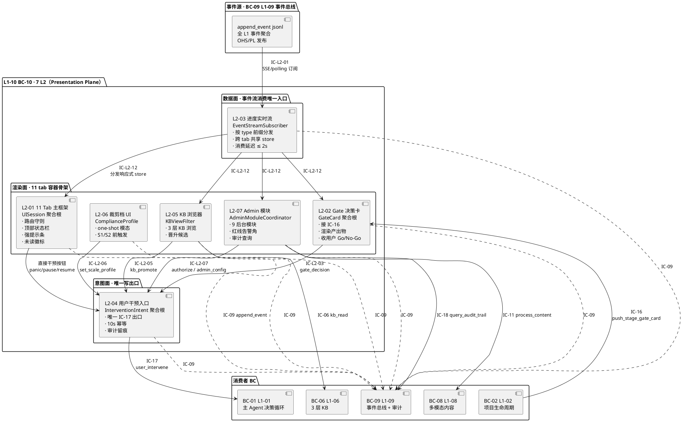

**关键规则（继承 PRD §3，转 PlantUML 格式）**：

1. **L2-03 是数据面唯一入口**：所有 tab 的实时数据都通过它消费事件总线；其他 L2 不直接订阅（特殊场景经 §10 IC 契约授权）
2. **L2-01 是渲染面骨架**：11 tab 路由 + 导航 + 页面生命周期；每 tab 内部业务交给对应 L2（Gate → L2-02 / KB → L2-05 / Admin → L2-07）
3. **L2-04 是用户意图唯一出口**：所有用户"写"动作（授权 / 决定 / 干预）经 L2-04 封装 + 审计 + 推 IC-17；其他 L2 不直接调 IC-17
4. **L2-06 是 one-shot 特殊路径**：只在 S1/S2 前出现一次，完成后即隐藏；不驻留 tab
5. **L2-07 与 11 tab 隔离**：Admin 是独立入口（不混在 11 tab 里），访问权限与项目详情 tab 不同

### 3.2 图 B · 横切响应面（6 类 · PlantUML 分解图）

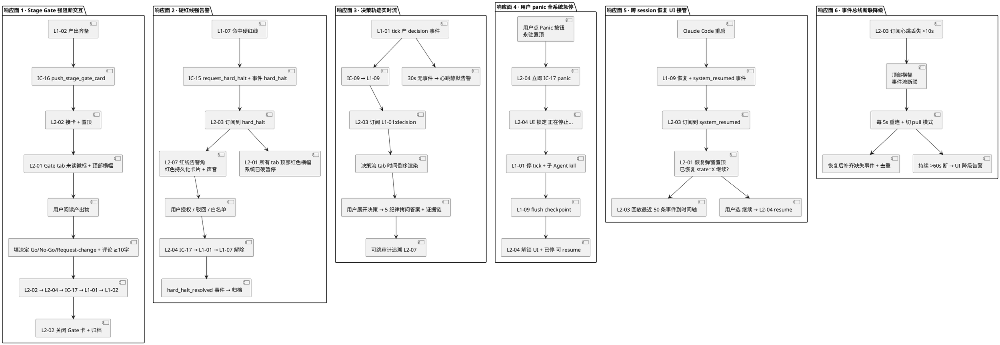

### 3.3 图 C · 前后端渲染分层（技术实现视角）

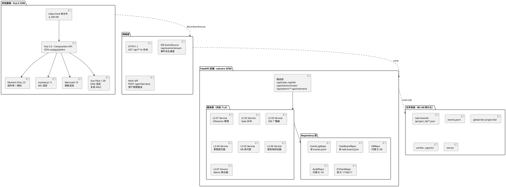

### 3.4 关键架构决策（5 条硬约束）

| # | 决策 | 理由 | 反向论证 |
|---|---|---|---|
| **AD-01** | 数据面 / 渲染面 / 意图面三层严格隔离 | 符合 DDD CQRS 弱读写分离；避免"tab 内部自己发 IC-17"导致审计不一致 | 若某 tab 直发 IC-17：审计链断 + 幂等重复 + panic 不兜底 |
| **AD-02** | L2-03 是事件流唯一订阅点 | 一个 SSE 连接服务所有 tab；否则每 tab 一个订阅 → N × 连接数 + 跨 tab 时间戳漂移 | 若每 tab 独立订阅：浏览器 HTTP/1.1 6 并发上限打爆 + server 压力 ×N |
| **AD-03** | L2-04 是用户意图唯一出口 | 所有 `write` 走审计 + 幂等 + panic 锁 + schema 校验一处实现 | 若各 L2 独立发 IC-17：审计格式漂移 + 幂等逻辑 7 处实现 × 7 套 bug |
| **AD-04** | UI backend 只读（禁写 task-boards / KB / failure-archive） | 继承 L0/tech-stack §4.5 + harnessFlow.md §4.1；single writer = 主 skill；防 UI 异常写坏 task-board | 若 UI 可写：两个写入者竞态 + 权限模型复杂化 + 安全面扩大 |
| **AD-05**（修订 2026-04-23） | **Dev 用 Vite · Prod 出 dist/ 静态 · End User 零 Node** | 原"零 npm 全 CDN"导致 Vue 3 SFC + TS + 组件按需等生态能力用不上 · Dev 效率低；修订后 End User 装 pip + FastAPI StaticFiles 直接挂 dist/ · 依然零 Node；仅贡献者/维护者需 Node 20+ 做 build | 若完全放弃 Vite 回 CDN：160 FE TC 要重写 + 丧失 TS 类型安全 + 手写 3-5 倍 JS 长期维护成本高 |

---

## 4. 前后端技术栈（引 L0/tech-stack §4）

### 4.1 技术栈总览（L1-10 专属切片）

L1-10 严格继承 L0/tech-stack §4 选型，不做独立选型：

```
┌─────────────────────────────────────────────────────────────┐
│ 第 4 层 · UI 层（L0/tech-stack §4 全景）                    │
│                                                             │
│  前端（CDN 加载 · 零 npm install）                          │
│  ├─ Vue 3.4+                          · Composition API    │
│  ├─ Element Plus 2.5+                 · 组件库 + 图标      │
│  ├─ @element-plus/icons-vue           · 图标库             │
│  ├─ marked.js 11+                     · MD 渲染            │
│  ├─ Mermaid 10+                       · 图表渲染            │
│  ├─ Vue Flow 1.30+                    · DAG 可视化（AIGC）│
│  └─ 浏览器原生 fetch + EventSource    · HTTP + SSE         │
│                                                             │
│  后端（FastAPI · 复用 aigc Python 环境）                    │
│  ├─ FastAPI 0.100+                    · async REST + SSE   │
│  ├─ uvicorn 0.23+                     · ASGI server        │
│  ├─ Pydantic 2.0+                     · 请求/响应类型      │
│  ├─ jsonschema 4.0+                   · IC 契约校验        │
│  └─ Python 3.11+ stdlib               · pathlib / asyncio  │
│                                                             │
│  外部 pip 包总数：3（fastapi / uvicorn / jsonschema）       │
│  外部 npm 包总数：0（全 CDN）                                │
└─────────────────────────────────────────────────────────────┘
```

### 4.2 前端技术栈详解（L1-10 特定）

#### 4.2.1 Vue 3 + Composition API

- **版本**：Vue 3.4+（CDN unpkg 或 jsdelivr）
- **Why Vue 而非 React**：AIGC 项目已用 Vue（CLAUDE.md），用户零学习成本；Vue 单文件组件语法更适配"单 index.html"模式
- **Why Composition API 而非 Options API**：`<script setup>` 代码紧凑；reactive store 天然支持跨 tab 共享时间轴
- **状态管理选择**：
  - ❌ 不用 Pinia / Vuex：单 session 单 project 场景简单，`reactive` + `provide/inject` 足够
  - ✅ 跨 tab 共享 store 用 Vue 3 `reactive` 全局单例（见 §8.3）
  - ✅ 可选升级路径：若 V2+ 需复杂 store 再引入 Pinia（CDN）

#### 4.2.2 Element Plus 2.5+

- **Why Element Plus 而非 Ant Design Vue / Naive UI**：
  - 中文文档完备
  - `el-tabs` / `el-card` / `el-dialog` / `el-drawer` / `el-timeline` / `el-tree` 覆盖 L1-10 全部组件需求
  - AIGC 项目已用（组件复用）
- **按需加载**：CDN 全量加载（单文件 ~300 KB gzip）· V2 可拆分按需

#### 4.2.3 Mermaid 10+（图表渲染）

- **用途**：
  - 决策流 tab 渲染决策链路树
  - Admin > 系统诊断 渲染状态机图
  - WBS tab 补充性展示（主 DAG 用 Vue Flow）
- **CDN**：`https://cdn.jsdelivr.net/npm/mermaid@10/dist/mermaid.min.js`
- **继承 L0/tech-stack §8**：HarnessFlow 全面统一用 Mermaid

#### 4.2.4 Vue Flow 1.30+（DAG 可视化）

- **用途**：WBS tab 的 DAG 渲染（WP 节点 + 依赖边 + 关键路径）· Admin > Skills 调用图
- **Why Vue Flow 而非 D3 / ReactFlow**：
  - Vue 原生，无需 React 互操作桥
  - AIGC 项目已集成（CLAUDE.md §AIGC frontend · Vue Flow 已装）→ 组件直接复用
- **性能上限**：≤ 200 节点（L1-10 单项目 WP 通常 < 50 个，完全够用）

#### 4.2.5 marked.js 11+（MD 渲染）

- **用途**：产出物 tab 的 md 文件渲染（4 件套 / PMP / TOGAF / retro）
- **安全**：配合 DOMPurify 做 XSS 防护（从 CDN 加载）
- **性能**：> 10k 行的 md 渲染 P95 < 200ms（浏览器端）

#### 4.2.6 CDN 源选择

| CDN 源 | 优先级 | 国内可用性 | 备用 |
|---|---|---|---|
| `unpkg.com` | 主 | 可用（境外） | jsdelivr |
| `cdn.jsdelivr.net` | 副 | 可用（镜像国内）| bootcdn |
| `bootcdn.net` | 国内备份 | 优（国内镜像）| 本地缓存 |

**降级策略**：若所有 CDN 源都断网（离线工作），L2-07 Admin > 系统诊断展示降级提示 + 建议用户用"离线静态包"（V2 提供）。

### 4.3 后端技术栈详解

#### 4.3.1 FastAPI 0.100+

- **Why FastAPI 而非 Flask / Django**：继承 L0/tech-stack §4.3
  - 原生 async（SSE 广播必需）
  - Pydantic 端到端（IC 契约类型化）
  - aigc 项目已用（用户 Python 环境有）
  - OpenAPI 自动生成（便于 L2 tech-design 引用 schema）
- **路由组织**：
  ```
  /api/tasks             · 任务列表
  /api/tasks/{id}        · 任务详情（task-board + events 聚合）
  /api/tasks/{id}/md     · md 产出物代理（只读）
  /api/kb                · KB 浏览（代理 IC-06）
  /api/admin/{section}   · 9 后台模块数据
  /api/events/stream     · SSE 事件流
  /api/intervene         · 用户意图提交（POST · 转 IC-17）
  /api/audit             · 审计追溯（代理 IC-18）
  /api/content           · 多模态内容（代理 IC-11）
  /api/gate              · Gate 卡队列（L2-02 专用）
  /api/profile           · 裁剪档（L2-06 专用）
  ```

#### 4.3.2 uvicorn 0.23+（ASGI server）

- **端口**：`8765`（继承现有 `/harnessFlow-ui` slash command）
- **workers**：1（单 worker 单进程；不跨进程 state）
- **启动方式**：`uvicorn app.main:app --host 127.0.0.1 --port 8765`（localhost only · 禁公网）

#### 4.3.3 Pydantic 2.0+（类型契约）

- **用途**：
  - 所有 API 请求 / 响应定义
  - IC-16 Gate 卡 + IC-17 user_intervene 的 payload 类型化
  - 与 L0 `schemas/*.json` 对齐（生成器：Pydantic model → JSON Schema）

#### 4.3.4 持久化层访问

- **只读访问**（AD-04 硬约束）：
  - task-board / events / kb / verifier_reports / retros 全部 `pathlib.Path.read_text()` + `json.loads()`
  - 禁 `write_text` / `open(..., 'w')`
  - 禁 `os.remove` / `shutil.rmtree`
- **缓存策略**：
  - V1：`functools.lru_cache` + mtime 失效（5s）
  - V2：若读压力大，上内存 LRU + 主动 invalidate via SSE

### 4.4 零 npm install 硬约束验证

| 检查项 | 方法 | 期望 |
|---|---|---|
| 无 `package.json` | `ls ui/frontend/package.json` | 不存在 |
| 无 `node_modules/` | `ls ui/frontend/node_modules` | 不存在 |
| 无 Vite / webpack 配置 | `ls ui/frontend/vite.config.*` | 不存在 |
| `index.html` 全 CDN script | grep `<script src="https://` | 全部 CDN |
| 冷启动 ≤ 5s | `time uvicorn app.main:app` | ≤ 5s |

### 4.5 运行时依赖图（PlantUML）

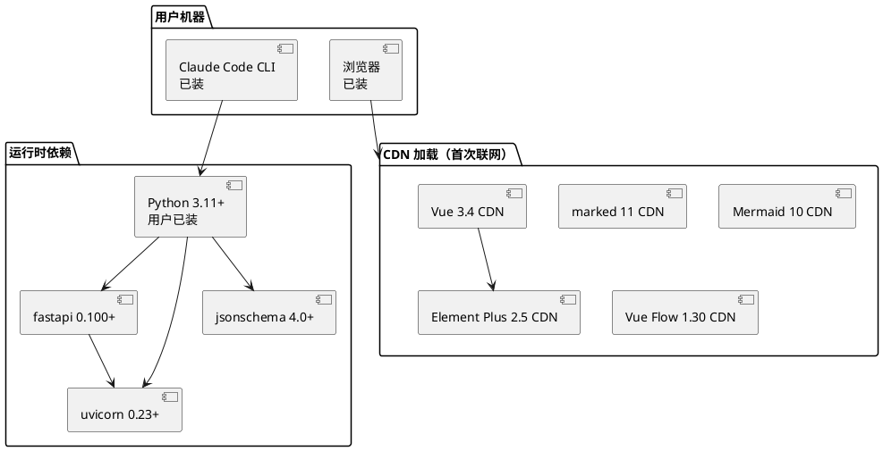

### 4.6 技术栈反向约束清单（硬性 Reject）

继承 L0/tech-stack §1.4 + §4.2 + §4.6：

| Reject 项 | 理由 |
|---|---|
| React / Next.js | 用户不装 Node.js |
| Vite / webpack 构建 | 违反零 npm 原则 |
| Pinia（V1）| 简单场景不需要 |
| Vue Router | 11 tab 用 `v-if` 即可 |
| axios | 浏览器原生 fetch 够用 |
| Tailwind / UnoCSS | 需 JIT 构建 |
| TypeScript（前端）| 无构建链，前端 TS 需 tsc |
| WebSocket | 单向推送用 SSE 更简；双向写通过 `/api/intervene` POST |
| socket.io | 过度封装 + 自带 heartbeat 冗余 |
| GraphQL | REST 对 L1-10 场景够用 |
| Redis / Postgres | 继承 AD-04 零 DB 原则 |
| Docker / Compose | 继承 L0/tech-stack §1.4 零容器 |
| OAuth / JWT | V1 单用户本地，无需鉴权（V2+ 再说）|

---

## 5. P0 时序图（≥ 3 张）

### 5.1 时序图 1 · Stage Gate 卡片推送 + 用户 Go

**场景**：L1-02 在 S2 末产出齐备 → 推 Gate 卡 → 用户 Go → 主 loop 继续。

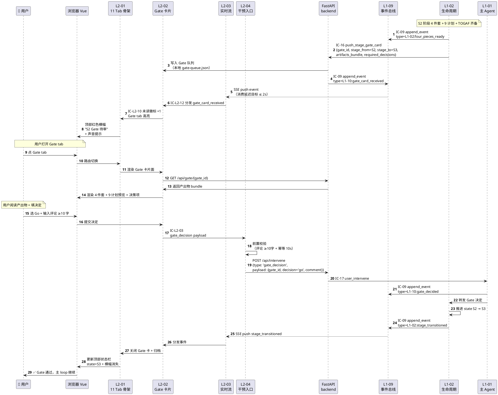

**关键时延断言**：

| 环节 | 目标 | 约束来源 |
|---|---|---|
| IC-16 到达 → Gate tab 未读徽标 | ≤ 500ms | scope §5.10.6 义务 3 |
| 用户点 Go → L1-01 接收 user_intervene | ≤ 1s | 含网络 + L2-04 校验 |
| stage_transitioned → 顶部状态栏更新 | ≤ 2s | scope §5.10.4 硬约束 4 |
| Gate 未决期间 → 所有"前进"按钮 disable | 即时 | scope §5.10.6 义务 4 |

### 5.2 时序图 2 · 实时 progress stream 消费（SSE 主通道）

**场景**：主 loop 持续产决策事件 + WP 状态变更 + Supervisor 打分 → 跨 tab 实时渲染。

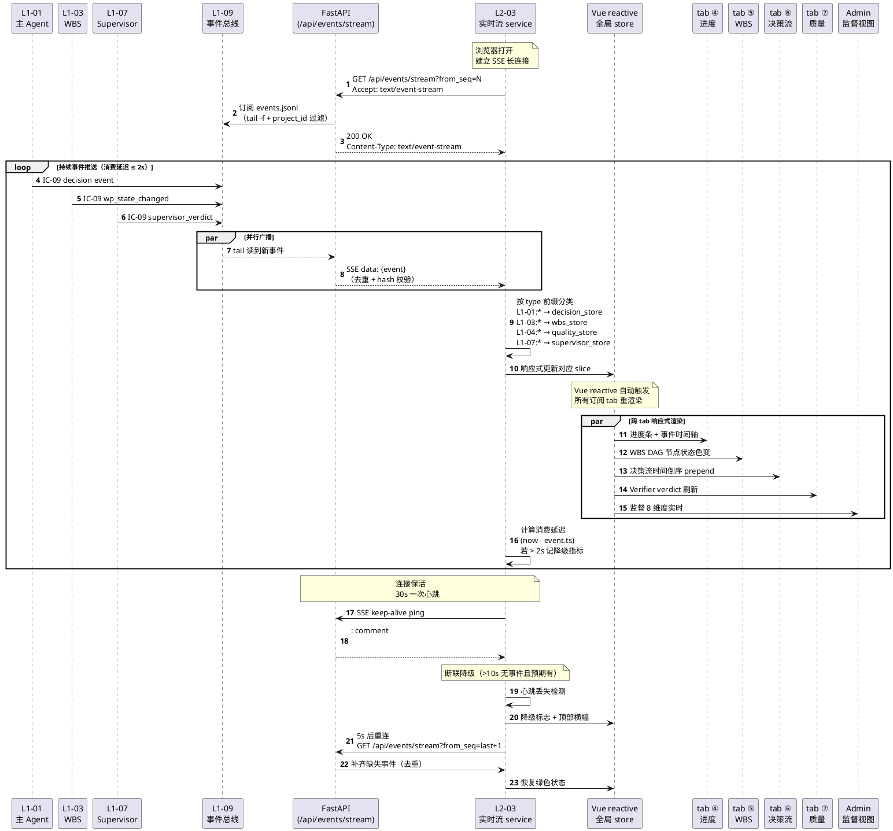

**关键实现点**：

| # | 点 | 实现 |
|---|---|---|
| 1 | SSE 协议 | `Content-Type: text/event-stream` + `data: {...json...}\n\n` |
| 2 | project_id 过滤 | FastAPI 侧按 `UISession.active_project_id` 过滤（跨 project 事件直接丢弃）|
| 3 | 去重 | L2-03 维护已消费 `event_id` Set（LRU 10000）|
| 4 | hash 链校验 | 验证 `event.prev_hash == last_event.hash`，不匹配则触发补齐 |
| 5 | 重连策略 | 指数退避 `[5s, 10s, 20s, 60s]` · 超 60s 进 pull 模式 |
| 6 | 消费延迟监测 | 每条事件 push 到 Store 完成后打点，P95 > 2s 触发降级 |
| 7 | 保活 | 30s 一次 `:\n\n` comment（SSE 规范）|

### 5.3 时序图 3 · 用户 panic → L1-01 全系统急停

**场景**：用户发现异常 → 点全局永驻 panic 按钮 → 立即停全系统 → flush → 等待 resume。

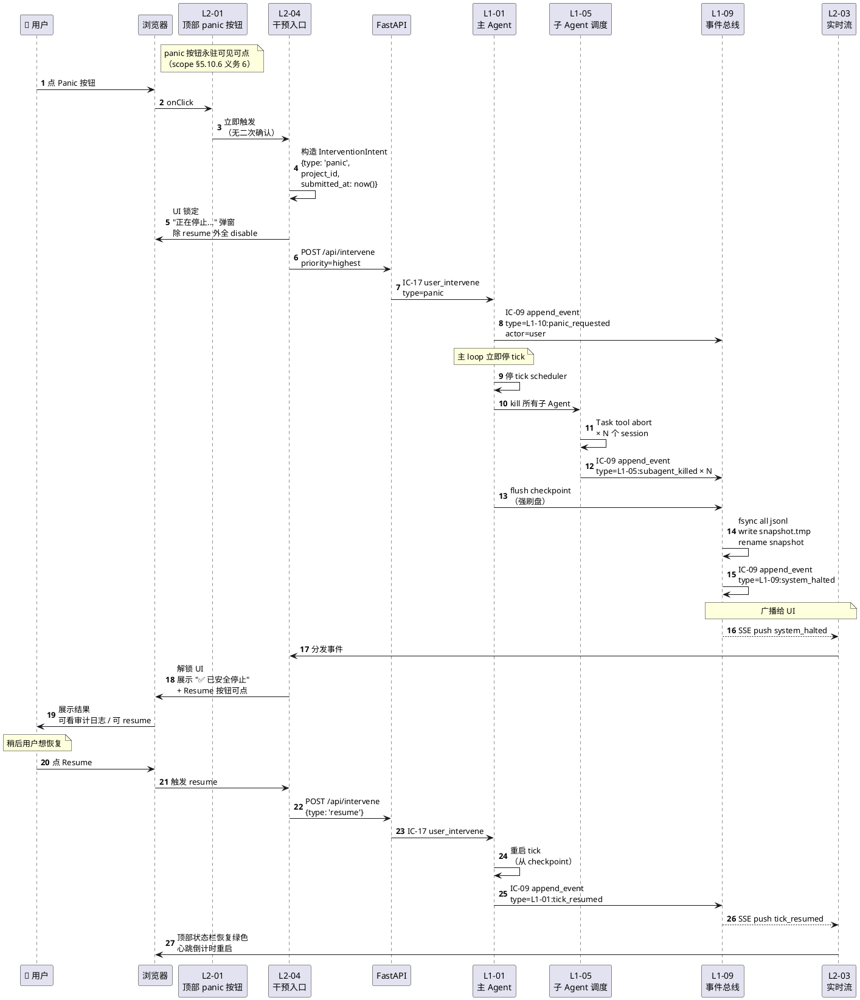

**关键时延断言**：

| 环节 | 目标 | 约束来源 |
|---|---|---|
| 用户点击 → UI 锁定弹窗 | 即时 ≤ 50ms | L2-04 本地 |
| POST /api/intervene → L1-01 接收 | ≤ 200ms | 本地 HTTP |
| L1-01 停 tick → 所有子 Agent killed | ≤ 2s | L1-05 kill 路径 |
| flush checkpoint | ≤ 500ms | SQLite WAL + fsync |
| system_halted → UI 解锁 | ≤ 3s 端到端 | scope §5.10.6 义务 6 |

**硬约束**：

- panic 按钮永远可点，不受 Gate 阻塞 / 裁剪档模态 / 红线告警 等任何 UI 状态影响（AD-01 + scope §5.10.6 义务 6）
- panic 无二次确认（故意设计 · 用户已明确知道这是紧急按钮）
- panic 不阻塞 L1-09 落事件（优先级仅次于 IC-15 hard_halt）

### 5.4 时序图 4 · KB 候选晋升（用户旁路阈值）

**场景**：用户在 KB tab 看到一个 Session 候选 → 决定晋升到 Project。

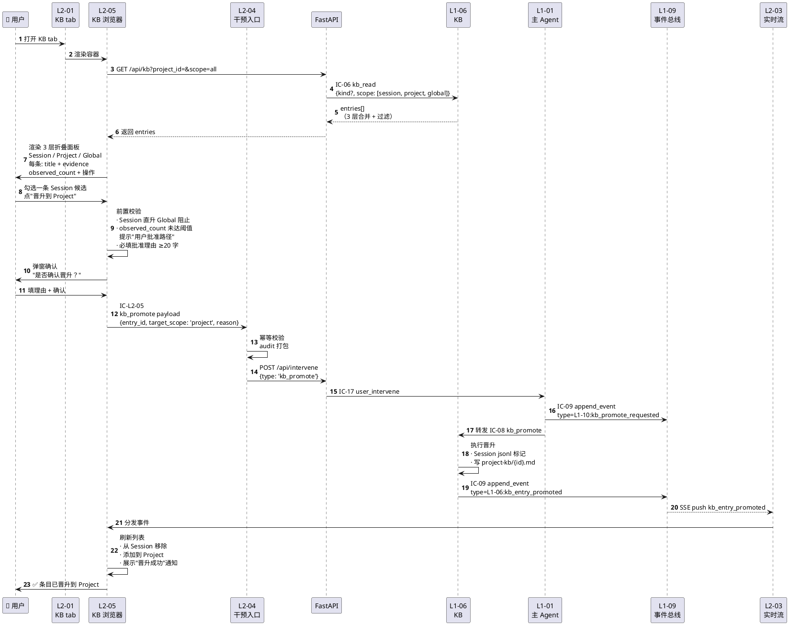

**关键点**：

- L2-05 **不直接调 L1-06**，必须经 L2-04 → IC-17 → L1-01 → L1-06（唯一出口原则 · AD-03）
- 用户批准旁路阈值时 `reason ≥ 20 字` 强制必填（用于审计）
- 晋升事件触发 L2-03 分发 → L2-05 响应式刷新（不用手动 refresh）

### 5.5 时序图 5 · 硬红线告警 + 用户授权（响应面 2 详化）

**场景**：L1-07 命中 IRREVERSIBLE_HALT → UI 强视觉告警 → 用户文字授权。

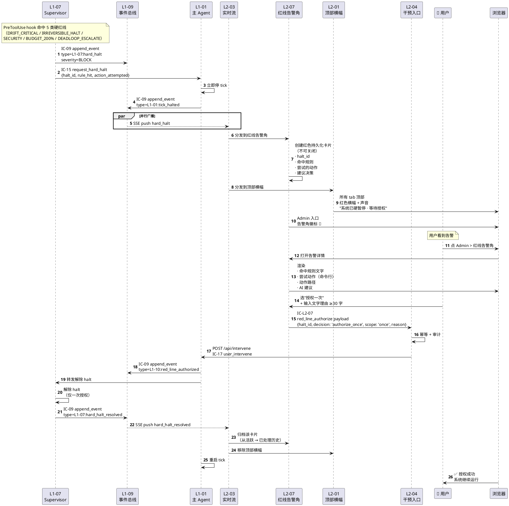

**硬约束**：

- 顶部横幅**不可关闭**（唯一关闭路径是 `hard_halt_resolved` 事件）· scope §5.10.6 义务 3
- 白名单决策需二次确认（不在本时序图，见 L2-07 tech-design）
- 授权理由 ≥ 30 字（强制审计）

### 5.6 时序图 6 · 跨 session 恢复弹窗

**场景**：Claude Code 重启 → L1-09 恢复 → UI 展示恢复弹窗 + 历史回放。

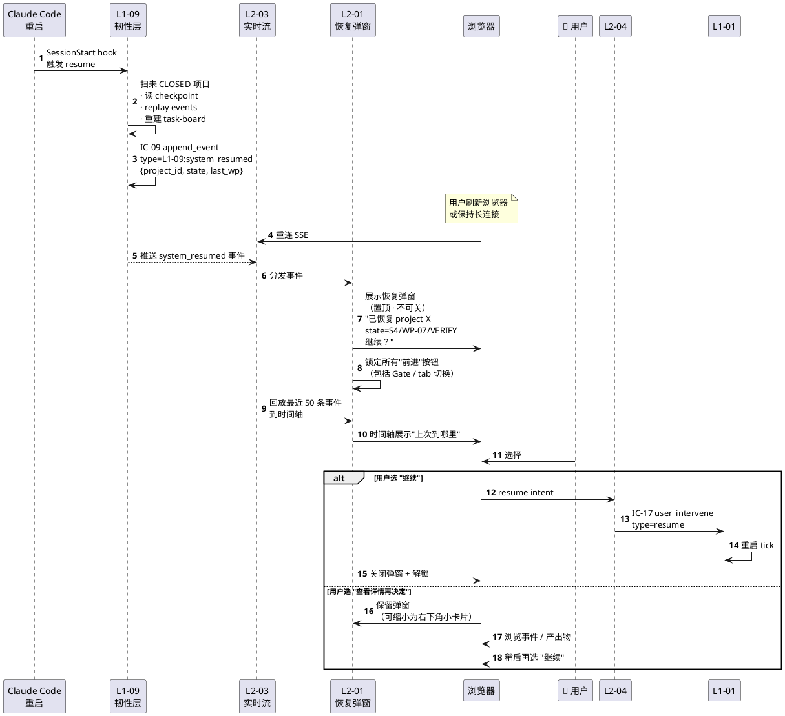

**硬约束**：

- 恢复弹窗未决前，所有"前进"类按钮 disable（scope §5.10.6 义务 5）
- panic 按钮仍可点（AD-01 · 即使恢复弹窗模态也不阻塞 panic）

### 5.7 时序图 7 · 裁剪档配置（S1/S2 前 one-shot）

**场景**：L1-02 进 S1 前 → L2-06 弹模态 → 用户选完整档 → 回 L1-02。

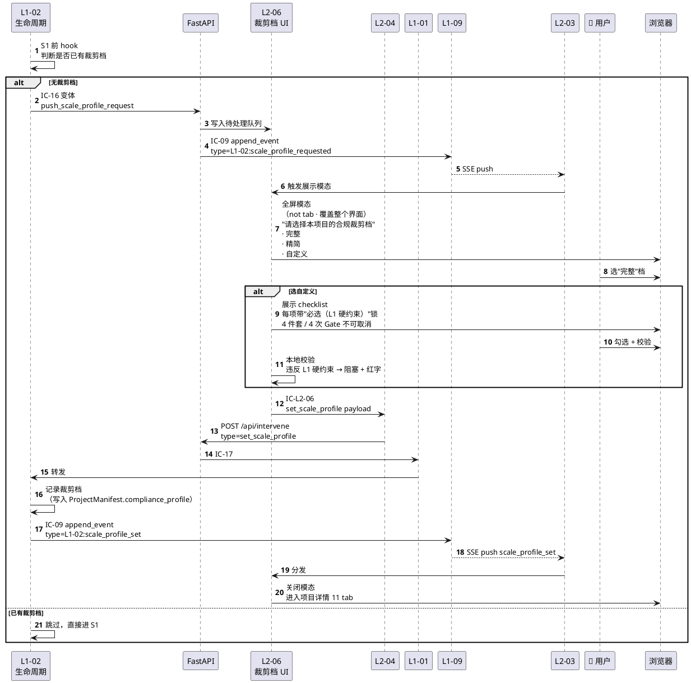

---

## 6. 11 主 Tab 布局

### 6.1 11 Tab 全景一览（承接 PRD §3.3.1 现有清单）

本节把 11 主 tab 从 scope §3.3.1 **产品级**清单固化为**技术方案级**的"数据来源 / 承担 L1 / 渲染组件 / 实时驱动规则"映射表，供 L2-01 `tech-design.md` 直接承接实现。

| # | Tab 名 | 图标 | 数据来源（FastAPI endpoint） | 实时驱动事件前缀 | 主渲染组件 | 承担 L1 | 对应 L2 |
|---|---|---|---|---|---|---|---|
| ① | 项目总览 | 📘 | `/api/tasks/{id}` | `L1-02:stage_*` + `L1-01:tick_*` | Vue custom + el-timeline | L1-02 | L2-01 + L2-03 |
| ② | Gate 决策 | 🚪 | `/api/gate` | `L1-02:stage_*` + `gate_*` | L2-02 GateCard 组件 | L1-02 + L1-01 | **L2-02** |
| ③ | 产出物 | 📂 | `/api/tasks/{id}/artifacts` | `L1-02:artifact_created` | marked.js + el-card | L1-02 | L2-01 + L2-03 |
| ④ | 进度 | ⏱️ | `/api/tasks/{id}/events` | 全事件流 | el-timeline + 心跳指示 | L1-09 | L2-01 + L2-03 |
| ⑤ | WBS | 🔧 | `/api/tasks/{id}/wbs` | `L1-03:wp_*` | Vue Flow DAG | L1-03 | L2-01 + L2-03 |
| ⑥ | 决策流 | 💭 | `/api/tasks/{id}/decisions` | `L1-01:decision` | el-timeline + Mermaid 决策树 | L1-01 | L2-01 + L2-03 |
| ⑦ | 质量 | ✅ | `/api/tasks/{id}/verifier` | `L1-04:*` | el-descriptions + Verifier 报告卡 | L1-04 | L2-01 + L2-03 |
| ⑧ | KB | 📖 | `/api/kb?project_id=` | `L1-06:kb_*` | L2-05 KB 浏览器组件 | L1-06 | **L2-05** |
| ⑨ | Retro | 📦 | `/api/tasks/{id}/retro` | `L1-02:retrospective_ready` | marked.js + retro 专用 | L1-02 + L1-06 | L2-01 + L2-03 |
| ⑩ | 事件 | 📅 | `/api/tasks/{id}/events?all=true` | 全事件流 | el-timeline + 过滤器 | L1-09 | L2-01 + L2-03 |
| ⑪ | Admin 入口 | ⚙️ | N/A（跳转）| 全 Admin 事件 | 跳转到 Admin 独立视图 | 全 L1 | **L2-07** |

### 6.2 每 Tab 的详细技术契约

#### 6.2.1 Tab ① 项目总览

- **布局**：上部"当前 state 大卡片"（state 名 + 进度百分比 + 心跳状态 + Gate 状态）+ 中部"阶段转换时间轴"（S1→S2→S3→... + Gate 判决点）+ 下部"快捷行动面板"（panic / pause / resume 按钮群）
- **数据源**：
  - `task-board.json` 主文件（含 `current_state` / `goal_anchor` / `compliance_profile`）
  - `events.jsonl` 筛选 `L1-02:stage_*` 事件构建时间轴
  - `L1-01:tick_*` 事件驱动心跳状态
- **特殊规则**：
  - 心跳 30s 无 tick → 状态卡标黄（scope §5.1.4 健康心跳）
  - 硬红线未解除 → 整个卡片标红
  - compliance_profile 显示为徽章（完整 / 精简 / 自定义）
- **承担 scope §3.4 P0/P1/P2**：项目目标声明 + 范围声明（P1）

#### 6.2.2 Tab ② Gate 决策

- **布局**：左侧"待审 Gate 队列"（FIFO）+ 右侧"当前 Gate 详情面"（产出物 bundle 预览 + 决策项输入 + 评论区）+ 底部"已归档 Gate 历史"
- **核心组件**：L2-02 的 GateCard 组件（统一渲染 Gate 卡 + 澄清卡片）
- **决策项 UI**：
  - 单选：`Go` / `No-Go` / `Request-change`（el-radio）
  - 评论：el-input textarea，min-length=10（强制）
  - Request-change 勾选产出物 list（el-checkbox-group）+ 修改建议（free-text）
- **阻断语义**：
  - 当 `gate-queue.json` 非空时，L2-01 发出全局事件 `gate_pending`
  - 所有"前进"按钮监听此事件并 disable
  - panic 按钮不受影响
- **承担 scope §3.4 P1**：Stage Gate 待办中心

#### 6.2.3 Tab ③ 产出物

- **布局**：左侧树状导航（按 S1 / S2 / S3 / S7 分组 · 每组内按 4 件套 / PMP / TOGAF / ADR / retro 分类）+ 右侧内容区（marked.js 渲染 md · Mermaid 自动识别 · code block 语法高亮）
- **数据源**：扫描 `docs/2-prd/` + `docs/3-*/` + retro / TDD 蓝图的 md 文件
- **只读模式**：用户不可编辑（写入走主 loop 回修流程）
- **特殊功能**：
  - 按产出物 artifact_id 定位（用于 Gate 卡片的"点产出物"跳转）
  - 支持快速搜索（Element Plus Autocomplete）
- **承担 scope §3.4 P0**：4 件套视图

#### 6.2.4 Tab ④ 进度

- **布局**：事件时间轴（el-timeline · 倒序）+ 顶部进度条（WBS 完成率）+ 左侧过滤器（按 L1-XX / severity / time range）
- **数据源**：全 `events.jsonl`（去 `L1-10:` 前缀 · 只展示业务事件）
- **渐进加载**：初始 100 条，用户滚动加载更多（每次 +100）
- **实时推入**：L2-03 的 `progress_store` slice 响应式更新
- **消费延迟显示**：每条事件下方展示 `(consumed in 1.2s)` · > 2s 时标红

#### 6.2.5 Tab ⑤ WBS

- **布局**：全屏 Vue Flow DAG 渲染（WP 节点 + 依赖边 + 关键路径高亮）+ 右侧详情抽屉（点击 WP 节点展开）
- **节点状态色规范**：
  - ready: 灰
  - running: 蓝 + 脉冲动画
  - done: 绿
  - failed: 红
  - blocked: 黄
- **关键路径**：粗边 + 金色
- **数据源**：
  - `task-board.wbs_topology`
  - 订阅 `L1-03:wp_*` 事件实时更新节点状态
- **承担 scope §3.4 P1**：WBS 拓扑图

#### 6.2.6 Tab ⑥ 决策流

- **布局**：决策流时间倒序（最新在上）+ 每条决策可展开（5 纪律拷问答案 + 触发源 + 命中 KB + Supervisor 点评）
- **单条决策展开视图**：
  - 决策理由（自然语言）
  - 5 纪律拷问答案（5 行）
  - 命中的 KB 条目（可跳 KB tab）
  - 关联的 supervisor_verdict（若有）
  - "审计追溯"按钮（跳 L2-07 · IC-18 查询）
- **数据源**：`L1-01:decision` 事件流 + decision 的 evidence_links 展开
- **承担 scope §3.4 P0**：决策轨迹走廊

#### 6.2.7 Tab ⑦ 质量

- **布局**：上部 "当前 Verifier 报告"卡片（verdict + 三段证据链）+ 中部 "Loop 历史"（scope §3.3.1）+ 下部 "Verifier 证据链"表格（scope §3.3.1）
- **Verifier 报告渲染**：
  - verdict 大标签（PASS / FAIL-L1 / FAIL-L2 / FAIL-L3 / FAIL-L4）
  - 三段证据链：existence（绿勾 / 红叉）+ behavior（同）+ quality（同）
  - DoD 表达式逐项展示 + 求值结果
- **Loop 历史**：每次重试的 verdict + 回退路由
- **承担 scope §3.4 P1**：Quality Loop 实时视图 + Loop 统计

#### 6.2.8 Tab ⑧ KB

- **核心组件**：L2-05 的 KB 浏览器（详见 §5.4 时序图）
- **布局**：三层 tab（Session / Project / Global）+ 每层按 kind 折叠 + 每条目展示 + 晋升按钮
- **特殊规则**：
  - 用户点"晋升到 Project"/"晋升到 Global" → 走 §5.4 时序
  - 条目展开 → 显示完整 evidence + applicable_context
  - 搜索框（标题 + 内容模糊）
- **承担 scope §3.3.1 项目资料库 tab**

#### 6.2.9 Tab ⑨ Retro

- **布局**：retro.md 全文展示（marked.js）+ 左侧 11 项 TOC（Jump-to-section）+ 底部 KB 候选晋升卡片
- **数据源**：`retros/{project_id}/{task_id}.md`
- **只读**：用户可点候选晋升 → 走 §5.4 时序 → 到 KB

#### 6.2.10 Tab ⑩ 事件

- **布局**：同 tab ④ 进度，但**全量事件**（包括 `L1-10:*` 内部审计事件）
- **功能**：
  - 原始 JSON 查看（展开）
  - 复制 event_id
  - 跳审计追溯
- **用途**：高级用户 debug / 审计员溯源

#### 6.2.11 Tab ⑪ Admin 入口

- **不是普通 tab**：点击后跳转到 L2-07 Admin 独立视图（见 §7）
- **视觉**：与其他 10 tab 略有区分（如用 el-divider 隔开）
- **徽标**：
  - 红色数字 = 未处理硬红线数
  - 黄色数字 = 未处理软红线数
  - 无徽标 = 正常

### 6.3 11 Tab 路由机制

继承 L0/tech-stack §4.6 "不用 Vue Router" 决策：

```
<template>
  <el-tabs v-model="activeTab" tab-position="left">
    <el-tab-pane label="📘 项目总览" name="overview">
      <OverviewPanel v-if="activeTab === 'overview'" />
    </el-tab-pane>
    <el-tab-pane label="🚪 Gate" name="gate">
      <GateCardPanel v-if="activeTab === 'gate'" />
    </el-tab-pane>
    ...
  </el-tabs>
</template>
```

**关键规则**：

- 使用 `v-if` 而非 `v-show` 做懒加载（降低首屏渲染开销）
- 每个 tab 组件在 `mounted` 时向 L2-03 声明所需 store 切片（IC-L2-02）
- `unmounted` 时不清 store（跨 tab 切换时数据保留）

### 6.4 顶部全局状态栏（L2-01 永驻）

```
┌────────────────────────────────────────────────────────────────┐
│ HarnessFlow · [项目名 harnessFlow-main] · state=S4 · 💗 tick 12s  │
│                 [panic]  [pause]  [resume]  [?]                  │
└────────────────────────────────────────────────────────────────┘
```

| 区域 | 内容 | 行为 |
|---|---|---|
| 左 | 项目名 | 点击弹出项目切换（V2+）|
| 中 | 当前 state | 实时 + 色 |
| 中 | 心跳倒计时 | 绿色 ≤ 30s · 黄色 > 30s · 红色 > 60s |
| 右 | panic 按钮 | 永驻，任何状态可点 |
| 右 | pause / resume | 互斥（只显示当前可用） |
| 右 | ? | 帮助 |

### 6.5 顶部强提示条（L2-01 非永驻 · 事件触发）

| 事件 | 颜色 | 持续 | 可关闭 |
|---|---|---|---|
| `L1-07:hard_halt` | 🔴 红 | 直到 `hard_halt_resolved` | ❌ |
| `L1-02:stage_waiting_gate` | 🟠 橙 | 直到 Gate 通过 | ❌ |
| `L1-09:system_resumed` | 🟢 绿 + 弹窗 | 直到用户 resume | ❌ |
| `L1-09:degradation_triggered` | 🟡 黄 | 直到 `degradation_cleared` | ❌ |
| `L2-03:sse_disconnected` | 🟡 黄 | 直到重连 | ❌ |
| 一般 INFO | 🔵 蓝 | 5s 自动消失 | ✅ |

---

## 7. Admin 9 后台模块

### 7.1 Admin 9 模块总览（继承 scope §3.3.2）

Admin 是 L2-07 的承载范围，独立于 11 主 tab（不是其中一个 tab）。Admin 入口在 11 tab 列表末尾，点击跳转到**独立视图**。

| # | 模块名 | 核心职责 | 数据来源 | 实时事件 |
|---|---|---|---|---|
| 1 | 执行引擎配置 | 展示 routing-matrix.yaml + state-machine.yaml + 裁剪档定义 | `/api/admin/engine-config` | 低频（人工编辑触发） |
| 2 | 执行实例 | 列所有 harnessFlowProjectId + 每个项目的 state / 事件数 / WP 进度 | `/api/admin/projects` | `L1-02:project_*` |
| 3 | 知识库 | 3 层 KB 聚合视图 + 搜索 + 批量晋升 | `/api/admin/kb` | `L1-06:kb_*` |
| 4 | Harness 监督智能体 | 8 维度监督实时 + 4 级 verdict + 红线告警角 | `/api/admin/supervisor` | `L1-07:*` |
| 5 | Verifier 原语库 | 20+ 原语列表 + 用法 + 版本 + 调用统计 | `/api/admin/primitives` | `L1-04:primitive_*` |
| 6 | Subagents 注册表 | 所有 subagent 定义 + 调用历史 + 失败率 | `/api/admin/subagents` | `L1-05:subagent_*` |
| 7 | Skills 调用图 | 能力点 → skill 候选链 + 调用次数 + 成功率 | `/api/admin/skills` | `L1-05:skill_*` |
| 8 | 统计分析 | 跨 project 聚合：失败类型 Top N / 死循环触发数 / Loop 平均回合 | `/api/admin/stats` | 周期刷新（30s） |
| 9 | 系统诊断 | 事件总线健康 / 磁盘占用 / Python 版本 / CDN 连通性 / SSE 连接数 | `/api/admin/diag` | 周期刷新（10s） |

### 7.2 Admin 模块 1 · 执行引擎配置

- **布局**：三列 tab · routing-matrix（yaml viewer）· state-machine（PlantUML 状态图 + allowed_next 表）· 裁剪档定义
- **只读**：禁用户改（改要走 /harnessFlow 的 skill 更新流程）
- **展示核心**：状态机的 PlantUML 图自动从 `state-machine.yaml` 生成

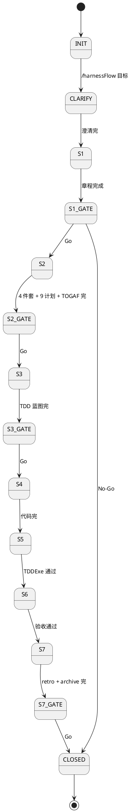

### 7.3 Admin 模块 2 · 执行实例

- **布局**：表格列（project_id / 名 / state / 创建时间 / 事件数 / WP 进度 / 操作）+ 行内操作（查看 / resume / panic / 归档）
- **多 project 切换**：本模块是 V2+ 多 project 切换的入口（见 §9）
- **实时更新**：订阅 `L1-02:project_*`

### 7.4 Admin 模块 3 · 知识库

- **布局**：与 tab ⑧ KB 复用组件（L2-05），但**跨 project 聚合**
- **差异**：
  - 默认展开 Global 层
  - 提供"批量晋升"（选多条 → 一次性发多个 kb_promote）
  - 提供"按失败归档晋升候选"快捷入口（从 failure-archive.jsonl 提取）

### 7.5 Admin 模块 4 · Harness 监督智能体（红线告警角 + 审计追溯）

**这是 L2-07 最重的模块**，融合 scope §3.3.2（原 Harness 监督）+ §3.4 P0（红线告警角）+ §3.4 P1（审计追溯）。

#### 7.5.1 子视图 A · 8 维度监督实时

- **布局**：雷达图（8 维度 · 每维度 0-100 分）+ 下方"近 10 条 verdict 流水"
- **数据源**：`L1-07:supervisor_*` 事件流
- **8 维度**：目标保真度 / 计划对齐 / 真完成质量 / 红线安全 / 进度节奏 / 成本预算 / 重试 Loop / 用户协作

#### 7.5.2 子视图 B · 红线告警角

- **布局**：上部"活跃硬红线卡片"（红色持久化）+ 下部"已处理历史"
- **硬红线卡片字段**：
  - halt_id
  - 命中规则（文字描述）
  - 尝试的动作（命令行）
  - 路径
  - AI 建议决策
  - 操作区（"授权一次" / "驳回" / "加白名单"）
- **承担 scope §3.4 P0** · 红线告警角

#### 7.5.3 子视图 C · 审计追溯查询面板

- **布局**：顶部"锚点输入"（支持 file_line / artifact_id / decision_id）+ 主区"追溯链树状图"（Mermaid）+ 底部"导出为 markdown"
- **树状图结构**：
  - 根节点：查询锚点
  - 5 跳逐层展开：WP → decision → 理由 → 监督点评 → 用户授权
- **IC-18 调用**：L2-07 → FAPI `/api/audit?anchor=` → IC-18 → L1-09
- **承担 scope §3.4 P1** · 审计追溯

### 7.6 Admin 模块 5 · Verifier 原语库

- **布局**：原语列表（左）+ 每原语详情（右）· 详情含：名 / 用法 / 版本 / 源文件 / 调用统计（调用数 / 失败率）
- **数据源**：扫描 `verifier_primitives/` + 事件流 `L1-04:primitive_*`
- **20+ 原语**（继承 L0/tech-stack §5.7）：
  - file_exists / ffprobe_duration / curl_status / pytest_exit_code / oss_head / schema_valid / code_review_verdict / ...

### 7.7 Admin 模块 6 · Subagents 注册表

- **布局**：subagent 列表 + 详情
- **详情字段**：name / persona / mission / expertise / allowed-tools / 调用次数 / 失败率 / 平均耗时
- **已有 subagent**（继承 L0/tech-stack §2.3）：supervisor / verifier / retro-generator / failure-archive-writer + 未来扩展

### 7.8 Admin 模块 7 · Skills 调用图

- **核心**：Vue Flow 可视化 "能力点 → skill 候选链"
- **布局**：上部 DAG + 下部 "skill 调用历史"表格
- **DAG 节点**：能力点（圆）+ skill（方）+ 回退链（虚线）
- **承担 scope §3.4 P2** · Skills 调用图

### 7.9 Admin 模块 8 · 统计分析

- **布局**：多卡片 dashboard · 每卡片一个指标
- **核心指标**：
  - 失败类型 Top 10（从 failure-archive.jsonl）
  - 死循环触发数（按 project 分组）
  - Loop 平均回合（L1-04 重试统计）
  - Stage Gate 用户决策分布（Go / No-Go / Request-change 比例）
  - 每 project 事件总数
  - panic 触发次数
- **周期刷新**：30s（不走 SSE · 统计计算有延迟）

### 7.10 Admin 模块 9 · 系统诊断

- **布局**：系统健康 dashboard
- **核心指标**：
  - 事件总线最新 sequence · fsync 延迟 · hash 链完整性
  - 磁盘占用（events.jsonl / KB / snapshots）
  - Python 版本 · FastAPI 版本 · uvicorn workers
  - CDN 连通性检查（Vue / Element Plus / Mermaid）
  - 当前 SSE 连接数（L2-03 侧）
  - 最近 UI 降级记录
- **周期刷新**：10s

### 7.11 多模态内容展示（L2-07 子功能 · P1）

- **功能**：当某决策 / WP / 事件关联代码结构图 / 架构图 / 截图时，L2-07 通过 IC-11 调 L1-08 获取结构化描述并渲染
- **数据流**：
  ```
  用户点"查看架构图" → L2-07 → FAPI /api/content?artifact_id=
  → IC-11 process_content({type, path, action: 'describe'})
  → L1-08 返回 structured_description
  → L2-07 渲染（如 Mermaid 图 + 节点关系列表）
  ```
- **承担 scope §3.4 P1** · 多模态展示

### 7.12 Admin 入口 vs 11 Tab 的访问权限区分

| 区域 | V1 | V2+ |
|---|---|---|
| 11 主 tab | 所有本地用户 | 所有本地用户 |
| Admin | 所有本地用户（无权限分）| 限 admin 角色（V2+ 若引入多用户）|
| panic 按钮 | 所有可见 UI 位置 | 同 |

---

## 8. 实时流（SSE / polling 选型）

### 8.1 选型结论：SSE 主通道 + polling 降级

- **主通道**：SSE（Server-Sent Events · HTTP/1.1 长连接 · 单向 server→client 推送）
- **降级通道**：polling（每 5s `GET /api/events?from_seq=`）
- **决策理由**：继承 L0/tech-stack §4.6（"未来可能的 SSE 推送"）+ scope §5.10.4 硬约束 4（消费延迟 ≤ 2s）+ scope §5.10.5 禁止 6（不得阻塞 L1-01 tick）

### 8.2 SSE vs WebSocket vs polling 对比

| 维度 | SSE | WebSocket | Long Polling | Short Polling |
|---|---|---|---|---|
| **方向** | 单向（server→client） | 双向 | 半双向 | 半双向 |
| **协议** | HTTP/1.1 原生 | 升级协议（ws:/wss:） | HTTP/1.1 | HTTP/1.1 |
| **浏览器支持** | 原生 EventSource | 原生 WebSocket | fetch | fetch |
| **消费延迟 P95** | < 500ms（事件立即推） | < 100ms | 5-30s（看超时） | 5-10s |
| **自动重连** | 原生 `EventSource.onerror` + retry | 需手写 | 需手写 | 原生每次新请求 |
| **服务端压力** | 低（单连接 tail -f） | 低（同） | 中 | 高 |
| **代理 / 防火墙** | 好（HTTP 标准） | 中（需支持 upgrade） | 好 | 好 |
| **状态管理** | 无状态（连接断即重） | 有状态 | 有状态 | 无状态 |
| **FastAPI 支持** | `StreamingResponse` | `WebSocket` | async handler | sync/async |
| **HarnessFlow 场景适配** | ✅ 最佳（只需 server→client） | 过度（无需 client→server 双向） | 勉强（延迟高） | 差（延迟 + 压力） |

**选型结论**：SSE 主通道，polling 降级。

### 8.3 SSE 实现架构

```
┌──────────────── 浏览器（L2-03 前端部分）────────────────┐
│  const es = new EventSource('/api/events/stream?from_seq=')│
│                                                            │
│  es.onmessage = (e) => {                                  │
│    const event = JSON.parse(e.data);                      │
│    // 去重 + hash 链校验                                  │
│    if (consumed.has(event.event_id)) return;             │
│    if (event.prev_hash !== lastHash) requestCatchUp();   │
│    // 按 type 前缀分发                                    │
│    dispatchToStore(event);                               │
│  };                                                        │
│                                                            │
│  es.onerror = () => scheduleReconnect(); // 指数退避      │
└─────────────────────┬─────────────────────────────────────┘
                      │ HTTP/1.1 GET
                      │ Accept: text/event-stream
                      ▼
┌──────────────── FastAPI /api/events/stream ──────────────┐
│  @app.get('/api/events/stream')                           │
│  async def stream(from_seq: int, project_id: str):        │
│      async def generate():                                 │
│          # project_id 过滤                                 │
│          async for event in events_tail(project_id, from_seq): │
│              yield f"data: {json.dumps(event)}\n\n"      │
│              # 30s 心跳                                    │
│      return StreamingResponse(                             │
│          generate(),                                        │
│          media_type='text/event-stream'                    │
│      )                                                      │
└─────────────────────┬─────────────────────────────────────┘
                      │ tail -f events.jsonl
                      ▼
┌──────────────── L1-09 事件总线（文件系统）────────────────┐
│  task-boards/{project_id}/events.jsonl                    │
│    追加写 · append-only · sequence 单调递增               │
└──────────────────────────────────────────────────────────┘
```

### 8.4 消费延迟 ≤ 2s 的工程实现

**拆解**：事件 `ts` 到 UI 渲染完成的时间预算分配：

| 环节 | 预算 | 实现要点 |
|---|---|---|
| L1-09 落盘（fsync） | 50ms | SQLite WAL 或直接 jsonl append + fsync |
| FAPI tail 读到 | 100ms | `asyncio.sleep(0.05)` 轮询 + inotify（Linux）|
| FAPI → 浏览器（SSE） | 200ms | 本地 loopback 几乎瞬时 |
| 浏览器 JSON parse | 10ms | 原生 |
| 去重 + hash 校验 | 10ms | Set + 字符串比较 |
| 分发到 Store | 20ms | Vue reactive 触发 |
| 渲染 tab DOM | 100-300ms | 响应式依赖该事件的 tab 重渲染 |
| **合计 P95 目标** | **< 800ms** | 留 1.2s 余量给抖动 |

**监测实现**：L2-03 在每条事件渲染完成后打点 `now() - event.ts`，P95 > 1500ms 写入 `L1-10:consume_delay_warning` 事件，L2-07 Admin 诊断模块展示。

### 8.5 断联降级策略（继承 PRD §4 响应面 6）

```
状态机:
  CONNECTED ──(10s 无事件且预期有)──> DEGRADED_CONNECTION_LOST
  DEGRADED_CONNECTION_LOST ──(5s 后)──> RECONNECTING
  RECONNECTING ──(成功)──> CONNECTED (补齐事件)
  RECONNECTING ──(失败 × 3)──> DEGRADED_POLLING_MODE
  DEGRADED_POLLING_MODE ──(持续 60s)──> UI_DEGRADED_WARN_USER
  UI_DEGRADED_WARN_USER ──(恢复)──> CONNECTED
```

**降级阶梯**：

| 阶 | 状态 | UI 表现 | 动作 |
|---|---|---|---|
| 0 | CONNECTED | 正常 | SSE 持续 |
| 1 | DEGRADED_CONNECTION_LOST | 顶部黄色横幅"事件流断联" | 立即重连 |
| 2 | RECONNECTING | 横幅保持 | 指数退避 5s/10s/20s |
| 3 | DEGRADED_POLLING_MODE | 横幅更新"已切换 polling 模式" | 每 5s GET /api/events |
| 4 | UI_DEGRADED_WARN_USER | 横幅变红 "UI 降级 · 建议刷新" | 提示用户 |

**硬约束**：UI 任何降级都**不阻塞 L1-01 tick**（scope §5.10.5 禁止 6 · AD-01）。

### 8.6 为何不用 WebSocket（详细论证）

| 反驳 WebSocket 的理由 | 说明 |
|---|---|
| HarnessFlow 场景是单向推送 | 用户 → 系统 走 POST /api/intervene，不需要保持长连接写入 |
| WebSocket 需升级协议 | 本地开发 OK，但 V2+ 若走 Nginx 反向代理需额外配置 |
| WebSocket 无标准重连 | SSE 的 `retry` 字段和 EventSource 的自动重连更简洁 |
| WebSocket 需额外 heartbeat 协议 | SSE 的 `: comment\n\n` 就是原生心跳 |
| 工程复杂度 | SSE 的 server 侧用 `StreamingResponse` 一个装饰器 ·WebSocket 需 connect/disconnect/message 三种 handler |

### 8.7 SSE 背压与连接上限

| 场景 | 处理 |
|---|---|
| 单浏览器 tab 6 连接上限 | L2-03 用**单 SSE 连接**服务所有 tab（AD-02）· 其他 fetch 请求仍可用 |
| 高频事件（> 100 events/s） | 服务端批量 flush（每 50ms 合并一次 send）|
| 慢速消费者 | 浏览器 close SSE → server 端 generator 自动退出 |
| 服务端崩溃 | 浏览器 onerror → 自动重连 |

---

## 9. 多 project 切换（V2+）

### 9.1 V1 硬约束：单 project 单 session

继承 scope §5.10.4 硬约束 5 + scope §5.10.5 禁止 5：

- **V1**：同一浏览器 session 只能查看一个 project；跨 project 访问拦截 + 友好提示
- **实现**：FastAPI 启动时从 `projects.json`（简单 registry）读取**当前活跃 project**；UISession.active_project_id 锁定该值

### 9.2 V2+ 多 project 切换架构

**目标**：允许用户在同一 UI session 中切换项目，但**同时只激活一个 project**（单 project 活跃仍是硬约束）。

#### 9.2.1 项目 registry 扩展

`projects.json`（由 L1-02 维护）：

```json
{
  "projects": [
    {
      "project_id": "p-harnessflow-main-2026-04-20",
      "name": "harnessFlow 主项目",
      "state": "S4",
      "created_at": "2026-04-20T00:00:00Z",
      "active": true
    },
    {
      "project_id": "p-aiv2-package-1",
      "name": "AIV2 Package 1",
      "state": "S2",
      "created_at": "2026-04-19T00:00:00Z",
      "active": false
    }
  ]
}
```

#### 9.2.2 UI 切换动作流程

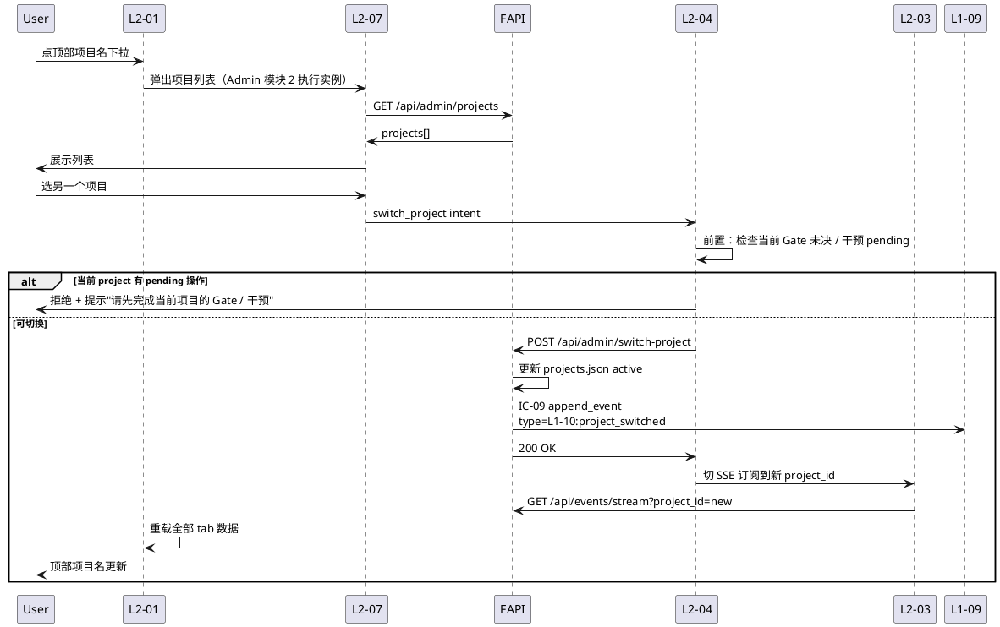

#### 9.2.3 多 project 切换的硬约束

| 约束 | 内容 |
|---|---|
| C-01 | 同时只有一个 project active（PM-14）|
| C-02 | 切换前必须完成当前项目的 pending 操作（Gate 未决 / panic 中 / 干预 submit 中）|
| C-03 | 切换动作本身走 IC-17 user_intervene（审计留痕）|
| C-04 | Gate 卡片的 gate_id 必含 project_id 前缀（避免跨 project 误决）|
| C-05 | SSE 切换时 L2-03 清空旧 store + 重新订阅新 project_id |
| C-06 | panic / pause / resume 动作永远绑定当前 active project |

#### 9.2.4 V2+ 可能的多 project 面板（Dashboard）

- 全项目看板（卡片网格 · 每 project 一个卡片 · 含 state / 进度 / Gate 数 / 最近 activity）
- 跨 project 搜索
- 跨 project 统计（继承 Admin 模块 8）

---

## 10. 对外 IC（接收 IC-16 · 发起 IC-17/18）

### 10.1 IC 契约总览（继承 PRD §15）

L1-10 BC-10 承担的 scope §8.2 IC 契约：

| IC ID | 方向 | 本 L1 落位 L2 | 频率 | 关键约束 |
|---|---|---|---|---|
| **IC-16** push_stage_gate_card | L1-02 → **L1-10** | L2-02 | 每 Gate 一次（4 次/项目） | 未决阻断主 loop |
| **IC-17** user_intervene | **L1-10** → L1-01 | L2-04（唯一出口）| 用户触发 | 审计 + 幂等 10s |
| **IC-18** query_audit_trail | **L1-10** → L1-09 | L2-07 | 用户查询 | 只读 · 4 层追溯完整 |
| **IC-06** kb_read | **L1-10** → L1-06 | L2-05 | 高频 | 只读 + 3 层合并 |
| **IC-11** process_content | **L1-10** → L1-08 | L2-07（多模态） | 中频 | 只读 + 结构化返回 |
| **IC-09** append_event | **L1-10** → L1-09 | 全 7 L2 | 每 UI 动作 | 失败 halt |
| **IC-L2-01** 事件订阅 | **L1-10 L2-03** → L1-09 | L2-03 | 持续 | SSE 长连接 |

### 10.2 IC-16 接收方设计（push_stage_gate_card）

- **Endpoint**：FastAPI 接收 `POST /api/_internal/push_stage_gate_card`（内部 endpoint · 来自主 skill）
- **Payload schema**（继承 PRD §15.1.2）：
  ```
  {
    gate_id: ULID,
    stage_from: 'S1' | 'S2' | 'S3' | 'S7',
    stage_to: 'S2' | 'S3' | 'S4' | 'CLOSED',
    project_id: HarnessFlowProjectId,
    artifacts_bundle: [{artifact_id, path, type, title}],
    required_decisions: [{decision_id, prompt, type: 'single_choice', options}]
  }
  ```
- **响应**：立即 `{accepted: true}`；实际用户决定通过 IC-17 反向推
- **存储**：写入 `/tmp/harnessflow/ui/gate-queue.json`（L2-02 读）

### 10.3 IC-17 发送方设计（user_intervene · 唯一出口）

- **来源**：L2-02 / L2-05 / L2-06 / L2-07 + L2-01（panic 按钮）均委托 L2-04
- **Endpoint**：FAPI `POST /api/intervene` → 转 IC-17 → L1-01
- **Payload schema**（继承 PRD §15.1.1）：
  ```
  {
    type: 'panic' | 'pause' | 'resume' | 'change_request' |
          'clarify' | 'authorize' | 'gate_decision' |
          'kb_promote' | 'set_scale_profile' | 'reset_scale_profile' |
          'admin_config_change',
    project_id: HarnessFlowProjectId,
    payload: <type-specific>,
    ui_session_id: str,
    submitted_at: ISO8601 UTC,
    idempotency_key: hash(type + payload + submitted_at ~ 10s bucket)
  }
  ```
- **幂等**：L2-04 维护 10s 窗口的 `idempotency_key → intent_id` 映射
- **错误处理**：若 IC-17 失败 → L2-04 本地 log + UI 弹错误提示 + 不重试（用户手动决定）

### 10.4 IC-18 调用方设计（query_audit_trail）

- **Endpoint**：FAPI `GET /api/audit?anchor_type=&anchor_id=` → 代理调 IC-18
- **Anchor 类型**：
  - `file_line`: 某行代码存在的追溯链
  - `artifact_id`: 某产出物为何被产生
  - `decision_id`: 某决策的完整链
- **返回**（继承 PRD §15.1.3）：
  ```
  {
    trail: {
      decision: [...],
      event: [...],
      supervisor_comment: [...],
      user_authz: [...]
    }
  }
  ```
- **承接方**：L2-07 渲染为树状图（Mermaid + 可展开节点）

### 10.5 IC-09 全 L2 审计留痕

每个 L2 的关键动作必须经 IC-09 落审计。本 L1 产生的事件前缀：

| Event type | 产生时机 | 承担 L2 |
|---|---|---|
| `L1-10:ui_session_opened` | 用户首次访问 | L2-01 |
| `L1-10:tab_navigated` | tab 切换 | L2-01 |
| `L1-10:gate_card_received` | IC-16 到达 | L2-02 |
| `L1-10:gate_decided` | 用户决 Gate | L2-02 → L2-04 |
| `L1-10:intervention_submitted` | 用户触发干预 | L2-04 |
| `L1-10:kb_promote_requested` | 用户晋升 | L2-05 → L2-04 |
| `L1-10:scale_profile_set` | 用户选裁剪档 | L2-06 → L2-04 |
| `L1-10:admin_config_changed` | Admin 改配置 | L2-07 → L2-04 |
| `L1-10:audit_trail_queried` | 审计查询 | L2-07 |
| `L1-10:cross_project_access_denied` | 跨 project 访问 | L2-01 |
| `L1-10:red_line_authorized` | 红线授权 | L2-07 → L2-04 |
| `L1-10:consume_delay_warning` | 消费延迟 > 1.5s | L2-03 |
| `L1-10:sse_disconnected` | SSE 断联 | L2-03 |
| `L1-10:sse_reconnected` | SSE 重连 | L2-03 |
| `L1-10:panic_requested` | 用户 panic | L2-04 |

### 10.6 L1-10 不承担的 IC（明示）

继承 PRD §15.3，L1-10 **不承担**以下 scope §8 IC：

- IC-01 request_state_transition（L1-02）
- IC-02 get_next_wp（L1-03）
- IC-03 enter_quality_loop（L1-04）
- IC-04 invoke_skill（L1-05）
- IC-05 delegate_subagent（L1-05）
- IC-07 kb_write_session（L1-06 · L1-10 只浏览 + 发起晋升）
- IC-08 kb_promote（L1-06 · L1-10 经 IC-17 间接发起）
- IC-10 replay_from_event（L1-09）
- IC-12 delegate_codebase_onboarding（L1-05）
- IC-13 push_suggestion（L1-07）
- IC-14 push_rollback_route（L1-07）
- IC-15 request_hard_halt（L1-07 · L1-10 只展示告警）
- IC-19 request_wbs_decomposition（L1-02）
- IC-20 delegate_verifier（L1-04）

### 10.7 IC-L2-XX 内部契约（7 L2 间协同 · 12 条）

继承 PRD §6 的 12 条 IC-L2：

| ID | 调用方 | 被调方 | 用途 |
|---|---|---|---|
| IC-L2-01 | L2-03 | L1-09 | 注册 SSE 事件订阅 |
| IC-L2-02 | L2-01 | L2-03 | tab 声明所需 store 切片 |
| IC-L2-03 | L2-02 | L2-04 | Gate 决定委托 |
| IC-L2-04 | L2-04 | L1-01 | IC-17 user_intervene |
| IC-L2-05 | L2-05 | L2-04 | KB 晋升委托 |
| IC-L2-06 | L2-06 | L2-04 | 裁剪档委托 |
| IC-L2-07 | L2-07 | L2-04 | Admin 配置 / 红线授权委托 |
| IC-L2-08 | L2-07 | L1-09 | IC-18 审计追溯 |
| IC-L2-09 | L2-05 | L1-06 | IC-06 kb_read |
| IC-L2-10 | L2-02 | L2-01 | Gate tab 未读 + 横幅 |
| IC-L2-11 | L2-07 | L2-01 | 红线告警 + 顶部横幅 |
| IC-L2-12 | L2-03 | 全 L2-01/02/05/06/07 | 分发事件到 store |

---

## 11. 开源调研（引 L0 §11）

### 11.1 引 L0 §11 + §13

本节 **不重复** L0 `open-source-research.md` §11（Dev UI / 可观测面板）+ §13（Mermaid / 图表工具链）的调研内容，仅摘要关键结论 + 补充 L1-10 特定视角。

**L0 §11 已覆盖**：Langfuse UI / LangSmith UI / vue-element-plus-admin / vue3-element-admin / RuoYi-Vue3 / AIGC VideoForge frontend / Grafana。

**L0 §13 已覆盖**：Mermaid（Adopt）/ PlantUML（Reject）/ Graphviz（Learn）/ D2（Learn · 暂不用）/ Excalidraw（Learn · 未来）/ Vue Flow（Adopt UI）。

### 11.2 UI admin 模板调研（L0 §11 主力）

#### 11.2.1 vue-element-plus-admin（Learn · 骨架参考）

- **GitHub**：https://github.com/kailong321200875/vue-element-plus-admin
- **Stars（2026-04 快照）**：3,500+
- **License**：MIT
- **版本**：Vue 3 + Element Plus + TypeScript + Vite

**本 L1-10 可借鉴的设计**：

| 借鉴点 | 应用到 | 说明 |
|---|---|---|
| 左侧菜单 + 右侧内容区布局 | L2-07 Admin | Admin 9 模块的总布局直接抄此模式 |
| `views/` + `components/` + `api/` 目录约定 | L2-01 前端文件组织 | 虽然 L1-10 是单 index.html，但模块划分可参照 |
| el-table + el-pagination 组合 | Admin 各模块的列表视图 | 直接用 |
| el-form 表单校验模式 | L2-02 Gate 卡片 / L2-06 裁剪档 | 借鉴 |
| el-dialog + el-drawer 弹层模式 | L2-04 干预确认 / 红线授权 | 借鉴 |

**弃用点**：
- 不用 Vite（违反零 npm 原则）
- 不用 TypeScript（前端需 tsc 编译）
- 不用 vue-router（11 tab 用 v-if）

#### 11.2.2 vue3-element-admin（Learn · Composition API 代码风格）

- **GitHub**：vue3-element-admin（midfar）
- **Stars（2026-04）**：4,000+
- **License**：MIT

**本 L1-10 可借鉴**：

- `<script setup>` + `ref / reactive` 代码风格锁定
- Composition API 组件设计模式
- pinia store 模块化（V2+ 升级时参考）

#### 11.2.3 RuoYi-Vue3（Learn · 系统监控模块布局）

- **来源**：https://gitee.com/y_project/RuoYi-Vue3
- **License**：MIT
- **国内广泛使用**

**本 L1-10 可借鉴**：

| 借鉴点 | 应用到 L2-07 Admin 模块 |
|---|---|
| 服务监控布局 | 模块 9 系统诊断 |
| 缓存监控 | 事件总线健康诊断 |
| 操作日志 | 模块 4 · L2-07 审计子视图 |
| 登录日志 | （V2+ 多用户后参考） |
| 调度日志 | 模块 8 统计分析 |

#### 11.2.4 Langfuse UI（Learn · trace 交互模式）

- **Self-host Web UI**
- **License**：MIT

**本 L1-10 可借鉴**：

| 借鉴点 | 应用到 |
|---|---|
| Trace list + 详情左右分栏 | tab ⑥ 决策流 · 点一条决策展开右侧详情 |
| Filter + 搜索多维过滤 | tab ⑩ 事件 · 按 L1-XX / severity / time 过滤 |
| Annotation UI | L2-07 红线告警角的 "授权 / 驳回" 交互 |
| Score 可视化 | L2-07 Admin 模块 4 · 8 维度雷达图 |

**弃用点**：不部署 Langfuse 服务（完全 local-first）。

#### 11.2.5 LangSmith UI（Learn · playground 模式）

- **SaaS 商业化**
- 仅学交互，不用服务

**本 L1-10 可借鉴**：

- Prompt playground 回放 → L1-10 未来可扩展"决策回放"功能
- Dataset management → tab ⑦ 质量的"Loop 历史"

#### 11.2.6 Grafana（Learn · 告警 UI + dashboard）

- **License**：AGPL-3.0（⚠️ 不能引入代码）
- **核心借鉴**：

| 借鉴点 | 应用到 |
|---|---|
| Alert UI（告警配置 + 历史）| L2-07 红线告警角 |
| Dashboard 声明式 JSON | Admin 模块 8 统计分析（V2+ 可配置面板）|

### 11.3 AIGC 前端复用分析（Adopt 组件复用）

**来源**：`/Users/zhongtianyi/work/code/aigc/frontend/`（本工作目录 · Vue 3 + Element Plus + Vite）

**相关度**：HarnessFlow UI 技术栈**完全继承** AIGC · 可直接复用大量组件。

#### 11.3.1 直接复用的组件

| AIGC 组件 | 复用到 L1-10 | 说明 |
|---|---|---|
| **Vue Flow DAG** | tab ⑤ WBS + Admin 模块 7 Skills 调用图 | AIGC 已集成 `@vue-flow/core` · 节点 + 边 + 交互模式完全可复用 |
| **SSE composables** | L2-03 实时流 | AIGC 已有 SSE composables 封装（EventSource + 自动重连）|
| **el-timeline 时间轴** | tab ④ 进度 + tab ⑥ 决策流 + tab ⑩ 事件 | AIGC 的 timeline 组件（含时间 + 用户 + 内容）直接拿 |
| **MD 渲染组件** | tab ③ 产出物 + tab ⑨ Retro | AIGC 的 marked.js + 代码高亮组合 |
| **Mermaid 渲染 Wrapper** | 决策流 tab + Admin 状态机图 | AIGC 已有 `<mermaid-chart>` 组件封装 |
| **Pinia store 模式**（V2+）| L2-03 全局 store | AIGC 的模块化 store 设计 |

#### 11.3.2 复用方式（因 AIGC 是 Vite · L1-10 是 CDN）

| 方式 | 说明 |
|---|---|
| **代码层面 copy** | 把 AIGC 的 Vue SFC 手动转为 CDN 可用的 `.js` 模块（不走 Vite 构建）|
| **CDN 化发布**（V2+）| 把 AIGC 的通用组件抽成独立 npm 包 + 发布到 jsdelivr，L1-10 CDN 引入 |
| **共享 composables**（首选）| AIGC 的 composables（SSE / marked wrapper）改写为纯 JS，通过 `<script type="module">` 加载 |

**首选方式**：V1 手工 copy + 简化；V2+ 评估是否需要独立组件库。

### 11.4 §11 小结 · L1-10 开源调研结论

| 用途 | 工具 / 项目 | 处置 | 证据 |
|---|---|---|---|
| Admin 骨架 | vue-element-plus-admin | Learn（copy 局部代码） | §11.2.1 |
| Composition API 风格 | vue3-element-admin | Learn（代码风格锁定） | §11.2.2 |
| 监控模块布局 | RuoYi-Vue3 | Learn（系统诊断模块） | §11.2.3 |
| Trace 交互 | Langfuse UI | Learn（决策流 UI） | §11.2.4 |
| Alert UI | Grafana | Learn（红线告警角） | §11.2.6 |
| DAG 渲染 | Vue Flow（CDN） | Adopt（WBS + Skills 图）| §11.3.1 · L0 附录 A.12 |
| MD 渲染 | marked.js（CDN） | Adopt（产出物） | L0/tech-stack §4.6 |
| 图表 | Mermaid（CDN） | Adopt（状态机 + 决策树） | L0/tech-stack §8 |
| SSE 实现 | AIGC composables | Adopt（复用） | §11.3.1 |
| Timeline | AIGC 组件 | Adopt（复用） | §11.3.1 |

**下游 L2 tech-design 的 §9 章调研要求**（继承 L0 `open-source-research.md` §14.5）：

- L2-01 ~ L2-07 的 tech-design §9 **必须**引用本文 §11 + L0 §11 · §13
- 仅补充本 L2 特有调研（如 L2-02 可补调研"表单校验库" · L2-05 可补"树形组件库"）
- 不得推翻本文判断（若需改判，先反向改 L0）

---

## 12. 与 7 L2 分工

### 12.1 7 L2 分工总表（DDD + 技术 + 交付）

| L2 | DDD 原语 | 技术实现主体 | 核心 Endpoint | 核心前端组件 | L3 承接文档 |
|---|---|---|---|---|---|
| **L2-01** 11 Tab 骨架 | Application Service + Aggregate Root: UISession | FastAPI 路由总装 + Vue `el-tabs` + 顶部状态栏组件 | `/api/tasks/{id}` | `<AppShell>` + 11 TabPanel + StatusBar + ToastBanner | `L2-01/tech-design.md` |
| **L2-02** Gate 决策卡 | Aggregate Root: GateCard + Domain Service: GateDecisionValidator | Gate queue (JSON 文件) + Vue GateCard 组件 | `/api/gate` + `/api/gate/{id}` | `<GateCardPanel>` + `<ArtifactsPreview>` + `<DecisionForm>` | `L2-02/tech-design.md` |
| **L2-03** 进度实时流 | Domain Service: EventStreamSubscriber + VO: EventStreamSlice | FastAPI StreamingResponse + tail -f + Vue reactive global store | `/api/events/stream` (SSE) + `/api/events?from_seq=` (pull) | `<EventStreamProvider>` + composables `useEventStream` | `L2-03/tech-design.md` |
| **L2-04** 用户干预入口 | Aggregate Root: InterventionIntent + Factory + Domain Service: IdempotencyChecker | FastAPI `/api/intervene` + 前端 composable + 10s 幂等 Map | `/api/intervene` | `<PanicButton>` + `<PauseResumeGroup>` + `<ConfirmDialog>` + composable `useIntervention` | `L2-04/tech-design.md` |
| **L2-05** KB 浏览器 | Domain Service: KBQueryService + VO: KBViewFilter | FastAPI 代理 IC-06 + 3 层 tree 渲染 + 晋升按钮 | `/api/kb?project_id=&scope=&kind=` | `<KBBrowser>` + `<KBEntry>` + `<PromotionButton>` | `L2-05/tech-design.md` |
| **L2-06** 裁剪档 UI | Domain Service: ComplianceProfileValidator + VO: ComplianceProfile | 全屏模态组件 + checklist 校验（前端 + 后端）| `/api/profile` | `<ComplianceProfileModal>` + `<ProfileChecklist>` + `<LockedItem>` | `L2-06/tech-design.md` |
| **L2-07** Admin 子管理 | Application Service: AdminModuleCoordinator + 9 子 Domain Service | 独立 Admin 路由 + 9 模块组件 + 红线告警角 + 审计 + 多模态 | `/api/admin/*`（9 个）| `<AdminShell>` + 9 Module + `<RedLineAlertCorner>` + `<AuditTreeChart>` + `<ContentViewer>` | `L2-07/tech-design.md` |

### 12.2 7 L2 交付边界（严格不越界）

| L2 | 必须做 | 明确不做（推给谁） |
|---|---|---|
| L2-01 | 路由骨架 + 顶部栏 + 强提示条 + 未读徽标 + 跨 project 拦截 | tab 内部业务渲染（对应 L2）· 事件消费（L2-03）· 干预动作（L2-04）· Admin 内部视图（L2-07）|
| L2-02 | Gate 卡接 + 渲染 + 收决定 + 阻断语义 + Gate 历史 | 产出物编辑（只读预览）· 阻塞判定（L1-02）· IC-17 发（L2-04）|
| L2-03 | SSE 订阅 + 去重 + 分发 + 降级 + 消费延迟监测 | tab 内部渲染（各 L2）· 事件持久化（L1-09）· 事件过滤业务规则（各 tab）|
| L2-04 | 意图封装 + 幂等 + 审计 + panic 锁 + schema 校验 + IC-17 发送 | 业务判定（目标 L1）· 各 L2 内部状态管理 |
| L2-05 | KB 浏览 + 过滤 + 晋升请求（委托 L2-04）| KB 写（L1-06）· 晋升执行（L1-06）· 读 KB 业务规则（L1-06）|
| L2-06 | 裁剪档模态渲染 + 前端校验 + 委托提交（L2-04）| 裁剪档执行（L1-02）· 硬约束定义（Goal）|
| L2-07 | 9 Admin 模块 + 红线告警角 + 审计追溯查询 + 多模态展示 | 模块 1 配置的修改（走 /harnessFlow）· 业务逻辑（各 L1）|

### 12.3 L1-10 整体不做清单（严格 out-of-scope）

继承 scope §5.10.3 + §5.10.5：

- ❌ 业务逻辑（决策 / 编排 / 质量判定）→ L1-01/02/03/04
- ❌ 代码 / 测试生成 → L1-04 / L1-05
- ❌ Skill 调用 / 子 Agent 调度 → L1-05
- ❌ KB 写 / 晋升执行 → L1-06
- ❌ 监督判定 / 硬红线拦截 → L1-07
- ❌ 多模态解析本身 → L1-08
- ❌ 事件总线写 / 锁管理 / 审计存储 → L1-09
- ❌ App / 移动端 / 多用户协同 / 国际化（超双语）
- ❌ 登录 / 权限系统（V1 单用户本地）
- ❌ 跨项目数据混展（单项目单 session 硬约束）
- ❌ 替用户做任何 Gate 决定 / 裁剪档选择 / 红线授权

### 12.4 禁止行为清单（PlantUML 黑色名单固化）

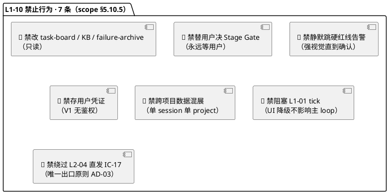

### 12.5 各 L2 承接 L3（tech-design.md）的硬要求

每个 L2 的 `tech-design.md` 必须包含（3-1 技术方案模板）：

| 章节 | 内容 |
|---|---|
| §0 frontmatter + 撰写进度 | 标配 |
| §1 L2 定位 + 本 L1 架构锚点 | 引本文对应 §3.3 + §12.1 |
| §2 内部组件分解 + DDD 细化 | Aggregate / Entity / VO 字段 schema |
| §3 关键时序图（≥ 2 张 Mermaid）| 覆盖 L2 主要交互 |
| §4 数据模型（Pydantic + JSON Schema）| 请求/响应 + 持久化格式 |
| §5 API endpoints 详细规格 | method / path / query / body / response |
| §6 前端组件设计（Vue SFC 结构）| props / emits / slots / composables |
| §7 错误处理 + 降级策略 | 所有失败 branch |
| §8 单元测试 + E2E 测试用例 | Given-When-Then（继承 PRD §X.9）|
| §9 开源最佳实践调研 | 引 L0 §11/13 + 本文 §11 · 补 L2 特有 |
| §10 性能目标 | 引本文 §13 + L2 特定目标 |
| 附录 | 术语 + 与 PRD L2 映射 |

---

## 13. 性能目标

### 13.1 性能目标总览

| # | 场景 | 指标 | 目标（P95）| 硬约束来源 |
|---|---|---|---|---|
| **P-01** | 首屏加载（11 tab 骨架） | 首屏渲染时间 | ≤ 500ms | scope §5.10.6 义务 3 推论 |
| **P-02** | tab 切换 | tab 内容展示时间（预加载）| ≤ 100ms | PRD §8.4 性能约束 |
| **P-03** | 事件消费延迟 | 事件 ts → UI 渲染完成 | ≤ 2000ms | scope §5.10.4 硬约束 4 |
| **P-04** | 事件消费延迟 · 紧急（顶部横幅）| 事件 ts → 横幅显示 | ≤ 500ms | PRD §8.4 + scope §5.10.6 义务 3 |
| **P-05** | panic 响应 | 点击 → UI 锁定弹窗 | ≤ 50ms | scope §5.10.6 义务 6 |
| **P-06** | panic 全系统停 | panic 点击 → `system_halted` 事件 | ≤ 3000ms 端到端 | scope §5.10.6 义务 6 |
| **P-07** | SSE 重连 | 连接断 → 成功重连 | ≤ 5000ms | PRD §4 响应面 6 |
| **P-08** | 并发事件吞吐 | 100 events/s 持续 10s 不卡顿 | tab 切换仍 ≤ 100ms · 心跳仍秒级 | PRD §8.9 性能场景 8 |
| **P-09** | 顶部状态栏心跳更新 | 事件 → 心跳显示 | ≤ 1000ms | PRD §8.4 |
| **P-10** | 强提示条响应 | 事件 → 横幅显示 | ≤ 500ms | PRD §8.4 |
| **P-11** | Gate 卡到达 → 未读徽标 | IC-16 → L2-01 徽标展示 | ≤ 500ms | scope §5.10.6 义务 3 |
| **P-12** | 用户干预提交 | 点击 → 本地 UI 反馈 | ≤ 100ms | UX 基础 |
| **P-13** | 用户干预提交 | 点击 → L1-01 接收 user_intervene | ≤ 1000ms | 含网络 + 校验 |
| **P-14** | MD 渲染 | 10k 行 md → 渲染完成 | ≤ 300ms | marked.js 性能 |
| **P-15** | DAG 渲染 | 50 节点 WBS → 完整渲染 | ≤ 500ms | Vue Flow 性能 |
| **P-16** | Mermaid 渲染 | 20 节点状态机 → 完整渲染 | ≤ 200ms | Mermaid 性能 |
| **P-17** | 审计追溯查询 | IC-18 → 树状图完成 | ≤ 2000ms | 用户可接受体验 |
| **P-18** | KB 浏览加载 | 打开 KB tab → 3 层条目加载完 | ≤ 800ms | IC-06 调用 + 渲染 |
| **P-19** | 9 Admin 模块单页加载 | 点 Admin 模块 → 数据齐 | ≤ 1000ms | 本地 IO 上限 |
| **P-20** | 冷启动（全 L1-10 服务）| `uvicorn` 启动 → 可访问 | ≤ 5000ms | L0/tech-stack §1.6 |

### 13.2 性能预算拆解（关键路径 P-03 事件消费延迟）

详见 §8.4 · 这里补充监测点埋点表：

| 埋点位置 | 指标 | 期望 |
|---|---|---|
| `event.ts` | 事件产生时间戳 | 由 L1-09 写入 |
| `server_read_ts` | FAPI tail 读到事件时间 | L1-09 落盘 + 50ms |
| `server_push_ts` | FAPI SSE 发出时间 | +100ms |
| `client_receive_ts` | 浏览器 onmessage 时间 | +200ms |
| `store_updated_ts` | reactive store 更新完成 | +30ms |
| `dom_rendered_ts` | Vue 响应式重渲染完成 | +100-300ms |

**L2-03 埋点埋在** `dom_rendered_ts` · 用 `requestIdleCallback` 回调触发。

### 13.3 性能禁止项（硬红线）

| 禁止 | 场景 |
|---|---|
| ❌ L1-10 慢请求阻塞 L1-01 tick | 继承 scope §5.10.5 禁止 6；所有 L1-10 backend 调用必 **async + timeout** |
| ❌ UI 降级触发主 skill 停机 | UI 侧任何降级不写 failure-archive / 不调 L1-07 升级 |
| ❌ 长事务占文件锁 | L1-10 backend 读文件用 `read_text()` 一次性读 + close · 不长持 file handle |
| ❌ 轮询频率过高 | polling 降级最快 5s · 不得 < 1s（避免 DOS 本机）|
| ❌ 内存泄漏 | reactive store 必须 bounded（事件 store ≤ 5000 条 · LRU 清理）|
| ❌ 单 SSE 连接超长时间 | 6h 强制 reconnect · 避免资源泄漏 |

### 13.4 性能测试策略

| 测试类型 | 工具 | 覆盖场景 |
|---|---|---|
| **单元性能** | pytest-benchmark | Event parse / JSON 序列化 / hash 校验 |
| **E2E 性能** | Playwright + `performance.now()` | 首屏 / tab 切换 / panic |
| **并发事件** | Python 脚本生成 100 events/s | P-08 场景 |
| **SSE 断联** | 注入网络故障（proxy）| P-07 重连 |
| **MD / DAG / Mermaid** | 人工 + Playwright | P-14/15/16 |

### 13.5 性能监测实现

L1-10 自监测数据通过 **Admin 模块 9 系统诊断** 展示：

- 最近 10 次 SSE 断联时长
- 最近 100 条事件的消费延迟分布（P50 / P95 / P99）
- 当前打开的 SSE 连接数
- 浏览器 Performance API 数据（FCP / LCP / CLS）
- CDN 加载时间（首次 + 缓存命中）

---

## 附录 A · 关键术语（继承 PRD 附录 A + 技术术语）

### A.1 继承 PRD 附录 A 的业务术语

完整业务术语表参见 [`docs/2-prd/L1-10 人机协作UI/prd.md` 附录 A](../../2-prd/L1-10%20人机协作UI/prd.md#附录-a-术语l1-10-本地)，含：11 主 tab / Admin 子模块 / UI 缺口 / Gate 决策卡片 / 澄清卡片 / user_intervene / panic / 红线告警角 / 硬红线 / 软红线 / 单项目单 session / 消费延迟 / 事件 type 前缀映射 / store 切片 / 跨 tab 共享时间轴 / 断联降级 / 裁剪档 / 必选项锁定 / 候选晋升 / 审计追溯 / 多模态展示 / 幂等窗口 / 委托契约。

### A.2 本文新增技术术语

| 术语 | 含义 | 首次出现 |
|---|---|---|
| **BC-10** | Bounded Context 10 · Human-Agent Collaboration UI（DDD 映射） | §2.1 |
| **Shared Kernel** | 全 BC 共享的值对象（HarnessFlowProjectId） | §2.1 |
| **OHS/PL** | Open Host Service / Published Language（DDD Context Map 关系） | §2.1 |
| **ACL** | Anti-Corruption Layer（防腐层 · DDD）| §2.1 |
| **AD-01..AD-05** | 架构决策（Architecture Decision）编号 | §3.4 |
| **SSE** | Server-Sent Events · HTTP/1.1 单向 server→client 推送 | §8 |
| **EventSource** | 浏览器原生 SSE API | §8.3 |
| **StreamingResponse** | FastAPI 的 SSE 响应封装 | §8.3 |
| **reactive store** | Vue 3 响应式全局 store（跨 tab 共享） | §3.3 |
| **store slice** | store 切片 · 按事件 type 前缀分组的子 store | §3.3 |
| **idempotency_key** | L2-04 幂等键（hash(type + payload + 10s bucket)） | §10.3 |
| **tab 未读徽标** | Gate / 告警 tab 的红色数字标识 | §6.5 |
| **顶部强提示条** | L2-01 非永驻 · 事件触发的顶部横幅 | §6.5 |
| **panic 永驻** | panic 按钮在任何 UI 状态下都可点击的硬约束 | §5.3 |
| **消费延迟** | 事件 ts 到 UI 渲染完成的时长（目标 P95 ≤ 2s）| §13.1 |
| **降级阶梯** | SSE 断联时的 5 级降级策略 | §8.5 |
| **P-01..P-20** | 性能目标编号 | §13.1 |
| **Aggregate Root** | DDD 聚合根（UISession / GateCard / InterventionIntent）| §2.1 |
| **DDD 原语** | Aggregate / Entity / VO / Domain Service / Application Service | §12.1 |
| **one-shot 模态** | 只出现一次的全屏模态（L2-06 裁剪档）| §5.7 |
| **唯一出口原则** | 所有 UI 侧 write 必经 L2-04 的架构约束（AD-03）| §3.4 |
| **CDN 降级包** | V2+ 规划的离线静态包，用于所有 CDN 断网时 | §4.2.6 |

### A.3 缩写表

| 缩写 | 全称 |
|---|---|
| SSE | Server-Sent Events |
| CDN | Content Delivery Network |
| SFC | Single-File Component（Vue） |
| DAG | Directed Acyclic Graph |
| DDD | Domain-Driven Design |
| BC | Bounded Context |
| VO | Value Object |
| OHS/PL | Open Host Service / Published Language |
| ACL | Anti-Corruption Layer |
| IC | Integration Contract |
| FAPI | FastAPI |
| KB | Knowledge Base |
| WP | Work Package |
| WBS | Work Breakdown Structure |
| DoD | Definition of Done |
| ULID | Universally Unique Lexicographically Sortable Identifier |
| LRU | Least Recently Used |
| FCP | First Contentful Paint |
| LCP | Largest Contentful Paint |
| CLS | Cumulative Layout Shift |

---

## 附录 B · 与 PRD 7 L2 的对应映射表

### B.1 PRD L2 ↔ 本文章节 ↔ L3 承接

| PRD L2 | PRD 章节 | 本文主承接 | L3 tech-design |
|---|---|---|---|
| **L2-01** 11 主 Tab 主框架 + 路由守则 | PRD §8 | §3.3 图 A · §6 全节 · §12.1 | `L2-01-11-main-tab/tech-design.md` |
| **L2-02** Gate 决策卡片 | PRD §9 | §3.3 图 A · §5.1 时序图 1 · §6.2.2 · §12.1 | `L2-02-gate-card/tech-design.md` |
| **L2-03** 进度实时流 | PRD §10 | §3.3 图 A · §5.2 时序图 2 · §8 全节 · §12.1 | `L2-03-progress-stream/tech-design.md` |
| **L2-04** 用户干预入口 | PRD §11 | §3.3 图 A · §5.3 时序图 3 · §10.3 · §12.1 | `L2-04-user-intervention/tech-design.md` |
| **L2-05** KB 浏览器 + 候选晋升 | PRD §12 | §3.3 图 A · §5.4 时序图 4 · §6.2.8 · §12.1 | `L2-05-kb-browser/tech-design.md` |
| **L2-06** 裁剪档配置 UI | PRD §13 | §3.3 图 A · §5.7 时序图 7 · §12.1 | `L2-06-compliance-profile/tech-design.md` |
| **L2-07** Admin 子管理模块 | PRD §14 | §3.3 图 A · §5.5 时序图 5 · §7 全节 · §12.1 | `L2-07-admin-module/tech-design.md` |

### B.2 PRD 6 横切响应面 ↔ 本文

| PRD §4 响应面 | 本文承接 |
|---|---|
| 响应面 1 · Stage Gate 强阻断 | §3.2 图 B R1 + §5.1 时序图 1 + §6.2.2 |
| 响应面 2 · 硬红线强告警 | §3.2 图 B R2 + §5.5 时序图 5 + §7.5.2 |
| 响应面 3 · 决策轨迹实时流 | §3.2 图 B R3 + §5.2 时序图 2 + §6.2.6 |
| 响应面 4 · 用户 panic 全系统急停 | §3.2 图 B R4 + §5.3 时序图 3 |
| 响应面 5 · 跨 session 恢复 UI 接管 | §3.2 图 B R5 + §5.6 时序图 6 |
| 响应面 6 · 事件总线断联降级 | §3.2 图 B R6 + §8.5 降级阶梯 |

### B.3 PRD §5 业务流程 10 条 ↔ 本文

| PRD 流程 | 本文时序图 / 章节 |
|---|---|
| 流 A · 用户首次进入 UI | §3.3 图 C + §6.3 路由机制（tab 初始化） |
| 流 B · Stage Gate 推送与决策 | §5.1 时序图 1（全流程） |
| 流 C · 事件实时流消费 | §5.2 时序图 2 + §8 |
| 流 D · 用户干预 | §5.3 时序图 3（panic）+ §10.3（其他类型） |
| 流 E · KB 浏览 + 用户晋升 | §5.4 时序图 4 |
| 流 F · 裁剪档选择 | §5.7 时序图 7 |
| 流 G · 硬红线告警与授权 | §5.5 时序图 5 |
| 流 H · 审计追溯查询 | §7.5.3（L2-07 子视图 C）+ §10.4 |
| 流 I · 用户澄清请求 | §5.1（通用 IC-16 渲染路径）|
| 流 J · 网络/API 降级 | §8.5 降级阶梯 |

### B.4 PRD §6 IC-L2 12 条 ↔ 本文 §10.7

完整 12 条见 §10.7（与 PRD §6 一一对应，不重复）。

---

## 附录 C · 开源项目清单（L1-10 相关快照 · 2026-04-20）

### C.1 直接复用（Adopt · CDN 加载）

| 项目 | URL | Stars | License | 活跃度 | 用途 |
|---|---|---|---|---|---|
| Vue 3 | https://github.com/vuejs/core | 46,000+ | MIT | 极活跃 | 前端框架 |
| Element Plus | https://github.com/element-plus/element-plus | 25,000+ | MIT | 极活跃 | 组件库 |
| Mermaid | https://github.com/mermaid-js/mermaid | 78,000+ | MIT | 极活跃 | 图表渲染 |
| marked.js | https://github.com/markedjs/marked | 33,000+ | MIT | 极活跃 | MD 渲染 |
| Vue Flow | https://github.com/bcakmakoglu/vue-flow | 4,000+ | MIT | 活跃 | DAG 可视化 |
| FastAPI | https://github.com/tiangolo/fastapi | 78,000+ | MIT | 极活跃 | 后端框架 |
| uvicorn | https://github.com/encode/uvicorn | 8,500+ | BSD-3 | 极活跃 | ASGI server |
| Pydantic | https://github.com/pydantic/pydantic | 22,000+ | MIT | 极活跃 | 类型契约 |

### C.2 参考学习（Learn · 不引入代码）

| 项目 | URL | Stars | License | 用途 |
|---|---|---|---|---|
| vue-element-plus-admin | https://github.com/kailong321200875/vue-element-plus-admin | 3,500+ | MIT | Admin 骨架（L2-07）|
| vue3-element-admin | midfar | 4,000+ | MIT | Composition API 风格 |
| RuoYi-Vue3 | https://gitee.com/y_project/RuoYi-Vue3 | - | MIT | 系统监控布局 |
| Langfuse | https://github.com/langfuse/langfuse | 19,000+ | MIT | Trace UI（L2-07）|
| LangSmith | smith.langchain.com | - | 商业 | Playground 模式（未来）|
| Grafana | https://github.com/grafana/grafana | 65,000+ | AGPL-3.0 | Alert UI（L2-07）|

### C.3 明确不用（Reject · L1-10 范围内）

| 项目 | Reject 理由 |
|---|---|
| React + Next.js | 用户不装 Node · 违反零 npm |
| Nuxt | 同上 |
| Vite / webpack | 违反零 npm |
| TypeScript（前端）| 需 tsc 编译 · 违反零 npm |
| Pinia | V1 用 reactive 足够（V2+ 可升级）|
| Vue Router | 11 tab 用 v-if 即可 |
| axios | fetch 原生即可 |
| Tailwind | 需 JIT 构建 |
| WebSocket | 场景不需要双向 |
| socket.io | 过度封装 |
| GraphQL | REST 够用 |

### C.4 AIGC 内部项目复用

- **来源**：`/Users/zhongtianyi/work/code/aigc/frontend/`
- **复用组件**：Vue Flow 封装 · SSE composables · el-timeline 定制 · marked.js wrapper · Mermaid wrapper · Pinia store 模式（V2+）
- **复用方式**：V1 手工 copy + 适配 CDN 模式（去 Vite 依赖）
- **V2+ 规划**：若复用需求激增，抽成独立 npm 包发布到 jsdelivr CDN

### C.5 版本快照规则

- **快照时点**：2026-04-20（与 L0 `open-source-research.md` 对齐）
- **下次 review**：3 个月（2026-07-20）
- **维护责任**：若发现开源项目 license 变更（AGPL 化）立即更新 + 触发 L2 重评
- **本文不得自改 star 数**：star 数以 L0 为准，本文不重复刷新

---

## 附录 D · 本文与下游文档的关系

### D.1 下游 L2 tech-design（7 份）

每份 L2 tech-design 必须：

1. `parent_doc` 引用本文
2. §1 L2 定位章节引本文对应 §3.3 / §6 / §7 / §12
3. §3 时序图可扩展本文 §5 对应时序（补 L3 内部组件细节）
4. §9 开源调研引本文 §11 + L0 §11 · §13
5. §10 性能目标引本文 §13 对应 P-XX

### D.2 上游文档

- [docs/2-prd/L1-10 人机协作UI/prd.md](../../2-prd/L1-10%20人机协作UI/prd.md) · 产品 PRD · 本文严守不冲突
- [docs/3-1-Solution-Technical/L0/architecture-overview.md](../L0/architecture-overview.md) · 整体架构
- [docs/3-1-Solution-Technical/L0/ddd-context-map.md](../L0/ddd-context-map.md) · DDD BC-10
- [docs/3-1-Solution-Technical/L0/tech-stack.md](../L0/tech-stack.md) · 技术栈
- [docs/3-1-Solution-Technical/L0/open-source-research.md](../L0/open-source-research.md) · 开源调研
- [docs/3-1-Solution-Technical/L0/sequence-diagrams-index.md](../L0/sequence-diagrams-index.md) · 时序图索引
- [commands/harnessFlow-ui.md](../../../commands/harnessFlow-ui.md) · 现有 UI slash command

### D.3 本文修订协议

- **重要变更**（硬约束 / IC / DDD 映射）→ 需反向改 PRD §5.10 先
- **架构调整**（AD-XX 新增 / 废弃）→ 需反向改 L0 tech-stack 先
- **性能目标调整**（P-XX）→ 需反向改 PRD 性能约束先
- **小修**（术语 · 补充时序图）→ 直接改 · 下游 L2 受影响时触发 L2 更新

---

*— L1-10 人机协作 UI · L1 架构文档 v1.0 完稿 —*
*— 7 个 L2 总架构 · 7 张 P0 时序图 · 6 类响应面 · 11 主 tab + 9 Admin 模块 · 20 性能目标 —*
*— SSE 主通道 + polling 降级 · 消费延迟 ≤ 2s · 零 npm install · 冷启动 ≤ 5s —*
*— 下游：7 份 L2 tech-design.md 承接 L3 实现设计 —*
