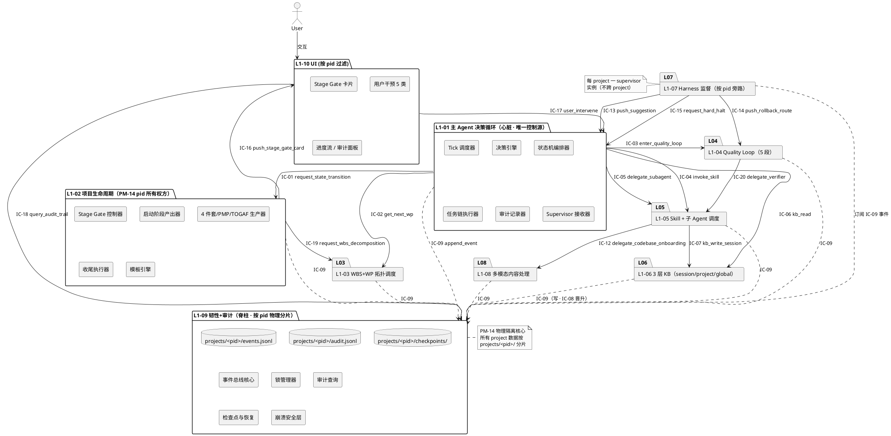
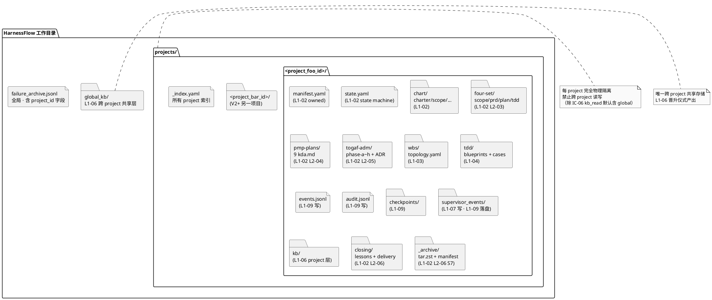
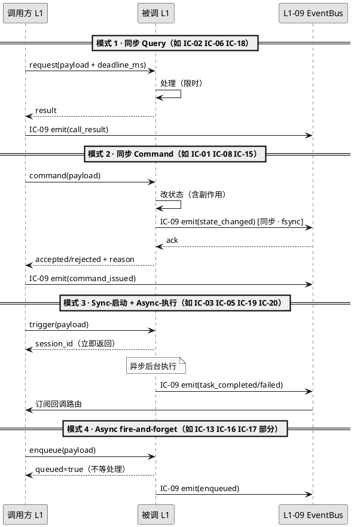
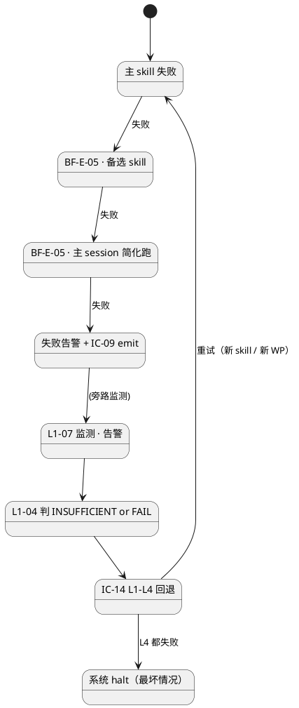
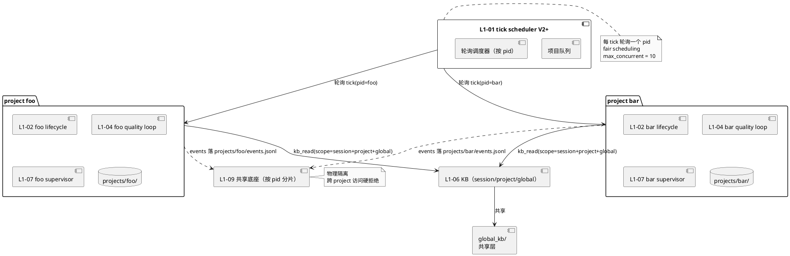
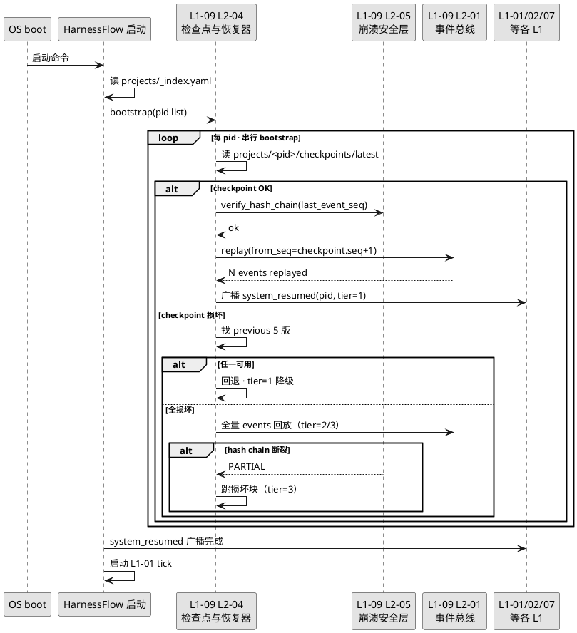

# L1 集成 · 总架构（architecture.md · 10 L1 协同顶层技术方案）

> **本文档定位**：本文档是 3-1-Solution-Technical 层级中 **L1 集成**（第 11 个逻辑 L1 · 跨 10 个业务 L1 的顶层协同层）的**总架构文档**。
>
> **与 2-prd/L1集成 PRD 的分工**：2-prd 层的 `docs/2-prd/L1集成/prd.md` 回答**产品视角**的"10 个 L1 怎么协同跑通 · 一致性测试矩阵 · 端到端场景 · 失败传播 · PM-14 V2+ · 跨 session 恢复"；本文档回答**技术视角**的"在已实现的 10 L1 × 57 L2 × 20 IC 上，怎么用 Claude Code Skill + hooks + jsonl + FS 物理底座把集成层落实"。
>
> **与 integration/ 4 份子文档的分工**：本文档是 **L1 集成顶层架构**（跨层面 organization + 技术化映射 PRD 11 章 + 交叉引用索引）；4 份子文档是**具体实现载体**：
> - `integration/ic-contracts.md`（2504 行 · 20 IC 字段级 schema · 20 次 PlantUML · 57 L2 消费方反查）
> - `integration/p0-seq.md`（1819 行 · 12 条 P0 主干时序 · PlantUML + GWT 断言）
> - `integration/p1-seq.md`（1912 行 · 11 条 P1 异常/恢复时序 · PlantUML + 降级链）
> - `integration/cross-l1-integration.md`（1113 行 · 跨 L1 DDD BC 关系 + 45 对依赖矩阵 + 一致性审计钩子）
>
> 冲突以 **PRD 为产品真理 + 4 份子文档为字段级真理** 为准；本 architecture 是 L1 粒度的骨架汇总。
>
> **与 10 个 L1 architecture.md 的分工**：每个 L1 architecture.md 负责**本 L1 内部 5-7 L2 的组织 + 内部时序**；本文档负责**跨 L1 协同 + 20 IC 的技术组合逻辑 + 集成失败传播 + 集成性能 + PM-14 多 project 集成**。单 L1 内部细节冲突时以该 L1 的 architecture.md 为准；跨 L1 契约冲突时以 `integration/ic-contracts.md` 为准。
>
> **PM-14 集成贯穿声明**：本文档全文以 `harnessFlowProjectId` 作为跨 L1 协同的核心维度 —— 所有 20 IC 实现必含 PM-14 根字段校验；所有 12 端到端场景按 project_id 范围内验证；多项目并发集成是 §9 单独章节；跨 session 恢复按 project 物理分片是 §10 主题。
>
> **严格规则**：本文档不复述 PRD / integration/ 子文档已有的表格 / schema / PlantUML 原文，只做**技术映射 + 交叉索引 + 实现策略汇总**。每章用指向 PRD / 子文档的精确锚点（§N.M 粒度）替代完整重复。

---

## §0 撰写进度

- [x] §1 定位 + 2-prd L1集成 PRD §1-§11 映射 + PM-14 集成贯穿
- [x] §2 与 integration/ 4 份子文档 + 10 L1 architecture.md 的分工
- [x] §3 集成架构全景（技术视角 · 3 张 PlantUML）
- [x] §4 20 IC 契约实现总览（引 ic-contracts.md + 实现策略）
- [x] §5 10×10 集成测试矩阵的技术实现（引 PRD §4 · 映射 3-2 TDD）
- [x] §6 12 端到端场景的时序实现（引 p0-seq / p1-seq · 技术组合策略）
- [x] §7 失败传播技术实现（引 PRD §6 · 系统级 halt 唯一入口 · PM-14 隔离）
- [x] §8 性能集成约束技术实现（引 PRD §7 · Deadline 传递 · 背压 · 限流）
- [x] §9 多 project 并发集成（PM-14 V2+ · 物理隔离 + 共享层 + 路由）
- [x] §10 跨 session 恢复集成（L1-09 主导 · 4 级完整性）
- [x] §11 集成测试框架实现（对接 3-2 TDD 的 integration/ + acceptance/）
- [x] §12 集成里程碑 + Gate 技术实现（M1-M6）
- [x] §13 与各 L1 architecture.md + integration/ 4 份的交叉引用索引
- [x] 附录 A 术语 · B 实现文件清单 · C 一致性审计钩子清单

---

## §1 定位 + 2-prd §1-§11 映射 + PM-14 集成贯穿

### 1.1 本 L1 在 HarnessFlow 整体架构里的坐标

**L1 集成是第 11 个逻辑 L1**——不是与 L1-01~L1-10 并列的业务 L1（它没有独立的 BC），而是**跨越 10 个业务 L1 的协同层**。其核心职责是：

1. 将 10 个独立的 L1 BC（Bounded Context）通过 **20 条 IC 契约**（`integration/ic-contracts.md`）黏合成可协同的完整系统
2. 保证跨 L1 的**契约一致性**（10×10 集成测试矩阵 · 45 对 × ≥ 4 用例）
3. 落地 **12 条端到端场景**（S1→S7 全生命周期 + 异常路径）
4. 管控**失败传播**（PM-14 隔离 + 系统级 halt 唯一入口）
5. 满足**性能集成约束**（端到端时延 / 吞吐 / 资源）
6. 支持 **PM-14 多 project 并发**（V2+ 演进）
7. 保证**跨 session 恢复完整性**（L1-09 主导 · 4 级）

**技术定位一句话** = **"L1 集成层 = 20 IC + 45 对一致性 + 12 场景 + 失败传播 + 性能约束 + PM-14 多 project + 跨 session 恢复 的技术组合策略汇总 · 不新增 L2 · 通过 integration/ 4 子文档 + 各 L1 的 L2 tech-design 实现"**。

### 1.2 本 architecture 与 2-prd/L1集成/prd.md 11 章的精确映射

| PRD 章节 | 本文档映射位置 | 技术映射焦点 |
|:---|:---|:---|
| §1 定位与范围 | §1.1 / §1.4 / §2 | 本 L1 顶层定位 · in/out of scope · 与 scope §8 互补 |
| §2 集成架构全景（10 L1 + PM-14 维度） | §3 | 技术视角的架构全景 · 3 张 PlantUML · PM-14 物理分片 |
| §3 20 条 IC 契约深化 + 一致性测试点 | §4 + §11 | 引 `integration/ic-contracts.md` · 补实现策略 + 测试钩子 |
| §4 10×10 集成测试矩阵 | §5 | 引 PRD §4 · 映射到 3-2 TDD `integration/` 具体文件 |
| §5 端到端集成场景（12 个） | §6 | 每场景 20-40 行技术组合策略 · 引 p0-seq/p1-seq 具体锚点 |
| §6 失败传播详细矩阵 | §7 | 技术实现 · PM-14 隔离边界 · halt 唯一入口 |
| §7 性能集成约束 | §8 | Deadline 传递链 · 背压 · 限流 · 并发控制 |
| §8 多项目并发集成（PM-14 V2+） | §9 | V1/V2/V3 渐进 · 物理隔离 + 共享层 + 路由 |
| §9 跨 session 恢复集成验证 | §10 | L1-09 主导 · bootstrap + replay + state reconstruction |
| §10 集成验证大纲（TDD 输入） | §11 | 对接 3-2 TDD `integration/` + `acceptance/` |
| §11 集成里程碑 + Gate | §12 | M1-M6 技术实现映射 |

### 1.3 In-scope · 本 architecture 的技术范围

1. **跨 L1 技术组合策略**（如何把 20 IC 组合成 12 场景 · 如何传递 Deadline · 如何路由 project_id）
2. **集成失败处理**（失败传播 · 系统级 halt · 兜底降级链）
3. **集成性能实现**（端到端时延预算分解 · 背压机制 · 限流 · 熔断）
4. **PM-14 多 project 集成实现**（物理分片 · 共享层 · 跨 project 隔离守护）
5. **跨 session 恢复实现**（L1-09 bootstrap + 各 L1 恢复协议组合）
6. **集成测试框架**（3-2 TDD `integration/` + `acceptance/` 的技术组织）

### 1.4 Out-of-scope · 本 architecture 不做

1. **单 L1 内部实现细节** —— 在各 L1 的 architecture.md + L2 tech-design 里
2. **IC 字段级 schema 定义** —— 在 `integration/ic-contracts.md`（7408 次被 L2 反向引用 · 是字段级真理源）
3. **时序图具体步骤** —— 在 `integration/p0-seq.md` / `p1-seq.md`（本文档只引用锚点）
4. **跨 L1 DDD BC 依赖矩阵** —— 在 `integration/cross-l1-integration.md`（本文档仅引用其结论）
5. **新的业务逻辑** —— 本 L1 是**协同组织层** · 不新增业务能力
6. **代码实现** —— 所有代码在对应 L1 的 L2 tech-design 里

### 1.5 PM-14 集成贯穿的技术落实

PM-14 （引 `projectModel/tech-design.md §4-§8`）规定所有 IC payload 根字段必含 `project_id`。本 L1 集成层的技术落实点：

- **§4 20 IC 实现总览**：每条 IC 实现必带 PM-14 根字段校验（schema 层拒绝 + 错误码）
- **§5 10×10 测试矩阵**：每对必测用例含 "PM-14 负向"（缺 project_id 必拒）
- **§6 12 端到端场景**：所有 project_id 全链路透传 · 审计可反查
- **§7 失败传播**：失败不能跨 project 蔓延（除 L1-09 系统级 halt 唯一例外）
- **§9 多 project**：物理分片按 project_id · 跨 project 访问守护硬拒绝
- **§10 跨 session 恢复**：按 project 物理分片逐 project 恢复

### 1.6 与 scope §8 的互补性（产品 → 技术）

`docs/2-prd/L0/scope.md §8` 定义 4 类整合流（控制/数据/监督/持久化）+ 20 IC 一句话 schema + 5 场景；2-prd `L1集成/prd.md` 深化为 10×10 矩阵 + 12 场景 + 失败传播 + 性能；本 architecture 进一步**技术化**：

| scope §8 概念 | 本 architecture 实现 |
|:---|:---|
| 控制流 · L1-01 → 其他 L1 | §3.2 控制流 PlantUML · L1-01 是唯一控制源 · IC-01/02/03/04/05 |
| 数据流 · 4 件套 → WBS → TDD → 代码 | §6 场景 2（S1→S7 完整流程）逐步分解 · 含 PM-14 透传 |
| 监督流 · L1-07 旁路 IC-09 | §7 失败级联抑制 · L1-07 监测 → IC-13/14/15 建议 |
| 持久化流 · 全部 → L1-09 IC-09 | §4 IC-09 实现策略 · §10 L1-09 主导恢复 |

### 1.7 本文档不复述 PRD 的原因

PRD `L1集成/prd.md` 是 2-prd 层的**产品视角**深化（非本 architecture 的简单上游）；本 architecture 仅做**技术视角**的组织层映射。**具体表格 / 一致性测试点 / 端到端场景步骤 / 失败传播兜底策略**请直接读 PRD 对应章节；本文档在每节用 "PRD §N.M" 锚点精确指向。

---

## §2 与 integration/ 4 份子文档 + 10 L1 architecture.md 的分工

### 2.1 本 architecture 在集成层文档中的位置

```
L1 集成层（顶层）
├── architecture.md（本文档 · 顶层骨架 + 跨章节组织 + 映射索引）
└── integration/（子文档 · 具体实现载体）
    ├── ic-contracts.md    （20 IC 字段级 schema）
    ├── p0-seq.md          （12 条 P0 主干时序）
    ├── p1-seq.md          （11 条 P1 异常时序）
    └── cross-l1-integration.md（跨 L1 DDD BC 关系 + 45 对矩阵）
```

### 2.2 顶层与子文档的分工规则

| 维度 | 本 architecture | integration/ 4 份子文档 |
|:---|:---|:---|
| 粒度 | L1 粒度（骨架） | 字段级 / 时序步骤级（细节） |
| 角色 | 顶层组织 + 映射 + 策略汇总 | 具体实现载体 |
| 变动频率 | 低（与 PRD 同步） | 中（随 L2 实现细化） |
| 被引用 | 作 "L1 集成顶层入口" 引用 | 被 57 L2 × 平均 130 次 = 7408 次引用 |
| 关系 | 引用子文档 · 不复述其内容 | 独立自治 · 不引用本文档 |

### 2.3 本 architecture 与 10 个 L1 architecture.md 的关系

**本 architecture 是 10 个 L1 architecture.md 的"顶层索引 + 跨 L1 协同组织"**：

- 10 个 L1 architecture.md = 本 L1 内部 5-7 L2 组织 + 内部时序
- 本 architecture = 跨 10 L1 的协同 + 20 IC 的技术组合 + 12 场景的分层实现

**冲突解决优先级**：

1. 跨 L1 契约冲突 → 以 `integration/ic-contracts.md` 为准
2. 单 L1 内部冲突 → 以该 L1 的 architecture.md 为准
3. 产品语义冲突 → 以 `docs/2-prd/L1集成/prd.md` 为准（产品真理）
4. 项目模型冲突 → 以 `projectModel/tech-design.md` 为准（PM-14 硬约束）

### 2.4 消费关系

| 谁消费本 architecture | 消费方式 |
|:---|:---|
| 3-2-Solution-TDD `integration/` | 读 §5 映射表建 45 对 × 4 用例 · 读 §6 建 12 验收场景 |
| 3-2-Solution-TDD `acceptance/` | 读 §6 建端到端 e2e · 读 §10 建跨 session 恢复 e2e |
| 3-3-Monitoring-Controlling | 读 §7 失败传播矩阵建告警规则 · 读 §8 性能阈值建 SLO 监控 |
| V2+ 多 project 架构设计 | 读 §9 多 project 集成为 baseline |
| 交付验收 | 读 §12 集成 Gate 清单 |

### 2.5 不是每个 L1 都有独立 architecture.md

**10 个业务 L1 都有独立 architecture.md**（L1-01 ~ L1-10）· **本 L1 集成**是逻辑 L1（不拆 L2）· 故只有本 architecture.md + integration/ 4 份子文档。

V1 版本**不计划把 L1 集成拆 L2**（理由：集成层的"具体实现"已经分布在 20 IC 契约 + 10 L1 的 L2 里 · 再拆 L2 会产生循环引用）。若未来（V2+）需要独立实现层（如集成测试运行器 / 跨 L1 事件路由器 / 多 project 编排器），可考虑建 `L1集成/L2-*.md`，但当前 v1.0 不做。

---

## §3 集成架构全景（技术视角 · 3 张 PlantUML）

### 3.1 10 L1 + PM-14 维度全景（对应 PRD §2.1）

PRD §2.1 的架构图是产品视角（L1 + IC 编号 + PM-14 角色标记）；此处补技术视角的 PlantUML 版本 · 含物理分片维度：



### 3.2 4 类整合流 · 技术栈映射（对应 PRD §2.2）

| 整合流 | 技术实现 | 落地组件 |
|:---|:---|:---|
| 控制流 | L1-01 调度器 驱动 · IC-01~05 同步/异步 Command | `L1-01/L2-01 Tick 调度器` → `L1-02/L2-01 Stage Gate 控制器` / `L1-03/L2-03 WP 调度器` / `L1-04/L2-01 TDD 蓝图生成器` / `L1-05/L2-03 Skill 调用执行器` |
| 数据流 | 4 件套 (md 文件) → WBS (yaml/jsonl) → TDD 蓝图 (md) → WP 代码 (fs) → S5 verifier 报告 (md) → S7 交付包 (tar.zst) | `L1-02 → L1-03 → L1-04 → L1-05 子 Agent → L1-04 S5 → L1-02 S6/S7` |
| 监督流 | L1-07 旁路订阅 L1-09 事件 · 8 维度计算 · 触发 IC-13/14/15 | `L1-07/L2-01 8 维度采集器` + `L1-07/L2-02 4 级告警升级器` + `L1-07/L2-05 Soft-drift 识别器` |
| 持久化流 | 全部 L1 → IC-09 append_event → L1-09 单一事实源 · 按 pid 物理分片 | `L1-09/L2-01 事件总线核心` + `L1-09/L2-03 审计记录器+追溯查询` + `L1-09/L2-04 检查点与恢复器` + `L1-09/L2-05 崩溃安全层` |

### 3.3 PM-14 物理分片维度图（对应 PRD §2.3）



### 3.4 各 L1 在集成层的角色锚点

| L1 | 集成角色 | PM-14 落点 |
|:---|:---|:---|
| L1-01 | 唯一控制源 · tick 驱动 | `project_id` 作 tick 上下文 · 所有 IC 发起方必带 |
| L1-02 | PM-14 所有权方 | 创建 / 激活 / 归档 project · 拥有 manifest + state |
| L1-03 | WBS 调度 | 读 pid 下 wbs/ · 不跨 pid |
| L1-04 | 质量环 | 读 pid 下 tdd/ · 写 quality gate 证据到 pid |
| L1-05 | Skill + 子 Agent | ctx 必带 pid · 子 Agent 独立 session 但继承 pid |
| L1-06 | 3 层 KB | session 隐含 pid · project 在 projects/<pid>/kb/ · global 在 global_kb/ |
| L1-07 | 监督旁路 | 每 project 一 supervisor 实例 · 不跨 pid |
| L1-08 | 多模态 | 缓存按 pid 隔离 |
| L1-09 | 脊柱 · 物理隔离 | 所有 jsonl / checkpoints 按 pid 分片 |
| L1-10 | UI | 按当前 pid 过滤所有视图 |

---

## §4 20 IC 契约实现总览

### 4.1 引 integration/ic-contracts.md §2（20 IC 总表）

**本节不复述 20 IC 的 From/To/SLO/Idempotent 表格**（在 `integration/ic-contracts.md §2` · 2504 行总文档）。本节只补**实现层策略**。

### 4.2 20 IC 按实现特征分类

| 分类 | IC 编号 | 实现关键点 |
|:---|:---|:---|
| **控制类**（L1-01 → 业务 L1） | IC-01/02/03/04/05 | Sync 或 Sync-启动 + Async-执行 · PM-14 pid 透传 · 幂等需调用方传 key · 失败走 BF-E-05 fallback |
| **监督类**（L1-07 → L1-01/L1-04） | IC-13/14/15 | Async fire-and-forget（除 IC-15 同步阻塞 ≤ 100ms） · PM-14 按 pid 订阅 · 不阻塞主 loop |
| **持久化类**（全部 → L1-09） | IC-09/10 | IC-09 同步 fsync + 幂等（同 event_id） · 失败即系统级 halt · PM-14 根字段必填 |
| **数据类**（L1-02 内部 + L1-03/04 数据流） | IC-19 | Sync 启动 + Async 执行 · PM-14 强制 · 产出 WBS 拓扑供 L1-03 后续 IC-02 消费 |
| **KB 类**（多 L1 → L1-06） | IC-06/07/08 | IC-06 幂等读 · IC-07 幂等写（dedup_key） · IC-08 晋升可回放 · 作用域默认 session + project + global |
| **UI 类**（L1-02/L1-10/L1-09） | IC-16/17/18 | IC-16/18 Async · IC-17 Sync panic ≤ 100ms · 按 pid 过滤 |
| **多模态类** | IC-11/12 | Sync 或 Async · 按 content 大小选 · IC-12 大代码库走 subagent |
| **子 Agent 类** | IC-05/12/20 | Async · 独立 session · PM-03 context 复制但不共享 · 结果回收经 IC-09 事件 |

### 4.3 IC 实现的 5 个硬约束（跨所有 20 IC）

1. **PM-14 根字段校验**：所有 IC payload 必含 `project_id`（除 IC-09 `project_scope="system"` 例外 · 详 `ic-contracts.md §6.1`）· 缺则 schema 层拒绝 + 对应错误码
2. **幂等性按 IC 声明**：幂等 IC（如 IC-01 同 tick_id · IC-07 同 dedup_key · IC-09 同 event_id · IC-14 同 wp_id+verdict_id）重复调必返相同结果；非幂等 IC 由调用方去重
3. **Deadline 传递**：调用方在 payload 附 `deadline_ms`（从 L1-01 tick 入口分配预算） · 被调方必检查 · 超则返超时错（不等到实际超时才抛异常）
4. **错误码命名**：各 IC 错误码按 `ic-contracts.md §6.2` + 各 L2 `§11` 错误码表 · 命名空间按 L1 划分
5. **审计必发**：所有 IC 调用无论成功/失败必发 IC-09 对应事件（含 call_id + caller_l1 + callee_l1 + pm14 pid + result）· 保证决策可追溯率 100%

### 4.4 IC 实现的 4 种交互模式



### 4.5 IC 失败处理的统一策略

| 失败类型 | 处理 |
|:---|:---|
| Schema 校验失败 | 立即拒绝 · 返错误码 · 审计 WARN |
| PM-14 违规 | 立即拒绝 · 返错误码 · 审计 ERROR · L1-07 红线告警 |
| 被调方业务拒绝 | 返 `accepted=false` + `reason` · 审计 INFO |
| 被调方超时 | 调用方走 BF-E-05 fallback · 审计 WARN |
| 被调方内部 5xx | 返错 · 调用方判 retry / fallback / halt · 审计 ERROR |
| IC-09 append_event 失败 | **系统级 halt** · 全局唯一（PM-08 单一事实源不可破） |

### 4.6 IC 性能目标汇总（引 ic-contracts.md §2 SLO 列）

详见 `integration/ic-contracts.md §2` 总表 SLO 列。本节只列**集成场景下的 Deadline 预算分配**（§8 详述）。

---

## §5 10×10 集成测试矩阵的技术实现

### 5.1 引 PRD §4 的 10×10 矩阵

PRD §4.1 给出 10×10 矩阵（25 必测 ● + N 弱依赖 ○ + 无 -）；PRD §4.2 列出 25 必测对的核心用例；PRD §4.4 设定覆盖率目标。本节补**技术实现映射**。

### 5.2 每对必测对的技术实现归属

| 对 | 主 IC | 实现 L2（调用方）| 实现 L2（被调方）| 测试实现归属 |
|:---|:---|:---|:---|:---|
| L1-01 ↔ L1-02 | IC-01 | L1-01/L2-03 状态机编排器 | L1-02/L2-01 Stage Gate 控制器 | 3-2 TDD `integration/ic-01-tests.md` |
| L1-01 ↔ L1-03 | IC-02 | L1-01/L2-04 任务链执行器 | L1-03/L2-03 WP 调度器 | 3-2 TDD `integration/ic-02-tests.md` |
| L1-01 ↔ L1-04 | IC-03 | L1-01/L2-04 任务链执行器 | L1-04/L2-01 TDD 蓝图生成器 | 3-2 TDD `integration/ic-03-tests.md` |
| L1-01 ↔ L1-05 | IC-04/05 | L1-01/L2-04 任务链执行器 | L1-05/L2-02 意图选择 + L2-03 执行器 + L2-04 委托器 | 3-2 TDD `integration/ic-04-tests.md` + `ic-05-tests.md` |
| L1-01 ↔ L1-07 | IC-13/15 | L1-01/L2-06 Supervisor 接收器 | L1-07/L2-01 采集器 + L2-04 事件发送器 | 3-2 TDD `integration/ic-13-tests.md` + `ic-15-tests.md` |
| L1-01 ↔ L1-09 | IC-09 | 全 L1 共用 | L1-09/L2-01 事件总线核心 | 3-2 TDD `integration/ic-09-tests.md`（覆盖所有 L1 作为生产方） |
| L1-01 ↔ L1-10 | IC-17 | L1-10/L2-04 用户干预入口 | L1-01/L2-04 任务链执行器 | 3-2 TDD `integration/ic-17-tests.md` |
| L1-02 ↔ L1-03 | IC-19 | L1-02/L2-01 Stage Gate | L1-03/L2-01 WBS 拆解器 | 3-2 TDD `integration/ic-19-tests.md` |
| L1-02 ↔ L1-10 | IC-16 | L1-02/L2-01 Stage Gate | L1-10/L2-02 Gate 决策卡片 | 3-2 TDD `integration/ic-16-tests.md` |
| L1-04 ↔ L1-05 | IC-20 | L1-04/L2-06 Verifier 编排器 | L1-05/L2-04 子 Agent 委托器 | 3-2 TDD `integration/ic-20-tests.md` |
| L1-04 ↔ L1-07 | IC-14 | L1-07/L2-04 事件发送器 | L1-04/L2-07 4 级回退路由器 | 3-2 TDD `integration/ic-14-tests.md` |
| L1-05 ↔ L1-08 | IC-12 | L1-08/L2-02 代码结构理解 | L1-05/L2-04 子 Agent 委托器 | 3-2 TDD `integration/ic-12-tests.md` |
| L1-06 ↔ L1-09 | IC-09 | L1-06/L2-01/02/03/04/05 | L1-09/L2-01 事件总线核心 | 3-2 TDD `integration/ic-09-tests.md`（L1-06 分区） |
| L1-09 ↔ L1-10 | IC-18 | L1-10/L2-07 Admin 子管理 | L1-09/L2-03 审计查询 | 3-2 TDD `integration/ic-18-tests.md` |

其余对见 `ic-contracts.md §3` 每 IC 详规对应章节。

### 5.3 每对必测用例的 4 维度（PRD §4.4 覆盖率目标）

每必测对最少 4 用例：

| 维度 | 用例类型 | 命名规范 |
|:---|:---|:---|
| 正向 | 标准入参 · 期望输出 | `test_<ic_id>_happy_path` |
| 负向 | schema 违规 / 语义拒绝 | `test_<ic_id>_<error_code>` |
| PM-14 | 缺 project_id / 跨 pid 越权 | `test_<ic_id>_pm14_violation` |
| 失败降级 | 被调方 5xx / 超时 | `test_<ic_id>_<degradation>` |

### 5.4 弱依赖对的 smoke test 设计

PRD §4.3 列出弱依赖对（如 L1-01 ↔ L1-06 KB 可选注入）。smoke test 仅验证"**起跑通**"：

- 单次调用成功（入参 + 出参）
- PM-14 校验通过
- IC-09 审计事件发出
- 不深入边界 / 并发 / 降级（留 V2+ 补）

### 5.5 测试文件组织（3-2 TDD `integration/` 目录规划）

```
docs/3-2-Solution-TDD/integration/
├── ic-01-tests.md  ~  ic-20-tests.md         （20 份 · 每 IC 一份 · ≥ 5 用例）
├── matrix-10x10-tests.md                     （45 对 × 4 用例 · 必测 25 对 × 4 = 100 + 弱依赖 20 对 × 1 = 20 · 合计 120 用例骨架）
├── pm14-violation-tests.md                   （跨 IC 的 PM-14 违规专项）
├── failure-propagation-tests.md              （PRD §6 失败传播矩阵 e2e）
└── performance-integration-tests.md          （PRD §7 性能集成阈值 · load 测试）
```

（V1 初始化：建空骨架 · G/H 会话后续填）

### 5.6 测试覆盖率达成路径

| 覆盖率目标 | 达成动作 |
|:---|:---|
| 25 必测对 × 4 用例 = 100 用例 | 3-2 TDD `integration/matrix-10x10-tests.md` 分批填 |
| 20 IC × 5 用例 = 100 用例 | 3-2 TDD `integration/ic-NN-tests.md` × 20 |
| 12 端到端场景 × 完整 e2e | 3-2 TDD `acceptance/scenario-NN-tests.md` × 12（§6 / §11 详） |
| 性能集成阈值 7 条 | 3-2 TDD `integration/performance-integration-tests.md` |
| 多 project 并发（V2+） | 3-2 TDD `integration/pm14-v2-tests.md`（延到 V2+） |
| 跨 session 恢复 | 3-2 TDD `acceptance/cross-session-recovery-tests.md` |

---

## §6 12 端到端场景的时序实现

### 6.1 引 PRD §5 的 12 场景索引

PRD §5.0 给出 12 场景总览；本节补**技术组合策略**（每场景 20-40 行技术骨架 · 引 p0-seq/p1-seq 的具体时序锚点）。

### 6.2 场景 1 · WP 执行正常一轮 Quality Loop

**引 integration/p0-seq.md §4**（P0-02 主 skill 调用主干时序）+ **p0-seq.md §5**（P0-03 Quality Loop 5 段时序）

**技术组合链**：

```
L1-01 tick
  → IC-02 get_next_wp → L1-03 返 wp_def
  → IC-03 enter_quality_loop → L1-04 启动异步 loop_session
  → L1-04 S1 TDD 蓝图（IC-04 调 L1-05 blueprint-generator）
  → L1-04 S2 TDD 用例（IC-04 调 L1-05 case-generator）
  → L1-04 S3 质量 Gate 编译（内部算法）
  → L1-04 S4 执行驱动（IC-04 调 L1-05 实现 skill）
  → L1-04 S5 TDDExe（IC-20 delegate_verifier → L1-05 独立 session）
  → L1-04 verdict → IC-09 append_event(verdict)
  → L1-01 收 verdict · 记审计 · 进下一 tick
```

**PM-14 透传**：wp_def 必带 pid · IC-20 delegate_verifier 的 context_copy 必带 pid · verifier 独立 session 继承 pid 并落 events 到 `projects/<pid>/events.jsonl`

**失败降级**：BF-E-05（skill 失败 fallback 备选）· BF-E-09（verifier 超时 kill+fallback）

**3-2 e2e 测试**：`docs/3-2-Solution-TDD/acceptance/scenario-01-wp-quality-loop-tests.md`

### 6.3 场景 2 · 项目从 S1 启动到 S7 交付完整流程

**最复杂的端到端场景**（数周墙钟）· 引 `p0-seq.md §3` S1→S7 完整主干

**7 阶段技术组合**：

| Stage | 主导 L1 | 关键 IC | PM-14 动作 |
|:---|:---|:---|:---|
| S1 Kickoff | L1-02 L2-02 | IC-17（用户一句话）→ brainstorming → 章程 | **创建 + 激活 pid**（PM-14 唯一入口） |
| S2 Planning Gate | L1-02 L2-03/04/05 + L1-03 | IC-01 state=PLANNING · IC-19 wbs_decomposition · IC-16 Gate 卡片 | 所有产出物落 `projects/<pid>/*` |
| S3 TDD Gate | L1-04 L2-01/02/03/04 | IC-03 enter_quality_loop × N WP | 蓝图落 `projects/<pid>/tdd/` |
| S4 Executing | L1-01 + L1-05 | IC-02 get_next_wp × N · IC-04 invoke_skill | 代码落 `projects/<pid>/code/`（由 WP 任务定） |
| S5 Integration Gate | L1-04 L2-05/06/07 | IC-20 verifier · IC-14 回退路由 | verifier 报告落 `projects/<pid>/quality/` |
| S6 Closing Gate | L1-02 L2-06 | IC-01 state=CLOSING · IC-09 lessons | 收尾 3 md 落 `projects/<pid>/closing/` |
| S7 Archive | L1-02 L2-06 | IC-01 state=ARCHIVED · IC-08 KB 晋升 | **归档 pid**（PM-14 唯一归档入口 · tar.zst + chmod 0444） |

**总时长预算**：1-3 周墙钟（中等项目）· 4 周硬上限

**PM-14 贯穿**：同一 pid 从 S1 创建到 S7 归档 · 所有 events/audit/checkpoints 按 pid 分片 · 归档时打 `projects/<pid>/` 全目录

**3-2 e2e 测试**：`docs/3-2-Solution-TDD/acceptance/scenario-02-s1-to-s7-full-tests.md`

### 6.4 场景 3 · S2 Gate No-Go + 4 件套部分重做

**引 p1-seq.md §3**（S2 Gate reject 回退时序）

**技术组合**：L1-02 L2-01 Gate 决策 `need_input` → L1-10 L2-02 Gate 卡片展示缺口 → 用户决定重做哪件 → IC-17 user_intervene(type="rework", items=[scope|prd|plan|tdd]) → L1-01 路由到 L1-02 L2-03 4 件套生产器的 `rework_items()` → 保留未 rework 的件 · 重做指定件

**PM-14 隔离**：rework 过程只动该 pid 的 `projects/<pid>/four-set/` · 不影响其他 project

**降级**：若 rework 后仍 Gate reject 3 次 · L1-07 红线告警 · 升级到用户 panic

**3-2 e2e**：`docs/3-2-Solution-TDD/acceptance/scenario-03-s2-gate-rework-tests.md`

### 6.5 场景 4 · 运行时 change_request（TOGAF H 变更管理）

**引 p1-seq.md §5**（change_request 影响面时序）

**技术组合**：

```
L1-10 user → IC-17 user_intervene(type="change_request", desc="...")
  → L1-01 路由到 L1-02 L2-05 TOGAF ADM Phase H（change management）
  → L1-02 L2-05 计算影响面：读 wbs/ + togaf-adm/ + pmp-plans/
  → 影响面结果（affected wps + affected plans + severity）
  → IC-16 推 impact_card 到 L1-10
  → 用户确认 → L1-01 路由到 L1-03 L2-05 失败回退协调器 + L1-03 L2-01 WBS 差量拆解
  → 生成 diff wbs + 写回 · 触发 affected wps 重跑
```

**PM-14**：change_request 仅影响该 pid · 不触及其他 project

**性能**：影响面分析 P95 ≤ 5s（PRD §7.1）

**3-2 e2e**：`docs/3-2-Solution-TDD/acceptance/scenario-04-change-request-tests.md`

### 6.6 场景 5 · 硬红线触发（不可逆操作拦截）

**引 p1-seq.md §4**（硬红线 IC-15 时序）· PRD §5.5

**技术组合**：

```
L1-05 invoke_skill 检测不可逆操作关键词（如 rm -rf / drop table / force push main）
  → L1-05 L2-03 Skill 调用执行器 拦截 · 不执行 · 发 IC-09 emit(hard_red_line_triggered)
  → L1-07 L2-03 硬红线拦截器 订阅到该事件（< 100ms 响应）
  → L1-07 → IC-15 request_hard_halt(red_line_id, evidence)
  → L1-01 L2-03 状态机编排器 强制状态 → HALTED（≤ 100ms 硬约束）
  → L1-10 UI 推 red_line_alert 卡片
  → 用户 panic 确认 · 提供人工验证 · 选 resume 或 abort
```

**PM-14**：硬红线仅 halt 该 pid · 不影响其他 project（除非 L1-09 失败这种系统级 halt）

**性能硬约束**：IC-15 request → state=HALTED ≤ 100ms

**3-2 e2e**：`docs/3-2-Solution-TDD/acceptance/scenario-05-hard-red-line-tests.md`

### 6.7 场景 6 · 用户 panic + PAUSED + resume

**引 p1-seq.md §6**（panic → PAUSED → resume 时序）

**技术组合**：L1-10 L2-04 用户干预 → IC-17 type="panic"（Sync panic ≤ 100ms 硬约束） → L1-01 L2-03 状态机强制 → PAUSED → 所有 in-flight WP 暂停 · 已启动的 IC-03/04/05 收到 "pause_signal" 后 graceful stop · 落盘当前状态到 `projects/<pid>/checkpoints/panic_snapshot.yaml` → 等用户 resume → L1-01 从 snapshot 恢复

**性能**：panic → PAUSED ≤ 100ms（硬约束 · 阻塞式同步）

**3-2 e2e**：`docs/3-2-Solution-TDD/acceptance/scenario-06-panic-resume-tests.md`

### 6.8 场景 7 · S5 verifier FAIL → 4 级回退路由

**引 p1-seq.md §7**（S5 FAIL 4 级回退时序）· PRD §5.7

**技术组合**：

```
L1-04 L2-06 Verifier 编排器 调 IC-20 delegate_verifier
  → L1-05 子 Agent 执行 · 返 verdict=FAIL
  → L1-07 L2-04 Supervisor 8 维度采集器 分析 trend
  → L1-07 判定严重度 → IC-14 push_rollback_route(level=L1|L2|L3|L4)
      L1 重试同 WP / L2 换 skill / L3 回 S3 调整蓝图 / L4 回 S1 重启动
  → L1-04 L2-07 4 级回退路由器 执行
```

**PM-14**：4 级回退仅影响该 pid

**升级边界**：同级 FAIL ≥ 3 次 · 自动升级到下一级（场景 9）

**3-2 e2e**：`docs/3-2-Solution-TDD/acceptance/scenario-07-verifier-fail-rollback-tests.md`

### 6.9 场景 8 · 跨 session 重启恢复未决 Gate

**引 p1-seq.md §8**（跨 session bootstrap 时序）· §10 本章节详述

**技术组合概要**（详 §10）：L1-09 L2-04 检查点与恢复器 bootstrap → 读最近 checkpoint → 恢复 task_board → 回放 events.jsonl 尾段 → L1-07 supervisor 重建 → L1-01 恢复 tick · 若发现未决 Gate 自动恢复到 Gate 等待状态

**3-2 e2e**：`docs/3-2-Solution-TDD/acceptance/scenario-08-cross-session-recovery-tests.md`

### 6.10 场景 9 · 同级 FAIL ≥ 3 死循环升级

**引 p1-seq.md §9** · PRD §5.9

**技术组合**：L1-07 L2-06 死循环升级器 监测 · 同级 retry 连续 ≥ 3 次 → 自动升级到下一级（L1→L2 · L2→L3 · L3→L4 · L4→红线）· 触发 IC-14 level 升级

**PM-14**：按 pid 独立计数 · 不跨 project

**3-2 e2e**：`docs/3-2-Solution-TDD/acceptance/scenario-09-loop-escalation-tests.md`

### 6.11 场景 10 · KB 晋升仪式（S7 收尾时）

**引 p1-seq.md §10** · PRD §5.10

**技术组合**：L1-02 S7 归档前 → L1-06 L2-04 KB 晋升仪式执行器 触发 → 遍历 `projects/<pid>/kb/session/` + `project/` · 选有价值条目（按 score + manual review）→ IC-08 kb_promote(source_pid, target_scope="global") → 晋升到 `global_kb/` · 原 session/project 层保留（归档用） · 审计全链

**PM-14**：晋升是 "pid → global" 单向 · global_kb/ 含 source_pid 字段标注源

**3-2 e2e**：`docs/3-2-Solution-TDD/acceptance/scenario-10-kb-promotion-tests.md`

### 6.12 场景 11 · 多项目并发切换（V2+ PM-14）

**引 PRD §5.11** · V1 本场景不实现 · V2+ 详 §9

**V2+ 技术组合**：同时存在 ACTIVE project × N（≤ 10）· L1-01 tick 轮询各 project · 按 pid 路由 · L1-07 每 pid 一 supervisor 实例 · L1-10 UI 显示 project 切换 tab · L1-09 按 pid 物理分片保证隔离

**3-2 e2e（延到 V2+）**：`docs/3-2-Solution-TDD/acceptance/scenario-11-multi-project-v2-tests.md`

### 6.13 场景 12 · 大代码库 onboarding 委托

**引 p1-seq.md §11** · PRD §5.12

**技术组合**：L1-01 调 IC-11 process_content(type="code", size > 10MB) → L1-08 L2-02 代码结构理解编排器 判定大代码 → IC-12 delegate_codebase_onboarding → L1-05 L2-04 子 Agent 委托器 派独立 session → 子 Agent 执行（分段读+理解+索引）· 超时 10min → IC-09 emit(onboarding_completed) → L1-01 收报告

**PM-14**：子 Agent 独立 session 但 ctx 带 pid · 结果落 `projects/<pid>/code-summaries/`

**3-2 e2e**：`docs/3-2-Solution-TDD/acceptance/scenario-12-large-codebase-onboarding-tests.md`

### 6.14 12 场景技术实现汇总

| 场景 | 参与 L1 数 | 主要 IC | 时长 | 3-2 验收文件（建议路径） |
|:---:|:---:|:---|:---:|:---|
| 1 | 5 | IC-02/03/04/20/09 | 30 min | scenario-01-wp-quality-loop-tests.md |
| 2 | 10 | 全链 | 1-3 周 | scenario-02-s1-to-s7-full-tests.md |
| 3 | 4 | IC-16/17/19 | 10-30 min | scenario-03-s2-gate-rework-tests.md |
| 4 | 5 | IC-17/16 + TOGAF H | 10 min | scenario-04-change-request-tests.md |
| 5 | 4 | IC-15/09/17 | < 1 min（硬约束）| scenario-05-hard-red-line-tests.md |
| 6 | 2 | IC-17 panic | < 1 min | scenario-06-panic-resume-tests.md |
| 7 | 3 | IC-20/14 | 30-120 min | scenario-07-verifier-fail-rollback-tests.md |
| 8 | 5 | L1-09 主导 | 5-15 s | scenario-08-cross-session-recovery-tests.md |
| 9 | 2 | IC-14 升级 | 5-20 min | scenario-09-loop-escalation-tests.md |
| 10 | 2 | IC-08/09 | 2 min | scenario-10-kb-promotion-tests.md |
| 11 | 10（V2+） | 全链 × N | N × 1 周 | scenario-11-multi-project-v2-tests.md |
| 12 | 4 | IC-11/12/05 | 5-10 min | scenario-12-large-codebase-onboarding-tests.md |

---

## §7 失败传播技术实现

### 7.1 引 PRD §6.1 失败传播矩阵

PRD §6.1 定义了 10 个 L1 各自失败时的直接影响 + 间接影响 + 兜底策略。本节补**技术实现层**。

### 7.2 单 L1 失败的技术处理矩阵

| 失败 L1 | 触发条件 | 技术处理 | 恢复入口 |
|:---|:---|:---|:---|
| **L1-01** tick 停 | tick 调度器 30s 无心跳 | Supervisor 外部 watchdog（L1-07 不能自救 L1-01） · 建议进程级重启 | bootstrap 从 L1-09 最近 checkpoint 恢复 |
| **L1-02** Gate 阻塞 | Gate 决策 need_input 但用户长时间无响应 | L1-10 UI 红色提示 + 邮件通知 · Gate 不自动 timeout（防擅自放行 · 硬禁） | 用户手动介入 |
| **L1-03** get_next_wp 失败 | WBS 损坏 / 拓扑环检测 | L1-01 任务链执行器收到 null · 发 IC-09 emit(wbs_unavailable) · L1-10 展示缺口 | 用户手动指定 WP 或修 WBS |
| **L1-04** Quality Loop 失败 | S1-S5 任一段异常 | IC-14 push_rollback_route · 若 4 级都失败 · 转紧急降级"跳过自动质量门 用户手工签" | 用户手工签或硬 halt |
| **L1-05** skill 失败 | 主 skill invoke 5xx / 超时 | BF-E-05 fallback 链：主→备→主 session 简化→失败告警 | 全链失败则 IC-14 L3 回退 |
| **L1-06** KB 失败 | kb_read/write 异常 | 降级：无 KB 模式继续 · 仅 warn 事件 · 不阻塞主流 | KB 恢复后下次调自动恢复 |
| **L1-07** supervisor 失败 | supervisor 进程挂 | 不阻塞主流 · L1-01 外部 watchdog 重启 supervisor | 自动重启 |
| **L1-08** 多模态失败 | process_content 异常 | 降级：仅文本路径继续 · 标注多模态缺失 | 下次调自动恢复 |
| **L1-09** 写盘失败 | append_event 异常 | **系统级 halt**（全局唯一 halt 源 · PM-08 单一事实源不可破） · L1-10 UI 展示 halt 原因 | 等 L1-09 恢复才解 halt |
| **L1-10** UI 失败 | UI 渲染失败 / query 失败 | 不阻塞后端 · UI 降级 CLI 提示 | UI 恢复后自动恢复 |

### 7.3 PM-14 失败隔离硬约束（引 PRD §6.2）

**核心规则**：**失败不能跨 project 蔓延**。

| 失败场景 | 跨 project 影响 | 技术实现 |
|:---|:---|:---|
| project foo 的 L1-04 failed | ❌ 不影响 project bar | 每 project 独立 quality_loop 状态机 + 独立 events 分片 |
| project foo 的 L1-07 supervisor crash | ❌ 不影响 project bar | 每 pid 一 supervisor 实例 · 独立进程或协程 |
| project foo 的 L1-05 子 Agent failed | ❌ 仅影响 foo | 子 Agent ctx 带 pid · 结果路由按 pid |
| **L1-09 写盘失败** | ⚠️ **系统级 halt**（唯一例外） | L1-09 是共享底座 · 单机 FS 共享 · halt 全局 |

### 7.4 失败级联链的技术抑制

**级联抑制策略**：每个 L1 失败时不得"拉倒"整个系统 · 兜底兜到"可恢复状态"：



### 7.5 系统级 halt 的唯一入口（L1-09）

**PM-08 单一事实源原则**：所有系统状态的**唯一落地**是 L1-09 events.jsonl · 若 L1-09 写盘失败 · 系统状态无法持久化 · 继续运行会丢状态 → 必须 halt

**技术实现**：

1. L1-09 L2-01 事件总线核心 在 `append_event` fsync 失败时抛 `CrashSafetyFSyncError`
2. L1-01 L2-03 状态机编排器 捕获该异常 · 强制 state → SYSTEM_HALTED
3. IC-13 / IC-14 / IC-15 等所有 L1-07 监督建议在 SYSTEM_HALTED 下不响应
4. L1-10 UI 展示 halt 原因 + 最后成功 event_id
5. 仅运维介入（修复磁盘 / 权限 / 恢复备份）后重启服务 · 从最后成功 event_id 恢复

### 7.6 失败传播的 IC-09 审计事件

所有失败必发 IC-09 事件（类型 `*_failed` / `*_degraded`）· 供 L1-07 监督 + L1-10 查询 + 跨 session 恢复回放时重建失败历史。

---

## §8 性能集成约束技术实现

### 8.1 引 PRD §7 性能约束

PRD §7.1 给出端到端时延阈值；§7.2 吞吐阈值；§7.3 资源约束。本节补**技术实现**。

### 8.2 端到端时延预算分解（以场景 1 WP Quality Loop 为例）

**目标**：单 tick P95 ≤ 5s · 硬上限 30s

```
L1-01 tick 入口（t=0）
├─ IC-02 get_next_wp         P95 100ms  （L1-03 wp 查询）
├─ IC-03 enter_quality_loop  P95 50ms   （L1-04 启动异步）
├─ L1-04 S1 蓝图             P95 10s    （LLM · 不在主 tick 内）
├─ L1-04 S2 用例             P95 10s    （LLM · 不在主 tick 内）
├─ L1-04 S3 Gate 编译        P95 500ms  （规则 · 主 tick 内）
├─ L1-04 S4 执行             P95 数分钟 （LLM · 异步）
├─ L1-04 S5 verifier         P95 分钟级 （IC-20 subagent · 异步）
└─ verdict 回主 tick         P95 50ms
```

**Deadline 传递**：主 tick 入口时 L1-01 分配总 deadline · 每层调用传递 `remaining_deadline_ms`（预算 - 已消耗）· 被调方按剩余预算决定是否降级

### 8.3 吞吐阈值技术实现

| 阈值 | 技术实现 |
|:---|:---|
| L1-01 tick ≥ 100 tick/s（无外部 IO） | 主 loop 协程 + 100ms tick 间隔 · 无 IO tick 仅做状态检查 |
| 事件总线 ≥ 200 QPS | L1-09 L2-01 buffered append + 批量 fsync（硬约束：每 event 必 fsync · 但可批量 group commit） |
| KB 读 ≥ 50 QPS | L1-06 L2-02 in-memory cache + LRU · 命中率 > 80% |
| L1-08 多模态 ≥ 10/s（小图） | L1-08 L2-03 图片视觉编排器 · 短图片 sync · 长图片走 subagent |
| 多 project 并发 ≥ 10（V2+） | L1-01 tick 轮询各 pid · 每 pid 独立 state machine · 按 pid 分片 |

### 8.4 背压机制

**生产消费速率不匹配时的处理**：

| 生产方 | 消费方 | 背压手段 |
|:---|:---|:---|
| L1-07 supervisor 事件 | L1-01 IC-13 订阅者 | 有界队列（BOUNDED BLOCKING QUEUE · 默认 1000 条）· 满则 L1-07 侧 drop 最旧 WARN 级事件 |
| L1-05 skill 并发 | 主进程 | semaphore 限 max_concurrent_skills · 超出排队 |
| L1-09 append_event | 全 L1 | 磁盘慢 → BUFFER 模式（本地 buffer + 异步 flush） · BUFFER 满则反压（L1-09 L2-02 DEGRADED_AUDIT 状态） |

### 8.5 限流（V2+）

多 project 并发 · 全局资源池：

- LLM token 限流：`max_llm_tokens_per_project_per_hour`
- 子 Agent 并发限流：`max_subagents_per_project=3` · `max_subagents_global=10`
- 磁盘 IO 限流：L1-09 L2-05 崩溃安全层 fsync 调度器 · 防磁盘雪崩

### 8.6 熔断

- L1-05 skill 熔断：连续 N 次失败 → 标 `unavailable` · 不再选入候选链（L1-05 L2-02 意图选择器 account 机制）
- L1-06 KB 熔断：KB 连续超时 → 转 DEGRADED_NO_KB 模式

### 8.7 资源约束实现

| 资源 | 限额 | 技术实现 |
|:---|:---|:---|
| 单 project 目录 ≤ 10GB | L1-02 L2-06 归档前校验 | `get_dir_size_gb(src) > 10 → E_L102_L206_009 ARCHIVE_TOO_LARGE` |
| 事件总线文件 ≥ 100MB 滚动 | L1-09 L2-01 rotation | 按月 + 按大小双阈值滚动 · 旧文件压缩归档 |
| 单 LLM 调用 token ≤ 200k | L1-05 L2-03 调用执行器 | 超则拒绝 + 建议精简 |
| 单子 Agent 内存 ≤ 2GB | L1-05 L2-04 委托器 | cgroup / rlimit 限制（若有运行时支持） |

### 8.8 性能集成测试的技术组织

```
docs/3-2-Solution-TDD/integration/performance-integration-tests.md
├── 端到端时延测试（每场景 P95/P99 · 100 次采样）
├── 吞吐压力测试（tick/s · event QPS · KB QPS）
├── 背压测试（故意慢消费 · 测反压机制）
└── 资源压力测试（超大 project · 超多 WP · 超大 LLM 调用）
```

---

## §9 多 project 并发集成（PM-14 V2+）

### 9.1 引 PRD §8 V1/V2/V3 渐进规划

PRD §8.1 规划：

- **V1**：单项目（PM-14 根字段已全埋 · 但 scheduler 仅 1 个 ACTIVE project）
- **V2**：多项目并发（≥ 10 ACTIVE · 同时 tick）
- **V3**：多项目 + 跨项目引用（project 间可互相读取指定数据 · 受权）

本节技术实现 V2+ 架构设计（V1 当前代码已兼容 PM-14 · V2 时无需改 IC 字段只需改 scheduler）。

### 9.2 V2+ 多 project 技术架构



### 9.3 V2+ 关键技术点

| 技术点 | V1 | V2+ |
|:---|:---|:---|
| Scheduler | 单 project · main loop | 多 project 轮询 · per-project tick budget（公平分配）|
| L1-07 Supervisor | 单 global 实例 | 每 pid 一实例（内存按 10 × 2MB = 20MB） |
| 资源池（LLM / 子 Agent） | 单 project 独占 | 全局池 · 按 priority / quota 分配 |
| 跨 project 访问守护 | （无 · 单 project 不需要） | 硬拒绝（除 IC-06 kb_read scope=global 外） |
| 用户切换 project | （无）| L1-10 tab 切换 · IC-17 type="switch_project" |
| 崩溃恢复 | bootstrap 1 个 pid | bootstrap N 个 pid 串行（ACTIVE · manifest.state 筛选）|

### 9.4 V2+ 多 project 集成测试

**引 PRD §8.3** 多项目并发集成测试用例。

3-2 TDD 路径：`docs/3-2-Solution-TDD/integration/pm14-v2-tests.md`（V1 不实施 · V2+ 实施前先填）

典型用例：

- 启动 3 project 并发 tick · 事件落盘正确分片
- project foo panic · 不影响 project bar
- IC-09 跨 project event 不串话（event.project_id 路由正确）
- KB global 晋升 · 多 project 可同时读
- bootstrap 5 个 project · 串行恢复总耗时 ≤ 30s（L1-09 L2-04 D4）

### 9.5 V1 → V2+ 迁移成本

**引 PRD §8.4**。

技术层面迁移：

- IC 字段：**无改动**（V1 已全埋 PM-14 根字段）
- Scheduler：改 ~500 行（L1-01 L2-01 Tick 调度器 · 加 project_queue + round_robin）
- Supervisor：改 ~300 行（L1-07 L2-01 采集器 · 按 pid 实例化）
- 资源池：新增 ~1000 行（全局 semaphore + priority queue）
- 测试覆盖：+500 用例（多 project 专项）

**估算**：V1 → V2 ≈ 2-3 周工作量 · 1 人

---

## §10 跨 session 恢复集成（L1-09 主导）

### 10.1 引 PRD §9 跨 session 恢复验证

PRD §9.1 定义 4 级恢复完整性：

| 级别 | 含义 | 技术实现主体 |
|:---|:---|:---|
| Tier 1 | 最近 checkpoint 完整 · 尾段 replay | L1-09 L2-04 检查点 normal path |
| Tier 2 | checkpoint 损坏 · 回退 previous | L1-09 L2-04 checkpoint_corrupt fallback |
| Tier 3 | 全量 events 回放（无 checkpoint 可用） | L1-09 L2-04 Tier 3 replay + L1-09 L2-05 hash_chain 跳损坏 |
| Tier 4 | 全失败 · 拒绝假恢复 | 人工介入（UI 提示备份 / 放弃）|

### 10.2 技术实现组合



### 10.3 系统级 halt 后的恢复（与 §7.5 呼应）

**场景**：L1-09 写盘失败 → 系统级 halt → 运维修复 → 重启

**恢复路径**：

1. 运维修盘 / 权限 · 验证 `projects/` 可写
2. 重启 HarnessFlow 进程
3. 走标准 bootstrap（§10.2）
4. 识别最后成功 event · 从 event_seq+1 继续
5. 用户在 L1-10 UI 看到 "系统已恢复 · 上次 halt 原因：xxx" 提示

### 10.4 跨 session 恢复测试

3-2 e2e 路径：`docs/3-2-Solution-TDD/acceptance/scenario-08-cross-session-recovery-tests.md` + `cross-session-recovery-tests.md`

**PRD §9.2 测试用例**：

- Tier 1 · 正常 checkpoint · replay 尾段 · 验证 state 与 halt 前完全一致
- Tier 2 · 模拟 checkpoint 损坏 · 回退 previous · 验证无数据丢失
- Tier 3 · 模拟全 checkpoint 损坏 · 全量回放 · 验证最终 state
- Tier 4 · 模拟全损坏 · 拒绝假恢复 · 验证 UI 提示
- PM-14 · 多 project 串行恢复（5 project · 总耗时 ≤ 30s）

---

## §11 集成测试框架实现

### 11.1 引 PRD §10 集成验证大纲（TDD 输入）

PRD §10.1 定义 Master Test Plan 锚定；§10.2 集成验收硬约束；§10.3 GWT 模板。本节补**技术组织**。

### 11.2 3-2 TDD 目录规划（对接 G 会话后续批次）

```
docs/3-2-Solution-TDD/
├── L0/                                          （跨 L1 总测试策略 · 待 G 补）
├── projectModel/                                （PM-14 专项测试 · 待 G 补）
├── L1-01-.../L2-*-tests.md × 6                 （G 已完 · 每份 300-600 行 · TC ID 矩阵）
├── L1-02-.../L2-*-tests.md × 7                 （待 G 续 / M5 批次）
├── L1-03-.../L2-*-tests.md × 5                 （待 G 续 / M5 批次）
├── L1-04-.../L2-*-tests.md × 7                 （G 已做 L2-01/02 · 续 L2-03~07）
├── L1-05-.../L2-*-tests.md × 5                 （待 M5）
├── L1-06-.../L2-*-tests.md × 5                 （待 M5）
├── L1-07-.../L2-*-tests.md × 6                 （待 M5）
├── L1-08-.../L2-*-tests.md × 4                 （待 M5）
├── L1-09-.../L2-*-tests.md × 5                 （待 M5）
├── L1-10-.../L2-*-tests.md × 7                 （待 M5）
├── integration/                                 （本 L1 集成专项 · 由本 architecture §5 驱动）
│   ├── ic-01-tests.md ~ ic-20-tests.md          （20 份 · 每 IC ≥ 5 用例）
│   ├── matrix-10x10-tests.md                    （45 对 × 4 用例）
│   ├── pm14-violation-tests.md
│   ├── failure-propagation-tests.md
│   └── performance-integration-tests.md
└── acceptance/                                  （端到端 12 场景 · 由本 architecture §6 驱动）
    ├── scenario-01-wp-quality-loop-tests.md
    ├── scenario-02-s1-to-s7-full-tests.md
    ├── scenario-03-s2-gate-rework-tests.md
    ├── scenario-04-change-request-tests.md
    ├── scenario-05-hard-red-line-tests.md
    ├── scenario-06-panic-resume-tests.md
    ├── scenario-07-verifier-fail-rollback-tests.md
    ├── scenario-08-cross-session-recovery-tests.md
    ├── scenario-09-loop-escalation-tests.md
    ├── scenario-10-kb-promotion-tests.md
    ├── scenario-11-multi-project-v2-tests.md
    └── scenario-12-large-codebase-onboarding-tests.md
```

**总计**：75 份 L2 tests + 24 份 integration/acceptance ≈ **99 份 TDD 文件**。当前 G 完成 **13 份**（L1-01 × 6 + L1-04 × 2 + 骨架） · 剩 **86 份**待后续批次。

### 11.3 测试层次（金字塔）

```
        ┌─────────────┐
        │ acceptance  │  12 e2e scenarios（端到端 · 数分钟-数小时）
        │    (slow)   │
        └─────────────┘
       ┌───────────────┐
       │  integration  │  20 IC × 5 + 45 对 × 4 + 性能 + 多 project
       │   (medium)    │
       └───────────────┘
    ┌─────────────────────┐
    │      L2 unit        │  75 份 L2 × 平均 15 TC = 1125 用例
    │      (fast)         │
    └─────────────────────┘
```

### 11.4 集成验收硬约束（引 PRD §10.2）

- 所有 ● 必测对 **100% 覆盖**
- 12 端到端场景 **100% 通过**
- 性能集成阈值 **100% 达标**（§8 列表）
- PM-14 违规用例 **100% 拒绝**
- 跨 session 恢复 4 级 **100% 验证**
- 失败传播 10 × 10 矩阵 **每对至少 1 用例**

### 11.5 GWT 模板（引 PRD §10.3）

所有 e2e 场景用 Given-When-Then 模板：

```markdown
### 场景 N · 场景名

**Given**（前置条件）：
- project_id = <pid>
- state = <state>
- 依赖 L1 健康 / 数据就绪

**When**（触发动作）：
- <actor> 调 <IC> with <payload>

**Then**（期望结果）：
- 状态变化：<state change>
- 输出：<output>
- 审计：IC-09 emit <event>
- 性能：延迟 ≤ <threshold>
- PM-14 校验：通过

**AND**（衍生断言）：
- <additional>
```

### 11.6 集成测试运行策略

- **CI 每次 push**：unit + integration（fast + medium）
- **每晚 nightly**：+ acceptance（slow）
- **release 前**：+ 性能集成 + 多 project + 跨 session 恢复

---

## §12 集成里程碑 + Gate 技术实现

### 12.1 引 PRD §11 集成里程碑

PRD §11.1 定义 M1-M6。本节补**技术落地**。

### 12.2 M1-M6 技术里程碑映射

| 里程碑 | 产品含义（PRD） | 技术达成标准 | 状态 |
|:---|:---|:---|:---:|
| **M1** | 20 IC 契约锁定 · 字段级 | `integration/ic-contracts.md` 完 · 57 L2 全引用合规 | ✅ |
| **M2** | L1-01 主循环跑通 | L1-01 × 6 L2 depth-A + IC-09 审计落盘 | ✅ |
| **M3** | L1-04 + L1-07 质量环 | L1-04 × 7 + L1-07 × 6 L2 | ✅ |
| **M4** | 57 L2 全 depth-B+ | 57 L2 completed · Gate 全 PASS · 全局 IC 引用 100% 合规 | ✅（本文档同批达成）|
| **M5** | 3-2 TDD 全覆盖 | 75 L2 tests + 24 integration/acceptance = 99 份 FILL=0 | 🟡 13/99 · G 推进中 |
| **M6** | 3-3 Monitoring + 交付验收 | 3-3/*.md × 10 + 集成 Gate 全 PASS | ⚪ |

### 12.3 集成 Gate 清单（M4 → M5 → M6 交付门）

**M4 达成 Gate**（当前）：

- [x] 57 L2 tech-design 全 depth-B+（FILL=0 · Mermaid=0 · §1-§13 齐 · PlantUML 配对）
- [x] 4 份 integration/ 子文档全 ≥ 1000 行 · 全绿
- [x] 10 个 L1 architecture.md 全 FILL=0
- [x] 本 architecture.md（L1 集成顶层）落盘
- [x] 全局 IC 引用 100% 合规（7408 次）
- [x] 跨 L1 一致性治理 memo

**M5 达成 Gate**（目标）：

- [ ] 75 份 L2 tests.md FILL=0 · TC ID ≥ 15/份
- [ ] 20 份 IC-XX-tests.md · 每份 ≥ 5 用例
- [ ] matrix-10x10-tests.md 45 对 × 4 用例齐
- [ ] 12 份 scenario-NN-tests.md GWT 齐
- [ ] performance-integration-tests.md 性能阈值 100%

**M6 达成 Gate**（交付前）：

- [ ] 3-3 Monitoring 10 份 L2 完成
- [ ] 集成验收 · 所有 e2e 100% 通过
- [ ] 性能集成 · 100% 达标
- [ ] PM-14 V1 全维度验证通过
- [ ] 跨 session 恢复 4 级全绿
- [ ] 失败传播矩阵 100% 覆盖

### 12.4 集成测试自动化（M5 期间建）

```
scripts/
├── quality_gate.sh                   （当前 · 文档质量 Gate · 已建）
├── integration_gate.sh               （M5 建 · 集成测试 Gate）
├── perf_integration.sh               （M6 建 · 性能集成压测）
├── cross_session_recovery_sim.sh     （M6 建 · 崩溃恢复模拟器）
└── pm14_violation_sweep.sh           （M6 建 · PM-14 扫描器）
```

### 12.5 集成交付检查清单（M6 final gate）

1. 57 L2 全绿 + 75 L2 tests 全绿 ✅
2. 12 acceptance scenarios 全绿 · 连续 7 天无 flaky ✅
3. 性能集成阈值 7 条 100% 达标 ✅
4. 多 project 并发（V1 单 project 版）测试通过 ✅
5. 跨 session 恢复 4 级测试通过 ✅
6. 失败传播矩阵 100% 覆盖 ✅
7. PM-14 违规扫描 · 零未定义 IC / 零越权 ✅
8. 全局 IC 引用合规扫描 ✅
9. 文档 Gate 全 PASS ✅
10. 交付包可 archive / restore ✅

---

## §13 与各 L1 architecture.md + integration/ 4 份的交叉引用索引

### 13.1 与 10 个 L1 architecture.md 的交叉引用

| L1 架构文档 | 本 architecture 引用位置 |
|:---|:---|
| L1-01 架构 § 1-12 | §3.4 L1 角色锚点 / §6 场景 1-12（全链）/ §7.2 L1-01 失败处理 |
| L1-02 架构 §1-12 | §3.4 PM-14 所有权方 / §6 场景 2/3/10/11 / §9 V2+ |
| L1-03 架构 §1-12 | §6 场景 2/3 / §5.2 IC-02/19 实现归属 |
| L1-04 架构 §1-12 | §6 场景 1/7 / §5.2 IC-03/14/20 / §7.2 |
| L1-05 架构 §1-12 | §6 全链 IC-04/05/12/20 / §7.2 skill 失败 |
| L1-06 架构 §1-12 | §6 场景 10 / §7.2 KB 降级 |
| L1-07 架构 §1-12 | §3.4 旁路监督 / §6 场景 5/9 / §7 失败级联 |
| L1-08 架构 §1-12 | §6 场景 12 / §7.2 多模态降级 |
| L1-09 架构 §1-12 | §3.3 PM-14 分片 / §4 IC-09 / §7.5 系统级 halt / §10 跨 session |
| L1-10 架构 §1-12 | §6 场景 3/5/6 / §3.4 UI 过滤 |

### 13.2 与 integration/ 4 份子文档的交叉引用

| 子文档 | 本 architecture 引用位置 |
|:---|:---|
| `integration/ic-contracts.md` §2 20 IC 总表 | §4.1 · §4.2 · §11.4（M4 Gate）|
| `integration/ic-contracts.md` §3 每 IC 详规 | §4.3 实现硬约束 / §5.2 每对归属 |
| `integration/ic-contracts.md` §4 全景图 | §3.1（引用其 PlantUML 基础） |
| `integration/ic-contracts.md` §5 审计钩子 | §7.6 / §11 集成测试框架 |
| `integration/ic-contracts.md` §6 PM-14 规范 | §1.5 PM-14 贯穿 / §5.3 PM-14 用例 |
| `integration/p0-seq.md` 12 条 P0 | §6 场景 1-12 主干 |
| `integration/p1-seq.md` 11 条 P1 | §6 场景 3/5/6/7/8/9 异常路径 |
| `integration/cross-l1-integration.md` DDD BC 矩阵 | §3.4 角色锚点 / §5.2 每对归属 |

### 13.3 与 L0 / projectModel 的交叉引用

| L0 / pm | 本 architecture 引用位置 |
|:---|:---|
| `L0/architecture-overview.md` §7 §10 | §3.1 架构全景基础 |
| `L0/ddd-context-map.md` §3 §5 BC 关系 | §3.4 / §5.2 |
| `L0/open-source-research.md` §6 §10 | §4.5 失败处理策略（对标 etcd/Kafka/Temporal） |
| `L0/tech-stack.md` | §8 性能实现（Python asyncio + fsync） |
| `L0/sequence-diagrams-index.md` | §6 全景（12 场景索引对齐） |
| `projectModel/tech-design.md` §4-§8 PM-14 规范 | §1.5 贯穿 / §3.3 分片 / §9 V2+ |

### 13.4 与 2-prd 的交叉引用

| PRD 文档 | 本 architecture 引用位置 |
|:---|:---|
| `docs/2-prd/L0/scope.md §8` 整合总括 | §1.6 互补性 |
| `docs/2-prd/L1集成/prd.md §1-§11` | §1.2 全章映射 |
| 10 个 L1 prd.md | §6 场景 · §5 IC 实现（反向验证） |
| `docs/2-prd/L0/projectModel.md` | §1.5 PM-14 / §9 V2+ |

---

## 附录 A · 术语速查（本 L1 集成视角）

| 术语 | 含义 |
|:---|:---|
| **IC** | Interaction Contract · 跨 L1 交互契约 · 20 条（IC-01 ~ IC-20） · 字段级定义在 `integration/ic-contracts.md` |
| **IC-L2-XX** | 各 L1 内部 L2 之间的本地契约（命名空间仅 L1 内部有效 · 跨 L1 引用需带前缀 · 详 `cross-L1-consistency-memo.md`）|
| **PM-14** | Project Model 第 14 条 · `harnessFlowProjectId` 根字段硬约束 · 所有 IC 必含（例外：IC-09 `project_scope="system"`）|
| **BC** | Bounded Context · DDD 限界上下文 · 本系统 11 个（10 业务 L1 + 本 L1 集成） |
| **Deadline** | 端到端时延预算 · L1-01 tick 入口分配 · 每层调用传递 remaining_ms |
| **BF-E-05** | 业务流异常分支 · skill 失败 fallback 链 |
| **系统级 halt** | L1-09 写盘失败唯一触发 · 全局 halt（不是 project 级） |
| **Tier 1-4** | 跨 session 恢复完整性级别（L1-09 L2-04 定义） |
| **PM-03** | 子 Agent 独立 session 原则 · ctx 复制但不共享运行时 |
| **PM-08** | 单一事实源 · L1-09 jsonl 是系统状态唯一落地 |
| **10×10 矩阵** | 10 L1 两两对间契约一致性测试矩阵 · 45 对（去重）· 25 必测 ● + 20 弱依赖 ○ |

## 附录 B · 实现文件清单

### B.1 本 architecture 管辖的文档

```
docs/3-1-Solution-Technical/L1集成/
└── architecture.md                  （本文档 · 顶层）

docs/3-1-Solution-Technical/integration/
├── ic-contracts.md                  （20 IC 字段级 · 2504 行）
├── p0-seq.md                        （12 条 P0 · 1819 行）
├── p1-seq.md                        （11 条 P1 · 1912 行）
└── cross-l1-integration.md          （跨 L1 DDD · 1113 行）

合计：本 L1 集成层 5 份文档 · ~9500 行
```

### B.2 下游消费的测试文档

```
docs/3-2-Solution-TDD/
├── integration/（V1 未建 · M5 时建）
│   ├── ic-01-tests.md ~ ic-20-tests.md       （20 份 · M5 分批）
│   ├── matrix-10x10-tests.md
│   ├── pm14-violation-tests.md
│   ├── failure-propagation-tests.md
│   └── performance-integration-tests.md
└── acceptance/（V1 未建 · M5 时建）
    └── scenario-01 ~ 12-tests.md             （12 份 · M5 分批）

合计：24 份 · 预计 ~8000 行（V1 不做）
```

### B.3 关联的各 L1 实现

所有 57 L2 tech-design · 每份平均反引 20 IC 约 130 次 · 合计 7408 次（主会话已扫描验证）。

## 附录 C · 一致性审计钩子清单

**本 architecture 的审计钩子**（供未来 `integration_gate.sh` 实现）：

1. **PM-14 根字段扫描**：所有 IC payload schema 必含 `project_id` · 违规即报
2. **IC 编号合规**：所有 L2 引用的 `IC-NN` ∈ `ic-contracts.md §2` 定义的 20 条
3. **PlantUML 配对**：所有 `@startuml` 必配 `@enduml`
4. **跨 L1 路径规范**：所有跨 L1 IC-L2-XX 引用带 L1 前缀
5. **TC ID 命名**：`TC-LNNN-L20N-NNN` 或 `TC-<DOMAIN>-<CATEGORY>-NNN`
6. **路径命名统一**：`projects/<pid>/<subsystem>/` 规范 · 禁止 task_board vs task-boards 混用
7. **PRD 章节引用**：跨文档引用 PRD 必带完整路径 `docs/2-prd/<L1>/prd.md §X.X`
8. **DDD BC 一致性**：L2 所属 BC 与 `L0/ddd-context-map.md` 一致

（实际审计脚本在 M6 实现 · 本清单作规范源）

---

## 更新记录

| 版本 | 日期 | 作者 | 变更 |
|:---|:---|:---|:---|
| v1.0 | 2026-04-22 | harnessFlow-tech-arch | 初版落盘 · M4 同期 · 顶层 L1 集成架构 · 映射 PRD 11 章 + integration/ 4 子文档 |

---

*— L1 集成 · 总架构 · v1.0 · 10 L1 协同顶层技术方案 · M4 达成同期落盘 · §0-§13 + 附录 A/B/C 齐全 —*
