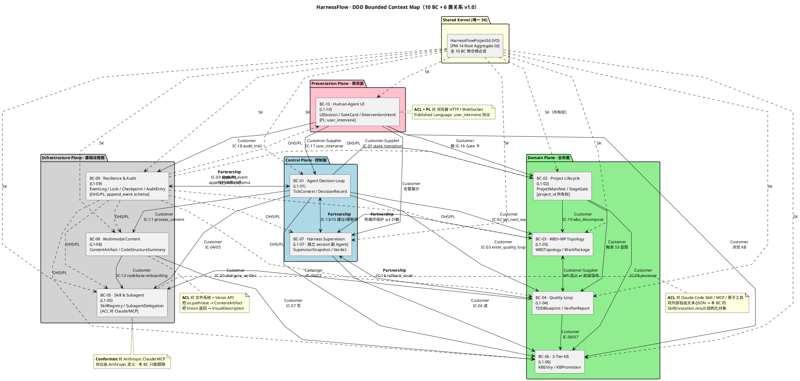
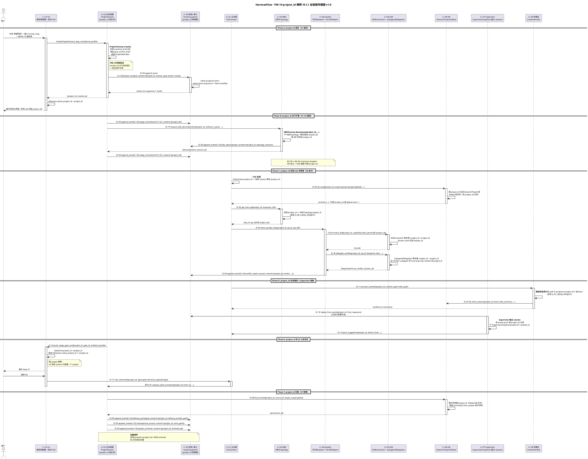
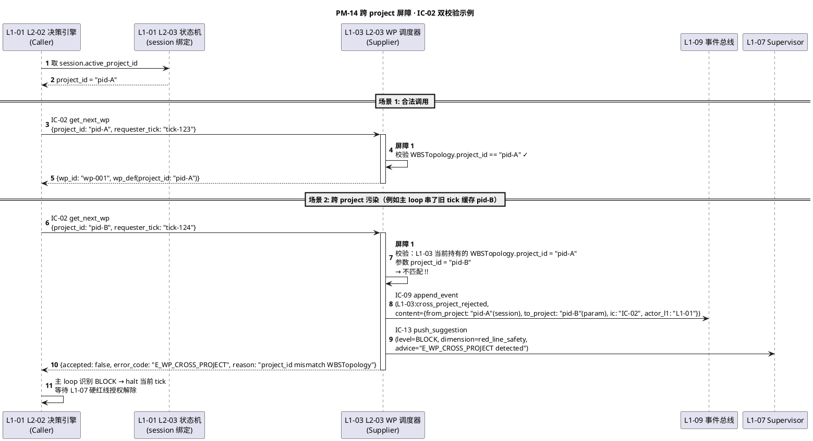

# Integration · Cross-L1 Integration（跨 L1 结构视图 v1.0）

> **本文档定位**：3-Solution Resume Phase R1 的**质量锚点 · 跨 L1 结构视图 SSOT**。以 `ddd-context-map.md §2-§3` 的 10 BC + 6 种关系为骨架，把 `ic-contracts.md §2` 的 20 条 IC 投影到 **10×10 L1 依赖矩阵**，并深挖 **PM-14 `project_id` 横跨 10 L1 全链路传播**的结构细节。
>
> **与姊妹文件的分工**（R1 四件套）：
> - `ic-contracts.md` 是**契约**视图（"每条 IC 的字段长什么样"）
> - `p0-seq.md` / `p1-seq.md` 是**时序**视图（"跨多 IC 的正向/异常流程怎么跑"）
> - **本文件是**结构**视图**（"10 L1 之间的 DDD 关系网络 + 谁依赖谁 + PM-14 传播屏障"）
> - `L0/architecture-overview.md` 是**物理**视图（"落到进程/文件/网络的部署图"）· 本文件不重叠，只引用
>
> **严格规则**：
> - 所有图一律 **PlantUML**（`@startuml` / `@enduml`）· **禁止 Mermaid**
> - 所有 BC 编号 **必须与 ddd-context-map.md §2 对齐**（BC-01~BC-10 映射 L1-01~L1-10）
> - 所有 IC 编号 **必须与 ic-contracts.md §2 对齐**（IC-01~IC-20）
> - 10×10 矩阵使用 **markdown 表格**（不用图）· 格子内容为 IC 编号 list
> - §4 **PM-14 传播链**是本文件**最重要章节**（重中之重）· 必含 "全链路 PlantUML + 每 L1 使用方式表 + 跨 project 屏障"三件套

---

## §0 撰写进度

- [x] §1 定位 + 与姊妹文件的分工（结构 vs 契约 vs 时序 vs 物理）
- [x] §2 DDD BC 关系全景
  - [x] §2.1 10 BC clipper（BC-01~BC-10 映射 L1-01~L1-10）
  - [x] §2.2 PlantUML 大图：10 BC + 10 对关系 + Customer-Supplier/Partnership/Shared Kernel 标注
  - [x] §2.3 Context Map 关系表（from BC / to BC / relationship / 实现 IC / 协同语义）
- [x] §3 L1 × L1 依赖矩阵
  - [x] §3.1 10×10 矩阵（行=依赖方 L1 · 列=被依赖 L1 · 格=涉及 IC 编号）
  - [x] §3.2 IC 频率/重要性 heat annotation
  - [x] §3.3 "谁可能成为瓶颈"分析（L1-05 / L1-06 / L1-09 三大 hub）
- [x] §4 PM-14 project_id 全链路传播图（重中之重）
  - [x] §4.1 PlantUML 大图：project_id 从 UI 创建 → 10 L1 全贯穿 → 审计归档
  - [x] §4.2 每个 L1 对 project_id 的使用方式表（作为根字段 / 值对象 / 归档维度）
  - [x] §4.3 跨 project 屏障（每 L1 如何拒绝跨 project 调用 · 错误码 E_XXX_CROSS_PROJECT）
- [x] §5 契约一致性审计点（与 ic-contracts.md §5 呼应 · 关注跨 L1 集成层面）

---

## §1 定位 + 与姊妹文件的分工

### 1.1 唯一命题

本文档是 HarnessFlow 10 个 L1 在**结构层面**的跨 L1 集成视图 SSOT。它回答三个核心问题：

1. **DDD 关系**：10 个 BC（Bounded Context · 即 10 个 L1 的 DDD 映射）之间是何种关系网（Partnership / Customer-Supplier / Shared Kernel / ACL / OHS-PL / Conformist）？
2. **依赖矩阵**：10×10 的依赖格子，每格装的是哪几条 IC？哪些 L1 是 hub（被多方依赖）？哪些是 leaf（少依赖 / 少被依赖）？
3. **PM-14 传播**：`project_id` 这个 Shared Kernel VO 如何在 10 L1 的每一次交互中被携带、校验、归档？跨 project 的污染屏障在哪里？

**不回答**：

- **字段细节** → 去 `ic-contracts.md §3`
- **时序流水** → 去 `p0-seq.md` / `p1-seq.md`
- **物理部署**（进程 / 文件 / 网络） → 去 `L0/architecture-overview.md`
- **L1 内部 L2 分解** → 去各 L1 `architecture.md`

### 1.2 与 R1 三件姊妹文件的精确分工

| 文件 | 视图 | 核心问题 | 粒度 | 与本文件交叉点 |
|---|---|---|---|---|
| `ic-contracts.md` | **契约** | "IC-01 的字段长什么样" | 单 IC 粒度 × 20 条 | 本文件 §3 矩阵里每格引用的 IC 编号 |
| `p0-seq.md` | **时序**（正向）| "一条 P0 主干串哪几条 IC 多少次" | 单 P0 粒度 × 12 条 | 本文件 §3.2 heat annotation 参考 P0 流中 IC 出现频率 |
| `p1-seq.md` | **时序**（异常/降级）| "异常降级路径串哪几条 IC" | 单 P1 粒度 × 10 条 | 本文件 §4.3 跨 project 屏障对应 P1 中的 E_XXX_CROSS_PROJECT 错误码 |
| **本文件**（cross-l1-integration.md） | **结构** | "10 L1 的 DDD 关系网 + 依赖矩阵 + PM-14 传播链" | 全图粒度 × 1 篇 | — |

**冲突仲裁**：

- 字段名字面冲突 → 以 `ic-contracts.md` 为准（字段级 SSOT）
- 时序冲突 → 以 `p0-seq.md` / `p1-seq.md` 为准（时序 SSOT）
- BC 关系 / 依赖矩阵 / PM-14 传播结构冲突 → **以本文件为准**（结构 SSOT）
- 任何下游 L2 tech-design 若发现上述四件套之间相互冲突 → 反向 PR 修源头 SSOT · 禁止 L2 自行仲裁

### 1.3 与 L1 architecture.md §2 的分工

每份 L1 architecture.md 的 §2（DDD 映射）声明**本 L1 内部**的 aggregate / entity / VO / service 分类 + **本 L1 参与的**跨 BC 关系（本 L1 视角）。本文件做**跨 L1 一致性整合**：

- 同一对 BC 关系（如 BC-01 ↔ BC-09 Partnership）在 2 份 L1 architecture 中的描述**必须一致** · 若不一致 → 本文件仲裁 + 回写 L1 architecture
- L1 architecture §2 是**本 BC 自视角**（"我与别人的关系是 X"）· 本文件是**全局平视视角**（"10 BC 的关系网整体看是什么形状"）

### 1.4 阅读路径

- **L2 工程师**写 tech-design 时想知道"本 L2 会被哪些上游 L1 调用" → 去 §3.1 矩阵**查列**（列 = 被依赖 L1）
- **TDD 工程师**写集成测试时想构造"跨 L1 污染"用例 → 去 §4.3 跨 project 屏障错误码清单
- **架构审计**想做 "DDD BC 引用纯度" 检查 → 去 §5 审计点 + §2.3 关系表
- **PM / 用户阅读**想理解"PM-14 为什么是灵魂" → 去 §4.1 全链路图 + §4.2 使用方式表

### 1.5 技术前提（从 L0/architecture-overview.md 引用 · 不重复）

- 传输：同一 Claude Code Skill 进程内的**内存调用** + L1-09 事件总线 jsonl 落盘作为 audit shadow
- 部署：单机多 session（主 session + Supervisor session + N 个 Verifier subagent session）
- 项目隔离：物理目录隔离 `projects/<pid>/`（events.jsonl / checkpoint / task-board / WBS / verifier_reports）
- 本文件聚焦**逻辑结构**而非部署细节 · 详见 `L0/architecture-overview.md §2 物理部署`

---

## §2 DDD BC 关系全景

### 2.1 10 BC 清单（BC-01~BC-10 映射 L1-01~L1-10）

> 本表是 `ddd-context-map.md §2.1` 的**镜像**（单一事实源在 ddd-context-map） + 本文件**跨 L1 关系视角**补充列（关系计数 · hub 级别）。若发现字段冲突 → 以 ddd-context-map 为准。

| BC ID | L1 映射 | BC 名称 | 核心职责（一句话）| 关键聚合根 | Partnership 对数 | Customer-Supplier 对数 | Hub 级别 |
|---|---|---|---|---|---|---|---|
| **BC-01** | L1-01 | Agent Decision Loop | 持续 tick + 5 纪律拷问 + 决策调度 | TickContext / DecisionRecord / AdviceQueue | 2（BC-07 / BC-09）| 6（BC-02/03/04/05/06/08 + BC-10 双向）| **Hub**（控制面中心）|
| **BC-02** | L1-02 | Project Lifecycle Orchestration | 7 阶段 + 4 Gate + 4 件套 + PMP + TOGAF | ProjectManifest / StageGate / FourPieces / PMPPlanSet / TOGAFArtifactSet / DeliveryPackage / Retrospective | 1（BC-09）| 5（BC-01/03/04/06/10）| 中 |
| **BC-03** | L1-03 | WBS+WP Topology Scheduling | WBS 拆解 + DAG 拓扑 + WP 调度 + 失败回退建议 | WBSTopology / WorkPackage | 2（BC-07 / BC-09）| 3（BC-01/02/04）| 中 |
| **BC-04** | L1-04 | Quality Loop | TDD 蓝图 + DoD 编译 + 测试生成 + S4 执行 + S5 TDDExe + 4 级回退 | TDDBlueprint / DoDExpressionSet / TestSuite / QualityGateConfig / VerifierReport / RollbackRouteDecision | 2（BC-07 / BC-09）| 4（BC-01/02/03/05）| 中高 |
| **BC-05** | L1-05 | Skill & Subagent Orchestration | Skill 注册表 + 意图选择 + 调用 + 子 Agent 委托 | SkillRegistry / SkillInvocation / SubagentDelegation | 1（BC-09）| 3（BC-01/04/08）+ 外部 ACL | **Hub**（外部生态 ACL）|
| **BC-06** | L1-06 | 3-Tier Knowledge Base | Session / Project / Global 三层 KB + 晋升仪式 | KBEntry / KBPromotion | 1（BC-09）| 5（BC-01/02/04/07/10）| **Hub**（知识中心）|
| **BC-07** | L1-07 | Harness Supervision | 8 维度采集 + 4 级判定 + 硬红线 + 回退路由 | SupervisorSnapshot / Verdict / HardRedLineIncident / DeadLoopCounter | 4（BC-01 / BC-03 / BC-04 / BC-09）| 2（BC-09 读 / BC-10 读）| 中（监督面中心）|
| **BC-08** | L1-08 | Multimodal Content Processing | md / code / 图片读写 + 路径安全 + 大文件降级 | ContentArtifact / CodeStructureSummary / VisualDescription | 1（BC-09）| 3（BC-01/02/04 被调 · BC-05/06 主调）| 低 |
| **BC-09** | L1-09 | Resilience & Audit | 事件总线 + 锁 + 审计 + 检查点 + 崩溃安全 | EventLog / Lock / Checkpoint / AuditEntry | **9**（与所有其他 BC）| 1（被 BC-10 query）| **Hub**（OHS/PL 单一事实源）|
| **BC-10** | L1-10 | Human-Agent Collaboration UI | 11 Tab + Gate 卡 + 实时流 + 干预 + KB 浏览 + Admin | UISession / GateCard / InterventionIntent | 0 | 5（BC-01/02/06/07/09）| 低（仅表现面）|

**三大 Hub 标注**（§3.3 详展开）：

- **BC-09（L1-09 韧性+审计）**：Partnership 对数 9，是**全系统单一事实源**（OHS/PL 发布者）· 一旦故障，所有 BC 停摆
- **BC-01（L1-01 主决策循环）**：控制面中心，任何业务都经其 tick 决策出发
- **BC-05（L1-05 Skill 生态）**：外部生态 ACL 点，所有外部 Claude Code Skill / MCP / 子 Agent 的唯一入口
- **BC-06（L1-06 KB）**：知识中心，5 个 BC 都依赖它做 kb_read / kb_write

### 2.2 PlantUML 大图：10 BC + 10 对关系 + 六种 Context Map 关系标注



**图例说明**：

- **`<-->` 实线双向箭头** = Partnership（强耦合 · 发版同步）· 4 对（BC-01↔BC-09 / BC-01↔BC-07 / BC-04↔BC-07 / BC-03↔BC-07）
- **`-->` 实线单向箭头** = Customer-Supplier（上下游）
- **`..>` 虚线单向箭头** = OHS/PL（已发布语言）或 Shared Kernel（共享内核）
- **`<b>` 粗体标签** = 关系的 DDD 类型
- **package 分层** = 控制面 / 业务面 / 基础设施面 / 表现面 / Shared Kernel（五色分区）
- **note** = ACL / Conformist 附加说明（不独立成箭头，是边界内部的实现策略）

### 2.3 Context Map 关系表（from BC → to BC · 按关系类型分组）

| # | From BC | To BC | Relationship | 实现 IC（本文件引自 ic-contracts §2）| 协同语义 |
|---|---|---|---|---|---|
| **Partnership（4 对 · 强耦合 · 发版同步）** | | | | | |
| 1 | BC-01 | BC-09 | Partnership | IC-09 append_event | 任何决策必经事件总线落盘；BC-09 故障 = BC-01 停转 |
| 2 | BC-01 | BC-07 | Partnership | IC-13 push_suggestion / IC-15 request_hard_halt | Supervisor BLOCK 级硬暂停权只对 BC-01 生效 · 双方状态互感知 |
| 3 | BC-04 | BC-07 | Partnership | IC-14 push_rollback_route / `L1-04:verifier_report_issued` 订阅 | verdict ↔ rollback_route 逻辑耦合；分级规则 BC-04 产 BC-07 判 |
| 4 | BC-03 | BC-07 | Partnership | `L1-03:wp_state_changed(failed)` 订阅 + IC-13 | 同 WP 连续失败 ≥3 次触发 BF-E-10 死循环保护；计数规则耦合 |
| **Customer-Supplier（13 对）** | | | | | |
| 5 | BC-01 | BC-02 | Customer-Supplier | IC-01 request_state_transition | BC-02 是 state 主状态机所有权方；BC-01 请求转换 |
| 6 | BC-01 | BC-03 | Customer | IC-02 get_next_wp（Query） | 每 tick 进 Quality Loop 前取下一 WP |
| 7 | BC-01 | BC-04 | Customer | IC-03 enter_quality_loop | 每 WP 启动 Quality Loop session |
| 8 | BC-01 | BC-05 | Customer | IC-04 invoke_skill / IC-05 delegate_subagent | 最高频 IC · 每 tick 数次~数十次 |
| 9 | BC-01 | BC-06 | Customer | IC-06 kb_read / IC-07 kb_write_session | 每决策 0-N 次读 + 观察累积写 |
| 10 | BC-01 | BC-08 | Customer | IC-11 process_content | 多模态内容读写 |
| 11 | BC-02 | BC-03 | Customer | IC-19 request_wbs_decomposition | S2 末 Gate 通过时请求 WBS 拆解 |
| 12 | BC-02 | BC-04 | Customer | 触发 S3 蓝图（`L1-02:four_pieces_ready` 订阅） | S3 阶段启动时 BC-04 产 TDD 蓝图 |
| 13 | BC-02 | BC-06 | Customer | IC-08 kb_promote | S7 收尾时批量晋升 KB |
| 14 | BC-03 | BC-04 | Customer-Supplier | `L1-04:wp_executed` / `L1-04:verifier_report_issued` 订阅 | 供应 WP 定义 · 消费完成状态 |
| 15 | BC-04 | BC-05 | Customer | IC-20 delegate_verifier | S5 TDDExe 必走独立 session（PM-03） |
| 16 | BC-04 | BC-06 | Customer | IC-06 / IC-07 | 读 KB 支持蓝图生成 · 写观察入 Session |
| 17 | BC-07 | BC-06 | Customer | IC-06 读 | Supervisor 读 KB 支持判定决策 |
| 18 | BC-08 | BC-05 | Customer | IC-12 delegate_codebase_onboarding | > 10 万行代码自动委托独立 session |
| 19 | BC-08 | BC-06 | Customer | IC-07 kb_write_session | 代码结构摘要入 Project KB |
| 20 | BC-10 | BC-01 | Customer-Supplier | IC-17 user_intervene / IC-16 Gate 卡反馈 | 双向：推干预 / 接 Gate 卡片 |
| 21 | BC-10 | BC-02 | Customer | IC-16 push_stage_gate_card 消费 | 展示 Gate 卡给用户决策 |
| 22 | BC-10 | BC-06 | Customer | IC-06 kb_read / IC-08 kb_promote | KB 浏览器 · 用户显式晋升 |
| 23 | BC-10 | BC-07 | Customer | `L1-07:verdict_issued` / `L1-07:hard_red_line_triggered` 订阅 | 告警展示 + 硬红线授权 UI |
| 24 | BC-10 | BC-09 | Customer | IC-18 query_audit_trail | 审计追溯查询面板 |
| **OHS/PL（9 对 · BC-09 发布 append_event schema）** | | | | | |
| 25 | BC-09 | BC-01 | OHS/PL | IC-09 schema 发布 | 发布 `{ts, type, actor, state, content, links, project_id, sequence, hash}` |
| 26 | BC-09 | BC-02 | OHS/PL | IC-09 schema | — |
| 27 | BC-09 | BC-03 | OHS/PL | IC-09 schema | — |
| 28 | BC-09 | BC-04 | OHS/PL | IC-09 schema | — |
| 29 | BC-09 | BC-05 | OHS/PL | IC-09 schema | — |
| 30 | BC-09 | BC-06 | OHS/PL | IC-09 schema | — |
| 31 | BC-09 | BC-07 | OHS/PL | IC-09 schema | — |
| 32 | BC-09 | BC-08 | OHS/PL | IC-09 schema | — |
| 33 | BC-09 | BC-10 | OHS/PL | IC-09 schema + IC-18 query_audit_trail protocol | UI 订阅事件流 |
| **Shared Kernel（10 对 · project_id VO 全共享）** | | | | | |
| 34~43 | SK | BC-01~BC-10 | Shared Kernel | `HarnessFlowProjectId` VO | 所有 BC 聚合根必含；schema 变更 10 BC 同步发版 |
| **ACL（3 BC · 对外部）** | | | | | |
| 44 | BC-05 | 外部 Claude/MCP/Tool | ACL + Conformist | — | 外部协议 → 本 BC SkillInvocation |
| 45 | BC-08 | 文件系统 + Vision | ACL | — | os.path/Vision API → ContentArtifact/VisualDescription |
| 46 | BC-10 | 浏览器 HTTP/WS | ACL + PL | IC-17 user_intervene schema 发布 | HTTP/WS → InterventionIntent |

**关系类型统计**（本文档 §2.2 大图的边数 = 46 对跨 BC 关系）：

| 关系类型 | 对数 | 比例 |
|---|---|---|
| Partnership | 4 | 9% |
| Customer-Supplier | 20 | 43% |
| OHS/PL | 9 | 20% |
| Shared Kernel | 10 | 22% |
| ACL（对外） | 3 | 6% |
| **总计** | **46** | **100%** |

**关键观察**：

1. **Customer-Supplier 占比最高**（43%）→ HarnessFlow 是典型的**业务编排型**系统
2. **Shared Kernel 占比 22%** → PM-14 的 10 BC 全量覆盖证明其"灵魂"地位
3. **OHS/PL 9 对全集中在 BC-09** → 事件总线是**单一事实源**的结构证据
4. **Partnership 仅 4 对但都围绕 BC-07 / BC-09** → 监督 + 审计是**质量底线**的两大支柱

---

## §3 L1 × L1 依赖矩阵

### 3.1 10×10 完整依赖矩阵（行=依赖方 · 列=被依赖方 · 格=涉及 IC 编号 list）

> **读法**：`矩阵[行][列]` 表示**行对应的 L1**（主动发起方 / Customer）**依赖于列对应的 L1**（被动响应方 / Supplier），格子内容是支撑该依赖的 IC 编号 list（逗号分隔）。对角线 `矩阵[i][i]` 为 `—`（本 L1 不依赖自己）· 空白格 `—` 表示无直接依赖。
>
> **范围**：本矩阵只记录**直接的 IC 调用依赖**（即 Customer → Supplier 的 Command/Query）· 不记录：
> - **Partnership 双向耦合**（已在 §2.3 专列 · 如 BC-01 ↔ BC-09 的 IC-09 只计入 `L1-01 行 × L1-09 列` 单向 · 因 append_event 语义上 L1-01 是调用方）
> - **Event 订阅**（异步单向事件广播 · 不属于 "依赖"）· 订阅关系详见 `ic-contracts.md §5.2` Event 清单
> - **Shared Kernel 共享**（project_id VO 本身不构成 IC 依赖 · 在 §4 专列）
> - **ACL 对外**（BC-05/08/10 对 Claude/FS/浏览器的 ACL 不在 L1 之间 · 略）

| 依赖方 ↓ / 被依赖方 → | L1-01 | L1-02 | L1-03 | L1-04 | L1-05 | L1-06 | L1-07 | L1-08 | L1-09 | L1-10 |
|---|---|---|---|---|---|---|---|---|---|---|
| **L1-01**（主决策）| — | IC-01 | IC-02 | IC-03 | IC-04, IC-05 | IC-06, IC-07 | — | IC-11 | IC-09 | — |
| **L1-02**（生命周期）| — | — | IC-19 | — | IC-04 | IC-08 | — | IC-11 | IC-09 | IC-16 |
| **L1-03**（WBS+WP）| — | — | — | — | IC-04 | IC-06 | — | — | IC-09 | — |
| **L1-04**（Quality）| — | — | — | — | IC-04, IC-20 | IC-06, IC-07 | — | IC-11 | IC-09 | — |
| **L1-05**（Skill）| — | — | — | — | — | IC-06 | — | — | IC-09 | — |
| **L1-06**（KB）| — | — | — | — | IC-04 | — | — | — | IC-09 | — |
| **L1-07**（Supervisor）| IC-13, IC-15 | — | — | IC-14 | — | IC-06 | — | — | IC-09, IC-10 | — |
| **L1-08**（多模态）| — | — | — | — | IC-04, IC-12 | IC-06, IC-07 | — | — | IC-09 | — |
| **L1-09**（韧性+审计）| — | — | — | — | — | — | — | — | — | — |
| **L1-10**（UI）| IC-17 | IC-16（接收） | — | — | — | IC-06, IC-08 | — | — | IC-09, IC-18 | — |

**矩阵解读**（单元格数据规则）：

- `IC-XX` = 该行 L1 向该列 L1 发起一次 IC-XX 调用
- `IC-XX, IC-YY` = 该行 L1 向该列 L1 发起多种 IC 调用
- `—` = 无直接依赖
- **行 "L1-09" 全为 `—`** → BC-09 是**下游永远不依赖任何 BC** 的**地基 BC**（Partnership 关系中 IC-09 是被调方 · L1-09 内部只发布 OHS/PL 和自生事件）· 符合单一事实源定位
- **列 "L1-09" 几乎全满** → BC-09 是**所有 BC 的必选依赖**（IC-09 append_event 是普适命令 · 仅 L1-09 自身不依赖自己）
- **列 "L1-07"** 仅 L1-03/04（Partnership 对方）列有 → L1-07 是**被 Partnership 推**而非被 Customer 拉的 BC（因 Supervisor 是副 Agent · 独立 session 反向推建议）

### 3.1.1 矩阵按行求和（依赖出度 · 本 L1 依赖了几个 L1 × 几条 IC）

| 行 L1 | 依赖 L1 数量 | 依赖 IC 总数 | 最依赖的 L1 |
|---|---|---|---|
| L1-01 主决策 | **8** | **10**（IC-01/02/03/04/05/06/07/09/11 = 9 种 + IC-05 + ...）| L1-05 / L1-06（频率高）|
| L1-02 生命周期 | 6 | 7 | L1-09（IC-09 高频）|
| L1-03 WBS | 4 | 4 | L1-09 |
| L1-04 Quality | 5 | 7 | L1-05（IC-20 重型）|
| L1-05 Skill | 2 | 2 | L1-09 |
| L1-06 KB | 2 | 2 | L1-09 |
| L1-07 Supervisor | 5 | 6 | L1-09（读事件流）|
| L1-08 多模态 | 4 | 6 | L1-05（IC-12 大文件降级）|
| L1-09 韧性+审计 | **0** | **0** | — |
| L1-10 UI | 5 | 7 | L1-09（事件流订阅）|

**观察**：

- **L1-01 依赖出度最高**（8 BC）→ 符合"主决策是一切起点"的结构
- **L1-09 依赖出度 0** → 符合"基础设施不依赖业务"的分层原则
- **L1-05 / L1-06 出度小但入度大** → 典型"供应者"（Supplier） hub 模式

### 3.1.2 矩阵按列求和（被依赖入度 · 本 L1 被几个 L1 依赖 × 几条 IC）

| 列 L1 | 被依赖 L1 数量 | 被依赖 IC 总次（去重 IC 编号）| 最被谁依赖 |
|---|---|---|---|
| L1-01 | 2（L1-07 / L1-10） | 3（IC-13, IC-15, IC-17）| L1-07（Supervisor 推建议）|
| L1-02 | 2（L1-01 / L1-10） | 2（IC-01, IC-16）| L1-01 |
| L1-03 | 2（L1-01 / L1-02） | 2（IC-02, IC-19） | L1-01 / L1-02 平分 |
| L1-04 | 2（L1-01 / L1-07） | 2（IC-03, IC-14）| — |
| L1-05 | **6**（L1-01/02/03/04/06/08）| **3**（IC-04, IC-05, IC-12, IC-20）| L1-01（最高频）|
| L1-06 | **7**（L1-01/02/03/04/05/07/08/10）| **3**（IC-06, IC-07, IC-08）| L1-01 / L1-04 双高频 |
| L1-07 | 0 | 0 | — |
| L1-08 | **3**（L1-01/02/04）| 1（IC-11）| L1-04（S5 验证读代码）|
| L1-09 | **9**（所有其他 L1）| **3**（IC-09, IC-10, IC-18）| **全员高频**（IC-09）|
| L1-10 | 1（L1-02）| 1（IC-16）| L1-02（Gate 卡）|

**观察**：

- **L1-09 被依赖入度最高（9）+ 最高频（IC-09 每 tick 多次）** → **系统头号 hub**
- **L1-06 被依赖入度第二（7）** → 知识中心 hub · KB 是贯穿所有 BC 的横切关注点
- **L1-05 被依赖入度第三（6）** → 能力执行 hub · 所有业务最终都要调 skill / 子 Agent 做活
- **L1-07 入度 0** → 符合"旁路副 Agent 只推不拉"的设计

### 3.2 IC 频率 / 重要性 Heat Annotation

> **方法**：以 `ic-contracts.md §2 频率列` + `p0-seq.md` 中 IC 出现次数为基础 · 映射到 4 档热度（🔥🔥🔥 极高 / 🔥🔥 高 / 🔥 中 / · 低）。

| IC | 调用 pair | 热度 | 频率 SLO | 重要性 | 备注 |
|---|---|---|---|---|---|
| IC-09 | 所有 L1 → L1-09 | 🔥🔥🔥 **极高** | 每决策 / 每步骤 / 每事件 | **命脉** | 系统单一事实源 · fsync 20ms |
| IC-04 | 多 L1 → L1-05 | 🔥🔥🔥 **极高** | 每 tick 数次~数十次 | 核心 | 最高频业务 IC |
| IC-06 | 多 L1 → L1-06 | 🔥🔥 **高** | 每决策 0-N 次 | 核心 | KB 读 |
| IC-13 | L1-07 → L1-01 | 🔥🔥 **高** | 按监督频率（30s tick）| 重要 | 建议通道（fire-and-forget）|
| IC-02 | L1-01 → L1-03 | 🔥🔥 **高** | 每 tick 进 Quality Loop 前 | 重要 | 取下一 WP |
| IC-07 | 多 L1 → L1-06 | 🔥 **中** | 观察累积每 tick N 次 | 重要 | KB 写 session |
| IC-03 | L1-01 → L1-04 | 🔥 **中** | 每 WP | 重要 | 启动 Quality Loop |
| IC-11 | 多 L1 → L1-08 | 🔥 **中** | 按 content 需求 | 一般 | md/代码/图片读 |
| IC-05 | 多 L1 → L1-05 | 🔥 **中** | 按需 | 重要 | 子 Agent 委托 |
| IC-18 | L1-10 → L1-09 | 🔥 **中** | UI 查询时 | 一般 | 审计追溯 |
| IC-01 | L1-01 → L1-02 | · 低 | 每 Stage Gate（7 主 + N WP）| 关键 | 低频高重要 |
| IC-14 | L1-07 → L1-04 | · 低 | S5 FAIL 触发 | 重要 | 回退路由 |
| IC-15 | L1-07 → L1-01 | · 低 | 极低频（硬红线）| **关键** | ≤100ms 硬暂停 |
| IC-16 | L1-02 → L1-10 | · 低 | 每 Gate（7 次）| 关键 | UI 渲染 Gate 卡 |
| IC-17 | L1-10 → L1-01 | · 低 | 用户触发 | 关键 | panic ≤100ms |
| IC-08 | 多 L1 → L1-06 | · 低 | S7 或用户批准 | 一般 | KB 晋升 |
| IC-19 | L1-02 → L1-03 | · 低 | S2 Gate 通过（1-2 次）| 重要 | WBS 拆解 |
| IC-20 | L1-04 → L1-05 | · 低 | S5 每 WP 1 次 | **关键** | 独立 session Verifier |
| IC-12 | L1-08 → L1-05 | · 低 | 大代码库首次 | 重要 | codebase-onboarding |
| IC-10 | L1-09 内部 | · 低 | 恢复/审计时 | 重要 | Event replay |

**Heat 归档规则**：

- **🔥🔥🔥 极高**（2 条：IC-09 / IC-04）→ 系统性能瓶颈第一梯队
- **🔥🔥 高**（3 条：IC-06 / IC-13 / IC-02）→ 频繁调用 · 需关注 SLO
- **🔥 中**（5 条：IC-07/03/11/05/18）→ 常规业务频率
- **· 低**（10 条）→ 但**低频不代表不重要**：IC-01/15/16/17/20 是**关键级**低频 IC（一旦失败即严重事故）

### 3.3 "谁可能成为瓶颈"分析（L1-05 / L1-06 / L1-09 三大 Hub）

基于 §3.1 矩阵入度 + §3.2 Heat：

#### 3.3.1 L1-09（韧性+审计）· 头号瓶颈候选

**结构特征**：

- 入度 9（全员依赖）· 出度 0
- IC-09 热度 🔥🔥🔥 极高（每决策 / 每事件必经）· SLO P95 ≤ 20ms
- 所有 IC 的 `content` 字段都会**二次落到 IC-09 事件**（`ic-contracts.md` 所有 IC 的 §3.N.6 时序图末端必经 append_event）

**瓶颈风险**：

| 风险点 | 表现 | 缓解（已在 L1-09 tech-design §5 设计）|
|---|---|---|
| fsync IO 争抢 | 单 jsonl 高频追加 · fsync 等待 | 事件总线内部队列 + 批量 fsync（但保 atomic）· 每 100 条或 5s 触发 |
| 锁冲突 | 多 BC 并发写 task-board / state | L2-02 锁管理器按 project/wp/state 三级粒度加锁 · 死锁识别 |
| 事件积压 | 主 loop 决策频率 > fsync 频率 | 内存 ring buffer 缓冲 · fsync 慢时降级（async · 但保 WAL）|
| 完整性损坏 | 磁盘坏块 / fsync 失效 | hash 链验证 · 损坏跳块 + 告警 L1-07 · 从 checkpoint 恢复 |

**连锁影响**：L1-09 停摆 → L1-01 决策无法留痕 → 整系统**不得继续推进**（硬约束 BC-01 任何决策必经 IC-09） → **雪崩**

#### 3.3.2 L1-06（3 层 KB）· 二号瓶颈候选

**结构特征**：

- 入度 7（L1-01/02/03/04/05/07/08/10 均调用）
- IC-06 kb_read 热度 🔥🔥 高（每决策 0-N 次）· SLO P95 ≤ 500ms
- Session 层写高频（每次观察累积）· Project 层读高频（阶段注入 + rerank）

**瓶颈风险**：

| 风险点 | 表现 | 缓解 |
|---|---|---|
| Rerank 慢 | 多信号（阶段 + 任务 + 技术栈 + observed_count）排序 | L2-05 Rerank 内存化 + top_k 截断（k=10） |
| Project KB 膨胀 | 累积条目多导致 kb_read 慢 | Session 7 天过期 · Project 级定期归档到 `history/` |
| 跨 session 污染 | Session KB 未按 project 物理隔离 | 路径强约束 `projects/<pid>/session_kb/` · 校验层强校验 |

**连锁影响**：L1-06 慢 → L1-01 每 tick 等待 KB 响应 → tick 频率下降 → 感知 "系统卡顿"；但**不至于雪崩**（kb_read 可降级返回空）

#### 3.3.3 L1-05（Skill 生态）· 三号瓶颈候选

**结构特征**：

- 入度 6（L1-01/02/03/04/06/08）
- IC-04 invoke_skill 热度 🔥🔥🔥 极高（每 tick 数次~数十次）· SLO 按 skill 类型（毫秒~分钟级）
- 子 Agent 委托（IC-05/12/20）是重型异步调用 · 独立 session 启动开销

**瓶颈风险**：

| 风险点 | 表现 | 缓解 |
|---|---|---|
| 外部 skill 超时 | Claude / MCP / tool 响应慢 | L2-03 调用执行器 fallback 链（2 备选 + 内建） |
| 子 Agent 并发爆炸 | 多 L1 同时委托子 Agent · OS 进程数飙升 | L2-04 子 Agent 委托器全局并发上限（默认 ≤3）+ 排队 |
| schema 校验拒绝 | 外部返回不符合 ACL 翻译规则 | L2-05 异步回收器校验 + 降级 fallback |

**连锁影响**：L1-05 慢 → L1-04 S5 Verifier 延期 → Gate 卡延后 → 项目周期拖长 · 但**不至于雪崩**（有 fallback + timeout kill）

#### 3.3.4 其他次级瓶颈

- **L1-04 Quality Loop**：重型但单 WP 串行 · 不是系统级瓶颈
- **L1-07 Supervisor**：独立 session · 自身瓶颈（30s tick 内完成 8 维度采集）不影响主 loop 吞吐
- **L1-10 UI**：用户驱动 · 不是频率瓶颈

#### 3.3.5 扩缩容 / 优化建议（给 3-2 TDD + 运行期调参用）

| Hub | 优化优先级 | 具体动作 |
|---|---|---|
| L1-09 | **P0 最高** | 批量 fsync · hash 链异步校验 · jsonl 按 project 分目录 · checkpoint 压缩 |
| L1-06 | P1 | top_k 精简 · rerank 结果缓存 · Session 快速过期 |
| L1-05 | P1 | 子 Agent 并发限制 · fallback 链提前返回 · skill 版本缓存 |
| L1-04 | P2 | Verifier timeout 精调 · DoD 表达式 AST 缓存 |

---

## §4 PM-14 project_id 全链路传播图（重中之重）

> **本章节地位**：PM-14 `harnessFlowProjectId` 是 HarnessFlow 的"灵魂"· 所有 10 L1 都必须保证它**正确创建、无损传递、严格校验、完整归档**。本章节是本文件**最重要章节**，从结构层面给出"project_id 如何横跨 10 L1 走完一个完整生命周期"的权威视图。
>
> **与 `ddd-context-map.md §6` 的分工**：§6 从 DDD 概念角度定义 project_id 是什么（Shared Kernel VO）· 本章节从**跨 L1 结构**角度给出它**如何跑完 10 L1 全链路**的视图 + 屏障。

### 4.1 project_id 全链路传播 PlantUML 大图（UI 创建 → 10 L1 贯穿 → 审计归档）



**图解要点**：

1. **诞生点唯一**：`project_id` 只在 **BC-02 L1-02 L2-02 启动阶段产出器**（ProjectFactory）生成 · 其他 BC 只能传递不能再生
2. **物理根唯一**：`project_id` 的物理承载是 BC-09 L1-09 维护的 `projects/<pid>/events.jsonl` · 这是"事实源的事实源"
3. **10 L1 全贯穿**：Phase B/C/D/E 依次覆盖 L1-02/03/04/05/06/07/08/10（加上 Phase A 的 L1-02 + 全程 L1-01/09） = **10/10 L1 全命中**
4. **归档闭环**：Phase F 中 `kb_promote` 晋升到 Global 时**剥离** project_id（Global KB 是"无主资产"）· 但保留 `promoted_from_project` 审计字段

### 4.2 每个 L1 对 project_id 的使用方式表

> **三大使用方式分类**：
> - **根字段（Root Field）**：project_id 作为聚合根 schema 第一层字段（非嵌套）
> - **值对象（VO Injection）**：project_id 作为不可变 VO 注入到某 entity/command/event
> - **归档维度（Archive Dimension）**：project_id 作为文件系统 / 事件流 / 审计查询的分区键

| L1 | 使用方式 | 具体聚合 / 字段 / 路径 | 校验时机 | 归档体现 |
|---|---|---|---|---|
| **L1-01** 主决策 | **根字段** + **VO 注入** | `TickContext.project_id` / `DecisionRecord.project_id` / `AdviceQueue.project_id` | 每 tick 启动时 · IC-09 落事件前 | 决策轨迹按 project 归档在 `projects/<pid>/decisions/` |
| **L1-02** 生命周期 | **根字段**（所有权方）+ **归档维度** | `ProjectManifest.project_id`（主聚合根）· `StageGate.project_id` · `FourPieces.project_id` · `PMPPlanSet.project_id` · `TOGAFArtifactSet.project_id` · `DeliveryPackage.project_id` · `Retrospective.project_id` | ProjectFactory.create() 时诞生 · 任何 S1 后不可改 | 整个 `projects/<pid>/` 目录是本 L1 直接产出物的归档 |
| **L1-03** WBS | **根字段** + **归档维度** | `WBSTopology.project_id`（聚合根）· `WorkPackage.project_id`（每 WP 内部也冗余）· `FailureCounter.project_id` | IC-19 接收时 · IC-02 查询时 | `projects/<pid>/wbs-topology.json` · `projects/<pid>/wps/<wp_id>/` |
| **L1-04** Quality | **根字段** + **VO 注入** + **归档维度** | `TDDBlueprint.project_id` · `DoDExpressionSet.project_id` · `TestSuite.project_id` · `VerifierReport.project_id`（注入子 Agent context） | IC-03 接收时 · IC-20 发起前校验 session 绑定 | `projects/<pid>/tdd-blueprint.md` · `projects/<pid>/verifier_reports/*.json` |
| **L1-05** Skill | **VO 注入**（Context 副本）| `SkillInvocation.project_id` · `SubagentDelegation.context_copy` 含 project_id · `params_hash` 包含 project_id | IC-04/05/12/20 接收时 · 子 Agent 启动传递时 | 调用日志 `projects/<pid>/skill_invocations.jsonl` |
| **L1-06** KB | **根字段**（Session/Project 层）+ **剥离**（Global 层）+ **归档维度** | `KBEntry.project_id`（Session/Project · Global 则为 null + `promoted_from_project`）· `KBPromotion.project_id` | 读时过滤 · 写时强制带 project_id（除 Global）| `projects/<pid>/session_kb/` · `projects/<pid>/project_kb/` · `global_kb/`（共享）|
| **L1-07** Supervisor | **VO 注入** + **归档维度** | `SupervisorSnapshot.project_id` · `Verdict.project_id` · `HardRedLineIncident.project_id` · `DeadLoopCounter.project_id` | 每 30s tick 采集时 · IC-10 replay 时过滤 | `projects/<pid>/supervisor_snapshots.jsonl` |
| **L1-08** 多模态 | **根字段** + **路径校验键** | `ContentArtifact.project_id` · `CodeStructureSummary.project_id` · `VisualDescription.project_id` · **path ⊂ `projects/<pid>/`** 白名单 | IC-11 每次调用 · 路径白名单强校验 | `projects/<pid>/artifacts/*.md` / `content_images/` |
| **L1-09** 韧性+审计 | **物理根**（目录分区）+ **事件字段** + **归档维度** | 每条 event 的 `content.project_id`（或 `project_scope=system`）· `EventLog.project_id` · `Checkpoint.project_id` · `AuditEntry.project_id` · `Lock.project_id`（lock_id 命名空间分隔） | IC-09 接收时 schema 校验 · IC-10/18 过滤 | `projects/<pid>/events.jsonl` · `projects/<pid>/checkpoints/` · `projects/<pid>/audit_entries/` |
| **L1-10** UI | **Session 绑定键** + **URL 路由参数** | `UISession.active_project_id`（任一时刻唯一）· `GateCard.project_id` · `InterventionIntent.project_id` · URL `/project/<pid>/tab/xxx` | 切换 project 时 reset UISession · IC-17 发起前校验 | UI 本身不归档（无状态）· 依赖 L1-09 audit_trail |

### 4.2.1 特殊使用方式：Global KB 的"剥离"

BC-06 L1-06 的 **Global 层 KBEntry** 是唯一的例外：

```yaml
# Global 层 KBEntry schema 片段
KBEntry:
  scope: global
  project_id: null                            # Global 是"无主资产"
  promoted_from_project: "<pid>"              # 但保留晋升来源审计
  promoted_at: iso8601
  promotion_approval: {type, approver, ts}
```

**设计原因**：

- Global KB 是**跨项目复用**的知识资产 · 若带 project_id 则跨 project 无法消费
- 但**审计必须可追溯** → 保留 `promoted_from_project` 单向指针
- 本规则**仅限 Global 层** · Session/Project 层 project_id 强制非空

### 4.2.2 特殊使用方式：系统级事件的 "project_scope=system"

BC-09 L1-09 的 **IC-09 append_event** 是唯一的例外：

```yaml
# 系统级事件示例
append_event_command:
  event_type: "L1-09:system_resumed"
  project_scope: "system"                     # 显式标系统级
  project_id: null                            # 允许为空（仅此情况）
  content: { recovered_project_ids: [...], recovered_at: ... }
```

**适用场景**：

- 系统启动 / 崩溃恢复（影响多 project · 无法归属单一 project）
- 全局配置变更（scope 枚举 / 阈值表）
- Supervisor 巡检全局性事件（如跨项目统计）

**强约束**：非系统级事件必须带 `project_id` · 违反时 `E_EVT_NO_PROJECT_OR_SYSTEM` 拒绝。

### 4.3 跨 project 屏障（每 L1 如何拒绝跨 project 调用 · 错误码统一 `E_XXX_CROSS_PROJECT`）

> **跨 project 污染定义**：A 项目的某 L1 尝试读 / 写 / 调用 B 项目的数据或聚合根（包括但不限于：错误的 project_id 传参、session 绑定错项目、路径越界、事件流查询越界等）。
>
> **屏障设计原则**：
> 1. **双校验**：发起方（Customer）校验 + 响应方（Supplier）再次校验
> 2. **早拒绝**：在 IC payload schema 校验层拒绝 · 不允许进入业务逻辑后再发现
> 3. **强告警**：每次跨 project 拒绝必写 `L1-07:hard_red_line_triggered`（DRIFT_CRITICAL 类 · 属 PM-07 红线安全）
> 4. **审计留痕**：拒绝记录必经 IC-09 落 events.jsonl · 包含 from_project / to_project / actor_l1 / attempted_action

#### 4.3.1 10 L1 跨 project 屏障错误码清单

| L1 | 错误码 | 触发场景 | 发起方职责 | 响应方职责 | 严重度 |
|---|---|---|---|---|---|
| **L1-01** | `E_TICK_CROSS_PROJECT` | Tick 绑定的 project_id ≠ session active_project_id | 主 session 绑定时校验 | Tick 启动时再校验 | 极重（halt 整 tick）|
| **L1-01** | `E_DEC_CROSS_PROJECT` | DecisionRecord 尝试路由到不同 project 的 BC | 决策引擎路由前校验 | 目标 BC 接收时校验 | 重 |
| **L1-02** | `E_TRANS_CROSS_PROJECT` | IC-01 transition 的 project_id ≠ L1-02 持有 ProjectManifest.project_id | L1-01 发起前校验 | L1-02 接收时校验（ic-contracts §3.1.4） | 极重 |
| **L1-02** | `E_GATE_CROSS_PROJECT` | GateCard 回传 project_id 不匹配 | L1-10 发起前 | L1-02 接收时 | 重 |
| **L1-03** | `E_WP_CROSS_PROJECT` | IC-02 查询跨 project WP（project A 查 project B 的 WP）| L1-01 发起前 | L1-03 接收时（ic-contracts §3.2.4） | 极重 |
| **L1-03** | `E_WBS_CROSS_PROJECT` | IC-19 拆解请求 project_id 与 artifacts 归属不一致 | L1-02 发起前 | L1-03 接收时 | 极重 |
| **L1-04** | `E_QLOOP_CROSS_PROJECT` | IC-03 wp_id 归属项目 ≠ command.project_id | L1-01 发起前 | L1-04 接收时 | 极重 |
| **L1-04** | `E_VER_CROSS_PROJECT` | IC-20 verifier context 含跨 project 数据 | L1-04 装配 context 时 | L1-05 校验 context_copy_hash | 重 |
| **L1-05** | `E_SKILL_CROSS_PROJECT` | IC-04 params_hash 包含跨 project 数据 | 各 L1 发起前 | L1-05 接收时 | 重 |
| **L1-05** | `E_SUB_CROSS_PROJECT` | IC-05/12/20 subagent context_copy 跨 project | 发起方装配前 | L1-05 接收时 | 重 |
| **L1-06** | `E_KB_CROSS_PROJECT` | IC-06 读 Session/Project 层时 project_id 不匹配 | 发起方 | L1-06 接收时（Session/Project 严格过滤） | 中（kb_read 可降级返空）|
| **L1-06** | `E_KBW_CROSS_PROJECT` | IC-07 写入的 entry.project_id ≠ caller.project_id | 发起方 | L1-06 接收时 | 重 |
| **L1-06** | `E_KBP_CROSS_PROJECT` | IC-08 晋升源 entry.project_id ≠ caller.project_id | 发起方 | L1-06 接收时 | 重 |
| **L1-07** | `E_SUGG_CROSS_PROJECT` | IC-13 推建议 project_id ≠ 主 loop active project | L1-07 发起前 | L1-01 接收时 | 中 |
| **L1-07** | `E_HALT_CROSS_PROJECT` | IC-15 硬暂停 project_id ≠ 主 loop active project | L1-07 发起前 | L1-01 接收时 | 极重 |
| **L1-07** | `E_ROUTE_CROSS_PROJECT` | IC-14 回退路由 wp_id 归属 ≠ command.project_id | L1-07 发起前 | L1-04 接收时 | 重 |
| **L1-08** | `E_PC_CROSS_PROJECT` | IC-11 读写路径 ∉ `projects/<command.project_id>/` 或白名单 | L1-08 路径白名单校验层 | — | 极重 |
| **L1-08** | `E_OB_CROSS_PROJECT` | 代码结构摘要落库时 project_id 不匹配 | L1-08 写 KB 前 | L1-06 接收时 | 重 |
| **L1-09** | `E_EVT_CROSS_PROJECT` | IC-09 append_event content.project_id ≠ session 绑定 | 发起方 | L1-09 接收时 | 极重 |
| **L1-09** | `E_EVT_NO_PROJECT_OR_SYSTEM` | IC-09 payload 缺 project_id 且未标 `project_scope=system` | 发起方 | L1-09 接收时 | 极重 |
| **L1-09** | `E_REP_CROSS_PROJECT` | IC-10 replay 尝试跨 project 查询 | 发起方（通常 L1-07） | L1-09 接收时 | 重 |
| **L1-09** | `E_QAT_CROSS_PROJECT` | IC-18 审计查询跨 project 归属 | L1-10 发起前 | L1-09 接收时 | 中（UI 可拒绝）|
| **L1-10** | `E_INT_CROSS_PROJECT` | IC-17 user_intervene project_id ≠ UISession.active_project_id | L1-10 发起前 | L1-01 接收时 | 重 |
| **L1-10** | `E_CARD_CROSS_PROJECT` | IC-16 GateCard 接收时 project_id ≠ active | L1-02 发起前 | L1-10 接收时 | 中 |

**统计**：24 条跨 project 错误码 · 覆盖全 10 L1 · 极重 10 条 / 重 10 条 / 中 4 条。

#### 4.3.2 屏障双校验 PlantUML 示例（IC-02 get_next_wp · 跨 project 拒绝）



#### 4.3.3 跨 project 屏障的覆盖矩阵（哪些 IC pair 必须设屏障）

| IC | 屏障侧 | 关键字段 | 失败行为 |
|---|---|---|---|
| IC-01 | L1-02 | transition_request.project_id | 拒绝 · E_TRANS_CROSS_PROJECT |
| IC-02 | L1-03 | WBSTopology.project_id | 拒绝 · E_WP_CROSS_PROJECT |
| IC-03 | L1-04 | wp_def.project_id | 拒绝 · E_QLOOP_CROSS_PROJECT |
| IC-04 | L1-05 | params_hash 含 project_id | 拒绝 · E_SKILL_CROSS_PROJECT |
| IC-05 | L1-05 | context_copy.project_id | 拒绝 · E_SUB_CROSS_PROJECT |
| IC-06 | L1-06 | scope-aware 过滤 | 返空 + 告警 · E_KB_CROSS_PROJECT |
| IC-07 | L1-06 | entry.project_id | 拒绝 · E_KBW_CROSS_PROJECT |
| IC-08 | L1-06 | source_entry.project_id | 拒绝 · E_KBP_CROSS_PROJECT |
| IC-09 | L1-09 | content.project_id + project_scope | 拒绝 · E_EVT_NO_PROJECT_OR_SYSTEM |
| IC-10 | L1-09 | query.project_id | 拒绝 · E_REP_CROSS_PROJECT |
| IC-11 | L1-08 | path ⊂ projects/<pid>/ 或白名单 | 拒绝 · E_PC_CROSS_PROJECT |
| IC-12 | L1-05 | context_copy.project_id | 拒绝 · E_SUB_CROSS_PROJECT |
| IC-13 | L1-01 | advice.project_id | 拒绝 · E_SUGG_CROSS_PROJECT |
| IC-14 | L1-04 | wp_id 归属校验 | 拒绝 · E_ROUTE_CROSS_PROJECT |
| IC-15 | L1-01 | halt.project_id | 拒绝 · E_HALT_CROSS_PROJECT |
| IC-16 | L1-10 | card.project_id == UISession.active | 拒绝展示 · E_CARD_CROSS_PROJECT |
| IC-17 | L1-01 | intent.project_id | 拒绝 · E_INT_CROSS_PROJECT |
| IC-18 | L1-09 | query.project_id | 拒绝 · E_QAT_CROSS_PROJECT |
| IC-19 | L1-03 | artifacts.project_id | 拒绝 · E_WBS_CROSS_PROJECT |
| IC-20 | L1-05 | delegation.project_id | 拒绝 · E_VER_CROSS_PROJECT（本规则独立于 E_VER_MUST_BE_INDEPENDENT_SESSION） |

**结论**：**20/20 条 IC 全部必须设跨 project 屏障** · 无豁免。

### 4.4 project_id 无损传递的 3 条硬约束

从上述 §4.1~§4.3 析出的 PM-14 硬约束（供 3-2 TDD 派生测试用例参考）：

1. **单诞生点约束**：`project_id` 只由 **BC-02 L1-02 L2-02 ProjectFactory.create()** 生成 · 其他任何 BC 发现手造 project_id → 硬红线
2. **不可变约束**：`project_id.machine_id` 字段一经创建不得改 · `human_slug` 可改但不影响 machine_id · 任何 L1 的改写操作都必须保留原 machine_id
3. **双校验约束**：所有 IC pair 必双校验（发起方 + 响应方）· 缺一侧即视为屏障失效 · quality_gate.sh Gate 8 审计

---

## §5 契约一致性审计点（跨 L1 集成层面 · 与 ic-contracts.md §5 呼应）

> **本章节定位**：`ic-contracts.md §5` 给出的是**字段级 / 错误码 / PlantUML**的契约一致性审计钩子（quality_gate.sh Gate 7）· 本章节给出**跨 L1 集成层面**的结构一致性审计钩子（预留 quality_gate.sh Gate 8-10）· 两者互补，不重叠。

### 5.1 Gate 8：DDD BC 引用纯度审计（本文件 §2 + `ddd-context-map.md` 对照）

**规则 1（聚合引用纯度）**：

所有 L2 tech-design.md §2.x 中声明的跨 BC 引用**必须通过 ID / VO 引用**（`xxx_id` 字段）· **禁止**直接持有对方聚合根对象引用。

**审计伪代码**（quality_gate.sh Gate 8.1）：

```bash
# 扫 57 份 L2 tech-design 中的跨 BC 引用字段
for l2 in docs/3-1-Solution-Technical/L1-*/L2-*.md; do
  # 寻找形如 "BC-XX的聚合根" + "持有 + 聚合根名" 的模式
  # 合法：xxx_id / xxx_ref（值引用）
  # 违规：直接持有 AggregateName 对象
  grep -oE "(持有|包含|直接引用).*Aggregate" "$l2" | \
    grep -v "_id\|_ref" | tee -a gate_8_violations.log
done
```

**规则 2（Partnership 对称性）**：

§2.3 表中声明 Partnership 的 4 对 BC（BC-01↔BC-09 / BC-01↔BC-07 / BC-04↔BC-07 / BC-03↔BC-07）· 两侧 L1 architecture.md §2 必须都声明对方为 Partnership（而非 Customer / Supplier）。

**审计伪代码**：

```bash
# 校验 Partnership 双向声明对称
pairs=(
  "L1-01:L1-09"
  "L1-01:L1-07"
  "L1-04:L1-07"
  "L1-03:L1-07"
)
for pair in "${pairs[@]}"; do
  a="${pair%:*}"
  b="${pair#*:}"
  grep -l "Partnership.*${b}" "docs/3-1-Solution-Technical/${a}-*/architecture.md"
  grep -l "Partnership.*${a}" "docs/3-1-Solution-Technical/${b}-*/architecture.md"
  # 两侧都有 Partnership 标注方算对称
done
```

**规则 3（Shared Kernel 唯一性）**：

全系统仅有**一个** Shared Kernel：`HarnessFlowProjectId` VO。若任何 L1 architecture 或 L2 tech-design 声明**第二个** Shared Kernel（例如 `GlobalConfigVO` / `SharedTimestampVO`） → **拒绝**。

### 5.2 Gate 9：10×10 依赖矩阵闭合审计（本文件 §3.1）

**规则 1（矩阵与 IC 清单闭合）**：

`§3.1 矩阵` 中出现的所有 IC 编号 ∈ `ic-contracts.md §2` 的 20 IC 清单 · 不允许出现 IC-21/IC-99 等未定义编号。

**审计伪代码**（quality_gate.sh Gate 9.1）：

```bash
# 提取本文件 §3.1 矩阵中所有 IC 编号
ic_in_matrix=$(grep -oE "IC-[0-9]{2}" docs/3-1-Solution-Technical/integration/cross-l1-integration.md | sort -u)
# 提取 ic-contracts.md §2 定义的 IC 编号
ic_defined=$(grep -oE "\| IC-[0-9]{2} \|" docs/3-1-Solution-Technical/integration/ic-contracts.md | sort -u)
# 差集必为空
diff <(echo "$ic_in_matrix") <(echo "$ic_defined") | grep "^<" && echo "Gate 9.1 FAIL"
```

**规则 2（矩阵与 L2 对外接口闭合）**：

每 L2 tech-design.md §3（对外接口）声明本 L2 参与的 IC 编号必须能在本文件 §3.1 矩阵中**对应的行或列**找到。

**审计伪代码**（Gate 9.2）：

```bash
# 遍历每 L2 检查其 §3 引用的 IC 与矩阵一致性
for l2 in docs/3-1-Solution-Technical/L1-*/L2-*.md; do
  l1_dir=$(dirname "$l2" | xargs basename)
  l1_num=$(echo "$l1_dir" | grep -oE "L1-[0-9]{2}")
  ic_in_l2=$(grep -oE "IC-[0-9]{2}" "$l2" | sort -u)
  # 每条 IC 对应的 from/to 必含 l1_num
  for ic in $ic_in_l2; do
    # 查 §3.1 矩阵中该 IC 对应的行/列是否含 l1_num
    ...
  done
done
```

**规则 3（依赖矩阵 + Event 订阅正交性）**：

§3.1 矩阵只记录 Command/Query 直接依赖 · Event 订阅关系在 `ic-contracts.md §5.2` · 两者不可重复记录。若本文件矩阵格子出现的 IC 属于"纯事件"（如 `L1-xx:xxx_event` 订阅而非 IC-XX 命令/查询）→ 审计警告。

### 5.3 Gate 10：PM-14 跨 project 屏障完整性审计（本文件 §4.3）

**规则 1（20/20 IC 屏障覆盖）**：

§4.3.3 覆盖矩阵中 20 条 IC 全部必须在对应 L2 tech-design.md §3.N.4 错误码表中声明 `E_XXX_CROSS_PROJECT` 错误码 · 缺一条即 Gate 失败。

**审计伪代码**（quality_gate.sh Gate 10.1）：

```bash
# 20 条 IC 必含的 CROSS_PROJECT 错误码（本文件 §4.3.1 清单）
declare -A required_errors=(
  [IC-01]="E_TRANS_CROSS_PROJECT"
  [IC-02]="E_WP_CROSS_PROJECT"
  [IC-03]="E_QLOOP_CROSS_PROJECT"
  ...  # 20 条
)

for ic in "${!required_errors[@]}"; do
  err="${required_errors[$ic]}"
  # 查 ic-contracts.md §3.N 对应位置是否声明该错误码
  grep -q "$err" docs/3-1-Solution-Technical/integration/ic-contracts.md || {
    echo "Gate 10.1 FAIL: ic-contracts.md 缺 $ic 的 $err"
  }
  # 查对应 L2 tech-design.md §3.N.4 是否声明该错误码
  ...
done
```

**规则 2（双校验对称性）**：

§4.3 规定的每条 IC 的 "Caller 校验 + Supplier 校验" 两侧代码（在 L2 tech-design §4 算法 / §5 时序里）必须都声明校验步骤 · 若仅 Supplier 有校验（无 Caller 校验）或反之 → 审计警告（屏障存在单点失效风险）。

**规则 3（Global KB 剥离规则）**：

`L1-06 L2-04 KB 晋升仪式执行器` tech-design §4 的晋升算法必须显式包含：

```python
# 晋升到 Global 时剥离 project_id
if target_scope == "global":
    new_entry.project_id = None
    new_entry.promoted_from_project = source_entry.project_id
    new_entry.promoted_at = utcnow()
```

否则 Gate 10.3 失败。

### 5.4 Gate 11：跨 L1 结构文档 SSOT 回环审计

**规则 1（四件套互引回环）**：

本 R1 质量锚点的 4 份文件必须互引：

| 本文件 | 应引用的上游 | 应被引用的下游 |
|---|---|---|
| `ic-contracts.md` | — | `p0-seq.md` / `p1-seq.md` / 本文件 / L2 tech-design |
| `p0-seq.md` | `ic-contracts.md` | `p1-seq.md` / 本文件 / L2 tech-design |
| `p1-seq.md` | `ic-contracts.md` + `p0-seq.md` | 本文件 / L2 tech-design |
| **本文件**（cross-l1-integration.md）| 上述 3 份 + `ddd-context-map.md` + 10 L1 architecture | L2 tech-design / 3-2 TDD |

**审计伪代码**（quality_gate.sh Gate 11）：

```bash
# 校验四件套的 parent_doc frontmatter 互引完整
for quad in ic-contracts.md p0-seq.md p1-seq.md cross-l1-integration.md; do
  # 每份必含 traceability + parent_doc + consumer frontmatter
  # 且 parent_doc 链接必须是上述清单的子集
  ...
done
```

**规则 2（doc_id 唯一性）**：

四件套的 `doc_id` 值必须互异 · 当前清单：

- `integration-ic-contracts-v1.0`
- `integration-p0-seq-v1.0`
- `integration-p1-seq-v1.0`
- `integration-cross-l1-v1.0`（本文件）

### 5.5 审计点汇总

| Gate | 审计主题 | 覆盖文件 | 失败影响 |
|---|---|---|---|
| Gate 7（ic-contracts §5）| 字段 / 错误码 / PlantUML 一致性 | ic-contracts.md + 57 L2 | 契约漂移 |
| **Gate 8** | DDD BC 引用纯度 | 本文件 §2 + ddd-context-map §3 + L2 | 跨 BC 耦合爆炸 |
| **Gate 9** | 10×10 依赖矩阵闭合 | 本文件 §3 + ic-contracts §2 + L2 §3 | 未定义 IC 调用 |
| **Gate 10** | PM-14 跨 project 屏障完整性 | 本文件 §4 + 20 L2 §3.N.4 | 跨 project 污染 |
| **Gate 11** | 四件套 SSOT 回环 | R1 四件 + L2/TDD 引用 | SSOT 链路断裂 |

---

## §6 版本化规则

- 本文件 **version=v1.0 · status=locked** · 与 R1 四件套同版本号
- 任何字段变更（矩阵格子 / 屏障错误码 / DDD 关系）必须走 PR · 同步更新 `ic-contracts.md` + 相关 L2 tech-design
- 重大变更（新增 BC / 新增 IC / 拆分 L1）升到 v2.0 · v1.0 归档

### 6.1 与四件套的协同发版

| 变更类型 | 需联动更新的文件 |
|---|---|
| 新增 IC | ic-contracts.md §2/§3/§4 + p0-seq.md（若为 P0 主干）+ p1-seq.md（若含异常路径）+ 本文件 §3.1 矩阵 + §4.3 屏障 + L2 tech-design |
| 新增 BC（极罕见）| ddd-context-map.md §2/§3 + 本文件 §2.1/§2.2/§2.3 + §3.1 矩阵（10×10 → 11×11）+ §4.2 使用方式表 |
| 修改 project_id schema | projectModel/id-generation.md（源 SSOT）+ 10 L1 architecture.md + 本文件 §4.2 + 全员发版 |
| 修改 IC 字段 | ic-contracts.md §3（源 SSOT）+ 本文件 §3.1 矩阵（若 IC 编号不变则不影响）+ 相关 L2 |

### 6.2 扩展规则（未来加 L1）

若未来需要新增第 11 个 L1（例如 "L1-11 分布式执行"）：

1. 在 `ddd-context-map.md §2` 新增 BC-11 定义
2. 在本文件 §2.1 新增行 · §2.2 大图加新 BC · §2.3 关系表加新对
3. 本文件 §3.1 矩阵扩至 11×11 · §3.2/§3.3 Heat 重评
4. 本文件 §4.1 全链路图加入新 L1 · §4.2 使用方式表加新行 · §4.3 屏障错误码加 `E_XXX_CROSS_PROJECT`
5. `ic-contracts.md` 新增相关 IC · 本文件对应更新

---

## §7 引用索引（供下游文档快速复制）

### 7.1 供 L2 tech-design §2 (DDD 映射) 引用

```markdown
## §2 DDD 映射

本 L2 归属于 BC-XX（L1-XX · 详见 [cross-l1-integration.md §2.1](../../integration/cross-l1-integration.md#21-10-bc-清单bc-01bc-10-映射-l1-01l1-10)）。

本 L2 对外 BC 关系：
- 与 BC-YY 为 **Customer-Supplier** 关系（详见 [§2.3 Context Map 关系表](../../integration/cross-l1-integration.md#23-context-map-关系表from-bc--to-bc--按关系类型分组)）
- 通过 IC-NN 建立调用依赖（详见 [§3.1 矩阵](../../integration/cross-l1-integration.md#31-1010-完整依赖矩阵行依赖方--列被依赖方--格涉及-ic-编号-list)）
```

### 7.2 供 L2 tech-design §3 (对外接口) 引用 PM-14 屏障

```markdown
## §3 对外接口 · 跨 project 屏障

本 L2 参与 IC-NN · 必含 `E_XXX_CROSS_PROJECT` 错误码（详见 [cross-l1-integration.md §4.3.1](../../integration/cross-l1-integration.md#431-10-l1-跨-project-屏障错误码清单)）。
```

### 7.3 供 3-2 TDD 派生测试用例

跨 L1 集成测试用例的三大来源：

- **正向用例** → 引 `p0-seq.md` 各 P0 主干
- **异常用例** → 引 `p1-seq.md` 各 P1 降级
- **结构用例**（本文件衍生）：
  - Partnership 对称性（§5.1 规则 2）
  - 跨 project 屏障（§4.3 每条 IC 1 条 positive + 1 条 negative = 40 用例）
  - 依赖矩阵闭合（§5.2 规则 1-3）

### 7.4 锚点 slug 参考

| 标题 | slug（GitHub 自动生成） |
|---|---|
| `## §2 DDD BC 关系全景` | `#2-ddd-bc-关系全景` |
| `### 2.1 10 BC 清单...` | `#21-10-bc-清单bc-01bc-10-映射-l1-01l1-10` |
| `### 2.2 PlantUML 大图...` | `#22-plantuml-大图10-bc--10-对关系--六种-context-map-关系标注` |
| `### 3.1 10×10 完整依赖矩阵...` | `#31-1010-完整依赖矩阵行依赖方--列被依赖方--格涉及-ic-编号-list` |
| `### 3.3 "谁可能成为瓶颈"分析...` | `#33-谁可能成为瓶颈分析l1-05--l1-06--l1-09-三大-hub` |
| `## §4 PM-14 project_id 全链路传播图...` | `#4-pm-14-project_id-全链路传播图重中之重` |
| `### 4.1 project_id 全链路传播 PlantUML 大图...` | `#41-project_id-全链路传播-plantuml-大图ui-创建--10-l1-贯穿--审计归档` |
| `### 4.3 跨 project 屏障...` | `#43-跨-project-屏障每-l1-如何拒绝跨-project-调用--错误码统一-e_xxx_cross_project` |
| `### 4.3.1 10 L1 跨 project 屏障错误码清单` | `#431-10-l1-跨-project-屏障错误码清单` |

**严禁**：在 L2 tech-design 复制本文件的 BC 关系图 / 依赖矩阵 / 屏障错误码表（破坏 SSOT）· 只能**引用**。

---

**END · cross-l1-integration.md v1.0**


