# Integration · IC Contracts（跨 L1 契约字段级锚点 v1.0）

> **本文档定位**：3-Solution Resume Phase R1 的**质量锚点**。10 个 L1 之间共 **20 条 IC 契约**的**字段级 YAML schema + 错误码 + 幂等性 + PlantUML 时序图**的 single source of truth。
>
> **与 2-prd/L1集成/prd.md 的分工**：2-prd 给出 IC 的**产品意图 + 一致性测试点**；本文档给出 IC 的**技术实现契约**（入参/出参字段级 YAML + 错误码 + 幂等性 + 技术时序）。冲突以本文档（技术）+ PRD（产品意图）双向仲裁；字段级细节以本文档为准。
>
> **严格规则**：
> - 所有 L2 tech-design 引用 IC 时**必须对齐本文件的字段名 / 类型 / 必填性**
> - 任何 L2 发现字段不足以覆盖用例 → 反向修本文件（按 spec v2.0 §6.2）
> - 本文件的字段名是**英文 snake_case**（除中文 `participant` 标签外）
> - 所有 PlantUML 块必含 `@startuml` / `@enduml`；禁止 Mermaid
> - PM-14 硬约束：所有 IC payload 根字段必含 `project_id: {type: string, required: true}`，除非 `project_scope: "system"` 显式声明为系统级事件

---

## §0 撰写进度

- [x] §1 定位 + 与 PRD 分工
- [x] §2 20 条 IC 总表
- [x] §3 每条 IC 详规（20 条 × 6 小节）
- [x] §4 跨 L1 契约全景 PlantUML 大图
- [x] §5 契约一致性审计钩子（给 quality_gate.sh 未来扩展用）
- [x] §6 版本化规则 + PM-14 根字段规范 + 错误码命名规范

---

## §1 定位 + 与 PRD 分工

### 1.1 唯一命题

本文档是 HarnessFlow 10 个 L1（L1-01 主 Agent 决策循环 / L1-02 项目生命周期 / L1-03 WBS+WP / L1-04 Quality Loop / L1-05 Skill+子Agent / L1-06 3 层 KB / L1-07 Harness 监督 / L1-08 多模态内容 / L1-09 韧性+审计 / L1-10 人机协作 UI）之间共 **20 条 IC（Integration Contract）** 的**字段级技术契约 single source of truth**。

### 1.2 与 `docs/2-prd/L1集成/prd.md §3` 的精确分工

| 产品 PRD 职责 | 本文档职责 | 冲突仲裁 |
|---|---|---|
| §3.1 IC 清单（IC-01~IC-20）+ 承担方分组表 | §2 总表（权威清单继承 PRD）| 清单差异以 PRD 为准；本文档只增字段细节不增减 IC |
| §3.2 每条 IC 的一致性**测试点**（正向/负向/PM-14/并发）| §3 每条 IC 的**字段级 YAML schema + 错误码 + 幂等 + PlantUML 时序** | 测试点以 PRD 为准；schema 以本文档为准 |
| §2 集成架构全景图（粗粒度 ASCII）| §4 全景 PlantUML 大图（20 条 IC 连接）| 技术图以本文档为准 |
| IC payload 产品意图（"需要带 project_id"）| IC payload 字段级 `project_id: {type: string, format: "pid-{uuid-v7}", required: true, example: ...}` | — |

### 1.3 与 L1 architecture.md §2.5 的分工

每份 L1 architecture.md 的 §2.5（Domain Events）声明本 L1 **参与的** IC（作为生产者 or 消费者 · 含本 L1 视角的字段）。本文档做**跨 L1 一致性整合**：

- 同一 IC 在 10 份 L1 architecture 中的字段定义**必须一致**；若不一致 → 本文档仲裁 + 更新 L1 architecture（已在 R0-R1 基线上保证 · R2+ 的 L2 tech-design 统一引用本文档）
- L1 architecture §2.5 是**生产者 L1 视角**的"我发 XX 事件，payload 长这样"；本文档是**跨 L1 视角**的"这条 IC 的完整契约，生产/消费两侧都锚定在此"

### 1.4 技术实现底座

- **传输**：同一 Claude Code Skill 进程内的**内存调用** + L1-09 事件总线 jsonl 落盘（append_event）作为 audit shadow
- **同步 vs 异步**：大多数 IC 同步调用（直接方法调用）· 少数"事件订阅"类（如 IC-11 观察流）为异步（经 L1-09 事件总线订阅）
- **幂等性基线**：所有 IC 默认**非幂等**，除非声明幂等（如 IC-01 同 from/to 状态 + 同 tick_id 多次调用幂等）
- **PM-14**：所有 IC payload 根字段必含 `project_id`（见 §6.2）

### 1.5 阅读路径

- L2 工程师写 tech-design：直接去 §3 找对应 IC 条目，复制字段级 YAML 到 L2 文档 §3
- TDD 工程师写用例：§3 每条 IC 的错误码表 + PRD §3.2 测试点 = 用例清单
- 审计/检查：§5 审计钩子 + quality_gate.sh

---

## §2 20 条 IC 总表

| IC | From → To | Name | Type | Sync/Async | Idempotent | SLO | 频率 |
|---|---|---|---|---|---|---|---|
| IC-01 | L1-01 → L1-02 | request_state_transition | Command | Sync | **Idempotent**（同 tick_id 同 from/to）| P95 ≤ 100ms | 每 Stage Gate（低频 · 项目周期 7 次主 + N 次 WP）|
| IC-02 | L1-01 → L1-03 | get_next_wp | Query | Sync | **Idempotent**（同 topology_version 返回同结果）| P95 ≤ 200ms | 每 tick 进 Quality Loop 前（中频）|
| IC-03 | L1-01 → L1-04 | enter_quality_loop | Command | Sync（启动）+ Async（loop 执行）| Non-idempotent（每次启动新 loop_session_id）| P95 ≤ 50ms（仅启动）| 每 WP（中频）|
| IC-04 | 多 L1 → L1-05 | invoke_skill | Command | Sync | Non-idempotent | P95 ≤ 按 skill SLO（毫秒级~分钟级）| 最高频 IC（每 tick 数次~数十次）|
| IC-05 | 多 L1 → L1-05 | delegate_subagent | Command | Async | Non-idempotent | Dispatch ≤ 200ms；result ≤ subagent timeout | 中频（按需）|
| IC-06 | 多 L1 → L1-06 | kb_read | Query | Sync | **Idempotent** | P95 ≤ 500ms | 高频（每决策 0-N 次）|
| IC-07 | 多 L1 → L1-06 | kb_write_session | Command | Sync | **Idempotent**（同 dedup_key 返回同 entry_id）| P95 ≤ 100ms | 中频（观察累积）|
| IC-08 | 多 L1 → L1-06 | kb_promote | Command | Sync | **Idempotent**（同 source_id + target_scope）| P95 ≤ 200ms | 低频（S7 / 用户批准）|
| IC-09 | 全部 L1 → L1-09 | append_event | Command | Sync（**强一致 fsync**）| **Idempotent**（同 event_id）| P95 ≤ 20ms | **最高频**（每决策/每步骤/每事件 · 整系统事件源）|
| IC-10 | L1-09 内部 | replay_from_event | Query | Sync | **Idempotent** | 按数据规模（秒级~数秒）| 低频（恢复/审计）|
| IC-11 | 多 L1 → L1-08 | process_content | Query+Command | Sync（短 content）或 Async（大 code）| Non-idempotent | P95 ≤ 按 content 类型（md 秒级 / code 分钟级）| 中频 |
| IC-12 | L1-08 → L1-05 | delegate_codebase_onboarding | Command | Async | Non-idempotent | Dispatch ≤ 200ms；result ≤ 10min | 低频（大代码库首次）|
| IC-13 | L1-07 → L1-01 | push_suggestion | Command | Async（fire-and-forget · 除 BLOCK）| Non-idempotent | Enqueue ≤ 5ms；BLOCK 抢占 ≤ 100ms | 中高频（按监督频率）|
| IC-14 | L1-07 → L1-04 | push_rollback_route | Command | Sync | **Idempotent**（同 wp_id + verdict_id）| P95 ≤ 100ms | 低频（S5 FAIL 触发）|
| IC-15 | L1-07 → L1-01 | request_hard_halt | Command | Sync（**阻塞式 ≤100ms**）| **Idempotent**（同 red_line_id）| ≤ 100ms 硬约束 | 极低频（硬红线命中）|
| IC-16 | L1-02 → L1-10 | push_stage_gate_card | Command | Async（UI 展示）| **Idempotent**（同 gate_id）| Enqueue ≤ 50ms；UI 渲染 ≤ 500ms | 低频（每 Gate）|
| IC-17 | L1-10 → L1-01 | user_intervene | Command | Sync（panic ≤100ms）| Non-idempotent | P95 ≤ 100ms | 低频（用户触发）|
| IC-18 | L1-10 → L1-09 | query_audit_trail | Query | Sync | **Idempotent** | P95 ≤ 500ms | 中频（UI 查询）|
| IC-19 | L1-02 → L1-03 | request_wbs_decomposition | Command | Sync（启动）+ Async（拆解）| Non-idempotent | Dispatch ≤ 100ms；result 按规模 | 低频（S2 Gate 通过时）|
| IC-20 | L1-04 → L1-05 | delegate_verifier | Command | Async（独立 session）| Non-idempotent | Dispatch ≤ 200ms；result ≤ verifier timeout | 低频（S5 TDDExe 每 WP 1 次）|

**命名规范（本文档统一）**：

- **Command**：写操作 · 改状态 / 触发副作用 / 推送建议 · 不要求返回完整结果（fire-and-forget 允许）
- **Query**：读操作 · 不改状态 · 要求返回完整结果
- 幂等性 **Idempotent** = 同输入（特别是 `idempotency_key` 字段）多次调用有相同副作用和返回值；**Non-idempotent** 需上游自己做去重

---

## §3 每条 IC 详规（20 条 × 6 小节）

> 每条 IC 的小节结构：
> - **§3.N.1 定位 + 语义**（3-5 句）
> - **§3.N.2 入参字段级 YAML schema**
> - **§3.N.3 出参字段级 YAML schema**
> - **§3.N.4 错误码表**（≥ 5 条）
> - **§3.N.5 幂等性 + 重试策略**
> - **§3.N.6 PlantUML 时序图**

### §3.1 IC-01 · request_state_transition（L1-01 → L1-02）

**§3.1.1 定位**：L1-02 Stage Gate 控制器作为 project 主状态机所有权方，通过 IC-01 向 L1-01 L2-03 状态机编排器发起**状态转换请求**（如 PLAN → TDD_PLAN）；L1-01 L2-03 根据 `allowed_next` 校验并执行；幂等——同 tick_id + 同 from/to 多次调用返回同一结果（用于上游重试）。

**§3.1.2 入参 `state_transition_request`**：

```yaml
state_transition_request:
  type: object
  required: [transition_id, project_id, from, to, reason, trigger_tick, evidence_refs]
  properties:
    transition_id:
      type: string
      format: "trans-{uuid-v7}"
      required: true
      example: "trans-018f4a3b-7c1e-7000-8b2a-9d5e1c8f3a20"
      description: 幂等键；上游重试同 transition_id 返回同结果
    project_id:
      type: string
      format: "pid-{uuid-v7}"
      required: true
      description: PM-14 根字段
    from:
      type: enum
      required: true
      enum: [S1, S2, S3, S4, S5, S6, S7, HALTED, PAUSED]
      description: "S1 启动/章程 · S2 规划+架构 · S3 TDD 蓝图 · S4 执行 · S5 验证 · S6 监督旁路 · S7 收尾归档（引自 scope §5 7-stage + PRD §13 状态空间 · 与 IC-16 stage_name 统一）"
    to:
      type: enum
      required: true
      enum: [S1, S2, S3, S4, S5, S6, S7, HALTED, PAUSED]
      description: 同 from 的取值空间 · 值必须在 allowed_next(from) 集合内（由 L1-01 L2-03 校验）
    reason:
      type: string
      minLength: 20
      required: true
      description: 自然语言转换理由（审计 · PRD §9 硬约束 #1）
    trigger_tick:
      type: string
      format: "tick-{uuid-v7}"
      required: true
      description: 触发此转换的 tick_id（审计追溯）
    evidence_refs:
      type: array
      required: true
      minItems: 1
      items: {type: string}
      description: 支持本次转换的证据（decision_id / gate_id / artifact_id 等）
    gate_id:
      type: string
      format: "gate-{uuid-v7}"
      required: false
      description: 若此 transition 由 Stage Gate 批准触发
    ts:
      type: string
      format: ISO-8601-utc
      required: true
```

**§3.1.3 出参 `state_transition_result`**：

```yaml
state_transition_result:
  type: object
  required: [transition_id, accepted, new_state, ts_applied]
  properties:
    transition_id: {type: string, required: true, description: 透传入参 id}
    accepted: {type: boolean, required: true}
    new_state:
      type: enum
      required: true
      description: 若 accepted=true 则为 to；否则为 from（未变）
    reason:
      type: string
      required: false
      description: 若 accepted=false 说明拒绝理由（如 "transition not in allowed_next"）
    ts_applied:
      type: string
      format: ISO-8601-utc
      required: true
    audit_entry_id:
      type: string
      format: "audit-{uuid-v7}"
      required: true
      description: L2-05 落盘 audit entry id
```

**§3.1.4 错误码**：

| 错误码 | 含义 | 触发场景 | 调用方处理 |
|---|---|---|---|
| `E_TRANS_INVALID_NEXT` | from→to 不在 allowed_next 表 | L1-02 业务规则错 | L1-02 自身 bug；本 IC 返回 accepted=false + reason，调用方不重试 |
| `E_TRANS_STATE_MISMATCH` | 当前实际 state ≠ from | L1-02 快照过期 | 重新读当前 state 后重试（最多 3 次）|
| `E_TRANS_NO_PROJECT_ID` | project_id 缺失 | 上游 bug | 拒绝 + halt 整个 tick + 审计 |
| `E_TRANS_CROSS_PROJECT` | project_id ≠ 当前 session 绑定 project | 跨 project 污染 | 拒绝 + 告警 L1-07 |
| `E_TRANS_REASON_TOO_SHORT` | reason 长度 < 20 字 | 上游违反硬约束 | 拒绝 · 要求上游补全 |
| `E_TRANS_NO_EVIDENCE` | evidence_refs 为空 | 上游违反审计约束 | 拒绝 |

**§3.1.5 幂等性**：

- **Idempotent by `transition_id`**：L1-01 L2-03 内部维护 LRU 1024 条 transition_id 缓存；重复请求返回缓存结果
- 重试策略：上游 L1-02 最多重试 3 次（每次指数 backoff 100ms/300ms/1s）· 连续 3 次 `E_TRANS_STATE_MISMATCH` 升级 L1-07

**§3.1.6 PlantUML 时序**：

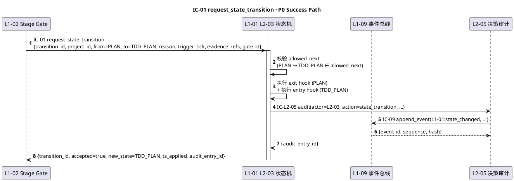

---

### §3.2 IC-02 · get_next_wp（L1-01 → L1-03）

**§3.2.1 定位**：L1-01 L2-02 决策引擎在每 tick 进 Quality Loop 前，调 L1-03 L2-03 WP 调度器**查询下一可执行 WP**。读操作 · 幂等 · 同 topology_version 返回同结果（除非被其他 tick 竞争取走）。

**§3.2.2 入参 `get_next_wp_query`**：

```yaml
get_next_wp_query:
  type: object
  required: [query_id, project_id, requester_tick]
  properties:
    query_id:
      type: string
      format: "q-{uuid-v7}"
      required: true
    project_id: {type: string, format: "pid-{uuid-v7}", required: true}
    requester_tick: {type: string, format: "tick-{uuid-v7}", required: true}
    prefer_critical_path:
      type: boolean
      default: true
      description: 关键路径 WP 优先（影响 WP 选择算法 · PRD §3.2 测试）
    exclude_wp_ids:
      type: array
      items: {type: string}
      required: false
      description: 主 loop 已知不可用的 WP（如等外部资源）
    ts: {type: string, format: ISO-8601-utc, required: true}
```

**§3.2.3 出参 `get_next_wp_result`**：

```yaml
get_next_wp_result:
  type: object
  required: [query_id, wp_id, deps_met]
  properties:
    query_id: {type: string, required: true}
    wp_id:
      type: string | null
      format: "wp-{uuid-v7}"
      required: true
      description: null 表示全部 WP 已 done 或 deps 未满足
    wp_def:
      type: object
      required: false  # 仅 wp_id != null 时填
      description: WP 完整定义（见 L1-03/L2-02 WP schema）
    deps_met:
      type: boolean
      required: true
    waiting_reason:
      type: string
      required: false
      description: 若 wp_id=null 说明等待什么（"deps blocked by wp-xxx" / "all done" / "concurrency cap reached"）
    in_flight_wp_count:
      type: integer
      required: true
      description: 当前 in-flight WP 数（PRD PM-04 约束 ≤ 2）
    topology_version: {type: string, required: true, description: 拓扑图版本号（乐观锁用）}
```

**§3.2.4 错误码**：

| 错误码 | 触发 | 处理 |
|---|---|---|
| `E_WP_NO_PROJECT_ID` | project_id 缺失 | 拒绝 |
| `E_WP_CROSS_PROJECT` | 查询跨 project（project A 查 project B 的 WP）| 拒绝 + 告警 |
| `E_WP_TOPOLOGY_CORRUPT` | 拓扑图损坏（DAG 有环）| 返回 null wp_id + topology_corrupt 标记 + 告警 L1-07 |
| `E_WP_CONCURRENCY_CAP` | in_flight WP ≥ 2（PM-04 硬约束）| 返回 wp_id=null + waiting_reason="concurrency cap" |
| `E_WP_LOCK_TIMEOUT` | 竞争 WP 锁失败（超 100ms）| 返回 wp_id=null + waiting_reason="lock contention"，上游重试下 tick |

**§3.2.5 幂等性**：

- **Idempotent by `(query_id, topology_version)`**：同 topology_version 下重复查询返回同 wp_id（除非该 WP 已被另一 tick 锁定 → 返回更新后的结果）
- 实际推荐：上游每次生成新 query_id；不依赖本查询幂等做去重

**§3.2.6 PlantUML 时序**：

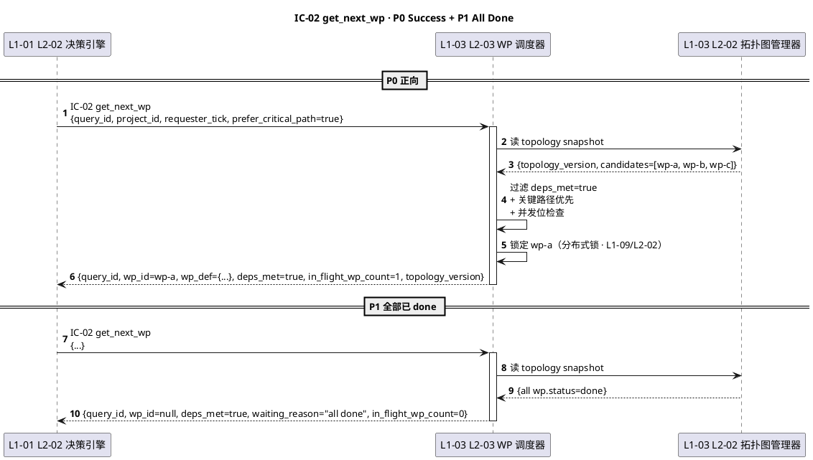

---

### §3.3 IC-03 · enter_quality_loop（L1-01 → L1-04）

**§3.3.1 定位**：L1-01 L2-02 在选定 WP 后，调 L1-04 L2-01 TDD 蓝图生成器 / L2-05 S4 执行驱动器 / L2-06 S5 Verifier 编排器启动 Quality Loop（S3→S4→S5 三阶段 · 含 TDD 蓝图 / 代码执行 / 独立 session Verifier）。启动同步返回 `loop_session_id`，后续执行异步。

**§3.3.2 入参 `enter_quality_loop_command`**：

```yaml
enter_quality_loop_command:
  type: object
  required: [command_id, project_id, wp_id, wp_def, entry_phase]
  properties:
    command_id: {type: string, format: "cmd-{uuid-v7}", required: true}
    project_id: {type: string, required: true}
    wp_id: {type: string, format: "wp-{uuid-v7}", required: true}
    wp_def:
      type: object
      required: true
      description: WP 完整定义（含 dod_expression / red_tests / quality_gates · 见 L1-03 schema）
    entry_phase:
      type: enum
      enum: [S3, S4, S5]
      required: true
      description: 进入哪个阶段（重试/回退场景可跳入 S4/S5）
    trigger_tick: {type: string, format: "tick-{uuid-v7}", required: true}
    timeout_s:
      type: integer
      default: 3600
      description: 整个 loop 最长耗时（防死循环 · PRD §13.3 BF-E-10）
    ts: {type: string, format: ISO-8601-utc, required: true}
```

**§3.3.3 出参 `enter_quality_loop_result`**：

```yaml
enter_quality_loop_result:
  type: object
  required: [command_id, accepted, loop_session_id]
  properties:
    command_id: {type: string, required: true}
    accepted: {type: boolean, required: true}
    loop_session_id:
      type: string
      format: "qloop-{uuid-v7}"
      required: false  # accepted=true 时必填
      description: 异步 loop 会话 id（后续用 event_bus 推进）
    reason: {type: string, required: false, description: accepted=false 时填}
    ts: {type: string, required: true}
```

**§3.3.4 错误码**：

| 错误码 | 触发 | 处理 |
|---|---|---|
| `E_QLOOP_NO_PROJECT_ID` | project_id 缺失 | 拒绝 |
| `E_QLOOP_WP_DEF_INVALID` | wp_def 缺字段（dod_expression / red_tests 等）| 拒绝 · 上游补全 |
| `E_QLOOP_CONCURRENCY_CAP` | 同 project 已有 ≥ 2 个 in-flight quality loop（PRD §13.2 并发约束）| 拒绝 · 上游等下 tick |
| `E_QLOOP_INVALID_ENTRY_PHASE` | entry_phase 与当前 WP 状态不兼容（如从 S5 重入但 S4 未完成）| 拒绝 + 告警 |
| `E_QLOOP_SESSION_INIT_FAIL` | 初始化 loop_session 资源失败 | 上游重试 1 次 · 仍失败告警 L1-07 |

**§3.3.5 幂等性**：

- **Non-idempotent**：每次启动新 `loop_session_id`
- 去重由上游 L1-01 L2-02 做（记录 "本 WP 正在进行的 loop_session_id"）

**§3.3.6 PlantUML 时序**：

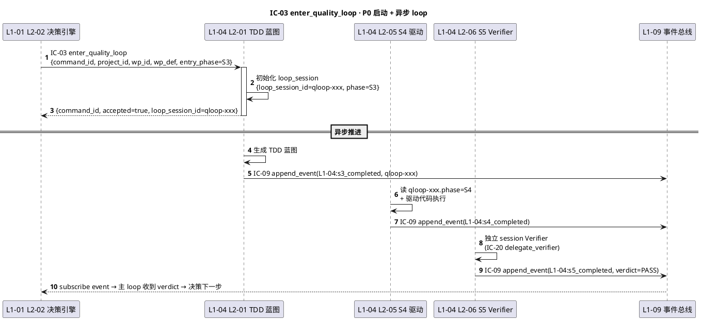

---

### §3.4 IC-04 · invoke_skill（多 L1 → L1-05）

**§3.4.1 定位**：**最高频 IC 之一**。多个 L1（L1-01 决策引擎 / L1-02 Stage Gate / L1-04 S4 驱动 / L1-08 多模态）通过 L1-05 L2-03 Skill 调用执行器**走能力抽象层调用具体 skill**（不硬编码 skill 名）。支持主/备 fallback 链。

**§3.4.2 入参 `invoke_skill_command`**：

```yaml
invoke_skill_command:
  type: object
  required: [invocation_id, project_id, capability, params, caller_l1]
  properties:
    invocation_id: {type: string, format: "inv-{uuid-v7}", required: true}
    project_id: {type: string, required: true}
    capability:
      type: string
      required: true
      example: "tdd.blueprint_generate"
      description: 能力抽象层 tag（PM-09 · 不绑具体 skill 名）
    params:
      type: object
      required: true
      description: 调用参数（按 capability 定义 schema）
    caller_l1:
      type: enum
      enum: [L1-01, L1-02, L1-03, L1-04, L1-06, L1-07, L1-08, L1-09, L1-10]
      required: true
    trigger_tick: {type: string, required: false, description: 触发 tick（若来自 loop）}
    timeout_ms:
      type: integer
      default: 30000
      description: 总调用超时
    allow_fallback:
      type: boolean
      default: true
      description: 主 skill 失败允许自动走备选
    context:
      type: object
      required: true
      description: 必含 project_id + 可选 decision_id / wp_id / loop_session_id（PM-14 + 审计追溯）
    ts: {type: string, required: true}
```

**§3.4.3 出参 `invoke_skill_result`**：

```yaml
invoke_skill_result:
  type: object
  required: [invocation_id, success, skill_id, duration_ms]
  properties:
    invocation_id: {type: string, required: true}
    success: {type: boolean, required: true}
    skill_id:
      type: string
      required: true
      example: "tdd-blueprint-v2.3"
      description: 实际被调用的 skill 标识（fallback 后为备选 skill id）
    result:
      type: object
      required: false  # success=true 时必填
      description: skill 返回 payload
    error:
      type: object
      required: false  # success=false 时必填
      properties:
        code: {type: string}
        message: {type: string}
        stack: {type: string, required: false}
    duration_ms: {type: integer, required: true}
    fallback_used:
      type: boolean
      required: true
      description: 是否触发 fallback 链
    fallback_trace:
      type: array
      required: false
      items: {type: object, properties: {skill_id: string, error_code: string, duration_ms: integer}}
      description: 若走 fallback 则记录所有尝试
```

**§3.4.4 错误码**：

| 错误码 | 触发 | 处理 |
|---|---|---|
| `E_SKILL_NO_CAPABILITY` | capability tag 无注册 | 拒绝 + 返回 success=false + code=E_SKILL_NO_CAPABILITY |
| `E_SKILL_NO_PROJECT_ID` | context.project_id 缺失 | 拒绝 |
| `E_SKILL_TIMEOUT` | 超 timeout_ms | 强终止 · 走 fallback（若 allow_fallback）或返回失败 |
| `E_SKILL_ALL_FALLBACK_FAIL` | 主 + 全部备选均失败 | 返回 success=false + 完整 fallback_trace |
| `E_SKILL_PARAMS_SCHEMA_MISMATCH` | params 不符 capability 声明 schema | 拒绝 · 上游补全 |
| `E_SKILL_PERMISSION_DENIED` | skill 要求的工具权限未授予 | 降级 · 告警 L1-07 |

**§3.4.5 幂等性**：

- **Non-idempotent**（除非调用者显式 idempotency_key 写到 context · 由 skill 侧实现）
- 去重策略：L1-05 L2-01 Skill 注册表在 hash(capability+params) LRU 5 分钟窗口做可选缓存（只对声明 `idempotent: true` 的 capability）

**§3.4.6 PlantUML 时序**：

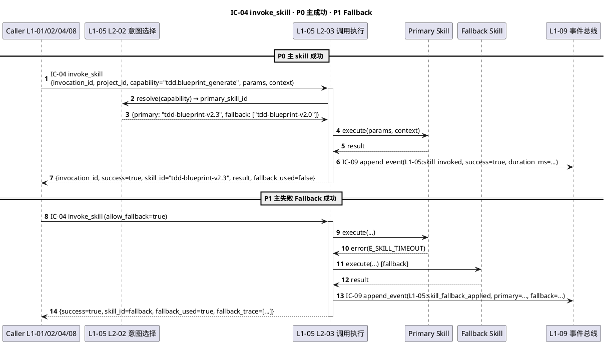

---

### §3.5 IC-05 · delegate_subagent（多 L1 → L1-05）

**§3.5.1 定位**：委托**独立 session 的通用子 Agent**（区别于 IC-20 特化 verifier）。完全独立 Claude Code session · 不读主 session 状态（PM-03）· 完成后结果经 L1-09 `subagent_result` 事件回路由。

**§3.5.2 入参 `delegate_subagent_command`**：

```yaml
delegate_subagent_command:
  type: object
  required: [delegation_id, project_id, role, task_brief, context_copy]
  properties:
    delegation_id: {type: string, format: "del-{uuid-v7}", required: true}
    project_id: {type: string, required: true}
    role:
      type: enum
      enum: [general, researcher, coder, reviewer, tester, documentarian]
      required: true
    task_brief:
      type: string
      minLength: 50
      required: true
      description: 子 Agent 要做什么的自然语言描述
    context_copy:
      type: object
      required: true
      description: 子 Agent 独立上下文（必含 project_id · PM-03 复制式传递不共享引用）
    allowed_tools:
      type: array
      items: {type: string}
      required: false
      description: 显式工具白名单（默认=所有安全工具）
    timeout_s:
      type: integer
      default: 1800
    caller_l1:
      type: enum
      enum: [L1-01, L1-02, L1-03, L1-04, L1-06, L1-07, L1-08, L1-09, L1-10]
      required: true
      description: L1-05 不在列表（L1-05 不会 delegate 给自己）
    ts: {type: string, required: true}
```

**§3.5.3 出参 `delegate_subagent_result`**（Dispatch 阶段）：

```yaml
delegate_subagent_dispatch_result:
  type: object
  required: [delegation_id, dispatched, subagent_session_id]
  properties:
    delegation_id: {type: string, required: true}
    dispatched: {type: boolean, required: true}
    subagent_session_id:
      type: string
      format: "sub-{uuid-v7}"
      required: false
      description: 异步结果将带此 id 回推
    reason: {type: string, required: false}
```

**§3.5.4 出参 `subagent_final_report`**（异步通过 L1-09 事件总线回推）：

```yaml
subagent_final_report:
  type: object
  required: [subagent_session_id, delegation_id, status, artifacts]
  properties:
    subagent_session_id: {type: string, required: true}
    delegation_id: {type: string, required: true}
    status: {type: enum, enum: [success, partial, failed, timeout], required: true}
    artifacts:
      type: array
      items: {type: object, properties: {type: string, path: string, description: string}}
      required: true
    final_message: {type: string, required: false}
    usage:
      type: object
      required: false
      properties: {total_tokens: integer, tool_uses: integer, duration_ms: integer}
```

**§3.5.5 错误码**：

| 错误码 | 触发 | 处理 |
|---|---|---|
| `E_SUB_NO_PROJECT_ID` | context_copy 缺 project_id | 拒绝 |
| `E_SUB_ROLE_UNKNOWN` | role 不在支持清单 | 拒绝 |
| `E_SUB_BRIEF_TOO_SHORT` | task_brief < 50 字 | 拒绝 · 要求上游补全 |
| `E_SUB_SESSION_LIMIT` | 同时运行子 Agent ≥ L1-05 配置上限（默认 5）| 延迟 dispatch（queue）|
| `E_SUB_TIMEOUT` | 子 Agent 超时 | 强终止 · 状态=timeout · 保留 partial artifacts |
| `E_SUB_TOOL_ERROR` | 子 Agent 工具错 | 内部重试 1 次 · 失败返回 failed |

**§3.5.6 幂等性 + 重试**：

- **Non-idempotent**（每次派新 session）
- 上游去重：delegation_id 由上游生成 · 若上游检测到已 dispatch 则不重派

**§3.5.7 PlantUML 时序**：

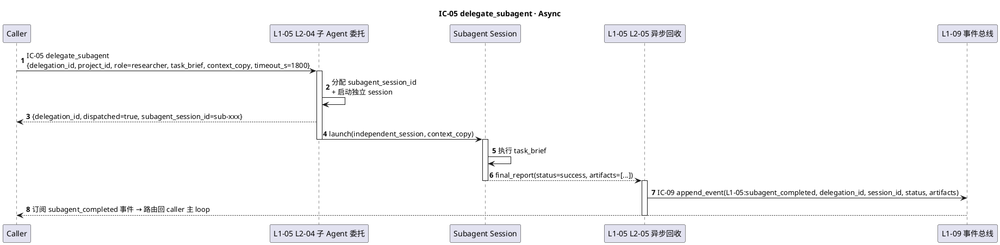

---

### §3.6 IC-06 · kb_read（多 L1 → L1-06）

**§3.6.1 定位**：**高频读 IC**。L1-01 决策 / L1-04 Quality Loop / L1-07 Supervisor / L1-08 多模态 调 L1-06 L2-02 KB 读 · 按 scope（session / project / global）+ filter + rerank 返回 top-K entries。默认 scope=当前 project+global。

**§3.6.2 入参 `kb_read_query`**：

```yaml
kb_read_query:
  type: object
  required: [query_id, project_id, kind, scope]
  properties:
    query_id: {type: string, format: "kbr-{uuid-v7}", required: true}
    project_id: {type: string, required: true}
    kind:
      type: enum
      enum: [recipe, trap, pattern, decision_history, wp_template, user_preference, any]
      required: true
    scope:
      type: array
      items: {type: enum, enum: [session, project, global]}
      required: true
      default: [session, project, global]
      description: 默认作用域 PM-14 约束（不读其他 project）
    filter:
      type: object
      required: false
      properties:
        tags: {type: array, items: string}
        keyword: {type: string}
        min_confidence: {type: number, minimum: 0, maximum: 1}
        stage: {type: enum}
    top_k: {type: integer, default: 5, minimum: 1, maximum: 50}
    rerank:
      type: boolean
      default: true
      description: 多源 entries 按上下文相关性 rerank
    context:
      type: object
      required: false
      description: 供 rerank 用的上下文（当前 state / decision_type / wp_id）
    ts: {type: string, required: true}
```

**§3.6.3 出参 `kb_read_result`**：

```yaml
kb_read_result:
  type: object
  required: [query_id, entries, total_matched]
  properties:
    query_id: {type: string, required: true}
    entries:
      type: array
      required: true
      items:
        type: object
        required: [entry_id, kind, scope_actual, content, confidence]
        properties:
          entry_id: {type: string, format: "kbe-{uuid-v7}"}
          kind: {type: enum}
          scope_actual: {type: enum, enum: [session, project, global]}
          content: {type: object, description: 按 kind 定义 schema}
          confidence: {type: number, minimum: 0, maximum: 1}
          rerank_score: {type: number, required: false}
          source_project_id: {type: string, required: false, description: global 层时可能来自其他 project}
          created_at: {type: string}
    total_matched: {type: integer, required: true}
    degraded:
      type: boolean
      default: false
      description: KB 服务降级时返回部分/空结果 + degraded=true
```

**§3.6.4 错误码**：

| 错误码 | 触发 | 处理 |
|---|---|---|
| `E_KB_NO_PROJECT_ID` | project_id 缺失 | 拒绝 |
| `E_KB_CROSS_PROJECT_READ` | scope 含其他 project（非 global）| 拒绝 + 告警 |
| `E_KB_KIND_UNKNOWN` | kind 不在支持清单 | 拒绝 |
| `E_KB_SERVICE_UNAVAILABLE` | L2-02 读服务不可达 | 返回 entries=[] + degraded=true · 告警 L1-07 |
| `E_KB_RERANK_FAIL` | rerank 计算失败 | 降级为不 rerank + entries 原序 + degraded=true |

**§3.6.5 幂等性**：

- **Idempotent**：同 `(project_id, kind, scope, filter, top_k, context)` 返回相同结果（无副作用）
- 缓存策略：L1-06 内部 LRU 1 分钟窗口（可关 · 参数 `no_cache: true`）

**§3.6.6 PlantUML 时序**：

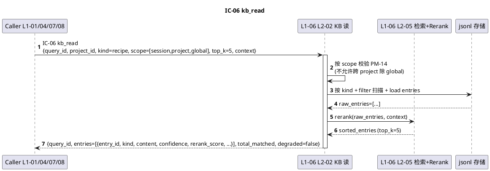

---

### §3.7 IC-07 · kb_write_session（多 L1 → L1-06）

**§3.7.1 定位**：写 KB 的 **session 层**（最低层 · 临时 · 按 project 隔离）。L1-01/04/07/08 在识别到"这次 tick 有值得记的观察/经验"时调本 IC · 幂等 by dedup_key。

**§3.7.2 入参 `kb_write_session_command`**：

```yaml
kb_write_session_command:
  type: object
  required: [command_id, project_id, entry]
  properties:
    command_id: {type: string, format: "kbw-{uuid-v7}", required: true}
    project_id: {type: string, required: true}
    entry:
      type: object
      required: [kind, content, dedup_key]
      properties:
        kind: {type: enum, enum: [recipe, trap, pattern, decision_history, wp_template, user_preference], required: true}
        content:
          type: object
          required: true
          description: 按 kind 定义 schema（参见 L1-06 L2-03 观察累积器字段 schema）
        dedup_key:
          type: string
          required: true
          description: 幂等键 · 同 dedup_key 重复写入 → observed_count 累加而非新建
        confidence: {type: number, default: 0.5, minimum: 0, maximum: 1}
        tags: {type: array, items: string, required: false}
        source:
          type: object
          required: true
          properties:
            caller_l1: {type: enum}
            trigger_tick: {type: string, required: false}
            decision_id: {type: string, required: false}
    ts: {type: string, required: true}
```

**§3.7.3 出参 `kb_write_session_result`**：

```yaml
kb_write_session_result:
  type: object
  required: [command_id, entry_id, observed_count, is_new]
  properties:
    command_id: {type: string, required: true}
    entry_id: {type: string, format: "kbe-{uuid-v7}", required: true}
    observed_count: {type: integer, minimum: 1, required: true}
    is_new:
      type: boolean
      required: true
      description: true=新建 · false=累加到已有 entry（dedup 命中）
    ts_persisted: {type: string, required: true}
```

**§3.7.4 错误码**：

| 错误码 | 触发 | 处理 |
|---|---|---|
| `E_KBW_NO_PROJECT_ID` | project_id 缺失 | 拒绝 |
| `E_KBW_KIND_UNKNOWN` | kind 不支持 | 拒绝 |
| `E_KBW_DEDUP_KEY_MISSING` | dedup_key 缺失 | 拒绝 |
| `E_KBW_CONTENT_SCHEMA_MISMATCH` | content 不符 kind 的 schema | 拒绝 · 上游补全 |
| `E_KBW_STORAGE_FAIL` | jsonl 写盘失败 | 告警 L1-07 · 不阻塞调用方（PRD §3.2 失败降级）|

**§3.7.5 幂等性**：

- **Idempotent by `dedup_key`**：同 dedup_key 累加 observed_count（返回同 entry_id · is_new=false）
- 幂等窗：session 层存活期（project 生命周期 · S7 归档时清）

**§3.7.6 PlantUML 时序**：

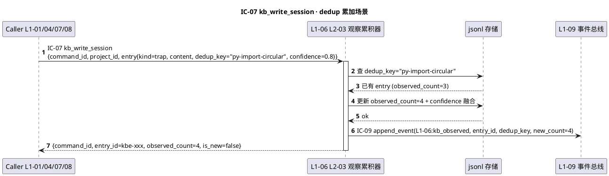

---

### §3.8 IC-08 · kb_promote（多 L1 → L1-06）

**§3.8.1 定位**：将 session 层的 entry **晋升到 project 层或 global 层**。触发：① observed_count ≥ 阈值（L2-04 晋升仪式自动）；② 用户在 UI 主动晋升（L1-10 → IC-08）；③ S7 收尾（L1-02 批量）。

**§3.8.2 入参 `kb_promote_command`**：

```yaml
kb_promote_command:
  type: object
  required: [command_id, project_id, source_entry_id, target_scope]
  properties:
    command_id: {type: string, format: "kbp-{uuid-v7}", required: true}
    project_id: {type: string, required: true}
    source_entry_id: {type: string, format: "kbe-{uuid-v7}", required: true}
    target_scope:
      type: enum
      enum: [project, global]
      required: true
      description: 不支持晋升到 session（只能更高层）
    trigger:
      type: enum
      enum: [auto_threshold, user_approve, s7_batch]
      required: true
    user_id:
      type: string
      required: false
      description: trigger=user_approve 时必填
    annotation:
      type: string
      required: false
      description: 晋升理由（审计）
    ts: {type: string, required: true}
```

**§3.8.3 出参 `kb_promote_result`**：

```yaml
kb_promote_result:
  type: object
  required: [command_id, promoted, target_entry_id]
  properties:
    command_id: {type: string, required: true}
    promoted: {type: boolean, required: true}
    target_entry_id:
      type: string
      format: "kbe-{uuid-v7}"
      required: false  # promoted=true 时必填 · 新的 project/global 层 entry
    reason:
      type: string
      required: false
      description: promoted=false 时填（如 "observed_count=2 未达阈值且 user_approve=false"）
    source_project_id_recorded:
      type: string
      required: true
      description: 晋升到 global 时必记原 project_id（审计追溯）
    ts: {type: string, required: true}
```

**§3.8.4 错误码**：

| 错误码 | 触发 | 处理 |
|---|---|---|
| `E_KBP_NO_PROJECT_ID` | project_id 缺失 | 拒绝 |
| `E_KBP_SOURCE_NOT_FOUND` | source_entry_id 不存在 | 拒绝 |
| `E_KBP_THRESHOLD_NOT_MET` | trigger=auto_threshold 但 observed_count 不达标 | 返回 promoted=false + reason |
| `E_KBP_USER_APPROVE_MISSING` | trigger=user_approve 缺 user_id | 拒绝 |
| `E_KBP_DUPLICATE_IN_TARGET` | target_scope 已有相同 dedup_key 的 entry | 合并 · 返回已有 target_entry_id |
| `E_KBP_STORAGE_FAIL` | 写盘失败 | 告警 L1-07 + 不清 session 层（保证可重试）|

**§3.8.5 幂等性**：

- **Idempotent by `(source_entry_id, target_scope)`**：重复晋升返回同 target_entry_id（不重复创建）

**§3.8.6 PlantUML 时序**：

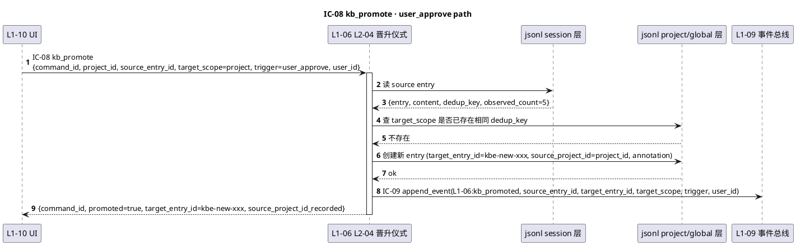

---

### §3.9 IC-09 · append_event（全部 L1 → L1-09）

**§3.9.1 定位 · 最关键契约**：**所有 L1 写事件的唯一入口**（PM-08 单一事实源 · PM-10 hash-chain 可审计）。写盘**强 fsync** · **失败即 halt 整个系统**。所有其他 IC 的副作用审计都经本 IC 落盘。

**§3.9.2 入参 `append_event_command`**：

```yaml
append_event_command:
  type: object
  required: [event_id, event_type, project_id_or_system, payload, actor, ts]
  properties:
    event_id:
      type: string
      format: "evt-{uuid-v7}"
      required: true
      description: 幂等键 · 同 event_id 重复写入返回已存在的 sequence + hash
    event_type:
      type: string
      required: true
      description: "L{L1}:action 命名格式（如 'L1-01:decision_made' / 'L1-04:s5_completed'）"
    project_id_or_system:
      oneOf:
        - {type: string, format: "pid-{uuid-v7}", description: 常规 project 事件}
        - {type: string, const: "system", description: 系统级事件（启动/崩溃恢复/全局配置变更）}
      required: true
      description: PM-14 硬约束 · 必填
    payload:
      type: object
      required: true
      description: 事件数据（按 event_type 定义 schema · 见各 L1 architecture §2.5）
    actor:
      type: object
      required: true
      properties:
        l1: {type: enum, required: true}
        l2: {type: string, required: false}
        skill_id: {type: string, required: false}
    trigger_tick:
      type: string
      required: false
      description: 若事件来自主 loop
    correlation_id:
      type: string
      required: false
      description: 关联事件链（如 decision_id 串多个事件）
    ts:
      type: string
      format: ISO-8601-utc
      required: true
```

**§3.9.3 出参 `append_event_result`**：

```yaml
append_event_result:
  type: object
  required: [event_id, sequence, hash, persisted, ts_persisted]
  properties:
    event_id: {type: string, required: true}
    sequence:
      type: integer
      minimum: 1
      required: true
      description: 单调递增序列号（per project · system 单独序列）
    hash:
      type: string
      format: "sha256-hex"
      required: true
      description: hash(prev_hash + event_canonical_json)
    prev_hash:
      type: string
      format: "sha256-hex"
      required: true
      description: 前一事件的 hash（genesis=全 0）
    persisted:
      type: boolean
      const: true
      required: true
      description: fsync 成功才返回 · 否则抛异常
    ts_persisted: {type: string, required: true}
    storage_path:
      type: string
      required: true
      example: "projects/pid-xxx/events.jsonl"
      description: 物理落盘路径（PM-14 分片）
```

**§3.9.4 错误码**：

| 错误码 | 触发 | 处理 |
|---|---|---|
| `E_EVT_NO_PROJECT_OR_SYSTEM` | project_id_or_system 缺失 | **拒绝 + halt 系统**（PM-14 不可破）|
| `E_EVT_TYPE_UNKNOWN` | event_type 未注册在 schema registry | 拒绝（白名单严格）|
| `E_EVT_PAYLOAD_SCHEMA_MISMATCH` | payload 不符 event_type schema | 拒绝 · 上游补全 |
| `E_EVT_FSYNC_FAIL` | fsync syscall 失败 | **halt 整个系统**（PM-08 不可破 · PRD §3.2 明确）|
| `E_EVT_DISK_FULL` | 磁盘空间不足 | halt 整个系统 + 紧急告警用户 |
| `E_EVT_HASH_CHAIN_BROKEN` | 尝试写入时 prev_hash 不匹配当前 chain tip | 内部重查 tip 后重试 1 次 · 仍失败告警 L1-07 + 不 halt（可能是并发）|

**§3.9.5 幂等性**：

- **Idempotent by `event_id`**：重复写入返回已存在的 sequence + hash（不重复落盘）
- 并发控制：L1-09 L2-02 分布式锁保证同 project 事件 append 串行化

**§3.9.6 PlantUML 时序**：

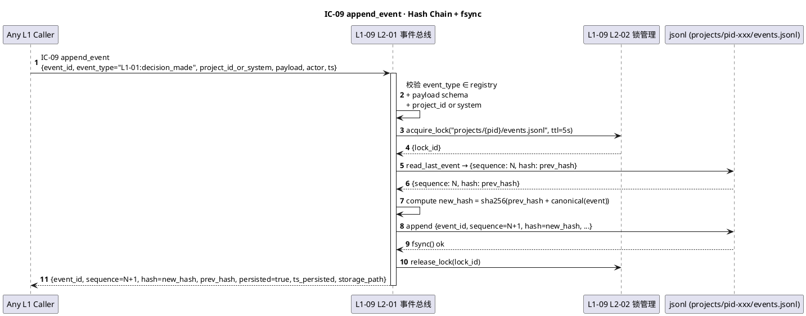

---

### §3.10 IC-10 · replay_from_event（L1-09 内部）

**§3.10.1 定位**：L1-09 L2-04 检查点/恢复器使用本 IC 做**崩溃后事件重放**（恢复 task_board 状态）· **仅 L1-09 内部调用**（其他 L1 不直接调本 IC · 要看历史走 IC-18 审计查询）。

**§3.10.2 入参 `replay_from_event_query`**：

```yaml
replay_from_event_query:
  type: object
  required: [query_id, project_id, from_sequence]
  properties:
    query_id: {type: string, format: "rep-{uuid-v7}", required: true}
    project_id: {type: string, required: true}
    from_sequence: {type: integer, minimum: 1, required: true}
    to_sequence: {type: integer, required: false, description: 缺省=chain tip}
    verify_hash_chain:
      type: boolean
      default: true
      description: 重放时 hash 链校验（PRD §3.2 硬约束）
    ts: {type: string, required: true}
```

**§3.10.3 出参 `replay_from_event_result`**：

```yaml
replay_from_event_result:
  type: object
  required: [query_id, task_board_state, events_replayed, hash_chain_valid]
  properties:
    query_id: {type: string, required: true}
    task_board_state:
      type: object
      required: true
      description: 重放后的 task_board 快照（见 L1-09 schema）
    events_replayed: {type: integer, required: true}
    hash_chain_valid: {type: boolean, required: true}
    corrupt_at_sequence:
      type: integer
      required: false
      description: hash_chain_valid=false 时指出损坏点
    ts: {type: string, required: true}
```

**§3.10.4 错误码**：

| 错误码 | 触发 | 处理 |
|---|---|---|
| `E_REP_NO_PROJECT_ID` | project_id 缺失 | 拒绝 |
| `E_REP_FROM_OUT_OF_RANGE` | from_sequence 超出现有 chain | 拒绝 |
| `E_REP_TO_BEFORE_FROM` | to_sequence < from_sequence（区间非法）| 拒绝（上游 bug · 校正后重试）|
| `E_REP_HASH_CHAIN_BROKEN` | verify_hash_chain=true 时发现断裂 | 返回 hash_chain_valid=false + corrupt_at_sequence · **不 halt**（L2-04 恢复器决定降级策略）|
| `E_REP_STORAGE_UNAVAILABLE` | jsonl 读取失败 | 内部重试 3 次 · 仍失败返回 err |
| `E_REP_EVENT_SCHEMA_LEGACY` | 读到的事件 schema 版本低于当前 event_type registry | 返回 partial result + schema_migration_needed · 告警 L1-07 |

**§3.10.5 幂等性**：

- **Idempotent**（纯读 · 无副作用）

**§3.10.6 PlantUML 时序**：

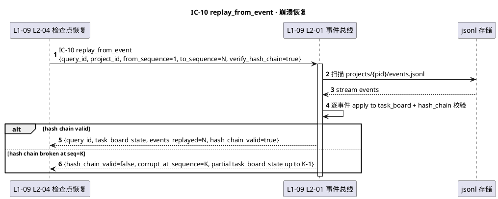

---

### §3.11 IC-11 · process_content（多 L1 → L1-08）

**§3.11.1 定位**：多模态内容处理入口 · 支持 md 文档 / code 结构 / image 视觉 三种 content_type · 短内容同步返回 · 大代码仓 > 10 万行自动委托 IC-12 onboarding 异步处理。

**§3.11.2 入参 `process_content_command`**：

```yaml
process_content_command:
  type: object
  required: [command_id, project_id, content_type, target_path, task]
  properties:
    command_id: {type: string, format: "pc-{uuid-v7}", required: true}
    project_id: {type: string, required: true}
    content_type:
      type: enum
      enum: [md, code, image, pdf, markdown_batch]
      required: true
    target_path:
      type: string
      required: true
      description: 相对 project 根的路径 · PM-14 路径限定（防跨 project）
    task:
      type: enum
      enum: [summarize, structure_extract, vision_describe, code_understand, diff_analyze]
      required: true
    caller_l1: {type: enum, required: true}
    context:
      type: object
      required: false
      description: 辅助上下文（如 code_understand 要关注的接口列表）
    sync_mode:
      type: boolean
      default: true
      description: 是否等待结果；大代码仓自动转 async
    ts: {type: string, required: true}
```

**§3.11.3 出参 `process_content_result`**：

```yaml
process_content_result:
  type: object
  required: [command_id, success]
  properties:
    command_id: {type: string, required: true}
    success: {type: boolean, required: true}
    structured_output:
      type: object
      required: false  # success=true 时必填
      description: 按 task 定义 schema（summarize 返 {summary, keywords}；vision_describe 返 {description, tags, regions}）
    async_task_id:
      type: string
      format: "async-{uuid-v7}"
      required: false
      description: 若转异步（如大代码仓）返回此 id · 后续走 IC-12 + L1-09 事件回推
    error:
      type: object
      required: false
      properties: {code: string, message: string}
    duration_ms: {type: integer, required: true}
```

**§3.11.4 错误码**：

| 错误码 | 触发 | 处理 |
|---|---|---|
| `E_PC_NO_PROJECT_ID` | project_id 缺失 | 拒绝 |
| `E_PC_PATH_OUT_OF_PROJECT` | target_path 超出 project 根 | 拒绝 + 告警（防跨 project 读）|
| `E_PC_PATH_NOT_FOUND` | 文件不存在 | 拒绝 |
| `E_PC_TYPE_TASK_MISMATCH` | task 与 content_type 不匹配（如 vision_describe 配 md）| 拒绝 |
| `E_PC_LARGE_CODE_BASE` | code_understand 但 > 10 万行 + sync_mode=true | 返回 async_task_id + 自动走 IC-12 |
| `E_PC_VISION_API_FAIL` | Claude vision API 调用失败 | 重试 1 次 · 仍失败 success=false |

**§3.11.5 幂等性**：

- **Non-idempotent**（内容可能变；调用者若需稳定可自行 cache by hash(path+mtime)）

**§3.11.6 PlantUML 时序**：

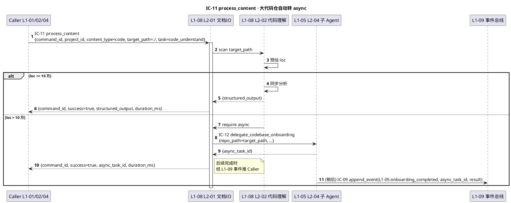

---

### §3.12 IC-12 · delegate_codebase_onboarding（L1-08 → L1-05）

**§3.12.1 定位**：大代码仓 codebase-onboarding 子 Agent 的异步委托 · IC-05 的**特化版本**（专供 L1-08 大码基分析使用 · 语义更窄）· 独立 session 跑 · 结果回推到 project KB。

**§3.12.2 入参 `delegate_codebase_onboarding_command`**：

```yaml
delegate_codebase_onboarding_command:
  type: object
  required: [delegation_id, project_id, repo_path, kb_write_back]
  properties:
    delegation_id: {type: string, format: "ob-{uuid-v7}", required: true}
    project_id: {type: string, required: true}
    repo_path:
      type: string
      required: true
      description: 代码仓相对 project 根路径
    focus:
      type: object
      required: false
      properties:
        interfaces: {type: array, items: string}
        entry_points: {type: array, items: string}
    kb_write_back:
      type: boolean
      default: true
      description: 是否把结构摘要写回 project 层 KB（IC-07 + 后续 IC-08 晋升）
    timeout_s: {type: integer, default: 600}
    ts: {type: string, required: true}
```

**§3.12.3 出参**（同步 dispatch 阶段 + 异步 final report · 同 IC-05 结构）：

```yaml
delegate_codebase_onboarding_dispatch_result:
  type: object
  required: [delegation_id, dispatched, subagent_session_id]
  properties:
    delegation_id: {type: string, required: true}
    dispatched: {type: boolean, required: true}
    subagent_session_id: {type: string, format: "sub-{uuid-v7}", required: false}
    reason: {type: string, required: false}

onboarding_final_report:  # 经 L1-09 append_event 回推
  type: object
  required: [delegation_id, status, structure_summary]
  properties:
    delegation_id: {type: string, required: true}
    status: {type: enum, enum: [success, partial, failed], required: true}
    structure_summary:
      type: object
      required: false
      properties:
        modules: {type: array}
        interfaces: {type: array}
        dependencies: {type: array}
        loc: {type: integer}
    kb_entries_written:
      type: array
      items: {type: string, format: "kbe-{uuid-v7}"}
      required: false
```

**§3.12.4 错误码**：

| 错误码 | 触发 | 处理 |
|---|---|---|
| `E_OB_NO_PROJECT_ID` | project_id 缺失 | 拒绝 |
| `E_OB_REPO_PATH_INVALID` | repo_path 无效 | 拒绝 |
| `E_OB_REPO_TOO_LARGE` | 代码仓超单子 Agent 处理上限（如 > 100 万行）| 拒绝 · 要求上游拆分 |
| `E_OB_TIMEOUT` | 超 timeout_s | 强终止 · 返回 partial |
| `E_OB_KB_WRITE_FAIL` | kb_write_back=true 但 IC-07 失败 | 继续返回 success · 但标记 kb_write_partial |

**§3.12.5 幂等性**：

- **Non-idempotent**（分析结果与当时代码仓状态绑）
- 去重：上游按 (repo_path, git_head) 自己 cache

**§3.12.6 PlantUML 时序**：

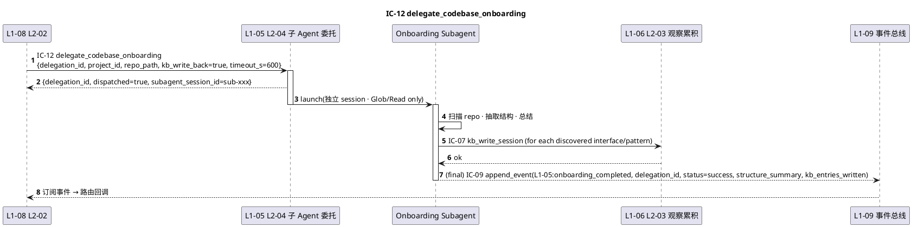

---

### §3.13 IC-13 · push_suggestion（L1-07 → L1-01）

**§3.13.1 定位**：Supervisor 副 Agent 向主 loop 推 3 级建议（INFO/SUGG/WARN）· fire-and-forget 不等确认 · L1-01 L2-06 作为唯一入口接收并入队 · BLOCK 级不走本 IC（走 IC-15）。

**§3.13.2 入参 `push_suggestion_command`**：

```yaml
push_suggestion_command:
  type: object
  required: [suggestion_id, project_id, level, content, observation_refs]
  properties:
    suggestion_id: {type: string, format: "sugg-{uuid-v7}", required: true}
    project_id: {type: string, required: true}
    level:
      type: enum
      enum: [INFO, SUGG, WARN]
      required: true
      description: BLOCK 级不走此 IC · 用 IC-15
    content:
      type: string
      minLength: 10
      required: true
    observation_refs:
      type: array
      required: true
      minItems: 1
      items: {type: string}
      description: 支持建议的观察事件 id（审计）
    priority:
      type: enum
      enum: [P0, P1, P2]
      default: P2
    require_ack_tick_delta:
      type: integer
      required: false
      description: WARN 级必 1 tick 内书面回应（PRD §9.4 · L1-01 L2-02 硬约束）
    ts: {type: string, required: true}
```

**§3.13.3 出参 `push_suggestion_ack`**：

```yaml
push_suggestion_ack:
  type: object
  required: [suggestion_id, enqueued, queue_len]
  properties:
    suggestion_id: {type: string, required: true}
    enqueued: {type: boolean, required: true}
    queue_len: {type: integer, required: true}
    evicted_suggestion_id:
      type: string
      required: false
      description: 若 queue 满 evict 最旧的（非静默 · 审计 + 告警）
```

**§3.13.4 错误码**：

| 错误码 | 触发 | 处理 |
|---|---|---|
| `E_SUGG_NO_PROJECT_ID` | project_id 缺失 | 拒绝 |
| `E_SUGG_LEVEL_IS_BLOCK` | level=BLOCK（错走本 IC）| 拒绝 · 引导走 IC-15 |
| `E_SUGG_CONTENT_TOO_SHORT` | content < 10 字 | 拒绝 |
| `E_SUGG_NO_OBSERVATION` | observation_refs 为空 | 拒绝（硬约束 · Supervisor 每建议必有证据）|
| `E_SUGG_QUEUE_OVERFLOW` | L2-06 队列满 | evict 最旧 · enqueued=true + evicted_suggestion_id + 告警 |
| `E_SUGG_CROSS_PROJECT` | suggestion.project_id ≠ session pid | 拒绝 |

**§3.13.5 幂等性**：

- **Non-idempotent**（每条建议都入队 · L1-07 侧需自己做去重）

**§3.13.6 PlantUML 时序**：

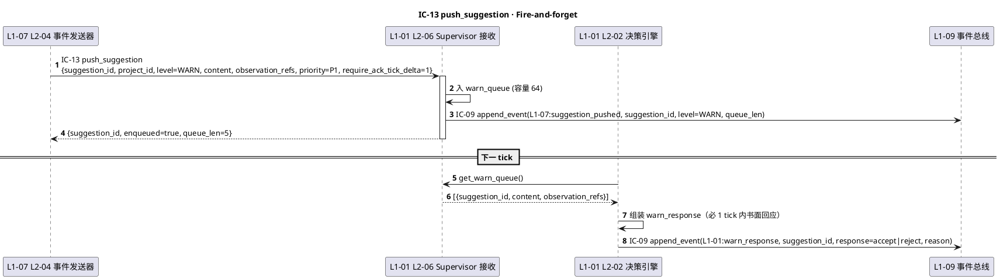

---

### §3.14 IC-14 · push_rollback_route（L1-07 → L1-04）

**§3.14.1 定位**：Supervisor 判定 Quality Loop verdict 后向 L1-04 L2-07 路由器推回退路由 · 精确翻译 verdict → target_stage · 同级 FAIL ≥3 自动升级（BF-E-10 触发）。

**§3.14.2 入参 `push_rollback_route_command`**：

```yaml
push_rollback_route_command:
  type: object
  required: [route_id, project_id, wp_id, verdict, target_stage]
  properties:
    route_id: {type: string, format: "route-{uuid-v7}", required: true}
    project_id: {type: string, required: true}
    wp_id: {type: string, format: "wp-{uuid-v7}", required: true}
    verdict:
      type: enum
      enum: [FAIL_L1, FAIL_L2, FAIL_L3, FAIL_L4]
      required: true
    target_stage:
      type: enum
      enum: [S3, S4, S5, UPGRADE_TO_L1-01]
      required: true
    level_count:
      type: integer
      minimum: 1
      required: true
      description: 本级累计失败次数 · ≥3 触发升级（不改 target_stage · 供下游决策）
    evidence:
      type: object
      required: true
      properties:
        verifier_report_id: {type: string}
        decision_id: {type: string, required: false}
    ts: {type: string, required: true}
```

**§3.14.3 出参 `push_rollback_route_ack`**：

```yaml
push_rollback_route_ack:
  type: object
  required: [route_id, applied, new_wp_state]
  properties:
    route_id: {type: string, required: true}
    applied: {type: boolean, required: true}
    new_wp_state: {type: enum, enum: [retry_s3, retry_s4, retry_s5, upgraded_to_l1_01], required: true}
    escalated:
      type: boolean
      default: false
      description: 同级 ≥3 自动升级触发（BF-E-10）
    ts: {type: string, required: true}
```

**§3.14.4 错误码**：

| 错误码 | 触发 | 处理 |
|---|---|---|
| `E_ROUTE_NO_PROJECT_ID` | project_id 缺失 | 拒绝 |
| `E_ROUTE_WP_NOT_FOUND` | wp_id 不在当前拓扑 | 拒绝 |
| `E_ROUTE_VERDICT_TARGET_MISMATCH` | verdict=FAIL_L1 但 target_stage=S5（非法映射）| 拒绝 |
| `E_ROUTE_CROSS_PROJECT` | project_id ≠ session pid | 拒绝 |
| `E_ROUTE_WP_ALREADY_DONE` | wp 已 done · 路由无意义 | 拒绝 · 告警（可能是 race）|

**§3.14.5 幂等性**：

- **Idempotent by `(wp_id, verdict_id/route_id)`**：重复推同 route_id 返回已应用的 ack

**§3.14.6 PlantUML 时序**：

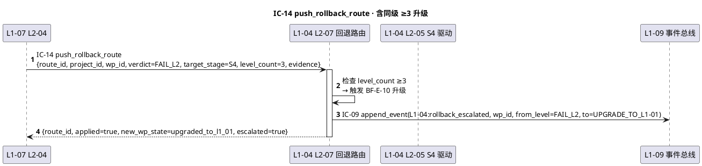

---

### §3.15 IC-15 · request_hard_halt（L1-07 → L1-01）

**§3.15.1 定位**：**硬红线命中触发的硬暂停**（最高优先级 IC 之一）· 阻塞式调用 · ≤100ms 内 L1-01 state=HALTED · 必须用户 IC-17 authorize 才解 halt · 与 IC-13 严格区分（IC-13 是建议 · IC-15 是命令）。

**§3.15.2 入参 `request_hard_halt_command`**：

```yaml
request_hard_halt_command:
  type: object
  required: [halt_id, project_id, red_line_id, evidence, ts]
  properties:
    halt_id: {type: string, format: "halt-{uuid-v7}", required: true}
    project_id: {type: string, required: true}
    red_line_id:
      type: string
      required: true
      description: 触发的硬红线规则 id（见 3-3 hard-redlines.md）
      example: "redline-rm-rf-system"
    evidence:
      type: object
      required: true
      properties:
        observation_refs: {type: array, items: string, minItems: 1}
        tool_use_id: {type: string, required: false, description: 触发的 tool_use 标识}
        confirmation_count: {type: integer, minimum: 2, description: L2-03 二次确认（PRD §3.2 硬约束）}
    require_user_authorization:
      type: boolean
      const: true
      required: true
      description: 所有硬红线必须用户授权解除（硬编码 true）
    ts: {type: string, required: true}
```

**§3.15.3 出参 `request_hard_halt_ack`**：

```yaml
request_hard_halt_ack:
  type: object
  required: [halt_id, halted, halt_latency_ms]
  properties:
    halt_id: {type: string, required: true}
    halted: {type: boolean, required: true}
    halt_latency_ms:
      type: integer
      required: true
      description: 从接收到 state=HALTED 的延迟 · 硬约束 ≤100ms
    state_before: {type: string, required: true}
    state_after: {type: enum, const: HALTED, required: true}
    audit_entry_id: {type: string, required: true}
```

**§3.15.4 错误码**：

| 错误码 | 触发 | 处理 |
|---|---|---|
| `E_HALT_NO_PROJECT_ID` | project_id 缺失 | 拒绝 · 但紧急状况仍尝试 halt（安全第一） |
| `E_HALT_NO_EVIDENCE` | evidence.observation_refs 为空 | 拒绝（硬红线必须有证据）|
| `E_HALT_NO_CONFIRMATION` | confirmation_count < 2 | 拒绝（L2-03 必二次确认 · PRD §3.2）|
| `E_HALT_SLO_VIOLATION` | halt_latency_ms > 100 | halted=true 仍返回 · 但同时 L1-07 告警 |
| `E_HALT_ALREADY_HALTED` | state 已是 HALTED | 幂等返回已有 halt_id 的 ack |

**§3.15.5 幂等性**：

- **Idempotent by `red_line_id`**：同 red_line_id 重复命中只触发一次 halt（返回已有 halt_id 的 ack）

**§3.15.6 PlantUML 时序**：

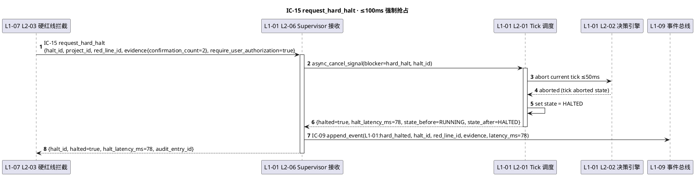

---

### §3.16 IC-16 · push_stage_gate_card（L1-02 → L1-10）

**§3.16.1 定位**：Stage Gate 批准卡片推送到 UI · 用户必须 approve/reject/request_change 之一 · 跨 session 持久（重启后 UI 重推）。

**§3.16.2 入参 `push_stage_gate_card_command`**：

```yaml
push_stage_gate_card_command:
  type: object
  required: [card_id, project_id, gate_id, stage_name, artifacts_bundle, trim_level]
  properties:
    card_id: {type: string, format: "card-{uuid-v7}", required: true}
    project_id: {type: string, required: true}
    gate_id: {type: string, format: "gate-{uuid-v7}", required: true}
    stage_name: {type: enum, enum: [S1, S2, S3, S4, S5, S6, S7], required: true}
    artifacts_bundle:
      type: array
      required: true
      items:
        type: object
        required: [artifact_type, path, summary]
        properties:
          artifact_type: {type: enum, enum: [charter, plan, wbs, tdd_blueprint, code, verifier_report, togaf_doc]}
          path: {type: string}
          summary: {type: string}
          page_count: {type: integer, required: false}
    trim_level:
      type: enum
      enum: [minimal, standard, full]
      required: true
      description: 裁剪档（影响 artifacts_bundle 打包粒度）
    allowed_decisions:
      type: array
      items: {type: enum, enum: [approve, reject, request_change]}
      required: true
      default: [approve, reject, request_change]
    blocks_progress:
      type: boolean
      default: true
      description: 用户未决定前 block stage 推进
    ts: {type: string, required: true}
```

**§3.16.3 出参 `push_stage_gate_card_ack`**：

```yaml
push_stage_gate_card_ack:
  type: object
  required: [card_id, displayed, render_ms]
  properties:
    card_id: {type: string, required: true}
    displayed: {type: boolean, required: true}
    render_ms: {type: integer, required: true, description: UI 渲染耗时}
    session_persisted:
      type: boolean
      const: true
      description: 必落盘（跨 session 恢复用）
```

**§3.16.4 出参 `gate_decision`**（用户决定后经 IC-17 反向推回）：

```yaml
gate_decision:
  type: object
  required: [card_id, gate_id, project_id, decision, decided_by, ts]
  properties:
    card_id: {type: string, required: true}
    gate_id: {type: string, required: true}
    project_id: {type: string, required: true}
    decision: {type: enum, enum: [approve, reject, request_change], required: true}
    decided_by: {type: string, required: true, description: user_id}
    comment: {type: string, required: false}
    change_items: {type: array, required: false, description: decision=request_change 时填}
    ts: {type: string, required: true}
```

**§3.16.5 错误码**：

| 错误码 | 触发 | 处理 |
|---|---|---|
| `E_CARD_NO_PROJECT_ID` | project_id 缺失 | 拒绝 |
| `E_CARD_GATE_ID_MISMATCH` | gate_id 不对应当前 stage | 拒绝 |
| `E_CARD_BUNDLE_EMPTY` | artifacts_bundle 为空 | 拒绝（必至少 1 个 artifact）|
| `E_CARD_TRIM_UNSUPPORTED` | trim_level 值非法 | 拒绝 |
| `E_CARD_RENDER_FAIL` | UI 渲染失败 | 重试 1 次 · 仍失败告警用户 + 降级为文本提示 |

**§3.16.6 幂等性**：

- **Idempotent by `gate_id`**：同 gate_id 重复推只显示一次卡片（已显示则刷新 artifacts_bundle · 不创建新卡片）

**§3.16.7 PlantUML 时序**：

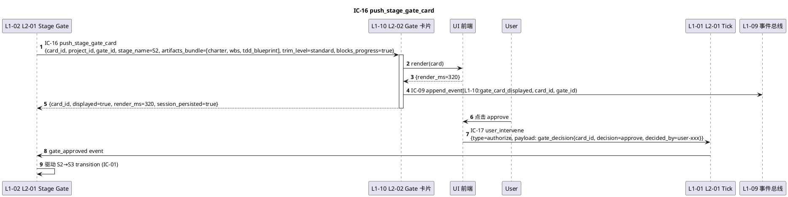

---

### §3.17 IC-17 · user_intervene（L1-10 → L1-01）

**§3.17.1 定位**：**用户主动触发**的所有干预入口 · 统一走本 IC · 支持 authorize/pause/resume/clarify/change_request 5 类 · panic 模式 ≤100ms 抢占当前 tick。

**§3.17.2 入参 `user_intervene_command`**：

```yaml
user_intervene_command:
  type: object
  required: [intervene_id, project_id, type, user_id, ts]
  properties:
    intervene_id: {type: string, format: "ui-{uuid-v7}", required: true}
    project_id: {type: string, required: true}
    type:
      type: enum
      enum: [authorize, pause, resume, clarify, change_request]
      required: true
    user_id: {type: string, required: true}
    payload:
      oneOf:
        - {type: object, description: authorize · {target: halt_id | gate_id, decision, comment}}
        - {type: object, description: pause · {reason, scope: "tick" | "project"}}
        - {type: object, description: resume · {from_state: HALTED | PAUSED}}
        - {type: object, description: clarify · {question_id, answer}}
        - {type: object, description: change_request · {change_items[], impact_scope}}
    urgency:
      type: enum
      enum: [panic, normal]
      default: normal
      description: panic → ≤100ms 抢占 · normal → 下 tick 处理
    ts: {type: string, required: true}
```

**§3.17.3 出参 `user_intervene_ack`**：

```yaml
user_intervene_ack:
  type: object
  required: [intervene_id, accepted, new_state, latency_ms]
  properties:
    intervene_id: {type: string, required: true}
    accepted: {type: boolean, required: true}
    new_state:
      type: string
      required: true
      description: 干预后 L1-01 state
    latency_ms: {type: integer, required: true, description: panic 模式硬约束 ≤100ms}
    audit_entry_id: {type: string, required: true}
```

**§3.17.4 错误码**：

| 错误码 | 触发 | 处理 |
|---|---|---|
| `E_INT_NO_PROJECT_ID` | project_id 缺失 | 拒绝（但 panic=pause 紧急情况仍暂停） |
| `E_INT_TYPE_PAYLOAD_MISMATCH` | payload 不符 type schema | 拒绝 |
| `E_INT_USER_UNKNOWN` | user_id 未注册 | 拒绝（防伪造干预）|
| `E_INT_PANIC_SLO_VIOLATION` | urgency=panic 但 latency > 100ms | accepted=true 仍返回 · 告警 L1-07 |
| `E_INT_RESUME_WRONG_STATE` | type=resume 但当前 state 不是 HALTED/PAUSED | 拒绝 |
| `E_INT_CHANGE_REQ_INVALID_SCOPE` | change_request.impact_scope 非法 | 拒绝 |

**§3.17.5 幂等性**：

- **Non-idempotent**（每次用户动作独立）
- 重复 authorize 同 halt_id 返回已 resumed 的 ack（软幂等）

**§3.17.6 PlantUML 时序**：

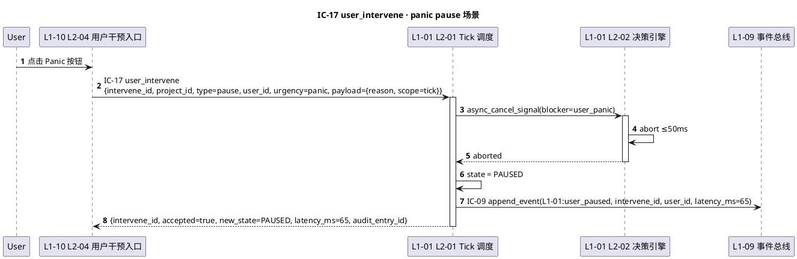

---

### §3.18 IC-18 · query_audit_trail（L1-10 → L1-09）

**§3.18.1 定位**：UI 按锚点（file_path / artifact_id / decision_id / event_id）反向查询完整审计链 · 支持跨 project 只读查询。

**§3.18.2 入参 `query_audit_trail_query`**：

```yaml
query_audit_trail_query:
  type: object
  required: [query_id, anchor_type, anchor_value]
  properties:
    query_id: {type: string, format: "qat-{uuid-v7}", required: true}
    project_id:
      type: string
      required: true
      description: 默认检索范围；若 cross_project=true 则忽略此约束
    anchor_type:
      type: enum
      enum: [file_path, artifact_id, decision_id, event_id, wp_id, audit_entry_id]
      required: true
    anchor_value: {type: string, required: true}
    cross_project:
      type: boolean
      default: false
      description: true 表示跨 project 检索（只读 · 不允许修改其他 project）
    depth:
      type: enum
      enum: [immediate, full_chain]
      default: full_chain
      description: immediate=直接关联事件 · full_chain=递归追溯到原决策
    ts: {type: string, required: true}
```

**§3.18.3 出参 `query_audit_trail_result`**：

```yaml
query_audit_trail_result:
  type: object
  required: [query_id, chain, total_events]
  properties:
    query_id: {type: string, required: true}
    chain:
      type: array
      required: true
      items:
        type: object
        properties:
          event_id: {type: string}
          event_type: {type: string}
          sequence: {type: integer}
          project_id: {type: string}
          actor: {type: object}
          payload: {type: object}
          ts: {type: string}
          upstream_event_ids: {type: array, items: string, required: false}
    total_events: {type: integer, required: true}
    truncated:
      type: boolean
      default: false
      description: 深度超限截断（默认 max_events=500）
    ts: {type: string, required: true}
```

**§3.18.4 错误码**：

| 错误码 | 触发 | 处理 |
|---|---|---|
| `E_QAT_NO_PROJECT_ID` | project_id 缺失 | 拒绝（cross_project=true 时也必填）|
| `E_QAT_ANCHOR_TYPE_UNKNOWN` | anchor_type 非法 | 拒绝 |
| `E_QAT_ANCHOR_NOT_FOUND` | anchor_value 无对应事件 | 返回 chain=[] + total_events=0 |
| `E_QAT_CROSS_PROJECT_DENIED` | cross_project=true 但用户权限不足 | 拒绝 |
| `E_QAT_HASH_CHAIN_BROKEN` | 检索中发现 chain 断裂 | 返回 partial chain + truncated=true + 告警 L1-07 |

**§3.18.5 幂等性**：

- **Idempotent**（纯读）

**§3.18.6 PlantUML 时序**：

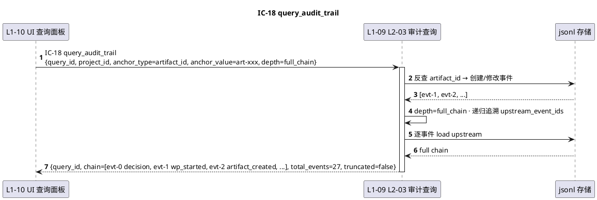

---

### §3.19 IC-19 · request_wbs_decomposition（L1-02 → L1-03）

**§3.19.1 定位**：L1-02 S2 Gate 批准后调 L1-03 L2-01 WBS 拆解器 · 异步拆解 · 返回 wbs_topology。

**§3.19.2 入参 `request_wbs_decomposition_command`**：

```yaml
request_wbs_decomposition_command:
  type: object
  required: [command_id, project_id, artifacts_4_pack, architecture_output]
  properties:
    command_id: {type: string, format: "wbs-req-{uuid-v7}", required: true}
    project_id: {type: string, required: true}
    artifacts_4_pack:
      type: object
      required: true
      properties:
        charter_path: {type: string}
        plan_path: {type: string}
        requirements_path: {type: string}
        risk_path: {type: string}
    architecture_output:
      type: object
      required: true
      properties:
        togaf_phases: {type: array, items: string}
        adr_path: {type: string}
    target_wp_granularity:
      type: enum
      enum: [fine, medium, coarse]
      default: medium
    ts: {type: string, required: true}
```

**§3.19.3 出参 `request_wbs_decomposition_result`**（dispatch 同步 · 拓扑异步落盘）：

```yaml
request_wbs_decomposition_result:
  type: object
  required: [command_id, accepted, decomposition_session_id]
  properties:
    command_id: {type: string, required: true}
    accepted: {type: boolean, required: true}
    decomposition_session_id: {type: string, format: "decomp-{uuid-v7}", required: false}
    reason: {type: string, required: false}

wbs_topology_ready:  # 异步通过 IC-09 事件回推
  type: object
  required: [decomposition_session_id, project_id, topology_version, wp_count]
  properties:
    decomposition_session_id: {type: string, required: true}
    project_id: {type: string, required: true}
    topology_version: {type: string, required: true}
    wp_count: {type: integer, minimum: 1, required: true}
    critical_path_wp_ids: {type: array, items: string, required: true}
    estimated_duration_h: {type: number, required: false}
```

**§3.19.4 错误码**：

| 错误码 | 触发 | 处理 |
|---|---|---|
| `E_WBS_NO_PROJECT_ID` | project_id 缺失 | 拒绝 |
| `E_WBS_4_PACK_INCOMPLETE` | artifacts_4_pack 字段缺失 | 拒绝 |
| `E_WBS_ARCH_OUTPUT_MISSING` | architecture_output 缺失 | 拒绝 |
| `E_WBS_DECOMPOSITION_FAIL` | 异步拆解失败（LLM 误差 / skill 失败）| 异步事件回推 status=failed + 降级到人工辅助 |
| `E_WBS_TOPOLOGY_CORRUPT` | 生成的 DAG 有环 | 异步事件 topology_valid=false + 告警 L1-07 |

**§3.19.5 幂等性**：

- **Non-idempotent**（每次产新 topology_version · 上游去重）

**§3.19.6 PlantUML 时序**：

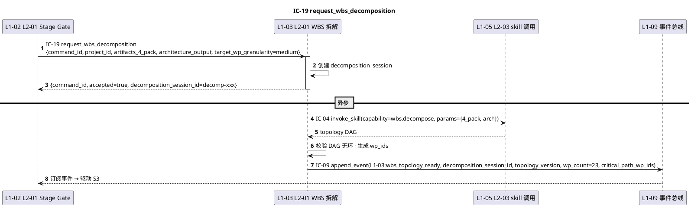

---

### §3.20 IC-20 · delegate_verifier（L1-04 → L1-05）

**§3.20.1 定位**：**S5 TDDExe 独立验证**的特化委托 · 必走独立 session 子 Agent（PM-03 · 绝不降级主 session）· 组装三段证据链返回。

**§3.20.2 入参 `delegate_verifier_command`**：

```yaml
delegate_verifier_command:
  type: object
  required: [delegation_id, project_id, wp_id, blueprint_slice, s4_snapshot, acceptance_criteria]
  properties:
    delegation_id: {type: string, format: "ver-{uuid-v7}", required: true}
    project_id: {type: string, required: true}
    wp_id: {type: string, format: "wp-{uuid-v7}", required: true}
    blueprint_slice:
      type: object
      required: true
      description: TDD 蓝图的本 WP 切片（含 dod_expression / red_tests）
    s4_snapshot:
      type: object
      required: true
      properties:
        artifact_refs: {type: array, items: string}
        git_head: {type: string}
        test_report: {type: object, required: false}
    acceptance_criteria:
      type: object
      required: true
      description: quality_gates 的 WP 子集
    timeout_s: {type: integer, default: 1200}
    allowed_tools:
      type: array
      items: {type: string}
      default: [Read, Glob, Grep, Bash]
      description: verifier session 工具白名单（严格限制）
    ts: {type: string, required: true}
```

**§3.20.3 出参**（dispatch 同步 + verdict 异步）：

```yaml
delegate_verifier_dispatch_result:
  type: object
  required: [delegation_id, dispatched, verifier_session_id]
  properties:
    delegation_id: {type: string, required: true}
    dispatched: {type: boolean, required: true}
    verifier_session_id: {type: string, format: "sub-{uuid-v7}", required: false}

verifier_verdict:  # 异步通过 IC-09 回推
  type: object
  required: [delegation_id, verdict, three_segment_evidence]
  properties:
    delegation_id: {type: string, required: true}
    verdict: {type: enum, enum: [PASS, FAIL_L1, FAIL_L2, FAIL_L3, FAIL_L4], required: true}
    three_segment_evidence:
      type: object
      required: true
      properties:
        blueprint_alignment: {type: object, description: 蓝图对齐证据}
        s4_diff_analysis: {type: object, description: S4 snapshot diff 分析}
        dod_evaluation: {type: object, description: DoD 表达式求值结果}
    confidence: {type: number, minimum: 0, maximum: 1}
    duration_ms: {type: integer, required: true}
    verifier_report_id: {type: string, format: "vr-{uuid-v7}"}
```

**§3.20.4 错误码**：

| 错误码 | 触发 | 处理 |
|---|---|---|
| `E_VER_NO_PROJECT_ID` | project_id 缺失 | 拒绝 |
| `E_VER_BLUEPRINT_MISSING` | blueprint_slice 缺失 | 拒绝 |
| `E_VER_MUST_BE_INDEPENDENT_SESSION` | 尝试在主 session 跑 verifier | 拒绝（PM-03 硬约束 · PRD §5.4.4）|
| `E_VER_TIMEOUT` | 超 timeout_s | verdict=FAIL_L4 + partial evidence + 告警升级 |
| `E_VER_EVIDENCE_INCOMPLETE` | 三段证据链任一缺失 | verdict=FAIL_L1 自动降级 · 告警 |
| `E_VER_TOOL_DENIED` | verifier session 尝试用白名单外工具 | 自动拦截 · 继续 · 证据标记 |

**§3.20.5 幂等性**：

- **Non-idempotent**（每次独立验证）
- 去重：上游 L1-04 L2-06 自己记录 (wp_id, s4_snapshot.git_head) → delegation_id

**§3.20.6 PlantUML 时序**：

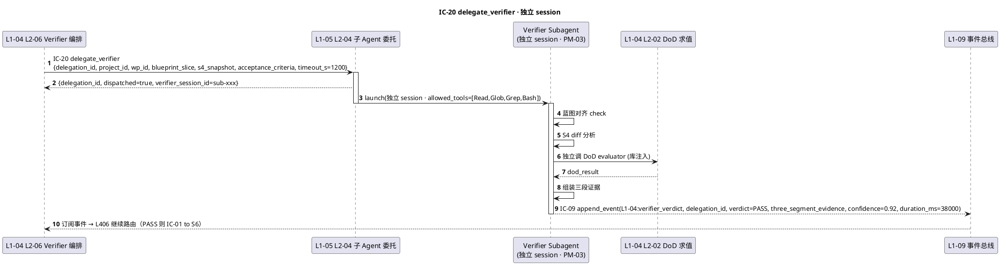

---

## §4 跨 L1 契约全景图（PlantUML · 20 IC 连接 · 单张大图）

```plantuml
@startuml
title HarnessFlow · 10 L1 × 20 IC Global Contract Landscape (v1.0)
skinparam componentStyle rectangle
skinparam linetype polyline

package "Control Plane" {
  component "L1-01 主 Agent 决策循环\n(BC-01)" as L01
  component "L1-02 项目生命周期\n(BC-02)" as L02
}

package "Planning & Quality" {
  component "L1-03 WBS+WP 拓扑调度\n(BC-03)" as L03
  component "L1-04 Quality Loop\n(BC-04)" as L04
}

package "Execution & Knowledge" {
  component "L1-05 Skill+子Agent\n(BC-05)" as L05
  component "L1-06 3层知识库\n(BC-06)" as L06
}

package "Meta" {
  component "L1-07 Harness 监督\n(BC-07)" as L07
  component "L1-08 多模态内容\n(BC-08)" as L08
}

package "Infrastructure & UI" {
  component "L1-09 韧性+审计\n(BC-09)\n[事件总线汇聚]" as L09
  component "L1-10 人机协作 UI\n(BC-10)" as L10
}

' Control flow
L02 --> L01 : IC-01 request_state_transition
L03 --> L01 : IC-02 get_next_wp
L04 --> L01 : IC-03 enter_quality_loop

' Skill ecosystem
L01 --> L05 : IC-04 invoke_skill
L02 --> L05 : IC-04
L04 --> L05 : IC-04
L08 --> L05 : IC-04
L01 ..> L05 : IC-05 delegate_subagent (Async)
L04 ..> L05 : IC-20 delegate_verifier (Async)
L08 ..> L05 : IC-12 delegate_codebase_onboarding (Async)

' KB
L01 ..> L06 : IC-06 kb_read
L04 ..> L06 : IC-06 + IC-07
L07 ..> L06 : IC-06
L08 ..> L06 : IC-07
L02 --> L06 : IC-08 kb_promote
L10 --> L06 : IC-08 (user_approve)

' Supervisor (Async fire-and-forget for IC-13; Sync for IC-14/15)
L07 ..> L01 : IC-13 push_suggestion (Async)
L07 --> L04 : IC-14 push_rollback_route
L07 --> L01 : IC-15 request_hard_halt (Sync blocking ≤100ms)

' Content (Sync for md/image · Async for large code → IC-12)
L01 --> L08 : IC-11 process_content
L02 --> L08 : IC-11
L04 --> L08 : IC-11

' UI (IC-16 Async UI render; IC-17 Sync on panic)
L02 ..> L10 : IC-16 push_stage_gate_card (Async)
L10 --> L01 : IC-17 user_intervene
L10 --> L09 : IC-18 query_audit_trail

' WBS
L02 --> L03 : IC-19 request_wbs_decomposition

' Event bus (append_event · 所有 L1 都发)
L01 ..> L09 : IC-09 append_event
L02 ..> L09 : IC-09
L03 ..> L09 : IC-09
L04 ..> L09 : IC-09
L05 ..> L09 : IC-09
L06 ..> L09 : IC-09
L07 ..> L09 : IC-09
L08 ..> L09 : IC-09
L10 ..> L09 : IC-09
L09 --> L09 : IC-10 replay_from_event (内部)

@enduml
```

**图例说明**：
- **实线 `-->`** = 同步 Command/Query（双向期望）
- **虚线 `..>`** = 异步事件流（fire-and-forget 或订阅）
- **分组 package** = 按职责分区的 L1 集群（控制 / 规划+质量 / 执行+知识 / 元 / 基础+UI）
- IC-09 是所有 L1 → L1-09 的共同出边（事件总线汇聚 · 最高频）

---

## §5 契约一致性审计钩子（给 quality_gate.sh 未来扩展用）

### 5.1 字段命名一致性（quality_gate 可加 Gate 7）

**规则**：以下字段名在所有 IC payload 中**字面一致**：

| 统一字段名 | 类型 | 强制度 | 出现 IC |
|---|---|---|---|
| `project_id` | string（`pid-{uuid-v7}`）| PM-14 · 所有 IC 必含根字段 | 全部 20 IC |
| `ts` | string（ISO-8601-utc）| 所有 IC 必含 | 全部 20 IC |
| `event_id` | string（`evt-{uuid-v7}`）| IC-09 | IC-09 / 被其他 IC 引用时 |
| `tick_id` | string（`tick-{uuid-v7}`）| 主 loop 相关 IC | IC-01/02/03/04/05/13/17 |
| `decision_id` | string（`dec-{uuid-v7}`）| IC-18 检索锚点 | IC-18 + 审计事件 payload |
| `wp_id` | string（`wp-{uuid-v7}`）| WP 相关 | IC-02/03/14/20 |
| `gate_id` | string（`gate-{uuid-v7}`）| Gate 相关 | IC-01/16/17 |

**审计脚本伪代码**（后续加入 quality_gate.sh Gate 7 · 注：本节 `grep` pattern 需用字符串拼接避免匹配本文档自身）：

```bash
# Gate 7: 字段命名一致性 审计
for ic_ref_file in docs/3-1-Solution-Technical/L1-*/L2-*.md; do
  # 检查引用 IC-XX 的地方字段名是否与 ic-contracts.md §3.N.2/§3.N.3 一致
  # 正确写法应为：project_id（不允许 camelCase 或 kebab-case 变体）
  grep -oE "project[_\-]?[iI]d" "$ic_ref_file" | sort -u
done
```

### 5.2 错误码命名规范

**模式**：`E_{SCOPE}_{REASON}`

- SCOPE = IC 缩写（TRANS / WP / QLOOP / SKILL / SUB / KB / KBW / KBP / EVT / REP / PC / OB / SUGG / ROUTE / HALT / CARD / INT / QAT / WBS / VER）
- REASON = UPPER_SNAKE（NO_PROJECT_ID / TIMEOUT / SCHEMA_MISMATCH / CROSS_PROJECT / ...）

**审计**：错误码集合必闭合 · 所有 L2 tech-design 引用的错误码必须在本文件定义。

### 5.3 PlantUML 时序图标准

- 每条 IC 必含 ≥ 1 张 PlantUML sequenceDiagram
- 必有 `autonumber` 指令
- 参与者按真实 L1-L2 路径标注（如 `participant "L1-01 L2-06 Supervisor 接收" as L106`）
- 异步事件用 `-->`（虚线）· 同步 Command/Query 用 `->`（实线）

### 5.4 版本化锁定

- 本文件 version=v1.0 · status=locked
- 任何字段变更必须走 PR · 伴随 3-1 L2 tech-design 同步更新
- 重大变更（字段删除 / 改类型）升到 v2.0 · 保持 v1.0 归档

---

## §6 PM-14 根字段规范 + 错误码命名规范 + 扩展

### 6.1 PM-14 `project_id` 根字段硬约束

**规则**：所有 IC payload 的**根字段**（非嵌套 object 内）必含 `project_id`，除非 `project_scope: "system"` 显式标注为系统级事件。

**例外清单**：仅 IC-09 `append_event` 支持 `project_id_or_system` oneOf `"system"`（启动/崩溃恢复/全局配置）· 其他 IC 必含真实 `project_id`。

**违规处理**：schema 校验层拒绝 + 拒绝后对应错误码（如 IC-01 `E_TRANS_NO_PROJECT_ID` / IC-09 `E_EVT_NO_PROJECT_OR_SYSTEM` / IC-15 `E_HALT_NO_PROJECT_ID` 等 · 具体编码见各 IC §3.N.4）+ 审计留痕。

### 6.2 错误码命名规范（已在 §5.2）

### 6.3 字段类型规范

- `*_id` 字段 = string + format 明示（uuid-v7 推荐）
- `ts` / `*_at` 字段 = string + ISO-8601 UTC
- 枚举 = 显式列 enum 值（中文枚举需标中文 native 字符，如 stage 名）
- 数组 = 明示 `items` schema + `minItems`（若空语义不同）

### 6.4 扩展规则（未来加 IC）

新加 IC 必须：
1. 分配唯一编号（不复用已删除的编号）
2. 添加到 §2 总表 + §3 相应位置 + §4 全景图
3. 在 `docs/2-prd/L1集成/prd.md §3` 同步补一致性测试点
4. 所有被调 L2 tech-design §3 补相应接口映射
5. 本文件 version 加 minor 版本（v1.1 / v1.2 ...）

---

## §7 引用索引（供 L2 tech-design 快速复制）

L2 tech-design 写 §3 对外接口时，引用本文件的方式（GitHub-flavored MD 锚点使用 kebab-case slug）：

```markdown
## §3 对外接口定义

本 L2 作为 {生产者/消费者} 参与以下 IC（详见 [ic-contracts.md](../../integration/ic-contracts.md)）：

- **IC-01 request_state_transition**（本 L2 是生产者/消费者）
  - 入参：见 [§3.1.2 state_transition_request](../../integration/ic-contracts.md#312-入参-state_transition_request)
  - 出参：见 [§3.1.3 state_transition_result](../../integration/ic-contracts.md#313-出参-state_transition_result)
  - 错误码：见 [§3.1.4](../../integration/ic-contracts.md#314-错误码)

本 L2 的内部方法（非 IC 契约）：

- 方法 1：字段级 YAML schema ...
- 方法 2：字段级 YAML schema ...
```

**锚点 slug 规则**（供 L2 复制时参考）：
- 标题 `### §3.1 IC-01 · request_state_transition（L1-01 → L1-02）` → slug `#31-ic-01--request_state_transition-l1-01--l1-02`（GitHub 自动转换：小写 + 空格转 `-` + 去特殊字符）
- 子节 `**§3.1.2 入参 state_transition_request**` 因是 bold 而非 heading，无独立锚点 · L2 引用时链接到上层 `### §3.1` 锚点即可
- 建议 L2 引用写法：`[IC-01 详规](../../integration/ic-contracts.md#31-ic-01--request_state_transition-l1-01--l1-02)` · 具体 slug 在编辑器预览时可用复制链接功能获取

**严禁**：在 L2 tech-design 复制本文件 IC 字段定义（破坏 SSOT）· 只能**引用 + 在 §13 映射表中列 IC 编号**。

---

*— ic-contracts v1.0 · locked · 2026-04-21 · 3-Solution Phase R1 质量锚点 · M1 里程碑 —*

