# Integration · P0 跨 L1 时序图目录（P0 Sequence Catalog v1.0）

> **本文档定位**：3-Solution Resume Phase R1 的**质量锚点 · 跨 L1 主干时序 SSOT**。基于 `ic-contracts.md §3` 的 20 条字段级 IC 契约，串接成 **12 条 P0（Primary）成功路径主干流程**——HarnessFlow 所有正向**多 L1 协同**场景的权威时序图集。
>
> **与 `L0/sequence-diagrams-index.md §2` 的分工**：L0 索引给出 8 条 P0 的**骨架层**（15-25 行 PlantUML · 单图粒度 · 每 L1 做一次登场即可）；本文件给出 12 条 P0 的**深度层**（含字段示例 YAML · 含 SLO 约束 · 含降级出口 · 跨多 IC 串链 · 每 L1 可多次交互 · 每图均 `autonumber` + `activate/deactivate`）。
>
> **与 `ic-contracts.md §3.N.6` 的分工**：ic-contracts 每条 IC 的 §3.N.6 是**单 IC 粒度**的时序图（"IC 契约是如何被一次调用完成的"）；本文件做**跨 IC 链接成 P0 主干**（"一条业务主干跑下来要串哪几条 IC"）。
>
> **严格规则**：
> - 所有时序图一律 **PlantUML**（`@startuml` / `@enduml` / `autonumber` · 必含 `activate/deactivate`）· **禁止 Mermaid**
> - 所有 IC 编号 **必须与 ic-contracts.md §3 对齐**（不得自创 IC-21、IC-99 之类）
> - 所有字段名 **必须与 ic-contracts.md 字段级 YAML 对齐**（英文 snake_case · 如 `project_id` 不是 `projectId`）
> - PM-14 根字段硬约束：所有 P0 流的参与者交互 payload 示例必含 `project_id` 字段（`system_resumed` 类系统级事件除外 · 显式标 `project_scope: system`）
> - 每条 P0 图 **主 step 8-20 行** · 字段示例 YAML **≤ 30 行**（避免淹没主流）
> - 参与者缩写沿用 `ic-contracts.md` · L1-01 简写 `L01` · L1-02 简写 `L02` · 以此类推 · UI 仍用 `UI` · 用户 `U`

---

## §0 撰写进度

- [x] §1 定位 + 与上游分工
- [x] §2 12 条 P0 流清单总表（Flow# · 场景 · 参与 L1 · 涉及 IC · 来源 · 主产出物）
- [x] §3.1 P0-01 · 项目启动（S0→S1）
- [x] §3.2 P0-02 · S1→S7 完整主流程骨架
- [x] §3.3 P0-03 · S2 WBS 拆解链
- [x] §3.4 P0-04 · WP 执行主链（get_next_wp → quality_loop → 下一 WP）
- [x] §3.5 P0-05 · S4 执行驱动（invoke_skill → 跑测试 → 审计 → 回调）
- [x] §3.6 P0-06 · S5 独立 Verifier（delegate_verifier → 三段证据链 → verdict）
- [x] §3.7 P0-07 · KB 晋升主流（session → observed_count → project/global）
- [x] §3.8 P0-08 · S7 收尾归档（交付包齐 → Stage Gate → archive）
- [x] §3.9 P0-09 · Supervisor 正常观察链（采集 → 判定 → push_suggestion）
- [x] §3.10 P0-10 · 审计链（decision_made → append_event → UI 查询）
- [x] §3.11 P0-11 · 多模态内容处理（process_content · md/code/image）
- [x] §3.12 P0-12 · 事件总线汇聚（多 L1 并发 append_event · hash-chain）
- [x] §4 跨 P0 流共享实体 schema

---

## §1 定位 + 与上游分工

### 1.1 P0 是什么（vs P1 异常 vs P2 降级）

| 级别 | 本文件 | 定义 | 覆盖 | 用途 |
|---|---|---|---|---|
| **P0 · 主干成功路径** | **本文件** | 项目生命周期 7 阶段串接所需的**正向协同流**。跑一个 V1 项目从启动到 CLOSED · 每条 P0 流都要至少出现 1 次。每条 P0 断掉 = 产品不可用。 | 全部 10 L1 + 全部 20 IC · 12 条 P0 | 集成测试必测 · 验收必演 · L2 时序图必引 |
| **P1 · 重要异常/变体** | `p1-seq.md`（R1.3）| 高频变体 · 补偿流 · No-Go 重做 · 4 级回退 · 子 Agent fallback 链 | BF-E-01~06 · 12 条 P1 | 集成测试必测 |
| **P2 · 降级/红线** | 待 R1.4 cross-l1-integration.md §X 或沉到 `L0/sequence-diagrams-index.md §4` | 低频异常 · 降级出口 · 硬红线 · 容灾 | BF-E-07~12 · 6 条 P2 | 诊断参考 · 韧性验证 |

### 1.2 为何必须存在（SSOT 动机）

1. **跨 IC 串链在 ic-contracts.md 不可见**：ic-contracts §3.N.6 每张时序图只画**1 条 IC**的被调用过程；但项目主干（"用户创建 project → 最终交付归档"）跑一次要经 **5-10 条 IC 串成一条链**。L2 工程师写"§5 P0 时序图"时缺少**跨 IC 串链模板** → 本文件补齐。
2. **L0 sequence-diagrams-index.md 骨架太浅**：L0 每图 15-25 行是**入门级 15 秒读懂**；深度项目集成测试和 TDD 需要**字段级示例 + SLO 约束 + 降级出口** → 本文件补齐。
3. **10 L1 的协作点可见化**：每条 P0 都标注**涉及哪几个 L1、每 L1 走哪条 IC、每条 IC 的幂等性与 SLO**，为 L2 工程师跨团队协作提供**同一张地图**。

### 1.3 L2 工程师如何用本文件

| 任务 | 用法 |
|---|---|
| 写 L2 tech-design §5 "核心场景时序图" | 到 §2 总表找本 L2 所在的 P0 流 → copy §3.N.4 PlantUML 骨架到 L2 文档 → 本 L2 视角**细化**（加内部 L3 组件分解 · 保留跨 L1 IC 边界） |
| 写 L2 tech-design §5 "字段传递与 schema" | 到 §3.N.5 字段示例 YAML 直接 copy + 在 L2 本地补 L3 组件间的内部字段 |
| 写 3-2 TDD 集成测试用例 | 每条 P0 = 1 条"正向 E2E"用例 · 断言 §3.N.6 SLO 约束；降级出口 = 1 条"P1 变体"用例派生源 |
| 代码实现时判断 "此调用用哪条 IC" | 到 §2 总表按"参与 L1" 列 + "涉及 IC"列反查 |

---

## §2 12 条 P0 流清单总表

| Flow# | 场景一句话 | 参与 L1 | 涉及 IC | 来源链路（L0 §2 / PRD 场景）| 主产出物 |
|---|---|---|---|---|---|
| **P0-01** | 项目启动 · S0→S1（用户目标 → pid 生成 → 章程 → S1 Gate）| L1-10 · L1-01 · L1-02 · L1-05 · L1-09 | IC-17 · IC-04 · IC-09 · IC-16 · IC-01 | L0 §2.1 P0-01 + PRD §5.1 | `projects/<pid>/manifest.yaml` + `charter.md` · `goal_anchor_hash` · state=S1_CLARIFY→S1_LOCK→S2 |
| **P0-02** | S1→S7 完整主流程骨架（13 步串联全周期）| 全 10 L1 | 全 20 IC | L0 §2.2 P0-02 + PRD §5.2 | CLOSED 项目 · `deliverables/` · `retro.md` · KB 晋升记录 |
| **P0-03** | S2 WBS 拆解链（4 件套齐 → IC-19 → 拓扑 → 可拉 WP）| L1-02 · L1-03 · L1-09 · L1-07 | IC-19 · IC-09 · IC-02 · IC-13 | 从 L0 §2.2 拆细 + PRD §5.3 + PRD §6.10 | `wbs_topology.yaml`（DAG）+ WP 列表 · `critical_path[]` · topology_version |
| **P0-04** | WP 执行主链（get_next_wp → enter_quality_loop → verdict → 下一 WP）| L1-01 · L1-03 · L1-04 · L1-05 · L1-07 · L1-09 | IC-02 · IC-03 · IC-04 · IC-20 · IC-09 · IC-13 | L0 §2.3 P0-03 + PRD §5.4 | 本 WP 的 code + unit tests + verifier_report + verdict=PASS · in_flight-- |
| **P0-05** | S4 执行驱动（tdd 生成 code → 跑测试 → 审计 → 回调 L1-04）| L1-04 · L1-05 · L1-09 · L1-07 | IC-04 · IC-09 · IC-13 | 从 L0 §2.3 内部拆细 + PRD §5.4.4 | S4 `impl_artifacts[]`（code + tests）· WP-DoD 自检 PASS · bash_safe 事件 |
| **P0-06** | S5 独立 Verifier（IC-20 delegate_verifier → 独立 session → 三段证据链 → verdict）| L1-04 · L1-05 · L1-09 · L1-07 | IC-20 · IC-09 · IC-14 | L0 §2.3 + §2.8 P0-08 + PRD §5.4.5 | `verifier_report.yaml` · `evidence_chain[3]`（blueprint/test/implementation）· verdict ∈ {PASS, FAIL, INSUFFICIENT_EVIDENCE} |
| **P0-07** | KB 晋升主流（session 候选 → observed_count ≥ K 或用户批准 → project/global）| L1-05 · L1-06 · L1-10 · L1-09 | IC-07 · IC-08 · IC-17 · IC-09 | PRD §5.5 + L1-06 architecture §2.5 | `project/<pid>/kb/`（PIC-01/KIC-01）或 `global/kb/`（通过阈值或用户批准）· promotion_record |
| **P0-08** | S7 收尾归档（产出物齐 → S7 Gate → 用户 approve → archive）| L1-02 · L1-10 · L1-05 · L1-06 · L1-09 · L1-01 | IC-16 · IC-17 · IC-01 · IC-08 · IC-09 | L0 §2.2 S7 子段 + PRD §5.7 | `deliverables/` 最终产出包 · `retro.md`（retro subagent 生成）· project 状态=CLOSED · KB 全部晋升入库 |
| **P0-09** | Supervisor 正常观察链（L1-07 30s 扫描 → 8 维度正常 → INFO/SUGG → L1-01 入队）| L1-07 · L1-09 · L1-01 | IC-13 · IC-09 | L0 §2.7 P1-11 骨架 + PRD §5.8 + L1-07 architecture §2.5 | `suggestions_inbox[]` 新增 SUGG/INFO 建议 · supervisor_scan 事件 · 主 loop 新 tick 纳入建议 |
| **P0-10** | 审计链（decision_made → IC-09 append_event → hash 链 → UI IC-18 反查）| L1-01 · L1-09 · L1-10 | IC-09 · IC-18 | L0 §2.4 + PRD §6.11 审计追溯 | `events.jsonl` 新 append 事件（sequence + hash）· UI "决策追溯"面板可查看 decision_id 全链 |
| **P0-11** | 多模态内容处理（process_content · md / code / image · 结构化输出）| L1-08 · L1-05 · L1-01 · L1-09 | IC-11 · IC-12 · IC-04 · IC-09 | L0 §3.6 P1-06（大代码库 onboarding 子集）+ PRD §6.8 多模态 | `structured_output.json`（md: outline · code: symbols+AST · image: ocr+desc）· 可选 onboarding_report |
| **P0-12** | 事件总线汇聚（多 L1 并发 IC-09 → fsync 串行化 → hash-chain 完整性）| 全 10 L1 作为生产者 · L1-09 汇聚 | IC-09 · IC-10 | 从 L0 §2.4 抽出并发视角 + PRD §6.11 + L1-09 architecture §2.5 | `events.jsonl` 单调递增 sequence · prev_hash 链完整 · checkpoint 周期生成（replay 加速）|

**小结 · IC 覆盖率**（本文件 12 条 P0 对 20 IC 的覆盖矩阵）：

| IC | 出现在 P0# | IC | 出现在 P0# |
|---|---|---|---|
| IC-01 request_state_transition | P0-01 · P0-02 · P0-08 | IC-11 process_content | P0-11 |
| IC-02 get_next_wp | P0-02 · P0-04 | IC-12 delegate_codebase_onboarding | P0-11 |
| IC-03 enter_quality_loop | P0-02 · P0-04 | IC-13 push_suggestion | P0-04 · P0-09 |
| IC-04 invoke_skill | P0-01 · P0-04 · P0-05 · P0-11 | IC-14 push_rollback_route | P0-06（用于 FAIL 出口 · 正向流可选）|
| IC-05 delegate_subagent | P0-08（retro subagent）· P0-11 | IC-15 request_hard_halt | （硬红线属 P2 · 本文件仅指向 L0 §2.6）|
| IC-06 kb_read | P0-02 · P0-04（注入）| IC-16 push_stage_gate_card | P0-01 · P0-02 · P0-04 · P0-08 |
| IC-07 kb_write_session | P0-07（ingest 入口）| IC-17 user_intervene | P0-01 · P0-04 · P0-07 · P0-08 |
| IC-08 kb_promote | P0-07 · P0-08 | IC-18 query_audit_trail | P0-10 |
| IC-09 append_event | **全部 12 条** | IC-19 request_wbs_decomposition | P0-03 |
| IC-10 replay_from_event | P0-12（汇聚视角）| IC-20 delegate_verifier | P0-04 · P0-06 |

- **全覆盖 ✅**：20 条 IC 里 19 条在本文件 P0 图中至少出现 1 次；**唯一例外 IC-15 硬红线**属 P2 拦截流（已在 L0 §2.6 P0-06 单独深画，本文件仅简述挂点）。
- **IC-09 append_event** 是最高频枢纽（全 12 条 P0 都走）· **IC-04 invoke_skill** 第二高频（4 条 P0 出现）。

---

## §3 12 条 P0 跨 L1 时序详图

### §3.1 P0-01 · 项目启动（S0 → S1）

#### §3.1.1 场景一句话 + 触发条件

- **一句话**：用户在 UI 输入"项目目标 + 资源约束" → L1-10 转发到 L1-01 → L1-01 调 `brainstorming` skill 做 ≤ 3 轮澄清 → L1-02 生成 `harnessFlowProjectId`（pid）并落盘 `manifest.yaml` + `charter.md` → 推 S1 Gate 卡 → 用户 Go → state 推进到 S2。
- **触发条件**：HarnessFlow 启动完成（已过 bootstrap 恢复阶段，未找到未 CLOSED 项目），用户在 UI "新建项目" 面板提交表单。
- **前置状态**：system 级 · 无活跃 pid。
- **终态**：`project_scope: pid=<new pid>` · state=S2_PLAN · goal_anchor_hash 已锁。

#### §3.1.2 参与 L1-L2 组件

| L1 | L2 组件 | 职责 |
|---|---|---|
| L1-10 | L2-01 主控台 / L2-04 交互通道 | 接收表单 + 推 Gate 卡 + 阻塞等待用户决策 |
| L1-01 | L2-02 决策引擎 / L2-03 状态机编排器 | 首 tick 驱动 · 澄清循环控制 · 调 skill · 推 state 转换 |
| L1-02 | L2-01 阶段门控制器 / L2-02 S1 启动产出器 | 生成 pid · 写 manifest · 写 charter · 推 Gate |
| L1-05 | L2-02 Skill 调度器 | 装载 `brainstorming` skill · 执行澄清 |
| L1-09 | L2-01 事件总线 / L2-02 hash-chain 管理 | 全链路事件落盘 + hash 链（含 `project_created` 系统级事件）|

#### §3.1.3 涉及 IC（引用 ic-contracts.md §3）

- **IC-17** user_intervene（ic-contracts §3.17）· type=clarify / authorize
- **IC-04** invoke_skill（ic-contracts §3.4）· skill_id=`brainstorming`
- **IC-09** append_event（ic-contracts §3.9）· `project_created` 为 `project_scope: system`（pid 生成前）· 后续事件 `project_id=<new pid>`
- **IC-16** push_stage_gate_card（ic-contracts §3.16）· gate_id 对应 S1 Gate
- **IC-01** request_state_transition（ic-contracts §3.1）· S1_LOCK → S2_PLAN

#### §3.1.4 完整 PlantUML 时序图

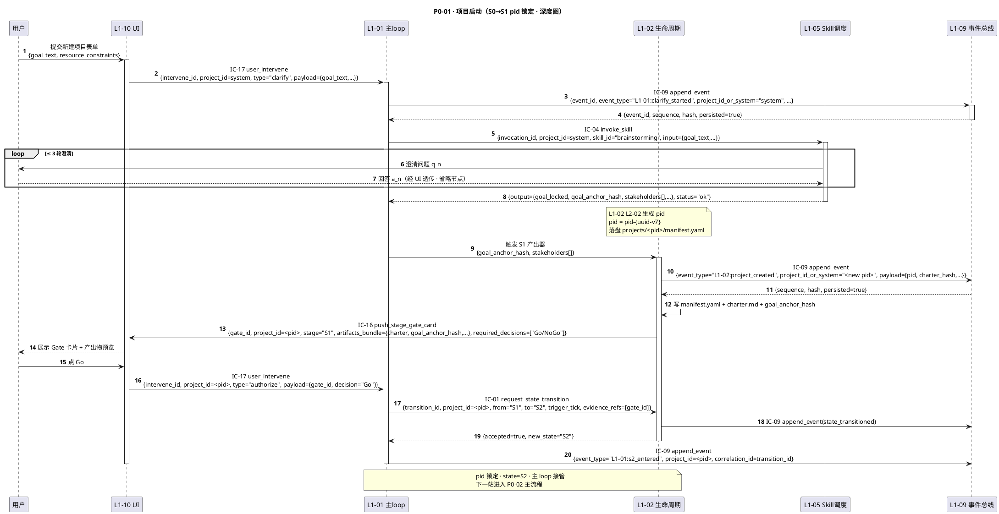

#### §3.1.5 关键字段取值示例（YAML）

```yaml
# step 2 · IC-17 clarify（pid 未生成 · system 作用域）
user_intervene:
  intervene_id: "iv-018f4a3b-7c1e-7000-8b2a-9d5e1c8f3a20"
  project_id: "system"
  type: "clarify"
  payload:
    goal_text: "为 HarnessFlow 写一个 A-B 测试统计分析脚本"
    resource_constraints: {max_weeks: 2, budget: "小"}
  ts: "2026-04-21T10:00:00Z"

# step 12 · L1-02 生成 pid 后首个 append_event
append_event_command:
  event_id: "evt-018f4a3c-2001-7000-b2a3-0a1e5c8f3b00"
  event_type: "L1-02:project_created"
  project_id_or_system: "pid-018f4a3c-1f00-7000-b2a3-0a1e5c8f3a00"  # 新 pid
  payload:
    pid: "pid-018f4a3c-1f00-7000-b2a3-0a1e5c8f3a00"
    charter_hash: "sha256:7c0f..."
    goal_anchor_hash: "sha256:a1b2..."
    stakeholders: [{role: "product", name: "user"}]
  actor: {l1: "L1-02", l2: "L2-02"}
  ts: "2026-04-21T10:05:30Z"

# step 16 · IC-16 Gate 卡
push_stage_gate_card:
  gate_id: "gate-018f4a3c-3000-7000-b2a3-0a1e5c8f3c00"
  project_id: "pid-018f4a3c-1f00-7000-b2a3-0a1e5c8f3a00"
  stage: "S1"
  artifacts_bundle:
    charter_ref: "projects/<pid>/charter.md"
    goal_anchor_hash: "sha256:a1b2..."
  required_decisions: ["Go/NoGo"]
  ts: "2026-04-21T10:06:00Z"
```

#### §3.1.6 SLO 约束 + 降级出口

| 约束 | 值 | 来源 |
|---|---|---|
| 澄清循环总耗时 | ≤ 3 轮 × 用户平均应答时间（上限 10 min）| PRD §9 硬约束 |
| IC-17 panic type 响应 | ≤ 100ms（即使在 clarify 循环内）| ic-contracts §3.17 |
| IC-16 enqueue | ≤ 50ms；UI 渲染 ≤ 500ms | ic-contracts §3.16 |
| IC-01 request_state_transition | P95 ≤ 100ms | ic-contracts §3.1 |
| IC-09 fsync（全链路）| P95 ≤ 20ms/条 | ic-contracts §3.9 |

**降级出口**：
- 澄清 ≥ 3 轮仍目标不明 → 主动 halt · 推 L1-07 `goal_ambiguous` 告警 → 用户重述（走 P1-01 变体 · 不在本文件）
- pid 生成时 UUID 冲突（概率 < 2^-120）→ 重试 1 次 · 再失败走 P2 系统 halt
- S1 Gate 用户点 NoGo（含 change_requests）→ 路由到 `p1-seq.md` P1-01 · 回到澄清循环（依赖闭包：charter + goal_anchor_hash 重算）

---

### §3.2 P0-02 · S1 → S7 完整主流程骨架

#### §3.2.1 场景一句话 + 触发条件

- **一句话**：从 pid 已锁（state=S2）开始，串接 **S2 规划 → S3 TDD 蓝图 → S4 执行 → S5 验证 → S6 旁路监督（全程并行）→ S7 收尾归档** 的 7 阶段主干，期间含 4 次 Stage Gate 和 N 轮 Quality Loop，终态 `state=CLOSED`。
- **触发条件**：P0-01 完成，state=S2，主 loop 首 tick。
- **前置状态**：`project_scope: pid=<pid>` · state=S2 · WBS 未拆。
- **终态**：state=CLOSED · deliverables/ 齐 · retro.md 生成 · KB 晋升 done。

#### §3.2.2 参与 L1-L2 组件

全部 10 L1 均参与。本图是**主干骨架**（14 步串联），各阶段内部展开见 P0-03 / P0-04 / P0-06 / P0-08。

#### §3.2.3 涉及 IC

本图**索引性**列出全 20 IC 的出场点（字段示例在子段 P0 流详画，本 §3.2 不重复）：

- S2 阶段：IC-19（WBS 拆解，详见 P0-03）· IC-01（S2→S3）· IC-16（S2 Gate）· IC-17（S2 authorize）
- S3 阶段：IC-04（调 `tdd-blueprint` skill）· IC-06（kb_read 注入模板）· IC-01（S3→S4）· IC-16（S3 Gate）· IC-17
- S4/S5 阶段（Quality Loop N 轮，详见 P0-04/P0-05/P0-06）：IC-02 · IC-03 · IC-04 · IC-20 · IC-14（若 FAIL）
- S6 旁路：IC-13（push_suggestion · INFO/SUGG）持续触发 · IC-15（硬红线 · 低频）
- S7 阶段（详见 P0-08）：IC-05（retro subagent）· IC-08（KB 晋升，详见 P0-07）· IC-01（S7→CLOSED）· IC-17
- 全程：IC-09 append_event · IC-18 query_audit_trail（UI 按需）

#### §3.2.4 完整 PlantUML 时序图

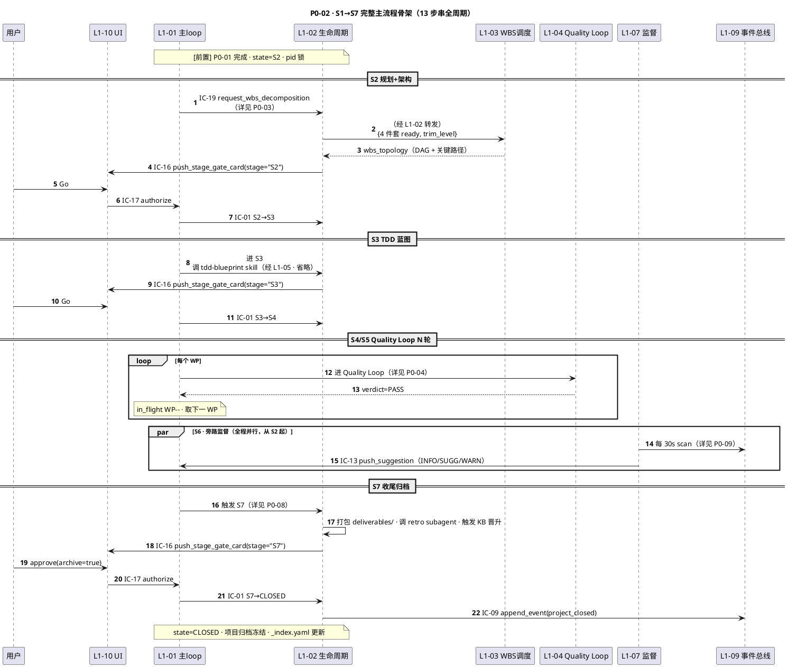

#### §3.2.5 关键字段取值示例（YAML）

本图为骨架总览 · 各阶段字段示例见子 P0 流（P0-03 / P0-04 / P0-08）。仅本层新增**跨阶段追踪字段**：

```yaml
# project_trace（贯穿全周期的追踪头 · 每 step 都带）
project_trace:
  project_id: "pid-018f4a3c-1f00-7000-b2a3-0a1e5c8f3a00"
  charter_hash: "sha256:7c0f..."
  goal_anchor_hash: "sha256:a1b2..."
  stage_transitions:  # 按时间追加
    - {from: "S1", to: "S2", gate_id: "gate-S1-001", ts: "2026-04-21T10:06:30Z"}
    - {from: "S2", to: "S3", gate_id: "gate-S2-001", ts: "2026-04-21T11:20:00Z"}
    - {from: "S3", to: "S4", gate_id: "gate-S3-001", ts: "2026-04-21T11:50:00Z"}
    # ... S4/S5 无独立 Gate（内嵌 Quality Loop 裁决）
    - {from: "S6", to: "S7", reason: "all WP PASS", ts: "2026-04-23T14:00:00Z"}
    - {from: "S7", to: "CLOSED", gate_id: "gate-S7-001", ts: "2026-04-23T15:30:00Z"}
```

#### §3.2.6 SLO 约束 + 降级出口

| 约束 | 值 |
|---|---|
| V1 项目全周期总耗时（理想）| 小型 ≤ 1 天 · 中型 ≤ 1 周（见 PRD §4）|
| 任何单一 Gate 无人响应 TTL | 24h（超时进 PAUSED · 不是 FAIL）|
| 跨阶段审计可追溯率 | 100%（events.jsonl hash-chain 连续）|
| S6 监督中断 tick 响应 | IC-15 硬红线 ≤ 100ms · IC-13 SUGG 异步入队 ≤ 5ms |

**降级出口**：
- Gate 超 TTL 无响应 → state=PAUSED · 推复活卡 · 等 resume（走 p1-seq P1-09 多 project 视角）
- 任一 Quality Loop 连续 FAIL → 4 级回退（走 p1-seq P1-03）
- S6 监督命中硬红线 → state=HALTED（走 L0 §2.6 P0-06 原生图）

---

### §3.3 P0-03 · S2 WBS 拆解链（4 件套齐 → IC-19 → 拓扑 → 可拉 WP）

#### §3.3.1 场景一句话 + 触发条件

- **一句话**：S2 阶段 L1-02 确认"4 件套"（goal_anchor + requirements + architecture + design_plan）齐后，经 IC-19 请 L1-03 异步拆 WBS，L1-03 生成 DAG 拓扑 + 关键路径，写 `wbs_topology.yaml`，L1-01 开始可按 IC-02 拉 WP。
- **触发条件**：S2 阶段内 L1-02 L2-01 完成"4 件套"产出 · L1-02 触发 `four_pieces_ready` 事件。
- **前置状态**：state=S2 · 4 件套落盘完毕 · WBS 未拆。
- **终态**：`projects/<pid>/wbs_topology.yaml` 已写 · topology_version=v1 · 至少 1 个 WP deps_met=true。

#### §3.3.2 参与 L1-L2 组件

| L1 | L2 组件 | 职责 |
|---|---|---|
| L1-02 | L2-02 S1 产出器 / L2-01 Gate 控制器 | 发起 IC-19 · 携 trim_level |
| L1-03 | L2-01 WBS 解析器 / L2-02 拓扑图管理器 / L2-03 WP 调度器 | 拆 WBS · 建 DAG · 算关键路径 · 首次锁 topology_version |
| L1-07 | L2-02 Supervisor 周期扫描 | 监听 WBS 质量 · 若 DAG 环检测失败 → IC-13 |
| L1-09 | L2-01 事件总线 | 各步骤落盘（wbs_decomposition_started / _completed / _corrupt）|

#### §3.3.3 涉及 IC

- **IC-19** request_wbs_decomposition（ic-contracts §3.19）· 同步启动 + 异步拆解结果
- **IC-09** append_event（ic-contracts §3.9）· 3+ 条审计事件
- **IC-02** get_next_wp（ic-contracts §3.2）· 拆完后 L1-01 首次拉 WP
- **IC-13** push_suggestion（ic-contracts §3.13）· DAG 质量告警（可选出口）

#### §3.3.4 完整 PlantUML 时序图

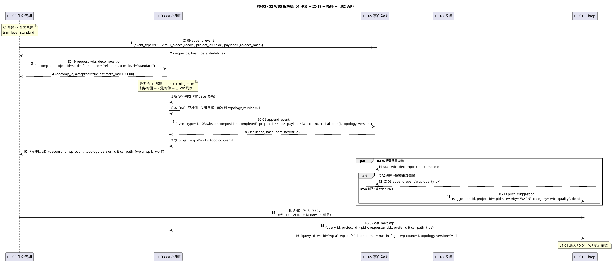

#### §3.3.5 关键字段取值示例（YAML）

```yaml
# step 4 · IC-19 请求
request_wbs_decomposition:
  decomp_id: "decomp-018f4a3c-4000-7000-b2a3-0a1e5c8f3d00"
  project_id: "pid-018f4a3c-1f00-7000-b2a3-0a1e5c8f3a00"
  four_pieces:
    goal_anchor_ref: "projects/<pid>/charter.md#goal_anchor_hash"
    requirements_ref: "projects/<pid>/reqs.md"
    architecture_ref: "projects/<pid>/arch.md"
    design_plan_ref: "projects/<pid>/design_plan.md"
  trim_level: "standard"  # lite / standard / full
  ts: "2026-04-21T11:00:00Z"

# step 9 · wbs_topology.yaml 关键字段
wbs_topology:
  topology_version: "v1"
  project_id: "pid-018f4a3c-1f00-7000-b2a3-0a1e5c8f3a00"
  wp_count: 12
  critical_path: ["wp-a", "wp-b", "wp-f", "wp-j", "wp-l"]
  wps:
    - wp_id: "wp-018f4a3c-5001-..."
      slug: "wp-a"
      title: "初始化数据库 schema"
      deps: []
      impl_hints: {skill: "tdd"}
    - wp_id: "wp-018f4a3c-5002-..."
      slug: "wp-b"
      deps: ["wp-a"]
      # ...
  generated_at: "2026-04-21T11:02:00Z"

# step 14 · IC-02 首次拉 WP
get_next_wp_result:
  query_id: "q-018f4a3c-6000-7000-b2a3-0a1e5c8f3e00"
  wp_id: "wp-018f4a3c-5001-..."
  wp_def: {slug: "wp-a", title: "初始化数据库 schema", deps: [], acceptance_criteria: [...]}
  deps_met: true
  in_flight_wp_count: 1
  topology_version: "v1"
```

#### §3.3.6 SLO 约束 + 降级出口

| 约束 | 值 | 来源 |
|---|---|---|
| IC-19 dispatch（accepted=true 返回） | ≤ 100ms | ic-contracts §3.19 |
| IC-19 result（完整拆解） | 按 WP 规模 · small ≤ 30s · standard ≤ 2min · large ≤ 10min | ic-contracts §3.19 |
| IC-02 P95 | ≤ 200ms | ic-contracts §3.2 |
| topology_version 锁定后 | 一经锁定不可修改（只能 v1→v2 新版本 · 走 change_request 流）| PRD §6.10 |

**降级出口**：
- 拆解超时（standard > 5min）→ L1-07 告警 + 用户介入简化（走 p1-seq P1-02 运行时变更）
- DAG 有环 → 内部自动修一次（去重边）· 仍环 → halt 系统（红线）
- WP > 100（过度拆解）→ IC-13 WARN · 建议拼合（走 p1-seq 变体）

---

### §3.4 P0-04 · WP 执行主链（get_next_wp → enter_quality_loop → verdict → 下一 WP）

#### §3.4.1 场景一句话 + 触发条件

- **一句话**：L1-01 每 tick 调 IC-02 拿下一可执行 WP → 调 IC-03 进 L1-04 Quality Loop（S4 IMPL + S5 TDDExe）→ 结合 IC-20 独立 verifier → verdict=PASS 后 in_flight-- → 拉下一 WP · 循环直至全部 done。
- **触发条件**：state=S4 · 至少一 WP deps_met=true · in_flight_wp_count < 2（PM-04）。
- **前置状态**：wbs_topology.yaml 已写 · topology_version=v1。
- **终态**：本 WP wp.status=done · events.jsonl 多条审计 · 若全部 done 则 L1-02 推 S7 前置。

#### §3.4.2 参与 L1-L2 组件

| L1 | L2 组件 | 职责 |
|---|---|---|
| L1-01 | L2-02 决策引擎 / L2-03 状态机编排器 | tick 循环 · 拉 WP · 进 Loop · 计数 in_flight |
| L1-03 | L2-03 WP 调度器 / L2-02 拓扑图管理器 | 查询可拉 WP · 原子锁 · 更新 wp.status |
| L1-04 | L2-04 Loop 编排器 / L2-01 S4 IMPL 适配 / L2-02 S5 TDDExe 适配 | Loop 内状态机 · 调 skill · 组装证据链 |
| L1-05 | L2-02 Skill 调度器 | 装载 `tdd` / `code-review` skill · 独立 session verifier |
| L1-07 | L2-02 周期扫描 | 旁路 INFO/SUGG · 不干预正向 |
| L1-09 | L2-01 事件总线 | 全链路审计（≥ 5 条 event）|

#### §3.4.3 涉及 IC

- **IC-02** get_next_wp · **IC-03** enter_quality_loop · **IC-04** invoke_skill（调 tdd）· **IC-20** delegate_verifier · **IC-09** append_event（最密集）· **IC-13** push_suggestion（旁路）
- 若 verdict=FAIL → 走 **IC-14** push_rollback_route（属 p1-seq · 本 P0 仅画正向 PASS）

#### §3.4.4 完整 PlantUML 时序图

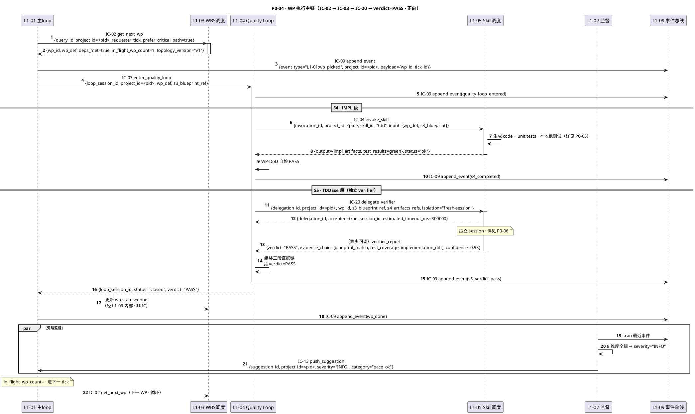

#### §3.4.5 关键字段取值示例（YAML）

```yaml
# step 4 · IC-03 启动
enter_quality_loop:
  loop_session_id: "loop-018f4a3c-7001-..."
  project_id: "pid-018f4a3c-1f00-7000-b2a3-0a1e5c8f3a00"
  wp_def: {wp_id: "wp-018f4a3c-5001-...", slug: "wp-a", acceptance_criteria: ["DB schema migrated", "pytest green"]}
  s3_blueprint_ref: "projects/<pid>/s3/blueprint_wp-a.md"
  ts: "2026-04-21T12:00:00Z"

# step 9 · IC-20 delegate_verifier
delegate_verifier:
  delegation_id: "ver-018f4a3c-8000-..."
  project_id: "pid-018f4a3c-1f00-7000-b2a3-0a1e5c8f3a00"
  wp_id: "wp-018f4a3c-5001-..."
  s3_blueprint_ref: "projects/<pid>/s3/blueprint_wp-a.md"
  s4_artifacts_refs:
    - "projects/<pid>/s4/wp-a/impl.py"
    - "projects/<pid>/s4/wp-a/tests/test_impl.py"
    - "projects/<pid>/s4/wp-a/test_results.json"
  isolation: "fresh-session"
  timeout_ms: 300000
  ts: "2026-04-21T12:05:00Z"

# step 12 · verifier_report
verifier_report:
  delegation_id: "ver-018f4a3c-8000-..."
  verdict: "PASS"
  evidence_chain:
    - stage: "blueprint_match"
      score: 0.95
      checks: ["all AC mapped to test cases", "no coverage gap"]
    - stage: "test_coverage"
      score: 0.91
      metrics: {line_cov: 0.88, branch_cov: 0.82}
    - stage: "implementation_diff"
      score: 0.93
      checks: ["no red test", "matches blueprint style"]
  confidence: 0.93
  ts: "2026-04-21T12:09:30Z"
```

#### §3.4.6 SLO 约束 + 降级出口

| 约束 | 值 | 来源 |
|---|---|---|
| IC-02 P95 | ≤ 200ms | ic-contracts §3.2 |
| IC-03 启动 | ≤ 50ms | ic-contracts §3.3 |
| IC-04 invoke_skill（tdd 中等 WP）| ≤ 5 min | skill 约定 |
| IC-20 verifier session 超时 | ≤ 5 min（默认） | ic-contracts §3.20 |
| IC-09 fsync per event | P95 ≤ 20ms | ic-contracts §3.9 |
| in_flight_wp_count 上限 | ≤ 2（PM-04）| PRD 硬约束 |
| 本 P0 端到端（单 WP） | P90 ≤ 10 min（tdd + verifier）| 经验值 |

**降级出口**：
- verdict=FAIL → p1-seq P1-03 · 4 级回退路由（L1-04 自判 + L1-07 独立判双保险）
- verdict=INSUFFICIENT_EVIDENCE → 重派 verifier（最多 2 次 · 再失败升级为 FAIL）
- IC-04 tdd skill 超时 → p1-seq P1-07 · skill fallback 链
- in_flight_wp_count 已满 → wp_id=null · 主 loop 跳 tick 等 · 下 tick 再试

---

### §3.5 P0-05 · S4 执行驱动（tdd skill → 跑测试 → 审计 → 回调 L1-04）

#### §3.5.1 场景一句话 + 触发条件

- **一句话**：L1-04 S4 段的内部放大图 · L1-05 装载 `tdd` skill → 生成 code + unit tests → 本地 `pytest` → 每次 Bash 调用触发 PreToolUse/PostToolUse hook 审计 → L1-05 回 {impl_artifacts, test_results}。
- **触发条件**：P0-04 中 IC-04 调 tdd · 进入 skill 内部。
- **前置状态**：loop_session_id 已开 · wp_def 已传 · S4 尚未 artifact 落盘。
- **终态**：`projects/<pid>/s4/<wp>/impl.*` + `tests/*` + `test_results.json` 齐 · WP-DoD 自检 PASS。

#### §3.5.2 参与 L1-L2 组件

| L1 | L2 组件 | 职责 |
|---|---|---|
| L1-04 | L2-01 S4 IMPL 适配 / L2-04 Loop 编排器 | 向 L1-05 传 skill 请求 · 接收回调 · DoD 自检 |
| L1-05 | L2-02 Skill 调度器 / L2-03 子 Agent 调度器（skill 内部装载）| 装 tdd · 驱动 skill 调 Bash/Edit · hook 审计 |
| L1-09 | L2-01 事件总线 / L2-03 hook adapter | PreToolUse/PostToolUse hook 落盘每次 Bash 和 Edit |
| L1-07 | L2-02 周期扫描 | 旁路检查 bash_irreversible（红线出口） |

#### §3.5.3 涉及 IC

- **IC-04** invoke_skill（本 P0 主 IC）
- **IC-09** append_event（tool_use_pre / tool_use_post / skill_completed · 高密集）
- **IC-13** push_suggestion（可选 · bash 疑似异常时）
- **IC-15** request_hard_halt（硬红线出口 · 正向不触发 · 详见 L0 §2.6）

#### §3.5.4 完整 PlantUML 时序图

```plantuml
@startuml
title P0-05 · S4 执行驱动（tdd skill · 跑测试 · 审计 · 回调 · 正向）
autonumber
skinparam sequenceMessageAlign center
participant "L1-04 Loop 编排器" as L04
participant "L1-05 Skill调度" as L05
participant "tdd skill(子进程)" as TDD
participant "L1-09 事件总线" as L09
participant "L1-07 监督" as L07

L04 -> L05: IC-04 invoke_skill\n{invocation_id, project_id=<pid>, skill_id="tdd", input={wp_def, s3_blueprint}}
activate L05
L05 -> L05: 装载 skills/tdd/SKILL.md + 约束
L05 -> TDD: dispatch 到子进程 · 注入 system prompt
activate TDD
note over TDD: TDD 内部循环\n1. Write test → 2. Edit impl → 3. Bash: pytest → 4. 断言绿
TDD -> L05: PreToolUse(Write, test_wp-a.py)
L05 -> L09: IC-09 append_event\n{event_type="L1-05:tool_use_pre", project_id=<pid>, payload={tool="Write", args_hash,...}}
L09 --> L05: {persisted=true}
L05 --> TDD: allow
TDD -> TDD: 写 tests/test_wp-a.py
TDD -> L05: PostToolUse(Write)
L05 -> L09: IC-09 append_event(tool_use_post)
TDD -> L05: PreToolUse(Edit, impl.py)
L05 -> L09: IC-09 append_event(tool_use_pre)
L05 --> TDD: allow
TDD -> TDD: 实现 impl.py
TDD -> L05: PreToolUse(Bash, "pytest tests/")
L05 -> L09: IC-09 append_event\n{event_type="L1-05:tool_use_pre", payload={tool="Bash", cmd="pytest tests/", risk="safe"}}
par 旁路红线扫描
    L07 -> L09: scan tool_use_pre\nalt Bash cmd 含 rm -rf / force push → 红线出口
        note over L07: 正向 P0 不触发 · 详见 L0 §2.6
    end
end
L05 --> TDD: allow
TDD -> TDD: 执行 pytest · 结果=all green
TDD -> L05: PostToolUse(Bash, result=green)
L05 -> L09: IC-09 append_event(tool_use_post)
TDD --> L05: {impl_artifacts_refs, test_results=green, elapsed_ms=184000}
deactivate TDD
L05 -> L09: IC-09 append_event(skill_completed)
L05 --> L04: {invocation_id, output={impl_artifacts_refs, test_results}, status="ok", elapsed_ms}
deactivate L05
L04 -> L04: 读 test_results.json · WP-DoD 自检 PASS
L04 -> L09: IC-09 append_event(s4_dod_passed)
note over L04: 进入 S5 段 · 见 P0-06
@enduml
```

#### §3.5.5 关键字段取值示例（YAML）

```yaml
# step 1 · IC-04 invoke_skill（核心入参）
invoke_skill:
  invocation_id: "inv-018f4a3c-9000-..."
  project_id: "pid-018f4a3c-1f00-7000-b2a3-0a1e5c8f3a00"
  skill_id: "tdd"
  input:
    wp_def: {wp_id: "wp-...", slug: "wp-a", acceptance_criteria: [...]}
    s3_blueprint_ref: "projects/<pid>/s3/blueprint_wp-a.md"
    workdir: "projects/<pid>/s4/wp-a/"
  timeout_ms: 600000
  ts: "2026-04-21T12:01:00Z"

# step 9 · IC-09 append_event · Bash PreToolUse
append_event_command:
  event_id: "evt-018f4a3c-9100-..."
  event_type: "L1-05:tool_use_pre"
  project_id_or_system: "pid-018f4a3c-1f00-7000-b2a3-0a1e5c8f3a00"
  payload:
    invocation_id: "inv-018f4a3c-9000-..."
    tool: "Bash"
    cmd: "pytest tests/"
    cwd: "projects/<pid>/s4/wp-a/"
    risk_tag: "safe"   # safe / caution / irreversible
  actor: {l1: "L1-05", l2: "L2-02", skill_id: "tdd"}
  correlation_id: "inv-018f4a3c-9000-..."
  ts: "2026-04-21T12:03:30Z"

# step 22 · S4 完成 · L1-05 返回
invoke_skill_result:
  invocation_id: "inv-018f4a3c-9000-..."
  output:
    impl_artifacts_refs:
      - "projects/<pid>/s4/wp-a/impl.py"
      - "projects/<pid>/s4/wp-a/tests/test_impl.py"
    test_results:
      passed: 18
      failed: 0
      skipped: 0
      line_coverage: 0.88
  status: "ok"
  elapsed_ms: 184000
```

#### §3.5.6 SLO 约束 + 降级出口

| 约束 | 值 |
|---|---|
| IC-04 tdd skill 典型耗时（中等 WP）| ≤ 5 min |
| 每次 PreToolUse hook 审计落盘 | ≤ 20ms（P95 · fsync）|
| Bash cmd 红线扫描（L1-07 挂点） | ≤ 10ms 决策（同步）|
| skill 超时 | 600s（可覆盖 · 默认 10min）|
| 本 P0 端到端（小型 WP） | P90 ≤ 3 min |

**降级出口**：
- skill 超时 → p1-seq P1-07 · fallback 链（备选 skill → 简化版 → halt）
- 本地 pytest FAIL（测试红）→ skill 内部重试 1 次 · 再失败 return {status="test_red"} · L1-04 视为 FAIL · 走 p1-seq P1-03
- PreToolUse 红线命中 → L1-07 IC-15 硬 halt · 走 L0 §2.6 P0-06
- hook 审计 fsync 失败 → halt 系统（PM-08 不可破 · PRD §3.2）

---

### §3.6 P0-06 · S5 独立 Verifier（IC-20 delegate_verifier → 独立 session → 三段证据链 → verdict）

#### §3.6.1 场景一句话 + 触发条件

- **一句话**：L1-04 S5 段经 IC-20 委托 L1-05 派一个**独立 session verifier subagent**（PM-03 三独立：独立 session · 独立 context · 独立模型调用）→ subagent 读 s3 blueprint + s4 artifacts → 产出**三段证据链**（blueprint_match / test_coverage / implementation_diff）→ 返 verdict ∈ {PASS, FAIL, INSUFFICIENT_EVIDENCE}。
- **触发条件**：P0-05 完成 · S4 DoD 自检 PASS · 进 S5。
- **前置状态**：s3 blueprint + s4 artifacts 齐 · verifier_session 未派。
- **终态**：`verifier_report.yaml` 落盘 · verdict 已定 · s5_verdict_pass 事件 append。

#### §3.6.2 参与 L1-L2 组件

| L1 | L2 组件 | 职责 |
|---|---|---|
| L1-04 | L2-04 Loop 编排器 / L2-02 S5 TDDExe 适配 | 发 IC-20 · 回收异步结果 · 组装证据链 · 判 verdict |
| L1-05 | L2-02 Skill 调度器 / L2-03 子 Agent 调度器 | 派独立 session subagent · 绝不复用主 context |
| verifier subagent | （独立 session · 非本系统 L2） | 读 blueprint + artifacts · 生成证据链 · 返 verdict |
| L1-09 | L2-01 事件总线 | delegation_dispatched / verifier_started / verifier_completed / s5_verdict_* 审计 |
| L1-07 | L2-02 周期扫描 | 旁路检测 verifier 异常（超时 · 冲突）→ IC-13 |

#### §3.6.3 涉及 IC

- **IC-20** delegate_verifier（本 P0 主 IC · ic-contracts §3.20）
- **IC-09** append_event（审计 · 4+ 条）
- **IC-13** push_suggestion（旁路 · 可选）
- verdict=FAIL 出口走 **IC-14** push_rollback_route（属 p1-seq · 本 P0 只画 PASS）

#### §3.6.4 完整 PlantUML 时序图

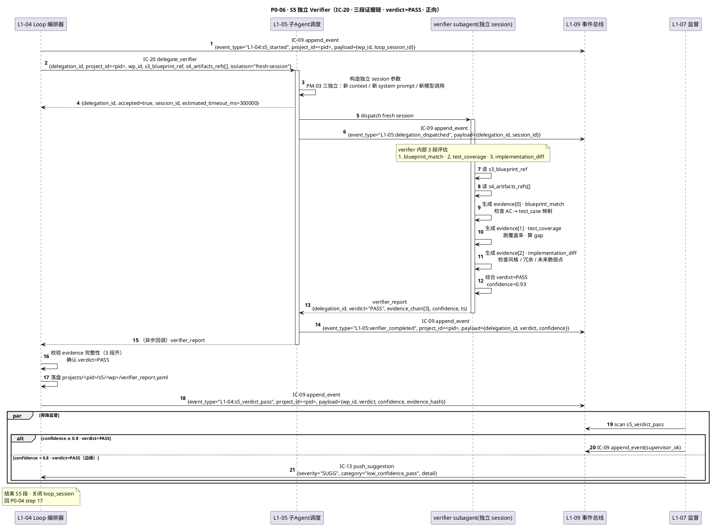

#### §3.6.5 关键字段取值示例（YAML）

```yaml
# step 2 · IC-20 delegate_verifier
delegate_verifier:
  delegation_id: "ver-018f4a3c-a000-..."
  project_id: "pid-018f4a3c-1f00-7000-b2a3-0a1e5c8f3a00"
  wp_id: "wp-018f4a3c-5001-..."
  s3_blueprint_ref: "projects/<pid>/s3/blueprint_wp-a.md"
  s4_artifacts_refs:
    - "projects/<pid>/s4/wp-a/impl.py"
    - "projects/<pid>/s4/wp-a/tests/test_impl.py"
    - "projects/<pid>/s4/wp-a/test_results.json"
  isolation: "fresh-session"     # PM-03 三独立
  timeout_ms: 300000
  ts: "2026-04-21T12:06:00Z"

# step 15 · verifier_report 最终产出
verifier_report:
  delegation_id: "ver-018f4a3c-a000-..."
  project_id: "pid-018f4a3c-1f00-7000-b2a3-0a1e5c8f3a00"
  verdict: "PASS"           # PASS / FAIL / INSUFFICIENT_EVIDENCE
  confidence: 0.93
  evidence_chain:
    - stage: "blueprint_match"
      score: 0.95
      passed: true
      checks:
        - "all AC mapped to test cases"
        - "no blueprint coverage gap"
      findings: []
    - stage: "test_coverage"
      score: 0.91
      passed: true
      metrics:
        line_cov: 0.88
        branch_cov: 0.82
        fn_cov: 0.92
      findings: []
    - stage: "implementation_diff"
      score: 0.93
      passed: true
      checks:
        - "no red test"
        - "matches blueprint style"
        - "no future-brittle anti-pattern"
      findings: []
  session_metadata:
    session_id: "sess-018f4a3c-b000-..."
    context_bytes_used: 48210
    model_calls: 3
  ts: "2026-04-21T12:09:45Z"
```

#### §3.6.6 SLO 约束 + 降级出口

| 约束 | 值 | 来源 |
|---|---|---|
| IC-20 dispatch | ≤ 200ms | ic-contracts §3.20 |
| verifier session 超时 | ≤ 5min（默认）· 可覆盖 | ic-contracts §3.20 |
| 三段 evidence 完整率 | 100%（缺任何一段 → verdict=INSUFFICIENT_EVIDENCE）| L1-04 L2-02 DoD |
| confidence 阈值（PASS）| ≥ 0.8（<0.8 触发 SUGG）| L1-07 规则表 |
| PM-03 三独立合规率 | 100% | PRD §9 硬约束 |

**降级出口**：
- verdict=FAIL → p1-seq P1-03 · 4 级回退路由（L1-04 自判 × L1-07 独立判 · 取更严）
- verdict=INSUFFICIENT_EVIDENCE → 重派 verifier · 最多 2 次 · 再失败升 FAIL
- verifier 超时 → 回收空报告 · 视为 INSUFFICIENT_EVIDENCE
- confidence < 0.8 的 PASS → IC-13 SUGG 登记 · 主 loop 不阻断 · L2-05 记入 fail_registry 软跟踪

---

### §3.7 P0-07 · KB 晋升主流（session → observed_count ≥ K 或用户批准 → project/global）

#### §3.7.1 场景一句话 + 触发条件

- **一句话**：L1-06 3 层 KB（session / project / global）· session 层先 `kb_write_session` 收候选 → 同一候选 `observed_count ≥ K`（默认 3）**自动** kb_promote 到 project 层 → S7 收尾 / 用户主动批准时经 kb_promote 到 global 层。
- **触发条件**：任一 L1（L1-04 verifier / L1-07 监督 / L1-05 skill）产出一条值得复用的观察 → 调 IC-07。
- **前置状态**：观察已生成 · session_id 在 context 内。
- **终态**：观察最终落在 session（未到阈值）/ project（≥K 次）/ global（用户批准），promotion_record.yaml 有记录。

#### §3.7.2 参与 L1-L2 组件

| L1 | L2 组件 | 职责 |
|---|---|---|
| L1-05 | L2-02 Skill 调度器 | 调用 kb_write_session 上报观察 |
| L1-06 | L2-01 session KB / L2-02 project KB / L2-03 晋升仪式 / L2-04 全局 KB | 三层物理分离 · 去重 · 计数 · 自动/手动晋升 |
| L1-07 | L2-02 周期扫描 | 检测候选达阈值 · 自动触发 promote |
| L1-10 | L2-03 决策面板 | 全局晋升的用户审批界面 |
| L1-09 | L2-01 事件总线 | 审计 kb_write / kb_auto_promoted / kb_manual_promoted |

#### §3.7.3 涉及 IC

- **IC-07** kb_write_session（session 层写入 · ic-contracts §3.7）
- **IC-08** kb_promote（session→project · project→global · ic-contracts §3.8）
- **IC-17** user_intervene（type=approve · 全局晋升审批）
- **IC-09** append_event（审计链）

#### §3.7.4 完整 PlantUML 时序图

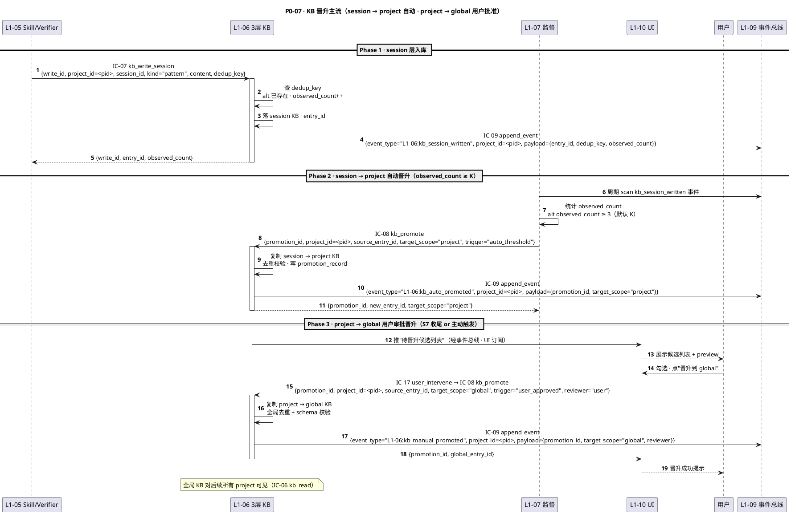

#### §3.7.5 关键字段取值示例（YAML）

```yaml
# Phase 1 · IC-07 kb_write_session
kb_write_session:
  write_id: "kbw-018f4a3c-c000-..."
  project_id: "pid-018f4a3c-1f00-7000-b2a3-0a1e5c8f3a00"
  session_id: "sess-018f4a3c-b000-..."
  kind: "pattern"              # pattern / anti-pattern / constraint / recipe
  content:
    title: "pytest fixture 数据库 teardown 必 autouse"
    body: "在 conftest.py 定义 @pytest.fixture(autouse=True) ... 避免脏数据泄漏"
    tags: ["pytest", "db", "teardown"]
  dedup_key: "pytest-autouse-db-teardown-v1"
  source_evidence: ["projects/<pid>/s4/wp-a/tests/conftest.py"]
  ts: "2026-04-21T12:10:00Z"

# Phase 2 · IC-08 kb_promote · auto_threshold
kb_promote:
  promotion_id: "promo-018f4a3c-d001-..."
  project_id: "pid-018f4a3c-1f00-7000-b2a3-0a1e5c8f3a00"
  source_entry_id: "kbe-session-018f4a3c-..."
  target_scope: "project"
  trigger: "auto_threshold"
  evidence:
    observed_count: 3
    threshold: 3
  ts: "2026-04-21T13:00:00Z"

# Phase 3 · IC-08 kb_promote · user_approved → global
kb_promote:
  promotion_id: "promo-018f4a3c-d002-..."
  project_id: "pid-018f4a3c-1f00-7000-b2a3-0a1e5c8f3a00"
  source_entry_id: "kbe-project-018f4a3c-..."
  target_scope: "global"
  trigger: "user_approved"
  reviewer: "user"
  review_note: "通用 pytest 范式 · 跨项目复用价值高"
  ts: "2026-04-23T14:45:00Z"
```

#### §3.7.6 SLO 约束 + 降级出口

| 约束 | 值 | 来源 |
|---|---|---|
| IC-07 P95 | ≤ 100ms | ic-contracts §3.7 |
| IC-08 P95 | ≤ 200ms | ic-contracts §3.8 |
| observed_count 自动晋升阈值 K | 3（可配置）| L1-06 L2-03 |
| 晋升幂等（同 source_id + target_scope） | 必须幂等 | ic-contracts §3.8 |
| 全局 KB 审核强制性 | 100% 需 user 或 system 可信源 | PRD §6.7 |

**降级出口**：
- dedup_key 冲突 → 返回已存在 entry_id · 幂等（上游不必重试）
- 阈值未达 · session 会话结束时未晋升 → 观察停留 session 层 · 不影响正向 P0
- 用户拒绝晋升 → project 层保留 · 下次 S7 再候选

---

### §3.8 P0-08 · S7 收尾归档（交付包齐 → S7 Gate → archive）

#### §3.8.1 场景一句话 + 触发条件

- **一句话**：所有 WP PASS → L1-01 触发 S6→S7 转换 → L1-02 调 L1-05 委托 `retro` subagent 生成 retro.md → 打包 deliverables/ → 推 S7 Gate → 用户 approve(archive) → state=CLOSED + KB 最终晋升（含用户批准全局晋升 · 详见 P0-07）。
- **触发条件**：所有 WP 的 wp.status=done · L1-03 回 `all_wp_done` 事件。
- **前置状态**：state=S6（旁路阶段）· 主 loop 已在 S6 聚拢。
- **终态**：state=CLOSED · `projects/<pid>/deliverables/` 齐 · `retro.md` 落盘 · `_index.yaml` 更新 status=CLOSED。

#### §3.8.2 参与 L1-L2 组件

| L1 | L2 组件 | 职责 |
|---|---|---|
| L1-01 | L2-02 决策引擎 / L2-03 状态机编排 | 触发 S6→S7 · 等 Gate → 切 CLOSED |
| L1-02 | L2-01 Gate 控制器 / L2-02 S7 产出器 | 组装 deliverables bundle · 推 S7 Gate |
| L1-05 | L2-03 子 Agent 调度 | 派 retro subagent（独立 session） |
| L1-06 | L2-03 晋升仪式 | S7 时机触发 final 晋升（接入 P0-07）|
| L1-10 | L2-01 主控台 / L2-03 决策面板 | 展示 S7 Gate + deliverables 预览 · 收 approve |
| L1-09 | L2-01 事件总线 | 审计 s7_started / retro_dispatched / retro_completed / project_closed |

#### §3.8.3 涉及 IC

- **IC-01** request_state_transition（S6→S7 · S7→CLOSED）
- **IC-05** delegate_subagent（retro subagent · ic-contracts §3.5）
- **IC-16** push_stage_gate_card（S7 Gate）
- **IC-17** user_intervene（type=approve）
- **IC-08** kb_promote（final 晋升 · 接 P0-07 Phase 3）
- **IC-09** append_event

#### §3.8.4 完整 PlantUML 时序图

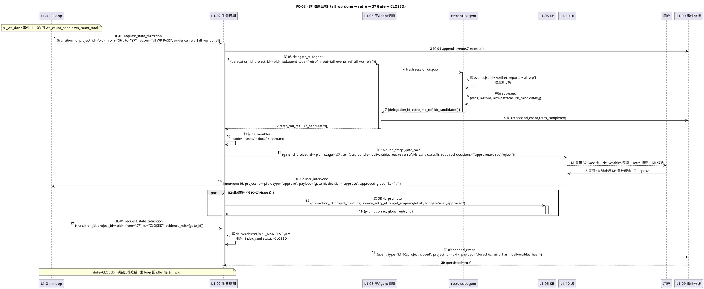

#### §3.8.5 关键字段取值示例（YAML）

```yaml
# step 4 · IC-05 delegate_subagent · retro
delegate_subagent:
  delegation_id: "del-018f4a3c-e000-..."
  project_id: "pid-018f4a3c-1f00-7000-b2a3-0a1e5c8f3a00"
  subagent_type: "retro"
  input:
    events_jsonl_ref: "projects/<pid>/events.jsonl"
    verifier_reports_glob: "projects/<pid>/s5/**/verifier_report.yaml"
    all_wp_refs: ["projects/<pid>/s4/wp-a/", ...]
  isolation: "fresh-session"
  timeout_ms: 600000
  ts: "2026-04-23T14:00:00Z"

# step 15 · IC-16 S7 Gate 卡
push_stage_gate_card:
  gate_id: "gate-018f4a3c-f000-..."
  project_id: "pid-018f4a3c-1f00-7000-b2a3-0a1e5c8f3a00"
  stage: "S7"
  artifacts_bundle:
    deliverables_ref: "projects/<pid>/deliverables/"
    retro_ref: "projects/<pid>/retro.md"
    final_manifest_hash: "sha256:..."
    kb_candidates:
      - {entry_id: "kbe-project-...", title: "pytest ...", score: 0.94}
  required_decisions: ["approve(archive)/reject"]
  ts: "2026-04-23T14:30:00Z"

# step 22 · IC-01 S7 → CLOSED
request_state_transition:
  transition_id: "trans-018f4a3c-100a-..."
  project_id: "pid-018f4a3c-1f00-7000-b2a3-0a1e5c8f3a00"
  from: "S7"
  to: "CLOSED"
  reason: "用户 approve S7 Gate · 全部交付物齐 · retro 落盘"
  trigger_tick: "tick-018f4a3c-101a-..."
  evidence_refs: ["gate-018f4a3c-f000-..."]
  gate_id: "gate-018f4a3c-f000-..."
  ts: "2026-04-23T15:30:00Z"
```

#### §3.8.6 SLO 约束 + 降级出口

| 约束 | 值 |
|---|---|
| retro subagent 耗时 | ≤ 10 min |
| IC-16 S7 Gate UI 渲染 | ≤ 500ms |
| IC-17 approve 响应 | ≤ 100ms |
| state=CLOSED 后 · _index.yaml 更新 | 同事务（fsync 同步）|
| KB 全局晋升 · 用户勾选起 → 落盘 | ≤ 500ms per 条 |

**降级出口**：
- S7 Gate 用户 reject → 回 S6 · 补 deliverables / 重跑 retro（走 p1-seq S7 reject）
- retro subagent 超时 → 回收部分 · L1-02 合成 minimal retro · 标 `partial=true`
- 全局 KB 晋升部分失败（schema 校验挂）→ 失败项回 project 层 · UI 提示 · 不阻断 archive

---

### §3.9 P0-09 · Supervisor 正常观察链（L1-07 30s 扫描 → 8 维度正常 → INFO/SUGG → L1-01 入队）

#### §3.9.1 场景一句话 + 触发条件

- **一句话**：L1-07 监督 subagent 每 30s（或 PostToolUse hook 即时）从 L1-09 scan 最新事件 → 按 8 维度（pace / quality / risk / resource / context / rules / bias / coherence）计算 → 全绿时发 INFO 或偶发 SUGG（软提示）→ 经 IC-13 推 L1-01 入主 loop 建议队列（fire-and-forget · 不阻断 tick）。
- **触发条件**：L1-01 主 loop 活跃（非 PAUSED/HALTED/CLOSED）· L1-07 守护进程运行中。
- **前置状态**：events.jsonl 有新事件 · 自上次 scan 后 cursor 推进。
- **终态**：suggestions_inbox 新增 INFO/SUGG · 下一 tick 可被 L1-01 读取。

#### §3.9.2 参与 L1-L2 组件

| L1 | L2 组件 | 职责 |
|---|---|---|
| L1-07 | L2-01 守护进程 / L2-02 周期扫描 / L2-03 8 维度评估器 | 30s 触发 scan · 计算 · 分级 · 推建议 |
| L1-09 | L2-01 事件总线 / L2-05 事件游标 | 提供 events.jsonl 顺序读 · cursor 持久化 |
| L1-01 | L2-02 决策引擎 / L2-04 建议队列 | 收 IC-13 · 入 inbox · 下 tick 消费 |

#### §3.9.3 涉及 IC

- **IC-13** push_suggestion（ic-contracts §3.13 · fire-and-forget · INFO/SUGG/WARN · BLOCK 仅非正常流 P1）
- **IC-09** append_event（supervisor_scan / suggestion_issued 审计）

#### §3.9.4 完整 PlantUML 时序图

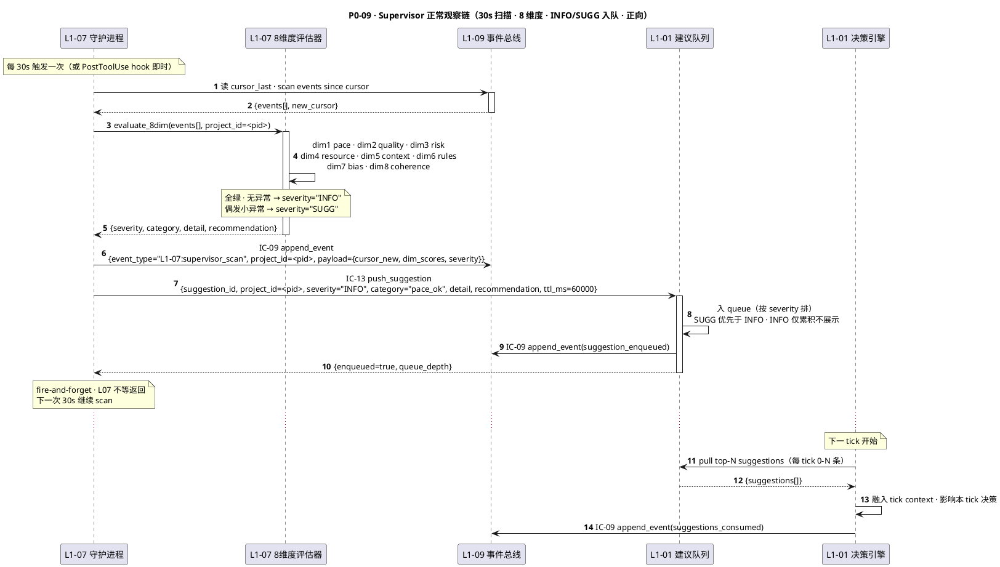

#### §3.9.5 关键字段取值示例（YAML）

```yaml
# step 6 · 8 维度评估输出
dim_scores:
  pace: 0.85           # ≥ 0.7 绿
  quality: 0.92
  risk: 0.10           # 越低越好
  resource: 0.70
  context: 0.88
  rules: 1.00
  bias: 0.15
  coherence: 0.90
overall_severity: "INFO"   # INFO / SUGG / WARN / BLOCK
category: "pace_ok"

# step 9 · IC-13 push_suggestion
push_suggestion:
  suggestion_id: "sug-018f4a3c-1100-..."
  project_id: "pid-018f4a3c-1f00-7000-b2a3-0a1e5c8f3a00"
  severity: "INFO"               # INFO / SUGG / WARN / BLOCK
  category: "pace_ok"
  detail: "本轮 tick 平均耗时 2.3min · 处于稳态"
  recommendation: null           # INFO 级无 recommendation
  evidence_event_ids: ["evt-..."]
  ttl_ms: 60000
  ts: "2026-04-21T12:11:30Z"
```

#### §3.9.6 SLO 约束 + 降级出口

| 约束 | 值 | 来源 |
|---|---|---|
| scan 周期 | 30s（PRD 配置）| PRD §6.5 |
| IC-13 enqueue 时延 | ≤ 5ms（非 BLOCK）| ic-contracts §3.13 |
| 8 维度计算耗时 | P95 ≤ 200ms | L1-07 L2-03 DoD |
| cursor 持久化 | 每 scan 同步落盘（fsync）| L1-09 L2-05 |
| 正向流 INFO 不干扰 tick | 100% 异步 · 主 loop 可丢弃不消费 | PRD §6.5 |

**降级出口**：
- WARN 级 → 正向 P0 允许（进队不阻断）· 但 L2 详画见 p1-seq P1-11
- BLOCK 级 → **非本 P0**（属硬红线或 S5 FAIL · 走 L0 §2.6 P0-06 / p1-seq P1-03）
- scan 超时 → 丢弃本轮 · 下周期继续 · L1-07 自愈告警
- cursor 损坏 → 用 IC-10 从 checkpoint 重建 cursor（P0-12 视角）

---

### §3.10 P0-10 · 审计链（decision_made → IC-09 append_event → hash 链 → UI IC-18 反查）

#### §3.10.1 场景一句话 + 触发条件

- **一句话**：L1-01 每次决策产生 `decision_id` → 经 IC-09 追加事件到 events.jsonl（含 sequence + prev_hash + hash）→ L1-09 维护 hash 链完整性 → UI 用户点"决策追溯"时经 IC-18 反查该 decision_id 全链（所有 correlation 关联事件）。
- **触发条件**：L1-01 产出决策 OR 用户在 UI 查询历史决策。
- **前置状态**：events.jsonl 至少有 genesis 事件（prev_hash 全 0）。
- **终态**：决策全链审计可查（ordered list of events with hash-chain）· hash-chain 连续性验证 PASS。

#### §3.10.2 参与 L1-L2 组件

| L1 | L2 组件 | 职责 |
|---|---|---|
| L1-01 | L2-02 决策引擎 | 产 decision_id · 经 IC-09 落盘 |
| L1-09 | L2-01 事件总线 / L2-02 hash-chain 管理 / L2-06 审计查询 | fsync · 链计算 · 查询反查 |
| L1-10 | L2-01 主控台 / L2-04 审计追溯面板 | 发起 IC-18 · 渲染时间线 |

#### §3.10.3 涉及 IC

- **IC-09** append_event（ic-contracts §3.9 · 强 fsync · hash-chain）
- **IC-18** query_audit_trail（ic-contracts §3.18 · 按 decision_id / correlation_id / event_type 查）

#### §3.10.4 完整 PlantUML 时序图

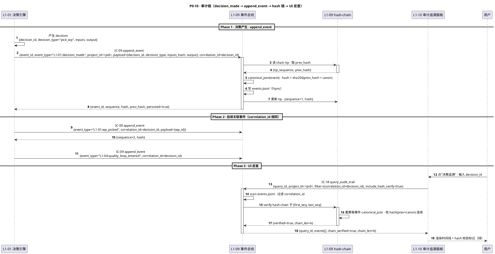

#### §3.10.5 关键字段取值示例（YAML）

```yaml
# Phase 1 · decision_made 事件
append_event_command:
  event_id: "evt-018f4a3c-1200-..."
  event_type: "L1-01:decision_made"
  project_id_or_system: "pid-018f4a3c-1f00-7000-b2a3-0a1e5c8f3a00"
  payload:
    decision_id: "dec-018f4a3c-1300-..."
    decision_type: "pick_wp"
    inputs_hash: "sha256:..."
    output: {wp_id: "wp-018f4a3c-5001-..."}
  actor: {l1: "L1-01", l2: "L2-02"}
  correlation_id: "dec-018f4a3c-1300-..."   # 后续关联事件共用
  ts: "2026-04-21T12:00:05Z"

# Phase 1 · append_event_result
append_event_result:
  event_id: "evt-018f4a3c-1200-..."
  sequence: 842
  hash: "sha256:a3f5c9..."
  prev_hash: "sha256:7c0f2b..."
  persisted: true
  ts_persisted: "2026-04-21T12:00:05.018Z"
  storage_path: "projects/<pid>/events.jsonl"

# Phase 3 · IC-18 query
query_audit_trail:
  query_id: "aq-018f4a3c-1400-..."
  project_id: "pid-018f4a3c-1f00-7000-b2a3-0a1e5c8f3a00"
  filter:
    correlation_id: "dec-018f4a3c-1300-..."
  include_hash_verify: true
  limit: 200
  ts: "2026-04-21T13:30:00Z"
```

#### §3.10.6 SLO 约束 + 降级出口

| 约束 | 值 | 来源 |
|---|---|---|
| IC-09 fsync P95 | ≤ 20ms | ic-contracts §3.9 |
| hash-chain 连续性（无断层）| 100%（断层 → halt 系统）| PM-10 |
| IC-18 P95 | ≤ 500ms | ic-contracts §3.18 |
| 查询范围内 hash 校验 | 100% 强制（include_hash_verify=true）| PRD §6.11 |

**降级出口**：
- fsync 失败 → halt 整个系统（PM-08 / IC-09 §3.9.4 `E_EVT_FSYNC_FAIL`）
- hash-chain 断层 → halt + 强告警（走 P2 韧性流）
- IC-18 查询超大范围（> 10k events）→ 分页 · 每页默认 200 · 降级为流式返回

---

### §3.11 P0-11 · 多模态内容处理（process_content · md/code/image · 结构化输出）

#### §3.11.1 场景一句话 + 触发条件

- **一句话**：L1-01 / L1-02 / L1-04 等上游在需要把非结构化内容（markdown 规范文档 / 代码仓 / 截图/图片）转为结构化摘要/符号/OCR 时经 IC-11 调 L1-08 · L1-08 按类型路由到内部 content handler（或对大代码库经 IC-12 委托独立 session onboarding subagent）· 产出统一结构化 JSON 返上游。
- **触发条件**：上游需要"读懂"非 text 内容（如 S2 阶段读架构图截图 · S3 读大型代码仓做改动）。
- **前置状态**：content 指纹（hash）未处理过 · 或处理记录已失效。
- **终态**：`structured_output.json` 返上游 · 若是代码仓 onboarding 则另写 `onboarding_report.md`。

#### §3.11.2 参与 L1-L2 组件

| L1 | L2 组件 | 职责 |
|---|---|---|
| 上游 L1 | 各 L2 | 调 IC-11 · 消费结构化返回 |
| L1-08 | L2-01 content router / L2-02 md handler / L2-03 code handler / L2-04 image handler | 路由 · 解析 · 哈希缓存 |
| L1-05 | L2-03 子 Agent 调度 | 接 IC-12 · 派 onboarding subagent |
| L1-06 | L2-02 project KB | IC-12 onboarding 结果回落 project KB（复用） |
| L1-09 | L2-01 事件总线 | 审计 content_processed / onboarding_dispatched |

#### §3.11.3 涉及 IC

- **IC-11** process_content（本 P0 主 IC · ic-contracts §3.11）· sync 短内容 / async 大代码库
- **IC-12** delegate_codebase_onboarding（ic-contracts §3.12 · 大代码库路径）
- **IC-04** invoke_skill（可选 · md handler 可能调 summarize skill）
- **IC-09** append_event

#### §3.11.4 完整 PlantUML 时序图

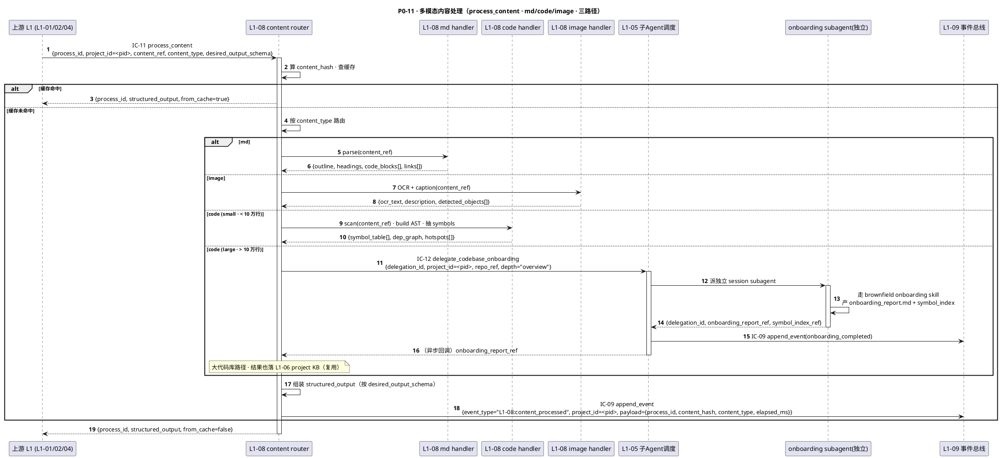

#### §3.11.5 关键字段取值示例（YAML）

```yaml
# step 1 · IC-11（md 路径）
process_content:
  process_id: "proc-018f4a3c-1500-..."
  project_id: "pid-018f4a3c-1f00-7000-b2a3-0a1e5c8f3a00"
  content_ref: "projects/<pid>/arch.md"
  content_type: "md"
  desired_output_schema: "md_outline_v1"
  ts: "2026-04-21T11:00:30Z"

# step 19 · structured_output（code-small 路径）
structured_output:
  schema: "code_symbols_v1"
  symbol_table:
    - {name: "AgentLoop", type: "class", file: "src/loop.py", loc: 120}
    - {name: "decide", type: "fn", file: "src/loop.py", loc: 34}
  dep_graph: {nodes: 82, edges: 147}
  hotspots: [{file: "src/state.py", churn_rate: 0.7}]
  processing_ms: 8200

# step 11 · IC-12 大代码库委托
delegate_codebase_onboarding:
  delegation_id: "ob-018f4a3c-1600-..."
  project_id: "pid-018f4a3c-1f00-7000-b2a3-0a1e5c8f3a00"
  repo_ref: "/Users/.../legacy_monolith/"
  depth: "overview"          # overview / module / deep
  timeout_ms: 600000
  ts: "2026-04-21T11:10:00Z"
```

#### §3.11.6 SLO 约束 + 降级出口

| 约束 | 值 | 来源 |
|---|---|---|
| IC-11 md handler P95 | ≤ 3s | ic-contracts §3.11 |
| IC-11 image handler P95 | ≤ 10s（单图）| L1-08 L2-04 |
| IC-11 code handler (small) P95 | ≤ 30s | L1-08 L2-03 |
| IC-12 onboarding | ≤ 10min | ic-contracts §3.12 |
| 缓存命中率（同 content_hash）| 期望 ≥ 60% | PRD §6.8 |

**降级出口**：
- image OCR 失败（图不清）→ 返 `{ocr_text: "", description: "unreadable", confidence: 0.0}` · 上游决定是否重试
- code handler AST 解析异常 → 降级到 grep-based 粗粒度符号
- IC-12 onboarding 超时 → 返 `{partial=true, covered_pct: 0.45}` · 上游可重派 deep depth

---

### §3.12 P0-12 · 事件总线汇聚（多 L1 并发 IC-09 → fsync 串行化 → hash-chain 完整性）

#### §3.12.1 场景一句话 + 触发条件

- **一句话**：**10 个 L1 并发写事件**场景 · L1-09 事件总线是系统唯一可写入口 · 多路并发 IC-09 经 project 级分布式锁串行化 · 每条 event 强 fsync 落盘 · prev_hash → hash 链完整 · 周期（每 100 条 or 5min）生成 checkpoint 便于 IC-10 replay。
- **触发条件**：系统运行中 · 任意 L1 发 IC-09。
- **前置状态**：events.jsonl 存在 · chain tip 已记录。
- **终态**：events.jsonl 单调递增 · hash 链连续 · checkpoint 按节奏生成。

#### §3.12.2 参与 L1-L2 组件

| L1 | L2 组件 | 职责 |
|---|---|---|
| 全部 L1 | 各自 L2 | 并发生产事件 · 走 IC-09 |
| L1-09 | L2-01 事件总线 / L2-02 hash-chain / L2-03 分布式锁 / L2-04 checkpoint 管理 | 串行化写 · 链计算 · 周期 checkpoint |

#### §3.12.3 涉及 IC

- **IC-09** append_event（本 P0 主 IC · 单 IC 视角见 ic-contracts §3.9）
- **IC-10** replay_from_event（周期 checkpoint 的下游消费 · P0-05 bootstrap 视角见 L0 §2.5）

#### §3.12.4 完整 PlantUML 时序图

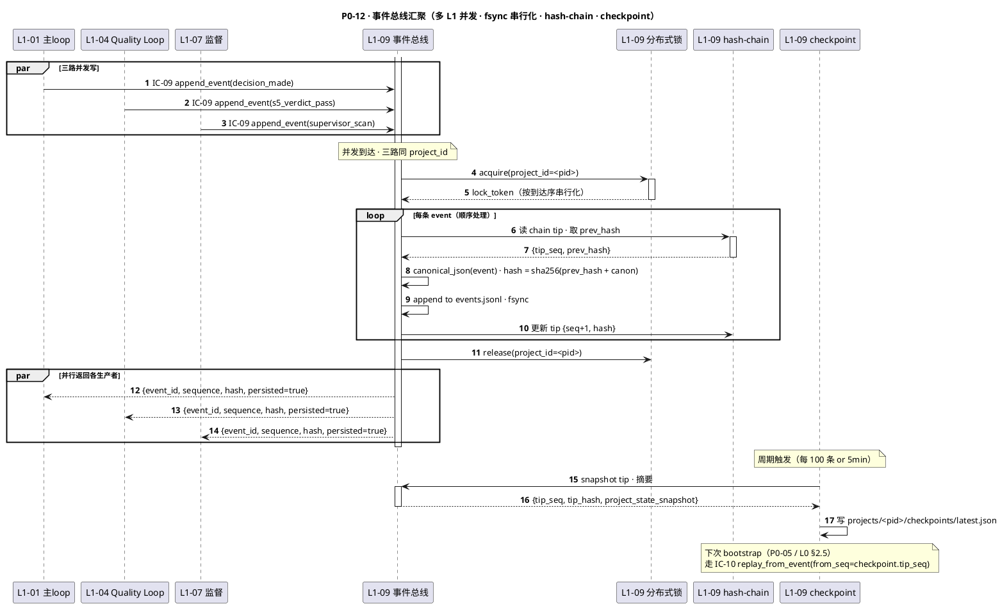

#### §3.12.5 关键字段取值示例（YAML）

```yaml
# 并发三路 · IC-09 入参示例（每路一条）
append_event_command_1:   # L1-01 主 loop
  event_id: "evt-018f4a3c-1700-..."
  event_type: "L1-01:decision_made"
  project_id_or_system: "pid-018f4a3c-1f00-7000-b2a3-0a1e5c8f3a00"
  payload: {decision_id: "dec-..."}
  actor: {l1: "L1-01"}
  ts: "2026-04-21T12:00:05.003Z"

append_event_command_2:   # L1-04
  event_id: "evt-018f4a3c-1701-..."
  event_type: "L1-04:s5_verdict_pass"
  project_id_or_system: "pid-018f4a3c-1f00-7000-b2a3-0a1e5c8f3a00"
  payload: {wp_id: "wp-...", verdict: "PASS"}
  actor: {l1: "L1-04"}
  ts: "2026-04-21T12:00:05.003Z"   # 同毫秒到达

# 串行化后落盘（events.jsonl · 连续 sequence）
events_jsonl_tail:
  - {sequence: 842, event_id: "evt-...1700", hash: "sha256:a3f5c9", prev_hash: "sha256:7c0f2b"}
  - {sequence: 843, event_id: "evt-...1701", hash: "sha256:e81d72", prev_hash: "sha256:a3f5c9"}
  - {sequence: 844, event_id: "evt-...1702", hash: "sha256:9f2a04", prev_hash: "sha256:e81d72"}

# checkpoint 落盘
checkpoint_latest:
  project_id: "pid-018f4a3c-1f00-7000-b2a3-0a1e5c8f3a00"
  tip_sequence: 900
  tip_hash: "sha256:..."
  project_state_snapshot:
    state: "S4"
    current_wp: "wp-018f4a3c-5003-..."
    in_flight_wp_count: 1
  ts: "2026-04-21T12:10:00Z"
```

#### §3.12.6 SLO 约束 + 降级出口

| 约束 | 值 | 来源 |
|---|---|---|
| IC-09 fsync P95（单条）| ≤ 20ms | ic-contracts §3.9 |
| project 级分布式锁竞争（3 路并发）| 等待 + 写 · P95 ≤ 60ms | L1-09 L2-03 |
| hash-chain 连续率 | 100%（断层 → halt · PM-10）| PRD §6.11 |
| checkpoint 周期 | 每 100 events or 5min | L1-09 L2-04 |
| IC-10 replay 速率 | ≥ 1000 events/s（从 checkpoint）| ic-contracts §3.10 |

**降级出口**：
- fsync 失败 → halt 系统（PM-08 · 同 IC-09 §3.9.4 `E_EVT_FSYNC_FAIL`）
- 锁竞争超 100ms → 上游可选重试（一般不触发）
- checkpoint 写盘异常 → 记 degraded · 不阻主流 · 下次 checkpoint 重试
- events.jsonl 文件大小超 1GB → L1-09 自动 rotate + 索引（不影响本 P0 正向流）

---

## §4 跨 P0 流共享实体 schema

以下 **12 个共享字段/实体**在多条 P0 流中反复出现，字段级定义以 `ic-contracts.md §3` 为准，本文件只做跨 P0 汇总（哪些 P0 用、约束继承自哪条 IC）。

### §4.1 共享字段总表

| 字段 | 类型 / 格式 | 出现在 P0# | 约束来源 | 幂等角色 | 说明 |
|---|---|---|---|---|---|
| `project_id` | `pid-{uuid-v7}` / `system` | **全部 12 条**（PM-14 硬约束）| ic-contracts §1.4 + IC-09 §3.9 | PM-14 根字段 | PM-14 硬约束根字段 · `system` 仅限 pid 生成前的系统级事件（P0-01 早期阶段）|
| `tick_id` | `tick-{uuid-v7}` | P0-02 · P0-04 · P0-05 · P0-09 · P0-10 | IC-01 §3.1.2 `trigger_tick` | 决策溯源键 | 主 loop 每轮 tick 唯一标识 · 关联 decision_id |
| `decision_id` | `dec-{uuid-v7}` | P0-04 · P0-09 · P0-10 · P0-12 | IC-09 payload 约定（L1-01 视角）| 审计根键 | 决策原子化单位 · 经 correlation_id 关联后续事件链 |
| `event_id` | `evt-{uuid-v7}` | **全部 12 条** | IC-09 §3.9.2 | IC-09 幂等键 | 全系统事件唯一 ID · 重复写入返回已存在 sequence+hash |
| `sequence` | integer（单调递增）| P0-10 · P0-12 | IC-09 §3.9.3 | 顺序保证 | per project 单调 · `system` 单独序列 |
| `hash` / `prev_hash` | `sha256-hex` | P0-10 · P0-12 | IC-09 §3.9.3 | hash-chain 连续性 | genesis=全 0 · PM-10 要求 100% 连续 |
| `correlation_id` | string（任意 `xxx-{uuid-v7}`）| P0-05 · P0-09 · P0-10 | IC-09 §3.9.2 | 事件链串联 | 常用 decision_id / invocation_id / delegation_id |
| `transition_id` | `trans-{uuid-v7}` | P0-01 · P0-02 · P0-08 | IC-01 §3.1.2 | IC-01 幂等键 | state 转换请求 · 同 from/to 幂等 |
| `gate_id` | `gate-{uuid-v7}` | P0-01 · P0-02 · P0-04 · P0-08 | IC-16 §3.16.2 | IC-16 幂等键 | Stage Gate 卡 · 用户 Go/NoGo 锚点 |
| `wp_id` | `wp-{uuid-v7}` | P0-02 · P0-03 · P0-04 · P0-05 · P0-06 | IC-02 §3.2.3 + wbs_topology.yaml | WP 原子单位 | WBS 最小可执行单元 · deps 图节点 |
| `loop_session_id` | `loop-{uuid-v7}` | P0-04 · P0-05 · P0-06 | IC-03 §3.3.2 | 每次 Loop 唯一 | Quality Loop 一轮的会话 ID · 覆盖 S4+S5 |
| `delegation_id` | `del-{uuid-v7}` / `ver-{uuid-v7}` / `ob-{uuid-v7}` | P0-06 · P0-08 · P0-11 | IC-05 / IC-20 / IC-12 | 独立 session 子 Agent 键 | 异步回调 · PM-03 三独立 |
| `invocation_id` | `inv-{uuid-v7}` | P0-01 · P0-04 · P0-05 · P0-11 | IC-04 §3.4.2 | skill 调用溯源 | 每次 invoke_skill 唯一 |

### §4.2 时间戳与时区约定

- 所有 `ts` 字段 · **ISO-8601 UTC**（带 `Z` 后缀，如 `2026-04-21T12:00:00Z`）
- 毫秒精度 · 事件总线 `ts_persisted` 精度到毫秒（`.003Z`）
- hash 计算的 `canonical_json` 排除 `ts_persisted`（该字段由 L1-09 写时填 · 不参与源端 hash）

### §4.3 幂等性继承总结

各 P0 的跨 IC 幂等性矩阵（上游重试场景）：

| P0# | 重试场景 | 幂等保护 |
|---|---|---|
| P0-01 | 网络抖动 · IC-17 clarify 重发 | intervene_id 非幂等 · 上游自己去重；IC-01 transition_id 幂等；IC-16 gate_id 幂等 |
| P0-03 | IC-19 重发（user 反复点 "拆分"）| decomp_id 非幂等 · L1-03 按 decomp_id 去重；IC-02 同 topology_version 幂等 |
| P0-04 | IC-03 重入 Quality Loop | loop_session_id 非幂等（每次新开）· 上游不应同 wp_id 重入（若需重做走 p1-seq FAIL 回退）|
| P0-07 | IC-08 重复晋升（同 source + target）| **Idempotent by (source_id, target_scope)** · 返同 promotion_id |
| P0-10 | IC-09 网络重试 | **Idempotent by event_id** · 返已存在 sequence+hash |
| P0-12 | 并发到达的重复 event | 同 event_id 返同 sequence（不重复落盘）|

### §4.4 错误码命名继承（跨 P0 通用前缀）

- `E_TRANS_*` · IC-01 相关（见 ic-contracts §3.1.4）
- `E_WP_*` · IC-02 相关（见 §3.2.4）
- `E_LOOP_*` · IC-03 相关
- `E_SKILL_*` · IC-04 相关
- `E_EVT_*` · IC-09 相关（其中 `E_EVT_NO_PROJECT_OR_SYSTEM` 是 PM-14 执行器 · 本文件 12 条 P0 全部受其保护）
- `E_KB_*` · IC-06/07/08 相关
- `E_GATE_*` · IC-16 相关
- 其余见 ic-contracts §3.N.4 各节

---

## §5 尾声 · 本文件与下游的交接

### 5.1 L2 tech-design §5 "时序图"章节如何引本文件

范式（L2 作者直接复用）：

```markdown
## §5 核心场景时序图

### §5.1 P0-04 WP 执行主链（跨 L1 骨架直引 integration/p0-seq.md §3.4）

> 跨 L1 完整视角见 `integration/p0-seq.md §3.4`；本 L2（L1-04 L2-04 Loop 编排器）视角着重展开 step 5-13 的内部 L3 分解（IMPL 段 + S5 段 的内部状态机）。

（此处画本 L2 视角放大图 · 不再重画跨 L1 完整链 · 只展开本 L2 边界内的 L3 组件）

### §5.2 P0-06 S5 独立 Verifier（本 L2 深放大）
...
```

### 5.2 3-2 TDD 集成测试用例如何从本文件派生

每条 P0 流对应 **1 条 "正向 E2E" 集成用例** + **N 条 "降级出口" 负向用例**：

| P0# | 正向 E2E 用例 | 降级出口用例（派生源） |
|---|---|---|
| P0-01 | TC-P0-01-HAPPY · 完整走 clarify→pid→S1 Gate→Go→S2 | TC-P0-01-EDGE · 3 轮澄清仍不明（p1-seq P1-01）|
| P0-04 | TC-P0-04-HAPPY · verdict=PASS 单 WP | TC-P0-04-FAIL · verdict=FAIL（p1-seq P1-03）|
| P0-06 | TC-P0-06-HAPPY · 三段证据 + confidence 0.93 | TC-P0-06-INSUF · evidence 缺一段（retry 2 次 → FAIL）|
| P0-07 | TC-P0-07-HAPPY · 阈值自动晋升 + 用户批准全局 | TC-P0-07-DEDUP · 同 dedup_key 重复写 |
| P0-09 | TC-P0-09-HAPPY · 8 维度全绿 INFO 入队 | TC-P0-09-WARN · pace<0.7（WARN 进队不阻）|
| P0-10 | TC-P0-10-HAPPY · decision_id 全链反查 | TC-P0-10-HASH-BAD · 人为断链 → halt |
| P0-12 | TC-P0-12-HAPPY · 3 路并发正确串行化 | TC-P0-12-FSYNC-FAIL · 磁盘满 → halt |

完整 75 条用例矩阵交 R5 TDD 阶段编写。

### 5.3 与 `p1-seq.md` 的接口点

本文件每条 P0 流的"降级出口"小节即 `p1-seq.md` 的入口清单。R1.3 编写 p1-seq.md 时按本文件 §3.N.6 列出的降级出口逐一展开 P1 流详图。

### 5.4 最终自检 checklist（本文件 v1.0 内建）

- [x] 12 条 P0 流全部有 `@startuml`/`@enduml` + `autonumber` + `activate/deactivate`
- [x] 禁 Mermaid（全文无 ```mermaid 块）
- [x] IC 编号 100% 对齐 `ic-contracts.md §3`（IC-01~IC-20 · 19 条出现 · IC-15 仅指向 L0 §2.6 P0-06）
- [x] 字段名 100% 英文 snake_case（`project_id` / `tick_id` / `decision_id` / `loop_session_id` 等）
- [x] PM-14：12 条 P0 图的所有 payload YAML 示例均含 `project_id`（pid 生成前 P0-01 step 2 用 `project_id: "system"` 显式标）
- [x] 每条 P0 有 §3.N.1~§3.N.6 六节（场景 / L1-L2 / IC / PlantUML / YAML / SLO+降级）
- [x] §4 共享实体表汇总 12+ 字段/约束

---

> 本文件终稿版本 v1.0 · 锚定后禁修；任何 L2 发现与 ic-contracts 字段不一致 → 反向修 ic-contracts + 本文件同步 v1.1。


