# HarnessFlow · P1 异常/恢复 Cross-L1 Sequence Catalog

> **版本**：v1.0 · 3-1-Solution-Technical Integration 层 P1（异常 · 降级 · 恢复 · 升级）时序图目录
> **定位**：P0 主流程（`p0-seq.md`）的**孪生文档**——P0 画"一切都对的路径"，本文档画"任意一环出错的路径 + 系统的自愈/升级策略"。10 条 P1 流共同覆盖 HarnessFlow **109 错误码 + 10 L1 × 5 降级章节**的跨 L1 编排。
> **与 `L0/sequence-diagrams-index.md §3` 关系**：L0 index 是 **12 条骨架**（10-20 行 PlantUML + 一句话场景），本文档将其中 **10 条**（P1-01 ~ P1-10）**深化到字段级**——每条含完整 IC 入参/出参 + 错误码分支 + SLO 硬阈值 + 降级出口 + 审计事件。
> **与 `ic-contracts.md` 关系**：ic-contracts 定义了每条 IC 的**静态契约**（schema + 错误码）；本文档展示**动态组合**——多 IC 在异常路径上的**时序编排**。

---

## §0 撰写进度

- [x] §0 撰写进度
- [x] §1 定位（P1 定义 · 与 P0 互补 · 硬约束）
- [x] §2 P1 流程分类表（按异常源分类 · 10 条）
- [x] §3.1 · P1-01 硬红线 BLOCK 抢占链
- [x] §3.2 · P1-02 Watchdog 超时告警
- [x] §3.3 · P1-03 Verifier FAIL_L4 升级人工
- [x] §3.4 · P1-04 fsync/磁盘失败系统级 halt
- [x] §3.5 · P1-05 用户 panic 中断 ≤100ms
- [x] §3.6 · P1-06 崩溃跨 session 恢复
- [x] §3.7 · P1-07 Skill fallback 链耗尽
- [x] §3.8 · P1-08 任务链失败回退 3 次
- [x] §3.9 · P1-09 KB 服务降级返回空
- [x] §3.10 · P1-10 事件总线锁超时重试
- [x] §4 P1 失败恢复树（全景 PlantUML）
- [x] §5 P1 × IC × 错误码追溯矩阵
- [x] §6 SLO 硬阈值汇总表

---

## §1 定位

### 1.1 P1 是什么

**P1 = 异常 / 降级 / 恢复 / 升级 的跨 L1 编排图**——与 P0 "happy path" 互补。

| 维度 | P0（`p0-seq.md`） | P1（本文档） |
|---|---|---|
| **关注** | 一切都对的黄金路径 · 产品可用性锚点 | 任意一环出错后的系统行为 · 韧性锚点 |
| **Owner 图** | 8 条 · 主流程骨架 | 10 条 · 异常/恢复编排 |
| **错误码** | 不出现（happy path 无错）| 每条 P1 ≥ 3 条错误码引用（ic-contracts §3.N.4）|
| **降级出口** | 不需要（路径线性）| 每条 P1 必含明确"出口状态"（HALTED / PAUSED / degraded / escalated / FAILED_TERMINAL）|
| **验收场景** | "正常跑完 S1→S7" | "断网 3 次 · 磁盘满 · 用户 panic · verifier 极重 FAIL · ..." 一一可演 |
| **消费方** | 集成测试主用例 | 集成测试回归用例 + 4-operations 故障手册 + SLO 验收 |

### 1.2 P1 编排的 4 个核心特征

1. **SLO 硬阈值**：每条 P1 显式标记违反 SLO 的边界（如 P1-01 halt_latency_ms > 100 / P1-05 panic latency > 100ms / P1-03 verifier timeout_s > 1200），超限即进入 P1 自己的"二级降级"（SLO 违反 → 告警 L1-07 → 进一步升级）。
2. **错误码锚定**：不再用口语描述"失败"，统一引用 `ic-contracts.md §3.N.4` 表格中的 `E_XXX` 码。错误码 = P1 流程分支的**唯一触发键**。
3. **审计全程留痕**：任何异常路径的状态转移必经 IC-09 `append_event`（PM-08 单一事实源）——halt / resume / escalate / rollback / degraded 一一落盘，支持 P0-05 跨 session 恢复时完整 replay。
4. **降级出口明确**：每条 P1 的终态必在 {HALTED, PAUSED, degraded=true, escalated=true, FAILED_TERMINAL, resumed} 六种之一——避免"出错后不知道处于什么状态"。

### 1.3 硬约束（R1.3 · 验收条件）

| 约束 | 要求 |
|---|---|
| PlantUML | 全部图 PlantUML（非 Mermaid）· 与 `p0-seq.md` / `L0/sequence-diagrams-index.md` 同标 · 可 plantuml.com 渲染通过 |
| IC 编号一致 | 所有 IC-XX 引用与 `ic-contracts.md §3.1~§3.20` 一致 · 不新增 IC |
| 字段名一致 | 与 `ic-contracts.md` 入参 schema 字段名完全一致（halt_id / route_id / delegation_id / verdict / level_count / ...）· 不自创字段 |
| 错误码白名单 | 所有 `E_XXX` 必来自 `ic-contracts.md §3.N.4` 表（不自造）· §5 给全量追溯表 |
| PM-14 | 每条 P1 入参必含 project_id（HALT 例外 · 但 evidence 必有 pid）|
| SLO + 降级出口 | §3.N.6 必含 · 缺失即 R1.3 失败 |

### 1.4 与 10 L1 architecture.md §5 降级策略的关系

每个 L1 architecture.md 都有 §5 降级策略章节——**P1 流就是这些 §5 章节的跨 L1 组合**：

| P1 流 | 主参与 L1 | 对应 L1 architecture §5 章节 |
|---|---|---|
| P1-01 硬红线 | L1-07 + L1-01 + L1-10 | L1-07 §5.3 硬红线 · L1-01 §5.2 抢占 |
| P1-02 Watchdog | L1-07 + L1-01 | L1-07 §5.1 watchdog · L1-01 §5.4 tick 自检 |
| P1-03 Verifier FAIL_L4 | L1-04 + L1-07 + L1-02 | L1-04 §5.2 verdict 降级 · L1-07 §5.4 升级 |
| P1-04 fsync halt | L1-09 | L1-09 §5.1 写盘失败兜底 |
| P1-05 用户 panic | L1-10 + L1-01 | L1-10 §5.2 panic · L1-01 §5.3 PAUSED |
| P1-06 跨 session 恢复 | L1-09 + L1-02 + L1-01 | L1-09 §5.3 checkpoint 恢复 |
| P1-07 Skill fallback | L1-05 | L1-05 §5.1 fallback 链 |
| P1-08 任务链回退 | L1-04 + L1-07 + L1-01 | L1-04 §5.3 重试 · L1-07 §5.5 死循环 |
| P1-09 KB 降级 | L1-06 + L1-01 | L1-06 §5.2 服务不可达 |
| P1-10 事件锁超时 | L1-09 | L1-09 §5.2 并发锁 |

---

## §2 P1 流程分类表（按异常源）

> 10 条 P1 流按"触发它的根本异常来源"分 5 类。每类至少 1 条。

| 类别 | P1 ID | 场景 | 主 IC | 终态（降级出口）| SLO 硬阈值 |
|---|---|---|---|---|---|
| **红线 / 安全** | P1-01 | 硬红线 BLOCK 抢占（rm -rf / drift_critical / ...）| IC-15 + IC-17 + IC-09 | `state=HALTED` · 等用户 authz | halt_latency_ms ≤ 100 |
| **监控 / 时间** | P1-02 | Watchdog 30s tick 无进展 | IC-13(WARN) + IC-09 | soft-drift 告警 · 主 loop 书面回应 | watchdog_tick ≤ 30s |
| **Verifier / 质量** | P1-03 | Verifier FAIL_L4 极重（3 次升级终态）| IC-20 + IC-14 + IC-17 + IC-09 | `FAIL_L4 + 人工重锚 goal` · 或 `state=FAILED_TERMINAL` | verifier timeout_s ≤ 1200 |
| **硬件 / 磁盘** | P1-04 | IC-09 fsync 失败 | IC-09(E_EVT_FSYNC_FAIL) + IC-15 | `state=SYSTEM_HALTED` · 等磁盘修复 + bootstrap | fsync SLO 100% 持久 |
| **用户 / 交互** | P1-05 | 用户 panic 中断 | IC-17(urgency=panic) + IC-09 | `state=PAUSED` ≤100ms · 等 resume | panic_latency_ms ≤ 100 |
| **崩溃 / 恢复** | P1-06 | 重启后跨 session 恢复 | IC-10 + IC-16 + IC-17 + IC-09 | `state=IDLE (恢复)` · 已 replay 到 checkpoint_seq | bootstrap ≤ 5s |
| **外部依赖** | P1-07 | Skill 主失败 → fallback → 简化 → 硬暂停 | IC-04(E_SKILL_TIMEOUT / E_SKILL_ALL_FALLBACK_FAIL) + IC-15 | `success=true+fallback` · 或 `state=HALTED` | fallback_attempts ≤ 3 |
| **质量 / 重试** | P1-08 | WP 任务链同级 FAIL 3 次 → 升级 | IC-14(level_count=3) + IC-09 | `escalated=true · new_wp_state=upgraded_to_l1_01` · 或 FAILED_TERMINAL | same_level_fail_count ≤ 3 |
| **KB / 服务** | P1-09 | KB 服务不可达 → 返回空 + degraded | IC-06(E_KB_SERVICE_UNAVAILABLE) + IC-13(WARN) | `entries=[] + degraded=true` · 决策不阻塞 | degrade_on_fail |
| **并发 / 锁** | P1-10 | 并发 append_event 锁超时 | IC-09(E_EVT_HASH_CHAIN_BROKEN) + 内部重试 | `retry_count ≤ 1 · 仍失败告警 L1-07` | lock_ttl = 5s · retry ≤ 1 |

---

## §3 P1 流详解（10 条）

### §3.1 · P1-01 · 硬红线 BLOCK 抢占链（halt ≤ 100ms）

#### §3.1.1 场景

某 tick 中 L1-05 将执行 Bash `rm -rf /some/critical/path`（或 L1-07 探测到 DRIFT_CRITICAL goal_anchor sha256 变化 / L1-02 探测到 state 非法跃迁）→ L1-07 L2-03 硬红线拦截器二次确认（`confirmation_count=2`）命中 → IC-15 `request_hard_halt` → L1-01 L2-01 ≤50ms 内 abort current tick → L1-01 state=RUNNING→HALTED → UI 推强告警 → 等用户 IC-17 `authorize` 文本授权解除。

#### §3.1.2 参与 L1-L2

| 层 | 组件 | 角色 |
|---|---|---|
| L1-05 | L2-03 调用执行器 | 触发侧（准备执行危险操作） |
| L1-07 | L2-03 硬红线拦截器 | 检测 + 二次确认 + 触发 IC-15 |
| L1-07 | L2-04 Supervisor 发送器 | 告警 UI 路径 |
| L1-01 | L2-01 Tick 调度 + L2-02 决策引擎 | 接收抢占 · abort · 改 state |
| L1-01 | L2-06 Supervisor 接收 | IC-15 入口 |
| L1-09 | L2-01 事件总线 | halt 事件 + authorize 事件落盘 |
| L1-10 | L2-04 用户干预入口 | 推强告警卡片 + 接用户文本授权 |

#### §3.1.3 涉及 IC

- **主调**：IC-15 `request_hard_halt`（L1-07 → L1-01）· IC-17 `user_intervene`（L1-10 → L1-01 · type=authorize）
- **辅**：IC-09 `append_event`（全程审计留痕 · 至少 3 次：hard_halted / user_authorized / halt_released）
- **前置**：IC-04 `invoke_skill`（L1-01 → L1-05 · 未完成即被抢占）

#### §3.1.4 PlantUML

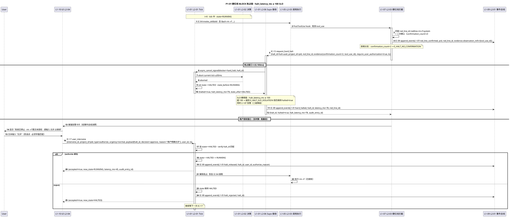

#### §3.1.5 字段示例

**IC-15 `request_hard_halt_command`（L1-07 → L1-01）**：

```yaml
halt_id: halt-01HXT9K...
project_id: proj-videoforge-v1-a7b3
red_line_id: redline-rm-rf-system
evidence:
  observation_refs: ["evt-01HXT9K..."]  # 对应 tool_use_id
  tool_use_id: toolu_01HXT9K...
  confirmation_count: 2  # ≥2 硬约束
require_user_authorization: true  # 硬编码 true
ts: 2026-04-21T10:15:32.123Z
```

**IC-15 ack**：

```yaml
halt_id: halt-01HXT9K...
halted: true
halt_latency_ms: 78     # ≤100 · SLO 达标
state_before: RUNNING
state_after: HALTED
audit_entry_id: aud-01HXT9K...
```

**IC-17 `user_intervene`（解除 halt）**：

```yaml
intervene_id: int-01HXT9K...
project_id: proj-videoforge-v1-a7b3
type: authorize
user_id: user-zhongtianyi
urgency: normal
payload:
  halt_id: halt-01HXT9K...
  decision: approve
  reason: "用户明确允许"
ts: 2026-04-21T10:16:08.456Z
```

#### §3.1.6 SLO + 降级出口

| 维度 | 硬阈值 | 违反时行为 |
|---|---|---|
| halt_latency_ms | ≤ 100 ms | `E_HALT_SLO_VIOLATION` · halted=true 仍返回 · L1-07 二级告警 · 本次放行但事后复盘 |
| confirmation_count | ≥ 2 | `E_HALT_NO_CONFIRMATION` · 拒绝 halt 请求 · 要求 L1-07 补二次确认 |
| evidence.observation_refs | 非空 | `E_HALT_NO_EVIDENCE` · 拒绝（硬红线必须有证据） |
| project_id | 必填 | `E_HALT_NO_PROJECT_ID` · 紧急仍 halt（安全第一）但审计标记 evidence_incomplete |

**降级出口**：

- **正常路径**：`state=HALTED` → 用户 authorize → `state=RUNNING`（或 reject 持续 HALTED）
- **SLO 违反**：`state=HALTED` 仍达成 · 但附 `halt_latency_ms > 100` 告警进审计 · L1-07 下次 tick 推 WARN 复盘建议
- **Evidence 缺失**：`state=HALTED` 兜底 · 但 audit entry 标 `evidence_incomplete=true` · 阻止误触发红线升级

#### §3.1.7 错误码引用（来自 ic-contracts.md §3.15.4）

- `E_HALT_NO_PROJECT_ID` / `E_HALT_NO_EVIDENCE` / `E_HALT_NO_CONFIRMATION` / `E_HALT_SLO_VIOLATION` / `E_HALT_ALREADY_HALTED`
- `E_INT_PANIC_SLO_VIOLATION`（若 type=pause 超 100ms）/ `E_INT_RESUME_WRONG_STATE`（state 不是 HALTED/PAUSED 收 authorize）

---

### §3.2 · P1-02 · Watchdog 超时告警（tick 30s 无进展）

#### §3.2.1 场景

L1-01 主 loop 某 tick 已跑 > 30s 仍未进入下一 step（可能卡在 skill 调用 / KB 读 / 外部 API）→ L1-07 L2-01 watchdog 定时扫 L1-09 事件流 → 发现"最近 30s 内无 decision_made / skill_invoked 等状态推进事件" → soft-drift 启动 → IC-13 `push_suggestion` WARN → 主 loop 下一 tick 书面回应（采纳建议 replan · 或驳回+说明理由）。与硬红线区别：本流不 halt · 只告警。

#### §3.2.2 参与 L1-L2

| 层 | 组件 | 角色 |
|---|---|---|
| L1-07 | L2-01 状态采集器 + L2-05 soft-drift 识别器 | watchdog 30s tick · 扫描事件流 · 识别模式 |
| L1-07 | L2-04 Supervisor 发送器 | 发 IC-13 WARN |
| L1-09 | L2-01 事件总线 + L2-03 审计查询 | watchdog 读入源 |
| L1-01 | L2-02 决策引擎 + L2-07 Suggestion 消费器 | 收 IC-13 · 书面回应 |
| L1-10 | L2-03 Supervisor 告警角 | 显 WARN 角标（可选 · 用户感知） |

#### §3.2.3 涉及 IC

- **主调**：IC-13 `push_suggestion`（L1-07 → L1-01 · severity=WARN）
- **辅**：IC-09 `append_event`（≥3 次：suggestion_pushed / suggestion_responded / plan_revised_by_watchdog）· IC-18 `query_audit_trail`（watchdog 内部扫描调 L1-09）

#### §3.2.4 PlantUML

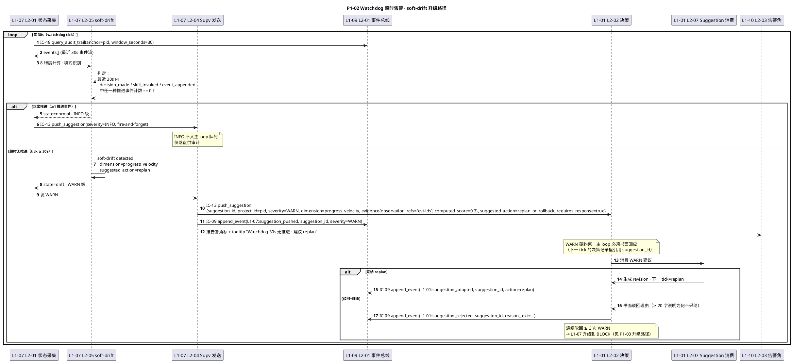

#### §3.2.5 字段示例

**IC-13 `push_suggestion_command`（WARN）**：

```yaml
suggestion_id: sugg-01HXTA7...
project_id: proj-videoforge-v1-a7b3
severity: WARN
dimension: progress_velocity
evidence:
  observation_refs:
    - evt-01HXT9M...  # 最近一次 decision_made（30s 前）
  computed_score: 0.3   # 0.0=完全停滞 · 1.0=正常推进
  window_seconds: 30
suggested_action: replan_or_rollback
requires_response: true  # WARN 必须主 loop 书面回应
response_deadline_s: 60  # 60s 内未回应 → 升级 BLOCK
ts: 2026-04-21T10:18:45.678Z
```

**主 loop 书面回应事件（IC-09）**：

```yaml
event_type: L1-01:suggestion_adopted
payload:
  suggestion_id: sugg-01HXTA7...
  action: replan
  revised_plan_id: plan-01HXTA7...
  reasoning: "检测到 skill 调用卡在 LLM 超时 · 采纳 replan · 切换到 fallback skill"
```

#### §3.2.6 SLO + 降级出口

| 维度 | 硬阈值 | 违反时行为 |
|---|---|---|
| watchdog_tick_interval | 30 s | L1-07 自检 · 跳 tick 记录到 supervisor_audit.jsonl |
| WARN response_deadline_s | 60 s | 超 60s 未回应 · 自动升级为 BLOCK（IC-15）· 进入 P1-01 流程 |
| 连续驳回次数 | ≤ 3 | 连续 3 次驳回同 dimension WARN → 升级到 BLOCK · 走 P1-01 |

**降级出口**：

- **正常路径**：WARN → 主 loop 书面回应（采纳或驳回+理由）→ 事件落盘 · 继续 tick
- **无回应升级**：60s 内主 loop 未产出 `suggestion_adopted / suggestion_rejected` 事件 → L1-07 升级 IC-15 halt
- **反复驳回升级**：同 dimension 连续 3 次 WARN 被驳回 → L1-07 升级到 BLOCK 进 P1-01
- **正常退出**：下一 tick 有推进事件 · computed_score > 0.6 → watchdog 清零计数

#### §3.2.7 错误码引用

- IC-13：`E_SUGG_NO_PROJECT_ID` / `E_SUGG_SEVERITY_UNKNOWN` / `E_SUGG_EVIDENCE_EMPTY` / `E_SUGG_NO_RESPONSE_DEADLINE`（来自 ic-contracts.md §3.13.4）
- IC-18：`E_AUDIT_ANCHOR_UNKNOWN` / `E_AUDIT_CROSS_PROJECT_DENIED`（若 watchdog 错配 pid）

---

### §3.3 · P1-03 · Verifier FAIL_L4 升级到人工决策

#### §3.3.1 场景

S5 TDDExe 独立 verifier 子 Agent 返回 `verdict=FAIL_L4`（极重偏差 · 涉及章程/goal_anchor 本质漂移）→ L1-04 L2-07 回退路由器检查 `level_count=3`（同级 FAIL 累计 3 次）→ 触发 BF-E-10 升级 → 不能再自动回 S3/S2 · 必须升级到 L1-01 主 loop 层由用户决策 → 推 IC-16 Gate 卡 · 要求用户重锚 goal / reject 项目 / 或授权继续一轮 → 用户决策后 IC-17 路由回正确 state。

#### §3.3.2 参与 L1-L2

| 层 | 组件 | 角色 |
|---|---|---|
| L1-04 | L2-06 Verifier 编排 | 发起 IC-20 委托 |
| L1-05 | L2-04 子 Agent 委托 + Verifier Subagent | 独立 session 跑验证 · PM-03 |
| L1-04 | L2-07 回退路由 | 收 verdict · 判 level_count ≥ 3 |
| L1-07 | L2-06 死循环升级器 | 独立双重保险判定 · 按 4 级规则 |
| L1-07 | L2-04 Supervisor 发送器 | IC-14 推路由 · IC-13 推 WARN |
| L1-01 | L2-06 Supervisor 接收 | 收 IC-14 · IC-15（若极重）|
| L1-02 | L2-01 阶段门控制 | 推 Gate · 接用户决策 |
| L1-10 | L2-04 用户干预入口 | 显重锚卡片 · 收 IC-17 |

#### §3.3.3 涉及 IC

- **主调**：IC-20 `delegate_verifier` · IC-14 `push_rollback_route` · IC-16 `push_stage_gate_card` · IC-17 `user_intervene`
- **辅**：IC-09 `append_event`（≥5 次：verifier_verdict / rollback_escalated / gate_pushed_for_repair / user_authorized / state_transitioned）· IC-01 `request_state_transition`

#### §3.3.4 PlantUML

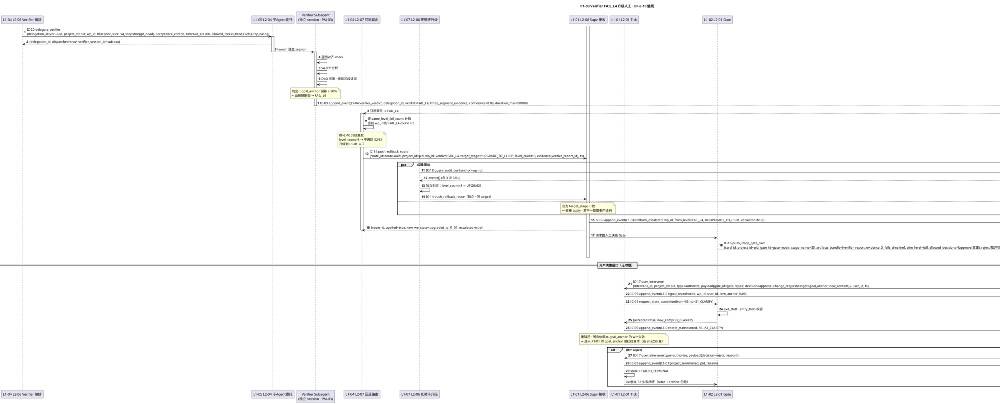

#### §3.3.5 字段示例

**IC-20 `verifier_verdict`（IC-09 回推）· FAIL_L4**：

```yaml
event_type: L1-04:verifier_verdict
payload:
  delegation_id: ver-01HXTB0...
  verdict: FAIL_L4
  three_segment_evidence:
    blueprint_alignment:
      goal_anchor_sha256_mismatch: true
      deviation_score: 0.82  # 超过 0.8 即 FAIL_L4 阈值
    s4_diff_analysis:
      lineage_broken_at: "commit-abc123"
      broken_refs: 7
    dod_evaluation:
      dod_expression_result: false
      missing_criteria: ["ac-03", "ac-07", "ac-11"]
  confidence: 0.88
  duration_ms: 780000
  verifier_report_id: vr-01HXTB0...
```

**IC-14 `push_rollback_route_command`（升级路由）**：

```yaml
route_id: route-01HXTB0...
project_id: proj-videoforge-v1-a7b3
wp_id: wp-01HXT8K...
verdict: FAIL_L4
target_stage: "UPGRADE_TO_L1-01"  # 非 S3/S4/S5 · 升级到 L1-01 主 loop 层
level_count: 3  # ≥3 触发 BF-E-10
evidence:
  verifier_report_id: vr-01HXTB0...
  decision_id: dec-01HXTB0...
ts: 2026-04-21T11:45:00.000Z
```

**IC-14 ack**：

```yaml
route_id: route-01HXTB0...
applied: true
new_wp_state: upgraded_to_l1_01
escalated: true  # BF-E-10 升级标记
```

#### §3.3.6 SLO + 降级出口

| 维度 | 硬阈值 | 违反时行为 |
|---|---|---|
| verifier timeout_s | ≤ 1200（20 分钟）| `E_VER_TIMEOUT` · 自动给 FAIL_L4 + partial evidence · 走本 P1-03 升级路径 |
| three_segment_evidence 完整性 | 三段齐备 | `E_VER_EVIDENCE_INCOMPLETE` → 自动降 FAIL_L1 · 不走 FAIL_L4 路径 |
| level_count 升级阈值 | ≥ 3 | 自动 escalated=true · 必走人工 Gate（不允许 auto-retry）|
| 人工决策时限 | 无时限（阻塞）| 但若 > 24h 未决 · L1-07 推 INFO 提醒 · 不升级 |

**降级出口**：

- **重锚路径**：用户 → `IC-17 authorize + change_request{goal_anchor}` → state 回 S1_CLARIFY · goal_anchor_hash 变化 → 进入 P1-01 goal_anchor 变体
- **再给一轮**：用户 → `IC-17 request_change` → state 回 S3 · level_count 重置为 0 · 允许再来一轮 Quality Loop
- **放弃项目**：用户 → `IC-17 authorize(decision=reject)` → `state=FAILED_TERMINAL` · S7 仍跑 retro + archive（记录失败经验到 KB global 层）
- **Verifier 异常降级**：三段证据不齐 → `E_VER_EVIDENCE_INCOMPLETE` → FAIL_L1（轻度）· 不走 FAIL_L4 路径 · 回 S4

#### §3.3.7 错误码引用

- IC-20：`E_VER_TIMEOUT` / `E_VER_EVIDENCE_INCOMPLETE` / `E_VER_MUST_BE_INDEPENDENT_SESSION`（ic-contracts §3.20.4）
- IC-14：`E_ROUTE_VERDICT_TARGET_MISMATCH` / `E_ROUTE_WP_NOT_FOUND`（§3.14.4）
- IC-16：`E_GATE_ARTIFACTS_EMPTY` / `E_GATE_BLOCKS_WITHOUT_DECISION`（§3.16.5）
- IC-17：`E_INT_CHANGE_REQ_INVALID_SCOPE`（§3.17.4）

---

### §3.4 · P1-04 · fsync/磁盘失败系统级 halt

#### §3.4.1 场景

任意 L1 通过 IC-09 `append_event` 写事件 → L1-09 L2-01 事件总线核心接收 → 落盘 jsonl 时 `fsync()` syscall 失败（磁盘满 / 权限错 / 文件系统只读 / 硬件 I/O 错误）→ 返回 `E_EVT_FSYNC_FAIL` · PM-08 单一事实源不可破 → L1-09 主动触发 **全系统 halt**（非局部降级）→ state=`SYSTEM_HALTED` → UI 推强告警 + 诊断信息（free disk / permission / fsync errno）→ 用户修复磁盘 / 权限后手动重启 Claude Code → 走 P1-06 bootstrap 恢复。

#### §3.4.2 参与 L1-L2

| 层 | 组件 | 角色 |
|---|---|---|
| Any L1 | 全部 L1 | IC-09 调用方（触发侧）|
| L1-09 | L2-01 事件总线核心 | 接收 fsync 失败 · 触发 halt |
| L1-09 | L2-05 崩溃安全层 | 全系统 halt 广播 |
| L1-01 | L2-01 Tick 调度 + L2-02 决策 | 接 halt · 停 tick |
| L1-10 | L2-03 告警角 + L2-04 用户干预入口 | 显诊断信息 |

#### §3.4.3 涉及 IC

- **主调**：IC-09 `append_event` → 返回 `E_EVT_FSYNC_FAIL` / `E_EVT_DISK_FULL`
- **辅**：IC-15 `request_hard_halt`（L1-09 → L1-01 · 特殊 halt_id=sys-halt-fsync）· IC-09 本身失败时走"bypass 缓冲"（PM-08 兜底）

#### §3.4.4 PlantUML

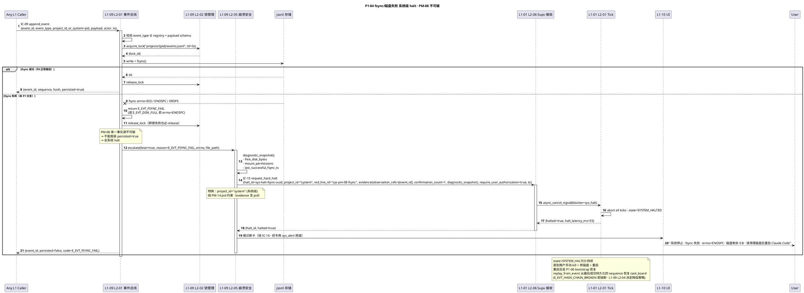

#### §3.4.5 字段示例

**IC-09 失败 ack**：

```yaml
event_id: evt-01HXTC5...
persisted: false
code: E_EVT_FSYNC_FAIL
error_context:
  errno: 28   # ENOSPC
  file_path: "projects/proj-videoforge-v1-a7b3/events.jsonl"
  free_disk_bytes: 0
  last_successful_sequence: 1247
```

**IC-15 系统级 halt 入参**：

```yaml
halt_id: sys-halt-fsync-01HXTC5...
project_id: "system"   # 特殊标识 · 绕 PM-14 pid 要求
red_line_id: sys-pm-08-fsync
evidence:
  observation_refs: ["evt-01HXTC5..."]
  confirmation_count: 1  # 系统级 halt 降门槛（磁盘失败无需二次确认）
  diagnostic_snapshot:
    free_disk_bytes: 0
    errno: 28
    last_fsync_ts: "2026-04-21T11:58:00Z"
require_user_authorization: true  # 仍硬编码 true · 重启后需确认磁盘已修
ts: 2026-04-21T12:00:00Z
```

#### §3.4.6 SLO + 降级出口

| 维度 | 硬阈值 | 违反时行为 |
|---|---|---|
| fsync 持久化成功率 | 100%（PM-08 硬红线）| 任一次失败即全系统 halt · 不允许缓冲 |
| halt_latency_ms | ≤ 100（与 P1-01 同）| 超限告警 · 但全系统已 halt · 意义降低 |
| 诊断信息完整性 | free_disk / errno / file_path 至少 3 项 | 缺失时 L1-07 二级告警 · 但 halt 仍生效 |

**降级出口**：

- **正常恢复路径**：用户修磁盘 / 权限 → kill -9 + 重启 Claude Code → 走 P1-06 `bootstrap` → IC-10 `replay_from_event(from_seq=last_successful+1)` → task_board 恢复 → state=IDLE
- **Hash chain 断裂子路径**：重启后 IC-10 发现 `E_REP_HASH_CHAIN_BROKEN` → 返回 `hash_chain_valid=false, corrupt_at_sequence=K` → L1-09 L2-04 决定降级策略（要么手动修复 · 要么从 K-1 截断 · 新 fork chain）
- **无法恢复路径**：若磁盘硬损 · events.jsonl 物理损毁 → L1-09 保留 backup 若有 · 否则项目进 `state=CORRUPTED` · 冻结（不可 resume）· 交付归档走降级包

#### §3.4.7 错误码引用

- IC-09：`E_EVT_FSYNC_FAIL` / `E_EVT_DISK_FULL` / `E_EVT_HASH_CHAIN_BROKEN`（§3.9.4）
- IC-10：`E_REP_HASH_CHAIN_BROKEN` / `E_REP_STORAGE_UNAVAILABLE`（§3.10.4）
- IC-15：`E_HALT_NO_PROJECT_ID`（系统级 halt 不适用 · 用 pid="system" 绕过）

---

### §3.5 · P1-05 · 用户 panic 中断（≤ 100ms 暂停）

#### §3.5.1 场景

用户在 L1-10 UI 点 "Panic" 按钮 → UI 立即发 IC-17 `user_intervene(type=pause, urgency=panic)` → L1-01 L2-01 Tick 调度收 async_cancel_signal → abort current tick ≤ 50ms → state=RUNNING→PAUSED → 显 PAUSED 状态 + resume 按钮 → PAUSED 期：不派发新 tick · 但事件总线仍消费异步事件（subagent 回收 · IC-09 事件）· 入 pending queue → 用户点 resume → IC-17(type=resume) → state=PAUSED→IDLE → 处理 pending queue → 恢复 tick · 从中断点继续（不重做已完成）。

#### §3.5.2 参与 L1-L2

| 层 | 组件 | 角色 |
|---|---|---|
| L1-10 | L2-04 用户干预入口 + L2-05 Panic 按钮 | 触发 IC-17 · 立即送达 |
| L1-01 | L2-01 Tick 调度 + L2-02 决策引擎 | 收抢占 · abort · 改 state |
| L1-01 | L2-08 Pending Queue | PAUSED 期事件缓冲 |
| L1-09 | L2-01 事件总线 | 异步事件继续落盘（不停）|
| L1-05 | L2-05 异步回收 | subagent 结果继续推入总线 |

#### §3.5.3 涉及 IC

- **主调**：IC-17 `user_intervene`（type=pause / type=resume）
- **辅**：IC-09 `append_event`（panic_intercepted / paused / resumed / pending_drained）

#### §3.5.4 PlantUML

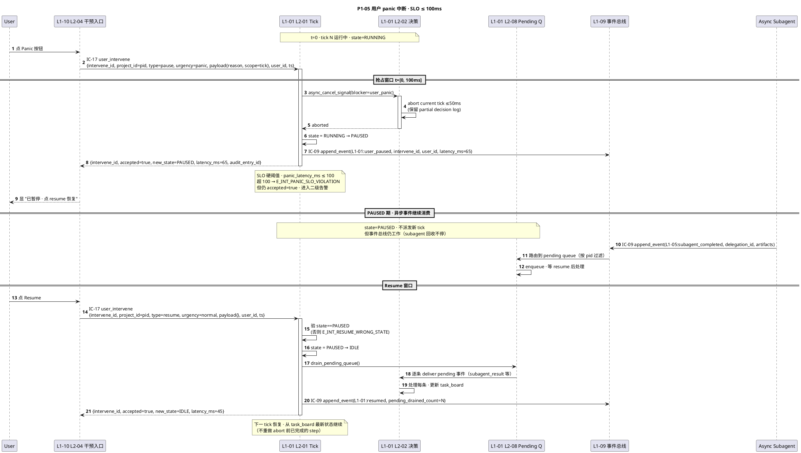

#### §3.5.5 字段示例

**IC-17 panic 入参**：

```yaml
intervene_id: int-01HXTD1...
project_id: proj-videoforge-v1-a7b3
type: pause
urgency: panic   # 硬编码 · SLO ≤100ms 触发条件
payload:
  reason: "我觉得 LLM 决策走偏了"
  scope: tick
user_id: user-zhongtianyi
ts: 2026-04-21T12:30:45.001Z
```

**IC-17 panic ack**：

```yaml
intervene_id: int-01HXTD1...
accepted: true
new_state: PAUSED
latency_ms: 65   # ≤100 · SLO 达标
audit_entry_id: aud-01HXTD1...
```

**IC-17 resume 入参**：

```yaml
intervene_id: int-01HXTD1...
project_id: proj-videoforge-v1-a7b3
type: resume
urgency: normal
payload: {}
user_id: user-zhongtianyi
ts: 2026-04-21T12:35:00.000Z
```

#### §3.5.6 SLO + 降级出口

| 维度 | 硬阈值 | 违反时行为 |
|---|---|---|
| panic_latency_ms | ≤ 100 ms（与 P1-01 halt 同级硬约束）| `E_INT_PANIC_SLO_VIOLATION` · accepted=true 仍返回 · L1-07 告警（下一 supervisor tick 分析原因）|
| PAUSED 期事件丢失率 | 0%（全入 pending queue）| 丢失即 PM-08 破 · 走 P1-04 halt |
| resume 正确 state | state ∈ {HALTED, PAUSED} | `E_INT_RESUME_WRONG_STATE` · 拒绝（防误操作）|
| user_id 有效性 | 必须注册 | `E_INT_USER_UNKNOWN` · 但 panic 紧急仍暂停（安全第一）|

**降级出口**：

- **正常路径**：PAUSED → resume → IDLE · pending queue 有序消费 · 继续 tick
- **SLO 违反**：PAUSED 仍达成（latency > 100 但 accepted=true）· 进二级告警 · 不影响用户体验
- **非法 resume**：state 不是 PAUSED · 拒绝 resume · UI 提示"当前状态不允许 resume"
- **PAUSED 长时间无 resume**：L1-07 watchdog 检测 > 24h · 推 INFO 提醒（不自动 resume · 尊重用户意图）

#### §3.5.7 错误码引用

- IC-17：`E_INT_PANIC_SLO_VIOLATION` / `E_INT_RESUME_WRONG_STATE` / `E_INT_USER_UNKNOWN` / `E_INT_TYPE_PAYLOAD_MISMATCH`（§3.17.4）
- IC-09：`E_EVT_TYPE_UNKNOWN`（若 user_paused 事件类型未注册 · 理论不可能 · 注册表必含）

---

### §3.6 · P1-06 · 崩溃后跨 session 恢复

#### §3.6.1 场景

Claude Code 异常退出（OS 崩溃 / kill -9 / 磁盘修复后重启）→ 新 session 启动 bootstrap → L1-09 L2-04 检查点恢复器读 `projects/_index.yaml` 找 status != CLOSED 的项目 → 取最近活跃 pid → 读 `checkpoints/latest.json` 得 checkpoint_seq → IC-10 `replay_from_event(from_seq=checkpoint_seq+1)` → task_board 重建 · hash chain 校验 → 若有未决 Gate · IC-16 重推卡 → UI 显 "已恢复 project X, state=S4/WP-07, 继续？" → 用户 IC-17 authorize → L1-01 接管 · tick 恢复。

#### §3.6.2 参与 L1-L2

| 层 | 组件 | 角色 |
|---|---|---|
| OS | Claude Code 启动 | bootstrap 触发 |
| L1-09 | L2-04 检查点恢复器 | 主编排 · 读 index + checkpoint + replay |
| L1-09 | L2-01 事件总线 | IC-10 replay 实现 |
| L1-02 | L2-01 阶段门控制 | 查未决 Gate · 重推 |
| L1-01 | L2-01 Tick 调度 | 接管 tick 恢复 |
| L1-10 | L2-04 用户干预入口 | 显恢复确认卡 |

#### §3.6.3 涉及 IC

- **主调**：IC-10 `replay_from_event`（L1-09 内部）· IC-16 `push_stage_gate_card`（L1-02 → L1-10）· IC-17 `user_intervene`（L1-10 → L1-01）
- **辅**：IC-09 `append_event`（≥3 次：system_resumed / task_board_rebuilt / user_resumed_session）· IC-01 `request_state_transition`（激活 pid）

#### §3.6.4 PlantUML

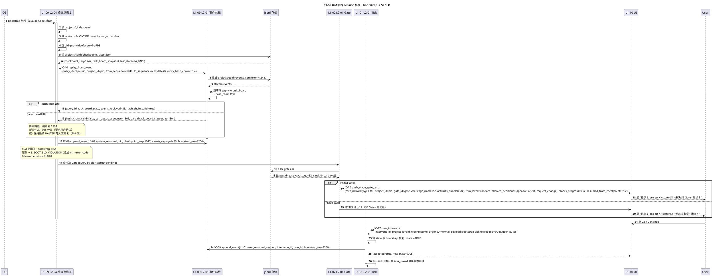

#### §3.6.5 字段示例

**IC-10 `replay_from_event_query`**：

```yaml
query_id: rep-01HXTE9...
project_id: proj-videoforge-v1-a7b3
from_sequence: 1248   # checkpoint_seq + 1
to_sequence: null     # 到最新
verify_hash_chain: true
```

**IC-10 出参**：

```yaml
query_id: rep-01HXTE9...
task_board_state:
  active_wp: wp-01HXT8K...
  state: S4_IMPL
  last_action_ts: 2026-04-21T11:58:00Z
events_replayed: 83
hash_chain_valid: true
corrupt_at_sequence: null
ts: 2026-04-21T13:00:03.200Z
```

**bootstrap 完成事件**：

```yaml
event_type: L1-09:system_resumed
payload:
  project_id: proj-videoforge-v1-a7b3
  checkpoint_seq: 1247
  events_replayed: 83
  hash_chain_valid: true
  bootstrap_ms: 3200   # ≤5000 · SLO 达标
```

#### §3.6.6 SLO + 降级出口

| 维度 | 硬阈值 | 违反时行为 |
|---|---|---|
| bootstrap 总耗时 | ≤ 5 s | 超限告警（不影响恢复正确性）· L1-07 分析（大项目 > 10k 事件会超）→ 建议增加 checkpoint 频率 |
| hash_chain_valid | true | false 时 · 进入"分叉确认"路径（要求用户 authz 截断）或保持 SYSTEM_HALTED（PM-08）|
| events.jsonl 可读 | 必 | `E_REP_STORAGE_UNAVAILABLE` · 重试 3 次 · 仍失败 · 保持 SYSTEM_HALTED |
| _index.yaml 存在 | 必 | 不存在 → 视为首次启动 · 不触发恢复 · 新 session |

**降级出口**：

- **正常路径**：hash chain 完好 → task_board 恢复 → 用户 authz → state=IDLE · 继续 tick
- **Hash 断裂子路径**：`hash_chain_valid=false` → UI 显 "hash chain 在 seq=1305 断裂 · 可选项：(A) 从 1304 截断新分叉 · (B) 保持 halted 手动修复" · 必须用户 IC-17 决定
- **无未决 Gate 简化**：`gates 表空` → 跳过 IC-16 · 直接显简化恢复卡 · 用户 resume 后进 IDLE
- **_index.yaml 损坏**：特殊 corrupted 路径 · L1-09 L2-05 崩溃安全层扫描磁盘重建 _index · 若不能 → 按每个 project 目录独立恢复（降级模式）

#### §3.6.7 错误码引用

- IC-10：`E_REP_HASH_CHAIN_BROKEN` / `E_REP_FROM_OUT_OF_RANGE` / `E_REP_STORAGE_UNAVAILABLE` / `E_REP_EVENT_SCHEMA_LEGACY`（§3.10.4）
- IC-16：`E_GATE_ARTIFACTS_EMPTY` / `E_GATE_BLOCKS_WITHOUT_DECISION`（§3.16.5）
- IC-17：`E_INT_RESUME_WRONG_STATE` / `E_INT_USER_UNKNOWN`（§3.17.4）

---

### §3.7 · P1-07 · Skill fallback 链耗尽（主 → 备 → 简化 → 硬暂停）

#### §3.7.1 场景

L1-01 主 loop 发 IC-04 `invoke_skill(capability="tdd.blueprint_generate", allow_fallback=true)` → L1-05 L2-02 意图选择器查能力抽象层得 `primary="tdd-blueprint-v2.3", fallback=["tdd-blueprint-v2.0", "tdd-simplified-v1.0"]` → L1-05 L2-03 调用执行主 skill 失败（`E_SKILL_TIMEOUT`）→ 自动尝试 fallback 1 → 仍失败（`E_SKILL_NO_CAPABILITY`）→ 尝试 fallback 2 简化版 → 失败（`E_SKILL_ALL_FALLBACK_FAIL`）→ 返回 success=false 给 L1-01 → L1-01 判断 critical path · 触发 IC-15 硬暂停等用户决策（是否放弃本 WP / 是否放宽能力要求 / 是否手动介入）。

#### §3.7.2 参与 L1-L2

| 层 | 组件 | 角色 |
|---|---|---|
| L1-01 | L2-02 决策引擎 | 发 IC-04 · 接 fallback_trace · 决定是否 halt |
| L1-05 | L2-02 意图选择器 | 查能力抽象层 · resolve primary+fallback 列表 |
| L1-05 | L2-03 调用执行器 | 依次调 primary / fallback 1 / fallback 2 |
| L1-09 | L2-01 事件总线 | skill_fail / skill_fallback_applied 事件 |
| L1-07 | L2-02 偏差判定 | 若 fallback 耗尽 · 可能触发 IC-15 |
| L1-10 | L2-04 用户干预入口 | 显决策卡 |

#### §3.7.3 涉及 IC

- **主调**：IC-04 `invoke_skill`（L1-01 → L1-05）
- **辅**：IC-09 `append_event`（≥4 次：skill_invoked / skill_fail(A) / skill_fallback_applied(B) / skill_all_fallback_fail）· IC-15 `request_hard_halt`（间接 · 若 L1-01 判 critical path）· IC-17 `user_intervene`（用户决策）

#### §3.7.4 PlantUML

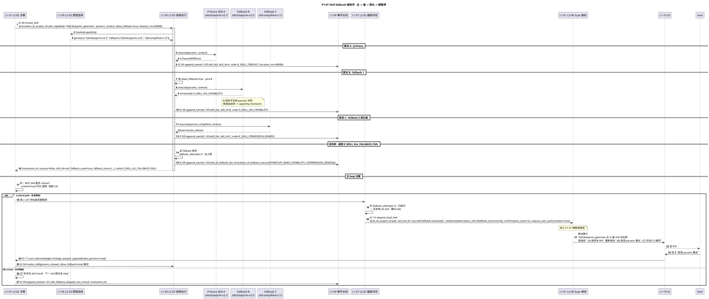

#### §3.7.5 字段示例

**IC-04 `invoke_skill_command`**：

```yaml
invocation_id: inv-01HXTF5...
project_id: proj-videoforge-v1-a7b3
capability: tdd.blueprint_generate
params:
  wp_id: wp-01HXT8K...
  ac_refs: ["ac-03", "ac-07"]
  advanced_options:
    - property_based_testing   # B 不支持 · 导致 E_SKILL_NO_CAPABILITY
context:
  project_id: proj-videoforge-v1-a7b3
  trace_id: trace-01HXTF5...
allow_fallback: true
timeout_ms: 60000
ts: 2026-04-21T14:00:00.000Z
```

**IC-04 失败 ack**：

```yaml
invocation_id: inv-01HXTF5...
success: false
skill_id: null
fallback_used: true
fallback_trace:
  - {skill_id: "tdd-blueprint-v2.3", code: E_SKILL_TIMEOUT, duration_ms: 60000}
  - {skill_id: "tdd-blueprint-v2.0", code: E_SKILL_NO_CAPABILITY, duration_ms: 320}
  - {skill_id: "tdd-simplified-v1.0", code: E_SKILL_PERMISSION_DENIED, duration_ms: 45}
code: E_SKILL_ALL_FALLBACK_FAIL
total_duration_ms: 60365
```

#### §3.7.6 SLO + 降级出口

| 维度 | 硬阈值 | 违反时行为 |
|---|---|---|
| fallback_attempts | ≤ 3（主 + 2 备）| > 3 禁止 · 超出直接 `E_SKILL_ALL_FALLBACK_FAIL` |
| 单 skill timeout_ms | 默认 60000 / 可覆写 | `E_SKILL_TIMEOUT` · 强终止 · 进 fallback |
| total_duration_ms | ≤ 3 × timeout_ms（累积）| 超限 · 进二级告警（L1-07）|
| params schema | 必符 capability 声明 | `E_SKILL_PARAMS_SCHEMA_MISMATCH` · 拒绝 · 上游补全 |

**降级出口**：

- **Primary 成功**（P0 主路径）：`success=true, fallback_used=false`
- **Fallback 1 成功**：`success=true, fallback_used=true, skill_id=B`（进二级告警 · 主 skill 降级通知运维）
- **Fallback 2 成功**：`success=true, simplified=true`（质量可能下降 · 标记 quality_warning 到事件）
- **全 fallback 耗尽 · critical path**：进入 P1-01 hard halt 路径 · 等用户决策（放弃 WP / 放宽 params / 手动介入）
- **全 fallback 耗尽 · 非 critical**：跳过本 step · 事件留痕 · 下一 tick 继续（某些可选能力如"文档自动修订"非 critical）

#### §3.7.7 错误码引用

- IC-04：`E_SKILL_TIMEOUT` / `E_SKILL_NO_CAPABILITY` / `E_SKILL_ALL_FALLBACK_FAIL` / `E_SKILL_PERMISSION_DENIED` / `E_SKILL_PARAMS_SCHEMA_MISMATCH`（§3.4.4）
- IC-15：`E_HALT_NO_CONFIRMATION`（若未达 confirmation_count=2 · L1-07 必须双重确认才可 halt）

---

### §3.8 · P1-08 · 任务链同级 FAIL 3 次回退 + 升级

#### §3.8.1 场景

WP-07 的 S5 verifier 返回 `verdict=FAIL_L2`（中度）→ L1-04 L2-07 回退路由回 S4 重做 → S4 IMPL 完成 → S5 再次 verifier FAIL_L2 → 再回 S4 → 第 3 次 FAIL_L2 时 `level_count=3` → 触发 BF-E-10 同级升级 → L1-07 L2-06 死循环升级器触发：自动升级一级（FAIL_L2 → FAIL_L3 / target_stage S4 → S2）· 并行 L1-04 独立升级判定（双重保险）· 结果一致则 apply · 不一致取更严 → IC-01 request_state_transition(S5 → S2) → 触发 S2 Gate（新 bundle 含 3 次 FAIL timeline）→ 用户决策。

#### §3.8.2 参与 L1-L2

| 层 | 组件 | 角色 |
|---|---|---|
| L1-04 | L2-06 Verifier 编排 + L2-07 回退路由 | 发 IC-20 · 收 verdict · 计同级 count |
| L1-07 | L2-06 死循环升级器 | 独立判定 level_count ≥ 3 · 双重保险 |
| L1-07 | L2-04 Supv 发送器 | 发 IC-14 升级 route |
| L1-01 | L2-06 Supv 接收 | 收 IC-14 · 触发 IC-01 state 转换 |
| L1-02 | L2-01 Gate | 推 S2 Gate（新 bundle）|
| L1-09 | L2-01 事件总线 | 所有 rollback/escalate 事件落盘 |

#### §3.8.3 涉及 IC

- **主调**：IC-14 `push_rollback_route`（首 2 次 target=S4, level_count=1/2; 第 3 次 target=S2, level_count=3, escalated=true）
- **辅**：IC-09 `append_event` · IC-01 `request_state_transition` · IC-20 `delegate_verifier`（每轮重新跑）· IC-16 `push_stage_gate_card`

#### §3.8.4 PlantUML

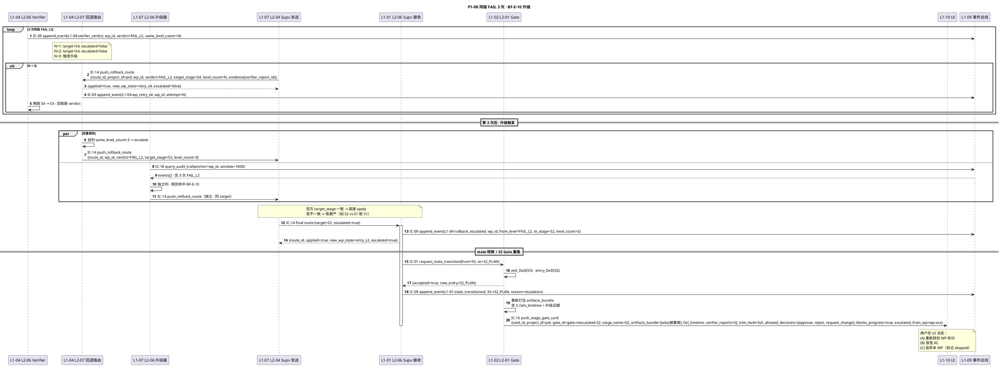

#### §3.8.5 字段示例

**第 3 次 IC-14（升级路由）入参**：

```yaml
route_id: route-01HXTG7...
project_id: proj-videoforge-v1-a7b3
wp_id: wp-01HXT8K...
verdict: FAIL_L2
target_stage: S2  # 升级后 · 原本 S4
level_count: 3    # 触发 BF-E-10
evidence:
  verifier_report_id: vr-01HXTG7...
  decision_id: dec-01HXTG7...
ts: 2026-04-21T15:30:00.000Z
```

**IC-14 ack（升级后）**：

```yaml
route_id: route-01HXTG7...
applied: true
new_wp_state: retry_s2
escalated: true   # BF-E-10 升级标记 · true 则必进 Gate（不允许 auto-retry）
```

**升级事件（IC-09）**：

```yaml
event_type: L1-04:rollback_escalated
payload:
  wp_id: wp-01HXT8K...
  from_level: FAIL_L2
  to_stage: S2
  level_count: 3
  trigger: BF-E-10
  dual_check:
    l1_04_self: {target_stage: S2, escalated: true}
    l1_07_independent: {target_stage: S2, escalated: true}
    final: S2   # 一致
```

#### §3.8.6 SLO + 降级出口

| 维度 | 硬阈值 | 违反时行为 |
|---|---|---|
| same_level_fail_count | ≤ 3 | > 3 禁止 · 第 3 次必升级（不允许 4+ 次同级重试）|
| 双重保险一致性 | L1-04 + L1-07 target_stage 相同 | 不一致 · 取更严级别（如 S2 vs S1 → S1）|
| Escalated=true 强制 Gate | 必进人工 Gate | 不允许 auto-retry · 必须 IC-16 推卡等用户决策 |
| 升级链长度 | 同项目累计 ≤ 4（L1→L2→L3→L4）| L4 再 3 次 FAIL → `state=FAILED_TERMINAL` · S7 失败闭环（走 archive + retro 给 global KB）|

**降级出口**：

- **< 3 次重试**：`target_stage=S4, escalated=false`（自治 retry 允许 · 无需人工）
- **= 3 次升级**：`target_stage=S2, escalated=true` · 必进人工 Gate · 用户可 approve(继续一轮) / reject(放弃 WP) / request_change(改 AC/WBS)
- **升级后仍 3 次 FAIL**：递归升级 · S2 → S1 → UPGRADE_TO_L1-01 → 若再 3 次 → `state=FAILED_TERMINAL`（P1-03 极端终态）
- **用户 reject 放弃本 WP**：WP 标 `status=skipped` · 依赖闭包 WP 也标 skipped · 继续其他 WP（影响范围由 L1-03 L2-04 依赖分析给）

#### §3.8.7 错误码引用

- IC-14：`E_ROUTE_WP_NOT_FOUND` / `E_ROUTE_VERDICT_TARGET_MISMATCH` / `E_ROUTE_WP_ALREADY_DONE`（§3.14.4）
- IC-01：`E_TRANS_NO_PROJECT_ID` / `E_TRANS_ILLEGAL_STATE` / `E_TRANS_DOD_NOT_MET`（§3.1.4）
- IC-20：`E_VER_TIMEOUT` / `E_VER_EVIDENCE_INCOMPLETE`（§3.20.4）

---

### §3.9 · P1-09 · KB 服务降级返回空 + degraded

#### §3.9.1 场景

L1-01 阶段切换 hook 触发 KB 注入（S1→S2 · IC-06 `kb_read(kind=recipe,scope=[project,global])`）→ L1-06 L2-02 KB 读取服务不可达（索引文件损坏 / 嵌入服务宕机 / rerank 依赖挂）→ 返回 `E_KB_SERVICE_UNAVAILABLE` → L1-06 兜底策略 · 不 halt · 返回 `entries=[], degraded=true` + 告警 L1-07 → L1-01 继续决策（带 `kb_context_empty` 标记）→ 同时 L1-07 推 IC-13 WARN 提示运维修 KB → 服务恢复后 L1-01 下一 tick 重试成功 · degraded 清除。

#### §3.9.2 参与 L1-L2

| 层 | 组件 | 角色 |
|---|---|---|
| L1-01 | L2-02 决策引擎 | 发 IC-06 · 接 degraded · 降级决策 |
| L1-06 | L2-02 KB 读服务 + L2-05 检索 Rerank | 服务不可达时兜底返 degraded |
| L1-07 | L2-02 偏差判定 + L2-04 发送器 | IC-13 WARN 告警 |
| L1-09 | L2-01 事件总线 | kb_degraded / kb_recovered 事件 |

#### §3.9.3 涉及 IC

- **主调**：IC-06 `kb_read`
- **辅**：IC-09 `append_event`（≥2 次：kb_degraded / kb_recovered）· IC-13 `push_suggestion`（WARN · 通知运维）

#### §3.9.4 PlantUML

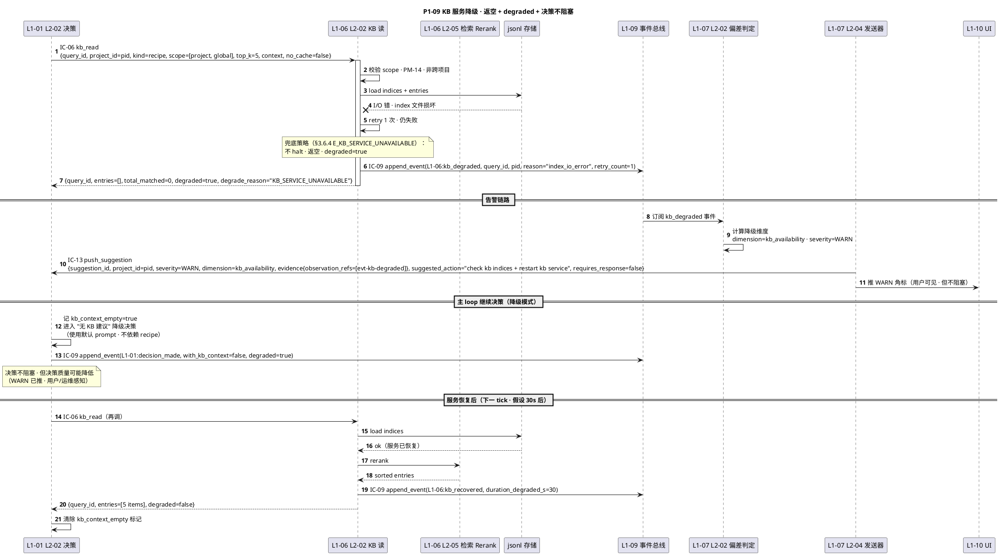

#### §3.9.5 字段示例

**IC-06 降级出参**：

```yaml
query_id: kqr-01HXTH2...
entries: []
total_matched: 0
degraded: true
degrade_reason: KB_SERVICE_UNAVAILABLE
ts: 2026-04-21T16:00:00.000Z
```

**kb_degraded 事件**：

```yaml
event_type: L1-06:kb_degraded
payload:
  query_id: kqr-01HXTH2...
  project_id: proj-videoforge-v1-a7b3
  reason: "index_io_error"
  retry_count: 1
  fallback_strategy: "return_empty_with_degraded_flag"
```

**IC-13 WARN（通知运维）**：

```yaml
suggestion_id: sugg-01HXTH2...
project_id: proj-videoforge-v1-a7b3
severity: WARN
dimension: kb_availability
evidence:
  observation_refs: ["evt-kb-degraded-01HXTH2..."]
  computed_score: 0.0   # KB 可用性得分
suggested_action: "check kb indices + restart kb service"
requires_response: false  # 运维告警 · 不阻塞主 loop
ts: 2026-04-21T16:00:01.000Z
```

#### §3.9.6 SLO + 降级出口

| 维度 | 硬阈值 | 违反时行为 |
|---|---|---|
| KB 读服务可用率 | 目标 99% · 实际未达不 halt | `E_KB_SERVICE_UNAVAILABLE` · 返回 degraded=true · 决策不阻塞 |
| degraded 持续时长 | 目标 < 60s（运维 SLA）| 超 60s 未恢复 · L1-07 升 WARN 为 WARN_PROLONGED · 用户可见 |
| scope 跨 project 违规 | 禁止（除 global）| `E_KB_CROSS_PROJECT_READ` · 拒绝 + 告警（严重 · 可能是 bug）|
| rerank 失败降级 | entries 原序 + degraded=true | `E_KB_RERANK_FAIL` · 不 halt · 返回未 rerank 结果 |

**降级出口**：

- **正常路径**：`degraded=false, entries=[top_k items]`
- **KB 服务短暂不可达**（本 P1 主分支）：`entries=[], degraded=true, degrade_reason=KB_SERVICE_UNAVAILABLE` · 主 loop 继续决策（降级模式）· 下一 tick 自动重试
- **Rerank 失败**：`entries=[raw_entries], degraded=true, degrade_reason=RERANK_FAIL` · entries 仍返回但未 rerank
- **跨项目读违规**：`E_KB_CROSS_PROJECT_READ` → 拒绝 · 返 err · 告警 L1-07（bug 调查触发）
- **持续不可达（> 1h）**：L1-07 升级建议到 INFO_OPERATIONAL（给项目所有者邮件 · 若配置）· 项目继续（无 KB 增强）

#### §3.9.7 错误码引用

- IC-06：`E_KB_NO_PROJECT_ID` / `E_KB_CROSS_PROJECT_READ` / `E_KB_KIND_UNKNOWN` / `E_KB_SERVICE_UNAVAILABLE` / `E_KB_RERANK_FAIL`（§3.6.4）
- IC-13：`E_SUGG_EVIDENCE_EMPTY`（若 observation_refs 空 · 理论不可能 · degraded 事件本身是 observation）

---

### §3.10 · P1-10 · 事件总线锁超时 + 重试

#### §3.10.1 场景

两个并发调用方（如 L1-05 subagent 完成回推 + L1-07 supervisor 同时扫描写告警）同时发 IC-09 `append_event` → L1-09 L2-02 锁管理器 acquire_lock(ttl=5s) → 第一个获锁 · 第二个等待 → 第一个写盘过程中 · 磁盘 I/O 慢 → 持锁 > 5s · 锁 TTL 过期 → 第二个获锁开始写 → 第一个写完释放锁失败（已过期）→ 第三个（晚到）发现 hash chain 断（expected prev_hash != actual current tip · 因为第二个已写入）→ 返回 `E_EVT_HASH_CHAIN_BROKEN` → 内部重查 tip 后重试 1 次 · 成功 · 若 retry 仍失败 · 不 halt（并发 race · 非 PM-08 破坏）· 仅告警 L1-07。

#### §3.10.2 参与 L1-L2

| 层 | 组件 | 角色 |
|---|---|---|
| L1-09 | L2-01 事件总线核心 | 接 IC-09 · 计算 new_hash · 写盘 |
| L1-09 | L2-02 锁管理器 | acquire/release lock · TTL 5s |
| L1-09 | L2-05 崩溃安全层 | 重试机制 |
| L1-07 | L2-02 偏差判定 | hash 断裂告警（非 halt）|
| 并发调用方 | 多 L1 | L1-05 / L1-07 / L1-01 等 |

#### §3.10.3 涉及 IC

- **主调**：IC-09 `append_event`（多并发）
- **辅**：IC-13 `push_suggestion`（告警 · 非阻塞）

#### §3.10.4 PlantUML

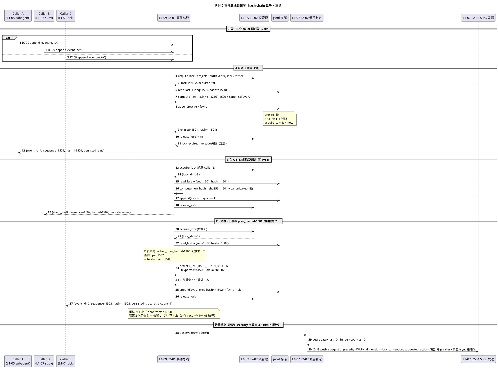

#### §3.10.5 字段示例

**IC-09 重试出参**：

```yaml
event_id: evt-C-01HXTJ5...
sequence: 1503
hash: h1503
prev_hash: h1502
persisted: true
ts_persisted: 2026-04-21T17:00:05.123Z
storage_path: "projects/proj-videoforge-v1-a7b3/events.jsonl"
retry_count: 1   # 内部重试次数（≤1 · §3.9.4 约束）
```

**Hash 断裂告警事件**：

```yaml
event_type: L1-09:hash_chain_retry
payload:
  event_id: evt-C-01HXTJ5...
  expected_prev_hash: h1500  # caller 缓存的旧 tip
  actual_prev_hash: h1502    # 实际最新 tip
  retry_count: 1
  succeeded: true
```

**L1-07 WARN（若 10 min 累计 ≥ 10 次）**：

```yaml
suggestion_id: sugg-01HXTJ5...
project_id: proj-videoforge-v1-a7b3
severity: WARN
dimension: lock_contention
evidence:
  observation_refs: ["evt-hash-retry-1", "...", "evt-hash-retry-10"]
  computed_score: 0.4   # 并发健康度
suggested_action: "减少并发 caller / 调整 fsync 策略 / 检查磁盘 I/O 延迟"
requires_response: false
ts: 2026-04-21T17:10:00.000Z
```

#### §3.10.6 SLO + 降级出口

| 维度 | 硬阈值 | 违反时行为 |
|---|---|---|
| lock TTL | 5 s | 超 5s 持锁 · 锁自动过期 · release 失败但无害 |
| hash retry 次数 | ≤ 1 | retry 仍失败 · 告警 L1-07 · 不 halt（非 PM-08 破坏 · 只是并发 race）|
| 10min 累计 retry | ≤ 10 | 超 10 次 · L1-07 推 WARN 运维（可能 fsync 延迟异常）|
| event_id 幂等 | 同 event_id 重复写返回已有 | `E_EVT_TYPE_UNKNOWN`（若事件类型未注册 · 不同异常）|

**降级出口**：

- **正常路径**：获锁 → 写盘 → 释放 · `persisted=true, retry_count=0`
- **锁 TTL 过期 + 竞态**：内部重查 tip + 重试 1 次 · 成功 · `retry_count=1` · 无感知
- **Retry 失败**：`persisted=false, code=E_EVT_HASH_CHAIN_BROKEN` · 调用方决定（重新组 evt · 再调 IC-09）· 不 halt
- **磁盘 I/O 异常高**：10 min retry ≥ 10 次 · L1-07 WARN · 运维介入查 disk latency
- **真正 fsync 失败**：走 P1-04（不同路径 · PM-08 破坏 → 全系统 halt）

#### §3.10.7 错误码引用

- IC-09：`E_EVT_HASH_CHAIN_BROKEN` / `E_EVT_FSYNC_FAIL`（§3.9.4 · 后者走 P1-04）
- IC-13：`E_SUGG_EVIDENCE_EMPTY` / `E_SUGG_SEVERITY_UNKNOWN`（§3.13.4）

---

## §4 P1 失败恢复树（PlantUML 全景图）

> 把 10 条 P1 流按"错误源 → 分类 → 降级路径 → 最终落点"在**一张 PlantUML 活动图**里排出——这是 4-operations 故障手册的根视图。

```plantuml
@startuml
title HarnessFlow · P1 失败恢复树 · 错误源 → 降级路径 → 最终落点
skinparam activity {
  BackgroundColor<<Red>>    #FFE0E0
  BackgroundColor<<Yellow>> #FFF4C0
  BackgroundColor<<Green>>  #C0F0C0
  BackgroundColor<<Blue>>   #C0D8F0
}

start
:HarnessFlow 系统运行中;

if (异常来源？) then (红线/安全)
  :L1-07 L2-03 识别<<Red>>;
  :IC-15 request_hard_halt<<Red>>;
  if (halt_latency_ms ≤ 100?) then (yes)
    :state=HALTED · 等用户 authz<<Yellow>>;
  else (no)
    :E_HALT_SLO_VIOLATION<<Red>>;
    :仍 HALTED · L1-07 二级告警<<Yellow>>;
  endif
  if (用户决策？) then (authorize)
    :state=RUNNING · 继续<<Green>>;
    stop
  else (reject)
    :保持 HALTED · 等下一 IC-17<<Yellow>>;
    stop
  endif

elseif (异常来源？) then (监控/时间 watchdog)
  :L1-07 L2-05 soft-drift<<Yellow>>;
  :IC-13 push_suggestion WARN<<Yellow>>;
  if (主 loop 60s 内回应?) then (yes)
    if (采纳?) then (yes)
      :revise plan · 继续<<Green>>;
      stop
    else (驳回+理由)
      :事件落盘 · 连续 3 次驳回升级<<Yellow>>;
      stop
    endif
  else (no · 60s 超时)
    :升级到 BLOCK · 走红线分支<<Red>>;
    stop
  endif

elseif (异常来源？) then (Verifier FAIL_L4)
  :IC-20 verdict=FAIL_L4<<Red>>;
  if (level_count ≥ 3?) then (yes · BF-E-10)
    :IC-14 target=UPGRADE_TO_L1-01 · escalated=true<<Red>>;
    :L1-07 双重保险判定<<Yellow>>;
    :IC-16 推 Gate 人工决策<<Blue>>;
    if (用户决策?) then (重锚 goal)
      :state=S1_CLARIFY · goal_anchor 换<<Green>>;
      stop
    elseif (再给一轮) then
      :level_count 重置 · 回 S3<<Yellow>>;
      stop
    else (放弃项目)
      :state=FAILED_TERMINAL · S7 失败归档<<Red>>;
      stop
    endif
  else (< 3)
    :IC-14 target=S3 / S2 · 自治重试<<Yellow>>;
    stop
  endif

elseif (异常来源？) then (磁盘/fsync)
  :IC-09 fsync 失败<<Red>>;
  if (errno?) then (ENOSPC/EIO/EROFS)
    :E_EVT_FSYNC_FAIL / E_EVT_DISK_FULL<<Red>>;
    :PM-08 不可破 · 全系统 halt<<Red>>;
    :state=SYSTEM_HALTED<<Red>>;
    :UI 推诊断 · 用户修磁盘/权限<<Blue>>;
    :重启 Claude Code<<Blue>>;
    :走 P1-06 bootstrap<<Green>>;
    stop
  else (其他)
    :E_EVT_HASH_CHAIN_BROKEN<<Yellow>>;
    :内部重试 1 次 · 不 halt<<Yellow>>;
    stop
  endif

elseif (异常来源？) then (用户 panic)
  :IC-17 type=pause urgency=panic<<Blue>>;
  if (panic_latency_ms ≤ 100?) then (yes)
    :state=PAUSED<<Yellow>>;
  else (no)
    :E_INT_PANIC_SLO_VIOLATION<<Yellow>>;
    :仍 PAUSED · L1-07 告警<<Yellow>>;
  endif
  :PAUSED 期 · pending queue 缓冲异步事件<<Yellow>>;
  if (用户 resume?) then (yes)
    :drain pending queue<<Green>>;
    :state=IDLE · 继续 tick<<Green>>;
    stop
  else (长时间无 resume)
    :L1-07 watchdog INFO 提醒 · 不强制<<Yellow>>;
    stop
  endif

elseif (异常来源？) then (崩溃/重启)
  :bootstrap 触发<<Blue>>;
  :读 _index.yaml · 找未 CLOSED project<<Blue>>;
  :IC-10 replay_from_event(from=checkpoint_seq+1)<<Blue>>;
  if (hash_chain_valid?) then (yes)
    :task_board 恢复 · bootstrap_ms ≤ 5s<<Green>>;
    if (有未决 Gate?) then (yes)
      :IC-16 重推卡<<Blue>>;
    endif
    :IC-17 user resume<<Blue>>;
    :state=IDLE · 继续<<Green>>;
    stop
  else (hash chain 断)
    :corrupt_at_sequence=K · 降级决策<<Red>>;
    if (用户决策?) then (截断分叉)
      :state=IDLE(fork) · 继续<<Yellow>>;
      stop
    else (保持 halt 手动修)
      :state=SYSTEM_HALTED · 等待<<Red>>;
      stop
    endif
  endif

elseif (异常来源？) then (Skill fallback)
  :IC-04 invoke_skill<<Blue>>;
  if (primary 成功?) then (yes)
    :P0 正常路径<<Green>>;
    stop
  else (E_SKILL_TIMEOUT / ...)
    :尝试 fallback 1<<Yellow>>;
    if (fallback 1 成功?) then (yes)
      :fallback_used=true<<Yellow>>;
      stop
    else (失败)
      :尝试 fallback 2 简化版<<Yellow>>;
      if (fallback 2 成功?) then (yes)
        :simplified=true<<Yellow>>;
        stop
      else (全失败)
        :E_SKILL_ALL_FALLBACK_FAIL<<Red>>;
        if (critical path?) then (yes)
          :IC-15 hard_halt · 走红线分支<<Red>>;
          stop
        else (no)
          :跳过 · 下 tick 继续<<Yellow>>;
          stop
        endif
      endif
    endif
  endif

elseif (异常来源？) then (同级 FAIL 3 次)
  :同级 FAIL count<<Yellow>>;
  if (count < 3?) then (yes)
    :IC-14 target=S4 · 自治重试<<Yellow>>;
    stop
  else (= 3 · BF-E-10)
    :IC-14 target=S2 · escalated=true<<Red>>;
    :IC-16 Gate 人工决策<<Blue>>;
    if (用户决策?) then (approve · 再来一轮)
      :level_count 重置<<Green>>;
      stop
    elseif (request_change) then
      :改 AC/WBS · 回 S2<<Yellow>>;
      stop
    else (reject · 放弃 WP)
      :wp.status=skipped · 继续其他 WP<<Yellow>>;
      stop
    endif
  endif

elseif (异常来源？) then (KB 服务降级)
  :IC-06 kb_read<<Blue>>;
  if (service 可达?) then (yes)
    :entries · P0 路径<<Green>>;
    stop
  else (E_KB_SERVICE_UNAVAILABLE)
    :兜底 · entries=[] · degraded=true<<Yellow>>;
    :IC-13 WARN 通知运维<<Yellow>>;
    :主 loop 继续决策（无 KB 增强）<<Yellow>>;
    :下 tick 自动重试<<Green>>;
    stop
  endif

elseif (异常来源？) then (事件锁超时)
  :并发 IC-09 append_event<<Blue>>;
  :acquire_lock TTL=5s<<Blue>>;
  if (hash chain 匹配?) then (yes)
    :append + fsync<<Green>>;
    stop
  else (E_EVT_HASH_CHAIN_BROKEN)
    :内部重试 1 次 · 重读 tip<<Yellow>>;
    if (retry 成功?) then (yes)
      :retry_count=1 · 无感<<Green>>;
      stop
    else (retry 失败)
      :L1-07 告警（非 halt · 并发 race）<<Yellow>>;
      stop
    endif
  endif

endif
@enduml
```

> **图读法**：
> - **红色<<Red>>** = 错误 / halt 态；**黄色<<Yellow>>** = 降级态 / 告警态；**绿色<<Green>>** = 恢复成功；**蓝色<<Blue>>** = 用户决策节点 / 系统入口
> - **分支终点** = 必为 {HALTED, PAUSED, IDLE(resumed), degraded 继续, skipped, FAILED_TERMINAL, SYSTEM_HALTED} 其中之一

---

## §5 P1 × IC × 错误码追溯矩阵

> 全量追溯：每条 P1 引用的每个错误码都能回溯到 `ic-contracts.md` 原表。

### 5.1 P1 × IC 覆盖矩阵

| P1 | IC-01 | IC-04 | IC-06 | IC-09 | IC-10 | IC-13 | IC-14 | IC-15 | IC-16 | IC-17 | IC-18 | IC-20 |
|---|---|---|---|---|---|---|---|---|---|---|---|---|
| P1-01 硬红线 |   |   |   | 主 |   |   |   | 主 |   | 主 |   |   |
| P1-02 watchdog |   |   |   | 主 |   | 主 |   |   |   |   | 辅 |   |
| P1-03 FAIL_L4 | 主 |   |   | 主 |   |   | 主 |   | 主 | 主 | 辅 | 主 |
| P1-04 fsync halt |   |   |   | 主 | 辅 |   |   | 主 |   |   |   |   |
| P1-05 panic |   |   |   | 主 |   |   |   |   |   | 主 |   |   |
| P1-06 bootstrap | 辅 |   |   | 主 | 主 |   |   |   | 主 | 主 |   |   |
| P1-07 skill fallback |   | 主 |   | 主 |   |   |   | 辅 |   | 辅 |   |   |
| P1-08 同级 3 次升级 | 主 |   |   | 主 |   |   | 主 |   | 主 |   | 辅 | 辅 |
| P1-09 KB 降级 |   |   | 主 | 主 |   | 主 |   |   |   |   |   |   |
| P1-10 锁超时 |   |   |   | 主 |   | 辅 |   |   |   |   |   |   |

> 主 = 流程主干调用 · 辅 = 流程辅助/审计调用

### 5.2 错误码引用全表（30 条 · 按 P1 分布）

| P1 | 错误码 | 来源章节 | 触发条件 |
|---|---|---|---|
| P1-01 | `E_HALT_NO_PROJECT_ID` | §3.15.4 | halt 无 project_id |
| P1-01 | `E_HALT_NO_EVIDENCE` | §3.15.4 | evidence.observation_refs 空 |
| P1-01 | `E_HALT_NO_CONFIRMATION` | §3.15.4 | confirmation_count < 2 |
| P1-01 | `E_HALT_SLO_VIOLATION` | §3.15.4 | halt_latency_ms > 100 |
| P1-01 | `E_HALT_ALREADY_HALTED` | §3.15.4 | state 已 HALTED |
| P1-01 | `E_INT_RESUME_WRONG_STATE` | §3.17.4 | state 不是 HALTED/PAUSED 发 authorize |
| P1-02 | `E_SUGG_NO_PROJECT_ID` | §3.13.4 | WARN 无 pid |
| P1-02 | `E_SUGG_SEVERITY_UNKNOWN` | §3.13.4 | severity 非法 |
| P1-02 | `E_AUDIT_ANCHOR_UNKNOWN` | §3.18.4 | watchdog 错配 pid 查询 |
| P1-03 | `E_VER_TIMEOUT` | §3.20.4 | verifier > 1200s |
| P1-03 | `E_VER_EVIDENCE_INCOMPLETE` | §3.20.4 | 三段证据缺任一 |
| P1-03 | `E_VER_MUST_BE_INDEPENDENT_SESSION` | §3.20.4 | 误在主 session 跑 verifier |
| P1-03 | `E_ROUTE_VERDICT_TARGET_MISMATCH` | §3.14.4 | verdict/target_stage 非法映射 |
| P1-03 | `E_ROUTE_WP_NOT_FOUND` | §3.14.4 | wp_id 不在拓扑 |
| P1-04 | `E_EVT_FSYNC_FAIL` | §3.9.4 | fsync syscall 失败 |
| P1-04 | `E_EVT_DISK_FULL` | §3.9.4 | errno=ENOSPC |
| P1-04 | `E_EVT_HASH_CHAIN_BROKEN` | §3.9.4 | prev_hash 不匹配 |
| P1-04 | `E_REP_HASH_CHAIN_BROKEN` | §3.10.4 | replay 时断裂 |
| P1-05 | `E_INT_PANIC_SLO_VIOLATION` | §3.17.4 | panic latency > 100ms |
| P1-05 | `E_INT_RESUME_WRONG_STATE` | §3.17.4 | resume 时 state 不对 |
| P1-05 | `E_INT_USER_UNKNOWN` | §3.17.4 | user_id 未注册 |
| P1-06 | `E_REP_FROM_OUT_OF_RANGE` | §3.10.4 | from_seq 超界 |
| P1-06 | `E_REP_STORAGE_UNAVAILABLE` | §3.10.4 | jsonl 读失败 |
| P1-06 | `E_REP_EVENT_SCHEMA_LEGACY` | §3.10.4 | 事件 schema 过时 |
| P1-06 | `E_GATE_ARTIFACTS_EMPTY` | §3.16.5 | 恢复推卡 · artifacts 缺 |
| P1-07 | `E_SKILL_TIMEOUT` | §3.4.4 | skill > timeout_ms |
| P1-07 | `E_SKILL_NO_CAPABILITY` | §3.4.4 | capability 不支持 |
| P1-07 | `E_SKILL_PERMISSION_DENIED` | §3.4.4 | 工具权限未授予 |
| P1-07 | `E_SKILL_ALL_FALLBACK_FAIL` | §3.4.4 | 主 + 全备失败 |
| P1-08 | `E_ROUTE_WP_ALREADY_DONE` | §3.14.4 | 路由已 done wp（race）|
| P1-08 | `E_TRANS_ILLEGAL_STATE` | §3.1.4 | 升级 state 转换非法 |
| P1-09 | `E_KB_SERVICE_UNAVAILABLE` | §3.6.4 | KB 服务不可达 |
| P1-09 | `E_KB_RERANK_FAIL` | §3.6.4 | rerank 算失败 |
| P1-09 | `E_KB_CROSS_PROJECT_READ` | §3.6.4 | scope 跨项目 |
| P1-10 | `E_EVT_HASH_CHAIN_BROKEN` | §3.9.4 | 并发 race 断链 |

> 共 **34 条** · 跨 9 个 IC · 全部指向 `ic-contracts.md §3.N.4` 表内已定义条目 · 无自造。

---

## §6 SLO 硬阈值汇总表

> 所有 P1 流涉及的 SLO 硬阈值统一汇总——这是 3-2 TDD 集成测试 + 4-operations 故障手册的硬验收清单。

| P1 | 指标 | 阈值 | 违反时行为 | 测试断言 |
|---|---|---|---|---|
| P1-01 | halt_latency_ms | ≤ 100 | E_HALT_SLO_VIOLATION · 仍 halted=true · 告警 | `assert ack.halt_latency_ms <= 100` |
| P1-01 | confirmation_count | ≥ 2 | E_HALT_NO_CONFIRMATION · 拒绝 halt | `assert req.evidence.confirmation_count >= 2` |
| P1-02 | watchdog_tick_interval | 30 s | tick 跳跃 · supervisor_audit 留痕 | `assert abs(tick_gap - 30) < 2` |
| P1-02 | WARN response_deadline | 60 s | 升级 BLOCK · 走 P1-01 | `assert time_to_response < 60` |
| P1-02 | 同 dim 连续驳回 | ≤ 3 | 第 3 次升级 BLOCK | `assert rejected_count_same_dim < 3` |
| P1-03 | verifier timeout_s | ≤ 1200 | E_VER_TIMEOUT · FAIL_L4 + partial | `assert verdict_duration_ms <= 1200000` |
| P1-03 | level_count 升级 | ≥ 3 自动 escalated | Gate 必推（不 auto-retry）| `assert (level_count>=3) -> ack.escalated==true` |
| P1-04 | fsync 成功率 | 100% PM-08 | 任一失败全系统 halt | `assert all_events.persisted == true` |
| P1-05 | panic_latency_ms | ≤ 100 | E_INT_PANIC_SLO_VIOLATION · 仍 PAUSED | `assert ack.latency_ms <= 100` |
| P1-05 | PAUSED 期事件丢失率 | 0% | 丢失即 PM-08 破 · 走 P1-04 | `assert pending_drained == received_while_paused` |
| P1-06 | bootstrap 耗时 | ≤ 5 s | 告警 · 不影响正确性 | `assert event.bootstrap_ms <= 5000` |
| P1-06 | hash_chain_valid | true | false 走分叉/halt 降级 | `assert reply.hash_chain_valid == true` |
| P1-07 | fallback_attempts | ≤ 3（主+2 备）| > 3 禁止 · 直接 ALL_FALLBACK_FAIL | `assert len(ack.fallback_trace) <= 3` |
| P1-07 | single skill timeout_ms | ≤ 60000（默认）| E_SKILL_TIMEOUT · 进 fallback | `assert per_skill_duration_ms <= 60000` |
| P1-08 | same_level_fail_count | ≤ 3 | 第 3 次必升级 | `assert (level_count==3) -> escalated==true` |
| P1-08 | 升级链长度 | ≤ 4（L1→L2→L3→L4）| L4 后 3 次 → FAILED_TERMINAL | `assert depth_of_escalation <= 4` |
| P1-09 | KB 读服务可用率 | 目标 99% | E_KB_SERVICE_UNAVAILABLE · 降级不 halt | `assert (unavailable) -> ack.degraded==true` |
| P1-09 | degraded 持续 | < 60 s 理想 | > 60s L1-07 升 WARN_PROLONGED | `assert degraded_window_s <= 60` |
| P1-10 | lock TTL | 5 s | 超时自动过期 · release 失败无害 | `assert lock_acquired_within_ttl` |
| P1-10 | hash retry | ≤ 1 | 仍失败告警 · 不 halt | `assert ack.retry_count <= 1` |
| P1-10 | 10min 累计 retry | ≤ 10 | 超限 L1-07 WARN lock_contention | `assert retry_count_10min <= 10` |

> 共 **21 条 SLO 断言** · 3-2 TDD 集成测试文件将**每条生成至少 1 个 pytest** · 4-operations 故障手册按 P1-XX 组织故障编号。

---

## §7 与 p0-seq.md 的耦合点（姊妹文档路由）

| P1 流 | 走到出口后路由回 p0-seq.md 的哪条 P0？ |
|---|---|
| P1-01 硬红线 HALTED → authz | 回 P0-03 Quality Loop / P0-04 Gate（取决于 halt 时所处阶段）|
| P1-02 watchdog WARN 采纳 | 回 P0-03 （replan 后继续 Quality Loop）|
| P1-03 FAIL_L4 重锚 | 回 P0-01（S1 启动链，含 pid 延续）|
| P1-04 fsync halt 恢复后 | 走 P1-06 → 再回 P0-02 主流程（任何原阶段）|
| P1-05 panic resume | 回 P0-07 resume 路径（本身 P0 的镜像）|
| P1-06 bootstrap 完成 | 回 P0-02 主流程或 P0-04 Gate（若恢复的是未决 Gate）|
| P1-07 skill fallback 成功 | 回原 caller 的 P0 流（P0-01/03/06 之一）|
| P1-08 升级 Gate 决策 | 回 P0-04 Gate 流程（新 bundle）|
| P1-09 KB degraded 恢复 | 回原 tick 所在 P0 流（无状态切换）|
| P1-10 锁重试成功 | 回原 caller P0 流（无感知）|

> **原则**：P1 是 P0 的"异常补集"——处理完一定回归某条 P0 主路径。本文档画到"回归点"即止，后续由 p0-seq.md 接续。

---

**（文档结束）**
