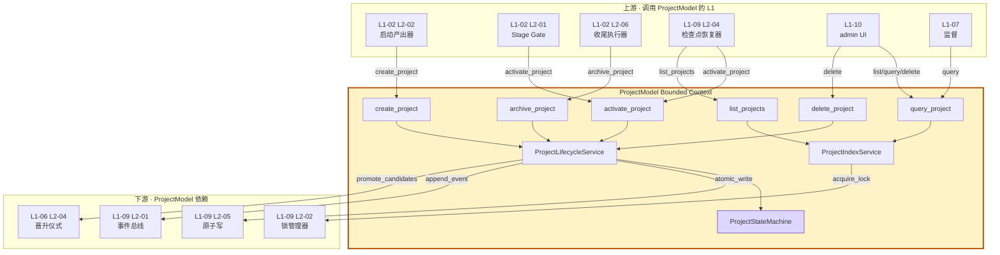
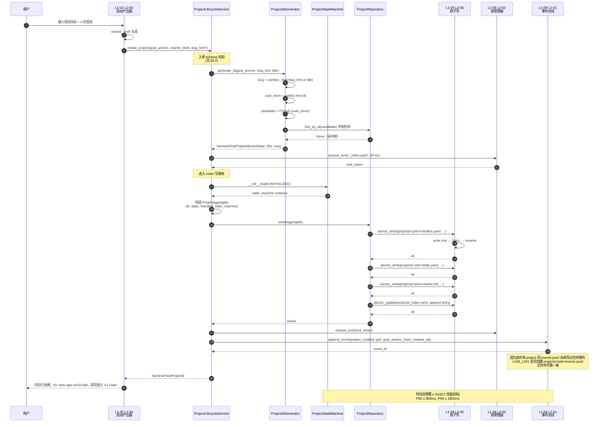
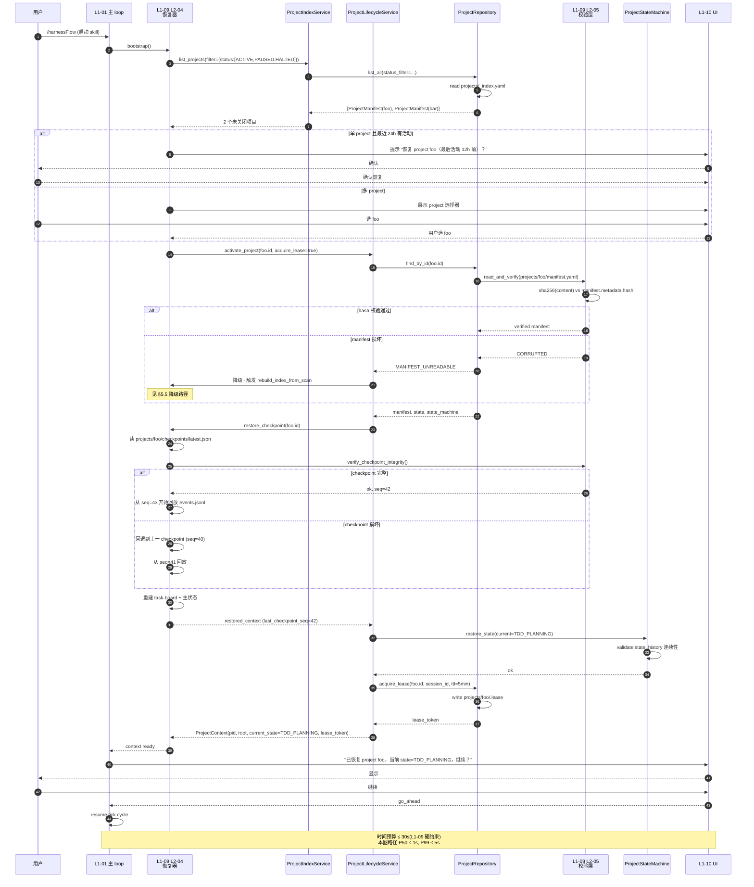
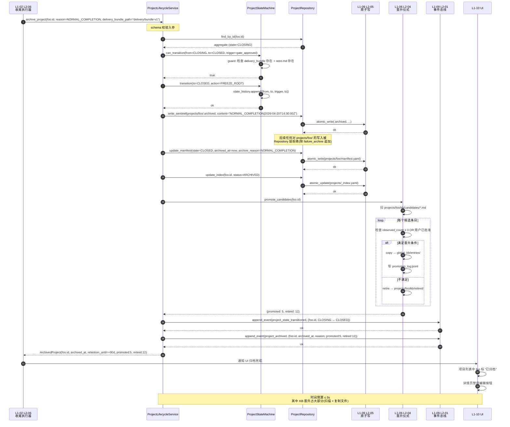
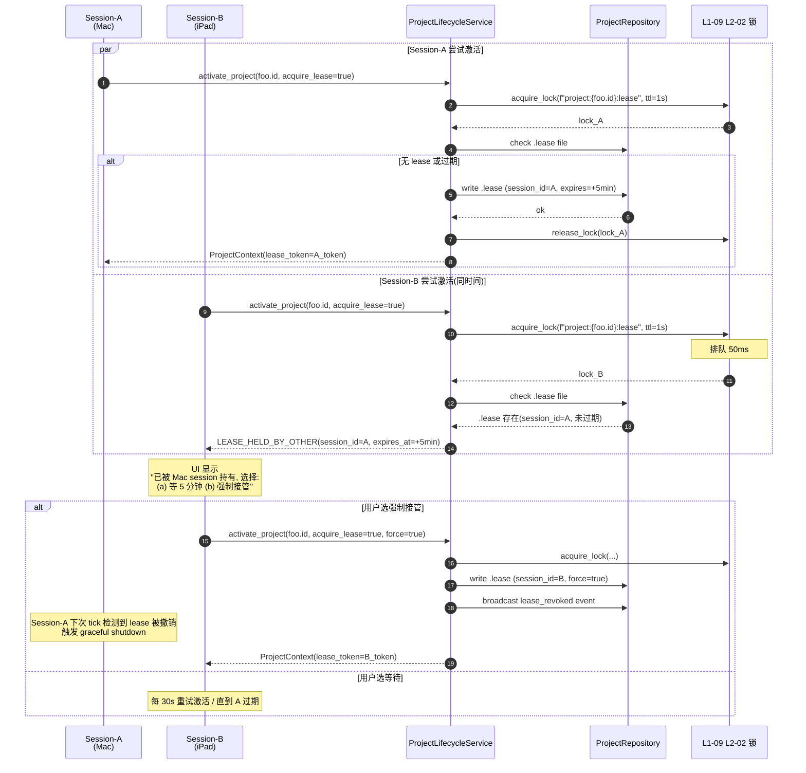
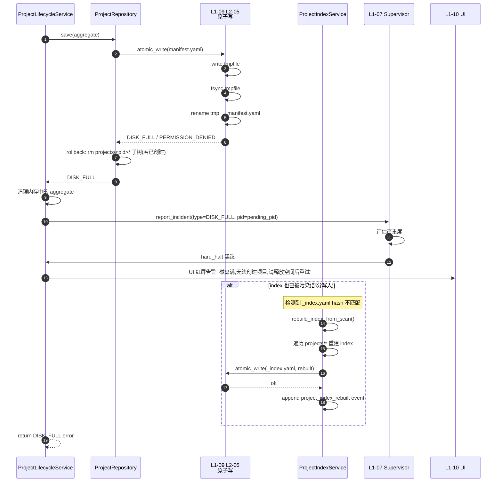
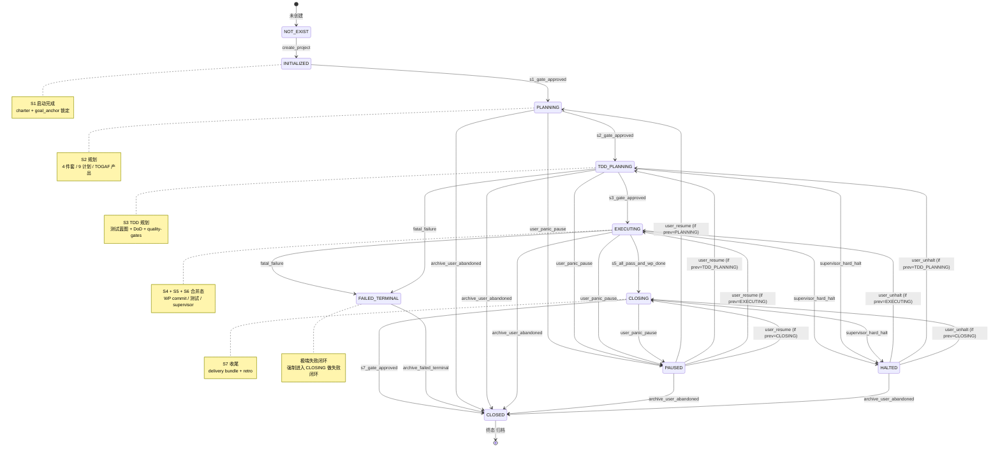

# harnessFlowProjectId · 技术实现方案（projectModel/tech-design.md）

> **定位**：`docs/2-prd/L0/projectModel.md` 定义"what"（14 章 · 产品级 `harnessFlowProjectId` 规则），**本文档定义"how"**（字段级 YAML schema / ID 生成算法 / 目录结构 / 主状态机实现 / 跨 L1 一致性契约 / 生命周期算法）。
> **关系**：本文档是 L0 顶层 projectModel 的**技术实现 spec**，被 L1-02（所有权方）/ L1-09（持久化落实方）/ L1-10（UI 入口）引用。
> **严格边界**：本文档不重复产品级"what"（它们锚定在 projectModel.md），只回答"如何用代码 / 文件系统 / 状态机 / schema 把 what 实现到 pytest 绿级别"。

---

## 0. 撰写进度

- [x] §1 定位与 2-prd 映射
- [x] §2 DDD 映射（ProjectAggregate / StateMachine / Manifest / Repository）
- [x] §3 对外接口定义（6 方法 + 完整 YAML schema + 错误码）
- [x] §4 接口依赖（上游 / 下游 / 横切）
- [x] §5 P0/P1 核心时序图（Mermaid · 创建 / 激活 / 归档 / 并发 / 故障）
- [x] §6 内部核心算法（ID 生成 / manifest 写盘 / state guard / 快照恢复 / 归档）
- [x] §7 底层数据表 / schema 设计（manifest / index / state / charter / archived）
- [x] §8 项目主状态机（Mermaid + 转换表）
- [x] §9 开源最佳实践调研（Temporal / LangGraph / Airflow / Prefect）
- [x] §10 配置参数清单（17 项）
- [x] §11 错误处理 + 降级策略
- [x] §12 性能目标
- [x] §13 与 2-prd / 3-2 TDD 的映射表

> **对 projectModel.md 的反向修补声明**：本文档在撰写过程中识别出 projectModel.md §5.1 主状态机缺失"显式 guard/action 规约"而在本 tech-design §8 补齐；§8.1 目录模型缺 `archived/` 子结构的形式化定义，本文档 §7 补齐。这些补齐**不改变 projectModel.md 的产品级语义**，只是把"what"落到可实现精度，不回写 projectModel.md。

---

## 1. 定位与 2-prd 映射

### 1.1 本文档的唯一命题

把 projectModel.md（产品级 · 14 章 · 702 行）定义的 `harnessFlowProjectId` 模型**一比一翻译**成：

1. **6 个对外 API**（create / activate / archive / query / list / delete）
2. **1 套字段级 YAML schema**（manifest / index / state / charter 四件）
3. **1 套主状态机**（7 主态 + 3 横切态 · Mermaid + 转换表）
4. **6 组核心算法伪代码**（ID 生成 / 写盘原子化 / guard / 快照恢复 / 归档 / index 重建）
5. **5 张 P0/P1 时序图**（创建 / 激活 / 归档 / 并发 / 故障恢复）
6. **17 个配置参数**（ID_PATTERN / MANIFEST_FSYNC_ENABLED / ...）

### 1.2 与 projectModel.md 的映射（精确到小节）

| projectModel.md 章节 | 本文档对应章节 | 翻译方式 |
|---|---|---|
| §1 定位与战略意义 | §1（本章）| 引用锚定，不复述 |
| §2 概念定义（ID 从属关系） | §2 DDD 映射 | 翻译成 Aggregate + Entity + VO |
| §3 ID 属性要求（产品级） | §6.1 ID 生成算法 + §10 配置参数 | 落成"长度 / 字符集 / 正则 / 冲突检测" |
| §4 项目生命周期（7 阶段 + 创建 / 激活 / 归档 / 删除） | §3 API + §5 时序图 + §6.3 算法 | 落成 6 个方法 + 6 组伪代码 |
| §5 项目主状态机 | §8 主状态机 + §6.3 guard/action | 落成 Mermaid + 转换表 + guard 函数签名 |
| §6 "所有物"模型 | §7 schema 设计 | 落成 manifest.yaml 的 ownership 字段组 |
| §7 多会话隔离规则 | §5.2 激活时序图 + §6.4 快照恢复 | 落成 bootstrap 算法 |
| §8 项目级持久化根（目录模型） | §7.1 目录结构完整 spec | 落成路径常量 + 文件形态 |
| §9 与 10 个 L1 的关系矩阵 | §4 接口依赖 | 落成"谁调我 / 我调谁"清单 |
| §10 IC 契约中 project_id 位置 | §3.1 API signature | 落成 API 第一位参数 |
| §11 多项目并发规则 | §8.2 横切态 + §11.5 并发降级 | 落成锁粒度 + lease 机制 |
| §12 PM-14 硬约束 | §11 错误处理 + §10 配置默认值 | 落成 6 条硬约束 → 验证函数 |
| §13 对 Goal/scope/BF/L1 修补建议 | §13 TDD 映射表 | 列清"本文档不做产品级修补，只做 L2 映射" |
| §14 验收大纲（P1~I1）| §13 TDD 映射表 | 每条产品验收 ↔ 3-2 测试文件 |

### 1.3 与 scope.md §4.5-4.6 / PM-14 的映射

| scope 锚点 | 本文档落实 |
|---|---|
| §4.5 PM-14 project-id-as-root 声明 | §2 DDD · Aggregate Root；§10 ID_PATTERN；§11 PM-14 违规拦截 |
| §4.6 硬约束 6 条（任一数据必归属 / IC 必带 / 跨 project 必拷贝 / 事件物理隔离 / 归档 ≥ 90 天 / 删除强确认） | §11 错误处理对应 6 条拦截规则 + §7 schema enforce |

### 1.4 与 L1-02 / L1-09 PRD 的分工

| PRD | 落在本文档的实现 | 落在 L1-xx tech-design 的实现 |
|---|---|---|
| L1-02（所有权方）| 本文档定义 `ProjectAggregate` + 6 API 的 spec | L1-02 tech-design 定义 Stage Gate 控制器如何调用 `activate_project` |
| L1-09（持久化方）| 本文档定义 `ProjectRepository` interface + 目录结构常量 | L1-09 tech-design 定义事件总线如何按 project 分片（引用本文档目录常量） |

---

## 2. DDD 映射

### 2.1 Bounded Context

**上下文名**：`ProjectModel`（简称 PM）
**定位**：HarnessFlow 的**根上下文**（Root Context）—— 所有其他 10 个 L1 上下文**必须**引用 `PM.harnessFlowProjectId` 作为归属键。
**消费方**：10 个 L1 bounded contexts 全部。
**上游依赖**：无（本上下文是所有归属链的根）。

### 2.2 Aggregate · ProjectAggregate

**Aggregate Root**：`harnessFlowProjectId`（VO 形态的聚合根标识）

**聚合根实体**：`ProjectAggregate`（持有 id + state + manifest + state_machine）

**聚合内实体（Entity）**：
- `ProjectStateMachine`（主状态机实例，1:1 owned by ProjectAggregate）
- `LifecycleEvent`（每次状态转换的审计条目，N 个）

**聚合内 Value Object（VO）**：
- `harnessFlowProjectId`（机器态 + 人类态 双形态，不可变）
- `ProjectManifest`（manifest.yaml 反射的只读结构）
- `GoalAnchor`（goal_anchor_hash + goal_text 快照）
- `CharterRef`（charter.md 指针 + frontmatter 快照）
- `OwnedArtifactPath`（产出物路径，强制归属 project_id）

**Aggregate 不变量（Invariants）**：

1. **I-1 · 唯一性**：同一 HarnessFlow 安装下，任意两个 `ProjectAggregate` 的 `harnessFlowProjectId` 值不同（`_index.yaml` 强约束）
2. **I-2 · 不可变性**：`ProjectAggregate.id` 一经构造不可修改（Python dataclass frozen=True 或 Pydantic Immutable Model）
3. **I-3 · 归属闭包**：所有 `OwnedArtifactPath` 必须位于 `projects/<id>/` 子树（写入前由 Repository 校验）
4. **I-4 · 状态机单调性**：`ProjectStateMachine` 的转换必须符合 §8 转换表（guard 函数拦截违规）
5. **I-5 · Manifest 一致性**：`ProjectManifest.state` 必须与 `ProjectStateMachine.current_state` 在每次事务 commit 时一致（两阶段写）

### 2.3 Domain Service

| Service 名 | 类型 | 职责 | 无状态？ |
|---|---|---|---|
| `ProjectIdGenerator` | Stateless Service | 根据 `goal_anchor` + `charter_draft` 生成候选 `harnessFlowProjectId`，处理 slug 衍生 / UUID 后缀 / 冲突重试 | ✅ |
| `ProjectLifecycleService` | Stateful Service | 协调 create / activate / archive 的多步事务（manifest 写盘 → state init → 事件广播） | ❌（持有 repository / event bus 引用） |
| `ProjectIndexService` | Stateful Service | 维护 `_index.yaml`（增 / 删 / 查）+ 崩溃后重建 | ❌ |
| `ProjectStateGuardService` | Stateless Service | 主状态机 guard 函数集合（检查"能否从 X 转到 Y"） | ✅ |

### 2.4 Repository Interface

```python
# 伪代码签名（Python 3.11+ / type hints）

from abc import ABC, abstractmethod
from typing import Optional, List
from pathlib import Path

class ProjectRepository(ABC):
    """harnessFlowProjectId 聚合的持久化口子。具体实现由 L1-09 L2-05 崩溃安全层完成。"""

    @abstractmethod
    def save(self, aggregate: ProjectAggregate) -> None:
        """原子化持久化整个聚合（manifest + state + index 更新）。底层用 tmpfile + rename + fsync。"""

    @abstractmethod
    def find_by_id(self, pid: harnessFlowProjectId) -> Optional[ProjectAggregate]:
        """按 id 查询聚合。不存在返回 None。"""

    @abstractmethod
    def list_all(self, status_filter: Optional[str] = None) -> List[ProjectManifest]:
        """枚举 manifest 列表，可按 state 过滤（ACTIVE / ARCHIVED / FAILED_TERMINAL）。"""

    @abstractmethod
    def delete(self, pid: harnessFlowProjectId, confirmation_token: str) -> None:
        """强删除（需二次确认 token）。连带清掉 projects/<pid>/ 全子树 + 从 index 移除。"""

    @abstractmethod
    def rebuild_index_from_scan(self) -> None:
        """从 projects/ 目录全扫描重建 _index.yaml（用于崩溃恢复）。"""

    @abstractmethod
    def acquire_project_root(self, pid: harnessFlowProjectId) -> Path:
        """返回 projects/<pid>/ 的绝对 Path 对象，用于子 L1 在归属闭包内写入。"""
```

### 2.5 Factory

```python
class ProjectAggregateFactory:
    """聚合工厂：从 goal_anchor + charter_draft 创建未持久化的聚合实例。"""

    def __init__(self, id_generator: ProjectIdGenerator, clock: Callable[[], datetime]):
        self._id_gen = id_generator
        self._clock = clock

    def new_from_charter(
        self,
        goal_anchor: str,
        charter_draft: CharterDraft,
        user_provided_slug_hint: Optional[str] = None,
    ) -> ProjectAggregate:
        """生成一个 state=INITIALIZED 的新 aggregate。不触碰磁盘。落盘由 Repository 负责。"""
        ...
```

### 2.6 Domain Event

| 事件名 | 触发时机 | 订阅方 | Payload |
|---|---|---|---|
| `project_created` | `ProjectLifecycleService.create_project` 成功 | L1-02 L2-02 / L1-09 事件总线 / L1-10 UI | `{project_id, goal_anchor_hash, created_at}` |
| `project_state_transitioned` | `ProjectStateMachine.transition` 成功 | L1-02 L2-01 Stage Gate / L1-07 监督 / L1-10 UI | `{project_id, from_state, to_state, trigger_event, timestamp}` |
| `project_archived` | `ProjectLifecycleService.archive_project` 成功 | L1-10 UI / L1-09 归档器 | `{project_id, archived_at, reason}` |
| `project_deleted` | `ProjectLifecycleService.delete_project` 成功 | L1-09 / L1-10 | `{project_id, deleted_at, confirmation_token}` |
| `project_index_rebuilt` | `ProjectIndexService.rebuild_index_from_scan` 成功 | L1-09 / L1-10 | `{scanned_count, rebuilt_count, timestamp}` |

### 2.7 Anti-Corruption Layer（ACL）

本上下文 **不依赖**任何外部 bounded context，无需 ACL。
相反，其他 10 个 L1 context 在调用本上下文时必须通过 `ProjectContext` 对象传递 id，**禁止直接拼 path 字符串**。

### 2.8 DDD 语义小结图

```
┌──────────────────────────────────────────────────────────────┐
│ BOUNDED CONTEXT · ProjectModel                                │
│  ┌────────────────────────────────────────────────────────┐  │
│  │ AGGREGATE · ProjectAggregate                            │  │
│  │  · Root Identity: harnessFlowProjectId (VO)             │  │
│  │  · Entities: ProjectStateMachine / LifecycleEvent[]     │  │
│  │  · VO: ProjectManifest / GoalAnchor / CharterRef /      │  │
│  │        OwnedArtifactPath                                │  │
│  │  · Invariants: I-1..I-5                                 │  │
│  └────────────────────────────────────────────────────────┘  │
│                                                               │
│  ┌────────────────────────────────────────────────────────┐  │
│  │ Domain Services (4):                                    │  │
│  │  · ProjectIdGenerator (stateless)                       │  │
│  │  · ProjectLifecycleService (stateful)                   │  │
│  │  · ProjectIndexService (stateful)                       │  │
│  │  · ProjectStateGuardService (stateless)                 │  │
│  └────────────────────────────────────────────────────────┘  │
│                                                               │
│  ┌────────────────────────────────────────────────────────┐  │
│  │ Ports:                                                  │  │
│  │  · ProjectRepository (interface · L1-09 implements)     │  │
│  │  · EventBus (interface · L1-09 implements)              │  │
│  │  · Clock (interface · infrastructure provides)          │  │
│  └────────────────────────────────────────────────────────┘  │
└──────────────────────────────────────────────────────────────┘
```

---

## 3. 对外接口定义（API + schema）

本节定义 `ProjectModel` bounded context 对外暴露的 **6 个方法**（完整字段级 YAML schema + 错误码）。这些方法是所有 L1 访问 `harnessFlowProjectId` 的**唯一合法通道**—— 任何 L1 要读 / 写 / 切换 project，必须经过这里。

### 3.1 API 方法清单（总览）

| # | 方法签名 | 调用方 L1 | 典型场景 |
|---|---|---|---|
| 1 | `create_project(goal_anchor, charter_draft) -> harnessFlowProjectId` | L1-02 L2-02 启动阶段产出器 | S1 章程生成后、干系人识别前 |
| 2 | `activate_project(project_id) -> ProjectContext` | L1-02 L2-01 Stage Gate 控制器 / L1-09 L2-04 恢复器 | 单会话切换 / 跨 session 恢复 |
| 3 | `archive_project(project_id, reason) -> ArchivedProject` | L1-02 L2-06 收尾执行器 | S7 最终 Gate 通过 / 用户 abandon |
| 4 | `query_project(project_id) -> ProjectManifest` | L1-10 admin / L1-07 监督 | UI 详情页 / 审计 |
| 5 | `list_projects(filter) -> [ProjectManifest]` | L1-10 admin | 多项目总览 UI |
| 6 | `delete_project(project_id, confirmation_token) -> None` | L1-10 admin（用户 UI 二次确认后）| 用户主动硬删 |

所有方法**强制**首位参数携带 `project_id`（除 `create_project` 本身就是创建它的那一刻）。这是 PM-14 硬约束的代码级 enforce 点。

### 3.2 API-1 · `create_project`

**签名**：

```python
def create_project(
    goal_anchor: str,                     # 原始目标文本（用户输入，完整保留）
    charter_draft: CharterDraft,          # L1-02 L2-02 生成的章程草稿
    slug_hint: Optional[str] = None,      # 用户提议的 slug 前缀（可选，否则从 charter_draft.title 衍生）
    idempotency_key: Optional[str] = None,  # 幂等键（防重复创建，可选）
) -> harnessFlowProjectId
```

**入参 YAML schema**（字段级）：

```yaml
create_project:
  goal_anchor:
    type: string
    required: true
    min_length: 10
    max_length: 20000         # scope §5.2 硬约束：goal_anchor 最长 20k char
    description: |
      用户输入的项目目标原文。完整保留，不 summarize。
      本字段的 sha256 作为 goal_anchor_hash 写入 manifest。

  charter_draft:
    type: object
    required: true
    properties:
      title:
        type: string
        required: true
        min_length: 2
        max_length: 80
        description: 项目标题（人类可读，可作为 slug_hint 的 fallback）
      summary:
        type: string
        required: true
        max_length: 500
      stakeholders_draft:
        type: array
        items:
          type: object
          properties:
            role: string
            name: string
        max_items: 50
      scope_draft:
        type: object
        properties:
          in_scope: {type: array, items: string}
          out_scope: {type: array, items: string}

  slug_hint:
    type: string
    required: false
    pattern: "^[a-z][a-z0-9-]{0,30}[a-z0-9]$"   # 小写 + 数字 + 连字符，不以连字符起止
    description: |
      用户提议的 slug 前缀。若提供，系统会 sanitize 后用作 harnessFlowProjectId 的前缀；
      若不提供，从 charter_draft.title 衍生。

  idempotency_key:
    type: string
    required: false
    pattern: "^[a-f0-9]{16,64}$"
    description: |
      幂等键（推荐使用 sha256(goal_anchor + user_session_id) 的前 32 位）。
      同一幂等键在 24h 内重复调用返回同一个 project_id，不重建。
```

**出参 YAML schema**：

```yaml
harnessFlowProjectId:
  type: object                  # 双形态 VO（见 §7.1 schema）
  properties:
    machine_form:
      type: string
      pattern: "^[a-z][a-z0-9-]{1,30}-[a-f0-9]{8}$"
      example: "todo-app-a1b2c3d4"
      description: 机器态：slug + "-" + uuid-short（8 位十六进制）
    human_form:
      type: string
      min_length: 2
      max_length: 80
      example: "TODO 应用"
      description: 人类态：用户视觉可辨的项目名（来自 charter_draft.title）
    created_at:
      type: string
      format: iso-8601-utc
      example: "2026-04-20T14:30:00Z"
    goal_anchor_hash:
      type: string
      pattern: "^[a-f0-9]{64}$"
      description: sha256(goal_anchor) 的十六进制字符串
```

**副作用（不在签名里但必发生）**：

1. 在 `projects/<machine_form>/` 创建目录子树（见 §7.1）
2. 写 `manifest.yaml` + `state.yaml` + `charter.md`
3. 更新 `projects/_index.yaml`（追加一条）
4. 发布 `project_created` 事件到 L1-09 事件总线（全局 `system.log` 也记一条，因为此刻尚无 project-level events.jsonl）
5. 初始化 `ProjectStateMachine` 到 `INITIALIZED` 状态

**错误码**：

| Code | HTTP-like Status | 触发条件 | 恢复策略 |
|---|---|---|---|
| `PROJECT_ID_COLLISION` | 409 Conflict | 衍生的 slug + uuid-short 恰好与已存在 ID 冲突（概率极低 · < 10^-9） | 自动重试 3 次重新生成 uuid-short |
| `INVALID_GOAL_ANCHOR` | 400 Bad Request | goal_anchor 为空 / 超长 / 含非法字符 | 返回，L1-02 让用户重输 |
| `INVALID_CHARTER_DRAFT` | 400 Bad Request | charter_draft schema 校验失败 | 返回，L1-02 补全后重试 |
| `SLUG_HINT_REJECTED` | 400 Bad Request | slug_hint 含保留词（`__system__` / `global` / `test`） | 返回建议，用户改 slug |
| `INDEX_CORRUPTED` | 500 Internal Error | `_index.yaml` 损坏无法更新 | 触发 `ProjectIndexService.rebuild_index_from_scan`，自动恢复后重试一次 |
| `DISK_FULL` | 507 Insufficient Storage | 磁盘空间不足写 manifest | 返回，L1-09 触发 `hard_halt` |
| `IDEMPOTENCY_KEY_MISMATCH` | 409 Conflict | idempotency_key 与历史记录匹配但 goal_anchor 不同 | 拒绝，返回历史记录 project_id |
| `PERMISSION_DENIED` | 403 Forbidden | `projects/` 根目录不可写 | 返回，系统级 fatal |

### 3.3 API-2 · `activate_project`

**签名**：

```python
def activate_project(
    project_id: harnessFlowProjectId,
    acquire_lease: bool = True,           # 是否拿 project-level lease（防止并发激活）
) -> ProjectContext
```

**入参 YAML schema**：

```yaml
activate_project:
  project_id:
    type: object
    required: true
    description: harnessFlowProjectId VO（见 §7.1）

  acquire_lease:
    type: boolean
    default: true
    description: |
      true · 拿 project-level lease（独占当前 session 激活权，5 分钟 TTL，可续约）
      false · 只读激活（用于 UI 查询，不影响其他 session 的写入）
```

**出参 YAML schema**：

```yaml
ProjectContext:
  type: object
  properties:
    project_id: {$ref: "#/harnessFlowProjectId"}
    project_root:
      type: string
      format: absolute-path
      example: "/Users/foo/.harnessflow/projects/todo-app-a1b2c3d4"
      description: 绝对路径，指向 projects/<machine_form>/ 子树根
    current_state:
      type: string
      enum: [INITIALIZED, PLANNING, TDD_PLANNING, EXECUTING, CLOSING, CLOSED, PAUSED, HALTED, FAILED_TERMINAL]
    last_checkpoint_seq:
      type: integer
      minimum: 0
      description: 最新 checkpoint 序号（L1-09 L2-04 写入）
    manifest: {$ref: "#/ProjectManifest"}
    lease_token:
      type: string
      nullable: true
      description: 若 acquire_lease=true，返回 lease token（用于 release_lease）
    lease_expires_at:
      type: string
      format: iso-8601-utc
      nullable: true
```

**副作用**：

1. 若 `acquire_lease=true`，在 `projects/<pid>/.lease` 写入 session_id + expires_at
2. 触发 L1-09 L2-04 的"快照恢复算法"（见 §6.4），把 task-board 重建到最新 checkpoint
3. 发布 `project_activated` 事件

**错误码**：

| Code | 触发条件 | 恢复策略 |
|---|---|---|
| `PROJECT_NOT_FOUND` | `_index.yaml` 无此 id 条目 | 返回，L1-02 提示用户选别的项目 |
| `PROJECT_ARCHIVED` | state=CLOSED，不允许再激活 | 拒绝，建议用户创建新 project |
| `PROJECT_FAILED_TERMINAL` | state=FAILED_TERMINAL，需人工诊断 | 拒绝 + 提示查看 retro |
| `LEASE_HELD_BY_OTHER` | 已有 session 持有 lease 且未过期 | 返回持有者 session_id，让用户选"强制接管"或"等 TTL" |
| `CHECKPOINT_CORRUPTED` | L1-09 L2-05 校验 checkpoint 失败 | 自动回退到上一 checkpoint；都失败则回放事件重建 |
| `MANIFEST_SCHEMA_MISMATCH` | manifest.yaml 字段缺失 / 类型错 | 返回，L1-09 触发完整性告警 |

### 3.4 API-3 · `archive_project`

**签名**：

```python
def archive_project(
    project_id: harnessFlowProjectId,
    reason: ArchiveReason,
    delivery_bundle_path: Optional[str] = None,
) -> ArchivedProject
```

**入参 YAML schema**：

```yaml
archive_project:
  project_id: {$ref: "#/harnessFlowProjectId"}

  reason:
    type: string
    required: true
    enum:
      - NORMAL_COMPLETION      # S7 最终 Gate 通过（默认）
      - USER_ABANDONED         # 用户主动 abandon
      - FAILED_TERMINAL        # 极端失败进入归档失败闭环
      - MIGRATED_ELSEWHERE     # 迁移到外部系统（未来保留）

  delivery_bundle_path:
    type: string
    format: relative-path
    nullable: true
    description: |
      若 reason=NORMAL_COMPLETION，必须提供 delivery bundle 的路径
      （相对于 projects/<pid>/delivery/）。其他 reason 可为 null。
```

**出参 YAML schema**：

```yaml
ArchivedProject:
  type: object
  properties:
    project_id: {$ref: "#/harnessFlowProjectId"}
    archived_at: {type: string, format: iso-8601-utc}
    archive_reason: {type: string}
    frozen_root_path: {type: string, format: absolute-path}
    retention_until:
      type: string
      format: iso-8601-utc
      description: 保留截止日期（默认 archived_at + 90 天，可配置）
    kb_promotion_summary:
      type: object
      properties:
        promoted_entries_count: {type: integer}
        retired_entries_count: {type: integer}
```

**副作用（按顺序执行）**：

1. **冻结根目录**：在 `projects/<pid>/` 下写 `.archived` 哨兵文件（后续任何写入被 Repository 拒绝）
2. **manifest 更新**：`state = CLOSED` + `archived_at` + `archive_reason`
3. **index 更新**：`_index.yaml` 中该条目的 `status` 改为 `ARCHIVED`
4. **KB 晋升触发**：通知 L1-06 L2-04 晋升仪式扫本 project 的候选条目（见 §6.5）
5. **事件广播**：`project_archived` + `project_state_transitioned(EXECUTING/CLOSING → CLOSED)`
6. **failure-archive 追加**：若 `reason=FAILED_TERMINAL`，在 `<workdir>/failure_archive.jsonl` 追加一条

**错误码**：

| Code | 触发条件 | 恢复策略 |
|---|---|---|
| `ALREADY_ARCHIVED` | state 已经是 CLOSED | 幂等返回现有 ArchivedProject |
| `CANNOT_ARCHIVE_NON_TERMINAL` | state ∈ {INITIALIZED, PLANNING, TDD_PLANNING, EXECUTING} 且 reason=NORMAL_COMPLETION | 拒绝，只有 CLOSING / FAILED_TERMINAL 才能归档 |
| `DELIVERY_BUNDLE_MISSING` | reason=NORMAL_COMPLETION 但 delivery_bundle_path 为 null 或路径不存在 | 拒绝 |
| `KB_PROMOTION_FAILED` | 晋升仪式异常 | 降级：manifest 仍归档，KB 晋升任务入重试队列 |
| `FREEZE_WRITE_FAILED` | `.archived` 哨兵文件写失败 | 回滚 manifest + 告警 |

### 3.5 API-4 · `query_project`

**签名**：

```python
def query_project(project_id: harnessFlowProjectId) -> ProjectManifest
```

**入参 YAML schema**：

```yaml
query_project:
  project_id: {$ref: "#/harnessFlowProjectId"}
```

**出参**：见 §7.2 ProjectManifest schema。

**错误码**：

| Code | 触发条件 |
|---|---|
| `PROJECT_NOT_FOUND` | `_index.yaml` 无此 id |
| `MANIFEST_UNREADABLE` | 文件存在但损坏（触发 L1-09 L2-05 校验失败） |

**SLA**：P50 ≤ 50ms（仅读 manifest.yaml，不加载 task-board / events）

### 3.6 API-5 · `list_projects`

**签名**：

```python
def list_projects(
    filter: Optional[ProjectFilter] = None,
    limit: int = 50,
    offset: int = 0,
    sort_by: str = "updated_at",
    sort_order: str = "desc",
) -> List[ProjectManifest]
```

**入参 YAML schema**：

```yaml
list_projects:
  filter:
    type: object
    nullable: true
    properties:
      status:
        type: array
        items:
          type: string
          enum: [ACTIVE, ARCHIVED, FAILED_TERMINAL, PAUSED, HALTED]
      created_after:  {type: string, format: iso-8601-utc, nullable: true}
      created_before: {type: string, format: iso-8601-utc, nullable: true}
      slug_contains:  {type: string, nullable: true}

  limit:
    type: integer
    default: 50
    minimum: 1
    maximum: 200

  offset:
    type: integer
    default: 0
    minimum: 0

  sort_by:
    type: string
    default: updated_at
    enum: [created_at, updated_at, slug, state]

  sort_order:
    type: string
    default: desc
    enum: [asc, desc]
```

**出参**：`List[ProjectManifest]`

**SLA**：P50 ≤ 200ms（100 项目），P99 ≤ 500ms（500 项目）
**实现要点**：从 `_index.yaml` 直接读，避免遍历 `projects/*` 目录。见 §6.2 算法。

**错误码**：

| Code | 触发条件 |
|---|---|
| `INDEX_CORRUPTED` | `_index.yaml` 损坏 |
| `INVALID_FILTER` | filter schema 校验失败 |

### 3.7 API-6 · `delete_project`

**签名**：

```python
def delete_project(
    project_id: harnessFlowProjectId,
    confirmation_token: str,
    actor: str,
) -> None
```

**入参 YAML schema**：

```yaml
delete_project:
  project_id: {$ref: "#/harnessFlowProjectId"}

  confirmation_token:
    type: string
    required: true
    description: |
      由 UI 二次确认流程生成的一次性 token。格式：
      sha256(project_id.machine_form + "|DELETE|" + user_timestamp)，前 32 位。
      后端必须在接收后 60s 内完成删除，否则 token 失效。

  actor:
    type: string
    required: true
    description: 执行者标识（通常是 "user_ui" 或 "admin_cli"）
```

**副作用**：

1. **前置校验**：state 必须是 CLOSED 或 FAILED_TERMINAL（不允许删活跃项目）
2. **事件广播**：`project_deleting`（开始删除）
3. **子树删除**：`rm -rf projects/<pid>/`（由 Repository 调用 shutil.rmtree 实现）
4. **index 更新**：从 `_index.yaml` 移除条目
5. **global KB 不删**：凡是已晋升到 `global_kb/` 的条目保留（它们已脱离 project 归属）
6. **failure-archive 不删**：`failure_archive.jsonl` 中关于本 project 的历史条目保留（全局审计材料）
7. **事件广播**：`project_deleted`（完成）

**错误码**：

| Code | 触发条件 |
|---|---|
| `PROJECT_NOT_FOUND` | `_index.yaml` 无此 id |
| `CANNOT_DELETE_ACTIVE` | state ∈ {INITIALIZED, PLANNING, TDD_PLANNING, EXECUTING, CLOSING, PAUSED, HALTED} | 拒绝，必须先归档 |
| `INVALID_CONFIRMATION_TOKEN` | token 格式错 / 已过期 / 与 pid 不匹配 | 拒绝 |
| `UNAUTHORIZED_DELETE` | actor 不在允许列表 | 拒绝 |
| `RMTREE_FAILED` | 文件系统级删除失败（部分删） | 进入"半删除"状态，告警人工介入 |

### 3.8 全局错误码表（汇总）

| Code | 所属 API | 严重程度 | 审计事件类型 |
|---|---|---|---|
| `PROJECT_ID_COLLISION` | create | WARN | `project_id_collision_retry` |
| `PROJECT_NOT_FOUND` | activate/query/delete | ERROR | `project_not_found_error` |
| `PROJECT_ARCHIVED` | activate | INFO | `activate_archived_attempted` |
| `PROJECT_FAILED_TERMINAL` | activate | WARN | `activate_failed_terminal_attempted` |
| `LEASE_HELD_BY_OTHER` | activate | INFO | `lease_contention` |
| `ALREADY_ARCHIVED` | archive | INFO | `archive_idempotent_hit` |
| `CANNOT_ARCHIVE_NON_TERMINAL` | archive | ERROR | `archive_illegal_state` |
| `CANNOT_DELETE_ACTIVE` | delete | ERROR | `delete_illegal_state` |
| `INVALID_CONFIRMATION_TOKEN` | delete | WARN | `delete_token_invalid` |
| `UNAUTHORIZED_DELETE` | delete | CRITICAL | `delete_unauthorized_attempt` |
| `INDEX_CORRUPTED` | 全部 | CRITICAL | `index_corrupted_hard_halt` |
| `MANIFEST_UNREADABLE` | 全部 | CRITICAL | `manifest_corrupted_hard_halt` |
| `DISK_FULL` | create/archive | CRITICAL | `disk_full_hard_halt` |
| `CHECKPOINT_CORRUPTED` | activate | ERROR | `checkpoint_corruption_recovery` |
| `KB_PROMOTION_FAILED` | archive | WARN | `kb_promotion_retry_queued` |
| `RMTREE_FAILED` | delete | CRITICAL | `rmtree_partial_failure` |
| `IDEMPOTENCY_KEY_MISMATCH` | create | WARN | `idempotency_conflict` |
| `INVALID_GOAL_ANCHOR` | create | ERROR | `input_validation_fail` |
| `INVALID_CHARTER_DRAFT` | create | ERROR | `input_validation_fail` |
| `INVALID_FILTER` | list | ERROR | `input_validation_fail` |
| `PERMISSION_DENIED` | 全部 | CRITICAL | `permission_denied_hard_halt` |
| `SLUG_HINT_REJECTED` | create | INFO | `slug_sanitize_applied` |

---

## 4. 接口依赖

### 4.1 上游调用方（被谁调）

| 调用方 L1 | 调用方 L2 | 调用哪些 API | 业务场景 |
|---|---|---|---|
| **L1-02 项目生命周期** | L2-02 启动阶段产出器 | `create_project` | S1 章程生成完成后 |
| **L1-02** | L2-01 Stage Gate 控制器 | `activate_project` | 用户 Go/No-Go 决定后（换主状态） |
| **L1-02** | L2-01 Stage Gate 控制器 | `ProjectStateMachine.transition()`（内部 API） | Gate 通过转换主状态 |
| **L1-02** | L2-06 收尾执行器 | `archive_project` | S7 最终 Gate 通过 |
| **L1-09 韧性+审计** | L2-04 检查点恢复器 | `activate_project` | bootstrap 自动恢复最近项目 |
| **L1-09** | L2-04 检查点恢复器 | `list_projects(filter={status:[ACTIVE]})` | 扫未 CLOSED 项目 |
| **L1-10 人机协作 UI** | admin 模块 | `list_projects` / `query_project` / `delete_project` | 项目管理面板 |
| **L1-07 Harness 监督** | L2-05 审计记录器映射 | `query_project` | 监督事件要知道当前 project state |

### 4.2 下游依赖方（调谁）

本上下文（ProjectModel）**下游依赖**：

| 依赖方 | 接口 | 用途 |
|---|---|---|
| **L1-09 L2-05 崩溃安全层** | `atomic_write(path, content)` / `atomic_rename(src, dst)` / `fsync(fd)` | manifest / state / index 原子写盘 |
| **L1-09 L2-01 事件总线** | `append_event(event)` | 发布 5 个 Domain Event |
| **L1-09 L2-02 锁管理器** | `acquire_lock(key, ttl)` / `release_lock(token)` | 保护 `_index.yaml` 并发写入 |
| **L1-09 L2-04 检查点恢复器** | `restore_from_checkpoint(pid)` | `activate_project` 内部调用 |
| **L1-06 L2-04 晋升仪式** | `promote_candidates(pid)` | `archive_project` 末端触发 |
| **Infrastructure · Clock** | `now() -> datetime` | 所有时间戳字段 |
| **Infrastructure · UUIDGenerator** | `uuid4().hex[:8]` | `harnessFlowProjectId.machine_form` 后缀 |
| **Infrastructure · PathResolver** | `<workdir>/projects/<pid>` | 目录路径计算 |

### 4.3 横切 · 10 个 L1 必读的 "归属权锚点"

以下 **每个 L1 在每次对外 I/O 时**都必须在请求携带 `project_id`，间接"依赖"本上下文：

| L1 | 使用方式 | PM-14 enforce 位置 |
|---|---|---|
| L1-01 主决策循环 | 每 tick 首位字段 | `tick.project_id` |
| L1-03 WBS+WP 调度 | 每 WP 创建挂 project_id | `WorkPackage.owner_project_id` |
| L1-04 Quality Loop | 每 test_case / verifier_report 挂 project_id | `TestCase.project_id` |
| L1-05 Skill+子 Agent | 每 skill 调用 context 带 project_id | `SkillInvocation.project_id` |
| L1-06 3 层 KB | project 层 KB 作用域键 | `KbEntry.scope.project_id` |
| L1-07 Supervisor | 监督事件按 project 订阅 | `SupervisorEvent.project_id` |
| L1-08 多模态 | 素材缓存按 project 隔离 | `MultimodalAsset.project_id` |
| L1-09 韧性+审计 | 事件 / 审计 / 检查点全按 project 分片 | `Event.project_id`（强制 root 字段） |
| L1-10 人机协作 UI | UI 视图按 project 过滤 | `ViewContext.project_id` |

### 4.4 依赖图（Mermaid）




## 5. P0/P1 核心时序图

本节给出 5 张 Mermaid 时序图，覆盖 ProjectModel 的核心生命周期：**创建**（P0） / **跨 session 激活恢复**（P0） / **归档 + KB 晋升**（P0） / **并发激活争用**（P1） / **manifest 写失败降级**（P1）。

### 5.1 图 1 · P0 · 项目创建 + manifest 写盘 + 事件发布

**场景**：用户在 S1 阶段输入目标 → L1-02 L2-02 澄清通过 → 调 `create_project` → 新 project 诞生。



**关键细节说明**：

- 步骤 15-24 是"原子化复合事务"（见 §6.2 算法），若任一 atomic_write 失败必须回滚前面已写的文件
- 步骤 13-14 的 lock 是针对 `_index.yaml` 的，保护其他并发 `create_project` 不会同时 append 造成丢失
- 步骤 25 release_lock 必须在 fsync 成功后，否则 reader 读到的可能是未 fsync 的中间状态
- 步骤 26 `append_event` 失败不回滚（事件总线写入失败 → 触发 L1-09 L2-01 的 hard_halt 路径，见 §11.3）

### 5.2 图 2 · P0 · 跨 session 激活（bootstrap → 读 index → 加载 manifest → 重建 state）

**场景**：用户昨天启动 project foo 跑到 S3 Gate，今天重启 Claude Code → `/harnessFlow` → 系统自动恢复。



**关键细节说明**：

- 步骤 3-8 扫描 `_index.yaml` 而非遍历 `projects/*` 目录（性能保证）
- 步骤 24-30 的 checkpoint-first + event-replay 回退策略来自 L1-09 PRD §4 响应面 2
- 步骤 31 的 `restore_state` 必须走 guard 校验（防止 manifest.state 与 state_machine.current_state 不一致）
- 步骤 32-34 的 lease 保护多设备同时激活同一 project（防双写）

### 5.3 图 3 · P0 · 项目归档 + 冻结根目录 + KB 晋升

**场景**：project foo 在 S7 最终 Gate 通过 → L1-02 L2-06 调 `archive_project`。



**关键细节说明**：

- 步骤 9-11 `.archived` 哨兵文件是"冻结"的物理标志 —— Repository.save() 在写入前先检查哨兵存在与否，存在则拒绝（见 §6.5 算法）
- 步骤 16-25 的 KB 晋升是**同步调用**，不放异步（若 promote_candidates 失败，整个 archive 也失败，manifest 不会写 CLOSED）
- 步骤 27-28 的 2 条事件顺序不能颠倒（state_transitioned 先，project_archived 后）

### 5.4 图 4 · P1 · 并发激活争用（lease 机制）

**场景**：用户在 Mac 和 iPad 两台设备同时 `/harnessFlow`，两个 session 都想激活 project foo。



**关键细节说明**：

- `.lease` 文件存在于 `projects/<pid>/.lease`，内容 YAML `{session_id, expires_at, acquired_at, force_count}`
- L1-09 锁管理器的锁是 fast path（内存级 mutex，<1ms），`.lease` 是 slow path（文件级，TTL 5min）
- 强制接管场景 (force=true) 会广播 `lease_revoked` event，被旧 session 的 tick loop 消费

### 5.5 图 5 · P1 · manifest 写失败降级（index 重建 / 硬 halt）

**场景**：`create_project` 过程中磁盘满 / 权限问题导致 manifest 写失败。



**关键细节说明**：

- 步骤 7 回滚策略：若部分文件已写（如 manifest 成功但 state 失败），必须 `rm -rf projects/<pid>/` 保证不留"半生不熟"的 project
- 步骤 11-12 的 hard_halt 是通过 L1-07 Supervisor 触发的（见 L1-07 PRD 硬红线 5 类之"磁盘满"）
- 步骤 15-20 的 index 重建是**兜底**机制：即使所有 manifest 写都失败，只要硬盘里有残留的 `projects/<pid>/` 目录，也能从它们的 manifest 重建 `_index.yaml`


## 6. 内部核心算法

本节给出 **6 组核心算法伪代码**（Python 风格 · 可直接转成测试用例 · 所有细节字段级精度）。

### 6.1 算法 1 · ID 生成（slug 衍生 + uuid-short + 冲突重试）

**意图**：把用户给的 `goal_anchor` + `charter_draft.title` + 可选 `slug_hint` 转成全局唯一、人类可读 + 机器可读双形态的 `harnessFlowProjectId`。

```python
# === ProjectIdGenerator.generate_id ===
# 输入: goal_anchor: str, charter_draft: CharterDraft, slug_hint: Optional[str]
# 输出: harnessFlowProjectId (machine_form, human_form, goal_anchor_hash, created_at)

from typing import Optional
import re
import hashlib
import uuid
from datetime import datetime, timezone

RESERVED_SLUGS = {"__system__", "global", "test", "admin", "null", "none", "undefined"}
SLUG_PATTERN = re.compile(r"^[a-z][a-z0-9-]{0,28}[a-z0-9]$")  # 2-30 字符
UUID_SHORT_LEN = 8  # 十六进制位数 · 总命名空间 4.3e9

def generate_id(
    repo: ProjectRepository,
    goal_anchor: str,
    charter_draft: CharterDraft,
    slug_hint: Optional[str],
    max_collision_retries: int = 3,
) -> harnessFlowProjectId:
    # Step 1: 校验 goal_anchor
    assert 10 <= len(goal_anchor) <= 20000, "INVALID_GOAL_ANCHOR"
    goal_hash = hashlib.sha256(goal_anchor.encode("utf-8")).hexdigest()

    # Step 2: 衍生 slug
    if slug_hint:
        slug = sanitize_slug(slug_hint)
    else:
        slug = derive_slug_from_title(charter_draft.title)

    # Step 3: 保留词校验
    if slug in RESERVED_SLUGS or slug.startswith("__"):
        raise SlugHintRejected(f"'{slug}' 是保留词/非法前缀")

    # Step 4: 正则形状校验
    if not SLUG_PATTERN.match(slug):
        raise InvalidSlug(f"'{slug}' 不符合 pattern={SLUG_PATTERN.pattern}")

    # Step 5: 冲突重试循环
    last_error = None
    for retry in range(max_collision_retries):
        uuid_short = uuid.uuid4().hex[:UUID_SHORT_LEN]
        candidate = f"{slug}-{uuid_short}"

        # 查 index 是否已存在同名 id
        if repo.find_by_id(candidate) is None:
            # 命中空位,返回
            return harnessFlowProjectId(
                machine_form=candidate,
                human_form=charter_draft.title[:80],
                goal_anchor_hash=goal_hash,
                created_at=datetime.now(timezone.utc).isoformat(),
            )
        else:
            last_error = f"collision at retry {retry}: {candidate}"

    # Step 6: 所有重试都冲突(概率 < 10^-27,实际不会发生)
    raise ProjectIdCollision(last_error)


def sanitize_slug(hint: str) -> str:
    """把用户输入的 slug_hint 规范化:小写 / 空格→连字符 / 过滤非字母数字连字符 / 截断"""
    s = hint.strip().lower()
    s = re.sub(r"\s+", "-", s)               # 空格 → 连字符
    s = re.sub(r"[^a-z0-9-]", "", s)         # 仅保留 [a-z0-9-]
    s = re.sub(r"-+", "-", s)                # 连续连字符合并
    s = s.strip("-")                         # 去首尾连字符
    s = s[:30]                                # 截断
    if len(s) < 2:
        raise InvalidSlug("slug_hint 清理后太短")
    return s


def derive_slug_from_title(title: str) -> str:
    """从 charter_draft.title 衍生 slug (含 Unicode → ASCII 简化处理)"""
    # 简化实现:移除中文,保留英文数字;工程上可接 libindic/text 做拼音/音译
    s = re.sub(r"[^\x00-\x7F]+", "", title)  # 去非 ASCII
    if not s.strip():
        # 中文 title 兜底:用 title 的 hash 前 6 位
        s = "proj-" + hashlib.md5(title.encode("utf-8")).hexdigest()[:6]
    return sanitize_slug(s)
```

**单元测试关注点**：

- `sanitize_slug("TODO App v2.0!") == "todo-app-v20"` · 特殊字符清理
- `sanitize_slug("  My   Project  ") == "my-project"` · 空格合并
- `generate_id(..., slug_hint="test")` 抛 `SlugHintRejected` · 保留词
- `generate_id(..., slug_hint="a")` 抛 `InvalidSlug` · 长度不足
- `derive_slug_from_title("TODO 应用") == "proj-<6hex>"` · Unicode 兜底
- 冲突重试逻辑用 mock repo 验证（`find_by_id` 前 2 次返回 aggregate，第 3 次返回 None）

### 6.2 算法 2 · manifest 写盘原子化（tmpfile + rename + fsync）

**意图**：保证写 manifest.yaml + state.yaml + charter.md + \_index.yaml 四个文件**要么全成，要么全不成**。不允许"部分写入"导致 index 指向损坏 project。

```python
# === ProjectLifecycleService._persist_aggregate_atomically ===
# 这是 Repository.save 的核心实现
# 核心策略: 分阶段提交 + 失败回滚

import os
import shutil
from pathlib import Path
from contextlib import contextmanager

def persist_aggregate_atomically(
    aggregate: ProjectAggregate,
    workdir: Path,
    atomic_writer: L109_L205_AtomicWriter,
    lock_manager: L109_L202_LockManager,
) -> None:
    pid = aggregate.id.machine_form
    project_root = workdir / "projects" / pid
    index_path = workdir / "projects" / "_index.yaml"

    # Phase 1: 取 index 锁(整个事务期持有)
    lock_token = lock_manager.acquire_lock(
        key=f"index:_index.yaml",
        ttl_seconds=5,
        wait_seconds=10,
    )

    created_files = []  # 成功写入的文件列表(用于回滚)

    try:
        # Phase 2: 创建项目根目录(若已存在则 abort)
        if project_root.exists():
            raise ProjectIdCollision(f"{pid} 目录已存在")
        project_root.mkdir(parents=True, exist_ok=False)
        created_files.append(project_root)

        # Phase 3: 依次原子写三件
        manifest_yaml = serialize_manifest(aggregate)  # YAML dump
        state_yaml = serialize_state(aggregate.state_machine)
        charter_md = serialize_charter(aggregate.charter_draft)

        _atomic_write_file(atomic_writer, project_root / "manifest.yaml", manifest_yaml)
        created_files.append(project_root / "manifest.yaml")

        _atomic_write_file(atomic_writer, project_root / "state.yaml", state_yaml)
        created_files.append(project_root / "state.yaml")

        _atomic_write_file(atomic_writer, project_root / "charter.md", charter_md)
        created_files.append(project_root / "charter.md")

        # Phase 4: 创建空子目录结构(planning/, architecture/, ...)
        for subdir in ["planning", "architecture", "wp", "tdd",
                       "verifier_reports", "checkpoints", "kb",
                       "delivery", "retros"]:
            (project_root / subdir).mkdir(exist_ok=False)

        # Phase 5: 创建空事件总线 / 审计 / 监督文件(占位)
        for f in ["events.jsonl", "audit.jsonl", "supervisor_events.jsonl"]:
            (project_root / f).touch()

        # Phase 6: 更新 _index.yaml(读-改-写)
        existing_index = load_index(index_path)
        existing_index.entries.append(IndexEntry(
            project_id=pid,
            human_form=aggregate.id.human_form,
            status="ACTIVE",
            created_at=aggregate.id.created_at,
            updated_at=aggregate.id.created_at,
            root_path=str(project_root.relative_to(workdir)),
            goal_anchor_hash=aggregate.id.goal_anchor_hash,
        ))
        existing_index.metadata.updated_at = datetime.utcnow().isoformat()
        existing_index.metadata.entry_count = len(existing_index.entries)

        index_yaml = serialize_index(existing_index)
        _atomic_write_file(atomic_writer, index_path, index_yaml)
        # 注意:index 已用 lock 保护,不入 created_files(回滚时单独处理)

        # Phase 7: 事务成功
        return

    except Exception as e:
        # Phase E: 回滚 · 删已创建的文件/目录
        _rollback_partial_writes(created_files, project_root)
        raise e

    finally:
        lock_manager.release_lock(lock_token)


def _atomic_write_file(writer, path: Path, content: str) -> None:
    """单文件原子写: tmp → fsync → rename"""
    tmp_path = path.with_suffix(path.suffix + ".tmp")
    with open(tmp_path, "w", encoding="utf-8") as f:
        f.write(content)
        f.flush()
        os.fsync(f.fileno())  # 硬约束:fsync
    os.rename(tmp_path, path)  # POSIX 原子
    # 同步父目录(保证 rename 本身持久化)
    dir_fd = os.open(path.parent, os.O_DIRECTORY)
    try:
        os.fsync(dir_fd)
    finally:
        os.close(dir_fd)


def _rollback_partial_writes(created_files: list, project_root: Path) -> None:
    """回滚:删已创建的文件和目录"""
    if project_root.exists():
        shutil.rmtree(project_root, ignore_errors=True)
```

**关键 invariant**：

- **rename 原子性**：POSIX 规范保证同一文件系统内 `os.rename` 是原子的（要么指向旧数据要么指向新数据，不会中间态）
- **fsync 保序**：只有 fsync 成功才能 rename，否则断电后可能出现"文件存在但内容空"
- **父目录 fsync**：仅 fsync 文件本身不足以持久化 rename 动作（目录 inode 也要 fsync）
- **回滚幂等**：`rmtree(ignore_errors=True)` 即便目录不存在也不抛

### 6.3 算法 3 · 主状态机 guard + action（INITIALIZED → ... → CLOSED）

**意图**：`ProjectStateMachine.transition(to, trigger, context)` 在改 state 前跑 guard（校验前置条件），改 state 后跑 action（副作用）。

```python
# === ProjectStateMachine.transition ===
# 基于 §8 转换表实现

from enum import Enum
from dataclasses import dataclass
from typing import Callable, Dict, Tuple

class ProjectState(Enum):
    NOT_EXIST = "NOT_EXIST"
    INITIALIZED = "INITIALIZED"
    PLANNING = "PLANNING"
    TDD_PLANNING = "TDD_PLANNING"
    EXECUTING = "EXECUTING"
    CLOSING = "CLOSING"
    CLOSED = "CLOSED"
    PAUSED = "PAUSED"
    HALTED = "HALTED"
    FAILED_TERMINAL = "FAILED_TERMINAL"

# 转换表:(from, trigger) -> (to, guard_fn, action_fn)
TRANSITION_TABLE: Dict[Tuple[ProjectState, str], Tuple[ProjectState, Callable, Callable]] = {
    (ProjectState.NOT_EXIST, "create_project"):
        (ProjectState.INITIALIZED, None, None),  # 创建时直接进入

    (ProjectState.INITIALIZED, "s1_gate_approved"):
        (ProjectState.PLANNING, guard_s1_gate, action_enter_planning),

    (ProjectState.PLANNING, "s2_gate_approved"):
        (ProjectState.TDD_PLANNING, guard_s2_gate, action_enter_tdd_planning),

    (ProjectState.TDD_PLANNING, "s3_gate_approved"):
        (ProjectState.EXECUTING, guard_s3_gate, action_enter_executing),

    (ProjectState.EXECUTING, "s5_all_pass_and_wp_done"):
        (ProjectState.CLOSING, guard_executing_done, action_enter_closing),

    (ProjectState.CLOSING, "s7_gate_approved"):
        (ProjectState.CLOSED, guard_s7_gate, action_freeze_project),

    # 横切 PAUSED / HALTED
    (ProjectState.PLANNING, "user_panic_pause"):
        (ProjectState.PAUSED, None, action_pause),
    (ProjectState.TDD_PLANNING, "user_panic_pause"):
        (ProjectState.PAUSED, None, action_pause),
    (ProjectState.EXECUTING, "user_panic_pause"):
        (ProjectState.PAUSED, None, action_pause),
    # ... 所有非终态都可 → PAUSED

    (ProjectState.PAUSED, "user_resume"):
        # 恢复到 pause 前的 state(由 action 决定)
        (None, None, action_resume_from_pause),

    # HALTED 类似
    (ProjectState.EXECUTING, "supervisor_hard_halt"):
        (ProjectState.HALTED, None, action_halt),

    # FAILED_TERMINAL
    (ProjectState.EXECUTING, "fatal_failure"):
        (ProjectState.FAILED_TERMINAL, None, action_failed_terminal),
}

@dataclass
class TransitionContext:
    trigger: str
    trigger_event_id: Optional[str]
    actor: str  # L1-02 | supervisor | user
    metadata: dict

def transition(
    state_machine: ProjectStateMachine,
    to_state: Optional[ProjectState],  # None = 让 action 决定(PAUSED 恢复场景)
    trigger: str,
    context: TransitionContext,
) -> None:
    from_state = state_machine.current_state
    key = (from_state, trigger)

    if key not in TRANSITION_TABLE:
        raise IllegalTransition(f"不允许:{from_state.value} --{trigger}--> *")

    resolved_to, guard_fn, action_fn = TRANSITION_TABLE[key]

    # Step 1: guard
    if guard_fn is not None:
        ok, reason = guard_fn(state_machine, context)
        if not ok:
            raise GuardFailed(f"{from_state.value}→{resolved_to or to_state} guard 拒绝: {reason}")

    # Step 2: determine target
    final_to = resolved_to if resolved_to is not None else to_state
    assert final_to is not None

    # Step 3: 写 state_history
    state_machine.state_history.append(StateTransitionLog(
        from_state=from_state.value,
        to_state=final_to.value,
        trigger=trigger,
        actor=context.actor,
        trigger_event_id=context.trigger_event_id,
        occurred_at=datetime.utcnow().isoformat(),
    ))
    state_machine.current_state = final_to

    # Step 4: 执行 action(可能写文件 / 广播事件)
    if action_fn is not None:
        action_fn(state_machine, context)


# === guard 函数示例 ===

def guard_s1_gate(sm: ProjectStateMachine, ctx: TransitionContext) -> Tuple[bool, str]:
    """S1 Gate 通过校验:charter 完整 + stakeholders 有 + goal_anchor 锁定"""
    if not sm.manifest.charter_ref.is_complete():
        return False, "charter 尚未完整"
    if len(sm.manifest.charter_ref.stakeholders) == 0:
        return False, "stakeholders 为空"
    if sm.manifest.goal_anchor_hash is None:
        return False, "goal_anchor 未锁定"
    return True, ""

def guard_s3_gate(sm: ProjectStateMachine, ctx: TransitionContext) -> Tuple[bool, str]:
    """S3 Gate:TDD 蓝图齐全"""
    required_files = [
        "tdd/master-test-plan.md",
        "tdd/dod-expressions.yaml",
        "tdd/quality-gates.md",
        "tdd/acceptance-checklist.md",
    ]
    for f in required_files:
        if not (sm.project_root / f).exists():
            return False, f"缺失 TDD 文件: {f}"
    return True, ""

def guard_s7_gate(sm: ProjectStateMachine, ctx: TransitionContext) -> Tuple[bool, str]:
    """S7 Gate:delivery bundle + retro + failure-archive 齐全"""
    if not (sm.project_root / "delivery").iterdir().__next__():
        return False, "delivery/ 为空"
    if not (sm.project_root / f"retros/{sm.manifest.project_id}.md").exists():
        return False, "retro 未生成"
    return True, ""

# === action 函数示例 ===

def action_enter_planning(sm: ProjectStateMachine, ctx: TransitionContext) -> None:
    """进入 PLANNING:触发 L1-03 WBS 拆解准备 + 发事件"""
    event_bus.append_event(Event(
        type="project_state_transitioned",
        project_id=sm.manifest.project_id,
        payload={"from": "INITIALIZED", "to": "PLANNING"},
    ))

def action_freeze_project(sm: ProjectStateMachine, ctx: TransitionContext) -> None:
    """CLOSED 动作:写 .archived 哨兵"""
    archived_marker = sm.project_root / ".archived"
    atomic_writer.atomic_write(
        archived_marker,
        f"{ctx.metadata.get('reason', 'NORMAL_COMPLETION')}|{datetime.utcnow().isoformat()}"
    )
```

**单元测试关注点**：

- 非法转换拒绝：`(INITIALIZED, "s3_gate_approved")` 抛 `IllegalTransition`（跳级）
- guard 拒绝：构造 charter 不完整的 sm，调 s1_gate_approved 抛 `GuardFailed`
- state_history 追加：每次成功 transition 都能在 history 里找到一条
- action 副作用：action_enter_planning 会调用 event_bus.append_event 一次

### 6.4 算法 4 · 激活时的 state 快照恢复

**意图**：跨 session 恢复时把某 project 的 task-board + state_machine 从 checkpoint + events 重建到正确状态。

```python
# === L109_L204_RecoveryService.restore_from_checkpoint ===
# 被 activate_project 调用 · 见 §5.2 时序图步骤 22-28

def restore_from_checkpoint(
    pid: harnessFlowProjectId,
    project_root: Path,
    event_bus: L109_L201_EventBus,
    integrity_layer: L109_L205_IntegrityLayer,
) -> RestoredContext:
    """
    步骤:
    1. 找 latest checkpoint
    2. 校验完整性(hash)
    3. 校验失败 → 回退到上一个
    4. 仍失败 → 全量回放 events.jsonl
    5. 从 checkpoint.seq+1 开始回放后续 events
    6. 返回 RestoredContext
    """
    cp_dir = project_root / "checkpoints"
    all_cps = sorted(cp_dir.glob("checkpoint-*.json"),
                     key=lambda p: int(p.stem.split("-")[1]), reverse=True)

    if not all_cps:
        # 无 checkpoint · 从 events 全量回放
        return _full_replay(pid, project_root, event_bus)

    for idx, cp_path in enumerate(all_cps):
        try:
            cp = load_checkpoint(cp_path)
            integrity_layer.verify_checkpoint(cp)
            # 成功,开始回放 (cp.last_seq, +inf]
            return _replay_from_seq(pid, project_root, event_bus,
                                     starting_point=cp, from_seq=cp.last_seq + 1)
        except CheckpointCorrupted:
            if idx < len(all_cps) - 1:
                continue  # 回退到上一个
            else:
                # 所有 checkpoint 都坏 · 全量回放
                return _full_replay(pid, project_root, event_bus)


def _replay_from_seq(
    pid: harnessFlowProjectId,
    project_root: Path,
    event_bus: L109_L201_EventBus,
    starting_point: Checkpoint,
    from_seq: int,
) -> RestoredContext:
    task_board = starting_point.task_board_snapshot.copy()
    state_machine = ProjectStateMachine.from_dict(starting_point.state_machine_snapshot)

    events_path = project_root / "events.jsonl"
    for line in open(events_path, "r", encoding="utf-8"):
        event = json.loads(line)
        if event.get("seq", 0) < from_seq:
            continue
        apply_event(task_board, state_machine, event)

    return RestoredContext(
        project_id=pid,
        task_board=task_board,
        state_machine=state_machine,
        last_replayed_seq=event.get("seq", from_seq - 1) if events_path.exists() else from_seq - 1,
    )


def _full_replay(pid, project_root, event_bus) -> RestoredContext:
    """无 checkpoint 或全部损坏时 · 从 seq=0 全量回放"""
    task_board = TaskBoard.empty()
    state_machine = ProjectStateMachine(current_state=ProjectState.INITIALIZED)

    events_path = project_root / "events.jsonl"
    if not events_path.exists():
        # 连 events 都没有,告警用户
        raise IrrecoverableCorruption(f"{pid}: 无 checkpoint 且无 events")

    last_seq = -1
    for line in open(events_path, "r", encoding="utf-8"):
        event = json.loads(line)
        apply_event(task_board, state_machine, event)
        last_seq = event.get("seq", last_seq)

    return RestoredContext(
        project_id=pid,
        task_board=task_board,
        state_machine=state_machine,
        last_replayed_seq=last_seq,
    )


def apply_event(task_board, state_machine, event) -> None:
    """把 event 回放到 task_board + state_machine(event-sourcing 风格)"""
    et = event["type"]
    if et == "project_state_transitioned":
        state_machine.current_state = ProjectState[event["payload"]["to"]]
    elif et == "wp_created":
        task_board.add_work_package(event["payload"])
    elif et == "wp_state_changed":
        task_board.update_wp_state(event["payload"]["wp_id"], event["payload"]["new_state"])
    # ... 其他事件类型
```

**单元测试关注点**：

- Checkpoint 完整 → 从 cp.seq+1 回放
- Checkpoint 损坏 → 自动回退上一个
- 全部 checkpoint 损坏 → 全量回放
- 连 events 都损坏 → 抛 `IrrecoverableCorruption`
- 回放后 `last_replayed_seq == 最后一条 event 的 seq`

### 6.5 算法 5 · 归档时的数据冻结 + KB 晋升触发

**意图**：archive_project 的"前置校验 → 冻结哨兵 → manifest 更新 → index 更新 → KB 晋升 → 事件发布"的事务编排。

```python
# === ProjectLifecycleService.archive_project 核心算法 ===

def archive_project(
    pid: harnessFlowProjectId,
    reason: ArchiveReason,
    delivery_bundle_path: Optional[str],
    repo: ProjectRepository,
    sm: ProjectStateMachine,
    kb_promoter: L106_L204_PromotionService,
    event_bus: L109_L201_EventBus,
    atomic_writer: L109_L205_AtomicWriter,
) -> ArchivedProject:
    aggregate = repo.find_by_id(pid)
    assert aggregate is not None, "PROJECT_NOT_FOUND"

    # Step 1: 前置校验
    current = aggregate.state_machine.current_state
    if current == ProjectState.CLOSED:
        # 幂等返回
        return _idempotent_archived_response(aggregate)

    allowed_from = {
        ArchiveReason.NORMAL_COMPLETION: [ProjectState.CLOSING],
        ArchiveReason.USER_ABANDONED: [ProjectState.PLANNING, ProjectState.TDD_PLANNING,
                                        ProjectState.EXECUTING, ProjectState.PAUSED, ProjectState.HALTED],
        ArchiveReason.FAILED_TERMINAL: [ProjectState.FAILED_TERMINAL],
    }
    if current not in allowed_from.get(reason, []):
        raise CannotArchive(f"state={current.value} reason={reason.value} 不允许")

    if reason == ArchiveReason.NORMAL_COMPLETION:
        if not delivery_bundle_path:
            raise DeliveryBundleMissing()
        if not (aggregate.project_root / "delivery" / delivery_bundle_path).exists():
            raise DeliveryBundleMissing()

    # Step 2: 冻结哨兵
    archived_marker = aggregate.project_root / ".archived"
    archived_at = datetime.utcnow().isoformat()
    atomic_writer.atomic_write(
        archived_marker,
        yaml.dump({
            "reason": reason.value,
            "archived_at": archived_at,
            "retention_until": _calc_retention(archived_at),
        })
    )

    # Step 3: manifest 更新 · 走 state_machine.transition
    try:
        transition(
            aggregate.state_machine,
            to_state=ProjectState.CLOSED,
            trigger="archive_" + reason.value.lower(),
            context=TransitionContext(trigger="archive", actor="L1-02-L2-06", metadata={"reason": reason.value}),
        )
    except (IllegalTransition, GuardFailed) as e:
        # 回滚冻结哨兵
        archived_marker.unlink(missing_ok=True)
        raise

    aggregate.manifest.state = "CLOSED"
    aggregate.manifest.archived_at = archived_at
    aggregate.manifest.archive_reason = reason.value

    atomic_writer.atomic_write(
        aggregate.project_root / "manifest.yaml",
        serialize_manifest(aggregate),
    )

    # Step 4: index 更新
    repo.update_index_entry(pid, status="ARCHIVED", updated_at=archived_at)

    # Step 5: KB 晋升触发
    try:
        promo_result = kb_promoter.promote_candidates(pid)
    except Exception as e:
        # 晋升失败不回滚归档(已经是终态) · 但记告警事件
        promo_result = PromotionResult(promoted=0, retired=0, error=str(e))
        event_bus.append_event(Event(
            type="kb_promotion_failed",
            project_id=pid.machine_form,
            payload={"error": str(e)},
        ))

    # Step 6: failure_archive 追加(若失败归档)
    if reason == ArchiveReason.FAILED_TERMINAL:
        _append_failure_archive(pid, aggregate, reason)

    # Step 7: 事件发布
    event_bus.append_event(Event(
        type="project_state_transitioned",
        project_id=pid.machine_form,
        payload={"from": current.value, "to": "CLOSED"},
    ))
    event_bus.append_event(Event(
        type="project_archived",
        project_id=pid.machine_form,
        payload={
            "archived_at": archived_at,
            "reason": reason.value,
            "promoted_kb_entries": promo_result.promoted,
            "retired_kb_entries": promo_result.retired,
        },
    ))

    return ArchivedProject(
        project_id=pid,
        archived_at=archived_at,
        archive_reason=reason.value,
        frozen_root_path=str(aggregate.project_root),
        retention_until=_calc_retention(archived_at),
        kb_promotion_summary=KbPromotionSummary(
            promoted_entries_count=promo_result.promoted,
            retired_entries_count=promo_result.retired,
        ),
    )


def _calc_retention(archived_at: str, days: int = 90) -> str:
    dt = datetime.fromisoformat(archived_at.replace("Z", "+00:00"))
    return (dt + timedelta(days=days)).isoformat()
```

### 6.6 算法 6 · Index 损坏时的全盘扫描重建

**意图**：当 `_index.yaml` 损坏（hash 校验失败 / YAML 解析失败）时，扫 `projects/*/manifest.yaml` 重建 index。

```python
# === ProjectIndexService.rebuild_index_from_scan ===
# 被 §5.5 降级路径调用

def rebuild_index_from_scan(
    workdir: Path,
    atomic_writer: L109_L205_AtomicWriter,
    event_bus: L109_L201_EventBus,
) -> RebuildResult:
    projects_dir = workdir / "projects"
    if not projects_dir.exists():
        # 无项目 · 创建空 index
        _write_empty_index(projects_dir, atomic_writer)
        return RebuildResult(scanned=0, rebuilt=0)

    # Phase 1: 扫所有 manifest
    discovered_entries = []
    corruption_reports = []

    for project_subdir in projects_dir.iterdir():
        if not project_subdir.is_dir():
            continue
        if project_subdir.name.startswith("_"):  # 跳过 _index.yaml
            continue

        manifest_path = project_subdir / "manifest.yaml"
        if not manifest_path.exists():
            corruption_reports.append(f"{project_subdir.name}: manifest 缺失")
            continue

        try:
            manifest = load_and_validate_manifest(manifest_path)
            # 还要看 .archived 存在则 status=ARCHIVED
            status = "ARCHIVED" if (project_subdir / ".archived").exists() else manifest.state

            discovered_entries.append(IndexEntry(
                project_id=manifest.project_id,
                human_form=manifest.human_form,
                status=status,
                created_at=manifest.created_at,
                updated_at=manifest.updated_at,
                root_path=f"projects/{project_subdir.name}",
                goal_anchor_hash=manifest.goal_anchor_hash,
            ))
        except ValidationError as e:
            corruption_reports.append(f"{project_subdir.name}: manifest 损坏 {e}")

    # Phase 2: 构造新 index
    new_index = ProjectIndex(
        metadata=IndexMetadata(
            version="v1",
            entry_count=len(discovered_entries),
            updated_at=datetime.utcnow().isoformat(),
            rebuilt_reason="scan_rebuild",
        ),
        entries=discovered_entries,
    )

    # Phase 3: 原子写
    atomic_writer.atomic_write(
        projects_dir / "_index.yaml",
        serialize_index(new_index),
    )

    # Phase 4: 事件 + 损坏报告
    event_bus.append_event(Event(
        type="project_index_rebuilt",
        project_id=None,  # 全局事件
        project_scope="system",
        payload={
            "scanned_count": len(discovered_entries) + len(corruption_reports),
            "rebuilt_count": len(discovered_entries),
            "corruption_reports": corruption_reports,
        },
    ))

    return RebuildResult(
        scanned=len(discovered_entries) + len(corruption_reports),
        rebuilt=len(discovered_entries),
        corruptions=corruption_reports,
    )
```

**单元测试关注点**：

- 正常路径：3 个 project 目录 → index 有 3 条
- 1 个 manifest 损坏 → index 仍生成，corruption_reports 含 1 条
- `.archived` 存在 → status=ARCHIVED 覆盖 manifest.state
- 跳过 `_index.yaml` 等下划线开头目录
- 事件发布：`project_index_rebuilt` with project_scope="system"


## 7. 底层数据表 / schema 设计

本节给出 **完整的字段级 YAML/Markdown schema**，覆盖 ProjectModel 持久化的所有文件类型。

### 7.1 目录结构（含 archived 子结构 · 对应 projectModel.md §8 的补齐）

```
<HarnessFlow 工作目录 · 记为 $WORKDIR>/
│
├── projects/                                 ← 所有项目的根
│   ├── _index.yaml                           ← 所有 project 的索引(§7.3 schema)
│   │
│   ├── <pid_1>/                              ← pid = machine_form, 例如 "todo-app-a1b2c3d4"
│   │   ├── manifest.yaml                     ← 项目元数据 · §7.2 schema
│   │   ├── state.yaml                        ← 主状态机快照 · §7.4 schema
│   │   ├── .lease                            ← 激活 lease 文件(可选) · §7.5
│   │   ├── .archived                         ← 归档哨兵(存在即归档) · §7.6
│   │   │
│   │   ├── charter.md                        ← S1 章程 · §7.7 frontmatter schema
│   │   ├── stakeholders.md                   ← S1 干系人
│   │   │
│   │   ├── planning/                         ← 4 件套 + 9 计划(L1-02 L2-03/L2-04)
│   │   │   ├── requirements.md
│   │   │   ├── goals.md
│   │   │   ├── acceptance_criteria.md
│   │   │   ├── quality_standards.md
│   │   │   └── pmp-9-plans/
│   │   │       ├── scope.md
│   │   │       ├── schedule.md
│   │   │       └── ...(共 9 个 plan)
│   │   │
│   │   ├── architecture/                     ← TOGAF(L1-02 L2-05)
│   │   │   ├── A-vision.md
│   │   │   ├── B-business.md
│   │   │   ├── C-data.md
│   │   │   ├── C-application.md
│   │   │   ├── D-technology.md
│   │   │   └── adr/
│   │   │       └── ADR-001.md
│   │   │
│   │   ├── wbs.md                            ← WBS 总图(L1-03 L2-02)
│   │   ├── wp/                               ← 每个 WP 的细节(L1-03)
│   │   │   └── <wp_id>/
│   │   │       ├── wp.yaml
│   │   │       └── impl/
│   │   │
│   │   ├── tdd/                              ← TDD 蓝图 + 测试代码(L1-04)
│   │   │   ├── master-test-plan.md
│   │   │   ├── dod-expressions.yaml
│   │   │   ├── quality-gates.md
│   │   │   ├── acceptance-checklist.md
│   │   │   └── tests/generated/
│   │   │       └── test_*.py
│   │   │
│   │   ├── verifier_reports/                 ← S5 验证报告(L1-04)
│   │   │   └── <wp_id>-<tick>.json
│   │   │
│   │   ├── events.jsonl                      ← 事件总线(L1-09 L2-01) · §7.8
│   │   ├── audit.jsonl                       ← 审计记录(L1-09 L2-03) · §7.9
│   │   ├── supervisor_events.jsonl           ← 监督事件(L1-07)
│   │   │
│   │   ├── checkpoints/                      ← 恢复用 checkpoint(L1-09 L2-04) · §7.10
│   │   │   ├── checkpoint-0001.json
│   │   │   ├── checkpoint-0002.json
│   │   │   └── latest -> checkpoint-0002.json  (symlink)
│   │   │
│   │   ├── kb/                               ← project 层 KB(L1-06)
│   │   │   ├── candidates/
│   │   │   │   └── <entry-id>.md
│   │   │   ├── promoted/
│   │   │   │   └── <entry-id>.md
│   │   │   └── retired/
│   │   │
│   │   ├── delivery/                         ← S7 交付包(L1-02 L2-06)
│   │   │   └── bundle-v1/
│   │   │       ├── README.md
│   │   │       ├── source/
│   │   │       └── docs/
│   │   │
│   │   └── retros/                           ← retro 文档(L1-02 L2-06)
│   │       └── <pid>.md
│   │
│   └── <pid_2>/                              ← 完全隔离的另一个 project
│       └── ...(同上)
│
├── global_kb/                                 ← 跨项目共享 KB(L1-06)
│   ├── entries/
│   │   └── <global-entry-id>.md
│   └── promotion_log.jsonl                   ← 晋升日志(谁从哪个 project 晋升而来)
│
├── failure_archive.jsonl                      ← 跨项目失败归档 · §7.11
│
└── system.log                                 ← 系统级非 project 事件
```

**关键硬约束**（见 projectModel.md §6.2 + §8.2 + §12.2）：

1. 所有读写必须收窄到 `projects/<pid>/` 子树（除 `global_kb/` + `failure_archive.jsonl`）
2. `.archived` 哨兵存在即冻结 · Repository.save() 前必检查
3. `.lease` 文件可选（不存在=无 session 激活）· TTL 5 分钟默认
4. 事件 / 审计 / 监督事件**每 project 独立 jsonl**，绝不全局合并
5. global_kb 无 project_id 归属 · 是跨 project 可读的无主资产

### 7.2 manifest.yaml schema（project 元数据 · 单一事实源）

```yaml
# projects/<pid>/manifest.yaml
# 每 project 一个 · 创建时写 · state 改变时重写 · 归档时标 CLOSED
# 校验方式: L109_L205 原子写 + hash metadata 链校验

schema_version: "v1.0"

metadata:
  manifest_hash:
    type: string
    pattern: "^[a-f0-9]{64}$"
    description: sha256(整个 manifest 除 metadata.manifest_hash 外的内容)
  schema_version_compat:
    type: array
    items: string
    default: ["v1.0"]
  updated_at:
    type: string
    format: iso-8601-utc

project_id:
  machine_form:
    type: string
    pattern: "^[a-z][a-z0-9-]{1,30}-[a-f0-9]{8}$"
    description: 机器态,如 "todo-app-a1b2c3d4"
    immutable: true
  human_form:
    type: string
    min_length: 2
    max_length: 80
    description: 人类态,用户可见
    mutable: true                       # 允许用户改项目 title(但 machine_form 不变)
  goal_anchor_hash:
    type: string
    pattern: "^[a-f0-9]{64}$"
    description: sha256(goal_anchor) · 不可变
    immutable: true
  created_at:
    type: string
    format: iso-8601-utc
    immutable: true

state:
  current:
    type: string
    enum: [INITIALIZED, PLANNING, TDD_PLANNING, EXECUTING, CLOSING, CLOSED, PAUSED, HALTED, FAILED_TERMINAL]
  previous:
    type: string
    nullable: true
    description: 进入 PAUSED / HALTED 前的 state,用于 resume 时恢复
  last_transition_at:
    type: string
    format: iso-8601-utc

charter_ref:
  path:
    type: string
    default: "charter.md"
  title: {type: string}
  summary: {type: string}
  stakeholders_count: {type: integer, minimum: 0}

archive_info:
  archived_at:
    type: string
    format: iso-8601-utc
    nullable: true
  archive_reason:
    type: string
    enum: [NORMAL_COMPLETION, USER_ABANDONED, FAILED_TERMINAL, MIGRATED_ELSEWHERE]
    nullable: true
  retention_until:
    type: string
    format: iso-8601-utc
    nullable: true
  delivery_bundle_path:
    type: string
    format: relative-path
    nullable: true

ownership_stats:
  # 归属物统计(由 L1-09 每 5 min 异步刷新 · 仅展示用)
  wp_count: {type: integer}
  decision_count: {type: integer}
  event_count: {type: integer}
  test_case_count: {type: integer}
  kb_entries_count: {type: integer}
  total_size_bytes: {type: integer}
  last_stats_refresh_at: {type: string, format: iso-8601-utc}

# 示例值
#
# schema_version: "v1.0"
# metadata:
#   manifest_hash: "3f7c8e..."
#   updated_at: "2026-04-20T14:30:12.456Z"
# project_id:
#   machine_form: "todo-app-a1b2c3d4"
#   human_form: "TODO 应用"
#   goal_anchor_hash: "7a1b2c...(64 位)"
#   created_at: "2026-04-20T14:00:00Z"
# state:
#   current: "EXECUTING"
#   previous: null
#   last_transition_at: "2026-04-20T14:25:00Z"
# charter_ref:
#   path: "charter.md"
#   title: "TODO 应用"
#   summary: "单人使用的 TODO 管理应用..."
#   stakeholders_count: 3
# archive_info:
#   archived_at: null
#   archive_reason: null
#   retention_until: null
#   delivery_bundle_path: null
# ownership_stats:
#   wp_count: 5
#   decision_count: 42
#   event_count: 128
#   test_case_count: 18
#   kb_entries_count: 7
#   total_size_bytes: 2457600
#   last_stats_refresh_at: "2026-04-20T14:25:00Z"
```

### 7.3 \_index.yaml schema（所有 project 的索引）

```yaml
# projects/_index.yaml
# 全局唯一 · 所有 project 的入口 · O(1) 查找支撑

schema_version: "v1.0"

metadata:
  index_hash:
    type: string
    pattern: "^[a-f0-9]{64}$"
    description: sha256(entries 序列化后的内容)
  entry_count: {type: integer}
  updated_at: {type: string, format: iso-8601-utc}
  rebuilt_reason:
    type: string
    enum: [normal, scan_rebuild, corruption_recovery]
    default: normal
  last_rebuilt_at:
    type: string
    format: iso-8601-utc
    nullable: true

entries:
  type: array
  items:
    type: object
    required: [project_id, human_form, status, created_at, root_path, goal_anchor_hash]
    properties:
      project_id:
        type: string
        pattern: "^[a-z][a-z0-9-]{1,30}-[a-f0-9]{8}$"
      human_form: {type: string}
      status:
        type: string
        enum: [ACTIVE, ARCHIVED, FAILED_TERMINAL, PAUSED, HALTED]
      created_at: {type: string, format: iso-8601-utc}
      updated_at: {type: string, format: iso-8601-utc}
      root_path:
        type: string
        format: relative-path
        example: "projects/todo-app-a1b2c3d4"
      goal_anchor_hash: {type: string, pattern: "^[a-f0-9]{64}$"}

# 示例
#
# schema_version: "v1.0"
# metadata:
#   index_hash: "9f8e7d..."
#   entry_count: 2
#   updated_at: "2026-04-20T15:00:00Z"
#   rebuilt_reason: normal
#   last_rebuilt_at: null
# entries:
#   - project_id: "todo-app-a1b2c3d4"
#     human_form: "TODO 应用"
#     status: ACTIVE
#     created_at: "2026-04-20T14:00:00Z"
#     updated_at: "2026-04-20T14:25:00Z"
#     root_path: "projects/todo-app-a1b2c3d4"
#     goal_anchor_hash: "7a1b2c..."
#   - project_id: "blog-engine-ff00aa11"
#     human_form: "博客引擎"
#     status: ARCHIVED
#     created_at: "2026-03-01T09:00:00Z"
#     updated_at: "2026-04-15T18:30:00Z"
#     root_path: "projects/blog-engine-ff00aa11"
#     goal_anchor_hash: "3c2d1e..."
```

### 7.4 state.yaml schema（主状态机实例 + 历史）

```yaml
# projects/<pid>/state.yaml
# ProjectStateMachine 的完整序列化 · 每次 transition 后原子重写

schema_version: "v1.0"

current_state:
  type: string
  enum: [INITIALIZED, PLANNING, TDD_PLANNING, EXECUTING, CLOSING, CLOSED, PAUSED, HALTED, FAILED_TERMINAL]

previous_state:
  type: string
  nullable: true
  description: 进入 PAUSED/HALTED 前的 state

entered_at:
  type: string
  format: iso-8601-utc
  description: 进入当前 state 的时间

state_history:
  type: array
  items:
    type: object
    required: [from_state, to_state, trigger, actor, occurred_at]
    properties:
      from_state: {type: string}
      to_state: {type: string}
      trigger:
        type: string
        example: "s2_gate_approved"
      actor:
        type: string
        description: 触发者(L1-02-L2-01 / user / supervisor)
      trigger_event_id:
        type: string
        nullable: true
        description: 关联的事件总线 event_id(若有)
      occurred_at: {type: string, format: iso-8601-utc}
      guard_result:
        type: object
        properties:
          ok: {type: boolean}
          reason: {type: string, nullable: true}
      metadata:
        type: object
        description: 自由 · 存触发上下文

sub_state:
  # 当前主状态下的子状态(L1-02 相关 L2 管理)
  # 例如 主=PLANNING 时 子=GATHERING_REQUIREMENTS / DRAFTING_4PIECES / GATE_PENDING
  main: {type: string, nullable: true}
  detail: {type: object, nullable: true}

# 示例
#
# schema_version: "v1.0"
# current_state: EXECUTING
# previous_state: TDD_PLANNING
# entered_at: "2026-04-20T14:25:00Z"
# state_history:
#   - from_state: NOT_EXIST
#     to_state: INITIALIZED
#     trigger: create_project
#     actor: L1-02-L2-02
#     trigger_event_id: evt-001
#     occurred_at: "2026-04-20T14:00:00Z"
#     guard_result: {ok: true, reason: null}
#   - from_state: INITIALIZED
#     to_state: PLANNING
#     trigger: s1_gate_approved
#     actor: L1-02-L2-01
#     trigger_event_id: evt-023
#     occurred_at: "2026-04-20T14:10:00Z"
#     guard_result: {ok: true, reason: null}
#   - from_state: PLANNING
#     to_state: TDD_PLANNING
#     trigger: s2_gate_approved
#     actor: L1-02-L2-01
#     trigger_event_id: evt-057
#     occurred_at: "2026-04-20T14:18:00Z"
# sub_state:
#   main: "IMPL"
#   detail: {current_wp_id: "wp-003"}
```

### 7.5 .lease schema（激活 lease 文件）

```yaml
# projects/<pid>/.lease  (仅在 acquire_lease=true 激活时存在)

schema_version: "v1.0"

session_id:
  type: string
  description: Claude Code session 标识

device_hint:
  type: string
  description: 用户设备提示(optional,from hostname / OS)
  example: "Mac-Studio"

acquired_at:
  type: string
  format: iso-8601-utc

expires_at:
  type: string
  format: iso-8601-utc
  description: acquired_at + ttl(默认 5 分钟)

force_count:
  type: integer
  default: 0
  description: 被强制接管次数(审计用)

# 示例
#
# schema_version: "v1.0"
# session_id: "sess-ab12cd34"
# device_hint: "Mac-Studio"
# acquired_at: "2026-04-20T14:30:00Z"
# expires_at: "2026-04-20T14:35:00Z"
# force_count: 0
```

### 7.6 .archived schema（归档哨兵）

```yaml
# projects/<pid>/.archived  (归档时写 · 不可改 · 存在即冻结根目录)

schema_version: "v1.0"

reason:
  type: string
  enum: [NORMAL_COMPLETION, USER_ABANDONED, FAILED_TERMINAL, MIGRATED_ELSEWHERE]

archived_at:
  type: string
  format: iso-8601-utc

retention_until:
  type: string
  format: iso-8601-utc
  description: 默认 archived_at + 90 天

immutable_signature:
  type: string
  pattern: "^[a-f0-9]{64}$"
  description: sha256(project_id + archived_at + reason)

# 示例
#
# schema_version: "v1.0"
# reason: NORMAL_COMPLETION
# archived_at: "2026-04-20T16:00:00Z"
# retention_until: "2026-07-19T16:00:00Z"
# immutable_signature: "6f5e4d3c..."
```

### 7.7 charter.md frontmatter schema

```markdown
# projects/<pid>/charter.md

---
doc_id: "charter-<pid>-v1"
doc_type: "project-charter"
project_id: "todo-app-a1b2c3d4"
goal_anchor_hash: "7a1b2c..."
version: "v1"
status: "approved"         # draft | approved | superseded
created_at: "2026-04-20T14:00:00Z"
approved_at: "2026-04-20T14:10:00Z"
approved_by: "user"
stakeholders:
  - role: "product_owner"
    name: "用户本人"
  - role: "ai_pm"
    name: "HarnessFlow"
scope_draft:
  in_scope: ["创建 / 编辑 / 删除 todo", "标签", "优先级"]
  out_scope: ["团队协作", "移动端"]
resource_budget:
  time_weeks: 4
  currency_cost_max: 0
---

# 项目章程 · <human_form>

## 1. 背景
...

## 2. 目标
...

## 3. 范围
...
```

### 7.8 events.jsonl 行级 schema（与 L1-09 对齐 + PM-14 扩展）

```yaml
# projects/<pid>/events.jsonl  (每行一个 JSON 对象)

Event:
  type: object
  required: [event_id, seq, project_id, type, actor, timestamp, payload, prev_hash, hash]
  properties:
    event_id: {type: string, pattern: "^evt-[a-f0-9]{12}$"}
    seq: {type: integer, minimum: 0}
    project_id:
      type: string
      description: PM-14 硬约束 · 除 project_scope="system" 外必填
    project_scope:
      type: string
      enum: [project, system]
      default: project
    type:
      type: string
      example: "project_state_transitioned"
    actor: {type: string}
    timestamp: {type: string, format: iso-8601-utc}
    payload: {type: object}
    prev_hash: {type: string, pattern: "^[a-f0-9]{64}$"}
    hash:
      type: string
      pattern: "^[a-f0-9]{64}$"
      description: sha256(prev_hash + event_id + seq + type + timestamp + json(payload))
```

### 7.9 audit.jsonl 行级 schema

与 events.jsonl 类似，但 `type` 固定为 `audit_*` 前缀，额外必含：

```yaml
AuditEvent:
  (inherits Event, plus:)
  audit_type:
    type: string
    enum: [ic_call, decision_link, state_transition, user_authz, supervisor_comment, gate_decision]
  anchor:
    type: object
    properties:
      file_path: {type: string, nullable: true}
      line_no: {type: integer, nullable: true}
      artifact_id: {type: string, nullable: true}
      decision_id: {type: string, nullable: true}
```

### 7.10 checkpoint-NNNN.json schema

```yaml
# projects/<pid>/checkpoints/checkpoint-NNNN.json

schema_version: "v1.0"

checkpoint_seq:
  type: integer
  minimum: 1
  description: 从 1 开始递增,命名 checkpoint-0001.json / 0002.json / ...

captured_at:
  type: string
  format: iso-8601-utc

last_event_seq:
  type: integer
  description: 本 checkpoint 快照的最后一条 event 的 seq

task_board_snapshot:
  type: object
  description: TaskBoard 完整序列化

state_machine_snapshot:
  type: object
  description: ProjectStateMachine 完整序列化(含 state_history)

integrity:
  checksum_algo: {type: string, default: sha256}
  checksum:
    type: string
    pattern: "^[a-f0-9]{64}$"
    description: sha256(task_board_snapshot + state_machine_snapshot)
```

### 7.11 failure_archive.jsonl schema（跨 project 全局失败档案）

```yaml
# $WORKDIR/failure_archive.jsonl

FailureArchiveEntry:
  type: object
  required: [archived_at, project_id, reason, summary, links]
  properties:
    archived_at: {type: string, format: iso-8601-utc}
    project_id: {type: string}     # PM-14: 每条必标 project_id
    human_form: {type: string}
    reason: {type: string, enum: [FAILED_TERMINAL, USER_ABANDONED, MIGRATED_ELSEWHERE]}
    fail_category:
      type: string
      enum: [scope_creep_unrecoverable, tdd_loop_deadlock, hard_halt_unresolved,
              data_corruption_irrecoverable, user_abandoned_mid_s4, other]
      nullable: true
    summary:
      type: string
      max_length: 2000
    links:
      type: object
      properties:
        retro_path: {type: string}
        last_state: {type: string}
        last_checkpoint_seq: {type: integer}
        related_supervisor_events: {type: array, items: string}
```

### 7.12 Schema 版本与演进策略

- **schema_version**：所有 schema 顶层必含 `schema_version`，当前 v1.0
- **向前兼容**：manifest v1.0 只读新版字段，未知字段 ignore（非错误）
- **破坏性变更**：需 manifest migration script（放在 `docs/3-1-Solution-Technical/projectModel/migrations/`，当前版本暂无）
- **校验工具**：所有 schema 必有对应的 Pydantic model（落在 `harnessflow/project_model/schemas.py`）+ 单元测试（落在 3-2）


## 8. 项目主状态机

本节是对 projectModel.md §5 的**实现级补齐**：把产品级"7 主态 + 3 横切态"翻译成 Mermaid stateDiagram-v2 + 完整转换表（每一转换的 trigger / guard / action 函数签名）。

### 8.1 Mermaid 状态图



### 8.2 完整转换表（主表 · 20 条合法转换）

| # | From State | Trigger | To State | Guard 函数 | Action 函数 | 触发 Actor |
|---|---|---|---|---|---|---|
| 1 | NOT_EXIST | create_project | INITIALIZED | `guard_create` | `action_init_project` | L1-02 L2-02 |
| 2 | INITIALIZED | s1_gate_approved | PLANNING | `guard_s1_gate` | `action_enter_planning` | L1-02 L2-01 |
| 3 | PLANNING | s2_gate_approved | TDD_PLANNING | `guard_s2_gate` | `action_enter_tdd_planning` | L1-02 L2-01 |
| 4 | TDD_PLANNING | s3_gate_approved | EXECUTING | `guard_s3_gate` | `action_enter_executing` | L1-02 L2-01 |
| 5 | EXECUTING | s5_all_pass_and_wp_done | CLOSING | `guard_executing_done` | `action_enter_closing` | L1-04 L2-x |
| 6 | CLOSING | s7_gate_approved | CLOSED | `guard_s7_gate` | `action_freeze_project` | L1-02 L2-01 |
| 7 | PLANNING | user_panic_pause | PAUSED | None | `action_pause` | user |
| 8 | TDD_PLANNING | user_panic_pause | PAUSED | None | `action_pause` | user |
| 9 | EXECUTING | user_panic_pause | PAUSED | None | `action_pause` | user |
| 10 | CLOSING | user_panic_pause | PAUSED | None | `action_pause` | user |
| 11 | PAUSED | user_resume | ← previous | `guard_resume` | `action_resume_from_pause` | user |
| 12 | EXECUTING | supervisor_hard_halt | HALTED | None | `action_halt` | L1-07 supervisor |
| 13 | TDD_PLANNING | supervisor_hard_halt | HALTED | None | `action_halt` | L1-07 supervisor |
| 14 | CLOSING | supervisor_hard_halt | HALTED | None | `action_halt` | L1-07 supervisor |
| 15 | HALTED | user_unhalt | ← previous | `guard_unhalt` | `action_resume_from_halt` | user |
| 16 | EXECUTING | fatal_failure | FAILED_TERMINAL | None | `action_enter_failed_terminal` | L1-09 / L1-07 |
| 17 | TDD_PLANNING | fatal_failure | FAILED_TERMINAL | None | `action_enter_failed_terminal` | L1-09 / L1-07 |
| 18 | FAILED_TERMINAL | archive_failed_terminal | CLOSED | `guard_archive_failed` | `action_freeze_project` | L1-02 L2-06 |
| 19 | PLANNING / TDD_PLANNING / EXECUTING / PAUSED / HALTED | archive_user_abandoned | CLOSED | `guard_archive_user_abandoned` | `action_freeze_project` | L1-02 L2-06 |
| 20 | NOT_EXIST | n/a | n/a | n/a | n/a | n/a（系统入口 · Fictitious）|

**非法转换示例**（必被 guard 拦截）：

- `INITIALIZED` --s3_gate_approved--> `EXECUTING`（跳级 · 必经 PLANNING / TDD_PLANNING）
- `CLOSED` --<任何>--> 非 CLOSED（终态不可逆）
- `FAILED_TERMINAL` --s7_gate_approved--> `CLOSED`（失败态只能走 archive_failed_terminal）
- `CLOSED` --delete--> 非 CLOSED（删除不是 state 转换，是硬删除）

### 8.3 Guard 函数签名汇总（定义骨架）

```python
# 所有 guard 函数签名统一: (sm: ProjectStateMachine, ctx: TransitionContext) -> Tuple[bool, str]
# return (是否通过, 失败原因)

def guard_create(sm, ctx) -> Tuple[bool, str]: ...
    # 无前置(create 时 sm 刚 new,必须能通过)

def guard_s1_gate(sm, ctx) -> Tuple[bool, str]:
    # charter 完整 + stakeholders 非空 + goal_anchor_hash 已锁定

def guard_s2_gate(sm, ctx) -> Tuple[bool, str]:
    # 4 件套齐 + 9 计划齐 + TOGAF A/B/C/D 齐 + ADR 至少 1 条 + L1-07 无未解决 WARN

def guard_s3_gate(sm, ctx) -> Tuple[bool, str]:
    # tdd/master-test-plan.md + dod-expressions.yaml + quality-gates.md + acceptance-checklist.md 齐

def guard_executing_done(sm, ctx) -> Tuple[bool, str]:
    # 所有 WP 状态 in ["done", "ready_for_closing"] + L1-04 最后一轮 verdict=PASS

def guard_s7_gate(sm, ctx) -> Tuple[bool, str]:
    # delivery/bundle-*/ 非空 + retros/<pid>.md 存在 + failure_archive.jsonl 已追加(若有失败)

def guard_resume(sm, ctx) -> Tuple[bool, str]:
    # sm.previous_state 非空 + prev 可恢复(不在 {CLOSED, FAILED_TERMINAL})

def guard_unhalt(sm, ctx) -> Tuple[bool, str]:
    # user 有文字授权(ctx.metadata.user_authz 非空) + 硬红线事件已解除

def guard_archive_failed(sm, ctx) -> Tuple[bool, str]:
    # reason=FAILED_TERMINAL + retros 已生成 + failure_archive 已追加

def guard_archive_user_abandoned(sm, ctx) -> Tuple[bool, str]:
    # user 二次确认 token 有效 + retro 已生成(允许简化版)
```

### 8.4 Action 函数汇总

```python
# 所有 action 函数签名: (sm: ProjectStateMachine, ctx: TransitionContext) -> None
# 副作用:写文件/发事件/触发下游

def action_init_project(sm, ctx): ...
    # 写 manifest + state + charter / 初始化 events.jsonl / 发 project_created

def action_enter_planning(sm, ctx): ...
    # 发 project_state_transitioned(INITIALIZED→PLANNING) / 通知 L1-02 L2-03 启动 4 件套

def action_enter_tdd_planning(sm, ctx): ...
    # 发事件 / 通知 L1-04 L2-01 启动 TDD 蓝图

def action_enter_executing(sm, ctx): ...
    # 发事件 / 通知 L1-03 启动 WBS / 通知 L1-07 supervisor 进入密集观察

def action_enter_closing(sm, ctx): ...
    # 发事件 / 通知 L1-02 L2-06 收尾执行器

def action_freeze_project(sm, ctx): ...
    # 写 .archived 哨兵 / 触发 KB 晋升 / 发 project_archived

def action_pause(sm, ctx): ...
    # sm.previous_state = current / current=PAUSED / 写 pause_reason / 发 project_paused

def action_resume_from_pause(sm, ctx): ...
    # current = previous / previous=null / 发 project_resumed

def action_halt(sm, ctx): ...
    # 记录 halt_reason + supervisor_event_id / sm.previous_state=current / current=HALTED
    # 通知 L1-01 立即停 tick

def action_resume_from_halt(sm, ctx): ...
    # 校验 user_authz 存在 / current=previous / 发 project_unhalted

def action_enter_failed_terminal(sm, ctx): ...
    # 停所有运行中 WP / 冻结 event_bus 写入(仅允许 archive_*) / 发 project_failed_terminal
    # 写 retros/<pid>-failure.md(结构化失败记录)
```

### 8.5 子状态（sub_state）约定

主状态下的子状态由**对应负责 L1**管理，本文档只列骨架：

| 主状态 | 子状态（由哪个 L1 管） | 典型取值 |
|---|---|---|
| INITIALIZED | L1-02 L2-02 | `AWAITING_GATE` |
| PLANNING | L1-02 L2-03/L2-04/L2-05 | `GATHERING_REQUIREMENTS` / `DRAFTING_4PIECES` / `TOGAF_A` / `GATE_PENDING` |
| TDD_PLANNING | L1-04 L2-01/L2-02 | `DRAFTING_TEST_PLAN` / `COMPILING_DOD` / `GATE_PENDING` |
| EXECUTING | L1-01 L2-03 (tick state) | `IMPL` / `TESTING` / `COMMIT` / `AWAITING_VERIFIER` |
| CLOSING | L1-02 L2-06 | `GENERATING_DELIVERY` / `WRITING_RETRO` / `GATE_PENDING` |
| PAUSED | L1-02 + user | `USER_PANIC` / `WAITING_RESUME` |
| HALTED | L1-07 + user | `HARD_REDLINE_BLOCKED` / `AWAITING_USER_AUTHZ` |
| FAILED_TERMINAL | L1-02 L2-06 | `FAILURE_ANALYSIS` / `AWAITING_ARCHIVE_GATE` |

### 8.6 并发转换冲突处理

若两个 actor 同时对同一 project 发 transition（罕见但需定义）：

1. `ProjectStateMachine` 所有 transition 调用必须在**已取 project-level lock**（见 §6.3 L1-09 L2-02）下执行
2. 冲突时：先到先得（FIFO）
3. 若后到者发现 current_state 已变：抛 `ConcurrentTransition` 让调用方决定重试 / 放弃


## 9. 开源最佳实践调研

本节调研 4 个工业级"工作流 / 管道"ID 管理开源项目的设计模式，提炼**学习点 + 弃用点**。这是 `harnessFlowProjectId` 设计的外部校验基准。

### 9.1 调研对象概览

| 项目 | 领域 | GitHub Stars | 最近活跃度 | 核心参考点 |
|---|---|---|---|---|
| **Temporal** | Distributed Workflow Engine | ~13k stars（temporalio/temporal）| 日活（主干每日多 commit）| `workflow_id` 命名 / 幂等去重 / 生命周期 |
| **LangGraph** | AI Agent Graph Framework | ~14k stars（langchain-ai/langgraph）| 日活（周发版）| `thread_id` + `checkpoint_id` 双键模型 / 状态持久化 / Checkpointer 抽象 |
| **Apache Airflow** | Data Pipeline Orchestrator | ~39k stars（apache/airflow）| 日活 | `dag_id` + `run_id` 组合键 / 目录式 DAG 隔离 / state machine |
| **Prefect** | Modern Data Workflow | ~19k stars（PrefectHQ/prefect）| 日活 | `flow_run_id` / `deployment_id` / immutable log + subflow 隔离 |

### 9.2 Temporal · workflow_id 设计

**关键洞察**（来自 Temporal 官方文档 + SDK 源码）：

- **workflow_id** 是**业务级**标识，由用户提供 or 系统生成（人类可读 · 如 `order-processing-42`）
- **run_id** 是**系统级**标识，每次重新执行（含 retry / reset）生成新的 UUID
- **WorkflowIdReusePolicy** 枚举：`AllowDuplicate` / `AllowDuplicateFailedOnly` / `RejectDuplicate` —— 控制 id 复用语义
- **幂等性**：同一 workflow_id + 相同启动参数 → 返回已存在的 workflow execution
- 生命周期：`Running` → `Completed` / `Failed` / `Canceled` / `Terminated` / `ContinuedAsNew` / `TimedOut`

**学习点**（本文档已吸收）：

1. **id 由 slug（业务可读）+ uuid-short（冲突避免）组合**（见 §6.1）—— 对应 Temporal 的 workflow_id（slug）+ run_id（uuid）但我们合并成一个 machine_form
2. **幂等键**（idempotency_key 参数，见 §3.2）—— 借鉴 Temporal 的 "同 id 重启返回已存在"
3. **终态不可逆**（CLOSED / FAILED_TERMINAL）—— 对应 Temporal 的 Completed / Failed 终态约束

**弃用点**：

- Temporal 区分 workflow_id / run_id 双层，我们**不区分** —— HarnessFlow 一个 project 就是一个长期 "execution"，不做 retry 重新生成 id 的语义（用户想"重试"就新建 project）
- Temporal 的 WorkflowIdReusePolicy 复杂度高 —— 我们简化为"创建即锁定，想复用 slug 必须新 uuid-short"

**Reference**:
- Repo: https://github.com/temporalio/temporal
- Docs: https://docs.temporal.io/concepts/what-is-a-workflow-id
- Source file `service/history/api/startworkflow/api.go`

### 9.3 LangGraph · thread_id + CheckpointId 模型

**关键洞察**：

- **thread_id**：用户级会话标识（类比我们的 "project_id" 概念）
- **CheckpointId**：每次状态变更生成一个 checkpoint id（时间戳 + thread_id）
- **Checkpointer 抽象**：抽象接口，支持 SQLite / PostgreSQL / Redis 多种后端
- **thread state 持久化**：通过 `MemorySaver` / `SqliteSaver` / `PostgresSaver` 等 backend
- **中断恢复**：通过 `graph.invoke(..., config={"configurable": {"thread_id": "X", "checkpoint_id": "Y"}})` 精确恢复到某 checkpoint

**学习点**（本文档已吸收）：

1. **Repository 抽象**（见 §2.4 `ProjectRepository` interface）—— 直接借鉴 LangGraph Checkpointer 模式
2. **checkpoint-NNNN.json** 格式（见 §7.10）—— 借鉴 LangGraph 的 checkpoint 概念
3. **跨 session 恢复"扫未关闭 project → 加载最新 checkpoint → 回放 events"** （见 §6.4 算法）—— 对齐 LangGraph 的 thread 恢复模型

**弃用点**：

- LangGraph 的 checkpointer 是**内存优先 / DB 可选**，我们**文件系统优先**（Claude Code skill 环境下 SQLite 依赖重）
- LangGraph 的 thread 可被多个 graph 复用 —— 我们 project 与 state_machine 是 1:1（更严格的所有权）

**Reference**:
- Repo: https://github.com/langchain-ai/langgraph
- Docs: https://langchain-ai.github.io/langgraph/concepts/persistence/
- Source: `libs/checkpoint/langgraph/checkpoint/base/__init__.py`

### 9.4 Apache Airflow · dag_id + run_id 管理

**关键洞察**：

- **dag_id**：DAG 的人类可读标识（如 `daily_etl_pipeline`）
- **run_id**：一次具体执行的标识（scheduled / manual / backfill）
- **目录式 DAG 文件组织**：每个 DAG 是一个 Python 文件，放在 `dags/` 目录下
- **状态机**：`TaskInstance` 有 `queued` / `running` / `success` / `failed` / `up_for_retry` / `skipped` / `removed`
- **持久化**：所有 DAG run / task instance state 存 Postgres/MySQL（不用文件系统）
- **目录隔离**：每 DAG 在 `dags/` 子目录下可自由组织

**学习点**：

1. **每 project 一个独立子目录**（见 §7.1）—— 对齐 Airflow 的 per-DAG 目录
2. **状态机细粒度**（见 §8.2 转换表）—— 借鉴 Airflow 的 7 种 TaskInstance state 概念
3. **dag_id 的人类可读命名约定**（slug 风格）—— 启发了我们的 slug 衍生算法

**弃用点**：

- Airflow 重度依赖 Postgres —— 我们**不引入 DB 依赖**（Skill 生态追求 zero-deps）
- Airflow 的 DAG 是"代码即定义"（Python file 即 DAG）—— 我们的 project 是"数据即定义"（manifest.yaml 即 project）

**Reference**:
- Repo: https://github.com/apache/airflow
- Docs: https://airflow.apache.org/docs/apache-airflow/stable/core-concepts/dag-run.html

### 9.5 Prefect · flow_run_id + deployment_id

**关键洞察**：

- **flow_run_id**：一次 flow 执行的 UUID
- **deployment_id**：flow 的部署版本 id（类似 DAG 的版本）
- **Immutable run log**：所有 run 事件 append-only 写
- **Subflow 隔离**：subflow 作为独立 flow_run 存在，各自有 flow_run_id
- **Orion 服务**：中心化 API server 管理所有 id

**学习点**：

1. **事件 append-only**（见 §7.8 events.jsonl schema）—— 对齐 Prefect 的 immutable run log
2. **Subflow 作为独立"子项目"的概念** —— 未来 HarnessFlow 若支持"父项目/子项目"可借鉴

**弃用点**：

- Prefect 依赖中心服务 Orion —— 我们 zero-service 架构
- Prefect 的 deployment_id / flow_run_id 双层架构对单人单项目场景过重 —— 我们简化为单层 project_id

**Reference**:
- Repo: https://github.com/PrefectHQ/prefect
- Docs: https://docs.prefect.io/latest/concepts/flows/

### 9.6 架构决策小结

| 决策点 | 本方案选择 | 主要参考 |
|---|---|---|
| ID 命名 | slug + uuid-short 单层 | Temporal workflow_id + 简化 |
| 持久化介质 | 文件系统（YAML + JSONL） | Airflow（per-DAG dir）+ 简化（无 DB）|
| 状态机粒度 | 7 主态 + 3 横切态 | Airflow 7 态 + PMP 7 阶段 |
| Repository 抽象 | 接口 + Repository Pattern | LangGraph Checkpointer |
| 恢复策略 | checkpoint-first + event replay fallback | LangGraph + Prefect |
| 幂等性 | idempotency_key 可选 | Temporal WorkflowIdReusePolicy 简化版 |
| 事件日志 | append-only jsonl | Prefect immutable run log |
| 目录隔离 | 每 project 独立 subdir | Airflow DAG-dir |

### 9.7 开源工具直接复用清单

| 工具 | 用途 | 替代自写理由 |
|---|---|---|
| **PyYAML** | manifest.yaml / state.yaml 解析 | Python 事实标准，无需造轮子 |
| **Pydantic 2.x** | schema 校验 | 比手写 validator 更安全；支持 JSON Schema 导出 |
| **python-slugify** | slug 衍生（sanitize_slug 中 unicode → ASCII） | 成熟解决中文音译 / 特殊字符 |
| **filelock** | `.lease` 文件锁（简单场景） | 比 os.flock 跨平台更安全 |
| **tenacity** | ID collision 重试装饰器 | retry 策略配置化 |
| **semver** | schema_version 比较 | 标准化版本语义 |

（上述库将在 `pyproject.toml` / `requirements.txt` 声明 · 具体落实在实现 phase）


## 10. 配置参数清单

本节列出 ProjectModel 实现所需的所有可配置参数（17 项）。所有参数通过 `.env` / `settings.yaml` / 常量文件三级覆盖（优先级：env > settings > constants default）。

### 10.1 核心参数表

| # | 参数名 | 默认值 | 有效范围 | 语义 | 在哪用 |
|---|---|---|---|---|---|
| 1 | `PROJECT_ID_SLUG_PATTERN` | `^[a-z][a-z0-9-]{0,28}[a-z0-9]$` | 正则字符串 | slug 命名合法正则 | §6.1 ID 生成 |
| 2 | `PROJECT_ID_SLUG_MAX_LEN` | 30 | [10, 60] | slug 最大字符数 | §6.1 |
| 3 | `PROJECT_ID_UUID_SHORT_LEN` | 8 | [6, 16] | uuid 十六进制后缀位数 | §6.1 |
| 4 | `PROJECT_ID_HASH_ALGO` | `sha256` | {md5, sha1, sha256, sha512} | goal_anchor hash 算法 | §6.1 |
| 5 | `PROJECT_ID_COLLISION_RETRY_MAX` | 3 | [1, 10] | 冲突重试次数 | §6.1 |
| 6 | `PROJECT_GOAL_ANCHOR_MAX_CHARS` | 20000 | [1000, 100000] | goal_anchor 文本最大长度 | §3.2 |
| 7 | `PROJECT_CHARTER_TITLE_MAX_LEN` | 80 | [20, 200] | charter 标题最大长度 | §3.2 |
| 8 | `MANIFEST_FSYNC_ENABLED` | true | bool | 是否在 manifest 写后 fsync | §6.2 原子写 |
| 9 | `MANIFEST_FSYNC_PARENT_DIR` | true | bool | 是否 fsync 父目录 | §6.2 |
| 10 | `PROJECT_LEASE_TTL_SECONDS` | 300 | [60, 3600] | 激活 lease 默认 TTL（5 min） | §5.4 并发 |
| 11 | `PROJECT_LEASE_MAX_FORCE_COUNT` | 10 | [0, 100] | 单 project 允许被强制接管次数上限 | §5.4 |
| 12 | `PROJECT_ARCHIVE_RETENTION_DAYS` | 90 | [7, 3650] | 归档后保留天数（scope §4.6 硬约束最小 90） | §3.4 归档 |
| 13 | `PROJECT_INDEX_REBUILD_AUTO_TRIGGER` | true | bool | index 损坏时是否自动触发重建 | §6.6 |
| 14 | `PROJECT_BOOTSTRAP_MAX_SECONDS` | 30 | [5, 120] | bootstrap 恢复最大耗时（L1-09 硬约束） | §5.2 激活 |
| 15 | `PROJECT_CHECKPOINT_CORRUPTION_FALLBACK_DEPTH` | 3 | [1, 10] | checkpoint 损坏时最多回退几代 | §6.4 |
| 16 | `PROJECT_DELETE_CONFIRMATION_TOKEN_TTL_SEC` | 60 | [10, 600] | 删除确认 token 有效期 | §3.7 |
| 17 | `PROJECT_ID_RESERVED_SLUGS` | `["__system__", "global", "test", "admin", "null", "none", "undefined"]` | 字符串数组 | 保留词黑名单 | §6.1 |

### 10.2 配置文件骨架（`settings.yaml`）

```yaml
# projects/<workdir>/.harnessflow/settings.yaml(或 global 级别)

project_model:
  id_generation:
    slug_pattern: "^[a-z][a-z0-9-]{0,28}[a-z0-9]$"
    slug_max_len: 30
    uuid_short_len: 8
    hash_algo: sha256
    collision_retry_max: 3
    reserved_slugs:
      - __system__
      - global
      - test
      - admin
      - null
      - none
      - undefined

  input_validation:
    goal_anchor_max_chars: 20000
    charter_title_max_len: 80

  persistence:
    manifest_fsync_enabled: true
    manifest_fsync_parent_dir: true
    atomic_write_tmpfile_suffix: ".tmp"

  lease:
    ttl_seconds: 300
    max_force_count: 10

  archive:
    retention_days: 90
    kb_promotion_timeout_seconds: 120

  recovery:
    bootstrap_max_seconds: 30
    checkpoint_corruption_fallback_depth: 3

  deletion:
    confirmation_token_ttl_seconds: 60

  index:
    rebuild_auto_trigger: true
    rebuild_event_type: project_index_rebuilt
```

### 10.3 环境变量覆盖（.env）

```shell
# .env
HARNESSFLOW_PROJECT_ID_UUID_SHORT_LEN=10           # 超高并发场景加到 10
HARNESSFLOW_PROJECT_LEASE_TTL_SECONDS=600          # 双设备频繁切换场景加到 10 min
HARNESSFLOW_PROJECT_ARCHIVE_RETENTION_DAYS=180     # 企业合规场景加到 180 天
HARNESSFLOW_MANIFEST_FSYNC_ENABLED=true            # 生产永远不关
```

---

## 11. 错误处理 + 降级策略

本节给出 7 类典型故障场景的错误处理 + 降级路径。

### 11.1 Manifest 写失败

**场景**：atomic_write 返回 DISK_FULL / PERMISSION_DENIED / IO_ERROR。

**策略**（见 §5.5 时序图 + §6.2 算法）：

1. **本地重试 2 次**（L1-09 L2-05 原子写层，间隔 100ms / 500ms）
2. 仍失败 → 回滚已写文件（`_rollback_partial_writes`）
3. 发 `hard_halt` 事件给 L1-07 supervisor
4. L1-01 主 loop 停 tick
5. L1-10 UI 红屏告警"磁盘满"

**恢复**：用户释放磁盘 / 修 permission 后，点"重试"触发 re-save。

### 11.2 State 机器进入非法转换

**场景**：某 L1 调 `transition(to=X, trigger=Y)` 而 `(current_state, trigger) ∉ TRANSITION_TABLE`。

**策略**：

1. `IllegalTransition` 异常立即抛出，不修改 state_machine
2. 审计事件 `illegal_transition_attempted`（含 from / trigger / to / actor）
3. L1-07 supervisor 监听此类事件 → 计数 "契约违规"维度 → 累积达阈值 WARN 用户
4. 调用方（通常是 L1-02）必须捕获并决定"重试 / 跳过 / 报错"

**不做**：不自动修复（state 机器的单调性是硬约束，不能"silent 改正"）

### 11.3 Index 文件损坏

**场景**：`_index.yaml` 的 metadata.index_hash 与实际 sha256(entries) 不匹配。

**策略**（见 §6.6 算法）：

1. 检测到 hash 不匹配，`rebuild_index_from_scan` 自动触发
2. 扫 `projects/*/manifest.yaml` 重建 index
3. 发 `project_index_rebuilt` 事件（含 corruption_reports）
4. 个别 manifest 损坏的 project 进入"隔离区" —— 在 index 标 `status=QUARANTINED`（新增），人工介入

**副作用**：rebuild 过程中暂停所有 create / delete 操作（锁住 `_index.yaml`）。

### 11.4 归档失败

**场景**：archive_project 过程中某一步失败。

**策略**（分阶段）：

| 失败点 | 回滚动作 | 是否保留 active |
|---|---|---|
| Step 1（前置校验）| 不动 state | 是 |
| Step 2（冻结哨兵写失败）| 不动任何 | 是 |
| Step 3（state transition 抛 guard 失败）| 删已写的 `.archived` | 是 |
| Step 4（manifest update 失败）| 同上 + state transition 反转 | 是（降级到 pre-archive） |
| Step 5（KB 晋升失败）| 不回滚（已过 state 终态点）| 否（但 KB 进重试队列） |
| Step 6（事件发布失败）| L1-09 hard_halt | - |

**硬规则**：**状态机转到 CLOSED 后不允许回滚**（单调性硬约束）。

### 11.5 并发激活冲突

**场景**：两个 session 同时 activate_project（见 §5.4 图 4）。

**策略**：

1. 通过 `.lease` 文件 + L1-09 锁管理器实现 FIFO 串行
2. 后到者收到 `LEASE_HELD_BY_OTHER` 错误
3. UI 展示"持有者 session_id + expires_at + 强制接管选项"
4. 强制接管次数超 `PROJECT_LEASE_MAX_FORCE_COUNT` → 拒绝 + 记录异常

### 11.6 跨 session 恢复超时

**场景**：bootstrap 加载 + checkpoint 回放总耗时 > 30s（L1-09 硬约束）。

**策略**：

1. 30s 内未完成，向 L1-10 UI 报告"恢复超时"
2. 不做假恢复 —— 明确告警用户"需人工介入"
3. 提供降级选项：
   - (a) 放弃本次恢复，新建 project
   - (b) 跳过最后 N 条 events（可能丢失 1-2 个 tick 的决策）
   - (c) 回退到更早 checkpoint

### 11.7 PM-14 硬约束违规

**场景**：某 L1 写入事件时未携带 `project_id`（且 project_scope ≠ "system"）。

**策略**：

1. L1-09 L2-01 事件总线层**拒绝写入**（schema 校验层拦截）
2. 返回 `PROJECT_ID_MISSING` 错误给调用方
3. 发 `pm14_violation_detected` 审计事件
4. L1-07 supervisor 计数 "契约违规" 维度，累积 3 次在 24h 内 → 升级为 WARN 给用户

---

## 12. 性能目标

### 12.1 关键 API 性能 SLA

| API | 场景 | P50 | P99 | 备注 |
|---|---|---|---|---|
| `create_project` | 正常路径 | ≤ 800ms | ≤ 1800ms | 含 5 次 atomic_write + fsync |
| `activate_project` | 无 checkpoint 需 replay | ≤ 500ms | ≤ 3000ms | 依赖 events.jsonl 大小 |
| `activate_project` | 有 checkpoint | ≤ 200ms | ≤ 1000ms | 走 checkpoint 快路径 |
| `archive_project` | 含 KB 晋升 | ≤ 2000ms | ≤ 5000ms | KB 晋升占大头 |
| `query_project` | 纯读 manifest | ≤ 30ms | ≤ 80ms | 单文件读 + YAML 解析 |
| `list_projects` | 100 条目 | ≤ 100ms | ≤ 300ms | 读 _index.yaml（非遍历目录）|
| `list_projects` | 500 条目 | ≤ 300ms | ≤ 800ms | index 有序即可 |
| `delete_project` | 10GB 项目 | ≤ 10s | ≤ 30s | shutil.rmtree 主要瓶颈 |

### 12.2 资源目标

| 资源 | 目标 | 超标策略 |
|---|---|---|
| 单 project 根目录大小 | ≤ 10 GB | 提示用户清理 delivery bundle / tests/generated 中间产物 |
| `_index.yaml` 大小 | ≤ 500 KB（500 项目）| >500 项目 → 未来考虑 sqlite/索引分片 |
| 内存占用（活跃 project 1 个） | ≤ 200 MB（含 task-board + state_machine） | 异常时降级为懒加载 |
| 启动时扫描未关闭 project | ≤ 3s（100 project）| 异步扫描 + UI 展示进度 |

### 12.3 吞吐目标

- `append_event` 吞吐（L1-09 L2-01 提供）：≥ 500 events/s（单 project）
- 并发 create_project：≤ 10 reqs/s（受 _index.yaml 锁限制）
- 并发 activate_project：≤ 50 reqs/s（不同 project 之间）

### 12.4 可扩展性边界

- **单用户单 workdir** 支持 project 总数：500+（V1 目标）
- **并发活跃 project**：V1 = 1（单会话限制）；V2+ = 10（多会话多项目）
- **单 project 生命周期跨度**：无上限（支持 365+ 天长期项目）
- **state_history 最大条数**：10000（超过后滚动归档到 state_history_archive.jsonl）

---

## 13. 与 2-prd / 3-2 TDD 的映射表

### 13.1 每 API / 算法对应的 projectModel.md 章节

| 本文档章节 | 对应 projectModel.md 章节 | 实现约束来源 |
|---|---|---|
| §3.2 API-1 create_project | §4.2 创建条件（S1 创建点） + §3 ID 属性 | charter 完整 + goal_anchor_hash 锁 |
| §3.3 API-2 activate_project | §4.3 激活 / 切换 + §7.1 单 project 多 session | bootstrap 路径 / lease 机制 |
| §3.4 API-3 archive_project | §4.4 归档（S7 CLOSED） | 冷存不删 + KB 晋升 |
| §3.5 API-4 query_project | §8.1 持久化根目录 + §10.2 IC-20 检索 | 读 manifest only |
| §3.6 API-5 list_projects | §8.3 跨 session 恢复读路径 | 从 _index.yaml 读 |
| §3.7 API-6 delete_project | §4.5 删除 + §12.2 硬约束 6 | 二次确认 + 全连带删 |
| §6.1 ID 生成算法 | §3 ID 属性（产品级）+ 附录 B 命名规则 | slug + uuid-short 双形态 |
| §6.2 manifest 原子写 | §8.1 持久化根 + §12 PM-14 硬约束 | 物理隔离 |
| §6.3 state machine guard/action | §5 项目主状态机 + §5.3 子状态 | 7 主态 + 3 横切 |
| §6.4 快照恢复 | §7 多会话隔离规则 | 跨 session 无损恢复 |
| §6.5 归档数据冻结 | §4.4 归档之后 + §6.2 归属唯一性 | 不再接收新事件 |
| §6.6 index 重建 | §11.3 异常降级 | 自愈能力 |
| §7 schema 设计 | §8 持久化根（概念级） | 产品级 → 实现级翻译 |
| §8 主状态机 | §5.1 主状态图 + §5.2 与 L1-01 关系 | 转换表完整化 |
| §11 错误处理 | §12.3 典型违反 / 拦截点 | PM-14 违规检测 |

### 13.2 每 API / 算法对应的 3-2 TDD 测试文件

**命名约定**：`docs/3-2-Solution-TDD/projectModel/test_<组件名>.md`（TDD 蓝图）+ `tests/unit/project_model/test_<组件名>.py`（代码）

| 本文档元素 | 对应 3-2 测试文件 | 覆盖验收 |
|---|---|---|
| §3.2 create_project | `test_create_project.py` + `test_create_project.md` | projectModel.md §14.1 P1 |
| §3.3 activate_project | `test_activate_project.py` + `test_activate_project.md` | §14.4 P4 跨 session 恢复 |
| §3.4 archive_project | `test_archive_project.py` + `test_archive_project.md` | §14.5 P5 归档 |
| §3.5 query_project | `test_query_project.py` | - |
| §3.6 list_projects | `test_list_projects.py` | §14.8 I1 多 project 切换（V2+）|
| §3.7 delete_project | `test_delete_project.py` | projectModel.md §4.5 + §12.2 硬约束 6 |
| §6.1 ID 生成 | `test_id_generator.py` | §3 ID 属性 · 唯一性 / 不可变性 / 双形态 |
| §6.2 manifest 原子写 | `test_atomic_persistence.py` | §14.2 P2 全产出归属 |
| §6.3 state machine | `test_state_machine.py` | §14.6 N1 无 project_id 的 IC 拒绝 + §5 主状态机全转换 |
| §6.4 快照恢复 | `test_recovery.py` | §14.4 P4 |
| §6.5 归档冻结 | `test_archive_freeze.py` | §14.5 P5 + §6.2 归属唯一性 |
| §6.6 index 重建 | `test_index_rebuild.py` | §11.3 降级 |
| §7 schema 校验 | `test_schemas.py`（Pydantic model 测试） | §7 全部 schema 字段级覆盖 |
| §8 状态转换表 | `test_transition_table.py`（20 条合法 + N 条非法）| §5 主状态机全转换 |
| §11.6 恢复超时 | `test_recovery_timeout.py` | L1-09 硬约束 4 · 30s |
| §11.7 PM-14 违规 | `test_pm14_enforcement.py` | §12.2 硬约束 2 · IC 必带 project_id |

### 13.3 验收对照（projectModel.md §14 → 本文档实现点）

| 产品验收 | projectModel.md § | 本文档实现 | 3-2 测试 |
|---|---|---|---|
| P1 创建 + 锁定 | §14.1 | §3.2 + §6.1 + §6.2 | `test_create_project.py::test_p1_create_and_lock` |
| P2 全产出归属 | §14.2 | §7.1 目录结构 + §11.7 PM-14 | `test_create_project.py::test_p2_ownership_closure` |
| P3 事件总线隔离（V2+）| §14.3 | §7.1 events.jsonl 每项目独立 | `test_multi_project_isolation.py`（V2+ 阶段）|
| P4 跨 session 恢复 | §14.4 | §3.3 + §6.4 + §5.2 时序图 | `test_activate_project.py::test_p4_cross_session_resume` |
| P5 归档 | §14.5 | §3.4 + §6.5 + §5.3 时序图 | `test_archive_project.py::test_p5_close_and_freeze` |
| N1 无 project_id 的 IC | §14.6 | §11.7 + §3.8 错误码表 | `test_pm14_enforcement.py::test_n1_missing_project_id_rejected` |
| N2 跨 project 归属违规 | §14.7 | §6.2 项目根闭包校验 | `test_ownership_closure.py::test_n2_cross_project_ref_rejected` |
| I1 多 project 切换（V2+）| §14.8 | §3.6 list_projects + §8.6 并发 | `test_multi_project_switch.py`（V2+ 阶段）|
| 性能 创建 ≤ 2s | §14.9 | §12.1 create P99 ≤ 1800ms | `test_performance.py::test_create_p99` |
| 性能 切换 ≤ 1s | §14.9 | §12.1 activate P99 ≤ 1000ms | `test_performance.py::test_activate_p99` |
| 性能 写时延 ≤ 50ms | §14.9 | L1-09 L2-01 职责（非本文档）| 在 L1-09 tests 中验证 |

### 13.4 与 L1-02 / L1-09 tech-design 的引用关系

| 本文档元素 | 引用的 L1 tech-design |
|---|---|
| §2.4 ProjectRepository interface | `3-1-Solution-Technical/L1-09/L2-05-crash-safe/tech-design.md`（实现方） |
| §4.2 Downstream · atomic_write | `3-1-Solution-Technical/L1-09/L2-05-crash-safe/tech-design.md` |
| §4.2 Downstream · acquire_lock | `3-1-Solution-Technical/L1-09/L2-02-lock-manager/tech-design.md` |
| §4.2 Downstream · append_event | `3-1-Solution-Technical/L1-09/L2-01-event-bus/tech-design.md` |
| §4.2 Downstream · restore_checkpoint | `3-1-Solution-Technical/L1-09/L2-04-recovery/tech-design.md` |
| §4.2 Downstream · promote_candidates | `3-1-Solution-Technical/L1-06/L2-04-promotion/tech-design.md` |
| §5.1-5.5 时序图 actor L1-02 L2-xx | `3-1-Solution-Technical/L1-02/L2-01-stage-gate/tech-design.md` + L2-02 + L2-06 |

### 13.5 下游消费者清单

本文档（projectModel tech-design）被以下文档直接引用：

| 文档 | 引用点 |
|---|---|
| `3-1-Solution-Technical/L1-02/**/tech-design.md` | 6 API 的 spec / state 转换 / 归属闭包 |
| `3-1-Solution-Technical/L1-09/**/tech-design.md` | 目录结构常量 / schema · events.jsonl root 字段 / recovery 协议 |
| `3-1-Solution-Technical/L1-06/L2-04-promotion/tech-design.md` | archive_project 触发的晋升入口 |
| `3-1-Solution-Technical/L1-10/**/tech-design.md` | list/query/delete UI 数据源 |
| `3-1-Solution-Technical/integration/cross-l1-integration.md` | PM-14 贯通 · 10 个 L1 归属矩阵 |
| `3-2-Solution-TDD/projectModel/**` | 每 API / 算法的测试用例蓝图 |
| `3-3-Monitoring/hard-redlines.md` | PM-14 违规 → 硬红线检测规则 |

---

## 附录 A · 术语对照（本文档专属）

| 术语 | 定义 | 与 projectModel.md 的区别 |
|---|---|---|
| **ProjectAggregate** | DDD 聚合实体 · 内部持 id + state + manifest + state_machine | projectModel.md §2 未定义（本文档实现级新增） |
| **ProjectContext** | 激活成功后返回的轻量上下文对象 | projectModel.md 附录 A "激活 project" 的实现表达 |
| **atomic_write** | tmpfile + fsync + rename 三步法的单文件原子写 | projectModel.md 未涉及（L1-09 层细节） |
| **lease** | 单 session 独占激活权的文件级锁（TTL 5 min） | projectModel.md §11.2 多 project 并发规则的实现手段 |
| **checkpoint-NNNN** | 文件名序号递增的快照文件 | projectModel.md §8.1 `checkpoints/` 的实现形态 |
| **sentinel file** | 目录中存在与否即信号的空文件（如 `.archived`） | projectModel.md §4.4 "不再接收新事件" 的实现 |

## 附录 B · 实现文件索引（供 4-exe 执行阶段参考）

| 源文件路径（建议） | 对应本文档章节 | 对应 3-2 测试 |
|---|---|---|
| `harnessflow/project_model/__init__.py` | §2 DDD · export |  |
| `harnessflow/project_model/aggregate.py` | §2.2 ProjectAggregate | `test_aggregate.py` |
| `harnessflow/project_model/state_machine.py` | §8 + §6.3 | `test_state_machine.py` / `test_transition_table.py` |
| `harnessflow/project_model/id_generator.py` | §6.1 | `test_id_generator.py` |
| `harnessflow/project_model/repository.py` | §2.4 interface | `test_repository_contract.py` |
| `harnessflow/project_model/services/lifecycle_service.py` | §3.2/3.3/3.4 + §6.2/6.5 | `test_lifecycle_service.py` |
| `harnessflow/project_model/services/index_service.py` | §3.6 + §6.6 | `test_index_service.py` |
| `harnessflow/project_model/schemas.py` | §7 全部 Pydantic models | `test_schemas.py` |
| `harnessflow/project_model/exceptions.py` | §3.8 全部错误码 | `test_exceptions.py` |
| `harnessflow/project_model/config.py` | §10 配置加载 | `test_config.py` |
| `harnessflow/project_model/infrastructure/atomic_writer.py` | §6.2 tmpfile+rename+fsync | 归 L1-09 测试 |
| `harnessflow/project_model/infrastructure/yaml_codec.py` | §7 序列化 | `test_codec.py` |

---

*— tech-design v1.0 · 草案完成 · 等待 user review / 3-2 TDD 消费 —*

