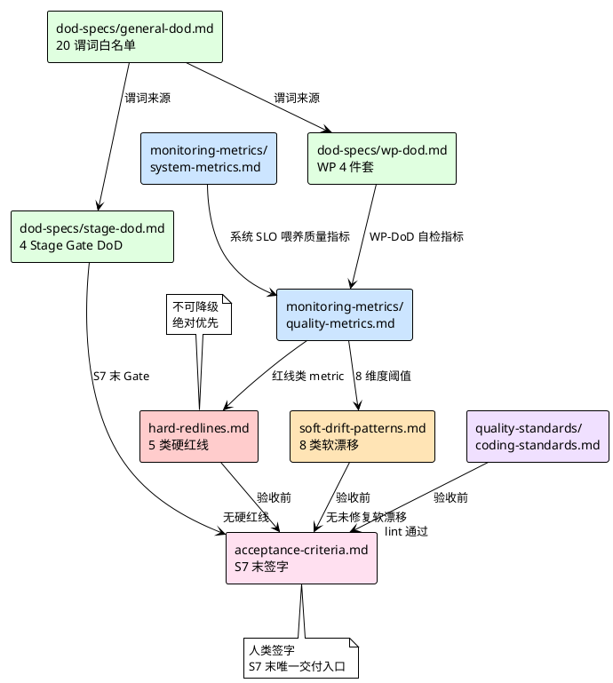
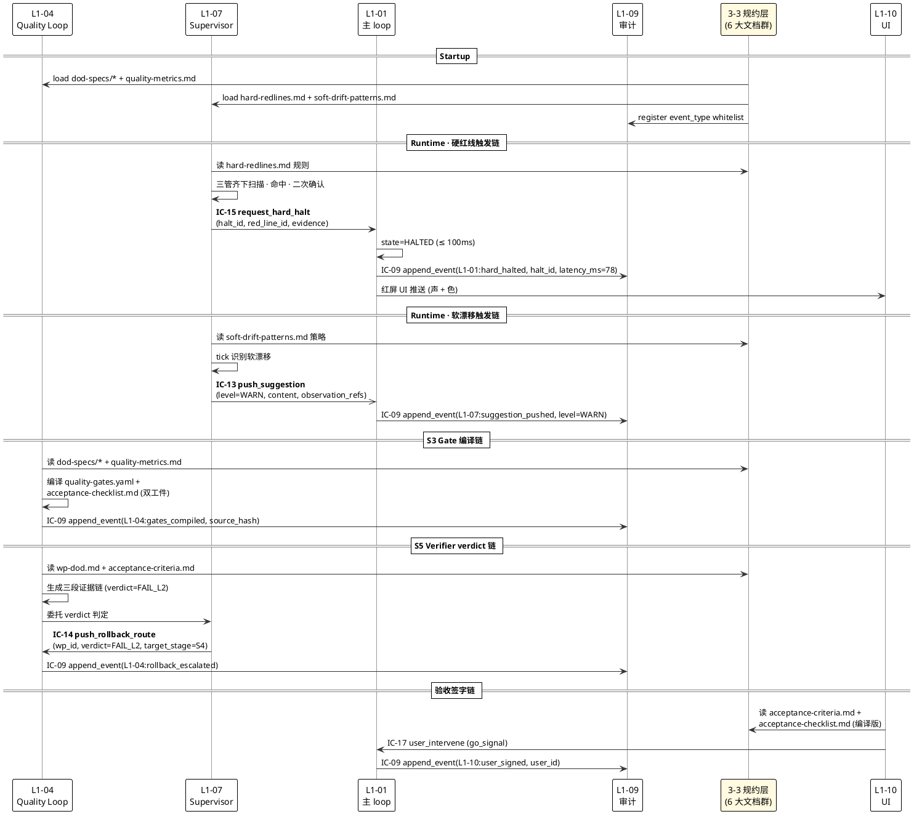

# 3-3 Monitoring & Controlling · 总览

> **本文档定位**：3-3 Monitoring & Controlling 规约层的**入口索引** · 说明本层职责边界 · 对比 3-1「如何实现」与 3-2「如何测」· 导航 6 大规约文档群 · 面向 L1-04 / L1-07 / L1-09 消费方锚定 IC 契约。
> **与 3-1/3-2 的分工**：3-1 定义「系统如何实现」（L1 × L2 技术方案）· 3-2 定义「如何测」（测试计划 + 用例）· **3-3 定义「如何监督与判通过」**（质量 Gate 规约 · 硬红线清单 · 软漂移清单 · DoD 契约 · 指标定义 · 验收标准）。
> **消费方**：L1-04 质量环（读 DoD 编译 Gate · 读 acceptance-criteria 生成人类 checklist）· L1-07 监督（订阅 hard-redlines + soft-drift-patterns 触发 IC-13/14/15）· L1-09 审计（读 monitoring-metrics 校验事件流完整性）· 交付验收阶段（读 acceptance-criteria + quality-standards）。

---

## §0 撰写进度

- [x] §1 定位 + 与上游 PRD/scope 的映射
- [x] §2 6 大规约群导航（一句话定位 + 消费方映射）
- [x] §3 何时被消费（startup / runtime / Gate 前 / 验收阶段 4 个时点）
- [x] §4 与 L1-04 / L1-07 / L1-09 的 IC 契约对接（IC-09/13/14/15）
- [x] §5 证据审计 YAML + 规约变更审计链路
- [x] §6 与 2-prd 的反向追溯表（≥ 20 条 · 1:1 映射）

---

## §1 定位：3-3 层职责边界

### 1.1 3-3 与 3-1 / 3-2 的分工

HarnessFlow 全栈文档体系中，3-x 层对应不同的工程视角：

- **3-1 Solution-Technical**：回答「**系统如何实现**」—— L1 × L2 × architecture × IC × DDD × DB × schema，是"构造器"，交付物是可落地的设计方案。
- **3-2 Test-Plan**：回答「**如何测**」—— Master Test Plan × 用例清单 × TDD 蓝图 × 覆盖率策略，是"检验器"，交付物是可执行的测试工件。
- **3-3 Monitoring & Controlling**：回答「**如何监督与判通过**」—— 硬红线清单 / 软漂移清单 / DoD 表达式 / 指标定义 / 质量标准 / 验收标准，是"裁判"，交付物是可由机器编译为 Gate 判断 + 可由人类签字的规约集合。

### 1.2 "监督什么" vs "如何实现" vs "如何测" 的精确分界

| 分界维度 | 3-1（实现） | 3-2（测） | **3-3（监督与控制）** |
|:--:|:--|:--|:--|
| **产出主语** | 代码 / 类 / 接口 | 测试用例 / 覆盖率 | **规约 / 阈值 / 判据** |
| **时效** | 一次性交付（S4 完） | 伴随代码迭代 | **贯穿 S1→S7 全生命周期** |
| **谁消费** | 开发 / Review | CI / CD / TDD | **L1-04 编译 Gate / L1-07 触发拦截 / 验收签字** |
| **机器 vs 人类** | 机器可执行（Python / YAML） | 机器可执行（pytest） | **双目标（机器 Gate YAML + 人类 checklist MD）** |
| **审计义务** | 无（被测） | 无（被跑） | **强审计（每条规约必 IC-09 落盘）** |
| **失败语义** | bug → 修代码 | 测挂 → 修代码/用例 | **规约失败 → 3-3 改规约 + 走变更流程（不改代码）** |

> **核心判据**：若某个决策是"对代码质量下判断"，它归 3-3；若是"把代码写出来/测出来"，归 3-1/3-2。

### 1.3 3-3 层 6 大文档群的物理分布

```
docs/3-3-Monitoring-Controlling/
├── L0/overview.md                      # 本文档 · 入口索引
├── hard-redlines.md                    # 硬红线 5 类全集 + 识别方法
├── soft-drift-patterns.md              # 软漂移 8 类全集 + 自治修复策略
├── dod-specs/
│   ├── general-dod.md                  # 通用 DoD 谓词白名单（20 个内建）
│   ├── stage-dod.md                    # Stage Gate DoD（S1/S2/S3/S7 4 次）
│   └── wp-dod.md                       # WP 级 DoD（Goal/DoD/依赖/工时四件套）
├── monitoring-metrics/
│   ├── quality-metrics.md              # 质量指标（8 维度 × 阈值）
│   └── system-metrics.md               # 系统指标（延迟 / 吞吐 / 事件量）
├── quality-standards/
│   └── coding-standards.md             # 代码规范（命名 / 格式 / 注释）
└── acceptance-criteria.md              # 交付验收标准（S7 末 · 业务签字）
```

**10 份文档群 = 6 个语义族**：硬红线 / 软漂移 / DoD × 3 / 监控指标 × 2 / 代码规范 / 验收标准。

### 1.4 消费者矩阵（谁读 3-3 的哪份文档）

| 消费方 | 读的文档 | 读的时机 | 读后动作 |
|:--:|:--|:--|:--|
| **L1-04 质量环（L2-04 Gate 编译器）** | dod-specs/×3 + quality-metrics.md + coding-standards.md | S3 TDD 蓝图编制时 | 编译为 quality-gates.yaml + acceptance-checklist.md 双工件 |
| **L1-04 质量环（L2-06 Verifier 委托）** | acceptance-criteria.md + wp-dod.md | S5 TDDExe 每 WP 时 | 生成三段证据链（PASS / FAIL_L1-L4） |
| **L1-07 监督（L2-03 硬红线拦截器）** | hard-redlines.md | runtime · PreToolUse + post-commit hook | 命中 → IC-15 halt L1-01 |
| **L1-07 监督（L2-05 软漂移处理器）** | soft-drift-patterns.md | runtime · 每 30s tick | 命中 → IC-13 push_suggestion WARN |
| **L1-07 监督（L2-02 Verdict 判定器）** | quality-metrics.md + stage-dod.md | runtime · 每决策 | 4 档 verdict 发 IC-14 / IC-15 |
| **L1-09 审计** | monitoring-metrics/×2 | runtime · 事件写入校验 | 事件流完整性校验 + hash chain 审计 |
| **L1-10 UI（Stage Gate 待办中心）** | acceptance-criteria.md + stage-dod.md | S1/S2/S3/S7 末 Gate 时 | 待审卡片 + 产出物预览 + Go/No-Go |
| **业务签字者** | acceptance-criteria.md + quality-standards/ | S7 末验收会议 | 签字确认 or 退回 |

### 1.5 与 2-prd §3 / §5.7 / §5.4 的精确映射

- **scope §3（L1 × 能力映射表 L131）**：L1-07 = 8 维度观察 + 4 级干预 + 软红线 8 类自治 / 硬红线 5 类上报 → 在 3-3 定义为 soft-drift-patterns.md（8 类语义） + hard-redlines.md（5 类语义 + 识别规则）。
- **scope §5.4（L1-04 真完成判定能力）**：S3 产出 DoD 表达式 + 质量 gate + 验收 checklist → 在 3-3 定义为 dod-specs/×3 + acceptance-criteria.md，L1-04 L2-04 Gate 编译器**只编译不定义**。
- **scope §5.7（L1-07 Harness 监督能力）**：硬红线 5 类 / 软红线 8 类 **定义源**就在本 3-3 层 → 监督组件是"**规约消费者**"。
- **HarnessFlowGoal.md §4.1 考核指标**：决策可追溯率 100% + 监督 Agent 3 红线准确率 100% + 真完成质量 100% → 在 3-3 落地为 quality-metrics.md 的阈值条款。

---

## §2 6 大规约群导航

### 2.1 一句话定位表

| # | 规约文档 | 一句话定位 | 机器/人类 | 格式 |
|:--:|:--|:--|:--:|:--:|
| 1 | `hard-redlines.md` | **5 类硬红线全集** + 识别规则 + **不可降级** HALT 语义（验证层 / 执行层 / 凭证层 / 治理层 / 审计层） | 机器+人类 | MD + YAML 规则 |
| 2 | `soft-drift-patterns.md` | **8 类软漂移清单** + 自治修复策略（context 90% / 未补回应 / 风险未归档 / skill 密度过高 / verifier 低分 / WP 卡住 / 预算接近 / 沟通失焦） | 机器+人类 | MD + YAML 策略 |
| 3 | `dod-specs/general-dod.md` | 通用 DoD 谓词白名单（20 个内建 bool 函数 · **禁 arbitrary exec** · AST eval） | 机器 | YAML + Python stub |
| 4 | `dod-specs/stage-dod.md` | **4 次 Stage Gate 的 DoD**（S1 需求 / S2 架构+计划 / S3 TDD 蓝图 / S7 交付验收 · 4 件套硬性） | 机器+人类 | YAML + MD |
| 5 | `dod-specs/wp-dod.md` | 每个 WP 的 **Goal/DoD/依赖/工时 四件套**硬约束 + WP-DoD 自检规则 | 机器 | YAML |
| 6 | `monitoring-metrics/quality-metrics.md` | **8 维度质量指标 + 阈值锁定**（目标保真 / 计划对齐 / 真完成 / 红线安全 / 进度 / 成本 / Loop / 协作） | 机器 | YAML |
| 7 | `monitoring-metrics/system-metrics.md` | **系统级指标**（IC SLO · P95 ≤ ms · 事件 fsync ≤ 20ms · PreToolUse hook ≤ 100ms） | 机器 | YAML |
| 8 | `quality-standards/coding-standards.md` | 代码规范（命名 / 格式 / 注释 / import 顺序 / 类型提示强制） | 人类+机器 | MD + linter config |
| 9 | `acceptance-criteria.md` | **S7 末交付验收标准** + **业务签字区块** + 4 件套文档齐全硬性 | 人类 | MD |

### 2.2 消费方映射总表（谁读哪份 + 读到做什么）

| 规约文档 | L1-04 Gate 编译器 | L1-04 Verifier | L1-07 硬红线拦截 | L1-07 软漂移处理 | L1-09 审计 | 业务验收 |
|:--|:--:|:--:|:--:|:--:|:--:|:--:|
| `hard-redlines.md` | - | - | ✅ 主消费 | - | 事件 schema | - |
| `soft-drift-patterns.md` | - | - | - | ✅ 主消费 | 事件 schema | - |
| `dod-specs/general-dod.md` | ✅ 编译为 YAML | - | - | - | - | - |
| `dod-specs/stage-dod.md` | ✅ Gate 编译 | ✅ 读 S2/S3 Gate | - | - | - | ✅ Gate 待审读 |
| `dod-specs/wp-dod.md` | ✅ WP-DoD 自检 | ✅ WP 级验证 | - | - | - | - |
| `quality-metrics.md` | ✅ 阈值锁定 | ✅ 评分对照 | - | ✅ 阈值触发 | 指标事件 | - |
| `system-metrics.md` | - | - | - | - | ✅ SLO 校验 | - |
| `coding-standards.md` | ✅ 编为 lint Gate | ✅ lint 评判 | - | - | - | ✅ 验收读 |
| `acceptance-criteria.md` | - | ✅ 读交付标准 | - | - | - | ✅ 主消费+签字 |

### 2.3 规约之间的依赖关系



---

## §3 何时被消费：4 个时点

### 3.1 Startup 时点（项目启动 · S0/S1 阶段）

**触发**：新建项目、S1 启动阶段、首次加载 3-3 规约。

**动作**：
1. L1-04 L2-04 Gate 编译器**加载** `dod-specs/general-dod.md` 谓词白名单 → 构建 PredicateWhitelist 常量表。
2. L1-07 Supervisor**加载** `hard-redlines.md` 5 类规则 + `soft-drift-patterns.md` 8 类策略 → 编译为运行时规则树（AST 模式 + 正则库 + 计数器查询）。
3. L1-09 审计子系统**注册** `monitoring-metrics/` 的所有指标项为 event_type registry 白名单成员。

**SLO**：Startup 全量加载 ≤ 500ms（单项目 · 冷启动）。

**失败**：任一规约加载失败即 L1-01 拒绝启动 tick，落 `monitoring_spec_load_failed` 事件。

### 3.2 Runtime 时点（L1-07 监督订阅 · 每 tick）

**触发**：L1-07 Supervisor 每 30s tick + PostToolUse hook。

**动作**：
1. **硬红线订阅**（PreToolUse / post-commit）：
   - L2-03 读 `hard-redlines.md` 规则树 → 执行三管齐下扫描（静态 grep + AST + runtime counter）
   - 命中 → 生成 `HardRedlineViolation` 域事件 → L2-04 转为 **IC-15 request_hard_halt**（≤ 100ms 抢占式）
2. **软漂移订阅**（tick）：
   - L2-05 读 `soft-drift-patterns.md` 策略 → 识别 8 类中某类命中
   - 命中 → 执行自治修复（不打扰用户）或 **IC-13 push_suggestion WARN**（严重时）

**SLO**：PreToolUse hook P95 ≤ 100ms；post-commit 静态扫描 P95 ≤ 5s；tick 软漂移识别 P95 ≤ 500ms。

### 3.3 Gate 前时点（L1-04 编译质量 Gate · S3 阶段）

**触发**：S3 TDD 蓝图编制阶段 + S4 WP 完成后 DoD 自检。

**动作**：
1. L1-04 L2-04 Gate 编译器读 `dod-specs/general-dod.md` + `stage-dod.md` + `wp-dod.md` + `quality-metrics.md` → 编译为 `quality-gates.yaml`（机器可执行）+ `acceptance-checklist.md`（人类可读签字版）双工件。
2. 双工件必须共享 `source_compilation_id` + `source_hash`（Coherence Invariant · 见 L2-04 §1.3 D2）。
3. L1-04 L2-06 Verifier 在 S5 TDDExe 阶段读 `wp-dod.md` 自检 + `acceptance-criteria.md` 生成三段证据链（PASS / FAIL_L1-L4）。

**SLO**：Gate 编译 ≤ 5s（单 WP）；Verifier 调用 ≤ verifier_timeout_s（通常 60s）。

**失败**：
- 双工件 hash 不一致 → L1-04 REJECT_PUBLISH（硬拒绝 · 不降级）
- Predicate 超白名单 → L1-04 抛 `E_DOD_ESCAPE_WHITELIST` → L1-07 判为**硬红线类①**

### 3.4 验收阶段时点（S7 末 · 业务签字）

**触发**：S7 交付验收阶段 + 业务方进入签字界面。

**动作**：
1. L1-02 触发 **IC-16 push_stage_gate_card** 到 L1-10 → UI 渲染 S7 Gate 待审卡片。
2. UI 读 `acceptance-criteria.md` 原文 + `quality-standards/coding-standards.md` lint 结果 + 前 4 次 Stage Gate 验证记录 → 生成人类可读的验收包。
3. 业务方读 `acceptance-checklist.md`（L1-04 在 S3 编译的人类版）→ 逐条确认 → 签字 / 退回。

**SLO**：UI 首屏 ≤ 500ms；签字动作 ≤ 用户自主节奏（无机器 SLO）。

### 3.5 降级策略对照

| 规约族 | 可降级吗？ | 降级策略 |
|:--|:--:|:--|
| `hard-redlines.md` | ❌ **绝不降级** | 扫描能力降级 → 识别率可能下降，但 HALT 判定不降级（见 L2-03 §1.4 D4） |
| `soft-drift-patterns.md` | ✅ 可降级 | WARN 级降 INFO；部分策略 skip |
| `dod-specs/*` | ❌ **绝不降级** | Predicate 白名单硬锁定，超白名单即 REJECT |
| `monitoring-metrics/quality-metrics.md` | ⚠️ 部分 | 采样频率降级 OK；阈值不降 |
| `monitoring-metrics/system-metrics.md` | ⚠️ 部分 | 指标采集降频 OK；关键 SLO 不降 |
| `quality-standards/coding-standards.md` | ✅ 可降级 | lint warning → skip；error 不降 |
| `acceptance-criteria.md` | ❌ **绝不降级** | 业务签字缺失 = S7 Gate 不通过（硬约束 2） |

---

## §4 与 L1-04 / L1-07 / L1-09 的 IC 契约对接

### 4.1 IC-14 verdict（L1-04 质量环 → L1-07 → L1-04 Router）

**锚定**：`docs/3-1-Solution-Technical/integration/ic-contracts.md §3.14 IC-14 push_rollback_route`

**3-3 消费者义务**：
- `dod-specs/wp-dod.md` + `quality-metrics.md` 定义的 verdict 输出空间 ∈ {PASS, FAIL_L1, FAIL_L2, FAIL_L3, FAIL_L4}
- 每个 verdict 值对应一个 `target_stage` 映射（PASS → S6 / FAIL_L1 → S3 重跑 / FAIL_L2 → S4 重改 / FAIL_L3 → 升级 / FAIL_L4 → HALT）
- 同级 FAIL ≥ 3 次自动升级为"极重度"，经由 IC-15（见 IC-14 §3.14.1）

**3-3 文档义务**：`quality-metrics.md` 必须为每个 verdict 提供可机器识别的阈值条款。

### 4.2 IC-13 suggestion（L1-07 → L1-01）

**锚定**：`ic-contracts.md §3.13 IC-13 push_suggestion`

**3-3 消费者义务**：
- `soft-drift-patterns.md` 8 类的识别结果 = IC-13 payload 的 `level` 决定（INFO / SUGG / WARN）
- BLOCK 级**不走** IC-13（走 IC-15）—— 本划分由 3-3 保证语义纯度

**3-3 文档义务**：`soft-drift-patterns.md` 必须为每条软漂移给出：识别规则 + 自治修复动作 + upgrade 条件（何时升级为 WARN · 何时再升为 BLOCK）。

### 4.3 IC-15 hard_halt（L1-07 → L1-01 · 阻塞式 ≤ 100ms）

**锚定**：`ic-contracts.md §3.15 IC-15 request_hard_halt`

**3-3 消费者义务**：
- `hard-redlines.md` 5 类 = IC-15 的唯一合法触发源（除外即错误走 IC-13 → `E_SUGG_LEVEL_IS_BLOCK` 拒绝）
- 每条红线必须提供 `evidence` 字段所需的证据格式（event_refs / file_paths / line_numbers / ast_nodes / counter_snapshots / grep_matches）

**3-3 文档义务**：`hard-redlines.md` 必须为 5 类中每一条明确：
1. 识别方法（grep / AST / runtime counter / regex / goal anchor 漂移）
2. 二次确认规则（`confirmation_count ≥ 2`）
3. 不可降级声明
4. 错误码锚点（HR01-HR18）

### 4.4 IC-09 audit（全部 L1 → L1-09 · 强一致 fsync）

**锚定**：`ic-contracts.md §3.9 IC-09 append_event`

**3-3 消费者义务**：
- 3-3 每条规约**触发任何决策**时必 IC-09 落盘
- `event_type` 白名单必须注册在 L1-09 schema registry，否则拒绝（`E_EVT_TYPE_UNKNOWN`）

**3-3 文档义务**：
- 每条规约必须声明自己生产的 `event_type` 集合
- `monitoring_spec_*` 系列事件（见 §5.2）作为规约层的变更审计

### 4.5 4 条 IC 触发链路全景图



---

## §5 证据审计：3-3 规约成立的证据要求

### 5.1 每条规约成立必提供的证据（字段级 YAML）

每条 3-3 规约发布或变更时，必须提供完整的证据包，作为 L1-09 可审计的元数据：

```yaml
# 3-3 规约证据包 schema
spec_evidence:
  required:
    - doc_id              # 规约文档唯一标识（如 "hard-redlines-v1.0"）
    - doc_path            # 文件路径（如 "docs/3-3-Monitoring-Controlling/hard-redlines.md"）
    - version             # 语义版本（MAJOR.MINOR.PATCH）
    - source_hash         # SHA-256 文档内容哈希（禁止变更即改）
    - parent_doc_refs     # 上游 2-prd 锚点（具体到 §X.Y）
    - consumed_by         # 消费方 L1 列表 + IC 入口
    - evidence_type       # 规约成立的证据类型（spec_lockdown / spec_patch / spec_deprecated）
    - change_reason       # 变更理由（仅 spec_patch / spec_deprecated 必需）
    - review_ts           # 规约 review 通过的时间戳
    - ic_impact           # 被影响的 IC 列表（IC-13/14/15/09）

  fields:
    doc_id: {type: string, pattern: "^[a-z0-9-]+-v[0-9]+\\.[0-9]+$"}
    doc_path: {type: string, pattern: "^docs/3-3-Monitoring-Controlling/.+\\.md$"}
    version: {type: semver}
    source_hash: {type: string, length: 64, charset: hex}
    parent_doc_refs:
      type: array
      items:
        - {doc: "docs/2-prd/L0/scope.md", section: "§3 L131", anchor_type: table_row}
        - {doc: "docs/2-prd/L0/scope.md", section: "§5.7.X", anchor_type: subsection}
    consumed_by:
      type: array
      items:
        - {l1: "L1-04", entry: "L2-04.compile_from()"}
        - {l1: "L1-07", entry: "L2-03.pre_tool_use_intercept()"}
    evidence_type:
      type: enum
      values: [spec_lockdown, spec_patch, spec_deprecated]
    change_reason:
      type: string
      required_if: "evidence_type in [spec_patch, spec_deprecated]"
      min_length: 50
```

### 5.2 规约变更审计链路（IC-09 event_type = monitoring_spec_*）

当 3-3 规约发生任何变更，必须沿以下链路落 IC-09 事件：

| event_type | 触发 | payload 关键字段 | 消费方 |
|:--|:--|:--|:--|
| `monitoring_spec_published` | 规约首次发布 | `{doc_id, version, source_hash, parent_doc_refs}` | L1-04 重新编译 Gate · L1-07 重载规则树 |
| `monitoring_spec_changed` | 规约版本升级 | `{doc_id, old_version, new_version, old_hash, new_hash, change_reason, ic_impact[]}` | L1-04 + L1-07 + L1-10（UI 通知） |
| `monitoring_spec_deprecated` | 规约弃用 | `{doc_id, deprecated_at, migration_guide}` | 全部 L1（拒绝再读） |
| `monitoring_spec_load_failed` | Startup 加载失败 | `{doc_id, error_code, file_path}` | L1-01 拒绝启动 |
| `monitoring_spec_coherence_violated` | 双工件 hash 不一致 | `{qgc_id, acl_id, expected_hash, actual_hash}` | L1-04 REJECT_PUBLISH |

**链路示意**：

```
3-3 规约变更
    ↓
git commit (触发 git post-commit hook)
    ↓
IC-09 append_event(monitoring_spec_changed, ...)  ← 强一致 fsync
    ↓
L1-09 hash chain 链入
    ↓
通知 L1-04 + L1-07 重新加载  ← 通过事件订阅
    ↓
L1-04 重编译 quality-gates.yaml (如相关)
L1-07 重载规则树 (如相关)
    ↓
全链 IC-09 审计事件串联完成
```

### 5.3 规约 hash 链锁定

- 每份规约文档的 `source_hash` 必须随内容**每次变更**更新
- L1-04 在编译 Gate 时，**强制**把 3-3 规约的 source_hash 写入生成的 quality-gates.yaml 头部
- 若 runtime 发现当前规约 hash ≠ 编译时 hash → 触发 `coherence_violated` → L1-04 拒绝消费（硬拒绝）

### 5.4 规约 review 义务

- **新增**规约：必须 L1-07 Supervisor + L1-04 L2-04 双方签字
- **修改**规约：必须 scope.md 先更新（上游）→ 3-3 同步（下游）
- **弃用**规约：必须提供 migration_guide + deprecated_at 时间戳

---

## §6 反向追溯表：3-3 文档 ↔ 2-prd 1:1 映射

本表为 3-3 每条规约文档反向追溯到 `docs/2-prd/L0/scope.md` 或 `docs/2-prd/HarnessFlowGoal.md` 的 1:1 映射，**强制执行**「3-3 每条规约必可追溯到 2-prd」的硬约束。

| # | 3-3 规约（文档 + 关键条款） | 上游 2-prd 锚点 | 映射类型 |
|:--:|:--|:--|:--:|
| 1 | `hard-redlines.md` 5 类全集定位 | `scope.md §3 L131 L1-07 能力映射` | 语义等价 |
| 2 | `hard-redlines.md` 类① 验证层（verifier 主 session 自跑） | `scope.md §5.4 L1-04 禁止清单` + `§5.7 硬红线 5 类` | 条款派生 |
| 3 | `hard-redlines.md` 类② 执行层（self-repair ≥3 / rm -rf） | `scope.md §5.7 L1-07 禁止清单` | 条款派生 |
| 4 | `hard-redlines.md` 类③ 凭证层（API key / SSH / PII） | `HarnessFlowGoal.md §4.1 安全考核` | 条款派生 |
| 5 | `hard-redlines.md` 类④ 治理层（goal_anchor 漂移 / 预算超 200%） | `scope.md §5.7 L1-07` + `HarnessFlowGoal.md §4.1 "决策可追溯率 100%"` | 指标对齐 |
| 6 | `hard-redlines.md` 类⑤ 审计层（事件链缺环 / hash chain 断裂） | `scope.md §5.9 L1-09 审计能力` | 完整性约束 |
| 7 | `hard-redlines.md` "不可降级" 声明 | `scope.md §5.7 PM-12 红线分级自治` | 原则条款 |
| 8 | `soft-drift-patterns.md` 8 类全集定位 | `scope.md §3 L131 L1-07 能力映射` + `§5.7` | 语义等价 |
| 9 | `soft-drift-patterns.md` 软漂移 "context 90%" | `scope.md §5.7 L1-07 8 维度 · 维度 7 Loop` | 维度条款 |
| 10 | `soft-drift-patterns.md` 软漂移 "未补书面回应" | `scope.md §5.7 L1-07 8 维度 · 维度 8 用户协作` | 维度条款 |
| 11 | `soft-drift-patterns.md` 自治修复策略（不打扰用户） | `scope.md §5.7 PM-12 软红线必须不打扰用户` | 原则条款 |
| 12 | `dod-specs/general-dod.md` 20 谓词白名单 | `scope.md §5.4 PM-05 Stage Contract 机器可校验 · DoD 走白名单 AST eval` | 强约束 |
| 13 | `dod-specs/general-dod.md` "禁 arbitrary exec" | `scope.md §5.4 L1-04 禁止 DoD 表达式含 arbitrary exec` | 禁止清单 |
| 14 | `dod-specs/stage-dod.md` S1 需求 Gate DoD | `scope.md §5.2 L1-02 Stage Gate 4 次 · S1 末 + 4 件套` | 硬约束 |
| 15 | `dod-specs/stage-dod.md` S2 架构+计划 Gate DoD | `scope.md §5.2 L1-02 · S2 末 + 4 件套` | 硬约束 |
| 16 | `dod-specs/stage-dod.md` S3 TDD 蓝图 Gate DoD | `scope.md §5.4 L1-04 S3 产出 (Master Test Plan + DoD + 用例 + gate + checklist)` | 硬约束 |
| 17 | `dod-specs/stage-dod.md` S7 交付验收 Gate DoD | `scope.md §5.2 L1-02 · S7 末 + 4 次 Gate 硬性` | 硬约束 |
| 18 | `dod-specs/stage-dod.md` "禁止跳过 Stage Gate" | `scope.md §5.2 L1-02 · 禁止跳过任一 Stage Gate` | 禁止清单 |
| 19 | `dod-specs/wp-dod.md` WP 4 件套（Goal/DoD/依赖/工时） | `scope.md §5.3 L1-03 · 禁止 WP 定义缺 Goal/DoD/依赖/工时` | 硬约束 |
| 20 | `dod-specs/wp-dod.md` WP-DoD 自检规则 | `scope.md §5.4 L1-04 · BF-S4-04 WP-DoD 自检流` | 流程条款 |
| 21 | `monitoring-metrics/quality-metrics.md` 8 维度 | `scope.md §5.7 L1-07 · 8 维度指标实时计算` | 语义等价 |
| 22 | `monitoring-metrics/quality-metrics.md` "真完成质量 100%" | `HarnessFlowGoal.md §4.1 V1 量化指标` | 指标锁定 |
| 23 | `monitoring-metrics/quality-metrics.md` "决策可追溯率 100%" | `HarnessFlowGoal.md §4.1 V1 量化指标` | 指标锁定 |
| 24 | `monitoring-metrics/quality-metrics.md` "监督 Agent 3 红线准确率 100%" | `HarnessFlowGoal.md §4.1` + `scope.md §5.7` | 指标锁定 |
| 25 | `monitoring-metrics/system-metrics.md` IC SLO P95 | `scope.md §8 IC-01~20 P95 条款` | SLO 继承 |
| 26 | `monitoring-metrics/system-metrics.md` 事件 fsync ≤ 20ms | `scope.md §5.9 L1-09 强一致 fsync` + `ic-contracts.md §3.9` | SLO 继承 |
| 27 | `quality-standards/coding-standards.md` 命名/格式/注释 | `scope.md §4 (4 件套) · 技术输出规范` | 通用规范 |
| 28 | `quality-standards/coding-standards.md` 类型提示强制 | `HarnessFlowGoal.md §4.2 工程质量` | 通用规范 |
| 29 | `acceptance-criteria.md` S7 末 4 件套齐全 | `scope.md §5.2 L1-02 · 4 件套生产（需求/目标/验收/质量）` | 交付标准 |
| 30 | `acceptance-criteria.md` 业务签字硬约束 | `scope.md §5.10 L1-10 · 硬约束 2 Stage Gate 待审卡片不得自动通过` | 交互硬约束 |
| 31 | `acceptance-criteria.md` "无硬红线命中" 准入 | `scope.md §7 集成验证硬约束 · 硬红线 5 类全部集成测试通过` | 准入条款 |
| 32 | `acceptance-criteria.md` "无未修复软漂移" 准入 | `scope.md §7 · 软红线 8 类全部集成测试通过` | 准入条款 |
| 33 | 3-3 整体 "每条规约必可追溯" 原则 | `HarnessFlowGoal.md §3.5 L1 硬约束 · 决策可追溯` | 体系原则 |
| 34 | 3-3 `monitoring_spec_*` 事件系列 | `scope.md §8 IC-09 append_event · event_type 白名单` | 事件契约 |

### 6.1 2-prd 反向回流校验

每当 2-prd `scope.md` 或 `HarnessFlowGoal.md` 更新涉及以下关键词，**必须**同步检查 3-3 层：

- "硬红线" / "红线 5 类" → 回流到 `hard-redlines.md`
- "软红线" / "软漂移" / "红线 8 类" → 回流到 `soft-drift-patterns.md`
- "DoD" / "Stage Gate" / "4 件套" → 回流到 `dod-specs/*.md`
- "8 维度" / "指标" / "考核" → 回流到 `monitoring-metrics/*.md`
- "验收" / "签字" / "交付标准" → 回流到 `acceptance-criteria.md`

任何未回流的 2-prd 变更，L1-07 Supervisor 在 tick 发现 hash 不匹配时，会产出 `monitoring_spec_sync_drift` 事件作为软漂移 warning。

### 6.2 3-3 与 3-1 / 3-2 的平行对照

| 层 | 入口文档 | 消费方 | 实现/测试/监督 |
|:--|:--|:--|:--|
| 3-1 | `3-1-Solution-Technical/L0/*` | 开发 / Review | 实现 |
| 3-2 | `3-2-Test-Plan/L0/*` | CI / CD | 测试 |
| **3-3** | `3-3-Monitoring-Controlling/L0/overview.md`（本文档） | **L1-04 / L1-07 / L1-09 / UI / 业务** | **监督 + 控制** |

---

*— 3-3 Monitoring & Controlling · 总览 · filled · v1.0 · 2026-04-24 · 6 大规约群导航 + IC 契约对接 + 反向追溯表 34 条 —*
