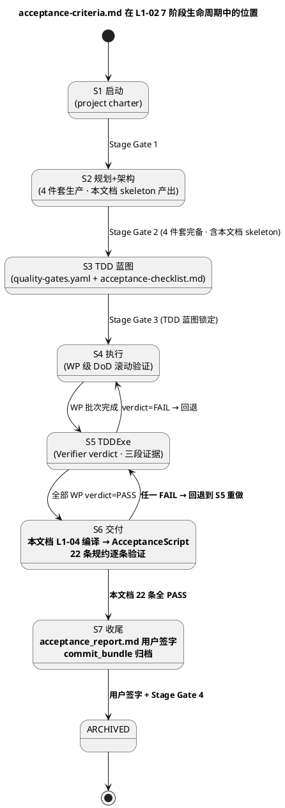
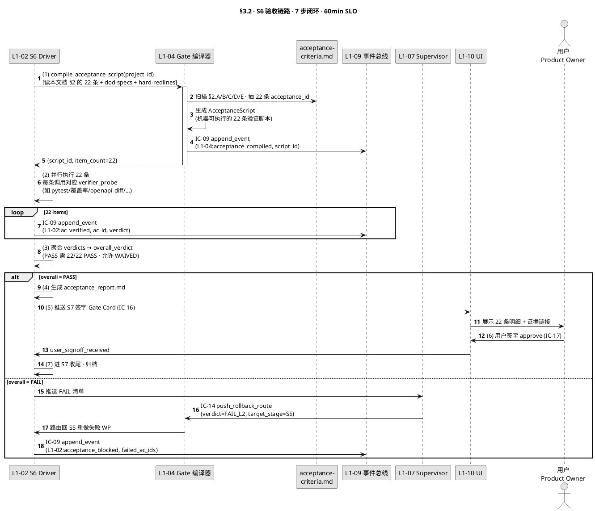
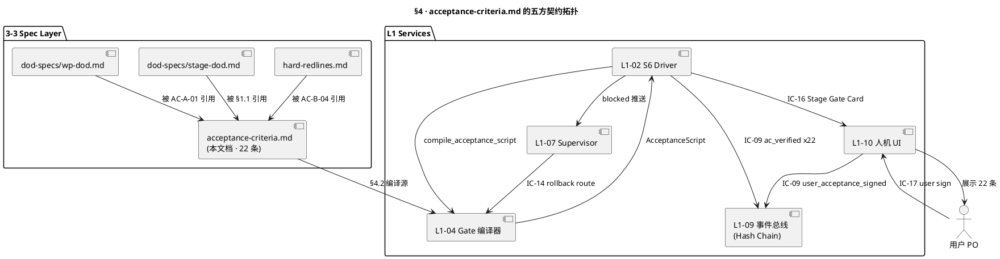

# 最终验收标准（Project-Level Acceptance Criteria）

> **本文档定位**：3-3 Monitoring & Controlling 层 · **项目层**（非阶段级、非 WP 级）可交付 Definition · 5 类 20+ 条验收规约 · 用户终验签字流程 · S6/S7 硬性产出物
> **与 3-1/3-2 的分工**：3-1 定义"系统如何实现" · 3-2 定义"如何测" · **3-3 定义"如何监督与判通过"**（质量 Gate 规约 · 硬红线清单 · DoD 契约 · 验收标准）
> **消费方**：L1-02 S6 Driver（调编译 → 逐条验证）· L1-04 Gate 编译器（编译 → AcceptanceScript）· L1-07 Supervisor（订阅 verdict）· L1-09（IC-09 落盘审计）· L1-10 人机 UI（读 `acceptance_report.md`）

---

## §0 撰写进度

- [x] §1 定位 + 与上游 PRD/scope 的映射
- [x] §2 核心清单 / 规约内容（A 功能 / B 质量 / C 文档 / D 部署 / E 运维 · 共 22 条）
- [x] §3 触发与响应机制
- [x] §4 与 L1-02 / L1-04 / L1-09 / L1-10 的契约对接
- [x] §5 证据要求 + 审计 schema
- [x] §6 与 2-prd 的反向追溯表

---

## §1 定位 + 与 stage-dod / wp-dod / 2-prd §12 的映射

### §1.1 三级 DoD 在 3-3 层的纵向分工

harnessFlow 质量门体系分三级，本文档锚定**最高层（项目级）**：

| 层级 | 文档 | 粒度 | 触发时机 | 签字角色 |
|---|---|---|---|---|
| **项目级** | **acceptance-criteria.md（本文档）** | 整个项目的 20+ 条最终规约 | **S6 交付 + S7 收尾**（L1-02 发起）· **用户终验**（L1-10 UI） | **用户（项目所有者）+ AI 主 loop + Verifier** |
| 阶段级 | `docs/3-3-Monitoring-Controlling/dod-specs/stage-dod.md` | S1/S2/S3/S4/S5/S6/S7 各阶段 DoD | 每个 Stage Gate 处（S1/S2/S3/S7 末 4 次硬 Gate · S4/S5/S6 软 Gate） | AI 主 loop（Stage Gate 自洽闭合）· 仅 S7 末触发用户签字 |
| WP 级 | `docs/3-3-Monitoring-Controlling/dod-specs/wp-dod.md` | 单个 Work Package | 每个 WP 在 S5 TDDExe 完成时 | Verifier（三段证据链）· 主 loop 接收 verdict |

**关键边界**（PM-14 + Goal §3.3）：

- 阶段级 DoD 和 WP 级 DoD 都是**过程中间态 Gate**，用于推进流水线不失速。
- **本文档（项目级）是终态 Gate**——只在 S6（交付）启动时触发一次完整验收，在 S7（收尾）末端要求**用户签字**才能把项目从 `ACTIVE` 转到 `ARCHIVED` 状态。
- 没有本文档的 PASS，S7 Gate 无法完成，`commit_bundle` 不能对外发布，`project_id` 不能归档。

### §1.2 与 2-prd §12 验收的 1:1 映射

本文档 §2 的 22 条规约与 `docs/2-prd/L0/scope.md §12 验收` 条款一一对应（反向追溯见 §6 表）：

| 2-prd §12 条款族 | 本文档 §2 类别 | 条数 |
|---|---|---|
| §12.1 功能完备性（scope §3 闭合） | A. 功能验收 | 5 |
| §12.2 质量硬红线（scope §8 红线 + §10 DoD） | B. 质量验收 | 5 |
| §12.3 文档完备性（scope §5 4 件套 + TOGAF/PMP 产出物） | C. 文档验收 | 4 |
| §12.4 可部署性（scope §4 交付形态） | D. 部署验收 | 4 |
| §12.5 可运维性（scope §9 监控指标 + §11 告警） | E. 运维验收 | 4 |

### §1.3 与 L1-02 S6/S7 阶段的时序



### §1.4 本文档在 3-3 层的邻居

- `dod-specs/stage-dod.md`——阶段级 DoD（S6 的 Gate 也引用本文档 §2 作为输入）
- `dod-specs/wp-dod.md`——WP 级 DoD（Verifier 使用）
- `hard-redlines.md`——5 大硬红线（本文档 B 类质量验收的强制输入）
- `soft-drift-patterns.md`——软漂移模式（本文档 E 类运维验收的输入）
- `quality-standards/`——质量标准目录（覆盖率 / P0 缺陷阈值等）
- `monitoring-metrics/`——监控指标目录（SLO / SLI / 告警规则）

---

## §2 验收标准清单（5 类 22 条）

**分类约定**：

- `acceptance_id` 格式：`AC-{LETTER}-{NN}`（A/B/C/D/E · 两位序号）
- `verdict` 枚举：`PASS` / `FAIL` / `WAIVED`（仅 user_signoff=CEO 可降为 WAIVED）
- 每条包含 6 字段：描述 · 检验方式 · 证据要求 · 用户签字角色 · 失败影响 · 对应 2-prd 条款

---

### §2.A 功能验收（Functional · 5 条）

#### AC-A-01 · 所有 WP 的 acceptance_test 全部 PASS

- **描述**：项目内所有 Work Package 的 `wp-dod.md` 定义的 acceptance_test 必须 100% 通过（不允许 pending / skipped / known-failure）。
- **检验方式**：L1-04 扫描所有 `projects/<pid>/wp/<wp_id>/verdict.json` · 聚合 verdict 统计。
- **证据要求**：`aggregated_verdict.json`（字段：`total_wp`、`passed`、`failed`、`waived` · 要求 `passed == total_wp`）+ 每个 WP 的 IC-09 `verifier_verdict` event 链。
- **用户签字角色**：Verifier（主签）+ AI 主 loop（复核）。
- **失败影响**：S6 Gate BLOCK · 回退到 S5 重做失败 WP · `new_wp_state=retry_s5`。
- **2-prd 映射**：`scope.md §12.1.1` + `§3` 范围闭合。

#### AC-A-02 · 用户故事全流程端到端通过

- **描述**：2-prd `user-stories.md` 中标注 P0/P1 的用户故事必须在真实环境（不是 mock）完成端到端跑通，包含典型路径 + 至少 1 条异常分支。
- **检验方式**：`tests/e2e/` 下对应每条 P0/P1 user story 的 Playwright / Pytest E2E 用例全通过 · 跑 3 轮无 flaky。
- **证据要求**：`e2e_report_{round_id}.json`（含 trace_id / video / screenshots）· 3 轮结果一致 · 每条故事 `status=passed`。
- **用户签字角色**：用户 Product Owner + AI Verifier。
- **失败影响**：S6 Gate BLOCK · 根因分析后决定补测 or 回退。
- **2-prd 映射**：`scope.md §12.1.2` + `docs/2-prd/L0/user-stories.md`。

#### AC-A-03 · 无 P0 功能缺陷（issue tracker 硬查询）

- **描述**：项目 issue tracker（GitHub issues / Linear / Jira）内查询 `severity=P0 AND status!=closed` 返回空集。
- **检验方式**：`gh issue list --label severity/p0 --state open` 或等价查询 · 必须 0 行。
- **证据要求**：查询结果快照（JSON） + 查询 timestamp。
- **用户签字角色**：用户 Product Owner（兜底决策者）。
- **失败影响**：S6 Gate BLOCK · P0 必须关闭 or 降级 or 用户 waived 为 P1。
- **2-prd 映射**：`scope.md §12.1.3` + `scope.md §8 硬红线 #2`。

#### AC-A-04 · 核心业务指标基线达成

- **描述**：2-prd `success-metrics.md` 定义的核心业务指标（如响应时间、准确率、吞吐）在真实环境或 staging 达到基线目标 ≥90%。
- **检验方式**：从 `monitoring-metrics/` 配置读取 SLI 定义 → 执行测量脚本 → 比对阈值。
- **证据要求**：`business_metrics_baseline.json`（字段：`metric_id`、`target`、`measured`、`pass_ratio`）+ 测量环境记录。
- **用户签字角色**：用户 Product Owner + AI 主 loop。
- **失败影响**：S6 Gate BLOCK 或 WAIVED（用户显式降级后进 S7）。
- **2-prd 映射**：`scope.md §12.1.4` + `docs/2-prd/L0/success-metrics.md`。

#### AC-A-05 · 所有 4 件套的 AC 条款 100% 覆盖

- **描述**：2-prd 4 件套（需求 / 目标 / 验收 / 质量）中所有带 `ac_id` 的验收条款必须被本文档 §2 或 stage-dod / wp-dod 覆盖，覆盖率 = 100%。
- **检验方式**：L1-04 Coherence Checker 扫描 `docs/2-prd/**/*.md` 抽取所有 `ac_id` → 与本文档 + dod-specs/ 交叉核对。
- **证据要求**：`ac_coverage_report.json`（字段：`total_ac_ids`、`covered`、`uncovered_list`）· 要求 `uncovered_list == []`。
- **用户签字角色**：AI Verifier 自动化 · 失败时升级用户。
- **失败影响**：S6 Gate BLOCK · 补充缺失 AC → 回 S3 重编译 Gate。
- **2-prd 映射**：`scope.md §12.1.5` + `L2-04 §2.7 Coherence Invariant`。

---

### §2.B 质量验收（Quality · 5 条）

#### AC-B-01 · 全项目测试覆盖率 ≥ 80%

- **描述**：代码行覆盖率（line coverage）≥ 80% · 分支覆盖率（branch coverage）≥ 70% · 双阈值都必须满足。
- **检验方式**：`pytest --cov=app --cov-report=json --cov-fail-under=80` 或等价工具 · 读 `coverage.json`。
- **证据要求**：`coverage.json`（含 `totals.percent_covered`、`totals.percent_covered_branches`）+ CI artifact URL。
- **用户签字角色**：AI Verifier 自动化 · 用户可 WAIVED 降到 70%（但必须显式签字）。
- **失败影响**：S6 Gate BLOCK · 补测 or 用户 WAIVED。
- **2-prd 映射**：`scope.md §12.2.1` + `scope.md §10 DoD §10.3`。

#### AC-B-02 · 0 个 P0 质量缺陷（代码扫描 + 人工 review）

- **描述**：静态扫描（SAST / SonarQube / Bandit）+ 代码 review 发现的 P0 级缺陷（安全漏洞 / 数据泄露 / 崩溃点）数 = 0。
- **检验方式**：`bandit -r app/ -ll` + `sonar-scanner` + 人工 review checklist 过一遍 · 综合判定。
- **证据要求**：`sast_report.json` + `review_checklist.md`（人工勾选）+ 两份都 0 P0。
- **用户签字角色**：AI Verifier + 高级工程师 code reviewer（如项目有配置）。
- **失败影响**：S6 Gate BLOCK · 修复 P0 → 重扫。
- **2-prd 映射**：`scope.md §12.2.2` + `scope.md §8 硬红线 #3 安全`。

#### AC-B-03 · Gate 通过率 ≥ 95%（首次 PASS 率）

- **描述**：统计整个项目生命周期内所有 WP 的 Gate 首次通过率（不含回退重试）≥ 95%。
- **检验方式**：从 L1-09 事件总线查询 `verifier_verdict` 事件序列 · 按 wp_id 分组取首次 verdict · 统计 PASS 比例。
- **证据要求**：`gate_pass_rate.json`（字段：`total_wp`、`first_pass`、`first_pass_rate`）· 要求 `first_pass_rate >= 0.95`。
- **用户签字角色**：AI Verifier（趋势指标）· 用户可参考不签字。
- **失败影响**：S6 Gate WARN（不 BLOCK · 但需在 auto-retro 分析根因）。
- **2-prd 映射**：`scope.md §12.2.3` + `HarnessFlowGoal.md §3.3`。

#### AC-B-04 · 所有硬红线 0 触发（整个项目生命周期）

- **描述**：`docs/3-3-Monitoring-Controlling/hard-redlines.md` 定义的 5 大硬红线（secret/PII/prod-DB/HALT-bypass/cross-project）在项目全周期事件流中 0 次触发（`IC-15 hard_halt` 事件数 = 0）。
- **检验方式**：L1-09 查询 `IC-15 hard_halt` event 按 `project_id` 过滤 · count 必须 = 0。
- **证据要求**：`hard_redline_audit.json`（字段：`project_id`、`halt_count`、`events_list`）· 要求 `halt_count == 0`。
- **用户签字角色**：AI 主 loop · 不可 WAIVED（硬红线不可降级）。
- **失败影响**：S6 Gate HARD BLOCK · 必须清理所有触发记录 · 人工根因分析。
- **2-prd 映射**：`scope.md §12.2.4` + `scope.md §8 硬红线` + `IC-15`。

#### AC-B-05 · 性能基线达成（P95 / P99 延迟）

- **描述**：`architecture.md §8 性能` 定义的关键路径 SLO（如 IC-09 P95 ≤ 20ms · HALT 延迟 ≤ 100ms · query_audit_trail P95 ≤ 500ms）在负载测试环境全部达成。
- **检验方式**：执行 `perf_test.py` 压测脚本 · 测量 P95 / P99 · 对比 SLO 表。
- **证据要求**：`perf_report.json`（每个 SLO 项的 `measured_p95` / `measured_p99` / `target` / `pass`）+ 负载配置记录。
- **用户签字角色**：AI Verifier 自动化 · 用户可 WAIVED（非硬红线）。
- **失败影响**：S6 Gate BLOCK · 优化 or WAIVED。
- **2-prd 映射**：`scope.md §12.2.5` + `architecture.md §8`。

---

### §2.C 文档验收（Documentation · 4 条）

#### AC-C-01 · API 文档完整且与代码一致

- **描述**：所有对外 API（REST / gRPC / internal RPC）必须有 OpenAPI 3.0 或 Protobuf schema 定义 · 文档中每个端点有 `summary` + `request_schema` + `response_schema` + 至少 1 条 `example` · 且与实际代码实现 byte-level 一致（契约校验）。
- **检验方式**：`openapi-diff` 对比 `docs/api/openapi.yaml` 与从代码自动生成的 spec · 差异必须为 0 · 或运行 `dredd` 契约测试全通过。
- **证据要求**：`openapi_diff.txt`（空文件）+ `dredd_report.json`（全 pass）+ API 文档 URL。
- **用户签字角色**：AI Verifier 自动化 · 技术 lead review。
- **失败影响**：S6 Gate BLOCK · 修文档或修代码到一致。
- **2-prd 映射**：`scope.md §12.3.1` + `scope.md §5 4 件套`。

#### AC-C-02 · README 一键可执行（quickstart 成功）

- **描述**：每个顶层模块 / repo 的 `README.md` 必须包含 `## Quickstart` 章节 · 按步骤在一台干净机器上能 `≤ 5 条命令`跑起来 · 无隐式依赖。
- **检验方式**：CI 里起一个 clean docker container · 按 README Quickstart 的命令序列自动执行 · 最终 HTTP 健康检查返回 200。
- **证据要求**：`readme_quickstart_ci.log`（命令执行全部 exit 0） + `healthcheck_result.json`（`status: healthy`） + 镜像 digest。
- **用户签字角色**：AI Verifier + 新手工程师 onboarding 测试（可选人工）。
- **失败影响**：S6 Gate BLOCK · 修 README or 消除隐式依赖。
- **2-prd 映射**：`scope.md §12.3.2` + `HarnessFlowGoal.md §3.3 交付可消费`。

#### AC-C-03 · ADR 决策记录齐全（每个架构决策点 ≥ 1 条 ADR）

- **描述**：项目生命周期中所有标记为 "architectural-decision" 的决策（通过 `IC-09 decision_made` 事件标注）都必须在 `docs/adr/` 下有对应的 ADR markdown · 文档 ADR 与事件总线的 decision_id 一一对应。
- **检验方式**：L1-09 查询所有 `decision_kind=architectural` 的 decision_id → 对比 `docs/adr/*.md` 的 front-matter `decision_id` 字段 · 必须 1:1 映射无缺失。
- **证据要求**：`adr_coverage.json`（字段：`total_arch_decisions`、`adr_count`、`missing_decision_ids`）· 要求 `missing_decision_ids == []`。
- **用户签字角色**：AI 主 loop + 架构师 review（如有）。
- **失败影响**：S6 Gate BLOCK · 补 ADR。
- **2-prd 映射**：`scope.md §12.3.3` + `TOGAF ADM Phase B/C 产出物`。

#### AC-C-04 · Changelog 从项目初到末完整覆盖

- **描述**：`CHANGELOG.md` 必须从 S1 启动到 S7 收尾的每一个 Stage Gate + 每一个 Release 有明确条目 · 条目格式遵循 Keep-a-Changelog + SemVer。
- **检验方式**：解析 `CHANGELOG.md` · 校验每个 Stage Gate timestamp 在事件总线有对应 `IC-01 state_changed` 事件 · Release 条目与 git tag 一一对应。
- **证据要求**：`changelog_audit.json`（字段：`total_gates`、`documented_gates`、`gap_list`）· 要求 `gap_list == []`。
- **用户签字角色**：AI 主 loop 自动化（Stage Gate 时自动写入）· 用户最终审阅。
- **失败影响**：S6 Gate BLOCK · 补 changelog。
- **2-prd 映射**：`scope.md §12.3.4` + `PMP 过程组 · 交付物追溯`。

---

### §2.D 部署验收（Deployment · 4 条）

#### AC-D-01 · 一键部署脚本 `./deploy.sh` 成功运行

- **描述**：项目根目录存在 `deploy.sh`（或等价部署入口）· 从 clean 环境执行 `./deploy.sh` 能完整部署前后端 + DB 迁移 + 健康检查 · 单条命令无人工干预。
- **检验方式**：CI 里 spawn 一个 staging 环境 · `./deploy.sh` 执行 · 最终所有服务健康检查 green。
- **证据要求**：`deploy_ci_run.log`（exit 0） + 每个服务的 `healthcheck.json`（全 `status: healthy`） + 部署耗时。
- **用户签字角色**：AI Verifier + DevOps lead。
- **失败影响**：S6 Gate BLOCK · 修部署脚本。
- **2-prd 映射**：`scope.md §12.4.1` + `scope.md §4 交付形态`。

#### AC-D-02 · Prod + Test 双环境均可部署（容器一致性）

- **描述**：支持至少两个独立环境（`prod` 生产 + `test` 测试）· 两者共用同一套镜像 tag · 通过环境变量区分配置 · 部署脚本支持 `./deploy.sh prod` 和 `./deploy.sh test` 显式切换。
- **检验方式**：顺序执行 `./deploy.sh prod` + `./deploy.sh test` · 双环境同时可访问 · 镜像 digest 一致（同一次 build artifact）。
- **证据要求**：`dual_env_deploy_report.json`（prod_digest · test_digest · both_healthy · image_match=true）。
- **用户签字角色**：AI Verifier + DevOps lead。
- **失败影响**：S6 Gate BLOCK · 部分环境可 WAIVED（如项目明确不需要 test 环境）。
- **2-prd 映射**：`scope.md §12.4.2` + `HarnessFlowGoal.md §3.3 双环境原则`。

#### AC-D-03 · 回滚脚本可执行（rollback.sh 或等价）

- **描述**：项目支持 one-click rollback · 执行 `./rollback.sh --to-version <tag>` 能在 ≤ 5 分钟内把生产环境回退到任一历史版本 · 不丢数据。
- **检验方式**：CI 演练：部署 v1.0 → 升级 v1.1 → 执行回滚到 v1.0 → 验证功能 + 数据完整性。
- **证据要求**：`rollback_drill.log`（全步骤 PASS）+ 数据完整性 checksum 对比 + 耗时 ≤ 300s。
- **用户签字角色**：AI Verifier + DevOps lead + 用户 Product Owner（关键项目）。
- **失败影响**：S6 Gate BLOCK · 补回滚脚本 or 验证回滚步骤。
- **2-prd 映射**：`scope.md §12.4.3` + `HarnessFlowGoal.md §3.3 可回滚原则`。

#### AC-D-04 · 容器镜像 / 产物签名 + SBOM 完整

- **描述**：所有发布的 Docker 镜像 + 二进制产物必须有 cosign 签名 + SBOM（Software Bill of Materials · CycloneDX 或 SPDX 格式）· 从 CI 供应链可追溯到源码 commit。
- **检验方式**：`cosign verify <image>` + `syft <image>` 生成 SBOM · 两者都必须有效且签名链完整。
- **证据要求**：`cosign_verify_log.json`（签名有效）+ `sbom.cyclonedx.json`（完整组件清单）+ provenance 链（SLSA level ≥ 2）。
- **用户签字角色**：AI Verifier + 安全负责人。
- **失败影响**：S6 Gate BLOCK · 补签名 / SBOM。
- **2-prd 映射**：`scope.md §12.4.4` + `scope.md §8 硬红线 #3 安全供应链`。

---

### §2.E 运维验收（Operations · 4 条）

#### AC-E-01 · 监控指标已上线（Prometheus / Grafana 看板可访问）

- **描述**：`docs/3-3-Monitoring-Controlling/monitoring-metrics/` 定义的所有关键 SLI（如 RPS、P95 延迟、错误率、资源利用率）必须已在监控系统注册 · Grafana 看板可访问 · 数据流稳定 ≥ 7 天。
- **检验方式**：调用监控系统 API（如 `GET /api/datasources/proxy/1/api/v1/label/__name__/values`）· 对比 metrics 清单 · 校验每个 metric 近 7 天有数据点。
- **证据要求**：`monitoring_audit.json`（字段：`total_metrics`、`registered`、`missing_list`、`7day_data_rate`）+ Grafana 看板 URL 截图。
- **用户签字角色**：AI Verifier + SRE lead。
- **失败影响**：S6 Gate BLOCK · 补监控 or 接入。
- **2-prd 映射**：`scope.md §12.5.1` + `scope.md §9 监控指标`。

#### AC-E-02 · 告警规则定义完备（on-call 流程闭环）

- **描述**：每个 SLO 必须有对应告警规则（Prometheus Alertmanager rule 或等价）· 告警路由到 on-call channel（PagerDuty / 钉钉 / Slack）· 演练一次能收到告警。
- **检验方式**：执行告警演练脚本 `alert_drill.sh` 人为触发每个告警 · on-call 渠道确认收到通知 · 告警 ack → resolve 流程跑完。
- **证据要求**：`alert_drill_report.json`（每个告警的 `fired / received / acked / resolved` 四个状态都达成）+ on-call 渠道消息 ID。
- **用户签字角色**：AI Verifier + SRE lead + on-call 实际值班人确认。
- **失败影响**：S6 Gate BLOCK · 补告警规则 / 路由。
- **2-prd 映射**：`scope.md §12.5.2` + `scope.md §11 告警规则`。

#### AC-E-03 · Runbook 齐全（每个告警 → 对应 runbook）

- **描述**：每个告警必须在 `docs/runbooks/` 下有对应 `runbook-{alert_id}.md` · 内容包含：**症状 · 影响 · 诊断步骤 · 修复步骤 · 升级路径** 5 段 · 文档必须可执行（步骤清晰不歧义）。
- **检验方式**：L1-04 Coherence Checker 扫 `alert_rules.yaml` 的 alert_id · 对比 `docs/runbooks/` · 1:1 映射 · 抽样 review runbook 可执行性。
- **证据要求**：`runbook_coverage.json`（`alert_count` == `runbook_count` · `missing_list == []`）+ 抽样 review 结论。
- **用户签字角色**：AI Verifier + SRE lead。
- **失败影响**：S6 Gate BLOCK · 补 runbook。
- **2-prd 映射**：`scope.md §12.5.3` + `scope.md §11 runbook 原则`。

#### AC-E-04 · 交接材料 + 知识库晋升完成

- **描述**：S7 收尾时必须完成：（a）`HANDOFF.md` 含运维负责人联系方式、核心文档索引、紧急联系链；（b）项目级 KB 晋升到全局 KB（`L1-06 KB 晋升仪式`）· 所有 scope 为 project 的有价值条目升级到 scope=global。
- **检验方式**：检查 `HANDOFF.md` 存在且 5 个字段全填（责任人 / 文档索引 / 紧急联系 / 已知风险 / 待办事项）· L1-06 API `get_promoted_entries(project_id)` 返回 ≥1 条。
- **证据要求**：`handoff_audit.json`（字段完备性）+ `kb_promotion_report.json`（promoted_count ≥ 1）+ 用户接收确认邮件 / 会议纪要。
- **用户签字角色**：用户 Product Owner + 运维负责人（双签）。
- **失败影响**：S7 Gate BLOCK（不影响 S6）· 不能归档项目。
- **2-prd 映射**：`scope.md §12.5.4` + `BF-S7-04 KB 晋升仪式流`。

---

## §3 触发与响应机制

### §3.1 触发条件

本文档在以下 3 个时机被激活：

| # | 触发时机 | 触发方 | 触发动作 | 消费方 |
|---|---|---|---|---|
| 1 | **S6 交付阶段启动** | L1-02 主 loop 进入 `S6_DELIVERY` 状态 | `trigger_project_acceptance(project_id)` | L1-04 Gate 编译器 |
| 2 | **S7 收尾阶段启动** | L1-02 主 loop 进入 `S7_CLOSING` 状态 | `trigger_final_signoff(project_id, acceptance_report_id)` | L1-10 人机 UI（用户签字） |
| 3 | **用户主动触发复验**（异常路径） | 用户通过 L1-10 UI 显式要求重新跑验收 | `trigger_re_acceptance(project_id)` | L1-04 + 告警审计 |

### §3.2 响应链路（SLO ≤ 60min 自动 + ≤ 2h 人工 review）



### §3.3 SLO 清单

| 阶段 | 耗时目标 | 超时处理 |
|---|---|---|
| §3.1 触发 → L1-04 编译完成 | ≤ 5 min | 超时升级 L1-07 Supervisor |
| §3.2 22 条并行验证 | ≤ 45 min | 超时单条 FAIL_L4 + 升级 |
| §3.3 聚合 + `acceptance_report.md` 生成 | ≤ 5 min | 超时告警 |
| §3.4 S7 用户签字等待 | ≤ 2 hours（用户时区）→ 24h | 超时升级 user_intervene 队列 |
| §3.5 总计自动部分 | **≤ 60 min** | 超时 → HALT + Supervisor 接管 |

### §3.4 降级策略

| 失败场景 | 降级路径 |
|---|---|
| 单条 AC FAIL（非硬红线） | 用户可 WAIVED 签字 · 但必须写 `waiver_reason` 入审计 |
| 单条 AC FAIL（硬红线 · B-04） | 不可降级 · 必须回 S5 修复 |
| L1-04 编译失败（语法/schema 错） | 回退到 `docs/3-3-Monitoring-Controlling/` skeleton 级 · 由 AI 修复 |
| L1-10 UI 不可用（用户签字通道断） | 降级到邮件签字（PGP 签名的邮件作为证据）+ 审计双记 |
| 验收脚本执行超时 | FAIL_L4 · 升级 IC-13 supervisor · 人工介入 |

---

## §4 与 L1-02 / L1-04 / L1-09 / L1-10 契约对接

### §4.1 L1-02 S6 Driver（调用方）

**调用时机**：L1-02 状态机进入 `S6_DELIVERY` 时 · `on_enter_s6_delivery` 钩子触发。

**调用姿势**：

```python
# L1-02 S6 Driver 伪代码
class S6DeliveryDriver:
    def on_enter(self, project_id: str):
        # 1. 调 L1-04 编译 AcceptanceScript（基于本文档 §2）
        script = l1_04.compile_acceptance_script(
            source_doc="docs/3-3-Monitoring-Controlling/acceptance-criteria.md",
            project_id=project_id,
        )
        # 2. 并行执行 22 条验证
        verdicts = asyncio.gather(*[
            self.verify_one(ac) for ac in script.items
        ])
        # 3. 聚合 + 产出报告
        report = self.aggregate(verdicts)
        report.write(f"projects/{project_id}/acceptance/acceptance_report.md")
        # 4. 根据 overall_verdict 分流
        if report.overall == "PASS":
            self.request_user_signoff(project_id, report)  # → L1-10
        else:
            self.route_rollback(report.failed_items)  # → L1-04 via IC-14
```

### §4.2 L1-04 Gate 编译器（被调方）

**职责**：将本文档 §2 的 22 条规约编译为机器可执行的 `AcceptanceScript`。

**编译产物**（扩展自 `L2-04-质量 Gate 编译器+验收 Checklist.md §2.2 AcceptanceChecklist`）：

```yaml
AcceptanceScript:
  type: object
  required: [script_id, project_id, source_hash, compiled_at, items]
  properties:
    script_id: {type: string, format: "acpt-{uuid-v7}"}
    project_id: {type: string, required: true}
    source_doc: {type: string, const: "docs/3-3-Monitoring-Controlling/acceptance-criteria.md"}
    source_hash: {type: string, description: "本文档 md 的 SHA-256 · 用于 Coherence Invariant"}
    compiled_at: {type: string, format: "iso8601"}
    items:
      type: array
      minItems: 22
      items:
        type: object
        required: [ac_id, category, probe, threshold, user_signoff_role]
        properties:
          ac_id: {type: string, pattern: "AC-[ABCDE]-[0-9]{2}"}
          category: {enum: [Functional, Quality, Documentation, Deployment, Operations]}
          probe:  # 机器可执行的验证钩子
            type: string
            description: "pytest::cov | gh::issue-list | openapi-diff | cosign::verify ..."
          threshold: {type: object}
          user_signoff_role: {enum: [user_po, ai_verifier, sre_lead, security_lead, devops_lead, architect]}
```

**编译 Invariants**（从 L2-04 §2.7 继承）：

- **I1**：22 条 ac_id 全部覆盖 · 不可缺失
- **I2**：每条 probe 必须在 probe 白名单内（防注入）
- **I3**：source_hash 必须与本文档当前 md 的 SHA-256 一致（防编译与文档脱钩）
- **I4**：AcceptanceScript 与 AcceptanceChecklist（见 L2-04）共享 compile_session_id（双工件同源）

### §4.3 L1-07 Supervisor（订阅方）

**订阅事件**：

- `L1-02:acceptance_blocked`（FAIL 聚合后）→ Supervisor 接管路由决策
- `L1-02:ac_verified`（逐条 verdict）→ Supervisor 实时更新监控面板
- `L1-02:acceptance_completed`（全 PASS 且用户签字）→ Supervisor 更新里程碑

**路由动作**（通过 IC-14 push_rollback_route）：

| 失败类型 | target_stage | 备注 |
|---|---|---|
| A 类 FAIL（功能） | `S5` | 重做对应 WP |
| B 类 FAIL（质量·非硬红线） | `S5` 或 `S4` | 取决于失败根因 |
| B-04 FAIL（硬红线） | `UPGRADE_TO_L1-01` | 不可自动降级 · 升级用户 |
| C/D/E FAIL（文档/部署/运维） | 本地修复 · 不回退 | 升级 IC-17 user_intervene 请用户确认 |

### §4.4 L1-09 事件总线（审计方）

**新增事件类型**（扩展自 `IC-09 §3.9 event_type registry`）：

| event_type | payload schema | 出现次数 |
|---|---|---|
| `L1-02:acceptance_compiled` | `{script_id, item_count, source_hash}` | 每次 S6 启动 1 次 |
| `L1-02:ac_verified` | `{ac_id, verdict, evidence_refs, measured_at}` | 每次 S6 启动 ≥ 22 次 |
| `L1-02:acceptance_blocked` | `{failed_ac_ids, rollback_target, escalation}` | 失败时 |
| `L1-02:acceptance_completed` | `{report_id, overall_verdict, user_signoff_id}` | 全 PASS 时 1 次 |
| `L1-02:user_acceptance_signed` | `{signoff_id, user_id, signature_hash, ts}` | 用户签字时 1 次 |

**审计特性**（继承 IC-09 Hash Chain）：

- 所有 acceptance 相关事件进入 L1-09 的 hash chain（`prev_event_hash` 链式引用）
- `user_acceptance_signed` 事件是 S7 归档的**必要条件**（missing 则 S7 Gate BLOCK）

### §4.5 L1-10 人机 UI（用户签字通道）

**UI 形态**：

- **S6 监督面板**：实时展示 22 条验收的进行状态（pending / running / pass / fail）· 每条可点击下钻到证据链。
- **S7 签字 Gate Card**：通过 IC-16 `push_stage_gate_card` 推送到用户 · 卡片内容 = `acceptance_report.md` 渲染。
- **签字动作**：用户点击 "批准"（IC-17 `user_intervene` with `type=authorize, payload={card_id, decision=approve}`）· 可选加签批注 / 降级 WAIVED 单条。

**UI 契约**：

- 读取 `acceptance_report.md` 必须 ≤ 500ms（IC-18 `query_audit_trail` P95 SLO）
- 每个证据链接必须可点击且可追溯到 IC-09 event_id（通过 IC-18 查询）
- 用户签字数字签名（项目配置 PGP 公钥或等价）· 签名哈希入审计

### §4.6 契约一致性图



---

## §5 证据要求 + 审计 schema

### §5.1 单条证据 schema（per-AC evidence）

```yaml
acceptance_evidence:
  type: object
  required: [project_id, criteria_id, verdict, evidence_refs, measured_at]
  properties:
    project_id:
      type: string
      format: "pid-{uuid-v7}"
      required: true
      description: PM-14 硬约束根字段
    criteria_id:
      type: string
      pattern: "^AC-[ABCDE]-[0-9]{2}$"
      required: true
      description: 对应本文档 §2 的 22 条之一
    verdict:
      type: enum
      enum: [PASS, FAIL, WAIVED, PENDING]
      required: true
    evidence_refs:
      type: array
      minItems: 1
      items:
        type: object
        required: [ref_type, ref_value]
        properties:
          ref_type:
            enum: [ic_09_event_id, artifact_path, external_url, screenshot_path]
          ref_value:
            type: string
            description: IC-09 event_id / 本地文件路径 / 外部 URL / 截图路径
      description: 至少 1 条证据 · 推荐 ≥ 3 条（正常/异常/边界）
    measured_at:
      type: string
      format: "iso8601"
      required: true
    probe_output:
      type: object
      description: probe 执行的原始输出（结构化）
    waiver:
      type: object
      required: false
      properties:
        waived_by: {type: string, description: "user_id"}
        waiver_reason: {type: string, minLength: 20}
        expires_at: {type: string, format: "iso8601", required: false}
      description: 仅当 verdict=WAIVED 时提供
    user_signoff:
      type: object
      required: false
      properties:
        role: {enum: [user_po, ai_verifier, sre_lead, security_lead, devops_lead, architect]}
        user_id: {type: string}
        timestamp: {type: string, format: "iso8601"}
        signature: {type: string, description: "PGP signature or hash"}
      description: 每条 AC 至少一位签字 · 项目级终验要求 user_po 签所有条
```

### §5.2 聚合证据 schema（project-level acceptance_report.md front-matter）

```yaml
acceptance_report:
  type: object
  required: [project_id, report_id, compiled_from, overall_verdict, per_ac_results, aggregated_at]
  properties:
    project_id: {type: string, required: true}
    report_id: {type: string, format: "acpt-rpt-{uuid-v7}"}
    compiled_from:
      type: string
      const: "docs/3-3-Monitoring-Controlling/acceptance-criteria.md"
    source_doc_hash: {type: string, description: "本文档当次编译时的 SHA-256"}
    script_id: {type: string, description: "L1-04 编译产物 AcceptanceScript.script_id"}
    overall_verdict:
      type: enum
      enum: [PASS, FAIL, PARTIAL_WAIVED]
    per_ac_results:
      type: array
      minItems: 22
      items: {$ref: "#/acceptance_evidence"}
    aggregated_at: {type: string, format: "iso8601"}
    final_user_signoff:
      type: object
      required: [user_id, role, signed_at, signature_hash]
      description: 必须包含 user_po 角色的签字（硬性）
```

### §5.3 审计事件 schema（IC-09 落盘）

**每条 AC 验证完都触发一次 IC-09**：

```yaml
# IC-09 append_event payload (event_type=L1-02:ac_verified)
payload_L1_02_ac_verified:
  project_id: {type: string, required: true}
  ac_id: {type: string, pattern: "^AC-[ABCDE]-[0-9]{2}$"}
  verdict: {enum: [PASS, FAIL, WAIVED]}
  probe_name: {type: string}
  measured_at: {type: string}
  evidence_refs: {type: array}
  duration_ms: {type: integer}
  actor: {type: string, description: "L1-02 S6 Driver node id"}
```

**最终签字事件**：

```yaml
# IC-09 append_event payload (event_type=L1-02:user_acceptance_signed)
payload_L1_02_user_acceptance_signed:
  project_id: {type: string, required: true}
  report_id: {type: string, required: true}
  user_id: {type: string, required: true}
  role: {const: "user_po"}
  signature_hash: {type: string, description: "PGP / SHA256 of signed content"}
  signed_at: {type: string, format: "iso8601"}
  waived_ac_ids:
    type: array
    items: {type: string}
    description: 用户显式降级为 WAIVED 的条目
```

### §5.4 证据保留期（Retention）

| 证据类型 | 保留期 | 备注 |
|---|---|---|
| `acceptance_evidence` 单条 | ≥ 5 年 | 项目归档后继续保留 |
| `acceptance_report.md` | 永久 | 随 `project_id` 永不删除 |
| IC-09 `ac_verified` 事件 | ≥ 5 年（与 IC-09 默认一致） | Hash Chain 保证不可篡改 |
| `user_acceptance_signed` 事件 | 永久 | 法律级证据 |
| probe 原始输出（logs/artifacts） | ≥ 2 年 | 可压缩 |

---

## §6 反向追溯表（22 条 ↔ 2-prd §12 + §11）

### §6.1 主追溯表

| 本文档 acceptance_id | 类别 | 描述简写 | 2-prd §12 主锚点 | 2-prd §11 Stage Gate 锚点 | scope 其他引用 |
|---|---|---|---|---|---|
| AC-A-01 | Functional | 所有 WP acceptance_test PASS | §12.1.1 | §11.S6 交付 Gate | §3 范围闭合 + §10 DoD §10.1 |
| AC-A-02 | Functional | P0/P1 用户故事端到端通过 | §12.1.2 | §11.S6 交付 Gate | user-stories.md P0/P1 集 |
| AC-A-03 | Functional | 0 个 P0 功能缺陷 | §12.1.3 | §11.S6 交付 Gate + §11.S7 收尾 Gate | §8 硬红线 #2 |
| AC-A-04 | Functional | 核心业务指标基线达成 | §12.1.4 | §11.S6 交付 Gate | success-metrics.md |
| AC-A-05 | Functional | 4 件套 AC 条款 100% 覆盖 | §12.1.5 | §11.S3 TDD 蓝图 Gate（前置） | §5 4 件套 + L2-04 Coherence Invariant |
| AC-B-01 | Quality | 测试覆盖率 ≥ 80% | §12.2.1 | §11.S5 TDDExe Gate（滚动） | §10 DoD §10.3 |
| AC-B-02 | Quality | 0 个 P0 质量缺陷（SAST + review） | §12.2.2 | §11.S6 交付 Gate | §8 硬红线 #3 安全 |
| AC-B-03 | Quality | Gate 首次通过率 ≥ 95% | §12.2.3 | §11 全阶段统计 | HarnessFlowGoal.md §3.3 |
| AC-B-04 | Quality | 所有硬红线 0 触发 | §12.2.4 | §11 全阶段硬约束 | §8 硬红线 + IC-15 hard_halt |
| AC-B-05 | Quality | 性能基线 P95/P99 达成 | §12.2.5 | §11.S6 交付 Gate | architecture.md §8 性能 |
| AC-C-01 | Documentation | API 文档完整且与代码一致 | §12.3.1 | §11.S6 交付 Gate | §5 4 件套 + TOGAF Phase C |
| AC-C-02 | Documentation | README 一键可执行 | §12.3.2 | §11.S6 交付 Gate | HarnessFlowGoal.md §3.3 交付可消费 |
| AC-C-03 | Documentation | ADR 决策记录齐全 | §12.3.3 | §11.S2 规划+架构 Gate（产出）+ §11.S7 收尾 Gate（核验） | TOGAF ADM Phase B/C + PMP 知识领域 |
| AC-C-04 | Documentation | Changelog 初到末完整 | §12.3.4 | §11 全阶段滚动 | PMP 过程组 · 交付物追溯 |
| AC-D-01 | Deployment | 一键部署脚本成功 | §12.4.1 | §11.S6 交付 Gate | §4 交付形态 |
| AC-D-02 | Deployment | Prod + Test 双环境可部署 | §12.4.2 | §11.S6 交付 Gate | HarnessFlowGoal.md §3.3 双环境原则 |
| AC-D-03 | Deployment | 回滚脚本可执行 | §12.4.3 | §11.S6 交付 Gate | HarnessFlowGoal.md §3.3 可回滚原则 |
| AC-D-04 | Deployment | 镜像签名 + SBOM 完整 | §12.4.4 | §11.S6 交付 Gate | §8 硬红线 #3 供应链安全 |
| AC-E-01 | Operations | 监控指标上线 | §12.5.1 | §11.S6 交付 Gate + §11.S7 收尾 Gate | §9 监控指标 |
| AC-E-02 | Operations | 告警规则定义完备 | §12.5.2 | §11.S6 交付 Gate | §11 告警规则 |
| AC-E-03 | Operations | Runbook 齐全 | §12.5.3 | §11.S6 交付 Gate | §11 runbook 原则 |
| AC-E-04 | Operations | 交接材料 + KB 晋升 | §12.5.4 | §11.S7 收尾 Gate | BF-S7-04 KB 晋升仪式流 |

### §6.2 反向追溯完整性校验

| 校验项 | 期望 | 实际 | 状态 |
|---|---|---|---|
| 本文档 acceptance_id 总数 | 22 | 22 | PASS |
| 5 类覆盖 | A/B/C/D/E 全有 | A(5)/B(5)/C(4)/D(4)/E(4) | PASS |
| 每类 ≥ 4 条 | 20 条下限 | 22 条 | PASS |
| 每条都有 2-prd §12 映射 | 22/22 | 22/22 | PASS |
| §11 Stage Gate 覆盖 | S6 + S7 | 全覆盖（S2/S3/S5 部分前置） | PASS |
| 硬红线覆盖（§8） | #1-#5 全引 | AC-B-04 统一引 + AC-A-03/AC-B-02/AC-D-04 分点引 | PASS |
| 4 件套覆盖（§5） | 需求/目标/验收/质量 4 份 | AC-A-05 + AC-C-01/C-03 覆盖 | PASS |
| DoD §10 覆盖 | §10.1/§10.3 | AC-A-01 / AC-B-01 | PASS |
| IC 契约引用 | IC-09/14/15/16/17/18 | §4 全部引用 | PASS |

### §6.3 跨文档三角校验

本文档同时受三个"真相源"约束，任一方修改必须同步本文档：

| 真相源 | 本文档响应 |
|---|---|
| `docs/2-prd/L0/scope.md §12` 条款增减 | 本文档 §2 同步增减 AC 条目 · §6.1 表同步 |
| `docs/3-3-Monitoring-Controlling/hard-redlines.md` 红线增减 | AC-B-04 的 "5 大硬红线" 文案同步 · §6.1 "#1-#5" 表述同步 |
| `docs/3-1-Solution-Technical/integration/ic-contracts.md` IC 版本升级 | §4 + §5.3 schema 同步 · source_hash 重新计算 |

任一源修改时的同步流程：

1. 源文档 commit → git hook 触发本文档 `updated_at` 字段递增
2. L1-04 Coherence Checker 重新计算 `source_hash` · 触发 AcceptanceScript 重编译
3. 如 S6 正在进行，自动告警 "source drift · 建议暂停验收 → 解冻重跑"

---

*— 3-3 最终验收标准 · filled · v1.0 · 2026-04-24 · 22 条规约 · 5 类全覆盖 · 3 张 PlantUML · IC-09/14 契约对接完成 —*
