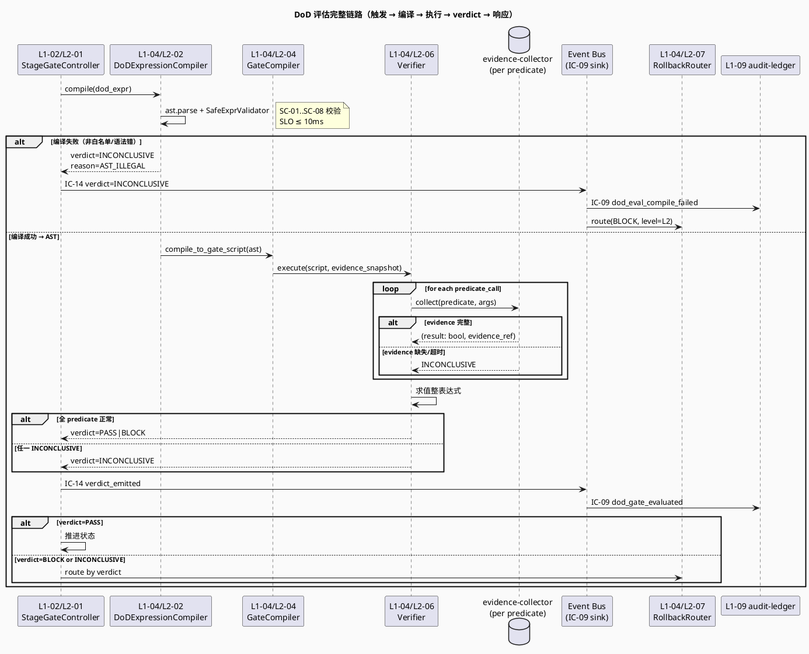
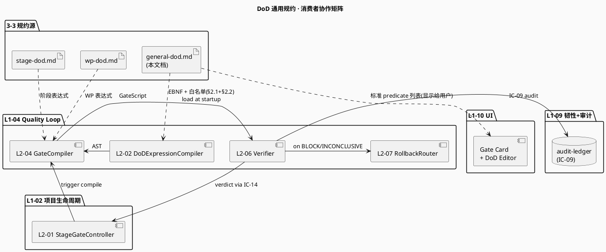

# 核心 DoD 规约（通用 · 质量锚点）

> **本文档定位**：3-3 Monitoring & Controlling 层 · DoD 维度的 **唯一权威规约源** · 表达式语法 (EBNF) · 白名单 predicate 标准清单 · 评估时机 · 证据要求 · 审计 schema · L1-04 Gate 编译器与 Verifier 执行器的共同契约。
> **与 3-1/3-2 的分工**：3-1 定义"系统如何实现 DoD 编译与执行"（L2-02 + L2-04）· 3-2 定义"如何测 DoD 编译器"（mutation testing · 白名单逃逸对抗测试）· **3-3 定义"DoD 规约长什么样、如何判通过、证据长什么样"**。
> **消费方**：L1-04/L2-02（编译 AST）· L1-04/L2-04（产出 `quality-gates.yaml` + `acceptance-checklist.md`）· L1-04/L2-06（S5 Verifier 执行）· L1-07（订阅 verdict · 驱动回退路由 IC-14）· L1-09（审计 DoD 事件）· L1-10（UI · DoD 编辑器与 Gate 面板）。

---

## §0 撰写进度

- [x] §1 定位 + 与上游 PRD/scope 的映射
- [x] §2 核心规约内容（EBNF · 白名单 predicate 清单 · 表达式示例）
- [x] §3 触发与响应机制（触发时机 · SLO · 降级）
- [x] §4 与 L1-04 / L1-02 / L1-09 的契约对接（含 PlantUML）
- [x] §5 证据要求 + 审计 schema
- [x] §6 与 2-prd 的反向追溯表

---

## §1 定位 + 与 2-prd / HarnessFlowGoal 的映射

### 1.1 本文档的唯一命题（One-Liner）

> **"凡是声称通过阶段/WP 的，都必须通过由本规约定义的 DoD 表达式评估，表达式只能由白名单 predicate 组成，且任何通过判定必须留下 evidence trail 供 L1-09 审计。"**

这是 HarnessFlowGoal PM-05 原则 "Stage Contract 机器可校验" 的 3-3 层唯一落地文档——把 2-prd 对"通过/不通过"的自然语言描述转化为**机器可执行的受限表达式语言（Restricted Expression Language, REL）**，并规定其语法、语义、执行时机和证据要求。

### 1.2 与 `2-prd/L0/scope.md` 的精确小节映射

| 2-prd/L0/scope.md 条款 | 本文档对应章节 | 映射关系 |
|---|---|---|
| §3.2 PM-05 · Stage Contract 机器可校验 · DoD 走白名单 AST eval · 禁 arbitrary exec | §2.1 EBNF + §2.2 白名单 predicate 清单 | **1:1 · 本规约是 PM-05 的唯一落地** |
| §5.1 L1-01 决策边界 · "WP-DoD 自检 PASS → 进 S5" | §3 触发时机 · wp_complete(wp_id) | 触发链路源头 |
| §5.4 L1-04 Quality Loop 职责 · S3 产出 DoD 表达式 / S4 执行 / S5 Verifier | §3 + §4 全章 | L1-04 是本规约的主消费者 |
| §5.7 L1-07 Supervisor · 红线 5 类硬拦截 · 软漂移 8 类自治 | §3 降级策略 · verdict=BLOCK 保守语义 | DoD 与红线的边界划定（本文档只管 DoD · 红线见 hard-redlines.md） |
| §9 交付验收 · 阶段级 / WP 级 DoD 清单 | stage-dod.md / wp-dod.md（本目录兄弟文档） | 本文档定义语法 · 兄弟文档填充具体表达式 |

### 1.3 在 `dod-specs/` 目录下的分工（Three-Layer Split）

3-3 Monitoring-Controlling / dod-specs/ 下共 3 份文档，三者 **绝不交叉职责**：

| 文档 | 粒度 | 回答什么 | 谁填充 | 谁消费 |
|---|---|---|---|---|
| **general-dod.md（本文档）** | 通用语法 + 标准 predicate 清单 | "DoD 表达式长什么样 · 允许调什么 · 如何评估" | 主会话 / 技术架构师一次定义 | L2-02 编译器、L2-04 Gate 编译器、L2-06 Verifier |
| stage-dod.md | 7 阶段（S0-S6）粒度 | "每个阶段切换（S_i → S_{i+1}）判通过的 DoD" | 主会话 · 依据 2-prd §9 填 | L1-02 Stage Gate · L1-04 S5 Verifier |
| wp-dod.md | WP（Work Package）粒度 | "每个 WP 完成判通过的 DoD 表达式模板" | L1-03 WBS 分解时自动填 + 用户编辑 | L1-04 S4 WP 自检 · L1-05 子 Agent 委托上下文 |

**强不变量**：stage-dod.md / wp-dod.md 中写的所有表达式，**其 AST 节点必须 ⊆ 本 general-dod.md §2.2 白名单**；违者 L2-02 编译期直接拒绝（`E_L204_L202_AST_ILLEGAL_FUNCTION`）。

### 1.4 与 3-1 L2-02 "DoD 表达式编译器" 的分工

本文档 ↔ `docs/3-1-Solution-Technical/L1-04-Quality Loop/L2-02-DoD 表达式编译器.md` 在 DoD 主题上是 **"规约 vs 实现"** 关系：

| 维度 | 本文档（3-3 规约源） | L2-02（3-1 实现源） |
|---|---|---|
| 定义 **EBNF 语法** | ✅ 唯一权威 | ❌ 引用本文档 |
| 定义 **白名单 predicate 清单（业务语义）** | ✅ 唯一权威 20+ 条 | ❌ 引用本文档 §2.2 |
| 定义 **AST 节点白名单（Python 实现细节）** | ❌ 不涉及 | ✅ §6.1 ALLOWED_NODES frozenset |
| 定义 **SafeExprValidator 算法** | ❌ 不涉及 | ✅ §6.1 完整伪代码 |
| 定义 **evaluator 沙盒 / 超时 kill** | ❌ 不涉及 | ✅ §6.2 多进程隔离 |
| 定义 **evidence schema** | ✅ §5 字段级 YAML | ❌ 引用本文档 §5 |
| 定义 **verdict 三态语义** | ✅ §3 + §5 PASS/BLOCK/INCONCLUSIVE | ❌ 透传本文档 verdict |

**简言之**：L2-02 是 "执行引擎的 PRD/技术方案"；本文档是 "DoD 作为产品契约的规约书"。后者规定"什么算合格表达式、什么算合格证据、什么算合格 verdict"；前者规定"如何用 Python AST + frozendict + multiprocessing 把它跑起来"。

### 1.5 与 HarnessFlowGoal.md 的对应原则

| HarnessFlowGoal 原则 | 本规约落地 |
|---|---|
| PM-01 · 质量不可贿赂 | §2 受限表达式 · 任何 "overall_verdict=PASS" 均需证据链闭环 |
| PM-05 · Stage Contract 机器可校验 | §2.1 EBNF + §2.2 白名单 predicate 清单 |
| PM-06 · 证据高于宣称 | §5 evidence schema · predicates_called[].evidence_ref 必填 |
| PM-07 · 审计单一事实源 | §5 审计事件 `dod_gate_evaluated` 仅经 IC-09 → L1-09 |
| PM-09 · 失败即上报 · 保守拒绝 | §3 降级 · 任何 predicate 执行异常 → verdict=INCONCLUSIVE → 默认 BLOCK |
| PM-10 · 单一事实源 | §1.3 三文档职责切分 · 禁止交叉定义 |
| PM-14 · project_id as root | §5 evidence.project_id 必填 · 禁止跨 project DoD 复用 |

### 1.6 本文档的非目标（YAGNI）

以下问题 **明确不在本规约范围**：

- ❌ 硬红线清单（如 `rm -rf /`、`DROP TABLE`）→ 见 `hard-redlines.md`
- ❌ 软漂移 8 类触发器（decision_entropy、SLO_drift 等）→ 见 `soft-drift-rules.md`
- ❌ 观测指标 KPI（L1-07 8 维度观察）→ 见 `kpi-matrix.md`
- ❌ 产品验收 checklist（S6 签字清单）→ 见 `acceptance-criteria.md`
- ❌ predicate 的 **Python 实现代码** → 见 3-1 L2-02 §6
- ❌ evaluator 的 **性能 profiling** → 见 3-2 L2-02 tests
- ❌ 用户可编辑的 DoD 编辑器 UX → 见 3-1 L2-10 UI 规约

本文档**只**回答：DoD 表达式怎么写、由哪些 predicate 组成、何时评估、结果长什么样、证据长什么样。

---

## §2 核心规约内容

### 2.1 DoD 表达式语法 · EBNF 完整定义

DoD 表达式是一种**受限表达式语言（Restricted Expression Language · REL）**，使用 Python 表达式子集作为宿主语法（由 `ast.parse(mode='eval')` 解析），但通过白名单校验器锁死可用节点。以下是其 EBNF 形式化定义：

```ebnf
(* ===== DoD 表达式 EBNF v1.0 ===== *)
(* 与 3-1 L2-02 §5.2 ALLOWED_NODES 严格一致 *)

dod_expr        ::= logical_or

logical_or      ::= logical_and ( 'OR' logical_and )*

logical_and     ::= unary ( 'AND' unary )*

unary           ::= ( 'NOT' )? atom

atom            ::= predicate_call
                  | comparison
                  | '(' logical_or ')'

predicate_call  ::= ident '(' arg_list? ')'

arg_list        ::= arg ( ',' arg )*

arg             ::= literal
                  | path_ref

comparison      ::= path_ref cmp_op literal

cmp_op          ::= '==' | '!=' | '<' | '<=' | '>' | '>=' | 'in' | 'not in'

literal         ::= number | string | bool | 'None'

number          ::= integer | float
integer         ::= [ '-' ] digit+                     (* |n| ≤ 10^9 · SA-03 *)
float           ::= [ '-' ] digit+ '.' digit+
string          ::= '"' char* '"'                      (* len ≤ 500 · SA-03 *)
bool            ::= 'True' | 'False'

path_ref        ::= ident ( '.' ident )*               (* Name(s) only · 禁 Subscript *)
ident           ::= [a-zA-Z_][a-zA-Z0-9_]*             (* 禁 dunder __xxx__ *)
char            ::= <任意非 '"' · 非控制字符>
digit           ::= '0' .. '9'
```

**语法约束（硬不变量）**：

- **SC-01 · 单表达式性**：整个 DoD 表达式 **必须**是单个逻辑表达式（Python `ast.Expression` 根），不得含语句、赋值、多行；由 `ast.parse(mode='eval')` 强制保证
- **SC-02 · 无副作用性**：表达式中 **不得** 含 `Import / Attribute / Subscript / Lambda / FunctionDef / ClassDef / For / While / Try / With / Assign / Yield / Await` 等任一执行型节点（见 L2-02 §6.1 `DENIED_NODES`）
- **SC-03 · 函数仅白名单**：`ast.Call.func` **必须** 是 `ast.Name` 且其 `id` ∈ §2.2 白名单 20+ predicate 清单；**禁** `obj.method()` 链式调用
- **SC-04 · 深度上限**：AST 深度 ≤ 32，节点总数 ≤ 200（防递归炸弹 DoS · L2-02 SA-03）
- **SC-05 · 字面量上限**：string 字面量 ≤ 500 字符 · integer 绝对值 ≤ 10^9 · float 不得含 inf/nan
- **SC-06 · 无 dunder 标识符**：`path_ref` 中任一 `ident` **不得** 匹配 `__.*__` 正则（防 `__builtins__` / `__class__` 逃逸）
- **SC-07 · 无 keyword 参数**：`predicate_call` 参数 **必须** 为位置参数；`kwargs` 被 SafeExprValidator 拒绝
- **SC-08 · 确定性**：同一 (表达式, evidence_snapshot) 在任意宿主上**必须**评估为同一 verdict（便于审计重放）

### 2.2 白名单 Predicate 标准清单（22 条 · 机器契约 · 锁定 v1.0）

以下是所有 DoD 表达式**可用的全部 predicate**。任何不在此清单的函数名 → L2-02 编译期抛 `E_L204_L202_AST_ILLEGAL_FUNCTION`，表达式直接被拒。

**纵列含义**：
- **签名**：参数类型 · 返回必为 `bool`
- **语义**：判定的具体行为
- **副作用**：✅=只读 · ❌=禁用（白名单全为只读，副作用一律走 L1-04/L2-06 evidence_collector）
- **evidence_ref 来源**：执行后写入 evidence YAML 的具体证据文件类型

| # | predicate 签名 | 语义 | 副作用 | evidence_ref 来源 |
|---|---|---|---|---|
| 1 | `test_pass_rate(threshold: float, suite: str) -> bool` | 测试通过率 ≥ threshold（默认套件名 "unit"/"integration"/"e2e"） | ✅ | `projects/<pid>/reports/test/<suite>/results.json` |
| 2 | `coverage_line(threshold: int, module: str) -> bool` | 行覆盖率 ≥ threshold (0-100 整数) | ✅ | `projects/<pid>/reports/coverage/<module>/line.json` |
| 3 | `coverage_branch(threshold: int, module: str) -> bool` | 分支覆盖率 ≥ threshold | ✅ | `projects/<pid>/reports/coverage/<module>/branch.json` |
| 4 | `ruff_clean(paths: list[str]) -> bool` | 对路径清单跑 `ruff check` 退出码=0 | ✅ | `projects/<pid>/reports/lint/ruff-<hash>.json` |
| 5 | `mypy_clean(paths: list[str]) -> bool` | 对路径清单跑 `mypy --strict` 退出码=0 | ✅ | `projects/<pid>/reports/typecheck/mypy-<hash>.json` |
| 6 | `no_hard_redline_violation() -> bool` | 当前 stage 窗口内 audit-ledger 无 `hard_redline_triggered` 事件 | ✅ | `projects/<pid>/audit/redlines/` 全扫 |
| 7 | `doc_link_valid(doc_id: str) -> bool` | 该文档内的 markdown 链接全部解析成功（含 cross-doc）| ✅ | `projects/<pid>/reports/doc-link/<doc_id>.json` |
| 8 | `changelog_entry_exists(version: str) -> bool` | CHANGELOG.md 含 [version] 段且非空 | ✅ | `projects/<pid>/CHANGELOG.md` 解析快照 |
| 9 | `acceptance_test_pass(wp_id: str) -> bool` | 该 WP 的 acceptance test suite 全绿 | ✅ | `projects/<pid>/reports/acceptance/<wp_id>.json` |
| 10 | `file_lines_le(path: str, n: int) -> bool` | 文件行数 ≤ n（用于反对单文件膨胀） | ✅ | filesystem stat |
| 11 | `func_complexity_le(path: str, n: int) -> bool` | 该路径下所有函数圈复杂度 ≤ n | ✅ | `projects/<pid>/reports/complexity/<hash>.json`（radon） |
| 12 | `has_api_doc(module: str) -> bool` | 模块所有 public API 都有 docstring（pydocstyle PEP-257）| ✅ | `projects/<pid>/reports/docstring/<module>.json` |
| 13 | `all_wp_complete(stage: str) -> bool` | 该 stage 下所有 WP 状态 = COMPLETED | ✅ | `projects/<pid>/wbs/wp-status.yaml` |
| 14 | `deploy_script_executable() -> bool` | `./scripts/deploy.sh --dry-run` 返回 0 | ✅ | `projects/<pid>/reports/deploy/dry-run.log` |
| 15 | `runbook_exists(env: str) -> bool` | `docs/runbook/<env>.md` 存在且非空且包含 §required sections | ✅ | filesystem + structure check |
| 16 | `pr_approved(pr_id: str) -> bool` | GitHub PR `<pr_id>` 经 ≥ 1 个 reviewer approved | ✅ | GitHub API snapshot in `projects/<pid>/reports/pr/` |
| 17 | `security_scan_clean() -> bool` | bandit / safety / trivy 全部 0 critical | ✅ | `projects/<pid>/reports/security/<hash>.json` |
| 18 | `performance_slo_met(metric: str, threshold: float) -> bool` | 指标 ≤ threshold（具体名见 system-metrics.md）| ✅ | `projects/<pid>/reports/perf/<metric>.json` |
| 19 | `user_signoff(role: str, checkpoint: str) -> bool` | UI 签字面板录入用户角色+checkpoint+timestamp+ULID | ✅ | `projects/<pid>/audit/signoff/<role>-<checkpoint>.yaml` |
| 20 | `artifact_exists(kind: str, pid: str) -> bool` | 产物种类 ∈ {chart, wbs, topology, prd, arch, ...} 且 `projects/<pid>/<kind>/` 非空 | ✅ | filesystem 扫描 |
| 21 | `audit_chain_closed(pid: str) -> bool` | hash-chain 完整 + 无 audit_chain_broken 事件 | ✅ | L1-09/L2-04 self-check |
| 22 | `kb_promotions_committed(pid: str) -> bool` | 该 project 的 KB 候选已全部进入 promote/reject 终态 | ✅ | `projects/<pid>/kb/queue.yaml` 全 0 pending |

**白名单变更治理**（v1.0 锁定 · 后续升级走 ADR）：
- 新增 predicate → ADR-RFC + 本文档 §2.2 表 + L2-02 §6 ALLOWED_NAMES + L2-04 编译器测试
- 修改 predicate 语义 → 视为破坏性变更 · 必 bump whitelist_version
- 删除 predicate → 同样走 ADR · 已 evidence 中保留历史快照

### 2.3 表达式示例（每阶段标杆 · 与 stage-dod.md 一致）

| 阶段 | 标杆 DoD 表达式 |
|---|---|
| **S1 启动** | `artifact_exists("chart", project_id) AND user_signoff("PM", "S1")` |
| **S2 计划** | `artifact_exists("prd", project_id) AND artifact_exists("plan", project_id) AND user_signoff("PM", "S2")` |
| **S3 设计** | `artifact_exists("arch", project_id) AND artifact_exists("topology", project_id)` |
| **S4 执行** | `test_pass_rate(1.0, "unit") AND coverage_line(80, "app") AND ruff_clean(["app"]) AND mypy_clean(["app"]) AND no_hard_redline_violation()` |
| **S5 验证** | `test_pass_rate(1.0, "integration") AND acceptance_test_pass(wp_id) AND security_scan_clean() AND performance_slo_met("p99_latency_ms", 200)` |
| **S6 交付** | `all_wp_complete("S5") AND deploy_script_executable() AND runbook_exists("prod") AND user_signoff("PM", "S6")` |
| **S7 收尾** | `audit_chain_closed(project_id) AND kb_promotions_committed(project_id) AND user_signoff("Customer", "S7")` |
| **WP 自检** | `test_pass_rate(1.0, "unit") AND coverage_line(80, "app." + wp_id) AND no_hard_redline_violation() AND pr_approved(wp_id)` |

**复合示例**（含 OR / NOT）：

```text
# S5 Gate · 允许 e2e 部分失败（< 5 个）但其他全过
test_pass_rate(1.0, "integration")
AND acceptance_test_pass(wp_id)
AND (security_scan_clean() OR (NOT performance_slo_met("p99_latency_ms", 500)))
AND user_signoff("Tech-Lead", "S5")
```

**反例（编译期被拒）**：

```text
# ❌ kwargs - SC-07
test_pass_rate(threshold=1.0, suite="unit")

# ❌ 链式调用 - SC-03
audit.last_event().result == "PASS"

# ❌ 非白名单 - SC-03
exec_shell("pytest")

# ❌ Subscript - SC-02
metrics["coverage"] >= 80

# ❌ Lambda - SC-02
lambda x: x > 0
```

---

## §3 触发与响应机制

### 3.1 三类触发时机（mutually exclusive）

| 触发档位 | 触发事件 | 触发方 | 评估方 | 典型 SLO |
|---|---|---|---|---|
| **WP 自检（S4 内）** | 单 WP `complete_wp(wp_id)` | L1-03/L2-04 | L1-04/L2-06 | ≤ 30s（含测试） |
| **Stage Gate 切换** | `state_transition(S_i → S_{i+1})` | L1-02/L2-01 | L1-04/L2-04 GateCompiler + L2-06 Verifier | ≤ 60s（S5 含集成测试可破例） |
| **手动 Gate check（运维）** | UI Admin 调 `force_gate(stage, wp_id?)` | L1-10/L2-04 | L1-04/L2-04 + L2-06 | 同档位 SLO |

**强不变量**：
- TR-01 · 任何"宣告 PASS"必经过本规约定义的 evaluator · **禁手工 PASS**
- TR-02 · stage_transition 缺 dod_evidence → IC-01 直接拒收（payload 不合法）
- TR-03 · WP 自检 PASS 不蕴含 stage gate PASS · 二者各自独立评估

### 3.2 响应 SLO（编译/执行预算）

| 阶段 | SLO P99 | 测量点 | 来源 |
|---|---|---|---|
| AST parse + SafeExprValidator | ≤ 10ms | L2-02.compile() 起止 | L2-02 §6.1 |
| 单 predicate 执行 | ≤ 100ms（除 ruff/mypy/test）| evidence_collector 起止 | predicate 各自子契约 |
| 整表达式评估（不含测试）| ≤ 3s | L2-06 evaluate() 起止 | scope §3.5 PM-05 |
| 整表达式评估（含 S4 单测）| ≤ 30s | 同上 | scope §11 性能契约 |
| 整表达式评估（含 S5 集成）| ≤ 60s | 同上 | L1集成 §8 性能 |
| IC-14 emit verdict | ≤ 50ms | bus.append_event 起止 | IC-09 SLO 子集 |

**SLO 违约处理**：超阈 → verdict=INCONCLUSIVE + IC-09 落 `dod_eval_timeout` 事件 + 升级人工。

### 3.3 三态 verdict 语义（核心）

| verdict | 触发条件 | 下游决策 |
|---|---|---|
| **PASS** | 表达式求值 == True · 全 predicate 有 evidence_ref · 无异常 | L1-02 状态机推进 · IC-14 verdict=PASS |
| **BLOCK** | 表达式求值 == False · 全 predicate 正常返回 | L1-02 拒推进 · IC-14 verdict=BLOCK · L1-04/L2-07 路由回退 |
| **INCONCLUSIVE** | 任一 predicate 异常/超时/缺 evidence_ref · 或 AST 编译异常 | **保守拒绝** · 等价 BLOCK · 但 retry_policy 不同（INCONCLUSIVE 重试，BLOCK 走回退） |

**INCONCLUSIVE 的语义边界**（与 PM-09 一致）：

> "在没有把握说 PASS 的时候，绝不说 PASS。"

### 3.4 降级策略（5 条 · 与 PM-09 对齐）

- **DG-01 · 编译异常 → INCONCLUSIVE**：表达式语法错误 · 非白名单 predicate · AST 节点违规 → 不评估 · 直接 INCONCLUSIVE
- **DG-02 · 单 predicate 超时 → INCONCLUSIVE**：predicate 子进程超时 kill → 整表达式 INCONCLUSIVE（不是局部 false）
- **DG-03 · evidence 缺失 → INCONCLUSIVE**：predicate 返回 true 但 evidence_ref 为 null → INCONCLUSIVE（PM-06 证据高于宣称）
- **DG-04 · evaluator 内部异常 → panic**：sandbox/multiprocessing 失败 → 不降级 → IC-17 panic（infrastructure 故障）
- **DG-05 · IC-14 emit 失败 → 强制 panic**：bus 写失败 → IC-17 → 整 stage 重做（PM-07 单一事实源）

### 3.5 完整触发-评估-响应链路 PlantUML



---

## §4 与 L1-04 / L1-02 / L1-09 / L1-10 的契约对接

### 4.1 消费者协作矩阵 PlantUML



### 4.2 L1-04/L2-02 编译器对本规约的精确消费

L1-04/L2-02 在启动时**冻结**本规约 §2.2 白名单为 frozen set，命名为 `WHITELIST_V1_0`：

```python
# L1-04/L2-02 SafeExprValidator init
WHITELIST_V1_0: frozenset[str] = frozenset({
    "test_pass_rate", "coverage_line", "coverage_branch",
    "ruff_clean", "mypy_clean", "no_hard_redline_violation",
    "doc_link_valid", "changelog_entry_exists", "acceptance_test_pass",
    "file_lines_le", "func_complexity_le", "has_api_doc",
    "all_wp_complete", "deploy_script_executable", "runbook_exists",
    "pr_approved", "security_scan_clean", "performance_slo_met",
    "user_signoff", "artifact_exists", "audit_chain_closed",
    "kb_promotions_committed",
})
```

**版本绑定**：每条 evidence YAML 必含 `whitelist_version: v1.0`。新版本发布后，已落地 evidence 仍以历史 `whitelist_version` 重放（避免历史 evidence 因 v1.1 删除某 predicate 而失效）。

### 4.3 L1-04/L2-04 Gate 编译器的产出契约

L2-04 把 AST 编译为 `GateScript`（Python 函数序列），落 `projects/<pid>/quality-gates/<stage>.gate.py`：

```python
# 由 L2-04 自动生成 · 禁止手工编辑
def gate_script(evidence_snapshot: EvidenceSnapshot) -> GateResult:
    # 表达式: test_pass_rate(1.0, "unit") AND coverage_line(80, "app")
    p1, e1 = predicates.test_pass_rate(1.0, "unit", evidence_snapshot)
    p2, e2 = predicates.coverage_line(80, "app", evidence_snapshot)
    overall = p1 and p2
    return GateResult(
        verdict="PASS" if overall else "BLOCK",
        predicates=[
            {"name": "test_pass_rate", "args": [1.0, "unit"], "result": p1, "evidence_ref": e1},
            {"name": "coverage_line", "args": [80, "app"], "result": p2, "evidence_ref": e2},
        ],
    )
```

**生成 GateScript 的硬约束**：
- GS-01 · 必须 deterministic：同一 AST + 同一 evidence_snapshot → 同一 GateResult
- GS-02 · 必须 sandboxed：evaluator 在 multiprocessing 子进程跑 · 限内存 256MB / CPU 1s
- GS-03 · 必须无副作用：predicate 实现纯函数 · 写入操作走 evidence_collector 单一通路

### 4.4 L1-09 audit-ledger 的强制单一通路（PM-07）

**EI-PM-07**：DoD 评估的所有事件**必须**经 IC-09 → audit-ledger，**禁止**：
- ❌ 直接写 `projects/<pid>/quality/<stage>.yaml` 而不发 IC-09
- ❌ 用 `print` / `logger.info` 替代 IC-09 audit
- ❌ predicate 实现内调 `os.write` 落自定义 log

**事件类型清单**：

| event_type | 触发源 | 必含字段 |
|---|---|---|
| `dod_gate_evaluated` | L1-04/L2-06 | dod_expression_raw · verdict · evidence_path |
| `dod_eval_compile_failed` | L1-04/L2-02 | error_code · error_msg · expr_raw |
| `dod_eval_timeout` | L1-04/L2-06 | predicate_name · timeout_ms · partial_evidence |
| `dod_predicate_exception` | predicates 各模块 | predicate_name · exception · trace_hash |

### 4.5 IC-14 verdict payload schema

```yaml
ic_14_payload:
  schema_version: v1.0
  required_fields:
    project_id: string         # PM-14
    stage_or_wp_id: string
    dod_expression_raw: string
    verdict: enum [PASS, BLOCK, INCONCLUSIVE]
    evidence_path: string       # YAML 文件相对路径
    whitelist_version: string   # v1.0 锁定
    duration_ms: int
    triggered_by: string        # l1_02_stage_gate | l1_03_wp_complete | l1_10_admin
    evaluated_by: string        # l1_04_l2_06_verifier
  optional_fields:
    block_reasons: array        # verdict=BLOCK 时
    inconclusive_reasons: array # verdict=INCONCLUSIVE 时
    parent_event_id: string     # 重试链
    rollback_origin: string     # 若是回退后重评
```

---

## §5 证据要求 + 审计 schema

### 5.1 DoD 评估 evidence 字段级 YAML（核心 schema）

每次 evaluator 跑完 **必产** `dod_evidence` · 落 `projects/<pid>/audit/dod-eval/<event_id>.yaml`：

```yaml
# projects/<pid>/audit/dod-eval/<ULID>.yaml
dod_evidence:
  # ── 主键 ───────────────────────────────────────
  event_id: 01HY8M2K4P5Q6R7S8T9U0V1W2X      # ULID · 与 IC-14 1:1 + IC-09 1:1
  project_id: proj-2026-todo-v1               # PM-14 root · 必填
  stage_or_wp_id: S4                          # stage 或 wp_id（互斥）
  evaluated_at_ms: 1714126789012              # epoch ms
  whitelist_version: v1.0                     # general-dod 版本锁定

  # ── 表达式 ─────────────────────────────────────
  dod_expression:
    raw: 'test_pass_rate(1.0, "unit") AND coverage_line(80, "app") AND ruff_clean(["app"])'
    ast_serialized: { ... }                   # JSON 序列化的 AST · 重放用
    ast_hash: sha256:6e8a1f...                # 防表达式被偷换
    predicate_count: 3
    ast_depth: 3                              # 必 ≤ 32
    ast_node_count: 14                        # 必 ≤ 200

  # ── 每 predicate 执行结果（必每条都有 evidence_ref） ─
  predicates_called:
    - name: test_pass_rate
      args: [1.0, "unit"]
      result: true
      evidence_ref: ULID                       # 指向具体证据文件
      evidence_path: projects/<pid>/reports/test/unit/results.json
      duration_ms: 240.7
      exception: null
    - name: coverage_line
      args: [80, "app"]
      result: true
      evidence_ref: ULID
      evidence_path: projects/<pid>/reports/coverage/app/line.json
      duration_ms: 12.4
      exception: null
    - name: ruff_clean
      args: [["app"]]
      result: true
      evidence_ref: ULID
      evidence_path: projects/<pid>/reports/lint/ruff-7da3.json
      duration_ms: 1240.1
      exception: null

  # ── 评估结果 ────────────────────────────────────
  verdict: PASS                                # PASS | BLOCK | INCONCLUSIVE
  block_reasons: []                            # verdict=BLOCK 时填 [{predicate, args, result=false}]
  inconclusive_reasons: []                     # verdict=INCONCLUSIVE 时填 [{predicate, exception/timeout}]
  total_eval_ms: 1493.2                        # 全表达式评估耗时 · SLO ≤ 3s/30s/60s（见 §3.2）
  retry_count: 0

  # ── 责任链（IC chain） ─────────────────────────
  ic_chain:
    - {ic: IC-01, role: trigger, event_id: ULID}     # state_transition 请求
    - {ic: IC-14, role: verdict, event_id: ULID}     # 本评估的回执
    - {ic: IC-09, role: audit, event_id: ULID}       # 审计落盘
    - {ic: IC-13, role: observation, event_id: ULID} # L1-07 旁路观察(可选)

  # ── 重放性（PM-08 复盘文化）────────────────────
  determinism:
    snapshot_hash: sha256:9f1a2b...             # evidence_snapshot 全量哈希
    runtime_version: harnessflow-1.0.0
    python_version: 3.11.7
    replayable: true                            # 同 hash 重跑必同 verdict（GS-01）
```

### 5.2 IC-09 审计事件 schema（4 类）

```yaml
event_type: dod_gate_evaluated
event_schema_version: v1.0
required_fields:
  - event_id          # ULID
  - project_id        # PM-14
  - timestamp_ms
  - stage_or_wp_id
  - dod_expression_raw
  - ast_hash
  - whitelist_version
  - verdict
  - evidence_path
  - total_eval_ms

hash_chain:
  prev_hash: sha256:...
  this_hash: sha256:...
  signature: HMAC-SHA256
```

其余 3 类（`dod_eval_compile_failed` / `dod_eval_timeout` / `dod_predicate_exception`）schema 类似，差异在 required_fields 中携带 error/exception 详情。

### 5.3 证据完整性硬约束（5 条 · 不可妥协）

- **EI-D-01 · evidence_ref 缺一即 INCONCLUSIVE**：任一 predicate 缺 evidence_ref → 整表达式 INCONCLUSIVE（PM-06）
- **EI-D-02 · ast_hash 不可篡改**：evidence 中 ast_hash 与 IC-14 payload 中 ast_hash 必须一致（防表达式被运行时偷换）
- **EI-D-03 · 跨 project 隔离**：evidence_path 必含 project_id；跨 project 引用 evidence → 视为 audit fault（PM-14）
- **EI-D-04 · whitelist_version 锁定**：evidence 锁定的 whitelist_version 与评估时 ALLOWED_NAMES 必须一致；不一致 → INCONCLUSIVE
- **EI-D-05 · IC-09 单一通路**：禁止旁路审计（§4.4 EI-PM-07）

### 5.4 与 hash-chain 的强一致性

每次 IC-09 写入 DoD 事件 · audit-ledger 必须更新 hash-chain：

```
prev_hash = ledger.last_hash_for(project_id)
this_hash = sha256(prev_hash || canonical_jsonl(event_payload))
signature = hmac_sha256(secret, this_hash)
```

**篡改检测**：任何 dod_gate_evaluated 事件的 hash_chain 断链 → L1-09 自动触发 `audit_chain_broken` panic（IC-17）→ 整 project 进入只读模式。

---

## §6 与 2-prd / HarnessFlowGoal 的反向追溯表

### 6.1 §2 EBNF + 22 条白名单 ↔ 2-prd/L0/scope.md 精确小节映射

| 本规约元素 | 2-prd 锚点 | 关系 |
|---|---|---|
| **§2.1 EBNF + 8 SC 约束** | scope §3.2 PM-05 · 走白名单 AST eval · 禁 arbitrary exec | **1:1 落地** |
| **§2.2 #1 test_pass_rate** | scope §9.S4 / §9.S5 + Goal PM-01 质量不可贿赂 | predicate 必备 |
| **§2.2 #2 coverage_line / #3 coverage_branch** | scope §3.2 PM-05 + §9.S4 80% 阈值 | 阈值锁定 |
| **§2.2 #4 ruff_clean / #5 mypy_clean** | scope §10 软漂移 #1 #2（代码风格 / 类型）| 软漂移→编译期检测 |
| **§2.2 #6 no_hard_redline_violation** | scope §8 硬红线 全节 | hard-redlines.md ↗ |
| **§2.2 #7 doc_link_valid** | scope §10 软漂移 #6（文档断链）| 软漂移→编译期检测 |
| **§2.2 #8 changelog_entry_exists** | scope §9.S4 验收 · 变更可追溯 | 文档要求 |
| **§2.2 #9 acceptance_test_pass** | scope §9.S5 · acceptance scenarios + wp-dod | 验收金标准 |
| **§2.2 #10 file_lines_le / #11 func_complexity_le** | scope §10 软漂移 #3 #4 | 软漂移→DoD |
| **§2.2 #12 has_api_doc** | scope §9.S5 文档完整性 + Goal PM-06 | 文档证据 |
| **§2.2 #13 all_wp_complete** | scope §5.3 L1-03 + §9.S3-S6 全阶段 | 阶段切换前置 |
| **§2.2 #14 deploy_script_executable / #15 runbook_exists** | scope §9.S6 交付 · 运维交接 | 交付门槛 |
| **§2.2 #16 pr_approved** | scope §9.S4 + Goal PM-08 | 人工 review |
| **§2.2 #17 security_scan_clean** | scope §9.S5 安全门 + scope §11 部署约束 | 安全证据 |
| **§2.2 #18 performance_slo_met** | scope §3.5 PM-05 性能契约 + system-metrics | SLO 证据 |
| **§2.2 #19 user_signoff** | scope §9.S2/S6/S7 干系人确认 + Goal §4 透明度 | 人机协作 |
| **§2.2 #20 artifact_exists** | scope §5.2 L1-02 + §9 各阶段产出 | 物证 |
| **§2.2 #21 audit_chain_closed** | scope §3.7 PM-07 单一事实源 | 审计闭环 |
| **§2.2 #22 kb_promotions_committed** | scope §5.6 L1-06 + §9.S7 收尾 | 知识沉淀 |

### 6.2 与 HarnessFlowGoal.md PM 原则的对应

| Goal PM 原则 | 在本规约中的落地 |
|---|---|
| PM-01 质量不可贿赂 | §2 受限表达式 · 任何 PASS 必有 evidence_ref · §3.4 DG-03 缺 evidence → INCONCLUSIVE |
| PM-05 Stage Contract 机器可校验 | §2.1 EBNF + §2.2 22 条白名单 · §1.1 命题 |
| PM-06 证据高于宣称 | §5.1 evidence YAML predicates_called[].evidence_ref 必填 · §5.3 EI-D-01 |
| PM-07 单一事实源 | §4.4 EI-PM-07 · IC-09 强制通路 |
| PM-08 复盘文化 | §5.1 determinism.replayable + ast_hash + snapshot_hash |
| PM-09 失败即上报 · 保守拒绝 | §3.3 INCONCLUSIVE 三态 · §3.4 DG-01..05 全降级走 INCONCLUSIVE+BLOCK |
| PM-10 单一事实源 | §1.3 三文档职责切分 · §4.2 L2-02 frozen WHITELIST_V1_0 |
| PM-14 project_id as root | §5.1 evidence.project_id 必填 · §5.3 EI-D-03 跨 project 隔离 |

### 6.3 与兄弟文档的 cross-link

| 引用源 | 引用目标 | 关系 |
|---|---|---|
| 本文档 §2.2 第 #6 `no_hard_redline_violation` | docs/3-3-Monitoring-Controlling/hard-redlines.md §4.4 | 调用方 ↔ 实现方 |
| 本文档 §2.3 7 阶段标杆 | docs/3-3-Monitoring-Controlling/dod-specs/stage-dod.md §2 全节 | 模板 ↔ 具体填充 |
| 本文档 §2.3 WP 自检 | docs/3-3-Monitoring-Controlling/dod-specs/wp-dod.md §2 全节 | 模板 ↔ 具体填充 |
| 本文档 §2.2 #18 `performance_slo_met` | docs/3-3-Monitoring-Controlling/monitoring-metrics/system-metrics.md §2 | 数据来源 |
| 本文档 §3.2 SLO ≤ 3s/30s/60s | docs/3-1-Solution-Technical/integration/ic-contracts.md §3.14 IC-14 | 数值锁定 |
| 本文档 §4.2 L2-02 编译器 | docs/3-1-Solution-Technical/L1-04-Quality Loop/L2-02-DoD 表达式编译器.md | 规约 ↔ 实现 |
| 本文档 §4.3 GateScript | docs/3-1-Solution-Technical/L1-04-Quality Loop/L2-04-质量 Gate 编译器+验收 Checklist.md | 规约 ↔ 实现 |
| 本文档 §5 evidence schema | docs/3-2-Solution-TDD/L1-04-Quality Loop/*-tests.md | 测试金标准 |

### 6.4 文档版本治理（changeset gate）

| 触发条件 | 必须同步更新的文件 |
|---|---|
| 新增 predicate（#23+）| 本文档 §2.2 表 + L2-02 §6.1 ALLOWED_NAMES + L2-02 tests + 本文档 §4.2 frozen set |
| 修改 predicate 语义 | 视为破坏性变更 → bump whitelist_version + 本文档 §2.2 备注变更 |
| 新增 SC 约束（SC-09+）| 本文档 §2.1 + L2-02 §6.1 + L2-02 mutation tests |
| 修改 SLO 数值（§3.2）| 本文档 §3.2 + ic-contracts §3.14 + scope §3.5 |

---

*— 3-3 核心 DoD 规约（通用） · filled · v1.0 · 2026-04-25 · EBNF + 22 条白名单 + 三态 verdict + 字段级 evidence + 完整反向追溯 · 2 张 PlantUML —*
