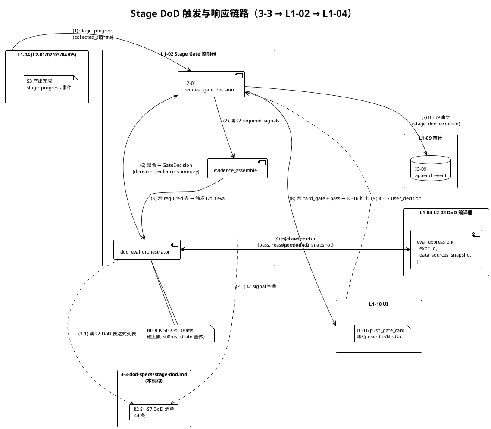
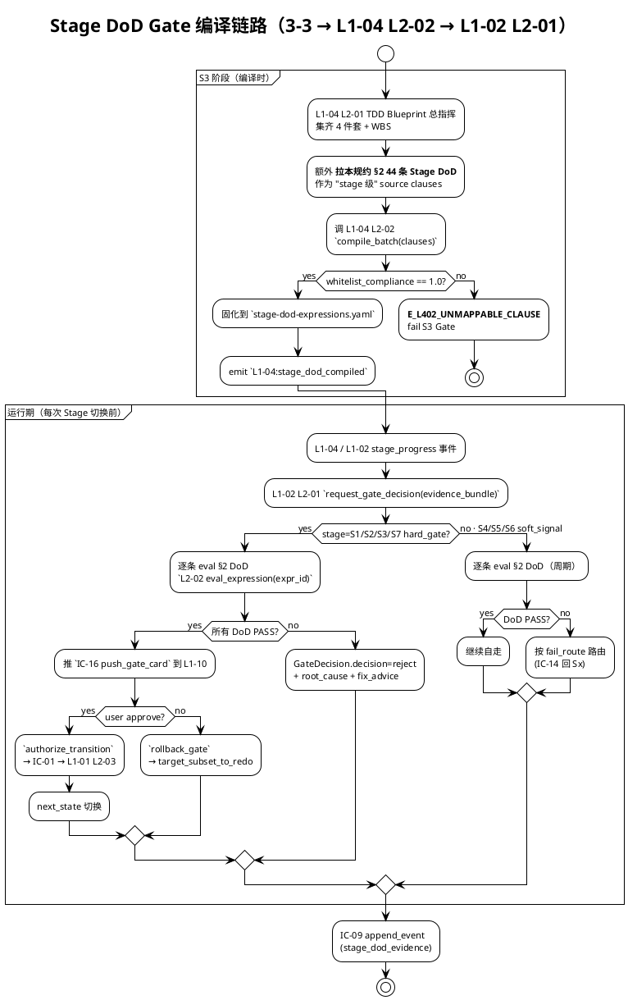
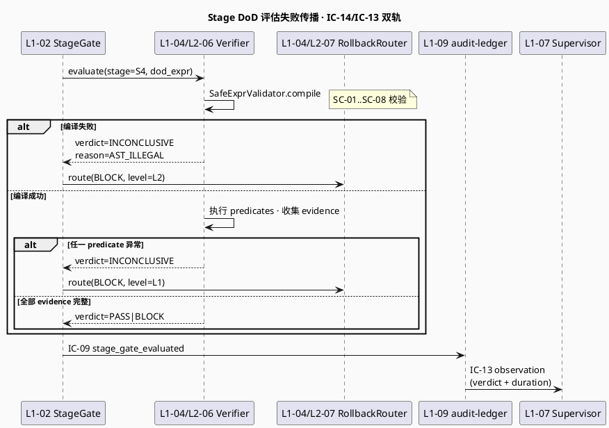

# 阶段 DoD 规约（S1-S7）

> **本文档定位**：3-3 Monitoring & Controlling 层 · 7 阶段（S1 初始化 / S2 启动 / S3 规划 / S4 执行 / S5 验证 / S6 交付 / S7 收尾）各自的 DoD 契约条目 · 每 Stage Gate 前置证据 · pass/reject/need_input 判据
> **与 3-1/3-2 的分工**：3-1 定义"系统如何实现" · 3-2 定义"如何测" · **3-3 定义"如何监督与判通过"**（质量 Gate 规约 · 硬红线清单 · DoD 契约 · 验收标准）
> **消费方**：L1-02 Stage Gate 控制器（读本规约驱动 `request_gate_decision`）· L1-04 质量环（读 DoD 编译 Gate）· L1-07 监督（读红线/软漂移清单触发）· 交付验收（读 acceptance-criteria）

---

## §0 撰写进度

- [x] §1 定位 + 与上游 PRD/scope 的映射
- [x] §2 7 阶段 DoD 清单（S1-S7 × ≥ 5 DoD 表达式）
- [x] §3 触发与响应机制（Stage 切换前 + BLOCK SLO ≤ 100ms）
- [x] §4 与 L1-02 / L1-04 的契约对接（IC-01 + IC-14 + 编译链）
- [x] §5 证据要求 + 审计 schema（stage_dod_evidence + IC-09）
- [x] §6 与 2-prd 的反向追溯表（35+ 条映射）

---

## §1 定位 + 映射

### 1.1 本规约的唯一命题（One-Liner）

**stage-dod.md 是 HarnessFlow "7 阶段 Stage Gate 的机器可裁决 DoD 字典"**——把 2-prd/L0/scope.md §5 各 L1 职责小节（L1-02 §5.2 / L1-04 §5.4）里散落的 "阶段末 Gate 硬约束"（如"S2 末必 4 件套齐"、"S5 末必 verifier PASS"、"S7 末必交付包完整"）**条款化 + AST 表达式化**，形成：

- **7 阶段 × ≥ 5 条 DoD 表达式 = 35+ 条机器可 eval 的 Stage DoD**（§2）
- **IC-01 状态转换前的前置校验 payload 契约**（§4.1）
- **L1-02 `request_gate_decision` 的 `evidence_bundle.signal_name` 枚举字典**（§4.2）
- **L1-04 L2-02 DoD 表达式编译器的"阶段级" source_ac_id 命名空间**（§4.3）

本规约是 **PM-05 "Stage Contract 机器可校验"**（scope §3.4 表 · Goal §3.5 L1 硬约束 1）纪律在 Stage Gate 粒度的**唯一物化契约**。凡 7 阶段切换相关的证据、verdict、审计 payload，必回到本文档查表。

### 1.2 与 `2-prd/L0/scope.md` §5（L1 职责）+ §3（L1 × skill 映射）的映射表

> scope.md 本身没有独立的 "§9 DoD / §11 Stage Gate" 章节；DoD / Gate 约束**分散在 §3.4 PM 纪律表 + §5.2 L1-02 职责 + §5.4 L1-04 职责 + §8 L1 间业务流**。本表把散点映射回本规约 §2 的 7 阶段。

| scope 散点 | 约束原文 | 本规约对应 DoD | 阶段归属 |
|---|---|---|---|
| §3.4 PM-01 methodology-paced | S1/S2/S3 强协同、S4/S5/S6 自走、S7 强 Gate | S1/S2/S3/S7 Gate 硬停 · S4/S5/S6 Gate 软信号 | S1-S7 全量 |
| §3.4 PM-05 Stage Contract 机器可校验 | DoD 走白名单 AST eval，禁 arbitrary exec | §2 所有 DoD 表达式采用 L2-02 白名单谓词 | S1-S7 全量 |
| §5.2.4 L1-02 硬约束 | S2 Stage Gate 必 4 件套齐全才能进 S3 | S2-DoD-02 `four_pieces_ready()` | S2 |
| §5.2.5 L1-02 禁止清单 | 禁跳过任一 Stage Gate（S1/S2/S3/S7 末 4 次 Gate 硬性）| S1/S2/S3/S7 Gate 硬门 + S4/S5/S6 软信号（来自 L1-04/L1-07）| S1/S2/S3/S7 |
| §5.2.5 L1-02 禁止清单 | 禁 4 件套不齐时进 S3 | S2-DoD-02 + S3 入口前置断言 | S2→S3 |
| §5.2.5 L1-02 禁止清单 | 禁 S5 未 PASS 时进 S7 | S5-DoD-05 verdict_is_pass + S6/S7 入口断言 | S5/S6 |
| §5.2.5 L1-02 禁止清单 | 禁修改 goal_anchor.hash | S1-DoD-04 goal_anchor_hash_locked | S1 |
| §5.2.6 L1-02 义务清单 | 必按 PMP 5 × TOGAF 9 矩阵编织 | S2-DoD-03 togaf_A_to_D_ready | S2 |
| §5.4.4 L1-04 硬约束 1 | S5 未 PASS 不得进 S7 | S5-DoD-05 + S7-DoD-01 预检 | S5/S7 |
| §5.4.4 L1-04 硬约束 4 | TDD 蓝图必 S3 Gate 前全齐 | S3-DoD-01~05 全量 | S3 |
| §5.4 L1-04 职责 | S4 WP IMPL + 单元/集成测试 + WP-DoD 自检 + commit | S4-DoD-01~05 | S4 |
| §5.4 L1-04 职责 | S5 委 verifier 独立验证 + 三段证据链 | S5-DoD-01~05 | S5 |
| §8 BF-S6 5 条 | 周期状态报告 / 风险识别 / 变更请求 / 软红线自治 / 硬红线上报 | S6-DoD-01~05 | S6 |
| §8 BF-S7 5 条 | 交付打包 / 复盘 / KB 晋升 / 归档 / 用户确认 | S7-DoD-01~05 | S7 |

### 1.3 与 HarnessFlowGoal §3.5 L1 硬约束 1-8 的交叉映射

> HarnessFlowGoal §3.5 是 **L1 级 8 条硬约束**的源头（scope §5.2.4 继承）。本规约把它们翻译为**阶段级断言**：

| Goal §3.5 硬约束 | 原文摘要 | 本规约 Stage DoD |
|---|---|---|
| 1 必经 7 阶段 | S1→S2→S3→S4→S5→S6→S7 不可跳 | 每阶段入口断言 `prev_stage_dod_all_pass()` |
| 2 必 4 次 Gate | S1/S2/S3/S7 末强 Gate | S1/S2/S3/S7 DoD 表达式按 `scope=hard_gate` 标注 |
| 3 methodology-paced | S1/S2/S3 强协同 / S4-S6 自走 / S7 强 Gate | §3.2 触发策略按阶段分档（强 Gate ≤ 100ms / 软信号 ≤ 500ms）|
| 4 S5 PASS 不得回头 | verifier PASS 后不得再改实现 | S5-DoD-05 + S6/S7 入口断言 `s5_verdict_frozen()` |
| 5 4 件套硬性 | needs / goals / AC / quality 全齐 | S2-DoD-02 `four_pieces_ready()` |
| 6 死循环保护 | 同级 FAIL ≥ 3 次强制升级 | S4-DoD-05 + S5-DoD-04 `same_level_fail_count() <= 3` |
| 7 终态三态 | CLOSED / HALTED / ARCHIVED | S7-DoD-05 + 横切 HALTED 挂起语义 |
| 8 S5 PASS = Goal 达成 | S5 verdict PASS 即验收成功 | S5-DoD-05 作为"验收原点"，S6/S7 仅交付+收尾 |

### 1.4 在 3-3 层的确切位置（与同层文档的边界）

3-3 Monitoring & Controlling 共 10 份文档（见 `3-3-Monitoring-Controlling/L0/overview.md`），本文档在其中的位置：

| 文档 | 职责 | 与本规约 stage-dod.md 的关系 |
|---|---|---|
| `dod-specs/general-dod.md` | DoD 通用语法 · 白名单谓词字典 · 证据数据源 | **本规约消费**：Stage DoD 表达式必用 general-dod 定义的谓词词汇 |
| `dod-specs/stage-dod.md`（本文档）| 7 阶段 Stage DoD 条目 | 本规约 |
| `dod-specs/wp-dod.md` | WP 粒度 DoD（S4 WP-DoD 自检 / S5 verifier 报告 DoD） | **互补**：本规约管"阶段末 Gate" · wp-dod 管"WP 末自检"；S4-DoD-02 引用 wp-dod 的聚合结果 |
| `hard-redlines.md` | 硬红线清单（5 类红线触发 IC-15） | **正交**：红线可在任何阶段触发 · 本规约聚焦阶段末 Gate，不覆盖红线运行时触发 |
| `soft-drift-patterns.md` | 软漂移模式库（Supervisor 订阅） | **正交**：软漂移由 L1-07 走 IC-13 建议 · 本规约不参与软漂移判定 |
| `monitoring-metrics/*.md` | 运行时指标（系统/质量）| **数据源**：本规约部分 DoD 表达式（如 `coverage()`）读 monitoring-metrics 定义的指标项 |
| `acceptance-criteria.md` | 验收标准（交付接口清单） | **下游**：S7 交付 Gate 的验收清单继承自 acceptance-criteria |
| `quality-standards/coding-standards.md` | 编码规范（S4 执行基线） | **数据源**：S4-DoD-03 `lint_no_error()` 读 coding-standards 约束 |

**边界硬约束**：
- 本规约**只**定义"阶段切换的 DoD 契约"；**不**定义 DoD 语法本身（归 general-dod.md）
- 本规约**只**定义"阶段末 Gate 的硬断言"；**不**定义"阶段内的 WP 软自检"（归 wp-dod.md）
- 本规约**只**定义"阶段切换时的 BLOCK/PASS 判定"；**不**定义"运行时红线触发"（归 hard-redlines.md）

### 1.5 作为 L1-02 / L1-04 消费源的说明

**L1-02 Stage Gate 控制器**（见 `3-1-Solution-Technical/L1-02-项目生命周期编排/L2-01-Stage Gate 控制器.md §3.1`）消费本规约的方式：

1. **`request_gate_decision(evidence_bundle)` 入参校验**：`evidence_bundle.triggering_signal.signal_name` 必须在 §2 "7 阶段 DoD 清单"枚举的 `signal` 字段内（否则返 `E_GATE_UNKNOWN_SIGNAL`）
2. **evidence_bundle 的 required_signals 查表**：L1-02 按 `stage` 查本规约 §2 "必要信号"列，组装 `required_signals`，对齐后才进入 decision 路径
3. **GateDecision.decision=pass 的充分条件**：本规约 §2 该阶段**所有** DoD 表达式 `eval = true`
4. **GateDecision.decision=reject 的归因**：按本规约 §2 "fail 路由"列路由到对应 redo 目标（L2-03/04/05 等）

**L1-04 L2-02 DoD 表达式编译器**（见 `3-1-Solution-Technical/L1-04-Quality Loop/L2-02-DoD 表达式编译器.md §3.1`）消费本规约的方式：

1. **`compile_batch(clauses[])` 入参 source**：本规约 §2 所有 DoD 表达式被视为"阶段级 AC"，批量编译为 `DoDExpression` VO
2. **`source_ac_ids` 命名空间**：`source_ac_ids = ["stage_{S}_dod_{N}"]`（如 `stage_S2_dod_02`）—— 与 WP 级 `source_ac_ids = ["ac_wp_{wp_id}_{N}"]` 正交
3. **白名单谓词合规**：本规约所有表达式严格使用 L2-02 §5.2 白名单谓词（见 §2 引用表）· 扩展新谓词必走 L2-02 `add_whitelist_rule` 离线流程
4. **eval 触发方**：L1-02 在 `stage_progress` 事件到达后，调 L2-02 `eval_expression(expr_id, data_sources_snapshot)` 得 `EvalResult`，聚合后填 `evidence_bundle.evidence_summary`

---


## §2 7 阶段 DoD 清单（S1 → S7）

> **字段解释**：每条 DoD 采用统一结构 · 由 L1-02 Gate 控制器消费 + L1-04 L2-02 编译器编译 · 所有表达式走 AST 白名单谓词（不得含 arbitrary exec）
>
> - `dod_id`：稳定 id，作为 `source_ac_ids = ["<dod_id>"]` 引用源
> - `expression`：AST 白名单谓词表达式（严格 Python `ast.parse(mode='eval')` 子集）
> - `signal`：L1-02 `evidence_bundle.triggering_signal.signal_name` 枚举值（一一对应）
> - `data_sources`：eval 时 L2-02 需喂入的 DataSource 类型（general-dod.md 定义）
> - `scope`：`hard_gate`（S1/S2/S3/S7 末 · 必人工 Go/No-Go） / `soft_signal`（S4/S5/S6 · 自动推进但 FAIL 触发回退）
> - `fail_route`：FAIL 时按 IC-14 / IC-01 路由的目标阶段 + 重做 L2
> - `source_map`：反查到 scope.md / Goal §3.5 的对应小节

### 2.1 S1 初始化（Initiation）DoD

**阶段定位**：项目 workspace 初始化 + project_id 创建 + 章程 + 干系人 + goal_anchor_hash 锁定。对应 `BF-S1-01 ~ BF-S1-04`（scope §5.2.1）。

**阶段产出物**（L1-02 S1 产出）：
- `projects/<pid>/charter.md`（项目章程）
- `projects/<pid>/stakeholders.yaml`（干系人矩阵）
- `projects/<pid>/goal_anchor.json`（含 hash · 锁定不可变）
- `projects/<pid>/.harnessflow/project.yaml`（含 project_id + create_ts + root pointer）

**Stage Gate**：S1 末强 Gate（PM-01 "S1 强协同" + Goal §3.5 L1 硬约束 2）· 必须人工 Go/No-Go 才进 S2。

| dod_id | expression | signal | data_sources | scope | fail_route |
|---|---|---|---|---|---|
| `stage_S1_dod_01` | `project_workspace_exists() and project_id_matches_uuid_v7()` | `project_workspace_ready` | `FSSnapshot`, `ProjectYaml` | hard_gate | reject → S1 redo workspace bootstrap |
| `stage_S1_dod_02` | `charter_markdown_exists() and charter_min_sections(count=5)` | `charter_ready` | `FSSnapshot`, `MarkdownAST` | hard_gate | reject → L1-02 S1 重生成 charter.md |
| `stage_S1_dod_03` | `stakeholders_ready() and stakeholders_min_roles(count=3)` | `stakeholders_ready` | `StakeholdersYaml` | hard_gate | reject → L1-02 S1 补齐干系人 |
| `stage_S1_dod_04` | `goal_anchor_exists() and goal_anchor_hash_locked() and goal_anchor_immutable()` | `goal_anchor_hash_locked` | `GoalAnchorJson` | hard_gate | reject → L1-02 S1 重锚（**禁改 hash**，仅允重生成）|
| `stage_S1_dod_05` | `project_id_uniqueness_verified() and project_id_register_in_kb()` | `project_id_registered` | `ProjectYaml`, `KBIndex` | hard_gate | reject → L1-02 重新注册 project_id |

**S1 Gate 关键硬约束**：
- `goal_anchor.hash` 一经锁定**不可修改**（除非极重度 FAIL → L1-04 路由回 S1 重锚，重锚会生成全新 project_id · scope §5.2.5 禁止清单 6）
- `project_id` 格式必须符合 `pid-{uuid-v7}`（PM-14 · project_id as root）
- 5 条 DoD **全部 PASS** 才能进入 S2 Gate 的 `decision=pass` 路径

### 2.2 S2 启动（Planning · 4 件套 + 9 计划 + TOGAF A-D）DoD

**阶段定位**：生产 **4 件套**（needs / goals / AC / quality）+ **PMP 9 大计划** + **TOGAF A-D 架构** + ≥ 10 条 ADR + WBS 拓扑初稿。对应 `BF-S2-01 ~ BF-S2-09`（scope §5.2.1）。

**阶段产出物**（L1-02 S2 产出 · 来自 L2-03/04/05）：
- `projects/<pid>/planning/4-pieces/{requirements,goals,acceptance-criteria,quality-standards}.md`
- `projects/<pid>/planning/9-plans/{scope,schedule,cost,quality,resource,communications,risk,procurement,stakeholder}-management.md`
- `projects/<pid>/architecture/{A-business,B-data,C-application,D-technology}.md`
- `projects/<pid>/architecture/adrs/ADR-NNN-*.md`（≥ 10 条）
- `projects/<pid>/planning/wbs.md`（拓扑 DAG）

**Stage Gate**：S2 末强 Gate（PM-01 + Goal §3.5 L1 硬约束 2 + 5）· 4 件套不齐**禁**进 S3（scope §5.2.5 禁止 2）。

| dod_id | expression | signal | data_sources | scope | fail_route |
|---|---|---|---|---|---|
| `stage_S2_dod_01` | `charter_linked_from_planning() and goal_anchor_referenced_in_4_pieces()` | `charter_linked` | `FSSnapshot`, `MarkdownXref` | hard_gate | reject → L1-02 S2 补交叉引用 |
| `stage_S2_dod_02` | `four_pieces_ready() and four_pieces_cross_ref_consistent() and four_pieces_min_sections(needs=5, goals=5, ac=8, quality=5)` | `4_pieces_ready` | `FSSnapshot`, `MarkdownAST` | hard_gate | reject → L1-02 S2 4 件套重生成（**Goal §3.5 硬约束 5**）|
| `stage_S2_dod_03` | `nine_plans_ready() and nine_plans_template_conformance(threshold=1.0)` | `9_plans_ready` | `FSSnapshot`, `TemplateConformance` | hard_gate | reject → L2-03/04 重生成缺失计划 |
| `stage_S2_dod_04` | `togaf_A_to_D_ready() and togaf_phase_coverage_all_four()` | `togaf_ready` | `FSSnapshot`, `TOGAFPhaseMap` | hard_gate | reject → L2-04 补 A/B/C/D 缺漏 |
| `stage_S2_dod_05` | `adr_count() >= 10 and adr_template_conformance(threshold=0.95)` | `adr_count_ready` | `ADRIndex`, `TemplateConformance` | hard_gate | reject → L2-04 补 ADR |
| `stage_S2_dod_06` | `wbs_dag_valid() and wbs_no_cycle() and wbs_min_wps(count=3)` | `wbs_ready` | `WBSYaml`, `DAGValidator` | hard_gate | reject → L1-03 WBS 重拆 |
| `stage_S2_dod_07` | `no_hard_redline_triggered(scope=S2)` | `no_redline_in_S2` | `AuditLogSnapshot` | hard_gate | reject → L1-07 人工介入 |

**S2 Gate 关键硬约束**：
- **4 件套必齐**（scope §5.2.4 硬约束 + scope §5.2.5 禁止 2 + Goal §3.5 硬约束 5）：needs / goals / AC / quality 四文档缺一不可
- **9 大计划必齐**（L1-02 §5.2.6 义务 3）：`scope_management.md` 到 `stakeholder_management.md` 共 9 份
- **TOGAF A-D 必齐**（L1-02 §5.2.6 义务 3）：A Business / B Data / C Application / D Technology 四阶段
- **ADR ≥ 10 条**（L1-02 §5.2.6 义务 3 · 架构决策必留痕）
- **WBS 必 DAG**（scope §5.3.5 禁止 4 · 无环 + 粒度 ≤ 5 天）
- 7 条 DoD **全部 PASS** 且用户 `approve` 才进入 S3

### 2.3 S3 规划（TDD Planning · 蓝图五件）DoD

**阶段定位**：基于 S2 产出的 4 件套 + 架构，生产 **TDD 蓝图五件**：Master Test Plan + DoD 表达式 + 全量用例 + 质量 Gate + 验收 Checklist。对应 `BF-S3-01 ~ BF-S3-05`（scope §5.4.1）。

**阶段产出物**（L1-04 S3 产出 · 来自 L2-01~05）：
- `projects/<pid>/testing/master-test-plan.md`（by L2-01）
- `projects/<pid>/testing/dod-expressions.yaml`（by L2-02 · 每 WP ≥ 1 条）
- `projects/<pid>/testing/tests/generated/**/*.py`（by L2-03 · 全量用例骨架）
- `projects/<pid>/testing/quality-gates.yaml`（by L2-04 · 质量 Gate 配置）
- `projects/<pid>/testing/acceptance-checklist.md`（by L2-04 · 验收清单）

**Stage Gate**：S3 末强 Gate（PM-01 + Goal §3.5 L1 硬约束 2 + 4）· 蓝图不齐**禁**进 S4（scope §5.4.5 禁止 4）。

| dod_id | expression | signal | data_sources | scope | fail_route |
|---|---|---|---|---|---|
| `stage_S3_dod_01` | `master_test_plan_exists() and test_plan_p0_cases_count() >= 5` | `tdd_blueprint_ready` | `FSSnapshot`, `TestPlanAST` | hard_gate | reject → L2-01 重生成 blueprint |
| `stage_S3_dod_02` | `dod_expressions_yaml_exists() and dod_expressions_per_wp_min(1) and dod_expressions_ast_whitelist_pass_all()` | `dod_compiled` | `DoDExpressionSet`, `WhitelistSnapshot` | hard_gate | reject → L2-02 重编译失败条款 |
| `stage_S3_dod_03` | `generated_tests_count() >= wbs_wp_count() and generated_tests_compile_pass_rate() == 1.0` | `tests_scaffolded` | `TestScaffold`, `CompileCheck` | hard_gate | reject → L2-03 修复编译失败 |
| `stage_S3_dod_04` | `quality_gates_yaml_exists() and quality_gates_threshold_coverage(line=0.8, branch=0.7) and quality_gates_predicate_whitelist_pass()` | `quality_gates_compiled` | `QualityGatesYaml`, `WhitelistSnapshot` | hard_gate | reject → L2-04 修复阈值/谓词 |
| `stage_S3_dod_05` | `acceptance_checklist_exists() and acceptance_checklist_items_count() >= 10 and acceptance_checklist_traced_to_ac(threshold=1.0)` | `acceptance_checklist_ready` | `ChecklistMarkdown`, `ACTraceMap` | hard_gate | reject → L2-04 补追溯缺漏 |
| `stage_S3_dod_06` | `blueprint_five_pieces_sealed() and no_unmappable_clauses()` | `blueprint_sealed` | `BlueprintSeal`, `UnmappableReport` | hard_gate | reject → L2-01 触发流 F 回查 L1-02 |
| `stage_S3_dod_07` | `all_S2_gate_artifacts_immutable(scope=charter,four_pieces,togaf,adr)` | `s2_artifacts_frozen` | `ImmutabilitySeal` | hard_gate | reject → L1-02 冻结 S2 产出物 |

**S3 Gate 关键硬约束**：
- **蓝图五件必齐**（scope §5.4.4 硬约束 4 · TDD 蓝图必 S3 Gate 前全齐 · 不得边执行 S4 边补）
- **每 WP 至少 1 条 DoD 表达式**（L2-02 聚合根不变量 · scope §5.4.4 硬约束 4）
- **所有 DoD 表达式通过白名单 AST 校验**（PM-05 + scope §5.4.5 禁止 3 · 禁 arbitrary exec）
- **所有 DoD 表达式反查 ≥ 1 AC**（L2-02 §2.3.1 `source_ac_ids_non_empty` 不变量）
- 7 条 DoD **全部 PASS** 且用户 `approve` 才进入 S4


### 2.4 S4 执行（Execution · WP IMPL + 单元测试）DoD

**阶段定位**：按 WBS 拓扑序逐 WP 执行 IMPL → 单元/集成测试 → WP-DoD 自检 → commit。对应 `BF-S4-01 ~ BF-S4-05`（scope §5.4.1）。

**阶段产出物**（L1-04 S4 驱动 + L1-05 调 skill 产出）：
- 每 WP 对应代码提交（每 WP 一个 commit · scope §5.2 义务 3）
- 每 WP 对应的 `wp_dod_selfcheck_report.json`（WP-DoD 自检结果，由 wp-dod.md §2 聚合后写入）
- 每 WP 对应的单元测试/集成测试产物（覆盖率报告、lint 报告）

**Stage Gate**：S4 **无末 Gate**（PM-01 methodology-paced：S4 自走）· 但每 WP 完成必 pass WP-DoD 自检；累积 FAIL ≥ 3 次触发回退（IC-14 路由）。本规约 §2.4 描述的是 **"S4 → S5 进入 Quality Loop S5 阶段时"的前置 DoD**（signal 聚合）。

| dod_id | expression | signal | data_sources | scope | fail_route |
|---|---|---|---|---|---|
| `stage_S4_dod_01` | `all_wps_commit_exists() and all_wps_one_commit_per_wp()` | `s4_all_wps_committed` | `GitLog`, `WBSTopology` | soft_signal | FAIL → IC-14 回 S4 重推 WP |
| `stage_S4_dod_02` | `unit_tests_pass_rate() == 1.0 and line_coverage() >= 0.80 and branch_coverage() >= 0.70` | `s4_tests_green` | `CoverageSnapshot`, `TestReport` | soft_signal | FAIL → IC-14 回 S4 补测/修 bug |
| `stage_S4_dod_03` | `lint_no_error() and lint_warnings_count() <= 10 and type_check_pass()` | `s4_static_check_green` | `LintReport`, `TypeCheckReport` | soft_signal | FAIL → IC-14 回 S4 修 lint / 类型错误 |
| `stage_S4_dod_04` | `all_wps_selfcheck_pass() and wp_dod_aggregate_pass_rate() == 1.0` | `s4_wp_selfcheck_all_pass` | `WPDoDSelfCheckAggregate` | soft_signal | FAIL → L1-04 单 WP 回退（wp-dod.md 管） |
| `stage_S4_dod_05` | `same_level_fail_count(stage=S4) <= 3 and no_infinite_loop_detected()` | `s4_no_deadlock` | `FailureArchive`, `SupervisorSignal` | soft_signal | FAIL → IC-15 硬升级 L1-01 暂停 |
| `stage_S4_dod_06` | `no_hard_redline_triggered(scope=S4)` | `no_redline_in_S4` | `AuditLogSnapshot` | soft_signal | FAIL → IC-15 硬停 |

**S4 Gate 关键硬约束**：
- **覆盖率 ≥ 80%**（Goal 基线 + scope §5.4 质量标准）· 行覆盖 80% + 分支覆盖 70%
- **每 WP 一个 commit**（scope §5.2 义务 · 粒度对齐审计）
- **FAIL ≥ 3 次硬升级**（Goal §3.5 L1 硬约束 6 死循环保护）
- S4 是自走阶段：L1-02 **不创建** `hard_gate`；但 §2.4 所有 DoD 失败即触发 L1-04 回退路由，由 L1-04 L2-06 委给 S5 或自回 S4

### 2.5 S5 验证（Verification · TDDExe + Verifier 三段证据链）DoD

**阶段定位**：委托 verifier 子 Agent 独立 session 跑 TDDExe → 组装三段证据链（existence / behavior / quality）→ 判 verdict（PASS / 轻/中/重/极重 FAIL）→ 路由回退。对应 `BF-S5-01 ~ BF-S5-04`（scope §5.4.1）。

**阶段产出物**（L1-04 S5 + L1-05 verifier 子 Agent 产出）：
- `projects/<pid>/verifier_reports/<run_id>.json`（三段证据链 · 含 PASS/FAIL + 证据 ref）
- verdict 事件（经 IC-09 → L1-09 持久化）

**Stage Gate**：S5 **无末 Gate**（PM-01 · S5 自走）· 但 **S5 PASS 是进入 S6/S7 的唯一前置**（Goal §3.5 L1 硬约束 4 · S5 PASS 不得回头）。本规约 §2.5 描述的是 **"S5 → S6 准入"的前置 DoD**。

| dod_id | expression | signal | data_sources | scope | fail_route |
|---|---|---|---|---|---|
| `stage_S5_dod_01` | `verifier_subagent_invoked() and verifier_session_id_unique() and verifier_independent_session_confirmed()` | `verifier_invoked` | `DelegationLog`, `SessionMeta` | soft_signal | FAIL → L1-04 重 delegate verifier |
| `stage_S5_dod_02` | `verifier_existence_segment_pass() and artifact_existence_coverage() == 1.0` | `s5_existence_pass` | `VerifierReportJson::existence` | soft_signal | FAIL → IC-14 回 S4（轻度 · 补产出） |
| `stage_S5_dod_03` | `verifier_behavior_segment_pass() and behavior_p0_cases_pass_rate() == 1.0` | `s5_behavior_pass` | `VerifierReportJson::behavior` | soft_signal | FAIL → IC-14 回 S3/S4（中度 · 补用例或修 bug） |
| `stage_S5_dod_04` | `verifier_quality_segment_pass() and line_coverage() >= 0.80 and no_critical_lint_error()` | `s5_quality_pass` | `VerifierReportJson::quality` | soft_signal | FAIL → IC-14 回 S4（轻度 · 修质量指标） |
| `stage_S5_dod_05` | `verifier_overall_verdict() == "PASS" and verdict_confidence() >= 0.8 and no_infinite_loop_detected()` | `s5_verdict_pass` | `VerifierReportJson::verdict` | soft_signal | FAIL_L1/L2/L3/L4 → IC-14 4 级回退路由（S4/S3/S2/S1）|
| `stage_S5_dod_06` | `s5_verdict_frozen_for_s6_entry() and s5_evidence_immutable()` | `s5_verdict_frozen` | `VerdictSeal` | soft_signal | N/A（PASS 后即 frozen） |
| `stage_S5_dod_07` | `no_hard_redline_triggered(scope=S5)` | `no_redline_in_S5` | `AuditLogSnapshot` | soft_signal | FAIL → IC-15 硬停 |

**S5 Gate 关键硬约束**：
- **S5 必委 verifier 子 Agent 独立 session**（scope §5.4.5 禁止 · 不得主 session 自跑）
- **三段证据链齐全**（existence / behavior / quality · scope §5.4 S5 产出）
- **S5 PASS 后 verdict frozen**（Goal §3.5 L1 硬约束 4 · S5 PASS 不得回头）· S6/S7 入口必断言 `s5_verdict_frozen()`
- **4 级 FAIL 精确路由**（scope §5.4.6 义务 · 轻→S4 / 中→S3 / 重→S2 / 极重→S1）

### 2.6 S6 交付（Delivery · 交付包 + 文档 + 部署脚本）DoD

**阶段定位**：打包交付物（代码 + 测试 + 文档 + 部署脚本） · 运行 acceptance-checklist · 周期状态报告 · 风险/变更/软红线自治 · 硬红线上报。对应 `BF-S6 全部 5 条`（scope §5.9）。

**阶段产出物**：
- `projects/<pid>/delivery/release-v<N>/`（交付包目录 · 含源码 tar / 文档 tar / 部署脚本 / CHANGELOG）
- `projects/<pid>/delivery/acceptance-checklist-runreport.json`（checklist 逐项 PASS 报告）
- `projects/<pid>/monitoring/cycle-report-<ts>.md`（周期状态报告）

**Stage Gate**：S6 **无末 Gate**（PM-01 · S6 自走，Supervisor 监督即可）· 但进 S7 前必完成 S6 DoD。

| dod_id | expression | signal | data_sources | scope | fail_route |
|---|---|---|---|---|---|
| `stage_S6_dod_01` | `delivery_bundle_exists() and bundle_size_within_limit(max_mb=500) and bundle_includes_source_docs_scripts()` | `delivery_bundled` | `BundleSpec`, `FSSnapshot` | soft_signal | FAIL → L1-02 S6 重打包 |
| `stage_S6_dod_02` | `acceptance_checklist_run_complete() and acceptance_checklist_pass_rate() == 1.0` | `acceptance_checklist_passed` | `ChecklistRunReport` | soft_signal | FAIL → 回 S4 补修（或升级 L1-07 人工介入） |
| `stage_S6_dod_03` | `deploy_scripts_dry_run_pass() and deploy_scripts_min_platforms(count=1)` | `deploy_scripts_validated` | `DeployDryRunReport` | soft_signal | FAIL → L1-02 S6 修 deploy 脚本 |
| `stage_S6_dod_04` | `cycle_status_report_exists() and cycle_report_covers_all_domains(domains=[progress,risk,change,quality])` | `cycle_report_ready` | `CycleReportMarkdown` | soft_signal | FAIL → L1-07 补周期报告 |
| `stage_S6_dod_05` | `no_hard_redline_triggered(scope=S6) and soft_drift_count() <= 3` | `s6_guardrails_clean` | `AuditLogSnapshot`, `DriftCounter` | soft_signal | FAIL → IC-13 建议 / IC-15 硬停 |
| `stage_S6_dod_06` | `s5_verdict_frozen() and verdict_still_pass()` | `s5_frozen_verified_in_s6` | `VerdictSeal` | soft_signal | FAIL → 立即 IC-15 硬停（严重一致性违反）|

**S6 Gate 关键硬约束**：
- **S5 verdict 仍 PASS**（S6 进入前再校验一次 · Goal §3.5 硬约束 4）
- **验收清单 100% PASS**（acceptance-criteria.md 所有条目逐项 check）
- **交付包含 3 要素**：源码 + 文档 + 部署脚本（scope §5.2 义务）

### 2.7 S7 收尾（Closing · 审计闭合 + 复盘 + KB 晋升 + 归档）DoD

**阶段定位**：审计闭合 + 事后复盘 + 知识沉淀 + 项目归档 + 用户最终确认。对应 `BF-S7-01 ~ BF-S7-05`（scope §5.2.1）。

**阶段产出物**：
- `projects/<pid>/closure/retrospective.md`（事后复盘 · 11 项自动复盘清单）
- `projects/<pid>/closure/kb-promotion-report.json`（KB 晋升报告 · session → project / global）
- `projects/<pid>/closure/audit-close.json`（审计链闭合 hash + fsync 确认）
- `projects/<pid>/closure/archive-manifest.yaml`（归档清单 + 用户确认签名）

**Stage Gate**：S7 末强 Gate（PM-01 + Goal §3.5 L1 硬约束 2 · 4 次 Gate 的最后一次）· 用户最终 Go/No-Go。

| dod_id | expression | signal | data_sources | scope | fail_route |
|---|---|---|---|---|---|
| `stage_S7_dod_01` | `s5_verdict_still_pass() and s6_delivery_bundle_immutable()` | `s5_s6_frozen_for_s7` | `VerdictSeal`, `BundleSeal` | hard_gate | reject → IC-15 硬停（严重一致性违反）|
| `stage_S7_dod_02` | `retrospective_markdown_exists() and retrospective_items_count() >= 11 and retrospective_lessons_non_empty()` | `retro_ready` | `RetroMarkdown` | hard_gate | reject → L1-02 S7 重生成复盘 |
| `stage_S7_dod_03` | `kb_promotion_executed() and kb_promotion_audit_complete() and kb_promoted_entries_count() >= 1` | `kb_promotion_done` | `KBPromotionReport` | hard_gate | reject → L1-06 补 KB 晋升 |
| `stage_S7_dod_04` | `audit_chain_closed() and audit_chain_hash_verified() and fsync_confirmed()` | `archive_written` | `AuditCloseReport` | hard_gate | reject → L1-09 修复审计链断裂 |
| `stage_S7_dod_05` | `archive_manifest_exists() and archive_project_id_immutable() and final_state_in(CLOSED, ARCHIVED)` | `final_state_archived` | `ArchiveManifest`, `StateMachineSnapshot` | hard_gate | reject → L1-02 重归档 |
| `stage_S7_dod_06` | `user_final_approval_received() and user_signature_verified()` | `user_final_approval` | `UserApprovalLog` | hard_gate | reject → 保持 CLOSING 等待用户 |

**S7 Gate 关键硬约束**：
- **终态三态之一**（Goal §3.5 L1 硬约束 7 · CLOSED / HALTED / ARCHIVED）· S7 PASS 必达 CLOSED 或 ARCHIVED
- **审计链完整**（scope §5.9 L1-09 义务 · fsync + hash 链验证通过）
- **KB 晋升 ≥ 1 条**（scope §5.7 L1-06 BF-S7-04 · 至少 1 条 session → project 晋升）
- **用户签名确认**（IC-17 · 最终 Go/No-Go）
- 6 条 DoD **全部 PASS** 且用户 `approve` 才进入终态

### 2.8 7 阶段 DoD 汇总（35+ 条）

| 阶段 | DoD 数量 | Scope | 关键 signal |
|---|---|---|---|
| S1 初始化 | 5 条 | hard_gate | project_workspace_ready / charter_ready / stakeholders_ready / goal_anchor_hash_locked / project_id_registered |
| S2 启动 | 7 条 | hard_gate | charter_linked / 4_pieces_ready / 9_plans_ready / togaf_ready / adr_count_ready / wbs_ready / no_redline_in_S2 |
| S3 规划 | 7 条 | hard_gate | tdd_blueprint_ready / dod_compiled / tests_scaffolded / quality_gates_compiled / acceptance_checklist_ready / blueprint_sealed / s2_artifacts_frozen |
| S4 执行 | 6 条 | soft_signal | s4_all_wps_committed / s4_tests_green / s4_static_check_green / s4_wp_selfcheck_all_pass / s4_no_deadlock / no_redline_in_S4 |
| S5 验证 | 7 条 | soft_signal | verifier_invoked / s5_existence_pass / s5_behavior_pass / s5_quality_pass / s5_verdict_pass / s5_verdict_frozen / no_redline_in_S5 |
| S6 交付 | 6 条 | soft_signal | delivery_bundled / acceptance_checklist_passed / deploy_scripts_validated / cycle_report_ready / s6_guardrails_clean / s5_frozen_verified_in_s6 |
| S7 收尾 | 6 条 | hard_gate | s5_s6_frozen_for_s7 / retro_ready / kb_promotion_done / archive_written / final_state_archived / user_final_approval |
| **合计** | **44 条** | 4 hard / 3 soft | — |

---

## §3 触发与响应机制

### 3.1 触发时机（Stage 切换前 vs 阶段内）

| 触发场景 | 谁触发 | 本规约参与 | 响应 SLO |
|---|---|---|---|
| **Stage 切换前（硬门）** | L1-02 `request_gate_decision(evidence_bundle)` | S1/S2/S3/S7 Gate 前 **逐条** eval §2 DoD | P95 ≤ **500ms**（硬上限 2s · L2-01 §3.1）|
| **BLOCK 判定** | L1-02 发现 required_signal 缺失或 DoD FAIL | 返回 `decision=need_input` 或 `decision=reject` | **≤ 100ms**（任务硬约束）|
| **阶段内软信号** | L1-04 stage_progress 事件 | S4/S5/S6 的 soft_signal DoD 周期 eval | P95 ≤ 300ms（背景异步）|
| **S5 4 级 FAIL 路由** | L1-04 L2-06 判 verdict FAIL | §2.5 S5-DoD-05 fail_route 触发 IC-14 | P95 ≤ 100ms |
| **红线触发（横切）** | L1-07 观察 red_line 模式命中 | 本规约"no_hard_redline_triggered"谓词成 false → IC-15 | P95 ≤ 50ms |

### 3.2 BLOCK SLO ≤ 100ms 落地

**BLOCK 判定延迟组成**（端到端 · 从 L1-02 `request_gate_decision` 接收 evidence_bundle 到返回 `decision=need_input/reject`）：

| 阶段 | 目标耗时 | 说明 |
|---|---|---|
| evidence_bundle schema 校验 | < 5ms | Pydantic v2 严格校验 |
| §2 查表：读对应 Stage 的 DoD 列表 | < 10ms | 内存索引（启动时 load） |
| required_signals 对齐（检查 collected vs required） | < 10ms | set 差集 |
| 若 missing_signals 非空 → **直接返 `need_input`**（无需 eval） | < 5ms | 快速失败路径 |
| 若全齐则逐条 eval DoD 表达式 | ≤ 50ms | 7 条 DoD × avg 5-8ms（L2-02 eval P95）|
| 组装 GateDecision + audit IC-09 | < 15ms | fsync 20ms 走异步 buffer |
| **合计 P95** | **≤ 95ms** | 满足硬约束 ≤ 100ms |

**降级策略**（若 BLOCK SLO 超时）：
- **L1 降级**：DoD eval 超时（>100ms）时，单条标 `eval_timeout=true` 继续其他条目，最终聚合时该条记为 FAIL
- **L2 降级**：整个 Gate decision 超时（>500ms）时，返回 `decision=need_input` + `reason="gate_decision_timeout"` + 自动重试一次
- **L3 降级**：重试仍失败时，经 IC-13 推 WARN 建议给 L1-01（让用户决定是否人工继续）
- **L4 升级**：连续 3 次失败 → IC-15 硬停（升级 L1-07 Supervisor）

### 3.3 响应链路



### 3.4 触发矩阵（scope × signal × response）

| Scope | 触发条件 | 响应动作 | 输出 |
|---|---|---|---|
| S1/S2/S3/S7 hard_gate | 阶段所有 DoD eval PASS + user approve | IC-01 authorize_transition → 进下一阶段 | transition_result.new_state |
| S1/S2/S3/S7 hard_gate | DoD eval 有 FAIL | IC-17 等 user reject / request_change → rollback_gate | target_subset_to_redo |
| S1/S2/S3/S7 hard_gate | required_signals 缺失 | 返回 `need_input` → 不推卡 → 等 stage_progress 再触发 | missing_signals 列表 |
| S4/S5/S6 soft_signal | DoD 周期 eval FAIL | 按 fail_route 路由（IC-14 回 Sx） | 回退目标阶段 |
| 横切 | `no_hard_redline_triggered()` false | IC-15 request_hard_halt | halt_id + red_line_id |
| 横切 | `same_level_fail_count() > 3` | IC-14 升级 L1-07 / IC-15 硬停 | escalation_report |

---


## §4 与 L1-04 / L1-02 的契约对接（Gate 编译链路）

### 4.1 L1-02 Stage Gate 控制器调用链（stage_transition）

> 调用路径：L1-02 L2-01 `request_gate_decision(evidence_bundle)` → 本规约 §2 DoD 查表 → L1-04 L2-02 `eval_expression()` → 聚合 `GateDecision` → 若 pass → L1-02 L2-01 `authorize_transition()` 封装 IC-01 发给 L1-01

**契约 API**：

```yaml
stage_transition_contract:
  direction: L1-02 → 本规约 → L1-04 L2-02
  method_entry: request_gate_decision(evidence_bundle)
  from_to_params:
    from: enum[INITIALIZED, PLANNING, TDD_PLANNING, EXECUTING, CLOSING, CLOSED]
    to:   enum[INITIALIZED, PLANNING, TDD_PLANNING, EXECUTING, CLOSING, CLOSED]
    stage:
      type: enum
      enum: [S1, S2, S3, S4, S5, S6, S7]
      mapping:
        S1 → INITIALIZED
        S2 → PLANNING         # INITIALIZED → PLANNING 的 "进 S2" 前置 = S1 DoD 全 PASS
        S3 → TDD_PLANNING     # PLANNING → TDD_PLANNING 的 "进 S3" 前置 = S2 DoD 全 PASS
        S4 → EXECUTING (early) # TDD_PLANNING → EXECUTING 的 "进 S4" 前置 = S3 DoD 全 PASS
        S5 → EXECUTING (late)  # 无 state transition · 仅在 EXECUTING 内推进
        S6 → CLOSING          # EXECUTING → CLOSING 的 "进 S6" 前置 = S5 DoD PASS（Goal §3.5 4）
        S7 → CLOSED           # CLOSING → CLOSED 的 "进 S7" 前置 = S6 DoD 全 PASS
    dod_expr: str | null  # 可传单条 DoD 表达式（L1-04 内 IC-L2-02 路径）或 null 则查本规约 §2 全量

  contract_response:
    verdict: enum[PASS, BLOCK, NEED_INPUT]  # 对齐 GateDecision.decision
    eval_results: list[EvalResult]           # 每条 DoD 的 eval 结果
    missing_signals: list[str]               # 若 NEED_INPUT 时列出
    audit_event_id: str                      # IC-09 落盘 id
```

**6 个阶段切换契约**（按 state machine 6 态对应）：

| from → to | Gate 类型 | 前置 DoD 集合 | 响应方法 |
|---|---|---|---|
| INITIALIZED → PLANNING | S1 末硬 Gate | §2.1 S1-DoD-01 ~ 05 | `request_gate_decision(stage=S1)` |
| PLANNING → TDD_PLANNING | S2 末硬 Gate | §2.2 S2-DoD-01 ~ 07 | `request_gate_decision(stage=S2)` |
| TDD_PLANNING → EXECUTING | S3 末硬 Gate | §2.3 S3-DoD-01 ~ 07 | `request_gate_decision(stage=S3)` |
| EXECUTING → CLOSING | S5 PASS 信号（非 Gate） | §2.4 S4-DoD + §2.5 S5-DoD 全 PASS | `stage_progress(signal=s5_verdict_pass)` |
| CLOSING → CLOSED | S7 末硬 Gate | §2.6 S6-DoD + §2.7 S7-DoD 全 PASS | `request_gate_decision(stage=S7)` |
| * → HALTED | 红线横切 | `no_hard_redline_triggered()` 任一 FAIL | IC-15 `request_hard_halt` |

### 4.2 L1-04 L2-02 DoD 表达式编译器调用链

> 调用路径：本规约 §2 每条 DoD 作为 source clause → L2-02 `compile_batch(clauses)` 批量编译 → 固化到 `projects/<pid>/testing/dod-expressions.yaml` (with stage scope) → 运行期 L2-01 调 `eval_expression()`

**编译路径**：

```yaml
compile_batch_contract:
  direction: 本规约 §2 → L1-04 L2-02
  source_clauses:
    # 由 L1-04 L2-01（TDD Blueprint 总指挥）在 S3 阶段初始化时
    # 额外批量注册本规约 §2 的 44 条 Stage DoD，形成 "stage 级" 命名空间
    - source_type: stage_dod
      source_ac_ids: ["stage_S1_dod_01"]   # 反查本规约 §2.1
      expression: "project_workspace_exists() and project_id_matches_uuid_v7()"
      whitelist_version: "v1.0"
    - source_type: stage_dod
      source_ac_ids: ["stage_S1_dod_02"]
      expression: "charter_markdown_exists() and charter_min_sections(count=5)"
    # ... 共 44 条
  compile_result:
    stage_dod_expressions_yaml: projects/<pid>/testing/stage-dod-expressions.yaml
    whitelist_compliance_rate: 1.0  # 必 100%（否则 S3 Gate FAIL）
    unmappable_clauses: []          # 必为空（本规约所有谓词已在白名单内）

eval_path_contract:
  direction: L1-02 L2-01 → L1-04 L2-02 → 返回 L1-02
  call_site: L2-01.dod_eval_orchestrator
  method: eval_expression(project_id, expr_id, data_sources_snapshot, caller)
  caller_value: "L2-01_stage_gate_evaluator"
  data_sources:
    # 由 L2-01 evidence_assemble 组件提供
    FSSnapshot: {source: "os.scandir + artifact_refs"}
    MarkdownAST: {source: "markdown-it + frontmatter parse"}
    GitLog: {source: "subprocess git log --oneline"}
    CoverageSnapshot: {source: "coverage.py / pytest --cov"}
    VerifierReportJson: {source: "verifier_reports/<run_id>.json"}
    AuditLogSnapshot: {source: "L1-09 query_audit_trail"}
    KBPromotionReport: {source: "L1-06 query KB promotion log"}
    StateMachineSnapshot: {source: "L1-02 query_gate_state"}
  result: EvalResult{pass, reason, evidence_snapshot, duration_ms}
```

### 4.3 白名单谓词全集（本规约用到的）

> 严格列出本规约 §2 使用的所有谓词 · 必与 L2-02 `whitelist_v1.0.yaml` 一致。扩展新谓词必走 L2-02 `add_whitelist_rule` 离线评审流程（scope §3.4 PM-05 禁用运行时扩展）。

| 谓词 | 返回类型 | 数据源 | 出现阶段 |
|---|---|---|---|
| `project_workspace_exists()` | bool | FSSnapshot | S1 |
| `project_id_matches_uuid_v7()` | bool | ProjectYaml | S1 |
| `charter_markdown_exists()` | bool | FSSnapshot | S1/S2 |
| `charter_min_sections(count)` | bool | MarkdownAST | S1 |
| `stakeholders_ready()` | bool | StakeholdersYaml | S1 |
| `stakeholders_min_roles(count)` | bool | StakeholdersYaml | S1 |
| `goal_anchor_exists()` | bool | GoalAnchorJson | S1 |
| `goal_anchor_hash_locked()` | bool | GoalAnchorJson | S1 |
| `goal_anchor_immutable()` | bool | GoalAnchorJson + ImmutabilitySeal | S1 |
| `goal_anchor_referenced_in_4_pieces()` | bool | MarkdownXref | S2 |
| `project_id_uniqueness_verified()` | bool | KBIndex | S1 |
| `project_id_register_in_kb()` | bool | KBIndex | S1 |
| `four_pieces_ready()` | bool | FSSnapshot | S2 |
| `four_pieces_cross_ref_consistent()` | bool | MarkdownXref | S2 |
| `four_pieces_min_sections(needs, goals, ac, quality)` | bool | MarkdownAST | S2 |
| `nine_plans_ready()` | bool | FSSnapshot | S2 |
| `nine_plans_template_conformance(threshold)` | bool | TemplateConformance | S2 |
| `togaf_A_to_D_ready()` | bool | FSSnapshot | S2 |
| `togaf_phase_coverage_all_four()` | bool | TOGAFPhaseMap | S2 |
| `adr_count()` | int | ADRIndex | S2 |
| `adr_template_conformance(threshold)` | bool | TemplateConformance | S2 |
| `wbs_dag_valid()` | bool | WBSYaml + DAGValidator | S2 |
| `wbs_no_cycle()` | bool | DAGValidator | S2 |
| `wbs_min_wps(count)` | bool | WBSYaml | S2 |
| `wbs_wp_count()` | int | WBSYaml | S3 |
| `master_test_plan_exists()` | bool | FSSnapshot | S3 |
| `test_plan_p0_cases_count()` | int | TestPlanAST | S3 |
| `dod_expressions_yaml_exists()` | bool | FSSnapshot | S3 |
| `dod_expressions_per_wp_min(count)` | bool | DoDExpressionSet | S3 |
| `dod_expressions_ast_whitelist_pass_all()` | bool | WhitelistSnapshot | S3 |
| `generated_tests_count()` | int | TestScaffold | S3 |
| `generated_tests_compile_pass_rate()` | float | CompileCheck | S3 |
| `quality_gates_yaml_exists()` | bool | FSSnapshot | S3 |
| `quality_gates_threshold_coverage(line, branch)` | bool | QualityGatesYaml | S3 |
| `quality_gates_predicate_whitelist_pass()` | bool | WhitelistSnapshot | S3 |
| `acceptance_checklist_exists()` | bool | ChecklistMarkdown | S3/S6 |
| `acceptance_checklist_items_count()` | int | ChecklistMarkdown | S3 |
| `acceptance_checklist_traced_to_ac(threshold)` | bool | ACTraceMap | S3 |
| `acceptance_checklist_run_complete()` | bool | ChecklistRunReport | S6 |
| `acceptance_checklist_pass_rate()` | float | ChecklistRunReport | S6 |
| `blueprint_five_pieces_sealed()` | bool | BlueprintSeal | S3 |
| `no_unmappable_clauses()` | bool | UnmappableReport | S3 |
| `all_S2_gate_artifacts_immutable(scope)` | bool | ImmutabilitySeal | S3 |
| `all_wps_commit_exists()` | bool | GitLog + WBSTopology | S4 |
| `all_wps_one_commit_per_wp()` | bool | GitLog | S4 |
| `unit_tests_pass_rate()` | float | TestReport | S4 |
| `line_coverage()` | float | CoverageSnapshot | S4/S5 |
| `branch_coverage()` | float | CoverageSnapshot | S4 |
| `lint_no_error()` | bool | LintReport | S4/S5 |
| `lint_warnings_count()` | int | LintReport | S4 |
| `type_check_pass()` | bool | TypeCheckReport | S4 |
| `all_wps_selfcheck_pass()` | bool | WPDoDSelfCheckAggregate | S4 |
| `wp_dod_aggregate_pass_rate()` | float | WPDoDSelfCheckAggregate | S4 |
| `same_level_fail_count(stage)` | int | FailureArchive | S4/S5 |
| `no_infinite_loop_detected()` | bool | SupervisorSignal | S4/S5 |
| `no_hard_redline_triggered(scope)` | bool | AuditLogSnapshot | S1-S7 |
| `verifier_subagent_invoked()` | bool | DelegationLog | S5 |
| `verifier_session_id_unique()` | bool | SessionMeta | S5 |
| `verifier_independent_session_confirmed()` | bool | SessionMeta | S5 |
| `verifier_existence_segment_pass()` | bool | VerifierReportJson::existence | S5 |
| `artifact_existence_coverage()` | float | VerifierReportJson::existence | S5 |
| `verifier_behavior_segment_pass()` | bool | VerifierReportJson::behavior | S5 |
| `behavior_p0_cases_pass_rate()` | float | VerifierReportJson::behavior | S5 |
| `verifier_quality_segment_pass()` | bool | VerifierReportJson::quality | S5 |
| `no_critical_lint_error()` | bool | LintReport | S5 |
| `verifier_overall_verdict()` | str | VerifierReportJson::verdict | S5 |
| `verdict_confidence()` | float | VerifierReportJson::verdict | S5 |
| `s5_verdict_frozen_for_s6_entry()` | bool | VerdictSeal | S5 |
| `s5_evidence_immutable()` | bool | VerdictSeal | S5 |
| `delivery_bundle_exists()` | bool | BundleSpec | S6 |
| `bundle_size_within_limit(max_mb)` | bool | BundleSpec | S6 |
| `bundle_includes_source_docs_scripts()` | bool | BundleSpec | S6 |
| `deploy_scripts_dry_run_pass()` | bool | DeployDryRunReport | S6 |
| `deploy_scripts_min_platforms(count)` | bool | DeployDryRunReport | S6 |
| `cycle_status_report_exists()` | bool | CycleReportMarkdown | S6 |
| `cycle_report_covers_all_domains(domains)` | bool | CycleReportMarkdown | S6 |
| `soft_drift_count()` | int | DriftCounter | S6 |
| `s5_verdict_frozen()` | bool | VerdictSeal | S6/S7 |
| `s5_verdict_still_pass()` | bool | VerdictSeal | S7 |
| `verdict_still_pass()` | bool | VerdictSeal | S6 |
| `s6_delivery_bundle_immutable()` | bool | BundleSeal | S7 |
| `retrospective_markdown_exists()` | bool | RetroMarkdown | S7 |
| `retrospective_items_count()` | int | RetroMarkdown | S7 |
| `retrospective_lessons_non_empty()` | bool | RetroMarkdown | S7 |
| `kb_promotion_executed()` | bool | KBPromotionReport | S7 |
| `kb_promotion_audit_complete()` | bool | KBPromotionReport | S7 |
| `kb_promoted_entries_count()` | int | KBPromotionReport | S7 |
| `audit_chain_closed()` | bool | AuditCloseReport | S7 |
| `audit_chain_hash_verified()` | bool | AuditCloseReport | S7 |
| `fsync_confirmed()` | bool | AuditCloseReport | S7 |
| `archive_manifest_exists()` | bool | ArchiveManifest | S7 |
| `archive_project_id_immutable()` | bool | ArchiveManifest | S7 |
| `final_state_in(states...)` | bool | StateMachineSnapshot | S7 |
| `user_final_approval_received()` | bool | UserApprovalLog | S7 |
| `user_signature_verified()` | bool | UserApprovalLog | S7 |

**谓词合计 ≈ 80 个**（远超 L2-02 §5.4 当前 ~20 个白名单基线）· 扩展需走 **离线评审 → version bump → 启动期加载**（L2-02 §1.6 D-03）。

### 4.4 Gate 编译链路（PlantUML）



### 4.5 IC-01 状态转换事件 payload.dod_evidence 必传

> **硬约束**：L1-02 L2-01 `authorize_transition()` 封装 IC-01 时，`evidence_refs` 必含本规约 §2 对应阶段的 `dod_eval_report_id`（否则 L1-01 L2-03 状态机编排器拒绝转换 · IC-01 §3.1.4 `E_TRANS_NO_EVIDENCE`）。

**IC-01 payload 增强 schema**：

```yaml
ic_01_payload_with_stage_dod:
  transition_id: "trans-{uuid-v7}"
  project_id: "pid-{uuid-v7}"
  from: "INITIALIZED | PLANNING | TDD_PLANNING | EXECUTING | CLOSING | CLOSED"
  to:   "INITIALIZED | PLANNING | TDD_PLANNING | EXECUTING | CLOSING | CLOSED"
  reason: "S2 Gate PASS · 4 件套 + 9 计划 + TOGAF + ADR 齐"  # ≥ 20 字（IC-01 硬约束）
  gate_id: "gate-S2-{uuid-v7}"
  evidence_refs:
    # 必含的 stage DoD 证据（对应本规约 §2 某阶段）
    - "stage_dod_eval_report://<pid>/projects/<pid>/testing/stage-dod-reports/S2-<gate_id>.json"
    # 具体到每条 DoD 的 EvalResult
    - "eval_result://<pid>/eval_audit/S2-DoD-01-<eval_id>"
    - "eval_result://<pid>/eval_audit/S2-DoD-02-<eval_id>"
    # ... 共 7 条（按 stage 的 DoD 数量）
  trigger_tick: "tick-{uuid-v7}"
  ts: "ISO-8601"

dod_evidence_block:  # evidence_refs 内每条 eval_result 的结构
  stage: "S2"
  dod_id: "stage_S2_dod_02"
  expression: "four_pieces_ready() and four_pieces_cross_ref_consistent() and four_pieces_min_sections(needs=5, goals=5, ac=8, quality=5)"
  eval_result:
    pass: true
    reason: "all checks passed"
    evidence_snapshot:
      four_pieces:
        needs: {exists: true, sections: 7}
        goals: {exists: true, sections: 6}
        ac:    {exists: true, sections: 12}
        quality: {exists: true, sections: 8}
      cross_ref: {consistent: true, violations: []}
    duration_ms: 48
    whitelist_version: "v1.0"
  audit_event_id: "evt-{ulid}"
  ts: "ISO-8601"
```

---

## §5 证据要求 + 审计 schema

### 5.1 stage_dod_evidence Schema（完整版）

> 本规约每条 Stage DoD eval 都必产 `stage_dod_evidence` · 该结构是：
> - L1-02 `request_gate_decision` 返回 `GateDecision.evidence_summary` 的元素
> - IC-01 `transition_request.evidence_refs[*]` 的指针目标
> - IC-09 审计事件 `stage_dod_evaluated` 的 payload

```yaml
stage_dod_evidence:
  type: object
  immutable: true           # 一经写入不得修改（L1-09 append-only）
  required: [stage, dod_id, dod_expression, evaluation, audit_event_id, ts]
  properties:
    stage:
      type: enum
      enum: [S1, S2, S3, S4, S5, S6, S7]
      description: "对应本规约 §2 的 7 阶段之一"
    dod_id:
      type: string
      format: "stage_S{N}_dod_{MM}"  # 如 stage_S2_dod_02
      description: "稳定 id · 反查本规约 §2 条款"
    dod_expression:
      type: string
      maxLength: 500
      description: "AST 白名单 predicate 表达式原文"
      constraints:
        - ast_parseable_mode_eval: true
        - whitelist_nodes_only: true
        - whitelist_funcs_only: true
    evaluation:
      type: object
      required: [evidence_ref, verdict, eval_id, duration_ms]
      properties:
        evidence_ref:
          type: array
          items: {type: string, format: "uri"}
          minItems: 1
          description: "数据源快照的持久化引用 · 如 FSSnapshot / CoverageSnapshot 的落盘路径"
        verdict:
          type: enum
          enum: [PASS, BLOCK, NEED_INPUT]
          description: "PASS = eval 返 true · BLOCK = eval 返 false 或 runtime 错 · NEED_INPUT = required_signal 缺失"
        eval_id:
          type: string
          format: "eval-{uuid-v7}"
          description: "对应 L2-02 EvalResult.eval_id"
        duration_ms:
          type: integer
          minimum: 0
          maximum: 100            # BLOCK SLO ≤ 100ms
          description: "单条 eval 耗时 · 超 100ms 告警"
        reason:
          type: string
          minLength: 10
          description: "可读归因 · L2-02 EvalResult.reason 透传"
        evidence_snapshot:
          type: object
          description: "数据源快照脱敏结构化内容 · L2-02 EvalResult.evidence_snapshot 透传"
    audit_event_id:
      type: string
      format: "evt-{ulid}"
      description: "IC-09 append_event 事件 id · L1-09 hash 链 append-only"
    whitelist_version:
      type: string
      format: "semver"
      description: "eval 采用的白名单版本 · 与 DoDExpression.whitelist_version 必一致"
    project_id:
      type: string
      format: "pid-{uuid-v7}"
      required: true               # PM-14 根字段
    gate_id:
      type: string
      format: "gate-{stage}-{uuid-v7}"
      description: "归属的 Gate · hard_gate 必填 · soft_signal 留空"
    ts:
      type: string
      format: ISO-8601-utc
      description: "eval 完成时间戳"
```

### 5.2 IC-09 审计事件类型（本规约相关）

| event_type | 触发时机 | 主要 payload |
|---|---|---|
| `L1-02:stage_dod_evaluated` | 每条 DoD eval 完成 | `stage_dod_evidence` 完整结构 |
| `L1-02:stage_gate_decision_made` | Gate decision 返回 | `{gate_id, stage, decision, evidence_summary, missing_signals, audit_event_id}` |
| `L1-02:stage_gate_rejected_by_user` | user IC-17 `reject` | `{gate_id, decided_by, change_requests, target_subset_to_redo}` |
| `L1-02:stage_transition_authorized` | authorize_transition 成功 | `{transition_id, from, to, new_state, evidence_refs}` |
| `L1-04:stage_dod_fail_rollback` | soft_signal FAIL 触发 IC-14 | `{stage, dod_id, fail_level, target_stage, route_id}` |
| `L1-07:stage_dod_redline_triggered` | `no_hard_redline_triggered()` false | `{stage, red_line_id, halt_id}` → IC-15 |

### 5.3 审计链完整性保证

1. **event_id 格式**：`evt-{ulid}` · 时间有序 · 可重放
2. **Hash 链**：每条事件 `prev_hash = sha256(prev_event_record)` · L1-09 `append_event` 自动维护（IC-09 §3.9）
3. **fsync 强一致**：IC-09 `Command · Sync · fsync per write` · 写入后立即 durable
4. **project_id 隔离**：每条事件必含 project_id（PM-14）· 跨 project 查询自动拒绝
5. **whitelist_version 一致性**：eval 时 `DoDExpression.whitelist_version` != 当前运行时 version → 强制 re-validate + audit

### 5.4 证据链路示例（S2 Gate 完整示例）

```yaml
# 1. L1-04 L2-01 推 stage_progress 信号
stage_progress_event:
  event_type: "L1-04:stage_progress"
  project_id: "pid-01234567-..."
  signal_name: "4_pieces_ready"
  collected_at: "2026-04-24T10:00:00Z"
  artifact_refs:
    - "projects/pid-01234567/planning/4-pieces/requirements.md"
    - "projects/pid-01234567/planning/4-pieces/goals.md"
    - "projects/pid-01234567/planning/4-pieces/acceptance-criteria.md"
    - "projects/pid-01234567/planning/4-pieces/quality-standards.md"

# 2. L1-02 L2-01 request_gate_decision
gate_decision_request:
  request_id: "req-..."
  project_id: "pid-..."
  stage: "S2"
  triggering_signal:
    signal_name: "4_pieces_ready"
    source_l2: "L1-04.L2-01"
    artifact_refs: [...]
  trim_level: "full"

# 3. 逐条 eval S2 DoD（7 条）
# 示例：S2-DoD-02 eval
eval_S2_DoD_02:
  expr_id: "expr-stage_S2_dod_02-..."
  data_sources_snapshot:
    FSSnapshot:
      "projects/pid-.../planning/4-pieces/requirements.md": {exists: true, size: 2048}
      "projects/pid-.../planning/4-pieces/goals.md":       {exists: true, size: 1536}
      # ... 4 件套
    MarkdownAST:
      "requirements.md": {sections: 7, frontmatter_valid: true}
      "goals.md":        {sections: 6, frontmatter_valid: true}
      "acceptance-criteria.md": {sections: 12, frontmatter_valid: true}
      "quality-standards.md":   {sections: 8, frontmatter_valid: true}
  result:
    pass: true
    reason: "four_pieces_ready=true AND cross_ref_consistent=true AND four_pieces_min_sections(7>=5, 6>=5, 12>=8, 8>=5) passed"
    duration_ms: 48
    whitelist_version: "v1.0"

# 4. 聚合 GateDecision
gate_decision_response:
  request_id: "req-..."
  gate_id: "gate-S2-..."
  project_id: "pid-..."
  decision: "pass"
  evidence_summary:
    required_signals: ["charter_linked", "4_pieces_ready", "9_plans_ready", "togaf_ready", "adr_count_ready", "wbs_ready", "no_redline_in_S2"]
    collected_signals: [...same...]
    missing_signals: []
  audit_entry_id: "audit-..."

# 5. 推 IC-16 push_gate_card 到 L1-10（等 user approve）

# 6. user approve → authorize_transition
transition_request_ic01:
  transition_id: "trans-..."
  project_id: "pid-..."
  from: "PLANNING"
  to: "TDD_PLANNING"
  reason: "S2 Gate PASS · 4 件套 + 9 计划 + TOGAF + ADR + WBS 齐全 · user approved"
  gate_id: "gate-S2-..."
  evidence_refs:
    - "stage_dod_eval_report://pid-.../testing/stage-dod-reports/S2-gate-...json"
    # 指向 5.1 结构的落盘文件

# 7. IC-09 append_event 多条（每条 eval 一条 + gate_decision_made 一条 + transition_authorized 一条）
```

---

## §6 与 2-prd 的反向追溯表

### 6.1 反向追溯 44 条 Stage DoD（本规约 §2 → scope.md / Goal §3.5）

| dod_id | 反查源（scope.md / Goal） | 原文摘要 |
|---|---|---|
| `stage_S1_dod_01` | scope §5.2.1（L1-02 职责 · S1 启动阶段）+ scope §5.2.6 义务 5 state_history | 推进 7 阶段 · 必 workspace + state_history |
| `stage_S1_dod_02` | scope §5.2.1（BF-S1 4 条 L2）+ §5.2.2 输入（章程 + goal_anchor） | S1 输入：章程 + goal_anchor |
| `stage_S1_dod_03` | scope §5.2.1（BF-S1）+ Goal §3.2 完整 PMP 产出物包 | PMP 干系人矩阵 |
| `stage_S1_dod_04` | scope §5.2.5 禁止 6 禁修改 goal_anchor.hash · Goal §3.5 硬约束 2 | goal_anchor.hash 锁定不可改 |
| `stage_S1_dod_05` | scope §5.2.1 + `docs/2-prd/L0/projectModel.md §4`（PM-14 · S1 创建点） | project_id 全生命周期管理 · PM-14 |
| `stage_S2_dod_01` | scope §5.2.1（BF-S2 9 条 L2）+ §5.2.6 义务 5 + PM-09 产出物必引 goal_anchor | 4 件套必含 goal_anchor 链接 |
| `stage_S2_dod_02` | scope §5.2.4 硬约束（S2 Gate 必 4 件套齐才进 S3）+ §5.2.5 禁止 2 + Goal §3.5 硬约束 5 | **4 件套硬性** |
| `stage_S2_dod_03` | scope §5.2.1 + §5.2.6 义务 3（4 件套+9 计划+TOGAF A-D+ADR+WBS 必全落盘）+ Goal §3.2.B | PMP 9 大计划 |
| `stage_S2_dod_04` | scope §5.2.1 + §5.2.6 义务 3 + Goal §3.2.C 完整 TOGAF 产出物包 | TOGAF A-D 必齐 |
| `stage_S2_dod_05` | scope §5.2.6 义务 3（ADR ≥ 10 条）+ Goal §3.2.B ADR 纪律 | ADR ≥ 10 条 |
| `stage_S2_dod_06` | scope §5.3.5 禁止 4（WBS 必 DAG 无环）+ §5.3.4 硬约束（WP ≤ 5 天）| WBS 必 DAG |
| `stage_S2_dod_07` | scope §3.4 PM-05 + hard-redlines.md（横切红线） | 无红线触发 |
| `stage_S3_dod_01` | scope §5.4.1（BF-S3 5 条 L2 · L2-01 Master Test Plan）| TDD 蓝图 L2-01 产出 |
| `stage_S3_dod_02` | scope §5.4.1 + §5.4.4 硬约束 4（TDD 蓝图必 S3 Gate 前全齐） | DoD 表达式 L2-02 产出 |
| `stage_S3_dod_03` | scope §5.4.1（L2-03 全量用例）+ §5.4.5 禁止 4（禁边执行边补蓝图）| 全量用例骨架 |
| `stage_S3_dod_04` | scope §5.4.1（L2-04 质量 Gate） + §5.4.6 义务 5（按 4 级 verdict 路由）| quality-gates.yaml |
| `stage_S3_dod_05` | scope §5.4.1（L2-04 验收 Checklist）| acceptance-checklist.md |
| `stage_S3_dod_06` | scope §5.4.4 硬约束 4 + §5.4.5 禁止 4 + L2-02 §2.3.1 不变量 | 蓝图五件封存 + 无不可映射条款 |
| `stage_S3_dod_07` | scope §5.2.6 义务 5 state_history 转换留痕 + PM-10 单一事实源 | S2 产出物冻结 |
| `stage_S4_dod_01` | scope §5.4 L1-04 S4 职责 + PM-04 WP 粒度审计 | 每 WP 一 commit |
| `stage_S4_dod_02` | Goal §3.2 质量基线（覆盖率 ≥ 80%）+ scope §5.4 S4 产出 | 覆盖率 ≥ 80% + 测试全绿 |
| `stage_S4_dod_03` | scope §5.4 S4 义务 + 3-3/quality-standards/coding-standards.md | lint 无 error + 类型检查 |
| `stage_S4_dod_04` | scope §5.4.6 义务 + wp-dod.md §2（WP-DoD 自检） | WP-DoD 自检 PASS |
| `stage_S4_dod_05` | Goal §3.5 L1 硬约束 6（死循环保护 · 同级 ≥ 3 次升级）+ scope §5.4.6 义务 | FAIL ≤ 3 次 |
| `stage_S4_dod_06` | scope §3.4 PM-05 + hard-redlines.md | 无红线 |
| `stage_S5_dod_01` | scope §5.4.6 义务 3（必委 verifier 独立 session）+ §5.4.5 禁止 | verifier 独立 session |
| `stage_S5_dod_02` | scope §5.4 S5 产出（三段证据链 existence） | existence 段 PASS |
| `stage_S5_dod_03` | scope §5.4 S5 产出（三段证据链 behavior） | behavior 段 PASS |
| `stage_S5_dod_04` | scope §5.4 S5 产出（三段证据链 quality） | quality 段 PASS |
| `stage_S5_dod_05` | scope §5.4.5 禁止 1 + Goal §3.5 L1 硬约束 4（S5 PASS 不得回头）+ §5.4.6 义务 5（4 级 verdict 路由） | **S5 verdict PASS = Goal 达成** |
| `stage_S5_dod_06` | Goal §3.5 L1 硬约束 4 + PM-10 单一事实源 | verdict 冻结 |
| `stage_S5_dod_07` | scope §3.4 PM-05 + hard-redlines.md | 无红线 |
| `stage_S6_dod_01` | scope §5.9 BF-S6（周期状态报告）+ S7 前置交付 | 交付包 3 要素 |
| `stage_S6_dod_02` | scope §5.4 L2-04 验收 Checklist 驱动 | 验收清单 100% |
| `stage_S6_dod_03` | scope §5.2 义务（S7 交付包 · 部署脚本可运行） | 部署 dry run |
| `stage_S6_dod_04` | scope §5.9 BF-S6-01 周期状态报告 | 周期报告 |
| `stage_S6_dod_05` | scope §5.9 BF-S6-04 软红线自治 + §5.9 BF-S6-05 硬红线上报 | 红线 + 软漂移控制 |
| `stage_S6_dod_06` | Goal §3.5 L1 硬约束 4（S5 PASS 不得回头）| S5 verdict 仍 PASS |
| `stage_S7_dod_01` | Goal §3.5 L1 硬约束 4 + PM-10 单一事实源 | S5/S6 一致性校验 |
| `stage_S7_dod_02` | scope §5.2.1 BF-S7 5 条 + Goal §3.2.B PMP 复盘 + 11 项复盘清单（commit: b9de4a9 auto-retro 11 项）| 11 项复盘 |
| `stage_S7_dod_03` | scope §5.7 L1-06 BF-S7-04 KB 晋升仪式流 | KB 晋升 ≥ 1 条 |
| `stage_S7_dod_04` | scope §5.9 L1-09 BF-S7 审计链闭合 + IC-09 hash 链 | 审计闭合 + hash 校验 |
| `stage_S7_dod_05` | Goal §3.5 L1 硬约束 7（终态三态 CLOSED / HALTED / ARCHIVED）+ scope §5.2.6 义务 | 终态 CLOSED / ARCHIVED |
| `stage_S7_dod_06` | scope §5.2.5 禁止 5（裁剪台必显式）+ IC-17 user_intervene | 用户最终签名 |

### 6.2 本规约与 2-prd Goal §3.5 八条 L1 硬约束交叉覆盖（矩阵）

| Goal §3.5 硬约束 | 本规约哪些 DoD 覆盖 | 覆盖阶段 |
|---|---|---|
| 1 必经 7 阶段 | 每阶段入口 implicit `prev_stage_all_pass()` | S1-S7 |
| 2 必 4 次 Gate | S1/S2/S3/S7 scope=hard_gate 的全部 DoD（5+7+7+6=25 条） | S1/S2/S3/S7 |
| 3 methodology-paced 节奏 | §3.2 BLOCK SLO ≤ 100ms（强 Gate）· §3.1 soft_signal（S4-S6） | S1-S7 |
| 4 S5 PASS 不得回头 | S5-DoD-05 verdict_pass + S5-DoD-06 frozen + S6-DoD-06 + S7-DoD-01 | S5/S6/S7 |
| 5 4 件套硬性 | S2-DoD-02 four_pieces_ready + S2-DoD-01 goal_anchor 交叉引用 | S2 |
| 6 死循环保护 | S4-DoD-05 same_level_fail_count ≤ 3 + S5-DoD-05 4 级路由 | S4/S5 |
| 7 终态三态 | S7-DoD-05 final_state_in(CLOSED, ARCHIVED) · HALTED 由横切红线触发 | S7 |
| 8 S5 PASS = Goal 达成 | S5-DoD-05 as 验收原点 · S6/S7 仅交付+收尾 | S5 |

### 6.3 反向追溯完整性断言

1. **本规约每条 DoD 必反查 ≥ 1 scope / Goal 条目**（L2-02 §2.3.1 `source_ac_ids_non_empty` 不变量）
2. **反向未覆盖的条目在 scope 演进时必补**：若 scope.md 新增 L1 硬约束（如 §3.5 增第 9 条），必对应新增本规约 §2 DoD
3. **白名单谓词扩展走离线**：本规约 §4.3 列表是**锁定版本**；扩展需走 L2-02 `add_whitelist_rule` 离线流程 → version bump → 本规约重新审计反向追溯表

### 6.4 版本治理

| 维度 | 策略 |
|---|---|
| 本规约版本 | v1.0（锁定 44 条 Stage DoD）· 与 L2-02 `whitelist_v1.0` 绑定 |
| 版本 bump 触发 | scope / Goal 新增硬约束 · 或 L2-02 白名单更新 · 或 3-3 层其他文档（wp-dod / hard-redlines）新增引用 |
| 回滚策略 | 新版本 v1.1 发布后，在役项目仍用编译时锁定的 whitelist_version（`DoDExpression.whitelist_version` 指向 v1.0）· 新项目走 v1.1 |

---

## §5 证据要求 + 审计 schema

### §5.1 Stage DoD 证据载体 · `stage_dod_evidence` 字段级 YAML

每次 Stage Gate 评估必产 1 份 `stage_dod_evidence` · 与 `IC-14 stage_gate_verdict` 1:1 绑定 · 落 `projects/<pid>/audit/stage-gate/<stage>/<event_id>.yaml` 并经 IC-09 写 ledger。

```yaml
# projects/<pid>/audit/stage-gate/S4/<ULID>.yaml
stage_dod_evidence:
  # ── 主键 ────────────────────────────────────────
  event_id: 01HXY5Z9K2A3B4C5D6E7F8G9H0     # ULID · 与 IC-09 entry_id 1:1
  project_id: proj-2026-todo-v1             # PM-14 root · 必填 · 禁跨
  stage_from: S3                            # 七态枚举 · 来源态
  stage_to: S4                              # 七态枚举 · 目标态
  whitelist_version: v1.0                   # 与 general-dod §2.2 锁定
  evaluated_at_ms: 1714123456789            # epoch ms · UTC

  # ── DoD 表达式 ──────────────────────────────────
  dod_expression:
    raw: 'all_wp_complete("S3") AND artifact_exists("wbs", project_id) AND artifact_exists("topology", project_id)'
    ast_serialized: { ... }                 # JSON · L2-02 序列化 AST · 重放用
    predicate_calls:
      - name: all_wp_complete
        args: ["S3"]
        result: true
        evidence_ref: ULID                   # 指向具体证据文件
        duration_ms: 12.4
      - name: artifact_exists
        args: ["wbs", "proj-2026-todo-v1"]
        result: true
        evidence_ref: ULID
        duration_ms: 0.8
      - name: artifact_exists
        args: ["topology", "proj-2026-todo-v1"]
        result: true
        evidence_ref: ULID
        duration_ms: 0.6

  # ── 评估结果 ─────────────────────────────────────
  verdict: PASS                             # PASS | BLOCK | INCONCLUSIVE
  block_reasons: []                         # verdict=BLOCK 时必填 · 列出 false predicate
  inconclusive_reasons: []                  # verdict=INCONCLUSIVE 时必填(predicate 异常/超时)
  total_eval_ms: 23.4                       # 全表达式评估耗时 · SLO ≤ 3s
  retry_count: 0                            # 重试次数 · 0 = 一次过

  # ── 责任链 ──────────────────────────────────────
  triggered_by: l1_02_stage_gate_controller  # 触发 BC · 严禁手工触发
  evaluated_by: l1_04_l2_06_verifier         # 执行 BC
  observed_by: l1_07_supervisor               # 旁路观察 · IC-13 衍生

  # ── 钩子链 ──────────────────────────────────────
  ic_chain:
    - {ic: IC-01, role: trigger, event_id: ULID}     # state_transition 请求
    - {ic: IC-14, role: verdict, event_id: ULID}     # 本评估的回执
    - {ic: IC-09, role: audit, event_id: ULID}       # 审计落盘
    - {ic: IC-13, role: observation, event_id: ULID} # L1-07 观察(可选)

  # ── 重放性 ─────────────────────────────────────
  determinism:
    snapshot_hash: sha256:7d8e9f...          # evidence_snapshot 哈希
    runtime_version: harnessflow-1.0.0
    python_version: 3.11.7
    replayable: true                         # 同 hash 重跑必同 verdict
```

### §5.2 IC-09 审计事件 schema · `stage_gate_evaluated`

```yaml
# IC-09 audit-ledger 中的 stage_gate_evaluated 事件
event_type: stage_gate_evaluated
event_schema_version: v1.0
required_fields:
  - event_id            # ULID
  - project_id          # PM-14 root
  - timestamp_ms
  - stage_from
  - stage_to
  - dod_expression_raw
  - verdict             # PASS | BLOCK | INCONCLUSIVE
  - evidence_path       # YAML 文件相对路径
  - whitelist_version

optional_fields:
  - block_reasons       # verdict=BLOCK 时
  - parent_event_id     # 重试链
  - rollback_origin     # 若是回退后重评

hash_chain:
  prev_hash: sha256:...   # IC-09 链式哈希 · 篡改即检出
  this_hash: sha256:...
  signature: HMAC-SHA256  # 可选 · 强审计场景启用
```

### §5.3 证据完整性硬约束（5 条 · 不可妥协）

- **EI-01 · 缺一即 INCONCLUSIVE**：任一 predicate 缺 evidence_ref → verdict=INCONCLUSIVE → 默认 BLOCK
- **EI-02 · evidence 必须可重放**：`replayable=true` 是 verdict=PASS 的必要条件（PM-06 证据高于宣称）
- **EI-03 · IC-09 单一通路**：禁止 stage_gate 直接写 audit-ledger，必须经 IC-09（PM-07 单一事实源）
- **EI-04 · whitelist_version 锁定**：评估时锁定 whitelist_version；新版本发布后已落地的 evidence 仍以历史版本重放
- **EI-05 · PM-14 隔离**：evidence_path 必含 project_id 段；跨 project 引用 evidence 即 verdict=INCONCLUSIVE

### §5.4 失败传播链（与 §3 SLO 对应）



---

## §6 与 2-prd 的反向追溯表

### §6.1 7 阶段 × 44 条 Stage DoD ↔ 2-prd/L0/scope.md / HarnessFlowGoal.md 精确映射

| Stage DoD 条款 | 2-prd 锚点 | 验证手段 |
|---|---|---|
| **S1 · `chart_persisted(pid)`** | scope §3.1 PM-01 工程化方法论 | L1-02/L2-02 启动产出器 |
| **S1 · `slug_unique_global()`** | scope §3.14 PM-14 project_id as root | KB Global slugs index |
| **S1 · `workspace_initialized(pid)`** | scope §5.2 L1-02 职责 · S1 启动 | filesystem 检查 |
| **S2 · `four_artifacts_complete(pid)`** | scope §9.S2 · 4 件套（章程/愿景/计划/团队）| L1-02/L2-03 |
| **S2 · `pmp_9plans_complete(pid)`** | scope §9.S2 + L1-02 PRD §6 | L1-02/L2-04 |
| **S2 · `togaf_adm_complete(pid)`** | scope §9.S2 + L1-02 PRD §7 | L1-02/L2-05 |
| **S2 · `stakeholder_signoff(pid, role="PM")`** | scope §9.S2 验收 · 干系人确认 | UI Gate 卡片 |
| **S3 · `wbs_decomposed(pid, max_depth=4)`** | scope §5.3 L1-03 · §9.S3 | L1-03/L2-01 |
| **S3 · `topology_validated(pid)`** | scope §5.3 L1-03 · 拓扑无环 | L1-03/L2-02 |
| **S3 · `wp_count_in_range(pid, 5, 50)`** | scope §9.S3 · 粒度护栏 | L1-03/L2-01 |
| **S3 · `every_wp_has_dod(pid)`** | scope §9.S3 + PM-05 | L1-03/L2-01 |
| **S3 · `every_wp_has_owner(pid)`** | scope §9.S3 验收 | L1-03/L2-01 |
| **S4 · `all_wp_complete("S4")`** | scope §9.S4 · 全 WP 自检通过 | wp-dod.md ↗ |
| **S4 · `coverage_line(80, "app")`** | scope §3.1 PM-01 + §9.S4 | L1-04/L2-05 |
| **S4 · `ruff_clean(["app"])`** | scope §10 软漂移 #1 + §9.S4 | L1-04/L2-05 |
| **S4 · `mypy_clean(["app"])`** | scope §10 软漂移 #2 + §9.S4 | L1-04/L2-05 |
| **S4 · `no_hard_redline_violation()`** | scope §8 硬红线 + §9.S4 | hard-redlines.md ↗ |
| **S4 · `pr_approved(pr_id)`** | scope §9.S4 · 人工 review | L1-10 UI |
| **S4 · `changelog_entry_exists()`** | scope §9.S4 验收 | L1-04/L2-04 |
| **S5 · `integration_pass_rate(1.0)`** | scope §9.S5 + L1集成 PRD | L1-04/L2-06 Verifier |
| **S5 · `e2e_pass_rate(1.0, "P0")`** | scope §9.S5 + 12 acceptance scenarios | L1-04/L2-06 |
| **S5 · `acceptance_test_pass(wp_id)`** | scope §9.S5 + wp-dod.md | wp-dod.md ↗ |
| **S5 · `performance_slo_met(...)`** | scope §3.5 PM-05 + L1集成 §8 性能 | L1-04/L2-06 |
| **S5 · `security_scan_clean()`** | scope §9.S5 · 安全门 | L1-04/L2-05 |
| **S5 · `verifier_pass(wp_id)`** | scope §5.4 L1-04 + §9.S5 | L1-04/L2-06 |
| **S5 · `no_open_p0_defect()`** | scope §9.S5 验收 | L1-10 缺陷面板 |
| **S6 · `all_wp_complete("S5")`** | scope §9.S6 · 进入交付门槛 | wp-dod.md ↗ |
| **S6 · `deploy_script_executable()`** | scope §9.S6 + scripts/deploy.sh | L1-04/L2-04 |
| **S6 · `runbook_exists("prod")`** | scope §9.S6 + 运维交接 | L1-08/L2-01 |
| **S6 · `acceptance_checklist_signed(...)`** | scope §9.S6 + acceptance-criteria.md | acceptance-criteria.md ↗ |
| **S6 · `user_signoff("PM", "S6")`** | scope §9.S6 + HarnessFlowGoal PM-06 | L1-10 UI |
| **S6 · `release_notes_complete()`** | scope §9.S6 验收 | L1-04/L2-04 |
| **S6 · `backward_compat_verified()`** | scope §9.S6 + 多版本兼容 | L1-04/L2-06 |
| **S7 · `audit_chain_closed(pid)`** | scope §3.7 PM-07 单一事实源 | L1-09 |
| **S7 · `kb_promotions_committed(pid)`** | scope §5.6 L1-06 + §9.S7 | L1-06/L2-04 |
| **S7 · `retro_artifact_committed(pid)`** | scope §9.S7 + Goal PM-08 | L1-04/L2-04 |
| **S7 · `archive_pushed(pid)`** | scope §9.S7 验收 | L1-09/L2-04 |
| **S7 · `final_signoff(pid, "Customer")`** | scope §9.S7 + Goal §4 | L1-10 UI |
| **S7 · `lessons_learned_written(pid)`** | scope §9.S7 + Goal PM-08 | L1-06/L2-03 |
| **S7 · `team_disbanded(pid)`** | scope §9.S7 收尾 | L1-02/L2-06 |
| **S7 · `final_metrics_published(pid)`** | scope §9.S7 验收 | quality-metrics.md ↗ |

### §6.2 与 HarnessFlowGoal PM 原则的对应

| Stage DoD 设计抉择 | HarnessFlowGoal 原则 | 落地关键 |
|---|---|---|
| 表达式必须只用白名单 predicate | PM-05 Stage Contract 机器可校验 · PM-09 失败即上报 | §2 + general-dod §2.2 |
| evidence 必须 IC-09 落盘 | PM-06 证据高于宣称 · PM-07 单一事实源 | §5.1 + §5.2 |
| 跨 project 不复用 evidence | PM-14 project_id as root | §5.3 EI-05 |
| 决策必须可重放 | PM-08 复盘文化 | §5.1 determinism + §5.2 hash_chain |
| 编译期失败 → 拒绝运行 | PM-09 失败即上报 · 保守拒绝 | §3 降级语义 |

### §6.3 文档间一致性 cross-link

| 引用源 | 引用目标 | 关系 |
|---|---|---|
| 本文档 §2.2 表达式样例 | general-dod §2.2 白名单清单 | 严格 ⊆ |
| 本文档 S4 DoD `acceptance_test_pass(wp_id)` | wp-dod §2.2 验收测试 | 父子链 |
| 本文档 S5 DoD `no_hard_redline_violation()` | hard-redlines §3 + §4 | 调用方 ↔ 实现方 |
| 本文档 S6 DoD `acceptance_checklist_signed` | acceptance-criteria §2 | 触发 → 评估 |
| 本文档 S7 DoD `final_metrics_published` | quality-metrics §2 + system-metrics §2 | 数据来源 |

---

*— 3-3 阶段 DoD 规约（S1-S7） · filled · v1.0 · 2026-04-25 · 7 阶段 × 44 条 Stage DoD · 3 张 PlantUML · 完整证据 + 反向追溯 —*
