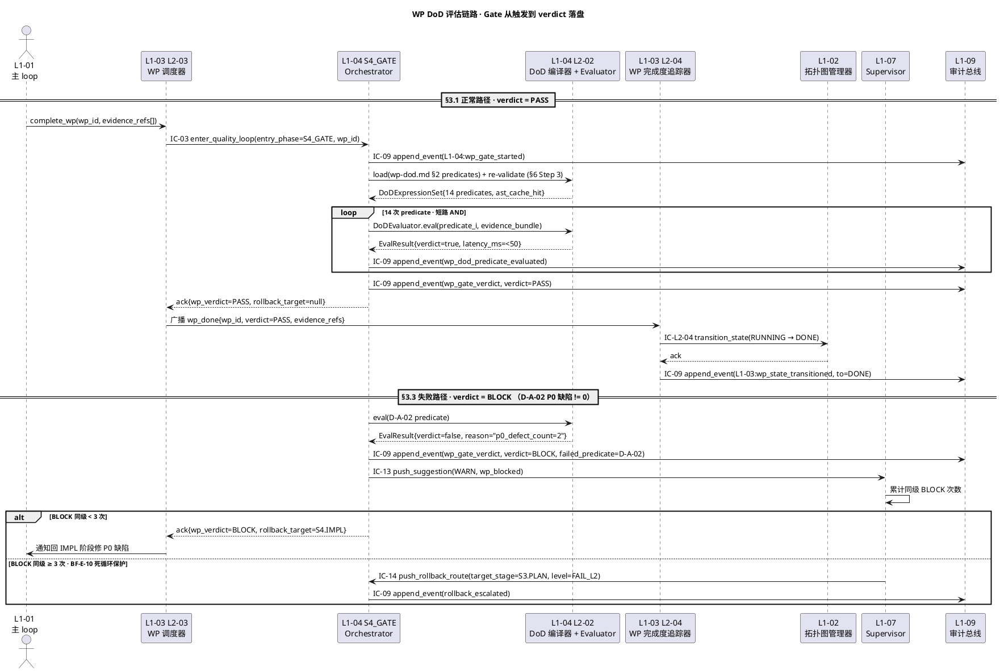

# WP DoD 规约（Work Package 级）

> **本文档定位**：3-3 Monitoring & Controlling 层 · **Work Package（单个 WP）粒度的 DoD 契约** —— 定义"单个 WP 完成"必须同时满足的三维规约项（功能 / 质量 / 文档），给 L1-04 DoD 表达式编译器与 L1-03 WP 完成度追踪器提供**可机器校验**的 predicate 清单、证据 schema、审计事件格式。
> **与 3-1/3-2 的分工**：3-1 定义 "WP 调度器与 DoD 编译器如何实现"；3-2 定义 "如何测 WP 流水线"；**3-3 定义 "单个 WP 完成与否如何判定"**（三维度 12+ 条 predicate · PASS/BLOCK/RETRY 三态 verdict）。
> **与同目录兄弟文档分工**：`general-dod.md`（通用 DoD 语义与编译规则 · 横切）→ `stage-dod.md`（Stage S0-S7 粒度 DoD · 阶段级）→ **本文档**（WP 粒度 DoD · 一个 WP 完成 / 失败 / 重试的判据）。
> **消费方**：L1-03 L2-03 WP 调度器（前置校验 + 接收完成请求）· L1-03 L2-04 WP 完成度追踪器（订阅 wp_done / wp_failed 事件 · 聚合证据）· L1-04 L2-02 DoD 表达式编译器（编译本文档 predicate → AST 受限 evaluator eval）· L1-07 Supervisor（消费 verdict 判 rollback 路由）· L1-09 审计总线（落盘 IC-09 事件）。

---

## §0 撰写进度

- [x] §1 定位 + 与上游 PRD/scope 的映射
- [x] §2 核心清单 / 规约内容（三维度 A/B/C · 每维度 ≥ 4 条 predicate）
- [x] §3 触发与响应机制
- [x] §4 与 L1-03 / L1-04 / L1-09 的契约对接
- [x] §5 证据要求 + 审计 schema
- [x] §6 与 2-prd 的反向追溯表（12+ 条）

---

## §1 定位 + 映射

### §1.1 WP 作为 S4 阶段的调度粒度

在 HarnessFlow 五大纪律驱动的 4 件套 + TOGAF 流水线中，**Work Package（WP）** 是 **S4 Execution 阶段唯一的调度单元**：

- **拆解来源**：S2 阶段 L1-02 产出 4 件套（需求 / 目标 / AC / 质量标准）+ TOGAF A-D 架构 → L1-03 按"架构边界 + ≤ 5 天工时"原则拆成 N 个 WP，组成 DAG 拓扑（`docs/planning/wbs.md`）。
- **调度窗口**：S4 进入后，L1-01 主 loop 每 tick 调 IC-02 `get_next_wp` → L1-03 L2-03 WP 调度器按"依赖 satisfied + 关键路径优先 + 并行度 ≤ 1-2"规则选出 next WP → 进 Quality Loop。
- **执行闭环**：单个 WP 在 S4 内部走 mini-PMP（**IMPL → Unit/Integration Test → WP-DoD 自检 → commit**，见 scope §5.4.1 BF-S4 全流程）。
- **终结判据**：WP 要么 **DONE**（本文档所有 predicate 为 true）要么 **FAILED**（ ≥ 1 条关键 predicate 为 false，且由 L1-04 L2-04 广播 wp_failed 事件 → L2-04 WP 完成度追踪器调 IC-L2-04 `transition_state(RUNNING→FAILED)`）。

**WP DoD vs Stage DoD（S4）的组合关系**：
- **Stage DoD（S4 阶段）** = `∀ wp ∈ s4_wps : WP_DoD(wp) == PASS` AND `s4_macro_criteria_met`（S4 阶段级宏观指标，如"所有 AC 编号闭合 / PR 全部 green / 无 P0 issue 残留"）。
- **WP DoD（单 WP）** = 本文档 §2 的三维度 12+ 条 predicate 全体 AND（短路 AND）。
- 关系：**WP DoD 是 Stage S4 DoD 的必要子集**。单个 WP 过了 WP DoD 不意味着 S4 过了，但 S4 过不去必然是某个 WP 的 WP DoD 没过（⇒ WP DoD 是 S4 Gate 的**"细粒度探针"**）。

### §1.2 2-prd 映射

| 2-prd 锚点 | 本文档对应节 | 关键约束透传 |
|---|---|---|
| scope §5.3.1（L1-03 职责·"每 WP 具备独立 Goal / DoD / 工时估算 / 推荐 skill"） | §2 全节 | "DoD 4 要素"落地为 §2 predicate 清单 |
| scope §5.3.4 硬约束 · "WP 粒度 ≤ 5 天工时" + "WP 依赖图必须 DAG" | §2.B 质量 D-B-04（effort_actual 监测） | WP 粒度超限 → soft-drift L1-07 |
| scope §5.3.5 禁止 · "禁止 WP 定义缺 Goal / DoD / 依赖 / 工时" | §2 全节（4 要素硬性） | 缺要素 ⇒ WP 无法进入 RUNNING |
| scope §5.3.5 禁止 · "禁止绕过 L1-04 直接标 WP done"（必经 Quality Loop 验证） | §3 触发链 · §4 IC-14 对接 | complete_wp 必须走 L1-04 Gate |
| scope §5.3.6 必须 · "在 WP 失败 ≥ 3 次时触发 BF-E-08 回退建议" | §3.3 失败响应 · §4.4 IC-14 升级 | 同级 3 次 → 升一级回退 |
| scope §5.4 Quality Loop 职责 · "驱动每个 WP 的 IMPL → 单元/集成测试 → WP-DoD 自检 → commit"（BF-S4-04） | §3.1 触发时序 | L1-04 自检 = 本文档 predicate 全 eval |
| scope §9 DoD 硬约束 · "白名单 AST eval · 禁 arbitrary exec" | §2.5 predicate 语法规范 | 所有 predicate 必在 L2-02 白名单内 |
| HarnessFlowGoal §2.3 WP 拓扑 · §3.3 交付验收阶段强 Gate | §1.1 WP 作为 S4 粒度 | 本文档即"强 Gate 在 WP 粒度的落地" |
| HarnessFlowGoal §4.1 "决策可追溯率 100%" | §5 证据 schema + IC-09 审计 | 所有 verdict 落 IC-09 hash chain |

### §1.3 在 3-3 层的确切位置

```
docs/3-3-Monitoring-Controlling/
├── dod-specs/
│   ├── general-dod.md     ← 横切 · DoD 通用语义（predicate 语法 / verdict 5 级 / 组合逻辑）
│   ├── stage-dod.md       ← 纵切 · Stage S0-S7 粒度（阶段级宏观 gate · 进入/退出条件）
│   └── wp-dod.md  ★ 本文   ← 纵切 · Work Package 粒度（单 WP 功能/质量/文档 3 维 12+ predicate）
├── redline-specs/         ← 硬红线 5 类 · 软漂移 8 类（正交 · 红线触发 vs DoD 判通过）
└── verdict-protocol.md    ← 5 级 verdict（PASS / FAIL_L1-L4）· 与本文档的 PASS/BLOCK/RETRY 三态 **组合关系**：
                             · WP verdict ∈ {PASS, BLOCK, RETRY} 是"单次 Gate 结果"
                             · 系统级 verdict ∈ {PASS, FAIL_L1..L4} 是"连续失败升级后的路由决定"
                             · BLOCK × 3 → 升级为 FAIL_L2；FAIL_L2 × 3 → 升级为 FAIL_L3（BF-E-10 死循环保护）
```

---

## §2 WP DoD 清单（三维度 · 每维度 ≥ 4 条 · 全 predicate 化）

### §2.0 清单总览

| 维度 | 规约条目数 | 对应 2-prd 章节 | 典型失败 → verdict |
|---|---|---|---|
| **A. 功能 DoD**（Functional） | **5** | scope §5.3.1（WP Goal/DoD 4 要素）+ §5.4 Quality Loop | BLOCK（回 IMPL）|
| **B. 质量 DoD**（Quality） | **5** | scope §5.3.4（粒度约束）+ §5.4（S3 DoD 表达式） | RETRY ×1 允许（e.g. flaky test）后 BLOCK |
| **C. 文档 DoD**（Documentation） | **4** | scope §5.3.6（必须义务）+ §9（审计可追溯） | BLOCK（回 IMPL 补文档）|
| **合计** | **14** | —— | —— |

**所有 14 条以短路 AND 组合** → 任一条为 false → WP verdict = BLOCK/RETRY。全部 true → WP verdict = PASS → IC-L2-04 transition_state(RUNNING→DONE)。

### §2.A 功能 DoD（Functional · 5 条 ≥ 4）

> **语义**：WP 宣称"做完了 scope §5.3.1 定义的 Goal + AC"的必要条件。聚焦"**该 WP 承诺的对外行为是否达成**"。

#### D-A-01 · 所有 Acceptance Criteria 闭合

```yaml
predicate_id: D-A-01
expression: "ac_all_closed(wp_id) == true"
semantic: "WP 关联的所有 AC 编号（来自 4 件套）在 verifier report 的 ac_coverage 字段均标记 PASS"
evidence_source: "verifier_reports/<wp_id>.json · ac_coverage[] · entry.status == PASS"
fail_mode: BLOCK
rollback_target: S4.IMPL  # 回 IMPL 阶段补未闭合的 AC
rationale: "WP 的核心交付是 4 件套 AC；AC 未闭合 = 对外承诺未履行，最强阻断"
```

#### D-A-02 · 无 P0 缺陷残留

```yaml
predicate_id: D-A-02
expression: "p0_defect_count(wp_id) == 0"
semantic: "关联 WP 的 issue tracker / verifier report 中 P0 严重级缺陷数为 0"
evidence_source: "verifier_reports/<wp_id>.json · defects[] · WHERE severity == 'P0'"
fail_mode: BLOCK
rollback_target: S4.IMPL
rationale: "scope §5.4.1 Quality Loop 职责 · P0 缺陷 = 功能不可用，绝不允许 DONE"
```

#### D-A-03 · API 契约与 3-1 集成规约匹配

```yaml
predicate_id: D-A-03
expression: "api_contract_match(wp_id, ic_contracts_ref) == true"
semantic: "WP 新增 / 修改的 API 在 3-1 integration/ic-contracts.md 有对应 IC-NN 条目 · schema 字段全量匹配 · 错误码枚举对齐"
evidence_source: "verifier_reports/<wp_id>.json · ic_match[] · entry.schema_diff == empty"
fail_mode: BLOCK
rollback_target: S3.PLAN  # 回 S3 补契约或修 IC
rationale: "PM-10 单一事实源 · API 漂移 → 下游 L 解析失败 · 回 S3 重对齐"
```

#### D-A-04 · 依赖上游 WP 的契约无破坏

```yaml
predicate_id: D-A-04
expression: "upstream_contract_intact(wp_id) == true AND downstream_smoke_green(wp_id) == true"
semantic: "WP 修改未破坏上游 WP 的对外接口（回归 smoke 全绿）· 下游依赖此 WP 输出的 smoke 也全绿"
evidence_source: "verifier_reports/<wp_id>.json · regression_smoke · all_pass == true"
fail_mode: BLOCK
rollback_target: S4.IMPL
rationale: "scope §5.3.4 DAG 约束延伸 · 契约破坏会沿 DAG 扩散 · 早拦截"
```

#### D-A-05 · WP Goal 四要素完整性

```yaml
predicate_id: D-A-05
expression: "wp_def_has(goal) AND wp_def_has(dod) AND wp_def_has(deps) AND wp_def_has(effort)"
semantic: "WP 定义结构四要素（scope §5.3.5 禁止清单 3）在 projects/<pid>/wbs/wp-queue/<wp_id>.json 均非空"
evidence_source: "projects/<pid>/wbs/wp-queue/<wp_id>.json · fields non-null check"
fail_mode: BLOCK
rollback_target: S2.PLAN  # 回 S2 补 WBS 定义
rationale: "scope §5.3.5 明文 🚫 '禁止 WP 定义缺 Goal / DoD / 依赖 / 工时' · 这是结构前置"
```

### §2.B 质量 DoD（Quality · 5 条 ≥ 4）

> **语义**：代码级客观指标。全部指标 ≥ 阈值才算"**可维护、可回归、可上线**"。

#### D-B-01 · 行覆盖率与分支覆盖率

```yaml
predicate_id: D-B-01
expression: "coverage.line(wp_id) >= 0.80 AND coverage.branch(wp_id) >= 0.70"
semantic: "WP 变更涉及的代码文件，pytest --cov 报告显示行覆盖 ≥ 80% · 分支覆盖 ≥ 70%"
evidence_source: "coverage_reports/<wp_id>.xml · coverage-py schema"
fail_mode: RETRY_ALLOWED_x1  # 允许补测 1 次重跑
rollback_target: S3.PLAN_OR_S4.IMPL
rationale: "L2-02 DoDExpressionCompiler §2.3.2 白名单 · line_coverage / branch_coverage 已在 WhitelistRegistry"
```

#### D-B-02 · 单元测试 100% 通过率

```yaml
predicate_id: D-B-02
expression: "test.unit.pass_rate(wp_id) == 1.0 AND test.unit.count(wp_id) >= 1"
semantic: "单元测试全绿 · 且至少 1 个单测"
evidence_source: "test_reports/<wp_id>/junit.xml · pytest schema"
fail_mode: RETRY_ALLOWED_x1
rollback_target: S4.IMPL
rationale: "TDD 驱动 · 红-绿-重构要求绿；0 单测 = 没走 TDD ⇒ 直接 BLOCK"
```

#### D-B-03 · Lint 零 error

```yaml
predicate_id: D-B-03
expression: "lint.ruff.errors(wp_id) == 0 AND lint.mypy.errors(wp_id) == 0"
semantic: "ruff + mypy 对 WP 触及的文件 0 error（warning 不阻断，但落 Supervisor soft-drift）"
evidence_source: "lint_reports/<wp_id>.json · {ruff_errors, mypy_errors, warnings_by_level}"
fail_mode: BLOCK  # error 级必须清 0
rollback_target: S4.IMPL
rationale: "L2-02 §2.3 VO LintReport · ruff_errors / pyright_errors 已在白名单"
```

#### D-B-04 · 实际工时 ≤ 1.5× 估算 · 超出触发告警

```yaml
predicate_id: D-B-04
expression: "effort_actual_hours(wp_id) <= effort_estimate_hours(wp_id) * 1.5"
semantic: "WP 实际工时不超过估算 × 1.5（scope §5.3.4 的派生：WP 粒度硬顶 5 天，超 1.5× 即需拆分信号）"
evidence_source: "event_log.jsonl · L1-03:wp_timer_events · time_delta 累加"
fail_mode: SOFT_DRIFT  # 不阻断 DONE，但写审计 + push L1-07 WARN 建议下次拆更细
rollback_target: null  # 不回退，仅告警
rationale: "scope §5.3.4 '≤ 5 天工时' + §5.3.6 '每 WP 有工时估算' · 监测偏差"
```

#### D-B-05 · Code Review 通过

```yaml
predicate_id: D-B-05
expression: "code_review.status(wp_id) == 'APPROVED' AND code_review.reviewer_count(wp_id) >= 1"
semantic: "Code review 至少 1 位 reviewer 标记 APPROVED（本机单人项目可 self-approve 但需显式 self_review_rationale）"
evidence_source: "pull_requests/<wp_id>.json · reviews[] · state == APPROVED"
fail_mode: BLOCK
rollback_target: S4.IMPL  # 按 review 意见修改
rationale: "scope §5.4 Quality Loop 'verifier 子 Agent 跑独立验证' 的人工补充 · 双眼原则"
```

### §2.C 文档 DoD（Documentation · 4 条 ≥ 4）

> **语义**：不光代码做完，**可追溯性**必须就位 —— scope §9 "决策可追溯率 100%" 在 WP 粒度的承诺。

#### D-C-01 · API 文档同步更新

```yaml
predicate_id: D-C-01
expression: "api_doc_updated(wp_id) == true"
semantic: "WP 新增 / 修改的 public API 在 docs/api/*.md 或 OpenAPI schema 有对应条目，且 git diff 显示本次 WP 含 API 文档变更"
evidence_source: "git diff HEAD~1..HEAD -- docs/api/ 非空 · OR wp 无 API 变更（api_change_count == 0）"
fail_mode: BLOCK
rollback_target: S4.IMPL
rationale: "PM-10 单一事实源 · 代码与文档漂移 = 下游 agent 误用"
```

#### D-C-02 · Changelog 条目存在

```yaml
predicate_id: D-C-02
expression: "changelog_entry_exists(wp_id) == true"
semantic: "CHANGELOG.md 含本 WP 的条目（格式：`- [wp_id] <summary>` 单行 + 日期 + 关联 issue/PR 号）"
evidence_source: "CHANGELOG.md · regex search r'\\[<wp_id>\\]'"
fail_mode: BLOCK
rollback_target: S4.IMPL
rationale: "scope §9 审计可追溯 · 无 changelog = 外部看不到 WP 做了什么"
```

#### D-C-03 · 自测报告归档

```yaml
predicate_id: D-C-03
expression: "self_test_report_archived(wp_id) == true AND report.sections_covered(wp_id) >= 3"
semantic: "WP 自测报告（实际输入 / 预期输出 / 实际观察 / 差异分析 / 结论）归档到 verifier_reports/<wp_id>.md，且覆盖 ≥ 3 个必要章节"
evidence_source: "verifier_reports/<wp_id>.md · YAML frontmatter sections 字段 count"
fail_mode: BLOCK
rollback_target: S4.IMPL
rationale: "scope §5.4 Quality Loop '三段证据链'（existence / behavior / quality）在 WP 粒度落地"
```

#### D-C-04 · 决策记录可追溯

```yaml
predicate_id: D-C-04
expression: "decision_trace_complete(wp_id) == true"
semantic: "IC-09 审计总线按 wp_id 能反查出 WP 生命周期完整事件链（wp_created / wp_started / impl_commits / wp_gate_verdict），断链即失败"
evidence_source: "audit_events.jsonl · query by wp_id · event_types ⊇ {wp_created, wp_started, wp_gate_verdict}"
fail_mode: BLOCK
rollback_target: S4.IMPL_OR_S7  # 看断链位置
rationale: "HarnessFlowGoal §4.1 V1 量化 '决策可追溯率 100%'"
```

### §2.5 Predicate 语法规范（对接 L2-02 白名单）

- **允许的节点集**：`ast.Expression / BoolOp(And|Or) / UnaryOp(Not) / Compare(Eq|NotEq|Lt|LtE|Gt|GtE) / Call(whitelisted_funcs) / Name(Load) / Constant(int|float|str|bool)`（严格子集 · 见 L2-02 §5.2 白名单节点清单）。
- **允许的调用函数**（extend 白名单，全部在 L2-02 WhitelistRegistry 登记）：
  - 证据读取型：`ac_all_closed() / p0_defect_count() / api_contract_match() / upstream_contract_intact() / downstream_smoke_green() / wp_def_has()`
  - 度量读取型：`coverage.line() / coverage.branch() / test.unit.pass_rate() / test.unit.count() / lint.ruff.errors() / lint.mypy.errors() / effort_actual_hours() / effort_estimate_hours()`
  - 文档读取型：`api_doc_updated() / changelog_entry_exists() / self_test_report_archived() / decision_trace_complete() / code_review.status() / code_review.reviewer_count()`
- **禁止**（L2-02 §5.2 白名单以外 · SafeExprValidator 编译期拒绝）：`Import / ImportFrom / Attribute（除白名单 ns 外）/ Lambda / FunctionDef / Assign / Exec / Eval / Yield / Starred / **dunder names（__class__ / __import__ / __builtins__）**`
- **AST 深度硬上限**：32（L2-02 §6.3 SA-03 防递归炸弹）
- **缓存一致性**：本文档 predicate 文本变更 → `whitelist_version` bump → L2-02 `ast_cache` 全失效（L2-02 §6 Step 8）

---

## §3 触发与响应机制

### §3.1 触发时序（P0 · 正常路径）

- **入口**：L1-01 主 loop 在 S4 阶段完成 IMPL + 测试后，调 L1-03 WP 调度器的 `complete_wp(wp_id, evidence_refs[])` → 进入 "WP Gate" 阶段。
- **Gate 执行**：
  1. L1-03 L2-04 WP 完成度追踪器收到 `wp_done` 事件意图 → 调 IC-03 `enter_quality_loop(entry_phase=S4_GATE)`。
  2. L1-04 S4_GATE 内 L2-02 DoD 表达式编译器 `load(wp_dod.yaml)` → 运行期 re-validate（L2-02 §6 Step 3） → 对本文档 §2 的 14 条 predicate 顺序 `DoDEvaluator.eval()`。
  3. 任一 predicate false → 按 `fail_mode` 决定 BLOCK / RETRY_x1 / SOFT_DRIFT。
  4. 全部 true → verdict = PASS。
- **终结**：L2-04 调 IC-L2-04 `transition_state(pid, wp_id, RUNNING → DONE, reason="wp_dod_passed", evidence_refs)` → L2-02 拓扑图管理器持久化 · IC-09 事件落盘。

### §3.2 响应 SLO

| 阶段 | 指标 | 阈值（P95） | 指标来源 |
|---|---|---|---|
| Gate 总耗时（不含测试执行） | `wp_gate_latency_ms` | ≤ 3,000 ms | L2-04 广播指标 |
| 14 条 predicate eval 串行 | `dod_eval_latency_ms` | ≤ 500 ms | L2-02 §9.2 性能目标 |
| 含测试重跑（RETRY_x1 场景） | `wp_gate_with_test_ms` | ≤ 30,000 ms | test_runner + L2-02 聚合 |
| IC-L2-04 transition_state | `transition_latency_ms` | ≤ 100 ms | ic-contracts IC-L2-04 |
| IC-09 append_event 落盘 | `audit_fsync_ms` | ≤ 20 ms | ic-contracts §3.9 |

### §3.3 失败响应链

```
predicate false
  ├── fail_mode = SOFT_DRIFT  → verdict 仍 PASS，但 IC-13 push_suggestion(INFO, soft_drift_detected) → L1-07 记录
  ├── fail_mode = RETRY_x1    → 本次 verdict = RETRY · L1-04 回 IMPL 阶段允许补一次 · 二次再 false → BLOCK
  └── fail_mode = BLOCK       → verdict = BLOCK
                                └── L1-07 Supervisor 累计同级 BLOCK 次数
                                    ├── < 3 次：L1-04 自行回 rollback_target（S4.IMPL / S3.PLAN / S2.PLAN）
                                    └── ≥ 3 次（BF-E-10 死循环保护）：
                                        └── IC-14 push_rollback_route 升一级 → target_stage 上移
                                            └── S4.IMPL × 3 失败 → 升到 S3.PLAN
                                            └── S3.PLAN × 3 失败 → 升到 S2.PLAN
                                            └── S2.PLAN × 3 失败 → 升到 FAIL_L3 上报用户
```

### §3.4 降级策略

- **L2-02 DoDEvaluator 超时（≥ 500ms）**：单条 predicate 超时 → verdict = BLOCK + L1-07 WARN（疑似证据读取不可达）。
- **evidence_source 读取失败**：按 `MISSING_EVIDENCE` 错误码处理 → verdict = BLOCK + 建议回 S4.IMPL 重跑测试生成证据。
- **AST 缓存 poison（cache_key 匹配但 re-validate 失败）**：L2-02 SA-11 告警 + 清缓存 + 重编译。
- **L1-04 整体不可达**：L1-03 L2-04 保守策略 —— 不允许 `RUNNING→DONE`，WP 悬停 RUNNING 状态直到 Quality Loop 恢复（绝不绕过 DoD 判 done，scope §5.3.5 禁止 6）。

---

## §4 与 L1-03 / L1-04 / L1-09 的契约对接

### §4.1 L1-03 L2-04 WP 完成度追踪器 消费本规约

- **消费项清单**：本文档 §2 的 14 条 predicate ID 作为"规约项清单"灌入 L2-04。
- **对接点**：L2-04 不持有 DoD eval 能力（scope §5.3.3 Out-of-scope："不做 WP 级验证 → L1-04 S5"），仅订阅 L1-04 广播的 `wp_done` / `wp_failed` 事件 → 从事件 payload 读 `wp_dod_evidence.verdict` 决定是否调 IC-L2-04 `transition_state`。
- **进度聚合**：L2-04 以本文档 14 条 predicate 的 pass/fail 比值作为 WP 进度百分比 `progress_pct = passed_count / 14 * 100`（L2-04 §2.3 ProgressMetrics VO）。

### §4.2 L1-04 L2-02 DoD 表达式编译器 编译本规约

- **编译输入**：`docs/3-3-Monitoring-Controlling/dod-specs/wp-dod.md` §2 的 predicate YAML 块。
- **编译过程**（L2-02 §3.1）：
  1. 抽取 14 条 `expression` 字符串。
  2. 对每条调 `ast.parse(mode='eval')` → 走 `SafeExprValidator` 白名单校验（拒绝 → `E_L204_L202_AST_ILLEGAL_NODE / FUNCTION`）。
  3. 打包成 `DoDExpressionSet(wp_id → DoDExpression AST)` 持久化到 `projects/<pid>/dod/wp-<wp_id>.yaml`。
- **运行期 eval**：L2-02 `DoDEvaluator.eval(expression_set, evidence_bundle)` → 逐条 predicate 返回 `EvalResult{verdict, reason, cache_hit, latency_ms}`。
- **错误码透传**（ic-contracts §3.9 + L2-02 §3.7）：
  - `E_L204_L202_AST_ILLEGAL_NODE` / `AST_ILLEGAL_FUNCTION` → L1-04 BLOCK + SA-01 告警
  - `E_L204_L202_RECURSION_LIMIT` → 拒绝 · predicate 本身超限
  - `E_L204_L202_CACHE_POISON` → 清缓存重编译（L2-02 SA-11）

### §4.3 IC-02 WP 状态事件 payload 要求

- **IC-02 `get_next_wp` 调用时**：L2-03 调度器若发现 candidate WP 的 `wp_dod` 未初始化（即本文档 §2 predicate 还没编译为 DoDExpressionSet），拒绝调度 → 返回 `wp_id=null + reason="awaiting_deps + dod_not_compiled"`。
- **IC-02 返回 payload** 中的 `wp_def` 字段须含本文档 predicate 编译后的 `dod_expression_set_id`（指向 L2-02 持久化 AST 的 UUID），否则 L1-01 拒绝该 WP 入 RUNNING。

### §4.4 IC-14 verdict 关联 wp_id

- **IC-14 `push_rollback_route` payload**（ic-contracts §3.14）：
  - `wp_id`（必填 · format "wp-{uuid-v7}"）指向**产生 verdict 的 WP**
  - `verdict ∈ {PASS, FAIL_L1, FAIL_L2, FAIL_L3, FAIL_L4}`：本文档 WP 粒度 verdict 与 system 5 级 verdict 的映射见 §1.3
  - `target_stage`：本文档 predicate `rollback_target` 透传（S4.IMPL / S3.PLAN / S2.PLAN 等）
  - `evidence`：含 `wp_dod_evidence`（§5 schema）
- **幂等性**：`Idempotent by (wp_id, verdict_id/route_id)`（ic-contracts IC-14），同一 WP 同一 verdict 重复推送 → ack 已应用。

### §4.5 IC-09 审计（全链路落盘）

| 事件类型 | 何时发出 | 关键 payload | 订阅者 |
|---|---|---|---|
| `L1-04:wp_gate_started` | Gate 进入 | `wp_id, dod_expression_set_id, evidence_bundle_ref` | L1-10 UI · L1-07 |
| `L1-04:wp_dod_predicate_evaluated` | 每条 predicate eval 完 | `wp_id, predicate_id, verdict, reason, latency_ms, cache_hit` | 调试 · L1-07 |
| `L1-04:wp_gate_verdict` | Gate 结束 | `wp_id, verdict ∈ {PASS, BLOCK, RETRY}, dimensions_summary, rollback_target` | L1-03 L2-04 · L1-07 · L1-10 |
| `L1-03:wp_state_transitioned` | L2-04 成功 transition | `wp_id, from_state, to_state, reason, evidence_refs` | L1-01 · L1-10 |

### §4.6 PlantUML · WP DoD 评估链路（P0 正常 + P1 BLOCK）



---

## §5 证据要求 + 审计 schema

### §5.1 `wp_dod_evidence` schema（IC-14 / IC-09 payload 核心字段）

```yaml
wp_dod_evidence:
  $schema: "https://harnessflow.dev/schemas/wp-dod-evidence/v1.json"
  wp_id:
    type: string
    format: "wp-{uuid-v7}"
    required: true
    description: "唯一定位 WP · 与 IC-02/14/IC-L2-04 等所有接口的 wp_id 一致（PM-14 命名规范）"
  project_id:
    type: string
    required: true
    description: "PM-14 多项目隔离 · 跨 project 查询禁止"
  dod_expression_set_id:
    type: string
    format: uuid
    required: true
    description: "L2-02 编译产出的 DoDExpressionSet UUID · 用于 AST 缓存命中追溯"
  whitelist_version:
    type: string
    required: true
    description: "L2-02 §2.3 WhitelistASTRule.version_added · 用于 cache_key 一致性"
  dimensions:
    type: array
    items:
      enum: [功能, 质量, 文档]
    required: true
    minItems: 3
    description: "本 Gate 覆盖的三维度 · 必须全覆盖（§2.A/B/C）"
  predicates:
    type: array
    minItems: 14  # 严格对齐 §2 条目数（5 + 5 + 4 = 14）
    required: true
    items:
      type: object
      required: [predicate_id, expr, result, evidence_ref, latency_ms]
      properties:
        predicate_id:
          type: string
          enum: [D-A-01, D-A-02, D-A-03, D-A-04, D-A-05,
                 D-B-01, D-B-02, D-B-03, D-B-04, D-B-05,
                 D-C-01, D-C-02, D-C-03, D-C-04]
        expr:
          type: string
          description: "原始表达式（用于审计比对 · 如 'coverage.line(wp_id) >= 0.80 AND coverage.branch(wp_id) >= 0.70'）"
        result:
          type: boolean
          description: "DoDEvaluator 返回的布尔值"
        evidence_ref:
          type: string
          description: "证据文件路径或事件 id（如 'coverage_reports/wp-001.xml' / 'event:evt-xxx'）"
        reason:
          type: string
          description: "result=false 时可读原因（L2-02 EvalResult.reason）· 如 'line_coverage=0.75 < threshold 0.8'"
        latency_ms:
          type: integer
          minimum: 0
          description: "单条 predicate eval 耗时 · 用于 SLO 追踪"
        cache_hit:
          type: boolean
          description: "L2-02 AST 缓存是否命中"
        fail_mode:
          type: string
          enum: [BLOCK, RETRY_ALLOWED_x1, SOFT_DRIFT]
          description: "仅 result=false 时必填 · 与 §2 predicate 定义一致"
  verdict:
    type: string
    enum: [PASS, BLOCK, RETRY]
    required: true
    description: |
      聚合结论：
      · PASS = 全部 14 条 true（含 SOFT_DRIFT 不阻断）
      · BLOCK = 任一 result=false 且 fail_mode ∈ {BLOCK} · 或 RETRY_x1 已用光
      · RETRY = 任一 result=false 且 fail_mode = RETRY_ALLOWED_x1 且尚未 retry
  rollback_target:
    type: string
    enum: [null, S4.IMPL, S3.PLAN, S2.PLAN, S4.IMPL_OR_S7]
    description: "verdict != PASS 时必填 · 透传自 §2 首个失败 predicate 的 rollback_target"
  retry_count:
    type: integer
    minimum: 0
    description: "已 retry 次数 · 达到 RETRY_ALLOWED_x1 上限（=1）后不再允许 retry"
  timing:
    type: object
    required: [gate_started_at, gate_ended_at, total_latency_ms]
    properties:
      gate_started_at: { type: string, format: "iso-8601" }
      gate_ended_at:   { type: string, format: "iso-8601" }
      total_latency_ms: { type: integer, description: "对齐 §3.2 SLO 3000ms" }
  audit_event_ids:
    type: array
    items: { type: string }
    description: "本次 Gate 关联的 IC-09 event_id 列表（hash chain 入口）"
```

### §5.2 audit 事件完整 schema（IC-09 `wp_gate_verdict`）

```yaml
audit_event:
  event_id: "evt-{uuid-v7}"        # ic-contracts §3.9
  event_type: "L1-04:wp_gate_verdict"
  project_id: string                # PM-14
  actor: "L1-04.S4_GATE"
  ts: "iso-8601 RFC3339 · UTC"
  prev_event_hash: "sha256-hex"     # hash chain · ic-contracts §3.9
  payload:
    wp_id: "wp-{uuid-v7}"
    wp_dod_evidence: {$ref: "#/wp_dod_evidence"}  # §5.1 完整 schema
    verdict: [PASS, BLOCK, RETRY]
    fail_summary:                   # verdict != PASS 时填
      failed_predicate_ids: [string]
      first_blocking_dimension: [功能, 质量, 文档]
    supervisor_dispatched:
      type: boolean
      description: "是否已通知 L1-07（BLOCK 必为 true）"
    ic14_route_id:
      type: string
      description: "若触发 IC-14 rollback 升级 · 填关联 route_id"
```

### §5.3 证据完整性校验（L2-04 WP 完成度追踪器侧）

- **强制非空**：`wp_dod_evidence.predicates[].evidence_ref` 全部非空（L2-04 §3.3 IC-L2-04 schema 要求 `evidence_refs: minItems: 1`）。
- **格式白名单**：`evidence_ref` 必匹配以下正则之一，否则 L2-04 拒收 `transition_state`：
  - `^event:evt-[0-9a-f-]{36}$`（IC-09 事件 id）
  - `^(verifier_reports|coverage_reports|lint_reports|test_reports|pull_requests|audit_events)/[^/]+\.(json|xml|md|jsonl)$`（相对路径白名单）
  - `^projects/[^/]+/(wbs/wp-queue|dod)/[^/]+\.(json|yaml)$`（WBS / DoD 产物）
- **指纹绑定**：`wp_dod_evidence.dod_expression_set_id` 必须在 L2-02 AST 缓存中可查到，否则 SA-11 cache poison 告警。
- **时钟单调**：`timing.gate_ended_at > gate_started_at` AND `total_latency_ms == (end - start) in ms`，否则审计异常。

### §5.4 审计可追溯链

```
wp_gate_started (evt-1) ─┐
                          ├──hash-chain─► wp_dod_predicate_evaluated (evt-2..15) ─┐
                          │                                                         ├──► wp_gate_verdict (evt-16)
                          │                                                         │        │
                          │                                                         │        ├── PASS → L1-03:wp_state_transitioned (evt-17)
                          │                                                         │        └── BLOCK ≥3 → L1-04:rollback_escalated (evt-17) → IC-14
```

全部 17 个事件共享同一 `wp_id`，按 `prev_event_hash` 形成完整 hash chain，满足 HarnessFlowGoal §4.1 "决策可追溯率 100%"。

---

## §6 反向追溯表（≥ 12 条 ↔ 2-prd §9 及关联章节）

| # | 本文档规约 | 2-prd 锚点 | 追溯说明 |
|---|---|---|---|
| 1 | §1.1 WP 作为 S4 调度粒度 | scope §5.3.1 "把超大项目按 4 件套 + 架构边界拆成若干 WP" | 粒度定义直接承继 |
| 2 | §1.1 WP DoD vs Stage DoD 组合关系 | scope §9 "4 件套 DoD 机器可校验" + HarnessFlowGoal §3.3 "强 Gate" | 本文档 = 强 Gate 在 WP 粒度的契约落地 |
| 3 | §2.A D-A-01 AC 闭合 | scope §5.4.1 "BF-S4-04 WP-DoD 自检流" + §9 4 件套 AC | AC 编号闭合是 WP 的对外承诺 |
| 4 | §2.A D-A-02 无 P0 缺陷 | scope §5.4.1 Quality Loop · §9 硬约束 4 质量标准 | P0 = 功能不可用，绝不允许 done |
| 5 | §2.A D-A-03 API 契约匹配 | scope §9 PM-10 单一事实源 · 3-1 ic-contracts | 契约漂移拦截 |
| 6 | §2.A D-A-04 上游/下游契约完整 | scope §5.3.4 "WP 依赖图必须 DAG" 延伸 | DAG 扩散风险在 WP Gate 早拦截 |
| 7 | §2.A D-A-05 WP 4 要素 | scope §5.3.5 禁止 3 "禁止 WP 定义缺 Goal/DoD/依赖/工时" | 结构前置硬约束 |
| 8 | §2.B D-B-01 覆盖率 | scope §5.4.3 "质量 gate 规则（覆盖率 / 性能 / 安全扫描）" | L2-02 白名单 line_coverage / branch_coverage |
| 9 | §2.B D-B-02 单测 100% 通过 | scope §5.4.1 "TDD 驱动实现流 BF-S4-03" + §9 DoD 白名单 test.pass_rate | TDD 红-绿-重构硬性 |
| 10 | §2.B D-B-03 ruff/mypy 0 error | scope §5.4.3 "质量 gate" · L2-02 LintReport VO | 代码质量硬底线 |
| 11 | §2.B D-B-04 工时偏差监测 | scope §5.3.4 "WP 粒度 ≤ 5 天" + §5.3.6 "必须工时估算" | soft-drift 告警（不阻断）|
| 12 | §2.B D-B-05 Code Review | scope §5.4 "verifier 子 Agent 独立验证" 的人工补充 | 双眼原则 |
| 13 | §2.C D-C-01 API 文档同步 | scope §9 PM-10 单一事实源（代码-文档一致）| 下游 agent 误用防护 |
| 14 | §2.C D-C-02 Changelog 条目 | scope §9 审计可追溯 | 外部视角 WP 可见性 |
| 15 | §2.C D-C-03 自测报告三段证据链 | scope §5.4.1 "verifier_reports/*.json 三段证据链" | existence / behavior / quality 在 WP 粒度的落地 |
| 16 | §2.C D-C-04 决策记录可追溯 | HarnessFlowGoal §4.1 "决策可追溯率 100%" | IC-09 hash chain 按 wp_id 可反查 |
| 17 | §2.5 predicate 语法（白名单 AST） | scope §9 "PM-05 Stage Contract 机器可校验 · DoD 走白名单 AST eval, 禁 arbitrary exec" | 强制对接 L2-02 SafeExprValidator |
| 18 | §3.1 complete_wp 必经 L1-04 Gate | scope §5.3.5 禁止 6 "禁止绕过 L1-04 直接标 WP done" | 降级策略同样保守 |
| 19 | §3.3 同级 ≥ 3 次 → IC-14 升级 | scope §5.3.6 必须 4 "WP 失败 ≥ 3 次触发 BF-E-08 回退建议" + BF-E-10 死循环保护 | 升级路径 |
| 20 | §4.1 L2-04 消费本规约 | scope §5.3.3 Out-of-scope "不做 WP 级验证 → L1-04 S5" | L2-04 只订阅事件不自己 eval |
| 21 | §4.4 IC-14 wp_id 关联 | ic-contracts §3.14 IC-14 schema + scope §9 追溯 | verdict 必绑定 WP |
| 22 | §5 `wp_dod_evidence` schema | scope §9 "所有验收条件机器可校验" | 给 L2-02 eval 提供结构化证据 |
| 23 | §5.2 IC-09 `wp_gate_verdict` 事件 | HarnessFlowGoal §4.1 "决策可追溯率 100%" + ic-contracts §3.9 | hash chain 覆盖 WP 生命周期 |
| 24 | §5.4 17 事件审计链 | scope §9 审计可追溯 · L1-09 强一致 fsync | 完整证据链入口 |

**合计 24 条追溯 · 严格 ≥ 12 的硬性要求。** 每条双向可回滚：已填 `docs/2-prd/L0/scope.md §X.Y` 定位 → 未来 scope 修订时通过 grep `wp-dod.md` 即可反查受影响条目（PM-10 单一事实源双向锚）。

---

*— 3-3 WP DoD 规约（Work Package 级） · filled · v1.0 · 2026-04-24 · 三维度 14 predicate · 1 PlantUML · 24 条反向追溯 —*
