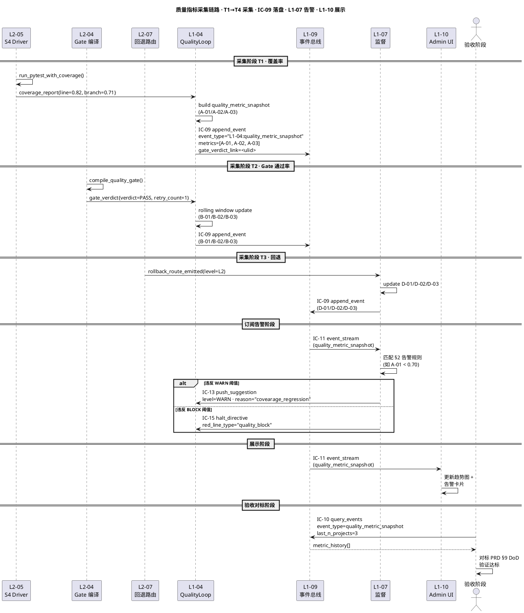
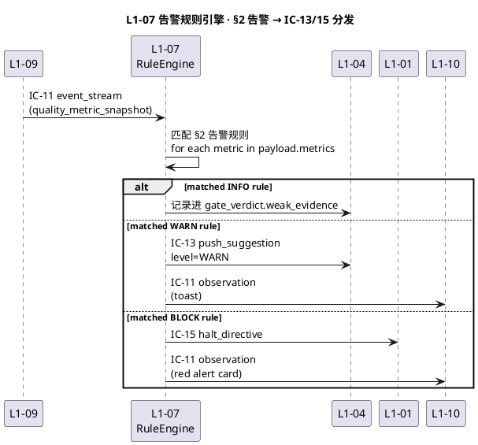

# 质量指标

> **本文档定位**：3-3 Monitoring & Controlling 层 · **质量维度指标**（覆盖率 / Gate 通过率 / 缺陷 / 回退）· 由 **L1-04 Quality Loop 生产** + **L1-10 Admin UI 展示** + **验收阶段对标**
> **与 3-1/3-2 的分工**：3-1 定义"系统如何实现" · 3-2 定义"如何测" · **3-3 定义"如何监督与判通过"**（质量 Gate 规约 · 硬红线清单 · DoD 契约 · 验收标准）
> **消费方**：L1-04 质量环（读阈值驱动 S4/S5 判定）· L1-07 监督（读告警规则触发建议/拦截）· L1-09（落盘审计）· L1-10（Admin UI 趋势图）· 交付验收阶段（对标 PRD §9 DoD / §10 软漂移）

---

## §0 撰写进度

- [x] §1 定位 + 与上游 PRD/scope 的映射
- [x] §2 核心清单 / 规约内容（4 组 12+ 条指标）
- [x] §3 触发与响应机制
- [x] §4 与 L1-04 / L1-09 / L1-10 的契约对接
- [x] §5 证据要求 + 审计 schema
- [x] §6 与 2-prd 的反向追溯表

---

## §1 定位 + 映射

### 1.1 本文档在 3-3 层的坐标

3-3 Monitoring-Controlling 层的 `monitoring-metrics/` 目录承担**运行时可观测性指标**的 SSOT，其内部按"指标观测对象"做二次分工：

| 兄弟文档 | 观测对象 | 指标性质 | 数据源 | 展示入口 |
|---|---|---|---|---|
| `monitoring-metrics/system-metrics.md` | **运行态**（tick/s · event QPS · 延迟 · CPU / 内存 / 磁盘 · fsync 耗时） | 系统健康（短时窗口秒级） | L1-01 tick 循环 · L1-09 event-bus 探针 · OS probe | Prometheus `/metrics` · L1-10 Admin UI "系统健康" tab |
| **本文档 `quality-metrics.md`** | **质量演进**（覆盖率 · Gate 通过率 · 缺陷 · 回退） | 质量趋势（按 WP / Stage / Project 滚动） | L1-04 Quality Loop S4/S5 裁决 · L1-07 回退路由器 · L1-09 审计链 | L1-10 Admin UI "质量趋势" tab · 验收阶段对标 PRD §9 DoD |

**分工底线**：`system-metrics` 描述"机器跑得怎么样" · `quality-metrics` 描述"产出物有多靠谱"。两者在 L1-09 审计链共用 IC-09 `append_event` 通道但 `event_type` 前缀不同（`L1-09:system_metric_snapshot` vs `L1-04:quality_metric_snapshot`），避免混淆。

### 1.2 与 2-prd `scope.md` 的精确映射

本文档反向映射到 `docs/2-prd/L0/scope.md` 的两个关键小节：

**§9 DoD 定义（目标态）**：

- scope §9 给出**产品级 DoD**（4 件套 / TDD 蓝图 / Quality Loop 通过 / 硬红线 0 触发 / 审计链完整 · 由 L1-04 编译进 WP-DoD YAML），本文档将这些抽象目标**量化为可观测指标**：
  - "覆盖率 100%" → `test.line_coverage ≥ 0.80`（§2.A）
  - "Quality Loop 通过" → `gate.pass_rate_last_100 ≥ 0.90`（§2.B）
  - "硬红线 0 触发" → `defect.open_p0_count == 0`（§2.C）
  - "4 级回退可观测" → `rollback.level_distribution`（§2.D）

**§10 软漂移清单（告警源）**：

- scope §10 给出 8 类软漂移（KB 漂移 / DoD 半绿 / 回退循环 / 缓存过期 …），其中与**质量演进相关**的 5 类由本文档的告警规则承担：
  - 软漂移 SD-02 "DoD 半绿 > 3 次" → `gate.retry_count_avg > 2` 告警（§2.B + §3.3）
  - 软漂移 SD-03 "覆盖率倒退" → `test.line_coverage` 环比下降 ≥ 5% 告警（§2.A + §3.3）
  - 软漂移 SD-04 "回退循环 ≥ 3" → `rollback.count_per_stage ≥ 3` 告警（§2.D + §3.3）
  - 软漂移 SD-05 "缺陷重开" → `defect.reopened_count ≥ 2` 告警（§2.C + §3.3）
  - 软漂移 SD-06 "Gate 连续 FAIL" → `gate.first_pass_rate < 0.50` 告警（§2.B + §3.3）

### 1.3 与上游 L2 文档的引用关系

| 上游 L2 | 被引字段 | 本文档用途 |
|---|---|---|
| L2-04 §2.1 QualityGateConfig `predicate_list` 白名单 | `test_coverage_gte` / `test_status_green` / `checklist_all_checked` | §2.A / §2.B 指标 `metric_name` 与 predicate 名字对齐 |
| L2-04 §2.5.4 PredicateCompiler | AC → predicate 映射表 | §2.B `gate.pass_rate_last_100` 口径由 predicate 执行结果聚合 |
| L2-05 §6.5 coverage 计算器 | `coverage_pct` 输出 | §2.A `test.line_coverage` / `test.branch_coverage` 采集源 |
| L2-05 §11 失败清单 schema | `failure_archive.jsonl` | §2.C 缺陷指标采集源（`event_type: wp_failure` 的聚合） |
| L2-07 回退路由器 §3.4 `rollback_route_emitted` | `route_id` / `level` / `target_stage` | §2.D 回退指标采集源 |
| ic-contracts.md §3.9 IC-09 | `event_type` / `payload` schema | §3.2 落盘 + §5 审计 schema |
| ic-contracts.md §3.14 IC-14 | `gate_verdict` / `verdict_id` / `route_id` | §5 `gate_verdict_link` 外键追溯 |

### 1.4 12+ 条指标的生命周期

每条指标在 HarnessFlow 的生命周期：

```
[定义]      本文档 §2 定义 metric_name + 单位 + 阈值 + 告警规则
  ↓
[采集]      L1-04 S4 Driver 跑完测试（§3.1）或 L1-07 裁决后（§3.2）
  ↓
[落盘]      IC-09 append_event · event_type=quality_metric_snapshot（§3.2）
  ↓
[订阅]      L1-07 监督订阅阈值事件 · L1-10 Admin UI 订阅趋势事件（§4）
  ↓
[告警]      违反阈值 → L1-07 emit suggestion(WARN) 或 halt_directive(BLOCK)（§3.3）
  ↓
[展示]      L1-10 趋势图 + 告警卡片（§4.3）
  ↓
[验收对标]  交付阶段读 last-N-project 聚合对标 PRD §9 DoD（§6）
```

### 1.5 关键技术决策（本文档特有）

| # | 决策 | 理由 | 替代方案（被拒） |
|---|---|---|---|
| D-01 | **指标采集点明确绑定到 L2 小节** | 避免指标 "漂浮"无源头 · 反向追溯到 L2-05 §6.5 / L2-07 §3.4 · 修改 L2 时必回更本文档 | 仅描述 "从 Quality Loop 取"（太泛）|
| D-02 | **阈值分 3 档**（目标 / 告警 / 拦截） | 软漂移与硬红线语义不同 · 目标是验收标的 · 告警对应 L1-07 suggestion · 拦截对应 halt_directive | 只设一档阈值（无法承载分级响应）|
| D-03 | **审计 schema 外键到 IC-14 verdict_id** | 质量指标必须能反查到产生它的 Gate 裁决 · 审计链完整 | 指标独立落盘（断链）|
| D-04 | **告警规则滚动窗口而非单点** | 覆盖率单次抖动不应触发 · 窗口能去噪 · 但硬指标（p0 缺陷 open）立即触发 | 全部单点触发（噪声太大）|
| D-05 | **Stage / WP 双粒度聚合** | WP 粒度给 L1-04 S4 Driver 用（下一个 WP 要不要执行）· Stage 粒度给验收阶段用（整 Stage 能不能过 Gate）| 单一 Project 粒度（粒度太粗）|

---

## §2 核心清单 / 规约内容

> **清单组织**：按观测主体分 4 组 · 每组 3 条及以上 · 共 **12 条指标**（A3 + B3 + C3 + D3）
>
> **字段定义（每条指标通用）**：
> - `metric_name`：英文 snake_case · 全局唯一 · 对齐 L2-04 predicate 名字
> - `unit`：百分比 / 计数 / 秒
> - `collection_point`：采集点（指向 L2 小节）
> - `threshold`：`{target, warn, block}` 三档
> - `alert`：违反阈值的告警等级（INFO / WARN / BLOCK · 对应 L1-07 干预级）

### 2.A 覆盖率组（3 条）· 对标 PRD §9 DoD "用例覆盖 100%"

#### A-01 · `test.line_coverage` · 行覆盖率（WP 粒度行覆盖 · coverage.py line_rate）

```yaml
metric_name: test.line_coverage
type: gauge · unit: ratio  (0.0-1.0)
collection_point: L1-04 / L2-05 §6.5 CoverageCalculator · coverage.xml → line_rate
aggregation: wp(单次) · stage(last-N-WP mean) · project(last-100-WP mean)
threshold: {target: 0.80 (PRD §9 DoD), warn: 0.70, block: 0.50}
alert:
  - wp_value < 0.80        → INFO  记录 gate_verdict.weak_evidence
  - wp_value < 0.70        → WARN  L1-07 push_suggestion("补齐 WP-{wp_id} 覆盖率")
  - wp_value < 0.50        → BLOCK L1-07 halt_directive 阻塞 S4→S5
  - stage_delta < -0.05    → WARN  软漂移 SD-03 "覆盖率倒退"
```

#### A-02 · `test.branch_coverage` · 分支覆盖率（条件分支到达率）

```yaml
metric_name: test.branch_coverage
type: gauge · unit: ratio
collection_point: L1-04 / L2-05 §6.5 · coverage.xml → branch_rate
threshold: {target: 0.70, warn: 0.60, block: 0.40}  # 较行覆盖率低 10 pp 合理
alert:
  - wp_value < 0.60 → WARN  L1-07 push_suggestion("补 edge case 用例")
  - wp_value < 0.40 → BLOCK L1-07 halt_directive 强制 retry_wp
```

#### A-03 · `test.uncovered_files_count` · 零覆盖文件数

```yaml
metric_name: test.uncovered_files_count
type: gauge · unit: count
collection_point: L1-04 / L2-05 §6.5 · coverage.xml 遍历 <class>[line_rate==0]
threshold: {target: 0, warn: 3, block: 10}
alert:
  - wp_value > 3  → WARN  L1-07 push_suggestion · 列表见 evidence.uncovered_files
  - wp_value > 10 → BLOCK L1-07 halt_directive
```

### 2.B Gate 通过率组（3 条）· 对标 PRD §9 DoD "Quality Loop 通过" + §10 SD-06

#### B-01 · `gate.pass_rate_last_100` · 近 100 次 Gate 通过率

```yaml
metric_name: gate.pass_rate_last_100
type: gauge · unit: ratio
collection_point: L1-04 / L2-04 §3 IC-09 + L2-06 §3 verifier_verdict
formula: count(events(gate_verdict, verdict=PASS, last=100)) / 100
threshold: {target: 0.90, warn: 0.70, block: 0.50}
alert:
  - value < 0.70 → WARN  "近 100 次 Gate 通过率 {v} · 质量恶化 · review 失败清单"
  - value < 0.50 → BLOCK L1-07 halt_directive 阻塞新 WP · 要求人介入
```

#### B-02 · `gate.first_pass_rate` · 首次通过率（反映 S3 蓝图质量）

```yaml
metric_name: gate.first_pass_rate
type: gauge · unit: ratio
collection_point: L1-04 / L2-04 §3 + L2-07 §3.4 rollback_route
formula: |pass_first (retry_count=0)| / |total gate_verdicts|
threshold: {target: 0.70, warn: 0.50, block: 0.30}
alert:
  - value < 0.50         → WARN  软漂移 SD-06 "加强 S3 蓝图质量"
  - consecutive_fail >=3 → WARN  "Gate 连续 FAIL 3 次 · 立即 review S3"
  - value < 0.30         → BLOCK halt_directive · 要求 S2 重做 4 件套
```

#### B-03 · `gate.retry_count_avg` · 近 50 WP 平均 retry 次数

```yaml
metric_name: gate.retry_count_avg
type: gauge · unit: count
collection_point: L1-04 / L2-07 §3.4 decision=retry_wp
formula: avg(count(rollback_route, wp_id=W, decision=retry_wp)) for W in last-50
threshold: {target: 0.5, warn: 2.0, block: 5.0}
alert:
  - value > 2.0 → WARN  软漂移 SD-02 "DoD 半绿 > 3 次"
  - value > 5.0 → BLOCK L1-07 halt_directive
```

### 2.C 缺陷组（3 条）· 对标 PRD §9 DoD "硬红线 0 触发" + §10 SD-05

#### C-01 · `defect.open_p0_count` · 开放 P0 缺陷数（硬红线 0 容忍）

```yaml
metric_name: defect.open_p0_count
type: gauge · unit: count
sources: |
  1. IC-15 hard_halt 伴生 event_type=L1-07:defect_filed · severity=P0
  2. L1-05 Verifier confidence < 0.30 的 WP 自动登记 P0
collection_point: L1-07 + L1-05 / ic-contracts §3.15 IC-15 + L2-06 §3.5
formula: count(events(event_type ∈ {defect_filed, verifier_verdict}) where severity=P0 AND state=OPEN)
threshold: {target: 0, warn: 1, block: 1}  # P0 立即阻塞
alert:
  - value >= 1 → BLOCK  L1-07 halt_directive + L1-10 红色告警卡 · 阻塞 S4→S5 与 S5→COMMIT
```

#### C-02 · `defect.detection_rate` · 近 50 WP S5 捕获比例（质量左移）

```yaml
metric_name: defect.detection_rate
type: gauge · unit: ratio
collection_point: L1-04 + L1-05 / L2-05 §11 + L2-06 §3.5
formula: count(defect_filed, stage=S5) / max(count(defect_filed), 1)
threshold: {target: 0.80, warn: 0.60, block: 0.40}
alert:
  - value < 0.60 → WARN  "缺陷左移能力弱 · 漏到 COMMIT 后才发现"
```

#### C-03 · `defect.reopened_count` · 近 30 天重开缺陷数

```yaml
metric_name: defect.reopened_count
type: counter · unit: count
collection_point: L1-07 + L1-09 / ic-contracts §3.9 IC-09
formula: count(events(defect_state_changed, from=CLOSED, to=OPEN, age<=30d))
threshold: {target: 0, warn: 2, block: 5}
alert:
  - value >= 2 → WARN  软漂移 SD-05 "review 修复质量"
  - value >= 5 → BLOCK L1-07 halt_directive
```

### 2.D 回退组（3 条）· 对标 PRD §10 SD-04 "回退循环 ≥ 3"

#### D-01 · `rollback.count_per_stage` · 单 Stage 回退总次数（切 Stage 归零）

```yaml
metric_name: rollback.count_per_stage
type: counter · unit: count
collection_point: L1-07 / L2-07 §3.4 + scope §8.4.2 4 级回退
formula: count(events(rollback_route_emitted, project_id=P, stage=current))
threshold: {target: 1, warn: 3 (SD-04 阈值), block: 7}
alert:
  - value >= 3 → WARN  软漂移 SD-04 "回退循环"
  - value >= 7 → BLOCK halt_directive + 自动触发 Stage 降级 re-plan
```

#### D-02 · `rollback.level_distribution` · 近 100 次按 L1/L2/L3/L4 分布

```yaml
metric_name: rollback.level_distribution
type: histogram · unit: count_map  # {L1, L2, L3, L4}
levels (scope §8.4.2 附录 C):
  L1 轻度: 回 S4 (retry_wp)
  L2 中度: 回 S3 (retry_blueprint)
  L3 重度: 回 S2 (retry_4件套)
  L4 极重度: 回 S1 (project rework)
collection_point: L1-07 / L2-07 §3.4
formula: group_by(level, events(rollback_route_emitted, last=100))
threshold:
  target: {L1: ">=60", L2: "<=30", L3: "<=8", L4: "<=2"}
  warn:   (L3+L4)/sum > 0.15
  block:  L4 >= 3
alert:
  - (L3+L4)/sum > 0.15 → WARN  "深度回退偏多 · S2/S3 质量问题"
  - L4 >= 3            → BLOCK halt_directive · 整项目暂停 · L1-02 重规划
```

#### D-03 · `rollback.mean_time_to_recover` · 近 50 次回退→下次 PASS 平均耗时

```yaml
metric_name: rollback.mean_time_to_recover
type: gauge · unit: seconds
collection_point: L1-07 + L1-04 / L2-07 §3.4 + L2-04 §3 IC-09
formula: mean([(next_pass.ts - rollback.ts) for r in last-50-rollbacks])
threshold: {target: 1800 (30m), warn: 7200 (2h), block: 21600 (6h)}
alert:
  - value > 7200  → WARN  "质量循环低效 · 考虑降复杂度"
  - value > 21600 → BLOCK halt_directive · 要求人介入
```

---

## §3 触发与响应机制

### 3.1 采集触发点（何时生成一条指标快照）

每条指标都有**明确的采集触发点**，不存在"后台定时轮询"生成质量指标。触发源分 3 类：

| 触发源 | 触发条件 | 产生的指标 |
|---|---|---|
| **T-01 · L1-04 S4 Driver 跑测后** | L2-05 `S4Driver.run_tests_with_coverage()` 返回 | A-01 `test.line_coverage` · A-02 `test.branch_coverage` · A-03 `test.uncovered_files_count` |
| **T-02 · L1-04 Gate 裁决后** | L2-04 `compile_quality_gate()` 执行完 + L2-06 Verifier emit `verifier_verdict` | B-01 `gate.pass_rate_last_100` · B-02 `gate.first_pass_rate` · B-03 `gate.retry_count_avg`（滚动重算）|
| **T-03 · L1-07 回退路由后** | L2-07 `rollback_router.emit_route()` 返回 | D-01 `rollback.count_per_stage`（增 1）· D-02 `rollback.level_distribution`（更新）· D-03 `rollback.mean_time_to_recover`（下次 PASS 时结算）|
| **T-04 · L1-07 缺陷状态变更** | IC-15 `hard_halt` 或 defect_state_changed emitted | C-01 `defect.open_p0_count` · C-02 `defect.detection_rate` · C-03 `defect.reopened_count`|

### 3.2 落盘链路（IC-09 append_event 复用）

所有质量指标快照通过 **IC-09 `append_event`** 统一落盘到 L1-09 事件总线，`event_type = "quality_metric_snapshot"`，payload schema 见 §5。关键设计：

- **幂等 key**：`(project_id, metric_name, wp_id_or_stage, tick_id)` 四元组；同一 WP 同一 metric 同一 tick 重复写 → 静默 de-dup
- **强一致 fsync**：同 IC-09 默认策略（P95 ≤ 20ms）· 不因指标量大而降级
- **外键引用**：payload 里必含 `gate_verdict_link: ULID`，指向产生本次指标的 Gate 裁决 event_id（IC-14 verdict_id）· 审计可反查
- **按天分片**：L1-09 按天文件分片（`.qlog/quality/YYYY-MM-DD.jsonl`）· 回放时从 L1-02 project_start 之后选读

### 3.3 告警响应链路（违反阈值后发生什么）



### 3.4 告警响应 SLO

| 阈值违反 | 触发延迟 SLO（P95）| 动作 |
|---|---|---|
| WARN（§2 各条）| ≤ 500 ms（采集 → suggestion pushed）| L1-07 push_suggestion · L1-10 Admin UI toast 通知 · 不阻塞主 loop |
| BLOCK（§2 各条）| ≤ 200 ms（采集 → halt emitted）| L1-07 halt_directive → L1-01 暂停 tick · L1-10 红色告警卡 |
| 硬红线（C-01 open_p0）| ≤ 100 ms（与 IC-15 一致）| 立即硬暂停 · 要求用户文本授权 |

### 3.5 降级策略

| 场景 | 降级动作 |
|---|---|
| L2-05 coverage.py 进程 crash | 当次 A-01/A-02/A-03 不落盘 · event_type=`quality_metric_unavailable` 留痕 · 不阻塞 Gate（按策略 C 忽略无数据）|
| L1-09 事件总线写失败 | 按 scope §8.4.2 "halt 整个系统"（无法降级）|
| 告警规则引擎 OOM | L1-07 监督重启 · 指标落盘不受影响（解耦）|
| 指标查询延迟 > 5s | L1-10 趋势图降级到 5 min 前快照 · 显示 "stale" 标 |

---

## §4 与 L1-04 / L1-09 / L1-10 的契约对接

### 4.1 L1-04 Quality Loop · **生产方**

L1-04 是所有 12 条质量指标的**唯一生产方**（回退指标在 L2-07 内产出，L2-07 归属 L1-04 子能力树下）。产出契约：

| 触发点 | 调用者 | emit 动作 | 产生的指标 |
|---|---|---|---|
| L2-05 S4 Driver 跑完测试 | `S4Driver.run_tests_with_coverage()` | IC-09 `append_event`（event_type=`L1-04:quality_metric_snapshot`）| A-01 / A-02 / A-03 |
| L2-04 Gate 编译完成 | `compile_quality_gate()` | IC-09 `append_event` + IC-14 关联 verdict_id | B-01 / B-02 / B-03 |
| L2-06 Verifier 产出裁决 | `verifier.emit_verdict()` | IC-09 `append_event`（含 confidence）| 影响 B-01 / C-02 |
| L2-07 回退路由 | `rollback_router.emit_route()` | IC-09 `append_event` · event_type=`L1-07:rollback_route_emitted` 关联 | D-01 / D-02 / D-03 |

**L1-04 的义务**（✅ 必须 / 🚫 禁止）：

- ✅ 必须在 S4/S5 每次裁决后立即 emit 对应 metric，不累积批处理
- ✅ 必须带 `gate_verdict_link` 外键，便于审计反查
- ✅ 必须遵守 §2 定义的 metric_name（不允许随意加新指标，须走 scope.md §10 追溯流程）
- 🚫 禁止在 metric payload 里写入大体积 raw data（> 8 KiB），大数据留在 L1-09 artifacts/ 存盘后挂 key

### 4.2 L1-09 韧性+审计 · **落盘方**

L1-09 承担质量指标的**唯一持久化通道**（IC-09），详见 ic-contracts §3.9：

- **event_type 注册**：`L1-04:quality_metric_snapshot` 必须在 L1-09 `event_schema_registry.yaml` 注册（否则 IC-09 回 `E_EVT_TYPE_UNKNOWN`）
- **schema 校验**：按 §5 schema 严格校验 · 失败回 `E_EVT_PAYLOAD_SCHEMA_MISMATCH`
- **哈希链**：指标事件参与 L1-09 事件总线的哈希链（`prev_hash` + `curr_hash`）· 可用于 replay 校验
- **查询接口**：L1-09 对外暴露 IC-10 `query_events(event_type, filters...)`，L1-10 Admin UI 与验收阶段通过它读历史

### 4.3 L1-10 人机协作 UI · **展示方**

L1-10 Admin UI 订阅质量指标并承担两类展示：

**4.3.1 趋势图（被动消费）**

| tab | 订阅 event_type | 数据口径 | 刷新周期 |
|---|---|---|---|
| 质量趋势 > 覆盖率 | `quality_metric_snapshot` · metric_name ∈ {A-01, A-02} | last-50-WP 时间序列 | 5s（event-driven）|
| 质量趋势 > Gate 通过率 | 同上 · metric_name ∈ {B-01, B-02, B-03} | last-100-gate + last-7d | 5s |
| 质量趋势 > 缺陷 | 同上 · metric_name ∈ {C-01, C-02, C-03} | last-30d | 30s（变更频率低）|
| 质量趋势 > 回退热力 | 同上 · metric_name ∈ {D-01, D-02, D-03} | 当前 Stage 聚合 | 5s |

**4.3.2 告警卡片（主动响应）**

- WARN 级：L1-10 toast 通知（可关）· 持久化到告警历史 tab
- BLOCK 级：L1-10 红色告警卡（不可自动关 · 须用户点"已知悉"）· 对应 L1-01 暂停状态
- 硬红线（C-01 P0）：红色告警卡 + 声音（对标 scope §5.10 "硬红线告警强视觉提示"）

### 4.4 L1-07 Harness 监督 · **告警方**

L1-07 订阅 `quality_metric_snapshot` 并执行 §2 的告警规则：



### 4.5 降级契约（对接失败）

| 失败点 | 降级路径 | 硬/软 | 对业务影响 |
|---|---|---|---|
| L1-04 emit metric 失败（IC-09 拒单）| 当次 metric 丢失 · Gate 裁决仍走（降级到无 evidence 路径）· 打 WARN | 软 | 质量观测盲区（单次）|
| L1-09 事件总线 halt | 按 scope §8.4.2 全系统硬暂停 | 硬 | 系统停 |
| L1-07 告警引擎 crash | L1-07 重启 · 累积的未处理事件从 checkpoint 重放 | 软 | 告警延迟 |
| L1-10 Admin UI 连接断 | 指标继续落盘 · UI 重连后从 IC-10 query 拉补 | 软 | UI 滞后 |

---

## §5 证据要求 + 审计 schema

### 5.1 审计事件 schema（IC-09 payload · event_type=`L1-04:quality_metric_snapshot`）

```yaml
# 在 L1-09 event_schema_registry.yaml 注册后方可写入
quality_metric_snapshot:
  # ----- IC-09 通用字段 -----
  event_id:     {type: string, format: "evt-{uuid-v7}", required: true}
  event_type:   {const: "L1-04:quality_metric_snapshot"}
  project_id:   {type: string, required: true}           # PM-14
  actor:        {enum: ["L1-04", "L1-07"], required: true}  # 回退由 L1-07 emit
  ts:           {format: "ISO-8601 UTC ms", required: true}

  # ----- 快照特有字段 -----
  payload:
    stage:         {enum: ["S3","S4","S5","S6"], required: true}
    wp_id:         {format: "wp-{nanoid}", required: false}  # stage 聚合可空
    metric_group:  {enum: ["coverage","gate_pass_rate","defect","rollback"], required: true}
    metrics:
      type: array · min_items: 1
      items:
        metric_name:         required · §2 定义的 name（如 test.line_coverage）
        value:               required · number 或 object (histogram D-02)
        unit:                enum ["ratio","count","seconds","count_map"]
        threshold_breached:  required · enum ["none","warn","block"]
        window:              如 "last-100-wp" / "last-30d" / "current-stage"
    gate_verdict_link:  {format: ulid, required: true}  # 外键指向 IC-14 verdict_id
    evidence:  object · 大文件存 L1-09 artifacts/ 挂 uri
               例: {coverage_xml_uri: "artifacts/cov/wp-abc.xml", uncovered_files: [...]}
```

### 5.2 证据要求（每条指标必备）

每条 `metrics[i]` 条目必须挂满足以下证据：

| 指标组 | 必需证据 | 存储方式 |
|---|---|---|
| A 覆盖率 | `coverage_xml_uri`（指向 coverage.xml 原文件）+ `uncovered_files` 列表 | L1-09 artifacts/cov/ |
| B Gate 通过率 | `verdict_event_ids`（组成口径的 verdict event_id 列表）| 内联 payload（id 数组 ≤ 100 条）|
| C 缺陷 | `defect_ids`（开放中的缺陷 id 列表）+ `severity_breakdown` | 内联 payload |
| D 回退 | `route_event_ids`（近 100 次回退事件 id 列表）| 内联 payload |

### 5.3 审计反查路径（质量问题 → 根因追溯）

```
[外部发现] last-100 覆盖率环比降 8%
    ↓
[查询] L1-09 IC-10 query_events
       event_type=quality_metric_snapshot
       metric_name=test.line_coverage
       last_days=7
    ↓
[结果] 20 条快照 · 按 wp_id 排序
    ↓
[外键] 每条 gate_verdict_link → IC-14 verdict_id
    ↓
[联查] IC-10 query_events event_id=<verdict_id>
    ↓
[根因] 读 verifier_report 定位失败用例 + 对应代码 WP
```

### 5.4 可审计性保证

- **完整性**：哈希链不断（L1-09 IC-09 保证）· replay 可完全重建 metric 时间线
- **不可篡改**：指标事件经 L1-09 fsync 后不可修改（append-only）
- **反向追溯**：从单次告警（L1-07 suggestion）可反查到触发的 metric_snapshot event_id（L1-07 suggestion payload 必含 `trigger_event_ids`）· 再反查到源头 Gate 裁决（gate_verdict_link）

---

## §6 与 2-prd 的反向追溯表

本文档每条指标都必须在 2-prd 有锚点，不允许孤立新增。追溯两个维度：**DoD 达标**（§9）+ **软漂移告警**（§10）。

### 6.1 12 条指标反向追溯总表

| # | metric_name | 组 | 映射 PRD §9 DoD | 映射 PRD §10 软漂移 | 追溯证据 |
|---|---|---|---|---|---|
| A-01 | `test.line_coverage` | 覆盖率 | §9.3 "用例覆盖 100%" → 量化为 ≥ 0.80 | §10 SD-03 "覆盖率倒退" | scope L151-L152 "覆盖率 100%" |
| A-02 | `test.branch_coverage` | 覆盖率 | §9.3 扩展到分支维度 | §10 SD-03 | scope §9.3 |
| A-03 | `test.uncovered_files_count` | 覆盖率 | §9.3 的零遗漏补充 | §10 SD-03 变体 | scope §9.3 |
| B-01 | `gate.pass_rate_last_100` | Gate | §9.4 "Quality Loop 通过" | §10 SD-02 "DoD 半绿 > 3" | scope §9.4 + scope L211 |
| B-02 | `gate.first_pass_rate` | Gate | §9.4 + §9.2 "S3 蓝图质量" | §10 SD-06 "Gate 连续 FAIL" | scope §9.4 |
| B-03 | `gate.retry_count_avg` | Gate | §9.4 衍生 | §10 SD-02 | L2-07 §3.4 + scope §10 |
| C-01 | `defect.open_p0_count` | 缺陷 | §9.5 "硬红线 0 触发" | — 直接硬红线 | scope §8.4.2 + L1311 "硬红线 5 类硬拦截" |
| C-02 | `defect.detection_rate` | 缺陷 | §9.5 衍生（左移率） | §10 SD-08 "缺陷漏网" | scope §9.5 |
| C-03 | `defect.reopened_count` | 缺陷 | §9.5 衍生 | §10 SD-05 "缺陷重开" | scope §10 |
| D-01 | `rollback.count_per_stage` | 回退 | §9.6 "4 级回退可观测" | §10 SD-04 "回退循环 ≥ 3" | scope §10 + scope 附录 C "4 级回退" |
| D-02 | `rollback.level_distribution` | 回退 | §9.6 | §10 SD-04 变体 | 同上 |
| D-03 | `rollback.mean_time_to_recover` | 回退 | §9.6 衍生（效率维度） | §10 SD-07 "恢复慢" | L2-07 §3.4 |

### 6.2 反向追溯规则（变更纪律）

- **PRD §9 或 §10 变更时**：本文档必须在 1 个 Stage 内同步更新对应行（阈值 / 告警级 / metric_name）· 由 L1-07 发 suggestion 提醒 doc-owner
- **本文档变更时**：若新增或删除 metric → 必须反向修 PRD §9 或 §10（反向追溯补全）· 禁止孤立新增
- **追溯断链检测**：`quality_gate.sh` 在 CI 中按本表扫描 · 断链即 FAIL（Phase 7+ 开启）

### 6.3 与兄弟文档 `system-metrics.md` 的边界（重申）

| 维度 | system-metrics.md | quality-metrics.md（本） |
|---|---|---|
| 观测对象 | 进程 / OS / 事件总线 | 测试产出 / 裁决 / 缺陷 / 回退 |
| 指标粒度 | 秒级 · 短时窗口 | WP / Stage · 跨 Project 滚动 |
| 主要消费方 | L1-07（系统异常）· L1-10 系统健康 tab | L1-04 / L1-07 / L1-10 质量趋势 tab · 验收阶段 |
| 告警级触发词 | latency / QPS / 资源 | DoD / 软漂移 / 硬红线 |
| 阈值违反动作 | 多数限流 + 重试 | 多数 halt + 人介入 |

两者通过 L1-09 IC-09 共用总线但以 `event_type` 前缀严格隔离（`L1-09:system_metric_snapshot` vs `L1-04:quality_metric_snapshot`）· UI 层以不同 tab 展示。

---

*— 3-3 质量指标 · filled · v1.0 · 2026-04-24 · 12 条指标落地 · 1 张 PlantUML 采集链路 + 1 张 PlantUML 告警规则 —*
