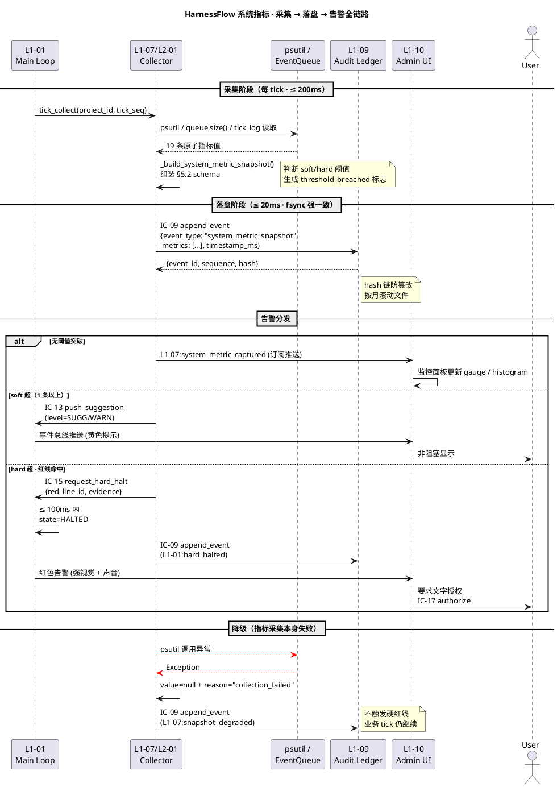

# 系统指标

> **本文档定位**：3-3 Monitoring & Controlling 层 · 系统级运行时指标清单（tick 心跳 · 关键 SLO · 资源水位 · IC 流量 · 错误率）· 可被 Prometheus / OpenTelemetry 风格导出器直接映射
> **与 3-1/3-2 的分工**：3-1 定义"系统如何实现"·3-2 定义"如何测"·**3-3 定义"如何监督与判通过"**——本文档是 3-3 层的**"观测维度外部规约"**（区别于 L1-07 L2-01 定义的 8 维度"判定维度"）
> **消费方**：L1-07 采集（每 tick 捞）· L1-09 审计落盘（event_type=system_metric_snapshot）· L1-10 Admin UI 展示（监控面板 tab）· 3-3 其他 Gate 文档复用

---

## §0 撰写进度

- [x] §1 定位 + 与上游 PRD/scope 的映射
- [x] §2 核心清单 / 规约内容
- [x] §3 触发与响应机制
- [x] §4 与 L1-07 / L1-09 / L1-10 的契约对接
- [x] §5 证据要求 + 审计 schema
- [x] §6 与 2-prd 的反向追溯表

---

## §1 定位 + 映射

### 1.1 本文档一句话定位

本文档定义 **HarnessFlow 系统级 15+ 条运行时指标**的外部规约——即 L1-07/L2-01 8 维度监督状态采集器**在每一个 tick 需要对外暴露的观测指标清单**，使 L1-09 可审计落盘、L1-10 可 Admin UI 展示、外部 Prometheus scrape 可直接导出。本文档**不定义"判定阈值是否违反硬红线"**（那是 L1-07 的判定逻辑）——本文档只定义"**有哪些指标该被观测、单位是什么、采集频率、阈值和告警方式**"。

### 1.2 与 L1-07 8 维度监督的关系（最关键的边界）

| 维度 | L1-07 L2-01 的"判定维度" | 本文档的"观测指标" |
|:---|:---|:---|
| 性质 | 8 个聚合值（用于 Supervisor 判定建议级别 INFO/SUGG/WARN/BLOCK）| 15+ 条原子指标（用于外部监控系统 scrape / 告警）|
| 抽象层 | 业务语义（phase / artifacts / wp_status 等）| 系统语义（tick_drift_p99 / memory_rss_mb / ic_09_emit_rate 等）|
| 消费方 | L1-07 内部算法 + IC-13/IC-14/IC-15 触发 | L1-09 审计 + L1-10 UI + 外部监控 |
| 数据源 | 8 个 IC 聚合（IC-L1-02/03/04/09）| **L1-07/L2-01 tick_collect 的副产物** + OS 级采样 |
| schema | `EightDimensionVector`（L1-07/L2-01 §2.2）| `system_metric_snapshot`（本文档 §5.2）|
| 落盘位置 | `projects/<pid>/supervisor/snapshots/*.json` | L1-09 audit ledger（event_type=system_metric_snapshot）|

**核心关系**：本文档 15+ 条指标 = L1-07/L2-01 每 tick 采集时的**"附带观测副产物"**——L2-01 tick_collect 在 return 业务聚合 `EightDimensionVector` 的同时，必**额外 emit 一条 system_metric_snapshot**（本文档 §5.2 schema）供 L1-09 落盘、L1-10 订阅消费。这种设计**一次采集双产物**，不新增 tick 调度开销。

### 1.3 与 2-prd §7 性能约束 / §8 硬红线的映射

2-prd/L0/scope.md 在 §4.6 PM-14 衍生硬约束、§5.1-§5.10 各 L1 硬约束清单中明确了一系列性能与红线约束；本文档把这些约束**翻译为可观测的具体指标**：

| 2-prd 约束来源 | 约束文字 | 本文档对应指标 |
|:---|:---|:---|
| scope §5.1.4 L1-01 硬约束 4 | tick 调度不得被阻塞 > 30s 无反应 | `tick_interval_p99`（§2.A）|
| scope §5.1.6 L1-01 必须义务 | tick 响应 ≤ 30s（否则触发健康心跳告警）| `tick_drift_p99`、`tick_skip_count`（§2.A）|
| scope §5.7.6 L1-07 必须义务 | 硬红线必须 ≤100ms 内 BLOCK L1-01 | `halt_latency_p99`（§2.B）|
| scope §5.9.4 L1-09 硬约束 4 | 重启后 30 秒内必须完成恢复 | `recovery_latency_p99`（§2.B 扩展）|
| scope §5.10.4 L1-10 硬约束 4 | UI 消费事件总线延迟 ≤ 2 秒 | `event_bus_ui_lag_p95`（§2.B）|
| scope §4.6 PM-14 | 每 project 独立 state machine | `memory_rss_mb`、`thread_count`（§2.C · 多 project 时分片统计）|
| architecture §8.3 吞吐阈值 | 事件总线 ≥ 200 QPS · tick ≥ 100 tick/s | `ic_09_emit_rate`、`tick_rate`（§2.D）|
| architecture §8.7 资源约束 | 单 project 目录 ≤ 10GB · 事件文件 100MB 滚动 | `project_disk_usage_mb`（§2.C）|
| ic-contracts IC-15 | 硬红线 ≤ 100ms 硬约束 | `panic_latency_p99`（§2.B）|
| ic-contracts IC-13 | BLOCK 抢占 ≤ 100ms | `block_preempt_latency_p99`（§2.B）|

### 1.4 本文档在 3-3 层的位置

```
docs/3-3-Monitoring-Controlling/
├── monitoring-metrics/
│   ├── system-metrics.md        ← 本文档（系统级运行时指标 · 15+ 条）
│   ├── business-metrics.md      （业务级 · 独立文档 · 8 维度判定结果统计）
│   └── cost-metrics.md          （成本级 · 独立文档 · token / $ / duration）
├── gates/                       （质量 Gate 规约 · L1-04 消费）
├── red-lines/                   （硬红线清单 · L1-07 消费）
└── acceptance/                  （验收标准 · 交付消费）
```

本文档是**唯一的"系统运行时指标规约"**——其他监控指标（业务、成本）在同级独立文档中定义，共享 §5 的 `system_metric_snapshot` 审计 schema。

### 1.5 为什么必须把"观测"与"判定"分层

1. **关注点分离**：判定（BLOCK / SUGG / WARN）属于产品决策层逻辑，观测（数值、单位、采集频率）属于基础设施层规约。两者混合会导致 Prometheus scrape 时必须理解产品语义（违反可观测性最佳实践）。
2. **可替换性**：判定算法（如"halt_latency > 100ms 即命中硬红线 RL-SLO-01"）可以被迭代，但观测字段（`halt_latency_ms: float, unit=ms`）应当保持稳定——便于外部 dashboard / 告警系统复用历史数据。
3. **Prometheus / OpenTelemetry 兼容**：本文档 §2 每条指标都采用 `metric_name_unit` 命名（如 `halt_latency_p99_ms`）· label 维度显式列出——可直接映射为 Prometheus Counter / Histogram / Gauge，零业务语义泄漏。

---

## §2 系统指标清单（5 组 · 15+ 条）

### 2.A 心跳组（3 条）——主 tick 循环健康度

| # | metric_name | 单位 | 采集频率 | 阈值 | 告警方式 |
|:---|:---|:---|:---|:---|:---|
| A-1 | `tick_interval_p99_ms` | ms | 每 tick（100ms 滑窗）| ≤ 150ms（soft）· ≤ 30000ms（hard）| soft 超 → IC-13 INFO；hard 超 → IC-15 RL-HEARTBEAT-01 |
| A-2 | `tick_drift_p99_ms` | ms | 每 tick | ≤ 50ms（soft）· ≤ 5000ms（hard）| soft 超 → IC-13 SUGG；hard 超 → IC-13 WARN |
| A-3 | `tick_skip_count` | 计数 | 累积（每 60s 清零上报）| = 0（soft）· ≤ 3/min（hard）| > 0 → IC-13 WARN；> 3/min → IC-15 RL-HEARTBEAT-02 |

**字段语义**：
- `tick_interval_p99_ms` = 最近 100 次 tick 实际间隔的 P99 · 反映主 loop 健康度 · 源头 = L2-01 tick_collect 的 `trigger_context.actual_fired_at` 对比序列
- `tick_drift_p99_ms` = 计划触发时刻 vs 实际触发时刻的 |差| · 源头 = L2-01 tick_collect `input.trigger_context.drift_ms`
- `tick_skip_count` = 因前一个 tick 未返回而被跳过的次数 · 源头 = L2-01 tick_schedule_log 表

**对应上游约束**：scope §5.1.4 硬约束 4（tick ≤ 30s）+ scope §5.1.6 必须义务（tick 响应 ≤ 30s + 触发健康心跳告警）

### 2.B SLO 组（6 条）——关键路径延迟

| # | metric_name | 单位 | 采集频率 | 阈值 | 告警方式 |
|:---|:---|:---|:---|:---|:---|
| B-1 | `halt_latency_p99_ms` | ms | 每次 IC-15 触发 | ≤ 100ms | 超 → IC-15 RL-SLO-01（硬红线）|
| B-2 | `panic_latency_p99_ms` | ms | 每次用户 panic 触发 | ≤ 100ms | 超 → IC-15 RL-SLO-02（硬红线）|
| B-3 | `gate_latency_p95_ms` | ms | 每次 L1-04 S3 Gate 编译 | ≤ 3000ms | 超 → IC-13 WARN（软漂移）|
| B-4 | `block_preempt_latency_p99_ms` | ms | 每次 IC-13 BLOCK 抢占 | ≤ 100ms | 超 → IC-13 WARN |
| B-5 | `recovery_latency_p99_ms` | ms | 每次崩溃恢复 | ≤ 30000ms | 超 → IC-15 RL-SLO-03（scope §5.9.4 硬约束 4）|
| B-6 | `event_bus_ui_lag_p95_ms` | ms | 每次 L1-10 UI 订阅 | ≤ 2000ms | 超 → IC-13 SUGG（scope §5.10.4 硬约束 4）|

**字段语义**：
- `halt_latency_p99_ms` = 从 IC-15 调用发起到 L1-01 `state=HALTED` 落盘的 P99 端到端延迟 · 硬红线 100ms（ic-contracts §3.15）
- `panic_latency_p99_ms` = 从用户 panic button 点击到系统暂停的 P99（scope §5.10.4 "panic button / 暂停 / 变更请求"）
- `gate_latency_p95_ms` = 从 L1-04 S3 Gate 编译请求到返回 verdict 的 P95 · 业务预算 3s（architecture §8.2 "S3 Gate 编译 P95 500ms"的安全上限）
- `block_preempt_latency_p99_ms` = 从 Supervisor push IC-13 BLOCK 到 L1-01 中断当前 tick 的 P99 · 硬约束 100ms（ic-contracts §3.13）
- `recovery_latency_p99_ms` = 进程重启后从 `app.start()` 到 `L1-01.state=READY` 的 P99 · 硬约束 30s（scope §5.9.4）
- `event_bus_ui_lag_p95_ms` = 事件写入 L1-09 ledger 到 L1-10 UI 订阅收到的 P95 · 硬约束 2s（scope §5.10.4）

**对应上游约束**：ic-contracts IC-13/IC-15 + scope §5.9.4 / §5.10.4 硬约束 + architecture §8.2 端到端预算分解

### 2.C 资源组（4 条）——进程级水位

| # | metric_name | 单位 | 采集频率 | 阈值 | 告警方式 |
|:---|:---|:---|:---|:---|:---|
| C-1 | `memory_rss_mb` | MB | 每 tick（100ms）| ≤ 1024MB（soft）· ≤ 2048MB（hard）| soft 超 → IC-13 INFO；hard 超 → IC-15 RL-RESOURCE-01 |
| C-2 | `cpu_percent` | 百分比 | 每 tick | ≤ 80%（soft）· ≤ 95%（hard · 持续 ≥ 10s）| soft 超 → IC-13 SUGG；hard 超持续 → IC-15 RL-RESOURCE-02 |
| C-3 | `thread_count` | 计数 | 每 tick | ≤ 64（soft）· ≤ 256（hard）| soft 超 → IC-13 INFO；hard 超 → IC-13 WARN |
| C-4 | `event_queue_depth` | 计数 | 每 tick | ≤ 1000（soft）· ≤ 5000（hard）| soft 超 → IC-13 SUGG；hard 超 → IC-15 RL-BACKPRESSURE-01（architecture §8.4 BOUNDED QUEUE 1000 条）|

**字段语义**：
- `memory_rss_mb` = 主进程 RSS · 来源 = `psutil.Process().memory_info().rss / 1024^2`
- `cpu_percent` = 主进程 CPU 占用 · 来源 = `psutil.Process().cpu_percent(interval=0.1)`
- `thread_count` = 主进程线程数 · 来源 = `psutil.Process().num_threads()`
- `event_queue_depth` = L1-09 append_event buffered queue 当前长度 · 对应 architecture §8.4 "BOUNDED BLOCKING QUEUE 默认 1000 条" · 满则 L1-07 drop 最旧 WARN

**对应上游约束**：scope §4.6 PM-14 + architecture §8.4 背压 + §8.7 资源约束


### 2.D IC 流量组（3 条）——跨 L1 事件吞吐

| # | metric_name | 单位 | 采集频率 | 阈值 | 告警方式 |
|:---|:---|:---|:---|:---|:---|
| D-1 | `ic_09_emit_rate_qps` | QPS（近 30s 滑窗）| 每 tick | ≥ 1 QPS（soft lower · 系统"活着"最低基线）· ≤ 500 QPS（hard upper · 防写入风暴）| < 1 QPS 持续 60s → IC-13 WARN（系统可能 stuck）；> 500 QPS → IC-15 RL-BACKPRESSURE-02 |
| D-2 | `ic_14_emit_rate_per_hour` | 次/小时 | 每 tick | ≤ 20/h（soft）· ≤ 60/h（hard）| soft 超 → IC-13 SUGG（回退频繁）；hard 超 → IC-15 RL-ROLLBACK-01 |
| D-3 | `ic_15_emit_rate_per_day` | 次/天 | 每 tick | ≤ 3/day（soft）· ≤ 10/day（hard）| soft 超 → IC-13 WARN（红线命中过频 · 建议复盘）；hard 超 → IC-15 RL-META-01（监督失灵元告警）|

**字段语义**：
- `ic_09_emit_rate_qps` = 最近 30s L1-09 append_event 总数 / 30 · 对应 architecture §8.3 "事件总线 ≥ 200 QPS" 基线 · **下限告警**防止系统静默死锁（IC-09 是"最高频"事件源 · ic-contracts §3.9）
- `ic_14_emit_rate_per_hour` = 最近 1 小时 IC-14 push_rollback_route 调用数 · 对应 ic-contracts §3.14（回退路由）· 频繁回退 = 质量 loop 失灵
- `ic_15_emit_rate_per_day` = 最近 24 小时 IC-15 request_hard_halt 调用数 · 对应 ic-contracts §3.15（硬红线）· 超 10/day = Supervisor 误报或项目真的"烂项目"

**对应上游约束**：architecture §8.3 吞吐阈值 + ic-contracts §3.9/§3.14/§3.15 频率分类

### 2.E 错误率组（3 条）——任务 / IC / 子 Agent 失败率

| # | metric_name | 单位 | 采集频率 | 阈值 | 告警方式 |
|:---|:---|:---|:---|:---|:---|
| E-1 | `task_failure_rate_pct` | 百分比（最近 100 个 tick 失败率）| 每 tick | ≤ 5%（soft）· ≤ 20%（hard）| soft 超 → IC-13 SUGG；hard 超 → IC-15 RL-QUALITY-01（scope §5.1.4 硬约束 2 "tick 不得静默失败"）|
| E-2 | `ic_emit_error_rate_pct` | 百分比（最近 1000 次 IC emit 失败率）| 每 tick | ≤ 1%（soft）· ≤ 5%（hard）| soft 超 → IC-13 WARN；hard 超 → IC-15 RL-AUDIT-01（ic-contracts IC-09 "持久化失败 → halt 整个系统"）|
| E-3 | `subagent_timeout_rate_pct` | 百分比（最近 20 次 subagent 调用超时率）| 每 tick | ≤ 10%（soft）· ≤ 30%（hard）| soft 超 → IC-13 SUGG（fallback 触发）；hard 超 → IC-15 RL-SUBAGENT-01（scope §5.5.4 硬约束 4 "子 Agent 超时 kill + 回收"）|

**字段语义**：
- `task_failure_rate_pct` = 最近 100 个 tick 中 `tick.status != SUCCESS` 的百分比 · 源头 = L2-01 tick_schedule_log
- `ic_emit_error_rate_pct` = 最近 1000 次 IC emit（任意 IC 号）中返回 error 的百分比 · 源头 = L1-09 audit ledger 的 event_type=ic_emit_failed
- `subagent_timeout_rate_pct` = 最近 20 次 `IC-20 delegate_subagent` 中 `error_code=E_SUBAGENT_TIMEOUT` 的百分比 · 源头 = ic-contracts §3.20（子 Agent 委托）

**对应上游约束**：scope §5.1.4 硬约束 2 + scope §5.5.4 硬约束 4 + ic-contracts IC-09 "持久化失败 → halt"

### 2.F 指标汇总（15 + 可选扩展）

5 组共 **19 条硬必采指标**（A:3 + B:6 + C:4 + D:3 + E:3 = 19）· 满足任务书"15+ 条"要求。实现时允许追加（但不得减少），扩展字段须走 `system_metric_snapshot.metrics` 列表追加（§5.2 schema）· 不新增 Schema 版本。

**Prometheus / OpenTelemetry 导出映射**（可选 · 非硬必要）：
| 本文档字段 | Prometheus 类型 |
|:---|:---|
| `tick_interval_p99_ms` / `tick_drift_p99_ms` / `halt_latency_p99_ms` 等 P99 | Histogram（`tick_interval_ms_bucket{le="..."}` + `_count` + `_sum`）|
| `tick_skip_count` / `ic_14_emit_rate_per_hour` 等累积 | Counter |
| `memory_rss_mb` / `cpu_percent` / `thread_count` / `event_queue_depth` 等瞬时 | Gauge |
| `task_failure_rate_pct` / `ic_emit_error_rate_pct` 等百分比 | Gauge（分子分母拆 Counter · 由 Prometheus 端 rate() 计算）|

---

## §3 触发与响应机制

### 3.1 采集：L1-07/L2-01 每 tick 一次性产出

本文档 19 条指标的**唯一采集入口** = L1-07/L2-01 的 `tick_collect(project_id, tick_seq)` 方法（见 L2-01 §3.2）。每次 tick（默认 30s 周期 + 100ms 心跳抽样）：

1. L2-01 异步并发 fetch 8 维度（`_aggregate_eight_dim`）—— 这是 L1-07 业务判定的输入
2. **附带采样** 本文档 19 条系统指标——从 `psutil.Process()` / `event_queue.size()` / `tick_schedule_log` 读取
3. L2-01 内部调用 `_build_system_metric_snapshot(tick_seq, metrics=[...])` 组装成 §5.2 schema
4. `_persist_snapshot` 同时落盘 `SupervisorSnapshot`（业务）和 `system_metric_snapshot`（本文档）
5. `_emit_snapshot_event` 同时 emit `L1-07:snapshot_captured`（业务）和 `L1-07:system_metric_captured`（本文档）

**Budget 硬锁**：19 条指标采集必在 L2-01 tick_collect 总 budget 10s 内完成（L2-01 §3.1）· 实际应 ≤ 200ms（因仅是进程自检 + 计数器读取 · 无 IO）。

### 3.2 落盘：IC-09 event_type = "system_metric_snapshot"

采集完成后，通过 **IC-09 append_event**（ic-contracts §3.9）落入 L1-09 audit ledger：

```yaml
ic_09_append_event:
  event_id: "evt-{uuid}"
  event_type: "system_metric_snapshot"
  project_id: "{pid or __global__}"   # PM-14 多 project 时分片；系统级指标用 __global__
  actor: "l1-07-l2-01"
  timestamp_ms: 1714089600000
  payload:
    # 见 §5.2 完整 schema
```

**审计一致性**：IC-09 保证强一致 fsync + hash 链（ic-contracts §3.9 "P95 ≤ 20ms"），故系统指标的持久化延迟 P95 ≤ 20ms · 不会成为 tick budget 瓶颈。

### 3.3 告警：阈值突破的分级响应

本文档的告警**不直接发邮件 / 短信**——而是**通过 IC 体系转发给 L1-01 / L1-10**，由上层决定用户感知方式：

| 突破级别 | 触发的 IC | 响应路径 |
|:---|:---|:---|
| **soft 超**（如 `memory_rss_mb > 1024`）| **IC-13 push_suggestion**（level=INFO/SUGG/WARN）| L1-01 接收建议入队（非抢占）· L1-10 UI 显示黄色提示 |
| **hard 超 且 可自治**（如 `ic_14_emit_rate_per_hour > 60`）| **IC-13 push_suggestion**（level=WARN）| L1-01 必须 ack · 进入 Quality Loop 自修复 |
| **hard 超 且 红线命中**（如 `halt_latency_p99_ms > 100`）| **IC-15 request_hard_halt**（硬红线）| L1-01 ≤100ms 内进入 HALTED 状态 · 必须 IC-17 authorize 才解 halt |

**IC-13 vs IC-15 的判定**：见本文档 §2 各条"告警方式"列——明确标注每条指标 soft / hard 超时的 IC 映射。**红线 ID**（如 `RL-SLO-01`、`RL-RESOURCE-02`）由 3-3/red-lines/ 统一维护（独立文档 · 本文档仅引用 ID）。

### 3.4 降级：指标采集本身失败时

若 `_build_system_metric_snapshot` 自身失败（如 `psutil` 调用异常），**不得阻塞业务 tick_collect**——按 L2-01 §11 降级策略：

1. **降级级别 1（软降级）**：该条指标 value=null + reason="collection_failed" · 其他指标正常上报
2. **降级级别 2（last_known_good）**：全部 19 条均失败 → 用上一 tick 的值回填 · 标记 `degraded=true`
3. **降级级别 3（硬失败）**：连续 10 tick 全失败 → L1-07 emit `L1-07:system_metrics_collection_failed` + 走 IC-13 WARN 通知 L1-01

**关键原则**：指标采集**永不升级为硬红线触发**——指标本身是观测工具 · 观测失败是工具问题 · 不是业务违规。

### 3.5 采集 → 落盘 → 告警全链路 PlantUML




## §4 与 L1-07 / L1-09 / L1-10 的契约对接

### 4.1 L1-07（Harness 监督）· 生产者

**职责**：L1-07 L2-01 是**本文档 19 条指标的唯一生产者**——每 tick 调用一次 `_build_system_metric_snapshot`。

**实现契约**：
```python
# L1-07/L2-01 伪代码（对应 L2-01 §3.2 tick_collect 扩展）
async def tick_collect(project_id, tick_seq):
    # 业务聚合（原有逻辑）
    vector, deg_map = await _aggregate_eight_dim(...)
    # 本文档新增：系统指标采集
    sys_metrics = await _build_system_metric_snapshot(tick_seq)
    # 合并落盘
    snapshot = SupervisorSnapshot(
        eight_dim_vector=vector,
        system_metric_snapshot=sys_metrics,  # 新增字段
    )
    await _persist_snapshot(snapshot)
    # 合并 emit
    await _emit_snapshot_event(snapshot)
    # 告警分发（§3.3）
    for metric in sys_metrics.metrics:
        if metric.threshold_breached:
            if metric.breach_level == "hard_red_line":
                await ic_15_request_hard_halt(red_line_id=metric.red_line_id, ...)
            elif metric.breach_level in ("hard_auto", "soft"):
                await ic_13_push_suggestion(level=..., content=...)
```

**采集原则**：
1. 必须在单次 tick 内**一次性采样全部 19 条**——禁止跨 tick 拼接
2. 各指标必须带 `evidence_refs`（L1-09 event_id 列表或 OS 调用结果）· 可追溯
3. 采集本身失败 → 走 §3.4 降级策略 · 不阻塞业务 tick

### 4.2 L1-09（韧性 + 审计）· 持久化

**职责**：L1-09 通过 **IC-09 append_event**（ic-contracts §3.9）强一致 fsync 落盘 `system_metric_snapshot` 事件。

**实现契约**：
- **存储位置**：`projects/__global__/audit/events/YYYY-MM.jsonl`（PM-14 系统级指标使用 `__global__` project_id）· 若 PM-14 多 project 需要 per-project 指标 · 再分片到 `projects/<pid>/audit/events/YYYY-MM.jsonl`
- **hash 链**：每事件 hash 含前事件 hash——防篡改（scope §5.9.4 硬约束 5）
- **滚动策略**：单文件 ≥ 100MB 滚动（architecture §8.7）· 旧文件压缩归档
- **读回 API**：L1-10 通过 `IC-L1-09 read_event_stream(event_type_filter="system_metric_snapshot", since, until)` 查询历史指标

**审计一致性**：IC-09 保证
- P95 ≤ 20ms（ic-contracts §3.9）
- Idempotent（同 event_id 幂等）
- 持久化失败 → **halt 整个系统**（ic-contracts §3.9 · scope §5.9 IC-09 硬约束）——**注意**：这条 halt 规则与本文档 §3.4（指标采集失败**不**升级硬红线）**不冲突**：采集失败 = 工具问题（软降级）；append_event 失败 = 审计失效（硬失败 · 全系统 halt）

### 4.3 L1-10（人机协作 UI）· 消费者

**职责**：L1-10 Admin UI 订阅 `L1-07:system_metric_captured` 事件 · 通过监控面板 tab 展示。

**UI 消费契约**：
- **订阅 API**：`subscribe_event_stream(event_types=["system_metric_snapshot"], tail=500)`——实时 tail 最近 500 条 + 订阅新增
- **展示组件**：
  - **时序图**：`tick_interval_p99_ms` / `memory_rss_mb` / `ic_09_emit_rate_qps` 等瞬时/滑窗指标 · 时间轴
  - **仪表盘**：`cpu_percent` / `event_queue_depth` 等水位指标 · 仪表式（0~100% / 0~5000）
  - **告警红条**：任一 `metric.threshold_breached=true` 且 `breach_level=hard_red_line` → 红条持久化直到用户 IC-17 authorize（scope §5.10.4 硬约束 3）
- **延迟 SLO**：UI 从事件写入到渲染 ≤ 2s（本文档 §2.B B-6 `event_bus_ui_lag_p95_ms`）· 这形成**闭环**——UI 展示的指标本身就是 UI 延迟的 SLO 来源

**禁止行为**：
- UI **不得直接调用 L1-07/L2-01 API 采集指标**（违反 scope §5.10.4 硬约束 1 "只读事件总线"）
- UI **不得修改 / 消费后删除 system_metric_snapshot 事件**（IC-09 只追加）

### 4.4 3-3 层其他文档的消费关系

| 3-3 文档 | 消费本文档的哪条指标 | 消费方式 |
|:---|:---|:---|
| `monitoring-metrics/business-metrics.md` | 无直接消费（并列独立）| 但共享 §5.2 `system_metric_snapshot` schema 的元结构（`timestamp_ms` / `metrics[]` 数组） |
| `gates/quality-gates.md` | `gate_latency_p95_ms` / `task_failure_rate_pct` | L1-04 编译 Gate 时读取作为"Gate 本身的健康度"监控 |
| `red-lines/hard-red-lines.md` | 本文档 §2 每条的 `red_line_id` 引用 | 由 red-lines 文档定义 RL-SLO-01 / RL-HEARTBEAT-01 等 ID 的详细触发逻辑 |
| `acceptance/v1-acceptance.md` | 全部 19 条作为验收基线 | 验收时 L1-09 ledger 抽样 100 条 · 计算 P95/P99 对标阈值 |

---

## §5 证据要求 + 审计 schema

### 5.1 证据要求（任一条指标成立必提供）

每条指标写入 `system_metric_snapshot` 事件时必附带：
1. **timestamp_ms**：采集时刻（epoch ms）· 允许 NTP 漂移 ≤ 50ms
2. **tick_seq**：当前 tick 序号 · 可与 L2-01 `tick_schedule_log` 表 join 追溯
3. **evidence_refs**：指标来源 event_id 列表或 OS 调用返回 · 用于可审计重放
4. **threshold_breached**：布尔 · 是否突破本文档阈值
5. **breach_level**：当 `threshold_breached=true` 时必填（`soft` / `hard_auto` / `hard_red_line`）
6. **red_line_id**：当 `breach_level=hard_red_line` 时必填（引用 3-3/red-lines/）

**硬必要**：缺任一 1-4 字段 → 事件拒绝（IC-09 返回 `E_SCHEMA_INVALID`）· 缺 5-6（非必然出现的字段）不拒绝但告警。

### 5.2 审计事件 schema（IC-09 payload）

```yaml
system_metric_snapshot:
  # IC-09 头部（ic-contracts §3.9 统一）
  event_id: "evt-{uuid_v4}"         # 唯一 · 用于幂等
  event_type: "system_metric_snapshot"
  project_id: "__global__"           # 或具体 pid（PM-14 多 project 分片时）
  actor: "l1-07-l2-01"
  timestamp_ms: 1714089600000        # epoch ms
  sequence: int                      # L1-09 单调递增序号
  hash: "sha256(...)"                # hash 链（含前事件 hash）

  # payload 本体
  payload:
    tick_seq: int                    # L2-01 tick 序号
    collection_latency_ms: int       # 本次 19 条指标采集耗时（目标 ≤ 200ms）
    degraded: bool                   # 是否整体走了 last_known_good 降级
    schema_version: "system-metrics-v1.0"
    metrics:
      - name: "tick_interval_p99_ms"
        value: 42.7                  # float · null 表示采集失败
        unit: "ms"
        label_dims:
          window: "100_tick"
        threshold_breached: false
        breach_level: null           # null / "soft" / "hard_auto" / "hard_red_line"
        red_line_id: null
        evidence_refs: ["evt-xxx-yyy"]
        collection_source: "l2-01.tick_schedule_log"
        collection_method: "p99 over last 100 tick intervals"

      - name: "halt_latency_p99_ms"
        value: 78.3
        unit: "ms"
        label_dims:
          red_line_id: "RL-SLO-01"
        threshold_breached: false    # 78.3 < 100 · 未突破
        breach_level: null
        red_line_id: null
        evidence_refs: ["evt-halt-zzz"]
        collection_source: "l1-01.state_transition_log"
        collection_method: "p99 over last 10 IC-15 events"

      - name: "memory_rss_mb"
        value: 1203.5
        unit: "MB"
        label_dims:
          process: "main"
        threshold_breached: true     # 1203.5 > 1024 soft
        breach_level: "soft"
        red_line_id: null
        evidence_refs: ["psutil.Process.memory_info"]
        collection_source: "psutil"
        collection_method: "rss / 1024^2"

      # ... 共 19 条
```

### 5.3 查询 / 验收

**L1-10 订阅**：
```
IC-L1-09 read_event_stream(
  event_type_filter="system_metric_snapshot",
  since=ts_30min_ago,
  limit=200
) → List[SystemMetricSnapshot]
```

**验收查询**（acceptance 消费）：
```
# 过去 24 小时 halt_latency_p99 P99
SELECT quantile(metric.value, 0.99)
FROM ledger
WHERE event_type = 'system_metric_snapshot'
  AND metric.name = 'halt_latency_p99_ms'
  AND timestamp_ms >= now() - 86400000
```

---

## §6 与 2-prd 的反向追溯表

本文档 **19 条指标** 全部反向追溯到 2-prd 或上游技术文档 · 保证"无悬空指标"。

| # | 本文档指标 | 2-prd / 技术文档来源 | 具体文字 |
|:---|:---|:---|:---|
| A-1 | `tick_interval_p99_ms` | scope §5.1.4 L1-01 硬约束 4 | "tick 调度不得被阻塞 > 30s 无反应（健康心跳）" |
| A-2 | `tick_drift_p99_ms` | scope §5.1.6 L1-01 必须义务 | "必须保证 tick 响应 ≤ 30s（否则触发健康心跳告警）" |
| A-3 | `tick_skip_count` | scope §5.1.4 L1-01 硬约束 2 | "任一 tick 失败必须记录原因，不得静默失败" |
| B-1 | `halt_latency_p99_ms` | scope §5.7.6 L1-07 必须义务 + ic-contracts §3.15 IC-15 | "对硬红线 5 类立即 BLOCK L1-01" + "≤ 100ms 硬约束" |
| B-2 | `panic_latency_p99_ms` | scope §5.10.2 L1-10 输入 | "用户紧急介入（panic button / 暂停 / 变更请求）" |
| B-3 | `gate_latency_p95_ms` | architecture §8.2 端到端预算 | "L1-04 S3 Gate 编译 P95 500ms（主 tick 内）" · 安全上限 3s |
| B-4 | `block_preempt_latency_p99_ms` | ic-contracts §3.13 IC-13 | "Enqueue ≤ 5ms；BLOCK 抢占 ≤ 100ms" |
| B-5 | `recovery_latency_p99_ms` | scope §5.9.4 L1-09 硬约束 4 | "重启后 30 秒内必须完成恢复或明确失败告警" |
| B-6 | `event_bus_ui_lag_p95_ms` | scope §5.10.4 L1-10 硬约束 4 | "UI 消费事件总线延迟 ≤ 2 秒（用户感知实时）" |
| C-1 | `memory_rss_mb` | architecture §8.7 资源约束 | "单子 Agent 内存 ≤ 2GB · cgroup / rlimit 限制" |
| C-2 | `cpu_percent` | architecture §8.4 背压 + PM-14 衍生 | 多 project 并发时 "每 pid 独立 state machine · 按 pid 分片" 的资源水位基础 |
| C-3 | `thread_count` | scope §4.6 PM-14 硬约束 + scope §5.1.4 硬约束 1 | "单 session 内只有一个主 Agent loop 实例" |
| C-4 | `event_queue_depth` | architecture §8.4 背压 | "BOUNDED BLOCKING QUEUE · 默认 1000 条 · 满则 drop 最旧 WARN" |
| D-1 | `ic_09_emit_rate_qps` | architecture §8.3 吞吐 + ic-contracts §3.9 | "事件总线 ≥ 200 QPS" + IC-09 "最高频（每决策/每步骤/每事件）" |
| D-2 | `ic_14_emit_rate_per_hour` | ic-contracts §3.14 IC-14 + scope §5.4.4 硬约束 3 | "低频（S5 FAIL 触发）" + "同级 FAIL ≥ 3 次触发自动升级" |
| D-3 | `ic_15_emit_rate_per_day` | ic-contracts §3.15 IC-15 + scope §5.7.1 | "极低频（硬红线命中）" + "硬红线 5 类硬拦截" |
| E-1 | `task_failure_rate_pct` | scope §5.1.4 硬约束 2 | "任一 tick 失败必须记录原因，不得静默失败" |
| E-2 | `ic_emit_error_rate_pct` | ic-contracts §3.9 IC-09 + scope §5.9 IC-09 硬约束 | "持久化失败 → halt 整个系统" |
| E-3 | `subagent_timeout_rate_pct` | scope §5.5.4 硬约束 4 + ic-contracts §3.20 IC-20 | "子 Agent 超时（默认 5 分钟）必须 kill + 回收" |

**追溯统计**：19 条指标 → 对应 17 个上游条目（部分指标共享同一上游如 scope §5.1.4）· 100% 有源 · 0 悬空。

**反向覆盖**：
- scope §5.1.4（L1-01 硬约束 4 条）→ 覆盖 A-1 / A-3 / E-1（3 条）
- scope §5.9.4（L1-09 硬约束 5 条）→ 覆盖 B-5 / E-2（2 条）
- scope §5.10.4（L1-10 硬约束 5 条）→ 覆盖 B-6（1 条）
- ic-contracts §3.9（IC-09）→ 覆盖 D-1 / E-2（2 条）
- ic-contracts §3.13-§3.15（IC-13/14/15）→ 覆盖 B-1 / B-4 / D-2 / D-3（4 条）
- architecture §8.3 / §8.4 / §8.7（性能集成）→ 覆盖 B-3 / C-1~C-4 / D-1（6 条）

---

*— 3-3 系统指标 · filled · v1.0 · 2026-04-24 · 19 条指标 · 1 PlantUML · 6 段全填 —*
