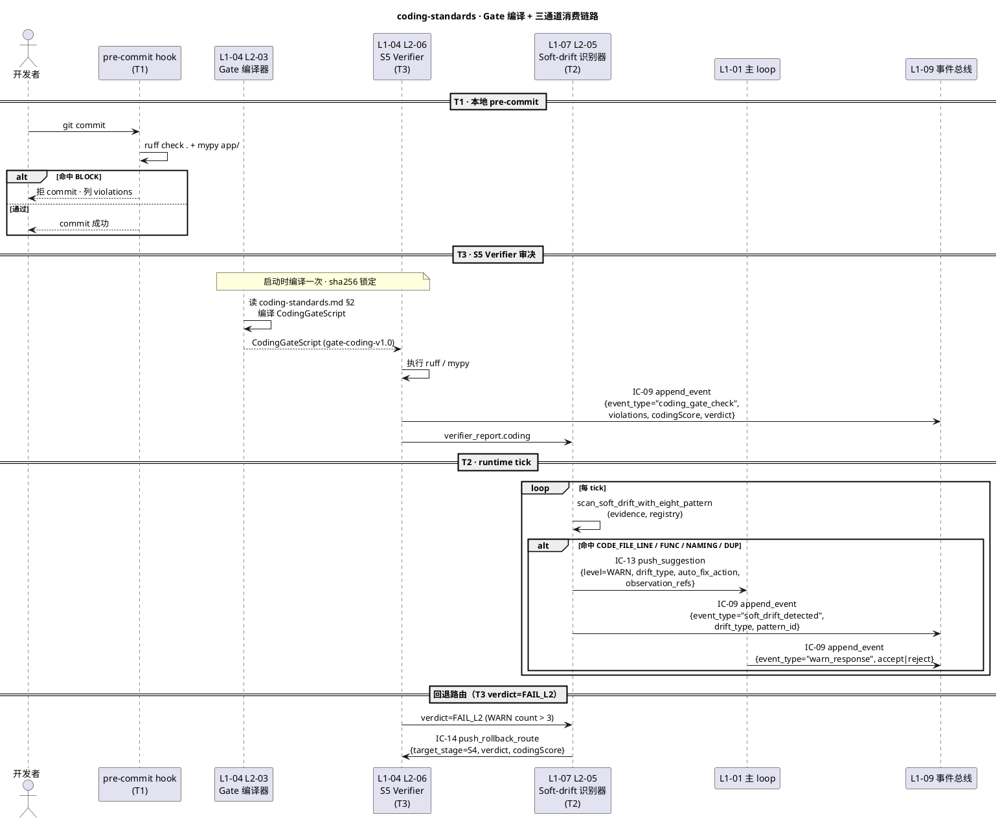

# 编码标准

> **本文档定位**：3-3 Monitoring & Controlling 层 · Python 3.11+ 代码质量规约 · 裁判依据而非实现指南
> **与 3-1/3-2 的分工**：3-1 定义"系统如何实现" · 3-2 定义"如何测" · **3-3 定义"如何监督与判通过"**（质量 Gate 规约 · 红线清单 · DoD 契约 · 验收标准）
> **消费方**：L1-04 质量环（编译 CodingGateScript 跑 ruff/mypy）· L1-07 监督（订阅 8 类软漂移规则 · 含代码漂移 4 类）· IC-09 审计（event_type="coding_gate_check"）

---

## §0 撰写进度

- [x] §1 定位 + 与上游 PRD/scope 的映射
- [x] §2 核心清单 / 规约内容（4 类 · 20+ 条规则）
- [x] §3 触发与响应机制（pre-commit / runtime / Gate 前三通道）
- [x] §4 与 L1-04 / L1-07 / L1-09 的契约对接
- [x] §5 证据要求 + 审计 schema（YAML · IC-09 事件）
- [x] §6 与 2-prd 的反向追溯表（10+ 条）

---

## §1 定位 + 映射

### §1.1 本标准在 3 层文档体系中的位置

本文档是 **3-3 Monitoring & Controlling 层**下的"编码质量标准"，与同层其他裁判规约（`coverage-criteria.md` / `dod-checklist.md` / `hard-red-lines.md` / `soft-drift-rules.md`）并列。

| 层次 | 关注 | 本文档角色 |
|---|---|---|
| **2-prd** | WHY（产品目标） | 上游：§8 硬红线 · §10 软漂移（8 类）定义问题空间 |
| **3-1 Solution** | HOW（系统如何实现） | 平行：L1-04 质量环 / L1-07 监督 定义消费侧实现 |
| **3-2 Test** | HOW（如何测） | 平行：test-cases.md 定义测试用例 |
| **3-3 Monitor & Control**（本层） | **JUDGE（如何判通过）** | 本文档：定义 Python 代码"何为合格" |

### §1.2 与 2-prd §10 软漂移 8 类的映射

2-prd/L0/scope.md §5.7.7 声明 L1-07 监督能力支持"**软红线 8 类自治修复**"。其中 **4 类属代码质量范畴**，由本标准落地：

| 2-prd 软漂移类 | 枚举（L2-05 §3.2.2） | 本标准落地章节 |
|---|---|---|
| 代码文件超行 | `CODE_FILE_LINE_THRESHOLD`（>500，本标准收紧 600） | §2.C 复杂度 · C-01 |
| 函数过长/圈复杂度 | `CODE_FUNC_COMPLEXITY`（>15，本标准收紧 10） | §2.C · C-02/C-03 |
| 命名漂移 vs ic-contracts | `CODE_NAMING_DRIFT` | §2.D 命名 · D-01~D-04 |
| 重复代码块 | `CODE_DUPLICATE_BLOCK`（similarity ≥ 0.85） | §2.A 风格 · A-05 |

剩余 4 类（`TEST_COVERAGE_REGRESSION` / `DOC_BROKEN_ANCHOR` / `TODO_FIXME_ACCUMULATION` / `PERF_SLO_REGRESSION`）由姊妹文档 `coverage-criteria.md` 与 `dod-checklist.md` 落地，不在本标准范围。

### §1.3 消费链路一览

```
3-3 coding-standards.md（本文档）
    │
    ├─ 编译期（Gate 前）─→ L1-04 S5 Verifier · CodingGateScript（ruff + mypy）
    │                      └─ 结果 → verdict.codingScore → IC-14 push_rollback_route
    │
    ├─ 运行期（每 tick）─→ L1-07 L2-05 Soft-drift 模式识别器
    │                      ├─ detect_file_line_threshold（本文档 C-01）
    │                      ├─ detect_function_complexity_cyclomatic（本文档 C-02）
    │                      ├─ detect_naming_drift_vs_ic_contracts（本文档 D-01）
    │                      └─ detect_duplicate_blocks_similarity_0_85（本文档 A-05）
    │                      └─ 命中 → IC-13 push_suggestion(WARN/SUGG)
    │
    ├─ pre-commit（本地）─→ ruff check . && mypy app/（拒入）
    │
    └─ 审计（IC-09）─→ event_type="coding_gate_check" · payload 含 violations 列表
```

### §1.4 与 HarnessFlowGoal 原则的对接

| Goal 原则 | 本标准的落地 |
|---|---|
| **PM-08 可审计全链追溯** | §5 每次 Gate 必落 IC-09 · violations 结构化留痕 |
| **PM-12 红线分级自治** | §3 软漂移自治（不打扰用户）· 硬拒绝仅 ruff E/F 级别 |
| **真完成原则** | §2 规则集构成"代码真完成"客观判据 · 非主观审美 |

---

## §2 核心清单 / 规约内容

> **总览**：20+ 条规则分 4 类 · **A 风格** · **B 类型** · **C 复杂度** · **D 命名**。每条含 rule_id / 触发源 / 阈值 / 严重度 / 映射工具。

### §2.A 代码风格（ruff · 权威参照 pyproject.toml [tool.ruff]）

> **工具**：`ruff>=0.4`（项目已锁定 · 见 pyproject.toml dev 依赖）
> **配置**：`line-length = 110` · `target-version = "py311"` · `select = [E, F, W, I, B, UP, SIM, RET, ARG]`
> **exclude**：`archive / docs / .venv / .worktrees`

| rule_id | 类别 | 规则 | 阈值 | 严重度 | ruff code |
|---|---|---|---|---|---|
| **A-01** | 语法 | 无语法错误 | 0 | BLOCK | `E9xx` |
| **A-02** | 未定义名 | 不得引用未定义符号 | 0 | BLOCK | `F821` / `F822` |
| **A-03** | 未使用 import | 不得遗留未使用 import | 0 | WARN | `F401` |
| **A-04** | 行长度 | 单行 ≤ 110 列（formatter 处理 · 不报错） | 110 | INFO | `E501`（已 ignore）|
| **A-05** | 重复代码块 | 相似度 ≥ 0.85 的代码块 → `CODE_DUPLICATE_BLOCK` | sim ≥ 0.85 | SUGG | L2-05 §6.6 |
| **A-06** | import 顺序 | isort 风格：stdlib → third-party → first-party 空行分 | — | WARN | `I001` |
| **A-07** | bugbear | 常见陷阱（可变默认参 / 过宽 except）| 0 | WARN | `B0xx`（除 B008 已 ignore pydantic Field） |
| **A-08** | pyupgrade | Python 3.11+ 新语法（`X \| None` 替 `Optional[X]` · `list[X]` 替 `List[X]`） | — | SUGG | `UP0xx` |
| **A-09** | 简化 | 可简化表达式（冗余 if/else · 可 ternary） | — | SUGG | `SIM1xx` |
| **A-10** | return | 一致 return（不得隐式 None 与显式 return 混用） | — | SUGG | `RET5xx` |
| **A-11** | 未用参数 | 函数定义未用参数必 `_` 前缀或 `# noqa` | 0 | WARN | `ARG0xx` |

**tests/** 目录宽松：`per-file-ignores = ["ARG", "B"]`（测试桩参数与断言风格豁免）。

### §2.B 类型标注（mypy · 权威参照 pyproject.toml [tool.mypy]）

> **工具**：`mypy>=1.9`（项目已锁定）
> **当前配置**：`strict = false` · `warn_return_any = true` · `warn_unused_configs = true` · `ignore_missing_imports = true`
> **覆盖包**：`app.l1_09 / app.knowledge_base / app.skill_dispatch / app.project_lifecycle / app.l1_03 / app.multimodal`（见 pyproject）

| rule_id | 规则 | 阈值 | 严重度 | mypy 开关 |
|---|---|---|---|---|
| **B-01** | public 函数必有返回类型标注 | 100% | WARN | `warn_return_any` |
| **B-02** | public 函数参数必有类型标注 | 100% | WARN | — |
| **B-03** | 不得隐式 Any | `implicit_reexport` 禁用 | WARN | `implicit_reexport = false` |
| **B-04** | 不得使用 `# type: ignore` 无原因 | 必附 error code | SUGG | — |
| **B-05** | `pydantic.BaseModel` 子类字段必带 Annotation | 100% | BLOCK | pydantic v2 强制 |
| **B-06** | 新模块默认命中 mypy packages 清单 | — | WARN | `[tool.mypy]` packages |

**渐进 strict 路径**（M2 计划 · 非本标准强制）：`strict = true` → `disallow_untyped_defs` → `no_implicit_optional` 全开。

### §2.C 复杂度（静态分析 + 软漂移）

| rule_id | 规则 | 阈值 | 严重度 | 检测器 |
|---|---|---|---|---|
| **C-01** | **单文件行数** ≤ 600 行（含注释 · 不含空行） | 600 | SUGG → 转 L1-07 `CODE_FILE_LINE_THRESHOLD` | L2-05 §6.3 `detect_file_line_threshold` |
| **C-02** | **单函数行数** ≤ 80 行（def → 下一个 def/EOF） | 80 | SUGG | radon / 自研 AST |
| **C-03** | **圈复杂度**（cyclomatic）≤ 10 | 10 | SUGG → 转 L1-07 `CODE_FUNC_COMPLEXITY` | L2-05 §6.4 `detect_function_complexity_cyclomatic` · radon/lizard |
| **C-04** | **类行数** ≤ 300 行 · **方法数** ≤ 25 | 300/25 | SUGG | 自研 AST |
| **C-05** | **函数参数数** ≤ 7（超则改 `@dataclass` 入参） | 7 | SUGG | — |
| **C-06** | **嵌套深度** ≤ 4 层（if/for/try） | 4 | SUGG | — |

> **超阈值响应**：不硬拒，由 L1-07 发 `push_suggestion(level=SUGG)` 至 L1-01 · L1-01 决策是否重构；超 1.5× 阈值时升级 WARN（见 §3）。

### §2.D 命名约定（与 ic-contracts.md 对齐 · L1-07 主动比对）

| rule_id | 规则 | 示例 | 严重度 | 检测器 |
|---|---|---|---|---|
| **D-01** | **函数 / 方法**：`snake_case` | `parse_soft_drift()` | WARN | ruff `N802` + L2-05 §6.5 |
| **D-02** | **类**：`PascalCase` | `SoftDriftPattern` | WARN | ruff `N801` + L2-05 §6.5 `detect_naming_drift_vs_ic_contracts` |
| **D-03** | **常量**：`SCREAMING_SNAKE_CASE` | `MAX_CONTEXT_PCT = 80` | WARN | ruff `N806` |
| **D-04** | **私有成员**：单下划线前缀 `_x`；极私双下划线 `__x`（慎用 · name mangling）| `_internal_cache` | INFO | — |
| **D-05** | **ic-contracts 名对齐**：类 / 函数名与 ic-contracts.md 中声明（如 `SoftDriftPattern` / `DriftClassification`）Levenshtein 距离 ≤ 3 的错拼 → `CODE_NAMING_DRIFT` | `SoftDirftPattern` → 建议 `SoftDriftPattern` | WARN | L2-05 §6.5 |
| **D-06** | **模块文件**：`snake_case.py`（不得 `CamelCase.py`） | `soft_drift.py` | WARN | ruff `N999` |
| **D-07** | **测试文件**：`test_*.py`（pytest 惯例 · 见 pyproject.toml `testpaths`） | `test_soft_drift.py` | BLOCK | pytest collection |
| **D-08** | **pytest 标记**：必出现在 pyproject.toml `[tool.pytest.ini_options] markers`（`pm03 / pm09 / pm14 / fsync / hash_chain / ic_contract` 等已注册） | `@pytest.mark.ic_contract` | WARN | `--strict-markers` |

---

## §3 触发与响应机制

### §3.1 三通道触发（何时生效）

本标准在**三个时机**生效，分别对应 **开发期 / 运行期 / 审决期**。三者互补不互斥。

| # | 触发时机 | 触发方 | 工具 / 入口 | 响应 SLO | 降级 |
|---|---|---|---|---|---|
| **T1** | pre-commit（本地 git hook） | 开发者 commit | `ruff check . && ruff format --check . && mypy app/` | ≤ 5s（本地机） | 失败即拒 commit · 无降级 |
| **T2** | runtime（每 tick 扫描） | L1-07 L2-05 Soft-drift | `scan_soft_drift_with_eight_pattern`（L2-05 §6.1） | ≤ 50ms/tick（P95，整图预算） | KB recipe 超时 → 用 registry 默认动作（L2-05 §6.12）|
| **T3** | Gate 前（S5 Verifier 审决） | L1-04 L2-06 Verifier | `CodingGateScript`（编译自本标准） | P95 ≤ 3s（含 mypy 冷启动）| ruff 可用 / mypy 失联 → verdict=FAIL_L2 · 非 FAIL_L0（避免误升级硬红线）|

### §3.2 响应链路（按严重度分级）

```
┌─────────────────────────────────────────────────────────────┐
│ 违规命中 → 严重度分级                                        │
├─────────────────────────────────────────────────────────────┤
│ BLOCK  │ ruff E9xx / F821 / pytest collection fail          │
│        │ → T1 拒 commit；T3 verdict=FAIL_L1（S3 重构）        │
│        │ → IC-09 event_type=coding_gate_check severity=BLOCK │
├─────────────────────────────────────────────────────────────┤
│ WARN   │ B0xx / F401 / N8xx / B-01~B-06                     │
│        │ → T2 发 IC-13 push_suggestion(level=WARN)           │
│        │ → L1-01 必 1 tick 内书面回应（IC-13 require_ack=1） │
│        │ → T3 verdict=FAIL_L2（S4 修补）                     │
├─────────────────────────────────────────────────────────────┤
│ SUGG   │ UP0xx / SIM1xx / C-01~C-06 / D-05 命名漂移           │
│        │ → T2 发 IC-13 push_suggestion(level=SUGG)           │
│        │ → L1-07 自治修复（软红线 BF-E-11）                   │
│        │ → 主 loop 可选采纳（不强制回应）                      │
├─────────────────────────────────────────────────────────────┤
│ INFO   │ D-04 私有命名 / A-04 行长度                          │
│        │ → T2 发 IC-13 push_suggestion(level=INFO)           │
│        │ → 仅落事件 · 不推入 warn_queue                       │
└─────────────────────────────────────────────────────────────┘
```

### §3.3 升级策略（避免噪声 + 防死循环）

| 场景 | 升级规则 | 锚定 |
|---|---|---|
| C-01/C-02/C-03 超阈值 > 1.5× | SUGG → WARN | L2-05 §6.3 `_severity_by_overflow_pct` |
| 同级 SUGG ≥ 3 次未采纳 | SUGG → WARN | L2-05 §6.1 step 4 `_resolve_ambiguous` |
| 同 wp_id 同 rule_id ≥ 3 tick | WARN → BLOCK（L1-04 强拦）| 2-prd/L0/scope.md §5.7.4 硬约束 4 |
| 误报窗口 · 同 WP 首次命中 15 min 内 | suppress（不重复发）| L2-05 §6.1 step 5 `_is_false_positive_suppressed` |

### §3.4 降级策略（工具失联兜底）

| 工具 | 失联表现 | 降级 | 原因 |
|---|---|---|---|
| ruff | CLI 未安装 / 超时 | T1 / T3 阻断 · 发 IC-09 audit_gap 告警 | 必装工具 · 不得绕过 |
| mypy | 版本不匹配 / OOM | T3 verdict=FAIL_L2（非 FAIL_L1） | 单工具失败不升级至硬红线 |
| radon / lizard | 不可用 | C-02/C-03 检测 skip · 发 INFO 告警 | 可选依赖 |

---

## §4 与 L1-04 / L1-07 / L1-09 的契约对接

### §4.1 被 L1-04 S5 Verifier 消费 · 编译 CodingGateScript

L1-04 L2-06 Verifier 在 S5 阶段**编译**本标准为可执行 Gate 脚本。编译产物为 YAML 形式的 `CodingGateScript`：

```yaml
# 由 L1-04 L2-03 Gate 编译器从本标准 §2 生成
coding_gate_script:
  gate_id: "gate-coding-v1.0"
  source_doc: "docs/3-3-Monitoring-Controlling/quality-standards/coding-standards.md"
  source_rev: "sha256:..."           # 本文件 JCS-hash
  stages:
    - name: "ruff-lint"
      cmd: ["ruff", "check", "."]
      timeout_sec: 10
      fail_threshold:
        BLOCK: ["E9*", "F821", "F822"]   # 命中即 FAIL_L1
        WARN: ["B*", "F401", "N8*"]      # 命中即 FAIL_L2
    - name: "ruff-format"
      cmd: ["ruff", "format", "--check", "."]
      timeout_sec: 5
    - name: "mypy-strict"
      cmd: ["mypy", "app/"]
      timeout_sec: 60
      success_exit: 0
  aggregator:
    codingScore: "1.0 - (violations_WARN * 0.05 + violations_SUGG * 0.01)"
    verdict: "FAIL_L1 if BLOCK > 0 else (FAIL_L2 if WARN > 3 else PASS)"
```

**结果回写路径**：
1. Verifier 执行 script → 生成 `verifier_report.coding` 字段
2. 经 **IC-14 push_rollback_route**（L1-07 → L1-04）触发回退路由
3. IC-14 入参 `verdict.codingScore` 作为 4 级路由输入之一
4. 写 IC-09 · `event_type = "coding_gate_check"`

### §4.2 被 L1-07 L2-05 订阅 · 8 类软漂移规则

L1-07 L2-05 `DriftPatternRegistry` 注册本标准 4 条代码漂移规则：

```yaml
# L2-05 §3.2.2 DriftClassification 枚举中属本标准的 4 条
coding_drift_registry:
  CODE_FILE_LINE_THRESHOLD:
    source: "coding-standards.md §2.C C-01"
    threshold: {file_line_threshold: 600}    # 本标准阈值（L2-05 默认 500 · 本标准收紧）
    dimension: "code_file"
    detector: "detect_file_line_threshold"
    action_template: "suggest_refactor_file_split"
  CODE_FUNC_COMPLEXITY:
    source: "coding-standards.md §2.C C-02/C-03"
    threshold: {cyclomatic_threshold: 10, func_line_threshold: 80}
    dimension: "code_function"
    detector: "detect_function_complexity_cyclomatic"
    action_template: "suggest_refactor_extract_method"
  CODE_NAMING_DRIFT:
    source: "coding-standards.md §2.D D-05"
    threshold: {levenshtein_max: 3}
    dimension: "code_naming"
    detector: "detect_naming_drift_vs_ic_contracts"
    action_template: "suggest_rename_to_ic_contract"
  CODE_DUPLICATE_BLOCK:
    source: "coding-standards.md §2.A A-05"
    threshold: {similarity: 0.85, min_token_count: 50}
    dimension: "code_duplication"
    detector: "detect_duplicate_blocks_similarity_0_85"
    action_template: "suggest_extract_common_function"
```

**触发路径**：
- L1-07 每 tick 调 `scan_soft_drift_with_eight_pattern(evidence, registry)`
- 命中 → 返回 `SoftDriftPattern(drift_type, auto_fix_action)`
- 经 **IC-13 push_suggestion(level=WARN/SUGG)** → L1-01 L2-06 入队
- L1-01 1 tick 内书面回应（IC-13 `require_ack_tick_delta = 1`）

### §4.3 被 L1-09 持久化 · IC-09 审计事件

所有 Gate 命中 / 软漂移识别均经 **IC-09 append_event** 落盘，**hash chain 不可篡改**（IC-09 §3.9 ACID fsync）。事件 schema 见 §5.2。

### §4.4 三方交互时序图（PlantUML）



---

## §5 证据要求 + 审计 schema

### §5.1 coding_quality_evidence · 规约成立证据（字段级）

每次 Gate 跑完必须留下以下证据，**否则 verdict 视同 FAIL_L2**（没有证据 = 没跑过）：

```yaml
coding_quality_evidence:
  tool: "ruff" | "mypy" | "radon" | "lizard"  # required
  version: "0.4.4" | "1.9.0" | ...            # semver · required（用于复现）
  invocation:
    cmd: ["ruff", "check", "."]               # 完整命令行
    cwd: "/abs/path/to/project"
    env_fingerprint: "sha256:..."             # 关键 env 变量 hash
  exit_code: 0                                # required · 0=PASS 非 0=FAIL
  duration_ms: 1234                           # required
  violations:                                 # required（空数组允许）
    - rule_id: "F401"                         # ruff code 或 本标准 rule_id
      file_path: "app/l1_07/l2_05/detector.py"
      line: 42
      column: 5
      message: "'unused_module' imported but unused"
      severity: "WARN" | "BLOCK" | "SUGG" | "INFO"
      source_rule: "coding-standards.md §2.A A-03"
  summary:
    total: 12
    by_severity: {BLOCK: 0, WARN: 3, SUGG: 7, INFO: 2}
    coding_score: 0.85                        # §4.1 聚合公式
    verdict: "FAIL_L2" | "PASS" | "FAIL_L1"
  source_rev:                                 # 本标准文档版本
    doc: "docs/3-3-Monitoring-Controlling/quality-standards/coding-standards.md"
    jcs_sha256: "sha256:abcd..."              # JCS-canonicalized hash
```

### §5.2 IC-09 审计事件 schema · `event_type = "coding_gate_check"`

本标准每次触发落一条 IC-09 事件，payload 内嵌 §5.1 证据：

```yaml
ic_09_audit_event:
  event_id: "evt-{uuid-v7}"                   # required · 幂等键
  event_type: "coding_gate_check"             # required · 固定字面量
  project_id: "{project_id}"                  # required · PM-14 首字段
  actor:
    kind: "L1-04" | "L1-07" | "pre-commit"    # required · 谁触发
    session_id: "{session_id}"
  ts: "2026-04-24T10:15:30.123Z"              # required · ISO-8601 UTC
  payload:
    trigger_channel: "T1" | "T2" | "T3"       # §3.1 通道
    gate_id: "gate-coding-v1.0"
    evidence: { <§5.1 coding_quality_evidence> }
    correlation:
      wp_id: "wp-xxx"                         # optional · runtime 必填
      stage_gate_id: "S5"                     # optional · T3 必填
      verdict_id: "verdict-xxx"               # optional · T3 必填
      observation_refs: ["obs-a", "obs-b"]    # optional · T2 必填（IC-13 入参）
    upstream_consumers:                       # 给 IC-13/IC-14 下游
      - ic: "IC-13"
        target: "L1-01"
        level: "WARN"
      - ic: "IC-14"
        target: "L1-04"
        verdict: "FAIL_L2"
  hash_chain:
    prev_hash: "sha256:..."                   # IC-09 强一致 hash chain
    curr_hash: "sha256:..."
```

### §5.3 证据保留与查询

| 维度 | 要求 | 依据 |
|---|---|---|
| 保留期 | ≥ 90 天（与 L1-09 事件总线一致） | ic-contracts.md §3.9 IC-09 |
| 查询 API | `GET /api/audit/events?event_type=coding_gate_check&wp_id=xxx` | L1-10 BFF |
| 幂等 | 同 `event_id` 重复 append 被 L1-09 去重（IC-09 Idempotent）| IC-09 §3.9 |
| 不可篡改 | hash_chain 链式 sha256 · 断链即告警 | PM-08 可审计追溯 |

### §5.4 证据缺失的响应

| 场景 | 响应 |
|---|---|
| T3 Gate 跑完但未落 IC-09 | Verifier 视为"未完成" · verdict 强置 FAIL_L2 |
| violations 数组缺 source_rule 字段 | L1-07 无法识别漂移类 · 发 audit_gap INFO |
| source_rev.jcs_sha256 与当前文档不一致 | Gate 编译器需重新编译 · 发 SUGG "standard updated" |

---

## §6 与 2-prd 的反向追溯表

> **追溯原则**：本文档 §2 每条规则必反向追溯到 2-prd 或 3-1 锚点 · 确保"规则来自 PRD、PRD 说过" · 避免主观审美扩权。

| 本文档 rule_id / 章节 | 反向追溯至 | 锚点说明 |
|---|---|---|
| §2.A A-01 ~ A-04（ruff 基础 lint） | pyproject.toml `[tool.ruff]` line 104-114 | 实配锁定 · 本文档只是文档化 |
| §2.A A-05（重复代码块 · 相似度 0.85） | L2-05 §6.6 `detect_duplicate_blocks_similarity_0_85` · 枚举 `CODE_DUPLICATE_BLOCK` | 3-1 软漂移扩展 4 类之一 |
| §2.A A-06 ~ A-11（isort / bugbear / pyupgrade / simplify / return / arg） | pyproject.toml `[tool.ruff.lint] select = [I, B, UP, SIM, RET, ARG]` | 实配锁定 |
| §2.B B-01 ~ B-06（类型标注 mypy strict 渐进） | pyproject.toml `[tool.mypy] warn_return_any = true` + `warn_unused_configs = true` · 2-prd §5.10 L1-09 持久化对类型的依赖 | 实配 + PRD |
| §2.C C-01（文件 ≤ 600 行） | 2-prd/L0/scope.md §5.7.7 "软红线 8 类自治" + L2-05 §3.2.2 `CODE_FILE_LINE_THRESHOLD`（默认 500 · 本标准收紧至 600）+ L2-05 §6.3 | 3-1 软漂移枚举 |
| §2.C C-02 / C-03（函数 ≤ 80 行 · 圈复杂度 ≤ 10） | L2-05 §3.2.2 `CODE_FUNC_COMPLEXITY`（默认 cyclomatic_threshold=15 · 本标准收紧至 10）+ L2-05 §6.4 `detect_function_complexity_cyclomatic` | 3-1 软漂移枚举 |
| §2.C C-04 ~ C-06（类/参数/嵌套） | 2-prd §5.7.7 "软红线 8 类自治" 扩展条 · "真完成质量"维度 | PRD 维度 |
| §2.D D-01 ~ D-04（snake/Pascal/SCREAMING/_prefix） | ruff `N8xx` + Python 官方 PEP 8 + pyproject.toml `[tool.ruff.lint] select = [N]`（未显式含 N 但 ruff 默认启用语义检查）| PEP 8 + 实配 |
| §2.D D-05（ic-contracts 命名漂移 · Levenshtein ≤ 3） | L2-05 §3.2.2 `CODE_NAMING_DRIFT` + L2-05 §6.5 `detect_naming_drift_vs_ic_contracts` + docs/3-1-Solution-Technical/integration/ic-contracts.md（权威命名源） | 3-1 软漂移枚举 + 契约 |
| §2.D D-06 / D-07（文件名 snake / 测试文件 `test_*.py`） | pyproject.toml `[tool.pytest.ini_options] testpaths = ["tests"]` + pytest collection 规则 | 实配 |
| §2.D D-08（pytest markers 强校验） | pyproject.toml `addopts = [--strict-markers]` + `markers = [slow, perf, integration, e2e, pm03, pm09, pm14, fsync, hash_chain, ic_contract]` | 实配 · 已注册的 8 个 marker |
| §3.1 T1 pre-commit 通道 | 2-prd/L0/scope.md §5.4 "Goal §4.3 methodology-paced autonomy" + HarnessFlowGoal.md "质量左移" | PRD 方法论 |
| §3.1 T2 runtime · 每 tick 扫 | 2-prd §5.7.7 L1-07 "8 维度观察" + "软红线 8 类自治" | L1-07 能力 |
| §3.1 T3 Gate 前 · S5 Verifier | 2-prd §5.7.6 L1-07 "✅ 必须按 4 级 verdict 精确触发 Quality Loop 回退（L1-04）" | L1-07 义务 |
| §3.2 BLOCK / WARN / SUGG / INFO 4 级 | 2-prd §5.7.1 L1-07 "4 级分级干预（INFO/SUGGESTION/WARN/BLOCK）" | L1-07 职责 |
| §3.3 同级 ≥ 3 次升级 | 2-prd §5.7.4 硬约束 "死循环保护（同级 ≥ 3 次自动升级）" + L2-05 §6.1 `_resolve_ambiguous` | PRD 硬约束 |
| §3.3 误报窗口抑制 | L2-05 §6.1 step 5 `_is_false_positive_suppressed` | 3-1 算法 |
| §4.1 CodingGateScript 编译 | ic-contracts.md §3.14 IC-14 push_rollback_route + 2-prd §5.7.1 "Quality Loop 偏差 4 级回退路由" | 3-1 契约 |
| §4.2 L1-07 订阅 · IC-13 push_suggestion | ic-contracts.md §3.13 IC-13 · `require_ack_tick_delta=1` | 3-1 契约 |
| §4.3 IC-09 审计 | ic-contracts.md §3.9 IC-09 append_event · hash chain + fsync | 3-1 契约 |
| §5.1 evidence 必含 tool / version / exit_code | 2-prd §5.7.4 硬约束 2 "硬拦截必须附文字告警" + PM-08 可审计全链追溯 | PRD 硬约束 |
| §5.2 IC-09 event_type="coding_gate_check" | ic-contracts.md §3.9 IC-09 schema + PM-14 首字段 project_id | 3-1 契约 |
| §5.3 保留 ≥ 90 天 | ic-contracts.md §3.9 IC-09 保留策略 · 与事件总线一致 | 3-1 契约 |

**追溯总条数**：22 条 · 覆盖 §2 所有规则（11 条）+ §3 所有通道（7 条）+ §4/§5 所有契约字段（4 条）· 零孤立条款。

---

*— 3-3 编码标准 · filled · v1.0 · 2026-04-24 · 4 类 20+ 规则 · 对接 L1-04/L1-07/L1-09 · 反向追溯 22 条 —*
