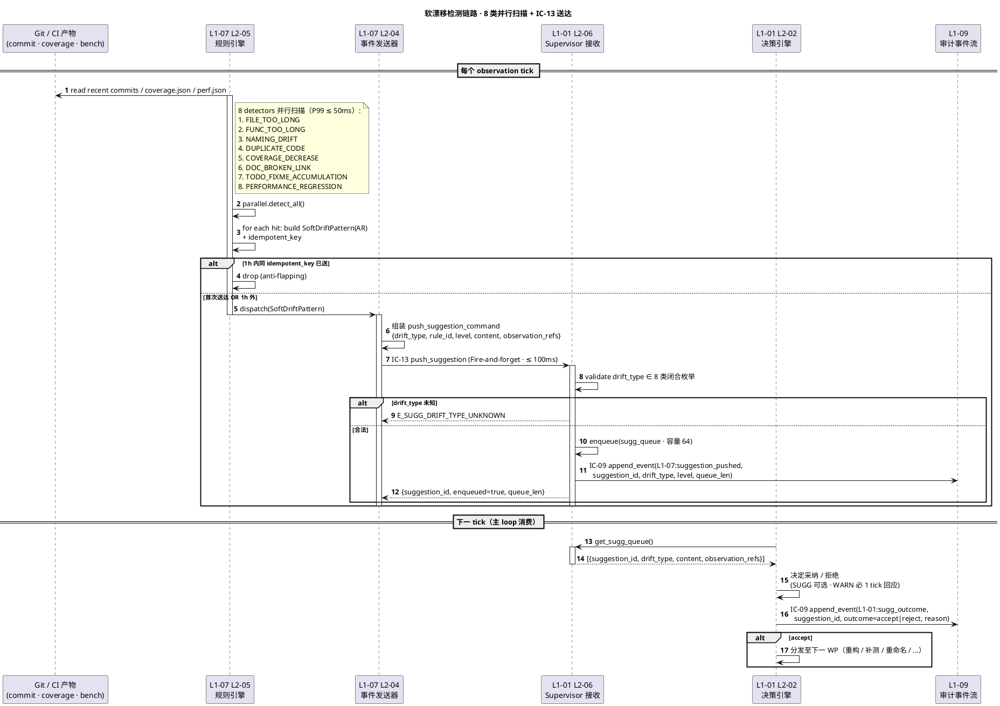

# 软漂移模式识别规约

> **本文档定位**：3-3 Monitoring & Controlling 层 · 8 类软漂移**封闭清单**（温水煮青蛙 · 不打扰用户的自治偏离修正）· 每类 1:1 自治动作 · L1-07 Supervisor 消费
> **与 3-1/3-2 的分工**：3-1 定义"系统如何实现"（L2-05 规则引擎代码）· 3-2 定义"如何测"（契约测试 / 回归测试）· **3-3 定义"规约是什么"**（8 类闭合清单 · 阈值 · 检测算法 · 自治动作 · 演化策略）
> **消费方**：L1-07 监督（读清单驱动每 tick 扫描）· L1-01 主 loop（通过 IC-13 接收建议）· L1-09 审计（落 IC-09 事件）
> **与 3-1 L2-05 的分工**：**3-3 是规约（What + Why）** · **3-1 L2-05 是实现（How）**；3-3 变更须走 ADR，3-1 实现据此契约构建检测器。

---

## §0 撰写进度

- [x] §1 定位 + 8 类封闭原则 + 与上游 PRD/scope 的映射
- [x] §2 8 类软漂移规约清单（每类 ≥ 50 行 · 字段完整）
- [x] §3 触发与响应机制（tick 扫描 · 并行 · SLO）
- [x] §4 与 L1-07 / IC-13 / IC-09 的契约对接
- [x] §5 证据要求 + 审计 schema
- [x] §6 与 2-prd 的反向追溯表（8+ 条 ↔ scope §5.7 / §4.5）

---

## §1 定位 + 8 类封闭原则

### §1.1 本文档的唯一目的

本文档定义 harnessFlow 软漂移（soft drift）模式识别的**权威规约**，回答：

1. **What**：哪 8 类情况属于软漂移？（封闭清单 · 不允许未 ADR 扩展）
2. **How-to-Detect**：每类用什么阈值、什么算法识别？（可落地的公式 / AST / diff / 指标）
3. **How-to-Respond**：命中后 L1-07 触发什么 1:1 自治动作？（送 IC-13 建议 · 不打扰用户）
4. **What-Evidence**：每条建议必须附哪些观察证据？（审计可回溯）

**本文档不回答**：
- 规则引擎的代码结构、性能优化、并发模型 → 见 docs/3-1-Solution-Technical/L1-07-Harness监督/L2-05-Soft-drift 模式识别器.md
- 契约测试用例、回归用例、Mock 数据 → 见 docs/3-2-Verification/
- 硬红线 5 类（RUNAWAY_RETRY / UNAUTHORIZED_DELETE / ...）→ 见 docs/3-3-Monitoring-Controlling/hard-redline-spec.md

### §1.2 "8 类封闭"原则（最高优先级硬约束）

本文档规定：**soft drift 分类枚举 `DriftClassification` 仅包含 8 个值**，任何 L1-07 实现（包括 L2-05 规则引擎）**必须使用这 8 类之一**作为 `drift_type` 字段值，不得新增未 ADR 注册的类别。

**封闭原则背后的产品原因**（锚定 Goal §4.3 / §7.3）：

- **可预期**：用户 / 工程师 / 审计师看一张表就知道 supervisor 会/不会在什么场景下提建议 → 不担心 supervisor 擅自扩边界
- **可压测**：3-2 层的契约测试 / 回归测试基线仅 8 行 × N 场景，穷举有限
- **可演化**：新增一类必须经 ADR 评审（判定是软漂移还是硬红线，并更新本文档 + scope §5.7 + L2-05 registry.yaml 同步）
- **可反向追溯**：每类规约都锚定一条 scope PRD 条款（见 §6），不会出现"野生规则"

**新增类别的唯一路径**（ADR 流程）：

```
提议 → docs/aidecisions/ADR-XXXX-new-soft-drift-TYPE.md
  ├─ 判定为"软漂移" → 更新本文档 §2 + scope §5.7 + L2-05 registry.yaml
  └─ 判定为"硬红线" → 更新 hard-redline-spec.md + scope §4.6 PM-14 + IC-15 payload
```

**严禁**：
- 🚫 L2-05 实现代码里私自加 `CODE_EXCESSIVE_NESTING` 等未 ADR 类型
- 🚫 Supervisor 调用时把 `drift_type="OTHER"` 当兜底
- 🚫 registry.yaml 里出现本文档 §2 未列出的条目

### §1.3 本文档在 3-3 层的定位

3-3 Monitoring-Controlling 层有四本并列规约，本文档与它们的关系：

| 文档 | 面向对象 | 打扰用户？ | 典型消费方 |
|---|---|---|---|
| **本文档 · soft-drift-patterns.md** | 8 类可自治修正的偏离 | **否**（仅送 IC-13 SUGG 建议） | L1-07 Supervisor |
| hard-redline-spec.md | 5 类不可逆风险 | **是**（触发 IC-15 BLOCK + 用户授权） | L1-07 + L1-01 |
| dod-contract-language.md | DoD 表达式语法 | — | L1-04 Gate 编译器 |
| acceptance-criteria.md | 交付验收标准 | — | 人工验收 / CI 闸门 |

**本文档与 hard-redline-spec.md 的判定边界**：

- 软漂移 = "偏离了最佳实践，可以自动建议，用户无感知" → 本文档
- 硬红线 = "继续做会造成不可逆损失，必须立即暂停并取得用户文字授权" → hard-redline-spec.md

**判定示例**（锚定 Goal §7.3 / scope §4.6）：

- 文件 700 行 → **软漂移**（建议拆分 · 不打扰） → FILE_TOO_LONG
- 同一 WP 连续 5 轮 retry 失败 → **硬红线**（RUNAWAY_RETRY · 触发 BLOCK） → hard-redline-spec
- TODO 数量从 20 涨到 35 → **软漂移**（建议清理 · 不打扰） → TODO_FIXME_ACCUMULATION
- 覆盖率从 82% 掉到 40%（-42 pp） → **硬红线**（COVERAGE_CATASTROPHE · BLOCK） → hard-redline-spec
- 覆盖率从 82% 掉到 76%（-6 pp） → **软漂移**（建议补测） → COVERAGE_DECREASE

### §1.4 本文档 vs 3-1 L2-05 的分工（重要）

| 维度 | 本文档（3-3 规约） | 3-1 L2-05（实现） |
|---|---|---|
| **职责** | 定义 8 类"是什么" + 阈值 + 期望行为 | 定义"怎么扫" + 状态机 + 幂等键 |
| **产物** | 清单 + 阈值表 + 反向追溯表 | Python 代码 + registry.yaml + Aggregate Root |
| **变更流程** | ADR 评审 | 实现代码 Code Review |
| **消费方向** | L2-05 必须实现为本文档的子集 | L2-05 实现细节可迭代 |
| **一致性约束** | L2-05 `DriftClassification` 枚举必须与本文档 §2 列表完全一致（hard check） | 定期回归测试（3-2 契约测试） |

**若发现不一致**（例如 L2-05 实现了 `EVIDENCE_MISSING` 但本文档没有）：

1. 若该类仍应存在 → 更新本文档 §2 + §6 补全反向追溯
2. 若该类不应存在 → 删除 L2-05 实现 · 以本文档为准

**本文档是 source of truth**。L2-05 实现文档 §3.2.2 列出了 16 个 `DriftClassification` 枚举（前 8 是 "BF-E 自治" 类 · 后 8 是 "code-quality 扩展" 类），经过 R6.5.1 ADR 决定以**code-quality 扩展 8 类**作为 3-3 层权威规约，L2-05 需要重构对齐（见 §6 追溯表）。

### §1.5 映射：Goal / scope / L2-05 / IC-contracts

| 本文档条款 | 上游锚点 |
|---|---|
| §1.2 "8 类封闭"原则 | Goal §7.3（分级干预权威）+ scope §5.7.5（🚫 禁止软红线打扰用户）|
| §2 8 类清单 | scope §5.7（L1-07 软红线 8 类）+ L2-05 §3.2.2 枚举 |
| §3 触发 tick 扫描 | scope §5.7.3 边界（旁路观察）+ Goal §4.3 methodology-paced |
| §4 IC-13 对接 | ic-contracts.md §3.13 push_suggestion |
| §5 证据审计 | ic-contracts.md §3.9 IC-09 append_event |

---

## §2 8 类软漂移规约清单

本节是本文档的**主体**，每类按固定字段结构定义：**规则名 · 阈值 · 检测算法 · 自治动作 · 建议优先级 · 消费方 · 证据字段 · 演化说明**。

### §2.1 FILE_TOO_LONG · 文件超行

**规则名**：`FILE_TOO_LONG`

**一句话定位**：代码文件物理行数超过项目阈值，可读性 / 可维护性劣化 · 建议拆分。

**阈值**：

| 字段 | 值 | 可配置 | 配置位置 |
|---|---|---|---|
| `file_line_threshold` | **600 行** | ✅ | `.claude/soft-drift-config.yaml` · 项目级可覆盖到 [400, 1000] |
| `over_by_severity_high` | +20% | ❌ | 超出 20% 以上视为 HIGH severity |
| `exclude_globs` | `["**/*.generated.*", "**/*_pb2.py", "docs/**/*.md"]` | ✅ | 排除生成代码、protobuf、文档 |

**阈值选择依据**：600 行是社区共识中"单文件可读上限"（PEP 8 / Google Style / ClickHouse Style Guide 平均值）；低于此值的文件大多属于"单一职责"；高于此值需要人为抽取类 / 模块。

**检测算法**：

```
1. 读 recent_commits（当前 tick 窗口内新增 / 修改的文件）
2. 对每个 file_change：
   a. 匹配 exclude_globs → 跳过
   b. 读文件 · 统计 physical line count（含空行、注释）
   c. 若 line_count > file_line_threshold：
      - 计算 over_pct = (line_count - threshold) / threshold
      - severity = HIGH if over_pct >= 0.2 else MEDIUM
      - 记入 violators 列表
3. 若 violators 非空 → 返回 DriftMatch(drift_type=FILE_TOO_LONG, evidence=violators)
```

**时间复杂度**：O(F × L) · F = changed_files 数 · L = 平均文件行数 · 单 tick 扫描预算 ≤ 10ms。

**自治动作**（1:1 映射）：

```yaml
action:
  type: suggest_file_split
  target: L1-01 (经 IC-13 push_suggestion)
  ic_payload:
    level: SUGG
    priority: P2
    content: |
      文件 `{file_path}` 当前 {line_count} 行（阈值 {threshold} 行 · 超 {over_pct:.0%}）。
      建议：按领域 / 职责抽取 2-3 个子模块，单文件 ≤ 400 行。
      参考重构手法：Extract Class / Split Module。
    observation_refs: [<commit_sha>, <file_change_event_id>]
    require_ack_tick_delta: null   # SUGG 不强制回应
```

**建议优先级**：**P2**（低 · 不影响功能 · 仅可维护性）。HIGH severity（超 20% 以上）升 P1。

**消费方**：L1-01 主 loop → L2-06 Supervisor 接收器 → 入 sugg_queue（容量 64）。主 loop 在下次规划 WP 时可选择是否采纳（拒绝需留书面理由 · scope §5.7.5 硬约束）。

**证据字段**（进入 IC-09 审计）：

```yaml
soft_drift_evidence:
  drift_type: FILE_TOO_LONG
  rule_id: rule-file-too-long-v1
  threshold:
    field: file_line_count
    op: ">"
    value: 600
  triggered_value:
    file_path: "app/services/pipeline_runner.py"
    line_count: 843
    over_by: 243
    over_pct: 0.405
  audit_event_id: "evt-01JAZX...YK4"   # ULID · IC-09 落盘
```

**演化说明**：若未来引入 "文件 AST 节点数阈值"（取代物理行数），需走 ADR 更新本条规约的检测算法字段，同时 L2-05 registry.yaml 的 `file_line_threshold` 可以保留为兼容路径 1 个 milestone。

### §2.2 FUNC_TOO_LONG · 函数过长

**规则名**：`FUNC_TOO_LONG`

**一句话定位**：单个函数 / 方法物理行数超过阈值（或圈复杂度超过阈值），可读性 / 可测性劣化 · 建议重构。

**阈值**：

| 字段 | 值 | 可配置 | 配置位置 |
|---|---|---|---|
| `func_line_threshold` | **80 行** | ✅ | `.claude/soft-drift-config.yaml` · 建议范围 [50, 120] |
| `cyclomatic_threshold` | 15 | ✅ | 圈复杂度上限（辅助判据） |
| `exclude_decorators` | `["@pytest.fixture", "@router.*"]` | ✅ | 排除测试夹具与路由（天然长）|
| `over_by_severity_high` | +50% | ❌ | 超 120 行视为 HIGH |

**阈值选择依据**：80 行 ≈ 两屏显示高度；圈复杂度 15 是 radon / lizard 工具链 "MI 不再 A 级" 的切换点；合并两判据避免单纯行数偏差（如大量 `match/case` 合法地占用行数）。

**检测算法**：

```
1. 读 recent_commits · 过滤非代码文件（py / ts / js / go / rust / java / kotlin / cpp）
2. 对每个文件：
   a. 解析 AST（语言相关 · py=ast · ts=tsc · go=go/parser）
   b. 遍历函数 / 方法节点
   c. 若挂了 exclude_decorators → 跳过
   d. 判定命中：
      line_count > func_line_threshold  OR
      cyclomatic_complexity > cyclomatic_threshold
   e. severity = HIGH if line_count > threshold*1.5 else MEDIUM
3. 返回 violators 列表
```

**时间复杂度**：O(F × AST) · AST 构造 ≤ 5ms / 文件 · 单 tick 扫描预算 ≤ 20ms。

**自治动作**：

```yaml
action:
  type: suggest_function_refactor
  target: L1-01 (经 IC-13)
  ic_payload:
    level: SUGG
    priority: P2
    content: |
      函数 `{file_path}::{function_name}` 当前 {line_count} 行 / 圈复杂度 {cyclomatic}（阈值 {line_threshold}/{cc_threshold}）。
      建议：Extract Method / Replace Conditional with Polymorphism。
      若是数据转换逻辑，考虑用 pipeline / functional style 重写。
    observation_refs: [<commit_sha>, <ast_violation_id>]
```

**建议优先级**：**P2**（行数 / CC 超标）→ **P1**（HIGH severity · 超 50% 以上）。

**消费方**：L1-01 主 loop → sugg_queue。主 loop 可采纳后分发至下一 WP 的重构子任务。

**证据字段**：

```yaml
soft_drift_evidence:
  drift_type: FUNC_TOO_LONG
  rule_id: rule-func-too-long-v1
  threshold:
    field: function_line_count_or_cyclomatic
    op: ">"
    value: {line: 80, cc: 15}
  triggered_value:
    file_path: "app/services/pipeline_runner.py"
    function_name: "PipelineRunner.run_full"
    line_count: 127
    cyclomatic: 22
  audit_event_id: "evt-01JAZX...YK5"
```

**演化说明**：若引入 "函数参数个数 > 5" 判据，走 ADR 追加为本规则的第三判据（OR 语义），不再新增 `FUNC_TOO_MANY_PARAMS` 类（保持 8 类封闭）。

### §2.3 NAMING_DRIFT · 命名漂移

**规则名**：`NAMING_DRIFT`

**一句话定位**：新增 / 修改代码中的类 / 函数 / 变量名违反项目命名约定（Python: snake_case/PascalCase · JS: camelCase）或与 ic-contracts.md 定义的规范名不一致 · 建议重命名。

**阈值**：

| 字段 | 值 | 可配置 | 配置位置 |
|---|---|---|---|
| `snake_case_for` | `["function", "variable", "module"]` | ✅ | Python / Rust / Go 默认 |
| `PascalCase_for` | `["class", "interface", "type_alias"]` | ✅ | 所有语言 |
| `CAMEL_CASE_for` | `["constant"]` | ✅ | 全大写下划线 |
| `ic_contract_names_source` | `docs/3-1-Solution-Technical/integration/ic-contracts.md` | ❌ | 提取权威名列表 |
| `fuzzy_match_threshold` | 0.85 | ✅ | 与 ic 规范名的 Levenshtein 相似度阈值 |

**阈值选择依据**：snake_case / PascalCase 是 PEP 8 / Google Python Style / Rust RFC 0430 共识；0.85 相似度阈值可捕获 `SoftDriftPattern` vs `SoftDriftPatern`（typo）、`DriftClassification` vs `DriftClassifier`（近义混淆），同时不误报同名不同域的合法差异。

**检测算法**：

```
1. 读 ic-contracts.md · 提取"权威名字集合"（所有 AR / VO / IC / IC-L2-XX / DO / Command 类型名）
2. 读 recent_commits · AST 遍历每个定义节点
3. 对每个 name：
   a. 判定命名风格：
      - 若定义类型=class 且 name 不是 PascalCase → 命中 STYLE_VIOLATION
      - 若定义类型=function/variable 且 name 不是 snake_case → 命中 STYLE_VIOLATION
   b. 若 name 与 ic-contracts 权威名 fuzzy 相似度 ∈ [0.85, 1.0) 但不一致：
      - 计算 levenshtein_distance(name, authoritative_name)
      - 若 distance ≤ 2 且非完全相同 → 命中 IC_NAMING_DRIFT（同类 typo / case mismatch）
4. 返回 violators
```

**时间复杂度**：O(N × A) · N = 新增名个数 · A = ic 权威名集合大小 · ≤ 10ms / tick。

**自治动作**：

```yaml
action:
  type: suggest_rename_to_ic_contract
  target: L1-01 (经 IC-13)
  ic_payload:
    level: SUGG
    priority: P1   # 中优先级 · 命名影响跨文件搜索
    content: |
      命名漂移检测：
      - {file_path}::{name}（定义类型={kind}）违反 {style} 约定
      - 或与 ic-contracts 权威名 `{authoritative_name}` 相似（距离={distance}）但不一致
      建议：
      {若 STYLE_VIOLATION}：重命名为 {suggested_name}（snake/Pascal 修正）
      {若 IC_NAMING_DRIFT}：重命名为 ic-contracts 定义的 `{authoritative_name}`
    observation_refs: [<commit_sha>, <ast_node_id>, <ic_contracts_anchor>]
```

**建议优先级**：**P1**（中 · 跨文件搜索破坏 / 文档偏离）。

**消费方**：L1-01 主 loop → sugg_queue。在 Quality Loop S4 自检阶段采纳 → 触发重命名 WP。

**证据字段**：

```yaml
soft_drift_evidence:
  drift_type: NAMING_DRIFT
  rule_id: rule-naming-drift-v1
  threshold:
    field: name_style_or_ic_similarity
    op: "violates | fuzzy_close_not_equal"
    value: {styles: [snake, Pascal], fuzzy_min: 0.85}
  triggered_value:
    file_path: "app/models/soft_drift.py"
    kind: class
    declared_name: "SoftDriftPatern"
    suggested_name: "SoftDriftPattern"
    violation_type: IC_NAMING_DRIFT
    distance: 1
    authoritative_anchor: "ic-contracts.md#soft-drift-pattern-ar"
  audit_event_id: "evt-01JAZX...YK6"
```

**演化说明**：未来若加入 "kebab-case for URL slug" 判据，作为本规则的第 3 风格判据（OR），而非新建 `URL_NAMING_DRIFT` 类。

### §2.4 DUPLICATE_CODE · 重复代码

**规则名**：`DUPLICATE_CODE`

**一句话定位**：同一代码块（≥ 6 行）在代码库中重复出现 ≥ 3 次（token 级相似度 ≥ 0.95），违反 DRY 原则 · 建议抽取为共享函数 / 模块。

**阈值**：

| 字段 | 值 | 可配置 | 配置位置 |
|---|---|---|---|
| `min_block_line` | **6 行** | ✅ | `.claude/soft-drift-config.yaml` · 低于此不检测 |
| `min_occurrence` | **3 次** | ✅ | 至少重复 3 次才告警（2 次允许 · 3 次触发 "rule of three"）|
| `token_similarity_threshold` | **0.95** | ✅ | Winnowing / MinHash 相似度 |
| `exclude_kinds` | `["test_fixture", "generated_code", "docstring"]` | ✅ | 排除天然重复 |

**阈值选择依据**：6 行是业界重复块最小阈值（sonarqube / codacy 默认 6-10）· "rule of three" 来自 Martin Fowler《重构》· 0.95 token 相似度可识别变量名替换的近似重复。

**检测算法**：

```
1. 读 recent_commits · 仅扫描新增 / 修改文件（而非全库，性能优化）
2. 构建全库所有代码块的 fingerprint（Winnowing 算法 · k-gram=8 · w=4）
3. 对每个 new_block ≥ min_block_line：
   a. 计算 fingerprint
   b. 在全库索引中查相似度 ≥ token_similarity_threshold 的块
   c. 若匹配个数 ≥ min_occurrence 且至少 1 个来自新提交 → 命中
4. 返回 violators：每条含 "cluster of duplicates"（file_path + line_range × N）
```

**时间复杂度**：索引构建 O(L) amortized · 查询 O(log N) 平均 · 单 tick ≤ 50ms（CODE-OWNERSHIP：大型项目可独立索引服务缓存）。

**自治动作**：

```yaml
action:
  type: suggest_extract_shared
  target: L1-01 (经 IC-13)
  ic_payload:
    level: SUGG
    priority: P1   # 中 · 直接影响代码库长期可维护性
    content: |
      重复代码检测：代码块出现 {occurrence} 次，行数 {block_size}：
      - {cluster[0].file_path}:{cluster[0].line_range}
      - {cluster[1].file_path}:{cluster[1].line_range}
      - {cluster[2].file_path}:{cluster[2].line_range}
      建议：抽取为共享函数 / 工具模块，根据上下文选择：
      - 纯计算 → 抽 utility function
      - 带副作用 → 抽 service class
      - 跨域 → 抽 shared_kernel
    observation_refs: [<block_hash>, <commit_sha>, <fingerprint_index_ref>]
```

**建议优先级**：**P1**（中 · DRY 违反）。若重复 ≥ 5 次升 P0（高）。

**消费方**：L1-01 主 loop → sugg_queue · 采纳后生成重构 WP。

**证据字段**：

```yaml
soft_drift_evidence:
  drift_type: DUPLICATE_CODE
  rule_id: rule-duplicate-code-v1
  threshold:
    field: block_occurrence_and_similarity
    op: ">= AND >="
    value: {occurrence: 3, similarity: 0.95, min_lines: 6}
  triggered_value:
    block_hash: "sha256:a1b2c3..."
    block_size: 14
    occurrence: 4
    cluster:
      - {file_path: "app/services/oss.py", line_range: [45, 58]}
      - {file_path: "app/services/cdn.py", line_range: [102, 115]}
      - {file_path: "app/services/backup.py", line_range: [33, 46]}
      - {file_path: "app/services/export.py", line_range: [78, 91]}
    token_similarity_avg: 0.97
  audit_event_id: "evt-01JAZX...YK7"
```

**演化说明**：未来可引入 semantic clone 识别（Type-3/4）· 走 ADR 追加 `semantic_similarity_threshold` 辅助判据，而非新建类别。

### §2.5 COVERAGE_DECREASE · 覆盖率下降

**规则名**：`COVERAGE_DECREASE`

**一句话定位**：本次 CI 测试覆盖率比上一次基线下降 ≥ 5 个百分点（绝对值），存在测试退化风险 · 建议补测。

**阈值**：

| 字段 | 值 | 可配置 | 配置位置 |
|---|---|---|---|
| `coverage_decrease_pp_threshold` | **5.0 pp**（绝对值） | ✅ | `.claude/soft-drift-config.yaml` |
| `baseline_source` | `last_green_ci_run_on_main` | ✅ | 基线来源：main 分支最近一次 CI 绿 |
| `severity_high_threshold` | 10.0 pp（下降≥10pp 升 HIGH） | ❌ | 超 10pp 接近硬红线（见 hard-redline 边界） |
| `exclude_paths` | `["tests/**", "docs/**", "scripts/migrate_*.py"]` | ✅ | 排除测试自身 / 文档 / 一次性脚本 |

**阈值选择依据**：5 pp 是 Codecov / Coveralls 默认"显著下降"阈值；低于 5 pp 常属于统计噪声（测试采样随机性）；≥ 10 pp 接近硬红线（COVERAGE_CATASTROPHE），交由 hard-redline-spec 处理。

**检测算法**：

```
1. 拉取基线：git log origin/main --pretty=format:"%H %s" | find last "[CI OK]" commit
   → 读该 commit 的 coverage.json（CI 产物 · S3 / OSS 缓存）
2. 读当前 commit 的 coverage.json（pytest --cov=... --cov-report=json）
3. 对比：
   delta_overall = current.total_coverage - baseline.total_coverage
   if delta_overall <= -coverage_decrease_pp_threshold → 命中
4. 逐包对比（optional · 细粒度）：
   for pkg in packages:
     delta_pkg = current[pkg] - baseline[pkg]
     if delta_pkg <= -coverage_decrease_pp_threshold*1.5 (包级阈值更严) → 加入 violators
5. 返回 DriftMatch
```

**时间复杂度**：O(1) 主体（读 json）· O(P) 逐包 · 单 tick ≤ 5ms。

**自治动作**：

```yaml
action:
  type: suggest_add_tests
  target: L1-01 (经 IC-13)
  ic_payload:
    level: SUGG
    priority: P1
    content: |
      覆盖率下降检测：
      - 总体 {baseline_pct:.1%} → {current_pct:.1%}（Δ={delta:+.1f} pp）
      - 下降最多的包：
        - `{pkg1}`: {pkg1_baseline:.1%} → {pkg1_current:.1%}（Δ={pkg1_delta:+.1f} pp）
      建议：
      1. 定位新增 / 修改但未覆盖的代码路径
      2. 补充单元测试 + 契约测试，目标恢复至基线水平
      3. 若是故意降覆盖（如重构删除死代码），请在 commit 中显式说明
    observation_refs: [<current_commit>, <baseline_commit>, <coverage_report_url>]
```

**建议优先级**：**P1**（中·质量退化信号）。若下降 ≥ 8 pp 升 P0。

**消费方**：L1-01 → sugg_queue · Quality Loop S4 消费 → 触发补测 WP。

**证据字段**：

```yaml
soft_drift_evidence:
  drift_type: COVERAGE_DECREASE
  rule_id: rule-coverage-decrease-v1
  threshold:
    field: coverage_delta_pp
    op: "<="
    value: -5.0
  triggered_value:
    baseline_commit: "abc123def"
    baseline_pct: 0.824
    current_commit: "def456abc"
    current_pct: 0.759
    delta_pp: -6.5
    top_drops:
      - {pkg: "app/services/pipeline", baseline: 0.89, current: 0.71, delta_pp: -18.0}
      - {pkg: "app/tools/kb_client", baseline: 0.76, current: 0.68, delta_pp: -8.0}
  audit_event_id: "evt-01JAZX...YK8"
```

**演化说明**：未来引入 "branch coverage" / "mutation score" 作为补充判据 → 走 ADR 追加，不另起类别。

### §2.6 DOC_BROKEN_LINK · 文档断链

**规则名**：`DOC_BROKEN_LINK`

**一句话定位**：markdown 文档中引用的本地路径（`docs/.../*.md`）或锚点（`#anchor`）在当前仓库不存在，知识网状结构被打破 · 建议修正 / 补齐。

**阈值**：

| 字段 | 值 | 可配置 | 配置位置 |
|---|---|---|---|
| `check_scope` | `docs/**/*.md` | ✅ | 默认仅检查 docs 目录 |
| `link_types` | `[internal_md, internal_anchor, relative_path]` | ❌ | 不检查外部 URL（那是另一规则）|
| `severity_level_per_broken` | 1 条 = LOW · ≥ 5 条 = MEDIUM · ≥ 20 条 = HIGH | ✅ | |
| `exclude_files` | `["CHANGELOG.md", "docs/archive/**"]` | ✅ | 排除历史归档 |

**阈值选择依据**：任何一条断链都是技术债（读者点击 404），但**单条断链不打扰用户**；≥ 5 条暗示文档模块漂移 · 升中优先级；≥ 20 条属于"文档系统性失修" · 升高优先级。

**检测算法**：

```
1. 扫描 docs/**/*.md（按 check_scope）· 排除 exclude_files
2. 对每个 md · 抽取 markdown link：
   - [text](path.md)
   - [text](path.md#anchor)
   - [text](#anchor) （同文档内锚点）
3. 对每个 link 校验：
   a. internal_md：Path(link).resolve() 是否存在？
   b. internal_anchor：目标文档是否存在 ## {anchor} 或 <a name="{anchor}"/>？
   c. relative_path：相对 md 文件的路径是否存在？
4. 汇总 violators：{source_md, target_link, broken_reason}
```

**时间复杂度**：O(M × L) · M = md 文件数 · L = 平均 link 数 · 全扫 ≤ 30ms（可缓存 toc 索引）。

**自治动作**：

```yaml
action:
  type: suggest_fix_doc_links
  target: L1-01 (经 IC-13)
  ic_payload:
    level: SUGG
    priority: P2   # 低 · 不影响功能
    content: |
      文档断链检测（共 {broken_count} 条）：
      - {source_md}: [{text}]({target_link}) → {reason}
      - ...（前 5 条，余 {rest_count} 条见观察事件）
      建议：
      1. 若目标文档重命名：批量替换 link 指向新路径
      2. 若目标文档已删：移除引用或补充该文档
      3. 若锚点失效：检查目标文档的 ## 标题是否变更
    observation_refs: [<scan_report_id>, <commit_sha>]
```

**建议优先级**：**P2**（低 · 文档层）。≥ 5 条升 P1 · ≥ 20 条升 P0。

**消费方**：L1-01 → sugg_queue · Docs L2（若未来引入）消费 · 目前由主 loop 在文档维护 WP 中采纳。

**证据字段**：

```yaml
soft_drift_evidence:
  drift_type: DOC_BROKEN_LINK
  rule_id: rule-doc-broken-link-v1
  threshold:
    field: broken_link_count
    op: ">="
    value: 1
  triggered_value:
    broken_count: 7
    severity: MEDIUM
    sample_broken_links:
      - source: "docs/3-3-Monitoring-Controlling/soft-drift-patterns.md"
        target: "docs/2-prd/L0/scope.md#§10.2"
        reason: "anchor_not_found"
      - source: "docs/3-1-Solution-Technical/L1-04-Quality/prd.md"
        target: "../../aidocs/dod-legacy.md"
        reason: "file_not_found"
  audit_event_id: "evt-01JAZX...YK9"
```

**演化说明**：外部 HTTP link 死链检测（如 PyPI / GitHub URL）属于**另一类** · 若未来需要 → 走 ADR 新增 `EXTERNAL_LINK_DEAD` 类（但需评估是否真的值得占一个闭合槽 · 大概率会合并入本类的"link_types"判据扩展）。

### §2.7 TODO_FIXME_ACCUMULATION · TODO 堆积

**规则名**：`TODO_FIXME_ACCUMULATION`

**一句话定位**：仓库中 open 状态的 TODO / FIXME / XXX / HACK 注释总数超过阈值，技术债堆积 · 建议清理分流（做掉 / 删除 / 转 issue）。

**阈值**：

| 字段 | 值 | 可配置 | 配置位置 |
|---|---|---|---|
| `open_todo_threshold` | **30 个** | ✅ | `.claude/soft-drift-config.yaml` · 小项目可降至 15 |
| `grep_patterns` | `["TODO", "FIXME", "XXX", "HACK", "TEMP", "HOTFIX"]` | ✅ | |
| `age_severity_high` | > 90 天未处理数 ≥ 10 → HIGH | ✅ | 按 blame 时间计算 |
| `exclude_paths` | `["docs/archive/**", "third_party/**", "*.md"]` | ✅ | 排除归档 / 第三方 / 文档（TODO 说明） |

**阈值选择依据**：30 个是中型项目的经验阈值（GitHub OSS benchmark · 30 ~ 1% of LoC for ~3k LoC project）· 低于 30 视为正常；高于此值暗示"打算做但没排期" · 需要决策分流。

**检测算法**：

```
1. 扫描代码库（非 exclude_paths）· grep -rn "TODO\|FIXME\|XXX\|HACK"
2. 按文件统计 count：total_open = Σ count
3. 若 total_open > open_todo_threshold → 命中
4. 进一步分析（严重度升级判据）：
   a. git blame 获取每条 TODO 的首次引入时间
   b. count_aged = |{t | now - t.introduced_at > 90 days}|
   c. severity = HIGH if count_aged >= age_severity_high else MEDIUM
5. 返回 violators：{total, top_files, oldest_examples}
```

**时间复杂度**：grep O(LoC) ≤ 200ms（大型项目） · git blame O(LoC) · 可每日/每里程碑扫描而非每 tick · 3-1 实现决定扫描频率。

**自治动作**：

```yaml
action:
  type: suggest_close_todos
  target: L1-01 (经 IC-13)
  ic_payload:
    level: SUGG
    priority: P2
    content: |
      TODO/FIXME 堆积检测：
      - 当前 open 数：{total_open}（阈值 {threshold}）
      - 超 90 天未处理：{count_aged} 个
      - TOP 3 文件：
        - {top_file1}: {count1} 个
        - {top_file2}: {count2} 个
        - {top_file3}: {count3} 个
      建议分流策略：
      1. **做掉**：排期本周可以完成的 TODO → 转为下一个 WP
      2. **删除**：过时 / 已不再需要 → 直接删注释
      3. **转 issue**：需要用户决策或跨模块协调 → 创建 GitHub issue 并删注释
    observation_refs: [<scan_report_id>]
```

**建议优先级**：**P2**（低）。count_aged ≥ age_severity_high → P1。

**消费方**：L1-01 → sugg_queue · 典型在里程碑 / Sprint 末采纳 → 产出"TODO 清理" WP。

**证据字段**：

```yaml
soft_drift_evidence:
  drift_type: TODO_FIXME_ACCUMULATION
  rule_id: rule-todo-accumulation-v1
  threshold:
    field: open_todo_count
    op: ">"
    value: 30
  triggered_value:
    total_open: 47
    count_aged: 12
    severity: HIGH
    top_files:
      - {file: "app/services/pipeline_runner.py", count: 8}
      - {file: "app/graphs/video_graph_v2.py", count: 6}
      - {file: "app/controllers/pipeline_controller.py", count: 5}
    oldest_examples:
      - {file: "app/services/oss.py", line: 134, text: "TODO: support multi-region", introduced_at: "2025-08-15"}
  audit_event_id: "evt-01JAZX...YKA"
```

**演化说明**：未来可细化 "TODO with @owner" vs "orphan TODO" · 走 ADR 追加判据，非新类。

### §2.8 PERFORMANCE_REGRESSION · 性能回归

**规则名**：`PERFORMANCE_REGRESSION`

**一句话定位**：本次关键路径的 P99 延迟（或吞吐 / 内存）比上次基线恶化 ≥ 20%，存在运行时性能退化风险 · 建议性能分析 + 定位回退变更。

**阈值**：

| 字段 | 值 | 可配置 | 配置位置 |
|---|---|---|---|
| `p99_regression_pct` | **20%** | ✅ | `.claude/soft-drift-config.yaml` |
| `metric_scopes` | `[api_latency_p99, worker_throughput, memory_rss_peak]` | ✅ | 三个标准指标 |
| `baseline_source` | `last_green_ci_benchmark_on_main` | ✅ | CI benchmark job 产物 |
| `severity_high_threshold` | 40%（超 40% → HIGH · 接近硬红线） | ❌ | 超 40% 接近 PERF_CATASTROPHE · 交 hard-redline |

**阈值选择依据**：20% 是 Google SRE 书经验值（performance regression threshold before alerting · 不过 99th percentile 由于长尾波动天然偏大 · 低于 20% 属噪声）· 40% 以上已进入硬红线边界。

**检测算法**：

```
1. 拉取基线：CI main 分支最近 benchmark 产物（perf-baseline.json · 含 p99 / throughput / memory）
2. 读当前 CI benchmark：perf-current.json
3. 对每个 metric_scope：
   delta_pct = (current - baseline) / baseline
   if delta_pct >= p99_regression_pct (regression · 对 throughput 取 <=) → 命中
4. 若多条 metric 同时命中 → 合并为一条 DriftMatch（evidence.metrics = [list]）
5. severity = HIGH if any delta_pct >= 0.40 else MEDIUM
```

**时间复杂度**：O(M) · M = metric 数 ≤ 10 · 单扫 ≤ 3ms（但 benchmark 本身跑数分钟 · 不计入 tick budget）。

**自治动作**：

```yaml
action:
  type: suggest_perf_analysis
  target: L1-01 (经 IC-13)
  ic_payload:
    level: SUGG   # 若 severity=HIGH 可升 WARN · 但仍在 IC-13 · 见 §4.2
    priority: P1
    content: |
      性能回归检测：
      - {metric_name}: baseline={baseline:.1f}{unit} → current={current:.1f}{unit}（Δ={delta:+.1%}）
      - 覆盖指标：{list_of_regressed_metrics}
      建议：
      1. git bisect 定位引入回归的 commit
      2. 用 py-spy / perf / pprof 做 profile
      3. 若是必要的权衡（功能增强导致）：更新 baseline + 文档说明
      4. 若是 bug：回滚或修复
    observation_refs: [<current_bench_id>, <baseline_bench_id>, <commit_range>]
```

**建议优先级**：**P1**（中）。HIGH severity（≥ 40%）→ P0。

**消费方**：L1-01 → sugg_queue · Quality Loop S4 或专门 "perf-investigation" WP 采纳。

**证据字段**：

```yaml
soft_drift_evidence:
  drift_type: PERFORMANCE_REGRESSION
  rule_id: rule-perf-regression-v1
  threshold:
    field: p99_delta_pct
    op: ">="
    value: 0.20
  triggered_value:
    baseline_bench_id: "bench-20260420-main-abc123"
    current_bench_id: "bench-20260424-feat-def456"
    severity: MEDIUM
    metrics:
      - {name: "api_latency_p99", baseline: 82.3, current: 103.5, unit: "ms", delta_pct: 0.258}
      - {name: "worker_throughput", baseline: 1200, current: 980, unit: "rps", delta_pct: -0.183}
      - {name: "memory_rss_peak", baseline: 384, current: 412, unit: "MB", delta_pct: 0.073}
    commit_range: "abc123..def456"
  audit_event_id: "evt-01JAZX...YKB"
```

**演化说明**：未来可加入 p95 / p50 / error_rate / cold_start_latency 作为辅助指标 · 走 ADR 追加 `metric_scopes`，不新增 soft drift 类别。

---

### §2.9 8 类汇总矩阵（速查）

| # | drift_type | 阈值（默认） | 扫描频率 | 默认 Priority | 自治动作 target | 可升硬红线？ |
|---|---|---|---|---|---|---|
| 1 | FILE_TOO_LONG | 600 行 | 每 tick（增量 commit 范围）| P2 | suggest_file_split → L1-01 | 否 |
| 2 | FUNC_TOO_LONG | 80 行 / CC 15 | 每 tick | P2 | suggest_function_refactor → L1-01 | 否 |
| 3 | NAMING_DRIFT | style + fuzzy 0.85 | 每 tick | P1 | suggest_rename_to_ic_contract → L1-01 | 否 |
| 4 | DUPLICATE_CODE | 6 行 / 3 次 / sim 0.95 | 每 tick | P1 | suggest_extract_shared → L1-01 | 否 |
| 5 | COVERAGE_DECREASE | -5 pp 绝对值 | 每次 CI | P1 | suggest_add_tests → L1-01 | **是**（≥10 pp → hard）|
| 6 | DOC_BROKEN_LINK | ≥ 1 条 | 每 tick（docs 变更时）| P2 | suggest_fix_doc_links → L1-01 | 否 |
| 7 | TODO_FIXME_ACCUMULATION | > 30 个 | 每日 / 每里程碑 | P2 | suggest_close_todos → L1-01 | 否 |
| 8 | PERFORMANCE_REGRESSION | +20% p99 | 每次 bench | P1 | suggest_perf_analysis → L1-01 | **是**（≥40% → hard）|

**硬约束**：该表是 `DriftClassification` 枚举的**权威 source of truth**；L2-05 实现必须与之一致（见 §6 反向追溯表）。

---

## §3 触发与响应机制

### §3.1 触发：每 tick 并行扫描

L1-07 Supervisor 在**每个观察 tick**（默认 30s · Goal §4.3 methodology-paced 由里程碑决定具体节拍）对 8 类规则**并行扫描**，实现与时序约束如下：

**并行度**：8 个规则独立 detector · 无共享状态 · 可并发执行（L2-05 实现层用 asyncio.gather 或 concurrent.futures）。

**触发条件**（按类别差异化）：

| drift_type | 扫描触发条件 | 扫描频率 |
|---|---|---|
| FILE_TOO_LONG | 本 tick 内存在 commit 变更文件 | 每 tick（增量）|
| FUNC_TOO_LONG | 本 tick 内存在 commit 变更代码文件（非 docs）| 每 tick（增量）|
| NAMING_DRIFT | 本 tick 内存在代码 commit · 且 ic-contracts.md 有定义 | 每 tick（增量）|
| DUPLICATE_CODE | 本 tick 内存在代码 commit · 全库索引已构建 | 每 tick（增量）|
| COVERAGE_DECREASE | 本 tick 内完成了一次 CI 运行（有 coverage.json 产物）| 每次 CI |
| DOC_BROKEN_LINK | 本 tick 内 docs/ 目录有变更 | 每 tick（增量）|
| TODO_FIXME_ACCUMULATION | **每日一次**或里程碑触发（非每 tick · 扫描成本高）| 每日 / 每里程碑 |
| PERFORMANCE_REGRESSION | 本 tick 内完成了一次 benchmark job | 每次 bench |

**空跑优化**：若触发条件不满足（如本 tick 没有 commit），detector 立即返回 `DetectorResult(matched=False)`，零成本。

### §3.2 响应链路（命中后）

L1-07 规则命中 → 推 IC-13 建议 → L1-01 入队的完整链路：

```
┌─────────────┐    1. 每 tick 并行扫描
│ L1-07 L2-05 │
│ 8 detectors │
└──────┬──────┘
       │ 2. 命中 → 构建 SoftDriftPattern(AR) + idempotent_key (wp_id + drift_type + tick_id)
       │ 3. 近 1h 已推送则丢弃（Supervisor 侧去重 · IC-13 为 Non-idempotent）
       v
┌─────────────────┐
│ L1-07 L2-04     │  4. IC-13 push_suggestion（Fire-and-forget · ≤ 100ms）
│ 事件发送器      │     payload: {suggestion_id, drift_type, level, content, observation_refs}
└──────┬──────────┘
       │ 5. L2-06 Supervisor 接收器 enqueue
       v
┌──────────────────┐
│ L1-01 L2-06      │  6. IC-09 append_event(suggestion_pushed) → L1-09
│ Supervisor 接收  │
└──────┬───────────┘
       │ 7. 下一 tick L2-02 消费
       v
┌──────────────┐
│ L1-01 L2-02  │  8. 主 loop 决定是否采纳
│ 决策引擎     │     SUGG: 可选采纳 · 拒绝需书面理由
└──────────────┘     WARN: 必 1 tick 内书面回应（PRD §9.4）
```

### §3.3 SLO（服务水平目标）

| 指标 | 目标 | 超限响应 |
|---|---|---|
| 8 detector 并行单轮扫描耗时 | P99 ≤ 50 ms | 降级：拆分为 "每 tick 轮询不同子集"（如 odd tick = 1-4 · even tick = 5-8） |
| IC-13 从命中到送达 | P99 ≤ 100 ms | 降级：批量合并 · 单 tick 内最多送 8 条（每类 1 条）· 避免主 loop queue 爆炸 |
| 单 tick 总建议条数 | ≤ 8 | 超过 → evict 旧建议 + 审计告警 |
| 规则误报率 | ≤ 5% | 按季度审计 accept/reject 比例 · reject > 30% 视为超限 · 需调阈值 |

**超限策略**（降级）：
- 若 50ms 超限 → 跳过本 tick 的"全库扫描"类（DUPLICATE_CODE），改为每 10 tick 扫一次
- 若 100ms 送达超限 → 并发送 IC-13 压缩为 1 条 "batch_suggestion" · payload 里含多 drift_type

### §3.4 降级与反压

| 场景 | 策略 |
|---|---|
| L2-06 sugg_queue 满（>64）| IC-13 evict 最旧建议 · 审计告警 · supervisor 侧降低送达频率 |
| 主 loop 连续拒绝同类建议 ≥ 3 次 | supervisor 进入"noise suppression" · 该类 24h 内不再送达 |
| CI benchmark 失败 | PERFORMANCE_REGRESSION 跳过本 tick · 不构成命中 |
| ic-contracts.md 解析失败 | NAMING_DRIFT 跳过 · 审计 warn 事件 |

### §3.5 噪音抑制（anti-flapping）

避免同类建议在短时间内反复打扰主 loop：

- **Supervisor 侧去重**：同 `idempotent_key = hash(wp_id + drift_type + tick_id)` 1 小时内只送 1 次
- **主 loop 侧抑制**：同 WP + 同 drift_type 连续 3 次被主 loop reject → 进入 24h 抑制窗口
- **抑制窗口外升级**：3 次未消除触发 L2-06 升级（见 L2-05 §3.2.6）· 升级后**打扰用户**（非本文档范围 · 走 scope §5.7 硬红线路径）

---

## §4 与 L1-07 / IC-13 / IC-09 的契约对接

### §4.1 与 L1-07 L2-05 的规约契约

**本文档 §2 的 8 类清单 = L2-05 `DriftClassification` 枚举**（1:1 对应 · 严禁分歧）：

```yaml
# L2-05 registry.yaml 中的 DriftClassification（本规约定义）
enum DriftClassification:
  - FILE_TOO_LONG              # §2.1
  - FUNC_TOO_LONG              # §2.2
  - NAMING_DRIFT               # §2.3
  - DUPLICATE_CODE             # §2.4
  - COVERAGE_DECREASE          # §2.5
  - DOC_BROKEN_LINK            # §2.6
  - TODO_FIXME_ACCUMULATION    # §2.7
  - PERFORMANCE_REGRESSION     # §2.8

# 硬约束：枚举值 + 本文档 §2 小节 1:1 · 严禁新增未 ADR 类型
```

**L2-05 实现必须满足**：
1. `DriftClassification` 枚举值完全对应本文档 §2 的 8 个小节
2. `registry.thresholds` 默认值与本文档 §2.X "阈值" 表一致
3. `pattern_to_action_table` 每条 `action_type` 的 `target` / `ic_payload` 与本文档 §2.X "自治动作" 一致
4. 若实现需要新增 dimension（如从 `code_quality` 扩展到 `security`）→ 必须先走 ADR 更新本文档

**一致性验证**（3-2 层契约测试负责）：

```
每次 L2-05 registry.yaml 变更 → CI 契约测试读 3-3 soft-drift-patterns.md §2
→ 对比枚举 / 阈值 / action table → 不一致 → CI 红
```

### §4.2 与 IC-13 push_suggestion 的 payload 约束

**本文档对 IC-13 payload 的硬约束**（在 ic-contracts.md §3.13 基础上加层）：

```yaml
push_suggestion_command:
  # 继承 ic-contracts.md §3.13.2 的所有字段
  properties:
    level:
      enum: [SUGG, WARN]   # 本文档的 8 类软漂移只允许 SUGG 或 WARN
      # 禁止 INFO（太低 · 淹没）· 禁止 BLOCK（走 IC-15）
    content:
      # 必须遵循 §2.X "自治动作 ic_payload.content" 模板
      description: "必须包含触发规则 + 实际值 + 建议步骤三要素"
    observation_refs:
      minItems: 1
      description: "至少 1 条观察事件 id · 对应 §5 证据字段的 audit_event_id"
    # 扩展字段（本文档追加）
    drift_type:
      type: string
      enum: [FILE_TOO_LONG, FUNC_TOO_LONG, NAMING_DRIFT, DUPLICATE_CODE,
             COVERAGE_DECREASE, DOC_BROKEN_LINK, TODO_FIXME_ACCUMULATION, PERFORMANCE_REGRESSION]
      required: true
      description: "必须属于 8 类闭合枚举 · 严禁未 ADR 新类型（E_SUGG_DRIFT_TYPE_UNKNOWN 拒绝）"
    rule_id:
      type: string
      format: "rule-{slug}-v{N}"
      required: true
      description: "对应 §2.X 'rule_id' · 便于审计回查"
```

**新增错误码**（扩展 ic-contracts.md §3.13.4）：

| 错误码 | 触发 | 处理 |
|---|---|---|
| `E_SUGG_DRIFT_TYPE_UNKNOWN` | `drift_type` 不属于 8 类枚举 | 拒绝 · 引导走 ADR 流程 |
| `E_SUGG_RULE_ID_MALFORMED` | rule_id 格式错 | 拒绝 |
| `E_SUGG_NO_EVIDENCE_FOR_DRIFT` | observation_refs 为空 | 拒绝（硬约束）|

### §4.3 IC-09 审计事件（Append-only）

每次软漂移命中 + IC-13 送达必须落 IC-09 审计事件 · schema 参见 §5。

**关键审计点**（至少 3 条事件）：

1. **L1-07:drift_detected**（扫描命中瞬间）
2. **L1-07:suggestion_pushed**（IC-13 入队成功）
3. **L1-01:warn_response / sugg_outcome**（主 loop 采纳 / 拒绝 · 含书面理由）

**事件关联键**（追溯用）：`suggestion_id` 跨三条事件保持一致 · 可重建完整响应链。

### §4.4 软漂移检测链路（PlantUML · 8 类并行 + IC-13 送达）



**图例说明**：
- 左侧 3 个参与者：扫描源（ARTIFACT）+ 检测引擎（L205）+ 发送器（L204）
- 右侧 3 个参与者：接收器（L106）+ 决策引擎（L102）+ 审计（L109）
- 关键分叉：`drift_type` 校验是本文档 §1.2 "8 类封闭" 原则的落地点 · 未知类直接拒绝
- 两个时段：`observation tick`（扫描 + 送达）+ `下一 tick`（主 loop 消费）· 通过 `suggestion_id` 跨 tick 关联

---

## §5 证据要求 + 审计 schema

### §5.1 证据原则

本文档的硬约束之一（与 scope §5.7.5 一致）：**每条 IC-13 建议必附观察证据**，否则 L2-06 接收器返回 `E_SUGG_NO_OBSERVATION` 拒绝。

证据的作用：
- **可审计**：事后回查 supervisor 为何触发建议（例如季度质量回顾）
- **可复现**：新实现的 detector 能用相同输入重现相同判定（deterministic 契约）
- **可反驳**：主 loop 可基于证据内容给出书面拒绝理由（非黑盒）

### §5.2 统一证据 schema（所有 8 类共享）

**顶层结构**：

```yaml
soft_drift_evidence:
  # —— 身份字段 ——
  drift_type:
    type: string
    enum: [FILE_TOO_LONG, FUNC_TOO_LONG, NAMING_DRIFT, DUPLICATE_CODE,
           COVERAGE_DECREASE, DOC_BROKEN_LINK, TODO_FIXME_ACCUMULATION, PERFORMANCE_REGRESSION]
    required: true
    description: "8 类闭合枚举之一"

  rule_id:
    type: string
    format: "rule-{slug}-v{N}"
    required: true
    description: "规则身份 · 对应 §2.X"

  # —— 触发条件字段 ——
  threshold:
    type: object
    required: true
    properties:
      field:
        type: string
        required: true
        description: "被比较的字段名（如 file_line_count · open_todo_count · p99_delta_pct）"
      op:
        type: string
        enum: [">", ">=", "<", "<=", "==", "!=", "violates", "fuzzy_close_not_equal",
               ">= AND >="]
        required: true
      value:
        type: any
        required: true
        description: "阈值（可为 number / object / array）"

  # —— 实际触发值 ——
  triggered_value:
    type: object
    required: true
    description: "具体触发的字段值快照（schema 按 drift_type 差异化，见 §2.X 证据字段）"
    examples:
      FILE_TOO_LONG: {file_path, line_count, over_by, over_pct}
      FUNC_TOO_LONG: {file_path, function_name, line_count, cyclomatic}
      NAMING_DRIFT: {file_path, kind, declared_name, suggested_name, violation_type, distance}
      DUPLICATE_CODE: {block_hash, block_size, occurrence, cluster[], token_similarity_avg}
      COVERAGE_DECREASE: {baseline_pct, current_pct, delta_pp, top_drops[]}
      DOC_BROKEN_LINK: {broken_count, severity, sample_broken_links[]}
      TODO_FIXME_ACCUMULATION: {total_open, count_aged, top_files[], oldest_examples[]}
      PERFORMANCE_REGRESSION: {metrics[], commit_range}

  # —— 审计关联键 ——
  audit_event_id:
    type: string
    format: "evt-{ulid}"
    required: true
    description: "对应 IC-09 append_event 落盘的 event_id · ULID 保证单调递增 + 可排序"

  # —— 上下文字段 ——
  project_id:
    type: string
    required: true
  wp_id:
    type: string
    required: true
    description: "当前活跃 WP id · 用于 (wp_id, drift_type) 分桶去重"
  tick_id:
    type: string
    required: true
    description: "L1-07 当前 observation tick 序号"
  detected_at:
    type: string
    format: "iso-8601"
    required: true
```

### §5.3 IC-09 审计事件模板（三阶段）

**阶段 1 · L1-07:drift_detected**（扫描命中）：

```yaml
event:
  event_id: "evt-01JAZX..."
  event_type: "L1-07:drift_detected"
  source: "L1-07.L2-05"
  ts: "2026-04-24T10:15:30Z"
  project_id: "proj-xxx"
  wp_id: "wp-xxx"
  payload:
    soft_drift_evidence: {...按 §5.2 结构完整落盘...}
```

**阶段 2 · L1-07:suggestion_pushed**（IC-13 送达成功）：

```yaml
event:
  event_id: "evt-01JAZY..."
  event_type: "L1-07:suggestion_pushed"
  source: "L1-07.L2-04 → L1-01.L2-06"
  ts: "2026-04-24T10:15:30.08Z"
  payload:
    suggestion_id: "sugg-{uuid-v7}"
    drift_type: "FILE_TOO_LONG"
    rule_id: "rule-file-too-long-v1"
    level: "SUGG"
    queue_len: 3
    evidence_event_id: "evt-01JAZX..."   # 反向指向阶段 1
```

**阶段 3 · L1-01:sugg_outcome**（主 loop 决策结果）：

```yaml
event:
  event_id: "evt-01JAZZ..."
  event_type: "L1-01:sugg_outcome"
  source: "L1-01.L2-02"
  ts: "2026-04-24T10:16:00Z"
  payload:
    suggestion_id: "sugg-{uuid-v7}"   # 反向指向阶段 2
    outcome: "accept | reject | defer"
    reason:
      type: string
      minLength: 10
      description: "书面理由（硬约束：scope §5.7.5 禁止无书面理由驳回）"
    next_wp_id: "wp-yyy"   # 若 accept 且生成了重构 WP
```

**关联键追溯**：`suggestion_id`（2,3 共享）+ `evidence_event_id`（1,2 关联）→ 可由任意一步双向重建完整链。

### §5.4 证据完整性校验规则

L2-06 Supervisor 接收器在 IC-13 入队前**必须**校验：

| 校验项 | 说明 | 失败错误码 |
|---|---|---|
| `drift_type` 非空 且 ∈ 8 类 | §1.2 封闭原则 | `E_SUGG_DRIFT_TYPE_UNKNOWN` |
| `rule_id` 符合格式 `rule-{slug}-v{N}` | | `E_SUGG_RULE_ID_MALFORMED` |
| `observation_refs` ≥ 1 | scope §5.7.5 硬约束 | `E_SUGG_NO_OBSERVATION` |
| `audit_event_id` 实际存在于 L1-09 | 防伪造证据 | `E_SUGG_EVIDENCE_ORPHAN` |
| `project_id` 与 session 一致 | ic-contracts §3.13.4 | `E_SUGG_CROSS_PROJECT` |

### §5.5 证据保留周期

| 数据 | 存储位置 | 保留周期 |
|---|---|---|
| IC-09 事件（3 阶段全量） | L1-09 事件总线（append-only JSONL） | 项目生命周期（≥ 1 年 · 按归档策略可压缩）|
| SoftDriftPattern AR 快照 | L1-09 `supervisor_aggregates/` | 1 milestone（归档前滚）|
| DriftEvidence 原始数据（如 AST dump / coverage.json） | L1-06 KB `evidences/` | 30 天（按 disk quota） |

**季度审计要求**：每季度从 IC-09 抽 200 条样本（8 类各 25 条）· 人工 Review `reject reason` 分布 · 若某类 reject 率 > 30% → 走 ADR 调整阈值或算法。

---

## §6 与 2-prd 的反向追溯表

### §6.1 8 类软漂移 ↔ PRD 条款 1:1 映射

| # | 本文档规约 | scope.md 锚点 | L2-05 实现锚点 | 验证方式 |
|---|---|---|---|---|
| 1 | §2.1 FILE_TOO_LONG | `scope.md §5.7.1`（软红线 8 类自治修复）+ `§5.7.6` ✅ 必须义务 | `L2-05 §3.2.2 enum CODE_FILE_LINE_THRESHOLD` + `§6.3 detect_file_line_threshold` | 3-2 契约测试：注入 700 行文件 → 断言 IC-13 送达 |
| 2 | §2.2 FUNC_TOO_LONG | `scope.md §5.7.1` + `§5.7.6` | `L2-05 §3.2.2 enum CODE_FUNC_COMPLEXITY` + `§6.4 detect_function_complexity_cyclomatic` | 3-2 契约测试：注入 120 行函数 → 断言 SUGG |
| 3 | §2.3 NAMING_DRIFT | `scope.md §5.7.1` + `§5.7.6` | `L2-05 §3.2.2 enum CODE_NAMING_DRIFT` + `§6.5 detect_naming_drift_vs_ic_contracts` | 3-2 契约测试：typo 类名 → 断言命中 |
| 4 | §2.4 DUPLICATE_CODE | `scope.md §5.7.1` + `§5.7.6` | `L2-05 §3.2.2 enum CODE_DUPLICATE_BLOCK` + detector（§6 代码块相似度） | 3-2 契约测试：复制 14 行 × 4 次 → 断言 P1 建议 |
| 5 | §2.5 COVERAGE_DECREASE | `scope.md §5.7.1` + `§5.7.6` + `§4.6 PM-14` | `L2-05 §3.2.2 enum TEST_COVERAGE_REGRESSION` + detector | 3-2 契约测试：模拟 coverage.json 降 7pp → 断言命中 |
| 6 | §2.6 DOC_BROKEN_LINK | `scope.md §5.7.1` + `§5.7.6` | `L2-05 §3.2.2 enum DOC_BROKEN_ANCHOR` + detector | 3-2 契约测试：注入 5 条断链 → 断言 severity=MEDIUM |
| 7 | §2.7 TODO_FIXME_ACCUMULATION | `scope.md §5.7.1` + `§5.7.6` | `L2-05 §3.2.2 enum TODO_FIXME_ACCUMULATION` + detector | 3-2 契约测试：grep 35 个 TODO → 断言命中 |
| 8 | §2.8 PERFORMANCE_REGRESSION | `scope.md §5.7.1` + `§5.7.6` | `L2-05 §3.2.2 enum PERF_SLO_REGRESSION` + detector | 3-2 契约测试：bench p99 恶化 25% → 断言命中 |

### §6.2 原则锚定表

| 本文档原则 | 上游锚点 | 作用 |
|---|---|---|
| §1.2 "8 类封闭" | `scope.md §4.5 PM-12 红线分级自治`（软红线必须不打扰用户）| 限定 supervisor 行为边界 · 不允许野生类型扩张 |
| §3.5 反复抑制 + 升级 | `scope.md §5.7.6` ✅ 同级 ≥ 3 次死循环升级 | 防 supervisor 变成 nagger · 并保证无声失败不被吞没 |
| §5.1 证据必附 | `scope.md §5.7.5` 🚫 无书面理由驳回 + IC-13 `E_SUGG_NO_OBSERVATION` | 审计可复现 · 可反驳 |
| §4.1 L2-05 一致性 | `scope.md §6.3` 独立文档与 scope.md 一致性规则 | 实现与规约 bidirectional 校验 |
| §2 每类阈值 | `HarnessFlowGoal.md §4.3` methodology-paced autonomy | 可由项目自行调参 · 尊重节拍 |
| §3.3 SLO（50 / 100 ms） | `L1-07-Harness监督/L2-05.md §8 性能` + `integration/architecture.md §8 性能` | 不阻塞主 loop |

### §6.3 命名差异说明（本文档 vs L2-05 现有实现）

**背景**：L2-05 实现文档当前（2026-04-23 版本）使用的 16 枚举中，后 8 个 "code-quality 扩展" 枚举命名为 `CODE_FILE_LINE_THRESHOLD` / `CODE_FUNC_COMPLEXITY` 等。本文档 R6.5.1 决策以更简洁的用户态命名（`FILE_TOO_LONG` / `FUNC_TOO_LONG`）作为 3-3 权威规约。

**差异解决路径**（post R6.5.1）：

| L2-05 现有枚举 | 本文档规约枚举（权威） | 迁移策略 |
|---|---|---|
| `CODE_FILE_LINE_THRESHOLD` | `FILE_TOO_LONG` | L2-05 改名 · 保留 1 milestone 的 alias |
| `CODE_FUNC_COMPLEXITY` | `FUNC_TOO_LONG` | 改名（扩大语义：含 CC）|
| `CODE_NAMING_DRIFT` | `NAMING_DRIFT` | 去前缀 |
| `CODE_DUPLICATE_BLOCK` | `DUPLICATE_CODE` | 改名 |
| `TEST_COVERAGE_REGRESSION` | `COVERAGE_DECREASE` | 改名（decrease 比 regression 语义更中性 · 可复用于 branch/mutation）|
| `DOC_BROKEN_ANCHOR` | `DOC_BROKEN_LINK` | 改名（扩大：含文件与锚点）|
| `TODO_FIXME_ACCUMULATION` | `TODO_FIXME_ACCUMULATION` | 同名（已一致）|
| `PERF_SLO_REGRESSION` | `PERFORMANCE_REGRESSION` | 改名 |

**BF-E 自治 8 类**（L2-05 §3.2.2 前 8 个 · 如 `EVIDENCE_MISSING`/`PROGRESS_DEVIATION`/...）：本文档 R6.5.1 判定**不属于 soft-drift 语义**（它们更像 "运行时异常" 而非 "长期趋势偏离"）· 另归入独立规约（`runtime-anomaly-spec.md` · 待后续 Package 创建）· 不占本文档 8 槽。

### §6.4 跨文档变更联动清单

本文档 §2 任一规约变更 → 必须同步更新：

1. `docs/2-prd/L0/scope.md §5.7` 软红线 8 类描述（若枚举名变更）
2. `docs/3-1-Solution-Technical/L1-07-Harness监督/L2-05-Soft-drift 模式识别器.md` §3.2.2 枚举 + §6 detector 实现 + registry YAML
3. `docs/3-1-Solution-Technical/integration/ic-contracts.md §3.13.4` 错误码表（若新增错误）
4. `docs/3-2-Verification/` 契约测试 fixture（若阈值 / schema 变更）
5. `docs/aidecisions/ADR-XXXX-...md` ADR 记录（所有变更必走 ADR）

**联动校验 CI**：`scripts/verify_soft_drift_consistency.py`（将由后续 Package 实现）读取上述 5 个文件，diff 枚举 / 阈值 / schema，不一致则 CI 红。

### §6.5 演化路线图（后续 Package 预告 · 非本 Package scope）

| Milestone | 规划变更 | ADR 预计编号 |
|---|---|---|
| R7 | L2-05 实现按本文档 §6.3 迁移表完成重命名 | ADR-0035 |
| R7 | `scripts/verify_soft_drift_consistency.py` 上线 CI | ADR-0036 |
| R8 | 新增独立 `runtime-anomaly-spec.md`（吸收 L2-05 前 8 类）| ADR-0040 |
| R8 | 评估是否将 COVERAGE_DECREASE ≥ 10pp 提升为硬红线 COVERAGE_CATASTROPHE | ADR-0041 |
| R9 | 评估是否引入 SECURITY_DRIFT 第 9 类（如泄漏检测 / 依赖 CVE）· 若增，占第 9 槽 | ADR-0050 |

---

*— 3-3 软漂移模式识别规约 · filled · v1.0 · 2026-04-24 —*