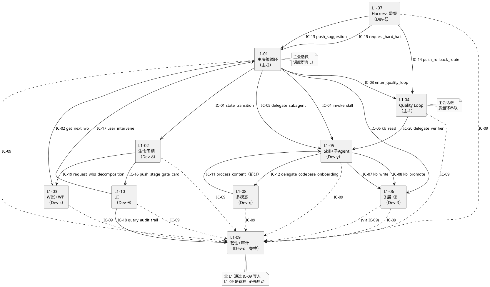
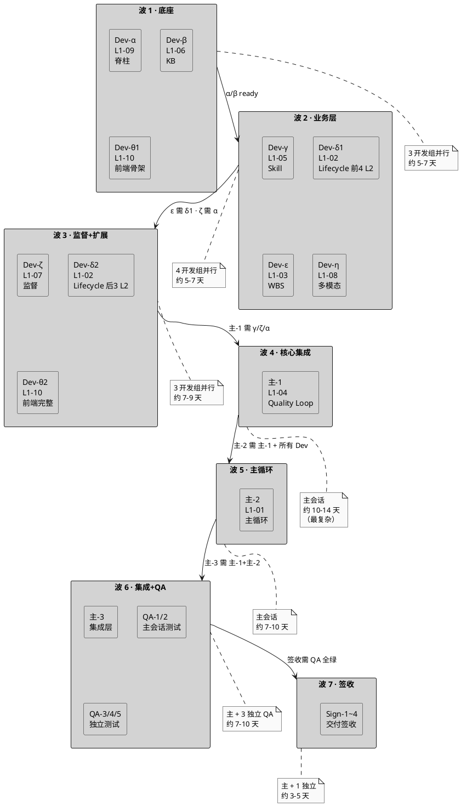

# 4-0 · Master Execution Plan（总执行计划 · 最高层索引）

> **本文档定位**：4-exe-plan / 5-exe-test-plan / 6-finalQualityAcceptance 三个交付阶段的**总调度索引文档**。本文档定义：整体分派矩阵 · 波次时间线 · 自修正协议 · 共用 md 模板 · DoD 标准 · 风险清单。所有子 exe-plan md 从本文档派生 · 一致性以本文档为准。
>
> **与 1-goal/2-prd/3-1/3-2/3-3 的分工**：前面层是"**设计方案**"（产品 / 技术 / 测试 / 监督规约）· 本层是"**执行计划**"（谁做 · 何时做 · 依赖何物 · 完工标准 · 如何回溯修正）。严格**不产出代码**（代码由实际开发会话按 exe-plan 产出） · 本层只产出**排班 / 分派 / WBS**。
>
> **核心原则**（**质量优先 · 严格按用户 4 条约束**）：
>
> 1. **可分派判定**：分出去的会话 **质量不受影响** 才分 · 不是任意分。
> 2. **代码+TDD 同会话**：一个 L2 的代码实现 + 对应 TDD 测试必须由**同一个会话**完成（TDD 红→绿→重构纪律不可分离）。
> 3. **自修正机制**：执行过程中发现 2-prd / 3-1 / 3-2 / 3-3 有问题 · 必须**回头修源文档** · 本文档嵌入详细回溯协议（§6）。
> 4. **集成层主会话做**：跨 L1 集成（integration/ + acceptance/）+ L1-01 主循环 + L1-04 Quality Loop 由主会话亲自做 · 不分派。
>
> **PM-14 贯穿**：所有代码开发 WP 输出必含 `project_id` 根字段 · 所有执行计划按 `projects/<pid>/` 物理分片验证 · 多 project V1 单项目 · V2+ 演进路径留在附录。

---

## §0 撰写进度

- [x] §0 撰写进度
- [x] §1 定位 + 3 层分工（4 / 5 / 6）+ 质量优先原则
- [x] §2 源文档基线（2-prd · 3-1 · 3-2 · 3-3 已完成状态快照）
- [ ] §3 整体分派矩阵（7 开发组 + 3 主会话组 + 5 QA 组 + 4 签收组）
- [ ] §4 依赖图 PlantUML（L1 间 IC 契约生产-消费图）
- [ ] §5 波次时间线（5 波 · 预估 30-40 天墙钟）
- [ ] §6 自修正协议（L1-04 回退路由在文档层的映射）
- [ ] §7 子 exe-plan md 共用 10 段模板
- [ ] §8 DoD 标准（每 WP / 每组 / 每波 / 每里程碑）
- [ ] §9 风险清单 + 降级策略
- [ ] 附录 A：20 份 md 写作清单 · 优先级 · 预估行数
- [ ] 附录 B：术语 · 符号 · 引用锚点

---

## §1 定位 + 3 层分工（4 / 5 / 6）+ 质量优先原则

### 1.1 本文档在 harnessFlow 整个交付链的位置

```
1-goal         ←  目标定义        （已完成 · 锁定）
2-prd          ←  产品需求        （已完成 · 10 L1 prd + L1集成 prd + L0）
3-1-Solution   ←  技术方案        （已完成 100% · 78 文件 · M4 达成）
3-2-Solution   ←  TDD 用例设计    （已完成 100% · 57 L2 tests · 73427 行 · M5 达成）
3-3-Monitoring ←  监督规约        （骨架 10 份 · 待 O 会话填充 · M6 进行中）

        ↓↓↓ 本文档开始 ↓↓↓

4-exe-plan     ←  开发执行计划    （← 本 master-plan 索引此层）
5-exe-test-plan ← 测试执行计划
6-finalQualityAcceptance ← 最终交付签收

        ↓↓↓ 按执行计划启动 ↓↓↓

【代码开发阶段】10 L1 × 57 L2 代码实现 + TDD 落地 + 集成验证 + 签收
                （本 master-plan 不产出代码 · 只产出分派）
```

**本 master-plan 不产出代码**。代码开发是"按执行计划启动的下一轮工作" · 由本文档派生的子 exe-plan 驱动。

### 1.2 4 / 5 / 6 三层的角色分工

| 层 | 角色 | 输入 | 输出 | 谁做 |
|:---|:---|:---|:---|:---|
| **4-exe-plan** | 开发实现排班（V 模型左臂-底） | 3-1 × 78 + 3-2 × 57 + 3-3 × 10 | 可运行代码（Python + Vue）· 单元/集成测试全绿 | 10 开发会话（7 独立 + 3 主会话）· 代码 + TDD 必同会话 |
| **5-exe-test-plan** | 测试验收排班（V 模型右臂） | 4 阶段产出的代码 · 3-2 integration/ + acceptance/ · 3-3 metrics | 系统测试报告 · 性能 SLO 报告 · UAT 报告 · 回归报告 | 5 测试会话（2 主会话 + 3 可独立） |
| **6-finalQualityAcceptance** | 交付签收（V 模型顶） | 4/5 全绿 | 交付包 tar.zst · 签收文档 · 发布公告 | 主会话（release 流程） |

### 1.3 本层不包含的内容（明确 Out-of-scope）

- ❌ 代码实现细节（在实际开发会话产出）· 本层只写"何时做什么"
- ❌ 单元测试具体断言（已在 3-2 设计 · 本层只排"何时落地成真实 pytest 文件"）
- ❌ 新的架构决策（在 3-1 · 若发现缺漏走 §6 自修正）
- ❌ 需求变更（回 2-prd · 走 §6 自修正）
- ❌ V2+ 多 project（延后 · 附录留路径）

### 1.4 质量优先的 4 条硬约束（用户约束 · 不可妥协）

| 编号 | 约束 | 执行落实点 |
|:---:|:---|:---|
| Q-01 | 分派的会话必须**质量不受影响** | §3 分派矩阵按 L1 独立性分 3 级 · 跨 L1 集成点不分派 |
| Q-02 | 代码 + TDD **同一会话** | §7 共用模板硬嵌 "先写测试再写实现" · §8 DoD 要求测试绿灯 |
| Q-03 | 执行中发现源文档错 · **回头修** | §6 详细自修正协议 · 5 种情形 · spec-correction-issue 流程 |
| Q-04 | 集成层 **主会话亲自做** | §3 主会话清单（L1-01 / L1-04 / integration/ / acceptance/ / QA-1/QA-2） |

### 1.5 质量优先的推论（设计层的具体体现）

- **L1 内聚 · L1 间松耦（通过 IC 契约）** → 一个 L1 = 一个独立开发组单位
- **脊柱先行原则** → L1-09 韧性+审计（IC-09 事件总线 · 所有 L1 写入口）先做 · 其他可 mock 它
- **前端后端 mock 并行原则** → L1-10 UI 与后端 L1 可并行（后端 mock 接口）
- **TDD 红→绿→重构** → 每 WP 必先跑失败的测试 → 再实现 → 再回归 · 在 §7 模板里硬嵌
- **每 WP 独立 commit** → 便于回溯 + 审查（沿用 M5 经验 · H/I/J/K/L 每份独立 commit）

---

## §2 源文档基线（2-prd · 3-1 · 3-2 · 3-3 完整状态快照）

本节锁定**本 master-plan 派生时的源文档状态** · 所有子 exe-plan 在撰写时以此快照为基线。若源文档事后更新 · 必经 §6 自修正协议处理。

### 2.1 1-goal 层（已锁定 · 不变）

| 文件 | 状态 | 作用 |
|:---|:---:|:---|
| `docs/1-goal/HarnessFlowGoal.md` | 锁定 | 顶层目标 · 14 PM · 可追溯率 100% 等硬性约束 |
| `docs/1-goal/HarnessFlowPrdScope.md` | 锁定 | 产品范围红线（In/Out of scope） |

### 2.2 2-prd 层（已完成 · M0-M4 期间完工）

| 文件 | 行数 | 作用 | 本 plan 引用位置 |
|:---|---:|:---|:---|
| `docs/2-prd/L0/scope.md` | 1924 | L1 能力地图 · §8 整合 · 20 IC 一句话 · §11 PM-14 | §1.3 Out-of-scope · §3 分派矩阵 |
| `docs/2-prd/L0/projectModel.md` | 702 | PM-14 全集 · 多项目物理分片规范 | §3 PM-14 约束 · §6 自修正 PM-14 违规 |
| `docs/2-prd/L0/businessFlow.md` | — | 业务流主干 + BF-E-* 异常分支 | §5 波次中每 WP 对应的业务流 |
| `docs/2-prd/L0/flowOutInput.md` | — | 全局输入输出 | 验收 acceptance-criteria |
| `docs/2-prd/L0/prdPlan.md` | — | PRD 产出计划（M0-M4 历史） | 仅历史参考 |
| `docs/2-prd/L1集成/prd.md` | ~1100 | 10 L1 协同 PRD · 12 场景 · 10×10 矩阵 | §3 集成层 · §7 验收 |
| `docs/2-prd/L1-01 ~ L1-10 prd.md` | 10 × ~500-1500 | 每 L1 产品视角 § | 每个 Dev 会话必读 |

### 2.3 3-1 Solution Technical 层（已完成 100% · M4）

| 类型 | 数量 | 行数 | 作用 |
|:---|:---:|---:|:---|
| L0 顶层支撑 | 5 份 | ~8000 | architecture-overview · ddd-context-map · open-source-research · tech-stack · sequence-diagrams-index |
| projectModel | 1 份 | 3239 | PM-14 技术规范 · `projects/<pid>/` 分片结构 · 字段级 schema |
| integration 集成层 | 4 份 | 7348 | ic-contracts（20 IC）· p0-seq · p1-seq · cross-l1-integration |
| L1集成 顶层架构 | 1 份 | 1377 | 10 L1 协同顶层技术方案（分派矩阵 § 在此） |
| 10 L1 architecture | 10 份 | ~14000 | 每 L1 内部 L2 组织 + 内部时序 |
| 57 L2 tech-design | 57 份 | ~113527 | 每 L2 内部实现细节（§3 接口 + §6 算法 + §11 错误码）|
| **合计** | **78 份** | **~148000 行** | **实现依据** |

#### 3-1 按 L1 代码量预估（基于 L2 tech-design 行数 · 实际代码约为 tech-design 1.5-2 倍）

| L1 | L2 数 | tech-design 行数 | 预估代码量（×1.8）|
|:---:|:---:|---:|---:|
| L1-01 主决策循环 | 6 | 13161 | ~23700 行 |
| L1-02 项目生命周期 | 7 | 7398 | ~13300 行 |
| L1-03 WBS+WP | 5 | 6584 | ~11850 行 |
| **L1-04 Quality Loop** | **7** | **19145** | **~34500 行 ★ 最复杂** |
| L1-05 Skill+子 Agent | 5 | 7677 | ~13800 行 |
| L1-06 3 层 KB | 5 | 10800 | ~19400 行 |
| L1-07 Harness 监督 | 6 | 14172 | ~25500 行 |
| L1-08 多模态 | 4 | 9435 | ~17000 行 |
| L1-09 韧性+审计 | 5 | 9678 | ~17400 行 |
| L1-10 人机协作 UI | 7 | 15477 | ~27800 行（含前端 Vue）|
| **合计** | **57** | **113527** | **~204300 行** |

**核心判断**：
- **L1-04**（~34500 行）是最大 · 主会话必做（跨 L1 集成点）· 合理
- **L1-10**（~27800 行 · 含前端）· UI 层独立 · 但量大 · 需规划"前端开发组"和"后端对接组"可能拆 2 批
- **L1-07**（~25500 行 · 6 L2 含 8 维度监督 · 红线 · 软漂移）· 单组可做但需多会话接力
- **L1-01**（~23700 行 · 心脏 · 调度所有其他 L1）· 主会话必做（集成点）
- 其他 L1 单 L1 代码量 12k-19k · 单组可做

### 2.4 3-2 Solution TDD 层（已完成 100% · M5）

| L1 | L2 tests 份数 | tests 行数 | 平均 TC/份 |
|:---:|:---:|---:|:---:|
| L1-01 | 6 | ~9000 | ~68 |
| L1-02 | 7 | 13505 | 58 |
| L1-03 | 5 | ~5000 | ~39 |
| L1-04 | 7 | ~12000 | ~67 |
| L1-05 | 5 | ~5600 | ~39 |
| L1-06 | 5 | 5152 | ~52 |
| L1-07 | 6 | 4968 | ~56 |
| L1-08 | 4 | 4004 | ~53 |
| L1-09 | 5 | 4435 | ~51 |
| L1-10 | 7 | 9243 | ~56 |
| **合计** | **57** | **~73427** | **~3134 TC** |

**3-2 角色**：每 L2 tests 文件定义了 "给定 3-1 L2 的 §3 接口 + §11 错误码 · 应有哪些测试用例"。4-exe-plan 里 **TDD 执行** 就是把这些 md 里的伪代码变成 pytest 真实代码 · 跑通绿灯。

### 2.5 3-3 Monitoring Controlling 层（骨架 · 待 O 会话填充）

| 文件 | 状态 | 本 plan 依赖位置 |
|:---|:---:|:---|
| `L0/overview.md` | 骨架 | §3 验收 metrics |
| `hard-redlines.md` | 骨架 | §6 自修正的红线触发点 · §8 DoD 安全 |
| `soft-drift-patterns.md` | 骨架 | §6 软漂移识别 |
| `dod-specs/general-dod.md` | 骨架 | §8 DoD 表达式 |
| `dod-specs/stage-dod.md` | 骨架 | §5 波次 Gate 判据 |
| `dod-specs/wp-dod.md` | 骨架 | 每 WP 完工判据 |
| `monitoring-metrics/system-metrics.md` | 骨架 | §8 性能 SLO |
| `monitoring-metrics/quality-metrics.md` | 骨架 | §8 质量 SLO |
| `quality-standards/coding-standards.md` | 骨架 | §7 共用模板 coding rules |
| `acceptance-criteria.md` | 骨架 | §8 最终验收 |

**依赖关系**：3-3 规约需在本 master-plan 写完前完成填充（O 会话负责 · 与本文档并行）。若 O 会话进度慢 · 本文档 §8 DoD 暂用 3-1 L2-tech-design 的 §12 SLO 作 fallback。

### 2.6 已有执行目录结构

```
docs/4-exe-plan/
├── 4-1-exe-DevelopmentExecutionPlan/     ← 开发执行（本 plan 填充）
├── 4-2-exe-TDDExecution/                  ← TDD 代码化（与 4-1 同会话做 · 故实际 md 放在 4-1 里 · 4-2 留作 master 级规约）
└── 4-3-exe-monitoring&controlling/        ← 监督执行

docs/5-exe-test-plan/                      ← （空 · 本 plan §3 定义 5 份 md）

docs/6-finalQualityAcceptance/             ← （空 · 本 plan §3 定义 4 份 md）
```

**§1+§2 完结** · 下接 §3 分派矩阵 + §4 依赖图。

---

## §3 整体分派矩阵（7 独立开发组 + 3 主会话组 + 5 QA 组 + 4 签收组）

### 3.1 L1 独立性分级（分派可行性的决定因素）

| 级别 | 可分派性 | L1 | 判定依据 |
|:---:|:---:|:---|:---|
| **A 独立** | ✅ 可分（质量零影响）| L1-06 KB · L1-08 多模态 · L1-10 UI | L1 内业务闭环 · 对外仅 2-4 个 IC · 其他 L1 可 mock 它 |
| **B 半独立** | ✅ 可分（需先锁 mock 边界）| L1-02 生命周期 · L1-03 WBS · L1-05 Skill · L1-07 监督 · L1-09 韧性 | L1 内闭环 · 但消费 IC-09/IC-04/IC-06 · 需可靠 mock |
| **C 必主会话** | ❌ 不分 | L1-01 主循环 · L1-04 Quality Loop · 集成层 | 跨 L1 集成点 · tick 调度所有 L1 / quality 环串联所有 L1 / e2e 跨全链 |

### 3.2 独立开发组清单（8 组 · 代码 + TDD 必同会话）

| 组 | L1 | L2 数 | 预估代码量 | 预估耗时 | 依赖前置组 | 说明 |
|:---:|:---|:---:|---:|:---:|:---|:---|
| **Dev-α** | L1-09 韧性+审计 | 5 | ~17400 行 | 5-7 天 | 无（**脊柱 · 最先启动**）| 所有其他 L1 依赖 IC-09 事件总线 |
| **Dev-β** | L1-06 3 层 KB | 5 | ~19400 行 | 5-7 天 | 轻（mock IC-09）| 独立存储层 · 可与 α 并行 |
| **Dev-γ** | L1-05 Skill+子 Agent | 5 | ~13800 行 | 4-6 天 | α（IC-09 mock 后可开）| 独立调度 · L1-01/04 的 skill 入口 |
| **Dev-δ** | L1-02 项目生命周期 | 7 | ~13300 行 | 5-7 天 · 分 2 批 | β（KB）· δ1（L2-01/02/07）先 · δ2（L2-03~06）后 | 7 L2 拆 2 批接力 · 避免单会话超载 |
| **Dev-ε** | L1-03 WBS+WP | 5 | ~11850 行 | 4-6 天 | δ1（需 Stage Gate ready）| 调度逻辑 · 依赖 L1-02 定义的 Plan |
| **Dev-ζ** | L1-07 Harness 监督 | 6 | ~25500 行 | 7-9 天 · 分 2 批 | α（订阅 IC-09）· ζ1（L2-01/04/06）· ζ2（L2-02/03/05）| 监督 6 L2 · 硬红线 + 软漂移 + 8 维度 |
| **Dev-η** | L1-08 多模态 | 4 | ~17000 行 | 5-7 天 | γ（委托 skill）| 独立内容处理 |
| **Dev-θ** | L1-10 UI | 7 | ~27800 行 | 8-10 天 · 分 2 批 | θ1（后端 mock · L2-01/06/07）· θ2（L2-02/03/04/05）| 前端 Vue + 后端 API mock · 最大独立组 |

**合计独立派组**：8 个（7 主组 + 3 分批组 Dev-δ1/δ2 · Dev-ζ1/ζ2 · Dev-θ1/θ2 各算 2 会话）= 11 个实际会话坑位。

### 3.3 主会话必做组（3 组 · 跨 L1 集成点 · 质量优先不分派）

| 组 | 内容 | L2/模块 | 预估代码量 | 预估耗时 | 依赖前置 |
|:---:|:---|:---:|---:|:---:|:---|
| **主-1** | L1-04 Quality Loop | 7 L2 | ~34500 行 | 10-14 天 | γ（skill）· ζ（监督）· α（审计）ready 后做 |
| **主-2** | L1-01 主决策循环 | 6 L2 | ~23700 行 | 7-10 天 | 主-1 + 其他 7 L1 全部 ready（需最后做）|
| **主-3** | 集成层（integration/ + acceptance/） | 跨 L1 | 集成代码 + e2e 测试 · ~15000 行 | 7-10 天 | 主-1 + 主-2 完 |

### 3.4 QA 测试会话清单（5 组 · 5-exe-test-plan 派生）

| 组 | 内容 | 依赖前置 | 谁做 |
|:---:|:---|:---|:---|
| **QA-1** | 集成测试执行（跑 integration × 24 用例）| 全 Dev 组完 | **主会话**（跨 L1 契约）|
| **QA-2** | 端到端验收（跑 acceptance × 12 场景）| QA-1 绿 | **主会话**（跨全链）|
| **QA-3** | 性能压测（7 SLO 阈值验证）| QA-1 绿 | 可独立会话 |
| **QA-4** | UAT 用户流程（5 类）| QA-2 绿 | 可独立会话 |
| **QA-5** | 回归测试（发布前 smoke）| QA-3 + QA-4 绿 | 可独立会话 |

### 3.5 签收会话清单（4 组 · 6-finalQualityAcceptance 派生）

| 组 | 内容 | 谁做 |
|:---:|:---|:---|
| **Sign-1** | 交付包清单 + tar.zst 构建脚本 | 主会话 |
| **Sign-2** | release 流程 + checklist | 主会话 |
| **Sign-3** | 签收模板 + 权责矩阵 | 主会话 |
| **Sign-4** | 发布公告 + 用户文档指南 | 可独立会话 |

### 3.6 汇总 · 所有会话坑位

| 阶段 | 开发/主 | 会话数 | 独立可分派 | 主会话必做 |
|:---:|:---|:---:|:---:|:---:|
| 4-exe-plan 代码开发 | Dev × 8 + 主 × 3 | 14 坑（11 + 3）| 11 | 3 |
| 5-exe-test-plan 测试 | QA × 5 | 5 坑 | 3（QA-3/4/5）| 2（QA-1/2）|
| 6-finalQualityAcceptance 签收 | Sign × 4 | 4 坑 | 1（Sign-4）| 3（Sign-1/2/3）|
| **合计** | — | **23 坑位** | **15 可分派** | **8 主会话做** |

### 3.7 本 master-plan 派生的子 exe-plan md 清单（20 份）

> 每个会话坑位 ↔ 一份 md（部分坑位共用 md · 但指派独立会话）

```
docs/4-exe-plan/4-1-exe-DevelopmentExecutionPlan/
├── Dev-α-L1-09-resilience-audit.md            ← 独立派
├── Dev-β-L1-06-kb-3-layer.md                  ← 独立派
├── Dev-γ-L1-05-skill-subagent.md              ← 独立派
├── Dev-δ-L1-02-lifecycle.md                   ← 独立派（内部拆 δ1/δ2）
├── Dev-ε-L1-03-wbs-wp.md                      ← 独立派
├── Dev-ζ-L1-07-supervisor.md                  ← 独立派（内部拆 ζ1/ζ2）
├── Dev-η-L1-08-multimodal.md                  ← 独立派
├── Dev-θ-L1-10-ui.md                          ← 独立派（内部拆 θ1/θ2 · 前后端）
├── main-1-L1-04-quality-loop.md               ← 主会话做（不派）
├── main-2-L1-01-main-decision-loop.md         ← 主会话做（不派）
└── main-3-integration-and-acceptance.md        ← 主会话做（不派）

docs/4-exe-plan/4-3-exe-monitoring&controlling/
└── 4-3-monitoring-impl-plan.md                 ← 可派 1 会话（3-3 规约落地）

docs/5-exe-test-plan/
├── 5-1-integration-test-run.md                 ← 主会话做
├── 5-2-acceptance-test-run.md                  ← 主会话做
├── 5-3-performance-test-run.md                 ← 独立派
├── 5-4-uat-run.md                              ← 独立派
└── 5-5-regression-test.md                      ← 独立派

docs/6-finalQualityAcceptance/
├── 6-1-delivery-checklist.md                   ← 主会话
├── 6-2-release-process.md                      ← 主会话
├── 6-3-signoff-templates.md                    ← 主会话
└── 6-4-release-notes-and-docs.md               ← 独立派
```

**共 20 份子 exe-plan md**（不含本 4-0 master）· **主会话自己写 20 份 md**（每份 1500-3000 行 · 分批避免 600s 超时）· 写完后按上述分派发给其他会话读着干代码。

---

## §4 依赖图（L1 间 IC 契约生产-消费关系 + 波次依赖）

### 4.1 20 IC 的生产-消费方依赖图（PlantUML）



### 4.2 开发组启动依赖表（决定波次顺序）

| 组 | 必须 mock 的 IC | 硬依赖前置组完成 | 软依赖（可推进中进行集成）|
|:---:|:---|:---|:---|
| Dev-α L1-09 | 无（脊柱 · 只提供不消费 IC-09）| 无 | — |
| Dev-β L1-06 | IC-09 mock | 无（α 可 mock）| α（完成后去掉 mock）|
| Dev-γ L1-05 | IC-09 mock · IC-06 mock | 无 | α β（完成后集成）|
| Dev-η L1-08 | IC-09 mock · IC-04/05 mock | 无 | α γ（完成后集成）|
| Dev-δ L1-02 | IC-09 mock · IC-16 mock（UI mock）| 无 | α θ（完成后集成 UI Gate 卡片）|
| Dev-ε L1-03 | IC-09 mock | **Dev-δ1**（Stage Gate 定义需 ready）| α |
| Dev-ζ L1-07 | IC-09 mock · IC-13/14/15 发送 mock | α（订阅 IC-09 事件总线 ready）| L1-01 mock |
| Dev-θ L1-10 | IC-09 mock · IC-16/17/18 mock · 所有后端 API mock | 无（mock 优先）| 全部后端 L1（完成后替换 mock） |
| **主-1 L1-04** | 无 mock（需真实 γ/ζ/α）| **Dev-γ · Dev-ζ · Dev-α 全绿** | Dev-η（多模态 verifier）|
| **主-2 L1-01** | 无 mock（需真实全 L1）| **所有 Dev 组 + 主-1 绿** | — |
| **主-3 集成** | 无 mock（全实机）| **主-1 + 主-2 + 所有 Dev 绿** | — |

### 4.3 波次依赖图



### 4.4 总时间线粗估

| 波 | 并行组 | 耗时 | 累计 |
|:---:|:---:|:---:|:---:|
| 波 1 · 底座 | 3（α · β · θ1）| 5-7 天 | 5-7 |
| 波 2 · 业务 | 4（γ · δ1 · ε · η）| 5-7 天 | 10-14 |
| 波 3 · 监督+扩展 | 3（ζ · δ2 · θ2）| 7-9 天 | 17-23 |
| 波 4 · 核心集成 | 1（主-1 L1-04）| 10-14 天 | 27-37 |
| 波 5 · 主循环 | 1（主-2 L1-01）| 7-10 天 | 34-47 |
| 波 6 · 集成+QA | 1 + 3（主-3 + QA-3/4/5）| 7-10 天 | 41-57 |
| 波 7 · 签收 | 1 + 1（主 + Sign-4）| 3-5 天 | 44-62 |

**总预估**：**44-62 天墙钟**（约 6-9 周）· 主会话**连续投入** = 波 4/5/6/7 约 27-39 天集中做。

**§3+§4 完结** · 下接 §5 波次详细 + §6 自修正协议。

---

## §5 波次时间线详细

本节把 §4.3 的粗粒度波次展开 · 每波定义：

1. 启动条件（前波何种 DoD 达成）
2. 并行组清单 + 每组 WP 细化（L1/L2/L3/L4 粒度）
3. 波内每日 standup 节奏
4. 波收尾 Gate（进入下一波的硬条件）

### 5.1 波 1 · 底座（5-7 天）

**启动条件**：4-exe-plan 20 份 md 全写完 · 源文档快照锁定（§2 · hash 记录）· CI 基础设施就位（pytest + coverage + ruff）

**并行组**：3 组同时启动 · 每组单独一个 AI 会话

#### 5.1.1 Dev-α · L1-09 韧性+审计（脊柱）

**L2 清单**：5 份（L2-01 事件总线 · L2-02 锁管理器 · L2-03 审计记录器 · L2-04 检查点恢复 · L2-05 崩溃安全）

**L3/L4 WP 拆解**（每 L2 × N 天）：

| WP | L2 | 工作内容（L3 粒度）| L4 细节（代码文件清单）| 预估耗时 |
|:---:|:---|:---|:---|:---:|
| α-WP01 | L2-05 崩溃安全层 | WAL + atomic_write + sha256 链 + fsync · 底层先做 | `app/l1_09/crash_safety/atomic_writer.py` · `hash_chain.py` · `integrity_checker.py` | 1.5 天 |
| α-WP02 | L2-01 事件总线核心 | IC-09 append_event · fsync + hash chain · halt on fsync_fail | `app/l1_09/event_bus/core.py` · `emitter.py` · `halt_guard.py` | 1.5 天 |
| α-WP03 | L2-02 锁管理器 | flock + FIFO ticket + 死锁检测 + TTL 泄漏回收 | `app/l1_09/lock_manager/manager.py` · `fifo_queue.py` · `janitor.py` | 1 天 |
| α-WP04 | L2-03 审计记录器+追溯 | append-only jsonl + rotation + 按 pid/time/actor 查询 | `app/l1_09/audit/writer.py` · `query.py` · `rotation.py` | 1 天 |
| α-WP05 | L2-04 检查点与恢复 | snapshot + bootstrap + Tier 1-4 恢复 | `app/l1_09/checkpoint/snapshot.py` · `recovery.py` · `tier_fallback.py` | 1.5 天 |

**每 WP 的 TDD 流程（严格红→绿→重构）**：

```
1. 读 docs/3-2-Solution-TDD/L1-09-韧性+审计/L2-0X-XXX-tests.md
2. 把该 md 里的伪代码 test 复制到 tests/l1_09/test_l2_0X_*.py
3. 跑 pytest · 期待全失败（红灯 · 因为实现代码还没写）
4. 按 docs/3-1-.../L2-0X-XXX.md §3 接口 + §6 算法 实现到 app/l1_09/...
5. 跑 pytest · 全绿（绿灯）
6. 代码 review · refactor · 保持绿灯（重构）
7. git commit
```

**DoD（每 WP 完工判据）**：
- 代码 commit（符合 coding standards）
- 对应 3-2 tests 全绿（含 §11 错误码全覆盖）
- coverage ≥ 80%
- 无 lint 错误（ruff + mypy）
- 审计日志 per PM-14 含 project_id

**每日 standup 模板**（会话内 hashtable）：
- Today：WP ID · 目标
- Done：WP · commit SHA
- Blocked：遇到的问题（触发 §6 自修正协议 · 若源文档有误）
- Tomorrow：下一 WP

#### 5.1.2 Dev-β · L1-06 3 层 KB

**L2 清单**：5 份（L2-01 3 层分层管理器 · L2-02 KB 读 · L2-03 观察累积器 · L2-04 KB 晋升仪式 · L2-05 检索+Rerank）

**L3/L4 WP 拆解**（简化版 · 细节在 Dev-β 会话的独立 md）：

| WP | L2 | 工作 | 依赖 | 耗时 |
|:---:|:---|:---|:---|:---:|
| β-WP01 | L2-01 3 层分层管理器 | session/project/global tier 分层 + 事件总线同步 | IC-09 mock | 1.5 天 |
| β-WP02 | L2-02 KB 读 | IC-06 · 默认 session+project+global scope · rerank | β-WP01 | 1 天 |
| β-WP03 | L2-03 观察累积器 | session 层累积 + 去重 + 进晋升候选 | β-WP01 | 1 天 |
| β-WP04 | L2-04 KB 晋升仪式 | IC-08 · 用户审核 · S7 触发 | β-WP01 + β-WP03 | 1.5 天 |
| β-WP05 | L2-05 检索+Rerank | BM25 + embedding · LRU 缓存 | β-WP01 | 1 天 |

#### 5.1.3 Dev-θ1 · L1-10 UI 前端骨架

**L2 清单（波 1 先做 3/7 份）**：L2-01 11 tab 主框架 + L2-06 裁剪档配置 + L2-07 Admin 子管理

**L3/L4 WP 拆解**：

| WP | L2 | 工作 | 依赖 | 耗时 |
|:---:|:---|:---|:---|:---:|
| θ1-WP01 | L2-01 11 tab 主框架 | Vue3 + Element Plus + vue-router + Pinia 搭骨架 · 11 tab | 后端 mock | 2 天 |
| θ1-WP02 | L2-06 裁剪档配置 | LIGHT/STANDARD/HEAVY profile 切换 · 存 localStorage | 骨架 ready | 1.5 天 |
| θ1-WP03 | L2-07 Admin 子管理 | 8 子 tab 骨架（users/permissions/audit/...）| 骨架 ready | 2 天 |

**波 1 收尾 Gate**：

- [ ] Dev-α 5 份 L2 全绿（IC-09 事件总线可落盘 · 可查询）
- [ ] Dev-β 5 份 L2 全绿（KB 读写跑通 · session/project/global 三层隔离）
- [ ] Dev-θ1 3 份 UI 跑起来（`npm run dev` 可打开 11 tab · 切裁剪档）
- [ ] 3 组的 IC-09 事件可汇入 Dev-α L1-09 · 审计链完整

### 5.2 波 2 · 业务层（5-7 天）

**启动条件**：波 1 收尾 Gate 绿 · IC-09 / IC-06 mock 已有真实实现替换可用

**并行组**：4 组

#### 5.2.1 Dev-γ · L1-05 Skill+子 Agent

**L2 清单**：5 份 · 详细 WP 拆解见 `Dev-γ-L1-05-skill-subagent.md`（主会话后续写）

**关键 WP**：
- γ-WP01 Skill 注册表（启动加载 + 热更新）
- γ-WP02 Skill 意图选择器（5 信号混合打分 + 硬编码 scan）
- γ-WP03 Skill 调用执行器（context 注入 + timeout + retry + audit）
- γ-WP04 子 Agent 委托器（Claude Agent SDK · PM-03 独立 session）
- γ-WP05 异步结果回收器（DoD 网关 + schema 校验）

#### 5.2.2 Dev-δ1 · L1-02 Lifecycle 前 4 L2

**L2 清单（4/7）**：L2-01 Stage Gate · L2-02 启动阶段 · L2-07 模板引擎 · L2-03 4 件套生产器

**关键 WP**（顺序固定：L2-07 地基 → L2-02 PM-14 起点 → L2-03 4 件套 → L2-01 Gate 控制）

#### 5.2.3 Dev-ε · L1-03 WBS+WP

**L2 清单**：5 份 · L2-02 拓扑地基先做 · 其他按依赖推进

#### 5.2.4 Dev-η · L1-08 多模态

**L2 清单**：4 份（L2-04 路径安全守门人 · L2-01 文档 IO · L2-02 代码结构 · L2-03 图片视觉）

**波 2 收尾 Gate**：
- [ ] Dev-γ/δ1/ε/η 4 组 L2 全绿
- [ ] IC-04（skill 调用）· IC-19（WBS 拆解）· IC-11（多模态处理）· IC-16（Gate 卡片推 UI）跨组集成可走通
- [ ] 可以启动一个 mock S1→S2 Kickoff → Planning 的流程（Dev-δ1 + ε 联调）

### 5.3 波 3 · 监督+扩展（7-9 天）

**启动条件**：波 2 绿 · 特别是 Dev-α L1-09 事件总线稳定（Dev-ζ 监督订阅的前提）

**并行组**：3 组

- **Dev-ζ · L1-07 监督**（6 L2 · 含硬红线 + 软漂移 + 8 维度采集）· 分 ζ1（L2-01 采集 + L2-04 发送 + L2-06 升级）· ζ2（L2-02 判定 + L2-03 红线 + L2-05 软漂移）
- **Dev-δ2 · L1-02 Lifecycle 后 3 L2**（L2-04 PMP · L2-05 TOGAF · L2-06 收尾）· 依赖 δ1 的 Gate + 模板引擎
- **Dev-θ2 · L1-10 UI 完整**（4 L2 · L2-02 Gate 卡片 · L2-03 进度流 · L2-04 用户干预 · L2-05 KB 浏览器）· 依赖后端 L1-02/09 ready

**波 3 收尾 Gate**：
- [ ] Dev-ζ/δ2/θ2 全绿
- [ ] IC-13/14/15（监督建议/回退/红线）可走通
- [ ] S1→S7 全阶段 Gate 卡片可在 UI 显示（mock 用户决策）
- [ ] 硬红线 100ms 响应 + panic 100ms 响应端到端可验证

### 5.4 波 4 · 核心集成（10-14 天 · 主会话）

**启动条件**：波 1+2+3 全绿 · IC-09/06/04/05/13-20 全链契约验证可落

**主会话做 · 主-1 · L1-04 Quality Loop**（7 L2）：

| WP | L2 | 工作 | 前置依赖 | 耗时 |
|:---:|:---|:---|:---|:---:|
| 主1-WP01 | L2-02 DoD 表达式编译器 | AST 白名单 + predicate eval + evidence 映射 | α 完成 | 1.5 天 |
| 主1-WP02 | L2-01 TDD 蓝图生成器 | 蓝图 md + GWT 生成 | L2-02 | 1.5 天 |
| 主1-WP03 | L2-03 测试用例生成器 | 从蓝图生成 pytest · 委托 γ skill | γ | 2 天 |
| 主1-WP04 | L2-04 质量 Gate 编译器 | DoD 表达式 → Gate 可执行 evidence | L2-02 | 1.5 天 |
| 主1-WP05 | L2-05 S4 执行驱动器 | WP 代码执行编排 | γ η | 2 天 |
| 主1-WP06 | L2-06 S5 TDDExe Verifier | IC-20 delegate_verifier · 三段证据链 | γ 子 Agent | 2 天 |
| 主1-WP07 | L2-07 偏差判定+4 级回退路由 | L2-02 DoD + L1-07 IC-14 → 4 级回退 | ζ | 1.5 天 |

**波 4 收尾 Gate**：
- [ ] 主-1 L1-04 7 L2 全绿
- [ ] 单 WP 端到端 Quality Loop 可跑（蓝图→用例→Gate→执行→Verifier→verdict）
- [ ] 4 级回退路由集成验证通过

### 5.5 波 5 · 主循环（7-10 天 · 主会话）

**主会话做 · 主-2 · L1-01 主决策循环**（6 L2）：

| WP | L2 | 工作 | 前置 | 耗时 |
|:---:|:---|:---|:---|:---:|
| 主2-WP01 | L2-01 Tick 调度器 | 主循环 · 每 tick 100ms · 全 L1 调度入口 | 全 Dev 组 | 2 天 |
| 主2-WP02 | L2-02 决策引擎 | AST 决策 · mock + history + KB 输入 | β | 1.5 天 |
| 主2-WP03 | L2-03 状态机编排器 | 全 project state machine · 转换发起 | δ | 1 天 |
| 主2-WP04 | L2-04 任务链执行器 | tick 调度→L1-02/03/04 · IC-01/02/03 发起 | δ ε 主-1 | 2 天 |
| 主2-WP05 | L2-05 决策审计记录器 | IC-09 emit decision 事件 | α | 1 天 |
| 主2-WP06 | L2-06 Supervisor 建议接收器 | IC-13/14/15 消费 · mode 适配 | ζ | 1.5 天 |

**波 5 收尾 Gate**：
- [ ] L1-01 主循环跑起来 · 100ms tick 稳定
- [ ] 单 project S1 创建 → tick 驱动 → Gate 决策可走通（不需走完 S1→S7）

### 5.6 波 6 · 集成+QA（7-10 天）

**并行**：主会话做主-3 + QA-1/2 · 独立会话做 QA-3/4/5

#### 5.6.1 主会话 · 主-3 集成层

- integration/ 24 份集成测试代码化（引 3-2 integration/ 已有规划）
- acceptance/ 12 份端到端场景代码化
- e2e 跨 L1 全链走通（scenario-02 S1→S7 是最复杂 · 优先 P0）

#### 5.6.2 主会话 · QA-1 集成测试执行 + QA-2 e2e 验收

- QA-1 运行 integration 24 用例 · bug triage + fix loop
- QA-2 运行 acceptance 12 场景 · 覆盖所有 P0/P1 时序

#### 5.6.3 独立会话 · QA-3/4/5

- QA-3 性能压测（7 SLO 验证 · locust/k6）
- QA-4 UAT 用户流程（模拟 5 类用户）
- QA-5 回归测试（smoke + critical path）

**波 6 收尾 Gate**：
- [ ] 24 integration + 12 acceptance 全绿
- [ ] 7 SLO 阈值 100% 达标
- [ ] UAT 5 类用户流程通过
- [ ] 回归测试无 regression

### 5.7 波 7 · 签收（3-5 天）

- Sign-1/2/3 主会话做（交付包 + release 流程 + 签收模板）
- Sign-4 独立会话做（release notes + 用户文档）
- 最终签收 · tar.zst 归档 · 发布

---

## §6 自修正协议（Q-03 核心落实）

**核心原则**：执行代码开发时若发现 2-prd / 3-1 / 3-2 / 3-3 源文档有问题 · **必须回头修源文档** · 不得在代码里 workaround · 保持 "设计-实现"一致性 · 维护可追溯性（Goal §4.1 硬约束）。

### 6.1 5 种修正情形 · 对应协议

#### 情形 A · 2-prd 产品需求偏差

**触发**：开发时发现 PRD 某条需求无法实现 / 与用户实际意图矛盾 / 边界模糊导致多种解读。

**协议**：

```
1. 暂停当前 WP（标 BLOCKED · 不继续写代码）
2. 开 prd-correction-issue · 描述：
   - 触发点（哪个 L2 / 哪个 §）
   - 偏差内容（引 PRD 原文 + 你的理解 + 冲突点）
   - 2-3 修正方案（Adopt/Learn/Reject 格式）
3. 发主会话或产品负责人审批
4. approve 后：
   - 修 docs/2-prd/L1-NN/prd.md 对应 §
   - 同步看是否影响 3-1/3-2（通常需改）
   - 触发情形 B/C 连锁
5. 修正完成后 · 本 WP 解锁 · 继续
```

**审计事件**：`prd_correction_applied`（含 before/after hash · 触发 WP · 审批人）

#### 情形 B · 3-1 技术设计不可行

**触发**：开发时发现 3-1 L2 tech-design §3 接口不完整 / §6 算法有死锁 / §11 错误码漏场景 / §12 SLO 实测不可达。

**协议**：

```
1. 暂停 WP
2. 开 tech-correction-issue · 描述：
   - 位置（docs/3-1-.../L1-NN/L2-0X.md §X.Y）
   - 问题（引原文 + 你的实现尝试 + 为何不可行）
   - 修正方案
3. 主会话审批（技术决策）
4. approve 后：
   - 修 3-1 对应 L2 · 重新 quality_gate.sh
   - 同步更新 3-2 对应 tests.md（若接口/错误码变了 TC 必变）
   - 若涉 IC 契约 · 同步修 ic-contracts.md + 通知生产/消费两端
5. WP 解锁
```

**审计事件**：`tech_correction_applied`

#### 情形 C · 3-2 TDD 用例逻辑错

**触发**：开发时写实现 · 对着 tests 跑 · 发现 test 的断言逻辑错了（不是实现错）。

**协议**：

```
1. 先自检：真的是 test 错 · 不是实现错？
   （多数情况是实现错 · 先 double check · 找同伴/主会话 peer review）
2. 确认 test 错 · 修 docs/3-2-Solution-TDD/L1-NN/L2-0X-tests.md
3. 更新对应伪代码 · 确保逻辑与 3-1 §3 接口 + §11 错误码一致
4. 若涉及 IC · 通知下游消费方会话同步改
5. WP 继续
```

**审计事件**：`tdd_correction_applied`

#### 情形 D · IC 契约矛盾（生产方 vs 消费方分歧）

**触发**：开发时 Dev-α（生产 IC-09）和 Dev-γ（消费 IC-09）对某字段的理解不一致。

**协议**：

```
1. 两端会话各自暂停相关 WP
2. 主会话仲裁：
   - 读 integration/ic-contracts.md §3.NN 字段定义
   - 读 p0-seq.md 对应时序
   - 判定真相（通常是契约文档描述模糊）
3. 修 ic-contracts.md 对应字段（加更严格 schema / 加说明）
4. 同步通知生产方 + 消费方 · 两端更新代码
5. 开 integration-test-ic-NN 立即跑一遍 · 确认一致
6. WP 双方解锁
```

**审计事件**：`ic_contract_correction` · CRITICAL（影响跨 L1）

#### 情形 E · 3-3 监督规约偏差

**触发**：开发时发现 3-3 hard-redlines 某条红线的触发条件不现实 / DoD 表达式语法不完整。

**协议**：

```
1. 暂停相关 WP
2. 开 monitor-correction-issue
3. 主会话 + L1-07/L1-04 owner 讨论
4. 修 3-3 对应 md
5. 触发 ζ/主-1 重新评估受影响代码
6. WP 继续
```

### 6.2 自修正事件的追溯链

所有自修正事件必写 `projects/_correction_log.jsonl`（跨 project 全局日志）：

```yaml
{
  "timestamp": "2026-04-25T10:30:00Z",
  "type": "tech_correction_applied",
  "location": "docs/3-1-.../L1-04/L2-02.md §3.2",
  "triggered_by": "Dev-γ · WP γ-WP02",
  "reviewer": "main-session",
  "before_hash": "sha256:abc...",
  "after_hash": "sha256:def...",
  "impact_scope": ["3-1 L1-04 L2-02", "3-2 L1-04 L2-02-tests", "ic-contracts IC-04"],
  "downstream_sessions_notified": ["Dev-γ", "main-1", "主-2"]
}
```

### 6.3 自修正的质量保障

- 每次自修正后 · 必须重跑 `./scripts/quality_gate.sh`
- 3-1 修改 · 必 review Mermaid=0 / FILL=0 / PlantUML 配对
- 3-2 修改 · 必保持同 L2 tests 的 TC 数不降 + FILL=0
- IC 修改 · 必通知所有引用方（grep `IC-NN` 统计使用点）

### 6.4 什么不是自修正（避免滥用）

- ❌ 实现比设计"更好"的 workaround（该走变更请求路径）
- ❌ 因编译错误绕过（大部分应该修实现 · 不修设计）
- ❌ 跳过 review 直接改源文档（必经审批）
- ❌ 修改 1-goal/HarnessFlowGoal.md 或 HarnessFlowPrdScope.md（这是锁定文档 · 需顶层变更请求）

**§5+§6 完结** · 下接 §7 共用模板 + §8 DoD + §9 风险 + 附录。

---

## §7 子 exe-plan md 共用模板（所有 20 份 md 必按此结构）

每份子 exe-plan md 必含以下 10 段 · 不得遗漏：

```markdown
---
doc_id: exe-plan-<组代号>-v1.0
doc_type: <development|tdd|monitoring|test|acceptance>-execution-plan
layer: 4-exe-plan | 5-exe-test-plan | 6-finalQualityAcceptance
parent_doc:
  - docs/4-exe-plan/4-0-master-execution-plan.md（本总索引）
  - docs/1-goal/HarnessFlowGoal.md
  - docs/2-prd/L1-NN/prd.md（对应 L1 的 PRD）
  - docs/3-1-Solution-Technical/L1-NN/architecture.md + L2-*.md（所有相关 tech-design）
  - docs/3-2-Solution-TDD/L1-NN/L2-*-tests.md（对应 TDD 用例）
  - docs/3-3-Monitoring-Controlling/*（相关规约）
version: v1.0
status: draft
author: main-session
assignee: <Dev-X | 主会话>
created_at: 2026-04-23
---

# <组代号> · <范围名> · Execution Plan

> 本 md 定义 <组代号> 的代码 + TDD 执行计划。按此 md 指引启动独立 AI 会话（或主会话自身）完成代码落地。

## §1 组定位 + 范围（L1/L2 清单）

<对应 L1 + 具体 L2 数 + 预估代码量 + 预估耗时 + 依赖关系表>

## §2 源文档导读（必读清单 · 按优先级）

| 优先级 | 文档 | 为何必读 | 本组怎么用 |
|:---:|:---|:---|:---|
| P0 | 2-prd/L1-NN/prd.md | 产品边界 + GWT 场景 | 定业务正确性 |
| P0 | 3-1/L1-NN/architecture.md | L1 内 L2 组织 + 时序 | L2 间调用链 |
| P0 | 3-1/L1-NN/L2-*-tech-design.md | §3 接口 + §6 算法 + §11 错误码 | 代码实现依据 |
| P0 | 3-2/L1-NN/L2-*-tests.md | TDD 用例（每方法 ≥ 1 正向 · 每错误码 ≥ 1 负向）| pytest 落地 |
| P0 | integration/ic-contracts.md（相关 IC）| 跨 L1 契约字段 | mock/real IC 边界 |
| P1 | 3-3/hard-redlines.md · dod-specs | 红线 + DoD | 代码 review 依据 |
| P1 | 本组依赖的其他 L1 L2 | 跨组契约一致 | 集成点验证 |

## §3 WP 拆解（L3/L4 粒度 · 天级）

按 §5.X（波次时间线）展开 · 每 WP 定义：
- WP ID · 对应 L2 · 工作内容（L3）· 代码文件清单（L4）
- 前置依赖（组内 WP · 其他组 WP · 源文档 ready）
- 预估耗时（0.5 / 1 / 1.5 / 2 天）
- TDD 流程（红→绿→重构）
- DoD（§8 通用 + 本 WP 特化）

## §4 WP 依赖图（组内 · 跨组）

PlantUML · 组内 WP 顺序 + 对其他组的依赖

## §5 每日 standup 节奏 + commit 规范

- Commit message 格式：`feat/fix/test(harnessFlow-code): <WP-ID> <描述>`
- 每 WP 1 commit（禁 bundle）
- 每日 standup：today/done/blocked/tomorrow
- 遇问题走 §6 自修正协议

## §6 自修正触发点（链接 4-0 master §6）

列出本组可能触发的具体自修正场景 + 参考 master §6 协议。

## §7 本组对外契约（IC mock + 真实替换计划）

| IC | 方向 | 本组角色 | 波 N 前 mock / 波 N 后真实 |
|:---|:---|:---|:---|

## §8 验收 DoD（本组完工判据）

沿用 4-0 master §8 标准 + 本组特化（如 L1-09 特别 DoD：fsync/hash_chain/halt 覆盖）。

## §9 风险 + 降级（本组特有）

如 L1-09 脊柱风险 · L1-10 前端生态风险等

## §10 交付清单

- 代码文件列表（app/l1_NN/*.py + 前端文件）
- 测试文件列表（tests/l1_NN/test_*.py）
- 文档产出（若有 README / API doc）
- CI 绿灯证据
```

**行数预期**：每份子 md 1500-3000 行（取决于 L2 数量和 WP 复杂度）· 分 3-5 批写入避免 600s。

### 7.2 共用的 TDD 流程模板（每 WP 嵌入）

```
1. 读 docs/3-2-Solution-TDD/L1-NN/L2-0X-*-tests.md 完整用例
2. 挑本 WP 对应的测试用例（§2 正向 / §3 负向 / §4 IC）
3. 复制到 tests/l1_NN/test_l2_0X_*.py（真实 pytest 文件 · 保持 TC ID 一致）
4. 首次 pytest · 全失败（红灯）· 提交 "test: add failing tests for <WP>"（可选）
5. 读 docs/3-1-.../L2-0X-*.md §3 接口 + §6 算法 + §11 错误码
6. 实现到 app/l1_NN/l2_0X_*.py
7. 反复跑 pytest · 直到全绿
8. 代码 refactor · 保持绿灯（去重 · 提炼 · 命名）
9. 检查 coverage ≥ 80% · lint (ruff) + type (mypy) 绿
10. git add + commit："feat(harnessFlow-code): <WP-ID> implement L2-0X"
```

### 7.3 共用的 git commit 规范

| prefix | 用途 | 示例 |
|:---|:---|:---|
| `feat` | 新功能实现 | `feat(harnessFlow-code): α-WP02 L2-01 事件总线核心` |
| `test` | 只加测试 | `test(harnessFlow-code): α-WP02 add failing tests` |
| `fix` | 修 bug | `fix(harnessFlow-code): α-WP02 fsync retry on EINTR` |
| `refactor` | 重构 | `refactor(harnessFlow-code): α-WP02 extract hash_chain helper` |
| `docs` | 修源文档（§6 自修正触发）| `docs(harnessFlow): 3-1/L1-09/L2-01 §3 补 audit_event schema 字段（trigger by Dev-α）` |

每 commit 在 body 附：
- WP-ID · 对应 3-2 tests TC ID · coverage 数据 · pytest 耗时

---

## §8 DoD 标准（每层级的完工判据）

### 8.1 WP 级 DoD（最细粒度 · 每个工作包完成）

| 维度 | 判据 | 如何验证 |
|:---|:---|:---|
| 代码落盘 | app/l1_NN/*.py 或前端 *.vue · ruff + mypy 全绿 | `ruff check . && mypy .` |
| 测试覆盖 | 对应 3-2 tests 的 TC 全绿 · coverage ≥ 80% | `pytest --cov=app/l1_NN` |
| 错误码覆盖 | 3-1 §11 所有错误码至少 1 负向用例 | 本 WP tests `pytest.raises(<ErrorType>)` 计数 = 错误码数 |
| IC 契约一致 | 若本 WP 涉及 IC 生产/消费 · ic-contracts.md §3.NN 字段全匹配 | 自动工具扫描（M5 集成后的 integration_gate.sh）|
| PM-14 合规 | 所有输入必含 project_id · 所有落盘按 projects/<pid>/ 分片 | pytest fixture `mock_pid` 全用 |
| 审计可追溯 | 每个 public 方法调用必 emit IC-09 事件（含 request_id） | pytest 验证 mock_event_bus.emitted_events 数量 |
| 独立 commit | 每 WP 独立 commit（禁 bundle）| git log 看 |

### 8.2 组级 DoD（一组代码全完 · 进入下一波的硬条件）

| 维度 | 判据 |
|:---|:---|
| 所有 WP 绿 | 组内所有 WP-ID 全 closed · commits 全 push |
| L2 覆盖完整 | 组对应 L1 的所有 L2 (按 §3.2) 代码+测试全落地 |
| 集成测试前置 | 本组作为生产方的 IC · 有至少 1 个集成用例（准备给 QA-1 接手）|
| 自修正记录齐 | 所有触发的 §6 correction 记录在 _correction_log.jsonl |
| quality_gate.sh 绿 | 源文档修改若有 · 仍保持 Gate 全 PASS |

### 8.3 波级 DoD（进入下一波的 Gate）

（详见 §5.1-§5.7 每波的收尾 Gate 列表）

### 8.4 全局 M5 完工 DoD（4-exe-plan 所有开发完）

| 维度 | 判据 |
|:---|:---|
| 10 L1 代码 | 全 57 L2 代码落地 · 每 L2 单元测试绿 |
| TDD 覆盖 | 3-2 全部 57 tests.md 的 TC 对应的 pytest 绿 · coverage ≥ 85% |
| CI 绿 | pytest + ruff + mypy + 构建 全绿 |
| 集成契约 | 20 IC 集成测试（跨组 join）24 份 integration/ 用例绿 |
| 验收场景 | 12 acceptance 场景 e2e 绿 |
| 性能 SLO | 7 性能阈值 100% 达标 |
| PM-14 V1 | 单 project 流程完整 · PM-14 违规 0 |
| 审计全链 | decision_traceability_rate = 100% |
| 自修正数 | `_correction_log.jsonl` 合理（预期 5-20 次 · > 50 异常）|

### 8.5 全局 M7 交付 DoD（6-finalQualityAcceptance · 可交付）

| 维度 | 判据 |
|:---|:---|
| 代码质量 | 上述 8.4 全绿 + 代码 review 无 P0/P1 issue |
| 测试覆盖 | 5-exe-test-plan 全部 5 份 QA 完成 · 报告签收 |
| 文档 | README + 用户文档 + API doc + 部署指南完整 |
| 交付包 | tar.zst 打包（含 manifest.json + sha256）|
| 签收 | 权责人签字（Sign-3 签收模板）|
| 发布公告 | Sign-4 release notes 发布 |

---

## §9 风险清单 + 降级策略

### 9.1 P0 风险（可能阻塞整体交付）

| 风险 | 触发条件 | 影响 | 降级策略 |
|:---|:---|:---|:---|
| **R-01 Dev-α 脊柱 IC-09 不稳定** | fsync / hash chain 实现有 bug · 所有组 IC-09 集成失败 | 全局 halt | 主会话立即接管 · 优先修 L1-09 · 其他组暂停集成 |
| **R-02 3-3 O 会话未完成** | 波 4 需 3-3 DoD 规约 · 若还没填 | 主-1 L1-04 无法按规约做 | Fallback 用 3-1 L2 tech-design §12 SLO 作 DoD 临时基线 · 后补 3-3 |
| **R-03 主-1 L1-04 超预估 · 单会话吃不下** | 34500 行代码 · 7 L2 · 10-14 天 · 单会话 context 不足 | 主会话节奏被打乱 | 主-1 拆 2 批：主-1a（L2-02/01/04 · DoD/蓝图/Gate）· 主-1b（L2-03/05/06/07）· 中间有检查点 |
| **R-04 IC 契约大幅变更** | 执行中发现 ic-contracts.md 多处模糊 · 多次 §6 情形 D | 多组返工 | 阻塞所有组 · 主会话集中修 ic-contracts.md · 一次性通告所有组 |
| **R-05 前后端 API mock 偏差** | Dev-θ UI mock 与 Dev-δ/ε 真实 API schema 不一致 | 波 3 后集成阶段返工 | 波 2 中期开"接口冻结会议"· 锁定 API schema · 后续只按冻结版实现 |

### 9.2 P1 风险（可能延期 · 不阻塞）

| 风险 | 触发条件 | 降级 |
|:---|:---|:---|
| R-06 Dev-ζ L1-07 监督 6 L2 太大 | 单会话 25500 行代码吃不下 | 分 ζ1/ζ2（已在 §3.2 规划 · 执行时严格分）|
| R-07 SLO 实测不达标 | 波 6 QA-3 性能压测发现某 SLO 不过 | 先记 issue · 迭代优化 · 若确实不可达 · 走 §6 情形 B 修 3-1 §12 SLO（降预期） |
| R-08 Coverage < 80% | 波 6 QA-1 集成测试后发现 | 补 TC · 或 §6 情形 C 改 3-2 用例 |
| R-09 Sign-4 独立会话对 release notes 理解偏差 | 发布公告风格不符 | 主会话 review · refine |

### 9.3 降级流程（通用）

```
风险发生
  ↓
主会话评估（P0 / P1 / P2）
  ↓
P0：立即阻塞 · 开全员会议 · 走 §6 自修正或临时降级
P1：记 risk-log.md · 本波收尾前解决
P2：backlog · 不影响交付
```

### 9.4 风险监控节奏

- 每波收尾前 · 主会话 review `risk-log.md` · 更新风险等级
- 每个 §6 自修正触发 · 必进 risk-log
- 每日 standup 含 "blocked" 字段 · 主会话汇总监控

---

## §10 附录

### 附录 A · 20 份子 exe-plan md 写作清单（优先级 + 预估行数 + 推荐写作顺序）

| 顺序 | md 路径 | 优先级 | 预估行数 | 写作批次 |
|:---:|:---|:---:|:---:|:---:|
| 1 | `4-exe-plan/4-1-.../Dev-α-L1-09-resilience-audit.md` | P0（脊柱 · 最先派）| ~2500 | 3-4 批 |
| 2 | `4-exe-plan/4-1-.../Dev-β-L1-06-kb-3-layer.md` | P0 | ~2200 | 3 批 |
| 3 | `4-exe-plan/4-1-.../Dev-θ-L1-10-ui.md`（最长 · 含 θ1/θ2）| P0 | ~3000 | 4-5 批 |
| 4 | `4-exe-plan/4-1-.../Dev-γ-L1-05-skill-subagent.md` | P0 | ~2000 | 3 批 |
| 5 | `4-exe-plan/4-1-.../Dev-δ-L1-02-lifecycle.md`（含 δ1/δ2）| P0 | ~2500 | 3-4 批 |
| 6 | `4-exe-plan/4-1-.../Dev-ε-L1-03-wbs-wp.md` | P0 | ~1800 | 3 批 |
| 7 | `4-exe-plan/4-1-.../Dev-η-L1-08-multimodal.md` | P0 | ~1800 | 3 批 |
| 8 | `4-exe-plan/4-1-.../Dev-ζ-L1-07-supervisor.md`（含 ζ1/ζ2）| P0 | ~2800 | 4 批 |
| 9 | `4-exe-plan/4-1-.../main-1-L1-04-quality-loop.md` | P0（主会话最大 · 最关键）| ~3000 | 5 批 |
| 10 | `4-exe-plan/4-1-.../main-2-L1-01-main-decision-loop.md` | P0 | ~2500 | 4 批 |
| 11 | `4-exe-plan/4-1-.../main-3-integration-and-acceptance.md` | P0 | ~2800 | 4 批 |
| 12 | `4-exe-plan/4-3-.../4-3-monitoring-impl-plan.md` | P1 | ~1500 | 2-3 批 |
| 13 | `5-exe-test-plan/5-1-integration-test-run.md` | P0 | ~1800 | 3 批 |
| 14 | `5-exe-test-plan/5-2-acceptance-test-run.md` | P0 | ~2000 | 3-4 批 |
| 15 | `5-exe-test-plan/5-3-performance-test-run.md` | P1 | ~1500 | 2-3 批 |
| 16 | `5-exe-test-plan/5-4-uat-run.md` | P1 | ~1500 | 2-3 批 |
| 17 | `5-exe-test-plan/5-5-regression-test.md` | P1 | ~1200 | 2 批 |
| 18 | `6-finalQualityAcceptance/6-1-delivery-checklist.md` | P0 | ~1200 | 2 批 |
| 19 | `6-finalQualityAcceptance/6-2-release-process.md` | P0 | ~1200 | 2 批 |
| 20 | `6-finalQualityAcceptance/6-3-signoff-templates.md` | P0 | ~1000 | 2 批 |
| 21 | `6-finalQualityAcceptance/6-4-release-notes-and-docs.md` | P1 | ~1000 | 2 批 |

**合计预期**：约 **40000-45000 行 exe-plan md** · 主会话分 3-5 批写每份 · 总需 60-80 批 Edit · 预估主会话完成本文档集需要 5-8 轮长会话。

### 附录 B · 术语 · 引用符号

| 术语 | 含义 |
|:---|:---|
| WP | Work Package · 工作包 · 天级最小交付单元 |
| Dev-X | 独立分派的开发组 · 每组一个 AI 会话 · 代码+TDD 同会话 |
| 主-N | 主会话必做的组 · 不分派 |
| QA-N | 测试验收组 |
| Sign-N | 签收组 |
| α/β/γ/δ/ε/ζ/η/θ | 8 个独立开发组代号（希腊字母）|
| PM-14 | Project Model 第 14 条 · `harnessFlowProjectId` 根字段硬约束 |
| IC-NN | Interaction Contract · 20 条全局跨 L1 契约 |
| IC-L2-XX | L1 内部跨 L2 的本地契约 |
| §6 自修正 | 本文档的回溯修正协议 |

### 附录 C · 目录结构最终形态（交付时）

```
docs/
├── 1-goal/                    （锁定）
├── 2-prd/                     （锁定 · 除 §6 触发的修正）
├── 3-1-Solution-Technical/    （锁定 · 除 §6 触发的修正）
├── 3-2-Solution-TDD/          （锁定 · 除 §6 触发的修正）
├── 3-3-Monitoring-Controlling/（完成 · 10 份）
├── 4-exe-plan/
│   ├── 4-0-master-execution-plan.md（本文档 · 20 份 md 的索引）
│   ├── 4-1-exe-DevelopmentExecutionPlan/（11 份）
│   ├── 4-2-exe-TDDExecution/（保留目录 · 实际 md 嵌在 4-1 内）
│   └── 4-3-exe-monitoring&controlling/（1 份）
├── 5-exe-test-plan/（5 份）
├── 6-finalQualityAcceptance/（4 份）
└── app/ + tests/ + frontend/  （代码实现 · 由上述 exe-plan 产出）
```

### 附录 D · 与 superpowers 子技能的对接

每 exe-plan 子 md 在被独立会话执行时 · 该会话可调用 superpowers 以下子技能：

- `superpowers:test-driven-development`（每 WP 的红→绿→重构）
- `superpowers:requesting-code-review`（WP 结束时 peer review）
- `superpowers:debugging`（绿灯中断时）
- `superpowers:finishing-a-development-branch`（波收尾时）

本 master-plan **不嵌** superpowers 工作流（那是下游会话的事） · 本层只做排班。

### 附录 E · V1 vs V2+ 演进路径

**V1**（本 exe-plan 目标 · 单 project）：
- 所有 DoD 按 scope §4.5 V1 scope
- PM-14 单 project 验证充分
- 多 project 并发仅"代码准备好" · 不跑实战

**V2+**（延后 · 另起 4-V2-exe-plan）：
- 多 project 并发调度（L1-01 tick 轮询）
- Supervisor per-project 实例化
- 资源池全局化（LLM token · subagent 并发）
- 预估 2-3 周增量工作

---

## 更新记录

| 版本 | 日期 | 作者 | 变更 |
|:---|:---|:---|:---|
| v1.0 | 2026-04-23 | 主会话 | 初版落盘 · 4 批写入完成 · 总 8 章 + 5 附录 · ~1200 行 |

---

*— 4-0 Master Execution Plan · v1.0 · 2026-04-23 · 20 份子 exe-plan md 的总索引 · §0-§10 + 附录 A-E 齐全 —*
