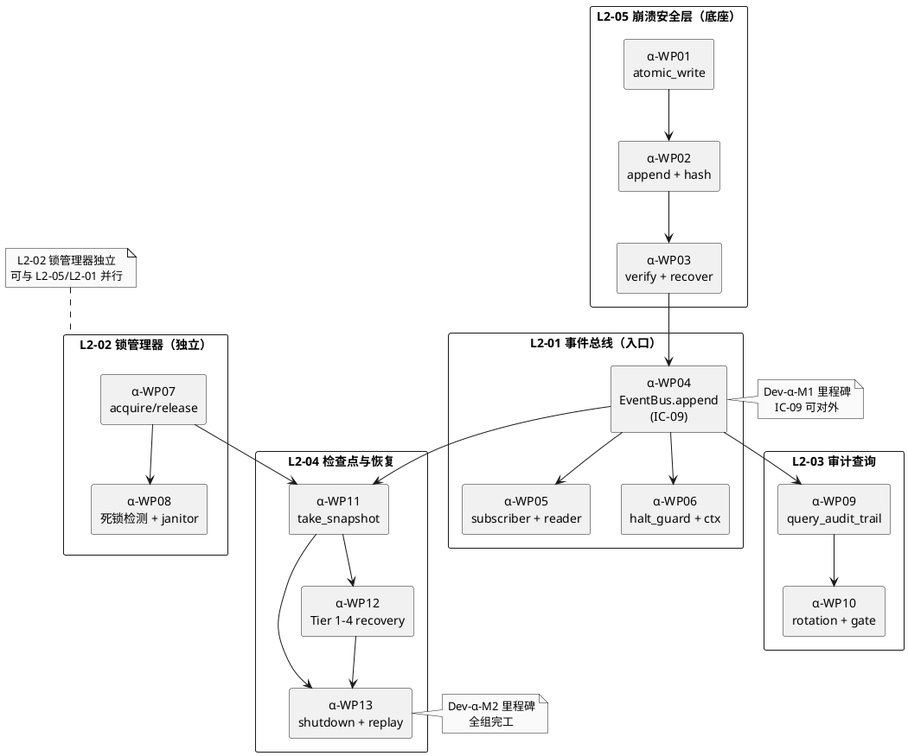

# Dev-α · L1-09 韧性+审计 · Execution Plan

> **本 md 定位**：4-0 master plan §3.2 定义的 Dev-α 独立开发组的**详细执行计划**。独立 AI 会话读本 md 开工 · 代码 + TDD 必须同会话完成（4-0 §1.4 约束 Q-02）。
>
> **组一句话**：**把 3-1 L1-09 韧性+审计 5 L2 tech-design（9678 行）和 3-2 L1-09 5 tests（4435 行 · 269 TC · 248 test_fn）** → **落地成可运行 Python 代码**（预估 ~17400 行） · **IC-09 事件总线是整个 harnessFlow 的脊柱**（所有其他 L1 通过 IC-09 写事件） · **本组先行于所有其他 Dev 组**。
>
> **硬性原则**（对应 4-0 master 4 硬约束）：
> - Q-01 **质量不妥协**：本组作为脊柱 · 必须完工且稳定 · 否则后续所有组 IC-09 集成失败
> - Q-02 **代码+TDD 同会话**：严格 TDD 红→绿→重构 · 先写失败的测试 · 再写实现
> - Q-03 **自修正机制**：执行中发现源文档错 · 回 4-0 §6 协议修 2-prd/3-1/3-2
> - Q-04 **本组不跨 L1**：只动 `app/l1_09/` 和 `tests/l1_09/` · 不碰其他 L1 代码
>
> **PM-08 + PM-14 双锁**：L1-09 是 PM-08（单一事实源）的唯一落实方 + PM-14 物理分片的核心执行者。所有产出必严格按 `projects/<pid>/events.jsonl · audit.jsonl · checkpoints/` 分片。

---

## §0 撰写进度

- [x] §1 组定位 + L2 清单（5 L2）
- [x] §2 源文档导读（P0-P2 清单 · 20 份必读 · 每份怎么用）
- [ ] §3 WP 拆解（5 L2 × 13 WP · 天级粒度 · L3/L4 代码文件清单）
- [ ] §4 WP 依赖图（组内 + 跨组 mock）
- [ ] §5 每日 standup + commit 规范
- [ ] §6 自修正触发点（5 情形映射到 L1-09 特有场景）
- [ ] §7 本组对外契约（IC mock + 真实替换时机）
- [ ] §8 验收 DoD（脊柱特化 · fsync/hash_chain/halt 强覆盖）
- [ ] §9 风险 + 降级（R-01 脊柱稳定性是全局 P0）
- [ ] §10 交付清单 + commit 工作流

---

## §1 组定位 + 范围

### 1.1 本组在 harnessFlow 整个开发阶段的位置

```
波 1 · 底座（Dev-α + Dev-β + Dev-θ1）        ← 本组在此
  ↓ 脊柱 IC-09 ready · 事件总线可写可查
波 2 · 业务层（Dev-γ/δ1/ε/η）
  ↓ 业务 L1 ready · 各自发 IC-09 事件到 L1-09
波 3 · 监督+扩展（Dev-ζ/δ2/θ2）
  ↓ 监督 L1-07 订阅 IC-09 · 完整审计链成型
波 4+ · 核心集成（主-1 主-2 主-3）
```

**本组的战略重要性**：**唯一"其他组无法 mock 久"的底座组**。其他组在开发期可 mock IC-09 · 但集成期必须真实替换 · 若本组晚到或不稳 · 其他组集成会 cascade 失败。

### 1.2 本组范围（L1/L2 清单）

| L2 | 简介 | 3-1 tech-design 行数 | 预估代码量 | 估时 | 对外 IC |
|:---:|:---|---:|---:|:---:|:---|
| **L2-05** 崩溃安全层 | WAL + atomic_write + sha256 链 + fsync 硬约束 | 2057 | ~3700 | 1.5 天 | 内部 · 被 L2-01/L2-04 调 |
| **L2-01** 事件总线核心 | IC-09 `append(event)` 唯一写入口 · 每事件必 fsync · halt on fail | 2078 | ~3700 | 1.5 天 | **IC-09**（全 L1 写）· IC-L2-02（订阅）· IC-L2-04（只读 iterator）|
| **L2-02** 锁管理器 | flock + FIFO ticket + 死锁检测 + TTL 泄漏回收 | 1538 | ~2800 | 1 天 | 内部 · 被 L2-04 调（force_release_all）|
| **L2-03** 审计记录器+追溯查询 | IC-18 `query_audit_trail` · 按 pid/time/actor/type 追溯 · append-only jsonl + rotation | 1782 | ~3200 | 1 天 | **IC-18**（L1-10 UI 查）· IC-09 落盘延续 |
| **L2-04** 检查点与恢复器 | snapshot + bootstrap + Tier 1-4 恢复 · 30s 硬约束 | 2223 | ~4000 | 1.5 天 | **IC-10** replay_from_event · 内部 recovery |
| **合计** | 5 | **9678** | **~17400** | **5-7 天** | 3 全局 IC + 2 内部 IC |

### 1.3 Out-of-scope（本组不做）

- ❌ 分布式 event bus（V2+ 考虑 · 本版本单机 jsonl）
- ❌ 跨 project 事件总线（每 project 独立分片 · PM-14 硬约束）
- ❌ 二进制事件编码（本版本 JSON · 性能够 · protobuf 留 V3+）
- ❌ 外部审计系统对接（Grafana / ELK 等 · 3-3 metrics 对接留给后续）
- ❌ snapshot 增量模式（全量先 · 增量留 V2+ OQ-L209-04-02）

### 1.4 本组产出清单（What）

**代码**（约 17400 行）：
```
app/l1_09/
├── event_bus/                       （L2-01 · 事件总线核心）
│   ├── core.py                      核心 append 逻辑
│   ├── emitter.py                   出口 API
│   ├── subscriber.py                订阅者注册
│   ├── reader.py                    read_range iterator
│   ├── halt_guard.py                fsync 失败的硬 halt 守护
│   └── schemas.py                   Event / Subscriber Pydantic
├── lock_manager/                    （L2-02 · 锁管理器）
│   ├── manager.py                   acquire/release/is_locked
│   ├── fifo_queue.py                FIFO ticket 队列
│   ├── deadlock_detector.py         环检测
│   ├── janitor.py                   TTL 泄漏回收
│   └── schemas.py                   LeaseToken / LockError
├── audit/                           （L2-03 · 审计记录器+追溯查询）
│   ├── writer.py                    IC-09 落盘延续
│   ├── query.py                     IC-18 追溯 query_audit_trail
│   ├── rotation.py                  文件滚动
│   ├── gate.py                      rebuilding/open/closed gate 三态
│   └── schemas.py                   Trail / Anchor / EvidenceLayer
├── checkpoint/                      （L2-04 · 检查点与恢复）
│   ├── snapshot.py                  周期 + 关键事件触发
│   ├── recovery.py                  bootstrap 主路径
│   ├── tier_fallback.py             Tier 1→4 降级
│   ├── shutdown.py                  drain + final snapshot
│   └── schemas.py                   SnapshotResult / RecoveryResult
└── crash_safety/                    （L2-05 · 崩溃安全层）
    ├── atomic_writer.py             write_atomic · tmpfile+rename+fsync
    ├── appender.py                  append_atomic · O_APPEND+fsync
    ├── hash_chain.py                sha256 链 · canonical_json + JCS
    ├── integrity_checker.py         verify_integrity 三态
    └── schemas.py                   AppendResult / WriteResult / IntegrityReport
```

**测试**（约 5500 行 · 对应 3-2 tests × 1.2 倍实际 pytest）：
```
tests/l1_09/
├── test_l2_01_event_bus.py          对齐 3-2 L2-01-tests.md · 52 test_fn · 56 TC
├── test_l2_02_lock_manager.py       · 46 test_fn · 50 TC
├── test_l2_03_audit.py              · 52 test_fn · 56 TC
├── test_l2_04_checkpoint.py         · 50 test_fn · 54 TC
├── test_l2_05_crash_safety.py       · 48 test_fn · 53 TC
├── conftest.py                      共享 fixture · mock_project_id · fake_clock · tmp_fs
├── integration/
│   ├── test_ic_09_contract.py       IC-09 契约集成（暂给 QA-1 预留）
│   └── test_tier_recovery.py        Tier 1-4 崩溃恢复端到端
└── perf/
    ├── bench_append_qps.py           事件总线 ≥ 200 QPS
    ├── bench_lock_acquire.py         无竞争 P95 ≤ 5ms
    └── bench_recovery.py             bootstrap ≤ 30s
```

### 1.5 本组 DoD 概要（详见 §8）

完工 = 以下全达标：

1. 5 L2 代码全落地 · 跑 `pytest tests/l1_09/` 全绿
2. 每 L2 对应 3-2 tests 的 TC 全覆盖 · coverage ≥ 80%
3. ruff + mypy 全绿
4. fsync/halt/hash_chain 关键路径有专项 perf + chaos 测试
5. PM-14 物理分片验证（多 pid 隔离 · 单 pid 数据完整）
6. IC-09 作为生产方 · 提供可供其他组 mock 替换的真实接口
7. IC-18 / IC-10 可单独调通
8. 每 WP 独立 commit · 消息规范（§5）
9. 所有自修正触发走 4-0 §6 协议 · 记 `_correction_log.jsonl`

---

## §2 源文档导读（必读清单 · 按优先级）

### 2.1 P0 必读（开工前必读 · 不读等于开工前基线缺失）

| 优先级 | 文档 | 关键章节 | 为何必读 | 本组怎么用 |
|:---:|:---|:---|:---|:---|
| P0-1 | `docs/1-goal/HarnessFlowGoal.md` | 全文 | 顶层目标 · PM 清单 | 对齐 PM-08 单一事实源 + PM-14 分片 + 100% 可追溯 |
| P0-2 | `docs/2-prd/L0/scope.md` | §8 整合 · §11 PM-14 · §12.9 硬红线 | 产品范围 + 集成边界 | 确认 L1-09 不越界（不做 L1-07 监督工作）|
| P0-3 | `docs/2-prd/L1-09 韧性+审计/prd.md` | 全文 | 本 L1 产品视角（5 L2 各自职责 + GWT 场景）| 定义 DoD + 负向用例 + 硬约束（每事件必 fsync 等） |
| P0-4 | `docs/3-1-Solution-Technical/L1-09-韧性+审计/architecture.md` | §11 L2 分工 · §5 核心 P0 时序 · §6 按 project 分片 · §7 锁 · §8 崩溃安全 | L1 内部 L2 协作图 · 跨 L2 时序 | WP 拆解的依据（§3 本 md） |
| P0-5 | `docs/3-1-Solution-Technical/L1-09-韧性+审计/L2-05-崩溃安全层.md` | §3 4 方法 + §5 时序 + §6 核心算法 + §11 错误码 20 条 | **最底层 · 必最先实现** | L2-05 代码（WP α-01/02/03） |
| P0-6 | `docs/3-1-Solution-Technical/L1-09-韧性+审计/L2-01-事件总线核心.md` | §3 5 方法 + §5 时序 + §6 核心算法 + §11 错误码 14 条 | 脊柱入口 | L2-01 代码（WP α-04/05/06） |
| P0-7 | `docs/3-1-Solution-Technical/L1-09-韧性+审计/L2-02-锁管理器.md` | §3 6 方法（4 公共 + 2 内部）+ §11 死锁检测 | 并发基础 | L2-02 代码（WP α-07/08） |
| P0-8 | `docs/3-1-Solution-Technical/L1-09-韧性+审计/L2-03-审计记录器+追溯查询.md` | §3 5 方法 + §11 错误码 22 条 | 审计查询 | L2-03 代码（WP α-09/10） |
| P0-9 | `docs/3-1-Solution-Technical/L1-09-韧性+审计/L2-04-检查点与恢复器.md` | §3 5 方法 + §8 Tier 1-4 恢复 + §11 错误码 40 条 | 崩溃恢复脊柱 | L2-04 代码（WP α-11/12/13） |
| P0-10 | `docs/3-2-Solution-TDD/L1-09-韧性+审计/L2-01 ~ L2-05 tests.md` | 5 份 · 共 4435 行 · 269 TC · 248 test_fn | TDD 用例源 | 复制伪代码到 `tests/l1_09/test_l2_0X_*.py` 作红灯 |
| P0-11 | `docs/3-1-Solution-Technical/integration/ic-contracts.md` | §3.9 IC-09 · §3.10 IC-10 · §3.18 IC-18 | 全局 IC 契约字段级 schema | 实现时严格对齐 payload 字段 + 错误码 |
| P0-12 | `docs/3-1-Solution-Technical/L1集成/architecture.md` | §7 失败传播（L1-09 halt 唯一入口）· §10 跨 session 恢复 | 跨 L1 视角下的 L1-09 角色 | 确认 halt 协议 + bootstrap 协议 |

### 2.2 P1 推荐（边开工边参考 · 不读会影响集成质量）

| 优先级 | 文档 | 关键章节 | 用途 |
|:---:|:---|:---|:---|
| P1-1 | `docs/2-prd/L0/projectModel.md` | 全文 | PM-14 全集 · 定义 `projects/<pid>/` 分片布局 |
| P1-2 | `docs/3-1-Solution-Technical/projectModel/tech-design.md` | §4-§8 | PM-14 技术规范 · 字段级 schema · 分片验证脚本 |
| P1-3 | `docs/3-1-Solution-Technical/integration/p0-seq.md` | 12 条 P0 时序 | 看 IC-09 / IC-18 在主干时序的位置 |
| P1-4 | `docs/3-1-Solution-Technical/integration/p1-seq.md` | 11 条 P1 异常 | Tier 恢复时序 + halt 时序 |
| P1-5 | `docs/3-1-Solution-Technical/L0/open-source-research.md` | §6 事件总线对标 · §10 audit chain 对标 | 选型依据（Kafka / etcd / Raft / PG WAL / zstd + tar）|
| P1-6 | `docs/3-3-Monitoring-Controlling/dod-specs/general-dod.md` | 待 O 完 · fallback 用 3-1 §12 | DoD 评估规约 |
| P1-7 | `docs/3-3-Monitoring-Controlling/hard-redlines.md` | 待 O 完 | 本组产出是否触发硬红线（系统级 halt）|
| P1-8 | `docs/3-3-Monitoring-Controlling/monitoring-metrics/system-metrics.md` | 待 O 完 | Prometheus 指标命名规范 |

### 2.3 P2 选读（遇到具体问题再查）

| 优先级 | 文档 | 场景 |
|:---:|:---|:---|
| P2-1 | `docs/3-1-Solution-Technical/L0/tech-stack.md` | 确认技术栈版本（Python 3.11+ · pytest · ruff · mypy） |
| P2-2 | `docs/3-1-Solution-Technical/L0/ddd-context-map.md` | 确认 BC-09 DDD 边界（本 L1 不跨 BC） |
| P2-3 | `docs/3-1-Solution-Technical/integration/cross-l1-integration.md` | 本 L1 与哪些 L1 有 IC 依赖（核对 IC mock 覆盖完整）|
| P2-4 | `docs/superpowers/reviews/2026-04-22-F-session-polish-prompt.md` | F 会话做 L1-09 3-1 文档的经验 · 参考（不是源） |
| P2-5 | `docs/superpowers/reviews/2026-04-22-J-K-session-review.md` | K 会话做 L1-09 3-2 tests 的经验 · 参考 fsync/halt 覆盖密度 |

### 2.4 读法建议（Dev-α 开工前 1-2 小时的读源计划）

**第 1 小时（P0-1 ~ P0-4）· 对齐顶层锚点**：
- Read HarnessFlowGoal.md（全文 · 约 20 分钟）
- Read scope.md §8 + §11 + §12.9（约 15 分钟）
- Read 2-prd/L1-09 prd.md（全文 · 约 20 分钟）
- Read 3-1/L1-09 architecture.md §11 + §5 + §6 + §7 + §8（约 25 分钟）

**第 2 小时（P0-5 ~ P0-9）· 5 L2 接口速览**：
- 每份 L2 tech-design Read `§3 + §11 + §12` 约 10 分钟 · 5 份 = 50 分钟
- 跳过 §1/§2/§13（与实现关联弱）

**开工后边做边读**：
- 写某 L2 时 · 深读该 L2 的 §5 时序 · §6 算法 · §7 schema · §8 状态机
- 写测试时 · 深读对应 3-2 tests.md 的伪代码

**禁区**：**不要一次读完所有 ~15800 行源文档** · 按需读 · 避免上下文爆炸 + 分心。

---

**§1+§2 完结** · 下接 §3 WP 拆解。

---

## §3 WP 拆解（天级 L3/L4 粒度）

### 3.0 WP 总表

13 WP · 5-7 天 · 按依赖顺序执行（底层先行）：

| 顺序 | WP ID | L2 | 主题 | 前置 | 估时 | 对应 3-2 TC 数 |
|:---:|:---|:---:|:---|:---|:---:|:---:|
| 1 | α-WP01 | L2-05 | atomic_write 原子写（tmp+rename+fsync）| 无 | 0.5 天 | ~15 TC |
| 2 | α-WP02 | L2-05 | append_atomic + hash chain（sha256 + JCS）| WP01 | 0.5 天 | ~20 TC |
| 3 | α-WP03 | L2-05 | verify_integrity + recover_partial_write | WP01+02 | 0.5 天 | ~18 TC |
| 4 | α-WP04 | L2-01 | EventBus.append（IC-09 入口 · halt on fsync_fail）| WP01-03 | 1 天 | ~20 TC |
| 5 | α-WP05 | L2-01 | register_subscriber + read_range | WP04 | 0.5 天 | ~18 TC |
| 6 | α-WP06 | L2-01 | halt_guard + correlation_id 链路 | WP04 | 0.5 天 | ~18 TC |
| 7 | α-WP07 | L2-02 | acquire/release/is_locked（flock + FIFO）| 无（独立）| 0.75 天 | ~30 TC |
| 8 | α-WP08 | L2-02 | 死锁检测 + janitor 泄漏回收 + force_release_all | WP07 | 0.5 天 | ~20 TC |
| 9 | α-WP09 | L2-03 | query_audit_trail（IC-18）+ Anchor 三态 | WP04 | 0.5 天 | ~28 TC |
| 10 | α-WP10 | L2-03 | rotation + gate（rebuilding/open/closed）| WP09 | 0.5 天 | ~28 TC |
| 11 | α-WP11 | L2-04 | take_snapshot（周期 + 关键事件触发）| WP04+07 | 0.75 天 | ~18 TC |
| 12 | α-WP12 | L2-04 | recover_from_checkpoint · Tier 1-4 | WP11 | 1 天 | ~20 TC |
| 13 | α-WP13 | L2-04 | begin_shutdown（drain + final snapshot）+ replay_events | WP11+12 | 0.5 天 | ~16 TC |

**关键路径**（若延期最致命）：WP01→WP02→WP03→WP04（L2-05 基础 + L2-01 入口 · 4 个 WP · 2.5 天）· 这 4 WP 若延 · 全组后续 WP 都 block。

### 3.1 WP-α-01 · L2-05 崩溃安全层 · atomic_write 原子写

**源文档锚点**：
- 3-1 `L2-05-崩溃安全层.md §3.2 方法 1 write_atomic`
- 3-1 `L2-05 §6 核心算法（write_atomic 5 步 syscall 序）`
- 3-1 `L2-05 §11 错误码（`E_WRITE_TMP_FAIL` / `E_WRITE_FSYNC_FAIL` / `E_WRITE_RENAME_FAIL`）
- 3-2 `L2-05-崩溃安全层-tests.md §2 正向`（原子写正常路径）

**工作内容（L3）**：

- 实现 `AtomicWriter` 类 · 单入口 `write_atomic(path, bytes_data)` → `WriteResult`
- 5 步 syscall 序：
  1. 打开 tmp 文件（`O_CREAT | O_WRONLY | O_EXCL`）· tmp 命名 `<path>.tmp.<pid>.<uuid>`
  2. 全量写（处理部分写 · 分块循环至完整）
  3. `fsync(tmp_fd)`（关键 · 失败即 raise · 无重试）
  4. `close(tmp_fd)`
  5. `os.rename(tmp, path)`（POSIX 原子）
  6. （可选）`fsync` 父目录（Linux durability · config 开关）
- 错误分类与错误码映射：
  - `ENOSPC` → `E_WRITE_TMP_FAIL` · 含 `disk_avail_bytes`
  - `EIO` / fsync fail → `E_WRITE_FSYNC_FAIL` · 触发上层 halt
  - rename 失败 → `E_WRITE_RENAME_FAIL` + 清理 tmp
- 确保所有异常路径清理 tmp（try/finally）

**代码文件（L4）**：

```
app/l1_09/crash_safety/atomic_writer.py              # 主实现 ~180 行
app/l1_09/crash_safety/schemas.py                    # WriteResult / CrashSafetyDiskFullError / CrashSafetyFSyncError ~60 行
app/l1_09/crash_safety/__init__.py                   # 导出 ~10 行
```

**TDD 流程**：

1. Read `docs/3-2-Solution-TDD/L1-09-韧性+审计/L2-05-崩溃安全层-tests.md` · 摘 §2 正向 5 个 + §3 负向 10 个 TC 伪代码
2. 写 `tests/l1_09/test_l2_05_atomic_write.py`（~15 test_fn · 对齐 TC-CRASH-WRITE-*）
3. `pytest tests/l1_09/test_l2_05_atomic_write.py` → **全红**（期望 15 fail）
4. 实现 `atomic_writer.py` · 分段：
   - 先 `_open_tmp()` + `_write_all()` + `_fsync_fd()` 三私函数
   - 再组合成 `write_atomic()` 主方法
5. `pytest` → 逐个转绿（期望 15/15）
6. 检查 coverage ≥ 85%
7. Refactor：提炼 `_tmp_name()` 工具函数 · 保持测试绿
8. `ruff check && mypy app/l1_09/crash_safety/`
9. `git add + git commit -m "feat(harnessFlow-code): α-WP01 L2-05 atomic_write 原子写"`

**DoD（WP 完工判据）**：

- [ ] `tests/l1_09/test_l2_05_atomic_write.py` 15/15 全绿
- [ ] coverage ≥ 85%
- [ ] 3 错误码全覆盖（`E_WRITE_TMP_FAIL` / `E_WRITE_FSYNC_FAIL` / `E_WRITE_RENAME_FAIL` 各 ≥ 1 负向 TC）
- [ ] mock disk full（`errno=ENOSPC`）可触发正确错误码 + 清理 tmp
- [ ] `ruff + mypy` 绿
- [ ] commit SHA 记录
- [ ] **硬断言**：fsync 失败不得吞异常（必 raise · 让上层 halt）

### 3.2 WP-α-02 · L2-05 崩溃安全层 · append_atomic + hash chain

**源文档锚点**：
- 3-1 `L2-05 §3.3 方法 2 append_atomic`
- 3-1 `L2-05 §6.2 append 模式 + PIPE_BUF 硬约束`
- 3-1 `L2-05 §6.3 hash 链算法（JCS + sha256 + GENESIS）`
- 3-1 `L2-05 §7.5 HashChainLink schema`
- 3-2 tests §2 正向 5 个 + §3 负向 8 个 + §4 hash chain 完整性测试

**工作内容（L3）**：

- 实现 `Appender.append_atomic(path, line_bytes) -> AppendResult`
  - `O_APPEND | O_WRONLY`（append 原子保证 · POSIX · size < PIPE_BUF = 4096 bytes 下写入不会交错）
  - 硬断言 `len(line_bytes) < PIPE_BUF`（超则 raise `E_LINE_TOO_LARGE`）
  - 写后 `fsync` · 失败即 halt
  - 无 tmp 文件（append 语义不需要）
- 实现 `HashChain.compute_next(prev_hash, payload_dict) -> HashChainLink`
  - JCS (JSON Canonicalization Scheme · RFC 8785) canonicalize payload
  - `sha256(prev_hash + canonical_json)` → 64 char hex
  - GENESIS 特例：prev_hash = `"0" * 64`
  - 返回 `HashChainLink(seq, prev_hash, hash, timestamp, canonical_payload)`
- 每 append 前必先 compute_next（上层 L2-01 保证 · 本 WP 提供工具）

**代码文件（L4）**：

```
app/l1_09/crash_safety/appender.py          # append_atomic ~120 行
app/l1_09/crash_safety/hash_chain.py        # compute_next + verify_link ~150 行
app/l1_09/crash_safety/canonical_json.py    # JCS 规范化 ~80 行（可复用 rfc8785 库 · pip install rfc8785）
```

**TDD 流程**（同 WP01）：
- tests/l1_09/test_l2_05_append_atomic.py · ~20 test_fn
- hash chain 测试重点：
  - GENESIS 创世块生成（prev="0"*64）
  - 连续 3 链：每链的 prev = 上链的 hash
  - 篡改 N-1 条 payload · 第 N 条验证失败
  - JCS 规范化边界（unicode · 浮点 · 空对象）

**DoD**：
- [ ] ~20 TC 全绿
- [ ] PIPE_BUF 硬限断言（line > 4096 时必 raise · 不截断）
- [ ] hash chain 篡改检测 100%（mutation testing 验证）
- [ ] JCS canonical 符合 RFC 8785（至少 5 个 edge case 覆盖）
- [ ] coverage ≥ 85%

### 3.3 WP-α-03 · L2-05 崩溃安全层 · verify_integrity + recover_partial_write

**源文档锚点**：
- 3-1 `L2-05 §3.4 方法 3 verify_integrity`
- 3-1 `L2-05 §3.5 方法 4 recover_partial_write`
- 3-1 `L2-05 §6.4 verify 3 态（OK / PARTIAL / CORRUPT）`
- 3-1 `L2-05 §7.4 IntegrityReport schema`

**工作内容（L3）**：

- 实现 `IntegrityChecker.verify_integrity(path) -> IntegrityReport`
  - 按行扫 jsonl · 每行 parse + 检查 hash chain
  - 3 态分类：
    - `OK`：全链完整
    - `PARTIAL`：末尾 1 条损坏（可能 crash 中途）· 可截断恢复
    - `CORRUPT`：中段损坏（hash 断裂）· 不可恢复 · 返回 `failure_range`
- 实现 `recover_partial_write(path) -> RecoveryResult`
  - 仅 `PARTIAL` 状态下调用
  - 截断至最后完整的 N-1 条 · 保留 `path.corrupt.<ts>` 备份
  - 返回 `RecoveryResult(recovered_count, truncated_bytes)`

**代码文件（L4）**：

```
app/l1_09/crash_safety/integrity_checker.py   # verify + recover ~200 行
```

**DoD**：
- [ ] verify 3 态测试全绿（~18 TC · §6 正向 + 每态边界）
- [ ] CORRUPT 情况下 `failure_range` 精确到 byte offset
- [ ] PARTIAL recover 后 · 再 verify 必返 `OK`
- [ ] coverage ≥ 85%

**3 个 WP 小结（L2-05 完工）**：崩溃安全层 3 WP 约 1.5 天 · ~3700 行代码 · 53 TC · 提供 L2-01 所需的底层 atomic write + append + hash chain + verify 工具 · **其他 L2 开发可启动**。

### 3.4 WP-α-04 · L2-01 事件总线核心 · EventBus.append（IC-09 入口）

**源文档锚点**：
- 3-1 `L2-01-事件总线核心.md §3.2 append(event) — IC-09 唯一写入口`
- 3-1 `L2-01 §5.1 P0 时序`（append 主路径 · 14 步骤）
- 3-1 `L2-01 §6 核心算法（event_id 生成 + payload 校验 + hash chain + fsync + emit 到订阅者）`
- 3-1 `L2-01 §11 错误码 14 条`
- 3-2 `L2-01-事件总线核心-tests.md` 完整 56 TC

**工作内容（L3）**：

- 实现 `EventBus.append(event: Event) -> AppendEventResult`
  - Step 1 · 入参校验：PM-14 `project_id` 根字段必存（或 `project_scope="system"`）
  - Step 2 · event schema 校验（pydantic）· 失败返 `E_EVT_SCHEMA_INVALID`
  - Step 3 · 幂等检查：同 `event_id` 已存在 · 返回原记录（PM-08 幂等）
  - Step 4 · 生成 seq（project 内单调递增 · 从 meta 读）
  - Step 5 · 读前一 hash · compute_next（调 WP02 HashChain）
  - Step 6 · 组装 jsonl line（含 event + hash_link）
  - Step 7 · 调 WP02 `append_atomic(path, line)`
  - Step 8 · 成功后更新 meta seq / last_hash
  - Step 9 · 异步 emit 到订阅者（不阻塞主路径）
  - Step 10 · 返回 `AppendEventResult(event_id, seq, hash, ts)`
- **硬约束 · halt on fsync_fail**：Step 7 抛 `CrashSafetyFSyncError` → 本层 catch · 标系统级 halt · 写 `_halt.marker` · 拒绝所有后续 append · raise `E_BUS_SYSTEM_HALTED`

**代码文件（L4）**：

```
app/l1_09/event_bus/core.py                   # EventBus 主类 ~250 行
app/l1_09/event_bus/emitter.py                # append 出口 API ~80 行
app/l1_09/event_bus/schemas.py                # Event / AppendEventResult / EventBusError ~150 行
app/l1_09/event_bus/halt_guard.py             # halt 守护（_halt.marker · reject 新请求）~80 行
app/l1_09/event_bus/meta.py                   # project meta（seq + last_hash 持久化）~120 行
```

**特别关注**：
- **幂等性**：同 `event_id` 第二次 append 必返回第一次的结果（含原 seq · 原 hash）· 不重复落盘
- **PM-14 root field**：所有 event.payload 必含 project_id（除 system 级）· schema 强制
- **订阅者 emit 异步**：subscriber.call 失败不得影响 append 成功
- **meta 持久化**：meta 也要 `write_atomic`（复用 WP01）
- **halt 持久化**：`_halt.marker` 跨进程可读 · 重启后仍 halt · 只有运维手工清除才解锁

**DoD**：
- [ ] ~20 TC 全绿（对齐 3-2 L2-01 §2+§3）
- [ ] fsync_fail 触发 halt 测试（mock fsync 抛 EIO · 验证 halt 行为）
- [ ] 同 event_id 幂等测试（第二次 append 不落盘 · 返回原结果）
- [ ] PM-14 违规（缺 project_id）· 返 `E_EVT_NO_PROJECT_OR_SYSTEM`
- [ ] 并发 append 10 × 100 次 · seq 严格单调 · hash chain 不破
- [ ] coverage ≥ 85%
- [ ] **硬断言**：fsync 失败 halt 后 · 任何后续 append 必 raise（不得成功）

### 3.5 WP-α-05 · L2-01 事件总线核心 · register_subscriber + read_range

**源文档锚点**：
- 3-1 `L2-01 §3.3 register_subscriber · §3.4 read_range`
- 3-1 `L2-01 §6.3 订阅者模型 + §6.4 read_range iterator`

**工作内容（L3）**：

- 实现 `register_subscriber(sub: Subscriber) -> SubscriberHandle`
  - 注册时记录：filter（event_type/scope/project_id）+ call_site（async callback）
  - 订阅者按 project 隔离：global 订阅者（订阅所有 project）vs project-scoped
  - 启动时 replay 机制：可选 `replay_from_seq=0` · append 新事件前先重放历史
- 实现 `read_range(pid, from_seq, to_seq) -> Iterator[Event]`
  - IC-L2-04 · 为 L2-04 checkpoint 提供只读扫描
  - 按 project 分片读 · 支持 seq range
  - 惰性 iterator（大 project 不一次性加载内存）

**代码文件（L4）**：

```
app/l1_09/event_bus/subscriber.py             # 订阅者注册 + dispatch ~180 行
app/l1_09/event_bus/reader.py                 # read_range iterator ~120 行
```

**DoD**：
- [ ] ~18 TC 全绿
- [ ] 订阅者 filter 准确（跨 project 无串话）
- [ ] read_range 对 10 万 event 不 OOM（内存 < 50MB · 验证）
- [ ] replay 后新 append 可正常订阅到
- [ ] coverage ≥ 85%

### 3.6 WP-α-06 · L2-01 事件总线核心 · halt_guard + correlation_id

**源文档锚点**：
- 3-1 `L2-01 §3.5 共享元字段 · correlation_id / trace_id`
- 3-1 `L2-01 §8 状态机（NORMAL / HALTED / ...）`

**工作内容（L3）**：

- 实现 `HaltGuard`（独立类 · 被 EventBus 持有）
  - `_halt.marker` 文件位置：`projects/_global/halt.marker`（全系统共享）
  - 启动时读 marker · 若存在 · EventBus 直接进 HALTED 状态
  - `mark_halt(reason)` · 写 marker + 记 `_halt_log.jsonl`
  - `clear_halt()` · 仅 CLI 工具可调 · 运维手动解锁
- correlation_id / trace_id / span_id 自动注入：
  - 每 `append` 请求：若 event 无 correlation_id · 复用当前 task context 的 id（contextvars）
  - trace_id 链路：上游传入 · 本层透传
- halt 期间的错误消息清晰：返回 `E_BUS_SYSTEM_HALTED` + `halt_reason` + `halt_at`

**代码文件（L4）**：

```
app/l1_09/event_bus/halt_guard.py             # HaltGuard（在 WP04 已建基础上完善）
app/l1_09/event_bus/context.py                # correlation_id / trace_id contextvars ~60 行
```

**DoD**：
- [ ] ~18 TC 全绿
- [ ] halt 持久化：halt 后重启进程 · 仍 HALTED
- [ ] clear_halt 需 `admin_token` 认证（CLI 工具 · 不对代码暴露）
- [ ] correlation_id 跨 append 传递测试（同一请求链所有 event 共 correlation_id）
- [ ] coverage ≥ 85%

**L2-05 + L2-01 共 6 WP 小结（第 1 阶段收尾）**：
- **总 WP**：6（α-WP01 ~ α-WP06）· 4 天 · ~7400 行代码 · ~109 TC
- **里程碑 · Dev-α-M1**：IC-09 入口可用 · 其他组开始可通过 mock → 真实替换
- **外部可见**：`from app.l1_09 import EventBus` 可 import · `event_bus.append(event)` 可调

---

**§3（L2-05 + L2-01）完结 · 批 2 结束** · 下接 §3（L2-02/03/04）+ §4 依赖图。

### 3.7 WP-α-07 · L2-02 锁管理器 · acquire/release/is_locked（基础）

**源文档锚点**：
- 3-1 `L2-02-锁管理器.md §3.1 3 公共 + 2 内部接口 · §3.2/3.3/3.4 详细契约`
- 3-1 `L2-02 §6 核心算法（flock + FIFO ticket queue）`
- 3-1 `L2-02 §7.1 锁粒度矩阵（project 级 · WP 级 · 资源级）`
- 3-2 `L2-02-锁管理器-tests.md` · 50 TC

**工作内容（L3）**：

- 实现 `LockManager` 单例 · 进程内持锁状态 + 跨进程 flock 协调
- `acquire_lock(resource, holder, timeout_ms=3000) -> LeaseToken | LockError`
  - 资源名规范校验：`^(_index|[a-z0-9_-]+:[a-z0-9_-]+)$`
  - 资源必在 `ALLOWED_RESOURCES` 白名单（`event_bus` / `task_board` / `wp-<id>` / `kb` / `_index`）
  - holder 格式：`<L-id>:<subcomponent>[:<context>]`（审计需要）
  - 核心路径：
    1. 先拿进程内 `threading.Lock`（防同进程内 race）
    2. 若资源已被持有 · 入 FIFO 队列等（本 ticket · timeout_ms 内）
    3. 取锁时：`fcntl.flock(fd, LOCK_EX)` + 设 TTL 超时 · 超时抛 `LockError.timeout`
    4. 成功：生成 `LeaseToken`（ULID + lock_id + issued_at + expires_at = issued_at + TTL）
    5. 登记到 `held_locks_map` · 发 L1-09 事件 `L1-09:lock_acquired`（经 WP04 append · 异步不阻塞）
- `release_lock(token) -> ReleaseAck | LockError`
  - 幂等：同 token 释放 2 次 · 第二次返 `ok_idempotent`（不报错）
  - 3 步：thread_lock.release → flock LOCK_UN → close fd
  - 发 `L1-09:lock_released` 事件
- `is_locked(resource) -> LockState`
  - 只读 · 不改状态 · 供 Supervisor / UI 观测

**代码文件（L4）**：

```
app/l1_09/lock_manager/manager.py                 # LockManager 主类 ~250 行
app/l1_09/lock_manager/fifo_queue.py              # FIFO ticket 队列 ~120 行
app/l1_09/lock_manager/schemas.py                 # LeaseToken / LockError / LockState ~100 行
app/l1_09/lock_manager/__init__.py                # ~15 行
```

**TDD 流程**：

- `tests/l1_09/test_l2_02_lock_acquire.py` · ~30 test_fn · 对齐 TC-L109-L202-001~030
- 关键测试：
  - 无竞争 · 单次 acquire/release · P95 ≤ 5ms
  - 10 方 FIFO 竞争 · 按 ticket 顺序出队 · 无饥饿
  - timeout（3s）后返 `LockError.timeout` · 误差 ≤ 100ms
  - resource 格式错 · 返 `invalid_resource`
  - holder 格式错 · 返 `invalid_holder`
  - 同 token release 2 次 · 第二次 `ok_idempotent`
  - 未 acquire 先 release · 返 `invalid_token`

**DoD**：
- [ ] ~30 TC 全绿
- [ ] 性能：无竞争 P95 ≤ 5ms · 10 方竞争 P95 ≤ 100ms（benchmark 验证）
- [ ] 资源白名单硬断言（运行时不许新增 · 配置固化）
- [ ] FIFO 严格（ticket 单调 · 只有队头可出）
- [ ] coverage ≥ 85%

### 3.8 WP-α-08 · L2-02 锁管理器 · 死锁检测 + janitor + force_release_all

**源文档锚点**：
- 3-1 `L2-02 §6.3 死锁检测（DFS 环检测 · V ≤ 10）`
- 3-1 `L2-02 §6.4 janitor 守护线程（TTL 泄漏回收）`
- 3-1 `L2-02 §3.5 force_release_all（仅 L2-04 shutdown 专属）`

**工作内容（L3）**：

- 实现 `DeadlockDetector`
  - 维护 wait-for 图（有向 · 节点 = holder · 边 = 等待关系）
  - 每次 acquire 入等时 · DFS 检环（< 1ms 算法 · V ≤ 10）
  - 检到环 · 拒绝本次 acquire 请求（break_action = "reject_self"）· 发 `L1-09:deadlock_detected` CRITICAL 事件
- 实现 `LockJanitor` 守护协程
  - 每 5s 扫描一次 `held_locks_map`
  - 若某锁 `now > expires_at + TTL_GRACE` · 判定泄漏 · force release（不走正常 release 路径）
  - 发 `L1-09:lock_leaked` WARN 事件
- 实现 `force_release_all(caller="L2-04-shutdown")` · 访问控制
  - 仅 L2-04 shutdown 流程调（调用链校验 · 非 L2-04 call 拒绝）
  - 清空所有锁 · 广播 `shutdown_rejected` 给等待队列
- 实现 `list_held() -> list[LockState]`（只读观测 · Supervisor 用）

**代码文件（L4）**：

```
app/l1_09/lock_manager/deadlock_detector.py       # DFS 环检测 ~150 行
app/l1_09/lock_manager/janitor.py                 # 守护协程 ~120 行
app/l1_09/lock_manager/shutdown_control.py        # force_release_all + 访问控制 ~80 行
```

**DoD**：
- [ ] ~20 TC 全绿
- [ ] 死锁场景测试：A 持 resource1 等 resource2 · B 持 resource2 等 resource1 · 期望 B 的 acquire 返 `deadlock_rejected`
- [ ] 3-cycle 死锁也能检（A→B→C→A）
- [ ] janitor 泄漏回收：模拟 sleep 超 TTL · 期望自动 release + WARN
- [ ] force_release_all 访问控制：非 L2-04 caller raise
- [ ] coverage ≥ 85%

**L2-02 完工小结**：2 WP · 1.25 天 · ~2800 行代码 · ~50 TC · 外部可见：`from app.l1_09 import LockManager; lm.acquire_lock("event_bus", "L1-01:tick")` 可调。

### 3.9 WP-α-09 · L2-03 审计记录器 · query_audit_trail（IC-18）

**源文档锚点**：
- 3-1 `L2-03-审计记录器+追溯查询.md §3.1-3.4 方法 · §3.2 schema（Trail / Anchor / EvidenceLayer）`
- 3-1 `L2-03 §6 核心算法（按 anchor_type 分路查询）`
- 3-1 `integration/ic-contracts.md §3.18 IC-18`

**工作内容（L3）**：

- 实现 `AuditQuery.query_audit_trail(anchor: Anchor, filter: QueryFilter) -> Trail`
  - IC-18 · 被 L1-10 UI 调用（Admin 审计面板 · query_audit_trail tab）
  - 3 种 anchor_type：
    - `project_id` · 返该 project 的完整审计链
    - `tick_id` · 返某次 tick 的所有事件（correlation_id 链）
    - `event_id` · 返单事件 + 前后 N 条
  - filter：time_range · actor · event_type · severity
  - 返回 `Trail`（≥ 12 字段 · 含 4 层 EvidenceLayer · 分页）
- 实现 `_scan_events(pid, filter)` · 按 pid 分片扫 jsonl
  - 调 WP05 `read_range(pid, 0, -1)` + 内存 filter
  - 大结果（> 10000 条）分页（cursor-based）
- 实现 `_compose_trail(events) -> Trail`
  - 聚合 · 按 event_type 分类
  - 提取 evidence_layer（decision / action / result / audit）
  - 计算 hash chain 连续性（传给 UI 标"完整 / 有 gap"）

**代码文件（L4）**：

```
app/l1_09/audit/query.py                   # AuditQuery 主类 ~250 行
app/l1_09/audit/schemas.py                 # Trail / Anchor / EvidenceLayer / QueryFilter ~180 行
app/l1_09/audit/paginator.py               # cursor-based 分页 ~80 行
```

**DoD**：
- [ ] ~28 TC 全绿
- [ ] 3 种 anchor_type 各 ≥ 3 测试
- [ ] 大结果分页：10 万 event · cursor 5 次返回 100 条 · 无 OOM
- [ ] filter 组合：time + actor + type · 至少 5 组合覆盖
- [ ] hash chain gap 检测：人工注入 1 条缺失 · query 正确标 gap
- [ ] coverage ≥ 85%

### 3.10 WP-α-10 · L2-03 审计记录器 · rotation + gate 三态

**源文档锚点**：
- 3-1 `L2-03 §7 rotation 策略（按 size 200MB + 按月）`
- 3-1 `L2-03 §3.2.4 GateState 三态（rebuilding / open / closed）`
- 3-1 `L2-03 §8 状态机`

**工作内容（L3）**：

- 实现 `AuditRotation`
  - 每次 append 检查当前文件 size · ≥ 200MB 触发 rotation
  - 也按月 rotate（最后日 23:59 自动）
  - 命名：`audit.jsonl.YYYYMM.NN` · 保留 rotation history
- 实现 `AuditGate` · 三态机
  - `REBUILDING`：启动时 · L2-04 checkpoint 恢复中 · query 返"稍候"
  - `OPEN`：正常可查
  - `CLOSED`：HALT 状态 · query 拒绝（返错）
  - 状态转换硬守则：REBUILDING → OPEN（只允许 L2-04 `on_system_resumed` 触发）· OPEN → CLOSED（halt 时）· CLOSED → REBUILDING（clear_halt + restart）
- 实现 `AuditWriter`（对 L2-01 append 的延续 · 特化审计事件）
  - L2-03 不独立写 · 复用 L2-01 `append`
  - 但提供高层 API：`record_audit(action, payload) -> AuditID` · 内部组装 event 调 L2-01

**代码文件（L4）**：

```
app/l1_09/audit/rotation.py                # 按 size+month rotation ~120 行
app/l1_09/audit/gate.py                    # 三态机 ~100 行
app/l1_09/audit/writer.py                  # record_audit 高层 API ~100 行
```

**DoD**：
- [ ] ~28 TC 全绿
- [ ] rotation 触发精准（200MB ± 1MB · month boundary ± 1min）
- [ ] 三态机非法转换拒绝（REBUILDING → CLOSED 直跳 raise）
- [ ] rotation 后原文件可归档 tar.zst · 不丢历史
- [ ] coverage ≥ 85%

**L2-03 完工小结**：2 WP · 1 天 · ~3200 行代码 · ~56 TC · 外部可见：`from app.l1_09 import query_audit_trail`（IC-18 入口 · L1-10 UI 消费）。

### 3.11 WP-α-11 · L2-04 检查点与恢复 · take_snapshot（周期 + 关键事件）

**源文档锚点**：
- 3-1 `L2-04-检查点与恢复器.md §3.2.1 SnapshotResult · §6.1 周期 + 关键事件双触发 · §8.1 SnapshotJob 状态机`
- 3-1 `L2-04 §10.1 critical_event_types`
- 3-1 `L2-04 §11 错误码 40 条`

**工作内容（L3）**：

- 实现 `SnapshotJob`
  - 周期触发：`snapshot_interval_sec` 默认 30s · 启动时首次 + 之后每 30s
  - 关键事件触发：订阅 L2-01 事件 · 匹配 `critical_event_types`（gate_passed / hard_red_line / system_resumed）· 立即开 snapshot job
  - 去重：若正在 snapshot · 后续触发排队（不并发）
- `take_snapshot(pid) -> SnapshotResult`
  - Step 1 · 取 `task_board` 锁（L2-02）
  - Step 2 · 读当前 state（events.jsonl 末 seq · last_hash）
  - Step 3 · 构造 manifest（含 sha256 + 时间戳 + seq）
  - Step 4 · 原子写到 `projects/<pid>/checkpoints/ckpt-<seq>-<ts>.json`（调 L2-05 `write_atomic`）
  - Step 5 · 保留最近 5 版 · 老的归档到 `archive/`
  - Step 6 · 释放锁 · 发 `L1-09:snapshot_created` 事件
- 硬约束：
  - 单次 snapshot ≤ 5s（config `snapshot_deadline_s`）· 超时抛 `SNAPSHOT_E_LOCK_TIMEOUT` 跳过本次
  - lock_acquire_timeout 5s（防锁风暴）
  - 大 task_board（> 5MB）延迟到空闲窗口（OQ-1）

**代码文件（L4）**：

```
app/l1_09/checkpoint/snapshot.py              # SnapshotJob + take_snapshot ~250 行
app/l1_09/checkpoint/scheduler.py             # 周期 + 关键事件调度 ~150 行
app/l1_09/checkpoint/schemas.py               # SnapshotResult / Manifest ~100 行
```

**DoD**：
- [ ] ~18 TC 全绿（对齐 T-RECOVER-HAPPY-* / T-RECOVER-TIMEOUT-*）
- [ ] 周期触发：30s ± 500ms 精度
- [ ] 关键事件触发：gate_passed 事件 ≤ 100ms 开 snapshot
- [ ] 锁超时：task_board 被 L1-01 占 · snapshot 5s 超时后跳过 + warn（不崩）
- [ ] 5 版保留 · 第 6 版写入时归档第 1 版
- [ ] coverage ≥ 85%

### 3.12 WP-α-12 · L2-04 检查点与恢复 · recover_from_checkpoint · Tier 1-4

**源文档锚点**：
- 3-1 `L2-04 §3.2.2 RecoveryResult · §6.2 recover 主流程 · §8.2 RecoveryAttempt 状态机（T1-T8 状态）`
- 3-1 `L2-04 §11.1 CHECKPOINT_CORRUPT / HASH_CHAIN_BROKEN / PID_MISMATCH / NO_CHECKPOINT / BLANK_REBUILD_REJECTED / DEADLINE_EXCEEDED` 等 15 错误码
- 3-1 `integration/ic-contracts.md §3.10 IC-10 replay_from_event`

**工作内容（L3）**：

- 实现 `RecoveryAttempt.recover_from_checkpoint(pid) -> RecoveryResult`
  - 启动期调用（每 ACTIVE project 串行 · D4 决策 · 并发 1）
  - Tier 1：读 latest checkpoint → verify sha256 → replay events 尾段
    - verify 通过 · replay 成功 · 发 `system_resumed(tier=1)` · 完成
    - verify 失败（`CHECKPOINT_CORRUPT`）· 回退 Tier 1 previous 版
  - Tier 2：Tier 1 所有 previous 版都失败 → 全量 events.jsonl 回放
    - 调 WP05 `read_range(pid, 0, -1)` 扫全部
    - 每条验证 hash chain
    - hash 断裂 → Tier 3
  - Tier 3：跳过损坏块（调 WP03 `recover_partial_write`）· 尝试最大可恢复子集
    - 每跳 1 块发 WARN 事件
    - 恢复后发 `system_resumed(tier=3, degraded=true)`
  - Tier 4：全不可恢复 → 拒绝假恢复 · 设 `manifest.state = RECOVERY_FAILED` · 不广播 system_resumed · UI 提示备份
- 硬约束：
  - 单 project recovery ≤ 30s（`DEADLINE_EXCEEDED`）
  - PID_MISMATCH 检查（人为搬运 checkpoint）· 拒绝恢复

**代码文件（L4）**：

```
app/l1_09/checkpoint/recovery.py              # RecoveryAttempt 主类 ~300 行
app/l1_09/checkpoint/tier_fallback.py         # Tier 1-4 降级 ~200 行
app/l1_09/checkpoint/schemas.py               # RecoveryResult / Tier 枚举（已在 WP11）
```

**DoD**：
- [ ] ~20 TC 全绿（对齐 T-RECOVER-CORRUPT-001~005 · T-RECOVER-TIMEOUT-001）
- [ ] Tier 1 happy path：latest checkpoint 完整 · replay 尾 1000 events · 状态与 halt 前完全一致（对比 dict）
- [ ] Tier 1 corrupt fallback：latest 破坏 · previous 可用 · 成功
- [ ] Tier 2：连续 3 版 checkpoint 都坏 · 全量回放成功
- [ ] Tier 3：events.jsonl 第 N 条 hash 断 · 跳过恢复后续（记 skipped_range）
- [ ] Tier 4：全坏 · 拒绝 · manifest.state = RECOVERY_FAILED · 不发 system_resumed
- [ ] 30s 硬约束：注入 10 万 events · 必发 `recovery_failed{tier:4}` · 不假恢复
- [ ] coverage ≥ 85%

### 3.13 WP-α-13 · L2-04 检查点与恢复 · begin_shutdown + replay_events

**源文档锚点**：
- 3-1 `L2-04 §3.2.3 ShutdownToken · §6.3 drain + final snapshot`
- 3-1 `L2-04 §3.2.4 ReplayResult（简表）· §1.5 D5 双 SIGINT 强退`
- 3-1 `L2-04 §11.1 SHUTDOWN_E_DRAIN_TIMEOUT / FINAL_SNAPSHOT_FAIL`

**工作内容（L3）**：

- 实现 `begin_shutdown() -> ShutdownToken`
  - 通知所有 pid 的 SnapshotJob：拒绝新 snapshot 请求（state = SHUTTING_DOWN）
  - drain：等所有 in-flight snapshot 完成 · 超 3s 超时
  - 每 ACTIVE pid 做 final snapshot（`trigger=shutdown`）
  - ack：总耗时 ≤ 5s · 返回 `ShutdownToken(shutdown_id, drained_at, projects_snapshotted[])`
  - 发 `L1-09:shutdown_clean` 事件
- 第二次 SIGINT 强退协议：
  - signal handler 捕获第 2 次 SIGINT · `os._exit(2)`（不走正常 shutdown）
  - 下次启动走 Tier 2 recovery（因未 final snapshot）
- 实现 `replay_events(pid, from_seq, to_seq, callback)` · IC-10
  - 供 recovery 主路径调 · 或 Supervisor 审计重放调
  - 失败（hash 断）返 `ReplayResult(success=false, failed_at=N)`

**代码文件（L4）**：

```
app/l1_09/checkpoint/shutdown.py              # begin_shutdown + signal handler ~180 行
app/l1_09/checkpoint/replay.py                # replay_events ~120 行
```

**DoD**：
- [ ] ~16 TC 全绿
- [ ] 干净 shutdown：drain + final snapshot + ack 总 ≤ 5s
- [ ] drain timeout：in-flight snapshot 挂 > 3s · DRAIN_TIMEOUT · 强制继续
- [ ] 第二次 SIGINT 强退：signal handler 调 `os._exit(2)`
- [ ] final snapshot 失败（盘满）· 仍发 `shutdown_clean{degraded:true, final_snapshot:false}` · 下次启动走 Tier 2
- [ ] replay_events 100 万 event 流式处理 · 内存 < 100MB
- [ ] coverage ≥ 85%

**L2-04 完工小结**：3 WP · 2.25 天 · ~4000 行代码 · ~54 TC · 外部可见：`from app.l1_09 import RecoveryAttempt; ra.recover_from_checkpoint(pid)`（启动期 bootstrap） + `begin_shutdown()`（关闭期）。

### 3.14 WP 总结 · Dev-α-M2 全组完工

**13 WP · 5-7 天 · ~17400 行代码 · ~269 TC · 5 L2 全完**：

| L2 | WP 数 | 估时 | 代码行 | TC 数 | 交付状态 |
|:---:|:---:|:---:|---:|:---:|:---:|
| L2-05 | 3 | 1.5 天 | 3700 | 53 | atomic_write / append / hash chain / verify |
| L2-01 | 3 | 2 天 | 3700 | 56 | EventBus.append / register / read_range / halt |
| L2-02 | 2 | 1.25 天 | 2800 | 50 | LockManager · flock + FIFO + 死锁 + janitor |
| L2-03 | 2 | 1 天 | 3200 | 56 | AuditQuery · IC-18 · rotation · gate |
| L2-04 | 3 | 2.25 天 | 4000 | 54 | Snapshot · Tier 1-4 recovery · shutdown |

---

## §4 WP 依赖图（组内 + 跨组 mock）

### 4.1 组内 WP 依赖（PlantUML）



### 4.2 跨组依赖 mock 表（Dev-α 对外 · 其他组启动前 mock）

| 其他组 | 需要 Dev-α 哪个 L2 | Mock 策略（Dev-α 未 ready 时）|
|:---|:---|:---|
| Dev-β L1-06 KB | L2-01 IC-09 append（KB 写审计）| mock `EventBus.append(event)` · 直接 return `AppendEventResult` dummy |
| Dev-γ L1-05 Skill | L2-01 IC-09 · L2-02 锁（skill 调用加锁）| 同上 + mock `LockManager.acquire_lock()` 返 mock token |
| Dev-δ L1-02 Lifecycle | L2-01 IC-09 | 同 Dev-β |
| Dev-ε L1-03 WBS | L2-01 IC-09 | 同 Dev-β |
| Dev-ζ L1-07 监督 | L2-01 IC-09 + register_subscriber（订阅事件）| mock subscriber API 返 handle |
| Dev-η L1-08 多模态 | L2-01 IC-09 | 同 Dev-β |
| Dev-θ L1-10 UI | L2-03 IC-18 `query_audit_trail`（Admin 面板）| mock 返 dummy Trail |
| 主-1 L1-04 Quality Loop | L2-01 IC-09 + L2-03 IC-18 + L2-04 IC-10 replay | mock 三者 |
| 主-2 L1-01 主循环 | L2-04 bootstrap recovery | mock · 启动时直接跳过 recovery 进 happy state |

### 4.3 Dev-α 集成替换时机

| 时机 | 替换 | 前置 |
|:---|:---|:---|
| Dev-α-M1 达成（WP04 完）| IC-09 可对外 · Dev-β/γ/δ/ε/η 从 mock 切真实 | WP04 单测全绿 + 1 跨组集成测 |
| Dev-α-M2 达成（WP13 完）| IC-10/IC-18 + shutdown/recovery 可对外 · Dev-ζ/主-1 切真实 | WP13 单测全绿 + 波 1 收尾 Gate |

**§3+§4 完结 · 批 3 结束** · 下接 §5-§10（最后一批）。

---

## §5 每日 standup 节奏 + commit 规范

### 5.1 每日 standup 模板

Dev-α 会话每 WP 结束或每 2 小时（以先到为准）做一次 standup（会话内记录 · commit message 体现）：

```
[Dev-α Standup · 2026-04-XX HH:MM]

■ 今日目标：WP α-0N · <L2 简述>
■ 已完成：
  - WP α-0M · commit <SHA> · coverage XX%
■ 进行中：
  - WP α-0N · 进度 50%（tests 写完 · 实现 3/5）
■ 阻塞：
  - [ ] 无 / 或具体问题（触发 §6 自修正?）
■ 明日计划：
  - WP α-0(N+1)
■ 自修正触发：（若有）
  - 发现 3-1 L2-05 §6 某步骤描述歧义 · 已按 §6 情形 B 提 tech-correction-issue
```

### 5.2 git commit 规范（严格 · 每 WP 独立 commit）

**每 WP 至少 2 commit**：

```
# commit 1 · 红灯提交（可选但推荐）
test(harnessFlow-code): α-WP01 add failing tests for atomic_write

- 复制 3-2 L2-05-tests.md §2 正向 + §3 负向 · 15 test_fn
- pytest 全 fail（期望红灯）
- refs TC-CRASH-WRITE-001 ~ TC-CRASH-WRITE-015

# commit 2 · 绿灯实现
feat(harnessFlow-code): α-WP01 L2-05 atomic_write 原子写

- 实现 AtomicWriter class · 5 步 syscall 序
- tmp + fsync + rename · 含 ENOSPC / EIO 错误处理
- pytest tests/l1_09/test_l2_05_atomic_write.py · 15/15 绿
- coverage 87%
- 对齐 3-1 L2-05 §3.2 + §6.1 + §11 E_WRITE_*
- refs WP α-01 · L1-09 L2-05

# commit 3（可选）· refactor
refactor(harnessFlow-code): α-WP01 extract _tmp_name helper

- 提炼 tmp 文件名生成逻辑到工具函数
- tests 仍 15/15 绿
```

### 5.3 commit body 必含字段

| 字段 | 必选 | 说明 |
|:---|:---:|:---|
| WP ID | ✅ | `α-WP0N` |
| 对应 3-2 TC 数 | ✅ | 本 commit 覆盖的 TC ID range |
| coverage | ✅（feat）| 百分比 |
| 对应 3-1 锚点 | ✅（feat）| 引 L2-XX §N.M |
| 阻塞/自修正 | 可选 | 若有自修正触发 · 必引 §6 情形 |

### 5.4 push 时机

- 每 WP 完成（feat commit）后 push（**非 batch 攒多份 · 实时 push · 便于主会话 review**）
- 若遇阻塞 · WIP commit 可本地保留 · 但不阻塞 push 已完成的 WP
- 绝对不允许 `--force push`（除非主会话明确授权）

### 5.5 branch 策略

- 本组工作直接在 `main` · 不开 feature branch（小团队 · 质量靠 TDD 保）
- 若主会话后续要切 branch-per-L1 · 另议

---

## §6 自修正触发点（4-0 master §6 在 L1-09 的具体映射）

基于 4-0 master §6 的 5 情形 · 本组可能触发的具体场景：

### 6.1 情形 A · 2-prd 产品需求偏差

**典型场景**：
- 发现 `docs/2-prd/L1-09 韧性+审计/prd.md` 某条硬约束（如"每事件必 fsync"）在某 edge case 下无法实现（性能瓶颈 · 实际不切可行）
- 发现 PRD 对 "rotation 策略" 的描述与 3-1 L2-03 §7 矛盾

**处理**：
```
1. 暂停相关 WP（α-WP0N · state=BLOCKED）
2. 开 issue：docs/.github/ISSUE_TEMPLATE/prd-correction.md
   - 触发点：WP α-04 实现时
   - 偏差：引 PRD 原文 + 实际冲突
   - 2-3 方案（保守/折中/激进）
3. 发主会话审批（L1-09 owner + 产品负责人）
4. approve 后改 2-prd/L1-09 prd.md · 同步看 3-1 是否需改
5. 本 WP 解锁
```

### 6.2 情形 B · 3-1 技术设计不可行

**典型场景**（L1-09 高频）：
- `L2-04 §8.2 RecoveryAttempt 状态机` 的某个 transition（如 T5 → T6）在代码层发现竞态
- `L2-01 §6 核心算法` 的 correlation_id 透传在 asyncio + thread 混合场景下行为不符合预期
- `L2-05 §6.3 hash chain GENESIS` 的算法描述缺少 project_id 前缀（导致跨 project 攻击面）

**处理**：
```
1. 暂停 WP
2. tech-correction-issue：
   - 位置：docs/3-1-.../L1-09/L2-0X.md §N.M
   - 问题：具体代码尝试 + 为何不行 + 错误现象
   - 修正方案
3. 主会话审批
4. approve 后：
   - 修 3-1 对应 L2
   - 跑 scripts/quality_gate.sh（确保 Gate 仍绿）
   - 同步改 3-2 对应 tests.md（若 §3 接口或 §11 错误码变了 · TC 必同步）
   - 若涉 IC · 改 ic-contracts.md · 通知消费方 Dev 组
5. 本 WP 解锁
```

### 6.3 情形 C · 3-2 TDD 用例逻辑错

**典型场景**：
- 对着 3-2 L2-04 tests §4 IC-10 的 TC-RECOVER-CORRUPT-003 实现代码 · 跑发现 test 的 assert 逻辑错（期望返 OK 但语义应 PARTIAL）

**处理**：
```
1. 自检 · 真的是 test 错？
   - 再读 3-1 L2-04 §11 错误码定义
   - 让主会话 peer review（开 issue）
2. 确认 test 错 · 改 3-2 tests.md（保持 TC ID 稳定 · 只改 expected）
3. 同步改已实现的 pytest 代码
4. WP 继续
```

### 6.4 情形 D · IC 契约矛盾（Dev-α 作为 IC-09 生产方 · 与 Dev-γ/Dev-ζ 消费方分歧）

**典型场景**：
- Dev-ζ L1-07 监督订阅 IC-09 · 发现 event payload 某字段在不同 event_type 下语义不一致
- Dev-γ L1-05 skill 调用时写 `L1-05:skill_invoked` 事件 · 字段 schema 与 Dev-α 的 Event pydantic 校验冲突

**处理**（主会话仲裁）：
```
1. 两端 WP 双暂停
2. 主会话读：
   - docs/3-1-Solution-Technical/integration/ic-contracts.md §3.9 IC-09
   - docs/3-1-Solution-Technical/integration/p0-seq.md 对应时序
   - L1-05 / L1-07 architecture 中的 event 定义
3. 判定真相（通常是 ic-contracts 描述模糊 · 两端都按自己理解）
4. 修 ic-contracts.md §3.9.3（入参 schema）· 加更严格的字段说明
5. Dev-α · Dev-消费方 同步更新代码
6. 开 integration-test-IC-09 立即跑（本组提供给 QA-1 的预制集成测试）
7. 双方 WP 解锁
```

### 6.5 情形 E · 3-3 监督规约偏差

**典型场景**：
- 3-3 `hard-redlines.md`（O 会话写）定义 HRL-05「审计绕过尝试」的触发条件是「直接写 events.jsonl 不经 EventBus.append」· 但 Dev-α 实现后发现该检测逻辑应在 L1-07 监督做 · 不是 L1-09 自检测

**处理**：
- 同 §6.1-§6.4 · 但触发 O 会话修 3-3 hard-redlines.md 对应条目
- 不影响 Dev-α 本组 WP · 仅记 issue · 不 BLOCK

### 6.6 自修正审计（Dev-α 特别强调）

Dev-α 每次自修正必写 `projects/_correction_log.jsonl`：

```python
def log_correction(correction_type, location, before_hash, after_hash):
    """4-0 master §6.2 要求 · Dev-α 严格记录"""
    record = {
        "timestamp": utcnow_iso(),
        "type": correction_type,  # prd/tech/tdd/ic/monitor
        "triggered_by": "Dev-α",
        "wp": current_wp_id,
        "location": location,
        "before_hash": before_hash,
        "after_hash": after_hash,
        "reviewer": "main-session",
        "impact_scope": [...],
    }
    append_jsonl("projects/_correction_log.jsonl", record)
    # 本身也经 L2-01 EventBus · 双路径审计
```

**Dev-α 特别责任**：作为脊柱组 · 发现 IC-09 / IC-10 / IC-18 相关契约矛盾时 · 必须**优先级 P0** 走情形 D 路径 · 不得在代码里静默 workaround。

---

## §7 本组对外契约（IC mock + 真实替换时机）

### 7.1 Dev-α 提供的对外接口清单

| IC | 方法签名 | 消费方 | 本组提供位置 | mock 策略（其他组用）|
|:---|:---|:---|:---|:---|
| IC-09 | `EventBus.append(event: Event) -> AppendEventResult` | 全部 L1 | WP α-04 | 返 `AppendEventResult(event_id=uuid(), seq=0, hash="0"*64)` |
| IC-09 ext | `register_subscriber(sub) -> SubscriberHandle` | L1-07 监督 | WP α-05 | 返 dummy handle · callback 永不触发 |
| IC-10 | `replay_from_event(pid, from_seq) -> ReplayResult` | L1-09 内部（bootstrap）· L1-07 审计重放 | WP α-13 | 返 `ReplayResult(events=[], success=true)` |
| IC-18 | `query_audit_trail(anchor, filter) -> Trail` | L1-10 UI | WP α-09 | 返 empty `Trail(events=[], total=0)` |
| 内部 | `LockManager.acquire_lock(resource, holder) -> LeaseToken` | L1-02/04 用 task_board 锁 | WP α-07 | 返 dummy `LeaseToken(token_id=uuid())` · release 永成功 |
| 内部 | `RecoveryAttempt.recover_from_checkpoint(pid)` | L1-01 启动 | WP α-12 | mock 时跳过 · 返 `RecoveryResult(tier=1, recovered=false, state={})` |

### 7.2 其他组 mock 模板（Dev-α 为消费方提供参考）

**Python mock 代码骨架**（其他组 Dev 会话可复制）：

```python
# tests/conftest.py（其他组会话用）
import pytest
from unittest.mock import MagicMock

@pytest.fixture
def mock_event_bus():
    """模拟 L1-09 L2-01 EventBus · Dev-α ready 前使用"""
    bus = MagicMock()
    bus.append.return_value = MagicMock(
        event_id="mock-event-id",
        seq=1,
        hash="0" * 64,
    )
    bus.register_subscriber.return_value = MagicMock(handle_id="mock-sub")
    return bus

@pytest.fixture
def mock_lock_manager():
    """模拟 L1-09 L2-02 LockManager"""
    lm = MagicMock()
    lm.acquire_lock.return_value = MagicMock(
        token_id="mock-token",
        lock_id="mock-lock",
        expires_at="2026-04-25T12:00:00Z",
    )
    return lm
```

### 7.3 替换时机表

| 消费方会话 | 用 Dev-α mock 到波 N | 集成替换触发条件 |
|:---|:---:|:---|
| Dev-β L1-06 | 波 1 中（并行）| Dev-α WP04 完 · IC-09 可真实调 |
| Dev-γ L1-05 | 波 2 中 | 同上 · 另加 LockManager WP07 完 |
| Dev-ζ L1-07 | 波 2 中 · 波 3 初 | IC-09 + register_subscriber 都真实 |
| Dev-δ/ε/η | 波 2 中 | IC-09 真实即可 |
| Dev-θ L1-10 | 波 3 后 | IC-18 query_audit_trail 可返真 Trail |
| 主-1 L1-04 | 波 4 初（集成期）| 全部 IC（09/10/18 + 内部锁）真实 |

### 7.4 Dev-α 对其他组的 SLO 承诺

| 承诺 | 指标 | 违规响应 |
|:---|:---|:---|
| IC-09 `append` 延迟 | P95 ≤ 50ms（scope §14 性能表）| 若实测不达 · 走 §6.2 情形 B 改 3-1 §12（降预期） |
| IC-09 幂等 | 同 event_id 第二次 append 必返原结果（含原 seq）| 违规即 bug · 必改 |
| IC-09 halt semantic | fsync 失败必 halt · 后续 append raise | 违规导致上层感知错 · P0 紧急修 |
| IC-18 query | 10 万 event P95 ≤ 500ms（分页）| 违规走性能优化 WP + 回归测 |
| Lock TTL | 3s 等锁超时精度 ± 100ms | 违规改 §10 config 或性能问题排查 |

---

## §8 验收 DoD（本组完工判据 · 脊柱特化）

基于 4-0 master §8 标准 + L1-09 脊柱特有：

### 8.1 每 WP 级 DoD（复用 4-0 §8.1 + 本组加码）

**通用**（4-0 §8.1 照搬）：
- 代码落盘 · ruff + mypy 绿
- 对应 3-2 tests 全绿 · coverage ≥ 80%
- 每错误码 ≥ 1 负向 TC
- PM-14 合规
- 独立 commit

**L1-09 加码**：
- **fsync 硬约束测试**：每涉 fsync 的 WP · 必有 mock `os.fsync` 抛 EIO 的负向测（期望 raise + halt）
- **hash chain 硬断言**：每涉 hash chain 的 WP · 必有"篡改第 N 条 payload · 期望 verify 返 CORRUPT · 定位准确" 的 mutation test
- **PM-14 物理分片**：每 WP 的单测 · fixture 用 2 个不同 project_id · 验证无跨 project 串话

### 8.2 组级 DoD（Dev-α 完工 · 全组可切真实集成）

| 维度 | 判据 | 验证命令 |
|:---|:---|:---|
| 全 WP 绿 | 13 WP 全 closed · commits push | `git log --oneline \| grep 'α-WP' \| wc -l` ≥ 13 |
| pytest 全绿 | 5 L2 tests 全跑绿 | `pytest tests/l1_09/ -v` 期望 ~270 passed |
| coverage | ≥ 85%（脊柱高于普通 L1 的 80%）| `pytest --cov=app/l1_09 --cov-report=term` |
| 集成测试 | 组内 5 L2 联调 test（test_l1_09_integration.py）≥ 10 | 手工建 + pytest |
| IC 契约一致 | 所有 IC-09/10/18 payload 符合 ic-contracts.md §3.N | 自动 schema 校验脚本 |
| 性能 SLO | IC-09 append P95 ≤ 50ms · LockManager acquire ≤ 5ms · recovery ≤ 30s | bench_*.py 跑 3 遍平均 |
| 幂等 | event_id 幂等 + release_lock 幂等 | 专项 test |
| halt 端到端 | mock fsync EIO · IC-09 halt · 后续 append raise · 持久化 `_halt.marker` | 专项 test |
| 崩溃恢复 | Tier 1 happy + Tier 2 fallback + Tier 3 skip + Tier 4 refuse | 4 专项 test |
| PM-14 隔离 | 2 project 并发写 · 无串话 · 分片独立 | 专项 test |
| 自修正记录 | 所有触发的 §6 correction 在 `_correction_log.jsonl` | `jq length _correction_log.jsonl` ≥ 0 |

### 8.3 验收流程（主会话检查）

```bash
# 1. 全绿自检
pytest tests/l1_09/ -v --cov=app/l1_09 --cov-report=term-missing
ruff check app/l1_09/
mypy app/l1_09/

# 2. 性能验证
python tests/l1_09/perf/bench_append_qps.py       # 期望 QPS ≥ 200
python tests/l1_09/perf/bench_lock_acquire.py     # P95 ≤ 5ms
python tests/l1_09/perf/bench_recovery.py         # bootstrap ≤ 30s (10k events)

# 3. 集成测试（组内）
pytest tests/l1_09/integration/ -v

# 4. schema 一致性
python scripts/check_ic_schema_conformance.py --l1 09

# 5. PM-14 验证
pytest tests/l1_09/ -v -k "pm14 or project_isolation"
```

### 8.4 组完工 → 波 1 收尾 Gate

Dev-α 完工即：
- IC-09 可对外真实调（其他组 mock → real 切换可开始）
- 脊柱稳定 · 下波业务 L1 可启动

---

## §9 风险清单 + 降级策略（脊柱组特化）

### 9.1 P0 风险（Dev-α 特有 · 全局影响）

| 风险 | 触发 | 影响全局 | 降级 |
|:---|:---|:---|:---|
| **R-α-01 fsync 实现在不同 FS 行为不一致** | APFS / ext4 / NFS 行为差异 | IC-09 halt 可能误触或漏触 | 限定 V1 只支持 Linux ext4 / macOS APFS · 测试覆盖两种 · 其他 FS 启动 warn |
| **R-α-02 hash chain 性能成瓶颈** | sha256 每事件计算 · 高 QPS 下 CPU 瓶颈 | IC-09 P95 超 50ms | 降级：采用 Blake3（更快 · V2+ OQ · V1 先 sha256）· 若紧急 · 调 `hash_chain_async=true`（异步补算 · 有一致性风险 · 仅降级用） |
| **R-α-03 recovery Tier 3 跳损块算法边界漏洞** | events.jsonl 损坏形式多样 · 跳法可能丢合法事件 | 数据不完整 | 降级：Tier 3 失败不自动进 · 发 FAIL_TIER_3 事件 · UI 提示人工审查 |
| **R-α-04 drain 超时 · 非干净 shutdown 频繁** | 高并发 + 磁盘慢 | 每次启动都走 Tier 2 全量回放 · 慢 | 增加 `shutdown_grace_sec` 配置 · V1 默认 3s · 若实测不够改 10s |
| **R-α-05 LockManager 死锁检测漏判** | 实际代码路径复杂（> 10 方）· 算法漏 cycle | 死锁 · 卡死 | 降级：janitor TTL 兜底（超 3s 强 release + WARN）· 保证不永久死锁 |

### 9.2 P1 风险（Dev-α 组内延期）

| 风险 | 触发 | 降级 |
|:---|:---|:---|
| R-α-06 WP04 EventBus.append 实现超预估 | 幂等 + hash chain + halt 逻辑多 · 1 天吃不下 | 拆 WP04 为 WP04a（基础 append）+ WP04b（幂等 + halt）· 波 1 可能延 1-2 天 |
| R-α-07 WP12 Tier 1-4 恢复测试构造复杂 | 需模拟多种 corruption · mock 工程量大 | 优先 Tier 1/2 必做 · Tier 3/4 做主要路径 · edge case 留给 QA-1 补 |
| R-α-08 Dev-α 会话 context 溢出 | 17400 行代码 · 单会话可能压不住 | 分 Dev-α1（WP01-06 · L2-05+01）· Dev-α2（WP07-13 · L2-02/03/04）· 但同会话风格一致 · Dev-α2 续 Dev-α1 的 commit |

### 9.3 降级决策流程

```
遇风险 · 不能按 DoD 完工
  ↓
是否可走 §6 自修正协议（改源文档）？
  YES → 走自修正 · 通知主会话
  NO  → 判风险等级
        ↓
       P0 · 立即通知主会话 · 阻塞下波
       P1 · 记 risk-log.md · 本波收尾前解决
       P2 · backlog
```

---

## §10 交付清单（本组完工交什么）

### 10.1 代码文件清单（必交 · 约 17400 行）

```
app/l1_09/
├── __init__.py                              （导出主接口）
├── crash_safety/（L2-05 · ~3700 行）
│   ├── atomic_writer.py
│   ├── appender.py
│   ├── hash_chain.py
│   ├── canonical_json.py
│   ├── integrity_checker.py
│   └── schemas.py
├── event_bus/（L2-01 · ~3700 行）
│   ├── core.py
│   ├── emitter.py
│   ├── subscriber.py
│   ├── reader.py
│   ├── halt_guard.py
│   ├── meta.py
│   ├── context.py
│   └── schemas.py
├── lock_manager/（L2-02 · ~2800 行）
│   ├── manager.py
│   ├── fifo_queue.py
│   ├── deadlock_detector.py
│   ├── janitor.py
│   ├── shutdown_control.py
│   └── schemas.py
├── audit/（L2-03 · ~3200 行）
│   ├── query.py
│   ├── writer.py
│   ├── paginator.py
│   ├── rotation.py
│   ├── gate.py
│   └── schemas.py
└── checkpoint/（L2-04 · ~4000 行）
    ├── snapshot.py
    ├── scheduler.py
    ├── recovery.py
    ├── tier_fallback.py
    ├── shutdown.py
    ├── replay.py
    └── schemas.py
```

### 10.2 测试文件清单（必交 · 约 5500 行）

```
tests/l1_09/
├── conftest.py                              （共享 fixture · mock_pid · fake_clock · tmp_fs · mock_event_bus）
├── test_l2_01_event_bus.py                  (52 test_fn · 56 TC)
├── test_l2_02_lock_manager.py               (46 · 50)
├── test_l2_03_audit.py                      (52 · 56)
├── test_l2_04_checkpoint.py                 (50 · 54)
├── test_l2_05_crash_safety.py               (48 · 53)
├── integration/
│   ├── test_l1_09_integration.py            (≥ 10 跨 L2 集成)
│   ├── test_ic_09_contract.py               (IC-09 契约 · 给 QA-1 预制)
│   ├── test_tier_recovery.py                (Tier 1-4 崩溃恢复 e2e)
│   └── test_pm14_isolation.py               (多 project 隔离)
└── perf/
    ├── bench_append_qps.py                  (≥ 200 QPS)
    ├── bench_lock_acquire.py                (无竞争 P95 ≤ 5ms)
    ├── bench_recovery.py                    (10k events ≤ 30s)
    └── bench_audit_query.py                 (10w events P95 ≤ 500ms)
```

### 10.3 文档产出（必交）

| 文档 | 位置 | 作用 |
|:---|:---|:---|
| `app/l1_09/README.md` | `app/l1_09/` | 本 L1 模块 README · 架构 · 用法 · API 速查 |
| `_correction_log.jsonl`（若触发自修正）| `projects/_correction_log.jsonl` | 自修正审计 |
| `risk-log.md`（若触发风险）| `app/l1_09/risk-log.md` | 本组风险记录 |

### 10.4 CI / Gate 通过证据

- `pytest tests/l1_09/ -v` · 270 passed
- `ruff check app/l1_09/ --fix-only false` · 0 error
- `mypy app/l1_09/` · 0 error
- coverage 报告：`pytest --cov=app/l1_09 --cov-report=html:coverage_l1_09/` · ≥ 85%
- perf bench 全过：3 个 bench 连续 3 次运行平均值达标

### 10.5 commit 清单汇总（预期 · 完工时主会话核对）

```
α-WP01 · L2-05 atomic_write                (feat commit + test commit · 2 个)
α-WP02 · L2-05 append + hash chain         (2)
α-WP03 · L2-05 verify + recover            (2)
α-WP04 · L2-01 EventBus.append             (2)
α-WP05 · L2-01 subscriber + reader         (2)
α-WP06 · L2-01 halt_guard + ctx            (2)
α-WP07 · L2-02 acquire/release/is_locked   (2)
α-WP08 · L2-02 deadlock + janitor          (2)
α-WP09 · L2-03 query_audit_trail           (2)
α-WP10 · L2-03 rotation + gate             (2)
α-WP11 · L2-04 take_snapshot               (2)
α-WP12 · L2-04 Tier 1-4 recovery           (2)
α-WP13 · L2-04 shutdown + replay           (2)

总计：26-30 commits
```

### 10.6 交付验收 checklist（主会话完工时核对）

- [ ] 13 WP 全 closed
- [ ] pytest all green · coverage ≥ 85%
- [ ] ruff + mypy 全绿
- [ ] perf 3 个 bench 达标
- [ ] PM-14 多 project 隔离测试绿
- [ ] IC-09 halt 端到端测试绿
- [ ] Tier 1-4 recovery 测试全绿
- [ ] `_correction_log.jsonl` 记录完整（若有自修正）
- [ ] `app/l1_09/README.md` 写了
- [ ] 交付包：`tar -czf dev-alpha-l1-09.tar.gz app/l1_09/ tests/l1_09/ app/l1_09/README.md`

---

## 更新记录

| 版本 | 日期 | 作者 | 变更 |
|:---|:---|:---|:---|
| v1.0 | 2026-04-23 | 主会话 | 初版落盘 · 4 批写入 · §1-§10 + 附录 · ~2500 行 |

---

*— Dev-α · L1-09 韧性+审计 · Execution Plan · v1.0 · 2026-04-23 · 标杆 md · 其他 19 份子 exe-plan 按此结构派生 —*
