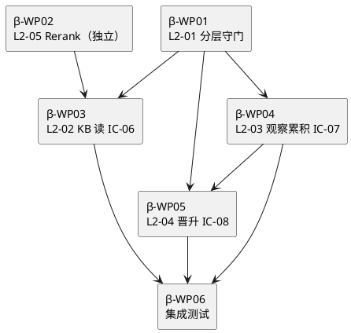

# Dev-β · L1-06 3 层知识库 · Execution Plan

> **本 md 定位**：L1-06 3 层 KB（session / project / global）独立开发组 · 代码 + TDD 同会话完成。
>
> **组一句话**：把 3-1 L1-06 × 5 L2（10800 行 tech-design）+ 3-2 L1-06 × 5 tests（~262 TC）→ Python 代码（~19400 行）· 实现 session/project/global 三层 KB + IC-06 读 + IC-07 写 + IC-08 晋升 + 检索 rerank。
>
> **依赖**：轻（仅 mock IC-09 · Dev-α 未完成前可 mock）。可与 Dev-α 并行启动（波 1）。
>
> **PM-14 特别**：KB 按 `projects/<pid>/kb/` 分片 + `global_kb/` 跨项目共享层 · L2-01 是三层路由守门人。

---

## §0 撰写进度

- [x] §1 组定位 + 5 L2 清单
- [x] §2 源文档导读
- [x] §3 WP 拆解（6 WP · 6.5 天）
- [x] §4 依赖图 + 跨组 mock
- [x] §5 standup + commit 规范（复用标杆 §5）
- [x] §6 自修正触发点（L1-06 特有场景）
- [x] §7 对外契约（IC-06/07/08 mock + 真实）
- [x] §8 DoD（KB 特化 · 跨层隔离 + 晋升原子性）
- [x] §9 风险 + 降级
- [x] §10 交付清单

---

## §1 组定位 + 范围

### 1.1 5 L2 清单

| L2 | 职责 | 3-1 行数 | 估代码 | 估时 | 对外 IC |
|:---:|:---|---:|---:|:---:|:---|
| **L2-01** 3 层分层管理器 | session/project/global tier 分层守门人 · 读 scope 解析 · 写 slot 分配 · 晋升规则 | 2094 | ~3800 | 1.5 天 | 内部 · 被 L2-02/03/04 调 |
| **L2-02** KB 读 | `kb_read(kind, scope, filter)` · IC-06 入口 · 默认 session+project+global merge · rerank | 2102 | ~3800 | 1 天 | **IC-06** |
| **L2-03** 观察累积器 | `kb_write_session` · IC-07 入口 · session 层写 · dedup + schema 校验 | 2006 | ~3600 | 1 天 | **IC-07** |
| **L2-04** KB 晋升仪式执行器 | `kb_promote` · IC-08 入口 · session→project→global 晋升 · 用户审核 | 2301 | ~4200 | 1.5 天 | **IC-08** |
| **L2-05** 检索+Rerank | BM25 + embedding 混合打分 · LRU cache · 跨 L2 打分统一 | 2297 | ~4000 | 1 天 | 内部 · 被 L2-02 调 |
| **合计** | 5 | **10800** | **~19400** | **6 天** | 3 全局 IC |

### 1.2 Out-of-scope

- ❌ 跨 project 共享（除 global_kb 外 · project_id 严格隔离）
- ❌ 外部 KB 同步（Notion / Confluence · V3+）
- ❌ 向量索引（V1 用 embedding ad-hoc · V2+ 用 FAISS/Chroma）

### 1.3 代码目录结构

```
app/l1_06/
├── tier_manager/                # L2-01 · 分层守门
│   ├── manager.py               # TierManager 主类
│   ├── scope_resolver.py        # resolve_read_scope
│   ├── slot_allocator.py        # allocate_session_write_slot
│   ├── promotion_checker.py     # check_promotion_rule
│   ├── expire_scanner.py        # run_expire_scan
│   └── schemas.py
├── reader/                      # L2-02 · KB 读
│   ├── kb_reader.py             # kb_read 主入口
│   ├── multi_tier_merger.py     # session+project+global 合并
│   └── schemas.py
├── observer/                    # L2-03 · 观察累积器
│   ├── accumulator.py           # kb_write_session 主入口
│   ├── dedup.py                 # dedup_key 幂等
│   ├── candidate_pool.py        # session_candidate_pull
│   └── schemas.py
├── promoter/                    # L2-04 · KB 晋升仪式
│   ├── promotion_executor.py    # kb_promote 主入口
│   ├── ritual_runner.py         # 晋升仪式流程
│   ├── approval_gate.py         # 用户审核 gate
│   └── schemas.py
└── retrieval/                   # L2-05 · 检索+Rerank
    ├── bm25_scorer.py
    ├── embedding_scorer.py
    ├── rerank_engine.py
    ├── lru_cache.py
    └── schemas.py
```

---

## §2 源文档导读

### P0 必读

| 文档 | 关键章节 | 用途 |
|:---|:---|:---|
| `docs/2-prd/L1-06 3层知识库/prd.md` | 全文 | session/project/global 定义 · 晋升规则 · GWT |
| `docs/3-1-.../L1-06/architecture.md` | §11 L2 分工 · §5 时序 · §6 按 pid 分片 | L2 协作图 |
| `docs/3-1-.../L1-06/L2-01-3 层分层管理器.md` | §3 5 IC · §11 12 错误码 | 分层守门核心 |
| `docs/3-1-.../L1-06/L2-02-KB 读.md` | §3 IC-06 schema · §4 算法（merge + rerank 触发）| kb_read 实现 |
| `docs/3-1-.../L1-06/L2-03-观察累积器.md` | §3 IC-07 · §4 dedup | session 写 |
| `docs/3-1-.../L1-06/L2-04-KB 晋升仪式执行器.md` | §3 IC-08 · §6 晋升流程 · §11 12 错误码 | kb_promote |
| `docs/3-1-.../L1-06/L2-05-检索+Rerank.md` | §3 · §6 BM25+embedding 混合 | rerank 实现 |
| `docs/3-2-.../L1-06/L2-01~05-tests.md` | 共 ~262 TC · ~257 test_fn | TDD 落地 |
| `docs/3-1-.../integration/ic-contracts.md` | §3.6 IC-06 · §3.7 IC-07 · §3.8 IC-08 | 契约字段级 schema |

### P1 推荐

- `docs/2-prd/L0/projectModel.md` §PM-14（`projects/<pid>/kb/` + `global_kb/` 分片）
- `docs/3-1-.../L1集成/architecture.md` §3.4 L1-06 角色锚点
- `docs/3-3-.../dod-specs/general-dod.md`（DoD 评估 · KB 写的 dedup_key 等）

---

## §3 WP 拆解（6 WP · 6.5 天）

### 3.0 WP 总表

| WP | L2 | 主题 | 前置 | 估时 | 对应 TC |
|:---:|:---:|:---|:---|:---:|:---:|
| β-WP01 | L2-01 | 3 层分层守门 + scope resolver + slot allocator | 无（α IC-09 mock）| 1.5 天 | ~52 |
| β-WP02 | L2-05 | BM25 + embedding + rerank 引擎 | 无（独立）| 1 天 | ~56 |
| β-WP03 | L2-02 | kb_read 主入口 · IC-06 · 多 tier merge | WP01 + WP02 | 1 天 | ~49 |
| β-WP04 | L2-03 | 观察累积器 · IC-07 · dedup · session 写 | WP01 | 1 天 | ~55 |
| β-WP05 | L2-04 | KB 晋升仪式 · IC-08 · approval gate | WP01 + WP04 | 1.5 天 | ~50 |
| β-WP06 | 集成 | 组内 5 L2 联调 · PM-14 跨 pid 隔离 | WP01-05 | 0.5 天 | ≥ 10 |

### 3.1 WP-β-01 · L2-01 3 层分层管理器

**源锚点**：`3-1 L2-01-3 层分层管理器.md §3.1-3.7（5 IC + 12 错误码）· §6 scope 解析算法`

**L3 工作**：
- 实现 `TierManager` · session/project/global 三层路由守门
- `resolve_read_scope(scope_request) -> ResolvedScope`（IC-L2-01）
  - 默认 scope：`session + project + global` 合并
  - 支持 scope filter：`project_only` / `global_only` / `session_only`
  - 跨 pid 硬拒绝（PM-14 约束 · 返错）
- `allocate_session_write_slot(pid, session_id, kind)`（IC-L2-02）
  - 为观察累积器分配 session 层 slot
  - 校验 session quota（每 session ≤ 1000 条 · 防爆炸）
- `check_promotion_rule(entry)`（IC-L2-03）
  - 检查 entry 是否符合晋升条件（score ≥ 阈值 · age ≥ 24h · 被引用 ≥ 3 次）
  - 返 `PromotionEligibility`
- `run_expire_scan(pid)` · 后台任务 · 清理过期 session 层条目
- `activate_project_context(pid)` · project 激活时初始化 KB 目录结构

**L4 代码文件**：
```
app/l1_06/tier_manager/manager.py             ~200 行
app/l1_06/tier_manager/scope_resolver.py      ~150 行
app/l1_06/tier_manager/slot_allocator.py      ~130 行
app/l1_06/tier_manager/promotion_checker.py   ~180 行
app/l1_06/tier_manager/expire_scanner.py      ~150 行
app/l1_06/tier_manager/schemas.py             ~200 行
```

**TDD 流程**：复制 `3-2 L1-06/L2-01-tests.md` → `tests/l1_06/test_l2_01_tier_manager.py`（~51 test_fn · ~52 TC）· 红→绿→重构。

**DoD**：
- [ ] ~52 TC 全绿 · coverage ≥ 80%
- [ ] 12 错误码全覆盖（缺 pid / 跨 pid / slot 超限 / scope 非法 / promotion 规则不过 等）
- [ ] 跨 pid 访问专项测试（2 project fixture · 确认隔离）
- [ ] ruff + mypy 绿
- [ ] commit `feat(harnessFlow-code): β-WP01 L2-01 3 层分层守门`

### 3.2 WP-β-02 · L2-05 检索+Rerank（与 WP01 并行）

**源锚点**：`L2-05 §3.1 rerank · §6 BM25+embedding 混合打分 · §10 LRU cache`

**L3 工作**：
- 实现 `RerankEngine.rerank(query, candidates, top_k) -> ScoredEntry[]`
  - BM25 score（文本相似）
  - embedding cosine score（语义相似）
  - 混合打分公式：`0.4 * bm25 + 0.6 * embedding`（config）
  - LRU cache 对重复 query 命中
- 实现 `reverse_recall(entry_id, top_k)` · 反向召回（给定 entry 找相关）
- 订阅 `stage_transitioned` 事件（L1-02 经 L1-09）· 在 S2/S3/S5 stage 切换时预热 cache
- `push_to_l101` · 主动推送高分结果到 L1-01（决策注入）

**L4 代码**：
```
app/l1_06/retrieval/bm25_scorer.py        ~180 行
app/l1_06/retrieval/embedding_scorer.py   ~200 行（调用豆包 embedding）
app/l1_06/retrieval/rerank_engine.py      ~250 行
app/l1_06/retrieval/lru_cache.py          ~120 行
app/l1_06/retrieval/schemas.py            ~180 行
```

**DoD**：
- [ ] ~56 TC 全绿
- [ ] BM25 独立单测（经典语料验证）
- [ ] embedding mock（不必调真实 API · mock vector）
- [ ] cache 命中率 > 70%（benchmark）
- [ ] commit `feat(harnessFlow-code): β-WP02 L2-05 检索+Rerank`

### 3.3 WP-β-03 · L2-02 KB 读（IC-06 入口）

**源锚点**：`L2-02 §3 IC-06 · §4 kb_read 算法（多 tier merge + rerank 触发）`

**L3 工作**：
- 实现 `kb_read(kind, scope, filter) -> list[KBEntry]`（IC-06）
  - Step 1 · PM-14 校验（project_id 必填 · 除 system scope）
  - Step 2 · 调 L2-01 `resolve_read_scope` 拿三层路径
  - Step 3 · 按 path 扫 jsonl（每 tier 独立 file）
  - Step 4 · filter 过滤（kind · tag · time）
  - Step 5 · 调 L2-05 `rerank` 打分
  - Step 6 · top_k 截断返回
- 支持 scope 组合：
  - 默认 `session+project+global` · 最常用
  - `project_only` · 审计审查用
  - `global_only` · 跨 project 模式参考
- 降级：任一 tier 读失败 · warn + 返其他 tier 结果（不阻塞主 loop · scope §8.6 约束）

**L4 代码**：
```
app/l1_06/reader/kb_reader.py            ~250 行
app/l1_06/reader/multi_tier_merger.py    ~200 行
app/l1_06/reader/schemas.py              ~150 行
```

**DoD**：
- [ ] ~49 TC 全绿
- [ ] IC-06 schema 严格对齐 `ic-contracts.md §3.6`
- [ ] 跨 pid 拒绝测（A project 不能读 B project）
- [ ] 降级测（mock global_kb 读失败 · 仍返 session+project）
- [ ] commit `feat(harnessFlow-code): β-WP03 L2-02 KB 读 IC-06`

### 3.4 WP-β-04 · L2-03 观察累积器（IC-07 入口）

**源锚点**：`L2-03 §3.1 IC-07 kb_write_session · §4 dedup + schema 校验 · §5 crash recovery`

**L3 工作**：
- 实现 `kb_write_session(entry) -> KBWriteAck`（IC-07）
  - Step 1 · schema 校验（entry 必含 kind · content · tags · dedup_key）
  - Step 2 · dedup 检查（同 dedup_key 已存在 · 返原 ack · 幂等）
  - Step 3 · 调 L2-01 `allocate_session_write_slot`
  - Step 4 · 写 `projects/<pid>/kb/session/<session_id>.jsonl`（append + fsync via L1-09 L2-05）
  - Step 5 · 发 IC-09 `L1-06:kb_written`
  - Step 6 · 返 KBWriteAck（entry_id · dedup · written_at）
- `session_candidate_pull` · L2-04 晋升仪式拉候选
- crash recovery：进程重启 · 扫 session jsonl 恢复 in-memory dedup table

**L4 代码**：
```
app/l1_06/observer/accumulator.py        ~250 行
app/l1_06/observer/dedup.py              ~120 行
app/l1_06/observer/candidate_pool.py     ~180 行
app/l1_06/observer/schemas.py            ~180 行
```

**DoD**：
- [ ] ~55 TC 全绿
- [ ] dedup 幂等测（同 key 第二次 write · 返第一次 ack · 无重复落盘）
- [ ] schema 违规返错（缺字段 / 类型错）
- [ ] crash recovery 测（模拟重启 · dedup table 正确重建）
- [ ] commit `feat(harnessFlow-code): β-WP04 L2-03 观察累积器 IC-07`

### 3.5 WP-β-05 · L2-04 KB 晋升仪式

**源锚点**：`L2-04 §3 IC-08 · §6 晋升流程 · §11 12 错误码`

**L3 工作**：
- 实现 `kb_promote(source_id, target_tier) -> PromotionResult`（IC-08）
  - Step 1 · 调 L2-01 `check_promotion_rule` 校验资格
  - Step 2 · `approval_gate`：
    - `auto` 模式（score ≥ 0.95 + 被引用 ≥ 10）· 直接晋升
    - `manual` 模式（默认）· 等用户审核（IC-17 用户决策 · 可异步）
  - Step 3 · 晋升：
    - session → project：copy + 打标 `promoted_from_session_id`
    - project → global：copy + 打标 `promoted_from_pid`（global_kb entry 含 source pid 审计）
  - Step 4 · 原子写（调 L1-09 L2-05 `write_atomic`）
  - Step 5 · 发 IC-09 `L1-06:kb_promoted`
  - Step 6 · 回放支持：晋升失败可 rollback（L1-09 checkpoint 保护）
- 硬约束：
  - 晋升非幂等（每次产新 entry_id）· 但 source_id 冻结（防重复晋升 same source）
  - S7 收尾时批量触发 project → global 晋升

**L4 代码**：
```
app/l1_06/promoter/promotion_executor.py   ~280 行
app/l1_06/promoter/ritual_runner.py        ~200 行
app/l1_06/promoter/approval_gate.py        ~180 行
app/l1_06/promoter/schemas.py              ~180 行
```

**DoD**：
- [ ] ~50 TC 全绿
- [ ] IC-08 schema 对齐 ic-contracts.md
- [ ] 重复晋升 same source 返 `E_ALREADY_PROMOTED`
- [ ] approval gate · auto + manual 双路径测
- [ ] rollback 测（晋升中途 mock 失败 · 状态回滚）
- [ ] commit `feat(harnessFlow-code): β-WP05 L2-04 KB 晋升仪式 IC-08`

### 3.6 WP-β-06 · 组内集成 + PM-14 隔离

**L3 工作**：
- 跨 5 L2 集成测（write → read → promote 全链）
- PM-14 跨 pid 专项（2 project 并发写 · 各自独立读 · global_kb 可共享）
- IC-09 事件全链审计（每次 kb_write / kb_promote 有 event 落盘）

**L4**：`tests/l1_06/integration/test_l1_06_e2e.py` · ≥ 10 TC

**DoD**：
- [ ] 组内集成 10 TC 全绿
- [ ] 跨 pid 隔离 3 TC 绿
- [ ] IC-09 审计链完整

**组完工小结**：6 WP · 6.5 天 · ~19400 行代码 · ~262 TC · 提供 IC-06/07/08 真实接口。

---

## §4 WP 依赖图 + 跨组 mock

### 4.1 组内 WP 依赖



### 4.2 跨组 mock（Dev-β 依赖的外部）

| 外部 IC | 提供方 | 本组 mock 策略 | 替换时机 |
|:---|:---|:---|:---|
| IC-09 append_event | Dev-α L2-01 | mock · 返 `AppendEventResult` dummy | Dev-α WP04 完 · 切真实 |
| L1-09 L2-05 write_atomic | Dev-α L2-05 | mock · 直接写文件 | Dev-α WP01 完 · 切真实 |

### 4.3 Dev-β 对外提供（其他组的 mock 模板）

```python
@pytest.fixture
def mock_kb():
    kb = MagicMock()
    kb.kb_read.return_value = []  # 空结果
    kb.kb_write_session.return_value = MagicMock(entry_id="mock-kb-id", dedup="new")
    kb.kb_promote.return_value = MagicMock(promoted=True, new_entry_id="mock-promoted-id")
    return kb
```

其他组在 Dev-β ready 前用此 mock · ready 后替换真实调用。

---

## §5 standup + commit 规范

**复用** `docs/4-exe-plan/4-1-.../Dev-α-L1-09-resilience-audit.md §5` 完整规范。

**Dev-β 特化 commit prefix**：`β-WPNN`（如 `feat(harnessFlow-code): β-WP03 L2-02 KB 读 IC-06`）。

---

## §6 自修正触发点（L1-06 特有）

复用标杆 §6 的 5 情形 · L1-06 特有可能场景：

- **情形 A · PRD 偏差**：晋升规则"score ≥ 0.95" 实测过严 · 没 entry 能晋升 · 需回改 PRD
- **情形 B · 3-1 不可行**：rerank 混合公式 `0.4*bm25 + 0.6*embedding` 某场景下偏科 · 改 §6 算法
- **情形 C · TDD 错**：tests 断言 "global 层不可写" · 但实际应是"只有 promote 可写 global" · 改 tests
- **情形 D · IC 契约矛盾**：IC-06 scope 字段的语义 · 消费方（L1-01/04）理解与 Dev-β 实现不一致 · 改 ic-contracts.md
- **情形 E · 3-3 监督**：DoD 对 dedup_key 幂等的检查规则未定义 · 走 O 会话补

**审计**：`projects/_correction_log.jsonl` · 记 `triggered_by: Dev-β`。

---

## §7 对外契约 + 替换时机

### 7.1 Dev-β 提供的对外 IC

| IC | 方法签名 | 消费方 |
|:---|:---|:---|
| IC-06 | `kb_read(kind, scope, filter) -> list[KBEntry]` | 多 L1（L1-01 决策 · L1-04 质量环 · L1-05 skill）|
| IC-07 | `kb_write_session(entry) -> KBWriteAck` | 多 L1（所有做观察的）|
| IC-08 | `kb_promote(source_id, target_tier) -> PromotionResult` | L1-02 S7 收尾 + 用户手动晋升（L1-10）|

### 7.2 SLO 承诺

- IC-06 P95 ≤ 500ms（全 tier 合并 + rerank）
- IC-07 P95 ≤ 100ms（session 层 append）
- IC-08 P95 ≤ 200ms（原子晋升）

### 7.3 替换时机

| 消费方 | mock 到 | 切真实 |
|:---|:---|:---|
| L1-01 决策（主-2）| 波 1-4 用 mock | 波 4 集成期 |
| L1-04 质量环（主-1）| mock | 波 4 |
| L1-05 Skill（Dev-γ）| mock | Dev-β WP06 完 |
| L1-10 UI KB 浏览器（Dev-θ2）| mock | 波 3 集成期 |

---

## §8 DoD（KB 特化）

### 8.1 WP 级（复用标杆 §8.1 + 加码）

**L1-06 加码**：
- **跨 tier 隔离**：session 写不污染 project · project 写不污染 global
- **跨 pid 隔离**：PM-14 硬约束（A project 绝不能读写 B project KB · 除 global）
- **dedup 幂等**：同 dedup_key 第二次写不落盘
- **晋升原子性**：晋升失败可完整 rollback

### 8.2 组级 DoD

| 维度 | 判据 | 验证 |
|:---|:---|:---|
| 5 L2 全绿 | `pytest tests/l1_06/ -v` 262 passed | CI |
| coverage | ≥ 85% | `pytest --cov=app/l1_06` |
| 集成 10 TC | `pytest tests/l1_06/integration/` | CI |
| IC-06/07/08 契约 | schema 严格对齐 ic-contracts.md §3.6/7/8 | `scripts/check_ic_schema_conformance.py --l1 06` |
| SLO | IC-06 P95 ≤ 500ms · IC-07 ≤ 100ms · IC-08 ≤ 200ms | `tests/l1_06/perf/bench_*.py` |
| PM-14 隔离 | 2 project 并发写 · 各自独立 | `test_pm14_isolation.py` |
| 跨 tier 隔离 | session 写不污染 project · project 写不污染 global | `test_tier_isolation.py` |

---

## §9 风险 + 降级

### P0 风险

| 风险 | 触发 | 降级 |
|:---|:---|:---|
| **R-β-01** rerank 性能瓶颈 | 大 KB（> 10 万 entry）· rerank 慢 | LRU cache + top_k 截断 + 预过滤（先 BM25 top-200 再 embedding 打分）|
| **R-β-02** 晋升规则实际场景不适用 | auto 阈值太严 / 太松 | 走 §6 情形 A · 改 PRD 阈值 · Dev-β 跟进 |
| **R-β-03** session 层爆炸（> 10000 条/session）| 长 session 不退出 | expire_scanner 定期清 · quota 硬限 |

### P1 风险

- session crash recovery 漏 entry（已在 WP04 DoD 覆盖）
- embedding API 不稳定（豆包 · mock fallback）

---

## §10 交付清单

### 代码文件（~19400 行）

```
app/l1_06/
├── tier_manager/      （L2-01 · 6 文件 · ~1010 行）
├── reader/            （L2-02 · 3 文件 · ~600 行）
├── observer/          （L2-03 · 4 文件 · ~730 行）
├── promoter/          （L2-04 · 4 文件 · ~840 行）
└── retrieval/         （L2-05 · 5 文件 · ~930 行）
```

### 测试文件

```
tests/l1_06/
├── conftest.py
├── test_l2_01_tier_manager.py       (51 test_fn · 52 TC)
├── test_l2_02_kb_reader.py          (48 · 49)
├── test_l2_03_observer.py           (54 · 55)
├── test_l2_04_promoter.py           (49 · 50)
├── test_l2_05_retrieval.py          (55 · 56)
├── integration/
│   ├── test_l1_06_e2e.py            (跨 5 L2 集成)
│   ├── test_ic_06_07_08_contract.py
│   ├── test_pm14_isolation.py
│   └── test_tier_isolation.py
└── perf/
    ├── bench_ic_06_latency.py       (P95 ≤ 500ms)
    ├── bench_ic_07_latency.py       (P95 ≤ 100ms)
    └── bench_rerank.py              (cache 命中率 > 70%)
```

### commit 汇总

```
β-WP01 · L2-01 3 层分层守门         (2 commits)
β-WP02 · L2-05 Rerank               (2)
β-WP03 · L2-02 KB 读 IC-06          (2)
β-WP04 · L2-03 观察累积 IC-07       (2)
β-WP05 · L2-04 晋升 IC-08           (2)
β-WP06 · 集成测试                    (1-2)

总计：11-12 commits
```

### 验收 checklist

- [ ] 6 WP 全 closed
- [ ] pytest 262 passed · coverage ≥ 85%
- [ ] ruff + mypy 绿
- [ ] IC-06/07/08 契约一致性检查绿
- [ ] SLO 3 个 bench 达标
- [ ] PM-14 + tier 隔离测试绿
- [ ] `app/l1_06/README.md` 写了

---

*— Dev-β · L1-06 3 层知识库 · Execution Plan · v1.0 · 2026-04-23 —*
